# COMMON_DOMAIN_MODEL


**metamodel version:** 1.11.0

**version:** None


FINOS Common Domain Model (CDM) — LinkML schema


## Class Diagram

```mermaid
classDiagram
Asset <|-- SpecificAsset
Asset <|-- TransferableProduct
AssetBase <|-- Basket
AssetBase <|-- Cash
AssetBase <|-- Commodity
AssetBase <|-- DigitalAsset
AssetBase <|-- IndexBase
AssetBase <|-- InstrumentBase
AssetDeliveryPeriods <|-- CalculationScheduleDeliveryPeriods
AssetFlowBase <|-- AssetFlow
AssetFlowBase <|-- TransferBase
AvailableInventory <|-- SecurityLocate
BusinessCenterTime <|-- FloatingRateIndexFixingTime
BusinessDayOffset <|-- FloatingRateIndexFixingOffset
BuyerSeller <|-- CancelableProvision
BuyerSeller <|-- ExtendibleProvision
CalculationAndTimingBase <|-- CalculationAndTimingCollateralTransferAgreement
CalculationAndTimingBase <|-- CalculationAndTimingInitialMargin
CalculationAndTimingBase <|-- CalculationAndTimingLegacy
CalculationAndTimingBase <|-- CalculationAndTimingVariationMargin
CalculationPeriodBase <|-- CalculationPeriod
CollateralCriteriaBase <|-- ConcentrationLimitCriteria
CollateralCriteriaBase <|-- EligibleCollateralCriteria
ContactInformation <|-- NoticeContactInformation
ContactInformation <|-- TransferContactInformation
ContactInformationElection <|-- NoticeInformationElection
ContactInformationElection <|-- ProcessAgentElection
ContactInformationElection <|-- TransferInformationElection
ContractBase <|-- CounterpartyPosition
CreditNotation <|-- DirectionRating
CreditNotation <|-- RatingAgencyValue
CreditSupportAgreementElectionsBase <|-- CreditSupportAgreementInitialMarginElections
CreditSupportAgreementElectionsBase <|-- CreditSupportAgreementLegacyElections
CreditSupportAgreementElectionsBase <|-- CreditSupportAgreementVariationMarginElections
CreditSupportObligationsBase <|-- CreditSupportObligationsCollateralTransferAgreement
CreditSupportObligationsBase <|-- CreditSupportObligationsInitialMargin
CreditSupportObligationsBase <|-- CreditSupportObligationsLegacy
CreditSupportObligationsBase <|-- CreditSupportObligationsVariationMargin
DateRange <|-- BusinessDateRange
EquityMasterConfirmation <|-- EquitySwapMasterConfirmation2018
EventInstruction <|-- BusinessEvent
FloatingRate <|-- FloatingRateSpecification
FloatingRateBase <|-- CollateralAgreementFloatingRate
FloatingRateBase <|-- FloatingRate
FloatingRateSpecification <|-- InflationRateSpecification
Frequency <|-- CalculationPeriodFrequency
Frequency <|-- ResetFrequency
Identifier <|-- LocationIdentifier
Identifier <|-- PositionIdentifier
Identifier <|-- TradeIdentifier
IndependentAmountRatings <|-- LegacyIndependentAmountRatingsBased
IndependentAmountRatings <|-- LegacyIndependentAmountRatingsXExposure
IndexBase <|-- CreditIndex
IndexBase <|-- EquityIndex
IndexBase <|-- FloatingRateIndex
IndexBase <|-- ForeignExchangeRateIndex
IndexBase <|-- InflationIndex
IndexBase <|-- OtherIndex
InformationSource <|-- FxInformationSource
InstrumentBase <|-- ListedDerivative
InstrumentBase <|-- Loan
InstrumentBase <|-- Security
InventoryRecord <|-- AvailableInventoryRecord
LegalAgreementBase <|-- LegalAgreement
LimitApplicable <|-- LimitApplicableExtended
MarginCallBase <|-- MarginCallExposure
MarginCallBase <|-- MarginCallIssuance
MarginCallBase <|-- MarginCallResponse
MasterAgreementBase <|-- GlobalMasterRepoAgreement
MasterAgreementBase <|-- GlobalMasterSecuritiesLendingAgreement
MasterAgreementBase <|-- MasterAgreement
MasterConfirmationBase <|-- EquityMasterConfirmation
MeasureBase <|-- Measure
MeasureBase <|-- MeasureSchedule
MeasureSchedule <|-- PriceSchedule
MeasureSchedule <|-- QuantitySchedule
Observable <|-- BasketConstituent
Offset <|-- FxFixingDate
Offset <|-- RelativeDateOffset
PCDeliverableObligationCharac <|-- LoanParticipation
PartialExercise <|-- MultipleExercise
PartyReferencePayerReceiver <|-- IndependentAmount
PayerReceiver <|-- ExerciseFee
PayerReceiver <|-- ExerciseFeeSchedule
PayoutBase <|-- AssetPayout
PayoutBase <|-- CommodityPayout
PayoutBase <|-- CreditDefaultPayout
PayoutBase <|-- FixedPricePayout
PayoutBase <|-- InterestRatePayout
PayoutBase <|-- OptionPayout
PayoutBase <|-- PerformancePayout
PayoutBase <|-- SettlementPayout
Period <|-- BusinessDayOffset
Period <|-- Offset
PositionBase <|-- CollateralPosition
PositionBase <|-- Position
PostingObligationsElection <|-- EligibleCollateralElection
PriceSchedule <|-- Price
Quantity <|-- Money
Quantity <|-- NonNegativeQuantity
QuantitySchedule <|-- NonNegativeQuantitySchedule
QuantitySchedule <|-- Quantity
RateSchedule <|-- SpreadSchedule
RateSchedule <|-- StrikeSchedule
RelativeDateOffset <|-- AdjustedRelativeDateOffset
RelativeDateOffset <|-- RelativeDates
RelativeTimeOffset <|-- RelativeTime
ReturnTerms <|-- PortfolioReturnTerms
ReturnTermsBase <|-- CorrelationReturnTerms
ReturnTermsBase <|-- VarianceReturnTerms
ReturnTermsBase <|-- VolatilityReturnTerms
Schedule <|-- AmountSchedule
SettlementBase <|-- SettlementTerms
SingleValuationDate <|-- MultipleValuationDates
SwapCurveValuation <|-- MakeWholeAmount
Taxonomy <|-- ProductTaxonomy
ThresholdMinimumTransferAmountBase <|-- MinimumTransferAmountRatingsBased
ThresholdMinimumTransferAmountBase <|-- ThresholdMinimumTransferAmountFixedAmount
ThresholdMinimumTransferAmountBase <|-- ThresholdRatingsBased
TradableProduct <|-- Trade
TransferBase <|-- ScheduledTransfer
TransferBase <|-- UnscheduledTransfer
```

## ERD Diagrams


### Component 1 (Account, AccrualFactor, AccrualFactorCalculationTerms...)

```mermaid
erDiagram
Account {
    string accountName  
    string accountNumber  
    AccountTypeEnum accountType  
}
AccrualFactor {

}
AccrualFactorCalculationTerms {
    DayCountFractionEnum dayCountFraction  
    decimal tenorTillMaturity  
}
AdditionalDisruptionEvents {
    boolean changeInLaw  
    AncillaryRoleEnum determiningParty  
    boolean failureToDeliver  
    boolean foreignOwnershipEvent  
    boolean hedgingDisruption  
    boolean increasedCostOfHedging  
    boolean increasedCostOfStockBorrow  
    decimal initialStockLoanRate  
    boolean insolvencyFiling  
    boolean lossOfStockBorrow  
    decimal maximumStockLoanRate  
}
AdditionalFixedPayments {
    boolean interestShortfallReimbursement  
    boolean principalShortfallReimbursement  
    boolean writedownReimbursement  
}
AdditionalObligations {
    string additionalObligations  
    CounterpartyRoleEnum party  
}
AdditionalRepresentation {
    string customElection  
}
AdditionalRepresentationElection {
    string additionalLanguage  
    boolean isApplicable  
    CounterpartyRoleEnum party  
}
AdditionalRepresentations {
    boolean regulatoryComplianceRepresentation  
}
AdditionalRightsEvent {
    boolean isApplicable  
    string qualification  
}
Address {
    string city  
    string country  
    string postalCode  
    string state  
    stringList street  
}
AddressesForTransfer {

}
AdjustableDate {
    date adjustedDate  
    date unadjustedDate  
}
AdjustableDates {
    dateList adjustedDate  
    dateList unadjustedDate  
}
AdjustableOrAdjustedDate {
    date adjustedDate  
    date unadjustedDate  
}
AdjustableOrAdjustedOrRelativeDate {
    date adjustedDate  
    date unadjustedDate  
}
AdjustableOrRelativeDate {

}
AdjustableOrRelativeDates {

}
AdjustableRelativeOrPeriodicDates {

}
AdjustedRelativeDateOffset {
    date adjustedDate  
    BusinessDayConventionEnum businessDayConvention  
    date dateRelativeTo  
    DayTypeEnum dayType  
    PeriodEnum period  
    integer periodMultiplier  
}
AdjustmentFactor {
    decimal value  
}
AdjustmentFactorCalculationTerms {
    string bespokeCalculationFormula  
    decimal dividendRatio  
    decimal shareForRightsRatio  
    decimal shareForShareRatio  
}
AgencyRatingCriteria {
    CreditNotationBoundaryEnum boundary  
    CreditNotationMismatchResolutionEnum mismatchResolution  
    CreditRatingAgencyEnum referenceAgency  
}
Aggregation {
    AggregationSpecificationEnum aggregationType  
    boolean loansCanBeGrouped  
    string otherDetails  
}
AggregationParameters {
    datetime dateTime  
    PositionStatusEnum positionStatus  
    stringList productQualifier  
    boolean totalPosition  
}
Agreement {

}
AgreementName {
    LegalAgreementTypeEnum agreementType  
    BrokerConfirmationTypeEnum brokerConfirmationType  
    ContractualDefinitionsEnumList contractualDefinitionsType  
    CollateralMarginTypeEnum creditSupportAgreementMarginType  
    CreditSupportAgreementTypeEnum creditSupportAgreementType  
    MasterAgreementTypeEnum masterAgreementType  
    MasterConfirmationAnnexTypeEnum masterConfirmationAnnexType  
    MasterConfirmationTypeEnum masterConfirmationType  
    string otherAgreement  
}
AgreementTerms {
    boolean clauseLibrary  
}
AmendmentEffectiveDate {
    string customProvision  
    date date  
    AmendmentEffectiveDateEnum specificDate  
}
AmountOfNetCapital {

}
AmountSchedule {
    stringList currency  
    decimal value  
}
AncillaryEntity {
    AncillaryRoleEnum ancillaryParty  
}
AncillaryParty {
    CounterpartyRoleEnum onBehalfOf  
    AncillaryRoleEnum role  
}
ApplicableRegime {
    string additionalRegime  
    string additionalTerms  
    AdditionalTypeEnum additionalType  
    RegulatoryRegimeEnum regime  
}
AppropriatedCollateralValuation {
    string election  
    boolean isSpecified  
}
AssetAgencyRating {

}
AssetBase {
    AssetTypeEnum assetType  
    boolean isExchangeListed  
}
AssetDeliveryInformation {
    ProductGradeEnumList commodityGrade  
}
AssetDeliveryPeriods {
    date endDate  
    date startDate  
}
AssetDeliveryProfile {
    BankHolidayTreatmentEnum bankHolidaysTreatment  
    LoadTypeEnum loadType  
}
AssetDeliveryProfileBlock {
    DayOfWeekEnumList dayOfWeek  
    time endTime  
    time startTime  
}
AssetFlow {
    ScheduledTransferEnum assetFlowType  
}
AssetFlowBase {

}
AssetIdentifier {
    string identifier  
    AssetIdTypeEnum identifierType  
}
AssetLeg {
    DeliveryMethodEnum deliveryMethod  
}
AssetMaturity {
    MaturityTypeEnum maturityType  
}
AssetPayout {
    AssetPayoutTradeTypeEnum tradeType  
}
AssetType {
    AssetTypeEnum assetType  
    FundProductTypeEnum fundType  
    stringList otherAssetType  
    SecurityTypeEnum securityType  
}
AssignedIdentifier {
    string identifier  
    integer version  
}
AutomaticEarlyTermination {
    boolean fallbackAET  
    boolean indemnity  
}
AutomaticEarlyTerminationElection {
    boolean isApplicable  
}
AutomaticExercise {
    boolean isApplicable  
    decimal thresholdRate  
}
AvailableInventory {
    AvailableInventoryTypeEnum availableInventoryType  
    string comment  
}
AvailableInventoryRecord {
    string comment  
    datetime expirationDateTime  
}
AverageTradingVolume {
    AverageTradingVolumeMethodologyEnum methodology  
}
AveragingCalculation {

}
AveragingCalculationMethod {
    AveragingCalculationMethodEnum calculationMethod  
    boolean isWeighted  
}
AveragingFeature {
    AveragingInOutEnum averagingInOut  
    decimal strikeFactor  
}
AveragingObservationList {

}
AveragingPeriod {
    MarketDisruptionEnum marketDisruption  
}
AveragingSchedule {
    date endDate  
    date startDate  
}
AveragingStrikeFeature {

}
Barrier {

}
BaseAndEligibleCurrency {
    ISOCurrencyCodeEnum baseCurrency  
    string baseCurrencyOther  
    boolean baseCurrencyTerminationCurrency  
    ISOCurrencyCodeEnumList eligibleCurrency  
    boolean eligibleCurrencyInclBaseCurrency  
    string eligibleCurrencyOther  
}
BaseCurrency {
    CurrencyCodeEnum baseCurrency  
    CurrencyCodeEnum baseCurrencyIfOriginalNotFreelyConvertible  
    boolean baseCurrencyMustBeFreelyConvertible  
}
Basket {
    AssetTypeEnum assetType  
    boolean isExchangeListed  
}
BasketConstituent {

}
BasketReferenceInformation {
    stringList basketId  
    string basketName  
    integer mthToDefault  
    integer nthToDefault  
}
BespokeCalculationDate {
    string calculationDateImTerms  
    boolean isApplicable  
}
BespokeCalculationTime {
    boolean asCalculationAgent  
    string bespokeCalculationTimeTerms  
}
BespokeTransferTiming {
    string bespokeTransferTimingTerms  
    boolean isApplicable  
}
BillingInstruction {
    date billingEndDate  
    date billingStartDate  
}
BillingRecord {
    date recordEndDate  
    date recordStartDate  
}
BillingRecordInstruction {
    date recordEndDate  
    date recordStartDate  
    date settlementDate  
}
BillingSummary {
    RecordAmountTypeEnum summaryAmountType  
}
BillingSummaryInstruction {
    RecordAmountTypeEnum summaryAmountType  
}
BondReference {
    boolean conditionPrecedentBond  
    boolean discrepancyClause  
}
BoundedVariance {
    boolean daysInRangeAdjustment  
    decimal lowerBarrier  
    RealisedVarianceMethodEnum realisedVarianceMethod  
    decimal upperBarrier  
}
BusinessCenterTime {
    BusinessCenter businessCenter  
    time hourMinuteTime  
}
BusinessCenters {
    BusinessCenterList businessCenter  
    CommodityBusinessCalendarEnumList commodityBusinessCalendar  
}
BusinessDateRange {
    BusinessDayConventionEnum businessDayConvention  
    date endDate  
    date startDate  
}
BusinessDayAdjustments {
    BusinessDayConventionEnum businessDayConvention  
}
BusinessDayOffset {
    string fixingOffsetDefinition  
    string fixingOffsetReason  
    PeriodEnum period  
    integer periodMultiplier  
}
BusinessEvent {
    string eventQualifier  
    CorporateActionTypeEnum corporateActionIntent  
    date effectiveDate  
    date eventDate  
    EventIntentEnum intent  
}
BusinessUnit {
    string name  
}
BuyerSeller {
    CounterpartyRoleEnum buyer  
    CounterpartyRoleEnum seller  
}
CSADeliveryAmount {
    string additionalLanguage  
    DeliveryReturnAmountEnum deliveryAmount  
}
CSAMinimumTransferAmountVariableSet {
    CreditRatingAgencyEnum name  
    integer amount  
    boolean amountIsInfinity  
    string value  
}
CSAReturnAmount {
    DeliveryReturnAmountEnum returnAmount  
}
CSAThresholdVariableSet {
    CreditRatingAgencyEnum name  
    integer amount  
    string value  
}
CSAValuationDate {
    string additionalLanguage  
    decimal calendarDay  
    ValuationDateDateEnum date  
    ValuationDateDayEnum day  
    ValuationDateFrequencyEnum frequency  
}
CalculateTransferInstruction {
    date date  
}
CalculatedRateDetails {
    decimal aggregateValue  
    decimal aggregateWeight  
    decimal calculatedRate  
    decimalList compoundedGrowth  
    decimalList growthFactor  
    decimalList weightedRates  
}
CalculatedRateObservations {
    dateList observationDates  
    decimalList observedRates  
    decimalList processedRates  
    decimalList weights  
}
CalculationAgent {
    BusinessCenter calculationAgentBusinessCenter  
    AncillaryRoleEnum calculationAgentParty  
    PartyDeterminationEnum calculationAgentPartyEnum  
}
CalculationAgentTerms {
    string bespokeCalculationAgentTerms  
    CalculationValuationAgentPartyEnum party  
}
CalculationAndTimingBase {

}
CalculationAndTimingCollateralTransferAgreement {
    string cashSettlementDay  
    string securitiesSettlementDay  
}
CalculationAndTimingInitialMargin {
    string cashSettlementDay  
    string securitiesSettlementDay  
}
CalculationAndTimingLegacy {

}
CalculationAndTimingVariationMargin {

}
CalculationCurrencyElection {
    string currency  
    boolean isBaseCurrency  
    CounterpartyRoleEnum party  
}
CalculationFrequency {
    BusinessCenterList businessCenter  
    decimal dayOfMonth  
    DayOfWeekEnum dayOfWeek  
    decimal monthOfYear  
    decimal offsetDays  
    decimal weekOfMonth  
}
CalculationPeriod {
    integer calculationPeriodNumberOfDays  
    decimal dayCountYearFraction  
    decimal fixedRate  
    decimal forecastRate  
    decimal notionalAmount  
    date unadjustedEndDate  
    date unadjustedStartDate  
    date adjustedEndDate  
    date adjustedStartDate  
}
CalculationPeriodBase {
    date adjustedEndDate  
    date adjustedStartDate  
}
CalculationPeriodDates {
    date firstCompoundingPeriodEndDate  
    date firstRegularPeriodStartDate  
    date lastRegularPeriodEndDate  
    StubPeriodTypeEnumList stubPeriodType  
}
CalculationPeriodFrequency {
    boolean balanceOfFirstPeriod  
    RollConventionEnum rollConvention  
    PeriodExtendedEnum period  
    integer periodMultiplier  
}
CalculationSchedule {

}
CalculationScheduleDeliveryPeriods {
    date endDate  
    date startDate  
}
CalendarSpread {

}
CancelableProvision {
    CallingPartyEnum callingParty  
    boolean followUpConfirmation  
    CounterpartyRoleEnum buyer  
    CounterpartyRoleEnum seller  
}
CancelableProvisionAdjustedDates {

}
CancellationEvent {
    date adjustedEarlyTerminationDate  
    date adjustedExerciseDate  
}
Cash {
    AssetTypeEnum assetType  
    boolean isExchangeListed  
}
CashCollateralValuationMethod {
    string agreedDiscountRate  
    CsaTypeEnum applicableCsa  
    string cashCollateralCurrency  
    string cashCollateralInterestRate  
    boolean prescribedDocumentationAdjustment  
    PartyDeterminationEnumList protectedParty  
}
CashSettlementTerms {
    boolean accruedInterest  
    CashSettlementMethodEnum cashSettlementMethod  
    boolean fixedSettlement  
    decimal recoveryFactor  
}
CashflowRepresentation {
    boolean cashflowsMatchParameters  
}
CheckEligibilityResult {
    boolean isEligible  
}
Clause {
    string identifier  
    string terms  
}
ClearingInstruction {
    boolean isOpenOffer  
}
ClosedState {
    date activityDate  
    date effectiveDate  
    date lastPaymentDate  
    ClosedStateEnum state  
}
Collateral {

}
CollateralAccessBreach {
    decimal cabEndDate  
    boolean cabEndDateElection  
    string cabEndDateTerms  
    boolean isApplicable  
}
CollateralAgreementFloatingRate {
    boolean compressibleSpread  
    boolean negativeInterest  
}
CollateralBalance {
    CollateralStatusEnum collateralBalanceStatus  
    HaircutIndicatorEnum haircutIndicator  
}
CollateralInterestCalculationParameters {
    BusinessCenterList compoundingBusinessCenter  
    CompoundingTypeEnum compoundingType  
    DayCountFractionEnum dayCountFraction  
    decimal fixedRate  
    boolean inBaseCurrency  
    RoundingFrequencyEnum roundingFrequency  
    decimal withholdingTaxRate  
}
CollateralInterestHandlingParameters {
    boolean accrueInterestOnUnsettledInterest  
    string alternativeProvision  
    AlternativeToInterestAmountEnum alternativeToInterestAmount  
    time cutoffTime  
    boolean includeAccrualInMarginCalc  
    CollateralInterestHandlingEnum interestPaymentHandling  
    boolean netInterestWithMarginCalls  
    boolean netPostedAndHeldInterest  
    boolean onFullReturn  
    boolean onPartialReturn  
    BusinessCenterList paymentBusinessCenter  
}
CollateralInterestNotification {
    DayTypeEnum notificationDayType  
    time notificationTime  
    decimal offset  
    string trigger  
}
CollateralInterestParameters {
    string currency  
    CollateralMarginTypeEnum marginType  
    CounterpartyRoleEnum postingParty  
}
CollateralIssuerType {
    CollateralEntityTypeEnum issuerType  
    SupraNationalIssuerTypeEnum supraNationalType  
}
CollateralManagementAgreement {

}
CollateralManagementAgreementElection {
    string collateralManagementAgreement  
    CounterpartyRoleEnum party  
}
CollateralPortfolio {

}
CollateralPosition {
    CollateralStatusEnum collateralPositionStatus  
}
CollateralProvisions {
    CollateralTypeEnum collateralType  
}
CollateralRounding {
    ISOCurrencyCodeEnum currency  
    decimal deliveryAmount  
    RoundingModeEnum deliveryDirection  
    string other  
    decimal returnAmount  
    RoundingModeEnum returnDirection  
}
CollateralSpecification {
    string definitionOfMarketValueNonStandard  
    ApplicabilityOfElectionEnum failureToDevliverIndemnityApplies  
    ApplicabilityOfElectionEnum nettingObligationsApply  
    boolean standardDefinitionOfMarketValueUsed  
}
CollateralTransferAgreementElections {
    string additionalAmendments  
    string additionalBespokeTerms  
    boolean identifiedCrossCurrencySwap  
    string interpretationTerms  
}
CollateralTransferTiming {

}
CollateralTransferTimingDefinition {
    string additionalLanguage  
    boolean isApplicable  
}
CollateralTreatment {
    boolean isIncluded  
}
CollateralValuationTreatment {
    decimal additionalHaircutPercentage  
    decimal fxHaircutPercentage  
    decimal haircutPercentage  
    decimal marginPercentage  
}
CollateralValueMethod {
    string additionalLanguage  
    ValueCashEnum cashCollateral  
    ValueSecuritiesEnum securitiesCollateral  
}
Commodity {
    string description  
    QuotationSideEnum priceQuoteType  
    AssetTypeEnum assetType  
    boolean isExchangeListed  
}
CommodityPayout {

}
CommodityPriceReturnTerms {
    decimal conversionFactor  
}
CommodityProductDefinition {
    CommodityInformationPublisherEnum commodityInfoPublisher  
    string exchangeId  
}
CommodityReferenceFramework {
    CapacityUnitEnum capacityUnit  
    string commodityName  
    string currency  
    WeatherUnitEnum weatherUnit  
}
Composite {
    DeterminationMethodEnum determinationMethod  
}
ConcentrationLimit {

}
ConcentrationLimitCriteria {
    ConcentrationLimitTypeEnum concentrationLimitType  
    CounterpartyRoleEnumList appliesTo  
    RatingPriorityResolutionEnum ratingPriorityResolution  
    CollateralMarginTypeEnum restrictTo  
}
ConditionsPrecedent {
    ExceptionEnum conditionsPrecedentElection  
    string customProvision  
}
ConstituentWeight {
    decimal basketPercentage  
    decimal openUnits  
}
ContactInformation {
    stringList email  
    stringList webPage  
}
ContactInformationElection {
    CounterpartyRoleEnum partyReference  
}
ContractBase {

}
ContractDetails {
    GoverningLawEnum governingLaw  
}
ContractFormationInstruction {

}
ContractualDefinition {
    date publicationDate  
}
ContractualDefinitionIdentifier {
    ContractualDefinitionsEnum contractualDefinitionType  
    string contractualDefinitionVersion  
}
ContractualMatrix {
    MatrixTermEnum matrixTerm  
    MatrixTypeEnum matrixType  
}
ContractualTermsSupplement {
    ContractualSupplementTypeEnum contractualTermsSupplementType  
    date publicationDate  
}
ControlAgreement {

}
ControlAgreementElections {
    boolean consistencyWithControlAgreement  
    boolean controlAgreementAsCsd  
    CounterpartyRoleEnum party  
    boolean relationshipWithControlAgreement  
}
ControlAgreementNecEvent {

}
ControlAgreementNecEventElection {
    boolean necEvent  
    CounterpartyRoleEnum party  
}
CorporateAction {
    date announcementDate  
    string bespokeEventDescription  
    CorporateActionTypeEnum corporateActionType  
    date exDate  
    date payDate  
    date recordDate  
}
CorrelationReturnTerms {
    integer numberOfDataSeries  
    integer annualizationFactor  
    integer expectedN  
    decimal initialLevel  
    DeterminationMethodEnum initialLevelSource  
    boolean meanAdjustment  
    string performance  
    boolean sharePriceDividendAdjustment  
}
Counterparty {
    CounterpartyRoleEnum role  
}
CounterpartyPosition {
    datetime openDateTime  
}
CounterpartyPositionBusinessEvent {
    CorporateActionTypeEnum corporateActionIntent  
    date effectiveDate  
    date eventDate  
    PositionEventIntentEnum intent  
}
CounterpartyPositionState {

}
CoveredTransactions {
    stringList bespokeCoveredTransactions  
    date inclusionDate  
}
CreditDefaultPayout {

}
CreditEvent {
    date auctionDate  
    CreditEventTypeEnum creditEventType  
    date eventDeterminationDate  
    decimal recoveryPercent  
}
CreditEventNotice {
    BusinessCenter businessCenter  
    CounterpartyRoleEnumList notifyingParty  
}
CreditEvents {
    boolean bankruptcy  
    boolean distressedRatingsDowngrade  
    boolean failureToPayInterest  
    boolean failureToPayPrincipal  
    boolean governmentalIntervention  
    boolean impliedWritedown  
    boolean maturityExtension  
    boolean obligationAcceleration  
    boolean obligationDefault  
    boolean repudiationMoratorium  
    boolean writedown  
}
CreditIndex {
    date indexAnnexDate  
    IndexAnnexSourceEnum indexAnnexSource  
    integer indexAnnexVersion  
    decimal indexFactor  
    integer indexSeries  
    CreditSeniorityEnum seniority  
    string name  
    AssetClassEnum assetClass  
    AssetTypeEnum assetType  
    boolean isExchangeListed  
}
CreditLimitInformation {

}
CreditLimitUtilisation {

}
CreditLimitUtilisationPosition {
    decimal global_  
    decimal longPosition  
    decimal shortPosition  
}
CreditNotation {
    CreditRatingAgencyEnum agency  
    CreditRatingCreditWatchEnum creditWatch  
    string notation  
    CreditRatingOutlookEnum outlook  
    string scale  
}
CreditNotations {

}
CreditRatingDebt {
    string debtType  
}
CreditSupportAgreementElectionsBase {

}
CreditSupportAgreementInitialMarginElections {
    string additionalAmendments  
    string additionalBespokeTerms  
    string clientAssetSourcebookAdditionalLanguage  
    boolean identifiedCrossCurrencySwap  
    string interpretationTerms  
    boolean trustSchemeAddendum  
}
CreditSupportAgreementLegacyElections {
    string exchangeDate  
}
CreditSupportAgreementVariationMarginElections {
    boolean creditSupportOffsets  
    string exchangeDate  
}
CreditSupportAmount {
    string additionalLanguage  
    CreditSupportAmountEnum creditSupportAmount  
}
CreditSupportDocument {

}
CreditSupportDocumentElection {
    string bespokeCreditSuppportDocument  
    CreditSupportDocumentTermsEnum creditSupportDocumentTerms  
}
CreditSupportObligationsBase {

}
CreditSupportObligationsCollateralTransferAgreement {
    string otherEligibleSupportIM  
}
CreditSupportObligationsInitialMargin {
    string otherEligibleSupportIM  
}
CreditSupportObligationsLegacy {

}
CreditSupportObligationsVariationMargin {
    string fxHaircut  
    stringList majorCurrency  
}
CreditSupportProvider {

}
CreditSupportProviderElection {
    string bespokeCreditSuppportProvider  
    CreditSupportProviderTermsEnum creditSupportProviderTerms  
}
Curve {
    CommodityReferencePriceEnum commodityCurve  
}
Custodian {

}
CustodianElection {
    string additionalLanguage  
    LegacyVMCustodianEnum legacyVMCustodian  
    CounterpartyRoleEnum party  
}
CustodianEvent {
    boolean isApplicable  
}
CustodianEventEndDate {

}
CustodianRisk {

}
CustodianRiskElection {
    boolean isSpecified  
    CounterpartyRoleEnum party  
    string qualification  
}
CustodianTerms {

}
CustodyArrangements {
    boolean hasControlAgreementLanguage  
    boolean isCreditSupportDocument  
    string otherProvisions  
}
CustomisableOffset {
    string customProvision  
}
CustomisedWorkflow {
    string itemName  
    string itemValue  
}
DateList {
    dateList date  
}
DateRange {
    date endDate  
    date startDate  
}
DateRelativeToCalculationPeriodDates {

}
DateRelativeToPaymentDates {

}
DateRelativeToValuationDates {

}
DateTimeList {
    datetimeList dateTime  
}
DatedValue {
    date date  
    decimal value  
}
DebtEconomics {
    DebtInterestEnum interest  
    DebtPrincipalEnum principal  
    DebtSeniorityEnum seniority  
}
DebtRedemption {
    RedemptionPartyEnum party  
    PutCallEnum putCall  
    RedemptionTypeEnum redemptionType  
}
DebtType {

}
DeliverableObligations {
    boolean acceleratedOrMatured  
    boolean accruedInterest  
    ObligationCategoryEnum category  
    string excluded  
    boolean fullFaithAndCreditObLiability  
    boolean generalFundObligationLiability  
    boolean listed  
    boolean notBearer  
    boolean notContingent  
    boolean notDomesticIssuance  
    boolean notDomesticLaw  
    boolean notSovereignLender  
    boolean notSubordinated  
    string othReferenceEntityObligations  
    boolean revenueObligationLiability  
    boolean transferable  
}
DeliveryAmount {
    string customElection  
    DeliveryAmountElectionEnum standardElection  
}
DeliveryDateParameters {

}
DemandsAndNotices {
    boolean deemedEffectiveNextLBD  
}
DeterminationMethodology {
    AveragingCalculationMethodEnum averagingMethod  
    DeterminationMethodEnum determinationMethod  
}
DeterminationRolesAndTerms {
    DeterminationRoleEnum determinationRole  
    CounterpartyRoleEnum disputingParty  
    CounterpartyRoleEnumList whoToDetermine  
}
DigitalAsset {
    AssetTypeEnum assetType  
    boolean isExchangeListed  
}
DirectOrRelativeTime {

}
DirectionRating {
    CompareOp direction  
    CreditRatingAgencyEnum agency  
    CreditRatingCreditWatchEnum creditWatch  
    string notation  
    CreditRatingOutlookEnum outlook  
    string scale  
}
DirectionRatingMultiplier {
    decimal exposureMultiplier  
}
DiscountingMethod {
    decimal discountRate  
    DayCountFractionEnum discountRateDayCountFraction  
    DiscountingTypeEnum discountingType  
}
DisputeResolution {
    string alternativeTerms  
    string otherTerms  
}
DistributionAndInterestPayment {

}
DividendApplicability {
    boolean additionalDividends  
    boolean allDividends  
    boolean optionsExchangeDividends  
}
DividendCurrency {
    string currency  
    string currencyReference  
    DeterminationMethodEnum determinationMethod  
}
DividendDateReference {
    DividendDateReferenceEnum dateReference  
}
DividendPaymentDate {

}
DividendPayoutRatio {
    decimal cashRatio  
    decimal nonCashRatio  
    decimal totalRatio  
}
DividendPeriod {

}
DividendReturnTerms {
    DividendAmountTypeEnum dividendAmountType  
    DividendCompositionEnum dividendComposition  
    DividendEntitlementEnum dividendEntitlement  
    boolean dividendReinvestment  
    DividendAmountTypeEnum excessDividendAmount  
    AncillaryRoleEnum extraordinaryDividendsParty  
    DividendPeriodEnum firstOrSecondPeriod  
    boolean materialDividend  
    NonCashDividendTreatmentEnum nonCashDividendTreatment  
    string performance  
    boolean specialDividends  
}
DividendTerms {
    DividendEntitlementEnum dividendEntitlement  
}
EarlyTerminationEvent {
    date adjustedCashSettlementPaymentDate  
    date adjustedCashSettlementValuationDate  
    date adjustedEarlyTerminationDate  
    date adjustedExerciseDate  
    date adjustedExerciseFeePaymentDate  
}
EarlyTerminationProvision {

}
EconomicTerms {
    boolean nonStandardisedTerms  
}
ElectiveAmountElection {
    string customElection  
    ElectiveAmountEnum electiveAmount  
    CounterpartyRoleEnum party  
}
EligibilityQuery {
    ISOCountryCodeEnum assetCountryOfOrigin  
    CurrencyCodeEnum denominatedCurrency  
    decimal maturity  
}
EligibilityToHoldCollateral {
    string custodianCondition  
    boolean custodianEligibility  
    stringList eligibleCountry  
}
EligibleCollateralCriteria {
    CounterpartyRoleEnumList appliesTo  
    RatingPriorityResolutionEnum ratingPriorityResolution  
    CollateralMarginTypeEnum restrictTo  
}
EligibleCollateralElection {
    string otherEligibleSupport  
    string additionalLanguage  
    boolean asPermitted  
    string excludedCollateral  
    CounterpartyRoleEnum party  
}
EligibleCollateralSpecification {

}
EligibleCreditSupport {

}
EnforcementEvent {
    boolean earlyTerminationDate  
    boolean failureToPay  
}
EntityIdentifier {
    string identifier  
    EntityIdentifierTypeEnum identifierType  
}
EquityAdditionalTerms {

}
EquityCorporateEvents {
    ShareExtraordinaryEventEnum shareForCombined  
    ShareExtraordinaryEventEnum shareForOther  
    ShareExtraordinaryEventEnum shareForShare  
}
EquityIndex {
    string name  
    AssetClassEnum assetClass  
    AssetTypeEnum assetType  
    boolean isExchangeListed  
}
EquitySwapMasterConfirmation2018 {
    InterpolationMethodEnum linearInterpolationElection  
    ReturnTypeEnum typeOfSwapElection  
}
EquityType {
    DepositaryReceiptTypeEnum depositaryReceipt  
    EquityTypeEnum equityType  
}
EquityUnderlierProvisions {
    boolean componentSecurityIndexAnnexFallback  
    string localJurisdiction  
    boolean multipleExchangeIndexAnnexFallback  
    string relevantJurisdiction  
}
EscrowArrangement {
    boolean escrowArrangementIsApplicable  
}
EventCurrency {
    string eventCurrency  
}
EventInstruction {
    CorporateActionTypeEnum corporateActionIntent  
    date effectiveDate  
    date eventDate  
    EventIntentEnum intent  
}
EventTimestamp {
    datetime dateTime  
    EventTimestampQualificationEnum qualification  
}
EventsOfDefault {

}
EventsOfDefaultElection {
    ApplicabilityOfElectionEnum automaticEarlyTerminationApplies  
    boolean automaticEarlyTerminationInModifiedForm  
    string automaticEarlyTerminationOther  
    boolean automaticEarlyTerminationRequiredDueToSystemOfLaw  
    boolean automaticEarlyTerminationSpecifiedSeparatelyForEachPrinciple  
    ApplicabilityOfElectionEnum automation  
    ApplicabilityOfElectionEnum existingLoans  
    CounterpartyRoleEnum party  
}
EvergreenProvision {
    datetime noticeDeadlineDateTime  
}
ExcludedProducts {
    BusinessCenterList branch  
    boolean excluded  
    ExposureScopeProductEnumList product  
}
ExecutionDetails {
    ExecutionTypeEnum executionType  
}
ExecutionInstruction {
    date tradeDate  
}
ExecutionLanguage {
    string numberOfOriginals  
    string otherLanguage  
    boolean standardLanguage  
}
ExecutionLocation {
    string dutyPayer  
    string dutyPayerLanguage  
    date dutyPaymentDate  
    string dutyPaymentLanguage  
    ExecutionLocationEnum executionLocation  
    string otherLanguage  
}
ExecutionTerms {

}
ExerciseFee {
    decimal feeAmount  
    decimal feeRate  
    CounterpartyRoleEnum payer  
    CounterpartyRoleEnum receiver  
}
ExerciseFeeSchedule {
    CounterpartyRoleEnum payer  
    CounterpartyRoleEnum receiver  
}
ExerciseInstruction {

}
ExerciseNotice {
    BusinessCenter businessCenter  
    ExerciseNoticeGiverEnum exerciseNoticeGiver  
    AncillaryRoleEnum exerciseNoticeReceiver  
}
ExercisePeriod {

}
ExerciseProcedure {
    boolean followUpConfirmation  
    boolean limitedRightToConfirm  
    boolean splitTicket  
}
ExerciseTerms {
    ExpirationTimeTypeEnum expirationTimeType  
    OptionExerciseStyleEnum style  
}
Exposure {
    datetime calculationDateTime  
    datetime valuationDateTime  
}
ExposureScope {

}
ExtendibleProvision {
    CallingPartyEnum callingParty  
    boolean followUpConfirmation  
    datetime noticeDeadlineDateTime  
    CounterpartyRoleEnum buyer  
    CounterpartyRoleEnum seller  
}
ExtendibleProvisionAdjustedDates {

}
ExtensionEvent {
    date adjustedExerciseDate  
    date adjustedExtendedTerminationDate  
}
ExtraordinaryEvents {
    boolean compositionOfCombinedConsideration  
    NationalizationOrInsolvencyOrDelistingEventEnum delisting  
    boolean failureToDeliver  
    NationalizationOrInsolvencyOrDelistingEventEnum nationalizationOrInsolvency  
}
FailureToPay {
    boolean applicable  
}
FallbackRateParameters {
    date effectiveDate  
    FloatingRateIndexEnum floatingRateIndex  
    decimal spreadAdjustment  
}
FallbackReferencePrice {
    SettlementRateOptionEnumList fallBackSettlementRateOption  
    boolean fallbackSurveyValuationPostponement  
}
FeaturePayment {
    decimal amount  
    string currency  
    decimal levelPercentage  
    TimeTypeEnum time  
}
FinalCalculationPeriodDateAdjustment {
    BusinessDayConventionEnum businessDayConvention  
}
FinalReturns {
    string additionalLanguage  
    boolean applicable  
}
FixedAmountCalculationDetails {
    decimal calculatedAmount  
    decimal fixedRate  
    decimal yearFraction  
}
FixedPrice {

}
FixedPricePayout {

}
FixedRateSpecification {

}
FloatingAmountCalculationDetails {
    decimal appliedRate  
    decimal calculatedAmount  
    decimal spreadExclusiveCalculatedAMount  
    decimal yearFraction  
}
FloatingAmountEvents {
    boolean failureToPayPrincipal  
    boolean impliedWritedown  
    boolean writedown  
}
FloatingAmountProvisions {
    boolean stepUpProvision  
    boolean wacCapInterestProvision  
}
FloatingRate {
    RateTreatmentEnum rateTreatment  
}
FloatingRateBase {

}
FloatingRateCalculationParameters {
    CalculationMethodEnum calculationMethod  
}
FloatingRateDefinition {
    decimal calculatedRate  
    decimal floatingRateMultiplier  
    decimal spread  
}
FloatingRateIndex {
    FloatingRateIndexEnum floatingRateIndex  
    string name  
    AssetClassEnum assetClass  
    AssetTypeEnum assetType  
    boolean isExchangeListed  
}
FloatingRateIndexCalculationDefaults {
    FloatingRateIndexCategoryEnum category  
    DayCountFractionEnum dayCountFraction  
    FloatingRateIndexStyleEnum indexStyle  
    FloatingRateIndexCalculationMethodEnum method  
    BusinessCenter publicationCalendar  
}
FloatingRateIndexDefinition {
    string definitionalSource  
    string deprecationReason  
    boolean designatedMaturityApplicable  
    string fpmlDescription  
    boolean inLoan  
}
FloatingRateIndexExternalMap {
    string externalId  
    string externalStandard  
}
FloatingRateIndexExternalMappings {

}
FloatingRateIndexFixingDetails {

}
FloatingRateIndexFixingOffset {
    string designatedMaturity  
    string fixingOffsetDefinition  
    string fixingOffsetReason  
    PeriodEnum period  
    integer periodMultiplier  
}
FloatingRateIndexFixingTime {
    string designatedMaturity  
    string fixingReason  
    string fixingTimeDefinition  
    BusinessCenter businessCenter  
    time hourMinuteTime  
}
FloatingRateIndexIdentification {
    ISOCurrencyCodeEnum currency  
    FloatingRateIndexEnum floatingRateIndex  
    string froType  
}
FloatingRateIndexMap {
    FloatingRateIndexEnumList index_  
}
FloatingRateIndexMappings {

}
FloatingRateProcessingDetails {
    decimal processedRate  
    decimal rawRate  
    decimal spreadExclusiveRate  
}
FloatingRateProcessingParameters {
    decimal capRate  
    decimal floorRate  
    decimal multiplier  
    NegativeInterestRateTreatmentEnum negativeTreatment  
    decimal spread  
    RateTreatmentEnum treatment  
}
FloatingRateSettingDetails {
    decimal floatingRate  
    date observationDate  
    date resetDate  
}
FloatingRateSpecification {
    AveragingWeightingMethodEnum averagingMethod  
    NegativeInterestRateTreatmentEnum negativeInterestRateTreatment  
    RateTreatmentEnum rateTreatment  
}
ForeignExchangeRateIndex {
    string name  
    AssetClassEnum assetClass  
    AssetTypeEnum assetType  
    boolean isExchangeListed  
}
FrenchLawAddendum {
    boolean isApplicable  
}
FrenchLawAddendumElection {
    string addendumLanguage  
    boolean isApplicable  
    CounterpartyRoleEnum party  
}
Frequency {
    PeriodExtendedEnum period  
    integer periodMultiplier  
}
FroHistory {
    date endDate  
    date startDate  
    date updateDate  
}
FutureValueAmount {
    integer calculationPeriodNumberOfDays  
    string currency  
    date valueDate  
}
FxAdditionalTerms {
    boolean noFaultTermination  
}
FxBenchmarkObligationDefault {
    boolean benchmarkObligationDefaultIsApplicable  
    FxSubstitutionProvisionTypeEnum localSubstituteProvisionType  
    SpecifiedValueEnum specifiedValue  
}
FxDisruptionEvents {
    FxForceMajeureOrActOfSStateEnum forceMajeureOrActOfSState  
    FxIllegalityOrImpossibilityEnum illegalityOrImpossibility  
}
FxDualExchangeRate {
    boolean dualExchangeRateIsApplicable  
}
FxFeature {
    string referenceCurrency  
}
FxFixingDate {
    BusinessDayConventionEnum businessDayConvention  
    DayTypeEnum dayType  
    PeriodEnum period  
    integer periodMultiplier  
}
FxHaircutCurrency {
    string fxDesignatedCurrency  
    boolean isTerminationCurrency  
}
FxInconvertibilityOrNonTransferability {

}
FxInformationSource {
    string sourcePage  
    string sourcePageHeading  
    InformationProviderEnum sourceProvider  
}
FxLinkedNotionalAmount {
    date adjustedFxSpotFixingDate  
    decimal notionalAmount  
    decimal observedFxSpotRate  
    date resetDate  
}
FxLinkedNotionalSchedule {
    string varyingNotionalCurrency  
}
FxPriceSourceDisruption {
    boolean priceSourceDisruptionIsApplicable  
}
FxRate {
    decimal rate  
}
FxRateSourceFixing {

}
FxSettlementRateSource {
    string settlementRateOption  
}
FxSpotRateSource {

}
GeneralInconvertibility {
    boolean generalInconvertibilityIsApplicable  
    FxSubstitutionProvisionTypeEnum localSubstituteProvisionType  
}
GeneralNonTransferability {
    boolean generalNonTransferabilityIsApplicable  
    FxSubstitutionProvisionTypeEnum localSubstituteProvisionType  
}
GeneralSimmElections {

}
GeneralTerms {
    stringList additionalTerm  
    boolean modifiedEquityDelivery  
    boolean substitution  
}
GlobalMasterSecuritiesLendingAgreement {

}
GovernmentalAuthorityDefault {
    boolean governmentalAuthorityDefaultIsApplicable  
    FxSubstitutionProvisionTypeEnum localSubstituteProvisionType  
    SpecifiedValueEnum specifiedValue  
}
GracePeriodExtension {
    boolean applicable  
}
HoldingAndUsingPostedCollateral {
    string additionalLanguage  
}
HoldingAndUsingPostedCollateralElection {
    CounterpartyRoleEnum party  
    boolean useOfPostedCollateral  
}
IdentifiedList {

}
Identifier {
    string issuer  
}
Illiquidity {
    boolean illiquidityIsApplicable  
}
IndependentAmount {

}
IndependentAmountRatings {
    IndependentAmountCompareEnum compare  
    RatedPartyEnum ratedParty  
    RatingTypeEnum ratingType  
}
IndexAdjustmentEvents {
    IndexEventConsequenceEnum indexCancellation  
    IndexEventConsequenceEnum indexDisruption  
    IndexEventConsequenceEnum indexModification  
}
IndexBase {
    string name  
    AssetClassEnum assetClass  
    AssetTypeEnum assetType  
    boolean isExchangeListed  
}
IndexTransitionInstruction {
    date effectiveDate  
}
IneligibleCreditSupport {
    CounterpartyRoleEnumList specifiedParty  
    string totalIneligibilityDate  
    string transferIneligibilityDate  
}
InflationIndex {
    InflationRateIndexEnum inflationRateIndex  
    string name  
    AssetClassEnum assetClass  
    AssetTypeEnum assetType  
    boolean isExchangeListed  
}
InflationRateSpecification {
    InflationCalculationMethodEnum calculationMethod  
    InflationCalculationStyleEnum calculationStyle  
    boolean fallbackBondApplicable  
    FinalPrincipalExchangeCalculationEnum finalPrincipalExchangeCalculation  
    string indexSource  
    decimal initialIndexLevel  
    InterpolationMethodEnum interpolationMethod  
    string mainPublication  
    AveragingWeightingMethodEnum averagingMethod  
    NegativeInterestRateTreatmentEnum negativeInterestRateTreatment  
    RateTreatmentEnum rateTreatment  
}
InformationSource {
    string sourcePage  
    string sourcePageHeading  
    InformationProviderEnum sourceProvider  
}
InitialFixingDate {
    date initialFixingDate  
}
Instruction {

}
InstrumentBase {
    AssetTypeEnum assetType  
    boolean isExchangeListed  
}
InterestAmount {

}
InterestAmountApplication {

}
InterestRateCurve {
    FloatingRateIndexEnum floatingRateIndex  
}
InterestRatePayout {
    CompoundingMethodEnum compoundingMethod  
    DayCountFractionEnum dayCountFraction  
    string fixedAmount  
    string floatingAmount  
    boolean paymentDelay  
    SpreadCalculationMethodEnum spreadCalculationMethod  
}
InterestShortFall {
    boolean compounding  
    InterestShortfallCapEnum interestShortfallCap  
    FloatingRateIndexEnum rateSource  
}
Inventory {

}
InventoryRecord {

}
IssuerAgencyRating {

}
IssuerName {

}
JapaneseSecuritiesProvisions {
    boolean amendmentsToJapaneseProvisions  
    string amendmentsToJapaneseProvisionsTerms  
    boolean clearstreamAmendmentToJapaneseProvisions  
    boolean isApplicable  
    boolean relevantProvisionsElection  
    string relevantProvisionsTerms  
}
JurisdictionRelatedTerms {
    boolean belgianLawSecurityAgreement  
    boolean exclusiveJurisdiction  
    boolean juryWaiver  
}
Lag {

}
LegacyExposureScopeElection {
    string additionalLanguage  
    boolean excludedTransactions  
    CounterpartyRoleEnum party  
}
LegacyIndependentAmount {
    string additionalLanguage  
}
LegacyIndependentAmountParty {
    boolean isApplicable  
    CounterpartyRoleEnum party  
}
LegacyIndependentAmountRatingsBased {
    string currency  
    IndependentAmountCompareEnum compare  
    RatedPartyEnum ratedParty  
    RatingTypeEnum ratingType  
}
LegacyIndependentAmountRatingsXExposure {
    IndependentAmountCompareEnum compare  
    RatedPartyEnum ratedParty  
    RatingTypeEnum ratingType  
}
LegacyResolutionAlternative {
    string additionalLanguage  
    LegacyResolutionAlternativeEnum resolutionAlternative  
}
LegalAgreement {
    date agreementDate  
    date effectiveDate  
}
LegalAgreementBase {
    date agreementDate  
    date effectiveDate  
}
LegalAgreementIdentification {
    GoverningLawEnum governingLaw  
    LegalAgreementPublisherEnum publisher  
    integer vintage  
}
LegalEntity {
    string name  
}
LimitApplicable {
    decimal amountRemaining  
    decimal amountUtilized  
    integer clipSize  
    string currency  
    CreditLimitTypeEnum limitType  
}
LimitApplicableExtended {
    decimal limitAmount  
    decimal limitImpactDueToTrade  
    LimitLevelEnum limitLevel  
    decimal amountRemaining  
    decimal amountUtilized  
    integer clipSize  
    string currency  
    CreditLimitTypeEnum limitType  
}
Lineage {

}
ListedDerivative {
    string deliveryTerm  
    PutCallEnum optionType  
    decimal strike  
    AssetTypeEnum assetType  
    boolean isExchangeListed  
}
Loan {
    date creditAgreementDate  
    string facilityType  
    string lien  
    string tranche  
    AssetTypeEnum assetType  
    boolean isExchangeListed  
}
LoanParticipation {
    string qualifyingParticipationSeller  
    boolean applicable  
    boolean partialCashSettlement  
}
LocationIdentifier {
    CommodityLocationIdentifierTypeEnum locationIdentifierType  
    string issuer  
}
MakeWholeAmount {
    date earlyCallDate  
    InterpolationMethodEnum interpolationMethod  
    FloatingRateIndexEnum floatingRateIndex  
    QuotationSideEnum side  
    decimal spread  
}
MandatoryEarlyTermination {

}
MandatoryEarlyTerminationAdjustedDates {
    date adjustedCashSettlementPaymentDate  
    date adjustedCashSettlementValuationDate  
    date adjustedEarlyTerminationDate  
}
ManualExercise {
    boolean fallbackExercise  
}
MarginApproach {
    MarginApproachEnum marginApproach  
}
MarginCallBase {
    RegIMRoleEnum regIMRole  
    RegMarginTypeEnum regMarginType  
}
MarginCallExposure {
    RegIMRoleEnum regIMRole  
    RegMarginTypeEnum regMarginType  
}
MarginCallInstructionType {
    CallTypeEnum callType  
    boolean visibilityIndicator  
}
MarginCallIssuance {
    RegIMRoleEnum regIMRole  
    RegMarginTypeEnum regMarginType  
}
MarginCallResponse {
    MarginCallResponseTypeEnum marginResponseType  
    RegIMRoleEnum regIMRole  
    RegMarginTypeEnum regMarginType  
}
MarginCallResponseAction {
    MarginCallActionEnum marginCallAction  
}
MasterAgreement {
    boolean nonContractualObligations  
}
MasterAgreementClause {
    string name  
    CounterpartyRoleEnumList counterparty  
    MasterAgreementClauseIdentifierEnum identifer  
    PartyRoleEnumList otherParty  
}
MasterAgreementClauseVariant {
    string name  
    CounterpartyRoleEnumList counterparty  
    MasterAgreementVariantIdentifierEnum identifier  
    PartyRoleEnumList otherParty  
}
MasterAgreementDatedAsOfDate {
    string additionalLanguage  
    date masterAgreementDatedAsOfDate  
}
MasterAgreementElections {

}
MasterAgreementSchedule {

}
MasterAgreementVariableSet {
    string name  
    string value  
}
MaterialChangeInCircumstance {
    boolean materialChangeInCircumstanceIsApplicable  
}
Measure {
    decimal value  
}
MeasureBase {
    decimal value  
}
MeasureSchedule {
    decimal value  
}
Merger {

}
MessageInformation {
    stringList copyTo  
    string messageId  
    string sentBy  
    stringList sentTo  
}
MinimumTransferAmount {

}
MinimumTransferAmountAmendment {
    boolean isApplicable  
}
MinimumTransferAmountElection {
    string other  
    CounterpartyRoleEnum party  
}
MinimumTransferAmountRatingsBased {
    CreditNotationMismatchResolutionEnum compare  
    ISOCurrencyCodeEnum currency  
    string namedAffiliate  
    string namedEntity  
    boolean noRating  
    NotRatedByEnum notRatedBy  
    NumberOfRatingAgenciesEnum numberOfRatingAgencies  
    RatedPartyEnum ratedParty  
    RatingTypeEnum ratingType  
    ZeroEventEnumList event  
    boolean zeroEvent  
}
Money {
    decimal value  
}
MoneyBound {
    boolean inclusive  
}
MoneyRange {

}
MultipleCreditNotations {
    QuantifierEnum condition  
    CreditNotationMismatchResolutionEnum mismatchResolution  
    CreditRatingAgencyEnum referenceAgency  
}
MultipleDebtTypes {
    QuantifierEnum condition  
    stringList debtType  
}
MultipleExercise {
    decimal maximumNotionalAmount  
    integer maximumNumberOfOptions  
    decimal integralMultipleAmount  
    decimal minimumNotionalAmount  
    integer minimumNumberOfOptions  
}
MultipleValuationDates {
    integer businessDaysThereafter  
    integer numberValuationDates  
    integer businessDays  
}
Nationalization {
    boolean assignmentOfClaim  
    boolean nationalizationIsApplicable  
}
NaturalPerson {
    date dateOfBirth  
    string firstName  
    string honorific  
    stringList initial  
    stringList middleName  
    string suffix  
    string surname  
}
NaturalPersonRole {
    NaturalPersonRoleEnumList role  
}
NonDeliverableSubstitute {
    boolean nonDeliverableSubstituteIsApplicable  
}
NonLegalEntity {
    string identifier  
    string identifierType  
}
NonNegativeQuantity {
    decimal value  
}
NonNegativeQuantitySchedule {
    decimal value  
}
NonTransferableProduct {

}
NotDomesticCurrency {
    boolean applicable  
    string currency  
}
NoticeContactInformation {
    string additionalInformation  
    stringList email  
    stringList webPage  
}
NoticeInformationElection {
    CounterpartyRoleEnum partyReference  
}
NotificationTime {
    boolean disputeNotificationReference  
    boolean transferTimingProviso  
}
NotificationTimeElection {
    string customNotification  
    boolean localBusinessDay  
    CounterpartyRoleEnum party  
}
NumberBound {
    boolean inclusive  
    decimal number  
}
NumberRange {

}
Obligations {
    boolean cashSettlementOnly  
    ObligationCategoryEnum category  
    boolean continuity  
    boolean deliveryOfCommitments  
    string designatedPriority  
    string excluded  
    boolean fullFaithAndCreditObLiability  
    boolean generalFundObligationLiability  
    boolean listed  
    boolean notContingent  
    boolean notDomesticIssuance  
    boolean notDomesticLaw  
    boolean notSovereignLender  
    boolean notSubordinated  
    string othReferenceEntityObligations  
    boolean revenueObligationLiability  
}
Observation {

}
ObservationDate {
    date adjustedDate  
    string observationReference  
    date unadjustedDate  
    decimal weight  
}
ObservationDates {

}
ObservationEvent {

}
ObservationIdentifier {
    date observationDate  
}
ObservationInstruction {

}
ObservationParameters {
    decimal observationCapRate  
    decimal observationFloorRate  
}
ObservationSchedule {

}
ObservationShiftCalculation {
    ObservationPeriodDatesEnum calculationBase  
    integer offsetDays  
}
ObservationTerms {
    integer numberOfObservationDates  
    TimeTypeEnum observationTimeType  
}
Offset {
    DayTypeEnum dayType  
    PeriodEnum period  
    integer periodMultiplier  
}
OffsetCalculation {
    integer offsetDays  
}
OneWayProvisions {
    boolean isApplicable  
    CounterpartyRoleEnum postingParty  
}
OptionFeature {

}
OptionPayout {
    OptionTypeEnum optionType  
}
OptionStrike {

}
OptionalEarlyTermination {
    boolean followUpConfirmation  
    boolean mutualEarlyTermination  
}
OptionalEarlyTerminationAdjustedDates {

}
OtherAgreementTerms {
    boolean isSpecified  
    string legalDocument  
}
OtherAgreements {

}
OtherEligibleAndPostedSupport {
    boolean applicableTransfer  
    boolean applicableValue  
}
OtherIndex {
    string description  
    string name  
    AssetClassEnum assetClass  
    AssetTypeEnum assetType  
    boolean isExchangeListed  
}
PCDeliverableObligationCharac {
    boolean applicable  
    boolean partialCashSettlement  
}
ParametricDates {
    DayDistributionEnum dayDistribution  
    decimal dayFrequency  
    DayOfWeekEnumList dayOfWeek  
    DayTypeEnum dayType  
}
PartialExercise {
    decimal integralMultipleAmount  
    decimal minimumNotionalAmount  
    integer minimumNumberOfOptions  
}
Party {
    string name  
}
PartyAgreementIdentifier {

}
PartyChangeInstruction {

}
PartyCustomisedWorkflow {
    string partyName  
}
PartyIdentifier {
    string identifier  
    PartyIdentifierTypeEnum identifierType  
}
PartyOptionTerminationCurrency {
    string bothAffectedTermCurrencyOption  
    TerminationCurrencyConditionEnum terminationCurrencyCondition  
    string terminationCurrencySpecifiedCondition  
}
PartyReferencePayerReceiver {

}
PartyRole {
    PartyRoleEnum role  
}
PartyTerminationCurrencySelection {
    string statedPartyCurrency  
}
PassThrough {

}
PassThroughItem {
    decimal passThroughPercentage  
}
PayerReceiver {
    CounterpartyRoleEnum payer  
    CounterpartyRoleEnum receiver  
}
PaymentCalculationPeriod {
    date adjustedPaymentDate  
    decimal discountFactor  
    date unadjustedPaymentDate  
}
PaymentDateSchedule {

}
PaymentDates {
    date firstPaymentDate  
    date lastRegularPaymentDate  
    PayRelativeToEnum payRelativeTo  
}
PaymentDetail {

}
PaymentDiscounting {
    decimal discountFactor  
}
PaymentRule {

}
PayoutBase {

}
PercentageRule {
    decimal paymentPercent  
}
PerformancePayout {

}
PerformanceValuationDates {
    DeterminationMethodEnum determinationMethod  
    TimeTypeEnum valuationTimeType  
}
Period {
    PeriodEnum period  
    integer periodMultiplier  
}
PeriodBound {
    boolean inclusive  
}
PeriodRange {

}
PeriodicDates {
    DayTypeEnum dayType  
}
PersonIdentifier {
    string country  
    string identifier  
    PersonIdentifierTypeEnum identifierType  
}
PhysicalSettlementPeriod {
    integer businessDays  
    boolean businessDaysNotSpecified  
    integer maximumBusinessDays  
}
PhysicalSettlementTerms {
    boolean clearedPhysicalSettlement  
    boolean escrow  
    AncillaryRoleEnum predeterminedClearingOrganizationParty  
    boolean sixtyBusinessDaySettlementCap  
}
PledgeeRepresentativeRider {
    boolean isApplicable  
    CounterpartyRoleEnum party  
    ExceptionEnum representativeEvent  
    string representativeEventTerms  
    string representativeTerms  
}
Portfolio {

}
PortfolioReturnTerms {

}
PortfolioState {

}
Position {

}
PositionBase {

}
PositionIdentifier {
    TradeIdentifierTypeEnum identifierType  
    string issuer  
}
PostedCreditSupportItem {
    decimal additionalHaircutPercentage  
    decimal fxHaircutPercentage  
    decimal haircutPercentage  
}
PostingObligations {
    CounterpartyRoleEnumList securityProvider  
}
PostingObligationsElection {
    string additionalLanguage  
    boolean asPermitted  
    string excludedCollateral  
    CounterpartyRoleEnum party  
}
Price {
    ArithmeticOperationEnum arithmeticOperator  
    PremiumTypeEnum premiumType  
    PriceExpressionEnum priceExpression  
    PriceSubTypeEnum priceSubType  
    PriceTypeEnum priceType  
    decimal value  
}
PriceComposite {
    ArithmeticOperationEnum arithmeticOperator  
    decimal baseValue  
    decimal operand  
    PriceOperandEnum operandType  
}
PriceMateriality {
    boolean priceMaterialityIsApplicable  
}
PriceQuantity {

}
PriceReturnTerms {
    decimal conversionFactor  
    string performance  
    ReturnTypeEnum returnType  
}
PriceSchedule {
    ArithmeticOperationEnum arithmeticOperator  
    PremiumTypeEnum premiumType  
    PriceExpressionEnum priceExpression  
    PriceSubTypeEnum priceSubType  
    PriceTypeEnum priceType  
    decimal value  
}
PriceSource {
    string pricePublisher  
    string priceSourceHeading  
    string priceSourceLocation  
    time priceSourceTime  
}
PriceSourceDisruption {

}
PricingDates {

}
PrimitiveInstruction {

}
PrincipalPayment {
    decimal discountFactor  
}
PrincipalPaymentSchedule {

}
PrincipalPayments {
    boolean finalPayment  
    boolean initialPayment  
    boolean intermediatePayment  
    stringList varyingLegNotionalCurrency  
}
ProcessAgent {

}
ProcessAgentElection {
    string additionalInformation  
    boolean isApplicable  
    CounterpartyRoleEnum partyReference  
}
ProductIdentifier {
    string identifier  
    ProductIdTypeEnum source  
}
ProductTaxonomy {
    AssetClassEnum primaryAssetClass  
    string productQualifier  
    AssetClassEnumList secondaryAssetClass  
    TaxonomySourceEnum source  
}
ProtectionTerms {

}
PubliclyAvailableInformation {
    stringList publicSource  
    integer specifiedNumber  
    boolean standardPublicSources  
}
Quantity {
    decimal value  
}
QuantityChangeInstruction {
    QuantityChangeDirectionEnum direction  
}
QuantityMultiplier {
    decimal multiplierValue  
}
QuantitySchedule {
    decimal value  
}
Quanto {

}
QuasiGovernmentIssuerType {
    boolean sovereignEntity  
    boolean sovereignRecourse  
}
QuotedCurrencyPair {
    string currency1  
    string currency2  
    QuoteBasisEnum quoteBasis  
}
RateObservation {
    date adjustedFixingDate  
    decimal forecastRate  
    integer observationWeight  
    decimal observedRate  
    date resetDate  
    decimal treatedForecastRate  
    decimal treatedRate  
}
RateSchedule {

}
RatingAgencyAmount {
    decimal amount  
}
RatingAgencyValue {
    RatingTypeEnum ratingType  
    CreditRatingAgencyEnum agency  
    CreditRatingCreditWatchEnum creditWatch  
    string notation  
    CreditRatingOutlookEnum outlook  
    string scale  
}
RatingMultiplier {
    decimal exposureMultiplier  
}
RecalculationOfValue {

}
RecalculationOfValueElection {
    CounterpartyRoleEnum party  
    RecalculationOfValueElectionEnum recalculationOfValueElection  
    string recalculationOfValueTerms  
}
RecallProvision {
    boolean isRecallable  
}
ReferenceBank {
    string referenceBankId  
    string referenceBankName  
}
ReferenceBanks {

}
ReferenceInformation {
    boolean allGuarantees  
    boolean noReferenceObligation  
    boolean referencePolicy  
    boolean securedList  
    boolean unknownReferenceObligation  
}
ReferenceObligation {
    string guarantorReference  
    boolean standardReferenceObligation  
}
ReferencePair {
    EntityTypeEnum entityType  
    boolean noReferenceObligation  
}
ReferencePool {

}
ReferencePoolItem {

}
ReferenceSwapCurve {

}
Regime {
    decimal fallbackToMandatoryMethodDays  
}
RegimeTerms {
    string asSpecified  
    ExceptionEnum isApplicable  
    CounterpartyRoleEnum party  
}
RegionalGovernmentIssuerType {
    boolean sovereignRecourse  
}
RelatedParty {
    PartyRoleEnum role  
}
RelativeDateOffset {
    date adjustedDate  
    BusinessDayConventionEnum businessDayConvention  
    date dateRelativeTo  
    DayTypeEnum dayType  
    PeriodEnum period  
    integer periodMultiplier  
}
RelativeDates {
    integer periodSkip  
    date adjustedDate  
    BusinessDayConventionEnum businessDayConvention  
    date dateRelativeTo  
    DayTypeEnum dayType  
    PeriodEnum period  
    integer periodMultiplier  
}
RelativeTime {
    integer offsetMultiplier  
    TimeUnitEnum offsetTimeUnit  
}
RelativeTimeOffset {
    integer offsetMultiplier  
    TimeUnitEnum offsetTimeUnit  
}
Representations {
    boolean additionalAcknowledgements  
    boolean agreementsRegardingHedging  
    boolean indexDisclaimer  
    boolean nonReliance  
}
Reset {
    date rateRecordDate  
    date resetDate  
}
ResetDates {
    ResetRelativeToEnum resetRelativeTo  
}
ResetFrequency {
    WeeklyRollConventionEnum weeklyRollConvention  
    PeriodExtendedEnum period  
    integer periodMultiplier  
}
ResetInstruction {
    date rateRecordDate  
    date resetDate  
}
ResolutionValue {
    string additionalLanguage  
    ValueCashEnum cash  
    boolean fallback  
    ValueSecuritiesEnum securities  
}
ResolvablePriceQuantity {
    boolean reset  
}
Resource {
    string name  
    string comments  
    string language  
    string mimeType  
    string resourceId  
    ResourceTypeEnum resourceType  
    decimal sizeInBytes  
    string string  
    string url  
}
ResourceLength {
    LengthUnitEnum lengthUnit  
    decimal lengthValue  
}
Restructuring {
    boolean applicable  
    boolean multipleCreditEventNotices  
    boolean multipleHolderObligation  
    RestructuringEnum restructuringType  
}
RetrospectiveEffect {
    string asSpecified  
    ExceptionEnum standardisedException  
}
ReturnAmount {
    string customElection  
    boolean includesDefaultLanguage  
}
ReturnInstruction {

}
ReturnTerms {

}
ReturnTermsBase {
    integer annualizationFactor  
    integer expectedN  
    decimal initialLevel  
    DeterminationMethodEnum initialLevelSource  
    boolean meanAdjustment  
    string performance  
    boolean sharePriceDividendAdjustment  
}
RightsEvents {
    boolean deliveryInLieuRight  
}
RollFeature {
    RollSourceCalendarEnum rollSourceCalendar  
}
Rounding {
    integer precision  
    RoundingDirectionEnum roundingDirection  
}
Schedule {
    decimal value  
}
SchedulePeriod {
    date paymentDate  
}
ScheduledTransfer {
    CorporateActionTypeEnum corporateActionTransferType  
    ScheduledTransferEnum transferType  
}
SecuredDebt {
    AssetBackedEnum assetBacked  
    CollateralizedObligationEnum collateralizedObligation  
    CoveredBondEnum coveredBond  
    PropertyTypeEnum propertyType  
    SecuredTypeEnum securedType  
}
SecuredPartyRightsEvent {
    boolean earlyTerminationDateOptionalLanguage  
    boolean failureToPayEarlyTermination  
}
SecuredPartyRightsEventElection {
    CounterpartyRoleEnum party  
    boolean rightsEvent  
}
Security {
    FundProductTypeEnum fundType  
    SecurityTypeEnum securityType  
    AssetTypeEnum assetType  
    boolean isExchangeListed  
}
SecurityAgreementElections {
    string additionalAmendments  
    string additionalBespokeTerms  
    boolean deliveryInLieuRight  
    boolean fullDischarge  
}
SecurityInterestForObligations {
    SecurityInterestObligationsEnum obligations  
    SecurityInterestObligeeEnum obligee  
    string other  
    CounterpartyRoleEnumList party  
}
SecurityLendingInvoice {
    date billingEndDate  
    date billingStartDate  
}
SecurityLocate {
    AvailableInventoryTypeEnum availableInventoryType  
    string comment  
}
SecurityProviderRightsEvent {
    boolean automaticSetOff  
    string customElection  
    boolean fullDischarge  
    boolean includeCoolingOffLanguage  
}
SecurityProviderRightsEventElection {
    CounterpartyRoleEnum party  
    boolean rightsEvent  
}
SensitivityMethodologies {

}
SensitivityMethodologiesPartyElection {
    CounterpartyRoleEnum party  
}
SensitivityMethodology {
    string customMethodology  
    SensitivitiesEnum specifiedMethodology  
}
SensitivityToEquity {

}
SettledEntityMatrix {
    SettledEntityMatrixSourceEnum matrixSource  
    date publicationDate  
}
SettlementBase {
    SettlementCentreEnum settlementCentre  
    string settlementCurrency  
    SettlementTypeEnum settlementType  
    StandardSettlementStyleEnum standardSettlementStyle  
    TransferSettlementEnum transferSettlementType  
}
SettlementDate {
    integer cashSettlementBusinessDays  
    boolean paymentDelay  
    date valueDate  
}
SettlementPayout {
    string deliveryTerm  
}
SettlementProvision {

}
SettlementRateOption {
    SettlementRateOptionEnum settlementRateOption  
}
SettlementTerms {
    SettlementCentreEnum settlementCentre  
    string settlementCurrency  
    SettlementTypeEnum settlementType  
    StandardSettlementStyleEnum standardSettlementStyle  
    TransferSettlementEnum transferSettlementType  
}
ShapingProvision {

}
SimmCalculationCurrency {

}
SimmException {
    string asSpecified  
    SimmExceptionApplicableEnum simmExceptionApplicable  
    ExceptionEnum standardisedException  
}
SimmVersion {
    string asSpecified  
    boolean isSpecified  
    CounterpartyRoleEnum partyVersion  
}
SinglePostingParty {
    string other  
    CounterpartyRoleEnum party  
}
SingleValuationDate {
    integer businessDays  
}
SovereignAgencyRating {

}
SpecialPurposeVehicleIssuerType {
    CreditRiskEnum creditRisk  
}
SpecificInconvertibility {
    FxSubstitutionProvisionTypeEnum localSubstituteProvisionType  
    stringList relevantClass  
    boolean specificInconvertibilityIsApplicable  
}
SpecificNonTransferability {
    FxSubstitutionProvisionTypeEnum localSubstituteProvisionType  
    stringList relevantClass  
    boolean specificNonTransferabilityIsApplicable  
}
SpecifiedConditionOrAccessCondition {
    string additionalLanguage  
    boolean isApplicable  
}
SpecifiedCurrency {
    boolean applicable  
    string currency  
}
SpecifiedEntities {
    SpecifiedEntityClauseEnum specifiedEntityClause  
}
SpecifiedEntity {
    string materialSubsidiaryTerms  
    string otherSpecifiedEntityTerms  
    SpecifiedEntityTermsEnum specifiedEntityTerms  
}
SpecifiedOrAccessConditionPartyElection {
    AdditionalTerminationEventEnumList additionalTerminationEvent  
    CounterpartyRoleEnum party  
    stringList specifiedAdditionalTerminationEvent  
    CSASpecifiedOrAccessConditionEnumList specifiedOrAccessCondition  
}
SpinOff {

}
SplitInstruction {

}
SpreadSchedule {
    SpreadScheduleTypeEnum spreadScheduleType  
}
StandardizedScheduleInitialMargin {

}
StandardizedScheduleTradeInfo {
    StandardizedScheduleAssetClassEnum assetClass  
    StandardizedScheduleProductClassEnum productClass  
}
State {
    PositionStatusEnum positionState  
}
StockSplitInstruction {
    decimal adjustmentRatio  
    date effectiveDate  
}
StrategyFeature {

}
Strike {
    PayerReceiverEnum buyer  
    PayerReceiverEnum seller  
    decimal strikeRate  
}
StrikeSchedule {
    PayerReceiverEnum buyer  
    PayerReceiverEnum seller  
}
StrikeSpread {
    decimal upperStrikeNumberOfOptions  
}
StubCalculationPeriodAmount {

}
StubFloatingRate {
    FloatingRateIndexEnum floatingRateIndex  
    RateTreatmentEnum rateTreatment  
}
StubPeriod {

}
StubValue {
    decimal stubRate  
}
SubstitutedRegime {
    string additionalRegime  
    RegulatoryRegimeEnum regime  
}
SubstitutedRegimeTerms {
    boolean isApplicable  
    CounterpartyRoleEnum party  
}
Substitution {

}
SubstitutionPartyElection {
    LegacyConsentEnum legacyConsent  
    boolean needsConsent  
    CounterpartyRoleEnum party  
    string specificConsentLanguage  
    string substitutionDateLanguage  
}
SubstitutionProvisions {
    datetime noticeDeadlineDateTime  
    integer numberOfSubstitutionsAllowed  
}
SwapCurveValuation {
    FloatingRateIndexEnum floatingRateIndex  
    QuotationSideEnum side  
    decimal spread  
}
Taxonomy {
    TaxonomySourceEnum source  
}
TaxonomyClassification {
    string description  
    string className  
    integer ordinal  
    string value  
}
TaxonomyValue {
    string name  
}
TelephoneNumber {
    string number  
    TelephoneTypeEnum telephoneNumberType  
}
TerminationCurrency {

}
TerminationCurrencyAmendment {
    boolean isApplicable  
}
TerminationCurrencyElection {
    string currency  
    boolean isSpecified  
    CounterpartyRoleEnumList party  
}
TerminationCurrencySelection {
    string bothAffected  
    string fallbackCurrency  
    string statedCurrency  
}
TerminationProvision {

}
TermsChangeInstruction {
    NotionalAdjustmentEnum adjustment  
}
Threshold {

}
ThresholdElection {
    boolean infinity  
    string other  
    CounterpartyRoleEnum party  
}
ThresholdMinimumTransferAmountFixedAmount {
    ZeroEventEnumList event  
    boolean zeroEvent  
}
ThresholdRatingsBased {
    CreditNotationMismatchResolutionEnum compare  
    ISOCurrencyCodeEnum currency  
    string namedAffiliate  
    string namedEntity  
    boolean noRating  
    NotRatedByEnum notRatedBy  
    NumberOfRatingAgenciesEnum numberOfRatingAgencies  
    RatedPartyEnum ratedParty  
    RatingTypeEnum ratingType  
    ZeroEventEnumList event  
    boolean zeroEvent  
}
TimeRounding {
    TimeUnitEnum roundToUnit  
    RoundingDirectionEnum roundingDirection  
}
TimeZone {
    string location  
    time time  
}
TradableProduct {
    NotionalAdjustmentEnum adjustment  
}
Trade {
    date clearedDate  
    date tradeDate  
    NotionalAdjustmentEnum adjustment  
}
TradeIdentifier {
    TradeIdentifierTypeEnum identifierType  
    string issuer  
}
TradeLot {

}
TradePricingReport {
    FloatingRateIndexEnum discountingIndex  
}
TradeState {

}
Tranche {
    decimal attachmentPoint  
    decimal exhaustionPoint  
    boolean incurredRecoveryApplicable  
}
TransactedPrice {
    decimal initialPoints  
    decimal marketFixedRate  
    decimal marketPrice  
    QuotationStyleEnum quotationStyle  
}
TransactionAdditionalTerms {
    string commoditiesAdditionalTerms  
    string creditAdditionalTerms  
    string digitalAssetAdditionalTerms  
    string interestRateAdditionalTerms  
}
TransferBase {

}
TransferContactInformation {
    string additionalInformation  
    stringList email  
    stringList webPage  
}
TransferInformationElection {
    CounterpartyRoleEnum partyReference  
}
TransferInstruction {

}
TransferSettlementTiming {
    string additionalLanguage  
    CashCTSTimeEnum cashCollateralTransferSettlementTime  
    SecuritiesCTSTimeEnum securititesCollateralTransferSettlementTime  
}
TransferState {
    TransferStatusEnum transferStatus  
}
TransferableProduct {

}
Trigger {
    TriggerTimeTypeEnum triggerTimeType  
    TriggerTypeEnum triggerType  
}
TriggerEvent {

}
UmbrellaAgreement {

}
UmbrellaAgreementParty {
    CounterpartyRoleEnum actingAs  
    UmbrellaPartyRoleEnum partyRole  
}
UmbrellaAgreementSet {
    string additionalLanguage  
}
UnderlierSubstitutionProvision {
    CounterpartyRoleEnum disputingParty  
    CounterpartyRoleEnumList whoMaySubstitute  
}
UnitType {
    CapacityUnitEnum capacityUnit  
    string currency  
    FinancialUnitEnum financialUnit  
    WeatherUnitEnum weatherUnit  
}
UnscheduledTransfer {
    UnscheduledTransferEnum transferType  
}
Valuation {
    decimal delta  
    ValuationTypeEnum method  
    ValuationScopeEnum scope  
    ValuationSourceEnum source  
    datetime timestamp  
    PriceTimingEnum valuationTiming  
}
ValuationAgent {
    string additionalLanguage  
    CalculationValuationAgentPartyEnum party  
    ValuationAgentDeterminationEnum valuationAgent  
}
ValuationCalculationDateLocation {

}
ValuationCalculationDateLocationElection {
    BusinessCenter businessCenter  
    string customLocation  
    CounterpartyRoleEnum party  
}
ValuationDate {

}
ValuationDates {

}
ValuationInstruction {
    boolean replace  
}
ValuationMethod {
    QuotationRateTypeEnum quotationMethod  
    ValuationMethodEnum valuationMethod  
}
ValuationPostponement {
    integer maximumDaysOfPostponement  
}
ValuationSource {

}
ValuationTerms {
    boolean componentSecurityIndexAnnexFallback  
    FPVFinalPriceElectionFallbackEnum fPVFinalPriceElectionFallback  
    boolean futuresPriceValuation  
    boolean multipleExchangeIndexAnnexFallback  
    integer numberOfValuationDates  
    boolean optionsPriceValuation  
}
ValuationTime {
    string additionalLanguage  
    ValuationTimeDayEnum day  
    time hourminutetime  
    BusinessCenterList location  
    ValuationTimeEnum time  
    BusinessCenter timezone  
}
VarianceCapFloor {
    decimal unadjustedVarianceCap  
    boolean varianceCap  
}
VarianceReturnTerms {
    integer annualizationFactor  
    integer expectedN  
    decimal initialLevel  
    DeterminationMethodEnum initialLevelSource  
    boolean meanAdjustment  
    string performance  
    boolean sharePriceDividendAdjustment  
}
Velocity {
    PeriodTimeEnum period  
    integer periodMultiplier  
}
VolatilityCapFloor {
    boolean applicable  
    decimal totalVolatilityCap  
    decimal volatilityCapFactor  
}
VolatilityReturnTerms {
    integer annualizationFactor  
    integer expectedN  
    decimal initialLevel  
    DeterminationMethodEnum initialLevelSource  
    boolean meanAdjustment  
    string performance  
    boolean sharePriceDividendAdjustment  
}
WeightedAveragingObservation {
    datetime dateTime  
    integer observationNumber  
    decimal weight  
}
Workflow {

}
WorkflowState {
    string comment  
    WarehouseIdentityEnum warehouseIdentity  
    WorkflowStatusEnum workflowStatus  
}
WorkflowStep {
    ActionEnum action  
    boolean rejected  
}
WorkflowStepApproval {
    boolean approved  
    string rejectedReason  
}

Account ||--|o Party : "accountBeneficiary, partyReference, servicingParty"
AccrualFactor ||--|o AccrualFactorCalculationTerms : "calculationTerms"
AccrualFactor ||--|| PriceSchedule : "value"
AccrualFactorCalculationTerms ||--|o StubValue : "interpolationTerms"
AdditionalDisruptionEvents ||--}o Clause : "additionalBespokeTerms"
AdditionalRepresentation ||--}| AdditionalRepresentationElection : "partyElection"
AdditionalRepresentations ||--|o AdditionalRepresentation : "additionalRepresentation"
AddressesForTransfer ||--}| TransferInformationElection : "partyElection"
AdjustableDate ||--|o BusinessDayAdjustments : "dateAdjustments, dateAdjustmentsReference"
AdjustableDates ||--|o BusinessDayAdjustments : "dateAdjustments"
AdjustableOrAdjustedDate ||--|o BusinessDayAdjustments : "dateAdjustments"
AdjustableOrAdjustedOrRelativeDate ||--|o BusinessDayAdjustments : "dateAdjustments"
AdjustableOrAdjustedOrRelativeDate ||--|o RelativeDateOffset : "relativeDate"
AdjustableOrRelativeDate ||--|o AdjustableDate : "adjustableDate"
AdjustableOrRelativeDate ||--|o AdjustedRelativeDateOffset : "relativeDate"
AdjustableOrRelativeDates ||--|o AdjustableDates : "adjustableDates"
AdjustableOrRelativeDates ||--|o RelativeDates : "relativeDates"
AdjustableRelativeOrPeriodicDates ||--|o AdjustableDates : "adjustableDates"
AdjustableRelativeOrPeriodicDates ||--|o PeriodicDates : "periodicDates"
AdjustableRelativeOrPeriodicDates ||--|o RelativeDates : "relativeDates"
AdjustedRelativeDateOffset ||--|o BusinessCenters : "businessCenters, businessCentersReference"
AdjustedRelativeDateOffset ||--|o BusinessDayAdjustments : "relativeDateAdjustments"
AdjustmentFactor ||--|o AdjustmentFactorCalculationTerms : "calculationTerms"
AdjustmentFactorCalculationTerms ||--|o AccrualFactor : "accrualFactor"
AdjustmentFactorCalculationTerms ||--|o Merger : "merger"
AdjustmentFactorCalculationTerms ||--|o Price : "lastFixingPriceBeforeAdjustment, rightsSubscriptionPrice"
AdjustmentFactorCalculationTerms ||--|o PriceSchedule : "dividendObservation"
AdjustmentFactorCalculationTerms ||--|o SpinOff : "spinOff"
AgencyRatingCriteria ||--|| CreditNotation : "creditNotation"
AggregationParameters ||--}o NonTransferableProduct : "product"
AggregationParameters ||--}o Party : "party"
AggregationParameters ||--}o Trade : "tradeReference"
Agreement ||--|o CollateralTransferAgreementElections : "collateralTransferAgreementElections"
Agreement ||--|o CreditSupportAgreementElections : "creditSupportAgreementElections"
Agreement ||--|o MasterAgreementElections : "masterAgreementElections"
Agreement ||--|o MasterAgreementSchedule : "masterAgreementSchedule"
Agreement ||--|o SecurityAgreementElections : "securityAgreementElections"
Agreement ||--|o TransactionAdditionalTerms : "transactionAdditionalTerms"
AgreementName ||--}o ContractualMatrix : "contractualMatrix"
AgreementName ||--}o ContractualTermsSupplement : "contractualTermsSupplement"
AgreementTerms ||--|| Agreement : "agreement"
AgreementTerms ||--}| Counterparty : "counterparty"
AmountOfNetCapital ||--|o Money : "amountOfNetCapital"
AmountSchedule ||--}o DatedValue : "datedValue"
AncillaryEntity ||--|o LegalEntity : "legalEntity"
AncillaryParty ||--}| Party : "partyReference"
ApplicableRegime ||--}| RegimeTerms : "regimeTerms"
AssetAgencyRating ||--|| AgencyRatingCriteria : "assetAgencyRating"
AssetBase ||--|o LegalEntity : "exchange"
AssetBase ||--}o LegalEntity : "relatedExchange"
AssetBase ||--}o Taxonomy : "taxonomy"
AssetBase ||--}| AssetIdentifier : "identifier"
AssetDeliveryInformation ||--|o AssetDeliveryPeriods : "periods"
AssetDeliveryInformation ||--|o Quantity : "deliveryCapacity"
AssetDeliveryInformation ||--}o LocationIdentifier : "location"
AssetDeliveryPeriods ||--}o AssetDeliveryProfile : "profile"
AssetDeliveryProfile ||--}o AssetDeliveryProfileBlock : "block"
AssetDeliveryProfileBlock ||--|o Price : "priceTimeIntervalQuantity"
AssetDeliveryProfileBlock ||--|o Quantity : "deliveryCapacity"
AssetFlow ||--|o PaymentDiscounting : "paymentDiscounting"
AssetFlow ||--|| AdjustableOrAdjustedOrRelativeDate : "settlementDate"
AssetFlow ||--|| Asset : "asset"
AssetFlow ||--|| NonNegativeQuantity : "quantity"
AssetFlow ||--|| PayerReceiver : "payerReceiver"
AssetFlowBase ||--|o PaymentDiscounting : "paymentDiscounting"
AssetFlowBase ||--|| AdjustableOrAdjustedOrRelativeDate : "settlementDate"
AssetFlowBase ||--|| Asset : "asset"
AssetFlowBase ||--|| NonNegativeQuantity : "quantity"
AssetLeg ||--|| AdjustableOrRelativeDate : "settlementDate"
AssetMaturity ||--|| PeriodRange : "maturityRange"
AssetPayout ||--|o DividendTerms : "dividendTerms"
AssetPayout ||--|o Money : "minimumFee"
AssetPayout ||--|o PrincipalPayments : "principalPayment"
AssetPayout ||--|o ResolvablePriceQuantity : "priceQuantity"
AssetPayout ||--|o SettlementTerms : "settlementTerms"
AssetPayout ||--|| Asset : "underlier"
AssetPayout ||--|| PayerReceiver : "payerReceiver"
AssetPayout ||--}| AssetLeg : "assetLeg"
AssetType ||--|o DebtType : "debtType"
AssetType ||--|o EquityType : "equityType"
AutomaticEarlyTermination ||--}o AutomaticEarlyTerminationElection : "partyElection"
AutomaticEarlyTerminationElection ||--|| Party : "party"
AvailableInventory ||--|o AssignedIdentifier : "identifer"
AvailableInventory ||--|o MessageInformation : "messageInformation"
AvailableInventory ||--}o AvailableInventoryRecord : "availableInventoryRecord"
AvailableInventory ||--}o Party : "party"
AvailableInventory ||--}o PartyRole : "partyRole"
AvailableInventoryRecord ||--|o DividendTerms : "dividendTerms"
AvailableInventoryRecord ||--|o Price : "interestRate"
AvailableInventoryRecord ||--|o Quantity : "quantity"
AvailableInventoryRecord ||--|| AssignedIdentifier : "identifer"
AvailableInventoryRecord ||--|| Security : "security"
AvailableInventoryRecord ||--}o CollateralProvisions : "collateral"
AvailableInventoryRecord ||--}o PartyRole : "partyRole"
AverageTradingVolume ||--|| Period : "period"
AveragingCalculation ||--|| AveragingCalculationMethod : "averagingMethod"
AveragingCalculation ||--|| Rounding : "precision"
AveragingFeature ||--|o AveragingPeriod : "averagingPeriodIn, averagingPeriodOut"
AveragingFeature ||--|| AveragingCalculation : "averagingCalculation"
AveragingObservationList ||--}| WeightedAveragingObservation : "averagingObservation"
AveragingPeriod ||--|o AveragingObservationList : "averagingObservations"
AveragingPeriod ||--|o DateTimeList : "averagingDateTimes"
AveragingPeriod ||--}o AveragingSchedule : "schedule"
AveragingSchedule ||--|| CalculationPeriodFrequency : "averagingPeriodFrequency"
AveragingStrikeFeature ||--|| AveragingCalculation : "averagingCalculation"
AveragingStrikeFeature ||--|| ObservationTerms : "observationTerms"
Barrier ||--}o TriggerEvent : "knockIn, knockOut"
Basket ||--|o LegalEntity : "exchange"
Basket ||--}o LegalEntity : "relatedExchange"
Basket ||--}o Taxonomy : "taxonomy"
Basket ||--}| AssetIdentifier : "identifier"
Basket ||--}| BasketConstituent : "basketConstituent"
BasketConstituent ||--}o NonNegativeQuantitySchedule : "quantity"
BasketConstituent ||--}o PriceSchedule : "finalValuationPrice, initialValuationPrice, interimValuationPrice"
BasketReferenceInformation ||--|o Tranche : "tranche"
BasketReferenceInformation ||--|| ReferencePool : "referencePool"
BillingInstruction ||--|| Party : "receivingParty, sendingParty"
BillingInstruction ||--}o BillingSummaryInstruction : "billingSummary"
BillingInstruction ||--}| BillingRecordInstruction : "billingRecordInstruction"
BillingRecord ||--|o Money : "minimumFee"
BillingRecord ||--|| TradeState : "tradeState"
BillingRecord ||--|| Transfer : "recordTransfer"
BillingRecordInstruction ||--|| TradeState : "tradeState"
BillingRecordInstruction ||--}| Observation : "observation"
BillingSummary ||--|o Transfer : "summaryTransfer"
BondReference ||--|o FixedRateSpecification : "couponRate"
BondReference ||--|| Security : "bond"
BusinessCenters ||--|o BusinessCenters : "businessCentersReference"
BusinessDateRange ||--|o BusinessCenters : "businessCenters"
BusinessDayAdjustments ||--|o BusinessCenters : "businessCenters"
BusinessDayOffset ||--|o BusinessCenters : "businessCenters"
BusinessEvent ||--|o IdentifiedList : "packageInformation"
BusinessEvent ||--|o TimeZone : "effectiveTime, eventTime"
BusinessEvent ||--}o Instruction : "instruction"
BusinessEvent ||--}o TradeState : "after"
BusinessUnit ||--|o ContactInformation : "contactInformation"
BusinessUnit ||--|o Identifier : "identifier"
CalculateTransferInstruction ||--|o PayerReceiver : "payerReceiver"
CalculateTransferInstruction ||--|o Quantity : "quantity"
CalculateTransferInstruction ||--|| Payout : "payout"
CalculateTransferInstruction ||--|| TradeState : "tradeState"
CalculateTransferInstruction ||--}o Reset : "resets"
CalculatedRateDetails ||--|o CalculatedRateObservations : "observations"
CalculationAndTimingBase ||--|| NotificationTime : "notificationTime"
CalculationAndTimingCollateralTransferAgreement ||--|o BespokeCalculationDate : "bespokeCalculationDate"
CalculationAndTimingCollateralTransferAgreement ||--|o BespokeCalculationTime : "bespokeCalculationTime"
CalculationAndTimingCollateralTransferAgreement ||--|o CalculationAgentTerms : "calculationAgentTerms"
CalculationAndTimingCollateralTransferAgreement ||--|o ValuationCalculationDateLocation : "calculationDateLocation"
CalculationAndTimingCollateralTransferAgreement ||--|| NotificationTime : "notificationTime"
CalculationAndTimingInitialMargin ||--|o BespokeCalculationDate : "bespokeCalculationDate"
CalculationAndTimingInitialMargin ||--|o BespokeCalculationTime : "bespokeCalculationTime"
CalculationAndTimingInitialMargin ||--|| CalculationAgentTerms : "calculationAgentTerms"
CalculationAndTimingInitialMargin ||--|| NotificationTime : "notificationTime"
CalculationAndTimingInitialMargin ||--|| ValuationCalculationDateLocation : "calculationDateLocation"
CalculationAndTimingLegacy ||--|| CSAValuationDate : "valuationDate"
CalculationAndTimingLegacy ||--|| NotificationTime : "notificationTime"
CalculationAndTimingLegacy ||--|| ValuationAgent : "valuationAgent"
CalculationAndTimingLegacy ||--|| ValuationTime : "valuationTime"
CalculationAndTimingVariationMargin ||--|| CSAValuationDate : "valuationDate"
CalculationAndTimingVariationMargin ||--|| NotificationTime : "notificationTime"
CalculationAndTimingVariationMargin ||--|| ValuationAgent : "valuationAgent"
CalculationAndTimingVariationMargin ||--|| ValuationCalculationDateLocation : "valuationDateLocation"
CalculationAndTimingVariationMargin ||--|| ValuationTime : "valuationTime"
CalculationFrequency ||--|| BusinessCenterTime : "dateLocation"
CalculationFrequency ||--|| Period : "period"
CalculationPeriod ||--|o FloatingRateDefinition : "floatingRateDefinition"
CalculationPeriod ||--|o FxLinkedNotionalAmount : "fxLinkedNotionalAmount"
CalculationPeriod ||--|o Money : "forecastAmount"
CalculationPeriodDates ||--|o AdjustableOrRelativeDate : "effectiveDate, firstPeriodStartDate, terminationDate"
CalculationPeriodDates ||--|o BusinessDayAdjustments : "calculationPeriodDatesAdjustments"
CalculationPeriodDates ||--|o CalculationPeriodFrequency : "calculationPeriodFrequency"
CalculationSchedule ||--}| SchedulePeriod : "schedulePeriod"
CalculationScheduleDeliveryPeriods ||--|o Price : "priceTimeIntervalQuantity"
CalculationScheduleDeliveryPeriods ||--|o Quantity : "deliveryCapacity"
CalculationScheduleDeliveryPeriods ||--}o AssetDeliveryProfile : "profile"
CalendarSpread ||--|| AdjustableOrRelativeDate : "expirationDateTwo"
CancelableProvision ||--|o AdjustableOrRelativeDate : "earliestDate, expirationDate"
CancelableProvision ||--|o AdjustableOrRelativeDates : "effectiveDate"
CancelableProvision ||--|o BusinessCenterTime : "earliestCancellationTime, latestCancelationTime"
CancelableProvision ||--|o CancelableProvisionAdjustedDates : "cancelableProvisionAdjustedDates"
CancelableProvision ||--|o ExerciseNotice : "exerciseNotice"
CancelableProvision ||--|o Period : "effectivePeriod"
CancelableProvision ||--|o Transfer : "initialFee"
CancelableProvision ||--|| ExerciseTerms : "exerciseTerms"
CancelableProvision ||--}o FinalCalculationPeriodDateAdjustment : "finalCalculationPeriodDateAdjustment"
CancelableProvisionAdjustedDates ||--}| CancellationEvent : "cancellationEvent"
Cash ||--|o LegalEntity : "exchange"
Cash ||--}o LegalEntity : "relatedExchange"
Cash ||--}o Taxonomy : "taxonomy"
Cash ||--}| AssetIdentifier : "identifier"
CashSettlementTerms ||--|o BusinessCenterTime : "valuationTime"
CashSettlementTerms ||--|o Money : "cashSettlementAmount"
CashSettlementTerms ||--|o ValuationDate : "valuationDate"
CashSettlementTerms ||--|o ValuationMethod : "valuationMethod"
CashflowRepresentation ||--}o PaymentCalculationPeriod : "paymentCalculationPeriod"
CheckEligibilityResult ||--|| EligibilityQuery : "eligibilityQuery"
CheckEligibilityResult ||--|| EligibleCollateralSpecification : "specification"
CheckEligibilityResult ||--}o EligibleCollateralCriteria : "matchingEligibleCriteria"
Clause ||--}o Clause : "subcomponents"
ClearingInstruction ||--|o Party : "clearerParty1, clearerParty2"
ClearingInstruction ||--|| Party : "clearingParty, party1, party2"
ClearingInstruction ||--|| TradeState : "alphaContract"
Collateral ||--|o CollateralProvisions : "collateralProvisions"
Collateral ||--|o IndependentAmount : "independentAmount"
Collateral ||--}o CollateralPortfolio : "collateralPortfolio"
Collateral ||--}o Identifier : "portfolioIdentifier"
CollateralAgreementFloatingRate ||--|o InterestRateIndex : "rateOption"
CollateralAgreementFloatingRate ||--|o SpreadSchedule : "spreadSchedule"
CollateralAgreementFloatingRate ||--|o StrikeSchedule : "capRateSchedule, floorRateSchedule"
CollateralBalance ||--|| Money : "amountBaseCurrency"
CollateralBalance ||--|| PartyReferencePayerReceiver : "payerReceiver"
CollateralInterestCalculationParameters ||--|o CollateralAgreementFloatingRate : "floatingRate"
CollateralInterestCalculationParameters ||--|o Rounding : "rounding"
CollateralInterestHandlingParameters ||--|o CollateralInterestNotification : "notification"
CollateralInterestHandlingParameters ||--|o InterestAmountApplication : "interestAmountApplication"
CollateralInterestHandlingParameters ||--|o NumberBound : "interestRolloverLimit, writeoffLimit"
CollateralInterestParameters ||--|o CalculationFrequency : "interestCalculationFrequency"
CollateralInterestParameters ||--|o CollateralInterestCalculationParameters : "interestCalculationParameters"
CollateralInterestParameters ||--|o CollateralInterestHandlingParameters : "interestHandlingParameters"
CollateralIssuerType ||--|o QuasiGovernmentIssuerType : "quasiGovernmentType"
CollateralIssuerType ||--|o RegionalGovernmentIssuerType : "regionalGovernmentType"
CollateralIssuerType ||--|o SpecialPurposeVehicleIssuerType : "specialPurposeVehicleType"
CollateralManagementAgreement ||--}| CollateralManagementAgreementElection : "partyElection"
CollateralPortfolio ||--|o Identifier : "portfolioIdentifier"
CollateralPortfolio ||--|o LegalAgreement : "legalAgreement"
CollateralPortfolio ||--}o CollateralBalance : "collateralBalance"
CollateralPortfolio ||--}o CollateralPosition : "collateralPosition"
CollateralPosition ||--|o Asset : "asset"
CollateralPosition ||--|o CollateralTreatment : "treatment"
CollateralPosition ||--|o Money : "cashBalance"
CollateralPosition ||--|o Product : "product"
CollateralPosition ||--|o TradeState : "tradeReference"
CollateralPosition ||--}| PriceQuantity : "priceQuantity"
CollateralProvisions ||--|o SubstitutionProvisions : "substitutionProvisions"
CollateralProvisions ||--}o EligibleCollateralCriteria : "eligibleCollateral"
CollateralSpecification ||--|| Aggregation : "aggregation"
CollateralSpecification ||--|| BusinessCenterTime : "notificationTime"
CollateralTransferAgreementElections ||--|o AdditionalRepresentations : "additionalRepresentations"
CollateralTransferAgreementElections ||--|o AddressesForTransfer : "addressesForTransfer"
CollateralTransferAgreementElections ||--|o ConditionsPrecedent : "conditionsPrecedent"
CollateralTransferAgreementElections ||--|o CustodyArrangements : "custodyArrangements"
CollateralTransferAgreementElections ||--|o DemandsAndNotices : "demandsAndNotices"
CollateralTransferAgreementElections ||--|o FinalReturns : "finalReturns"
CollateralTransferAgreementElections ||--|o FxHaircutCurrency : "fxHaircutCurrency"
CollateralTransferAgreementElections ||--|o GeneralSimmElections : "generalSimmElections"
CollateralTransferAgreementElections ||--|o JurisdictionRelatedTerms : "jurisdictionRelatedTerms"
CollateralTransferAgreementElections ||--|o OtherAgreements : "otherAgreements"
CollateralTransferAgreementElections ||--|o PledgeeRepresentativeRider : "pledgeeRepresentativeRider"
CollateralTransferAgreementElections ||--|o ProcessAgent : "processAgent"
CollateralTransferAgreementElections ||--|o RightsEvents : "rightsEvents"
CollateralTransferAgreementElections ||--|o Substitution : "substitution"
CollateralTransferAgreementElections ||--|| BaseAndEligibleCurrency : "baseAndEligibleCurrency"
CollateralTransferAgreementElections ||--|| CalculationAndTimingCollateralTransferAgreement : "calculationAndTiming"
CollateralTransferAgreementElections ||--|| CreditSupportObligationsCollateralTransferAgreement : "creditSupportObligations"
CollateralTransferAgreementElections ||--|| DisputeResolution : "disputeResolution"
CollateralTransferAgreementElections ||--|| MinimumTransferAmountAmendment : "minimumTransferAmountAmendment"
CollateralTransferAgreementElections ||--|| OneWayProvisions : "oneWayProvisions"
CollateralTransferAgreementElections ||--|| PostingObligations : "postingObligations"
CollateralTransferAgreementElections ||--|| Regime : "regime"
CollateralTransferAgreementElections ||--|| SensitivityMethodologies : "sensitivityMethodologies"
CollateralTransferAgreementElections ||--|| TerminationCurrencyAmendment : "terminationCurrencyAmendment"
CollateralTransferAgreementElections ||--}o SubstitutedRegime : "substitutedRegime"
CollateralTransferTiming ||--|o CollateralTransferTimingDefinition : "collateralTransferTimingDefinition"
CollateralTransferTiming ||--|o TransferSettlementTiming : "transferSettlementTiming"
CollateralTreatment ||--|o CollateralValuationTreatment : "valuationTreatment"
CollateralTreatment ||--}o ConcentrationLimit : "concentrationLimit"
Commodity ||--|o CommodityProductDefinition : "commodityProductDefinition"
Commodity ||--|o DeliveryDateParameters : "deliveryDateReference"
Commodity ||--|o LegalEntity : "exchange"
Commodity ||--}o LegalEntity : "relatedExchange"
Commodity ||--}o Taxonomy : "taxonomy"
Commodity ||--}| AssetIdentifier : "identifier"
CommodityPayout ||--|o AssetDeliveryInformation : "delivery"
CommodityPayout ||--|o AveragingCalculation : "averagingFeature"
CommodityPayout ||--|o CalculationPeriodDates : "calculationPeriodDates"
CommodityPayout ||--|o CalculationSchedule : "schedule"
CommodityPayout ||--|o CommodityPriceReturnTerms : "commodityPriceReturnTerms"
CommodityPayout ||--|o FxFeature : "fxFeature"
CommodityPayout ||--|o PrincipalPayments : "principalPayment"
CommodityPayout ||--|o ResolvablePriceQuantity : "priceQuantity"
CommodityPayout ||--|o SettlementTerms : "settlementTerms"
CommodityPayout ||--|| PayerReceiver : "payerReceiver"
CommodityPayout ||--|| PaymentDates : "paymentDates"
CommodityPayout ||--|| PricingDates : "pricingDates"
CommodityPayout ||--|| Underlier : "underlier"
CommodityPriceReturnTerms ||--|o RollFeature : "rollFeature"
CommodityPriceReturnTerms ||--|o Rounding : "rounding"
CommodityPriceReturnTerms ||--|o SpreadSchedule : "spread"
CommodityProductDefinition ||--|o PriceSource : "priceSource"
CommodityProductDefinition ||--|| CommodityReferenceFramework : "referenceFramework"
Composite ||--|o BusinessCenterTime : "fixingTime"
Composite ||--|o FxSpotRateSource : "fxSpotRateSource"
Composite ||--|o RelativeDateOffset : "relativeDate"
ConcentrationLimit ||--|o ConcentrationLimitCriteria : "concentrationLimitCriteria"
ConcentrationLimit ||--|o MoneyRange : "valueLimit"
ConcentrationLimit ||--|o NumberRange : "percentageLimit"
ConcentrationLimitCriteria ||--|o AverageTradingVolume : "averageTradingVolume"
ConcentrationLimitCriteria ||--|o CollateralCriteria : "collateralCriteria"
ConditionsPrecedent ||--|o SpecifiedConditionOrAccessCondition : "specifiedConditionOrAccessCondition"
ContactInformation ||--}o Address : "address"
ContactInformation ||--}o TelephoneNumber : "telephone"
ContactInformationElection ||--|o ContactInformation : "primaryContactInformation"
ContractBase ||--|o Collateral : "collateral"
ContractBase ||--|o ContractDetails : "contractDetails"
ContractBase ||--|o ExecutionDetails : "executionDetails"
ContractDetails ||--}o LegalAgreement : "documentation"
ContractFormationInstruction ||--}o LegalAgreement : "legalAgreement"
ContractualDefinition ||--|o ContractualDefinitionIdentifier : "contractualDefinitionIdentifier"
ContractualDefinition ||--|o Identifier : "identifier"
ControlAgreement ||--}| ControlAgreementElections : "partyElection"
ControlAgreementNecEvent ||--}| ControlAgreementNecEventElection : "controlAgreementNecEventElection"
CorporateAction ||--|o AdjustmentFactor : "adjustmentFactor"
CorporateAction ||--|o InformationSource : "informationSource"
CorporateAction ||--|o PriceSchedule : "dividendObservation"
CorporateAction ||--|| Underlier : "underlier"
CorrelationReturnTerms ||--|o DividendApplicability : "dividendApplicability"
CorrelationReturnTerms ||--|o EquityUnderlierProvisions : "equityUnderlierProvisions"
CorrelationReturnTerms ||--|o NumberRange : "boundedCorrelation"
CorrelationReturnTerms ||--|| Price : "correlationStrikePrice"
CorrelationReturnTerms ||--|| ValuationTerms : "valuationTerms"
Counterparty ||--|| Party : "partyReference"
CounterpartyPosition ||--|o Collateral : "collateral"
CounterpartyPosition ||--|o ContractDetails : "contractDetails"
CounterpartyPosition ||--|o ExecutionDetails : "executionDetails"
CounterpartyPosition ||--|| TradableProduct : "positionBase"
CounterpartyPosition ||--}o Party : "party"
CounterpartyPosition ||--}o PartyRole : "partyRole"
CounterpartyPosition ||--}o PositionIdentifier : "positionIdentifier"
CounterpartyPosition ||--}o TradeState : "tradeReference"
CounterpartyPositionBusinessEvent ||--|o IdentifiedList : "packageInformation"
CounterpartyPositionBusinessEvent ||--}o CounterpartyPositionState : "after"
CounterpartyPositionState ||--|o State : "state"
CounterpartyPositionState ||--|| CounterpartyPosition : "counterpartyPosition"
CounterpartyPositionState ||--}o ObservationEvent : "observationHistory"
CounterpartyPositionState ||--}o Valuation : "valuationHistory"
CoveredTransactions ||--|o ExposureScope : "exposure"
CoveredTransactions ||--}o AdditionalObligations : "additionalObligations"
CoveredTransactions ||--}o ProductTaxonomy : "coveredTransactions"
CreditDefaultPayout ||--|o PrincipalPayments : "principalPayment"
CreditDefaultPayout ||--|o ResolvablePriceQuantity : "priceQuantity"
CreditDefaultPayout ||--|o SettlementTerms : "settlementTerms"
CreditDefaultPayout ||--|o TransactedPrice : "transactedPrice"
CreditDefaultPayout ||--|| GeneralTerms : "generalTerms"
CreditDefaultPayout ||--|| PayerReceiver : "payerReceiver"
CreditDefaultPayout ||--}o ProtectionTerms : "protectionTerms"
CreditEvent ||--|o Price : "finalPrice"
CreditEvent ||--|| ReferenceInformation : "referenceInformation"
CreditEvent ||--}o Resource : "publiclyAvailableInformation"
CreditEventNotice ||--|o PubliclyAvailableInformation : "publiclyAvailableInformation"
CreditEvents ||--|o CreditEventNotice : "creditEventNotice"
CreditEvents ||--|o FailureToPay : "failureToPay"
CreditEvents ||--|o Money : "defaultRequirement"
CreditEvents ||--|o Restructuring : "restructuring"
CreditIndex ||--|o LegalEntity : "exchange, provider"
CreditIndex ||--|o SettledEntityMatrix : "settledEntityMatrix"
CreditIndex ||--|o Tranche : "tranche"
CreditIndex ||--}o LegalEntity : "relatedExchange"
CreditIndex ||--}o ReferenceInformation : "excludedReferenceEntity"
CreditIndex ||--}o Taxonomy : "taxonomy"
CreditIndex ||--}| AssetIdentifier : "identifier"
CreditLimitInformation ||--}| LimitApplicableExtended : "limitApplicable"
CreditLimitUtilisation ||--|o CreditLimitUtilisationPosition : "executed, pending"
CreditNotation ||--|o CreditRatingDebt : "debt"
CreditNotations ||--|o CreditNotation : "creditNotation"
CreditNotations ||--|o MultipleCreditNotations : "creditNotations"
CreditRatingDebt ||--|o MultipleDebtTypes : "debtTypes"
CreditSupportAgreementElectionsBase ||--|o AdditionalRepresentations : "additionalRepresentations"
CreditSupportAgreementElectionsBase ||--|o ConditionsPrecedent : "conditionsPrecedent"
CreditSupportAgreementElectionsBase ||--|o DemandsAndNotices : "demandsAndNotices"
CreditSupportAgreementElectionsBase ||--|o DistributionAndInterestPayment : "distributionAndInterestPayment"
CreditSupportAgreementElectionsBase ||--|o HoldingAndUsingPostedCollateral : "holdingAndUsingPostedCollateral"
CreditSupportAgreementElectionsBase ||--|o MasterAgreementDatedAsOfDate : "masterAgreementDatedAsOfDate"
CreditSupportAgreementElectionsBase ||--|o OtherEligibleAndPostedSupport : "otherEligibleAndPostedSupport"
CreditSupportAgreementElectionsBase ||--|o Substitution : "substitution"
CreditSupportAgreementElectionsBase ||--|| BaseAndEligibleCurrency : "baseAndEligibleCurrency"
CreditSupportAgreementElectionsBase ||--|| DisputeResolution : "disputeResolution"
CreditSupportAgreementElectionsBase ||--|| FinalReturns : "finalReturns"
CreditSupportAgreementInitialMarginElections ||--|o AdditionalRepresentations : "additionalRepresentations"
CreditSupportAgreementInitialMarginElections ||--|o AppropriatedCollateralValuation : "appropriatedCollateralValuation"
CreditSupportAgreementInitialMarginElections ||--|o ConditionsPrecedent : "conditionsPrecedent"
CreditSupportAgreementInitialMarginElections ||--|o CoveredTransactions : "coveredTransactions"
CreditSupportAgreementInitialMarginElections ||--|o CustodyArrangements : "custodyArrangements"
CreditSupportAgreementInitialMarginElections ||--|o DemandsAndNotices : "demandsAndNotices"
CreditSupportAgreementInitialMarginElections ||--|o DistributionAndInterestPayment : "distributionAndInterestPayment"
CreditSupportAgreementInitialMarginElections ||--|o FxHaircutCurrency : "fxHaircutCurrency"
CreditSupportAgreementInitialMarginElections ||--|o GeneralSimmElections : "generalSimmElections"
CreditSupportAgreementInitialMarginElections ||--|o HoldingAndUsingPostedCollateral : "holdingAndUsingPostedCollateral"
CreditSupportAgreementInitialMarginElections ||--|o JurisdictionRelatedTerms : "jurisdictionRelatedTerms"
CreditSupportAgreementInitialMarginElections ||--|o MasterAgreementDatedAsOfDate : "masterAgreementDatedAsOfDate"
CreditSupportAgreementInitialMarginElections ||--|o OtherAgreements : "otherAgreements"
CreditSupportAgreementInitialMarginElections ||--|o OtherEligibleAndPostedSupport : "otherEligibleAndPostedSupport"
CreditSupportAgreementInitialMarginElections ||--|o Substitution : "substitution"
CreditSupportAgreementInitialMarginElections ||--|| BaseAndEligibleCurrency : "baseAndEligibleCurrency"
CreditSupportAgreementInitialMarginElections ||--|| CalculationAndTimingInitialMargin : "calculationAndTiming"
CreditSupportAgreementInitialMarginElections ||--|| CreditSupportObligationsInitialMargin : "creditSupportObligations"
CreditSupportAgreementInitialMarginElections ||--|| DisputeResolution : "disputeResolution"
CreditSupportAgreementInitialMarginElections ||--|| FinalReturns : "finalReturns"
CreditSupportAgreementInitialMarginElections ||--|| MinimumTransferAmountAmendment : "minimumTransferAmountAmendment"
CreditSupportAgreementInitialMarginElections ||--|| OneWayProvisions : "oneWayProvisions"
CreditSupportAgreementInitialMarginElections ||--|| PostingObligations : "postingObligations"
CreditSupportAgreementInitialMarginElections ||--|| ProcessAgent : "processAgent"
CreditSupportAgreementInitialMarginElections ||--|| Regime : "regime"
CreditSupportAgreementInitialMarginElections ||--|| RightsEvents : "rightsEvents"
CreditSupportAgreementInitialMarginElections ||--|| SensitivityMethodologies : "sensitivityMethodologies"
CreditSupportAgreementInitialMarginElections ||--|| TerminationCurrencyAmendment : "terminationCurrencyAmendment"
CreditSupportAgreementInitialMarginElections ||--}o SubstitutedRegime : "substitutedRegime"
CreditSupportAgreementLegacyElections ||--|o AdditionalRepresentations : "additionalRepresentations"
CreditSupportAgreementLegacyElections ||--|o AddressesForTransfer : "addressesForTransfer"
CreditSupportAgreementLegacyElections ||--|o ConditionsPrecedent : "conditionsPrecedent"
CreditSupportAgreementLegacyElections ||--|o DemandsAndNotices : "demandsAndNotices"
CreditSupportAgreementLegacyElections ||--|o DistributionAndInterestPayment : "distributionAndInterestPayment"
CreditSupportAgreementLegacyElections ||--|o HoldingAndUsingPostedCollateral : "holdingAndUsingPostedCollateral"
CreditSupportAgreementLegacyElections ||--|o MasterAgreementDatedAsOfDate : "masterAgreementDatedAsOfDate"
CreditSupportAgreementLegacyElections ||--|o OtherEligibleAndPostedSupport : "otherEligibleAndPostedSupport"
CreditSupportAgreementLegacyElections ||--|o SecurityInterestForObligations : "securityInterestForObligations"
CreditSupportAgreementLegacyElections ||--|o SinglePostingParty : "singlePostingParty"
CreditSupportAgreementLegacyElections ||--|o Substitution : "substitution"
CreditSupportAgreementLegacyElections ||--|| BaseAndEligibleCurrency : "baseAndEligibleCurrency"
CreditSupportAgreementLegacyElections ||--|| CalculationAndTimingLegacy : "calculationAndTiming"
CreditSupportAgreementLegacyElections ||--|| CreditSupportObligationsLegacy : "creditSupportObligations"
CreditSupportAgreementLegacyElections ||--|| DisputeResolution : "disputeResolution"
CreditSupportAgreementLegacyElections ||--|| FinalReturns : "finalReturns"
CreditSupportAgreementVariationMarginElections ||--|o AdditionalRepresentations : "additionalRepresentations"
CreditSupportAgreementVariationMarginElections ||--|o AddressesForTransfer : "addressesForTransfer"
CreditSupportAgreementVariationMarginElections ||--|o ConditionsPrecedent : "conditionsPrecedent"
CreditSupportAgreementVariationMarginElections ||--|o CustodyArrangements : "custodyArrangements"
CreditSupportAgreementVariationMarginElections ||--|o DemandsAndNotices : "demandsAndNotices"
CreditSupportAgreementVariationMarginElections ||--|o DistributionAndInterestPayment : "distributionAndInterestPayment"
CreditSupportAgreementVariationMarginElections ||--|o FxHaircutCurrency : "fxHaircutCurrency"
CreditSupportAgreementVariationMarginElections ||--|o HoldingAndUsingPostedCollateral : "holdingAndUsingPostedCollateral"
CreditSupportAgreementVariationMarginElections ||--|o MasterAgreementDatedAsOfDate : "masterAgreementDatedAsOfDate"
CreditSupportAgreementVariationMarginElections ||--|o OtherAgreements : "otherAgreements"
CreditSupportAgreementVariationMarginElections ||--|o OtherEligibleAndPostedSupport : "otherEligibleAndPostedSupport"
CreditSupportAgreementVariationMarginElections ||--|o Substitution : "substitution"
CreditSupportAgreementVariationMarginElections ||--|| BaseAndEligibleCurrency : "baseAndEligibleCurrency"
CreditSupportAgreementVariationMarginElections ||--|| CalculationAndTimingVariationMargin : "calculationAndTiming"
CreditSupportAgreementVariationMarginElections ||--|| CoveredTransactions : "coveredTransactions"
CreditSupportAgreementVariationMarginElections ||--|| CreditSupportObligationsVariationMargin : "creditSupportObligations"
CreditSupportAgreementVariationMarginElections ||--|| DisputeResolution : "disputeResolution"
CreditSupportAgreementVariationMarginElections ||--|| FinalReturns : "finalReturns"
CreditSupportAgreementVariationMarginElections ||--|| SecurityInterestForObligations : "securityInterestForObligations"
CreditSupportDocument ||--}| CreditSupportDocumentElection : "creditSupportDocumentElection"
CreditSupportDocumentElection ||--|| Party : "party"
CreditSupportDocumentElection ||--}o LegalAgreement : "creditSupportDocument"
CreditSupportDocumentElection ||--}o LegalAgreementIdentification : "creditSupportDocumentTypes"
CreditSupportObligationsBase ||--|o BespokeTransferTiming : "bespokeTransferTiming"
CreditSupportObligationsBase ||--|o CollateralTransferTiming : "collateralTransferTiming"
CreditSupportObligationsBase ||--|| CSADeliveryAmount : "deliveryAmount"
CreditSupportObligationsBase ||--|| CSAReturnAmount : "returnAmount"
CreditSupportObligationsBase ||--|| MinimumTransferAmount : "minimumTransferAmount"
CreditSupportObligationsCollateralTransferAgreement ||--|o BespokeTransferTiming : "bespokeTransferTiming"
CreditSupportObligationsCollateralTransferAgreement ||--|o CollateralRounding : "rounding"
CreditSupportObligationsCollateralTransferAgreement ||--|o CollateralTransferTiming : "collateralTransferTiming"
CreditSupportObligationsCollateralTransferAgreement ||--|| CSADeliveryAmount : "deliveryAmount"
CreditSupportObligationsCollateralTransferAgreement ||--|| CSAReturnAmount : "returnAmount"
CreditSupportObligationsCollateralTransferAgreement ||--|| CreditSupportAmount : "creditSupportAmount"
CreditSupportObligationsCollateralTransferAgreement ||--|| MarginApproach : "marginApproach"
CreditSupportObligationsCollateralTransferAgreement ||--|| MinimumTransferAmount : "minimumTransferAmount"
CreditSupportObligationsCollateralTransferAgreement ||--|| Threshold : "threshold"
CreditSupportObligationsInitialMargin ||--|o BespokeTransferTiming : "bespokeTransferTiming"
CreditSupportObligationsInitialMargin ||--|o CollateralTransferTiming : "collateralTransferTiming"
CreditSupportObligationsInitialMargin ||--|| CSADeliveryAmount : "deliveryAmount"
CreditSupportObligationsInitialMargin ||--|| CSAReturnAmount : "returnAmount"
CreditSupportObligationsInitialMargin ||--|| CollateralRounding : "rounding"
CreditSupportObligationsInitialMargin ||--|| CreditSupportAmount : "creditSupportAmount"
CreditSupportObligationsInitialMargin ||--|| MarginApproach : "marginApproach"
CreditSupportObligationsInitialMargin ||--|| MinimumTransferAmount : "minimumTransferAmount"
CreditSupportObligationsInitialMargin ||--|| Threshold : "threshold"
CreditSupportObligationsLegacy ||--|o BespokeTransferTiming : "bespokeTransferTiming"
CreditSupportObligationsLegacy ||--|o CollateralTransferTiming : "collateralTransferTiming"
CreditSupportObligationsLegacy ||--|| CSADeliveryAmount : "deliveryAmount"
CreditSupportObligationsLegacy ||--|| CSAReturnAmount : "returnAmount"
CreditSupportObligationsLegacy ||--|| CollateralRounding : "rounding"
CreditSupportObligationsLegacy ||--|| CreditSupportAmount : "creditSupportAmount"
CreditSupportObligationsLegacy ||--|| EligibleCreditSupport : "eligibleCreditSupport"
CreditSupportObligationsLegacy ||--|| LegacyIndependentAmount : "independentAmount"
CreditSupportObligationsLegacy ||--|| MinimumTransferAmount : "minimumTransferAmount"
CreditSupportObligationsLegacy ||--|| Threshold : "threshold"
CreditSupportObligationsVariationMargin ||--|o BespokeTransferTiming : "bespokeTransferTiming"
CreditSupportObligationsVariationMargin ||--|o CollateralTransferTiming : "collateralTransferTiming"
CreditSupportObligationsVariationMargin ||--|o IneligibleCreditSupport : "ineligibleCreditSupport"
CreditSupportObligationsVariationMargin ||--|| CSADeliveryAmount : "deliveryAmount"
CreditSupportObligationsVariationMargin ||--|| CSAReturnAmount : "returnAmount"
CreditSupportObligationsVariationMargin ||--|| CollateralRounding : "rounding"
CreditSupportObligationsVariationMargin ||--|| EligibleCreditSupport : "eligibleCreditSupport"
CreditSupportObligationsVariationMargin ||--|| MinimumTransferAmount : "minimumTransferAmount"
CreditSupportProvider ||--}| CreditSupportProviderElection : "creditSupportProviderElection"
CreditSupportProviderElection ||--|| Party : "party"
CreditSupportProviderElection ||--}o LegalEntity : "creditSupportProvider"
Curve ||--|o InterestRateCurve : "interestRateCurve"
Custodian ||--}| CustodianElection : "partyElection"
CustodianElection ||--|o Account : "segregatedCashAccount, segregatedSecurityAccount"
CustodianElection ||--|o LegalEntity : "custodian, legacyNamedEntity"
CustodianEvent ||--|o CustodianEventEndDate : "endDate"
CustodianEventEndDate ||--|o CustomisableOffset : "safekeepingPeriodExpiry"
CustodianEventEndDate ||--|| CustomisableOffset : "dateOfTimelyStatement, daysAfterCustodianEvent, releaseDate"
CustodianRisk ||--}| CustodianRiskElection : "partyElection"
CustodianTerms ||--|o CreditNotation : "minimumRating"
CustodianTerms ||--|o LegalEntity : "initialDesignation"
CustodianTerms ||--|o Money : "minimumAssets"
CustodyArrangements ||--|o CollateralAccessBreach : "collateralAccessBreach"
CustodyArrangements ||--|o CollateralManagementAgreement : "collateralManagementAgreement"
CustodyArrangements ||--|o ControlAgreement : "controlAgreement"
CustodyArrangements ||--|o Custodian : "custodian"
CustodyArrangements ||--|o CustodianEvent : "custodianEvent"
CustodyArrangements ||--|o CustodianRisk : "custodianRisk"
CustomisableOffset ||--|o Offset : "offset"
DateRelativeToCalculationPeriodDates ||--}| CalculationPeriodDates : "calculationPeriodDatesReference"
DateRelativeToPaymentDates ||--}| PaymentDates : "paymentDatesReference"
DateRelativeToValuationDates ||--}| PerformanceValuationDates : "valuationDatesReference"
DebtEconomics ||--|o DebtRedemption : "redemption"
DebtEconomics ||--|o SecuredDebt : "secured"
DebtType ||--}o DebtEconomics : "debtEconomics"
DeliverableObligations ||--|o LoanParticipation : "directLoanParticipation, indirectLoanParticipation"
DeliverableObligations ||--|o NotDomesticCurrency : "notDomesticCurrency"
DeliverableObligations ||--|o PCDeliverableObligationCharac : "assignableLoan, consentRequiredLoan"
DeliverableObligations ||--|o Period : "maximumMaturity"
DeliverableObligations ||--|o SpecifiedCurrency : "specifiedCurrency"
DemandsAndNotices ||--}| NoticeInformationElection : "partyElection"
DeterminationRolesAndTerms ||--|o Clause : "fallbackLanguageBespokeTerms"
DigitalAsset ||--|o LegalEntity : "exchange"
DigitalAsset ||--}o LegalEntity : "relatedExchange"
DigitalAsset ||--}o Taxonomy : "taxonomy"
DigitalAsset ||--}| AssetIdentifier : "identifier"
DirectOrRelativeTime ||--|o RelativeTime : "relativeTime"
DirectOrRelativeTime ||--|o TimeZone : "directTime"
DirectionRating ||--|o CreditRatingDebt : "debt"
DirectionRatingMultiplier ||--}| DirectionRatingSet : "variableSet"
DisputeResolution ||--|o BusinessCenterTime : "resolutionTime"
DisputeResolution ||--|o LegacyResolutionAlternative : "legacyAlternative"
DisputeResolution ||--|o RecalculationOfValue : "recalculationOfValue"
DisputeResolution ||--|o ResolutionValue : "value"
DistributionAndInterestPayment ||--}o CollateralInterestParameters : "interestParameters"
DividendDateReference ||--|o Offset : "paymentDateOffset"
DividendPaymentDate ||--|o AdjustableOrRelativeDate : "dividendDate"
DividendPaymentDate ||--|o DividendDateReference : "dividendDateReference"
DividendPayoutRatio ||--|o BasketConstituent : "basketConstituent"
DividendPeriod ||--|o AdjustableOrRelativeDate : "dividendValuationDate"
DividendPeriod ||--|o BasketConstituent : "basketConstituent"
DividendPeriod ||--|o DividendPaymentDate : "endDate, startDate"
DividendPeriod ||--|| BusinessDayAdjustments : "dateAdjustments"
DividendPeriod ||--|| DividendPaymentDate : "dividendPaymentDate"
DividendReturnTerms ||--|o DividendCurrency : "dividendCurrency"
DividendReturnTerms ||--}o DividendPayoutRatio : "dividendPayoutRatio"
DividendReturnTerms ||--}o DividendPeriod : "dividendPeriod"
DividendTerms ||--|o Money : "minimumBillingAmount"
DividendTerms ||--|| DividendPayoutRatio : "manufacturedIncomeRequirement"
EarlyTerminationProvision ||--|o ExercisePeriod : "optionalEarlyTerminationParameters"
EarlyTerminationProvision ||--|o MandatoryEarlyTermination : "mandatoryEarlyTermination"
EarlyTerminationProvision ||--|o OptionalEarlyTermination : "optionalEarlyTermination"
EarlyTerminationProvision ||--|o Period : "mandatoryEarlyTerminationDateTenor"
EconomicTerms ||--|o AdjustableOrRelativeDate : "effectiveDate, terminationDate"
EconomicTerms ||--|o BusinessDayAdjustments : "dateAdjustments"
EconomicTerms ||--|o CalculationAgent : "calculationAgent"
EconomicTerms ||--|o Collateral : "collateral"
EconomicTerms ||--|o DirectOrRelativeTime : "effectiveTime, terminationTime"
EconomicTerms ||--|o TerminationProvision : "terminationProvision"
EconomicTerms ||--}| Payout : "payout"
ElectiveAmountElection ||--|o Money : "amount"
EligibilityQuery ||--|| AgencyRatingCriteria : "agencyRating"
EligibilityQuery ||--|| AssetType : "collateralAssetType"
EligibilityQuery ||--|| CollateralIssuerType : "issuerType"
EligibilityQuery ||--|| LegalEntity : "issuerName"
EligibilityToHoldCollateral ||--|o EligibilityToHoldCollateralCriteria : "criteria"
EligibilityToHoldCollateral ||--|o LegalEntity : "initialCustodian"
EligibleCollateralCriteria ||--|o CollateralCriteria : "collateralCriteria"
EligibleCollateralCriteria ||--|| CollateralTreatment : "treatment"
EligibleCollateralElection ||--}o EligibleCollateralCriteria : "eligibleCollateral"
EligibleCollateralSpecification ||--}o Counterparty : "counterparty"
EligibleCollateralSpecification ||--}o Identifier : "identifier"
EligibleCollateralSpecification ||--}o Party : "party"
EligibleCollateralSpecification ||--}o PartyRole : "partyRole"
EligibleCollateralSpecification ||--}| EligibleCollateralCriteria : "criteria"
EligibleCreditSupport ||--}| EligibleCollateralElection : "partyElection"
EquityAdditionalTerms ||--|o ExtraordinaryEvents : "extraordinaryEvents"
EquityAdditionalTerms ||--|o UnderlierSubstitutionProvision : "substitutionProvision"
EquityAdditionalTerms ||--}| DeterminationRolesAndTerms : "determinationTerms"
EquityIndex ||--|o LegalEntity : "exchange, provider"
EquityIndex ||--}o LegalEntity : "relatedExchange"
EquityIndex ||--}o Taxonomy : "taxonomy"
EquityIndex ||--}| AssetIdentifier : "identifier"
EquitySwapMasterConfirmation2018 ||--|| PaymentDates : "equityCashSettlementDates"
EquitySwapMasterConfirmation2018 ||--|| PriceReturnTerms : "pricingMethodElection"
EquitySwapMasterConfirmation2018 ||--|| SettlementTerms : "settlementTerms"
EquitySwapMasterConfirmation2018 ||--|| ValuationDates : "valuationDates"
EscrowArrangement ||--|o Clause : "bespokeEscrowArrangements"
EscrowArrangement ||--|o ValuationPostponement : "maximumDaysOfDisruption"
EventCurrency ||--|o Quantity : "eventCurrentAmount"
EventCurrency ||--}o BuyerSeller : "eventCurrencyBuyerSeller"
EventInstruction ||--|o IdentifiedList : "packageInformation"
EventInstruction ||--|o TimeZone : "effectiveTime, eventTime"
EventInstruction ||--}o Instruction : "instruction"
EventsOfDefault ||--}| EventsOfDefaultElection : "partyElection"
EvergreenProvision ||--|o PartyRole : "singlePartyOption"
EvergreenProvision ||--|o Price : "finalPeriodFeeAdjustment"
EvergreenProvision ||--|o RelativeDateOffset : "noticeDeadlinePeriod"
EvergreenProvision ||--|| AdjustableRelativeOrPeriodicDates : "extensionFrequency"
EvergreenProvision ||--|| RelativeDateOffset : "noticePeriod"
ExecutionDetails ||--|o IdentifiedList : "packageReference"
ExecutionDetails ||--|o LegalEntity : "executionVenue"
ExecutionInstruction ||--|o Collateral : "collateral"
ExecutionInstruction ||--|o Identifier : "lotIdentifier"
ExecutionInstruction ||--|o TimeZone : "tradeTime"
ExecutionInstruction ||--|| ExecutionDetails : "executionDetails"
ExecutionInstruction ||--|| NonTransferableProduct : "product"
ExecutionInstruction ||--}o AncillaryParty : "ancillaryParty"
ExecutionInstruction ||--}o PartyRole : "partyRoles"
ExecutionInstruction ||--}| Counterparty : "counterparty"
ExecutionInstruction ||--}| Party : "parties"
ExecutionInstruction ||--}| PriceQuantity : "priceQuantity"
ExecutionInstruction ||--}| TradeIdentifier : "tradeIdentifier"
ExecutionTerms ||--|| ExecutionLanguage : "executionLanguage"
ExecutionTerms ||--|| ExecutionLocation : "executionLocation"
ExerciseFee ||--|| Money : "notionalReference"
ExerciseFee ||--|| RelativeDateOffset : "feePaymentDate"
ExerciseFeeSchedule ||--|o AmountSchedule : "feeAmountSchedule"
ExerciseFeeSchedule ||--|o Schedule : "feeRateSchedule"
ExerciseFeeSchedule ||--|| Money : "notionalReference"
ExerciseFeeSchedule ||--|| RelativeDateOffset : "feePaymentDate"
ExerciseInstruction ||--|o AdjustableOrAdjustedDate : "exerciseDate"
ExerciseInstruction ||--|o BusinessCenterTime : "exerciseTime"
ExerciseInstruction ||--|o OptionPayout : "exerciseOption"
ExerciseInstruction ||--|| PrimitiveInstruction : "exerciseQuantity"
ExerciseInstruction ||--}o TradeIdentifier : "replacementTradeIdentifier"
ExercisePeriod ||--|o Period : "exerciseFrequency"
ExercisePeriod ||--|| Period : "earliestExerciseDateTenor"
ExerciseProcedure ||--|o AutomaticExercise : "automaticExercise"
ExerciseProcedure ||--|o ManualExercise : "manualExercise"
ExerciseTerms ||--|o AdjustableOrRelativeDate : "commencementDate"
ExerciseTerms ||--|o AdjustableOrRelativeDates : "exerciseDates, relevantUnderlyingDate"
ExerciseTerms ||--|o BusinessCenterTime : "earliestExerciseTime, expirationTime, latestExerciseTime"
ExerciseTerms ||--|o ExerciseFee : "exerciseFee"
ExerciseTerms ||--|o ExerciseFeeSchedule : "exerciseFeeSchedule"
ExerciseTerms ||--|o ExerciseProcedure : "exerciseProcedure"
ExerciseTerms ||--|o MultipleExercise : "multipleExercise"
ExerciseTerms ||--|o PartialExercise : "partialExercise"
ExerciseTerms ||--}o AdjustableOrRelativeDate : "expirationDate"
Exposure ||--|| Money : "aggregateValue"
Exposure ||--|| PortfolioState : "tradePortfolio"
ExposureScope ||--}o LegacyExposureScopeElection : "partyElection"
ExtendibleProvision ||--|o AdjustableRelativeOrPeriodicDates : "extensionPeriod"
ExtendibleProvision ||--|o ExerciseNotice : "exerciseNotice"
ExtendibleProvision ||--|o ExtendibleProvisionAdjustedDates : "extendibleProvisionAdjustedDates"
ExtendibleProvision ||--|o PartyRole : "singlePartyOption"
ExtendibleProvision ||--|o RelativeDateOffset : "extensionTerm, noticeDeadlinePeriod"
ExtendibleProvision ||--|| ExerciseTerms : "exerciseTerms"
ExtendibleProvisionAdjustedDates ||--}| ExtensionEvent : "extensionEvent"
ExtraordinaryEvents ||--|o AdditionalDisruptionEvents : "additionalDisruptionEvents"
ExtraordinaryEvents ||--|o EquityCorporateEvents : "mergerEvents, tenderOfferEvents"
ExtraordinaryEvents ||--|o IndexAdjustmentEvents : "indexAdjustmentEvents"
ExtraordinaryEvents ||--|o Representations : "representations"
ExtraordinaryEvents ||--}o Clause : "additionalBespokeTerms"
FailureToPay ||--|o GracePeriodExtension : "gracePeriodExtension"
FailureToPay ||--|o Money : "paymentRequirement"
FallbackRateParameters ||--|o FloatingRateCalculationParameters : "calculationParameters"
FallbackReferencePrice ||--|o CalculationAgent : "calculationAgentDetermination"
FallbackReferencePrice ||--|o ValuationPostponement : "valuationPostponement"
FeaturePayment ||--|o AdjustableOrRelativeDate : "paymentDate"
FeaturePayment ||--|| PartyReferencePayerReceiver : "payerReceiver"
FinalCalculationPeriodDateAdjustment ||--|| AdjustableOrRelativeDates : "relevantUnderlyingDateReference"
FinalCalculationPeriodDateAdjustment ||--|| InterestRatePayout : "swapStreamReference"
FixedAmountCalculationDetails ||--|| CalculationPeriodBase : "calculationPeriod"
FixedAmountCalculationDetails ||--|| Money : "calculationPeriodNotionalAmount"
FixedPrice ||--|o PriceSchedule : "price"
FixedPricePayout ||--|o CalculationSchedule : "schedule"
FixedPricePayout ||--|o PrincipalPayments : "principalPayment"
FixedPricePayout ||--|o ResolvablePriceQuantity : "priceQuantity"
FixedPricePayout ||--|o SettlementTerms : "settlementTerms"
FixedPricePayout ||--|| FixedPrice : "fixedPrice"
FixedPricePayout ||--|| PayerReceiver : "payerReceiver"
FixedPricePayout ||--|| PaymentDates : "paymentDates"
FixedRateSpecification ||--|o RateSchedule : "rateSchedule"
FloatingAmountCalculationDetails ||--|o FloatingRateProcessingDetails : "processingDetails"
FloatingAmountCalculationDetails ||--|o FloatingRateSettingDetails : "floatingRate"
FloatingAmountCalculationDetails ||--|| CalculationPeriodBase : "calculationPeriod"
FloatingAmountCalculationDetails ||--|| Money : "calculationPeriodNotionalAmount"
FloatingAmountEvents ||--|o AdditionalFixedPayments : "additionalFixedPayments"
FloatingAmountEvents ||--|o FloatingAmountProvisions : "floatingAmountProvisions"
FloatingAmountEvents ||--|o InterestShortFall : "interestShortfall"
FloatingRate ||--|o FallbackRateParameters : "fallbackRate"
FloatingRate ||--|o FloatingRateCalculationParameters : "calculationParameters"
FloatingRate ||--|o InterestRateIndex : "rateOption"
FloatingRate ||--|o RateSchedule : "floatingRateMultiplierSchedule"
FloatingRate ||--|o SpreadSchedule : "spreadSchedule"
FloatingRate ||--|o StrikeSchedule : "capRateSchedule, floorRateSchedule"
FloatingRateBase ||--|o InterestRateIndex : "rateOption"
FloatingRateBase ||--|o SpreadSchedule : "spreadSchedule"
FloatingRateBase ||--|o StrikeSchedule : "capRateSchedule, floorRateSchedule"
FloatingRateCalculationParameters ||--|o BusinessCenters : "applicableBusinessDays"
FloatingRateCalculationParameters ||--|o ObservationParameters : "observationParameters"
FloatingRateCalculationParameters ||--|o ObservationShiftCalculation : "observationShiftCalculation"
FloatingRateCalculationParameters ||--|o OffsetCalculation : "lockoutCalculation, lookbackCalculation"
FloatingRateDefinition ||--}o RateObservation : "rateObservation"
FloatingRateDefinition ||--}o Strike : "capRate, floorRate"
FloatingRateIndex ||--|o LegalEntity : "exchange, provider"
FloatingRateIndex ||--|o Period : "indexTenor"
FloatingRateIndex ||--}o LegalEntity : "relatedExchange"
FloatingRateIndex ||--}o Taxonomy : "taxonomy"
FloatingRateIndex ||--}| AssetIdentifier : "identifier"
FloatingRateIndexCalculationDefaults ||--|o BusinessCenters : "applicableBusinessDays"
FloatingRateIndexCalculationDefaults ||--}o FloatingRateIndexFixingDetails : "fixing"
FloatingRateIndexDefinition ||--|o FloatingRateIndexCalculationDefaults : "calculationDefaults"
FloatingRateIndexDefinition ||--|o FloatingRateIndexExternalMappings : "externalMappings"
FloatingRateIndexDefinition ||--|o FloatingRateIndexMappings : "mappings"
FloatingRateIndexDefinition ||--|o FroHistory : "history"
FloatingRateIndexDefinition ||--|| FloatingRateIndexIdentification : "fro"
FloatingRateIndexDefinition ||--}o ContractualDefinition : "supportedDefinition"
FloatingRateIndexExternalMappings ||--|o FloatingRateIndexExternalMap : "isoCode"
FloatingRateIndexFixingDetails ||--|o BusinessDayOffset : "fixingOffset"
FloatingRateIndexFixingDetails ||--|o FloatingRateIndexFixingTime : "fixingTime"
FloatingRateIndexFixingOffset ||--|o BusinessCenters : "businessCenters"
FloatingRateIndexMap ||--|o ContractualDefinitionIdentifier : "contractualDefinitionIdentifier"
FloatingRateIndexMap ||--|o Identifier : "identifier"
FloatingRateIndexMappings ||--|o FloatingRateIndexMap : "mapsTo"
FloatingRateIndexMappings ||--}o FloatingRateIndexMap : "mapsFrom"
FloatingRateProcessingDetails ||--|o FloatingRateProcessingParameters : "processingParameters"
FloatingRateProcessingParameters ||--|o Price : "initialRate"
FloatingRateProcessingParameters ||--|o Rounding : "rounding"
FloatingRateSettingDetails ||--|o CalculatedRateDetails : "calculationDetails"
FloatingRateSpecification ||--|o FallbackRateParameters : "fallbackRate"
FloatingRateSpecification ||--|o FloatingRateCalculationParameters : "calculationParameters"
FloatingRateSpecification ||--|o InterestRateIndex : "rateOption"
FloatingRateSpecification ||--|o Price : "initialRate"
FloatingRateSpecification ||--|o RateSchedule : "floatingRateMultiplierSchedule"
FloatingRateSpecification ||--|o Rounding : "finalRateRounding"
FloatingRateSpecification ||--|o SpreadSchedule : "spreadSchedule"
FloatingRateSpecification ||--|o StrikeSchedule : "capRateSchedule, floorRateSchedule"
ForeignExchangeRateIndex ||--|o InformationSource : "secondaryFxSpotRateSource"
ForeignExchangeRateIndex ||--|o LegalEntity : "exchange, provider"
ForeignExchangeRateIndex ||--|| InformationSource : "primaryFxSpotRateSource"
ForeignExchangeRateIndex ||--|| QuotedCurrencyPair : "quotedCurrencyPair"
ForeignExchangeRateIndex ||--}o LegalEntity : "relatedExchange"
ForeignExchangeRateIndex ||--}o Taxonomy : "taxonomy"
ForeignExchangeRateIndex ||--}| AssetIdentifier : "identifier"
FrenchLawAddendum ||--}o FrenchLawAddendumElection : "partyElection"
FroHistory ||--|o ContractualDefinition : "firstDefinedIn, lastUpdatedIn"
FutureValueAmount ||--|o NonNegativeQuantitySchedule : "quantity"
FxAdditionalTerms ||--|o DeterminationRolesAndTerms : "determinationTerms"
FxAdditionalTerms ||--|o FxDisruptionEvents : "disruptionEvents"
FxBenchmarkObligationDefault ||--|o EscrowArrangement : "escrowArrangement"
FxDisruptionEvents ||--|o Clause : "fallbackLanguageBespokeTerms"
FxDisruptionEvents ||--|o EventCurrency : "eventCurrency"
FxDisruptionEvents ||--|o FxBenchmarkObligationDefault : "benchmarkObligationDefault"
FxDisruptionEvents ||--|o FxDualExchangeRate : "dualExchangeRate"
FxDisruptionEvents ||--|o FxInconvertibilityOrNonTransferability : "inconvertibilityOrNonTransferability"
FxDisruptionEvents ||--|o FxPriceSourceDisruption : "priceSourceDisruption"
FxDisruptionEvents ||--|o GovernmentalAuthorityDefault : "governmentalAuthorityDefault"
FxDisruptionEvents ||--|o Illiquidity : "illiquidity"
FxDisruptionEvents ||--|o MaterialChangeInCircumstance : "materialChangeInCircumstance"
FxDisruptionEvents ||--|o Nationalization : "nationalization"
FxDisruptionEvents ||--|o PriceMateriality : "priceMateriality"
FxDualExchangeRate ||--|o EscrowArrangement : "escrowArrangement"
FxDualExchangeRate ||--|o FallbackReferencePrice : "fallbackReferencePrice"
FxFeature ||--|o Composite : "composite, crossCurrency"
FxFeature ||--|o Quanto : "quanto"
FxFixingDate ||--|o AdjustableOrRelativeDate : "fxFixingDate"
FxFixingDate ||--|o BusinessCenters : "businessCenters, businessCentersReference"
FxFixingDate ||--|o DateRelativeToCalculationPeriodDates : "dateRelativeToCalculationPeriodDates"
FxFixingDate ||--|o DateRelativeToPaymentDates : "dateRelativeToPaymentDates"
FxFixingDate ||--|o DateRelativeToValuationDates : "dateRelativeToValuationDates"
FxInconvertibilityOrNonTransferability ||--|o GeneralInconvertibility : "generalInconvertibility"
FxInconvertibilityOrNonTransferability ||--|o GeneralNonTransferability : "generalNonTransferability"
FxInconvertibilityOrNonTransferability ||--|o SpecificInconvertibility : "specificInconvertibility"
FxInconvertibilityOrNonTransferability ||--|o SpecificNonTransferability : "specificNonTransferability"
FxInformationSource ||--|o BusinessCenterTime : "fixingTime"
FxLinkedNotionalSchedule ||--|o BusinessCenterTime : "fixingTime"
FxLinkedNotionalSchedule ||--|| FxSpotRateSource : "fxSpotRateSource"
FxLinkedNotionalSchedule ||--|| RelativeDateOffset : "varyingNotionalFixingDates, varyingNotionalInterimExchangePaymentDates"
FxPriceSourceDisruption ||--|o EscrowArrangement : "escrowArrangement"
FxPriceSourceDisruption ||--|o SettlementRateOption : "fallbackReferencePrice"
FxRate ||--|| QuotedCurrencyPair : "quotedCurrencyPair"
FxRateSourceFixing ||--|| AdjustableDate : "fixingDate"
FxRateSourceFixing ||--|| FxSettlementRateSource : "settlementRateSource"
FxSettlementRateSource ||--|o FxInformationSource : "nonstandardSettlementRate"
FxSpotRateSource ||--|o InformationSource : "secondarySource"
FxSpotRateSource ||--|| InformationSource : "primarySource"
GeneralInconvertibility ||--|o EscrowArrangement : "escrowArrangement"
GeneralInconvertibility ||--|o NonDeliverableSubstitute : "nonDeliverableSubstitute"
GeneralInconvertibility ||--|o ValuationPostponement : "maximumDaysOfDisruption"
GeneralNonTransferability ||--|o EscrowArrangement : "escrowArrangement"
GeneralNonTransferability ||--|o NonDeliverableSubstitute : "nonDeliverableSubstitute"
GeneralNonTransferability ||--|o ValuationPostponement : "maximumDaysOfDisruption"
GeneralSimmElections ||--|o SimmVersion : "simmVersion"
GeneralSimmElections ||--|| SimmCalculationCurrency : "simmCalculationCurrency"
GeneralTerms ||--|o BasketReferenceInformation : "basketReferenceInformation"
GeneralTerms ||--|o CreditIndex : "indexReferenceInformation"
GeneralTerms ||--|o ReferenceInformation : "referenceInformation"
GlobalMasterSecuritiesLendingAgreement ||--|| BaseCurrency : "baseCurrency"
GlobalMasterSecuritiesLendingAgreement ||--|| CollateralSpecification : "collateral"
GlobalMasterSecuritiesLendingAgreement ||--|| EventsOfDefault : "eventsOfDefault"
GovernmentalAuthorityDefault ||--|o EscrowArrangement : "escrowArrangement"
GovernmentalAuthorityDefault ||--|o ValuationPostponement : "maximumDaysOfDisruption"
GracePeriodExtension ||--|o Offset : "gracePeriod"
HoldingAndUsingPostedCollateral ||--}| HoldingAndUsingPostedCollateralElection : "partyElection"
HoldingAndUsingPostedCollateralElection ||--|| EligibilityToHoldCollateral : "eligibilityToHoldCollateral"
IdentifiedList ||--|o Price : "price"
IdentifiedList ||--|| Identifier : "listId"
IdentifiedList ||--}| Identifier : "componentId"
Identifier ||--|o Party : "issuerReference"
Identifier ||--}| AssignedIdentifier : "assignedIdentifier"
Illiquidity ||--|o AdjustedRelativeDateOffset : "illiquidityValuationDate"
Illiquidity ||--|o EscrowArrangement : "escrowArrangement"
Illiquidity ||--|o Quantity : "minimumAmount"
Illiquidity ||--|o SettlementRateOption : "fallbackReferencePrice"
IndependentAmount ||--|o Account : "payerAccountReference, receiverAccountReference"
IndependentAmount ||--|| Party : "payerPartyReference, receiverPartyReference"
IndependentAmount ||--}| PaymentDetail : "paymentDetail"
IndependentAmountRatings ||--|o LegalEntity : "namedAffiliate, namedEntity"
IndexBase ||--|o LegalEntity : "exchange, provider"
IndexBase ||--}o LegalEntity : "relatedExchange"
IndexBase ||--}o Taxonomy : "taxonomy"
IndexBase ||--}| AssetIdentifier : "identifier"
IndexTransitionInstruction ||--|o Transfer : "cashTransfer"
IndexTransitionInstruction ||--}| PriceQuantity : "priceQuantity"
InflationIndex ||--|o LegalEntity : "exchange, provider"
InflationIndex ||--|o Period : "indexTenor"
InflationIndex ||--}o LegalEntity : "relatedExchange"
InflationIndex ||--}o Taxonomy : "taxonomy"
InflationIndex ||--}| AssetIdentifier : "identifier"
InflationRateSpecification ||--|o FallbackRateParameters : "fallbackRate"
InflationRateSpecification ||--|o FloatingRateCalculationParameters : "calculationParameters"
InflationRateSpecification ||--|o InterestRateIndex : "rateOption"
InflationRateSpecification ||--|o Price : "initialRate"
InflationRateSpecification ||--|o RateSchedule : "floatingRateMultiplierSchedule"
InflationRateSpecification ||--|o Rounding : "finalRateRounding"
InflationRateSpecification ||--|o SpreadSchedule : "spreadSchedule"
InflationRateSpecification ||--|o StrikeSchedule : "capRateSchedule, floorRateSchedule"
InflationRateSpecification ||--|| Offset : "inflationLag"
InitialFixingDate ||--|o RelativeDateOffset : "relativeDateOffset"
Instruction ||--|o PrimitiveInstruction : "primitiveInstruction"
Instruction ||--|o TradeState : "before"
InstrumentBase ||--|o LegalEntity : "exchange"
InstrumentBase ||--}o LegalEntity : "relatedExchange"
InstrumentBase ||--}o Taxonomy : "taxonomy"
InstrumentBase ||--}| AssetIdentifier : "identifier"
InterestAmount ||--|| DeliveryAmount : "deliveryAmount"
InterestAmount ||--|| ReturnAmount : "returnAmount"
InterestAmountApplication ||--|| DeliveryAmount : "deliveryAmount"
InterestAmountApplication ||--|| ReturnAmount : "returnAmount"
InterestRateCurve ||--|| Period : "tenor"
InterestRatePayout ||--|o AdjustableDate : "paymentDate"
InterestRatePayout ||--|o BondReference : "bondReference"
InterestRatePayout ||--|o CalculationPeriodDates : "calculationPeriodDates"
InterestRatePayout ||--|o CashflowRepresentation : "cashflowRepresentation"
InterestRatePayout ||--|o DiscountingMethod : "discountingMethod"
InterestRatePayout ||--|o PaymentDates : "paymentDates"
InterestRatePayout ||--|o PrincipalPayments : "principalPayment"
InterestRatePayout ||--|o RateSpecification : "rateSpecification"
InterestRatePayout ||--|o ResetDates : "resetDates"
InterestRatePayout ||--|o ResolvablePriceQuantity : "priceQuantity"
InterestRatePayout ||--|o SettlementTerms : "settlementTerms"
InterestRatePayout ||--|o StubPeriod : "stubPeriod"
InterestRatePayout ||--|| PayerReceiver : "payerReceiver"
Inventory ||--}o InventoryRecord : "inventoryRecord"
InventoryRecord ||--|| AssignedIdentifier : "identifer"
InventoryRecord ||--|| Security : "security"
IssuerAgencyRating ||--|| AgencyRatingCriteria : "issuerAgencyRating"
IssuerName ||--|| LegalEntity : "issuerName"
JurisdictionRelatedTerms ||--|o FrenchLawAddendum : "frenchLawAddendum"
JurisdictionRelatedTerms ||--|o JapaneseSecuritiesProvisions : "japaneseSecuritiesProvisions"
Lag ||--|o Offset : "firstObservationDateOffset"
Lag ||--|| Offset : "lagDuration"
LegacyExposureScopeElection ||--}o ExcludedProducts : "excludedProducts"
LegacyIndependentAmount ||--}| LegacyIndependentAmountParty : "partyElection"
LegacyIndependentAmountParty ||--|o LegacyIndependentAmountRatingsBased : "ratingsBased"
LegacyIndependentAmountParty ||--|o LegacyIndependentAmountRatingsXExposure : "ratingsXExposure"
LegacyIndependentAmountParty ||--|o Money : "fixedAmount"
LegacyIndependentAmountRatingsBased ||--|o LegalEntity : "namedAffiliate, namedEntity"
LegacyIndependentAmountRatingsBased ||--}| RatingAgencyAmount : "variableSet"
LegacyIndependentAmountRatingsXExposure ||--|o LegalEntity : "namedAffiliate, namedEntity"
LegacyIndependentAmountRatingsXExposure ||--}o DirectionRatingMultiplier : "compareVariableSet"
LegacyIndependentAmountRatingsXExposure ||--}o RatingMultiplier : "highestLowestVariableSet"
LegacyResolutionAlternative ||--|o Money : "amount"
LegalAgreement ||--|o AgreementTerms : "agreementTerms"
LegalAgreement ||--|o UmbrellaAgreement : "umbrellaAgreement"
LegalAgreement ||--|| LegalAgreementIdentification : "legalAgreementIdentification"
LegalAgreement ||--}o Identifier : "identifier"
LegalAgreement ||--}o LegalAgreement : "relatedAgreements"
LegalAgreement ||--}o PartyRole : "otherParty"
LegalAgreement ||--}o Resource : "attachment"
LegalAgreement ||--}| Party : "contractualParty"
LegalAgreementBase ||--|| LegalAgreementIdentification : "legalAgreementIdentification"
LegalAgreementBase ||--}o Identifier : "identifier"
LegalAgreementBase ||--}o PartyRole : "otherParty"
LegalAgreementBase ||--}o Resource : "attachment"
LegalAgreementBase ||--}| Party : "contractualParty"
LegalAgreementIdentification ||--|| AgreementName : "agreementName"
LegalEntity ||--}o EntityIdentifier : "entityIdentifier"
LimitApplicable ||--|o CreditLimitUtilisation : "utilization"
LimitApplicable ||--|o Velocity : "velocity"
LimitApplicableExtended ||--|o CreditLimitUtilisation : "utilization"
LimitApplicableExtended ||--|o Velocity : "velocity"
Lineage ||--}o PortfolioState : "portfolioStateReference"
Lineage ||--}o Trade : "tradeReference"
Lineage ||--}o WorkflowStep : "eventReference"
ListedDerivative ||--|o LegalEntity : "exchange"
ListedDerivative ||--}o LegalEntity : "relatedExchange"
ListedDerivative ||--}o Taxonomy : "taxonomy"
ListedDerivative ||--}| AssetIdentifier : "identifier"
Loan ||--|o LegalEntity : "exchange"
Loan ||--}o LegalEntity : "borrower, relatedExchange"
Loan ||--}o Taxonomy : "taxonomy"
Loan ||--}| AssetIdentifier : "identifier"
LocationIdentifier ||--|o Party : "issuerReference"
LocationIdentifier ||--}| AssignedIdentifier : "assignedIdentifier"
MakeWholeAmount ||--|o Period : "indexTenor"
MandatoryEarlyTermination ||--|o MandatoryEarlyTerminationAdjustedDates : "mandatoryEarlyTerminationAdjustedDates"
MandatoryEarlyTermination ||--|| AdjustableDate : "mandatoryEarlyTerminationDate"
MandatoryEarlyTermination ||--|| CalculationAgent : "calculationAgent"
MandatoryEarlyTermination ||--|| SettlementTerms : "cashSettlement"
ManualExercise ||--|o ExerciseNotice : "exerciseNotice"
MarginCallBase ||--|o CollateralBalance : "independentAmountBalance"
MarginCallBase ||--|o CollateralPortfolio : "collateralPortfolio"
MarginCallBase ||--|o Identifier : "callIdentifier"
MarginCallBase ||--|o MarginCallExposure : "baseCurrencyExposure"
MarginCallBase ||--|o Money : "agreementMinimumTransferAmount, agreementRounding, agreementThreshold"
MarginCallBase ||--|o Party : "clearingBroker"
MarginCallBase ||--|| AgreementName : "callAgreementType"
MarginCallBase ||--|| MarginCallInstructionType : "instructionType"
MarginCallBase ||--}o Party : "party"
MarginCallBase ||--}o PartyRole : "partyRole"
MarginCallExposure ||--|o CollateralBalance : "independentAmountBalance"
MarginCallExposure ||--|o CollateralPortfolio : "collateralPortfolio"
MarginCallExposure ||--|o Exposure : "scheduleGridIMExposure, simmIMExposure"
MarginCallExposure ||--|o Identifier : "callIdentifier"
MarginCallExposure ||--|o MarginCallExposure : "baseCurrencyExposure"
MarginCallExposure ||--|o Money : "agreementMinimumTransferAmount, agreementRounding, agreementThreshold"
MarginCallExposure ||--|o Party : "clearingBroker"
MarginCallExposure ||--|| AgreementName : "callAgreementType"
MarginCallExposure ||--|| Exposure : "overallExposure"
MarginCallExposure ||--|| MarginCallInstructionType : "instructionType"
MarginCallExposure ||--}o Party : "party"
MarginCallExposure ||--}o PartyRole : "partyRole"
MarginCallIssuance ||--|o CollateralBalance : "independentAmountBalance"
MarginCallIssuance ||--|o CollateralPortfolio : "collateralPortfolio"
MarginCallIssuance ||--|o Identifier : "callIdentifier"
MarginCallIssuance ||--|o MarginCallExposure : "baseCurrencyExposure"
MarginCallIssuance ||--|o Money : "agreementMinimumTransferAmount, agreementRounding, agreementThreshold"
MarginCallIssuance ||--|o Party : "clearingBroker"
MarginCallIssuance ||--|| AgreementName : "callAgreementType"
MarginCallIssuance ||--|| MarginCallInstructionType : "instructionType"
MarginCallIssuance ||--|| Money : "callAmountInBaseCurrency"
MarginCallIssuance ||--}o EligibleCollateralCriteria : "recallNonCashCollateralDescription"
MarginCallIssuance ||--}o Party : "party"
MarginCallIssuance ||--}o PartyRole : "partyRole"
MarginCallResponse ||--|o CollateralBalance : "independentAmountBalance"
MarginCallResponse ||--|o CollateralPortfolio : "collateralPortfolio"
MarginCallResponse ||--|o Identifier : "callIdentifier"
MarginCallResponse ||--|o MarginCallExposure : "baseCurrencyExposure"
MarginCallResponse ||--|o Money : "agreementMinimumTransferAmount, agreementRounding, agreementThreshold"
MarginCallResponse ||--|o Party : "clearingBroker"
MarginCallResponse ||--|| AgreementName : "callAgreementType"
MarginCallResponse ||--|| MarginCallInstructionType : "instructionType"
MarginCallResponse ||--|| Money : "agreedAmountBaseCurrency"
MarginCallResponse ||--}o Party : "party"
MarginCallResponse ||--}o PartyRole : "partyRole"
MarginCallResponse ||--}| MarginCallResponseAction : "marginCallResponseAction"
MarginCallResponseAction ||--}| CollateralPosition : "collateralPositionComponent"
MasterAgreement ||--|| AutomaticEarlyTermination : "automaticEarlyTermination"
MasterAgreement ||--|| CreditSupportDocument : "creditSupportDocument"
MasterAgreement ||--|| CreditSupportProvider : "creditSupportProvider"
MasterAgreement ||--|| DemandsAndNotices : "addressForNotices"
MasterAgreement ||--|| TerminationCurrency : "terminationCurrency"
MasterAgreement ||--}| SpecifiedEntities : "specifiedEntities"
MasterAgreementClause ||--}| MasterAgreementClauseVariant : "variant"
MasterAgreementClauseVariant ||--}o MasterAgreementVariableSet : "variableSet"
MasterAgreementSchedule ||--}| MasterAgreementClause : "clause"
MasterAgreementVariableSet ||--}o MasterAgreementVariableSet : "variableSet"
MaterialChangeInCircumstance ||--|o EscrowArrangement : "escrowArrangement"
MaterialChangeInCircumstance ||--|o ValuationPostponement : "maximumDaysOfDisruption"
Measure ||--|o UnitType : "unit"
MeasureBase ||--|o UnitType : "unit"
MeasureSchedule ||--|o UnitType : "unit"
MeasureSchedule ||--}o DatedValue : "datedValue"
Merger ||--|| Price : "acquiredSecurityPrice, purchaserSecurityPrice"
Merger ||--|| Security : "acquiredSecurity, purchaserSecurity"
MinimumTransferAmount ||--}| MinimumTransferAmountElection : "partyElection"
MinimumTransferAmountAmendment ||--|o AmendmentEffectiveDate : "effectiveDate"
MinimumTransferAmountAmendment ||--}o ElectiveAmountElection : "partyElections"
MinimumTransferAmountElection ||--|o MinimumTransferAmountRatingsBased : "ratingsBased"
MinimumTransferAmountElection ||--|o ThresholdMinimumTransferAmountFixedAmount : "fixedAmount"
MinimumTransferAmountRatingsBased ||--}o CSAMinimumTransferAmountVariableSet : "variableSet"
Money ||--|o Frequency : "frequency"
Money ||--|o Measure : "multiplier"
Money ||--|o UnitType : "unit"
Money ||--}o DatedValue : "datedValue"
MoneyBound ||--|| Money : "money"
MoneyRange ||--|o MoneyBound : "lowerBound, upperBound"
MultipleCreditNotations ||--}| CreditNotation : "creditNotation"
MultipleExercise ||--|o Money : "notionalReference"
Nationalization ||--|o EscrowArrangement : "escrowArrangement"
Nationalization ||--|o ValuationPostponement : "maximumDaysOfDisruption"
Nationalization ||--}o AncillaryEntity : "relevantAffiliate"
NaturalPerson ||--|o ContactInformation : "contactInformation"
NaturalPerson ||--}o PersonIdentifier : "personId"
NaturalPersonRole ||--|| NaturalPerson : "personReference"
NonDeliverableSubstitute ||--|o AdjustedRelativeDateOffset : "settlementDate, valuationDate"
NonDeliverableSubstitute ||--|o SettlementRateOption : "settlementRateOption"
NonNegativeQuantity ||--|o Frequency : "frequency"
NonNegativeQuantity ||--|o Measure : "multiplier"
NonNegativeQuantity ||--|o UnitType : "unit"
NonNegativeQuantity ||--}o DatedValue : "datedValue"
NonNegativeQuantitySchedule ||--|o Frequency : "frequency"
NonNegativeQuantitySchedule ||--|o Measure : "multiplier"
NonNegativeQuantitySchedule ||--|o UnitType : "unit"
NonNegativeQuantitySchedule ||--}o DatedValue : "datedValue"
NonTransferableProduct ||--|| EconomicTerms : "economicTerms"
NonTransferableProduct ||--}o ProductIdentifier : "identifier"
NonTransferableProduct ||--}o ProductTaxonomy : "taxonomy"
NoticeContactInformation ||--}o Address : "address"
NoticeContactInformation ||--}o NaturalPerson : "naturalPerson"
NoticeContactInformation ||--}o TelephoneNumber : "telephone"
NoticeInformationElection ||--|o ContactInformation : "primaryContactInformation"
NoticeInformationElection ||--}o NoticeContactInformation : "additionalContactInformation"
NotificationTime ||--}| NotificationTimeElection : "partyElections"
NotificationTimeElection ||--|o BusinessCenterTime : "notificationTime"
NumberRange ||--|o NumberBound : "lowerBound, upperBound"
Obligations ||--|o NotDomesticCurrency : "notDomesticCurrency"
Obligations ||--|o SpecifiedCurrency : "specifiedCurrency"
Observation ||--|| ObservationIdentifier : "observationIdentifier"
Observation ||--|| Price : "observedValue"
ObservationDates ||--|o ObservationSchedule : "observationSchedule"
ObservationDates ||--|o ParametricDates : "parametricDates"
ObservationDates ||--|o PeriodicDates : "periodicSchedule"
ObservationEvent ||--|o CorporateAction : "corporateAction"
ObservationEvent ||--|o CreditEvent : "creditEvent"
ObservationIdentifier ||--|o DeterminationMethodology : "determinationMethodology"
ObservationIdentifier ||--|o InformationSource : "informationSource"
ObservationIdentifier ||--|o TimeZone : "observationTime"
ObservationIdentifier ||--|| Observable : "observable"
ObservationInstruction ||--|| ObservationEvent : "observationEvent"
ObservationSchedule ||--|o BusinessDayAdjustments : "dateAdjustments"
ObservationSchedule ||--}o ObservationDate : "observationDate"
ObservationShiftCalculation ||--|o BusinessCenters : "additionalBusinessDays"
ObservationTerms ||--|o BusinessCenterTime : "observationTime"
ObservationTerms ||--|o CalculationPeriodDates : "calculationPeriodDates"
ObservationTerms ||--|o FxSpotRateSource : "informationSource"
ObservationTerms ||--|o Rounding : "precision"
ObservationTerms ||--|| ObservationDates : "observationDates"
OptionFeature ||--|o AveragingFeature : "averagingFeature"
OptionFeature ||--|o Barrier : "barrier"
OptionFeature ||--|o PassThrough : "passThrough"
OptionFeature ||--|o StrategyFeature : "strategyFeature"
OptionFeature ||--}o FxFeature : "fxFeature"
OptionPayout ||--|o AssetDeliveryInformation : "delivery"
OptionPayout ||--|o CalculationSchedule : "schedule"
OptionPayout ||--|o ObservationTerms : "observationTerms"
OptionPayout ||--|o OptionFeature : "feature"
OptionPayout ||--|o OptionStrike : "strike"
OptionPayout ||--|o PrincipalPayments : "principalPayment"
OptionPayout ||--|o ResolvablePriceQuantity : "priceQuantity"
OptionPayout ||--|o SettlementTerms : "settlementTerms"
OptionPayout ||--|| BuyerSeller : "buyerSeller"
OptionPayout ||--|| ExerciseTerms : "exerciseTerms"
OptionPayout ||--|| PayerReceiver : "payerReceiver"
OptionPayout ||--|| Underlier : "underlier"
OptionStrike ||--|o AveragingStrikeFeature : "averagingStrikeFeature"
OptionStrike ||--|o FixedRateSpecification : "strikeReference"
OptionStrike ||--|o Price : "strikePrice"
OptionStrike ||--|o ReferenceSwapCurve : "referenceSwapCurve"
OptionalEarlyTermination ||--|o BuyerSeller : "singlePartyOption"
OptionalEarlyTermination ||--|o CalculationAgent : "calculationAgent"
OptionalEarlyTermination ||--|o OptionalEarlyTerminationAdjustedDates : "optionalEarlyTerminationAdjustedDates"
OptionalEarlyTermination ||--|o SettlementTerms : "cashSettlement"
OptionalEarlyTermination ||--|| ExerciseTerms : "exerciseTerms"
OptionalEarlyTermination ||--}o ExerciseNotice : "exerciseNotice"
OptionalEarlyTerminationAdjustedDates ||--}| EarlyTerminationEvent : "earlyTerminationEvent"
OtherAgreements ||--|o OtherAgreementTerms : "japaneseLawCsa, otherCSA"
OtherEligibleAndPostedSupport ||--|o CollateralValueMethod : "value"
OtherIndex ||--|o LegalEntity : "exchange, provider"
OtherIndex ||--}o LegalEntity : "relatedExchange"
OtherIndex ||--}o Taxonomy : "taxonomy"
OtherIndex ||--}| AssetIdentifier : "identifier"
ParametricDates ||--|o Lag : "lag"
ParametricDates ||--|| BusinessCenters : "businessCenters"
PartialExercise ||--|o Money : "notionalReference"
Party ||--|o Account : "account"
Party ||--|o ContactInformation : "contactInformation"
Party ||--}o BusinessUnit : "businessUnit"
Party ||--}o NaturalPerson : "person"
Party ||--}o NaturalPersonRole : "personRole"
Party ||--}| PartyIdentifier : "partyId"
PartyAgreementIdentifier ||--|| Party : "partyReference"
PartyAgreementIdentifier ||--}| Identifier : "documentIdentifier"
PartyChangeInstruction ||--|o AncillaryParty : "ancillaryParty"
PartyChangeInstruction ||--|o PartyRole : "partyRole"
PartyChangeInstruction ||--|| Counterparty : "counterparty"
PartyChangeInstruction ||--}| TradeIdentifier : "tradeId"
PartyCustomisedWorkflow ||--|o Party : "partyReference"
PartyCustomisedWorkflow ||--}| CustomisedWorkflow : "customisedWorkflow"
PartyReferencePayerReceiver ||--|o Account : "payerAccountReference, receiverAccountReference"
PartyReferencePayerReceiver ||--|| Party : "payerPartyReference, receiverPartyReference"
PartyRole ||--|o Party : "ownershipPartyReference"
PartyRole ||--|| Party : "partyReference"
PartyTerminationCurrencySelection ||--|| Party : "party"
PassThrough ||--}| PassThroughItem : "passThroughItem"
PassThroughItem ||--|| PayerReceiver : "payerReceiver"
PaymentCalculationPeriod ||--|o Money : "fixedPaymentAmount, forecastPaymentAmount, presentValueAmount"
PaymentCalculationPeriod ||--}| CalculationPeriod : "calculationPeriod"
PaymentDateSchedule ||--|o AdjustableOrRelativeDate : "finalPaymentDate"
PaymentDateSchedule ||--}o AdjustableRelativeOrPeriodicDates : "interimPaymentDates"
PaymentDates ||--|o BusinessDayAdjustments : "paymentDatesAdjustments"
PaymentDates ||--|o Frequency : "paymentFrequency"
PaymentDates ||--|o Offset : "paymentDaysOffset"
PaymentDates ||--|o PaymentDateSchedule : "paymentDateSchedule"
PaymentDetail ||--|o AdjustableOrRelativeDate : "paymentDate"
PaymentDetail ||--|o Money : "paymentAmount"
PaymentDetail ||--|| PaymentRule : "paymentRule"
PaymentDiscounting ||--|o Money : "presentValueAmount"
PaymentRule ||--|o PercentageRule : "percentageRule"
PayoutBase ||--|o PrincipalPayments : "principalPayment"
PayoutBase ||--|o ResolvablePriceQuantity : "priceQuantity"
PayoutBase ||--|o SettlementTerms : "settlementTerms"
PayoutBase ||--|| PayerReceiver : "payerReceiver"
PercentageRule ||--|| Money : "notionalAmountReference"
PerformancePayout ||--|o ObservationTerms : "observationTerms"
PerformancePayout ||--|o PrincipalPayments : "principalPayment"
PerformancePayout ||--|o ResolvablePriceQuantity : "priceQuantity"
PerformancePayout ||--|o ReturnTerms : "returnTerms"
PerformancePayout ||--|o SettlementTerms : "settlementTerms"
PerformancePayout ||--|o Underlier : "underlier"
PerformancePayout ||--|| PayerReceiver : "payerReceiver"
PerformancePayout ||--|| PaymentDates : "paymentDates"
PerformancePayout ||--|| ValuationDates : "valuationDates"
PerformancePayout ||--}o FxFeature : "fxFeature"
PerformancePayout ||--}o PortfolioReturnTerms : "portfolioReturnTerms"
PerformancePayout ||--}o PriceSchedule : "finalValuationPrice, initialValuationPrice, interimValuationPrice"
PerformanceValuationDates ||--|o AdjustableOrRelativeDate : "valuationDate"
PerformanceValuationDates ||--|o AdjustableRelativeOrPeriodicDates : "valuationDates"
PerformanceValuationDates ||--|o BusinessCenterTime : "valuationTime"
PeriodBound ||--|| Period : "period"
PeriodRange ||--|o PeriodBound : "lowerBound, upperBound"
PeriodicDates ||--|o AdjustableOrRelativeDate : "endDate, startDate"
PeriodicDates ||--|o BusinessDayAdjustments : "periodDatesAdjustments"
PeriodicDates ||--|o CalculationPeriodFrequency : "periodFrequency"
PhysicalSettlementTerms ||--|o DeliverableObligations : "deliverableObligations"
PhysicalSettlementTerms ||--|o PhysicalSettlementPeriod : "physicalSettlementPeriod"
PledgeeRepresentativeRider ||--|o CustomisableOffset : "representativeEndDate"
Portfolio ||--|| AggregationParameters : "aggregationParameters"
Portfolio ||--|| PortfolioState : "portfolioState"
PortfolioReturnTerms ||--|o CorrelationReturnTerms : "correlationReturnTerms"
PortfolioReturnTerms ||--|o DividendReturnTerms : "dividendReturnTerms"
PortfolioReturnTerms ||--|o NonNegativeQuantitySchedule : "quantity"
PortfolioReturnTerms ||--|o PriceReturnTerms : "priceReturnTerms"
PortfolioReturnTerms ||--|o VarianceReturnTerms : "varianceReturnTerms"
PortfolioReturnTerms ||--|o VolatilityReturnTerms : "volatilityReturnTerms"
PortfolioReturnTerms ||--|| Observable : "underlier"
PortfolioReturnTerms ||--|| PayerReceiver : "payerReceiver"
PortfolioReturnTerms ||--}o PriceSchedule : "finalValuationPrice, initialValuationPrice, interimValuationPrice"
PortfolioState ||--|| Lineage : "lineage"
PortfolioState ||--}o Position : "positions"
Position ||--|o Asset : "asset"
Position ||--|o Money : "cashBalance"
Position ||--|o Product : "product"
Position ||--|o TradeState : "tradeReference"
Position ||--}| PriceQuantity : "priceQuantity"
PositionBase ||--|o Asset : "asset"
PositionBase ||--|o Money : "cashBalance"
PositionBase ||--|o Product : "product"
PositionBase ||--|o TradeState : "tradeReference"
PositionBase ||--}| PriceQuantity : "priceQuantity"
PositionIdentifier ||--|o Party : "issuerReference"
PositionIdentifier ||--}| AssignedIdentifier : "assignedIdentifier"
PostedCreditSupportItem ||--|| Money : "cashOrSecurityValue, disputedCashOrSecurityValue"
PostingObligations ||--}| PostingObligationsElection : "partyElection"
PostingObligationsElection ||--}o EligibleCollateralCriteria : "eligibleCollateral"
Price ||--|o PriceComposite : "composite"
Price ||--|o UnitType : "perUnitOf, unit"
Price ||--}o DatedValue : "datedValue"
PriceMateriality ||--|o EscrowArrangement : "escrowArrangement"
PriceMateriality ||--|o SettlementRateOption : "fallbackReferencePrice"
PriceQuantity ||--|o AdjustableOrRelativeDate : "effectiveDate"
PriceQuantity ||--|o Observable : "observable"
PriceQuantity ||--}o NonNegativeQuantitySchedule : "quantity"
PriceQuantity ||--}o PriceSchedule : "price"
PriceSchedule ||--|o PriceComposite : "composite"
PriceSchedule ||--|o UnitType : "perUnitOf, unit"
PriceSchedule ||--}o DatedValue : "datedValue"
PriceSourceDisruption ||--|| FallbackReferencePrice : "fallbackReferencePrice"
PricingDates ||--|o ParametricDates : "parametricDates"
PricingDates ||--}o AdjustableDates : "specifiedDates"
PrimitiveInstruction ||--|o ContractFormationInstruction : "contractFormation"
PrimitiveInstruction ||--|o ExecutionInstruction : "execution"
PrimitiveInstruction ||--|o ExerciseInstruction : "exercise"
PrimitiveInstruction ||--|o IndexTransitionInstruction : "indexTransition"
PrimitiveInstruction ||--|o ObservationInstruction : "observation"
PrimitiveInstruction ||--|o PartyChangeInstruction : "partyChange"
PrimitiveInstruction ||--|o QuantityChangeInstruction : "quantityChange"
PrimitiveInstruction ||--|o ResetInstruction : "reset"
PrimitiveInstruction ||--|o SplitInstruction : "split"
PrimitiveInstruction ||--|o StockSplitInstruction : "stockSplit"
PrimitiveInstruction ||--|o TermsChangeInstruction : "termsChange"
PrimitiveInstruction ||--|o TransferInstruction : "transfer"
PrimitiveInstruction ||--|o ValuationInstruction : "valuation"
PrincipalPayment ||--|o AdjustableDate : "principalPaymentDate"
PrincipalPayment ||--|o Money : "presentValuePrincipalAmount, principalAmount"
PrincipalPayment ||--|o PayerReceiver : "payerReceiver"
PrincipalPaymentSchedule ||--|o AdjustableRelativeOrPeriodicDates : "intermediatePrincipalPayment"
PrincipalPaymentSchedule ||--|o PrincipalPayment : "finalPrincipalPayment, initialPrincipalPayment"
PrincipalPayments ||--|o PrincipalPaymentSchedule : "principalPaymentSchedule"
ProcessAgent ||--}| ProcessAgentElection : "partyElection"
ProcessAgentElection ||--|o ContactInformation : "primaryContactInformation"
ProcessAgentElection ||--|o LegalEntity : "entity"
ProductTaxonomy ||--|o TaxonomyValue : "value"
ProtectionTerms ||--|o CreditEvents : "creditEvents"
ProtectionTerms ||--|o FloatingAmountEvents : "floatingAmountEvents"
ProtectionTerms ||--|o Obligations : "obligations"
Quantity ||--|o Frequency : "frequency"
Quantity ||--|o Measure : "multiplier"
Quantity ||--|o UnitType : "unit"
Quantity ||--}o DatedValue : "datedValue"
QuantityChangeInstruction ||--}o Identifier : "lotIdentifier"
QuantityChangeInstruction ||--}| PriceQuantity : "change"
QuantityMultiplier ||--|o FxLinkedNotionalSchedule : "fxLinkedNotionalSchedule"
QuantitySchedule ||--|o Frequency : "frequency"
QuantitySchedule ||--|o Measure : "multiplier"
QuantitySchedule ||--|o UnitType : "unit"
QuantitySchedule ||--}o DatedValue : "datedValue"
Quanto ||--|o BusinessCenterTime : "fixingTime"
Quanto ||--|o FxSpotRateSource : "fxSpotRateSource"
Quanto ||--}o FxRate : "fxRate"
RateObservation ||--|o RateObservation : "rateReference"
RateSchedule ||--|| PriceSchedule : "price"
RatingAgencyAmount ||--}| CreditNotation : "ratingVariableSet"
RatingAgencyValue ||--|o CreditRatingDebt : "debt"
RatingMultiplier ||--}| CreditNotation : "ratingVariableSet"
RecalculationOfValue ||--}| RecalculationOfValueElection : "partyElection"
RecallProvision ||--|o RelativeDateOffset : "intendedSettlementDate"
RecallProvision ||--|o TimeZone : "issuanceCutoffTime, notificationTime"
ReferenceBanks ||--}| ReferenceBank : "referenceBank"
ReferenceInformation ||--|o Price : "referencePrice"
ReferenceInformation ||--|| LegalEntity : "referenceEntity"
ReferenceInformation ||--}o ReferenceObligation : "referenceObligation"
ReferenceObligation ||--|o LegalEntity : "guarantor, primaryObligor, primaryObligorReference"
ReferenceObligation ||--|o Loan : "loan"
ReferenceObligation ||--|o Security : "security"
ReferencePair ||--|o ReferenceObligation : "referenceObligation"
ReferencePair ||--|| LegalEntity : "referenceEntity"
ReferencePool ||--}| ReferencePoolItem : "referencePoolItem"
ReferencePoolItem ||--|o CashSettlementTerms : "cashSettlementTermsReference"
ReferencePoolItem ||--|o ConstituentWeight : "constituentWeight"
ReferencePoolItem ||--|o PhysicalSettlementTerms : "physicalSettlementTermsReference"
ReferencePoolItem ||--|o ProtectionTerms : "protectionTermsReference"
ReferencePoolItem ||--|| ReferencePair : "referencePair"
ReferenceSwapCurve ||--|o MakeWholeAmount : "makeWholeAmount"
ReferenceSwapCurve ||--|| SwapCurveValuation : "swapUnwindValue"
Regime ||--}| ApplicableRegime : "applicableRegime"
RegimeTerms ||--|o RetrospectiveEffect : "retrospectiveEffect"
RegimeTerms ||--|o SimmException : "simmException"
RelatedParty ||--|o Account : "accountReference"
RelatedParty ||--|| Party : "partyReference"
RelativeDateOffset ||--|o BusinessCenters : "businessCenters, businessCentersReference"
RelativeDates ||--|o BusinessCenters : "businessCenters, businessCentersReference"
RelativeDates ||--|o DateRange : "scheduleBounds"
RelativeTime ||--|o TimeRounding : "rounding"
RelativeTime ||--|o TimeZone : "timeRelativeTo"
RelativeTimeOffset ||--|o TimeRounding : "rounding"
Representations ||--}o Clause : "additionalBespokeTerms"
Reset ||--|o AveragingCalculation : "averagingMethodology"
Reset ||--|| Price : "resetValue"
Reset ||--}| Observation : "observations"
ResetDates ||--|o AdjustableDate : "finalFixingDate"
ResetDates ||--|o BusinessDayAdjustments : "resetDatesAdjustments"
ResetDates ||--|o CalculationPeriodDates : "calculationPeriodDatesReference"
ResetDates ||--|o InitialFixingDate : "initialFixingDate"
ResetDates ||--|o Offset : "rateCutOffDaysOffset"
ResetDates ||--|o RelativeDateOffset : "fixingDates"
ResetDates ||--|o ResetFrequency : "resetFrequency"
ResetInstruction ||--}| Payout : "payout"
ResolvablePriceQuantity ||--|o FutureValueAmount : "futureValueNotional"
ResolvablePriceQuantity ||--|o NonNegativeQuantitySchedule : "quantitySchedule"
ResolvablePriceQuantity ||--|o Quantity : "resolvedQuantity"
ResolvablePriceQuantity ||--|o QuantityMultiplier : "quantityMultiplier"
ResolvablePriceQuantity ||--|o ResolvablePriceQuantity : "quantityReference"
ResolvablePriceQuantity ||--}o PriceSchedule : "priceSchedule"
Resource ||--|o ResourceLength : "length"
ReturnInstruction ||--}| Quantity : "quantity"
ReturnTerms ||--|o CorrelationReturnTerms : "correlationReturnTerms"
ReturnTerms ||--|o DividendReturnTerms : "dividendReturnTerms"
ReturnTerms ||--|o PriceReturnTerms : "priceReturnTerms"
ReturnTerms ||--|o VarianceReturnTerms : "varianceReturnTerms"
ReturnTerms ||--|o VolatilityReturnTerms : "volatilityReturnTerms"
ReturnTermsBase ||--|o DividendApplicability : "dividendApplicability"
ReturnTermsBase ||--|o EquityUnderlierProvisions : "equityUnderlierProvisions"
ReturnTermsBase ||--|| ValuationTerms : "valuationTerms"
RightsEvents ||--|o AdditionalRightsEvent : "additionalRightsEvent"
RightsEvents ||--|o ControlAgreementNecEvent : "controlAgreementNecEvent"
RightsEvents ||--|| SecuredPartyRightsEvent : "securityTakerRightsEvent"
RightsEvents ||--|| SecurityProviderRightsEvent : "securityProviderRightsEvent"
RollFeature ||--|o Offset : "deliveryDateRollConvention"
Schedule ||--}o DatedValue : "datedValue"
SchedulePeriod ||--|o CalculationScheduleDeliveryPeriods : "deliveryPeriod"
SchedulePeriod ||--|| DateRange : "calculationPeriod, fixingPeriod"
ScheduledTransfer ||--|o PaymentDiscounting : "paymentDiscounting"
ScheduledTransfer ||--|o Payout : "payoutReference"
ScheduledTransfer ||--|| AdjustableOrAdjustedOrRelativeDate : "settlementDate"
ScheduledTransfer ||--|| Asset : "asset"
ScheduledTransfer ||--|| NonNegativeQuantity : "quantity"
ScheduledTransfer ||--|| PartyReferencePayerReceiver : "payerReceiver"
ScheduledTransfer ||--}o Identifier : "identifier"
SecuredPartyRightsEvent ||--}o SecuredPartyRightsEventElection : "securedPartyRightsEventElection"
Security ||--|o DebtType : "debtType"
Security ||--|o EquityType : "equityType"
Security ||--|o LegalEntity : "exchange"
Security ||--}o LegalEntity : "relatedExchange"
Security ||--}o Taxonomy : "taxonomy"
Security ||--}| AssetIdentifier : "identifier"
SecurityAgreementElections ||--|o Account : "pledgedAccount"
SecurityAgreementElections ||--|o AppropriatedCollateralValuation : "appropriatedCollateralValuation"
SecurityAgreementElections ||--|o EnforcementEvent : "enforcementEvent"
SecurityAgreementElections ||--|o ExecutionTerms : "executionTerms"
SecurityAgreementElections ||--|o JurisdictionRelatedTerms : "jurisdictionRelatedTerms"
SecurityAgreementElections ||--|o ProcessAgent : "processAgent"
SecurityLendingInvoice ||--|| Party : "receivingParty, sendingParty"
SecurityLendingInvoice ||--}| BillingRecord : "billingRecord"
SecurityLendingInvoice ||--}| BillingSummary : "billingSummary"
SecurityLocate ||--|o AssignedIdentifier : "identifer"
SecurityLocate ||--|o MessageInformation : "messageInformation"
SecurityLocate ||--}o AvailableInventoryRecord : "availableInventoryRecord"
SecurityLocate ||--}o Party : "party"
SecurityLocate ||--}o PartyRole : "partyRole"
SecurityProviderRightsEvent ||--}o SecurityProviderRightsEventElection : "partyElection"
SensitivityMethodologies ||--}| SensitivityMethodologiesPartyElection : "partyElection"
SensitivityMethodologiesPartyElection ||--|| SensitivityMethodology : "sensitivityToCommodity"
SensitivityMethodologiesPartyElection ||--|| SensitivityToEquity : "sensitivityToEquity"
SensitivityToEquity ||--|| SensitivityMethodology : "sensitivityToETFs, sensitivityToFunds, sensitivityToIndices"
SettlementBase ||--|o SettlementDate : "settlementDate"
SettlementBase ||--|o SettlementProvision : "settlementProvision"
SettlementDate ||--|o AdjustableDates : "adjustableDates"
SettlementDate ||--|o AdjustableOrAdjustedOrRelativeDate : "adjustableOrRelativeDate"
SettlementDate ||--|o BusinessDateRange : "businessDateRange"
SettlementPayout ||--|o AssetDeliveryInformation : "delivery"
SettlementPayout ||--|o CalculationSchedule : "schedule"
SettlementPayout ||--|o PrincipalPayments : "principalPayment"
SettlementPayout ||--|o ResolvablePriceQuantity : "priceQuantity"
SettlementPayout ||--|o SettlementTerms : "settlementTerms"
SettlementPayout ||--|| PayerReceiver : "payerReceiver"
SettlementPayout ||--|| Underlier : "underlier"
SettlementProvision ||--|o ShapingProvision : "shapingProvisions"
SettlementRateOption ||--|o PriceSourceDisruption : "priceSourceDisruption"
SettlementTerms ||--|o PhysicalSettlementTerms : "physicalSettlementTerms"
SettlementTerms ||--|o SettlementDate : "settlementDate"
SettlementTerms ||--|o SettlementProvision : "settlementProvision"
SettlementTerms ||--}o CashSettlementTerms : "cashSettlementTerms"
ShapingProvision ||--}| Money : "shapeSchedule"
SimmCalculationCurrency ||--}| CalculationCurrencyElection : "partyElection"
SovereignAgencyRating ||--|| AgencyRatingCriteria : "sovereignAgencyRating"
SpecificInconvertibility ||--|o EscrowArrangement : "escrowArrangement"
SpecificInconvertibility ||--|o NonDeliverableSubstitute : "nonDeliverableSubstitute"
SpecificInconvertibility ||--|o Quantity : "minimumAmount"
SpecificInconvertibility ||--|o ValuationPostponement : "maximumDaysOfDisruption"
SpecificNonTransferability ||--|o EscrowArrangement : "escrowArrangement"
SpecificNonTransferability ||--|o NonDeliverableSubstitute : "nonDeliverableSubstitute"
SpecificNonTransferability ||--|o ValuationPostponement : "maximumDaysOfDisruption"
SpecifiedConditionOrAccessCondition ||--}o SpecifiedOrAccessConditionPartyElection : "partyElection"
SpecifiedEntities ||--}| SpecifiedEntity : "specifiedEntity"
SpecifiedEntity ||--|| Party : "party"
SpecifiedEntity ||--}o LegalEntity : "specifiedEntity"
SpinOff ||--|| Price : "childSecurityPrice, parentSecurityPrice"
SpinOff ||--|| Security : "childSecurity, parentSecurity"
SplitInstruction ||--}| PrimitiveInstruction : "breakdown"
SpreadSchedule ||--|| PriceSchedule : "price"
StandardizedScheduleInitialMargin ||--|| Money : "netInitialMargin"
StandardizedScheduleInitialMargin ||--}o StandardizedScheduleTradeInfo : "tradeInfo"
StandardizedScheduleTradeInfo ||--|o Money : "grossInitialMargin, markToMarketValue"
State ||--|o ClosedState : "closedState"
StrategyFeature ||--|o CalendarSpread : "calendarSpread"
StrategyFeature ||--|o StrikeSpread : "strikeSpread"
StrikeSchedule ||--|| PriceSchedule : "price"
StrikeSpread ||--|| OptionStrike : "upperStrike"
StubCalculationPeriodAmount ||--|o StubValue : "finalStub, initialStub"
StubCalculationPeriodAmount ||--|| CalculationPeriodDates : "calculationPeriodDatesReference"
StubFloatingRate ||--|o Period : "indexTenor"
StubFloatingRate ||--|o Schedule : "floatingRateMultiplierSchedule"
StubFloatingRate ||--}o SpreadSchedule : "spreadSchedule"
StubFloatingRate ||--}o StrikeSchedule : "capRateSchedule, floorRateSchedule"
StubPeriod ||--|o StubValue : "finalStub, initialStub"
StubPeriod ||--|| CalculationPeriodDates : "calculationPeriodDatesReference"
StubValue ||--|o Money : "stubAmount"
StubValue ||--}o StubFloatingRate : "floatingRate"
SubstitutedRegime ||--}| SubstitutedRegimeTerms : "regimeTerms"
Substitution ||--}o SubstitutionPartyElection : "partyElection"
SubstitutionProvisions ||--|o Period : "noticeDeadlinePeriod"
SwapCurveValuation ||--|o Period : "indexTenor"
Taxonomy ||--|o TaxonomyValue : "value"
TaxonomyValue ||--}o TaxonomyClassification : "classification"
TerminationCurrency ||--|o PartyOptionTerminationCurrency : "partyOptionTerminationCurrency"
TerminationCurrency ||--|o TerminationCurrencySelection : "statedTerminationCurrency"
TerminationCurrencyAmendment ||--|o AmendmentEffectiveDate : "effectiveDate"
TerminationCurrencyAmendment ||--}o TerminationCurrencyElection : "partyElection"
TerminationCurrencySelection ||--}o PartyTerminationCurrencySelection : "partyElection"
TerminationProvision ||--|o CancelableProvision : "cancelableProvision"
TerminationProvision ||--|o EarlyTerminationProvision : "earlyTerminationProvision"
TerminationProvision ||--|o EvergreenProvision : "evergreenProvision"
TerminationProvision ||--|o ExtendibleProvision : "extendibleProvision"
TerminationProvision ||--|o RecallProvision : "recallProvision"
TermsChangeInstruction ||--|o NonTransferableProduct : "product"
TermsChangeInstruction ||--}o AncillaryParty : "ancillaryParty"
Threshold ||--}| ThresholdElection : "partyElection"
ThresholdElection ||--|o ThresholdMinimumTransferAmountFixedAmount : "fixedAmount"
ThresholdElection ||--|o ThresholdRatingsBased : "ratingsBased"
ThresholdMinimumTransferAmountFixedAmount ||--|| Money : "amount"
ThresholdRatingsBased ||--}o CSAThresholdVariableSet : "variableSet"
TradableProduct ||--|| NonTransferableProduct : "product"
TradableProduct ||--}o AncillaryParty : "ancillaryParty"
TradableProduct ||--}| Counterparty : "counterparty"
TradableProduct ||--}| TradeLot : "tradeLot"
Trade ||--|o Collateral : "collateral"
Trade ||--|o ContractDetails : "contractDetails"
Trade ||--|o ExecutionDetails : "executionDetails"
Trade ||--|o TimeZone : "tradeTime"
Trade ||--|| NonTransferableProduct : "product"
Trade ||--}o Account : "account"
Trade ||--}o AncillaryParty : "ancillaryParty"
Trade ||--}o Party : "party"
Trade ||--}o PartyRole : "partyRole"
Trade ||--}| Counterparty : "counterparty"
Trade ||--}| TradeIdentifier : "tradeIdentifier"
Trade ||--}| TradeLot : "tradeLot"
TradeIdentifier ||--|o Party : "issuerReference"
TradeIdentifier ||--}| AssignedIdentifier : "assignedIdentifier"
TradeLot ||--}o Identifier : "lotIdentifier"
TradeLot ||--}| PriceQuantity : "priceQuantity"
TradePricingReport ||--|| TimeZone : "pricingTime"
TradePricingReport ||--|| Trade : "trade"
TradeState ||--|o State : "state"
TradeState ||--|| Trade : "trade"
TradeState ||--}o ObservationEvent : "observationHistory"
TradeState ||--}o Reset : "resetHistory"
TradeState ||--}o TransferState : "transferHistory"
TradeState ||--}o Valuation : "valuationHistory"
TransactionAdditionalTerms ||--|o EquityAdditionalTerms : "equityAdditionalTerms"
TransactionAdditionalTerms ||--|o FxAdditionalTerms : "foreignExchangeAdditionalTerms"
TransferBase ||--|o PaymentDiscounting : "paymentDiscounting"
TransferBase ||--|| AdjustableOrAdjustedOrRelativeDate : "settlementDate"
TransferBase ||--|| Asset : "asset"
TransferBase ||--|| NonNegativeQuantity : "quantity"
TransferBase ||--|| PartyReferencePayerReceiver : "payerReceiver"
TransferBase ||--}o Identifier : "identifier"
TransferContactInformation ||--}o Account : "account"
TransferContactInformation ||--}o Address : "address"
TransferContactInformation ||--}o TelephoneNumber : "telephone"
TransferInformationElection ||--|o ContactInformation : "primaryContactInformation"
TransferInstruction ||--}o TransferState : "transferState"
TransferState ||--|| Transfer : "transfer"
TransferableProduct ||--|| EconomicTerms : "economicTerms"
Trigger ||--|o CreditEvents : "creditEvents, creditEventsReference"
Trigger ||--}o PriceSchedule : "level"
TriggerEvent ||--|o DateList : "triggerDates"
TriggerEvent ||--|o FeaturePayment : "featurePayment"
TriggerEvent ||--|| Trigger : "trigger"
TriggerEvent ||--}o AveragingSchedule : "schedule"
UmbrellaAgreement ||--}| UmbrellaAgreementSet : "agreementSet"
UmbrellaAgreementParty ||--|o NonLegalEntity : "nonLegalEntity"
UmbrellaAgreementParty ||--|o Party : "parentParty, party"
UmbrellaAgreementSet ||--|| Agreement : "agreement"
UmbrellaAgreementSet ||--}| UmbrellaAgreementParty : "party"
UnderlierSubstitutionProvision ||--}o Clause : "substitutionBeSpokeTerms"
UnderlierSubstitutionProvision ||--}o ExtraordinaryEvents : "substitutionTriggerEvents"
UnscheduledTransfer ||--|o PaymentDiscounting : "paymentDiscounting"
UnscheduledTransfer ||--|| AdjustableOrAdjustedOrRelativeDate : "settlementDate"
UnscheduledTransfer ||--|| Asset : "asset"
UnscheduledTransfer ||--|| NonNegativeQuantity : "quantity"
UnscheduledTransfer ||--|| PartyReferencePayerReceiver : "payerReceiver"
UnscheduledTransfer ||--}o Identifier : "identifier"
Valuation ||--|o Price : "priceComponent"
Valuation ||--|| Money : "amount"
ValuationCalculationDateLocation ||--}| ValuationCalculationDateLocationElection : "partyElection"
ValuationDate ||--|o AdjustableDates : "fxFixingSchedule"
ValuationDate ||--|o FxFixingDate : "fxFixingDate"
ValuationDate ||--|o MultipleValuationDates : "multipleValuationDates"
ValuationDate ||--|o RelativeDateOffset : "valuationDate"
ValuationDate ||--|o SingleValuationDate : "singleValuationDate"
ValuationDates ||--|o PerformanceValuationDates : "initialValuationDate, interimValuationDate"
ValuationDates ||--|| PerformanceValuationDates : "finalValuationDate"
ValuationInstruction ||--}| Valuation : "valuation"
ValuationMethod ||--|o CashCollateralValuationMethod : "cashCollateralValuationMethod"
ValuationMethod ||--|o Money : "minimumQuotationAmount, quotationAmount"
ValuationMethod ||--|| ValuationSource : "valuationSource"
ValuationSource ||--|o AncillaryEntity : "dealerOrCCP"
ValuationSource ||--|o FxSpotRateSource : "informationSource"
ValuationSource ||--|o QuotedCurrencyPair : "quotedCurrencyPair"
ValuationSource ||--|o ReferenceBanks : "referenceBanks"
ValuationSource ||--|o SettlementRateOption : "settlementRateOption"
ValuationTerms ||--|o AdjustableRelativeOrPeriodicDates : "dividendValuationDates"
VarianceCapFloor ||--|o BoundedVariance : "boundedVariance"
VarianceReturnTerms ||--|o DividendApplicability : "dividendApplicability"
VarianceReturnTerms ||--|o EquityUnderlierProvisions : "equityUnderlierProvisions"
VarianceReturnTerms ||--|o NonNegativeQuantitySchedule : "vegaNotionalAmount"
VarianceReturnTerms ||--|o Observable : "exchangeTradedContractNearest"
VarianceReturnTerms ||--|o Price : "varianceStrikePrice, volatilityStrikePrice"
VarianceReturnTerms ||--|o VarianceCapFloor : "varianceCapFloor"
VarianceReturnTerms ||--|o VolatilityCapFloor : "volatilityCapFloor"
VarianceReturnTerms ||--|| ValuationTerms : "valuationTerms"
VolatilityReturnTerms ||--|o DividendApplicability : "dividendApplicability"
VolatilityReturnTerms ||--|o EquityUnderlierProvisions : "equityUnderlierProvisions"
VolatilityReturnTerms ||--|o ListedDerivative : "exchangeTradedContractNearest"
VolatilityReturnTerms ||--|o VolatilityCapFloor : "volatilityCapFloor"
VolatilityReturnTerms ||--|| Price : "volatilityStrikePrice"
VolatilityReturnTerms ||--|| ValuationTerms : "valuationTerms"
Workflow ||--}| WorkflowStep : "steps"
WorkflowState ||--}o PartyCustomisedWorkflow : "partyCustomisedWorkflow"
WorkflowStep ||--|o BusinessEvent : "businessEvent"
WorkflowStep ||--|o CounterpartyPositionBusinessEvent : "counterpartyPositionBusinessEvent"
WorkflowStep ||--|o CreditLimitInformation : "creditLimitInformation"
WorkflowStep ||--|o EventInstruction : "nextEvent, proposedEvent"
WorkflowStep ||--|o Lineage : "lineage"
WorkflowStep ||--|o MessageInformation : "messageInformation"
WorkflowStep ||--|o WorkflowState : "workflowState"
WorkflowStep ||--|o WorkflowStep : "previousWorkflowStep"
WorkflowStep ||--}o Account : "account"
WorkflowStep ||--}o Party : "party"
WorkflowStep ||--}o WorkflowStepApproval : "approval"
WorkflowStep ||--}| EventTimestamp : "timestamp"
WorkflowStep ||--}| Identifier : "eventIdentifier"
WorkflowStepApproval ||--|| EventTimestamp : "timestamp"
WorkflowStepApproval ||--|| Party : "party"

```

### Component 2 (AcctOwnr, AddtlAttrbts, Buyr...)

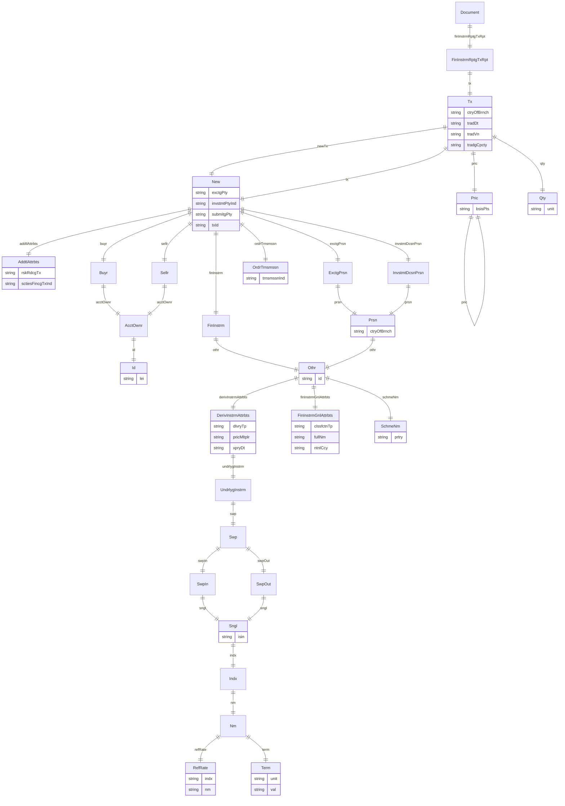

### Component 3 (CodeList, CodeListIdentification, CodeValue)

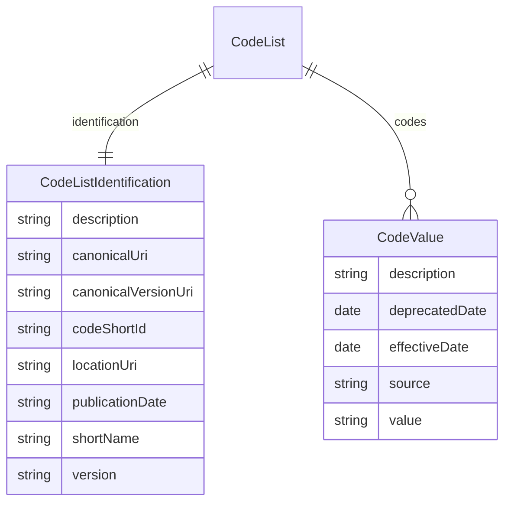

### Component 4 (CollateralTaxonomy, CollateralTaxonomyValue)

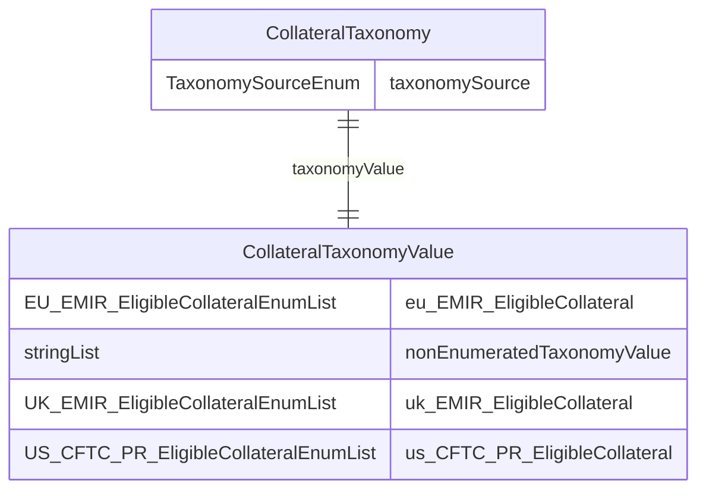

### Component 5 (InterestAdjustment, InterestAdjustmentPeriodicity)

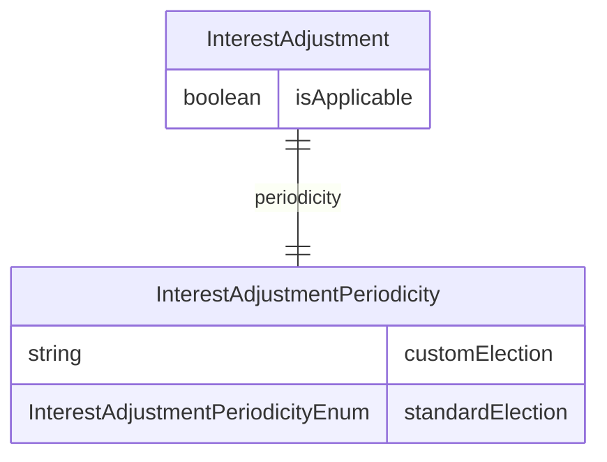

## Base Classes


Foundational classes in the hierarchy (root classes and direct children of Thing):

| Class | Description |
| --- | --- |
| [Asset](#Asset) | An Asset is defined as something that can be owned and transferred in the financial markets. As a choice data type, one and only one of the attributes must be used. |
| [AssetBase](#AssetBase) | The base data type to specify common attributes for all Assets. |
| [AssetDeliveryPeriods](#AssetDeliveryPeriods) | Defines the periods of delivery, including the delivery profile. |
| [AssetFlowBase](#AssetFlowBase) | Defines the basic parameters of an asset transfer, e.g. a cashflow: what (the asset), how much (the quantity) and when (the settlement date). |
| [AvailableInventory](#AvailableInventory) | A data type that can be used to describe the inventory of securities that a party holds. The securities are held in the AvailableInventoryRecord, with each item in the array being an individual security and its associated criteria. Criteria can include the quantity available, the rate at which the security is available to borrow at, as well as other details that can affect the decision as to whether a party wants to utilise the securities listed. |
| [BusinessCenterTime](#BusinessCenterTime) | A class for defining a time with respect to a business day calendar location. For example, 11:00:00 GBLO. |
| [BuyerSeller](#BuyerSeller) | This class corresponds to the FpML BuyerSeller.model construct. |
| [CalculationAndTimingBase](#CalculationAndTimingBase) | A logical container designed to hold a set of related data. In this case, designed to hold a set of clauses that are common amongst Legacy (1994/95), Variation Margin and Initial Margin Credit Support Documents in regards to Calculation, Valuation and Timing terms. |
| [CalculationPeriodBase](#CalculationPeriodBase) | The calculation period adjusted start and end dates, which are the baseline arguments needed to compute an interest accrual calculation. |
| [CollateralCriteriaBase](#CollateralCriteriaBase) | Represents a set of criteria used to specify and describe collateral. |
| [ContactInformation](#ContactInformation) | A class to specify contact information associated with a party: telephone, postal/street address, email and web page. |
| [ContactInformationElection](#ContactInformationElection) | Specifies the party reference and the associated contact information. |
| [ContractBase](#ContractBase) | Encapsulates data features common to trade and position. |
| [CreditNotation](#CreditNotation) | Represents a class to specify the credit notation as the combination of agency, notation, scale and debt type qualifications. |
| [CreditSupportAgreementElectionsBase](#CreditSupportAgreementElectionsBase) | A logical container designed to hold a set of related data. In this case, designed to hold a set of clauses that are common amongst Legacy (1994/95), Variation Margin and Initial Margin Credit Support Documents. |
| [CreditSupportObligationsBase](#CreditSupportObligationsBase) | A logical container designed to hold a set of related data. In this case, designed to hold a set of clauses that are common amongst Legacy (1994/95), Variation Margin and Initial Margin Credit Support Documents in regards to Credit Support Obligations. |
| [DateRange](#DateRange) | A class defining a contiguous series of calendar dates. The date range is defined as all the dates between and including the start and the end date. The start date must fall on or before the end date. |
| [EventInstruction](#EventInstruction) | Specifies instructions to create a BusinessEvent. |
| [FloatingRateBase](#FloatingRateBase) | A class defining a floating interest rate through the specification of the floating rate index, the tenor, the multiplier schedule, the spread, the qualification of whether a specific rate treatment and/or a cap or floor apply. |
| [Frequency](#Frequency) | A class for defining a date frequency, e.g. one day, three months, through the combination of an integer value and a standardized period value that is specified as part of an enumeration. |
| [Identifier](#Identifier) | A class to specify a generic identifier, applicable to CDM artefacts such as executions, contracts, lifecycle events and legal documents. An issuer can be associated with the actual identifier value as a way to properly qualify it. |
| [IndependentAmountRatings](#IndependentAmountRatings) | A logical container designed to hold a set of related data. In this case, designed to hold a set of information required when Independent Amount is determined using credit ratings. |
| [InformationSource](#InformationSource) | A class defining the source for a piece of information (e.g. a rate fix or an FX fixing). The attribute names have been adjusted from FpML to address the fact that the information is not limited to rates. |
| [InventoryRecord](#InventoryRecord) | An individual piece of inventory. This represents a single security. |
| [LegalAgreementBase](#LegalAgreementBase) | Specifies the legal agreement baseline information, being negotiated or having been executed. It excludes specialized elections |
| [LimitApplicable](#LimitApplicable) |  |
| [MarginCallBase](#MarginCallBase) | Represents common attributes required for Issuance and Response to a Margin Call action as a result of a demand for delivery or return of collateral determined under a legal agreement such as a credit support document or equivalent. |
| [MasterAgreementBase](#MasterAgreementBase) | A set of elections that can be shared across master agreement types - this should be built upon for specific contracts. |
| [MasterConfirmationBase](#MasterConfirmationBase) | Legal agreement specification for General Terms and Elections that are applicable across multiple confirmations and are referenced by these confirmations. |
| [MeasureBase](#MeasureBase) | Provides an abstract type to define a measure as a number associated to a unit. This type is abstract because all its attributes are optional. The types that extend it can specify further existence constraints. |
| [Observable](#Observable) | Specifies the object to be observed for a price, it could be an asset or a reference. |
| [PCDeliverableObligationCharac](#PCDeliverableObligationCharac) | A class to specify the Partial Cash Deliverable Obligation Characteristic. |
| [PartialExercise](#PartialExercise) | A class defining partial exercise. As defined in the 2000 ISDA Definitions, Section 12.3 Partial Exercise, the buyer of the option may exercise all or less than all the notional amount of the underlying swap but may not be less than the minimum notional amount (if specified) and must be an integral multiple of the integral multiple amount if specified. |
| [PartyReferencePayerReceiver](#PartyReferencePayerReceiver) | Specifies the parties responsible for making and receiving payments defined by this structure. |
| [PayerReceiver](#PayerReceiver) | Specifies the parties responsible for making and receiving payments defined by this structure. |
| [PayoutBase](#PayoutBase) | A data type that contains the common attributes (e.g. payer and receiver parties) and validation conditions that apply across all payout types |
| [Period](#Period) | A class to define recurring periods or time offsets. |
| [PositionBase](#PositionBase) | Base class to describe a Position, which could be a group of products (e.g. trade portfolio) or a group of assets (e.g. collateral portfolio). |
| [PostingObligationsElection](#PostingObligationsElection) | Specifies the collateral posting obligations for the security provider party(ies). |
| [RateSchedule](#RateSchedule) | A class defining a schedule of rates or amounts in terms of an initial value and then a series of step date and value pairs. On each step date the rate or amount changes to the new step value. The series of step date and value pairs are optional. If not specified, this implies that the initial value remains unchanged over time. |
| [RelativeTimeOffset](#RelativeTimeOffset) | Describes how a time is offset from a reference point, including the unit, magnitude, and rounding behavior. |
| [ReturnTerms](#ReturnTerms) | Specifies the type of return of a performance payout. |
| [ReturnTermsBase](#ReturnTermsBase) | Contains all common elements in variance, volatility and correlation return Terms. |
| [Schedule](#Schedule) | A class defining a schedule of rates or amounts in terms of an initial value and then a series of step date and value pairs. On each step date the rate or amount changes to the new step value. The series of step date and value pairs are optional. If not specified, this implies that the initial value remains unchanged over time. |
| [SettlementBase](#SettlementBase) | A base class to be extended by the SettlementTerms class. |
| [SingleValuationDate](#SingleValuationDate) | A class to specify the number of business days after satisfaction of all conditions to settlement. |
| [SwapCurveValuation](#SwapCurveValuation) | A class to specify a valuation swap curve, which is used as part of the strike construct for the bond and convertible bond options. |
| [Taxonomy](#Taxonomy) | Defines the taxonomy of an object by combining a taxonomy source (i.e. the rules to classify the object) and a value (i.e. the output of those rules on the object). |
| [ThresholdMinimumTransferAmountBase](#ThresholdMinimumTransferAmountBase) | A logical container designed to hold a set of related data. In this case, designed to hold a set of information required to specify conditions under which Threshold or Minimum Transfer Amount can fall to zero. |
| [TradableProduct](#TradableProduct) | Definition of a product as ready to be traded, i.e. included in an execution or contract, by associating a specific price and quantity to this product plus an (optional) mechanism for any potential future quantity adjustment. |

## Standalone Classes


These classes are completely isolated with no relationships and are not used as base classes:

| Class | Description |
| --- | --- |
| [AdditionalTerminationEvent](#AdditionalTerminationEvent) | A class to specify an optional termination event, additional to the Termination Events that will be deemed an Access Condition (Initial Margin CSA) or a Specified Condition (Variation Margin CSA). |
| [AdditionalType](#AdditionalType) | The specification of the Additional Type of transaction that can require the collection or delivery of initial margin under a given regulatory regime for the purposes of Covered Transactions. |
| [AllCriteria](#AllCriteria) | Used to combine two or more Collateral Criteria using AND logic. |
| [AllDirectionRating](#AllDirectionRating) | Used to combine two or more Ratings and associated direction using AND logic. |
| [AllEligibilityToHoldCollateralCriteria](#AllEligibilityToHoldCollateralCriteria) | Used to combine two or more Criteria using AND logic. |
| [AnyCriteria](#AnyCriteria) | Used to combine two or more Collateral Criteria using OR logic. |
| [AnyDirectionRating](#AnyDirectionRating) | Used to combine two or more Ratings and associated direction using OR logic. |
| [AnyEligibilityToHoldCollateralCriteria](#AnyEligibilityToHoldCollateralCriteria) | Used to combine two or more Criteria using OR logic. |
| [AssetCountryOfOrigin](#AssetCountryOfOrigin) |  |
| [BoundedCorrelation](#BoundedCorrelation) | Describes correlation bounds, which form a cap and a floor on the realized correlation. |
| [BrokerConfirmation](#BrokerConfirmation) | Identifies the market sector in which the trade has been arranged. |
| [CalculatedRateObservationDatesAndWeights](#CalculatedRateObservationDatesAndWeights) | Type for reporting the observations dates and the corresponding weights going into a daily calculated rate |
| [CalculationPeriodData](#CalculationPeriodData) |  |
| [CollateralGuarantorType](#CollateralGuarantorType) | Specifies the origin of entity guaranteeing the collateral. |
| [ComputedAmount](#ComputedAmount) | A class to specify the outcome of a computed amount, for testing purposes. |
| [CounterpartyOwnIssuePermitted](#CounterpartyOwnIssuePermitted) |  |
| [DomesticCurrencyIssued](#DomesticCurrencyIssued) |  |
| [EquityMasterConfirmation](#EquityMasterConfirmation) | Specification for General Terms and Elections of an Equity Master Confirmation that is applicable across multiple Equity confirmations and is referenced by each of these confirmations, an example of which being the 2018 ISDA CDM Equity Confirmation for Security Equity Swap. |
| [ExerciseEvent](#ExerciseEvent) | A data defining: the adjusted dates associated with a particular exercise event. |
| [GlobalMasterRepoAgreement](#GlobalMasterRepoAgreement) | The set of elections that define a GMRA |
| [IndexType](#IndexType) | Specification of an index. |
| [IssuerCountryOfOrigin](#IssuerCountryOfOrigin) |  |
| [ListingExchange](#ListingExchange) | Specifies a filter based on a stock exchange. |
| [ListingSector](#ListingSector) | Specifies a filter based on an industry sector. |
| [NegativeCriteria](#NegativeCriteria) | Used to apply a NOT logic condition to a single Collateral Criteria. |
| [NonNegativeStep](#NonNegativeStep) | A class defining a step date and non-negative step value pair. This step definitions are used to define varying rate or amount schedules, e.g. a notional amortisation or a step-up coupon schedule. |
| [OtherAgreement](#OtherAgreement) | A class for defining an agreement executed between parties. |
| [SpecificAsset](#SpecificAsset) | A single, specifically identified Asset chosen from the Asset data type |
| [StandardizedSchedule](#StandardizedSchedule) |  |

## Abstract Classes


### Asset

An Asset is defined as something that can be owned and transferred in the financial markets. As a choice data type, one and only one of the attributes must be used.

Generated from Rosetta 'choice' construct — represents a union/one-of type.

```mermaid
erDiagram
Asset {

}
AssetFlowBase {

}
AssetPayout {

}
PositionBase {

}

AssetFlowBase ||--|o PaymentDiscounting : "paymentDiscounting"
AssetFlowBase ||--|| AdjustableOrAdjustedOrRelativeDate : "settlementDate"
AssetFlowBase ||--|| Asset : "asset"
AssetFlowBase ||--|| NonNegativeQuantity : "quantity"
AssetPayout ||--|o DividendTerms : "dividendTerms"
AssetPayout ||--|o Money : "minimumFee"
AssetPayout ||--|o PrincipalPayments : "principalPayment"
AssetPayout ||--|o ResolvablePriceQuantity : "priceQuantity"
AssetPayout ||--|o SettlementTerms : "settlementTerms"
AssetPayout ||--|| Asset : "underlier"
AssetPayout ||--|| PayerReceiver : "payerReceiver"
AssetPayout ||--}| AssetLeg : "assetLeg"
PositionBase ||--|o Asset : "asset"
PositionBase ||--|o Money : "cashBalance"
PositionBase ||--|o Product : "product"
PositionBase ||--|o TradeState : "tradeReference"
PositionBase ||--}| PriceQuantity : "priceQuantity"

```

This class has no attributes


#### Children

 * [SpecificAsset](#SpecificAsset) - A single, specifically identified Asset chosen from the Asset data type
 * [TransferableProduct](#TransferableProduct) - A TransferableProduct is a type of financial product which can be held or transferred, represented as an Asset with the addition of specific EconomicTerms.

#### Referenced by:

 *  **[AssetFlowBase](#AssetFlowBase)** : asset  <sub>1..1</sub> 
 *  **[AssetPayout](#AssetPayout)** : underlier  <sub>1..1</sub> 
 *  **[AssetFlowBase](#AssetFlowBase)** : asset  <sub>0..1</sub> 
 *  **[PositionBase](#PositionBase)** : asset  <sub>0..1</sub> 


### CollateralCriteria

The possible different terms that can be combined, using AND, OR and NOT logic, to define the issuers and/or assets that meet a given criteria for collateral.

Generated from Rosetta 'choice' construct — represents a union/one-of type.

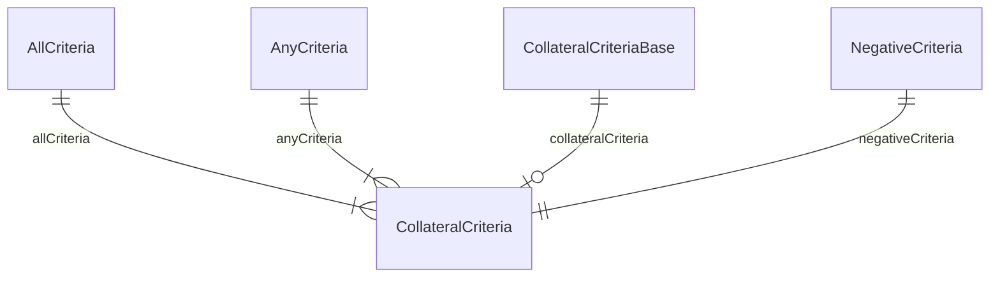

This class has no attributes


#### Referenced by:

 *  **[AllCriteria](#AllCriteria)** : allCriteria  <sub>1..\*</sub> 
 *  **[AnyCriteria](#AnyCriteria)** : anyCriteria  <sub>1..\*</sub> 
 *  **[CollateralCriteriaBase](#CollateralCriteriaBase)** : collateralCriteria  <sub>0..1</sub> 
 *  **[NegativeCriteria](#NegativeCriteria)** : negativeCriteria  <sub>1..1</sub> 


### CreditSupportAgreementElections

The set of elections which specify a Credit Support Annex or Deed.

Generated from Rosetta 'choice' construct — represents a union/one-of type.

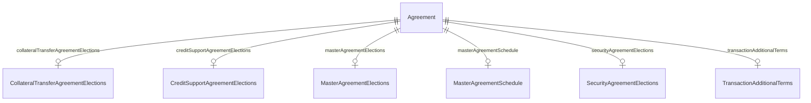

This class has no attributes


#### Referenced by:

 *  **[Agreement](#Agreement)** : creditSupportAgreementElections  <sub>0..1</sub> 


### DirectionRatingSet

A logical container to hold a defined set of related data. In this case the collation of Ratings Agency, Rating value and an associated direction that are grouped by either AND or OR logic.

Generated from Rosetta 'choice' construct — represents a union/one-of type.

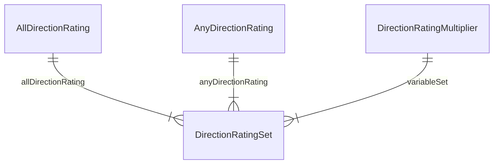

This class has no attributes


#### Referenced by:

 *  **[DirectionRatingMultiplier](#DirectionRatingMultiplier)** : variableSet  <sub>1..\*</sub> 
 *  **[AllDirectionRating](#AllDirectionRating)** : allDirectionRating  <sub>1..\*</sub> 
 *  **[AnyDirectionRating](#AnyDirectionRating)** : anyDirectionRating  <sub>1..\*</sub> 


### EligibilityToHoldCollateralCriteria

Defines a set of Criteria required by the party and its custodian to hold the other party's Posted Collateral.

Generated from Rosetta 'choice' construct — represents a union/one-of type.

```mermaid
erDiagram
AllCriteria {

}
AllEligibilityToHoldCollateralCriteria {

}
AnyCriteria {

}
AnyEligibilityToHoldCollateralCriteria {

}
EligibilityToHoldCollateral {

}
EligibilityToHoldCollateralCriteria {

}
EligibleCollateralSpecification {

}

AllCriteria ||--}| CollateralCriteria : "allCriteria"
AllEligibilityToHoldCollateralCriteria ||--}| EligibilityToHoldCollateralCriteria : "allCriteria"
AnyCriteria ||--}| CollateralCriteria : "anyCriteria"
AnyEligibilityToHoldCollateralCriteria ||--}| EligibilityToHoldCollateralCriteria : "anyCriteria"
EligibilityToHoldCollateral ||--|o EligibilityToHoldCollateralCriteria : "criteria"
EligibilityToHoldCollateral ||--|o LegalEntity : "initialCustodian"
EligibleCollateralSpecification ||--}o Counterparty : "counterparty"
EligibleCollateralSpecification ||--}o Identifier : "identifier"
EligibleCollateralSpecification ||--}o Party : "party"
EligibleCollateralSpecification ||--}o PartyRole : "partyRole"
EligibleCollateralSpecification ||--}| EligibleCollateralCriteria : "criteria"

```

This class has no attributes


#### Referenced by:

 *  **[AllCriteria](#AllCriteria)** : allCriteria  <sub>1..\*</sub> 
 *  **[AllEligibilityToHoldCollateralCriteria](#AllEligibilityToHoldCollateralCriteria)** : allCriteria  <sub>1..\*</sub> 
 *  **[AnyCriteria](#AnyCriteria)** : anyCriteria  <sub>1..\*</sub> 
 *  **[AnyEligibilityToHoldCollateralCriteria](#AnyEligibilityToHoldCollateralCriteria)** : anyCriteria  <sub>1..\*</sub> 
 *  **[EligibilityToHoldCollateral](#EligibilityToHoldCollateral)** : criteria  <sub>0..1</sub> 
 *  **[EligibleCollateralSpecification](#EligibleCollateralSpecification)** : criteria  <sub>0..1</sub> 


### Index

An Index is an Observable which is computed based on the prices, rates or valuations of a number of assets that are tracked in a standardized way.  Examples include equity market indices as well as indices on interest rates, inflation and credit instruments.

Generated from Rosetta 'choice' construct — represents a union/one-of type.


This class has no attributes


### Instrument

A type of Asset that is issued by one party to one or more others.

Generated from Rosetta 'choice' construct — represents a union/one-of type.


This class has no attributes


### InterestRateIndex

An index based in interest rates or inflation rates in a certain market.

Generated from Rosetta 'choice' construct — represents a union/one-of type.

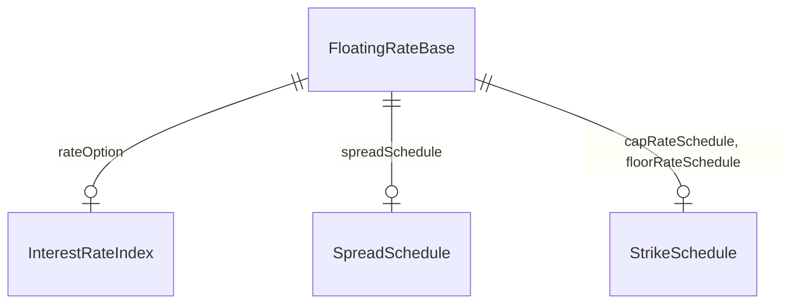

This class has no attributes


#### Referenced by:

 *  **[FloatingRateBase](#FloatingRateBase)** : rateOption  <sub>0..1</sub> 


### Observable

Specifies the object to be observed for a price, it could be an asset or a reference.

Generated from Rosetta 'choice' construct — represents a union/one-of type.

```mermaid
erDiagram
Observable {

}
ObservationIdentifier {

}
PortfolioReturnTerms {

}
PriceQuantity {

}
VarianceReturnTerms {

}
VolatilityReturnTerms {

}

ObservationIdentifier ||--|o DeterminationMethodology : "determinationMethodology"
ObservationIdentifier ||--|o InformationSource : "informationSource"
ObservationIdentifier ||--|o TimeZone : "observationTime"
ObservationIdentifier ||--|| Observable : "observable"
PortfolioReturnTerms ||--|o CorrelationReturnTerms : "correlationReturnTerms"
PortfolioReturnTerms ||--|o DividendReturnTerms : "dividendReturnTerms"
PortfolioReturnTerms ||--|o NonNegativeQuantitySchedule : "quantity"
PortfolioReturnTerms ||--|o PriceReturnTerms : "priceReturnTerms"
PortfolioReturnTerms ||--|o VarianceReturnTerms : "varianceReturnTerms"
PortfolioReturnTerms ||--|o VolatilityReturnTerms : "volatilityReturnTerms"
PortfolioReturnTerms ||--|| Observable : "underlier"
PortfolioReturnTerms ||--|| PayerReceiver : "payerReceiver"
PortfolioReturnTerms ||--}o PriceSchedule : "finalValuationPrice, initialValuationPrice, interimValuationPrice"
PriceQuantity ||--|o AdjustableOrRelativeDate : "effectiveDate"
PriceQuantity ||--|o Observable : "observable"
PriceQuantity ||--}o NonNegativeQuantitySchedule : "quantity"
PriceQuantity ||--}o PriceSchedule : "price"
VarianceReturnTerms ||--|o DividendApplicability : "dividendApplicability"
VarianceReturnTerms ||--|o EquityUnderlierProvisions : "equityUnderlierProvisions"
VarianceReturnTerms ||--|o NonNegativeQuantitySchedule : "vegaNotionalAmount"
VarianceReturnTerms ||--|o Observable : "exchangeTradedContractNearest"
VarianceReturnTerms ||--|o Price : "varianceStrikePrice, volatilityStrikePrice"
VarianceReturnTerms ||--|o VarianceCapFloor : "varianceCapFloor"
VarianceReturnTerms ||--|o VolatilityCapFloor : "volatilityCapFloor"
VarianceReturnTerms ||--|| ValuationTerms : "valuationTerms"
VolatilityReturnTerms ||--|o DividendApplicability : "dividendApplicability"
VolatilityReturnTerms ||--|o EquityUnderlierProvisions : "equityUnderlierProvisions"
VolatilityReturnTerms ||--|o ListedDerivative : "exchangeTradedContractNearest"
VolatilityReturnTerms ||--|o VolatilityCapFloor : "volatilityCapFloor"
VolatilityReturnTerms ||--|| Price : "volatilityStrikePrice"
VolatilityReturnTerms ||--|| ValuationTerms : "valuationTerms"

```

This class has no attributes


#### Children

 * [BasketConstituent](#BasketConstituent) - Identifies the constituents of the basket

#### Referenced by:

 *  **[ObservationIdentifier](#ObservationIdentifier)** : observable  <sub>1..1</sub> 
 *  **[PortfolioReturnTerms](#PortfolioReturnTerms)** : underlier  <sub>1..1</sub> 
 *  **[VarianceReturnTerms](#VarianceReturnTerms)** : exchangeTradedContractNearest  <sub>0..1</sub> 
 *  **[VolatilityReturnTerms](#VolatilityReturnTerms)** : exchangeTradedContractNearest  <sub>0..1</sub> 
 *  **[ObservationIdentifier](#ObservationIdentifier)** : observable  <sub>0..1</sub> 
 *  **[PriceQuantity](#PriceQuantity)** : observable  <sub>0..1</sub> 


### Payout

Represents the set of future cashflow methodologies in the form of specific payout data type(s) which result from the financial product.  Examples: a trade in a cash asset will use only a settlement payout; for derivatives, two interest rate payouts can be combined to specify an interest rate swap; one interest rate payout can be combined with a credit default payout to specify a credit default swap.

Generated from Rosetta 'choice' construct — represents a union/one-of type.

```mermaid
erDiagram
CalculateTransferInstruction {

}
EconomicTerms {

}
Payout {

}
ResetInstruction {

}
ScheduledTransfer {

}

CalculateTransferInstruction ||--|o PayerReceiver : "payerReceiver"
CalculateTransferInstruction ||--|o Quantity : "quantity"
CalculateTransferInstruction ||--|| Payout : "payout"
CalculateTransferInstruction ||--|| TradeState : "tradeState"
CalculateTransferInstruction ||--}o Reset : "resets"
EconomicTerms ||--|o AdjustableOrRelativeDate : "effectiveDate, terminationDate"
EconomicTerms ||--|o BusinessDayAdjustments : "dateAdjustments"
EconomicTerms ||--|o CalculationAgent : "calculationAgent"
EconomicTerms ||--|o Collateral : "collateral"
EconomicTerms ||--|o DirectOrRelativeTime : "effectiveTime, terminationTime"
EconomicTerms ||--|o TerminationProvision : "terminationProvision"
EconomicTerms ||--}| Payout : "payout"
ResetInstruction ||--}| Payout : "payout"
ScheduledTransfer ||--|o PaymentDiscounting : "paymentDiscounting"
ScheduledTransfer ||--|o Payout : "payoutReference"
ScheduledTransfer ||--|| AdjustableOrAdjustedOrRelativeDate : "settlementDate"
ScheduledTransfer ||--|| Asset : "asset"
ScheduledTransfer ||--|| NonNegativeQuantity : "quantity"
ScheduledTransfer ||--|| PartyReferencePayerReceiver : "payerReceiver"
ScheduledTransfer ||--}o Identifier : "identifier"

```

This class has no attributes


#### Referenced by:

 *  **[CalculateTransferInstruction](#CalculateTransferInstruction)** : payout  <sub>1..\*</sub> 
 *  **[EconomicTerms](#EconomicTerms)** : payout  <sub>1..\*</sub> 
 *  **[CalculateTransferInstruction](#CalculateTransferInstruction)** : payout  <sub>1..\*</sub> 
 *  **[EconomicTerms](#EconomicTerms)** : payout  <sub>1..\*</sub> 
 *  **[ResetInstruction](#ResetInstruction)** : payout  <sub>1..\*</sub> 
 *  **[ScheduledTransfer](#ScheduledTransfer)** : payoutReference  <sub>0..1</sub> 


### Product

Enables either a TransferableProduct or a NonTransferableProduct to be used in an underlier.

Generated from Rosetta 'choice' construct — represents a union/one-of type.

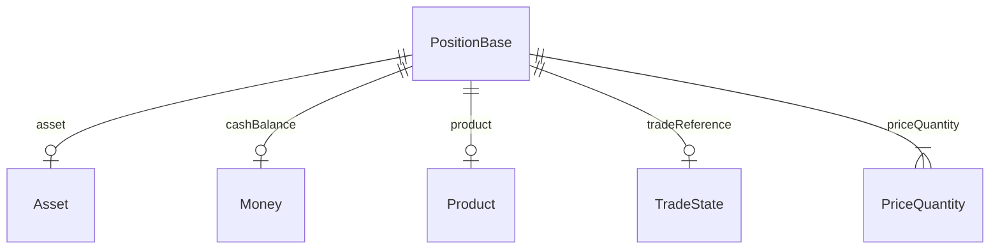

This class has no attributes


#### Referenced by:

 *  **[PositionBase](#PositionBase)** : product  <sub>1..1</sub> 


### RateSpecification

A data type to specify the fixed interest rate, floating interest rate or inflation rate.

Generated from Rosetta 'choice' construct — represents a union/one-of type.

```mermaid
erDiagram
InterestRatePayout {

}
RateSpecification {

}

InterestRatePayout ||--|o AdjustableDate : "paymentDate"
InterestRatePayout ||--|o BondReference : "bondReference"
InterestRatePayout ||--|o CalculationPeriodDates : "calculationPeriodDates"
InterestRatePayout ||--|o CashflowRepresentation : "cashflowRepresentation"
InterestRatePayout ||--|o DiscountingMethod : "discountingMethod"
InterestRatePayout ||--|o PaymentDates : "paymentDates"
InterestRatePayout ||--|o PrincipalPayments : "principalPayment"
InterestRatePayout ||--|o RateSpecification : "rateSpecification"
InterestRatePayout ||--|o ResetDates : "resetDates"
InterestRatePayout ||--|o ResolvablePriceQuantity : "priceQuantity"
InterestRatePayout ||--|o SettlementTerms : "settlementTerms"
InterestRatePayout ||--|o StubPeriod : "stubPeriod"
InterestRatePayout ||--|| PayerReceiver : "payerReceiver"

```

This class has no attributes


#### Referenced by:

 *  **[InterestRatePayout](#InterestRatePayout)** : rateSpecification  <sub>0..1</sub> 


### Transfer

The type of transfer.

Generated from Rosetta 'choice' construct — represents a union/one-of type.

```mermaid
erDiagram
BillingRecord {

}
BillingSummary {

}
CancelableProvision {

}
IndexTransitionInstruction {

}
Transfer {

}
TransferState {

}

BillingRecord ||--|o Money : "minimumFee"
BillingRecord ||--|| TradeState : "tradeState"
BillingRecord ||--|| Transfer : "recordTransfer"
BillingSummary ||--|o Transfer : "summaryTransfer"
CancelableProvision ||--|o AdjustableOrRelativeDate : "earliestDate, expirationDate"
CancelableProvision ||--|o AdjustableOrRelativeDates : "effectiveDate"
CancelableProvision ||--|o BusinessCenterTime : "earliestCancellationTime, latestCancelationTime"
CancelableProvision ||--|o CancelableProvisionAdjustedDates : "cancelableProvisionAdjustedDates"
CancelableProvision ||--|o ExerciseNotice : "exerciseNotice"
CancelableProvision ||--|o Period : "effectivePeriod"
CancelableProvision ||--|o Transfer : "initialFee"
CancelableProvision ||--|| ExerciseTerms : "exerciseTerms"
CancelableProvision ||--}o FinalCalculationPeriodDateAdjustment : "finalCalculationPeriodDateAdjustment"
IndexTransitionInstruction ||--|o Transfer : "cashTransfer"
IndexTransitionInstruction ||--}| PriceQuantity : "priceQuantity"
TransferState ||--|| Transfer : "transfer"

```

This class has no attributes


#### Referenced by:

 *  **[TransferState](#TransferState)** : transfer  <sub>1..1</sub> 
 *  **[IndexTransitionInstruction](#IndexTransitionInstruction)** : cashTransfer  <sub>0..1</sub> 
 *  **[CancelableProvision](#CancelableProvision)** : initialFee  <sub>0..1</sub> 
 *  **[BillingRecord](#BillingRecord)** : recordTransfer  <sub>1..1</sub> 
 *  **[BillingSummary](#BillingSummary)** : summaryTransfer  <sub>0..1</sub> 


### Underlier

The underlying financial product that will be physically or cash settled, which can be of any type, eg an asset such as cash or a security, a product, or the cash settlement of an index rate.  Conditions are usually applied when used in a data type, such as a payout, to ensure this aligns with the use case.

Generated from Rosetta 'choice' construct — represents a union/one-of type.

```mermaid
erDiagram
AssetPayout {

}
CommodityPayout {

}
CorporateAction {

}
OptionPayout {

}
PerformancePayout {

}
PortfolioReturnTerms {

}
SettlementPayout {

}
Underlier {

}

AssetPayout ||--|o DividendTerms : "dividendTerms"
AssetPayout ||--|o Money : "minimumFee"
AssetPayout ||--|o PrincipalPayments : "principalPayment"
AssetPayout ||--|o ResolvablePriceQuantity : "priceQuantity"
AssetPayout ||--|o SettlementTerms : "settlementTerms"
AssetPayout ||--|| Asset : "underlier"
AssetPayout ||--|| PayerReceiver : "payerReceiver"
AssetPayout ||--}| AssetLeg : "assetLeg"
CommodityPayout ||--|o AssetDeliveryInformation : "delivery"
CommodityPayout ||--|o AveragingCalculation : "averagingFeature"
CommodityPayout ||--|o CalculationPeriodDates : "calculationPeriodDates"
CommodityPayout ||--|o CalculationSchedule : "schedule"
CommodityPayout ||--|o CommodityPriceReturnTerms : "commodityPriceReturnTerms"
CommodityPayout ||--|o FxFeature : "fxFeature"
CommodityPayout ||--|o PrincipalPayments : "principalPayment"
CommodityPayout ||--|o ResolvablePriceQuantity : "priceQuantity"
CommodityPayout ||--|o SettlementTerms : "settlementTerms"
CommodityPayout ||--|| PayerReceiver : "payerReceiver"
CommodityPayout ||--|| PaymentDates : "paymentDates"
CommodityPayout ||--|| PricingDates : "pricingDates"
CommodityPayout ||--|| Underlier : "underlier"
CorporateAction ||--|o AdjustmentFactor : "adjustmentFactor"
CorporateAction ||--|o InformationSource : "informationSource"
CorporateAction ||--|o PriceSchedule : "dividendObservation"
CorporateAction ||--|| Underlier : "underlier"
OptionPayout ||--|o AssetDeliveryInformation : "delivery"
OptionPayout ||--|o CalculationSchedule : "schedule"
OptionPayout ||--|o ObservationTerms : "observationTerms"
OptionPayout ||--|o OptionFeature : "feature"
OptionPayout ||--|o OptionStrike : "strike"
OptionPayout ||--|o PrincipalPayments : "principalPayment"
OptionPayout ||--|o ResolvablePriceQuantity : "priceQuantity"
OptionPayout ||--|o SettlementTerms : "settlementTerms"
OptionPayout ||--|| BuyerSeller : "buyerSeller"
OptionPayout ||--|| ExerciseTerms : "exerciseTerms"
OptionPayout ||--|| PayerReceiver : "payerReceiver"
OptionPayout ||--|| Underlier : "underlier"
PerformancePayout ||--|o ObservationTerms : "observationTerms"
PerformancePayout ||--|o PrincipalPayments : "principalPayment"
PerformancePayout ||--|o ResolvablePriceQuantity : "priceQuantity"
PerformancePayout ||--|o ReturnTerms : "returnTerms"
PerformancePayout ||--|o SettlementTerms : "settlementTerms"
PerformancePayout ||--|o Underlier : "underlier"
PerformancePayout ||--|| PayerReceiver : "payerReceiver"
PerformancePayout ||--|| PaymentDates : "paymentDates"
PerformancePayout ||--|| ValuationDates : "valuationDates"
PerformancePayout ||--}o FxFeature : "fxFeature"
PerformancePayout ||--}o PortfolioReturnTerms : "portfolioReturnTerms"
PerformancePayout ||--}o PriceSchedule : "finalValuationPrice, initialValuationPrice, interimValuationPrice"
PortfolioReturnTerms ||--|o CorrelationReturnTerms : "correlationReturnTerms"
PortfolioReturnTerms ||--|o DividendReturnTerms : "dividendReturnTerms"
PortfolioReturnTerms ||--|o NonNegativeQuantitySchedule : "quantity"
PortfolioReturnTerms ||--|o PriceReturnTerms : "priceReturnTerms"
PortfolioReturnTerms ||--|o VarianceReturnTerms : "varianceReturnTerms"
PortfolioReturnTerms ||--|o VolatilityReturnTerms : "volatilityReturnTerms"
PortfolioReturnTerms ||--|| Observable : "underlier"
PortfolioReturnTerms ||--|| PayerReceiver : "payerReceiver"
PortfolioReturnTerms ||--}o PriceSchedule : "finalValuationPrice, initialValuationPrice, interimValuationPrice"
SettlementPayout ||--|o AssetDeliveryInformation : "delivery"
SettlementPayout ||--|o CalculationSchedule : "schedule"
SettlementPayout ||--|o PrincipalPayments : "principalPayment"
SettlementPayout ||--|o ResolvablePriceQuantity : "priceQuantity"
SettlementPayout ||--|o SettlementTerms : "settlementTerms"
SettlementPayout ||--|| PayerReceiver : "payerReceiver"
SettlementPayout ||--|| Underlier : "underlier"

```

This class has no attributes


#### Referenced by:

 *  **[CommodityPayout](#CommodityPayout)** : underlier  <sub>1..1</sub> 
 *  **[OptionPayout](#OptionPayout)** : underlier  <sub>1..1</sub> 
 *  **[PerformancePayout](#PerformancePayout)** : underlier  <sub>1..1</sub> 
 *  **[SettlementPayout](#SettlementPayout)** : underlier  <sub>1..1</sub> 
 *  **[AssetPayout](#AssetPayout)** : underlier  <sub>1..1</sub> 
 *  **[CommodityPayout](#CommodityPayout)** : underlier  <sub>1..1</sub> 
 *  **[CorporateAction](#CorporateAction)** : underlier  <sub>1..1</sub> 
 *  **[OptionPayout](#OptionPayout)** : underlier  <sub>1..1</sub> 
 *  **[PerformancePayout](#PerformancePayout)** : underlier  <sub>1..1</sub> 
 *  **[PortfolioReturnTerms](#PortfolioReturnTerms)** : underlier  <sub>1..1</sub> 
 *  **[SettlementPayout](#SettlementPayout)** : underlier  <sub>1..1</sub> 


## Classes


### Account

A class to specify an account as an account number alongside, optionally. an account name, an account type, an account beneficiary and a servicing party.

```mermaid
erDiagram
Account {

}
CustodianElection {

}
Party {

}
PartyReferencePayerReceiver {

}
RelatedParty {

}
SecurityAgreementElections {

}
Trade {

}
TransferContactInformation {

}
WorkflowStep {

}

Account ||--|o Party : "accountBeneficiary, partyReference, servicingParty"
CustodianElection ||--|o Account : "segregatedCashAccount, segregatedSecurityAccount"
CustodianElection ||--|o LegalEntity : "custodian, legacyNamedEntity"
Party ||--|o Account : "account"
Party ||--|o ContactInformation : "contactInformation"
Party ||--}o BusinessUnit : "businessUnit"
Party ||--}o NaturalPerson : "person"
Party ||--}o NaturalPersonRole : "personRole"
Party ||--}| PartyIdentifier : "partyId"
PartyReferencePayerReceiver ||--|o Account : "payerAccountReference, receiverAccountReference"
PartyReferencePayerReceiver ||--|| Party : "payerPartyReference, receiverPartyReference"
RelatedParty ||--|o Account : "accountReference"
RelatedParty ||--|| Party : "partyReference"
SecurityAgreementElections ||--|o Account : "pledgedAccount"
SecurityAgreementElections ||--|o AppropriatedCollateralValuation : "appropriatedCollateralValuation"
SecurityAgreementElections ||--|o EnforcementEvent : "enforcementEvent"
SecurityAgreementElections ||--|o ExecutionTerms : "executionTerms"
SecurityAgreementElections ||--|o JurisdictionRelatedTerms : "jurisdictionRelatedTerms"
SecurityAgreementElections ||--|o ProcessAgent : "processAgent"
Trade ||--|o Collateral : "collateral"
Trade ||--|o ContractDetails : "contractDetails"
Trade ||--|o ExecutionDetails : "executionDetails"
Trade ||--|o TimeZone : "tradeTime"
Trade ||--|| NonTransferableProduct : "product"
Trade ||--}o Account : "account"
Trade ||--}o AncillaryParty : "ancillaryParty"
Trade ||--}o Party : "party"
Trade ||--}o PartyRole : "partyRole"
Trade ||--}| Counterparty : "counterparty"
Trade ||--}| TradeIdentifier : "tradeIdentifier"
Trade ||--}| TradeLot : "tradeLot"
TransferContactInformation ||--}o Account : "account"
TransferContactInformation ||--}o Address : "address"
TransferContactInformation ||--}o TelephoneNumber : "telephone"
WorkflowStep ||--|o BusinessEvent : "businessEvent"
WorkflowStep ||--|o CounterpartyPositionBusinessEvent : "counterpartyPositionBusinessEvent"
WorkflowStep ||--|o CreditLimitInformation : "creditLimitInformation"
WorkflowStep ||--|o EventInstruction : "nextEvent, proposedEvent"
WorkflowStep ||--|o Lineage : "lineage"
WorkflowStep ||--|o MessageInformation : "messageInformation"
WorkflowStep ||--|o WorkflowState : "workflowState"
WorkflowStep ||--|o WorkflowStep : "previousWorkflowStep"
WorkflowStep ||--}o Account : "account"
WorkflowStep ||--}o Party : "party"
WorkflowStep ||--}o WorkflowStepApproval : "approval"
WorkflowStep ||--}| EventTimestamp : "timestamp"
WorkflowStep ||--}| Identifier : "eventIdentifier"

```

#### Attributes

| Name | Cardinality: | Type | Description |
| --- | --- | --- | --- |
| **[accountBeneficiary](#AccountBeneficiary)** | <sub>0..1</sub> | [Party](#Party) | A reference to the party beneficiary of the account. |
| **[accountName](#AccountName)** | <sub>0..1</sub> | string | The name by which the account is known. |
| **[accountNumber](#AccountNumber)** | <sub>1..1</sub> | string | The account number. |
| **[accountType](#AccountType)** | <sub>0..1</sub> | [AccountTypeEnum](#AccountTypeEnum) | The type of account, e.g. client, house. |
| **[partyReference](#PartyReference)** | <sub>0..1</sub> | [Party](#Party) | A reference to the party to which the account refers to. |
| **[servicingParty](#ServicingParty)** | <sub>0..1</sub> | [Party](#Party) | The reference to the legal entity that services the account, i.e. in the books of which the account is held. |

#### Referenced by:

 *  **[Trade](#Trade)** : account  <sub>0..\*</sub> 
 *  **[TransferContactInformation](#TransferContactInformation)** : account  <sub>0..\*</sub> 
 *  **[WorkflowStep](#WorkflowStep)** : account  <sub>0..\*</sub> 
 *  **[Party](#Party)** : account  <sub>0..1</sub> 
 *  **[Trade](#Trade)** : account  <sub>0..1</sub> 
 *  **[TransferContactInformation](#TransferContactInformation)** : account  <sub>0..1</sub> 
 *  **[WorkflowStep](#WorkflowStep)** : account  <sub>0..1</sub> 
 *  **[RelatedParty](#RelatedParty)** : accountReference  <sub>0..1</sub> 
 *  **[PartyReferencePayerReceiver](#PartyReferencePayerReceiver)** : payerAccountReference  <sub>0..1</sub> 
 *  **[SecurityAgreementElections](#SecurityAgreementElections)** : pledgedAccount  <sub>0..1</sub> 
 *  **[PartyReferencePayerReceiver](#PartyReferencePayerReceiver)** : receiverAccountReference  <sub>0..1</sub> 
 *  **[CustodianElection](#CustodianElection)** : segregatedCashAccount  <sub>0..1</sub> 
 *  **[CustodianElection](#CustodianElection)** : segregatedSecurityAccount  <sub>0..1</sub> 


### AccrualFactor

The accrual rate and related terms, to adjust the price of an underlier impacted by a Corporate Action when economic impact consists in freezing the underlier price to the last fixing then applying accruals per each remaining underlier price fixing date required i.e. for each fixing date, adjustedPrice = lastFixingPrice x accrualFactor, where: accrualFactor = (1 + accrualRateValue x DCF).

Rosetta condition: AccrualPriceIsRate — value -> priceType = PriceTypeEnum -> InterestRate

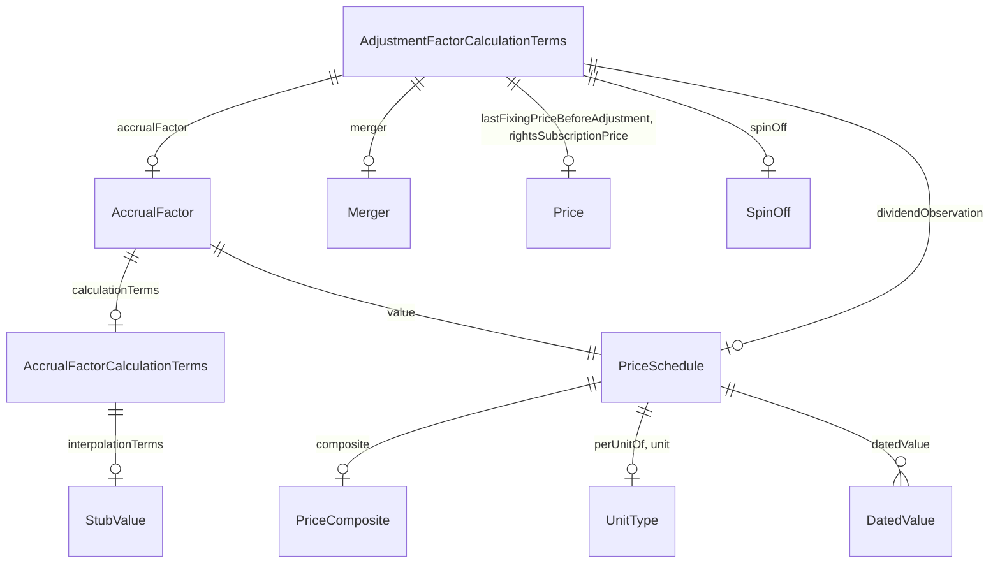

#### Attributes

| Name | Cardinality: | Type | Description |
| --- | --- | --- | --- |
| **[calculationTerms](#CalculationTerms)** | <sub>0..1</sub> | [AccrualFactorCalculationTerms](#AccrualFactorCalculationTerms) | Describes the input terms involved in the calculation of the accrual factor. |
| **[value](#Value)** | <sub>1..1</sub> | [PriceSchedule](#PriceSchedule) | The rate to be applied to the last fixing price, for price accrual calculation purposes. DatedValue may be used for the purpose of representing Price series if such calculation is required for multiple dates. |

#### Referenced by:

 *  **[AdjustmentFactorCalculationTerms](#AdjustmentFactorCalculationTerms)** : accrualFactor  <sub>0..1</sub> 


### AccrualFactorCalculationTerms

Describes the input terms involved in the calculation of the accrual factor. Optionnally, long and short stub interpolation rates can be specified.

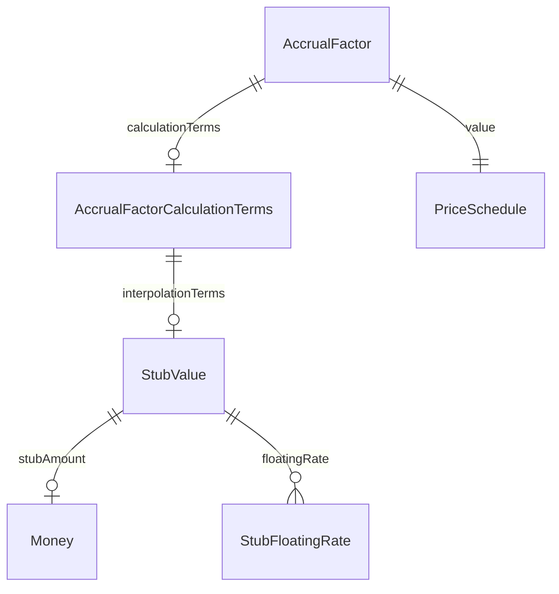

#### Attributes

| Name | Cardinality: | Type | Description |
| --- | --- | --- | --- |
| **[dayCountFraction](#DayCountFraction)** | <sub>1..1</sub> | [DayCountFractionEnum](#DayCountFractionEnum) | The enumerated values to specify the day count fraction. |
| **[interpolationTerms](#InterpolationTerms)** | <sub>0..1</sub> | [StubValue](#StubValue) | Describes the rate, tenor, period duration for the short and long stubs, when the accrualRate optionnaly results from an interpolation method. |
| **[tenorTillMaturity](#TenorTillMaturity)** | <sub>1..1</sub> | decimal | The duration between last fixing date and the payment date of accruals, calculated in accordance with the appropriate DayCountFraction. |

#### Referenced by:

 *  **[AccrualFactor](#AccrualFactor)** : calculationTerms  <sub>0..1</sub> 


### AcctOwnr


```mermaid
erDiagram
AcctOwnr {

}
Buyr {

}
Id {

}
Sellr {

}

AcctOwnr ||--|| Id : "id"
Buyr ||--|| AcctOwnr : "acctOwnr"
Sellr ||--|| AcctOwnr : "acctOwnr"

```

#### Attributes

| Name | Cardinality: | Type | Description |
| --- | --- | --- | --- |
| **[id](#Id)** | <sub>1..1</sub> | [Id](#Id) |  |

#### Referenced by:

 *  **[Buyr](#Buyr)** : acctOwnr  <sub>1..1</sub> 
 *  **[Sellr](#Sellr)** : acctOwnr  <sub>1..1</sub> 


### AdditionalDisruptionEvents

A type for defining the Additional Disruption Events.

Rosetta condition: MaximumStockLoanRate — if maximumStockLoanRate exists then maximumStockLoanRate >= 0 and maximumStockLoanRate <= 1

Rosetta condition: InitialStockLoanRate — if initialStockLoanRate exists then initialStockLoanRate >= 0 and initialStockLoanRate <= 1

Rosetta condition: DisruptionEventsDeterminingParty — if determiningParty exists then determiningParty = AncillaryRoleEnum -> DisruptionEventsDeterminingParty

```mermaid
erDiagram
AdditionalDisruptionEvents {

}
Clause {

}
ExtraordinaryEvents {

}

AdditionalDisruptionEvents ||--}o Clause : "additionalBespokeTerms"
Clause ||--}o Clause : "subcomponents"
ExtraordinaryEvents ||--|o AdditionalDisruptionEvents : "additionalDisruptionEvents"
ExtraordinaryEvents ||--|o EquityCorporateEvents : "mergerEvents, tenderOfferEvents"
ExtraordinaryEvents ||--|o IndexAdjustmentEvents : "indexAdjustmentEvents"
ExtraordinaryEvents ||--|o Representations : "representations"
ExtraordinaryEvents ||--}o Clause : "additionalBespokeTerms"

```

#### Attributes

| Name | Cardinality: | Type | Description |
| --- | --- | --- | --- |
| **[additionalBespokeTerms](#AdditionalBespokeTerms)** | <sub>0..\*</sub> | [Clause](#Clause) | Where parties may optionnaly describe any extra bespoke agreements, in regards of the standardized Extraordinary Events. |
| **[changeInLaw](#ChangeInLaw)** | <sub>0..1</sub> | boolean |  |
| **[determiningParty](#DeterminingParty)** | <sub>0..1</sub> | [AncillaryRoleEnum](#AncillaryRoleEnum) | Specifies the party which determines additional disruption events. |
| **[failureToDeliver](#FailureToDeliver)** | <sub>0..1</sub> | boolean | If true, failure to deliver is applicable. |
| **[foreignOwnershipEvent](#ForeignOwnershipEvent)** | <sub>0..1</sub> | boolean |  |
| **[hedgingDisruption](#HedgingDisruption)** | <sub>0..1</sub> | boolean |  |
| **[increasedCostOfHedging](#IncreasedCostOfHedging)** | <sub>0..1</sub> | boolean |  |
| **[increasedCostOfStockBorrow](#IncreasedCostOfStockBorrow)** | <sub>0..1</sub> | boolean |  |
| **[initialStockLoanRate](#InitialStockLoanRate)** | <sub>0..1</sub> | decimal | Specifies the initial stock loan per ISDA Def. A percentage of 5% is represented as 0.05. |
| **[insolvencyFiling](#InsolvencyFiling)** | <sub>0..1</sub> | boolean |  |
| **[lossOfStockBorrow](#LossOfStockBorrow)** | <sub>0..1</sub> | boolean |  |
| **[maximumStockLoanRate](#MaximumStockLoanRate)** | <sub>0..1</sub> | decimal | Specifies the maximum stock loan rate for Loss of Stock Borrow. A percentage of 5% is represented as 0.05. |

#### Referenced by:

 *  **[ExtraordinaryEvents](#ExtraordinaryEvents)** : additionalDisruptionEvents  <sub>0..1</sub> 


### AdditionalFixedPayments

A class to specify the events that will give rise to the payment additional fixed payments.

```mermaid
erDiagram
AdditionalFixedPayments {

}
FloatingAmountEvents {

}

FloatingAmountEvents ||--|o AdditionalFixedPayments : "additionalFixedPayments"
FloatingAmountEvents ||--|o FloatingAmountProvisions : "floatingAmountProvisions"
FloatingAmountEvents ||--|o InterestShortFall : "interestShortfall"

```

#### Attributes

| Name | Cardinality: | Type | Description |
| --- | --- | --- | --- |
| **[interestShortfallReimbursement](#InterestShortfallReimbursement)** | <sub>0..1</sub> | boolean | An additional Fixed Payment Event. Corresponds to the payment by or on behalf of the Issuer of an actual interest amount in respect to the reference obligation that is greater than the expected interest amount. ISDA 2003 Term: Interest Shortfall Reimbursement. |
| **[principalShortfallReimbursement](#PrincipalShortfallReimbursement)** | <sub>0..1</sub> | boolean | An additional Fixed Payment Event. Corresponds to the payment by or on behalf of the Issuer of an actual principal amount in respect to the reference obligation that is greater than the expected principal amount. ISDA 2003 Term: Principal Shortfall Reimbursement. |
| **[writedownReimbursement](#WritedownReimbursement)** | <sub>0..1</sub> | boolean | An Additional Fixed Payment. Corresponds to the payment by or on behalf of the issuer of an amount in respect to the reference obligation in reduction of the prior writedowns. ISDA 2003 Term: Writedown Reimbursement. |

#### Referenced by:

 *  **[FloatingAmountEvents](#FloatingAmountEvents)** : additionalFixedPayments  <sub>0..1</sub> 


### AdditionalObligations

The election of party specific additional obligations applicable to the agreement.

```mermaid
erDiagram
AdditionalObligations {

}
CoveredTransactions {

}

CoveredTransactions ||--|o ExposureScope : "exposure"
CoveredTransactions ||--}o AdditionalObligations : "additionalObligations"
CoveredTransactions ||--}o ProductTaxonomy : "coveredTransactions"

```

#### Attributes

| Name | Cardinality: | Type | Description |
| --- | --- | --- | --- |
| **[additionalObligations](#AdditionalObligations)** | <sub>1..1</sub> | string | The party specific additional obligations applicable to the agreement. |
| **[party](#Party)** | <sub>1..1</sub> | [CounterpartyRoleEnum](#CounterpartyRoleEnum) | The party that the additional obligations apply to. |

#### Referenced by:

 *  **[CoveredTransactions](#CoveredTransactions)** : additionalObligations  <sub>1..\*</sub> 


### AdditionalRepresentation

A class to specify the Additional Representation.

```mermaid
erDiagram
AdditionalRepresentation {

}
AdditionalRepresentationElection {

}
AdditionalRepresentations {

}

AdditionalRepresentation ||--}| AdditionalRepresentationElection : "partyElection"
AdditionalRepresentations ||--|o AdditionalRepresentation : "additionalRepresentation"

```

#### Attributes

| Name | Cardinality: | Type | Description |
| --- | --- | --- | --- |
| **[customElection](#CustomElection)** | <sub>0..1</sub> | string | A supplemental custom election that might be specified by the parties for the purpose of specifying the Additional Representation. |
| **[partyElection](#PartyElection)** | <sub>1..\*</sub> | [AdditionalRepresentationElection](#AdditionalRepresentationElection) | A qualification as to whether the Additional Representation is applicable. |

#### Referenced by:

 *  **[AdditionalRepresentations](#AdditionalRepresentations)** : additionalRepresentation  <sub>0..1</sub> 


### AdditionalRepresentationElection

A class to specify the parties' Additional Representation(s) election.

```mermaid
erDiagram
AdditionalRepresentation {

}
AdditionalRepresentationElection {

}
AddressesForTransfer {

}
AutomaticEarlyTermination {

}
CollateralManagementAgreement {

}
ControlAgreement {

}
Custodian {

}
CustodianRisk {

}
DemandsAndNotices {

}
EligibleCreditSupport {

}
EventsOfDefault {

}
ExposureScope {

}
FrenchLawAddendum {

}
HoldingAndUsingPostedCollateral {

}
LegacyIndependentAmount {

}
MinimumTransferAmount {

}
PostingObligations {

}
ProcessAgent {

}
RecalculationOfValue {

}
SecurityProviderRightsEvent {

}
SensitivityMethodologies {

}
SimmCalculationCurrency {

}
SpecifiedConditionOrAccessCondition {

}
Substitution {

}
TerminationCurrencyAmendment {

}
TerminationCurrencySelection {

}
Threshold {

}
ValuationCalculationDateLocation {

}

AdditionalRepresentation ||--}| AdditionalRepresentationElection : "partyElection"
AddressesForTransfer ||--}| TransferInformationElection : "partyElection"
AutomaticEarlyTermination ||--}o AutomaticEarlyTerminationElection : "partyElection"
CollateralManagementAgreement ||--}| CollateralManagementAgreementElection : "partyElection"
ControlAgreement ||--}| ControlAgreementElections : "partyElection"
Custodian ||--}| CustodianElection : "partyElection"
CustodianRisk ||--}| CustodianRiskElection : "partyElection"
DemandsAndNotices ||--}| NoticeInformationElection : "partyElection"
EligibleCreditSupport ||--}| EligibleCollateralElection : "partyElection"
EventsOfDefault ||--}| EventsOfDefaultElection : "partyElection"
ExposureScope ||--}o LegacyExposureScopeElection : "partyElection"
FrenchLawAddendum ||--}o FrenchLawAddendumElection : "partyElection"
HoldingAndUsingPostedCollateral ||--}| HoldingAndUsingPostedCollateralElection : "partyElection"
LegacyIndependentAmount ||--}| LegacyIndependentAmountParty : "partyElection"
MinimumTransferAmount ||--}| MinimumTransferAmountElection : "partyElection"
PostingObligations ||--}| PostingObligationsElection : "partyElection"
ProcessAgent ||--}| ProcessAgentElection : "partyElection"
RecalculationOfValue ||--}| RecalculationOfValueElection : "partyElection"
SecurityProviderRightsEvent ||--}o SecurityProviderRightsEventElection : "partyElection"
SensitivityMethodologies ||--}| SensitivityMethodologiesPartyElection : "partyElection"
SimmCalculationCurrency ||--}| CalculationCurrencyElection : "partyElection"
SpecifiedConditionOrAccessCondition ||--}o SpecifiedOrAccessConditionPartyElection : "partyElection"
Substitution ||--}o SubstitutionPartyElection : "partyElection"
TerminationCurrencyAmendment ||--|o AmendmentEffectiveDate : "effectiveDate"
TerminationCurrencyAmendment ||--}o TerminationCurrencyElection : "partyElection"
TerminationCurrencySelection ||--}o PartyTerminationCurrencySelection : "partyElection"
Threshold ||--}| ThresholdElection : "partyElection"
ValuationCalculationDateLocation ||--}| ValuationCalculationDateLocationElection : "partyElection"

```

#### Attributes

| Name | Cardinality: | Type | Description |
| --- | --- | --- | --- |
| **[additionalLanguage](#AdditionalLanguage)** | <sub>0..1</sub> | string | Details of any Additional Representations given by the relevant parties in relation to the collateral arrangement. |
| **[isApplicable](#IsApplicable)** | <sub>1..1</sub> | boolean | The Additional Representation is applicable when True, and not applicable when False. |
| **[party](#Party)** | <sub>1..1</sub> | [CounterpartyRoleEnum](#CounterpartyRoleEnum) | The elective party. |

#### Referenced by:

 *  **[AdditionalRepresentation](#AdditionalRepresentation)** : partyElection  <sub>1..\*</sub> 
 *  **[AddressesForTransfer](#AddressesForTransfer)** : partyElection  <sub>1..\*</sub> 
 *  **[AutomaticEarlyTermination](#AutomaticEarlyTermination)** : partyElection  <sub>1..\*</sub> 
 *  **[CollateralManagementAgreement](#CollateralManagementAgreement)** : partyElection  <sub>1..\*</sub> 
 *  **[ControlAgreement](#ControlAgreement)** : partyElection  <sub>1..\*</sub> 
 *  **[Custodian](#Custodian)** : partyElection  <sub>1..\*</sub> 
 *  **[CustodianRisk](#CustodianRisk)** : partyElection  <sub>1..\*</sub> 
 *  **[DemandsAndNotices](#DemandsAndNotices)** : partyElection  <sub>1..\*</sub> 
 *  **[EligibleCreditSupport](#EligibleCreditSupport)** : partyElection  <sub>1..\*</sub> 
 *  **[EventsOfDefault](#EventsOfDefault)** : partyElection  <sub>1..\*</sub> 
 *  **[ExposureScope](#ExposureScope)** : partyElection  <sub>1..\*</sub> 
 *  **[FrenchLawAddendum](#FrenchLawAddendum)** : partyElection  <sub>1..\*</sub> 
 *  **[HoldingAndUsingPostedCollateral](#HoldingAndUsingPostedCollateral)** : partyElection  <sub>1..\*</sub> 
 *  **[LegacyIndependentAmount](#LegacyIndependentAmount)** : partyElection  <sub>1..\*</sub> 
 *  **[MinimumTransferAmount](#MinimumTransferAmount)** : partyElection  <sub>1..\*</sub> 
 *  **[PostingObligations](#PostingObligations)** : partyElection  <sub>1..\*</sub> 
 *  **[ProcessAgent](#ProcessAgent)** : partyElection  <sub>1..\*</sub> 
 *  **[RecalculationOfValue](#RecalculationOfValue)** : partyElection  <sub>1..\*</sub> 
 *  **[SecurityProviderRightsEvent](#SecurityProviderRightsEvent)** : partyElection  <sub>1..\*</sub> 
 *  **[SensitivityMethodologies](#SensitivityMethodologies)** : partyElection  <sub>1..\*</sub> 
 *  **[SimmCalculationCurrency](#SimmCalculationCurrency)** : partyElection  <sub>1..\*</sub> 
 *  **[SpecifiedConditionOrAccessCondition](#SpecifiedConditionOrAccessCondition)** : partyElection  <sub>1..\*</sub> 
 *  **[Substitution](#Substitution)** : partyElection  <sub>1..\*</sub> 
 *  **[TerminationCurrencyAmendment](#TerminationCurrencyAmendment)** : partyElection  <sub>1..\*</sub> 
 *  **[TerminationCurrencySelection](#TerminationCurrencySelection)** : partyElection  <sub>1..\*</sub> 
 *  **[Threshold](#Threshold)** : partyElection  <sub>1..\*</sub> 
 *  **[ValuationCalculationDateLocation](#ValuationCalculationDateLocation)** : partyElection  <sub>1..\*</sub> 


### AdditionalRepresentations

A class to specify Additional Representations that may be applicable to an agreement.

```mermaid
erDiagram
AdditionalRepresentation {

}
AdditionalRepresentations {

}
CollateralTransferAgreementElections {

}
CreditSupportAgreementElectionsBase {

}

AdditionalRepresentation ||--}| AdditionalRepresentationElection : "partyElection"
AdditionalRepresentations ||--|o AdditionalRepresentation : "additionalRepresentation"
CollateralTransferAgreementElections ||--|o AdditionalRepresentations : "additionalRepresentations"
CollateralTransferAgreementElections ||--|o AddressesForTransfer : "addressesForTransfer"
CollateralTransferAgreementElections ||--|o ConditionsPrecedent : "conditionsPrecedent"
CollateralTransferAgreementElections ||--|o CustodyArrangements : "custodyArrangements"
CollateralTransferAgreementElections ||--|o DemandsAndNotices : "demandsAndNotices"
CollateralTransferAgreementElections ||--|o FinalReturns : "finalReturns"
CollateralTransferAgreementElections ||--|o FxHaircutCurrency : "fxHaircutCurrency"
CollateralTransferAgreementElections ||--|o GeneralSimmElections : "generalSimmElections"
CollateralTransferAgreementElections ||--|o JurisdictionRelatedTerms : "jurisdictionRelatedTerms"
CollateralTransferAgreementElections ||--|o OtherAgreements : "otherAgreements"
CollateralTransferAgreementElections ||--|o PledgeeRepresentativeRider : "pledgeeRepresentativeRider"
CollateralTransferAgreementElections ||--|o ProcessAgent : "processAgent"
CollateralTransferAgreementElections ||--|o RightsEvents : "rightsEvents"
CollateralTransferAgreementElections ||--|o Substitution : "substitution"
CollateralTransferAgreementElections ||--|| BaseAndEligibleCurrency : "baseAndEligibleCurrency"
CollateralTransferAgreementElections ||--|| CalculationAndTimingCollateralTransferAgreement : "calculationAndTiming"
CollateralTransferAgreementElections ||--|| CreditSupportObligationsCollateralTransferAgreement : "creditSupportObligations"
CollateralTransferAgreementElections ||--|| DisputeResolution : "disputeResolution"
CollateralTransferAgreementElections ||--|| MinimumTransferAmountAmendment : "minimumTransferAmountAmendment"
CollateralTransferAgreementElections ||--|| OneWayProvisions : "oneWayProvisions"
CollateralTransferAgreementElections ||--|| PostingObligations : "postingObligations"
CollateralTransferAgreementElections ||--|| Regime : "regime"
CollateralTransferAgreementElections ||--|| SensitivityMethodologies : "sensitivityMethodologies"
CollateralTransferAgreementElections ||--|| TerminationCurrencyAmendment : "terminationCurrencyAmendment"
CollateralTransferAgreementElections ||--}o SubstitutedRegime : "substitutedRegime"
CreditSupportAgreementElectionsBase ||--|o AdditionalRepresentations : "additionalRepresentations"
CreditSupportAgreementElectionsBase ||--|o ConditionsPrecedent : "conditionsPrecedent"
CreditSupportAgreementElectionsBase ||--|o DemandsAndNotices : "demandsAndNotices"
CreditSupportAgreementElectionsBase ||--|o DistributionAndInterestPayment : "distributionAndInterestPayment"
CreditSupportAgreementElectionsBase ||--|o HoldingAndUsingPostedCollateral : "holdingAndUsingPostedCollateral"
CreditSupportAgreementElectionsBase ||--|o MasterAgreementDatedAsOfDate : "masterAgreementDatedAsOfDate"
CreditSupportAgreementElectionsBase ||--|o OtherEligibleAndPostedSupport : "otherEligibleAndPostedSupport"
CreditSupportAgreementElectionsBase ||--|o Substitution : "substitution"
CreditSupportAgreementElectionsBase ||--|| BaseAndEligibleCurrency : "baseAndEligibleCurrency"
CreditSupportAgreementElectionsBase ||--|| DisputeResolution : "disputeResolution"
CreditSupportAgreementElectionsBase ||--|| FinalReturns : "finalReturns"

```

#### Attributes

| Name | Cardinality: | Type | Description |
| --- | --- | --- | --- |
| **[additionalRepresentation](#AdditionalRepresentation)** | <sub>0..1</sub> | [AdditionalRepresentation](#AdditionalRepresentation) | The specification of the Additional Representation that may be applicable to the agreement. |
| **[regulatoryComplianceRepresentation](#RegulatoryComplianceRepresentation)** | <sub>0..1</sub> | boolean | The qualification of whether Additional Information related to Regulatory Compliance and Concentration Limits is applicable or not. |

#### Referenced by:

 *  **[CollateralTransferAgreementElections](#CollateralTransferAgreementElections)** : additionalRepresentations  <sub>0..1</sub> 
 *  **[CreditSupportAgreementElectionsBase](#CreditSupportAgreementElectionsBase)** : additionalRepresentations  <sub>0..1</sub> 


### AdditionalRightsEvent

A class to specify the Pledgor/Obligor/Chargor Additional Rights Event election.

Rosetta condition: Qualification — if qualification exists then isApplicable = True

```mermaid
erDiagram
AdditionalRightsEvent {

}
RightsEvents {

}

RightsEvents ||--|o AdditionalRightsEvent : "additionalRightsEvent"
RightsEvents ||--|o ControlAgreementNecEvent : "controlAgreementNecEvent"
RightsEvents ||--|| SecuredPartyRightsEvent : "securityTakerRightsEvent"
RightsEvents ||--|| SecurityProviderRightsEvent : "securityProviderRightsEvent"

```

#### Attributes

| Name | Cardinality: | Type | Description |
| --- | --- | --- | --- |
| **[isApplicable](#IsApplicable)** | <sub>1..1</sub> | boolean | The Pledgor Additional Rights Event election is applicable when True, and not applicable when False. |
| **[qualification](#Qualification)** | <sub>0..1</sub> | string | The qualification of the Pledgor Additional Rights Event election, when specified. |

#### Referenced by:

 *  **[RightsEvents](#RightsEvents)** : additionalRightsEvent  <sub>0..1</sub> 


### AdditionalTerminationEvent

A class to specify an optional termination event, additional to the Termination Events that will be deemed an Access Condition (Initial Margin CSA) or a Specified Condition (Variation Margin CSA).


#### Attributes

| Name | Cardinality: | Type | Description |
| --- | --- | --- | --- |
| **[name](#Name)** | <sub>1..1</sub> | string | The name of the additional termination event. |
| **[applicableParty](#ApplicableParty)** | <sub>1..\*</sub> | [CounterpartyRoleEnum](#CounterpartyRoleEnum) | Whether the additional termination event is applicable for the relevant party. |


### AdditionalType

The specification of the Additional Type of transaction that can require the collection or delivery of initial margin under a given regulatory regime for the purposes of Covered Transactions.

Rosetta condition: CustomValue — if standardValue = AdditionalTypeEnum -> Other then customValue exists

Rosetta condition: StandardValue — if standardValue <> AdditionalTypeEnum -> Other then customValue is absent


#### Attributes

| Name | Cardinality: | Type | Description |
| --- | --- | --- | --- |
| **[customValue](#CustomValue)** | <sub>0..1</sub> | string | The qualification of the Additional Type of transaction that can require the collection or delivery of initial margin when specified as a custom value by the parties to the legal agreement. |
| **[standardValue](#StandardValue)** | <sub>1..1</sub> | [AdditionalTypeEnum](#AdditionalTypeEnum) | The qualification of the Additional Type of transaction that can require the collection or delivery of initial margin when specified as a standard value. |


### Address

A class to specify a post or street address.

```mermaid
erDiagram
Address {

}
ContactInformation {

}

ContactInformation ||--}o Address : "address"
ContactInformation ||--}o TelephoneNumber : "telephone"

```

#### Attributes

| Name | Cardinality: | Type | Description |
| --- | --- | --- | --- |
| **[city](#City)** | <sub>0..1</sub> | string | The city component of the postal address. |
| **[country](#Country)** | <sub>0..1</sub> | string | The ISO 3166 standard code for the country within which the postal address is located. |
| **[postalCode](#PostalCode)** | <sub>0..1</sub> | string | The code, required for computerized mail sorting systems, that is allocated to a physical address by a national postal authority. |
| **[state](#State)** | <sub>0..1</sub> | string | A country subdivision used in postal addresses in some countries. For example, US states, Canadian provinces, Swiss cantons, ... |
| **[street](#Street)** | <sub>1..\*</sub> | string | The set of street and building number information that identifies a postal address within a city. |

#### Referenced by:

 *  **[ContactInformation](#ContactInformation)** : address  <sub>0..\*</sub> 


### AddressesForTransfer

Specifies the address for transfer as specified by the respective parties to the agreement.

```mermaid
erDiagram
AddressesForTransfer {

}
CollateralTransferAgreementElections {

}
CreditSupportAgreementLegacyElections {

}
CreditSupportAgreementVariationMarginElections {

}
TransferInformationElection {

}

AddressesForTransfer ||--}| TransferInformationElection : "partyElection"
CollateralTransferAgreementElections ||--|o AdditionalRepresentations : "additionalRepresentations"
CollateralTransferAgreementElections ||--|o AddressesForTransfer : "addressesForTransfer"
CollateralTransferAgreementElections ||--|o ConditionsPrecedent : "conditionsPrecedent"
CollateralTransferAgreementElections ||--|o CustodyArrangements : "custodyArrangements"
CollateralTransferAgreementElections ||--|o DemandsAndNotices : "demandsAndNotices"
CollateralTransferAgreementElections ||--|o FinalReturns : "finalReturns"
CollateralTransferAgreementElections ||--|o FxHaircutCurrency : "fxHaircutCurrency"
CollateralTransferAgreementElections ||--|o GeneralSimmElections : "generalSimmElections"
CollateralTransferAgreementElections ||--|o JurisdictionRelatedTerms : "jurisdictionRelatedTerms"
CollateralTransferAgreementElections ||--|o OtherAgreements : "otherAgreements"
CollateralTransferAgreementElections ||--|o PledgeeRepresentativeRider : "pledgeeRepresentativeRider"
CollateralTransferAgreementElections ||--|o ProcessAgent : "processAgent"
CollateralTransferAgreementElections ||--|o RightsEvents : "rightsEvents"
CollateralTransferAgreementElections ||--|o Substitution : "substitution"
CollateralTransferAgreementElections ||--|| BaseAndEligibleCurrency : "baseAndEligibleCurrency"
CollateralTransferAgreementElections ||--|| CalculationAndTimingCollateralTransferAgreement : "calculationAndTiming"
CollateralTransferAgreementElections ||--|| CreditSupportObligationsCollateralTransferAgreement : "creditSupportObligations"
CollateralTransferAgreementElections ||--|| DisputeResolution : "disputeResolution"
CollateralTransferAgreementElections ||--|| MinimumTransferAmountAmendment : "minimumTransferAmountAmendment"
CollateralTransferAgreementElections ||--|| OneWayProvisions : "oneWayProvisions"
CollateralTransferAgreementElections ||--|| PostingObligations : "postingObligations"
CollateralTransferAgreementElections ||--|| Regime : "regime"
CollateralTransferAgreementElections ||--|| SensitivityMethodologies : "sensitivityMethodologies"
CollateralTransferAgreementElections ||--|| TerminationCurrencyAmendment : "terminationCurrencyAmendment"
CollateralTransferAgreementElections ||--}o SubstitutedRegime : "substitutedRegime"
CreditSupportAgreementLegacyElections ||--|o AdditionalRepresentations : "additionalRepresentations"
CreditSupportAgreementLegacyElections ||--|o AddressesForTransfer : "addressesForTransfer"
CreditSupportAgreementLegacyElections ||--|o ConditionsPrecedent : "conditionsPrecedent"
CreditSupportAgreementLegacyElections ||--|o DemandsAndNotices : "demandsAndNotices"
CreditSupportAgreementLegacyElections ||--|o DistributionAndInterestPayment : "distributionAndInterestPayment"
CreditSupportAgreementLegacyElections ||--|o HoldingAndUsingPostedCollateral : "holdingAndUsingPostedCollateral"
CreditSupportAgreementLegacyElections ||--|o MasterAgreementDatedAsOfDate : "masterAgreementDatedAsOfDate"
CreditSupportAgreementLegacyElections ||--|o OtherEligibleAndPostedSupport : "otherEligibleAndPostedSupport"
CreditSupportAgreementLegacyElections ||--|o SecurityInterestForObligations : "securityInterestForObligations"
CreditSupportAgreementLegacyElections ||--|o SinglePostingParty : "singlePostingParty"
CreditSupportAgreementLegacyElections ||--|o Substitution : "substitution"
CreditSupportAgreementLegacyElections ||--|| BaseAndEligibleCurrency : "baseAndEligibleCurrency"
CreditSupportAgreementLegacyElections ||--|| CalculationAndTimingLegacy : "calculationAndTiming"
CreditSupportAgreementLegacyElections ||--|| CreditSupportObligationsLegacy : "creditSupportObligations"
CreditSupportAgreementLegacyElections ||--|| DisputeResolution : "disputeResolution"
CreditSupportAgreementLegacyElections ||--|| FinalReturns : "finalReturns"
CreditSupportAgreementVariationMarginElections ||--|o AdditionalRepresentations : "additionalRepresentations"
CreditSupportAgreementVariationMarginElections ||--|o AddressesForTransfer : "addressesForTransfer"
CreditSupportAgreementVariationMarginElections ||--|o ConditionsPrecedent : "conditionsPrecedent"
CreditSupportAgreementVariationMarginElections ||--|o CustodyArrangements : "custodyArrangements"
CreditSupportAgreementVariationMarginElections ||--|o DemandsAndNotices : "demandsAndNotices"
CreditSupportAgreementVariationMarginElections ||--|o DistributionAndInterestPayment : "distributionAndInterestPayment"
CreditSupportAgreementVariationMarginElections ||--|o FxHaircutCurrency : "fxHaircutCurrency"
CreditSupportAgreementVariationMarginElections ||--|o HoldingAndUsingPostedCollateral : "holdingAndUsingPostedCollateral"
CreditSupportAgreementVariationMarginElections ||--|o MasterAgreementDatedAsOfDate : "masterAgreementDatedAsOfDate"
CreditSupportAgreementVariationMarginElections ||--|o OtherAgreements : "otherAgreements"
CreditSupportAgreementVariationMarginElections ||--|o OtherEligibleAndPostedSupport : "otherEligibleAndPostedSupport"
CreditSupportAgreementVariationMarginElections ||--|o Substitution : "substitution"
CreditSupportAgreementVariationMarginElections ||--|| BaseAndEligibleCurrency : "baseAndEligibleCurrency"
CreditSupportAgreementVariationMarginElections ||--|| CalculationAndTimingVariationMargin : "calculationAndTiming"
CreditSupportAgreementVariationMarginElections ||--|| CoveredTransactions : "coveredTransactions"
CreditSupportAgreementVariationMarginElections ||--|| CreditSupportObligationsVariationMargin : "creditSupportObligations"
CreditSupportAgreementVariationMarginElections ||--|| DisputeResolution : "disputeResolution"
CreditSupportAgreementVariationMarginElections ||--|| FinalReturns : "finalReturns"
CreditSupportAgreementVariationMarginElections ||--|| SecurityInterestForObligations : "securityInterestForObligations"
TransferInformationElection ||--|o ContactInformation : "primaryContactInformation"

```

#### Attributes

| Name | Cardinality: | Type | Description |
| --- | --- | --- | --- |
| **[partyElection](#PartyElection)** | <sub>1..\*</sub> | [TransferInformationElection](#TransferInformationElection) | The parties' contact and transfer information election. |

#### Referenced by:

 *  **[CollateralTransferAgreementElections](#CollateralTransferAgreementElections)** : addressesForTransfer  <sub>0..1</sub> 
 *  **[CreditSupportAgreementLegacyElections](#CreditSupportAgreementLegacyElections)** : addressesForTransfer  <sub>0..1</sub> 
 *  **[CreditSupportAgreementVariationMarginElections](#CreditSupportAgreementVariationMarginElections)** : addressesForTransfer  <sub>0..1</sub> 


### AddtlAttrbts


```mermaid
erDiagram
AddtlAttrbts {

}
New {

}

New ||--|| AddtlAttrbts : "addtlAttrbts"
New ||--|| Buyr : "buyr"
New ||--|| ExctgPrsn : "exctgPrsn"
New ||--|| FinInstrm : "finInstrm"
New ||--|| InvstmtDcsnPrsn : "invstmtDcsnPrsn"
New ||--|| OrdrTrnsmssn : "ordrTrnsmssn"
New ||--|| Sellr : "sellr"
New ||--|| Tx : "tx"

```

#### Attributes

| Name | Cardinality: | Type | Description |
| --- | --- | --- | --- |
| **[rskRdcgTx](#RskRdcgTx)** | <sub>1..1</sub> | string |  |
| **[sctiesFincgTxInd](#SctiesFincgTxInd)** | <sub>1..1</sub> | string |  |

#### Referenced by:

 *  **[New](#New)** : addtlAttrbts  <sub>1..1</sub> 


### AdjustableDate

A class for defining a date that shall be subject to adjustment if it would otherwise fall on a day that is not a business day in the specified business centers, together with the convention for adjusting the date.

Rosetta condition: AdjustableDateChoice — optional choice dateAdjustments, dateAdjustmentsReference

Rosetta func: AdjustableDateResolution — Prioritization of unadjustedDate over adjustedDate.

```mermaid
erDiagram
AdjustableDate {

}
AdjustableOrRelativeDate {

}
BusinessDayAdjustments {

}
FxRateSourceFixing {

}
InterestRatePayout {

}
MandatoryEarlyTermination {

}
PrincipalPayment {

}
ResetDates {

}

AdjustableDate ||--|o BusinessDayAdjustments : "dateAdjustments, dateAdjustmentsReference"
AdjustableOrRelativeDate ||--|o AdjustableDate : "adjustableDate"
AdjustableOrRelativeDate ||--|o AdjustedRelativeDateOffset : "relativeDate"
BusinessDayAdjustments ||--|o BusinessCenters : "businessCenters"
FxRateSourceFixing ||--|| AdjustableDate : "fixingDate"
FxRateSourceFixing ||--|| FxSettlementRateSource : "settlementRateSource"
InterestRatePayout ||--|o AdjustableDate : "paymentDate"
InterestRatePayout ||--|o BondReference : "bondReference"
InterestRatePayout ||--|o CalculationPeriodDates : "calculationPeriodDates"
InterestRatePayout ||--|o CashflowRepresentation : "cashflowRepresentation"
InterestRatePayout ||--|o DiscountingMethod : "discountingMethod"
InterestRatePayout ||--|o PaymentDates : "paymentDates"
InterestRatePayout ||--|o PrincipalPayments : "principalPayment"
InterestRatePayout ||--|o RateSpecification : "rateSpecification"
InterestRatePayout ||--|o ResetDates : "resetDates"
InterestRatePayout ||--|o ResolvablePriceQuantity : "priceQuantity"
InterestRatePayout ||--|o SettlementTerms : "settlementTerms"
InterestRatePayout ||--|o StubPeriod : "stubPeriod"
InterestRatePayout ||--|| PayerReceiver : "payerReceiver"
MandatoryEarlyTermination ||--|o MandatoryEarlyTerminationAdjustedDates : "mandatoryEarlyTerminationAdjustedDates"
MandatoryEarlyTermination ||--|| AdjustableDate : "mandatoryEarlyTerminationDate"
MandatoryEarlyTermination ||--|| CalculationAgent : "calculationAgent"
MandatoryEarlyTermination ||--|| SettlementTerms : "cashSettlement"
PrincipalPayment ||--|o AdjustableDate : "principalPaymentDate"
PrincipalPayment ||--|o Money : "presentValuePrincipalAmount, principalAmount"
PrincipalPayment ||--|o PayerReceiver : "payerReceiver"
ResetDates ||--|o AdjustableDate : "finalFixingDate"
ResetDates ||--|o BusinessDayAdjustments : "resetDatesAdjustments"
ResetDates ||--|o CalculationPeriodDates : "calculationPeriodDatesReference"
ResetDates ||--|o InitialFixingDate : "initialFixingDate"
ResetDates ||--|o Offset : "rateCutOffDaysOffset"
ResetDates ||--|o RelativeDateOffset : "fixingDates"
ResetDates ||--|o ResetFrequency : "resetFrequency"

```

#### Attributes

| Name | Cardinality: | Type | Description |
| --- | --- | --- | --- |
| **[adjustedDate](#AdjustedDate)** | <sub>0..1</sub> | date | The date once the adjustment has been performed. (Note that this date may change if the business center holidays change). |
| **[dateAdjustments](#DateAdjustments)** | <sub>0..1</sub> | [BusinessDayAdjustments](#BusinessDayAdjustments) | The business day convention and financial business centers used for adjusting the date if it would otherwise fall on a day that is not a business date in the specified business centers. |
| **[dateAdjustmentsReference](#DateAdjustmentsReference)** | <sub>0..1</sub> | [BusinessDayAdjustments](#BusinessDayAdjustments) | A pointer style reference to date adjustments defined elsewhere in the document. |
| **[unadjustedDate](#UnadjustedDate)** | <sub>0..1</sub> | date | A date subject to adjustment. While in FpML this date is required, this cardinality constraint has been relaxed as part of the CDM in order to support the FRA representation, which effective and termination dates are specified in FpML as adjusted dates. |

#### Referenced by:

 *  **[InterestRatePayout](#InterestRatePayout)** : paymentDate  <sub>0..1</sub> 
 *  **[AdjustableOrRelativeDate](#AdjustableOrRelativeDate)** : adjustableDate  <sub>0..1</sub> 
 *  **[ResetDates](#ResetDates)** : finalFixingDate  <sub>0..1</sub> 
 *  **[FxRateSourceFixing](#FxRateSourceFixing)** : fixingDate  <sub>1..1</sub> 
 *  **[MandatoryEarlyTermination](#MandatoryEarlyTermination)** : mandatoryEarlyTerminationDate  <sub>1..1</sub> 
 *  **[PrincipalPayment](#PrincipalPayment)** : principalPaymentDate  <sub>0..1</sub> 


### AdjustableDates

A class for defining a series of dates that shall be subject to adjustment if they would otherwise fall on a day that is not a business day in the specified business centers, together with the convention for adjusting the dates.

Rosetta condition: AdjustedDate — if adjustedDate is absent then unadjustedDate exists and dateAdjustments exists

Rosetta func: AdjustableDatesResolution — Prioritization of unadjustedDate over adjustedDate.

```mermaid
erDiagram
AdjustableDates {

}
AdjustableOrRelativeDates {

}
AdjustableRelativeOrPeriodicDates {

}
BusinessDayAdjustments {

}
PricingDates {

}
SettlementDate {

}
ValuationDate {

}

AdjustableDates ||--|o BusinessDayAdjustments : "dateAdjustments"
AdjustableOrRelativeDates ||--|o AdjustableDates : "adjustableDates"
AdjustableOrRelativeDates ||--|o RelativeDates : "relativeDates"
AdjustableRelativeOrPeriodicDates ||--|o AdjustableDates : "adjustableDates"
AdjustableRelativeOrPeriodicDates ||--|o PeriodicDates : "periodicDates"
AdjustableRelativeOrPeriodicDates ||--|o RelativeDates : "relativeDates"
BusinessDayAdjustments ||--|o BusinessCenters : "businessCenters"
PricingDates ||--|o ParametricDates : "parametricDates"
PricingDates ||--}o AdjustableDates : "specifiedDates"
SettlementDate ||--|o AdjustableDates : "adjustableDates"
SettlementDate ||--|o AdjustableOrAdjustedOrRelativeDate : "adjustableOrRelativeDate"
SettlementDate ||--|o BusinessDateRange : "businessDateRange"
ValuationDate ||--|o AdjustableDates : "fxFixingSchedule"
ValuationDate ||--|o FxFixingDate : "fxFixingDate"
ValuationDate ||--|o MultipleValuationDates : "multipleValuationDates"
ValuationDate ||--|o RelativeDateOffset : "valuationDate"
ValuationDate ||--|o SingleValuationDate : "singleValuationDate"

```

#### Attributes

| Name | Cardinality: | Type | Description |
| --- | --- | --- | --- |
| **[adjustedDate](#AdjustedDate)** | <sub>0..\*</sub> | date | The date(s) once the adjustment has been performed. (Note that this date may change if the business center holidays change). |
| **[dateAdjustments](#DateAdjustments)** | <sub>0..1</sub> | [BusinessDayAdjustments](#BusinessDayAdjustments) | The business day convention and financial business centers used for adjusting the date if it would otherwise fall on a day that is not a business date in the specified business centers. |
| **[unadjustedDate](#UnadjustedDate)** | <sub>0..\*</sub> | date | A date subject to adjustment. |

#### Referenced by:

 *  **[SettlementDate](#SettlementDate)** : adjustableDates  <sub>0..1</sub> 
 *  **[AdjustableOrRelativeDates](#AdjustableOrRelativeDates)** : adjustableDates  <sub>0..1</sub> 
 *  **[AdjustableRelativeOrPeriodicDates](#AdjustableRelativeOrPeriodicDates)** : adjustableDates  <sub>0..1</sub> 
 *  **[SettlementDate](#SettlementDate)** : adjustableDates  <sub>0..1</sub> 
 *  **[ValuationDate](#ValuationDate)** : fxFixingSchedule  <sub>0..1</sub> 
 *  **[PricingDates](#PricingDates)** : specifiedDates  <sub>0..\*</sub> 


### AdjustableOrAdjustedDate

A class for defining a date that shall be subject to adjustment if it would otherwise fall on a day that is not a business day in the specified business centers, together with the convention for adjusting the date.

Rosetta condition: AdjustedDate — if adjustedDate is absent then unadjustedDate exists and dateAdjustments exists

```mermaid
erDiagram
AdjustableOrAdjustedDate {

}
BusinessDayAdjustments {

}
ExerciseInstruction {

}

AdjustableOrAdjustedDate ||--|o BusinessDayAdjustments : "dateAdjustments"
BusinessDayAdjustments ||--|o BusinessCenters : "businessCenters"
ExerciseInstruction ||--|o AdjustableOrAdjustedDate : "exerciseDate"
ExerciseInstruction ||--|o BusinessCenterTime : "exerciseTime"
ExerciseInstruction ||--|o OptionPayout : "exerciseOption"
ExerciseInstruction ||--|| PrimitiveInstruction : "exerciseQuantity"
ExerciseInstruction ||--}o TradeIdentifier : "replacementTradeIdentifier"

```

#### Attributes

| Name | Cardinality: | Type | Description |
| --- | --- | --- | --- |
| **[adjustedDate](#AdjustedDate)** | <sub>0..1</sub> | date | The date once the adjustment has been performed. (Note that this date may change if the business center holidays change). |
| **[dateAdjustments](#DateAdjustments)** | <sub>0..1</sub> | [BusinessDayAdjustments](#BusinessDayAdjustments) | The business day convention and financial business centers used for adjusting the date if it would otherwise fall on a day that is not a business date in the specified business centers. |
| **[unadjustedDate](#UnadjustedDate)** | <sub>0..1</sub> | date | A date subject to adjustment. |

#### Referenced by:

 *  **[ExerciseInstruction](#ExerciseInstruction)** : exerciseDate  <sub>0..1</sub> 


### AdjustableOrAdjustedOrRelativeDate

This Rosetta class specifies the date as either an unadjusted, adjusted or relative date. It supplements the features of the AdjustableOrAdjustedDate to support the credit default swap option premium, which uses the relative date construct.

Rosetta condition: AdjustedDate — adjustedDate exists or relativeDate exists or unadjustedDate exists or (unadjustedDate exists and dateAdjustments exists and adjustedDate is absent)

Rosetta func: ConvertToAdjustableOrRelativeDate — Utility function to convert from AdjustableOrAdjustedOrRelativeDate to AdjustableOrRelativeDate

Rosetta func: ConvertToAdjustableOrAdjustedOrRelativeDate — Utility function to convert from AdjustableOrAdjustedOrRelativeDate to AdjustableOrAdjustedOrRelativeDate

Rosetta func: AdjustableOrAdjustedOrRelativeDateResolution — Prioritization of unadjustedDate over adjustedDate.

```mermaid
erDiagram
AdjustableOrAdjustedOrRelativeDate {

}
AssetFlowBase {

}
BusinessDayAdjustments {

}
RelativeDateOffset {

}
SettlementDate {

}

AdjustableOrAdjustedOrRelativeDate ||--|o BusinessDayAdjustments : "dateAdjustments"
AdjustableOrAdjustedOrRelativeDate ||--|o RelativeDateOffset : "relativeDate"
AssetFlowBase ||--|o PaymentDiscounting : "paymentDiscounting"
AssetFlowBase ||--|| AdjustableOrAdjustedOrRelativeDate : "settlementDate"
AssetFlowBase ||--|| Asset : "asset"
AssetFlowBase ||--|| NonNegativeQuantity : "quantity"
BusinessDayAdjustments ||--|o BusinessCenters : "businessCenters"
RelativeDateOffset ||--|o BusinessCenters : "businessCenters, businessCentersReference"
SettlementDate ||--|o AdjustableDates : "adjustableDates"
SettlementDate ||--|o AdjustableOrAdjustedOrRelativeDate : "adjustableOrRelativeDate"
SettlementDate ||--|o BusinessDateRange : "businessDateRange"

```

#### Attributes

| Name | Cardinality: | Type | Description |
| --- | --- | --- | --- |
| **[adjustedDate](#AdjustedDate)** | <sub>0..1</sub> | date | The date once the adjustment has been performed. (Note that this date may change if the business center holidays change). |
| **[dateAdjustments](#DateAdjustments)** | <sub>0..1</sub> | [BusinessDayAdjustments](#BusinessDayAdjustments) | The business day convention and financial business centers used for adjusting the date if it would otherwise fall on a day that is not a business date in the specified business centers. |
| **[relativeDate](#RelativeDate)** | <sub>0..1</sub> | [RelativeDateOffset](#RelativeDateOffset) | A date specified as some offset to another date (the anchor date). |
| **[unadjustedDate](#UnadjustedDate)** | <sub>0..1</sub> | date | A date subject to adjustment. |

#### Referenced by:

 *  **[AssetFlowBase](#AssetFlowBase)** : settlementDate  <sub>1..1</sub> 
 *  **[SettlementDate](#SettlementDate)** : adjustableOrRelativeDate  <sub>0..1</sub> 


### AdjustableOrRelativeDate

A class giving the choice between defining a date as an explicit date together with applicable adjustments or as relative to some other (anchor) date.

Rosetta condition: AdjustableOrRelativeDateChoice — required choice adjustableDate, relativeDate

Rosetta func: ResolveAdjustableDate

Rosetta func: ConvertToAdjustableOrRelativeDate — Utility function to convert from AdjustableOrAdjustedOrRelativeDate to AdjustableOrRelativeDate

Rosetta func: ConvertToAdjustableOrAdjustedOrRelativeDate — Utility function to convert from AdjustableOrAdjustedOrRelativeDate to AdjustableOrAdjustedOrRelativeDate

```mermaid
erDiagram
AdjustableDate {

}
AdjustableOrRelativeDate {

}
AdjustedRelativeDateOffset {

}
AssetLeg {

}
CalculationPeriodDates {

}
CalendarSpread {

}
CancelableProvision {

}
DividendPaymentDate {

}
DividendPeriod {

}
EconomicTerms {

}
ExerciseTerms {

}
FeaturePayment {

}
FxFixingDate {

}
InterestRatePayout {

}
PaymentDateSchedule {

}
PaymentDetail {

}
PerformanceValuationDates {

}
PeriodicDates {

}
PriceQuantity {

}
SchedulePeriod {

}

AdjustableDate ||--|o BusinessDayAdjustments : "dateAdjustments, dateAdjustmentsReference"
AdjustableOrRelativeDate ||--|o AdjustableDate : "adjustableDate"
AdjustableOrRelativeDate ||--|o AdjustedRelativeDateOffset : "relativeDate"
AdjustedRelativeDateOffset ||--|o BusinessCenters : "businessCenters, businessCentersReference"
AdjustedRelativeDateOffset ||--|o BusinessDayAdjustments : "relativeDateAdjustments"
AssetLeg ||--|| AdjustableOrRelativeDate : "settlementDate"
CalculationPeriodDates ||--|o AdjustableOrRelativeDate : "effectiveDate, firstPeriodStartDate, terminationDate"
CalculationPeriodDates ||--|o BusinessDayAdjustments : "calculationPeriodDatesAdjustments"
CalculationPeriodDates ||--|o CalculationPeriodFrequency : "calculationPeriodFrequency"
CalendarSpread ||--|| AdjustableOrRelativeDate : "expirationDateTwo"
CancelableProvision ||--|o AdjustableOrRelativeDate : "earliestDate, expirationDate"
CancelableProvision ||--|o AdjustableOrRelativeDates : "effectiveDate"
CancelableProvision ||--|o BusinessCenterTime : "earliestCancellationTime, latestCancelationTime"
CancelableProvision ||--|o CancelableProvisionAdjustedDates : "cancelableProvisionAdjustedDates"
CancelableProvision ||--|o ExerciseNotice : "exerciseNotice"
CancelableProvision ||--|o Period : "effectivePeriod"
CancelableProvision ||--|o Transfer : "initialFee"
CancelableProvision ||--|| ExerciseTerms : "exerciseTerms"
CancelableProvision ||--}o FinalCalculationPeriodDateAdjustment : "finalCalculationPeriodDateAdjustment"
DividendPaymentDate ||--|o AdjustableOrRelativeDate : "dividendDate"
DividendPaymentDate ||--|o DividendDateReference : "dividendDateReference"
DividendPeriod ||--|o AdjustableOrRelativeDate : "dividendValuationDate"
DividendPeriod ||--|o BasketConstituent : "basketConstituent"
DividendPeriod ||--|o DividendPaymentDate : "endDate, startDate"
DividendPeriod ||--|| BusinessDayAdjustments : "dateAdjustments"
DividendPeriod ||--|| DividendPaymentDate : "dividendPaymentDate"
EconomicTerms ||--|o AdjustableOrRelativeDate : "effectiveDate, terminationDate"
EconomicTerms ||--|o BusinessDayAdjustments : "dateAdjustments"
EconomicTerms ||--|o CalculationAgent : "calculationAgent"
EconomicTerms ||--|o Collateral : "collateral"
EconomicTerms ||--|o DirectOrRelativeTime : "effectiveTime, terminationTime"
EconomicTerms ||--|o TerminationProvision : "terminationProvision"
EconomicTerms ||--}| Payout : "payout"
ExerciseTerms ||--|o AdjustableOrRelativeDate : "commencementDate"
ExerciseTerms ||--|o AdjustableOrRelativeDates : "exerciseDates, relevantUnderlyingDate"
ExerciseTerms ||--|o BusinessCenterTime : "earliestExerciseTime, expirationTime, latestExerciseTime"
ExerciseTerms ||--|o ExerciseFee : "exerciseFee"
ExerciseTerms ||--|o ExerciseFeeSchedule : "exerciseFeeSchedule"
ExerciseTerms ||--|o ExerciseProcedure : "exerciseProcedure"
ExerciseTerms ||--|o MultipleExercise : "multipleExercise"
ExerciseTerms ||--|o PartialExercise : "partialExercise"
ExerciseTerms ||--}o AdjustableOrRelativeDate : "expirationDate"
FeaturePayment ||--|o AdjustableOrRelativeDate : "paymentDate"
FeaturePayment ||--|| PartyReferencePayerReceiver : "payerReceiver"
FxFixingDate ||--|o AdjustableOrRelativeDate : "fxFixingDate"
FxFixingDate ||--|o BusinessCenters : "businessCenters, businessCentersReference"
FxFixingDate ||--|o DateRelativeToCalculationPeriodDates : "dateRelativeToCalculationPeriodDates"
FxFixingDate ||--|o DateRelativeToPaymentDates : "dateRelativeToPaymentDates"
FxFixingDate ||--|o DateRelativeToValuationDates : "dateRelativeToValuationDates"
InterestRatePayout ||--|o AdjustableDate : "paymentDate"
InterestRatePayout ||--|o BondReference : "bondReference"
InterestRatePayout ||--|o CalculationPeriodDates : "calculationPeriodDates"
InterestRatePayout ||--|o CashflowRepresentation : "cashflowRepresentation"
InterestRatePayout ||--|o DiscountingMethod : "discountingMethod"
InterestRatePayout ||--|o PaymentDates : "paymentDates"
InterestRatePayout ||--|o PrincipalPayments : "principalPayment"
InterestRatePayout ||--|o RateSpecification : "rateSpecification"
InterestRatePayout ||--|o ResetDates : "resetDates"
InterestRatePayout ||--|o ResolvablePriceQuantity : "priceQuantity"
InterestRatePayout ||--|o SettlementTerms : "settlementTerms"
InterestRatePayout ||--|o StubPeriod : "stubPeriod"
InterestRatePayout ||--|| PayerReceiver : "payerReceiver"
PaymentDateSchedule ||--|o AdjustableOrRelativeDate : "finalPaymentDate"
PaymentDateSchedule ||--}o AdjustableRelativeOrPeriodicDates : "interimPaymentDates"
PaymentDetail ||--|o AdjustableOrRelativeDate : "paymentDate"
PaymentDetail ||--|o Money : "paymentAmount"
PaymentDetail ||--|| PaymentRule : "paymentRule"
PerformanceValuationDates ||--|o AdjustableOrRelativeDate : "valuationDate"
PerformanceValuationDates ||--|o AdjustableRelativeOrPeriodicDates : "valuationDates"
PerformanceValuationDates ||--|o BusinessCenterTime : "valuationTime"
PeriodicDates ||--|o AdjustableOrRelativeDate : "endDate, startDate"
PeriodicDates ||--|o BusinessDayAdjustments : "periodDatesAdjustments"
PeriodicDates ||--|o CalculationPeriodFrequency : "periodFrequency"
PriceQuantity ||--|o AdjustableOrRelativeDate : "effectiveDate"
PriceQuantity ||--|o Observable : "observable"
PriceQuantity ||--}o NonNegativeQuantitySchedule : "quantity"
PriceQuantity ||--}o PriceSchedule : "price"
SchedulePeriod ||--|o CalculationScheduleDeliveryPeriods : "deliveryPeriod"
SchedulePeriod ||--|| DateRange : "calculationPeriod, fixingPeriod"

```

#### Attributes

| Name | Cardinality: | Type | Description |
| --- | --- | --- | --- |
| **[adjustableDate](#AdjustableDate)** | <sub>0..1</sub> | [AdjustableDate](#AdjustableDate) | A date that shall be subject to adjustment if it would otherwise fall on a day that is not a business day in the specified business centers, together with the convention for adjusting the date. |
| **[relativeDate](#RelativeDate)** | <sub>0..1</sub> | [AdjustedRelativeDateOffset](#AdjustedRelativeDateOffset) | A date specified as some offset to another date (the anchor date). |

#### Referenced by:

 *  **[AssetLeg](#AssetLeg)** : settlementDate  <sub>1..1</sub> 
 *  **[CalculationPeriodDates](#CalculationPeriodDates)** : effectiveDate  <sub>0..1</sub> 
 *  **[EconomicTerms](#EconomicTerms)** : effectiveDate  <sub>0..1</sub> 
 *  **[ExerciseTerms](#ExerciseTerms)** : expirationDate  <sub>0..\*</sub> 
 *  **[FxFixingDate](#FxFixingDate)** : fxFixingDate  <sub>0..1</sub> 
 *  **[PerformanceValuationDates](#PerformanceValuationDates)** : valuationDate  <sub>1..1</sub> 
 *  **[PeriodicDates](#PeriodicDates)** : endDate  <sub>1..1</sub> 
 *  **[PeriodicDates](#PeriodicDates)** : startDate  <sub>1..1</sub> 
 *  **[PriceQuantity](#PriceQuantity)** : effectiveDate  <sub>0..1</sub> 
 *  **[ExerciseTerms](#ExerciseTerms)** : commencementDate  <sub>0..1</sub> 
 *  **[DividendPaymentDate](#DividendPaymentDate)** : dividendDate  <sub>0..1</sub> 
 *  **[DividendPeriod](#DividendPeriod)** : dividendValuationDate  <sub>0..1</sub> 
 *  **[CancelableProvision](#CancelableProvision)** : earliestDate  <sub>0..1</sub> 
 *  **[CancelableProvision](#CancelableProvision)** : expirationDate  <sub>0..1</sub> 
 *  **[ExerciseTerms](#ExerciseTerms)** : expirationDate  <sub>0..1</sub> 
 *  **[CalendarSpread](#CalendarSpread)** : expirationDateTwo  <sub>1..1</sub> 
 *  **[PaymentDateSchedule](#PaymentDateSchedule)** : finalPaymentDate  <sub>0..1</sub> 
 *  **[CalculationPeriodDates](#CalculationPeriodDates)** : firstPeriodStartDate  <sub>0..1</sub> 
 *  **[FeaturePayment](#FeaturePayment)** : paymentDate  <sub>0..1</sub> 
 *  **[InterestRatePayout](#InterestRatePayout)** : paymentDate  <sub>0..1</sub> 
 *  **[PaymentDetail](#PaymentDetail)** : paymentDate  <sub>0..1</sub> 
 *  **[SchedulePeriod](#SchedulePeriod)** : paymentDate  <sub>0..1</sub> 
 *  **[CalculationPeriodDates](#CalculationPeriodDates)** : terminationDate  <sub>0..1</sub> 
 *  **[EconomicTerms](#EconomicTerms)** : terminationDate  <sub>0..1</sub> 


### AdjustableOrRelativeDates

A class giving the choice between defining a series of dates as an explicit list of dates together with applicable adjustments or as relative to some other series of (anchor) dates.

Rosetta condition: AdjustableOrRelativeDatesChoice — required choice adjustableDates, relativeDates

```mermaid
erDiagram
AdjustableDates {

}
AdjustableOrRelativeDates {

}
CancelableProvision {

}
ExerciseTerms {

}
FinalCalculationPeriodDateAdjustment {

}
RelativeDates {

}

AdjustableDates ||--|o BusinessDayAdjustments : "dateAdjustments"
AdjustableOrRelativeDates ||--|o AdjustableDates : "adjustableDates"
AdjustableOrRelativeDates ||--|o RelativeDates : "relativeDates"
CancelableProvision ||--|o AdjustableOrRelativeDate : "earliestDate, expirationDate"
CancelableProvision ||--|o AdjustableOrRelativeDates : "effectiveDate"
CancelableProvision ||--|o BusinessCenterTime : "earliestCancellationTime, latestCancelationTime"
CancelableProvision ||--|o CancelableProvisionAdjustedDates : "cancelableProvisionAdjustedDates"
CancelableProvision ||--|o ExerciseNotice : "exerciseNotice"
CancelableProvision ||--|o Period : "effectivePeriod"
CancelableProvision ||--|o Transfer : "initialFee"
CancelableProvision ||--|| ExerciseTerms : "exerciseTerms"
CancelableProvision ||--}o FinalCalculationPeriodDateAdjustment : "finalCalculationPeriodDateAdjustment"
ExerciseTerms ||--|o AdjustableOrRelativeDate : "commencementDate"
ExerciseTerms ||--|o AdjustableOrRelativeDates : "exerciseDates, relevantUnderlyingDate"
ExerciseTerms ||--|o BusinessCenterTime : "earliestExerciseTime, expirationTime, latestExerciseTime"
ExerciseTerms ||--|o ExerciseFee : "exerciseFee"
ExerciseTerms ||--|o ExerciseFeeSchedule : "exerciseFeeSchedule"
ExerciseTerms ||--|o ExerciseProcedure : "exerciseProcedure"
ExerciseTerms ||--|o MultipleExercise : "multipleExercise"
ExerciseTerms ||--|o PartialExercise : "partialExercise"
ExerciseTerms ||--}o AdjustableOrRelativeDate : "expirationDate"
FinalCalculationPeriodDateAdjustment ||--|| AdjustableOrRelativeDates : "relevantUnderlyingDateReference"
FinalCalculationPeriodDateAdjustment ||--|| InterestRatePayout : "swapStreamReference"
RelativeDates ||--|o BusinessCenters : "businessCenters, businessCentersReference"
RelativeDates ||--|o DateRange : "scheduleBounds"

```

#### Attributes

| Name | Cardinality: | Type | Description |
| --- | --- | --- | --- |
| **[adjustableDates](#AdjustableDates)** | <sub>0..1</sub> | [AdjustableDates](#AdjustableDates) | A series of dates that shall be subject to adjustment if they would otherwise fall on a day that is not a business day in the specified business centers, together with the convention for adjusting the date. |
| **[relativeDates](#RelativeDates)** | <sub>0..1</sub> | [RelativeDates](#RelativeDates) | A series of dates specified as some offset to another series of dates (the anchor dates). |

#### Referenced by:

 *  **[CancelableProvision](#CancelableProvision)** : effectiveDate  <sub>0..1</sub> 
 *  **[ExerciseTerms](#ExerciseTerms)** : exerciseDates  <sub>0..1</sub> 
 *  **[ExerciseTerms](#ExerciseTerms)** : relevantUnderlyingDate  <sub>0..1</sub> 
 *  **[FinalCalculationPeriodDateAdjustment](#FinalCalculationPeriodDateAdjustment)** : relevantUnderlyingDateReference  <sub>1..1</sub> 


### AdjustableRelativeOrPeriodicDates

A class giving the choice between defining a series of dates as an explicit list of dates together with applicable adjustments or as relative to some other series of (anchor) dates, or as a calculation period schedule.

Rosetta condition: AdjustableRelativeOrPeriodicDatesChoice — required choice adjustableDates, relativeDates, periodicDates

Rosetta func: ResolveAdjustableDates

```mermaid
erDiagram
AdjustableDates {

}
AdjustableRelativeOrPeriodicDates {

}
EvergreenProvision {

}
ExtendibleProvision {

}
PaymentDateSchedule {

}
PerformanceValuationDates {

}
PeriodicDates {

}
PrincipalPaymentSchedule {

}
RelativeDates {

}
ValuationTerms {

}

AdjustableDates ||--|o BusinessDayAdjustments : "dateAdjustments"
AdjustableRelativeOrPeriodicDates ||--|o AdjustableDates : "adjustableDates"
AdjustableRelativeOrPeriodicDates ||--|o PeriodicDates : "periodicDates"
AdjustableRelativeOrPeriodicDates ||--|o RelativeDates : "relativeDates"
EvergreenProvision ||--|o PartyRole : "singlePartyOption"
EvergreenProvision ||--|o Price : "finalPeriodFeeAdjustment"
EvergreenProvision ||--|o RelativeDateOffset : "noticeDeadlinePeriod"
EvergreenProvision ||--|| AdjustableRelativeOrPeriodicDates : "extensionFrequency"
EvergreenProvision ||--|| RelativeDateOffset : "noticePeriod"
ExtendibleProvision ||--|o AdjustableRelativeOrPeriodicDates : "extensionPeriod"
ExtendibleProvision ||--|o ExerciseNotice : "exerciseNotice"
ExtendibleProvision ||--|o ExtendibleProvisionAdjustedDates : "extendibleProvisionAdjustedDates"
ExtendibleProvision ||--|o PartyRole : "singlePartyOption"
ExtendibleProvision ||--|o RelativeDateOffset : "extensionTerm, noticeDeadlinePeriod"
ExtendibleProvision ||--|| ExerciseTerms : "exerciseTerms"
PaymentDateSchedule ||--|o AdjustableOrRelativeDate : "finalPaymentDate"
PaymentDateSchedule ||--}o AdjustableRelativeOrPeriodicDates : "interimPaymentDates"
PerformanceValuationDates ||--|o AdjustableOrRelativeDate : "valuationDate"
PerformanceValuationDates ||--|o AdjustableRelativeOrPeriodicDates : "valuationDates"
PerformanceValuationDates ||--|o BusinessCenterTime : "valuationTime"
PeriodicDates ||--|o AdjustableOrRelativeDate : "endDate, startDate"
PeriodicDates ||--|o BusinessDayAdjustments : "periodDatesAdjustments"
PeriodicDates ||--|o CalculationPeriodFrequency : "periodFrequency"
PrincipalPaymentSchedule ||--|o AdjustableRelativeOrPeriodicDates : "intermediatePrincipalPayment"
PrincipalPaymentSchedule ||--|o PrincipalPayment : "finalPrincipalPayment, initialPrincipalPayment"
RelativeDates ||--|o BusinessCenters : "businessCenters, businessCentersReference"
RelativeDates ||--|o DateRange : "scheduleBounds"
ValuationTerms ||--|o AdjustableRelativeOrPeriodicDates : "dividendValuationDates"

```

#### Attributes

| Name | Cardinality: | Type | Description |
| --- | --- | --- | --- |
| **[adjustableDates](#AdjustableDates)** | <sub>0..1</sub> | [AdjustableDates](#AdjustableDates) | A series of dates that shall be subject to adjustment if they would otherwise fall on a day that is not a business day in the specified business centers, together with the convention for adjusting the date. |
| **[periodicDates](#PeriodicDates)** | <sub>0..1</sub> | [PeriodicDates](#PeriodicDates) | A calculation period schedule. |
| **[relativeDates](#RelativeDates)** | <sub>0..1</sub> | [RelativeDates](#RelativeDates) | A series of dates specified as some offset to another series of dates (the anchor dates). |

#### Referenced by:

 *  **[PerformanceValuationDates](#PerformanceValuationDates)** : valuationDates  <sub>1..1</sub> 
 *  **[ValuationTerms](#ValuationTerms)** : dividendValuationDates  <sub>0..1</sub> 
 *  **[EvergreenProvision](#EvergreenProvision)** : extensionFrequency  <sub>1..1</sub> 
 *  **[ExtendibleProvision](#ExtendibleProvision)** : extensionPeriod  <sub>0..1</sub> 
 *  **[PaymentDateSchedule](#PaymentDateSchedule)** : interimPaymentDates  <sub>0..\*</sub> 
 *  **[PrincipalPaymentSchedule](#PrincipalPaymentSchedule)** : intermediatePrincipalPayment  <sub>0..1</sub> 


### AdjustedRelativeDateOffset

A type defining a date (referred to as the derived date) as a relative offset from another date (referred to as the anchor date) plus optional date adjustments.

```mermaid
erDiagram
AdjustableOrRelativeDate {

}
AdjustedRelativeDateOffset {

}
BusinessCenters {

}
BusinessDayAdjustments {

}
Illiquidity {

}
NonDeliverableSubstitute {

}

AdjustableOrRelativeDate ||--|o AdjustableDate : "adjustableDate"
AdjustableOrRelativeDate ||--|o AdjustedRelativeDateOffset : "relativeDate"
AdjustedRelativeDateOffset ||--|o BusinessCenters : "businessCenters, businessCentersReference"
AdjustedRelativeDateOffset ||--|o BusinessDayAdjustments : "relativeDateAdjustments"
BusinessCenters ||--|o BusinessCenters : "businessCentersReference"
BusinessDayAdjustments ||--|o BusinessCenters : "businessCenters"
Illiquidity ||--|o AdjustedRelativeDateOffset : "illiquidityValuationDate"
Illiquidity ||--|o EscrowArrangement : "escrowArrangement"
Illiquidity ||--|o Quantity : "minimumAmount"
Illiquidity ||--|o SettlementRateOption : "fallbackReferencePrice"
NonDeliverableSubstitute ||--|o AdjustedRelativeDateOffset : "settlementDate, valuationDate"
NonDeliverableSubstitute ||--|o SettlementRateOption : "settlementRateOption"

```

#### Attributes

| Name | Cardinality: | Type | Description |
| --- | --- | --- | --- |
| **[adjustedDate](#AdjustedDate)** | <sub>0..1</sub> | date | The date once the adjustment has been performed. (Note that this date may change if the business center holidays change). |
| **[businessCenters](#BusinessCenters)** | <sub>0..1</sub> | [BusinessCenters](#BusinessCenters) | The business center(s), specified either explicitly or by reference to those specified somewhere else in the instance document. |
| **[businessCentersReference](#BusinessCentersReference)** | <sub>0..1</sub> | [BusinessCenters](#BusinessCenters) | A pointer style reference to a set of financial business centers defined elsewhere in the document. This set of business centers is used to determine whether a particular day is a business day or not. |
| **[businessDayConvention](#BusinessDayConvention)** | <sub>1..1</sub> | [BusinessDayConventionEnum](#BusinessDayConventionEnum) | The convention for adjusting a date if it would otherwise fall on a day that is not a business day, as specified by an ISDA convention (e.g. Following, Precedent). |
| **[dateRelativeTo](#DateRelativeTo)** | <sub>0..1</sub> | date | Specifies the anchor as an href attribute. The href attribute value is a pointer style reference to the element or component elsewhere in the document where the anchor date is defined. |
| **[dayType](#DayType)** | <sub>0..1</sub> | [DayTypeEnum](#DayTypeEnum) | In the case of an offset specified as a number of days, this element defines whether consideration is given as to whether a day is a good business day or not. If a day type of business days is specified then non-business days are ignored when calculating the offset. The financial business centers to use for determination of business days are implied by the context in which this element is used. This element must only be included when the offset is specified as a number of days. If the offset is zero days then the dayType element should not be included. |
| **[period](#Period)** | <sub>1..1</sub> | [PeriodEnum](#PeriodEnum) | A time period, e.g. a day, week, month or year of the stream. If the periodMultiplier value is 0 (zero) then period must contain the value D (day). |
| **[periodMultiplier](#PeriodMultiplier)** | <sub>1..1</sub> | integer | A time period multiplier, e.g. 1, 2 or 3 etc. A negative value can be used when specifying an offset relative to another date, e.g. -2 days. |
| **[relativeDateAdjustments](#RelativeDateAdjustments)** | <sub>0..1</sub> | [BusinessDayAdjustments](#BusinessDayAdjustments) | The business day convention and financial business centers used for adjusting the relative date if it would otherwise fall on a day that is not a business date in the specified business centers. |

#### Parents

 * [RelativeDateOffset](#RelativeDateOffset) - A class defining a date (referred to as the derived date) as a relative offset from another date (referred to as the anchor date). If the anchor date is itself an adjustable date then the offset is assumed to be calculated from the adjusted anchor date. A number of different scenarios can be supported, namely; 1) the derived date may simply be a number of calendar periods (days, weeks, months or years) preceding or following the anchor date; 2) the unadjusted derived date may be a number of calendar periods (days, weeks, months or years) preceding or following the anchor date with the resulting unadjusted derived date subject to adjustment in accordance with a specified business day convention, i.e. the derived date must fall on a good business day; 3) the derived date may be a number of business days preceding or following the anchor date. Note that the businessDayConvention specifies any required adjustment to the unadjusted derived date. A negative or positive value in the periodMultiplier indicates whether the unadjusted derived precedes or follows the anchor date. The businessDayConvention should contain a value NONE if the day type element contains a value of Business (since specifying a negative or positive business days offset would already guarantee that the derived date would fall on a good business day in the specified business centers).

#### Referenced by:

 *  **[AdjustableOrRelativeDate](#AdjustableOrRelativeDate)** : relativeDate  <sub>0..1</sub> 
 *  **[NonDeliverableSubstitute](#NonDeliverableSubstitute)** : settlementDate  <sub>1..1</sub> 
 *  **[NonDeliverableSubstitute](#NonDeliverableSubstitute)** : valuationDate  <sub>1..1</sub> 
 *  **[Illiquidity](#Illiquidity)** : illiquidityValuationDate  <sub>0..1</sub> 


### AdjustmentFactor

Describes the terms involved for adjusting the price of the underlier impacted by a Corporate Action.

```mermaid
erDiagram
AdjustmentFactor {

}
AdjustmentFactorCalculationTerms {

}
CorporateAction {

}

AdjustmentFactor ||--|o AdjustmentFactorCalculationTerms : "calculationTerms"
AdjustmentFactorCalculationTerms ||--|o AccrualFactor : "accrualFactor"
AdjustmentFactorCalculationTerms ||--|o Merger : "merger"
AdjustmentFactorCalculationTerms ||--|o Price : "lastFixingPriceBeforeAdjustment, rightsSubscriptionPrice"
AdjustmentFactorCalculationTerms ||--|o PriceSchedule : "dividendObservation"
AdjustmentFactorCalculationTerms ||--|o SpinOff : "spinOff"
CorporateAction ||--|o AdjustmentFactor : "adjustmentFactor"
CorporateAction ||--|o InformationSource : "informationSource"
CorporateAction ||--|o PriceSchedule : "dividendObservation"
CorporateAction ||--|| Underlier : "underlier"

```

#### Attributes

| Name | Cardinality: | Type | Description |
| --- | --- | --- | --- |
| **[calculationTerms](#CalculationTerms)** | <sub>0..1</sub> | [AdjustmentFactorCalculationTerms](#AdjustmentFactorCalculationTerms) | Describes the input terms involved in the calculation of the adjustment factor applied to the price of the underlier impacted by a Corporate Action. |
| **[value](#Value)** | <sub>1..1</sub> | decimal | The multiplier value applied to the price of the underlier impacted by a Corporate Action. |

#### Referenced by:

 *  **[CorporateAction](#CorporateAction)** : adjustmentFactor  <sub>0..1</sub> 


### AdjustmentFactorCalculationTerms

Describes the input terms involved in the calculation of the adjustment factor applied to the price of the underlier impacted by a Corporate Action.

Rosetta condition: SpinOffOrMergerOrAccrual — optional choice spinOff, merger, accrualFactor

Rosetta condition: DividendObservation — if dividendObservation exists then dividendObservation -> priceType = PriceTypeEnum -> Dividend

Rosetta condition: ShareRatio — optional choice shareForShareRatio, shareForRightsRatio

```mermaid
erDiagram
AccrualFactor {

}
AdjustmentFactor {

}
AdjustmentFactorCalculationTerms {

}
Merger {

}
Price {

}
PriceSchedule {

}
SpinOff {

}

AccrualFactor ||--|o AccrualFactorCalculationTerms : "calculationTerms"
AccrualFactor ||--|| PriceSchedule : "value"
AdjustmentFactor ||--|o AdjustmentFactorCalculationTerms : "calculationTerms"
AdjustmentFactorCalculationTerms ||--|o AccrualFactor : "accrualFactor"
AdjustmentFactorCalculationTerms ||--|o Merger : "merger"
AdjustmentFactorCalculationTerms ||--|o Price : "lastFixingPriceBeforeAdjustment, rightsSubscriptionPrice"
AdjustmentFactorCalculationTerms ||--|o PriceSchedule : "dividendObservation"
AdjustmentFactorCalculationTerms ||--|o SpinOff : "spinOff"
Merger ||--|| Price : "acquiredSecurityPrice, purchaserSecurityPrice"
Merger ||--|| Security : "acquiredSecurity, purchaserSecurity"
Price ||--|o PriceComposite : "composite"
Price ||--|o UnitType : "perUnitOf, unit"
Price ||--}o DatedValue : "datedValue"
PriceSchedule ||--|o PriceComposite : "composite"
PriceSchedule ||--|o UnitType : "perUnitOf, unit"
PriceSchedule ||--}o DatedValue : "datedValue"
SpinOff ||--|| Price : "childSecurityPrice, parentSecurityPrice"
SpinOff ||--|| Security : "childSecurity, parentSecurity"

```

#### Attributes

| Name | Cardinality: | Type | Description |
| --- | --- | --- | --- |
| **[accrualFactor](#AccrualFactor)** | <sub>0..1</sub> | [AccrualFactor](#AccrualFactor) | The accrual rate and related terms, to adjust the price of an underlier impacted by a Corporate Action when economic impact consists in freezing the underlier price to last fixing and applying accruals for each remaining underlier price fixing date required i.e. for each, adjustedPrice = lastFixingPrice x (1 + accrualRate x DCF). |
| **[bespokeCalculationFormula](#BespokeCalculationFormula)** | <sub>0..1</sub> | string | To describe the formula used to calculate the Adjustment Factor. |
| **[dividendObservation](#DividendObservation)** | <sub>0..1</sub> | [PriceSchedule](#PriceSchedule) | To record observations of dividends. |
| **[dividendRatio](#DividendRatio)** | <sub>0..1</sub> | decimal | Multiplier value (e.g. 85 %, etc.) to calculate net dividend amount, given gross amount before taking into account the relevant fiscal features. |
| **[lastFixingPriceBeforeAdjustment](#LastFixingPriceBeforeAdjustment)** | <sub>0..1</sub> | [Price](#Price) | The last fixing price of the Underlier affected by the CorporateAction, before any adjustment with regards to the CorporateAction. |
| **[merger](#Merger)** | <sub>0..1</sub> | [Merger](#Merger) | Defines the underlier for both the Purchaser Company and the Acquired Compagny involved in Spin Off corporate action, as well as the respective price observation for each. |
| **[rightsSubscriptionPrice](#RightsSubscriptionPrice)** | <sub>0..1</sub> | [Price](#Price) | The price to pay per each right. |
| **[shareForRightsRatio](#ShareForRightsRatio)** | <sub>0..1</sub> | decimal | Multiple value, say 'M/N' where 'M' is the number of rights after the event, and 'N' of shares prior to the event. |
| **[shareForShareRatio](#ShareForShareRatio)** | <sub>0..1</sub> | decimal | Multiple value, say 'M/N' where 'M' is the number of shares after the event and 'N' is the number of shares prior to the event. |
| **[spinOff](#SpinOff)** | <sub>0..1</sub> | [SpinOff](#SpinOff) | Defines the underlier for both the Parent Company and the Child Compagny involved in Spin Off corporate action, as well as the respective price observation for each. |

#### Referenced by:

 *  **[AccrualFactor](#AccrualFactor)** : calculationTerms  <sub>0..1</sub> 
 *  **[AdjustmentFactor](#AdjustmentFactor)** : calculationTerms  <sub>0..1</sub> 


### AgencyRatingCriteria

Represents a class to specify a credit notation.

Rosetta condition: ReferenceAgency — if mismatchResolution = CreditNotationMismatchResolutionEnum -> ReferenceAgency then referenceAgency exists

Rosetta func: CheckAgencyRating

```mermaid
erDiagram
AgencyRatingCriteria {

}
AssetAgencyRating {

}
CreditNotation {

}
EligibilityQuery {

}
IssuerAgencyRating {

}
SovereignAgencyRating {

}

AgencyRatingCriteria ||--|| CreditNotation : "creditNotation"
AssetAgencyRating ||--|| AgencyRatingCriteria : "assetAgencyRating"
CreditNotation ||--|o CreditRatingDebt : "debt"
EligibilityQuery ||--|| AgencyRatingCriteria : "agencyRating"
EligibilityQuery ||--|| AssetType : "collateralAssetType"
EligibilityQuery ||--|| CollateralIssuerType : "issuerType"
EligibilityQuery ||--|| LegalEntity : "issuerName"
IssuerAgencyRating ||--|| AgencyRatingCriteria : "issuerAgencyRating"
SovereignAgencyRating ||--|| AgencyRatingCriteria : "sovereignAgencyRating"

```

#### Attributes

| Name | Cardinality: | Type | Description |
| --- | --- | --- | --- |
| **[boundary](#Boundary)** | <sub>0..1</sub> | [CreditNotationBoundaryEnum](#CreditNotationBoundaryEnum) | Indicates the boundary of a credit agency rating i.e minimum or maximum. |
| **[creditNotation](#CreditNotation)** | <sub>1..1</sub> | [CreditNotation](#CreditNotation) | Indicates the agency rating criteria specified for the asset or issuer. |
| **[mismatchResolution](#MismatchResolution)** | <sub>0..1</sub> | [CreditNotationMismatchResolutionEnum](#CreditNotationMismatchResolutionEnum) | Indicator for options to be used if several agency ratings (>1) are specified and its necessary to identify specific charateristics. i.e (lowest or highest). |
| **[referenceAgency](#ReferenceAgency)** | <sub>0..1</sub> | [CreditRatingAgencyEnum](#CreditRatingAgencyEnum) | identifies the dominant reference agency if there is a missmatch and several reference agencies exsist. |

#### Referenced by:

 *  **[EligibilityQuery](#EligibilityQuery)** : agencyRating  <sub>1..1</sub> 
 *  **[AssetAgencyRating](#AssetAgencyRating)** : assetAgencyRating  <sub>1..1</sub> 
 *  **[IssuerAgencyRating](#IssuerAgencyRating)** : issuerAgencyRating  <sub>1..1</sub> 
 *  **[SovereignAgencyRating](#SovereignAgencyRating)** : sovereignAgencyRating  <sub>1..1</sub> 


### Aggregation

The definitions for whether aggregation applies to the GMSLA, and if so how it applies.

```mermaid
erDiagram
Aggregation {

}
CollateralSpecification {

}

CollateralSpecification ||--|| Aggregation : "aggregation"
CollateralSpecification ||--|| BusinessCenterTime : "notificationTime"

```

#### Attributes

| Name | Cardinality: | Type | Description |
| --- | --- | --- | --- |
| **[aggregationType](#AggregationType)** | <sub>1..1</sub> | [AggregationSpecificationEnum](#AggregationSpecificationEnum) | How is the mark to market value determined? |
| **[loansCanBeGrouped](#LoansCanBeGrouped)** | <sub>1..1</sub> | boolean | The mark to market can be defined separately for different groups of loans. |
| **[otherDetails](#OtherDetails)** | <sub>0..1</sub> | string | Any specfic elections that are not captured by the above options, such as grouping information. |

#### Referenced by:

 *  **[CollateralSpecification](#CollateralSpecification)** : aggregation  <sub>1..1</sub> 


### AggregationParameters

Parameters to be used to filter events that are relevant to a given portfolio in order to calculate the state of this portfolio. The attributes correspond to all the possible aggregation criteria that can be used and these criteria can be combined. All the attributes are optional.

```mermaid
erDiagram
AggregationParameters {

}
NonTransferableProduct {

}
Party {

}
Portfolio {

}
Trade {

}

AggregationParameters ||--}o NonTransferableProduct : "product"
AggregationParameters ||--}o Party : "party"
AggregationParameters ||--}o Trade : "tradeReference"
NonTransferableProduct ||--|| EconomicTerms : "economicTerms"
NonTransferableProduct ||--}o ProductIdentifier : "identifier"
NonTransferableProduct ||--}o ProductTaxonomy : "taxonomy"
Party ||--|o Account : "account"
Party ||--|o ContactInformation : "contactInformation"
Party ||--}o BusinessUnit : "businessUnit"
Party ||--}o NaturalPerson : "person"
Party ||--}o NaturalPersonRole : "personRole"
Party ||--}| PartyIdentifier : "partyId"
Portfolio ||--|| AggregationParameters : "aggregationParameters"
Portfolio ||--|| PortfolioState : "portfolioState"
Trade ||--|o Collateral : "collateral"
Trade ||--|o ContractDetails : "contractDetails"
Trade ||--|o ExecutionDetails : "executionDetails"
Trade ||--|o TimeZone : "tradeTime"
Trade ||--|| NonTransferableProduct : "product"
Trade ||--}o Account : "account"
Trade ||--}o AncillaryParty : "ancillaryParty"
Trade ||--}o Party : "party"
Trade ||--}o PartyRole : "partyRole"
Trade ||--}| Counterparty : "counterparty"
Trade ||--}| TradeIdentifier : "tradeIdentifier"
Trade ||--}| TradeLot : "tradeLot"

```

#### Attributes

| Name | Cardinality: | Type | Description |
| --- | --- | --- | --- |
| **[dateTime](#DateTime)** | <sub>1..1</sub> | datetime | To aggregate as of a particular date |
| **[party](#Party)** | <sub>0..\*</sub> | [Party](#Party) | To aggregate based on a selection of party(ies) / legal entity(ies). |
| **[positionStatus](#PositionStatus)** | <sub>0..1</sub> | [PositionStatusEnum](#PositionStatusEnum) | To aggregate based on position status (EXECUTED, SETTLED etc) |
| **[product](#Product)** | <sub>0..\*</sub> | [NonTransferableProduct](#NonTransferableProduct) | To aggregate based on a selection of products. |
| **[productQualifier](#ProductQualifier)** | <sub>0..\*</sub> | string | To aggregate based on a selection of product type(s). |
| **[totalPosition](#TotalPosition)** | <sub>0..1</sub> | boolean | Specifies whether to calculate total position to given date, or only daily position for the given date. |
| **[tradeReference](#TradeReference)** | <sub>0..\*</sub> | [Trade](#Trade) |  |

#### Referenced by:

 *  **[Portfolio](#Portfolio)** : aggregationParameters  <sub>1..1</sub> 


### Agreement

Specification of the standard set of terms that define a legal agreement.

```mermaid
erDiagram
Agreement {

}
AgreementTerms {

}
CollateralTransferAgreementElections {

}
CreditSupportAgreementElections {

}
MasterAgreementElections {

}
MasterAgreementSchedule {

}
SecurityAgreementElections {

}
TransactionAdditionalTerms {

}
UmbrellaAgreementSet {

}

Agreement ||--|o CollateralTransferAgreementElections : "collateralTransferAgreementElections"
Agreement ||--|o CreditSupportAgreementElections : "creditSupportAgreementElections"
Agreement ||--|o MasterAgreementElections : "masterAgreementElections"
Agreement ||--|o MasterAgreementSchedule : "masterAgreementSchedule"
Agreement ||--|o SecurityAgreementElections : "securityAgreementElections"
Agreement ||--|o TransactionAdditionalTerms : "transactionAdditionalTerms"
AgreementTerms ||--|| Agreement : "agreement"
AgreementTerms ||--}| Counterparty : "counterparty"
CollateralTransferAgreementElections ||--|o AdditionalRepresentations : "additionalRepresentations"
CollateralTransferAgreementElections ||--|o AddressesForTransfer : "addressesForTransfer"
CollateralTransferAgreementElections ||--|o ConditionsPrecedent : "conditionsPrecedent"
CollateralTransferAgreementElections ||--|o CustodyArrangements : "custodyArrangements"
CollateralTransferAgreementElections ||--|o DemandsAndNotices : "demandsAndNotices"
CollateralTransferAgreementElections ||--|o FinalReturns : "finalReturns"
CollateralTransferAgreementElections ||--|o FxHaircutCurrency : "fxHaircutCurrency"
CollateralTransferAgreementElections ||--|o GeneralSimmElections : "generalSimmElections"
CollateralTransferAgreementElections ||--|o JurisdictionRelatedTerms : "jurisdictionRelatedTerms"
CollateralTransferAgreementElections ||--|o OtherAgreements : "otherAgreements"
CollateralTransferAgreementElections ||--|o PledgeeRepresentativeRider : "pledgeeRepresentativeRider"
CollateralTransferAgreementElections ||--|o ProcessAgent : "processAgent"
CollateralTransferAgreementElections ||--|o RightsEvents : "rightsEvents"
CollateralTransferAgreementElections ||--|o Substitution : "substitution"
CollateralTransferAgreementElections ||--|| BaseAndEligibleCurrency : "baseAndEligibleCurrency"
CollateralTransferAgreementElections ||--|| CalculationAndTimingCollateralTransferAgreement : "calculationAndTiming"
CollateralTransferAgreementElections ||--|| CreditSupportObligationsCollateralTransferAgreement : "creditSupportObligations"
CollateralTransferAgreementElections ||--|| DisputeResolution : "disputeResolution"
CollateralTransferAgreementElections ||--|| MinimumTransferAmountAmendment : "minimumTransferAmountAmendment"
CollateralTransferAgreementElections ||--|| OneWayProvisions : "oneWayProvisions"
CollateralTransferAgreementElections ||--|| PostingObligations : "postingObligations"
CollateralTransferAgreementElections ||--|| Regime : "regime"
CollateralTransferAgreementElections ||--|| SensitivityMethodologies : "sensitivityMethodologies"
CollateralTransferAgreementElections ||--|| TerminationCurrencyAmendment : "terminationCurrencyAmendment"
CollateralTransferAgreementElections ||--}o SubstitutedRegime : "substitutedRegime"
MasterAgreementSchedule ||--}| MasterAgreementClause : "clause"
SecurityAgreementElections ||--|o Account : "pledgedAccount"
SecurityAgreementElections ||--|o AppropriatedCollateralValuation : "appropriatedCollateralValuation"
SecurityAgreementElections ||--|o EnforcementEvent : "enforcementEvent"
SecurityAgreementElections ||--|o ExecutionTerms : "executionTerms"
SecurityAgreementElections ||--|o JurisdictionRelatedTerms : "jurisdictionRelatedTerms"
SecurityAgreementElections ||--|o ProcessAgent : "processAgent"
TransactionAdditionalTerms ||--|o EquityAdditionalTerms : "equityAdditionalTerms"
TransactionAdditionalTerms ||--|o FxAdditionalTerms : "foreignExchangeAdditionalTerms"
UmbrellaAgreementSet ||--|| Agreement : "agreement"
UmbrellaAgreementSet ||--}| UmbrellaAgreementParty : "party"

```

#### Attributes

| Name | Cardinality: | Type | Description |
| --- | --- | --- | --- |
| **[collateralTransferAgreementElections](#CollateralTransferAgreementElections)** | <sub>0..1</sub> | [CollateralTransferAgreementElections](#CollateralTransferAgreementElections) | Elections to specify a Collateral Transfer Agreement. |
| **[creditSupportAgreementElections](#CreditSupportAgreementElections)** | <sub>0..1</sub> | [CreditSupportAgreementElections](#CreditSupportAgreementElections) | Elections to specify a Credit Support Annex or Credit Support Deed for Intial or Variation Margin. |
| **[masterAgreementElections](#MasterAgreementElections)** | <sub>0..1</sub> | [MasterAgreementElections](#MasterAgreementElections) | A legal representation of the different possible master agreements |
| **[masterAgreementSchedule](#MasterAgreementSchedule)** | <sub>0..1</sub> | [MasterAgreementSchedule](#MasterAgreementSchedule) | Elections to specify a Master Agreement Schedule. |
| **[securityAgreementElections](#SecurityAgreementElections)** | <sub>0..1</sub> | [SecurityAgreementElections](#SecurityAgreementElections) | Elections to specify a Security agreement. |
| **[transactionAdditionalTerms](#TransactionAdditionalTerms)** | <sub>0..1</sub> | [TransactionAdditionalTerms](#TransactionAdditionalTerms) | Any additional terms which mainly intend to specify the extraordinary events that may affect a trade and the related contractual rights and obligation of the parties when this happens |

#### Referenced by:

 *  **[AgreementTerms](#AgreementTerms)** : agreement  <sub>1..1</sub> 
 *  **[UmbrellaAgreementSet](#UmbrellaAgreementSet)** : agreement  <sub>1..1</sub> 


### AgreementName

Specifies the agreement name through an agreement type and optional detailed sub agreement type.

Rosetta condition: AgreementType — if agreementType <> LegalAgreementTypeEnum -> Other then otherAgreement is absent else if agreementType <> LegalAgreementTypeEnum -> MasterAgreement then masterAgreementType is absent else if agreementType <> LegalAgreementTypeEnum -> MasterConfirmation then masterConfirmationType is absent and masterConfirmationAnnexType is absent else if agreementType <> LegalAgreementTypeEnum -> Confirmation then contractualDefinitionsType is absent and contractualTermsSupplement is absent and contractualMatrix is absent

Rosetta condition: CreditSupportAgreement — if agreementType = LegalAgreementTypeEnum -> CreditSupportAgreement then creditSupportAgreementType exists

Rosetta condition: MasterConfirmation — if masterConfirmationAnnexType exists then masterConfirmationType exists

Rosetta condition: CSAMarginType — if creditSupportAgreementMarginType exists then creditSupportAgreementType exists

```mermaid
erDiagram
AgreementName {

}
ContractualMatrix {

}
ContractualTermsSupplement {

}
LegalAgreementIdentification {

}
MarginCallBase {

}

AgreementName ||--}o ContractualMatrix : "contractualMatrix"
AgreementName ||--}o ContractualTermsSupplement : "contractualTermsSupplement"
LegalAgreementIdentification ||--|| AgreementName : "agreementName"
MarginCallBase ||--|o CollateralBalance : "independentAmountBalance"
MarginCallBase ||--|o CollateralPortfolio : "collateralPortfolio"
MarginCallBase ||--|o Identifier : "callIdentifier"
MarginCallBase ||--|o MarginCallExposure : "baseCurrencyExposure"
MarginCallBase ||--|o Money : "agreementMinimumTransferAmount, agreementRounding, agreementThreshold"
MarginCallBase ||--|o Party : "clearingBroker"
MarginCallBase ||--|| AgreementName : "callAgreementType"
MarginCallBase ||--|| MarginCallInstructionType : "instructionType"
MarginCallBase ||--}o Party : "party"
MarginCallBase ||--}o PartyRole : "partyRole"

```

#### Attributes

| Name | Cardinality: | Type | Description |
| --- | --- | --- | --- |
| **[agreementType](#AgreementType)** | <sub>1..1</sub> | [LegalAgreementTypeEnum](#LegalAgreementTypeEnum) | Specification of the legal agreement type. |
| **[brokerConfirmationType](#BrokerConfirmationType)** | <sub>0..1</sub> | [BrokerConfirmationTypeEnum](#BrokerConfirmationTypeEnum) |  |
| **[contractualDefinitionsType](#ContractualDefinitionsType)** | <sub>0..\*</sub> | [ContractualDefinitionsEnum](#ContractualDefinitionsEnum) | The definitions such as those published by ISDA that will define the terms of the trade. |
| **[contractualMatrix](#ContractualMatrix)** | <sub>0..\*</sub> | [ContractualMatrix](#ContractualMatrix) | A reference to a contractual matrix of elected terms/values (such as those published by ISDA) that shall be deemed to apply to the trade. The applicable matrix is identified by reference to a name and optionally a publication date. Depending on the structure of the matrix, an additional term (specified in the matrixTerm element) may be required to further identify a subset of applicable terms/values within the matrix. |
| **[contractualTermsSupplement](#ContractualTermsSupplement)** | <sub>0..\*</sub> | [ContractualTermsSupplement](#ContractualTermsSupplement) | A contractual supplement (such as those published by ISDA) that will apply to the trade. |
| **[creditSupportAgreementMarginType](#CreditSupportAgreementMarginType)** | <sub>0..1</sub> | [CollateralMarginTypeEnum](#CollateralMarginTypeEnum) | specifies the type of margin for which a legal agreement is named. |
| **[creditSupportAgreementType](#CreditSupportAgreementType)** | <sub>0..1</sub> | [CreditSupportAgreementTypeEnum](#CreditSupportAgreementTypeEnum) | Specification of the credit support agreement type. |
| **[masterAgreementType](#MasterAgreementType)** | <sub>0..1</sub> | [MasterAgreementTypeEnum](#MasterAgreementTypeEnum) | Specification of the master agreement type. |
| **[masterConfirmationAnnexType](#MasterConfirmationAnnexType)** | <sub>0..1</sub> | [MasterConfirmationAnnexTypeEnum](#MasterConfirmationAnnexTypeEnum) | The type of master confirmation annex executed between the parties. |
| **[masterConfirmationType](#MasterConfirmationType)** | <sub>0..1</sub> | [MasterConfirmationTypeEnum](#MasterConfirmationTypeEnum) | The type of master confirmation executed between the parties. |
| **[otherAgreement](#OtherAgreement)** | <sub>0..1</sub> | string | Definition of an agreement that is not enumerated in the CDM. |

#### Referenced by:

 *  **[LegalAgreementIdentification](#LegalAgreementIdentification)** : agreementName  <sub>1..1</sub> 
 *  **[MarginCallBase](#MarginCallBase)** : callAgreementType  <sub>1..1</sub> 


### AgreementTerms

Specification of the content of a legal agreement.

```mermaid
erDiagram
Agreement {

}
AgreementTerms {

}
Counterparty {

}
LegalAgreement {

}

Agreement ||--|o CollateralTransferAgreementElections : "collateralTransferAgreementElections"
Agreement ||--|o CreditSupportAgreementElections : "creditSupportAgreementElections"
Agreement ||--|o MasterAgreementElections : "masterAgreementElections"
Agreement ||--|o MasterAgreementSchedule : "masterAgreementSchedule"
Agreement ||--|o SecurityAgreementElections : "securityAgreementElections"
Agreement ||--|o TransactionAdditionalTerms : "transactionAdditionalTerms"
AgreementTerms ||--|| Agreement : "agreement"
AgreementTerms ||--}| Counterparty : "counterparty"
Counterparty ||--|| Party : "partyReference"
LegalAgreement ||--|o AgreementTerms : "agreementTerms"
LegalAgreement ||--|o UmbrellaAgreement : "umbrellaAgreement"
LegalAgreement ||--|| LegalAgreementIdentification : "legalAgreementIdentification"
LegalAgreement ||--}o Identifier : "identifier"
LegalAgreement ||--}o LegalAgreement : "relatedAgreements"
LegalAgreement ||--}o PartyRole : "otherParty"
LegalAgreement ||--}o Resource : "attachment"
LegalAgreement ||--}| Party : "contractualParty"

```

#### Attributes

| Name | Cardinality: | Type | Description |
| --- | --- | --- | --- |
| **[agreement](#Agreement)** | <sub>1..1</sub> | [Agreement](#Agreement) | Specification of the standard set of terms that define a legal agreement. |
| **[clauseLibrary](#ClauseLibrary)** | <sub>0..1</sub> | boolean | Specification of whether the agreement terms have been negotiated using the clause library methodology. |
| **[counterparty](#Counterparty)** | <sub>1..\*</sub> | [Counterparty](#Counterparty) | Specification of the roles of the counterparties to the agreement. |

#### Referenced by:

 *  **[LegalAgreement](#LegalAgreement)** : agreementTerms  <sub>0..1</sub> 


### AllCriteria

Used to combine two or more Collateral Criteria using AND logic.

```mermaid
erDiagram
AllCriteria {

}
CollateralCriteria {

}

AllCriteria ||--}| CollateralCriteria : "allCriteria"

```

#### Attributes

| Name | Cardinality: | Type | Description |
| --- | --- | --- | --- |
| **[allCriteria](#AllCriteria)** | <sub>1..\*</sub> | [CollateralCriteria](#CollateralCriteria) |  |


### AllDirectionRating

Used to combine two or more Ratings and associated direction using AND logic.

```mermaid
erDiagram
AllDirectionRating {

}
DirectionRatingSet {

}

AllDirectionRating ||--}| DirectionRatingSet : "allDirectionRating"

```

#### Attributes

| Name | Cardinality: | Type | Description |
| --- | --- | --- | --- |
| **[allDirectionRating](#AllDirectionRating)** | <sub>1..\*</sub> | [DirectionRatingSet](#DirectionRatingSet) |  |


### AllEligibilityToHoldCollateralCriteria

Used to combine two or more Criteria using AND logic.

```mermaid
erDiagram
AllEligibilityToHoldCollateralCriteria {

}
EligibilityToHoldCollateralCriteria {

}

AllEligibilityToHoldCollateralCriteria ||--}| EligibilityToHoldCollateralCriteria : "allCriteria"

```

#### Attributes

| Name | Cardinality: | Type | Description |
| --- | --- | --- | --- |
| **[allCriteria](#AllCriteria)** | <sub>1..\*</sub> | [EligibilityToHoldCollateralCriteria](#EligibilityToHoldCollateralCriteria) |  |


### AmendmentEffectiveDate

A class to specify the effective date of the Amendment to Termination Currency. This date can be specified as either an actual date, a specific date (e.g. the annex date) or as a custom provision.

```mermaid
erDiagram
AmendmentEffectiveDate {

}
MinimumTransferAmountAmendment {

}
TerminationCurrencyAmendment {

}

MinimumTransferAmountAmendment ||--|o AmendmentEffectiveDate : "effectiveDate"
MinimumTransferAmountAmendment ||--}o ElectiveAmountElection : "partyElections"
TerminationCurrencyAmendment ||--|o AmendmentEffectiveDate : "effectiveDate"
TerminationCurrencyAmendment ||--}o TerminationCurrencyElection : "partyElection"

```

#### Attributes

| Name | Cardinality: | Type | Description |
| --- | --- | --- | --- |
| **[customProvision](#CustomProvision)** | <sub>0..1</sub> | string | The effective date of the Amendment to Termination Currency when specified as a non normalized custom provision. |
| **[date](#Date)** | <sub>0..1</sub> | date | The effective date of the Amendment to Termination Currency when specified as an actual date. |
| **[specificDate](#SpecificDate)** | <sub>0..1</sub> | [AmendmentEffectiveDateEnum](#AmendmentEffectiveDateEnum) | The effective date of the Amendment to Termination Currency when specified as relative to another date (e.g. the annex date). |

#### Referenced by:

 *  **[MinimumTransferAmountAmendment](#MinimumTransferAmountAmendment)** : effectiveDate  <sub>0..1</sub> 
 *  **[TerminationCurrencyAmendment](#TerminationCurrencyAmendment)** : effectiveDate  <sub>0..1</sub> 


### AmountOfNetCapital

The amount of net capital.

```mermaid
erDiagram
AmountOfNetCapital {

}
Money {

}

AmountOfNetCapital ||--|o Money : "amountOfNetCapital"
Money ||--|o Frequency : "frequency"
Money ||--|o Measure : "multiplier"
Money ||--|o UnitType : "unit"
Money ||--}o DatedValue : "datedValue"

```

#### Attributes

| Name | Cardinality: | Type | Description |
| --- | --- | --- | --- |
| **[amountOfNetCapital](#AmountOfNetCapital)** | <sub>0..1</sub> | [Money](#Money) | The amount of net capital. |


### AmountSchedule

A class to specify a currency amount or a currency amount schedule.

```mermaid
erDiagram
AmountSchedule {

}
DatedValue {

}
ExerciseFeeSchedule {

}

AmountSchedule ||--}o DatedValue : "datedValue"
ExerciseFeeSchedule ||--|o AmountSchedule : "feeAmountSchedule"
ExerciseFeeSchedule ||--|o Schedule : "feeRateSchedule"
ExerciseFeeSchedule ||--|| Money : "notionalReference"
ExerciseFeeSchedule ||--|| RelativeDateOffset : "feePaymentDate"

```

#### Attributes

| Name | Cardinality: | Type | Description |
| --- | --- | --- | --- |
| **[datedValue](#DatedValue)** | <sub>0..\*</sub> | [DatedValue](#DatedValue) | The schedule of step date and value pairs. On each step date the associated step value becomes effective. A list of steps may be ordered in the document by ascending step date. An FpML document containing an unordered list of steps is still regarded as a conformant document. |
| **[value](#Value)** | <sub>1..1</sub> | decimal | The initial rate or amount, as the case may be. An initial rate of 5% would be represented as 0.05. |
| **[currency](#Currency)** | <sub>1..\*</sub> | string | The currency in which the amount schedule is denominated. The currency is specified outside of the actual schedule in order to be applied uniformly to it. The list of valid currencies is not presently positioned as an enumeration as part of the CDM because that scope is limited to the values specified by ISDA and FpML. As a result, implementers have to make reference to the relevant standard, such as the ISO 4217 standard for currency codes. |

#### Parents

 * [Schedule](#Schedule) - A class defining a schedule of rates or amounts in terms of an initial value and then a series of step date and value pairs. On each step date the rate or amount changes to the new step value. The series of step date and value pairs are optional. If not specified, this implies that the initial value remains unchanged over time.

#### Referenced by:

 *  **[ExerciseFeeSchedule](#ExerciseFeeSchedule)** : feeAmountSchedule  <sub>0..1</sub> 


### AncillaryEntity

Holds an identifier for an ancillary entity, either identified directly via its ancillary role or directly as a legal entity.

```mermaid
erDiagram
AncillaryEntity {

}
LegalEntity {

}
Nationalization {

}
ValuationSource {

}

AncillaryEntity ||--|o LegalEntity : "legalEntity"
LegalEntity ||--}o EntityIdentifier : "entityIdentifier"
Nationalization ||--|o EscrowArrangement : "escrowArrangement"
Nationalization ||--|o ValuationPostponement : "maximumDaysOfDisruption"
Nationalization ||--}o AncillaryEntity : "relevantAffiliate"
ValuationSource ||--|o AncillaryEntity : "dealerOrCCP"
ValuationSource ||--|o FxSpotRateSource : "informationSource"
ValuationSource ||--|o QuotedCurrencyPair : "quotedCurrencyPair"
ValuationSource ||--|o ReferenceBanks : "referenceBanks"
ValuationSource ||--|o SettlementRateOption : "settlementRateOption"

```

#### Attributes

| Name | Cardinality: | Type | Description |
| --- | --- | --- | --- |
| **[ancillaryParty](#AncillaryParty)** | <sub>0..1</sub> | [AncillaryRoleEnum](#AncillaryRoleEnum) | Identifies a party via its ancillary role on a transaction (e.g. CCP or DCO through which the trade should be cleared.) |
| **[legalEntity](#LegalEntity)** | <sub>0..1</sub> | [LegalEntity](#LegalEntity) |  |

#### Referenced by:

 *  **[ValuationSource](#ValuationSource)** : dealerOrCCP  <sub>0..1</sub> 
 *  **[Nationalization](#Nationalization)** : relevantAffiliate  <sub>0..\*</sub> 


### AncillaryParty

Defines an ancillary role enumerated value with an associated party reference. The product is agnostic to the actual parties involved in the transaction, with the party references abstracted away from the product definition and replaced by the AncillaryRoleEnum. The AncillaryRoleEnum can then be positioned in the product and this AncillaryParty type, which is positioned outside of the product definition, allows the AncillaryRoleEnum to be associated with an actual party reference.

Rosetta func: ExtractAncillaryPartyByRole — Extracts from a list of AncillaryParty data types, the AncillaryParty that corresponds to the AncillaryRoleEnum.

```mermaid
erDiagram
AncillaryParty {

}
ExecutionInstruction {

}
Party {

}
PartyChangeInstruction {

}
TermsChangeInstruction {

}
TradableProduct {

}

AncillaryParty ||--}| Party : "partyReference"
ExecutionInstruction ||--|o Collateral : "collateral"
ExecutionInstruction ||--|o Identifier : "lotIdentifier"
ExecutionInstruction ||--|o TimeZone : "tradeTime"
ExecutionInstruction ||--|| ExecutionDetails : "executionDetails"
ExecutionInstruction ||--|| NonTransferableProduct : "product"
ExecutionInstruction ||--}o AncillaryParty : "ancillaryParty"
ExecutionInstruction ||--}o PartyRole : "partyRoles"
ExecutionInstruction ||--}| Counterparty : "counterparty"
ExecutionInstruction ||--}| Party : "parties"
ExecutionInstruction ||--}| PriceQuantity : "priceQuantity"
ExecutionInstruction ||--}| TradeIdentifier : "tradeIdentifier"
Party ||--|o Account : "account"
Party ||--|o ContactInformation : "contactInformation"
Party ||--}o BusinessUnit : "businessUnit"
Party ||--}o NaturalPerson : "person"
Party ||--}o NaturalPersonRole : "personRole"
Party ||--}| PartyIdentifier : "partyId"
PartyChangeInstruction ||--|o AncillaryParty : "ancillaryParty"
PartyChangeInstruction ||--|o PartyRole : "partyRole"
PartyChangeInstruction ||--|| Counterparty : "counterparty"
PartyChangeInstruction ||--}| TradeIdentifier : "tradeId"
TermsChangeInstruction ||--|o NonTransferableProduct : "product"
TermsChangeInstruction ||--}o AncillaryParty : "ancillaryParty"
TradableProduct ||--|| NonTransferableProduct : "product"
TradableProduct ||--}o AncillaryParty : "ancillaryParty"
TradableProduct ||--}| Counterparty : "counterparty"
TradableProduct ||--}| TradeLot : "tradeLot"

```

#### Attributes

| Name | Cardinality: | Type | Description |
| --- | --- | --- | --- |
| **[onBehalfOf](#OnBehalfOf)** | <sub>0..1</sub> | [CounterpartyRoleEnum](#CounterpartyRoleEnum) | Optionally specifies the counterparty that the ancillary party is acting on behalf of. |
| **[partyReference](#PartyReference)** | <sub>1..\*</sub> | [Party](#Party) | Specifies the party, or parties, associated to the ancillary role. |
| **[role](#Role)** | <sub>1..1</sub> | [AncillaryRoleEnum](#AncillaryRoleEnum) | Specifies the AncillaryRoleEnum that is associated to the party reference. An ancillary party is any involved party that is not one of the two principal parties to the transaction. |

#### Referenced by:

 *  **[ExecutionInstruction](#ExecutionInstruction)** : ancillaryParty  <sub>0..\*</sub> 
 *  **[PartyChangeInstruction](#PartyChangeInstruction)** : ancillaryParty  <sub>0..1</sub> 
 *  **[TermsChangeInstruction](#TermsChangeInstruction)** : ancillaryParty  <sub>0..\*</sub> 
 *  **[TradableProduct](#TradableProduct)** : ancillaryParty  <sub>0..\*</sub> 


### AnyCriteria

Used to combine two or more Collateral Criteria using OR logic.

```mermaid
erDiagram
AnyCriteria {

}
CollateralCriteria {

}

AnyCriteria ||--}| CollateralCriteria : "anyCriteria"

```

#### Attributes

| Name | Cardinality: | Type | Description |
| --- | --- | --- | --- |
| **[anyCriteria](#AnyCriteria)** | <sub>1..\*</sub> | [CollateralCriteria](#CollateralCriteria) |  |


### AnyDirectionRating

Used to combine two or more Ratings and associated direction using OR logic.

```mermaid
erDiagram
AnyDirectionRating {

}
DirectionRatingSet {

}

AnyDirectionRating ||--}| DirectionRatingSet : "anyDirectionRating"

```

#### Attributes

| Name | Cardinality: | Type | Description |
| --- | --- | --- | --- |
| **[anyDirectionRating](#AnyDirectionRating)** | <sub>1..\*</sub> | [DirectionRatingSet](#DirectionRatingSet) |  |


### AnyEligibilityToHoldCollateralCriteria

Used to combine two or more Criteria using OR logic.

```mermaid
erDiagram
AnyEligibilityToHoldCollateralCriteria {

}
EligibilityToHoldCollateralCriteria {

}

AnyEligibilityToHoldCollateralCriteria ||--}| EligibilityToHoldCollateralCriteria : "anyCriteria"

```

#### Attributes

| Name | Cardinality: | Type | Description |
| --- | --- | --- | --- |
| **[anyCriteria](#AnyCriteria)** | <sub>1..\*</sub> | [EligibilityToHoldCollateralCriteria](#EligibilityToHoldCollateralCriteria) |  |


### ApplicableRegime

A class to specify the applicable regulatory regime(s) that parties to a legal agreement, such as the ISDA 2016 and 2018 CSA for Initial Margin, might be subject to.

Rosetta condition: ApplicableRegimeChoice — required choice regime, additionalRegime

```mermaid
erDiagram
ApplicableRegime {

}
Regime {

}
RegimeTerms {

}

ApplicableRegime ||--}| RegimeTerms : "regimeTerms"
Regime ||--}| ApplicableRegime : "applicableRegime"
RegimeTerms ||--|o RetrospectiveEffect : "retrospectiveEffect"
RegimeTerms ||--|o SimmException : "simmException"

```

#### Attributes

| Name | Cardinality: | Type | Description |
| --- | --- | --- | --- |
| **[additionalRegime](#AdditionalRegime)** | <sub>0..1</sub> | string | The additional regulatory regime as specified by the parties. |
| **[additionalTerms](#AdditionalTerms)** | <sub>0..1</sub> | string | The bespoke Additional Type for the purposes of Covered Transactions (IM). |
| **[additionalType](#AdditionalType)** | <sub>0..1</sub> | [AdditionalTypeEnum](#AdditionalTypeEnum) |  |
| **[regime](#Regime)** | <sub>0..1</sub> | [RegulatoryRegimeEnum](#RegulatoryRegimeEnum) | The applicable regulatory regime, as specified through an enumeration. |
| **[regimeTerms](#RegimeTerms)** | <sub>1..\*</sub> | [RegimeTerms](#RegimeTerms) | A class that is used by the ApplicableRegime and the AdditionalRegime classes to specify the terms that are specific to each party and regime which are referred to in the Regime Table as part of certain legal agreements, such as the ISDA 2016 and 2018 CSA for Initial Margin. |

#### Referenced by:

 *  **[Regime](#Regime)** : applicableRegime  <sub>1..\*</sub> 


### AppropriatedCollateralValuation

A class to specify the Valuation of Appropriated Collateral.

Rosetta condition: Specified — if isSpecified = True then election exists

Rosetta condition: NotSpecified — if isSpecified = False then election is absent

```mermaid
erDiagram
AppropriatedCollateralValuation {

}
CreditSupportAgreementInitialMarginElections {

}
SecurityAgreementElections {

}

CreditSupportAgreementInitialMarginElections ||--|o AdditionalRepresentations : "additionalRepresentations"
CreditSupportAgreementInitialMarginElections ||--|o AppropriatedCollateralValuation : "appropriatedCollateralValuation"
CreditSupportAgreementInitialMarginElections ||--|o ConditionsPrecedent : "conditionsPrecedent"
CreditSupportAgreementInitialMarginElections ||--|o CoveredTransactions : "coveredTransactions"
CreditSupportAgreementInitialMarginElections ||--|o CustodyArrangements : "custodyArrangements"
CreditSupportAgreementInitialMarginElections ||--|o DemandsAndNotices : "demandsAndNotices"
CreditSupportAgreementInitialMarginElections ||--|o DistributionAndInterestPayment : "distributionAndInterestPayment"
CreditSupportAgreementInitialMarginElections ||--|o FxHaircutCurrency : "fxHaircutCurrency"
CreditSupportAgreementInitialMarginElections ||--|o GeneralSimmElections : "generalSimmElections"
CreditSupportAgreementInitialMarginElections ||--|o HoldingAndUsingPostedCollateral : "holdingAndUsingPostedCollateral"
CreditSupportAgreementInitialMarginElections ||--|o JurisdictionRelatedTerms : "jurisdictionRelatedTerms"
CreditSupportAgreementInitialMarginElections ||--|o MasterAgreementDatedAsOfDate : "masterAgreementDatedAsOfDate"
CreditSupportAgreementInitialMarginElections ||--|o OtherAgreements : "otherAgreements"
CreditSupportAgreementInitialMarginElections ||--|o OtherEligibleAndPostedSupport : "otherEligibleAndPostedSupport"
CreditSupportAgreementInitialMarginElections ||--|o Substitution : "substitution"
CreditSupportAgreementInitialMarginElections ||--|| BaseAndEligibleCurrency : "baseAndEligibleCurrency"
CreditSupportAgreementInitialMarginElections ||--|| CalculationAndTimingInitialMargin : "calculationAndTiming"
CreditSupportAgreementInitialMarginElections ||--|| CreditSupportObligationsInitialMargin : "creditSupportObligations"
CreditSupportAgreementInitialMarginElections ||--|| DisputeResolution : "disputeResolution"
CreditSupportAgreementInitialMarginElections ||--|| FinalReturns : "finalReturns"
CreditSupportAgreementInitialMarginElections ||--|| MinimumTransferAmountAmendment : "minimumTransferAmountAmendment"
CreditSupportAgreementInitialMarginElections ||--|| OneWayProvisions : "oneWayProvisions"
CreditSupportAgreementInitialMarginElections ||--|| PostingObligations : "postingObligations"
CreditSupportAgreementInitialMarginElections ||--|| ProcessAgent : "processAgent"
CreditSupportAgreementInitialMarginElections ||--|| Regime : "regime"
CreditSupportAgreementInitialMarginElections ||--|| RightsEvents : "rightsEvents"
CreditSupportAgreementInitialMarginElections ||--|| SensitivityMethodologies : "sensitivityMethodologies"
CreditSupportAgreementInitialMarginElections ||--|| TerminationCurrencyAmendment : "terminationCurrencyAmendment"
CreditSupportAgreementInitialMarginElections ||--}o SubstitutedRegime : "substitutedRegime"
SecurityAgreementElections ||--|o Account : "pledgedAccount"
SecurityAgreementElections ||--|o AppropriatedCollateralValuation : "appropriatedCollateralValuation"
SecurityAgreementElections ||--|o EnforcementEvent : "enforcementEvent"
SecurityAgreementElections ||--|o ExecutionTerms : "executionTerms"
SecurityAgreementElections ||--|o JurisdictionRelatedTerms : "jurisdictionRelatedTerms"
SecurityAgreementElections ||--|o ProcessAgent : "processAgent"

```

#### Attributes

| Name | Cardinality: | Type | Description |
| --- | --- | --- | --- |
| **[election](#Election)** | <sub>0..1</sub> | string | The parties' election that qualify the Valuation of Appropriate Collateral in the case where it is deemed applicable. |
| **[isSpecified](#IsSpecified)** | <sub>1..1</sub> | boolean | The qualification of whether the Valuation of Appropriate Collateral provision is applicable (True) or not applicable (False). |

#### Referenced by:

 *  **[CreditSupportAgreementInitialMarginElections](#CreditSupportAgreementInitialMarginElections)** : appropriatedCollateralValuation  <sub>0..1</sub> 
 *  **[SecurityAgreementElections](#SecurityAgreementElections)** : appropriatedCollateralValuation  <sub>0..1</sub> 


### AssetAgencyRating


```mermaid
erDiagram
AgencyRatingCriteria {

}
AssetAgencyRating {

}

AgencyRatingCriteria ||--|| CreditNotation : "creditNotation"
AssetAgencyRating ||--|| AgencyRatingCriteria : "assetAgencyRating"

```

#### Attributes

| Name | Cardinality: | Type | Description |
| --- | --- | --- | --- |
| **[assetAgencyRating](#AssetAgencyRating)** | <sub>1..1</sub> | [AgencyRatingCriteria](#AgencyRatingCriteria) | Represents an agency rating based on default risk and creditors claim in event of default associated with specific instrument. |


### AssetBase

The base data type to specify common attributes for all Assets.

Rosetta condition: ExchangeListed — if exchange exists then isExchangeListed

Rosetta condition: RelatedExchange — if exchange is absent then relatedExchange is absent

```mermaid
erDiagram
AssetBase {

}
AssetIdentifier {

}
LegalEntity {

}
Taxonomy {

}

AssetBase ||--|o LegalEntity : "exchange"
AssetBase ||--}o LegalEntity : "relatedExchange"
AssetBase ||--}o Taxonomy : "taxonomy"
AssetBase ||--}| AssetIdentifier : "identifier"
LegalEntity ||--}o EntityIdentifier : "entityIdentifier"
Taxonomy ||--|o TaxonomyValue : "value"

```

#### Attributes

| Name | Cardinality: | Type | Description |
| --- | --- | --- | --- |
| **[assetType](#AssetType)** | <sub>1..1</sub> | [AssetTypeEnum](#AssetTypeEnum) | Specifies the type of asset. |
| **[exchange](#Exchange)** | <sub>0..1</sub> | [LegalEntity](#LegalEntity) | If the Asset is listed, defines the public exchange of the listing. |
| **[identifier](#Identifier)** | <sub>1..\*</sub> | [AssetIdentifier](#AssetIdentifier) | Asset Identifiers are used to uniquely identify an Asset, using a specified Asset Identifier Type. |
| **[isExchangeListed](#IsExchangeListed)** | <sub>0..1</sub> | boolean | Defines whether the Asset is listed on a public exchange. |
| **[relatedExchange](#RelatedExchange)** | <sub>0..\*</sub> | [LegalEntity](#LegalEntity) | Provides the related Exchanges, if applicable. |
| **[taxonomy](#Taxonomy)** | <sub>0..\*</sub> | [Taxonomy](#Taxonomy) | Defines the taxonomy of an object by combining a taxonomy source (i.e. the rules to classify the object) and a value (i.e. the output of those rules on the object. |

#### Children

 * [Basket](#Basket) - Defines a custom basket by referencing an identifier and its constituents.
 * [Cash](#Cash) - An Asset that consists solely of a monetary holding in a currency. The currency of the Cash asset is held in the string Identifier (from AssetBase) and the AssetIdTypeEnum must be set to define that a CurrencyCode is set.  The function SetCashCurrency can be used to create (or update) a Cash object and the function GetCashCurrency can be used to retrieve the currency of a Cash object.
 * [Commodity](#Commodity) - Identifies a specific commodity by referencing a product identifier or by a product definition.
 * [DigitalAsset](#DigitalAsset) - An Asset that exists only in digital form, eg Bitcoin or Ethereum, that is not backed by other Assets; excludes the digital representation of other Assets, eg coins or Tokenised assets.
 * [IndexBase](#IndexBase) - Identifies an index by referencing an identifier.
 * [InstrumentBase](#InstrumentBase) - Defines the common attributes for all Instrument data types.


### AssetCountryOfOrigin


#### Attributes

| Name | Cardinality: | Type | Description |
| --- | --- | --- | --- |
| **[assetCountryOfOrigin](#AssetCountryOfOrigin)** | <sub>1..1</sub> | [ISOCountryCodeEnum](#ISOCountryCodeEnum) | Represents a filter on the asset country of origin based on the ISO Standard 3166. |


### AssetDeliveryInformation

Contains the information relative to the delivery of the asset.

```mermaid
erDiagram
AssetDeliveryInformation {

}
AssetDeliveryPeriods {

}
CommodityPayout {

}
LocationIdentifier {

}
OptionPayout {

}
Quantity {

}
SettlementPayout {

}

AssetDeliveryInformation ||--|o AssetDeliveryPeriods : "periods"
AssetDeliveryInformation ||--|o Quantity : "deliveryCapacity"
AssetDeliveryInformation ||--}o LocationIdentifier : "location"
AssetDeliveryPeriods ||--}o AssetDeliveryProfile : "profile"
CommodityPayout ||--|o AssetDeliveryInformation : "delivery"
CommodityPayout ||--|o AveragingCalculation : "averagingFeature"
CommodityPayout ||--|o CalculationPeriodDates : "calculationPeriodDates"
CommodityPayout ||--|o CalculationSchedule : "schedule"
CommodityPayout ||--|o CommodityPriceReturnTerms : "commodityPriceReturnTerms"
CommodityPayout ||--|o FxFeature : "fxFeature"
CommodityPayout ||--|o PrincipalPayments : "principalPayment"
CommodityPayout ||--|o ResolvablePriceQuantity : "priceQuantity"
CommodityPayout ||--|o SettlementTerms : "settlementTerms"
CommodityPayout ||--|| PayerReceiver : "payerReceiver"
CommodityPayout ||--|| PaymentDates : "paymentDates"
CommodityPayout ||--|| PricingDates : "pricingDates"
CommodityPayout ||--|| Underlier : "underlier"
LocationIdentifier ||--|o Party : "issuerReference"
LocationIdentifier ||--}| AssignedIdentifier : "assignedIdentifier"
OptionPayout ||--|o AssetDeliveryInformation : "delivery"
OptionPayout ||--|o CalculationSchedule : "schedule"
OptionPayout ||--|o ObservationTerms : "observationTerms"
OptionPayout ||--|o OptionFeature : "feature"
OptionPayout ||--|o OptionStrike : "strike"
OptionPayout ||--|o PrincipalPayments : "principalPayment"
OptionPayout ||--|o ResolvablePriceQuantity : "priceQuantity"
OptionPayout ||--|o SettlementTerms : "settlementTerms"
OptionPayout ||--|| BuyerSeller : "buyerSeller"
OptionPayout ||--|| ExerciseTerms : "exerciseTerms"
OptionPayout ||--|| PayerReceiver : "payerReceiver"
OptionPayout ||--|| Underlier : "underlier"
Quantity ||--|o Frequency : "frequency"
Quantity ||--|o Measure : "multiplier"
Quantity ||--|o UnitType : "unit"
Quantity ||--}o DatedValue : "datedValue"
SettlementPayout ||--|o AssetDeliveryInformation : "delivery"
SettlementPayout ||--|o CalculationSchedule : "schedule"
SettlementPayout ||--|o PrincipalPayments : "principalPayment"
SettlementPayout ||--|o ResolvablePriceQuantity : "priceQuantity"
SettlementPayout ||--|o SettlementTerms : "settlementTerms"
SettlementPayout ||--|| PayerReceiver : "payerReceiver"
SettlementPayout ||--|| Underlier : "underlier"

```

#### Attributes

| Name | Cardinality: | Type | Description |
| --- | --- | --- | --- |
| **[commodityGrade](#CommodityGrade)** | <sub>0..\*</sub> | [ProductGradeEnum](#ProductGradeEnum) | Grade of product being delivered (e.g., grade of oil). |
| **[deliveryCapacity](#DeliveryCapacity)** | <sub>0..1</sub> | [Quantity](#Quantity) | The number of units included in the transaction for each delivery interval |
| **[location](#Location)** | <sub>0..\*</sub> | [LocationIdentifier](#LocationIdentifier) | Defines the location of the delivery of the commodity. |
| **[periods](#Periods)** | <sub>0..1</sub> | [AssetDeliveryPeriods](#AssetDeliveryPeriods) | Defines the periods of delivery, including the delivery profile. |

#### Referenced by:

 *  **[CommodityPayout](#CommodityPayout)** : delivery  <sub>0..1</sub> 
 *  **[OptionPayout](#OptionPayout)** : delivery  <sub>0..1</sub> 
 *  **[SettlementPayout](#SettlementPayout)** : delivery  <sub>0..1</sub> 


### AssetDeliveryPeriods

Defines the periods of delivery, including the delivery profile.

```mermaid
erDiagram
AssetDeliveryInformation {

}
AssetDeliveryPeriods {

}
AssetDeliveryProfile {

}

AssetDeliveryInformation ||--|o AssetDeliveryPeriods : "periods"
AssetDeliveryInformation ||--|o Quantity : "deliveryCapacity"
AssetDeliveryInformation ||--}o LocationIdentifier : "location"
AssetDeliveryPeriods ||--}o AssetDeliveryProfile : "profile"
AssetDeliveryProfile ||--}o AssetDeliveryProfileBlock : "block"

```

#### Attributes

| Name | Cardinality: | Type | Description |
| --- | --- | --- | --- |
| **[endDate](#EndDate)** | <sub>0..1</sub> | date | Delivery end date |
| **[profile](#Profile)** | <sub>0..\*</sub> | [AssetDeliveryProfile](#AssetDeliveryProfile) | Defines the delivery profile of the asset, including the load type and the delivery intervals. |
| **[startDate](#StartDate)** | <sub>0..1</sub> | date | Delivery start date |

#### Children

 * [CalculationScheduleDeliveryPeriods](#CalculationScheduleDeliveryPeriods) - Period and time profile over which the delivery takes place.

#### Referenced by:

 *  **[AssetDeliveryInformation](#AssetDeliveryInformation)** : periods  <sub>0..1</sub> 


### AssetDeliveryProfile

Defines the delivery profile of the asset, including the load type and the delivery intervals.

```mermaid
erDiagram
AssetDeliveryPeriods {

}
AssetDeliveryProfile {

}
AssetDeliveryProfileBlock {

}

AssetDeliveryPeriods ||--}o AssetDeliveryProfile : "profile"
AssetDeliveryProfile ||--}o AssetDeliveryProfileBlock : "block"
AssetDeliveryProfileBlock ||--|o Price : "priceTimeIntervalQuantity"
AssetDeliveryProfileBlock ||--|o Quantity : "deliveryCapacity"

```

#### Attributes

| Name | Cardinality: | Type | Description |
| --- | --- | --- | --- |
| **[bankHolidaysTreatment](#BankHolidaysTreatment)** | <sub>0..1</sub> | [BankHolidayTreatmentEnum](#BankHolidayTreatmentEnum) | Specifies whether the dates defined include holidays or not. |
| **[block](#Block)** | <sub>0..\*</sub> | [AssetDeliveryProfileBlock](#AssetDeliveryProfileBlock) | Defines a delivery profile block, including start and end time, days of the week, duration, delivery capacity and price time interval quantity. |
| **[loadType](#LoadType)** | <sub>0..1</sub> | [LoadTypeEnum](#LoadTypeEnum) | Identification of the delivery profile. |

#### Referenced by:

 *  **[AssetDeliveryPeriods](#AssetDeliveryPeriods)** : profile  <sub>0..\*</sub> 


### AssetDeliveryProfileBlock

Defines a delivery profile block, including start and end time, days of the week, duration, delivery capacity and price time interval quantity.

```mermaid
erDiagram
AssetDeliveryProfile {

}
AssetDeliveryProfileBlock {

}
Price {

}
Quantity {

}

AssetDeliveryProfile ||--}o AssetDeliveryProfileBlock : "block"
AssetDeliveryProfileBlock ||--|o Price : "priceTimeIntervalQuantity"
AssetDeliveryProfileBlock ||--|o Quantity : "deliveryCapacity"
Price ||--|o PriceComposite : "composite"
Price ||--|o UnitType : "perUnitOf, unit"
Price ||--}o DatedValue : "datedValue"
Quantity ||--|o Frequency : "frequency"
Quantity ||--|o Measure : "multiplier"
Quantity ||--|o UnitType : "unit"
Quantity ||--}o DatedValue : "datedValue"

```

#### Attributes

| Name | Cardinality: | Type | Description |
| --- | --- | --- | --- |
| **[dayOfWeek](#DayOfWeek)** | <sub>0..\*</sub> | [DayOfWeekEnum](#DayOfWeekEnum) | The days of the week of the delivery. |
| **[deliveryCapacity](#DeliveryCapacity)** | <sub>0..1</sub> | [Quantity](#Quantity) | The number of units included in the transaction for each delivery interval |
| **[endTime](#EndTime)** | <sub>0..1</sub> | time | The end time of the delivery interval for each block or shape. |
| **[priceTimeIntervalQuantity](#PriceTimeIntervalQuantity)** | <sub>0..1</sub> | [Price](#Price) | Price per quantity per delivery time interval. |
| **[startTime](#StartTime)** | <sub>0..1</sub> | time | The start time of the delivery interval for each block or shape. |

#### Referenced by:

 *  **[AssetDeliveryProfile](#AssetDeliveryProfile)** : block  <sub>0..\*</sub> 


### AssetFlow

Specifies an asset flow, i.e. the outcome of either of computation (e.g. interest accrual) or an assessment of some sort. The asset flow can then be turned into an asset transfer artefact to be used as the input to a payment system or the outcome of it. The associated globalKey denotes the ability to associate a hash value to the AssetFlow instantiations for the purpose of model cross-referencing, in support of functionality such as the event effect and the lineage.

```mermaid
erDiagram
AdjustableOrAdjustedOrRelativeDate {

}
Asset {

}
AssetFlow {

}
NonNegativeQuantity {

}
PayerReceiver {

}
PaymentDiscounting {

}

AdjustableOrAdjustedOrRelativeDate ||--|o BusinessDayAdjustments : "dateAdjustments"
AdjustableOrAdjustedOrRelativeDate ||--|o RelativeDateOffset : "relativeDate"
AssetFlow ||--|o PaymentDiscounting : "paymentDiscounting"
AssetFlow ||--|| AdjustableOrAdjustedOrRelativeDate : "settlementDate"
AssetFlow ||--|| Asset : "asset"
AssetFlow ||--|| NonNegativeQuantity : "quantity"
AssetFlow ||--|| PayerReceiver : "payerReceiver"
NonNegativeQuantity ||--|o Frequency : "frequency"
NonNegativeQuantity ||--|o Measure : "multiplier"
NonNegativeQuantity ||--|o UnitType : "unit"
NonNegativeQuantity ||--}o DatedValue : "datedValue"
PaymentDiscounting ||--|o Money : "presentValueAmount"

```

#### Attributes

| Name | Cardinality: | Type | Description |
| --- | --- | --- | --- |
| **[asset](#Asset)** | <sub>1..1</sub> | [Asset](#Asset) | Represents the object that is subject to the transfer, it could be an asset or a reference. |
| **[paymentDiscounting](#PaymentDiscounting)** | <sub>0..1</sub> | [PaymentDiscounting](#PaymentDiscounting) | FpML specifies the FpML PaymentDiscounting.model group for representing the discounting elements that can be associated with a payment. |
| **[quantity](#Quantity)** | <sub>1..1</sub> | [NonNegativeQuantity](#NonNegativeQuantity) | Represents the amount of the asset to be transferred. The cashflow amount is always a positive number, as the cashflow direction is implied by the payer/receiver attribute. |
| **[settlementDate](#SettlementDate)** | <sub>1..1</sub> | [AdjustableOrAdjustedOrRelativeDate](#AdjustableOrAdjustedOrRelativeDate) | Represents the date on which the transfer to due. |
| **[assetFlowType](#AssetFlowType)** | <sub>0..1</sub> | [ScheduledTransferEnum](#ScheduledTransferEnum) | Type of asset flow corresponding to a scheduled event. |
| **[payerReceiver](#PayerReceiver)** | <sub>1..1</sub> | [PayerReceiver](#PayerReceiver) | Specifies who pays / receives the asset flow, through a normalised Party1 / Party2 enumerator. |

#### Parents

 * [AssetFlowBase](#AssetFlowBase) - Defines the basic parameters of an asset transfer, e.g. a cashflow: what (the asset), how much (the quantity) and when (the settlement date).


### AssetFlowBase

Defines the basic parameters of an asset transfer, e.g. a cashflow: what (the asset), how much (the quantity) and when (the settlement date).

Rosetta condition: QuantityUnitExists — if asset -> Cash exists then quantity -> unit -> currency exists else if asset -> Commodity exists then quantity -> unit -> capacityUnit exists else if asset -> Instrument exists then quantity -> unit -> financialUnit exists

```mermaid
erDiagram
AdjustableOrAdjustedOrRelativeDate {

}
Asset {

}
AssetFlowBase {

}
NonNegativeQuantity {

}
PaymentDiscounting {

}

AdjustableOrAdjustedOrRelativeDate ||--|o BusinessDayAdjustments : "dateAdjustments"
AdjustableOrAdjustedOrRelativeDate ||--|o RelativeDateOffset : "relativeDate"
AssetFlowBase ||--|o PaymentDiscounting : "paymentDiscounting"
AssetFlowBase ||--|| AdjustableOrAdjustedOrRelativeDate : "settlementDate"
AssetFlowBase ||--|| Asset : "asset"
AssetFlowBase ||--|| NonNegativeQuantity : "quantity"
NonNegativeQuantity ||--|o Frequency : "frequency"
NonNegativeQuantity ||--|o Measure : "multiplier"
NonNegativeQuantity ||--|o UnitType : "unit"
NonNegativeQuantity ||--}o DatedValue : "datedValue"
PaymentDiscounting ||--|o Money : "presentValueAmount"

```

#### Attributes

| Name | Cardinality: | Type | Description |
| --- | --- | --- | --- |
| **[asset](#Asset)** | <sub>1..1</sub> | [Asset](#Asset) | Represents the object that is subject to the transfer, it could be an asset or a reference. |
| **[paymentDiscounting](#PaymentDiscounting)** | <sub>0..1</sub> | [PaymentDiscounting](#PaymentDiscounting) | FpML specifies the FpML PaymentDiscounting.model group for representing the discounting elements that can be associated with a payment. |
| **[quantity](#Quantity)** | <sub>1..1</sub> | [NonNegativeQuantity](#NonNegativeQuantity) | Represents the amount of the asset to be transferred. The cashflow amount is always a positive number, as the cashflow direction is implied by the payer/receiver attribute. |
| **[settlementDate](#SettlementDate)** | <sub>1..1</sub> | [AdjustableOrAdjustedOrRelativeDate](#AdjustableOrAdjustedOrRelativeDate) | Represents the date on which the transfer to due. |

#### Children

 * [AssetFlow](#AssetFlow) - Specifies an asset flow, i.e. the outcome of either of computation (e.g. interest accrual) or an assessment of some sort. The asset flow can then be turned into an asset transfer artefact to be used as the input to a payment system or the outcome of it. The associated globalKey denotes the ability to associate a hash value to the AssetFlow instantiations for the purpose of model cross-referencing, in support of functionality such as the event effect and the lineage.
 * [TransferBase](#TransferBase) - Defines the movement of an Asset (eg cash, securities or commodities) between two parties on a date.


### AssetIdentifier

The unique identifier for an Asset, specified using an Asset Identifier Type enumerator.

Rosetta func: AssetIdentifierByType — Returns all the Asset Identifiers of a certain Identifier Type.

```mermaid
erDiagram
AssetBase {

}
AssetIdentifier {

}
AssignedIdentifier {

}
BusinessUnit {

}
Clause {

}
ContractualDefinition {

}
EligibleCollateralSpecification {

}
EntityIdentifier {

}
FloatingRateIndexMap {

}
LegalAgreementBase {

}
MasterAgreementClauseVariant {

}
NonLegalEntity {

}
NonTransferableProduct {

}
OtherAgreement {

}
PartyIdentifier {

}
PersonIdentifier {

}
ProductIdentifier {

}
TransferBase {

}

AssetBase ||--|o LegalEntity : "exchange"
AssetBase ||--}o LegalEntity : "relatedExchange"
AssetBase ||--}o Taxonomy : "taxonomy"
AssetBase ||--}| AssetIdentifier : "identifier"
BusinessUnit ||--|o ContactInformation : "contactInformation"
BusinessUnit ||--|o Identifier : "identifier"
Clause ||--}o Clause : "subcomponents"
ContractualDefinition ||--|o ContractualDefinitionIdentifier : "contractualDefinitionIdentifier"
ContractualDefinition ||--|o Identifier : "identifier"
EligibleCollateralSpecification ||--}o Counterparty : "counterparty"
EligibleCollateralSpecification ||--}o Identifier : "identifier"
EligibleCollateralSpecification ||--}o Party : "party"
EligibleCollateralSpecification ||--}o PartyRole : "partyRole"
EligibleCollateralSpecification ||--}| EligibleCollateralCriteria : "criteria"
FloatingRateIndexMap ||--|o ContractualDefinitionIdentifier : "contractualDefinitionIdentifier"
FloatingRateIndexMap ||--|o Identifier : "identifier"
LegalAgreementBase ||--|| LegalAgreementIdentification : "legalAgreementIdentification"
LegalAgreementBase ||--}o Identifier : "identifier"
LegalAgreementBase ||--}o PartyRole : "otherParty"
LegalAgreementBase ||--}o Resource : "attachment"
LegalAgreementBase ||--}| Party : "contractualParty"
MasterAgreementClauseVariant ||--}o MasterAgreementVariableSet : "variableSet"
NonTransferableProduct ||--|| EconomicTerms : "economicTerms"
NonTransferableProduct ||--}o ProductIdentifier : "identifier"
NonTransferableProduct ||--}o ProductTaxonomy : "taxonomy"
TransferBase ||--|o PaymentDiscounting : "paymentDiscounting"
TransferBase ||--|| AdjustableOrAdjustedOrRelativeDate : "settlementDate"
TransferBase ||--|| Asset : "asset"
TransferBase ||--|| NonNegativeQuantity : "quantity"
TransferBase ||--|| PartyReferencePayerReceiver : "payerReceiver"
TransferBase ||--}o Identifier : "identifier"

```

#### Attributes

| Name | Cardinality: | Type | Description |
| --- | --- | --- | --- |
| **[identifier](#Identifier)** | <sub>1..1</sub> | string | The identifier value. |
| **[identifierType](#IdentifierType)** | <sub>1..1</sub> | [AssetIdTypeEnum](#AssetIdTypeEnum) | Defines the symbology source of the Asset Identifier, eg CUSIP, ISIN, etc. |

#### Referenced by:

 *  **[AssetBase](#AssetBase)** : identifier  <sub>1..\*</sub> 
 *  **[AssetIdentifier](#AssetIdentifier)** : identifier  <sub>1..\*</sub> 
 *  **[AssignedIdentifier](#AssignedIdentifier)** : identifier  <sub>1..\*</sub> 
 *  **[BusinessUnit](#BusinessUnit)** : identifier  <sub>1..\*</sub> 
 *  **[Clause](#Clause)** : identifier  <sub>1..\*</sub> 
 *  **[ContractualDefinition](#ContractualDefinition)** : identifier  <sub>1..\*</sub> 
 *  **[EligibleCollateralSpecification](#EligibleCollateralSpecification)** : identifier  <sub>1..\*</sub> 
 *  **[EntityIdentifier](#EntityIdentifier)** : identifier  <sub>1..\*</sub> 
 *  **[FloatingRateIndexMap](#FloatingRateIndexMap)** : identifier  <sub>1..\*</sub> 
 *  **[LegalAgreementBase](#LegalAgreementBase)** : identifier  <sub>1..\*</sub> 
 *  **[MasterAgreementClauseVariant](#MasterAgreementClauseVariant)** : identifier  <sub>1..\*</sub> 
 *  **[NonLegalEntity](#NonLegalEntity)** : identifier  <sub>1..\*</sub> 
 *  **[NonTransferableProduct](#NonTransferableProduct)** : identifier  <sub>1..\*</sub> 
 *  **[OtherAgreement](#OtherAgreement)** : identifier  <sub>1..\*</sub> 
 *  **[PartyIdentifier](#PartyIdentifier)** : identifier  <sub>1..\*</sub> 
 *  **[PersonIdentifier](#PersonIdentifier)** : identifier  <sub>1..\*</sub> 
 *  **[ProductIdentifier](#ProductIdentifier)** : identifier  <sub>1..\*</sub> 
 *  **[TransferBase](#TransferBase)** : identifier  <sub>1..\*</sub> 


### AssetLeg

Defines each asset movement of an asset payout.

```mermaid
erDiagram
AdjustableOrRelativeDate {

}
AssetLeg {

}
AssetPayout {

}

AdjustableOrRelativeDate ||--|o AdjustableDate : "adjustableDate"
AdjustableOrRelativeDate ||--|o AdjustedRelativeDateOffset : "relativeDate"
AssetLeg ||--|| AdjustableOrRelativeDate : "settlementDate"
AssetPayout ||--|o DividendTerms : "dividendTerms"
AssetPayout ||--|o Money : "minimumFee"
AssetPayout ||--|o PrincipalPayments : "principalPayment"
AssetPayout ||--|o ResolvablePriceQuantity : "priceQuantity"
AssetPayout ||--|o SettlementTerms : "settlementTerms"
AssetPayout ||--|| Asset : "underlier"
AssetPayout ||--|| PayerReceiver : "payerReceiver"
AssetPayout ||--}| AssetLeg : "assetLeg"

```

#### Attributes

| Name | Cardinality: | Type | Description |
| --- | --- | --- | --- |
| **[deliveryMethod](#DeliveryMethod)** | <sub>1..1</sub> | [DeliveryMethodEnum](#DeliveryMethodEnum) | Specifies a delivery method for the security transaction. |
| **[settlementDate](#SettlementDate)** | <sub>1..1</sub> | [AdjustableOrRelativeDate](#AdjustableOrRelativeDate) | Specifies the settlement date of securities. In a repo transaction the purchase date would always be the effective date as specified under Economic Terms, the repurchase date would always be the termination date as specified under Economic Terms. |

#### Referenced by:

 *  **[AssetPayout](#AssetPayout)** : assetLeg  <sub>1..\*</sub> 


### AssetMaturity


Rosetta func: CheckMaturity

```mermaid
erDiagram
AssetMaturity {

}
PeriodRange {

}

AssetMaturity ||--|| PeriodRange : "maturityRange"
PeriodRange ||--|o PeriodBound : "lowerBound, upperBound"

```

#### Attributes

| Name | Cardinality: | Type | Description |
| --- | --- | --- | --- |
| **[maturityRange](#MaturityRange)** | <sub>1..1</sub> | [PeriodRange](#PeriodRange) | Represents a filter based on the underlying asset maturity. |
| **[maturityType](#MaturityType)** | <sub>1..1</sub> | [MaturityTypeEnum](#MaturityTypeEnum) | Specifies whether the maturity range is the remaining or original maturity. |


### AssetPayout

Security finance payout specification in case the product payout involves some form of security collateral, as in a securities financing transaction. Plus additional description for ICMA.

Rosetta condition: Quantity — priceQuantity exists

Rosetta condition: UnderlierNotCash — underlier -> Cash is absent

```mermaid
erDiagram
Asset {

}
AssetLeg {

}
AssetPayout {

}
DividendTerms {

}
Money {

}
PayerReceiver {

}
PrincipalPayments {

}
ResolvablePriceQuantity {

}
SettlementTerms {

}

AssetLeg ||--|| AdjustableOrRelativeDate : "settlementDate"
AssetPayout ||--|o DividendTerms : "dividendTerms"
AssetPayout ||--|o Money : "minimumFee"
AssetPayout ||--|o PrincipalPayments : "principalPayment"
AssetPayout ||--|o ResolvablePriceQuantity : "priceQuantity"
AssetPayout ||--|o SettlementTerms : "settlementTerms"
AssetPayout ||--|| Asset : "underlier"
AssetPayout ||--|| PayerReceiver : "payerReceiver"
AssetPayout ||--}| AssetLeg : "assetLeg"
DividendTerms ||--|o Money : "minimumBillingAmount"
DividendTerms ||--|| DividendPayoutRatio : "manufacturedIncomeRequirement"
Money ||--|o Frequency : "frequency"
Money ||--|o Measure : "multiplier"
Money ||--|o UnitType : "unit"
Money ||--}o DatedValue : "datedValue"
PrincipalPayments ||--|o PrincipalPaymentSchedule : "principalPaymentSchedule"
ResolvablePriceQuantity ||--|o FutureValueAmount : "futureValueNotional"
ResolvablePriceQuantity ||--|o NonNegativeQuantitySchedule : "quantitySchedule"
ResolvablePriceQuantity ||--|o Quantity : "resolvedQuantity"
ResolvablePriceQuantity ||--|o QuantityMultiplier : "quantityMultiplier"
ResolvablePriceQuantity ||--|o ResolvablePriceQuantity : "quantityReference"
ResolvablePriceQuantity ||--}o PriceSchedule : "priceSchedule"
SettlementTerms ||--|o PhysicalSettlementTerms : "physicalSettlementTerms"
SettlementTerms ||--|o SettlementDate : "settlementDate"
SettlementTerms ||--|o SettlementProvision : "settlementProvision"
SettlementTerms ||--}o CashSettlementTerms : "cashSettlementTerms"

```

#### Attributes

| Name | Cardinality: | Type | Description |
| --- | --- | --- | --- |
| **[payerReceiver](#PayerReceiver)** | <sub>1..1</sub> | [PayerReceiver](#PayerReceiver) | Canonical representation of the payer and receiver parties applicable to each payout leg. |
| **[priceQuantity](#PriceQuantity)** | <sub>0..1</sub> | [ResolvablePriceQuantity](#ResolvablePriceQuantity) | Each payout leg must implement the quantity concept as a 'resolvable' type, which allows for different payout legs to be linked to each other (e.g. in the case of cross-curreny products). |
| **[principalPayment](#PrincipalPayment)** | <sub>0..1</sub> | [PrincipalPayments](#PrincipalPayments) | The specification of the principal exchange. Optional as only applicable in the case of cross-currency or zero-coupon swaps with a final payment. |
| **[settlementTerms](#SettlementTerms)** | <sub>0..1</sub> | [SettlementTerms](#SettlementTerms) | Each payout leg must specifies its settlement terms, including the delivery type (i.e. cash vs physical, and their respective terms), the transfer type (DvP etc.) and settlement date, if any. |
| **[assetLeg](#AssetLeg)** | <sub>1..\*</sub> | [AssetLeg](#AssetLeg) | Defines each asset movement as a buy/sell at different dates, typically 1 near leg and 1 far leg in a securities financing transaction. |
| **[dividendTerms](#DividendTerms)** | <sub>0..1</sub> | [DividendTerms](#DividendTerms) | Specifies the terms under which dividends received by the borrower are passed through to the lender. |
| **[minimumFee](#MinimumFee)** | <sub>0..1</sub> | [Money](#Money) | A contractual minimum amount which the borrower will pay, regardless of the duration of the loan. A mechanism for making sure that a trade generates enough income. |
| **[tradeType](#TradeType)** | <sub>0..1</sub> | [AssetPayoutTradeTypeEnum](#AssetPayoutTradeTypeEnum) | The trade type, eg repurchase transaction or buy/sell-back. |
| **[underlier](#Underlier)** | <sub>1..1</sub> | [Asset](#Asset) | Specifies the Purchased Asset, usually a Security. |

#### Parents

 * [PayoutBase](#PayoutBase) - A data type that contains the common attributes (e.g. payer and receiver parties) and validation conditions that apply across all payout types


### AssetType

Represents a class to allow specification of the asset product type.

Rosetta condition: SecuritySubType — if assetType <> Security then securityType is absent

Rosetta condition: BondSubType — if securityType <> Debt then debtType is absent

Rosetta condition: EquitySubType — if securityType <> Equity then equityType is absent

Rosetta condition: FundSubType — if securityType <> Fund then fundType is absent

Rosetta condition: OtherAssetSubType — if assetType = Other then otherAssetType exists

```mermaid
erDiagram
AssetType {

}
DebtType {

}
EligibilityQuery {

}
EquityType {

}

AssetType ||--|o DebtType : "debtType"
AssetType ||--|o EquityType : "equityType"
DebtType ||--}o DebtEconomics : "debtEconomics"
EligibilityQuery ||--|| AgencyRatingCriteria : "agencyRating"
EligibilityQuery ||--|| AssetType : "collateralAssetType"
EligibilityQuery ||--|| CollateralIssuerType : "issuerType"
EligibilityQuery ||--|| LegalEntity : "issuerName"

```

#### Attributes

| Name | Cardinality: | Type | Description |
| --- | --- | --- | --- |
| **[assetType](#AssetType)** | <sub>1..1</sub> | [AssetTypeEnum](#AssetTypeEnum) | Represents a filter based on the type of collateral asset. |
| **[debtType](#DebtType)** | <sub>0..1</sub> | [DebtType](#DebtType) | Represents a filter based on the type of bond. |
| **[equityType](#EquityType)** | <sub>0..1</sub> | [EquityType](#EquityType) | Represents a filter based on the type of equity. |
| **[fundType](#FundType)** | <sub>0..1</sub> | [FundProductTypeEnum](#FundProductTypeEnum) | Represents a filter based on the type of fund. |
| **[otherAssetType](#OtherAssetType)** | <sub>0..\*</sub> | string | Specifies the eligible asset type when not enumerated. |
| **[securityType](#SecurityType)** | <sub>0..1</sub> | [SecurityTypeEnum](#SecurityTypeEnum) | Represents a filter based on the type of security. |

#### Referenced by:

 *  **[EligibilityQuery](#EligibilityQuery)** : collateralAssetType  <sub>1..1</sub> 


### AssignedIdentifier

A class to specify the identifier value and its associated version.

```mermaid
erDiagram
AssignedIdentifier {

}
AvailableInventory {

}
Identifier {

}
InventoryRecord {

}
MasterAgreementClause {

}

AvailableInventory ||--|o AssignedIdentifier : "identifer"
AvailableInventory ||--|o MessageInformation : "messageInformation"
AvailableInventory ||--}o AvailableInventoryRecord : "availableInventoryRecord"
AvailableInventory ||--}o Party : "party"
AvailableInventory ||--}o PartyRole : "partyRole"
Identifier ||--|o Party : "issuerReference"
Identifier ||--}| AssignedIdentifier : "assignedIdentifier"
InventoryRecord ||--|| AssignedIdentifier : "identifer"
InventoryRecord ||--|| Security : "security"
MasterAgreementClause ||--}| MasterAgreementClauseVariant : "variant"

```

#### Attributes

| Name | Cardinality: | Type | Description |
| --- | --- | --- | --- |
| **[identifier](#Identifier)** | <sub>1..1</sub> | string | The identifier value. |
| **[version](#Version)** | <sub>0..1</sub> | integer | The identifier version, which is specified as an integer and is meant to be incremented each time the transaction terms (whether contract or event) change. This version is made option to support the use case where the identifier is referenced without the version. The constraint that a contract and a lifecycle event need to have an associated version is enforced through data rules. |

#### Referenced by:

 *  **[AvailableInventory](#AvailableInventory)** : identifer  <sub>1..1</sub> 
 *  **[Identifier](#Identifier)** : assignedIdentifier  <sub>1..\*</sub> 
 *  **[AvailableInventory](#AvailableInventory)** : identifer  <sub>1..1</sub> 
 *  **[InventoryRecord](#InventoryRecord)** : identifer  <sub>1..1</sub> 
 *  **[MasterAgreementClause](#MasterAgreementClause)** : identifer  <sub>1..1</sub> 


### AutomaticEarlyTermination

A class to specify the Automatic Early Termination provision applicable to a Master Agreement.

Rosetta condition: FallbackAET — if fallbackAET = True then partyElection -> isApplicable all = False

Rosetta condition: Indemnity — if fallbackAET = False and partyElection -> isApplicable all = False then indemnity = False

```mermaid
erDiagram
AutomaticEarlyTermination {

}
AutomaticEarlyTerminationElection {

}
MasterAgreement {

}

AutomaticEarlyTermination ||--}o AutomaticEarlyTerminationElection : "partyElection"
AutomaticEarlyTerminationElection ||--|| Party : "party"
MasterAgreement ||--|| AutomaticEarlyTermination : "automaticEarlyTermination"
MasterAgreement ||--|| CreditSupportDocument : "creditSupportDocument"
MasterAgreement ||--|| CreditSupportProvider : "creditSupportProvider"
MasterAgreement ||--|| DemandsAndNotices : "addressForNotices"
MasterAgreement ||--|| TerminationCurrency : "terminationCurrency"
MasterAgreement ||--}| SpecifiedEntities : "specifiedEntities"

```

#### Attributes

| Name | Cardinality: | Type | Description |
| --- | --- | --- | --- |
| **[fallbackAET](#FallbackAET)** | <sub>1..1</sub> | boolean | Specifies whether automatic termination applies in the event of certain bankruptcy events. |
| **[indemnity](#Indemnity)** | <sub>1..1</sub> | boolean | Specifies whether indemnity applies in the event AET is applicable to one or both of the parties. |
| **[partyElection](#PartyElection)** | <sub>0..\*</sub> | [AutomaticEarlyTerminationElection](#AutomaticEarlyTerminationElection) | The party election specific to the Automatic Early Termination Clause. |

#### Referenced by:

 *  **[MasterAgreement](#MasterAgreement)** : automaticEarlyTermination  <sub>1..1</sub> 


### AutomaticEarlyTerminationElection

A class to specify the party elections specific to the Automatic Early Termination Clause.

```mermaid
erDiagram
AutomaticEarlyTermination {

}
AutomaticEarlyTerminationElection {

}
Party {

}

AutomaticEarlyTermination ||--}o AutomaticEarlyTerminationElection : "partyElection"
AutomaticEarlyTerminationElection ||--|| Party : "party"
Party ||--|o Account : "account"
Party ||--|o ContactInformation : "contactInformation"
Party ||--}o BusinessUnit : "businessUnit"
Party ||--}o NaturalPerson : "person"
Party ||--}o NaturalPersonRole : "personRole"
Party ||--}| PartyIdentifier : "partyId"

```

#### Attributes

| Name | Cardinality: | Type | Description |
| --- | --- | --- | --- |
| **[isApplicable](#IsApplicable)** | <sub>1..1</sub> | boolean | A boolean election to specify whether the Automatic Early Termination provisions of Section 6(a) are applicable (True) or not applicable (False). |
| **[party](#Party)** | <sub>1..1</sub> | [Party](#Party) | The party for which the Automatic Early Termination provisions are being specified. |

#### Referenced by:

 *  **[AutomaticEarlyTermination](#AutomaticEarlyTermination)** : partyElection  <sub>1..\*</sub> 


### AutomaticExercise

A type to define automatic exercise of a swaption. With automatic exercise the option is deemed to have exercised if it is in the money by more than the threshold amount on the exercise date.

```mermaid
erDiagram
AutomaticExercise {

}
ExerciseProcedure {

}

ExerciseProcedure ||--|o AutomaticExercise : "automaticExercise"
ExerciseProcedure ||--|o ManualExercise : "manualExercise"

```

#### Attributes

| Name | Cardinality: | Type | Description |
| --- | --- | --- | --- |
| **[isApplicable](#IsApplicable)** | <sub>0..1</sub> | boolean | Boolean that indicates if it has an automaticExercise |
| **[thresholdRate](#ThresholdRate)** | <sub>0..1</sub> | decimal | A threshold rate. The threshold of 0.10% would be represented as 0.001 |

#### Referenced by:

 *  **[ExerciseProcedure](#ExerciseProcedure)** : automaticExercise  <sub>0..1</sub> 


### AvailableInventory

A data type that can be used to describe the inventory of securities that a party holds. The securities are held in the AvailableInventoryRecord, with each item in the array being an individual security and its associated criteria. Criteria can include the quantity available, the rate at which the security is available to borrow at, as well as other details that can affect the decision as to whether a party wants to utilise the securities listed.

Rosetta condition: ValidPartyRole — IsValidPartyRole( partyRole, [PartyRoleEnum -> AgentLender, PartyRoleEnum -> BeneficialOwner, PartyRoleEnum -> Borrower, PartyRoleEnum -> Custodian, PartyRoleEnum -> Lender] )

```mermaid
erDiagram
AssignedIdentifier {

}
AvailableInventory {

}
AvailableInventoryRecord {

}
MessageInformation {

}
Party {

}
PartyRole {

}

AvailableInventory ||--|o AssignedIdentifier : "identifer"
AvailableInventory ||--|o MessageInformation : "messageInformation"
AvailableInventory ||--}o AvailableInventoryRecord : "availableInventoryRecord"
AvailableInventory ||--}o Party : "party"
AvailableInventory ||--}o PartyRole : "partyRole"
AvailableInventoryRecord ||--|o DividendTerms : "dividendTerms"
AvailableInventoryRecord ||--|o Price : "interestRate"
AvailableInventoryRecord ||--|o Quantity : "quantity"
AvailableInventoryRecord ||--|| AssignedIdentifier : "identifer"
AvailableInventoryRecord ||--|| Security : "security"
AvailableInventoryRecord ||--}o CollateralProvisions : "collateral"
AvailableInventoryRecord ||--}o PartyRole : "partyRole"
Party ||--|o Account : "account"
Party ||--|o ContactInformation : "contactInformation"
Party ||--}o BusinessUnit : "businessUnit"
Party ||--}o NaturalPerson : "person"
Party ||--}o NaturalPersonRole : "personRole"
Party ||--}| PartyIdentifier : "partyId"
PartyRole ||--|o Party : "ownershipPartyReference"
PartyRole ||--|| Party : "partyReference"

```

#### Attributes

| Name | Cardinality: | Type | Description |
| --- | --- | --- | --- |
| **[availableInventoryRecord](#AvailableInventoryRecord)** | <sub>0..\*</sub> | [AvailableInventoryRecord](#AvailableInventoryRecord) | An array holding the list of inventory being described. Each element in the inventoryRecord array represents an individual piece of inventory i.e. a security. |
| **[availableInventoryType](#AvailableInventoryType)** | <sub>1..1</sub> | [AvailableInventoryTypeEnum](#AvailableInventoryTypeEnum) | Defines the purpose of this inventory. |
| **[comment](#Comment)** | <sub>0..1</sub> | string | Optional comments for this group of inventory records. |
| **[identifer](#Identifer)** | <sub>0..1</sub> | [AssignedIdentifier](#AssignedIdentifier) | Unique identifier for this group. This can be used to uniquely identify a group of inventory records. |
| **[messageInformation](#MessageInformation)** | <sub>0..1</sub> | [MessageInformation](#MessageInformation) | Allows details related to the availability messaging use case to be defined |
| **[party](#Party)** | <sub>0..\*</sub> | [Party](#Party) | Defines all parties involved for the list of inventory records in this set of inventory. For example, when used to describe securities lending availability, this could hold the sender of the availability, the intended recipient, the beneficial owner(s), the lender (which may differ from the sender as the lender may have the same piece of availability going through multiple agents), an agent or a venue. |
| **[partyRole](#PartyRole)** | <sub>0..\*</sub> | [PartyRole](#PartyRole) | Defines the role(s) that party(ies) may have in relation to the inventory. |

#### Children

 * [SecurityLocate](#SecurityLocate) - A locate is an approval from a broker that needs to be obtained prior to effecting a short sale in an equity security. Similar to security availability, a borrower can request a single or multiple securities, but at least one must be requested.


### AvailableInventoryRecord

An individual piece of available inventory. This represents a single security and its associated criteria. The criteria are used to describe any restrictions on the securities.

Rosetta condition: InterestRate — if interestRate exists then interestRate -> priceType = PriceTypeEnum -> InterestRate

Rosetta condition: ValidPartyRole — IsValidPartyRole( partyRole, [PartyRoleEnum -> AgentLender, PartyRoleEnum -> BeneficialOwner, PartyRoleEnum -> Custodian, PartyRoleEnum -> Lender] )

```mermaid
erDiagram
AssignedIdentifier {

}
AvailableInventory {

}
AvailableInventoryRecord {

}
CollateralProvisions {

}
DividendTerms {

}
PartyRole {

}
Price {

}
Quantity {

}
Security {

}

AvailableInventory ||--|o AssignedIdentifier : "identifer"
AvailableInventory ||--|o MessageInformation : "messageInformation"
AvailableInventory ||--}o AvailableInventoryRecord : "availableInventoryRecord"
AvailableInventory ||--}o Party : "party"
AvailableInventory ||--}o PartyRole : "partyRole"
AvailableInventoryRecord ||--|o DividendTerms : "dividendTerms"
AvailableInventoryRecord ||--|o Price : "interestRate"
AvailableInventoryRecord ||--|o Quantity : "quantity"
AvailableInventoryRecord ||--|| AssignedIdentifier : "identifer"
AvailableInventoryRecord ||--|| Security : "security"
AvailableInventoryRecord ||--}o CollateralProvisions : "collateral"
AvailableInventoryRecord ||--}o PartyRole : "partyRole"
CollateralProvisions ||--|o SubstitutionProvisions : "substitutionProvisions"
CollateralProvisions ||--}o EligibleCollateralCriteria : "eligibleCollateral"
DividendTerms ||--|o Money : "minimumBillingAmount"
DividendTerms ||--|| DividendPayoutRatio : "manufacturedIncomeRequirement"
PartyRole ||--|o Party : "ownershipPartyReference"
PartyRole ||--|| Party : "partyReference"
Price ||--|o PriceComposite : "composite"
Price ||--|o UnitType : "perUnitOf, unit"
Price ||--}o DatedValue : "datedValue"
Quantity ||--|o Frequency : "frequency"
Quantity ||--|o Measure : "multiplier"
Quantity ||--|o UnitType : "unit"
Quantity ||--}o DatedValue : "datedValue"
Security ||--|o DebtType : "debtType"
Security ||--|o EquityType : "equityType"
Security ||--|o LegalEntity : "exchange"
Security ||--}o LegalEntity : "relatedExchange"
Security ||--}o Taxonomy : "taxonomy"
Security ||--}| AssetIdentifier : "identifier"

```

#### Attributes

| Name | Cardinality: | Type | Description |
| --- | --- | --- | --- |
| **[identifer](#Identifer)** | <sub>1..1</sub> | [AssignedIdentifier](#AssignedIdentifier) | Unique identifier for this record. This can be used to uniquely identify a specific piece of inventory. |
| **[security](#Security)** | <sub>1..1</sub> | [Security](#Security) | The security details. |
| **[collateral](#Collateral)** | <sub>0..\*</sub> | [CollateralProvisions](#CollateralProvisions) | The type of collateral can often be required when determining if the piece of availability being described is suitable for a party. |
| **[comment](#Comment)** | <sub>0..1</sub> | string | Optional comment for this specific piece of inventory. |
| **[dividendTerms](#DividendTerms)** | <sub>0..1</sub> | [DividendTerms](#DividendTerms) | Specifies the dividend requirements if applicable. |
| **[expirationDateTime](#ExpirationDateTime)** | <sub>0..1</sub> | datetime | There may be a set period/time restriction associated to the security. |
| **[interestRate](#InterestRate)** | <sub>0..1</sub> | [Price](#Price) | An optional element which can be used to hold a rate associated to this piece of availability. |
| **[partyRole](#PartyRole)** | <sub>0..\*</sub> | [PartyRole](#PartyRole) | An individual security may be held by several agents. Including the party role at this level allows us to reference the party holding this specific item. |
| **[quantity](#Quantity)** | <sub>0..1</sub> | [Quantity](#Quantity) | The quantity of the security |

#### Parents

 * [InventoryRecord](#InventoryRecord) - An individual piece of inventory. This represents a single security.

#### Referenced by:

 *  **[AvailableInventory](#AvailableInventory)** : availableInventoryRecord  <sub>0..\*</sub> 


### AverageTradingVolume

Represents the average trading volume of an Equity product upon an exchange or set of exchanges.

```mermaid
erDiagram
AverageTradingVolume {

}
ConcentrationLimitCriteria {

}
Period {

}

AverageTradingVolume ||--|| Period : "period"
ConcentrationLimitCriteria ||--|o AverageTradingVolume : "averageTradingVolume"
ConcentrationLimitCriteria ||--|o CollateralCriteria : "collateralCriteria"

```

#### Attributes

| Name | Cardinality: | Type | Description |
| --- | --- | --- | --- |
| **[methodology](#Methodology)** | <sub>1..1</sub> | [AverageTradingVolumeMethodologyEnum](#AverageTradingVolumeMethodologyEnum) | Indicates the type of equity average trading volume being stated (single) the highest amount on one exchange, or (consolidated) volumes across multiple exchanges. |
| **[period](#Period)** | <sub>1..1</sub> | [Period](#Period) | Represents the period of the equities average trading volume on the exchange/s. |

#### Referenced by:

 *  **[ConcentrationLimitCriteria](#ConcentrationLimitCriteria)** : averageTradingVolume  <sub>0..1</sub> 


### AveragingCalculation

Defines parameters for use in cases when a valuation or other term is based on an average of market observations.

```mermaid
erDiagram
AveragingCalculation {

}
AveragingCalculationMethod {

}
AveragingFeature {

}
AveragingStrikeFeature {

}
CommodityPayout {

}
OptionFeature {

}
Reset {

}
Rounding {

}

AveragingCalculation ||--|| AveragingCalculationMethod : "averagingMethod"
AveragingCalculation ||--|| Rounding : "precision"
AveragingFeature ||--|o AveragingPeriod : "averagingPeriodIn, averagingPeriodOut"
AveragingFeature ||--|| AveragingCalculation : "averagingCalculation"
AveragingStrikeFeature ||--|| AveragingCalculation : "averagingCalculation"
AveragingStrikeFeature ||--|| ObservationTerms : "observationTerms"
CommodityPayout ||--|o AssetDeliveryInformation : "delivery"
CommodityPayout ||--|o AveragingCalculation : "averagingFeature"
CommodityPayout ||--|o CalculationPeriodDates : "calculationPeriodDates"
CommodityPayout ||--|o CalculationSchedule : "schedule"
CommodityPayout ||--|o CommodityPriceReturnTerms : "commodityPriceReturnTerms"
CommodityPayout ||--|o FxFeature : "fxFeature"
CommodityPayout ||--|o PrincipalPayments : "principalPayment"
CommodityPayout ||--|o ResolvablePriceQuantity : "priceQuantity"
CommodityPayout ||--|o SettlementTerms : "settlementTerms"
CommodityPayout ||--|| PayerReceiver : "payerReceiver"
CommodityPayout ||--|| PaymentDates : "paymentDates"
CommodityPayout ||--|| PricingDates : "pricingDates"
CommodityPayout ||--|| Underlier : "underlier"
OptionFeature ||--|o AveragingFeature : "averagingFeature"
OptionFeature ||--|o Barrier : "barrier"
OptionFeature ||--|o PassThrough : "passThrough"
OptionFeature ||--|o StrategyFeature : "strategyFeature"
OptionFeature ||--}o FxFeature : "fxFeature"
Reset ||--|o AveragingCalculation : "averagingMethodology"
Reset ||--|| Price : "resetValue"
Reset ||--}| Observation : "observations"

```

#### Attributes

| Name | Cardinality: | Type | Description |
| --- | --- | --- | --- |
| **[averagingMethod](#AveragingMethod)** | <sub>1..1</sub> | [AveragingCalculationMethod](#AveragingCalculationMethod) | Specifies enumerations for the type of averaging calculation. |
| **[precision](#Precision)** | <sub>1..1</sub> | [Rounding](#Rounding) | Rounding applied to the average calculation. |

#### Referenced by:

 *  **[AveragingFeature](#AveragingFeature)** : averagingCalculation  <sub>1..1</sub> 
 *  **[AveragingStrikeFeature](#AveragingStrikeFeature)** : averagingCalculation  <sub>1..1</sub> 
 *  **[CommodityPayout](#CommodityPayout)** : averagingFeature  <sub>0..1</sub> 
 *  **[OptionFeature](#OptionFeature)** : averagingFeature  <sub>0..1</sub> 
 *  **[Reset](#Reset)** : averagingMethodology  <sub>0..1</sub> 


### AveragingCalculationMethod

Defines the ways in which multiple values can be aggregated into a single value.

```mermaid
erDiagram
AveragingCalculation {

}
AveragingCalculationMethod {

}

AveragingCalculation ||--|| AveragingCalculationMethod : "averagingMethod"
AveragingCalculation ||--|| Rounding : "precision"

```

#### Attributes

| Name | Cardinality: | Type | Description |
| --- | --- | --- | --- |
| **[calculationMethod](#CalculationMethod)** | <sub>1..1</sub> | [AveragingCalculationMethodEnum](#AveragingCalculationMethodEnum) | Identifies which of the Pythagorean means is being used to compute an average value. |
| **[isWeighted](#IsWeighted)** | <sub>1..1</sub> | boolean | Identifies whether the average values will be weighted or unweighted. |

#### Referenced by:

 *  **[AveragingCalculation](#AveragingCalculation)** : averagingMethod  <sub>1..1</sub> 


### AveragingFeature

As per ISDA 2002 Definitions.

```mermaid
erDiagram
AveragingCalculation {

}
AveragingFeature {

}
AveragingPeriod {

}
OptionFeature {

}

AveragingCalculation ||--|| AveragingCalculationMethod : "averagingMethod"
AveragingCalculation ||--|| Rounding : "precision"
AveragingFeature ||--|o AveragingPeriod : "averagingPeriodIn, averagingPeriodOut"
AveragingFeature ||--|| AveragingCalculation : "averagingCalculation"
AveragingPeriod ||--|o AveragingObservationList : "averagingObservations"
AveragingPeriod ||--|o DateTimeList : "averagingDateTimes"
AveragingPeriod ||--}o AveragingSchedule : "schedule"
OptionFeature ||--|o AveragingFeature : "averagingFeature"
OptionFeature ||--|o Barrier : "barrier"
OptionFeature ||--|o PassThrough : "passThrough"
OptionFeature ||--|o StrategyFeature : "strategyFeature"
OptionFeature ||--}o FxFeature : "fxFeature"

```

#### Attributes

| Name | Cardinality: | Type | Description |
| --- | --- | --- | --- |
| **[averagingCalculation](#AveragingCalculation)** | <sub>1..1</sub> | [AveragingCalculation](#AveragingCalculation) | Defines parameters for use in cases when a valuation or other term is based on an average of market observations. |
| **[averagingInOut](#AveragingInOut)** | <sub>1..1</sub> | [AveragingInOutEnum](#AveragingInOutEnum) |  |
| **[averagingPeriodIn](#AveragingPeriodIn)** | <sub>0..1</sub> | [AveragingPeriod](#AveragingPeriod) | The averaging in period. |
| **[averagingPeriodOut](#AveragingPeriodOut)** | <sub>0..1</sub> | [AveragingPeriod](#AveragingPeriod) | The averaging out period. |
| **[strikeFactor](#StrikeFactor)** | <sub>0..1</sub> | decimal | The factor of strike. |

#### Referenced by:

 *  **[OptionFeature](#OptionFeature)** : averagingFeature  <sub>0..1</sub> 


### AveragingObservationList

An unordered list of weighted averaging observations.

```mermaid
erDiagram
AveragingObservationList {

}
AveragingPeriod {

}
WeightedAveragingObservation {

}

AveragingObservationList ||--}| WeightedAveragingObservation : "averagingObservation"
AveragingPeriod ||--|o AveragingObservationList : "averagingObservations"
AveragingPeriod ||--|o DateTimeList : "averagingDateTimes"
AveragingPeriod ||--}o AveragingSchedule : "schedule"

```

#### Attributes

| Name | Cardinality: | Type | Description |
| --- | --- | --- | --- |
| **[averagingObservation](#AveragingObservation)** | <sub>1..\*</sub> | [WeightedAveragingObservation](#WeightedAveragingObservation) | A single weighted averaging observation. |

#### Referenced by:

 *  **[AveragingPeriod](#AveragingPeriod)** : averagingObservations  <sub>0..1</sub> 


### AveragingPeriod

Period over which an average value is taken.

Rosetta condition: AveragingPeriodChoice — optional choice averagingDateTimes, averagingObservations

```mermaid
erDiagram
AveragingFeature {

}
AveragingObservationList {

}
AveragingPeriod {

}
AveragingSchedule {

}
DateTimeList {

}

AveragingFeature ||--|o AveragingPeriod : "averagingPeriodIn, averagingPeriodOut"
AveragingFeature ||--|| AveragingCalculation : "averagingCalculation"
AveragingObservationList ||--}| WeightedAveragingObservation : "averagingObservation"
AveragingPeriod ||--|o AveragingObservationList : "averagingObservations"
AveragingPeriod ||--|o DateTimeList : "averagingDateTimes"
AveragingPeriod ||--}o AveragingSchedule : "schedule"
AveragingSchedule ||--|| CalculationPeriodFrequency : "averagingPeriodFrequency"

```

#### Attributes

| Name | Cardinality: | Type | Description |
| --- | --- | --- | --- |
| **[averagingDateTimes](#AveragingDateTimes)** | <sub>0..1</sub> | [DateTimeList](#DateTimeList) | An unweighted list of averaging observation date and times. |
| **[averagingObservations](#AveragingObservations)** | <sub>0..1</sub> | [AveragingObservationList](#AveragingObservationList) | A weighted list of averaging observation date and times. |
| **[marketDisruption](#MarketDisruption)** | <sub>0..1</sub> | [MarketDisruptionEnum](#MarketDisruptionEnum) | The market disruption event as defined by ISDA 2002 Definitions. |
| **[schedule](#Schedule)** | <sub>0..\*</sub> | [AveragingSchedule](#AveragingSchedule) | A schedule for generating averaging observation dates. |

#### Referenced by:

 *  **[AveragingFeature](#AveragingFeature)** : averagingPeriodIn  <sub>0..1</sub> 
 *  **[AveragingFeature](#AveragingFeature)** : averagingPeriodOut  <sub>0..1</sub> 


### AveragingSchedule

Class to representing a method for generating a series of dates.

```mermaid
erDiagram
AveragingPeriod {

}
AveragingSchedule {

}
CalculationPeriodFrequency {

}
CommodityPayout {

}
FixedPricePayout {

}
OptionPayout {

}
SettlementPayout {

}
TriggerEvent {

}

AveragingPeriod ||--|o AveragingObservationList : "averagingObservations"
AveragingPeriod ||--|o DateTimeList : "averagingDateTimes"
AveragingPeriod ||--}o AveragingSchedule : "schedule"
AveragingSchedule ||--|| CalculationPeriodFrequency : "averagingPeriodFrequency"
CommodityPayout ||--|o AssetDeliveryInformation : "delivery"
CommodityPayout ||--|o AveragingCalculation : "averagingFeature"
CommodityPayout ||--|o CalculationPeriodDates : "calculationPeriodDates"
CommodityPayout ||--|o CalculationSchedule : "schedule"
CommodityPayout ||--|o CommodityPriceReturnTerms : "commodityPriceReturnTerms"
CommodityPayout ||--|o FxFeature : "fxFeature"
CommodityPayout ||--|o PrincipalPayments : "principalPayment"
CommodityPayout ||--|o ResolvablePriceQuantity : "priceQuantity"
CommodityPayout ||--|o SettlementTerms : "settlementTerms"
CommodityPayout ||--|| PayerReceiver : "payerReceiver"
CommodityPayout ||--|| PaymentDates : "paymentDates"
CommodityPayout ||--|| PricingDates : "pricingDates"
CommodityPayout ||--|| Underlier : "underlier"
FixedPricePayout ||--|o CalculationSchedule : "schedule"
FixedPricePayout ||--|o PrincipalPayments : "principalPayment"
FixedPricePayout ||--|o ResolvablePriceQuantity : "priceQuantity"
FixedPricePayout ||--|o SettlementTerms : "settlementTerms"
FixedPricePayout ||--|| FixedPrice : "fixedPrice"
FixedPricePayout ||--|| PayerReceiver : "payerReceiver"
FixedPricePayout ||--|| PaymentDates : "paymentDates"
OptionPayout ||--|o AssetDeliveryInformation : "delivery"
OptionPayout ||--|o CalculationSchedule : "schedule"
OptionPayout ||--|o ObservationTerms : "observationTerms"
OptionPayout ||--|o OptionFeature : "feature"
OptionPayout ||--|o OptionStrike : "strike"
OptionPayout ||--|o PrincipalPayments : "principalPayment"
OptionPayout ||--|o ResolvablePriceQuantity : "priceQuantity"
OptionPayout ||--|o SettlementTerms : "settlementTerms"
OptionPayout ||--|| BuyerSeller : "buyerSeller"
OptionPayout ||--|| ExerciseTerms : "exerciseTerms"
OptionPayout ||--|| PayerReceiver : "payerReceiver"
OptionPayout ||--|| Underlier : "underlier"
SettlementPayout ||--|o AssetDeliveryInformation : "delivery"
SettlementPayout ||--|o CalculationSchedule : "schedule"
SettlementPayout ||--|o PrincipalPayments : "principalPayment"
SettlementPayout ||--|o ResolvablePriceQuantity : "priceQuantity"
SettlementPayout ||--|o SettlementTerms : "settlementTerms"
SettlementPayout ||--|| PayerReceiver : "payerReceiver"
SettlementPayout ||--|| Underlier : "underlier"
TriggerEvent ||--|o DateList : "triggerDates"
TriggerEvent ||--|o FeaturePayment : "featurePayment"
TriggerEvent ||--|| Trigger : "trigger"
TriggerEvent ||--}o AveragingSchedule : "schedule"

```

#### Attributes

| Name | Cardinality: | Type | Description |
| --- | --- | --- | --- |
| **[averagingPeriodFrequency](#AveragingPeriodFrequency)** | <sub>1..1</sub> | [CalculationPeriodFrequency](#CalculationPeriodFrequency) | The frequency at which averaging period occurs with the regular part of the valuation schedule and their roll date convention. |
| **[endDate](#EndDate)** | <sub>1..1</sub> | date | Date on which this period ends. |
| **[startDate](#StartDate)** | <sub>1..1</sub> | date | Date on which this period begins. |

#### Referenced by:

 *  **[AveragingPeriod](#AveragingPeriod)** : schedule  <sub>0..\*</sub> 
 *  **[AveragingPeriod](#AveragingPeriod)** : schedule  <sub>0..\*</sub> 
 *  **[CommodityPayout](#CommodityPayout)** : schedule  <sub>0..\*</sub> 
 *  **[FixedPricePayout](#FixedPricePayout)** : schedule  <sub>0..\*</sub> 
 *  **[OptionPayout](#OptionPayout)** : schedule  <sub>0..\*</sub> 
 *  **[SettlementPayout](#SettlementPayout)** : schedule  <sub>0..\*</sub> 
 *  **[TriggerEvent](#TriggerEvent)** : schedule  <sub>0..\*</sub> 


### AveragingStrikeFeature

Defines the terms required to calculate the average observations associated with an averaging strike.

```mermaid
erDiagram
AveragingCalculation {

}
AveragingStrikeFeature {

}
ObservationTerms {

}
OptionStrike {

}

AveragingCalculation ||--|| AveragingCalculationMethod : "averagingMethod"
AveragingCalculation ||--|| Rounding : "precision"
AveragingStrikeFeature ||--|| AveragingCalculation : "averagingCalculation"
AveragingStrikeFeature ||--|| ObservationTerms : "observationTerms"
ObservationTerms ||--|o BusinessCenterTime : "observationTime"
ObservationTerms ||--|o CalculationPeriodDates : "calculationPeriodDates"
ObservationTerms ||--|o FxSpotRateSource : "informationSource"
ObservationTerms ||--|o Rounding : "precision"
ObservationTerms ||--|| ObservationDates : "observationDates"
OptionStrike ||--|o AveragingStrikeFeature : "averagingStrikeFeature"
OptionStrike ||--|o FixedRateSpecification : "strikeReference"
OptionStrike ||--|o Price : "strikePrice"
OptionStrike ||--|o ReferenceSwapCurve : "referenceSwapCurve"

```

#### Attributes

| Name | Cardinality: | Type | Description |
| --- | --- | --- | --- |
| **[averagingCalculation](#AveragingCalculation)** | <sub>1..1</sub> | [AveragingCalculation](#AveragingCalculation) | Defines parameters for use in cases when a valuation or other term is based on an average of market observations. |
| **[observationTerms](#ObservationTerms)** | <sub>1..1</sub> | [ObservationTerms](#ObservationTerms) | Class containing terms that are associated with observing a price/benchmark/index across either single or multple observations. |

#### Referenced by:

 *  **[OptionStrike](#OptionStrike)** : averagingStrikeFeature  <sub>0..1</sub> 


### Barrier

As per ISDA 2002 Definitions.

```mermaid
erDiagram
Barrier {

}
OptionFeature {

}
TriggerEvent {

}

Barrier ||--}o TriggerEvent : "knockIn, knockOut"
OptionFeature ||--|o AveragingFeature : "averagingFeature"
OptionFeature ||--|o Barrier : "barrier"
OptionFeature ||--|o PassThrough : "passThrough"
OptionFeature ||--|o StrategyFeature : "strategyFeature"
OptionFeature ||--}o FxFeature : "fxFeature"
TriggerEvent ||--|o DateList : "triggerDates"
TriggerEvent ||--|o FeaturePayment : "featurePayment"
TriggerEvent ||--|| Trigger : "trigger"
TriggerEvent ||--}o AveragingSchedule : "schedule"

```

#### Attributes

| Name | Cardinality: | Type | Description |
| --- | --- | --- | --- |
| **[knockIn](#KnockIn)** | <sub>0..\*</sub> | [TriggerEvent](#TriggerEvent) | The option only becomes active when a predetermined trigger level is breached. |
| **[knockOut](#KnockOut)** | <sub>0..\*</sub> | [TriggerEvent](#TriggerEvent) | The option becomes null and void when a predetermined trigger level is breached. |

#### Referenced by:

 *  **[OptionFeature](#OptionFeature)** : barrier  <sub>0..1</sub> 


### BaseAndEligibleCurrency

The base and eligible currency(ies) for the document as specified by the parties to the agreement.

```mermaid
erDiagram
BaseAndEligibleCurrency {

}
CollateralTransferAgreementElections {

}
CreditSupportAgreementElectionsBase {

}

CollateralTransferAgreementElections ||--|o AdditionalRepresentations : "additionalRepresentations"
CollateralTransferAgreementElections ||--|o AddressesForTransfer : "addressesForTransfer"
CollateralTransferAgreementElections ||--|o ConditionsPrecedent : "conditionsPrecedent"
CollateralTransferAgreementElections ||--|o CustodyArrangements : "custodyArrangements"
CollateralTransferAgreementElections ||--|o DemandsAndNotices : "demandsAndNotices"
CollateralTransferAgreementElections ||--|o FinalReturns : "finalReturns"
CollateralTransferAgreementElections ||--|o FxHaircutCurrency : "fxHaircutCurrency"
CollateralTransferAgreementElections ||--|o GeneralSimmElections : "generalSimmElections"
CollateralTransferAgreementElections ||--|o JurisdictionRelatedTerms : "jurisdictionRelatedTerms"
CollateralTransferAgreementElections ||--|o OtherAgreements : "otherAgreements"
CollateralTransferAgreementElections ||--|o PledgeeRepresentativeRider : "pledgeeRepresentativeRider"
CollateralTransferAgreementElections ||--|o ProcessAgent : "processAgent"
CollateralTransferAgreementElections ||--|o RightsEvents : "rightsEvents"
CollateralTransferAgreementElections ||--|o Substitution : "substitution"
CollateralTransferAgreementElections ||--|| BaseAndEligibleCurrency : "baseAndEligibleCurrency"
CollateralTransferAgreementElections ||--|| CalculationAndTimingCollateralTransferAgreement : "calculationAndTiming"
CollateralTransferAgreementElections ||--|| CreditSupportObligationsCollateralTransferAgreement : "creditSupportObligations"
CollateralTransferAgreementElections ||--|| DisputeResolution : "disputeResolution"
CollateralTransferAgreementElections ||--|| MinimumTransferAmountAmendment : "minimumTransferAmountAmendment"
CollateralTransferAgreementElections ||--|| OneWayProvisions : "oneWayProvisions"
CollateralTransferAgreementElections ||--|| PostingObligations : "postingObligations"
CollateralTransferAgreementElections ||--|| Regime : "regime"
CollateralTransferAgreementElections ||--|| SensitivityMethodologies : "sensitivityMethodologies"
CollateralTransferAgreementElections ||--|| TerminationCurrencyAmendment : "terminationCurrencyAmendment"
CollateralTransferAgreementElections ||--}o SubstitutedRegime : "substitutedRegime"
CreditSupportAgreementElectionsBase ||--|o AdditionalRepresentations : "additionalRepresentations"
CreditSupportAgreementElectionsBase ||--|o ConditionsPrecedent : "conditionsPrecedent"
CreditSupportAgreementElectionsBase ||--|o DemandsAndNotices : "demandsAndNotices"
CreditSupportAgreementElectionsBase ||--|o DistributionAndInterestPayment : "distributionAndInterestPayment"
CreditSupportAgreementElectionsBase ||--|o HoldingAndUsingPostedCollateral : "holdingAndUsingPostedCollateral"
CreditSupportAgreementElectionsBase ||--|o MasterAgreementDatedAsOfDate : "masterAgreementDatedAsOfDate"
CreditSupportAgreementElectionsBase ||--|o OtherEligibleAndPostedSupport : "otherEligibleAndPostedSupport"
CreditSupportAgreementElectionsBase ||--|o Substitution : "substitution"
CreditSupportAgreementElectionsBase ||--|| BaseAndEligibleCurrency : "baseAndEligibleCurrency"
CreditSupportAgreementElectionsBase ||--|| DisputeResolution : "disputeResolution"
CreditSupportAgreementElectionsBase ||--|| FinalReturns : "finalReturns"

```

#### Attributes

| Name | Cardinality: | Type | Description |
| --- | --- | --- | --- |
| **[baseCurrency](#BaseCurrency)** | <sub>1..1</sub> | [ISOCurrencyCodeEnum](#ISOCurrencyCodeEnum) | The common agreed currency into which relevant amounts of all collateral arrangements between the parties are converted, or if not an actual currency, the process through which this is determined. Where hardcoded (e.g. under the 1994 ISDA Credit Support Annex (Security Interest NY Law)), the currency that effectively performs this function. |
| **[baseCurrencyOther](#BaseCurrencyOther)** | <sub>0..1</sub> | string | Utilised where the clause data structure is not able to capture a material aspect of the clause. |
| **[baseCurrencyTerminationCurrency](#BaseCurrencyTerminationCurrency)** | <sub>1..1</sub> | boolean | A flag detailing whether the Base Currency is set to the Termination Currency as defined in the related Master Agreement. |
| **[eligibleCurrency](#EligibleCurrency)** | <sub>0..\*</sub> | [ISOCurrencyCodeEnum](#ISOCurrencyCodeEnum) | A definition of a currency agreed by the parties, typically to indicate the currencies of eligible cash collateral. |
| **[eligibleCurrencyInclBaseCurrency](#EligibleCurrencyInclBaseCurrency)** | <sub>1..1</sub> | boolean | A flag detailing whether the Base Currency is included as an Eligible Currency. |
| **[eligibleCurrencyOther](#EligibleCurrencyOther)** | <sub>0..1</sub> | string | Utilised where the clause data structure is not able to capture a material aspect of the clause. |

#### Referenced by:

 *  **[CollateralTransferAgreementElections](#CollateralTransferAgreementElections)** : baseAndEligibleCurrency  <sub>1..1</sub> 
 *  **[CreditSupportAgreementElectionsBase](#CreditSupportAgreementElectionsBase)** : baseAndEligibleCurrency  <sub>1..1</sub> 


### BaseCurrency

The definitions regarding base currency determinations relating to the GMSLA.

```mermaid
erDiagram
BaseCurrency {

}
GlobalMasterSecuritiesLendingAgreement {

}

GlobalMasterSecuritiesLendingAgreement ||--|| BaseCurrency : "baseCurrency"
GlobalMasterSecuritiesLendingAgreement ||--|| CollateralSpecification : "collateral"
GlobalMasterSecuritiesLendingAgreement ||--|| EventsOfDefault : "eventsOfDefault"

```

#### Attributes

| Name | Cardinality: | Type | Description |
| --- | --- | --- | --- |
| **[baseCurrency](#BaseCurrency)** | <sub>1..1</sub> | [CurrencyCodeEnum](#CurrencyCodeEnum) | The base currency as defined in the GMSLA. |
| **[baseCurrencyIfOriginalNotFreelyConvertible](#BaseCurrencyIfOriginalNotFreelyConvertible)** | <sub>0..1</sub> | [CurrencyCodeEnum](#CurrencyCodeEnum) | If the base currency is not freely convertible, the fallback currency can be defined here. |
| **[baseCurrencyMustBeFreelyConvertible](#BaseCurrencyMustBeFreelyConvertible)** | <sub>0..1</sub> | boolean | The base currency that is defined must be freely convertible. |

#### Referenced by:

 *  **[GlobalMasterSecuritiesLendingAgreement](#GlobalMasterSecuritiesLendingAgreement)** : baseCurrency  <sub>1..1</sub> 


### Basket

Defines a custom basket by referencing an identifier and its constituents.

Rosetta condition: AssetType — assetType = Security

```mermaid
erDiagram
AssetIdentifier {

}
Basket {

}
BasketConstituent {

}
LegalEntity {

}
Taxonomy {

}

Basket ||--|o LegalEntity : "exchange"
Basket ||--}o LegalEntity : "relatedExchange"
Basket ||--}o Taxonomy : "taxonomy"
Basket ||--}| AssetIdentifier : "identifier"
Basket ||--}| BasketConstituent : "basketConstituent"
BasketConstituent ||--}o NonNegativeQuantitySchedule : "quantity"
BasketConstituent ||--}o PriceSchedule : "finalValuationPrice, initialValuationPrice, interimValuationPrice"
LegalEntity ||--}o EntityIdentifier : "entityIdentifier"
Taxonomy ||--|o TaxonomyValue : "value"

```

#### Attributes

| Name | Cardinality: | Type | Description |
| --- | --- | --- | --- |
| **[assetType](#AssetType)** | <sub>1..1</sub> | [AssetTypeEnum](#AssetTypeEnum) | Specifies the type of asset. |
| **[exchange](#Exchange)** | <sub>0..1</sub> | [LegalEntity](#LegalEntity) | If the Asset is listed, defines the public exchange of the listing. |
| **[identifier](#Identifier)** | <sub>1..\*</sub> | [AssetIdentifier](#AssetIdentifier) | Asset Identifiers are used to uniquely identify an Asset, using a specified Asset Identifier Type. |
| **[isExchangeListed](#IsExchangeListed)** | <sub>0..1</sub> | boolean | Defines whether the Asset is listed on a public exchange. |
| **[relatedExchange](#RelatedExchange)** | <sub>0..\*</sub> | [LegalEntity](#LegalEntity) | Provides the related Exchanges, if applicable. |
| **[taxonomy](#Taxonomy)** | <sub>0..\*</sub> | [Taxonomy](#Taxonomy) | Defines the taxonomy of an object by combining a taxonomy source (i.e. the rules to classify the object) and a value (i.e. the output of those rules on the object. |
| **[basketConstituent](#BasketConstituent)** | <sub>1..\*</sub> | [BasketConstituent](#BasketConstituent) | Identifies the constituents of the basket |

#### Parents

 * [AssetBase](#AssetBase) - The base data type to specify common attributes for all Assets.


### BasketConstituent

Identifies the constituents of the basket

Rosetta condition: BasketsOfBaskets — Basket is absent

```mermaid
erDiagram
Basket {

}
BasketConstituent {

}
DividendPayoutRatio {

}
DividendPeriod {

}
NonNegativeQuantitySchedule {

}
PriceSchedule {

}

Basket ||--|o LegalEntity : "exchange"
Basket ||--}o LegalEntity : "relatedExchange"
Basket ||--}o Taxonomy : "taxonomy"
Basket ||--}| AssetIdentifier : "identifier"
Basket ||--}| BasketConstituent : "basketConstituent"
BasketConstituent ||--}o NonNegativeQuantitySchedule : "quantity"
BasketConstituent ||--}o PriceSchedule : "finalValuationPrice, initialValuationPrice, interimValuationPrice"
DividendPayoutRatio ||--|o BasketConstituent : "basketConstituent"
DividendPeriod ||--|o AdjustableOrRelativeDate : "dividendValuationDate"
DividendPeriod ||--|o BasketConstituent : "basketConstituent"
DividendPeriod ||--|o DividendPaymentDate : "endDate, startDate"
DividendPeriod ||--|| BusinessDayAdjustments : "dateAdjustments"
DividendPeriod ||--|| DividendPaymentDate : "dividendPaymentDate"
NonNegativeQuantitySchedule ||--|o Frequency : "frequency"
NonNegativeQuantitySchedule ||--|o Measure : "multiplier"
NonNegativeQuantitySchedule ||--|o UnitType : "unit"
NonNegativeQuantitySchedule ||--}o DatedValue : "datedValue"
PriceSchedule ||--|o PriceComposite : "composite"
PriceSchedule ||--|o UnitType : "perUnitOf, unit"
PriceSchedule ||--}o DatedValue : "datedValue"

```

#### Attributes

| Name | Cardinality: | Type | Description |
| --- | --- | --- | --- |
| **[finalValuationPrice](#FinalValuationPrice)** | <sub>0..\*</sub> | [PriceSchedule](#PriceSchedule) | Specifies a final price schedule to be associated to an individual underlier that is a basket constituent. The multiple cardinality is aligned to the one of the PriceQuantity->price that this price is referencing. |
| **[initialValuationPrice](#InitialValuationPrice)** | <sub>0..\*</sub> | [PriceSchedule](#PriceSchedule) | Specifies an initial price schedule to be associated to an individual underlier that is a basket constituent. The multiple cardinality is aligned to the one of the PriceQuantity->price that this price is referencing. |
| **[interimValuationPrice](#InterimValuationPrice)** | <sub>0..\*</sub> | [PriceSchedule](#PriceSchedule) | Specifies an interim price schedule to be associated to an individual underlier that is a basket constituent. The multiple cardinality is aligned to the one of the PriceQuantity->price that this price is referencing. |
| **[quantity](#Quantity)** | <sub>0..\*</sub> | [NonNegativeQuantitySchedule](#NonNegativeQuantitySchedule) | Specifies a quantity schedule to be associated to an individual underlier that is a basket constituent. The multiple cardinality is aligned to the one of the PriceQuantity->quantity that this quantity is referencing. |

#### Parents

 * [Observable](#Observable) - Specifies the object to be observed for a price, it could be an asset or a reference.

#### Referenced by:

 *  **[DividendPayoutRatio](#DividendPayoutRatio)** : basketConstituent  <sub>1..\*</sub> 
 *  **[DividendPeriod](#DividendPeriod)** : basketConstituent  <sub>1..\*</sub> 
 *  **[Basket](#Basket)** : basketConstituent  <sub>1..\*</sub> 
 *  **[DividendPayoutRatio](#DividendPayoutRatio)** : basketConstituent  <sub>1..\*</sub> 
 *  **[DividendPeriod](#DividendPeriod)** : basketConstituent  <sub>1..\*</sub> 


### BasketReferenceInformation

CDS Basket Reference Information.

Rosetta condition: BasketReferenceInformationChoice — required choice nthToDefault, tranche

Rosetta condition: NthToDefault — if mthToDefault exists then nthToDefault exists

Rosetta condition: MthToDefault — if (nthToDefault exists and mthToDefault exists) then nthToDefault < mthToDefault

```mermaid
erDiagram
BasketReferenceInformation {

}
GeneralTerms {

}
ReferencePool {

}
Tranche {

}

BasketReferenceInformation ||--|o Tranche : "tranche"
BasketReferenceInformation ||--|| ReferencePool : "referencePool"
GeneralTerms ||--|o BasketReferenceInformation : "basketReferenceInformation"
GeneralTerms ||--|o CreditIndex : "indexReferenceInformation"
GeneralTerms ||--|o ReferenceInformation : "referenceInformation"
ReferencePool ||--}| ReferencePoolItem : "referencePoolItem"

```

#### Attributes

| Name | Cardinality: | Type | Description |
| --- | --- | --- | --- |
| **[basketId](#BasketId)** | <sub>0..\*</sub> | string | A CDS basket identifier. |
| **[basketName](#BasketName)** | <sub>0..1</sub> | string | The name of the basket expressed as a free format string. FpML does not define usage rules for this element. |
| **[mthToDefault](#MthToDefault)** | <sub>0..1</sub> | integer | M th reference obligation to default to allow representation of N th to M th defaults. |
| **[nthToDefault](#NthToDefault)** | <sub>0..1</sub> | integer | N th reference obligation to default triggers payout. |
| **[referencePool](#ReferencePool)** | <sub>1..1</sub> | [ReferencePool](#ReferencePool) | This element contains all the reference pool items to define the reference entity and reference obligation(s) in the basket. |
| **[tranche](#Tranche)** | <sub>0..1</sub> | [Tranche](#Tranche) | This element contains CDS tranche terms. |

#### Referenced by:

 *  **[GeneralTerms](#GeneralTerms)** : basketReferenceInformation  <sub>0..1</sub> 


### BespokeCalculationDate

A class to specify bespoke Calculation Date terms for the purposes of Initial Margin.

Rosetta condition: CalculationDateImTerms — if isApplicable = False then calculationDateImTerms is absent

```mermaid
erDiagram
BespokeCalculationDate {

}
CalculationAndTimingCollateralTransferAgreement {

}
CalculationAndTimingInitialMargin {

}

CalculationAndTimingCollateralTransferAgreement ||--|o BespokeCalculationDate : "bespokeCalculationDate"
CalculationAndTimingCollateralTransferAgreement ||--|o BespokeCalculationTime : "bespokeCalculationTime"
CalculationAndTimingCollateralTransferAgreement ||--|o CalculationAgentTerms : "calculationAgentTerms"
CalculationAndTimingCollateralTransferAgreement ||--|o ValuationCalculationDateLocation : "calculationDateLocation"
CalculationAndTimingCollateralTransferAgreement ||--|| NotificationTime : "notificationTime"
CalculationAndTimingInitialMargin ||--|o BespokeCalculationDate : "bespokeCalculationDate"
CalculationAndTimingInitialMargin ||--|o BespokeCalculationTime : "bespokeCalculationTime"
CalculationAndTimingInitialMargin ||--|| CalculationAgentTerms : "calculationAgentTerms"
CalculationAndTimingInitialMargin ||--|| NotificationTime : "notificationTime"
CalculationAndTimingInitialMargin ||--|| ValuationCalculationDateLocation : "calculationDateLocation"

```

#### Attributes

| Name | Cardinality: | Type | Description |
| --- | --- | --- | --- |
| **[calculationDateImTerms](#CalculationDateImTerms)** | <sub>0..1</sub> | string | The Additional Calculation Date terms for the purposes of Initial Margin. |
| **[isApplicable](#IsApplicable)** | <sub>1..1</sub> | boolean | Additional Calculation Date terms are applicable when True and not applicable when False. |

#### Referenced by:

 *  **[CalculationAndTimingCollateralTransferAgreement](#CalculationAndTimingCollateralTransferAgreement)** : bespokeCalculationDate  <sub>0..1</sub> 
 *  **[CalculationAndTimingInitialMargin](#CalculationAndTimingInitialMargin)** : bespokeCalculationDate  <sub>0..1</sub> 


### BespokeCalculationTime

A class to specify additional Calculation Time terms for the purposes of Initial Margin.

Rosetta condition: AsCalculationAgentIm — if asCalculationAgent = True then bespokeCalculationTimeTerms is absent

Rosetta condition: BespokeCalculationTimeTerms — if asCalculationAgent = False then bespokeCalculationTimeTerms exists

```mermaid
erDiagram
BespokeCalculationTime {

}
CalculationAndTimingCollateralTransferAgreement {

}
CalculationAndTimingInitialMargin {

}

CalculationAndTimingCollateralTransferAgreement ||--|o BespokeCalculationDate : "bespokeCalculationDate"
CalculationAndTimingCollateralTransferAgreement ||--|o BespokeCalculationTime : "bespokeCalculationTime"
CalculationAndTimingCollateralTransferAgreement ||--|o CalculationAgentTerms : "calculationAgentTerms"
CalculationAndTimingCollateralTransferAgreement ||--|o ValuationCalculationDateLocation : "calculationDateLocation"
CalculationAndTimingCollateralTransferAgreement ||--|| NotificationTime : "notificationTime"
CalculationAndTimingInitialMargin ||--|o BespokeCalculationDate : "bespokeCalculationDate"
CalculationAndTimingInitialMargin ||--|o BespokeCalculationTime : "bespokeCalculationTime"
CalculationAndTimingInitialMargin ||--|| CalculationAgentTerms : "calculationAgentTerms"
CalculationAndTimingInitialMargin ||--|| NotificationTime : "notificationTime"
CalculationAndTimingInitialMargin ||--|| ValuationCalculationDateLocation : "calculationDateLocation"

```

#### Attributes

| Name | Cardinality: | Type | Description |
| --- | --- | --- | --- |
| **[asCalculationAgent](#AsCalculationAgent)** | <sub>1..1</sub> | boolean | If set to True, the Calculation Time for Initial Margin is the time as of which the Calculation Agent (IM) computes its end of day valuations of derivatives transactions. |
| **[bespokeCalculationTimeTerms](#BespokeCalculationTimeTerms)** | <sub>0..1</sub> | string | Additional Terms applicable to Calculation Time for Initial Margin. |

#### Referenced by:

 *  **[CalculationAndTimingCollateralTransferAgreement](#CalculationAndTimingCollateralTransferAgreement)** : bespokeCalculationTime  <sub>0..1</sub> 
 *  **[CalculationAndTimingInitialMargin](#CalculationAndTimingInitialMargin)** : bespokeCalculationTime  <sub>0..1</sub> 


### BespokeTransferTiming

A class to specify any bespoke Transfer Timing language by each party to the agreement.

```mermaid
erDiagram
BespokeTransferTiming {

}
CreditSupportObligationsBase {

}

CreditSupportObligationsBase ||--|o BespokeTransferTiming : "bespokeTransferTiming"
CreditSupportObligationsBase ||--|o CollateralTransferTiming : "collateralTransferTiming"
CreditSupportObligationsBase ||--|| CSADeliveryAmount : "deliveryAmount"
CreditSupportObligationsBase ||--|| CSAReturnAmount : "returnAmount"
CreditSupportObligationsBase ||--|| MinimumTransferAmount : "minimumTransferAmount"

```

#### Attributes

| Name | Cardinality: | Type | Description |
| --- | --- | --- | --- |
| **[bespokeTransferTimingTerms](#BespokeTransferTimingTerms)** | <sub>0..1</sub> | string | The bespoke transfer timing terms applicable to the agreement. |
| **[isApplicable](#IsApplicable)** | <sub>1..1</sub> | boolean | A boolean flag to specify whether bespoke transfer terms are applicable or not. |

#### Referenced by:

 *  **[CreditSupportObligationsBase](#CreditSupportObligationsBase)** : bespokeTransferTiming  <sub>0..1</sub> 


### BillingInstruction

Specifies the instructions for creation of a Security Lending billing invoice.

Rosetta func: Create_SecurityLendingInvoice — Defines the process of calculating and creating a Security Lending Invoice.

```mermaid
erDiagram
BillingInstruction {

}
BillingRecordInstruction {

}
BillingSummaryInstruction {

}
Party {

}

BillingInstruction ||--|| Party : "receivingParty, sendingParty"
BillingInstruction ||--}o BillingSummaryInstruction : "billingSummary"
BillingInstruction ||--}| BillingRecordInstruction : "billingRecordInstruction"
BillingRecordInstruction ||--|| TradeState : "tradeState"
BillingRecordInstruction ||--}| Observation : "observation"
Party ||--|o Account : "account"
Party ||--|o ContactInformation : "contactInformation"
Party ||--}o BusinessUnit : "businessUnit"
Party ||--}o NaturalPerson : "person"
Party ||--}o NaturalPersonRole : "personRole"
Party ||--}| PartyIdentifier : "partyId"

```

#### Attributes

| Name | Cardinality: | Type | Description |
| --- | --- | --- | --- |
| **[billingEndDate](#BillingEndDate)** | <sub>1..1</sub> | date | The ending date of the period described by this invoice |
| **[billingRecordInstruction](#BillingRecordInstruction)** | <sub>1..\*</sub> | [BillingRecordInstruction](#BillingRecordInstruction) | Instructions for creating the billing records contained within the invoice |
| **[billingStartDate](#BillingStartDate)** | <sub>1..1</sub> | date | The starting date of the period described by this invoice |
| **[billingSummary](#BillingSummary)** | <sub>0..\*</sub> | [BillingSummaryInstruction](#BillingSummaryInstruction) | The billing summaries contained within the invoice |
| **[receivingParty](#ReceivingParty)** | <sub>1..1</sub> | [Party](#Party) | The party receiving the invoice |
| **[sendingParty](#SendingParty)** | <sub>1..1</sub> | [Party](#Party) | The party issuing the invoice |


### BillingRecord

Specifies individual records within a billing invoice.

Rosetta func: Create_BillingRecords — Creates for each billing instruction an individual billing record to be included in a Security Lending Billing Invoice

Rosetta func: Create_BillingRecord — Creates an individual billing record to be included in a Security Lending Billing Invoice

Rosetta func: Create_BillingSummary — Creates a billing summary to be included in a Security Lending Billing Invoice.

```mermaid
erDiagram
BillingRecord {

}
Money {

}
SecurityLendingInvoice {

}
TradeState {

}
Transfer {

}

BillingRecord ||--|o Money : "minimumFee"
BillingRecord ||--|| TradeState : "tradeState"
BillingRecord ||--|| Transfer : "recordTransfer"
Money ||--|o Frequency : "frequency"
Money ||--|o Measure : "multiplier"
Money ||--|o UnitType : "unit"
Money ||--}o DatedValue : "datedValue"
SecurityLendingInvoice ||--|| Party : "receivingParty, sendingParty"
SecurityLendingInvoice ||--}| BillingRecord : "billingRecord"
SecurityLendingInvoice ||--}| BillingSummary : "billingSummary"
TradeState ||--|o State : "state"
TradeState ||--|| Trade : "trade"
TradeState ||--}o ObservationEvent : "observationHistory"
TradeState ||--}o Reset : "resetHistory"
TradeState ||--}o TransferState : "transferHistory"
TradeState ||--}o Valuation : "valuationHistory"

```

#### Attributes

| Name | Cardinality: | Type | Description |
| --- | --- | --- | --- |
| **[minimumFee](#MinimumFee)** | <sub>0..1</sub> | [Money](#Money) | Indicates the minimum fee amount applied to the billing record, if any. |
| **[recordEndDate](#RecordEndDate)** | <sub>1..1</sub> | date | The ending date of the period described by this record |
| **[recordStartDate](#RecordStartDate)** | <sub>1..1</sub> | date | The starting date of the period described by this record |
| **[recordTransfer](#RecordTransfer)** | <sub>1..1</sub> | [Transfer](#Transfer) | The settlement terms for the billing record |
| **[tradeState](#TradeState)** | <sub>1..1</sub> | [TradeState](#TradeState) | The trade for the individual billing record. |

#### Referenced by:

 *  **[SecurityLendingInvoice](#SecurityLendingInvoice)** : billingRecord  <sub>1..\*</sub> 


### BillingRecordInstruction

Specifies the instructions for creation of a billing record.

Rosetta func: Create_BillingRecords — Creates for each billing instruction an individual billing record to be included in a Security Lending Billing Invoice

Rosetta func: Create_BillingRecord — Creates an individual billing record to be included in a Security Lending Billing Invoice

```mermaid
erDiagram
BillingInstruction {

}
BillingRecordInstruction {

}
Observation {

}
TradeState {

}

BillingInstruction ||--|| Party : "receivingParty, sendingParty"
BillingInstruction ||--}o BillingSummaryInstruction : "billingSummary"
BillingInstruction ||--}| BillingRecordInstruction : "billingRecordInstruction"
BillingRecordInstruction ||--|| TradeState : "tradeState"
BillingRecordInstruction ||--}| Observation : "observation"
Observation ||--|| ObservationIdentifier : "observationIdentifier"
Observation ||--|| Price : "observedValue"
TradeState ||--|o State : "state"
TradeState ||--|| Trade : "trade"
TradeState ||--}o ObservationEvent : "observationHistory"
TradeState ||--}o Reset : "resetHistory"
TradeState ||--}o TransferState : "transferHistory"
TradeState ||--}o Valuation : "valuationHistory"

```

#### Attributes

| Name | Cardinality: | Type | Description |
| --- | --- | --- | --- |
| **[observation](#Observation)** | <sub>1..\*</sub> | [Observation](#Observation) | The observations used to calculate the billing amount. |
| **[recordEndDate](#RecordEndDate)** | <sub>1..1</sub> | date | The ending date of the period described by this record |
| **[recordStartDate](#RecordStartDate)** | <sub>1..1</sub> | date | The starting date of the period described by this record |
| **[settlementDate](#SettlementDate)** | <sub>1..1</sub> | date | The date for settlement of the transfer. |
| **[tradeState](#TradeState)** | <sub>1..1</sub> | [TradeState](#TradeState) | The trade for the individual billing record. |

#### Referenced by:

 *  **[BillingInstruction](#BillingInstruction)** : billingRecordInstruction  <sub>1..\*</sub> 


### BillingSummary

Specifies individual summaries within a billing invoice.

Rosetta condition: GrandTotal — if summaryAmountType = RecordAmountTypeEnum -> GrandTotal then summaryTransfer exists and summaryTransfer ->> payerReceiver is absent

Rosetta condition: ParentTotal — if summaryAmountType = RecordAmountTypeEnum -> ParentTotal then summaryTransfer ->> payerReceiver exists and summaryTransfer ->> payerReceiver -> payerAccountReference is absent and summaryTransfer ->> payerReceiver -> receiverAccountReference is absent

Rosetta condition: AccountTotal — if summaryAmountType = RecordAmountTypeEnum -> AccountTotal then summaryTransfer ->> payerReceiver -> payerAccountReference exists and summaryTransfer ->> payerReceiver -> receiverAccountReference exists

Rosetta func: Create_BillingSummary — Creates a billing summary to be included in a Security Lending Billing Invoice.

```mermaid
erDiagram
BillingInstruction {

}
BillingSummary {

}
SecurityLendingInvoice {

}
Transfer {

}

BillingInstruction ||--|| Party : "receivingParty, sendingParty"
BillingInstruction ||--}o BillingSummaryInstruction : "billingSummary"
BillingInstruction ||--}| BillingRecordInstruction : "billingRecordInstruction"
BillingSummary ||--|o Transfer : "summaryTransfer"
SecurityLendingInvoice ||--|| Party : "receivingParty, sendingParty"
SecurityLendingInvoice ||--}| BillingRecord : "billingRecord"
SecurityLendingInvoice ||--}| BillingSummary : "billingSummary"

```

#### Attributes

| Name | Cardinality: | Type | Description |
| --- | --- | --- | --- |
| **[summaryAmountType](#SummaryAmountType)** | <sub>1..1</sub> | [RecordAmountTypeEnum](#RecordAmountTypeEnum) | The account level for the billing summary. |
| **[summaryTransfer](#SummaryTransfer)** | <sub>0..1</sub> | [Transfer](#Transfer) | The settlement terms for the billing summary |

#### Referenced by:

 *  **[BillingInstruction](#BillingInstruction)** : billingSummary  <sub>1..\*</sub> 
 *  **[SecurityLendingInvoice](#SecurityLendingInvoice)** : billingSummary  <sub>1..\*</sub> 


### BillingSummaryInstruction

Specifies the instructions for creation of a billing summary.

```mermaid
erDiagram
BillingInstruction {

}
BillingSummaryInstruction {

}

BillingInstruction ||--|| Party : "receivingParty, sendingParty"
BillingInstruction ||--}o BillingSummaryInstruction : "billingSummary"
BillingInstruction ||--}| BillingRecordInstruction : "billingRecordInstruction"

```

#### Attributes

| Name | Cardinality: | Type | Description |
| --- | --- | --- | --- |
| **[summaryAmountType](#SummaryAmountType)** | <sub>1..1</sub> | [RecordAmountTypeEnum](#RecordAmountTypeEnum) | The account level for the billing summary. |

#### Referenced by:

 *  **[BillingInstruction](#BillingInstruction)** : billingSummary  <sub>1..\*</sub> 


### BondReference

Reference to a bond underlier to represent an asset swap or Condition Precedent Bond.

Rosetta condition: BondUnderlier — bond -> securityType = Debt

```mermaid
erDiagram
BondReference {

}
FixedRateSpecification {

}
InterestRatePayout {

}
Security {

}

BondReference ||--|o FixedRateSpecification : "couponRate"
BondReference ||--|| Security : "bond"
FixedRateSpecification ||--|o RateSchedule : "rateSchedule"
InterestRatePayout ||--|o AdjustableDate : "paymentDate"
InterestRatePayout ||--|o BondReference : "bondReference"
InterestRatePayout ||--|o CalculationPeriodDates : "calculationPeriodDates"
InterestRatePayout ||--|o CashflowRepresentation : "cashflowRepresentation"
InterestRatePayout ||--|o DiscountingMethod : "discountingMethod"
InterestRatePayout ||--|o PaymentDates : "paymentDates"
InterestRatePayout ||--|o PrincipalPayments : "principalPayment"
InterestRatePayout ||--|o RateSpecification : "rateSpecification"
InterestRatePayout ||--|o ResetDates : "resetDates"
InterestRatePayout ||--|o ResolvablePriceQuantity : "priceQuantity"
InterestRatePayout ||--|o SettlementTerms : "settlementTerms"
InterestRatePayout ||--|o StubPeriod : "stubPeriod"
InterestRatePayout ||--|| PayerReceiver : "payerReceiver"
Security ||--|o DebtType : "debtType"
Security ||--|o EquityType : "equityType"
Security ||--|o LegalEntity : "exchange"
Security ||--}o LegalEntity : "relatedExchange"
Security ||--}o Taxonomy : "taxonomy"
Security ||--}| AssetIdentifier : "identifier"

```

#### Attributes

| Name | Cardinality: | Type | Description |
| --- | --- | --- | --- |
| **[bond](#Bond)** | <sub>1..1</sub> | [Security](#Security) | Reference to a bond underlier. |
| **[conditionPrecedentBond](#ConditionPrecedentBond)** | <sub>1..1</sub> | boolean | To indicate whether the Condition Precedent Bond is applicable. The swap contract is only valid if the bond is issued and if there is any dispute over the terms of fixed stream then the bond terms would be used. |
| **[couponRate](#CouponRate)** | <sub>0..1</sub> | [FixedRateSpecification](#FixedRateSpecification) | Specifies the coupon rate (expressed in percentage) of a fixed income security or convertible bond. |
| **[discrepancyClause](#DiscrepancyClause)** | <sub>0..1</sub> | boolean | To indicate whether the Discrepancy Clause is applicable. |

#### Referenced by:

 *  **[InterestRatePayout](#InterestRatePayout)** : bondReference  <sub>0..1</sub> 


### BoundedCorrelation

Describes correlation bounds, which form a cap and a floor on the realized correlation.


#### Attributes

| Name | Cardinality: | Type | Description |
| --- | --- | --- | --- |
| **[maximumBoundaryPercent](#MaximumBoundaryPercent)** | <sub>0..1</sub> | decimal | Maximum Boundary as a percentage of the Strike Price. |
| **[minimumBoundaryPercent](#MinimumBoundaryPercent)** | <sub>0..1</sub> | decimal | Minimum Boundary as a percentage of the Strike Price. |


### BoundedVariance


Rosetta condition: NonNegativeBarriers — if upperBarrier exists then upperBarrier >= 0 and if lowerBarrier exists then lowerBarrier >= 0

```mermaid
erDiagram
BoundedVariance {

}
VarianceCapFloor {

}

VarianceCapFloor ||--|o BoundedVariance : "boundedVariance"

```

#### Attributes

| Name | Cardinality: | Type | Description |
| --- | --- | --- | --- |
| **[daysInRangeAdjustment](#DaysInRangeAdjustment)** | <sub>1..1</sub> | boolean | The contract specifies whether the notional should be scaled by the Number of Days in Range divided by the Expected N. The number of Days in Ranges refers to the number of returns that contribute to the realized volatility. |
| **[lowerBarrier](#LowerBarrier)** | <sub>0..1</sub> | decimal | All observations below this price level will be excluded from the variance calculation. |
| **[realisedVarianceMethod](#RealisedVarianceMethod)** | <sub>1..1</sub> | [RealisedVarianceMethodEnum](#RealisedVarianceMethodEnum) | The contract specifies which price must satisfy the boundary condition. |
| **[upperBarrier](#UpperBarrier)** | <sub>0..1</sub> | decimal | All observations above this price level will be excluded from the variance calculation. |

#### Referenced by:

 *  **[VarianceCapFloor](#VarianceCapFloor)** : boundedVariance  <sub>0..1</sub> 


### BrokerConfirmation

Identifies the market sector in which the trade has been arranged.


#### Attributes

| Name | Cardinality: | Type | Description |
| --- | --- | --- | --- |
| **[brokerConfirmationType](#BrokerConfirmationType)** | <sub>1..1</sub> | [BrokerConfirmationTypeEnum](#BrokerConfirmationTypeEnum) | The type of broker confirmation executed between the parties. |


### BusinessCenterTime

A class for defining a time with respect to a business day calendar location. For example, 11:00:00 GBLO.

Rosetta func: TimeZoneFromBusinessCenterTime — Function to resolve a time passed as BusinessCenterTime into a TimeZone time.

```mermaid
erDiagram
BusinessCenterTime {

}
CalculationFrequency {

}
CancelableProvision {

}
CashSettlementTerms {

}
CollateralSpecification {

}
Composite {

}
DisputeResolution {

}
ExerciseInstruction {

}
ExerciseTerms {

}
FloatingRateIndexFixingDetails {

}
FxInformationSource {

}
FxLinkedNotionalSchedule {

}
NotificationTimeElection {

}
ObservationTerms {

}
PerformanceValuationDates {

}
Quanto {

}

CalculationFrequency ||--|| BusinessCenterTime : "dateLocation"
CalculationFrequency ||--|| Period : "period"
CancelableProvision ||--|o AdjustableOrRelativeDate : "earliestDate, expirationDate"
CancelableProvision ||--|o AdjustableOrRelativeDates : "effectiveDate"
CancelableProvision ||--|o BusinessCenterTime : "earliestCancellationTime, latestCancelationTime"
CancelableProvision ||--|o CancelableProvisionAdjustedDates : "cancelableProvisionAdjustedDates"
CancelableProvision ||--|o ExerciseNotice : "exerciseNotice"
CancelableProvision ||--|o Period : "effectivePeriod"
CancelableProvision ||--|o Transfer : "initialFee"
CancelableProvision ||--|| ExerciseTerms : "exerciseTerms"
CancelableProvision ||--}o FinalCalculationPeriodDateAdjustment : "finalCalculationPeriodDateAdjustment"
CashSettlementTerms ||--|o BusinessCenterTime : "valuationTime"
CashSettlementTerms ||--|o Money : "cashSettlementAmount"
CashSettlementTerms ||--|o ValuationDate : "valuationDate"
CashSettlementTerms ||--|o ValuationMethod : "valuationMethod"
CollateralSpecification ||--|| Aggregation : "aggregation"
CollateralSpecification ||--|| BusinessCenterTime : "notificationTime"
Composite ||--|o BusinessCenterTime : "fixingTime"
Composite ||--|o FxSpotRateSource : "fxSpotRateSource"
Composite ||--|o RelativeDateOffset : "relativeDate"
DisputeResolution ||--|o BusinessCenterTime : "resolutionTime"
DisputeResolution ||--|o LegacyResolutionAlternative : "legacyAlternative"
DisputeResolution ||--|o RecalculationOfValue : "recalculationOfValue"
DisputeResolution ||--|o ResolutionValue : "value"
ExerciseInstruction ||--|o AdjustableOrAdjustedDate : "exerciseDate"
ExerciseInstruction ||--|o BusinessCenterTime : "exerciseTime"
ExerciseInstruction ||--|o OptionPayout : "exerciseOption"
ExerciseInstruction ||--|| PrimitiveInstruction : "exerciseQuantity"
ExerciseInstruction ||--}o TradeIdentifier : "replacementTradeIdentifier"
ExerciseTerms ||--|o AdjustableOrRelativeDate : "commencementDate"
ExerciseTerms ||--|o AdjustableOrRelativeDates : "exerciseDates, relevantUnderlyingDate"
ExerciseTerms ||--|o BusinessCenterTime : "earliestExerciseTime, expirationTime, latestExerciseTime"
ExerciseTerms ||--|o ExerciseFee : "exerciseFee"
ExerciseTerms ||--|o ExerciseFeeSchedule : "exerciseFeeSchedule"
ExerciseTerms ||--|o ExerciseProcedure : "exerciseProcedure"
ExerciseTerms ||--|o MultipleExercise : "multipleExercise"
ExerciseTerms ||--|o PartialExercise : "partialExercise"
ExerciseTerms ||--}o AdjustableOrRelativeDate : "expirationDate"
FloatingRateIndexFixingDetails ||--|o BusinessDayOffset : "fixingOffset"
FloatingRateIndexFixingDetails ||--|o FloatingRateIndexFixingTime : "fixingTime"
FxInformationSource ||--|o BusinessCenterTime : "fixingTime"
FxLinkedNotionalSchedule ||--|o BusinessCenterTime : "fixingTime"
FxLinkedNotionalSchedule ||--|| FxSpotRateSource : "fxSpotRateSource"
FxLinkedNotionalSchedule ||--|| RelativeDateOffset : "varyingNotionalFixingDates, varyingNotionalInterimExchangePaymentDates"
NotificationTimeElection ||--|o BusinessCenterTime : "notificationTime"
ObservationTerms ||--|o BusinessCenterTime : "observationTime"
ObservationTerms ||--|o CalculationPeriodDates : "calculationPeriodDates"
ObservationTerms ||--|o FxSpotRateSource : "informationSource"
ObservationTerms ||--|o Rounding : "precision"
ObservationTerms ||--|| ObservationDates : "observationDates"
PerformanceValuationDates ||--|o AdjustableOrRelativeDate : "valuationDate"
PerformanceValuationDates ||--|o AdjustableRelativeOrPeriodicDates : "valuationDates"
PerformanceValuationDates ||--|o BusinessCenterTime : "valuationTime"
Quanto ||--|o BusinessCenterTime : "fixingTime"
Quanto ||--|o FxSpotRateSource : "fxSpotRateSource"
Quanto ||--}o FxRate : "fxRate"

```

#### Attributes

| Name | Cardinality: | Type | Description |
| --- | --- | --- | --- |
| **[businessCenter](#BusinessCenter)** | <sub>1..1</sub> | BusinessCenter | A code identifying a business day calendar location. A business day calendar location is drawn from the list identified by the business day calendar location enumeration. |
| **[hourMinuteTime](#HourMinuteTime)** | <sub>1..1</sub> | time | A time specified in hh:mm:ss format where the second component must be '00', e.g. 11am would be represented as 11:00:00. |

#### Children

 * [FloatingRateIndexFixingTime](#FloatingRateIndexFixingTime) - This type holds parameters defining the normal fixing time for a floating rate index.

#### Referenced by:

 *  **[CashSettlementTerms](#CashSettlementTerms)** : valuationTime  <sub>1..1</sub> 
 *  **[CollateralSpecification](#CollateralSpecification)** : notificationTime  <sub>1..1</sub> 
 *  **[Composite](#Composite)** : fixingTime  <sub>0..1</sub> 
 *  **[FxLinkedNotionalSchedule](#FxLinkedNotionalSchedule)** : fixingTime  <sub>0..1</sub> 
 *  **[NotificationTimeElection](#NotificationTimeElection)** : notificationTime  <sub>1..1</sub> 
 *  **[ObservationTerms](#ObservationTerms)** : observationTime  <sub>0..1</sub> 
 *  **[PerformanceValuationDates](#PerformanceValuationDates)** : valuationTime  <sub>1..1</sub> 
 *  **[Quanto](#Quanto)** : fixingTime  <sub>0..1</sub> 
 *  **[CalculationFrequency](#CalculationFrequency)** : dateLocation  <sub>1..1</sub> 
 *  **[CancelableProvision](#CancelableProvision)** : earliestCancellationTime  <sub>0..1</sub> 
 *  **[ExerciseTerms](#ExerciseTerms)** : earliestExerciseTime  <sub>0..1</sub> 
 *  **[ExerciseInstruction](#ExerciseInstruction)** : exerciseTime  <sub>0..1</sub> 
 *  **[ExerciseTerms](#ExerciseTerms)** : expirationTime  <sub>0..1</sub> 
 *  **[Composite](#Composite)** : fixingTime  <sub>0..1</sub> 
 *  **[FloatingRateIndexFixingDetails](#FloatingRateIndexFixingDetails)** : fixingTime  <sub>0..1</sub> 
 *  **[FxInformationSource](#FxInformationSource)** : fixingTime  <sub>0..1</sub> 
 *  **[FxLinkedNotionalSchedule](#FxLinkedNotionalSchedule)** : fixingTime  <sub>0..1</sub> 
 *  **[Quanto](#Quanto)** : fixingTime  <sub>0..1</sub> 
 *  **[CancelableProvision](#CancelableProvision)** : latestCancelationTime  <sub>0..1</sub> 
 *  **[ExerciseTerms](#ExerciseTerms)** : latestExerciseTime  <sub>0..1</sub> 
 *  **[DisputeResolution](#DisputeResolution)** : resolutionTime  <sub>0..1</sub> 


### BusinessCenters

A class for specifying the business day calendar location used in determining whether a day is a business day or not, either by specifying this business center by reference to an enumerated list that is maintained by the FpML standard, or by reference to such specification when it exists elsewhere as part of the instance document. This class corresponds to the FpML BusinessCentersOrReference.model.

Rosetta condition: BusinessCentersChoice — required choice businessCenter, businessCentersReference, commodityBusinessCalendar

Rosetta func: GetAllBusinessCenters — Returns a merged list of BusinessCenter codes for the supplied BusinessCenters.

```mermaid
erDiagram
BusinessCenters {

}
BusinessDateRange {

}
BusinessDayAdjustments {

}
BusinessDayOffset {

}
FloatingRateCalculationParameters {

}
FloatingRateIndexCalculationDefaults {

}
FxFixingDate {

}
ObservationShiftCalculation {

}
ParametricDates {

}
RelativeDateOffset {

}

BusinessCenters ||--|o BusinessCenters : "businessCentersReference"
BusinessDateRange ||--|o BusinessCenters : "businessCenters"
BusinessDayAdjustments ||--|o BusinessCenters : "businessCenters"
BusinessDayOffset ||--|o BusinessCenters : "businessCenters"
FloatingRateCalculationParameters ||--|o BusinessCenters : "applicableBusinessDays"
FloatingRateCalculationParameters ||--|o ObservationParameters : "observationParameters"
FloatingRateCalculationParameters ||--|o ObservationShiftCalculation : "observationShiftCalculation"
FloatingRateCalculationParameters ||--|o OffsetCalculation : "lockoutCalculation, lookbackCalculation"
FloatingRateIndexCalculationDefaults ||--|o BusinessCenters : "applicableBusinessDays"
FloatingRateIndexCalculationDefaults ||--}o FloatingRateIndexFixingDetails : "fixing"
FxFixingDate ||--|o AdjustableOrRelativeDate : "fxFixingDate"
FxFixingDate ||--|o BusinessCenters : "businessCenters, businessCentersReference"
FxFixingDate ||--|o DateRelativeToCalculationPeriodDates : "dateRelativeToCalculationPeriodDates"
FxFixingDate ||--|o DateRelativeToPaymentDates : "dateRelativeToPaymentDates"
FxFixingDate ||--|o DateRelativeToValuationDates : "dateRelativeToValuationDates"
ObservationShiftCalculation ||--|o BusinessCenters : "additionalBusinessDays"
ParametricDates ||--|o Lag : "lag"
ParametricDates ||--|| BusinessCenters : "businessCenters"
RelativeDateOffset ||--|o BusinessCenters : "businessCenters, businessCentersReference"

```

#### Attributes

| Name | Cardinality: | Type | Description |
| --- | --- | --- | --- |
| **[businessCenter](#BusinessCenter)** | <sub>0..\*</sub> | BusinessCenter | A code identifying one or several business day calendar location(s). The set of business day calendar locations are specified by the business day calendar location enumeration which is maintained by the FpML standard. |
| **[businessCentersReference](#BusinessCentersReference)** | <sub>0..1</sub> | [BusinessCenters](#BusinessCenters) | A reference to a financial business center location specified elsewhere in the instance document. |
| **[commodityBusinessCalendar](#CommodityBusinessCalendar)** | <sub>0..\*</sub> | [CommodityBusinessCalendarEnum](#CommodityBusinessCalendarEnum) |  |

#### Referenced by:

 *  **[BusinessDayOffset](#BusinessDayOffset)** : businessCenters  <sub>0..1</sub> 
 *  **[FloatingRateIndexCalculationDefaults](#FloatingRateIndexCalculationDefaults)** : applicableBusinessDays  <sub>0..1</sub> 
 *  **[FxFixingDate](#FxFixingDate)** : businessCentersReference  <sub>0..1</sub> 
 *  **[ParametricDates](#ParametricDates)** : businessCenters  <sub>1..1</sub> 
 *  **[RelativeDateOffset](#RelativeDateOffset)** : businessCentersReference  <sub>0..1</sub> 
 *  **[ObservationShiftCalculation](#ObservationShiftCalculation)** : additionalBusinessDays  <sub>0..1</sub> 
 *  **[FloatingRateCalculationParameters](#FloatingRateCalculationParameters)** : applicableBusinessDays  <sub>0..1</sub> 
 *  **[FloatingRateIndexCalculationDefaults](#FloatingRateIndexCalculationDefaults)** : applicableBusinessDays  <sub>0..1</sub> 
 *  **[BusinessDateRange](#BusinessDateRange)** : businessCenters  <sub>0..1</sub> 
 *  **[BusinessDayAdjustments](#BusinessDayAdjustments)** : businessCenters  <sub>0..1</sub> 
 *  **[BusinessDayOffset](#BusinessDayOffset)** : businessCenters  <sub>0..1</sub> 
 *  **[FxFixingDate](#FxFixingDate)** : businessCenters  <sub>0..1</sub> 
 *  **[ParametricDates](#ParametricDates)** : businessCenters  <sub>0..1</sub> 
 *  **[RelativeDateOffset](#RelativeDateOffset)** : businessCenters  <sub>0..1</sub> 
 *  **[BusinessCenters](#BusinessCenters)** : businessCentersReference  <sub>0..1</sub> 
 *  **[FxFixingDate](#FxFixingDate)** : businessCentersReference  <sub>0..1</sub> 
 *  **[RelativeDateOffset](#RelativeDateOffset)** : businessCentersReference  <sub>0..1</sub> 


### BusinessDateRange

A class defining a range of contiguous business days by defining an unadjusted first date, an unadjusted last date and a business day convention and business centers for adjusting the first and last dates if they would otherwise fall on a non business day in the specified business centers. The days between the first and last date must also be good business days in the specified centers to be counted in the range.

```mermaid
erDiagram
BusinessCenters {

}
BusinessDateRange {

}
SettlementDate {

}

BusinessCenters ||--|o BusinessCenters : "businessCentersReference"
BusinessDateRange ||--|o BusinessCenters : "businessCenters"
SettlementDate ||--|o AdjustableDates : "adjustableDates"
SettlementDate ||--|o AdjustableOrAdjustedOrRelativeDate : "adjustableOrRelativeDate"
SettlementDate ||--|o BusinessDateRange : "businessDateRange"

```

#### Attributes

| Name | Cardinality: | Type | Description |
| --- | --- | --- | --- |
| **[endDate](#EndDate)** | <sub>1..1</sub> | date | The last date of a date range. |
| **[startDate](#StartDate)** | <sub>1..1</sub> | date | The first date of a date range. |
| **[businessCenters](#BusinessCenters)** | <sub>0..1</sub> | [BusinessCenters](#BusinessCenters) | The business center(s), specified either explicitly or by reference to those specified somewhere else in the instance document. |
| **[businessDayConvention](#BusinessDayConvention)** | <sub>1..1</sub> | [BusinessDayConventionEnum](#BusinessDayConventionEnum) | The convention for adjusting a date if it would otherwise fall on a day that is not a business day, as specified by an ISDA convention (e.g. Following, Precedent). |

#### Parents

 * [DateRange](#DateRange) - A class defining a contiguous series of calendar dates. The date range is defined as all the dates between and including the start and the end date. The start date must fall on or before the end date.

#### Referenced by:

 *  **[SettlementDate](#SettlementDate)** : businessDateRange  <sub>0..1</sub> 


### BusinessDayAdjustments

A class defining the business day convention and financial business centers used for adjusting any relevant date if it would otherwise fall on a day that is not a business day in the specified business center.

```mermaid
erDiagram
AdjustableDate {

}
AdjustableDates {

}
AdjustableOrAdjustedDate {

}
AdjustableOrAdjustedOrRelativeDate {

}
AdjustedRelativeDateOffset {

}
BusinessCenters {

}
BusinessDayAdjustments {

}
CalculationPeriodDates {

}
DividendPeriod {

}
EconomicTerms {

}
ObservationSchedule {

}
PaymentDates {

}
PeriodicDates {

}
ResetDates {

}

AdjustableDate ||--|o BusinessDayAdjustments : "dateAdjustments, dateAdjustmentsReference"
AdjustableDates ||--|o BusinessDayAdjustments : "dateAdjustments"
AdjustableOrAdjustedDate ||--|o BusinessDayAdjustments : "dateAdjustments"
AdjustableOrAdjustedOrRelativeDate ||--|o BusinessDayAdjustments : "dateAdjustments"
AdjustableOrAdjustedOrRelativeDate ||--|o RelativeDateOffset : "relativeDate"
AdjustedRelativeDateOffset ||--|o BusinessCenters : "businessCenters, businessCentersReference"
AdjustedRelativeDateOffset ||--|o BusinessDayAdjustments : "relativeDateAdjustments"
BusinessCenters ||--|o BusinessCenters : "businessCentersReference"
BusinessDayAdjustments ||--|o BusinessCenters : "businessCenters"
CalculationPeriodDates ||--|o AdjustableOrRelativeDate : "effectiveDate, firstPeriodStartDate, terminationDate"
CalculationPeriodDates ||--|o BusinessDayAdjustments : "calculationPeriodDatesAdjustments"
CalculationPeriodDates ||--|o CalculationPeriodFrequency : "calculationPeriodFrequency"
DividendPeriod ||--|o AdjustableOrRelativeDate : "dividendValuationDate"
DividendPeriod ||--|o BasketConstituent : "basketConstituent"
DividendPeriod ||--|o DividendPaymentDate : "endDate, startDate"
DividendPeriod ||--|| BusinessDayAdjustments : "dateAdjustments"
DividendPeriod ||--|| DividendPaymentDate : "dividendPaymentDate"
EconomicTerms ||--|o AdjustableOrRelativeDate : "effectiveDate, terminationDate"
EconomicTerms ||--|o BusinessDayAdjustments : "dateAdjustments"
EconomicTerms ||--|o CalculationAgent : "calculationAgent"
EconomicTerms ||--|o Collateral : "collateral"
EconomicTerms ||--|o DirectOrRelativeTime : "effectiveTime, terminationTime"
EconomicTerms ||--|o TerminationProvision : "terminationProvision"
EconomicTerms ||--}| Payout : "payout"
ObservationSchedule ||--|o BusinessDayAdjustments : "dateAdjustments"
ObservationSchedule ||--}o ObservationDate : "observationDate"
PaymentDates ||--|o BusinessDayAdjustments : "paymentDatesAdjustments"
PaymentDates ||--|o Frequency : "paymentFrequency"
PaymentDates ||--|o Offset : "paymentDaysOffset"
PaymentDates ||--|o PaymentDateSchedule : "paymentDateSchedule"
PeriodicDates ||--|o AdjustableOrRelativeDate : "endDate, startDate"
PeriodicDates ||--|o BusinessDayAdjustments : "periodDatesAdjustments"
PeriodicDates ||--|o CalculationPeriodFrequency : "periodFrequency"
ResetDates ||--|o AdjustableDate : "finalFixingDate"
ResetDates ||--|o BusinessDayAdjustments : "resetDatesAdjustments"
ResetDates ||--|o CalculationPeriodDates : "calculationPeriodDatesReference"
ResetDates ||--|o InitialFixingDate : "initialFixingDate"
ResetDates ||--|o Offset : "rateCutOffDaysOffset"
ResetDates ||--|o RelativeDateOffset : "fixingDates"
ResetDates ||--|o ResetFrequency : "resetFrequency"

```

#### Attributes

| Name | Cardinality: | Type | Description |
| --- | --- | --- | --- |
| **[businessCenters](#BusinessCenters)** | <sub>0..1</sub> | [BusinessCenters](#BusinessCenters) | The business center(s), specified either explicitly or by reference to those specified somewhere else in the instance document. |
| **[businessDayConvention](#BusinessDayConvention)** | <sub>1..1</sub> | [BusinessDayConventionEnum](#BusinessDayConventionEnum) | The convention for adjusting a date if it would otherwise fall on a day that is not a business day. |

#### Referenced by:

 *  **[DividendPeriod](#DividendPeriod)** : dateAdjustments  <sub>1..1</sub> 
 *  **[EconomicTerms](#EconomicTerms)** : dateAdjustments  <sub>0..1</sub> 
 *  **[CalculationPeriodDates](#CalculationPeriodDates)** : calculationPeriodDatesAdjustments  <sub>0..1</sub> 
 *  **[AdjustableDate](#AdjustableDate)** : dateAdjustments  <sub>0..1</sub> 
 *  **[AdjustableDates](#AdjustableDates)** : dateAdjustments  <sub>0..1</sub> 
 *  **[AdjustableOrAdjustedDate](#AdjustableOrAdjustedDate)** : dateAdjustments  <sub>0..1</sub> 
 *  **[AdjustableOrAdjustedOrRelativeDate](#AdjustableOrAdjustedOrRelativeDate)** : dateAdjustments  <sub>0..1</sub> 
 *  **[DividendPeriod](#DividendPeriod)** : dateAdjustments  <sub>0..1</sub> 
 *  **[EconomicTerms](#EconomicTerms)** : dateAdjustments  <sub>0..1</sub> 
 *  **[ObservationSchedule](#ObservationSchedule)** : dateAdjustments  <sub>0..1</sub> 
 *  **[AdjustableDate](#AdjustableDate)** : dateAdjustmentsReference  <sub>0..1</sub> 
 *  **[PaymentDates](#PaymentDates)** : paymentDatesAdjustments  <sub>0..1</sub> 
 *  **[PeriodicDates](#PeriodicDates)** : periodDatesAdjustments  <sub>0..1</sub> 
 *  **[AdjustedRelativeDateOffset](#AdjustedRelativeDateOffset)** : relativeDateAdjustments  <sub>0..1</sub> 
 *  **[ResetDates](#ResetDates)** : resetDatesAdjustments  <sub>0..1</sub> 


### BusinessDayOffset

This allows an offset to be specified as, for instance, N business days, with a business centers specified as included.

```mermaid
erDiagram
BusinessCenters {

}
BusinessDayOffset {

}
FloatingRateIndexFixingDetails {

}

BusinessCenters ||--|o BusinessCenters : "businessCentersReference"
BusinessDayOffset ||--|o BusinessCenters : "businessCenters"
FloatingRateIndexFixingDetails ||--|o BusinessDayOffset : "fixingOffset"
FloatingRateIndexFixingDetails ||--|o FloatingRateIndexFixingTime : "fixingTime"

```

#### Attributes

| Name | Cardinality: | Type | Description |
| --- | --- | --- | --- |
| **[period](#Period)** | <sub>1..1</sub> | [PeriodEnum](#PeriodEnum) | A time period, e.g. a day, week, month or year of the stream. If the periodMultiplier value is 0 (zero) then period must contain the value D (day). |
| **[periodMultiplier](#PeriodMultiplier)** | <sub>1..1</sub> | integer | A time period multiplier, e.g. 1, 2 or 3 etc. A negative value can be used when specifying an offset relative to another date, e.g. -2 days. |
| **[businessCenters](#BusinessCenters)** | <sub>0..1</sub> | [BusinessCenters](#BusinessCenters) | The business centers for the offset. |
| **[fixingOffsetDefinition](#FixingOffsetDefinition)** | <sub>0..1</sub> | string | Legal text that underlies the Fixing Offset. ISDA Fixing Offset Definition. (e.g. One day that is either a Sydney Business Day or a Melbourne Business Day following the Reset Date) |
| **[fixingOffsetReason](#FixingOffsetReason)** | <sub>0..1</sub> | string | Fixing Offset Reason |

#### Parents

 * [Period](#Period) - A class to define recurring periods or time offsets.

#### Children

 * [FloatingRateIndexFixingOffset](#FloatingRateIndexFixingOffset) - This type holds parameters defining the normal fixing offset for a floating rate index.

#### Referenced by:

 *  **[FloatingRateIndexFixingDetails](#FloatingRateIndexFixingDetails)** : fixingOffset  <sub>0..1</sub> 


### BusinessEvent

A business event represents a life cycle event of a trade. The combination of the state changes results in a qualifiable life cycle event. An example of a Business Event is a PartialTermination which is a defined by a quantity change primitive event.

Rosetta condition: EventDate — eventDate exists

Rosetta func: Create_Return — Defines the process of partially or fully returning a Security Lending Transaction.

Rosetta func: Qualify_Substitution — Qualification of a collateral substitution event.

Rosetta func: Create_BusinessEvent — Creates a business event from instructions containing primitive instructions and optionally a trade state.

Rosetta func: ExtractBeforeEconomicTerms

Rosetta func: ExtractOpenEconomicTerms

Rosetta func: ExtractBeforeTrade

Rosetta func: ExtractAfterTrade

```mermaid
erDiagram
BusinessEvent {

}
IdentifiedList {

}
Instruction {

}
TimeZone {

}
TradeState {

}
WorkflowStep {

}

BusinessEvent ||--|o IdentifiedList : "packageInformation"
BusinessEvent ||--|o TimeZone : "effectiveTime, eventTime"
BusinessEvent ||--}o Instruction : "instruction"
BusinessEvent ||--}o TradeState : "after"
IdentifiedList ||--|o Price : "price"
IdentifiedList ||--|| Identifier : "listId"
IdentifiedList ||--}| Identifier : "componentId"
Instruction ||--|o PrimitiveInstruction : "primitiveInstruction"
Instruction ||--|o TradeState : "before"
TradeState ||--|o State : "state"
TradeState ||--|| Trade : "trade"
TradeState ||--}o ObservationEvent : "observationHistory"
TradeState ||--}o Reset : "resetHistory"
TradeState ||--}o TransferState : "transferHistory"
TradeState ||--}o Valuation : "valuationHistory"
WorkflowStep ||--|o BusinessEvent : "businessEvent"
WorkflowStep ||--|o CounterpartyPositionBusinessEvent : "counterpartyPositionBusinessEvent"
WorkflowStep ||--|o CreditLimitInformation : "creditLimitInformation"
WorkflowStep ||--|o EventInstruction : "nextEvent, proposedEvent"
WorkflowStep ||--|o Lineage : "lineage"
WorkflowStep ||--|o MessageInformation : "messageInformation"
WorkflowStep ||--|o WorkflowState : "workflowState"
WorkflowStep ||--|o WorkflowStep : "previousWorkflowStep"
WorkflowStep ||--}o Account : "account"
WorkflowStep ||--}o Party : "party"
WorkflowStep ||--}o WorkflowStepApproval : "approval"
WorkflowStep ||--}| EventTimestamp : "timestamp"
WorkflowStep ||--}| Identifier : "eventIdentifier"

```

#### Attributes

| Name | Cardinality: | Type | Description |
| --- | --- | --- | --- |
| **[corporateActionIntent](#CorporateActionIntent)** | <sub>0..1</sub> | [CorporateActionTypeEnum](#CorporateActionTypeEnum) | The intent of a corporate action on the position. |
| **[effectiveDate](#EffectiveDate)** | <sub>0..1</sub> | date | The date on which the event contractually takes effect, when different from the event date. |
| **[effectiveTime](#EffectiveTime)** | <sub>0..1</sub> | [TimeZone](#TimeZone) | The time and zone of the date in which the event contractually takes effect. |
| **[eventDate](#EventDate)** | <sub>0..1</sub> | date | Specifies the date on which the event is taking place. This date is equal to the trade date in the case of a simple execution. However it can be different from the trade date, for example in the case of a partial termination. |
| **[eventTime](#EventTime)** | <sub>0..1</sub> | [TimeZone](#TimeZone) | The time and zone of the date in which the event is taking place. |
| **[instruction](#Instruction)** | <sub>0..\*</sub> | [Instruction](#Instruction) | Specifies the instructions to create the Business Event. |
| **[intent](#Intent)** | <sub>0..1</sub> | [EventIntentEnum](#EventIntentEnum) | The intent attribute is meant to be specified when the event qualification cannot be programmatically inferred from the event features. As a result it is only associated with those primitives that can give way to such ambiguity, the quantityChange being one of those. An example of such is a reduction in the trade notional, which could be interpreted as either a trade correction (unless a maximum period of time post-event is specified as part of the qualification), a partial termination or a portfolio rebalancing in the case of an equity swap. On the other hand, an event such as the exercise is not expected to have an associated intent as there should not be ambiguity. |
| **[packageInformation](#PackageInformation)** | <sub>0..1</sub> | [IdentifiedList](#IdentifiedList) | Specifies the package information in case the business event represents several trades executed as a package (hence this attribute is optional). The package information is only instantiated once at the business event level to preserve referential integrity, whereas individual trades make reference to it to identify that they are part of a package. |
| **[after](#After)** | <sub>0..\*</sub> | [TradeState](#TradeState) | Specifies the after trade state(s) created. |
| **[eventQualifier](#EventQualifier)** | <sub>0..1</sub> | string | The CDM event qualifier, which corresponds to the outcome of the isEvent qualification logic which qualifies the lifecycle event as a function of its features (e.g. PartialTermination, ClearingSubmission, Novation, ...). |

#### Parents

 * [EventInstruction](#EventInstruction) - Specifies instructions to create a BusinessEvent.

#### Referenced by:

 *  **[WorkflowStep](#WorkflowStep)** : businessEvent  <sub>0..1</sub> 


### BusinessUnit

A class to specify an organizational unit.

```mermaid
erDiagram
BusinessUnit {

}
ContactInformation {

}
Identifier {

}
Party {

}

BusinessUnit ||--|o ContactInformation : "contactInformation"
BusinessUnit ||--|o Identifier : "identifier"
ContactInformation ||--}o Address : "address"
ContactInformation ||--}o TelephoneNumber : "telephone"
Identifier ||--|o Party : "issuerReference"
Identifier ||--}| AssignedIdentifier : "assignedIdentifier"
Party ||--|o Account : "account"
Party ||--|o ContactInformation : "contactInformation"
Party ||--}o BusinessUnit : "businessUnit"
Party ||--}o NaturalPerson : "person"
Party ||--}o NaturalPersonRole : "personRole"
Party ||--}| PartyIdentifier : "partyId"

```

#### Attributes

| Name | Cardinality: | Type | Description |
| --- | --- | --- | --- |
| **[name](#Name)** | <sub>1..1</sub> | string | A name used to describe the organizational unit |
| **[contactInformation](#ContactInformation)** | <sub>0..1</sub> | [ContactInformation](#ContactInformation) | The contact information for such business unit, when different from the contact information associated with the party. |
| **[identifier](#Identifier)** | <sub>0..1</sub> | [Identifier](#Identifier) | An identifier used to uniquely identify the organizational unit |

#### Referenced by:

 *  **[Party](#Party)** : businessUnit  <sub>0..\*</sub> 


### BuyerSeller

This class corresponds to the FpML BuyerSeller.model construct.

```mermaid
erDiagram
BuyerSeller {

}
EventCurrency {

}
OptionPayout {

}
OptionalEarlyTermination {

}

EventCurrency ||--|o Quantity : "eventCurrentAmount"
EventCurrency ||--}o BuyerSeller : "eventCurrencyBuyerSeller"
OptionPayout ||--|o AssetDeliveryInformation : "delivery"
OptionPayout ||--|o CalculationSchedule : "schedule"
OptionPayout ||--|o ObservationTerms : "observationTerms"
OptionPayout ||--|o OptionFeature : "feature"
OptionPayout ||--|o OptionStrike : "strike"
OptionPayout ||--|o PrincipalPayments : "principalPayment"
OptionPayout ||--|o ResolvablePriceQuantity : "priceQuantity"
OptionPayout ||--|o SettlementTerms : "settlementTerms"
OptionPayout ||--|| BuyerSeller : "buyerSeller"
OptionPayout ||--|| ExerciseTerms : "exerciseTerms"
OptionPayout ||--|| PayerReceiver : "payerReceiver"
OptionPayout ||--|| Underlier : "underlier"
OptionalEarlyTermination ||--|o BuyerSeller : "singlePartyOption"
OptionalEarlyTermination ||--|o CalculationAgent : "calculationAgent"
OptionalEarlyTermination ||--|o OptionalEarlyTerminationAdjustedDates : "optionalEarlyTerminationAdjustedDates"
OptionalEarlyTermination ||--|o SettlementTerms : "cashSettlement"
OptionalEarlyTermination ||--|| ExerciseTerms : "exerciseTerms"
OptionalEarlyTermination ||--}o ExerciseNotice : "exerciseNotice"

```

#### Attributes

| Name | Cardinality: | Type | Description |
| --- | --- | --- | --- |
| **[buyer](#Buyer)** | <sub>1..1</sub> | [CounterpartyRoleEnum](#CounterpartyRoleEnum) | Buyer party that can be resolved as one of the two principal parties to the transaction. The party that buys this instrument, i.e. pays for this instrument and receives the rights defined by it. ISDA 2002 Equity Definitions section 1.18: `Buyer` means the party specified as such in the related Confirmation. \| ISDA 2006 Definitions article 12.1 (b)(i) relating to a Swaption: 'Buyer' means the party that will, on each Premium Payment Date, pay to Seller the Premium \| ISDA 2006 Definitions article 12.1 (b)(ii) relating to Swap Transactions with applicable Early Termination: the party specified as such in the related Confirmation, or the Exercising Party if neither party is specified \| ISDA 2006 Definitions article 12.1 (b)(iii) relating to any other Option Transaction: the party specified as such in the related Confirmation. \| ISDA 2014 Credit Definition article 1.4: `Buyer` means the Fixed Rate Payer. |
| **[seller](#Seller)** | <sub>1..1</sub> | [CounterpartyRoleEnum](#CounterpartyRoleEnum) | Seller party that can be resolved as one of the two principal parties to the transaction. The party that sells ('writes') this instrument, i.e. that grants the rights defined by this instrument and in return receives a payment for it. ISDA 2002 Equity Definitions section 1.19: `Seller` means the party specified as such in the related Confirmation. \| ISDA 2006 Definitions article 12.1 (a)(i) relating to a Swaption: 'Seller' means the party the party specified as such or as writer in the related Confirmation \| ISDA 2006 Definitions article 12.1 (a)(ii) relating to Swap Transactions with applicable Early Termination: the party specified as such or as writer in the related Confirmation or, if neither party is specified as such, the Non-exercising Party \| ISDA 2006 Definitions article 12.1 (a)(iii) relating to any other Option Transaction: the party specified as such in the related Confirmation. \| ISDA 2014 Credit Definition article 1.4: `Seller` means the Floating Rate Payer. |

#### Children

 * [CancelableProvision](#CancelableProvision) - A data defining:  the right of a party to cancel a swap transaction on the specified exercise dates. The provision is for 'walk-away' cancellation (i.e. the fair value of the swap is not paid). A fee payable on exercise can be specified. As a difference from the FpML construct, the canonical model extends the BuyerSeller class.
 * [ExtendibleProvision](#ExtendibleProvision) - A data defining:  an option to extend an existing swap transaction on the specified exercise dates for a term ending on the specified new termination date. As a difference from FpML, it extends the BuyerSeller class, which represents the BuyerSeller.model.

#### Referenced by:

 *  **[OptionalEarlyTermination](#OptionalEarlyTermination)** : singlePartyOption  <sub>0..1</sub> 
 *  **[OptionPayout](#OptionPayout)** : buyerSeller  <sub>1..1</sub> 
 *  **[EventCurrency](#EventCurrency)** : eventCurrencyBuyerSeller  <sub>0..\*</sub> 


### Buyr


```mermaid
erDiagram
AcctOwnr {

}
Buyr {

}
New {

}

AcctOwnr ||--|| Id : "id"
Buyr ||--|| AcctOwnr : "acctOwnr"
New ||--|| AddtlAttrbts : "addtlAttrbts"
New ||--|| Buyr : "buyr"
New ||--|| ExctgPrsn : "exctgPrsn"
New ||--|| FinInstrm : "finInstrm"
New ||--|| InvstmtDcsnPrsn : "invstmtDcsnPrsn"
New ||--|| OrdrTrnsmssn : "ordrTrnsmssn"
New ||--|| Sellr : "sellr"
New ||--|| Tx : "tx"

```

#### Attributes

| Name | Cardinality: | Type | Description |
| --- | --- | --- | --- |
| **[acctOwnr](#AcctOwnr)** | <sub>1..1</sub> | [AcctOwnr](#AcctOwnr) |  |

#### Referenced by:

 *  **[New](#New)** : buyr  <sub>1..1</sub> 


### CSADeliveryAmount

In respect of a Valuation Date, the amount of collateral which a party is entitled to demand to be transferred to it as a Delivery Amount.

```mermaid
erDiagram
CSADeliveryAmount {

}
CreditSupportObligationsBase {

}

CreditSupportObligationsBase ||--|o BespokeTransferTiming : "bespokeTransferTiming"
CreditSupportObligationsBase ||--|o CollateralTransferTiming : "collateralTransferTiming"
CreditSupportObligationsBase ||--|| CSADeliveryAmount : "deliveryAmount"
CreditSupportObligationsBase ||--|| CSAReturnAmount : "returnAmount"
CreditSupportObligationsBase ||--|| MinimumTransferAmount : "minimumTransferAmount"

```

#### Attributes

| Name | Cardinality: | Type | Description |
| --- | --- | --- | --- |
| **[additionalLanguage](#AdditionalLanguage)** | <sub>0..1</sub> | string | The additional language that might be specified by the parties to the legal agreement. |
| **[deliveryAmount](#DeliveryAmount)** | <sub>1..1</sub> | [DeliveryReturnAmountEnum](#DeliveryReturnAmountEnum) | Specifies whether the meaning of Delivery Amount follows the pre-print definition or deviates from this (either based on a rating or some other methodology). |

#### Referenced by:

 *  **[CreditSupportObligationsBase](#CreditSupportObligationsBase)** : deliveryAmount  <sub>1..1</sub> 


### CSAMinimumTransferAmountVariableSet

Defines a combination of Rating Agency, Rating Value, amount and Currency code.

Rosetta condition: NameMustExist — if name exists then value exists

Rosetta condition: ValueMustExist — if value exists then name exists

```mermaid
erDiagram
CSAMinimumTransferAmountVariableSet {

}
MinimumTransferAmountRatingsBased {

}

MinimumTransferAmountRatingsBased ||--}o CSAMinimumTransferAmountVariableSet : "variableSet"

```

#### Attributes

| Name | Cardinality: | Type | Description |
| --- | --- | --- | --- |
| **[name](#Name)** | <sub>0..1</sub> | [CreditRatingAgencyEnum](#CreditRatingAgencyEnum) | The name of the Rating Agency. |
| **[amount](#Amount)** | <sub>0..1</sub> | integer | The Minimum Transfer Amount (MTA) applicable to the Rating. |
| **[amountIsInfinity](#AmountIsInfinity)** | <sub>0..1</sub> | boolean | A flag that defines the Minimum Transfer Amount (MTA) as Infinity. |
| **[value](#Value)** | <sub>0..1</sub> | string | The value assigned to the rating. |

#### Referenced by:

 *  **[MinimumTransferAmountRatingsBased](#MinimumTransferAmountRatingsBased)** : variableSet  <sub>0..\*</sub> 


### CSAReturnAmount

In respect of a Valuation Date, the amount of collateral which a party is entitled to demand to be recalled to it as a Return Amount.

```mermaid
erDiagram
CSAReturnAmount {

}
CreditSupportObligationsBase {

}

CreditSupportObligationsBase ||--|o BespokeTransferTiming : "bespokeTransferTiming"
CreditSupportObligationsBase ||--|o CollateralTransferTiming : "collateralTransferTiming"
CreditSupportObligationsBase ||--|| CSADeliveryAmount : "deliveryAmount"
CreditSupportObligationsBase ||--|| CSAReturnAmount : "returnAmount"
CreditSupportObligationsBase ||--|| MinimumTransferAmount : "minimumTransferAmount"

```

#### Attributes

| Name | Cardinality: | Type | Description |
| --- | --- | --- | --- |
| **[returnAmount](#ReturnAmount)** | <sub>1..1</sub> | [DeliveryReturnAmountEnum](#DeliveryReturnAmountEnum) | Specifies whether the meaning of Return Amount follows the pre-print definition or deviates from this (either based on a rating or some other methodology). |

#### Referenced by:

 *  **[CreditSupportObligationsBase](#CreditSupportObligationsBase)** : returnAmount  <sub>1..1</sub> 


### CSAThresholdVariableSet

Defines a combination of Rating Agency, Rating Value, Threshold amount and Currency code.

Rosetta condition: NameMustExist — if name exists then value exists

Rosetta condition: ValueMustExist — if value exists then name exists

```mermaid
erDiagram
CSAThresholdVariableSet {

}
DirectionRatingMultiplier {

}
LegacyIndependentAmountRatingsBased {

}
MasterAgreementClauseVariant {

}
MasterAgreementVariableSet {

}
MinimumTransferAmountRatingsBased {

}
ThresholdRatingsBased {

}

DirectionRatingMultiplier ||--}| DirectionRatingSet : "variableSet"
LegacyIndependentAmountRatingsBased ||--|o LegalEntity : "namedAffiliate, namedEntity"
LegacyIndependentAmountRatingsBased ||--}| RatingAgencyAmount : "variableSet"
MasterAgreementClauseVariant ||--}o MasterAgreementVariableSet : "variableSet"
MasterAgreementVariableSet ||--}o MasterAgreementVariableSet : "variableSet"
MinimumTransferAmountRatingsBased ||--}o CSAMinimumTransferAmountVariableSet : "variableSet"
ThresholdRatingsBased ||--}o CSAThresholdVariableSet : "variableSet"

```

#### Attributes

| Name | Cardinality: | Type | Description |
| --- | --- | --- | --- |
| **[name](#Name)** | <sub>0..1</sub> | [CreditRatingAgencyEnum](#CreditRatingAgencyEnum) | The relevant rating agency. |
| **[amount](#Amount)** | <sub>0..1</sub> | integer | The amount value applicable to the Threshold. |
| **[value](#Value)** | <sub>0..1</sub> | string | Rating applicable to the party from a given rating agency. |

#### Referenced by:

 *  **[DirectionRatingMultiplier](#DirectionRatingMultiplier)** : variableSet  <sub>0..\*</sub> 
 *  **[LegacyIndependentAmountRatingsBased](#LegacyIndependentAmountRatingsBased)** : variableSet  <sub>0..\*</sub> 
 *  **[MasterAgreementClauseVariant](#MasterAgreementClauseVariant)** : variableSet  <sub>0..\*</sub> 
 *  **[MasterAgreementVariableSet](#MasterAgreementVariableSet)** : variableSet  <sub>0..\*</sub> 
 *  **[MinimumTransferAmountRatingsBased](#MinimumTransferAmountRatingsBased)** : variableSet  <sub>0..\*</sub> 
 *  **[ThresholdRatingsBased](#ThresholdRatingsBased)** : variableSet  <sub>0..\*</sub> 


### CSAValuationDate

Specifies the date on which the value of collateral or exposure are calculated in accordance with the agreement.

Rosetta condition: CalendarDay — if date = ValuationDateDateEnum -> CalendarDay then calendarDay exists else calendarDay is absent

Rosetta condition: AdditionalLanguage — if date is absent or frequency is absent then additionalLanguage exists

```mermaid
erDiagram
CSAValuationDate {

}
CalculationAndTimingLegacy {

}
CalculationAndTimingVariationMargin {

}
CashSettlementTerms {

}
NonDeliverableSubstitute {

}
PerformanceValuationDates {

}
ValuationDate {

}

CalculationAndTimingLegacy ||--|| CSAValuationDate : "valuationDate"
CalculationAndTimingLegacy ||--|| NotificationTime : "notificationTime"
CalculationAndTimingLegacy ||--|| ValuationAgent : "valuationAgent"
CalculationAndTimingLegacy ||--|| ValuationTime : "valuationTime"
CalculationAndTimingVariationMargin ||--|| CSAValuationDate : "valuationDate"
CalculationAndTimingVariationMargin ||--|| NotificationTime : "notificationTime"
CalculationAndTimingVariationMargin ||--|| ValuationAgent : "valuationAgent"
CalculationAndTimingVariationMargin ||--|| ValuationCalculationDateLocation : "valuationDateLocation"
CalculationAndTimingVariationMargin ||--|| ValuationTime : "valuationTime"
CashSettlementTerms ||--|o BusinessCenterTime : "valuationTime"
CashSettlementTerms ||--|o Money : "cashSettlementAmount"
CashSettlementTerms ||--|o ValuationDate : "valuationDate"
CashSettlementTerms ||--|o ValuationMethod : "valuationMethod"
NonDeliverableSubstitute ||--|o AdjustedRelativeDateOffset : "settlementDate, valuationDate"
NonDeliverableSubstitute ||--|o SettlementRateOption : "settlementRateOption"
PerformanceValuationDates ||--|o AdjustableOrRelativeDate : "valuationDate"
PerformanceValuationDates ||--|o AdjustableRelativeOrPeriodicDates : "valuationDates"
PerformanceValuationDates ||--|o BusinessCenterTime : "valuationTime"
ValuationDate ||--|o AdjustableDates : "fxFixingSchedule"
ValuationDate ||--|o FxFixingDate : "fxFixingDate"
ValuationDate ||--|o MultipleValuationDates : "multipleValuationDates"
ValuationDate ||--|o RelativeDateOffset : "valuationDate"
ValuationDate ||--|o SingleValuationDate : "singleValuationDate"

```

#### Attributes

| Name | Cardinality: | Type | Description |
| --- | --- | --- | --- |
| **[additionalLanguage](#AdditionalLanguage)** | <sub>0..1</sub> | string | The additional language that might be specified by the parties to the legal agreement. |
| **[calendarDay](#CalendarDay)** | <sub>0..1</sub> | decimal | Defines the day of the calendar if this is specified for in the ValuationDateDateEnum. |
| **[date](#Date)** | <sub>0..1</sub> | [ValuationDateDateEnum](#ValuationDateDateEnum) | Defines whether a date is defined by a certain day of the week or a particular date in the month. If not specified here, then additional language must be used. |
| **[day](#Day)** | <sub>0..1</sub> | [ValuationDateDayEnum](#ValuationDateDayEnum) | Specific day(s) or day of the week, if any, specified for Valuation Time. |
| **[frequency](#Frequency)** | <sub>0..1</sub> | [ValuationDateFrequencyEnum](#ValuationDateFrequencyEnum) | Defines the regularity of the date specified for the Valuation Date. |

#### Referenced by:

 *  **[CalculationAndTimingLegacy](#CalculationAndTimingLegacy)** : valuationDate  <sub>1..1</sub> 
 *  **[CalculationAndTimingVariationMargin](#CalculationAndTimingVariationMargin)** : valuationDate  <sub>1..1</sub> 
 *  **[CashSettlementTerms](#CashSettlementTerms)** : valuationDate  <sub>1..1</sub> 
 *  **[NonDeliverableSubstitute](#NonDeliverableSubstitute)** : valuationDate  <sub>1..1</sub> 
 *  **[PerformanceValuationDates](#PerformanceValuationDates)** : valuationDate  <sub>1..1</sub> 
 *  **[ValuationDate](#ValuationDate)** : valuationDate  <sub>1..1</sub> 


### CalculateTransferInstruction

Defines the tradeState or payout on which to create a Transfer along with all necessary resets.

Rosetta func: CalculateTransfer — Function specification to calculate a transfer, e.g. following a reset on a contract

Rosetta func: Create_CashTransfer — Defines how Transfer that represents an exchange of cash, should be constructed.

Rosetta func: Create_AssetTransfer — Defines how Transfer that represents an exchange of asset based on an asset payout, should be constructed.

Rosetta func: ResolveTransfer — Defines how to calculate the amount due to be transferred after a Reset Event.

```mermaid
erDiagram
CalculateTransferInstruction {

}
PayerReceiver {

}
Payout {

}
Quantity {

}
Reset {

}
TradeState {

}

CalculateTransferInstruction ||--|o PayerReceiver : "payerReceiver"
CalculateTransferInstruction ||--|o Quantity : "quantity"
CalculateTransferInstruction ||--|| Payout : "payout"
CalculateTransferInstruction ||--|| TradeState : "tradeState"
CalculateTransferInstruction ||--}o Reset : "resets"
Quantity ||--|o Frequency : "frequency"
Quantity ||--|o Measure : "multiplier"
Quantity ||--|o UnitType : "unit"
Quantity ||--}o DatedValue : "datedValue"
Reset ||--|o AveragingCalculation : "averagingMethodology"
Reset ||--|| Price : "resetValue"
Reset ||--}| Observation : "observations"
TradeState ||--|o State : "state"
TradeState ||--|| Trade : "trade"
TradeState ||--}o ObservationEvent : "observationHistory"
TradeState ||--}o Reset : "resetHistory"
TradeState ||--}o TransferState : "transferHistory"
TradeState ||--}o Valuation : "valuationHistory"

```

#### Attributes

| Name | Cardinality: | Type | Description |
| --- | --- | --- | --- |
| **[date](#Date)** | <sub>0..1</sub> | date |  |
| **[payerReceiver](#PayerReceiver)** | <sub>0..1</sub> | [PayerReceiver](#PayerReceiver) |  |
| **[payout](#Payout)** | <sub>1..1</sub> | [Payout](#Payout) |  |
| **[quantity](#Quantity)** | <sub>0..1</sub> | [Quantity](#Quantity) | Specifies quantity amount returned if not the full amount from the TradeState, e.g. partial return |
| **[resets](#Resets)** | <sub>0..\*</sub> | [Reset](#Reset) |  |
| **[tradeState](#TradeState)** | <sub>1..1</sub> | [TradeState](#TradeState) |  |


### CalculatedRateDetails

Type for reporting details of calculated rates, including the observations that went into the final reported rate.

Rosetta func: ApplyCompoundingFormula — Implements the compounding formula:   Product of ( 1 + (rate * weight) / basis), then backs out the final rate. This is used to support section 7.3 of the 2021 ISDA Definitions.

Rosetta func: ApplyAveragingFormula — Implements the weighted arithmetic averaging formula.  Sums the weighted rates and divides by the total weight.  This is used to support section 7.4 of the 2021 ISDA Definitions.

```mermaid
erDiagram
CalculatedRateDetails {

}
CalculatedRateObservations {

}
FloatingRateSettingDetails {

}

CalculatedRateDetails ||--|o CalculatedRateObservations : "observations"
FloatingRateSettingDetails ||--|o CalculatedRateDetails : "calculationDetails"

```

#### Attributes

| Name | Cardinality: | Type | Description |
| --- | --- | --- | --- |
| **[aggregateValue](#AggregateValue)** | <sub>0..1</sub> | decimal | The total sum or product of all the individual terms that went into the calculated rate. |
| **[aggregateWeight](#AggregateWeight)** | <sub>0..1</sub> | decimal | The total weight of all the terms that went into the calculated rate. |
| **[calculatedRate](#CalculatedRate)** | <sub>0..1</sub> | decimal | The resulting calculated weight. |
| **[compoundedGrowth](#CompoundedGrowth)** | <sub>0..\*</sub> | decimal | The compounding curve, showing how the initial value grew during the calculation period. |
| **[growthFactor](#GrowthFactor)** | <sub>0..\*</sub> | decimal | The daily growth factors, showing the weighted rates divided by the day count basis plus one, giving how much the value grows for each step in the calculation. |
| **[observations](#Observations)** | <sub>0..1</sub> | [CalculatedRateObservations](#CalculatedRateObservations) | The observation dates and weights for each observation date. |
| **[weightedRates](#WeightedRates)** | <sub>0..\*</sub> | decimal | The weighted value of each observation. |

#### Referenced by:

 *  **[FloatingRateSettingDetails](#FloatingRateSettingDetails)** : calculationDetails  <sub>0..1</sub> 


### CalculatedRateObservationDatesAndWeights

Type for reporting the observations dates and the corresponding weights going into a daily calculated rate

Rosetta func: GenerateObservationDatesAndWeights — Apply shifts to generate the list of observation dates and weights for each of those date.


#### Attributes

| Name | Cardinality: | Type | Description |
| --- | --- | --- | --- |
| **[observationDates](#ObservationDates)** | <sub>0..\*</sub> | date | The observation date upon which the rate is observed. |
| **[weights](#Weights)** | <sub>0..\*</sub> | decimal | The corresponding weight for each date. |


### CalculatedRateObservations

Type for reporting observations that went into the final reported rate.

```mermaid
erDiagram
CalculatedRateDetails {

}
CalculatedRateObservations {

}

CalculatedRateDetails ||--|o CalculatedRateObservations : "observations"

```

#### Attributes

| Name | Cardinality: | Type | Description |
| --- | --- | --- | --- |
| **[observationDates](#ObservationDates)** | <sub>0..\*</sub> | date | The observation date upon which the rate is observed. |
| **[observedRates](#ObservedRates)** | <sub>0..\*</sub> | decimal | The value observed for that date |
| **[processedRates](#ProcessedRates)** | <sub>0..\*</sub> | decimal | The value after any processing, such as application of caps or floors. |
| **[weights](#Weights)** | <sub>0..\*</sub> | decimal | The corresponding weight for each date. |

#### Referenced by:

 *  **[CalculatedRateDetails](#CalculatedRateDetails)** : observations  <sub>1..\*</sub> 


### CalculationAgent

A class defining the ISDA calculation agent responsible for performing duties as defined in the applicable product definitions.

Rosetta condition: CalculationAgentChoice — optional choice calculationAgentParty, calculationAgentPartyEnum

```mermaid
erDiagram
CalculationAgent {

}
EconomicTerms {

}
FallbackReferencePrice {

}
MandatoryEarlyTermination {

}
OptionalEarlyTermination {

}

EconomicTerms ||--|o AdjustableOrRelativeDate : "effectiveDate, terminationDate"
EconomicTerms ||--|o BusinessDayAdjustments : "dateAdjustments"
EconomicTerms ||--|o CalculationAgent : "calculationAgent"
EconomicTerms ||--|o Collateral : "collateral"
EconomicTerms ||--|o DirectOrRelativeTime : "effectiveTime, terminationTime"
EconomicTerms ||--|o TerminationProvision : "terminationProvision"
EconomicTerms ||--}| Payout : "payout"
FallbackReferencePrice ||--|o CalculationAgent : "calculationAgentDetermination"
FallbackReferencePrice ||--|o ValuationPostponement : "valuationPostponement"
MandatoryEarlyTermination ||--|o MandatoryEarlyTerminationAdjustedDates : "mandatoryEarlyTerminationAdjustedDates"
MandatoryEarlyTermination ||--|| AdjustableDate : "mandatoryEarlyTerminationDate"
MandatoryEarlyTermination ||--|| CalculationAgent : "calculationAgent"
MandatoryEarlyTermination ||--|| SettlementTerms : "cashSettlement"
OptionalEarlyTermination ||--|o BuyerSeller : "singlePartyOption"
OptionalEarlyTermination ||--|o CalculationAgent : "calculationAgent"
OptionalEarlyTermination ||--|o OptionalEarlyTerminationAdjustedDates : "optionalEarlyTerminationAdjustedDates"
OptionalEarlyTermination ||--|o SettlementTerms : "cashSettlement"
OptionalEarlyTermination ||--|| ExerciseTerms : "exerciseTerms"
OptionalEarlyTermination ||--}o ExerciseNotice : "exerciseNotice"

```

#### Attributes

| Name | Cardinality: | Type | Description |
| --- | --- | --- | --- |
| **[calculationAgentBusinessCenter](#CalculationAgentBusinessCenter)** | <sub>0..1</sub> | BusinessCenter | The city in which the office through which ISDA Calculation Agent is acting for purposes of the transaction is located The short-form confirm for a trade that is executed under a Sovereign or Asia Pacific Master Confirmation Agreement ( MCA ), does not need to specify the Calculation Agent. However, the confirm does need to specify the Calculation Agent City. This is due to the fact that the MCA sets the value for Calculation Agent but does not set the value for Calculation Agent City. |
| **[calculationAgentParty](#CalculationAgentParty)** | <sub>0..1</sub> | [AncillaryRoleEnum](#AncillaryRoleEnum) | Specifies the party which is the ISDA Calculation Agent for the trade. If more than one party is referenced then the parties are assumed to be co-calculation agents, i.e. they have joint responsibility. |
| **[calculationAgentPartyEnum](#CalculationAgentPartyEnum)** | <sub>0..1</sub> | [PartyDeterminationEnum](#PartyDeterminationEnum) | Specifies the ISDA calculation agent responsible for performing duties as defined in the applicable product definitions. For example, the Calculation Agent may be defined as being the Non-exercising Party. |

#### Referenced by:

 *  **[MandatoryEarlyTermination](#MandatoryEarlyTermination)** : calculationAgent  <sub>1..1</sub> 
 *  **[OptionalEarlyTermination](#OptionalEarlyTermination)** : calculationAgent  <sub>0..1</sub> 
 *  **[EconomicTerms](#EconomicTerms)** : calculationAgent  <sub>0..1</sub> 
 *  **[MandatoryEarlyTermination](#MandatoryEarlyTermination)** : calculationAgent  <sub>0..1</sub> 
 *  **[OptionalEarlyTermination](#OptionalEarlyTermination)** : calculationAgent  <sub>0..1</sub> 
 *  **[FallbackReferencePrice](#FallbackReferencePrice)** : calculationAgentDetermination  <sub>0..1</sub> 


### CalculationAgentTerms

Details of the party calculating the value of collateral to be delivered or returned.

```mermaid
erDiagram
CalculationAgentTerms {

}
CalculationAndTimingCollateralTransferAgreement {

}
CalculationAndTimingInitialMargin {

}

CalculationAndTimingCollateralTransferAgreement ||--|o BespokeCalculationDate : "bespokeCalculationDate"
CalculationAndTimingCollateralTransferAgreement ||--|o BespokeCalculationTime : "bespokeCalculationTime"
CalculationAndTimingCollateralTransferAgreement ||--|o CalculationAgentTerms : "calculationAgentTerms"
CalculationAndTimingCollateralTransferAgreement ||--|o ValuationCalculationDateLocation : "calculationDateLocation"
CalculationAndTimingCollateralTransferAgreement ||--|| NotificationTime : "notificationTime"
CalculationAndTimingInitialMargin ||--|o BespokeCalculationDate : "bespokeCalculationDate"
CalculationAndTimingInitialMargin ||--|o BespokeCalculationTime : "bespokeCalculationTime"
CalculationAndTimingInitialMargin ||--|| CalculationAgentTerms : "calculationAgentTerms"
CalculationAndTimingInitialMargin ||--|| NotificationTime : "notificationTime"
CalculationAndTimingInitialMargin ||--|| ValuationCalculationDateLocation : "calculationDateLocation"

```

#### Attributes

| Name | Cardinality: | Type | Description |
| --- | --- | --- | --- |
| **[bespokeCalculationAgentTerms](#BespokeCalculationAgentTerms)** | <sub>0..1</sub> | string | The Calculation Agent (IM) terms when specified. |
| **[party](#Party)** | <sub>0..1</sub> | [CalculationValuationAgentPartyEnum](#CalculationValuationAgentPartyEnum) | The party which is specified as Calculation Agent for Initial Margin. |

#### Referenced by:

 *  **[CalculationAndTimingCollateralTransferAgreement](#CalculationAndTimingCollateralTransferAgreement)** : calculationAgentTerms  <sub>1..1</sub> 
 *  **[CalculationAndTimingCollateralTransferAgreement](#CalculationAndTimingCollateralTransferAgreement)** : calculationAgentTerms  <sub>1..1</sub> 
 *  **[CalculationAndTimingInitialMargin](#CalculationAndTimingInitialMargin)** : calculationAgentTerms  <sub>1..1</sub> 


### CalculationAndTimingBase

A logical container designed to hold a set of related data. In this case, designed to hold a set of clauses that are common amongst Legacy (1994/95), Variation Margin and Initial Margin Credit Support Documents in regards to Calculation, Valuation and Timing terms.

```mermaid
erDiagram
CalculationAndTimingBase {

}
NotificationTime {

}

CalculationAndTimingBase ||--|| NotificationTime : "notificationTime"
NotificationTime ||--}| NotificationTimeElection : "partyElections"

```

#### Attributes

| Name | Cardinality: | Type | Description |
| --- | --- | --- | --- |
| **[notificationTime](#NotificationTime)** | <sub>1..1</sub> | [NotificationTime](#NotificationTime) | The time by which a demand for the Transfer of Eligible Credit Support (IM) or Posted Credit Support (IM) needs to be made in order for the transfer to take place in accordance with the Transfer Timing provisions. |

#### Children

 * [CalculationAndTimingCollateralTransferAgreement](#CalculationAndTimingCollateralTransferAgreement) - Specification of the Calculation, Valuation and Timing terms specific to the Initial Margin Credit Support Annex.
 * [CalculationAndTimingInitialMargin](#CalculationAndTimingInitialMargin) - Specification of the Calculation, Valuation and Timing terms specific to the Initial Margin Credit Support Annex.
 * [CalculationAndTimingLegacy](#CalculationAndTimingLegacy) - Specification of the Calculation, Valuation and Timing terms specific to the Legacy (1994/95) Credit Support Annex.
 * [CalculationAndTimingVariationMargin](#CalculationAndTimingVariationMargin) - Specification of the Calculation, Valuation and Timing terms specific to the Variation Margin Credit Support Annex.


### CalculationAndTimingCollateralTransferAgreement

Specification of the Calculation, Valuation and Timing terms specific to the Initial Margin Credit Support Annex.

```mermaid
erDiagram
BespokeCalculationDate {

}
BespokeCalculationTime {

}
CalculationAgentTerms {

}
CalculationAndTimingCollateralTransferAgreement {

}
CollateralTransferAgreementElections {

}
NotificationTime {

}
ValuationCalculationDateLocation {

}

CalculationAndTimingCollateralTransferAgreement ||--|o BespokeCalculationDate : "bespokeCalculationDate"
CalculationAndTimingCollateralTransferAgreement ||--|o BespokeCalculationTime : "bespokeCalculationTime"
CalculationAndTimingCollateralTransferAgreement ||--|o CalculationAgentTerms : "calculationAgentTerms"
CalculationAndTimingCollateralTransferAgreement ||--|o ValuationCalculationDateLocation : "calculationDateLocation"
CalculationAndTimingCollateralTransferAgreement ||--|| NotificationTime : "notificationTime"
CollateralTransferAgreementElections ||--|o AdditionalRepresentations : "additionalRepresentations"
CollateralTransferAgreementElections ||--|o AddressesForTransfer : "addressesForTransfer"
CollateralTransferAgreementElections ||--|o ConditionsPrecedent : "conditionsPrecedent"
CollateralTransferAgreementElections ||--|o CustodyArrangements : "custodyArrangements"
CollateralTransferAgreementElections ||--|o DemandsAndNotices : "demandsAndNotices"
CollateralTransferAgreementElections ||--|o FinalReturns : "finalReturns"
CollateralTransferAgreementElections ||--|o FxHaircutCurrency : "fxHaircutCurrency"
CollateralTransferAgreementElections ||--|o GeneralSimmElections : "generalSimmElections"
CollateralTransferAgreementElections ||--|o JurisdictionRelatedTerms : "jurisdictionRelatedTerms"
CollateralTransferAgreementElections ||--|o OtherAgreements : "otherAgreements"
CollateralTransferAgreementElections ||--|o PledgeeRepresentativeRider : "pledgeeRepresentativeRider"
CollateralTransferAgreementElections ||--|o ProcessAgent : "processAgent"
CollateralTransferAgreementElections ||--|o RightsEvents : "rightsEvents"
CollateralTransferAgreementElections ||--|o Substitution : "substitution"
CollateralTransferAgreementElections ||--|| BaseAndEligibleCurrency : "baseAndEligibleCurrency"
CollateralTransferAgreementElections ||--|| CalculationAndTimingCollateralTransferAgreement : "calculationAndTiming"
CollateralTransferAgreementElections ||--|| CreditSupportObligationsCollateralTransferAgreement : "creditSupportObligations"
CollateralTransferAgreementElections ||--|| DisputeResolution : "disputeResolution"
CollateralTransferAgreementElections ||--|| MinimumTransferAmountAmendment : "minimumTransferAmountAmendment"
CollateralTransferAgreementElections ||--|| OneWayProvisions : "oneWayProvisions"
CollateralTransferAgreementElections ||--|| PostingObligations : "postingObligations"
CollateralTransferAgreementElections ||--|| Regime : "regime"
CollateralTransferAgreementElections ||--|| SensitivityMethodologies : "sensitivityMethodologies"
CollateralTransferAgreementElections ||--|| TerminationCurrencyAmendment : "terminationCurrencyAmendment"
CollateralTransferAgreementElections ||--}o SubstitutedRegime : "substitutedRegime"
NotificationTime ||--}| NotificationTimeElection : "partyElections"
ValuationCalculationDateLocation ||--}| ValuationCalculationDateLocationElection : "partyElection"

```

#### Attributes

| Name | Cardinality: | Type | Description |
| --- | --- | --- | --- |
| **[notificationTime](#NotificationTime)** | <sub>1..1</sub> | [NotificationTime](#NotificationTime) | The time by which a demand for the Transfer of Eligible Credit Support (IM) or Posted Credit Support (IM) needs to be made in order for the transfer to take place in accordance with the Transfer Timing provisions. |
| **[bespokeCalculationDate](#BespokeCalculationDate)** | <sub>0..1</sub> | [BespokeCalculationDate](#BespokeCalculationDate) | The specification of bespoke Calculation Date terms for the purposes of Initial or Variation Margin by the parties to the agreement. |
| **[bespokeCalculationTime](#BespokeCalculationTime)** | <sub>0..1</sub> | [BespokeCalculationTime](#BespokeCalculationTime) | Bespoke terms to describe the time as of which such party (or the Calculation Agent (IM) (if applicale)) computes its end of day valuations of derivatives transactions. |
| **[calculationAgentTerms](#CalculationAgentTerms)** | <sub>0..1</sub> | [CalculationAgentTerms](#CalculationAgentTerms) | Details of the party calculating the value of collateral to be delivered or returned. |
| **[calculationDateLocation](#CalculationDateLocation)** | <sub>0..1</sub> | [ValuationCalculationDateLocation](#ValuationCalculationDateLocation) | The specified location where the credit exposure will be calculated by the respective parties. |
| **[cashSettlementDay](#CashSettlementDay)** | <sub>0..1</sub> | string |  |
| **[securitiesSettlementDay](#SecuritiesSettlementDay)** | <sub>0..1</sub> | string |  |

#### Parents

 * [CalculationAndTimingBase](#CalculationAndTimingBase) - A logical container designed to hold a set of related data. In this case, designed to hold a set of clauses that are common amongst Legacy (1994/95), Variation Margin and Initial Margin Credit Support Documents in regards to Calculation, Valuation and Timing terms.

#### Referenced by:

 *  **[CollateralTransferAgreementElections](#CollateralTransferAgreementElections)** : calculationAndTiming  <sub>1..1</sub> 


### CalculationAndTimingInitialMargin

Specification of the Calculation, Valuation and Timing terms specific to the Initial Margin Credit Support Annex.

```mermaid
erDiagram
BespokeCalculationDate {

}
BespokeCalculationTime {

}
CalculationAgentTerms {

}
CalculationAndTimingInitialMargin {

}
CollateralTransferAgreementElections {

}
CreditSupportAgreementInitialMarginElections {

}
CreditSupportAgreementLegacyElections {

}
CreditSupportAgreementVariationMarginElections {

}
NotificationTime {

}
ValuationCalculationDateLocation {

}

CalculationAndTimingInitialMargin ||--|o BespokeCalculationDate : "bespokeCalculationDate"
CalculationAndTimingInitialMargin ||--|o BespokeCalculationTime : "bespokeCalculationTime"
CalculationAndTimingInitialMargin ||--|| CalculationAgentTerms : "calculationAgentTerms"
CalculationAndTimingInitialMargin ||--|| NotificationTime : "notificationTime"
CalculationAndTimingInitialMargin ||--|| ValuationCalculationDateLocation : "calculationDateLocation"
CollateralTransferAgreementElections ||--|o AdditionalRepresentations : "additionalRepresentations"
CollateralTransferAgreementElections ||--|o AddressesForTransfer : "addressesForTransfer"
CollateralTransferAgreementElections ||--|o ConditionsPrecedent : "conditionsPrecedent"
CollateralTransferAgreementElections ||--|o CustodyArrangements : "custodyArrangements"
CollateralTransferAgreementElections ||--|o DemandsAndNotices : "demandsAndNotices"
CollateralTransferAgreementElections ||--|o FinalReturns : "finalReturns"
CollateralTransferAgreementElections ||--|o FxHaircutCurrency : "fxHaircutCurrency"
CollateralTransferAgreementElections ||--|o GeneralSimmElections : "generalSimmElections"
CollateralTransferAgreementElections ||--|o JurisdictionRelatedTerms : "jurisdictionRelatedTerms"
CollateralTransferAgreementElections ||--|o OtherAgreements : "otherAgreements"
CollateralTransferAgreementElections ||--|o PledgeeRepresentativeRider : "pledgeeRepresentativeRider"
CollateralTransferAgreementElections ||--|o ProcessAgent : "processAgent"
CollateralTransferAgreementElections ||--|o RightsEvents : "rightsEvents"
CollateralTransferAgreementElections ||--|o Substitution : "substitution"
CollateralTransferAgreementElections ||--|| BaseAndEligibleCurrency : "baseAndEligibleCurrency"
CollateralTransferAgreementElections ||--|| CalculationAndTimingCollateralTransferAgreement : "calculationAndTiming"
CollateralTransferAgreementElections ||--|| CreditSupportObligationsCollateralTransferAgreement : "creditSupportObligations"
CollateralTransferAgreementElections ||--|| DisputeResolution : "disputeResolution"
CollateralTransferAgreementElections ||--|| MinimumTransferAmountAmendment : "minimumTransferAmountAmendment"
CollateralTransferAgreementElections ||--|| OneWayProvisions : "oneWayProvisions"
CollateralTransferAgreementElections ||--|| PostingObligations : "postingObligations"
CollateralTransferAgreementElections ||--|| Regime : "regime"
CollateralTransferAgreementElections ||--|| SensitivityMethodologies : "sensitivityMethodologies"
CollateralTransferAgreementElections ||--|| TerminationCurrencyAmendment : "terminationCurrencyAmendment"
CollateralTransferAgreementElections ||--}o SubstitutedRegime : "substitutedRegime"
CreditSupportAgreementInitialMarginElections ||--|o AdditionalRepresentations : "additionalRepresentations"
CreditSupportAgreementInitialMarginElections ||--|o AppropriatedCollateralValuation : "appropriatedCollateralValuation"
CreditSupportAgreementInitialMarginElections ||--|o ConditionsPrecedent : "conditionsPrecedent"
CreditSupportAgreementInitialMarginElections ||--|o CoveredTransactions : "coveredTransactions"
CreditSupportAgreementInitialMarginElections ||--|o CustodyArrangements : "custodyArrangements"
CreditSupportAgreementInitialMarginElections ||--|o DemandsAndNotices : "demandsAndNotices"
CreditSupportAgreementInitialMarginElections ||--|o DistributionAndInterestPayment : "distributionAndInterestPayment"
CreditSupportAgreementInitialMarginElections ||--|o FxHaircutCurrency : "fxHaircutCurrency"
CreditSupportAgreementInitialMarginElections ||--|o GeneralSimmElections : "generalSimmElections"
CreditSupportAgreementInitialMarginElections ||--|o HoldingAndUsingPostedCollateral : "holdingAndUsingPostedCollateral"
CreditSupportAgreementInitialMarginElections ||--|o JurisdictionRelatedTerms : "jurisdictionRelatedTerms"
CreditSupportAgreementInitialMarginElections ||--|o MasterAgreementDatedAsOfDate : "masterAgreementDatedAsOfDate"
CreditSupportAgreementInitialMarginElections ||--|o OtherAgreements : "otherAgreements"
CreditSupportAgreementInitialMarginElections ||--|o OtherEligibleAndPostedSupport : "otherEligibleAndPostedSupport"
CreditSupportAgreementInitialMarginElections ||--|o Substitution : "substitution"
CreditSupportAgreementInitialMarginElections ||--|| BaseAndEligibleCurrency : "baseAndEligibleCurrency"
CreditSupportAgreementInitialMarginElections ||--|| CalculationAndTimingInitialMargin : "calculationAndTiming"
CreditSupportAgreementInitialMarginElections ||--|| CreditSupportObligationsInitialMargin : "creditSupportObligations"
CreditSupportAgreementInitialMarginElections ||--|| DisputeResolution : "disputeResolution"
CreditSupportAgreementInitialMarginElections ||--|| FinalReturns : "finalReturns"
CreditSupportAgreementInitialMarginElections ||--|| MinimumTransferAmountAmendment : "minimumTransferAmountAmendment"
CreditSupportAgreementInitialMarginElections ||--|| OneWayProvisions : "oneWayProvisions"
CreditSupportAgreementInitialMarginElections ||--|| PostingObligations : "postingObligations"
CreditSupportAgreementInitialMarginElections ||--|| ProcessAgent : "processAgent"
CreditSupportAgreementInitialMarginElections ||--|| Regime : "regime"
CreditSupportAgreementInitialMarginElections ||--|| RightsEvents : "rightsEvents"
CreditSupportAgreementInitialMarginElections ||--|| SensitivityMethodologies : "sensitivityMethodologies"
CreditSupportAgreementInitialMarginElections ||--|| TerminationCurrencyAmendment : "terminationCurrencyAmendment"
CreditSupportAgreementInitialMarginElections ||--}o SubstitutedRegime : "substitutedRegime"
CreditSupportAgreementLegacyElections ||--|o AdditionalRepresentations : "additionalRepresentations"
CreditSupportAgreementLegacyElections ||--|o AddressesForTransfer : "addressesForTransfer"
CreditSupportAgreementLegacyElections ||--|o ConditionsPrecedent : "conditionsPrecedent"
CreditSupportAgreementLegacyElections ||--|o DemandsAndNotices : "demandsAndNotices"
CreditSupportAgreementLegacyElections ||--|o DistributionAndInterestPayment : "distributionAndInterestPayment"
CreditSupportAgreementLegacyElections ||--|o HoldingAndUsingPostedCollateral : "holdingAndUsingPostedCollateral"
CreditSupportAgreementLegacyElections ||--|o MasterAgreementDatedAsOfDate : "masterAgreementDatedAsOfDate"
CreditSupportAgreementLegacyElections ||--|o OtherEligibleAndPostedSupport : "otherEligibleAndPostedSupport"
CreditSupportAgreementLegacyElections ||--|o SecurityInterestForObligations : "securityInterestForObligations"
CreditSupportAgreementLegacyElections ||--|o SinglePostingParty : "singlePostingParty"
CreditSupportAgreementLegacyElections ||--|o Substitution : "substitution"
CreditSupportAgreementLegacyElections ||--|| BaseAndEligibleCurrency : "baseAndEligibleCurrency"
CreditSupportAgreementLegacyElections ||--|| CalculationAndTimingLegacy : "calculationAndTiming"
CreditSupportAgreementLegacyElections ||--|| CreditSupportObligationsLegacy : "creditSupportObligations"
CreditSupportAgreementLegacyElections ||--|| DisputeResolution : "disputeResolution"
CreditSupportAgreementLegacyElections ||--|| FinalReturns : "finalReturns"
CreditSupportAgreementVariationMarginElections ||--|o AdditionalRepresentations : "additionalRepresentations"
CreditSupportAgreementVariationMarginElections ||--|o AddressesForTransfer : "addressesForTransfer"
CreditSupportAgreementVariationMarginElections ||--|o ConditionsPrecedent : "conditionsPrecedent"
CreditSupportAgreementVariationMarginElections ||--|o CustodyArrangements : "custodyArrangements"
CreditSupportAgreementVariationMarginElections ||--|o DemandsAndNotices : "demandsAndNotices"
CreditSupportAgreementVariationMarginElections ||--|o DistributionAndInterestPayment : "distributionAndInterestPayment"
CreditSupportAgreementVariationMarginElections ||--|o FxHaircutCurrency : "fxHaircutCurrency"
CreditSupportAgreementVariationMarginElections ||--|o HoldingAndUsingPostedCollateral : "holdingAndUsingPostedCollateral"
CreditSupportAgreementVariationMarginElections ||--|o MasterAgreementDatedAsOfDate : "masterAgreementDatedAsOfDate"
CreditSupportAgreementVariationMarginElections ||--|o OtherAgreements : "otherAgreements"
CreditSupportAgreementVariationMarginElections ||--|o OtherEligibleAndPostedSupport : "otherEligibleAndPostedSupport"
CreditSupportAgreementVariationMarginElections ||--|o Substitution : "substitution"
CreditSupportAgreementVariationMarginElections ||--|| BaseAndEligibleCurrency : "baseAndEligibleCurrency"
CreditSupportAgreementVariationMarginElections ||--|| CalculationAndTimingVariationMargin : "calculationAndTiming"
CreditSupportAgreementVariationMarginElections ||--|| CoveredTransactions : "coveredTransactions"
CreditSupportAgreementVariationMarginElections ||--|| CreditSupportObligationsVariationMargin : "creditSupportObligations"
CreditSupportAgreementVariationMarginElections ||--|| DisputeResolution : "disputeResolution"
CreditSupportAgreementVariationMarginElections ||--|| FinalReturns : "finalReturns"
CreditSupportAgreementVariationMarginElections ||--|| SecurityInterestForObligations : "securityInterestForObligations"
NotificationTime ||--}| NotificationTimeElection : "partyElections"
ValuationCalculationDateLocation ||--}| ValuationCalculationDateLocationElection : "partyElection"

```

#### Attributes

| Name | Cardinality: | Type | Description |
| --- | --- | --- | --- |
| **[notificationTime](#NotificationTime)** | <sub>1..1</sub> | [NotificationTime](#NotificationTime) | The time by which a demand for the Transfer of Eligible Credit Support (IM) or Posted Credit Support (IM) needs to be made in order for the transfer to take place in accordance with the Transfer Timing provisions. |
| **[bespokeCalculationDate](#BespokeCalculationDate)** | <sub>0..1</sub> | [BespokeCalculationDate](#BespokeCalculationDate) | The specification of bespoke Calculation Date terms for the purposes of Initial or Variation Margin by the parties to the agreement. |
| **[bespokeCalculationTime](#BespokeCalculationTime)** | <sub>0..1</sub> | [BespokeCalculationTime](#BespokeCalculationTime) | Bespoke terms to describe the time as of which such party (or the Calculation Agent (IM) (if applicale)) computes its end of day valuations of derivatives transactions. |
| **[calculationAgentTerms](#CalculationAgentTerms)** | <sub>1..1</sub> | [CalculationAgentTerms](#CalculationAgentTerms) | Details of the party calculating the value of collateral to be delivered or returned. |
| **[calculationDateLocation](#CalculationDateLocation)** | <sub>1..1</sub> | [ValuationCalculationDateLocation](#ValuationCalculationDateLocation) | The specified location where the credit exposure will be calculated by the respective parties. |
| **[cashSettlementDay](#CashSettlementDay)** | <sub>0..1</sub> | string |  |
| **[securitiesSettlementDay](#SecuritiesSettlementDay)** | <sub>0..1</sub> | string |  |

#### Parents

 * [CalculationAndTimingBase](#CalculationAndTimingBase) - A logical container designed to hold a set of related data. In this case, designed to hold a set of clauses that are common amongst Legacy (1994/95), Variation Margin and Initial Margin Credit Support Documents in regards to Calculation, Valuation and Timing terms.

#### Referenced by:

 *  **[CollateralTransferAgreementElections](#CollateralTransferAgreementElections)** : calculationAndTiming  <sub>1..1</sub> 
 *  **[CreditSupportAgreementInitialMarginElections](#CreditSupportAgreementInitialMarginElections)** : calculationAndTiming  <sub>1..1</sub> 
 *  **[CreditSupportAgreementLegacyElections](#CreditSupportAgreementLegacyElections)** : calculationAndTiming  <sub>1..1</sub> 
 *  **[CreditSupportAgreementVariationMarginElections](#CreditSupportAgreementVariationMarginElections)** : calculationAndTiming  <sub>1..1</sub> 


### CalculationAndTimingLegacy

Specification of the Calculation, Valuation and Timing terms specific to the Legacy (1994/95) Credit Support Annex.

```mermaid
erDiagram
CSAValuationDate {

}
CalculationAndTimingLegacy {

}
CreditSupportAgreementLegacyElections {

}
NotificationTime {

}
ValuationAgent {

}
ValuationTime {

}

CalculationAndTimingLegacy ||--|| CSAValuationDate : "valuationDate"
CalculationAndTimingLegacy ||--|| NotificationTime : "notificationTime"
CalculationAndTimingLegacy ||--|| ValuationAgent : "valuationAgent"
CalculationAndTimingLegacy ||--|| ValuationTime : "valuationTime"
CreditSupportAgreementLegacyElections ||--|o AdditionalRepresentations : "additionalRepresentations"
CreditSupportAgreementLegacyElections ||--|o AddressesForTransfer : "addressesForTransfer"
CreditSupportAgreementLegacyElections ||--|o ConditionsPrecedent : "conditionsPrecedent"
CreditSupportAgreementLegacyElections ||--|o DemandsAndNotices : "demandsAndNotices"
CreditSupportAgreementLegacyElections ||--|o DistributionAndInterestPayment : "distributionAndInterestPayment"
CreditSupportAgreementLegacyElections ||--|o HoldingAndUsingPostedCollateral : "holdingAndUsingPostedCollateral"
CreditSupportAgreementLegacyElections ||--|o MasterAgreementDatedAsOfDate : "masterAgreementDatedAsOfDate"
CreditSupportAgreementLegacyElections ||--|o OtherEligibleAndPostedSupport : "otherEligibleAndPostedSupport"
CreditSupportAgreementLegacyElections ||--|o SecurityInterestForObligations : "securityInterestForObligations"
CreditSupportAgreementLegacyElections ||--|o SinglePostingParty : "singlePostingParty"
CreditSupportAgreementLegacyElections ||--|o Substitution : "substitution"
CreditSupportAgreementLegacyElections ||--|| BaseAndEligibleCurrency : "baseAndEligibleCurrency"
CreditSupportAgreementLegacyElections ||--|| CalculationAndTimingLegacy : "calculationAndTiming"
CreditSupportAgreementLegacyElections ||--|| CreditSupportObligationsLegacy : "creditSupportObligations"
CreditSupportAgreementLegacyElections ||--|| DisputeResolution : "disputeResolution"
CreditSupportAgreementLegacyElections ||--|| FinalReturns : "finalReturns"
NotificationTime ||--}| NotificationTimeElection : "partyElections"

```

#### Attributes

| Name | Cardinality: | Type | Description |
| --- | --- | --- | --- |
| **[notificationTime](#NotificationTime)** | <sub>1..1</sub> | [NotificationTime](#NotificationTime) | The time by which a demand for the Transfer of Eligible Credit Support (IM) or Posted Credit Support (IM) needs to be made in order for the transfer to take place in accordance with the Transfer Timing provisions. |
| **[valuationAgent](#ValuationAgent)** | <sub>1..1</sub> | [ValuationAgent](#ValuationAgent) | Details of the party calculating the value of collateral to be delivered or returned. |
| **[valuationDate](#ValuationDate)** | <sub>1..1</sub> | [CSAValuationDate](#CSAValuationDate) | Details of the days on which calculations are to be made to determine the Delivery Amount and/or Return Amount. |
| **[valuationTime](#ValuationTime)** | <sub>1..1</sub> | [ValuationTime](#ValuationTime) | Specifies the time on which the value of collateral or exposure are calculated in accordance with the agreement. |

#### Parents

 * [CalculationAndTimingBase](#CalculationAndTimingBase) - A logical container designed to hold a set of related data. In this case, designed to hold a set of clauses that are common amongst Legacy (1994/95), Variation Margin and Initial Margin Credit Support Documents in regards to Calculation, Valuation and Timing terms.

#### Referenced by:

 *  **[CreditSupportAgreementLegacyElections](#CreditSupportAgreementLegacyElections)** : calculationAndTiming  <sub>1..1</sub> 


### CalculationAndTimingVariationMargin

Specification of the Calculation, Valuation and Timing terms specific to the Variation Margin Credit Support Annex.

```mermaid
erDiagram
CSAValuationDate {

}
CalculationAndTimingVariationMargin {

}
CreditSupportAgreementVariationMarginElections {

}
NotificationTime {

}
ValuationAgent {

}
ValuationCalculationDateLocation {

}
ValuationTime {

}

CalculationAndTimingVariationMargin ||--|| CSAValuationDate : "valuationDate"
CalculationAndTimingVariationMargin ||--|| NotificationTime : "notificationTime"
CalculationAndTimingVariationMargin ||--|| ValuationAgent : "valuationAgent"
CalculationAndTimingVariationMargin ||--|| ValuationCalculationDateLocation : "valuationDateLocation"
CalculationAndTimingVariationMargin ||--|| ValuationTime : "valuationTime"
CreditSupportAgreementVariationMarginElections ||--|o AdditionalRepresentations : "additionalRepresentations"
CreditSupportAgreementVariationMarginElections ||--|o AddressesForTransfer : "addressesForTransfer"
CreditSupportAgreementVariationMarginElections ||--|o ConditionsPrecedent : "conditionsPrecedent"
CreditSupportAgreementVariationMarginElections ||--|o CustodyArrangements : "custodyArrangements"
CreditSupportAgreementVariationMarginElections ||--|o DemandsAndNotices : "demandsAndNotices"
CreditSupportAgreementVariationMarginElections ||--|o DistributionAndInterestPayment : "distributionAndInterestPayment"
CreditSupportAgreementVariationMarginElections ||--|o FxHaircutCurrency : "fxHaircutCurrency"
CreditSupportAgreementVariationMarginElections ||--|o HoldingAndUsingPostedCollateral : "holdingAndUsingPostedCollateral"
CreditSupportAgreementVariationMarginElections ||--|o MasterAgreementDatedAsOfDate : "masterAgreementDatedAsOfDate"
CreditSupportAgreementVariationMarginElections ||--|o OtherAgreements : "otherAgreements"
CreditSupportAgreementVariationMarginElections ||--|o OtherEligibleAndPostedSupport : "otherEligibleAndPostedSupport"
CreditSupportAgreementVariationMarginElections ||--|o Substitution : "substitution"
CreditSupportAgreementVariationMarginElections ||--|| BaseAndEligibleCurrency : "baseAndEligibleCurrency"
CreditSupportAgreementVariationMarginElections ||--|| CalculationAndTimingVariationMargin : "calculationAndTiming"
CreditSupportAgreementVariationMarginElections ||--|| CoveredTransactions : "coveredTransactions"
CreditSupportAgreementVariationMarginElections ||--|| CreditSupportObligationsVariationMargin : "creditSupportObligations"
CreditSupportAgreementVariationMarginElections ||--|| DisputeResolution : "disputeResolution"
CreditSupportAgreementVariationMarginElections ||--|| FinalReturns : "finalReturns"
CreditSupportAgreementVariationMarginElections ||--|| SecurityInterestForObligations : "securityInterestForObligations"
NotificationTime ||--}| NotificationTimeElection : "partyElections"
ValuationCalculationDateLocation ||--}| ValuationCalculationDateLocationElection : "partyElection"

```

#### Attributes

| Name | Cardinality: | Type | Description |
| --- | --- | --- | --- |
| **[notificationTime](#NotificationTime)** | <sub>1..1</sub> | [NotificationTime](#NotificationTime) | The time by which a demand for the Transfer of Eligible Credit Support (IM) or Posted Credit Support (IM) needs to be made in order for the transfer to take place in accordance with the Transfer Timing provisions. |
| **[valuationAgent](#ValuationAgent)** | <sub>1..1</sub> | [ValuationAgent](#ValuationAgent) | Details of the party valuating the collateral to be delivered or returned. |
| **[valuationDate](#ValuationDate)** | <sub>1..1</sub> | [CSAValuationDate](#CSAValuationDate) | Details of the days on which calculations are to be made to determine the Delivery Amount and/or Return Amount. |
| **[valuationDateLocation](#ValuationDateLocation)** | <sub>1..1</sub> | [ValuationCalculationDateLocation](#ValuationCalculationDateLocation) | The specified location where the credit exposure will be calculated by the respective parties. |
| **[valuationTime](#ValuationTime)** | <sub>1..1</sub> | [ValuationTime](#ValuationTime) | Specifies the time on which the value of collateral or exposure are calculated in accordance with the agreement. |

#### Parents

 * [CalculationAndTimingBase](#CalculationAndTimingBase) - A logical container designed to hold a set of related data. In this case, designed to hold a set of clauses that are common amongst Legacy (1994/95), Variation Margin and Initial Margin Credit Support Documents in regards to Calculation, Valuation and Timing terms.

#### Referenced by:

 *  **[CreditSupportAgreementVariationMarginElections](#CreditSupportAgreementVariationMarginElections)** : calculationAndTiming  <sub>1..1</sub> 


### CalculationCurrencyElection

A class to specify the ISDA SIMM Calculation Currency.

Rosetta condition: BaseCurrency — if isBaseCurrency = True then currency is absent else currency exists

```mermaid
erDiagram
CalculationCurrencyElection {

}
SimmCalculationCurrency {

}

SimmCalculationCurrency ||--}| CalculationCurrencyElection : "partyElection"

```

#### Attributes

| Name | Cardinality: | Type | Description |
| --- | --- | --- | --- |
| **[currency](#Currency)** | <sub>0..1</sub> | string | The currency in which the ISDA SIMM Calculation is denominated, when different from the Base Currency. The list of valid currencies is not presently positioned as an enumeration as part of the CDM because that scope is limited to the values specified by ISDA and FpML. As a result, implementers have to make reference to the relevant standard, such as the ISO 4217 standard for currency codes. |
| **[isBaseCurrency](#IsBaseCurrency)** | <sub>1..1</sub> | boolean | The SIMM Calculation Currency (also known as SIMM Reporting Currency) means the Base Currency when True. It means a different currency when False. In that latter case, the SIMM Calculation Currency is specified as part of the currency attribute. |
| **[party](#Party)** | <sub>1..1</sub> | [CounterpartyRoleEnum](#CounterpartyRoleEnum) | The party which the SIMM Calculation Currency qualification applies to. |

#### Referenced by:

 *  **[SimmCalculationCurrency](#SimmCalculationCurrency)** : partyElection  <sub>1..\*</sub> 


### CalculationFrequency

Represents the parameters for describing how often something (such as collateral interest) is to be calculated.

Rosetta condition: Moy — if monthOfYear exists then monthOfYear <= 12

Rosetta condition: Dom — if dayOfMonth exists then dayOfMonth <= 31

Rosetta condition: Wom — if weekOfMonth exists then weekOfMonth <= 5

Rosetta condition: MoyTerm — if monthOfYear exists then (period -> period = PeriodEnum -> Y)

Rosetta condition: DomTerm — if dayOfMonth exists then (period -> period = PeriodEnum -> M)

Rosetta condition: DowTerm — if dayOfWeek exists then (period -> period = PeriodEnum -> W)

Rosetta condition: WomTerm — if weekOfMonth exists then (period -> period = PeriodEnum -> M)

```mermaid
erDiagram
BusinessCenterTime {

}
CalculationFrequency {

}
CollateralInterestParameters {

}
Period {

}

CalculationFrequency ||--|| BusinessCenterTime : "dateLocation"
CalculationFrequency ||--|| Period : "period"
CollateralInterestParameters ||--|o CalculationFrequency : "interestCalculationFrequency"
CollateralInterestParameters ||--|o CollateralInterestCalculationParameters : "interestCalculationParameters"
CollateralInterestParameters ||--|o CollateralInterestHandlingParameters : "interestHandlingParameters"

```

#### Attributes

| Name | Cardinality: | Type | Description |
| --- | --- | --- | --- |
| **[businessCenter](#BusinessCenter)** | <sub>0..\*</sub> | BusinessCenter | Specifies the business center for adjustment of calculation period. |
| **[dateLocation](#DateLocation)** | <sub>1..1</sub> | [BusinessCenterTime](#BusinessCenterTime) | Specifies where is the time measured. |
| **[dayOfMonth](#DayOfMonth)** | <sub>0..1</sub> | decimal | Specifies the day of the month if used. |
| **[dayOfWeek](#DayOfWeek)** | <sub>0..1</sub> | [DayOfWeekEnum](#DayOfWeekEnum) | Specifies the day of the week if used. |
| **[monthOfYear](#MonthOfYear)** | <sub>0..1</sub> | decimal | Specifies the month of the year if used. |
| **[offsetDays](#OffsetDays)** | <sub>1..1</sub> | decimal | Specifies how many days from the trigger event should the payment occur. |
| **[period](#Period)** | <sub>1..1</sub> | [Period](#Period) | Specifies the time period at which calculation is performed, e.g. 1 month. |
| **[weekOfMonth](#WeekOfMonth)** | <sub>0..1</sub> | decimal | Specifies the week of the month if used. |

#### Referenced by:

 *  **[CollateralInterestParameters](#CollateralInterestParameters)** : interestCalculationFrequency  <sub>0..1</sub> 


### CalculationPeriod

A data defining:  the parameters used in the calculation of a fixed or floating rate calculation period amount. This data forms:  part of cashflows representation of a swap stream.

Rosetta condition: NotionalChoice — required choice notionalAmount, fxLinkedNotionalAmount

Rosetta condition: RateChoice — required choice floatingRateDefinition, fixedRate

Rosetta condition: StartDateChoice — required choice adjustedStartDate, unadjustedStartDate

Rosetta condition: EndDateChoice — required choice adjustedEndDate, unadjustedEndDate

```mermaid
erDiagram
CalculationPeriod {

}
FloatingRateDefinition {

}
FxLinkedNotionalAmount {

}
Money {

}
PaymentCalculationPeriod {

}

CalculationPeriod ||--|o FloatingRateDefinition : "floatingRateDefinition"
CalculationPeriod ||--|o FxLinkedNotionalAmount : "fxLinkedNotionalAmount"
CalculationPeriod ||--|o Money : "forecastAmount"
FloatingRateDefinition ||--}o RateObservation : "rateObservation"
FloatingRateDefinition ||--}o Strike : "capRate, floorRate"
Money ||--|o Frequency : "frequency"
Money ||--|o Measure : "multiplier"
Money ||--|o UnitType : "unit"
Money ||--}o DatedValue : "datedValue"
PaymentCalculationPeriod ||--|o Money : "fixedPaymentAmount, forecastPaymentAmount, presentValueAmount"
PaymentCalculationPeriod ||--}| CalculationPeriod : "calculationPeriod"

```

#### Attributes

| Name | Cardinality: | Type | Description |
| --- | --- | --- | --- |
| **[adjustedEndDate](#AdjustedEndDate)** | <sub>0..1</sub> | date | The calculation period end date, adjusted according to any relevant business day convention. |
| **[adjustedStartDate](#AdjustedStartDate)** | <sub>0..1</sub> | date | The calculation period start date, adjusted according to any relevant business day convention. |
| **[calculationPeriodNumberOfDays](#CalculationPeriodNumberOfDays)** | <sub>0..1</sub> | integer | The number of days from the adjusted effective / start date to the adjusted termination / end date calculated in accordance with the applicable day count fraction. |
| **[dayCountYearFraction](#DayCountYearFraction)** | <sub>0..1</sub> | decimal | The year fraction value of the calculation period, result of applying the ISDA rules for day count fraction defined in the ISDA Annex. |
| **[fixedRate](#FixedRate)** | <sub>0..1</sub> | decimal | The calculation period fixed rate. A per annum rate, expressed as a decimal. A fixed rate of 5% would be represented as 0.05. |
| **[floatingRateDefinition](#FloatingRateDefinition)** | <sub>0..1</sub> | [FloatingRateDefinition](#FloatingRateDefinition) | The floating rate reset information for the calculation period. |
| **[forecastAmount](#ForecastAmount)** | <sub>0..1</sub> | [Money](#Money) | The amount representing the forecast of the accrued value of the calculation period. An intermediate value used to generate the forecastPaymentAmount in the PaymentCalculationPeriod. |
| **[forecastRate](#ForecastRate)** | <sub>0..1</sub> | decimal | A value representing the forecast rate used to calculate the forecast future value of the accrual period. This is a calculated rate determined based on averaging the rates in the rateObservation elements, and incorporates all of the rate treatment and averaging rules. A value of 1% should be represented as 0.01. |
| **[fxLinkedNotionalAmount](#FxLinkedNotionalAmount)** | <sub>0..1</sub> | [FxLinkedNotionalAmount](#FxLinkedNotionalAmount) | The amount that a cashflow will accrue interest on. This is the calculated amount of the FX linked - i.e. the other currency notional amount multiplied by the appropriate FX spot rate. |
| **[notionalAmount](#NotionalAmount)** | <sub>0..1</sub> | decimal | The amount that a cashflow will accrue interest on. |
| **[unadjustedEndDate](#UnadjustedEndDate)** | <sub>0..1</sub> | date | The calculation end date, unadjusted. |
| **[unadjustedStartDate](#UnadjustedStartDate)** | <sub>0..1</sub> | date | The calculation start date, unadjusted. |

#### Parents

 * [CalculationPeriodBase](#CalculationPeriodBase) - The calculation period adjusted start and end dates, which are the baseline arguments needed to compute an interest accrual calculation.

#### Referenced by:

 *  **[PaymentCalculationPeriod](#PaymentCalculationPeriod)** : calculationPeriod  <sub>1..\*</sub> 


### CalculationPeriodBase

The calculation period adjusted start and end dates, which are the baseline arguments needed to compute an interest accrual calculation.

```mermaid
erDiagram
CalculationPeriodBase {

}
FixedAmountCalculationDetails {

}
FloatingAmountCalculationDetails {

}
PaymentCalculationPeriod {

}
SchedulePeriod {

}

FixedAmountCalculationDetails ||--|| CalculationPeriodBase : "calculationPeriod"
FixedAmountCalculationDetails ||--|| Money : "calculationPeriodNotionalAmount"
FloatingAmountCalculationDetails ||--|o FloatingRateProcessingDetails : "processingDetails"
FloatingAmountCalculationDetails ||--|o FloatingRateSettingDetails : "floatingRate"
FloatingAmountCalculationDetails ||--|| CalculationPeriodBase : "calculationPeriod"
FloatingAmountCalculationDetails ||--|| Money : "calculationPeriodNotionalAmount"
PaymentCalculationPeriod ||--|o Money : "fixedPaymentAmount, forecastPaymentAmount, presentValueAmount"
PaymentCalculationPeriod ||--}| CalculationPeriod : "calculationPeriod"
SchedulePeriod ||--|o CalculationScheduleDeliveryPeriods : "deliveryPeriod"
SchedulePeriod ||--|| DateRange : "calculationPeriod, fixingPeriod"

```

#### Attributes

| Name | Cardinality: | Type | Description |
| --- | --- | --- | --- |
| **[adjustedEndDate](#AdjustedEndDate)** | <sub>0..1</sub> | date | The calculation period end date, adjusted according to any relevant business day convention. |
| **[adjustedStartDate](#AdjustedStartDate)** | <sub>0..1</sub> | date | The calculation period start date, adjusted according to any relevant business day convention. |

#### Children

 * [CalculationPeriod](#CalculationPeriod) - A data defining:  the parameters used in the calculation of a fixed or floating rate calculation period amount. This data forms:  part of cashflows representation of a swap stream.

#### Referenced by:

 *  **[FixedAmountCalculationDetails](#FixedAmountCalculationDetails)** : calculationPeriod  <sub>1..1</sub> 
 *  **[FloatingAmountCalculationDetails](#FloatingAmountCalculationDetails)** : calculationPeriod  <sub>1..1</sub> 
 *  **[PaymentCalculationPeriod](#PaymentCalculationPeriod)** : calculationPeriod  <sub>1..1</sub> 
 *  **[SchedulePeriod](#SchedulePeriod)** : calculationPeriod  <sub>1..1</sub> 


### CalculationPeriodData


Rosetta func: CalculationPeriod — 2006 ISDA Definition Section 4.13. 'Calculation Period' means, in respect of a Swap Transaction and a party, each period from, and including, one Period End Date of that party to, but excluding, the next following applicable Period End Date during the Term of the Swap Transaction, except that (a) the initial Calculation Period for the party will commence on, and include, the Effective Date and (b) the final Calculation Period for the party will end on, but exclude, the Termination Date.

Rosetta func: CalculationPeriods — 2006 ISDA Definition Section 4.13. 'Calculation Period' means, in respect of a Swap Transaction and a party, each period from, and including, one Period End Date of that party to, but excluding, the next following applicable Period End Date during the Term of the Swap Transaction, except that (a) the initial Calculation Period for the party will commence on, and include, the Effective Date and (b) the final Calculation Period for the party will end on, but exclude, the Termination Date.

Rosetta func: CalculationPeriodRange


#### Attributes

| Name | Cardinality: | Type | Description |
| --- | --- | --- | --- |
| **[daysInLeapYearPeriod](#DaysInLeapYearPeriod)** | <sub>1..1</sub> | integer |  |
| **[daysInPeriod](#DaysInPeriod)** | <sub>1..1</sub> | integer |  |
| **[endDate](#EndDate)** | <sub>1..1</sub> | date | The last date of a date range. |
| **[isFirstPeriod](#IsFirstPeriod)** | <sub>1..1</sub> | boolean |  |
| **[isLastPeriod](#IsLastPeriod)** | <sub>1..1</sub> | boolean |  |
| **[startDate](#StartDate)** | <sub>1..1</sub> | date | The first date of a date range. |


### CalculationPeriodDates

A data for:  defining the parameters used to generate the calculation period dates schedule, including the specification of any initial or final stub calculation periods. A calculation period schedule consists of an optional initial stub calculation period, one or more regular calculation periods and an optional final stub calculation period. In the absence of any initial or final stub calculation periods, the regular part of the calculation period schedule is assumed to be between the effective date and the termination date. No implicit stubs are allowed, i.e. stubs must be explicitly specified using an appropriate combination of firstPeriodStartDate, firstRegularPeriodStartDate and lastRegularPeriodEndDate.

Rosetta condition: FpML_ird_16 — if firstRegularPeriodStartDate exists then terminationDate -> adjustableDate -> unadjustedDate > firstRegularPeriodStartDate

Rosetta condition: FpML_ird_17 — if lastRegularPeriodEndDate exists then terminationDate -> adjustableDate -> unadjustedDate > lastRegularPeriodEndDate

Rosetta condition: FpML_ird_18 — if firstRegularPeriodStartDate exists and lastRegularPeriodEndDate exists then lastRegularPeriodEndDate > firstRegularPeriodStartDate

Rosetta condition: FpML_ird_20 — if lastRegularPeriodEndDate exists then lastRegularPeriodEndDate > effectiveDate -> adjustableDate -> unadjustedDate

Rosetta condition: FpML_ird_21 — if firstPeriodStartDate exists and effectiveDate exists then firstPeriodStartDate -> adjustableDate -> unadjustedDate < effectiveDate -> adjustableDate -> unadjustedDate

Rosetta condition: FpML_ird_22 — if firstPeriodStartDate exists and firstRegularPeriodStartDate exists then firstPeriodStartDate -> adjustableDate -> unadjustedDate < firstRegularPeriodStartDate

Rosetta func: CalculationPeriod — 2006 ISDA Definition Section 4.13. 'Calculation Period' means, in respect of a Swap Transaction and a party, each period from, and including, one Period End Date of that party to, but excluding, the next following applicable Period End Date during the Term of the Swap Transaction, except that (a) the initial Calculation Period for the party will commence on, and include, the Effective Date and (b) the final Calculation Period for the party will end on, but exclude, the Termination Date.

Rosetta func: CalculationPeriods — 2006 ISDA Definition Section 4.13. 'Calculation Period' means, in respect of a Swap Transaction and a party, each period from, and including, one Period End Date of that party to, but excluding, the next following applicable Period End Date during the Term of the Swap Transaction, except that (a) the initial Calculation Period for the party will commence on, and include, the Effective Date and (b) the final Calculation Period for the party will end on, but exclude, the Termination Date.

```mermaid
erDiagram
AdjustableOrRelativeDate {

}
BusinessDayAdjustments {

}
CalculationPeriodDates {

}
CalculationPeriodFrequency {

}
CommodityPayout {

}
DateRelativeToCalculationPeriodDates {

}
InterestRatePayout {

}
ObservationTerms {

}
ResetDates {

}
StubCalculationPeriodAmount {

}
StubPeriod {

}

AdjustableOrRelativeDate ||--|o AdjustableDate : "adjustableDate"
AdjustableOrRelativeDate ||--|o AdjustedRelativeDateOffset : "relativeDate"
BusinessDayAdjustments ||--|o BusinessCenters : "businessCenters"
CalculationPeriodDates ||--|o AdjustableOrRelativeDate : "effectiveDate, firstPeriodStartDate, terminationDate"
CalculationPeriodDates ||--|o BusinessDayAdjustments : "calculationPeriodDatesAdjustments"
CalculationPeriodDates ||--|o CalculationPeriodFrequency : "calculationPeriodFrequency"
CommodityPayout ||--|o AssetDeliveryInformation : "delivery"
CommodityPayout ||--|o AveragingCalculation : "averagingFeature"
CommodityPayout ||--|o CalculationPeriodDates : "calculationPeriodDates"
CommodityPayout ||--|o CalculationSchedule : "schedule"
CommodityPayout ||--|o CommodityPriceReturnTerms : "commodityPriceReturnTerms"
CommodityPayout ||--|o FxFeature : "fxFeature"
CommodityPayout ||--|o PrincipalPayments : "principalPayment"
CommodityPayout ||--|o ResolvablePriceQuantity : "priceQuantity"
CommodityPayout ||--|o SettlementTerms : "settlementTerms"
CommodityPayout ||--|| PayerReceiver : "payerReceiver"
CommodityPayout ||--|| PaymentDates : "paymentDates"
CommodityPayout ||--|| PricingDates : "pricingDates"
CommodityPayout ||--|| Underlier : "underlier"
DateRelativeToCalculationPeriodDates ||--}| CalculationPeriodDates : "calculationPeriodDatesReference"
InterestRatePayout ||--|o AdjustableDate : "paymentDate"
InterestRatePayout ||--|o BondReference : "bondReference"
InterestRatePayout ||--|o CalculationPeriodDates : "calculationPeriodDates"
InterestRatePayout ||--|o CashflowRepresentation : "cashflowRepresentation"
InterestRatePayout ||--|o DiscountingMethod : "discountingMethod"
InterestRatePayout ||--|o PaymentDates : "paymentDates"
InterestRatePayout ||--|o PrincipalPayments : "principalPayment"
InterestRatePayout ||--|o RateSpecification : "rateSpecification"
InterestRatePayout ||--|o ResetDates : "resetDates"
InterestRatePayout ||--|o ResolvablePriceQuantity : "priceQuantity"
InterestRatePayout ||--|o SettlementTerms : "settlementTerms"
InterestRatePayout ||--|o StubPeriod : "stubPeriod"
InterestRatePayout ||--|| PayerReceiver : "payerReceiver"
ObservationTerms ||--|o BusinessCenterTime : "observationTime"
ObservationTerms ||--|o CalculationPeriodDates : "calculationPeriodDates"
ObservationTerms ||--|o FxSpotRateSource : "informationSource"
ObservationTerms ||--|o Rounding : "precision"
ObservationTerms ||--|| ObservationDates : "observationDates"
ResetDates ||--|o AdjustableDate : "finalFixingDate"
ResetDates ||--|o BusinessDayAdjustments : "resetDatesAdjustments"
ResetDates ||--|o CalculationPeriodDates : "calculationPeriodDatesReference"
ResetDates ||--|o InitialFixingDate : "initialFixingDate"
ResetDates ||--|o Offset : "rateCutOffDaysOffset"
ResetDates ||--|o RelativeDateOffset : "fixingDates"
ResetDates ||--|o ResetFrequency : "resetFrequency"
StubCalculationPeriodAmount ||--|o StubValue : "finalStub, initialStub"
StubCalculationPeriodAmount ||--|| CalculationPeriodDates : "calculationPeriodDatesReference"
StubPeriod ||--|o StubValue : "finalStub, initialStub"
StubPeriod ||--|| CalculationPeriodDates : "calculationPeriodDatesReference"

```

#### Attributes

| Name | Cardinality: | Type | Description |
| --- | --- | --- | --- |
| **[calculationPeriodDatesAdjustments](#CalculationPeriodDatesAdjustments)** | <sub>0..1</sub> | [BusinessDayAdjustments](#BusinessDayAdjustments) | The specification of the business day convention and financial business centers used for adjusting any calculation period date if it would otherwise fall on a day that is not a business day in the specified business center. |
| **[calculationPeriodFrequency](#CalculationPeriodFrequency)** | <sub>0..1</sub> | [CalculationPeriodFrequency](#CalculationPeriodFrequency) | The frequency at which calculation period end dates occur with the regular part of the calculation period schedule and their roll date convention. |
| **[effectiveDate](#EffectiveDate)** | <sub>0..1</sub> | [AdjustableOrRelativeDate](#AdjustableOrRelativeDate) | The first day of the terms of the trade. This day may be subject to adjustment in accordance with a business day convention. |
| **[firstCompoundingPeriodEndDate](#FirstCompoundingPeriodEndDate)** | <sub>0..1</sub> | date | The end date of the initial compounding period when compounding is applicable. It must only be specified when the compoundingMethod element is present and not equal to a value of None. This date may be subject to adjustment in accordance with any adjustments specified in calculationPeriodDatesAdjustments. |
| **[firstPeriodStartDate](#FirstPeriodStartDate)** | <sub>0..1</sub> | [AdjustableOrRelativeDate](#AdjustableOrRelativeDate) | The start date of the calculation period. FpML specifies that for interest rate swaps this date must only be specified if it is not equal to the effective date. It is always specified in the case of equity swaps and credit default swaps with periodic payments. This date may be subject to adjustment in accordance with a business day convention. |
| **[firstRegularPeriodStartDate](#FirstRegularPeriodStartDate)** | <sub>0..1</sub> | date | The start date of the regular part of the calculation period schedule. It must only be specified if there is an initial stub calculation period. This day may be subject to adjustment in accordance with any adjustments specified in calculationPeriodDatesAdjustments. |
| **[lastRegularPeriodEndDate](#LastRegularPeriodEndDate)** | <sub>0..1</sub> | date | The end date of the regular part of the calculation period schedule. It must only be specified if there is a final stub calculation period. This day may be subject to adjustment in accordance with any adjustments specified in calculationPeriodDatesAdjustments. |
| **[stubPeriodType](#StubPeriodType)** | <sub>0..\*</sub> | [StubPeriodTypeEnum](#StubPeriodTypeEnum) | Method to allocate any irregular period remaining after regular periods have been allocated between the effective and termination date. The multiplicity of 2 allows the possibility of expressing the type for both an initial and final stub at the same time. |
| **[terminationDate](#TerminationDate)** | <sub>0..1</sub> | [AdjustableOrRelativeDate](#AdjustableOrRelativeDate) | The last day of the terms of the trade. This date may be subject to adjustments in accordance with the business day convention. It can also be specified in relation to another scheduled date (e.g. the last payment date). |

#### Referenced by:

 *  **[DateRelativeToCalculationPeriodDates](#DateRelativeToCalculationPeriodDates)** : calculationPeriodDatesReference  <sub>1..\*</sub> 
 *  **[InterestRatePayout](#InterestRatePayout)** : calculationPeriodDates  <sub>0..1</sub> 
 *  **[ObservationTerms](#ObservationTerms)** : calculationPeriodDates  <sub>0..1</sub> 
 *  **[ResetDates](#ResetDates)** : calculationPeriodDatesReference  <sub>1..1</sub> 
 *  **[CommodityPayout](#CommodityPayout)** : calculationPeriodDates  <sub>0..1</sub> 
 *  **[InterestRatePayout](#InterestRatePayout)** : calculationPeriodDates  <sub>0..1</sub> 
 *  **[ObservationTerms](#ObservationTerms)** : calculationPeriodDates  <sub>0..1</sub> 
 *  **[DateRelativeToCalculationPeriodDates](#DateRelativeToCalculationPeriodDates)** : calculationPeriodDatesReference  <sub>1..1</sub> 
 *  **[ResetDates](#ResetDates)** : calculationPeriodDatesReference  <sub>1..1</sub> 
 *  **[StubCalculationPeriodAmount](#StubCalculationPeriodAmount)** : calculationPeriodDatesReference  <sub>1..1</sub> 
 *  **[StubPeriod](#StubPeriod)** : calculationPeriodDatesReference  <sub>1..1</sub> 


### CalculationPeriodFrequency

A class to specify the frequency at which calculation period end dates occur within the regular part of the calculation period schedule and their roll date convention.

Rosetta condition: FpML_ird_57 — if period = PeriodExtendedEnum -> M or period = PeriodExtendedEnum -> Y then rollConvention <> RollConventionEnum -> NONE and rollConvention <> RollConventionEnum -> SFE and rollConvention <> RollConventionEnum -> MON and rollConvention <> RollConventionEnum -> TUE and rollConvention <> RollConventionEnum -> WED and rollConvention <> RollConventionEnum -> THU and rollConvention <> RollConventionEnum -> FRI and rollConvention <> RollConventionEnum -> SAT and rollConvention <> RollConventionEnum -> SUN

Rosetta condition: FpML_ird_58 — if period = PeriodExtendedEnum -> W then rollConvention = RollConventionEnum -> NONE or rollConvention = RollConventionEnum -> SFE or rollConvention = RollConventionEnum -> MON or rollConvention = RollConventionEnum -> TUE or rollConvention = RollConventionEnum -> WED or rollConvention = RollConventionEnum -> THU or rollConvention = RollConventionEnum -> FRI or rollConvention = RollConventionEnum -> SAT or rollConvention = RollConventionEnum -> SUN

Rosetta condition: FpML_ird_60 — if period = PeriodExtendedEnum -> T then rollConvention = RollConventionEnum -> NONE

```mermaid
erDiagram
AveragingSchedule {

}
CalculationPeriodDates {

}
CalculationPeriodFrequency {

}
PeriodicDates {

}

AveragingSchedule ||--|| CalculationPeriodFrequency : "averagingPeriodFrequency"
CalculationPeriodDates ||--|o AdjustableOrRelativeDate : "effectiveDate, firstPeriodStartDate, terminationDate"
CalculationPeriodDates ||--|o BusinessDayAdjustments : "calculationPeriodDatesAdjustments"
CalculationPeriodDates ||--|o CalculationPeriodFrequency : "calculationPeriodFrequency"
PeriodicDates ||--|o AdjustableOrRelativeDate : "endDate, startDate"
PeriodicDates ||--|o BusinessDayAdjustments : "periodDatesAdjustments"
PeriodicDates ||--|o CalculationPeriodFrequency : "periodFrequency"

```

#### Attributes

| Name | Cardinality: | Type | Description |
| --- | --- | --- | --- |
| **[period](#Period)** | <sub>1..1</sub> | [PeriodExtendedEnum](#PeriodExtendedEnum) | A time period, e.g. a day, week, month, year or term of the stream. |
| **[periodMultiplier](#PeriodMultiplier)** | <sub>1..1</sub> | integer | A time period multiplier, e.g. 1, 2, or 3. If the period value is T (Term) then period multiplier must contain the value 1. |
| **[balanceOfFirstPeriod](#BalanceOfFirstPeriod)** | <sub>0..1</sub> | boolean | Indicates, when true, that that the first Calculation Period should run from the Effective Date to the end of the calendar period in which the Effective Date falls, e.g. Jan 15 - Jan 31 if the calculation periods are one month long and Effective Date is Jan 15. If false, the first Calculation Period should run from the Effective Date for one whole period, e.g. Jan 15 to Feb 14 if the calculation periods are one month long and Effective Date is Jan 15. Mostly used in Commmodity Swaps. |
| **[rollConvention](#RollConvention)** | <sub>1..1</sub> | [RollConventionEnum](#RollConventionEnum) | The roll convention specifies the period term as part of a periodic schedule, i.e. the calculation period end date within the regular part of the calculation period. The value could be a rule, e.g. IMM Settlement Dates, which is the 3rd Wednesday of the month, or it could be a specific day of the month, such as the first day of the applicable month. It is used in conjunction with a frequency and the regular period start date of a calculation period. |

#### Parents

 * [Frequency](#Frequency) - A class for defining a date frequency, e.g. one day, three months, through the combination of an integer value and a standardized period value that is specified as part of an enumeration.

#### Referenced by:

 *  **[AveragingSchedule](#AveragingSchedule)** : averagingPeriodFrequency  <sub>1..1</sub> 
 *  **[CalculationPeriodDates](#CalculationPeriodDates)** : calculationPeriodFrequency  <sub>0..1</sub> 
 *  **[PeriodicDates](#PeriodicDates)** : periodFrequency  <sub>0..1</sub> 


### CalculationSchedule

A class that allows the full representation of a payout by defining a set of schedule periods. It supports standard schedule customization by expressing all the dates, quantities, and pricing data in a non-parametric way.

```mermaid
erDiagram
CalculationSchedule {

}
CommodityPayout {

}
FixedPricePayout {

}
OptionPayout {

}
SchedulePeriod {

}
SettlementPayout {

}

CalculationSchedule ||--}| SchedulePeriod : "schedulePeriod"
CommodityPayout ||--|o AssetDeliveryInformation : "delivery"
CommodityPayout ||--|o AveragingCalculation : "averagingFeature"
CommodityPayout ||--|o CalculationPeriodDates : "calculationPeriodDates"
CommodityPayout ||--|o CalculationSchedule : "schedule"
CommodityPayout ||--|o CommodityPriceReturnTerms : "commodityPriceReturnTerms"
CommodityPayout ||--|o FxFeature : "fxFeature"
CommodityPayout ||--|o PrincipalPayments : "principalPayment"
CommodityPayout ||--|o ResolvablePriceQuantity : "priceQuantity"
CommodityPayout ||--|o SettlementTerms : "settlementTerms"
CommodityPayout ||--|| PayerReceiver : "payerReceiver"
CommodityPayout ||--|| PaymentDates : "paymentDates"
CommodityPayout ||--|| PricingDates : "pricingDates"
CommodityPayout ||--|| Underlier : "underlier"
FixedPricePayout ||--|o CalculationSchedule : "schedule"
FixedPricePayout ||--|o PrincipalPayments : "principalPayment"
FixedPricePayout ||--|o ResolvablePriceQuantity : "priceQuantity"
FixedPricePayout ||--|o SettlementTerms : "settlementTerms"
FixedPricePayout ||--|| FixedPrice : "fixedPrice"
FixedPricePayout ||--|| PayerReceiver : "payerReceiver"
FixedPricePayout ||--|| PaymentDates : "paymentDates"
OptionPayout ||--|o AssetDeliveryInformation : "delivery"
OptionPayout ||--|o CalculationSchedule : "schedule"
OptionPayout ||--|o ObservationTerms : "observationTerms"
OptionPayout ||--|o OptionFeature : "feature"
OptionPayout ||--|o OptionStrike : "strike"
OptionPayout ||--|o PrincipalPayments : "principalPayment"
OptionPayout ||--|o ResolvablePriceQuantity : "priceQuantity"
OptionPayout ||--|o SettlementTerms : "settlementTerms"
OptionPayout ||--|| BuyerSeller : "buyerSeller"
OptionPayout ||--|| ExerciseTerms : "exerciseTerms"
OptionPayout ||--|| PayerReceiver : "payerReceiver"
OptionPayout ||--|| Underlier : "underlier"
SchedulePeriod ||--|o CalculationScheduleDeliveryPeriods : "deliveryPeriod"
SchedulePeriod ||--|| DateRange : "calculationPeriod, fixingPeriod"
SettlementPayout ||--|o AssetDeliveryInformation : "delivery"
SettlementPayout ||--|o CalculationSchedule : "schedule"
SettlementPayout ||--|o PrincipalPayments : "principalPayment"
SettlementPayout ||--|o ResolvablePriceQuantity : "priceQuantity"
SettlementPayout ||--|o SettlementTerms : "settlementTerms"
SettlementPayout ||--|| PayerReceiver : "payerReceiver"
SettlementPayout ||--|| Underlier : "underlier"

```

#### Attributes

| Name | Cardinality: | Type | Description |
| --- | --- | --- | --- |
| **[schedulePeriod](#SchedulePeriod)** | <sub>1..\*</sub> | [SchedulePeriod](#SchedulePeriod) | Defines a period of a calculation schedule structure. |

#### Referenced by:

 *  **[CommodityPayout](#CommodityPayout)** : schedule  <sub>0..\*</sub> 
 *  **[FixedPricePayout](#FixedPricePayout)** : schedule  <sub>0..\*</sub> 
 *  **[OptionPayout](#OptionPayout)** : schedule  <sub>0..\*</sub> 
 *  **[SettlementPayout](#SettlementPayout)** : schedule  <sub>0..\*</sub> 


### CalculationScheduleDeliveryPeriods

Period and time profile over which the delivery takes place.

```mermaid
erDiagram
AssetDeliveryProfile {

}
CalculationScheduleDeliveryPeriods {

}
Price {

}
Quantity {

}
SchedulePeriod {

}

AssetDeliveryProfile ||--}o AssetDeliveryProfileBlock : "block"
CalculationScheduleDeliveryPeriods ||--|o Price : "priceTimeIntervalQuantity"
CalculationScheduleDeliveryPeriods ||--|o Quantity : "deliveryCapacity"
CalculationScheduleDeliveryPeriods ||--}o AssetDeliveryProfile : "profile"
Price ||--|o PriceComposite : "composite"
Price ||--|o UnitType : "perUnitOf, unit"
Price ||--}o DatedValue : "datedValue"
Quantity ||--|o Frequency : "frequency"
Quantity ||--|o Measure : "multiplier"
Quantity ||--|o UnitType : "unit"
Quantity ||--}o DatedValue : "datedValue"
SchedulePeriod ||--|o CalculationScheduleDeliveryPeriods : "deliveryPeriod"
SchedulePeriod ||--|| DateRange : "calculationPeriod, fixingPeriod"

```

#### Attributes

| Name | Cardinality: | Type | Description |
| --- | --- | --- | --- |
| **[endDate](#EndDate)** | <sub>0..1</sub> | date | Delivery end date |
| **[profile](#Profile)** | <sub>0..\*</sub> | [AssetDeliveryProfile](#AssetDeliveryProfile) | Defines the delivery profile of the asset, including the load type and the delivery intervals. |
| **[startDate](#StartDate)** | <sub>0..1</sub> | date | Delivery start date |
| **[deliveryCapacity](#DeliveryCapacity)** | <sub>0..1</sub> | [Quantity](#Quantity) | The number of units included in the transaction for each delivery interval |
| **[priceTimeIntervalQuantity](#PriceTimeIntervalQuantity)** | <sub>0..1</sub> | [Price](#Price) | Price per quantity per delivery time interval. |

#### Parents

 * [AssetDeliveryPeriods](#AssetDeliveryPeriods) - Defines the periods of delivery, including the delivery profile.

#### Referenced by:

 *  **[SchedulePeriod](#SchedulePeriod)** : deliveryPeriod  <sub>0..1</sub> 


### CalendarSpread

A type for defining a calendar spread feature.

```mermaid
erDiagram
AdjustableOrRelativeDate {

}
CalendarSpread {

}
StrategyFeature {

}

AdjustableOrRelativeDate ||--|o AdjustableDate : "adjustableDate"
AdjustableOrRelativeDate ||--|o AdjustedRelativeDateOffset : "relativeDate"
CalendarSpread ||--|| AdjustableOrRelativeDate : "expirationDateTwo"
StrategyFeature ||--|o CalendarSpread : "calendarSpread"
StrategyFeature ||--|o StrikeSpread : "strikeSpread"

```

#### Attributes

| Name | Cardinality: | Type | Description |
| --- | --- | --- | --- |
| **[expirationDateTwo](#ExpirationDateTwo)** | <sub>1..1</sub> | [AdjustableOrRelativeDate](#AdjustableOrRelativeDate) |  |

#### Referenced by:

 *  **[StrategyFeature](#StrategyFeature)** : calendarSpread  <sub>0..1</sub> 


### CancelableProvision

A data defining:  the right of a party to cancel a swap transaction on the specified exercise dates. The provision is for 'walk-away' cancellation (i.e. the fair value of the swap is not paid). A fee payable on exercise can be specified. As a difference from the FpML construct, the canonical model extends the BuyerSeller class.

Rosetta condition: EffectiveDate — optional choice effectiveDate, effectivePeriod

Rosetta condition: CancelableProvisionExerciseNoticeReceiverParty — if exerciseNotice -> exerciseNoticeReceiver exists then exerciseNotice -> exerciseNoticeReceiver = AncillaryRoleEnum -> ExerciseNoticeReceiverPartyCancelableProvision

```mermaid
erDiagram
AdjustableOrRelativeDate {

}
AdjustableOrRelativeDates {

}
BusinessCenterTime {

}
CancelableProvision {

}
CancelableProvisionAdjustedDates {

}
ExerciseNotice {

}
ExerciseTerms {

}
FinalCalculationPeriodDateAdjustment {

}
Period {

}
TerminationProvision {

}
Transfer {

}

AdjustableOrRelativeDate ||--|o AdjustableDate : "adjustableDate"
AdjustableOrRelativeDate ||--|o AdjustedRelativeDateOffset : "relativeDate"
AdjustableOrRelativeDates ||--|o AdjustableDates : "adjustableDates"
AdjustableOrRelativeDates ||--|o RelativeDates : "relativeDates"
CancelableProvision ||--|o AdjustableOrRelativeDate : "earliestDate, expirationDate"
CancelableProvision ||--|o AdjustableOrRelativeDates : "effectiveDate"
CancelableProvision ||--|o BusinessCenterTime : "earliestCancellationTime, latestCancelationTime"
CancelableProvision ||--|o CancelableProvisionAdjustedDates : "cancelableProvisionAdjustedDates"
CancelableProvision ||--|o ExerciseNotice : "exerciseNotice"
CancelableProvision ||--|o Period : "effectivePeriod"
CancelableProvision ||--|o Transfer : "initialFee"
CancelableProvision ||--|| ExerciseTerms : "exerciseTerms"
CancelableProvision ||--}o FinalCalculationPeriodDateAdjustment : "finalCalculationPeriodDateAdjustment"
CancelableProvisionAdjustedDates ||--}| CancellationEvent : "cancellationEvent"
ExerciseTerms ||--|o AdjustableOrRelativeDate : "commencementDate"
ExerciseTerms ||--|o AdjustableOrRelativeDates : "exerciseDates, relevantUnderlyingDate"
ExerciseTerms ||--|o BusinessCenterTime : "earliestExerciseTime, expirationTime, latestExerciseTime"
ExerciseTerms ||--|o ExerciseFee : "exerciseFee"
ExerciseTerms ||--|o ExerciseFeeSchedule : "exerciseFeeSchedule"
ExerciseTerms ||--|o ExerciseProcedure : "exerciseProcedure"
ExerciseTerms ||--|o MultipleExercise : "multipleExercise"
ExerciseTerms ||--|o PartialExercise : "partialExercise"
ExerciseTerms ||--}o AdjustableOrRelativeDate : "expirationDate"
FinalCalculationPeriodDateAdjustment ||--|| AdjustableOrRelativeDates : "relevantUnderlyingDateReference"
FinalCalculationPeriodDateAdjustment ||--|| InterestRatePayout : "swapStreamReference"
TerminationProvision ||--|o CancelableProvision : "cancelableProvision"
TerminationProvision ||--|o EarlyTerminationProvision : "earlyTerminationProvision"
TerminationProvision ||--|o EvergreenProvision : "evergreenProvision"
TerminationProvision ||--|o ExtendibleProvision : "extendibleProvision"
TerminationProvision ||--|o RecallProvision : "recallProvision"

```

#### Attributes

| Name | Cardinality: | Type | Description |
| --- | --- | --- | --- |
| **[buyer](#Buyer)** | <sub>1..1</sub> | [CounterpartyRoleEnum](#CounterpartyRoleEnum) | Buyer party that can be resolved as one of the two principal parties to the transaction. The party that buys this instrument, i.e. pays for this instrument and receives the rights defined by it. ISDA 2002 Equity Definitions section 1.18: `Buyer` means the party specified as such in the related Confirmation. \| ISDA 2006 Definitions article 12.1 (b)(i) relating to a Swaption: 'Buyer' means the party that will, on each Premium Payment Date, pay to Seller the Premium \| ISDA 2006 Definitions article 12.1 (b)(ii) relating to Swap Transactions with applicable Early Termination: the party specified as such in the related Confirmation, or the Exercising Party if neither party is specified \| ISDA 2006 Definitions article 12.1 (b)(iii) relating to any other Option Transaction: the party specified as such in the related Confirmation. \| ISDA 2014 Credit Definition article 1.4: `Buyer` means the Fixed Rate Payer. |
| **[seller](#Seller)** | <sub>1..1</sub> | [CounterpartyRoleEnum](#CounterpartyRoleEnum) | Seller party that can be resolved as one of the two principal parties to the transaction. The party that sells ('writes') this instrument, i.e. that grants the rights defined by this instrument and in return receives a payment for it. ISDA 2002 Equity Definitions section 1.19: `Seller` means the party specified as such in the related Confirmation. \| ISDA 2006 Definitions article 12.1 (a)(i) relating to a Swaption: 'Seller' means the party the party specified as such or as writer in the related Confirmation \| ISDA 2006 Definitions article 12.1 (a)(ii) relating to Swap Transactions with applicable Early Termination: the party specified as such or as writer in the related Confirmation or, if neither party is specified as such, the Non-exercising Party \| ISDA 2006 Definitions article 12.1 (a)(iii) relating to any other Option Transaction: the party specified as such in the related Confirmation. \| ISDA 2014 Credit Definition article 1.4: `Seller` means the Floating Rate Payer. |
| **[callingParty](#CallingParty)** | <sub>0..1</sub> | [CallingPartyEnum](#CallingPartyEnum) | The party with right to exercise a cancellation. Allows for buyer, seller or either. |
| **[cancelableProvisionAdjustedDates](#CancelableProvisionAdjustedDates)** | <sub>0..1</sub> | [CancelableProvisionAdjustedDates](#CancelableProvisionAdjustedDates) | The adjusted dates associated with a cancelable provision. These dates have been adjusted for any applicable business day convention. |
| **[earliestCancellationTime](#EarliestCancellationTime)** | <sub>0..1</sub> | [BusinessCenterTime](#BusinessCenterTime) | The earliest time in a business day that notice of cancelation can be given. |
| **[earliestDate](#EarliestDate)** | <sub>0..1</sub> | [AdjustableOrRelativeDate](#AdjustableOrRelativeDate) | The first day when cancelation is permitted to take effect. A party may give notice prior to this date and taken together with the effective period would be necessary to cancel on this date. |
| **[effectiveDate](#EffectiveDate)** | <sub>0..1</sub> | [AdjustableOrRelativeDates](#AdjustableOrRelativeDates) | The effective date if cancelation is invoked otherwise the cancellation period defines the cancellation date. |
| **[effectivePeriod](#EffectivePeriod)** | <sub>0..1</sub> | [Period](#Period) | Effective period for cancelation when notice is given. This is the period after notice is given that cancellation becomes effecticve. |
| **[exerciseNotice](#ExerciseNotice)** | <sub>0..1</sub> | [ExerciseNotice](#ExerciseNotice) | Definition of the party to whom notice of exercise should be given. |
| **[exerciseTerms](#ExerciseTerms)** | <sub>1..1</sub> | [ExerciseTerms](#ExerciseTerms) | The exercise terms associated with the cancelable provision, including details such as exercise style, exercise fees, and any other relevant conditions or terms governing the cancellation of the swap transaction. |
| **[expirationDate](#ExpirationDate)** | <sub>0..1</sub> | [AdjustableOrRelativeDate](#AdjustableOrRelativeDate) | The last day within the term of the contract that cancelation is allowed. |
| **[finalCalculationPeriodDateAdjustment](#FinalCalculationPeriodDateAdjustment)** | <sub>0..\*</sub> | [FinalCalculationPeriodDateAdjustment](#FinalCalculationPeriodDateAdjustment) | Business date convention adjustment to final payment period per leg (swapStream) upon exercise event. The adjustments can be made in-line with leg level BDC's or they can be specified separately. |
| **[followUpConfirmation](#FollowUpConfirmation)** | <sub>1..1</sub> | boolean | A flag to indicate whether follow-up confirmation of exercise (written or electronic) is required following telephonic notice by the buyer to the seller or seller's agent. |
| **[initialFee](#InitialFee)** | <sub>0..1</sub> | [Transfer](#Transfer) | An initial fee for the cancelable option. |
| **[latestCancelationTime](#LatestCancelationTime)** | <sub>0..1</sub> | [BusinessCenterTime](#BusinessCenterTime) | The latest time at which notice of cancelation can be given. |

#### Parents

 * [BuyerSeller](#BuyerSeller) - This class corresponds to the FpML BuyerSeller.model construct.

#### Referenced by:

 *  **[TerminationProvision](#TerminationProvision)** : cancelableProvision  <sub>0..1</sub> 


### CancelableProvisionAdjustedDates

A data to:  define the adjusted dates for a cancelable provision on a swap transaction.

```mermaid
erDiagram
CancelableProvision {

}
CancelableProvisionAdjustedDates {

}
CancellationEvent {

}

CancelableProvision ||--|o AdjustableOrRelativeDate : "earliestDate, expirationDate"
CancelableProvision ||--|o AdjustableOrRelativeDates : "effectiveDate"
CancelableProvision ||--|o BusinessCenterTime : "earliestCancellationTime, latestCancelationTime"
CancelableProvision ||--|o CancelableProvisionAdjustedDates : "cancelableProvisionAdjustedDates"
CancelableProvision ||--|o ExerciseNotice : "exerciseNotice"
CancelableProvision ||--|o Period : "effectivePeriod"
CancelableProvision ||--|o Transfer : "initialFee"
CancelableProvision ||--|| ExerciseTerms : "exerciseTerms"
CancelableProvision ||--}o FinalCalculationPeriodDateAdjustment : "finalCalculationPeriodDateAdjustment"
CancelableProvisionAdjustedDates ||--}| CancellationEvent : "cancellationEvent"

```

#### Attributes

| Name | Cardinality: | Type | Description |
| --- | --- | --- | --- |
| **[cancellationEvent](#CancellationEvent)** | <sub>1..\*</sub> | [CancellationEvent](#CancellationEvent) | The adjusted dates for an individual cancellation date. |

#### Referenced by:

 *  **[CancelableProvision](#CancelableProvision)** : cancelableProvisionAdjustedDates  <sub>0..1</sub> 


### CancellationEvent

The adjusted dates for a specific cancellation date, including the adjusted exercise date and adjusted termination date.

```mermaid
erDiagram
CancelableProvisionAdjustedDates {

}
CancellationEvent {

}

CancelableProvisionAdjustedDates ||--}| CancellationEvent : "cancellationEvent"

```

#### Attributes

| Name | Cardinality: | Type | Description |
| --- | --- | --- | --- |
| **[adjustedEarlyTerminationDate](#AdjustedEarlyTerminationDate)** | <sub>1..1</sub> | date | The early termination date that is applicable if an early termination provision is exercised. This date should already be adjusted for any applicable business day convention. |
| **[adjustedExerciseDate](#AdjustedExerciseDate)** | <sub>1..1</sub> | date | The date on which option exercise takes place. This date should already be adjusted for any applicable business day convention. |

#### Referenced by:

 *  **[CancelableProvisionAdjustedDates](#CancelableProvisionAdjustedDates)** : cancellationEvent  <sub>1..\*</sub> 


### Cash

An Asset that consists solely of a monetary holding in a currency. The currency of the Cash asset is held in the string Identifier (from AssetBase) and the AssetIdTypeEnum must be set to define that a CurrencyCode is set.  The function SetCashCurrency can be used to create (or update) a Cash object and the function GetCashCurrency can be used to retrieve the currency of a Cash object.

Rosetta condition: CurrencyExists — AssetIdentifierByType(identifier, AssetIdTypeEnum -> CurrencyCode) count = 1 and AssetIdentifierByType(identifier, AssetIdTypeEnum -> CurrencyCode) -> identifier first to-enum CurrencyCodeEnum exists

Rosetta condition: NoTaxonomy — taxonomy is absent

Rosetta condition: NoExchange — exchange is absent and isExchangeListed is absent

Rosetta condition: AssetType — assetType = Cash

Rosetta func: GetCashCurrency — Returns the enumerated Currency Code of a Cash asset.

Rosetta func: SetCashCurrency — Sets (or updates) the string identifier of a Cash asset using an enumerated Currency Code.

```mermaid
erDiagram
AssetIdentifier {

}
Cash {

}
LegalEntity {

}
Taxonomy {

}

Cash ||--|o LegalEntity : "exchange"
Cash ||--}o LegalEntity : "relatedExchange"
Cash ||--}o Taxonomy : "taxonomy"
Cash ||--}| AssetIdentifier : "identifier"
LegalEntity ||--}o EntityIdentifier : "entityIdentifier"
Taxonomy ||--|o TaxonomyValue : "value"

```

#### Attributes

| Name | Cardinality: | Type | Description |
| --- | --- | --- | --- |
| **[assetType](#AssetType)** | <sub>1..1</sub> | [AssetTypeEnum](#AssetTypeEnum) | Specifies the type of asset. |
| **[exchange](#Exchange)** | <sub>0..1</sub> | [LegalEntity](#LegalEntity) | If the Asset is listed, defines the public exchange of the listing. |
| **[identifier](#Identifier)** | <sub>1..\*</sub> | [AssetIdentifier](#AssetIdentifier) | Asset Identifiers are used to uniquely identify an Asset, using a specified Asset Identifier Type. |
| **[isExchangeListed](#IsExchangeListed)** | <sub>0..1</sub> | boolean | Defines whether the Asset is listed on a public exchange. |
| **[relatedExchange](#RelatedExchange)** | <sub>0..\*</sub> | [LegalEntity](#LegalEntity) | Provides the related Exchanges, if applicable. |
| **[taxonomy](#Taxonomy)** | <sub>0..\*</sub> | [Taxonomy](#Taxonomy) | Defines the taxonomy of an object by combining a taxonomy source (i.e. the rules to classify the object) and a value (i.e. the output of those rules on the object. |

#### Parents

 * [AssetBase](#AssetBase) - The base data type to specify common attributes for all Assets.


### CashCollateralValuationMethod

This type is a generic structure that can represent the parameters of several mid-market valuation and replacement value methods described in the 2021 ISDA Definitions.

```mermaid
erDiagram
CashCollateralValuationMethod {

}
ValuationMethod {

}

ValuationMethod ||--|o CashCollateralValuationMethod : "cashCollateralValuationMethod"
ValuationMethod ||--|o Money : "minimumQuotationAmount, quotationAmount"
ValuationMethod ||--|| ValuationSource : "valuationSource"

```

#### Attributes

| Name | Cardinality: | Type | Description |
| --- | --- | --- | --- |
| **[agreedDiscountRate](#AgreedDiscountRate)** | <sub>0..1</sub> | string | This may be used to indicate the discount rate to be used for cash collateral for cash settlement purposes. |
| **[applicableCsa](#ApplicableCsa)** | <sub>0..1</sub> | [CsaTypeEnum](#CsaTypeEnum) | This may be used to specify what type of CSA (credit support annex/agreement) is to be used for cash settlement purposes. |
| **[cashCollateralCurrency](#CashCollateralCurrency)** | <sub>0..1</sub> | string | This may be used to indicate the currency of cash collateral for cash settlement purposes. |
| **[cashCollateralInterestRate](#CashCollateralInterestRate)** | <sub>0..1</sub> | string | This may be used to indicate the interest rate to be used for cash collateral for cash settlement purposes. |
| **[prescribedDocumentationAdjustment](#PrescribedDocumentationAdjustment)** | <sub>0..1</sub> | boolean | This may be used to indicate that 'prescribed documentation adjustment' is applicable. |
| **[protectedParty](#ProtectedParty)** | <sub>0..\*</sub> | [PartyDeterminationEnum](#PartyDeterminationEnum) | This may be used to specify which party is protected (e.g. under Replacement Value cash settlement methods). |

#### Referenced by:

 *  **[ValuationMethod](#ValuationMethod)** : cashCollateralValuationMethod  <sub>0..1</sub> 


### CashSettlementTerms

Defines the terms required to compute and settle a cash settlement amount according to a fixing value, including the fixing source, fixing method and fixing date. In FpML, PhysicalSettlementTerms and CashSettlementTerms extend SettlementTerms. In the CDM, this extension paradigm has not been used because SettlementTerms class has been used for purposes related to securities transactions, while it is not used as such in the FpML standard (i.e. only as an abstract construct.

Rosetta condition: CashSettlementTermsChoice — optional choice cashSettlementAmount, recoveryFactor

Rosetta condition: RecoveryFactor — if recoveryFactor exists then recoveryFactor >= 0.0 and recoveryFactor <= 1.0

Rosetta condition: CashCollateralMethod — if valuationMethod -> cashCollateralValuationMethod exists then cashSettlementMethod = CashSettlementMethodEnum -> MidMarketIndicativeQuotations or cashSettlementMethod = CashSettlementMethodEnum -> MidMarketIndicativeQuotationsAlternate or cashSettlementMethod = CashSettlementMethodEnum -> MidMarketCalculationAgentDetermination or cashSettlementMethod = CashSettlementMethodEnum -> ReplacementValueFirmQuotations or cashSettlementMethod = CashSettlementMethodEnum -> ReplacementValueCalculationAgentDetermination

Rosetta condition: MidMarketValuationMethod — if (valuationMethod -> cashCollateralValuationMethod -> applicableCsa exists or valuationMethod -> cashCollateralValuationMethod -> agreedDiscountRate exists or valuationMethod -> cashCollateralValuationMethod -> cashCollateralInterestRate exists) then cashSettlementMethod = CashSettlementMethodEnum -> MidMarketIndicativeQuotations or cashSettlementMethod = CashSettlementMethodEnum -> MidMarketIndicativeQuotationsAlternate or cashSettlementMethod = CashSettlementMethodEnum -> MidMarketCalculationAgentDetermination

Rosetta condition: ReplacementValueMethod — if valuationMethod -> cashCollateralValuationMethod -> protectedParty exists then cashSettlementMethod = CashSettlementMethodEnum -> ReplacementValueFirmQuotations or cashSettlementMethod = CashSettlementMethodEnum -> ReplacementValueCalculationAgentDetermination

Rosetta condition: FirmQuotationMethod — if valuationMethod -> cashCollateralValuationMethod -> prescribedDocumentationAdjustment exists then cashSettlementMethod = CashSettlementMethodEnum -> ReplacementValueFirmQuotations

```mermaid
erDiagram
BusinessCenterTime {

}
CashSettlementTerms {

}
Money {

}
ReferencePoolItem {

}
SettlementTerms {

}
ValuationDate {

}
ValuationMethod {

}

CashSettlementTerms ||--|o BusinessCenterTime : "valuationTime"
CashSettlementTerms ||--|o Money : "cashSettlementAmount"
CashSettlementTerms ||--|o ValuationDate : "valuationDate"
CashSettlementTerms ||--|o ValuationMethod : "valuationMethod"
Money ||--|o Frequency : "frequency"
Money ||--|o Measure : "multiplier"
Money ||--|o UnitType : "unit"
Money ||--}o DatedValue : "datedValue"
ReferencePoolItem ||--|o CashSettlementTerms : "cashSettlementTermsReference"
ReferencePoolItem ||--|o ConstituentWeight : "constituentWeight"
ReferencePoolItem ||--|o PhysicalSettlementTerms : "physicalSettlementTermsReference"
ReferencePoolItem ||--|o ProtectionTerms : "protectionTermsReference"
ReferencePoolItem ||--|| ReferencePair : "referencePair"
SettlementTerms ||--|o PhysicalSettlementTerms : "physicalSettlementTerms"
SettlementTerms ||--|o SettlementDate : "settlementDate"
SettlementTerms ||--|o SettlementProvision : "settlementProvision"
SettlementTerms ||--}o CashSettlementTerms : "cashSettlementTerms"
ValuationDate ||--|o AdjustableDates : "fxFixingSchedule"
ValuationDate ||--|o FxFixingDate : "fxFixingDate"
ValuationDate ||--|o MultipleValuationDates : "multipleValuationDates"
ValuationDate ||--|o RelativeDateOffset : "valuationDate"
ValuationDate ||--|o SingleValuationDate : "singleValuationDate"
ValuationMethod ||--|o CashCollateralValuationMethod : "cashCollateralValuationMethod"
ValuationMethod ||--|o Money : "minimumQuotationAmount, quotationAmount"
ValuationMethod ||--|| ValuationSource : "valuationSource"

```

#### Attributes

| Name | Cardinality: | Type | Description |
| --- | --- | --- | --- |
| **[accruedInterest](#AccruedInterest)** | <sub>0..1</sub> | boolean | Indicates whether accrued interest is included (true) or not (false). For cash settlement this specifies whether quotations should be obtained inclusive or not of accrued interest. For physical settlement this specifies whether the buyer should deliver the obligation with an outstanding principal balance that includes or excludes accrued interest. ISDA 2003 Term: Include/Exclude Accrued Interest. |
| **[cashSettlementAmount](#CashSettlementAmount)** | <sub>0..1</sub> | [Money](#Money) | The amount paid by the seller to the buyer for cash settlement on the cash settlement date. If not otherwise specified, would typically be calculated as 100 (or the Reference Price) minus the price of the Reference Obligation (all expressed as a percentage) times Floating Rate Payer Calculation Amount. ISDA 2003 Term: Cash Settlement Amount. |
| **[cashSettlementMethod](#CashSettlementMethod)** | <sub>0..1</sub> | [CashSettlementMethodEnum](#CashSettlementMethodEnum) | Specifies the type of cash settlement method: cash price, yield curve etc. |
| **[fixedSettlement](#FixedSettlement)** | <sub>0..1</sub> | boolean | Used for Recovery Lock, to indicate whether fixed Settlement is Applicable or Not Applicable. If Buyer fails to deliver an effective Notice of Physical Settlement on or before the Buyer NOPS Cut-off Date, and if Seller fails to deliver an effective Seller NOPS on or before the Seller NOPS Cut-off Date, then either: (a) if Fixed Settlement is specified in the related Confirmation as not applicable, then the Seller NOPS Cut-off Date shall be the Termination Date; or (b) if Fixed Settlement is specified in the related Confirmation as applicable, then: (i) if the Fixed Settlement Amount is a positive number, Seller shall, subject to Section 3.1 (except for the requirement of satisfaction of the Notice of Physical Settlement Condition to Settlement), pay the Fixed Settlement Amount to Buyer on the Fixed Settlement Payment Date; and (ii) if the Fixed Settlement Amount is a negative number, Buyer shall, subject to Section 3.1 (except for the requirement of satisfaction of the Notice of Physical Settlement Condition to Settlement), pay the absolute value of the Fixed Settlement Amount to Seller on the Fixed Settlement Payment Date. |
| **[recoveryFactor](#RecoveryFactor)** | <sub>0..1</sub> | decimal | Used for fixed recovery, specifies the recovery level, determined at contract formation, to be applied on a default. Used to calculate the amount paid by the seller to the buyer for cash settlement on the cash settlement date. Amount calculation is (1 minus the Recovery Factor) multiplied by the Floating Rate Payer Calculation Amount. The currency will be derived from the Floating Rate Payer Calculation Amount. |
| **[valuationDate](#ValuationDate)** | <sub>0..1</sub> | [ValuationDate](#ValuationDate) | Defines the different methods to specify a valuation date, as used for cash settlement. The Single / Multiple ValuationDate is used for the determination of recovery in a credit event, the RelativeDateOffset is used for cash-settled option, and FxFixingDate is used for cross-currency settlement. |
| **[valuationMethod](#ValuationMethod)** | <sub>0..1</sub> | [ValuationMethod](#ValuationMethod) | Specifies the parameters required to obtain a valuation, including the source, quotation method (bid, mid etc.) and any applicable quotation amount. |
| **[valuationTime](#ValuationTime)** | <sub>0..1</sub> | [BusinessCenterTime](#BusinessCenterTime) | The time of the cash settlement valuation date when the cash settlement amount will be determined according to the cash settlement method, if the parties have not otherwise been able to agree the cash settlement amount. When using quations, this is the time of day in the specified business center when the calculation agent seeks quotations for an amount of the reference obligation for purposes of cash settlement. ISDA 2003 Term: Valuation Time. |

#### Referenced by:

 *  **[SettlementTerms](#SettlementTerms)** : cashSettlementTerms  <sub>0..\*</sub> 
 *  **[ReferencePoolItem](#ReferencePoolItem)** : cashSettlementTermsReference  <sub>0..1</sub> 


### CashflowRepresentation

A data defining:  the cashflow representation of a swap trade.

```mermaid
erDiagram
CashflowRepresentation {

}
InterestRatePayout {

}
PaymentCalculationPeriod {

}

CashflowRepresentation ||--}o PaymentCalculationPeriod : "paymentCalculationPeriod"
InterestRatePayout ||--|o AdjustableDate : "paymentDate"
InterestRatePayout ||--|o BondReference : "bondReference"
InterestRatePayout ||--|o CalculationPeriodDates : "calculationPeriodDates"
InterestRatePayout ||--|o CashflowRepresentation : "cashflowRepresentation"
InterestRatePayout ||--|o DiscountingMethod : "discountingMethod"
InterestRatePayout ||--|o PaymentDates : "paymentDates"
InterestRatePayout ||--|o PrincipalPayments : "principalPayment"
InterestRatePayout ||--|o RateSpecification : "rateSpecification"
InterestRatePayout ||--|o ResetDates : "resetDates"
InterestRatePayout ||--|o ResolvablePriceQuantity : "priceQuantity"
InterestRatePayout ||--|o SettlementTerms : "settlementTerms"
InterestRatePayout ||--|o StubPeriod : "stubPeriod"
InterestRatePayout ||--|| PayerReceiver : "payerReceiver"
PaymentCalculationPeriod ||--|o Money : "fixedPaymentAmount, forecastPaymentAmount, presentValueAmount"
PaymentCalculationPeriod ||--}| CalculationPeriod : "calculationPeriod"

```

#### Attributes

| Name | Cardinality: | Type | Description |
| --- | --- | --- | --- |
| **[cashflowsMatchParameters](#CashflowsMatchParameters)** | <sub>1..1</sub> | boolean | A true/false flag to indicate whether the cashflows match the parametric definition of the stream, i.e. whether the cashflows could be regenerated from the parameters without loss of information. |
| **[paymentCalculationPeriod](#PaymentCalculationPeriod)** | <sub>0..\*</sub> | [PaymentCalculationPeriod](#PaymentCalculationPeriod) | The adjusted payment date and associated calculation period parameters required to calculate the actual or projected payment amount. A list of payment calculation period elements may be ordered in the document by ascending adjusted payment date. An FpML document containing an unordered list of payment calculation periods is still regarded as a conformant document. |

#### Referenced by:

 *  **[InterestRatePayout](#InterestRatePayout)** : cashflowRepresentation  <sub>0..1</sub> 


### CheckEligibilityResult

Result for the CheckEligibilityByDetails and CheckEligibilityForProduct functions

Rosetta func: CheckEligibilityForProduct

Rosetta func: CheckEligibilityByDetails — This function when presented with a set of Asset and Issuer details to be potentially posted as collateral, will check against a set of given Eligibility Criteria or Basket (EligibleCollateralSpecification) to determine which collateral meets the eligibility and can be used/posted for delivery.

```mermaid
erDiagram
CheckEligibilityResult {

}
EligibilityQuery {

}
EligibleCollateralCriteria {

}
EligibleCollateralSpecification {

}

CheckEligibilityResult ||--|| EligibilityQuery : "eligibilityQuery"
CheckEligibilityResult ||--|| EligibleCollateralSpecification : "specification"
CheckEligibilityResult ||--}o EligibleCollateralCriteria : "matchingEligibleCriteria"
EligibilityQuery ||--|| AgencyRatingCriteria : "agencyRating"
EligibilityQuery ||--|| AssetType : "collateralAssetType"
EligibilityQuery ||--|| CollateralIssuerType : "issuerType"
EligibilityQuery ||--|| LegalEntity : "issuerName"
EligibleCollateralCriteria ||--|o CollateralCriteria : "collateralCriteria"
EligibleCollateralCriteria ||--|| CollateralTreatment : "treatment"
EligibleCollateralSpecification ||--}o Counterparty : "counterparty"
EligibleCollateralSpecification ||--}o Identifier : "identifier"
EligibleCollateralSpecification ||--}o Party : "party"
EligibleCollateralSpecification ||--}o PartyRole : "partyRole"
EligibleCollateralSpecification ||--}| EligibleCollateralCriteria : "criteria"

```

#### Attributes

| Name | Cardinality: | Type | Description |
| --- | --- | --- | --- |
| **[eligibilityQuery](#EligibilityQuery)** | <sub>1..1</sub> | [EligibilityQuery](#EligibilityQuery) | a copy of the input query that was checked against the eligible collateral specification |
| **[isEligible](#IsEligible)** | <sub>1..1</sub> | boolean | a simple boolean which is set to true if the asset described in the EligibilityQuery input is eligible |
| **[matchingEligibleCriteria](#MatchingEligibleCriteria)** | <sub>0..\*</sub> | [EligibleCollateralCriteria](#EligibleCollateralCriteria) | if there was a match, this will be the one or more criteria that were supplied in the EligbilityCollateralSpecification which matched with the query input |
| **[specification](#Specification)** | <sub>1..1</sub> | [EligibleCollateralSpecification](#EligibleCollateralSpecification) | a copy of the input EligbilityCollateralSpecification that was checked against the query |


### Clause

A type for documenting additional clause that cannot yet be represented with the model and yet needed for a digital representation of the agreement.

```mermaid
erDiagram
AdditionalDisruptionEvents {

}
Clause {

}
DeterminationRolesAndTerms {

}
EscrowArrangement {

}
ExtraordinaryEvents {

}
FxDisruptionEvents {

}
Representations {

}
UnderlierSubstitutionProvision {

}

AdditionalDisruptionEvents ||--}o Clause : "additionalBespokeTerms"
Clause ||--}o Clause : "subcomponents"
DeterminationRolesAndTerms ||--|o Clause : "fallbackLanguageBespokeTerms"
EscrowArrangement ||--|o Clause : "bespokeEscrowArrangements"
EscrowArrangement ||--|o ValuationPostponement : "maximumDaysOfDisruption"
ExtraordinaryEvents ||--|o AdditionalDisruptionEvents : "additionalDisruptionEvents"
ExtraordinaryEvents ||--|o EquityCorporateEvents : "mergerEvents, tenderOfferEvents"
ExtraordinaryEvents ||--|o IndexAdjustmentEvents : "indexAdjustmentEvents"
ExtraordinaryEvents ||--|o Representations : "representations"
ExtraordinaryEvents ||--}o Clause : "additionalBespokeTerms"
FxDisruptionEvents ||--|o Clause : "fallbackLanguageBespokeTerms"
FxDisruptionEvents ||--|o EventCurrency : "eventCurrency"
FxDisruptionEvents ||--|o FxBenchmarkObligationDefault : "benchmarkObligationDefault"
FxDisruptionEvents ||--|o FxDualExchangeRate : "dualExchangeRate"
FxDisruptionEvents ||--|o FxInconvertibilityOrNonTransferability : "inconvertibilityOrNonTransferability"
FxDisruptionEvents ||--|o FxPriceSourceDisruption : "priceSourceDisruption"
FxDisruptionEvents ||--|o GovernmentalAuthorityDefault : "governmentalAuthorityDefault"
FxDisruptionEvents ||--|o Illiquidity : "illiquidity"
FxDisruptionEvents ||--|o MaterialChangeInCircumstance : "materialChangeInCircumstance"
FxDisruptionEvents ||--|o Nationalization : "nationalization"
FxDisruptionEvents ||--|o PriceMateriality : "priceMateriality"
Representations ||--}o Clause : "additionalBespokeTerms"
UnderlierSubstitutionProvision ||--}o Clause : "substitutionBeSpokeTerms"
UnderlierSubstitutionProvision ||--}o ExtraordinaryEvents : "substitutionTriggerEvents"

```

#### Attributes

| Name | Cardinality: | Type | Description |
| --- | --- | --- | --- |
| **[identifier](#Identifier)** | <sub>0..1</sub> | string | The name or identifier associated to this clause. |
| **[subcomponents](#Subcomponents)** | <sub>0..\*</sub> | [Clause](#Clause) | Additional hierarchical components of the clause if relevant. |
| **[terms](#Terms)** | <sub>0..1</sub> | string | Content of this bespoke clause. |

#### Referenced by:

 *  **[AdditionalDisruptionEvents](#AdditionalDisruptionEvents)** : additionalBespokeTerms  <sub>0..\*</sub> 
 *  **[ExtraordinaryEvents](#ExtraordinaryEvents)** : additionalBespokeTerms  <sub>0..\*</sub> 
 *  **[FxDisruptionEvents](#FxDisruptionEvents)** : fallbackLanguageBespokeTerms  <sub>0..1</sub> 
 *  **[Representations](#Representations)** : additionalBespokeTerms  <sub>0..\*</sub> 
 *  **[EscrowArrangement](#EscrowArrangement)** : bespokeEscrowArrangements  <sub>0..1</sub> 
 *  **[DeterminationRolesAndTerms](#DeterminationRolesAndTerms)** : fallbackLanguageBespokeTerms  <sub>0..1</sub> 
 *  **[FxDisruptionEvents](#FxDisruptionEvents)** : fallbackLanguageBespokeTerms  <sub>0..1</sub> 
 *  **[Clause](#Clause)** : subcomponents  <sub>0..\*</sub> 
 *  **[UnderlierSubstitutionProvision](#UnderlierSubstitutionProvision)** : substitutionBeSpokeTerms  <sub>0..\*</sub> 


### ClearingInstruction

All information required to perform the clear life cycle event; the clearing party (CCP), the two parties facing each other on the alpha contract, and optionally the parties acting as clearing members.

```mermaid
erDiagram
ClearingInstruction {

}
Party {

}
TradeState {

}

ClearingInstruction ||--|o Party : "clearerParty1, clearerParty2"
ClearingInstruction ||--|| Party : "clearingParty, party1, party2"
ClearingInstruction ||--|| TradeState : "alphaContract"
Party ||--|o Account : "account"
Party ||--|o ContactInformation : "contactInformation"
Party ||--}o BusinessUnit : "businessUnit"
Party ||--}o NaturalPerson : "person"
Party ||--}o NaturalPersonRole : "personRole"
Party ||--}| PartyIdentifier : "partyId"
TradeState ||--|o State : "state"
TradeState ||--|| Trade : "trade"
TradeState ||--}o ObservationEvent : "observationHistory"
TradeState ||--}o Reset : "resetHistory"
TradeState ||--}o TransferState : "transferHistory"
TradeState ||--}o Valuation : "valuationHistory"

```

#### Attributes

| Name | Cardinality: | Type | Description |
| --- | --- | --- | --- |
| **[alphaContract](#AlphaContract)** | <sub>1..1</sub> | [TradeState](#TradeState) | The contract that will be submitted to the clearing house for clearing. The contract should indicate that it should be cleared by assigning a clearing organisation as a party role. |
| **[clearerParty1](#ClearerParty1)** | <sub>0..1</sub> | [Party](#Party) | Optional party facing the CCP, acting as clearing member for party1. |
| **[clearerParty2](#ClearerParty2)** | <sub>0..1</sub> | [Party](#Party) | Optional party facing the CCP, acting as clearing member for party2. |
| **[clearingParty](#ClearingParty)** | <sub>1..1</sub> | [Party](#Party) | The Central Counter party (CCP) that the contract will be submitted to for clearing. |
| **[isOpenOffer](#IsOpenOffer)** | <sub>0..1</sub> | boolean | Open Offer |
| **[party1](#Party1)** | <sub>1..1</sub> | [Party](#Party) | First party facing the CCP if it is clearing for its own account. |
| **[party2](#Party2)** | <sub>1..1</sub> | [Party](#Party) | Second party facing the CCP if it is clearing for its own account. |


### ClosedState

A class to qualify the closed state of an execution or a contract through the combination or a state (e.g. terminated, novated) and a set of dates: activity date, effective date and, when relevant, last payment date.

```mermaid
erDiagram
ClosedState {

}
State {

}

State ||--|o ClosedState : "closedState"

```

#### Attributes

| Name | Cardinality: | Type | Description |
| --- | --- | --- | --- |
| **[activityDate](#ActivityDate)** | <sub>1..1</sub> | date | The activity date on which the closing state took place, i.e. either the event date of the closing event (e.g. option exercise, contract early termination) or the contractual termination date. |
| **[effectiveDate](#EffectiveDate)** | <sub>0..1</sub> | date | The date on which the closing event contractually takes effect, when different from the activity date. When an explicit event effective date attribute is associated with the closing event, it will be that date. In the case of a cancellation event, it will be the date on which the cancelled event took place. |
| **[lastPaymentDate](#LastPaymentDate)** | <sub>0..1</sub> | date | The date associated with the last payment in relation to the artefact (e.g. contract) to which this closed state applies. As an example, in the case of an early termination event, it would be the settlement date of the associated fee, if applicable. |
| **[state](#State)** | <sub>1..1</sub> | [ClosedStateEnum](#ClosedStateEnum) | The qualification of what gave way to the contract or execution closure, e.g. allocation, termination, ... |

#### Referenced by:

 *  **[State](#State)** : closedState  <sub>0..1</sub> 


### CodeList

A type hold a list of codes for business data validation

Rosetta func: LoadCodeList — Loads a code list JSON resource into memory in the form of cdm.base.staticdata.codelist.CodeList Rune object

```mermaid
erDiagram
CodeList {

}
CodeListIdentification {

}
CodeValue {

}

CodeList ||--|| CodeListIdentification : "identification"
CodeList ||--}o CodeValue : "codes"

```

#### Attributes

| Name | Cardinality: | Type | Description |
| --- | --- | --- | --- |
| **[codes](#Codes)** | <sub>0..\*</sub> | [CodeValue](#CodeValue) | Code values |
| **[identification](#Identification)** | <sub>1..1</sub> | [CodeListIdentification](#CodeListIdentification) | Identification information about the code list |


### CodeListIdentification

A type to identify the version of a codelist

```mermaid
erDiagram
CodeList {

}
CodeListIdentification {

}

CodeList ||--|| CodeListIdentification : "identification"
CodeList ||--}o CodeValue : "codes"

```

#### Attributes

| Name | Cardinality: | Type | Description |
| --- | --- | --- | --- |
| **[description](#Description)** | <sub>0..1</sub> | string | A description of the code list, e.g. A list of codes identifying business centers |
| **[canonicalUri](#CanonicalUri)** | <sub>1..1</sub> | string | Canonical URI which uniquely identifies all versions (collectively) of the referenced code list. Must be an absolute URI. Must not be used as a de facto location URI. |
| **[canonicalVersionUri](#CanonicalVersionUri)** | <sub>0..1</sub> | string | Canonical URI which uniquely identifies a specific version of the referenced code list. Must be an absolute URI. Must not be used as a de facto location URI. |
| **[codeShortId](#CodeShortId)** | <sub>0..1</sub> | string | The name of the code list, e.g. business-center |
| **[locationUri](#LocationUri)** | <sub>0..1</sub> | string | Suggested retrieval location for this version, in genericode format. An application must signal an error to the user if a document retrieved using a LocationUri is not in genericode format. |
| **[publicationDate](#PublicationDate)** | <sub>0..1</sub> | string | The most recent date the code list was published, e.g. 2021-10-05 |
| **[shortName](#ShortName)** | <sub>1..1</sub> | string | A short name (without whitespace) for the code list, e.g. businessCenterScheme |
| **[version](#Version)** | <sub>1..1</sub> | string | The the most recent version of the codelist, eg. 9-1 |

#### Referenced by:

 *  **[CodeList](#CodeList)** : identification  <sub>1..1</sub> 


### CodeValue

A type to hold the value of the code in a codelist

```mermaid
erDiagram
CodeList {

}
CodeValue {

}

CodeList ||--|| CodeListIdentification : "identification"
CodeList ||--}o CodeValue : "codes"

```

#### Attributes

| Name | Cardinality: | Type | Description |
| --- | --- | --- | --- |
| **[description](#Description)** | <sub>0..1</sub> | string | A description of the meaning of the code, e.g. New York City, USA |
| **[deprecatedDate](#DeprecatedDate)** | <sub>0..1</sub> | date | When the code ceased to be valid for new uses |
| **[effectiveDate](#EffectiveDate)** | <sub>0..1</sub> | date | When the code became/becomes effective |
| **[source](#Source)** | <sub>0..1</sub> | string | Where the code was defined,e.g. ISDA, FpML, Bloomberg |
| **[value](#Value)** | <sub>1..1</sub> | string | The value of the code, e.g. USNY |

#### Referenced by:

 *  **[CodeList](#CodeList)** : codes  <sub>0..\*</sub> 


### Collateral

A type for defining the obligations of the counterparty subject to credit support requirements.

Rosetta condition: CollateralExists — independentAmount exists or collateralPortfolio exists

Rosetta condition: CollateralProvisions — if collateralPortfolio exists then collateralProvisions exists

Rosetta condition: Collateralchoice — optional choice independentAmount, portfolioIdentifier, collateralPortfolio

```mermaid
erDiagram
AvailableInventoryRecord {

}
Collateral {

}
CollateralPortfolio {

}
CollateralProvisions {

}
ContractBase {

}
EconomicTerms {

}
ExecutionInstruction {

}
GlobalMasterSecuritiesLendingAgreement {

}
Identifier {

}
IndependentAmount {

}
Trade {

}

AvailableInventoryRecord ||--|o DividendTerms : "dividendTerms"
AvailableInventoryRecord ||--|o Price : "interestRate"
AvailableInventoryRecord ||--|o Quantity : "quantity"
AvailableInventoryRecord ||--|| AssignedIdentifier : "identifer"
AvailableInventoryRecord ||--|| Security : "security"
AvailableInventoryRecord ||--}o CollateralProvisions : "collateral"
AvailableInventoryRecord ||--}o PartyRole : "partyRole"
Collateral ||--|o CollateralProvisions : "collateralProvisions"
Collateral ||--|o IndependentAmount : "independentAmount"
Collateral ||--}o CollateralPortfolio : "collateralPortfolio"
Collateral ||--}o Identifier : "portfolioIdentifier"
CollateralPortfolio ||--|o Identifier : "portfolioIdentifier"
CollateralPortfolio ||--|o LegalAgreement : "legalAgreement"
CollateralPortfolio ||--}o CollateralBalance : "collateralBalance"
CollateralPortfolio ||--}o CollateralPosition : "collateralPosition"
CollateralProvisions ||--|o SubstitutionProvisions : "substitutionProvisions"
CollateralProvisions ||--}o EligibleCollateralCriteria : "eligibleCollateral"
ContractBase ||--|o Collateral : "collateral"
ContractBase ||--|o ContractDetails : "contractDetails"
ContractBase ||--|o ExecutionDetails : "executionDetails"
EconomicTerms ||--|o AdjustableOrRelativeDate : "effectiveDate, terminationDate"
EconomicTerms ||--|o BusinessDayAdjustments : "dateAdjustments"
EconomicTerms ||--|o CalculationAgent : "calculationAgent"
EconomicTerms ||--|o Collateral : "collateral"
EconomicTerms ||--|o DirectOrRelativeTime : "effectiveTime, terminationTime"
EconomicTerms ||--|o TerminationProvision : "terminationProvision"
EconomicTerms ||--}| Payout : "payout"
ExecutionInstruction ||--|o Collateral : "collateral"
ExecutionInstruction ||--|o Identifier : "lotIdentifier"
ExecutionInstruction ||--|o TimeZone : "tradeTime"
ExecutionInstruction ||--|| ExecutionDetails : "executionDetails"
ExecutionInstruction ||--|| NonTransferableProduct : "product"
ExecutionInstruction ||--}o AncillaryParty : "ancillaryParty"
ExecutionInstruction ||--}o PartyRole : "partyRoles"
ExecutionInstruction ||--}| Counterparty : "counterparty"
ExecutionInstruction ||--}| Party : "parties"
ExecutionInstruction ||--}| PriceQuantity : "priceQuantity"
ExecutionInstruction ||--}| TradeIdentifier : "tradeIdentifier"
GlobalMasterSecuritiesLendingAgreement ||--|| BaseCurrency : "baseCurrency"
GlobalMasterSecuritiesLendingAgreement ||--|| CollateralSpecification : "collateral"
GlobalMasterSecuritiesLendingAgreement ||--|| EventsOfDefault : "eventsOfDefault"
Identifier ||--|o Party : "issuerReference"
Identifier ||--}| AssignedIdentifier : "assignedIdentifier"
IndependentAmount ||--|o Account : "payerAccountReference, receiverAccountReference"
IndependentAmount ||--|| Party : "payerPartyReference, receiverPartyReference"
IndependentAmount ||--}| PaymentDetail : "paymentDetail"
Trade ||--|o Collateral : "collateral"
Trade ||--|o ContractDetails : "contractDetails"
Trade ||--|o ExecutionDetails : "executionDetails"
Trade ||--|o TimeZone : "tradeTime"
Trade ||--|| NonTransferableProduct : "product"
Trade ||--}o Account : "account"
Trade ||--}o AncillaryParty : "ancillaryParty"
Trade ||--}o Party : "party"
Trade ||--}o PartyRole : "partyRole"
Trade ||--}| Counterparty : "counterparty"
Trade ||--}| TradeIdentifier : "tradeIdentifier"
Trade ||--}| TradeLot : "tradeLot"

```

#### Attributes

| Name | Cardinality: | Type | Description |
| --- | --- | --- | --- |
| **[collateralPortfolio](#CollateralPortfolio)** | <sub>0..\*</sub> | [CollateralPortfolio](#CollateralPortfolio) | The collateral portfolios which contain the collateral which covers a trade. (NB: this can be provided by reference to a global key for each CollateralPortfolio object) |
| **[collateralProvisions](#CollateralProvisions)** | <sub>0..1</sub> | [CollateralProvisions](#CollateralProvisions) | specifies the collateral provisions of the product. |
| **[independentAmount](#IndependentAmount)** | <sub>0..1</sub> | [IndependentAmount](#IndependentAmount) | Independent Amount is an amount that usually less creditworthy counterparties are asked to provide. It can either be a fixed amount or a percentage of the Transaction's value. The Independent Amount can be: (i) transferred before any trading between the parties occurs (as a deposit at a third party's account or with the counterparty) or (ii) callable after trading has occurred (typically because a downgrade has occurred). In situation (i), the Independent Amount is not included in the calculation of Exposure, but in situation (ii), it is included in the calculation of Exposure. Thus, for situation (ii), the Independent Amount may be transferred along with any collateral call. Independent Amount is a defined term in the ISDA Credit Support Annex. ('with respect to a party, the amount specified as such for that party in Paragraph 13; if no amount is specified, zero'). |
| **[portfolioIdentifier](#PortfolioIdentifier)** | <sub>0..\*</sub> | [Identifier](#Identifier) | A list of identifiers pointing to the collateral portfolios which contain the collateral which covers a trade. |

#### Referenced by:

 *  **[ContractBase](#ContractBase)** : collateral  <sub>0..1</sub> 
 *  **[EconomicTerms](#EconomicTerms)** : collateral  <sub>0..1</sub> 
 *  **[Trade](#Trade)** : collateral  <sub>0..1</sub> 
 *  **[AvailableInventoryRecord](#AvailableInventoryRecord)** : collateral  <sub>0..1</sub> 
 *  **[ContractBase](#ContractBase)** : collateral  <sub>0..1</sub> 
 *  **[EconomicTerms](#EconomicTerms)** : collateral  <sub>0..1</sub> 
 *  **[ExecutionInstruction](#ExecutionInstruction)** : collateral  <sub>0..1</sub> 
 *  **[GlobalMasterSecuritiesLendingAgreement](#GlobalMasterSecuritiesLendingAgreement)** : collateral  <sub>0..1</sub> 
 *  **[Trade](#Trade)** : collateral  <sub>0..1</sub> 


### CollateralAccessBreach

A class to specify Collateral Access Breach language.

Rosetta condition: CabEndDateTerms — if cabEndDateElection = True then cabEndDateTerms is absent

```mermaid
erDiagram
CollateralAccessBreach {

}
CustodyArrangements {

}

CustodyArrangements ||--|o CollateralAccessBreach : "collateralAccessBreach"
CustodyArrangements ||--|o CollateralManagementAgreement : "collateralManagementAgreement"
CustodyArrangements ||--|o ControlAgreement : "controlAgreement"
CustodyArrangements ||--|o Custodian : "custodian"
CustodyArrangements ||--|o CustodianEvent : "custodianEvent"
CustodyArrangements ||--|o CustodianRisk : "custodianRisk"

```

#### Attributes

| Name | Cardinality: | Type | Description |
| --- | --- | --- | --- |
| **[cabEndDate](#CabEndDate)** | <sub>0..1</sub> | decimal | The business days following the related Collateral Access Breach when the additional terms end. |
| **[cabEndDateElection](#CabEndDateElection)** | <sub>0..1</sub> | boolean | Determination of whether the Collateral Access Breach end date is a number of days (True) or specified (False). |
| **[cabEndDateTerms](#CabEndDateTerms)** | <sub>0..1</sub> | string | Specific terms for when Collateral Access Breach terms end. |
| **[isApplicable](#IsApplicable)** | <sub>1..1</sub> | boolean | Collateral Access Breach terms are applicable when True and not applicable when False. |

#### Referenced by:

 *  **[CustodyArrangements](#CustodyArrangements)** : collateralAccessBreach  <sub>0..1</sub> 


### CollateralAgreementFloatingRate

Represents the parameters needed to calculate the floating rate paid on collateral holdings.

```mermaid
erDiagram
CollateralAgreementFloatingRate {

}
CollateralInterestCalculationParameters {

}
InterestRateIndex {

}
SpreadSchedule {

}
StrikeSchedule {

}

CollateralAgreementFloatingRate ||--|o InterestRateIndex : "rateOption"
CollateralAgreementFloatingRate ||--|o SpreadSchedule : "spreadSchedule"
CollateralAgreementFloatingRate ||--|o StrikeSchedule : "capRateSchedule, floorRateSchedule"
CollateralInterestCalculationParameters ||--|o CollateralAgreementFloatingRate : "floatingRate"
CollateralInterestCalculationParameters ||--|o Rounding : "rounding"
SpreadSchedule ||--|| PriceSchedule : "price"
StrikeSchedule ||--|| PriceSchedule : "price"

```

#### Attributes

| Name | Cardinality: | Type | Description |
| --- | --- | --- | --- |
| **[capRateSchedule](#CapRateSchedule)** | <sub>0..1</sub> | [StrikeSchedule](#StrikeSchedule) | The cap rate or cap rate schedule, if any, which applies to the floating rate. The cap rate (strike) is only required where the floating rate on a swap stream is capped at a certain level. A cap rate schedule is expressed as explicit cap rates and dates and the step dates may be subject to adjustment in accordance with any adjustments specified in calculationPeriodDatesAdjustments. The cap rate is assumed to be exclusive of any spread and is a per annum rate, expressed as a decimal. A cap rate of 5% would be represented as 0.05. |
| **[floorRateSchedule](#FloorRateSchedule)** | <sub>0..1</sub> | [StrikeSchedule](#StrikeSchedule) | The floor rate or floor rate schedule, if any, which applies to the floating rate. The floor rate (strike) is only required where the floating rate on a swap stream is floored at a certain strike level. A floor rate schedule is expressed as explicit floor rates and dates and the step dates may be subject to adjustment in accordance with any adjustments specified in calculationPeriodDatesAdjustments. The floor rate is assumed to be exclusive of any spread and is a per annum rate, expressed as a decimal. A floor rate of 5% would be represented as 0.05. |
| **[rateOption](#RateOption)** | <sub>0..1</sub> | [InterestRateIndex](#InterestRateIndex) |  |
| **[spreadSchedule](#SpreadSchedule)** | <sub>0..1</sub> | [SpreadSchedule](#SpreadSchedule) | The ISDA Spread or a Spread schedule expressed as explicit spreads and dates. In the case of a schedule, the step dates may be subject to adjustment in accordance with any adjustments specified in calculationPeriodDatesAdjustments. The spread is a per annum rate, expressed as a decimal. For purposes of determining a calculation period amount, if positive the spread will be added to the floating rate and if negative the spread will be subtracted from the floating rate. A positive 10 basis point (0.1%) spread would be represented as 0.001. |
| **[compressibleSpread](#CompressibleSpread)** | <sub>1..1</sub> | boolean | Specifies how spreads should be applied in a low/negative rate environment. If true, spread is applied only if rate is positive. |
| **[negativeInterest](#NegativeInterest)** | <sub>1..1</sub> | boolean | Specifies how negative rates should be applied. If rates go negative, should the payment be reversed (true) or zeroed out (false)? |

#### Parents

 * [FloatingRateBase](#FloatingRateBase) - A class defining a floating interest rate through the specification of the floating rate index, the tenor, the multiplier schedule, the spread, the qualification of whether a specific rate treatment and/or a cap or floor apply.

#### Referenced by:

 *  **[CollateralInterestCalculationParameters](#CollateralInterestCalculationParameters)** : floatingRate  <sub>0..\*</sub> 


### CollateralBalance

Represents common attributes to define a collateral balance recorded by the principal as held or posted.

```mermaid
erDiagram
CollateralBalance {

}
CollateralPortfolio {

}
MarginCallBase {

}
Money {

}
PartyReferencePayerReceiver {

}

CollateralBalance ||--|| Money : "amountBaseCurrency"
CollateralBalance ||--|| PartyReferencePayerReceiver : "payerReceiver"
CollateralPortfolio ||--|o Identifier : "portfolioIdentifier"
CollateralPortfolio ||--|o LegalAgreement : "legalAgreement"
CollateralPortfolio ||--}o CollateralBalance : "collateralBalance"
CollateralPortfolio ||--}o CollateralPosition : "collateralPosition"
MarginCallBase ||--|o CollateralBalance : "independentAmountBalance"
MarginCallBase ||--|o CollateralPortfolio : "collateralPortfolio"
MarginCallBase ||--|o Identifier : "callIdentifier"
MarginCallBase ||--|o MarginCallExposure : "baseCurrencyExposure"
MarginCallBase ||--|o Money : "agreementMinimumTransferAmount, agreementRounding, agreementThreshold"
MarginCallBase ||--|o Party : "clearingBroker"
MarginCallBase ||--|| AgreementName : "callAgreementType"
MarginCallBase ||--|| MarginCallInstructionType : "instructionType"
MarginCallBase ||--}o Party : "party"
MarginCallBase ||--}o PartyRole : "partyRole"
Money ||--|o Frequency : "frequency"
Money ||--|o Measure : "multiplier"
Money ||--|o UnitType : "unit"
Money ||--}o DatedValue : "datedValue"
PartyReferencePayerReceiver ||--|o Account : "payerAccountReference, receiverAccountReference"
PartyReferencePayerReceiver ||--|| Party : "payerPartyReference, receiverPartyReference"

```

#### Attributes

| Name | Cardinality: | Type | Description |
| --- | --- | --- | --- |
| **[amountBaseCurrency](#AmountBaseCurrency)** | <sub>1..1</sub> | [Money](#Money) | Specifies the collateral balance amount in base currency determined within a collateral legal agreement, or defined for reporting purposes. |
| **[collateralBalanceStatus](#CollateralBalanceStatus)** | <sub>0..1</sub> | [CollateralStatusEnum](#CollateralStatusEnum) | Defines the collateral balance breakdown of settlement status. |
| **[haircutIndicator](#HaircutIndicator)** | <sub>0..1</sub> | [HaircutIndicatorEnum](#HaircutIndicatorEnum) | Indicates if the collateral balance amount is based on pre or post haircut, if a haircut is associated with the collateral asset |
| **[payerReceiver](#PayerReceiver)** | <sub>1..1</sub> | [PartyReferencePayerReceiver](#PartyReferencePayerReceiver) | Specifies each of the parties in the collateral balance and its perspective with regards to the direction of the collateral balance, posted or received. |

#### Referenced by:

 *  **[CollateralPortfolio](#CollateralPortfolio)** : collateralBalance  <sub>0..\*</sub> 
 *  **[MarginCallBase](#MarginCallBase)** : independentAmountBalance  <sub>0..1</sub> 


### CollateralCriteriaBase

Represents a set of criteria used to specify and describe collateral.

```mermaid
erDiagram
CollateralCriteria {

}
CollateralCriteriaBase {

}

CollateralCriteriaBase ||--|o CollateralCriteria : "collateralCriteria"

```

#### Attributes

| Name | Cardinality: | Type | Description |
| --- | --- | --- | --- |
| **[appliesTo](#AppliesTo)** | <sub>0..\*</sub> | [CounterpartyRoleEnum](#CounterpartyRoleEnum) | Specifies which of the two counterparties the criteria applies to (either one or both counterparties). This attribute is optional, in case the applicable party is already specified elsewhere within a party election. |
| **[collateralCriteria](#CollateralCriteria)** | <sub>0..1</sub> | [CollateralCriteria](#CollateralCriteria) | The specific criteria that applies. It can be created using AND, OR and NOT logic, and both asset and issuer characteristics. |
| **[ratingPriorityResolution](#RatingPriorityResolution)** | <sub>0..1</sub> | [RatingPriorityResolutionEnum](#RatingPriorityResolutionEnum) | Denotes which Criteria has priority if more than one agency rating applies. |
| **[restrictTo](#RestrictTo)** | <sub>0..1</sub> | [CollateralMarginTypeEnum](#CollateralMarginTypeEnum) | Restrict the criteria to only apply to a specific type of margin, ie IM or VM. |

#### Children

 * [ConcentrationLimitCriteria](#ConcentrationLimitCriteria) - Respresents a class to describe a set of criteria to describe specific assets that the concentration limits apply to.
 * [EligibleCollateralCriteria](#EligibleCollateralCriteria) - Represents a set of criteria used to specify eligible collateral.


### CollateralGuarantorType

Specifies the origin of entity guaranteeing the collateral.


#### Attributes

| Name | Cardinality: | Type | Description |
| --- | --- | --- | --- |
| **[guarantorType](#GuarantorType)** | <sub>1..1</sub> | [CollateralEntityTypeEnum](#CollateralEntityTypeEnum) | Specifies the origin of entity guaranteeing the collateral. |


### CollateralInterestCalculationParameters

Represents parameters for calculating the amount the floating interest calculation, e.g.  for a single currency or defaults for all currencies.

Rosetta condition: InterestRate — required choice fixedRate, floatingRate

Rosetta condition: DCF — dayCountFraction = DayCountFractionEnum -> ACT_360 or dayCountFraction = DayCountFractionEnum -> ACT_365_FIXED

Rosetta condition: CompoundingBC1 — if compoundingType = CompoundingTypeEnum -> Business then compoundingBusinessCenter exists

Rosetta condition: CompoundingBC2 — if compoundingType <> CompoundingTypeEnum -> Business then compoundingBusinessCenter is absent

```mermaid
erDiagram
CollateralAgreementFloatingRate {

}
CollateralInterestCalculationParameters {

}
CollateralInterestParameters {

}
Rounding {

}

CollateralAgreementFloatingRate ||--|o InterestRateIndex : "rateOption"
CollateralAgreementFloatingRate ||--|o SpreadSchedule : "spreadSchedule"
CollateralAgreementFloatingRate ||--|o StrikeSchedule : "capRateSchedule, floorRateSchedule"
CollateralInterestCalculationParameters ||--|o CollateralAgreementFloatingRate : "floatingRate"
CollateralInterestCalculationParameters ||--|o Rounding : "rounding"
CollateralInterestParameters ||--|o CalculationFrequency : "interestCalculationFrequency"
CollateralInterestParameters ||--|o CollateralInterestCalculationParameters : "interestCalculationParameters"
CollateralInterestParameters ||--|o CollateralInterestHandlingParameters : "interestHandlingParameters"

```

#### Attributes

| Name | Cardinality: | Type | Description |
| --- | --- | --- | --- |
| **[compoundingBusinessCenter](#CompoundingBusinessCenter)** | <sub>0..\*</sub> | BusinessCenter | Specifies the applicable business centers for compounding. |
| **[compoundingType](#CompoundingType)** | <sub>0..1</sub> | [CompoundingTypeEnum](#CompoundingTypeEnum) | Specifies the type of compounding to be applied (None, Business, Calendar). |
| **[dayCountFraction](#DayCountFraction)** | <sub>1..1</sub> | [DayCountFractionEnum](#DayCountFractionEnum) | Specifies the day count fraction to use for that currency. |
| **[fixedRate](#FixedRate)** | <sub>0..1</sub> | decimal | Specifies the applicable fixed rate if used. |
| **[floatingRate](#FloatingRate)** | <sub>0..1</sub> | [CollateralAgreementFloatingRate](#CollateralAgreementFloatingRate) | Specifies the floating interest rate to be used. |
| **[inBaseCurrency](#InBaseCurrency)** | <sub>1..1</sub> | boolean | If True, specifies that the interest transfers should be converted to base currency equivalent, or if False specifies that the transfer should be in the currency of the collateral. |
| **[rounding](#Rounding)** | <sub>0..1</sub> | [Rounding](#Rounding) | Specifies the rounding rules for settling in that currency. |
| **[roundingFrequency](#RoundingFrequency)** | <sub>0..1</sub> | [RoundingFrequencyEnum](#RoundingFrequencyEnum) | Specifies when/how often is rounding applied? |
| **[withholdingTaxRate](#WithholdingTaxRate)** | <sub>0..1</sub> | decimal | Specifies the withholding tax rate if a withholding tax is applicable. |

#### Referenced by:

 *  **[CollateralInterestParameters](#CollateralInterestParameters)** : interestCalculationParameters  <sub>0..1</sub> 


### CollateralInterestHandlingParameters

Represents parameters that describe how calculated interest amounts are handled, i.e. are they transferred/distributed, or is the collateral balance adjusted, is netting done, and any other special handling.

Rosetta condition: Alternative — if alternativeToInterestAmount = AlternativeToInterestAmountEnum -> Other then alternativeProvision exists

Rosetta condition: Alternative2 — if alternativeToInterestAmount <> AlternativeToInterestAmountEnum -> Other then alternativeProvision is absent

```mermaid
erDiagram
CollateralInterestHandlingParameters {

}
CollateralInterestNotification {

}
CollateralInterestParameters {

}
InterestAmountApplication {

}
NumberBound {

}

CollateralInterestHandlingParameters ||--|o CollateralInterestNotification : "notification"
CollateralInterestHandlingParameters ||--|o InterestAmountApplication : "interestAmountApplication"
CollateralInterestHandlingParameters ||--|o NumberBound : "interestRolloverLimit, writeoffLimit"
CollateralInterestParameters ||--|o CalculationFrequency : "interestCalculationFrequency"
CollateralInterestParameters ||--|o CollateralInterestCalculationParameters : "interestCalculationParameters"
CollateralInterestParameters ||--|o CollateralInterestHandlingParameters : "interestHandlingParameters"
InterestAmountApplication ||--|| DeliveryAmount : "deliveryAmount"
InterestAmountApplication ||--|| ReturnAmount : "returnAmount"

```

#### Attributes

| Name | Cardinality: | Type | Description |
| --- | --- | --- | --- |
| **[accrueInterestOnUnsettledInterest](#AccrueInterestOnUnsettledInterest)** | <sub>0..1</sub> | boolean | Indicates whether interest accruing on unsettled interest amount is included (continues to be accrued) in the following period. |
| **[alternativeProvision](#AlternativeProvision)** | <sub>0..1</sub> | string | Specifies an alternative to interest amount, when the alternative provision clause is specified. |
| **[alternativeToInterestAmount](#AlternativeToInterestAmount)** | <sub>0..1</sub> | [AlternativeToInterestAmountEnum](#AlternativeToInterestAmountEnum) | Specifies the alternative to interest amounts. |
| **[cutoffTime](#CutoffTime)** | <sub>0..1</sub> | time | Specifies the time of day that interest needs to be confirmed by. |
| **[includeAccrualInMarginCalc](#IncludeAccrualInMarginCalc)** | <sub>1..1</sub> | boolean | Indicates whether or not to include the open interest accrual in the margin calculation. |
| **[interestAmountApplication](#InterestAmountApplication)** | <sub>0..1</sub> | [InterestAmountApplication](#InterestAmountApplication) | The application of Interest Amount with respect to the Delivery Amount and the Return Amount. |
| **[interestPaymentHandling](#InterestPaymentHandling)** | <sub>1..1</sub> | [CollateralInterestHandlingEnum](#CollateralInterestHandlingEnum) | Specifies how the collateral interest is to be handled. |
| **[interestRolloverLimit](#InterestRolloverLimit)** | <sub>0..1</sub> | [NumberBound](#NumberBound) | Specifies the level below which the interest will be rolled over. |
| **[netInterestWithMarginCalls](#NetInterestWithMarginCalls)** | <sub>1..1</sub> | boolean | Indicates whether the interest amount may be offset against any margin call deliver or return amounts? (aka 'net payments' indicator). |
| **[netPostedAndHeldInterest](#NetPostedAndHeldInterest)** | <sub>1..1</sub> | boolean | Indicates whether to net Held and Posted Interest Payments (i.e. whether interest payable for a period can be netted with interest receivable). |
| **[notification](#Notification)** | <sub>0..1</sub> | [CollateralInterestNotification](#CollateralInterestNotification) | Specifies the terms describing notification requirements. |
| **[onFullReturn](#OnFullReturn)** | <sub>1..1</sub> | boolean | Indicates the option that accrued interest should be calculated and distributed when a full return of collateral occurs. |
| **[onPartialReturn](#OnPartialReturn)** | <sub>1..1</sub> | boolean | Indicates the option that accrued interest should be calculated and distributed when a partial return collateral occurs. |
| **[paymentBusinessCenter](#PaymentBusinessCenter)** | <sub>0..\*</sub> | BusinessCenter | Specifies applicable business centers for payments. |
| **[writeoffLimit](#WriteoffLimit)** | <sub>0..1</sub> | [NumberBound](#NumberBound) | Specifies the level below which the interest will be written off; if omitted write-off is not applicable. |

#### Referenced by:

 *  **[CollateralInterestParameters](#CollateralInterestParameters)** : interestHandlingParameters  <sub>0..1</sub> 


### CollateralInterestNotification

Represents the parameters describing when notifications should be made for required collateral interest transfers.

```mermaid
erDiagram
CollateralInterestHandlingParameters {

}
CollateralInterestNotification {

}

CollateralInterestHandlingParameters ||--|o CollateralInterestNotification : "notification"
CollateralInterestHandlingParameters ||--|o InterestAmountApplication : "interestAmountApplication"
CollateralInterestHandlingParameters ||--|o NumberBound : "interestRolloverLimit, writeoffLimit"

```

#### Attributes

| Name | Cardinality: | Type | Description |
| --- | --- | --- | --- |
| **[notificationDayType](#NotificationDayType)** | <sub>1..1</sub> | [DayTypeEnum](#DayTypeEnum) | The type of days on which notification should occur. |
| **[notificationTime](#NotificationTime)** | <sub>1..1</sub> | time | Specifies the time of day that the notification should occur. |
| **[offset](#Offset)** | <sub>1..1</sub> | decimal | Specifies the number of days before (negative) or after (positive) the trigger event. |
| **[trigger](#Trigger)** | <sub>1..1</sub> | string | Specifies what triggers notification (should be enum) Interest Statement Frequency, Period End Date. |

#### Referenced by:

 *  **[CollateralInterestHandlingParameters](#CollateralInterestHandlingParameters)** : notification  <sub>0..1</sub> 


### CollateralInterestParameters

Represents the floating interest calculation and distribution parameters for a single currency.

```mermaid
erDiagram
CalculationFrequency {

}
CollateralInterestCalculationParameters {

}
CollateralInterestHandlingParameters {

}
CollateralInterestParameters {

}
DistributionAndInterestPayment {

}

CalculationFrequency ||--|| BusinessCenterTime : "dateLocation"
CalculationFrequency ||--|| Period : "period"
CollateralInterestCalculationParameters ||--|o CollateralAgreementFloatingRate : "floatingRate"
CollateralInterestCalculationParameters ||--|o Rounding : "rounding"
CollateralInterestHandlingParameters ||--|o CollateralInterestNotification : "notification"
CollateralInterestHandlingParameters ||--|o InterestAmountApplication : "interestAmountApplication"
CollateralInterestHandlingParameters ||--|o NumberBound : "interestRolloverLimit, writeoffLimit"
CollateralInterestParameters ||--|o CalculationFrequency : "interestCalculationFrequency"
CollateralInterestParameters ||--|o CollateralInterestCalculationParameters : "interestCalculationParameters"
CollateralInterestParameters ||--|o CollateralInterestHandlingParameters : "interestHandlingParameters"
DistributionAndInterestPayment ||--}o CollateralInterestParameters : "interestParameters"

```

#### Attributes

| Name | Cardinality: | Type | Description |
| --- | --- | --- | --- |
| **[currency](#Currency)** | <sub>0..1</sub> | string | Specifies the currency for which the parameters are captured. |
| **[interestCalculationFrequency](#InterestCalculationFrequency)** | <sub>0..1</sub> | [CalculationFrequency](#CalculationFrequency) | Represents how often and when interest is calculated. |
| **[interestCalculationParameters](#InterestCalculationParameters)** | <sub>0..1</sub> | [CollateralInterestCalculationParameters](#CollateralInterestCalculationParameters) | Represents the basic interest calculation parameters. |
| **[interestHandlingParameters](#InterestHandlingParameters)** | <sub>0..1</sub> | [CollateralInterestHandlingParameters](#CollateralInterestHandlingParameters) | Represents the parameters describing how and when interest transfer occurs. |
| **[marginType](#MarginType)** | <sub>0..1</sub> | [CollateralMarginTypeEnum](#CollateralMarginTypeEnum) | Specifies the type of margin for which interest is being calculated, if the parameters are different depending on type of margin (initial or variation). |
| **[postingParty](#PostingParty)** | <sub>0..1</sub> | [CounterpartyRoleEnum](#CounterpartyRoleEnum) | Represents the party to which these parameters apply (the applicable party). In other words, if the parameters are different depending on which party is posting/holding the collateral, for which party to the Collateral Agreement (Party 1 or Party 2) that is posting the collateral do these parameters apply? |

#### Referenced by:

 *  **[DistributionAndInterestPayment](#DistributionAndInterestPayment)** : interestParameters  <sub>0..\*</sub> 


### CollateralIssuerType

Represents a class to allow specification of the type of entity issuing the collateral.

Rosetta condition: SupraNationalSubType — if issuerType <> SupraNational then supraNationalType is absent

Rosetta condition: QuasiGovernmentSubType — if issuerType <> QuasiGovernment then quasiGovernmentType is absent

Rosetta condition: RegionalGovernmentSubType — if issuerType <> RegionalGovernment then regionalGovernmentType is absent

Rosetta condition: SpecialPurposeVehicleSubType — if issuerType <> SpecialPurposeVehicle then specialPurposeVehicleType is absent

```mermaid
erDiagram
CollateralIssuerType {

}
EligibilityQuery {

}
QuasiGovernmentIssuerType {

}
RegionalGovernmentIssuerType {

}
SpecialPurposeVehicleIssuerType {

}

CollateralIssuerType ||--|o QuasiGovernmentIssuerType : "quasiGovernmentType"
CollateralIssuerType ||--|o RegionalGovernmentIssuerType : "regionalGovernmentType"
CollateralIssuerType ||--|o SpecialPurposeVehicleIssuerType : "specialPurposeVehicleType"
EligibilityQuery ||--|| AgencyRatingCriteria : "agencyRating"
EligibilityQuery ||--|| AssetType : "collateralAssetType"
EligibilityQuery ||--|| CollateralIssuerType : "issuerType"
EligibilityQuery ||--|| LegalEntity : "issuerName"

```

#### Attributes

| Name | Cardinality: | Type | Description |
| --- | --- | --- | --- |
| **[issuerType](#IssuerType)** | <sub>1..1</sub> | [CollateralEntityTypeEnum](#CollateralEntityTypeEnum) | Specifies the origin of entity issuing the collateral. |
| **[quasiGovernmentType](#QuasiGovernmentType)** | <sub>0..1</sub> | [QuasiGovernmentIssuerType](#QuasiGovernmentIssuerType) | Specifies debt issues by institutions or bodies, typically constituted by statute, with a function mandated by the government and subject to government supervision inclusive of profit- and non-profit making bodies. Includes the US Agencies and GSEs and the EU concept of public sector entities. Excluding any entities which are also Regional Government. |
| **[regionalGovernmentType](#RegionalGovernmentType)** | <sub>0..1</sub> | [RegionalGovernmentIssuerType](#RegionalGovernmentIssuerType) | Specifies Regional government, local authority or municipal. |
| **[specialPurposeVehicleType](#SpecialPurposeVehicleType)** | <sub>0..1</sub> | [SpecialPurposeVehicleIssuerType](#SpecialPurposeVehicleIssuerType) | Specifies a subsidiary company that is formed to undertake a specific business purpose of acquisition and financing of specific assets on a potentially limited recourse basis dependent of how it is designed. E.g. asset backed securities, including securitisations. |
| **[supraNationalType](#SupraNationalType)** | <sub>0..1</sub> | [SupraNationalIssuerTypeEnum](#SupraNationalIssuerTypeEnum) | Specifies debt issued by international organisations and multilateral banks. |

#### Referenced by:

 *  **[EligibilityQuery](#EligibilityQuery)** : issuerType  <sub>1..1</sub> 


### CollateralManagementAgreement

A class to specify the Collateral Management Agreement election.

```mermaid
erDiagram
CollateralManagementAgreement {

}
CollateralManagementAgreementElection {

}
CustodyArrangements {

}

CollateralManagementAgreement ||--}| CollateralManagementAgreementElection : "partyElection"
CustodyArrangements ||--|o CollateralAccessBreach : "collateralAccessBreach"
CustodyArrangements ||--|o CollateralManagementAgreement : "collateralManagementAgreement"
CustodyArrangements ||--|o ControlAgreement : "controlAgreement"
CustodyArrangements ||--|o Custodian : "custodian"
CustodyArrangements ||--|o CustodianEvent : "custodianEvent"
CustodyArrangements ||--|o CustodianRisk : "custodianRisk"

```

#### Attributes

| Name | Cardinality: | Type | Description |
| --- | --- | --- | --- |
| **[partyElection](#PartyElection)** | <sub>1..\*</sub> | [CollateralManagementAgreementElection](#CollateralManagementAgreementElection) | The parties' Collateral Management Agreement election. |

#### Referenced by:

 *  **[CustodyArrangements](#CustodyArrangements)** : collateralManagementAgreement  <sub>1..1</sub> 


### CollateralManagementAgreementElection

A class to specify the Collateral Management Agreement election.

```mermaid
erDiagram
CollateralManagementAgreement {

}
CollateralManagementAgreementElection {

}

CollateralManagementAgreement ||--}| CollateralManagementAgreementElection : "partyElection"

```

#### Attributes

| Name | Cardinality: | Type | Description |
| --- | --- | --- | --- |
| **[collateralManagementAgreement](#CollateralManagementAgreement)** | <sub>1..1</sub> | string | The designated Collateral Management Agreement with respect to the elective party as the Obligee. |
| **[party](#Party)** | <sub>1..1</sub> | [CounterpartyRoleEnum](#CounterpartyRoleEnum) | The elective party. |

#### Referenced by:

 *  **[CollateralManagementAgreement](#CollateralManagementAgreement)** : partyElection  <sub>1..\*</sub> 


### CollateralPortfolio

Represents common attributes to define the details of collateral assets, to be used in margin call messaging and contribute to collateral balances e.g securities in a collateral account.

Rosetta func: Create_SubstitutionPrimitiveInstruction — Creates the primitive instructions for a substitution of collateral by replacing the assetpayout of the trade.

Rosetta func: Create_SubstitutionInstruction — Creates the terms change instruction that updates the payout with the new substitution payout.

```mermaid
erDiagram
Collateral {

}
CollateralBalance {

}
CollateralPortfolio {

}
CollateralPosition {

}
Identifier {

}
LegalAgreement {

}
MarginCallBase {

}

Collateral ||--|o CollateralProvisions : "collateralProvisions"
Collateral ||--|o IndependentAmount : "independentAmount"
Collateral ||--}o CollateralPortfolio : "collateralPortfolio"
Collateral ||--}o Identifier : "portfolioIdentifier"
CollateralBalance ||--|| Money : "amountBaseCurrency"
CollateralBalance ||--|| PartyReferencePayerReceiver : "payerReceiver"
CollateralPortfolio ||--|o Identifier : "portfolioIdentifier"
CollateralPortfolio ||--|o LegalAgreement : "legalAgreement"
CollateralPortfolio ||--}o CollateralBalance : "collateralBalance"
CollateralPortfolio ||--}o CollateralPosition : "collateralPosition"
CollateralPosition ||--|o Asset : "asset"
CollateralPosition ||--|o CollateralTreatment : "treatment"
CollateralPosition ||--|o Money : "cashBalance"
CollateralPosition ||--|o Product : "product"
CollateralPosition ||--|o TradeState : "tradeReference"
CollateralPosition ||--}| PriceQuantity : "priceQuantity"
Identifier ||--|o Party : "issuerReference"
Identifier ||--}| AssignedIdentifier : "assignedIdentifier"
LegalAgreement ||--|o AgreementTerms : "agreementTerms"
LegalAgreement ||--|o UmbrellaAgreement : "umbrellaAgreement"
LegalAgreement ||--|| LegalAgreementIdentification : "legalAgreementIdentification"
LegalAgreement ||--}o Identifier : "identifier"
LegalAgreement ||--}o LegalAgreement : "relatedAgreements"
LegalAgreement ||--}o PartyRole : "otherParty"
LegalAgreement ||--}o Resource : "attachment"
LegalAgreement ||--}| Party : "contractualParty"
MarginCallBase ||--|o CollateralBalance : "independentAmountBalance"
MarginCallBase ||--|o CollateralPortfolio : "collateralPortfolio"
MarginCallBase ||--|o Identifier : "callIdentifier"
MarginCallBase ||--|o MarginCallExposure : "baseCurrencyExposure"
MarginCallBase ||--|o Money : "agreementMinimumTransferAmount, agreementRounding, agreementThreshold"
MarginCallBase ||--|o Party : "clearingBroker"
MarginCallBase ||--|| AgreementName : "callAgreementType"
MarginCallBase ||--|| MarginCallInstructionType : "instructionType"
MarginCallBase ||--}o Party : "party"
MarginCallBase ||--}o PartyRole : "partyRole"

```

#### Attributes

| Name | Cardinality: | Type | Description |
| --- | --- | --- | --- |
| **[collateralBalance](#CollateralBalance)** | <sub>0..\*</sub> | [CollateralBalance](#CollateralBalance) | Represents the populated or calculated collateral aggregate balance amount for the collateral portfolio. |
| **[collateralPosition](#CollateralPosition)** | <sub>0..\*</sub> | [CollateralPosition](#CollateralPosition) | Specifies the individual components of the collateral positions in the collateral portfolio. |
| **[legalAgreement](#LegalAgreement)** | <sub>0..1</sub> | [LegalAgreement](#LegalAgreement) | The specification of a legal agreement between two parties governing the collateral relationship such as Credit Support Agreement or Collateral Transfer Agreement etc. (NB: this can be provided by reference to a global key for each LegalAgreement object). |
| **[portfolioIdentifier](#PortfolioIdentifier)** | <sub>0..1</sub> | [Identifier](#Identifier) | Specifies a unique identifier for a set of collateral positions in a portfolio. |

#### Referenced by:

 *  **[Collateral](#Collateral)** : collateralPortfolio  <sub>0..\*</sub> 
 *  **[Collateral](#Collateral)** : collateralPortfolio  <sub>0..1</sub> 
 *  **[MarginCallBase](#MarginCallBase)** : collateralPortfolio  <sub>0..1</sub> 


### CollateralPosition

Specifies the individual components of collateral positions.

Rosetta condition: CollateralPositionStatusSettledOrInTransitOnly — if collateralPositionStatus exists then collateralPositionStatus = CollateralStatusEnum -> SettledAmount or collateralPositionStatus = CollateralStatusEnum -> InTransitAmount

```mermaid
erDiagram
Asset {

}
CollateralPortfolio {

}
CollateralPosition {

}
CollateralTreatment {

}
MarginCallResponseAction {

}
Money {

}
PriceQuantity {

}
Product {

}
TradeState {

}

CollateralPortfolio ||--|o Identifier : "portfolioIdentifier"
CollateralPortfolio ||--|o LegalAgreement : "legalAgreement"
CollateralPortfolio ||--}o CollateralBalance : "collateralBalance"
CollateralPortfolio ||--}o CollateralPosition : "collateralPosition"
CollateralPosition ||--|o Asset : "asset"
CollateralPosition ||--|o CollateralTreatment : "treatment"
CollateralPosition ||--|o Money : "cashBalance"
CollateralPosition ||--|o Product : "product"
CollateralPosition ||--|o TradeState : "tradeReference"
CollateralPosition ||--}| PriceQuantity : "priceQuantity"
CollateralTreatment ||--|o CollateralValuationTreatment : "valuationTreatment"
CollateralTreatment ||--}o ConcentrationLimit : "concentrationLimit"
MarginCallResponseAction ||--}| CollateralPosition : "collateralPositionComponent"
Money ||--|o Frequency : "frequency"
Money ||--|o Measure : "multiplier"
Money ||--|o UnitType : "unit"
Money ||--}o DatedValue : "datedValue"
PriceQuantity ||--|o AdjustableOrRelativeDate : "effectiveDate"
PriceQuantity ||--|o Observable : "observable"
PriceQuantity ||--}o NonNegativeQuantitySchedule : "quantity"
PriceQuantity ||--}o PriceSchedule : "price"
TradeState ||--|o State : "state"
TradeState ||--|| Trade : "trade"
TradeState ||--}o ObservationEvent : "observationHistory"
TradeState ||--}o Reset : "resetHistory"
TradeState ||--}o TransferState : "transferHistory"
TradeState ||--}o Valuation : "valuationHistory"

```

#### Attributes

| Name | Cardinality: | Type | Description |
| --- | --- | --- | --- |
| **[asset](#Asset)** | <sub>0..1</sub> | [Asset](#Asset) | The asset that underlies the position. |
| **[cashBalance](#CashBalance)** | <sub>0..1</sub> | [Money](#Money) | The aggregate cost of proceeds. |
| **[priceQuantity](#PriceQuantity)** | <sub>1..\*</sub> | [PriceQuantity](#PriceQuantity) | Position with many price quantities. |
| **[product](#Product)** | <sub>0..1</sub> | [Product](#Product) | The product underlying the position. |
| **[tradeReference](#TradeReference)** | <sub>0..1</sub> | [TradeState](#TradeState) | Reference to the Contract, in case product is contractual and the contract has been formed. |
| **[collateralPositionStatus](#CollateralPositionStatus)** | <sub>0..1</sub> | [CollateralStatusEnum](#CollateralStatusEnum) | Indicates the collateral positions settlement status. |
| **[treatment](#Treatment)** | <sub>0..1</sub> | [CollateralTreatment](#CollateralTreatment) | Specifies if there is any treatment to be applied to collateral, such as percentage discount which will impact collateral value. |

#### Parents

 * [PositionBase](#PositionBase) - Base class to describe a Position, which could be a group of products (e.g. trade portfolio) or a group of assets (e.g. collateral portfolio).

#### Referenced by:

 *  **[CollateralPortfolio](#CollateralPortfolio)** : collateralPosition  <sub>0..\*</sub> 
 *  **[MarginCallResponseAction](#MarginCallResponseAction)** : collateralPositionComponent  <sub>1..\*</sub> 


### CollateralProvisions

Contains collateral attributes which can also inherit information from a GMRA

```mermaid
erDiagram
AvailableInventoryRecord {

}
Collateral {

}
CollateralProvisions {

}
EligibleCollateralCriteria {

}
SubstitutionProvisions {

}

AvailableInventoryRecord ||--|o DividendTerms : "dividendTerms"
AvailableInventoryRecord ||--|o Price : "interestRate"
AvailableInventoryRecord ||--|o Quantity : "quantity"
AvailableInventoryRecord ||--|| AssignedIdentifier : "identifer"
AvailableInventoryRecord ||--|| Security : "security"
AvailableInventoryRecord ||--}o CollateralProvisions : "collateral"
AvailableInventoryRecord ||--}o PartyRole : "partyRole"
Collateral ||--|o CollateralProvisions : "collateralProvisions"
Collateral ||--|o IndependentAmount : "independentAmount"
Collateral ||--}o CollateralPortfolio : "collateralPortfolio"
Collateral ||--}o Identifier : "portfolioIdentifier"
CollateralProvisions ||--|o SubstitutionProvisions : "substitutionProvisions"
CollateralProvisions ||--}o EligibleCollateralCriteria : "eligibleCollateral"
EligibleCollateralCriteria ||--|o CollateralCriteria : "collateralCriteria"
EligibleCollateralCriteria ||--|| CollateralTreatment : "treatment"
SubstitutionProvisions ||--|o Period : "noticeDeadlinePeriod"

```

#### Attributes

| Name | Cardinality: | Type | Description |
| --- | --- | --- | --- |
| **[collateralType](#CollateralType)** | <sub>1..1</sub> | [CollateralTypeEnum](#CollateralTypeEnum) | Enumerates the collateral types which are accepted by the Seller. |
| **[eligibleCollateral](#EligibleCollateral)** | <sub>0..\*</sub> | [EligibleCollateralCriteria](#EligibleCollateralCriteria) | The eligible collateral as specified in relation to the transaction. |
| **[substitutionProvisions](#SubstitutionProvisions)** | <sub>0..1</sub> | [SubstitutionProvisions](#SubstitutionProvisions) | The provisions for collateral substitutions such as how many and when they are allowed. |

#### Referenced by:

 *  **[AvailableInventoryRecord](#AvailableInventoryRecord)** : collateral  <sub>0..\*</sub> 
 *  **[Collateral](#Collateral)** : collateralProvisions  <sub>0..1</sub> 


### CollateralRounding

A class to specify the rounding methodology applicable to the Delivery Amount and the Return Amount.

Rosetta func: ReturnAmount

Rosetta func: DeliveryAmount

```mermaid
erDiagram
CollateralRounding {

}
CreditSupportObligationsCollateralTransferAgreement {

}
CreditSupportObligationsInitialMargin {

}
CreditSupportObligationsLegacy {

}
CreditSupportObligationsVariationMargin {

}

CreditSupportObligationsCollateralTransferAgreement ||--|o BespokeTransferTiming : "bespokeTransferTiming"
CreditSupportObligationsCollateralTransferAgreement ||--|o CollateralRounding : "rounding"
CreditSupportObligationsCollateralTransferAgreement ||--|o CollateralTransferTiming : "collateralTransferTiming"
CreditSupportObligationsCollateralTransferAgreement ||--|| CSADeliveryAmount : "deliveryAmount"
CreditSupportObligationsCollateralTransferAgreement ||--|| CSAReturnAmount : "returnAmount"
CreditSupportObligationsCollateralTransferAgreement ||--|| CreditSupportAmount : "creditSupportAmount"
CreditSupportObligationsCollateralTransferAgreement ||--|| MarginApproach : "marginApproach"
CreditSupportObligationsCollateralTransferAgreement ||--|| MinimumTransferAmount : "minimumTransferAmount"
CreditSupportObligationsCollateralTransferAgreement ||--|| Threshold : "threshold"
CreditSupportObligationsInitialMargin ||--|o BespokeTransferTiming : "bespokeTransferTiming"
CreditSupportObligationsInitialMargin ||--|o CollateralTransferTiming : "collateralTransferTiming"
CreditSupportObligationsInitialMargin ||--|| CSADeliveryAmount : "deliveryAmount"
CreditSupportObligationsInitialMargin ||--|| CSAReturnAmount : "returnAmount"
CreditSupportObligationsInitialMargin ||--|| CollateralRounding : "rounding"
CreditSupportObligationsInitialMargin ||--|| CreditSupportAmount : "creditSupportAmount"
CreditSupportObligationsInitialMargin ||--|| MarginApproach : "marginApproach"
CreditSupportObligationsInitialMargin ||--|| MinimumTransferAmount : "minimumTransferAmount"
CreditSupportObligationsInitialMargin ||--|| Threshold : "threshold"
CreditSupportObligationsLegacy ||--|o BespokeTransferTiming : "bespokeTransferTiming"
CreditSupportObligationsLegacy ||--|o CollateralTransferTiming : "collateralTransferTiming"
CreditSupportObligationsLegacy ||--|| CSADeliveryAmount : "deliveryAmount"
CreditSupportObligationsLegacy ||--|| CSAReturnAmount : "returnAmount"
CreditSupportObligationsLegacy ||--|| CollateralRounding : "rounding"
CreditSupportObligationsLegacy ||--|| CreditSupportAmount : "creditSupportAmount"
CreditSupportObligationsLegacy ||--|| EligibleCreditSupport : "eligibleCreditSupport"
CreditSupportObligationsLegacy ||--|| LegacyIndependentAmount : "independentAmount"
CreditSupportObligationsLegacy ||--|| MinimumTransferAmount : "minimumTransferAmount"
CreditSupportObligationsLegacy ||--|| Threshold : "threshold"
CreditSupportObligationsVariationMargin ||--|o BespokeTransferTiming : "bespokeTransferTiming"
CreditSupportObligationsVariationMargin ||--|o CollateralTransferTiming : "collateralTransferTiming"
CreditSupportObligationsVariationMargin ||--|o IneligibleCreditSupport : "ineligibleCreditSupport"
CreditSupportObligationsVariationMargin ||--|| CSADeliveryAmount : "deliveryAmount"
CreditSupportObligationsVariationMargin ||--|| CSAReturnAmount : "returnAmount"
CreditSupportObligationsVariationMargin ||--|| CollateralRounding : "rounding"
CreditSupportObligationsVariationMargin ||--|| EligibleCreditSupport : "eligibleCreditSupport"
CreditSupportObligationsVariationMargin ||--|| MinimumTransferAmount : "minimumTransferAmount"

```

#### Attributes

| Name | Cardinality: | Type | Description |
| --- | --- | --- | --- |
| **[currency](#Currency)** | <sub>1..1</sub> | [ISOCurrencyCodeEnum](#ISOCurrencyCodeEnum) | The currency in which the Delivery Amount and Return Amount rounding amounts are specified. |
| **[deliveryAmount](#DeliveryAmount)** | <sub>1..1</sub> | decimal | The nearest integral multiple of Base Currency units to which the Delivery Amount will be rounded in accordance with the specified rounding direction. |
| **[deliveryDirection](#DeliveryDirection)** | <sub>1..1</sub> | [RoundingModeEnum](#RoundingModeEnum) | The rounding rule applicable to the Delivery Amount (which can be (i) up to nearest; (ii) down to nearest). |
| **[other](#Other)** | <sub>0..1</sub> | string | Utilised where the clause data structure is not able to capture a material aspect of the clause. |
| **[returnAmount](#ReturnAmount)** | <sub>1..1</sub> | decimal | The nearest integral multiple of Base Currency units to which the Return Amount will be rounded in accordance with the specified rounding direction. |
| **[returnDirection](#ReturnDirection)** | <sub>1..1</sub> | [RoundingModeEnum](#RoundingModeEnum) | The rounding rule applicable to the Return Amount (which can be (i) up to nearest; (ii) down to nearest). |

#### Referenced by:

 *  **[CreditSupportObligationsCollateralTransferAgreement](#CreditSupportObligationsCollateralTransferAgreement)** : rounding  <sub>0..1</sub> 
 *  **[CreditSupportObligationsInitialMargin](#CreditSupportObligationsInitialMargin)** : rounding  <sub>1..1</sub> 
 *  **[CreditSupportObligationsLegacy](#CreditSupportObligationsLegacy)** : rounding  <sub>1..1</sub> 
 *  **[CreditSupportObligationsVariationMargin](#CreditSupportObligationsVariationMargin)** : rounding  <sub>1..1</sub> 


### CollateralSpecification

The definitions regarding collateral relating to the GMSLA.

Rosetta condition: StandardMarketCondition — if standardDefinitionOfMarketValueUsed <> True then definitionOfMarketValueNonStandard exists

```mermaid
erDiagram
Aggregation {

}
BusinessCenterTime {

}
CollateralSpecification {

}
GlobalMasterSecuritiesLendingAgreement {

}

CollateralSpecification ||--|| Aggregation : "aggregation"
CollateralSpecification ||--|| BusinessCenterTime : "notificationTime"
GlobalMasterSecuritiesLendingAgreement ||--|| BaseCurrency : "baseCurrency"
GlobalMasterSecuritiesLendingAgreement ||--|| CollateralSpecification : "collateral"
GlobalMasterSecuritiesLendingAgreement ||--|| EventsOfDefault : "eventsOfDefault"

```

#### Attributes

| Name | Cardinality: | Type | Description |
| --- | --- | --- | --- |
| **[aggregation](#Aggregation)** | <sub>1..1</sub> | [Aggregation](#Aggregation) | How does paragraph 5.4 (aggregation) apply to the GMSLA? |
| **[definitionOfMarketValueNonStandard](#DefinitionOfMarketValueNonStandard)** | <sub>0..1</sub> | string | If the definition of 'Market Value' is non standard, it can be specified here. |
| **[failureToDevliverIndemnityApplies](#FailureToDevliverIndemnityApplies)** | <sub>1..1</sub> | [ApplicabilityOfElectionEnum](#ApplicabilityOfElectionEnum) | Does paragraph 6.4 (indemnity for failure to redeliver Equivalent Non-Cash Collateral) apply to the GMSLA? |
| **[nettingObligationsApply](#NettingObligationsApply)** | <sub>1..1</sub> | [ApplicabilityOfElectionEnum](#ApplicabilityOfElectionEnum) | Does paragraph 5.6 (netting of obligations to deliver Collateral and redeliver Equivalent Collateral) apply to the GMSLA? |
| **[notificationTime](#NotificationTime)** | <sub>1..1</sub> | [BusinessCenterTime](#BusinessCenterTime) | What is the notification time of the GMSLA? |
| **[standardDefinitionOfMarketValueUsed](#StandardDefinitionOfMarketValueUsed)** | <sub>1..1</sub> | boolean | Is the standard definition of 'Market Value' used in the GMSLA? |

#### Referenced by:

 *  **[GlobalMasterSecuritiesLendingAgreement](#GlobalMasterSecuritiesLendingAgreement)** : collateral  <sub>1..1</sub> 


### CollateralTaxonomy

Specifies the collateral taxonomy, which is composed of a taxonomy value and a taxonomy source.

Rosetta condition: Eu_EligibleCollateralTaxonomy — if taxonomySource = TaxonomySourceEnum -> EU_EMIR_EligibleCollateralAssetClass then taxonomyValue -> eu_EMIR_EligibleCollateral exists

Rosetta condition: UkEligibleCollateralTaxonomy — if taxonomySource = TaxonomySourceEnum -> UK_EMIR_EligibleCollateralAssetClass then taxonomyValue -> uk_EMIR_EligibleCollateral exists

Rosetta condition: UsEligibleCollateralTaxonomy — if taxonomySource = TaxonomySourceEnum -> US_CFTC_PR_EligibleCollateralAssetClass then taxonomyValue -> us_CFTC_PR_EligibleCollateral exists

Rosetta condition: TaxonomyValue — if taxonomyValue -> nonEnumeratedTaxonomyValue exists then taxonomySource <> TaxonomySourceEnum -> EU_EMIR_EligibleCollateralAssetClass and taxonomySource <> TaxonomySourceEnum -> UK_EMIR_EligibleCollateralAssetClass and taxonomySource <> TaxonomySourceEnum -> US_CFTC_PR_EligibleCollateralAssetClass

```mermaid
erDiagram
CollateralTaxonomy {

}
CollateralTaxonomyValue {

}

CollateralTaxonomy ||--|| CollateralTaxonomyValue : "taxonomyValue"

```

#### Attributes

| Name | Cardinality: | Type | Description |
| --- | --- | --- | --- |
| **[taxonomySource](#TaxonomySource)** | <sub>1..1</sub> | [TaxonomySourceEnum](#TaxonomySourceEnum) | Specifies the taxonomy source. |
| **[taxonomyValue](#TaxonomyValue)** | <sub>1..1</sub> | [CollateralTaxonomyValue](#CollateralTaxonomyValue) | Specifies the taxonomy value. |


### CollateralTaxonomyValue

Specifies the collateral taxonomy value, either as a specified enumeration or as a string.

```mermaid
erDiagram
CollateralTaxonomy {

}
CollateralTaxonomyValue {

}

CollateralTaxonomy ||--|| CollateralTaxonomyValue : "taxonomyValue"

```

#### Attributes

| Name | Cardinality: | Type | Description |
| --- | --- | --- | --- |
| **[eu_EMIR_EligibleCollateral](#EuEMIREligibleCollateral)** | <sub>0..\*</sub> | [EUEMIREligibleCollateralEnum](#EUEMIREligibleCollateralEnum) | Identifies European Union Eligible Collateral Assets classification categories based on EMIR Uncleared Margin Rules. Eligible Collateral asset classes for both initial margin (IM) and variation margin (VM) posted and collected between specified entities. Please note: EMIR regulation will detail which eligible collateral assets classes apply to each type of entity pairing (counterparty) and which apply to posting of IM and VM |
| **[nonEnumeratedTaxonomyValue](#NonEnumeratedTaxonomyValue)** | <sub>0..\*</sub> | string | Identifies the taxonomy value when not specified as an enumeration. |
| **[uk_EMIR_EligibleCollateral](#UkEMIREligibleCollateral)** | <sub>0..\*</sub> | [UKEMIREligibleCollateralEnum](#UKEMIREligibleCollateralEnum) | Identifies United Kingdom Eligible Collateral Assets classification categories based on UK Onshored EMIR Uncleared Margin Rules Eligible Collateral asset classes for both initial margin (IM) and variation margin (VM) posted and collected between specified entities. Please note: UK EMIR regulation will detail which eligible collateral assets classes apply to each type of entity pairing (counterparty) and which apply to posting of IM and VM. |
| **[us_CFTC_PR_EligibleCollateral](#UsCFTCPREligibleCollateral)** | <sub>0..\*</sub> | [USCFTCPREligibleCollateralEnum](#USCFTCPREligibleCollateralEnum) | Identifies US Eligible Collateral Assets classification categories based on Uncleared Margin Rules published by the CFTC and the US Prudential Regulator. Note: While the same basic categories exist in the CFTC and US Prudential Regulators’ margin rules, the precise definitions or application of those rules could differ between the two rules. |

#### Referenced by:

 *  **[CollateralTaxonomy](#CollateralTaxonomy)** : taxonomyValue  <sub>1..1</sub> 


### CollateralTransferAgreementElections

The set of elections which specify a Collateral Transfer Agreement.

```mermaid
erDiagram
AdditionalRepresentations {

}
AddressesForTransfer {

}
Agreement {

}
BaseAndEligibleCurrency {

}
CalculationAndTimingCollateralTransferAgreement {

}
CollateralTransferAgreementElections {

}
ConditionsPrecedent {

}
CreditSupportObligationsCollateralTransferAgreement {

}
CustodyArrangements {

}
DemandsAndNotices {

}
DisputeResolution {

}
FinalReturns {

}
FxHaircutCurrency {

}
GeneralSimmElections {

}
JurisdictionRelatedTerms {

}
MinimumTransferAmountAmendment {

}
OneWayProvisions {

}
OtherAgreements {

}
PledgeeRepresentativeRider {

}
PostingObligations {

}
ProcessAgent {

}
Regime {

}
RightsEvents {

}
SensitivityMethodologies {

}
SubstitutedRegime {

}
Substitution {

}
TerminationCurrencyAmendment {

}

AdditionalRepresentations ||--|o AdditionalRepresentation : "additionalRepresentation"
AddressesForTransfer ||--}| TransferInformationElection : "partyElection"
Agreement ||--|o CollateralTransferAgreementElections : "collateralTransferAgreementElections"
Agreement ||--|o CreditSupportAgreementElections : "creditSupportAgreementElections"
Agreement ||--|o MasterAgreementElections : "masterAgreementElections"
Agreement ||--|o MasterAgreementSchedule : "masterAgreementSchedule"
Agreement ||--|o SecurityAgreementElections : "securityAgreementElections"
Agreement ||--|o TransactionAdditionalTerms : "transactionAdditionalTerms"
CalculationAndTimingCollateralTransferAgreement ||--|o BespokeCalculationDate : "bespokeCalculationDate"
CalculationAndTimingCollateralTransferAgreement ||--|o BespokeCalculationTime : "bespokeCalculationTime"
CalculationAndTimingCollateralTransferAgreement ||--|o CalculationAgentTerms : "calculationAgentTerms"
CalculationAndTimingCollateralTransferAgreement ||--|o ValuationCalculationDateLocation : "calculationDateLocation"
CalculationAndTimingCollateralTransferAgreement ||--|| NotificationTime : "notificationTime"
CollateralTransferAgreementElections ||--|o AdditionalRepresentations : "additionalRepresentations"
CollateralTransferAgreementElections ||--|o AddressesForTransfer : "addressesForTransfer"
CollateralTransferAgreementElections ||--|o ConditionsPrecedent : "conditionsPrecedent"
CollateralTransferAgreementElections ||--|o CustodyArrangements : "custodyArrangements"
CollateralTransferAgreementElections ||--|o DemandsAndNotices : "demandsAndNotices"
CollateralTransferAgreementElections ||--|o FinalReturns : "finalReturns"
CollateralTransferAgreementElections ||--|o FxHaircutCurrency : "fxHaircutCurrency"
CollateralTransferAgreementElections ||--|o GeneralSimmElections : "generalSimmElections"
CollateralTransferAgreementElections ||--|o JurisdictionRelatedTerms : "jurisdictionRelatedTerms"
CollateralTransferAgreementElections ||--|o OtherAgreements : "otherAgreements"
CollateralTransferAgreementElections ||--|o PledgeeRepresentativeRider : "pledgeeRepresentativeRider"
CollateralTransferAgreementElections ||--|o ProcessAgent : "processAgent"
CollateralTransferAgreementElections ||--|o RightsEvents : "rightsEvents"
CollateralTransferAgreementElections ||--|o Substitution : "substitution"
CollateralTransferAgreementElections ||--|| BaseAndEligibleCurrency : "baseAndEligibleCurrency"
CollateralTransferAgreementElections ||--|| CalculationAndTimingCollateralTransferAgreement : "calculationAndTiming"
CollateralTransferAgreementElections ||--|| CreditSupportObligationsCollateralTransferAgreement : "creditSupportObligations"
CollateralTransferAgreementElections ||--|| DisputeResolution : "disputeResolution"
CollateralTransferAgreementElections ||--|| MinimumTransferAmountAmendment : "minimumTransferAmountAmendment"
CollateralTransferAgreementElections ||--|| OneWayProvisions : "oneWayProvisions"
CollateralTransferAgreementElections ||--|| PostingObligations : "postingObligations"
CollateralTransferAgreementElections ||--|| Regime : "regime"
CollateralTransferAgreementElections ||--|| SensitivityMethodologies : "sensitivityMethodologies"
CollateralTransferAgreementElections ||--|| TerminationCurrencyAmendment : "terminationCurrencyAmendment"
CollateralTransferAgreementElections ||--}o SubstitutedRegime : "substitutedRegime"
ConditionsPrecedent ||--|o SpecifiedConditionOrAccessCondition : "specifiedConditionOrAccessCondition"
CreditSupportObligationsCollateralTransferAgreement ||--|o BespokeTransferTiming : "bespokeTransferTiming"
CreditSupportObligationsCollateralTransferAgreement ||--|o CollateralRounding : "rounding"
CreditSupportObligationsCollateralTransferAgreement ||--|o CollateralTransferTiming : "collateralTransferTiming"
CreditSupportObligationsCollateralTransferAgreement ||--|| CSADeliveryAmount : "deliveryAmount"
CreditSupportObligationsCollateralTransferAgreement ||--|| CSAReturnAmount : "returnAmount"
CreditSupportObligationsCollateralTransferAgreement ||--|| CreditSupportAmount : "creditSupportAmount"
CreditSupportObligationsCollateralTransferAgreement ||--|| MarginApproach : "marginApproach"
CreditSupportObligationsCollateralTransferAgreement ||--|| MinimumTransferAmount : "minimumTransferAmount"
CreditSupportObligationsCollateralTransferAgreement ||--|| Threshold : "threshold"
CustodyArrangements ||--|o CollateralAccessBreach : "collateralAccessBreach"
CustodyArrangements ||--|o CollateralManagementAgreement : "collateralManagementAgreement"
CustodyArrangements ||--|o ControlAgreement : "controlAgreement"
CustodyArrangements ||--|o Custodian : "custodian"
CustodyArrangements ||--|o CustodianEvent : "custodianEvent"
CustodyArrangements ||--|o CustodianRisk : "custodianRisk"
DemandsAndNotices ||--}| NoticeInformationElection : "partyElection"
DisputeResolution ||--|o BusinessCenterTime : "resolutionTime"
DisputeResolution ||--|o LegacyResolutionAlternative : "legacyAlternative"
DisputeResolution ||--|o RecalculationOfValue : "recalculationOfValue"
DisputeResolution ||--|o ResolutionValue : "value"
GeneralSimmElections ||--|o SimmVersion : "simmVersion"
GeneralSimmElections ||--|| SimmCalculationCurrency : "simmCalculationCurrency"
JurisdictionRelatedTerms ||--|o FrenchLawAddendum : "frenchLawAddendum"
JurisdictionRelatedTerms ||--|o JapaneseSecuritiesProvisions : "japaneseSecuritiesProvisions"
MinimumTransferAmountAmendment ||--|o AmendmentEffectiveDate : "effectiveDate"
MinimumTransferAmountAmendment ||--}o ElectiveAmountElection : "partyElections"
OtherAgreements ||--|o OtherAgreementTerms : "japaneseLawCsa, otherCSA"
PledgeeRepresentativeRider ||--|o CustomisableOffset : "representativeEndDate"
PostingObligations ||--}| PostingObligationsElection : "partyElection"
ProcessAgent ||--}| ProcessAgentElection : "partyElection"
Regime ||--}| ApplicableRegime : "applicableRegime"
RightsEvents ||--|o AdditionalRightsEvent : "additionalRightsEvent"
RightsEvents ||--|o ControlAgreementNecEvent : "controlAgreementNecEvent"
RightsEvents ||--|| SecuredPartyRightsEvent : "securityTakerRightsEvent"
RightsEvents ||--|| SecurityProviderRightsEvent : "securityProviderRightsEvent"
SensitivityMethodologies ||--}| SensitivityMethodologiesPartyElection : "partyElection"
SubstitutedRegime ||--}| SubstitutedRegimeTerms : "regimeTerms"
Substitution ||--}o SubstitutionPartyElection : "partyElection"
TerminationCurrencyAmendment ||--|o AmendmentEffectiveDate : "effectiveDate"
TerminationCurrencyAmendment ||--}o TerminationCurrencyElection : "partyElection"

```

#### Attributes

| Name | Cardinality: | Type | Description |
| --- | --- | --- | --- |
| **[additionalAmendments](#AdditionalAmendments)** | <sub>0..1</sub> | string | Any additional amendments that might be specified by the parties to the agreement. |
| **[additionalBespokeTerms](#AdditionalBespokeTerms)** | <sub>0..1</sub> | string | Any additional terms that might be specified applicable. |
| **[additionalRepresentations](#AdditionalRepresentations)** | <sub>0..1</sub> | [AdditionalRepresentations](#AdditionalRepresentations) | The specification Additional Representations that may be applicable to the agreement. |
| **[addressesForTransfer](#AddressesForTransfer)** | <sub>0..1</sub> | [AddressesForTransfer](#AddressesForTransfer) | The optional specification of address for transfer as specified by the respective parties to the agreement. |
| **[baseAndEligibleCurrency](#BaseAndEligibleCurrency)** | <sub>1..1</sub> | [BaseAndEligibleCurrency](#BaseAndEligibleCurrency) | The base and eligible currency(ies) for the document as specified by the parties to the agreement. |
| **[calculationAndTiming](#CalculationAndTiming)** | <sub>1..1</sub> | [CalculationAndTimingCollateralTransferAgreement](#CalculationAndTimingCollateralTransferAgreement) | The set of elections for determining Valuation and Timing terms specific to the agreement. |
| **[conditionsPrecedent](#ConditionsPrecedent)** | <sub>0..1</sub> | [ConditionsPrecedent](#ConditionsPrecedent) | The set of elections that may overwrite the default Condition Precedent provision, and the set of provisions that are deemed Access Condition. |
| **[creditSupportObligations](#CreditSupportObligations)** | <sub>1..1</sub> | [CreditSupportObligationsCollateralTransferAgreement](#CreditSupportObligationsCollateralTransferAgreement) | The Credit Support Obligations applicable to the agreement. |
| **[custodyArrangements](#CustodyArrangements)** | <sub>0..1</sub> | [CustodyArrangements](#CustodyArrangements) | The Custodian and Segregated Account details in respect of each party to the agreement. |
| **[demandsAndNotices](#DemandsAndNotices)** | <sub>0..1</sub> | [DemandsAndNotices](#DemandsAndNotices) | The optional specification of address where the demands, specifications and notices will be communicated to for each of the parties to the agreement. |
| **[disputeResolution](#DisputeResolution)** | <sub>1..1</sub> | [DisputeResolution](#DisputeResolution) | The election terms under which a party disputes (i) the Calculation Agents calculation of a Delivery Amount or a Return Amount, or (ii) the Value of any Transfer of Eligible Credit Support or Posted Credit Support. |
| **[finalReturns](#FinalReturns)** | <sub>0..1</sub> | [FinalReturns](#FinalReturns) | A clause providing that final return collateral is to be provided without consideration of any Minimum Transfer Amount and collateral haircut. |
| **[fxHaircutCurrency](#FxHaircutCurrency)** | <sub>0..1</sub> | [FxHaircutCurrency](#FxHaircutCurrency) | The reference currency for the purpose of specifying the FX Haircut relating to a posting obligation, as being either the Termination Currency or an FX Designated Currency. |
| **[generalSimmElections](#GeneralSimmElections)** | <sub>0..1</sub> | [GeneralSimmElections](#GeneralSimmElections) | The specification of the ISDA SIMM Method for all Covered Transactions with respect to all Regimes. |
| **[identifiedCrossCurrencySwap](#IdentifiedCrossCurrencySwap)** | <sub>0..1</sub> | boolean | The qualification of whether cross-currency swaps need to be identified in the Confirmation so that the obligations to exchange principal be disregarded for the purpose of determining the Delivery Amount or Return Amount. |
| **[interpretationTerms](#InterpretationTerms)** | <sub>0..1</sub> | string | The bespoke provision that might be specified by the parties to the agreement applicable to Interpretations. |
| **[jurisdictionRelatedTerms](#JurisdictionRelatedTerms)** | <sub>0..1</sub> | [JurisdictionRelatedTerms](#JurisdictionRelatedTerms) | The jurisdiction specific terms relevant to the agreement. |
| **[minimumTransferAmountAmendment](#MinimumTransferAmountAmendment)** | <sub>1..1</sub> | [MinimumTransferAmountAmendment](#MinimumTransferAmountAmendment) | The bespoke provision that might be specified by the parties to the agreement applicable to Minimum Transfer Amount. Unless specified the definition of Minimum Transfer Amount in any Other Regulatory CSA has the meaning specified in such Other Regulatory CSA. |
| **[oneWayProvisions](#OneWayProvisions)** | <sub>1..1</sub> | [OneWayProvisions](#OneWayProvisions) | The determination of whether the One Way Provisions are applicable (true) or not applicable (false). |
| **[otherAgreements](#OtherAgreements)** | <sub>0..1</sub> | [OtherAgreements](#OtherAgreements) | The bespoke definition of other agreement terms as specified by the parties to the agreement. |
| **[pledgeeRepresentativeRider](#PledgeeRepresentativeRider)** | <sub>0..1</sub> | [PledgeeRepresentativeRider](#PledgeeRepresentativeRider) | The terms of the Rider for the ISDA Euroclear 2019 Collateral Transfer Agreement with respect to the use of a Pledgee Representative attached to this Agreement. |
| **[postingObligations](#PostingObligations)** | <sub>1..1</sub> | [PostingObligations](#PostingObligations) | The security providers posting obligations. |
| **[processAgent](#ProcessAgent)** | <sub>0..1</sub> | [ProcessAgent](#ProcessAgent) | The Process Agent that might be appointed by the parties to the agreement. |
| **[regime](#Regime)** | <sub>1..1</sub> | [Regime](#Regime) | The Regime Table provision , which determines the regulatory regime(s) applicable to each of the parties to the agreement. |
| **[rightsEvents](#RightsEvents)** | <sub>0..1</sub> | [RightsEvents](#RightsEvents) | The bespoke provisions that might be specified by the parties to the agreement to specify the rights of Security Taker and/or Security Provider when an Early Termination or Access Condition event has occurred. |
| **[sensitivityMethodologies](#SensitivityMethodologies)** | <sub>1..1</sub> | [SensitivityMethodologies](#SensitivityMethodologies) | The specification of methodologies to compute sensitivities specific to the agreement. |
| **[substitutedRegime](#SubstitutedRegime)** | <sub>0..\*</sub> | [SubstitutedRegime](#SubstitutedRegime) | The specification of Additional regimes for purposes of determining whether a Regulatory Event has occurred. |
| **[substitution](#Substitution)** | <sub>0..1</sub> | [Substitution](#Substitution) | The conditions under which the Security Provider can substitute posted collateral. |
| **[terminationCurrencyAmendment](#TerminationCurrencyAmendment)** | <sub>1..1</sub> | [TerminationCurrencyAmendment](#TerminationCurrencyAmendment) | The bespoke provision that might be specified by the parties to the agreement applicable to Termination Currency. Unless specified the definition of Termination Currency has the meaning specified in the Schedule to the ISDA Master Agreement. |

#### Referenced by:

 *  **[Agreement](#Agreement)** : collateralTransferAgreementElections  <sub>0..1</sub> 


### CollateralTransferTiming

Specification of transfer / settlement timing for cash and securities collateral assuming that the notice is provided before the Notification Time (and with a 1LBD lag introduced if the notice is delivered after the Notification Time), and that securities allow for a further Local Business Day for transfer / settlement.

```mermaid
erDiagram
CollateralTransferTiming {

}
CollateralTransferTimingDefinition {

}
CreditSupportObligationsBase {

}
TransferSettlementTiming {

}

CollateralTransferTiming ||--|o CollateralTransferTimingDefinition : "collateralTransferTimingDefinition"
CollateralTransferTiming ||--|o TransferSettlementTiming : "transferSettlementTiming"
CreditSupportObligationsBase ||--|o BespokeTransferTiming : "bespokeTransferTiming"
CreditSupportObligationsBase ||--|o CollateralTransferTiming : "collateralTransferTiming"
CreditSupportObligationsBase ||--|| CSADeliveryAmount : "deliveryAmount"
CreditSupportObligationsBase ||--|| CSAReturnAmount : "returnAmount"
CreditSupportObligationsBase ||--|| MinimumTransferAmount : "minimumTransferAmount"

```

#### Attributes

| Name | Cardinality: | Type | Description |
| --- | --- | --- | --- |
| **[collateralTransferTimingDefinition](#CollateralTransferTimingDefinition)** | <sub>0..1</sub> | [CollateralTransferTimingDefinition](#CollateralTransferTimingDefinition) | Bespoke language removing the pre-print requirement to transfer legal title of securities collateral through written instructions to the relevant depository institution or other securities intermediaries solely for the purposes of the 1994 New York Law Credit Support Annex. |
| **[transferSettlementTiming](#TransferSettlementTiming)** | <sub>0..1</sub> | [TransferSettlementTiming](#TransferSettlementTiming) | Specification of transfer / settlement timing for cash and securities collateral assuming that the notice is provided before the Notification Time (and with a 1LBD lag introduced if the notice is delivered after the Notification Time), and that securities allow for a further Local Business Day for transfer / settlement. |

#### Referenced by:

 *  **[CreditSupportObligationsBase](#CreditSupportObligationsBase)** : collateralTransferTiming  <sub>0..1</sub> 


### CollateralTransferTimingDefinition

Bespoke language removing the pre-print requirement to transfer legal title of securities collateral through written instructions to the relevant depository institution or other securities intermediaries solely for the purposes of the 1994 New York Law Credit Support Annex.

Rosetta condition: ApplicableLanguage — if isApplicable = False then additionalLanguage exists

```mermaid
erDiagram
CollateralTransferTiming {

}
CollateralTransferTimingDefinition {

}

CollateralTransferTiming ||--|o CollateralTransferTimingDefinition : "collateralTransferTimingDefinition"
CollateralTransferTiming ||--|o TransferSettlementTiming : "transferSettlementTiming"

```

#### Attributes

| Name | Cardinality: | Type | Description |
| --- | --- | --- | --- |
| **[additionalLanguage](#AdditionalLanguage)** | <sub>0..1</sub> | string | The additional language that might be specified by the parties to the legal agreement. |
| **[isApplicable](#IsApplicable)** | <sub>0..1</sub> | boolean | A boolean flag to represent bespoke amendment to the pre-print definition of Transfer. |

#### Referenced by:

 *  **[CollateralTransferTiming](#CollateralTransferTiming)** : collateralTransferTimingDefinition  <sub>0..1</sub> 


### CollateralTreatment

Specifies the treatment terms for the eligible collateral criteria specified.

Rosetta func: CloneEligibleCollateralWithChangedTreatment — Creates a new Eligible Collateral Specification based on an input specification but with one changed criteria and with one changed treatment.

```mermaid
erDiagram
CollateralPosition {

}
CollateralTreatment {

}
CollateralValuationTreatment {

}
ConcentrationLimit {

}
EligibleCollateralCriteria {

}
FloatingRateProcessingParameters {

}

CollateralPosition ||--|o Asset : "asset"
CollateralPosition ||--|o CollateralTreatment : "treatment"
CollateralPosition ||--|o Money : "cashBalance"
CollateralPosition ||--|o Product : "product"
CollateralPosition ||--|o TradeState : "tradeReference"
CollateralPosition ||--}| PriceQuantity : "priceQuantity"
CollateralTreatment ||--|o CollateralValuationTreatment : "valuationTreatment"
CollateralTreatment ||--}o ConcentrationLimit : "concentrationLimit"
ConcentrationLimit ||--|o ConcentrationLimitCriteria : "concentrationLimitCriteria"
ConcentrationLimit ||--|o MoneyRange : "valueLimit"
ConcentrationLimit ||--|o NumberRange : "percentageLimit"
EligibleCollateralCriteria ||--|o CollateralCriteria : "collateralCriteria"
EligibleCollateralCriteria ||--|| CollateralTreatment : "treatment"
FloatingRateProcessingParameters ||--|o Price : "initialRate"
FloatingRateProcessingParameters ||--|o Rounding : "rounding"

```

#### Attributes

| Name | Cardinality: | Type | Description |
| --- | --- | --- | --- |
| **[concentrationLimit](#ConcentrationLimit)** | <sub>0..\*</sub> | [ConcentrationLimit](#ConcentrationLimit) | Specification of concentration limits applicable to the collateral criteria. |
| **[isIncluded](#IsIncluded)** | <sub>1..1</sub> | boolean | A boolean attribute to specify whether collateral critieria are inclusion (True) or exclusion (False) criteria. |
| **[valuationTreatment](#ValuationTreatment)** | <sub>0..1</sub> | [CollateralValuationTreatment](#CollateralValuationTreatment) | Specification of the valuation treatment for the specified collateral. |

#### Referenced by:

 *  **[EligibleCollateralCriteria](#EligibleCollateralCriteria)** : treatment  <sub>1..1</sub> 
 *  **[CollateralPosition](#CollateralPosition)** : treatment  <sub>0..1</sub> 
 *  **[EligibleCollateralCriteria](#EligibleCollateralCriteria)** : treatment  <sub>0..1</sub> 
 *  **[FloatingRateProcessingParameters](#FloatingRateProcessingParameters)** : treatment  <sub>0..1</sub> 


### CollateralValuationTreatment

Specification of the valuation treatment for the specified collateral.

Rosetta condition: HaircutPercentage — if haircutPercentage exists then haircutPercentage >= 0 and haircutPercentage < 1

Rosetta condition: MarginPercentage — if marginPercentage exists then marginPercentage >= 1

Rosetta condition: FxHaircutPercentage — if fxHaircutPercentage exists then fxHaircutPercentage > 0 and fxHaircutPercentage < 1

Rosetta condition: AdditionalHaircutPercentage — if additionalHaircutPercentage exists then additionalHaircutPercentage > 0 and additionalHaircutPercentage < 1

Rosetta condition: HaircutPercentageOrMarginPercentage — required choice haircutPercentage, marginPercentage

```mermaid
erDiagram
CollateralTreatment {

}
CollateralValuationTreatment {

}

CollateralTreatment ||--|o CollateralValuationTreatment : "valuationTreatment"
CollateralTreatment ||--}o ConcentrationLimit : "concentrationLimit"

```

#### Attributes

| Name | Cardinality: | Type | Description |
| --- | --- | --- | --- |
| **[additionalHaircutPercentage](#AdditionalHaircutPercentage)** | <sub>0..1</sub> | decimal | Specifies a percentage value of any additional haircut to be applied to a collateral asset,the percentage value is expressed as the discount haircut to the value of the collateral- as an example a 5% haircut would be expressed as 0.05. |
| **[fxHaircutPercentage](#FxHaircutPercentage)** | <sub>0..1</sub> | decimal | Specifies an FX haircut applied to a specific asset which is agreed between the parties (for example, if pledgor eligible collateral is not denominated in the termination currency or under other specified cases in collateral support documents both for initial margin and variation margin).The percentage value is expressed as the discount haircut to the value of the collateral- as an example an 8% FX haircut would be expressed as 0.08. |
| **[haircutPercentage](#HaircutPercentage)** | <sub>0..1</sub> | decimal | Specifies a haircut percentage to be applied to the value of asset and used as a discount factor to the value of the collateral asset,expressed as a percentage in decimal terms. As an example a 0.5% haircut would be represented as a decimal number 0.005. |
| **[marginPercentage](#MarginPercentage)** | <sub>0..1</sub> | decimal | Specifies a percentage value of transaction needing to be posted as collateral expressed as a valuation. As an example a 104% requirement would be represented as a decimal number 1.04. |

#### Referenced by:

 *  **[CollateralTreatment](#CollateralTreatment)** : valuationTreatment  <sub>0..1</sub> 


### CollateralValueMethod

Details how particular types of collateral are valued (other than in respect of a default).

Rosetta condition: OtherValues — if cashCollateral = ValueCashEnum -> Other or securitiesCollateral = ValueSecuritiesEnum -> Other then additionalLanguage exists

```mermaid
erDiagram
CollateralValueMethod {

}
OtherEligibleAndPostedSupport {

}

OtherEligibleAndPostedSupport ||--|o CollateralValueMethod : "value"

```

#### Attributes

| Name | Cardinality: | Type | Description |
| --- | --- | --- | --- |
| **[additionalLanguage](#AdditionalLanguage)** | <sub>0..1</sub> | string | The additional language that might be specified by the parties to the legal agreement. |
| **[cashCollateral](#CashCollateral)** | <sub>0..1</sub> | [ValueCashEnum](#ValueCashEnum) | Details of how cash collateral is valued. |
| **[securitiesCollateral](#SecuritiesCollateral)** | <sub>0..1</sub> | [ValueSecuritiesEnum](#ValueSecuritiesEnum) | Details of how securities collateral is valued. |

#### Referenced by:

 *  **[OtherEligibleAndPostedSupport](#OtherEligibleAndPostedSupport)** : value  <sub>0..1</sub> 


### Commodity

Identifies a specific commodity by referencing a product identifier or by a product definition.

Rosetta condition: ValueSource — if taxonomy exists then (taxonomy -> source exists and taxonomy -> value exists)

Rosetta condition: AssetType — assetType = Commodity

```mermaid
erDiagram
AssetIdentifier {

}
Commodity {

}
CommodityProductDefinition {

}
DeliveryDateParameters {

}
LegalEntity {

}
Taxonomy {

}

Commodity ||--|o CommodityProductDefinition : "commodityProductDefinition"
Commodity ||--|o DeliveryDateParameters : "deliveryDateReference"
Commodity ||--|o LegalEntity : "exchange"
Commodity ||--}o LegalEntity : "relatedExchange"
Commodity ||--}o Taxonomy : "taxonomy"
Commodity ||--}| AssetIdentifier : "identifier"
CommodityProductDefinition ||--|o PriceSource : "priceSource"
CommodityProductDefinition ||--|| CommodityReferenceFramework : "referenceFramework"
LegalEntity ||--}o EntityIdentifier : "entityIdentifier"
Taxonomy ||--|o TaxonomyValue : "value"

```

#### Attributes

| Name | Cardinality: | Type | Description |
| --- | --- | --- | --- |
| **[description](#Description)** | <sub>0..1</sub> | string | Provides additional information about the commodity underlier. |
| **[assetType](#AssetType)** | <sub>1..1</sub> | [AssetTypeEnum](#AssetTypeEnum) | Specifies the type of asset. |
| **[exchange](#Exchange)** | <sub>0..1</sub> | [LegalEntity](#LegalEntity) | If the Asset is listed, defines the public exchange of the listing. |
| **[identifier](#Identifier)** | <sub>1..\*</sub> | [AssetIdentifier](#AssetIdentifier) | Asset Identifiers are used to uniquely identify an Asset, using a specified Asset Identifier Type. |
| **[isExchangeListed](#IsExchangeListed)** | <sub>0..1</sub> | boolean | Defines whether the Asset is listed on a public exchange. |
| **[relatedExchange](#RelatedExchange)** | <sub>0..\*</sub> | [LegalEntity](#LegalEntity) | Provides the related Exchanges, if applicable. |
| **[taxonomy](#Taxonomy)** | <sub>0..\*</sub> | [Taxonomy](#Taxonomy) | Defines the taxonomy of an object by combining a taxonomy source (i.e. the rules to classify the object) and a value (i.e. the output of those rules on the object. |
| **[commodityProductDefinition](#CommodityProductDefinition)** | <sub>0..1</sub> | [CommodityProductDefinition](#CommodityProductDefinition) | Specifies the commodity underlier in the event that no ISDA Commodity Reference Benchmark exists. |
| **[deliveryDateReference](#DeliveryDateReference)** | <sub>0..1</sub> | [DeliveryDateParameters](#DeliveryDateParameters) | Specifies the parameters for identifying the relevant contract date when the commodity reference price is a futures contract. |
| **[priceQuoteType](#PriceQuoteType)** | <sub>1..1</sub> | [QuotationSideEnum](#QuotationSideEnum) | Describes the required quote type of the underlying price that will be observed. Example values include 'Bid, 'Ask', 'Settlement' (for a futures contract) and 'WeightedAverage' (for some published prices and indices). |

#### Parents

 * [AssetBase](#AssetBase) - The base data type to specify common attributes for all Assets.


### CommodityPayout

Payout based on the averaged price of a referenced underlier. (e.g. Commodities). Can represent both average (average of many) & bullet (average of 1) pricing

Rosetta condition: Quantity — priceQuantity exists

Rosetta condition: CalculationPeriod — required choice schedule, calculationPeriodDates

Rosetta condition: CommodityUnderlier — if underlier -> Observable exists then ObservableIsCommodity(underlier -> Observable) else if underlier -> Product -> TransferableProduct -> economicTerms -> payout only-element -> OptionPayout exists then ObservableIsCommodity( underlier -> Product -> TransferableProduct -> economicTerms -> payout only-element -> OptionPayout -> underlier -> Observable ) // Commodity Option else if underlier -> Product -> TransferableProduct -> economicTerms -> payout only-element -> SettlementPayout exists then ObservableIsCommodity( underlier -> Product -> TransferableProduct -> economicTerms -> payout only-element -> SettlementPayout -> underlier -> Observable ) // Commodity Future else False

Rosetta condition: DeliveryCapacity — if delivery -> deliveryCapacity exists then schedule -> schedulePeriod -> deliveryPeriod -> deliveryCapacity is absent and delivery -> periods -> profile -> block -> deliveryCapacity is absent and schedule -> schedulePeriod -> deliveryPeriod -> profile -> block -> deliveryCapacity is absent else if schedule -> schedulePeriod -> deliveryPeriod -> deliveryCapacity exists then delivery -> deliveryCapacity is absent and delivery -> periods -> profile -> block -> deliveryCapacity is absent and schedule -> schedulePeriod -> deliveryPeriod -> profile -> block -> deliveryCapacity is absent else if delivery -> periods -> profile -> block -> deliveryCapacity exists then schedule -> schedulePeriod -> deliveryPeriod -> deliveryCapacity is absent and schedule -> schedulePeriod -> deliveryPeriod -> profile -> block -> deliveryCapacity is absent else if schedule -> schedulePeriod -> deliveryPeriod -> profile -> block -> deliveryCapacity exists then delivery -> deliveryCapacity is absent and schedule -> schedulePeriod -> deliveryPeriod -> deliveryCapacity is absent and delivery -> periods -> profile -> block -> deliveryCapacity is absent

Rosetta condition: PriceTimeIntervalQuantity — if schedule -> schedulePeriod -> deliveryPeriod -> priceTimeIntervalQuantity exists then delivery -> periods -> profile -> block -> priceTimeIntervalQuantity is absent and schedule -> schedulePeriod -> deliveryPeriod -> profile -> block -> priceTimeIntervalQuantity is absent else if delivery -> periods -> profile -> block -> priceTimeIntervalQuantity exists then schedule -> schedulePeriod -> deliveryPeriod -> priceTimeIntervalQuantity is absent and schedule -> schedulePeriod -> deliveryPeriod -> profile -> block -> priceTimeIntervalQuantity is absent else if schedule -> schedulePeriod -> deliveryPeriod -> profile -> block -> priceTimeIntervalQuantity exists then schedule -> schedulePeriod -> deliveryPeriod -> priceTimeIntervalQuantity is absent and delivery -> periods -> profile -> block -> priceTimeIntervalQuantity is absent

```mermaid
erDiagram
AssetDeliveryInformation {

}
AveragingCalculation {

}
CalculationPeriodDates {

}
CalculationSchedule {

}
CommodityPayout {

}
CommodityPriceReturnTerms {

}
FxFeature {

}
PayerReceiver {

}
PaymentDates {

}
PricingDates {

}
PrincipalPayments {

}
ResolvablePriceQuantity {

}
SettlementTerms {

}
Underlier {

}

AssetDeliveryInformation ||--|o AssetDeliveryPeriods : "periods"
AssetDeliveryInformation ||--|o Quantity : "deliveryCapacity"
AssetDeliveryInformation ||--}o LocationIdentifier : "location"
AveragingCalculation ||--|| AveragingCalculationMethod : "averagingMethod"
AveragingCalculation ||--|| Rounding : "precision"
CalculationPeriodDates ||--|o AdjustableOrRelativeDate : "effectiveDate, firstPeriodStartDate, terminationDate"
CalculationPeriodDates ||--|o BusinessDayAdjustments : "calculationPeriodDatesAdjustments"
CalculationPeriodDates ||--|o CalculationPeriodFrequency : "calculationPeriodFrequency"
CalculationSchedule ||--}| SchedulePeriod : "schedulePeriod"
CommodityPayout ||--|o AssetDeliveryInformation : "delivery"
CommodityPayout ||--|o AveragingCalculation : "averagingFeature"
CommodityPayout ||--|o CalculationPeriodDates : "calculationPeriodDates"
CommodityPayout ||--|o CalculationSchedule : "schedule"
CommodityPayout ||--|o CommodityPriceReturnTerms : "commodityPriceReturnTerms"
CommodityPayout ||--|o FxFeature : "fxFeature"
CommodityPayout ||--|o PrincipalPayments : "principalPayment"
CommodityPayout ||--|o ResolvablePriceQuantity : "priceQuantity"
CommodityPayout ||--|o SettlementTerms : "settlementTerms"
CommodityPayout ||--|| PayerReceiver : "payerReceiver"
CommodityPayout ||--|| PaymentDates : "paymentDates"
CommodityPayout ||--|| PricingDates : "pricingDates"
CommodityPayout ||--|| Underlier : "underlier"
CommodityPriceReturnTerms ||--|o RollFeature : "rollFeature"
CommodityPriceReturnTerms ||--|o Rounding : "rounding"
CommodityPriceReturnTerms ||--|o SpreadSchedule : "spread"
FxFeature ||--|o Composite : "composite, crossCurrency"
FxFeature ||--|o Quanto : "quanto"
PaymentDates ||--|o BusinessDayAdjustments : "paymentDatesAdjustments"
PaymentDates ||--|o Frequency : "paymentFrequency"
PaymentDates ||--|o Offset : "paymentDaysOffset"
PaymentDates ||--|o PaymentDateSchedule : "paymentDateSchedule"
PricingDates ||--|o ParametricDates : "parametricDates"
PricingDates ||--}o AdjustableDates : "specifiedDates"
PrincipalPayments ||--|o PrincipalPaymentSchedule : "principalPaymentSchedule"
ResolvablePriceQuantity ||--|o FutureValueAmount : "futureValueNotional"
ResolvablePriceQuantity ||--|o NonNegativeQuantitySchedule : "quantitySchedule"
ResolvablePriceQuantity ||--|o Quantity : "resolvedQuantity"
ResolvablePriceQuantity ||--|o QuantityMultiplier : "quantityMultiplier"
ResolvablePriceQuantity ||--|o ResolvablePriceQuantity : "quantityReference"
ResolvablePriceQuantity ||--}o PriceSchedule : "priceSchedule"
SettlementTerms ||--|o PhysicalSettlementTerms : "physicalSettlementTerms"
SettlementTerms ||--|o SettlementDate : "settlementDate"
SettlementTerms ||--|o SettlementProvision : "settlementProvision"
SettlementTerms ||--}o CashSettlementTerms : "cashSettlementTerms"

```

#### Attributes

| Name | Cardinality: | Type | Description |
| --- | --- | --- | --- |
| **[payerReceiver](#PayerReceiver)** | <sub>1..1</sub> | [PayerReceiver](#PayerReceiver) | Canonical representation of the payer and receiver parties applicable to each payout leg. |
| **[priceQuantity](#PriceQuantity)** | <sub>0..1</sub> | [ResolvablePriceQuantity](#ResolvablePriceQuantity) | Each payout leg must implement the quantity concept as a 'resolvable' type, which allows for different payout legs to be linked to each other (e.g. in the case of cross-curreny products). |
| **[principalPayment](#PrincipalPayment)** | <sub>0..1</sub> | [PrincipalPayments](#PrincipalPayments) | The specification of the principal exchange. Optional as only applicable in the case of cross-currency or zero-coupon swaps with a final payment. |
| **[settlementTerms](#SettlementTerms)** | <sub>0..1</sub> | [SettlementTerms](#SettlementTerms) | Each payout leg must specifies its settlement terms, including the delivery type (i.e. cash vs physical, and their respective terms), the transfer type (DvP etc.) and settlement date, if any. |
| **[averagingFeature](#AveragingFeature)** | <sub>0..1</sub> | [AveragingCalculation](#AveragingCalculation) | Indicates if the averaging calculation, when applicable, is weighted or unweighted. |
| **[calculationPeriodDates](#CalculationPeriodDates)** | <sub>0..1</sub> | [CalculationPeriodDates](#CalculationPeriodDates) | Defines the calculation period dates schedule. |
| **[commodityPriceReturnTerms](#CommodityPriceReturnTerms)** | <sub>0..1</sub> | [CommodityPriceReturnTerms](#CommodityPriceReturnTerms) | Defines parameters in which the commodity price is assessed. |
| **[delivery](#Delivery)** | <sub>0..1</sub> | [AssetDeliveryInformation](#AssetDeliveryInformation) | Contains the information relative to the delivery of the asset. |
| **[fxFeature](#FxFeature)** | <sub>0..1</sub> | [FxFeature](#FxFeature) | Defines quanto or composite FX features that are included in the swap leg. |
| **[paymentDates](#PaymentDates)** | <sub>1..1</sub> | [PaymentDates](#PaymentDates) | Defines the payment date schedule, as defined by the parameters that are needed to specify it, either in a parametric way or by reference to another schedule of dates (e.g. the valuation dates). |
| **[pricingDates](#PricingDates)** | <sub>1..1</sub> | [PricingDates](#PricingDates) | Specifies specific dates or parametric rules for the dates on which the price will be determined. |
| **[schedule](#Schedule)** | <sub>0..1</sub> | [CalculationSchedule](#CalculationSchedule) | Allows the full representation of a payout by defining a set of schedule periods. It supports standard schedule customization by expressing all the dates, quantities, and pricing data in a non-parametric way. |
| **[underlier](#Underlier)** | <sub>1..1</sub> | [Underlier](#Underlier) | Identifies the underlying product that is referenced for pricing of the applicable leg in a swap. Referenced in the '2018 ISDA CDM Equity Confirmation for Security Equity Swap' as Security. |

#### Parents

 * [PayoutBase](#PayoutBase) - A data type that contains the common attributes (e.g. payer and receiver parties) and validation conditions that apply across all payout types


### CommodityPriceReturnTerms

Defines parameters in which the commodity price is assessed.

```mermaid
erDiagram
CommodityPayout {

}
CommodityPriceReturnTerms {

}
RollFeature {

}
Rounding {

}
SpreadSchedule {

}

CommodityPayout ||--|o AssetDeliveryInformation : "delivery"
CommodityPayout ||--|o AveragingCalculation : "averagingFeature"
CommodityPayout ||--|o CalculationPeriodDates : "calculationPeriodDates"
CommodityPayout ||--|o CalculationSchedule : "schedule"
CommodityPayout ||--|o CommodityPriceReturnTerms : "commodityPriceReturnTerms"
CommodityPayout ||--|o FxFeature : "fxFeature"
CommodityPayout ||--|o PrincipalPayments : "principalPayment"
CommodityPayout ||--|o ResolvablePriceQuantity : "priceQuantity"
CommodityPayout ||--|o SettlementTerms : "settlementTerms"
CommodityPayout ||--|| PayerReceiver : "payerReceiver"
CommodityPayout ||--|| PaymentDates : "paymentDates"
CommodityPayout ||--|| PricingDates : "pricingDates"
CommodityPayout ||--|| Underlier : "underlier"
CommodityPriceReturnTerms ||--|o RollFeature : "rollFeature"
CommodityPriceReturnTerms ||--|o Rounding : "rounding"
CommodityPriceReturnTerms ||--|o SpreadSchedule : "spread"
RollFeature ||--|o Offset : "deliveryDateRollConvention"
SpreadSchedule ||--|| PriceSchedule : "price"

```

#### Attributes

| Name | Cardinality: | Type | Description |
| --- | --- | --- | --- |
| **[conversionFactor](#ConversionFactor)** | <sub>0..1</sub> | decimal | Defines the conversion applied if the quantity unit on contract is different from unit on referenced underlier. |
| **[rollFeature](#RollFeature)** | <sub>0..1</sub> | [RollFeature](#RollFeature) | Used in conjunction with an exchange-based pricing source. Identifies a way in which the futures contracts referenced will roll between periods. |
| **[rounding](#Rounding)** | <sub>0..1</sub> | [Rounding](#Rounding) | Defines rounding rules and precision to be used in the rounding of a number. |
| **[spread](#Spread)** | <sub>0..1</sub> | [SpreadSchedule](#SpreadSchedule) | Defines a spread value for one or more defined dates. |

#### Referenced by:

 *  **[CommodityPayout](#CommodityPayout)** : commodityPriceReturnTerms  <sub>0..1</sub> 


### CommodityProductDefinition

Specifies the commodity underlier in the event that no ISDA Commodity Reference Price exists.

Rosetta condition: CommodityProductDefinitionChoice — optional choice exchangeId, priceSource

```mermaid
erDiagram
Commodity {

}
CommodityProductDefinition {

}
CommodityReferenceFramework {

}
PriceSource {

}

Commodity ||--|o CommodityProductDefinition : "commodityProductDefinition"
Commodity ||--|o DeliveryDateParameters : "deliveryDateReference"
Commodity ||--|o LegalEntity : "exchange"
Commodity ||--}o LegalEntity : "relatedExchange"
Commodity ||--}o Taxonomy : "taxonomy"
Commodity ||--}| AssetIdentifier : "identifier"
CommodityProductDefinition ||--|o PriceSource : "priceSource"
CommodityProductDefinition ||--|| CommodityReferenceFramework : "referenceFramework"

```

#### Attributes

| Name | Cardinality: | Type | Description |
| --- | --- | --- | --- |
| **[commodityInfoPublisher](#CommodityInfoPublisher)** | <sub>0..1</sub> | [CommodityInformationPublisherEnum](#CommodityInformationPublisherEnum) | Specifies the publication where the commodity prices can be found. |
| **[exchangeId](#ExchangeId)** | <sub>1..1</sub> | string | Identifies the exchange from which the reference price should be sourced, using the scheme at the following url: http://www.fpml.org/coding-scheme/external/exchange-id-MIC-1-0 |
| **[priceSource](#PriceSource)** | <sub>0..1</sub> | [PriceSource](#PriceSource) | Specifies a publication that provides the commodity price, including, where applicable the details of where in the publication the price is published. Applicable when the commodity reference price is not a futures contract |
| **[referenceFramework](#ReferenceFramework)** | <sub>1..1</sub> | [CommodityReferenceFramework](#CommodityReferenceFramework) | Specifies the type of commodity. |

#### Referenced by:

 *  **[Commodity](#Commodity)** : commodityProductDefinition  <sub>0..1</sub> 


### CommodityReferenceFramework

Specifies the type of commodity.

Rosetta condition: CommodityReferenceFrameworkChoice — optional choice capacityUnit, weatherUnit

```mermaid
erDiagram
CommodityProductDefinition {

}
CommodityReferenceFramework {

}

CommodityProductDefinition ||--|o PriceSource : "priceSource"
CommodityProductDefinition ||--|| CommodityReferenceFramework : "referenceFramework"

```

#### Attributes

| Name | Cardinality: | Type | Description |
| --- | --- | --- | --- |
| **[capacityUnit](#CapacityUnit)** | <sub>0..1</sub> | [CapacityUnitEnum](#CapacityUnitEnum) | Provides an enumerated value for a capacity unit, generally used in the context of defining quantities for commodities. |
| **[commodityName](#CommodityName)** | <sub>1..1</sub> | string | Identifies the commodity more specifically. Where possible, this should follow the naming convention used in the 2005 ISDA Commodity Definitions SubAnnex A, including the subCommodity and additional qualifiers, but should be limited to 256 characters or less. |
| **[currency](#Currency)** | <sub>1..1</sub> | string | Defines the currency in which the commodity is priced. |
| **[weatherUnit](#WeatherUnit)** | <sub>0..1</sub> | [WeatherUnitEnum](#WeatherUnitEnum) | Provides an enumerated values for a weather unit, generally used in the context of defining quantities for commodities. |

#### Referenced by:

 *  **[CommodityProductDefinition](#CommodityProductDefinition)** : referenceFramework  <sub>1..1</sub> 


### Composite

Specifies the conditions to be applied for converting into a reference currency when the actual currency rate is not determined upfront.

```mermaid
erDiagram
BusinessCenterTime {

}
Composite {

}
FxFeature {

}
FxSpotRateSource {

}
RelativeDateOffset {

}

Composite ||--|o BusinessCenterTime : "fixingTime"
Composite ||--|o FxSpotRateSource : "fxSpotRateSource"
Composite ||--|o RelativeDateOffset : "relativeDate"
FxFeature ||--|o Composite : "composite, crossCurrency"
FxFeature ||--|o Quanto : "quanto"
FxSpotRateSource ||--|o InformationSource : "secondarySource"
FxSpotRateSource ||--|| InformationSource : "primarySource"
RelativeDateOffset ||--|o BusinessCenters : "businessCenters, businessCentersReference"

```

#### Attributes

| Name | Cardinality: | Type | Description |
| --- | --- | --- | --- |
| **[determinationMethod](#DeterminationMethod)** | <sub>0..1</sub> | [DeterminationMethodEnum](#DeterminationMethodEnum) | Specifies the method according to which an amount or a date is determined. |
| **[fixingTime](#FixingTime)** | <sub>0..1</sub> | [BusinessCenterTime](#BusinessCenterTime) | The time at which the spot currency exchange rate will be observed. It is specified as a time in a business day calendar location, e.g. 11:00am London time. |
| **[fxSpotRateSource](#FxSpotRateSource)** | <sub>0..1</sub> | [FxSpotRateSource](#FxSpotRateSource) | Specifies the methodology (reference source and, optionally, fixing time) to be used for determining a currency conversion rate. |
| **[relativeDate](#RelativeDate)** | <sub>0..1</sub> | [RelativeDateOffset](#RelativeDateOffset) | A date specified as some offset to another date (the anchor date). |

#### Referenced by:

 *  **[FxFeature](#FxFeature)** : composite  <sub>0..1</sub> 
 *  **[FxFeature](#FxFeature)** : crossCurrency  <sub>0..1</sub> 


### ComputedAmount

A class to specify the outcome of a computed amount, for testing purposes.


#### Attributes

| Name | Cardinality: | Type | Description |
| --- | --- | --- | --- |
| **[amount](#Amount)** | <sub>1..1</sub> | decimal | Current value of the outstanding contract |
| **[callFunction](#CallFunction)** | <sub>1..1</sub> | string |  |
| **[currency](#Currency)** | <sub>0..1</sub> | string | The currency in which the computed amount is denominated. The list of valid currencies is not presently positioned as an enumeration as part of the CDM because that scope is limited to the values specified by ISDA and FpML. As a result, implementers have to make reference to the relevant standard, such as the ISO 4217 standard for currency codes. |


### ConcentrationLimit

Represents a class to describe concentration limits that may be applicable to eligible collateral criteria.

Rosetta condition: ConcentrationLimitValueChoice — required choice valueLimit, percentageLimit

Rosetta condition: PercentageConcentrationLimit — if concentrationLimitCriteria -> concentrationLimitType = ConcentrationLimitTypeEnum -> MarketCapitalisation then percentageLimit exists

```mermaid
erDiagram
CollateralTreatment {

}
ConcentrationLimit {

}
ConcentrationLimitCriteria {

}
MoneyRange {

}
NumberRange {

}

CollateralTreatment ||--|o CollateralValuationTreatment : "valuationTreatment"
CollateralTreatment ||--}o ConcentrationLimit : "concentrationLimit"
ConcentrationLimit ||--|o ConcentrationLimitCriteria : "concentrationLimitCriteria"
ConcentrationLimit ||--|o MoneyRange : "valueLimit"
ConcentrationLimit ||--|o NumberRange : "percentageLimit"
ConcentrationLimitCriteria ||--|o AverageTradingVolume : "averageTradingVolume"
ConcentrationLimitCriteria ||--|o CollateralCriteria : "collateralCriteria"
MoneyRange ||--|o MoneyBound : "lowerBound, upperBound"
NumberRange ||--|o NumberBound : "lowerBound, upperBound"

```

#### Attributes

| Name | Cardinality: | Type | Description |
| --- | --- | --- | --- |
| **[concentrationLimitCriteria](#ConcentrationLimitCriteria)** | <sub>0..1</sub> | [ConcentrationLimitCriteria](#ConcentrationLimitCriteria) | Specifies a set of criteria to describe the assets that the concentration limits apply to. |
| **[percentageLimit](#PercentageLimit)** | <sub>0..1</sub> | [NumberRange](#NumberRange) | Specifies the perecentage of collateral limit represented as a decimal number - example 25% is 0.25. |
| **[valueLimit](#ValueLimit)** | <sub>0..1</sub> | [MoneyRange](#MoneyRange) | Specifies the value of collateral limit represented as a range. |

#### Referenced by:

 *  **[CollateralTreatment](#CollateralTreatment)** : concentrationLimit  <sub>0..\*</sub> 


### ConcentrationLimitCriteria

Respresents a class to describe a set of criteria to describe specific assets that the concentration limits apply to.

Rosetta condition: ConcentrationLimitTypeChoice — required choice concentrationLimitType, averageTradingVolume, collateralCriteria

```mermaid
erDiagram
AverageTradingVolume {

}
CollateralCriteria {

}
ConcentrationLimit {

}
ConcentrationLimitCriteria {

}

AverageTradingVolume ||--|| Period : "period"
ConcentrationLimit ||--|o ConcentrationLimitCriteria : "concentrationLimitCriteria"
ConcentrationLimit ||--|o MoneyRange : "valueLimit"
ConcentrationLimit ||--|o NumberRange : "percentageLimit"
ConcentrationLimitCriteria ||--|o AverageTradingVolume : "averageTradingVolume"
ConcentrationLimitCriteria ||--|o CollateralCriteria : "collateralCriteria"

```

#### Attributes

| Name | Cardinality: | Type | Description |
| --- | --- | --- | --- |
| **[appliesTo](#AppliesTo)** | <sub>0..\*</sub> | [CounterpartyRoleEnum](#CounterpartyRoleEnum) | Specifies which of the two counterparties the criteria applies to (either one or both counterparties). This attribute is optional, in case the applicable party is already specified elsewhere within a party election. |
| **[collateralCriteria](#CollateralCriteria)** | <sub>0..1</sub> | [CollateralCriteria](#CollateralCriteria) | The specific criteria that applies. It can be created using AND, OR and NOT logic, and both asset and issuer characteristics. |
| **[ratingPriorityResolution](#RatingPriorityResolution)** | <sub>0..1</sub> | [RatingPriorityResolutionEnum](#RatingPriorityResolutionEnum) | Denotes which Criteria has priority if more than one agency rating applies. |
| **[restrictTo](#RestrictTo)** | <sub>0..1</sub> | [CollateralMarginTypeEnum](#CollateralMarginTypeEnum) | Restrict the criteria to only apply to a specific type of margin, ie IM or VM. |
| **[averageTradingVolume](#AverageTradingVolume)** | <sub>0..1</sub> | [AverageTradingVolume](#AverageTradingVolume) | Specifies an average trading volume on an exchange in relation to Equity products. |
| **[concentrationLimitType](#ConcentrationLimitType)** | <sub>0..1</sub> | [ConcentrationLimitTypeEnum](#ConcentrationLimitTypeEnum) | Specifies the type of concentration limit to be applied. |

#### Parents

 * [CollateralCriteriaBase](#CollateralCriteriaBase) - Represents a set of criteria used to specify and describe collateral.

#### Referenced by:

 *  **[ConcentrationLimit](#ConcentrationLimit)** : concentrationLimitCriteria  <sub>0..1</sub> 


### ConditionsPrecedent

A class to specify the two set of elections that may overwrite the default Condition Precedent provision.

Rosetta condition: CustomProvision — if customProvision exists then conditionsPrecedentElection = ExceptionEnum -> Other

```mermaid
erDiagram
CollateralTransferAgreementElections {

}
ConditionsPrecedent {

}
CreditSupportAgreementElectionsBase {

}
SpecifiedConditionOrAccessCondition {

}

CollateralTransferAgreementElections ||--|o AdditionalRepresentations : "additionalRepresentations"
CollateralTransferAgreementElections ||--|o AddressesForTransfer : "addressesForTransfer"
CollateralTransferAgreementElections ||--|o ConditionsPrecedent : "conditionsPrecedent"
CollateralTransferAgreementElections ||--|o CustodyArrangements : "custodyArrangements"
CollateralTransferAgreementElections ||--|o DemandsAndNotices : "demandsAndNotices"
CollateralTransferAgreementElections ||--|o FinalReturns : "finalReturns"
CollateralTransferAgreementElections ||--|o FxHaircutCurrency : "fxHaircutCurrency"
CollateralTransferAgreementElections ||--|o GeneralSimmElections : "generalSimmElections"
CollateralTransferAgreementElections ||--|o JurisdictionRelatedTerms : "jurisdictionRelatedTerms"
CollateralTransferAgreementElections ||--|o OtherAgreements : "otherAgreements"
CollateralTransferAgreementElections ||--|o PledgeeRepresentativeRider : "pledgeeRepresentativeRider"
CollateralTransferAgreementElections ||--|o ProcessAgent : "processAgent"
CollateralTransferAgreementElections ||--|o RightsEvents : "rightsEvents"
CollateralTransferAgreementElections ||--|o Substitution : "substitution"
CollateralTransferAgreementElections ||--|| BaseAndEligibleCurrency : "baseAndEligibleCurrency"
CollateralTransferAgreementElections ||--|| CalculationAndTimingCollateralTransferAgreement : "calculationAndTiming"
CollateralTransferAgreementElections ||--|| CreditSupportObligationsCollateralTransferAgreement : "creditSupportObligations"
CollateralTransferAgreementElections ||--|| DisputeResolution : "disputeResolution"
CollateralTransferAgreementElections ||--|| MinimumTransferAmountAmendment : "minimumTransferAmountAmendment"
CollateralTransferAgreementElections ||--|| OneWayProvisions : "oneWayProvisions"
CollateralTransferAgreementElections ||--|| PostingObligations : "postingObligations"
CollateralTransferAgreementElections ||--|| Regime : "regime"
CollateralTransferAgreementElections ||--|| SensitivityMethodologies : "sensitivityMethodologies"
CollateralTransferAgreementElections ||--|| TerminationCurrencyAmendment : "terminationCurrencyAmendment"
CollateralTransferAgreementElections ||--}o SubstitutedRegime : "substitutedRegime"
ConditionsPrecedent ||--|o SpecifiedConditionOrAccessCondition : "specifiedConditionOrAccessCondition"
CreditSupportAgreementElectionsBase ||--|o AdditionalRepresentations : "additionalRepresentations"
CreditSupportAgreementElectionsBase ||--|o ConditionsPrecedent : "conditionsPrecedent"
CreditSupportAgreementElectionsBase ||--|o DemandsAndNotices : "demandsAndNotices"
CreditSupportAgreementElectionsBase ||--|o DistributionAndInterestPayment : "distributionAndInterestPayment"
CreditSupportAgreementElectionsBase ||--|o HoldingAndUsingPostedCollateral : "holdingAndUsingPostedCollateral"
CreditSupportAgreementElectionsBase ||--|o MasterAgreementDatedAsOfDate : "masterAgreementDatedAsOfDate"
CreditSupportAgreementElectionsBase ||--|o OtherEligibleAndPostedSupport : "otherEligibleAndPostedSupport"
CreditSupportAgreementElectionsBase ||--|o Substitution : "substitution"
CreditSupportAgreementElectionsBase ||--|| BaseAndEligibleCurrency : "baseAndEligibleCurrency"
CreditSupportAgreementElectionsBase ||--|| DisputeResolution : "disputeResolution"
CreditSupportAgreementElectionsBase ||--|| FinalReturns : "finalReturns"
SpecifiedConditionOrAccessCondition ||--}o SpecifiedOrAccessConditionPartyElection : "partyElection"

```

#### Attributes

| Name | Cardinality: | Type | Description |
| --- | --- | --- | --- |
| **[conditionsPrecedentElection](#ConditionsPrecedentElection)** | <sub>0..1</sub> | [ExceptionEnum](#ExceptionEnum) | The election to specify whether the standard Conditions Precedent apply. |
| **[customProvision](#CustomProvision)** | <sub>0..1</sub> | string | The custom provisions that might be specified by the parties to the agreement for the purpose of overwriting the default Condition Precedent provision specified in the CSA. |
| **[specifiedConditionOrAccessCondition](#SpecifiedConditionOrAccessCondition)** | <sub>0..1</sub> | [SpecifiedConditionOrAccessCondition](#SpecifiedConditionOrAccessCondition) | Specifies the events elected by the parties that are deemed an Access Condition (for Initial Margin CSA) or a Specified Condition (for Variation Margin and Legacy CSA), which, if triggered, may temporarily or permanently suspend rights to rehypothecate, transfer, or substitute collateral. |

#### Referenced by:

 *  **[CollateralTransferAgreementElections](#CollateralTransferAgreementElections)** : conditionsPrecedent  <sub>0..1</sub> 
 *  **[CreditSupportAgreementElectionsBase](#CreditSupportAgreementElectionsBase)** : conditionsPrecedent  <sub>0..1</sub> 


### ConstituentWeight

A class describing the weight of each of the underlier constituent within the basket, either in absolute or relative terms.

Rosetta condition: BasketPercentage — if basketPercentage exists then basketPercentage >= 0.0 and basketPercentage <= 1.0

```mermaid
erDiagram
ConstituentWeight {

}
ReferencePoolItem {

}

ReferencePoolItem ||--|o CashSettlementTerms : "cashSettlementTermsReference"
ReferencePoolItem ||--|o ConstituentWeight : "constituentWeight"
ReferencePoolItem ||--|o PhysicalSettlementTerms : "physicalSettlementTermsReference"
ReferencePoolItem ||--|o ProtectionTerms : "protectionTermsReference"
ReferencePoolItem ||--|| ReferencePair : "referencePair"

```

#### Attributes

| Name | Cardinality: | Type | Description |
| --- | --- | --- | --- |
| **[basketPercentage](#BasketPercentage)** | <sub>0..1</sub> | decimal | The relative weight of each respective basket constituent, expressed in percentage. A basket percentage of 5% would be represented as 0.05. |
| **[openUnits](#OpenUnits)** | <sub>0..1</sub> | decimal | The number of units (index or securities) that constitute the underlier of the swap. In the case of a basket swap, this element is used to reference both the number of basket units, and the number of each asset components of the basket when these are expressed in absolute terms. |

#### Referenced by:

 *  **[ReferencePoolItem](#ReferencePoolItem)** : constituentWeight  <sub>0..1</sub> 


### ContactInformation

A class to specify contact information associated with a party: telephone, postal/street address, email and web page.

```mermaid
erDiagram
Address {

}
BusinessUnit {

}
ContactInformation {

}
ContactInformationElection {

}
NaturalPerson {

}
Party {

}
TelephoneNumber {

}

BusinessUnit ||--|o ContactInformation : "contactInformation"
BusinessUnit ||--|o Identifier : "identifier"
ContactInformation ||--}o Address : "address"
ContactInformation ||--}o TelephoneNumber : "telephone"
ContactInformationElection ||--|o ContactInformation : "primaryContactInformation"
NaturalPerson ||--|o ContactInformation : "contactInformation"
NaturalPerson ||--}o PersonIdentifier : "personId"
Party ||--|o Account : "account"
Party ||--|o ContactInformation : "contactInformation"
Party ||--}o BusinessUnit : "businessUnit"
Party ||--}o NaturalPerson : "person"
Party ||--}o NaturalPersonRole : "personRole"
Party ||--}| PartyIdentifier : "partyId"

```

#### Attributes

| Name | Cardinality: | Type | Description |
| --- | --- | --- | --- |
| **[address](#Address)** | <sub>0..\*</sub> | [Address](#Address) | The street/postal address. |
| **[email](#Email)** | <sub>0..\*</sub> | string | The email address. |
| **[telephone](#Telephone)** | <sub>0..\*</sub> | [TelephoneNumber](#TelephoneNumber) | The telephone number. |
| **[webPage](#WebPage)** | <sub>0..\*</sub> | string | The web page. This attribute is not specified as part of the FpML ContactInformation complex type. |

#### Children

 * [NoticeContactInformation](#NoticeContactInformation) - Specifies notice information including address and, optionally, an associated person. This type also supports the ISDA CSA representation as a single string, through the address attribute in Contact Information.
 * [TransferContactInformation](#TransferContactInformation) - Specifies transfer information including address and, optionally, an associated account. This type also supports the ISDA CSA representation as a single string, through the address attribute in Contact Information.

#### Referenced by:

 *  **[NaturalPerson](#NaturalPerson)** : contactInformation  <sub>0..1</sub> 
 *  **[Party](#Party)** : contactInformation  <sub>0..1</sub> 
 *  **[BusinessUnit](#BusinessUnit)** : contactInformation  <sub>0..1</sub> 
 *  **[NaturalPerson](#NaturalPerson)** : contactInformation  <sub>0..1</sub> 
 *  **[Party](#Party)** : contactInformation  <sub>0..1</sub> 
 *  **[ContactInformationElection](#ContactInformationElection)** : primaryContactInformation  <sub>0..1</sub> 


### ContactInformationElection

Specifies the party reference and the associated contact information.

```mermaid
erDiagram
ContactInformation {

}
ContactInformationElection {

}

ContactInformation ||--}o Address : "address"
ContactInformation ||--}o TelephoneNumber : "telephone"
ContactInformationElection ||--|o ContactInformation : "primaryContactInformation"

```

#### Attributes

| Name | Cardinality: | Type | Description |
| --- | --- | --- | --- |
| **[partyReference](#PartyReference)** | <sub>1..1</sub> | [CounterpartyRoleEnum](#CounterpartyRoleEnum) | The party to which the election and details apply. |
| **[primaryContactInformation](#PrimaryContactInformation)** | <sub>0..1</sub> | [ContactInformation](#ContactInformation) | The main notice/address information of the party. |

#### Children

 * [NoticeInformationElection](#NoticeInformationElection) - Specifies the party reference and the associated notice and contact information.
 * [ProcessAgentElection](#ProcessAgentElection) - Specifies the parties' respective elections with respect to the Process Agent.
 * [TransferInformationElection](#TransferInformationElection) - Specifies the party reference and the associated transfer & contact information.


### ContractBase

Encapsulates data features common to trade and position.

```mermaid
erDiagram
Collateral {

}
ContractBase {

}
ContractDetails {

}
ExecutionDetails {

}

Collateral ||--|o CollateralProvisions : "collateralProvisions"
Collateral ||--|o IndependentAmount : "independentAmount"
Collateral ||--}o CollateralPortfolio : "collateralPortfolio"
Collateral ||--}o Identifier : "portfolioIdentifier"
ContractBase ||--|o Collateral : "collateral"
ContractBase ||--|o ContractDetails : "contractDetails"
ContractBase ||--|o ExecutionDetails : "executionDetails"
ContractDetails ||--}o LegalAgreement : "documentation"
ExecutionDetails ||--|o IdentifiedList : "packageReference"
ExecutionDetails ||--|o LegalEntity : "executionVenue"

```

#### Attributes

| Name | Cardinality: | Type | Description |
| --- | --- | --- | --- |
| **[collateral](#Collateral)** | <sub>0..1</sub> | [Collateral](#Collateral) | Represents the collateral obligations of a party. |
| **[contractDetails](#ContractDetails)** | <sub>0..1</sub> | [ContractDetails](#ContractDetails) | Represents information specific to trades or positions involving contractual products. |
| **[executionDetails](#ExecutionDetails)** | <sub>0..1</sub> | [ExecutionDetails](#ExecutionDetails) | Defines specific attributes that relate to trade or position executions. |

#### Children

 * [CounterpartyPosition](#CounterpartyPosition) - A Position describes the accumulated effect of a set of securities or financial transactions.


### ContractDetails

Defines specific attributes that relate to contractual details of trades.

Rosetta condition: ExecutedAgreement — if documentation exists then documentation -> agreementDate exists

```mermaid
erDiagram
ContractBase {

}
ContractDetails {

}
LegalAgreement {

}
Trade {

}

ContractBase ||--|o Collateral : "collateral"
ContractBase ||--|o ContractDetails : "contractDetails"
ContractBase ||--|o ExecutionDetails : "executionDetails"
ContractDetails ||--}o LegalAgreement : "documentation"
LegalAgreement ||--|o AgreementTerms : "agreementTerms"
LegalAgreement ||--|o UmbrellaAgreement : "umbrellaAgreement"
LegalAgreement ||--|| LegalAgreementIdentification : "legalAgreementIdentification"
LegalAgreement ||--}o Identifier : "identifier"
LegalAgreement ||--}o LegalAgreement : "relatedAgreements"
LegalAgreement ||--}o PartyRole : "otherParty"
LegalAgreement ||--}o Resource : "attachment"
LegalAgreement ||--}| Party : "contractualParty"
Trade ||--|o Collateral : "collateral"
Trade ||--|o ContractDetails : "contractDetails"
Trade ||--|o ExecutionDetails : "executionDetails"
Trade ||--|o TimeZone : "tradeTime"
Trade ||--|| NonTransferableProduct : "product"
Trade ||--}o Account : "account"
Trade ||--}o AncillaryParty : "ancillaryParty"
Trade ||--}o Party : "party"
Trade ||--}o PartyRole : "partyRole"
Trade ||--}| Counterparty : "counterparty"
Trade ||--}| TradeIdentifier : "tradeIdentifier"
Trade ||--}| TradeLot : "tradeLot"

```

#### Attributes

| Name | Cardinality: | Type | Description |
| --- | --- | --- | --- |
| **[documentation](#Documentation)** | <sub>0..\*</sub> | [LegalAgreement](#LegalAgreement) | Represents the legal document(s) that governs a trade and associated contractual product terms, either as a reference to such documents when specified as part of the CDM, or through identification of some of the key terms of those documents, such as the type of document, the document identifier, the publisher, the document vintage and the agreement date. |
| **[governingLaw](#GoverningLaw)** | <sub>0..1</sub> | [GoverningLawEnum](#GoverningLawEnum) | Represents the law governing the trade and associated contractual product terms. |

#### Referenced by:

 *  **[ContractBase](#ContractBase)** : contractDetails  <sub>0..1</sub> 
 *  **[ContractBase](#ContractBase)** : contractDetails  <sub>0..1</sub> 
 *  **[Trade](#Trade)** : contractDetails  <sub>0..1</sub> 


### ContractFormationInstruction

Specifies instructions to create a fully formed contract, with optional legal agreements.

Rosetta condition: ExecutedAgreements — if legalAgreement exists then legalAgreement -> agreementDate exists

Rosetta func: Create_ContractFormationInstruction

Rosetta func: Create_ContractFormation — Function specification that represents an executed trade for a contractual product that has been affirmed (or confirmed) by the two parties. The formed contract can reference a legal agreement for instance a master agreement, by using the optional legalAgreement input.

```mermaid
erDiagram
ContractFormationInstruction {

}
LegalAgreement {

}
PrimitiveInstruction {

}

ContractFormationInstruction ||--}o LegalAgreement : "legalAgreement"
LegalAgreement ||--|o AgreementTerms : "agreementTerms"
LegalAgreement ||--|o UmbrellaAgreement : "umbrellaAgreement"
LegalAgreement ||--|| LegalAgreementIdentification : "legalAgreementIdentification"
LegalAgreement ||--}o Identifier : "identifier"
LegalAgreement ||--}o LegalAgreement : "relatedAgreements"
LegalAgreement ||--}o PartyRole : "otherParty"
LegalAgreement ||--}o Resource : "attachment"
LegalAgreement ||--}| Party : "contractualParty"
PrimitiveInstruction ||--|o ContractFormationInstruction : "contractFormation"
PrimitiveInstruction ||--|o ExecutionInstruction : "execution"
PrimitiveInstruction ||--|o ExerciseInstruction : "exercise"
PrimitiveInstruction ||--|o IndexTransitionInstruction : "indexTransition"
PrimitiveInstruction ||--|o ObservationInstruction : "observation"
PrimitiveInstruction ||--|o PartyChangeInstruction : "partyChange"
PrimitiveInstruction ||--|o QuantityChangeInstruction : "quantityChange"
PrimitiveInstruction ||--|o ResetInstruction : "reset"
PrimitiveInstruction ||--|o SplitInstruction : "split"
PrimitiveInstruction ||--|o StockSplitInstruction : "stockSplit"
PrimitiveInstruction ||--|o TermsChangeInstruction : "termsChange"
PrimitiveInstruction ||--|o TransferInstruction : "transfer"
PrimitiveInstruction ||--|o ValuationInstruction : "valuation"

```

#### Attributes

| Name | Cardinality: | Type | Description |
| --- | --- | --- | --- |
| **[legalAgreement](#LegalAgreement)** | <sub>0..\*</sub> | [LegalAgreement](#LegalAgreement) | Optional legal agreements associated to the contract being formed, for instance a master agreement. |

#### Referenced by:

 *  **[PrimitiveInstruction](#PrimitiveInstruction)** : contractFormation  <sub>0..1</sub> 


### ContractualDefinition


Rosetta condition: Choice — optional choice identifier, contractualDefinitionIdentifier

```mermaid
erDiagram
ContractualDefinition {

}
ContractualDefinitionIdentifier {

}
FloatingRateIndexDefinition {

}
FroHistory {

}
Identifier {

}

ContractualDefinition ||--|o ContractualDefinitionIdentifier : "contractualDefinitionIdentifier"
ContractualDefinition ||--|o Identifier : "identifier"
FloatingRateIndexDefinition ||--|o FloatingRateIndexCalculationDefaults : "calculationDefaults"
FloatingRateIndexDefinition ||--|o FloatingRateIndexExternalMappings : "externalMappings"
FloatingRateIndexDefinition ||--|o FloatingRateIndexMappings : "mappings"
FloatingRateIndexDefinition ||--|o FroHistory : "history"
FloatingRateIndexDefinition ||--|| FloatingRateIndexIdentification : "fro"
FloatingRateIndexDefinition ||--}o ContractualDefinition : "supportedDefinition"
FroHistory ||--|o ContractualDefinition : "firstDefinedIn, lastUpdatedIn"
Identifier ||--|o Party : "issuerReference"
Identifier ||--}| AssignedIdentifier : "assignedIdentifier"

```

#### Attributes

| Name | Cardinality: | Type | Description |
| --- | --- | --- | --- |
| **[contractualDefinitionIdentifier](#ContractualDefinitionIdentifier)** | <sub>0..1</sub> | [ContractualDefinitionIdentifier](#ContractualDefinitionIdentifier) | Contractual Definition Identifier in which the code is published. Includes Document Type and Document Version |
| **[identifier](#Identifier)** | <sub>0..1</sub> | [Identifier](#Identifier) | Corresponds to the unique identifier of the Contractual Definition in which the code is published |
| **[publicationDate](#PublicationDate)** | <sub>0..1</sub> | date | 2021-06-11 |

#### Referenced by:

 *  **[FroHistory](#FroHistory)** : firstDefinedIn  <sub>0..1</sub> 
 *  **[FroHistory](#FroHistory)** : lastUpdatedIn  <sub>0..1</sub> 
 *  **[FloatingRateIndexDefinition](#FloatingRateIndexDefinition)** : supportedDefinition  <sub>0..\*</sub> 


### ContractualDefinitionIdentifier


```mermaid
erDiagram
ContractualDefinition {

}
ContractualDefinitionIdentifier {

}
FloatingRateIndexMap {

}

ContractualDefinition ||--|o ContractualDefinitionIdentifier : "contractualDefinitionIdentifier"
ContractualDefinition ||--|o Identifier : "identifier"
FloatingRateIndexMap ||--|o ContractualDefinitionIdentifier : "contractualDefinitionIdentifier"
FloatingRateIndexMap ||--|o Identifier : "identifier"

```

#### Attributes

| Name | Cardinality: | Type | Description |
| --- | --- | --- | --- |
| **[contractualDefinitionType](#ContractualDefinitionType)** | <sub>1..1</sub> | [ContractualDefinitionsEnum](#ContractualDefinitionsEnum) | e.g. ISDA2021Definitions |
| **[contractualDefinitionVersion](#ContractualDefinitionVersion)** | <sub>0..1</sub> | string | e.g. V1 |

#### Referenced by:

 *  **[FloatingRateIndexMap](#FloatingRateIndexMap)** : contractualDefinitionIdentifier  <sub>0..1</sub> 
 *  **[ContractualDefinition](#ContractualDefinition)** : contractualDefinitionIdentifier  <sub>0..1</sub> 
 *  **[FloatingRateIndexMap](#FloatingRateIndexMap)** : contractualDefinitionIdentifier  <sub>0..1</sub> 


### ContractualMatrix


```mermaid
erDiagram
AgreementName {

}
ContractualMatrix {

}

AgreementName ||--}o ContractualMatrix : "contractualMatrix"
AgreementName ||--}o ContractualTermsSupplement : "contractualTermsSupplement"

```

#### Attributes

| Name | Cardinality: | Type | Description |
| --- | --- | --- | --- |
| **[matrixTerm](#MatrixTerm)** | <sub>0..1</sub> | [MatrixTermEnum](#MatrixTermEnum) | Defines any applicable key into the relevant matrix. For example, the Transaction Type would be the single term required for the Credit Derivatives Physical Settlement Matrix. This element should be omitted in the case of the 2000 ISDA Definitions Settlement Matrix for Early Termination and Swaptions. |
| **[matrixType](#MatrixType)** | <sub>1..1</sub> | [MatrixTypeEnum](#MatrixTypeEnum) | Identifies the form of applicable matrix. |

#### Referenced by:

 *  **[AgreementName](#AgreementName)** : contractualMatrix  <sub>0..\*</sub> 


### ContractualTermsSupplement

A contractual supplement (such as those published by ISDA) and its publication date that will apply to the trade.

```mermaid
erDiagram
AgreementName {

}
ContractualTermsSupplement {

}

AgreementName ||--}o ContractualMatrix : "contractualMatrix"
AgreementName ||--}o ContractualTermsSupplement : "contractualTermsSupplement"

```

#### Attributes

| Name | Cardinality: | Type | Description |
| --- | --- | --- | --- |
| **[contractualTermsSupplementType](#ContractualTermsSupplementType)** | <sub>1..1</sub> | [ContractualSupplementTypeEnum](#ContractualSupplementTypeEnum) | Identifies the form of applicable contractual supplement. |
| **[publicationDate](#PublicationDate)** | <sub>0..1</sub> | date | Specifies the publication date of the applicable version of the contractual supplement. |

#### Referenced by:

 *  **[AgreementName](#AgreementName)** : contractualTermsSupplement  <sub>0..\*</sub> 


### ControlAgreement

A class to specify the relationship between the Control Agreement and the Credit Support Agreement.

```mermaid
erDiagram
ControlAgreement {

}
ControlAgreementElections {

}
CustodyArrangements {

}

ControlAgreement ||--}| ControlAgreementElections : "partyElection"
CustodyArrangements ||--|o CollateralAccessBreach : "collateralAccessBreach"
CustodyArrangements ||--|o CollateralManagementAgreement : "collateralManagementAgreement"
CustodyArrangements ||--|o ControlAgreement : "controlAgreement"
CustodyArrangements ||--|o Custodian : "custodian"
CustodyArrangements ||--|o CustodianEvent : "custodianEvent"
CustodyArrangements ||--|o CustodianRisk : "custodianRisk"

```

#### Attributes

| Name | Cardinality: | Type | Description |
| --- | --- | --- | --- |
| **[partyElection](#PartyElection)** | <sub>1..\*</sub> | [ControlAgreementElections](#ControlAgreementElections) | The party specific elections. |

#### Referenced by:

 *  **[CustodyArrangements](#CustodyArrangements)** : controlAgreement  <sub>0..1</sub> 


### ControlAgreementElections

A class to specify the Control Agreement election sby each party to the agreement.

```mermaid
erDiagram
ControlAgreement {

}
ControlAgreementElections {

}

ControlAgreement ||--}| ControlAgreementElections : "partyElection"

```

#### Attributes

| Name | Cardinality: | Type | Description |
| --- | --- | --- | --- |
| **[consistencyWithControlAgreement](#ConsistencyWithControlAgreement)** | <sub>0..1</sub> | boolean | Unless specified as inapplicable in the event of any inconsistency between this Deed and the Control Agreement, this Deed will prevail over the Control Agreement. |
| **[controlAgreementAsCsd](#ControlAgreementAsCsd)** | <sub>1..1</sub> | boolean | The identification of whether the Control Agreement is a Credit Support Document with respect to each party. |
| **[party](#Party)** | <sub>1..1</sub> | [CounterpartyRoleEnum](#CounterpartyRoleEnum) | The elective party. |
| **[relationshipWithControlAgreement](#RelationshipWithControlAgreement)** | <sub>0..1</sub> | boolean | Unless specified as inapplicable the parties recognise that the Control Agreement is a means by which the parties can perform their obligations. |

#### Referenced by:

 *  **[ControlAgreement](#ControlAgreement)** : partyElection  <sub>1..\*</sub> 


### ControlAgreementNecEvent

A class to specify Control Agreement language related to delivery of a Notice of Exclusive Control.

```mermaid
erDiagram
ControlAgreementNecEvent {

}
ControlAgreementNecEventElection {

}
RightsEvents {

}

ControlAgreementNecEvent ||--}| ControlAgreementNecEventElection : "controlAgreementNecEventElection"
RightsEvents ||--|o AdditionalRightsEvent : "additionalRightsEvent"
RightsEvents ||--|o ControlAgreementNecEvent : "controlAgreementNecEvent"
RightsEvents ||--|| SecuredPartyRightsEvent : "securityTakerRightsEvent"
RightsEvents ||--|| SecurityProviderRightsEvent : "securityProviderRightsEvent"

```

#### Attributes

| Name | Cardinality: | Type | Description |
| --- | --- | --- | --- |
| **[controlAgreementNecEventElection](#ControlAgreementNecEventElection)** | <sub>1..\*</sub> | [ControlAgreementNecEventElection](#ControlAgreementNecEventElection) | Indicates party specific Control Agreement language related to delivery of a Notice of Exclusive Control. |

#### Referenced by:

 *  **[RightsEvents](#RightsEvents)** : controlAgreementNecEvent  <sub>0..1</sub> 


### ControlAgreementNecEventElection

A class to specify party specific Control Agreement language related to delivery of a Notice of Exclusive Control.

```mermaid
erDiagram
ControlAgreementNecEvent {

}
ControlAgreementNecEventElection {

}

ControlAgreementNecEvent ||--}| ControlAgreementNecEventElection : "controlAgreementNecEventElection"

```

#### Attributes

| Name | Cardinality: | Type | Description |
| --- | --- | --- | --- |
| **[necEvent](#NecEvent)** | <sub>1..1</sub> | boolean | Indicates Control Agreement language related to delivery of a Notice of Exclusive Control. |
| **[party](#Party)** | <sub>1..1</sub> | [CounterpartyRoleEnum](#CounterpartyRoleEnum) | The elective party. |

#### Referenced by:

 *  **[ControlAgreementNecEvent](#ControlAgreementNecEvent)** : controlAgreementNecEventElection  <sub>1..\*</sub> 


### CorporateAction

Specifies the relevant data regarding a corporate action

Rosetta condition: DividendObservation — if dividendObservation exists then dividendObservation -> priceType = PriceTypeEnum -> Dividend

Rosetta condition: CorporateActionTypeBespoke — if corporateActionType = CorporateActionTypeEnum -> BespokeEvent then bespokeEventDescription exists

```mermaid
erDiagram
AdjustmentFactor {

}
CorporateAction {

}
InformationSource {

}
ObservationEvent {

}
PriceSchedule {

}
Underlier {

}

AdjustmentFactor ||--|o AdjustmentFactorCalculationTerms : "calculationTerms"
CorporateAction ||--|o AdjustmentFactor : "adjustmentFactor"
CorporateAction ||--|o InformationSource : "informationSource"
CorporateAction ||--|o PriceSchedule : "dividendObservation"
CorporateAction ||--|| Underlier : "underlier"
ObservationEvent ||--|o CorporateAction : "corporateAction"
ObservationEvent ||--|o CreditEvent : "creditEvent"
PriceSchedule ||--|o PriceComposite : "composite"
PriceSchedule ||--|o UnitType : "perUnitOf, unit"
PriceSchedule ||--}o DatedValue : "datedValue"

```

#### Attributes

| Name | Cardinality: | Type | Description |
| --- | --- | --- | --- |
| **[adjustmentFactor](#AdjustmentFactor)** | <sub>0..1</sub> | [AdjustmentFactor](#AdjustmentFactor) | Specifies any additional details e.g. further descriptions depending on the particular type of Corporate Action, adjustmentFactor, calculations |
| **[announcementDate](#AnnouncementDate)** | <sub>0..1</sub> | date | The date on which the corporate action is announced by the issuer. |
| **[bespokeEventDescription](#BespokeEventDescription)** | <sub>0..1</sub> | string | Corporate action triggered by the occurrence of an event which description is seperatly agreed between the parties and/or described in any referenced agreement (for instance bespoke term described in any string type objects present in most root attributes of Agreement type). |
| **[corporateActionType](#CorporateActionType)** | <sub>1..1</sub> | [CorporateActionTypeEnum](#CorporateActionTypeEnum) | The type of corporate action taking place. |
| **[dividendObservation](#DividendObservation)** | <sub>0..1</sub> | [PriceSchedule](#PriceSchedule) | To record observations of dividends. |
| **[exDate](#ExDate)** | <sub>1..1</sub> | date | The date on which the corporate action is known to have taken place. |
| **[informationSource](#InformationSource)** | <sub>0..1</sub> | [InformationSource](#InformationSource) | A class defining the source of data used in an Observation for any purposes. The data is either sourced from a Provider, or from a Party. |
| **[payDate](#PayDate)** | <sub>1..1</sub> | date | The date on which resulting from the corporate action are delivered. |
| **[recordDate](#RecordDate)** | <sub>0..1</sub> | date | The date on which the account phyical balance and related underlier ownership is recorded by the custodian. |
| **[underlier](#Underlier)** | <sub>1..1</sub> | [Underlier](#Underlier) | The underlier impacted by the corporate action. |

#### Referenced by:

 *  **[ObservationEvent](#ObservationEvent)** : corporateAction  <sub>0..1</sub> 


### CorrelationReturnTerms


Rosetta condition: PositiveNumberOfDataSeries — if numberOfDataSeries exists then numberOfDataSeries > 0

Rosetta condition: CorrelationValue — correlationStrikePrice -> value > -1 and correlationStrikePrice -> value < 1

```mermaid
erDiagram
CorrelationReturnTerms {

}
DividendApplicability {

}
EquityUnderlierProvisions {

}
NumberRange {

}
Price {

}
ReturnTerms {

}
ValuationTerms {

}

CorrelationReturnTerms ||--|o DividendApplicability : "dividendApplicability"
CorrelationReturnTerms ||--|o EquityUnderlierProvisions : "equityUnderlierProvisions"
CorrelationReturnTerms ||--|o NumberRange : "boundedCorrelation"
CorrelationReturnTerms ||--|| Price : "correlationStrikePrice"
CorrelationReturnTerms ||--|| ValuationTerms : "valuationTerms"
NumberRange ||--|o NumberBound : "lowerBound, upperBound"
Price ||--|o PriceComposite : "composite"
Price ||--|o UnitType : "perUnitOf, unit"
Price ||--}o DatedValue : "datedValue"
ReturnTerms ||--|o CorrelationReturnTerms : "correlationReturnTerms"
ReturnTerms ||--|o DividendReturnTerms : "dividendReturnTerms"
ReturnTerms ||--|o PriceReturnTerms : "priceReturnTerms"
ReturnTerms ||--|o VarianceReturnTerms : "varianceReturnTerms"
ReturnTerms ||--|o VolatilityReturnTerms : "volatilityReturnTerms"
ValuationTerms ||--|o AdjustableRelativeOrPeriodicDates : "dividendValuationDates"

```

#### Attributes

| Name | Cardinality: | Type | Description |
| --- | --- | --- | --- |
| **[annualizationFactor](#AnnualizationFactor)** | <sub>0..1</sub> | integer | This specifies the numerator of an annualization factor. Frequently this number is equal to the number of observations of prices in a year e.g. 252. |
| **[dividendApplicability](#DividendApplicability)** | <sub>0..1</sub> | [DividendApplicability](#DividendApplicability) | The parameters which define whether dividends are applicable |
| **[equityUnderlierProvisions](#EquityUnderlierProvisions)** | <sub>0..1</sub> | [EquityUnderlierProvisions](#EquityUnderlierProvisions) | Contains Equity Underlyer provisions regarding jurisdiction and fallbacks. |
| **[expectedN](#ExpectedN)** | <sub>1..1</sub> | integer | Expected number of trading days. |
| **[initialLevel](#InitialLevel)** | <sub>0..1</sub> | decimal | Contract will strike off this initial level. Providing just the initialLevel without initialLevelSource, infers that this is AgreedInitialPrice - a specified Initial Index Level. |
| **[initialLevelSource](#InitialLevelSource)** | <sub>0..1</sub> | [DeterminationMethodEnum](#DeterminationMethodEnum) | In this context, this is AgreedInitialPrice - a specified Initial Index Level. |
| **[meanAdjustment](#MeanAdjustment)** | <sub>0..1</sub> | boolean | Specifies whether Mean Adjustment is applicable or not in the calculation of the Realized Volatility, Variance or Correlation |
| **[performance](#Performance)** | <sub>0..1</sub> | string | Performance calculation, in accordance with Part 1 Section 12 of the 2018 ISDA CDM Equity Confirmation for Security Equity Swap, Para 75. 'Equity Performance'. Cumulative performance is used as a notional multiplier factor on both legs of an Equity Swap. |
| **[sharePriceDividendAdjustment](#SharePriceDividendAdjustment)** | <sub>0..1</sub> | boolean | Indicates whether the price of shares is adjusted for dividends or not. |
| **[valuationTerms](#ValuationTerms)** | <sub>1..1</sub> | [ValuationTerms](#ValuationTerms) | Contains all non-date valuation information. |
| **[boundedCorrelation](#BoundedCorrelation)** | <sub>0..1</sub> | [NumberRange](#NumberRange) | Describes correlation bounds, which form a cap and a floor on the realized correlation. |
| **[correlationStrikePrice](#CorrelationStrikePrice)** | <sub>1..1</sub> | [Price](#Price) | Correlation Strike Price in accordance with the ISDA 2011 Equity Derivatives Definitions. |
| **[numberOfDataSeries](#NumberOfDataSeries)** | <sub>0..1</sub> | integer | Number of data series, normal market practice is that correlation data sets are drawn from geographic market areas, such as America, Europe and Asia Pacific, each of these geographic areas will have its own data series to avoid contagion. |

#### Parents

 * [ReturnTermsBase](#ReturnTermsBase) - Contains all common elements in variance, volatility and correlation return Terms.

#### Referenced by:

 *  **[ReturnTerms](#ReturnTerms)** : correlationReturnTerms  <sub>0..1</sub> 


### Counterparty

Defines a counterparty enumerated value, e.g. Party1 or Party2, with an associated party reference. The product is agnostic to the actual parties to the transaction, with the party references abstracted away from the product definition and replaced by the CounterpartyEnum (e.g. values Party1 or Party2). The CounterpartyEnum can then be positioned in the product (e.g. to specify which counterparty is the payer, receiver etc) and this Counterparty type, which is positioned outside of the product definition, allows the CounterpartyEnum to be associated with an actual party reference.

Rosetta func: ExtractCounterpartyByRole — Extracts from a list of Counterparty data types, the Counterparty that corresponds to the role i.e. Party1 or Party2.

```mermaid
erDiagram
AgreementTerms {

}
Counterparty {

}
EligibleCollateralSpecification {

}
ExecutionInstruction {

}
MasterAgreementClause {

}
MasterAgreementClauseVariant {

}
Party {

}
PartyChangeInstruction {

}
TradableProduct {

}

AgreementTerms ||--|| Agreement : "agreement"
AgreementTerms ||--}| Counterparty : "counterparty"
Counterparty ||--|| Party : "partyReference"
EligibleCollateralSpecification ||--}o Counterparty : "counterparty"
EligibleCollateralSpecification ||--}o Identifier : "identifier"
EligibleCollateralSpecification ||--}o Party : "party"
EligibleCollateralSpecification ||--}o PartyRole : "partyRole"
EligibleCollateralSpecification ||--}| EligibleCollateralCriteria : "criteria"
ExecutionInstruction ||--|o Collateral : "collateral"
ExecutionInstruction ||--|o Identifier : "lotIdentifier"
ExecutionInstruction ||--|o TimeZone : "tradeTime"
ExecutionInstruction ||--|| ExecutionDetails : "executionDetails"
ExecutionInstruction ||--|| NonTransferableProduct : "product"
ExecutionInstruction ||--}o AncillaryParty : "ancillaryParty"
ExecutionInstruction ||--}o PartyRole : "partyRoles"
ExecutionInstruction ||--}| Counterparty : "counterparty"
ExecutionInstruction ||--}| Party : "parties"
ExecutionInstruction ||--}| PriceQuantity : "priceQuantity"
ExecutionInstruction ||--}| TradeIdentifier : "tradeIdentifier"
MasterAgreementClause ||--}| MasterAgreementClauseVariant : "variant"
MasterAgreementClauseVariant ||--}o MasterAgreementVariableSet : "variableSet"
Party ||--|o Account : "account"
Party ||--|o ContactInformation : "contactInformation"
Party ||--}o BusinessUnit : "businessUnit"
Party ||--}o NaturalPerson : "person"
Party ||--}o NaturalPersonRole : "personRole"
Party ||--}| PartyIdentifier : "partyId"
PartyChangeInstruction ||--|o AncillaryParty : "ancillaryParty"
PartyChangeInstruction ||--|o PartyRole : "partyRole"
PartyChangeInstruction ||--|| Counterparty : "counterparty"
PartyChangeInstruction ||--}| TradeIdentifier : "tradeId"
TradableProduct ||--|| NonTransferableProduct : "product"
TradableProduct ||--}o AncillaryParty : "ancillaryParty"
TradableProduct ||--}| Counterparty : "counterparty"
TradableProduct ||--}| TradeLot : "tradeLot"

```

#### Attributes

| Name | Cardinality: | Type | Description |
| --- | --- | --- | --- |
| **[partyReference](#PartyReference)** | <sub>1..1</sub> | [Party](#Party) | Specifies the party that is associated to the counterparty. |
| **[role](#Role)** | <sub>1..1</sub> | [CounterpartyRoleEnum](#CounterpartyRoleEnum) | Specifies the CounterpartyEnum, e.g. either Party1 or Party2, that is associated to the partyReference. |

#### Referenced by:

 *  **[AgreementTerms](#AgreementTerms)** : counterparty  <sub>1..\*</sub> 
 *  **[EligibleCollateralSpecification](#EligibleCollateralSpecification)** : counterparty  <sub>1..\*</sub> 
 *  **[PartyChangeInstruction](#PartyChangeInstruction)** : counterparty  <sub>1..\*</sub> 
 *  **[TradableProduct](#TradableProduct)** : counterparty  <sub>1..\*</sub> 
 *  **[AgreementTerms](#AgreementTerms)** : counterparty  <sub>1..\*</sub> 
 *  **[EligibleCollateralSpecification](#EligibleCollateralSpecification)** : counterparty  <sub>1..\*</sub> 
 *  **[ExecutionInstruction](#ExecutionInstruction)** : counterparty  <sub>1..\*</sub> 
 *  **[MasterAgreementClause](#MasterAgreementClause)** : counterparty  <sub>1..\*</sub> 
 *  **[MasterAgreementClauseVariant](#MasterAgreementClauseVariant)** : counterparty  <sub>1..\*</sub> 
 *  **[PartyChangeInstruction](#PartyChangeInstruction)** : counterparty  <sub>1..\*</sub> 
 *  **[TradableProduct](#TradableProduct)** : counterparty  <sub>1..\*</sub> 


### CounterpartyOwnIssuePermitted


#### Attributes

| Name | Cardinality: | Type | Description |
| --- | --- | --- | --- |
| **[counterpartyOwnIssuePermitted](#CounterpartyOwnIssuePermitted)** | <sub>1..1</sub> | boolean | Represents a filter based on whether it is permitted for the underlying asset to be issued by the posting entity or part of their corporate family. |


### CounterpartyPosition

A Position describes the accumulated effect of a set of securities or financial transactions.

```mermaid
erDiagram
Collateral {

}
ContractDetails {

}
CounterpartyPosition {

}
CounterpartyPositionState {

}
ExecutionDetails {

}
Party {

}
PartyRole {

}
PositionIdentifier {

}
TradableProduct {

}
TradeState {

}

Collateral ||--|o CollateralProvisions : "collateralProvisions"
Collateral ||--|o IndependentAmount : "independentAmount"
Collateral ||--}o CollateralPortfolio : "collateralPortfolio"
Collateral ||--}o Identifier : "portfolioIdentifier"
ContractDetails ||--}o LegalAgreement : "documentation"
CounterpartyPosition ||--|o Collateral : "collateral"
CounterpartyPosition ||--|o ContractDetails : "contractDetails"
CounterpartyPosition ||--|o ExecutionDetails : "executionDetails"
CounterpartyPosition ||--|| TradableProduct : "positionBase"
CounterpartyPosition ||--}o Party : "party"
CounterpartyPosition ||--}o PartyRole : "partyRole"
CounterpartyPosition ||--}o PositionIdentifier : "positionIdentifier"
CounterpartyPosition ||--}o TradeState : "tradeReference"
CounterpartyPositionState ||--|o State : "state"
CounterpartyPositionState ||--|| CounterpartyPosition : "counterpartyPosition"
CounterpartyPositionState ||--}o ObservationEvent : "observationHistory"
CounterpartyPositionState ||--}o Valuation : "valuationHistory"
ExecutionDetails ||--|o IdentifiedList : "packageReference"
ExecutionDetails ||--|o LegalEntity : "executionVenue"
Party ||--|o Account : "account"
Party ||--|o ContactInformation : "contactInformation"
Party ||--}o BusinessUnit : "businessUnit"
Party ||--}o NaturalPerson : "person"
Party ||--}o NaturalPersonRole : "personRole"
Party ||--}| PartyIdentifier : "partyId"
PartyRole ||--|o Party : "ownershipPartyReference"
PartyRole ||--|| Party : "partyReference"
PositionIdentifier ||--|o Party : "issuerReference"
PositionIdentifier ||--}| AssignedIdentifier : "assignedIdentifier"
TradableProduct ||--|| NonTransferableProduct : "product"
TradableProduct ||--}o AncillaryParty : "ancillaryParty"
TradableProduct ||--}| Counterparty : "counterparty"
TradableProduct ||--}| TradeLot : "tradeLot"
TradeState ||--|o State : "state"
TradeState ||--|| Trade : "trade"
TradeState ||--}o ObservationEvent : "observationHistory"
TradeState ||--}o Reset : "resetHistory"
TradeState ||--}o TransferState : "transferHistory"
TradeState ||--}o Valuation : "valuationHistory"

```

#### Attributes

| Name | Cardinality: | Type | Description |
| --- | --- | --- | --- |
| **[collateral](#Collateral)** | <sub>0..1</sub> | [Collateral](#Collateral) | Represents the collateral obligations of a party. |
| **[contractDetails](#ContractDetails)** | <sub>0..1</sub> | [ContractDetails](#ContractDetails) | Represents information specific to trades or positions involving contractual products. |
| **[executionDetails](#ExecutionDetails)** | <sub>0..1</sub> | [ExecutionDetails](#ExecutionDetails) | Defines specific attributes that relate to trade or position executions. |
| **[openDateTime](#OpenDateTime)** | <sub>0..1</sub> | datetime | The date and time when the position was opened. |
| **[party](#Party)** | <sub>0..\*</sub> | [Party](#Party) | The parties involved in the position, including the Clearing Organization. |
| **[partyRole](#PartyRole)** | <sub>0..\*</sub> | [PartyRole](#PartyRole) | Represents the role each specified party takes in the position. |
| **[positionBase](#PositionBase)** | <sub>1..1</sub> | [TradableProduct](#TradableProduct) | Encapsulates the core constituents that characterize a position. |
| **[positionIdentifier](#PositionIdentifier)** | <sub>0..\*</sub> | [PositionIdentifier](#PositionIdentifier) | Represents the identifier(s) that uniquely identify a position for an identity issuer. A position can include multiple identifiers, for example an internal position identifer and a UTI (Unique Trade Identifier). |
| **[tradeReference](#TradeReference)** | <sub>0..\*</sub> | [TradeState](#TradeState) | Reference to all the trades that constitute the position. |

#### Parents

 * [ContractBase](#ContractBase) - Encapsulates data features common to trade and position.

#### Referenced by:

 *  **[CounterpartyPositionState](#CounterpartyPositionState)** : counterpartyPosition  <sub>1..1</sub> 


### CounterpartyPositionBusinessEvent

A business event represents a life cycle event of a position. The combination of the state changes results in a qualifiable life cycle event.

```mermaid
erDiagram
CounterpartyPositionBusinessEvent {

}
CounterpartyPositionState {

}
IdentifiedList {

}
WorkflowStep {

}

CounterpartyPositionBusinessEvent ||--|o IdentifiedList : "packageInformation"
CounterpartyPositionBusinessEvent ||--}o CounterpartyPositionState : "after"
CounterpartyPositionState ||--|o State : "state"
CounterpartyPositionState ||--|| CounterpartyPosition : "counterpartyPosition"
CounterpartyPositionState ||--}o ObservationEvent : "observationHistory"
CounterpartyPositionState ||--}o Valuation : "valuationHistory"
IdentifiedList ||--|o Price : "price"
IdentifiedList ||--|| Identifier : "listId"
IdentifiedList ||--}| Identifier : "componentId"
WorkflowStep ||--|o BusinessEvent : "businessEvent"
WorkflowStep ||--|o CounterpartyPositionBusinessEvent : "counterpartyPositionBusinessEvent"
WorkflowStep ||--|o CreditLimitInformation : "creditLimitInformation"
WorkflowStep ||--|o EventInstruction : "nextEvent, proposedEvent"
WorkflowStep ||--|o Lineage : "lineage"
WorkflowStep ||--|o MessageInformation : "messageInformation"
WorkflowStep ||--|o WorkflowState : "workflowState"
WorkflowStep ||--|o WorkflowStep : "previousWorkflowStep"
WorkflowStep ||--}o Account : "account"
WorkflowStep ||--}o Party : "party"
WorkflowStep ||--}o WorkflowStepApproval : "approval"
WorkflowStep ||--}| EventTimestamp : "timestamp"
WorkflowStep ||--}| Identifier : "eventIdentifier"

```

#### Attributes

| Name | Cardinality: | Type | Description |
| --- | --- | --- | --- |
| **[after](#After)** | <sub>0..\*</sub> | [CounterpartyPositionState](#CounterpartyPositionState) | Specifies the after position state(s) created. |
| **[corporateActionIntent](#CorporateActionIntent)** | <sub>0..1</sub> | [CorporateActionTypeEnum](#CorporateActionTypeEnum) | The intent of a corporate action on the position. |
| **[effectiveDate](#EffectiveDate)** | <sub>0..1</sub> | date | The date on which the event contractually takes effect, when different from the event date. |
| **[eventDate](#EventDate)** | <sub>0..1</sub> | date | Specifies the date on which the event is taking place. This date is equal to the trade date in the case of a simple execution. However it can be different from the trade date, for example in the case of a partial termination. |
| **[intent](#Intent)** | <sub>1..1</sub> | [PositionEventIntentEnum](#PositionEventIntentEnum) | The intent attribute is meant to be specified when the event qualification cannot be programmatically inferred from the event features. As a result it is only associated with those primitives that can give way to such ambiguity, the quantityChange being one of those. |
| **[packageInformation](#PackageInformation)** | <sub>0..1</sub> | [IdentifiedList](#IdentifiedList) | Specifies the package information in case the business event represents several trades executed as a package (hence this attribute is optional). The package information is only instantiated once at the business event level to preserve referential integrity, whereas individual trades make reference to it to identify that they are part of a package. |

#### Referenced by:

 *  **[WorkflowStep](#WorkflowStep)** : counterpartyPositionBusinessEvent  <sub>0..1</sub> 


### CounterpartyPositionState

Defines the fundamental financial information that can be changed by a Primitive Event and by extension any business or life-cycle event. Each PositionState specifies where a Position is in its life-cycle. PositionState is a root type and as such, can be created independently to any other CDM data type, but can also be used as part of the CDM Event Model.

```mermaid
erDiagram
CounterpartyPosition {

}
CounterpartyPositionBusinessEvent {

}
CounterpartyPositionState {

}
ObservationEvent {

}
State {

}
Valuation {

}

CounterpartyPosition ||--|o Collateral : "collateral"
CounterpartyPosition ||--|o ContractDetails : "contractDetails"
CounterpartyPosition ||--|o ExecutionDetails : "executionDetails"
CounterpartyPosition ||--|| TradableProduct : "positionBase"
CounterpartyPosition ||--}o Party : "party"
CounterpartyPosition ||--}o PartyRole : "partyRole"
CounterpartyPosition ||--}o PositionIdentifier : "positionIdentifier"
CounterpartyPosition ||--}o TradeState : "tradeReference"
CounterpartyPositionBusinessEvent ||--|o IdentifiedList : "packageInformation"
CounterpartyPositionBusinessEvent ||--}o CounterpartyPositionState : "after"
CounterpartyPositionState ||--|o State : "state"
CounterpartyPositionState ||--|| CounterpartyPosition : "counterpartyPosition"
CounterpartyPositionState ||--}o ObservationEvent : "observationHistory"
CounterpartyPositionState ||--}o Valuation : "valuationHistory"
ObservationEvent ||--|o CorporateAction : "corporateAction"
ObservationEvent ||--|o CreditEvent : "creditEvent"
State ||--|o ClosedState : "closedState"
Valuation ||--|o Price : "priceComponent"
Valuation ||--|| Money : "amount"

```

#### Attributes

| Name | Cardinality: | Type | Description |
| --- | --- | --- | --- |
| **[counterpartyPosition](#CounterpartyPosition)** | <sub>1..1</sub> | [CounterpartyPosition](#CounterpartyPosition) | Represents the Position that has been effected by a business or life-cycle event. |
| **[observationHistory](#ObservationHistory)** | <sub>0..\*</sub> | [ObservationEvent](#ObservationEvent) | Represents the observed events related to a particular product or process, such as credit events or corporate actions. |
| **[state](#State)** | <sub>0..1</sub> | [State](#State) | Represents the State of the Position through its life-cycle. |
| **[valuationHistory](#ValuationHistory)** | <sub>0..\*</sub> | [Valuation](#Valuation) |  |

#### Referenced by:

 *  **[CounterpartyPositionBusinessEvent](#CounterpartyPositionBusinessEvent)** : after  <sub>0..\*</sub> 


### CoveredTransactions

Specification of Transactions covered by the legal agreement.

```mermaid
erDiagram
AdditionalObligations {

}
CoveredTransactions {

}
CreditSupportAgreementInitialMarginElections {

}
CreditSupportAgreementVariationMarginElections {

}
ExposureScope {

}
ProductTaxonomy {

}

CoveredTransactions ||--|o ExposureScope : "exposure"
CoveredTransactions ||--}o AdditionalObligations : "additionalObligations"
CoveredTransactions ||--}o ProductTaxonomy : "coveredTransactions"
CreditSupportAgreementInitialMarginElections ||--|o AdditionalRepresentations : "additionalRepresentations"
CreditSupportAgreementInitialMarginElections ||--|o AppropriatedCollateralValuation : "appropriatedCollateralValuation"
CreditSupportAgreementInitialMarginElections ||--|o ConditionsPrecedent : "conditionsPrecedent"
CreditSupportAgreementInitialMarginElections ||--|o CoveredTransactions : "coveredTransactions"
CreditSupportAgreementInitialMarginElections ||--|o CustodyArrangements : "custodyArrangements"
CreditSupportAgreementInitialMarginElections ||--|o DemandsAndNotices : "demandsAndNotices"
CreditSupportAgreementInitialMarginElections ||--|o DistributionAndInterestPayment : "distributionAndInterestPayment"
CreditSupportAgreementInitialMarginElections ||--|o FxHaircutCurrency : "fxHaircutCurrency"
CreditSupportAgreementInitialMarginElections ||--|o GeneralSimmElections : "generalSimmElections"
CreditSupportAgreementInitialMarginElections ||--|o HoldingAndUsingPostedCollateral : "holdingAndUsingPostedCollateral"
CreditSupportAgreementInitialMarginElections ||--|o JurisdictionRelatedTerms : "jurisdictionRelatedTerms"
CreditSupportAgreementInitialMarginElections ||--|o MasterAgreementDatedAsOfDate : "masterAgreementDatedAsOfDate"
CreditSupportAgreementInitialMarginElections ||--|o OtherAgreements : "otherAgreements"
CreditSupportAgreementInitialMarginElections ||--|o OtherEligibleAndPostedSupport : "otherEligibleAndPostedSupport"
CreditSupportAgreementInitialMarginElections ||--|o Substitution : "substitution"
CreditSupportAgreementInitialMarginElections ||--|| BaseAndEligibleCurrency : "baseAndEligibleCurrency"
CreditSupportAgreementInitialMarginElections ||--|| CalculationAndTimingInitialMargin : "calculationAndTiming"
CreditSupportAgreementInitialMarginElections ||--|| CreditSupportObligationsInitialMargin : "creditSupportObligations"
CreditSupportAgreementInitialMarginElections ||--|| DisputeResolution : "disputeResolution"
CreditSupportAgreementInitialMarginElections ||--|| FinalReturns : "finalReturns"
CreditSupportAgreementInitialMarginElections ||--|| MinimumTransferAmountAmendment : "minimumTransferAmountAmendment"
CreditSupportAgreementInitialMarginElections ||--|| OneWayProvisions : "oneWayProvisions"
CreditSupportAgreementInitialMarginElections ||--|| PostingObligations : "postingObligations"
CreditSupportAgreementInitialMarginElections ||--|| ProcessAgent : "processAgent"
CreditSupportAgreementInitialMarginElections ||--|| Regime : "regime"
CreditSupportAgreementInitialMarginElections ||--|| RightsEvents : "rightsEvents"
CreditSupportAgreementInitialMarginElections ||--|| SensitivityMethodologies : "sensitivityMethodologies"
CreditSupportAgreementInitialMarginElections ||--|| TerminationCurrencyAmendment : "terminationCurrencyAmendment"
CreditSupportAgreementInitialMarginElections ||--}o SubstitutedRegime : "substitutedRegime"
CreditSupportAgreementVariationMarginElections ||--|o AdditionalRepresentations : "additionalRepresentations"
CreditSupportAgreementVariationMarginElections ||--|o AddressesForTransfer : "addressesForTransfer"
CreditSupportAgreementVariationMarginElections ||--|o ConditionsPrecedent : "conditionsPrecedent"
CreditSupportAgreementVariationMarginElections ||--|o CustodyArrangements : "custodyArrangements"
CreditSupportAgreementVariationMarginElections ||--|o DemandsAndNotices : "demandsAndNotices"
CreditSupportAgreementVariationMarginElections ||--|o DistributionAndInterestPayment : "distributionAndInterestPayment"
CreditSupportAgreementVariationMarginElections ||--|o FxHaircutCurrency : "fxHaircutCurrency"
CreditSupportAgreementVariationMarginElections ||--|o HoldingAndUsingPostedCollateral : "holdingAndUsingPostedCollateral"
CreditSupportAgreementVariationMarginElections ||--|o MasterAgreementDatedAsOfDate : "masterAgreementDatedAsOfDate"
CreditSupportAgreementVariationMarginElections ||--|o OtherAgreements : "otherAgreements"
CreditSupportAgreementVariationMarginElections ||--|o OtherEligibleAndPostedSupport : "otherEligibleAndPostedSupport"
CreditSupportAgreementVariationMarginElections ||--|o Substitution : "substitution"
CreditSupportAgreementVariationMarginElections ||--|| BaseAndEligibleCurrency : "baseAndEligibleCurrency"
CreditSupportAgreementVariationMarginElections ||--|| CalculationAndTimingVariationMargin : "calculationAndTiming"
CreditSupportAgreementVariationMarginElections ||--|| CoveredTransactions : "coveredTransactions"
CreditSupportAgreementVariationMarginElections ||--|| CreditSupportObligationsVariationMargin : "creditSupportObligations"
CreditSupportAgreementVariationMarginElections ||--|| DisputeResolution : "disputeResolution"
CreditSupportAgreementVariationMarginElections ||--|| FinalReturns : "finalReturns"
CreditSupportAgreementVariationMarginElections ||--|| SecurityInterestForObligations : "securityInterestForObligations"
ExposureScope ||--}o LegacyExposureScopeElection : "partyElection"
ProductTaxonomy ||--|o TaxonomyValue : "value"

```

#### Attributes

| Name | Cardinality: | Type | Description |
| --- | --- | --- | --- |
| **[additionalObligations](#AdditionalObligations)** | <sub>0..\*</sub> | [AdditionalObligations](#AdditionalObligations) | The party specific additional obligations applicable to the document. |
| **[bespokeCoveredTransactions](#BespokeCoveredTransactions)** | <sub>0..\*</sub> | string | Covered Transactions when not expressed using the ISDA taxonomy. |
| **[coveredTransactions](#CoveredTransactions)** | <sub>0..\*</sub> | [ProductTaxonomy](#ProductTaxonomy) | Covered Transactions when expressed using the ISDA taxonomy. |
| **[exposure](#Exposure)** | <sub>0..1</sub> | [ExposureScope](#ExposureScope) | Specification of amendments to the calculation of Exposure in terms of the Transactions covered. |
| **[inclusionDate](#InclusionDate)** | <sub>0..1</sub> | date | Includes any Transaction specified below that is entered into on or after the specified date. |

#### Referenced by:

 *  **[CreditSupportAgreementVariationMarginElections](#CreditSupportAgreementVariationMarginElections)** : coveredTransactions  <sub>1..1</sub> 
 *  **[CoveredTransactions](#CoveredTransactions)** : coveredTransactions  <sub>0..1</sub> 
 *  **[CreditSupportAgreementInitialMarginElections](#CreditSupportAgreementInitialMarginElections)** : coveredTransactions  <sub>0..1</sub> 
 *  **[CreditSupportAgreementVariationMarginElections](#CreditSupportAgreementVariationMarginElections)** : coveredTransactions  <sub>0..1</sub> 


### CreditDefaultPayout

The credit default payout specification provides the details necessary for determining when a credit payout will be triggered as well as the parameters for calculating the payout and the settlement terms. The associated globalKey denotes the ability to associate a hash value to the CreditDefaultPayout instantiations for the purpose of model cross-referencing, in support of functionality such as the event effect and the lineage.

Rosetta condition: FpML_cd_12 — if generalTerms -> referenceInformation -> referencePrice exists then generalTerms -> referenceInformation -> referencePrice -> value >= 0

Rosetta condition: Quantity — priceQuantity exists

```mermaid
erDiagram
CreditDefaultPayout {

}
GeneralTerms {

}
PayerReceiver {

}
PrincipalPayments {

}
ProtectionTerms {

}
ResolvablePriceQuantity {

}
SettlementTerms {

}
TransactedPrice {

}

CreditDefaultPayout ||--|o PrincipalPayments : "principalPayment"
CreditDefaultPayout ||--|o ResolvablePriceQuantity : "priceQuantity"
CreditDefaultPayout ||--|o SettlementTerms : "settlementTerms"
CreditDefaultPayout ||--|o TransactedPrice : "transactedPrice"
CreditDefaultPayout ||--|| GeneralTerms : "generalTerms"
CreditDefaultPayout ||--|| PayerReceiver : "payerReceiver"
CreditDefaultPayout ||--}o ProtectionTerms : "protectionTerms"
GeneralTerms ||--|o BasketReferenceInformation : "basketReferenceInformation"
GeneralTerms ||--|o CreditIndex : "indexReferenceInformation"
GeneralTerms ||--|o ReferenceInformation : "referenceInformation"
PrincipalPayments ||--|o PrincipalPaymentSchedule : "principalPaymentSchedule"
ProtectionTerms ||--|o CreditEvents : "creditEvents"
ProtectionTerms ||--|o FloatingAmountEvents : "floatingAmountEvents"
ProtectionTerms ||--|o Obligations : "obligations"
ResolvablePriceQuantity ||--|o FutureValueAmount : "futureValueNotional"
ResolvablePriceQuantity ||--|o NonNegativeQuantitySchedule : "quantitySchedule"
ResolvablePriceQuantity ||--|o Quantity : "resolvedQuantity"
ResolvablePriceQuantity ||--|o QuantityMultiplier : "quantityMultiplier"
ResolvablePriceQuantity ||--|o ResolvablePriceQuantity : "quantityReference"
ResolvablePriceQuantity ||--}o PriceSchedule : "priceSchedule"
SettlementTerms ||--|o PhysicalSettlementTerms : "physicalSettlementTerms"
SettlementTerms ||--|o SettlementDate : "settlementDate"
SettlementTerms ||--|o SettlementProvision : "settlementProvision"
SettlementTerms ||--}o CashSettlementTerms : "cashSettlementTerms"

```

#### Attributes

| Name | Cardinality: | Type | Description |
| --- | --- | --- | --- |
| **[payerReceiver](#PayerReceiver)** | <sub>1..1</sub> | [PayerReceiver](#PayerReceiver) | Canonical representation of the payer and receiver parties applicable to each payout leg. |
| **[priceQuantity](#PriceQuantity)** | <sub>0..1</sub> | [ResolvablePriceQuantity](#ResolvablePriceQuantity) | Each payout leg must implement the quantity concept as a 'resolvable' type, which allows for different payout legs to be linked to each other (e.g. in the case of cross-curreny products). |
| **[principalPayment](#PrincipalPayment)** | <sub>0..1</sub> | [PrincipalPayments](#PrincipalPayments) | The specification of the principal exchange. Optional as only applicable in the case of cross-currency or zero-coupon swaps with a final payment. |
| **[settlementTerms](#SettlementTerms)** | <sub>0..1</sub> | [SettlementTerms](#SettlementTerms) | Each payout leg must specifies its settlement terms, including the delivery type (i.e. cash vs physical, and their respective terms), the transfer type (DvP etc.) and settlement date, if any. |
| **[generalTerms](#GeneralTerms)** | <sub>1..1</sub> | [GeneralTerms](#GeneralTerms) | The specification of the non-monetary terms for the Credit Derivative Transaction, including the buyer and seller and selected items from the ISDA 2014 Credit Definition article II, such as the reference obligation and related terms. |
| **[protectionTerms](#ProtectionTerms)** | <sub>0..\*</sub> | [ProtectionTerms](#ProtectionTerms) | Specifies the terms for calculating a payout to protect the buyer of the swap in the case of a qualified credit event. These terms include the applicable credit events, the reference obligation, and in the case of a CDS on mortgage-backed securities, the floatingAmountEvents. |
| **[transactedPrice](#TransactedPrice)** | <sub>0..1</sub> | [TransactedPrice](#TransactedPrice) | The qualification of the price at which the contract has been transacted, in terms of market fixed rate, initial points, market price and/or quotation style. In FpML, those attributes are positioned as part of the fee leg. |

#### Parents

 * [PayoutBase](#PayoutBase) - A data type that contains the common attributes (e.g. payer and receiver parties) and validation conditions that apply across all payout types


### CreditEvent

Specifies the relevant data regarding a credit event.

```mermaid
erDiagram
CreditEvent {

}
ObservationEvent {

}
Price {

}
ReferenceInformation {

}
Resource {

}

CreditEvent ||--|o Price : "finalPrice"
CreditEvent ||--|| ReferenceInformation : "referenceInformation"
CreditEvent ||--}o Resource : "publiclyAvailableInformation"
ObservationEvent ||--|o CorporateAction : "corporateAction"
ObservationEvent ||--|o CreditEvent : "creditEvent"
Price ||--|o PriceComposite : "composite"
Price ||--|o UnitType : "perUnitOf, unit"
Price ||--}o DatedValue : "datedValue"
ReferenceInformation ||--|o Price : "referencePrice"
ReferenceInformation ||--|| LegalEntity : "referenceEntity"
ReferenceInformation ||--}o ReferenceObligation : "referenceObligation"
Resource ||--|o ResourceLength : "length"

```

#### Attributes

| Name | Cardinality: | Type | Description |
| --- | --- | --- | --- |
| **[auctionDate](#AuctionDate)** | <sub>0..1</sub> | date | The date on which the auction is scheduled to occur. |
| **[creditEventType](#CreditEventType)** | <sub>1..1</sub> | [CreditEventTypeEnum](#CreditEventTypeEnum) | The type of credit event taking place. |
| **[eventDeterminationDate](#EventDeterminationDate)** | <sub>1..1</sub> | date | The date in which the credit event is determined by the Credit Derivatives Determinations Comitee. |
| **[finalPrice](#FinalPrice)** | <sub>0..1</sub> | [Price](#Price) | The final price resulting from the auction. |
| **[publiclyAvailableInformation](#PubliclyAvailableInformation)** | <sub>0..\*</sub> | [Resource](#Resource) | A public information source, e.g. a particular newspaper or electronic news service, that may publish relevant information used in the determination of whether or not a credit event has occurred. |
| **[recoveryPercent](#RecoveryPercent)** | <sub>0..1</sub> | decimal | The percentage of the original value of the asset affected by the credit event that can be recovered. |
| **[referenceInformation](#ReferenceInformation)** | <sub>1..1</sub> | [ReferenceInformation](#ReferenceInformation) | The reference entity, part of a credit basket, impacted by the credit event. |

#### Referenced by:

 *  **[ObservationEvent](#ObservationEvent)** : creditEvent  <sub>0..1</sub> 


### CreditEventNotice


```mermaid
erDiagram
CreditEventNotice {

}
CreditEvents {

}
PubliclyAvailableInformation {

}

CreditEventNotice ||--|o PubliclyAvailableInformation : "publiclyAvailableInformation"
CreditEvents ||--|o CreditEventNotice : "creditEventNotice"
CreditEvents ||--|o FailureToPay : "failureToPay"
CreditEvents ||--|o Money : "defaultRequirement"
CreditEvents ||--|o Restructuring : "restructuring"

```

#### Attributes

| Name | Cardinality: | Type | Description |
| --- | --- | --- | --- |
| **[businessCenter](#BusinessCenter)** | <sub>0..1</sub> | BusinessCenter | Inclusion of this business center element implies that Greenwich Mean Time in Section 3.3 of the 2003 ISDA Credit Derivatives Definitions is replaced by the local time of the city indicated by the businessCenter element value. |
| **[notifyingParty](#NotifyingParty)** | <sub>1..\*</sub> | [CounterpartyRoleEnum](#CounterpartyRoleEnum) | The notifying party is the party that notifies the other party when a credit event has occurred by means of a credit event notice. If more than one party is referenced as being the notifying party then either party may notify the other of a credit event occurring. ISDA 2003 Term: Notifying Party. |
| **[publiclyAvailableInformation](#PubliclyAvailableInformation)** | <sub>0..1</sub> | [PubliclyAvailableInformation](#PubliclyAvailableInformation) | A specified condition to settlement. Publicly available information means information that reasonably confirms any of the facts relevant to determining that a credit event or potential repudiation/moratorium, as applicable, has occurred. The ISDA defined list (2003) is the market standard and is considered comprehensive, and a minimum of two differing public sources must have published the relevant information, to declare a Credit Event. ISDA 2003 Term: Notice of Publicly Available Information Applicable. |

#### Referenced by:

 *  **[CreditEvents](#CreditEvents)** : creditEventNotice  <sub>0..1</sub> 


### CreditEvents

A class to specify the applicable Credit Events that would trigger a settlement, as specified in the related Confirmation and defined in the ISDA 2014 Credit Definition article IV section 4.1.

```mermaid
erDiagram
CreditEventNotice {

}
CreditEvents {

}
FailureToPay {

}
Money {

}
ProtectionTerms {

}
Restructuring {

}
Trigger {

}

CreditEventNotice ||--|o PubliclyAvailableInformation : "publiclyAvailableInformation"
CreditEvents ||--|o CreditEventNotice : "creditEventNotice"
CreditEvents ||--|o FailureToPay : "failureToPay"
CreditEvents ||--|o Money : "defaultRequirement"
CreditEvents ||--|o Restructuring : "restructuring"
FailureToPay ||--|o GracePeriodExtension : "gracePeriodExtension"
FailureToPay ||--|o Money : "paymentRequirement"
Money ||--|o Frequency : "frequency"
Money ||--|o Measure : "multiplier"
Money ||--|o UnitType : "unit"
Money ||--}o DatedValue : "datedValue"
ProtectionTerms ||--|o CreditEvents : "creditEvents"
ProtectionTerms ||--|o FloatingAmountEvents : "floatingAmountEvents"
ProtectionTerms ||--|o Obligations : "obligations"
Trigger ||--|o CreditEvents : "creditEvents, creditEventsReference"
Trigger ||--}o PriceSchedule : "level"

```

#### Attributes

| Name | Cardinality: | Type | Description |
| --- | --- | --- | --- |
| **[bankruptcy](#Bankruptcy)** | <sub>0..1</sub> | boolean | A credit event. The reference entity has been dissolved or has become insolvent. It also covers events that may be a precursor to insolvency such as instigation of bankruptcy or insolvency proceedings. Sovereign trades are not subject to Bankruptcy as 'technically' a Sovereign cannot become bankrupt. ISDA 2003 Term: Bankruptcy. |
| **[creditEventNotice](#CreditEventNotice)** | <sub>0..1</sub> | [CreditEventNotice](#CreditEventNotice) | A specified condition to settlement. An irrevocable written or verbal notice that describes a credit event that has occurred. The notice is sent from the notifying party (either the buyer or the seller) to the counterparty. It provides information relevant to determining that a credit event has occurred. This is typically accompanied by Publicly Available Information. ISDA 2003 Term: Credit Event Notice. |
| **[defaultRequirement](#DefaultRequirement)** | <sub>0..1</sub> | [Money](#Money) | In relation to certain credit events, serves as a threshold for Obligation Acceleration, Obligation Default, Repudiation/Moratorium and Restructuring. Market standard is USD 10,000,000 (JPY 1,000,000,000 for all Japanese Yen trades). This is applied on an aggregate or total basis across all Obligations of the Reference Entity. Used to prevent technical/operational errors from triggering credit events. ISDA 2003 Term: Default Requirement. |
| **[distressedRatingsDowngrade](#DistressedRatingsDowngrade)** | <sub>0..1</sub> | boolean | A credit event. Results from the fact that the rating of the reference obligation is down-graded to a distressed rating level. From a usage standpoint, this credit event is typically not applicable in case of RMBS trades. |
| **[failureToPay](#FailureToPay)** | <sub>0..1</sub> | [FailureToPay](#FailureToPay) | A credit event. This credit event triggers, after the expiration of any applicable grace period, if the reference entity fails to make due payments in an aggregate amount of not less than the payment requirement on one or more obligations (e.g. a missed coupon payment). ISDA 2003 Term: Failure to Pay. |
| **[failureToPayInterest](#FailureToPayInterest)** | <sub>0..1</sub> | boolean | A credit event. Corresponds to the failure by the Reference Entity to pay an expected interest amount or the payment of an actual interest amount that is less than the expected interest amount. ISDA 2003 Term: Failure to Pay Interest. |
| **[failureToPayPrincipal](#FailureToPayPrincipal)** | <sub>0..1</sub> | boolean | A credit event. Corresponds to the failure by the Reference Entity to pay an expected principal amount or the payment of an actual principal amount that is less than the expected principal amount. ISDA 2003 Term: Failure to Pay Principal. |
| **[governmentalIntervention](#GovernmentalIntervention)** | <sub>0..1</sub> | boolean | A credit event. A governmental intervention is an event resulting from an action by a governmental authority that materially impacts the reference entity's obligations, such as an interest rate reduction, principal reduction, deferral of interest or principal, change in priority ranking, or change in currency or composition of payment. ISDA 2014 Term: Governmental Intervention. |
| **[impliedWritedown](#ImpliedWritedown)** | <sub>0..1</sub> | boolean | A credit event. Results from the fact that losses occur to the underlying instruments that do not result in reductions of the outstanding principal of the reference obligation. |
| **[maturityExtension](#MaturityExtension)** | <sub>0..1</sub> | boolean | A credit event. Results from the fact that the underlier fails to make principal payments as expected. |
| **[obligationAcceleration](#ObligationAcceleration)** | <sub>0..1</sub> | boolean | A credit event. One or more of the obligations have been declared due and payable before they would otherwise have been due and payable as a result of, or on the basis of, the occurrence of a default, event of default or other similar condition or event other than failure to pay (preferred by the market over Obligation Default, because more definitive and encompasses the definition of Obligation Default - this is more favorable to the Seller). Subject to the default requirement amount. ISDA 2003 Term: Obligation Acceleration. |
| **[obligationDefault](#ObligationDefault)** | <sub>0..1</sub> | boolean | A credit event. One or more of the obligations have become capable of being declared due and payable before they would otherwise have been due and payable as a result of, or on the basis of, the occurrence of a default, event of default or other similar condition or event other than failure to pay. ISDA 2003 Term: Obligation Default. |
| **[repudiationMoratorium](#RepudiationMoratorium)** | <sub>0..1</sub> | boolean | A credit event. The reference entity, or a governmental authority, either refuses to recognise or challenges the validity of one or more obligations of the reference entity, or imposes a moratorium thereby postponing payments on one or more of the obligations of the reference entity. Subject to the default requirement amount. ISDA 2003 Term: Repudiation/Moratorium. |
| **[restructuring](#Restructuring)** | <sub>0..1</sub> | [Restructuring](#Restructuring) | A credit event. A restructuring is an event that materially impacts the reference entity's obligations, such as an interest rate reduction, principal reduction, deferral of interest or principal, change in priority ranking, or change in currency or composition of payment. ISDA 2003 Term: Restructuring. |
| **[writedown](#Writedown)** | <sub>0..1</sub> | boolean | A credit event. Results from the fact that the underlier writes down its outstanding principal amount. |

#### Referenced by:

 *  **[ProtectionTerms](#ProtectionTerms)** : creditEvents  <sub>0..1</sub> 
 *  **[ProtectionTerms](#ProtectionTerms)** : creditEvents  <sub>0..1</sub> 
 *  **[Trigger](#Trigger)** : creditEvents  <sub>0..1</sub> 
 *  **[Trigger](#Trigger)** : creditEventsReference  <sub>0..1</sub> 


### CreditIndex

Specification of an index based on credit risk, typically composed using corporate debt instruments in a region or industry sector, e.g. the iTraxx indices.

Rosetta condition: IndexSeries — if indexSeries exists then indexSeries >= 0

Rosetta condition: IndexAnnexVersion — if indexAnnexVersion exists then indexAnnexVersion >= 0

Rosetta condition: IndexFactor — if indexFactor exists then indexFactor >= 0 and indexFactor <= 1

Rosetta condition: CreditAssetClass — assetClass = AssetClassEnum -> Credit

```mermaid
erDiagram
AssetIdentifier {

}
CreditIndex {

}
GeneralTerms {

}
LegalEntity {

}
ReferenceInformation {

}
SettledEntityMatrix {

}
Taxonomy {

}
Tranche {

}

CreditIndex ||--|o LegalEntity : "exchange, provider"
CreditIndex ||--|o SettledEntityMatrix : "settledEntityMatrix"
CreditIndex ||--|o Tranche : "tranche"
CreditIndex ||--}o LegalEntity : "relatedExchange"
CreditIndex ||--}o ReferenceInformation : "excludedReferenceEntity"
CreditIndex ||--}o Taxonomy : "taxonomy"
CreditIndex ||--}| AssetIdentifier : "identifier"
GeneralTerms ||--|o BasketReferenceInformation : "basketReferenceInformation"
GeneralTerms ||--|o CreditIndex : "indexReferenceInformation"
GeneralTerms ||--|o ReferenceInformation : "referenceInformation"
LegalEntity ||--}o EntityIdentifier : "entityIdentifier"
ReferenceInformation ||--|o Price : "referencePrice"
ReferenceInformation ||--|| LegalEntity : "referenceEntity"
ReferenceInformation ||--}o ReferenceObligation : "referenceObligation"
Taxonomy ||--|o TaxonomyValue : "value"

```

#### Attributes

| Name | Cardinality: | Type | Description |
| --- | --- | --- | --- |
| **[name](#Name)** | <sub>0..1</sub> | string | A description of the Index. |
| **[assetClass](#AssetClass)** | <sub>0..1</sub> | [AssetClassEnum](#AssetClassEnum) | The Asset Class of the Index. |
| **[assetType](#AssetType)** | <sub>1..1</sub> | [AssetTypeEnum](#AssetTypeEnum) | Specifies the type of asset. |
| **[exchange](#Exchange)** | <sub>0..1</sub> | [LegalEntity](#LegalEntity) | If the Asset is listed, defines the public exchange of the listing. |
| **[identifier](#Identifier)** | <sub>1..\*</sub> | [AssetIdentifier](#AssetIdentifier) | Asset Identifiers are used to uniquely identify an Asset, using a specified Asset Identifier Type. |
| **[isExchangeListed](#IsExchangeListed)** | <sub>0..1</sub> | boolean | Defines whether the Asset is listed on a public exchange. |
| **[provider](#Provider)** | <sub>0..1</sub> | [LegalEntity](#LegalEntity) | The organisation that creates or maintains the Index. |
| **[relatedExchange](#RelatedExchange)** | <sub>0..\*</sub> | [LegalEntity](#LegalEntity) | Provides the related Exchanges, if applicable. |
| **[taxonomy](#Taxonomy)** | <sub>0..\*</sub> | [Taxonomy](#Taxonomy) | Defines the taxonomy of an object by combining a taxonomy source (i.e. the rules to classify the object) and a value (i.e. the output of those rules on the object. |
| **[excludedReferenceEntity](#ExcludedReferenceEntity)** | <sub>0..\*</sub> | [ReferenceInformation](#ReferenceInformation) | Excluded reference entity. |
| **[indexAnnexDate](#IndexAnnexDate)** | <sub>0..1</sub> | date | A CDS index series annex date. |
| **[indexAnnexSource](#IndexAnnexSource)** | <sub>0..1</sub> | [IndexAnnexSourceEnum](#IndexAnnexSourceEnum) | A CDS index series annex source. |
| **[indexAnnexVersion](#IndexAnnexVersion)** | <sub>0..1</sub> | integer | A CDS index series version identifier, e.g. 1, 2, 3 etc. |
| **[indexFactor](#IndexFactor)** | <sub>0..1</sub> | decimal | Index Factor is the index version factor or percent, expressed as an absolute decimal value between 0 and 1, that multiplied by the original notional amount yields the notional amount covered by the seller of protection. |
| **[indexSeries](#IndexSeries)** | <sub>0..1</sub> | integer | A CDS index series identifier, e.g. 1, 2, 3 etc. |
| **[seniority](#Seniority)** | <sub>0..1</sub> | [CreditSeniorityEnum](#CreditSeniorityEnum) | Seniority of debt instruments comprising the index. |
| **[settledEntityMatrix](#SettledEntityMatrix)** | <sub>0..1</sub> | [SettledEntityMatrix](#SettledEntityMatrix) | Used to specify the Relevant Settled Entity Matrix when there are settled entities at the time of the trade. |
| **[tranche](#Tranche)** | <sub>0..1</sub> | [Tranche](#Tranche) | This element contains CDS tranche terms. |

#### Parents

 * [IndexBase](#IndexBase) - Identifies an index by referencing an identifier.

#### Referenced by:

 *  **[GeneralTerms](#GeneralTerms)** : indexReferenceInformation  <sub>0..1</sub> 


### CreditLimitInformation

A class to represent the credit limit utilisation information.

```mermaid
erDiagram
CreditLimitInformation {

}
LimitApplicableExtended {

}
WorkflowStep {

}

CreditLimitInformation ||--}| LimitApplicableExtended : "limitApplicable"
LimitApplicableExtended ||--|o CreditLimitUtilisation : "utilization"
LimitApplicableExtended ||--|o Velocity : "velocity"
WorkflowStep ||--|o BusinessEvent : "businessEvent"
WorkflowStep ||--|o CounterpartyPositionBusinessEvent : "counterpartyPositionBusinessEvent"
WorkflowStep ||--|o CreditLimitInformation : "creditLimitInformation"
WorkflowStep ||--|o EventInstruction : "nextEvent, proposedEvent"
WorkflowStep ||--|o Lineage : "lineage"
WorkflowStep ||--|o MessageInformation : "messageInformation"
WorkflowStep ||--|o WorkflowState : "workflowState"
WorkflowStep ||--|o WorkflowStep : "previousWorkflowStep"
WorkflowStep ||--}o Account : "account"
WorkflowStep ||--}o Party : "party"
WorkflowStep ||--}o WorkflowStepApproval : "approval"
WorkflowStep ||--}| EventTimestamp : "timestamp"
WorkflowStep ||--}| Identifier : "eventIdentifier"

```

#### Attributes

| Name | Cardinality: | Type | Description |
| --- | --- | --- | --- |
| **[limitApplicable](#LimitApplicable)** | <sub>1..\*</sub> | [LimitApplicableExtended](#LimitApplicableExtended) |  |

#### Referenced by:

 *  **[WorkflowStep](#WorkflowStep)** : creditLimitInformation  <sub>0..1</sub> 


### CreditLimitUtilisation

Credit limit utilisation breakdown by executed trades and pending orders.

```mermaid
erDiagram
CreditLimitUtilisation {

}
CreditLimitUtilisationPosition {

}
LimitApplicable {

}

CreditLimitUtilisation ||--|o CreditLimitUtilisationPosition : "executed, pending"
LimitApplicable ||--|o CreditLimitUtilisation : "utilization"
LimitApplicable ||--|o Velocity : "velocity"

```

#### Attributes

| Name | Cardinality: | Type | Description |
| --- | --- | --- | --- |
| **[executed](#Executed)** | <sub>0..1</sub> | [CreditLimitUtilisationPosition](#CreditLimitUtilisationPosition) | Credit limit utilisation attributable to executed trades. |
| **[pending](#Pending)** | <sub>0..1</sub> | [CreditLimitUtilisationPosition](#CreditLimitUtilisationPosition) | Credit limit utilisation attributable to pending unexecuted orders. |

#### Referenced by:

 *  **[LimitApplicable](#LimitApplicable)** : utilization  <sub>0..1</sub> 


### CreditLimitUtilisationPosition


```mermaid
erDiagram
CreditLimitUtilisation {

}
CreditLimitUtilisationPosition {

}

CreditLimitUtilisation ||--|o CreditLimitUtilisationPosition : "executed, pending"

```

#### Attributes

| Name | Cardinality: | Type | Description |
| --- | --- | --- | --- |
| **[global_](#Global)** | <sub>0..1</sub> | decimal | Global credit limit utilisation amount, agnostic of long/short position direction. |
| **[longPosition](#LongPosition)** | <sub>0..1</sub> | decimal | Credit limit utilisation attributable to long positions. |
| **[shortPosition](#ShortPosition)** | <sub>0..1</sub> | decimal | Credit limit utilisation attributable to short positions. |

#### Referenced by:

 *  **[CreditLimitUtilisation](#CreditLimitUtilisation)** : executed  <sub>0..1</sub> 
 *  **[CreditLimitUtilisation](#CreditLimitUtilisation)** : pending  <sub>0..1</sub> 


### CreditNotation

Represents a class to specify the credit notation as the combination of agency, notation, scale and debt type qualifications.

```mermaid
erDiagram
AgencyRatingCriteria {

}
CreditNotation {

}
CreditNotations {

}
CreditRatingDebt {

}
CustodianTerms {

}
MultipleCreditNotations {

}
RatingAgencyAmount {

}
RatingMultiplier {

}

AgencyRatingCriteria ||--|| CreditNotation : "creditNotation"
CreditNotation ||--|o CreditRatingDebt : "debt"
CreditNotations ||--|o CreditNotation : "creditNotation"
CreditNotations ||--|o MultipleCreditNotations : "creditNotations"
CreditRatingDebt ||--|o MultipleDebtTypes : "debtTypes"
CustodianTerms ||--|o CreditNotation : "minimumRating"
CustodianTerms ||--|o LegalEntity : "initialDesignation"
CustodianTerms ||--|o Money : "minimumAssets"
MultipleCreditNotations ||--}| CreditNotation : "creditNotation"
RatingAgencyAmount ||--}| CreditNotation : "ratingVariableSet"
RatingMultiplier ||--}| CreditNotation : "ratingVariableSet"

```

#### Attributes

| Name | Cardinality: | Type | Description |
| --- | --- | --- | --- |
| **[agency](#Agency)** | <sub>1..1</sub> | [CreditRatingAgencyEnum](#CreditRatingAgencyEnum) | Specifies The credit agency to which the other variables (notation, scale, debt type) refer to. |
| **[creditWatch](#CreditWatch)** | <sub>0..1</sub> | [CreditRatingCreditWatchEnum](#CreditRatingCreditWatchEnum) | Indicates the potential direction of a short-term or long-term rating. It focuses on identifiable events and short-term trends that cause ratings to be placed under special surveillance. |
| **[debt](#Debt)** | <sub>0..1</sub> | [CreditRatingDebt](#CreditRatingDebt) | Specifies the credit rating debt type (e.g. long term, high yield, deposits, ...) associated with the credit rating notation and scale. |
| **[notation](#Notation)** | <sub>1..1</sub> | string | Specifies The credit rating notation. As it varies among credit rating agencies, FpML doesn't specify a default scheme. |
| **[outlook](#Outlook)** | <sub>0..1</sub> | [CreditRatingOutlookEnum](#CreditRatingOutlookEnum) | Assesses the potential direction of a long-term credit rating over the intermediate term, which is generally up to two years for investment grade and generally up to one year for speculative grade. |
| **[scale](#Scale)** | <sub>0..1</sub> | string | Specifies the credit rating scale, with a typical distinction between short term, long term. FpML doesn't specify a default scheme, which is hence not specified as an enumeration as part of the CDM. |

#### Children

 * [DirectionRating](#DirectionRating) - A logical container to hold a defined set of related data. In this case the collation of Ratings Agency, Rating value and an associated direction.
 * [RatingAgencyValue](#RatingAgencyValue) - A logical container designed to hold a set of related data. In this case the Rating Agency, Rating Value and Rating Type.

#### Referenced by:

 *  **[AgencyRatingCriteria](#AgencyRatingCriteria)** : creditNotation  <sub>1..1</sub> 
 *  **[MultipleCreditNotations](#MultipleCreditNotations)** : creditNotation  <sub>1..\*</sub> 
 *  **[AgencyRatingCriteria](#AgencyRatingCriteria)** : creditNotation  <sub>0..1</sub> 
 *  **[CreditNotations](#CreditNotations)** : creditNotation  <sub>0..1</sub> 
 *  **[MultipleCreditNotations](#MultipleCreditNotations)** : creditNotation  <sub>0..1</sub> 
 *  **[CustodianTerms](#CustodianTerms)** : minimumRating  <sub>0..1</sub> 
 *  **[RatingAgencyAmount](#RatingAgencyAmount)** : ratingVariableSet  <sub>1..\*</sub> 
 *  **[RatingMultiplier](#RatingMultiplier)** : ratingVariableSet  <sub>1..\*</sub> 


### CreditNotations

Represents the credit rating notation higher level construct, which provides the ability to specify multiple rating notations.

```mermaid
erDiagram
CreditNotation {

}
CreditNotations {

}
MultipleCreditNotations {

}

CreditNotation ||--|o CreditRatingDebt : "debt"
CreditNotations ||--|o CreditNotation : "creditNotation"
CreditNotations ||--|o MultipleCreditNotations : "creditNotations"
MultipleCreditNotations ||--}| CreditNotation : "creditNotation"

```

#### Attributes

| Name | Cardinality: | Type | Description |
| --- | --- | --- | --- |
| **[creditNotation](#CreditNotation)** | <sub>0..1</sub> | [CreditNotation](#CreditNotation) | Specifies only one credit notation is determined. |
| **[creditNotations](#CreditNotations)** | <sub>0..1</sub> | [MultipleCreditNotations](#MultipleCreditNotations) | Specifies if several credit notations exist, alongside an 'any' or 'all' or all condition. |


### CreditRatingDebt

Specifies the credit rating debt type(s) associated with the credit rating notation and scale. When several debt types are specified, they must be qualified through an 'any' or 'all'.

```mermaid
erDiagram
CreditNotation {

}
CreditRatingDebt {

}
MultipleDebtTypes {

}

CreditNotation ||--|o CreditRatingDebt : "debt"
CreditRatingDebt ||--|o MultipleDebtTypes : "debtTypes"

```

#### Attributes

| Name | Cardinality: | Type | Description |
| --- | --- | --- | --- |
| **[debtType](#DebtType)** | <sub>0..1</sub> | string | Specifies when there is only one debt type. FpML doesn't specify values in relation to the associated scheme, which is hence not specified as an enumeration as part of the CDM. |
| **[debtTypes](#DebtTypes)** | <sub>0..1</sub> | [MultipleDebtTypes](#MultipleDebtTypes) | Specifies if there are several debt types, alongside an 'any' or 'all' or all condition. As an example, Baa1 rating is required for any long term debt and deposit. |

#### Referenced by:

 *  **[CreditNotation](#CreditNotation)** : debt  <sub>0..1</sub> 


### CreditSupportAgreementElectionsBase

A logical container designed to hold a set of related data. In this case, designed to hold a set of clauses that are common amongst Legacy (1994/95), Variation Margin and Initial Margin Credit Support Documents.

```mermaid
erDiagram
AdditionalRepresentations {

}
BaseAndEligibleCurrency {

}
ConditionsPrecedent {

}
CreditSupportAgreementElectionsBase {

}
DemandsAndNotices {

}
DisputeResolution {

}
DistributionAndInterestPayment {

}
FinalReturns {

}
HoldingAndUsingPostedCollateral {

}
MasterAgreementDatedAsOfDate {

}
OtherEligibleAndPostedSupport {

}
Substitution {

}

AdditionalRepresentations ||--|o AdditionalRepresentation : "additionalRepresentation"
ConditionsPrecedent ||--|o SpecifiedConditionOrAccessCondition : "specifiedConditionOrAccessCondition"
CreditSupportAgreementElectionsBase ||--|o AdditionalRepresentations : "additionalRepresentations"
CreditSupportAgreementElectionsBase ||--|o ConditionsPrecedent : "conditionsPrecedent"
CreditSupportAgreementElectionsBase ||--|o DemandsAndNotices : "demandsAndNotices"
CreditSupportAgreementElectionsBase ||--|o DistributionAndInterestPayment : "distributionAndInterestPayment"
CreditSupportAgreementElectionsBase ||--|o HoldingAndUsingPostedCollateral : "holdingAndUsingPostedCollateral"
CreditSupportAgreementElectionsBase ||--|o MasterAgreementDatedAsOfDate : "masterAgreementDatedAsOfDate"
CreditSupportAgreementElectionsBase ||--|o OtherEligibleAndPostedSupport : "otherEligibleAndPostedSupport"
CreditSupportAgreementElectionsBase ||--|o Substitution : "substitution"
CreditSupportAgreementElectionsBase ||--|| BaseAndEligibleCurrency : "baseAndEligibleCurrency"
CreditSupportAgreementElectionsBase ||--|| DisputeResolution : "disputeResolution"
CreditSupportAgreementElectionsBase ||--|| FinalReturns : "finalReturns"
DemandsAndNotices ||--}| NoticeInformationElection : "partyElection"
DisputeResolution ||--|o BusinessCenterTime : "resolutionTime"
DisputeResolution ||--|o LegacyResolutionAlternative : "legacyAlternative"
DisputeResolution ||--|o RecalculationOfValue : "recalculationOfValue"
DisputeResolution ||--|o ResolutionValue : "value"
DistributionAndInterestPayment ||--}o CollateralInterestParameters : "interestParameters"
HoldingAndUsingPostedCollateral ||--}| HoldingAndUsingPostedCollateralElection : "partyElection"
OtherEligibleAndPostedSupport ||--|o CollateralValueMethod : "value"
Substitution ||--}o SubstitutionPartyElection : "partyElection"

```

#### Attributes

| Name | Cardinality: | Type | Description |
| --- | --- | --- | --- |
| **[additionalRepresentations](#AdditionalRepresentations)** | <sub>0..1</sub> | [AdditionalRepresentations](#AdditionalRepresentations) | The specification Additional Representations that may be applicable to the agreement. |
| **[baseAndEligibleCurrency](#BaseAndEligibleCurrency)** | <sub>1..1</sub> | [BaseAndEligibleCurrency](#BaseAndEligibleCurrency) | The base and eligible currency(ies) for the document as specified by the parties to the agreement. |
| **[conditionsPrecedent](#ConditionsPrecedent)** | <sub>0..1</sub> | [ConditionsPrecedent](#ConditionsPrecedent) | The set of elections that may overwrite the default Condition Precedent provision, and the set of provisions that are deemed Access Condition. |
| **[demandsAndNotices](#DemandsAndNotices)** | <sub>0..1</sub> | [DemandsAndNotices](#DemandsAndNotices) | The optional specification of address where the demands, specifications and notices will be communicated to for each of the parties to the agreement. |
| **[disputeResolution](#DisputeResolution)** | <sub>1..1</sub> | [DisputeResolution](#DisputeResolution) | The election terms under which a party disputes (i) the Calculation Agents calculation of a Delivery Amount or a Return Amount, or (ii) the Value of any Transfer of Eligible Credit Support or Posted Credit Support. |
| **[distributionAndInterestPayment](#DistributionAndInterestPayment)** | <sub>0..1</sub> | [DistributionAndInterestPayment](#DistributionAndInterestPayment) | The Distributions and Interest Payment terms specified as part of the agreement. |
| **[finalReturns](#FinalReturns)** | <sub>1..1</sub> | [FinalReturns](#FinalReturns) | A clause providing that final return collateral is to be provided without consideration of any Minimum Transfer Amount and collateral haircut. |
| **[holdingAndUsingPostedCollateral](#HoldingAndUsingPostedCollateral)** | <sub>0..1</sub> | [HoldingAndUsingPostedCollateral](#HoldingAndUsingPostedCollateral) | The elections for the holding and using of posted collateral by the respective parties to the Credit Support Annex for Variation Margin. |
| **[masterAgreementDatedAsOfDate](#MasterAgreementDatedAsOfDate)** | <sub>0..1</sub> | [MasterAgreementDatedAsOfDate](#MasterAgreementDatedAsOfDate) | Defines the dates agreed by the parties as the date of the Credit Support Annex or Credit Support Deed. |
| **[otherEligibleAndPostedSupport](#OtherEligibleAndPostedSupport)** | <sub>0..1</sub> | [OtherEligibleAndPostedSupport](#OtherEligibleAndPostedSupport) | The Other Eligible Support elections associated with margin agreements. |
| **[substitution](#Substitution)** | <sub>0..1</sub> | [Substitution](#Substitution) | The conditions under which the Security Provider can substitute posted collateral. |

#### Children

 * [CreditSupportAgreementInitialMarginElections](#CreditSupportAgreementInitialMarginElections) - The set of elections which specify an Initial Margin Credit Support Annex or Deed.
 * [CreditSupportAgreementLegacyElections](#CreditSupportAgreementLegacyElections) - The set of elections which specify a Legacy (1994 or 1995) Credit Support Annex or Deed.
 * [CreditSupportAgreementVariationMarginElections](#CreditSupportAgreementVariationMarginElections) - The set of elections which specify a Variation Margin Credit Support Annex or Deed.


### CreditSupportAgreementInitialMarginElections

The set of elections which specify an Initial Margin Credit Support Annex or Deed.

```mermaid
erDiagram
AdditionalRepresentations {

}
AppropriatedCollateralValuation {

}
BaseAndEligibleCurrency {

}
CalculationAndTimingInitialMargin {

}
ConditionsPrecedent {

}
CoveredTransactions {

}
CreditSupportAgreementInitialMarginElections {

}
CreditSupportObligationsInitialMargin {

}
CustodyArrangements {

}
DemandsAndNotices {

}
DisputeResolution {

}
DistributionAndInterestPayment {

}
FinalReturns {

}
FxHaircutCurrency {

}
GeneralSimmElections {

}
HoldingAndUsingPostedCollateral {

}
JurisdictionRelatedTerms {

}
MasterAgreementDatedAsOfDate {

}
MinimumTransferAmountAmendment {

}
OneWayProvisions {

}
OtherAgreements {

}
OtherEligibleAndPostedSupport {

}
PostingObligations {

}
ProcessAgent {

}
Regime {

}
RightsEvents {

}
SensitivityMethodologies {

}
SubstitutedRegime {

}
Substitution {

}
TerminationCurrencyAmendment {

}

AdditionalRepresentations ||--|o AdditionalRepresentation : "additionalRepresentation"
CalculationAndTimingInitialMargin ||--|o BespokeCalculationDate : "bespokeCalculationDate"
CalculationAndTimingInitialMargin ||--|o BespokeCalculationTime : "bespokeCalculationTime"
CalculationAndTimingInitialMargin ||--|| CalculationAgentTerms : "calculationAgentTerms"
CalculationAndTimingInitialMargin ||--|| NotificationTime : "notificationTime"
CalculationAndTimingInitialMargin ||--|| ValuationCalculationDateLocation : "calculationDateLocation"
ConditionsPrecedent ||--|o SpecifiedConditionOrAccessCondition : "specifiedConditionOrAccessCondition"
CoveredTransactions ||--|o ExposureScope : "exposure"
CoveredTransactions ||--}o AdditionalObligations : "additionalObligations"
CoveredTransactions ||--}o ProductTaxonomy : "coveredTransactions"
CreditSupportAgreementInitialMarginElections ||--|o AdditionalRepresentations : "additionalRepresentations"
CreditSupportAgreementInitialMarginElections ||--|o AppropriatedCollateralValuation : "appropriatedCollateralValuation"
CreditSupportAgreementInitialMarginElections ||--|o ConditionsPrecedent : "conditionsPrecedent"
CreditSupportAgreementInitialMarginElections ||--|o CoveredTransactions : "coveredTransactions"
CreditSupportAgreementInitialMarginElections ||--|o CustodyArrangements : "custodyArrangements"
CreditSupportAgreementInitialMarginElections ||--|o DemandsAndNotices : "demandsAndNotices"
CreditSupportAgreementInitialMarginElections ||--|o DistributionAndInterestPayment : "distributionAndInterestPayment"
CreditSupportAgreementInitialMarginElections ||--|o FxHaircutCurrency : "fxHaircutCurrency"
CreditSupportAgreementInitialMarginElections ||--|o GeneralSimmElections : "generalSimmElections"
CreditSupportAgreementInitialMarginElections ||--|o HoldingAndUsingPostedCollateral : "holdingAndUsingPostedCollateral"
CreditSupportAgreementInitialMarginElections ||--|o JurisdictionRelatedTerms : "jurisdictionRelatedTerms"
CreditSupportAgreementInitialMarginElections ||--|o MasterAgreementDatedAsOfDate : "masterAgreementDatedAsOfDate"
CreditSupportAgreementInitialMarginElections ||--|o OtherAgreements : "otherAgreements"
CreditSupportAgreementInitialMarginElections ||--|o OtherEligibleAndPostedSupport : "otherEligibleAndPostedSupport"
CreditSupportAgreementInitialMarginElections ||--|o Substitution : "substitution"
CreditSupportAgreementInitialMarginElections ||--|| BaseAndEligibleCurrency : "baseAndEligibleCurrency"
CreditSupportAgreementInitialMarginElections ||--|| CalculationAndTimingInitialMargin : "calculationAndTiming"
CreditSupportAgreementInitialMarginElections ||--|| CreditSupportObligationsInitialMargin : "creditSupportObligations"
CreditSupportAgreementInitialMarginElections ||--|| DisputeResolution : "disputeResolution"
CreditSupportAgreementInitialMarginElections ||--|| FinalReturns : "finalReturns"
CreditSupportAgreementInitialMarginElections ||--|| MinimumTransferAmountAmendment : "minimumTransferAmountAmendment"
CreditSupportAgreementInitialMarginElections ||--|| OneWayProvisions : "oneWayProvisions"
CreditSupportAgreementInitialMarginElections ||--|| PostingObligations : "postingObligations"
CreditSupportAgreementInitialMarginElections ||--|| ProcessAgent : "processAgent"
CreditSupportAgreementInitialMarginElections ||--|| Regime : "regime"
CreditSupportAgreementInitialMarginElections ||--|| RightsEvents : "rightsEvents"
CreditSupportAgreementInitialMarginElections ||--|| SensitivityMethodologies : "sensitivityMethodologies"
CreditSupportAgreementInitialMarginElections ||--|| TerminationCurrencyAmendment : "terminationCurrencyAmendment"
CreditSupportAgreementInitialMarginElections ||--}o SubstitutedRegime : "substitutedRegime"
CreditSupportObligationsInitialMargin ||--|o BespokeTransferTiming : "bespokeTransferTiming"
CreditSupportObligationsInitialMargin ||--|o CollateralTransferTiming : "collateralTransferTiming"
CreditSupportObligationsInitialMargin ||--|| CSADeliveryAmount : "deliveryAmount"
CreditSupportObligationsInitialMargin ||--|| CSAReturnAmount : "returnAmount"
CreditSupportObligationsInitialMargin ||--|| CollateralRounding : "rounding"
CreditSupportObligationsInitialMargin ||--|| CreditSupportAmount : "creditSupportAmount"
CreditSupportObligationsInitialMargin ||--|| MarginApproach : "marginApproach"
CreditSupportObligationsInitialMargin ||--|| MinimumTransferAmount : "minimumTransferAmount"
CreditSupportObligationsInitialMargin ||--|| Threshold : "threshold"
CustodyArrangements ||--|o CollateralAccessBreach : "collateralAccessBreach"
CustodyArrangements ||--|o CollateralManagementAgreement : "collateralManagementAgreement"
CustodyArrangements ||--|o ControlAgreement : "controlAgreement"
CustodyArrangements ||--|o Custodian : "custodian"
CustodyArrangements ||--|o CustodianEvent : "custodianEvent"
CustodyArrangements ||--|o CustodianRisk : "custodianRisk"
DemandsAndNotices ||--}| NoticeInformationElection : "partyElection"
DisputeResolution ||--|o BusinessCenterTime : "resolutionTime"
DisputeResolution ||--|o LegacyResolutionAlternative : "legacyAlternative"
DisputeResolution ||--|o RecalculationOfValue : "recalculationOfValue"
DisputeResolution ||--|o ResolutionValue : "value"
DistributionAndInterestPayment ||--}o CollateralInterestParameters : "interestParameters"
GeneralSimmElections ||--|o SimmVersion : "simmVersion"
GeneralSimmElections ||--|| SimmCalculationCurrency : "simmCalculationCurrency"
HoldingAndUsingPostedCollateral ||--}| HoldingAndUsingPostedCollateralElection : "partyElection"
JurisdictionRelatedTerms ||--|o FrenchLawAddendum : "frenchLawAddendum"
JurisdictionRelatedTerms ||--|o JapaneseSecuritiesProvisions : "japaneseSecuritiesProvisions"
MinimumTransferAmountAmendment ||--|o AmendmentEffectiveDate : "effectiveDate"
MinimumTransferAmountAmendment ||--}o ElectiveAmountElection : "partyElections"
OtherAgreements ||--|o OtherAgreementTerms : "japaneseLawCsa, otherCSA"
OtherEligibleAndPostedSupport ||--|o CollateralValueMethod : "value"
PostingObligations ||--}| PostingObligationsElection : "partyElection"
ProcessAgent ||--}| ProcessAgentElection : "partyElection"
Regime ||--}| ApplicableRegime : "applicableRegime"
RightsEvents ||--|o AdditionalRightsEvent : "additionalRightsEvent"
RightsEvents ||--|o ControlAgreementNecEvent : "controlAgreementNecEvent"
RightsEvents ||--|| SecuredPartyRightsEvent : "securityTakerRightsEvent"
RightsEvents ||--|| SecurityProviderRightsEvent : "securityProviderRightsEvent"
SensitivityMethodologies ||--}| SensitivityMethodologiesPartyElection : "partyElection"
SubstitutedRegime ||--}| SubstitutedRegimeTerms : "regimeTerms"
Substitution ||--}o SubstitutionPartyElection : "partyElection"
TerminationCurrencyAmendment ||--|o AmendmentEffectiveDate : "effectiveDate"
TerminationCurrencyAmendment ||--}o TerminationCurrencyElection : "partyElection"

```

#### Attributes

| Name | Cardinality: | Type | Description |
| --- | --- | --- | --- |
| **[additionalRepresentations](#AdditionalRepresentations)** | <sub>0..1</sub> | [AdditionalRepresentations](#AdditionalRepresentations) | The specification Additional Representations that may be applicable to the agreement. |
| **[baseAndEligibleCurrency](#BaseAndEligibleCurrency)** | <sub>1..1</sub> | [BaseAndEligibleCurrency](#BaseAndEligibleCurrency) | The base and eligible currency(ies) for the document as specified by the parties to the agreement. |
| **[conditionsPrecedent](#ConditionsPrecedent)** | <sub>0..1</sub> | [ConditionsPrecedent](#ConditionsPrecedent) | The set of elections that may overwrite the default Condition Precedent provision, and the set of provisions that are deemed Access Condition. |
| **[demandsAndNotices](#DemandsAndNotices)** | <sub>0..1</sub> | [DemandsAndNotices](#DemandsAndNotices) | The optional specification of address where the demands, specifications and notices will be communicated to for each of the parties to the agreement. |
| **[disputeResolution](#DisputeResolution)** | <sub>1..1</sub> | [DisputeResolution](#DisputeResolution) | The election terms under which a party disputes (i) the Calculation Agents calculation of a Delivery Amount or a Return Amount, or (ii) the Value of any Transfer of Eligible Credit Support or Posted Credit Support. |
| **[distributionAndInterestPayment](#DistributionAndInterestPayment)** | <sub>0..1</sub> | [DistributionAndInterestPayment](#DistributionAndInterestPayment) | The Distributions and Interest Payment terms specified as part of the agreement. |
| **[finalReturns](#FinalReturns)** | <sub>1..1</sub> | [FinalReturns](#FinalReturns) | A clause providing that final return collateral is to be provided without consideration of any Minimum Transfer Amount and collateral haircut. |
| **[holdingAndUsingPostedCollateral](#HoldingAndUsingPostedCollateral)** | <sub>0..1</sub> | [HoldingAndUsingPostedCollateral](#HoldingAndUsingPostedCollateral) | The elections for the holding and using of posted collateral by the respective parties to the Credit Support Annex for Variation Margin. |
| **[masterAgreementDatedAsOfDate](#MasterAgreementDatedAsOfDate)** | <sub>0..1</sub> | [MasterAgreementDatedAsOfDate](#MasterAgreementDatedAsOfDate) | Defines the dates agreed by the parties as the date of the Credit Support Annex or Credit Support Deed. |
| **[otherEligibleAndPostedSupport](#OtherEligibleAndPostedSupport)** | <sub>0..1</sub> | [OtherEligibleAndPostedSupport](#OtherEligibleAndPostedSupport) | The Other Eligible Support elections associated with margin agreements. |
| **[substitution](#Substitution)** | <sub>0..1</sub> | [Substitution](#Substitution) | The conditions under which the Security Provider can substitute posted collateral. |
| **[additionalAmendments](#AdditionalAmendments)** | <sub>0..1</sub> | string | Any additional amendments that might be specified by the parties to the agreement. |
| **[additionalBespokeTerms](#AdditionalBespokeTerms)** | <sub>0..1</sub> | string | Any additional terms that might be specified applicable. |
| **[appropriatedCollateralValuation](#AppropriatedCollateralValuation)** | <sub>0..1</sub> | [AppropriatedCollateralValuation](#AppropriatedCollateralValuation) | The election for the Valuation of Appropriate Collateral. |
| **[calculationAndTiming](#CalculationAndTiming)** | <sub>1..1</sub> | [CalculationAndTimingInitialMargin](#CalculationAndTimingInitialMargin) | The set of elections for determining Valuation and Timing terms specific to the agreement. |
| **[clientAssetSourcebookAdditionalLanguage](#ClientAssetSourcebookAdditionalLanguage)** | <sub>0..1</sub> | string | Details of language relating to Client Asset and Money Rules (CASS). |
| **[coveredTransactions](#CoveredTransactions)** | <sub>0..1</sub> | [CoveredTransactions](#CoveredTransactions) | The specification of transactions covered by the terms of the agreement. |
| **[creditSupportObligations](#CreditSupportObligations)** | <sub>1..1</sub> | [CreditSupportObligationsInitialMargin](#CreditSupportObligationsInitialMargin) | The Credit Support Obligations applicable to the agreement. |
| **[custodyArrangements](#CustodyArrangements)** | <sub>0..1</sub> | [CustodyArrangements](#CustodyArrangements) | The Custodian and Segregated Account details in respect of each party to the agreement. |
| **[fxHaircutCurrency](#FxHaircutCurrency)** | <sub>0..1</sub> | [FxHaircutCurrency](#FxHaircutCurrency) | The reference currency for the purpose of specifying the FX Haircut relating to a posting obligation, as being either the Termination Currency or an FX Designated Currency. |
| **[generalSimmElections](#GeneralSimmElections)** | <sub>0..1</sub> | [GeneralSimmElections](#GeneralSimmElections) | The specification of the ISDA SIMM Method for all Covered Transactions with respect to all Regimes. |
| **[identifiedCrossCurrencySwap](#IdentifiedCrossCurrencySwap)** | <sub>0..1</sub> | boolean | The qualification of whether cross-currency swaps need to be identified in the Confirmation so that the obligations to exchange principal be disregarded for the purpose of determining the Delivery Amount or Return Amount. |
| **[interpretationTerms](#InterpretationTerms)** | <sub>0..1</sub> | string | The bespoke provision that might be specified by the parties to the agreement applicable to Interpretations. |
| **[jurisdictionRelatedTerms](#JurisdictionRelatedTerms)** | <sub>0..1</sub> | [JurisdictionRelatedTerms](#JurisdictionRelatedTerms) | The jurisdiction specific terms relevant to the agreement. |
| **[minimumTransferAmountAmendment](#MinimumTransferAmountAmendment)** | <sub>1..1</sub> | [MinimumTransferAmountAmendment](#MinimumTransferAmountAmendment) | The bespoke provision that might be specified by the parties to the agreement applicable to Minimum Transfer Amount. Unless specified the definition of Minimum Transfer Amount in any Other Regulatory CSA has the meaning specified in such Other Regulatory CSA. |
| **[oneWayProvisions](#OneWayProvisions)** | <sub>1..1</sub> | [OneWayProvisions](#OneWayProvisions) | The determination of whether the One Way Provisions are applicable (true) or not applicable (false). |
| **[otherAgreements](#OtherAgreements)** | <sub>0..1</sub> | [OtherAgreements](#OtherAgreements) | The bespoke definition of other agreement terms as specified by the parties to the agreement. |
| **[postingObligations](#PostingObligations)** | <sub>1..1</sub> | [PostingObligations](#PostingObligations) | The security providers posting obligations. |
| **[processAgent](#ProcessAgent)** | <sub>1..1</sub> | [ProcessAgent](#ProcessAgent) | The Process Agent that might be appointed by the parties to the agreement. |
| **[regime](#Regime)** | <sub>1..1</sub> | [Regime](#Regime) | The Regime Table provision , which determines the regulatory regime(s) applicable to each of the parties to the agreement. |
| **[rightsEvents](#RightsEvents)** | <sub>1..1</sub> | [RightsEvents](#RightsEvents) | The bespoke provisions that might be specified by the parties to the agreement to specify the rights of Security Taker and/or Security Provider when an Early Termination or Access Condition event has occurred. |
| **[sensitivityMethodologies](#SensitivityMethodologies)** | <sub>1..1</sub> | [SensitivityMethodologies](#SensitivityMethodologies) | The specification of methodologies to compute sensitivities specific to the agreement. |
| **[substitutedRegime](#SubstitutedRegime)** | <sub>0..\*</sub> | [SubstitutedRegime](#SubstitutedRegime) | The specification of Additional regimes for purposes of determining whether a Regulatory Event has occurred. |
| **[terminationCurrencyAmendment](#TerminationCurrencyAmendment)** | <sub>1..1</sub> | [TerminationCurrencyAmendment](#TerminationCurrencyAmendment) | The bespoke provision that might be specified by the parties to the agreement applicable to Termination Currency. Unless specified the definition of Termination Currency has the meaning specified in the Schedule to the ISDA Master Agreement. |
| **[trustSchemeAddendum](#TrustSchemeAddendum)** | <sub>1..1</sub> | boolean | The qualification of whether Trust Scheme Addendum is applicable (True) or not applicable (False). |

#### Parents

 * [CreditSupportAgreementElectionsBase](#CreditSupportAgreementElectionsBase) - A logical container designed to hold a set of related data. In this case, designed to hold a set of clauses that are common amongst Legacy (1994/95), Variation Margin and Initial Margin Credit Support Documents.


### CreditSupportAgreementLegacyElections

The set of elections which specify a Legacy (1994 or 1995) Credit Support Annex or Deed.

```mermaid
erDiagram
AdditionalRepresentations {

}
AddressesForTransfer {

}
BaseAndEligibleCurrency {

}
CalculationAndTimingLegacy {

}
ConditionsPrecedent {

}
CreditSupportAgreementLegacyElections {

}
CreditSupportObligationsLegacy {

}
DemandsAndNotices {

}
DisputeResolution {

}
DistributionAndInterestPayment {

}
FinalReturns {

}
HoldingAndUsingPostedCollateral {

}
MasterAgreementDatedAsOfDate {

}
OtherEligibleAndPostedSupport {

}
SecurityInterestForObligations {

}
SinglePostingParty {

}
Substitution {

}

AdditionalRepresentations ||--|o AdditionalRepresentation : "additionalRepresentation"
AddressesForTransfer ||--}| TransferInformationElection : "partyElection"
CalculationAndTimingLegacy ||--|| CSAValuationDate : "valuationDate"
CalculationAndTimingLegacy ||--|| NotificationTime : "notificationTime"
CalculationAndTimingLegacy ||--|| ValuationAgent : "valuationAgent"
CalculationAndTimingLegacy ||--|| ValuationTime : "valuationTime"
ConditionsPrecedent ||--|o SpecifiedConditionOrAccessCondition : "specifiedConditionOrAccessCondition"
CreditSupportAgreementLegacyElections ||--|o AdditionalRepresentations : "additionalRepresentations"
CreditSupportAgreementLegacyElections ||--|o AddressesForTransfer : "addressesForTransfer"
CreditSupportAgreementLegacyElections ||--|o ConditionsPrecedent : "conditionsPrecedent"
CreditSupportAgreementLegacyElections ||--|o DemandsAndNotices : "demandsAndNotices"
CreditSupportAgreementLegacyElections ||--|o DistributionAndInterestPayment : "distributionAndInterestPayment"
CreditSupportAgreementLegacyElections ||--|o HoldingAndUsingPostedCollateral : "holdingAndUsingPostedCollateral"
CreditSupportAgreementLegacyElections ||--|o MasterAgreementDatedAsOfDate : "masterAgreementDatedAsOfDate"
CreditSupportAgreementLegacyElections ||--|o OtherEligibleAndPostedSupport : "otherEligibleAndPostedSupport"
CreditSupportAgreementLegacyElections ||--|o SecurityInterestForObligations : "securityInterestForObligations"
CreditSupportAgreementLegacyElections ||--|o SinglePostingParty : "singlePostingParty"
CreditSupportAgreementLegacyElections ||--|o Substitution : "substitution"
CreditSupportAgreementLegacyElections ||--|| BaseAndEligibleCurrency : "baseAndEligibleCurrency"
CreditSupportAgreementLegacyElections ||--|| CalculationAndTimingLegacy : "calculationAndTiming"
CreditSupportAgreementLegacyElections ||--|| CreditSupportObligationsLegacy : "creditSupportObligations"
CreditSupportAgreementLegacyElections ||--|| DisputeResolution : "disputeResolution"
CreditSupportAgreementLegacyElections ||--|| FinalReturns : "finalReturns"
CreditSupportObligationsLegacy ||--|o BespokeTransferTiming : "bespokeTransferTiming"
CreditSupportObligationsLegacy ||--|o CollateralTransferTiming : "collateralTransferTiming"
CreditSupportObligationsLegacy ||--|| CSADeliveryAmount : "deliveryAmount"
CreditSupportObligationsLegacy ||--|| CSAReturnAmount : "returnAmount"
CreditSupportObligationsLegacy ||--|| CollateralRounding : "rounding"
CreditSupportObligationsLegacy ||--|| CreditSupportAmount : "creditSupportAmount"
CreditSupportObligationsLegacy ||--|| EligibleCreditSupport : "eligibleCreditSupport"
CreditSupportObligationsLegacy ||--|| LegacyIndependentAmount : "independentAmount"
CreditSupportObligationsLegacy ||--|| MinimumTransferAmount : "minimumTransferAmount"
CreditSupportObligationsLegacy ||--|| Threshold : "threshold"
DemandsAndNotices ||--}| NoticeInformationElection : "partyElection"
DisputeResolution ||--|o BusinessCenterTime : "resolutionTime"
DisputeResolution ||--|o LegacyResolutionAlternative : "legacyAlternative"
DisputeResolution ||--|o RecalculationOfValue : "recalculationOfValue"
DisputeResolution ||--|o ResolutionValue : "value"
DistributionAndInterestPayment ||--}o CollateralInterestParameters : "interestParameters"
HoldingAndUsingPostedCollateral ||--}| HoldingAndUsingPostedCollateralElection : "partyElection"
OtherEligibleAndPostedSupport ||--|o CollateralValueMethod : "value"
Substitution ||--}o SubstitutionPartyElection : "partyElection"

```

#### Attributes

| Name | Cardinality: | Type | Description |
| --- | --- | --- | --- |
| **[additionalRepresentations](#AdditionalRepresentations)** | <sub>0..1</sub> | [AdditionalRepresentations](#AdditionalRepresentations) | The specification Additional Representations that may be applicable to the agreement. |
| **[baseAndEligibleCurrency](#BaseAndEligibleCurrency)** | <sub>1..1</sub> | [BaseAndEligibleCurrency](#BaseAndEligibleCurrency) | The base and eligible currency(ies) for the document as specified by the parties to the agreement. |
| **[conditionsPrecedent](#ConditionsPrecedent)** | <sub>0..1</sub> | [ConditionsPrecedent](#ConditionsPrecedent) | The set of elections that may overwrite the default Condition Precedent provision, and the set of provisions that are deemed Access Condition. |
| **[demandsAndNotices](#DemandsAndNotices)** | <sub>0..1</sub> | [DemandsAndNotices](#DemandsAndNotices) | The optional specification of address where the demands, specifications and notices will be communicated to for each of the parties to the agreement. |
| **[disputeResolution](#DisputeResolution)** | <sub>1..1</sub> | [DisputeResolution](#DisputeResolution) | The election terms under which a party disputes (i) the Calculation Agents calculation of a Delivery Amount or a Return Amount, or (ii) the Value of any Transfer of Eligible Credit Support or Posted Credit Support. |
| **[distributionAndInterestPayment](#DistributionAndInterestPayment)** | <sub>0..1</sub> | [DistributionAndInterestPayment](#DistributionAndInterestPayment) | The Distributions and Interest Payment terms specified as part of the agreement. |
| **[finalReturns](#FinalReturns)** | <sub>1..1</sub> | [FinalReturns](#FinalReturns) | A clause providing that final return collateral is to be provided without consideration of any Minimum Transfer Amount and collateral haircut. |
| **[holdingAndUsingPostedCollateral](#HoldingAndUsingPostedCollateral)** | <sub>0..1</sub> | [HoldingAndUsingPostedCollateral](#HoldingAndUsingPostedCollateral) | The elections for the holding and using of posted collateral by the respective parties to the Credit Support Annex for Variation Margin. |
| **[masterAgreementDatedAsOfDate](#MasterAgreementDatedAsOfDate)** | <sub>0..1</sub> | [MasterAgreementDatedAsOfDate](#MasterAgreementDatedAsOfDate) | Defines the dates agreed by the parties as the date of the Credit Support Annex or Credit Support Deed. |
| **[otherEligibleAndPostedSupport](#OtherEligibleAndPostedSupport)** | <sub>0..1</sub> | [OtherEligibleAndPostedSupport](#OtherEligibleAndPostedSupport) | The Other Eligible Support elections associated with margin agreements. |
| **[substitution](#Substitution)** | <sub>0..1</sub> | [Substitution](#Substitution) | The conditions under which the Security Provider can substitute posted collateral. |
| **[addressesForTransfer](#AddressesForTransfer)** | <sub>0..1</sub> | [AddressesForTransfer](#AddressesForTransfer) | The optional specification of address for transfer as specified by the respective parties to the agreement. |
| **[calculationAndTiming](#CalculationAndTiming)** | <sub>1..1</sub> | [CalculationAndTimingLegacy](#CalculationAndTimingLegacy) | The set of elections for determining Valuation and Timing terms specific to the agreement. |
| **[creditSupportObligations](#CreditSupportObligations)** | <sub>1..1</sub> | [CreditSupportObligationsLegacy](#CreditSupportObligationsLegacy) | The Credit Support Obligations applicable to the agreement. |
| **[exchangeDate](#ExchangeDate)** | <sub>0..1</sub> | string | The bespoke exchange date terms that might be specified by the parties to the agreement. |
| **[securityInterestForObligations](#SecurityInterestForObligations)** | <sub>0..1</sub> | [SecurityInterestForObligations](#SecurityInterestForObligations) | The party to whom obligations under the Master Agreement are owed and secured by the credit support arrangements. Applicable to 1994 NY CSA, 1995 English Law CSD and 2016 New York Law VM CSA. |
| **[singlePostingParty](#SinglePostingParty)** | <sub>0..1</sub> | [SinglePostingParty](#SinglePostingParty) | Where only a single party is explicitly designated to post collateral, the party which is specified as the sole poster of collateral. |

#### Parents

 * [CreditSupportAgreementElectionsBase](#CreditSupportAgreementElectionsBase) - A logical container designed to hold a set of related data. In this case, designed to hold a set of clauses that are common amongst Legacy (1994/95), Variation Margin and Initial Margin Credit Support Documents.


### CreditSupportAgreementVariationMarginElections

The set of elections which specify a Variation Margin Credit Support Annex or Deed.

```mermaid
erDiagram
AdditionalRepresentations {

}
AddressesForTransfer {

}
BaseAndEligibleCurrency {

}
CalculationAndTimingVariationMargin {

}
ConditionsPrecedent {

}
CoveredTransactions {

}
CreditSupportAgreementVariationMarginElections {

}
CreditSupportObligationsVariationMargin {

}
CustodyArrangements {

}
DemandsAndNotices {

}
DisputeResolution {

}
DistributionAndInterestPayment {

}
FinalReturns {

}
FxHaircutCurrency {

}
HoldingAndUsingPostedCollateral {

}
MasterAgreementDatedAsOfDate {

}
OtherAgreements {

}
OtherEligibleAndPostedSupport {

}
SecurityInterestForObligations {

}
Substitution {

}

AdditionalRepresentations ||--|o AdditionalRepresentation : "additionalRepresentation"
AddressesForTransfer ||--}| TransferInformationElection : "partyElection"
CalculationAndTimingVariationMargin ||--|| CSAValuationDate : "valuationDate"
CalculationAndTimingVariationMargin ||--|| NotificationTime : "notificationTime"
CalculationAndTimingVariationMargin ||--|| ValuationAgent : "valuationAgent"
CalculationAndTimingVariationMargin ||--|| ValuationCalculationDateLocation : "valuationDateLocation"
CalculationAndTimingVariationMargin ||--|| ValuationTime : "valuationTime"
ConditionsPrecedent ||--|o SpecifiedConditionOrAccessCondition : "specifiedConditionOrAccessCondition"
CoveredTransactions ||--|o ExposureScope : "exposure"
CoveredTransactions ||--}o AdditionalObligations : "additionalObligations"
CoveredTransactions ||--}o ProductTaxonomy : "coveredTransactions"
CreditSupportAgreementVariationMarginElections ||--|o AdditionalRepresentations : "additionalRepresentations"
CreditSupportAgreementVariationMarginElections ||--|o AddressesForTransfer : "addressesForTransfer"
CreditSupportAgreementVariationMarginElections ||--|o ConditionsPrecedent : "conditionsPrecedent"
CreditSupportAgreementVariationMarginElections ||--|o CustodyArrangements : "custodyArrangements"
CreditSupportAgreementVariationMarginElections ||--|o DemandsAndNotices : "demandsAndNotices"
CreditSupportAgreementVariationMarginElections ||--|o DistributionAndInterestPayment : "distributionAndInterestPayment"
CreditSupportAgreementVariationMarginElections ||--|o FxHaircutCurrency : "fxHaircutCurrency"
CreditSupportAgreementVariationMarginElections ||--|o HoldingAndUsingPostedCollateral : "holdingAndUsingPostedCollateral"
CreditSupportAgreementVariationMarginElections ||--|o MasterAgreementDatedAsOfDate : "masterAgreementDatedAsOfDate"
CreditSupportAgreementVariationMarginElections ||--|o OtherAgreements : "otherAgreements"
CreditSupportAgreementVariationMarginElections ||--|o OtherEligibleAndPostedSupport : "otherEligibleAndPostedSupport"
CreditSupportAgreementVariationMarginElections ||--|o Substitution : "substitution"
CreditSupportAgreementVariationMarginElections ||--|| BaseAndEligibleCurrency : "baseAndEligibleCurrency"
CreditSupportAgreementVariationMarginElections ||--|| CalculationAndTimingVariationMargin : "calculationAndTiming"
CreditSupportAgreementVariationMarginElections ||--|| CoveredTransactions : "coveredTransactions"
CreditSupportAgreementVariationMarginElections ||--|| CreditSupportObligationsVariationMargin : "creditSupportObligations"
CreditSupportAgreementVariationMarginElections ||--|| DisputeResolution : "disputeResolution"
CreditSupportAgreementVariationMarginElections ||--|| FinalReturns : "finalReturns"
CreditSupportAgreementVariationMarginElections ||--|| SecurityInterestForObligations : "securityInterestForObligations"
CreditSupportObligationsVariationMargin ||--|o BespokeTransferTiming : "bespokeTransferTiming"
CreditSupportObligationsVariationMargin ||--|o CollateralTransferTiming : "collateralTransferTiming"
CreditSupportObligationsVariationMargin ||--|o IneligibleCreditSupport : "ineligibleCreditSupport"
CreditSupportObligationsVariationMargin ||--|| CSADeliveryAmount : "deliveryAmount"
CreditSupportObligationsVariationMargin ||--|| CSAReturnAmount : "returnAmount"
CreditSupportObligationsVariationMargin ||--|| CollateralRounding : "rounding"
CreditSupportObligationsVariationMargin ||--|| EligibleCreditSupport : "eligibleCreditSupport"
CreditSupportObligationsVariationMargin ||--|| MinimumTransferAmount : "minimumTransferAmount"
CustodyArrangements ||--|o CollateralAccessBreach : "collateralAccessBreach"
CustodyArrangements ||--|o CollateralManagementAgreement : "collateralManagementAgreement"
CustodyArrangements ||--|o ControlAgreement : "controlAgreement"
CustodyArrangements ||--|o Custodian : "custodian"
CustodyArrangements ||--|o CustodianEvent : "custodianEvent"
CustodyArrangements ||--|o CustodianRisk : "custodianRisk"
DemandsAndNotices ||--}| NoticeInformationElection : "partyElection"
DisputeResolution ||--|o BusinessCenterTime : "resolutionTime"
DisputeResolution ||--|o LegacyResolutionAlternative : "legacyAlternative"
DisputeResolution ||--|o RecalculationOfValue : "recalculationOfValue"
DisputeResolution ||--|o ResolutionValue : "value"
DistributionAndInterestPayment ||--}o CollateralInterestParameters : "interestParameters"
HoldingAndUsingPostedCollateral ||--}| HoldingAndUsingPostedCollateralElection : "partyElection"
OtherAgreements ||--|o OtherAgreementTerms : "japaneseLawCsa, otherCSA"
OtherEligibleAndPostedSupport ||--|o CollateralValueMethod : "value"
Substitution ||--}o SubstitutionPartyElection : "partyElection"

```

#### Attributes

| Name | Cardinality: | Type | Description |
| --- | --- | --- | --- |
| **[additionalRepresentations](#AdditionalRepresentations)** | <sub>0..1</sub> | [AdditionalRepresentations](#AdditionalRepresentations) | The specification Additional Representations that may be applicable to the agreement. |
| **[baseAndEligibleCurrency](#BaseAndEligibleCurrency)** | <sub>1..1</sub> | [BaseAndEligibleCurrency](#BaseAndEligibleCurrency) | The base and eligible currency(ies) for the document as specified by the parties to the agreement. |
| **[conditionsPrecedent](#ConditionsPrecedent)** | <sub>0..1</sub> | [ConditionsPrecedent](#ConditionsPrecedent) | The set of elections that may overwrite the default Condition Precedent provision, and the set of provisions that are deemed Access Condition. |
| **[demandsAndNotices](#DemandsAndNotices)** | <sub>0..1</sub> | [DemandsAndNotices](#DemandsAndNotices) | The optional specification of address where the demands, specifications and notices will be communicated to for each of the parties to the agreement. |
| **[disputeResolution](#DisputeResolution)** | <sub>1..1</sub> | [DisputeResolution](#DisputeResolution) | The election terms under which a party disputes (i) the Calculation Agents calculation of a Delivery Amount or a Return Amount, or (ii) the Value of any Transfer of Eligible Credit Support or Posted Credit Support. |
| **[distributionAndInterestPayment](#DistributionAndInterestPayment)** | <sub>0..1</sub> | [DistributionAndInterestPayment](#DistributionAndInterestPayment) | The Distributions and Interest Payment terms specified as part of the agreement. |
| **[finalReturns](#FinalReturns)** | <sub>1..1</sub> | [FinalReturns](#FinalReturns) | A clause providing that final return collateral is to be provided without consideration of any Minimum Transfer Amount and collateral haircut. |
| **[holdingAndUsingPostedCollateral](#HoldingAndUsingPostedCollateral)** | <sub>0..1</sub> | [HoldingAndUsingPostedCollateral](#HoldingAndUsingPostedCollateral) | The elections for the holding and using of posted collateral by the respective parties to the Credit Support Annex for Variation Margin. |
| **[masterAgreementDatedAsOfDate](#MasterAgreementDatedAsOfDate)** | <sub>0..1</sub> | [MasterAgreementDatedAsOfDate](#MasterAgreementDatedAsOfDate) | Defines the dates agreed by the parties as the date of the Credit Support Annex or Credit Support Deed. |
| **[otherEligibleAndPostedSupport](#OtherEligibleAndPostedSupport)** | <sub>0..1</sub> | [OtherEligibleAndPostedSupport](#OtherEligibleAndPostedSupport) | The Other Eligible Support elections associated with margin agreements. |
| **[substitution](#Substitution)** | <sub>0..1</sub> | [Substitution](#Substitution) | The conditions under which the Security Provider can substitute posted collateral. |
| **[addressesForTransfer](#AddressesForTransfer)** | <sub>0..1</sub> | [AddressesForTransfer](#AddressesForTransfer) | The optional specification of address for transfer as specified by the respective parties to the agreement. |
| **[calculationAndTiming](#CalculationAndTiming)** | <sub>1..1</sub> | [CalculationAndTimingVariationMargin](#CalculationAndTimingVariationMargin) | The set of elections for determining Valuation and Timing terms specific to the agreement. |
| **[coveredTransactions](#CoveredTransactions)** | <sub>1..1</sub> | [CoveredTransactions](#CoveredTransactions) | The specification of transactions covered by the terms of the agreement. |
| **[creditSupportObligations](#CreditSupportObligations)** | <sub>1..1</sub> | [CreditSupportObligationsVariationMargin](#CreditSupportObligationsVariationMargin) | The Credit Support Obligations applicable to the agreement. |
| **[creditSupportOffsets](#CreditSupportOffsets)** | <sub>1..1</sub> | boolean | The specification of whether the standard Credit Support Offset provisions are applicable (true) or not applicable (false). |
| **[custodyArrangements](#CustodyArrangements)** | <sub>0..1</sub> | [CustodyArrangements](#CustodyArrangements) | The Custodian and Segregated Account details in respect of each party to the agreement. |
| **[exchangeDate](#ExchangeDate)** | <sub>0..1</sub> | string | The bespoke exchange date terms that might be specified by the parties to the agreement. |
| **[fxHaircutCurrency](#FxHaircutCurrency)** | <sub>0..1</sub> | [FxHaircutCurrency](#FxHaircutCurrency) | The reference currency for the purpose of specifying the FX Haircut relating to a posting obligation, as being either the Termination Currency or an FX Designated Currency. |
| **[otherAgreements](#OtherAgreements)** | <sub>0..1</sub> | [OtherAgreements](#OtherAgreements) | The bespoke definition of other agreement terms as specified by the parties to the agreement. |
| **[securityInterestForObligations](#SecurityInterestForObligations)** | <sub>1..1</sub> | [SecurityInterestForObligations](#SecurityInterestForObligations) | The party to whom obligations under the Master Agreement are owed and secured by the credit support arrangements. Applicable to 1994 NY CSA, 1995 English Law CSD and 2016 New York Law VM CSA. |

#### Parents

 * [CreditSupportAgreementElectionsBase](#CreditSupportAgreementElectionsBase) - A logical container designed to hold a set of related data. In this case, designed to hold a set of clauses that are common amongst Legacy (1994/95), Variation Margin and Initial Margin Credit Support Documents.


### CreditSupportAmount

The total amount one counterparty must deliver to the other at any time: the combination of the Exposure to that party and the net Independent Amounts it must post, minus any agreed Threshold.

Rosetta condition: AdditionalLanguage — if creditSupportAmount = CreditSupportAmountEnum -> NonStandardOther then additionalLanguage exists

```mermaid
erDiagram
CreditSupportAmount {

}
CreditSupportObligationsCollateralTransferAgreement {

}
CreditSupportObligationsInitialMargin {

}
CreditSupportObligationsLegacy {

}

CreditSupportObligationsCollateralTransferAgreement ||--|o BespokeTransferTiming : "bespokeTransferTiming"
CreditSupportObligationsCollateralTransferAgreement ||--|o CollateralRounding : "rounding"
CreditSupportObligationsCollateralTransferAgreement ||--|o CollateralTransferTiming : "collateralTransferTiming"
CreditSupportObligationsCollateralTransferAgreement ||--|| CSADeliveryAmount : "deliveryAmount"
CreditSupportObligationsCollateralTransferAgreement ||--|| CSAReturnAmount : "returnAmount"
CreditSupportObligationsCollateralTransferAgreement ||--|| CreditSupportAmount : "creditSupportAmount"
CreditSupportObligationsCollateralTransferAgreement ||--|| MarginApproach : "marginApproach"
CreditSupportObligationsCollateralTransferAgreement ||--|| MinimumTransferAmount : "minimumTransferAmount"
CreditSupportObligationsCollateralTransferAgreement ||--|| Threshold : "threshold"
CreditSupportObligationsInitialMargin ||--|o BespokeTransferTiming : "bespokeTransferTiming"
CreditSupportObligationsInitialMargin ||--|o CollateralTransferTiming : "collateralTransferTiming"
CreditSupportObligationsInitialMargin ||--|| CSADeliveryAmount : "deliveryAmount"
CreditSupportObligationsInitialMargin ||--|| CSAReturnAmount : "returnAmount"
CreditSupportObligationsInitialMargin ||--|| CollateralRounding : "rounding"
CreditSupportObligationsInitialMargin ||--|| CreditSupportAmount : "creditSupportAmount"
CreditSupportObligationsInitialMargin ||--|| MarginApproach : "marginApproach"
CreditSupportObligationsInitialMargin ||--|| MinimumTransferAmount : "minimumTransferAmount"
CreditSupportObligationsInitialMargin ||--|| Threshold : "threshold"
CreditSupportObligationsLegacy ||--|o BespokeTransferTiming : "bespokeTransferTiming"
CreditSupportObligationsLegacy ||--|o CollateralTransferTiming : "collateralTransferTiming"
CreditSupportObligationsLegacy ||--|| CSADeliveryAmount : "deliveryAmount"
CreditSupportObligationsLegacy ||--|| CSAReturnAmount : "returnAmount"
CreditSupportObligationsLegacy ||--|| CollateralRounding : "rounding"
CreditSupportObligationsLegacy ||--|| CreditSupportAmount : "creditSupportAmount"
CreditSupportObligationsLegacy ||--|| EligibleCreditSupport : "eligibleCreditSupport"
CreditSupportObligationsLegacy ||--|| LegacyIndependentAmount : "independentAmount"
CreditSupportObligationsLegacy ||--|| MinimumTransferAmount : "minimumTransferAmount"
CreditSupportObligationsLegacy ||--|| Threshold : "threshold"

```

#### Attributes

| Name | Cardinality: | Type | Description |
| --- | --- | --- | --- |
| **[additionalLanguage](#AdditionalLanguage)** | <sub>0..1</sub> | string | The additional language that might be specified by the parties to the legal agreement. |
| **[creditSupportAmount](#CreditSupportAmount)** | <sub>1..1</sub> | [CreditSupportAmountEnum](#CreditSupportAmountEnum) | Specifies whether the meaning of credit support amount follows the pre-print definition or deviates from the standard (either based on a rating or some other methodology). |

#### Referenced by:

 *  **[CreditSupportAmount](#CreditSupportAmount)** : creditSupportAmount  <sub>1..1</sub> 
 *  **[CreditSupportObligationsCollateralTransferAgreement](#CreditSupportObligationsCollateralTransferAgreement)** : creditSupportAmount  <sub>1..1</sub> 
 *  **[CreditSupportObligationsInitialMargin](#CreditSupportObligationsInitialMargin)** : creditSupportAmount  <sub>1..1</sub> 
 *  **[CreditSupportObligationsLegacy](#CreditSupportObligationsLegacy)** : creditSupportAmount  <sub>1..1</sub> 


### CreditSupportDocument

Identification of party specific Credit Support Documents applicable to the document.

```mermaid
erDiagram
CreditSupportDocument {

}
CreditSupportDocumentElection {

}
MasterAgreement {

}

CreditSupportDocument ||--}| CreditSupportDocumentElection : "creditSupportDocumentElection"
CreditSupportDocumentElection ||--|| Party : "party"
CreditSupportDocumentElection ||--}o LegalAgreement : "creditSupportDocument"
CreditSupportDocumentElection ||--}o LegalAgreementIdentification : "creditSupportDocumentTypes"
MasterAgreement ||--|| AutomaticEarlyTermination : "automaticEarlyTermination"
MasterAgreement ||--|| CreditSupportDocument : "creditSupportDocument"
MasterAgreement ||--|| CreditSupportProvider : "creditSupportProvider"
MasterAgreement ||--|| DemandsAndNotices : "addressForNotices"
MasterAgreement ||--|| TerminationCurrency : "terminationCurrency"
MasterAgreement ||--}| SpecifiedEntities : "specifiedEntities"

```

#### Attributes

| Name | Cardinality: | Type | Description |
| --- | --- | --- | --- |
| **[creditSupportDocumentElection](#CreditSupportDocumentElection)** | <sub>1..\*</sub> | [CreditSupportDocumentElection](#CreditSupportDocumentElection) | The party election of Credit Support Document(s), if any. |

#### Referenced by:

 *  **[MasterAgreement](#MasterAgreement)** : creditSupportDocument  <sub>1..\*</sub> 


### CreditSupportDocumentElection

The party election of Credit Support Provider(s), if any.

Rosetta condition: CreditSupportDocument — if creditSupportDocumentTerms = CreditSupportDocumentTermsEnum -> Specified then (creditSupportDocument exists and creditSupportDocumentTypes is absent) or (creditSupportDocument is absent and creditSupportDocumentTypes exists)

```mermaid
erDiagram
CreditSupportDocument {

}
CreditSupportDocumentElection {

}
LegalAgreement {

}
LegalAgreementIdentification {

}
Party {

}

CreditSupportDocument ||--}| CreditSupportDocumentElection : "creditSupportDocumentElection"
CreditSupportDocumentElection ||--|| Party : "party"
CreditSupportDocumentElection ||--}o LegalAgreement : "creditSupportDocument"
CreditSupportDocumentElection ||--}o LegalAgreementIdentification : "creditSupportDocumentTypes"
LegalAgreement ||--|o AgreementTerms : "agreementTerms"
LegalAgreement ||--|o UmbrellaAgreement : "umbrellaAgreement"
LegalAgreement ||--|| LegalAgreementIdentification : "legalAgreementIdentification"
LegalAgreement ||--}o Identifier : "identifier"
LegalAgreement ||--}o LegalAgreement : "relatedAgreements"
LegalAgreement ||--}o PartyRole : "otherParty"
LegalAgreement ||--}o Resource : "attachment"
LegalAgreement ||--}| Party : "contractualParty"
LegalAgreementIdentification ||--|| AgreementName : "agreementName"
Party ||--|o Account : "account"
Party ||--|o ContactInformation : "contactInformation"
Party ||--}o BusinessUnit : "businessUnit"
Party ||--}o NaturalPerson : "person"
Party ||--}o NaturalPersonRole : "personRole"
Party ||--}| PartyIdentifier : "partyId"

```

#### Attributes

| Name | Cardinality: | Type | Description |
| --- | --- | --- | --- |
| **[bespokeCreditSuppportDocument](#BespokeCreditSuppportDocument)** | <sub>0..1</sub> | string | Specification of a document when not captured under RelatedAgreement. |
| **[creditSupportDocument](#CreditSupportDocument)** | <sub>0..\*</sub> | [LegalAgreement](#LegalAgreement) | The specified Credit Support Document(s), if any. |
| **[creditSupportDocumentTerms](#CreditSupportDocumentTerms)** | <sub>1..1</sub> | [CreditSupportDocumentTermsEnum](#CreditSupportDocumentTermsEnum) | Specification of the Credit Support Document terms. |
| **[creditSupportDocumentTypes](#CreditSupportDocumentTypes)** | <sub>0..\*</sub> | [LegalAgreementIdentification](#LegalAgreementIdentification) | If a Credit Support Document is specified but not yet in CDM representation, it can still be captured. This argument should be used if the creditSupportDocument argument cannot be used due to not being able to represent the document fully in CDM format. |
| **[party](#Party)** | <sub>1..1</sub> | [Party](#Party) | The elective party. |

#### Referenced by:

 *  **[CreditSupportDocument](#CreditSupportDocument)** : creditSupportDocumentElection  <sub>1..\*</sub> 


### CreditSupportObligationsBase

A logical container designed to hold a set of related data. In this case, designed to hold a set of clauses that are common amongst Legacy (1994/95), Variation Margin and Initial Margin Credit Support Documents in regards to Credit Support Obligations.

```mermaid
erDiagram
BespokeTransferTiming {

}
CSADeliveryAmount {

}
CSAReturnAmount {

}
CollateralTransferTiming {

}
CreditSupportObligationsBase {

}
MinimumTransferAmount {

}

CollateralTransferTiming ||--|o CollateralTransferTimingDefinition : "collateralTransferTimingDefinition"
CollateralTransferTiming ||--|o TransferSettlementTiming : "transferSettlementTiming"
CreditSupportObligationsBase ||--|o BespokeTransferTiming : "bespokeTransferTiming"
CreditSupportObligationsBase ||--|o CollateralTransferTiming : "collateralTransferTiming"
CreditSupportObligationsBase ||--|| CSADeliveryAmount : "deliveryAmount"
CreditSupportObligationsBase ||--|| CSAReturnAmount : "returnAmount"
CreditSupportObligationsBase ||--|| MinimumTransferAmount : "minimumTransferAmount"
MinimumTransferAmount ||--}| MinimumTransferAmountElection : "partyElection"

```

#### Attributes

| Name | Cardinality: | Type | Description |
| --- | --- | --- | --- |
| **[bespokeTransferTiming](#BespokeTransferTiming)** | <sub>0..1</sub> | [BespokeTransferTiming](#BespokeTransferTiming) | The time by which the transfer of collateral must take place when different from the Regular Settlement Day as a result of parties' election. |
| **[collateralTransferTiming](#CollateralTransferTiming)** | <sub>0..1</sub> | [CollateralTransferTiming](#CollateralTransferTiming) | Specification of transfer / settlement timing for cash and securities collateral assuming that the notice is provided before the Notification Time (and with a 1LBD lag introduced if the notice is delivered after the Notification Time), and that securities allow for a further Local Business Day for transfer / settlement. |
| **[deliveryAmount](#DeliveryAmount)** | <sub>1..1</sub> | [CSADeliveryAmount](#CSADeliveryAmount) | In respect of a Valuation Date, the amount of collateral which a party is entitled to demand to be transferred to it as a Delivery Amount. |
| **[minimumTransferAmount](#MinimumTransferAmount)** | <sub>1..1</sub> | [MinimumTransferAmount](#MinimumTransferAmount) | Represents the threshold specified in the agreement below which collateral need not be delivered, and represents the smallest incremental value of exposure that must be reached before the parties are obliged to transfer collateral. |
| **[returnAmount](#ReturnAmount)** | <sub>1..1</sub> | [CSAReturnAmount](#CSAReturnAmount) | In respect of a Valuation Date, the amount of collateral which a party is entitled to demand to be recalled to it as a Return Amount. |

#### Children

 * [CreditSupportObligationsCollateralTransferAgreement](#CreditSupportObligationsCollateralTransferAgreement) - Specification of the Credit Support Obligations applicable to the Initial Margin Credit Support Annex.
 * [CreditSupportObligationsInitialMargin](#CreditSupportObligationsInitialMargin) - Specification of the Credit Support Obligations applicable to the Initial Margin Credit Support Annex.
 * [CreditSupportObligationsLegacy](#CreditSupportObligationsLegacy) - Specification of the Credit Support Obligations applicable to the Legacy (1994/95) Credit Support Annex.
 * [CreditSupportObligationsVariationMargin](#CreditSupportObligationsVariationMargin) - Specification of the Credit Support Obligations applicable to the Variation Margin Credit Support Annex.


### CreditSupportObligationsCollateralTransferAgreement

Specification of the Credit Support Obligations applicable to the Initial Margin Credit Support Annex.

```mermaid
erDiagram
BespokeTransferTiming {

}
CSADeliveryAmount {

}
CSAReturnAmount {

}
CollateralRounding {

}
CollateralTransferAgreementElections {

}
CollateralTransferTiming {

}
CreditSupportAmount {

}
CreditSupportObligationsCollateralTransferAgreement {

}
MarginApproach {

}
MinimumTransferAmount {

}
Threshold {

}

CollateralTransferAgreementElections ||--|o AdditionalRepresentations : "additionalRepresentations"
CollateralTransferAgreementElections ||--|o AddressesForTransfer : "addressesForTransfer"
CollateralTransferAgreementElections ||--|o ConditionsPrecedent : "conditionsPrecedent"
CollateralTransferAgreementElections ||--|o CustodyArrangements : "custodyArrangements"
CollateralTransferAgreementElections ||--|o DemandsAndNotices : "demandsAndNotices"
CollateralTransferAgreementElections ||--|o FinalReturns : "finalReturns"
CollateralTransferAgreementElections ||--|o FxHaircutCurrency : "fxHaircutCurrency"
CollateralTransferAgreementElections ||--|o GeneralSimmElections : "generalSimmElections"
CollateralTransferAgreementElections ||--|o JurisdictionRelatedTerms : "jurisdictionRelatedTerms"
CollateralTransferAgreementElections ||--|o OtherAgreements : "otherAgreements"
CollateralTransferAgreementElections ||--|o PledgeeRepresentativeRider : "pledgeeRepresentativeRider"
CollateralTransferAgreementElections ||--|o ProcessAgent : "processAgent"
CollateralTransferAgreementElections ||--|o RightsEvents : "rightsEvents"
CollateralTransferAgreementElections ||--|o Substitution : "substitution"
CollateralTransferAgreementElections ||--|| BaseAndEligibleCurrency : "baseAndEligibleCurrency"
CollateralTransferAgreementElections ||--|| CalculationAndTimingCollateralTransferAgreement : "calculationAndTiming"
CollateralTransferAgreementElections ||--|| CreditSupportObligationsCollateralTransferAgreement : "creditSupportObligations"
CollateralTransferAgreementElections ||--|| DisputeResolution : "disputeResolution"
CollateralTransferAgreementElections ||--|| MinimumTransferAmountAmendment : "minimumTransferAmountAmendment"
CollateralTransferAgreementElections ||--|| OneWayProvisions : "oneWayProvisions"
CollateralTransferAgreementElections ||--|| PostingObligations : "postingObligations"
CollateralTransferAgreementElections ||--|| Regime : "regime"
CollateralTransferAgreementElections ||--|| SensitivityMethodologies : "sensitivityMethodologies"
CollateralTransferAgreementElections ||--|| TerminationCurrencyAmendment : "terminationCurrencyAmendment"
CollateralTransferAgreementElections ||--}o SubstitutedRegime : "substitutedRegime"
CollateralTransferTiming ||--|o CollateralTransferTimingDefinition : "collateralTransferTimingDefinition"
CollateralTransferTiming ||--|o TransferSettlementTiming : "transferSettlementTiming"
CreditSupportObligationsCollateralTransferAgreement ||--|o BespokeTransferTiming : "bespokeTransferTiming"
CreditSupportObligationsCollateralTransferAgreement ||--|o CollateralRounding : "rounding"
CreditSupportObligationsCollateralTransferAgreement ||--|o CollateralTransferTiming : "collateralTransferTiming"
CreditSupportObligationsCollateralTransferAgreement ||--|| CSADeliveryAmount : "deliveryAmount"
CreditSupportObligationsCollateralTransferAgreement ||--|| CSAReturnAmount : "returnAmount"
CreditSupportObligationsCollateralTransferAgreement ||--|| CreditSupportAmount : "creditSupportAmount"
CreditSupportObligationsCollateralTransferAgreement ||--|| MarginApproach : "marginApproach"
CreditSupportObligationsCollateralTransferAgreement ||--|| MinimumTransferAmount : "minimumTransferAmount"
CreditSupportObligationsCollateralTransferAgreement ||--|| Threshold : "threshold"
MinimumTransferAmount ||--}| MinimumTransferAmountElection : "partyElection"
Threshold ||--}| ThresholdElection : "partyElection"

```

#### Attributes

| Name | Cardinality: | Type | Description |
| --- | --- | --- | --- |
| **[bespokeTransferTiming](#BespokeTransferTiming)** | <sub>0..1</sub> | [BespokeTransferTiming](#BespokeTransferTiming) | The time by which the transfer of collateral must take place when different from the Regular Settlement Day as a result of parties' election. |
| **[collateralTransferTiming](#CollateralTransferTiming)** | <sub>0..1</sub> | [CollateralTransferTiming](#CollateralTransferTiming) | Specification of transfer / settlement timing for cash and securities collateral assuming that the notice is provided before the Notification Time (and with a 1LBD lag introduced if the notice is delivered after the Notification Time), and that securities allow for a further Local Business Day for transfer / settlement. |
| **[deliveryAmount](#DeliveryAmount)** | <sub>1..1</sub> | [CSADeliveryAmount](#CSADeliveryAmount) | In respect of a Valuation Date, the amount of collateral which a party is entitled to demand to be transferred to it as a Delivery Amount. |
| **[minimumTransferAmount](#MinimumTransferAmount)** | <sub>1..1</sub> | [MinimumTransferAmount](#MinimumTransferAmount) | Represents the threshold specified in the agreement below which collateral need not be delivered, and represents the smallest incremental value of exposure that must be reached before the parties are obliged to transfer collateral. |
| **[returnAmount](#ReturnAmount)** | <sub>1..1</sub> | [CSAReturnAmount](#CSAReturnAmount) | In respect of a Valuation Date, the amount of collateral which a party is entitled to demand to be recalled to it as a Return Amount. |
| **[creditSupportAmount](#CreditSupportAmount)** | <sub>1..1</sub> | [CreditSupportAmount](#CreditSupportAmount) | The total amount one counterparty must deliver to the other at any time: the combination of the Exposure to that party and the net Independent Amounts it must post, minus any agreed Threshold. |
| **[marginApproach](#MarginApproach)** | <sub>1..1</sub> | [MarginApproach](#MarginApproach) | The selection of Margin Approach applicable to the agreement. |
| **[otherEligibleSupportIM](#OtherEligibleSupportIM)** | <sub>0..1</sub> | string | The Other Eligible Support election. If not specified, this election is deemed as not applicable. |
| **[rounding](#Rounding)** | <sub>0..1</sub> | [CollateralRounding](#CollateralRounding) | The rounding methodology applicable to the Delivery Amount and the Return Amount in terms of nearest integral multiple of Base Currency units. |
| **[threshold](#Threshold)** | <sub>1..1</sub> | [Threshold](#Threshold) | Represents the amount of unsecured risk that a party is willing to tolerate without holding any posted collateral provided by the other party. |

#### Parents

 * [CreditSupportObligationsBase](#CreditSupportObligationsBase) - A logical container designed to hold a set of related data. In this case, designed to hold a set of clauses that are common amongst Legacy (1994/95), Variation Margin and Initial Margin Credit Support Documents in regards to Credit Support Obligations.

#### Referenced by:

 *  **[CollateralTransferAgreementElections](#CollateralTransferAgreementElections)** : creditSupportObligations  <sub>1..1</sub> 


### CreditSupportObligationsInitialMargin

Specification of the Credit Support Obligations applicable to the Initial Margin Credit Support Annex.

```mermaid
erDiagram
BespokeTransferTiming {

}
CSADeliveryAmount {

}
CSAReturnAmount {

}
CollateralRounding {

}
CollateralTransferAgreementElections {

}
CollateralTransferTiming {

}
CreditSupportAgreementInitialMarginElections {

}
CreditSupportAgreementLegacyElections {

}
CreditSupportAgreementVariationMarginElections {

}
CreditSupportAmount {

}
CreditSupportObligationsInitialMargin {

}
MarginApproach {

}
MinimumTransferAmount {

}
Threshold {

}

CollateralTransferAgreementElections ||--|o AdditionalRepresentations : "additionalRepresentations"
CollateralTransferAgreementElections ||--|o AddressesForTransfer : "addressesForTransfer"
CollateralTransferAgreementElections ||--|o ConditionsPrecedent : "conditionsPrecedent"
CollateralTransferAgreementElections ||--|o CustodyArrangements : "custodyArrangements"
CollateralTransferAgreementElections ||--|o DemandsAndNotices : "demandsAndNotices"
CollateralTransferAgreementElections ||--|o FinalReturns : "finalReturns"
CollateralTransferAgreementElections ||--|o FxHaircutCurrency : "fxHaircutCurrency"
CollateralTransferAgreementElections ||--|o GeneralSimmElections : "generalSimmElections"
CollateralTransferAgreementElections ||--|o JurisdictionRelatedTerms : "jurisdictionRelatedTerms"
CollateralTransferAgreementElections ||--|o OtherAgreements : "otherAgreements"
CollateralTransferAgreementElections ||--|o PledgeeRepresentativeRider : "pledgeeRepresentativeRider"
CollateralTransferAgreementElections ||--|o ProcessAgent : "processAgent"
CollateralTransferAgreementElections ||--|o RightsEvents : "rightsEvents"
CollateralTransferAgreementElections ||--|o Substitution : "substitution"
CollateralTransferAgreementElections ||--|| BaseAndEligibleCurrency : "baseAndEligibleCurrency"
CollateralTransferAgreementElections ||--|| CalculationAndTimingCollateralTransferAgreement : "calculationAndTiming"
CollateralTransferAgreementElections ||--|| CreditSupportObligationsCollateralTransferAgreement : "creditSupportObligations"
CollateralTransferAgreementElections ||--|| DisputeResolution : "disputeResolution"
CollateralTransferAgreementElections ||--|| MinimumTransferAmountAmendment : "minimumTransferAmountAmendment"
CollateralTransferAgreementElections ||--|| OneWayProvisions : "oneWayProvisions"
CollateralTransferAgreementElections ||--|| PostingObligations : "postingObligations"
CollateralTransferAgreementElections ||--|| Regime : "regime"
CollateralTransferAgreementElections ||--|| SensitivityMethodologies : "sensitivityMethodologies"
CollateralTransferAgreementElections ||--|| TerminationCurrencyAmendment : "terminationCurrencyAmendment"
CollateralTransferAgreementElections ||--}o SubstitutedRegime : "substitutedRegime"
CollateralTransferTiming ||--|o CollateralTransferTimingDefinition : "collateralTransferTimingDefinition"
CollateralTransferTiming ||--|o TransferSettlementTiming : "transferSettlementTiming"
CreditSupportAgreementInitialMarginElections ||--|o AdditionalRepresentations : "additionalRepresentations"
CreditSupportAgreementInitialMarginElections ||--|o AppropriatedCollateralValuation : "appropriatedCollateralValuation"
CreditSupportAgreementInitialMarginElections ||--|o ConditionsPrecedent : "conditionsPrecedent"
CreditSupportAgreementInitialMarginElections ||--|o CoveredTransactions : "coveredTransactions"
CreditSupportAgreementInitialMarginElections ||--|o CustodyArrangements : "custodyArrangements"
CreditSupportAgreementInitialMarginElections ||--|o DemandsAndNotices : "demandsAndNotices"
CreditSupportAgreementInitialMarginElections ||--|o DistributionAndInterestPayment : "distributionAndInterestPayment"
CreditSupportAgreementInitialMarginElections ||--|o FxHaircutCurrency : "fxHaircutCurrency"
CreditSupportAgreementInitialMarginElections ||--|o GeneralSimmElections : "generalSimmElections"
CreditSupportAgreementInitialMarginElections ||--|o HoldingAndUsingPostedCollateral : "holdingAndUsingPostedCollateral"
CreditSupportAgreementInitialMarginElections ||--|o JurisdictionRelatedTerms : "jurisdictionRelatedTerms"
CreditSupportAgreementInitialMarginElections ||--|o MasterAgreementDatedAsOfDate : "masterAgreementDatedAsOfDate"
CreditSupportAgreementInitialMarginElections ||--|o OtherAgreements : "otherAgreements"
CreditSupportAgreementInitialMarginElections ||--|o OtherEligibleAndPostedSupport : "otherEligibleAndPostedSupport"
CreditSupportAgreementInitialMarginElections ||--|o Substitution : "substitution"
CreditSupportAgreementInitialMarginElections ||--|| BaseAndEligibleCurrency : "baseAndEligibleCurrency"
CreditSupportAgreementInitialMarginElections ||--|| CalculationAndTimingInitialMargin : "calculationAndTiming"
CreditSupportAgreementInitialMarginElections ||--|| CreditSupportObligationsInitialMargin : "creditSupportObligations"
CreditSupportAgreementInitialMarginElections ||--|| DisputeResolution : "disputeResolution"
CreditSupportAgreementInitialMarginElections ||--|| FinalReturns : "finalReturns"
CreditSupportAgreementInitialMarginElections ||--|| MinimumTransferAmountAmendment : "minimumTransferAmountAmendment"
CreditSupportAgreementInitialMarginElections ||--|| OneWayProvisions : "oneWayProvisions"
CreditSupportAgreementInitialMarginElections ||--|| PostingObligations : "postingObligations"
CreditSupportAgreementInitialMarginElections ||--|| ProcessAgent : "processAgent"
CreditSupportAgreementInitialMarginElections ||--|| Regime : "regime"
CreditSupportAgreementInitialMarginElections ||--|| RightsEvents : "rightsEvents"
CreditSupportAgreementInitialMarginElections ||--|| SensitivityMethodologies : "sensitivityMethodologies"
CreditSupportAgreementInitialMarginElections ||--|| TerminationCurrencyAmendment : "terminationCurrencyAmendment"
CreditSupportAgreementInitialMarginElections ||--}o SubstitutedRegime : "substitutedRegime"
CreditSupportAgreementLegacyElections ||--|o AdditionalRepresentations : "additionalRepresentations"
CreditSupportAgreementLegacyElections ||--|o AddressesForTransfer : "addressesForTransfer"
CreditSupportAgreementLegacyElections ||--|o ConditionsPrecedent : "conditionsPrecedent"
CreditSupportAgreementLegacyElections ||--|o DemandsAndNotices : "demandsAndNotices"
CreditSupportAgreementLegacyElections ||--|o DistributionAndInterestPayment : "distributionAndInterestPayment"
CreditSupportAgreementLegacyElections ||--|o HoldingAndUsingPostedCollateral : "holdingAndUsingPostedCollateral"
CreditSupportAgreementLegacyElections ||--|o MasterAgreementDatedAsOfDate : "masterAgreementDatedAsOfDate"
CreditSupportAgreementLegacyElections ||--|o OtherEligibleAndPostedSupport : "otherEligibleAndPostedSupport"
CreditSupportAgreementLegacyElections ||--|o SecurityInterestForObligations : "securityInterestForObligations"
CreditSupportAgreementLegacyElections ||--|o SinglePostingParty : "singlePostingParty"
CreditSupportAgreementLegacyElections ||--|o Substitution : "substitution"
CreditSupportAgreementLegacyElections ||--|| BaseAndEligibleCurrency : "baseAndEligibleCurrency"
CreditSupportAgreementLegacyElections ||--|| CalculationAndTimingLegacy : "calculationAndTiming"
CreditSupportAgreementLegacyElections ||--|| CreditSupportObligationsLegacy : "creditSupportObligations"
CreditSupportAgreementLegacyElections ||--|| DisputeResolution : "disputeResolution"
CreditSupportAgreementLegacyElections ||--|| FinalReturns : "finalReturns"
CreditSupportAgreementVariationMarginElections ||--|o AdditionalRepresentations : "additionalRepresentations"
CreditSupportAgreementVariationMarginElections ||--|o AddressesForTransfer : "addressesForTransfer"
CreditSupportAgreementVariationMarginElections ||--|o ConditionsPrecedent : "conditionsPrecedent"
CreditSupportAgreementVariationMarginElections ||--|o CustodyArrangements : "custodyArrangements"
CreditSupportAgreementVariationMarginElections ||--|o DemandsAndNotices : "demandsAndNotices"
CreditSupportAgreementVariationMarginElections ||--|o DistributionAndInterestPayment : "distributionAndInterestPayment"
CreditSupportAgreementVariationMarginElections ||--|o FxHaircutCurrency : "fxHaircutCurrency"
CreditSupportAgreementVariationMarginElections ||--|o HoldingAndUsingPostedCollateral : "holdingAndUsingPostedCollateral"
CreditSupportAgreementVariationMarginElections ||--|o MasterAgreementDatedAsOfDate : "masterAgreementDatedAsOfDate"
CreditSupportAgreementVariationMarginElections ||--|o OtherAgreements : "otherAgreements"
CreditSupportAgreementVariationMarginElections ||--|o OtherEligibleAndPostedSupport : "otherEligibleAndPostedSupport"
CreditSupportAgreementVariationMarginElections ||--|o Substitution : "substitution"
CreditSupportAgreementVariationMarginElections ||--|| BaseAndEligibleCurrency : "baseAndEligibleCurrency"
CreditSupportAgreementVariationMarginElections ||--|| CalculationAndTimingVariationMargin : "calculationAndTiming"
CreditSupportAgreementVariationMarginElections ||--|| CoveredTransactions : "coveredTransactions"
CreditSupportAgreementVariationMarginElections ||--|| CreditSupportObligationsVariationMargin : "creditSupportObligations"
CreditSupportAgreementVariationMarginElections ||--|| DisputeResolution : "disputeResolution"
CreditSupportAgreementVariationMarginElections ||--|| FinalReturns : "finalReturns"
CreditSupportAgreementVariationMarginElections ||--|| SecurityInterestForObligations : "securityInterestForObligations"
CreditSupportObligationsInitialMargin ||--|o BespokeTransferTiming : "bespokeTransferTiming"
CreditSupportObligationsInitialMargin ||--|o CollateralTransferTiming : "collateralTransferTiming"
CreditSupportObligationsInitialMargin ||--|| CSADeliveryAmount : "deliveryAmount"
CreditSupportObligationsInitialMargin ||--|| CSAReturnAmount : "returnAmount"
CreditSupportObligationsInitialMargin ||--|| CollateralRounding : "rounding"
CreditSupportObligationsInitialMargin ||--|| CreditSupportAmount : "creditSupportAmount"
CreditSupportObligationsInitialMargin ||--|| MarginApproach : "marginApproach"
CreditSupportObligationsInitialMargin ||--|| MinimumTransferAmount : "minimumTransferAmount"
CreditSupportObligationsInitialMargin ||--|| Threshold : "threshold"
MinimumTransferAmount ||--}| MinimumTransferAmountElection : "partyElection"
Threshold ||--}| ThresholdElection : "partyElection"

```

#### Attributes

| Name | Cardinality: | Type | Description |
| --- | --- | --- | --- |
| **[bespokeTransferTiming](#BespokeTransferTiming)** | <sub>0..1</sub> | [BespokeTransferTiming](#BespokeTransferTiming) | The time by which the transfer of collateral must take place when different from the Regular Settlement Day as a result of parties' election. |
| **[collateralTransferTiming](#CollateralTransferTiming)** | <sub>0..1</sub> | [CollateralTransferTiming](#CollateralTransferTiming) | Specification of transfer / settlement timing for cash and securities collateral assuming that the notice is provided before the Notification Time (and with a 1LBD lag introduced if the notice is delivered after the Notification Time), and that securities allow for a further Local Business Day for transfer / settlement. |
| **[deliveryAmount](#DeliveryAmount)** | <sub>1..1</sub> | [CSADeliveryAmount](#CSADeliveryAmount) | In respect of a Valuation Date, the amount of collateral which a party is entitled to demand to be transferred to it as a Delivery Amount. |
| **[minimumTransferAmount](#MinimumTransferAmount)** | <sub>1..1</sub> | [MinimumTransferAmount](#MinimumTransferAmount) | Represents the threshold specified in the agreement below which collateral need not be delivered, and represents the smallest incremental value of exposure that must be reached before the parties are obliged to transfer collateral. |
| **[returnAmount](#ReturnAmount)** | <sub>1..1</sub> | [CSAReturnAmount](#CSAReturnAmount) | In respect of a Valuation Date, the amount of collateral which a party is entitled to demand to be recalled to it as a Return Amount. |
| **[creditSupportAmount](#CreditSupportAmount)** | <sub>1..1</sub> | [CreditSupportAmount](#CreditSupportAmount) | The total amount one counterparty must deliver to the other at any time: the combination of the Exposure to that party and the net Independent Amounts it must post, minus any agreed Threshold. |
| **[marginApproach](#MarginApproach)** | <sub>1..1</sub> | [MarginApproach](#MarginApproach) | The selection of Margin Approach applicable to the agreement. |
| **[otherEligibleSupportIM](#OtherEligibleSupportIM)** | <sub>0..1</sub> | string | The Other Eligible Support election. If not specified, this election is deemed as not applicable. |
| **[rounding](#Rounding)** | <sub>1..1</sub> | [CollateralRounding](#CollateralRounding) | The rounding methodology applicable to the Delivery Amount and the Return Amount in terms of nearest integral multiple of Base Currency units. |
| **[threshold](#Threshold)** | <sub>1..1</sub> | [Threshold](#Threshold) | Represents the amount of unsecured risk that a party is willing to tolerate without holding any posted collateral provided by the other party. |

#### Parents

 * [CreditSupportObligationsBase](#CreditSupportObligationsBase) - A logical container designed to hold a set of related data. In this case, designed to hold a set of clauses that are common amongst Legacy (1994/95), Variation Margin and Initial Margin Credit Support Documents in regards to Credit Support Obligations.

#### Referenced by:

 *  **[CollateralTransferAgreementElections](#CollateralTransferAgreementElections)** : creditSupportObligations  <sub>1..1</sub> 
 *  **[CreditSupportAgreementInitialMarginElections](#CreditSupportAgreementInitialMarginElections)** : creditSupportObligations  <sub>1..1</sub> 
 *  **[CreditSupportAgreementLegacyElections](#CreditSupportAgreementLegacyElections)** : creditSupportObligations  <sub>1..1</sub> 
 *  **[CreditSupportAgreementVariationMarginElections](#CreditSupportAgreementVariationMarginElections)** : creditSupportObligations  <sub>1..1</sub> 


### CreditSupportObligationsLegacy

Specification of the Credit Support Obligations applicable to the Legacy (1994/95) Credit Support Annex.

```mermaid
erDiagram
BespokeTransferTiming {

}
CSADeliveryAmount {

}
CSAReturnAmount {

}
CollateralRounding {

}
CollateralTransferTiming {

}
CreditSupportAgreementLegacyElections {

}
CreditSupportAmount {

}
CreditSupportObligationsLegacy {

}
EligibleCreditSupport {

}
LegacyIndependentAmount {

}
MinimumTransferAmount {

}
Threshold {

}

CollateralTransferTiming ||--|o CollateralTransferTimingDefinition : "collateralTransferTimingDefinition"
CollateralTransferTiming ||--|o TransferSettlementTiming : "transferSettlementTiming"
CreditSupportAgreementLegacyElections ||--|o AdditionalRepresentations : "additionalRepresentations"
CreditSupportAgreementLegacyElections ||--|o AddressesForTransfer : "addressesForTransfer"
CreditSupportAgreementLegacyElections ||--|o ConditionsPrecedent : "conditionsPrecedent"
CreditSupportAgreementLegacyElections ||--|o DemandsAndNotices : "demandsAndNotices"
CreditSupportAgreementLegacyElections ||--|o DistributionAndInterestPayment : "distributionAndInterestPayment"
CreditSupportAgreementLegacyElections ||--|o HoldingAndUsingPostedCollateral : "holdingAndUsingPostedCollateral"
CreditSupportAgreementLegacyElections ||--|o MasterAgreementDatedAsOfDate : "masterAgreementDatedAsOfDate"
CreditSupportAgreementLegacyElections ||--|o OtherEligibleAndPostedSupport : "otherEligibleAndPostedSupport"
CreditSupportAgreementLegacyElections ||--|o SecurityInterestForObligations : "securityInterestForObligations"
CreditSupportAgreementLegacyElections ||--|o SinglePostingParty : "singlePostingParty"
CreditSupportAgreementLegacyElections ||--|o Substitution : "substitution"
CreditSupportAgreementLegacyElections ||--|| BaseAndEligibleCurrency : "baseAndEligibleCurrency"
CreditSupportAgreementLegacyElections ||--|| CalculationAndTimingLegacy : "calculationAndTiming"
CreditSupportAgreementLegacyElections ||--|| CreditSupportObligationsLegacy : "creditSupportObligations"
CreditSupportAgreementLegacyElections ||--|| DisputeResolution : "disputeResolution"
CreditSupportAgreementLegacyElections ||--|| FinalReturns : "finalReturns"
CreditSupportObligationsLegacy ||--|o BespokeTransferTiming : "bespokeTransferTiming"
CreditSupportObligationsLegacy ||--|o CollateralTransferTiming : "collateralTransferTiming"
CreditSupportObligationsLegacy ||--|| CSADeliveryAmount : "deliveryAmount"
CreditSupportObligationsLegacy ||--|| CSAReturnAmount : "returnAmount"
CreditSupportObligationsLegacy ||--|| CollateralRounding : "rounding"
CreditSupportObligationsLegacy ||--|| CreditSupportAmount : "creditSupportAmount"
CreditSupportObligationsLegacy ||--|| EligibleCreditSupport : "eligibleCreditSupport"
CreditSupportObligationsLegacy ||--|| LegacyIndependentAmount : "independentAmount"
CreditSupportObligationsLegacy ||--|| MinimumTransferAmount : "minimumTransferAmount"
CreditSupportObligationsLegacy ||--|| Threshold : "threshold"
EligibleCreditSupport ||--}| EligibleCollateralElection : "partyElection"
LegacyIndependentAmount ||--}| LegacyIndependentAmountParty : "partyElection"
MinimumTransferAmount ||--}| MinimumTransferAmountElection : "partyElection"
Threshold ||--}| ThresholdElection : "partyElection"

```

#### Attributes

| Name | Cardinality: | Type | Description |
| --- | --- | --- | --- |
| **[bespokeTransferTiming](#BespokeTransferTiming)** | <sub>0..1</sub> | [BespokeTransferTiming](#BespokeTransferTiming) | The time by which the transfer of collateral must take place when different from the Regular Settlement Day as a result of parties' election. |
| **[collateralTransferTiming](#CollateralTransferTiming)** | <sub>0..1</sub> | [CollateralTransferTiming](#CollateralTransferTiming) | Specification of transfer / settlement timing for cash and securities collateral assuming that the notice is provided before the Notification Time (and with a 1LBD lag introduced if the notice is delivered after the Notification Time), and that securities allow for a further Local Business Day for transfer / settlement. |
| **[deliveryAmount](#DeliveryAmount)** | <sub>1..1</sub> | [CSADeliveryAmount](#CSADeliveryAmount) | In respect of a Valuation Date, the amount of collateral which a party is entitled to demand to be transferred to it as a Delivery Amount. |
| **[minimumTransferAmount](#MinimumTransferAmount)** | <sub>1..1</sub> | [MinimumTransferAmount](#MinimumTransferAmount) | Represents the threshold specified in the agreement below which collateral need not be delivered, and represents the smallest incremental value of exposure that must be reached before the parties are obliged to transfer collateral. |
| **[returnAmount](#ReturnAmount)** | <sub>1..1</sub> | [CSAReturnAmount](#CSAReturnAmount) | In respect of a Valuation Date, the amount of collateral which a party is entitled to demand to be recalled to it as a Return Amount. |
| **[creditSupportAmount](#CreditSupportAmount)** | <sub>1..1</sub> | [CreditSupportAmount](#CreditSupportAmount) | The total amount one counterparty must deliver to the other at any time: the combination of the Exposure to that party and the net Independent Amounts it must post, minus any agreed Threshold. |
| **[eligibleCreditSupport](#EligibleCreditSupport)** | <sub>1..1</sub> | [EligibleCreditSupport](#EligibleCreditSupport) | Specification of the Eligible Collateral or Credit Support applicable to the Agreement. |
| **[independentAmount](#IndependentAmount)** | <sub>1..1</sub> | [LegacyIndependentAmount](#LegacyIndependentAmount) | Specifies the additional amount of collateral that is required to be delivered by a party irrespective of the mark-to-market exposure under the related Transactions. It may take the form of a fixed amount or may be determined using ratings. |
| **[rounding](#Rounding)** | <sub>1..1</sub> | [CollateralRounding](#CollateralRounding) | The rounding methodology applicable to the Delivery Amount and the Return Amount in terms of nearest integral multiple of Base Currency units. |
| **[threshold](#Threshold)** | <sub>1..1</sub> | [Threshold](#Threshold) | Represents the amount of unsecured risk that a party is willing to tolerate without holding any posted collateral provided by the other party. |

#### Parents

 * [CreditSupportObligationsBase](#CreditSupportObligationsBase) - A logical container designed to hold a set of related data. In this case, designed to hold a set of clauses that are common amongst Legacy (1994/95), Variation Margin and Initial Margin Credit Support Documents in regards to Credit Support Obligations.

#### Referenced by:

 *  **[CreditSupportAgreementLegacyElections](#CreditSupportAgreementLegacyElections)** : creditSupportObligations  <sub>1..1</sub> 


### CreditSupportObligationsVariationMargin

Specification of the Credit Support Obligations applicable to the Variation Margin Credit Support Annex.

```mermaid
erDiagram
BespokeTransferTiming {

}
CSADeliveryAmount {

}
CSAReturnAmount {

}
CollateralRounding {

}
CollateralTransferTiming {

}
CreditSupportAgreementVariationMarginElections {

}
CreditSupportObligationsVariationMargin {

}
EligibleCreditSupport {

}
IneligibleCreditSupport {

}
MinimumTransferAmount {

}

CollateralTransferTiming ||--|o CollateralTransferTimingDefinition : "collateralTransferTimingDefinition"
CollateralTransferTiming ||--|o TransferSettlementTiming : "transferSettlementTiming"
CreditSupportAgreementVariationMarginElections ||--|o AdditionalRepresentations : "additionalRepresentations"
CreditSupportAgreementVariationMarginElections ||--|o AddressesForTransfer : "addressesForTransfer"
CreditSupportAgreementVariationMarginElections ||--|o ConditionsPrecedent : "conditionsPrecedent"
CreditSupportAgreementVariationMarginElections ||--|o CustodyArrangements : "custodyArrangements"
CreditSupportAgreementVariationMarginElections ||--|o DemandsAndNotices : "demandsAndNotices"
CreditSupportAgreementVariationMarginElections ||--|o DistributionAndInterestPayment : "distributionAndInterestPayment"
CreditSupportAgreementVariationMarginElections ||--|o FxHaircutCurrency : "fxHaircutCurrency"
CreditSupportAgreementVariationMarginElections ||--|o HoldingAndUsingPostedCollateral : "holdingAndUsingPostedCollateral"
CreditSupportAgreementVariationMarginElections ||--|o MasterAgreementDatedAsOfDate : "masterAgreementDatedAsOfDate"
CreditSupportAgreementVariationMarginElections ||--|o OtherAgreements : "otherAgreements"
CreditSupportAgreementVariationMarginElections ||--|o OtherEligibleAndPostedSupport : "otherEligibleAndPostedSupport"
CreditSupportAgreementVariationMarginElections ||--|o Substitution : "substitution"
CreditSupportAgreementVariationMarginElections ||--|| BaseAndEligibleCurrency : "baseAndEligibleCurrency"
CreditSupportAgreementVariationMarginElections ||--|| CalculationAndTimingVariationMargin : "calculationAndTiming"
CreditSupportAgreementVariationMarginElections ||--|| CoveredTransactions : "coveredTransactions"
CreditSupportAgreementVariationMarginElections ||--|| CreditSupportObligationsVariationMargin : "creditSupportObligations"
CreditSupportAgreementVariationMarginElections ||--|| DisputeResolution : "disputeResolution"
CreditSupportAgreementVariationMarginElections ||--|| FinalReturns : "finalReturns"
CreditSupportAgreementVariationMarginElections ||--|| SecurityInterestForObligations : "securityInterestForObligations"
CreditSupportObligationsVariationMargin ||--|o BespokeTransferTiming : "bespokeTransferTiming"
CreditSupportObligationsVariationMargin ||--|o CollateralTransferTiming : "collateralTransferTiming"
CreditSupportObligationsVariationMargin ||--|o IneligibleCreditSupport : "ineligibleCreditSupport"
CreditSupportObligationsVariationMargin ||--|| CSADeliveryAmount : "deliveryAmount"
CreditSupportObligationsVariationMargin ||--|| CSAReturnAmount : "returnAmount"
CreditSupportObligationsVariationMargin ||--|| CollateralRounding : "rounding"
CreditSupportObligationsVariationMargin ||--|| EligibleCreditSupport : "eligibleCreditSupport"
CreditSupportObligationsVariationMargin ||--|| MinimumTransferAmount : "minimumTransferAmount"
EligibleCreditSupport ||--}| EligibleCollateralElection : "partyElection"
MinimumTransferAmount ||--}| MinimumTransferAmountElection : "partyElection"

```

#### Attributes

| Name | Cardinality: | Type | Description |
| --- | --- | --- | --- |
| **[bespokeTransferTiming](#BespokeTransferTiming)** | <sub>0..1</sub> | [BespokeTransferTiming](#BespokeTransferTiming) | The time by which the transfer of collateral must take place when different from the Regular Settlement Day as a result of parties' election. |
| **[collateralTransferTiming](#CollateralTransferTiming)** | <sub>0..1</sub> | [CollateralTransferTiming](#CollateralTransferTiming) | Specification of transfer / settlement timing for cash and securities collateral assuming that the notice is provided before the Notification Time (and with a 1LBD lag introduced if the notice is delivered after the Notification Time), and that securities allow for a further Local Business Day for transfer / settlement. |
| **[deliveryAmount](#DeliveryAmount)** | <sub>1..1</sub> | [CSADeliveryAmount](#CSADeliveryAmount) | In respect of a Valuation Date, the amount of collateral which a party is entitled to demand to be transferred to it as a Delivery Amount. |
| **[minimumTransferAmount](#MinimumTransferAmount)** | <sub>1..1</sub> | [MinimumTransferAmount](#MinimumTransferAmount) | Represents the threshold specified in the agreement below which collateral need not be delivered, and represents the smallest incremental value of exposure that must be reached before the parties are obliged to transfer collateral. |
| **[returnAmount](#ReturnAmount)** | <sub>1..1</sub> | [CSAReturnAmount](#CSAReturnAmount) | In respect of a Valuation Date, the amount of collateral which a party is entitled to demand to be recalled to it as a Return Amount. |
| **[eligibleCreditSupport](#EligibleCreditSupport)** | <sub>1..1</sub> | [EligibleCreditSupport](#EligibleCreditSupport) | Specification of the Eligible Collateral or Credit Support applicable to the Agreement. |
| **[fxHaircut](#FxHaircut)** | <sub>0..1</sub> | string | The alternative definition for FX haircut percentage that applies to each party and item of Eligible Collateral unless this item is denominated in a Major Currency or in the Base Currency. |
| **[ineligibleCreditSupport](#IneligibleCreditSupport)** | <sub>0..1</sub> | [IneligibleCreditSupport](#IneligibleCreditSupport) | The parties to which the provisions of the Credit Support Annex for Variation Margin will apply to. |
| **[majorCurrency](#MajorCurrency)** | <sub>0..\*</sub> | string | The additional currencies that are specified as Major Currency for the purpose of applying the FX Haircut Percentage. |
| **[rounding](#Rounding)** | <sub>1..1</sub> | [CollateralRounding](#CollateralRounding) | The rounding methodology applicable to the Delivery Amount and the Return Amount in terms of nearest integral multiple of Base Currency units. |

#### Parents

 * [CreditSupportObligationsBase](#CreditSupportObligationsBase) - A logical container designed to hold a set of related data. In this case, designed to hold a set of clauses that are common amongst Legacy (1994/95), Variation Margin and Initial Margin Credit Support Documents in regards to Credit Support Obligations.

#### Referenced by:

 *  **[CreditSupportAgreementVariationMarginElections](#CreditSupportAgreementVariationMarginElections)** : creditSupportObligations  <sub>1..1</sub> 


### CreditSupportProvider

Identification of party specific Credit Support Providers applicable to the document.

```mermaid
erDiagram
CreditSupportProvider {

}
CreditSupportProviderElection {

}
MasterAgreement {

}

CreditSupportProvider ||--}| CreditSupportProviderElection : "creditSupportProviderElection"
CreditSupportProviderElection ||--|| Party : "party"
CreditSupportProviderElection ||--}o LegalEntity : "creditSupportProvider"
MasterAgreement ||--|| AutomaticEarlyTermination : "automaticEarlyTermination"
MasterAgreement ||--|| CreditSupportDocument : "creditSupportDocument"
MasterAgreement ||--|| CreditSupportProvider : "creditSupportProvider"
MasterAgreement ||--|| DemandsAndNotices : "addressForNotices"
MasterAgreement ||--|| TerminationCurrency : "terminationCurrency"
MasterAgreement ||--}| SpecifiedEntities : "specifiedEntities"

```

#### Attributes

| Name | Cardinality: | Type | Description |
| --- | --- | --- | --- |
| **[creditSupportProviderElection](#CreditSupportProviderElection)** | <sub>1..\*</sub> | [CreditSupportProviderElection](#CreditSupportProviderElection) | The party election of Credit Support Provider(s), if any. |

#### Referenced by:

 *  **[MasterAgreement](#MasterAgreement)** : creditSupportProvider  <sub>1..\*</sub> 


### CreditSupportProviderElection

The party election of Credit Support Provider(s), if any.

Rosetta condition: CreditSupportProvider — if creditSupportProviderTerms = CreditSupportProviderTermsEnum -> Specified then creditSupportProvider exists

```mermaid
erDiagram
CreditSupportProvider {

}
CreditSupportProviderElection {

}
LegalEntity {

}
Party {

}

CreditSupportProvider ||--}| CreditSupportProviderElection : "creditSupportProviderElection"
CreditSupportProviderElection ||--|| Party : "party"
CreditSupportProviderElection ||--}o LegalEntity : "creditSupportProvider"
LegalEntity ||--}o EntityIdentifier : "entityIdentifier"
Party ||--|o Account : "account"
Party ||--|o ContactInformation : "contactInformation"
Party ||--}o BusinessUnit : "businessUnit"
Party ||--}o NaturalPerson : "person"
Party ||--}o NaturalPersonRole : "personRole"
Party ||--}| PartyIdentifier : "partyId"

```

#### Attributes

| Name | Cardinality: | Type | Description |
| --- | --- | --- | --- |
| **[bespokeCreditSuppportProvider](#BespokeCreditSuppportProvider)** | <sub>0..1</sub> | string | ... |
| **[creditSupportProvider](#CreditSupportProvider)** | <sub>0..\*</sub> | [LegalEntity](#LegalEntity) | The specified Credit Support Provider(s), if any. |
| **[creditSupportProviderTerms](#CreditSupportProviderTerms)** | <sub>1..1</sub> | [CreditSupportProviderTermsEnum](#CreditSupportProviderTermsEnum) | Specification of the Credit Support Provider terms. |
| **[party](#Party)** | <sub>1..1</sub> | [Party](#Party) | The elective party. |

#### Referenced by:

 *  **[CreditSupportProvider](#CreditSupportProvider)** : creditSupportProviderElection  <sub>1..\*</sub> 


### ~~Curve~~ _(deprecated)_


Rosetta condition: Curve — one-of

```mermaid
erDiagram
Curve {

}
InterestRateCurve {

}

Curve ||--|o InterestRateCurve : "interestRateCurve"
InterestRateCurve ||--|| Period : "tenor"

```

#### Attributes

| Name | Cardinality: | Type | Description |
| --- | --- | --- | --- |
| **[commodityCurve](#CommodityCurve)** | <sub>0..1</sub> | [CommodityReferencePriceEnum](#CommodityReferencePriceEnum) |  |
| **[interestRateCurve](#InterestRateCurve)** | <sub>0..1</sub> | [InterestRateCurve](#InterestRateCurve) |  |


### Custodian

A class to specify the custodian and custody account details for each party to the agreement.

```mermaid
erDiagram
Custodian {

}
CustodianElection {

}
CustodyArrangements {

}

Custodian ||--}| CustodianElection : "partyElection"
CustodianElection ||--|o Account : "segregatedCashAccount, segregatedSecurityAccount"
CustodianElection ||--|o LegalEntity : "custodian, legacyNamedEntity"
CustodyArrangements ||--|o CollateralAccessBreach : "collateralAccessBreach"
CustodyArrangements ||--|o CollateralManagementAgreement : "collateralManagementAgreement"
CustodyArrangements ||--|o ControlAgreement : "controlAgreement"
CustodyArrangements ||--|o Custodian : "custodian"
CustodyArrangements ||--|o CustodianEvent : "custodianEvent"
CustodyArrangements ||--|o CustodianRisk : "custodianRisk"

```

#### Attributes

| Name | Cardinality: | Type | Description |
| --- | --- | --- | --- |
| **[partyElection](#PartyElection)** | <sub>1..\*</sub> | [CustodianElection](#CustodianElection) | The party specific elections. |

#### Referenced by:

 *  **[CustodyArrangements](#CustodyArrangements)** : custodian  <sub>0..1</sub> 


### CustodianElection

A class to specify the custodian and custody account details for each party to the agreement.

Rosetta condition: NamedEntity — if legacyVMCustodian = LegacyVMCustodianEnum -> NamedEntity then legacyNamedEntity exists

Rosetta condition: AdditionalLanguage — if legacyVMCustodian is absent then additionalLanguage exists

```mermaid
erDiagram
Account {

}
Custodian {

}
CustodianElection {

}
LegalEntity {

}

Account ||--|o Party : "accountBeneficiary, partyReference, servicingParty"
Custodian ||--}| CustodianElection : "partyElection"
CustodianElection ||--|o Account : "segregatedCashAccount, segregatedSecurityAccount"
CustodianElection ||--|o LegalEntity : "custodian, legacyNamedEntity"
LegalEntity ||--}o EntityIdentifier : "entityIdentifier"

```

#### Attributes

| Name | Cardinality: | Type | Description |
| --- | --- | --- | --- |
| **[additionalLanguage](#AdditionalLanguage)** | <sub>0..1</sub> | string | The additional language that might be specified by the parties to the legal agreement. |
| **[custodian](#Custodian)** | <sub>0..1</sub> | [LegalEntity](#LegalEntity) | The custody agent. While CreateiQ only specifies the custodian's name, specifying the legal entity as part of the CDM is deemed more appropriate, while this will still provide the ability to accommodate situations where only the entity name is available, as the entityId attribute is optional as part of the LegalEntity class. |
| **[legacyNamedEntity](#LegacyNamedEntity)** | <sub>0..1</sub> | [LegalEntity](#LegalEntity) | The identity of the relevant custodian where Named Entity is elected. |
| **[legacyVMCustodian](#LegacyVMCustodian)** | <sub>0..1</sub> | [LegacyVMCustodianEnum](#LegacyVMCustodianEnum) | Details how the Custodian is determined. |
| **[party](#Party)** | <sub>1..1</sub> | [CounterpartyRoleEnum](#CounterpartyRoleEnum) | The elective party. |
| **[segregatedCashAccount](#SegregatedCashAccount)** | <sub>0..1</sub> | [Account](#Account) | The identification of the segregated cash account for the purpose of holding cash collateral. |
| **[segregatedSecurityAccount](#SegregatedSecurityAccount)** | <sub>0..1</sub> | [Account](#Account) | The identification of the segregated security account for the purpose of holding security collateral. |

#### Referenced by:

 *  **[Custodian](#Custodian)** : partyElection  <sub>1..\*</sub> 


### CustodianEvent

A class to specify the Custodian Event.

```mermaid
erDiagram
CustodianEvent {

}
CustodianEventEndDate {

}
CustodyArrangements {

}

CustodianEvent ||--|o CustodianEventEndDate : "endDate"
CustodianEventEndDate ||--|o CustomisableOffset : "safekeepingPeriodExpiry"
CustodianEventEndDate ||--|| CustomisableOffset : "dateOfTimelyStatement, daysAfterCustodianEvent, releaseDate"
CustodyArrangements ||--|o CollateralAccessBreach : "collateralAccessBreach"
CustodyArrangements ||--|o CollateralManagementAgreement : "collateralManagementAgreement"
CustodyArrangements ||--|o ControlAgreement : "controlAgreement"
CustodyArrangements ||--|o Custodian : "custodian"
CustodyArrangements ||--|o CustodianEvent : "custodianEvent"
CustodyArrangements ||--|o CustodianRisk : "custodianRisk"

```

#### Attributes

| Name | Cardinality: | Type | Description |
| --- | --- | --- | --- |
| **[endDate](#EndDate)** | <sub>0..1</sub> | [CustodianEventEndDate](#CustodianEventEndDate) | The qualification of the Custodian Event (English Law & New York Law ISDA CSA) or Collateral Manager Event (Japanese Law ISDA CSA) End Date. |
| **[isApplicable](#IsApplicable)** | <sub>1..1</sub> | boolean | The qualification as to whether the Custodian Event (English Law & New York Law ISDA CSA) or the Collateral Manager Event (Japanese Law ISDA CSA) is applicable. |

#### Referenced by:

 *  **[CustodyArrangements](#CustodyArrangements)** : custodianEvent  <sub>0..1</sub> 


### CustodianEventEndDate

A class to specify the Custodian Event.

```mermaid
erDiagram
CustodianEvent {

}
CustodianEventEndDate {

}
CustomisableOffset {

}

CustodianEvent ||--|o CustodianEventEndDate : "endDate"
CustodianEventEndDate ||--|o CustomisableOffset : "safekeepingPeriodExpiry"
CustodianEventEndDate ||--|| CustomisableOffset : "dateOfTimelyStatement, daysAfterCustodianEvent, releaseDate"
CustomisableOffset ||--|o Offset : "offset"

```

#### Attributes

| Name | Cardinality: | Type | Description |
| --- | --- | --- | --- |
| **[dateOfTimelyStatement](#DateOfTimelyStatement)** | <sub>1..1</sub> | [CustomisableOffset](#CustomisableOffset) | The parties' election to specify the number of days one party has effectively provided the Timely Statement to the other party. |
| **[daysAfterCustodianEvent](#DaysAfterCustodianEvent)** | <sub>1..1</sub> | [CustomisableOffset](#CustomisableOffset) | Election to specify the number of days after the occurrence of the Custodian Event/Collateral Management Event for the purpose of qualifying the CE/CME End Date. |
| **[releaseDate](#ReleaseDate)** | <sub>1..1</sub> | [CustomisableOffset](#CustomisableOffset) | Election to specify the number of days prior to the termination of the Control Agreement /Collateral Management Event for the purpose of qualifying the CE/CME End Date, in the case where advance notice is given. |
| **[safekeepingPeriodExpiry](#SafekeepingPeriodExpiry)** | <sub>0..1</sub> | [CustomisableOffset](#CustomisableOffset) | The parties' election to specify the number of days prior to the end of the safekeeping period (Clearstream CTA) purpose of qualifying the CE/CME End Date, in the case where advance notice is given. |

#### Referenced by:

 *  **[CustodianEvent](#CustodianEvent)** : endDate  <sub>1..1</sub> 


### CustodianRisk

A class to specify the Custodian Risk elections specific to a Credit Support Agreement.

```mermaid
erDiagram
CustodianRisk {

}
CustodianRiskElection {

}
CustodyArrangements {

}

CustodianRisk ||--}| CustodianRiskElection : "partyElection"
CustodyArrangements ||--|o CollateralAccessBreach : "collateralAccessBreach"
CustodyArrangements ||--|o CollateralManagementAgreement : "collateralManagementAgreement"
CustodyArrangements ||--|o ControlAgreement : "controlAgreement"
CustodyArrangements ||--|o Custodian : "custodian"
CustodyArrangements ||--|o CustodianEvent : "custodianEvent"
CustodyArrangements ||--|o CustodianRisk : "custodianRisk"

```

#### Attributes

| Name | Cardinality: | Type | Description |
| --- | --- | --- | --- |
| **[partyElection](#PartyElection)** | <sub>1..\*</sub> | [CustodianRiskElection](#CustodianRiskElection) | The party specific elections. |

#### Referenced by:

 *  **[CustodyArrangements](#CustodyArrangements)** : custodianRisk  <sub>0..1</sub> 


### CustodianRiskElection

A class to specify the Custodian Risk.

Rosetta condition: Specified — if isSpecified = False then qualification is absent

```mermaid
erDiagram
CustodianRisk {

}
CustodianRiskElection {

}

CustodianRisk ||--}| CustodianRiskElection : "partyElection"

```

#### Attributes

| Name | Cardinality: | Type | Description |
| --- | --- | --- | --- |
| **[isSpecified](#IsSpecified)** | <sub>1..1</sub> | boolean | The qualification as to whether the risk is deemed as Specified. |
| **[party](#Party)** | <sub>0..1</sub> | [CounterpartyRoleEnum](#CounterpartyRoleEnum) | The elective party. |
| **[qualification](#Qualification)** | <sub>0..1</sub> | string | The Custodian Risk or Collateral Manager Risk qualification. |

#### Referenced by:

 *  **[CustodianRisk](#CustodianRisk)** : partyElection  <sub>1..\*</sub> 


### CustodianTerms

A class to specify the requirements applicable to the custodian with respect to the holding of posted collateral.

```mermaid
erDiagram
CreditNotation {

}
CustodianTerms {

}
LegalEntity {

}
Money {

}

CreditNotation ||--|o CreditRatingDebt : "debt"
CustodianTerms ||--|o CreditNotation : "minimumRating"
CustodianTerms ||--|o LegalEntity : "initialDesignation"
CustodianTerms ||--|o Money : "minimumAssets"
LegalEntity ||--}o EntityIdentifier : "entityIdentifier"
Money ||--|o Frequency : "frequency"
Money ||--|o Measure : "multiplier"
Money ||--|o UnitType : "unit"
Money ||--}o DatedValue : "datedValue"

```

#### Attributes

| Name | Cardinality: | Type | Description |
| --- | --- | --- | --- |
| **[initialDesignation](#InitialDesignation)** | <sub>0..1</sub> | [LegalEntity](#LegalEntity) | Election to specify the initial custodian. |
| **[minimumAssets](#MinimumAssets)** | <sub>0..1</sub> | [Money](#Money) | The minimal level of assets requirement with respect to the custody agent. |
| **[minimumRating](#MinimumRating)** | <sub>0..1</sub> | [CreditNotation](#CreditNotation) | The minimal rating requirement with respect to the custody agent. |


### CustodyArrangements

Describes how posted collateral is held, maintained, and safeguarded by a custodian or third-party agent, in accordance with the terms of the governing agreement.

```mermaid
erDiagram
CollateralAccessBreach {

}
CollateralManagementAgreement {

}
CollateralTransferAgreementElections {

}
ControlAgreement {

}
CreditSupportAgreementInitialMarginElections {

}
CreditSupportAgreementVariationMarginElections {

}
Custodian {

}
CustodianEvent {

}
CustodianRisk {

}
CustodyArrangements {

}

CollateralManagementAgreement ||--}| CollateralManagementAgreementElection : "partyElection"
CollateralTransferAgreementElections ||--|o AdditionalRepresentations : "additionalRepresentations"
CollateralTransferAgreementElections ||--|o AddressesForTransfer : "addressesForTransfer"
CollateralTransferAgreementElections ||--|o ConditionsPrecedent : "conditionsPrecedent"
CollateralTransferAgreementElections ||--|o CustodyArrangements : "custodyArrangements"
CollateralTransferAgreementElections ||--|o DemandsAndNotices : "demandsAndNotices"
CollateralTransferAgreementElections ||--|o FinalReturns : "finalReturns"
CollateralTransferAgreementElections ||--|o FxHaircutCurrency : "fxHaircutCurrency"
CollateralTransferAgreementElections ||--|o GeneralSimmElections : "generalSimmElections"
CollateralTransferAgreementElections ||--|o JurisdictionRelatedTerms : "jurisdictionRelatedTerms"
CollateralTransferAgreementElections ||--|o OtherAgreements : "otherAgreements"
CollateralTransferAgreementElections ||--|o PledgeeRepresentativeRider : "pledgeeRepresentativeRider"
CollateralTransferAgreementElections ||--|o ProcessAgent : "processAgent"
CollateralTransferAgreementElections ||--|o RightsEvents : "rightsEvents"
CollateralTransferAgreementElections ||--|o Substitution : "substitution"
CollateralTransferAgreementElections ||--|| BaseAndEligibleCurrency : "baseAndEligibleCurrency"
CollateralTransferAgreementElections ||--|| CalculationAndTimingCollateralTransferAgreement : "calculationAndTiming"
CollateralTransferAgreementElections ||--|| CreditSupportObligationsCollateralTransferAgreement : "creditSupportObligations"
CollateralTransferAgreementElections ||--|| DisputeResolution : "disputeResolution"
CollateralTransferAgreementElections ||--|| MinimumTransferAmountAmendment : "minimumTransferAmountAmendment"
CollateralTransferAgreementElections ||--|| OneWayProvisions : "oneWayProvisions"
CollateralTransferAgreementElections ||--|| PostingObligations : "postingObligations"
CollateralTransferAgreementElections ||--|| Regime : "regime"
CollateralTransferAgreementElections ||--|| SensitivityMethodologies : "sensitivityMethodologies"
CollateralTransferAgreementElections ||--|| TerminationCurrencyAmendment : "terminationCurrencyAmendment"
CollateralTransferAgreementElections ||--}o SubstitutedRegime : "substitutedRegime"
ControlAgreement ||--}| ControlAgreementElections : "partyElection"
CreditSupportAgreementInitialMarginElections ||--|o AdditionalRepresentations : "additionalRepresentations"
CreditSupportAgreementInitialMarginElections ||--|o AppropriatedCollateralValuation : "appropriatedCollateralValuation"
CreditSupportAgreementInitialMarginElections ||--|o ConditionsPrecedent : "conditionsPrecedent"
CreditSupportAgreementInitialMarginElections ||--|o CoveredTransactions : "coveredTransactions"
CreditSupportAgreementInitialMarginElections ||--|o CustodyArrangements : "custodyArrangements"
CreditSupportAgreementInitialMarginElections ||--|o DemandsAndNotices : "demandsAndNotices"
CreditSupportAgreementInitialMarginElections ||--|o DistributionAndInterestPayment : "distributionAndInterestPayment"
CreditSupportAgreementInitialMarginElections ||--|o FxHaircutCurrency : "fxHaircutCurrency"
CreditSupportAgreementInitialMarginElections ||--|o GeneralSimmElections : "generalSimmElections"
CreditSupportAgreementInitialMarginElections ||--|o HoldingAndUsingPostedCollateral : "holdingAndUsingPostedCollateral"
CreditSupportAgreementInitialMarginElections ||--|o JurisdictionRelatedTerms : "jurisdictionRelatedTerms"
CreditSupportAgreementInitialMarginElections ||--|o MasterAgreementDatedAsOfDate : "masterAgreementDatedAsOfDate"
CreditSupportAgreementInitialMarginElections ||--|o OtherAgreements : "otherAgreements"
CreditSupportAgreementInitialMarginElections ||--|o OtherEligibleAndPostedSupport : "otherEligibleAndPostedSupport"
CreditSupportAgreementInitialMarginElections ||--|o Substitution : "substitution"
CreditSupportAgreementInitialMarginElections ||--|| BaseAndEligibleCurrency : "baseAndEligibleCurrency"
CreditSupportAgreementInitialMarginElections ||--|| CalculationAndTimingInitialMargin : "calculationAndTiming"
CreditSupportAgreementInitialMarginElections ||--|| CreditSupportObligationsInitialMargin : "creditSupportObligations"
CreditSupportAgreementInitialMarginElections ||--|| DisputeResolution : "disputeResolution"
CreditSupportAgreementInitialMarginElections ||--|| FinalReturns : "finalReturns"
CreditSupportAgreementInitialMarginElections ||--|| MinimumTransferAmountAmendment : "minimumTransferAmountAmendment"
CreditSupportAgreementInitialMarginElections ||--|| OneWayProvisions : "oneWayProvisions"
CreditSupportAgreementInitialMarginElections ||--|| PostingObligations : "postingObligations"
CreditSupportAgreementInitialMarginElections ||--|| ProcessAgent : "processAgent"
CreditSupportAgreementInitialMarginElections ||--|| Regime : "regime"
CreditSupportAgreementInitialMarginElections ||--|| RightsEvents : "rightsEvents"
CreditSupportAgreementInitialMarginElections ||--|| SensitivityMethodologies : "sensitivityMethodologies"
CreditSupportAgreementInitialMarginElections ||--|| TerminationCurrencyAmendment : "terminationCurrencyAmendment"
CreditSupportAgreementInitialMarginElections ||--}o SubstitutedRegime : "substitutedRegime"
CreditSupportAgreementVariationMarginElections ||--|o AdditionalRepresentations : "additionalRepresentations"
CreditSupportAgreementVariationMarginElections ||--|o AddressesForTransfer : "addressesForTransfer"
CreditSupportAgreementVariationMarginElections ||--|o ConditionsPrecedent : "conditionsPrecedent"
CreditSupportAgreementVariationMarginElections ||--|o CustodyArrangements : "custodyArrangements"
CreditSupportAgreementVariationMarginElections ||--|o DemandsAndNotices : "demandsAndNotices"
CreditSupportAgreementVariationMarginElections ||--|o DistributionAndInterestPayment : "distributionAndInterestPayment"
CreditSupportAgreementVariationMarginElections ||--|o FxHaircutCurrency : "fxHaircutCurrency"
CreditSupportAgreementVariationMarginElections ||--|o HoldingAndUsingPostedCollateral : "holdingAndUsingPostedCollateral"
CreditSupportAgreementVariationMarginElections ||--|o MasterAgreementDatedAsOfDate : "masterAgreementDatedAsOfDate"
CreditSupportAgreementVariationMarginElections ||--|o OtherAgreements : "otherAgreements"
CreditSupportAgreementVariationMarginElections ||--|o OtherEligibleAndPostedSupport : "otherEligibleAndPostedSupport"
CreditSupportAgreementVariationMarginElections ||--|o Substitution : "substitution"
CreditSupportAgreementVariationMarginElections ||--|| BaseAndEligibleCurrency : "baseAndEligibleCurrency"
CreditSupportAgreementVariationMarginElections ||--|| CalculationAndTimingVariationMargin : "calculationAndTiming"
CreditSupportAgreementVariationMarginElections ||--|| CoveredTransactions : "coveredTransactions"
CreditSupportAgreementVariationMarginElections ||--|| CreditSupportObligationsVariationMargin : "creditSupportObligations"
CreditSupportAgreementVariationMarginElections ||--|| DisputeResolution : "disputeResolution"
CreditSupportAgreementVariationMarginElections ||--|| FinalReturns : "finalReturns"
CreditSupportAgreementVariationMarginElections ||--|| SecurityInterestForObligations : "securityInterestForObligations"
Custodian ||--}| CustodianElection : "partyElection"
CustodianEvent ||--|o CustodianEventEndDate : "endDate"
CustodianRisk ||--}| CustodianRiskElection : "partyElection"
CustodyArrangements ||--|o CollateralAccessBreach : "collateralAccessBreach"
CustodyArrangements ||--|o CollateralManagementAgreement : "collateralManagementAgreement"
CustodyArrangements ||--|o ControlAgreement : "controlAgreement"
CustodyArrangements ||--|o Custodian : "custodian"
CustodyArrangements ||--|o CustodianEvent : "custodianEvent"
CustodyArrangements ||--|o CustodianRisk : "custodianRisk"

```

#### Attributes

| Name | Cardinality: | Type | Description |
| --- | --- | --- | --- |
| **[collateralAccessBreach](#CollateralAccessBreach)** | <sub>0..1</sub> | [CollateralAccessBreach](#CollateralAccessBreach) | The elections specific to Collateral Access Breach language. |
| **[collateralManagementAgreement](#CollateralManagementAgreement)** | <sub>0..1</sub> | [CollateralManagementAgreement](#CollateralManagementAgreement) | The designated Collateral Management Agreement with respect to the elective party as the Obligee. |
| **[controlAgreement](#ControlAgreement)** | <sub>0..1</sub> | [ControlAgreement](#ControlAgreement) | The party-specific election with respect to the control agreement. |
| **[custodian](#Custodian)** | <sub>0..1</sub> | [Custodian](#Custodian) | The custodian and segregated account details for each party to the agreement. |
| **[custodianEvent](#CustodianEvent)** | <sub>0..1</sub> | [CustodianEvent](#CustodianEvent) | Specifies if and until when a Custodian Event clause applies. |
| **[custodianRisk](#CustodianRisk)** | <sub>0..1</sub> | [CustodianRisk](#CustodianRisk) | The qualification of the Custodian Risk. |
| **[hasControlAgreementLanguage](#HasControlAgreementLanguage)** | <sub>0..1</sub> | boolean | Control Agreement language is specified when True. |
| **[isCreditSupportDocument](#IsCreditSupportDocument)** | <sub>0..1</sub> | boolean | Unless specified as True, the Control Agreement is not a Credit Support Document under the agreement with respect to a party. |
| **[otherProvisions](#OtherProvisions)** | <sub>0..1</sub> | string | Other Custom Provisions of Custody Arrangements. |

#### Referenced by:

 *  **[CollateralTransferAgreementElections](#CollateralTransferAgreementElections)** : custodyArrangements  <sub>0..1</sub> 
 *  **[CreditSupportAgreementInitialMarginElections](#CreditSupportAgreementInitialMarginElections)** : custodyArrangements  <sub>0..1</sub> 
 *  **[CreditSupportAgreementVariationMarginElections](#CreditSupportAgreementVariationMarginElections)** : custodyArrangements  <sub>0..1</sub> 


### CustomisableOffset

A class to specify an offset either as a normalized [multiplier, period, dayType] or as a custom provision of type string.

```mermaid
erDiagram
CustodianEventEndDate {

}
CustomisableOffset {

}
Offset {

}
PledgeeRepresentativeRider {

}

CustodianEventEndDate ||--|o CustomisableOffset : "safekeepingPeriodExpiry"
CustodianEventEndDate ||--|| CustomisableOffset : "dateOfTimelyStatement, daysAfterCustodianEvent, releaseDate"
CustomisableOffset ||--|o Offset : "offset"
PledgeeRepresentativeRider ||--|o CustomisableOffset : "representativeEndDate"

```

#### Attributes

| Name | Cardinality: | Type | Description |
| --- | --- | --- | --- |
| **[customProvision](#CustomProvision)** | <sub>0..1</sub> | string |  |
| **[offset](#Offset)** | <sub>0..1</sub> | [Offset](#Offset) |  |

#### Referenced by:

 *  **[CustodianEventEndDate](#CustodianEventEndDate)** : dateOfTimelyStatement  <sub>1..1</sub> 
 *  **[CustodianEventEndDate](#CustodianEventEndDate)** : daysAfterCustodianEvent  <sub>1..1</sub> 
 *  **[CustodianEventEndDate](#CustodianEventEndDate)** : releaseDate  <sub>1..1</sub> 
 *  **[PledgeeRepresentativeRider](#PledgeeRepresentativeRider)** : representativeEndDate  <sub>0..1</sub> 
 *  **[CustodianEventEndDate](#CustodianEventEndDate)** : safekeepingPeriodExpiry  <sub>0..1</sub> 


### CustomisedWorkflow

In its initial iteration, this class is meant to support the DTCC TIW workflow information.

```mermaid
erDiagram
CustomisedWorkflow {

}
PartyCustomisedWorkflow {

}

PartyCustomisedWorkflow ||--|o Party : "partyReference"
PartyCustomisedWorkflow ||--}| CustomisedWorkflow : "customisedWorkflow"

```

#### Attributes

| Name | Cardinality: | Type | Description |
| --- | --- | --- | --- |
| **[itemName](#ItemName)** | <sub>1..1</sub> | string | In this initial iteration, this corresponds to the DTCC TIW element name. |
| **[itemValue](#ItemValue)** | <sub>1..1</sub> | string | In this initial iteration, this corresponds to the DTCC value. |

#### Referenced by:

 *  **[PartyCustomisedWorkflow](#PartyCustomisedWorkflow)** : customisedWorkflow  <sub>1..\*</sub> 


### DateList

List of dates.

```mermaid
erDiagram
DateList {

}
TriggerEvent {

}

TriggerEvent ||--|o DateList : "triggerDates"
TriggerEvent ||--|o FeaturePayment : "featurePayment"
TriggerEvent ||--|| Trigger : "trigger"
TriggerEvent ||--}o AveragingSchedule : "schedule"

```

#### Attributes

| Name | Cardinality: | Type | Description |
| --- | --- | --- | --- |
| **[date](#Date)** | <sub>1..\*</sub> | date |  |

#### Referenced by:

 *  **[TriggerEvent](#TriggerEvent)** : triggerDates  <sub>0..1</sub> 


### DateRange

A class defining a contiguous series of calendar dates. The date range is defined as all the dates between and including the start and the end date. The start date must fall on or before the end date.

Rosetta condition: DatesOrdered — startDate <= endDate

```mermaid
erDiagram
DateRange {

}
RelativeDates {

}
SchedulePeriod {

}

RelativeDates ||--|o BusinessCenters : "businessCenters, businessCentersReference"
RelativeDates ||--|o DateRange : "scheduleBounds"
SchedulePeriod ||--|o CalculationScheduleDeliveryPeriods : "deliveryPeriod"
SchedulePeriod ||--|| DateRange : "calculationPeriod, fixingPeriod"

```

#### Attributes

| Name | Cardinality: | Type | Description |
| --- | --- | --- | --- |
| **[endDate](#EndDate)** | <sub>1..1</sub> | date | The last date of a date range. |
| **[startDate](#StartDate)** | <sub>1..1</sub> | date | The first date of a date range. |

#### Children

 * [BusinessDateRange](#BusinessDateRange) - A class defining a range of contiguous business days by defining an unadjusted first date, an unadjusted last date and a business day convention and business centers for adjusting the first and last dates if they would otherwise fall on a non business day in the specified business centers. The days between the first and last date must also be good business days in the specified centers to be counted in the range.

#### Referenced by:

 *  **[SchedulePeriod](#SchedulePeriod)** : calculationPeriod  <sub>1..1</sub> 
 *  **[SchedulePeriod](#SchedulePeriod)** : fixingPeriod  <sub>1..1</sub> 
 *  **[RelativeDates](#RelativeDates)** : scheduleBounds  <sub>0..1</sub> 


### DateRelativeToCalculationPeriodDates

A data to:  provide the ability to point to multiple payment nodes in the document through the unbounded paymentDatesReference.

```mermaid
erDiagram
CalculationPeriodDates {

}
DateRelativeToCalculationPeriodDates {

}
FxFixingDate {

}

CalculationPeriodDates ||--|o AdjustableOrRelativeDate : "effectiveDate, firstPeriodStartDate, terminationDate"
CalculationPeriodDates ||--|o BusinessDayAdjustments : "calculationPeriodDatesAdjustments"
CalculationPeriodDates ||--|o CalculationPeriodFrequency : "calculationPeriodFrequency"
DateRelativeToCalculationPeriodDates ||--}| CalculationPeriodDates : "calculationPeriodDatesReference"
FxFixingDate ||--|o AdjustableOrRelativeDate : "fxFixingDate"
FxFixingDate ||--|o BusinessCenters : "businessCenters, businessCentersReference"
FxFixingDate ||--|o DateRelativeToCalculationPeriodDates : "dateRelativeToCalculationPeriodDates"
FxFixingDate ||--|o DateRelativeToPaymentDates : "dateRelativeToPaymentDates"
FxFixingDate ||--|o DateRelativeToValuationDates : "dateRelativeToValuationDates"

```

#### Attributes

| Name | Cardinality: | Type | Description |
| --- | --- | --- | --- |
| **[calculationPeriodDatesReference](#CalculationPeriodDatesReference)** | <sub>1..\*</sub> | [CalculationPeriodDates](#CalculationPeriodDates) | A set of href pointers to calculation period dates defined somewhere else in the document. |

#### Referenced by:

 *  **[FxFixingDate](#FxFixingDate)** : dateRelativeToCalculationPeriodDates  <sub>0..1</sub> 


### DateRelativeToPaymentDates

A data to:  provide the ability to point to multiple payment nodes in the document through the unbounded paymentDatesReference.

```mermaid
erDiagram
DateRelativeToPaymentDates {

}
FxFixingDate {

}
PaymentDates {

}

DateRelativeToPaymentDates ||--}| PaymentDates : "paymentDatesReference"
FxFixingDate ||--|o AdjustableOrRelativeDate : "fxFixingDate"
FxFixingDate ||--|o BusinessCenters : "businessCenters, businessCentersReference"
FxFixingDate ||--|o DateRelativeToCalculationPeriodDates : "dateRelativeToCalculationPeriodDates"
FxFixingDate ||--|o DateRelativeToPaymentDates : "dateRelativeToPaymentDates"
FxFixingDate ||--|o DateRelativeToValuationDates : "dateRelativeToValuationDates"
PaymentDates ||--|o BusinessDayAdjustments : "paymentDatesAdjustments"
PaymentDates ||--|o Frequency : "paymentFrequency"
PaymentDates ||--|o Offset : "paymentDaysOffset"
PaymentDates ||--|o PaymentDateSchedule : "paymentDateSchedule"

```

#### Attributes

| Name | Cardinality: | Type | Description |
| --- | --- | --- | --- |
| **[paymentDatesReference](#PaymentDatesReference)** | <sub>1..\*</sub> | [PaymentDates](#PaymentDates) | A set of href pointers to payment dates defined somewhere else in the document. |

#### Referenced by:

 *  **[FxFixingDate](#FxFixingDate)** : dateRelativeToPaymentDates  <sub>0..1</sub> 


### DateRelativeToValuationDates

A data to:  provide the ability to point to multiple payment nodes in the document through the unbounded paymentDatesReference.

```mermaid
erDiagram
DateRelativeToValuationDates {

}
FxFixingDate {

}
PerformanceValuationDates {

}

DateRelativeToValuationDates ||--}| PerformanceValuationDates : "valuationDatesReference"
FxFixingDate ||--|o AdjustableOrRelativeDate : "fxFixingDate"
FxFixingDate ||--|o BusinessCenters : "businessCenters, businessCentersReference"
FxFixingDate ||--|o DateRelativeToCalculationPeriodDates : "dateRelativeToCalculationPeriodDates"
FxFixingDate ||--|o DateRelativeToPaymentDates : "dateRelativeToPaymentDates"
FxFixingDate ||--|o DateRelativeToValuationDates : "dateRelativeToValuationDates"
PerformanceValuationDates ||--|o AdjustableOrRelativeDate : "valuationDate"
PerformanceValuationDates ||--|o AdjustableRelativeOrPeriodicDates : "valuationDates"
PerformanceValuationDates ||--|o BusinessCenterTime : "valuationTime"

```

#### Attributes

| Name | Cardinality: | Type | Description |
| --- | --- | --- | --- |
| **[valuationDatesReference](#ValuationDatesReference)** | <sub>1..\*</sub> | [PerformanceValuationDates](#PerformanceValuationDates) | A set of href pointers to valuation period dates defined somewhere else in the document. |

#### Referenced by:

 *  **[FxFixingDate](#FxFixingDate)** : dateRelativeToValuationDates  <sub>0..1</sub> 


### DateTimeList

List of dateTimes.

```mermaid
erDiagram
AveragingPeriod {

}
DateTimeList {

}

AveragingPeriod ||--|o AveragingObservationList : "averagingObservations"
AveragingPeriod ||--|o DateTimeList : "averagingDateTimes"
AveragingPeriod ||--}o AveragingSchedule : "schedule"

```

#### Attributes

| Name | Cardinality: | Type | Description |
| --- | --- | --- | --- |
| **[dateTime](#DateTime)** | <sub>1..\*</sub> | datetime | The CDM specifies that the zoned date time is to be expressed in accordance with ISO 8601, either as UTC as an offset to UTC. |

#### Referenced by:

 *  **[AveragingPeriod](#AveragingPeriod)** : averagingDateTimes  <sub>0..1</sub> 


### DatedValue

Defines a date and value pair. This definition is used for varying rate or amount schedules, e.g. a notional amortisation or a step-up coupon schedule.

Rosetta func: UpdateDatedValues — Updates the amounts of the dated values based on the given QuantityChangeDirectionEnum. For all periods after the effective date of the change, if the direction is Increase, the old amount and change amount are summed, if the direction is Decrease, then the change amount is subtracted from the old amount, and if the direction is Replace then the change amount replaces the old amount.

```mermaid
erDiagram
DatedValue {

}
MeasureSchedule {

}
Schedule {

}

MeasureSchedule ||--|o UnitType : "unit"
MeasureSchedule ||--}o DatedValue : "datedValue"
Schedule ||--}o DatedValue : "datedValue"

```

#### Attributes

| Name | Cardinality: | Type | Description |
| --- | --- | --- | --- |
| **[date](#Date)** | <sub>1..1</sub> | date | The date on which the associated step value becomes effective. This day may be subject to adjustment in accordance with a business day convention. |
| **[value](#Value)** | <sub>1..1</sub> | decimal | The rate of amount which becomes effective on the associated step date. A rate of 5% would be represented as 0.05. |

#### Referenced by:

 *  **[Schedule](#Schedule)** : datedValue  <sub>0..\*</sub> 
 *  **[MeasureSchedule](#MeasureSchedule)** : datedValue  <sub>0..\*</sub> 
 *  **[Schedule](#Schedule)** : datedValue  <sub>0..\*</sub> 


### DebtEconomics

Specifies selected economics of a debt security.

```mermaid
erDiagram
DebtEconomics {

}
DebtRedemption {

}
DebtType {

}
SecuredDebt {

}

DebtEconomics ||--|o DebtRedemption : "redemption"
DebtEconomics ||--|o SecuredDebt : "secured"
DebtType ||--}o DebtEconomics : "debtEconomics"

```

#### Attributes

| Name | Cardinality: | Type | Description |
| --- | --- | --- | --- |
| **[interest](#Interest)** | <sub>0..1</sub> | [DebtInterestEnum](#DebtInterestEnum) | Specifies the general rule for periodic interest rate payment. |
| **[principal](#Principal)** | <sub>0..1</sub> | [DebtPrincipalEnum](#DebtPrincipalEnum) | Specifies the general rule for repayment of principal. |
| **[redemption](#Redemption)** | <sub>0..1</sub> | [DebtRedemption](#DebtRedemption) | Specifies the general rule for redemption of a debt security. |
| **[secured](#Secured)** | <sub>0..1</sub> | [SecuredDebt](#SecuredDebt) | Specifies the type of secured debt. |
| **[seniority](#Seniority)** | <sub>0..1</sub> | [DebtSeniorityEnum](#DebtSeniorityEnum) | Specifies the order of repayment in the event of a sale or bankruptcy of the issuer or a related party (eg guarantor). |

#### Referenced by:

 *  **[DebtType](#DebtType)** : debtEconomics  <sub>0..\*</sub> 


### DebtRedemption

Specifies the redemption features and whether the redemption right is exercised at the discretion of the issuer or the holder.

Rosetta condition: ConvertibleExchangablePartyElectionExists — if party exists then redemptionType exists or putCall exists

```mermaid
erDiagram
DebtEconomics {

}
DebtRedemption {

}

DebtEconomics ||--|o DebtRedemption : "redemption"
DebtEconomics ||--|o SecuredDebt : "secured"

```

#### Attributes

| Name | Cardinality: | Type | Description |
| --- | --- | --- | --- |
| **[party](#Party)** | <sub>0..1</sub> | [RedemptionPartyEnum](#RedemptionPartyEnum) | Specifies whether the debt security is redeemed at the election of the Issuer/Holder. |
| **[putCall](#PutCall)** | <sub>0..1</sub> | [PutCallEnum](#PutCallEnum) | Specifies the embedded option feature of a debt security. |
| **[redemptionType](#RedemptionType)** | <sub>0..1</sub> | [RedemptionTypeEnum](#RedemptionTypeEnum) | Specifies the contractual redemption or conversion features associated with a debt security. |

#### Referenced by:

 *  **[DebtEconomics](#DebtEconomics)** : redemption  <sub>0..1</sub> 


### DebtType

Specifies the type of debt security.

```mermaid
erDiagram
AssetType {

}
CreditRatingDebt {

}
DebtEconomics {

}
DebtType {

}
MultipleDebtTypes {

}
Security {

}

AssetType ||--|o DebtType : "debtType"
AssetType ||--|o EquityType : "equityType"
CreditRatingDebt ||--|o MultipleDebtTypes : "debtTypes"
DebtEconomics ||--|o DebtRedemption : "redemption"
DebtEconomics ||--|o SecuredDebt : "secured"
DebtType ||--}o DebtEconomics : "debtEconomics"
Security ||--|o DebtType : "debtType"
Security ||--|o EquityType : "equityType"
Security ||--|o LegalEntity : "exchange"
Security ||--}o LegalEntity : "relatedExchange"
Security ||--}o Taxonomy : "taxonomy"
Security ||--}| AssetIdentifier : "identifier"

```

#### Attributes

| Name | Cardinality: | Type | Description |
| --- | --- | --- | --- |
| **[debtEconomics](#DebtEconomics)** | <sub>0..\*</sub> | [DebtEconomics](#DebtEconomics) | Specifies selected financial terms of a debt security. |

#### Referenced by:

 *  **[AssetType](#AssetType)** : debtType  <sub>0..1</sub> 
 *  **[AssetType](#AssetType)** : debtType  <sub>0..1</sub> 
 *  **[CreditRatingDebt](#CreditRatingDebt)** : debtType  <sub>0..1</sub> 
 *  **[MultipleDebtTypes](#MultipleDebtTypes)** : debtType  <sub>0..1</sub> 
 *  **[Security](#Security)** : debtType  <sub>0..1</sub> 


### DeliverableObligations

A class to specify all the ISDA terms relevant to defining the deliverable obligations.

Rosetta condition: DeliverableObligationsChoice — optional choice fullFaithAndCreditObLiability, generalFundObligationLiability, revenueObligationLiability

Rosetta condition: FpML_cd_34 — if category exists and category = ObligationCategoryEnum -> ReferenceObligationsOnly then acceleratedOrMatured is absent and accruedInterest is absent and assignableLoan is absent and consentRequiredLoan is absent and directLoanParticipation is absent and excluded is absent and fullFaithAndCreditObLiability is absent and generalFundObligationLiability is absent and indirectLoanParticipation is absent and listed is absent and maximumMaturity is absent and notBearer is absent and notContingent is absent and notDomesticCurrency is absent and notDomesticIssuance is absent and notDomesticLaw is absent and notSovereignLender is absent and notSubordinated is absent and othReferenceEntityObligations is absent and revenueObligationLiability is absent and specifiedCurrency is absent and transferable is absent

```mermaid
erDiagram
DeliverableObligations {

}
LoanParticipation {

}
NotDomesticCurrency {

}
PCDeliverableObligationCharac {

}
Period {

}
PhysicalSettlementTerms {

}
SpecifiedCurrency {

}

DeliverableObligations ||--|o LoanParticipation : "directLoanParticipation, indirectLoanParticipation"
DeliverableObligations ||--|o NotDomesticCurrency : "notDomesticCurrency"
DeliverableObligations ||--|o PCDeliverableObligationCharac : "assignableLoan, consentRequiredLoan"
DeliverableObligations ||--|o Period : "maximumMaturity"
DeliverableObligations ||--|o SpecifiedCurrency : "specifiedCurrency"
PhysicalSettlementTerms ||--|o DeliverableObligations : "deliverableObligations"
PhysicalSettlementTerms ||--|o PhysicalSettlementPeriod : "physicalSettlementPeriod"

```

#### Attributes

| Name | Cardinality: | Type | Description |
| --- | --- | --- | --- |
| **[acceleratedOrMatured](#AcceleratedOrMatured)** | <sub>0..1</sub> | boolean | A deliverable obligation characteristic. An obligation at time of default is due to mature and due to be repaid, or as a result of downgrade/bankruptcy is due to be repaid as a result of an acceleration clause. ISDA 2003 Term: Accelerated or Matured. |
| **[accruedInterest](#AccruedInterest)** | <sub>0..1</sub> | boolean | Indicates whether accrued interest is included (true) or not (false). For cash settlement this specifies whether quotations should be obtained inclusive or not of accrued interest. For physical settlement this specifies whether the buyer should deliver the obligation with an outstanding principal balance that includes or excludes accrued interest. ISDA 2003 Term: Include/Exclude Accrued Interest. |
| **[assignableLoan](#AssignableLoan)** | <sub>0..1</sub> | [PCDeliverableObligationCharac](#PCDeliverableObligationCharac) | A deliverable obligation characteristic. A loan that is freely assignable to a bank or financial institution without the consent of the Reference Entity or the guarantor, if any, of the loan (or the consent of the applicable borrower if a Reference Entity is guaranteeing the loan) or any agent. ISDA 2003 Term: Assignable Loan. |
| **[category](#Category)** | <sub>0..1</sub> | [ObligationCategoryEnum](#ObligationCategoryEnum) | Used in both obligations and deliverable obligations to represent a class or type of securities which apply. ISDA 2003 Term: Obligation Category/Deliverable Obligation Category. |
| **[consentRequiredLoan](#ConsentRequiredLoan)** | <sub>0..1</sub> | [PCDeliverableObligationCharac](#PCDeliverableObligationCharac) | A deliverable obligation characteristic. A loan that is capable of being assigned with the consent of the Reference Entity or the guarantor, if any, of the loan or any agent. ISDA 2003 Term: Consent Required Loan. |
| **[directLoanParticipation](#DirectLoanParticipation)** | <sub>0..1</sub> | [LoanParticipation](#LoanParticipation) | A deliverable obligation characteristic. A loan with a participation agreement whereby the buyer is capable of creating, or procuring the creation of, a contractual right in favour of the seller that provides the seller with recourse to the participation seller for a specified share in any payments due under the relevant loan which are received by the participation seller. ISDA 2003 Term: Direct Loan Participation. |
| **[excluded](#Excluded)** | <sub>0..1</sub> | string | A free format string to specify any excluded obligations or deliverable obligations, as the case may be, of the reference entity or excluded types of obligations or deliverable obligations. ISDA 2003 Term: Excluded Obligations/Excluded Deliverable Obligations. |
| **[fullFaithAndCreditObLiability](#FullFaithAndCreditObLiability)** | <sub>0..1</sub> | boolean | An obligation and deliverable obligation characteristic. Defined in the ISDA published additional provisions for U.S. Municipal as Reference Entity. ISDA 2003 Term: Full Faith and Credit Obligation Liability. |
| **[generalFundObligationLiability](#GeneralFundObligationLiability)** | <sub>0..1</sub> | boolean | An obligation and deliverable obligation characteristic. Defined in the ISDA published additional provisions for U.S. Municipal as Reference Entity. ISDA 2003 Term: General Fund Obligation Liability. |
| **[indirectLoanParticipation](#IndirectLoanParticipation)** | <sub>0..1</sub> | [LoanParticipation](#LoanParticipation) | ISDA 1999 Term: Indirect Loan Participation. NOTE: Only applicable as a deliverable obligation under ISDA Credit 1999. |
| **[listed](#Listed)** | <sub>0..1</sub> | boolean | An obligation and deliverable obligation characteristic. Indicates whether or not the obligation is quoted, listed or ordinarily purchased and sold on an exchange. ISDA 2003 Term: Listed. |
| **[maximumMaturity](#MaximumMaturity)** | <sub>0..1</sub> | [Period](#Period) | A deliverable obligation characteristic. An obligation that has a remaining maturity from the Physical Settlement Date of not greater than the period specified. ISDA 2003 Term: Maximum Maturity. |
| **[notBearer](#NotBearer)** | <sub>0..1</sub> | boolean | A deliverable obligation characteristic. Any obligation that is not a bearer instrument. This applies to Bonds only and is meant to avoid tax, fraud and security/delivery provisions that can potentially be associated with Bearer Bonds. ISDA 2003 Term: Not Bearer. |
| **[notContingent](#NotContingent)** | <sub>0..1</sub> | boolean | A deliverable obligation characteristic. In essence Not Contingent means the repayment of principal cannot be dependant on a formula/index, i.e. to prevent the risk of being delivered an instrument that may never pay any element of principal, and to ensure that the obligation is interest bearing (on a regular schedule). ISDA 2003 Term: Not Contingent. |
| **[notDomesticCurrency](#NotDomesticCurrency)** | <sub>0..1</sub> | [NotDomesticCurrency](#NotDomesticCurrency) | An obligation and deliverable obligation characteristic. Any obligation that is payable in any currency other than the domestic currency. Domestic currency is either the currency so specified or, if no currency is specified, the currency of (a) the reference entity, if the reference entity is a sovereign, or (b) the jurisdiction in which the relevant reference entity is organised, if the reference entity is not a sovereign. ISDA 2003 Term: Not Domestic Currency. |
| **[notDomesticIssuance](#NotDomesticIssuance)** | <sub>0..1</sub> | boolean | An obligation and deliverable obligation characteristic. Any obligation other than an obligation that was intended to be offered for sale primarily in the domestic market of the relevant Reference Entity. This specifies that the obligation must be an internationally recognised bond. ISDA 2003 Term: Not Domestic Issuance. |
| **[notDomesticLaw](#NotDomesticLaw)** | <sub>0..1</sub> | boolean | An obligation and deliverable obligation characteristic. If the reference entity is a Sovereign, this means any obligation that is not subject to the laws of the reference entity. If the reference entity is not a sovereign, this means any obligation that is not subject to the laws of the jurisdiction of the reference entity. ISDA 2003 Term: Not Domestic Law. |
| **[notSovereignLender](#NotSovereignLender)** | <sub>0..1</sub> | boolean | An obligation and deliverable obligation characteristic. Any obligation that is not primarily (majority) owed to a Sovereign or Supranational Organisation. ISDA 2003 Term: Not Sovereign Lender. |
| **[notSubordinated](#NotSubordinated)** | <sub>0..1</sub> | boolean | An obligation and deliverable obligation characteristic. An obligation that ranks at least equal with the most senior Reference Obligation in priority of payment or, if no Reference Obligation is specified in the related Confirmation, the obligations of the Reference Entity that are senior. ISDA 2003 Term: Not Subordinated. |
| **[othReferenceEntityObligations](#OthReferenceEntityObligations)** | <sub>0..1</sub> | string | This element is used to specify any other obligations of a reference entity in both obligations and deliverable obligations. The obligations can be specified free-form. ISDA 2003 Term: Other Obligations of a Reference Entity. |
| **[revenueObligationLiability](#RevenueObligationLiability)** | <sub>0..1</sub> | boolean | An obligation and deliverable obligation characteristic. Defined in the ISDA published additional provisions for U.S. Municipal as Reference Entity. ISDA 2003 Term: Revenue Obligation Liability. |
| **[specifiedCurrency](#SpecifiedCurrency)** | <sub>0..1</sub> | [SpecifiedCurrency](#SpecifiedCurrency) | An obligation and deliverable obligation characteristic. The currency or currencies in which an obligation or deliverable obligation must be payable. ISDA 2003 Term: Specified Currency. |
| **[transferable](#Transferable)** | <sub>0..1</sub> | boolean | A deliverable obligation characteristic. An obligation that is transferable to institutional investors without any contractual, statutory or regulatory restrictions. ISDA 2003 Term: Transferable. |

#### Referenced by:

 *  **[PhysicalSettlementTerms](#PhysicalSettlementTerms)** : deliverableObligations  <sub>0..1</sub> 


### DeliveryAmount

A class to specify the application of Interest Amount with respect the Delivery Amount.

```mermaid
erDiagram
DeliveryAmount {

}
InterestAmount {

}
InterestAmountApplication {

}

InterestAmount ||--|| DeliveryAmount : "deliveryAmount"
InterestAmount ||--|| ReturnAmount : "returnAmount"
InterestAmountApplication ||--|| DeliveryAmount : "deliveryAmount"
InterestAmountApplication ||--|| ReturnAmount : "returnAmount"

```

#### Attributes

| Name | Cardinality: | Type | Description |
| --- | --- | --- | --- |
| **[customElection](#CustomElection)** | <sub>0..1</sub> | string | The custom election that might be specified by the parties to the agreement. |
| **[standardElection](#StandardElection)** | <sub>0..1</sub> | [DeliveryAmountElectionEnum](#DeliveryAmountElectionEnum) | The standard election as specified by an enumeration. |

#### Referenced by:

 *  **[InterestAmountApplication](#InterestAmountApplication)** : deliveryAmount  <sub>1..1</sub> 
 *  **[InterestAmount](#InterestAmount)** : deliveryAmount  <sub>1..1</sub> 


### DeliveryDateParameters

Specifies a specific date or the parameters for identifying the relevant contract date when the commodity reference price is a futures contract.

Rosetta condition: DeliveryDateParametersChoice — optional choice deliveryNearby, deliveryDate

```mermaid
erDiagram
Commodity {

}
DeliveryDateParameters {

}

Commodity ||--|o CommodityProductDefinition : "commodityProductDefinition"
Commodity ||--|o DeliveryDateParameters : "deliveryDateReference"
Commodity ||--|o LegalEntity : "exchange"
Commodity ||--}o LegalEntity : "relatedExchange"
Commodity ||--}o Taxonomy : "taxonomy"
Commodity ||--}| AssetIdentifier : "identifier"

```

This class has no attributes


#### Referenced by:

 *  **[Commodity](#Commodity)** : deliveryDateReference  <sub>0..1</sub> 


### DemandsAndNotices

Specifies the address where the demands, specifications and notices will be communicated to for each of the parties to the agreement.

```mermaid
erDiagram
CollateralTransferAgreementElections {

}
CreditSupportAgreementElectionsBase {

}
DemandsAndNotices {

}
MasterAgreement {

}
NoticeInformationElection {

}

CollateralTransferAgreementElections ||--|o AdditionalRepresentations : "additionalRepresentations"
CollateralTransferAgreementElections ||--|o AddressesForTransfer : "addressesForTransfer"
CollateralTransferAgreementElections ||--|o ConditionsPrecedent : "conditionsPrecedent"
CollateralTransferAgreementElections ||--|o CustodyArrangements : "custodyArrangements"
CollateralTransferAgreementElections ||--|o DemandsAndNotices : "demandsAndNotices"
CollateralTransferAgreementElections ||--|o FinalReturns : "finalReturns"
CollateralTransferAgreementElections ||--|o FxHaircutCurrency : "fxHaircutCurrency"
CollateralTransferAgreementElections ||--|o GeneralSimmElections : "generalSimmElections"
CollateralTransferAgreementElections ||--|o JurisdictionRelatedTerms : "jurisdictionRelatedTerms"
CollateralTransferAgreementElections ||--|o OtherAgreements : "otherAgreements"
CollateralTransferAgreementElections ||--|o PledgeeRepresentativeRider : "pledgeeRepresentativeRider"
CollateralTransferAgreementElections ||--|o ProcessAgent : "processAgent"
CollateralTransferAgreementElections ||--|o RightsEvents : "rightsEvents"
CollateralTransferAgreementElections ||--|o Substitution : "substitution"
CollateralTransferAgreementElections ||--|| BaseAndEligibleCurrency : "baseAndEligibleCurrency"
CollateralTransferAgreementElections ||--|| CalculationAndTimingCollateralTransferAgreement : "calculationAndTiming"
CollateralTransferAgreementElections ||--|| CreditSupportObligationsCollateralTransferAgreement : "creditSupportObligations"
CollateralTransferAgreementElections ||--|| DisputeResolution : "disputeResolution"
CollateralTransferAgreementElections ||--|| MinimumTransferAmountAmendment : "minimumTransferAmountAmendment"
CollateralTransferAgreementElections ||--|| OneWayProvisions : "oneWayProvisions"
CollateralTransferAgreementElections ||--|| PostingObligations : "postingObligations"
CollateralTransferAgreementElections ||--|| Regime : "regime"
CollateralTransferAgreementElections ||--|| SensitivityMethodologies : "sensitivityMethodologies"
CollateralTransferAgreementElections ||--|| TerminationCurrencyAmendment : "terminationCurrencyAmendment"
CollateralTransferAgreementElections ||--}o SubstitutedRegime : "substitutedRegime"
CreditSupportAgreementElectionsBase ||--|o AdditionalRepresentations : "additionalRepresentations"
CreditSupportAgreementElectionsBase ||--|o ConditionsPrecedent : "conditionsPrecedent"
CreditSupportAgreementElectionsBase ||--|o DemandsAndNotices : "demandsAndNotices"
CreditSupportAgreementElectionsBase ||--|o DistributionAndInterestPayment : "distributionAndInterestPayment"
CreditSupportAgreementElectionsBase ||--|o HoldingAndUsingPostedCollateral : "holdingAndUsingPostedCollateral"
CreditSupportAgreementElectionsBase ||--|o MasterAgreementDatedAsOfDate : "masterAgreementDatedAsOfDate"
CreditSupportAgreementElectionsBase ||--|o OtherEligibleAndPostedSupport : "otherEligibleAndPostedSupport"
CreditSupportAgreementElectionsBase ||--|o Substitution : "substitution"
CreditSupportAgreementElectionsBase ||--|| BaseAndEligibleCurrency : "baseAndEligibleCurrency"
CreditSupportAgreementElectionsBase ||--|| DisputeResolution : "disputeResolution"
CreditSupportAgreementElectionsBase ||--|| FinalReturns : "finalReturns"
DemandsAndNotices ||--}| NoticeInformationElection : "partyElection"
MasterAgreement ||--|| AutomaticEarlyTermination : "automaticEarlyTermination"
MasterAgreement ||--|| CreditSupportDocument : "creditSupportDocument"
MasterAgreement ||--|| CreditSupportProvider : "creditSupportProvider"
MasterAgreement ||--|| DemandsAndNotices : "addressForNotices"
MasterAgreement ||--|| TerminationCurrency : "terminationCurrency"
MasterAgreement ||--}| SpecifiedEntities : "specifiedEntities"
NoticeInformationElection ||--|o ContactInformation : "primaryContactInformation"
NoticeInformationElection ||--}o NoticeContactInformation : "additionalContactInformation"

```

#### Attributes

| Name | Cardinality: | Type | Description |
| --- | --- | --- | --- |
| **[deemedEffectiveNextLBD](#DeemedEffectiveNextLBD)** | <sub>1..1</sub> | boolean | Specifies if notice shall be deemed to be effective at the time such notice is actually received unless such notice is received on a day which is not a Local Business Day or after the Notification Time on any Local Business Day in which event such notice shall be deemed to be effective on the next succeeding Local Business Day. If deemed effective,'True'. If not deemed effective, or not stated,'False'. |
| **[partyElection](#PartyElection)** | <sub>1..\*</sub> | [NoticeInformationElection](#NoticeInformationElection) | The parties' contact information election. |

#### Referenced by:

 *  **[MasterAgreement](#MasterAgreement)** : addressForNotices  <sub>1..1</sub> 
 *  **[CollateralTransferAgreementElections](#CollateralTransferAgreementElections)** : demandsAndNotices  <sub>0..1</sub> 
 *  **[CreditSupportAgreementElectionsBase](#CreditSupportAgreementElectionsBase)** : demandsAndNotices  <sub>0..1</sub> 


### DerivInstrmAttrbts


```mermaid
erDiagram
DerivInstrmAttrbts {

}
Othr {

}
UndrlygInstrm {

}

DerivInstrmAttrbts ||--|| UndrlygInstrm : "undrlygInstrm"
Othr ||--|| DerivInstrmAttrbts : "derivInstrmAttrbts"
Othr ||--|| FinInstrmGnlAttrbts : "finInstrmGnlAttrbts"
Othr ||--|| SchmeNm : "schmeNm"
UndrlygInstrm ||--|| Swp : "swp"

```

#### Attributes

| Name | Cardinality: | Type | Description |
| --- | --- | --- | --- |
| **[dlvryTp](#DlvryTp)** | <sub>1..1</sub> | string |  |
| **[pricMltplr](#PricMltplr)** | <sub>1..1</sub> | string |  |
| **[undrlygInstrm](#UndrlygInstrm)** | <sub>1..1</sub> | [UndrlygInstrm](#UndrlygInstrm) |  |
| **[xpryDt](#XpryDt)** | <sub>1..1</sub> | string |  |

#### Referenced by:

 *  **[Othr](#Othr)** : derivInstrmAttrbts  <sub>1..1</sub> 


### DeterminationMethodology

Specifies the method according to which an amount or a date is determined.

```mermaid
erDiagram
DeterminationMethodology {

}
ObservationIdentifier {

}

ObservationIdentifier ||--|o DeterminationMethodology : "determinationMethodology"
ObservationIdentifier ||--|o InformationSource : "informationSource"
ObservationIdentifier ||--|o TimeZone : "observationTime"
ObservationIdentifier ||--|| Observable : "observable"

```

#### Attributes

| Name | Cardinality: | Type | Description |
| --- | --- | --- | --- |
| **[averagingMethod](#AveragingMethod)** | <sub>0..1</sub> | [AveragingCalculationMethodEnum](#AveragingCalculationMethodEnum) | Specifies enumerations for the type of averaging calculation. |
| **[determinationMethod](#DeterminationMethod)** | <sub>0..1</sub> | [DeterminationMethodEnum](#DeterminationMethodEnum) | Represents a more granular dimention of observation. Typically relevent for resolving a unique equity price, which can be expressed as trade-weighted or volume-weighted averages. |

#### Referenced by:

 *  **[ObservationIdentifier](#ObservationIdentifier)** : determinationMethodology  <sub>0..1</sub> 


### DeterminationRolesAndTerms

Defines the roles and related terms which document the agreement of parties about any determination requirements ; mostly about Extraordinary Events, without being necessarily restricted to such scope, as further specified in the particular product at stake e.g. for instance when Calculation Agent is mentioned as the Price Determination Method enumarated value, etc.

Rosetta condition: DisputingPartyCannotHaveOriginalRole — whoToDetermine all <> disputingParty

```mermaid
erDiagram
Clause {

}
DeterminationRolesAndTerms {

}
EquityAdditionalTerms {

}
FxAdditionalTerms {

}

Clause ||--}o Clause : "subcomponents"
DeterminationRolesAndTerms ||--|o Clause : "fallbackLanguageBespokeTerms"
EquityAdditionalTerms ||--|o ExtraordinaryEvents : "extraordinaryEvents"
EquityAdditionalTerms ||--|o UnderlierSubstitutionProvision : "substitutionProvision"
EquityAdditionalTerms ||--}| DeterminationRolesAndTerms : "determinationTerms"
FxAdditionalTerms ||--|o DeterminationRolesAndTerms : "determinationTerms"
FxAdditionalTerms ||--|o FxDisruptionEvents : "disruptionEvents"

```

#### Attributes

| Name | Cardinality: | Type | Description |
| --- | --- | --- | --- |
| **[determinationRole](#DeterminationRole)** | <sub>1..1</sub> | [DeterminationRoleEnum](#DeterminationRoleEnum) | Defines the enumerated values to specify the determination roles to the transaction. Such roles mostly address any determination that would be required when some Extraordinary Events would happen, for instance qualifying the effectiveness of such event, or when a calculation is required, etc. else any other kind of determination as need be. Yet for clarity, other kinds of determination may be covered by such roles, which are not necessarily restricted to the scope of Extarordinary Events, depending on particular product specifications e.g. for instance when Calculation Agent is mentioned as the Price Determination Method enumarated value, etc. |
| **[disputingParty](#DisputingParty)** | <sub>0..1</sub> | [CounterpartyRoleEnum](#CounterpartyRoleEnum) | Where the party who is not granted with the determination role at least has a right to dispute the determination given by the counterparty with such role. As an example, a given PartyA is the unique Counterparty with the Role of CalculationAgent, yet Party B could be Disputing Party in regard of such Role. |
| **[fallbackLanguageBespokeTerms](#FallbackLanguageBespokeTerms)** | <sub>0..1</sub> | [Clause](#Clause) | Where parties may optionnaly describe any extra bespoke agreements about fallback procedure attached to a particular determination role. This fallback bespoke paragraph would typically address topics such as : delay for the Disputing Party to notify a disagreement when receiving a determination from the Calculation Agent ; Independent Third Party Dealers election terms e.g. number of Dealers to be jointly elected by the counterparties ; delay for joint election of Dealers by the counterparties ; further fallback election procedure in case of disagreement between parties to jointly elect all the Dealers e.g. typically each party designates 1 Dealer, each a Party Representant, which thus result in 2 Dealers in charge of joint election of 3 other Dealers who will be the final ones to provide the response, each a Final Dealer ; delay for joint election of the Final Dealers by the Party Representants ; fees repartition e.g. typically cost and fees incurred by the election of Dealers are equally shared by the parties ; etc. |
| **[whoToDetermine](#WhoToDetermine)** | <sub>1..\*</sub> | [CounterpartyRoleEnum](#CounterpartyRoleEnum) | Designates which Counterparty to the transaction is granted with the particular role ; cardinality of this object is 2, in case parties are both having the same role e.g. jointly CalculationAgent, jointly Determining Party, etc. |

#### Referenced by:

 *  **[FxAdditionalTerms](#FxAdditionalTerms)** : determinationTerms  <sub>1..\*</sub> 
 *  **[EquityAdditionalTerms](#EquityAdditionalTerms)** : determinationTerms  <sub>1..\*</sub> 
 *  **[FxAdditionalTerms](#FxAdditionalTerms)** : determinationTerms  <sub>1..\*</sub> 


### DigitalAsset

An Asset that exists only in digital form, eg Bitcoin or Ethereum, that is not backed by other Assets; excludes the digital representation of other Assets, eg coins or Tokenised assets.

Rosetta condition: AssetType — assetType = Other

```mermaid
erDiagram
AssetIdentifier {

}
DigitalAsset {

}
LegalEntity {

}
Taxonomy {

}

DigitalAsset ||--|o LegalEntity : "exchange"
DigitalAsset ||--}o LegalEntity : "relatedExchange"
DigitalAsset ||--}o Taxonomy : "taxonomy"
DigitalAsset ||--}| AssetIdentifier : "identifier"
LegalEntity ||--}o EntityIdentifier : "entityIdentifier"
Taxonomy ||--|o TaxonomyValue : "value"

```

#### Attributes

| Name | Cardinality: | Type | Description |
| --- | --- | --- | --- |
| **[assetType](#AssetType)** | <sub>1..1</sub> | [AssetTypeEnum](#AssetTypeEnum) | Specifies the type of asset. |
| **[exchange](#Exchange)** | <sub>0..1</sub> | [LegalEntity](#LegalEntity) | If the Asset is listed, defines the public exchange of the listing. |
| **[identifier](#Identifier)** | <sub>1..\*</sub> | [AssetIdentifier](#AssetIdentifier) | Asset Identifiers are used to uniquely identify an Asset, using a specified Asset Identifier Type. |
| **[isExchangeListed](#IsExchangeListed)** | <sub>0..1</sub> | boolean | Defines whether the Asset is listed on a public exchange. |
| **[relatedExchange](#RelatedExchange)** | <sub>0..\*</sub> | [LegalEntity](#LegalEntity) | Provides the related Exchanges, if applicable. |
| **[taxonomy](#Taxonomy)** | <sub>0..\*</sub> | [Taxonomy](#Taxonomy) | Defines the taxonomy of an object by combining a taxonomy source (i.e. the rules to classify the object) and a value (i.e. the output of those rules on the object. |

#### Parents

 * [AssetBase](#AssetBase) - The base data type to specify common attributes for all Assets.


### DirectOrRelativeTime

Represents a time definition that can be either an absolute (direct) time or a time calculated relative to another referenced time. Either one directTime or one relativeTime should be provided

```mermaid
erDiagram
DirectOrRelativeTime {

}
EconomicTerms {

}
RelativeTime {

}
TimeZone {

}

DirectOrRelativeTime ||--|o RelativeTime : "relativeTime"
DirectOrRelativeTime ||--|o TimeZone : "directTime"
EconomicTerms ||--|o AdjustableOrRelativeDate : "effectiveDate, terminationDate"
EconomicTerms ||--|o BusinessDayAdjustments : "dateAdjustments"
EconomicTerms ||--|o CalculationAgent : "calculationAgent"
EconomicTerms ||--|o Collateral : "collateral"
EconomicTerms ||--|o DirectOrRelativeTime : "effectiveTime, terminationTime"
EconomicTerms ||--|o TerminationProvision : "terminationProvision"
EconomicTerms ||--}| Payout : "payout"
RelativeTime ||--|o TimeRounding : "rounding"
RelativeTime ||--|o TimeZone : "timeRelativeTo"

```

#### Attributes

| Name | Cardinality: | Type | Description |
| --- | --- | --- | --- |
| **[directTime](#DirectTime)** | <sub>0..1</sub> | [TimeZone](#TimeZone) | An absolute time value expressed in a specific time zone. |
| **[relativeTime](#RelativeTime)** | <sub>0..1</sub> | [RelativeTime](#RelativeTime) | A time value calculated relative to another reference time. |

#### Referenced by:

 *  **[EconomicTerms](#EconomicTerms)** : effectiveTime  <sub>0..1</sub> 
 *  **[EconomicTerms](#EconomicTerms)** : terminationTime  <sub>0..1</sub> 


### DirectionRating

A logical container to hold a defined set of related data. In this case the collation of Ratings Agency, Rating value and an associated direction.

Rosetta condition: RestrictingCreditNotation — (scale is absent and debt is absent and outlook is absent and creditWatch is absent) and (agency exists and notation exists)

```mermaid
erDiagram
CreditRatingDebt {

}
DirectionRating {

}

CreditRatingDebt ||--|o MultipleDebtTypes : "debtTypes"
DirectionRating ||--|o CreditRatingDebt : "debt"

```

#### Attributes

| Name | Cardinality: | Type | Description |
| --- | --- | --- | --- |
| **[agency](#Agency)** | <sub>1..1</sub> | [CreditRatingAgencyEnum](#CreditRatingAgencyEnum) | Specifies The credit agency to which the other variables (notation, scale, debt type) refer to. |
| **[creditWatch](#CreditWatch)** | <sub>0..1</sub> | [CreditRatingCreditWatchEnum](#CreditRatingCreditWatchEnum) | Indicates the potential direction of a short-term or long-term rating. It focuses on identifiable events and short-term trends that cause ratings to be placed under special surveillance. |
| **[debt](#Debt)** | <sub>0..1</sub> | [CreditRatingDebt](#CreditRatingDebt) | Specifies the credit rating debt type (e.g. long term, high yield, deposits, ...) associated with the credit rating notation and scale. |
| **[notation](#Notation)** | <sub>1..1</sub> | string | Specifies The credit rating notation. As it varies among credit rating agencies, FpML doesn't specify a default scheme. |
| **[outlook](#Outlook)** | <sub>0..1</sub> | [CreditRatingOutlookEnum](#CreditRatingOutlookEnum) | Assesses the potential direction of a long-term credit rating over the intermediate term, which is generally up to two years for investment grade and generally up to one year for speculative grade. |
| **[scale](#Scale)** | <sub>0..1</sub> | string | Specifies the credit rating scale, with a typical distinction between short term, long term. FpML doesn't specify a default scheme, which is hence not specified as an enumeration as part of the CDM. |
| **[direction](#Direction)** | <sub>1..1</sub> | [CompareOp](#CompareOp) | Specifies the direction of measurement for the rated party. |

#### Parents

 * [CreditNotation](#CreditNotation) - Represents a class to specify the credit notation as the combination of agency, notation, scale and debt type qualifications.


### DirectionRatingMultiplier

A logical container to hold a defined set of related data. In this case the collation of Ratings Information and associated exposure multiplier.

```mermaid
erDiagram
DirectionRatingMultiplier {

}
DirectionRatingSet {

}
LegacyIndependentAmountRatingsXExposure {

}

DirectionRatingMultiplier ||--}| DirectionRatingSet : "variableSet"
LegacyIndependentAmountRatingsXExposure ||--|o LegalEntity : "namedAffiliate, namedEntity"
LegacyIndependentAmountRatingsXExposure ||--}o DirectionRatingMultiplier : "compareVariableSet"
LegacyIndependentAmountRatingsXExposure ||--}o RatingMultiplier : "highestLowestVariableSet"

```

#### Attributes

| Name | Cardinality: | Type | Description |
| --- | --- | --- | --- |
| **[exposureMultiplier](#ExposureMultiplier)** | <sub>1..1</sub> | decimal | Specifies the multiplier applied to exposure based on the credit rating of the rated party. |
| **[variableSet](#VariableSet)** | <sub>1..\*</sub> | [DirectionRatingSet](#DirectionRatingSet) | A logical container to hold a defined set of related data. In this case the collation of Ratings Agency, Rating value and an associated direction. |

#### Referenced by:

 *  **[LegacyIndependentAmountRatingsXExposure](#LegacyIndependentAmountRatingsXExposure)** : compareVariableSet  <sub>0..\*</sub> 


### DiscountingMethod

A data defining:  discounting information. The 2000 ISDA definitions, section 8.4. discounting (related to the calculation of a discounted fixed amount or floating amount) apply. This type must only be included if discounting applies.

Rosetta condition: DiscountRate — if discountRateDayCountFraction exists then discountRate exists

```mermaid
erDiagram
DiscountingMethod {

}
InterestRatePayout {

}

InterestRatePayout ||--|o AdjustableDate : "paymentDate"
InterestRatePayout ||--|o BondReference : "bondReference"
InterestRatePayout ||--|o CalculationPeriodDates : "calculationPeriodDates"
InterestRatePayout ||--|o CashflowRepresentation : "cashflowRepresentation"
InterestRatePayout ||--|o DiscountingMethod : "discountingMethod"
InterestRatePayout ||--|o PaymentDates : "paymentDates"
InterestRatePayout ||--|o PrincipalPayments : "principalPayment"
InterestRatePayout ||--|o RateSpecification : "rateSpecification"
InterestRatePayout ||--|o ResetDates : "resetDates"
InterestRatePayout ||--|o ResolvablePriceQuantity : "priceQuantity"
InterestRatePayout ||--|o SettlementTerms : "settlementTerms"
InterestRatePayout ||--|o StubPeriod : "stubPeriod"
InterestRatePayout ||--|| PayerReceiver : "payerReceiver"

```

#### Attributes

| Name | Cardinality: | Type | Description |
| --- | --- | --- | --- |
| **[discountRate](#DiscountRate)** | <sub>0..1</sub> | decimal | A discount rate, expressed as a decimal, to be used in the calculation of a discounted amount. A discount amount of 5% would be represented as 0.05. |
| **[discountRateDayCountFraction](#DiscountRateDayCountFraction)** | <sub>0..1</sub> | [DayCountFractionEnum](#DayCountFractionEnum) | A discount day count fraction to be used in the calculation of a discounted amount. |
| **[discountingType](#DiscountingType)** | <sub>1..1</sub> | [DiscountingTypeEnum](#DiscountingTypeEnum) | The discounting method that is applicable. |

#### Referenced by:

 *  **[InterestRatePayout](#InterestRatePayout)** : discountingMethod  <sub>0..1</sub> 


### DisputeResolution

A class to specify the election terms under which a party disputes the Value of any Transfer of Eligible Credit Support or Posted Credit Support.

```mermaid
erDiagram
BusinessCenterTime {

}
CollateralTransferAgreementElections {

}
CreditSupportAgreementElectionsBase {

}
DisputeResolution {

}
LegacyResolutionAlternative {

}
RecalculationOfValue {

}
ResolutionValue {

}

CollateralTransferAgreementElections ||--|o AdditionalRepresentations : "additionalRepresentations"
CollateralTransferAgreementElections ||--|o AddressesForTransfer : "addressesForTransfer"
CollateralTransferAgreementElections ||--|o ConditionsPrecedent : "conditionsPrecedent"
CollateralTransferAgreementElections ||--|o CustodyArrangements : "custodyArrangements"
CollateralTransferAgreementElections ||--|o DemandsAndNotices : "demandsAndNotices"
CollateralTransferAgreementElections ||--|o FinalReturns : "finalReturns"
CollateralTransferAgreementElections ||--|o FxHaircutCurrency : "fxHaircutCurrency"
CollateralTransferAgreementElections ||--|o GeneralSimmElections : "generalSimmElections"
CollateralTransferAgreementElections ||--|o JurisdictionRelatedTerms : "jurisdictionRelatedTerms"
CollateralTransferAgreementElections ||--|o OtherAgreements : "otherAgreements"
CollateralTransferAgreementElections ||--|o PledgeeRepresentativeRider : "pledgeeRepresentativeRider"
CollateralTransferAgreementElections ||--|o ProcessAgent : "processAgent"
CollateralTransferAgreementElections ||--|o RightsEvents : "rightsEvents"
CollateralTransferAgreementElections ||--|o Substitution : "substitution"
CollateralTransferAgreementElections ||--|| BaseAndEligibleCurrency : "baseAndEligibleCurrency"
CollateralTransferAgreementElections ||--|| CalculationAndTimingCollateralTransferAgreement : "calculationAndTiming"
CollateralTransferAgreementElections ||--|| CreditSupportObligationsCollateralTransferAgreement : "creditSupportObligations"
CollateralTransferAgreementElections ||--|| DisputeResolution : "disputeResolution"
CollateralTransferAgreementElections ||--|| MinimumTransferAmountAmendment : "minimumTransferAmountAmendment"
CollateralTransferAgreementElections ||--|| OneWayProvisions : "oneWayProvisions"
CollateralTransferAgreementElections ||--|| PostingObligations : "postingObligations"
CollateralTransferAgreementElections ||--|| Regime : "regime"
CollateralTransferAgreementElections ||--|| SensitivityMethodologies : "sensitivityMethodologies"
CollateralTransferAgreementElections ||--|| TerminationCurrencyAmendment : "terminationCurrencyAmendment"
CollateralTransferAgreementElections ||--}o SubstitutedRegime : "substitutedRegime"
CreditSupportAgreementElectionsBase ||--|o AdditionalRepresentations : "additionalRepresentations"
CreditSupportAgreementElectionsBase ||--|o ConditionsPrecedent : "conditionsPrecedent"
CreditSupportAgreementElectionsBase ||--|o DemandsAndNotices : "demandsAndNotices"
CreditSupportAgreementElectionsBase ||--|o DistributionAndInterestPayment : "distributionAndInterestPayment"
CreditSupportAgreementElectionsBase ||--|o HoldingAndUsingPostedCollateral : "holdingAndUsingPostedCollateral"
CreditSupportAgreementElectionsBase ||--|o MasterAgreementDatedAsOfDate : "masterAgreementDatedAsOfDate"
CreditSupportAgreementElectionsBase ||--|o OtherEligibleAndPostedSupport : "otherEligibleAndPostedSupport"
CreditSupportAgreementElectionsBase ||--|o Substitution : "substitution"
CreditSupportAgreementElectionsBase ||--|| BaseAndEligibleCurrency : "baseAndEligibleCurrency"
CreditSupportAgreementElectionsBase ||--|| DisputeResolution : "disputeResolution"
CreditSupportAgreementElectionsBase ||--|| FinalReturns : "finalReturns"
DisputeResolution ||--|o BusinessCenterTime : "resolutionTime"
DisputeResolution ||--|o LegacyResolutionAlternative : "legacyAlternative"
DisputeResolution ||--|o RecalculationOfValue : "recalculationOfValue"
DisputeResolution ||--|o ResolutionValue : "value"
LegacyResolutionAlternative ||--|o Money : "amount"
RecalculationOfValue ||--}| RecalculationOfValueElection : "partyElection"

```

#### Attributes

| Name | Cardinality: | Type | Description |
| --- | --- | --- | --- |
| **[alternativeTerms](#AlternativeTerms)** | <sub>0..1</sub> | string | The alternative dispute resolution procedure if specified. |
| **[legacyAlternative](#LegacyAlternative)** | <sub>0..1</sub> | [LegacyResolutionAlternative](#LegacyResolutionAlternative) | Alternative procedures to those in the pre-print for resolving collateral related disputes. |
| **[otherTerms](#OtherTerms)** | <sub>0..1</sub> | string | The custom Resolution Time election that might be specified by the parties. |
| **[recalculationOfValue](#RecalculationOfValue)** | <sub>0..1</sub> | [RecalculationOfValue](#RecalculationOfValue) | The elections to specify terms for recalculation of the market value of posted collateral. |
| **[resolutionTime](#ResolutionTime)** | <sub>0..1</sub> | [BusinessCenterTime](#BusinessCenterTime) | The time by which the dispute needs to be resolved, failure of which would trigger a recalculation alongside a process that is specified as part of the agreement. |
| **[value](#Value)** | <sub>0..1</sub> | [ResolutionValue](#ResolutionValue) | Methodology for resolving disputes in respect of the determination of the value of collateral. |

#### Referenced by:

 *  **[CollateralTransferAgreementElections](#CollateralTransferAgreementElections)** : disputeResolution  <sub>1..1</sub> 
 *  **[CreditSupportAgreementElectionsBase](#CreditSupportAgreementElectionsBase)** : disputeResolution  <sub>1..1</sub> 


### DistributionAndInterestPayment

A class to specify the Distributions and Interest Payment provisions applicable to the collateral agreement.

```mermaid
erDiagram
CollateralInterestParameters {

}
CreditSupportAgreementElectionsBase {

}
DistributionAndInterestPayment {

}

CollateralInterestParameters ||--|o CalculationFrequency : "interestCalculationFrequency"
CollateralInterestParameters ||--|o CollateralInterestCalculationParameters : "interestCalculationParameters"
CollateralInterestParameters ||--|o CollateralInterestHandlingParameters : "interestHandlingParameters"
CreditSupportAgreementElectionsBase ||--|o AdditionalRepresentations : "additionalRepresentations"
CreditSupportAgreementElectionsBase ||--|o ConditionsPrecedent : "conditionsPrecedent"
CreditSupportAgreementElectionsBase ||--|o DemandsAndNotices : "demandsAndNotices"
CreditSupportAgreementElectionsBase ||--|o DistributionAndInterestPayment : "distributionAndInterestPayment"
CreditSupportAgreementElectionsBase ||--|o HoldingAndUsingPostedCollateral : "holdingAndUsingPostedCollateral"
CreditSupportAgreementElectionsBase ||--|o MasterAgreementDatedAsOfDate : "masterAgreementDatedAsOfDate"
CreditSupportAgreementElectionsBase ||--|o OtherEligibleAndPostedSupport : "otherEligibleAndPostedSupport"
CreditSupportAgreementElectionsBase ||--|o Substitution : "substitution"
CreditSupportAgreementElectionsBase ||--|| BaseAndEligibleCurrency : "baseAndEligibleCurrency"
CreditSupportAgreementElectionsBase ||--|| DisputeResolution : "disputeResolution"
CreditSupportAgreementElectionsBase ||--|| FinalReturns : "finalReturns"
DistributionAndInterestPayment ||--}o CollateralInterestParameters : "interestParameters"

```

#### Attributes

| Name | Cardinality: | Type | Description |
| --- | --- | --- | --- |
| **[interestParameters](#InterestParameters)** | <sub>0..\*</sub> | [CollateralInterestParameters](#CollateralInterestParameters) | Represents the interest parameters for the various currencies, margin types, posting parties. |

#### Referenced by:

 *  **[CreditSupportAgreementElectionsBase](#CreditSupportAgreementElectionsBase)** : distributionAndInterestPayment  <sub>0..1</sub> 


### DividendApplicability

The parameters which define whether dividends are applicable

```mermaid
erDiagram
DividendApplicability {

}
ReturnTermsBase {

}

ReturnTermsBase ||--|o DividendApplicability : "dividendApplicability"
ReturnTermsBase ||--|o EquityUnderlierProvisions : "equityUnderlierProvisions"
ReturnTermsBase ||--|| ValuationTerms : "valuationTerms"

```

#### Attributes

| Name | Cardinality: | Type | Description |
| --- | --- | --- | --- |
| **[additionalDividends](#AdditionalDividends)** | <sub>0..1</sub> | boolean | If present and true, then additional dividends are applicable. |
| **[allDividends](#AllDividends)** | <sub>0..1</sub> | boolean | Represents the European Master Confirmation value of 'All Dividends' which, when applicable, signifies that, for a given Ex-Date, the daily observed Share Price for that day is adjusted (reduced) by the cash dividend and/or the cash value of any non cash dividend per Share (including Extraordinary Dividends) declared by the Issuer. All Dividends in accordance with the ISDA 2002 Equity Derivatives Definitions. |
| **[optionsExchangeDividends](#OptionsExchangeDividends)** | <sub>0..1</sub> | boolean | If present and true, then options exchange dividends are applicable. |

#### Referenced by:

 *  **[ReturnTermsBase](#ReturnTermsBase)** : dividendApplicability  <sub>0..1</sub> 


### DividendCurrency

A class to specify the currency in which the dividends will be denominated, i.e. either in the dividend currency or in a currency specified as part of the contract.

```mermaid
erDiagram
DividendCurrency {

}
DividendReturnTerms {

}

DividendReturnTerms ||--|o DividendCurrency : "dividendCurrency"
DividendReturnTerms ||--}o DividendPayoutRatio : "dividendPayoutRatio"
DividendReturnTerms ||--}o DividendPeriod : "dividendPeriod"

```

#### Attributes

| Name | Cardinality: | Type | Description |
| --- | --- | --- | --- |
| **[currency](#Currency)** | <sub>0..1</sub> | string | The currency in which the dividend is denominated. The list of valid currencies is not presently positioned as an enumeration as part of the CDM because that scope is limited to the values specified by ISDA and FpML. As a result, implementers have to make reference to the relevant standard, such as the ISO 4217 standard for currency codes. |
| **[currencyReference](#CurrencyReference)** | <sub>0..1</sub> | string | Reference to a currency specified elsewhere in the document |
| **[determinationMethod](#DeterminationMethod)** | <sub>0..1</sub> | [DeterminationMethodEnum](#DeterminationMethodEnum) | Specifies the method according to which the dividend is determined, e.g. the dividend currency. |

#### Referenced by:

 *  **[DividendReturnTerms](#DividendReturnTerms)** : dividendCurrency  <sub>0..1</sub> 


### DividendDateReference

A class to specify the dividend date by reference to another date, with the ability to apply and offset. This class doesn't exist in FpML and is meant to simplify the choice constraint associated with the DividendPaymentDate class.

Rosetta condition: PaymentDateOffset — if paymentDateOffset exists then dateReference = DividendDateReferenceEnum -> SharePayment

```mermaid
erDiagram
DividendDateReference {

}
DividendPaymentDate {

}
Offset {

}

DividendDateReference ||--|o Offset : "paymentDateOffset"
DividendPaymentDate ||--|o AdjustableOrRelativeDate : "dividendDate"
DividendPaymentDate ||--|o DividendDateReference : "dividendDateReference"

```

#### Attributes

| Name | Cardinality: | Type | Description |
| --- | --- | --- | --- |
| **[dateReference](#DateReference)** | <sub>1..1</sub> | [DividendDateReferenceEnum](#DividendDateReferenceEnum) | Specification of the dividend date using an enumeration, with values such as the pay date, the ex-date or the record date. |
| **[paymentDateOffset](#PaymentDateOffset)** | <sub>0..1</sub> | [Offset](#Offset) | Only to be used when SharePayment has been specified in the dividendDateReference element. The number of Currency Business Days following the day on which the Issuer of the Shares pays the relevant dividend to holders of record of the Shares. |

#### Referenced by:

 *  **[DividendPaymentDate](#DividendPaymentDate)** : dividendDateReference  <sub>0..1</sub> 


### DividendPaymentDate

A class describing the date on which the dividend will be paid/received. This class is also used to specify the date on which the FX rate will be determined, when applicable.

```mermaid
erDiagram
AdjustableOrRelativeDate {

}
DividendDateReference {

}
DividendPaymentDate {

}
DividendPeriod {

}

AdjustableOrRelativeDate ||--|o AdjustableDate : "adjustableDate"
AdjustableOrRelativeDate ||--|o AdjustedRelativeDateOffset : "relativeDate"
DividendDateReference ||--|o Offset : "paymentDateOffset"
DividendPaymentDate ||--|o AdjustableOrRelativeDate : "dividendDate"
DividendPaymentDate ||--|o DividendDateReference : "dividendDateReference"
DividendPeriod ||--|o AdjustableOrRelativeDate : "dividendValuationDate"
DividendPeriod ||--|o BasketConstituent : "basketConstituent"
DividendPeriod ||--|o DividendPaymentDate : "endDate, startDate"
DividendPeriod ||--|| BusinessDayAdjustments : "dateAdjustments"
DividendPeriod ||--|| DividendPaymentDate : "dividendPaymentDate"

```

#### Attributes

| Name | Cardinality: | Type | Description |
| --- | --- | --- | --- |
| **[dividendDate](#DividendDate)** | <sub>0..1</sub> | [AdjustableOrRelativeDate](#AdjustableOrRelativeDate) |  |
| **[dividendDateReference](#DividendDateReference)** | <sub>0..1</sub> | [DividendDateReference](#DividendDateReference) |  |

#### Referenced by:

 *  **[DividendPeriod](#DividendPeriod)** : endDate  <sub>1..1</sub> 
 *  **[DividendPeriod](#DividendPeriod)** : startDate  <sub>1..1</sub> 
 *  **[DividendPeriod](#DividendPeriod)** : dividendPaymentDate  <sub>1..1</sub> 


### DividendPayoutRatio

A class describing the dividend payout ratio associated with an equity underlier. In certain cases the actual ratio is not known on trade inception, and only general conditions are then specified.

Rosetta condition: DividendPayoutRatioTotal — totalRatio >= 0 and totalRatio <= 1

Rosetta condition: DividendPayoutRatioCash — if cashRatio exists then cashRatio >= 0 and totalRatio <= 1

Rosetta condition: DividendPayoutRatioNonCash — if nonCashRatio exists then nonCashRatio >= 0 and totalRatio <= 1

```mermaid
erDiagram
BasketConstituent {

}
DividendPayoutRatio {

}
DividendReturnTerms {

}
DividendTerms {

}

BasketConstituent ||--}o NonNegativeQuantitySchedule : "quantity"
BasketConstituent ||--}o PriceSchedule : "finalValuationPrice, initialValuationPrice, interimValuationPrice"
DividendPayoutRatio ||--|o BasketConstituent : "basketConstituent"
DividendReturnTerms ||--|o DividendCurrency : "dividendCurrency"
DividendReturnTerms ||--}o DividendPayoutRatio : "dividendPayoutRatio"
DividendReturnTerms ||--}o DividendPeriod : "dividendPeriod"
DividendTerms ||--|o Money : "minimumBillingAmount"
DividendTerms ||--|| DividendPayoutRatio : "manufacturedIncomeRequirement"

```

#### Attributes

| Name | Cardinality: | Type | Description |
| --- | --- | --- | --- |
| **[basketConstituent](#BasketConstituent)** | <sub>0..1</sub> | [BasketConstituent](#BasketConstituent) | In the case of a basket underlier, specifies to which component of the basket this particular set of dividend payout ratios correspond. |
| **[cashRatio](#CashRatio)** | <sub>0..1</sub> | decimal | Specifies the cash actual dividend payout ratio associated with the equity underlier. A ratio of 90% should be expressed at 0.90. |
| **[nonCashRatio](#NonCashRatio)** | <sub>0..1</sub> | decimal | Specifies the non cash actual dividend payout ratio associated with the equity underlier. A ratio of 90% should be expressed at 0.90. |
| **[totalRatio](#TotalRatio)** | <sub>1..1</sub> | decimal | Specifies the total actual dividend payout ratio associated with the equity underlier. A ratio of 90% should be expressed at 0.90. |

#### Referenced by:

 *  **[DividendReturnTerms](#DividendReturnTerms)** : dividendPayoutRatio  <sub>0..\*</sub> 
 *  **[DividendTerms](#DividendTerms)** : manufacturedIncomeRequirement  <sub>1..1</sub> 


### DividendPeriod

Time bounded dividend payment periods, each with a dividend payment date per period.

```mermaid
erDiagram
AdjustableOrRelativeDate {

}
BasketConstituent {

}
BusinessDayAdjustments {

}
DividendPaymentDate {

}
DividendPeriod {

}
DividendReturnTerms {

}

AdjustableOrRelativeDate ||--|o AdjustableDate : "adjustableDate"
AdjustableOrRelativeDate ||--|o AdjustedRelativeDateOffset : "relativeDate"
BasketConstituent ||--}o NonNegativeQuantitySchedule : "quantity"
BasketConstituent ||--}o PriceSchedule : "finalValuationPrice, initialValuationPrice, interimValuationPrice"
BusinessDayAdjustments ||--|o BusinessCenters : "businessCenters"
DividendPaymentDate ||--|o AdjustableOrRelativeDate : "dividendDate"
DividendPaymentDate ||--|o DividendDateReference : "dividendDateReference"
DividendPeriod ||--|o AdjustableOrRelativeDate : "dividendValuationDate"
DividendPeriod ||--|o BasketConstituent : "basketConstituent"
DividendPeriod ||--|o DividendPaymentDate : "endDate, startDate"
DividendPeriod ||--|| BusinessDayAdjustments : "dateAdjustments"
DividendPeriod ||--|| DividendPaymentDate : "dividendPaymentDate"
DividendReturnTerms ||--|o DividendCurrency : "dividendCurrency"
DividendReturnTerms ||--}o DividendPayoutRatio : "dividendPayoutRatio"
DividendReturnTerms ||--}o DividendPeriod : "dividendPeriod"

```

#### Attributes

| Name | Cardinality: | Type | Description |
| --- | --- | --- | --- |
| **[basketConstituent](#BasketConstituent)** | <sub>0..1</sub> | [BasketConstituent](#BasketConstituent) | For basket underliers, reference to the basket component which is paying dividends in the specified period. |
| **[dateAdjustments](#DateAdjustments)** | <sub>1..1</sub> | [BusinessDayAdjustments](#BusinessDayAdjustments) | Date adjustments for all unadjusted dates in this dividend period. |
| **[dividendPaymentDate](#DividendPaymentDate)** | <sub>1..1</sub> | [DividendPaymentDate](#DividendPaymentDate) | Specifies when the dividend will be paid to the receiver of the equity return. Has the meaning as defined in the ISDA 2002 Equity Derivatives Definitions. Is not applicable in the case of a dividend reinvestment election. |
| **[dividendValuationDate](#DividendValuationDate)** | <sub>0..1</sub> | [AdjustableOrRelativeDate](#AdjustableOrRelativeDate) | Specifies the dividend valuation dates of the swap. |
| **[endDate](#EndDate)** | <sub>0..1</sub> | [DividendPaymentDate](#DividendPaymentDate) | Dividend period end date. |
| **[startDate](#StartDate)** | <sub>0..1</sub> | [DividendPaymentDate](#DividendPaymentDate) | Dividend period start date. |

#### Referenced by:

 *  **[DividendReturnTerms](#DividendReturnTerms)** : dividendPeriod  <sub>0..\*</sub> 


### DividendReturnTerms

A class describing the conditions governing the payment of dividends to the receiver of the equity return, with the exception of the dividend payout ratio, which is defined for each of the underlying components.

Rosetta condition: DividendPeriod — if firstOrSecondPeriod exists then dividendPeriod -> startDate is absent and dividendPeriod -> endDate is absent

Rosetta condition: ExtraordinaryDividendsParty — if extraordinaryDividendsParty exists then extraordinaryDividendsParty = AncillaryRoleEnum -> ExtraordinaryDividendsParty

```mermaid
erDiagram
DividendCurrency {

}
DividendPayoutRatio {

}
DividendPeriod {

}
DividendReturnTerms {

}
ReturnTerms {

}

DividendPayoutRatio ||--|o BasketConstituent : "basketConstituent"
DividendPeriod ||--|o AdjustableOrRelativeDate : "dividendValuationDate"
DividendPeriod ||--|o BasketConstituent : "basketConstituent"
DividendPeriod ||--|o DividendPaymentDate : "endDate, startDate"
DividendPeriod ||--|| BusinessDayAdjustments : "dateAdjustments"
DividendPeriod ||--|| DividendPaymentDate : "dividendPaymentDate"
DividendReturnTerms ||--|o DividendCurrency : "dividendCurrency"
DividendReturnTerms ||--}o DividendPayoutRatio : "dividendPayoutRatio"
DividendReturnTerms ||--}o DividendPeriod : "dividendPeriod"
ReturnTerms ||--|o CorrelationReturnTerms : "correlationReturnTerms"
ReturnTerms ||--|o DividendReturnTerms : "dividendReturnTerms"
ReturnTerms ||--|o PriceReturnTerms : "priceReturnTerms"
ReturnTerms ||--|o VarianceReturnTerms : "varianceReturnTerms"
ReturnTerms ||--|o VolatilityReturnTerms : "volatilityReturnTerms"

```

#### Attributes

| Name | Cardinality: | Type | Description |
| --- | --- | --- | --- |
| **[dividendAmountType](#DividendAmountType)** | <sub>0..1</sub> | [DividendAmountTypeEnum](#DividendAmountTypeEnum) | Specifies whether the dividend is paid with respect to the Dividend Period. |
| **[dividendComposition](#DividendComposition)** | <sub>0..1</sub> | [DividendCompositionEnum](#DividendCompositionEnum) | Specifies how the composition of Dividends is to be determined. |
| **[dividendCurrency](#DividendCurrency)** | <sub>0..1</sub> | [DividendCurrency](#DividendCurrency) | Specifies the currency in which the dividend will be denominated, e.g. the dividend currency, or a specified currency. This class is not specified as such in FpML, which makes use of the CurrencyAndDeterminationMethod.model to specify such terms. |
| **[dividendEntitlement](#DividendEntitlement)** | <sub>0..1</sub> | [DividendEntitlementEnum](#DividendEntitlementEnum) | Defines the date on which the receiver of the equity return is entitled to the dividend. |
| **[dividendPayoutRatio](#DividendPayoutRatio)** | <sub>0..\*</sub> | [DividendPayoutRatio](#DividendPayoutRatio) | Specifies the dividend payout ratio associated with each underlier. In FpML 5.10 the payout is positioned at the underlier level, although there is an intent to reconsider this approach and position it at the leg level. This is approach adopted by the CDM. |
| **[dividendPeriod](#DividendPeriod)** | <sub>0..\*</sub> | [DividendPeriod](#DividendPeriod) | One to many time bounded dividend payment periods, each with a dividend payment date per period. |
| **[dividendReinvestment](#DividendReinvestment)** | <sub>0..1</sub> | boolean | Boolean element that defines whether the dividend will be reinvested or not. |
| **[excessDividendAmount](#ExcessDividendAmount)** | <sub>0..1</sub> | [DividendAmountTypeEnum](#DividendAmountTypeEnum) | Determination of Gross Cash Dividend per Share. |
| **[extraordinaryDividendsParty](#ExtraordinaryDividendsParty)** | <sub>0..1</sub> | [AncillaryRoleEnum](#AncillaryRoleEnum) | Specifies the party which determines if dividends are extraordinary in relation to normal levels. |
| **[firstOrSecondPeriod](#FirstOrSecondPeriod)** | <sub>0..1</sub> | [DividendPeriodEnum](#DividendPeriodEnum) | 2002 ISDA Equity Derivatives Definitions: Dividend Period as either the First Period or the Second Period. \| |
| **[materialDividend](#MaterialDividend)** | <sub>0..1</sub> | boolean | If present and true, then material non cash dividends are applicable. |
| **[nonCashDividendTreatment](#NonCashDividendTreatment)** | <sub>0..1</sub> | [NonCashDividendTreatmentEnum](#NonCashDividendTreatmentEnum) | Specifies the treatment of Non-Cash Dividends. |
| **[performance](#Performance)** | <sub>0..1</sub> | string | Performance calculation, in accordance with Part 1 Section 12 of the 2018 ISDA CDM Equity Confirmation for Security Equity Swap, Para 75. 'Equity Performance'. Cumulative performance is used as a notional multiplier factor on both legs of an Equity Swap. |
| **[specialDividends](#SpecialDividends)** | <sub>0..1</sub> | boolean | Specifies the method according to which special dividends are determined. |

#### Referenced by:

 *  **[ReturnTerms](#ReturnTerms)** : dividendReturnTerms  <sub>0..1</sub> 


### DividendTerms

Information related to dividends and payments.

```mermaid
erDiagram
AssetPayout {

}
AvailableInventoryRecord {

}
DividendPayoutRatio {

}
DividendTerms {

}
Money {

}

AssetPayout ||--|o DividendTerms : "dividendTerms"
AssetPayout ||--|o Money : "minimumFee"
AssetPayout ||--|o PrincipalPayments : "principalPayment"
AssetPayout ||--|o ResolvablePriceQuantity : "priceQuantity"
AssetPayout ||--|o SettlementTerms : "settlementTerms"
AssetPayout ||--|| Asset : "underlier"
AssetPayout ||--|| PayerReceiver : "payerReceiver"
AssetPayout ||--}| AssetLeg : "assetLeg"
AvailableInventoryRecord ||--|o DividendTerms : "dividendTerms"
AvailableInventoryRecord ||--|o Price : "interestRate"
AvailableInventoryRecord ||--|o Quantity : "quantity"
AvailableInventoryRecord ||--|| AssignedIdentifier : "identifer"
AvailableInventoryRecord ||--|| Security : "security"
AvailableInventoryRecord ||--}o CollateralProvisions : "collateral"
AvailableInventoryRecord ||--}o PartyRole : "partyRole"
DividendPayoutRatio ||--|o BasketConstituent : "basketConstituent"
DividendTerms ||--|o Money : "minimumBillingAmount"
DividendTerms ||--|| DividendPayoutRatio : "manufacturedIncomeRequirement"
Money ||--|o Frequency : "frequency"
Money ||--|o Measure : "multiplier"
Money ||--|o UnitType : "unit"
Money ||--}o DatedValue : "datedValue"

```

#### Attributes

| Name | Cardinality: | Type | Description |
| --- | --- | --- | --- |
| **[dividendEntitlement](#DividendEntitlement)** | <sub>0..1</sub> | [DividendEntitlementEnum](#DividendEntitlementEnum) | Defines the date on which the receiver of the equity return is entitled to the dividend. |
| **[manufacturedIncomeRequirement](#ManufacturedIncomeRequirement)** | <sub>1..1</sub> | [DividendPayoutRatio](#DividendPayoutRatio) | Specifies the proportion of the value of the dividend on the borrowed shares that the borrower is legally obligated to return to the lender. |
| **[minimumBillingAmount](#MinimumBillingAmount)** | <sub>0..1</sub> | [Money](#Money) | daily fee increments accrue until a threshold is crossed, at which point payment becomes due) |

#### Referenced by:

 *  **[AssetPayout](#AssetPayout)** : dividendTerms  <sub>0..1</sub> 
 *  **[AssetPayout](#AssetPayout)** : dividendTerms  <sub>0..1</sub> 
 *  **[AvailableInventoryRecord](#AvailableInventoryRecord)** : dividendTerms  <sub>0..1</sub> 


### Document


```mermaid
erDiagram
Document {

}
FinInstrmRptgTxRpt {

}

Document ||--|| FinInstrmRptgTxRpt : "finInstrmRptgTxRpt"
FinInstrmRptgTxRpt ||--|| Tx : "tx"

```

#### Attributes

| Name | Cardinality: | Type | Description |
| --- | --- | --- | --- |
| **[finInstrmRptgTxRpt](#FinInstrmRptgTxRpt)** | <sub>1..1</sub> | [FinInstrmRptgTxRpt](#FinInstrmRptgTxRpt) |  |


### DomesticCurrencyIssued


#### Attributes

| Name | Cardinality: | Type | Description |
| --- | --- | --- | --- |
| **[domesticCurrencyIssued](#DomesticCurrencyIssued)** | <sub>1..1</sub> | boolean | Identifies that the Security must be denominated in the domestic currency of the issuer. |


### EarlyTerminationEvent

A data to:  define the adjusted dates associated with an early termination provision.

Rosetta condition: FpML_ird_39 — adjustedExerciseDate <= adjustedEarlyTerminationDate

Rosetta condition: FpML_ird_40 — adjustedExerciseDate <= adjustedCashSettlementValuationDate

Rosetta condition: FpML_ird_41 — adjustedCashSettlementValuationDate <= adjustedCashSettlementPaymentDate

```mermaid
erDiagram
EarlyTerminationEvent {

}
OptionalEarlyTerminationAdjustedDates {

}

OptionalEarlyTerminationAdjustedDates ||--}| EarlyTerminationEvent : "earlyTerminationEvent"

```

#### Attributes

| Name | Cardinality: | Type | Description |
| --- | --- | --- | --- |
| **[adjustedCashSettlementPaymentDate](#AdjustedCashSettlementPaymentDate)** | <sub>1..1</sub> | date | The date on which the cash settlement amount is paid. This date should already be adjusted for any applicable business date convention. |
| **[adjustedCashSettlementValuationDate](#AdjustedCashSettlementValuationDate)** | <sub>1..1</sub> | date | The date by which the cash settlement amount must be agreed. This date should already be adjusted for any applicable business day convention. |
| **[adjustedEarlyTerminationDate](#AdjustedEarlyTerminationDate)** | <sub>1..1</sub> | date | The early termination date that is applicable if an early termination provision is exercised. This date should already be adjusted for any applicable business day convention. |
| **[adjustedExerciseDate](#AdjustedExerciseDate)** | <sub>1..1</sub> | date | The date on which option exercise takes place. This date should already be adjusted for any applicable business day convention. |
| **[adjustedExerciseFeePaymentDate](#AdjustedExerciseFeePaymentDate)** | <sub>0..1</sub> | date | The date on which the exercise fee amount is paid. This date should already be adjusted for any applicable business day convention. |

#### Referenced by:

 *  **[OptionalEarlyTerminationAdjustedDates](#OptionalEarlyTerminationAdjustedDates)** : earlyTerminationEvent  <sub>1..\*</sub> 


### EarlyTerminationProvision

A data defining:  an early termination provision for a swap. This early termination is at fair value, i.e. on termination the fair value of the product must be settled between the parties.

Rosetta condition: MandatoryEarlyTermination — (mandatoryEarlyTermination exists or optionalEarlyTermination exists) or (mandatoryEarlyTermination exists and optionalEarlyTermination exists)

```mermaid
erDiagram
EarlyTerminationProvision {

}
ExercisePeriod {

}
MandatoryEarlyTermination {

}
OptionalEarlyTermination {

}
Period {

}
TerminationProvision {

}

EarlyTerminationProvision ||--|o ExercisePeriod : "optionalEarlyTerminationParameters"
EarlyTerminationProvision ||--|o MandatoryEarlyTermination : "mandatoryEarlyTermination"
EarlyTerminationProvision ||--|o OptionalEarlyTermination : "optionalEarlyTermination"
EarlyTerminationProvision ||--|o Period : "mandatoryEarlyTerminationDateTenor"
ExercisePeriod ||--|o Period : "exerciseFrequency"
ExercisePeriod ||--|| Period : "earliestExerciseDateTenor"
MandatoryEarlyTermination ||--|o MandatoryEarlyTerminationAdjustedDates : "mandatoryEarlyTerminationAdjustedDates"
MandatoryEarlyTermination ||--|| AdjustableDate : "mandatoryEarlyTerminationDate"
MandatoryEarlyTermination ||--|| CalculationAgent : "calculationAgent"
MandatoryEarlyTermination ||--|| SettlementTerms : "cashSettlement"
OptionalEarlyTermination ||--|o BuyerSeller : "singlePartyOption"
OptionalEarlyTermination ||--|o CalculationAgent : "calculationAgent"
OptionalEarlyTermination ||--|o OptionalEarlyTerminationAdjustedDates : "optionalEarlyTerminationAdjustedDates"
OptionalEarlyTermination ||--|o SettlementTerms : "cashSettlement"
OptionalEarlyTermination ||--|| ExerciseTerms : "exerciseTerms"
OptionalEarlyTermination ||--}o ExerciseNotice : "exerciseNotice"
TerminationProvision ||--|o CancelableProvision : "cancelableProvision"
TerminationProvision ||--|o EarlyTerminationProvision : "earlyTerminationProvision"
TerminationProvision ||--|o EvergreenProvision : "evergreenProvision"
TerminationProvision ||--|o ExtendibleProvision : "extendibleProvision"
TerminationProvision ||--|o RecallProvision : "recallProvision"

```

#### Attributes

| Name | Cardinality: | Type | Description |
| --- | --- | --- | --- |
| **[mandatoryEarlyTermination](#MandatoryEarlyTermination)** | <sub>0..1</sub> | [MandatoryEarlyTermination](#MandatoryEarlyTermination) | A mandatory early termination provision to terminate the swap at fair value. |
| **[mandatoryEarlyTerminationDateTenor](#MandatoryEarlyTerminationDateTenor)** | <sub>0..1</sub> | [Period](#Period) | Period after trade date of the mandatory early termination date. |
| **[optionalEarlyTermination](#OptionalEarlyTermination)** | <sub>0..1</sub> | [OptionalEarlyTermination](#OptionalEarlyTermination) | An option for either or both parties to terminate the swap at fair value. |
| **[optionalEarlyTerminationParameters](#OptionalEarlyTerminationParameters)** | <sub>0..1</sub> | [ExercisePeriod](#ExercisePeriod) | Definition of the first early termination date and the frequency of the termination dates subsequent to that. American exercise is defined by having a frequency of one day. |

#### Referenced by:

 *  **[TerminationProvision](#TerminationProvision)** : earlyTerminationProvision  <sub>0..1</sub> 


### EconomicTerms

This class represents the full set of price-forming features associated with a contractual product: the payout component, the notional/quantity, the effective and termination date and the date adjustment provisions when applying uniformily across the payout components. This class also includes the legal provisions which have valuation implications: cancelable provision, extendible provision, early termination provision and extraordinary events specification.

Rosetta condition: ReturnType_Total_Requires_Dividends — if payout -> PerformancePayout -> returnTerms -> priceReturnTerms -> returnType all = ReturnTypeEnum -> Total then payout -> PerformancePayout -> returnTerms -> dividendReturnTerms exists

Rosetta condition: LastRegularPaymentDate — if payout -> InterestRatePayout -> paymentDates -> lastRegularPaymentDate exists and payout -> InterestRatePayout -> stubPeriod -> finalStub exists then payout -> InterestRatePayout count = 2

Rosetta condition: PayRelativeTo — if payout -> InterestRatePayout count = 2 and payout -> InterestRatePayout -> paymentDates exists then payout -> InterestRatePayout -> paymentDates -> payRelativeTo exists

Rosetta condition: PaymentDatesAdjustments — if payout -> InterestRatePayout count = 2 and payout -> InterestRatePayout -> paymentDates exists then payout -> InterestRatePayout -> paymentDates -> paymentDatesAdjustments exists

Rosetta condition: PaymentFrequency — if payout -> InterestRatePayout count = 2 and payout -> InterestRatePayout -> paymentDates exists then payout -> InterestRatePayout -> paymentDates -> paymentFrequency exists

Rosetta condition: Quantity — if payout -> OptionPayout exists then payout -> OptionPayout -> priceQuantity exists or payout -> OptionPayout -> underlier -> Product ->> economicTerms -> payout -> InterestRatePayout count = 2

Rosetta condition: DayCountFraction — if payout -> InterestRatePayout count = 2 then payout -> InterestRatePayout -> dayCountFraction exists

Rosetta condition: PaymentDates — if payout -> InterestRatePayout count = 2 then payout -> InterestRatePayout -> dayCountFraction exists

Rosetta condition: MarketPrice — if payout -> CreditDefaultPayout -> generalTerms -> indexReferenceInformation is absent then payout -> CreditDefaultPayout -> transactedPrice -> marketFixedRate is absent and payout -> CreditDefaultPayout -> transactedPrice -> marketPrice is absent

Rosetta condition: NotionalResetOnPerformancePayout — payout -> CreditDefaultPayout -> priceQuantity -> reset is absent and payout -> AssetPayout -> priceQuantity -> reset is absent and payout -> CommodityPayout -> priceQuantity -> reset is absent and payout -> FixedPricePayout -> priceQuantity -> reset is absent and payout -> SettlementPayout -> priceQuantity -> reset is absent and payout -> OptionPayout -> priceQuantity -> reset is absent

Rosetta condition: NotionalResetInterestRatePayoutExists — if payout -> PerformancePayout -> priceQuantity -> reset contains True then payout -> InterestRatePayout exists

Rosetta condition: FpML_cd_26_28 — // Cashflow is no longer part of the product so this condition cannot be tested at the economic terms level. // Consider adding a generic validation at the trade state level that any cashflow must be between effective and termination dates. True

Rosetta condition: FpML_cd_27 — // Cashflow is no longer part of the product so this condition cannot be tested at the economic terms level. // Consider adding a generic validation at the trade state level that any cashflow must be between effective and termination dates. True

Rosetta condition: FpML_cd_30 — if payout -> InterestRatePayout -> paymentDates -> lastRegularPaymentDate exists and terminationDate exists then payout -> InterestRatePayout -> paymentDates -> lastRegularPaymentDate all < terminationDate -> adjustableDate -> unadjustedDate or payout -> InterestRatePayout -> paymentDates -> lastRegularPaymentDate all < terminationDate -> adjustableDate -> adjustedDate

Rosetta condition: IndependentCalculationAgent — if calculationAgent -> calculationAgentParty exists then calculationAgent -> calculationAgentParty = AncillaryRoleEnum -> CalculationAgentIndependent

```mermaid
erDiagram
AdjustableOrRelativeDate {

}
BusinessDayAdjustments {

}
CalculationAgent {

}
Collateral {

}
DirectOrRelativeTime {

}
EconomicTerms {

}
NonTransferableProduct {

}
Payout {

}
TerminationProvision {

}
TransferableProduct {

}

AdjustableOrRelativeDate ||--|o AdjustableDate : "adjustableDate"
AdjustableOrRelativeDate ||--|o AdjustedRelativeDateOffset : "relativeDate"
BusinessDayAdjustments ||--|o BusinessCenters : "businessCenters"
Collateral ||--|o CollateralProvisions : "collateralProvisions"
Collateral ||--|o IndependentAmount : "independentAmount"
Collateral ||--}o CollateralPortfolio : "collateralPortfolio"
Collateral ||--}o Identifier : "portfolioIdentifier"
DirectOrRelativeTime ||--|o RelativeTime : "relativeTime"
DirectOrRelativeTime ||--|o TimeZone : "directTime"
EconomicTerms ||--|o AdjustableOrRelativeDate : "effectiveDate, terminationDate"
EconomicTerms ||--|o BusinessDayAdjustments : "dateAdjustments"
EconomicTerms ||--|o CalculationAgent : "calculationAgent"
EconomicTerms ||--|o Collateral : "collateral"
EconomicTerms ||--|o DirectOrRelativeTime : "effectiveTime, terminationTime"
EconomicTerms ||--|o TerminationProvision : "terminationProvision"
EconomicTerms ||--}| Payout : "payout"
NonTransferableProduct ||--|| EconomicTerms : "economicTerms"
NonTransferableProduct ||--}o ProductIdentifier : "identifier"
NonTransferableProduct ||--}o ProductTaxonomy : "taxonomy"
TerminationProvision ||--|o CancelableProvision : "cancelableProvision"
TerminationProvision ||--|o EarlyTerminationProvision : "earlyTerminationProvision"
TerminationProvision ||--|o EvergreenProvision : "evergreenProvision"
TerminationProvision ||--|o ExtendibleProvision : "extendibleProvision"
TerminationProvision ||--|o RecallProvision : "recallProvision"
TransferableProduct ||--|| EconomicTerms : "economicTerms"

```

#### Attributes

| Name | Cardinality: | Type | Description |
| --- | --- | --- | --- |
| **[calculationAgent](#CalculationAgent)** | <sub>0..1</sub> | [CalculationAgent](#CalculationAgent) | The ISDA calculation agent responsible for performing duties as defined in the applicable product definitions. |
| **[collateral](#Collateral)** | <sub>0..1</sub> | [Collateral](#Collateral) | Represents the collateral obligations of a party. |
| **[dateAdjustments](#DateAdjustments)** | <sub>0..1</sub> | [BusinessDayAdjustments](#BusinessDayAdjustments) | The business day adjustment convention when it applies across all the payout components. This specification of the business day convention and financial business centers is used for adjusting any calculation period date if it would otherwise fall on a day that is not a business day in the specified business center. |
| **[effectiveDate](#EffectiveDate)** | <sub>0..1</sub> | [AdjustableOrRelativeDate](#AdjustableOrRelativeDate) | The first day of the terms of the trade. This day may be subject to adjustment in accordance with a business day convention. |
| **[effectiveTime](#EffectiveTime)** | <sub>0..1</sub> | [DirectOrRelativeTime](#DirectOrRelativeTime) | The time and zone of the first day of the terms of the trade. It can also be specified in relation to another time. |
| **[nonStandardisedTerms](#NonStandardisedTerms)** | <sub>0..1</sub> | boolean | Specifies, when boolean value is True, that additional economic terms exist that have not been included in the product representation. |
| **[payout](#Payout)** | <sub>1..\*</sub> | [Payout](#Payout) | The payout specifies the future cashflow computation methodology which characterizes a financial product. |
| **[terminationDate](#TerminationDate)** | <sub>0..1</sub> | [AdjustableOrRelativeDate](#AdjustableOrRelativeDate) | The last day of the terms of the trade. This date may be subject to adjustments in accordance with the business day convention. It can also be specified in relation to another scheduled date (e.g. the last payment date). |
| **[terminationProvision](#TerminationProvision)** | <sub>0..1</sub> | [TerminationProvision](#TerminationProvision) | Contains optional provisions pertaining to the termination characteristics of a contract. |
| **[terminationTime](#TerminationTime)** | <sub>0..1</sub> | [DirectOrRelativeTime](#DirectOrRelativeTime) | The time and zone of the last day of the terms of the trade. It can also be specified in relation to another time. |

#### Referenced by:

 *  **[NonTransferableProduct](#NonTransferableProduct)** : economicTerms  <sub>1..1</sub> 
 *  **[TransferableProduct](#TransferableProduct)** : economicTerms  <sub>1..1</sub> 


### ElectiveAmountElection

A class to specify the party elective amounts which can be used for the purpose of specifying elections such as the ISDA CSA Threshold and Minimum Transfer Amount.

Rosetta condition: NonZeroAmount — if electiveAmount is absent then amount exists or customElection exists

```mermaid
erDiagram
ElectiveAmountElection {

}
MinimumTransferAmountAmendment {

}
Money {

}
NotificationTime {

}

ElectiveAmountElection ||--|o Money : "amount"
MinimumTransferAmountAmendment ||--|o AmendmentEffectiveDate : "effectiveDate"
MinimumTransferAmountAmendment ||--}o ElectiveAmountElection : "partyElections"
Money ||--|o Frequency : "frequency"
Money ||--|o Measure : "multiplier"
Money ||--|o UnitType : "unit"
Money ||--}o DatedValue : "datedValue"
NotificationTime ||--}| NotificationTimeElection : "partyElections"

```

#### Attributes

| Name | Cardinality: | Type | Description |
| --- | --- | --- | --- |
| **[amount](#Amount)** | <sub>0..1</sub> | [Money](#Money) | The elective amount when expressed as a currency amount. The associated PartyElectiveAmount_amount data rule enforces that the currency amount is actually greater than 0. |
| **[customElection](#CustomElection)** | <sub>0..1</sub> | string | The elective amount when expressed as a custom election by the party. |
| **[electiveAmount](#ElectiveAmount)** | <sub>0..1</sub> | [ElectiveAmountEnum](#ElectiveAmountEnum) | Specifies an enumerated election to express the elective amount. |
| **[party](#Party)** | <sub>1..1</sub> | [CounterpartyRoleEnum](#CounterpartyRoleEnum) | The elective party. |

#### Referenced by:

 *  **[MinimumTransferAmountAmendment](#MinimumTransferAmountAmendment)** : partyElections  <sub>0..\*</sub> 
 *  **[NotificationTime](#NotificationTime)** : partyElections  <sub>0..\*</sub> 


### EligibilityQuery

Query to check against an EligibleCollateralSpecification

Rosetta func: CheckEligibilityByDetails — This function when presented with a set of Asset and Issuer details to be potentially posted as collateral, will check against a set of given Eligibility Criteria or Basket (EligibleCollateralSpecification) to determine which collateral meets the eligibility and can be used/posted for delivery.

Rosetta func: CheckCriteria — This function takes a single criteria and evaluates it against the criteria.  This function handles the recursive use of AND and OR logic.

Rosetta func: CheckCountryOfOrigin

Rosetta func: CheckAgencyRating

Rosetta func: CheckAssetType

Rosetta func: CheckDebtType

Rosetta func: CheckDenominatedCurrency

Rosetta func: CheckMaturity

Rosetta func: CheckIssuerName

Rosetta func: CheckIssuerType

```mermaid
erDiagram
AgencyRatingCriteria {

}
AssetType {

}
CheckEligibilityResult {

}
CollateralIssuerType {

}
EligibilityQuery {

}
LegalEntity {

}

AgencyRatingCriteria ||--|| CreditNotation : "creditNotation"
AssetType ||--|o DebtType : "debtType"
AssetType ||--|o EquityType : "equityType"
CheckEligibilityResult ||--|| EligibilityQuery : "eligibilityQuery"
CheckEligibilityResult ||--|| EligibleCollateralSpecification : "specification"
CheckEligibilityResult ||--}o EligibleCollateralCriteria : "matchingEligibleCriteria"
CollateralIssuerType ||--|o QuasiGovernmentIssuerType : "quasiGovernmentType"
CollateralIssuerType ||--|o RegionalGovernmentIssuerType : "regionalGovernmentType"
CollateralIssuerType ||--|o SpecialPurposeVehicleIssuerType : "specialPurposeVehicleType"
EligibilityQuery ||--|| AgencyRatingCriteria : "agencyRating"
EligibilityQuery ||--|| AssetType : "collateralAssetType"
EligibilityQuery ||--|| CollateralIssuerType : "issuerType"
EligibilityQuery ||--|| LegalEntity : "issuerName"
LegalEntity ||--}o EntityIdentifier : "entityIdentifier"

```

#### Attributes

| Name | Cardinality: | Type | Description |
| --- | --- | --- | --- |
| **[agencyRating](#AgencyRating)** | <sub>1..1</sub> | [AgencyRatingCriteria](#AgencyRatingCriteria) | The agency rating based on default risk and creditors claim in event of default associated with specific instrument. |
| **[assetCountryOfOrigin](#AssetCountryOfOrigin)** | <sub>1..1</sub> | [ISOCountryCodeEnum](#ISOCountryCodeEnum) | The asset country of origin. |
| **[collateralAssetType](#CollateralAssetType)** | <sub>1..1</sub> | [AssetType](#AssetType) | The asset product type. |
| **[denominatedCurrency](#DenominatedCurrency)** | <sub>1..1</sub> | [CurrencyCodeEnum](#CurrencyCodeEnum) | The underlying asset denominated currency. |
| **[issuerName](#IssuerName)** | <sub>1..1</sub> | [LegalEntity](#LegalEntity) | Specifies the issuing entity name or LEI. |
| **[issuerType](#IssuerType)** | <sub>1..1</sub> | [CollateralIssuerType](#CollateralIssuerType) | Represents a filter based on the type of entity issuing the asset. |
| **[maturity](#Maturity)** | <sub>1..1</sub> | decimal | Maturity in years |

#### Referenced by:

 *  **[CheckEligibilityResult](#CheckEligibilityResult)** : eligibilityQuery  <sub>1..1</sub> 


### EligibilityToHoldCollateral

Specifies the conditions under which a party and its custodian(s) are entitled to hold collateral.

Rosetta condition: Custodian — if custodianEligibility = True then initialCustodian exists else initialCustodian is absent and custodianCondition is absent

```mermaid
erDiagram
EligibilityToHoldCollateral {

}
EligibilityToHoldCollateralCriteria {

}
HoldingAndUsingPostedCollateralElection {

}
LegalEntity {

}

EligibilityToHoldCollateral ||--|o EligibilityToHoldCollateralCriteria : "criteria"
EligibilityToHoldCollateral ||--|o LegalEntity : "initialCustodian"
HoldingAndUsingPostedCollateralElection ||--|| EligibilityToHoldCollateral : "eligibilityToHoldCollateral"
LegalEntity ||--}o EntityIdentifier : "entityIdentifier"

```

#### Attributes

| Name | Cardinality: | Type | Description |
| --- | --- | --- | --- |
| **[criteria](#Criteria)** | <sub>0..1</sub> | [EligibilityToHoldCollateralCriteria](#EligibilityToHoldCollateralCriteria) | A logical container to hold a defined set of related data. In this case the collation of criteria required by the party and its custodian to Hold the other party's Posted Collateral. |
| **[custodianCondition](#CustodianCondition)** | <sub>0..1</sub> | string | Specifies any additional conditions relevant to the Custodian of the respective parties as set out in the Holding and Using Posted Collateral clause. |
| **[custodianEligibility](#CustodianEligibility)** | <sub>1..1</sub> | boolean | Specifies whether the party's custodian is eligible to hold the other party's posted collateral. If 'True' then the custodian is eligible to hold the Posted Collateral given that the specified criteria are met. |
| **[eligibleCountry](#EligibleCountry)** | <sub>0..\*</sub> | string | The restrictions that might be required by a party and its custodian in terms of country(ies) where the other party's collateral can be held. |
| **[initialCustodian](#InitialCustodian)** | <sub>0..1</sub> | [LegalEntity](#LegalEntity) | Election to specify the initial custodian. |

#### Referenced by:

 *  **[HoldingAndUsingPostedCollateralElection](#HoldingAndUsingPostedCollateralElection)** : eligibilityToHoldCollateral  <sub>1..1</sub> 


### EligibleCollateralCriteria

Represents a set of criteria used to specify eligible collateral.

Rosetta condition: ConcentrationLimitTypeIssueOSAmountDebtOnly — if treatment -> concentrationLimit -> concentrationLimitCriteria -> concentrationLimitType only-element = ConcentrationLimitTypeEnum -> IssueOutstandingAmount then CriteriaMatchesSecurityType(collateralCriteria, Debt) or (treatment -> concentrationLimit extract CriteriaMatchesSecurityType( item -> concentrationLimitCriteria -> collateralCriteria, Debt )) all = True

Rosetta condition: ConcentrationLimitTypeMarketCapEquityOnly — if treatment -> concentrationLimit -> concentrationLimitCriteria -> concentrationLimitType only-element = ConcentrationLimitTypeEnum -> MarketCapitalisation then CriteriaMatchesSecurityType(collateralCriteria, Equity) or (treatment -> concentrationLimit extract CriteriaMatchesSecurityType( item -> concentrationLimitCriteria -> collateralCriteria, Equity )) all = True

Rosetta condition: AverageTradingVolumeEquityOnly — if treatment -> concentrationLimit -> concentrationLimitCriteria -> averageTradingVolume exists then CriteriaMatchesSecurityType(collateralCriteria, Equity) or (treatment -> concentrationLimit extract CriteriaMatchesSecurityType( item -> concentrationLimitCriteria -> collateralCriteria, Equity )) all = True

```mermaid
erDiagram
CheckEligibilityResult {

}
CollateralCriteria {

}
CollateralProvisions {

}
CollateralTreatment {

}
EligibleCollateralCriteria {

}
EligibleCollateralSpecification {

}
MarginCallIssuance {

}
PostingObligationsElection {

}

CheckEligibilityResult ||--|| EligibilityQuery : "eligibilityQuery"
CheckEligibilityResult ||--|| EligibleCollateralSpecification : "specification"
CheckEligibilityResult ||--}o EligibleCollateralCriteria : "matchingEligibleCriteria"
CollateralProvisions ||--|o SubstitutionProvisions : "substitutionProvisions"
CollateralProvisions ||--}o EligibleCollateralCriteria : "eligibleCollateral"
CollateralTreatment ||--|o CollateralValuationTreatment : "valuationTreatment"
CollateralTreatment ||--}o ConcentrationLimit : "concentrationLimit"
EligibleCollateralCriteria ||--|o CollateralCriteria : "collateralCriteria"
EligibleCollateralCriteria ||--|| CollateralTreatment : "treatment"
EligibleCollateralSpecification ||--}o Counterparty : "counterparty"
EligibleCollateralSpecification ||--}o Identifier : "identifier"
EligibleCollateralSpecification ||--}o Party : "party"
EligibleCollateralSpecification ||--}o PartyRole : "partyRole"
EligibleCollateralSpecification ||--}| EligibleCollateralCriteria : "criteria"
MarginCallIssuance ||--|o CollateralBalance : "independentAmountBalance"
MarginCallIssuance ||--|o CollateralPortfolio : "collateralPortfolio"
MarginCallIssuance ||--|o Identifier : "callIdentifier"
MarginCallIssuance ||--|o MarginCallExposure : "baseCurrencyExposure"
MarginCallIssuance ||--|o Money : "agreementMinimumTransferAmount, agreementRounding, agreementThreshold"
MarginCallIssuance ||--|o Party : "clearingBroker"
MarginCallIssuance ||--|| AgreementName : "callAgreementType"
MarginCallIssuance ||--|| MarginCallInstructionType : "instructionType"
MarginCallIssuance ||--|| Money : "callAmountInBaseCurrency"
MarginCallIssuance ||--}o EligibleCollateralCriteria : "recallNonCashCollateralDescription"
MarginCallIssuance ||--}o Party : "party"
MarginCallIssuance ||--}o PartyRole : "partyRole"
PostingObligationsElection ||--}o EligibleCollateralCriteria : "eligibleCollateral"

```

#### Attributes

| Name | Cardinality: | Type | Description |
| --- | --- | --- | --- |
| **[appliesTo](#AppliesTo)** | <sub>0..\*</sub> | [CounterpartyRoleEnum](#CounterpartyRoleEnum) | Specifies which of the two counterparties the criteria applies to (either one or both counterparties). This attribute is optional, in case the applicable party is already specified elsewhere within a party election. |
| **[collateralCriteria](#CollateralCriteria)** | <sub>0..1</sub> | [CollateralCriteria](#CollateralCriteria) | The specific criteria that applies. It can be created using AND, OR and NOT logic, and both asset and issuer characteristics. |
| **[ratingPriorityResolution](#RatingPriorityResolution)** | <sub>0..1</sub> | [RatingPriorityResolutionEnum](#RatingPriorityResolutionEnum) | Denotes which Criteria has priority if more than one agency rating applies. |
| **[restrictTo](#RestrictTo)** | <sub>0..1</sub> | [CollateralMarginTypeEnum](#CollateralMarginTypeEnum) | Restrict the criteria to only apply to a specific type of margin, ie IM or VM. |
| **[treatment](#Treatment)** | <sub>1..1</sub> | [CollateralTreatment](#CollateralTreatment) | Identifies the treatment of specified collateral, e.g., haircuts,holding limits or exclusions. |

#### Parents

 * [CollateralCriteriaBase](#CollateralCriteriaBase) - Represents a set of criteria used to specify and describe collateral.

#### Referenced by:

 *  **[CollateralProvisions](#CollateralProvisions)** : eligibleCollateral  <sub>0..\*</sub> 
 *  **[EligibleCollateralSpecification](#EligibleCollateralSpecification)** : criteria  <sub>1..\*</sub> 
 *  **[CollateralProvisions](#CollateralProvisions)** : eligibleCollateral  <sub>0..\*</sub> 
 *  **[PostingObligationsElection](#PostingObligationsElection)** : eligibleCollateral  <sub>0..\*</sub> 
 *  **[CheckEligibilityResult](#CheckEligibilityResult)** : matchingEligibleCriteria  <sub>0..\*</sub> 
 *  **[MarginCallIssuance](#MarginCallIssuance)** : recallNonCashCollateralDescription  <sub>0..\*</sub> 


### EligibleCollateralElection

Specifies the collateral posting obligations for the security provider party(ies).

```mermaid
erDiagram
EligibleCollateralCriteria {

}
EligibleCollateralElection {

}
EligibleCreditSupport {

}

EligibleCollateralCriteria ||--|o CollateralCriteria : "collateralCriteria"
EligibleCollateralCriteria ||--|| CollateralTreatment : "treatment"
EligibleCollateralElection ||--}o EligibleCollateralCriteria : "eligibleCollateral"
EligibleCreditSupport ||--}| EligibleCollateralElection : "partyElection"

```

#### Attributes

| Name | Cardinality: | Type | Description |
| --- | --- | --- | --- |
| **[additionalLanguage](#AdditionalLanguage)** | <sub>0..1</sub> | string | The additional language that might be specified by the parties to the legal agreement. |
| **[asPermitted](#AsPermitted)** | <sub>1..1</sub> | boolean | If set to True, the Control Agreement is a Credit Support Document with respect to the party(ies). |
| **[eligibleCollateral](#EligibleCollateral)** | <sub>0..\*</sub> | [EligibleCollateralCriteria](#EligibleCollateralCriteria) | The eligible collateral as specified in relation to the pledgor/chargor/obligor(s) posting obligation. |
| **[excludedCollateral](#ExcludedCollateral)** | <sub>0..1</sub> | string | The excluded collateral as specified in relation to the pledgor/chargor/obligor(s) posting obligation. |
| **[party](#Party)** | <sub>1..1</sub> | [CounterpartyRoleEnum](#CounterpartyRoleEnum) | Specifies the party providing the security. |
| **[otherEligibleSupport](#OtherEligibleSupport)** | <sub>1..1</sub> | string | Specifies the Other Eligible Support conditions. If not specified, this election is deemed as not applicable. |

#### Parents

 * [PostingObligationsElection](#PostingObligationsElection) - Specifies the collateral posting obligations for the security provider party(ies).

#### Referenced by:

 *  **[EligibleCreditSupport](#EligibleCreditSupport)** : partyElection  <sub>1..\*</sub> 


### EligibleCollateralSpecification

Represents a set of criteria used to specify eligible collateral.

Rosetta func: CloneEligibleCollateralWithChangedTreatment — Creates a new Eligible Collateral Specification based on an input specification but with one changed criteria and with one changed treatment.

Rosetta func: CheckEligibilityForProduct

Rosetta func: CheckEligibilityByDetails — This function when presented with a set of Asset and Issuer details to be potentially posted as collateral, will check against a set of given Eligibility Criteria or Basket (EligibleCollateralSpecification) to determine which collateral meets the eligibility and can be used/posted for delivery.

```mermaid
erDiagram
CheckEligibilityResult {

}
Counterparty {

}
EligibleCollateralCriteria {

}
EligibleCollateralSpecification {

}
Identifier {

}
Party {

}
PartyRole {

}

CheckEligibilityResult ||--|| EligibilityQuery : "eligibilityQuery"
CheckEligibilityResult ||--|| EligibleCollateralSpecification : "specification"
CheckEligibilityResult ||--}o EligibleCollateralCriteria : "matchingEligibleCriteria"
Counterparty ||--|| Party : "partyReference"
EligibleCollateralCriteria ||--|o CollateralCriteria : "collateralCriteria"
EligibleCollateralCriteria ||--|| CollateralTreatment : "treatment"
EligibleCollateralSpecification ||--}o Counterparty : "counterparty"
EligibleCollateralSpecification ||--}o Identifier : "identifier"
EligibleCollateralSpecification ||--}o Party : "party"
EligibleCollateralSpecification ||--}o PartyRole : "partyRole"
EligibleCollateralSpecification ||--}| EligibleCollateralCriteria : "criteria"
Identifier ||--|o Party : "issuerReference"
Identifier ||--}| AssignedIdentifier : "assignedIdentifier"
Party ||--|o Account : "account"
Party ||--|o ContactInformation : "contactInformation"
Party ||--}o BusinessUnit : "businessUnit"
Party ||--}o NaturalPerson : "person"
Party ||--}o NaturalPersonRole : "personRole"
Party ||--}| PartyIdentifier : "partyId"
PartyRole ||--|o Party : "ownershipPartyReference"
PartyRole ||--|| Party : "partyReference"

```

#### Attributes

| Name | Cardinality: | Type | Description |
| --- | --- | --- | --- |
| **[counterparty](#Counterparty)** | <sub>0..\*</sub> | [Counterparty](#Counterparty) | Specification of the roles of the counterparties to the specification. |
| **[criteria](#Criteria)** | <sub>1..\*</sub> | [EligibleCollateralCriteria](#EligibleCollateralCriteria) | Represents a set of criteria used to specify eligible collateral. |
| **[identifier](#Identifier)** | <sub>0..\*</sub> | [Identifier](#Identifier) | Specifies the identifier(s) to uniquely identify eligible collateral or a set of eligible collateral, such as a schedule or equivalant for an identity issuer. |
| **[party](#Party)** | <sub>0..\*</sub> | [Party](#Party) | The parties associated with the specification. |
| **[partyRole](#PartyRole)** | <sub>0..\*</sub> | [PartyRole](#PartyRole) | Specifies the role(s) that each of the party(s) is playing in the context of the specification, eg Payor or Receiver. |

#### Referenced by:

 *  **[CheckEligibilityResult](#CheckEligibilityResult)** : specification  <sub>1..1</sub> 


### EligibleCreditSupport

Specifies the collateral posting obligations of the security provider or security providers as specified in the corresponding agreement

```mermaid
erDiagram
CreditSupportObligationsLegacy {

}
CreditSupportObligationsVariationMargin {

}
EligibleCollateralElection {

}
EligibleCreditSupport {

}

CreditSupportObligationsLegacy ||--|o BespokeTransferTiming : "bespokeTransferTiming"
CreditSupportObligationsLegacy ||--|o CollateralTransferTiming : "collateralTransferTiming"
CreditSupportObligationsLegacy ||--|| CSADeliveryAmount : "deliveryAmount"
CreditSupportObligationsLegacy ||--|| CSAReturnAmount : "returnAmount"
CreditSupportObligationsLegacy ||--|| CollateralRounding : "rounding"
CreditSupportObligationsLegacy ||--|| CreditSupportAmount : "creditSupportAmount"
CreditSupportObligationsLegacy ||--|| EligibleCreditSupport : "eligibleCreditSupport"
CreditSupportObligationsLegacy ||--|| LegacyIndependentAmount : "independentAmount"
CreditSupportObligationsLegacy ||--|| MinimumTransferAmount : "minimumTransferAmount"
CreditSupportObligationsLegacy ||--|| Threshold : "threshold"
CreditSupportObligationsVariationMargin ||--|o BespokeTransferTiming : "bespokeTransferTiming"
CreditSupportObligationsVariationMargin ||--|o CollateralTransferTiming : "collateralTransferTiming"
CreditSupportObligationsVariationMargin ||--|o IneligibleCreditSupport : "ineligibleCreditSupport"
CreditSupportObligationsVariationMargin ||--|| CSADeliveryAmount : "deliveryAmount"
CreditSupportObligationsVariationMargin ||--|| CSAReturnAmount : "returnAmount"
CreditSupportObligationsVariationMargin ||--|| CollateralRounding : "rounding"
CreditSupportObligationsVariationMargin ||--|| EligibleCreditSupport : "eligibleCreditSupport"
CreditSupportObligationsVariationMargin ||--|| MinimumTransferAmount : "minimumTransferAmount"
EligibleCollateralElection ||--}o EligibleCollateralCriteria : "eligibleCollateral"
EligibleCreditSupport ||--}| EligibleCollateralElection : "partyElection"

```

#### Attributes

| Name | Cardinality: | Type | Description |
| --- | --- | --- | --- |
| **[partyElection](#PartyElection)** | <sub>1..\*</sub> | [EligibleCollateralElection](#EligibleCollateralElection) | The specification of the collateral posting obligations for the security provider party(ies) |

#### Referenced by:

 *  **[CreditSupportObligationsLegacy](#CreditSupportObligationsLegacy)** : eligibleCreditSupport  <sub>1..1</sub> 
 *  **[CreditSupportObligationsVariationMargin](#CreditSupportObligationsVariationMargin)** : eligibleCreditSupport  <sub>1..1</sub> 


### EnforcementEvent

A class to specify Enforcement Events specific to Security Agreements.

```mermaid
erDiagram
EnforcementEvent {

}
SecurityAgreementElections {

}

SecurityAgreementElections ||--|o Account : "pledgedAccount"
SecurityAgreementElections ||--|o AppropriatedCollateralValuation : "appropriatedCollateralValuation"
SecurityAgreementElections ||--|o EnforcementEvent : "enforcementEvent"
SecurityAgreementElections ||--|o ExecutionTerms : "executionTerms"
SecurityAgreementElections ||--|o JurisdictionRelatedTerms : "jurisdictionRelatedTerms"
SecurityAgreementElections ||--|o ProcessAgent : "processAgent"

```

#### Attributes

| Name | Cardinality: | Type | Description |
| --- | --- | --- | --- |
| **[earlyTerminationDate](#EarlyTerminationDate)** | <sub>1..1</sub> | boolean | The early termination election. |
| **[failureToPay](#FailureToPay)** | <sub>0..1</sub> | boolean | The failure to pay election. |

#### Referenced by:

 *  **[SecurityAgreementElections](#SecurityAgreementElections)** : enforcementEvent  <sub>0..1</sub> 


### EntityIdentifier

Comprises an identifier and a source. The associated metadata key denotes the ability to associate a hash value to the EntityIdentifier instantiations for the purpose of model cross-referencing, in support of functionality such as the event effect and the lineage.

```mermaid
erDiagram
EntityIdentifier {

}
LegalEntity {

}

LegalEntity ||--}o EntityIdentifier : "entityIdentifier"

```

#### Attributes

| Name | Cardinality: | Type | Description |
| --- | --- | --- | --- |
| **[identifier](#Identifier)** | <sub>1..1</sub> | string | Provides an identifier associated with a legal entity. |
| **[identifierType](#IdentifierType)** | <sub>0..1</sub> | [EntityIdentifierTypeEnum](#EntityIdentifierTypeEnum) | Defines the source of the identifier. |

#### Referenced by:

 *  **[LegalEntity](#LegalEntity)** : entityIdentifier  <sub>0..\*</sub> 


### EquityAdditionalTerms

Transaction AdditionalTerms that apply to Equity asset class.

```mermaid
erDiagram
DeterminationRolesAndTerms {

}
EquityAdditionalTerms {

}
ExtraordinaryEvents {

}
TransactionAdditionalTerms {

}
UnderlierSubstitutionProvision {

}

DeterminationRolesAndTerms ||--|o Clause : "fallbackLanguageBespokeTerms"
EquityAdditionalTerms ||--|o ExtraordinaryEvents : "extraordinaryEvents"
EquityAdditionalTerms ||--|o UnderlierSubstitutionProvision : "substitutionProvision"
EquityAdditionalTerms ||--}| DeterminationRolesAndTerms : "determinationTerms"
ExtraordinaryEvents ||--|o AdditionalDisruptionEvents : "additionalDisruptionEvents"
ExtraordinaryEvents ||--|o EquityCorporateEvents : "mergerEvents, tenderOfferEvents"
ExtraordinaryEvents ||--|o IndexAdjustmentEvents : "indexAdjustmentEvents"
ExtraordinaryEvents ||--|o Representations : "representations"
ExtraordinaryEvents ||--}o Clause : "additionalBespokeTerms"
TransactionAdditionalTerms ||--|o EquityAdditionalTerms : "equityAdditionalTerms"
TransactionAdditionalTerms ||--|o FxAdditionalTerms : "foreignExchangeAdditionalTerms"
UnderlierSubstitutionProvision ||--}o Clause : "substitutionBeSpokeTerms"
UnderlierSubstitutionProvision ||--}o ExtraordinaryEvents : "substitutionTriggerEvents"

```

#### Attributes

| Name | Cardinality: | Type | Description |
| --- | --- | --- | --- |
| **[determinationTerms](#DeterminationTerms)** | <sub>1..\*</sub> | [DeterminationRolesAndTerms](#DeterminationRolesAndTerms) |  |
| **[extraordinaryEvents](#ExtraordinaryEvents)** | <sub>0..1</sub> | [ExtraordinaryEvents](#ExtraordinaryEvents) |  |
| **[substitutionProvision](#SubstitutionProvision)** | <sub>0..1</sub> | [UnderlierSubstitutionProvision](#UnderlierSubstitutionProvision) |  |

#### Referenced by:

 *  **[TransactionAdditionalTerms](#TransactionAdditionalTerms)** : equityAdditionalTerms  <sub>0..1</sub> 


### EquityCorporateEvents

A class for defining the merger events and their treatment.

```mermaid
erDiagram
EquityCorporateEvents {

}
ExtraordinaryEvents {

}

ExtraordinaryEvents ||--|o AdditionalDisruptionEvents : "additionalDisruptionEvents"
ExtraordinaryEvents ||--|o EquityCorporateEvents : "mergerEvents, tenderOfferEvents"
ExtraordinaryEvents ||--|o IndexAdjustmentEvents : "indexAdjustmentEvents"
ExtraordinaryEvents ||--|o Representations : "representations"
ExtraordinaryEvents ||--}o Clause : "additionalBespokeTerms"

```

#### Attributes

| Name | Cardinality: | Type | Description |
| --- | --- | --- | --- |
| **[shareForCombined](#ShareForCombined)** | <sub>1..1</sub> | [ShareExtraordinaryEventEnum](#ShareExtraordinaryEventEnum) | Shall occur if a Merger Event occurs and the consideration for the relevant Security consists solely of Combined Consideration. |
| **[shareForOther](#ShareForOther)** | <sub>1..1</sub> | [ShareExtraordinaryEventEnum](#ShareExtraordinaryEventEnum) | Shall occur if a Merger Event occurs and the consideration for the relevant Security consists solely of Other Consideration. |
| **[shareForShare](#ShareForShare)** | <sub>1..1</sub> | [ShareExtraordinaryEventEnum](#ShareExtraordinaryEventEnum) | Shall occur if a Merger Event occurs and the consideration for the relevant Security consists solely of Combined Consideration. |

#### Referenced by:

 *  **[ExtraordinaryEvents](#ExtraordinaryEvents)** : mergerEvents  <sub>0..1</sub> 
 *  **[ExtraordinaryEvents](#ExtraordinaryEvents)** : tenderOfferEvents  <sub>0..1</sub> 


### EquityIndex

Specification of an index based on equity securities, e.g. the S&P 500.

Rosetta condition: EquityAssetClass — assetClass = AssetClassEnum -> Equity

```mermaid
erDiagram
AssetIdentifier {

}
EquityIndex {

}
LegalEntity {

}
Taxonomy {

}

EquityIndex ||--|o LegalEntity : "exchange, provider"
EquityIndex ||--}o LegalEntity : "relatedExchange"
EquityIndex ||--}o Taxonomy : "taxonomy"
EquityIndex ||--}| AssetIdentifier : "identifier"
LegalEntity ||--}o EntityIdentifier : "entityIdentifier"
Taxonomy ||--|o TaxonomyValue : "value"

```

#### Attributes

| Name | Cardinality: | Type | Description |
| --- | --- | --- | --- |
| **[name](#Name)** | <sub>0..1</sub> | string | A description of the Index. |
| **[assetClass](#AssetClass)** | <sub>0..1</sub> | [AssetClassEnum](#AssetClassEnum) | The Asset Class of the Index. |
| **[assetType](#AssetType)** | <sub>1..1</sub> | [AssetTypeEnum](#AssetTypeEnum) | Specifies the type of asset. |
| **[exchange](#Exchange)** | <sub>0..1</sub> | [LegalEntity](#LegalEntity) | If the Asset is listed, defines the public exchange of the listing. |
| **[identifier](#Identifier)** | <sub>1..\*</sub> | [AssetIdentifier](#AssetIdentifier) | Asset Identifiers are used to uniquely identify an Asset, using a specified Asset Identifier Type. |
| **[isExchangeListed](#IsExchangeListed)** | <sub>0..1</sub> | boolean | Defines whether the Asset is listed on a public exchange. |
| **[provider](#Provider)** | <sub>0..1</sub> | [LegalEntity](#LegalEntity) | The organisation that creates or maintains the Index. |
| **[relatedExchange](#RelatedExchange)** | <sub>0..\*</sub> | [LegalEntity](#LegalEntity) | Provides the related Exchanges, if applicable. |
| **[taxonomy](#Taxonomy)** | <sub>0..\*</sub> | [Taxonomy](#Taxonomy) | Defines the taxonomy of an object by combining a taxonomy source (i.e. the rules to classify the object) and a value (i.e. the output of those rules on the object. |

#### Parents

 * [IndexBase](#IndexBase) - Identifies an index by referencing an identifier.


### EquityMasterConfirmation

Specification for General Terms and Elections of an Equity Master Confirmation that is applicable across multiple Equity confirmations and is referenced by each of these confirmations, an example of which being the 2018 ISDA CDM Equity Confirmation for Security Equity Swap.


#### Local class diagram

```mermaid
classDiagram
EquityMasterConfirmation <|-- EquitySwapMasterConfirmation2018
MasterConfirmationBase <|-- EquityMasterConfirmation
```

This class has no attributes


#### Parents

 * [MasterConfirmationBase](#MasterConfirmationBase) - Legal agreement specification for General Terms and Elections that are applicable across multiple confirmations and are referenced by these confirmations.

#### Children

 * [EquitySwapMasterConfirmation2018](#EquitySwapMasterConfirmation2018) - Specification for the General Terms and Relationship Supplement Elections as provided in the 2018 ISDA CDM Equity Confirmation for Security Equity Swap.


### EquitySwapMasterConfirmation2018

Specification for the General Terms and Relationship Supplement Elections as provided in the 2018 ISDA CDM Equity Confirmation for Security Equity Swap.

```mermaid
erDiagram
EquitySwapMasterConfirmation2018 {

}
PaymentDates {

}
PriceReturnTerms {

}
SettlementTerms {

}
ValuationDates {

}

EquitySwapMasterConfirmation2018 ||--|| PaymentDates : "equityCashSettlementDates"
EquitySwapMasterConfirmation2018 ||--|| PriceReturnTerms : "pricingMethodElection"
EquitySwapMasterConfirmation2018 ||--|| SettlementTerms : "settlementTerms"
EquitySwapMasterConfirmation2018 ||--|| ValuationDates : "valuationDates"
PaymentDates ||--|o BusinessDayAdjustments : "paymentDatesAdjustments"
PaymentDates ||--|o Frequency : "paymentFrequency"
PaymentDates ||--|o Offset : "paymentDaysOffset"
PaymentDates ||--|o PaymentDateSchedule : "paymentDateSchedule"
SettlementTerms ||--|o PhysicalSettlementTerms : "physicalSettlementTerms"
SettlementTerms ||--|o SettlementDate : "settlementDate"
SettlementTerms ||--|o SettlementProvision : "settlementProvision"
SettlementTerms ||--}o CashSettlementTerms : "cashSettlementTerms"
ValuationDates ||--|o PerformanceValuationDates : "initialValuationDate, interimValuationDate"
ValuationDates ||--|| PerformanceValuationDates : "finalValuationDate"

```

#### Attributes

| Name | Cardinality: | Type | Description |
| --- | --- | --- | --- |
| **[equityCashSettlementDates](#EquityCashSettlementDates)** | <sub>1..1</sub> | [PaymentDates](#PaymentDates) | The parameters used to generate the payment date schedule, relative to the equityCalculationPeriod. Per Part 1 Section 12, 'Definitions', of the 2018 ISDA CDM Equity Confirmation. Para 73. |
| **[linearInterpolationElection](#LinearInterpolationElection)** | <sub>1..1</sub> | [InterpolationMethodEnum](#InterpolationMethodEnum) | Per Part 1 Section 3, 'Floating Obligations', of the 2018 ISDA CDM Equity Confirmation. Para 3.3. |
| **[pricingMethodElection](#PricingMethodElection)** | <sub>1..1</sub> | [PriceReturnTerms](#PriceReturnTerms) | Per Part 1 Section 5, 'Pricing', of the 2018 ISDA CDM Equity Confirmation, Para 5.1. |
| **[settlementTerms](#SettlementTerms)** | <sub>1..1</sub> | [SettlementTerms](#SettlementTerms) | Per Part 1 Section 8, 'Settlement', of the 2018 ISDA CDM Equity Confirmation for Security Equity Swap. |
| **[typeOfSwapElection](#TypeOfSwapElection)** | <sub>1..1</sub> | [ReturnTypeEnum](#ReturnTypeEnum) | Per Part 1 Section 4, 'Dividend Obligations', of the 2018 ISDA CDM Equity Confirmation, Para 4.2 'Dividend Returns'. |
| **[valuationDates](#ValuationDates)** | <sub>1..1</sub> | [ValuationDates](#ValuationDates) | The parameters used to generate the 'Equity Valuation Dates' schedule, including the Effective Date and Termination Date for the Swap. |

#### Parents

 * [EquityMasterConfirmation](#EquityMasterConfirmation) - Specification for General Terms and Elections of an Equity Master Confirmation that is applicable across multiple Equity confirmations and is referenced by each of these confirmations, an example of which being the 2018 ISDA CDM Equity Confirmation for Security Equity Swap.


### EquityType


Rosetta condition: DepositaryReceiptSubType — if equityType <> EquityTypeEnum -> DepositaryReceipt then depositaryReceipt is absent

```mermaid
erDiagram
AssetType {

}
EquityType {

}
Security {

}

AssetType ||--|o DebtType : "debtType"
AssetType ||--|o EquityType : "equityType"
Security ||--|o DebtType : "debtType"
Security ||--|o EquityType : "equityType"
Security ||--|o LegalEntity : "exchange"
Security ||--}o LegalEntity : "relatedExchange"
Security ||--}o Taxonomy : "taxonomy"
Security ||--}| AssetIdentifier : "identifier"

```

#### Attributes

| Name | Cardinality: | Type | Description |
| --- | --- | --- | --- |
| **[depositaryReceipt](#DepositaryReceipt)** | <sub>0..1</sub> | [DepositaryReceiptTypeEnum](#DepositaryReceiptTypeEnum) |  |
| **[equityType](#EquityType)** | <sub>0..1</sub> | [EquityTypeEnum](#EquityTypeEnum) | Identifies the type of equity. |

#### Referenced by:

 *  **[AssetType](#AssetType)** : equityType  <sub>0..1</sub> 
 *  **[AssetType](#AssetType)** : equityType  <sub>0..1</sub> 
 *  **[EquityType](#EquityType)** : equityType  <sub>0..1</sub> 
 *  **[Security](#Security)** : equityType  <sub>0..1</sub> 


### EquityUnderlierProvisions


Rosetta condition: ComponentSecurityOrMultipleExchange — optional choice multipleExchangeIndexAnnexFallback, componentSecurityIndexAnnexFallback

```mermaid
erDiagram
EquityUnderlierProvisions {

}
ReturnTermsBase {

}

ReturnTermsBase ||--|o DividendApplicability : "dividendApplicability"
ReturnTermsBase ||--|o EquityUnderlierProvisions : "equityUnderlierProvisions"
ReturnTermsBase ||--|| ValuationTerms : "valuationTerms"

```

#### Attributes

| Name | Cardinality: | Type | Description |
| --- | --- | --- | --- |
| **[componentSecurityIndexAnnexFallback](#ComponentSecurityIndexAnnexFallback)** | <sub>0..1</sub> | boolean | For an index option or swap transaction, a flag to indicate whether a relevant Component Security Index Annex is applicable to the transaction. |
| **[localJurisdiction](#LocalJurisdiction)** | <sub>0..1</sub> | string | The ISO 3166 standard code for the country within which the postal address is located. |
| **[multipleExchangeIndexAnnexFallback](#MultipleExchangeIndexAnnexFallback)** | <sub>0..1</sub> | boolean | For an index option or swap transaction, a flag to indicate whether a relevant Multiple Exchange Index Annex is applicable to the transaction. This annex defines additional provisions which are applicable where an index is comprised of component securities that are traded on multiple exchanges. |
| **[relevantJurisdiction](#RelevantJurisdiction)** | <sub>0..1</sub> | string | The ISO 3166 standard code for the country within which the postal address is located. |

#### Referenced by:

 *  **[ReturnTermsBase](#ReturnTermsBase)** : equityUnderlierProvisions  <sub>0..1</sub> 


### EscrowArrangement

Refers to the segregation deposit procedure parties may want to commmit into during the time a Disruption Event is effective

Rosetta condition: SettlementPostponementExistence — if escrowArrangementIsApplicable = False then maximumDaysOfDisruption is absent and if escrowArrangementIsApplicable = True then maximumDaysOfDisruption exists

```mermaid
erDiagram
Clause {

}
EscrowArrangement {

}
FxBenchmarkObligationDefault {

}
FxDualExchangeRate {

}
FxPriceSourceDisruption {

}
GeneralInconvertibility {

}
GeneralNonTransferability {

}
GovernmentalAuthorityDefault {

}
Illiquidity {

}
MaterialChangeInCircumstance {

}
Nationalization {

}
PriceMateriality {

}
SpecificInconvertibility {

}
SpecificNonTransferability {

}
ValuationPostponement {

}

Clause ||--}o Clause : "subcomponents"
EscrowArrangement ||--|o Clause : "bespokeEscrowArrangements"
EscrowArrangement ||--|o ValuationPostponement : "maximumDaysOfDisruption"
FxBenchmarkObligationDefault ||--|o EscrowArrangement : "escrowArrangement"
FxDualExchangeRate ||--|o EscrowArrangement : "escrowArrangement"
FxDualExchangeRate ||--|o FallbackReferencePrice : "fallbackReferencePrice"
FxPriceSourceDisruption ||--|o EscrowArrangement : "escrowArrangement"
FxPriceSourceDisruption ||--|o SettlementRateOption : "fallbackReferencePrice"
GeneralInconvertibility ||--|o EscrowArrangement : "escrowArrangement"
GeneralInconvertibility ||--|o NonDeliverableSubstitute : "nonDeliverableSubstitute"
GeneralInconvertibility ||--|o ValuationPostponement : "maximumDaysOfDisruption"
GeneralNonTransferability ||--|o EscrowArrangement : "escrowArrangement"
GeneralNonTransferability ||--|o NonDeliverableSubstitute : "nonDeliverableSubstitute"
GeneralNonTransferability ||--|o ValuationPostponement : "maximumDaysOfDisruption"
GovernmentalAuthorityDefault ||--|o EscrowArrangement : "escrowArrangement"
GovernmentalAuthorityDefault ||--|o ValuationPostponement : "maximumDaysOfDisruption"
Illiquidity ||--|o AdjustedRelativeDateOffset : "illiquidityValuationDate"
Illiquidity ||--|o EscrowArrangement : "escrowArrangement"
Illiquidity ||--|o Quantity : "minimumAmount"
Illiquidity ||--|o SettlementRateOption : "fallbackReferencePrice"
MaterialChangeInCircumstance ||--|o EscrowArrangement : "escrowArrangement"
MaterialChangeInCircumstance ||--|o ValuationPostponement : "maximumDaysOfDisruption"
Nationalization ||--|o EscrowArrangement : "escrowArrangement"
Nationalization ||--|o ValuationPostponement : "maximumDaysOfDisruption"
Nationalization ||--}o AncillaryEntity : "relevantAffiliate"
PriceMateriality ||--|o EscrowArrangement : "escrowArrangement"
PriceMateriality ||--|o SettlementRateOption : "fallbackReferencePrice"
SpecificInconvertibility ||--|o EscrowArrangement : "escrowArrangement"
SpecificInconvertibility ||--|o NonDeliverableSubstitute : "nonDeliverableSubstitute"
SpecificInconvertibility ||--|o Quantity : "minimumAmount"
SpecificInconvertibility ||--|o ValuationPostponement : "maximumDaysOfDisruption"
SpecificNonTransferability ||--|o EscrowArrangement : "escrowArrangement"
SpecificNonTransferability ||--|o NonDeliverableSubstitute : "nonDeliverableSubstitute"
SpecificNonTransferability ||--|o ValuationPostponement : "maximumDaysOfDisruption"

```

#### Attributes

| Name | Cardinality: | Type | Description |
| --- | --- | --- | --- |
| **[bespokeEscrowArrangements](#BespokeEscrowArrangements)** | <sub>0..1</sub> | [Clause](#Clause) |  |
| **[escrowArrangementIsApplicable](#EscrowArrangementIsApplicable)** | <sub>1..1</sub> | boolean |  |
| **[maximumDaysOfDisruption](#MaximumDaysOfDisruption)** | <sub>0..1</sub> | [ValuationPostponement](#ValuationPostponement) |  |

#### Referenced by:

 *  **[GeneralInconvertibility](#GeneralInconvertibility)** : escrowArrangement  <sub>0..1</sub> 
 *  **[GeneralNonTransferability](#GeneralNonTransferability)** : escrowArrangement  <sub>0..1</sub> 
 *  **[SpecificInconvertibility](#SpecificInconvertibility)** : escrowArrangement  <sub>0..1</sub> 
 *  **[FxBenchmarkObligationDefault](#FxBenchmarkObligationDefault)** : escrowArrangement  <sub>0..1</sub> 
 *  **[FxDualExchangeRate](#FxDualExchangeRate)** : escrowArrangement  <sub>0..1</sub> 
 *  **[FxPriceSourceDisruption](#FxPriceSourceDisruption)** : escrowArrangement  <sub>0..1</sub> 
 *  **[GeneralInconvertibility](#GeneralInconvertibility)** : escrowArrangement  <sub>0..1</sub> 
 *  **[GeneralNonTransferability](#GeneralNonTransferability)** : escrowArrangement  <sub>0..1</sub> 
 *  **[GovernmentalAuthorityDefault](#GovernmentalAuthorityDefault)** : escrowArrangement  <sub>0..1</sub> 
 *  **[Illiquidity](#Illiquidity)** : escrowArrangement  <sub>0..1</sub> 
 *  **[MaterialChangeInCircumstance](#MaterialChangeInCircumstance)** : escrowArrangement  <sub>0..1</sub> 
 *  **[Nationalization](#Nationalization)** : escrowArrangement  <sub>0..1</sub> 
 *  **[PriceMateriality](#PriceMateriality)** : escrowArrangement  <sub>0..1</sub> 
 *  **[SpecificInconvertibility](#SpecificInconvertibility)** : escrowArrangement  <sub>0..1</sub> 
 *  **[SpecificNonTransferability](#SpecificNonTransferability)** : escrowArrangement  <sub>0..1</sub> 


### EventCurrency

Defines the currency referenced as such in any terms related to FX Disruption Events

```mermaid
erDiagram
BuyerSeller {

}
EventCurrency {

}
FxDisruptionEvents {

}
Quantity {

}

EventCurrency ||--|o Quantity : "eventCurrentAmount"
EventCurrency ||--}o BuyerSeller : "eventCurrencyBuyerSeller"
FxDisruptionEvents ||--|o Clause : "fallbackLanguageBespokeTerms"
FxDisruptionEvents ||--|o EventCurrency : "eventCurrency"
FxDisruptionEvents ||--|o FxBenchmarkObligationDefault : "benchmarkObligationDefault"
FxDisruptionEvents ||--|o FxDualExchangeRate : "dualExchangeRate"
FxDisruptionEvents ||--|o FxInconvertibilityOrNonTransferability : "inconvertibilityOrNonTransferability"
FxDisruptionEvents ||--|o FxPriceSourceDisruption : "priceSourceDisruption"
FxDisruptionEvents ||--|o GovernmentalAuthorityDefault : "governmentalAuthorityDefault"
FxDisruptionEvents ||--|o Illiquidity : "illiquidity"
FxDisruptionEvents ||--|o MaterialChangeInCircumstance : "materialChangeInCircumstance"
FxDisruptionEvents ||--|o Nationalization : "nationalization"
FxDisruptionEvents ||--|o PriceMateriality : "priceMateriality"
Quantity ||--|o Frequency : "frequency"
Quantity ||--|o Measure : "multiplier"
Quantity ||--|o UnitType : "unit"
Quantity ||--}o DatedValue : "datedValue"

```

#### Attributes

| Name | Cardinality: | Type | Description |
| --- | --- | --- | --- |
| **[eventCurrency](#EventCurrency)** | <sub>1..1</sub> | string | Defines the currency referenced as such in any terms related to FX Disruption Events |
| **[eventCurrencyBuyerSeller](#EventCurrencyBuyerSeller)** | <sub>0..\*</sub> | [BuyerSeller](#BuyerSeller) | Unless otherwised specified, the Buyer is the party to which the Event Currency Amount is owed on the Settlement Date and the Seller is the party which owes the Event Currency Amount on the Settlement Date. |
| **[eventCurrentAmount](#EventCurrentAmount)** | <sub>0..1</sub> | [Quantity](#Quantity) | Defines the Event Currency Amount to be exchanged on the Settlement Date. |

#### Referenced by:

 *  **[EventCurrency](#EventCurrency)** : eventCurrency  <sub>0..1</sub> 
 *  **[FxDisruptionEvents](#FxDisruptionEvents)** : eventCurrency  <sub>0..1</sub> 


### EventInstruction

Specifies instructions to create a BusinessEvent.

Rosetta condition: CorporateAction — if corporateActionIntent exists then intent = EventIntentEnum -> CorporateActionAdjustment

Rosetta func: Create_ProposedWorkflowStep — Represents the proposal to create a business event that results in a workflow step containing an instruction, message details, identifiers, event timestamps, parties and accounts. The optional previous workflow step input provides workflow lineage to where there has been a correction or cancellation to the proposed step. The action is constrained so that when a previous workflow step is specified, the valid actions are as follows; New -> Correct and Correct -> Cancel. When a previous workflow is not specified, the action must be New.

```mermaid
erDiagram
EventInstruction {

}
IdentifiedList {

}
Instruction {

}
TimeZone {

}
WorkflowStep {

}

EventInstruction ||--|o IdentifiedList : "packageInformation"
EventInstruction ||--|o TimeZone : "effectiveTime, eventTime"
EventInstruction ||--}o Instruction : "instruction"
IdentifiedList ||--|o Price : "price"
IdentifiedList ||--|| Identifier : "listId"
IdentifiedList ||--}| Identifier : "componentId"
Instruction ||--|o PrimitiveInstruction : "primitiveInstruction"
Instruction ||--|o TradeState : "before"
WorkflowStep ||--|o BusinessEvent : "businessEvent"
WorkflowStep ||--|o CounterpartyPositionBusinessEvent : "counterpartyPositionBusinessEvent"
WorkflowStep ||--|o CreditLimitInformation : "creditLimitInformation"
WorkflowStep ||--|o EventInstruction : "nextEvent, proposedEvent"
WorkflowStep ||--|o Lineage : "lineage"
WorkflowStep ||--|o MessageInformation : "messageInformation"
WorkflowStep ||--|o WorkflowState : "workflowState"
WorkflowStep ||--|o WorkflowStep : "previousWorkflowStep"
WorkflowStep ||--}o Account : "account"
WorkflowStep ||--}o Party : "party"
WorkflowStep ||--}o WorkflowStepApproval : "approval"
WorkflowStep ||--}| EventTimestamp : "timestamp"
WorkflowStep ||--}| Identifier : "eventIdentifier"

```

#### Attributes

| Name | Cardinality: | Type | Description |
| --- | --- | --- | --- |
| **[corporateActionIntent](#CorporateActionIntent)** | <sub>0..1</sub> | [CorporateActionTypeEnum](#CorporateActionTypeEnum) | The intent of a corporate action on the position. |
| **[effectiveDate](#EffectiveDate)** | <sub>0..1</sub> | date | The date on which the event contractually takes effect, when different from the event date. |
| **[effectiveTime](#EffectiveTime)** | <sub>0..1</sub> | [TimeZone](#TimeZone) | The time and zone of the date in which the event contractually takes effect. |
| **[eventDate](#EventDate)** | <sub>0..1</sub> | date | Specifies the date on which the event is taking place. This date is equal to the trade date in the case of a simple execution. However it can be different from the trade date, for example in the case of a partial termination. |
| **[eventTime](#EventTime)** | <sub>0..1</sub> | [TimeZone](#TimeZone) | The time and zone of the date in which the event is taking place. |
| **[instruction](#Instruction)** | <sub>0..\*</sub> | [Instruction](#Instruction) | Specifies the instructions to create the Business Event. |
| **[intent](#Intent)** | <sub>0..1</sub> | [EventIntentEnum](#EventIntentEnum) | The intent attribute is meant to be specified when the event qualification cannot be programmatically inferred from the event features. As a result it is only associated with those primitives that can give way to such ambiguity, the quantityChange being one of those. An example of such is a reduction in the trade notional, which could be interpreted as either a trade correction (unless a maximum period of time post-event is specified as part of the qualification), a partial termination or a portfolio rebalancing in the case of an equity swap. On the other hand, an event such as the exercise is not expected to have an associated intent as there should not be ambiguity. |
| **[packageInformation](#PackageInformation)** | <sub>0..1</sub> | [IdentifiedList](#IdentifiedList) | Specifies the package information in case the business event represents several trades executed as a package (hence this attribute is optional). The package information is only instantiated once at the business event level to preserve referential integrity, whereas individual trades make reference to it to identify that they are part of a package. |

#### Children

 * [BusinessEvent](#BusinessEvent) - A business event represents a life cycle event of a trade. The combination of the state changes results in a qualifiable life cycle event. An example of a Business Event is a PartialTermination which is a defined by a quantity change primitive event.

#### Referenced by:

 *  **[WorkflowStep](#WorkflowStep)** : nextEvent  <sub>0..1</sub> 
 *  **[WorkflowStep](#WorkflowStep)** : proposedEvent  <sub>0..1</sub> 


### EventTimestamp

A class to represent the various set of timestamps that can be associated with lifecycle events, as a collection of [dateTime, qualifier].

Rosetta func: Create_WorkflowStep — Function to create a workflow step with a business event and associated details about the message, identifiers, event timestamps, parties and accounts involved in the step. The function should be used when there is already a fully formed business event with the action set to signify that the step is new, or a correction/cancellation of a previous step. The action is constrained so that when a previous workflow step is specified, the valid actions are as follows; New -> New, New -> Correct, New -> Cancel, Correct -> Correct and Correct -> Cancel. When a previous workflow is not specified, the action must be New.

Rosetta func: Create_AcceptedWorkflowStep — Represents the acceptance of a proposed instruction that results in a workflow step containing a business event, message details, identifiers, event timestamps, parties and accounts. The previous workflow step input must exist to provide workflow lineage. The instruction from the previous workflow step should be used with a [creation BusinessEvent] function to create the input business event passed into this function e.g. PartyChangeInstruction from the previous step is used with Create_PartyChange to produce the business event which should used as an input to this step.

Rosetta func: Create_ProposedWorkflowStep — Represents the proposal to create a business event that results in a workflow step containing an instruction, message details, identifiers, event timestamps, parties and accounts. The optional previous workflow step input provides workflow lineage to where there has been a correction or cancellation to the proposed step. The action is constrained so that when a previous workflow step is specified, the valid actions are as follows; New -> Correct and Correct -> Cancel. When a previous workflow is not specified, the action must be New.

Rosetta func: Create_RejectedWorkflowStep — Represents the rejection of a proposed instruction that results in a workflow step containing the rejection flag, message details, identifiers, event timestamps, parties and accounts involved in the step. The previous workflow step input must exist to provide workflow lineage. This function will be further developed to provide the reasons for rejection.

```mermaid
erDiagram
EventTimestamp {

}
WorkflowStep {

}
WorkflowStepApproval {

}

WorkflowStep ||--|o BusinessEvent : "businessEvent"
WorkflowStep ||--|o CounterpartyPositionBusinessEvent : "counterpartyPositionBusinessEvent"
WorkflowStep ||--|o CreditLimitInformation : "creditLimitInformation"
WorkflowStep ||--|o EventInstruction : "nextEvent, proposedEvent"
WorkflowStep ||--|o Lineage : "lineage"
WorkflowStep ||--|o MessageInformation : "messageInformation"
WorkflowStep ||--|o WorkflowState : "workflowState"
WorkflowStep ||--|o WorkflowStep : "previousWorkflowStep"
WorkflowStep ||--}o Account : "account"
WorkflowStep ||--}o Party : "party"
WorkflowStep ||--}o WorkflowStepApproval : "approval"
WorkflowStep ||--}| EventTimestamp : "timestamp"
WorkflowStep ||--}| Identifier : "eventIdentifier"
WorkflowStepApproval ||--|| EventTimestamp : "timestamp"
WorkflowStepApproval ||--|| Party : "party"

```

#### Attributes

| Name | Cardinality: | Type | Description |
| --- | --- | --- | --- |
| **[dateTime](#DateTime)** | <sub>1..1</sub> | datetime | The CDM specifies that the zoned date time is to be expressed in accordance with ISO 8601, either as UTC as an offset to UTC. |
| **[qualification](#Qualification)** | <sub>1..1</sub> | [EventTimestampQualificationEnum](#EventTimestampQualificationEnum) | The timestamp qualifier is specified through an enumeration because the experience of integrating the DTCC and CME data representations suggests that a wide set of timestamps are currently utilized among service providers, while there is not at present an objective set of criteria that could help suggest a defined set of timestamps as part of the CDM. At some future point, one possible baseline could be developed from the review of the set of timestamps specified across regulatory regimes and regulations (incl. regulations such as high frequency trading). Also, the integration with a further set of implementations and the specification of business workflows such as clearing as part of the CDM development should help confirm the implementation approach in this respect. |

#### Referenced by:

 *  **[WorkflowStepApproval](#WorkflowStepApproval)** : timestamp  <sub>1..1</sub> 
 *  **[WorkflowStep](#WorkflowStep)** : timestamp  <sub>1..\*</sub> 


### EventsOfDefault

The definitions regarding any different events of default relating to the GMSLA.

```mermaid
erDiagram
EventsOfDefault {

}
EventsOfDefaultElection {

}
GlobalMasterSecuritiesLendingAgreement {

}

EventsOfDefault ||--}| EventsOfDefaultElection : "partyElection"
GlobalMasterSecuritiesLendingAgreement ||--|| BaseCurrency : "baseCurrency"
GlobalMasterSecuritiesLendingAgreement ||--|| CollateralSpecification : "collateral"
GlobalMasterSecuritiesLendingAgreement ||--|| EventsOfDefault : "eventsOfDefault"

```

#### Attributes

| Name | Cardinality: | Type | Description |
| --- | --- | --- | --- |
| **[partyElection](#PartyElection)** | <sub>1..\*</sub> | [EventsOfDefaultElection](#EventsOfDefaultElection) | The specified events of default elections for the respective parties signing the GMSLA. |

#### Referenced by:

 *  **[GlobalMasterSecuritiesLendingAgreement](#GlobalMasterSecuritiesLendingAgreement)** : eventsOfDefault  <sub>1..1</sub> 


### EventsOfDefaultElection

The specific party elections for events of default.

Rosetta condition: AutomaticEarlyTerminationMustBeApplicable — if automaticEarlyTerminationInModifiedForm or automaticEarlyTerminationSpecifiedSeparatelyForEachPrinciple then automaticEarlyTerminationApplies = Applicable

```mermaid
erDiagram
EventsOfDefault {

}
EventsOfDefaultElection {

}

EventsOfDefault ||--}| EventsOfDefaultElection : "partyElection"

```

#### Attributes

| Name | Cardinality: | Type | Description |
| --- | --- | --- | --- |
| **[automaticEarlyTerminationApplies](#AutomaticEarlyTerminationApplies)** | <sub>1..1</sub> | [ApplicabilityOfElectionEnum](#ApplicabilityOfElectionEnum) | Does automatic early termination apply to the specified party? |
| **[automaticEarlyTerminationInModifiedForm](#AutomaticEarlyTerminationInModifiedForm)** | <sub>1..1</sub> | boolean | Automatic early termination applies in a modified form only. |
| **[automaticEarlyTerminationOther](#AutomaticEarlyTerminationOther)** | <sub>0..1</sub> | string | Optional string to capture any further information regarding the automatic early termination even of default. |
| **[automaticEarlyTerminationRequiredDueToSystemOfLaw](#AutomaticEarlyTerminationRequiredDueToSystemOfLaw)** | <sub>1..1</sub> | boolean | Automatic early termination only applies if required due to system of law, otherwise it is not applicable. |
| **[automaticEarlyTerminationSpecifiedSeparatelyForEachPrinciple](#AutomaticEarlyTerminationSpecifiedSeparatelyForEachPrinciple)** | <sub>1..1</sub> | boolean | In the case where party is acting as an agent, is automatic early termination specified on a per principle basis? |
| **[automation](#Automation)** | <sub>0..1</sub> | [ApplicabilityOfElectionEnum](#ApplicabilityOfElectionEnum) | Are third party vendors allowed to automate the processing of loans in the event of default (Only relevant to 2010 GMSLAs)? |
| **[existingLoans](#ExistingLoans)** | <sub>0..1</sub> | [ApplicabilityOfElectionEnum](#ApplicabilityOfElectionEnum) | Are existing loans covered in the event of default (Only relevant to 2010 GMSLAs)? |
| **[party](#Party)** | <sub>1..1</sub> | [CounterpartyRoleEnum](#CounterpartyRoleEnum) | The specified party. |

#### Referenced by:

 *  **[EventsOfDefault](#EventsOfDefault)** : partyElection  <sub>1..\*</sub> 


### EvergreenProvision

Specifies a transaction which automatically extends for a specified timeframe until the exercise of an embedded option.

```mermaid
erDiagram
AdjustableRelativeOrPeriodicDates {

}
EvergreenProvision {

}
PartyRole {

}
Price {

}
RelativeDateOffset {

}
TerminationProvision {

}

AdjustableRelativeOrPeriodicDates ||--|o AdjustableDates : "adjustableDates"
AdjustableRelativeOrPeriodicDates ||--|o PeriodicDates : "periodicDates"
AdjustableRelativeOrPeriodicDates ||--|o RelativeDates : "relativeDates"
EvergreenProvision ||--|o PartyRole : "singlePartyOption"
EvergreenProvision ||--|o Price : "finalPeriodFeeAdjustment"
EvergreenProvision ||--|o RelativeDateOffset : "noticeDeadlinePeriod"
EvergreenProvision ||--|| AdjustableRelativeOrPeriodicDates : "extensionFrequency"
EvergreenProvision ||--|| RelativeDateOffset : "noticePeriod"
PartyRole ||--|o Party : "ownershipPartyReference"
PartyRole ||--|| Party : "partyReference"
Price ||--|o PriceComposite : "composite"
Price ||--|o UnitType : "perUnitOf, unit"
Price ||--}o DatedValue : "datedValue"
RelativeDateOffset ||--|o BusinessCenters : "businessCenters, businessCentersReference"
TerminationProvision ||--|o CancelableProvision : "cancelableProvision"
TerminationProvision ||--|o EarlyTerminationProvision : "earlyTerminationProvision"
TerminationProvision ||--|o EvergreenProvision : "evergreenProvision"
TerminationProvision ||--|o ExtendibleProvision : "extendibleProvision"
TerminationProvision ||--|o RecallProvision : "recallProvision"

```

#### Attributes

| Name | Cardinality: | Type | Description |
| --- | --- | --- | --- |
| **[extensionFrequency](#ExtensionFrequency)** | <sub>1..1</sub> | [AdjustableRelativeOrPeriodicDates](#AdjustableRelativeOrPeriodicDates) | The frequency with which the evergreen contract will be extended if notice is not given. |
| **[finalPeriodFeeAdjustment](#FinalPeriodFeeAdjustment)** | <sub>0..1</sub> | [Price](#Price) | An optional adjustment to the rate for the last period of the evergreen i.e. the period from when notice is given to stop rolling the contract through to the termination date. |
| **[noticeDeadlineDateTime](#NoticeDeadlineDateTime)** | <sub>0..1</sub> | datetime | A specific date and time for the notice deadline |
| **[noticeDeadlinePeriod](#NoticeDeadlinePeriod)** | <sub>0..1</sub> | [RelativeDateOffset](#RelativeDateOffset) | Defines the minimum period before an evergreen is scheduled to terminate that notice can be given that it will terminate beyond the scheduled termination date. |
| **[noticePeriod](#NoticePeriod)** | <sub>1..1</sub> | [RelativeDateOffset](#RelativeDateOffset) | The length of each evergreen extension period relative to the effective date of the preceding contract. |
| **[singlePartyOption](#SinglePartyOption)** | <sub>0..1</sub> | [PartyRole](#PartyRole) | If evergreen termination is not available to both parties then this component specifies the buyer and seller of the option. |

#### Referenced by:

 *  **[TerminationProvision](#TerminationProvision)** : evergreenProvision  <sub>0..1</sub> 


### ExcludedProducts

Description of the relevant derivative transactions excluded from the calculation of exposure.

```mermaid
erDiagram
ExcludedProducts {

}
LegacyExposureScopeElection {

}

LegacyExposureScopeElection ||--}o ExcludedProducts : "excludedProducts"

```

#### Attributes

| Name | Cardinality: | Type | Description |
| --- | --- | --- | --- |
| **[branch](#Branch)** | <sub>0..\*</sub> | BusinessCenter | Description of the specific branch entered into by the relevant party. |
| **[excluded](#Excluded)** | <sub>1..1</sub> | boolean | A flag to indicate whether transactions entered into by a specific branch with respect to the relevant party are excluded; set to True if excluded, false if included. |
| **[product](#Product)** | <sub>0..\*</sub> | [ExposureScopeProductEnum](#ExposureScopeProductEnum) | Description of the relevant derivative transactions excluded from the calculation of exposure. |

#### Referenced by:

 *  **[LegacyExposureScopeElection](#LegacyExposureScopeElection)** : excludedProducts  <sub>0..\*</sub> 


### ExctgPrsn


```mermaid
erDiagram
ExctgPrsn {

}
New {

}
Prsn {

}

ExctgPrsn ||--|| Prsn : "prsn"
New ||--|| AddtlAttrbts : "addtlAttrbts"
New ||--|| Buyr : "buyr"
New ||--|| ExctgPrsn : "exctgPrsn"
New ||--|| FinInstrm : "finInstrm"
New ||--|| InvstmtDcsnPrsn : "invstmtDcsnPrsn"
New ||--|| OrdrTrnsmssn : "ordrTrnsmssn"
New ||--|| Sellr : "sellr"
New ||--|| Tx : "tx"
Prsn ||--|| Othr : "othr"

```

#### Attributes

| Name | Cardinality: | Type | Description |
| --- | --- | --- | --- |
| **[prsn](#Prsn)** | <sub>1..1</sub> | [Prsn](#Prsn) |  |

#### Referenced by:

 *  **[New](#New)** : exctgPrsn  <sub>1..1</sub> 


### ExecutionDetails

Defines specific attributes that relate to trade executions.

Rosetta condition: ExecutionVenue — if executionType = ExecutionTypeEnum -> Electronic then executionVenue exists

Rosetta func: Create_PackageExecutionDetails — Add a package component to an execution details object. This package component is constructed using an identifier for the package and the list of identifiers for its components.

Rosetta func: EmptyExecutionDetails

```mermaid
erDiagram
ContractBase {

}
ExecutionDetails {

}
ExecutionInstruction {

}
IdentifiedList {

}
LegalEntity {

}
Trade {

}

ContractBase ||--|o Collateral : "collateral"
ContractBase ||--|o ContractDetails : "contractDetails"
ContractBase ||--|o ExecutionDetails : "executionDetails"
ExecutionDetails ||--|o IdentifiedList : "packageReference"
ExecutionDetails ||--|o LegalEntity : "executionVenue"
ExecutionInstruction ||--|o Collateral : "collateral"
ExecutionInstruction ||--|o Identifier : "lotIdentifier"
ExecutionInstruction ||--|o TimeZone : "tradeTime"
ExecutionInstruction ||--|| ExecutionDetails : "executionDetails"
ExecutionInstruction ||--|| NonTransferableProduct : "product"
ExecutionInstruction ||--}o AncillaryParty : "ancillaryParty"
ExecutionInstruction ||--}o PartyRole : "partyRoles"
ExecutionInstruction ||--}| Counterparty : "counterparty"
ExecutionInstruction ||--}| Party : "parties"
ExecutionInstruction ||--}| PriceQuantity : "priceQuantity"
ExecutionInstruction ||--}| TradeIdentifier : "tradeIdentifier"
IdentifiedList ||--|o Price : "price"
IdentifiedList ||--|| Identifier : "listId"
IdentifiedList ||--}| Identifier : "componentId"
LegalEntity ||--}o EntityIdentifier : "entityIdentifier"
Trade ||--|o Collateral : "collateral"
Trade ||--|o ContractDetails : "contractDetails"
Trade ||--|o ExecutionDetails : "executionDetails"
Trade ||--|o TimeZone : "tradeTime"
Trade ||--|| NonTransferableProduct : "product"
Trade ||--}o Account : "account"
Trade ||--}o AncillaryParty : "ancillaryParty"
Trade ||--}o Party : "party"
Trade ||--}o PartyRole : "partyRole"
Trade ||--}| Counterparty : "counterparty"
Trade ||--}| TradeIdentifier : "tradeIdentifier"
Trade ||--}| TradeLot : "tradeLot"

```

#### Attributes

| Name | Cardinality: | Type | Description |
| --- | --- | --- | --- |
| **[executionType](#ExecutionType)** | <sub>1..1</sub> | [ExecutionTypeEnum](#ExecutionTypeEnum) | Identifies the type of execution, e.g. via voice, electronically... |
| **[executionVenue](#ExecutionVenue)** | <sub>0..1</sub> | [LegalEntity](#LegalEntity) | Represents the venue on which a trade was executed. |
| **[packageReference](#PackageReference)** | <sub>0..1</sub> | [IdentifiedList](#IdentifiedList) | A reference to the package linking the trade with other trades, in case the trade was executed as part of a package (hence this attribute is optional). |

#### Referenced by:

 *  **[ContractBase](#ContractBase)** : executionDetails  <sub>1..1</sub> 
 *  **[Trade](#Trade)** : executionDetails  <sub>1..1</sub> 
 *  **[ContractBase](#ContractBase)** : executionDetails  <sub>1..1</sub> 
 *  **[ExecutionInstruction](#ExecutionInstruction)** : executionDetails  <sub>1..1</sub> 
 *  **[Trade](#Trade)** : executionDetails  <sub>1..1</sub> 


### ExecutionInstruction

Specifies instructions for execution of a transaction, consisting of a product, price, quantity, parties, trade identifier, execution details, and settlement terms.

Rosetta func: Create_Execution — Specifies the function to compose an execution based on a minimum required set of inputs: product, quantity, parties, etc.

```mermaid
erDiagram
AncillaryParty {

}
Collateral {

}
Counterparty {

}
ExecutionDetails {

}
ExecutionInstruction {

}
Identifier {

}
NonTransferableProduct {

}
Party {

}
PartyRole {

}
PriceQuantity {

}
PrimitiveInstruction {

}
TimeZone {

}
TradeIdentifier {

}

AncillaryParty ||--}| Party : "partyReference"
Collateral ||--|o CollateralProvisions : "collateralProvisions"
Collateral ||--|o IndependentAmount : "independentAmount"
Collateral ||--}o CollateralPortfolio : "collateralPortfolio"
Collateral ||--}o Identifier : "portfolioIdentifier"
Counterparty ||--|| Party : "partyReference"
ExecutionDetails ||--|o IdentifiedList : "packageReference"
ExecutionDetails ||--|o LegalEntity : "executionVenue"
ExecutionInstruction ||--|o Collateral : "collateral"
ExecutionInstruction ||--|o Identifier : "lotIdentifier"
ExecutionInstruction ||--|o TimeZone : "tradeTime"
ExecutionInstruction ||--|| ExecutionDetails : "executionDetails"
ExecutionInstruction ||--|| NonTransferableProduct : "product"
ExecutionInstruction ||--}o AncillaryParty : "ancillaryParty"
ExecutionInstruction ||--}o PartyRole : "partyRoles"
ExecutionInstruction ||--}| Counterparty : "counterparty"
ExecutionInstruction ||--}| Party : "parties"
ExecutionInstruction ||--}| PriceQuantity : "priceQuantity"
ExecutionInstruction ||--}| TradeIdentifier : "tradeIdentifier"
Identifier ||--|o Party : "issuerReference"
Identifier ||--}| AssignedIdentifier : "assignedIdentifier"
NonTransferableProduct ||--|| EconomicTerms : "economicTerms"
NonTransferableProduct ||--}o ProductIdentifier : "identifier"
NonTransferableProduct ||--}o ProductTaxonomy : "taxonomy"
Party ||--|o Account : "account"
Party ||--|o ContactInformation : "contactInformation"
Party ||--}o BusinessUnit : "businessUnit"
Party ||--}o NaturalPerson : "person"
Party ||--}o NaturalPersonRole : "personRole"
Party ||--}| PartyIdentifier : "partyId"
PartyRole ||--|o Party : "ownershipPartyReference"
PartyRole ||--|| Party : "partyReference"
PriceQuantity ||--|o AdjustableOrRelativeDate : "effectiveDate"
PriceQuantity ||--|o Observable : "observable"
PriceQuantity ||--}o NonNegativeQuantitySchedule : "quantity"
PriceQuantity ||--}o PriceSchedule : "price"
PrimitiveInstruction ||--|o ContractFormationInstruction : "contractFormation"
PrimitiveInstruction ||--|o ExecutionInstruction : "execution"
PrimitiveInstruction ||--|o ExerciseInstruction : "exercise"
PrimitiveInstruction ||--|o IndexTransitionInstruction : "indexTransition"
PrimitiveInstruction ||--|o ObservationInstruction : "observation"
PrimitiveInstruction ||--|o PartyChangeInstruction : "partyChange"
PrimitiveInstruction ||--|o QuantityChangeInstruction : "quantityChange"
PrimitiveInstruction ||--|o ResetInstruction : "reset"
PrimitiveInstruction ||--|o SplitInstruction : "split"
PrimitiveInstruction ||--|o StockSplitInstruction : "stockSplit"
PrimitiveInstruction ||--|o TermsChangeInstruction : "termsChange"
PrimitiveInstruction ||--|o TransferInstruction : "transfer"
PrimitiveInstruction ||--|o ValuationInstruction : "valuation"
TradeIdentifier ||--|o Party : "issuerReference"
TradeIdentifier ||--}| AssignedIdentifier : "assignedIdentifier"

```

#### Attributes

| Name | Cardinality: | Type | Description |
| --- | --- | --- | --- |
| **[ancillaryParty](#AncillaryParty)** | <sub>0..\*</sub> | [AncillaryParty](#AncillaryParty) | Maps any ancillary parties, e.g. parties involved in the transaction that are not one of the two principal parties. |
| **[collateral](#Collateral)** | <sub>0..1</sub> | [Collateral](#Collateral) | Detail the collateral requirement anticipated with the transaction. |
| **[counterparty](#Counterparty)** | <sub>1..\*</sub> | [Counterparty](#Counterparty) | Maps two defined parties to counterparty enums for the transacted product. |
| **[executionDetails](#ExecutionDetails)** | <sub>1..1</sub> | [ExecutionDetails](#ExecutionDetails) | Specifies the type and venue of execution, e.g. via voice, or electronically. |
| **[lotIdentifier](#LotIdentifier)** | <sub>0..1</sub> | [Identifier](#Identifier) | Lot Identifier associated with the transaction. |
| **[parties](#Parties)** | <sub>1..\*</sub> | [Party](#Party) | Defines all parties to that execution, including agents and brokers. |
| **[partyRoles](#PartyRoles)** | <sub>0..\*</sub> | [PartyRole](#PartyRole) | Defines the role(s) that party(ies) may have in relation to the execution. |
| **[priceQuantity](#PriceQuantity)** | <sub>1..\*</sub> | [PriceQuantity](#PriceQuantity) | Defines the prices (e.g. spread, equity price, FX rate), quantities (e.g. currency amount, no. shares) and settlement terms (e.g. initial fee, broker fee, up-front cds payment or option premium settlement) associated with the constituents of the transacted product. |
| **[product](#Product)** | <sub>1..1</sub> | [NonTransferableProduct](#NonTransferableProduct) | Defines the financial product to be executed and contract formed. |
| **[tradeDate](#TradeDate)** | <sub>1..1</sub> | date | Denotes the trade/execution date. |
| **[tradeIdentifier](#TradeIdentifier)** | <sub>1..\*</sub> | [TradeIdentifier](#TradeIdentifier) | Denotes one or more identifiers associated with the transaction. |
| **[tradeTime](#TradeTime)** | <sub>0..1</sub> | [TimeZone](#TimeZone) | Denotes the trade time and timezone as agreed by the parties to the trade. |

#### Referenced by:

 *  **[PrimitiveInstruction](#PrimitiveInstruction)** : execution  <sub>0..1</sub> 


### ExecutionLanguage

A class to specify execution language terms of a Security Agreement.

Rosetta condition: NumberOfOriginals — if standardLanguage = False then numberOfOriginals is absent

Rosetta condition: OtherLanguage — if standardLanguage = False then otherLanguage exists

```mermaid
erDiagram
ExecutionLanguage {

}
ExecutionTerms {

}

ExecutionTerms ||--|| ExecutionLanguage : "executionLanguage"
ExecutionTerms ||--|| ExecutionLocation : "executionLocation"

```

#### Attributes

| Name | Cardinality: | Type | Description |
| --- | --- | --- | --- |
| **[numberOfOriginals](#NumberOfOriginals)** | <sub>0..1</sub> | string | The number of original documents. |
| **[otherLanguage](#OtherLanguage)** | <sub>0..1</sub> | string | Bespoke execution language to be included when specified. |
| **[standardLanguage](#StandardLanguage)** | <sub>1..1</sub> | boolean | A boolean attribute to determine if standard language is applicable or not. |

#### Referenced by:

 *  **[ExecutionTerms](#ExecutionTerms)** : executionLanguage  <sub>1..1</sub> 


### ExecutionLocation

A class to specify execution location terms of a Security Agreement.

Rosetta condition: DutyPayerLanguage — if dutyPayer = "Specify" then dutyPayerLanguage exists

Rosetta condition: DutyPaymentLanguage — if dutyPaymentDate exists then dutyPaymentLanguage is absent

Rosetta condition: OtherLanguage — if executionLocation = ExecutionLocationEnum -> OtherLocation then otherLanguage exists

```mermaid
erDiagram
ExecutionLocation {

}
ExecutionTerms {

}

ExecutionTerms ||--|| ExecutionLanguage : "executionLanguage"
ExecutionTerms ||--|| ExecutionLocation : "executionLocation"

```

#### Attributes

| Name | Cardinality: | Type | Description |
| --- | --- | --- | --- |
| **[dutyPayer](#DutyPayer)** | <sub>0..1</sub> | string | The payer of documentary duty. |
| **[dutyPayerLanguage](#DutyPayerLanguage)** | <sub>0..1</sub> | string | Bespoke terms specific to the payment of documentary duty. |
| **[dutyPaymentDate](#DutyPaymentDate)** | <sub>0..1</sub> | date | The date that documentary duty will be paid. |
| **[dutyPaymentLanguage](#DutyPaymentLanguage)** | <sub>0..1</sub> | string | Bespoke terms specific to the date that documentary duty will be paid. |
| **[executionLocation](#ExecutionLocation)** | <sub>1..1</sub> | [ExecutionLocationEnum](#ExecutionLocationEnum) | The execution location of the agreement. |
| **[otherLanguage](#OtherLanguage)** | <sub>0..1</sub> | string | Bespoke execution location language to be included when specified. |

#### Referenced by:

 *  **[ExecutionTerms](#ExecutionTerms)** : executionLocation  <sub>1..1</sub> 


### ExecutionTerms

A class to specify execution location and language of execution to determine duty to be paid.

```mermaid
erDiagram
ExecutionLanguage {

}
ExecutionLocation {

}
ExecutionTerms {

}
SecurityAgreementElections {

}

ExecutionTerms ||--|| ExecutionLanguage : "executionLanguage"
ExecutionTerms ||--|| ExecutionLocation : "executionLocation"
SecurityAgreementElections ||--|o Account : "pledgedAccount"
SecurityAgreementElections ||--|o AppropriatedCollateralValuation : "appropriatedCollateralValuation"
SecurityAgreementElections ||--|o EnforcementEvent : "enforcementEvent"
SecurityAgreementElections ||--|o ExecutionTerms : "executionTerms"
SecurityAgreementElections ||--|o JurisdictionRelatedTerms : "jurisdictionRelatedTerms"
SecurityAgreementElections ||--|o ProcessAgent : "processAgent"

```

#### Attributes

| Name | Cardinality: | Type | Description |
| --- | --- | --- | --- |
| **[executionLanguage](#ExecutionLanguage)** | <sub>1..1</sub> | [ExecutionLanguage](#ExecutionLanguage) | The bespoke execution language election. |
| **[executionLocation](#ExecutionLocation)** | <sub>1..1</sub> | [ExecutionLocation](#ExecutionLocation) | The bespoke execution location election. |

#### Referenced by:

 *  **[SecurityAgreementElections](#SecurityAgreementElections)** : executionTerms  <sub>0..1</sub> 


### ~~ExerciseEvent~~ _(deprecated)_

A data defining:  the adjusted dates associated with a particular exercise event.


#### Attributes

| Name | Cardinality: | Type | Description |
| --- | --- | --- | --- |
| **[adjustedCashSettlementPaymentDate](#AdjustedCashSettlementPaymentDate)** | <sub>0..1</sub> | date | The date on which the cash settlement amount is paid. This date should already be adjusted for any applicable business day convention. |
| **[adjustedCashSettlementValuationDate](#AdjustedCashSettlementValuationDate)** | <sub>0..1</sub> | date | The date by which the cash settlement amount must be agreed. This date should already be adjusted for any applicable business day convention. |
| **[adjustedExerciseDate](#AdjustedExerciseDate)** | <sub>1..1</sub> | date | The date on which the option exercise takes place. This date should already be adjusted for any applicable business day convention. |
| **[adjustedExerciseFeePaymentDate](#AdjustedExerciseFeePaymentDate)** | <sub>0..1</sub> | date | The date on which the exercise fee amount is paid. This date should already be adjusted for any applicable business day convention. |
| **[adjustedRelevantSwapEffectiveDate](#AdjustedRelevantSwapEffectiveDate)** | <sub>1..1</sub> | date | The effective date of the underlying swap associated with a given exercise date. This date should already be adjusted for any applicable business day convention. |


### ExerciseFee

A class defining the fee payable on exercise of an option. This fee may be defined as an amount or a percentage of the notional exercised. As a difference with FpML, it extends the BuyerSeller class.

Rosetta condition: ExerciseFeeChoice — required choice feeAmount, feeRate

```mermaid
erDiagram
ExerciseFee {

}
ExerciseTerms {

}
Money {

}
RelativeDateOffset {

}

ExerciseFee ||--|| Money : "notionalReference"
ExerciseFee ||--|| RelativeDateOffset : "feePaymentDate"
ExerciseTerms ||--|o AdjustableOrRelativeDate : "commencementDate"
ExerciseTerms ||--|o AdjustableOrRelativeDates : "exerciseDates, relevantUnderlyingDate"
ExerciseTerms ||--|o BusinessCenterTime : "earliestExerciseTime, expirationTime, latestExerciseTime"
ExerciseTerms ||--|o ExerciseFee : "exerciseFee"
ExerciseTerms ||--|o ExerciseFeeSchedule : "exerciseFeeSchedule"
ExerciseTerms ||--|o ExerciseProcedure : "exerciseProcedure"
ExerciseTerms ||--|o MultipleExercise : "multipleExercise"
ExerciseTerms ||--|o PartialExercise : "partialExercise"
ExerciseTerms ||--}o AdjustableOrRelativeDate : "expirationDate"
Money ||--|o Frequency : "frequency"
Money ||--|o Measure : "multiplier"
Money ||--|o UnitType : "unit"
Money ||--}o DatedValue : "datedValue"
RelativeDateOffset ||--|o BusinessCenters : "businessCenters, businessCentersReference"

```

#### Attributes

| Name | Cardinality: | Type | Description |
| --- | --- | --- | --- |
| **[payer](#Payer)** | <sub>1..1</sub> | [CounterpartyRoleEnum](#CounterpartyRoleEnum) | Specifies the counterparty responsible for making the payments defined by this structure. The party is one of the two principal parties to the transaction. |
| **[receiver](#Receiver)** | <sub>1..1</sub> | [CounterpartyRoleEnum](#CounterpartyRoleEnum) | Specifies the party that receives the payments corresponding to this structure. The party is one of the two counterparties to the transaction. |
| **[feeAmount](#FeeAmount)** | <sub>0..1</sub> | decimal | The amount of fee to be paid on exercise. The fee currency is that of the referenced notional. |
| **[feePaymentDate](#FeePaymentDate)** | <sub>1..1</sub> | [RelativeDateOffset](#RelativeDateOffset) | The date on which exercise fee(s) will be paid. It is specified as a relative date. |
| **[feeRate](#FeeRate)** | <sub>0..1</sub> | decimal | A fee represented as a percentage of some referenced notional. A percentage of 5% would be represented as 0.05. |
| **[notionalReference](#NotionalReference)** | <sub>1..1</sub> | [Money](#Money) | A pointer style reference to the associated notional schedule defined elsewhere in the document. |

#### Parents

 * [PayerReceiver](#PayerReceiver) - Specifies the parties responsible for making and receiving payments defined by this structure.

#### Referenced by:

 *  **[ExerciseTerms](#ExerciseTerms)** : exerciseFee  <sub>0..1</sub> 


### ExerciseFeeSchedule

A class to define a fee or schedule of fees to be payable on the exercise of an option. This fee may be defined as an amount or a percentage of the notional exercised. As a difference with FpML, it extends the BuyerSeller class.

Rosetta condition: ExerciseFeeScheduleChoice — required choice feeAmountSchedule, feeRateSchedule

```mermaid
erDiagram
AmountSchedule {

}
ExerciseFeeSchedule {

}
ExerciseTerms {

}
Money {

}
RelativeDateOffset {

}
Schedule {

}

AmountSchedule ||--}o DatedValue : "datedValue"
ExerciseFeeSchedule ||--|o AmountSchedule : "feeAmountSchedule"
ExerciseFeeSchedule ||--|o Schedule : "feeRateSchedule"
ExerciseFeeSchedule ||--|| Money : "notionalReference"
ExerciseFeeSchedule ||--|| RelativeDateOffset : "feePaymentDate"
ExerciseTerms ||--|o AdjustableOrRelativeDate : "commencementDate"
ExerciseTerms ||--|o AdjustableOrRelativeDates : "exerciseDates, relevantUnderlyingDate"
ExerciseTerms ||--|o BusinessCenterTime : "earliestExerciseTime, expirationTime, latestExerciseTime"
ExerciseTerms ||--|o ExerciseFee : "exerciseFee"
ExerciseTerms ||--|o ExerciseFeeSchedule : "exerciseFeeSchedule"
ExerciseTerms ||--|o ExerciseProcedure : "exerciseProcedure"
ExerciseTerms ||--|o MultipleExercise : "multipleExercise"
ExerciseTerms ||--|o PartialExercise : "partialExercise"
ExerciseTerms ||--}o AdjustableOrRelativeDate : "expirationDate"
Money ||--|o Frequency : "frequency"
Money ||--|o Measure : "multiplier"
Money ||--|o UnitType : "unit"
Money ||--}o DatedValue : "datedValue"
RelativeDateOffset ||--|o BusinessCenters : "businessCenters, businessCentersReference"
Schedule ||--}o DatedValue : "datedValue"

```

#### Attributes

| Name | Cardinality: | Type | Description |
| --- | --- | --- | --- |
| **[payer](#Payer)** | <sub>1..1</sub> | [CounterpartyRoleEnum](#CounterpartyRoleEnum) | Specifies the counterparty responsible for making the payments defined by this structure. The party is one of the two principal parties to the transaction. |
| **[receiver](#Receiver)** | <sub>1..1</sub> | [CounterpartyRoleEnum](#CounterpartyRoleEnum) | Specifies the party that receives the payments corresponding to this structure. The party is one of the two counterparties to the transaction. |
| **[feeAmountSchedule](#FeeAmountSchedule)** | <sub>0..1</sub> | [AmountSchedule](#AmountSchedule) | The exercise fee amount schedule. The fees are expressed as currency amounts. The currency of the fee is assumed to be that of the notional schedule referenced. |
| **[feePaymentDate](#FeePaymentDate)** | <sub>1..1</sub> | [RelativeDateOffset](#RelativeDateOffset) | The date on which exercise fee(s) will be paid. It is specified as a relative date. |
| **[feeRateSchedule](#FeeRateSchedule)** | <sub>0..1</sub> | [Schedule](#Schedule) | The exercise free rate schedule. The fees are expressed as percentage rates of the notional being exercised. The currency of the fee is assumed to be that of the notional schedule referenced. |
| **[notionalReference](#NotionalReference)** | <sub>1..1</sub> | [Money](#Money) | A pointer style reference to the associated notional schedule defined elsewhere in the document. |

#### Parents

 * [PayerReceiver](#PayerReceiver) - Specifies the parties responsible for making and receiving payments defined by this structure.

#### Referenced by:

 *  **[ExerciseTerms](#ExerciseTerms)** : exerciseFeeSchedule  <sub>0..1</sub> 


### ExerciseInstruction

Specifies the information required to communicate the choices made by the exercising party, in a financial product endowing the party with at least one option.

Rosetta func: Create_Exercise — Defines the process of putting into effect the rights specified in an options contract, such as to buy or sell a security.  Once exercised the option contract is terminated.

```mermaid
erDiagram
AdjustableOrAdjustedDate {

}
BusinessCenterTime {

}
ExerciseInstruction {

}
OptionPayout {

}
PrimitiveInstruction {

}
TradeIdentifier {

}

AdjustableOrAdjustedDate ||--|o BusinessDayAdjustments : "dateAdjustments"
ExerciseInstruction ||--|o AdjustableOrAdjustedDate : "exerciseDate"
ExerciseInstruction ||--|o BusinessCenterTime : "exerciseTime"
ExerciseInstruction ||--|o OptionPayout : "exerciseOption"
ExerciseInstruction ||--|| PrimitiveInstruction : "exerciseQuantity"
ExerciseInstruction ||--}o TradeIdentifier : "replacementTradeIdentifier"
OptionPayout ||--|o AssetDeliveryInformation : "delivery"
OptionPayout ||--|o CalculationSchedule : "schedule"
OptionPayout ||--|o ObservationTerms : "observationTerms"
OptionPayout ||--|o OptionFeature : "feature"
OptionPayout ||--|o OptionStrike : "strike"
OptionPayout ||--|o PrincipalPayments : "principalPayment"
OptionPayout ||--|o ResolvablePriceQuantity : "priceQuantity"
OptionPayout ||--|o SettlementTerms : "settlementTerms"
OptionPayout ||--|| BuyerSeller : "buyerSeller"
OptionPayout ||--|| ExerciseTerms : "exerciseTerms"
OptionPayout ||--|| PayerReceiver : "payerReceiver"
OptionPayout ||--|| Underlier : "underlier"
PrimitiveInstruction ||--|o ContractFormationInstruction : "contractFormation"
PrimitiveInstruction ||--|o ExecutionInstruction : "execution"
PrimitiveInstruction ||--|o ExerciseInstruction : "exercise"
PrimitiveInstruction ||--|o IndexTransitionInstruction : "indexTransition"
PrimitiveInstruction ||--|o ObservationInstruction : "observation"
PrimitiveInstruction ||--|o PartyChangeInstruction : "partyChange"
PrimitiveInstruction ||--|o QuantityChangeInstruction : "quantityChange"
PrimitiveInstruction ||--|o ResetInstruction : "reset"
PrimitiveInstruction ||--|o SplitInstruction : "split"
PrimitiveInstruction ||--|o StockSplitInstruction : "stockSplit"
PrimitiveInstruction ||--|o TermsChangeInstruction : "termsChange"
PrimitiveInstruction ||--|o TransferInstruction : "transfer"
PrimitiveInstruction ||--|o ValuationInstruction : "valuation"
TradeIdentifier ||--|o Party : "issuerReference"
TradeIdentifier ||--}| AssignedIdentifier : "assignedIdentifier"

```

#### Attributes

| Name | Cardinality: | Type | Description |
| --- | --- | --- | --- |
| **[exerciseDate](#ExerciseDate)** | <sub>0..1</sub> | [AdjustableOrAdjustedDate](#AdjustableOrAdjustedDate) | Specifies the date on which an option contained within the financial product would be exercised. The date may be omitted if the contractual product allows for only a single date of exercise (European exercise). |
| **[exerciseOption](#ExerciseOption)** | <sub>0..1</sub> | [OptionPayout](#OptionPayout) | Specifies the Option Payout being exercised on the trade. |
| **[exerciseQuantity](#ExerciseQuantity)** | <sub>1..1</sub> | [PrimitiveInstruction](#PrimitiveInstruction) | Contains instructions for exercising the option including a quantity change, and optionally a transfer. |
| **[exerciseTime](#ExerciseTime)** | <sub>0..1</sub> | [BusinessCenterTime](#BusinessCenterTime) | Specifies the time at which an option contained within the financial product woulld be exercised. The time may be omitted if the contractual product allows for only a single time of exercise (European exercise). |
| **[replacementTradeIdentifier](#ReplacementTradeIdentifier)** | <sub>0..\*</sub> | [TradeIdentifier](#TradeIdentifier) | Specifies the trade identifier to apply to the replacement trade for physical exercise. |

#### Referenced by:

 *  **[PrimitiveInstruction](#PrimitiveInstruction)** : exercise  <sub>0..1</sub> 


### ExerciseNotice

Defines to whom and where notice of execution should be given. The exerciseNoticeGiver refers to one or both of the principal parties of the trade. If present the exerciseNoticeReceiver refers to a party, other than the principal party, to whom notice should be given.

```mermaid
erDiagram
CancelableProvision {

}
ExerciseNotice {

}
ExtendibleProvision {

}
ManualExercise {

}
OptionalEarlyTermination {

}

CancelableProvision ||--|o AdjustableOrRelativeDate : "earliestDate, expirationDate"
CancelableProvision ||--|o AdjustableOrRelativeDates : "effectiveDate"
CancelableProvision ||--|o BusinessCenterTime : "earliestCancellationTime, latestCancelationTime"
CancelableProvision ||--|o CancelableProvisionAdjustedDates : "cancelableProvisionAdjustedDates"
CancelableProvision ||--|o ExerciseNotice : "exerciseNotice"
CancelableProvision ||--|o Period : "effectivePeriod"
CancelableProvision ||--|o Transfer : "initialFee"
CancelableProvision ||--|| ExerciseTerms : "exerciseTerms"
CancelableProvision ||--}o FinalCalculationPeriodDateAdjustment : "finalCalculationPeriodDateAdjustment"
ExtendibleProvision ||--|o AdjustableRelativeOrPeriodicDates : "extensionPeriod"
ExtendibleProvision ||--|o ExerciseNotice : "exerciseNotice"
ExtendibleProvision ||--|o ExtendibleProvisionAdjustedDates : "extendibleProvisionAdjustedDates"
ExtendibleProvision ||--|o PartyRole : "singlePartyOption"
ExtendibleProvision ||--|o RelativeDateOffset : "extensionTerm, noticeDeadlinePeriod"
ExtendibleProvision ||--|| ExerciseTerms : "exerciseTerms"
ManualExercise ||--|o ExerciseNotice : "exerciseNotice"
OptionalEarlyTermination ||--|o BuyerSeller : "singlePartyOption"
OptionalEarlyTermination ||--|o CalculationAgent : "calculationAgent"
OptionalEarlyTermination ||--|o OptionalEarlyTerminationAdjustedDates : "optionalEarlyTerminationAdjustedDates"
OptionalEarlyTermination ||--|o SettlementTerms : "cashSettlement"
OptionalEarlyTermination ||--|| ExerciseTerms : "exerciseTerms"
OptionalEarlyTermination ||--}o ExerciseNotice : "exerciseNotice"

```

#### Attributes

| Name | Cardinality: | Type | Description |
| --- | --- | --- | --- |
| **[businessCenter](#BusinessCenter)** | <sub>1..1</sub> | BusinessCenter | Specifies the location where the exercise must be reported, e.g. where the exercise notice receiver is based. |
| **[exerciseNoticeGiver](#ExerciseNoticeGiver)** | <sub>1..1</sub> | [ExerciseNoticeGiverEnum](#ExerciseNoticeGiverEnum) | Specifies the principal party of the trade that has the right to exercise. |
| **[exerciseNoticeReceiver](#ExerciseNoticeReceiver)** | <sub>0..1</sub> | [AncillaryRoleEnum](#AncillaryRoleEnum) | Specifies the party to which notice of exercise should be given, e.g. by the buyer of the option. Although in many cases it is the buyer of the option who sends the exercise notice to the seller of the option, this component is reused, e.g. in case of OptionEarlyTermination, either or both parties have the right to exercise. |

#### Referenced by:

 *  **[OptionalEarlyTermination](#OptionalEarlyTermination)** : exerciseNotice  <sub>0..\*</sub> 
 *  **[CancelableProvision](#CancelableProvision)** : exerciseNotice  <sub>0..1</sub> 
 *  **[ExtendibleProvision](#ExtendibleProvision)** : exerciseNotice  <sub>0..1</sub> 
 *  **[ManualExercise](#ManualExercise)** : exerciseNotice  <sub>0..1</sub> 
 *  **[OptionalEarlyTermination](#OptionalEarlyTermination)** : exerciseNotice  <sub>0..1</sub> 


### ExercisePeriod

This defines the time interval to the start of the exercise period, i.e. the earliest exercise date, and the frequency of subsequent exercise dates (if any).

```mermaid
erDiagram
EarlyTerminationProvision {

}
ExercisePeriod {

}
Period {

}

EarlyTerminationProvision ||--|o ExercisePeriod : "optionalEarlyTerminationParameters"
EarlyTerminationProvision ||--|o MandatoryEarlyTermination : "mandatoryEarlyTermination"
EarlyTerminationProvision ||--|o OptionalEarlyTermination : "optionalEarlyTermination"
EarlyTerminationProvision ||--|o Period : "mandatoryEarlyTerminationDateTenor"
ExercisePeriod ||--|o Period : "exerciseFrequency"
ExercisePeriod ||--|| Period : "earliestExerciseDateTenor"

```

#### Attributes

| Name | Cardinality: | Type | Description |
| --- | --- | --- | --- |
| **[earliestExerciseDateTenor](#EarliestExerciseDateTenor)** | <sub>1..1</sub> | [Period](#Period) | The time interval to the first (and possibly only) exercise date in the exercise period. |
| **[exerciseFrequency](#ExerciseFrequency)** | <sub>0..1</sub> | [Period](#Period) | The frequency of subsequent exercise dates in the exercise period following the earliest exercise date. An interval of 1 day should be used to indicate an American style exercise period. |

#### Referenced by:

 *  **[EarlyTerminationProvision](#EarlyTerminationProvision)** : optionalEarlyTerminationParameters  <sub>0..1</sub> 


### ExerciseProcedure

A class describing how notice of exercise should be given. This can be either manual or automatic.

Rosetta condition: ExerciseProcedureChoice — required choice manualExercise, automaticExercise

```mermaid
erDiagram
AutomaticExercise {

}
ExerciseProcedure {

}
ExerciseTerms {

}
ManualExercise {

}

ExerciseProcedure ||--|o AutomaticExercise : "automaticExercise"
ExerciseProcedure ||--|o ManualExercise : "manualExercise"
ExerciseTerms ||--|o AdjustableOrRelativeDate : "commencementDate"
ExerciseTerms ||--|o AdjustableOrRelativeDates : "exerciseDates, relevantUnderlyingDate"
ExerciseTerms ||--|o BusinessCenterTime : "earliestExerciseTime, expirationTime, latestExerciseTime"
ExerciseTerms ||--|o ExerciseFee : "exerciseFee"
ExerciseTerms ||--|o ExerciseFeeSchedule : "exerciseFeeSchedule"
ExerciseTerms ||--|o ExerciseProcedure : "exerciseProcedure"
ExerciseTerms ||--|o MultipleExercise : "multipleExercise"
ExerciseTerms ||--|o PartialExercise : "partialExercise"
ExerciseTerms ||--}o AdjustableOrRelativeDate : "expirationDate"
ManualExercise ||--|o ExerciseNotice : "exerciseNotice"

```

#### Attributes

| Name | Cardinality: | Type | Description |
| --- | --- | --- | --- |
| **[automaticExercise](#AutomaticExercise)** | <sub>0..1</sub> | [AutomaticExercise](#AutomaticExercise) | If automatic is specified, then the notional amount of the underlying swap not previously exercised under the swaption will be automatically exercised at the expiration time on the expiration date if at such time the buyer is in-the-money, provided that the difference between the settlement rate and the fixed rate under the relevant underlying swap is not less than the specified threshold rate. The term in-the-money is assumed to have the meaning defining in the 2000 ISDA Definitions, Section 17.4 In-the-money. |
| **[followUpConfirmation](#FollowUpConfirmation)** | <sub>1..1</sub> | boolean | A flag to indicate whether follow-up confirmation of exercise (written or electronic) is required following telephonic notice by the buyer to the seller or seller's agent. |
| **[limitedRightToConfirm](#LimitedRightToConfirm)** | <sub>0..1</sub> | boolean | Has the meaning defined as part of the 1997 ISDA Government Bond Option Definitions, section 4.5 Limited Right to Confirm Exercise. If present, (i) the Seller may request the Buyer to confirm its intent if not done on or before the expiration time on the Expiration date (ii) specific rules will apply in relation to the settlement mode. |
| **[manualExercise](#ManualExercise)** | <sub>0..1</sub> | [ManualExercise](#ManualExercise) | Specifies that the notice of exercise must be given by the buyer to the seller or seller's agent. |
| **[splitTicket](#SplitTicket)** | <sub>0..1</sub> | boolean | Typically applicable to the physical settlement of bond and convertible bond options. If present, means that the party required to deliver the bonds will divide those to be delivered as notifying party desires to facilitate delivery obligations. |

#### Referenced by:

 *  **[ExerciseTerms](#ExerciseTerms)** : exerciseProcedure  <sub>0..1</sub> 


### ExerciseTerms

A class defining the exercise period for an option together with any rules governing the notional amount of the underlying which can be exercised on any given exercise date and any associated exercise fees.

Rosetta condition: ExerciseDateExpirationDateChoice — required choice exerciseDates, expirationDate

Rosetta condition: CommencementAndExpirationDate — if commencementDate exists then expirationDate exists

Rosetta condition: AmericanExercise — if style = OptionExerciseStyleEnum -> American then commencementDate exists and exerciseFee is absent and partialExercise is absent and expirationDate count = 1

Rosetta condition: EuropeanExercise — if style = OptionExerciseStyleEnum -> European then expirationDate exists and exerciseFeeSchedule is absent and multipleExercise is absent and latestExerciseTime is absent and commencementDate is absent

Rosetta condition: BermudaExercise — if style = OptionExerciseStyleEnum -> Bermuda then exerciseDates exists and earliestExerciseTime exists and partialExercise is absent and exerciseFee is absent

Rosetta condition: ExpirationTimeChoice — (if expirationTime exists then expirationTimeType = ExpirationTimeTypeEnum -> SpecificTime and if expirationTimeType = ExpirationTimeTypeEnum -> SpecificTime then expirationTime exists)

```mermaid
erDiagram
AdjustableOrRelativeDate {

}
AdjustableOrRelativeDates {

}
BusinessCenterTime {

}
CancelableProvision {

}
ExerciseFee {

}
ExerciseFeeSchedule {

}
ExerciseProcedure {

}
ExerciseTerms {

}
ExtendibleProvision {

}
MultipleExercise {

}
OptionPayout {

}
OptionalEarlyTermination {

}
PartialExercise {

}

AdjustableOrRelativeDate ||--|o AdjustableDate : "adjustableDate"
AdjustableOrRelativeDate ||--|o AdjustedRelativeDateOffset : "relativeDate"
AdjustableOrRelativeDates ||--|o AdjustableDates : "adjustableDates"
AdjustableOrRelativeDates ||--|o RelativeDates : "relativeDates"
CancelableProvision ||--|o AdjustableOrRelativeDate : "earliestDate, expirationDate"
CancelableProvision ||--|o AdjustableOrRelativeDates : "effectiveDate"
CancelableProvision ||--|o BusinessCenterTime : "earliestCancellationTime, latestCancelationTime"
CancelableProvision ||--|o CancelableProvisionAdjustedDates : "cancelableProvisionAdjustedDates"
CancelableProvision ||--|o ExerciseNotice : "exerciseNotice"
CancelableProvision ||--|o Period : "effectivePeriod"
CancelableProvision ||--|o Transfer : "initialFee"
CancelableProvision ||--|| ExerciseTerms : "exerciseTerms"
CancelableProvision ||--}o FinalCalculationPeriodDateAdjustment : "finalCalculationPeriodDateAdjustment"
ExerciseFee ||--|| Money : "notionalReference"
ExerciseFee ||--|| RelativeDateOffset : "feePaymentDate"
ExerciseFeeSchedule ||--|o AmountSchedule : "feeAmountSchedule"
ExerciseFeeSchedule ||--|o Schedule : "feeRateSchedule"
ExerciseFeeSchedule ||--|| Money : "notionalReference"
ExerciseFeeSchedule ||--|| RelativeDateOffset : "feePaymentDate"
ExerciseProcedure ||--|o AutomaticExercise : "automaticExercise"
ExerciseProcedure ||--|o ManualExercise : "manualExercise"
ExerciseTerms ||--|o AdjustableOrRelativeDate : "commencementDate"
ExerciseTerms ||--|o AdjustableOrRelativeDates : "exerciseDates, relevantUnderlyingDate"
ExerciseTerms ||--|o BusinessCenterTime : "earliestExerciseTime, expirationTime, latestExerciseTime"
ExerciseTerms ||--|o ExerciseFee : "exerciseFee"
ExerciseTerms ||--|o ExerciseFeeSchedule : "exerciseFeeSchedule"
ExerciseTerms ||--|o ExerciseProcedure : "exerciseProcedure"
ExerciseTerms ||--|o MultipleExercise : "multipleExercise"
ExerciseTerms ||--|o PartialExercise : "partialExercise"
ExerciseTerms ||--}o AdjustableOrRelativeDate : "expirationDate"
ExtendibleProvision ||--|o AdjustableRelativeOrPeriodicDates : "extensionPeriod"
ExtendibleProvision ||--|o ExerciseNotice : "exerciseNotice"
ExtendibleProvision ||--|o ExtendibleProvisionAdjustedDates : "extendibleProvisionAdjustedDates"
ExtendibleProvision ||--|o PartyRole : "singlePartyOption"
ExtendibleProvision ||--|o RelativeDateOffset : "extensionTerm, noticeDeadlinePeriod"
ExtendibleProvision ||--|| ExerciseTerms : "exerciseTerms"
MultipleExercise ||--|o Money : "notionalReference"
OptionPayout ||--|o AssetDeliveryInformation : "delivery"
OptionPayout ||--|o CalculationSchedule : "schedule"
OptionPayout ||--|o ObservationTerms : "observationTerms"
OptionPayout ||--|o OptionFeature : "feature"
OptionPayout ||--|o OptionStrike : "strike"
OptionPayout ||--|o PrincipalPayments : "principalPayment"
OptionPayout ||--|o ResolvablePriceQuantity : "priceQuantity"
OptionPayout ||--|o SettlementTerms : "settlementTerms"
OptionPayout ||--|| BuyerSeller : "buyerSeller"
OptionPayout ||--|| ExerciseTerms : "exerciseTerms"
OptionPayout ||--|| PayerReceiver : "payerReceiver"
OptionPayout ||--|| Underlier : "underlier"
OptionalEarlyTermination ||--|o BuyerSeller : "singlePartyOption"
OptionalEarlyTermination ||--|o CalculationAgent : "calculationAgent"
OptionalEarlyTermination ||--|o OptionalEarlyTerminationAdjustedDates : "optionalEarlyTerminationAdjustedDates"
OptionalEarlyTermination ||--|o SettlementTerms : "cashSettlement"
OptionalEarlyTermination ||--|| ExerciseTerms : "exerciseTerms"
OptionalEarlyTermination ||--}o ExerciseNotice : "exerciseNotice"
PartialExercise ||--|o Money : "notionalReference"

```

#### Attributes

| Name | Cardinality: | Type | Description |
| --- | --- | --- | --- |
| **[commencementDate](#CommencementDate)** | <sub>0..1</sub> | [AdjustableOrRelativeDate](#AdjustableOrRelativeDate) | The first day of the exercise period for an American style option. |
| **[earliestExerciseTime](#EarliestExerciseTime)** | <sub>0..1</sub> | [BusinessCenterTime](#BusinessCenterTime) | The earliest time at which notice of exercise can be given by the buyer to the seller (or seller's agent) to, and including, the expiration date. |
| **[exerciseDates](#ExerciseDates)** | <sub>0..1</sub> | [AdjustableOrRelativeDates](#AdjustableOrRelativeDates) | The dates that define the Bermuda option exercise dates and the expiration date. The last specified date is assumed to be the expiration date. The dates can either be specified as a series of explicit dates and associated adjustments or as a series of dates defined relative to another schedule of dates, for example, the calculation period start dates. Where a relative series of dates are defined the first and last possible exercise dates can be separately specified. |
| **[exerciseFee](#ExerciseFee)** | <sub>0..1</sub> | [ExerciseFee](#ExerciseFee) | A fee to be paid on exercise. This could be represented as an amount or a rate and notional reference on which to apply the rate. |
| **[exerciseFeeSchedule](#ExerciseFeeSchedule)** | <sub>0..1</sub> | [ExerciseFeeSchedule](#ExerciseFeeSchedule) | The fees associated with an exercise date. The fees are conditional on the exercise occurring. The fees can be specified as actual currency amounts or as percentages of the notional amount being exercised. |
| **[exerciseProcedure](#ExerciseProcedure)** | <sub>0..1</sub> | [ExerciseProcedure](#ExerciseProcedure) | The set of parameters defining the procedure associated with the exercise, e.g. manual exercise. |
| **[expirationDate](#ExpirationDate)** | <sub>0..\*</sub> | [AdjustableOrRelativeDate](#AdjustableOrRelativeDate) | The last day within an exercise period for an American style option. For a European style option it is the only day within the exercise period. |
| **[expirationTime](#ExpirationTime)** | <sub>0..1</sub> | [BusinessCenterTime](#BusinessCenterTime) | The latest time for exercise on expirationDate. It is made mandatory given that for all option styles, this field is required. |
| **[expirationTimeType](#ExpirationTimeType)** | <sub>1..1</sub> | [ExpirationTimeTypeEnum](#ExpirationTimeTypeEnum) | The time of day at which the equity option expires, for example the official closing time of the exchange. |
| **[latestExerciseTime](#LatestExerciseTime)** | <sub>0..1</sub> | [BusinessCenterTime](#BusinessCenterTime) | For a Bermuda or American style option, the latest time on an exercise business day (excluding the expiration date) within the exercise period that notice can be given by the buyer to the seller or seller's agent. Notice of exercise given after this time will be deemed to have been given on the next exercise business day. |
| **[multipleExercise](#MultipleExercise)** | <sub>0..1</sub> | [MultipleExercise](#MultipleExercise) | As defined in the 2000 ISDA Definitions, Section 12.4. Multiple Exercise, the buyer of the option has the right to exercise all or less than all the unexercised notional amount of the underlying swap on one or more days in the exercise period, but on any such day may not exercise less than the minimum notional amount or more that the maximum notional amount, and if an integral multiple amount is specified, the notional amount exercised must be equal to, or be an integral multiple of, the integral multiple amount. |
| **[partialExercise](#PartialExercise)** | <sub>0..1</sub> | [PartialExercise](#PartialExercise) | As defined in the 2000 ISDA Definitions, Section 12.3. Partial Exercise, the buyer of the option has the right to exercise all or less than all the notional amount of the underlying swap on the expiration date, but may not exercise less than the minimum notional amount, and if an integral multiple amount is specified, the notional amount exercised must be equal to, or be an integral multiple of, the integral multiple amount. |
| **[relevantUnderlyingDate](#RelevantUnderlyingDate)** | <sub>0..1</sub> | [AdjustableOrRelativeDates](#AdjustableOrRelativeDates) | The effective date on the underlying product if the option is exercised. For example, for a swaption it is the swap effective date, for an option on an FX spot or forward it is the value date for settlement, and in an extendible/cancelable provision it is the swap termination date, which is the date on which the termination is effective.' |
| **[style](#Style)** | <sub>0..1</sub> | [OptionExerciseStyleEnum](#OptionExerciseStyleEnum) | Whether the option has a single exercise (european), multiple exercise dates (bermuda), or a continuous range of exercise (american). |

#### Referenced by:

 *  **[CancelableProvision](#CancelableProvision)** : exerciseTerms  <sub>1..1</sub> 
 *  **[ExtendibleProvision](#ExtendibleProvision)** : exerciseTerms  <sub>1..1</sub> 
 *  **[OptionalEarlyTermination](#OptionalEarlyTermination)** : exerciseTerms  <sub>1..1</sub> 
 *  **[CancelableProvision](#CancelableProvision)** : exerciseTerms  <sub>1..1</sub> 
 *  **[ExtendibleProvision](#ExtendibleProvision)** : exerciseTerms  <sub>1..1</sub> 
 *  **[OptionPayout](#OptionPayout)** : exerciseTerms  <sub>1..1</sub> 
 *  **[OptionalEarlyTermination](#OptionalEarlyTermination)** : exerciseTerms  <sub>1..1</sub> 


### Exposure

Represents the current mark to market value or IM calculation value of the trade portfolio as recorded by the principle (in base currency).

Rosetta func: Create_ExposureFromTrades — Builds an Exposure structure from a list of trades.

```mermaid
erDiagram
Exposure {

}
MarginCallExposure {

}
Money {

}
PortfolioState {

}

Exposure ||--|| Money : "aggregateValue"
Exposure ||--|| PortfolioState : "tradePortfolio"
MarginCallExposure ||--|o CollateralBalance : "independentAmountBalance"
MarginCallExposure ||--|o CollateralPortfolio : "collateralPortfolio"
MarginCallExposure ||--|o Exposure : "scheduleGridIMExposure, simmIMExposure"
MarginCallExposure ||--|o Identifier : "callIdentifier"
MarginCallExposure ||--|o MarginCallExposure : "baseCurrencyExposure"
MarginCallExposure ||--|o Money : "agreementMinimumTransferAmount, agreementRounding, agreementThreshold"
MarginCallExposure ||--|o Party : "clearingBroker"
MarginCallExposure ||--|| AgreementName : "callAgreementType"
MarginCallExposure ||--|| Exposure : "overallExposure"
MarginCallExposure ||--|| MarginCallInstructionType : "instructionType"
MarginCallExposure ||--}o Party : "party"
MarginCallExposure ||--}o PartyRole : "partyRole"
Money ||--|o Frequency : "frequency"
Money ||--|o Measure : "multiplier"
Money ||--|o UnitType : "unit"
Money ||--}o DatedValue : "datedValue"
PortfolioState ||--|| Lineage : "lineage"
PortfolioState ||--}o Position : "positions"

```

#### Attributes

| Name | Cardinality: | Type | Description |
| --- | --- | --- | --- |
| **[aggregateValue](#AggregateValue)** | <sub>1..1</sub> | [Money](#Money) | Represents the aggregate value of the portfolio in base currency. |
| **[calculationDateTime](#CalculationDateTime)** | <sub>0..1</sub> | datetime | Indicates the date when the exposure is calculated if different from valuation date. |
| **[tradePortfolio](#TradePortfolio)** | <sub>1..1</sub> | [PortfolioState](#PortfolioState) | Represents a Portfolio that describes all the positions held at a given time, in various states which can be either traded, settled, etc., with lineage information to the previous state. |
| **[valuationDateTime](#ValuationDateTime)** | <sub>1..1</sub> | datetime | Indicates the valuation date of the exposure underlying the calculation. |

#### Referenced by:

 *  **[MarginCallExposure](#MarginCallExposure)** : overallExposure  <sub>1..1</sub> 
 *  **[MarginCallExposure](#MarginCallExposure)** : scheduleGridIMExposure  <sub>0..1</sub> 
 *  **[MarginCallExposure](#MarginCallExposure)** : simmIMExposure  <sub>0..1</sub> 


### ExposureScope

Optionally, for each party, specifies the amendments to the included coverage in the calculation of Exposure.

```mermaid
erDiagram
CoveredTransactions {

}
ExposureScope {

}
LegacyExposureScopeElection {

}

CoveredTransactions ||--|o ExposureScope : "exposure"
CoveredTransactions ||--}o AdditionalObligations : "additionalObligations"
CoveredTransactions ||--}o ProductTaxonomy : "coveredTransactions"
ExposureScope ||--}o LegacyExposureScopeElection : "partyElection"
LegacyExposureScopeElection ||--}o ExcludedProducts : "excludedProducts"

```

#### Attributes

| Name | Cardinality: | Type | Description |
| --- | --- | --- | --- |
| **[partyElection](#PartyElection)** | <sub>0..\*</sub> | [LegacyExposureScopeElection](#LegacyExposureScopeElection) | Defines the electice scope for a specific party. |

#### Referenced by:

 *  **[CoveredTransactions](#CoveredTransactions)** : exposure  <sub>0..1</sub> 


### ExtendibleProvision

A data defining:  an option to extend an existing swap transaction on the specified exercise dates for a term ending on the specified new termination date. As a difference from FpML, it extends the BuyerSeller class, which represents the BuyerSeller.model.

Rosetta condition: ExtendibleProvisionExerciseNoticeReceiverParty — if exerciseNotice -> exerciseNoticeReceiver exists then exerciseNotice -> exerciseNoticeReceiver = AncillaryRoleEnum -> ExerciseNoticeReceiverPartyExtendibleProvision

```mermaid
erDiagram
AdjustableRelativeOrPeriodicDates {

}
ExerciseNotice {

}
ExerciseTerms {

}
ExtendibleProvision {

}
ExtendibleProvisionAdjustedDates {

}
PartyRole {

}
RelativeDateOffset {

}
TerminationProvision {

}

AdjustableRelativeOrPeriodicDates ||--|o AdjustableDates : "adjustableDates"
AdjustableRelativeOrPeriodicDates ||--|o PeriodicDates : "periodicDates"
AdjustableRelativeOrPeriodicDates ||--|o RelativeDates : "relativeDates"
ExerciseTerms ||--|o AdjustableOrRelativeDate : "commencementDate"
ExerciseTerms ||--|o AdjustableOrRelativeDates : "exerciseDates, relevantUnderlyingDate"
ExerciseTerms ||--|o BusinessCenterTime : "earliestExerciseTime, expirationTime, latestExerciseTime"
ExerciseTerms ||--|o ExerciseFee : "exerciseFee"
ExerciseTerms ||--|o ExerciseFeeSchedule : "exerciseFeeSchedule"
ExerciseTerms ||--|o ExerciseProcedure : "exerciseProcedure"
ExerciseTerms ||--|o MultipleExercise : "multipleExercise"
ExerciseTerms ||--|o PartialExercise : "partialExercise"
ExerciseTerms ||--}o AdjustableOrRelativeDate : "expirationDate"
ExtendibleProvision ||--|o AdjustableRelativeOrPeriodicDates : "extensionPeriod"
ExtendibleProvision ||--|o ExerciseNotice : "exerciseNotice"
ExtendibleProvision ||--|o ExtendibleProvisionAdjustedDates : "extendibleProvisionAdjustedDates"
ExtendibleProvision ||--|o PartyRole : "singlePartyOption"
ExtendibleProvision ||--|o RelativeDateOffset : "extensionTerm, noticeDeadlinePeriod"
ExtendibleProvision ||--|| ExerciseTerms : "exerciseTerms"
ExtendibleProvisionAdjustedDates ||--}| ExtensionEvent : "extensionEvent"
PartyRole ||--|o Party : "ownershipPartyReference"
PartyRole ||--|| Party : "partyReference"
RelativeDateOffset ||--|o BusinessCenters : "businessCenters, businessCentersReference"
TerminationProvision ||--|o CancelableProvision : "cancelableProvision"
TerminationProvision ||--|o EarlyTerminationProvision : "earlyTerminationProvision"
TerminationProvision ||--|o EvergreenProvision : "evergreenProvision"
TerminationProvision ||--|o ExtendibleProvision : "extendibleProvision"
TerminationProvision ||--|o RecallProvision : "recallProvision"

```

#### Attributes

| Name | Cardinality: | Type | Description |
| --- | --- | --- | --- |
| **[buyer](#Buyer)** | <sub>1..1</sub> | [CounterpartyRoleEnum](#CounterpartyRoleEnum) | Buyer party that can be resolved as one of the two principal parties to the transaction. The party that buys this instrument, i.e. pays for this instrument and receives the rights defined by it. ISDA 2002 Equity Definitions section 1.18: `Buyer` means the party specified as such in the related Confirmation. \| ISDA 2006 Definitions article 12.1 (b)(i) relating to a Swaption: 'Buyer' means the party that will, on each Premium Payment Date, pay to Seller the Premium \| ISDA 2006 Definitions article 12.1 (b)(ii) relating to Swap Transactions with applicable Early Termination: the party specified as such in the related Confirmation, or the Exercising Party if neither party is specified \| ISDA 2006 Definitions article 12.1 (b)(iii) relating to any other Option Transaction: the party specified as such in the related Confirmation. \| ISDA 2014 Credit Definition article 1.4: `Buyer` means the Fixed Rate Payer. |
| **[seller](#Seller)** | <sub>1..1</sub> | [CounterpartyRoleEnum](#CounterpartyRoleEnum) | Seller party that can be resolved as one of the two principal parties to the transaction. The party that sells ('writes') this instrument, i.e. that grants the rights defined by this instrument and in return receives a payment for it. ISDA 2002 Equity Definitions section 1.19: `Seller` means the party specified as such in the related Confirmation. \| ISDA 2006 Definitions article 12.1 (a)(i) relating to a Swaption: 'Seller' means the party the party specified as such or as writer in the related Confirmation \| ISDA 2006 Definitions article 12.1 (a)(ii) relating to Swap Transactions with applicable Early Termination: the party specified as such or as writer in the related Confirmation or, if neither party is specified as such, the Non-exercising Party \| ISDA 2006 Definitions article 12.1 (a)(iii) relating to any other Option Transaction: the party specified as such in the related Confirmation. \| ISDA 2014 Credit Definition article 1.4: `Seller` means the Floating Rate Payer. |
| **[callingParty](#CallingParty)** | <sub>0..1</sub> | [CallingPartyEnum](#CallingPartyEnum) | The party with right to exercise a cancellation. Allows for buyer, seller or either. |
| **[exerciseNotice](#ExerciseNotice)** | <sub>0..1</sub> | [ExerciseNotice](#ExerciseNotice) | Definition of the party to whom notice of exercise should be given. |
| **[exerciseTerms](#ExerciseTerms)** | <sub>1..1</sub> | [ExerciseTerms](#ExerciseTerms) | The exercise terms associated with the extendible provision, including details such as exercise style, exercise fees, and any other relevant conditions or terms governing the extension of the swap transaction. |
| **[extendibleProvisionAdjustedDates](#ExtendibleProvisionAdjustedDates)** | <sub>0..1</sub> | [ExtendibleProvisionAdjustedDates](#ExtendibleProvisionAdjustedDates) | The adjusted dates associated with an extendible provision. These dates have been adjusted for any applicable business day convention. |
| **[extensionPeriod](#ExtensionPeriod)** | <sub>0..1</sub> | [AdjustableRelativeOrPeriodicDates](#AdjustableRelativeOrPeriodicDates) | The period within which notice can be given that the contract will be extended. |
| **[extensionTerm](#ExtensionTerm)** | <sub>0..1</sub> | [RelativeDateOffset](#RelativeDateOffset) | The length of each extension period relative to the effective date of the preceding contract. |
| **[followUpConfirmation](#FollowUpConfirmation)** | <sub>0..1</sub> | boolean | A flag to indicate whether follow-up confirmation of exercise (written or electronic) is required following telephonic notice by the buyer to the seller or seller's agent. |
| **[noticeDeadlineDateTime](#NoticeDeadlineDateTime)** | <sub>0..1</sub> | datetime | A specific date and time for the notice deadline |
| **[noticeDeadlinePeriod](#NoticeDeadlinePeriod)** | <sub>0..1</sub> | [RelativeDateOffset](#RelativeDateOffset) | Defines the minimum period before a contract is scheduled to terminate that notice can be given that it will terminate beyond the scheduled termination date. |
| **[singlePartyOption](#SinglePartyOption)** | <sub>0..1</sub> | [PartyRole](#PartyRole) | If the ability to extend the contract is not available to both parties then this component specifies the buyer and seller of the option. |

#### Parents

 * [BuyerSeller](#BuyerSeller) - This class corresponds to the FpML BuyerSeller.model construct.

#### Referenced by:

 *  **[TerminationProvision](#TerminationProvision)** : extendibleProvision  <sub>0..1</sub> 


### ExtendibleProvisionAdjustedDates

A data defining:  the adjusted dates associated with a provision to extend a swap.

```mermaid
erDiagram
ExtendibleProvision {

}
ExtendibleProvisionAdjustedDates {

}
ExtensionEvent {

}

ExtendibleProvision ||--|o AdjustableRelativeOrPeriodicDates : "extensionPeriod"
ExtendibleProvision ||--|o ExerciseNotice : "exerciseNotice"
ExtendibleProvision ||--|o ExtendibleProvisionAdjustedDates : "extendibleProvisionAdjustedDates"
ExtendibleProvision ||--|o PartyRole : "singlePartyOption"
ExtendibleProvision ||--|o RelativeDateOffset : "extensionTerm, noticeDeadlinePeriod"
ExtendibleProvision ||--|| ExerciseTerms : "exerciseTerms"
ExtendibleProvisionAdjustedDates ||--}| ExtensionEvent : "extensionEvent"

```

#### Attributes

| Name | Cardinality: | Type | Description |
| --- | --- | --- | --- |
| **[extensionEvent](#ExtensionEvent)** | <sub>1..\*</sub> | [ExtensionEvent](#ExtensionEvent) | The adjusted dates associated with a single extendible exercise date. |

#### Referenced by:

 *  **[ExtendibleProvision](#ExtendibleProvision)** : extendibleProvisionAdjustedDates  <sub>0..1</sub> 


### ExtensionEvent

A data to:  define the adjusted dates associated with an individual extension event.

Rosetta condition: FpML_ird_42 — adjustedExerciseDate < adjustedExtendedTerminationDate

```mermaid
erDiagram
ExtendibleProvisionAdjustedDates {

}
ExtensionEvent {

}

ExtendibleProvisionAdjustedDates ||--}| ExtensionEvent : "extensionEvent"

```

#### Attributes

| Name | Cardinality: | Type | Description |
| --- | --- | --- | --- |
| **[adjustedExerciseDate](#AdjustedExerciseDate)** | <sub>1..1</sub> | date | The date on which option exercise takes place. This date should already be adjusted for any applicable business day convention. |
| **[adjustedExtendedTerminationDate](#AdjustedExtendedTerminationDate)** | <sub>1..1</sub> | date | The termination date if an extendible provision is exercised. This date should already be adjusted for any applicable business day convention. |

#### Referenced by:

 *  **[ExtendibleProvisionAdjustedDates](#ExtendibleProvisionAdjustedDates)** : extensionEvent  <sub>1..\*</sub> 


### ExtraordinaryEvents

Where the underlying is shares, defines market events affecting the issuer of those shares that may require the terms of the transaction to be adjusted.

Rosetta condition: ExtraordinaryEventsChoice — required choice additionalDisruptionEvents, failureToDeliver

```mermaid
erDiagram
AdditionalDisruptionEvents {

}
Clause {

}
EquityAdditionalTerms {

}
EquityCorporateEvents {

}
ExtraordinaryEvents {

}
IndexAdjustmentEvents {

}
Representations {

}
UnderlierSubstitutionProvision {

}

AdditionalDisruptionEvents ||--}o Clause : "additionalBespokeTerms"
Clause ||--}o Clause : "subcomponents"
EquityAdditionalTerms ||--|o ExtraordinaryEvents : "extraordinaryEvents"
EquityAdditionalTerms ||--|o UnderlierSubstitutionProvision : "substitutionProvision"
EquityAdditionalTerms ||--}| DeterminationRolesAndTerms : "determinationTerms"
ExtraordinaryEvents ||--|o AdditionalDisruptionEvents : "additionalDisruptionEvents"
ExtraordinaryEvents ||--|o EquityCorporateEvents : "mergerEvents, tenderOfferEvents"
ExtraordinaryEvents ||--|o IndexAdjustmentEvents : "indexAdjustmentEvents"
ExtraordinaryEvents ||--|o Representations : "representations"
ExtraordinaryEvents ||--}o Clause : "additionalBespokeTerms"
Representations ||--}o Clause : "additionalBespokeTerms"
UnderlierSubstitutionProvision ||--}o Clause : "substitutionBeSpokeTerms"
UnderlierSubstitutionProvision ||--}o ExtraordinaryEvents : "substitutionTriggerEvents"

```

#### Attributes

| Name | Cardinality: | Type | Description |
| --- | --- | --- | --- |
| **[additionalBespokeTerms](#AdditionalBespokeTerms)** | <sub>0..\*</sub> | [Clause](#Clause) | Where parties may optionnaly describe any extra bespoke agreements, in regards of the standardized Extraordinary Events. |
| **[additionalDisruptionEvents](#AdditionalDisruptionEvents)** | <sub>0..1</sub> | [AdditionalDisruptionEvents](#AdditionalDisruptionEvents) |  |
| **[compositionOfCombinedConsideration](#CompositionOfCombinedConsideration)** | <sub>0..1</sub> | boolean |  |
| **[delisting](#Delisting)** | <sub>0..1</sub> | [NationalizationOrInsolvencyOrDelistingEventEnum](#NationalizationOrInsolvencyOrDelistingEventEnum) |  |
| **[failureToDeliver](#FailureToDeliver)** | <sub>0..1</sub> | boolean | If true, failure to deliver is applicable. |
| **[indexAdjustmentEvents](#IndexAdjustmentEvents)** | <sub>0..1</sub> | [IndexAdjustmentEvents](#IndexAdjustmentEvents) |  |
| **[mergerEvents](#MergerEvents)** | <sub>0..1</sub> | [EquityCorporateEvents](#EquityCorporateEvents) |  |
| **[nationalizationOrInsolvency](#NationalizationOrInsolvency)** | <sub>0..1</sub> | [NationalizationOrInsolvencyOrDelistingEventEnum](#NationalizationOrInsolvencyOrDelistingEventEnum) |  |
| **[representations](#Representations)** | <sub>0..1</sub> | [Representations](#Representations) |  |
| **[tenderOfferEvents](#TenderOfferEvents)** | <sub>0..1</sub> | [EquityCorporateEvents](#EquityCorporateEvents) |  |

#### Referenced by:

 *  **[EquityAdditionalTerms](#EquityAdditionalTerms)** : extraordinaryEvents  <sub>0..1</sub> 
 *  **[UnderlierSubstitutionProvision](#UnderlierSubstitutionProvision)** : substitutionTriggerEvents  <sub>0..\*</sub> 


### FailureToPay


```mermaid
erDiagram
CreditEvents {

}
FailureToPay {

}
GracePeriodExtension {

}
Money {

}

CreditEvents ||--|o CreditEventNotice : "creditEventNotice"
CreditEvents ||--|o FailureToPay : "failureToPay"
CreditEvents ||--|o Money : "defaultRequirement"
CreditEvents ||--|o Restructuring : "restructuring"
FailureToPay ||--|o GracePeriodExtension : "gracePeriodExtension"
FailureToPay ||--|o Money : "paymentRequirement"
GracePeriodExtension ||--|o Offset : "gracePeriod"
Money ||--|o Frequency : "frequency"
Money ||--|o Measure : "multiplier"
Money ||--|o UnitType : "unit"
Money ||--}o DatedValue : "datedValue"

```

#### Attributes

| Name | Cardinality: | Type | Description |
| --- | --- | --- | --- |
| **[applicable](#Applicable)** | <sub>1..1</sub> | boolean | Indicates whether the failure to pay provision is applicable. |
| **[gracePeriodExtension](#GracePeriodExtension)** | <sub>0..1</sub> | [GracePeriodExtension](#GracePeriodExtension) | If this element is specified, indicates whether or not a grace period extension is applicable. ISDA 2003 Term: Grace Period Extension Applicable. |
| **[paymentRequirement](#PaymentRequirement)** | <sub>0..1</sub> | [Money](#Money) | Specifies a threshold for the failure to pay credit event. Market standard is USD 1,000,000 (JPY 100,000,000 for Japanese Yen trades) or its equivalent in the relevant obligation currency. This is applied on an aggregate basis across all Obligations of the Reference Entity. Intended to prevent technical/operational errors from triggering credit events. ISDA 2003 Term: Payment Requirement |

#### Referenced by:

 *  **[CreditEvents](#CreditEvents)** : failureToPay  <sub>0..1</sub> 


### FallbackRateParameters

Defines the structure needed to represent fallback rate parameters. This type is used to represent modular computed rates in interestRatePayouts.

```mermaid
erDiagram
FallbackRateParameters {

}
FloatingRate {

}
FloatingRateCalculationParameters {

}

FallbackRateParameters ||--|o FloatingRateCalculationParameters : "calculationParameters"
FloatingRate ||--|o FallbackRateParameters : "fallbackRate"
FloatingRate ||--|o FloatingRateCalculationParameters : "calculationParameters"
FloatingRate ||--|o InterestRateIndex : "rateOption"
FloatingRate ||--|o RateSchedule : "floatingRateMultiplierSchedule"
FloatingRate ||--|o SpreadSchedule : "spreadSchedule"
FloatingRate ||--|o StrikeSchedule : "capRateSchedule, floorRateSchedule"
FloatingRateCalculationParameters ||--|o BusinessCenters : "applicableBusinessDays"
FloatingRateCalculationParameters ||--|o ObservationParameters : "observationParameters"
FloatingRateCalculationParameters ||--|o ObservationShiftCalculation : "observationShiftCalculation"
FloatingRateCalculationParameters ||--|o OffsetCalculation : "lockoutCalculation, lookbackCalculation"

```

#### Attributes

| Name | Cardinality: | Type | Description |
| --- | --- | --- | --- |
| **[calculationParameters](#CalculationParameters)** | <sub>0..1</sub> | [FloatingRateCalculationParameters](#FloatingRateCalculationParameters) | Support for modular calculated rates, such such as lockout compound calculations. |
| **[effectiveDate](#EffectiveDate)** | <sub>0..1</sub> | date | The date the fallback rate takes effect. |
| **[floatingRateIndex](#FloatingRateIndex)** | <sub>1..1</sub> | [FloatingRateIndexEnum](#FloatingRateIndexEnum) | The floating rate index that is used as the basis of the fallback rate. |
| **[spreadAdjustment](#SpreadAdjustment)** | <sub>0..1</sub> | decimal | The economic spread applied to the underlying fallback rate to replicate the original risky rate. |

#### Referenced by:

 *  **[FloatingRate](#FloatingRate)** : fallbackRate  <sub>0..1</sub> 


### FallbackReferencePrice

The method, prioritised by the order it is listed in this element, to get a replacement rate for the disrupted settlement rate option.

Rosetta condition: MaximumDaysOfPostponement — if valuationPostponement exists then valuationPostponement -> maximumDaysOfPostponement > 0

Rosetta condition: FallbackCalculationAgent — if calculationAgentDetermination -> calculationAgentParty exists then calculationAgentDetermination -> calculationAgentParty = AncillaryRoleEnum -> CalculationAgentFallback

```mermaid
erDiagram
CalculationAgent {

}
FallbackReferencePrice {

}
FxDualExchangeRate {

}
PriceSourceDisruption {

}
ValuationPostponement {

}

FallbackReferencePrice ||--|o CalculationAgent : "calculationAgentDetermination"
FallbackReferencePrice ||--|o ValuationPostponement : "valuationPostponement"
FxDualExchangeRate ||--|o EscrowArrangement : "escrowArrangement"
FxDualExchangeRate ||--|o FallbackReferencePrice : "fallbackReferencePrice"
PriceSourceDisruption ||--|| FallbackReferencePrice : "fallbackReferencePrice"

```

#### Attributes

| Name | Cardinality: | Type | Description |
| --- | --- | --- | --- |
| **[calculationAgentDetermination](#CalculationAgentDetermination)** | <sub>0..1</sub> | [CalculationAgent](#CalculationAgent) | The calculation agent will decide the rate. |
| **[fallBackSettlementRateOption](#FallBackSettlementRateOption)** | <sub>0..\*</sub> | [SettlementRateOptionEnum](#SettlementRateOptionEnum) | This settlement rate option will be used in its place. |
| **[fallbackSurveyValuationPostponement](#FallbackSurveyValuationPostponement)** | <sub>0..1</sub> | boolean | Request rate quotes from the market. This element is set as type Empty in FpML. When present, the FpML synonym is mapped to a value True in the CDM. |
| **[valuationPostponement](#ValuationPostponement)** | <sub>0..1</sub> | [ValuationPostponement](#ValuationPostponement) | Specifies how long to wait to get a quote from a settlement rate option upon a price source disruption. |

#### Referenced by:

 *  **[FxDualExchangeRate](#FxDualExchangeRate)** : fallbackReferencePrice  <sub>0..1</sub> 
 *  **[PriceSourceDisruption](#PriceSourceDisruption)** : fallbackReferencePrice  <sub>1..1</sub> 


### FeaturePayment

Payment made following trigger occurrence.

Rosetta condition: FeaturePaymentChoice — required choice levelPercentage, amount

Rosetta condition: Amount — if amount exists then amount >= 0.0

```mermaid
erDiagram
AdjustableOrRelativeDate {

}
FeaturePayment {

}
PartyReferencePayerReceiver {

}
TriggerEvent {

}

AdjustableOrRelativeDate ||--|o AdjustableDate : "adjustableDate"
AdjustableOrRelativeDate ||--|o AdjustedRelativeDateOffset : "relativeDate"
FeaturePayment ||--|o AdjustableOrRelativeDate : "paymentDate"
FeaturePayment ||--|| PartyReferencePayerReceiver : "payerReceiver"
PartyReferencePayerReceiver ||--|o Account : "payerAccountReference, receiverAccountReference"
PartyReferencePayerReceiver ||--|| Party : "payerPartyReference, receiverPartyReference"
TriggerEvent ||--|o DateList : "triggerDates"
TriggerEvent ||--|o FeaturePayment : "featurePayment"
TriggerEvent ||--|| Trigger : "trigger"
TriggerEvent ||--}o AveragingSchedule : "schedule"

```

#### Attributes

| Name | Cardinality: | Type | Description |
| --- | --- | --- | --- |
| **[amount](#Amount)** | <sub>0..1</sub> | decimal | The monetary quantity in currency units. |
| **[currency](#Currency)** | <sub>0..1</sub> | string | The currency in which an amount is denominated. |
| **[levelPercentage](#LevelPercentage)** | <sub>0..1</sub> | decimal | The trigger level percentage. |
| **[payerReceiver](#PayerReceiver)** | <sub>1..1</sub> | [PartyReferencePayerReceiver](#PartyReferencePayerReceiver) | This attribute doesn't exist as part of the FpML construct, which makes use of the PayerReceiver.model group. |
| **[paymentDate](#PaymentDate)** | <sub>0..1</sub> | [AdjustableOrRelativeDate](#AdjustableOrRelativeDate) | The feature payment date. |
| **[time](#Time)** | <sub>0..1</sub> | [TimeTypeEnum](#TimeTypeEnum) | The feature payment time. |

#### Referenced by:

 *  **[TriggerEvent](#TriggerEvent)** : featurePayment  <sub>0..1</sub> 


### FinInstrm


```mermaid
erDiagram
FinInstrm {

}
New {

}
Othr {

}

FinInstrm ||--|| Othr : "othr"
New ||--|| AddtlAttrbts : "addtlAttrbts"
New ||--|| Buyr : "buyr"
New ||--|| ExctgPrsn : "exctgPrsn"
New ||--|| FinInstrm : "finInstrm"
New ||--|| InvstmtDcsnPrsn : "invstmtDcsnPrsn"
New ||--|| OrdrTrnsmssn : "ordrTrnsmssn"
New ||--|| Sellr : "sellr"
New ||--|| Tx : "tx"
Othr ||--|| DerivInstrmAttrbts : "derivInstrmAttrbts"
Othr ||--|| FinInstrmGnlAttrbts : "finInstrmGnlAttrbts"
Othr ||--|| SchmeNm : "schmeNm"

```

#### Attributes

| Name | Cardinality: | Type | Description |
| --- | --- | --- | --- |
| **[othr](#Othr)** | <sub>1..1</sub> | [Othr](#Othr) |  |

#### Referenced by:

 *  **[New](#New)** : finInstrm  <sub>1..1</sub> 


### FinInstrmGnlAttrbts


```mermaid
erDiagram
FinInstrmGnlAttrbts {

}
Othr {

}

Othr ||--|| DerivInstrmAttrbts : "derivInstrmAttrbts"
Othr ||--|| FinInstrmGnlAttrbts : "finInstrmGnlAttrbts"
Othr ||--|| SchmeNm : "schmeNm"

```

#### Attributes

| Name | Cardinality: | Type | Description |
| --- | --- | --- | --- |
| **[clssfctnTp](#ClssfctnTp)** | <sub>1..1</sub> | string |  |
| **[fullNm](#FullNm)** | <sub>1..1</sub> | string |  |
| **[ntnlCcy](#NtnlCcy)** | <sub>1..1</sub> | string |  |

#### Referenced by:

 *  **[Othr](#Othr)** : finInstrmGnlAttrbts  <sub>1..1</sub> 


### FinInstrmRptgTxRpt


```mermaid
erDiagram
Document {

}
FinInstrmRptgTxRpt {

}
Tx {

}

Document ||--|| FinInstrmRptgTxRpt : "finInstrmRptgTxRpt"
FinInstrmRptgTxRpt ||--|| Tx : "tx"
Tx ||--|| New : "newTx"
Tx ||--|| Pric : "pric"
Tx ||--|| Qty : "qty"

```

#### Attributes

| Name | Cardinality: | Type | Description |
| --- | --- | --- | --- |
| **[tx](#Tx)** | <sub>1..1</sub> | [Tx](#Tx) |  |

#### Referenced by:

 *  **[Document](#Document)** : finInstrmRptgTxRpt  <sub>1..1</sub> 


### FinalCalculationPeriodDateAdjustment

A data to:  define business date convention adjustment to final payment period per leg.

```mermaid
erDiagram
AdjustableOrRelativeDates {

}
CancelableProvision {

}
FinalCalculationPeriodDateAdjustment {

}
InterestRatePayout {

}

AdjustableOrRelativeDates ||--|o AdjustableDates : "adjustableDates"
AdjustableOrRelativeDates ||--|o RelativeDates : "relativeDates"
CancelableProvision ||--|o AdjustableOrRelativeDate : "earliestDate, expirationDate"
CancelableProvision ||--|o AdjustableOrRelativeDates : "effectiveDate"
CancelableProvision ||--|o BusinessCenterTime : "earliestCancellationTime, latestCancelationTime"
CancelableProvision ||--|o CancelableProvisionAdjustedDates : "cancelableProvisionAdjustedDates"
CancelableProvision ||--|o ExerciseNotice : "exerciseNotice"
CancelableProvision ||--|o Period : "effectivePeriod"
CancelableProvision ||--|o Transfer : "initialFee"
CancelableProvision ||--|| ExerciseTerms : "exerciseTerms"
CancelableProvision ||--}o FinalCalculationPeriodDateAdjustment : "finalCalculationPeriodDateAdjustment"
FinalCalculationPeriodDateAdjustment ||--|| AdjustableOrRelativeDates : "relevantUnderlyingDateReference"
FinalCalculationPeriodDateAdjustment ||--|| InterestRatePayout : "swapStreamReference"
InterestRatePayout ||--|o AdjustableDate : "paymentDate"
InterestRatePayout ||--|o BondReference : "bondReference"
InterestRatePayout ||--|o CalculationPeriodDates : "calculationPeriodDates"
InterestRatePayout ||--|o CashflowRepresentation : "cashflowRepresentation"
InterestRatePayout ||--|o DiscountingMethod : "discountingMethod"
InterestRatePayout ||--|o PaymentDates : "paymentDates"
InterestRatePayout ||--|o PrincipalPayments : "principalPayment"
InterestRatePayout ||--|o RateSpecification : "rateSpecification"
InterestRatePayout ||--|o ResetDates : "resetDates"
InterestRatePayout ||--|o ResolvablePriceQuantity : "priceQuantity"
InterestRatePayout ||--|o SettlementTerms : "settlementTerms"
InterestRatePayout ||--|o StubPeriod : "stubPeriod"
InterestRatePayout ||--|| PayerReceiver : "payerReceiver"

```

#### Attributes

| Name | Cardinality: | Type | Description |
| --- | --- | --- | --- |
| **[businessDayConvention](#BusinessDayConvention)** | <sub>1..1</sub> | [BusinessDayConventionEnum](#BusinessDayConventionEnum) | Override business date convention. This takes precedence over leg level information. |
| **[relevantUnderlyingDateReference](#RelevantUnderlyingDateReference)** | <sub>1..1</sub> | [AdjustableOrRelativeDates](#AdjustableOrRelativeDates) | Reference to the unadjusted cancellation effective dates. |
| **[swapStreamReference](#SwapStreamReference)** | <sub>1..1</sub> | [InterestRatePayout](#InterestRatePayout) | Reference to the leg, where date adjustments may apply. |

#### Referenced by:

 *  **[CancelableProvision](#CancelableProvision)** : finalCalculationPeriodDateAdjustment  <sub>0..\*</sub> 


### FinalReturns

A clause providing that final return collateral is to be provided without consideration of any Minimum Transfer Amount and collateral haircut.

Rosetta condition: AdditionalLanguage — if applicable then additionalLanguage exists

```mermaid
erDiagram
CollateralTransferAgreementElections {

}
CreditSupportAgreementElectionsBase {

}
FinalReturns {

}

CollateralTransferAgreementElections ||--|o AdditionalRepresentations : "additionalRepresentations"
CollateralTransferAgreementElections ||--|o AddressesForTransfer : "addressesForTransfer"
CollateralTransferAgreementElections ||--|o ConditionsPrecedent : "conditionsPrecedent"
CollateralTransferAgreementElections ||--|o CustodyArrangements : "custodyArrangements"
CollateralTransferAgreementElections ||--|o DemandsAndNotices : "demandsAndNotices"
CollateralTransferAgreementElections ||--|o FinalReturns : "finalReturns"
CollateralTransferAgreementElections ||--|o FxHaircutCurrency : "fxHaircutCurrency"
CollateralTransferAgreementElections ||--|o GeneralSimmElections : "generalSimmElections"
CollateralTransferAgreementElections ||--|o JurisdictionRelatedTerms : "jurisdictionRelatedTerms"
CollateralTransferAgreementElections ||--|o OtherAgreements : "otherAgreements"
CollateralTransferAgreementElections ||--|o PledgeeRepresentativeRider : "pledgeeRepresentativeRider"
CollateralTransferAgreementElections ||--|o ProcessAgent : "processAgent"
CollateralTransferAgreementElections ||--|o RightsEvents : "rightsEvents"
CollateralTransferAgreementElections ||--|o Substitution : "substitution"
CollateralTransferAgreementElections ||--|| BaseAndEligibleCurrency : "baseAndEligibleCurrency"
CollateralTransferAgreementElections ||--|| CalculationAndTimingCollateralTransferAgreement : "calculationAndTiming"
CollateralTransferAgreementElections ||--|| CreditSupportObligationsCollateralTransferAgreement : "creditSupportObligations"
CollateralTransferAgreementElections ||--|| DisputeResolution : "disputeResolution"
CollateralTransferAgreementElections ||--|| MinimumTransferAmountAmendment : "minimumTransferAmountAmendment"
CollateralTransferAgreementElections ||--|| OneWayProvisions : "oneWayProvisions"
CollateralTransferAgreementElections ||--|| PostingObligations : "postingObligations"
CollateralTransferAgreementElections ||--|| Regime : "regime"
CollateralTransferAgreementElections ||--|| SensitivityMethodologies : "sensitivityMethodologies"
CollateralTransferAgreementElections ||--|| TerminationCurrencyAmendment : "terminationCurrencyAmendment"
CollateralTransferAgreementElections ||--}o SubstitutedRegime : "substitutedRegime"
CreditSupportAgreementElectionsBase ||--|o AdditionalRepresentations : "additionalRepresentations"
CreditSupportAgreementElectionsBase ||--|o ConditionsPrecedent : "conditionsPrecedent"
CreditSupportAgreementElectionsBase ||--|o DemandsAndNotices : "demandsAndNotices"
CreditSupportAgreementElectionsBase ||--|o DistributionAndInterestPayment : "distributionAndInterestPayment"
CreditSupportAgreementElectionsBase ||--|o HoldingAndUsingPostedCollateral : "holdingAndUsingPostedCollateral"
CreditSupportAgreementElectionsBase ||--|o MasterAgreementDatedAsOfDate : "masterAgreementDatedAsOfDate"
CreditSupportAgreementElectionsBase ||--|o OtherEligibleAndPostedSupport : "otherEligibleAndPostedSupport"
CreditSupportAgreementElectionsBase ||--|o Substitution : "substitution"
CreditSupportAgreementElectionsBase ||--|| BaseAndEligibleCurrency : "baseAndEligibleCurrency"
CreditSupportAgreementElectionsBase ||--|| DisputeResolution : "disputeResolution"
CreditSupportAgreementElectionsBase ||--|| FinalReturns : "finalReturns"

```

#### Attributes

| Name | Cardinality: | Type | Description |
| --- | --- | --- | --- |
| **[additionalLanguage](#AdditionalLanguage)** | <sub>0..1</sub> | string | The additional language that might be specified by the parties to the legal agreement. |
| **[applicable](#Applicable)** | <sub>0..1</sub> | boolean | Defines if the clause is applicable to this agreement or any other exceptions. |

#### Referenced by:

 *  **[CollateralTransferAgreementElections](#CollateralTransferAgreementElections)** : finalReturns  <sub>1..1</sub> 
 *  **[CollateralTransferAgreementElections](#CollateralTransferAgreementElections)** : finalReturns  <sub>1..1</sub> 
 *  **[CreditSupportAgreementElectionsBase](#CreditSupportAgreementElectionsBase)** : finalReturns  <sub>1..1</sub> 


### FixedAmountCalculationDetails

Type for reporting the detailed results of calculating a cash flow for a calculation period.  This is enhanced relative to the FpML-based cashflows structure to allow more information to be returned about daily compounded rates.

Rosetta func: FixedAmountCalculation — Calculates the fixed amount for a calculation period by looking up the notional and the fixed rate and multiplying by the year fraction.

```mermaid
erDiagram
CalculationPeriodBase {

}
FixedAmountCalculationDetails {

}
Money {

}

FixedAmountCalculationDetails ||--|| CalculationPeriodBase : "calculationPeriod"
FixedAmountCalculationDetails ||--|| Money : "calculationPeriodNotionalAmount"
Money ||--|o Frequency : "frequency"
Money ||--|o Measure : "multiplier"
Money ||--|o UnitType : "unit"
Money ||--}o DatedValue : "datedValue"

```

#### Attributes

| Name | Cardinality: | Type | Description |
| --- | --- | --- | --- |
| **[calculatedAmount](#CalculatedAmount)** | <sub>1..1</sub> | decimal | The amount of the cash flow that was computed, including any spreads and other processing. |
| **[calculationPeriod](#CalculationPeriod)** | <sub>1..1</sub> | [CalculationPeriodBase](#CalculationPeriodBase) | The calculation period for which the floating calculation was performed. |
| **[calculationPeriodNotionalAmount](#CalculationPeriodNotionalAmount)** | <sub>1..1</sub> | [Money](#Money) | The notional in effect during the calculation period. |
| **[fixedRate](#FixedRate)** | <sub>1..1</sub> | decimal | The value of the fixed rate that was used. |
| **[yearFraction](#YearFraction)** | <sub>1..1</sub> | decimal | The fraction of a year that this calculation represents, according to the day count fraction method. |


### FixedPrice

A predefined price accorded by the counterparties.

Rosetta condition: NonNegativePrice_amount — if price -> value exists then price -> value >= 0.0

Rosetta condition: NonNegativePrice_datedValue — if price -> datedValue exists then price -> datedValue -> value all >= 0.0

```mermaid
erDiagram
FixedPrice {

}
FixedPricePayout {

}
PriceSchedule {

}

FixedPrice ||--|o PriceSchedule : "price"
FixedPricePayout ||--|o CalculationSchedule : "schedule"
FixedPricePayout ||--|o PrincipalPayments : "principalPayment"
FixedPricePayout ||--|o ResolvablePriceQuantity : "priceQuantity"
FixedPricePayout ||--|o SettlementTerms : "settlementTerms"
FixedPricePayout ||--|| FixedPrice : "fixedPrice"
FixedPricePayout ||--|| PayerReceiver : "payerReceiver"
FixedPricePayout ||--|| PaymentDates : "paymentDates"
PriceSchedule ||--|o PriceComposite : "composite"
PriceSchedule ||--|o UnitType : "perUnitOf, unit"
PriceSchedule ||--}o DatedValue : "datedValue"

```

#### Attributes

| Name | Cardinality: | Type | Description |
| --- | --- | --- | --- |
| **[price](#Price)** | <sub>0..1</sub> | [PriceSchedule](#PriceSchedule) | Fixed price step schedule, including an initial price specified as an absolute number. |

#### Referenced by:

 *  **[FixedPricePayout](#FixedPricePayout)** : fixedPrice  <sub>1..1</sub> 


### FixedPricePayout

Represents a fixed price payout. There is no underlier associated with this payout type and is based on fixed pricing per a given unit (e.g. in commodities price per barrel)

Rosetta condition: Quantity — priceQuantity exists

```mermaid
erDiagram
CalculationSchedule {

}
FixedPrice {

}
FixedPricePayout {

}
PayerReceiver {

}
PaymentDates {

}
PrincipalPayments {

}
ResolvablePriceQuantity {

}
SettlementTerms {

}

CalculationSchedule ||--}| SchedulePeriod : "schedulePeriod"
FixedPrice ||--|o PriceSchedule : "price"
FixedPricePayout ||--|o CalculationSchedule : "schedule"
FixedPricePayout ||--|o PrincipalPayments : "principalPayment"
FixedPricePayout ||--|o ResolvablePriceQuantity : "priceQuantity"
FixedPricePayout ||--|o SettlementTerms : "settlementTerms"
FixedPricePayout ||--|| FixedPrice : "fixedPrice"
FixedPricePayout ||--|| PayerReceiver : "payerReceiver"
FixedPricePayout ||--|| PaymentDates : "paymentDates"
PaymentDates ||--|o BusinessDayAdjustments : "paymentDatesAdjustments"
PaymentDates ||--|o Frequency : "paymentFrequency"
PaymentDates ||--|o Offset : "paymentDaysOffset"
PaymentDates ||--|o PaymentDateSchedule : "paymentDateSchedule"
PrincipalPayments ||--|o PrincipalPaymentSchedule : "principalPaymentSchedule"
ResolvablePriceQuantity ||--|o FutureValueAmount : "futureValueNotional"
ResolvablePriceQuantity ||--|o NonNegativeQuantitySchedule : "quantitySchedule"
ResolvablePriceQuantity ||--|o Quantity : "resolvedQuantity"
ResolvablePriceQuantity ||--|o QuantityMultiplier : "quantityMultiplier"
ResolvablePriceQuantity ||--|o ResolvablePriceQuantity : "quantityReference"
ResolvablePriceQuantity ||--}o PriceSchedule : "priceSchedule"
SettlementTerms ||--|o PhysicalSettlementTerms : "physicalSettlementTerms"
SettlementTerms ||--|o SettlementDate : "settlementDate"
SettlementTerms ||--|o SettlementProvision : "settlementProvision"
SettlementTerms ||--}o CashSettlementTerms : "cashSettlementTerms"

```

#### Attributes

| Name | Cardinality: | Type | Description |
| --- | --- | --- | --- |
| **[payerReceiver](#PayerReceiver)** | <sub>1..1</sub> | [PayerReceiver](#PayerReceiver) | Canonical representation of the payer and receiver parties applicable to each payout leg. |
| **[priceQuantity](#PriceQuantity)** | <sub>0..1</sub> | [ResolvablePriceQuantity](#ResolvablePriceQuantity) | Each payout leg must implement the quantity concept as a 'resolvable' type, which allows for different payout legs to be linked to each other (e.g. in the case of cross-curreny products). |
| **[principalPayment](#PrincipalPayment)** | <sub>0..1</sub> | [PrincipalPayments](#PrincipalPayments) | The specification of the principal exchange. Optional as only applicable in the case of cross-currency or zero-coupon swaps with a final payment. |
| **[settlementTerms](#SettlementTerms)** | <sub>0..1</sub> | [SettlementTerms](#SettlementTerms) | Each payout leg must specifies its settlement terms, including the delivery type (i.e. cash vs physical, and their respective terms), the transfer type (DvP etc.) and settlement date, if any. |
| **[fixedPrice](#FixedPrice)** | <sub>1..1</sub> | [FixedPrice](#FixedPrice) | Specifies the fixed price on which fixed forward payments are based. |
| **[paymentDates](#PaymentDates)** | <sub>1..1</sub> | [PaymentDates](#PaymentDates) | Specifies the parameters to generate the payment date schedule, either through a parametric representation or by reference to specified dates. |
| **[schedule](#Schedule)** | <sub>0..1</sub> | [CalculationSchedule](#CalculationSchedule) | Allows the full representation of a payout by defining a set of schedule periods. It supports standard schedule customization by expressing all the dates, quantities, and pricing data in a non-parametric way. |

#### Parents

 * [PayoutBase](#PayoutBase) - A data type that contains the common attributes (e.g. payer and receiver parties) and validation conditions that apply across all payout types


### FixedRateSpecification

Type defining the specification for a fixed rate.

```mermaid
erDiagram
BondReference {

}
FixedRateSpecification {

}
OptionStrike {

}
RateSchedule {

}

BondReference ||--|o FixedRateSpecification : "couponRate"
BondReference ||--|| Security : "bond"
FixedRateSpecification ||--|o RateSchedule : "rateSchedule"
OptionStrike ||--|o AveragingStrikeFeature : "averagingStrikeFeature"
OptionStrike ||--|o FixedRateSpecification : "strikeReference"
OptionStrike ||--|o Price : "strikePrice"
OptionStrike ||--|o ReferenceSwapCurve : "referenceSwapCurve"
RateSchedule ||--|| PriceSchedule : "price"

```

#### Attributes

| Name | Cardinality: | Type | Description |
| --- | --- | --- | --- |
| **[rateSchedule](#RateSchedule)** | <sub>0..1</sub> | [RateSchedule](#RateSchedule) | The fixed rate or fixed rate schedule expressed as explicit fixed rates and dates. In the case of a schedule, the step dates may be subject to adjustment in accordance with any adjustments specified in calculationPeriodDatesAdjustments. |

#### Referenced by:

 *  **[BondReference](#BondReference)** : couponRate  <sub>0..1</sub> 
 *  **[OptionStrike](#OptionStrike)** : strikeReference  <sub>0..1</sub> 


### FloatingAmountCalculationDetails

Type for reporting the detailed results of calculating a cash flow for a calculation period.  This is enhanced relative to the FpML-based cashflows structure to allow more information to be returned about daily compounded rates.

```mermaid
erDiagram
CalculationPeriodBase {

}
FloatingAmountCalculationDetails {

}
FloatingRateProcessingDetails {

}
FloatingRateSettingDetails {

}
Money {

}

FloatingAmountCalculationDetails ||--|o FloatingRateProcessingDetails : "processingDetails"
FloatingAmountCalculationDetails ||--|o FloatingRateSettingDetails : "floatingRate"
FloatingAmountCalculationDetails ||--|| CalculationPeriodBase : "calculationPeriod"
FloatingAmountCalculationDetails ||--|| Money : "calculationPeriodNotionalAmount"
FloatingRateProcessingDetails ||--|o FloatingRateProcessingParameters : "processingParameters"
FloatingRateSettingDetails ||--|o CalculatedRateDetails : "calculationDetails"
Money ||--|o Frequency : "frequency"
Money ||--|o Measure : "multiplier"
Money ||--|o UnitType : "unit"
Money ||--}o DatedValue : "datedValue"

```

#### Attributes

| Name | Cardinality: | Type | Description |
| --- | --- | --- | --- |
| **[appliedRate](#AppliedRate)** | <sub>1..1</sub> | decimal | The rate that was actually applied, after all calculations and treatments. |
| **[calculatedAmount](#CalculatedAmount)** | <sub>1..1</sub> | decimal | The amount of the cash flow that was computed, including any spreads and other processing. |
| **[calculationPeriod](#CalculationPeriod)** | <sub>1..1</sub> | [CalculationPeriodBase](#CalculationPeriodBase) | The calculation period for which the floating calculation was performed. |
| **[calculationPeriodNotionalAmount](#CalculationPeriodNotionalAmount)** | <sub>1..1</sub> | [Money](#Money) | The notional in effect during the calculation period. |
| **[floatingRate](#FloatingRate)** | <sub>0..1</sub> | [FloatingRateSettingDetails](#FloatingRateSettingDetails) | The details of the floating rate setting. (If it is a calculated rate, details of that calculation will be inside that. |
| **[processingDetails](#ProcessingDetails)** | <sub>0..1</sub> | [FloatingRateProcessingDetails](#FloatingRateProcessingDetails) | Details fo the floating rate treatment after the rate is observed or calculated. This will include details of things like multipliers, spreads, caps and floors, and the raw and treated rates. |
| **[spreadExclusiveCalculatedAMount](#SpreadExclusiveCalculatedAMount)** | <sub>1..1</sub> | decimal | The amount of the cash flow excluding any spread, for subsequent processing. |
| **[yearFraction](#YearFraction)** | <sub>1..1</sub> | decimal | The fraction of a year that this calculation represents, according to the day count fraction method. |


### FloatingAmountEvents

A class to specify the ISDA terms relating to the floating rate payment events and the implied additional fixed payments, applicable to the credit derivatives transactions on mortgage-backed securities with pay-as-you-go or physical settlement.

```mermaid
erDiagram
AdditionalFixedPayments {

}
FloatingAmountEvents {

}
FloatingAmountProvisions {

}
InterestShortFall {

}
ProtectionTerms {

}

FloatingAmountEvents ||--|o AdditionalFixedPayments : "additionalFixedPayments"
FloatingAmountEvents ||--|o FloatingAmountProvisions : "floatingAmountProvisions"
FloatingAmountEvents ||--|o InterestShortFall : "interestShortfall"
ProtectionTerms ||--|o CreditEvents : "creditEvents"
ProtectionTerms ||--|o FloatingAmountEvents : "floatingAmountEvents"
ProtectionTerms ||--|o Obligations : "obligations"

```

#### Attributes

| Name | Cardinality: | Type | Description |
| --- | --- | --- | --- |
| **[additionalFixedPayments](#AdditionalFixedPayments)** | <sub>0..1</sub> | [AdditionalFixedPayments](#AdditionalFixedPayments) | Specifies the events that will give rise to the payment additional fixed payments. |
| **[failureToPayPrincipal](#FailureToPayPrincipal)** | <sub>0..1</sub> | boolean | A floating rate payment event. Corresponds to the failure by the Reference Entity to pay an expected principal amount or the payment of an actual principal amount that is less than the expected principal amount. ISDA 2003 Term: Failure to Pay Principal. |
| **[floatingAmountProvisions](#FloatingAmountProvisions)** | <sub>0..1</sub> | [FloatingAmountProvisions](#FloatingAmountProvisions) | Specifies the floating amount provisions associated with the floatingAmountEvents. |
| **[impliedWritedown](#ImpliedWritedown)** | <sub>0..1</sub> | boolean | A floating rate payment event. Results from the fact that losses occur to the underlying instruments that do not result in reductions of the outstanding principal of the reference obligation. |
| **[interestShortfall](#InterestShortfall)** | <sub>0..1</sub> | [InterestShortFall](#InterestShortFall) | A floating rate payment event. With respect to any Reference Obligation Payment Date, either (a) the non-payment of an Expected Interest Amount or (b) the payment of an Actual Interest Amount that is less than the Expected Interest Amount. ISDA 2003 Term: Interest Shortfall. |
| **[writedown](#Writedown)** | <sub>0..1</sub> | boolean | A floating rate payment event. Results from the fact that the underlier writes down its outstanding principal amount. ISDA 2003 Term: Writedown. |

#### Referenced by:

 *  **[ProtectionTerms](#ProtectionTerms)** : floatingAmountEvents  <sub>0..1</sub> 


### FloatingAmountProvisions


```mermaid
erDiagram
FloatingAmountEvents {

}
FloatingAmountProvisions {

}

FloatingAmountEvents ||--|o AdditionalFixedPayments : "additionalFixedPayments"
FloatingAmountEvents ||--|o FloatingAmountProvisions : "floatingAmountProvisions"
FloatingAmountEvents ||--|o InterestShortFall : "interestShortfall"

```

#### Attributes

| Name | Cardinality: | Type | Description |
| --- | --- | --- | --- |
| **[stepUpProvision](#StepUpProvision)** | <sub>0..1</sub> | boolean | As specified by the ISDA Standard Terms Supplement for use with trades on mortgage-backed securities. The presence of the element with value set to 'true' signifies that the provision is applicable. If applicable, the applicable step-up terms are specified as part of that ISDA Standard Terms Supplement. From a usage standpoint, this provision is typically applicable in the case of RMBS and not applicable in case of CMBS trades. |
| **[wacCapInterestProvision](#WacCapInterestProvision)** | <sub>0..1</sub> | boolean | As specified by the ISDA Supplement for use with trades on mortgage-backed securities, 'WAC Cap' means a weighted average coupon or weighted average rate cap provision (however defined in the Underlying Instruments) of the Underlying Instruments that limits, increases or decreases the interest rate or interest entitlement, as set out in the Underlying Instruments on the Effective Date without regard to any subsequent amendment The presence of the element with value set to 'true' signifies that the provision is applicable. From a usage standpoint, this provision is typically applicable in the case of CMBS and not applicable in case of RMBS trades. |

#### Referenced by:

 *  **[FloatingAmountEvents](#FloatingAmountEvents)** : floatingAmountProvisions  <sub>0..1</sub> 


### FloatingRate


```mermaid
erDiagram
FallbackRateParameters {

}
FloatingRate {

}
FloatingRateCalculationParameters {

}
InterestRateIndex {

}
RateSchedule {

}
SpreadSchedule {

}
StrikeSchedule {

}

FallbackRateParameters ||--|o FloatingRateCalculationParameters : "calculationParameters"
FloatingRate ||--|o FallbackRateParameters : "fallbackRate"
FloatingRate ||--|o FloatingRateCalculationParameters : "calculationParameters"
FloatingRate ||--|o InterestRateIndex : "rateOption"
FloatingRate ||--|o RateSchedule : "floatingRateMultiplierSchedule"
FloatingRate ||--|o SpreadSchedule : "spreadSchedule"
FloatingRate ||--|o StrikeSchedule : "capRateSchedule, floorRateSchedule"
FloatingRateCalculationParameters ||--|o BusinessCenters : "applicableBusinessDays"
FloatingRateCalculationParameters ||--|o ObservationParameters : "observationParameters"
FloatingRateCalculationParameters ||--|o ObservationShiftCalculation : "observationShiftCalculation"
FloatingRateCalculationParameters ||--|o OffsetCalculation : "lockoutCalculation, lookbackCalculation"
RateSchedule ||--|| PriceSchedule : "price"
SpreadSchedule ||--|| PriceSchedule : "price"
StrikeSchedule ||--|| PriceSchedule : "price"

```

#### Attributes

| Name | Cardinality: | Type | Description |
| --- | --- | --- | --- |
| **[capRateSchedule](#CapRateSchedule)** | <sub>0..1</sub> | [StrikeSchedule](#StrikeSchedule) | The cap rate or cap rate schedule, if any, which applies to the floating rate. The cap rate (strike) is only required where the floating rate on a swap stream is capped at a certain level. A cap rate schedule is expressed as explicit cap rates and dates and the step dates may be subject to adjustment in accordance with any adjustments specified in calculationPeriodDatesAdjustments. The cap rate is assumed to be exclusive of any spread and is a per annum rate, expressed as a decimal. A cap rate of 5% would be represented as 0.05. |
| **[floorRateSchedule](#FloorRateSchedule)** | <sub>0..1</sub> | [StrikeSchedule](#StrikeSchedule) | The floor rate or floor rate schedule, if any, which applies to the floating rate. The floor rate (strike) is only required where the floating rate on a swap stream is floored at a certain strike level. A floor rate schedule is expressed as explicit floor rates and dates and the step dates may be subject to adjustment in accordance with any adjustments specified in calculationPeriodDatesAdjustments. The floor rate is assumed to be exclusive of any spread and is a per annum rate, expressed as a decimal. A floor rate of 5% would be represented as 0.05. |
| **[rateOption](#RateOption)** | <sub>0..1</sub> | [InterestRateIndex](#InterestRateIndex) |  |
| **[spreadSchedule](#SpreadSchedule)** | <sub>0..1</sub> | [SpreadSchedule](#SpreadSchedule) | The ISDA Spread or a Spread schedule expressed as explicit spreads and dates. In the case of a schedule, the step dates may be subject to adjustment in accordance with any adjustments specified in calculationPeriodDatesAdjustments. The spread is a per annum rate, expressed as a decimal. For purposes of determining a calculation period amount, if positive the spread will be added to the floating rate and if negative the spread will be subtracted from the floating rate. A positive 10 basis point (0.1%) spread would be represented as 0.001. |
| **[calculationParameters](#CalculationParameters)** | <sub>0..1</sub> | [FloatingRateCalculationParameters](#FloatingRateCalculationParameters) | Support for modular calculated rates, such such as lockout compound calculations. |
| **[fallbackRate](#FallbackRate)** | <sub>0..1</sub> | [FallbackRateParameters](#FallbackRateParameters) | Definition of any fallback rate that may be applicable. |
| **[floatingRateMultiplierSchedule](#FloatingRateMultiplierSchedule)** | <sub>0..1</sub> | [RateSchedule](#RateSchedule) | A rate multiplier or multiplier schedule to apply to the floating rate. A multiplier schedule is expressed as explicit multipliers and dates. In the case of a schedule, the step dates may be subject to adjustment in accordance with any adjustments specified in the calculationPeriodDatesAdjustments. The multiplier can be a positive or negative decimal. This element should only be included if the multiplier is not equal to 1 (one) for the term of the stream. |
| **[rateTreatment](#RateTreatment)** | <sub>0..1</sub> | [RateTreatmentEnum](#RateTreatmentEnum) | The specification of any rate conversion which needs to be applied to the observed rate before being used in any calculations. The two common conversions are for securities quoted on a bank discount basis which will need to be converted to either a Money Market Yield or Bond Equivalent Yield. See the Annex to the 2000 ISDA Definitions, Section 7.3. Certain General Definitions Relating to Floating Rate Options, paragraphs (g) and (h) for definitions of these terms. |

#### Parents

 * [FloatingRateBase](#FloatingRateBase) - A class defining a floating interest rate through the specification of the floating rate index, the tenor, the multiplier schedule, the spread, the qualification of whether a specific rate treatment and/or a cap or floor apply.

#### Children

 * [FloatingRateSpecification](#FloatingRateSpecification) - A class to specify the floating interest rate by extending the floating rate definition with a set of attributes that specify such rate: the initial value specified as part of the trade, the rounding convention, the averaging method and the negative interest rate treatment.


### FloatingRateBase

A class defining a floating interest rate through the specification of the floating rate index, the tenor, the multiplier schedule, the spread, the qualification of whether a specific rate treatment and/or a cap or floor apply.

```mermaid
erDiagram
FloatingRateBase {

}
InterestRateIndex {

}
SpreadSchedule {

}
StrikeSchedule {

}

FloatingRateBase ||--|o InterestRateIndex : "rateOption"
FloatingRateBase ||--|o SpreadSchedule : "spreadSchedule"
FloatingRateBase ||--|o StrikeSchedule : "capRateSchedule, floorRateSchedule"
SpreadSchedule ||--|| PriceSchedule : "price"
StrikeSchedule ||--|| PriceSchedule : "price"

```

#### Attributes

| Name | Cardinality: | Type | Description |
| --- | --- | --- | --- |
| **[capRateSchedule](#CapRateSchedule)** | <sub>0..1</sub> | [StrikeSchedule](#StrikeSchedule) | The cap rate or cap rate schedule, if any, which applies to the floating rate. The cap rate (strike) is only required where the floating rate on a swap stream is capped at a certain level. A cap rate schedule is expressed as explicit cap rates and dates and the step dates may be subject to adjustment in accordance with any adjustments specified in calculationPeriodDatesAdjustments. The cap rate is assumed to be exclusive of any spread and is a per annum rate, expressed as a decimal. A cap rate of 5% would be represented as 0.05. |
| **[floorRateSchedule](#FloorRateSchedule)** | <sub>0..1</sub> | [StrikeSchedule](#StrikeSchedule) | The floor rate or floor rate schedule, if any, which applies to the floating rate. The floor rate (strike) is only required where the floating rate on a swap stream is floored at a certain strike level. A floor rate schedule is expressed as explicit floor rates and dates and the step dates may be subject to adjustment in accordance with any adjustments specified in calculationPeriodDatesAdjustments. The floor rate is assumed to be exclusive of any spread and is a per annum rate, expressed as a decimal. A floor rate of 5% would be represented as 0.05. |
| **[rateOption](#RateOption)** | <sub>0..1</sub> | [InterestRateIndex](#InterestRateIndex) |  |
| **[spreadSchedule](#SpreadSchedule)** | <sub>0..1</sub> | [SpreadSchedule](#SpreadSchedule) | The ISDA Spread or a Spread schedule expressed as explicit spreads and dates. In the case of a schedule, the step dates may be subject to adjustment in accordance with any adjustments specified in calculationPeriodDatesAdjustments. The spread is a per annum rate, expressed as a decimal. For purposes of determining a calculation period amount, if positive the spread will be added to the floating rate and if negative the spread will be subtracted from the floating rate. A positive 10 basis point (0.1%) spread would be represented as 0.001. |

#### Children

 * [CollateralAgreementFloatingRate](#CollateralAgreementFloatingRate) - Represents the parameters needed to calculate the floating rate paid on collateral holdings.
 * [FloatingRate](#FloatingRate)


### FloatingRateCalculationParameters

Defines the structures needed to represent the calculation parameters for daily averaged and compounded modular rates as defined in the 2021 ISDA Definitions in Section 7. This type is used to represent modular computed rates in interestRatePayouts.

Rosetta func: EvaluateCalculatedRate — Evaluate a calculated rate as described in the 2021 ISDA Definitions.

Rosetta func: GenerateObservationDatesAndWeights — Apply shifts to generate the list of observation dates and weights for each of those date.

Rosetta func: DetermineObservationPeriod — Determine any applicable offsets/shifts for the period for observing an index, and then generate the date range to be used for observing the index, based on the calculation period, plus any applicable offsets/shift.

Rosetta func: GenerateWeightings — Determine the weighting dates and the corresponding weights to be used for weighting observation.

Rosetta func: DetermineWeightingDates — Determine the dates to be used for weighting observation.

Rosetta func: ProcessObservations — Apply daily observation parameters to rate observation.  These are discussed in the 2021 ISDA Definitions, section 7.2.3 and 7.2.4.

```mermaid
erDiagram
BusinessCenters {

}
FallbackRateParameters {

}
FloatingRate {

}
FloatingRateCalculationParameters {

}
ObservationParameters {

}
ObservationShiftCalculation {

}
OffsetCalculation {

}

BusinessCenters ||--|o BusinessCenters : "businessCentersReference"
FallbackRateParameters ||--|o FloatingRateCalculationParameters : "calculationParameters"
FloatingRate ||--|o FallbackRateParameters : "fallbackRate"
FloatingRate ||--|o FloatingRateCalculationParameters : "calculationParameters"
FloatingRate ||--|o InterestRateIndex : "rateOption"
FloatingRate ||--|o RateSchedule : "floatingRateMultiplierSchedule"
FloatingRate ||--|o SpreadSchedule : "spreadSchedule"
FloatingRate ||--|o StrikeSchedule : "capRateSchedule, floorRateSchedule"
FloatingRateCalculationParameters ||--|o BusinessCenters : "applicableBusinessDays"
FloatingRateCalculationParameters ||--|o ObservationParameters : "observationParameters"
FloatingRateCalculationParameters ||--|o ObservationShiftCalculation : "observationShiftCalculation"
FloatingRateCalculationParameters ||--|o OffsetCalculation : "lockoutCalculation, lookbackCalculation"
ObservationShiftCalculation ||--|o BusinessCenters : "additionalBusinessDays"

```

#### Attributes

| Name | Cardinality: | Type | Description |
| --- | --- | --- | --- |
| **[applicableBusinessDays](#ApplicableBusinessDays)** | <sub>0..1</sub> | [BusinessCenters](#BusinessCenters) | the business days that are applicable for the calculation. |
| **[calculationMethod](#CalculationMethod)** | <sub>1..1</sub> | [CalculationMethodEnum](#CalculationMethodEnum) | calculation type (averaging or compounding). |
| **[lockoutCalculation](#LockoutCalculation)** | <sub>0..1</sub> | [OffsetCalculation](#OffsetCalculation) | any lockout parameters if applicable. |
| **[lookbackCalculation](#LookbackCalculation)** | <sub>0..1</sub> | [OffsetCalculation](#OffsetCalculation) | any lookback parameters if applicable. |
| **[observationParameters](#ObservationParameters)** | <sub>0..1</sub> | [ObservationParameters](#ObservationParameters) | any applicable observation parameters, such as daily caps or floors. |
| **[observationShiftCalculation](#ObservationShiftCalculation)** | <sub>0..1</sub> | [ObservationShiftCalculation](#ObservationShiftCalculation) | any obervation shift parameters if applicable. |

#### Referenced by:

 *  **[FallbackRateParameters](#FallbackRateParameters)** : calculationParameters  <sub>0..1</sub> 
 *  **[FloatingRate](#FloatingRate)** : calculationParameters  <sub>0..1</sub> 


### FloatingRateDefinition

A data defining:  parameters associated with a floating rate reset. This data forms:  part of the cashflows representation of a stream.

Rosetta condition: FloatingRateMultiplier — if floatingRateMultiplier exists then floatingRateMultiplier <> 1

```mermaid
erDiagram
CalculationPeriod {

}
FloatingRateDefinition {

}
RateObservation {

}
Strike {

}

CalculationPeriod ||--|o FloatingRateDefinition : "floatingRateDefinition"
CalculationPeriod ||--|o FxLinkedNotionalAmount : "fxLinkedNotionalAmount"
CalculationPeriod ||--|o Money : "forecastAmount"
FloatingRateDefinition ||--}o RateObservation : "rateObservation"
FloatingRateDefinition ||--}o Strike : "capRate, floorRate"
RateObservation ||--|o RateObservation : "rateReference"

```

#### Attributes

| Name | Cardinality: | Type | Description |
| --- | --- | --- | --- |
| **[calculatedRate](#CalculatedRate)** | <sub>0..1</sub> | decimal | The final calculated rate for a calculation period after any required averaging of rates A calculated rate of 5% would be represented as 0.05. |
| **[capRate](#CapRate)** | <sub>0..\*</sub> | [Strike](#Strike) | The cap rate, if any, which applies to the floating rate for the calculation period. The cap rate (strike) is only required where the floating rate on a swap stream is capped at a certain strike level. The cap rate is assumed to be exclusive of any spread and is a per annum rate, expressed as a decimal. A cap rate of 5% would be represented as 0.05. |
| **[floatingRateMultiplier](#FloatingRateMultiplier)** | <sub>0..1</sub> | decimal | A rate multiplier to apply to the floating rate. The multiplier can be a positive or negative decimal. This element should only be included if the multiplier is not equal to 1 (one). |
| **[floorRate](#FloorRate)** | <sub>0..\*</sub> | [Strike](#Strike) | The floor rate, if any, which applies to the floating rate for the calculation period. The floor rate (strike) is only required where the floating rate on a swap stream is floored at a certain strike level. The floor rate is assumed to be exclusive of any spread and is a per annum rate, expressed as a decimal. The floor rate of 5% would be represented as 0.05. |
| **[rateObservation](#RateObservation)** | <sub>0..\*</sub> | [RateObservation](#RateObservation) | The details of a particular rate observation, including the fixing date and observed rate. A list of rate observation elements may be ordered in the document by ascending adjusted fixing date. An FpML document containing an unordered list of rate observations is still regarded as a conformant document. |
| **[spread](#Spread)** | <sub>0..1</sub> | decimal | The ISDA Spread, if any, which applies for the calculation period. The spread is a per annum rate, expressed as a decimal. For purposes of determining a calculation period amount, if positive the spread will be added to the floating rate and if negative the spread will be subtracted from the floating rate. A positive 10 basis point (0.1%) spread would be represented as 0.001. |

#### Referenced by:

 *  **[CalculationPeriod](#CalculationPeriod)** : floatingRateDefinition  <sub>0..1</sub> 


### FloatingRateIndex

Specification of an interest rate index which can change over time, e.g. the SONIA (Sterling Overnight Index Average) in the UK.

Rosetta condition: InterestRateAssetClass — assetClass = AssetClassEnum -> InterestRate

```mermaid
erDiagram
AssetIdentifier {

}
FloatingRateIndex {

}
LegalEntity {

}
Period {

}
Taxonomy {

}

FloatingRateIndex ||--|o LegalEntity : "exchange, provider"
FloatingRateIndex ||--|o Period : "indexTenor"
FloatingRateIndex ||--}o LegalEntity : "relatedExchange"
FloatingRateIndex ||--}o Taxonomy : "taxonomy"
FloatingRateIndex ||--}| AssetIdentifier : "identifier"
LegalEntity ||--}o EntityIdentifier : "entityIdentifier"
Taxonomy ||--|o TaxonomyValue : "value"

```

#### Attributes

| Name | Cardinality: | Type | Description |
| --- | --- | --- | --- |
| **[name](#Name)** | <sub>0..1</sub> | string | A description of the Index. |
| **[assetClass](#AssetClass)** | <sub>0..1</sub> | [AssetClassEnum](#AssetClassEnum) | The Asset Class of the Index. |
| **[assetType](#AssetType)** | <sub>1..1</sub> | [AssetTypeEnum](#AssetTypeEnum) | Specifies the type of asset. |
| **[exchange](#Exchange)** | <sub>0..1</sub> | [LegalEntity](#LegalEntity) | If the Asset is listed, defines the public exchange of the listing. |
| **[identifier](#Identifier)** | <sub>1..\*</sub> | [AssetIdentifier](#AssetIdentifier) | Asset Identifiers are used to uniquely identify an Asset, using a specified Asset Identifier Type. |
| **[isExchangeListed](#IsExchangeListed)** | <sub>0..1</sub> | boolean | Defines whether the Asset is listed on a public exchange. |
| **[provider](#Provider)** | <sub>0..1</sub> | [LegalEntity](#LegalEntity) | The organisation that creates or maintains the Index. |
| **[relatedExchange](#RelatedExchange)** | <sub>0..\*</sub> | [LegalEntity](#LegalEntity) | Provides the related Exchanges, if applicable. |
| **[taxonomy](#Taxonomy)** | <sub>0..\*</sub> | [Taxonomy](#Taxonomy) | Defines the taxonomy of an object by combining a taxonomy source (i.e. the rules to classify the object) and a value (i.e. the output of those rules on the object. |
| **[floatingRateIndex](#FloatingRateIndex)** | <sub>1..1</sub> | [FloatingRateIndexEnum](#FloatingRateIndexEnum) | The reference index that is used to specify the floating interest rate. |
| **[indexTenor](#IndexTenor)** | <sub>0..1</sub> | [Period](#Period) | The ISDA Designated Maturity, i.e. the floating rate tenor. |

#### Parents

 * [IndexBase](#IndexBase) - Identifies an index by referencing an identifier.


### FloatingRateIndexCalculationDefaults

This holds the rate calculation defaults applicable for a floating rate index.

```mermaid
erDiagram
BusinessCenters {

}
FloatingRateIndexCalculationDefaults {

}
FloatingRateIndexDefinition {

}
FloatingRateIndexFixingDetails {

}

BusinessCenters ||--|o BusinessCenters : "businessCentersReference"
FloatingRateIndexCalculationDefaults ||--|o BusinessCenters : "applicableBusinessDays"
FloatingRateIndexCalculationDefaults ||--}o FloatingRateIndexFixingDetails : "fixing"
FloatingRateIndexDefinition ||--|o FloatingRateIndexCalculationDefaults : "calculationDefaults"
FloatingRateIndexDefinition ||--|o FloatingRateIndexExternalMappings : "externalMappings"
FloatingRateIndexDefinition ||--|o FloatingRateIndexMappings : "mappings"
FloatingRateIndexDefinition ||--|o FroHistory : "history"
FloatingRateIndexDefinition ||--|| FloatingRateIndexIdentification : "fro"
FloatingRateIndexDefinition ||--}o ContractualDefinition : "supportedDefinition"
FloatingRateIndexFixingDetails ||--|o BusinessDayOffset : "fixingOffset"
FloatingRateIndexFixingDetails ||--|o FloatingRateIndexFixingTime : "fixingTime"

```

#### Attributes

| Name | Cardinality: | Type | Description |
| --- | --- | --- | --- |
| **[applicableBusinessDays](#ApplicableBusinessDays)** | <sub>0..1</sub> | [BusinessCenters](#BusinessCenters) | The default applicable business days. |
| **[category](#Category)** | <sub>0..1</sub> | [FloatingRateIndexCategoryEnum](#FloatingRateIndexCategoryEnum) | The ISDA FRO category (e.g. screen rate or calculated rate). |
| **[dayCountFraction](#DayCountFraction)** | <sub>0..1</sub> | [DayCountFractionEnum](#DayCountFractionEnum) | The default day count fraction. |
| **[fixing](#Fixing)** | <sub>0..\*</sub> | [FloatingRateIndexFixingDetails](#FloatingRateIndexFixingDetails) | The default fixing details. |
| **[indexStyle](#IndexStyle)** | <sub>0..1</sub> | [FloatingRateIndexStyleEnum](#FloatingRateIndexStyleEnum) | The ISDA FRO style (e.g. term rate, swap rate, etc). |
| **[method](#Method)** | <sub>0..1</sub> | [FloatingRateIndexCalculationMethodEnum](#FloatingRateIndexCalculationMethodEnum) | The ISDA FRO calculation method (e.g. OIS Compounding). |
| **[publicationCalendar](#PublicationCalendar)** | <sub>0..1</sub> | BusinessCenter | Publication Calendar (e.g. EUR-ICESWAP) |

#### Referenced by:

 *  **[FloatingRateIndexDefinition](#FloatingRateIndexDefinition)** : calculationDefaults  <sub>0..1</sub> 


### FloatingRateIndexDefinition


Rosetta func: FloatingRateIndexMetadata — Retrieve all available metadata for the floating rate index.

```mermaid
erDiagram
ContractualDefinition {

}
FloatingRateIndexCalculationDefaults {

}
FloatingRateIndexDefinition {

}
FloatingRateIndexExternalMappings {

}
FloatingRateIndexIdentification {

}
FloatingRateIndexMappings {

}
FroHistory {

}

ContractualDefinition ||--|o ContractualDefinitionIdentifier : "contractualDefinitionIdentifier"
ContractualDefinition ||--|o Identifier : "identifier"
FloatingRateIndexCalculationDefaults ||--|o BusinessCenters : "applicableBusinessDays"
FloatingRateIndexCalculationDefaults ||--}o FloatingRateIndexFixingDetails : "fixing"
FloatingRateIndexDefinition ||--|o FloatingRateIndexCalculationDefaults : "calculationDefaults"
FloatingRateIndexDefinition ||--|o FloatingRateIndexExternalMappings : "externalMappings"
FloatingRateIndexDefinition ||--|o FloatingRateIndexMappings : "mappings"
FloatingRateIndexDefinition ||--|o FroHistory : "history"
FloatingRateIndexDefinition ||--|| FloatingRateIndexIdentification : "fro"
FloatingRateIndexDefinition ||--}o ContractualDefinition : "supportedDefinition"
FloatingRateIndexExternalMappings ||--|o FloatingRateIndexExternalMap : "isoCode"
FloatingRateIndexMappings ||--|o FloatingRateIndexMap : "mapsTo"
FloatingRateIndexMappings ||--}o FloatingRateIndexMap : "mapsFrom"
FroHistory ||--|o ContractualDefinition : "firstDefinedIn, lastUpdatedIn"

```

#### Attributes

| Name | Cardinality: | Type | Description |
| --- | --- | --- | --- |
| **[calculationDefaults](#CalculationDefaults)** | <sub>0..1</sub> | [FloatingRateIndexCalculationDefaults](#FloatingRateIndexCalculationDefaults) | Any calculation default values. |
| **[definitionalSource](#DefinitionalSource)** | <sub>0..1</sub> | string | The source of an FRO, particularly if not a Contractual Definition (e.g. the broker rates matrix). |
| **[deprecationReason](#DeprecationReason)** | <sub>0..1</sub> | string | Deprecation and Code Descriptions |
| **[designatedMaturityApplicable](#DesignatedMaturityApplicable)** | <sub>0..1</sub> | boolean |  |
| **[externalMappings](#ExternalMappings)** | <sub>0..1</sub> | [FloatingRateIndexExternalMappings](#FloatingRateIndexExternalMappings) | Any mappings to other codes for this index. |
| **[fpmlDescription](#FpmlDescription)** | <sub>0..1</sub> | string | FpML Description |
| **[fro](#Fro)** | <sub>1..1</sub> | [FloatingRateIndexIdentification](#FloatingRateIndexIdentification) | The underlying FRO name and designated maturity. |
| **[history](#History)** | <sub>0..1</sub> | [FroHistory](#FroHistory) | FRO History |
| **[inLoan](#InLoan)** | <sub>0..1</sub> | boolean | YES / NO to flag FROs identified by the FpML Syndicated Loan WG as having underlying benchmark that may also be referenced in syndicated loans. |
| **[mappings](#Mappings)** | <sub>0..1</sub> | [FloatingRateIndexMappings](#FloatingRateIndexMappings) | Any mappings to other FRos. |
| **[supportedDefinition](#SupportedDefinition)** | <sub>0..\*</sub> | [ContractualDefinition](#ContractualDefinition) | The definition version or versions supported by the FRO. |


### FloatingRateIndexExternalMap

A map for a single FRO to or from an equivalent or similar codes in a different standard such as ISO.

```mermaid
erDiagram
FloatingRateIndexExternalMap {

}
FloatingRateIndexExternalMappings {

}

FloatingRateIndexExternalMappings ||--|o FloatingRateIndexExternalMap : "isoCode"

```

#### Attributes

| Name | Cardinality: | Type | Description |
| --- | --- | --- | --- |
| **[externalId](#ExternalId)** | <sub>1..1</sub> | string | The FRO name that is being mapped to/from. |
| **[externalStandard](#ExternalStandard)** | <sub>0..1</sub> | string | The standard/version to which the map applies. |

#### Referenced by:

 *  **[FloatingRateIndexExternalMappings](#FloatingRateIndexExternalMappings)** : isoCode  <sub>0..1</sub> 


### FloatingRateIndexExternalMappings

Represents the mappings of FRO codes to other.

```mermaid
erDiagram
FloatingRateIndexDefinition {

}
FloatingRateIndexExternalMap {

}
FloatingRateIndexExternalMappings {

}

FloatingRateIndexDefinition ||--|o FloatingRateIndexCalculationDefaults : "calculationDefaults"
FloatingRateIndexDefinition ||--|o FloatingRateIndexExternalMappings : "externalMappings"
FloatingRateIndexDefinition ||--|o FloatingRateIndexMappings : "mappings"
FloatingRateIndexDefinition ||--|o FroHistory : "history"
FloatingRateIndexDefinition ||--|| FloatingRateIndexIdentification : "fro"
FloatingRateIndexDefinition ||--}o ContractualDefinition : "supportedDefinition"
FloatingRateIndexExternalMappings ||--|o FloatingRateIndexExternalMap : "isoCode"

```

#### Attributes

| Name | Cardinality: | Type | Description |
| --- | --- | --- | --- |
| **[isoCode](#IsoCode)** | <sub>0..1</sub> | [FloatingRateIndexExternalMap](#FloatingRateIndexExternalMap) |  |

#### Referenced by:

 *  **[FloatingRateIndexDefinition](#FloatingRateIndexDefinition)** : externalMappings  <sub>0..1</sub> 


### FloatingRateIndexFixingDetails

This type holds parameters defining the fixingt time and offset for a floating rate index.

```mermaid
erDiagram
BusinessDayOffset {

}
FloatingRateIndexCalculationDefaults {

}
FloatingRateIndexFixingDetails {

}
FloatingRateIndexFixingTime {

}

BusinessDayOffset ||--|o BusinessCenters : "businessCenters"
FloatingRateIndexCalculationDefaults ||--|o BusinessCenters : "applicableBusinessDays"
FloatingRateIndexCalculationDefaults ||--}o FloatingRateIndexFixingDetails : "fixing"
FloatingRateIndexFixingDetails ||--|o BusinessDayOffset : "fixingOffset"
FloatingRateIndexFixingDetails ||--|o FloatingRateIndexFixingTime : "fixingTime"

```

#### Attributes

| Name | Cardinality: | Type | Description |
| --- | --- | --- | --- |
| **[fixingOffset](#FixingOffset)** | <sub>0..1</sub> | [BusinessDayOffset](#BusinessDayOffset) | Parameters defining the normal fixing offset (can vary by index tenor / designated maturity). |
| **[fixingTime](#FixingTime)** | <sub>0..1</sub> | [FloatingRateIndexFixingTime](#FloatingRateIndexFixingTime) | Parameters defining the normal fixing time (can vary by index tenor / designated maturity). |

#### Referenced by:

 *  **[FloatingRateIndexCalculationDefaults](#FloatingRateIndexCalculationDefaults)** : fixing  <sub>0..\*</sub> 


### FloatingRateIndexFixingOffset

This type holds parameters defining the normal fixing offset for a floating rate index.

```mermaid
erDiagram
BusinessCenters {

}
FloatingRateIndexFixingOffset {

}

BusinessCenters ||--|o BusinessCenters : "businessCentersReference"
FloatingRateIndexFixingOffset ||--|o BusinessCenters : "businessCenters"

```

#### Attributes

| Name | Cardinality: | Type | Description |
| --- | --- | --- | --- |
| **[businessCenters](#BusinessCenters)** | <sub>0..1</sub> | [BusinessCenters](#BusinessCenters) | The business centers for the offset. |
| **[fixingOffsetDefinition](#FixingOffsetDefinition)** | <sub>0..1</sub> | string | Legal text that underlies the Fixing Offset. ISDA Fixing Offset Definition. (e.g. One day that is either a Sydney Business Day or a Melbourne Business Day following the Reset Date) |
| **[fixingOffsetReason](#FixingOffsetReason)** | <sub>0..1</sub> | string | Fixing Offset Reason |
| **[period](#Period)** | <sub>1..1</sub> | [PeriodEnum](#PeriodEnum) | A time period, e.g. a day, week, month or year of the stream. If the periodMultiplier value is 0 (zero) then period must contain the value D (day). |
| **[periodMultiplier](#PeriodMultiplier)** | <sub>1..1</sub> | integer | A time period multiplier, e.g. 1, 2 or 3 etc. A negative value can be used when specifying an offset relative to another date, e.g. -2 days. |
| **[designatedMaturity](#DesignatedMaturity)** | <sub>0..1</sub> | string | Allows a reason to be specified for using the alternative fixing offset. |

#### Parents

 * [BusinessDayOffset](#BusinessDayOffset) - This allows an offset to be specified as, for instance, N business days, with a business centers specified as included.


### FloatingRateIndexFixingTime

This type holds parameters defining the normal fixing time for a floating rate index.

```mermaid
erDiagram
FloatingRateIndexFixingDetails {

}
FloatingRateIndexFixingTime {

}

FloatingRateIndexFixingDetails ||--|o BusinessDayOffset : "fixingOffset"
FloatingRateIndexFixingDetails ||--|o FloatingRateIndexFixingTime : "fixingTime"

```

#### Attributes

| Name | Cardinality: | Type | Description |
| --- | --- | --- | --- |
| **[businessCenter](#BusinessCenter)** | <sub>1..1</sub> | BusinessCenter | A code identifying a business day calendar location. A business day calendar location is drawn from the list identified by the business day calendar location enumeration. |
| **[hourMinuteTime](#HourMinuteTime)** | <sub>1..1</sub> | time | A time specified in hh:mm:ss format where the second component must be '00', e.g. 11am would be represented as 11:00:00. |
| **[designatedMaturity](#DesignatedMaturity)** | <sub>0..1</sub> | string | Allows a designed maturity to be specified for the fixing time. |
| **[fixingReason](#FixingReason)** | <sub>0..1</sub> | string | Fixing Reason |
| **[fixingTimeDefinition](#FixingTimeDefinition)** | <sub>0..1</sub> | string | Legal text that underlies the Fixing Time. ISDA Fixing Time Definition. (e.g. 09:30, Sydney time). |

#### Parents

 * [BusinessCenterTime](#BusinessCenterTime) - A class for defining a time with respect to a business day calendar location. For example, 11:00:00 GBLO.

#### Referenced by:

 *  **[FloatingRateIndexFixingDetails](#FloatingRateIndexFixingDetails)** : fixingTime  <sub>0..1</sub> 


### FloatingRateIndexIdentification


```mermaid
erDiagram
FloatingRateIndexDefinition {

}
FloatingRateIndexIdentification {

}

FloatingRateIndexDefinition ||--|o FloatingRateIndexCalculationDefaults : "calculationDefaults"
FloatingRateIndexDefinition ||--|o FloatingRateIndexExternalMappings : "externalMappings"
FloatingRateIndexDefinition ||--|o FloatingRateIndexMappings : "mappings"
FloatingRateIndexDefinition ||--|o FroHistory : "history"
FloatingRateIndexDefinition ||--|| FloatingRateIndexIdentification : "fro"
FloatingRateIndexDefinition ||--}o ContractualDefinition : "supportedDefinition"

```

#### Attributes

| Name | Cardinality: | Type | Description |
| --- | --- | --- | --- |
| **[currency](#Currency)** | <sub>0..1</sub> | [ISOCurrencyCodeEnum](#ISOCurrencyCodeEnum) | FRO currency - 3 character ISO currrency code |
| **[floatingRateIndex](#FloatingRateIndex)** | <sub>0..1</sub> | [FloatingRateIndexEnum](#FloatingRateIndexEnum) | The reference index that is used to specify the floating interest rate. The FpML standard maintains the list of such indices, which are positioned as enumeration values as part of the CDM. |
| **[froType](#FroType)** | <sub>0..1</sub> | string | FRO type (e.g. OIS) |

#### Referenced by:

 *  **[FloatingRateIndexDefinition](#FloatingRateIndexDefinition)** : fro  <sub>1..1</sub> 


### FloatingRateIndexMap

A map for a single FRO to or from an equivalent or similar FRO in a different contractual definitions version.

Rosetta condition: Choice — optional choice identifier, contractualDefinitionIdentifier

```mermaid
erDiagram
ContractualDefinitionIdentifier {

}
FloatingRateIndexMap {

}
FloatingRateIndexMappings {

}
Identifier {

}

FloatingRateIndexMap ||--|o ContractualDefinitionIdentifier : "contractualDefinitionIdentifier"
FloatingRateIndexMap ||--|o Identifier : "identifier"
FloatingRateIndexMappings ||--|o FloatingRateIndexMap : "mapsTo"
FloatingRateIndexMappings ||--}o FloatingRateIndexMap : "mapsFrom"
Identifier ||--|o Party : "issuerReference"
Identifier ||--}| AssignedIdentifier : "assignedIdentifier"

```

#### Attributes

| Name | Cardinality: | Type | Description |
| --- | --- | --- | --- |
| **[contractualDefinitionIdentifier](#ContractualDefinitionIdentifier)** | <sub>0..1</sub> | [ContractualDefinitionIdentifier](#ContractualDefinitionIdentifier) | Contractual Definition to which the map applies. Includes Document Type and Document Version |
| **[identifier](#Identifier)** | <sub>0..1</sub> | [Identifier](#Identifier) | Corresponds to the unique identifier of the Contractual Definition to which the map applies |
| **[index_](#Index)** | <sub>0..\*</sub> | [FloatingRateIndexEnum](#FloatingRateIndexEnum) | The FRO name that is being mapped to/from. |

#### Referenced by:

 *  **[FloatingRateIndexMappings](#FloatingRateIndexMappings)** : mapsFrom  <sub>0..\*</sub> 
 *  **[FloatingRateIndexMappings](#FloatingRateIndexMappings)** : mapsTo  <sub>0..1</sub> 


### FloatingRateIndexMappings

This type defines mappings between FROs in different definitional versions.

```mermaid
erDiagram
FloatingRateIndexDefinition {

}
FloatingRateIndexMap {

}
FloatingRateIndexMappings {

}

FloatingRateIndexDefinition ||--|o FloatingRateIndexCalculationDefaults : "calculationDefaults"
FloatingRateIndexDefinition ||--|o FloatingRateIndexExternalMappings : "externalMappings"
FloatingRateIndexDefinition ||--|o FloatingRateIndexMappings : "mappings"
FloatingRateIndexDefinition ||--|o FroHistory : "history"
FloatingRateIndexDefinition ||--|| FloatingRateIndexIdentification : "fro"
FloatingRateIndexDefinition ||--}o ContractualDefinition : "supportedDefinition"
FloatingRateIndexMap ||--|o ContractualDefinitionIdentifier : "contractualDefinitionIdentifier"
FloatingRateIndexMap ||--|o Identifier : "identifier"
FloatingRateIndexMappings ||--|o FloatingRateIndexMap : "mapsTo"
FloatingRateIndexMappings ||--}o FloatingRateIndexMap : "mapsFrom"

```

#### Attributes

| Name | Cardinality: | Type | Description |
| --- | --- | --- | --- |
| **[mapsFrom](#MapsFrom)** | <sub>0..\*</sub> | [FloatingRateIndexMap](#FloatingRateIndexMap) | The predecessor FRO(s) that this index maps to. |
| **[mapsTo](#MapsTo)** | <sub>0..1</sub> | [FloatingRateIndexMap](#FloatingRateIndexMap) | The successor FRO that this index maps to. |

#### Referenced by:

 *  **[FloatingRateIndexDefinition](#FloatingRateIndexDefinition)** : mappings  <sub>0..1</sub> 


### FloatingRateProcessingDetails

Type for reporting the details of the rate treatment.  This could potentially be replaced by the existing FloatingRateDefinition type , but this is slightly more detailed.

Rosetta func: ApplyFloatingRateProcessing — Perform rate treatments on floating rates, such as applying spreads, multipliers, caps and floors, rounding, and negative interest treatment. TODO: initialRate needs to be supported.  Also, to support compounding methods, it may be necessary to split the before spread and after spread values and return both, so that cashflows can be computed both ways. This may require this function to be redesigned or split into pieces (e.g. factor out the post-spread processing).  Rate treatments are described in Section 6 of the 2021 ISDA Definitions.  Negative treatment does not correctly support the case where compounded periods are applicable and will need to be enhanced for that case when compounding calculations are developed.

```mermaid
erDiagram
FloatingAmountCalculationDetails {

}
FloatingRateProcessingDetails {

}
FloatingRateProcessingParameters {

}

FloatingAmountCalculationDetails ||--|o FloatingRateProcessingDetails : "processingDetails"
FloatingAmountCalculationDetails ||--|o FloatingRateSettingDetails : "floatingRate"
FloatingAmountCalculationDetails ||--|| CalculationPeriodBase : "calculationPeriod"
FloatingAmountCalculationDetails ||--|| Money : "calculationPeriodNotionalAmount"
FloatingRateProcessingDetails ||--|o FloatingRateProcessingParameters : "processingParameters"
FloatingRateProcessingParameters ||--|o Price : "initialRate"
FloatingRateProcessingParameters ||--|o Rounding : "rounding"

```

#### Attributes

| Name | Cardinality: | Type | Description |
| --- | --- | --- | --- |
| **[processedRate](#ProcessedRate)** | <sub>1..1</sub> | decimal | The value of the rate after processing. |
| **[processingParameters](#ProcessingParameters)** | <sub>0..1</sub> | [FloatingRateProcessingParameters](#FloatingRateProcessingParameters) |  |
| **[rawRate](#RawRate)** | <sub>1..1</sub> | decimal | The raw or untreated rate, prior to any of the rate treatments. |
| **[spreadExclusiveRate](#SpreadExclusiveRate)** | <sub>1..1</sub> | decimal | The value of the processed rate without the spread applied, for subsequent compounding, etc. |

#### Referenced by:

 *  **[FloatingAmountCalculationDetails](#FloatingAmountCalculationDetails)** : processingDetails  <sub>0..1</sub> 


### FloatingRateProcessingParameters

Type to hold the processing parameters that should be or were used to calculate a floating amount.  These parameters can vary over a schedule so this type holds the acutal values applicable to this calculation.

Rosetta func: GetFloatingRateProcessingParameters — Determine the processing parameters to use from the InterestRatePayout by looking them up if necessary from the corresponding schedules in the interest rate stream.

Rosetta func: ApplyFloatingRateProcessing — Perform rate treatments on floating rates, such as applying spreads, multipliers, caps and floors, rounding, and negative interest treatment. TODO: initialRate needs to be supported.  Also, to support compounding methods, it may be necessary to split the before spread and after spread values and return both, so that cashflows can be computed both ways. This may require this function to be redesigned or split into pieces (e.g. factor out the post-spread processing).  Rate treatments are described in Section 6 of the 2021 ISDA Definitions.  Negative treatment does not correctly support the case where compounded periods are applicable and will need to be enhanced for that case when compounding calculations are developed.

Rosetta func: ApplyFloatingRatePostSpreadProcessing — Perform post-spread rate treatments on floating rates, such as applying caps and floors, rounding, and negative interest treatment.  TODOO:  initialRate needs to be supported.  Also, to support compounding methods, it may be necessary to split the before spread and after spread values and return both, so that cashflows can be computed both ways.  This may require this function to be redesigned or split into pieces (e.g. factor out the post-spread processing).

Rosetta func: ApplyCapsAndFloors — Apply any cap or floor rate as a constraint on a regular swap rate, as discussed in the 2021 ISDA Definitions, section 6.5.8 and 6.5.9.

```mermaid
erDiagram
FloatingRateProcessingDetails {

}
FloatingRateProcessingParameters {

}
Price {

}
Rounding {

}

FloatingRateProcessingDetails ||--|o FloatingRateProcessingParameters : "processingParameters"
FloatingRateProcessingParameters ||--|o Price : "initialRate"
FloatingRateProcessingParameters ||--|o Rounding : "rounding"
Price ||--|o PriceComposite : "composite"
Price ||--|o UnitType : "perUnitOf, unit"
Price ||--}o DatedValue : "datedValue"

```

#### Attributes

| Name | Cardinality: | Type | Description |
| --- | --- | --- | --- |
| **[capRate](#CapRate)** | <sub>0..1</sub> | decimal | capt to be applied to the floating rate. |
| **[floorRate](#FloorRate)** | <sub>0..1</sub> | decimal | floor to be applied to the floating rate. |
| **[initialRate](#InitialRate)** | <sub>0..1</sub> | [Price](#Price) | The rate to be applied for the initial period. |
| **[multiplier](#Multiplier)** | <sub>0..1</sub> | decimal | floating rate multiplier. |
| **[negativeTreatment](#NegativeTreatment)** | <sub>0..1</sub> | [NegativeInterestRateTreatmentEnum](#NegativeInterestRateTreatmentEnum) | How to handle negative interest rates. |
| **[rounding](#Rounding)** | <sub>0..1</sub> | [Rounding](#Rounding) | THe final rate rounding to be applied. |
| **[spread](#Spread)** | <sub>0..1</sub> | decimal | spread to be added to the floating rate. |
| **[treatment](#Treatment)** | <sub>0..1</sub> | [RateTreatmentEnum](#RateTreatmentEnum) | US rate treatment (Bond Equivalent Yield or Money Market Yield, if applicable. |

#### Referenced by:

 *  **[FloatingRateProcessingDetails](#FloatingRateProcessingDetails)** : processingParameters  <sub>0..1</sub> 


### FloatingRateSettingDetails

Type for reporting the raw (untreated) observed or calculated rate for a calculation period.  If this is a calculated rate, it allows details of the observations and the resulting rate to be returned.

Rosetta func: DetermineFloatingRateReset — Get the value of a floating rate by either observing it directly or performing a rate calculation.  This function works differently depending on the rate category and style, as described in the 2021 ISDA Definitions, Section 6.6.

Rosetta func: ProcessFloatingRateReset — Entry point for the function that performs the floating rate resetting operation.  There are different variations depending on the processing type (e.g. screen rate, OIS, modular calculated rate. .

Rosetta func: EvaluateScreenRate — Evaluate/lookup the value of a screen rate.

```mermaid
erDiagram
CalculatedRateDetails {

}
FloatingAmountCalculationDetails {

}
FloatingRateSettingDetails {

}

CalculatedRateDetails ||--|o CalculatedRateObservations : "observations"
FloatingAmountCalculationDetails ||--|o FloatingRateProcessingDetails : "processingDetails"
FloatingAmountCalculationDetails ||--|o FloatingRateSettingDetails : "floatingRate"
FloatingAmountCalculationDetails ||--|| CalculationPeriodBase : "calculationPeriod"
FloatingAmountCalculationDetails ||--|| Money : "calculationPeriodNotionalAmount"
FloatingRateSettingDetails ||--|o CalculatedRateDetails : "calculationDetails"

```

#### Attributes

| Name | Cardinality: | Type | Description |
| --- | --- | --- | --- |
| **[calculationDetails](#CalculationDetails)** | <sub>0..1</sub> | [CalculatedRateDetails](#CalculatedRateDetails) | Calculated rate details (observation dates, values, and weights). |
| **[floatingRate](#FloatingRate)** | <sub>1..1</sub> | decimal | The resulting rate that was observed or calculated. |
| **[observationDate](#ObservationDate)** | <sub>0..1</sub> | date | The day upon which the rate was observed (for term rates). |
| **[resetDate](#ResetDate)** | <sub>0..1</sub> | date | The day for which the rate is needed (e.g. period beginning or end date). |

#### Referenced by:

 *  **[FloatingAmountCalculationDetails](#FloatingAmountCalculationDetails)** : floatingRate  <sub>0..\*</sub> 


### FloatingRateSpecification

A class to specify the floating interest rate by extending the floating rate definition with a set of attributes that specify such rate: the initial value specified as part of the trade, the rounding convention, the averaging method and the negative interest rate treatment.

```mermaid
erDiagram
FallbackRateParameters {

}
FloatingRateCalculationParameters {

}
FloatingRateSpecification {

}
InterestRateIndex {

}
Price {

}
RateSchedule {

}
Rounding {

}
SpreadSchedule {

}
StrikeSchedule {

}

FallbackRateParameters ||--|o FloatingRateCalculationParameters : "calculationParameters"
FloatingRateCalculationParameters ||--|o BusinessCenters : "applicableBusinessDays"
FloatingRateCalculationParameters ||--|o ObservationParameters : "observationParameters"
FloatingRateCalculationParameters ||--|o ObservationShiftCalculation : "observationShiftCalculation"
FloatingRateCalculationParameters ||--|o OffsetCalculation : "lockoutCalculation, lookbackCalculation"
FloatingRateSpecification ||--|o FallbackRateParameters : "fallbackRate"
FloatingRateSpecification ||--|o FloatingRateCalculationParameters : "calculationParameters"
FloatingRateSpecification ||--|o InterestRateIndex : "rateOption"
FloatingRateSpecification ||--|o Price : "initialRate"
FloatingRateSpecification ||--|o RateSchedule : "floatingRateMultiplierSchedule"
FloatingRateSpecification ||--|o Rounding : "finalRateRounding"
FloatingRateSpecification ||--|o SpreadSchedule : "spreadSchedule"
FloatingRateSpecification ||--|o StrikeSchedule : "capRateSchedule, floorRateSchedule"
Price ||--|o PriceComposite : "composite"
Price ||--|o UnitType : "perUnitOf, unit"
Price ||--}o DatedValue : "datedValue"
RateSchedule ||--|| PriceSchedule : "price"
SpreadSchedule ||--|| PriceSchedule : "price"
StrikeSchedule ||--|| PriceSchedule : "price"

```

#### Attributes

| Name | Cardinality: | Type | Description |
| --- | --- | --- | --- |
| **[calculationParameters](#CalculationParameters)** | <sub>0..1</sub> | [FloatingRateCalculationParameters](#FloatingRateCalculationParameters) | Support for modular calculated rates, such such as lockout compound calculations. |
| **[capRateSchedule](#CapRateSchedule)** | <sub>0..1</sub> | [StrikeSchedule](#StrikeSchedule) | The cap rate or cap rate schedule, if any, which applies to the floating rate. The cap rate (strike) is only required where the floating rate on a swap stream is capped at a certain level. A cap rate schedule is expressed as explicit cap rates and dates and the step dates may be subject to adjustment in accordance with any adjustments specified in calculationPeriodDatesAdjustments. The cap rate is assumed to be exclusive of any spread and is a per annum rate, expressed as a decimal. A cap rate of 5% would be represented as 0.05. |
| **[fallbackRate](#FallbackRate)** | <sub>0..1</sub> | [FallbackRateParameters](#FallbackRateParameters) | Definition of any fallback rate that may be applicable. |
| **[floatingRateMultiplierSchedule](#FloatingRateMultiplierSchedule)** | <sub>0..1</sub> | [RateSchedule](#RateSchedule) | A rate multiplier or multiplier schedule to apply to the floating rate. A multiplier schedule is expressed as explicit multipliers and dates. In the case of a schedule, the step dates may be subject to adjustment in accordance with any adjustments specified in the calculationPeriodDatesAdjustments. The multiplier can be a positive or negative decimal. This element should only be included if the multiplier is not equal to 1 (one) for the term of the stream. |
| **[floorRateSchedule](#FloorRateSchedule)** | <sub>0..1</sub> | [StrikeSchedule](#StrikeSchedule) | The floor rate or floor rate schedule, if any, which applies to the floating rate. The floor rate (strike) is only required where the floating rate on a swap stream is floored at a certain strike level. A floor rate schedule is expressed as explicit floor rates and dates and the step dates may be subject to adjustment in accordance with any adjustments specified in calculationPeriodDatesAdjustments. The floor rate is assumed to be exclusive of any spread and is a per annum rate, expressed as a decimal. A floor rate of 5% would be represented as 0.05. |
| **[rateOption](#RateOption)** | <sub>0..1</sub> | [InterestRateIndex](#InterestRateIndex) |  |
| **[rateTreatment](#RateTreatment)** | <sub>0..1</sub> | [RateTreatmentEnum](#RateTreatmentEnum) | The specification of any rate conversion which needs to be applied to the observed rate before being used in any calculations. The two common conversions are for securities quoted on a bank discount basis which will need to be converted to either a Money Market Yield or Bond Equivalent Yield. See the Annex to the 2000 ISDA Definitions, Section 7.3. Certain General Definitions Relating to Floating Rate Options, paragraphs (g) and (h) for definitions of these terms. |
| **[spreadSchedule](#SpreadSchedule)** | <sub>0..1</sub> | [SpreadSchedule](#SpreadSchedule) | The ISDA Spread or a Spread schedule expressed as explicit spreads and dates. In the case of a schedule, the step dates may be subject to adjustment in accordance with any adjustments specified in calculationPeriodDatesAdjustments. The spread is a per annum rate, expressed as a decimal. For purposes of determining a calculation period amount, if positive the spread will be added to the floating rate and if negative the spread will be subtracted from the floating rate. A positive 10 basis point (0.1%) spread would be represented as 0.001. |
| **[averagingMethod](#AveragingMethod)** | <sub>0..1</sub> | [AveragingWeightingMethodEnum](#AveragingWeightingMethodEnum) | If averaging is applicable, this component specifies whether a weighted or unweighted average method of calculation is to be used. The component must only be included when averaging applies. |
| **[finalRateRounding](#FinalRateRounding)** | <sub>0..1</sub> | [Rounding](#Rounding) | The rounding convention to apply to the final rate used in determination of a calculation period amount. |
| **[initialRate](#InitialRate)** | <sub>0..1</sub> | [Price](#Price) | The initial floating rate reset agreed between the principal parties involved in the trade. This is assumed to be the first required reset rate for the first regular calculation period. It should only be included when the rate is not equal to the rate published on the source implied by the floating rate index. An initial rate of 5% would be represented as 0.05. |
| **[negativeInterestRateTreatment](#NegativeInterestRateTreatment)** | <sub>0..1</sub> | [NegativeInterestRateTreatmentEnum](#NegativeInterestRateTreatmentEnum) | The specification of any provisions for calculating payment obligations when a floating rate is negative (either due to a quoted negative floating rate or by operation of a spread that is subtracted from the floating rate). |

#### Parents

 * [FloatingRate](#FloatingRate)

#### Children

 * [InflationRateSpecification](#InflationRateSpecification) - A data to:  specify the inflation rate.


### ForeignExchangeRateIndex

Specification of a rate based on the exchange of a pair of cash assets in specific currencies, e.g. USD versus GBP.

Rosetta condition: FXAssetClass — assetClass = AssetClassEnum -> ForeignExchange

```mermaid
erDiagram
AssetIdentifier {

}
ForeignExchangeRateIndex {

}
InformationSource {

}
LegalEntity {

}
QuotedCurrencyPair {

}
Taxonomy {

}

ForeignExchangeRateIndex ||--|o InformationSource : "secondaryFxSpotRateSource"
ForeignExchangeRateIndex ||--|o LegalEntity : "exchange, provider"
ForeignExchangeRateIndex ||--|| InformationSource : "primaryFxSpotRateSource"
ForeignExchangeRateIndex ||--|| QuotedCurrencyPair : "quotedCurrencyPair"
ForeignExchangeRateIndex ||--}o LegalEntity : "relatedExchange"
ForeignExchangeRateIndex ||--}o Taxonomy : "taxonomy"
ForeignExchangeRateIndex ||--}| AssetIdentifier : "identifier"
LegalEntity ||--}o EntityIdentifier : "entityIdentifier"
Taxonomy ||--|o TaxonomyValue : "value"

```

#### Attributes

| Name | Cardinality: | Type | Description |
| --- | --- | --- | --- |
| **[name](#Name)** | <sub>0..1</sub> | string | A description of the Index. |
| **[assetClass](#AssetClass)** | <sub>0..1</sub> | [AssetClassEnum](#AssetClassEnum) | The Asset Class of the Index. |
| **[assetType](#AssetType)** | <sub>1..1</sub> | [AssetTypeEnum](#AssetTypeEnum) | Specifies the type of asset. |
| **[exchange](#Exchange)** | <sub>0..1</sub> | [LegalEntity](#LegalEntity) | If the Asset is listed, defines the public exchange of the listing. |
| **[identifier](#Identifier)** | <sub>1..\*</sub> | [AssetIdentifier](#AssetIdentifier) | Asset Identifiers are used to uniquely identify an Asset, using a specified Asset Identifier Type. |
| **[isExchangeListed](#IsExchangeListed)** | <sub>0..1</sub> | boolean | Defines whether the Asset is listed on a public exchange. |
| **[provider](#Provider)** | <sub>0..1</sub> | [LegalEntity](#LegalEntity) | The organisation that creates or maintains the Index. |
| **[relatedExchange](#RelatedExchange)** | <sub>0..\*</sub> | [LegalEntity](#LegalEntity) | Provides the related Exchanges, if applicable. |
| **[taxonomy](#Taxonomy)** | <sub>0..\*</sub> | [Taxonomy](#Taxonomy) | Defines the taxonomy of an object by combining a taxonomy source (i.e. the rules to classify the object) and a value (i.e. the output of those rules on the object. |
| **[primaryFxSpotRateSource](#PrimaryFxSpotRateSource)** | <sub>1..1</sub> | [InformationSource](#InformationSource) | Specifies the primary source from which a rate should be observed. |
| **[quotedCurrencyPair](#QuotedCurrencyPair)** | <sub>1..1</sub> | [QuotedCurrencyPair](#QuotedCurrencyPair) | Describes the composition of a rate that has been quoted or is to be quoted. |
| **[secondaryFxSpotRateSource](#SecondaryFxSpotRateSource)** | <sub>0..1</sub> | [InformationSource](#InformationSource) | Specifies an alternative, or secondary, source from which a rate should be observed. |

#### Parents

 * [IndexBase](#IndexBase) - Identifies an index by referencing an identifier.


### FrenchLawAddendum

A class to specify party specific elections when a Collateral Transfer Agreement is governed by French Law.

Rosetta condition: Applicable — if isApplicable = True then partyElection count = 2

```mermaid
erDiagram
FrenchLawAddendum {

}
FrenchLawAddendumElection {

}
JurisdictionRelatedTerms {

}

FrenchLawAddendum ||--}o FrenchLawAddendumElection : "partyElection"
JurisdictionRelatedTerms ||--|o FrenchLawAddendum : "frenchLawAddendum"
JurisdictionRelatedTerms ||--|o JapaneseSecuritiesProvisions : "japaneseSecuritiesProvisions"

```

#### Attributes

| Name | Cardinality: | Type | Description |
| --- | --- | --- | --- |
| **[isApplicable](#IsApplicable)** | <sub>1..1</sub> | boolean | The qualification of whether the French Law Addendum is deemed applicable by the parties (True) or not (False). |
| **[partyElection](#PartyElection)** | <sub>0..\*</sub> | [FrenchLawAddendumElection](#FrenchLawAddendumElection) | The parties French Law Addendum Elections. |

#### Referenced by:

 *  **[JurisdictionRelatedTerms](#JurisdictionRelatedTerms)** : frenchLawAddendum  <sub>0..1</sub> 


### FrenchLawAddendumElection

A class to specify party specific French Law Addendum language.

Rosetta condition: AddendumLanguage — if isApplicable = True then addendumLanguage exists else if isApplicable = False then addendumLanguage is absent

```mermaid
erDiagram
FrenchLawAddendum {

}
FrenchLawAddendumElection {

}

FrenchLawAddendum ||--}o FrenchLawAddendumElection : "partyElection"

```

#### Attributes

| Name | Cardinality: | Type | Description |
| --- | --- | --- | --- |
| **[addendumLanguage](#AddendumLanguage)** | <sub>0..1</sub> | string | The party specific language to be included in the agreement. |
| **[isApplicable](#IsApplicable)** | <sub>1..1</sub> | boolean | The qualification of whether the party elects specific language. |
| **[party](#Party)** | <sub>1..1</sub> | [CounterpartyRoleEnum](#CounterpartyRoleEnum) | The elective party. |

#### Referenced by:

 *  **[FrenchLawAddendum](#FrenchLawAddendum)** : partyElection  <sub>1..\*</sub> 


### Frequency

A class for defining a date frequency, e.g. one day, three months, through the combination of an integer value and a standardized period value that is specified as part of an enumeration.

Rosetta condition: TermPeriod — if period = PeriodExtendedEnum -> T then periodMultiplier = 1

Rosetta condition: PositivePeriodMultiplier — periodMultiplier > 0

```mermaid
erDiagram
CSAValuationDate {

}
Frequency {

}
PaymentDates {

}
QuantitySchedule {

}

PaymentDates ||--|o BusinessDayAdjustments : "paymentDatesAdjustments"
PaymentDates ||--|o Frequency : "paymentFrequency"
PaymentDates ||--|o Offset : "paymentDaysOffset"
PaymentDates ||--|o PaymentDateSchedule : "paymentDateSchedule"
QuantitySchedule ||--|o Frequency : "frequency"
QuantitySchedule ||--|o Measure : "multiplier"
QuantitySchedule ||--|o UnitType : "unit"
QuantitySchedule ||--}o DatedValue : "datedValue"

```

#### Attributes

| Name | Cardinality: | Type | Description |
| --- | --- | --- | --- |
| **[period](#Period)** | <sub>1..1</sub> | [PeriodExtendedEnum](#PeriodExtendedEnum) | A time period, e.g. a day, week, month, year or term of the stream. |
| **[periodMultiplier](#PeriodMultiplier)** | <sub>1..1</sub> | integer | A time period multiplier, e.g. 1, 2, or 3. If the period value is T (Term) then period multiplier must contain the value 1. |

#### Children

 * [CalculationPeriodFrequency](#CalculationPeriodFrequency) - A class to specify the frequency at which calculation period end dates occur within the regular part of the calculation period schedule and their roll date convention.
 * [ResetFrequency](#ResetFrequency) - A class defining the reset frequency. In the case of a weekly reset, also specifies the day of the week that the reset occurs. If the reset frequency is greater than the calculation period frequency the this implies that more or more reset dates is established for each calculation period and some form of rate averaging is applicable. The specific averaging method of calculation is specified in FloatingRateCalculation. In case the reset frequency is of value T (term), the period is defined by the swap/swapStream/calculationPerioDates/effectiveDate and the swap/swapStream/calculationPerioDates/terminationDate.

#### Referenced by:

 *  **[CSAValuationDate](#CSAValuationDate)** : frequency  <sub>0..1</sub> 
 *  **[QuantitySchedule](#QuantitySchedule)** : frequency  <sub>0..1</sub> 
 *  **[PaymentDates](#PaymentDates)** : paymentFrequency  <sub>0..1</sub> 


### FroHistory

FRO History

```mermaid
erDiagram
ContractualDefinition {

}
FloatingRateIndexDefinition {

}
FroHistory {

}

ContractualDefinition ||--|o ContractualDefinitionIdentifier : "contractualDefinitionIdentifier"
ContractualDefinition ||--|o Identifier : "identifier"
FloatingRateIndexDefinition ||--|o FloatingRateIndexCalculationDefaults : "calculationDefaults"
FloatingRateIndexDefinition ||--|o FloatingRateIndexExternalMappings : "externalMappings"
FloatingRateIndexDefinition ||--|o FloatingRateIndexMappings : "mappings"
FloatingRateIndexDefinition ||--|o FroHistory : "history"
FloatingRateIndexDefinition ||--|| FloatingRateIndexIdentification : "fro"
FloatingRateIndexDefinition ||--}o ContractualDefinition : "supportedDefinition"
FroHistory ||--|o ContractualDefinition : "firstDefinedIn, lastUpdatedIn"

```

#### Attributes

| Name | Cardinality: | Type | Description |
| --- | --- | --- | --- |
| **[endDate](#EndDate)** | <sub>0..1</sub> | date | The date the Floating Rate Option was removed from the 2006 Definitions or 2021 Floating Rate Matrix. (e.g. 2014/01/01) |
| **[firstDefinedIn](#FirstDefinedIn)** | <sub>0..1</sub> | [ContractualDefinition](#ContractualDefinition) | The supplement or version the FRO was first added to the 2006 Definitions or 2021 Floating Rate Matrix. (e.g. S52) |
| **[lastUpdatedIn](#LastUpdatedIn)** | <sub>0..1</sub> | [ContractualDefinition](#ContractualDefinition) | The supplement or version the FRO was last updated in the 2006 Definitions or 2021 Floating Rate Matrix. (e.g. FRO-M-V1) |
| **[startDate](#StartDate)** | <sub>0..1</sub> | date | The date the Floating Rate Option was added to the 2006 Definitions or 2021 Floating Rate Matrix. (e.g. 2017/04/06) |
| **[updateDate](#UpdateDate)** | <sub>0..1</sub> | date | The date the Floating Rate Option was last updated in the 2006 Definitions or 2021 Floating Rate Matrix. (e.g. 2021/06/11) |

#### Referenced by:

 *  **[FloatingRateIndexDefinition](#FloatingRateIndexDefinition)** : history  <sub>0..1</sub> 


### FutureValueAmount

A class defining a currency and a future value date.

Rosetta condition: PositiveCalculationPeriodNumberOfDays — calculationPeriodNumberOfDays >= 0

```mermaid
erDiagram
FutureValueAmount {

}
NonNegativeQuantitySchedule {

}
ResolvablePriceQuantity {

}

FutureValueAmount ||--|o NonNegativeQuantitySchedule : "quantity"
NonNegativeQuantitySchedule ||--|o Frequency : "frequency"
NonNegativeQuantitySchedule ||--|o Measure : "multiplier"
NonNegativeQuantitySchedule ||--|o UnitType : "unit"
NonNegativeQuantitySchedule ||--}o DatedValue : "datedValue"
ResolvablePriceQuantity ||--|o FutureValueAmount : "futureValueNotional"
ResolvablePriceQuantity ||--|o NonNegativeQuantitySchedule : "quantitySchedule"
ResolvablePriceQuantity ||--|o Quantity : "resolvedQuantity"
ResolvablePriceQuantity ||--|o QuantityMultiplier : "quantityMultiplier"
ResolvablePriceQuantity ||--|o ResolvablePriceQuantity : "quantityReference"
ResolvablePriceQuantity ||--}o PriceSchedule : "priceSchedule"

```

#### Attributes

| Name | Cardinality: | Type | Description |
| --- | --- | --- | --- |
| **[calculationPeriodNumberOfDays](#CalculationPeriodNumberOfDays)** | <sub>1..1</sub> | integer | The number of days from the adjusted calculation period start date to the adjusted value date, calculated in accordance with the applicable day count fraction. |
| **[currency](#Currency)** | <sub>1..1</sub> | string | The currency in which the an amount is denominated. The list of valid currencies is not presently positioned as an enumeration as part of the CDM because that scope is limited to the values specified by ISDA and FpML. As a result, implementers have to make reference to the relevant standard, such as the ISO 4217 standard for currency codes. |
| **[quantity](#Quantity)** | <sub>0..1</sub> | [NonNegativeQuantitySchedule](#NonNegativeQuantitySchedule) | Specifies quantity amount returned if not the full amount from the TradeState, e.g. partial return |
| **[valueDate](#ValueDate)** | <sub>1..1</sub> | date | Adjusted value date of the future value amount. |

#### Referenced by:

 *  **[ResolvablePriceQuantity](#ResolvablePriceQuantity)** : futureValueNotional  <sub>0..1</sub> 


### FxAdditionalTerms

TransactionAdditionalTerms which apply to the CurrencyPair asset class.

Rosetta condition: SpecificDeterminationRetrictionsForFx — determinationTerms -> determinationRole = DeterminationRoleEnum -> CalculationAgent

Rosetta condition: NoFaultTerminationOrDisruptionTerms — (disruptionEvents exists and noFaultTermination is absent or noFaultTermination = False) or (disruptionEvents is absent and noFaultTermination = True)

```mermaid
erDiagram
DeterminationRolesAndTerms {

}
FxAdditionalTerms {

}
FxDisruptionEvents {

}
TransactionAdditionalTerms {

}

DeterminationRolesAndTerms ||--|o Clause : "fallbackLanguageBespokeTerms"
FxAdditionalTerms ||--|o DeterminationRolesAndTerms : "determinationTerms"
FxAdditionalTerms ||--|o FxDisruptionEvents : "disruptionEvents"
FxDisruptionEvents ||--|o Clause : "fallbackLanguageBespokeTerms"
FxDisruptionEvents ||--|o EventCurrency : "eventCurrency"
FxDisruptionEvents ||--|o FxBenchmarkObligationDefault : "benchmarkObligationDefault"
FxDisruptionEvents ||--|o FxDualExchangeRate : "dualExchangeRate"
FxDisruptionEvents ||--|o FxInconvertibilityOrNonTransferability : "inconvertibilityOrNonTransferability"
FxDisruptionEvents ||--|o FxPriceSourceDisruption : "priceSourceDisruption"
FxDisruptionEvents ||--|o GovernmentalAuthorityDefault : "governmentalAuthorityDefault"
FxDisruptionEvents ||--|o Illiquidity : "illiquidity"
FxDisruptionEvents ||--|o MaterialChangeInCircumstance : "materialChangeInCircumstance"
FxDisruptionEvents ||--|o Nationalization : "nationalization"
FxDisruptionEvents ||--|o PriceMateriality : "priceMateriality"
TransactionAdditionalTerms ||--|o EquityAdditionalTerms : "equityAdditionalTerms"
TransactionAdditionalTerms ||--|o FxAdditionalTerms : "foreignExchangeAdditionalTerms"

```

#### Attributes

| Name | Cardinality: | Type | Description |
| --- | --- | --- | --- |
| **[determinationTerms](#DeterminationTerms)** | <sub>0..1</sub> | [DeterminationRolesAndTerms](#DeterminationRolesAndTerms) |  |
| **[disruptionEvents](#DisruptionEvents)** | <sub>0..1</sub> | [FxDisruptionEvents](#FxDisruptionEvents) |  |
| **[noFaultTermination](#NoFaultTermination)** | <sub>0..1</sub> | boolean |  |

#### Referenced by:

 *  **[TransactionAdditionalTerms](#TransactionAdditionalTerms)** : foreignExchangeAdditionalTerms  <sub>0..1</sub> 


### FxBenchmarkObligationDefault


```mermaid
erDiagram
EscrowArrangement {

}
FxBenchmarkObligationDefault {

}
FxDisruptionEvents {

}

EscrowArrangement ||--|o Clause : "bespokeEscrowArrangements"
EscrowArrangement ||--|o ValuationPostponement : "maximumDaysOfDisruption"
FxBenchmarkObligationDefault ||--|o EscrowArrangement : "escrowArrangement"
FxDisruptionEvents ||--|o Clause : "fallbackLanguageBespokeTerms"
FxDisruptionEvents ||--|o EventCurrency : "eventCurrency"
FxDisruptionEvents ||--|o FxBenchmarkObligationDefault : "benchmarkObligationDefault"
FxDisruptionEvents ||--|o FxDualExchangeRate : "dualExchangeRate"
FxDisruptionEvents ||--|o FxInconvertibilityOrNonTransferability : "inconvertibilityOrNonTransferability"
FxDisruptionEvents ||--|o FxPriceSourceDisruption : "priceSourceDisruption"
FxDisruptionEvents ||--|o GovernmentalAuthorityDefault : "governmentalAuthorityDefault"
FxDisruptionEvents ||--|o Illiquidity : "illiquidity"
FxDisruptionEvents ||--|o MaterialChangeInCircumstance : "materialChangeInCircumstance"
FxDisruptionEvents ||--|o Nationalization : "nationalization"
FxDisruptionEvents ||--|o PriceMateriality : "priceMateriality"

```

#### Attributes

| Name | Cardinality: | Type | Description |
| --- | --- | --- | --- |
| **[benchmarkObligationDefaultIsApplicable](#BenchmarkObligationDefaultIsApplicable)** | <sub>1..1</sub> | boolean |  |
| **[escrowArrangement](#EscrowArrangement)** | <sub>0..1</sub> | [EscrowArrangement](#EscrowArrangement) |  |
| **[localSubstituteProvisionType](#LocalSubstituteProvisionType)** | <sub>0..1</sub> | [FxSubstitutionProvisionTypeEnum](#FxSubstitutionProvisionTypeEnum) |  |
| **[specifiedValue](#SpecifiedValue)** | <sub>0..1</sub> | [SpecifiedValueEnum](#SpecifiedValueEnum) |  |

#### Referenced by:

 *  **[FxDisruptionEvents](#FxDisruptionEvents)** : benchmarkObligationDefault  <sub>0..1</sub> 


### FxDisruptionEvents

Additional Provisions for a Confirmation of an FX or Currency Option Transaction

```mermaid
erDiagram
Clause {

}
EventCurrency {

}
FxAdditionalTerms {

}
FxBenchmarkObligationDefault {

}
FxDisruptionEvents {

}
FxDualExchangeRate {

}
FxInconvertibilityOrNonTransferability {

}
FxPriceSourceDisruption {

}
GovernmentalAuthorityDefault {

}
Illiquidity {

}
MaterialChangeInCircumstance {

}
Nationalization {

}
PriceMateriality {

}

Clause ||--}o Clause : "subcomponents"
EventCurrency ||--|o Quantity : "eventCurrentAmount"
EventCurrency ||--}o BuyerSeller : "eventCurrencyBuyerSeller"
FxAdditionalTerms ||--|o DeterminationRolesAndTerms : "determinationTerms"
FxAdditionalTerms ||--|o FxDisruptionEvents : "disruptionEvents"
FxBenchmarkObligationDefault ||--|o EscrowArrangement : "escrowArrangement"
FxDisruptionEvents ||--|o Clause : "fallbackLanguageBespokeTerms"
FxDisruptionEvents ||--|o EventCurrency : "eventCurrency"
FxDisruptionEvents ||--|o FxBenchmarkObligationDefault : "benchmarkObligationDefault"
FxDisruptionEvents ||--|o FxDualExchangeRate : "dualExchangeRate"
FxDisruptionEvents ||--|o FxInconvertibilityOrNonTransferability : "inconvertibilityOrNonTransferability"
FxDisruptionEvents ||--|o FxPriceSourceDisruption : "priceSourceDisruption"
FxDisruptionEvents ||--|o GovernmentalAuthorityDefault : "governmentalAuthorityDefault"
FxDisruptionEvents ||--|o Illiquidity : "illiquidity"
FxDisruptionEvents ||--|o MaterialChangeInCircumstance : "materialChangeInCircumstance"
FxDisruptionEvents ||--|o Nationalization : "nationalization"
FxDisruptionEvents ||--|o PriceMateriality : "priceMateriality"
FxDualExchangeRate ||--|o EscrowArrangement : "escrowArrangement"
FxDualExchangeRate ||--|o FallbackReferencePrice : "fallbackReferencePrice"
FxInconvertibilityOrNonTransferability ||--|o GeneralInconvertibility : "generalInconvertibility"
FxInconvertibilityOrNonTransferability ||--|o GeneralNonTransferability : "generalNonTransferability"
FxInconvertibilityOrNonTransferability ||--|o SpecificInconvertibility : "specificInconvertibility"
FxInconvertibilityOrNonTransferability ||--|o SpecificNonTransferability : "specificNonTransferability"
FxPriceSourceDisruption ||--|o EscrowArrangement : "escrowArrangement"
FxPriceSourceDisruption ||--|o SettlementRateOption : "fallbackReferencePrice"
GovernmentalAuthorityDefault ||--|o EscrowArrangement : "escrowArrangement"
GovernmentalAuthorityDefault ||--|o ValuationPostponement : "maximumDaysOfDisruption"
Illiquidity ||--|o AdjustedRelativeDateOffset : "illiquidityValuationDate"
Illiquidity ||--|o EscrowArrangement : "escrowArrangement"
Illiquidity ||--|o Quantity : "minimumAmount"
Illiquidity ||--|o SettlementRateOption : "fallbackReferencePrice"
MaterialChangeInCircumstance ||--|o EscrowArrangement : "escrowArrangement"
MaterialChangeInCircumstance ||--|o ValuationPostponement : "maximumDaysOfDisruption"
Nationalization ||--|o EscrowArrangement : "escrowArrangement"
Nationalization ||--|o ValuationPostponement : "maximumDaysOfDisruption"
Nationalization ||--}o AncillaryEntity : "relevantAffiliate"
PriceMateriality ||--|o EscrowArrangement : "escrowArrangement"
PriceMateriality ||--|o SettlementRateOption : "fallbackReferencePrice"

```

#### Attributes

| Name | Cardinality: | Type | Description |
| --- | --- | --- | --- |
| **[benchmarkObligationDefault](#BenchmarkObligationDefault)** | <sub>0..1</sub> | [FxBenchmarkObligationDefault](#FxBenchmarkObligationDefault) |  |
| **[dualExchangeRate](#DualExchangeRate)** | <sub>0..1</sub> | [FxDualExchangeRate](#FxDualExchangeRate) |  |
| **[eventCurrency](#EventCurrency)** | <sub>0..1</sub> | [EventCurrency](#EventCurrency) | Additional Provisions for a Confirmation of an FX or Currency Option Transaction. |
| **[fallbackLanguageBespokeTerms](#FallbackLanguageBespokeTerms)** | <sub>0..1</sub> | [Clause](#Clause) | Where parties may optionaly describe any extra bespoke agreements about fallback procedure attached to a particular determination role. |
| **[forceMajeureOrActOfSState](#ForceMajeureOrActOfSState)** | <sub>0..1</sub> | [FxForceMajeureOrActOfSStateEnum](#FxForceMajeureOrActOfSStateEnum) |  |
| **[governmentalAuthorityDefault](#GovernmentalAuthorityDefault)** | <sub>0..1</sub> | [GovernmentalAuthorityDefault](#GovernmentalAuthorityDefault) |  |
| **[illegalityOrImpossibility](#IllegalityOrImpossibility)** | <sub>0..1</sub> | [FxIllegalityOrImpossibilityEnum](#FxIllegalityOrImpossibilityEnum) |  |
| **[illiquidity](#Illiquidity)** | <sub>0..1</sub> | [Illiquidity](#Illiquidity) |  |
| **[inconvertibilityOrNonTransferability](#InconvertibilityOrNonTransferability)** | <sub>0..1</sub> | [FxInconvertibilityOrNonTransferability](#FxInconvertibilityOrNonTransferability) |  |
| **[materialChangeInCircumstance](#MaterialChangeInCircumstance)** | <sub>0..1</sub> | [MaterialChangeInCircumstance](#MaterialChangeInCircumstance) |  |
| **[nationalization](#Nationalization)** | <sub>0..1</sub> | [Nationalization](#Nationalization) |  |
| **[priceMateriality](#PriceMateriality)** | <sub>0..1</sub> | [PriceMateriality](#PriceMateriality) |  |
| **[priceSourceDisruption](#PriceSourceDisruption)** | <sub>0..1</sub> | [FxPriceSourceDisruption](#FxPriceSourceDisruption) |  |

#### Referenced by:

 *  **[FxAdditionalTerms](#FxAdditionalTerms)** : disruptionEvents  <sub>0..1</sub> 


### FxDualExchangeRate


```mermaid
erDiagram
EscrowArrangement {

}
FallbackReferencePrice {

}
FxDisruptionEvents {

}
FxDualExchangeRate {

}

EscrowArrangement ||--|o Clause : "bespokeEscrowArrangements"
EscrowArrangement ||--|o ValuationPostponement : "maximumDaysOfDisruption"
FallbackReferencePrice ||--|o CalculationAgent : "calculationAgentDetermination"
FallbackReferencePrice ||--|o ValuationPostponement : "valuationPostponement"
FxDisruptionEvents ||--|o Clause : "fallbackLanguageBespokeTerms"
FxDisruptionEvents ||--|o EventCurrency : "eventCurrency"
FxDisruptionEvents ||--|o FxBenchmarkObligationDefault : "benchmarkObligationDefault"
FxDisruptionEvents ||--|o FxDualExchangeRate : "dualExchangeRate"
FxDisruptionEvents ||--|o FxInconvertibilityOrNonTransferability : "inconvertibilityOrNonTransferability"
FxDisruptionEvents ||--|o FxPriceSourceDisruption : "priceSourceDisruption"
FxDisruptionEvents ||--|o GovernmentalAuthorityDefault : "governmentalAuthorityDefault"
FxDisruptionEvents ||--|o Illiquidity : "illiquidity"
FxDisruptionEvents ||--|o MaterialChangeInCircumstance : "materialChangeInCircumstance"
FxDisruptionEvents ||--|o Nationalization : "nationalization"
FxDisruptionEvents ||--|o PriceMateriality : "priceMateriality"
FxDualExchangeRate ||--|o EscrowArrangement : "escrowArrangement"
FxDualExchangeRate ||--|o FallbackReferencePrice : "fallbackReferencePrice"

```

#### Attributes

| Name | Cardinality: | Type | Description |
| --- | --- | --- | --- |
| **[dualExchangeRateIsApplicable](#DualExchangeRateIsApplicable)** | <sub>1..1</sub> | boolean |  |
| **[escrowArrangement](#EscrowArrangement)** | <sub>0..1</sub> | [EscrowArrangement](#EscrowArrangement) |  |
| **[fallbackReferencePrice](#FallbackReferencePrice)** | <sub>0..1</sub> | [FallbackReferencePrice](#FallbackReferencePrice) | The method, prioritised by the order it is listed in this element, to get a replacement rate for the disrupted settlement rate option. |

#### Referenced by:

 *  **[FxDisruptionEvents](#FxDisruptionEvents)** : dualExchangeRate  <sub>0..1</sub> 


### FxFeature

A type for defining FX Features.

Rosetta condition: FxFeatureChoice — required choice composite, quanto, crossCurrency

```mermaid
erDiagram
CommodityPayout {

}
Composite {

}
FxFeature {

}
OptionFeature {

}
PerformancePayout {

}
Quanto {

}

CommodityPayout ||--|o AssetDeliveryInformation : "delivery"
CommodityPayout ||--|o AveragingCalculation : "averagingFeature"
CommodityPayout ||--|o CalculationPeriodDates : "calculationPeriodDates"
CommodityPayout ||--|o CalculationSchedule : "schedule"
CommodityPayout ||--|o CommodityPriceReturnTerms : "commodityPriceReturnTerms"
CommodityPayout ||--|o FxFeature : "fxFeature"
CommodityPayout ||--|o PrincipalPayments : "principalPayment"
CommodityPayout ||--|o ResolvablePriceQuantity : "priceQuantity"
CommodityPayout ||--|o SettlementTerms : "settlementTerms"
CommodityPayout ||--|| PayerReceiver : "payerReceiver"
CommodityPayout ||--|| PaymentDates : "paymentDates"
CommodityPayout ||--|| PricingDates : "pricingDates"
CommodityPayout ||--|| Underlier : "underlier"
Composite ||--|o BusinessCenterTime : "fixingTime"
Composite ||--|o FxSpotRateSource : "fxSpotRateSource"
Composite ||--|o RelativeDateOffset : "relativeDate"
FxFeature ||--|o Composite : "composite, crossCurrency"
FxFeature ||--|o Quanto : "quanto"
OptionFeature ||--|o AveragingFeature : "averagingFeature"
OptionFeature ||--|o Barrier : "barrier"
OptionFeature ||--|o PassThrough : "passThrough"
OptionFeature ||--|o StrategyFeature : "strategyFeature"
OptionFeature ||--}o FxFeature : "fxFeature"
PerformancePayout ||--|o ObservationTerms : "observationTerms"
PerformancePayout ||--|o PrincipalPayments : "principalPayment"
PerformancePayout ||--|o ResolvablePriceQuantity : "priceQuantity"
PerformancePayout ||--|o ReturnTerms : "returnTerms"
PerformancePayout ||--|o SettlementTerms : "settlementTerms"
PerformancePayout ||--|o Underlier : "underlier"
PerformancePayout ||--|| PayerReceiver : "payerReceiver"
PerformancePayout ||--|| PaymentDates : "paymentDates"
PerformancePayout ||--|| ValuationDates : "valuationDates"
PerformancePayout ||--}o FxFeature : "fxFeature"
PerformancePayout ||--}o PortfolioReturnTerms : "portfolioReturnTerms"
PerformancePayout ||--}o PriceSchedule : "finalValuationPrice, initialValuationPrice, interimValuationPrice"
Quanto ||--|o BusinessCenterTime : "fixingTime"
Quanto ||--|o FxSpotRateSource : "fxSpotRateSource"
Quanto ||--}o FxRate : "fxRate"

```

#### Attributes

| Name | Cardinality: | Type | Description |
| --- | --- | --- | --- |
| **[composite](#Composite)** | <sub>0..1</sub> | [Composite](#Composite) | If 'Composite' is specified as the Settlement Type in the relevant Transaction Supplement, an amount in the Settlement Currency, determined by the Calculation Agent as being equal to the number of Options exercised or deemed exercised, multiplied by: (Settlement Price – Strike Price) / (Strike Price – Settlement Price) x Multiplier provided that if the above is equal to a negative amount the Option Cash Settlement Amount shall be deemed to be zero. |
| **[crossCurrency](#CrossCurrency)** | <sub>0..1</sub> | [Composite](#Composite) | If 'Cross-Currency' is specified as the Settlement Type in the relevant Transaction Supplement, an amount in the Settlement Currency, determined by the Calculation Agent as being equal to the number of Options exercised or deemed exercised, multiplied by: (Settlement Price – Strike Price) / (Strike Price – Settlement Price) x Multiplier x one unit of the Reference Currency converted into an amount in the Settlement Currency using the rate of exchange of the Settlement Currency as quoted on the Reference Price Source on the Valuation Date, provided that if the above is equal to a negative amount the Option Cash Settlement Amount shall be deemed to be zero. |
| **[quanto](#Quanto)** | <sub>0..1</sub> | [Quanto](#Quanto) | If 'Quanto' is specified as the Settlement Type in the relevant Transaction Supplement, an amount, as determined by the Calculation Agent in accordance with the Section 8.2 of the Equity Definitions. |
| **[referenceCurrency](#ReferenceCurrency)** | <sub>1..1</sub> | string | Specifies the reference currency of the trade. |

#### Referenced by:

 *  **[OptionFeature](#OptionFeature)** : fxFeature  <sub>0..\*</sub> 
 *  **[PerformancePayout](#PerformancePayout)** : fxFeature  <sub>0..\*</sub> 
 *  **[CommodityPayout](#CommodityPayout)** : fxFeature  <sub>0..1</sub> 
 *  **[OptionFeature](#OptionFeature)** : fxFeature  <sub>0..1</sub> 
 *  **[PerformancePayout](#PerformancePayout)** : fxFeature  <sub>0..1</sub> 


### FxFixingDate

Extends the Offset structure to specify an FX fixing date as an offset to dates specified somewhere else in the document.

Rosetta condition: BusinessCentersChoice — optional choice businessCenters, businessCentersReference

Rosetta condition: DateChoice — required choice dateRelativeToPaymentDates, dateRelativeToCalculationPeriodDates

```mermaid
erDiagram
AdjustableOrRelativeDate {

}
BusinessCenters {

}
DateRelativeToCalculationPeriodDates {

}
DateRelativeToPaymentDates {

}
DateRelativeToValuationDates {

}
FxFixingDate {

}
ValuationDate {

}

AdjustableOrRelativeDate ||--|o AdjustableDate : "adjustableDate"
AdjustableOrRelativeDate ||--|o AdjustedRelativeDateOffset : "relativeDate"
BusinessCenters ||--|o BusinessCenters : "businessCentersReference"
DateRelativeToCalculationPeriodDates ||--}| CalculationPeriodDates : "calculationPeriodDatesReference"
DateRelativeToPaymentDates ||--}| PaymentDates : "paymentDatesReference"
DateRelativeToValuationDates ||--}| PerformanceValuationDates : "valuationDatesReference"
FxFixingDate ||--|o AdjustableOrRelativeDate : "fxFixingDate"
FxFixingDate ||--|o BusinessCenters : "businessCenters, businessCentersReference"
FxFixingDate ||--|o DateRelativeToCalculationPeriodDates : "dateRelativeToCalculationPeriodDates"
FxFixingDate ||--|o DateRelativeToPaymentDates : "dateRelativeToPaymentDates"
FxFixingDate ||--|o DateRelativeToValuationDates : "dateRelativeToValuationDates"
ValuationDate ||--|o AdjustableDates : "fxFixingSchedule"
ValuationDate ||--|o FxFixingDate : "fxFixingDate"
ValuationDate ||--|o MultipleValuationDates : "multipleValuationDates"
ValuationDate ||--|o RelativeDateOffset : "valuationDate"
ValuationDate ||--|o SingleValuationDate : "singleValuationDate"

```

#### Attributes

| Name | Cardinality: | Type | Description |
| --- | --- | --- | --- |
| **[dayType](#DayType)** | <sub>0..1</sub> | [DayTypeEnum](#DayTypeEnum) | In the case of an offset specified as a number of days, this element defines whether consideration is given as to whether a day is a good business day or not. If a day type of business days is specified then non-business days are ignored when calculating the offset. The financial business centers to use for determination of business days are implied by the context in which this element is used. This element must only be included when the offset is specified as a number of days. If the offset is zero days then the dayType element should not be included. |
| **[period](#Period)** | <sub>1..1</sub> | [PeriodEnum](#PeriodEnum) | A time period, e.g. a day, week, month or year of the stream. If the periodMultiplier value is 0 (zero) then period must contain the value D (day). |
| **[periodMultiplier](#PeriodMultiplier)** | <sub>1..1</sub> | integer | A time period multiplier, e.g. 1, 2 or 3 etc. A negative value can be used when specifying an offset relative to another date, e.g. -2 days. |
| **[businessCenters](#BusinessCenters)** | <sub>0..1</sub> | [BusinessCenters](#BusinessCenters) | The business center(s), specified either explicitly or by reference to those specified somewhere else in the instance document. |
| **[businessCentersReference](#BusinessCentersReference)** | <sub>0..1</sub> | [BusinessCenters](#BusinessCenters) | A reference to a set of financial business centers defined elsewhere in the document. This set of business centers is used to determine whether a particular day is a business day or not. |
| **[businessDayConvention](#BusinessDayConvention)** | <sub>0..1</sub> | [BusinessDayConventionEnum](#BusinessDayConventionEnum) | The convention for adjusting a date if it would otherwise fall on a day that is not a business day, as specified by an ISDA convention (e.g. Following, Precedent). |
| **[dateRelativeToCalculationPeriodDates](#DateRelativeToCalculationPeriodDates)** | <sub>0..1</sub> | [DateRelativeToCalculationPeriodDates](#DateRelativeToCalculationPeriodDates) | The calculation period references on which settlements in non-deliverable currency are due and will then have to be converted according to the terms specified through the other parts of the nonDeliverableSettlement structure. Implemented for Brazilian-CDI swaps where it will refer to the termination date of the appropriate leg. |
| **[dateRelativeToPaymentDates](#DateRelativeToPaymentDates)** | <sub>0..1</sub> | [DateRelativeToPaymentDates](#DateRelativeToPaymentDates) | The payment date references on which settlements in non-deliverable currency are due and will then have to be converted according to the terms specified through the other parts of the nonDeliverableSettlement structure. |
| **[dateRelativeToValuationDates](#DateRelativeToValuationDates)** | <sub>0..1</sub> | [DateRelativeToValuationDates](#DateRelativeToValuationDates) | The calculation period references on which settlements in non-deliverable currency are due and will then have to be converted according to the terms specified through the other parts of the nonDeliverableSettlement structure. Implemented for Brazilian-CDI swaps where it will refer to the termination date of the appropriate leg. |
| **[fxFixingDate](#FxFixingDate)** | <sub>0..1</sub> | [AdjustableOrRelativeDate](#AdjustableOrRelativeDate) | Describes the specific date when a non-deliverable forward or cash-settled option will 'fix' against a particular rate, which will be used to compute the ultimate cash settlement. This element should be omitted where a single, discrete fixing date cannot be identified e.g. on an american option, where fixing may occur at any date on a continuous range. This attribute was formerly part of 'fxSettlementTerms', which is now being harmonised into a common 'CashSettlementTerms' that includes a 'ValuationDate'. |

#### Parents

 * [Offset](#Offset) - A class defining an offset used in calculating a new date relative to a reference date, e.g. calendar days, business days, commodity Business days, etc.

#### Referenced by:

 *  **[FxFixingDate](#FxFixingDate)** : fxFixingDate  <sub>0..1</sub> 
 *  **[ValuationDate](#ValuationDate)** : fxFixingDate  <sub>0..1</sub> 


### FxHaircutCurrency

A class to specify the reference currency for the purpose of specifying the FX Haircut relating to a posting obligation, as being either the Termination Currency or an FX Designated Currency.

Rosetta condition: TerminationCurrency — if isTerminationCurrency = True then fxDesignatedCurrency is absent

Rosetta condition: FxDesignatedCurrency — if isTerminationCurrency = False then fxDesignatedCurrency exists

```mermaid
erDiagram
CollateralTransferAgreementElections {

}
CreditSupportAgreementInitialMarginElections {

}
CreditSupportAgreementVariationMarginElections {

}
FxHaircutCurrency {

}

CollateralTransferAgreementElections ||--|o AdditionalRepresentations : "additionalRepresentations"
CollateralTransferAgreementElections ||--|o AddressesForTransfer : "addressesForTransfer"
CollateralTransferAgreementElections ||--|o ConditionsPrecedent : "conditionsPrecedent"
CollateralTransferAgreementElections ||--|o CustodyArrangements : "custodyArrangements"
CollateralTransferAgreementElections ||--|o DemandsAndNotices : "demandsAndNotices"
CollateralTransferAgreementElections ||--|o FinalReturns : "finalReturns"
CollateralTransferAgreementElections ||--|o FxHaircutCurrency : "fxHaircutCurrency"
CollateralTransferAgreementElections ||--|o GeneralSimmElections : "generalSimmElections"
CollateralTransferAgreementElections ||--|o JurisdictionRelatedTerms : "jurisdictionRelatedTerms"
CollateralTransferAgreementElections ||--|o OtherAgreements : "otherAgreements"
CollateralTransferAgreementElections ||--|o PledgeeRepresentativeRider : "pledgeeRepresentativeRider"
CollateralTransferAgreementElections ||--|o ProcessAgent : "processAgent"
CollateralTransferAgreementElections ||--|o RightsEvents : "rightsEvents"
CollateralTransferAgreementElections ||--|o Substitution : "substitution"
CollateralTransferAgreementElections ||--|| BaseAndEligibleCurrency : "baseAndEligibleCurrency"
CollateralTransferAgreementElections ||--|| CalculationAndTimingCollateralTransferAgreement : "calculationAndTiming"
CollateralTransferAgreementElections ||--|| CreditSupportObligationsCollateralTransferAgreement : "creditSupportObligations"
CollateralTransferAgreementElections ||--|| DisputeResolution : "disputeResolution"
CollateralTransferAgreementElections ||--|| MinimumTransferAmountAmendment : "minimumTransferAmountAmendment"
CollateralTransferAgreementElections ||--|| OneWayProvisions : "oneWayProvisions"
CollateralTransferAgreementElections ||--|| PostingObligations : "postingObligations"
CollateralTransferAgreementElections ||--|| Regime : "regime"
CollateralTransferAgreementElections ||--|| SensitivityMethodologies : "sensitivityMethodologies"
CollateralTransferAgreementElections ||--|| TerminationCurrencyAmendment : "terminationCurrencyAmendment"
CollateralTransferAgreementElections ||--}o SubstitutedRegime : "substitutedRegime"
CreditSupportAgreementInitialMarginElections ||--|o AdditionalRepresentations : "additionalRepresentations"
CreditSupportAgreementInitialMarginElections ||--|o AppropriatedCollateralValuation : "appropriatedCollateralValuation"
CreditSupportAgreementInitialMarginElections ||--|o ConditionsPrecedent : "conditionsPrecedent"
CreditSupportAgreementInitialMarginElections ||--|o CoveredTransactions : "coveredTransactions"
CreditSupportAgreementInitialMarginElections ||--|o CustodyArrangements : "custodyArrangements"
CreditSupportAgreementInitialMarginElections ||--|o DemandsAndNotices : "demandsAndNotices"
CreditSupportAgreementInitialMarginElections ||--|o DistributionAndInterestPayment : "distributionAndInterestPayment"
CreditSupportAgreementInitialMarginElections ||--|o FxHaircutCurrency : "fxHaircutCurrency"
CreditSupportAgreementInitialMarginElections ||--|o GeneralSimmElections : "generalSimmElections"
CreditSupportAgreementInitialMarginElections ||--|o HoldingAndUsingPostedCollateral : "holdingAndUsingPostedCollateral"
CreditSupportAgreementInitialMarginElections ||--|o JurisdictionRelatedTerms : "jurisdictionRelatedTerms"
CreditSupportAgreementInitialMarginElections ||--|o MasterAgreementDatedAsOfDate : "masterAgreementDatedAsOfDate"
CreditSupportAgreementInitialMarginElections ||--|o OtherAgreements : "otherAgreements"
CreditSupportAgreementInitialMarginElections ||--|o OtherEligibleAndPostedSupport : "otherEligibleAndPostedSupport"
CreditSupportAgreementInitialMarginElections ||--|o Substitution : "substitution"
CreditSupportAgreementInitialMarginElections ||--|| BaseAndEligibleCurrency : "baseAndEligibleCurrency"
CreditSupportAgreementInitialMarginElections ||--|| CalculationAndTimingInitialMargin : "calculationAndTiming"
CreditSupportAgreementInitialMarginElections ||--|| CreditSupportObligationsInitialMargin : "creditSupportObligations"
CreditSupportAgreementInitialMarginElections ||--|| DisputeResolution : "disputeResolution"
CreditSupportAgreementInitialMarginElections ||--|| FinalReturns : "finalReturns"
CreditSupportAgreementInitialMarginElections ||--|| MinimumTransferAmountAmendment : "minimumTransferAmountAmendment"
CreditSupportAgreementInitialMarginElections ||--|| OneWayProvisions : "oneWayProvisions"
CreditSupportAgreementInitialMarginElections ||--|| PostingObligations : "postingObligations"
CreditSupportAgreementInitialMarginElections ||--|| ProcessAgent : "processAgent"
CreditSupportAgreementInitialMarginElections ||--|| Regime : "regime"
CreditSupportAgreementInitialMarginElections ||--|| RightsEvents : "rightsEvents"
CreditSupportAgreementInitialMarginElections ||--|| SensitivityMethodologies : "sensitivityMethodologies"
CreditSupportAgreementInitialMarginElections ||--|| TerminationCurrencyAmendment : "terminationCurrencyAmendment"
CreditSupportAgreementInitialMarginElections ||--}o SubstitutedRegime : "substitutedRegime"
CreditSupportAgreementVariationMarginElections ||--|o AdditionalRepresentations : "additionalRepresentations"
CreditSupportAgreementVariationMarginElections ||--|o AddressesForTransfer : "addressesForTransfer"
CreditSupportAgreementVariationMarginElections ||--|o ConditionsPrecedent : "conditionsPrecedent"
CreditSupportAgreementVariationMarginElections ||--|o CustodyArrangements : "custodyArrangements"
CreditSupportAgreementVariationMarginElections ||--|o DemandsAndNotices : "demandsAndNotices"
CreditSupportAgreementVariationMarginElections ||--|o DistributionAndInterestPayment : "distributionAndInterestPayment"
CreditSupportAgreementVariationMarginElections ||--|o FxHaircutCurrency : "fxHaircutCurrency"
CreditSupportAgreementVariationMarginElections ||--|o HoldingAndUsingPostedCollateral : "holdingAndUsingPostedCollateral"
CreditSupportAgreementVariationMarginElections ||--|o MasterAgreementDatedAsOfDate : "masterAgreementDatedAsOfDate"
CreditSupportAgreementVariationMarginElections ||--|o OtherAgreements : "otherAgreements"
CreditSupportAgreementVariationMarginElections ||--|o OtherEligibleAndPostedSupport : "otherEligibleAndPostedSupport"
CreditSupportAgreementVariationMarginElections ||--|o Substitution : "substitution"
CreditSupportAgreementVariationMarginElections ||--|| BaseAndEligibleCurrency : "baseAndEligibleCurrency"
CreditSupportAgreementVariationMarginElections ||--|| CalculationAndTimingVariationMargin : "calculationAndTiming"
CreditSupportAgreementVariationMarginElections ||--|| CoveredTransactions : "coveredTransactions"
CreditSupportAgreementVariationMarginElections ||--|| CreditSupportObligationsVariationMargin : "creditSupportObligations"
CreditSupportAgreementVariationMarginElections ||--|| DisputeResolution : "disputeResolution"
CreditSupportAgreementVariationMarginElections ||--|| FinalReturns : "finalReturns"
CreditSupportAgreementVariationMarginElections ||--|| SecurityInterestForObligations : "securityInterestForObligations"

```

#### Attributes

| Name | Cardinality: | Type | Description |
| --- | --- | --- | --- |
| **[fxDesignatedCurrency](#FxDesignatedCurrency)** | <sub>0..1</sub> | string | When specified, the reference currency for the purpose of specifying the FX Haircut relating to a posting obligation. The list of valid currencies is not presently positioned as an enumeration as part of the CDM because that scope is limited to the values specified by ISDA and FpML. As a result, implementers have to make reference to the relevant standard, such as the ISO 4217 standard for currency codes. |
| **[isTerminationCurrency](#IsTerminationCurrency)** | <sub>1..1</sub> | boolean | The reference currency for the purpose of specifying the FX Haircut relating to a posting obligation is the Termination Currency when the Boolean value is set to True. |

#### Referenced by:

 *  **[CollateralTransferAgreementElections](#CollateralTransferAgreementElections)** : fxHaircutCurrency  <sub>0..1</sub> 
 *  **[CreditSupportAgreementInitialMarginElections](#CreditSupportAgreementInitialMarginElections)** : fxHaircutCurrency  <sub>0..1</sub> 
 *  **[CreditSupportAgreementVariationMarginElections](#CreditSupportAgreementVariationMarginElections)** : fxHaircutCurrency  <sub>0..1</sub> 


### FxInconvertibilityOrNonTransferability


```mermaid
erDiagram
FxDisruptionEvents {

}
FxInconvertibilityOrNonTransferability {

}
GeneralInconvertibility {

}
GeneralNonTransferability {

}
SpecificInconvertibility {

}
SpecificNonTransferability {

}

FxDisruptionEvents ||--|o Clause : "fallbackLanguageBespokeTerms"
FxDisruptionEvents ||--|o EventCurrency : "eventCurrency"
FxDisruptionEvents ||--|o FxBenchmarkObligationDefault : "benchmarkObligationDefault"
FxDisruptionEvents ||--|o FxDualExchangeRate : "dualExchangeRate"
FxDisruptionEvents ||--|o FxInconvertibilityOrNonTransferability : "inconvertibilityOrNonTransferability"
FxDisruptionEvents ||--|o FxPriceSourceDisruption : "priceSourceDisruption"
FxDisruptionEvents ||--|o GovernmentalAuthorityDefault : "governmentalAuthorityDefault"
FxDisruptionEvents ||--|o Illiquidity : "illiquidity"
FxDisruptionEvents ||--|o MaterialChangeInCircumstance : "materialChangeInCircumstance"
FxDisruptionEvents ||--|o Nationalization : "nationalization"
FxDisruptionEvents ||--|o PriceMateriality : "priceMateriality"
FxInconvertibilityOrNonTransferability ||--|o GeneralInconvertibility : "generalInconvertibility"
FxInconvertibilityOrNonTransferability ||--|o GeneralNonTransferability : "generalNonTransferability"
FxInconvertibilityOrNonTransferability ||--|o SpecificInconvertibility : "specificInconvertibility"
FxInconvertibilityOrNonTransferability ||--|o SpecificNonTransferability : "specificNonTransferability"
GeneralInconvertibility ||--|o EscrowArrangement : "escrowArrangement"
GeneralInconvertibility ||--|o NonDeliverableSubstitute : "nonDeliverableSubstitute"
GeneralInconvertibility ||--|o ValuationPostponement : "maximumDaysOfDisruption"
GeneralNonTransferability ||--|o EscrowArrangement : "escrowArrangement"
GeneralNonTransferability ||--|o NonDeliverableSubstitute : "nonDeliverableSubstitute"
GeneralNonTransferability ||--|o ValuationPostponement : "maximumDaysOfDisruption"
SpecificInconvertibility ||--|o EscrowArrangement : "escrowArrangement"
SpecificInconvertibility ||--|o NonDeliverableSubstitute : "nonDeliverableSubstitute"
SpecificInconvertibility ||--|o Quantity : "minimumAmount"
SpecificInconvertibility ||--|o ValuationPostponement : "maximumDaysOfDisruption"
SpecificNonTransferability ||--|o EscrowArrangement : "escrowArrangement"
SpecificNonTransferability ||--|o NonDeliverableSubstitute : "nonDeliverableSubstitute"
SpecificNonTransferability ||--|o ValuationPostponement : "maximumDaysOfDisruption"

```

#### Attributes

| Name | Cardinality: | Type | Description |
| --- | --- | --- | --- |
| **[generalInconvertibility](#GeneralInconvertibility)** | <sub>0..1</sub> | [GeneralInconvertibility](#GeneralInconvertibility) |  |
| **[generalNonTransferability](#GeneralNonTransferability)** | <sub>0..1</sub> | [GeneralNonTransferability](#GeneralNonTransferability) |  |
| **[specificInconvertibility](#SpecificInconvertibility)** | <sub>0..1</sub> | [SpecificInconvertibility](#SpecificInconvertibility) |  |
| **[specificNonTransferability](#SpecificNonTransferability)** | <sub>0..1</sub> | [SpecificNonTransferability](#SpecificNonTransferability) |  |

#### Referenced by:

 *  **[FxDisruptionEvents](#FxDisruptionEvents)** : inconvertibilityOrNonTransferability  <sub>0..1</sub> 


### FxInformationSource

Information source specific to Foreign Exchange products.

```mermaid
erDiagram
BusinessCenterTime {

}
FxInformationSource {

}
FxSettlementRateSource {

}

FxInformationSource ||--|o BusinessCenterTime : "fixingTime"
FxSettlementRateSource ||--|o FxInformationSource : "nonstandardSettlementRate"

```

#### Attributes

| Name | Cardinality: | Type | Description |
| --- | --- | --- | --- |
| **[sourcePage](#SourcePage)** | <sub>0..1</sub> | string | A specific page for the source for obtaining a market data point. In FpML, this is specified as a scheme, rateSourcePageScheme, for which no coding Scheme or URI is specified. |
| **[sourcePageHeading](#SourcePageHeading)** | <sub>0..1</sub> | string | The heading for the source on a given source page. |
| **[sourceProvider](#SourceProvider)** | <sub>1..1</sub> | [InformationProviderEnum](#InformationProviderEnum) | An information source for obtaining a market data point. For example Bloomberg, Reuters, Telerate, etc. |
| **[fixingTime](#FixingTime)** | <sub>0..1</sub> | [BusinessCenterTime](#BusinessCenterTime) | The time that the fixing will be taken along with a business center to define the time zone. |

#### Parents

 * [InformationSource](#InformationSource) - A class defining the source for a piece of information (e.g. a rate fix or an FX fixing). The attribute names have been adjusted from FpML to address the fact that the information is not limited to rates.

#### Referenced by:

 *  **[FxSettlementRateSource](#FxSettlementRateSource)** : nonstandardSettlementRate  <sub>0..1</sub> 


### FxLinkedNotionalAmount

A data to:  describe the cashflow representation for FX linked notionals.

```mermaid
erDiagram
CalculationPeriod {

}
FxLinkedNotionalAmount {

}

CalculationPeriod ||--|o FloatingRateDefinition : "floatingRateDefinition"
CalculationPeriod ||--|o FxLinkedNotionalAmount : "fxLinkedNotionalAmount"
CalculationPeriod ||--|o Money : "forecastAmount"

```

#### Attributes

| Name | Cardinality: | Type | Description |
| --- | --- | --- | --- |
| **[adjustedFxSpotFixingDate](#AdjustedFxSpotFixingDate)** | <sub>0..1</sub> | date | The date on which the FX spot rate is observed. This date should already be adjusted for any applicable business day convention. |
| **[notionalAmount](#NotionalAmount)** | <sub>0..1</sub> | decimal | The calculation period notional amount. |
| **[observedFxSpotRate](#ObservedFxSpotRate)** | <sub>0..1</sub> | decimal | The actual observed FX spot rate. |
| **[resetDate](#ResetDate)** | <sub>0..1</sub> | date | The reset date. |

#### Referenced by:

 *  **[CalculationPeriod](#CalculationPeriod)** : fxLinkedNotionalAmount  <sub>0..1</sub> 


### FxLinkedNotionalSchedule

A data to:  describe a notional schedule where each notional that applies to a calculation period is calculated with reference to a notional amount or notional amount schedule in a different currency by means of a spot currency exchange rate which is normally observed at the beginning of each period.

```mermaid
erDiagram
BusinessCenterTime {

}
FxLinkedNotionalSchedule {

}
FxSpotRateSource {

}
QuantityMultiplier {

}
RelativeDateOffset {

}

FxLinkedNotionalSchedule ||--|o BusinessCenterTime : "fixingTime"
FxLinkedNotionalSchedule ||--|| FxSpotRateSource : "fxSpotRateSource"
FxLinkedNotionalSchedule ||--|| RelativeDateOffset : "varyingNotionalFixingDates, varyingNotionalInterimExchangePaymentDates"
FxSpotRateSource ||--|o InformationSource : "secondarySource"
FxSpotRateSource ||--|| InformationSource : "primarySource"
QuantityMultiplier ||--|o FxLinkedNotionalSchedule : "fxLinkedNotionalSchedule"
RelativeDateOffset ||--|o BusinessCenters : "businessCenters, businessCentersReference"

```

#### Attributes

| Name | Cardinality: | Type | Description |
| --- | --- | --- | --- |
| **[fixingTime](#FixingTime)** | <sub>0..1</sub> | [BusinessCenterTime](#BusinessCenterTime) | The time at which the spot currency exchange rate will be observed. It is specified as a time in a business day calendar location, e.g. 11:00am London time. |
| **[fxSpotRateSource](#FxSpotRateSource)** | <sub>1..1</sub> | [FxSpotRateSource](#FxSpotRateSource) | The information source and time at which the spot currency exchange rate will be observed. |
| **[varyingNotionalCurrency](#VaryingNotionalCurrency)** | <sub>1..1</sub> | string | The currency of the varying notional amount, i.e. the notional amount being determined periodically based on observation of a spot currency exchange rate. The list of valid currencies is not presently positioned as an enumeration as part of the CDM because that scope is limited to the values specified by ISDA and FpML. As a result, implementers have to make reference to the relevant standard, such as the ISO 4217 standard for currency codes. |
| **[varyingNotionalFixingDates](#VaryingNotionalFixingDates)** | <sub>1..1</sub> | [RelativeDateOffset](#RelativeDateOffset) | The dates on which spot currency exchange rates are observed for purposes of determining the varying notional currency amount that will apply to a calculation period. |
| **[varyingNotionalInterimExchangePaymentDates](#VaryingNotionalInterimExchangePaymentDates)** | <sub>1..1</sub> | [RelativeDateOffset](#RelativeDateOffset) | The dates on which interim exchanges of notional are paid. Interim exchanges will arise as a result of changes in the spot currency exchange amount or changes in the constant notional schedule (e.g. amortisation). |

#### Referenced by:

 *  **[QuantityMultiplier](#QuantityMultiplier)** : fxLinkedNotionalSchedule  <sub>0..1</sub> 


### FxPriceSourceDisruption


```mermaid
erDiagram
EscrowArrangement {

}
FxDisruptionEvents {

}
FxPriceSourceDisruption {

}
SettlementRateOption {

}

EscrowArrangement ||--|o Clause : "bespokeEscrowArrangements"
EscrowArrangement ||--|o ValuationPostponement : "maximumDaysOfDisruption"
FxDisruptionEvents ||--|o Clause : "fallbackLanguageBespokeTerms"
FxDisruptionEvents ||--|o EventCurrency : "eventCurrency"
FxDisruptionEvents ||--|o FxBenchmarkObligationDefault : "benchmarkObligationDefault"
FxDisruptionEvents ||--|o FxDualExchangeRate : "dualExchangeRate"
FxDisruptionEvents ||--|o FxInconvertibilityOrNonTransferability : "inconvertibilityOrNonTransferability"
FxDisruptionEvents ||--|o FxPriceSourceDisruption : "priceSourceDisruption"
FxDisruptionEvents ||--|o GovernmentalAuthorityDefault : "governmentalAuthorityDefault"
FxDisruptionEvents ||--|o Illiquidity : "illiquidity"
FxDisruptionEvents ||--|o MaterialChangeInCircumstance : "materialChangeInCircumstance"
FxDisruptionEvents ||--|o Nationalization : "nationalization"
FxDisruptionEvents ||--|o PriceMateriality : "priceMateriality"
FxPriceSourceDisruption ||--|o EscrowArrangement : "escrowArrangement"
FxPriceSourceDisruption ||--|o SettlementRateOption : "fallbackReferencePrice"
SettlementRateOption ||--|o PriceSourceDisruption : "priceSourceDisruption"

```

#### Attributes

| Name | Cardinality: | Type | Description |
| --- | --- | --- | --- |
| **[escrowArrangement](#EscrowArrangement)** | <sub>0..1</sub> | [EscrowArrangement](#EscrowArrangement) |  |
| **[fallbackReferencePrice](#FallbackReferencePrice)** | <sub>0..1</sub> | [SettlementRateOption](#SettlementRateOption) | The method, prioritised by the order it is listed in this element, to get a replacement rate for the disrupted settlement rate option. |
| **[priceSourceDisruptionIsApplicable](#PriceSourceDisruptionIsApplicable)** | <sub>1..1</sub> | boolean |  |

#### Referenced by:

 *  **[FxDisruptionEvents](#FxDisruptionEvents)** : priceSourceDisruption  <sub>0..1</sub> 
 *  **[SettlementRateOption](#SettlementRateOption)** : priceSourceDisruption  <sub>0..1</sub> 


### FxRate

A class describing the rate of a currency conversion: pair of currency, quotation mode and exchange rate.

```mermaid
erDiagram
FxRate {

}
Quanto {

}
QuotedCurrencyPair {

}

FxRate ||--|| QuotedCurrencyPair : "quotedCurrencyPair"
Quanto ||--|o BusinessCenterTime : "fixingTime"
Quanto ||--|o FxSpotRateSource : "fxSpotRateSource"
Quanto ||--}o FxRate : "fxRate"

```

#### Attributes

| Name | Cardinality: | Type | Description |
| --- | --- | --- | --- |
| **[quotedCurrencyPair](#QuotedCurrencyPair)** | <sub>1..1</sub> | [QuotedCurrencyPair](#QuotedCurrencyPair) | Defines the two currencies for an FX trade and the quotation relationship between the two currencies. |
| **[rate](#Rate)** | <sub>0..1</sub> | decimal | The rate of exchange between the two currencies of the leg of a deal. Must be specified with a quote basis. |

#### Referenced by:

 *  **[Quanto](#Quanto)** : fxRate  <sub>0..\*</sub> 


### FxRateSourceFixing

Describes a rate source to be fixed and the date the fixing occurs

```mermaid
erDiagram
AdjustableDate {

}
FxRateSourceFixing {

}
FxSettlementRateSource {

}

AdjustableDate ||--|o BusinessDayAdjustments : "dateAdjustments, dateAdjustmentsReference"
FxRateSourceFixing ||--|| AdjustableDate : "fixingDate"
FxRateSourceFixing ||--|| FxSettlementRateSource : "settlementRateSource"
FxSettlementRateSource ||--|o FxInformationSource : "nonstandardSettlementRate"

```

#### Attributes

| Name | Cardinality: | Type | Description |
| --- | --- | --- | --- |
| **[fixingDate](#FixingDate)** | <sub>1..1</sub> | [AdjustableDate](#AdjustableDate) | The date on which the fixing is scheduled to occur. |
| **[settlementRateSource](#SettlementRateSource)** | <sub>1..1</sub> | [FxSettlementRateSource](#FxSettlementRateSource) |  |


### FxSettlementRateSource

The source of the Foreign Exchange settlement rate.

Rosetta condition: FxSettlementRateSourceChoice — required choice settlementRateOption, nonstandardSettlementRate

```mermaid
erDiagram
FxInformationSource {

}
FxRateSourceFixing {

}
FxSettlementRateSource {

}

FxInformationSource ||--|o BusinessCenterTime : "fixingTime"
FxRateSourceFixing ||--|| AdjustableDate : "fixingDate"
FxRateSourceFixing ||--|| FxSettlementRateSource : "settlementRateSource"
FxSettlementRateSource ||--|o FxInformationSource : "nonstandardSettlementRate"

```

#### Attributes

| Name | Cardinality: | Type | Description |
| --- | --- | --- | --- |
| **[nonstandardSettlementRate](#NonstandardSettlementRate)** | <sub>0..1</sub> | [FxInformationSource](#FxInformationSource) | Indicates that a non-standard rate source will be used for the fixing. |
| **[settlementRateOption](#SettlementRateOption)** | <sub>0..1</sub> | string | Indicates that an officially defined rate settlement rate option will be the used for the fixing. |

#### Referenced by:

 *  **[FxRateSourceFixing](#FxRateSourceFixing)** : settlementRateSource  <sub>1..1</sub> 


### FxSpotRateSource

A class defining the rate source and fixing time for an FX rate.

```mermaid
erDiagram
Composite {

}
FxLinkedNotionalSchedule {

}
FxSpotRateSource {

}
InformationSource {

}
ObservationTerms {

}
Quanto {

}
ValuationSource {

}

Composite ||--|o BusinessCenterTime : "fixingTime"
Composite ||--|o FxSpotRateSource : "fxSpotRateSource"
Composite ||--|o RelativeDateOffset : "relativeDate"
FxLinkedNotionalSchedule ||--|o BusinessCenterTime : "fixingTime"
FxLinkedNotionalSchedule ||--|| FxSpotRateSource : "fxSpotRateSource"
FxLinkedNotionalSchedule ||--|| RelativeDateOffset : "varyingNotionalFixingDates, varyingNotionalInterimExchangePaymentDates"
FxSpotRateSource ||--|o InformationSource : "secondarySource"
FxSpotRateSource ||--|| InformationSource : "primarySource"
ObservationTerms ||--|o BusinessCenterTime : "observationTime"
ObservationTerms ||--|o CalculationPeriodDates : "calculationPeriodDates"
ObservationTerms ||--|o FxSpotRateSource : "informationSource"
ObservationTerms ||--|o Rounding : "precision"
ObservationTerms ||--|| ObservationDates : "observationDates"
Quanto ||--|o BusinessCenterTime : "fixingTime"
Quanto ||--|o FxSpotRateSource : "fxSpotRateSource"
Quanto ||--}o FxRate : "fxRate"
ValuationSource ||--|o AncillaryEntity : "dealerOrCCP"
ValuationSource ||--|o FxSpotRateSource : "informationSource"
ValuationSource ||--|o QuotedCurrencyPair : "quotedCurrencyPair"
ValuationSource ||--|o ReferenceBanks : "referenceBanks"
ValuationSource ||--|o SettlementRateOption : "settlementRateOption"

```

#### Attributes

| Name | Cardinality: | Type | Description |
| --- | --- | --- | --- |
| **[primarySource](#PrimarySource)** | <sub>1..1</sub> | [InformationSource](#InformationSource) | The primary source for where the rate observation will occur. Will typically be either a page or a reference bank published rate. |
| **[secondarySource](#SecondarySource)** | <sub>0..1</sub> | [InformationSource](#InformationSource) | An alternative, or secondary, source for where the rate observation will occur. Will typically be either a page or a reference bank published rate. |

#### Referenced by:

 *  **[Composite](#Composite)** : fxSpotRateSource  <sub>1..1</sub> 
 *  **[ObservationTerms](#ObservationTerms)** : informationSource  <sub>0..1</sub> 
 *  **[Quanto](#Quanto)** : fxSpotRateSource  <sub>1..1</sub> 
 *  **[ValuationSource](#ValuationSource)** : informationSource  <sub>0..1</sub> 
 *  **[Composite](#Composite)** : fxSpotRateSource  <sub>1..1</sub> 
 *  **[FxLinkedNotionalSchedule](#FxLinkedNotionalSchedule)** : fxSpotRateSource  <sub>1..1</sub> 
 *  **[Quanto](#Quanto)** : fxSpotRateSource  <sub>1..1</sub> 


### GeneralInconvertibility


Rosetta condition: SettlementPostponementExistence — if localSubstituteProvisionType = FxSubstitutionProvisionTypeEnum -> LocalCurrencySubstitute then maximumDaysOfDisruption exists

Rosetta condition: SubstituteTermsChoice — if localSubstituteProvisionType exists then nonDeliverableSubstitute is absent or if nonDeliverableSubstitute exists then localSubstituteProvisionType is absent

```mermaid
erDiagram
EscrowArrangement {

}
FxInconvertibilityOrNonTransferability {

}
GeneralInconvertibility {

}
NonDeliverableSubstitute {

}
ValuationPostponement {

}

EscrowArrangement ||--|o Clause : "bespokeEscrowArrangements"
EscrowArrangement ||--|o ValuationPostponement : "maximumDaysOfDisruption"
FxInconvertibilityOrNonTransferability ||--|o GeneralInconvertibility : "generalInconvertibility"
FxInconvertibilityOrNonTransferability ||--|o GeneralNonTransferability : "generalNonTransferability"
FxInconvertibilityOrNonTransferability ||--|o SpecificInconvertibility : "specificInconvertibility"
FxInconvertibilityOrNonTransferability ||--|o SpecificNonTransferability : "specificNonTransferability"
GeneralInconvertibility ||--|o EscrowArrangement : "escrowArrangement"
GeneralInconvertibility ||--|o NonDeliverableSubstitute : "nonDeliverableSubstitute"
GeneralInconvertibility ||--|o ValuationPostponement : "maximumDaysOfDisruption"
NonDeliverableSubstitute ||--|o AdjustedRelativeDateOffset : "settlementDate, valuationDate"
NonDeliverableSubstitute ||--|o SettlementRateOption : "settlementRateOption"

```

#### Attributes

| Name | Cardinality: | Type | Description |
| --- | --- | --- | --- |
| **[escrowArrangement](#EscrowArrangement)** | <sub>0..1</sub> | [EscrowArrangement](#EscrowArrangement) | Refers to the segregation deposit procedure parties may want to commmit into during the time a Disruption Event is effective |
| **[generalInconvertibilityIsApplicable](#GeneralInconvertibilityIsApplicable)** | <sub>1..1</sub> | boolean |  |
| **[localSubstituteProvisionType](#LocalSubstituteProvisionType)** | <sub>0..1</sub> | [FxSubstitutionProvisionTypeEnum](#FxSubstitutionProvisionTypeEnum) |  |
| **[maximumDaysOfDisruption](#MaximumDaysOfDisruption)** | <sub>0..1</sub> | [ValuationPostponement](#ValuationPostponement) | Specifies how long to wait to get a quote from a settlement rate option upon a price source disruption. |
| **[nonDeliverableSubstitute](#NonDeliverableSubstitute)** | <sub>0..1</sub> | [NonDeliverableSubstitute](#NonDeliverableSubstitute) |  |

#### Referenced by:

 *  **[FxInconvertibilityOrNonTransferability](#FxInconvertibilityOrNonTransferability)** : generalInconvertibility  <sub>0..1</sub> 


### GeneralNonTransferability


Rosetta condition: SettlementPostponementExistence — if localSubstituteProvisionType = FxSubstitutionProvisionTypeEnum -> LocalCurrencySubstitute then maximumDaysOfDisruption exists

Rosetta condition: SubstituteTermsChoice — if localSubstituteProvisionType exists then nonDeliverableSubstitute is absent or if nonDeliverableSubstitute exists then localSubstituteProvisionType is absent

```mermaid
erDiagram
EscrowArrangement {

}
FxInconvertibilityOrNonTransferability {

}
GeneralNonTransferability {

}
NonDeliverableSubstitute {

}
ValuationPostponement {

}

EscrowArrangement ||--|o Clause : "bespokeEscrowArrangements"
EscrowArrangement ||--|o ValuationPostponement : "maximumDaysOfDisruption"
FxInconvertibilityOrNonTransferability ||--|o GeneralInconvertibility : "generalInconvertibility"
FxInconvertibilityOrNonTransferability ||--|o GeneralNonTransferability : "generalNonTransferability"
FxInconvertibilityOrNonTransferability ||--|o SpecificInconvertibility : "specificInconvertibility"
FxInconvertibilityOrNonTransferability ||--|o SpecificNonTransferability : "specificNonTransferability"
GeneralNonTransferability ||--|o EscrowArrangement : "escrowArrangement"
GeneralNonTransferability ||--|o NonDeliverableSubstitute : "nonDeliverableSubstitute"
GeneralNonTransferability ||--|o ValuationPostponement : "maximumDaysOfDisruption"
NonDeliverableSubstitute ||--|o AdjustedRelativeDateOffset : "settlementDate, valuationDate"
NonDeliverableSubstitute ||--|o SettlementRateOption : "settlementRateOption"

```

#### Attributes

| Name | Cardinality: | Type | Description |
| --- | --- | --- | --- |
| **[escrowArrangement](#EscrowArrangement)** | <sub>0..1</sub> | [EscrowArrangement](#EscrowArrangement) | Refers to the segregation deposit procedure parties may want to commmit into during the time a Disruption Event is effective |
| **[generalNonTransferabilityIsApplicable](#GeneralNonTransferabilityIsApplicable)** | <sub>1..1</sub> | boolean |  |
| **[localSubstituteProvisionType](#LocalSubstituteProvisionType)** | <sub>0..1</sub> | [FxSubstitutionProvisionTypeEnum](#FxSubstitutionProvisionTypeEnum) |  |
| **[maximumDaysOfDisruption](#MaximumDaysOfDisruption)** | <sub>0..1</sub> | [ValuationPostponement](#ValuationPostponement) | Specifies how long to wait to get a quote from a settlement rate option upon a price source disruption. |
| **[nonDeliverableSubstitute](#NonDeliverableSubstitute)** | <sub>0..1</sub> | [NonDeliverableSubstitute](#NonDeliverableSubstitute) |  |

#### Referenced by:

 *  **[FxInconvertibilityOrNonTransferability](#FxInconvertibilityOrNonTransferability)** : generalNonTransferability  <sub>0..1</sub> 


### GeneralSimmElections

A class to specify the ISDA SIMM as the Method for all Covered Transactions with respect to all Regimes.

```mermaid
erDiagram
CollateralTransferAgreementElections {

}
CreditSupportAgreementInitialMarginElections {

}
GeneralSimmElections {

}
SimmCalculationCurrency {

}
SimmVersion {

}

CollateralTransferAgreementElections ||--|o AdditionalRepresentations : "additionalRepresentations"
CollateralTransferAgreementElections ||--|o AddressesForTransfer : "addressesForTransfer"
CollateralTransferAgreementElections ||--|o ConditionsPrecedent : "conditionsPrecedent"
CollateralTransferAgreementElections ||--|o CustodyArrangements : "custodyArrangements"
CollateralTransferAgreementElections ||--|o DemandsAndNotices : "demandsAndNotices"
CollateralTransferAgreementElections ||--|o FinalReturns : "finalReturns"
CollateralTransferAgreementElections ||--|o FxHaircutCurrency : "fxHaircutCurrency"
CollateralTransferAgreementElections ||--|o GeneralSimmElections : "generalSimmElections"
CollateralTransferAgreementElections ||--|o JurisdictionRelatedTerms : "jurisdictionRelatedTerms"
CollateralTransferAgreementElections ||--|o OtherAgreements : "otherAgreements"
CollateralTransferAgreementElections ||--|o PledgeeRepresentativeRider : "pledgeeRepresentativeRider"
CollateralTransferAgreementElections ||--|o ProcessAgent : "processAgent"
CollateralTransferAgreementElections ||--|o RightsEvents : "rightsEvents"
CollateralTransferAgreementElections ||--|o Substitution : "substitution"
CollateralTransferAgreementElections ||--|| BaseAndEligibleCurrency : "baseAndEligibleCurrency"
CollateralTransferAgreementElections ||--|| CalculationAndTimingCollateralTransferAgreement : "calculationAndTiming"
CollateralTransferAgreementElections ||--|| CreditSupportObligationsCollateralTransferAgreement : "creditSupportObligations"
CollateralTransferAgreementElections ||--|| DisputeResolution : "disputeResolution"
CollateralTransferAgreementElections ||--|| MinimumTransferAmountAmendment : "minimumTransferAmountAmendment"
CollateralTransferAgreementElections ||--|| OneWayProvisions : "oneWayProvisions"
CollateralTransferAgreementElections ||--|| PostingObligations : "postingObligations"
CollateralTransferAgreementElections ||--|| Regime : "regime"
CollateralTransferAgreementElections ||--|| SensitivityMethodologies : "sensitivityMethodologies"
CollateralTransferAgreementElections ||--|| TerminationCurrencyAmendment : "terminationCurrencyAmendment"
CollateralTransferAgreementElections ||--}o SubstitutedRegime : "substitutedRegime"
CreditSupportAgreementInitialMarginElections ||--|o AdditionalRepresentations : "additionalRepresentations"
CreditSupportAgreementInitialMarginElections ||--|o AppropriatedCollateralValuation : "appropriatedCollateralValuation"
CreditSupportAgreementInitialMarginElections ||--|o ConditionsPrecedent : "conditionsPrecedent"
CreditSupportAgreementInitialMarginElections ||--|o CoveredTransactions : "coveredTransactions"
CreditSupportAgreementInitialMarginElections ||--|o CustodyArrangements : "custodyArrangements"
CreditSupportAgreementInitialMarginElections ||--|o DemandsAndNotices : "demandsAndNotices"
CreditSupportAgreementInitialMarginElections ||--|o DistributionAndInterestPayment : "distributionAndInterestPayment"
CreditSupportAgreementInitialMarginElections ||--|o FxHaircutCurrency : "fxHaircutCurrency"
CreditSupportAgreementInitialMarginElections ||--|o GeneralSimmElections : "generalSimmElections"
CreditSupportAgreementInitialMarginElections ||--|o HoldingAndUsingPostedCollateral : "holdingAndUsingPostedCollateral"
CreditSupportAgreementInitialMarginElections ||--|o JurisdictionRelatedTerms : "jurisdictionRelatedTerms"
CreditSupportAgreementInitialMarginElections ||--|o MasterAgreementDatedAsOfDate : "masterAgreementDatedAsOfDate"
CreditSupportAgreementInitialMarginElections ||--|o OtherAgreements : "otherAgreements"
CreditSupportAgreementInitialMarginElections ||--|o OtherEligibleAndPostedSupport : "otherEligibleAndPostedSupport"
CreditSupportAgreementInitialMarginElections ||--|o Substitution : "substitution"
CreditSupportAgreementInitialMarginElections ||--|| BaseAndEligibleCurrency : "baseAndEligibleCurrency"
CreditSupportAgreementInitialMarginElections ||--|| CalculationAndTimingInitialMargin : "calculationAndTiming"
CreditSupportAgreementInitialMarginElections ||--|| CreditSupportObligationsInitialMargin : "creditSupportObligations"
CreditSupportAgreementInitialMarginElections ||--|| DisputeResolution : "disputeResolution"
CreditSupportAgreementInitialMarginElections ||--|| FinalReturns : "finalReturns"
CreditSupportAgreementInitialMarginElections ||--|| MinimumTransferAmountAmendment : "minimumTransferAmountAmendment"
CreditSupportAgreementInitialMarginElections ||--|| OneWayProvisions : "oneWayProvisions"
CreditSupportAgreementInitialMarginElections ||--|| PostingObligations : "postingObligations"
CreditSupportAgreementInitialMarginElections ||--|| ProcessAgent : "processAgent"
CreditSupportAgreementInitialMarginElections ||--|| Regime : "regime"
CreditSupportAgreementInitialMarginElections ||--|| RightsEvents : "rightsEvents"
CreditSupportAgreementInitialMarginElections ||--|| SensitivityMethodologies : "sensitivityMethodologies"
CreditSupportAgreementInitialMarginElections ||--|| TerminationCurrencyAmendment : "terminationCurrencyAmendment"
CreditSupportAgreementInitialMarginElections ||--}o SubstitutedRegime : "substitutedRegime"
GeneralSimmElections ||--|o SimmVersion : "simmVersion"
GeneralSimmElections ||--|| SimmCalculationCurrency : "simmCalculationCurrency"
SimmCalculationCurrency ||--}| CalculationCurrencyElection : "partyElection"

```

#### Attributes

| Name | Cardinality: | Type | Description |
| --- | --- | --- | --- |
| **[simmCalculationCurrency](#SimmCalculationCurrency)** | <sub>1..1</sub> | [SimmCalculationCurrency](#SimmCalculationCurrency) | The SIMM Calculation Currency, as specified for each of the parties to the CSA Initial Margin. |
| **[simmVersion](#SimmVersion)** | <sub>0..1</sub> | [SimmVersion](#SimmVersion) | The qualification of the ISDA SIMM version that is specified for all Covered Transactions. |

#### Referenced by:

 *  **[CollateralTransferAgreementElections](#CollateralTransferAgreementElections)** : generalSimmElections  <sub>0..1</sub> 
 *  **[CreditSupportAgreementInitialMarginElections](#CreditSupportAgreementInitialMarginElections)** : generalSimmElections  <sub>0..1</sub> 


### GeneralTerms

A class specifying a set of non-monetary terms for the Credit Derivative Transaction, including the buyer and seller and selected items from the ISDA 2014 Credit Definition article II, such as the reference obligation and related terms. The CDM GeneralTerms class corresponds to the FpML GeneralTerms complex type, except that the effectiveDate and scheduledTerminationDate have been positioned as part of the InterestRatePayout class in the CDM instead of in GeneralTerms.

Rosetta condition: GeneralTermsChoice — required choice referenceInformation, indexReferenceInformation, basketReferenceInformation

Rosetta condition: FpML_cd_41 — if indexReferenceInformation -> tranche is absent then modifiedEquityDelivery is absent

Rosetta condition: FpML_cd_42 — if basketReferenceInformation is absent then substitution is absent

Rosetta condition: BasketReferenceInformationNameOrId — if basketReferenceInformation exists then basketReferenceInformation -> basketName exists or basketReferenceInformation -> basketId exists

```mermaid
erDiagram
BasketReferenceInformation {

}
CreditDefaultPayout {

}
CreditIndex {

}
GeneralTerms {

}
ReferenceInformation {

}

BasketReferenceInformation ||--|o Tranche : "tranche"
BasketReferenceInformation ||--|| ReferencePool : "referencePool"
CreditDefaultPayout ||--|o PrincipalPayments : "principalPayment"
CreditDefaultPayout ||--|o ResolvablePriceQuantity : "priceQuantity"
CreditDefaultPayout ||--|o SettlementTerms : "settlementTerms"
CreditDefaultPayout ||--|o TransactedPrice : "transactedPrice"
CreditDefaultPayout ||--|| GeneralTerms : "generalTerms"
CreditDefaultPayout ||--|| PayerReceiver : "payerReceiver"
CreditDefaultPayout ||--}o ProtectionTerms : "protectionTerms"
CreditIndex ||--|o LegalEntity : "exchange, provider"
CreditIndex ||--|o SettledEntityMatrix : "settledEntityMatrix"
CreditIndex ||--|o Tranche : "tranche"
CreditIndex ||--}o LegalEntity : "relatedExchange"
CreditIndex ||--}o ReferenceInformation : "excludedReferenceEntity"
CreditIndex ||--}o Taxonomy : "taxonomy"
CreditIndex ||--}| AssetIdentifier : "identifier"
GeneralTerms ||--|o BasketReferenceInformation : "basketReferenceInformation"
GeneralTerms ||--|o CreditIndex : "indexReferenceInformation"
GeneralTerms ||--|o ReferenceInformation : "referenceInformation"
ReferenceInformation ||--|o Price : "referencePrice"
ReferenceInformation ||--|| LegalEntity : "referenceEntity"
ReferenceInformation ||--}o ReferenceObligation : "referenceObligation"

```

#### Attributes

| Name | Cardinality: | Type | Description |
| --- | --- | --- | --- |
| **[additionalTerm](#AdditionalTerm)** | <sub>0..\*</sub> | string | This attribute is used for representing information contained in the Additional Terms field of the 2003 Master Credit Derivatives confirm. |
| **[basketReferenceInformation](#BasketReferenceInformation)** | <sub>0..1</sub> | [BasketReferenceInformation](#BasketReferenceInformation) | This attribute contains all the terms relevant to defining the Credit Default Swap Basket. |
| **[indexReferenceInformation](#IndexReferenceInformation)** | <sub>0..1</sub> | [CreditIndex](#CreditIndex) | This attribute contains all the terms relevant to the underlying Index. |
| **[modifiedEquityDelivery](#ModifiedEquityDelivery)** | <sub>0..1</sub> | boolean | Value of this attribute set to 'true' indicates that modified equity delivery is applicable. |
| **[referenceInformation](#ReferenceInformation)** | <sub>0..1</sub> | [ReferenceInformation](#ReferenceInformation) | This attribute contains all the terms relevant to defining the reference entity and reference obligation(s). |
| **[substitution](#Substitution)** | <sub>0..1</sub> | boolean | Value of this attribute set to 'true' indicates that substitution is applicable. |

#### Referenced by:

 *  **[CreditDefaultPayout](#CreditDefaultPayout)** : generalTerms  <sub>1..1</sub> 


### GlobalMasterRepoAgreement

The set of elections that define a GMRA


#### Local class diagram

```mermaid
classDiagram
MasterAgreementBase <|-- GlobalMasterRepoAgreement
```

This class has no attributes


#### Parents

 * [MasterAgreementBase](#MasterAgreementBase) - A set of elections that can be shared across master agreement types - this should be built upon for specific contracts.


### GlobalMasterSecuritiesLendingAgreement

The set of elections that define a GMSLA.

```mermaid
erDiagram
BaseCurrency {

}
CollateralSpecification {

}
EventsOfDefault {

}
GlobalMasterSecuritiesLendingAgreement {

}

CollateralSpecification ||--|| Aggregation : "aggregation"
CollateralSpecification ||--|| BusinessCenterTime : "notificationTime"
EventsOfDefault ||--}| EventsOfDefaultElection : "partyElection"
GlobalMasterSecuritiesLendingAgreement ||--|| BaseCurrency : "baseCurrency"
GlobalMasterSecuritiesLendingAgreement ||--|| CollateralSpecification : "collateral"
GlobalMasterSecuritiesLendingAgreement ||--|| EventsOfDefault : "eventsOfDefault"

```

#### Attributes

| Name | Cardinality: | Type | Description |
| --- | --- | --- | --- |
| **[baseCurrency](#BaseCurrency)** | <sub>1..1</sub> | [BaseCurrency](#BaseCurrency) | The definitions regarding base currency determinations relating to the GMSLA. |
| **[collateral](#Collateral)** | <sub>1..1</sub> | [CollateralSpecification](#CollateralSpecification) | The definitions regarding collateral relating to the GMSLA. |
| **[eventsOfDefault](#EventsOfDefault)** | <sub>1..1</sub> | [EventsOfDefault](#EventsOfDefault) | The definitions regarding any different events of default relating to the GMSLA. |

#### Parents

 * [MasterAgreementBase](#MasterAgreementBase) - A set of elections that can be shared across master agreement types - this should be built upon for specific contracts.


### GovernmentalAuthorityDefault


```mermaid
erDiagram
EscrowArrangement {

}
FxDisruptionEvents {

}
GovernmentalAuthorityDefault {

}
ValuationPostponement {

}

EscrowArrangement ||--|o Clause : "bespokeEscrowArrangements"
EscrowArrangement ||--|o ValuationPostponement : "maximumDaysOfDisruption"
FxDisruptionEvents ||--|o Clause : "fallbackLanguageBespokeTerms"
FxDisruptionEvents ||--|o EventCurrency : "eventCurrency"
FxDisruptionEvents ||--|o FxBenchmarkObligationDefault : "benchmarkObligationDefault"
FxDisruptionEvents ||--|o FxDualExchangeRate : "dualExchangeRate"
FxDisruptionEvents ||--|o FxInconvertibilityOrNonTransferability : "inconvertibilityOrNonTransferability"
FxDisruptionEvents ||--|o FxPriceSourceDisruption : "priceSourceDisruption"
FxDisruptionEvents ||--|o GovernmentalAuthorityDefault : "governmentalAuthorityDefault"
FxDisruptionEvents ||--|o Illiquidity : "illiquidity"
FxDisruptionEvents ||--|o MaterialChangeInCircumstance : "materialChangeInCircumstance"
FxDisruptionEvents ||--|o Nationalization : "nationalization"
FxDisruptionEvents ||--|o PriceMateriality : "priceMateriality"
GovernmentalAuthorityDefault ||--|o EscrowArrangement : "escrowArrangement"
GovernmentalAuthorityDefault ||--|o ValuationPostponement : "maximumDaysOfDisruption"

```

#### Attributes

| Name | Cardinality: | Type | Description |
| --- | --- | --- | --- |
| **[escrowArrangement](#EscrowArrangement)** | <sub>0..1</sub> | [EscrowArrangement](#EscrowArrangement) |  |
| **[governmentalAuthorityDefaultIsApplicable](#GovernmentalAuthorityDefaultIsApplicable)** | <sub>1..1</sub> | boolean |  |
| **[localSubstituteProvisionType](#LocalSubstituteProvisionType)** | <sub>0..1</sub> | [FxSubstitutionProvisionTypeEnum](#FxSubstitutionProvisionTypeEnum) |  |
| **[maximumDaysOfDisruption](#MaximumDaysOfDisruption)** | <sub>0..1</sub> | [ValuationPostponement](#ValuationPostponement) |  |
| **[specifiedValue](#SpecifiedValue)** | <sub>0..1</sub> | [SpecifiedValueEnum](#SpecifiedValueEnum) |  |

#### Referenced by:

 *  **[FxDisruptionEvents](#FxDisruptionEvents)** : governmentalAuthorityDefault  <sub>0..1</sub> 


### GracePeriodExtension


```mermaid
erDiagram
FailureToPay {

}
GracePeriodExtension {

}
Offset {

}

FailureToPay ||--|o GracePeriodExtension : "gracePeriodExtension"
FailureToPay ||--|o Money : "paymentRequirement"
GracePeriodExtension ||--|o Offset : "gracePeriod"

```

#### Attributes

| Name | Cardinality: | Type | Description |
| --- | --- | --- | --- |
| **[applicable](#Applicable)** | <sub>1..1</sub> | boolean | Indicates whether the grace period extension provision is applicable. |
| **[gracePeriod](#GracePeriod)** | <sub>0..1</sub> | [Offset](#Offset) | The number of calendar or business days after any due date that the reference entity has to fulfil its obligations before a failure to pay credit event is deemed to have occurred. ISDA 2003 Term: Grace Period. |

#### Referenced by:

 *  **[FailureToPay](#FailureToPay)** : gracePeriodExtension  <sub>0..1</sub> 


### HoldingAndUsingPostedCollateral

Specifies the conditions that need to be satisfied before the Secured Party or Custodian acting on its behalf can hold and use posted collateral.

```mermaid
erDiagram
CreditSupportAgreementElectionsBase {

}
HoldingAndUsingPostedCollateral {

}
HoldingAndUsingPostedCollateralElection {

}

CreditSupportAgreementElectionsBase ||--|o AdditionalRepresentations : "additionalRepresentations"
CreditSupportAgreementElectionsBase ||--|o ConditionsPrecedent : "conditionsPrecedent"
CreditSupportAgreementElectionsBase ||--|o DemandsAndNotices : "demandsAndNotices"
CreditSupportAgreementElectionsBase ||--|o DistributionAndInterestPayment : "distributionAndInterestPayment"
CreditSupportAgreementElectionsBase ||--|o HoldingAndUsingPostedCollateral : "holdingAndUsingPostedCollateral"
CreditSupportAgreementElectionsBase ||--|o MasterAgreementDatedAsOfDate : "masterAgreementDatedAsOfDate"
CreditSupportAgreementElectionsBase ||--|o OtherEligibleAndPostedSupport : "otherEligibleAndPostedSupport"
CreditSupportAgreementElectionsBase ||--|o Substitution : "substitution"
CreditSupportAgreementElectionsBase ||--|| BaseAndEligibleCurrency : "baseAndEligibleCurrency"
CreditSupportAgreementElectionsBase ||--|| DisputeResolution : "disputeResolution"
CreditSupportAgreementElectionsBase ||--|| FinalReturns : "finalReturns"
HoldingAndUsingPostedCollateral ||--}| HoldingAndUsingPostedCollateralElection : "partyElection"
HoldingAndUsingPostedCollateralElection ||--|| EligibilityToHoldCollateral : "eligibilityToHoldCollateral"

```

#### Attributes

| Name | Cardinality: | Type | Description |
| --- | --- | --- | --- |
| **[additionalLanguage](#AdditionalLanguage)** | <sub>0..1</sub> | string | The additional language that might be specified by the parties to the legal agreement. |
| **[partyElection](#PartyElection)** | <sub>1..\*</sub> | [HoldingAndUsingPostedCollateralElection](#HoldingAndUsingPostedCollateralElection) | The parties' elections for the holding and using of posted collateral. |

#### Referenced by:

 *  **[CreditSupportAgreementElectionsBase](#CreditSupportAgreementElectionsBase)** : holdingAndUsingPostedCollateral  <sub>0..1</sub> 


### HoldingAndUsingPostedCollateralElection

Specifies the parties' elections related to the holding and using of posted collateral.

```mermaid
erDiagram
EligibilityToHoldCollateral {

}
HoldingAndUsingPostedCollateral {

}
HoldingAndUsingPostedCollateralElection {

}

EligibilityToHoldCollateral ||--|o EligibilityToHoldCollateralCriteria : "criteria"
EligibilityToHoldCollateral ||--|o LegalEntity : "initialCustodian"
HoldingAndUsingPostedCollateral ||--}| HoldingAndUsingPostedCollateralElection : "partyElection"
HoldingAndUsingPostedCollateralElection ||--|| EligibilityToHoldCollateral : "eligibilityToHoldCollateral"

```

#### Attributes

| Name | Cardinality: | Type | Description |
| --- | --- | --- | --- |
| **[eligibilityToHoldCollateral](#EligibilityToHoldCollateral)** | <sub>1..1</sub> | [EligibilityToHoldCollateral](#EligibilityToHoldCollateral) | The specification of the conditions under which a party and its custodian(s) are entitled to hold posted collateral. |
| **[party](#Party)** | <sub>1..1</sub> | [CounterpartyRoleEnum](#CounterpartyRoleEnum) | The party to which the elections apply. |
| **[useOfPostedCollateral](#UseOfPostedCollateral)** | <sub>1..1</sub> | boolean | Indicates whether the party has the right to reuse, rehypothecate, or otherwise make use of the posted collateral. 'True' if the party has the right,'False' if the party does not have the right. |

#### Referenced by:

 *  **[HoldingAndUsingPostedCollateral](#HoldingAndUsingPostedCollateral)** : partyElection  <sub>1..\*</sub> 


### Id


```mermaid
erDiagram
AcctOwnr {

}
Id {

}
Othr {

}

AcctOwnr ||--|| Id : "id"
Othr ||--|| DerivInstrmAttrbts : "derivInstrmAttrbts"
Othr ||--|| FinInstrmGnlAttrbts : "finInstrmGnlAttrbts"
Othr ||--|| SchmeNm : "schmeNm"

```

#### Attributes

| Name | Cardinality: | Type | Description |
| --- | --- | --- | --- |
| **[lei](#Lei)** | <sub>1..1</sub> | string |  |

#### Referenced by:

 *  **[AcctOwnr](#AcctOwnr)** : id  <sub>1..1</sub> 
 *  **[Othr](#Othr)** : id  <sub>1..1</sub> 


### IdentifiedList

Attaches an identifier to a collection of objects, when those objects themselves can each be represented by an identifier. One use case is the representation of package transactions, where each component is a separate trade with its own identifier, and those trades are linked together as a package with its own identifier. The data type has been named generically rather than referring to 'packages' as it may have a number of other uses.

```mermaid
erDiagram
CounterpartyPositionBusinessEvent {

}
EventInstruction {

}
ExecutionDetails {

}
IdentifiedList {

}
Identifier {

}
Price {

}

CounterpartyPositionBusinessEvent ||--|o IdentifiedList : "packageInformation"
CounterpartyPositionBusinessEvent ||--}o CounterpartyPositionState : "after"
EventInstruction ||--|o IdentifiedList : "packageInformation"
EventInstruction ||--|o TimeZone : "effectiveTime, eventTime"
EventInstruction ||--}o Instruction : "instruction"
ExecutionDetails ||--|o IdentifiedList : "packageReference"
ExecutionDetails ||--|o LegalEntity : "executionVenue"
IdentifiedList ||--|o Price : "price"
IdentifiedList ||--|| Identifier : "listId"
IdentifiedList ||--}| Identifier : "componentId"
Identifier ||--|o Party : "issuerReference"
Identifier ||--}| AssignedIdentifier : "assignedIdentifier"
Price ||--|o PriceComposite : "composite"
Price ||--|o UnitType : "perUnitOf, unit"
Price ||--}o DatedValue : "datedValue"

```

#### Attributes

| Name | Cardinality: | Type | Description |
| --- | --- | --- | --- |
| **[componentId](#ComponentId)** | <sub>1..\*</sub> | [Identifier](#Identifier) | Identifiers for each component of the list. Since the data type is used to link multiple identified objects together, at least 2 components are required in the list. Creating an identified list with only 1 identified component has been deemed unnecessary, because it would just create a redundant identifier. |
| **[listId](#ListId)** | <sub>1..1</sub> | [Identifier](#Identifier) | The identifier for the list. In the case of a package transaction, this would be the package identifier. This attribute is mandatory to allow the list itself to be identified. |
| **[price](#Price)** | <sub>0..1</sub> | [Price](#Price) | The price of the package. |

#### Referenced by:

 *  **[CounterpartyPositionBusinessEvent](#CounterpartyPositionBusinessEvent)** : packageInformation  <sub>0..1</sub> 
 *  **[EventInstruction](#EventInstruction)** : packageInformation  <sub>0..1</sub> 
 *  **[ExecutionDetails](#ExecutionDetails)** : packageReference  <sub>0..1</sub> 


### Identifier

A class to specify a generic identifier, applicable to CDM artefacts such as executions, contracts, lifecycle events and legal documents. An issuer can be associated with the actual identifier value as a way to properly qualify it.

Rosetta condition: IssuerChoice — required choice issuerReference, issuer

```mermaid
erDiagram
AssignedIdentifier {

}
BusinessUnit {

}
Collateral {

}
CollateralPortfolio {

}
ContractualDefinition {

}
EligibleCollateralSpecification {

}
ExecutionInstruction {

}
FloatingRateIndexMap {

}
IdentifiedList {

}
Identifier {

}
LegalAgreementBase {

}
MarginCallBase {

}
Party {

}
PartyAgreementIdentifier {

}
QuantityChangeInstruction {

}
TradeLot {

}
TransferBase {

}
WorkflowStep {

}

BusinessUnit ||--|o ContactInformation : "contactInformation"
BusinessUnit ||--|o Identifier : "identifier"
Collateral ||--|o CollateralProvisions : "collateralProvisions"
Collateral ||--|o IndependentAmount : "independentAmount"
Collateral ||--}o CollateralPortfolio : "collateralPortfolio"
Collateral ||--}o Identifier : "portfolioIdentifier"
CollateralPortfolio ||--|o Identifier : "portfolioIdentifier"
CollateralPortfolio ||--|o LegalAgreement : "legalAgreement"
CollateralPortfolio ||--}o CollateralBalance : "collateralBalance"
CollateralPortfolio ||--}o CollateralPosition : "collateralPosition"
ContractualDefinition ||--|o ContractualDefinitionIdentifier : "contractualDefinitionIdentifier"
ContractualDefinition ||--|o Identifier : "identifier"
EligibleCollateralSpecification ||--}o Counterparty : "counterparty"
EligibleCollateralSpecification ||--}o Identifier : "identifier"
EligibleCollateralSpecification ||--}o Party : "party"
EligibleCollateralSpecification ||--}o PartyRole : "partyRole"
EligibleCollateralSpecification ||--}| EligibleCollateralCriteria : "criteria"
ExecutionInstruction ||--|o Collateral : "collateral"
ExecutionInstruction ||--|o Identifier : "lotIdentifier"
ExecutionInstruction ||--|o TimeZone : "tradeTime"
ExecutionInstruction ||--|| ExecutionDetails : "executionDetails"
ExecutionInstruction ||--|| NonTransferableProduct : "product"
ExecutionInstruction ||--}o AncillaryParty : "ancillaryParty"
ExecutionInstruction ||--}o PartyRole : "partyRoles"
ExecutionInstruction ||--}| Counterparty : "counterparty"
ExecutionInstruction ||--}| Party : "parties"
ExecutionInstruction ||--}| PriceQuantity : "priceQuantity"
ExecutionInstruction ||--}| TradeIdentifier : "tradeIdentifier"
FloatingRateIndexMap ||--|o ContractualDefinitionIdentifier : "contractualDefinitionIdentifier"
FloatingRateIndexMap ||--|o Identifier : "identifier"
IdentifiedList ||--|o Price : "price"
IdentifiedList ||--|| Identifier : "listId"
IdentifiedList ||--}| Identifier : "componentId"
Identifier ||--|o Party : "issuerReference"
Identifier ||--}| AssignedIdentifier : "assignedIdentifier"
LegalAgreementBase ||--|| LegalAgreementIdentification : "legalAgreementIdentification"
LegalAgreementBase ||--}o Identifier : "identifier"
LegalAgreementBase ||--}o PartyRole : "otherParty"
LegalAgreementBase ||--}o Resource : "attachment"
LegalAgreementBase ||--}| Party : "contractualParty"
MarginCallBase ||--|o CollateralBalance : "independentAmountBalance"
MarginCallBase ||--|o CollateralPortfolio : "collateralPortfolio"
MarginCallBase ||--|o Identifier : "callIdentifier"
MarginCallBase ||--|o MarginCallExposure : "baseCurrencyExposure"
MarginCallBase ||--|o Money : "agreementMinimumTransferAmount, agreementRounding, agreementThreshold"
MarginCallBase ||--|o Party : "clearingBroker"
MarginCallBase ||--|| AgreementName : "callAgreementType"
MarginCallBase ||--|| MarginCallInstructionType : "instructionType"
MarginCallBase ||--}o Party : "party"
MarginCallBase ||--}o PartyRole : "partyRole"
Party ||--|o Account : "account"
Party ||--|o ContactInformation : "contactInformation"
Party ||--}o BusinessUnit : "businessUnit"
Party ||--}o NaturalPerson : "person"
Party ||--}o NaturalPersonRole : "personRole"
Party ||--}| PartyIdentifier : "partyId"
PartyAgreementIdentifier ||--|| Party : "partyReference"
PartyAgreementIdentifier ||--}| Identifier : "documentIdentifier"
QuantityChangeInstruction ||--}o Identifier : "lotIdentifier"
QuantityChangeInstruction ||--}| PriceQuantity : "change"
TradeLot ||--}o Identifier : "lotIdentifier"
TradeLot ||--}| PriceQuantity : "priceQuantity"
TransferBase ||--|o PaymentDiscounting : "paymentDiscounting"
TransferBase ||--|| AdjustableOrAdjustedOrRelativeDate : "settlementDate"
TransferBase ||--|| Asset : "asset"
TransferBase ||--|| NonNegativeQuantity : "quantity"
TransferBase ||--|| PartyReferencePayerReceiver : "payerReceiver"
TransferBase ||--}o Identifier : "identifier"
WorkflowStep ||--|o BusinessEvent : "businessEvent"
WorkflowStep ||--|o CounterpartyPositionBusinessEvent : "counterpartyPositionBusinessEvent"
WorkflowStep ||--|o CreditLimitInformation : "creditLimitInformation"
WorkflowStep ||--|o EventInstruction : "nextEvent, proposedEvent"
WorkflowStep ||--|o Lineage : "lineage"
WorkflowStep ||--|o MessageInformation : "messageInformation"
WorkflowStep ||--|o WorkflowState : "workflowState"
WorkflowStep ||--|o WorkflowStep : "previousWorkflowStep"
WorkflowStep ||--}o Account : "account"
WorkflowStep ||--}o Party : "party"
WorkflowStep ||--}o WorkflowStepApproval : "approval"
WorkflowStep ||--}| EventTimestamp : "timestamp"
WorkflowStep ||--}| Identifier : "eventIdentifier"

```

#### Attributes

| Name | Cardinality: | Type | Description |
| --- | --- | --- | --- |
| **[assignedIdentifier](#AssignedIdentifier)** | <sub>1..\*</sub> | [AssignedIdentifier](#AssignedIdentifier) | The identifier value. This level of indirection between the issuer and the identifier and its version provides the ability to associate multiple identifiers to one issuer, consistently with the FpML PartyTradeIdentifier. |
| **[issuer](#Issuer)** | <sub>0..1</sub> | string | The identifier issuer, when specified explicitly alongside the identifier value (instead of being specified by reference to a party). |
| **[issuerReference](#IssuerReference)** | <sub>0..1</sub> | [Party](#Party) | The identifier issuer, when specified by reference to a party specified as part of the transaction. |

#### Children

 * [LocationIdentifier](#LocationIdentifier) - Specifies a location identifier. An issuer and an identifier type can be associated with the actual identifier value as a way to properly qualify it.
 * [PositionIdentifier](#PositionIdentifier) - Defines a position identifier as a special case of the generic identifier type, that also includes the position identifier class.
 * [TradeIdentifier](#TradeIdentifier) - Defines a trade identifier as a special case of the generic identifier type, that also includes the trade identifier class.

#### Referenced by:

 *  **[BusinessUnit](#BusinessUnit)** : identifier  <sub>1..\*</sub> 
 *  **[Collateral](#Collateral)** : portfolioIdentifier  <sub>0..\*</sub> 
 *  **[ContractualDefinition](#ContractualDefinition)** : identifier  <sub>1..\*</sub> 
 *  **[EligibleCollateralSpecification](#EligibleCollateralSpecification)** : identifier  <sub>1..\*</sub> 
 *  **[FloatingRateIndexMap](#FloatingRateIndexMap)** : identifier  <sub>1..\*</sub> 
 *  **[LegalAgreementBase](#LegalAgreementBase)** : identifier  <sub>1..\*</sub> 
 *  **[QuantityChangeInstruction](#QuantityChangeInstruction)** : lotIdentifier  <sub>0..\*</sub> 
 *  **[TradeLot](#TradeLot)** : lotIdentifier  <sub>0..\*</sub> 
 *  **[TransferBase](#TransferBase)** : identifier  <sub>1..\*</sub> 
 *  **[MarginCallBase](#MarginCallBase)** : callIdentifier  <sub>0..1</sub> 
 *  **[IdentifiedList](#IdentifiedList)** : componentId  <sub>1..\*</sub> 
 *  **[PartyAgreementIdentifier](#PartyAgreementIdentifier)** : documentIdentifier  <sub>1..\*</sub> 
 *  **[WorkflowStep](#WorkflowStep)** : eventIdentifier  <sub>1..\*</sub> 
 *  **[IdentifiedList](#IdentifiedList)** : listId  <sub>1..1</sub> 
 *  **[ExecutionInstruction](#ExecutionInstruction)** : lotIdentifier  <sub>0..1</sub> 
 *  **[QuantityChangeInstruction](#QuantityChangeInstruction)** : lotIdentifier  <sub>0..1</sub> 
 *  **[TradeLot](#TradeLot)** : lotIdentifier  <sub>0..1</sub> 
 *  **[Collateral](#Collateral)** : portfolioIdentifier  <sub>0..1</sub> 
 *  **[CollateralPortfolio](#CollateralPortfolio)** : portfolioIdentifier  <sub>0..1</sub> 


### Illiquidity


```mermaid
erDiagram
AdjustedRelativeDateOffset {

}
EscrowArrangement {

}
FxDisruptionEvents {

}
Illiquidity {

}
Quantity {

}
SettlementRateOption {

}

AdjustedRelativeDateOffset ||--|o BusinessCenters : "businessCenters, businessCentersReference"
AdjustedRelativeDateOffset ||--|o BusinessDayAdjustments : "relativeDateAdjustments"
EscrowArrangement ||--|o Clause : "bespokeEscrowArrangements"
EscrowArrangement ||--|o ValuationPostponement : "maximumDaysOfDisruption"
FxDisruptionEvents ||--|o Clause : "fallbackLanguageBespokeTerms"
FxDisruptionEvents ||--|o EventCurrency : "eventCurrency"
FxDisruptionEvents ||--|o FxBenchmarkObligationDefault : "benchmarkObligationDefault"
FxDisruptionEvents ||--|o FxDualExchangeRate : "dualExchangeRate"
FxDisruptionEvents ||--|o FxInconvertibilityOrNonTransferability : "inconvertibilityOrNonTransferability"
FxDisruptionEvents ||--|o FxPriceSourceDisruption : "priceSourceDisruption"
FxDisruptionEvents ||--|o GovernmentalAuthorityDefault : "governmentalAuthorityDefault"
FxDisruptionEvents ||--|o Illiquidity : "illiquidity"
FxDisruptionEvents ||--|o MaterialChangeInCircumstance : "materialChangeInCircumstance"
FxDisruptionEvents ||--|o Nationalization : "nationalization"
FxDisruptionEvents ||--|o PriceMateriality : "priceMateriality"
Illiquidity ||--|o AdjustedRelativeDateOffset : "illiquidityValuationDate"
Illiquidity ||--|o EscrowArrangement : "escrowArrangement"
Illiquidity ||--|o Quantity : "minimumAmount"
Illiquidity ||--|o SettlementRateOption : "fallbackReferencePrice"
Quantity ||--|o Frequency : "frequency"
Quantity ||--|o Measure : "multiplier"
Quantity ||--|o UnitType : "unit"
Quantity ||--}o DatedValue : "datedValue"
SettlementRateOption ||--|o PriceSourceDisruption : "priceSourceDisruption"

```

#### Attributes

| Name | Cardinality: | Type | Description |
| --- | --- | --- | --- |
| **[escrowArrangement](#EscrowArrangement)** | <sub>0..1</sub> | [EscrowArrangement](#EscrowArrangement) |  |
| **[fallbackReferencePrice](#FallbackReferencePrice)** | <sub>0..1</sub> | [SettlementRateOption](#SettlementRateOption) | The method, prioritised by the order it is listed in this element, to get a replacement rate for the disrupted settlement rate option. |
| **[illiquidityIsApplicable](#IlliquidityIsApplicable)** | <sub>1..1</sub> | boolean |  |
| **[illiquidityValuationDate](#IlliquidityValuationDate)** | <sub>0..1</sub> | [AdjustedRelativeDateOffset](#AdjustedRelativeDateOffset) |  |
| **[minimumAmount](#MinimumAmount)** | <sub>0..1</sub> | [Quantity](#Quantity) |  |

#### Referenced by:

 *  **[FxDisruptionEvents](#FxDisruptionEvents)** : illiquidity  <sub>0..1</sub> 


### IndependentAmount

A class specifying the Independent Amount as the combination of a payer/receiver, a payment amount, a payment date and an associated payment calculation rule.

```mermaid
erDiagram
Account {

}
Collateral {

}
IndependentAmount {

}
Party {

}
PaymentDetail {

}

Account ||--|o Party : "accountBeneficiary, partyReference, servicingParty"
Collateral ||--|o CollateralProvisions : "collateralProvisions"
Collateral ||--|o IndependentAmount : "independentAmount"
Collateral ||--}o CollateralPortfolio : "collateralPortfolio"
Collateral ||--}o Identifier : "portfolioIdentifier"
IndependentAmount ||--|o Account : "payerAccountReference, receiverAccountReference"
IndependentAmount ||--|| Party : "payerPartyReference, receiverPartyReference"
IndependentAmount ||--}| PaymentDetail : "paymentDetail"
Party ||--|o Account : "account"
Party ||--|o ContactInformation : "contactInformation"
Party ||--}o BusinessUnit : "businessUnit"
Party ||--}o NaturalPerson : "person"
Party ||--}o NaturalPersonRole : "personRole"
Party ||--}| PartyIdentifier : "partyId"
PaymentDetail ||--|o AdjustableOrRelativeDate : "paymentDate"
PaymentDetail ||--|o Money : "paymentAmount"
PaymentDetail ||--|| PaymentRule : "paymentRule"

```

#### Attributes

| Name | Cardinality: | Type | Description |
| --- | --- | --- | --- |
| **[payerAccountReference](#PayerAccountReference)** | <sub>0..1</sub> | [Account](#Account) | A reference to the account responsible for making the payments defined by this structure. |
| **[payerPartyReference](#PayerPartyReference)** | <sub>1..1</sub> | [Party](#Party) | The party responsible for making the payments defined by this structure. |
| **[receiverAccountReference](#ReceiverAccountReference)** | <sub>0..1</sub> | [Account](#Account) | A reference to the account that receives the payments corresponding to this structure. |
| **[receiverPartyReference](#ReceiverPartyReference)** | <sub>1..1</sub> | [Party](#Party) | The party that receives the payments corresponding to this structure. |
| **[paymentDetail](#PaymentDetail)** | <sub>1..\*</sub> | [PaymentDetail](#PaymentDetail) | An attribute that specifies a payment as the combination of a payment amount, a payment date and an associated payment calculation rule. |

#### Parents

 * [PartyReferencePayerReceiver](#PartyReferencePayerReceiver) - Specifies the parties responsible for making and receiving payments defined by this structure.

#### Referenced by:

 *  **[Collateral](#Collateral)** : independentAmount  <sub>1..1</sub> 


### IndependentAmountRatings

A logical container designed to hold a set of related data. In this case, designed to hold a set of information required when Independent Amount is determined using credit ratings.

Rosetta condition: RestrictCompare — if compare exists then compare = IndependentAmountCompareEnum -> Compare or compare = IndependentAmountCompareEnum -> Lowest or compare = IndependentAmountCompareEnum -> Highest

Rosetta condition: NamedAffiliate — if ratedParty = RatedPartyEnum -> NamedAffiliate then namedAffiliate exists else namedAffiliate is absent

Rosetta condition: NamedEntity — if ratedParty = RatedPartyEnum -> NamedEntity then namedEntity exists else namedEntity is absent

```mermaid
erDiagram
IndependentAmountRatings {

}
LegalEntity {

}

IndependentAmountRatings ||--|o LegalEntity : "namedAffiliate, namedEntity"
LegalEntity ||--}o EntityIdentifier : "entityIdentifier"

```

#### Attributes

| Name | Cardinality: | Type | Description |
| --- | --- | --- | --- |
| **[compare](#Compare)** | <sub>1..1</sub> | [IndependentAmountCompareEnum](#IndependentAmountCompareEnum) | Specifies how multiple credit ratings are compared when determining the applicable Independent Amount, and whether that measure is highest, lowest, or a comparison of either. |
| **[namedAffiliate](#NamedAffiliate)** | <sub>0..1</sub> | [LegalEntity](#LegalEntity) | Details the Named Affiliate where the Rated Party is Named Affiliate. |
| **[namedEntity](#NamedEntity)** | <sub>0..1</sub> | [LegalEntity](#LegalEntity) | Details the Named Entity where the Rated Party is Named Entity. |
| **[ratedParty](#RatedParty)** | <sub>1..1</sub> | [RatedPartyEnum](#RatedPartyEnum) | Specifies the party to whom the rating agency rating applies to for the purposes of determining the Independent Amount. |
| **[ratingType](#RatingType)** | <sub>1..1</sub> | [RatingTypeEnum](#RatingTypeEnum) | The relevant rating type. |

#### Children

 * [LegacyIndependentAmountRatingsBased](#LegacyIndependentAmountRatingsBased) - Specifies that the Independent Amount is determined using a credit rating.
 * [LegacyIndependentAmountRatingsXExposure](#LegacyIndependentAmountRatingsXExposure) - Specifies that the Independent Amount is determined using both credit rating and exposure metrics.


### IndexAdjustmentEvents

Defines the specification of the consequences of Index Events

```mermaid
erDiagram
ExtraordinaryEvents {

}
IndexAdjustmentEvents {

}

ExtraordinaryEvents ||--|o AdditionalDisruptionEvents : "additionalDisruptionEvents"
ExtraordinaryEvents ||--|o EquityCorporateEvents : "mergerEvents, tenderOfferEvents"
ExtraordinaryEvents ||--|o IndexAdjustmentEvents : "indexAdjustmentEvents"
ExtraordinaryEvents ||--|o Representations : "representations"
ExtraordinaryEvents ||--}o Clause : "additionalBespokeTerms"

```

#### Attributes

| Name | Cardinality: | Type | Description |
| --- | --- | --- | --- |
| **[indexCancellation](#IndexCancellation)** | <sub>1..1</sub> | [IndexEventConsequenceEnum](#IndexEventConsequenceEnum) | Consequence of index cancellation. |
| **[indexDisruption](#IndexDisruption)** | <sub>1..1</sub> | [IndexEventConsequenceEnum](#IndexEventConsequenceEnum) | Consequence of index disruption. |
| **[indexModification](#IndexModification)** | <sub>1..1</sub> | [IndexEventConsequenceEnum](#IndexEventConsequenceEnum) | Consequence of index modification. |

#### Referenced by:

 *  **[ExtraordinaryEvents](#ExtraordinaryEvents)** : indexAdjustmentEvents  <sub>0..1</sub> 


### IndexBase

Identifies an index by referencing an identifier.

Rosetta condition: AssetType — assetType = Other

```mermaid
erDiagram
AssetIdentifier {

}
IndexBase {

}
LegalEntity {

}
Taxonomy {

}

IndexBase ||--|o LegalEntity : "exchange, provider"
IndexBase ||--}o LegalEntity : "relatedExchange"
IndexBase ||--}o Taxonomy : "taxonomy"
IndexBase ||--}| AssetIdentifier : "identifier"
LegalEntity ||--}o EntityIdentifier : "entityIdentifier"
Taxonomy ||--|o TaxonomyValue : "value"

```

#### Attributes

| Name | Cardinality: | Type | Description |
| --- | --- | --- | --- |
| **[name](#Name)** | <sub>0..1</sub> | string | A description of the Index. |
| **[assetType](#AssetType)** | <sub>1..1</sub> | [AssetTypeEnum](#AssetTypeEnum) | Specifies the type of asset. |
| **[exchange](#Exchange)** | <sub>0..1</sub> | [LegalEntity](#LegalEntity) | If the Asset is listed, defines the public exchange of the listing. |
| **[identifier](#Identifier)** | <sub>1..\*</sub> | [AssetIdentifier](#AssetIdentifier) | Asset Identifiers are used to uniquely identify an Asset, using a specified Asset Identifier Type. |
| **[isExchangeListed](#IsExchangeListed)** | <sub>0..1</sub> | boolean | Defines whether the Asset is listed on a public exchange. |
| **[relatedExchange](#RelatedExchange)** | <sub>0..\*</sub> | [LegalEntity](#LegalEntity) | Provides the related Exchanges, if applicable. |
| **[taxonomy](#Taxonomy)** | <sub>0..\*</sub> | [Taxonomy](#Taxonomy) | Defines the taxonomy of an object by combining a taxonomy source (i.e. the rules to classify the object) and a value (i.e. the output of those rules on the object. |
| **[assetClass](#AssetClass)** | <sub>0..1</sub> | [AssetClassEnum](#AssetClassEnum) | The Asset Class of the Index. |
| **[provider](#Provider)** | <sub>0..1</sub> | [LegalEntity](#LegalEntity) | The organisation that creates or maintains the Index. |

#### Parents

 * [AssetBase](#AssetBase) - The base data type to specify common attributes for all Assets.

#### Children

 * [CreditIndex](#CreditIndex) - Specification of an index based on credit risk, typically composed using corporate debt instruments in a region or industry sector, e.g. the iTraxx indices.
 * [EquityIndex](#EquityIndex) - Specification of an index based on equity securities, e.g. the S&P 500.
 * [FloatingRateIndex](#FloatingRateIndex) - Specification of an interest rate index which can change over time, e.g. the SONIA (Sterling Overnight Index Average) in the UK.
 * [ForeignExchangeRateIndex](#ForeignExchangeRateIndex) - Specification of a rate based on the exchange of a pair of cash assets in specific currencies, e.g. USD versus GBP.
 * [InflationIndex](#InflationIndex) - Specification of an index that measures inflation in a specific market, e.g. the US Consumer Price Index.
 * [OtherIndex](#OtherIndex) - Specification of a user-defined index that does not meet the criteria of other Index data types.


### IndexTransitionInstruction

Defines the information needed to create a Index Transition Business Event.

Rosetta condition: PriceQuantity — priceQuantity -> price -> priceType contains PriceTypeEnum -> InterestRate and priceQuantity -> observable -> Index -> InterestRateIndex exists and priceQuantity -> quantity is absent

Rosetta func: Create_IndexTransitionTermsChange — Function specification to create a terms change that contains changes to the floating rate indexes and adds an adjustment spread to any existing spread.

```mermaid
erDiagram
IndexTransitionInstruction {

}
PriceQuantity {

}
PrimitiveInstruction {

}
Transfer {

}

IndexTransitionInstruction ||--|o Transfer : "cashTransfer"
IndexTransitionInstruction ||--}| PriceQuantity : "priceQuantity"
PriceQuantity ||--|o AdjustableOrRelativeDate : "effectiveDate"
PriceQuantity ||--|o Observable : "observable"
PriceQuantity ||--}o NonNegativeQuantitySchedule : "quantity"
PriceQuantity ||--}o PriceSchedule : "price"
PrimitiveInstruction ||--|o ContractFormationInstruction : "contractFormation"
PrimitiveInstruction ||--|o ExecutionInstruction : "execution"
PrimitiveInstruction ||--|o ExerciseInstruction : "exercise"
PrimitiveInstruction ||--|o IndexTransitionInstruction : "indexTransition"
PrimitiveInstruction ||--|o ObservationInstruction : "observation"
PrimitiveInstruction ||--|o PartyChangeInstruction : "partyChange"
PrimitiveInstruction ||--|o QuantityChangeInstruction : "quantityChange"
PrimitiveInstruction ||--|o ResetInstruction : "reset"
PrimitiveInstruction ||--|o SplitInstruction : "split"
PrimitiveInstruction ||--|o StockSplitInstruction : "stockSplit"
PrimitiveInstruction ||--|o TermsChangeInstruction : "termsChange"
PrimitiveInstruction ||--|o TransferInstruction : "transfer"
PrimitiveInstruction ||--|o ValuationInstruction : "valuation"

```

#### Attributes

| Name | Cardinality: | Type | Description |
| --- | --- | --- | --- |
| **[cashTransfer](#CashTransfer)** | <sub>0..1</sub> | [Transfer](#Transfer) | Specifies the cash transfer that can optionally be tied to an index transition event. |
| **[effectiveDate](#EffectiveDate)** | <sub>1..1</sub> | date | Specifies the effective date of the index transition event. This is first date on which the floating rate calculation will use the new floating rate index and adjusted spread in the floating rate calculation. |
| **[priceQuantity](#PriceQuantity)** | <sub>1..\*</sub> | [PriceQuantity](#PriceQuantity) | Specifies both new floating rate index and spread adjustment for each leg to be updated. The spread adjustment accounts for the difference between the old floating rate index relative to the new one. This spread amount is added to the existing spread to determine the new spread, which is applied from the specified effective date forward. In the case of the IBOR Fallback Rate Adjustments, the adjustment spread (also known as the Fallback Adjustment) accounts for two distinctions: i) the fact that the replacement Risk-Free Rate is an overnight rate while IBORs have term structures (e.g., 1, 3, 6-month LIBOR); and (ii) the historical spread differential between IBORs and their term equivalent Overnight Risk-Free Rate compounded rates. |

#### Referenced by:

 *  **[PrimitiveInstruction](#PrimitiveInstruction)** : indexTransition  <sub>0..1</sub> 


### IndexType

Specification of an index.


#### Attributes

| Name | Cardinality: | Type | Description |
| --- | --- | --- | --- |
| **[equityIndex](#EquityIndex)** | <sub>0..1</sub> | [CollateralEquityIndexEnum](#CollateralEquityIndexEnum) | An enumerated list for equity indices. |


### Indx


```mermaid
erDiagram
Indx {

}
Nm {

}
RefRate {

}
Sngl {

}

Indx ||--|| Nm : "nm"
Nm ||--|| RefRate : "refRate"
Nm ||--|| Term : "term"
Sngl ||--|| Indx : "indx"

```

#### Attributes

| Name | Cardinality: | Type | Description |
| --- | --- | --- | --- |
| **[nm](#Nm)** | <sub>1..1</sub> | [Nm](#Nm) |  |

#### Referenced by:

 *  **[RefRate](#RefRate)** : indx  <sub>1..1</sub> 
 *  **[Sngl](#Sngl)** : indx  <sub>1..1</sub> 


### IneligibleCreditSupport

Identifies collateral that has been designated as not meeting the eligibility criteria set out in the agreement.

```mermaid
erDiagram
CreditSupportObligationsVariationMargin {

}
IneligibleCreditSupport {

}

CreditSupportObligationsVariationMargin ||--|o BespokeTransferTiming : "bespokeTransferTiming"
CreditSupportObligationsVariationMargin ||--|o CollateralTransferTiming : "collateralTransferTiming"
CreditSupportObligationsVariationMargin ||--|o IneligibleCreditSupport : "ineligibleCreditSupport"
CreditSupportObligationsVariationMargin ||--|| CSADeliveryAmount : "deliveryAmount"
CreditSupportObligationsVariationMargin ||--|| CSAReturnAmount : "returnAmount"
CreditSupportObligationsVariationMargin ||--|| CollateralRounding : "rounding"
CreditSupportObligationsVariationMargin ||--|| EligibleCreditSupport : "eligibleCreditSupport"
CreditSupportObligationsVariationMargin ||--|| MinimumTransferAmount : "minimumTransferAmount"

```

#### Attributes

| Name | Cardinality: | Type | Description |
| --- | --- | --- | --- |
| **[specifiedParty](#SpecifiedParty)** | <sub>0..\*</sub> | [CounterpartyRoleEnum](#CounterpartyRoleEnum) | Identifies a party designated in the agreement for the purpose of applying particular rights, obligations, or elections. |
| **[totalIneligibilityDate](#TotalIneligibilityDate)** | <sub>0..1</sub> | string | Specifies the date from which all credit support provided by a party is treated as ineligible under the agreement. |
| **[transferIneligibilityDate](#TransferIneligibilityDate)** | <sub>0..1</sub> | string | Specifies the date from which the transfer of credit support by a party is treated as ineligible under the agreement. |

#### Referenced by:

 *  **[CreditSupportObligationsVariationMargin](#CreditSupportObligationsVariationMargin)** : ineligibleCreditSupport  <sub>0..1</sub> 


### InflationIndex

Specification of an index that measures inflation in a specific market, e.g. the US Consumer Price Index.

Rosetta condition: InterestRateAssetClass — assetClass = AssetClassEnum -> InterestRate

```mermaid
erDiagram
AssetIdentifier {

}
InflationIndex {

}
LegalEntity {

}
Period {

}
Taxonomy {

}

InflationIndex ||--|o LegalEntity : "exchange, provider"
InflationIndex ||--|o Period : "indexTenor"
InflationIndex ||--}o LegalEntity : "relatedExchange"
InflationIndex ||--}o Taxonomy : "taxonomy"
InflationIndex ||--}| AssetIdentifier : "identifier"
LegalEntity ||--}o EntityIdentifier : "entityIdentifier"
Taxonomy ||--|o TaxonomyValue : "value"

```

#### Attributes

| Name | Cardinality: | Type | Description |
| --- | --- | --- | --- |
| **[name](#Name)** | <sub>0..1</sub> | string | A description of the Index. |
| **[assetClass](#AssetClass)** | <sub>0..1</sub> | [AssetClassEnum](#AssetClassEnum) | The Asset Class of the Index. |
| **[assetType](#AssetType)** | <sub>1..1</sub> | [AssetTypeEnum](#AssetTypeEnum) | Specifies the type of asset. |
| **[exchange](#Exchange)** | <sub>0..1</sub> | [LegalEntity](#LegalEntity) | If the Asset is listed, defines the public exchange of the listing. |
| **[identifier](#Identifier)** | <sub>1..\*</sub> | [AssetIdentifier](#AssetIdentifier) | Asset Identifiers are used to uniquely identify an Asset, using a specified Asset Identifier Type. |
| **[isExchangeListed](#IsExchangeListed)** | <sub>0..1</sub> | boolean | Defines whether the Asset is listed on a public exchange. |
| **[provider](#Provider)** | <sub>0..1</sub> | [LegalEntity](#LegalEntity) | The organisation that creates or maintains the Index. |
| **[relatedExchange](#RelatedExchange)** | <sub>0..\*</sub> | [LegalEntity](#LegalEntity) | Provides the related Exchanges, if applicable. |
| **[taxonomy](#Taxonomy)** | <sub>0..\*</sub> | [Taxonomy](#Taxonomy) | Defines the taxonomy of an object by combining a taxonomy source (i.e. the rules to classify the object) and a value (i.e. the output of those rules on the object. |
| **[indexTenor](#IndexTenor)** | <sub>0..1</sub> | [Period](#Period) | The ISDA Designated Maturity, i.e. the floating rate tenor. |
| **[inflationRateIndex](#InflationRateIndex)** | <sub>1..1</sub> | [InflationRateIndexEnum](#InflationRateIndexEnum) | The reference index that is used to specify the inflation interest rate. |

#### Parents

 * [IndexBase](#IndexBase) - Identifies an index by referencing an identifier.


### InflationRateSpecification

A data to:  specify the inflation rate.

Rosetta condition: InflationIndex — rateOption -> InflationIndex exists

```mermaid
erDiagram
FallbackRateParameters {

}
FloatingRateCalculationParameters {

}
InflationRateSpecification {

}
InterestRateIndex {

}
Offset {

}
Price {

}
RateSchedule {

}
Rounding {

}
SpreadSchedule {

}
StrikeSchedule {

}

FallbackRateParameters ||--|o FloatingRateCalculationParameters : "calculationParameters"
FloatingRateCalculationParameters ||--|o BusinessCenters : "applicableBusinessDays"
FloatingRateCalculationParameters ||--|o ObservationParameters : "observationParameters"
FloatingRateCalculationParameters ||--|o ObservationShiftCalculation : "observationShiftCalculation"
FloatingRateCalculationParameters ||--|o OffsetCalculation : "lockoutCalculation, lookbackCalculation"
InflationRateSpecification ||--|o FallbackRateParameters : "fallbackRate"
InflationRateSpecification ||--|o FloatingRateCalculationParameters : "calculationParameters"
InflationRateSpecification ||--|o InterestRateIndex : "rateOption"
InflationRateSpecification ||--|o Price : "initialRate"
InflationRateSpecification ||--|o RateSchedule : "floatingRateMultiplierSchedule"
InflationRateSpecification ||--|o Rounding : "finalRateRounding"
InflationRateSpecification ||--|o SpreadSchedule : "spreadSchedule"
InflationRateSpecification ||--|o StrikeSchedule : "capRateSchedule, floorRateSchedule"
InflationRateSpecification ||--|| Offset : "inflationLag"
Price ||--|o PriceComposite : "composite"
Price ||--|o UnitType : "perUnitOf, unit"
Price ||--}o DatedValue : "datedValue"
RateSchedule ||--|| PriceSchedule : "price"
SpreadSchedule ||--|| PriceSchedule : "price"
StrikeSchedule ||--|| PriceSchedule : "price"

```

#### Attributes

| Name | Cardinality: | Type | Description |
| --- | --- | --- | --- |
| **[averagingMethod](#AveragingMethod)** | <sub>0..1</sub> | [AveragingWeightingMethodEnum](#AveragingWeightingMethodEnum) | If averaging is applicable, this component specifies whether a weighted or unweighted average method of calculation is to be used. The component must only be included when averaging applies. |
| **[calculationParameters](#CalculationParameters)** | <sub>0..1</sub> | [FloatingRateCalculationParameters](#FloatingRateCalculationParameters) | Support for modular calculated rates, such such as lockout compound calculations. |
| **[capRateSchedule](#CapRateSchedule)** | <sub>0..1</sub> | [StrikeSchedule](#StrikeSchedule) | The cap rate or cap rate schedule, if any, which applies to the floating rate. The cap rate (strike) is only required where the floating rate on a swap stream is capped at a certain level. A cap rate schedule is expressed as explicit cap rates and dates and the step dates may be subject to adjustment in accordance with any adjustments specified in calculationPeriodDatesAdjustments. The cap rate is assumed to be exclusive of any spread and is a per annum rate, expressed as a decimal. A cap rate of 5% would be represented as 0.05. |
| **[fallbackRate](#FallbackRate)** | <sub>0..1</sub> | [FallbackRateParameters](#FallbackRateParameters) | Definition of any fallback rate that may be applicable. |
| **[finalRateRounding](#FinalRateRounding)** | <sub>0..1</sub> | [Rounding](#Rounding) | The rounding convention to apply to the final rate used in determination of a calculation period amount. |
| **[floatingRateMultiplierSchedule](#FloatingRateMultiplierSchedule)** | <sub>0..1</sub> | [RateSchedule](#RateSchedule) | A rate multiplier or multiplier schedule to apply to the floating rate. A multiplier schedule is expressed as explicit multipliers and dates. In the case of a schedule, the step dates may be subject to adjustment in accordance with any adjustments specified in the calculationPeriodDatesAdjustments. The multiplier can be a positive or negative decimal. This element should only be included if the multiplier is not equal to 1 (one) for the term of the stream. |
| **[floorRateSchedule](#FloorRateSchedule)** | <sub>0..1</sub> | [StrikeSchedule](#StrikeSchedule) | The floor rate or floor rate schedule, if any, which applies to the floating rate. The floor rate (strike) is only required where the floating rate on a swap stream is floored at a certain strike level. A floor rate schedule is expressed as explicit floor rates and dates and the step dates may be subject to adjustment in accordance with any adjustments specified in calculationPeriodDatesAdjustments. The floor rate is assumed to be exclusive of any spread and is a per annum rate, expressed as a decimal. A floor rate of 5% would be represented as 0.05. |
| **[initialRate](#InitialRate)** | <sub>0..1</sub> | [Price](#Price) | The initial floating rate reset agreed between the principal parties involved in the trade. This is assumed to be the first required reset rate for the first regular calculation period. It should only be included when the rate is not equal to the rate published on the source implied by the floating rate index. An initial rate of 5% would be represented as 0.05. |
| **[negativeInterestRateTreatment](#NegativeInterestRateTreatment)** | <sub>0..1</sub> | [NegativeInterestRateTreatmentEnum](#NegativeInterestRateTreatmentEnum) | The specification of any provisions for calculating payment obligations when a floating rate is negative (either due to a quoted negative floating rate or by operation of a spread that is subtracted from the floating rate). |
| **[rateOption](#RateOption)** | <sub>0..1</sub> | [InterestRateIndex](#InterestRateIndex) |  |
| **[rateTreatment](#RateTreatment)** | <sub>0..1</sub> | [RateTreatmentEnum](#RateTreatmentEnum) | The specification of any rate conversion which needs to be applied to the observed rate before being used in any calculations. The two common conversions are for securities quoted on a bank discount basis which will need to be converted to either a Money Market Yield or Bond Equivalent Yield. See the Annex to the 2000 ISDA Definitions, Section 7.3. Certain General Definitions Relating to Floating Rate Options, paragraphs (g) and (h) for definitions of these terms. |
| **[spreadSchedule](#SpreadSchedule)** | <sub>0..1</sub> | [SpreadSchedule](#SpreadSchedule) | The ISDA Spread or a Spread schedule expressed as explicit spreads and dates. In the case of a schedule, the step dates may be subject to adjustment in accordance with any adjustments specified in calculationPeriodDatesAdjustments. The spread is a per annum rate, expressed as a decimal. For purposes of determining a calculation period amount, if positive the spread will be added to the floating rate and if negative the spread will be subtracted from the floating rate. A positive 10 basis point (0.1%) spread would be represented as 0.001. |
| **[calculationMethod](#CalculationMethod)** | <sub>0..1</sub> | [InflationCalculationMethodEnum](#InflationCalculationMethodEnum) | Indicates how to use the inflation index to calculate the payment (e.g. Ratio, Return, Spread). Added for Inflation Asset Swap |
| **[calculationStyle](#CalculationStyle)** | <sub>0..1</sub> | [InflationCalculationStyleEnum](#InflationCalculationStyleEnum) | Indicates the style of how the inflation index calculates the payment (e.g. YearOnYear, ZeroCoupon). |
| **[fallbackBondApplicable](#FallbackBondApplicable)** | <sub>1..1</sub> | boolean | The applicability of a fallback bond as defined in the 2006 ISDA Inflation Derivatives Definitions, sections 1.3 and 1.8. |
| **[finalPrincipalExchangeCalculation](#FinalPrincipalExchangeCalculation)** | <sub>0..1</sub> | [FinalPrincipalExchangeCalculationEnum](#FinalPrincipalExchangeCalculationEnum) | To be specified only for products that embed a redemption payment. |
| **[indexSource](#IndexSource)** | <sub>1..1</sub> | string | The reference source such as Reuters or Bloomberg. FpML specifies indexSource to be of type rateSourcePageScheme, but without specifying actual values. |
| **[inflationLag](#InflationLag)** | <sub>1..1</sub> | [Offset](#Offset) | An off-setting period from the payment date which determines the reference period for which the inflation index is observed. |
| **[initialIndexLevel](#InitialIndexLevel)** | <sub>0..1</sub> | decimal | Initial known index level for the first calculation period. |
| **[interpolationMethod](#InterpolationMethod)** | <sub>1..1</sub> | [InterpolationMethodEnum](#InterpolationMethodEnum) | The method used when calculating the Inflation Index Level from multiple points. The most common is Linear. |
| **[mainPublication](#MainPublication)** | <sub>1..1</sub> | string | The current main publication source such as relevant web site or a government body. FpML specifies mainPublication to be of type mainPublicationSource, but without specifying actual values. |

#### Parents

 * [FloatingRateSpecification](#FloatingRateSpecification) - A class to specify the floating interest rate by extending the floating rate definition with a set of attributes that specify such rate: the initial value specified as part of the trade, the rounding convention, the averaging method and the negative interest rate treatment.


### InformationSource

A class defining the source for a piece of information (e.g. a rate fix or an FX fixing). The attribute names have been adjusted from FpML to address the fact that the information is not limited to rates.

```mermaid
erDiagram
CorporateAction {

}
ForeignExchangeRateIndex {

}
FxSpotRateSource {

}
InformationSource {

}
ObservationIdentifier {

}
ObservationTerms {

}
ValuationSource {

}

CorporateAction ||--|o AdjustmentFactor : "adjustmentFactor"
CorporateAction ||--|o InformationSource : "informationSource"
CorporateAction ||--|o PriceSchedule : "dividendObservation"
CorporateAction ||--|| Underlier : "underlier"
ForeignExchangeRateIndex ||--|o InformationSource : "secondaryFxSpotRateSource"
ForeignExchangeRateIndex ||--|o LegalEntity : "exchange, provider"
ForeignExchangeRateIndex ||--|| InformationSource : "primaryFxSpotRateSource"
ForeignExchangeRateIndex ||--|| QuotedCurrencyPair : "quotedCurrencyPair"
ForeignExchangeRateIndex ||--}o LegalEntity : "relatedExchange"
ForeignExchangeRateIndex ||--}o Taxonomy : "taxonomy"
ForeignExchangeRateIndex ||--}| AssetIdentifier : "identifier"
FxSpotRateSource ||--|o InformationSource : "secondarySource"
FxSpotRateSource ||--|| InformationSource : "primarySource"
ObservationIdentifier ||--|o DeterminationMethodology : "determinationMethodology"
ObservationIdentifier ||--|o InformationSource : "informationSource"
ObservationIdentifier ||--|o TimeZone : "observationTime"
ObservationIdentifier ||--|| Observable : "observable"
ObservationTerms ||--|o BusinessCenterTime : "observationTime"
ObservationTerms ||--|o CalculationPeriodDates : "calculationPeriodDates"
ObservationTerms ||--|o FxSpotRateSource : "informationSource"
ObservationTerms ||--|o Rounding : "precision"
ObservationTerms ||--|| ObservationDates : "observationDates"
ValuationSource ||--|o AncillaryEntity : "dealerOrCCP"
ValuationSource ||--|o FxSpotRateSource : "informationSource"
ValuationSource ||--|o QuotedCurrencyPair : "quotedCurrencyPair"
ValuationSource ||--|o ReferenceBanks : "referenceBanks"
ValuationSource ||--|o SettlementRateOption : "settlementRateOption"

```

#### Attributes

| Name | Cardinality: | Type | Description |
| --- | --- | --- | --- |
| **[sourcePage](#SourcePage)** | <sub>0..1</sub> | string | A specific page for the source for obtaining a market data point. In FpML, this is specified as a scheme, rateSourcePageScheme, for which no coding Scheme or URI is specified. |
| **[sourcePageHeading](#SourcePageHeading)** | <sub>0..1</sub> | string | The heading for the source on a given source page. |
| **[sourceProvider](#SourceProvider)** | <sub>1..1</sub> | [InformationProviderEnum](#InformationProviderEnum) | An information source for obtaining a market data point. For example Bloomberg, Reuters, Telerate, etc. |

#### Children

 * [FxInformationSource](#FxInformationSource) - Information source specific to Foreign Exchange products.

#### Referenced by:

 *  **[ObservationIdentifier](#ObservationIdentifier)** : informationSource  <sub>0..1</sub> 
 *  **[CorporateAction](#CorporateAction)** : informationSource  <sub>0..1</sub> 
 *  **[ObservationIdentifier](#ObservationIdentifier)** : informationSource  <sub>0..1</sub> 
 *  **[ObservationTerms](#ObservationTerms)** : informationSource  <sub>0..1</sub> 
 *  **[ValuationSource](#ValuationSource)** : informationSource  <sub>0..1</sub> 
 *  **[ForeignExchangeRateIndex](#ForeignExchangeRateIndex)** : primaryFxSpotRateSource  <sub>1..1</sub> 
 *  **[FxSpotRateSource](#FxSpotRateSource)** : primarySource  <sub>1..1</sub> 
 *  **[ForeignExchangeRateIndex](#ForeignExchangeRateIndex)** : secondaryFxSpotRateSource  <sub>0..1</sub> 
 *  **[FxSpotRateSource](#FxSpotRateSource)** : secondarySource  <sub>0..1</sub> 


### InitialFixingDate

A CDM class which purpose is to specify the initial fixing date either alongside the FpML interest rate specification as an offset of another date, or alongside the credit derivative specification as an unadjusted date.

```mermaid
erDiagram
InitialFixingDate {

}
RelativeDateOffset {

}
ResetDates {

}

InitialFixingDate ||--|o RelativeDateOffset : "relativeDateOffset"
RelativeDateOffset ||--|o BusinessCenters : "businessCenters, businessCentersReference"
ResetDates ||--|o AdjustableDate : "finalFixingDate"
ResetDates ||--|o BusinessDayAdjustments : "resetDatesAdjustments"
ResetDates ||--|o CalculationPeriodDates : "calculationPeriodDatesReference"
ResetDates ||--|o InitialFixingDate : "initialFixingDate"
ResetDates ||--|o Offset : "rateCutOffDaysOffset"
ResetDates ||--|o RelativeDateOffset : "fixingDates"
ResetDates ||--|o ResetFrequency : "resetFrequency"

```

#### Attributes

| Name | Cardinality: | Type | Description |
| --- | --- | --- | --- |
| **[initialFixingDate](#InitialFixingDate)** | <sub>0..1</sub> | date | The initial fixing date. |
| **[relativeDateOffset](#RelativeDateOffset)** | <sub>0..1</sub> | [RelativeDateOffset](#RelativeDateOffset) |  |

#### Referenced by:

 *  **[InitialFixingDate](#InitialFixingDate)** : initialFixingDate  <sub>0..1</sub> 
 *  **[ResetDates](#ResetDates)** : initialFixingDate  <sub>0..1</sub> 


### Instruction

Instruction to a function that will be used to perform a business event

Rosetta condition: ExclusiveSplitPrimitive — if primitiveInstruction -> split exists then primitiveInstruction -> split only exists

Rosetta condition: NewTrade — (if primitiveInstruction -> execution exists then before is absent else True) and (if before is absent then primitiveInstruction -> execution exists else True)

Rosetta func: Create_PairOffInstruction — Creates a set of instructions to pair-off a set of trades based on a pair reference. A package component is created based on that pair reference and the list of identifiers for the underlying trades. That package component is then added onto the execution details of every underlying trade. The existing trades are not terminated.

Rosetta func: Create_BusinessEvent — Creates a business event from instructions containing primitive instructions and optionally a trade state.

```mermaid
erDiagram
EventInstruction {

}
Instruction {

}
PrimitiveInstruction {

}
TradeState {

}

EventInstruction ||--|o IdentifiedList : "packageInformation"
EventInstruction ||--|o TimeZone : "effectiveTime, eventTime"
EventInstruction ||--}o Instruction : "instruction"
Instruction ||--|o PrimitiveInstruction : "primitiveInstruction"
Instruction ||--|o TradeState : "before"
PrimitiveInstruction ||--|o ContractFormationInstruction : "contractFormation"
PrimitiveInstruction ||--|o ExecutionInstruction : "execution"
PrimitiveInstruction ||--|o ExerciseInstruction : "exercise"
PrimitiveInstruction ||--|o IndexTransitionInstruction : "indexTransition"
PrimitiveInstruction ||--|o ObservationInstruction : "observation"
PrimitiveInstruction ||--|o PartyChangeInstruction : "partyChange"
PrimitiveInstruction ||--|o QuantityChangeInstruction : "quantityChange"
PrimitiveInstruction ||--|o ResetInstruction : "reset"
PrimitiveInstruction ||--|o SplitInstruction : "split"
PrimitiveInstruction ||--|o StockSplitInstruction : "stockSplit"
PrimitiveInstruction ||--|o TermsChangeInstruction : "termsChange"
PrimitiveInstruction ||--|o TransferInstruction : "transfer"
PrimitiveInstruction ||--|o ValuationInstruction : "valuation"
TradeState ||--|o State : "state"
TradeState ||--|| Trade : "trade"
TradeState ||--}o ObservationEvent : "observationHistory"
TradeState ||--}o Reset : "resetHistory"
TradeState ||--}o TransferState : "transferHistory"
TradeState ||--}o Valuation : "valuationHistory"

```

#### Attributes

| Name | Cardinality: | Type | Description |
| --- | --- | --- | --- |
| **[before](#Before)** | <sub>0..1</sub> | [TradeState](#TradeState) | Specifies the trade state that will be acted on by the primitive event functions. |
| **[primitiveInstruction](#PrimitiveInstruction)** | <sub>0..1</sub> | [PrimitiveInstruction](#PrimitiveInstruction) | Specifies the primitive instructions that will be used to call primitive event functions. |

#### Referenced by:

 *  **[EventInstruction](#EventInstruction)** : instruction  <sub>0..\*</sub> 


### InstrumentBase

Defines the common attributes for all Instrument data types.

```mermaid
erDiagram
AssetIdentifier {

}
InstrumentBase {

}
LegalEntity {

}
Taxonomy {

}

InstrumentBase ||--|o LegalEntity : "exchange"
InstrumentBase ||--}o LegalEntity : "relatedExchange"
InstrumentBase ||--}o Taxonomy : "taxonomy"
InstrumentBase ||--}| AssetIdentifier : "identifier"
LegalEntity ||--}o EntityIdentifier : "entityIdentifier"
Taxonomy ||--|o TaxonomyValue : "value"

```

#### Attributes

| Name | Cardinality: | Type | Description |
| --- | --- | --- | --- |
| **[assetType](#AssetType)** | <sub>1..1</sub> | [AssetTypeEnum](#AssetTypeEnum) | Specifies the type of asset. |
| **[exchange](#Exchange)** | <sub>0..1</sub> | [LegalEntity](#LegalEntity) | If the Asset is listed, defines the public exchange of the listing. |
| **[identifier](#Identifier)** | <sub>1..\*</sub> | [AssetIdentifier](#AssetIdentifier) | Asset Identifiers are used to uniquely identify an Asset, using a specified Asset Identifier Type. |
| **[isExchangeListed](#IsExchangeListed)** | <sub>0..1</sub> | boolean | Defines whether the Asset is listed on a public exchange. |
| **[relatedExchange](#RelatedExchange)** | <sub>0..\*</sub> | [LegalEntity](#LegalEntity) | Provides the related Exchanges, if applicable. |
| **[taxonomy](#Taxonomy)** | <sub>0..\*</sub> | [Taxonomy](#Taxonomy) | Defines the taxonomy of an object by combining a taxonomy source (i.e. the rules to classify the object) and a value (i.e. the output of those rules on the object. |

#### Parents

 * [AssetBase](#AssetBase) - The base data type to specify common attributes for all Assets.

#### Children

 * [ListedDerivative](#ListedDerivative) - A securitized derivative on another asset.
 * [Loan](#Loan) - Identifies a loan by referencing an asset identifier and through an optional set of attributes.
 * [Security](#Security) - Identifies a security by referencing an identifier and by specifying the sector.


### InterestAdjustment

A class to specify whether the Interest Adjustment is applicable and what its periodicity is.

```mermaid
erDiagram
InterestAdjustment {

}
InterestAdjustmentPeriodicity {

}

InterestAdjustment ||--|| InterestAdjustmentPeriodicity : "periodicity"

```

#### Attributes

| Name | Cardinality: | Type | Description |
| --- | --- | --- | --- |
| **[isApplicable](#IsApplicable)** | <sub>1..1</sub> | boolean | The Interest Adjustment is applicable when True and not applicable when False. |
| **[periodicity](#Periodicity)** | <sub>1..1</sub> | [InterestAdjustmentPeriodicity](#InterestAdjustmentPeriodicity) | The qualification of the Interest Adjustment periodicity. |


### InterestAdjustmentPeriodicity

A class to specify the Interest Adjustment periodicity.

```mermaid
erDiagram
InterestAdjustment {

}
InterestAdjustmentPeriodicity {

}

InterestAdjustment ||--|| InterestAdjustmentPeriodicity : "periodicity"

```

#### Attributes

| Name | Cardinality: | Type | Description |
| --- | --- | --- | --- |
| **[customElection](#CustomElection)** | <sub>0..1</sub> | string | The Interest Adjustment periodicity when specified through a custom election. |
| **[standardElection](#StandardElection)** | <sub>0..1</sub> | [InterestAdjustmentPeriodicityEnum](#InterestAdjustmentPeriodicityEnum) | The Interest Adjustment periodicity when specified through a standardized election. |

#### Referenced by:

 *  **[InterestAdjustment](#InterestAdjustment)** : periodicity  <sub>1..1</sub> 


### InterestAmount

A class to specify the application of Interest Amount with respect to the Delivery Amount and the Return Amount.

```mermaid
erDiagram
DeliveryAmount {

}
InterestAmount {

}
ReturnAmount {

}

InterestAmount ||--|| DeliveryAmount : "deliveryAmount"
InterestAmount ||--|| ReturnAmount : "returnAmount"

```

#### Attributes

| Name | Cardinality: | Type | Description |
| --- | --- | --- | --- |
| **[deliveryAmount](#DeliveryAmount)** | <sub>1..1</sub> | [DeliveryAmount](#DeliveryAmount) | The application of Interest Amount with respect the Delivery Amount. |
| **[returnAmount](#ReturnAmount)** | <sub>1..1</sub> | [ReturnAmount](#ReturnAmount) | The application of Interest Amount with respect the Return Amount. |


### InterestAmountApplication

A class to specify the application of Interest Amount with respect to the Delivery Amount and the Return Amount.

```mermaid
erDiagram
CollateralInterestHandlingParameters {

}
DeliveryAmount {

}
InterestAmountApplication {

}
ReturnAmount {

}

CollateralInterestHandlingParameters ||--|o CollateralInterestNotification : "notification"
CollateralInterestHandlingParameters ||--|o InterestAmountApplication : "interestAmountApplication"
CollateralInterestHandlingParameters ||--|o NumberBound : "interestRolloverLimit, writeoffLimit"
InterestAmountApplication ||--|| DeliveryAmount : "deliveryAmount"
InterestAmountApplication ||--|| ReturnAmount : "returnAmount"

```

#### Attributes

| Name | Cardinality: | Type | Description |
| --- | --- | --- | --- |
| **[deliveryAmount](#DeliveryAmount)** | <sub>1..1</sub> | [DeliveryAmount](#DeliveryAmount) | The application of Interest Amount with respect the Delivery Amount. |
| **[returnAmount](#ReturnAmount)** | <sub>1..1</sub> | [ReturnAmount](#ReturnAmount) | The application of Interest Amount with respect the Return Amount. |

#### Referenced by:

 *  **[CollateralInterestHandlingParameters](#CollateralInterestHandlingParameters)** : interestAmountApplication  <sub>0..1</sub> 


### ~~InterestRateCurve~~ _(deprecated)_


```mermaid
erDiagram
Curve {

}
InterestRateCurve {

}
Period {

}

Curve ||--|o InterestRateCurve : "interestRateCurve"
InterestRateCurve ||--|| Period : "tenor"

```

#### Attributes

| Name | Cardinality: | Type | Description |
| --- | --- | --- | --- |
| **[floatingRateIndex](#FloatingRateIndex)** | <sub>1..1</sub> | [FloatingRateIndexEnum](#FloatingRateIndexEnum) | The reference index that is used to specify the floating interest rate. |
| **[tenor](#Tenor)** | <sub>1..1</sub> | [Period](#Period) |  |

#### Referenced by:

 *  **[Curve](#Curve)** : interestRateCurve  <sub>0..1</sub> 


### InterestRatePayout

A class to specify all of the terms necessary to define and calculate a cash flow based on a fixed, a floating or an inflation index rate. The interest rate payout can be applied to interest rate swaps and FRA (which both have two associated interest rate payouts), credit default swaps (to represent the fee leg when subject to periodic payments) and equity swaps (to represent the funding leg). The associated globalKey denotes the ability to associate a hash value to the InterestRatePayout instantiations for the purpose of model cross-referencing, in support of functionality such as the event effect and the lineage.

Rosetta condition: Quantity — priceQuantity exists

Rosetta condition: InterestRatePayoutChoice — optional choice paymentDates, paymentDate

Rosetta condition: FutureValueNotional — if rateSpecification -> FixedRateSpecification is absent then priceQuantity -> futureValueNotional is absent

Rosetta condition: TerminationDate — if priceQuantity -> futureValueNotional exists then priceQuantity -> futureValueNotional -> valueDate = calculationPeriodDates -> terminationDate -> adjustableDate -> adjustedDate

Rosetta condition: RateSpecification — if rateSpecification is absent then priceQuantity -> priceSchedule exists

Rosetta condition: FpML_ird_6 — if paymentDates -> firstPaymentDate exists and calculationPeriodDates -> effectiveDate exists then paymentDates -> firstPaymentDate > calculationPeriodDates -> effectiveDate -> adjustableDate -> unadjustedDate

Rosetta condition: FpML_ird_23 — if stubPeriod -> initialStub exists then calculationPeriodDates -> firstRegularPeriodStartDate exists

Rosetta condition: FpML_ird_24 — if stubPeriod -> finalStub exists then calculationPeriodDates -> lastRegularPeriodEndDate exists

Rosetta condition: InitialStubFinalStub — if stubPeriod exists then stubPeriod -> initialStub exists or stubPeriod -> finalStub exists

Rosetta condition: CashSettlementTerms — if settlementTerms -> settlementCurrency exists and (settlementTerms -> settlementCurrency <> priceQuantity -> quantitySchedule -> unit -> currency or settlementTerms -> settlementCurrency <> priceQuantity -> quantityMultiplier -> fxLinkedNotionalSchedule -> varyingNotionalCurrency) then (settlementTerms -> cashSettlementTerms -> valuationMethod exists and settlementTerms -> cashSettlementTerms -> valuationDate exists) or priceQuantity -> quantityMultiplier -> fxLinkedNotionalSchedule -> fxSpotRateSource exists

Rosetta condition: FpML_ird_7_1 — if paymentDates -> paymentFrequency -> period = calculationPeriodDates -> calculationPeriodFrequency -> period and paymentDates -> paymentFrequency -> periodMultiplier = calculationPeriodDates -> calculationPeriodFrequency -> periodMultiplier then (compoundingMethod is absent or compoundingMethod = CompoundingMethodEnum -> None)

Rosetta condition: FpML_ird_7_2 — if (paymentDates -> paymentFrequency -> period exists and calculationPeriodDates -> calculationPeriodFrequency -> period exists and paymentDates -> paymentFrequency -> period <> calculationPeriodDates -> calculationPeriodFrequency -> period) or (paymentDates -> paymentFrequency -> periodMultiplier exists and calculationPeriodDates -> calculationPeriodFrequency -> periodMultiplier exists and paymentDates -> paymentFrequency -> periodMultiplier <> calculationPeriodDates -> calculationPeriodFrequency -> periodMultiplier) then compoundingMethod exists

Rosetta condition: FpML_ird_9 — if compoundingMethod exists and compoundingMethod <> CompoundingMethodEnum -> None then resetDates exists

Rosetta condition: FpML_ird_29 — if compoundingMethod exists and compoundingMethod <> CompoundingMethodEnum -> None then rateSpecification -> FixedRateSpecification is absent

Rosetta condition: CalculationPeriodDatesFirstCompoundingPeriodEndDate — if compoundingMethod is absent or compoundingMethod = CompoundingMethodEnum -> None then calculationPeriodDates -> firstCompoundingPeriodEndDate is absent

Rosetta func: FixedAmount — 2006 ISDA Definition Article 5 Section 5.1. Calculation of a Fixed Amount: The Fixed Amount payable by a party on a Payment Date will be: (a) if an amount is specified for the Swap Transaction as the Fixed Amount payable by that party for that Payment Date or for the related Calculation Period, that amount; or (b) if an amount is not specified for the Swap Transaction as the Fixed Amount payable by that party for that Payment Date or for the related Calculation Period, an amount calculated on a formula basis for that Payment Date or for the related Calculation Period as follows: Fixed Amount = Calculation Amount × Fixed Rate × Day Count Fraction.

Rosetta func: FloatingAmount — 2006 ISDA Definition Article 6 Section 6.1. Calculation of a Floating Amount: Subject to the provisions of Section 6.4 (Negative Interest Rates), the Floating Amount payable by a party on a Payment Date will be: (a) if Compounding is not specified for the Swap Transaction or that party, an amount calculated on a formula basis for that Payment Date or for the related Calculation Period as follows: Floating Amount = Calculation Amount × Floating Rate + Spread × Floating Rate Day Count Fraction (b) if 'Compounding' is specified to be applicable to the Swap Transaction or that party and 'Flat Compounding' is not specified, an amount equal to the sum of the Compounding Period Amounts for each of the Compounding Periods in the related Calculation Period; or (c) if 'Flat Compounding' is specified to be applicable to the Swap Transaction or that party, an amount equal to the sum of the Basic Compounding Period Amounts for each of the Compounding Periods in the related Calculation Period plus the sum of the Additional Compounding Period Amounts for each such Compounding Period.

Rosetta func: ExtractFixedLeg — Extract interest rate payout containing fix rate specification.

Rosetta func: FixedAmountCalculation — Calculates the fixed amount for a calculation period by looking up the notional and the fixed rate and multiplying by the year fraction.

Rosetta func: GetFixedRate — Look up the fixed rate for a calculation period.

Rosetta func: FloatingAmountCalculation — Calculate a floating amount for a calculation period by determining the raw floating rate, applying any rate treatments, looking up the calculation period notional, then performing the multiplication of the notional, rate, and year fraction.  Floating amount calculations are described in the 2021 ISDA Definitions in Section 6 and 7.

Rosetta func: ApplyFloatingRateSetting — Calculate a floating amount for a calculation period by determining the raw floating rate, applying any rate treatments, looking up the calculation period notional, then performing the multiplication of the notional, rate, and year fraction.  Floating amount calculations are described in the 2021 ISDA Definitions in Section 6 and 7.

Rosetta func: CalculateFloatingCashFlow

Rosetta func: GetNotionalAmount — Look up the notional amount in effect for a calculation period.

Rosetta func: CalculateYearFraction — Calculate the year fraction for a single calculation period, by invoking the base year fraction logic

```mermaid
erDiagram
AdjustableDate {

}
BondReference {

}
CalculationPeriodDates {

}
CashflowRepresentation {

}
DiscountingMethod {

}
FinalCalculationPeriodDateAdjustment {

}
InterestRatePayout {

}
PayerReceiver {

}
PaymentDates {

}
PrincipalPayments {

}
RateSpecification {

}
ResetDates {

}
ResolvablePriceQuantity {

}
SettlementTerms {

}
StubPeriod {

}

AdjustableDate ||--|o BusinessDayAdjustments : "dateAdjustments, dateAdjustmentsReference"
BondReference ||--|o FixedRateSpecification : "couponRate"
BondReference ||--|| Security : "bond"
CalculationPeriodDates ||--|o AdjustableOrRelativeDate : "effectiveDate, firstPeriodStartDate, terminationDate"
CalculationPeriodDates ||--|o BusinessDayAdjustments : "calculationPeriodDatesAdjustments"
CalculationPeriodDates ||--|o CalculationPeriodFrequency : "calculationPeriodFrequency"
CashflowRepresentation ||--}o PaymentCalculationPeriod : "paymentCalculationPeriod"
FinalCalculationPeriodDateAdjustment ||--|| AdjustableOrRelativeDates : "relevantUnderlyingDateReference"
FinalCalculationPeriodDateAdjustment ||--|| InterestRatePayout : "swapStreamReference"
InterestRatePayout ||--|o AdjustableDate : "paymentDate"
InterestRatePayout ||--|o BondReference : "bondReference"
InterestRatePayout ||--|o CalculationPeriodDates : "calculationPeriodDates"
InterestRatePayout ||--|o CashflowRepresentation : "cashflowRepresentation"
InterestRatePayout ||--|o DiscountingMethod : "discountingMethod"
InterestRatePayout ||--|o PaymentDates : "paymentDates"
InterestRatePayout ||--|o PrincipalPayments : "principalPayment"
InterestRatePayout ||--|o RateSpecification : "rateSpecification"
InterestRatePayout ||--|o ResetDates : "resetDates"
InterestRatePayout ||--|o ResolvablePriceQuantity : "priceQuantity"
InterestRatePayout ||--|o SettlementTerms : "settlementTerms"
InterestRatePayout ||--|o StubPeriod : "stubPeriod"
InterestRatePayout ||--|| PayerReceiver : "payerReceiver"
PaymentDates ||--|o BusinessDayAdjustments : "paymentDatesAdjustments"
PaymentDates ||--|o Frequency : "paymentFrequency"
PaymentDates ||--|o Offset : "paymentDaysOffset"
PaymentDates ||--|o PaymentDateSchedule : "paymentDateSchedule"
PrincipalPayments ||--|o PrincipalPaymentSchedule : "principalPaymentSchedule"
ResetDates ||--|o AdjustableDate : "finalFixingDate"
ResetDates ||--|o BusinessDayAdjustments : "resetDatesAdjustments"
ResetDates ||--|o CalculationPeriodDates : "calculationPeriodDatesReference"
ResetDates ||--|o InitialFixingDate : "initialFixingDate"
ResetDates ||--|o Offset : "rateCutOffDaysOffset"
ResetDates ||--|o RelativeDateOffset : "fixingDates"
ResetDates ||--|o ResetFrequency : "resetFrequency"
ResolvablePriceQuantity ||--|o FutureValueAmount : "futureValueNotional"
ResolvablePriceQuantity ||--|o NonNegativeQuantitySchedule : "quantitySchedule"
ResolvablePriceQuantity ||--|o Quantity : "resolvedQuantity"
ResolvablePriceQuantity ||--|o QuantityMultiplier : "quantityMultiplier"
ResolvablePriceQuantity ||--|o ResolvablePriceQuantity : "quantityReference"
ResolvablePriceQuantity ||--}o PriceSchedule : "priceSchedule"
SettlementTerms ||--|o PhysicalSettlementTerms : "physicalSettlementTerms"
SettlementTerms ||--|o SettlementDate : "settlementDate"
SettlementTerms ||--|o SettlementProvision : "settlementProvision"
SettlementTerms ||--}o CashSettlementTerms : "cashSettlementTerms"
StubPeriod ||--|o StubValue : "finalStub, initialStub"
StubPeriod ||--|| CalculationPeriodDates : "calculationPeriodDatesReference"

```

#### Attributes

| Name | Cardinality: | Type | Description |
| --- | --- | --- | --- |
| **[payerReceiver](#PayerReceiver)** | <sub>1..1</sub> | [PayerReceiver](#PayerReceiver) | Canonical representation of the payer and receiver parties applicable to each payout leg. |
| **[priceQuantity](#PriceQuantity)** | <sub>0..1</sub> | [ResolvablePriceQuantity](#ResolvablePriceQuantity) | Each payout leg must implement the quantity concept as a 'resolvable' type, which allows for different payout legs to be linked to each other (e.g. in the case of cross-curreny products). |
| **[principalPayment](#PrincipalPayment)** | <sub>0..1</sub> | [PrincipalPayments](#PrincipalPayments) | The specification of the principal exchange. Optional as only applicable in the case of cross-currency or zero-coupon swaps with a final payment. |
| **[settlementTerms](#SettlementTerms)** | <sub>0..1</sub> | [SettlementTerms](#SettlementTerms) | Each payout leg must specifies its settlement terms, including the delivery type (i.e. cash vs physical, and their respective terms), the transfer type (DvP etc.) and settlement date, if any. |
| **[bondReference](#BondReference)** | <sub>0..1</sub> | [BondReference](#BondReference) | Reference to a bond underlier to represent an asset swap or Condition Precedent Bond. |
| **[calculationPeriodDates](#CalculationPeriodDates)** | <sub>0..1</sub> | [CalculationPeriodDates](#CalculationPeriodDates) | The parameters used to generate the calculation period dates schedule, including the specification of any initial or final stub calculation periods. |
| **[cashflowRepresentation](#CashflowRepresentation)** | <sub>0..1</sub> | [CashflowRepresentation](#CashflowRepresentation) | The cashflow representation of the swap stream. |
| **[compoundingMethod](#CompoundingMethod)** | <sub>0..1</sub> | [CompoundingMethodEnum](#CompoundingMethodEnum) | If one or more calculation period contributes to a single payment amount this element specifies whether compounding is applicable and, if so, what compounding method is to be used. This element must only be included when more than one calculation period contributes to a single payment amount. |
| **[dayCountFraction](#DayCountFraction)** | <sub>0..1</sub> | [DayCountFractionEnum](#DayCountFractionEnum) | The day count fraction. The cardinality has been relaxed when compared with the FpML interest rate swap for the purpose of accommodating standardized credit default swaps which DCF is not explicitly stated as part of the economic terms. The data rule InterestRatePayout_dayCountFraction requires that the DCF be stated for interest rate products. |
| **[discountingMethod](#DiscountingMethod)** | <sub>0..1</sub> | [DiscountingMethod](#DiscountingMethod) | The parameters specifying any discounting conventions that may apply. This element must only be included if discounting applies. |
| **[fixedAmount](#FixedAmount)** | <sub>0..1</sub> | string | Fixed Amount Calculation |
| **[floatingAmount](#FloatingAmount)** | <sub>0..1</sub> | string | Floating Amount Calculation |
| **[paymentDate](#PaymentDate)** | <sub>0..1</sub> | [AdjustableDate](#AdjustableDate) | The payment date, where only one date is specified, as for the FRA product. |
| **[paymentDates](#PaymentDates)** | <sub>0..1</sub> | [PaymentDates](#PaymentDates) | The payment date schedule, as defined by the parameters that are needed to specify it, either in a parametric way or by reference to another schedule of dates (e.g. the reset dates). |
| **[paymentDelay](#PaymentDelay)** | <sub>0..1</sub> | boolean | Applicable to CDS on MBS to specify whether payment delays are applicable to the fixed Amount. RMBS typically have a payment delay of 5 days between the coupon date of the reference obligation and the payment date of the synthetic swap. CMBS do not, on the other hand, with both payment dates being on the 25th of each month. |
| **[rateSpecification](#RateSpecification)** | <sub>0..1</sub> | [RateSpecification](#RateSpecification) | The specification of the rate value(s) applicable to the contract using either a floating rate calculation, a single fixed rate, a fixed rate schedule, or an inflation rate calculation. |
| **[resetDates](#ResetDates)** | <sub>0..1</sub> | [ResetDates](#ResetDates) | The reset dates schedule, i.e. the dates on which the new observed index value is applied for each period and the interest rate hence begins to accrue. |
| **[spreadCalculationMethod](#SpreadCalculationMethod)** | <sub>0..1</sub> | [SpreadCalculationMethodEnum](#SpreadCalculationMethodEnum) | Method by which spread is calculated. For example on an asset swap: 'ParPar' or 'Proceeds' may be the method indicated. |
| **[stubPeriod](#StubPeriod)** | <sub>0..1</sub> | [StubPeriod](#StubPeriod) | The stub calculation period amount parameters. This element must only be included if there is an initial or final stub calculation period. Even then, it must only be included if either the stub references a different floating rate tenor to the regular calculation periods, or if the stub is calculated as a linear interpolation of two different floating rate tenors, or if a specific stub rate or stub amount has been negotiated. |

#### Parents

 * [PayoutBase](#PayoutBase) - A data type that contains the common attributes (e.g. payer and receiver parties) and validation conditions that apply across all payout types

#### Referenced by:

 *  **[FinalCalculationPeriodDateAdjustment](#FinalCalculationPeriodDateAdjustment)** : swapStreamReference  <sub>1..1</sub> 


### InterestShortFall

A class to specify the interest shortfall floating rate payment event.

```mermaid
erDiagram
FloatingAmountEvents {

}
InterestShortFall {

}

FloatingAmountEvents ||--|o AdditionalFixedPayments : "additionalFixedPayments"
FloatingAmountEvents ||--|o FloatingAmountProvisions : "floatingAmountProvisions"
FloatingAmountEvents ||--|o InterestShortFall : "interestShortfall"

```

#### Attributes

| Name | Cardinality: | Type | Description |
| --- | --- | --- | --- |
| **[compounding](#Compounding)** | <sub>1..1</sub> | boolean |  |
| **[interestShortfallCap](#InterestShortfallCap)** | <sub>1..1</sub> | [InterestShortfallCapEnum](#InterestShortfallCapEnum) | Specifies the nature of the interest Shortfall cap (i.e. Fixed Cap or Variable Cap) in the case where it is applicable. ISDA 2003 Term: Interest Shortfall Cap. |
| **[rateSource](#RateSource)** | <sub>0..1</sub> | [FloatingRateIndexEnum](#FloatingRateIndexEnum) | The rate source in the case of a variable cap. |

#### Referenced by:

 *  **[FloatingAmountEvents](#FloatingAmountEvents)** : interestShortfall  <sub>0..1</sub> 


### Inventory

A data type that can be used to describe an inventory of securities.

```mermaid
erDiagram
Inventory {

}
InventoryRecord {

}

Inventory ||--}o InventoryRecord : "inventoryRecord"
InventoryRecord ||--|| AssignedIdentifier : "identifer"
InventoryRecord ||--|| Security : "security"

```

#### Attributes

| Name | Cardinality: | Type | Description |
| --- | --- | --- | --- |
| **[inventoryRecord](#InventoryRecord)** | <sub>0..\*</sub> | [InventoryRecord](#InventoryRecord) | An array holding the list of inventory being described. Each element in the inventoryRecord array represents an individual piece of inventory i.e. a security. |


### InventoryRecord

An individual piece of inventory. This represents a single security.

```mermaid
erDiagram
AssignedIdentifier {

}
Inventory {

}
InventoryRecord {

}
Security {

}

Inventory ||--}o InventoryRecord : "inventoryRecord"
InventoryRecord ||--|| AssignedIdentifier : "identifer"
InventoryRecord ||--|| Security : "security"
Security ||--|o DebtType : "debtType"
Security ||--|o EquityType : "equityType"
Security ||--|o LegalEntity : "exchange"
Security ||--}o LegalEntity : "relatedExchange"
Security ||--}o Taxonomy : "taxonomy"
Security ||--}| AssetIdentifier : "identifier"

```

#### Attributes

| Name | Cardinality: | Type | Description |
| --- | --- | --- | --- |
| **[identifer](#Identifer)** | <sub>1..1</sub> | [AssignedIdentifier](#AssignedIdentifier) | Unique identifier for this record. This can be used to uniquely identify a specific piece of inventory. |
| **[security](#Security)** | <sub>1..1</sub> | [Security](#Security) | The security details. |

#### Children

 * [AvailableInventoryRecord](#AvailableInventoryRecord) - An individual piece of available inventory. This represents a single security and its associated criteria. The criteria are used to describe any restrictions on the securities.

#### Referenced by:

 *  **[Inventory](#Inventory)** : inventoryRecord  <sub>0..\*</sub> 


### InvstmtDcsnPrsn


```mermaid
erDiagram
InvstmtDcsnPrsn {

}
New {

}
Prsn {

}

InvstmtDcsnPrsn ||--|| Prsn : "prsn"
New ||--|| AddtlAttrbts : "addtlAttrbts"
New ||--|| Buyr : "buyr"
New ||--|| ExctgPrsn : "exctgPrsn"
New ||--|| FinInstrm : "finInstrm"
New ||--|| InvstmtDcsnPrsn : "invstmtDcsnPrsn"
New ||--|| OrdrTrnsmssn : "ordrTrnsmssn"
New ||--|| Sellr : "sellr"
New ||--|| Tx : "tx"
Prsn ||--|| Othr : "othr"

```

#### Attributes

| Name | Cardinality: | Type | Description |
| --- | --- | --- | --- |
| **[prsn](#Prsn)** | <sub>1..1</sub> | [Prsn](#Prsn) |  |

#### Referenced by:

 *  **[New](#New)** : invstmtDcsnPrsn  <sub>1..1</sub> 


### IssuerAgencyRating


```mermaid
erDiagram
AgencyRatingCriteria {

}
IssuerAgencyRating {

}

AgencyRatingCriteria ||--|| CreditNotation : "creditNotation"
IssuerAgencyRating ||--|| AgencyRatingCriteria : "issuerAgencyRating"

```

#### Attributes

| Name | Cardinality: | Type | Description |
| --- | --- | --- | --- |
| **[issuerAgencyRating](#IssuerAgencyRating)** | <sub>1..1</sub> | [AgencyRatingCriteria](#AgencyRatingCriteria) | Represents an agency rating based on default risk and creditors claim in event of default associated with asset issuer. |


### IssuerCountryOfOrigin


#### Attributes

| Name | Cardinality: | Type | Description |
| --- | --- | --- | --- |
| **[issuerCountryOfOrigin](#IssuerCountryOfOrigin)** | <sub>1..1</sub> | [ISOCountryCodeEnum](#ISOCountryCodeEnum) | Represents a filter on the issuing entity country of origin based on the ISO Standard 3166, which is the same as filtering by eligible Sovereigns. |


### IssuerName


Rosetta func: CheckIssuerName

```mermaid
erDiagram
IssuerName {

}
LegalEntity {

}

IssuerName ||--|| LegalEntity : "issuerName"
LegalEntity ||--}o EntityIdentifier : "entityIdentifier"

```

#### Attributes

| Name | Cardinality: | Type | Description |
| --- | --- | --- | --- |
| **[issuerName](#IssuerName)** | <sub>1..1</sub> | [LegalEntity](#LegalEntity) | Specifies the issuing entity name or LEI. |


### JapaneseSecuritiesProvisions

A class to specify Japanese Securities Provision elections.

Rosetta condition: RelevantProvisionsElection — if relevantProvisionsElection = True then relevantProvisionsTerms is absent

Rosetta condition: AmendmentsToJapaneseProvisions — if amendmentsToJapaneseProvisions = False then amendmentsToJapaneseProvisionsTerms is absent

```mermaid
erDiagram
JapaneseSecuritiesProvisions {

}
JurisdictionRelatedTerms {

}

JurisdictionRelatedTerms ||--|o FrenchLawAddendum : "frenchLawAddendum"
JurisdictionRelatedTerms ||--|o JapaneseSecuritiesProvisions : "japaneseSecuritiesProvisions"

```

#### Attributes

| Name | Cardinality: | Type | Description |
| --- | --- | --- | --- |
| **[amendmentsToJapaneseProvisions](#AmendmentsToJapaneseProvisions)** | <sub>0..1</sub> | boolean | Additional Amendments to Japanese Securities Provisions are specified when True, and not specified when False. |
| **[amendmentsToJapaneseProvisionsTerms](#AmendmentsToJapaneseProvisionsTerms)** | <sub>0..1</sub> | string | Specific terms applicable to Additional Amendments to Japanese Securities Provisions. |
| **[clearstreamAmendmentToJapaneseProvisions](#ClearstreamAmendmentToJapaneseProvisions)** | <sub>0..1</sub> | boolean | Specification of whether Clearstream Event amendment language is included (true) or excluded (false). |
| **[isApplicable](#IsApplicable)** | <sub>1..1</sub> | boolean | Japanese Securities Provisions are applicable when True and Not Applicable when False. |
| **[relevantProvisionsElection](#RelevantProvisionsElection)** | <sub>0..1</sub> | boolean | Recommended Japanese Securities Provisions are applicable when True, additional Provisions are specified when False. |
| **[relevantProvisionsTerms](#RelevantProvisionsTerms)** | <sub>0..1</sub> | string | Specific terms applicable to Recommended Japanese Securities Provisions. |

#### Referenced by:

 *  **[JurisdictionRelatedTerms](#JurisdictionRelatedTerms)** : japaneseSecuritiesProvisions  <sub>0..1</sub> 


### JurisdictionRelatedTerms

A class to specify terms jurisdiction related terms.

```mermaid
erDiagram
CollateralTransferAgreementElections {

}
CreditSupportAgreementInitialMarginElections {

}
FrenchLawAddendum {

}
JapaneseSecuritiesProvisions {

}
JurisdictionRelatedTerms {

}
SecurityAgreementElections {

}

CollateralTransferAgreementElections ||--|o AdditionalRepresentations : "additionalRepresentations"
CollateralTransferAgreementElections ||--|o AddressesForTransfer : "addressesForTransfer"
CollateralTransferAgreementElections ||--|o ConditionsPrecedent : "conditionsPrecedent"
CollateralTransferAgreementElections ||--|o CustodyArrangements : "custodyArrangements"
CollateralTransferAgreementElections ||--|o DemandsAndNotices : "demandsAndNotices"
CollateralTransferAgreementElections ||--|o FinalReturns : "finalReturns"
CollateralTransferAgreementElections ||--|o FxHaircutCurrency : "fxHaircutCurrency"
CollateralTransferAgreementElections ||--|o GeneralSimmElections : "generalSimmElections"
CollateralTransferAgreementElections ||--|o JurisdictionRelatedTerms : "jurisdictionRelatedTerms"
CollateralTransferAgreementElections ||--|o OtherAgreements : "otherAgreements"
CollateralTransferAgreementElections ||--|o PledgeeRepresentativeRider : "pledgeeRepresentativeRider"
CollateralTransferAgreementElections ||--|o ProcessAgent : "processAgent"
CollateralTransferAgreementElections ||--|o RightsEvents : "rightsEvents"
CollateralTransferAgreementElections ||--|o Substitution : "substitution"
CollateralTransferAgreementElections ||--|| BaseAndEligibleCurrency : "baseAndEligibleCurrency"
CollateralTransferAgreementElections ||--|| CalculationAndTimingCollateralTransferAgreement : "calculationAndTiming"
CollateralTransferAgreementElections ||--|| CreditSupportObligationsCollateralTransferAgreement : "creditSupportObligations"
CollateralTransferAgreementElections ||--|| DisputeResolution : "disputeResolution"
CollateralTransferAgreementElections ||--|| MinimumTransferAmountAmendment : "minimumTransferAmountAmendment"
CollateralTransferAgreementElections ||--|| OneWayProvisions : "oneWayProvisions"
CollateralTransferAgreementElections ||--|| PostingObligations : "postingObligations"
CollateralTransferAgreementElections ||--|| Regime : "regime"
CollateralTransferAgreementElections ||--|| SensitivityMethodologies : "sensitivityMethodologies"
CollateralTransferAgreementElections ||--|| TerminationCurrencyAmendment : "terminationCurrencyAmendment"
CollateralTransferAgreementElections ||--}o SubstitutedRegime : "substitutedRegime"
CreditSupportAgreementInitialMarginElections ||--|o AdditionalRepresentations : "additionalRepresentations"
CreditSupportAgreementInitialMarginElections ||--|o AppropriatedCollateralValuation : "appropriatedCollateralValuation"
CreditSupportAgreementInitialMarginElections ||--|o ConditionsPrecedent : "conditionsPrecedent"
CreditSupportAgreementInitialMarginElections ||--|o CoveredTransactions : "coveredTransactions"
CreditSupportAgreementInitialMarginElections ||--|o CustodyArrangements : "custodyArrangements"
CreditSupportAgreementInitialMarginElections ||--|o DemandsAndNotices : "demandsAndNotices"
CreditSupportAgreementInitialMarginElections ||--|o DistributionAndInterestPayment : "distributionAndInterestPayment"
CreditSupportAgreementInitialMarginElections ||--|o FxHaircutCurrency : "fxHaircutCurrency"
CreditSupportAgreementInitialMarginElections ||--|o GeneralSimmElections : "generalSimmElections"
CreditSupportAgreementInitialMarginElections ||--|o HoldingAndUsingPostedCollateral : "holdingAndUsingPostedCollateral"
CreditSupportAgreementInitialMarginElections ||--|o JurisdictionRelatedTerms : "jurisdictionRelatedTerms"
CreditSupportAgreementInitialMarginElections ||--|o MasterAgreementDatedAsOfDate : "masterAgreementDatedAsOfDate"
CreditSupportAgreementInitialMarginElections ||--|o OtherAgreements : "otherAgreements"
CreditSupportAgreementInitialMarginElections ||--|o OtherEligibleAndPostedSupport : "otherEligibleAndPostedSupport"
CreditSupportAgreementInitialMarginElections ||--|o Substitution : "substitution"
CreditSupportAgreementInitialMarginElections ||--|| BaseAndEligibleCurrency : "baseAndEligibleCurrency"
CreditSupportAgreementInitialMarginElections ||--|| CalculationAndTimingInitialMargin : "calculationAndTiming"
CreditSupportAgreementInitialMarginElections ||--|| CreditSupportObligationsInitialMargin : "creditSupportObligations"
CreditSupportAgreementInitialMarginElections ||--|| DisputeResolution : "disputeResolution"
CreditSupportAgreementInitialMarginElections ||--|| FinalReturns : "finalReturns"
CreditSupportAgreementInitialMarginElections ||--|| MinimumTransferAmountAmendment : "minimumTransferAmountAmendment"
CreditSupportAgreementInitialMarginElections ||--|| OneWayProvisions : "oneWayProvisions"
CreditSupportAgreementInitialMarginElections ||--|| PostingObligations : "postingObligations"
CreditSupportAgreementInitialMarginElections ||--|| ProcessAgent : "processAgent"
CreditSupportAgreementInitialMarginElections ||--|| Regime : "regime"
CreditSupportAgreementInitialMarginElections ||--|| RightsEvents : "rightsEvents"
CreditSupportAgreementInitialMarginElections ||--|| SensitivityMethodologies : "sensitivityMethodologies"
CreditSupportAgreementInitialMarginElections ||--|| TerminationCurrencyAmendment : "terminationCurrencyAmendment"
CreditSupportAgreementInitialMarginElections ||--}o SubstitutedRegime : "substitutedRegime"
FrenchLawAddendum ||--}o FrenchLawAddendumElection : "partyElection"
JurisdictionRelatedTerms ||--|o FrenchLawAddendum : "frenchLawAddendum"
JurisdictionRelatedTerms ||--|o JapaneseSecuritiesProvisions : "japaneseSecuritiesProvisions"
SecurityAgreementElections ||--|o Account : "pledgedAccount"
SecurityAgreementElections ||--|o AppropriatedCollateralValuation : "appropriatedCollateralValuation"
SecurityAgreementElections ||--|o EnforcementEvent : "enforcementEvent"
SecurityAgreementElections ||--|o ExecutionTerms : "executionTerms"
SecurityAgreementElections ||--|o JurisdictionRelatedTerms : "jurisdictionRelatedTerms"
SecurityAgreementElections ||--|o ProcessAgent : "processAgent"

```

#### Attributes

| Name | Cardinality: | Type | Description |
| --- | --- | --- | --- |
| **[belgianLawSecurityAgreement](#BelgianLawSecurityAgreement)** | <sub>0..1</sub> | boolean | The qualification of whether the Belgian Law Security Agreement Addendum is deemed applicable by the parties (True) or not (False). |
| **[exclusiveJurisdiction](#ExclusiveJurisdiction)** | <sub>0..1</sub> | boolean | Classification of optional exclusive jurisdiction terms. |
| **[frenchLawAddendum](#FrenchLawAddendum)** | <sub>0..1</sub> | [FrenchLawAddendum](#FrenchLawAddendum) | The French Law Addendum Provisions specific to the agreement. |
| **[japaneseSecuritiesProvisions](#JapaneseSecuritiesProvisions)** | <sub>0..1</sub> | [JapaneseSecuritiesProvisions](#JapaneseSecuritiesProvisions) | The Japanese Securities Provisions election. |
| **[juryWaiver](#JuryWaiver)** | <sub>0..1</sub> | boolean | The Jury Waiver conditions specific to the agreement. |

#### Referenced by:

 *  **[SecurityAgreementElections](#SecurityAgreementElections)** : jurisdictionRelatedTerms  <sub>0..1</sub> 
 *  **[CollateralTransferAgreementElections](#CollateralTransferAgreementElections)** : jurisdictionRelatedTerms  <sub>0..1</sub> 
 *  **[CreditSupportAgreementInitialMarginElections](#CreditSupportAgreementInitialMarginElections)** : jurisdictionRelatedTerms  <sub>0..1</sub> 
 *  **[SecurityAgreementElections](#SecurityAgreementElections)** : jurisdictionRelatedTerms  <sub>0..1</sub> 


### Lag

The pricing period per calculation period if the pricing days do not wholly fall within the respective calculation period.

```mermaid
erDiagram
Lag {

}
Offset {

}
ParametricDates {

}

Lag ||--|o Offset : "firstObservationDateOffset"
Lag ||--|| Offset : "lagDuration"
ParametricDates ||--|o Lag : "lag"
ParametricDates ||--|| BusinessCenters : "businessCenters"

```

#### Attributes

| Name | Cardinality: | Type | Description |
| --- | --- | --- | --- |
| **[firstObservationDateOffset](#FirstObservationDateOffset)** | <sub>0..1</sub> | [Offset](#Offset) | Defines the offset of the series of pricing dates relative to the calculation period. |
| **[lagDuration](#LagDuration)** | <sub>1..1</sub> | [Offset](#Offset) | Defines the offset of the series of pricing dates relative to the calculation period. |

#### Referenced by:

 *  **[ParametricDates](#ParametricDates)** : lag  <sub>0..1</sub> 


### LegacyExposureScopeElection

Specification of amendments to the calculation of Exposure in terms of the Transactions and Products covered.

```mermaid
erDiagram
ExcludedProducts {

}
ExposureScope {

}
LegacyExposureScopeElection {

}

ExposureScope ||--}o LegacyExposureScopeElection : "partyElection"
LegacyExposureScopeElection ||--}o ExcludedProducts : "excludedProducts"

```

#### Attributes

| Name | Cardinality: | Type | Description |
| --- | --- | --- | --- |
| **[additionalLanguage](#AdditionalLanguage)** | <sub>0..1</sub> | string | The bespoke/additional language that might be specified by the parties to the legal agreement. |
| **[excludedProducts](#ExcludedProducts)** | <sub>0..\*</sub> | [ExcludedProducts](#ExcludedProducts) | Description of the relevant derivative transactions excluded from the calculation of exposure. |
| **[excludedTransactions](#ExcludedTransactions)** | <sub>1..1</sub> | boolean | A boolean flag to represent whether any transactions are excluded (ie True) or not (ie False). |
| **[party](#Party)** | <sub>1..1</sub> | [CounterpartyRoleEnum](#CounterpartyRoleEnum) | The elective party. |

#### Referenced by:

 *  **[ExposureScope](#ExposureScope)** : partyElection  <sub>1..\*</sub> 


### LegacyIndependentAmount

Sets out the additional amount of collateral that is required to be delivered by that party irrespective of the mark-to-market exposure under the related Transactions. It may take the form of a fixed amount, or be determined using credit ratings.

```mermaid
erDiagram
Collateral {

}
CreditSupportObligationsLegacy {

}
LegacyIndependentAmount {

}
LegacyIndependentAmountParty {

}

Collateral ||--|o CollateralProvisions : "collateralProvisions"
Collateral ||--|o IndependentAmount : "independentAmount"
Collateral ||--}o CollateralPortfolio : "collateralPortfolio"
Collateral ||--}o Identifier : "portfolioIdentifier"
CreditSupportObligationsLegacy ||--|o BespokeTransferTiming : "bespokeTransferTiming"
CreditSupportObligationsLegacy ||--|o CollateralTransferTiming : "collateralTransferTiming"
CreditSupportObligationsLegacy ||--|| CSADeliveryAmount : "deliveryAmount"
CreditSupportObligationsLegacy ||--|| CSAReturnAmount : "returnAmount"
CreditSupportObligationsLegacy ||--|| CollateralRounding : "rounding"
CreditSupportObligationsLegacy ||--|| CreditSupportAmount : "creditSupportAmount"
CreditSupportObligationsLegacy ||--|| EligibleCreditSupport : "eligibleCreditSupport"
CreditSupportObligationsLegacy ||--|| LegacyIndependentAmount : "independentAmount"
CreditSupportObligationsLegacy ||--|| MinimumTransferAmount : "minimumTransferAmount"
CreditSupportObligationsLegacy ||--|| Threshold : "threshold"
LegacyIndependentAmount ||--}| LegacyIndependentAmountParty : "partyElection"
LegacyIndependentAmountParty ||--|o LegacyIndependentAmountRatingsBased : "ratingsBased"
LegacyIndependentAmountParty ||--|o LegacyIndependentAmountRatingsXExposure : "ratingsXExposure"
LegacyIndependentAmountParty ||--|o Money : "fixedAmount"

```

#### Attributes

| Name | Cardinality: | Type | Description |
| --- | --- | --- | --- |
| **[additionalLanguage](#AdditionalLanguage)** | <sub>0..1</sub> | string | The additional language that might be specified by the parties to the legal agreement. |
| **[partyElection](#PartyElection)** | <sub>1..\*</sub> | [LegacyIndependentAmountParty](#LegacyIndependentAmountParty) | The party specific elections for the Independent Amount clause. |

#### Referenced by:

 *  **[Collateral](#Collateral)** : independentAmount  <sub>1..1</sub> 
 *  **[CreditSupportObligationsLegacy](#CreditSupportObligationsLegacy)** : independentAmount  <sub>1..1</sub> 


### LegacyIndependentAmountParty

The party specific elections for the Independent Amount clause.

Rosetta condition: LegacyIAMethod — required choice fixedAmount, ratingsBased, ratingsXExposure

```mermaid
erDiagram
LegacyIndependentAmount {

}
LegacyIndependentAmountParty {

}
LegacyIndependentAmountRatingsBased {

}
LegacyIndependentAmountRatingsXExposure {

}
Money {

}

LegacyIndependentAmount ||--}| LegacyIndependentAmountParty : "partyElection"
LegacyIndependentAmountParty ||--|o LegacyIndependentAmountRatingsBased : "ratingsBased"
LegacyIndependentAmountParty ||--|o LegacyIndependentAmountRatingsXExposure : "ratingsXExposure"
LegacyIndependentAmountParty ||--|o Money : "fixedAmount"
LegacyIndependentAmountRatingsBased ||--|o LegalEntity : "namedAffiliate, namedEntity"
LegacyIndependentAmountRatingsBased ||--}| RatingAgencyAmount : "variableSet"
LegacyIndependentAmountRatingsXExposure ||--|o LegalEntity : "namedAffiliate, namedEntity"
LegacyIndependentAmountRatingsXExposure ||--}o DirectionRatingMultiplier : "compareVariableSet"
LegacyIndependentAmountRatingsXExposure ||--}o RatingMultiplier : "highestLowestVariableSet"
Money ||--|o Frequency : "frequency"
Money ||--|o Measure : "multiplier"
Money ||--|o UnitType : "unit"
Money ||--}o DatedValue : "datedValue"

```

#### Attributes

| Name | Cardinality: | Type | Description |
| --- | --- | --- | --- |
| **[fixedAmount](#FixedAmount)** | <sub>0..1</sub> | [Money](#Money) | Indicates the Independent Amount is specified as a fixed amount. |
| **[isApplicable](#IsApplicable)** | <sub>1..1</sub> | boolean | Specifies whether Independent Amount is applicable to the elected party. If applicable, 'True', and if not applicable then 'False'. |
| **[party](#Party)** | <sub>1..1</sub> | [CounterpartyRoleEnum](#CounterpartyRoleEnum) | Identifies the Party making the election. |
| **[ratingsBased](#RatingsBased)** | <sub>0..1</sub> | [LegacyIndependentAmountRatingsBased](#LegacyIndependentAmountRatingsBased) | Indicates the Independent Amount is determined using a credit rating. |
| **[ratingsXExposure](#RatingsXExposure)** | <sub>0..1</sub> | [LegacyIndependentAmountRatingsXExposure](#LegacyIndependentAmountRatingsXExposure) | Indicates the Independent Amount is determined using both credit rating and exposure metrics. |

#### Referenced by:

 *  **[LegacyIndependentAmount](#LegacyIndependentAmount)** : partyElection  <sub>1..\*</sub> 


### LegacyIndependentAmountRatingsBased

Specifies that the Independent Amount is determined using a credit rating.

Rosetta condition: RestrictCompare — if compare exists then compare = IndependentAmountCompareEnum -> Lowest or compare = IndependentAmountCompareEnum -> Highest

```mermaid
erDiagram
LegacyIndependentAmountParty {

}
LegacyIndependentAmountRatingsBased {

}
LegalEntity {

}
RatingAgencyAmount {

}

LegacyIndependentAmountParty ||--|o LegacyIndependentAmountRatingsBased : "ratingsBased"
LegacyIndependentAmountParty ||--|o LegacyIndependentAmountRatingsXExposure : "ratingsXExposure"
LegacyIndependentAmountParty ||--|o Money : "fixedAmount"
LegacyIndependentAmountRatingsBased ||--|o LegalEntity : "namedAffiliate, namedEntity"
LegacyIndependentAmountRatingsBased ||--}| RatingAgencyAmount : "variableSet"
LegalEntity ||--}o EntityIdentifier : "entityIdentifier"
RatingAgencyAmount ||--}| CreditNotation : "ratingVariableSet"

```

#### Attributes

| Name | Cardinality: | Type | Description |
| --- | --- | --- | --- |
| **[compare](#Compare)** | <sub>1..1</sub> | [IndependentAmountCompareEnum](#IndependentAmountCompareEnum) | Specifies how multiple credit ratings are compared when determining the applicable Independent Amount, and whether that measure is highest, lowest, or a comparison of either. |
| **[namedAffiliate](#NamedAffiliate)** | <sub>0..1</sub> | [LegalEntity](#LegalEntity) | Details the Named Affiliate where the Rated Party is Named Affiliate. |
| **[namedEntity](#NamedEntity)** | <sub>0..1</sub> | [LegalEntity](#LegalEntity) | Details the Named Entity where the Rated Party is Named Entity. |
| **[ratedParty](#RatedParty)** | <sub>1..1</sub> | [RatedPartyEnum](#RatedPartyEnum) | Specifies the party to whom the rating agency rating applies to for the purposes of determining the Independent Amount. |
| **[ratingType](#RatingType)** | <sub>1..1</sub> | [RatingTypeEnum](#RatingTypeEnum) | The relevant rating type. |
| **[currency](#Currency)** | <sub>0..1</sub> | string | Specifies the currency applicable to the relevant Independent Amount. |
| **[variableSet](#VariableSet)** | <sub>1..\*</sub> | [RatingAgencyAmount](#RatingAgencyAmount) | A logical container designed to hold a defined set of related data. In this case the collation of Rating Information and an associated Independent Amount. |

#### Parents

 * [IndependentAmountRatings](#IndependentAmountRatings) - A logical container designed to hold a set of related data. In this case, designed to hold a set of information required when Independent Amount is determined using credit ratings.

#### Referenced by:

 *  **[LegacyIndependentAmountParty](#LegacyIndependentAmountParty)** : ratingsBased  <sub>0..1</sub> 


### LegacyIndependentAmountRatingsXExposure

Specifies that the Independent Amount is determined using both credit rating and exposure metrics.

Rosetta condition: CompareIA — if compare = IndependentAmountCompareEnum -> Compare then compareVariableSet exists and highestLowestVariableSet is absent

Rosetta condition: LowestIA — if compare = IndependentAmountCompareEnum -> Lowest then highestLowestVariableSet exists and compareVariableSet is absent

Rosetta condition: HighestIA — if compare = IndependentAmountCompareEnum -> Highest then highestLowestVariableSet exists and compareVariableSet is absent

```mermaid
erDiagram
DirectionRatingMultiplier {

}
LegacyIndependentAmountParty {

}
LegacyIndependentAmountRatingsXExposure {

}
LegalEntity {

}
RatingMultiplier {

}

DirectionRatingMultiplier ||--}| DirectionRatingSet : "variableSet"
LegacyIndependentAmountParty ||--|o LegacyIndependentAmountRatingsBased : "ratingsBased"
LegacyIndependentAmountParty ||--|o LegacyIndependentAmountRatingsXExposure : "ratingsXExposure"
LegacyIndependentAmountParty ||--|o Money : "fixedAmount"
LegacyIndependentAmountRatingsXExposure ||--|o LegalEntity : "namedAffiliate, namedEntity"
LegacyIndependentAmountRatingsXExposure ||--}o DirectionRatingMultiplier : "compareVariableSet"
LegacyIndependentAmountRatingsXExposure ||--}o RatingMultiplier : "highestLowestVariableSet"
LegalEntity ||--}o EntityIdentifier : "entityIdentifier"
RatingMultiplier ||--}| CreditNotation : "ratingVariableSet"

```

#### Attributes

| Name | Cardinality: | Type | Description |
| --- | --- | --- | --- |
| **[compare](#Compare)** | <sub>1..1</sub> | [IndependentAmountCompareEnum](#IndependentAmountCompareEnum) | Specifies how multiple credit ratings are compared when determining the applicable Independent Amount, and whether that measure is highest, lowest, or a comparison of either. |
| **[namedAffiliate](#NamedAffiliate)** | <sub>0..1</sub> | [LegalEntity](#LegalEntity) | Details the Named Affiliate where the Rated Party is Named Affiliate. |
| **[namedEntity](#NamedEntity)** | <sub>0..1</sub> | [LegalEntity](#LegalEntity) | Details the Named Entity where the Rated Party is Named Entity. |
| **[ratedParty](#RatedParty)** | <sub>1..1</sub> | [RatedPartyEnum](#RatedPartyEnum) | Specifies the party to whom the rating agency rating applies to for the purposes of determining the Independent Amount. |
| **[ratingType](#RatingType)** | <sub>1..1</sub> | [RatingTypeEnum](#RatingTypeEnum) | The relevant rating type. |
| **[compareVariableSet](#CompareVariableSet)** | <sub>0..\*</sub> | [DirectionRatingMultiplier](#DirectionRatingMultiplier) | A logical container to hold a defined set of related data. In this case the collation of Ratings Information and associated exposure multiplier where multiple credit ratings are compared when determining the applicable Independent Amount. |
| **[highestLowestVariableSet](#HighestLowestVariableSet)** | <sub>0..\*</sub> | [RatingMultiplier](#RatingMultiplier) | A logical container to hold a defined set of related data. In this case the collation of Ratings Information and associated exposure multiplier where highest or lowest of the associated credit ratings are used when determining the applicable Independent Amount. |

#### Parents

 * [IndependentAmountRatings](#IndependentAmountRatings) - A logical container designed to hold a set of related data. In this case, designed to hold a set of information required when Independent Amount is determined using credit ratings.

#### Referenced by:

 *  **[LegacyIndependentAmountParty](#LegacyIndependentAmountParty)** : ratingsXExposure  <sub>0..1</sub> 


### LegacyResolutionAlternative

Alternative procedures to those in the pre-print for resolving collateral related disputes.

Rosetta condition: AdditionalLanguage — if resolutionAlternative is absent then additionalLanguage exists

Rosetta condition: SplitDifferenceAmount — if resolutionAlternative = LegacyResolutionAlternativeEnum -> SplitDifference then amount exists

```mermaid
erDiagram
DisputeResolution {

}
LegacyResolutionAlternative {

}
Money {

}

DisputeResolution ||--|o BusinessCenterTime : "resolutionTime"
DisputeResolution ||--|o LegacyResolutionAlternative : "legacyAlternative"
DisputeResolution ||--|o RecalculationOfValue : "recalculationOfValue"
DisputeResolution ||--|o ResolutionValue : "value"
LegacyResolutionAlternative ||--|o Money : "amount"
Money ||--|o Frequency : "frequency"
Money ||--|o Measure : "multiplier"
Money ||--|o UnitType : "unit"
Money ||--}o DatedValue : "datedValue"

```

#### Attributes

| Name | Cardinality: | Type | Description |
| --- | --- | --- | --- |
| **[additionalLanguage](#AdditionalLanguage)** | <sub>0..1</sub> | string | The additional language that might be specified by the parties to the legal agreement. |
| **[amount](#Amount)** | <sub>0..1</sub> | [Money](#Money) | The maximum amount to which the difference between the calculations by the valuation agent and disputing party can be split, where Split the Difference is elected. |
| **[resolutionAlternative](#ResolutionAlternative)** | <sub>0..1</sub> | [LegacyResolutionAlternativeEnum](#LegacyResolutionAlternativeEnum) | Details of the alternative dispute resolution procedure (if any). |

#### Referenced by:

 *  **[DisputeResolution](#DisputeResolution)** : legacyAlternative  <sub>0..1</sub> 


### LegalAgreement

The specification of a legal agreement between two parties, being negotiated or having been executed. This includes the baseline information and the optional specialised elections

Rosetta condition: ConsistentlyExecutedAgreements — if relatedAgreements exists and agreementDate exists then relatedAgreements -> agreementDate exists

Rosetta condition: AgreementVerification — if agreementTerms -> agreement -> securityAgreementElections exists then legalAgreementIdentification -> agreementName -> agreementType = LegalAgreementTypeEnum -> SecurityAgreement else if agreementTerms -> agreement -> creditSupportAgreementElections exists then legalAgreementIdentification -> agreementName -> creditSupportAgreementType = CreditSupportAgreementTypeEnum -> CreditSupportAnnex or legalAgreementIdentification -> agreementName -> creditSupportAgreementType = CreditSupportAgreementTypeEnum -> CreditSupportDeed else if agreementTerms -> agreement -> collateralTransferAgreementElections exists then legalAgreementIdentification -> agreementName -> creditSupportAgreementType = CreditSupportAgreementTypeEnum -> CollateralTransferAgreement else if agreementTerms -> agreement -> masterAgreementSchedule exists then legalAgreementIdentification -> agreementName -> agreementType = LegalAgreementTypeEnum -> MasterAgreement

Rosetta condition: AgreementType — required choice agreementTerms, umbrellaAgreement

```mermaid
erDiagram
AgreementTerms {

}
CollateralPortfolio {

}
ContractDetails {

}
ContractFormationInstruction {

}
CreditSupportDocumentElection {

}
Identifier {

}
LegalAgreement {

}
LegalAgreementIdentification {

}
MasterAgreement {

}
Party {

}
PartyRole {

}
Resource {

}
UmbrellaAgreement {

}

AgreementTerms ||--|| Agreement : "agreement"
AgreementTerms ||--}| Counterparty : "counterparty"
CollateralPortfolio ||--|o Identifier : "portfolioIdentifier"
CollateralPortfolio ||--|o LegalAgreement : "legalAgreement"
CollateralPortfolio ||--}o CollateralBalance : "collateralBalance"
CollateralPortfolio ||--}o CollateralPosition : "collateralPosition"
ContractDetails ||--}o LegalAgreement : "documentation"
ContractFormationInstruction ||--}o LegalAgreement : "legalAgreement"
CreditSupportDocumentElection ||--|| Party : "party"
CreditSupportDocumentElection ||--}o LegalAgreement : "creditSupportDocument"
CreditSupportDocumentElection ||--}o LegalAgreementIdentification : "creditSupportDocumentTypes"
Identifier ||--|o Party : "issuerReference"
Identifier ||--}| AssignedIdentifier : "assignedIdentifier"
LegalAgreement ||--|o AgreementTerms : "agreementTerms"
LegalAgreement ||--|o UmbrellaAgreement : "umbrellaAgreement"
LegalAgreement ||--|| LegalAgreementIdentification : "legalAgreementIdentification"
LegalAgreement ||--}o Identifier : "identifier"
LegalAgreement ||--}o LegalAgreement : "relatedAgreements"
LegalAgreement ||--}o PartyRole : "otherParty"
LegalAgreement ||--}o Resource : "attachment"
LegalAgreement ||--}| Party : "contractualParty"
LegalAgreementIdentification ||--|| AgreementName : "agreementName"
MasterAgreement ||--|| AutomaticEarlyTermination : "automaticEarlyTermination"
MasterAgreement ||--|| CreditSupportDocument : "creditSupportDocument"
MasterAgreement ||--|| CreditSupportProvider : "creditSupportProvider"
MasterAgreement ||--|| DemandsAndNotices : "addressForNotices"
MasterAgreement ||--|| TerminationCurrency : "terminationCurrency"
MasterAgreement ||--}| SpecifiedEntities : "specifiedEntities"
Party ||--|o Account : "account"
Party ||--|o ContactInformation : "contactInformation"
Party ||--}o BusinessUnit : "businessUnit"
Party ||--}o NaturalPerson : "person"
Party ||--}o NaturalPersonRole : "personRole"
Party ||--}| PartyIdentifier : "partyId"
PartyRole ||--|o Party : "ownershipPartyReference"
PartyRole ||--|| Party : "partyReference"
Resource ||--|o ResourceLength : "length"
UmbrellaAgreement ||--}| UmbrellaAgreementSet : "agreementSet"

```

#### Attributes

| Name | Cardinality: | Type | Description |
| --- | --- | --- | --- |
| **[agreementDate](#AgreementDate)** | <sub>0..1</sub> | date | The date on which the legal agreement has been agreed between the parties. This corresponds to the Date of Deed in an English Law document. |
| **[attachment](#Attachment)** | <sub>0..\*</sub> | [Resource](#Resource) | A human readable document, for example a confirmation. |
| **[contractualParty](#ContractualParty)** | <sub>1..\*</sub> | [Party](#Party) | The two contractual parties to the legal agreement, which reference information is positioned as part of the partyInformation attribute. |
| **[effectiveDate](#EffectiveDate)** | <sub>0..1</sub> | date | The date on which, or as of which, the agreement is effective, if different from the agreement date. It is expected that it will most often correspond to the agreement date, although there could be situations where the parties will explicitly agree on a distinct effective date. |
| **[identifier](#Identifier)** | <sub>0..\*</sub> | [Identifier](#Identifier) | The legal agreement identifier. Several identifiers can be specified. |
| **[legalAgreementIdentification](#LegalAgreementIdentification)** | <sub>1..1</sub> | [LegalAgreementIdentification](#LegalAgreementIdentification) | The type of legal agreement, identified via a set of composable attributes: agreementName, publisher, governing law and version, e.g. ISDA 2013 Standard Credit Support Annex English Law. |
| **[otherParty](#OtherParty)** | <sub>0..\*</sub> | [PartyRole](#PartyRole) | The role(s) that other party(ies) may have in relation to the legal agreement, further to the contractual parties. |
| **[agreementTerms](#AgreementTerms)** | <sub>0..1</sub> | [AgreementTerms](#AgreementTerms) | Specification of the content of the legal agreement. |
| **[relatedAgreements](#RelatedAgreements)** | <sub>0..\*</sub> | [LegalAgreement](#LegalAgreement) | Specifies the agreement(s) that govern the agreement, either as a reference to such agreements when specified as part of the CDM, or through identification of some of the key terms of those agreements, such as the type of agreement, the publisher, the vintage, the agreement identifier and the agreement date. |
| **[umbrellaAgreement](#UmbrellaAgreement)** | <sub>0..1</sub> | [UmbrellaAgreement](#UmbrellaAgreement) | Specifies a set of legal entities which are part of a legal agreement beyond the two contracting parties to that agreement. |

#### Parents

 * [LegalAgreementBase](#LegalAgreementBase) - Specifies the legal agreement baseline information, being negotiated or having been executed. It excludes specialized elections

#### Referenced by:

 *  **[CollateralPortfolio](#CollateralPortfolio)** : legalAgreement  <sub>0..\*</sub> 
 *  **[CreditSupportDocumentElection](#CreditSupportDocumentElection)** : creditSupportDocument  <sub>0..\*</sub> 
 *  **[MasterAgreement](#MasterAgreement)** : creditSupportDocument  <sub>0..\*</sub> 
 *  **[ContractDetails](#ContractDetails)** : documentation  <sub>0..\*</sub> 
 *  **[CollateralPortfolio](#CollateralPortfolio)** : legalAgreement  <sub>0..\*</sub> 
 *  **[ContractFormationInstruction](#ContractFormationInstruction)** : legalAgreement  <sub>0..\*</sub> 
 *  **[LegalAgreement](#LegalAgreement)** : relatedAgreements  <sub>0..\*</sub> 


### LegalAgreementBase

Specifies the legal agreement baseline information, being negotiated or having been executed. It excludes specialized elections

```mermaid
erDiagram
Identifier {

}
LegalAgreementBase {

}
LegalAgreementIdentification {

}
Party {

}
PartyRole {

}
Resource {

}

Identifier ||--|o Party : "issuerReference"
Identifier ||--}| AssignedIdentifier : "assignedIdentifier"
LegalAgreementBase ||--|| LegalAgreementIdentification : "legalAgreementIdentification"
LegalAgreementBase ||--}o Identifier : "identifier"
LegalAgreementBase ||--}o PartyRole : "otherParty"
LegalAgreementBase ||--}o Resource : "attachment"
LegalAgreementBase ||--}| Party : "contractualParty"
LegalAgreementIdentification ||--|| AgreementName : "agreementName"
Party ||--|o Account : "account"
Party ||--|o ContactInformation : "contactInformation"
Party ||--}o BusinessUnit : "businessUnit"
Party ||--}o NaturalPerson : "person"
Party ||--}o NaturalPersonRole : "personRole"
Party ||--}| PartyIdentifier : "partyId"
PartyRole ||--|o Party : "ownershipPartyReference"
PartyRole ||--|| Party : "partyReference"
Resource ||--|o ResourceLength : "length"

```

#### Attributes

| Name | Cardinality: | Type | Description |
| --- | --- | --- | --- |
| **[agreementDate](#AgreementDate)** | <sub>0..1</sub> | date | The date on which the legal agreement has been agreed between the parties. This corresponds to the Date of Deed in an English Law document. |
| **[attachment](#Attachment)** | <sub>0..\*</sub> | [Resource](#Resource) | A human readable document, for example a confirmation. |
| **[contractualParty](#ContractualParty)** | <sub>1..\*</sub> | [Party](#Party) | The two contractual parties to the legal agreement, which reference information is positioned as part of the partyInformation attribute. |
| **[effectiveDate](#EffectiveDate)** | <sub>0..1</sub> | date | The date on which, or as of which, the agreement is effective, if different from the agreement date. It is expected that it will most often correspond to the agreement date, although there could be situations where the parties will explicitly agree on a distinct effective date. |
| **[identifier](#Identifier)** | <sub>0..\*</sub> | [Identifier](#Identifier) | The legal agreement identifier. Several identifiers can be specified. |
| **[legalAgreementIdentification](#LegalAgreementIdentification)** | <sub>1..1</sub> | [LegalAgreementIdentification](#LegalAgreementIdentification) | The type of legal agreement, identified via a set of composable attributes: agreementName, publisher, governing law and version, e.g. ISDA 2013 Standard Credit Support Annex English Law. |
| **[otherParty](#OtherParty)** | <sub>0..\*</sub> | [PartyRole](#PartyRole) | The role(s) that other party(ies) may have in relation to the legal agreement, further to the contractual parties. |

#### Children

 * [LegalAgreement](#LegalAgreement) - The specification of a legal agreement between two parties, being negotiated or having been executed. This includes the baseline information and the optional specialised elections


### LegalAgreementIdentification

Specifies the type of legal agreement, identified via a set of composable attributes: agreementName, publisher, governing law and version, e.g. ISDA 2013 Standard Credit Support Annex English Law.

Rosetta condition: CSAMarginType — if agreementName -> creditSupportAgreementMarginType exists then agreementName -> creditSupportAgreementType exists and vintage >= 2016

```mermaid
erDiagram
AgreementName {

}
CreditSupportDocumentElection {

}
LegalAgreementBase {

}
LegalAgreementIdentification {

}

AgreementName ||--}o ContractualMatrix : "contractualMatrix"
AgreementName ||--}o ContractualTermsSupplement : "contractualTermsSupplement"
CreditSupportDocumentElection ||--|| Party : "party"
CreditSupportDocumentElection ||--}o LegalAgreement : "creditSupportDocument"
CreditSupportDocumentElection ||--}o LegalAgreementIdentification : "creditSupportDocumentTypes"
LegalAgreementBase ||--|| LegalAgreementIdentification : "legalAgreementIdentification"
LegalAgreementBase ||--}o Identifier : "identifier"
LegalAgreementBase ||--}o PartyRole : "otherParty"
LegalAgreementBase ||--}o Resource : "attachment"
LegalAgreementBase ||--}| Party : "contractualParty"
LegalAgreementIdentification ||--|| AgreementName : "agreementName"

```

#### Attributes

| Name | Cardinality: | Type | Description |
| --- | --- | --- | --- |
| **[agreementName](#AgreementName)** | <sub>1..1</sub> | [AgreementName](#AgreementName) | The legal agreement name, e.g. Credit Support Annex for Variation Margin. |
| **[governingLaw](#GoverningLaw)** | <sub>0..1</sub> | [GoverningLawEnum](#GoverningLawEnum) | The law governing the legal agreement, e.g. English Law, New York Law or Japanese Law. |
| **[publisher](#Publisher)** | <sub>0..1</sub> | [LegalAgreementPublisherEnum](#LegalAgreementPublisherEnum) | The legal agreement publisher, e.g. ISDA. |
| **[vintage](#Vintage)** | <sub>0..1</sub> | integer | In the case where successive definitions of the legal agreement have been developed, the vintage identification. This is typically (but not necessarily) done by referencing the year, e.g. 2013 in the case of the ISDA 2013 Standard Credit Support Annex. |

#### Referenced by:

 *  **[CreditSupportDocumentElection](#CreditSupportDocumentElection)** : creditSupportDocumentTypes  <sub>0..\*</sub> 
 *  **[LegalAgreementBase](#LegalAgreementBase)** : legalAgreementIdentification  <sub>1..1</sub> 


### LegalEntity

A class to specify a legal entity, with a required name and an optional entity identifier (such as the LEI).

```mermaid
erDiagram
AncillaryEntity {

}
AssetBase {

}
CreditSupportProviderElection {

}
CustodianElection {

}
CustodianTerms {

}
CustodyArrangements {

}
EligibilityQuery {

}
EligibilityToHoldCollateral {

}
EntityIdentifier {

}
ExecutionDetails {

}
IndependentAmountRatings {

}
IndexBase {

}
IssuerName {

}
LegalEntity {

}
ListingExchange {

}
Loan {

}
MasterAgreement {

}
ProcessAgentElection {

}
ReferenceInformation {

}
ReferenceObligation {

}
ReferencePair {

}
SpecifiedEntity {

}

AncillaryEntity ||--|o LegalEntity : "legalEntity"
AssetBase ||--|o LegalEntity : "exchange"
AssetBase ||--}o LegalEntity : "relatedExchange"
AssetBase ||--}o Taxonomy : "taxonomy"
AssetBase ||--}| AssetIdentifier : "identifier"
CreditSupportProviderElection ||--|| Party : "party"
CreditSupportProviderElection ||--}o LegalEntity : "creditSupportProvider"
CustodianElection ||--|o Account : "segregatedCashAccount, segregatedSecurityAccount"
CustodianElection ||--|o LegalEntity : "custodian, legacyNamedEntity"
CustodianTerms ||--|o CreditNotation : "minimumRating"
CustodianTerms ||--|o LegalEntity : "initialDesignation"
CustodianTerms ||--|o Money : "minimumAssets"
CustodyArrangements ||--|o CollateralAccessBreach : "collateralAccessBreach"
CustodyArrangements ||--|o CollateralManagementAgreement : "collateralManagementAgreement"
CustodyArrangements ||--|o ControlAgreement : "controlAgreement"
CustodyArrangements ||--|o Custodian : "custodian"
CustodyArrangements ||--|o CustodianEvent : "custodianEvent"
CustodyArrangements ||--|o CustodianRisk : "custodianRisk"
EligibilityQuery ||--|| AgencyRatingCriteria : "agencyRating"
EligibilityQuery ||--|| AssetType : "collateralAssetType"
EligibilityQuery ||--|| CollateralIssuerType : "issuerType"
EligibilityQuery ||--|| LegalEntity : "issuerName"
EligibilityToHoldCollateral ||--|o EligibilityToHoldCollateralCriteria : "criteria"
EligibilityToHoldCollateral ||--|o LegalEntity : "initialCustodian"
ExecutionDetails ||--|o IdentifiedList : "packageReference"
ExecutionDetails ||--|o LegalEntity : "executionVenue"
IndependentAmountRatings ||--|o LegalEntity : "namedAffiliate, namedEntity"
IndexBase ||--|o LegalEntity : "exchange, provider"
IndexBase ||--}o LegalEntity : "relatedExchange"
IndexBase ||--}o Taxonomy : "taxonomy"
IndexBase ||--}| AssetIdentifier : "identifier"
IssuerName ||--|| LegalEntity : "issuerName"
LegalEntity ||--}o EntityIdentifier : "entityIdentifier"
Loan ||--|o LegalEntity : "exchange"
Loan ||--}o LegalEntity : "borrower, relatedExchange"
Loan ||--}o Taxonomy : "taxonomy"
Loan ||--}| AssetIdentifier : "identifier"
MasterAgreement ||--|| AutomaticEarlyTermination : "automaticEarlyTermination"
MasterAgreement ||--|| CreditSupportDocument : "creditSupportDocument"
MasterAgreement ||--|| CreditSupportProvider : "creditSupportProvider"
MasterAgreement ||--|| DemandsAndNotices : "addressForNotices"
MasterAgreement ||--|| TerminationCurrency : "terminationCurrency"
MasterAgreement ||--}| SpecifiedEntities : "specifiedEntities"
ProcessAgentElection ||--|o ContactInformation : "primaryContactInformation"
ProcessAgentElection ||--|o LegalEntity : "entity"
ReferenceInformation ||--|o Price : "referencePrice"
ReferenceInformation ||--|| LegalEntity : "referenceEntity"
ReferenceInformation ||--}o ReferenceObligation : "referenceObligation"
ReferenceObligation ||--|o LegalEntity : "guarantor, primaryObligor, primaryObligorReference"
ReferenceObligation ||--|o Loan : "loan"
ReferenceObligation ||--|o Security : "security"
ReferencePair ||--|o ReferenceObligation : "referenceObligation"
ReferencePair ||--|| LegalEntity : "referenceEntity"
SpecifiedEntity ||--|| Party : "party"
SpecifiedEntity ||--}o LegalEntity : "specifiedEntity"

```

#### Attributes

| Name | Cardinality: | Type | Description |
| --- | --- | --- | --- |
| **[name](#Name)** | <sub>1..1</sub> | string | The legal entity name. |
| **[entityIdentifier](#EntityIdentifier)** | <sub>0..\*</sub> | [EntityIdentifier](#EntityIdentifier) | A legal entity identifier with a source (e.g. RED entity code). |

#### Referenced by:

 *  **[IndependentAmountRatings](#IndependentAmountRatings)** : namedAffiliate  <sub>0..1</sub> 
 *  **[IndependentAmountRatings](#IndependentAmountRatings)** : namedEntity  <sub>0..1</sub> 
 *  **[ReferencePair](#ReferencePair)** : referenceEntity  <sub>1..1</sub> 
 *  **[SpecifiedEntity](#SpecifiedEntity)** : specifiedEntity  <sub>1..\*</sub> 
 *  **[Loan](#Loan)** : borrower  <sub>0..\*</sub> 
 *  **[CreditSupportProviderElection](#CreditSupportProviderElection)** : creditSupportProvider  <sub>0..\*</sub> 
 *  **[MasterAgreement](#MasterAgreement)** : creditSupportProvider  <sub>0..\*</sub> 
 *  **[CustodianElection](#CustodianElection)** : custodian  <sub>0..1</sub> 
 *  **[CustodyArrangements](#CustodyArrangements)** : custodian  <sub>0..1</sub> 
 *  **[ProcessAgentElection](#ProcessAgentElection)** : entity  <sub>0..1</sub> 
 *  **[AssetBase](#AssetBase)** : exchange  <sub>0..1</sub> 
 *  **[ListingExchange](#ListingExchange)** : exchange  <sub>0..1</sub> 
 *  **[ExecutionDetails](#ExecutionDetails)** : executionVenue  <sub>0..1</sub> 
 *  **[ReferenceObligation](#ReferenceObligation)** : guarantor  <sub>0..1</sub> 
 *  **[EligibilityToHoldCollateral](#EligibilityToHoldCollateral)** : initialCustodian  <sub>0..1</sub> 
 *  **[CustodianTerms](#CustodianTerms)** : initialDesignation  <sub>0..1</sub> 
 *  **[EligibilityQuery](#EligibilityQuery)** : issuerName  <sub>1..1</sub> 
 *  **[IssuerName](#IssuerName)** : issuerName  <sub>1..1</sub> 
 *  **[CustodianElection](#CustodianElection)** : legacyNamedEntity  <sub>0..1</sub> 
 *  **[AncillaryEntity](#AncillaryEntity)** : legalEntity  <sub>0..1</sub> 
 *  **[ReferenceObligation](#ReferenceObligation)** : primaryObligor  <sub>0..1</sub> 
 *  **[ReferenceObligation](#ReferenceObligation)** : primaryObligorReference  <sub>0..1</sub> 
 *  **[IndexBase](#IndexBase)** : provider  <sub>0..1</sub> 
 *  **[ReferenceInformation](#ReferenceInformation)** : referenceEntity  <sub>1..1</sub> 
 *  **[ReferencePair](#ReferencePair)** : referenceEntity  <sub>1..1</sub> 
 *  **[AssetBase](#AssetBase)** : relatedExchange  <sub>0..\*</sub> 


### LimitApplicable


Rosetta condition: LimitApplicableChoice — optional choice amountUtilized, utilization

```mermaid
erDiagram
CreditLimitUtilisation {

}
LimitApplicable {

}
Velocity {

}

CreditLimitUtilisation ||--|o CreditLimitUtilisationPosition : "executed, pending"
LimitApplicable ||--|o CreditLimitUtilisation : "utilization"
LimitApplicable ||--|o Velocity : "velocity"

```

#### Attributes

| Name | Cardinality: | Type | Description |
| --- | --- | --- | --- |
| **[amountRemaining](#AmountRemaining)** | <sub>0..1</sub> | decimal | The limit remaining for the limit level and limit type. This does not take into account any pending trades. While the attribute is of type integer in FpML and the CME schema, it has been specified to be of type number in the CDM to take into consideration java size limits as well as for consistency purposes with the way most monetary amounts are expressed. |
| **[amountUtilized](#AmountUtilized)** | <sub>0..1</sub> | decimal | The limit utilised by all the cleared trades for the limit level and limit type. While the attribute is of type integer in FpML and the CME schema, it has been specified to be of type number in the CDM to take into consideration java size limits as well as for consistency purposes with the way most monetary amounts are expressed. |
| **[clipSize](#ClipSize)** | <sub>0..1</sub> | integer | This element is required in FpML, optional in CDM for the purpose of accommodating the CME data representation while making reference to the FpML one. |
| **[currency](#Currency)** | <sub>0..1</sub> | string | The currency in which the applicable limit is denominated. The list of valid currencies is not presently positioned as an enumeration as part of the CDM because that scope is limited to the values specified by ISDA and FpML. As a result, implementers have to make reference to the relevant standard, such as the ISO 4217 standard for currency codes. |
| **[limitType](#LimitType)** | <sub>0..1</sub> | [CreditLimitTypeEnum](#CreditLimitTypeEnum) | Standard code to indicate which type of credit line is being referred to - i.e. IM, DV01, PV01, CS01, Notional, Clip Size, Notional, maximumOrderQuantity. |
| **[utilization](#Utilization)** | <sub>0..1</sub> | [CreditLimitUtilisation](#CreditLimitUtilisation) |  |
| **[velocity](#Velocity)** | <sub>0..1</sub> | [Velocity](#Velocity) |  |

#### Children

 * [LimitApplicableExtended](#LimitApplicableExtended) - A class to represent the CDM attributes that are not part of the FpML standard. Once broader usage is confirmed, it is expected that those two classes can be collapsed.


### LimitApplicableExtended

A class to represent the CDM attributes that are not part of the FpML standard. Once broader usage is confirmed, it is expected that those two classes can be collapsed.

```mermaid
erDiagram
CreditLimitInformation {

}
CreditLimitUtilisation {

}
LimitApplicableExtended {

}
Velocity {

}

CreditLimitInformation ||--}| LimitApplicableExtended : "limitApplicable"
CreditLimitUtilisation ||--|o CreditLimitUtilisationPosition : "executed, pending"
LimitApplicableExtended ||--|o CreditLimitUtilisation : "utilization"
LimitApplicableExtended ||--|o Velocity : "velocity"

```

#### Attributes

| Name | Cardinality: | Type | Description |
| --- | --- | --- | --- |
| **[amountRemaining](#AmountRemaining)** | <sub>0..1</sub> | decimal | The limit remaining for the limit level and limit type. This does not take into account any pending trades. While the attribute is of type integer in FpML and the CME schema, it has been specified to be of type number in the CDM to take into consideration java size limits as well as for consistency purposes with the way most monetary amounts are expressed. |
| **[amountUtilized](#AmountUtilized)** | <sub>0..1</sub> | decimal | The limit utilised by all the cleared trades for the limit level and limit type. While the attribute is of type integer in FpML and the CME schema, it has been specified to be of type number in the CDM to take into consideration java size limits as well as for consistency purposes with the way most monetary amounts are expressed. |
| **[clipSize](#ClipSize)** | <sub>0..1</sub> | integer | This element is required in FpML, optional in CDM for the purpose of accommodating the CME data representation while making reference to the FpML one. |
| **[currency](#Currency)** | <sub>0..1</sub> | string | The currency in which the applicable limit is denominated. The list of valid currencies is not presently positioned as an enumeration as part of the CDM because that scope is limited to the values specified by ISDA and FpML. As a result, implementers have to make reference to the relevant standard, such as the ISO 4217 standard for currency codes. |
| **[limitType](#LimitType)** | <sub>0..1</sub> | [CreditLimitTypeEnum](#CreditLimitTypeEnum) | Standard code to indicate which type of credit line is being referred to - i.e. IM, DV01, PV01, CS01, Notional, Clip Size, Notional, maximumOrderQuantity. |
| **[utilization](#Utilization)** | <sub>0..1</sub> | [CreditLimitUtilisation](#CreditLimitUtilisation) |  |
| **[velocity](#Velocity)** | <sub>0..1</sub> | [Velocity](#Velocity) |  |
| **[limitAmount](#LimitAmount)** | <sub>0..1</sub> | decimal | The total limit available for the limit level and limit type. While the attribute is of type integer in the CME schema, it has been specified to be of type number in the CDM to take into consideration java size limits as well as for consistency purposes with the way most monetary amounts are expressed. |
| **[limitImpactDueToTrade](#LimitImpactDueToTrade)** | <sub>0..1</sub> | decimal | The limit utilized by this specific trade. While the attribute is of type integer in the CME schema, it has been specified to be of type number in the CDM to take into consideration java size limits as well as for consistency purposes with the way most monetary amounts are expressed. |
| **[limitLevel](#LimitLevel)** | <sub>0..1</sub> | [LimitLevelEnum](#LimitLevelEnum) | The level at which the limit is set: customer business, proprietary business or account level. This attribute is specified as a string as part of the CME clearing confirmation specification. |

#### Parents

 * [LimitApplicable](#LimitApplicable)

#### Referenced by:

 *  **[CreditLimitInformation](#CreditLimitInformation)** : limitApplicable  <sub>1..\*</sub> 


### Lineage

A class to provide lineage information across lifecycle events through a pointer or set of pointers into the event(s), contract(s) and, possibly, payout components that the event is dependent on or relates to. As an example, if an contractFormation event is corrected, the correction event will have a lineage into the initial event, which takes the form of a globalKey into that initial contract formation event. Two referencing mechanisms are provided as part of the CDM: either the globalKey, which corresponds to the hash value of the CDM class which is referred to, or a reference qualifier which is meant to provide support for the ingestion of xml documents with id/href mechanisms. The CDM recommends the use of the globalKey and provides a default implementation which is accessible in the generated code through org.isda.cdm.globalKey.GlobalKeyHashCalculator. If implementers want to use an alternative hashing mechanism, the API in which they need to plug it is com.rosetta.model.lib.HashFunction.

```mermaid
erDiagram
Lineage {

}
PortfolioState {

}
Trade {

}
WorkflowStep {

}

Lineage ||--}o PortfolioState : "portfolioStateReference"
Lineage ||--}o Trade : "tradeReference"
Lineage ||--}o WorkflowStep : "eventReference"
PortfolioState ||--|| Lineage : "lineage"
PortfolioState ||--}o Position : "positions"
Trade ||--|o Collateral : "collateral"
Trade ||--|o ContractDetails : "contractDetails"
Trade ||--|o ExecutionDetails : "executionDetails"
Trade ||--|o TimeZone : "tradeTime"
Trade ||--|| NonTransferableProduct : "product"
Trade ||--}o Account : "account"
Trade ||--}o AncillaryParty : "ancillaryParty"
Trade ||--}o Party : "party"
Trade ||--}o PartyRole : "partyRole"
Trade ||--}| Counterparty : "counterparty"
Trade ||--}| TradeIdentifier : "tradeIdentifier"
Trade ||--}| TradeLot : "tradeLot"
WorkflowStep ||--|o BusinessEvent : "businessEvent"
WorkflowStep ||--|o CounterpartyPositionBusinessEvent : "counterpartyPositionBusinessEvent"
WorkflowStep ||--|o CreditLimitInformation : "creditLimitInformation"
WorkflowStep ||--|o EventInstruction : "nextEvent, proposedEvent"
WorkflowStep ||--|o Lineage : "lineage"
WorkflowStep ||--|o MessageInformation : "messageInformation"
WorkflowStep ||--|o WorkflowState : "workflowState"
WorkflowStep ||--|o WorkflowStep : "previousWorkflowStep"
WorkflowStep ||--}o Account : "account"
WorkflowStep ||--}o Party : "party"
WorkflowStep ||--}o WorkflowStepApproval : "approval"
WorkflowStep ||--}| EventTimestamp : "timestamp"
WorkflowStep ||--}| Identifier : "eventIdentifier"

```

#### Attributes

| Name | Cardinality: | Type | Description |
| --- | --- | --- | --- |
| **[eventReference](#EventReference)** | <sub>0..\*</sub> | [WorkflowStep](#WorkflowStep) | The reference to the instantiation of an Event object, either through a globalKey or an xml-derived id/href mechanism. The definition associated to the Lineage class provides more details with respect to those referencing approaches, their expected usage and available implementation. |
| **[portfolioStateReference](#PortfolioStateReference)** | <sub>0..\*</sub> | [PortfolioState](#PortfolioState) | The reference to the previous state of a Portfolio, in a chain of Events leading up to a build of that Portfolio as the holding of Product(s) in specific Quantity(ies). As part of the PortfolioState object, a pointer to the previous PortfolioState is provided through a Lineage object, together with pointer(s) to the Event or set of Events leading up to the current (new) state. |
| **[tradeReference](#TradeReference)** | <sub>0..\*</sub> | [Trade](#Trade) |  |

#### Referenced by:

 *  **[WorkflowStep](#WorkflowStep)** : lineage  <sub>1..1</sub> 
 *  **[PortfolioState](#PortfolioState)** : lineage  <sub>1..1</sub> 
 *  **[WorkflowStep](#WorkflowStep)** : lineage  <sub>1..1</sub> 


### ListedDerivative

A securitized derivative on another asset.

Rosetta condition: Options — if optionType exists then strike exists else strike is absent

Rosetta condition: AssetType — assetType = ListedDerivative

```mermaid
erDiagram
AssetIdentifier {

}
LegalEntity {

}
ListedDerivative {

}
Taxonomy {

}
VolatilityReturnTerms {

}

LegalEntity ||--}o EntityIdentifier : "entityIdentifier"
ListedDerivative ||--|o LegalEntity : "exchange"
ListedDerivative ||--}o LegalEntity : "relatedExchange"
ListedDerivative ||--}o Taxonomy : "taxonomy"
ListedDerivative ||--}| AssetIdentifier : "identifier"
Taxonomy ||--|o TaxonomyValue : "value"
VolatilityReturnTerms ||--|o DividendApplicability : "dividendApplicability"
VolatilityReturnTerms ||--|o EquityUnderlierProvisions : "equityUnderlierProvisions"
VolatilityReturnTerms ||--|o ListedDerivative : "exchangeTradedContractNearest"
VolatilityReturnTerms ||--|o VolatilityCapFloor : "volatilityCapFloor"
VolatilityReturnTerms ||--|| Price : "volatilityStrikePrice"
VolatilityReturnTerms ||--|| ValuationTerms : "valuationTerms"

```

#### Attributes

| Name | Cardinality: | Type | Description |
| --- | --- | --- | --- |
| **[assetType](#AssetType)** | <sub>1..1</sub> | [AssetTypeEnum](#AssetTypeEnum) | Specifies the type of asset. |
| **[exchange](#Exchange)** | <sub>0..1</sub> | [LegalEntity](#LegalEntity) | If the Asset is listed, defines the public exchange of the listing. |
| **[identifier](#Identifier)** | <sub>1..\*</sub> | [AssetIdentifier](#AssetIdentifier) | Asset Identifiers are used to uniquely identify an Asset, using a specified Asset Identifier Type. |
| **[isExchangeListed](#IsExchangeListed)** | <sub>0..1</sub> | boolean | Defines whether the Asset is listed on a public exchange. |
| **[relatedExchange](#RelatedExchange)** | <sub>0..\*</sub> | [LegalEntity](#LegalEntity) | Provides the related Exchanges, if applicable. |
| **[taxonomy](#Taxonomy)** | <sub>0..\*</sub> | [Taxonomy](#Taxonomy) | Defines the taxonomy of an object by combining a taxonomy source (i.e. the rules to classify the object) and a value (i.e. the output of those rules on the object. |
| **[deliveryTerm](#DeliveryTerm)** | <sub>0..1</sub> | string | Also called contract month or delivery month. However, it's not always a month. It is usually expressed using a code, e.g. Z23 would be the Dec 2023 contract, (Z = December). For crude oil, the corresponding contract might be called CLZ23. Optional as this can be uniquely identified in the identifier. |
| **[optionType](#OptionType)** | <sub>0..1</sub> | [PutCallEnum](#PutCallEnum) | The type of option, ie Put or Call. Left empty if it is a Future. |
| **[strike](#Strike)** | <sub>0..1</sub> | decimal | Specifies the strike of the option. |

#### Parents

 * [InstrumentBase](#InstrumentBase) - Defines the common attributes for all Instrument data types.

#### Referenced by:

 *  **[VolatilityReturnTerms](#VolatilityReturnTerms)** : exchangeTradedContractNearest  <sub>0..1</sub> 


### ListingExchange

Specifies a filter based on a stock exchange.


#### Attributes

| Name | Cardinality: | Type | Description |
| --- | --- | --- | --- |
| **[exchange](#Exchange)** | <sub>1..\*</sub> | string | Represents a filter based on the Primary Stock Exchange facilitating the listing of companies, exchange of Stocks, Exchange traded Derivatives, Bonds, and other Securities expressed in ISO standard 10383. |


### ListingSector

Specifies a filter based on an industry sector.


#### Attributes

| Name | Cardinality: | Type | Description |
| --- | --- | --- | --- |
| **[sector](#Sector)** | <sub>1..\*</sub> | string | Represents a filter based on an industry sector defined under a system for classifying industry types such as Global Industry Classification Standard (GICS) and North American Industry Classification System (NAICS) |


### Loan

Identifies a loan by referencing an asset identifier and through an optional set of attributes.

Rosetta condition: AssetType — assetType = Loan

```mermaid
erDiagram
AssetIdentifier {

}
LegalEntity {

}
Loan {

}
ReferenceObligation {

}
Taxonomy {

}

LegalEntity ||--}o EntityIdentifier : "entityIdentifier"
Loan ||--|o LegalEntity : "exchange"
Loan ||--}o LegalEntity : "borrower, relatedExchange"
Loan ||--}o Taxonomy : "taxonomy"
Loan ||--}| AssetIdentifier : "identifier"
ReferenceObligation ||--|o LegalEntity : "guarantor, primaryObligor, primaryObligorReference"
ReferenceObligation ||--|o Loan : "loan"
ReferenceObligation ||--|o Security : "security"
Taxonomy ||--|o TaxonomyValue : "value"

```

#### Attributes

| Name | Cardinality: | Type | Description |
| --- | --- | --- | --- |
| **[assetType](#AssetType)** | <sub>1..1</sub> | [AssetTypeEnum](#AssetTypeEnum) | Specifies the type of asset. |
| **[exchange](#Exchange)** | <sub>0..1</sub> | [LegalEntity](#LegalEntity) | If the Asset is listed, defines the public exchange of the listing. |
| **[identifier](#Identifier)** | <sub>1..\*</sub> | [AssetIdentifier](#AssetIdentifier) | Asset Identifiers are used to uniquely identify an Asset, using a specified Asset Identifier Type. |
| **[isExchangeListed](#IsExchangeListed)** | <sub>0..1</sub> | boolean | Defines whether the Asset is listed on a public exchange. |
| **[relatedExchange](#RelatedExchange)** | <sub>0..\*</sub> | [LegalEntity](#LegalEntity) | Provides the related Exchanges, if applicable. |
| **[taxonomy](#Taxonomy)** | <sub>0..\*</sub> | [Taxonomy](#Taxonomy) | Defines the taxonomy of an object by combining a taxonomy source (i.e. the rules to classify the object) and a value (i.e. the output of those rules on the object. |
| **[borrower](#Borrower)** | <sub>0..\*</sub> | [LegalEntity](#LegalEntity) | Specifies the borrower. There can be more than one borrower. It is meant to be used in the event that there is no Bloomberg Id or the Secured List isn't applicable. |
| **[creditAgreementDate](#CreditAgreementDate)** | <sub>0..1</sub> | date | Specifies the credit agreement date is the closing date (the date where the agreement has been signed) for the loans in the credit agreement. Funding of the facilities occurs on (or sometimes a little after) the Credit Agreement date. This underlier attribute is used to help identify which of the company's outstanding loans are being referenced by knowing to which credit agreement it belongs. ISDA Standards Terms Supplement term: Date of Original Credit Agreement. |
| **[facilityType](#FacilityType)** | <sub>0..1</sub> | string | Specifies the type of loan facility (letter of credit, revolving, ...). |
| **[lien](#Lien)** | <sub>0..1</sub> | string | Specifies the seniority level of the lien. |
| **[tranche](#Tranche)** | <sub>0..1</sub> | string | Denotes the loan tranche that is subject to the derivative transaction. It will typically be referenced as the Bloomberg tranche number. ISDA Standards Terms Supplement term: Bloomberg Tranche Number. |

#### Parents

 * [InstrumentBase](#InstrumentBase) - Defines the common attributes for all Instrument data types.

#### Referenced by:

 *  **[ReferenceObligation](#ReferenceObligation)** : loan  <sub>0..1</sub> 


### LoanParticipation

A class to specify loan with a participation agreement whereby the buyer is capable of creating, or procuring the creation of, a contractual right in favour of the seller that provides the seller with recourse to the participation seller for a specified share in any payments due under the relevant loan which are received by the participation seller. ISDA 2003 Term: Direct Loan Participation.

```mermaid
erDiagram
DeliverableObligations {

}
LoanParticipation {

}

DeliverableObligations ||--|o LoanParticipation : "directLoanParticipation, indirectLoanParticipation"
DeliverableObligations ||--|o NotDomesticCurrency : "notDomesticCurrency"
DeliverableObligations ||--|o PCDeliverableObligationCharac : "assignableLoan, consentRequiredLoan"
DeliverableObligations ||--|o Period : "maximumMaturity"
DeliverableObligations ||--|o SpecifiedCurrency : "specifiedCurrency"

```

#### Attributes

| Name | Cardinality: | Type | Description |
| --- | --- | --- | --- |
| **[applicable](#Applicable)** | <sub>1..1</sub> | boolean | Indicates whether the provision is applicable. |
| **[partialCashSettlement](#PartialCashSettlement)** | <sub>0..1</sub> | boolean | Specifies whether either 'Partial Cash Settlement of Assignable Loans', 'Partial Cash Settlement of Consent Required Loans' or 'Partial Cash Settlement of Participations' is applicable. If this element is specified and Assignable Loan is a Deliverable Obligation Characteristic, any Assignable Loan that is deliverable, but where a non-receipt of Consent by the Physical Settlement Date has occurred, the Loan can be cash settled rather than physically delivered. If this element is specified and Consent Required Loan is a Deliverable Obligation Characteristic, any Consent Required Loan that is deliverable, but where a non-receipt of Consent by the Physical Settlement Date has occurred, the Loan can be cash settled rather than physically delivered. If this element is specified and Direct Loan Participation is a Deliverable Obligation Characteristic, any Participation that is deliverable, but where this participation has not been effected (has not come into effect) by the Physical Settlement Date, the participation can be cash settled rather than physically delivered. |
| **[qualifyingParticipationSeller](#QualifyingParticipationSeller)** | <sub>0..1</sub> | string | If Direct Loan Participation is specified as a deliverable obligation characteristic, this specifies any requirements for the Qualifying Participation Seller. The requirements may be listed free-form. ISDA 2003 Term: Qualifying Participation Seller. |

#### Parents

 * [PCDeliverableObligationCharac](#PCDeliverableObligationCharac) - A class to specify the Partial Cash Deliverable Obligation Characteristic.

#### Referenced by:

 *  **[DeliverableObligations](#DeliverableObligations)** : directLoanParticipation  <sub>0..1</sub> 
 *  **[DeliverableObligations](#DeliverableObligations)** : indirectLoanParticipation  <sub>0..1</sub> 


### LocationIdentifier

Specifies a location identifier. An issuer and an identifier type can be associated with the actual identifier value as a way to properly qualify it.

Rosetta condition: IdentifierType — if locationIdentifierType exists then assignedIdentifier count = 1

```mermaid
erDiagram
AssetDeliveryInformation {

}
AssignedIdentifier {

}
LocationIdentifier {

}
Party {

}

AssetDeliveryInformation ||--|o AssetDeliveryPeriods : "periods"
AssetDeliveryInformation ||--|o Quantity : "deliveryCapacity"
AssetDeliveryInformation ||--}o LocationIdentifier : "location"
LocationIdentifier ||--|o Party : "issuerReference"
LocationIdentifier ||--}| AssignedIdentifier : "assignedIdentifier"
Party ||--|o Account : "account"
Party ||--|o ContactInformation : "contactInformation"
Party ||--}o BusinessUnit : "businessUnit"
Party ||--}o NaturalPerson : "person"
Party ||--}o NaturalPersonRole : "personRole"
Party ||--}| PartyIdentifier : "partyId"

```

#### Attributes

| Name | Cardinality: | Type | Description |
| --- | --- | --- | --- |
| **[assignedIdentifier](#AssignedIdentifier)** | <sub>1..\*</sub> | [AssignedIdentifier](#AssignedIdentifier) | The identifier value. This level of indirection between the issuer and the identifier and its version provides the ability to associate multiple identifiers to one issuer, consistently with the FpML PartyTradeIdentifier. |
| **[issuer](#Issuer)** | <sub>0..1</sub> | string | The identifier issuer, when specified explicitly alongside the identifier value (instead of being specified by reference to a party). |
| **[issuerReference](#IssuerReference)** | <sub>0..1</sub> | [Party](#Party) | The identifier issuer, when specified by reference to a party specified as part of the transaction. |
| **[locationIdentifierType](#LocationIdentifierType)** | <sub>0..1</sub> | [CommodityLocationIdentifierTypeEnum](#CommodityLocationIdentifierTypeEnum) | Specifies the nature of a location identifier. |

#### Parents

 * [Identifier](#Identifier) - A class to specify a generic identifier, applicable to CDM artefacts such as executions, contracts, lifecycle events and legal documents. An issuer can be associated with the actual identifier value as a way to properly qualify it.

#### Referenced by:

 *  **[AssetDeliveryInformation](#AssetDeliveryInformation)** : location  <sub>0..\*</sub> 


### MakeWholeAmount

A class to specify the amount to be paid by the buyer of the option if the option is exercised prior to the Early Call Date (typically applicable to the convertible bond options).

```mermaid
erDiagram
MakeWholeAmount {

}
Period {

}
ReferenceSwapCurve {

}

MakeWholeAmount ||--|o Period : "indexTenor"
ReferenceSwapCurve ||--|o MakeWholeAmount : "makeWholeAmount"
ReferenceSwapCurve ||--|| SwapCurveValuation : "swapUnwindValue"

```

#### Attributes

| Name | Cardinality: | Type | Description |
| --- | --- | --- | --- |
| **[floatingRateIndex](#FloatingRateIndex)** | <sub>1..1</sub> | [FloatingRateIndexEnum](#FloatingRateIndexEnum) | The reference index that is used to specify the floating interest rate. |
| **[indexTenor](#IndexTenor)** | <sub>0..1</sub> | [Period](#Period) | The ISDA Designated Maturity, i.e. the tenor of the floating rate. |
| **[side](#Side)** | <sub>0..1</sub> | [QuotationSideEnum](#QuotationSideEnum) | The side (bid/mid/ask) of the measure. |
| **[spread](#Spread)** | <sub>1..1</sub> | decimal | Spread in basis points over the floating rate index. |
| **[earlyCallDate](#EarlyCallDate)** | <sub>1..1</sub> | date | Date prior to which the option buyer will have to pay a Make Whole Amount to the option seller if he/she exercises the option. |
| **[interpolationMethod](#InterpolationMethod)** | <sub>0..1</sub> | [InterpolationMethodEnum](#InterpolationMethodEnum) | The type of interpolation method that the calculation agent reserves the right to use. |

#### Parents

 * [SwapCurveValuation](#SwapCurveValuation) - A class to specify a valuation swap curve, which is used as part of the strike construct for the bond and convertible bond options.

#### Referenced by:

 *  **[ReferenceSwapCurve](#ReferenceSwapCurve)** : makeWholeAmount  <sub>0..1</sub> 


### MandatoryEarlyTermination

A data to:  define an early termination provision for which exercise is mandatory.

Rosetta condition: MandatoryEarlyTerminationCalculationAgent — if calculationAgent -> calculationAgentParty exists then calculationAgent -> calculationAgentParty = AncillaryRoleEnum -> CalculationAgentMandatoryEarlyTermination

```mermaid
erDiagram
AdjustableDate {

}
CalculationAgent {

}
EarlyTerminationProvision {

}
MandatoryEarlyTermination {

}
MandatoryEarlyTerminationAdjustedDates {

}
SettlementTerms {

}

AdjustableDate ||--|o BusinessDayAdjustments : "dateAdjustments, dateAdjustmentsReference"
EarlyTerminationProvision ||--|o ExercisePeriod : "optionalEarlyTerminationParameters"
EarlyTerminationProvision ||--|o MandatoryEarlyTermination : "mandatoryEarlyTermination"
EarlyTerminationProvision ||--|o OptionalEarlyTermination : "optionalEarlyTermination"
EarlyTerminationProvision ||--|o Period : "mandatoryEarlyTerminationDateTenor"
MandatoryEarlyTermination ||--|o MandatoryEarlyTerminationAdjustedDates : "mandatoryEarlyTerminationAdjustedDates"
MandatoryEarlyTermination ||--|| AdjustableDate : "mandatoryEarlyTerminationDate"
MandatoryEarlyTermination ||--|| CalculationAgent : "calculationAgent"
MandatoryEarlyTermination ||--|| SettlementTerms : "cashSettlement"
SettlementTerms ||--|o PhysicalSettlementTerms : "physicalSettlementTerms"
SettlementTerms ||--|o SettlementDate : "settlementDate"
SettlementTerms ||--|o SettlementProvision : "settlementProvision"
SettlementTerms ||--}o CashSettlementTerms : "cashSettlementTerms"

```

#### Attributes

| Name | Cardinality: | Type | Description |
| --- | --- | --- | --- |
| **[calculationAgent](#CalculationAgent)** | <sub>1..1</sub> | [CalculationAgent](#CalculationAgent) | The ISDA Calculation Agent responsible for performing duties associated with an optional early termination. |
| **[cashSettlement](#CashSettlement)** | <sub>1..1</sub> | [SettlementTerms](#SettlementTerms) | If specified, this means that cash settlement is applicable to the transaction and defines the parameters associated with the cash settlement procedure. If not specified, then physical settlement is applicable. |
| **[mandatoryEarlyTerminationAdjustedDates](#MandatoryEarlyTerminationAdjustedDates)** | <sub>0..1</sub> | [MandatoryEarlyTerminationAdjustedDates](#MandatoryEarlyTerminationAdjustedDates) | The adjusted dates associated with a mandatory early termination provision. These dates have been adjusted for any applicable business day convention. |
| **[mandatoryEarlyTerminationDate](#MandatoryEarlyTerminationDate)** | <sub>1..1</sub> | [AdjustableDate](#AdjustableDate) | The early termination date associated with a mandatory early termination of a swap. |

#### Referenced by:

 *  **[EarlyTerminationProvision](#EarlyTerminationProvision)** : mandatoryEarlyTermination  <sub>0..1</sub> 


### MandatoryEarlyTerminationAdjustedDates

A data defining:  the adjusted dates associated with a mandatory early termination provision.

Rosetta condition: FpML_ird_44 — adjustedEarlyTerminationDate <= adjustedCashSettlementValuationDate and adjustedCashSettlementValuationDate <= adjustedCashSettlementPaymentDate

```mermaid
erDiagram
MandatoryEarlyTermination {

}
MandatoryEarlyTerminationAdjustedDates {

}

MandatoryEarlyTermination ||--|o MandatoryEarlyTerminationAdjustedDates : "mandatoryEarlyTerminationAdjustedDates"
MandatoryEarlyTermination ||--|| AdjustableDate : "mandatoryEarlyTerminationDate"
MandatoryEarlyTermination ||--|| CalculationAgent : "calculationAgent"
MandatoryEarlyTermination ||--|| SettlementTerms : "cashSettlement"

```

#### Attributes

| Name | Cardinality: | Type | Description |
| --- | --- | --- | --- |
| **[adjustedCashSettlementPaymentDate](#AdjustedCashSettlementPaymentDate)** | <sub>1..1</sub> | date | The date on which the cash settlement amount is paid. This date should already be adjusted for any applicable business date convention. |
| **[adjustedCashSettlementValuationDate](#AdjustedCashSettlementValuationDate)** | <sub>1..1</sub> | date | The date by which the cash settlement amount must be agreed. This date should already be adjusted for any applicable business day convention. |
| **[adjustedEarlyTerminationDate](#AdjustedEarlyTerminationDate)** | <sub>1..1</sub> | date | The early termination date that is applicable if an early termination provision is exercised. This date should already be adjusted for any applicable business day convention. |

#### Referenced by:

 *  **[MandatoryEarlyTermination](#MandatoryEarlyTermination)** : mandatoryEarlyTerminationAdjustedDates  <sub>0..1</sub> 


### ManualExercise

A class defining manual exercise, i.e. that the option buyer counterparty must give notice to the option seller of exercise.

Rosetta condition: ManualExerciseNoticeReceiverParty — if exerciseNotice -> exerciseNoticeReceiver exists then exerciseNotice -> exerciseNoticeReceiver = AncillaryRoleEnum -> ExerciseNoticeReceiverPartyManual

```mermaid
erDiagram
ExerciseNotice {

}
ExerciseProcedure {

}
ManualExercise {

}

ExerciseProcedure ||--|o AutomaticExercise : "automaticExercise"
ExerciseProcedure ||--|o ManualExercise : "manualExercise"
ManualExercise ||--|o ExerciseNotice : "exerciseNotice"

```

#### Attributes

| Name | Cardinality: | Type | Description |
| --- | --- | --- | --- |
| **[exerciseNotice](#ExerciseNotice)** | <sub>0..1</sub> | [ExerciseNotice](#ExerciseNotice) | Definition of the party to whom notice of exercise should be given. |
| **[fallbackExercise](#FallbackExercise)** | <sub>0..1</sub> | boolean | If fallback exercise is specified then the notional amount of the underlying swap, not previously exercised under the swaption, will be automatically exercised at the expiration time on the expiration date if at such time the buyer is in-the-money, provided that the difference between the settlement rate and the fixed rate under the relevant underlying swap is not less than one tenth of a percentage point (0.10% or 0.001). The term in-the-money is assumed to have the meaning defined in the 2000 ISDA Definitions, Section 17.4. In-the-money. |

#### Referenced by:

 *  **[ExerciseProcedure](#ExerciseProcedure)** : manualExercise  <sub>0..1</sub> 


### MarginApproach

A class for selection of Margin Approach.

```mermaid
erDiagram
CreditSupportObligationsCollateralTransferAgreement {

}
CreditSupportObligationsInitialMargin {

}
MarginApproach {

}

CreditSupportObligationsCollateralTransferAgreement ||--|o BespokeTransferTiming : "bespokeTransferTiming"
CreditSupportObligationsCollateralTransferAgreement ||--|o CollateralRounding : "rounding"
CreditSupportObligationsCollateralTransferAgreement ||--|o CollateralTransferTiming : "collateralTransferTiming"
CreditSupportObligationsCollateralTransferAgreement ||--|| CSADeliveryAmount : "deliveryAmount"
CreditSupportObligationsCollateralTransferAgreement ||--|| CSAReturnAmount : "returnAmount"
CreditSupportObligationsCollateralTransferAgreement ||--|| CreditSupportAmount : "creditSupportAmount"
CreditSupportObligationsCollateralTransferAgreement ||--|| MarginApproach : "marginApproach"
CreditSupportObligationsCollateralTransferAgreement ||--|| MinimumTransferAmount : "minimumTransferAmount"
CreditSupportObligationsCollateralTransferAgreement ||--|| Threshold : "threshold"
CreditSupportObligationsInitialMargin ||--|o BespokeTransferTiming : "bespokeTransferTiming"
CreditSupportObligationsInitialMargin ||--|o CollateralTransferTiming : "collateralTransferTiming"
CreditSupportObligationsInitialMargin ||--|| CSADeliveryAmount : "deliveryAmount"
CreditSupportObligationsInitialMargin ||--|| CSAReturnAmount : "returnAmount"
CreditSupportObligationsInitialMargin ||--|| CollateralRounding : "rounding"
CreditSupportObligationsInitialMargin ||--|| CreditSupportAmount : "creditSupportAmount"
CreditSupportObligationsInitialMargin ||--|| MarginApproach : "marginApproach"
CreditSupportObligationsInitialMargin ||--|| MinimumTransferAmount : "minimumTransferAmount"
CreditSupportObligationsInitialMargin ||--|| Threshold : "threshold"

```

#### Attributes

| Name | Cardinality: | Type | Description |
| --- | --- | --- | --- |
| **[marginApproach](#MarginApproach)** | <sub>1..1</sub> | [MarginApproachEnum](#MarginApproachEnum) | Specifies the margin approach specific to Initial Margin agreements. |

#### Referenced by:

 *  **[CreditSupportObligationsCollateralTransferAgreement](#CreditSupportObligationsCollateralTransferAgreement)** : marginApproach  <sub>1..1</sub> 
 *  **[CreditSupportObligationsInitialMargin](#CreditSupportObligationsInitialMargin)** : marginApproach  <sub>1..1</sub> 


### MarginCallBase

Represents common attributes required for Issuance and Response to a Margin Call action as a result of a demand for delivery or return of collateral determined under a legal agreement such as a credit support document or equivalent.

Rosetta condition: RegIMRoleIMOnly — if regIMRole exists then regMarginType = RegMarginTypeEnum -> RegIM

```mermaid
erDiagram
AgreementName {

}
CollateralBalance {

}
CollateralPortfolio {

}
Identifier {

}
MarginCallBase {

}
MarginCallExposure {

}
MarginCallInstructionType {

}
Money {

}
Party {

}
PartyRole {

}

AgreementName ||--}o ContractualMatrix : "contractualMatrix"
AgreementName ||--}o ContractualTermsSupplement : "contractualTermsSupplement"
CollateralBalance ||--|| Money : "amountBaseCurrency"
CollateralBalance ||--|| PartyReferencePayerReceiver : "payerReceiver"
CollateralPortfolio ||--|o Identifier : "portfolioIdentifier"
CollateralPortfolio ||--|o LegalAgreement : "legalAgreement"
CollateralPortfolio ||--}o CollateralBalance : "collateralBalance"
CollateralPortfolio ||--}o CollateralPosition : "collateralPosition"
Identifier ||--|o Party : "issuerReference"
Identifier ||--}| AssignedIdentifier : "assignedIdentifier"
MarginCallBase ||--|o CollateralBalance : "independentAmountBalance"
MarginCallBase ||--|o CollateralPortfolio : "collateralPortfolio"
MarginCallBase ||--|o Identifier : "callIdentifier"
MarginCallBase ||--|o MarginCallExposure : "baseCurrencyExposure"
MarginCallBase ||--|o Money : "agreementMinimumTransferAmount, agreementRounding, agreementThreshold"
MarginCallBase ||--|o Party : "clearingBroker"
MarginCallBase ||--|| AgreementName : "callAgreementType"
MarginCallBase ||--|| MarginCallInstructionType : "instructionType"
MarginCallBase ||--}o Party : "party"
MarginCallBase ||--}o PartyRole : "partyRole"
MarginCallExposure ||--|o CollateralBalance : "independentAmountBalance"
MarginCallExposure ||--|o CollateralPortfolio : "collateralPortfolio"
MarginCallExposure ||--|o Exposure : "scheduleGridIMExposure, simmIMExposure"
MarginCallExposure ||--|o Identifier : "callIdentifier"
MarginCallExposure ||--|o MarginCallExposure : "baseCurrencyExposure"
MarginCallExposure ||--|o Money : "agreementMinimumTransferAmount, agreementRounding, agreementThreshold"
MarginCallExposure ||--|o Party : "clearingBroker"
MarginCallExposure ||--|| AgreementName : "callAgreementType"
MarginCallExposure ||--|| Exposure : "overallExposure"
MarginCallExposure ||--|| MarginCallInstructionType : "instructionType"
MarginCallExposure ||--}o Party : "party"
MarginCallExposure ||--}o PartyRole : "partyRole"
Money ||--|o Frequency : "frequency"
Money ||--|o Measure : "multiplier"
Money ||--|o UnitType : "unit"
Money ||--}o DatedValue : "datedValue"
Party ||--|o Account : "account"
Party ||--|o ContactInformation : "contactInformation"
Party ||--}o BusinessUnit : "businessUnit"
Party ||--}o NaturalPerson : "person"
Party ||--}o NaturalPersonRole : "personRole"
Party ||--}| PartyIdentifier : "partyId"
PartyRole ||--|o Party : "ownershipPartyReference"
PartyRole ||--|| Party : "partyReference"

```

#### Attributes

| Name | Cardinality: | Type | Description |
| --- | --- | --- | --- |
| **[agreementMinimumTransferAmount](#AgreementMinimumTransferAmount)** | <sub>0..1</sub> | [Money](#Money) | Specifies the collateral legal agreement minimum transfer amount in base currency. |
| **[agreementRounding](#AgreementRounding)** | <sub>0..1</sub> | [Money](#Money) | Specifies the collateral legal agreement rounding in base currency. |
| **[agreementThreshold](#AgreementThreshold)** | <sub>0..1</sub> | [Money](#Money) | Specifies the collateral legal agreement threshold amount in base currency. |
| **[baseCurrencyExposure](#BaseCurrencyExposure)** | <sub>0..1</sub> | [MarginCallExposure](#MarginCallExposure) | Represents the current mark to market value or IM calculation value of the trade portfolio as recorded by the principle (in base currency), to be referenced in a margin call. |
| **[callAgreementType](#CallAgreementType)** | <sub>1..1</sub> | [AgreementName](#AgreementName) | Specifies the legal agreement type the margin call is generated from and governed by. |
| **[callIdentifier](#CallIdentifier)** | <sub>0..1</sub> | [Identifier](#Identifier) | Represents a unique Identifier for a margin call message, that can be referenced throughout all points of the process. |
| **[clearingBroker](#ClearingBroker)** | <sub>0..1</sub> | [Party](#Party) | Indicates the name of the Clearing Broker FCM/DCM. |
| **[collateralPortfolio](#CollateralPortfolio)** | <sub>0..1</sub> | [CollateralPortfolio](#CollateralPortfolio) | Represents attributes to define the details of collateral assets within a collateral portfolio to be used in margin call messaging and contribute to collateral balances e.g securities in a collateral account recorded by the principal as held or posted. |
| **[independentAmountBalance](#IndependentAmountBalance)** | <sub>0..1</sub> | [CollateralBalance](#CollateralBalance) | Represents additional credit support amount over and above mark to market value. |
| **[instructionType](#InstructionType)** | <sub>1..1</sub> | [MarginCallInstructionType](#MarginCallInstructionType) | Identifies the enumeration values to specify the call notification type, direction, specific action type. |
| **[party](#Party)** | <sub>0..\*</sub> | [Party](#Party) | Represents the parties to the margin call. The cardinality is optional to address the case where both parties of the event are specified and a third party if applicable. |
| **[partyRole](#PartyRole)** | <sub>0..\*</sub> | [PartyRole](#PartyRole) | Represents the role each specified party takes in the margin call. further to the principal roles, payer and receiver. |
| **[regIMRole](#RegIMRole)** | <sub>0..1</sub> | [RegIMRoleEnum](#RegIMRoleEnum) | Indicates the role of the party in an regulatory initial margin call instruction (i.e Pledgor party or Secured party). |
| **[regMarginType](#RegMarginType)** | <sub>1..1</sub> | [RegMarginTypeEnum](#RegMarginTypeEnum) | Identifies margin type and if related regulatory mandate |

#### Children

 * [MarginCallExposure](#MarginCallExposure) - Represents attributes required for mark to market value or IM calculation value of the trade portfolio as recorded by the principle (in base currency).
 * [MarginCallIssuance](#MarginCallIssuance) - Represents common attributes required for a Margin Call Issuance under a legal agreement such as a credit support document or equivalent.
 * [MarginCallResponse](#MarginCallResponse) - Represents common attributes required for a Margin Call Response under a legal agreement such as a credit support document or equivalent.


### MarginCallExposure

Represents attributes required for mark to market value or IM calculation value of the trade portfolio as recorded by the principle (in base currency).

Rosetta condition: OverallExposureSumOfSimmAndScheduleIM — if simmIMExposure exists and scheduleGridIMExposure exists then (overallExposure -> aggregateValue -> value = simmIMExposure -> aggregateValue -> value + scheduleGridIMExposure -> aggregateValue -> value) and (overallExposure -> aggregateValue -> unit -> currency = simmIMExposure -> aggregateValue -> unit -> currency) and (overallExposure -> aggregateValue -> unit -> currency = scheduleGridIMExposure -> aggregateValue -> unit -> currency)

Rosetta condition: ExposureSimmAndScheduleIMOnly — if simmIMExposure exists and scheduleGridIMExposure exists then regMarginType = RegMarginTypeEnum -> RegIM

```mermaid
erDiagram
AgreementName {

}
CollateralBalance {

}
CollateralPortfolio {

}
Exposure {

}
Identifier {

}
MarginCallBase {

}
MarginCallExposure {

}
MarginCallInstructionType {

}
Money {

}
Party {

}
PartyRole {

}

AgreementName ||--}o ContractualMatrix : "contractualMatrix"
AgreementName ||--}o ContractualTermsSupplement : "contractualTermsSupplement"
CollateralBalance ||--|| Money : "amountBaseCurrency"
CollateralBalance ||--|| PartyReferencePayerReceiver : "payerReceiver"
CollateralPortfolio ||--|o Identifier : "portfolioIdentifier"
CollateralPortfolio ||--|o LegalAgreement : "legalAgreement"
CollateralPortfolio ||--}o CollateralBalance : "collateralBalance"
CollateralPortfolio ||--}o CollateralPosition : "collateralPosition"
Exposure ||--|| Money : "aggregateValue"
Exposure ||--|| PortfolioState : "tradePortfolio"
Identifier ||--|o Party : "issuerReference"
Identifier ||--}| AssignedIdentifier : "assignedIdentifier"
MarginCallBase ||--|o CollateralBalance : "independentAmountBalance"
MarginCallBase ||--|o CollateralPortfolio : "collateralPortfolio"
MarginCallBase ||--|o Identifier : "callIdentifier"
MarginCallBase ||--|o MarginCallExposure : "baseCurrencyExposure"
MarginCallBase ||--|o Money : "agreementMinimumTransferAmount, agreementRounding, agreementThreshold"
MarginCallBase ||--|o Party : "clearingBroker"
MarginCallBase ||--|| AgreementName : "callAgreementType"
MarginCallBase ||--|| MarginCallInstructionType : "instructionType"
MarginCallBase ||--}o Party : "party"
MarginCallBase ||--}o PartyRole : "partyRole"
MarginCallExposure ||--|o CollateralBalance : "independentAmountBalance"
MarginCallExposure ||--|o CollateralPortfolio : "collateralPortfolio"
MarginCallExposure ||--|o Exposure : "scheduleGridIMExposure, simmIMExposure"
MarginCallExposure ||--|o Identifier : "callIdentifier"
MarginCallExposure ||--|o MarginCallExposure : "baseCurrencyExposure"
MarginCallExposure ||--|o Money : "agreementMinimumTransferAmount, agreementRounding, agreementThreshold"
MarginCallExposure ||--|o Party : "clearingBroker"
MarginCallExposure ||--|| AgreementName : "callAgreementType"
MarginCallExposure ||--|| Exposure : "overallExposure"
MarginCallExposure ||--|| MarginCallInstructionType : "instructionType"
MarginCallExposure ||--}o Party : "party"
MarginCallExposure ||--}o PartyRole : "partyRole"
Money ||--|o Frequency : "frequency"
Money ||--|o Measure : "multiplier"
Money ||--|o UnitType : "unit"
Money ||--}o DatedValue : "datedValue"
Party ||--|o Account : "account"
Party ||--|o ContactInformation : "contactInformation"
Party ||--}o BusinessUnit : "businessUnit"
Party ||--}o NaturalPerson : "person"
Party ||--}o NaturalPersonRole : "personRole"
Party ||--}| PartyIdentifier : "partyId"
PartyRole ||--|o Party : "ownershipPartyReference"
PartyRole ||--|| Party : "partyReference"

```

#### Attributes

| Name | Cardinality: | Type | Description |
| --- | --- | --- | --- |
| **[agreementMinimumTransferAmount](#AgreementMinimumTransferAmount)** | <sub>0..1</sub> | [Money](#Money) | Specifies the collateral legal agreement minimum transfer amount in base currency. |
| **[agreementRounding](#AgreementRounding)** | <sub>0..1</sub> | [Money](#Money) | Specifies the collateral legal agreement rounding in base currency. |
| **[agreementThreshold](#AgreementThreshold)** | <sub>0..1</sub> | [Money](#Money) | Specifies the collateral legal agreement threshold amount in base currency. |
| **[baseCurrencyExposure](#BaseCurrencyExposure)** | <sub>0..1</sub> | [MarginCallExposure](#MarginCallExposure) | Represents the current mark to market value or IM calculation value of the trade portfolio as recorded by the principle (in base currency), to be referenced in a margin call. |
| **[callAgreementType](#CallAgreementType)** | <sub>1..1</sub> | [AgreementName](#AgreementName) | Specifies the legal agreement type the margin call is generated from and governed by. |
| **[callIdentifier](#CallIdentifier)** | <sub>0..1</sub> | [Identifier](#Identifier) | Represents a unique Identifier for a margin call message, that can be referenced throughout all points of the process. |
| **[clearingBroker](#ClearingBroker)** | <sub>0..1</sub> | [Party](#Party) | Indicates the name of the Clearing Broker FCM/DCM. |
| **[collateralPortfolio](#CollateralPortfolio)** | <sub>0..1</sub> | [CollateralPortfolio](#CollateralPortfolio) | Represents attributes to define the details of collateral assets within a collateral portfolio to be used in margin call messaging and contribute to collateral balances e.g securities in a collateral account recorded by the principal as held or posted. |
| **[independentAmountBalance](#IndependentAmountBalance)** | <sub>0..1</sub> | [CollateralBalance](#CollateralBalance) | Represents additional credit support amount over and above mark to market value. |
| **[instructionType](#InstructionType)** | <sub>1..1</sub> | [MarginCallInstructionType](#MarginCallInstructionType) | Identifies the enumeration values to specify the call notification type, direction, specific action type. |
| **[party](#Party)** | <sub>0..\*</sub> | [Party](#Party) | Represents the parties to the margin call. The cardinality is optional to address the case where both parties of the event are specified and a third party if applicable. |
| **[partyRole](#PartyRole)** | <sub>0..\*</sub> | [PartyRole](#PartyRole) | Represents the role each specified party takes in the margin call. further to the principal roles, payer and receiver. |
| **[regIMRole](#RegIMRole)** | <sub>0..1</sub> | [RegIMRoleEnum](#RegIMRoleEnum) | Indicates the role of the party in an regulatory initial margin call instruction (i.e Pledgor party or Secured party). |
| **[regMarginType](#RegMarginType)** | <sub>1..1</sub> | [RegMarginTypeEnum](#RegMarginTypeEnum) | Identifies margin type and if related regulatory mandate |
| **[overallExposure](#OverallExposure)** | <sub>1..1</sub> | [Exposure](#Exposure) | Represents the whole overall mark to market value or IM calculation value of the trade portfolio as recorded by the principle (in base currency). |
| **[scheduleGridIMExposure](#ScheduleGridIMExposure)** | <sub>0..1</sub> | [Exposure](#Exposure) | Represents Initial Margin (IM) exposure derived from schedule or Grid calculation. |
| **[simmIMExposure](#SimmIMExposure)** | <sub>0..1</sub> | [Exposure](#Exposure) | Represents Initial Margin (IM) exposure derived from ISDA SIMM calculation. |

#### Parents

 * [MarginCallBase](#MarginCallBase) - Represents common attributes required for Issuance and Response to a Margin Call action as a result of a demand for delivery or return of collateral determined under a legal agreement such as a credit support document or equivalent.

#### Referenced by:

 *  **[MarginCallBase](#MarginCallBase)** : baseCurrencyExposure  <sub>0..1</sub> 


### MarginCallInstructionType

Represents enumeration values to specify the call notification type, direction, specific action type.

Rosetta condition: CallTypeExpectedVisibility — if callType = CallTypeEnum -> ExpectedCall then visibilityIndicator exists

```mermaid
erDiagram
MarginCallBase {

}
MarginCallInstructionType {

}

MarginCallBase ||--|o CollateralBalance : "independentAmountBalance"
MarginCallBase ||--|o CollateralPortfolio : "collateralPortfolio"
MarginCallBase ||--|o Identifier : "callIdentifier"
MarginCallBase ||--|o MarginCallExposure : "baseCurrencyExposure"
MarginCallBase ||--|o Money : "agreementMinimumTransferAmount, agreementRounding, agreementThreshold"
MarginCallBase ||--|o Party : "clearingBroker"
MarginCallBase ||--|| AgreementName : "callAgreementType"
MarginCallBase ||--|| MarginCallInstructionType : "instructionType"
MarginCallBase ||--}o Party : "party"
MarginCallBase ||--}o PartyRole : "partyRole"

```

#### Attributes

| Name | Cardinality: | Type | Description |
| --- | --- | --- | --- |
| **[callType](#CallType)** | <sub>1..1</sub> | [CallTypeEnum](#CallTypeEnum) | Indicates the status of the call message type, such as expected call, notification of a call or an actionable margin call. |
| **[visibilityIndicator](#VisibilityIndicator)** | <sub>0..1</sub> | boolean | Indicates the choice if the call instruction is visible or not to the other party. |

#### Referenced by:

 *  **[MarginCallBase](#MarginCallBase)** : instructionType  <sub>1..1</sub> 


### MarginCallIssuance

Represents common attributes required for a Margin Call Issuance under a legal agreement such as a credit support document or equivalent.

```mermaid
erDiagram
AgreementName {

}
CollateralBalance {

}
CollateralPortfolio {

}
EligibleCollateralCriteria {

}
Identifier {

}
MarginCallExposure {

}
MarginCallInstructionType {

}
MarginCallIssuance {

}
Money {

}
Party {

}
PartyRole {

}

AgreementName ||--}o ContractualMatrix : "contractualMatrix"
AgreementName ||--}o ContractualTermsSupplement : "contractualTermsSupplement"
CollateralBalance ||--|| Money : "amountBaseCurrency"
CollateralBalance ||--|| PartyReferencePayerReceiver : "payerReceiver"
CollateralPortfolio ||--|o Identifier : "portfolioIdentifier"
CollateralPortfolio ||--|o LegalAgreement : "legalAgreement"
CollateralPortfolio ||--}o CollateralBalance : "collateralBalance"
CollateralPortfolio ||--}o CollateralPosition : "collateralPosition"
EligibleCollateralCriteria ||--|o CollateralCriteria : "collateralCriteria"
EligibleCollateralCriteria ||--|| CollateralTreatment : "treatment"
Identifier ||--|o Party : "issuerReference"
Identifier ||--}| AssignedIdentifier : "assignedIdentifier"
MarginCallExposure ||--|o CollateralBalance : "independentAmountBalance"
MarginCallExposure ||--|o CollateralPortfolio : "collateralPortfolio"
MarginCallExposure ||--|o Exposure : "scheduleGridIMExposure, simmIMExposure"
MarginCallExposure ||--|o Identifier : "callIdentifier"
MarginCallExposure ||--|o MarginCallExposure : "baseCurrencyExposure"
MarginCallExposure ||--|o Money : "agreementMinimumTransferAmount, agreementRounding, agreementThreshold"
MarginCallExposure ||--|o Party : "clearingBroker"
MarginCallExposure ||--|| AgreementName : "callAgreementType"
MarginCallExposure ||--|| Exposure : "overallExposure"
MarginCallExposure ||--|| MarginCallInstructionType : "instructionType"
MarginCallExposure ||--}o Party : "party"
MarginCallExposure ||--}o PartyRole : "partyRole"
MarginCallIssuance ||--|o CollateralBalance : "independentAmountBalance"
MarginCallIssuance ||--|o CollateralPortfolio : "collateralPortfolio"
MarginCallIssuance ||--|o Identifier : "callIdentifier"
MarginCallIssuance ||--|o MarginCallExposure : "baseCurrencyExposure"
MarginCallIssuance ||--|o Money : "agreementMinimumTransferAmount, agreementRounding, agreementThreshold"
MarginCallIssuance ||--|o Party : "clearingBroker"
MarginCallIssuance ||--|| AgreementName : "callAgreementType"
MarginCallIssuance ||--|| MarginCallInstructionType : "instructionType"
MarginCallIssuance ||--|| Money : "callAmountInBaseCurrency"
MarginCallIssuance ||--}o EligibleCollateralCriteria : "recallNonCashCollateralDescription"
MarginCallIssuance ||--}o Party : "party"
MarginCallIssuance ||--}o PartyRole : "partyRole"
Money ||--|o Frequency : "frequency"
Money ||--|o Measure : "multiplier"
Money ||--|o UnitType : "unit"
Money ||--}o DatedValue : "datedValue"
Party ||--|o Account : "account"
Party ||--|o ContactInformation : "contactInformation"
Party ||--}o BusinessUnit : "businessUnit"
Party ||--}o NaturalPerson : "person"
Party ||--}o NaturalPersonRole : "personRole"
Party ||--}| PartyIdentifier : "partyId"
PartyRole ||--|o Party : "ownershipPartyReference"
PartyRole ||--|| Party : "partyReference"

```

#### Attributes

| Name | Cardinality: | Type | Description |
| --- | --- | --- | --- |
| **[agreementMinimumTransferAmount](#AgreementMinimumTransferAmount)** | <sub>0..1</sub> | [Money](#Money) | Specifies the collateral legal agreement minimum transfer amount in base currency. |
| **[agreementRounding](#AgreementRounding)** | <sub>0..1</sub> | [Money](#Money) | Specifies the collateral legal agreement rounding in base currency. |
| **[agreementThreshold](#AgreementThreshold)** | <sub>0..1</sub> | [Money](#Money) | Specifies the collateral legal agreement threshold amount in base currency. |
| **[baseCurrencyExposure](#BaseCurrencyExposure)** | <sub>0..1</sub> | [MarginCallExposure](#MarginCallExposure) | Represents the current mark to market value or IM calculation value of the trade portfolio as recorded by the principle (in base currency), to be referenced in a margin call. |
| **[callAgreementType](#CallAgreementType)** | <sub>1..1</sub> | [AgreementName](#AgreementName) | Specifies the legal agreement type the margin call is generated from and governed by. |
| **[callIdentifier](#CallIdentifier)** | <sub>0..1</sub> | [Identifier](#Identifier) | Represents a unique Identifier for a margin call message, that can be referenced throughout all points of the process. |
| **[clearingBroker](#ClearingBroker)** | <sub>0..1</sub> | [Party](#Party) | Indicates the name of the Clearing Broker FCM/DCM. |
| **[collateralPortfolio](#CollateralPortfolio)** | <sub>0..1</sub> | [CollateralPortfolio](#CollateralPortfolio) | Represents attributes to define the details of collateral assets within a collateral portfolio to be used in margin call messaging and contribute to collateral balances e.g securities in a collateral account recorded by the principal as held or posted. |
| **[independentAmountBalance](#IndependentAmountBalance)** | <sub>0..1</sub> | [CollateralBalance](#CollateralBalance) | Represents additional credit support amount over and above mark to market value. |
| **[instructionType](#InstructionType)** | <sub>1..1</sub> | [MarginCallInstructionType](#MarginCallInstructionType) | Identifies the enumeration values to specify the call notification type, direction, specific action type. |
| **[party](#Party)** | <sub>0..\*</sub> | [Party](#Party) | Represents the parties to the margin call. The cardinality is optional to address the case where both parties of the event are specified and a third party if applicable. |
| **[partyRole](#PartyRole)** | <sub>0..\*</sub> | [PartyRole](#PartyRole) | Represents the role each specified party takes in the margin call. further to the principal roles, payer and receiver. |
| **[regIMRole](#RegIMRole)** | <sub>0..1</sub> | [RegIMRoleEnum](#RegIMRoleEnum) | Indicates the role of the party in an regulatory initial margin call instruction (i.e Pledgor party or Secured party). |
| **[regMarginType](#RegMarginType)** | <sub>1..1</sub> | [RegMarginTypeEnum](#RegMarginTypeEnum) | Identifies margin type and if related regulatory mandate |
| **[callAmountInBaseCurrency](#CallAmountInBaseCurrency)** | <sub>1..1</sub> | [Money](#Money) | Specifies the amount of margin being called for which accounts for margin calculation inclusive of exposure, independent amount,threshold,collateral balance, MTA, rounding increments (in base currency detailed in supporting collateral agreement). |
| **[recallNonCashCollateralDescription](#RecallNonCashCollateralDescription)** | <sub>0..\*</sub> | [EligibleCollateralCriteria](#EligibleCollateralCriteria) | Specifies the details to describe or identify non-cash collateral eligible assets for recall purposes. |

#### Parents

 * [MarginCallBase](#MarginCallBase) - Represents common attributes required for Issuance and Response to a Margin Call action as a result of a demand for delivery or return of collateral determined under a legal agreement such as a credit support document or equivalent.


### MarginCallResponse

Represents common attributes required for a Margin Call Response under a legal agreement such as a credit support document or equivalent.

```mermaid
erDiagram
AgreementName {

}
CollateralBalance {

}
CollateralPortfolio {

}
Identifier {

}
MarginCallExposure {

}
MarginCallInstructionType {

}
MarginCallResponse {

}
MarginCallResponseAction {

}
Money {

}
Party {

}
PartyRole {

}

AgreementName ||--}o ContractualMatrix : "contractualMatrix"
AgreementName ||--}o ContractualTermsSupplement : "contractualTermsSupplement"
CollateralBalance ||--|| Money : "amountBaseCurrency"
CollateralBalance ||--|| PartyReferencePayerReceiver : "payerReceiver"
CollateralPortfolio ||--|o Identifier : "portfolioIdentifier"
CollateralPortfolio ||--|o LegalAgreement : "legalAgreement"
CollateralPortfolio ||--}o CollateralBalance : "collateralBalance"
CollateralPortfolio ||--}o CollateralPosition : "collateralPosition"
Identifier ||--|o Party : "issuerReference"
Identifier ||--}| AssignedIdentifier : "assignedIdentifier"
MarginCallExposure ||--|o CollateralBalance : "independentAmountBalance"
MarginCallExposure ||--|o CollateralPortfolio : "collateralPortfolio"
MarginCallExposure ||--|o Exposure : "scheduleGridIMExposure, simmIMExposure"
MarginCallExposure ||--|o Identifier : "callIdentifier"
MarginCallExposure ||--|o MarginCallExposure : "baseCurrencyExposure"
MarginCallExposure ||--|o Money : "agreementMinimumTransferAmount, agreementRounding, agreementThreshold"
MarginCallExposure ||--|o Party : "clearingBroker"
MarginCallExposure ||--|| AgreementName : "callAgreementType"
MarginCallExposure ||--|| Exposure : "overallExposure"
MarginCallExposure ||--|| MarginCallInstructionType : "instructionType"
MarginCallExposure ||--}o Party : "party"
MarginCallExposure ||--}o PartyRole : "partyRole"
MarginCallResponse ||--|o CollateralBalance : "independentAmountBalance"
MarginCallResponse ||--|o CollateralPortfolio : "collateralPortfolio"
MarginCallResponse ||--|o Identifier : "callIdentifier"
MarginCallResponse ||--|o MarginCallExposure : "baseCurrencyExposure"
MarginCallResponse ||--|o Money : "agreementMinimumTransferAmount, agreementRounding, agreementThreshold"
MarginCallResponse ||--|o Party : "clearingBroker"
MarginCallResponse ||--|| AgreementName : "callAgreementType"
MarginCallResponse ||--|| MarginCallInstructionType : "instructionType"
MarginCallResponse ||--|| Money : "agreedAmountBaseCurrency"
MarginCallResponse ||--}o Party : "party"
MarginCallResponse ||--}o PartyRole : "partyRole"
MarginCallResponse ||--}| MarginCallResponseAction : "marginCallResponseAction"
MarginCallResponseAction ||--}| CollateralPosition : "collateralPositionComponent"
Money ||--|o Frequency : "frequency"
Money ||--|o Measure : "multiplier"
Money ||--|o UnitType : "unit"
Money ||--}o DatedValue : "datedValue"
Party ||--|o Account : "account"
Party ||--|o ContactInformation : "contactInformation"
Party ||--}o BusinessUnit : "businessUnit"
Party ||--}o NaturalPerson : "person"
Party ||--}o NaturalPersonRole : "personRole"
Party ||--}| PartyIdentifier : "partyId"
PartyRole ||--|o Party : "ownershipPartyReference"
PartyRole ||--|| Party : "partyReference"

```

#### Attributes

| Name | Cardinality: | Type | Description |
| --- | --- | --- | --- |
| **[agreementMinimumTransferAmount](#AgreementMinimumTransferAmount)** | <sub>0..1</sub> | [Money](#Money) | Specifies the collateral legal agreement minimum transfer amount in base currency. |
| **[agreementRounding](#AgreementRounding)** | <sub>0..1</sub> | [Money](#Money) | Specifies the collateral legal agreement rounding in base currency. |
| **[agreementThreshold](#AgreementThreshold)** | <sub>0..1</sub> | [Money](#Money) | Specifies the collateral legal agreement threshold amount in base currency. |
| **[baseCurrencyExposure](#BaseCurrencyExposure)** | <sub>0..1</sub> | [MarginCallExposure](#MarginCallExposure) | Represents the current mark to market value or IM calculation value of the trade portfolio as recorded by the principle (in base currency), to be referenced in a margin call. |
| **[callAgreementType](#CallAgreementType)** | <sub>1..1</sub> | [AgreementName](#AgreementName) | Specifies the legal agreement type the margin call is generated from and governed by. |
| **[callIdentifier](#CallIdentifier)** | <sub>0..1</sub> | [Identifier](#Identifier) | Represents a unique Identifier for a margin call message, that can be referenced throughout all points of the process. |
| **[clearingBroker](#ClearingBroker)** | <sub>0..1</sub> | [Party](#Party) | Indicates the name of the Clearing Broker FCM/DCM. |
| **[collateralPortfolio](#CollateralPortfolio)** | <sub>0..1</sub> | [CollateralPortfolio](#CollateralPortfolio) | Represents attributes to define the details of collateral assets within a collateral portfolio to be used in margin call messaging and contribute to collateral balances e.g securities in a collateral account recorded by the principal as held or posted. |
| **[independentAmountBalance](#IndependentAmountBalance)** | <sub>0..1</sub> | [CollateralBalance](#CollateralBalance) | Represents additional credit support amount over and above mark to market value. |
| **[instructionType](#InstructionType)** | <sub>1..1</sub> | [MarginCallInstructionType](#MarginCallInstructionType) | Identifies the enumeration values to specify the call notification type, direction, specific action type. |
| **[party](#Party)** | <sub>0..\*</sub> | [Party](#Party) | Represents the parties to the margin call. The cardinality is optional to address the case where both parties of the event are specified and a third party if applicable. |
| **[partyRole](#PartyRole)** | <sub>0..\*</sub> | [PartyRole](#PartyRole) | Represents the role each specified party takes in the margin call. further to the principal roles, payer and receiver. |
| **[regIMRole](#RegIMRole)** | <sub>0..1</sub> | [RegIMRoleEnum](#RegIMRoleEnum) | Indicates the role of the party in an regulatory initial margin call instruction (i.e Pledgor party or Secured party). |
| **[regMarginType](#RegMarginType)** | <sub>1..1</sub> | [RegMarginTypeEnum](#RegMarginTypeEnum) | Identifies margin type and if related regulatory mandate |
| **[agreedAmountBaseCurrency](#AgreedAmountBaseCurrency)** | <sub>1..1</sub> | [Money](#Money) | Indicates the amount that posting entity agrees to remit in response to margin call (in base currency). |
| **[marginCallResponseAction](#MarginCallResponseAction)** | <sub>1..\*</sub> | [MarginCallResponseAction](#MarginCallResponseAction) | Specifies the margin call action details, including collateral to be moved and direction. |
| **[marginResponseType](#MarginResponseType)** | <sub>1..1</sub> | [MarginCallResponseTypeEnum](#MarginCallResponseTypeEnum) | Indicates the response type, such as, is the margin call response a 'full' 'part' agreement or 'dispute'. |

#### Parents

 * [MarginCallBase](#MarginCallBase) - Represents common attributes required for Issuance and Response to a Margin Call action as a result of a demand for delivery or return of collateral determined under a legal agreement such as a credit support document or equivalent.


### MarginCallResponseAction

Specifies the margin call action details, including collateral to be moved and its direction.

```mermaid
erDiagram
CollateralPosition {

}
MarginCallResponse {

}
MarginCallResponseAction {

}

CollateralPosition ||--|o Asset : "asset"
CollateralPosition ||--|o CollateralTreatment : "treatment"
CollateralPosition ||--|o Money : "cashBalance"
CollateralPosition ||--|o Product : "product"
CollateralPosition ||--|o TradeState : "tradeReference"
CollateralPosition ||--}| PriceQuantity : "priceQuantity"
MarginCallResponse ||--|o CollateralBalance : "independentAmountBalance"
MarginCallResponse ||--|o CollateralPortfolio : "collateralPortfolio"
MarginCallResponse ||--|o Identifier : "callIdentifier"
MarginCallResponse ||--|o MarginCallExposure : "baseCurrencyExposure"
MarginCallResponse ||--|o Money : "agreementMinimumTransferAmount, agreementRounding, agreementThreshold"
MarginCallResponse ||--|o Party : "clearingBroker"
MarginCallResponse ||--|| AgreementName : "callAgreementType"
MarginCallResponse ||--|| MarginCallInstructionType : "instructionType"
MarginCallResponse ||--|| Money : "agreedAmountBaseCurrency"
MarginCallResponse ||--}o Party : "party"
MarginCallResponse ||--}o PartyRole : "partyRole"
MarginCallResponse ||--}| MarginCallResponseAction : "marginCallResponseAction"
MarginCallResponseAction ||--}| CollateralPosition : "collateralPositionComponent"

```

#### Attributes

| Name | Cardinality: | Type | Description |
| --- | --- | --- | --- |
| **[collateralPositionComponent](#CollateralPositionComponent)** | <sub>1..\*</sub> | [CollateralPosition](#CollateralPosition) | Specifies the collateral to be moved and its direction. |
| **[marginCallAction](#MarginCallAction)** | <sub>1..1</sub> | [MarginCallActionEnum](#MarginCallActionEnum) | Specifies the margin call action details, specified as either Delivery or Return. |

#### Referenced by:

 *  **[MarginCallResponse](#MarginCallResponse)** : marginCallResponseAction  <sub>1..\*</sub> 


### MasterAgreement

The set of elections that define an ISDA Master Agreement.

```mermaid
erDiagram
AutomaticEarlyTermination {

}
CreditSupportDocument {

}
CreditSupportProvider {

}
DemandsAndNotices {

}
MasterAgreement {

}
SpecifiedEntities {

}
TerminationCurrency {

}

AutomaticEarlyTermination ||--}o AutomaticEarlyTerminationElection : "partyElection"
CreditSupportDocument ||--}| CreditSupportDocumentElection : "creditSupportDocumentElection"
CreditSupportProvider ||--}| CreditSupportProviderElection : "creditSupportProviderElection"
DemandsAndNotices ||--}| NoticeInformationElection : "partyElection"
MasterAgreement ||--|| AutomaticEarlyTermination : "automaticEarlyTermination"
MasterAgreement ||--|| CreditSupportDocument : "creditSupportDocument"
MasterAgreement ||--|| CreditSupportProvider : "creditSupportProvider"
MasterAgreement ||--|| DemandsAndNotices : "addressForNotices"
MasterAgreement ||--|| TerminationCurrency : "terminationCurrency"
MasterAgreement ||--}| SpecifiedEntities : "specifiedEntities"
SpecifiedEntities ||--}| SpecifiedEntity : "specifiedEntity"
TerminationCurrency ||--|o PartyOptionTerminationCurrency : "partyOptionTerminationCurrency"
TerminationCurrency ||--|o TerminationCurrencySelection : "statedTerminationCurrency"

```

#### Attributes

| Name | Cardinality: | Type | Description |
| --- | --- | --- | --- |
| **[addressForNotices](#AddressForNotices)** | <sub>1..1</sub> | [DemandsAndNotices](#DemandsAndNotices) | Specification of the address and other details for notices. |
| **[automaticEarlyTermination](#AutomaticEarlyTermination)** | <sub>1..1</sub> | [AutomaticEarlyTermination](#AutomaticEarlyTermination) | The specification of whether there is an automatic occurrence of an Early Termination Date in respect of Transactions upon the occurrence of certain bankruptcy / insolvency related events. |
| **[creditSupportDocument](#CreditSupportDocument)** | <sub>1..1</sub> | [CreditSupportDocument](#CreditSupportDocument) | Identification of party specific Credit Support Documents applicable to the document. |
| **[creditSupportProvider](#CreditSupportProvider)** | <sub>1..1</sub> | [CreditSupportProvider](#CreditSupportProvider) | Identification of party specific Credit Support Providers applicable to the document. |
| **[nonContractualObligations](#NonContractualObligations)** | <sub>1..1</sub> | boolean | Specification of whether the Governing Law clause extends to Non-Contractual Obligations (True) or does not extend to Non-Contractual Obligations (False). |
| **[specifiedEntities](#SpecifiedEntities)** | <sub>1..\*</sub> | [SpecifiedEntities](#SpecifiedEntities) | A provision that allows each party to specify its Specified Entities for certain Events of Default and Termination Events. |
| **[terminationCurrency](#TerminationCurrency)** | <sub>1..1</sub> | [TerminationCurrency](#TerminationCurrency) | Specification of the currency in which the termination payment is made (including the process by which such currency is determined). |

#### Parents

 * [MasterAgreementBase](#MasterAgreementBase) - A set of elections that can be shared across master agreement types - this should be built upon for specific contracts.


### MasterAgreementBase

A set of elections that can be shared across master agreement types - this should be built upon for specific contracts.


#### Local class diagram

```mermaid
classDiagram
MasterAgreementBase <|-- GlobalMasterRepoAgreement
MasterAgreementBase <|-- GlobalMasterSecuritiesLendingAgreement
MasterAgreementBase <|-- MasterAgreement
```

This class has no attributes


#### Children

 * [GlobalMasterRepoAgreement](#GlobalMasterRepoAgreement) - The set of elections that define a GMRA
 * [GlobalMasterSecuritiesLendingAgreement](#GlobalMasterSecuritiesLendingAgreement) - The set of elections that define a GMSLA.
 * [MasterAgreement](#MasterAgreement) - The set of elections that define an ISDA Master Agreement.


### MasterAgreementClause

Defines clauses that make up a Master Agreement.

```mermaid
erDiagram
MasterAgreementClause {

}
MasterAgreementClauseVariant {

}
MasterAgreementSchedule {

}

MasterAgreementClause ||--}| MasterAgreementClauseVariant : "variant"
MasterAgreementClauseVariant ||--}o MasterAgreementVariableSet : "variableSet"
MasterAgreementSchedule ||--}| MasterAgreementClause : "clause"

```

#### Attributes

| Name | Cardinality: | Type | Description |
| --- | --- | --- | --- |
| **[name](#Name)** | <sub>0..1</sub> | string | Optional textual description of the clause. |
| **[counterparty](#Counterparty)** | <sub>0..\*</sub> | [CounterpartyRoleEnum](#CounterpartyRoleEnum) | Optional counterparty role. This can be used where a clause needs to be assigned to a specific party on the agreement based upon their role i.e. Party A or Party B. |
| **[identifer](#Identifer)** | <sub>1..1</sub> | [MasterAgreementClauseIdentifierEnum](#MasterAgreementClauseIdentifierEnum) | Unique identifier for the clause. |
| **[otherParty](#OtherParty)** | <sub>0..\*</sub> | [PartyRoleEnum](#PartyRoleEnum) | Optional party. This can be required for umbrella agreements where a clause may need to be assigned to a specific party who may or may not be on the agreement. |
| **[variant](#Variant)** | <sub>1..\*</sub> | [MasterAgreementClauseVariant](#MasterAgreementClauseVariant) | Allows multiple variants to be defined for a clause. This needs to be an array as some clauses can specify different variants for different parties. At least one variant must be specified for a clause. |

#### Referenced by:

 *  **[MasterAgreementSchedule](#MasterAgreementSchedule)** : clause  <sub>1..\*</sub> 


### MasterAgreementClauseVariant

Sets the details for a specific variant associated to a clause in a Master Agreement.

```mermaid
erDiagram
MasterAgreementClause {

}
MasterAgreementClauseVariant {

}
MasterAgreementVariableSet {

}

MasterAgreementClause ||--}| MasterAgreementClauseVariant : "variant"
MasterAgreementClauseVariant ||--}o MasterAgreementVariableSet : "variableSet"
MasterAgreementVariableSet ||--}o MasterAgreementVariableSet : "variableSet"

```

#### Attributes

| Name | Cardinality: | Type | Description |
| --- | --- | --- | --- |
| **[name](#Name)** | <sub>0..1</sub> | string | Optional textual description of the variant. |
| **[counterparty](#Counterparty)** | <sub>0..\*</sub> | [CounterpartyRoleEnum](#CounterpartyRoleEnum) | Optional counterparty role. This can be used where a clause needs to assign a different variant to the different parties on the agreement based upon their role i.e. Party A or Party B. |
| **[identifier](#Identifier)** | <sub>1..1</sub> | [MasterAgreementVariantIdentifierEnum](#MasterAgreementVariantIdentifierEnum) | Unique identifier for this variant. |
| **[otherParty](#OtherParty)** | <sub>0..\*</sub> | [PartyRoleEnum](#PartyRoleEnum) | Optional party. This can be used where a clause needs to assign different variants to different parties who may or may not be on the agreement. |
| **[variableSet](#VariableSet)** | <sub>0..\*</sub> | [MasterAgreementVariableSet](#MasterAgreementVariableSet) | For some variants of some clauses additional details are required to work out what has been elected. This array can be used to define the name and value of these variables. Please refer to the agreement documentation for more details of the variables that are available for any clause. |

#### Referenced by:

 *  **[MasterAgreementClause](#MasterAgreementClause)** : variant  <sub>1..\*</sub> 


### MasterAgreementDatedAsOfDate

Defines the dates agreed by the parties as the date of the Credit Support Annex or Credit Support Deed.

```mermaid
erDiagram
CreditSupportAgreementElectionsBase {

}
MasterAgreementDatedAsOfDate {

}

CreditSupportAgreementElectionsBase ||--|o AdditionalRepresentations : "additionalRepresentations"
CreditSupportAgreementElectionsBase ||--|o ConditionsPrecedent : "conditionsPrecedent"
CreditSupportAgreementElectionsBase ||--|o DemandsAndNotices : "demandsAndNotices"
CreditSupportAgreementElectionsBase ||--|o DistributionAndInterestPayment : "distributionAndInterestPayment"
CreditSupportAgreementElectionsBase ||--|o HoldingAndUsingPostedCollateral : "holdingAndUsingPostedCollateral"
CreditSupportAgreementElectionsBase ||--|o MasterAgreementDatedAsOfDate : "masterAgreementDatedAsOfDate"
CreditSupportAgreementElectionsBase ||--|o OtherEligibleAndPostedSupport : "otherEligibleAndPostedSupport"
CreditSupportAgreementElectionsBase ||--|o Substitution : "substitution"
CreditSupportAgreementElectionsBase ||--|| BaseAndEligibleCurrency : "baseAndEligibleCurrency"
CreditSupportAgreementElectionsBase ||--|| DisputeResolution : "disputeResolution"
CreditSupportAgreementElectionsBase ||--|| FinalReturns : "finalReturns"

```

#### Attributes

| Name | Cardinality: | Type | Description |
| --- | --- | --- | --- |
| **[additionalLanguage](#AdditionalLanguage)** | <sub>0..1</sub> | string | The additional language that might be specified by the parties to the legal agreement. |
| **[masterAgreementDatedAsOfDate](#MasterAgreementDatedAsOfDate)** | <sub>0..1</sub> | date | The date agreed by the parties as the Dated as of Date for the Master Agreement. |

#### Referenced by:

 *  **[CreditSupportAgreementElectionsBase](#CreditSupportAgreementElectionsBase)** : masterAgreementDatedAsOfDate  <sub>0..1</sub> 
 *  **[MasterAgreementDatedAsOfDate](#MasterAgreementDatedAsOfDate)** : masterAgreementDatedAsOfDate  <sub>0..1</sub> 


### MasterAgreementElections

A representation of a master agreement extended from a base agreement of shared elections.

```mermaid
erDiagram
Agreement {

}
MasterAgreementElections {

}

Agreement ||--|o CollateralTransferAgreementElections : "collateralTransferAgreementElections"
Agreement ||--|o CreditSupportAgreementElections : "creditSupportAgreementElections"
Agreement ||--|o MasterAgreementElections : "masterAgreementElections"
Agreement ||--|o MasterAgreementSchedule : "masterAgreementSchedule"
Agreement ||--|o SecurityAgreementElections : "securityAgreementElections"
Agreement ||--|o TransactionAdditionalTerms : "transactionAdditionalTerms"

```

This class has no attributes


#### Referenced by:

 *  **[Agreement](#Agreement)** : masterAgreementElections  <sub>0..1</sub> 


### MasterAgreementSchedule

The set of elections which specify a Master Agreement.

```mermaid
erDiagram
Agreement {

}
MasterAgreementClause {

}
MasterAgreementSchedule {

}

Agreement ||--|o CollateralTransferAgreementElections : "collateralTransferAgreementElections"
Agreement ||--|o CreditSupportAgreementElections : "creditSupportAgreementElections"
Agreement ||--|o MasterAgreementElections : "masterAgreementElections"
Agreement ||--|o MasterAgreementSchedule : "masterAgreementSchedule"
Agreement ||--|o SecurityAgreementElections : "securityAgreementElections"
Agreement ||--|o TransactionAdditionalTerms : "transactionAdditionalTerms"
MasterAgreementClause ||--}| MasterAgreementClauseVariant : "variant"
MasterAgreementSchedule ||--}| MasterAgreementClause : "clause"

```

#### Attributes

| Name | Cardinality: | Type | Description |
| --- | --- | --- | --- |
| **[clause](#Clause)** | <sub>1..\*</sub> | [MasterAgreementClause](#MasterAgreementClause) | Clauses that have had elections made against them in this Master Agreement. There must be at least one clause defined in the agreement. |

#### Referenced by:

 *  **[Agreement](#Agreement)** : masterAgreementSchedule  <sub>0..1</sub> 


### MasterAgreementVariableSet

Defines a type where additional variables associated to clauses and their variants can be described.

Rosetta condition: VariableSetExists — if variableSet exists then name is absent and value is absent

Rosetta condition: VariableSetNesting — if variableSet -> variableSet exists then variableSet -> variableSet -> variableSet is absent

Rosetta condition: NameMustExist — if name exists then value exists

Rosetta condition: ValueMustExist — if value exists then name exists

```mermaid
erDiagram
MasterAgreementClauseVariant {

}
MasterAgreementVariableSet {

}

MasterAgreementClauseVariant ||--}o MasterAgreementVariableSet : "variableSet"
MasterAgreementVariableSet ||--}o MasterAgreementVariableSet : "variableSet"

```

#### Attributes

| Name | Cardinality: | Type | Description |
| --- | --- | --- | --- |
| **[name](#Name)** | <sub>0..1</sub> | string | The name of the variable. |
| **[value](#Value)** | <sub>0..1</sub> | string | The value for this variable. |
| **[variableSet](#VariableSet)** | <sub>0..\*</sub> | [MasterAgreementVariableSet](#MasterAgreementVariableSet) | For some variants a table of variables is required. To support this use case we need to be able to specify variables within variables. Including a variable set here gives us infinite nesting opportunities - realistically we are only ever expecting that a table would need to be defined for any particular clause, so we would expect two levels of nesting as a maximum i.e. variableSet->variableSet->name/value. |

#### Referenced by:

 *  **[MasterAgreementClauseVariant](#MasterAgreementClauseVariant)** : variableSet  <sub>0..\*</sub> 
 *  **[MasterAgreementVariableSet](#MasterAgreementVariableSet)** : variableSet  <sub>0..\*</sub> 


### MasterConfirmationBase

Legal agreement specification for General Terms and Elections that are applicable across multiple confirmations and are referenced by these confirmations.


#### Local class diagram

```mermaid
classDiagram
MasterConfirmationBase <|-- EquityMasterConfirmation
```

This class has no attributes


#### Children

 * [EquityMasterConfirmation](#EquityMasterConfirmation) - Specification for General Terms and Elections of an Equity Master Confirmation that is applicable across multiple Equity confirmations and is referenced by each of these confirmations, an example of which being the 2018 ISDA CDM Equity Confirmation for Security Equity Swap.


### MaterialChangeInCircumstance


```mermaid
erDiagram
EscrowArrangement {

}
FxDisruptionEvents {

}
MaterialChangeInCircumstance {

}
ValuationPostponement {

}

EscrowArrangement ||--|o Clause : "bespokeEscrowArrangements"
EscrowArrangement ||--|o ValuationPostponement : "maximumDaysOfDisruption"
FxDisruptionEvents ||--|o Clause : "fallbackLanguageBespokeTerms"
FxDisruptionEvents ||--|o EventCurrency : "eventCurrency"
FxDisruptionEvents ||--|o FxBenchmarkObligationDefault : "benchmarkObligationDefault"
FxDisruptionEvents ||--|o FxDualExchangeRate : "dualExchangeRate"
FxDisruptionEvents ||--|o FxInconvertibilityOrNonTransferability : "inconvertibilityOrNonTransferability"
FxDisruptionEvents ||--|o FxPriceSourceDisruption : "priceSourceDisruption"
FxDisruptionEvents ||--|o GovernmentalAuthorityDefault : "governmentalAuthorityDefault"
FxDisruptionEvents ||--|o Illiquidity : "illiquidity"
FxDisruptionEvents ||--|o MaterialChangeInCircumstance : "materialChangeInCircumstance"
FxDisruptionEvents ||--|o Nationalization : "nationalization"
FxDisruptionEvents ||--|o PriceMateriality : "priceMateriality"
MaterialChangeInCircumstance ||--|o EscrowArrangement : "escrowArrangement"
MaterialChangeInCircumstance ||--|o ValuationPostponement : "maximumDaysOfDisruption"

```

#### Attributes

| Name | Cardinality: | Type | Description |
| --- | --- | --- | --- |
| **[escrowArrangement](#EscrowArrangement)** | <sub>0..1</sub> | [EscrowArrangement](#EscrowArrangement) |  |
| **[materialChangeInCircumstanceIsApplicable](#MaterialChangeInCircumstanceIsApplicable)** | <sub>1..1</sub> | boolean |  |
| **[maximumDaysOfDisruption](#MaximumDaysOfDisruption)** | <sub>0..1</sub> | [ValuationPostponement](#ValuationPostponement) |  |

#### Referenced by:

 *  **[FxDisruptionEvents](#FxDisruptionEvents)** : materialChangeInCircumstance  <sub>0..1</sub> 


### Measure

Defines a concrete measure as a number associated to a unit. It extends MeasureBase by requiring the value attribute to be present. A measure may be unit-less so the unit attribute is still optional.

Rosetta condition: ValueExists — value exists

```mermaid
erDiagram
FloatingRateProcessingParameters {

}
Measure {

}
QuantitySchedule {

}
UnitType {

}

FloatingRateProcessingParameters ||--|o Price : "initialRate"
FloatingRateProcessingParameters ||--|o Rounding : "rounding"
Measure ||--|o UnitType : "unit"
QuantitySchedule ||--|o Frequency : "frequency"
QuantitySchedule ||--|o Measure : "multiplier"
QuantitySchedule ||--|o UnitType : "unit"
QuantitySchedule ||--}o DatedValue : "datedValue"

```

#### Attributes

| Name | Cardinality: | Type | Description |
| --- | --- | --- | --- |
| **[unit](#Unit)** | <sub>0..1</sub> | [UnitType](#UnitType) | Qualifies the unit by which the amount is measured. Optional because a measure may be unit-less (e.g. when representing a ratio between amounts in the same unit). |
| **[value](#Value)** | <sub>0..1</sub> | decimal | Specifies the value of the measure as a number. Optional because in a measure vector or schedule, this single value may be omitted. |

#### Parents

 * [MeasureBase](#MeasureBase) - Provides an abstract type to define a measure as a number associated to a unit. This type is abstract because all its attributes are optional. The types that extend it can specify further existence constraints.

#### Referenced by:

 *  **[FloatingRateProcessingParameters](#FloatingRateProcessingParameters)** : multiplier  <sub>0..1</sub> 
 *  **[QuantitySchedule](#QuantitySchedule)** : multiplier  <sub>0..1</sub> 


### MeasureBase

Provides an abstract type to define a measure as a number associated to a unit. This type is abstract because all its attributes are optional. The types that extend it can specify further existence constraints.

```mermaid
erDiagram
MeasureBase {

}
UnitType {

}

MeasureBase ||--|o UnitType : "unit"

```

#### Attributes

| Name | Cardinality: | Type | Description |
| --- | --- | --- | --- |
| **[unit](#Unit)** | <sub>0..1</sub> | [UnitType](#UnitType) | Qualifies the unit by which the amount is measured. Optional because a measure may be unit-less (e.g. when representing a ratio between amounts in the same unit). |
| **[value](#Value)** | <sub>0..1</sub> | decimal | Specifies the value of the measure as a number. Optional because in a measure vector or schedule, this single value may be omitted. |

#### Children

 * [Measure](#Measure) - Defines a concrete measure as a number associated to a unit. It extends MeasureBase by requiring the value attribute to be present. A measure may be unit-less so the unit attribute is still optional.
 * [MeasureSchedule](#MeasureSchedule) - A set of measures, all in the same unit, where the values are defined through a schedule of steps. The initial value may be defined either as part of the steps, or using the single amount attribute.


### MeasureSchedule

A set of measures, all in the same unit, where the values are defined through a schedule of steps. The initial value may be defined either as part of the steps, or using the single amount attribute.

Rosetta condition: ValueExists — value exists or datedValue exists

```mermaid
erDiagram
DatedValue {

}
MeasureSchedule {

}
UnitType {

}

MeasureSchedule ||--|o UnitType : "unit"
MeasureSchedule ||--}o DatedValue : "datedValue"

```

#### Attributes

| Name | Cardinality: | Type | Description |
| --- | --- | --- | --- |
| **[unit](#Unit)** | <sub>0..1</sub> | [UnitType](#UnitType) | Qualifies the unit by which the amount is measured. Optional because a measure may be unit-less (e.g. when representing a ratio between amounts in the same unit). |
| **[value](#Value)** | <sub>0..1</sub> | decimal | Specifies the value of the measure as a number. Optional because in a measure vector or schedule, this single value may be omitted. |
| **[datedValue](#DatedValue)** | <sub>0..\*</sub> | [DatedValue](#DatedValue) | A schedule of step date and value pairs. On each step date the associated step value becomes effective. The step dates are used to order the steps by ascending order. This attribute is optional so the data type may be used to define a schedule with a single value. |

#### Parents

 * [MeasureBase](#MeasureBase) - Provides an abstract type to define a measure as a number associated to a unit. This type is abstract because all its attributes are optional. The types that extend it can specify further existence constraints.

#### Children

 * [PriceSchedule](#PriceSchedule) - Specifies the price of a financial instrument in a trade as a schedule of measures. A price generically expresses the value of an exchange as a ratio: it measures the amount of one thing needed to be exchanged for 1 unit of another thing (e.g. cash in a specific currency in exchange for a bond or share). This generic representation can be used to support any type of financial price beyond just cash price: e.g. an interest rate, a foreign exchange rate, etc. This data type is generically based on a schedule and can also be used to represent a price as a single value.
 * [QuantitySchedule](#QuantitySchedule) - Specifies a quantity schedule to be associated to a financial product to represent a trade amount. This data type extends MeasureSchedule with several unit or multiplier attributes that are used to define financial quantities. This data type is generically based on a schedule and can also be used to represent a quantity as a single value.


### Merger

Defines the underlier for both the Purchaser Company and the Acquired Compagny involved in Merger corporate action, as well as th respective price observation for each.

Rosetta condition: EquityPrice — purchaserSecurity -> securityType = Equity and acquiredSecurity -> securityType = Equity

```mermaid
erDiagram
AdjustmentFactorCalculationTerms {

}
Merger {

}
Price {

}
Security {

}

AdjustmentFactorCalculationTerms ||--|o AccrualFactor : "accrualFactor"
AdjustmentFactorCalculationTerms ||--|o Merger : "merger"
AdjustmentFactorCalculationTerms ||--|o Price : "lastFixingPriceBeforeAdjustment, rightsSubscriptionPrice"
AdjustmentFactorCalculationTerms ||--|o PriceSchedule : "dividendObservation"
AdjustmentFactorCalculationTerms ||--|o SpinOff : "spinOff"
Merger ||--|| Price : "acquiredSecurityPrice, purchaserSecurityPrice"
Merger ||--|| Security : "acquiredSecurity, purchaserSecurity"
Price ||--|o PriceComposite : "composite"
Price ||--|o UnitType : "perUnitOf, unit"
Price ||--}o DatedValue : "datedValue"
Security ||--|o DebtType : "debtType"
Security ||--|o EquityType : "equityType"
Security ||--|o LegalEntity : "exchange"
Security ||--}o LegalEntity : "relatedExchange"
Security ||--}o Taxonomy : "taxonomy"
Security ||--}| AssetIdentifier : "identifier"

```

#### Attributes

| Name | Cardinality: | Type | Description |
| --- | --- | --- | --- |
| **[acquiredSecurity](#AcquiredSecurity)** | <sub>1..1</sub> | [Security](#Security) | Defines the underlier for the Acquired Company involved in Merger corporate action. |
| **[acquiredSecurityPrice](#AcquiredSecurityPrice)** | <sub>1..1</sub> | [Price](#Price) | The price observation that relates to underlier for the Acquired Company. |
| **[purchaserSecurity](#PurchaserSecurity)** | <sub>1..1</sub> | [Security](#Security) | Defines the underlier for the Purchaser Company involved in Merger corporate action. |
| **[purchaserSecurityPrice](#PurchaserSecurityPrice)** | <sub>1..1</sub> | [Price](#Price) | The price observation that relates to underlier for the Purchaser Company. |

#### Referenced by:

 *  **[AdjustmentFactorCalculationTerms](#AdjustmentFactorCalculationTerms)** : merger  <sub>0..1</sub> 


### MessageInformation

This class corresponds to the components of the FpML MessageHeader.model.

Rosetta func: Create_WorkflowStep — Function to create a workflow step with a business event and associated details about the message, identifiers, event timestamps, parties and accounts involved in the step. The function should be used when there is already a fully formed business event with the action set to signify that the step is new, or a correction/cancellation of a previous step. The action is constrained so that when a previous workflow step is specified, the valid actions are as follows; New -> New, New -> Correct, New -> Cancel, Correct -> Correct and Correct -> Cancel. When a previous workflow is not specified, the action must be New.

Rosetta func: Create_AcceptedWorkflowStep — Represents the acceptance of a proposed instruction that results in a workflow step containing a business event, message details, identifiers, event timestamps, parties and accounts. The previous workflow step input must exist to provide workflow lineage. The instruction from the previous workflow step should be used with a [creation BusinessEvent] function to create the input business event passed into this function e.g. PartyChangeInstruction from the previous step is used with Create_PartyChange to produce the business event which should used as an input to this step.

Rosetta func: Create_ProposedWorkflowStep — Represents the proposal to create a business event that results in a workflow step containing an instruction, message details, identifiers, event timestamps, parties and accounts. The optional previous workflow step input provides workflow lineage to where there has been a correction or cancellation to the proposed step. The action is constrained so that when a previous workflow step is specified, the valid actions are as follows; New -> Correct and Correct -> Cancel. When a previous workflow is not specified, the action must be New.

Rosetta func: Create_RejectedWorkflowStep — Represents the rejection of a proposed instruction that results in a workflow step containing the rejection flag, message details, identifiers, event timestamps, parties and accounts involved in the step. The previous workflow step input must exist to provide workflow lineage. This function will be further developed to provide the reasons for rejection.

```mermaid
erDiagram
AvailableInventory {

}
MessageInformation {

}
WorkflowStep {

}

AvailableInventory ||--|o AssignedIdentifier : "identifer"
AvailableInventory ||--|o MessageInformation : "messageInformation"
AvailableInventory ||--}o AvailableInventoryRecord : "availableInventoryRecord"
AvailableInventory ||--}o Party : "party"
AvailableInventory ||--}o PartyRole : "partyRole"
WorkflowStep ||--|o BusinessEvent : "businessEvent"
WorkflowStep ||--|o CounterpartyPositionBusinessEvent : "counterpartyPositionBusinessEvent"
WorkflowStep ||--|o CreditLimitInformation : "creditLimitInformation"
WorkflowStep ||--|o EventInstruction : "nextEvent, proposedEvent"
WorkflowStep ||--|o Lineage : "lineage"
WorkflowStep ||--|o MessageInformation : "messageInformation"
WorkflowStep ||--|o WorkflowState : "workflowState"
WorkflowStep ||--|o WorkflowStep : "previousWorkflowStep"
WorkflowStep ||--}o Account : "account"
WorkflowStep ||--}o Party : "party"
WorkflowStep ||--}o WorkflowStepApproval : "approval"
WorkflowStep ||--}| EventTimestamp : "timestamp"
WorkflowStep ||--}| Identifier : "eventIdentifier"

```

#### Attributes

| Name | Cardinality: | Type | Description |
| --- | --- | --- | --- |
| **[copyTo](#CopyTo)** | <sub>0..\*</sub> | string | A unique identifier (within the specified coding scheme) giving the details of some party to whom a copy of this message will be sent for reference. |
| **[messageId](#MessageId)** | <sub>1..1</sub> | string | A unique identifier assigned to the message. |
| **[sentBy](#SentBy)** | <sub>0..1</sub> | string | The identifier for the originator of a message instance. |
| **[sentTo](#SentTo)** | <sub>0..\*</sub> | string | The identifier(s) for the recipient(s) of a message instance. |

#### Referenced by:

 *  **[WorkflowStep](#WorkflowStep)** : messageInformation  <sub>0..1</sub> 
 *  **[AvailableInventory](#AvailableInventory)** : messageInformation  <sub>0..1</sub> 
 *  **[WorkflowStep](#WorkflowStep)** : messageInformation  <sub>0..1</sub> 


### MinimumTransferAmount

Represents the threshold specified in the agreement below which collateral need not be delivered, and represents the smallest incremental value of exposure that must be reached before the parties are obliged to transfer collateral.

```mermaid
erDiagram
CreditSupportObligationsBase {

}
MinimumTransferAmount {

}
MinimumTransferAmountElection {

}

CreditSupportObligationsBase ||--|o BespokeTransferTiming : "bespokeTransferTiming"
CreditSupportObligationsBase ||--|o CollateralTransferTiming : "collateralTransferTiming"
CreditSupportObligationsBase ||--|| CSADeliveryAmount : "deliveryAmount"
CreditSupportObligationsBase ||--|| CSAReturnAmount : "returnAmount"
CreditSupportObligationsBase ||--|| MinimumTransferAmount : "minimumTransferAmount"
MinimumTransferAmount ||--}| MinimumTransferAmountElection : "partyElection"
MinimumTransferAmountElection ||--|o MinimumTransferAmountRatingsBased : "ratingsBased"
MinimumTransferAmountElection ||--|o ThresholdMinimumTransferAmountFixedAmount : "fixedAmount"

```

#### Attributes

| Name | Cardinality: | Type | Description |
| --- | --- | --- | --- |
| **[partyElection](#PartyElection)** | <sub>1..\*</sub> | [MinimumTransferAmountElection](#MinimumTransferAmountElection) | The party specific elections for the Minimum Transfer Amount clause. |

#### Referenced by:

 *  **[CreditSupportObligationsBase](#CreditSupportObligationsBase)** : minimumTransferAmount  <sub>1..1</sub> 


### MinimumTransferAmountAmendment

A class to specify whether Amendment to Minimum Transfer Amount language is applicable or not.

Rosetta condition: AmendmentNotApplicable — if isApplicable = False then effectiveDate is absent and partyElections is absent

```mermaid
erDiagram
AmendmentEffectiveDate {

}
CollateralTransferAgreementElections {

}
CreditSupportAgreementInitialMarginElections {

}
ElectiveAmountElection {

}
MinimumTransferAmountAmendment {

}

CollateralTransferAgreementElections ||--|o AdditionalRepresentations : "additionalRepresentations"
CollateralTransferAgreementElections ||--|o AddressesForTransfer : "addressesForTransfer"
CollateralTransferAgreementElections ||--|o ConditionsPrecedent : "conditionsPrecedent"
CollateralTransferAgreementElections ||--|o CustodyArrangements : "custodyArrangements"
CollateralTransferAgreementElections ||--|o DemandsAndNotices : "demandsAndNotices"
CollateralTransferAgreementElections ||--|o FinalReturns : "finalReturns"
CollateralTransferAgreementElections ||--|o FxHaircutCurrency : "fxHaircutCurrency"
CollateralTransferAgreementElections ||--|o GeneralSimmElections : "generalSimmElections"
CollateralTransferAgreementElections ||--|o JurisdictionRelatedTerms : "jurisdictionRelatedTerms"
CollateralTransferAgreementElections ||--|o OtherAgreements : "otherAgreements"
CollateralTransferAgreementElections ||--|o PledgeeRepresentativeRider : "pledgeeRepresentativeRider"
CollateralTransferAgreementElections ||--|o ProcessAgent : "processAgent"
CollateralTransferAgreementElections ||--|o RightsEvents : "rightsEvents"
CollateralTransferAgreementElections ||--|o Substitution : "substitution"
CollateralTransferAgreementElections ||--|| BaseAndEligibleCurrency : "baseAndEligibleCurrency"
CollateralTransferAgreementElections ||--|| CalculationAndTimingCollateralTransferAgreement : "calculationAndTiming"
CollateralTransferAgreementElections ||--|| CreditSupportObligationsCollateralTransferAgreement : "creditSupportObligations"
CollateralTransferAgreementElections ||--|| DisputeResolution : "disputeResolution"
CollateralTransferAgreementElections ||--|| MinimumTransferAmountAmendment : "minimumTransferAmountAmendment"
CollateralTransferAgreementElections ||--|| OneWayProvisions : "oneWayProvisions"
CollateralTransferAgreementElections ||--|| PostingObligations : "postingObligations"
CollateralTransferAgreementElections ||--|| Regime : "regime"
CollateralTransferAgreementElections ||--|| SensitivityMethodologies : "sensitivityMethodologies"
CollateralTransferAgreementElections ||--|| TerminationCurrencyAmendment : "terminationCurrencyAmendment"
CollateralTransferAgreementElections ||--}o SubstitutedRegime : "substitutedRegime"
CreditSupportAgreementInitialMarginElections ||--|o AdditionalRepresentations : "additionalRepresentations"
CreditSupportAgreementInitialMarginElections ||--|o AppropriatedCollateralValuation : "appropriatedCollateralValuation"
CreditSupportAgreementInitialMarginElections ||--|o ConditionsPrecedent : "conditionsPrecedent"
CreditSupportAgreementInitialMarginElections ||--|o CoveredTransactions : "coveredTransactions"
CreditSupportAgreementInitialMarginElections ||--|o CustodyArrangements : "custodyArrangements"
CreditSupportAgreementInitialMarginElections ||--|o DemandsAndNotices : "demandsAndNotices"
CreditSupportAgreementInitialMarginElections ||--|o DistributionAndInterestPayment : "distributionAndInterestPayment"
CreditSupportAgreementInitialMarginElections ||--|o FxHaircutCurrency : "fxHaircutCurrency"
CreditSupportAgreementInitialMarginElections ||--|o GeneralSimmElections : "generalSimmElections"
CreditSupportAgreementInitialMarginElections ||--|o HoldingAndUsingPostedCollateral : "holdingAndUsingPostedCollateral"
CreditSupportAgreementInitialMarginElections ||--|o JurisdictionRelatedTerms : "jurisdictionRelatedTerms"
CreditSupportAgreementInitialMarginElections ||--|o MasterAgreementDatedAsOfDate : "masterAgreementDatedAsOfDate"
CreditSupportAgreementInitialMarginElections ||--|o OtherAgreements : "otherAgreements"
CreditSupportAgreementInitialMarginElections ||--|o OtherEligibleAndPostedSupport : "otherEligibleAndPostedSupport"
CreditSupportAgreementInitialMarginElections ||--|o Substitution : "substitution"
CreditSupportAgreementInitialMarginElections ||--|| BaseAndEligibleCurrency : "baseAndEligibleCurrency"
CreditSupportAgreementInitialMarginElections ||--|| CalculationAndTimingInitialMargin : "calculationAndTiming"
CreditSupportAgreementInitialMarginElections ||--|| CreditSupportObligationsInitialMargin : "creditSupportObligations"
CreditSupportAgreementInitialMarginElections ||--|| DisputeResolution : "disputeResolution"
CreditSupportAgreementInitialMarginElections ||--|| FinalReturns : "finalReturns"
CreditSupportAgreementInitialMarginElections ||--|| MinimumTransferAmountAmendment : "minimumTransferAmountAmendment"
CreditSupportAgreementInitialMarginElections ||--|| OneWayProvisions : "oneWayProvisions"
CreditSupportAgreementInitialMarginElections ||--|| PostingObligations : "postingObligations"
CreditSupportAgreementInitialMarginElections ||--|| ProcessAgent : "processAgent"
CreditSupportAgreementInitialMarginElections ||--|| Regime : "regime"
CreditSupportAgreementInitialMarginElections ||--|| RightsEvents : "rightsEvents"
CreditSupportAgreementInitialMarginElections ||--|| SensitivityMethodologies : "sensitivityMethodologies"
CreditSupportAgreementInitialMarginElections ||--|| TerminationCurrencyAmendment : "terminationCurrencyAmendment"
CreditSupportAgreementInitialMarginElections ||--}o SubstitutedRegime : "substitutedRegime"
ElectiveAmountElection ||--|o Money : "amount"
MinimumTransferAmountAmendment ||--|o AmendmentEffectiveDate : "effectiveDate"
MinimumTransferAmountAmendment ||--}o ElectiveAmountElection : "partyElections"

```

#### Attributes

| Name | Cardinality: | Type | Description |
| --- | --- | --- | --- |
| **[effectiveDate](#EffectiveDate)** | <sub>0..1</sub> | [AmendmentEffectiveDate](#AmendmentEffectiveDate) | The effective date of the Amendment to Termination Currency. |
| **[isApplicable](#IsApplicable)** | <sub>1..1</sub> | boolean | The definition of Minimum Transfer Amount in any Other Regulatory CSA will be amended when applicable. |
| **[partyElections](#PartyElections)** | <sub>0..\*</sub> | [ElectiveAmountElection](#ElectiveAmountElection) | The party elective amounts. |

#### Referenced by:

 *  **[CollateralTransferAgreementElections](#CollateralTransferAgreementElections)** : minimumTransferAmountAmendment  <sub>1..1</sub> 
 *  **[CreditSupportAgreementInitialMarginElections](#CreditSupportAgreementInitialMarginElections)** : minimumTransferAmountAmendment  <sub>1..1</sub> 


### MinimumTransferAmountElection

Specifies the method by which the minimum transfer amount is defined, such as a fixed amount, ratings based, or an alternative basis set out in the agreement.

Rosetta condition: MinimumTransferAmountOneOf — required choice fixedAmount, ratingsBased, other

```mermaid
erDiagram
MinimumTransferAmount {

}
MinimumTransferAmountElection {

}
MinimumTransferAmountRatingsBased {

}
ThresholdMinimumTransferAmountFixedAmount {

}

MinimumTransferAmount ||--}| MinimumTransferAmountElection : "partyElection"
MinimumTransferAmountElection ||--|o MinimumTransferAmountRatingsBased : "ratingsBased"
MinimumTransferAmountElection ||--|o ThresholdMinimumTransferAmountFixedAmount : "fixedAmount"
MinimumTransferAmountRatingsBased ||--}o CSAMinimumTransferAmountVariableSet : "variableSet"
ThresholdMinimumTransferAmountFixedAmount ||--|| Money : "amount"

```

#### Attributes

| Name | Cardinality: | Type | Description |
| --- | --- | --- | --- |
| **[fixedAmount](#FixedAmount)** | <sub>0..1</sub> | [ThresholdMinimumTransferAmountFixedAmount](#ThresholdMinimumTransferAmountFixedAmount) | Defines that the Minimum Transfer Amount (MTA) is a Fixed Amount. |
| **[other](#Other)** | <sub>0..1</sub> | string | Utilised where the clause data structure is not able to capture a material aspect of the clause. |
| **[party](#Party)** | <sub>1..1</sub> | [CounterpartyRoleEnum](#CounterpartyRoleEnum) | The party to which the minimum transfer amount applies. |
| **[ratingsBased](#RatingsBased)** | <sub>0..1</sub> | [MinimumTransferAmountRatingsBased](#MinimumTransferAmountRatingsBased) | Defines that the Minimum Transfer Amount (MTA) is based on a Ratings condition(s). |

#### Referenced by:

 *  **[MinimumTransferAmount](#MinimumTransferAmount)** : partyElection  <sub>1..\*</sub> 


### MinimumTransferAmountRatingsBased

Defines that the Minimum Transfer Amount (MTA) is based on a Ratings condition(s).

Rosetta condition: NamedEntity — if ratedParty = RatedPartyEnum -> NamedEntity then namedEntity exists

Rosetta condition: NamedAffiliate — if ratedParty = RatedPartyEnum -> NamedAffiliate then namedAffiliate exists

```mermaid
erDiagram
CSAMinimumTransferAmountVariableSet {

}
MinimumTransferAmountElection {

}
MinimumTransferAmountRatingsBased {

}

MinimumTransferAmountElection ||--|o MinimumTransferAmountRatingsBased : "ratingsBased"
MinimumTransferAmountElection ||--|o ThresholdMinimumTransferAmountFixedAmount : "fixedAmount"
MinimumTransferAmountRatingsBased ||--}o CSAMinimumTransferAmountVariableSet : "variableSet"

```

#### Attributes

| Name | Cardinality: | Type | Description |
| --- | --- | --- | --- |
| **[event](#Event)** | <sub>0..\*</sub> | [ZeroEventEnum](#ZeroEventEnum) | Specifies the relevant trigger for the Threshold or Minimum Transfer Amount to fall to zero. |
| **[zeroEvent](#ZeroEvent)** | <sub>1..1</sub> | boolean | Indicates whether a trigger applies for the Threshold or Minimum Transfer Amount to fall to zero. If 'True' then such a trigger exists. |
| **[compare](#Compare)** | <sub>0..1</sub> | [CreditNotationMismatchResolutionEnum](#CreditNotationMismatchResolutionEnum) | Where two ratings are specified whether the higher or lower rating prevails. |
| **[currency](#Currency)** | <sub>1..1</sub> | [ISOCurrencyCodeEnum](#ISOCurrencyCodeEnum) | The minimum transfer amount currency code. |
| **[namedAffiliate](#NamedAffiliate)** | <sub>0..1</sub> | string | Details the Named Affiliate where the Rated Party is Named Affiliate. |
| **[namedEntity](#NamedEntity)** | <sub>0..1</sub> | string | Details the Named Entity where the Rated Party is Named Entity. |
| **[noRating](#NoRating)** | <sub>1..1</sub> | boolean | What conditions apply where a party has no rating. |
| **[notRatedBy](#NotRatedBy)** | <sub>0..1</sub> | [NotRatedByEnum](#NotRatedByEnum) | Defines where conditions apply if no Rating where ratings may not exist. |
| **[numberOfRatingAgencies](#NumberOfRatingAgencies)** | <sub>0..1</sub> | [NumberOfRatingAgenciesEnum](#NumberOfRatingAgenciesEnum) | Defines the number of Rating Agencies that the Party must be rated by. |
| **[ratedParty](#RatedParty)** | <sub>0..1</sub> | [RatedPartyEnum](#RatedPartyEnum) | The party to which a rating applies. |
| **[ratingType](#RatingType)** | <sub>1..1</sub> | [RatingTypeEnum](#RatingTypeEnum) | The relevant rating type. |
| **[variableSet](#VariableSet)** | <sub>0..\*</sub> | [CSAMinimumTransferAmountVariableSet](#CSAMinimumTransferAmountVariableSet) | Defines a combination of Rating Agency, Rating Value, amount and Currency code. |

#### Parents

 * [ThresholdMinimumTransferAmountBase](#ThresholdMinimumTransferAmountBase) - A logical container designed to hold a set of related data. In this case, designed to hold a set of information required to specify conditions under which Threshold or Minimum Transfer Amount can fall to zero.

#### Referenced by:

 *  **[MinimumTransferAmountElection](#MinimumTransferAmountElection)** : ratingsBased  <sub>0..1</sub> 


### Money

Defines a monetary amount in a specified currency.

Rosetta condition: CurrencyUnitExists — unit -> currency exists

```mermaid
erDiagram
AmountOfNetCapital {

}
AssetPayout {

}
BillingRecord {

}
CSAMinimumTransferAmountVariableSet {

}
CSAThresholdVariableSet {

}
CalculatedRateDetails {

}
CalculationPeriod {

}
CashSettlementTerms {

}
CollateralBalance {

}
ComputedAmount {

}
CreditEvents {

}
CustodianTerms {

}
DatedValue {

}
DividendTerms {

}
ElectiveAmountElection {

}
ExerciseFee {

}
ExerciseFeeSchedule {

}
Exposure {

}
FailureToPay {

}
FeaturePayment {

}
FixedAmountCalculationDetails {

}
FloatingAmountCalculationDetails {

}
Frequency {

}
LegacyIndependentAmountParty {

}
LegacyResolutionAlternative {

}
MarginCallBase {

}
MarginCallIssuance {

}
MarginCallResponse {

}
Measure {

}
Money {

}
MoneyBound {

}
PartialExercise {

}
PaymentCalculationPeriod {

}
PaymentDetail {

}
PaymentDiscounting {

}
PercentageRule {

}
PositionBase {

}
PostedCreditSupportItem {

}
PrincipalPayment {

}
RatingAgencyAmount {

}
ShapingProvision {

}
StandardizedScheduleInitialMargin {

}
StandardizedScheduleTradeInfo {

}
StubValue {

}
ThresholdMinimumTransferAmountFixedAmount {

}
UnitType {

}
Valuation {

}
ValuationMethod {

}

AmountOfNetCapital ||--|o Money : "amountOfNetCapital"
AssetPayout ||--|o DividendTerms : "dividendTerms"
AssetPayout ||--|o Money : "minimumFee"
AssetPayout ||--|o PrincipalPayments : "principalPayment"
AssetPayout ||--|o ResolvablePriceQuantity : "priceQuantity"
AssetPayout ||--|o SettlementTerms : "settlementTerms"
AssetPayout ||--|| Asset : "underlier"
AssetPayout ||--|| PayerReceiver : "payerReceiver"
AssetPayout ||--}| AssetLeg : "assetLeg"
BillingRecord ||--|o Money : "minimumFee"
BillingRecord ||--|| TradeState : "tradeState"
BillingRecord ||--|| Transfer : "recordTransfer"
CalculatedRateDetails ||--|o CalculatedRateObservations : "observations"
CalculationPeriod ||--|o FloatingRateDefinition : "floatingRateDefinition"
CalculationPeriod ||--|o FxLinkedNotionalAmount : "fxLinkedNotionalAmount"
CalculationPeriod ||--|o Money : "forecastAmount"
CashSettlementTerms ||--|o BusinessCenterTime : "valuationTime"
CashSettlementTerms ||--|o Money : "cashSettlementAmount"
CashSettlementTerms ||--|o ValuationDate : "valuationDate"
CashSettlementTerms ||--|o ValuationMethod : "valuationMethod"
CollateralBalance ||--|| Money : "amountBaseCurrency"
CollateralBalance ||--|| PartyReferencePayerReceiver : "payerReceiver"
CreditEvents ||--|o CreditEventNotice : "creditEventNotice"
CreditEvents ||--|o FailureToPay : "failureToPay"
CreditEvents ||--|o Money : "defaultRequirement"
CreditEvents ||--|o Restructuring : "restructuring"
CustodianTerms ||--|o CreditNotation : "minimumRating"
CustodianTerms ||--|o LegalEntity : "initialDesignation"
CustodianTerms ||--|o Money : "minimumAssets"
DividendTerms ||--|o Money : "minimumBillingAmount"
DividendTerms ||--|| DividendPayoutRatio : "manufacturedIncomeRequirement"
ElectiveAmountElection ||--|o Money : "amount"
ExerciseFee ||--|| Money : "notionalReference"
ExerciseFee ||--|| RelativeDateOffset : "feePaymentDate"
ExerciseFeeSchedule ||--|o AmountSchedule : "feeAmountSchedule"
ExerciseFeeSchedule ||--|o Schedule : "feeRateSchedule"
ExerciseFeeSchedule ||--|| Money : "notionalReference"
ExerciseFeeSchedule ||--|| RelativeDateOffset : "feePaymentDate"
Exposure ||--|| Money : "aggregateValue"
Exposure ||--|| PortfolioState : "tradePortfolio"
FailureToPay ||--|o GracePeriodExtension : "gracePeriodExtension"
FailureToPay ||--|o Money : "paymentRequirement"
FeaturePayment ||--|o AdjustableOrRelativeDate : "paymentDate"
FeaturePayment ||--|| PartyReferencePayerReceiver : "payerReceiver"
FixedAmountCalculationDetails ||--|| CalculationPeriodBase : "calculationPeriod"
FixedAmountCalculationDetails ||--|| Money : "calculationPeriodNotionalAmount"
FloatingAmountCalculationDetails ||--|o FloatingRateProcessingDetails : "processingDetails"
FloatingAmountCalculationDetails ||--|o FloatingRateSettingDetails : "floatingRate"
FloatingAmountCalculationDetails ||--|| CalculationPeriodBase : "calculationPeriod"
FloatingAmountCalculationDetails ||--|| Money : "calculationPeriodNotionalAmount"
LegacyIndependentAmountParty ||--|o LegacyIndependentAmountRatingsBased : "ratingsBased"
LegacyIndependentAmountParty ||--|o LegacyIndependentAmountRatingsXExposure : "ratingsXExposure"
LegacyIndependentAmountParty ||--|o Money : "fixedAmount"
LegacyResolutionAlternative ||--|o Money : "amount"
MarginCallBase ||--|o CollateralBalance : "independentAmountBalance"
MarginCallBase ||--|o CollateralPortfolio : "collateralPortfolio"
MarginCallBase ||--|o Identifier : "callIdentifier"
MarginCallBase ||--|o MarginCallExposure : "baseCurrencyExposure"
MarginCallBase ||--|o Money : "agreementMinimumTransferAmount, agreementRounding, agreementThreshold"
MarginCallBase ||--|o Party : "clearingBroker"
MarginCallBase ||--|| AgreementName : "callAgreementType"
MarginCallBase ||--|| MarginCallInstructionType : "instructionType"
MarginCallBase ||--}o Party : "party"
MarginCallBase ||--}o PartyRole : "partyRole"
MarginCallIssuance ||--|o CollateralBalance : "independentAmountBalance"
MarginCallIssuance ||--|o CollateralPortfolio : "collateralPortfolio"
MarginCallIssuance ||--|o Identifier : "callIdentifier"
MarginCallIssuance ||--|o MarginCallExposure : "baseCurrencyExposure"
MarginCallIssuance ||--|o Money : "agreementMinimumTransferAmount, agreementRounding, agreementThreshold"
MarginCallIssuance ||--|o Party : "clearingBroker"
MarginCallIssuance ||--|| AgreementName : "callAgreementType"
MarginCallIssuance ||--|| MarginCallInstructionType : "instructionType"
MarginCallIssuance ||--|| Money : "callAmountInBaseCurrency"
MarginCallIssuance ||--}o EligibleCollateralCriteria : "recallNonCashCollateralDescription"
MarginCallIssuance ||--}o Party : "party"
MarginCallIssuance ||--}o PartyRole : "partyRole"
MarginCallResponse ||--|o CollateralBalance : "independentAmountBalance"
MarginCallResponse ||--|o CollateralPortfolio : "collateralPortfolio"
MarginCallResponse ||--|o Identifier : "callIdentifier"
MarginCallResponse ||--|o MarginCallExposure : "baseCurrencyExposure"
MarginCallResponse ||--|o Money : "agreementMinimumTransferAmount, agreementRounding, agreementThreshold"
MarginCallResponse ||--|o Party : "clearingBroker"
MarginCallResponse ||--|| AgreementName : "callAgreementType"
MarginCallResponse ||--|| MarginCallInstructionType : "instructionType"
MarginCallResponse ||--|| Money : "agreedAmountBaseCurrency"
MarginCallResponse ||--}o Party : "party"
MarginCallResponse ||--}o PartyRole : "partyRole"
MarginCallResponse ||--}| MarginCallResponseAction : "marginCallResponseAction"
Measure ||--|o UnitType : "unit"
Money ||--|o Frequency : "frequency"
Money ||--|o Measure : "multiplier"
Money ||--|o UnitType : "unit"
Money ||--}o DatedValue : "datedValue"
MoneyBound ||--|| Money : "money"
PartialExercise ||--|o Money : "notionalReference"
PaymentCalculationPeriod ||--|o Money : "fixedPaymentAmount, forecastPaymentAmount, presentValueAmount"
PaymentCalculationPeriod ||--}| CalculationPeriod : "calculationPeriod"
PaymentDetail ||--|o AdjustableOrRelativeDate : "paymentDate"
PaymentDetail ||--|o Money : "paymentAmount"
PaymentDetail ||--|| PaymentRule : "paymentRule"
PaymentDiscounting ||--|o Money : "presentValueAmount"
PercentageRule ||--|| Money : "notionalAmountReference"
PositionBase ||--|o Asset : "asset"
PositionBase ||--|o Money : "cashBalance"
PositionBase ||--|o Product : "product"
PositionBase ||--|o TradeState : "tradeReference"
PositionBase ||--}| PriceQuantity : "priceQuantity"
PostedCreditSupportItem ||--|| Money : "cashOrSecurityValue, disputedCashOrSecurityValue"
PrincipalPayment ||--|o AdjustableDate : "principalPaymentDate"
PrincipalPayment ||--|o Money : "presentValuePrincipalAmount, principalAmount"
PrincipalPayment ||--|o PayerReceiver : "payerReceiver"
RatingAgencyAmount ||--}| CreditNotation : "ratingVariableSet"
ShapingProvision ||--}| Money : "shapeSchedule"
StandardizedScheduleInitialMargin ||--|| Money : "netInitialMargin"
StandardizedScheduleInitialMargin ||--}o StandardizedScheduleTradeInfo : "tradeInfo"
StandardizedScheduleTradeInfo ||--|o Money : "grossInitialMargin, markToMarketValue"
StubValue ||--|o Money : "stubAmount"
StubValue ||--}o StubFloatingRate : "floatingRate"
ThresholdMinimumTransferAmountFixedAmount ||--|| Money : "amount"
Valuation ||--|o Price : "priceComponent"
Valuation ||--|| Money : "amount"
ValuationMethod ||--|o CashCollateralValuationMethod : "cashCollateralValuationMethod"
ValuationMethod ||--|o Money : "minimumQuotationAmount, quotationAmount"
ValuationMethod ||--|| ValuationSource : "valuationSource"

```

#### Attributes

| Name | Cardinality: | Type | Description |
| --- | --- | --- | --- |
| **[datedValue](#DatedValue)** | <sub>0..\*</sub> | [DatedValue](#DatedValue) | A schedule of step date and value pairs. On each step date the associated step value becomes effective. The step dates are used to order the steps by ascending order. This attribute is optional so the data type may be used to define a schedule with a single value. |
| **[frequency](#Frequency)** | <sub>0..1</sub> | [Frequency](#Frequency) | Defines the frequency to be used when defining a quantity. For example a quantity may be specified as a number of barrels of oil per day, which needs multiplying by the number of days in the relevant period to get the total quantity as a number of barrels. |
| **[multiplier](#Multiplier)** | <sub>0..1</sub> | [Measure](#Measure) | Defines an optional number that the quantity should be multiplied by to derive a total quantity. This number is associated to a unit. For example in the case of the Coal (API2) CIF ARA (ARGUS-McCloskey) Futures Contract on the CME, where the unit would be contracts, the multiplier value would 1,000 and the mulitiplier unit would be 1,000 MT (Metric Tons). |
| **[unit](#Unit)** | <sub>0..1</sub> | [UnitType](#UnitType) | Qualifies the unit by which the amount is measured. Optional because a measure may be unit-less (e.g. when representing a ratio between amounts in the same unit). |
| **[value](#Value)** | <sub>0..1</sub> | decimal | Specifies the value of the measure as a number. Optional because in a measure vector or schedule, this single value may be omitted. |

#### Parents

 * [Quantity](#Quantity) - Specifies a quantity as a single value to be associated to a financial product, for example a transfer amount resulting from a trade. This data type extends QuantitySchedule and requires that only the single amount value exists.

#### Referenced by:

 *  **[AssetPayout](#AssetPayout)** : minimumFee  <sub>0..1</sub> 
 *  **[ElectiveAmountElection](#ElectiveAmountElection)** : amount  <sub>1..1</sub> 
 *  **[LegacyIndependentAmountParty](#LegacyIndependentAmountParty)** : fixedAmount  <sub>0..1</sub> 
 *  **[LegacyResolutionAlternative](#LegacyResolutionAlternative)** : amount  <sub>1..1</sub> 
 *  **[PartialExercise](#PartialExercise)** : notionalReference  <sub>1..1</sub> 
 *  **[PaymentDiscounting](#PaymentDiscounting)** : presentValueAmount  <sub>0..1</sub> 
 *  **[ThresholdMinimumTransferAmountFixedAmount](#ThresholdMinimumTransferAmountFixedAmount)** : amount  <sub>1..1</sub> 
 *  **[CalculatedRateDetails](#CalculatedRateDetails)** : aggregateValue  <sub>1..1</sub> 
 *  **[Exposure](#Exposure)** : aggregateValue  <sub>1..1</sub> 
 *  **[MarginCallResponse](#MarginCallResponse)** : agreedAmountBaseCurrency  <sub>1..1</sub> 
 *  **[MarginCallBase](#MarginCallBase)** : agreementMinimumTransferAmount  <sub>0..1</sub> 
 *  **[MarginCallBase](#MarginCallBase)** : agreementRounding  <sub>0..1</sub> 
 *  **[MarginCallBase](#MarginCallBase)** : agreementThreshold  <sub>0..1</sub> 
 *  **[CSAMinimumTransferAmountVariableSet](#CSAMinimumTransferAmountVariableSet)** : amount  <sub>1..1</sub> 
 *  **[CSAThresholdVariableSet](#CSAThresholdVariableSet)** : amount  <sub>1..1</sub> 
 *  **[ComputedAmount](#ComputedAmount)** : amount  <sub>1..1</sub> 
 *  **[ElectiveAmountElection](#ElectiveAmountElection)** : amount  <sub>1..1</sub> 
 *  **[FeaturePayment](#FeaturePayment)** : amount  <sub>1..1</sub> 
 *  **[LegacyResolutionAlternative](#LegacyResolutionAlternative)** : amount  <sub>1..1</sub> 
 *  **[RatingAgencyAmount](#RatingAgencyAmount)** : amount  <sub>1..1</sub> 
 *  **[ThresholdMinimumTransferAmountFixedAmount](#ThresholdMinimumTransferAmountFixedAmount)** : amount  <sub>1..1</sub> 
 *  **[Valuation](#Valuation)** : amount  <sub>1..1</sub> 
 *  **[CollateralBalance](#CollateralBalance)** : amountBaseCurrency  <sub>1..1</sub> 
 *  **[AmountOfNetCapital](#AmountOfNetCapital)** : amountOfNetCapital  <sub>0..1</sub> 
 *  **[FixedAmountCalculationDetails](#FixedAmountCalculationDetails)** : calculationPeriodNotionalAmount  <sub>1..1</sub> 
 *  **[FloatingAmountCalculationDetails](#FloatingAmountCalculationDetails)** : calculationPeriodNotionalAmount  <sub>1..1</sub> 
 *  **[MarginCallIssuance](#MarginCallIssuance)** : callAmountInBaseCurrency  <sub>1..1</sub> 
 *  **[PositionBase](#PositionBase)** : cashBalance  <sub>0..1</sub> 
 *  **[PostedCreditSupportItem](#PostedCreditSupportItem)** : cashOrSecurityValue  <sub>1..1</sub> 
 *  **[CashSettlementTerms](#CashSettlementTerms)** : cashSettlementAmount  <sub>0..1</sub> 
 *  **[CreditEvents](#CreditEvents)** : defaultRequirement  <sub>0..1</sub> 
 *  **[PostedCreditSupportItem](#PostedCreditSupportItem)** : disputedCashOrSecurityValue  <sub>1..1</sub> 
 *  **[PaymentCalculationPeriod](#PaymentCalculationPeriod)** : fixedPaymentAmount  <sub>0..1</sub> 
 *  **[CalculationPeriod](#CalculationPeriod)** : forecastAmount  <sub>0..1</sub> 
 *  **[PaymentCalculationPeriod](#PaymentCalculationPeriod)** : forecastPaymentAmount  <sub>0..1</sub> 
 *  **[StandardizedScheduleTradeInfo](#StandardizedScheduleTradeInfo)** : grossInitialMargin  <sub>0..1</sub> 
 *  **[StandardizedScheduleTradeInfo](#StandardizedScheduleTradeInfo)** : markToMarketValue  <sub>0..1</sub> 
 *  **[CustodianTerms](#CustodianTerms)** : minimumAssets  <sub>0..1</sub> 
 *  **[DividendTerms](#DividendTerms)** : minimumBillingAmount  <sub>0..1</sub> 
 *  **[AssetPayout](#AssetPayout)** : minimumFee  <sub>0..1</sub> 
 *  **[BillingRecord](#BillingRecord)** : minimumFee  <sub>0..1</sub> 
 *  **[ValuationMethod](#ValuationMethod)** : minimumQuotationAmount  <sub>0..1</sub> 
 *  **[MoneyBound](#MoneyBound)** : money  <sub>1..1</sub> 
 *  **[StandardizedScheduleInitialMargin](#StandardizedScheduleInitialMargin)** : netInitialMargin  <sub>1..1</sub> 
 *  **[PercentageRule](#PercentageRule)** : notionalAmountReference  <sub>1..1</sub> 
 *  **[ExerciseFee](#ExerciseFee)** : notionalReference  <sub>1..1</sub> 
 *  **[ExerciseFeeSchedule](#ExerciseFeeSchedule)** : notionalReference  <sub>1..1</sub> 
 *  **[PartialExercise](#PartialExercise)** : notionalReference  <sub>1..1</sub> 
 *  **[PaymentDetail](#PaymentDetail)** : paymentAmount  <sub>0..1</sub> 
 *  **[FailureToPay](#FailureToPay)** : paymentRequirement  <sub>0..1</sub> 
 *  **[PaymentCalculationPeriod](#PaymentCalculationPeriod)** : presentValueAmount  <sub>0..1</sub> 
 *  **[PaymentDiscounting](#PaymentDiscounting)** : presentValueAmount  <sub>0..1</sub> 
 *  **[PrincipalPayment](#PrincipalPayment)** : presentValuePrincipalAmount  <sub>0..1</sub> 
 *  **[PrincipalPayment](#PrincipalPayment)** : principalAmount  <sub>0..1</sub> 
 *  **[ValuationMethod](#ValuationMethod)** : quotationAmount  <sub>0..1</sub> 
 *  **[ShapingProvision](#ShapingProvision)** : shapeSchedule  <sub>1..\*</sub> 
 *  **[StubValue](#StubValue)** : stubAmount  <sub>0..1</sub> 


### MoneyBound

The money bound is defined as a money amount and whether the bound is inclusive.

```mermaid
erDiagram
Money {

}
MoneyBound {

}
MoneyRange {

}

Money ||--|o Frequency : "frequency"
Money ||--|o Measure : "multiplier"
Money ||--|o UnitType : "unit"
Money ||--}o DatedValue : "datedValue"
MoneyBound ||--|| Money : "money"
MoneyRange ||--|o MoneyBound : "lowerBound, upperBound"

```

#### Attributes

| Name | Cardinality: | Type | Description |
| --- | --- | --- | --- |
| **[inclusive](#Inclusive)** | <sub>1..1</sub> | boolean | Whether the money amount bound is inclusive, e.g. for a lower bound, false would indicate greater than, whereas true would indicate greater than or equal to. |
| **[money](#Money)** | <sub>1..1</sub> | [Money](#Money) | The money amount to be used as the bound, e.g. 1,000 USD. |

#### Referenced by:

 *  **[MoneyRange](#MoneyRange)** : lowerBound  <sub>0..1</sub> 
 *  **[MoneyRange](#MoneyRange)** : upperBound  <sub>0..1</sub> 


### MoneyRange

The money range defined as either a lower and upper money bound, or both.

Rosetta condition: AtLeastOneOf — lowerBound exists or upperBound exists

```mermaid
erDiagram
ConcentrationLimit {

}
MoneyBound {

}
MoneyRange {

}

ConcentrationLimit ||--|o ConcentrationLimitCriteria : "concentrationLimitCriteria"
ConcentrationLimit ||--|o MoneyRange : "valueLimit"
ConcentrationLimit ||--|o NumberRange : "percentageLimit"
MoneyBound ||--|| Money : "money"
MoneyRange ||--|o MoneyBound : "lowerBound, upperBound"

```

#### Attributes

| Name | Cardinality: | Type | Description |
| --- | --- | --- | --- |
| **[lowerBound](#LowerBound)** | <sub>0..1</sub> | [MoneyBound](#MoneyBound) | The lower bound of a money range, e.g. greater than or equal to 1,000 USD. |
| **[upperBound](#UpperBound)** | <sub>0..1</sub> | [MoneyBound](#MoneyBound) | The upper bound of a money range, e.g. less than 10,000 USD. |

#### Referenced by:

 *  **[ConcentrationLimit](#ConcentrationLimit)** : valueLimit  <sub>0..1</sub> 


### MultipleCreditNotations

Represetns a class to specify multiple credit notations alongside a conditional 'any' or 'all' qualifier.

Rosetta condition: ReferenceAgency — if mismatchResolution = CreditNotationMismatchResolutionEnum -> ReferenceAgency then referenceAgency exists

```mermaid
erDiagram
CreditNotation {

}
CreditNotations {

}
MultipleCreditNotations {

}

CreditNotation ||--|o CreditRatingDebt : "debt"
CreditNotations ||--|o CreditNotation : "creditNotation"
CreditNotations ||--|o MultipleCreditNotations : "creditNotations"
MultipleCreditNotations ||--}| CreditNotation : "creditNotation"

```

#### Attributes

| Name | Cardinality: | Type | Description |
| --- | --- | --- | --- |
| **[condition](#Condition)** | <sub>1..1</sub> | [QuantifierEnum](#QuantifierEnum) | An enumerated element, to qualify whether All or Any credit notation applies. |
| **[creditNotation](#CreditNotation)** | <sub>1..\*</sub> | [CreditNotation](#CreditNotation) | At least two credit notations much be specified. |
| **[mismatchResolution](#MismatchResolution)** | <sub>0..1</sub> | [CreditNotationMismatchResolutionEnum](#CreditNotationMismatchResolutionEnum) |  |
| **[referenceAgency](#ReferenceAgency)** | <sub>0..1</sub> | [CreditRatingAgencyEnum](#CreditRatingAgencyEnum) |  |

#### Referenced by:

 *  **[CreditNotations](#CreditNotations)** : creditNotations  <sub>0..1</sub> 


### MultipleDebtTypes

Represents a class to specify multiple credit debt types alongside a conditional 'any' or 'all' qualifier.

```mermaid
erDiagram
CreditRatingDebt {

}
MultipleDebtTypes {

}

CreditRatingDebt ||--|o MultipleDebtTypes : "debtTypes"

```

#### Attributes

| Name | Cardinality: | Type | Description |
| --- | --- | --- | --- |
| **[condition](#Condition)** | <sub>1..1</sub> | [QuantifierEnum](#QuantifierEnum) | An enumerated attribute, to qualify whether All or Any debt type applies. |
| **[debtType](#DebtType)** | <sub>1..\*</sub> | string | The type of debt, e.g. long term debt, deposit, ... FpML doesn't specific a scheme value, hence no enumeration is specified as part of the CDM. At least two debt types much be specified. |

#### Referenced by:

 *  **[CreditRatingDebt](#CreditRatingDebt)** : debtTypes  <sub>0..1</sub> 


### MultipleExercise

A class defining multiple exercises. As defined in the 2000 ISDA Definitions, Section 12.4. Multiple Exercise, the buyer of the option has the right to exercise all or less than all the unexercised notional amount of the underlying swap on one or more days in the exercise period, but on any such day may not exercise less than the minimum notional amount or more than the maximum notional amount, and if an integral multiple amount is specified, the notional exercised must be equal to or, be an integral multiple of, the integral multiple amount. In FpML, MultipleExercise is built upon the PartialExercise.model.

Rosetta condition: MaximumChoice — required choice maximumNotionalAmount, maximumNumberOfOptions

Rosetta condition: MaximumNumberOfOptions — if maximumNumberOfOptions exists then maximumNotionalAmount >= 0

Rosetta condition: MinimumNumberOfOptions — if minimumNumberOfOptions exists then minimumNumberOfOptions >= 0

```mermaid
erDiagram
ExerciseTerms {

}
Money {

}
MultipleExercise {

}

ExerciseTerms ||--|o AdjustableOrRelativeDate : "commencementDate"
ExerciseTerms ||--|o AdjustableOrRelativeDates : "exerciseDates, relevantUnderlyingDate"
ExerciseTerms ||--|o BusinessCenterTime : "earliestExerciseTime, expirationTime, latestExerciseTime"
ExerciseTerms ||--|o ExerciseFee : "exerciseFee"
ExerciseTerms ||--|o ExerciseFeeSchedule : "exerciseFeeSchedule"
ExerciseTerms ||--|o ExerciseProcedure : "exerciseProcedure"
ExerciseTerms ||--|o MultipleExercise : "multipleExercise"
ExerciseTerms ||--|o PartialExercise : "partialExercise"
ExerciseTerms ||--}o AdjustableOrRelativeDate : "expirationDate"
Money ||--|o Frequency : "frequency"
Money ||--|o Measure : "multiplier"
Money ||--|o UnitType : "unit"
Money ||--}o DatedValue : "datedValue"
MultipleExercise ||--|o Money : "notionalReference"

```

#### Attributes

| Name | Cardinality: | Type | Description |
| --- | --- | --- | --- |
| **[integralMultipleAmount](#IntegralMultipleAmount)** | <sub>0..1</sub> | decimal | A notional amount which restricts the amount of notional that can be exercised when partial exercise or multiple exercise is applicable. The integral multiple amount defines a lower limit of notional that can be exercised and also defines a unit multiple of notional that can be exercised, i.e. only integer multiples of this amount can be exercised. |
| **[minimumNotionalAmount](#MinimumNotionalAmount)** | <sub>0..1</sub> | decimal | The minimum notional amount that can be exercised on a given exercise date. See multipleExercise. |
| **[minimumNumberOfOptions](#MinimumNumberOfOptions)** | <sub>0..1</sub> | integer | The minimum number of options that can be exercised on a given exercise date. |
| **[notionalReference](#NotionalReference)** | <sub>0..1</sub> | [Money](#Money) | A pointer style reference to the associated notional schedule defined elsewhere in the document. This element has been made optional as part of its integration in the OptionBaseExtended, because not required for the options on securities. |
| **[maximumNotionalAmount](#MaximumNotionalAmount)** | <sub>0..1</sub> | decimal | The maximum notional amount that can be exercised on a given exercise date. |
| **[maximumNumberOfOptions](#MaximumNumberOfOptions)** | <sub>0..1</sub> | integer | The maximum number of options that can be exercised on a given exercise date. If the number is not specified, it means that the maximum number of options corresponds to the remaining unexercised options. |

#### Parents

 * [PartialExercise](#PartialExercise) - A class defining partial exercise. As defined in the 2000 ISDA Definitions, Section 12.3 Partial Exercise, the buyer of the option may exercise all or less than all the notional amount of the underlying swap but may not be less than the minimum notional amount (if specified) and must be an integral multiple of the integral multiple amount if specified.

#### Referenced by:

 *  **[ExerciseTerms](#ExerciseTerms)** : multipleExercise  <sub>0..1</sub> 


### MultipleValuationDates


Rosetta condition: BusinessDaysThereafter — if businessDaysThereafter exists then businessDaysThereafter >= 0

Rosetta condition: NumberValuationDates — if numberValuationDates exists then numberValuationDates >= 0

```mermaid
erDiagram
MultipleValuationDates {

}
ValuationDate {

}

ValuationDate ||--|o AdjustableDates : "fxFixingSchedule"
ValuationDate ||--|o FxFixingDate : "fxFixingDate"
ValuationDate ||--|o MultipleValuationDates : "multipleValuationDates"
ValuationDate ||--|o RelativeDateOffset : "valuationDate"
ValuationDate ||--|o SingleValuationDate : "singleValuationDate"

```

#### Attributes

| Name | Cardinality: | Type | Description |
| --- | --- | --- | --- |
| **[businessDays](#BusinessDays)** | <sub>0..1</sub> | integer | A number of business days. Its precise meaning is dependant on the context in which this element is used. ISDA 2003 Term: Business Day. |
| **[businessDaysThereafter](#BusinessDaysThereafter)** | <sub>0..1</sub> | integer | The number of business days between successive valuation dates when multiple valuation dates are applicable for cash settlement. ISDA 2003 Term: Business Days thereafter. |
| **[numberValuationDates](#NumberValuationDates)** | <sub>0..1</sub> | integer | Where multiple valuation dates are specified as being applicable for cash settlement, this element specifies (a) the number of applicable valuation dates, and (b) the number of business days after satisfaction of all conditions to settlement when the first such valuation date occurs, and (c) the number of business days thereafter of each successive valuation date. ISDA 2003 Term: Multiple Valuation Dates. |

#### Parents

 * [SingleValuationDate](#SingleValuationDate) - A class to specify the number of business days after satisfaction of all conditions to settlement.

#### Referenced by:

 *  **[ValuationDate](#ValuationDate)** : multipleValuationDates  <sub>0..1</sub> 


### Nationalization


Rosetta condition: AssignmentOfClaim — if nationalizationIsApplicable = False then assignmentOfClaim is absent

```mermaid
erDiagram
AncillaryEntity {

}
EscrowArrangement {

}
FxDisruptionEvents {

}
Nationalization {

}
ValuationPostponement {

}

AncillaryEntity ||--|o LegalEntity : "legalEntity"
EscrowArrangement ||--|o Clause : "bespokeEscrowArrangements"
EscrowArrangement ||--|o ValuationPostponement : "maximumDaysOfDisruption"
FxDisruptionEvents ||--|o Clause : "fallbackLanguageBespokeTerms"
FxDisruptionEvents ||--|o EventCurrency : "eventCurrency"
FxDisruptionEvents ||--|o FxBenchmarkObligationDefault : "benchmarkObligationDefault"
FxDisruptionEvents ||--|o FxDualExchangeRate : "dualExchangeRate"
FxDisruptionEvents ||--|o FxInconvertibilityOrNonTransferability : "inconvertibilityOrNonTransferability"
FxDisruptionEvents ||--|o FxPriceSourceDisruption : "priceSourceDisruption"
FxDisruptionEvents ||--|o GovernmentalAuthorityDefault : "governmentalAuthorityDefault"
FxDisruptionEvents ||--|o Illiquidity : "illiquidity"
FxDisruptionEvents ||--|o MaterialChangeInCircumstance : "materialChangeInCircumstance"
FxDisruptionEvents ||--|o Nationalization : "nationalization"
FxDisruptionEvents ||--|o PriceMateriality : "priceMateriality"
Nationalization ||--|o EscrowArrangement : "escrowArrangement"
Nationalization ||--|o ValuationPostponement : "maximumDaysOfDisruption"
Nationalization ||--}o AncillaryEntity : "relevantAffiliate"

```

#### Attributes

| Name | Cardinality: | Type | Description |
| --- | --- | --- | --- |
| **[assignmentOfClaim](#AssignmentOfClaim)** | <sub>0..1</sub> | boolean |  |
| **[escrowArrangement](#EscrowArrangement)** | <sub>0..1</sub> | [EscrowArrangement](#EscrowArrangement) |  |
| **[maximumDaysOfDisruption](#MaximumDaysOfDisruption)** | <sub>0..1</sub> | [ValuationPostponement](#ValuationPostponement) |  |
| **[nationalizationIsApplicable](#NationalizationIsApplicable)** | <sub>1..1</sub> | boolean |  |
| **[relevantAffiliate](#RelevantAffiliate)** | <sub>0..\*</sub> | [AncillaryEntity](#AncillaryEntity) |  |

#### Referenced by:

 *  **[FxDisruptionEvents](#FxDisruptionEvents)** : nationalization  <sub>0..1</sub> 


### NaturalPerson

A class to represent the attributes that are specific to a natural person.

Rosetta condition: NameOrIdChoice — (firstName exists and surname exists) or personId exists

Rosetta condition: NaturalPersonChoice — optional choice middleName, initial

```mermaid
erDiagram
ContactInformation {

}
NaturalPerson {

}
NaturalPersonRole {

}
NoticeContactInformation {

}
Party {

}
PersonIdentifier {

}

ContactInformation ||--}o Address : "address"
ContactInformation ||--}o TelephoneNumber : "telephone"
NaturalPerson ||--|o ContactInformation : "contactInformation"
NaturalPerson ||--}o PersonIdentifier : "personId"
NaturalPersonRole ||--|| NaturalPerson : "personReference"
NoticeContactInformation ||--}o Address : "address"
NoticeContactInformation ||--}o NaturalPerson : "naturalPerson"
NoticeContactInformation ||--}o TelephoneNumber : "telephone"
Party ||--|o Account : "account"
Party ||--|o ContactInformation : "contactInformation"
Party ||--}o BusinessUnit : "businessUnit"
Party ||--}o NaturalPerson : "person"
Party ||--}o NaturalPersonRole : "personRole"
Party ||--}| PartyIdentifier : "partyId"

```

#### Attributes

| Name | Cardinality: | Type | Description |
| --- | --- | --- | --- |
| **[contactInformation](#ContactInformation)** | <sub>0..1</sub> | [ContactInformation](#ContactInformation) | The contact information for such person, when different from the contact information associated with the party. |
| **[dateOfBirth](#DateOfBirth)** | <sub>0..1</sub> | date | The natural person's date of birth. |
| **[firstName](#FirstName)** | <sub>0..1</sub> | string | The natural person's first name. It is optional in FpML. |
| **[honorific](#Honorific)** | <sub>0..1</sub> | string | An honorific title, such as Mr., Ms., Dr. etc. |
| **[initial](#Initial)** | <sub>0..\*</sub> | string | The natural person's middle initial(s). If a middle initial is provided then a name should be absent. |
| **[middleName](#MiddleName)** | <sub>0..\*</sub> | string | The natural person's middle name(s). If a middle name is provided then an initial should be absent. |
| **[personId](#PersonId)** | <sub>0..\*</sub> | [PersonIdentifier](#PersonIdentifier) | The identifier associated with a person, e.g. the internal identification code. |
| **[suffix](#Suffix)** | <sub>0..1</sub> | string | Name suffix, such as Jr., III, etc. |
| **[surname](#Surname)** | <sub>0..1</sub> | string | The natural person's surname. |

#### Referenced by:

 *  **[NoticeContactInformation](#NoticeContactInformation)** : naturalPerson  <sub>0..\*</sub> 
 *  **[Party](#Party)** : person  <sub>0..\*</sub> 
 *  **[NaturalPersonRole](#NaturalPersonRole)** : personReference  <sub>1..1</sub> 


### NaturalPersonRole

A class to specify the role(s) that natural person(s) may have in relation to the contract.

```mermaid
erDiagram
NaturalPerson {

}
NaturalPersonRole {

}
Party {

}

NaturalPerson ||--|o ContactInformation : "contactInformation"
NaturalPerson ||--}o PersonIdentifier : "personId"
NaturalPersonRole ||--|| NaturalPerson : "personReference"
Party ||--|o Account : "account"
Party ||--|o ContactInformation : "contactInformation"
Party ||--}o BusinessUnit : "businessUnit"
Party ||--}o NaturalPerson : "person"
Party ||--}o NaturalPersonRole : "personRole"
Party ||--}| PartyIdentifier : "partyId"

```

#### Attributes

| Name | Cardinality: | Type | Description |
| --- | --- | --- | --- |
| **[personReference](#PersonReference)** | <sub>1..1</sub> | [NaturalPerson](#NaturalPerson) | A reference to the natural person to whom the role refers to. |
| **[role](#Role)** | <sub>0..\*</sub> | [NaturalPersonRoleEnum](#NaturalPersonRoleEnum) | FpML specifies a person role that is distinct from the party role. |

#### Referenced by:

 *  **[Party](#Party)** : personRole  <sub>0..\*</sub> 


### NegativeCriteria

Used to apply a NOT logic condition to a single Collateral Criteria.

```mermaid
erDiagram
CollateralCriteria {

}
NegativeCriteria {

}

NegativeCriteria ||--|| CollateralCriteria : "negativeCriteria"

```

#### Attributes

| Name | Cardinality: | Type | Description |
| --- | --- | --- | --- |
| **[negativeCriteria](#NegativeCriteria)** | <sub>1..1</sub> | [CollateralCriteria](#CollateralCriteria) |  |


### New


```mermaid
erDiagram
AddtlAttrbts {

}
Buyr {

}
ExctgPrsn {

}
FinInstrm {

}
InvstmtDcsnPrsn {

}
New {

}
OrdrTrnsmssn {

}
Sellr {

}
Tx {

}

Buyr ||--|| AcctOwnr : "acctOwnr"
ExctgPrsn ||--|| Prsn : "prsn"
FinInstrm ||--|| Othr : "othr"
InvstmtDcsnPrsn ||--|| Prsn : "prsn"
New ||--|| AddtlAttrbts : "addtlAttrbts"
New ||--|| Buyr : "buyr"
New ||--|| ExctgPrsn : "exctgPrsn"
New ||--|| FinInstrm : "finInstrm"
New ||--|| InvstmtDcsnPrsn : "invstmtDcsnPrsn"
New ||--|| OrdrTrnsmssn : "ordrTrnsmssn"
New ||--|| Sellr : "sellr"
New ||--|| Tx : "tx"
Sellr ||--|| AcctOwnr : "acctOwnr"
Tx ||--|| New : "newTx"
Tx ||--|| Pric : "pric"
Tx ||--|| Qty : "qty"

```

#### Attributes

| Name | Cardinality: | Type | Description |
| --- | --- | --- | --- |
| **[addtlAttrbts](#AddtlAttrbts)** | <sub>1..1</sub> | [AddtlAttrbts](#AddtlAttrbts) |  |
| **[buyr](#Buyr)** | <sub>1..1</sub> | [Buyr](#Buyr) |  |
| **[exctgPrsn](#ExctgPrsn)** | <sub>1..1</sub> | [ExctgPrsn](#ExctgPrsn) |  |
| **[exctgPty](#ExctgPty)** | <sub>1..1</sub> | string |  |
| **[finInstrm](#FinInstrm)** | <sub>1..1</sub> | [FinInstrm](#FinInstrm) |  |
| **[invstmtDcsnPrsn](#InvstmtDcsnPrsn)** | <sub>1..1</sub> | [InvstmtDcsnPrsn](#InvstmtDcsnPrsn) |  |
| **[invstmtPtyInd](#InvstmtPtyInd)** | <sub>1..1</sub> | string |  |
| **[ordrTrnsmssn](#OrdrTrnsmssn)** | <sub>1..1</sub> | [OrdrTrnsmssn](#OrdrTrnsmssn) |  |
| **[sellr](#Sellr)** | <sub>1..1</sub> | [Sellr](#Sellr) |  |
| **[submitgPty](#SubmitgPty)** | <sub>1..1</sub> | string |  |
| **[tx](#Tx)** | <sub>1..1</sub> | [Tx](#Tx) |  |
| **[txId](#TxId)** | <sub>1..1</sub> | string |  |

#### Referenced by:

 *  **[Tx](#Tx)** : newTx  <sub>1..1</sub> 


### Nm


```mermaid
erDiagram
Indx {

}
Nm {

}
RefRate {

}
Term {

}

Indx ||--|| Nm : "nm"
Nm ||--|| RefRate : "refRate"
Nm ||--|| Term : "term"

```

#### Attributes

| Name | Cardinality: | Type | Description |
| --- | --- | --- | --- |
| **[refRate](#RefRate)** | <sub>1..1</sub> | [RefRate](#RefRate) |  |
| **[term](#Term)** | <sub>1..1</sub> | [Term](#Term) |  |

#### Referenced by:

 *  **[Indx](#Indx)** : nm  <sub>1..1</sub> 


### NonDeliverableSubstitute


```mermaid
erDiagram
AdjustedRelativeDateOffset {

}
GeneralInconvertibility {

}
GeneralNonTransferability {

}
NonDeliverableSubstitute {

}
SettlementRateOption {

}
SpecificInconvertibility {

}
SpecificNonTransferability {

}

AdjustedRelativeDateOffset ||--|o BusinessCenters : "businessCenters, businessCentersReference"
AdjustedRelativeDateOffset ||--|o BusinessDayAdjustments : "relativeDateAdjustments"
GeneralInconvertibility ||--|o EscrowArrangement : "escrowArrangement"
GeneralInconvertibility ||--|o NonDeliverableSubstitute : "nonDeliverableSubstitute"
GeneralInconvertibility ||--|o ValuationPostponement : "maximumDaysOfDisruption"
GeneralNonTransferability ||--|o EscrowArrangement : "escrowArrangement"
GeneralNonTransferability ||--|o NonDeliverableSubstitute : "nonDeliverableSubstitute"
GeneralNonTransferability ||--|o ValuationPostponement : "maximumDaysOfDisruption"
NonDeliverableSubstitute ||--|o AdjustedRelativeDateOffset : "settlementDate, valuationDate"
NonDeliverableSubstitute ||--|o SettlementRateOption : "settlementRateOption"
SettlementRateOption ||--|o PriceSourceDisruption : "priceSourceDisruption"
SpecificInconvertibility ||--|o EscrowArrangement : "escrowArrangement"
SpecificInconvertibility ||--|o NonDeliverableSubstitute : "nonDeliverableSubstitute"
SpecificInconvertibility ||--|o Quantity : "minimumAmount"
SpecificInconvertibility ||--|o ValuationPostponement : "maximumDaysOfDisruption"
SpecificNonTransferability ||--|o EscrowArrangement : "escrowArrangement"
SpecificNonTransferability ||--|o NonDeliverableSubstitute : "nonDeliverableSubstitute"
SpecificNonTransferability ||--|o ValuationPostponement : "maximumDaysOfDisruption"

```

#### Attributes

| Name | Cardinality: | Type | Description |
| --- | --- | --- | --- |
| **[nonDeliverableSubstituteIsApplicable](#NonDeliverableSubstituteIsApplicable)** | <sub>1..1</sub> | boolean |  |
| **[settlementDate](#SettlementDate)** | <sub>0..1</sub> | [AdjustedRelativeDateOffset](#AdjustedRelativeDateOffset) | The date for settlement of the transfer. |
| **[settlementRateOption](#SettlementRateOption)** | <sub>0..1</sub> | [SettlementRateOption](#SettlementRateOption) |  |
| **[valuationDate](#ValuationDate)** | <sub>0..1</sub> | [AdjustedRelativeDateOffset](#AdjustedRelativeDateOffset) | Details of the days on which calculations are to be made to determine the Delivery Amount and/or Return Amount. |

#### Referenced by:

 *  **[GeneralInconvertibility](#GeneralInconvertibility)** : nonDeliverableSubstitute  <sub>0..1</sub> 
 *  **[GeneralNonTransferability](#GeneralNonTransferability)** : nonDeliverableSubstitute  <sub>0..1</sub> 
 *  **[SpecificInconvertibility](#SpecificInconvertibility)** : nonDeliverableSubstitute  <sub>0..1</sub> 
 *  **[SpecificNonTransferability](#SpecificNonTransferability)** : nonDeliverableSubstitute  <sub>0..1</sub> 


### NonLegalEntity

Specifies a non-legal entity that exists in the agreement with a defined relationship to a Legal entity to the agreement

```mermaid
erDiagram
NonLegalEntity {

}
UmbrellaAgreementParty {

}

UmbrellaAgreementParty ||--|o NonLegalEntity : "nonLegalEntity"
UmbrellaAgreementParty ||--|o Party : "parentParty, party"

```

#### Attributes

| Name | Cardinality: | Type | Description |
| --- | --- | --- | --- |
| **[identifier](#Identifier)** | <sub>1..1</sub> | string | Specifies the unique identifier value for a non-legal entity such as a sleeve, or sub account, that is a party to the agreement and has a relationship with a legal entity defined on the agreement. |
| **[identifierType](#IdentifierType)** | <sub>1..1</sub> | string | Specifies the Identifier type for a non-Legal entity to the agreement, for example the use of an alert code to uniquely identify a non-Legal entity. |

#### Referenced by:

 *  **[UmbrellaAgreementParty](#UmbrellaAgreementParty)** : nonLegalEntity  <sub>0..1</sub> 


### NonNegativeQuantity

Specifies a quantity as a non-negative number, which condition is enforced through a data rule that only applies to the extending class.

Rosetta condition: NonNegativeQuantity_amount — value >= 0.0

```mermaid
erDiagram
AssetFlowBase {

}
DatedValue {

}
Frequency {

}
Measure {

}
NonNegativeQuantity {

}
UnitType {

}

AssetFlowBase ||--|o PaymentDiscounting : "paymentDiscounting"
AssetFlowBase ||--|| AdjustableOrAdjustedOrRelativeDate : "settlementDate"
AssetFlowBase ||--|| Asset : "asset"
AssetFlowBase ||--|| NonNegativeQuantity : "quantity"
Measure ||--|o UnitType : "unit"
NonNegativeQuantity ||--|o Frequency : "frequency"
NonNegativeQuantity ||--|o Measure : "multiplier"
NonNegativeQuantity ||--|o UnitType : "unit"
NonNegativeQuantity ||--}o DatedValue : "datedValue"

```

#### Attributes

| Name | Cardinality: | Type | Description |
| --- | --- | --- | --- |
| **[datedValue](#DatedValue)** | <sub>0..\*</sub> | [DatedValue](#DatedValue) | A schedule of step date and value pairs. On each step date the associated step value becomes effective. The step dates are used to order the steps by ascending order. This attribute is optional so the data type may be used to define a schedule with a single value. |
| **[frequency](#Frequency)** | <sub>0..1</sub> | [Frequency](#Frequency) | Defines the frequency to be used when defining a quantity. For example a quantity may be specified as a number of barrels of oil per day, which needs multiplying by the number of days in the relevant period to get the total quantity as a number of barrels. |
| **[multiplier](#Multiplier)** | <sub>0..1</sub> | [Measure](#Measure) | Defines an optional number that the quantity should be multiplied by to derive a total quantity. This number is associated to a unit. For example in the case of the Coal (API2) CIF ARA (ARGUS-McCloskey) Futures Contract on the CME, where the unit would be contracts, the multiplier value would 1,000 and the mulitiplier unit would be 1,000 MT (Metric Tons). |
| **[unit](#Unit)** | <sub>0..1</sub> | [UnitType](#UnitType) | Qualifies the unit by which the amount is measured. Optional because a measure may be unit-less (e.g. when representing a ratio between amounts in the same unit). |
| **[value](#Value)** | <sub>0..1</sub> | decimal | Specifies the value of the measure as a number. Optional because in a measure vector or schedule, this single value may be omitted. |

#### Parents

 * [Quantity](#Quantity) - Specifies a quantity as a single value to be associated to a financial product, for example a transfer amount resulting from a trade. This data type extends QuantitySchedule and requires that only the single amount value exists.

#### Referenced by:

 *  **[AssetFlowBase](#AssetFlowBase)** : quantity  <sub>1..1</sub> 


### NonNegativeQuantitySchedule


Rosetta condition: NonNegativeQuantity_value — if value exists then value >= 0.0

Rosetta condition: NonNegativeQuantity_datedValue — if datedValue exists then datedValue -> value all >= 0.0

```mermaid
erDiagram
BasketConstituent {

}
DatedValue {

}
Frequency {

}
FutureValueAmount {

}
Measure {

}
NonNegativeQuantitySchedule {

}
PortfolioReturnTerms {

}
PriceQuantity {

}
ResolvablePriceQuantity {

}
UnitType {

}
VarianceReturnTerms {

}

BasketConstituent ||--}o NonNegativeQuantitySchedule : "quantity"
BasketConstituent ||--}o PriceSchedule : "finalValuationPrice, initialValuationPrice, interimValuationPrice"
FutureValueAmount ||--|o NonNegativeQuantitySchedule : "quantity"
Measure ||--|o UnitType : "unit"
NonNegativeQuantitySchedule ||--|o Frequency : "frequency"
NonNegativeQuantitySchedule ||--|o Measure : "multiplier"
NonNegativeQuantitySchedule ||--|o UnitType : "unit"
NonNegativeQuantitySchedule ||--}o DatedValue : "datedValue"
PortfolioReturnTerms ||--|o CorrelationReturnTerms : "correlationReturnTerms"
PortfolioReturnTerms ||--|o DividendReturnTerms : "dividendReturnTerms"
PortfolioReturnTerms ||--|o NonNegativeQuantitySchedule : "quantity"
PortfolioReturnTerms ||--|o PriceReturnTerms : "priceReturnTerms"
PortfolioReturnTerms ||--|o VarianceReturnTerms : "varianceReturnTerms"
PortfolioReturnTerms ||--|o VolatilityReturnTerms : "volatilityReturnTerms"
PortfolioReturnTerms ||--|| Observable : "underlier"
PortfolioReturnTerms ||--|| PayerReceiver : "payerReceiver"
PortfolioReturnTerms ||--}o PriceSchedule : "finalValuationPrice, initialValuationPrice, interimValuationPrice"
PriceQuantity ||--|o AdjustableOrRelativeDate : "effectiveDate"
PriceQuantity ||--|o Observable : "observable"
PriceQuantity ||--}o NonNegativeQuantitySchedule : "quantity"
PriceQuantity ||--}o PriceSchedule : "price"
ResolvablePriceQuantity ||--|o FutureValueAmount : "futureValueNotional"
ResolvablePriceQuantity ||--|o NonNegativeQuantitySchedule : "quantitySchedule"
ResolvablePriceQuantity ||--|o Quantity : "resolvedQuantity"
ResolvablePriceQuantity ||--|o QuantityMultiplier : "quantityMultiplier"
ResolvablePriceQuantity ||--|o ResolvablePriceQuantity : "quantityReference"
ResolvablePriceQuantity ||--}o PriceSchedule : "priceSchedule"
VarianceReturnTerms ||--|o DividendApplicability : "dividendApplicability"
VarianceReturnTerms ||--|o EquityUnderlierProvisions : "equityUnderlierProvisions"
VarianceReturnTerms ||--|o NonNegativeQuantitySchedule : "vegaNotionalAmount"
VarianceReturnTerms ||--|o Observable : "exchangeTradedContractNearest"
VarianceReturnTerms ||--|o Price : "varianceStrikePrice, volatilityStrikePrice"
VarianceReturnTerms ||--|o VarianceCapFloor : "varianceCapFloor"
VarianceReturnTerms ||--|o VolatilityCapFloor : "volatilityCapFloor"
VarianceReturnTerms ||--|| ValuationTerms : "valuationTerms"

```

#### Attributes

| Name | Cardinality: | Type | Description |
| --- | --- | --- | --- |
| **[datedValue](#DatedValue)** | <sub>0..\*</sub> | [DatedValue](#DatedValue) | A schedule of step date and value pairs. On each step date the associated step value becomes effective. The step dates are used to order the steps by ascending order. This attribute is optional so the data type may be used to define a schedule with a single value. |
| **[frequency](#Frequency)** | <sub>0..1</sub> | [Frequency](#Frequency) | Defines the frequency to be used when defining a quantity. For example a quantity may be specified as a number of barrels of oil per day, which needs multiplying by the number of days in the relevant period to get the total quantity as a number of barrels. |
| **[multiplier](#Multiplier)** | <sub>0..1</sub> | [Measure](#Measure) | Defines an optional number that the quantity should be multiplied by to derive a total quantity. This number is associated to a unit. For example in the case of the Coal (API2) CIF ARA (ARGUS-McCloskey) Futures Contract on the CME, where the unit would be contracts, the multiplier value would 1,000 and the mulitiplier unit would be 1,000 MT (Metric Tons). |
| **[unit](#Unit)** | <sub>0..1</sub> | [UnitType](#UnitType) | Qualifies the unit by which the amount is measured. Optional because a measure may be unit-less (e.g. when representing a ratio between amounts in the same unit). |
| **[value](#Value)** | <sub>0..1</sub> | decimal | Specifies the value of the measure as a number. Optional because in a measure vector or schedule, this single value may be omitted. |

#### Parents

 * [QuantitySchedule](#QuantitySchedule) - Specifies a quantity schedule to be associated to a financial product to represent a trade amount. This data type extends MeasureSchedule with several unit or multiplier attributes that are used to define financial quantities. This data type is generically based on a schedule and can also be used to represent a quantity as a single value.

#### Referenced by:

 *  **[BasketConstituent](#BasketConstituent)** : quantity  <sub>0..\*</sub> 
 *  **[FutureValueAmount](#FutureValueAmount)** : quantity  <sub>0..1</sub> 
 *  **[PortfolioReturnTerms](#PortfolioReturnTerms)** : quantity  <sub>0..1</sub> 
 *  **[PriceQuantity](#PriceQuantity)** : quantity  <sub>0..\*</sub> 
 *  **[ResolvablePriceQuantity](#ResolvablePriceQuantity)** : quantitySchedule  <sub>0..1</sub> 
 *  **[VarianceReturnTerms](#VarianceReturnTerms)** : vegaNotionalAmount  <sub>0..1</sub> 


### NonNegativeStep

A class defining a step date and non-negative step value pair. This step definitions are used to define varying rate or amount schedules, e.g. a notional amortisation or a step-up coupon schedule.

Rosetta condition: StepValue — stepValue >= 0.0


#### Attributes

| Name | Cardinality: | Type | Description |
| --- | --- | --- | --- |
| **[stepDate](#StepDate)** | <sub>1..1</sub> | date | The date on which the associated stepValue becomes effective. This day may be subject to adjustment in accordance with a business day convention. |
| **[stepValue](#StepValue)** | <sub>1..1</sub> | decimal | The non-negative rate or amount which becomes effective on the associated stepDate. A rate of 5% would be represented as 0.05. |


### NonTransferableProduct

A data type to specify the financial product's economic terms, alongside the product identification and product taxonomy. The non-transferable product data type represents a product that can be traded (as part of a TradableProduct) but cannot be transferred to others.  It is meant to be used across the pre-execution, execution and (as part of the Contract) post-execution lifecycle contexts.

Rosetta condition: PrimaryAssetClass — if economicTerms -> nonStandardisedTerms = True then taxonomy -> primaryAssetClass exists

Rosetta func: UnderlierForOptionOrForwardProduct — Extracts the underlier from an option or a forward.

Rosetta func: FXFarLeg — Extracts the far leg of an FX swap (deliverable or not) based on two criteria: the forward payout with the latest value date or the forward payout with the latest settlement date.

```mermaid
erDiagram
AggregationParameters {

}
EconomicTerms {

}
ExcludedProducts {

}
ExecutionInstruction {

}
NonTransferableProduct {

}
PositionBase {

}
ProductIdentifier {

}
ProductTaxonomy {

}
TermsChangeInstruction {

}
TradableProduct {

}

AggregationParameters ||--}o NonTransferableProduct : "product"
AggregationParameters ||--}o Party : "party"
AggregationParameters ||--}o Trade : "tradeReference"
EconomicTerms ||--|o AdjustableOrRelativeDate : "effectiveDate, terminationDate"
EconomicTerms ||--|o BusinessDayAdjustments : "dateAdjustments"
EconomicTerms ||--|o CalculationAgent : "calculationAgent"
EconomicTerms ||--|o Collateral : "collateral"
EconomicTerms ||--|o DirectOrRelativeTime : "effectiveTime, terminationTime"
EconomicTerms ||--|o TerminationProvision : "terminationProvision"
EconomicTerms ||--}| Payout : "payout"
ExecutionInstruction ||--|o Collateral : "collateral"
ExecutionInstruction ||--|o Identifier : "lotIdentifier"
ExecutionInstruction ||--|o TimeZone : "tradeTime"
ExecutionInstruction ||--|| ExecutionDetails : "executionDetails"
ExecutionInstruction ||--|| NonTransferableProduct : "product"
ExecutionInstruction ||--}o AncillaryParty : "ancillaryParty"
ExecutionInstruction ||--}o PartyRole : "partyRoles"
ExecutionInstruction ||--}| Counterparty : "counterparty"
ExecutionInstruction ||--}| Party : "parties"
ExecutionInstruction ||--}| PriceQuantity : "priceQuantity"
ExecutionInstruction ||--}| TradeIdentifier : "tradeIdentifier"
NonTransferableProduct ||--|| EconomicTerms : "economicTerms"
NonTransferableProduct ||--}o ProductIdentifier : "identifier"
NonTransferableProduct ||--}o ProductTaxonomy : "taxonomy"
PositionBase ||--|o Asset : "asset"
PositionBase ||--|o Money : "cashBalance"
PositionBase ||--|o Product : "product"
PositionBase ||--|o TradeState : "tradeReference"
PositionBase ||--}| PriceQuantity : "priceQuantity"
ProductTaxonomy ||--|o TaxonomyValue : "value"
TermsChangeInstruction ||--|o NonTransferableProduct : "product"
TermsChangeInstruction ||--}o AncillaryParty : "ancillaryParty"
TradableProduct ||--|| NonTransferableProduct : "product"
TradableProduct ||--}o AncillaryParty : "ancillaryParty"
TradableProduct ||--}| Counterparty : "counterparty"
TradableProduct ||--}| TradeLot : "tradeLot"

```

#### Attributes

| Name | Cardinality: | Type | Description |
| --- | --- | --- | --- |
| **[economicTerms](#EconomicTerms)** | <sub>1..1</sub> | [EconomicTerms](#EconomicTerms) | The price forming features, including payouts and provisions. |
| **[identifier](#Identifier)** | <sub>0..\*</sub> | [ProductIdentifier](#ProductIdentifier) | Comprises a identifier and a source to uniquely identify the nonTransferableProduct. |
| **[taxonomy](#Taxonomy)** | <sub>0..\*</sub> | [ProductTaxonomy](#ProductTaxonomy) | Specifies the product taxonomy, which is composed of a taxonomy value and a taxonomy source. |

#### Referenced by:

 *  **[AggregationParameters](#AggregationParameters)** : product  <sub>1..\*</sub> 
 *  **[TermsChangeInstruction](#TermsChangeInstruction)** : product  <sub>1..1</sub> 
 *  **[TradableProduct](#TradableProduct)** : product  <sub>1..1</sub> 
 *  **[AggregationParameters](#AggregationParameters)** : product  <sub>1..1</sub> 
 *  **[ExcludedProducts](#ExcludedProducts)** : product  <sub>1..1</sub> 
 *  **[ExecutionInstruction](#ExecutionInstruction)** : product  <sub>1..1</sub> 
 *  **[PositionBase](#PositionBase)** : product  <sub>1..1</sub> 
 *  **[TermsChangeInstruction](#TermsChangeInstruction)** : product  <sub>1..1</sub> 
 *  **[TradableProduct](#TradableProduct)** : product  <sub>1..1</sub> 


### NotDomesticCurrency

A class to specify the ISDA 2003 Term: Not Domestic Currency.

```mermaid
erDiagram
DeliverableObligations {

}
NotDomesticCurrency {

}
Obligations {

}

DeliverableObligations ||--|o LoanParticipation : "directLoanParticipation, indirectLoanParticipation"
DeliverableObligations ||--|o NotDomesticCurrency : "notDomesticCurrency"
DeliverableObligations ||--|o PCDeliverableObligationCharac : "assignableLoan, consentRequiredLoan"
DeliverableObligations ||--|o Period : "maximumMaturity"
DeliverableObligations ||--|o SpecifiedCurrency : "specifiedCurrency"
Obligations ||--|o NotDomesticCurrency : "notDomesticCurrency"
Obligations ||--|o SpecifiedCurrency : "specifiedCurrency"

```

#### Attributes

| Name | Cardinality: | Type | Description |
| --- | --- | --- | --- |
| **[applicable](#Applicable)** | <sub>1..1</sub> | boolean | Indicates whether the Not Domestic Currency provision is applicable. |
| **[currency](#Currency)** | <sub>0..1</sub> | string | An explicit specification of the domestic currency. The list of valid currencies is not presently positioned as an enumeration as part of the CDM because that scope is limited to the values specified by ISDA and FpML. As a result, implementers have to make reference to the relevant standard, such as the ISO 4217 standard for currency codes. |

#### Referenced by:

 *  **[DeliverableObligations](#DeliverableObligations)** : notDomesticCurrency  <sub>0..1</sub> 
 *  **[Obligations](#Obligations)** : notDomesticCurrency  <sub>0..1</sub> 


### NoticeContactInformation

Specifies notice information including address and, optionally, an associated person. This type also supports the ISDA CSA representation as a single string, through the address attribute in Contact Information.

```mermaid
erDiagram
Address {

}
NaturalPerson {

}
NoticeContactInformation {

}
NoticeInformationElection {

}
TelephoneNumber {

}

NaturalPerson ||--|o ContactInformation : "contactInformation"
NaturalPerson ||--}o PersonIdentifier : "personId"
NoticeContactInformation ||--}o Address : "address"
NoticeContactInformation ||--}o NaturalPerson : "naturalPerson"
NoticeContactInformation ||--}o TelephoneNumber : "telephone"
NoticeInformationElection ||--|o ContactInformation : "primaryContactInformation"
NoticeInformationElection ||--}o NoticeContactInformation : "additionalContactInformation"

```

#### Attributes

| Name | Cardinality: | Type | Description |
| --- | --- | --- | --- |
| **[address](#Address)** | <sub>0..\*</sub> | [Address](#Address) | The street/postal address. |
| **[email](#Email)** | <sub>0..\*</sub> | string | The email address. |
| **[telephone](#Telephone)** | <sub>0..\*</sub> | [TelephoneNumber](#TelephoneNumber) | The telephone number. |
| **[webPage](#WebPage)** | <sub>0..\*</sub> | string | The web page. This attribute is not specified as part of the FpML ContactInformation complex type. |
| **[additionalInformation](#AdditionalInformation)** | <sub>0..1</sub> | string | Additional information on the recipient. |
| **[naturalPerson](#NaturalPerson)** | <sub>0..\*</sub> | [NaturalPerson](#NaturalPerson) | Optional information about people involved in a transaction or business process. |

#### Parents

 * [ContactInformation](#ContactInformation) - A class to specify contact information associated with a party: telephone, postal/street address, email and web page.

#### Referenced by:

 *  **[NoticeInformationElection](#NoticeInformationElection)** : additionalContactInformation  <sub>0..\*</sub> 


### NoticeInformationElection

Specifies the party reference and the associated notice and contact information.

```mermaid
erDiagram
ContactInformation {

}
DemandsAndNotices {

}
NoticeContactInformation {

}
NoticeInformationElection {

}

ContactInformation ||--}o Address : "address"
ContactInformation ||--}o TelephoneNumber : "telephone"
DemandsAndNotices ||--}| NoticeInformationElection : "partyElection"
NoticeContactInformation ||--}o Address : "address"
NoticeContactInformation ||--}o NaturalPerson : "naturalPerson"
NoticeContactInformation ||--}o TelephoneNumber : "telephone"
NoticeInformationElection ||--|o ContactInformation : "primaryContactInformation"
NoticeInformationElection ||--}o NoticeContactInformation : "additionalContactInformation"

```

#### Attributes

| Name | Cardinality: | Type | Description |
| --- | --- | --- | --- |
| **[partyReference](#PartyReference)** | <sub>1..1</sub> | [CounterpartyRoleEnum](#CounterpartyRoleEnum) | The party to which the election and details apply. |
| **[primaryContactInformation](#PrimaryContactInformation)** | <sub>0..1</sub> | [ContactInformation](#ContactInformation) | The main notice/address information of the party. |
| **[additionalContactInformation](#AdditionalContactInformation)** | <sub>0..\*</sub> | [NoticeContactInformation](#NoticeContactInformation) | Additional notice/address information of the party. |

#### Parents

 * [ContactInformationElection](#ContactInformationElection) - Specifies the party reference and the associated contact information.

#### Referenced by:

 *  **[DemandsAndNotices](#DemandsAndNotices)** : partyElection  <sub>1..\*</sub> 


### NotificationTime

Specifies the time by which a demand for the Transfer of Eligible Credit Support or Posted Credit Support needs to be made in order for the transfer to take place in accordance with the Transfer Timing provisions.

```mermaid
erDiagram
CalculationAndTimingBase {

}
CollateralInterestNotification {

}
CollateralSpecification {

}
NotificationTime {

}
NotificationTimeElection {

}
RecallProvision {

}

CalculationAndTimingBase ||--|| NotificationTime : "notificationTime"
CollateralSpecification ||--|| Aggregation : "aggregation"
CollateralSpecification ||--|| BusinessCenterTime : "notificationTime"
NotificationTime ||--}| NotificationTimeElection : "partyElections"
NotificationTimeElection ||--|o BusinessCenterTime : "notificationTime"
RecallProvision ||--|o RelativeDateOffset : "intendedSettlementDate"
RecallProvision ||--|o TimeZone : "issuanceCutoffTime, notificationTime"

```

#### Attributes

| Name | Cardinality: | Type | Description |
| --- | --- | --- | --- |
| **[disputeNotificationReference](#DisputeNotificationReference)** | <sub>0..1</sub> | boolean | The determination of whether reference is made to dispute resolution notification timing in the agreement. |
| **[partyElections](#PartyElections)** | <sub>1..\*</sub> | [NotificationTimeElection](#NotificationTimeElection) | The parties' Notification Time election. |
| **[transferTimingProviso](#TransferTimingProviso)** | <sub>0..1</sub> | boolean | The determination of whether transfer timing language is applicable or not. |

#### Referenced by:

 *  **[CalculationAndTimingBase](#CalculationAndTimingBase)** : notificationTime  <sub>1..1</sub> 
 *  **[CollateralInterestNotification](#CollateralInterestNotification)** : notificationTime  <sub>1..1</sub> 
 *  **[CollateralSpecification](#CollateralSpecification)** : notificationTime  <sub>1..1</sub> 
 *  **[NotificationTimeElection](#NotificationTimeElection)** : notificationTime  <sub>1..1</sub> 
 *  **[RecallProvision](#RecallProvision)** : notificationTime  <sub>1..1</sub> 


### NotificationTimeElection

A class to specify the notification time election by the respective parties to the agreement.

Rosetta condition: NotificationTimeElectionChoice — required choice notificationTime, customNotification

```mermaid
erDiagram
BusinessCenterTime {

}
NotificationTime {

}
NotificationTimeElection {

}

NotificationTime ||--}| NotificationTimeElection : "partyElections"
NotificationTimeElection ||--|o BusinessCenterTime : "notificationTime"

```

#### Attributes

| Name | Cardinality: | Type | Description |
| --- | --- | --- | --- |
| **[customNotification](#CustomNotification)** | <sub>0..1</sub> | string | The Notification Time as a bespoke election. |
| **[localBusinessDay](#LocalBusinessDay)** | <sub>0..1</sub> | boolean | Whether the Notification Time is precluded on the day being a local business day. |
| **[notificationTime](#NotificationTime)** | <sub>0..1</sub> | [BusinessCenterTime](#BusinessCenterTime) | The Notification Time as a time that is qualified as a standard business center. |
| **[party](#Party)** | <sub>1..1</sub> | [CounterpartyRoleEnum](#CounterpartyRoleEnum) | The elective party. |

#### Referenced by:

 *  **[NotificationTime](#NotificationTime)** : partyElections  <sub>1..\*</sub> 


### NumberBound

The number bound is defined as a number and whether the bound is inclusive.

```mermaid
erDiagram
CollateralInterestHandlingParameters {

}
NumberBound {

}
NumberRange {

}

CollateralInterestHandlingParameters ||--|o CollateralInterestNotification : "notification"
CollateralInterestHandlingParameters ||--|o InterestAmountApplication : "interestAmountApplication"
CollateralInterestHandlingParameters ||--|o NumberBound : "interestRolloverLimit, writeoffLimit"
NumberRange ||--|o NumberBound : "lowerBound, upperBound"

```

#### Attributes

| Name | Cardinality: | Type | Description |
| --- | --- | --- | --- |
| **[inclusive](#Inclusive)** | <sub>1..1</sub> | boolean | Whether the number bound is inclusive, e.g. for a lower bound, false would indicate greater than, whereas true would indicate greater than or equal to. |
| **[number](#Number)** | <sub>1..1</sub> | decimal | The number to be used as the bound, e.g. 5. |

#### Referenced by:

 *  **[NumberRange](#NumberRange)** : lowerBound  <sub>0..1</sub> 
 *  **[NumberRange](#NumberRange)** : upperBound  <sub>0..1</sub> 
 *  **[CollateralInterestHandlingParameters](#CollateralInterestHandlingParameters)** : interestRolloverLimit  <sub>0..1</sub> 
 *  **[CollateralInterestHandlingParameters](#CollateralInterestHandlingParameters)** : writeoffLimit  <sub>0..1</sub> 


### NumberRange

The number range defined as either a lower and upper number bound, or both.

Rosetta condition: AtLeastOneOf — lowerBound exists or upperBound exists

```mermaid
erDiagram
ConcentrationLimit {

}
CorrelationReturnTerms {

}
NumberBound {

}
NumberRange {

}

ConcentrationLimit ||--|o ConcentrationLimitCriteria : "concentrationLimitCriteria"
ConcentrationLimit ||--|o MoneyRange : "valueLimit"
ConcentrationLimit ||--|o NumberRange : "percentageLimit"
CorrelationReturnTerms ||--|o DividendApplicability : "dividendApplicability"
CorrelationReturnTerms ||--|o EquityUnderlierProvisions : "equityUnderlierProvisions"
CorrelationReturnTerms ||--|o NumberRange : "boundedCorrelation"
CorrelationReturnTerms ||--|| Price : "correlationStrikePrice"
CorrelationReturnTerms ||--|| ValuationTerms : "valuationTerms"
NumberRange ||--|o NumberBound : "lowerBound, upperBound"

```

#### Attributes

| Name | Cardinality: | Type | Description |
| --- | --- | --- | --- |
| **[lowerBound](#LowerBound)** | <sub>0..1</sub> | [NumberBound](#NumberBound) | The lower bound of a number range, e.g. greater than or equal to 5. |
| **[upperBound](#UpperBound)** | <sub>0..1</sub> | [NumberBound](#NumberBound) | The upper bound of a number range, e.g. less than 10. |

#### Referenced by:

 *  **[CorrelationReturnTerms](#CorrelationReturnTerms)** : boundedCorrelation  <sub>0..1</sub> 
 *  **[ConcentrationLimit](#ConcentrationLimit)** : percentageLimit  <sub>0..1</sub> 


### Obligations

A class to specify the underlying obligations of the reference entity on which protection is purchased or sold through the Credit Default Swap.

Rosetta condition: ObligationsChoice — optional choice fullFaithAndCreditObLiability, generalFundObligationLiability, revenueObligationLiability

```mermaid
erDiagram
NotDomesticCurrency {

}
Obligations {

}
ProtectionTerms {

}
SpecifiedCurrency {

}

Obligations ||--|o NotDomesticCurrency : "notDomesticCurrency"
Obligations ||--|o SpecifiedCurrency : "specifiedCurrency"
ProtectionTerms ||--|o CreditEvents : "creditEvents"
ProtectionTerms ||--|o FloatingAmountEvents : "floatingAmountEvents"
ProtectionTerms ||--|o Obligations : "obligations"

```

#### Attributes

| Name | Cardinality: | Type | Description |
| --- | --- | --- | --- |
| **[cashSettlementOnly](#CashSettlementOnly)** | <sub>0..1</sub> | boolean | An obligation and deliverable obligation characteristic. Defined in the ISDA published Standard Terms Supplement for use with CDS Transactions on Leveraged Loans. ISDA 2003 Term: Cash Settlement Only. |
| **[category](#Category)** | <sub>1..1</sub> | [ObligationCategoryEnum](#ObligationCategoryEnum) | Used in both obligations and deliverable obligations to represent a class or type of securities which apply. ISDA 2003 Term: Obligation Category/Deliverable Obligation Category. |
| **[continuity](#Continuity)** | <sub>0..1</sub> | boolean | An obligation and deliverable obligation characteristic. Defined in the ISDA published Standard Terms Supplement for use with CDS Transactions on Leveraged Loans. ISDA 2003 Term: Continuity. |
| **[deliveryOfCommitments](#DeliveryOfCommitments)** | <sub>0..1</sub> | boolean | An obligation and deliverable obligation characteristic. Defined in the ISDA published Standard Terms Supplement for use with CDS Transactions on Leveraged Loans. ISDA 2003 Term: Delivery of Commitments. |
| **[designatedPriority](#DesignatedPriority)** | <sub>0..1</sub> | string | Applies to Loan CDS, to indicate what lien level is appropriate for a deliverable obligation. Applies to European Loan CDS, to indicate the Ranking of the obligation. Example: a 2nd lien Loan CDS would imply that the deliverable obligations are 1st or 2nd lien loans. |
| **[excluded](#Excluded)** | <sub>0..1</sub> | string | A free format string to specify any excluded obligations or deliverable obligations, as the case may be, of the reference entity or excluded types of obligations or deliverable obligations. ISDA 2003 Term: Excluded Obligations/Excluded Deliverable Obligations. |
| **[fullFaithAndCreditObLiability](#FullFaithAndCreditObLiability)** | <sub>0..1</sub> | boolean | An obligation and deliverable obligation characteristic. Defined in the ISDA published additional provisions for U.S. Municipal as Reference Entity. ISDA 2003 Term: Full Faith and Credit Obligation Liability. |
| **[generalFundObligationLiability](#GeneralFundObligationLiability)** | <sub>0..1</sub> | boolean | An obligation and deliverable obligation characteristic. Defined in the ISDA published additional provisions for U.S. Municipal as Reference Entity. ISDA 2003 Term: General Fund Obligation Liability. |
| **[listed](#Listed)** | <sub>0..1</sub> | boolean | An obligation and deliverable obligation characteristic. Indicates whether or not the obligation is quoted, listed or ordinarily purchased and sold on an exchange. ISDA 2003 Term: Listed. |
| **[notContingent](#NotContingent)** | <sub>0..1</sub> | boolean | OTE: Only allowed as an obligation characteristic under ISDA Credit 1999. In essence Not Contingent means the repayment of principal cannot be dependent on a formula/index, i.e. to prevent the risk of being delivered an instrument that may never pay any element of principal, and to ensure that the obligation is interest bearing (on a regular schedule). ISDA 2003 Term: Not Contingent. |
| **[notDomesticCurrency](#NotDomesticCurrency)** | <sub>0..1</sub> | [NotDomesticCurrency](#NotDomesticCurrency) | An obligation and deliverable obligation characteristic. Any obligation that is payable in any currency other than the domestic currency. Domestic currency is either the currency so specified or, if no currency is specified, the currency of (a) the reference entity, if the reference entity is a sovereign, or (b) the jurisdiction in which the relevant reference entity is organised, if the reference entity is not a sovereign. ISDA 2003 Term: Not Domestic Currency. |
| **[notDomesticIssuance](#NotDomesticIssuance)** | <sub>0..1</sub> | boolean | An obligation and deliverable obligation characteristic. Any obligation other than an obligation that was intended to be offered for sale primarily in the domestic market of the relevant Reference Entity. This specifies that the obligation must be an internationally recognised bond. ISDA 2003 Term: Not Domestic Issuance. |
| **[notDomesticLaw](#NotDomesticLaw)** | <sub>0..1</sub> | boolean | An obligation and deliverable obligation characteristic. If the reference entity is a Sovereign, this means any obligation that is not subject to the laws of the reference entity. If the reference entity is not a sovereign, this means any obligation that is not subject to the laws of the jurisdiction of the reference entity. ISDA 2003 Term: Not Domestic Law. |
| **[notSovereignLender](#NotSovereignLender)** | <sub>0..1</sub> | boolean | An obligation and deliverable obligation characteristic. Any obligation that is not primarily (majority) owed to a Sovereign or Supranational Organisation. ISDA 2003 Term: Not Sovereign Lender. |
| **[notSubordinated](#NotSubordinated)** | <sub>0..1</sub> | boolean | An obligation and deliverable obligation characteristic. An obligation that ranks at least equal with the most senior Reference Obligation in priority of payment or, if no Reference Obligation is specified in the related Confirmation, the obligations of the Reference Entity that are senior. ISDA 2003 Term: Not Subordinated. |
| **[othReferenceEntityObligations](#OthReferenceEntityObligations)** | <sub>0..1</sub> | string | This element is used to specify any other obligations of a reference entity in both obligations and deliverable obligations. The obligations can be specified free-form. ISDA 2003 Term: Other Obligations of a Reference Entity. |
| **[revenueObligationLiability](#RevenueObligationLiability)** | <sub>0..1</sub> | boolean | An obligation and deliverable obligation characteristic. Defined in the ISDA published additional provisions for U.S. Municipal as Reference Entity. ISDA 2003 Term: Revenue Obligation Liability. |
| **[specifiedCurrency](#SpecifiedCurrency)** | <sub>0..1</sub> | [SpecifiedCurrency](#SpecifiedCurrency) | An obligation and deliverable obligation characteristic. The currency or currencies in which an obligation or deliverable obligation must be payable. ISDA 2003 Term: Specified Currency. |

#### Referenced by:

 *  **[ProtectionTerms](#ProtectionTerms)** : obligations  <sub>1..1</sub> 


### Observation

Defines a single, numerical value that was observed in the marketplace. Observations of market data are made independently to business events or trade life-cycle events, so data instances of Observation can be created independently of any other model type, hence it is annotated as a root type. Observations will be broadly reused in many situations, so references to Observation are supported via the 'key' annotation.

Rosetta func: Create_AssetReset — Defines how to resolve the reset value for an equity payout.

Rosetta func: ResolveObservationAverage — Specifies the interface that should be used by implementors to resolve a single observation when provided many, applying the averaging method, if one is provided.

Rosetta func: ResolveObservation — Specifies the interface that should be used by implementors to resolve a single observation when provided many, applying the averaging method, if one is provided.

```mermaid
erDiagram
BillingRecordInstruction {

}
CalculatedRateDetails {

}
Observation {

}
ObservationIdentifier {

}
Price {

}
Reset {

}

BillingRecordInstruction ||--|| TradeState : "tradeState"
BillingRecordInstruction ||--}| Observation : "observation"
CalculatedRateDetails ||--|o CalculatedRateObservations : "observations"
Observation ||--|| ObservationIdentifier : "observationIdentifier"
Observation ||--|| Price : "observedValue"
ObservationIdentifier ||--|o DeterminationMethodology : "determinationMethodology"
ObservationIdentifier ||--|o InformationSource : "informationSource"
ObservationIdentifier ||--|o TimeZone : "observationTime"
ObservationIdentifier ||--|| Observable : "observable"
Price ||--|o PriceComposite : "composite"
Price ||--|o UnitType : "perUnitOf, unit"
Price ||--}o DatedValue : "datedValue"
Reset ||--|o AveragingCalculation : "averagingMethodology"
Reset ||--|| Price : "resetValue"
Reset ||--}| Observation : "observations"

```

#### Attributes

| Name | Cardinality: | Type | Description |
| --- | --- | --- | --- |
| **[observationIdentifier](#ObservationIdentifier)** | <sub>1..1</sub> | [ObservationIdentifier](#ObservationIdentifier) | Represents the observation was made i.e. how to uniquely identify the observed value among the population of all available market data. |
| **[observedValue](#ObservedValue)** | <sub>1..1</sub> | [Price](#Price) | Specifies the observed value as a number. |

#### Referenced by:

 *  **[BillingRecordInstruction](#BillingRecordInstruction)** : observation  <sub>1..\*</sub> 
 *  **[CalculatedRateDetails](#CalculatedRateDetails)** : observations  <sub>1..\*</sub> 
 *  **[Reset](#Reset)** : observations  <sub>1..\*</sub> 


### ObservationDate

Specifies a single date on which market observations take place and specifies optional associated weighting.

Rosetta condition: ObservationDate — required choice unadjustedDate, adjustedDate

```mermaid
erDiagram
ObservationDate {

}
ObservationSchedule {

}

ObservationSchedule ||--|o BusinessDayAdjustments : "dateAdjustments"
ObservationSchedule ||--}o ObservationDate : "observationDate"

```

#### Attributes

| Name | Cardinality: | Type | Description |
| --- | --- | --- | --- |
| **[adjustedDate](#AdjustedDate)** | <sub>0..1</sub> | date | The date once the adjustment has been performed. (Note that this date may change if the business center holidays change). |
| **[observationReference](#ObservationReference)** | <sub>0..1</sub> | string | Specifies an identification key for the market observation. This attribute can be used as a reference to assign weights to a series of dates defined in a parametricSchedule. |
| **[unadjustedDate](#UnadjustedDate)** | <sub>0..1</sub> | date | A date subject to adjustment. |
| **[weight](#Weight)** | <sub>0..1</sub> | decimal | Specifies the degree of importance of the observation. |

#### Referenced by:

 *  **[ObservationSchedule](#ObservationSchedule)** : observationDate  <sub>1..\*</sub> 


### ObservationDates

Describes date details for a set of observation dates in parametric or non-parametric form.

```mermaid
erDiagram
ObservationDates {

}
ObservationSchedule {

}
ObservationTerms {

}
ParametricDates {

}
PeriodicDates {

}

ObservationDates ||--|o ObservationSchedule : "observationSchedule"
ObservationDates ||--|o ParametricDates : "parametricDates"
ObservationDates ||--|o PeriodicDates : "periodicSchedule"
ObservationSchedule ||--|o BusinessDayAdjustments : "dateAdjustments"
ObservationSchedule ||--}o ObservationDate : "observationDate"
ObservationTerms ||--|o BusinessCenterTime : "observationTime"
ObservationTerms ||--|o CalculationPeriodDates : "calculationPeriodDates"
ObservationTerms ||--|o FxSpotRateSource : "informationSource"
ObservationTerms ||--|o Rounding : "precision"
ObservationTerms ||--|| ObservationDates : "observationDates"
ParametricDates ||--|o Lag : "lag"
ParametricDates ||--|| BusinessCenters : "businessCenters"
PeriodicDates ||--|o AdjustableOrRelativeDate : "endDate, startDate"
PeriodicDates ||--|o BusinessDayAdjustments : "periodDatesAdjustments"
PeriodicDates ||--|o CalculationPeriodFrequency : "periodFrequency"

```

#### Attributes

| Name | Cardinality: | Type | Description |
| --- | --- | --- | --- |
| **[observationSchedule](#ObservationSchedule)** | <sub>0..1</sub> | [ObservationSchedule](#ObservationSchedule) | Specifies a schedule of dates (non-parametric) on which market observations take place, and allows for the optional definition of weights where applicable. When no weight is specified, then weight of each date is assumed to be 1.0 |
| **[parametricDates](#ParametricDates)** | <sub>0..1</sub> | [ParametricDates](#ParametricDates) | Specifies parametric terms to determine which days within a given calculation period the price would be observed. Typically associated with Commodities. |
| **[periodicSchedule](#PeriodicSchedule)** | <sub>0..1</sub> | [PeriodicDates](#PeriodicDates) | Specifies the date range and frequency on which market observations take place. Weights can be assigned to dates in the schedule by assigning the weight and corresponding observationReference in the observationSchedule. |

#### Referenced by:

 *  **[ObservationTerms](#ObservationTerms)** : observationDates  <sub>1..\*</sub> 


### ObservationEvent

Specifies the necessary information to create any observation event.

```mermaid
erDiagram
CorporateAction {

}
CounterpartyPositionState {

}
CreditEvent {

}
ObservationEvent {

}
ObservationInstruction {

}
TradeState {

}

CorporateAction ||--|o AdjustmentFactor : "adjustmentFactor"
CorporateAction ||--|o InformationSource : "informationSource"
CorporateAction ||--|o PriceSchedule : "dividendObservation"
CorporateAction ||--|| Underlier : "underlier"
CounterpartyPositionState ||--|o State : "state"
CounterpartyPositionState ||--|| CounterpartyPosition : "counterpartyPosition"
CounterpartyPositionState ||--}o ObservationEvent : "observationHistory"
CounterpartyPositionState ||--}o Valuation : "valuationHistory"
CreditEvent ||--|o Price : "finalPrice"
CreditEvent ||--|| ReferenceInformation : "referenceInformation"
CreditEvent ||--}o Resource : "publiclyAvailableInformation"
ObservationEvent ||--|o CorporateAction : "corporateAction"
ObservationEvent ||--|o CreditEvent : "creditEvent"
ObservationInstruction ||--|| ObservationEvent : "observationEvent"
TradeState ||--|o State : "state"
TradeState ||--|| Trade : "trade"
TradeState ||--}o ObservationEvent : "observationHistory"
TradeState ||--}o Reset : "resetHistory"
TradeState ||--}o TransferState : "transferHistory"
TradeState ||--}o Valuation : "valuationHistory"

```

#### Attributes

| Name | Cardinality: | Type | Description |
| --- | --- | --- | --- |
| **[corporateAction](#CorporateAction)** | <sub>0..1</sub> | [CorporateAction](#CorporateAction) | Specifies the necessary information to create a corporate action. |
| **[creditEvent](#CreditEvent)** | <sub>0..1</sub> | [CreditEvent](#CreditEvent) | Specifies the necessary information to create a credit event. |

#### Referenced by:

 *  **[ObservationInstruction](#ObservationInstruction)** : observationEvent  <sub>1..1</sub> 
 *  **[CounterpartyPositionState](#CounterpartyPositionState)** : observationHistory  <sub>0..\*</sub> 
 *  **[TradeState](#TradeState)** : observationHistory  <sub>0..\*</sub> 


### ObservationIdentifier

Defines the parameters needed to uniquely identify a piece of data among the population of all available market data.

Rosetta func: ResolveObservation — Specifies the interface that should be used by implementors to resolve a single observation when provided many, applying the averaging method, if one is provided.

```mermaid
erDiagram
DeterminationMethodology {

}
InformationSource {

}
Observable {

}
Observation {

}
ObservationIdentifier {

}
TimeZone {

}

Observation ||--|| ObservationIdentifier : "observationIdentifier"
Observation ||--|| Price : "observedValue"
ObservationIdentifier ||--|o DeterminationMethodology : "determinationMethodology"
ObservationIdentifier ||--|o InformationSource : "informationSource"
ObservationIdentifier ||--|o TimeZone : "observationTime"
ObservationIdentifier ||--|| Observable : "observable"

```

#### Attributes

| Name | Cardinality: | Type | Description |
| --- | --- | --- | --- |
| **[determinationMethodology](#DeterminationMethodology)** | <sub>0..1</sub> | [DeterminationMethodology](#DeterminationMethodology) | Specifies the method according to which an amount or a date is determined. |
| **[informationSource](#InformationSource)** | <sub>0..1</sub> | [InformationSource](#InformationSource) | Represents where the market data published and should be observed. |
| **[observable](#Observable)** | <sub>1..1</sub> | [Observable](#Observable) | Represents the asset or rate to which the observation relates. |
| **[observationDate](#ObservationDate)** | <sub>1..1</sub> | date | Specifies the date value to use when resolving the market data. |
| **[observationTime](#ObservationTime)** | <sub>0..1</sub> | [TimeZone](#TimeZone) | Represents the time and time-zone. |

#### Referenced by:

 *  **[Observation](#Observation)** : observationIdentifier  <sub>1..1</sub> 


### ObservationInstruction

Specifies inputs needed to process an observation.

Rosetta func: Create_Observation — Function specification to create an observation that incorporates an observation event into the observation history of a given trade state.

```mermaid
erDiagram
BillingRecordInstruction {

}
ObservationEvent {

}
ObservationInstruction {

}
PrimitiveInstruction {

}

BillingRecordInstruction ||--|| TradeState : "tradeState"
BillingRecordInstruction ||--}| Observation : "observation"
ObservationEvent ||--|o CorporateAction : "corporateAction"
ObservationEvent ||--|o CreditEvent : "creditEvent"
ObservationInstruction ||--|| ObservationEvent : "observationEvent"
PrimitiveInstruction ||--|o ContractFormationInstruction : "contractFormation"
PrimitiveInstruction ||--|o ExecutionInstruction : "execution"
PrimitiveInstruction ||--|o ExerciseInstruction : "exercise"
PrimitiveInstruction ||--|o IndexTransitionInstruction : "indexTransition"
PrimitiveInstruction ||--|o ObservationInstruction : "observation"
PrimitiveInstruction ||--|o PartyChangeInstruction : "partyChange"
PrimitiveInstruction ||--|o QuantityChangeInstruction : "quantityChange"
PrimitiveInstruction ||--|o ResetInstruction : "reset"
PrimitiveInstruction ||--|o SplitInstruction : "split"
PrimitiveInstruction ||--|o StockSplitInstruction : "stockSplit"
PrimitiveInstruction ||--|o TermsChangeInstruction : "termsChange"
PrimitiveInstruction ||--|o TransferInstruction : "transfer"
PrimitiveInstruction ||--|o ValuationInstruction : "valuation"

```

#### Attributes

| Name | Cardinality: | Type | Description |
| --- | --- | --- | --- |
| **[observationEvent](#ObservationEvent)** | <sub>1..1</sub> | [ObservationEvent](#ObservationEvent) | Contains all information related to an observation. |

#### Referenced by:

 *  **[BillingRecordInstruction](#BillingRecordInstruction)** : observation  <sub>0..1</sub> 
 *  **[PrimitiveInstruction](#PrimitiveInstruction)** : observation  <sub>0..1</sub> 


### ObservationParameters

Parameters on daily observed computed rates, specifically daily caps and floors. This type is used to represent modular computed rates in interestRatePayouts.

```mermaid
erDiagram
FloatingRateCalculationParameters {

}
ObservationParameters {

}

FloatingRateCalculationParameters ||--|o BusinessCenters : "applicableBusinessDays"
FloatingRateCalculationParameters ||--|o ObservationParameters : "observationParameters"
FloatingRateCalculationParameters ||--|o ObservationShiftCalculation : "observationShiftCalculation"
FloatingRateCalculationParameters ||--|o OffsetCalculation : "lockoutCalculation, lookbackCalculation"

```

#### Attributes

| Name | Cardinality: | Type | Description |
| --- | --- | --- | --- |
| **[observationCapRate](#ObservationCapRate)** | <sub>0..1</sub> | decimal | A daily observation cap rate. |
| **[observationFloorRate](#ObservationFloorRate)** | <sub>0..1</sub> | decimal | A daily observation floor rate. |

#### Referenced by:

 *  **[FloatingRateCalculationParameters](#FloatingRateCalculationParameters)** : observationParameters  <sub>0..1</sub> 


### ObservationSchedule

Specifies a single date on which market observations take place and specifies optional associated weighting.

Rosetta condition: AdjustedDate — if observationDate -> adjustedDate is absent then observationDate -> unadjustedDate exists and dateAdjustments exists

```mermaid
erDiagram
BusinessDayAdjustments {

}
ObservationDate {

}
ObservationDates {

}
ObservationSchedule {

}

BusinessDayAdjustments ||--|o BusinessCenters : "businessCenters"
ObservationDates ||--|o ObservationSchedule : "observationSchedule"
ObservationDates ||--|o ParametricDates : "parametricDates"
ObservationDates ||--|o PeriodicDates : "periodicSchedule"
ObservationSchedule ||--|o BusinessDayAdjustments : "dateAdjustments"
ObservationSchedule ||--}o ObservationDate : "observationDate"

```

#### Attributes

| Name | Cardinality: | Type | Description |
| --- | --- | --- | --- |
| **[dateAdjustments](#DateAdjustments)** | <sub>0..1</sub> | [BusinessDayAdjustments](#BusinessDayAdjustments) | The business day convention and financial business centers used for adjusting the date if it would otherwise fall on a day that is not a business date in the specified business centers. |
| **[observationDate](#ObservationDate)** | <sub>0..\*</sub> | [ObservationDate](#ObservationDate) | Specifies an adjusted or unadjusted date for a market observation. |

#### Referenced by:

 *  **[ObservationDates](#ObservationDates)** : observationSchedule  <sub>0..1</sub> 


### ObservationShiftCalculation

Parameters to describe the observation shift for a daily compounded or averaged floating rate. This type is used to represent modular computed rates in interestRatePayouts.

```mermaid
erDiagram
BusinessCenters {

}
FloatingRateCalculationParameters {

}
ObservationShiftCalculation {

}

BusinessCenters ||--|o BusinessCenters : "businessCentersReference"
FloatingRateCalculationParameters ||--|o BusinessCenters : "applicableBusinessDays"
FloatingRateCalculationParameters ||--|o ObservationParameters : "observationParameters"
FloatingRateCalculationParameters ||--|o ObservationShiftCalculation : "observationShiftCalculation"
FloatingRateCalculationParameters ||--|o OffsetCalculation : "lockoutCalculation, lookbackCalculation"
ObservationShiftCalculation ||--|o BusinessCenters : "additionalBusinessDays"

```

#### Attributes

| Name | Cardinality: | Type | Description |
| --- | --- | --- | --- |
| **[additionalBusinessDays](#AdditionalBusinessDays)** | <sub>0..1</sub> | [BusinessCenters](#BusinessCenters) | Any additional business days that be applicable. |
| **[calculationBase](#CalculationBase)** | <sub>0..1</sub> | [ObservationPeriodDatesEnum](#ObservationPeriodDatesEnum) | Whether the rate is calculated in advance, in arrears, or relative to a reset date. |
| **[offsetDays](#OffsetDays)** | <sub>0..1</sub> | integer | The number of days of observation shift. |

#### Referenced by:

 *  **[FloatingRateCalculationParameters](#FloatingRateCalculationParameters)** : observationShiftCalculation  <sub>0..1</sub> 


### ObservationTerms

Class containing terms that are associated with observing a price/benchmark/index across either single or multiple observations.

Rosetta condition: ObservationTime — if observationTimeType = TimeTypeEnum -> SpecificTime then observationTime exists

```mermaid
erDiagram
AveragingStrikeFeature {

}
BusinessCenterTime {

}
CalculationPeriodDates {

}
FxSpotRateSource {

}
ObservationDates {

}
ObservationTerms {

}
OptionPayout {

}
PerformancePayout {

}
Rounding {

}

AveragingStrikeFeature ||--|| AveragingCalculation : "averagingCalculation"
AveragingStrikeFeature ||--|| ObservationTerms : "observationTerms"
CalculationPeriodDates ||--|o AdjustableOrRelativeDate : "effectiveDate, firstPeriodStartDate, terminationDate"
CalculationPeriodDates ||--|o BusinessDayAdjustments : "calculationPeriodDatesAdjustments"
CalculationPeriodDates ||--|o CalculationPeriodFrequency : "calculationPeriodFrequency"
FxSpotRateSource ||--|o InformationSource : "secondarySource"
FxSpotRateSource ||--|| InformationSource : "primarySource"
ObservationDates ||--|o ObservationSchedule : "observationSchedule"
ObservationDates ||--|o ParametricDates : "parametricDates"
ObservationDates ||--|o PeriodicDates : "periodicSchedule"
ObservationTerms ||--|o BusinessCenterTime : "observationTime"
ObservationTerms ||--|o CalculationPeriodDates : "calculationPeriodDates"
ObservationTerms ||--|o FxSpotRateSource : "informationSource"
ObservationTerms ||--|o Rounding : "precision"
ObservationTerms ||--|| ObservationDates : "observationDates"
OptionPayout ||--|o AssetDeliveryInformation : "delivery"
OptionPayout ||--|o CalculationSchedule : "schedule"
OptionPayout ||--|o ObservationTerms : "observationTerms"
OptionPayout ||--|o OptionFeature : "feature"
OptionPayout ||--|o OptionStrike : "strike"
OptionPayout ||--|o PrincipalPayments : "principalPayment"
OptionPayout ||--|o ResolvablePriceQuantity : "priceQuantity"
OptionPayout ||--|o SettlementTerms : "settlementTerms"
OptionPayout ||--|| BuyerSeller : "buyerSeller"
OptionPayout ||--|| ExerciseTerms : "exerciseTerms"
OptionPayout ||--|| PayerReceiver : "payerReceiver"
OptionPayout ||--|| Underlier : "underlier"
PerformancePayout ||--|o ObservationTerms : "observationTerms"
PerformancePayout ||--|o PrincipalPayments : "principalPayment"
PerformancePayout ||--|o ResolvablePriceQuantity : "priceQuantity"
PerformancePayout ||--|o ReturnTerms : "returnTerms"
PerformancePayout ||--|o SettlementTerms : "settlementTerms"
PerformancePayout ||--|o Underlier : "underlier"
PerformancePayout ||--|| PayerReceiver : "payerReceiver"
PerformancePayout ||--|| PaymentDates : "paymentDates"
PerformancePayout ||--|| ValuationDates : "valuationDates"
PerformancePayout ||--}o FxFeature : "fxFeature"
PerformancePayout ||--}o PortfolioReturnTerms : "portfolioReturnTerms"
PerformancePayout ||--}o PriceSchedule : "finalValuationPrice, initialValuationPrice, interimValuationPrice"

```

#### Attributes

| Name | Cardinality: | Type | Description |
| --- | --- | --- | --- |
| **[calculationPeriodDates](#CalculationPeriodDates)** | <sub>0..1</sub> | [CalculationPeriodDates](#CalculationPeriodDates) | Defines parameters used to generate the calculation period dates schedule, including the specification of any initial or final stub calculation periods. A calculation period schedule consists of an optional initial stub calculation period, one or more regular calculation periods and an optional final stub calculation period. In the absence of any initial or final stub calculation periods, the regular part of the calculation period schedule is assumed to be between the effective date and the termination date. No implicit stubs are allowed, i.e. stubs must be explicitly specified using an appropriate combination of firstPeriodStartDate, firstRegularPeriodStartDate and lastRegularPeriodEndDate. |
| **[informationSource](#InformationSource)** | <sub>0..1</sub> | [FxSpotRateSource](#FxSpotRateSource) | The information source where a published or displayed market rate will be obtained, e.g. Telerate Page 3750. |
| **[numberOfObservationDates](#NumberOfObservationDates)** | <sub>0..1</sub> | integer | The number of observation dates between observation start date and observation end date. |
| **[observationDates](#ObservationDates)** | <sub>1..1</sub> | [ObservationDates](#ObservationDates) | Describes date details for a set of observation dates in parametric or non-parametric form. |
| **[observationTime](#ObservationTime)** | <sub>0..1</sub> | [BusinessCenterTime](#BusinessCenterTime) | Defines time in respect to a business calendar location that the price/benchmark/index is observed |
| **[observationTimeType](#ObservationTimeType)** | <sub>0..1</sub> | [TimeTypeEnum](#TimeTypeEnum) | The enumerated values to specify points in the day when option exercise and valuation can occur. |
| **[precision](#Precision)** | <sub>0..1</sub> | [Rounding](#Rounding) | Defines rounding rules and precision to be used in the rounding of observations. |

#### Referenced by:

 *  **[AveragingStrikeFeature](#AveragingStrikeFeature)** : observationTerms  <sub>1..1</sub> 
 *  **[PerformancePayout](#PerformancePayout)** : observationTerms  <sub>0..1</sub> 
 *  **[AveragingStrikeFeature](#AveragingStrikeFeature)** : observationTerms  <sub>0..1</sub> 
 *  **[OptionPayout](#OptionPayout)** : observationTerms  <sub>0..1</sub> 
 *  **[PerformancePayout](#PerformancePayout)** : observationTerms  <sub>0..1</sub> 


### Offset

A class defining an offset used in calculating a new date relative to a reference date, e.g. calendar days, business days, commodity Business days, etc.

Rosetta condition: DayType — if period <> PeriodEnum -> D or periodMultiplier = 0 then dayType is absent

```mermaid
erDiagram
CollateralInterestNotification {

}
CustomisableOffset {

}
DividendDateReference {

}
GracePeriodExtension {

}
InflationRateSpecification {

}
Lag {

}
Offset {

}
PaymentDates {

}
ResetDates {

}
RollFeature {

}

CustomisableOffset ||--|o Offset : "offset"
DividendDateReference ||--|o Offset : "paymentDateOffset"
GracePeriodExtension ||--|o Offset : "gracePeriod"
InflationRateSpecification ||--|o FallbackRateParameters : "fallbackRate"
InflationRateSpecification ||--|o FloatingRateCalculationParameters : "calculationParameters"
InflationRateSpecification ||--|o InterestRateIndex : "rateOption"
InflationRateSpecification ||--|o Price : "initialRate"
InflationRateSpecification ||--|o RateSchedule : "floatingRateMultiplierSchedule"
InflationRateSpecification ||--|o Rounding : "finalRateRounding"
InflationRateSpecification ||--|o SpreadSchedule : "spreadSchedule"
InflationRateSpecification ||--|o StrikeSchedule : "capRateSchedule, floorRateSchedule"
InflationRateSpecification ||--|| Offset : "inflationLag"
Lag ||--|o Offset : "firstObservationDateOffset"
Lag ||--|| Offset : "lagDuration"
PaymentDates ||--|o BusinessDayAdjustments : "paymentDatesAdjustments"
PaymentDates ||--|o Frequency : "paymentFrequency"
PaymentDates ||--|o Offset : "paymentDaysOffset"
PaymentDates ||--|o PaymentDateSchedule : "paymentDateSchedule"
ResetDates ||--|o AdjustableDate : "finalFixingDate"
ResetDates ||--|o BusinessDayAdjustments : "resetDatesAdjustments"
ResetDates ||--|o CalculationPeriodDates : "calculationPeriodDatesReference"
ResetDates ||--|o InitialFixingDate : "initialFixingDate"
ResetDates ||--|o Offset : "rateCutOffDaysOffset"
ResetDates ||--|o RelativeDateOffset : "fixingDates"
ResetDates ||--|o ResetFrequency : "resetFrequency"
RollFeature ||--|o Offset : "deliveryDateRollConvention"

```

#### Attributes

| Name | Cardinality: | Type | Description |
| --- | --- | --- | --- |
| **[period](#Period)** | <sub>1..1</sub> | [PeriodEnum](#PeriodEnum) | A time period, e.g. a day, week, month or year of the stream. If the periodMultiplier value is 0 (zero) then period must contain the value D (day). |
| **[periodMultiplier](#PeriodMultiplier)** | <sub>1..1</sub> | integer | A time period multiplier, e.g. 1, 2 or 3 etc. A negative value can be used when specifying an offset relative to another date, e.g. -2 days. |
| **[dayType](#DayType)** | <sub>0..1</sub> | [DayTypeEnum](#DayTypeEnum) | In the case of an offset specified as a number of days, this element defines whether consideration is given as to whether a day is a good business day or not. If a day type of business days is specified then non-business days are ignored when calculating the offset. The financial business centers to use for determination of business days are implied by the context in which this element is used. This element must only be included when the offset is specified as a number of days. If the offset is zero days then the dayType element should not be included. |

#### Parents

 * [Period](#Period) - A class to define recurring periods or time offsets.

#### Children

 * [FxFixingDate](#FxFixingDate) - Extends the Offset structure to specify an FX fixing date as an offset to dates specified somewhere else in the document.
 * [RelativeDateOffset](#RelativeDateOffset) - A class defining a date (referred to as the derived date) as a relative offset from another date (referred to as the anchor date). If the anchor date is itself an adjustable date then the offset is assumed to be calculated from the adjusted anchor date. A number of different scenarios can be supported, namely; 1) the derived date may simply be a number of calendar periods (days, weeks, months or years) preceding or following the anchor date; 2) the unadjusted derived date may be a number of calendar periods (days, weeks, months or years) preceding or following the anchor date with the resulting unadjusted derived date subject to adjustment in accordance with a specified business day convention, i.e. the derived date must fall on a good business day; 3) the derived date may be a number of business days preceding or following the anchor date. Note that the businessDayConvention specifies any required adjustment to the unadjusted derived date. A negative or positive value in the periodMultiplier indicates whether the unadjusted derived precedes or follows the anchor date. The businessDayConvention should contain a value NONE if the day type element contains a value of Business (since specifying a negative or positive business days offset would already guarantee that the derived date would fall on a good business day in the specified business centers).

#### Referenced by:

 *  **[RollFeature](#RollFeature)** : deliveryDateRollConvention  <sub>0..1</sub> 
 *  **[Lag](#Lag)** : firstObservationDateOffset  <sub>0..1</sub> 
 *  **[GracePeriodExtension](#GracePeriodExtension)** : gracePeriod  <sub>0..1</sub> 
 *  **[InflationRateSpecification](#InflationRateSpecification)** : inflationLag  <sub>1..1</sub> 
 *  **[Lag](#Lag)** : lagDuration  <sub>1..1</sub> 
 *  **[CollateralInterestNotification](#CollateralInterestNotification)** : offset  <sub>0..1</sub> 
 *  **[CustomisableOffset](#CustomisableOffset)** : offset  <sub>0..1</sub> 
 *  **[DividendDateReference](#DividendDateReference)** : paymentDateOffset  <sub>0..1</sub> 
 *  **[PaymentDates](#PaymentDates)** : paymentDaysOffset  <sub>0..1</sub> 
 *  **[ResetDates](#ResetDates)** : rateCutOffDaysOffset  <sub>0..1</sub> 


### OffsetCalculation

Defines business day shifts for daily componded or averaged rates.  This type is used for lookback and lockout rates. This type is used to represent modular computed rates in interestRatePayouts.

```mermaid
erDiagram
FloatingRateCalculationParameters {

}
OffsetCalculation {

}

FloatingRateCalculationParameters ||--|o BusinessCenters : "applicableBusinessDays"
FloatingRateCalculationParameters ||--|o ObservationParameters : "observationParameters"
FloatingRateCalculationParameters ||--|o ObservationShiftCalculation : "observationShiftCalculation"
FloatingRateCalculationParameters ||--|o OffsetCalculation : "lockoutCalculation, lookbackCalculation"

```

#### Attributes

| Name | Cardinality: | Type | Description |
| --- | --- | --- | --- |
| **[offsetDays](#OffsetDays)** | <sub>0..1</sub> | integer | The number of business days offset. |

#### Referenced by:

 *  **[FloatingRateCalculationParameters](#FloatingRateCalculationParameters)** : lockoutCalculation  <sub>0..1</sub> 
 *  **[FloatingRateCalculationParameters](#FloatingRateCalculationParameters)** : lookbackCalculation  <sub>0..1</sub> 


### OneWayProvisions

A class to specify whether One Way Provisions apply.

Rosetta condition: PostingPartyExists — if isApplicable = True then postingParty exists

Rosetta condition: PostingPartyAbsent — if isApplicable = False then postingParty is absent

```mermaid
erDiagram
CollateralTransferAgreementElections {

}
CreditSupportAgreementInitialMarginElections {

}
OneWayProvisions {

}

CollateralTransferAgreementElections ||--|o AdditionalRepresentations : "additionalRepresentations"
CollateralTransferAgreementElections ||--|o AddressesForTransfer : "addressesForTransfer"
CollateralTransferAgreementElections ||--|o ConditionsPrecedent : "conditionsPrecedent"
CollateralTransferAgreementElections ||--|o CustodyArrangements : "custodyArrangements"
CollateralTransferAgreementElections ||--|o DemandsAndNotices : "demandsAndNotices"
CollateralTransferAgreementElections ||--|o FinalReturns : "finalReturns"
CollateralTransferAgreementElections ||--|o FxHaircutCurrency : "fxHaircutCurrency"
CollateralTransferAgreementElections ||--|o GeneralSimmElections : "generalSimmElections"
CollateralTransferAgreementElections ||--|o JurisdictionRelatedTerms : "jurisdictionRelatedTerms"
CollateralTransferAgreementElections ||--|o OtherAgreements : "otherAgreements"
CollateralTransferAgreementElections ||--|o PledgeeRepresentativeRider : "pledgeeRepresentativeRider"
CollateralTransferAgreementElections ||--|o ProcessAgent : "processAgent"
CollateralTransferAgreementElections ||--|o RightsEvents : "rightsEvents"
CollateralTransferAgreementElections ||--|o Substitution : "substitution"
CollateralTransferAgreementElections ||--|| BaseAndEligibleCurrency : "baseAndEligibleCurrency"
CollateralTransferAgreementElections ||--|| CalculationAndTimingCollateralTransferAgreement : "calculationAndTiming"
CollateralTransferAgreementElections ||--|| CreditSupportObligationsCollateralTransferAgreement : "creditSupportObligations"
CollateralTransferAgreementElections ||--|| DisputeResolution : "disputeResolution"
CollateralTransferAgreementElections ||--|| MinimumTransferAmountAmendment : "minimumTransferAmountAmendment"
CollateralTransferAgreementElections ||--|| OneWayProvisions : "oneWayProvisions"
CollateralTransferAgreementElections ||--|| PostingObligations : "postingObligations"
CollateralTransferAgreementElections ||--|| Regime : "regime"
CollateralTransferAgreementElections ||--|| SensitivityMethodologies : "sensitivityMethodologies"
CollateralTransferAgreementElections ||--|| TerminationCurrencyAmendment : "terminationCurrencyAmendment"
CollateralTransferAgreementElections ||--}o SubstitutedRegime : "substitutedRegime"
CreditSupportAgreementInitialMarginElections ||--|o AdditionalRepresentations : "additionalRepresentations"
CreditSupportAgreementInitialMarginElections ||--|o AppropriatedCollateralValuation : "appropriatedCollateralValuation"
CreditSupportAgreementInitialMarginElections ||--|o ConditionsPrecedent : "conditionsPrecedent"
CreditSupportAgreementInitialMarginElections ||--|o CoveredTransactions : "coveredTransactions"
CreditSupportAgreementInitialMarginElections ||--|o CustodyArrangements : "custodyArrangements"
CreditSupportAgreementInitialMarginElections ||--|o DemandsAndNotices : "demandsAndNotices"
CreditSupportAgreementInitialMarginElections ||--|o DistributionAndInterestPayment : "distributionAndInterestPayment"
CreditSupportAgreementInitialMarginElections ||--|o FxHaircutCurrency : "fxHaircutCurrency"
CreditSupportAgreementInitialMarginElections ||--|o GeneralSimmElections : "generalSimmElections"
CreditSupportAgreementInitialMarginElections ||--|o HoldingAndUsingPostedCollateral : "holdingAndUsingPostedCollateral"
CreditSupportAgreementInitialMarginElections ||--|o JurisdictionRelatedTerms : "jurisdictionRelatedTerms"
CreditSupportAgreementInitialMarginElections ||--|o MasterAgreementDatedAsOfDate : "masterAgreementDatedAsOfDate"
CreditSupportAgreementInitialMarginElections ||--|o OtherAgreements : "otherAgreements"
CreditSupportAgreementInitialMarginElections ||--|o OtherEligibleAndPostedSupport : "otherEligibleAndPostedSupport"
CreditSupportAgreementInitialMarginElections ||--|o Substitution : "substitution"
CreditSupportAgreementInitialMarginElections ||--|| BaseAndEligibleCurrency : "baseAndEligibleCurrency"
CreditSupportAgreementInitialMarginElections ||--|| CalculationAndTimingInitialMargin : "calculationAndTiming"
CreditSupportAgreementInitialMarginElections ||--|| CreditSupportObligationsInitialMargin : "creditSupportObligations"
CreditSupportAgreementInitialMarginElections ||--|| DisputeResolution : "disputeResolution"
CreditSupportAgreementInitialMarginElections ||--|| FinalReturns : "finalReturns"
CreditSupportAgreementInitialMarginElections ||--|| MinimumTransferAmountAmendment : "minimumTransferAmountAmendment"
CreditSupportAgreementInitialMarginElections ||--|| OneWayProvisions : "oneWayProvisions"
CreditSupportAgreementInitialMarginElections ||--|| PostingObligations : "postingObligations"
CreditSupportAgreementInitialMarginElections ||--|| ProcessAgent : "processAgent"
CreditSupportAgreementInitialMarginElections ||--|| Regime : "regime"
CreditSupportAgreementInitialMarginElections ||--|| RightsEvents : "rightsEvents"
CreditSupportAgreementInitialMarginElections ||--|| SensitivityMethodologies : "sensitivityMethodologies"
CreditSupportAgreementInitialMarginElections ||--|| TerminationCurrencyAmendment : "terminationCurrencyAmendment"
CreditSupportAgreementInitialMarginElections ||--}o SubstitutedRegime : "substitutedRegime"

```

#### Attributes

| Name | Cardinality: | Type | Description |
| --- | --- | --- | --- |
| **[isApplicable](#IsApplicable)** | <sub>1..1</sub> | boolean | The determination of whether the One Way Provisions are applicable (true) or not applicable (false). |
| **[postingParty](#PostingParty)** | <sub>0..1</sub> | [CounterpartyRoleEnum](#CounterpartyRoleEnum) | The Posting Party for the purposes of One Way Provisions. It is specified in the case where the One Way Provision is deemed applicable. |

#### Referenced by:

 *  **[CollateralTransferAgreementElections](#CollateralTransferAgreementElections)** : oneWayProvisions  <sub>1..1</sub> 
 *  **[CreditSupportAgreementInitialMarginElections](#CreditSupportAgreementInitialMarginElections)** : oneWayProvisions  <sub>1..1</sub> 


### OptionFeature

Defines additional optional features that can be included in an option contract.

```mermaid
erDiagram
AveragingFeature {

}
Barrier {

}
FxFeature {

}
OptionFeature {

}
OptionPayout {

}
PassThrough {

}
StrategyFeature {

}

AveragingFeature ||--|o AveragingPeriod : "averagingPeriodIn, averagingPeriodOut"
AveragingFeature ||--|| AveragingCalculation : "averagingCalculation"
Barrier ||--}o TriggerEvent : "knockIn, knockOut"
FxFeature ||--|o Composite : "composite, crossCurrency"
FxFeature ||--|o Quanto : "quanto"
OptionFeature ||--|o AveragingFeature : "averagingFeature"
OptionFeature ||--|o Barrier : "barrier"
OptionFeature ||--|o PassThrough : "passThrough"
OptionFeature ||--|o StrategyFeature : "strategyFeature"
OptionFeature ||--}o FxFeature : "fxFeature"
OptionPayout ||--|o AssetDeliveryInformation : "delivery"
OptionPayout ||--|o CalculationSchedule : "schedule"
OptionPayout ||--|o ObservationTerms : "observationTerms"
OptionPayout ||--|o OptionFeature : "feature"
OptionPayout ||--|o OptionStrike : "strike"
OptionPayout ||--|o PrincipalPayments : "principalPayment"
OptionPayout ||--|o ResolvablePriceQuantity : "priceQuantity"
OptionPayout ||--|o SettlementTerms : "settlementTerms"
OptionPayout ||--|| BuyerSeller : "buyerSeller"
OptionPayout ||--|| ExerciseTerms : "exerciseTerms"
OptionPayout ||--|| PayerReceiver : "payerReceiver"
OptionPayout ||--|| Underlier : "underlier"
PassThrough ||--}| PassThroughItem : "passThroughItem"
StrategyFeature ||--|o CalendarSpread : "calendarSpread"
StrategyFeature ||--|o StrikeSpread : "strikeSpread"

```

#### Attributes

| Name | Cardinality: | Type | Description |
| --- | --- | --- | --- |
| **[averagingFeature](#AveragingFeature)** | <sub>0..1</sub> | [AveragingFeature](#AveragingFeature) | Defines an option feature in which an average market observation price is determined on valuation and compared to the strike to determine a settlement amount. |
| **[barrier](#Barrier)** | <sub>0..1</sub> | [Barrier](#Barrier) | Specifies a barrier feature. |
| **[fxFeature](#FxFeature)** | <sub>0..\*</sub> | [FxFeature](#FxFeature) | Describes a quanto or composite FX feature. |
| **[passThrough](#PassThrough)** | <sub>0..1</sub> | [PassThrough](#PassThrough) | Specifies the rules for pass-through payments from the underlier, such as dividends. |
| **[strategyFeature](#StrategyFeature)** | <sub>0..1</sub> | [StrategyFeature](#StrategyFeature) | Defines a simple strategy feature. |

#### Referenced by:

 *  **[OptionPayout](#OptionPayout)** : feature  <sub>0..1</sub> 


### OptionPayout

The option payout specification terms. The associated globalKey denotes the ability to associate a hash value to the respective OptionPayout instantiation for the purpose of model cross-referencing, in support of functionality such as the event effect and the lineage.

Rosetta condition: AsianOptionChoice_averagingStrikeFeature — if strike -> averagingStrikeFeature exists then feature -> averagingFeature is absent

Rosetta condition: AsianOptionChoice_averagingFeature — if feature -> averagingFeature exists then strike -> averagingStrikeFeature is absent

Rosetta condition: ClearedPhysicalSettlementExists — if settlementTerms -> physicalSettlementTerms exists and underlier -> Product ->> economicTerms -> payout -> InterestRatePayout exists and underlier -> Product ->> economicTerms -> payout -> InterestRatePayout count = 2 then settlementTerms -> physicalSettlementTerms -> clearedPhysicalSettlement exists

Rosetta condition: DeliveryCapacity — if delivery -> deliveryCapacity exists then schedule -> schedulePeriod -> deliveryPeriod -> deliveryCapacity is absent and delivery -> periods -> profile -> block -> deliveryCapacity is absent and schedule -> schedulePeriod -> deliveryPeriod -> profile -> block -> deliveryCapacity is absent else if schedule -> schedulePeriod -> deliveryPeriod -> deliveryCapacity exists then delivery -> deliveryCapacity is absent and delivery -> periods -> profile -> block -> deliveryCapacity is absent and schedule -> schedulePeriod -> deliveryPeriod -> profile -> block -> deliveryCapacity is absent else if delivery -> periods -> profile -> block -> deliveryCapacity exists then schedule -> schedulePeriod -> deliveryPeriod -> deliveryCapacity is absent and schedule -> schedulePeriod -> deliveryPeriod -> profile -> block -> deliveryCapacity is absent else if schedule -> schedulePeriod -> deliveryPeriod -> profile -> block -> deliveryCapacity exists then delivery -> deliveryCapacity is absent and schedule -> schedulePeriod -> deliveryPeriod -> deliveryCapacity is absent and delivery -> periods -> profile -> block -> deliveryCapacity is absent

Rosetta condition: PriceTimeIntervalQuantity — if schedule -> schedulePeriod -> deliveryPeriod -> priceTimeIntervalQuantity exists then delivery -> periods -> profile -> block -> priceTimeIntervalQuantity is absent and schedule -> schedulePeriod -> deliveryPeriod -> profile -> block -> priceTimeIntervalQuantity is absent else if delivery -> periods -> profile -> block -> priceTimeIntervalQuantity exists then schedule -> schedulePeriod -> deliveryPeriod -> priceTimeIntervalQuantity is absent and schedule -> schedulePeriod -> deliveryPeriod -> profile -> block -> priceTimeIntervalQuantity is absent else if schedule -> schedulePeriod -> deliveryPeriod -> profile -> block -> priceTimeIntervalQuantity exists then schedule -> schedulePeriod -> deliveryPeriod -> priceTimeIntervalQuantity is absent and delivery -> periods -> profile -> block -> priceTimeIntervalQuantity is absent

Rosetta condition: OptionStylePresent — exerciseTerms -> style exists

Rosetta condition: OptionTypePresent — if underlier -> Product -> NonTransferableProduct is absent then optionType exists

```mermaid
erDiagram
AssetDeliveryInformation {

}
BuyerSeller {

}
CalculationSchedule {

}
ExerciseInstruction {

}
ExerciseTerms {

}
ObservationTerms {

}
OptionFeature {

}
OptionPayout {

}
OptionStrike {

}
PayerReceiver {

}
PrincipalPayments {

}
ResolvablePriceQuantity {

}
SettlementTerms {

}
Underlier {

}

AssetDeliveryInformation ||--|o AssetDeliveryPeriods : "periods"
AssetDeliveryInformation ||--|o Quantity : "deliveryCapacity"
AssetDeliveryInformation ||--}o LocationIdentifier : "location"
CalculationSchedule ||--}| SchedulePeriod : "schedulePeriod"
ExerciseInstruction ||--|o AdjustableOrAdjustedDate : "exerciseDate"
ExerciseInstruction ||--|o BusinessCenterTime : "exerciseTime"
ExerciseInstruction ||--|o OptionPayout : "exerciseOption"
ExerciseInstruction ||--|| PrimitiveInstruction : "exerciseQuantity"
ExerciseInstruction ||--}o TradeIdentifier : "replacementTradeIdentifier"
ExerciseTerms ||--|o AdjustableOrRelativeDate : "commencementDate"
ExerciseTerms ||--|o AdjustableOrRelativeDates : "exerciseDates, relevantUnderlyingDate"
ExerciseTerms ||--|o BusinessCenterTime : "earliestExerciseTime, expirationTime, latestExerciseTime"
ExerciseTerms ||--|o ExerciseFee : "exerciseFee"
ExerciseTerms ||--|o ExerciseFeeSchedule : "exerciseFeeSchedule"
ExerciseTerms ||--|o ExerciseProcedure : "exerciseProcedure"
ExerciseTerms ||--|o MultipleExercise : "multipleExercise"
ExerciseTerms ||--|o PartialExercise : "partialExercise"
ExerciseTerms ||--}o AdjustableOrRelativeDate : "expirationDate"
ObservationTerms ||--|o BusinessCenterTime : "observationTime"
ObservationTerms ||--|o CalculationPeriodDates : "calculationPeriodDates"
ObservationTerms ||--|o FxSpotRateSource : "informationSource"
ObservationTerms ||--|o Rounding : "precision"
ObservationTerms ||--|| ObservationDates : "observationDates"
OptionFeature ||--|o AveragingFeature : "averagingFeature"
OptionFeature ||--|o Barrier : "barrier"
OptionFeature ||--|o PassThrough : "passThrough"
OptionFeature ||--|o StrategyFeature : "strategyFeature"
OptionFeature ||--}o FxFeature : "fxFeature"
OptionPayout ||--|o AssetDeliveryInformation : "delivery"
OptionPayout ||--|o CalculationSchedule : "schedule"
OptionPayout ||--|o ObservationTerms : "observationTerms"
OptionPayout ||--|o OptionFeature : "feature"
OptionPayout ||--|o OptionStrike : "strike"
OptionPayout ||--|o PrincipalPayments : "principalPayment"
OptionPayout ||--|o ResolvablePriceQuantity : "priceQuantity"
OptionPayout ||--|o SettlementTerms : "settlementTerms"
OptionPayout ||--|| BuyerSeller : "buyerSeller"
OptionPayout ||--|| ExerciseTerms : "exerciseTerms"
OptionPayout ||--|| PayerReceiver : "payerReceiver"
OptionPayout ||--|| Underlier : "underlier"
OptionStrike ||--|o AveragingStrikeFeature : "averagingStrikeFeature"
OptionStrike ||--|o FixedRateSpecification : "strikeReference"
OptionStrike ||--|o Price : "strikePrice"
OptionStrike ||--|o ReferenceSwapCurve : "referenceSwapCurve"
PrincipalPayments ||--|o PrincipalPaymentSchedule : "principalPaymentSchedule"
ResolvablePriceQuantity ||--|o FutureValueAmount : "futureValueNotional"
ResolvablePriceQuantity ||--|o NonNegativeQuantitySchedule : "quantitySchedule"
ResolvablePriceQuantity ||--|o Quantity : "resolvedQuantity"
ResolvablePriceQuantity ||--|o QuantityMultiplier : "quantityMultiplier"
ResolvablePriceQuantity ||--|o ResolvablePriceQuantity : "quantityReference"
ResolvablePriceQuantity ||--}o PriceSchedule : "priceSchedule"
SettlementTerms ||--|o PhysicalSettlementTerms : "physicalSettlementTerms"
SettlementTerms ||--|o SettlementDate : "settlementDate"
SettlementTerms ||--|o SettlementProvision : "settlementProvision"
SettlementTerms ||--}o CashSettlementTerms : "cashSettlementTerms"

```

#### Attributes

| Name | Cardinality: | Type | Description |
| --- | --- | --- | --- |
| **[payerReceiver](#PayerReceiver)** | <sub>1..1</sub> | [PayerReceiver](#PayerReceiver) | Canonical representation of the payer and receiver parties applicable to each payout leg. |
| **[priceQuantity](#PriceQuantity)** | <sub>0..1</sub> | [ResolvablePriceQuantity](#ResolvablePriceQuantity) | Each payout leg must implement the quantity concept as a 'resolvable' type, which allows for different payout legs to be linked to each other (e.g. in the case of cross-curreny products). |
| **[principalPayment](#PrincipalPayment)** | <sub>0..1</sub> | [PrincipalPayments](#PrincipalPayments) | The specification of the principal exchange. Optional as only applicable in the case of cross-currency or zero-coupon swaps with a final payment. |
| **[settlementTerms](#SettlementTerms)** | <sub>0..1</sub> | [SettlementTerms](#SettlementTerms) | Each payout leg must specifies its settlement terms, including the delivery type (i.e. cash vs physical, and their respective terms), the transfer type (DvP etc.) and settlement date, if any. |
| **[buyerSeller](#BuyerSeller)** | <sub>1..1</sub> | [BuyerSeller](#BuyerSeller) |  |
| **[delivery](#Delivery)** | <sub>0..1</sub> | [AssetDeliveryInformation](#AssetDeliveryInformation) | Contains the information relative to the delivery of the asset. |
| **[exerciseTerms](#ExerciseTerms)** | <sub>1..1</sub> | [ExerciseTerms](#ExerciseTerms) | The terms for exercising the option, which include the option style (e.g. American style option), the exercise procedure (e.g. manual exercise) and the settlement terms (e.g. physical vs. cash). |
| **[feature](#Feature)** | <sub>0..1</sub> | [OptionFeature](#OptionFeature) | The option feature, such as quanto, Asian, barrier, knock. |
| **[observationTerms](#ObservationTerms)** | <sub>0..1</sub> | [ObservationTerms](#ObservationTerms) | Class containing terms that are associated with observing a price/benchmark/index across either single or multple observations. To be used for option contracts that reference a benchmark price. |
| **[optionType](#OptionType)** | <sub>0..1</sub> | [OptionTypeEnum](#OptionTypeEnum) | The type of option transaction. From a usage standpoint, put/call is the default option type, while payer/receiver indicator is used for options on index credit default swaps, consistently with the industry practice. Straddle is used for the case of straddle strategy, that combine a call and a put with the same strike. |
| **[schedule](#Schedule)** | <sub>0..1</sub> | [CalculationSchedule](#CalculationSchedule) | Allows the full representation of a payout by defining a set of schedule periods. It supports standard schedule customization by expressing all the dates, quantities, and pricing data in a non-parametric way. |
| **[strike](#Strike)** | <sub>0..1</sub> | [OptionStrike](#OptionStrike) | Specifies the strike of the option |
| **[underlier](#Underlier)** | <sub>1..1</sub> | [Underlier](#Underlier) | The financial product underlying the option, which can be of any type including an Asset, Basket, Index or a NonTransferableProduct. |

#### Parents

 * [PayoutBase](#PayoutBase) - A data type that contains the common attributes (e.g. payer and receiver parties) and validation conditions that apply across all payout types

#### Referenced by:

 *  **[ExerciseInstruction](#ExerciseInstruction)** : exerciseOption  <sub>0..1</sub> 


### OptionStrike

Defines the strike price of an option.

```mermaid
erDiagram
AveragingStrikeFeature {

}
FixedRateSpecification {

}
OptionPayout {

}
OptionStrike {

}
Price {

}
ReferenceSwapCurve {

}
StrikeSpread {

}

AveragingStrikeFeature ||--|| AveragingCalculation : "averagingCalculation"
AveragingStrikeFeature ||--|| ObservationTerms : "observationTerms"
FixedRateSpecification ||--|o RateSchedule : "rateSchedule"
OptionPayout ||--|o AssetDeliveryInformation : "delivery"
OptionPayout ||--|o CalculationSchedule : "schedule"
OptionPayout ||--|o ObservationTerms : "observationTerms"
OptionPayout ||--|o OptionFeature : "feature"
OptionPayout ||--|o OptionStrike : "strike"
OptionPayout ||--|o PrincipalPayments : "principalPayment"
OptionPayout ||--|o ResolvablePriceQuantity : "priceQuantity"
OptionPayout ||--|o SettlementTerms : "settlementTerms"
OptionPayout ||--|| BuyerSeller : "buyerSeller"
OptionPayout ||--|| ExerciseTerms : "exerciseTerms"
OptionPayout ||--|| PayerReceiver : "payerReceiver"
OptionPayout ||--|| Underlier : "underlier"
OptionStrike ||--|o AveragingStrikeFeature : "averagingStrikeFeature"
OptionStrike ||--|o FixedRateSpecification : "strikeReference"
OptionStrike ||--|o Price : "strikePrice"
OptionStrike ||--|o ReferenceSwapCurve : "referenceSwapCurve"
Price ||--|o PriceComposite : "composite"
Price ||--|o UnitType : "perUnitOf, unit"
Price ||--}o DatedValue : "datedValue"
ReferenceSwapCurve ||--|o MakeWholeAmount : "makeWholeAmount"
ReferenceSwapCurve ||--|| SwapCurveValuation : "swapUnwindValue"
StrikeSpread ||--|| OptionStrike : "upperStrike"

```

#### Attributes

| Name | Cardinality: | Type | Description |
| --- | --- | --- | --- |
| **[averagingStrikeFeature](#AveragingStrikeFeature)** | <sub>0..1</sub> | [AveragingStrikeFeature](#AveragingStrikeFeature) | Defines an option strike that is calculated from an average of observed market prices. |
| **[referenceSwapCurve](#ReferenceSwapCurve)** | <sub>0..1</sub> | [ReferenceSwapCurve](#ReferenceSwapCurve) | Defines the strike of an option when expressed by reference to a swap curve (Typically the case for a convertible bond option). |
| **[strikePrice](#StrikePrice)** | <sub>0..1</sub> | [Price](#Price) | Defines the strike of an option in the form of a price that could be a cash price, interestRate, or other types. |
| **[strikeReference](#StrikeReference)** | <sub>0..1</sub> | [FixedRateSpecification](#FixedRateSpecification) | Defines the strike of an option in reference to the spread of the underlying swap (typical practice in the case of an option on a credit single name swaps). |

#### Referenced by:

 *  **[OptionPayout](#OptionPayout)** : strike  <sub>0..1</sub> 
 *  **[StrikeSpread](#StrikeSpread)** : upperStrike  <sub>1..1</sub> 


### OptionalEarlyTermination

A data defining:  an early termination provision where either or both parties have the right to exercise.

Rosetta condition: OptionalEarlyTerminationExerciseNoticeReceiverParty — if exerciseNotice -> exerciseNoticeReceiver exists then exerciseNotice -> exerciseNoticeReceiver contains AncillaryRoleEnum -> ExerciseNoticeReceiverPartyOptionalEarlyTermination

Rosetta condition: MandatoryEarlyTerminationCalculationAgent — if calculationAgent -> calculationAgentParty exists then calculationAgent -> calculationAgentParty = AncillaryRoleEnum -> CalculationAgentOptionalEarlyTermination

```mermaid
erDiagram
BuyerSeller {

}
CalculationAgent {

}
EarlyTerminationProvision {

}
ExerciseNotice {

}
ExerciseTerms {

}
OptionalEarlyTermination {

}
OptionalEarlyTerminationAdjustedDates {

}
SettlementTerms {

}

EarlyTerminationProvision ||--|o ExercisePeriod : "optionalEarlyTerminationParameters"
EarlyTerminationProvision ||--|o MandatoryEarlyTermination : "mandatoryEarlyTermination"
EarlyTerminationProvision ||--|o OptionalEarlyTermination : "optionalEarlyTermination"
EarlyTerminationProvision ||--|o Period : "mandatoryEarlyTerminationDateTenor"
ExerciseTerms ||--|o AdjustableOrRelativeDate : "commencementDate"
ExerciseTerms ||--|o AdjustableOrRelativeDates : "exerciseDates, relevantUnderlyingDate"
ExerciseTerms ||--|o BusinessCenterTime : "earliestExerciseTime, expirationTime, latestExerciseTime"
ExerciseTerms ||--|o ExerciseFee : "exerciseFee"
ExerciseTerms ||--|o ExerciseFeeSchedule : "exerciseFeeSchedule"
ExerciseTerms ||--|o ExerciseProcedure : "exerciseProcedure"
ExerciseTerms ||--|o MultipleExercise : "multipleExercise"
ExerciseTerms ||--|o PartialExercise : "partialExercise"
ExerciseTerms ||--}o AdjustableOrRelativeDate : "expirationDate"
OptionalEarlyTermination ||--|o BuyerSeller : "singlePartyOption"
OptionalEarlyTermination ||--|o CalculationAgent : "calculationAgent"
OptionalEarlyTermination ||--|o OptionalEarlyTerminationAdjustedDates : "optionalEarlyTerminationAdjustedDates"
OptionalEarlyTermination ||--|o SettlementTerms : "cashSettlement"
OptionalEarlyTermination ||--|| ExerciseTerms : "exerciseTerms"
OptionalEarlyTermination ||--}o ExerciseNotice : "exerciseNotice"
OptionalEarlyTerminationAdjustedDates ||--}| EarlyTerminationEvent : "earlyTerminationEvent"
SettlementTerms ||--|o PhysicalSettlementTerms : "physicalSettlementTerms"
SettlementTerms ||--|o SettlementDate : "settlementDate"
SettlementTerms ||--|o SettlementProvision : "settlementProvision"
SettlementTerms ||--}o CashSettlementTerms : "cashSettlementTerms"

```

#### Attributes

| Name | Cardinality: | Type | Description |
| --- | --- | --- | --- |
| **[calculationAgent](#CalculationAgent)** | <sub>0..1</sub> | [CalculationAgent](#CalculationAgent) | The ISDA Calculation Agent responsible for performing duties associated with an optional early termination. |
| **[cashSettlement](#CashSettlement)** | <sub>0..1</sub> | [SettlementTerms](#SettlementTerms) | If specified, this means that cash settlement is applicable to the transaction and defines the parameters associated with the cash settlement procedure. If not specified, then physical settlement is applicable. |
| **[exerciseNotice](#ExerciseNotice)** | <sub>0..\*</sub> | [ExerciseNotice](#ExerciseNotice) | Definition of the party to whom notice of exercise should be given. |
| **[exerciseTerms](#ExerciseTerms)** | <sub>1..1</sub> | [ExerciseTerms](#ExerciseTerms) | The exercise terms associated with the optional early termination, including details such as exercise style, exercise fees, and any other relevant conditions or terms. |
| **[followUpConfirmation](#FollowUpConfirmation)** | <sub>0..1</sub> | boolean | A flag to indicate whether follow-up confirmation of exercise (written or electronic) is required following telephonic notice by the buyer to the seller or seller's agent. |
| **[mutualEarlyTermination](#MutualEarlyTermination)** | <sub>0..1</sub> | boolean | Used for specifying whether the Mutual Early Termination Right that is detailed in the Master Confirmation will apply. |
| **[optionalEarlyTerminationAdjustedDates](#OptionalEarlyTerminationAdjustedDates)** | <sub>0..1</sub> | [OptionalEarlyTerminationAdjustedDates](#OptionalEarlyTerminationAdjustedDates) | An early termination provision to terminate the trade at fair value where one or both parties have the right to decide on termination. |
| **[singlePartyOption](#SinglePartyOption)** | <sub>0..1</sub> | [BuyerSeller](#BuyerSeller) | If optional early termination is not available to both parties then this component specifies the buyer and seller of the option. In FpML, this attribute is of type SinglePsrtyOption, which actually consists of the BuyerSeller.model. |

#### Referenced by:

 *  **[EarlyTerminationProvision](#EarlyTerminationProvision)** : optionalEarlyTermination  <sub>0..1</sub> 


### OptionalEarlyTerminationAdjustedDates

A data defining:  the adjusted dates associated with an optional early termination provision.

```mermaid
erDiagram
EarlyTerminationEvent {

}
OptionalEarlyTermination {

}
OptionalEarlyTerminationAdjustedDates {

}

OptionalEarlyTermination ||--|o BuyerSeller : "singlePartyOption"
OptionalEarlyTermination ||--|o CalculationAgent : "calculationAgent"
OptionalEarlyTermination ||--|o OptionalEarlyTerminationAdjustedDates : "optionalEarlyTerminationAdjustedDates"
OptionalEarlyTermination ||--|o SettlementTerms : "cashSettlement"
OptionalEarlyTermination ||--|| ExerciseTerms : "exerciseTerms"
OptionalEarlyTermination ||--}o ExerciseNotice : "exerciseNotice"
OptionalEarlyTerminationAdjustedDates ||--}| EarlyTerminationEvent : "earlyTerminationEvent"

```

#### Attributes

| Name | Cardinality: | Type | Description |
| --- | --- | --- | --- |
| **[earlyTerminationEvent](#EarlyTerminationEvent)** | <sub>1..\*</sub> | [EarlyTerminationEvent](#EarlyTerminationEvent) | The adjusted dates associated with an individual early termination date. |

#### Referenced by:

 *  **[OptionalEarlyTermination](#OptionalEarlyTermination)** : optionalEarlyTerminationAdjustedDates  <sub>0..1</sub> 


### OrdrTrnsmssn


```mermaid
erDiagram
New {

}
OrdrTrnsmssn {

}

New ||--|| AddtlAttrbts : "addtlAttrbts"
New ||--|| Buyr : "buyr"
New ||--|| ExctgPrsn : "exctgPrsn"
New ||--|| FinInstrm : "finInstrm"
New ||--|| InvstmtDcsnPrsn : "invstmtDcsnPrsn"
New ||--|| OrdrTrnsmssn : "ordrTrnsmssn"
New ||--|| Sellr : "sellr"
New ||--|| Tx : "tx"

```

#### Attributes

| Name | Cardinality: | Type | Description |
| --- | --- | --- | --- |
| **[trnsmssnInd](#TrnsmssnInd)** | <sub>1..1</sub> | string |  |

#### Referenced by:

 *  **[New](#New)** : ordrTrnsmssn  <sub>1..1</sub> 


### OtherAgreement

A class for defining an agreement executed between parties.


#### Attributes

| Name | Cardinality: | Type | Description |
| --- | --- | --- | --- |
| **[date](#Date)** | <sub>0..1</sub> | date | The date on which the agreement was signed. |
| **[identifier](#Identifier)** | <sub>0..1</sub> | string | An identifier that has been created to identify the agreement. |
| **[otherAgreementType](#OtherAgreementType)** | <sub>1..1</sub> | string | The agreement executed between the parties and intended to govern product-specific derivatives transactions between those parties. |
| **[version](#Version)** | <sub>0..1</sub> | string | The version of the agreement. |


### OtherAgreementTerms

A class to specify a related legal agreement. For example, ISDA 2016 Credit Support Annex for Initial Margin, paragraph 13, General Principles, (s): Other CSA and Japanese Law CSA (VM). | ISDA 2016 Credit Support Annex for Variation Margin, paragraph 13, (o): Other CSA.

Rosetta condition: LegalDocumentNotSpecified — if isSpecified = False then legalDocument is absent

Rosetta condition: LegalDocumentSpecified — if isSpecified = True then legalDocument exists

```mermaid
erDiagram
OtherAgreementTerms {

}
OtherAgreements {

}

OtherAgreements ||--|o OtherAgreementTerms : "japaneseLawCsa, otherCSA"

```

#### Attributes

| Name | Cardinality: | Type | Description |
| --- | --- | --- | --- |
| **[isSpecified](#IsSpecified)** | <sub>1..1</sub> | boolean | The qualification of whether some other related agreement is specified (True) or not (False). |
| **[legalDocument](#LegalDocument)** | <sub>0..1</sub> | string | The specification of this other agreement, when the qualification is True. |

#### Referenced by:

 *  **[OtherAgreements](#OtherAgreements)** : japaneseLawCsa  <sub>0..1</sub> 
 *  **[OtherAgreements](#OtherAgreements)** : otherCSA  <sub>0..1</sub> 


### OtherAgreements

The bespoke definition of other agreements or other credit support annex terms as specified by the parties to the agreement.

```mermaid
erDiagram
CollateralTransferAgreementElections {

}
CreditSupportAgreementInitialMarginElections {

}
CreditSupportAgreementVariationMarginElections {

}
OtherAgreementTerms {

}
OtherAgreements {

}

CollateralTransferAgreementElections ||--|o AdditionalRepresentations : "additionalRepresentations"
CollateralTransferAgreementElections ||--|o AddressesForTransfer : "addressesForTransfer"
CollateralTransferAgreementElections ||--|o ConditionsPrecedent : "conditionsPrecedent"
CollateralTransferAgreementElections ||--|o CustodyArrangements : "custodyArrangements"
CollateralTransferAgreementElections ||--|o DemandsAndNotices : "demandsAndNotices"
CollateralTransferAgreementElections ||--|o FinalReturns : "finalReturns"
CollateralTransferAgreementElections ||--|o FxHaircutCurrency : "fxHaircutCurrency"
CollateralTransferAgreementElections ||--|o GeneralSimmElections : "generalSimmElections"
CollateralTransferAgreementElections ||--|o JurisdictionRelatedTerms : "jurisdictionRelatedTerms"
CollateralTransferAgreementElections ||--|o OtherAgreements : "otherAgreements"
CollateralTransferAgreementElections ||--|o PledgeeRepresentativeRider : "pledgeeRepresentativeRider"
CollateralTransferAgreementElections ||--|o ProcessAgent : "processAgent"
CollateralTransferAgreementElections ||--|o RightsEvents : "rightsEvents"
CollateralTransferAgreementElections ||--|o Substitution : "substitution"
CollateralTransferAgreementElections ||--|| BaseAndEligibleCurrency : "baseAndEligibleCurrency"
CollateralTransferAgreementElections ||--|| CalculationAndTimingCollateralTransferAgreement : "calculationAndTiming"
CollateralTransferAgreementElections ||--|| CreditSupportObligationsCollateralTransferAgreement : "creditSupportObligations"
CollateralTransferAgreementElections ||--|| DisputeResolution : "disputeResolution"
CollateralTransferAgreementElections ||--|| MinimumTransferAmountAmendment : "minimumTransferAmountAmendment"
CollateralTransferAgreementElections ||--|| OneWayProvisions : "oneWayProvisions"
CollateralTransferAgreementElections ||--|| PostingObligations : "postingObligations"
CollateralTransferAgreementElections ||--|| Regime : "regime"
CollateralTransferAgreementElections ||--|| SensitivityMethodologies : "sensitivityMethodologies"
CollateralTransferAgreementElections ||--|| TerminationCurrencyAmendment : "terminationCurrencyAmendment"
CollateralTransferAgreementElections ||--}o SubstitutedRegime : "substitutedRegime"
CreditSupportAgreementInitialMarginElections ||--|o AdditionalRepresentations : "additionalRepresentations"
CreditSupportAgreementInitialMarginElections ||--|o AppropriatedCollateralValuation : "appropriatedCollateralValuation"
CreditSupportAgreementInitialMarginElections ||--|o ConditionsPrecedent : "conditionsPrecedent"
CreditSupportAgreementInitialMarginElections ||--|o CoveredTransactions : "coveredTransactions"
CreditSupportAgreementInitialMarginElections ||--|o CustodyArrangements : "custodyArrangements"
CreditSupportAgreementInitialMarginElections ||--|o DemandsAndNotices : "demandsAndNotices"
CreditSupportAgreementInitialMarginElections ||--|o DistributionAndInterestPayment : "distributionAndInterestPayment"
CreditSupportAgreementInitialMarginElections ||--|o FxHaircutCurrency : "fxHaircutCurrency"
CreditSupportAgreementInitialMarginElections ||--|o GeneralSimmElections : "generalSimmElections"
CreditSupportAgreementInitialMarginElections ||--|o HoldingAndUsingPostedCollateral : "holdingAndUsingPostedCollateral"
CreditSupportAgreementInitialMarginElections ||--|o JurisdictionRelatedTerms : "jurisdictionRelatedTerms"
CreditSupportAgreementInitialMarginElections ||--|o MasterAgreementDatedAsOfDate : "masterAgreementDatedAsOfDate"
CreditSupportAgreementInitialMarginElections ||--|o OtherAgreements : "otherAgreements"
CreditSupportAgreementInitialMarginElections ||--|o OtherEligibleAndPostedSupport : "otherEligibleAndPostedSupport"
CreditSupportAgreementInitialMarginElections ||--|o Substitution : "substitution"
CreditSupportAgreementInitialMarginElections ||--|| BaseAndEligibleCurrency : "baseAndEligibleCurrency"
CreditSupportAgreementInitialMarginElections ||--|| CalculationAndTimingInitialMargin : "calculationAndTiming"
CreditSupportAgreementInitialMarginElections ||--|| CreditSupportObligationsInitialMargin : "creditSupportObligations"
CreditSupportAgreementInitialMarginElections ||--|| DisputeResolution : "disputeResolution"
CreditSupportAgreementInitialMarginElections ||--|| FinalReturns : "finalReturns"
CreditSupportAgreementInitialMarginElections ||--|| MinimumTransferAmountAmendment : "minimumTransferAmountAmendment"
CreditSupportAgreementInitialMarginElections ||--|| OneWayProvisions : "oneWayProvisions"
CreditSupportAgreementInitialMarginElections ||--|| PostingObligations : "postingObligations"
CreditSupportAgreementInitialMarginElections ||--|| ProcessAgent : "processAgent"
CreditSupportAgreementInitialMarginElections ||--|| Regime : "regime"
CreditSupportAgreementInitialMarginElections ||--|| RightsEvents : "rightsEvents"
CreditSupportAgreementInitialMarginElections ||--|| SensitivityMethodologies : "sensitivityMethodologies"
CreditSupportAgreementInitialMarginElections ||--|| TerminationCurrencyAmendment : "terminationCurrencyAmendment"
CreditSupportAgreementInitialMarginElections ||--}o SubstitutedRegime : "substitutedRegime"
CreditSupportAgreementVariationMarginElections ||--|o AdditionalRepresentations : "additionalRepresentations"
CreditSupportAgreementVariationMarginElections ||--|o AddressesForTransfer : "addressesForTransfer"
CreditSupportAgreementVariationMarginElections ||--|o ConditionsPrecedent : "conditionsPrecedent"
CreditSupportAgreementVariationMarginElections ||--|o CustodyArrangements : "custodyArrangements"
CreditSupportAgreementVariationMarginElections ||--|o DemandsAndNotices : "demandsAndNotices"
CreditSupportAgreementVariationMarginElections ||--|o DistributionAndInterestPayment : "distributionAndInterestPayment"
CreditSupportAgreementVariationMarginElections ||--|o FxHaircutCurrency : "fxHaircutCurrency"
CreditSupportAgreementVariationMarginElections ||--|o HoldingAndUsingPostedCollateral : "holdingAndUsingPostedCollateral"
CreditSupportAgreementVariationMarginElections ||--|o MasterAgreementDatedAsOfDate : "masterAgreementDatedAsOfDate"
CreditSupportAgreementVariationMarginElections ||--|o OtherAgreements : "otherAgreements"
CreditSupportAgreementVariationMarginElections ||--|o OtherEligibleAndPostedSupport : "otherEligibleAndPostedSupport"
CreditSupportAgreementVariationMarginElections ||--|o Substitution : "substitution"
CreditSupportAgreementVariationMarginElections ||--|| BaseAndEligibleCurrency : "baseAndEligibleCurrency"
CreditSupportAgreementVariationMarginElections ||--|| CalculationAndTimingVariationMargin : "calculationAndTiming"
CreditSupportAgreementVariationMarginElections ||--|| CoveredTransactions : "coveredTransactions"
CreditSupportAgreementVariationMarginElections ||--|| CreditSupportObligationsVariationMargin : "creditSupportObligations"
CreditSupportAgreementVariationMarginElections ||--|| DisputeResolution : "disputeResolution"
CreditSupportAgreementVariationMarginElections ||--|| FinalReturns : "finalReturns"
CreditSupportAgreementVariationMarginElections ||--|| SecurityInterestForObligations : "securityInterestForObligations"
OtherAgreements ||--|o OtherAgreementTerms : "japaneseLawCsa, otherCSA"

```

#### Attributes

| Name | Cardinality: | Type | Description |
| --- | --- | --- | --- |
| **[japaneseLawCsa](#JapaneseLawCsa)** | <sub>0..1</sub> | [OtherAgreementTerms](#OtherAgreementTerms) | The bespoke definition of whether Japanese Law CSA (VM) are specified by the parties to the agreement. |
| **[otherCSA](#OtherCSA)** | <sub>0..1</sub> | [OtherAgreementTerms](#OtherAgreementTerms) | The bespoke definition of Other CSA as specified by the parties to the agreement. |

#### Referenced by:

 *  **[CollateralTransferAgreementElections](#CollateralTransferAgreementElections)** : otherAgreements  <sub>0..1</sub> 
 *  **[CreditSupportAgreementInitialMarginElections](#CreditSupportAgreementInitialMarginElections)** : otherAgreements  <sub>0..1</sub> 
 *  **[CreditSupportAgreementVariationMarginElections](#CreditSupportAgreementVariationMarginElections)** : otherAgreements  <sub>0..1</sub> 


### OtherEligibleAndPostedSupport

Specifies the Other Eligible Support elections.

```mermaid
erDiagram
CollateralValueMethod {

}
CreditSupportAgreementElectionsBase {

}
OtherEligibleAndPostedSupport {

}

CreditSupportAgreementElectionsBase ||--|o AdditionalRepresentations : "additionalRepresentations"
CreditSupportAgreementElectionsBase ||--|o ConditionsPrecedent : "conditionsPrecedent"
CreditSupportAgreementElectionsBase ||--|o DemandsAndNotices : "demandsAndNotices"
CreditSupportAgreementElectionsBase ||--|o DistributionAndInterestPayment : "distributionAndInterestPayment"
CreditSupportAgreementElectionsBase ||--|o HoldingAndUsingPostedCollateral : "holdingAndUsingPostedCollateral"
CreditSupportAgreementElectionsBase ||--|o MasterAgreementDatedAsOfDate : "masterAgreementDatedAsOfDate"
CreditSupportAgreementElectionsBase ||--|o OtherEligibleAndPostedSupport : "otherEligibleAndPostedSupport"
CreditSupportAgreementElectionsBase ||--|o Substitution : "substitution"
CreditSupportAgreementElectionsBase ||--|| BaseAndEligibleCurrency : "baseAndEligibleCurrency"
CreditSupportAgreementElectionsBase ||--|| DisputeResolution : "disputeResolution"
CreditSupportAgreementElectionsBase ||--|| FinalReturns : "finalReturns"
OtherEligibleAndPostedSupport ||--|o CollateralValueMethod : "value"

```

#### Attributes

| Name | Cardinality: | Type | Description |
| --- | --- | --- | --- |
| **[applicableTransfer](#ApplicableTransfer)** | <sub>0..1</sub> | boolean | The definition of 'Transfer' with respect to Other Eligible Support and Other Posted Support. |
| **[applicableValue](#ApplicableValue)** | <sub>0..1</sub> | boolean | The definition of 'Value' with respect to Other Eligible Support and Other Posted Support. |
| **[value](#Value)** | <sub>0..1</sub> | [CollateralValueMethod](#CollateralValueMethod) | Details how particular types of collateral are valued (other than in respect of a default). |

#### Referenced by:

 *  **[CreditSupportAgreementElectionsBase](#CreditSupportAgreementElectionsBase)** : otherEligibleAndPostedSupport  <sub>0..1</sub> 


### OtherIndex

Specification of a user-defined index that does not meet the criteria of other Index data types.

Rosetta condition: AssetClassRequired — assetClass exists

```mermaid
erDiagram
AssetIdentifier {

}
LegalEntity {

}
OtherIndex {

}
Taxonomy {

}

LegalEntity ||--}o EntityIdentifier : "entityIdentifier"
OtherIndex ||--|o LegalEntity : "exchange, provider"
OtherIndex ||--}o LegalEntity : "relatedExchange"
OtherIndex ||--}o Taxonomy : "taxonomy"
OtherIndex ||--}| AssetIdentifier : "identifier"
Taxonomy ||--|o TaxonomyValue : "value"

```

#### Attributes

| Name | Cardinality: | Type | Description |
| --- | --- | --- | --- |
| **[name](#Name)** | <sub>0..1</sub> | string | A description of the Index. |
| **[description](#Description)** | <sub>0..1</sub> | string | A description that defines the OtherIndex. |
| **[assetClass](#AssetClass)** | <sub>0..1</sub> | [AssetClassEnum](#AssetClassEnum) | The Asset Class of the Index. |
| **[assetType](#AssetType)** | <sub>1..1</sub> | [AssetTypeEnum](#AssetTypeEnum) | Specifies the type of asset. |
| **[exchange](#Exchange)** | <sub>0..1</sub> | [LegalEntity](#LegalEntity) | If the Asset is listed, defines the public exchange of the listing. |
| **[identifier](#Identifier)** | <sub>1..\*</sub> | [AssetIdentifier](#AssetIdentifier) | Asset Identifiers are used to uniquely identify an Asset, using a specified Asset Identifier Type. |
| **[isExchangeListed](#IsExchangeListed)** | <sub>0..1</sub> | boolean | Defines whether the Asset is listed on a public exchange. |
| **[provider](#Provider)** | <sub>0..1</sub> | [LegalEntity](#LegalEntity) | The organisation that creates or maintains the Index. |
| **[relatedExchange](#RelatedExchange)** | <sub>0..\*</sub> | [LegalEntity](#LegalEntity) | Provides the related Exchanges, if applicable. |
| **[taxonomy](#Taxonomy)** | <sub>0..\*</sub> | [Taxonomy](#Taxonomy) | Defines the taxonomy of an object by combining a taxonomy source (i.e. the rules to classify the object) and a value (i.e. the output of those rules on the object. |

#### Parents

 * [IndexBase](#IndexBase) - Identifies an index by referencing an identifier.


### Othr


```mermaid
erDiagram
DerivInstrmAttrbts {

}
FinInstrm {

}
FinInstrmGnlAttrbts {

}
Othr {

}
Prsn {

}
SchmeNm {

}

DerivInstrmAttrbts ||--|| UndrlygInstrm : "undrlygInstrm"
FinInstrm ||--|| Othr : "othr"
Othr ||--|| DerivInstrmAttrbts : "derivInstrmAttrbts"
Othr ||--|| FinInstrmGnlAttrbts : "finInstrmGnlAttrbts"
Othr ||--|| SchmeNm : "schmeNm"
Prsn ||--|| Othr : "othr"

```

#### Attributes

| Name | Cardinality: | Type | Description |
| --- | --- | --- | --- |
| **[id](#Id)** | <sub>1..1</sub> | string |  |
| **[derivInstrmAttrbts](#DerivInstrmAttrbts)** | <sub>1..1</sub> | [DerivInstrmAttrbts](#DerivInstrmAttrbts) |  |
| **[finInstrmGnlAttrbts](#FinInstrmGnlAttrbts)** | <sub>1..1</sub> | [FinInstrmGnlAttrbts](#FinInstrmGnlAttrbts) |  |
| **[schmeNm](#SchmeNm)** | <sub>1..1</sub> | [SchmeNm](#SchmeNm) |  |

#### Referenced by:

 *  **[FinInstrm](#FinInstrm)** : othr  <sub>1..1</sub> 
 *  **[Prsn](#Prsn)** : othr  <sub>1..1</sub> 


### PCDeliverableObligationCharac

A class to specify the Partial Cash Deliverable Obligation Characteristic.

```mermaid
erDiagram
DeliverableObligations {

}
PCDeliverableObligationCharac {

}

DeliverableObligations ||--|o LoanParticipation : "directLoanParticipation, indirectLoanParticipation"
DeliverableObligations ||--|o NotDomesticCurrency : "notDomesticCurrency"
DeliverableObligations ||--|o PCDeliverableObligationCharac : "assignableLoan, consentRequiredLoan"
DeliverableObligations ||--|o Period : "maximumMaturity"
DeliverableObligations ||--|o SpecifiedCurrency : "specifiedCurrency"

```

#### Attributes

| Name | Cardinality: | Type | Description |
| --- | --- | --- | --- |
| **[applicable](#Applicable)** | <sub>1..1</sub> | boolean | Indicates whether the provision is applicable. |
| **[partialCashSettlement](#PartialCashSettlement)** | <sub>0..1</sub> | boolean | Specifies whether either 'Partial Cash Settlement of Assignable Loans', 'Partial Cash Settlement of Consent Required Loans' or 'Partial Cash Settlement of Participations' is applicable. If this element is specified and Assignable Loan is a Deliverable Obligation Characteristic, any Assignable Loan that is deliverable, but where a non-receipt of Consent by the Physical Settlement Date has occurred, the Loan can be cash settled rather than physically delivered. If this element is specified and Consent Required Loan is a Deliverable Obligation Characteristic, any Consent Required Loan that is deliverable, but where a non-receipt of Consent by the Physical Settlement Date has occurred, the Loan can be cash settled rather than physically delivered. If this element is specified and Direct Loan Participation is a Deliverable Obligation Characteristic, any Participation that is deliverable, but where this participation has not been effected (has not come into effect) by the Physical Settlement Date, the participation can be cash settled rather than physically delivered. |

#### Children

 * [LoanParticipation](#LoanParticipation) - A class to specify loan with a participation agreement whereby the buyer is capable of creating, or procuring the creation of, a contractual right in favour of the seller that provides the seller with recourse to the participation seller for a specified share in any payments due under the relevant loan which are received by the participation seller. ISDA 2003 Term: Direct Loan Participation.

#### Referenced by:

 *  **[DeliverableObligations](#DeliverableObligations)** : assignableLoan  <sub>0..1</sub> 
 *  **[DeliverableObligations](#DeliverableObligations)** : consentRequiredLoan  <sub>0..1</sub> 


### ParametricDates

Defines rules for the dates on which the price will be determined.

Rosetta condition: ParametricDatesChoice — required choice dayDistribution, dayOfWeek

Rosetta condition: DayOfWeekMethod — if dayOfWeek exists then dayFrequency exists

```mermaid
erDiagram
BusinessCenters {

}
Lag {

}
ObservationDates {

}
ParametricDates {

}
PricingDates {

}

BusinessCenters ||--|o BusinessCenters : "businessCentersReference"
Lag ||--|o Offset : "firstObservationDateOffset"
Lag ||--|| Offset : "lagDuration"
ObservationDates ||--|o ObservationSchedule : "observationSchedule"
ObservationDates ||--|o ParametricDates : "parametricDates"
ObservationDates ||--|o PeriodicDates : "periodicSchedule"
ParametricDates ||--|o Lag : "lag"
ParametricDates ||--|| BusinessCenters : "businessCenters"
PricingDates ||--|o ParametricDates : "parametricDates"
PricingDates ||--}o AdjustableDates : "specifiedDates"

```

#### Attributes

| Name | Cardinality: | Type | Description |
| --- | --- | --- | --- |
| **[businessCenters](#BusinessCenters)** | <sub>1..1</sub> | [BusinessCenters](#BusinessCenters) | The enumerated values to specify the business centers. |
| **[dayDistribution](#DayDistribution)** | <sub>0..1</sub> | [DayDistributionEnum](#DayDistributionEnum) | Denotes the method by which the pricing days are distributed across the pricing period. |
| **[dayFrequency](#DayFrequency)** | <sub>0..1</sub> | decimal | Defines the occurrence of the dayOfWeek within the pricing period on which pricing will take place, e.g. the 3rd Friday within each Calculation Period. If omitted, every dayOfWeek will be a pricing day. |
| **[dayOfWeek](#DayOfWeek)** | <sub>0..\*</sub> | [DayOfWeekEnum](#DayOfWeekEnum) | Indicates the days of the week on which the price will be determined. |
| **[dayType](#DayType)** | <sub>1..1</sub> | [DayTypeEnum](#DayTypeEnum) | Denotes the enumerated values to specify the day type classification used in counting the number of days between two dates. |
| **[lag](#Lag)** | <sub>0..1</sub> | [Lag](#Lag) | The pricing period per calculation period if the pricing days do not wholly fall within the respective calculation period. |

#### Referenced by:

 *  **[PricingDates](#PricingDates)** : parametricDates  <sub>0..1</sub> 
 *  **[ObservationDates](#ObservationDates)** : parametricDates  <sub>0..1</sub> 
 *  **[PricingDates](#PricingDates)** : parametricDates  <sub>0..1</sub> 


### PartialExercise

A class defining partial exercise. As defined in the 2000 ISDA Definitions, Section 12.3 Partial Exercise, the buyer of the option may exercise all or less than all the notional amount of the underlying swap but may not be less than the minimum notional amount (if specified) and must be an integral multiple of the integral multiple amount if specified.

Rosetta condition: MinimumChoice — required choice minimumNotionalAmount, minimumNumberOfOptions

```mermaid
erDiagram
ExerciseTerms {

}
Money {

}
PartialExercise {

}

ExerciseTerms ||--|o AdjustableOrRelativeDate : "commencementDate"
ExerciseTerms ||--|o AdjustableOrRelativeDates : "exerciseDates, relevantUnderlyingDate"
ExerciseTerms ||--|o BusinessCenterTime : "earliestExerciseTime, expirationTime, latestExerciseTime"
ExerciseTerms ||--|o ExerciseFee : "exerciseFee"
ExerciseTerms ||--|o ExerciseFeeSchedule : "exerciseFeeSchedule"
ExerciseTerms ||--|o ExerciseProcedure : "exerciseProcedure"
ExerciseTerms ||--|o MultipleExercise : "multipleExercise"
ExerciseTerms ||--|o PartialExercise : "partialExercise"
ExerciseTerms ||--}o AdjustableOrRelativeDate : "expirationDate"
Money ||--|o Frequency : "frequency"
Money ||--|o Measure : "multiplier"
Money ||--|o UnitType : "unit"
Money ||--}o DatedValue : "datedValue"
PartialExercise ||--|o Money : "notionalReference"

```

#### Attributes

| Name | Cardinality: | Type | Description |
| --- | --- | --- | --- |
| **[integralMultipleAmount](#IntegralMultipleAmount)** | <sub>0..1</sub> | decimal | A notional amount which restricts the amount of notional that can be exercised when partial exercise or multiple exercise is applicable. The integral multiple amount defines a lower limit of notional that can be exercised and also defines a unit multiple of notional that can be exercised, i.e. only integer multiples of this amount can be exercised. |
| **[minimumNotionalAmount](#MinimumNotionalAmount)** | <sub>0..1</sub> | decimal | The minimum notional amount that can be exercised on a given exercise date. See multipleExercise. |
| **[minimumNumberOfOptions](#MinimumNumberOfOptions)** | <sub>0..1</sub> | integer | The minimum number of options that can be exercised on a given exercise date. |
| **[notionalReference](#NotionalReference)** | <sub>0..1</sub> | [Money](#Money) | A pointer style reference to the associated notional schedule defined elsewhere in the document. This element has been made optional as part of its integration in the OptionBaseExtended, because not required for the options on securities. |

#### Children

 * [MultipleExercise](#MultipleExercise) - A class defining multiple exercises. As defined in the 2000 ISDA Definitions, Section 12.4. Multiple Exercise, the buyer of the option has the right to exercise all or less than all the unexercised notional amount of the underlying swap on one or more days in the exercise period, but on any such day may not exercise less than the minimum notional amount or more than the maximum notional amount, and if an integral multiple amount is specified, the notional exercised must be equal to or, be an integral multiple of, the integral multiple amount. In FpML, MultipleExercise is built upon the PartialExercise.model.

#### Referenced by:

 *  **[ExerciseTerms](#ExerciseTerms)** : partialExercise  <sub>0..1</sub> 


### Party

A class to specify a party, without a qualification as to whether this party is a legal entity or a natural person, although the model provides the ability to associate a person (or set of persons) to a party, which use case would imply that such party would be a legal entity (even if not formally specified as such).

Rosetta func: ReplaceParty — Removes the old party, and adds the new party.

```mermaid
erDiagram
Account {

}
AggregationParameters {

}
AncillaryParty {

}
AutomaticEarlyTerminationElection {

}
AvailableInventory {

}
BillingInstruction {

}
BusinessUnit {

}
ClearingInstruction {

}
ContactInformation {

}
ContactInformationElection {

}
Counterparty {

}
CounterpartyPosition {

}
CreditSupportDocumentElection {

}
CreditSupportProviderElection {

}
EligibleCollateralSpecification {

}
ExecutionInstruction {

}
Identifier {

}
LegalAgreementBase {

}
MarginCallBase {

}
NaturalPerson {

}
NaturalPersonRole {

}
Party {

}
PartyAgreementIdentifier {

}
PartyCustomisedWorkflow {

}
PartyIdentifier {

}
PartyReferencePayerReceiver {

}
PartyRole {

}
PartyTerminationCurrencySelection {

}
RelatedParty {

}
SecurityLendingInvoice {

}
SpecifiedEntity {

}
Trade {

}
UmbrellaAgreementParty {

}
WorkflowStep {

}
WorkflowStepApproval {

}

Account ||--|o Party : "accountBeneficiary, partyReference, servicingParty"
AggregationParameters ||--}o NonTransferableProduct : "product"
AggregationParameters ||--}o Party : "party"
AggregationParameters ||--}o Trade : "tradeReference"
AncillaryParty ||--}| Party : "partyReference"
AutomaticEarlyTerminationElection ||--|| Party : "party"
AvailableInventory ||--|o AssignedIdentifier : "identifer"
AvailableInventory ||--|o MessageInformation : "messageInformation"
AvailableInventory ||--}o AvailableInventoryRecord : "availableInventoryRecord"
AvailableInventory ||--}o Party : "party"
AvailableInventory ||--}o PartyRole : "partyRole"
BillingInstruction ||--|| Party : "receivingParty, sendingParty"
BillingInstruction ||--}o BillingSummaryInstruction : "billingSummary"
BillingInstruction ||--}| BillingRecordInstruction : "billingRecordInstruction"
BusinessUnit ||--|o ContactInformation : "contactInformation"
BusinessUnit ||--|o Identifier : "identifier"
ClearingInstruction ||--|o Party : "clearerParty1, clearerParty2"
ClearingInstruction ||--|| Party : "clearingParty, party1, party2"
ClearingInstruction ||--|| TradeState : "alphaContract"
ContactInformation ||--}o Address : "address"
ContactInformation ||--}o TelephoneNumber : "telephone"
ContactInformationElection ||--|o ContactInformation : "primaryContactInformation"
Counterparty ||--|| Party : "partyReference"
CounterpartyPosition ||--|o Collateral : "collateral"
CounterpartyPosition ||--|o ContractDetails : "contractDetails"
CounterpartyPosition ||--|o ExecutionDetails : "executionDetails"
CounterpartyPosition ||--|| TradableProduct : "positionBase"
CounterpartyPosition ||--}o Party : "party"
CounterpartyPosition ||--}o PartyRole : "partyRole"
CounterpartyPosition ||--}o PositionIdentifier : "positionIdentifier"
CounterpartyPosition ||--}o TradeState : "tradeReference"
CreditSupportDocumentElection ||--|| Party : "party"
CreditSupportDocumentElection ||--}o LegalAgreement : "creditSupportDocument"
CreditSupportDocumentElection ||--}o LegalAgreementIdentification : "creditSupportDocumentTypes"
CreditSupportProviderElection ||--|| Party : "party"
CreditSupportProviderElection ||--}o LegalEntity : "creditSupportProvider"
EligibleCollateralSpecification ||--}o Counterparty : "counterparty"
EligibleCollateralSpecification ||--}o Identifier : "identifier"
EligibleCollateralSpecification ||--}o Party : "party"
EligibleCollateralSpecification ||--}o PartyRole : "partyRole"
EligibleCollateralSpecification ||--}| EligibleCollateralCriteria : "criteria"
ExecutionInstruction ||--|o Collateral : "collateral"
ExecutionInstruction ||--|o Identifier : "lotIdentifier"
ExecutionInstruction ||--|o TimeZone : "tradeTime"
ExecutionInstruction ||--|| ExecutionDetails : "executionDetails"
ExecutionInstruction ||--|| NonTransferableProduct : "product"
ExecutionInstruction ||--}o AncillaryParty : "ancillaryParty"
ExecutionInstruction ||--}o PartyRole : "partyRoles"
ExecutionInstruction ||--}| Counterparty : "counterparty"
ExecutionInstruction ||--}| Party : "parties"
ExecutionInstruction ||--}| PriceQuantity : "priceQuantity"
ExecutionInstruction ||--}| TradeIdentifier : "tradeIdentifier"
Identifier ||--|o Party : "issuerReference"
Identifier ||--}| AssignedIdentifier : "assignedIdentifier"
LegalAgreementBase ||--|| LegalAgreementIdentification : "legalAgreementIdentification"
LegalAgreementBase ||--}o Identifier : "identifier"
LegalAgreementBase ||--}o PartyRole : "otherParty"
LegalAgreementBase ||--}o Resource : "attachment"
LegalAgreementBase ||--}| Party : "contractualParty"
MarginCallBase ||--|o CollateralBalance : "independentAmountBalance"
MarginCallBase ||--|o CollateralPortfolio : "collateralPortfolio"
MarginCallBase ||--|o Identifier : "callIdentifier"
MarginCallBase ||--|o MarginCallExposure : "baseCurrencyExposure"
MarginCallBase ||--|o Money : "agreementMinimumTransferAmount, agreementRounding, agreementThreshold"
MarginCallBase ||--|o Party : "clearingBroker"
MarginCallBase ||--|| AgreementName : "callAgreementType"
MarginCallBase ||--|| MarginCallInstructionType : "instructionType"
MarginCallBase ||--}o Party : "party"
MarginCallBase ||--}o PartyRole : "partyRole"
NaturalPerson ||--|o ContactInformation : "contactInformation"
NaturalPerson ||--}o PersonIdentifier : "personId"
NaturalPersonRole ||--|| NaturalPerson : "personReference"
Party ||--|o Account : "account"
Party ||--|o ContactInformation : "contactInformation"
Party ||--}o BusinessUnit : "businessUnit"
Party ||--}o NaturalPerson : "person"
Party ||--}o NaturalPersonRole : "personRole"
Party ||--}| PartyIdentifier : "partyId"
PartyAgreementIdentifier ||--|| Party : "partyReference"
PartyAgreementIdentifier ||--}| Identifier : "documentIdentifier"
PartyCustomisedWorkflow ||--|o Party : "partyReference"
PartyCustomisedWorkflow ||--}| CustomisedWorkflow : "customisedWorkflow"
PartyReferencePayerReceiver ||--|o Account : "payerAccountReference, receiverAccountReference"
PartyReferencePayerReceiver ||--|| Party : "payerPartyReference, receiverPartyReference"
PartyRole ||--|o Party : "ownershipPartyReference"
PartyRole ||--|| Party : "partyReference"
PartyTerminationCurrencySelection ||--|| Party : "party"
RelatedParty ||--|o Account : "accountReference"
RelatedParty ||--|| Party : "partyReference"
SecurityLendingInvoice ||--|| Party : "receivingParty, sendingParty"
SecurityLendingInvoice ||--}| BillingRecord : "billingRecord"
SecurityLendingInvoice ||--}| BillingSummary : "billingSummary"
SpecifiedEntity ||--|| Party : "party"
SpecifiedEntity ||--}o LegalEntity : "specifiedEntity"
Trade ||--|o Collateral : "collateral"
Trade ||--|o ContractDetails : "contractDetails"
Trade ||--|o ExecutionDetails : "executionDetails"
Trade ||--|o TimeZone : "tradeTime"
Trade ||--|| NonTransferableProduct : "product"
Trade ||--}o Account : "account"
Trade ||--}o AncillaryParty : "ancillaryParty"
Trade ||--}o Party : "party"
Trade ||--}o PartyRole : "partyRole"
Trade ||--}| Counterparty : "counterparty"
Trade ||--}| TradeIdentifier : "tradeIdentifier"
Trade ||--}| TradeLot : "tradeLot"
UmbrellaAgreementParty ||--|o NonLegalEntity : "nonLegalEntity"
UmbrellaAgreementParty ||--|o Party : "parentParty, party"
WorkflowStep ||--|o BusinessEvent : "businessEvent"
WorkflowStep ||--|o CounterpartyPositionBusinessEvent : "counterpartyPositionBusinessEvent"
WorkflowStep ||--|o CreditLimitInformation : "creditLimitInformation"
WorkflowStep ||--|o EventInstruction : "nextEvent, proposedEvent"
WorkflowStep ||--|o Lineage : "lineage"
WorkflowStep ||--|o MessageInformation : "messageInformation"
WorkflowStep ||--|o WorkflowState : "workflowState"
WorkflowStep ||--|o WorkflowStep : "previousWorkflowStep"
WorkflowStep ||--}o Account : "account"
WorkflowStep ||--}o Party : "party"
WorkflowStep ||--}o WorkflowStepApproval : "approval"
WorkflowStep ||--}| EventTimestamp : "timestamp"
WorkflowStep ||--}| Identifier : "eventIdentifier"
WorkflowStepApproval ||--|| EventTimestamp : "timestamp"
WorkflowStepApproval ||--|| Party : "party"

```

#### Attributes

| Name | Cardinality: | Type | Description |
| --- | --- | --- | --- |
| **[name](#Name)** | <sub>0..1</sub> | string | The party name. |
| **[account](#Account)** | <sub>0..1</sub> | [Account](#Account) | The account that might be associated with the party. At most one account can be specified, as it is expected that this information is used in the context of a contract or legal document where only one account per party can be associated with such object. |
| **[businessUnit](#BusinessUnit)** | <sub>0..\*</sub> | [BusinessUnit](#BusinessUnit) | Optional organization unit information used to describe the organization units (e.g. trading desks) involved in a transaction or business process, incl. the contact information (when relevant). |
| **[contactInformation](#ContactInformation)** | <sub>0..1</sub> | [ContactInformation](#ContactInformation) | The postal/street address, telephone number, email address and/or web page. If the contact information is specific to the associated business unit(s) or person (s), it should be associated with those. |
| **[partyId](#PartyId)** | <sub>1..\*</sub> | [PartyIdentifier](#PartyIdentifier) | The identifier associated with a party, e.g. the 20 digits LEI code. |
| **[person](#Person)** | <sub>0..\*</sub> | [NaturalPerson](#NaturalPerson) | The person(s) who might be associated with the party as part of the execution, contract or legal document. |
| **[personRole](#PersonRole)** | <sub>0..\*</sub> | [NaturalPersonRole](#NaturalPersonRole) | The role of the person(s) |

#### Referenced by:

 *  **[Account](#Account)** : partyReference  <sub>1..1</sub> 
 *  **[AggregationParameters](#AggregationParameters)** : party  <sub>0..\*</sub> 
 *  **[AncillaryParty](#AncillaryParty)** : partyReference  <sub>1..\*</sub> 
 *  **[AutomaticEarlyTerminationElection](#AutomaticEarlyTerminationElection)** : party  <sub>1..1</sub> 
 *  **[AvailableInventory](#AvailableInventory)** : party  <sub>0..\*</sub> 
 *  **[CounterpartyPosition](#CounterpartyPosition)** : party  <sub>0..\*</sub> 
 *  **[CreditSupportDocumentElection](#CreditSupportDocumentElection)** : party  <sub>1..1</sub> 
 *  **[CreditSupportProviderElection](#CreditSupportProviderElection)** : party  <sub>1..1</sub> 
 *  **[EligibleCollateralSpecification](#EligibleCollateralSpecification)** : party  <sub>0..\*</sub> 
 *  **[MarginCallBase](#MarginCallBase)** : party  <sub>0..\*</sub> 
 *  **[PartyAgreementIdentifier](#PartyAgreementIdentifier)** : partyReference  <sub>1..1</sub> 
 *  **[PartyCustomisedWorkflow](#PartyCustomisedWorkflow)** : partyReference  <sub>1..1</sub> 
 *  **[PartyRole](#PartyRole)** : partyReference  <sub>1..1</sub> 
 *  **[PartyTerminationCurrencySelection](#PartyTerminationCurrencySelection)** : party  <sub>1..1</sub> 
 *  **[RelatedParty](#RelatedParty)** : partyReference  <sub>1..1</sub> 
 *  **[SpecifiedEntity](#SpecifiedEntity)** : party  <sub>1..1</sub> 
 *  **[Trade](#Trade)** : party  <sub>0..\*</sub> 
 *  **[UmbrellaAgreementParty](#UmbrellaAgreementParty)** : party  <sub>0..1</sub> 
 *  **[WorkflowStepApproval](#WorkflowStepApproval)** : party  <sub>1..1</sub> 
 *  **[WorkflowStep](#WorkflowStep)** : party  <sub>0..\*</sub> 
 *  **[Account](#Account)** : accountBeneficiary  <sub>0..1</sub> 
 *  **[ClearingInstruction](#ClearingInstruction)** : clearerParty1  <sub>0..1</sub> 
 *  **[ClearingInstruction](#ClearingInstruction)** : clearerParty2  <sub>0..1</sub> 
 *  **[MarginCallBase](#MarginCallBase)** : clearingBroker  <sub>0..1</sub> 
 *  **[ClearingInstruction](#ClearingInstruction)** : clearingParty  <sub>1..1</sub> 
 *  **[LegalAgreementBase](#LegalAgreementBase)** : contractualParty  <sub>1..\*</sub> 
 *  **[Identifier](#Identifier)** : issuerReference  <sub>0..1</sub> 
 *  **[PartyRole](#PartyRole)** : ownershipPartyReference  <sub>0..1</sub> 
 *  **[UmbrellaAgreementParty](#UmbrellaAgreementParty)** : parentParty  <sub>0..1</sub> 
 *  **[ExecutionInstruction](#ExecutionInstruction)** : parties  <sub>1..\*</sub> 
 *  **[ClearingInstruction](#ClearingInstruction)** : party1  <sub>1..1</sub> 
 *  **[ClearingInstruction](#ClearingInstruction)** : party2  <sub>1..1</sub> 
 *  **[Account](#Account)** : partyReference  <sub>1..1</sub> 
 *  **[AncillaryParty](#AncillaryParty)** : partyReference  <sub>1..1</sub> 
 *  **[ContactInformationElection](#ContactInformationElection)** : partyReference  <sub>1..1</sub> 
 *  **[Counterparty](#Counterparty)** : partyReference  <sub>1..1</sub> 
 *  **[PartyAgreementIdentifier](#PartyAgreementIdentifier)** : partyReference  <sub>1..1</sub> 
 *  **[PartyCustomisedWorkflow](#PartyCustomisedWorkflow)** : partyReference  <sub>1..1</sub> 
 *  **[PartyRole](#PartyRole)** : partyReference  <sub>1..1</sub> 
 *  **[RelatedParty](#RelatedParty)** : partyReference  <sub>1..1</sub> 
 *  **[PartyReferencePayerReceiver](#PartyReferencePayerReceiver)** : payerPartyReference  <sub>1..1</sub> 
 *  **[PartyReferencePayerReceiver](#PartyReferencePayerReceiver)** : receiverPartyReference  <sub>1..1</sub> 
 *  **[BillingInstruction](#BillingInstruction)** : receivingParty  <sub>1..1</sub> 
 *  **[SecurityLendingInvoice](#SecurityLendingInvoice)** : receivingParty  <sub>1..1</sub> 
 *  **[BillingInstruction](#BillingInstruction)** : sendingParty  <sub>1..1</sub> 
 *  **[SecurityLendingInvoice](#SecurityLendingInvoice)** : sendingParty  <sub>1..1</sub> 
 *  **[Account](#Account)** : servicingParty  <sub>0..1</sub> 


### PartyAgreementIdentifier

A class defining a legal agreement identifier issued by the indicated party.

```mermaid
erDiagram
Identifier {

}
Party {

}
PartyAgreementIdentifier {

}

Identifier ||--|o Party : "issuerReference"
Identifier ||--}| AssignedIdentifier : "assignedIdentifier"
Party ||--|o Account : "account"
Party ||--|o ContactInformation : "contactInformation"
Party ||--}o BusinessUnit : "businessUnit"
Party ||--}o NaturalPerson : "person"
Party ||--}o NaturalPersonRole : "personRole"
Party ||--}| PartyIdentifier : "partyId"
PartyAgreementIdentifier ||--|| Party : "partyReference"
PartyAgreementIdentifier ||--}| Identifier : "documentIdentifier"

```

#### Attributes

| Name | Cardinality: | Type | Description |
| --- | --- | --- | --- |
| **[documentIdentifier](#DocumentIdentifier)** | <sub>1..\*</sub> | [Identifier](#Identifier) | While FpML specifies the document identifier with a value and an associated scheme, the CDM makes use of the Identifier, which has an explicit issuer. The issuer of this identifier is not necessarily the same as the party reference. |
| **[partyReference](#PartyReference)** | <sub>1..1</sub> | [Party](#Party) | Party that issued the document identifier. |


### PartyChangeInstruction

Specifies instruction to change the party on a trade. This primitive instruction is used in a number of scenarios including: clearing, allocation and novation. The instrution must include a trade identifier, because a change of party effectively results in a different trade.

```mermaid
erDiagram
AncillaryParty {

}
Counterparty {

}
PartyChangeInstruction {

}
PartyRole {

}
PrimitiveInstruction {

}
TradeIdentifier {

}

AncillaryParty ||--}| Party : "partyReference"
Counterparty ||--|| Party : "partyReference"
PartyChangeInstruction ||--|o AncillaryParty : "ancillaryParty"
PartyChangeInstruction ||--|o PartyRole : "partyRole"
PartyChangeInstruction ||--|| Counterparty : "counterparty"
PartyChangeInstruction ||--}| TradeIdentifier : "tradeId"
PartyRole ||--|o Party : "ownershipPartyReference"
PartyRole ||--|| Party : "partyReference"
PrimitiveInstruction ||--|o ContractFormationInstruction : "contractFormation"
PrimitiveInstruction ||--|o ExecutionInstruction : "execution"
PrimitiveInstruction ||--|o ExerciseInstruction : "exercise"
PrimitiveInstruction ||--|o IndexTransitionInstruction : "indexTransition"
PrimitiveInstruction ||--|o ObservationInstruction : "observation"
PrimitiveInstruction ||--|o PartyChangeInstruction : "partyChange"
PrimitiveInstruction ||--|o QuantityChangeInstruction : "quantityChange"
PrimitiveInstruction ||--|o ResetInstruction : "reset"
PrimitiveInstruction ||--|o SplitInstruction : "split"
PrimitiveInstruction ||--|o StockSplitInstruction : "stockSplit"
PrimitiveInstruction ||--|o TermsChangeInstruction : "termsChange"
PrimitiveInstruction ||--|o TransferInstruction : "transfer"
PrimitiveInstruction ||--|o ValuationInstruction : "valuation"
TradeIdentifier ||--|o Party : "issuerReference"
TradeIdentifier ||--}| AssignedIdentifier : "assignedIdentifier"

```

#### Attributes

| Name | Cardinality: | Type | Description |
| --- | --- | --- | --- |
| **[ancillaryParty](#AncillaryParty)** | <sub>0..1</sub> | [AncillaryParty](#AncillaryParty) | Specifies an ancillary party to be added onto the new transaction, e.g. the original executing party in an allocation. |
| **[counterparty](#Counterparty)** | <sub>1..1</sub> | [Counterparty](#Counterparty) | The new counterparty who is stepping into the trade. The stepping out counterparty is inferred based on the counterparty role that is being updated. |
| **[partyRole](#PartyRole)** | <sub>0..1</sub> | [PartyRole](#PartyRole) | Specifies an additional party roles to be added on to the new transaction. |
| **[tradeId](#TradeId)** | <sub>1..\*</sub> | [TradeIdentifier](#TradeIdentifier) | The identifier to be assigned to the new trade post change of party. |

#### Referenced by:

 *  **[PrimitiveInstruction](#PrimitiveInstruction)** : partyChange  <sub>0..1</sub> 


### PartyCustomisedWorkflow

A class to specify a party-related, non-standardized data in a generic form.

Rosetta condition: PartyCustomisedWorkflowChoice — required choice partyName, partyReference

```mermaid
erDiagram
CustomisedWorkflow {

}
Party {

}
PartyCustomisedWorkflow {

}
WorkflowState {

}

Party ||--|o Account : "account"
Party ||--|o ContactInformation : "contactInformation"
Party ||--}o BusinessUnit : "businessUnit"
Party ||--}o NaturalPerson : "person"
Party ||--}o NaturalPersonRole : "personRole"
Party ||--}| PartyIdentifier : "partyId"
PartyCustomisedWorkflow ||--|o Party : "partyReference"
PartyCustomisedWorkflow ||--}| CustomisedWorkflow : "customisedWorkflow"
WorkflowState ||--}o PartyCustomisedWorkflow : "partyCustomisedWorkflow"

```

#### Attributes

| Name | Cardinality: | Type | Description |
| --- | --- | --- | --- |
| **[customisedWorkflow](#CustomisedWorkflow)** | <sub>1..\*</sub> | [CustomisedWorkflow](#CustomisedWorkflow) | Non-standardized data in a generic form. |
| **[partyName](#PartyName)** | <sub>0..1</sub> | string | The party name to which the workflow pertains to. |
| **[partyReference](#PartyReference)** | <sub>0..1</sub> | [Party](#Party) | Reference to the party to which the workflow pertains to. |

#### Referenced by:

 *  **[WorkflowState](#WorkflowState)** : partyCustomisedWorkflow  <sub>0..\*</sub> 


### PartyIdentifier

Comprises an identifier and a source. The associated metadata key denotes the ability to associate a hash value to the PartyIdentifier instantiations for the purpose of model cross-referencing, in support of functionality such as the event effect and the lineage.

```mermaid
erDiagram
Party {

}
PartyIdentifier {

}

Party ||--|o Account : "account"
Party ||--|o ContactInformation : "contactInformation"
Party ||--}o BusinessUnit : "businessUnit"
Party ||--}o NaturalPerson : "person"
Party ||--}o NaturalPersonRole : "personRole"
Party ||--}| PartyIdentifier : "partyId"

```

#### Attributes

| Name | Cardinality: | Type | Description |
| --- | --- | --- | --- |
| **[identifier](#Identifier)** | <sub>1..1</sub> | string | Provides an identifier associated with a party. The identifier is unique within the public source specified in the source attribute. |
| **[identifierType](#IdentifierType)** | <sub>0..1</sub> | [PartyIdentifierTypeEnum](#PartyIdentifierTypeEnum) | Defines the source of the identifier. |

#### Referenced by:

 *  **[Party](#Party)** : partyId  <sub>1..\*</sub> 


### PartyOptionTerminationCurrency

Specifies mechanism for Termination currency to be selected by the Non-defaulting Party/party which is not the Affected Party.

Rosetta condition: TerminationCurrencyCondition — if terminationCurrencyCondition = TerminationCurrencyConditionEnum -> Specified then terminationCurrencySpecifiedCondition exists

```mermaid
erDiagram
PartyOptionTerminationCurrency {

}
TerminationCurrency {

}

TerminationCurrency ||--|o PartyOptionTerminationCurrency : "partyOptionTerminationCurrency"
TerminationCurrency ||--|o TerminationCurrencySelection : "statedTerminationCurrency"

```

#### Attributes

| Name | Cardinality: | Type | Description |
| --- | --- | --- | --- |
| **[bothAffectedTermCurrencyOption](#BothAffectedTermCurrencyOption)** | <sub>0..1</sub> | string | Specifies termination currency where there are two Affected Parties and they cannot agree on the termination currency. |
| **[terminationCurrencyCondition](#TerminationCurrencyCondition)** | <sub>1..1</sub> | [TerminationCurrencyConditionEnum](#TerminationCurrencyConditionEnum) | Specifies the enumerated conditions for selection of the termination currency. |
| **[terminationCurrencySpecifiedCondition](#TerminationCurrencySpecifiedCondition)** | <sub>0..1</sub> | string | Specifies alternative conditions for selection of the termination currency. |

#### Referenced by:

 *  **[TerminationCurrency](#TerminationCurrency)** : partyOptionTerminationCurrency  <sub>0..1</sub> 


### PartyReferencePayerReceiver

Specifies the parties responsible for making and receiving payments defined by this structure.

```mermaid
erDiagram
Account {

}
CollateralBalance {

}
FeaturePayment {

}
Party {

}
PartyReferencePayerReceiver {

}
TransferBase {

}

Account ||--|o Party : "accountBeneficiary, partyReference, servicingParty"
CollateralBalance ||--|| Money : "amountBaseCurrency"
CollateralBalance ||--|| PartyReferencePayerReceiver : "payerReceiver"
FeaturePayment ||--|o AdjustableOrRelativeDate : "paymentDate"
FeaturePayment ||--|| PartyReferencePayerReceiver : "payerReceiver"
Party ||--|o Account : "account"
Party ||--|o ContactInformation : "contactInformation"
Party ||--}o BusinessUnit : "businessUnit"
Party ||--}o NaturalPerson : "person"
Party ||--}o NaturalPersonRole : "personRole"
Party ||--}| PartyIdentifier : "partyId"
PartyReferencePayerReceiver ||--|o Account : "payerAccountReference, receiverAccountReference"
PartyReferencePayerReceiver ||--|| Party : "payerPartyReference, receiverPartyReference"
TransferBase ||--|o PaymentDiscounting : "paymentDiscounting"
TransferBase ||--|| AdjustableOrAdjustedOrRelativeDate : "settlementDate"
TransferBase ||--|| Asset : "asset"
TransferBase ||--|| NonNegativeQuantity : "quantity"
TransferBase ||--|| PartyReferencePayerReceiver : "payerReceiver"
TransferBase ||--}o Identifier : "identifier"

```

#### Attributes

| Name | Cardinality: | Type | Description |
| --- | --- | --- | --- |
| **[payerAccountReference](#PayerAccountReference)** | <sub>0..1</sub> | [Account](#Account) | A reference to the account responsible for making the payments defined by this structure. |
| **[payerPartyReference](#PayerPartyReference)** | <sub>1..1</sub> | [Party](#Party) | The party responsible for making the payments defined by this structure. |
| **[receiverAccountReference](#ReceiverAccountReference)** | <sub>0..1</sub> | [Account](#Account) | A reference to the account that receives the payments corresponding to this structure. |
| **[receiverPartyReference](#ReceiverPartyReference)** | <sub>1..1</sub> | [Party](#Party) | The party that receives the payments corresponding to this structure. |

#### Children

 * [IndependentAmount](#IndependentAmount) - A class specifying the Independent Amount as the combination of a payer/receiver, a payment amount, a payment date and an associated payment calculation rule.

#### Referenced by:

 *  **[CollateralBalance](#CollateralBalance)** : payerReceiver  <sub>1..1</sub> 
 *  **[FeaturePayment](#FeaturePayment)** : payerReceiver  <sub>1..1</sub> 
 *  **[TransferBase](#TransferBase)** : payerReceiver  <sub>1..1</sub> 


### PartyRole

A class to specify the role(s) that party(ies) may have in relation to the execution, contract or other legal agreement.

Rosetta func: FilterPartyRole — Filters the list of partyRoles based on the provided partyRoleEnum.

```mermaid
erDiagram
AvailableInventory {

}
AvailableInventoryRecord {

}
CounterpartyPosition {

}
EligibleCollateralSpecification {

}
EvergreenProvision {

}
ExecutionInstruction {

}
ExtendibleProvision {

}
LegalAgreementBase {

}
MarginCallBase {

}
MasterAgreementClause {

}
MasterAgreementClauseVariant {

}
OptionalEarlyTermination {

}
Party {

}
PartyChangeInstruction {

}
PartyRole {

}
Trade {

}
UmbrellaAgreementParty {

}

AvailableInventory ||--|o AssignedIdentifier : "identifer"
AvailableInventory ||--|o MessageInformation : "messageInformation"
AvailableInventory ||--}o AvailableInventoryRecord : "availableInventoryRecord"
AvailableInventory ||--}o Party : "party"
AvailableInventory ||--}o PartyRole : "partyRole"
AvailableInventoryRecord ||--|o DividendTerms : "dividendTerms"
AvailableInventoryRecord ||--|o Price : "interestRate"
AvailableInventoryRecord ||--|o Quantity : "quantity"
AvailableInventoryRecord ||--|| AssignedIdentifier : "identifer"
AvailableInventoryRecord ||--|| Security : "security"
AvailableInventoryRecord ||--}o CollateralProvisions : "collateral"
AvailableInventoryRecord ||--}o PartyRole : "partyRole"
CounterpartyPosition ||--|o Collateral : "collateral"
CounterpartyPosition ||--|o ContractDetails : "contractDetails"
CounterpartyPosition ||--|o ExecutionDetails : "executionDetails"
CounterpartyPosition ||--|| TradableProduct : "positionBase"
CounterpartyPosition ||--}o Party : "party"
CounterpartyPosition ||--}o PartyRole : "partyRole"
CounterpartyPosition ||--}o PositionIdentifier : "positionIdentifier"
CounterpartyPosition ||--}o TradeState : "tradeReference"
EligibleCollateralSpecification ||--}o Counterparty : "counterparty"
EligibleCollateralSpecification ||--}o Identifier : "identifier"
EligibleCollateralSpecification ||--}o Party : "party"
EligibleCollateralSpecification ||--}o PartyRole : "partyRole"
EligibleCollateralSpecification ||--}| EligibleCollateralCriteria : "criteria"
EvergreenProvision ||--|o PartyRole : "singlePartyOption"
EvergreenProvision ||--|o Price : "finalPeriodFeeAdjustment"
EvergreenProvision ||--|o RelativeDateOffset : "noticeDeadlinePeriod"
EvergreenProvision ||--|| AdjustableRelativeOrPeriodicDates : "extensionFrequency"
EvergreenProvision ||--|| RelativeDateOffset : "noticePeriod"
ExecutionInstruction ||--|o Collateral : "collateral"
ExecutionInstruction ||--|o Identifier : "lotIdentifier"
ExecutionInstruction ||--|o TimeZone : "tradeTime"
ExecutionInstruction ||--|| ExecutionDetails : "executionDetails"
ExecutionInstruction ||--|| NonTransferableProduct : "product"
ExecutionInstruction ||--}o AncillaryParty : "ancillaryParty"
ExecutionInstruction ||--}o PartyRole : "partyRoles"
ExecutionInstruction ||--}| Counterparty : "counterparty"
ExecutionInstruction ||--}| Party : "parties"
ExecutionInstruction ||--}| PriceQuantity : "priceQuantity"
ExecutionInstruction ||--}| TradeIdentifier : "tradeIdentifier"
ExtendibleProvision ||--|o AdjustableRelativeOrPeriodicDates : "extensionPeriod"
ExtendibleProvision ||--|o ExerciseNotice : "exerciseNotice"
ExtendibleProvision ||--|o ExtendibleProvisionAdjustedDates : "extendibleProvisionAdjustedDates"
ExtendibleProvision ||--|o PartyRole : "singlePartyOption"
ExtendibleProvision ||--|o RelativeDateOffset : "extensionTerm, noticeDeadlinePeriod"
ExtendibleProvision ||--|| ExerciseTerms : "exerciseTerms"
LegalAgreementBase ||--|| LegalAgreementIdentification : "legalAgreementIdentification"
LegalAgreementBase ||--}o Identifier : "identifier"
LegalAgreementBase ||--}o PartyRole : "otherParty"
LegalAgreementBase ||--}o Resource : "attachment"
LegalAgreementBase ||--}| Party : "contractualParty"
MarginCallBase ||--|o CollateralBalance : "independentAmountBalance"
MarginCallBase ||--|o CollateralPortfolio : "collateralPortfolio"
MarginCallBase ||--|o Identifier : "callIdentifier"
MarginCallBase ||--|o MarginCallExposure : "baseCurrencyExposure"
MarginCallBase ||--|o Money : "agreementMinimumTransferAmount, agreementRounding, agreementThreshold"
MarginCallBase ||--|o Party : "clearingBroker"
MarginCallBase ||--|| AgreementName : "callAgreementType"
MarginCallBase ||--|| MarginCallInstructionType : "instructionType"
MarginCallBase ||--}o Party : "party"
MarginCallBase ||--}o PartyRole : "partyRole"
MasterAgreementClause ||--}| MasterAgreementClauseVariant : "variant"
MasterAgreementClauseVariant ||--}o MasterAgreementVariableSet : "variableSet"
OptionalEarlyTermination ||--|o BuyerSeller : "singlePartyOption"
OptionalEarlyTermination ||--|o CalculationAgent : "calculationAgent"
OptionalEarlyTermination ||--|o OptionalEarlyTerminationAdjustedDates : "optionalEarlyTerminationAdjustedDates"
OptionalEarlyTermination ||--|o SettlementTerms : "cashSettlement"
OptionalEarlyTermination ||--|| ExerciseTerms : "exerciseTerms"
OptionalEarlyTermination ||--}o ExerciseNotice : "exerciseNotice"
Party ||--|o Account : "account"
Party ||--|o ContactInformation : "contactInformation"
Party ||--}o BusinessUnit : "businessUnit"
Party ||--}o NaturalPerson : "person"
Party ||--}o NaturalPersonRole : "personRole"
Party ||--}| PartyIdentifier : "partyId"
PartyChangeInstruction ||--|o AncillaryParty : "ancillaryParty"
PartyChangeInstruction ||--|o PartyRole : "partyRole"
PartyChangeInstruction ||--|| Counterparty : "counterparty"
PartyChangeInstruction ||--}| TradeIdentifier : "tradeId"
PartyRole ||--|o Party : "ownershipPartyReference"
PartyRole ||--|| Party : "partyReference"
Trade ||--|o Collateral : "collateral"
Trade ||--|o ContractDetails : "contractDetails"
Trade ||--|o ExecutionDetails : "executionDetails"
Trade ||--|o TimeZone : "tradeTime"
Trade ||--|| NonTransferableProduct : "product"
Trade ||--}o Account : "account"
Trade ||--}o AncillaryParty : "ancillaryParty"
Trade ||--}o Party : "party"
Trade ||--}o PartyRole : "partyRole"
Trade ||--}| Counterparty : "counterparty"
Trade ||--}| TradeIdentifier : "tradeIdentifier"
Trade ||--}| TradeLot : "tradeLot"
UmbrellaAgreementParty ||--|o NonLegalEntity : "nonLegalEntity"
UmbrellaAgreementParty ||--|o Party : "parentParty, party"

```

#### Attributes

| Name | Cardinality: | Type | Description |
| --- | --- | --- | --- |
| **[ownershipPartyReference](#OwnershipPartyReference)** | <sub>0..1</sub> | [Party](#Party) | A reference to the party that has ownership of this party role information. FpML specifies that For shared trade information, this attribute will reference the originator of the data (for example, an execution facility or clearing house). |
| **[partyReference](#PartyReference)** | <sub>1..1</sub> | [Party](#Party) | A reference to the party to which the role refers to. |
| **[role](#Role)** | <sub>1..1</sub> | [PartyRoleEnum](#PartyRoleEnum) | The party role. |

#### Referenced by:

 *  **[AvailableInventoryRecord](#AvailableInventoryRecord)** : partyRole  <sub>0..\*</sub> 
 *  **[AvailableInventory](#AvailableInventory)** : partyRole  <sub>0..\*</sub> 
 *  **[CounterpartyPosition](#CounterpartyPosition)** : partyRole  <sub>0..\*</sub> 
 *  **[EligibleCollateralSpecification](#EligibleCollateralSpecification)** : partyRole  <sub>0..\*</sub> 
 *  **[EvergreenProvision](#EvergreenProvision)** : singlePartyOption  <sub>0..1</sub> 
 *  **[MarginCallBase](#MarginCallBase)** : partyRole  <sub>0..\*</sub> 
 *  **[Trade](#Trade)** : partyRole  <sub>0..\*</sub> 
 *  **[LegalAgreementBase](#LegalAgreementBase)** : otherParty  <sub>0..\*</sub> 
 *  **[MasterAgreementClause](#MasterAgreementClause)** : otherParty  <sub>0..\*</sub> 
 *  **[MasterAgreementClauseVariant](#MasterAgreementClauseVariant)** : otherParty  <sub>0..\*</sub> 
 *  **[AvailableInventory](#AvailableInventory)** : partyRole  <sub>0..1</sub> 
 *  **[AvailableInventoryRecord](#AvailableInventoryRecord)** : partyRole  <sub>0..1</sub> 
 *  **[CounterpartyPosition](#CounterpartyPosition)** : partyRole  <sub>0..1</sub> 
 *  **[EligibleCollateralSpecification](#EligibleCollateralSpecification)** : partyRole  <sub>0..1</sub> 
 *  **[MarginCallBase](#MarginCallBase)** : partyRole  <sub>0..1</sub> 
 *  **[PartyChangeInstruction](#PartyChangeInstruction)** : partyRole  <sub>0..1</sub> 
 *  **[Trade](#Trade)** : partyRole  <sub>0..1</sub> 
 *  **[UmbrellaAgreementParty](#UmbrellaAgreementParty)** : partyRole  <sub>0..1</sub> 
 *  **[ExecutionInstruction](#ExecutionInstruction)** : partyRoles  <sub>0..\*</sub> 
 *  **[EvergreenProvision](#EvergreenProvision)** : singlePartyOption  <sub>0..1</sub> 
 *  **[ExtendibleProvision](#ExtendibleProvision)** : singlePartyOption  <sub>0..1</sub> 
 *  **[OptionalEarlyTermination](#OptionalEarlyTermination)** : singlePartyOption  <sub>0..1</sub> 


### PartyTerminationCurrencySelection

Specifies the termination currency to be used by a party when it is the Non-Defaulting Party or the Party which is not the Affected Party.

```mermaid
erDiagram
Party {

}
PartyTerminationCurrencySelection {

}
TerminationCurrencySelection {

}

Party ||--|o Account : "account"
Party ||--|o ContactInformation : "contactInformation"
Party ||--}o BusinessUnit : "businessUnit"
Party ||--}o NaturalPerson : "person"
Party ||--}o NaturalPersonRole : "personRole"
Party ||--}| PartyIdentifier : "partyId"
PartyTerminationCurrencySelection ||--|| Party : "party"
TerminationCurrencySelection ||--}o PartyTerminationCurrencySelection : "partyElection"

```

#### Attributes

| Name | Cardinality: | Type | Description |
| --- | --- | --- | --- |
| **[party](#Party)** | <sub>1..1</sub> | [Party](#Party) | The elective party. |
| **[statedPartyCurrency](#StatedPartyCurrency)** | <sub>1..1</sub> | string | Specifies termination Currency. |

#### Referenced by:

 *  **[TerminationCurrencySelection](#TerminationCurrencySelection)** : partyElection  <sub>1..\*</sub> 


### PassThrough

Type which contains pass through payments.

```mermaid
erDiagram
OptionFeature {

}
PassThrough {

}
PassThroughItem {

}

OptionFeature ||--|o AveragingFeature : "averagingFeature"
OptionFeature ||--|o Barrier : "barrier"
OptionFeature ||--|o PassThrough : "passThrough"
OptionFeature ||--|o StrategyFeature : "strategyFeature"
OptionFeature ||--}o FxFeature : "fxFeature"
PassThrough ||--}| PassThroughItem : "passThroughItem"
PassThroughItem ||--|| PayerReceiver : "payerReceiver"

```

#### Attributes

| Name | Cardinality: | Type | Description |
| --- | --- | --- | --- |
| **[passThroughItem](#PassThroughItem)** | <sub>1..\*</sub> | [PassThroughItem](#PassThroughItem) | One to many pass through payment items. |

#### Referenced by:

 *  **[OptionFeature](#OptionFeature)** : passThrough  <sub>0..1</sub> 


### PassThroughItem

Class to represent a single pass through payment.

```mermaid
erDiagram
PassThrough {

}
PassThroughItem {

}
PayerReceiver {

}

PassThrough ||--}| PassThroughItem : "passThroughItem"
PassThroughItem ||--|| PayerReceiver : "payerReceiver"

```

#### Attributes

| Name | Cardinality: | Type | Description |
| --- | --- | --- | --- |
| **[passThroughPercentage](#PassThroughPercentage)** | <sub>1..1</sub> | decimal | Percentage of payments from the underlier which are passed through. |
| **[payerReceiver](#PayerReceiver)** | <sub>1..1</sub> | [PayerReceiver](#PayerReceiver) | This attribute doesn't exists in the FpML construct, which makes use of the PayerReceiver.model group. |

#### Referenced by:

 *  **[PassThrough](#PassThrough)** : passThroughItem  <sub>1..\*</sub> 


### PayerReceiver

Specifies the parties responsible for making and receiving payments defined by this structure.

```mermaid
erDiagram
AssetFlow {

}
CalculateTransferInstruction {

}
CollateralBalance {

}
FeaturePayment {

}
PassThroughItem {

}
PayerReceiver {

}
PayoutBase {

}
PortfolioReturnTerms {

}
PrincipalPayment {

}
TransferBase {

}

AssetFlow ||--|o PaymentDiscounting : "paymentDiscounting"
AssetFlow ||--|| AdjustableOrAdjustedOrRelativeDate : "settlementDate"
AssetFlow ||--|| Asset : "asset"
AssetFlow ||--|| NonNegativeQuantity : "quantity"
AssetFlow ||--|| PayerReceiver : "payerReceiver"
CalculateTransferInstruction ||--|o PayerReceiver : "payerReceiver"
CalculateTransferInstruction ||--|o Quantity : "quantity"
CalculateTransferInstruction ||--|| Payout : "payout"
CalculateTransferInstruction ||--|| TradeState : "tradeState"
CalculateTransferInstruction ||--}o Reset : "resets"
CollateralBalance ||--|| Money : "amountBaseCurrency"
CollateralBalance ||--|| PartyReferencePayerReceiver : "payerReceiver"
FeaturePayment ||--|o AdjustableOrRelativeDate : "paymentDate"
FeaturePayment ||--|| PartyReferencePayerReceiver : "payerReceiver"
PassThroughItem ||--|| PayerReceiver : "payerReceiver"
PayoutBase ||--|o PrincipalPayments : "principalPayment"
PayoutBase ||--|o ResolvablePriceQuantity : "priceQuantity"
PayoutBase ||--|o SettlementTerms : "settlementTerms"
PayoutBase ||--|| PayerReceiver : "payerReceiver"
PortfolioReturnTerms ||--|o CorrelationReturnTerms : "correlationReturnTerms"
PortfolioReturnTerms ||--|o DividendReturnTerms : "dividendReturnTerms"
PortfolioReturnTerms ||--|o NonNegativeQuantitySchedule : "quantity"
PortfolioReturnTerms ||--|o PriceReturnTerms : "priceReturnTerms"
PortfolioReturnTerms ||--|o VarianceReturnTerms : "varianceReturnTerms"
PortfolioReturnTerms ||--|o VolatilityReturnTerms : "volatilityReturnTerms"
PortfolioReturnTerms ||--|| Observable : "underlier"
PortfolioReturnTerms ||--|| PayerReceiver : "payerReceiver"
PortfolioReturnTerms ||--}o PriceSchedule : "finalValuationPrice, initialValuationPrice, interimValuationPrice"
PrincipalPayment ||--|o AdjustableDate : "principalPaymentDate"
PrincipalPayment ||--|o Money : "presentValuePrincipalAmount, principalAmount"
PrincipalPayment ||--|o PayerReceiver : "payerReceiver"
TransferBase ||--|o PaymentDiscounting : "paymentDiscounting"
TransferBase ||--|| AdjustableOrAdjustedOrRelativeDate : "settlementDate"
TransferBase ||--|| Asset : "asset"
TransferBase ||--|| NonNegativeQuantity : "quantity"
TransferBase ||--|| PartyReferencePayerReceiver : "payerReceiver"
TransferBase ||--}o Identifier : "identifier"

```

#### Attributes

| Name | Cardinality: | Type | Description |
| --- | --- | --- | --- |
| **[payer](#Payer)** | <sub>1..1</sub> | [CounterpartyRoleEnum](#CounterpartyRoleEnum) | Specifies the counterparty responsible for making the payments defined by this structure. The party is one of the two principal parties to the transaction. |
| **[receiver](#Receiver)** | <sub>1..1</sub> | [CounterpartyRoleEnum](#CounterpartyRoleEnum) | Specifies the party that receives the payments corresponding to this structure. The party is one of the two counterparties to the transaction. |

#### Children

 * [ExerciseFee](#ExerciseFee) - A class defining the fee payable on exercise of an option. This fee may be defined as an amount or a percentage of the notional exercised. As a difference with FpML, it extends the BuyerSeller class.
 * [ExerciseFeeSchedule](#ExerciseFeeSchedule) - A class to define a fee or schedule of fees to be payable on the exercise of an option. This fee may be defined as an amount or a percentage of the notional exercised. As a difference with FpML, it extends the BuyerSeller class.

#### Referenced by:

 *  **[AssetFlow](#AssetFlow)** : payerReceiver  <sub>1..1</sub> 
 *  **[PassThroughItem](#PassThroughItem)** : payerReceiver  <sub>1..1</sub> 
 *  **[PayoutBase](#PayoutBase)** : payerReceiver  <sub>1..1</sub> 
 *  **[PortfolioReturnTerms](#PortfolioReturnTerms)** : payerReceiver  <sub>1..1</sub> 
 *  **[PrincipalPayment](#PrincipalPayment)** : payerReceiver  <sub>0..1</sub> 
 *  **[AssetFlow](#AssetFlow)** : payerReceiver  <sub>0..1</sub> 
 *  **[CalculateTransferInstruction](#CalculateTransferInstruction)** : payerReceiver  <sub>0..1</sub> 
 *  **[CollateralBalance](#CollateralBalance)** : payerReceiver  <sub>0..1</sub> 
 *  **[FeaturePayment](#FeaturePayment)** : payerReceiver  <sub>0..1</sub> 
 *  **[PassThroughItem](#PassThroughItem)** : payerReceiver  <sub>0..1</sub> 
 *  **[PayoutBase](#PayoutBase)** : payerReceiver  <sub>0..1</sub> 
 *  **[PortfolioReturnTerms](#PortfolioReturnTerms)** : payerReceiver  <sub>0..1</sub> 
 *  **[PrincipalPayment](#PrincipalPayment)** : payerReceiver  <sub>0..1</sub> 
 *  **[TransferBase](#TransferBase)** : payerReceiver  <sub>0..1</sub> 


### PaymentCalculationPeriod

A data defining:  the adjusted payment date and associated calculation period parameters required to calculate the actual or projected payment amount. This data forms:  part of the cashflow representation of a swap stream.

Rosetta condition: CalculationPeriodNumberOfDays — if calculationPeriod -> calculationPeriodNumberOfDays exists then calculationPeriod -> calculationPeriodNumberOfDays all >= 0

Rosetta condition: PaymentCalculationPeriodChoice — required choice calculationPeriod, fixedPaymentAmount

Rosetta condition: FpML_ird_34 — unadjustedPaymentDate exists or adjustedPaymentDate exists

```mermaid
erDiagram
CalculationPeriod {

}
CashflowRepresentation {

}
Money {

}
PaymentCalculationPeriod {

}

CalculationPeriod ||--|o FloatingRateDefinition : "floatingRateDefinition"
CalculationPeriod ||--|o FxLinkedNotionalAmount : "fxLinkedNotionalAmount"
CalculationPeriod ||--|o Money : "forecastAmount"
CashflowRepresentation ||--}o PaymentCalculationPeriod : "paymentCalculationPeriod"
Money ||--|o Frequency : "frequency"
Money ||--|o Measure : "multiplier"
Money ||--|o UnitType : "unit"
Money ||--}o DatedValue : "datedValue"
PaymentCalculationPeriod ||--|o Money : "fixedPaymentAmount, forecastPaymentAmount, presentValueAmount"
PaymentCalculationPeriod ||--}| CalculationPeriod : "calculationPeriod"

```

#### Attributes

| Name | Cardinality: | Type | Description |
| --- | --- | --- | --- |
| **[adjustedPaymentDate](#AdjustedPaymentDate)** | <sub>0..1</sub> | date | The adjusted payment date. This date should already be adjusted for any applicable business day convention. This component is not intended for use in trade confirmation but may be specified to allow the fee structure to also serve as a cashflow type component. |
| **[calculationPeriod](#CalculationPeriod)** | <sub>1..\*</sub> | [CalculationPeriod](#CalculationPeriod) | The parameters used in the calculation of a fixed or floating rate calculation period amount. A list of calculation period elements may be ordered in the document by ascending start date. An FpML document which contains an unordered list of calculation periods is still regarded as a conformant document. |
| **[discountFactor](#DiscountFactor)** | <sub>0..1</sub> | decimal | A decimal value representing the discount factor used to calculate the present value of cash flow. |
| **[fixedPaymentAmount](#FixedPaymentAmount)** | <sub>0..1</sub> | [Money](#Money) | A known fixed payment amount. |
| **[forecastPaymentAmount](#ForecastPaymentAmount)** | <sub>0..1</sub> | [Money](#Money) | A monetary amount representing the forecast of the future value of the payment. |
| **[presentValueAmount](#PresentValueAmount)** | <sub>0..1</sub> | [Money](#Money) | A monetary amount representing the present value of the forecast payment. |
| **[unadjustedPaymentDate](#UnadjustedPaymentDate)** | <sub>0..1</sub> | date | The unadjusted payment date. |

#### Referenced by:

 *  **[CashflowRepresentation](#CashflowRepresentation)** : paymentCalculationPeriod  <sub>0..\*</sub> 


### PaymentDateSchedule

The payment dates when specified as relative to a set of dates specified somewhere else in the instance document/transaction, e.g. the valuation dates as typically the case for equity swaps, or when specified as a calculation period schedule.

```mermaid
erDiagram
AdjustableOrRelativeDate {

}
AdjustableRelativeOrPeriodicDates {

}
PaymentDateSchedule {

}
PaymentDates {

}

AdjustableOrRelativeDate ||--|o AdjustableDate : "adjustableDate"
AdjustableOrRelativeDate ||--|o AdjustedRelativeDateOffset : "relativeDate"
AdjustableRelativeOrPeriodicDates ||--|o AdjustableDates : "adjustableDates"
AdjustableRelativeOrPeriodicDates ||--|o PeriodicDates : "periodicDates"
AdjustableRelativeOrPeriodicDates ||--|o RelativeDates : "relativeDates"
PaymentDateSchedule ||--|o AdjustableOrRelativeDate : "finalPaymentDate"
PaymentDateSchedule ||--}o AdjustableRelativeOrPeriodicDates : "interimPaymentDates"
PaymentDates ||--|o BusinessDayAdjustments : "paymentDatesAdjustments"
PaymentDates ||--|o Frequency : "paymentFrequency"
PaymentDates ||--|o Offset : "paymentDaysOffset"
PaymentDates ||--|o PaymentDateSchedule : "paymentDateSchedule"

```

#### Attributes

| Name | Cardinality: | Type | Description |
| --- | --- | --- | --- |
| **[finalPaymentDate](#FinalPaymentDate)** | <sub>0..1</sub> | [AdjustableOrRelativeDate](#AdjustableOrRelativeDate) | The last payment when specified as an adjustable or relative date, as in the FpML total return construct. |
| **[interimPaymentDates](#InterimPaymentDates)** | <sub>0..\*</sub> | [AdjustableRelativeOrPeriodicDates](#AdjustableRelativeOrPeriodicDates) |  |

#### Referenced by:

 *  **[PaymentDates](#PaymentDates)** : paymentDateSchedule  <sub>0..1</sub> 


### PaymentDates

Specifies the parameters to generate the payment date schedule, either through a parametric representation or by reference to specified dates.

Rosetta condition: FpML_ird_35_cd_31 — if firstPaymentDate exists and lastRegularPaymentDate exists then firstPaymentDate < lastRegularPaymentDate

Rosetta condition: NonZeroPeriodMultiplier — if paymentDaysOffset exists then paymentDaysOffset -> periodMultiplier <> 0

```mermaid
erDiagram
BusinessDayAdjustments {

}
CommodityPayout {

}
DateRelativeToPaymentDates {

}
EquitySwapMasterConfirmation2018 {

}
FixedPricePayout {

}
Frequency {

}
InterestRatePayout {

}
Offset {

}
PaymentDateSchedule {

}
PaymentDates {

}
PerformancePayout {

}

BusinessDayAdjustments ||--|o BusinessCenters : "businessCenters"
CommodityPayout ||--|o AssetDeliveryInformation : "delivery"
CommodityPayout ||--|o AveragingCalculation : "averagingFeature"
CommodityPayout ||--|o CalculationPeriodDates : "calculationPeriodDates"
CommodityPayout ||--|o CalculationSchedule : "schedule"
CommodityPayout ||--|o CommodityPriceReturnTerms : "commodityPriceReturnTerms"
CommodityPayout ||--|o FxFeature : "fxFeature"
CommodityPayout ||--|o PrincipalPayments : "principalPayment"
CommodityPayout ||--|o ResolvablePriceQuantity : "priceQuantity"
CommodityPayout ||--|o SettlementTerms : "settlementTerms"
CommodityPayout ||--|| PayerReceiver : "payerReceiver"
CommodityPayout ||--|| PaymentDates : "paymentDates"
CommodityPayout ||--|| PricingDates : "pricingDates"
CommodityPayout ||--|| Underlier : "underlier"
DateRelativeToPaymentDates ||--}| PaymentDates : "paymentDatesReference"
EquitySwapMasterConfirmation2018 ||--|| PaymentDates : "equityCashSettlementDates"
EquitySwapMasterConfirmation2018 ||--|| PriceReturnTerms : "pricingMethodElection"
EquitySwapMasterConfirmation2018 ||--|| SettlementTerms : "settlementTerms"
EquitySwapMasterConfirmation2018 ||--|| ValuationDates : "valuationDates"
FixedPricePayout ||--|o CalculationSchedule : "schedule"
FixedPricePayout ||--|o PrincipalPayments : "principalPayment"
FixedPricePayout ||--|o ResolvablePriceQuantity : "priceQuantity"
FixedPricePayout ||--|o SettlementTerms : "settlementTerms"
FixedPricePayout ||--|| FixedPrice : "fixedPrice"
FixedPricePayout ||--|| PayerReceiver : "payerReceiver"
FixedPricePayout ||--|| PaymentDates : "paymentDates"
InterestRatePayout ||--|o AdjustableDate : "paymentDate"
InterestRatePayout ||--|o BondReference : "bondReference"
InterestRatePayout ||--|o CalculationPeriodDates : "calculationPeriodDates"
InterestRatePayout ||--|o CashflowRepresentation : "cashflowRepresentation"
InterestRatePayout ||--|o DiscountingMethod : "discountingMethod"
InterestRatePayout ||--|o PaymentDates : "paymentDates"
InterestRatePayout ||--|o PrincipalPayments : "principalPayment"
InterestRatePayout ||--|o RateSpecification : "rateSpecification"
InterestRatePayout ||--|o ResetDates : "resetDates"
InterestRatePayout ||--|o ResolvablePriceQuantity : "priceQuantity"
InterestRatePayout ||--|o SettlementTerms : "settlementTerms"
InterestRatePayout ||--|o StubPeriod : "stubPeriod"
InterestRatePayout ||--|| PayerReceiver : "payerReceiver"
PaymentDateSchedule ||--|o AdjustableOrRelativeDate : "finalPaymentDate"
PaymentDateSchedule ||--}o AdjustableRelativeOrPeriodicDates : "interimPaymentDates"
PaymentDates ||--|o BusinessDayAdjustments : "paymentDatesAdjustments"
PaymentDates ||--|o Frequency : "paymentFrequency"
PaymentDates ||--|o Offset : "paymentDaysOffset"
PaymentDates ||--|o PaymentDateSchedule : "paymentDateSchedule"
PerformancePayout ||--|o ObservationTerms : "observationTerms"
PerformancePayout ||--|o PrincipalPayments : "principalPayment"
PerformancePayout ||--|o ResolvablePriceQuantity : "priceQuantity"
PerformancePayout ||--|o ReturnTerms : "returnTerms"
PerformancePayout ||--|o SettlementTerms : "settlementTerms"
PerformancePayout ||--|o Underlier : "underlier"
PerformancePayout ||--|| PayerReceiver : "payerReceiver"
PerformancePayout ||--|| PaymentDates : "paymentDates"
PerformancePayout ||--|| ValuationDates : "valuationDates"
PerformancePayout ||--}o FxFeature : "fxFeature"
PerformancePayout ||--}o PortfolioReturnTerms : "portfolioReturnTerms"
PerformancePayout ||--}o PriceSchedule : "finalValuationPrice, initialValuationPrice, interimValuationPrice"

```

#### Attributes

| Name | Cardinality: | Type | Description |
| --- | --- | --- | --- |
| **[firstPaymentDate](#FirstPaymentDate)** | <sub>0..1</sub> | date | The first unadjusted payment date. This day may be subject to adjustment in accordance with any business day convention specified in paymentDatesAdjustments. This element must only be included if there is an initial stub. This date will normally correspond to an unadjusted calculation period start or end date. This is true even if early or delayed payment is specified to be applicable since the actual first payment date will be the specified number of days before or after the applicable adjusted calculation period start or end date with the resulting payment date then being adjusted in accordance with any business day convention specified in paymentDatesAdjustments. |
| **[lastRegularPaymentDate](#LastRegularPaymentDate)** | <sub>0..1</sub> | date | The last regular payment date when specified as a date, as in the FpML interest rate construct. FpML specifies that this date may be subject to adjustment in accordance with any business day convention specified in the paymentDatesAdjustments attribute. |
| **[payRelativeTo](#PayRelativeTo)** | <sub>0..1</sub> | [PayRelativeToEnum](#PayRelativeToEnum) | Specifies whether the payments occur relative to each adjusted calculation period start date or end date, each reset date, valuation date or the last pricing date. Calculation period start date means relative to the start of the first calculation period contributing to a given payment. Similarly, calculation period end date means the end of the last calculation period contributing to a given payment. The valuation date is applicable for Brazilian-CDI and equity swaps. |
| **[paymentDateSchedule](#PaymentDateSchedule)** | <sub>0..1</sub> | [PaymentDateSchedule](#PaymentDateSchedule) | The payment dates when specified as relative to a set of dates specified somewhere else in the instance document/transaction, e.g. the valuation dates as typically the case for equity swaps, or when specified as a calculation period schedule. |
| **[paymentDatesAdjustments](#PaymentDatesAdjustments)** | <sub>0..1</sub> | [BusinessDayAdjustments](#BusinessDayAdjustments) | The definition of the business day convention and financial business centers used for adjusting the payment date if it would otherwise fall on a day that is not a business day in the specified business center. |
| **[paymentDaysOffset](#PaymentDaysOffset)** | <sub>0..1</sub> | [Offset](#Offset) | If early payment or delayed payment is required, specifies the number of days offset that the payment occurs relative to what would otherwise be the unadjusted payment date. The offset can be specified in terms of either calendar or business days. Even in the case of a calendar days offset, the resulting payment date, adjusted for the specified calendar days offset, will still be adjusted in accordance with the specified payment dates adjustments. This element should only be included if early or delayed payment is applicable, i.e. if the periodMultiplier element value is not equal to zero. An early payment would be indicated by a negative periodMultiplier element value and a delayed payment (or payment lag) would be indicated by a positive periodMultiplier element value. |
| **[paymentFrequency](#PaymentFrequency)** | <sub>0..1</sub> | [Frequency](#Frequency) | The frequency at which regular payment dates occur. If the payment frequency is equal to the frequency defined in the calculation period dates component then one calculation period contributes to each payment amount. If the payment frequency is less frequent than the frequency defined in the calculation period dates component then more than one calculation period will contribute to the payment amount. A payment frequency more frequent than the calculation period frequency or one that is not a multiple of the calculation period frequency is invalid. If the payment frequency is of value T (term), the period is defined by the effectiveDate and the terminationDate. |

#### Referenced by:

 *  **[FixedPricePayout](#FixedPricePayout)** : paymentDates  <sub>1..1</sub> 
 *  **[InterestRatePayout](#InterestRatePayout)** : paymentDates  <sub>1..1</sub> 
 *  **[EquitySwapMasterConfirmation2018](#EquitySwapMasterConfirmation2018)** : equityCashSettlementDates  <sub>1..1</sub> 
 *  **[CommodityPayout](#CommodityPayout)** : paymentDates  <sub>1..1</sub> 
 *  **[FixedPricePayout](#FixedPricePayout)** : paymentDates  <sub>1..1</sub> 
 *  **[InterestRatePayout](#InterestRatePayout)** : paymentDates  <sub>1..1</sub> 
 *  **[PerformancePayout](#PerformancePayout)** : paymentDates  <sub>1..1</sub> 
 *  **[DateRelativeToPaymentDates](#DateRelativeToPaymentDates)** : paymentDatesReference  <sub>1..\*</sub> 


### PaymentDetail


```mermaid
erDiagram
AdjustableOrRelativeDate {

}
IndependentAmount {

}
Money {

}
PaymentDetail {

}
PaymentRule {

}

AdjustableOrRelativeDate ||--|o AdjustableDate : "adjustableDate"
AdjustableOrRelativeDate ||--|o AdjustedRelativeDateOffset : "relativeDate"
IndependentAmount ||--|o Account : "payerAccountReference, receiverAccountReference"
IndependentAmount ||--|| Party : "payerPartyReference, receiverPartyReference"
IndependentAmount ||--}| PaymentDetail : "paymentDetail"
Money ||--|o Frequency : "frequency"
Money ||--|o Measure : "multiplier"
Money ||--|o UnitType : "unit"
Money ||--}o DatedValue : "datedValue"
PaymentDetail ||--|o AdjustableOrRelativeDate : "paymentDate"
PaymentDetail ||--|o Money : "paymentAmount"
PaymentDetail ||--|| PaymentRule : "paymentRule"
PaymentRule ||--|o PercentageRule : "percentageRule"

```

#### Attributes

| Name | Cardinality: | Type | Description |
| --- | --- | --- | --- |
| **[paymentAmount](#PaymentAmount)** | <sub>0..1</sub> | [Money](#Money) | A fixed payment amount. |
| **[paymentDate](#PaymentDate)** | <sub>0..1</sub> | [AdjustableOrRelativeDate](#AdjustableOrRelativeDate) | The feature payment date. |
| **[paymentRule](#PaymentRule)** | <sub>1..1</sub> | [PaymentRule](#PaymentRule) | The calculation rule. |

#### Referenced by:

 *  **[IndependentAmount](#IndependentAmount)** : paymentDetail  <sub>1..\*</sub> 


### PaymentDiscounting

This class corresponds to the FpML PaymentDiscounting.model group for representing the discounting elements that can be associated with a payment.

```mermaid
erDiagram
AssetFlowBase {

}
Money {

}
PaymentDiscounting {

}

AssetFlowBase ||--|o PaymentDiscounting : "paymentDiscounting"
AssetFlowBase ||--|| AdjustableOrAdjustedOrRelativeDate : "settlementDate"
AssetFlowBase ||--|| Asset : "asset"
AssetFlowBase ||--|| NonNegativeQuantity : "quantity"
Money ||--|o Frequency : "frequency"
Money ||--|o Measure : "multiplier"
Money ||--|o UnitType : "unit"
Money ||--}o DatedValue : "datedValue"
PaymentDiscounting ||--|o Money : "presentValueAmount"

```

#### Attributes

| Name | Cardinality: | Type | Description |
| --- | --- | --- | --- |
| **[discountFactor](#DiscountFactor)** | <sub>0..1</sub> | decimal | The value representing the discount factor used to calculate the present value of the cash flow. |
| **[presentValueAmount](#PresentValueAmount)** | <sub>0..1</sub> | [Money](#Money) | The amount representing the present value of the forecast payment. |

#### Referenced by:

 *  **[AssetFlowBase](#AssetFlowBase)** : paymentDiscounting  <sub>0..1</sub> 


### PaymentRule

A class defining the payment calculation rule. As of FpML 5.10, percentage rule is the only calculation rule that has been specified as part of the standard.

```mermaid
erDiagram
PaymentDetail {

}
PaymentRule {

}
PercentageRule {

}

PaymentDetail ||--|o AdjustableOrRelativeDate : "paymentDate"
PaymentDetail ||--|o Money : "paymentAmount"
PaymentDetail ||--|| PaymentRule : "paymentRule"
PaymentRule ||--|o PercentageRule : "percentageRule"
PercentageRule ||--|| Money : "notionalAmountReference"

```

#### Attributes

| Name | Cardinality: | Type | Description |
| --- | --- | --- | --- |
| **[percentageRule](#PercentageRule)** | <sub>0..1</sub> | [PercentageRule](#PercentageRule) | This attribute is not present as part of the FpML construct, as the payment rule is specialised by means of runtime type extension through the xsi:type. |

#### Referenced by:

 *  **[PaymentDetail](#PaymentDetail)** : paymentRule  <sub>1..1</sub> 


### PayoutBase

A data type that contains the common attributes (e.g. payer and receiver parties) and validation conditions that apply across all payout types

Rosetta condition: FinalPrincipalAmountExists — if principalPayment -> principalPaymentSchedule -> finalPrincipalPayment exists and priceQuantity -> quantitySchedule exists and priceQuantity -> reset is absent then principalPayment -> principalPaymentSchedule -> finalPrincipalPayment -> principalAmount exists or principalPayment -> principalPaymentSchedule -> finalPrincipalPayment -> presentValuePrincipalAmount exists

```mermaid
erDiagram
PayerReceiver {

}
PayoutBase {

}
PrincipalPayments {

}
ResolvablePriceQuantity {

}
SettlementTerms {

}

PayoutBase ||--|o PrincipalPayments : "principalPayment"
PayoutBase ||--|o ResolvablePriceQuantity : "priceQuantity"
PayoutBase ||--|o SettlementTerms : "settlementTerms"
PayoutBase ||--|| PayerReceiver : "payerReceiver"
PrincipalPayments ||--|o PrincipalPaymentSchedule : "principalPaymentSchedule"
ResolvablePriceQuantity ||--|o FutureValueAmount : "futureValueNotional"
ResolvablePriceQuantity ||--|o NonNegativeQuantitySchedule : "quantitySchedule"
ResolvablePriceQuantity ||--|o Quantity : "resolvedQuantity"
ResolvablePriceQuantity ||--|o QuantityMultiplier : "quantityMultiplier"
ResolvablePriceQuantity ||--|o ResolvablePriceQuantity : "quantityReference"
ResolvablePriceQuantity ||--}o PriceSchedule : "priceSchedule"
SettlementTerms ||--|o PhysicalSettlementTerms : "physicalSettlementTerms"
SettlementTerms ||--|o SettlementDate : "settlementDate"
SettlementTerms ||--|o SettlementProvision : "settlementProvision"
SettlementTerms ||--}o CashSettlementTerms : "cashSettlementTerms"

```

#### Attributes

| Name | Cardinality: | Type | Description |
| --- | --- | --- | --- |
| **[payerReceiver](#PayerReceiver)** | <sub>1..1</sub> | [PayerReceiver](#PayerReceiver) | Canonical representation of the payer and receiver parties applicable to each payout leg. |
| **[priceQuantity](#PriceQuantity)** | <sub>0..1</sub> | [ResolvablePriceQuantity](#ResolvablePriceQuantity) | Each payout leg must implement the quantity concept as a 'resolvable' type, which allows for different payout legs to be linked to each other (e.g. in the case of cross-curreny products). |
| **[principalPayment](#PrincipalPayment)** | <sub>0..1</sub> | [PrincipalPayments](#PrincipalPayments) | The specification of the principal exchange. Optional as only applicable in the case of cross-currency or zero-coupon swaps with a final payment. |
| **[settlementTerms](#SettlementTerms)** | <sub>0..1</sub> | [SettlementTerms](#SettlementTerms) | Each payout leg must specifies its settlement terms, including the delivery type (i.e. cash vs physical, and their respective terms), the transfer type (DvP etc.) and settlement date, if any. |

#### Children

 * [AssetPayout](#AssetPayout) - Security finance payout specification in case the product payout involves some form of security collateral, as in a securities financing transaction. Plus additional description for ICMA.
 * [CommodityPayout](#CommodityPayout) - Payout based on the averaged price of a referenced underlier. (e.g. Commodities). Can represent both average (average of many) & bullet (average of 1) pricing
 * [CreditDefaultPayout](#CreditDefaultPayout) -  The credit default payout specification provides the details necessary for determining when a credit payout will be triggered as well as the parameters for calculating the payout and the settlement terms. The associated globalKey denotes the ability to associate a hash value to the CreditDefaultPayout instantiations for the purpose of model cross-referencing, in support of functionality such as the event effect and the lineage.
 * [FixedPricePayout](#FixedPricePayout) - Represents a fixed price payout. There is no underlier associated with this payout type and is based on fixed pricing per a given unit (e.g. in commodities price per barrel)
 * [InterestRatePayout](#InterestRatePayout) -  A class to specify all of the terms necessary to define and calculate a cash flow based on a fixed, a floating or an inflation index rate. The interest rate payout can be applied to interest rate swaps and FRA (which both have two associated interest rate payouts), credit default swaps (to represent the fee leg when subject to periodic payments) and equity swaps (to represent the funding leg). The associated globalKey denotes the ability to associate a hash value to the InterestRatePayout instantiations for the purpose of model cross-referencing, in support of functionality such as the event effect and the lineage.
 * [OptionPayout](#OptionPayout) -  The option payout specification terms. The associated globalKey denotes the ability to associate a hash value to the respective OptionPayout instantiation for the purpose of model cross-referencing, in support of functionality such as the event effect and the lineage.
 * [PerformancePayout](#PerformancePayout) - Contains the necessary specifications for all performance payouts, encompassing equity return, dividend, variance, volatility and correlation products.
 * [SettlementPayout](#SettlementPayout) - Represents a forward settling payout. The underlier attribute captures the underlying payout, which is settled according to the settlementTerms attribute (which is part of PayoutBase). Both FX Spot and FX Forward should use this component.


### PercentageRule

A class defining a content model for a calculation rule defined as percentage of the notional amount.

```mermaid
erDiagram
Money {

}
PaymentRule {

}
PercentageRule {

}

Money ||--|o Frequency : "frequency"
Money ||--|o Measure : "multiplier"
Money ||--|o UnitType : "unit"
Money ||--}o DatedValue : "datedValue"
PaymentRule ||--|o PercentageRule : "percentageRule"
PercentageRule ||--|| Money : "notionalAmountReference"

```

#### Attributes

| Name | Cardinality: | Type | Description |
| --- | --- | --- | --- |
| **[notionalAmountReference](#NotionalAmountReference)** | <sub>1..1</sub> | [Money](#Money) | A reference to the notional amount. |
| **[paymentPercent](#PaymentPercent)** | <sub>1..1</sub> | decimal | A percentage of the notional amount. |

#### Referenced by:

 *  **[PaymentRule](#PaymentRule)** : percentageRule  <sub>0..1</sub> 


### PerformancePayout

Contains the necessary specifications for all performance payouts, encompassing equity return, dividend, variance, volatility and correlation products.

Rosetta condition: Underlier — underlier -> Observable exists

Rosetta condition: PortfolioOrStraightReturn — required choice returnTerms, portfolioReturnTerms

Rosetta condition: PortfolioReturnIsMultipleReturns — if portfolioReturnTerms exists then portfolioReturnTerms count > 1

Rosetta condition: UnderlierOfPortfolioIsBasket — if portfolioReturnTerms -> priceReturnTerms exists then underlier -> Observable -> Basket exists

Rosetta condition: Quantity — priceQuantity exists

Rosetta condition: NoSharePriceDividendAdjustmentIndex — if underlier -> Observable -> Index exists then returnTerms -> varianceReturnTerms -> sharePriceDividendAdjustment is absent and returnTerms -> volatilityReturnTerms -> sharePriceDividendAdjustment is absent

Rosetta condition: NoSharePriceDividendAdjustmentForeignExchange — if underlier -> Observable -> Index -> ForeignExchangeRateIndex exists then returnTerms -> varianceReturnTerms -> sharePriceDividendAdjustment is absent and returnTerms -> volatilityReturnTerms -> sharePriceDividendAdjustment is absent

Rosetta condition: CorrelationUnderlierOnlyBasket — if returnTerms -> correlationReturnTerms exists then underlier -> Observable -> Basket exists

Rosetta condition: EquitySpecificAttributes — if Qualify_UnderlierObservable_Equity(underlier -> Observable) = False then returnTerms -> varianceReturnTerms -> dividendApplicability is absent and returnTerms -> varianceReturnTerms -> equityUnderlierProvisions is absent and returnTerms -> varianceReturnTerms -> sharePriceDividendAdjustment is absent and returnTerms -> volatilityReturnTerms -> dividendApplicability is absent and returnTerms -> volatilityReturnTerms -> equityUnderlierProvisions is absent and returnTerms -> volatilityReturnTerms -> sharePriceDividendAdjustment is absent and returnTerms -> correlationReturnTerms -> dividendApplicability is absent and returnTerms -> correlationReturnTerms -> equityUnderlierProvisions is absent and returnTerms -> correlationReturnTerms -> sharePriceDividendAdjustment is absent

```mermaid
erDiagram
FxFeature {

}
ObservationTerms {

}
PayerReceiver {

}
PaymentDates {

}
PerformancePayout {

}
PortfolioReturnTerms {

}
PriceSchedule {

}
PrincipalPayments {

}
ResolvablePriceQuantity {

}
ReturnTerms {

}
SettlementTerms {

}
Underlier {

}
ValuationDates {

}

FxFeature ||--|o Composite : "composite, crossCurrency"
FxFeature ||--|o Quanto : "quanto"
ObservationTerms ||--|o BusinessCenterTime : "observationTime"
ObservationTerms ||--|o CalculationPeriodDates : "calculationPeriodDates"
ObservationTerms ||--|o FxSpotRateSource : "informationSource"
ObservationTerms ||--|o Rounding : "precision"
ObservationTerms ||--|| ObservationDates : "observationDates"
PaymentDates ||--|o BusinessDayAdjustments : "paymentDatesAdjustments"
PaymentDates ||--|o Frequency : "paymentFrequency"
PaymentDates ||--|o Offset : "paymentDaysOffset"
PaymentDates ||--|o PaymentDateSchedule : "paymentDateSchedule"
PerformancePayout ||--|o ObservationTerms : "observationTerms"
PerformancePayout ||--|o PrincipalPayments : "principalPayment"
PerformancePayout ||--|o ResolvablePriceQuantity : "priceQuantity"
PerformancePayout ||--|o ReturnTerms : "returnTerms"
PerformancePayout ||--|o SettlementTerms : "settlementTerms"
PerformancePayout ||--|o Underlier : "underlier"
PerformancePayout ||--|| PayerReceiver : "payerReceiver"
PerformancePayout ||--|| PaymentDates : "paymentDates"
PerformancePayout ||--|| ValuationDates : "valuationDates"
PerformancePayout ||--}o FxFeature : "fxFeature"
PerformancePayout ||--}o PortfolioReturnTerms : "portfolioReturnTerms"
PerformancePayout ||--}o PriceSchedule : "finalValuationPrice, initialValuationPrice, interimValuationPrice"
PortfolioReturnTerms ||--|o CorrelationReturnTerms : "correlationReturnTerms"
PortfolioReturnTerms ||--|o DividendReturnTerms : "dividendReturnTerms"
PortfolioReturnTerms ||--|o NonNegativeQuantitySchedule : "quantity"
PortfolioReturnTerms ||--|o PriceReturnTerms : "priceReturnTerms"
PortfolioReturnTerms ||--|o VarianceReturnTerms : "varianceReturnTerms"
PortfolioReturnTerms ||--|o VolatilityReturnTerms : "volatilityReturnTerms"
PortfolioReturnTerms ||--|| Observable : "underlier"
PortfolioReturnTerms ||--|| PayerReceiver : "payerReceiver"
PortfolioReturnTerms ||--}o PriceSchedule : "finalValuationPrice, initialValuationPrice, interimValuationPrice"
PriceSchedule ||--|o PriceComposite : "composite"
PriceSchedule ||--|o UnitType : "perUnitOf, unit"
PriceSchedule ||--}o DatedValue : "datedValue"
PrincipalPayments ||--|o PrincipalPaymentSchedule : "principalPaymentSchedule"
ResolvablePriceQuantity ||--|o FutureValueAmount : "futureValueNotional"
ResolvablePriceQuantity ||--|o NonNegativeQuantitySchedule : "quantitySchedule"
ResolvablePriceQuantity ||--|o Quantity : "resolvedQuantity"
ResolvablePriceQuantity ||--|o QuantityMultiplier : "quantityMultiplier"
ResolvablePriceQuantity ||--|o ResolvablePriceQuantity : "quantityReference"
ResolvablePriceQuantity ||--}o PriceSchedule : "priceSchedule"
ReturnTerms ||--|o CorrelationReturnTerms : "correlationReturnTerms"
ReturnTerms ||--|o DividendReturnTerms : "dividendReturnTerms"
ReturnTerms ||--|o PriceReturnTerms : "priceReturnTerms"
ReturnTerms ||--|o VarianceReturnTerms : "varianceReturnTerms"
ReturnTerms ||--|o VolatilityReturnTerms : "volatilityReturnTerms"
SettlementTerms ||--|o PhysicalSettlementTerms : "physicalSettlementTerms"
SettlementTerms ||--|o SettlementDate : "settlementDate"
SettlementTerms ||--|o SettlementProvision : "settlementProvision"
SettlementTerms ||--}o CashSettlementTerms : "cashSettlementTerms"
ValuationDates ||--|o PerformanceValuationDates : "initialValuationDate, interimValuationDate"
ValuationDates ||--|| PerformanceValuationDates : "finalValuationDate"

```

#### Attributes

| Name | Cardinality: | Type | Description |
| --- | --- | --- | --- |
| **[payerReceiver](#PayerReceiver)** | <sub>1..1</sub> | [PayerReceiver](#PayerReceiver) | Canonical representation of the payer and receiver parties applicable to each payout leg. |
| **[priceQuantity](#PriceQuantity)** | <sub>0..1</sub> | [ResolvablePriceQuantity](#ResolvablePriceQuantity) | Each payout leg must implement the quantity concept as a 'resolvable' type, which allows for different payout legs to be linked to each other (e.g. in the case of cross-curreny products). |
| **[principalPayment](#PrincipalPayment)** | <sub>0..1</sub> | [PrincipalPayments](#PrincipalPayments) | The specification of the principal exchange. Optional as only applicable in the case of cross-currency or zero-coupon swaps with a final payment. |
| **[settlementTerms](#SettlementTerms)** | <sub>0..1</sub> | [SettlementTerms](#SettlementTerms) | Each payout leg must specifies its settlement terms, including the delivery type (i.e. cash vs physical, and their respective terms), the transfer type (DvP etc.) and settlement date, if any. |
| **[finalValuationPrice](#FinalValuationPrice)** | <sub>0..\*</sub> | [PriceSchedule](#PriceSchedule) | Specifies the net final valuation price(s) of the underlier at Performance Payout level. This price can be expressed either as an actual amount/currency, as a determination method, or by reference to another value specified in the swap document. |
| **[fxFeature](#FxFeature)** | <sub>0..\*</sub> | [FxFeature](#FxFeature) | Defines quanto or composite FX features that are included in the swap leg. |
| **[initialValuationPrice](#InitialValuationPrice)** | <sub>0..\*</sub> | [PriceSchedule](#PriceSchedule) | Specifies the net initial valuation price(s) of the underlier at Performance Payout level. This price can be expressed either as an actual amount/currency, as a determination method, or by reference to another value specified in the swap document. |
| **[interimValuationPrice](#InterimValuationPrice)** | <sub>0..\*</sub> | [PriceSchedule](#PriceSchedule) | Specifies the net initial valuation price(s) of the underlier at Performance Payout level. This price can be expressed either as an actual amount/currency, as a determination method, or by reference to another value specified in the swap document. |
| **[observationTerms](#ObservationTerms)** | <sub>0..1</sub> | [ObservationTerms](#ObservationTerms) | Defines how and when a performance type option or performance type swap is to be observed. |
| **[paymentDates](#PaymentDates)** | <sub>1..1</sub> | [PaymentDates](#PaymentDates) | Defines the payment date schedule, as defined by the parameters that are needed to specify it, either in a parametric way or by reference to another schedule of dates (e.g. the valuation dates). |
| **[portfolioReturnTerms](#PortfolioReturnTerms)** | <sub>0..\*</sub> | [PortfolioReturnTerms](#PortfolioReturnTerms) | Specifies an individual type of return of a Performance Payout, when such individual return is part of an aggregation of multiple similar returns, at Performance Payout level |
| **[returnTerms](#ReturnTerms)** | <sub>0..1</sub> | [ReturnTerms](#ReturnTerms) | Specifies the type of return of a performance payout. |
| **[underlier](#Underlier)** | <sub>0..1</sub> | [Underlier](#Underlier) | Identifies the underlying product that is referenced for pricing of the applicable leg in a swap. Referenced in the '2018 ISDA CDM Equity Confirmation for Security Equity Swap' as Security. |
| **[valuationDates](#ValuationDates)** | <sub>1..1</sub> | [ValuationDates](#ValuationDates) | Defines how and when a performance type option or performance type swap is to be valued, including both interim and final valuation. |

#### Parents

 * [PayoutBase](#PayoutBase) - A data type that contains the common attributes (e.g. payer and receiver parties) and validation conditions that apply across all payout types


### PerformanceValuationDates

Defines how and when a performance type option or performance type swap is to be valued.

```mermaid
erDiagram
AdjustableOrRelativeDate {

}
AdjustableRelativeOrPeriodicDates {

}
BusinessCenterTime {

}
DateRelativeToValuationDates {

}
PerformanceValuationDates {

}
ValuationDates {

}

AdjustableOrRelativeDate ||--|o AdjustableDate : "adjustableDate"
AdjustableOrRelativeDate ||--|o AdjustedRelativeDateOffset : "relativeDate"
AdjustableRelativeOrPeriodicDates ||--|o AdjustableDates : "adjustableDates"
AdjustableRelativeOrPeriodicDates ||--|o PeriodicDates : "periodicDates"
AdjustableRelativeOrPeriodicDates ||--|o RelativeDates : "relativeDates"
DateRelativeToValuationDates ||--}| PerformanceValuationDates : "valuationDatesReference"
PerformanceValuationDates ||--|o AdjustableOrRelativeDate : "valuationDate"
PerformanceValuationDates ||--|o AdjustableRelativeOrPeriodicDates : "valuationDates"
PerformanceValuationDates ||--|o BusinessCenterTime : "valuationTime"
ValuationDates ||--|o PerformanceValuationDates : "initialValuationDate, interimValuationDate"
ValuationDates ||--|| PerformanceValuationDates : "finalValuationDate"

```

#### Attributes

| Name | Cardinality: | Type | Description |
| --- | --- | --- | --- |
| **[determinationMethod](#DeterminationMethod)** | <sub>1..1</sub> | [DeterminationMethodEnum](#DeterminationMethodEnum) | Specifies the method according to which an amount or a date is determined. |
| **[valuationDate](#ValuationDate)** | <sub>0..1</sub> | [AdjustableOrRelativeDate](#AdjustableOrRelativeDate) | 2018 ISDA CDM Equity Confirmation for Security Equity Swap: Pricing Date |
| **[valuationDates](#ValuationDates)** | <sub>0..1</sub> | [AdjustableRelativeOrPeriodicDates](#AdjustableRelativeOrPeriodicDates) | 2018 ISDA CDM Equity Confirmation for Security Equity Swap: Pricing Date |
| **[valuationTime](#ValuationTime)** | <sub>0..1</sub> | [BusinessCenterTime](#BusinessCenterTime) | The specific time of day at which the calculation agent values the underlying. The SpecificTime is the only case when the valuationTime (time + business center location e.g. 10:00:00 USNY) should be provided. You should be able to provide just the valuationTime without valuationTimeType, which infer that this is a specific time. |
| **[valuationTimeType](#ValuationTimeType)** | <sub>0..1</sub> | [TimeTypeEnum](#TimeTypeEnum) | The time of day at which the calculation agent values the underlying, for example the official closing time of the exchange. |

#### Referenced by:

 *  **[ValuationDates](#ValuationDates)** : finalValuationDate  <sub>1..1</sub> 
 *  **[ValuationDates](#ValuationDates)** : initialValuationDate  <sub>0..1</sub> 
 *  **[ValuationDates](#ValuationDates)** : interimValuationDate  <sub>0..1</sub> 
 *  **[DateRelativeToValuationDates](#DateRelativeToValuationDates)** : valuationDatesReference  <sub>1..\*</sub> 


### Period

A class to define recurring periods or time offsets.

Rosetta condition: DayPeriod — if periodMultiplier = 0 then period = PeriodEnum -> D

```mermaid
erDiagram
AverageTradingVolume {

}
CalculationFrequency {

}
CancelableProvision {

}
DeliverableObligations {

}
EarlyTerminationProvision {

}
EvergreenProvision {

}
ExercisePeriod {

}
ExtendibleProvision {

}
FloatingRateIndex {

}
InflationIndex {

}
InterestRateCurve {

}
Period {

}
PeriodBound {

}
StubFloatingRate {

}
SubstitutionProvisions {

}
SwapCurveValuation {

}

AverageTradingVolume ||--|| Period : "period"
CalculationFrequency ||--|| BusinessCenterTime : "dateLocation"
CalculationFrequency ||--|| Period : "period"
CancelableProvision ||--|o AdjustableOrRelativeDate : "earliestDate, expirationDate"
CancelableProvision ||--|o AdjustableOrRelativeDates : "effectiveDate"
CancelableProvision ||--|o BusinessCenterTime : "earliestCancellationTime, latestCancelationTime"
CancelableProvision ||--|o CancelableProvisionAdjustedDates : "cancelableProvisionAdjustedDates"
CancelableProvision ||--|o ExerciseNotice : "exerciseNotice"
CancelableProvision ||--|o Period : "effectivePeriod"
CancelableProvision ||--|o Transfer : "initialFee"
CancelableProvision ||--|| ExerciseTerms : "exerciseTerms"
CancelableProvision ||--}o FinalCalculationPeriodDateAdjustment : "finalCalculationPeriodDateAdjustment"
DeliverableObligations ||--|o LoanParticipation : "directLoanParticipation, indirectLoanParticipation"
DeliverableObligations ||--|o NotDomesticCurrency : "notDomesticCurrency"
DeliverableObligations ||--|o PCDeliverableObligationCharac : "assignableLoan, consentRequiredLoan"
DeliverableObligations ||--|o Period : "maximumMaturity"
DeliverableObligations ||--|o SpecifiedCurrency : "specifiedCurrency"
EarlyTerminationProvision ||--|o ExercisePeriod : "optionalEarlyTerminationParameters"
EarlyTerminationProvision ||--|o MandatoryEarlyTermination : "mandatoryEarlyTermination"
EarlyTerminationProvision ||--|o OptionalEarlyTermination : "optionalEarlyTermination"
EarlyTerminationProvision ||--|o Period : "mandatoryEarlyTerminationDateTenor"
EvergreenProvision ||--|o PartyRole : "singlePartyOption"
EvergreenProvision ||--|o Price : "finalPeriodFeeAdjustment"
EvergreenProvision ||--|o RelativeDateOffset : "noticeDeadlinePeriod"
EvergreenProvision ||--|| AdjustableRelativeOrPeriodicDates : "extensionFrequency"
EvergreenProvision ||--|| RelativeDateOffset : "noticePeriod"
ExercisePeriod ||--|o Period : "exerciseFrequency"
ExercisePeriod ||--|| Period : "earliestExerciseDateTenor"
ExtendibleProvision ||--|o AdjustableRelativeOrPeriodicDates : "extensionPeriod"
ExtendibleProvision ||--|o ExerciseNotice : "exerciseNotice"
ExtendibleProvision ||--|o ExtendibleProvisionAdjustedDates : "extendibleProvisionAdjustedDates"
ExtendibleProvision ||--|o PartyRole : "singlePartyOption"
ExtendibleProvision ||--|o RelativeDateOffset : "extensionTerm, noticeDeadlinePeriod"
ExtendibleProvision ||--|| ExerciseTerms : "exerciseTerms"
FloatingRateIndex ||--|o LegalEntity : "exchange, provider"
FloatingRateIndex ||--|o Period : "indexTenor"
FloatingRateIndex ||--}o LegalEntity : "relatedExchange"
FloatingRateIndex ||--}o Taxonomy : "taxonomy"
FloatingRateIndex ||--}| AssetIdentifier : "identifier"
InflationIndex ||--|o LegalEntity : "exchange, provider"
InflationIndex ||--|o Period : "indexTenor"
InflationIndex ||--}o LegalEntity : "relatedExchange"
InflationIndex ||--}o Taxonomy : "taxonomy"
InflationIndex ||--}| AssetIdentifier : "identifier"
InterestRateCurve ||--|| Period : "tenor"
PeriodBound ||--|| Period : "period"
StubFloatingRate ||--|o Period : "indexTenor"
StubFloatingRate ||--|o Schedule : "floatingRateMultiplierSchedule"
StubFloatingRate ||--}o SpreadSchedule : "spreadSchedule"
StubFloatingRate ||--}o StrikeSchedule : "capRateSchedule, floorRateSchedule"
SubstitutionProvisions ||--|o Period : "noticeDeadlinePeriod"
SwapCurveValuation ||--|o Period : "indexTenor"

```

#### Attributes

| Name | Cardinality: | Type | Description |
| --- | --- | --- | --- |
| **[period](#Period)** | <sub>1..1</sub> | [PeriodEnum](#PeriodEnum) | A time period, e.g. a day, week, month or year of the stream. If the periodMultiplier value is 0 (zero) then period must contain the value D (day). |
| **[periodMultiplier](#PeriodMultiplier)** | <sub>1..1</sub> | integer | A time period multiplier, e.g. 1, 2 or 3 etc. A negative value can be used when specifying an offset relative to another date, e.g. -2 days. |

#### Children

 * [BusinessDayOffset](#BusinessDayOffset) - This allows an offset to be specified as, for instance, N business days, with a business centers specified as included.
 * [Offset](#Offset) - A class defining an offset used in calculating a new date relative to a reference date, e.g. calendar days, business days, commodity Business days, etc.

#### Referenced by:

 *  **[AverageTradingVolume](#AverageTradingVolume)** : period  <sub>1..1</sub> 
 *  **[CalculationFrequency](#CalculationFrequency)** : period  <sub>1..1</sub> 
 *  **[PeriodBound](#PeriodBound)** : period  <sub>1..1</sub> 
 *  **[StubFloatingRate](#StubFloatingRate)** : indexTenor  <sub>0..1</sub> 
 *  **[SwapCurveValuation](#SwapCurveValuation)** : indexTenor  <sub>0..1</sub> 
 *  **[ExercisePeriod](#ExercisePeriod)** : earliestExerciseDateTenor  <sub>1..1</sub> 
 *  **[CancelableProvision](#CancelableProvision)** : effectivePeriod  <sub>0..1</sub> 
 *  **[ExercisePeriod](#ExercisePeriod)** : exerciseFrequency  <sub>0..1</sub> 
 *  **[FloatingRateIndex](#FloatingRateIndex)** : indexTenor  <sub>0..1</sub> 
 *  **[InflationIndex](#InflationIndex)** : indexTenor  <sub>0..1</sub> 
 *  **[StubFloatingRate](#StubFloatingRate)** : indexTenor  <sub>0..1</sub> 
 *  **[SwapCurveValuation](#SwapCurveValuation)** : indexTenor  <sub>0..1</sub> 
 *  **[EarlyTerminationProvision](#EarlyTerminationProvision)** : mandatoryEarlyTerminationDateTenor  <sub>0..1</sub> 
 *  **[DeliverableObligations](#DeliverableObligations)** : maximumMaturity  <sub>0..1</sub> 
 *  **[EvergreenProvision](#EvergreenProvision)** : noticeDeadlinePeriod  <sub>0..1</sub> 
 *  **[ExtendibleProvision](#ExtendibleProvision)** : noticeDeadlinePeriod  <sub>0..1</sub> 
 *  **[SubstitutionProvisions](#SubstitutionProvisions)** : noticeDeadlinePeriod  <sub>0..1</sub> 
 *  **[InterestRateCurve](#InterestRateCurve)** : tenor  <sub>1..1</sub> 


### PeriodBound

Indicator to specify if the period bound is defined as a period and whether the bound is inclusive.

```mermaid
erDiagram
MoneyRange {

}
NumberRange {

}
Period {

}
PeriodBound {

}
PeriodRange {

}

MoneyRange ||--|o MoneyBound : "lowerBound, upperBound"
NumberRange ||--|o NumberBound : "lowerBound, upperBound"
PeriodBound ||--|| Period : "period"
PeriodRange ||--|o PeriodBound : "lowerBound, upperBound"

```

#### Attributes

| Name | Cardinality: | Type | Description |
| --- | --- | --- | --- |
| **[inclusive](#Inclusive)** | <sub>1..1</sub> | boolean | Specifies whether the period bound is inclusive, e.g. for a lower bound, false would indicate greater than, whereas true would indicate greater than or equal to. |
| **[period](#Period)** | <sub>1..1</sub> | [Period](#Period) | Specifies the period is to be used as the bound, e.g. 5Y. |

#### Referenced by:

 *  **[MoneyRange](#MoneyRange)** : lowerBound  <sub>0..1</sub> 
 *  **[NumberRange](#NumberRange)** : lowerBound  <sub>0..1</sub> 
 *  **[PeriodRange](#PeriodRange)** : lowerBound  <sub>0..1</sub> 
 *  **[MoneyRange](#MoneyRange)** : upperBound  <sub>0..1</sub> 
 *  **[NumberRange](#NumberRange)** : upperBound  <sub>0..1</sub> 
 *  **[PeriodRange](#PeriodRange)** : upperBound  <sub>0..1</sub> 


### PeriodRange

Indicates The period range defined as either a lower and upper period bound, or both.

Rosetta condition: AtLeastOneOf — lowerBound exists or upperBound exists

```mermaid
erDiagram
AssetMaturity {

}
PeriodBound {

}
PeriodRange {

}

AssetMaturity ||--|| PeriodRange : "maturityRange"
PeriodBound ||--|| Period : "period"
PeriodRange ||--|o PeriodBound : "lowerBound, upperBound"

```

#### Attributes

| Name | Cardinality: | Type | Description |
| --- | --- | --- | --- |
| **[lowerBound](#LowerBound)** | <sub>0..1</sub> | [PeriodBound](#PeriodBound) | Specifies the lower bound of a period range, e.g. greater than or equal to 5Y. |
| **[upperBound](#UpperBound)** | <sub>0..1</sub> | [PeriodBound](#PeriodBound) | Specifies the upper bound of a period range, e.g. less than to 10Y. |

#### Referenced by:

 *  **[AssetMaturity](#AssetMaturity)** : maturityRange  <sub>1..1</sub> 


### PeriodicDates

A class for specifying a calculation period schedule.

```mermaid
erDiagram
AdjustableOrRelativeDate {

}
AdjustableRelativeOrPeriodicDates {

}
BusinessDayAdjustments {

}
CalculationPeriodFrequency {

}
ObservationDates {

}
PeriodicDates {

}

AdjustableOrRelativeDate ||--|o AdjustableDate : "adjustableDate"
AdjustableOrRelativeDate ||--|o AdjustedRelativeDateOffset : "relativeDate"
AdjustableRelativeOrPeriodicDates ||--|o AdjustableDates : "adjustableDates"
AdjustableRelativeOrPeriodicDates ||--|o PeriodicDates : "periodicDates"
AdjustableRelativeOrPeriodicDates ||--|o RelativeDates : "relativeDates"
BusinessDayAdjustments ||--|o BusinessCenters : "businessCenters"
ObservationDates ||--|o ObservationSchedule : "observationSchedule"
ObservationDates ||--|o ParametricDates : "parametricDates"
ObservationDates ||--|o PeriodicDates : "periodicSchedule"
PeriodicDates ||--|o AdjustableOrRelativeDate : "endDate, startDate"
PeriodicDates ||--|o BusinessDayAdjustments : "periodDatesAdjustments"
PeriodicDates ||--|o CalculationPeriodFrequency : "periodFrequency"

```

#### Attributes

| Name | Cardinality: | Type | Description |
| --- | --- | --- | --- |
| **[dayType](#DayType)** | <sub>0..1</sub> | [DayTypeEnum](#DayTypeEnum) | Denotes the enumerated values to specify the day type classification used in counting the number of days between two dates. |
| **[endDate](#EndDate)** | <sub>0..1</sub> | [AdjustableOrRelativeDate](#AdjustableOrRelativeDate) | The end date of the calculation period. FpML specifies that for interest rate swaps this date must only be specified if it is not equal to the termination date. It is always specified in the case of equity swaps with periodic payments. This date may be subject to adjustment in accordance with a business day convention. |
| **[periodDatesAdjustments](#PeriodDatesAdjustments)** | <sub>0..1</sub> | [BusinessDayAdjustments](#BusinessDayAdjustments) | The specification of the business day convention and financial business centers used for adjusting any calculation period date if it would otherwise fall on a day that is not a business day in the specified business center. |
| **[periodFrequency](#PeriodFrequency)** | <sub>0..1</sub> | [CalculationPeriodFrequency](#CalculationPeriodFrequency) | The frequency at which calculation period end dates occur with the regular part of the calculation period schedule and their roll date convention. |
| **[startDate](#StartDate)** | <sub>0..1</sub> | [AdjustableOrRelativeDate](#AdjustableOrRelativeDate) | The start date of the calculation period. FpML specifies that for interest rate swaps this date must only be specified if it is not equal to the effective date. It is always specified in the case of equity swaps and credit default swaps with periodic payments. This date may be subject to adjustment in accordance with a business day convention. |

#### Referenced by:

 *  **[AdjustableRelativeOrPeriodicDates](#AdjustableRelativeOrPeriodicDates)** : periodicDates  <sub>0..1</sub> 
 *  **[ObservationDates](#ObservationDates)** : periodicSchedule  <sub>0..1</sub> 


### PersonIdentifier

Comprises an identifier and a source. The associated metadata key denotes the ability to associate a hash value to the PersonIdentifier instantiations for the purpose of model cross-referencing, in support of functionality such as the event effect and the lineage.

```mermaid
erDiagram
NaturalPerson {

}
PersonIdentifier {

}

NaturalPerson ||--|o ContactInformation : "contactInformation"
NaturalPerson ||--}o PersonIdentifier : "personId"

```

#### Attributes

| Name | Cardinality: | Type | Description |
| --- | --- | --- | --- |
| **[country](#Country)** | <sub>0..1</sub> | string | The ISO 3166 standard code for the country issuing the identifier. |
| **[identifier](#Identifier)** | <sub>1..1</sub> | string | Provides an identifier associated with a person. The identifier is unique within the public source specified in the source attribute. |
| **[identifierType](#IdentifierType)** | <sub>0..1</sub> | [PersonIdentifierTypeEnum](#PersonIdentifierTypeEnum) | Defines the source of the identifier. |

#### Referenced by:

 *  **[NaturalPerson](#NaturalPerson)** : personId  <sub>0..\*</sub> 


### PhysicalSettlementPeriod


Rosetta condition: BusinessDays — if businessDays exists then businessDays >= 0

Rosetta condition: MaximumBusinessDays — if maximumBusinessDays exists then maximumBusinessDays >= 0

```mermaid
erDiagram
PhysicalSettlementPeriod {

}
PhysicalSettlementTerms {

}

PhysicalSettlementTerms ||--|o DeliverableObligations : "deliverableObligations"
PhysicalSettlementTerms ||--|o PhysicalSettlementPeriod : "physicalSettlementPeriod"

```

#### Attributes

| Name | Cardinality: | Type | Description |
| --- | --- | --- | --- |
| **[businessDays](#BusinessDays)** | <sub>0..1</sub> | integer | A number of business days. Its precise meaning is dependant on the context in which this element is used. ISDA 2003 Term: Business Day. |
| **[businessDaysNotSpecified](#BusinessDaysNotSpecified)** | <sub>0..1</sub> | boolean | An explicit indication that a number of business days are not specified and therefore ISDA fallback provisions should apply. |
| **[maximumBusinessDays](#MaximumBusinessDays)** | <sub>0..1</sub> | integer | A maximum number of business days. Its precise meaning is dependant on the context in which this element is used. Intended to be used to limit a particular ISDA fallback provision. |

#### Referenced by:

 *  **[PhysicalSettlementTerms](#PhysicalSettlementTerms)** : physicalSettlementPeriod  <sub>0..1</sub> 


### PhysicalSettlementTerms

Specifies Physical Settlement Terms characteristics for the settlement of a Credit Default Swap or Option.

Rosetta condition: PredeterminedClearingOrganizationParty — if predeterminedClearingOrganizationParty exists then predeterminedClearingOrganizationParty = AncillaryRoleEnum -> PredeterminedClearingOrganizationParty

```mermaid
erDiagram
DeliverableObligations {

}
PhysicalSettlementPeriod {

}
PhysicalSettlementTerms {

}
ReferencePoolItem {

}
SettlementTerms {

}

DeliverableObligations ||--|o LoanParticipation : "directLoanParticipation, indirectLoanParticipation"
DeliverableObligations ||--|o NotDomesticCurrency : "notDomesticCurrency"
DeliverableObligations ||--|o PCDeliverableObligationCharac : "assignableLoan, consentRequiredLoan"
DeliverableObligations ||--|o Period : "maximumMaturity"
DeliverableObligations ||--|o SpecifiedCurrency : "specifiedCurrency"
PhysicalSettlementTerms ||--|o DeliverableObligations : "deliverableObligations"
PhysicalSettlementTerms ||--|o PhysicalSettlementPeriod : "physicalSettlementPeriod"
ReferencePoolItem ||--|o CashSettlementTerms : "cashSettlementTermsReference"
ReferencePoolItem ||--|o ConstituentWeight : "constituentWeight"
ReferencePoolItem ||--|o PhysicalSettlementTerms : "physicalSettlementTermsReference"
ReferencePoolItem ||--|o ProtectionTerms : "protectionTermsReference"
ReferencePoolItem ||--|| ReferencePair : "referencePair"
SettlementTerms ||--|o PhysicalSettlementTerms : "physicalSettlementTerms"
SettlementTerms ||--|o SettlementDate : "settlementDate"
SettlementTerms ||--|o SettlementProvision : "settlementProvision"
SettlementTerms ||--}o CashSettlementTerms : "cashSettlementTerms"

```

#### Attributes

| Name | Cardinality: | Type | Description |
| --- | --- | --- | --- |
| **[clearedPhysicalSettlement](#ClearedPhysicalSettlement)** | <sub>0..1</sub> | boolean | Specifies whether the swap resulting from physical settlement of the swaption transaction will clear through a clearing house. The meaning of Cleared Physical Settlement is defined in the 2006 ISDA Definitions, Section 15.2 (published in Supplement number 28). |
| **[deliverableObligations](#DeliverableObligations)** | <sub>0..1</sub> | [DeliverableObligations](#DeliverableObligations) | This element contains all the ISDA terms relevant to defining the deliverable obligations. |
| **[escrow](#Escrow)** | <sub>0..1</sub> | boolean | If this element is specified and set to 'true', indicates that physical settlement must take place through the use of an escrow agent. (For Canadian counterparties this is always 'Not Applicable'. ISDA 2003 Term: Escrow. |
| **[physicalSettlementPeriod](#PhysicalSettlementPeriod)** | <sub>0..1</sub> | [PhysicalSettlementPeriod](#PhysicalSettlementPeriod) | The number of business days used in the determination of the physical settlement date. The physical settlement date is this number of business days after all applicable conditions to settlement are satisfied. If a number of business days is not specified fallback provisions apply for determining the number of business days. If Section 8.5/8.6 of the 1999/2003 ISDA Definitions are to apply the businessDaysNotSpecified element should be included. If a specified number of business days are to apply these should be specified in the businessDays element. If Section 8.5/8.6 of the 1999/2003 ISDA Definitions are to apply but capped at a maximum number of business days then the maximum number should be specified in the maximumBusinessDays element. ISDA 2003 Term: Physical Settlement Period. |
| **[predeterminedClearingOrganizationParty](#PredeterminedClearingOrganizationParty)** | <sub>0..1</sub> | [AncillaryRoleEnum](#AncillaryRoleEnum) | Specifies the clearing organization (CCP, DCO) to which the trade should be cleared. |
| **[sixtyBusinessDaySettlementCap](#SixtyBusinessDaySettlementCap)** | <sub>0..1</sub> | boolean | If this element is specified and set to 'true', for a transaction documented under the 2003 ISDA Credit Derivatives Definitions, has the effect of incorporating the language set forth below into the confirmation. The section references are to the 2003 ISDA Credit Derivatives Definitions. Notwithstanding Section 1.7 or any provisions of Sections 9.9 or 9.10 to the contrary, but without prejudice to Section 9.3 and (where applicable) Sections 9.4, 9.5 and 9.6, if the Termination Date has not occurred on or prior to the date that is 60 Business Days following the Physical Settlement Date, such 60th Business Day shall be deemed to be the Termination Date with respect to this Transaction except in relation to any portion of the Transaction (an 'Affected Portion') in respect of which: (1) a valid notice of Buy-in Price has been delivered that is effective fewer than three Business Days prior to such 60th Business Day, in which case the Termination Date for that Affected Portion shall be the third Business Day following the date on which such notice is effective; or (2) Buyer has purchased but not Delivered Deliverable Obligations validly specified by Seller pursuant to Section 9.10(b), in which case the Termination Date for that Affected Portion shall be the tenth Business Day following the date on which Seller validly specified such Deliverable Obligations to Buyer. |

#### Referenced by:

 *  **[SettlementTerms](#SettlementTerms)** : physicalSettlementTerms  <sub>0..1</sub> 
 *  **[ReferencePoolItem](#ReferencePoolItem)** : physicalSettlementTermsReference  <sub>0..1</sub> 


### PledgeeRepresentativeRider

The terms of the Rider for the ISDA Euroclear 2019 Collateral Transfer Agreement with respect to the use of a Pledgee Representative attached to this Agreement.

Rosetta condition: RepresentativeParty — if isApplicable = True then party exists and representativeTerms exists and representativeEvent exists and representativeEndDate exists

Rosetta condition: RepresentativeEventTerms — if representativeEvent = ExceptionEnum -> Other then representativeEventTerms exists

```mermaid
erDiagram
CollateralTransferAgreementElections {

}
CustomisableOffset {

}
PledgeeRepresentativeRider {

}

CollateralTransferAgreementElections ||--|o AdditionalRepresentations : "additionalRepresentations"
CollateralTransferAgreementElections ||--|o AddressesForTransfer : "addressesForTransfer"
CollateralTransferAgreementElections ||--|o ConditionsPrecedent : "conditionsPrecedent"
CollateralTransferAgreementElections ||--|o CustodyArrangements : "custodyArrangements"
CollateralTransferAgreementElections ||--|o DemandsAndNotices : "demandsAndNotices"
CollateralTransferAgreementElections ||--|o FinalReturns : "finalReturns"
CollateralTransferAgreementElections ||--|o FxHaircutCurrency : "fxHaircutCurrency"
CollateralTransferAgreementElections ||--|o GeneralSimmElections : "generalSimmElections"
CollateralTransferAgreementElections ||--|o JurisdictionRelatedTerms : "jurisdictionRelatedTerms"
CollateralTransferAgreementElections ||--|o OtherAgreements : "otherAgreements"
CollateralTransferAgreementElections ||--|o PledgeeRepresentativeRider : "pledgeeRepresentativeRider"
CollateralTransferAgreementElections ||--|o ProcessAgent : "processAgent"
CollateralTransferAgreementElections ||--|o RightsEvents : "rightsEvents"
CollateralTransferAgreementElections ||--|o Substitution : "substitution"
CollateralTransferAgreementElections ||--|| BaseAndEligibleCurrency : "baseAndEligibleCurrency"
CollateralTransferAgreementElections ||--|| CalculationAndTimingCollateralTransferAgreement : "calculationAndTiming"
CollateralTransferAgreementElections ||--|| CreditSupportObligationsCollateralTransferAgreement : "creditSupportObligations"
CollateralTransferAgreementElections ||--|| DisputeResolution : "disputeResolution"
CollateralTransferAgreementElections ||--|| MinimumTransferAmountAmendment : "minimumTransferAmountAmendment"
CollateralTransferAgreementElections ||--|| OneWayProvisions : "oneWayProvisions"
CollateralTransferAgreementElections ||--|| PostingObligations : "postingObligations"
CollateralTransferAgreementElections ||--|| Regime : "regime"
CollateralTransferAgreementElections ||--|| SensitivityMethodologies : "sensitivityMethodologies"
CollateralTransferAgreementElections ||--|| TerminationCurrencyAmendment : "terminationCurrencyAmendment"
CollateralTransferAgreementElections ||--}o SubstitutedRegime : "substitutedRegime"
CustomisableOffset ||--|o Offset : "offset"
PledgeeRepresentativeRider ||--|o CustomisableOffset : "representativeEndDate"

```

#### Attributes

| Name | Cardinality: | Type | Description |
| --- | --- | --- | --- |
| **[isApplicable](#IsApplicable)** | <sub>1..1</sub> | boolean | Identification of whether the representative CTA provisions are applicable (True) or not applicable (False). |
| **[party](#Party)** | <sub>0..1</sub> | [CounterpartyRoleEnum](#CounterpartyRoleEnum) | Identification of the represented party. |
| **[representativeEndDate](#RepresentativeEndDate)** | <sub>0..1</sub> | [CustomisableOffset](#CustomisableOffset) | The definition of representative end date in relation to a representative event. |
| **[representativeEvent](#RepresentativeEvent)** | <sub>0..1</sub> | [ExceptionEnum](#ExceptionEnum) | The specification of whether the representative event terms are applicable. |
| **[representativeEventTerms](#RepresentativeEventTerms)** | <sub>0..1</sub> | string | The specific representative event terms applicable when specified. |
| **[representativeTerms](#RepresentativeTerms)** | <sub>0..1</sub> | string | The specific representative terms applicable when specified. |

#### Referenced by:

 *  **[CollateralTransferAgreementElections](#CollateralTransferAgreementElections)** : pledgeeRepresentativeRider  <sub>0..1</sub> 


### Portfolio

A Portfolio represents an aggregation of multiple Positions, by describing the parameters that this Portfolio should be aggregated based on. The resulting PortfolioState is calculated using these aggregation parameters as inputs, by aggregating all the Events that are relevant to this Portfolio. The concept of Portfolio works at all levels in the model: from the highest for a given LegalEntity for instance, to the lowest to account for security substitutions in a secutity financing transaction. As such, Portfolio can be used either above or below the Contract level.

Rosetta func: EvaluatePortfolioState — Function specification to evaluate a portfolio's aggregation parameters and return a new portfolio state containing aggregated positions.

```mermaid
erDiagram
AggregationParameters {

}
Portfolio {

}
PortfolioState {

}

AggregationParameters ||--}o NonTransferableProduct : "product"
AggregationParameters ||--}o Party : "party"
AggregationParameters ||--}o Trade : "tradeReference"
Portfolio ||--|| AggregationParameters : "aggregationParameters"
Portfolio ||--|| PortfolioState : "portfolioState"
PortfolioState ||--|| Lineage : "lineage"
PortfolioState ||--}o Position : "positions"

```

#### Attributes

| Name | Cardinality: | Type | Description |
| --- | --- | --- | --- |
| **[aggregationParameters](#AggregationParameters)** | <sub>1..1</sub> | [AggregationParameters](#AggregationParameters) | Describes the portfolio by describing how to aggregate all its relevant Events. |
| **[portfolioState](#PortfolioState)** | <sub>1..1</sub> | [PortfolioState](#PortfolioState) | Describes the state of the Portfolio as a list of Positions resulting from the aggregation. |


### PortfolioReturnTerms

Specifies an individual type of return of a Performance Payout, when such individual return is part of an aggregation of multiple similar returns, at Performance Payout level.

```mermaid
erDiagram
CorrelationReturnTerms {

}
DividendReturnTerms {

}
NonNegativeQuantitySchedule {

}
Observable {

}
PayerReceiver {

}
PerformancePayout {

}
PortfolioReturnTerms {

}
PriceReturnTerms {

}
PriceSchedule {

}
VarianceReturnTerms {

}
VolatilityReturnTerms {

}

CorrelationReturnTerms ||--|o DividendApplicability : "dividendApplicability"
CorrelationReturnTerms ||--|o EquityUnderlierProvisions : "equityUnderlierProvisions"
CorrelationReturnTerms ||--|o NumberRange : "boundedCorrelation"
CorrelationReturnTerms ||--|| Price : "correlationStrikePrice"
CorrelationReturnTerms ||--|| ValuationTerms : "valuationTerms"
DividendReturnTerms ||--|o DividendCurrency : "dividendCurrency"
DividendReturnTerms ||--}o DividendPayoutRatio : "dividendPayoutRatio"
DividendReturnTerms ||--}o DividendPeriod : "dividendPeriod"
NonNegativeQuantitySchedule ||--|o Frequency : "frequency"
NonNegativeQuantitySchedule ||--|o Measure : "multiplier"
NonNegativeQuantitySchedule ||--|o UnitType : "unit"
NonNegativeQuantitySchedule ||--}o DatedValue : "datedValue"
PerformancePayout ||--|o ObservationTerms : "observationTerms"
PerformancePayout ||--|o PrincipalPayments : "principalPayment"
PerformancePayout ||--|o ResolvablePriceQuantity : "priceQuantity"
PerformancePayout ||--|o ReturnTerms : "returnTerms"
PerformancePayout ||--|o SettlementTerms : "settlementTerms"
PerformancePayout ||--|o Underlier : "underlier"
PerformancePayout ||--|| PayerReceiver : "payerReceiver"
PerformancePayout ||--|| PaymentDates : "paymentDates"
PerformancePayout ||--|| ValuationDates : "valuationDates"
PerformancePayout ||--}o FxFeature : "fxFeature"
PerformancePayout ||--}o PortfolioReturnTerms : "portfolioReturnTerms"
PerformancePayout ||--}o PriceSchedule : "finalValuationPrice, initialValuationPrice, interimValuationPrice"
PortfolioReturnTerms ||--|o CorrelationReturnTerms : "correlationReturnTerms"
PortfolioReturnTerms ||--|o DividendReturnTerms : "dividendReturnTerms"
PortfolioReturnTerms ||--|o NonNegativeQuantitySchedule : "quantity"
PortfolioReturnTerms ||--|o PriceReturnTerms : "priceReturnTerms"
PortfolioReturnTerms ||--|o VarianceReturnTerms : "varianceReturnTerms"
PortfolioReturnTerms ||--|o VolatilityReturnTerms : "volatilityReturnTerms"
PortfolioReturnTerms ||--|| Observable : "underlier"
PortfolioReturnTerms ||--|| PayerReceiver : "payerReceiver"
PortfolioReturnTerms ||--}o PriceSchedule : "finalValuationPrice, initialValuationPrice, interimValuationPrice"
PriceSchedule ||--|o PriceComposite : "composite"
PriceSchedule ||--|o UnitType : "perUnitOf, unit"
PriceSchedule ||--}o DatedValue : "datedValue"
VarianceReturnTerms ||--|o DividendApplicability : "dividendApplicability"
VarianceReturnTerms ||--|o EquityUnderlierProvisions : "equityUnderlierProvisions"
VarianceReturnTerms ||--|o NonNegativeQuantitySchedule : "vegaNotionalAmount"
VarianceReturnTerms ||--|o Observable : "exchangeTradedContractNearest"
VarianceReturnTerms ||--|o Price : "varianceStrikePrice, volatilityStrikePrice"
VarianceReturnTerms ||--|o VarianceCapFloor : "varianceCapFloor"
VarianceReturnTerms ||--|o VolatilityCapFloor : "volatilityCapFloor"
VarianceReturnTerms ||--|| ValuationTerms : "valuationTerms"
VolatilityReturnTerms ||--|o DividendApplicability : "dividendApplicability"
VolatilityReturnTerms ||--|o EquityUnderlierProvisions : "equityUnderlierProvisions"
VolatilityReturnTerms ||--|o ListedDerivative : "exchangeTradedContractNearest"
VolatilityReturnTerms ||--|o VolatilityCapFloor : "volatilityCapFloor"
VolatilityReturnTerms ||--|| Price : "volatilityStrikePrice"
VolatilityReturnTerms ||--|| ValuationTerms : "valuationTerms"

```

#### Attributes

| Name | Cardinality: | Type | Description |
| --- | --- | --- | --- |
| **[correlationReturnTerms](#CorrelationReturnTerms)** | <sub>0..1</sub> | [CorrelationReturnTerms](#CorrelationReturnTerms) | Return terms based upon the observed correlation between the components of the underlying basket. |
| **[dividendReturnTerms](#DividendReturnTerms)** | <sub>0..1</sub> | [DividendReturnTerms](#DividendReturnTerms) | Return terms based upon dividend payments associated to the underlier. |
| **[priceReturnTerms](#PriceReturnTerms)** | <sub>0..1</sub> | [PriceReturnTerms](#PriceReturnTerms) | Return terms based upon the underlier's observed price. |
| **[varianceReturnTerms](#VarianceReturnTerms)** | <sub>0..1</sub> | [VarianceReturnTerms](#VarianceReturnTerms) | Return terms based upon the observed variance of the underlier's price. |
| **[volatilityReturnTerms](#VolatilityReturnTerms)** | <sub>0..1</sub> | [VolatilityReturnTerms](#VolatilityReturnTerms) | Return terms based upon the observed volatility of the underlier's price. |
| **[finalValuationPrice](#FinalValuationPrice)** | <sub>0..\*</sub> | [PriceSchedule](#PriceSchedule) | 2018 ISDA CDM Equity Confirmation for Security Equity Swap: Final Price \| Specifies the final valuation price of the underlier. This price can be expressed either as an actual amount/currency, as a determination method, or by reference to another value specified in the swap document. |
| **[initialValuationPrice](#InitialValuationPrice)** | <sub>0..\*</sub> | [PriceSchedule](#PriceSchedule) | Specifies the initial valuation price(s) of the underlier. This price can be expressed either as an actual amount/currency, as a determination method, or by reference to another value specified in the swap document. |
| **[interimValuationPrice](#InterimValuationPrice)** | <sub>0..\*</sub> | [PriceSchedule](#PriceSchedule) | Specifies the initial valuation price(s) of the underlier. This price can be expressed either as an actual amount/currency, as a determination method, or by reference to another value specified in the swap document. |
| **[payerReceiver](#PayerReceiver)** | <sub>1..1</sub> | [PayerReceiver](#PayerReceiver) | Canonical representation of the payer and receiver parties applicable to each individual return leg. |
| **[quantity](#Quantity)** | <sub>0..1</sub> | [NonNegativeQuantitySchedule](#NonNegativeQuantitySchedule) | Specifies a quantity schedule for the underlier, which applies to each individual return leg. |
| **[underlier](#Underlier)** | <sub>1..1</sub> | [Observable](#Observable) | Defines the product that is the subject of a tradable product definition, an underlying product definition, a physical exercise, a position, or other purposes. |

#### Parents

 * [ReturnTerms](#ReturnTerms) - Specifies the type of return of a performance payout.

#### Referenced by:

 *  **[PerformancePayout](#PerformancePayout)** : portfolioReturnTerms  <sub>0..\*</sub> 


### PortfolioState

State-full representation of a Portfolio that describes all the positions held at a given time, in various states which can be either traded, settled, etc., with lineage information to the previous state

Rosetta condition: Initialisation — if lineage -> portfolioStateReference is absent then positions is absent and lineage -> eventReference is absent

Rosetta condition: NonTransferable — positions -> product -> NonTransferableProduct exists

Rosetta func: EvaluatePortfolioState — Function specification to evaluate a portfolio's aggregation parameters and return a new portfolio state containing aggregated positions.

```mermaid
erDiagram
Exposure {

}
Lineage {

}
Portfolio {

}
PortfolioState {

}
Position {

}

Exposure ||--|| Money : "aggregateValue"
Exposure ||--|| PortfolioState : "tradePortfolio"
Lineage ||--}o PortfolioState : "portfolioStateReference"
Lineage ||--}o Trade : "tradeReference"
Lineage ||--}o WorkflowStep : "eventReference"
Portfolio ||--|| AggregationParameters : "aggregationParameters"
Portfolio ||--|| PortfolioState : "portfolioState"
PortfolioState ||--|| Lineage : "lineage"
PortfolioState ||--}o Position : "positions"
Position ||--|o Asset : "asset"
Position ||--|o Money : "cashBalance"
Position ||--|o Product : "product"
Position ||--|o TradeState : "tradeReference"
Position ||--}| PriceQuantity : "priceQuantity"

```

#### Attributes

| Name | Cardinality: | Type | Description |
| --- | --- | --- | --- |
| **[lineage](#Lineage)** | <sub>1..1</sub> | [Lineage](#Lineage) | Pointer to the previous PortfolioState and new Event(s) leading to the current (new) state. Previous PortfolioState in the Lineage can be Null in case this is the start of the chain of Events. |
| **[positions](#Positions)** | <sub>0..\*</sub> | [Position](#Position) | The list of positions, each containing a Quantity and a Product. |

#### Referenced by:

 *  **[Portfolio](#Portfolio)** : portfolioState  <sub>1..1</sub> 
 *  **[Lineage](#Lineage)** : portfolioStateReference  <sub>0..\*</sub> 
 *  **[Exposure](#Exposure)** : tradePortfolio  <sub>1..1</sub> 


### Position

A Position describes how much of a given Product is being held and constitutes the atomic element of a Portfolio.

```mermaid
erDiagram
Asset {

}
Money {

}
PortfolioState {

}
Position {

}
PriceQuantity {

}
Product {

}
TradeState {

}

Money ||--|o Frequency : "frequency"
Money ||--|o Measure : "multiplier"
Money ||--|o UnitType : "unit"
Money ||--}o DatedValue : "datedValue"
PortfolioState ||--|| Lineage : "lineage"
PortfolioState ||--}o Position : "positions"
Position ||--|o Asset : "asset"
Position ||--|o Money : "cashBalance"
Position ||--|o Product : "product"
Position ||--|o TradeState : "tradeReference"
Position ||--}| PriceQuantity : "priceQuantity"
PriceQuantity ||--|o AdjustableOrRelativeDate : "effectiveDate"
PriceQuantity ||--|o Observable : "observable"
PriceQuantity ||--}o NonNegativeQuantitySchedule : "quantity"
PriceQuantity ||--}o PriceSchedule : "price"
TradeState ||--|o State : "state"
TradeState ||--|| Trade : "trade"
TradeState ||--}o ObservationEvent : "observationHistory"
TradeState ||--}o Reset : "resetHistory"
TradeState ||--}o TransferState : "transferHistory"
TradeState ||--}o Valuation : "valuationHistory"

```

#### Attributes

| Name | Cardinality: | Type | Description |
| --- | --- | --- | --- |
| **[asset](#Asset)** | <sub>0..1</sub> | [Asset](#Asset) | The asset that underlies the position. |
| **[cashBalance](#CashBalance)** | <sub>0..1</sub> | [Money](#Money) | The aggregate cost of proceeds. |
| **[priceQuantity](#PriceQuantity)** | <sub>1..\*</sub> | [PriceQuantity](#PriceQuantity) | Position with many price quantities. |
| **[product](#Product)** | <sub>0..1</sub> | [Product](#Product) | The product underlying the position. |
| **[tradeReference](#TradeReference)** | <sub>0..1</sub> | [TradeState](#TradeState) | Reference to the Contract, in case product is contractual and the contract has been formed. |

#### Parents

 * [PositionBase](#PositionBase) - Base class to describe a Position, which could be a group of products (e.g. trade portfolio) or a group of assets (e.g. collateral portfolio).

#### Referenced by:

 *  **[PortfolioState](#PortfolioState)** : positions  <sub>0..\*</sub> 


### PositionBase

Base class to describe a Position, which could be a group of products (e.g. trade portfolio) or a group of assets (e.g. collateral portfolio).

Rosetta condition: ProductOrAsset — required choice product, asset

```mermaid
erDiagram
Asset {

}
Money {

}
PositionBase {

}
PriceQuantity {

}
Product {

}
TradeState {

}

Money ||--|o Frequency : "frequency"
Money ||--|o Measure : "multiplier"
Money ||--|o UnitType : "unit"
Money ||--}o DatedValue : "datedValue"
PositionBase ||--|o Asset : "asset"
PositionBase ||--|o Money : "cashBalance"
PositionBase ||--|o Product : "product"
PositionBase ||--|o TradeState : "tradeReference"
PositionBase ||--}| PriceQuantity : "priceQuantity"
PriceQuantity ||--|o AdjustableOrRelativeDate : "effectiveDate"
PriceQuantity ||--|o Observable : "observable"
PriceQuantity ||--}o NonNegativeQuantitySchedule : "quantity"
PriceQuantity ||--}o PriceSchedule : "price"
TradeState ||--|o State : "state"
TradeState ||--|| Trade : "trade"
TradeState ||--}o ObservationEvent : "observationHistory"
TradeState ||--}o Reset : "resetHistory"
TradeState ||--}o TransferState : "transferHistory"
TradeState ||--}o Valuation : "valuationHistory"

```

#### Attributes

| Name | Cardinality: | Type | Description |
| --- | --- | --- | --- |
| **[asset](#Asset)** | <sub>0..1</sub> | [Asset](#Asset) | The asset that underlies the position. |
| **[cashBalance](#CashBalance)** | <sub>0..1</sub> | [Money](#Money) | The aggregate cost of proceeds. |
| **[priceQuantity](#PriceQuantity)** | <sub>1..\*</sub> | [PriceQuantity](#PriceQuantity) | Position with many price quantities. |
| **[product](#Product)** | <sub>0..1</sub> | [Product](#Product) | The product underlying the position. |
| **[tradeReference](#TradeReference)** | <sub>0..1</sub> | [TradeState](#TradeState) | Reference to the Contract, in case product is contractual and the contract has been formed. |

#### Children

 * [CollateralPosition](#CollateralPosition) - Specifies the individual components of collateral positions.
 * [Position](#Position) - A Position describes how much of a given Product is being held and constitutes the atomic element of a Portfolio.


### PositionIdentifier

Defines a position identifier as a special case of the generic identifier type, that also includes the position identifier class.

```mermaid
erDiagram
AssignedIdentifier {

}
CounterpartyPosition {

}
Party {

}
PositionIdentifier {

}

CounterpartyPosition ||--|o Collateral : "collateral"
CounterpartyPosition ||--|o ContractDetails : "contractDetails"
CounterpartyPosition ||--|o ExecutionDetails : "executionDetails"
CounterpartyPosition ||--|| TradableProduct : "positionBase"
CounterpartyPosition ||--}o Party : "party"
CounterpartyPosition ||--}o PartyRole : "partyRole"
CounterpartyPosition ||--}o PositionIdentifier : "positionIdentifier"
CounterpartyPosition ||--}o TradeState : "tradeReference"
Party ||--|o Account : "account"
Party ||--|o ContactInformation : "contactInformation"
Party ||--}o BusinessUnit : "businessUnit"
Party ||--}o NaturalPerson : "person"
Party ||--}o NaturalPersonRole : "personRole"
Party ||--}| PartyIdentifier : "partyId"
PositionIdentifier ||--|o Party : "issuerReference"
PositionIdentifier ||--}| AssignedIdentifier : "assignedIdentifier"

```

#### Attributes

| Name | Cardinality: | Type | Description |
| --- | --- | --- | --- |
| **[assignedIdentifier](#AssignedIdentifier)** | <sub>1..\*</sub> | [AssignedIdentifier](#AssignedIdentifier) | The identifier value. This level of indirection between the issuer and the identifier and its version provides the ability to associate multiple identifiers to one issuer, consistently with the FpML PartyTradeIdentifier. |
| **[issuer](#Issuer)** | <sub>0..1</sub> | string | The identifier issuer, when specified explicitly alongside the identifier value (instead of being specified by reference to a party). |
| **[issuerReference](#IssuerReference)** | <sub>0..1</sub> | [Party](#Party) | The identifier issuer, when specified by reference to a party specified as part of the transaction. |
| **[identifierType](#IdentifierType)** | <sub>0..1</sub> | [TradeIdentifierTypeEnum](#TradeIdentifierTypeEnum) | The enumerated classification of the identifier. Optional as a position identifier may be party-specific, in which case it may not correspond to any established classification. |

#### Parents

 * [Identifier](#Identifier) - A class to specify a generic identifier, applicable to CDM artefacts such as executions, contracts, lifecycle events and legal documents. An issuer can be associated with the actual identifier value as a way to properly qualify it.

#### Referenced by:

 *  **[CounterpartyPosition](#CounterpartyPosition)** : positionIdentifier  <sub>0..\*</sub> 


### PostedCreditSupportItem

Posted Credit Support item with corresponding Valuation Percentage, FX Haircut Percentage and any related disputed Posted Credit Support valuation.

Rosetta func: PostedCreditSupportItemAmount — Calculates the Value for the given Posted Credit Support item.

Rosetta func: UndisputedAdjustedPostedCreditSupportAmount — Calculates the value for Undisputed Adjusted Posted Credit Support Item.

Rosetta func: ReturnAmount

Rosetta func: DeliveryAmount

```mermaid
erDiagram
Money {

}
PostedCreditSupportItem {

}

Money ||--|o Frequency : "frequency"
Money ||--|o Measure : "multiplier"
Money ||--|o UnitType : "unit"
Money ||--}o DatedValue : "datedValue"
PostedCreditSupportItem ||--|| Money : "cashOrSecurityValue, disputedCashOrSecurityValue"

```

#### Attributes

| Name | Cardinality: | Type | Description |
| --- | --- | --- | --- |
| **[additionalHaircutPercentage](#AdditionalHaircutPercentage)** | <sub>0..1</sub> | decimal | Percentage value of any additional haircut to be applied to a collateral asset,the percentage value is expressed as the discount haircut to the value of the collateral- as an example a 5% haircut would be expressed as 0.05. |
| **[cashOrSecurityValue](#CashOrSecurityValue)** | <sub>1..1</sub> | [Money](#Money) | The Base Currency Equivalent of Cash or Security. |
| **[disputedCashOrSecurityValue](#DisputedCashOrSecurityValue)** | <sub>1..1</sub> | [Money](#Money) | Paragraph 5. If a party (a 'Disputing Party') disputes the Value of any Posted Credit Support (IM). |
| **[fxHaircutPercentage](#FxHaircutPercentage)** | <sub>0..1</sub> | decimal | FX Haircut Percentage means, for any item of Eligible Collateral (IM), the percentage specified in accordance with Paragraph 13. |
| **[haircutPercentage](#HaircutPercentage)** | <sub>1..1</sub> | decimal | Valuation Percentage means, for any item of Eligible Collateral (IM), the percentage specified in accordance with Paragraph 13. |


### PostingObligations

A class to specify the collateral posting obligations of the security provider or security providers as specified in the corresponding agreement.

```mermaid
erDiagram
CollateralTransferAgreementElections {

}
CreditSupportAgreementInitialMarginElections {

}
PostingObligations {

}
PostingObligationsElection {

}

CollateralTransferAgreementElections ||--|o AdditionalRepresentations : "additionalRepresentations"
CollateralTransferAgreementElections ||--|o AddressesForTransfer : "addressesForTransfer"
CollateralTransferAgreementElections ||--|o ConditionsPrecedent : "conditionsPrecedent"
CollateralTransferAgreementElections ||--|o CustodyArrangements : "custodyArrangements"
CollateralTransferAgreementElections ||--|o DemandsAndNotices : "demandsAndNotices"
CollateralTransferAgreementElections ||--|o FinalReturns : "finalReturns"
CollateralTransferAgreementElections ||--|o FxHaircutCurrency : "fxHaircutCurrency"
CollateralTransferAgreementElections ||--|o GeneralSimmElections : "generalSimmElections"
CollateralTransferAgreementElections ||--|o JurisdictionRelatedTerms : "jurisdictionRelatedTerms"
CollateralTransferAgreementElections ||--|o OtherAgreements : "otherAgreements"
CollateralTransferAgreementElections ||--|o PledgeeRepresentativeRider : "pledgeeRepresentativeRider"
CollateralTransferAgreementElections ||--|o ProcessAgent : "processAgent"
CollateralTransferAgreementElections ||--|o RightsEvents : "rightsEvents"
CollateralTransferAgreementElections ||--|o Substitution : "substitution"
CollateralTransferAgreementElections ||--|| BaseAndEligibleCurrency : "baseAndEligibleCurrency"
CollateralTransferAgreementElections ||--|| CalculationAndTimingCollateralTransferAgreement : "calculationAndTiming"
CollateralTransferAgreementElections ||--|| CreditSupportObligationsCollateralTransferAgreement : "creditSupportObligations"
CollateralTransferAgreementElections ||--|| DisputeResolution : "disputeResolution"
CollateralTransferAgreementElections ||--|| MinimumTransferAmountAmendment : "minimumTransferAmountAmendment"
CollateralTransferAgreementElections ||--|| OneWayProvisions : "oneWayProvisions"
CollateralTransferAgreementElections ||--|| PostingObligations : "postingObligations"
CollateralTransferAgreementElections ||--|| Regime : "regime"
CollateralTransferAgreementElections ||--|| SensitivityMethodologies : "sensitivityMethodologies"
CollateralTransferAgreementElections ||--|| TerminationCurrencyAmendment : "terminationCurrencyAmendment"
CollateralTransferAgreementElections ||--}o SubstitutedRegime : "substitutedRegime"
CreditSupportAgreementInitialMarginElections ||--|o AdditionalRepresentations : "additionalRepresentations"
CreditSupportAgreementInitialMarginElections ||--|o AppropriatedCollateralValuation : "appropriatedCollateralValuation"
CreditSupportAgreementInitialMarginElections ||--|o ConditionsPrecedent : "conditionsPrecedent"
CreditSupportAgreementInitialMarginElections ||--|o CoveredTransactions : "coveredTransactions"
CreditSupportAgreementInitialMarginElections ||--|o CustodyArrangements : "custodyArrangements"
CreditSupportAgreementInitialMarginElections ||--|o DemandsAndNotices : "demandsAndNotices"
CreditSupportAgreementInitialMarginElections ||--|o DistributionAndInterestPayment : "distributionAndInterestPayment"
CreditSupportAgreementInitialMarginElections ||--|o FxHaircutCurrency : "fxHaircutCurrency"
CreditSupportAgreementInitialMarginElections ||--|o GeneralSimmElections : "generalSimmElections"
CreditSupportAgreementInitialMarginElections ||--|o HoldingAndUsingPostedCollateral : "holdingAndUsingPostedCollateral"
CreditSupportAgreementInitialMarginElections ||--|o JurisdictionRelatedTerms : "jurisdictionRelatedTerms"
CreditSupportAgreementInitialMarginElections ||--|o MasterAgreementDatedAsOfDate : "masterAgreementDatedAsOfDate"
CreditSupportAgreementInitialMarginElections ||--|o OtherAgreements : "otherAgreements"
CreditSupportAgreementInitialMarginElections ||--|o OtherEligibleAndPostedSupport : "otherEligibleAndPostedSupport"
CreditSupportAgreementInitialMarginElections ||--|o Substitution : "substitution"
CreditSupportAgreementInitialMarginElections ||--|| BaseAndEligibleCurrency : "baseAndEligibleCurrency"
CreditSupportAgreementInitialMarginElections ||--|| CalculationAndTimingInitialMargin : "calculationAndTiming"
CreditSupportAgreementInitialMarginElections ||--|| CreditSupportObligationsInitialMargin : "creditSupportObligations"
CreditSupportAgreementInitialMarginElections ||--|| DisputeResolution : "disputeResolution"
CreditSupportAgreementInitialMarginElections ||--|| FinalReturns : "finalReturns"
CreditSupportAgreementInitialMarginElections ||--|| MinimumTransferAmountAmendment : "minimumTransferAmountAmendment"
CreditSupportAgreementInitialMarginElections ||--|| OneWayProvisions : "oneWayProvisions"
CreditSupportAgreementInitialMarginElections ||--|| PostingObligations : "postingObligations"
CreditSupportAgreementInitialMarginElections ||--|| ProcessAgent : "processAgent"
CreditSupportAgreementInitialMarginElections ||--|| Regime : "regime"
CreditSupportAgreementInitialMarginElections ||--|| RightsEvents : "rightsEvents"
CreditSupportAgreementInitialMarginElections ||--|| SensitivityMethodologies : "sensitivityMethodologies"
CreditSupportAgreementInitialMarginElections ||--|| TerminationCurrencyAmendment : "terminationCurrencyAmendment"
CreditSupportAgreementInitialMarginElections ||--}o SubstitutedRegime : "substitutedRegime"
PostingObligations ||--}| PostingObligationsElection : "partyElection"
PostingObligationsElection ||--}o EligibleCollateralCriteria : "eligibleCollateral"

```

#### Attributes

| Name | Cardinality: | Type | Description |
| --- | --- | --- | --- |
| **[partyElection](#PartyElection)** | <sub>1..\*</sub> | [PostingObligationsElection](#PostingObligationsElection) | The specification of the collateral posting obligations for the security provider party(ies). |
| **[securityProvider](#SecurityProvider)** | <sub>1..\*</sub> | [CounterpartyRoleEnum](#CounterpartyRoleEnum) | The security provider party(ies) to which the posting obligations apply to, which can be either one of the parties to the legal agreement, or both of those. |

#### Referenced by:

 *  **[CollateralTransferAgreementElections](#CollateralTransferAgreementElections)** : postingObligations  <sub>1..1</sub> 
 *  **[CreditSupportAgreementInitialMarginElections](#CreditSupportAgreementInitialMarginElections)** : postingObligations  <sub>1..1</sub> 


### PostingObligationsElection

Specifies the collateral posting obligations for the security provider party(ies).

Rosetta condition: AsPermitted — if asPermitted = True then eligibleCollateral is absent

Rosetta condition: EligibleCollateral — if asPermitted = False then eligibleCollateral exists

Rosetta condition: ConsistentParty — if eligibleCollateral exists then eligibleCollateral -> appliesTo count = 0

```mermaid
erDiagram
EligibleCollateralCriteria {

}
PostingObligations {

}
PostingObligationsElection {

}

EligibleCollateralCriteria ||--|o CollateralCriteria : "collateralCriteria"
EligibleCollateralCriteria ||--|| CollateralTreatment : "treatment"
PostingObligations ||--}| PostingObligationsElection : "partyElection"
PostingObligationsElection ||--}o EligibleCollateralCriteria : "eligibleCollateral"

```

#### Attributes

| Name | Cardinality: | Type | Description |
| --- | --- | --- | --- |
| **[additionalLanguage](#AdditionalLanguage)** | <sub>0..1</sub> | string | The additional language that might be specified by the parties to the legal agreement. |
| **[asPermitted](#AsPermitted)** | <sub>1..1</sub> | boolean | If set to True, the Control Agreement is a Credit Support Document with respect to the party(ies). |
| **[eligibleCollateral](#EligibleCollateral)** | <sub>0..\*</sub> | [EligibleCollateralCriteria](#EligibleCollateralCriteria) | The eligible collateral as specified in relation to the pledgor/chargor/obligor(s) posting obligation. |
| **[excludedCollateral](#ExcludedCollateral)** | <sub>0..1</sub> | string | The excluded collateral as specified in relation to the pledgor/chargor/obligor(s) posting obligation. |
| **[party](#Party)** | <sub>1..1</sub> | [CounterpartyRoleEnum](#CounterpartyRoleEnum) | Specifies the party providing the security. |

#### Children

 * [EligibleCollateralElection](#EligibleCollateralElection)

#### Referenced by:

 *  **[PostingObligations](#PostingObligations)** : partyElection  <sub>1..\*</sub> 


### Pric


```mermaid
erDiagram
Pric {

}
Tx {

}

Pric ||--|| Pric : "pric"
Tx ||--|| New : "newTx"
Tx ||--|| Pric : "pric"
Tx ||--|| Qty : "qty"

```

#### Attributes

| Name | Cardinality: | Type | Description |
| --- | --- | --- | --- |
| **[bsisPts](#BsisPts)** | <sub>1..1</sub> | string |  |
| **[pric](#Pric)** | <sub>1..1</sub> | [Pric](#Pric) |  |

#### Referenced by:

 *  **[Pric](#Pric)** : pric  <sub>1..1</sub> 
 *  **[Tx](#Tx)** : pric  <sub>1..1</sub> 


### Price

Specifies a price as a single value to be associated to a financial product. This data type extends PriceSchedule and requires that only the amount value exists.

Rosetta condition: AmountOnlyExists — value exists and datedValue is absent

```mermaid
erDiagram
AdjustmentFactorCalculationTerms {

}
AssetDeliveryProfileBlock {

}
AvailableInventoryRecord {

}
CalculationScheduleDeliveryPeriods {

}
CorrelationReturnTerms {

}
CreditEvent {

}
DatedValue {

}
EvergreenProvision {

}
FixedPrice {

}
FloatingRateProcessingParameters {

}
FloatingRateSpecification {

}
IdentifiedList {

}
Merger {

}
Observation {

}
OptionStrike {

}
Price {

}
PriceComposite {

}
PriceQuantity {

}
RateSchedule {

}
ReferenceInformation {

}
Reset {

}
SpinOff {

}
UnitType {

}
Valuation {

}
VarianceReturnTerms {

}
VolatilityReturnTerms {

}

AdjustmentFactorCalculationTerms ||--|o AccrualFactor : "accrualFactor"
AdjustmentFactorCalculationTerms ||--|o Merger : "merger"
AdjustmentFactorCalculationTerms ||--|o Price : "lastFixingPriceBeforeAdjustment, rightsSubscriptionPrice"
AdjustmentFactorCalculationTerms ||--|o PriceSchedule : "dividendObservation"
AdjustmentFactorCalculationTerms ||--|o SpinOff : "spinOff"
AssetDeliveryProfileBlock ||--|o Price : "priceTimeIntervalQuantity"
AssetDeliveryProfileBlock ||--|o Quantity : "deliveryCapacity"
AvailableInventoryRecord ||--|o DividendTerms : "dividendTerms"
AvailableInventoryRecord ||--|o Price : "interestRate"
AvailableInventoryRecord ||--|o Quantity : "quantity"
AvailableInventoryRecord ||--|| AssignedIdentifier : "identifer"
AvailableInventoryRecord ||--|| Security : "security"
AvailableInventoryRecord ||--}o CollateralProvisions : "collateral"
AvailableInventoryRecord ||--}o PartyRole : "partyRole"
CalculationScheduleDeliveryPeriods ||--|o Price : "priceTimeIntervalQuantity"
CalculationScheduleDeliveryPeriods ||--|o Quantity : "deliveryCapacity"
CalculationScheduleDeliveryPeriods ||--}o AssetDeliveryProfile : "profile"
CorrelationReturnTerms ||--|o DividendApplicability : "dividendApplicability"
CorrelationReturnTerms ||--|o EquityUnderlierProvisions : "equityUnderlierProvisions"
CorrelationReturnTerms ||--|o NumberRange : "boundedCorrelation"
CorrelationReturnTerms ||--|| Price : "correlationStrikePrice"
CorrelationReturnTerms ||--|| ValuationTerms : "valuationTerms"
CreditEvent ||--|o Price : "finalPrice"
CreditEvent ||--|| ReferenceInformation : "referenceInformation"
CreditEvent ||--}o Resource : "publiclyAvailableInformation"
EvergreenProvision ||--|o PartyRole : "singlePartyOption"
EvergreenProvision ||--|o Price : "finalPeriodFeeAdjustment"
EvergreenProvision ||--|o RelativeDateOffset : "noticeDeadlinePeriod"
EvergreenProvision ||--|| AdjustableRelativeOrPeriodicDates : "extensionFrequency"
EvergreenProvision ||--|| RelativeDateOffset : "noticePeriod"
FixedPrice ||--|o PriceSchedule : "price"
FloatingRateProcessingParameters ||--|o Price : "initialRate"
FloatingRateProcessingParameters ||--|o Rounding : "rounding"
FloatingRateSpecification ||--|o FallbackRateParameters : "fallbackRate"
FloatingRateSpecification ||--|o FloatingRateCalculationParameters : "calculationParameters"
FloatingRateSpecification ||--|o InterestRateIndex : "rateOption"
FloatingRateSpecification ||--|o Price : "initialRate"
FloatingRateSpecification ||--|o RateSchedule : "floatingRateMultiplierSchedule"
FloatingRateSpecification ||--|o Rounding : "finalRateRounding"
FloatingRateSpecification ||--|o SpreadSchedule : "spreadSchedule"
FloatingRateSpecification ||--|o StrikeSchedule : "capRateSchedule, floorRateSchedule"
IdentifiedList ||--|o Price : "price"
IdentifiedList ||--|| Identifier : "listId"
IdentifiedList ||--}| Identifier : "componentId"
Merger ||--|| Price : "acquiredSecurityPrice, purchaserSecurityPrice"
Merger ||--|| Security : "acquiredSecurity, purchaserSecurity"
Observation ||--|| ObservationIdentifier : "observationIdentifier"
Observation ||--|| Price : "observedValue"
OptionStrike ||--|o AveragingStrikeFeature : "averagingStrikeFeature"
OptionStrike ||--|o FixedRateSpecification : "strikeReference"
OptionStrike ||--|o Price : "strikePrice"
OptionStrike ||--|o ReferenceSwapCurve : "referenceSwapCurve"
Price ||--|o PriceComposite : "composite"
Price ||--|o UnitType : "perUnitOf, unit"
Price ||--}o DatedValue : "datedValue"
PriceQuantity ||--|o AdjustableOrRelativeDate : "effectiveDate"
PriceQuantity ||--|o Observable : "observable"
PriceQuantity ||--}o NonNegativeQuantitySchedule : "quantity"
PriceQuantity ||--}o PriceSchedule : "price"
RateSchedule ||--|| PriceSchedule : "price"
ReferenceInformation ||--|o Price : "referencePrice"
ReferenceInformation ||--|| LegalEntity : "referenceEntity"
ReferenceInformation ||--}o ReferenceObligation : "referenceObligation"
Reset ||--|o AveragingCalculation : "averagingMethodology"
Reset ||--|| Price : "resetValue"
Reset ||--}| Observation : "observations"
SpinOff ||--|| Price : "childSecurityPrice, parentSecurityPrice"
SpinOff ||--|| Security : "childSecurity, parentSecurity"
Valuation ||--|o Price : "priceComponent"
Valuation ||--|| Money : "amount"
VarianceReturnTerms ||--|o DividendApplicability : "dividendApplicability"
VarianceReturnTerms ||--|o EquityUnderlierProvisions : "equityUnderlierProvisions"
VarianceReturnTerms ||--|o NonNegativeQuantitySchedule : "vegaNotionalAmount"
VarianceReturnTerms ||--|o Observable : "exchangeTradedContractNearest"
VarianceReturnTerms ||--|o Price : "varianceStrikePrice, volatilityStrikePrice"
VarianceReturnTerms ||--|o VarianceCapFloor : "varianceCapFloor"
VarianceReturnTerms ||--|o VolatilityCapFloor : "volatilityCapFloor"
VarianceReturnTerms ||--|| ValuationTerms : "valuationTerms"
VolatilityReturnTerms ||--|o DividendApplicability : "dividendApplicability"
VolatilityReturnTerms ||--|o EquityUnderlierProvisions : "equityUnderlierProvisions"
VolatilityReturnTerms ||--|o ListedDerivative : "exchangeTradedContractNearest"
VolatilityReturnTerms ||--|o VolatilityCapFloor : "volatilityCapFloor"
VolatilityReturnTerms ||--|| Price : "volatilityStrikePrice"
VolatilityReturnTerms ||--|| ValuationTerms : "valuationTerms"

```

#### Attributes

| Name | Cardinality: | Type | Description |
| --- | --- | --- | --- |
| **[arithmeticOperator](#ArithmeticOperator)** | <sub>0..1</sub> | [ArithmeticOperationEnum](#ArithmeticOperationEnum) | (Optionally) When the price is to be understood as an operator to apply to an observable, i.e. a spread, multiplier or min/max. |
| **[composite](#Composite)** | <sub>0..1</sub> | [PriceComposite](#PriceComposite) | (Optionally) Specifies the underlying price components if the price can be expressed as a composite: e.g. dirty price = clean price + accrued. |
| **[datedValue](#DatedValue)** | <sub>0..\*</sub> | [DatedValue](#DatedValue) | A schedule of step date and value pairs. On each step date the associated step value becomes effective. The step dates are used to order the steps by ascending order. This attribute is optional so the data type may be used to define a schedule with a single value. |
| **[perUnitOf](#PerUnitOf)** | <sub>0..1</sub> | [UnitType](#UnitType) | Provides an attribute to define the unit of the thing being priced. For example, {amount, unitOfAmount, PerUnitOfAmount} = [10, EUR, Shares] = (10.00 EUR/SHARE) * (300,000 SHARES) = EUR 3,000,000.00 (Shares cancel out in the calculation). |
| **[premiumType](#PremiumType)** | <sub>0..1</sub> | [PremiumTypeEnum](#PremiumTypeEnum) | (Optionally) Additional attribute that can further define any premium to the price. |
| **[priceExpression](#PriceExpression)** | <sub>0..1</sub> | [PriceExpressionEnum](#PriceExpressionEnum) | (Optionally) Specifies whether the price is expressed in absolute or percentage terms. |
| **[priceSubType](#PriceSubType)** | <sub>0..1</sub> | [PriceSubTypeEnum](#PriceSubTypeEnum) | Allows further classification of the chosen price type. |
| **[priceType](#PriceType)** | <sub>1..1</sub> | [PriceTypeEnum](#PriceTypeEnum) | Specifies the price type as an enumeration: interest rate, exchange rate, asset price etc. This attribute is mandatory so that prices can always be clasiffied according to their type. The price type implies some constraints on the price's units. |
| **[unit](#Unit)** | <sub>0..1</sub> | [UnitType](#UnitType) | Qualifies the unit by which the amount is measured. Optional because a measure may be unit-less (e.g. when representing a ratio between amounts in the same unit). |
| **[value](#Value)** | <sub>0..1</sub> | decimal | Specifies the value of the measure as a number. Optional because in a measure vector or schedule, this single value may be omitted. |

#### Parents

 * [PriceSchedule](#PriceSchedule) - Specifies the price of a financial instrument in a trade as a schedule of measures. A price generically expresses the value of an exchange as a ratio: it measures the amount of one thing needed to be exchanged for 1 unit of another thing (e.g. cash in a specific currency in exchange for a bond or share). This generic representation can be used to support any type of financial price beyond just cash price: e.g. an interest rate, a foreign exchange rate, etc. This data type is generically based on a schedule and can also be used to represent a price as a single value.

#### Referenced by:

 *  **[FloatingRateProcessingParameters](#FloatingRateProcessingParameters)** : initialRate  <sub>0..1</sub> 
 *  **[VolatilityReturnTerms](#VolatilityReturnTerms)** : volatilityStrikePrice  <sub>1..1</sub> 
 *  **[Merger](#Merger)** : acquiredSecurityPrice  <sub>1..1</sub> 
 *  **[SpinOff](#SpinOff)** : childSecurityPrice  <sub>1..1</sub> 
 *  **[CorrelationReturnTerms](#CorrelationReturnTerms)** : correlationStrikePrice  <sub>1..1</sub> 
 *  **[EvergreenProvision](#EvergreenProvision)** : finalPeriodFeeAdjustment  <sub>0..1</sub> 
 *  **[CreditEvent](#CreditEvent)** : finalPrice  <sub>0..1</sub> 
 *  **[FloatingRateProcessingParameters](#FloatingRateProcessingParameters)** : initialRate  <sub>0..1</sub> 
 *  **[FloatingRateSpecification](#FloatingRateSpecification)** : initialRate  <sub>0..1</sub> 
 *  **[AvailableInventoryRecord](#AvailableInventoryRecord)** : interestRate  <sub>0..1</sub> 
 *  **[AdjustmentFactorCalculationTerms](#AdjustmentFactorCalculationTerms)** : lastFixingPriceBeforeAdjustment  <sub>0..1</sub> 
 *  **[Observation](#Observation)** : observedValue  <sub>1..1</sub> 
 *  **[SpinOff](#SpinOff)** : parentSecurityPrice  <sub>1..1</sub> 
 *  **[FixedPrice](#FixedPrice)** : price  <sub>0..1</sub> 
 *  **[IdentifiedList](#IdentifiedList)** : price  <sub>0..1</sub> 
 *  **[PriceQuantity](#PriceQuantity)** : price  <sub>0..1</sub> 
 *  **[RateSchedule](#RateSchedule)** : price  <sub>0..1</sub> 
 *  **[Valuation](#Valuation)** : priceComponent  <sub>0..1</sub> 
 *  **[AssetDeliveryProfileBlock](#AssetDeliveryProfileBlock)** : priceTimeIntervalQuantity  <sub>0..1</sub> 
 *  **[CalculationScheduleDeliveryPeriods](#CalculationScheduleDeliveryPeriods)** : priceTimeIntervalQuantity  <sub>0..1</sub> 
 *  **[Merger](#Merger)** : purchaserSecurityPrice  <sub>1..1</sub> 
 *  **[ReferenceInformation](#ReferenceInformation)** : referencePrice  <sub>0..1</sub> 
 *  **[Reset](#Reset)** : resetValue  <sub>1..1</sub> 
 *  **[AdjustmentFactorCalculationTerms](#AdjustmentFactorCalculationTerms)** : rightsSubscriptionPrice  <sub>0..1</sub> 
 *  **[OptionStrike](#OptionStrike)** : strikePrice  <sub>0..1</sub> 
 *  **[VarianceReturnTerms](#VarianceReturnTerms)** : varianceStrikePrice  <sub>0..1</sub> 
 *  **[VarianceReturnTerms](#VarianceReturnTerms)** : volatilityStrikePrice  <sub>0..1</sub> 
 *  **[VolatilityReturnTerms](#VolatilityReturnTerms)** : volatilityStrikePrice  <sub>0..1</sub> 


### PriceComposite

Defines the inputs required to calculate a price as a simple composite of 2 other values. The inputs consist of 2 numbers and a simple arithmetic operator. This generic data type applies to a variety of use cases where a price is obtained by simple composition, e.g. dirty = clean + accrued (Bond), forward rate = spot rate + forward point (FX) etc.

Rosetta condition: ArithmeticOperator — if operandType = PriceOperandEnum -> ForwardPoint or operandType = PriceOperandEnum -> AccruedInterest then arithmeticOperator = ArithmeticOperationEnum -> Add or arithmeticOperator = ArithmeticOperationEnum -> Subtract

```mermaid
erDiagram
FxFeature {

}
PriceComposite {

}
PriceSchedule {

}

FxFeature ||--|o Composite : "composite, crossCurrency"
FxFeature ||--|o Quanto : "quanto"
PriceSchedule ||--|o PriceComposite : "composite"
PriceSchedule ||--|o UnitType : "perUnitOf, unit"
PriceSchedule ||--}o DatedValue : "datedValue"

```

#### Attributes

| Name | Cardinality: | Type | Description |
| --- | --- | --- | --- |
| **[arithmeticOperator](#ArithmeticOperator)** | <sub>1..1</sub> | [ArithmeticOperationEnum](#ArithmeticOperationEnum) | Specifies the arithmetic operator via an enumeration. |
| **[baseValue](#BaseValue)** | <sub>1..1</sub> | decimal | The 1st value in the arithmetic operation, which may be non-commutative in some cases: Subtract, Divide). This 1st operand is called 'baseValue' as it refers to the price anchor in the arithmetic operation: e.g. the clean price (Bond) or the spot rate (FX). |
| **[operand](#Operand)** | <sub>1..1</sub> | decimal | The 2nd value in the arithmetic operation, which may be non-commutative in some cases: Subtract, Divide). The 2nd operand is called 'operand' to distinguish it from the 1st one which is the price anchor. |
| **[operandType](#OperandType)** | <sub>0..1</sub> | [PriceOperandEnum](#PriceOperandEnum) | Optionally qualifies the type of operand: e.g. accrued or forward point. |

#### Referenced by:

 *  **[FxFeature](#FxFeature)** : composite  <sub>0..1</sub> 
 *  **[PriceSchedule](#PriceSchedule)** : composite  <sub>0..1</sub> 


### PriceMateriality


```mermaid
erDiagram
EscrowArrangement {

}
FxDisruptionEvents {

}
PriceMateriality {

}
SettlementRateOption {

}

EscrowArrangement ||--|o Clause : "bespokeEscrowArrangements"
EscrowArrangement ||--|o ValuationPostponement : "maximumDaysOfDisruption"
FxDisruptionEvents ||--|o Clause : "fallbackLanguageBespokeTerms"
FxDisruptionEvents ||--|o EventCurrency : "eventCurrency"
FxDisruptionEvents ||--|o FxBenchmarkObligationDefault : "benchmarkObligationDefault"
FxDisruptionEvents ||--|o FxDualExchangeRate : "dualExchangeRate"
FxDisruptionEvents ||--|o FxInconvertibilityOrNonTransferability : "inconvertibilityOrNonTransferability"
FxDisruptionEvents ||--|o FxPriceSourceDisruption : "priceSourceDisruption"
FxDisruptionEvents ||--|o GovernmentalAuthorityDefault : "governmentalAuthorityDefault"
FxDisruptionEvents ||--|o Illiquidity : "illiquidity"
FxDisruptionEvents ||--|o MaterialChangeInCircumstance : "materialChangeInCircumstance"
FxDisruptionEvents ||--|o Nationalization : "nationalization"
FxDisruptionEvents ||--|o PriceMateriality : "priceMateriality"
PriceMateriality ||--|o EscrowArrangement : "escrowArrangement"
PriceMateriality ||--|o SettlementRateOption : "fallbackReferencePrice"
SettlementRateOption ||--|o PriceSourceDisruption : "priceSourceDisruption"

```

#### Attributes

| Name | Cardinality: | Type | Description |
| --- | --- | --- | --- |
| **[escrowArrangement](#EscrowArrangement)** | <sub>0..1</sub> | [EscrowArrangement](#EscrowArrangement) |  |
| **[fallbackReferencePrice](#FallbackReferencePrice)** | <sub>0..1</sub> | [SettlementRateOption](#SettlementRateOption) | The method, prioritised by the order it is listed in this element, to get a replacement rate for the disrupted settlement rate option. |
| **[priceMaterialityIsApplicable](#PriceMaterialityIsApplicable)** | <sub>1..1</sub> | boolean |  |

#### Referenced by:

 *  **[FxDisruptionEvents](#FxDisruptionEvents)** : priceMateriality  <sub>0..1</sub> 


### PriceQuantity

Defines a settlement as an exchange between two parties of a specified quantity of an asset (the quantity) against a specified quantity of another asset (the price). The settlement is optional and can be either cash or physical. The quantity can additionally be specified in terms of one or more currency amounts. In the case of non-cash products, the settlement of the price/quantity would not be specified here and instead would be delegated to the product mechanics, as parameterised by the price/quantity values.

Rosetta condition: NonCurrencyQuantities — (quantity count - quantity -> unit -> currency count) <= 1 or (observable -> Asset -> Commodity exists and quantity -> unit -> capacityUnit exists and (quantity count - quantity -> unit -> currency count) <= 2)

Rosetta condition: ArithmeticOperator — if observable -> Index -> InterestRateIndex exists and price exists then price -> arithmeticOperator exists

Rosetta condition: InterestRateObservable — InterestRateObservableCondition

Rosetta func: InterestRateObservableCondition — Implementation for PriceQuantity.InterestRateObservable condition.

```mermaid
erDiagram
AdjustableOrRelativeDate {

}
ExecutionInstruction {

}
IndexTransitionInstruction {

}
NonNegativeQuantitySchedule {

}
Observable {

}
PayoutBase {

}
PositionBase {

}
PriceQuantity {

}
PriceSchedule {

}
QuantityChangeInstruction {

}
TradeLot {

}

AdjustableOrRelativeDate ||--|o AdjustableDate : "adjustableDate"
AdjustableOrRelativeDate ||--|o AdjustedRelativeDateOffset : "relativeDate"
ExecutionInstruction ||--|o Collateral : "collateral"
ExecutionInstruction ||--|o Identifier : "lotIdentifier"
ExecutionInstruction ||--|o TimeZone : "tradeTime"
ExecutionInstruction ||--|| ExecutionDetails : "executionDetails"
ExecutionInstruction ||--|| NonTransferableProduct : "product"
ExecutionInstruction ||--}o AncillaryParty : "ancillaryParty"
ExecutionInstruction ||--}o PartyRole : "partyRoles"
ExecutionInstruction ||--}| Counterparty : "counterparty"
ExecutionInstruction ||--}| Party : "parties"
ExecutionInstruction ||--}| PriceQuantity : "priceQuantity"
ExecutionInstruction ||--}| TradeIdentifier : "tradeIdentifier"
IndexTransitionInstruction ||--|o Transfer : "cashTransfer"
IndexTransitionInstruction ||--}| PriceQuantity : "priceQuantity"
NonNegativeQuantitySchedule ||--|o Frequency : "frequency"
NonNegativeQuantitySchedule ||--|o Measure : "multiplier"
NonNegativeQuantitySchedule ||--|o UnitType : "unit"
NonNegativeQuantitySchedule ||--}o DatedValue : "datedValue"
PayoutBase ||--|o PrincipalPayments : "principalPayment"
PayoutBase ||--|o ResolvablePriceQuantity : "priceQuantity"
PayoutBase ||--|o SettlementTerms : "settlementTerms"
PayoutBase ||--|| PayerReceiver : "payerReceiver"
PositionBase ||--|o Asset : "asset"
PositionBase ||--|o Money : "cashBalance"
PositionBase ||--|o Product : "product"
PositionBase ||--|o TradeState : "tradeReference"
PositionBase ||--}| PriceQuantity : "priceQuantity"
PriceQuantity ||--|o AdjustableOrRelativeDate : "effectiveDate"
PriceQuantity ||--|o Observable : "observable"
PriceQuantity ||--}o NonNegativeQuantitySchedule : "quantity"
PriceQuantity ||--}o PriceSchedule : "price"
PriceSchedule ||--|o PriceComposite : "composite"
PriceSchedule ||--|o UnitType : "perUnitOf, unit"
PriceSchedule ||--}o DatedValue : "datedValue"
QuantityChangeInstruction ||--}o Identifier : "lotIdentifier"
QuantityChangeInstruction ||--}| PriceQuantity : "change"
TradeLot ||--}o Identifier : "lotIdentifier"
TradeLot ||--}| PriceQuantity : "priceQuantity"

```

#### Attributes

| Name | Cardinality: | Type | Description |
| --- | --- | --- | --- |
| **[effectiveDate](#EffectiveDate)** | <sub>0..1</sub> | [AdjustableOrRelativeDate](#AdjustableOrRelativeDate) | Specifies the date at which the price and quantity become effective. This day may be subject to adjustment in accordance with a business day convention, or could be specified as relative to a trade date, for instance. Optional cardinality, as the effective date is usually specified in the product definition, so it may only need to be specified as part of the PriceQuantity in an increase/decrease scenario for an existing trade. |
| **[observable](#Observable)** | <sub>0..1</sub> | [Observable](#Observable) | Specifies the object to be observed for a price, it could be an asset or an index. The cardinality is optional as some quantity / price cases have no observable (e.g. a fixed rate in a given currency). |
| **[price](#Price)** | <sub>0..\*</sub> | [PriceSchedule](#PriceSchedule) | Specifies a price to be used for trade amounts and other purposes. |
| **[quantity](#Quantity)** | <sub>0..\*</sub> | [NonNegativeQuantitySchedule](#NonNegativeQuantitySchedule) | Specifies a quantity to be associated with an event, for example a trade amount. |

#### Referenced by:

 *  **[IndexTransitionInstruction](#IndexTransitionInstruction)** : priceQuantity  <sub>1..\*</sub> 
 *  **[PositionBase](#PositionBase)** : priceQuantity  <sub>1..\*</sub> 
 *  **[TradeLot](#TradeLot)** : priceQuantity  <sub>1..\*</sub> 
 *  **[QuantityChangeInstruction](#QuantityChangeInstruction)** : change  <sub>1..\*</sub> 
 *  **[ExecutionInstruction](#ExecutionInstruction)** : priceQuantity  <sub>1..\*</sub> 
 *  **[IndexTransitionInstruction](#IndexTransitionInstruction)** : priceQuantity  <sub>1..\*</sub> 
 *  **[PayoutBase](#PayoutBase)** : priceQuantity  <sub>1..\*</sub> 
 *  **[PositionBase](#PositionBase)** : priceQuantity  <sub>1..\*</sub> 
 *  **[TradeLot](#TradeLot)** : priceQuantity  <sub>1..\*</sub> 


### PriceReturnTerms


```mermaid
erDiagram
EquitySwapMasterConfirmation2018 {

}
PriceReturnTerms {

}
ReturnTerms {

}

EquitySwapMasterConfirmation2018 ||--|| PaymentDates : "equityCashSettlementDates"
EquitySwapMasterConfirmation2018 ||--|| PriceReturnTerms : "pricingMethodElection"
EquitySwapMasterConfirmation2018 ||--|| SettlementTerms : "settlementTerms"
EquitySwapMasterConfirmation2018 ||--|| ValuationDates : "valuationDates"
ReturnTerms ||--|o CorrelationReturnTerms : "correlationReturnTerms"
ReturnTerms ||--|o DividendReturnTerms : "dividendReturnTerms"
ReturnTerms ||--|o PriceReturnTerms : "priceReturnTerms"
ReturnTerms ||--|o VarianceReturnTerms : "varianceReturnTerms"
ReturnTerms ||--|o VolatilityReturnTerms : "volatilityReturnTerms"

```

#### Attributes

| Name | Cardinality: | Type | Description |
| --- | --- | --- | --- |
| **[conversionFactor](#ConversionFactor)** | <sub>0..1</sub> | decimal | Defines the conversion applied if the quantity unit on contract is different from unit on referenced underlier. |
| **[performance](#Performance)** | <sub>0..1</sub> | string | Performance calculation, in accordance with Part 1 Section 12 of the 2018 ISDA CDM Equity Confirmation for Security Equity Swap, Para 75. 'Equity Performance'. Cumulative performance is used as a notional multiplier factor on both legs of an Equity Swap. |
| **[returnType](#ReturnType)** | <sub>1..1</sub> | [ReturnTypeEnum](#ReturnTypeEnum) | The type of return associated with the equity swap. |

#### Referenced by:

 *  **[ReturnTerms](#ReturnTerms)** : priceReturnTerms  <sub>0..1</sub> 
 *  **[EquitySwapMasterConfirmation2018](#EquitySwapMasterConfirmation2018)** : pricingMethodElection  <sub>1..1</sub> 


### PriceSchedule

Specifies the price of a financial instrument in a trade as a schedule of measures. A price generically expresses the value of an exchange as a ratio: it measures the amount of one thing needed to be exchanged for 1 unit of another thing (e.g. cash in a specific currency in exchange for a bond or share). This generic representation can be used to support any type of financial price beyond just cash price: e.g. an interest rate, a foreign exchange rate, etc. This data type is generically based on a schedule and can also be used to represent a price as a single value.

Rosetta condition: UnitOfAmountExists — if priceType = Variance or priceType = Volatility or priceType = Correlation then unit is absent and perUnitOf is absent else unit exists and perUnitOf exists

Rosetta condition: PositiveAssetPrice — if (priceType = ExchangeRate or priceType = AssetPrice) and arithmeticOperator is absent then value > 0 or datedValue -> value all > 0

Rosetta condition: PositiveSpotRate — if (priceType = ExchangeRate or priceType = AssetPrice) and composite -> baseValue exists then composite -> baseValue > 0

Rosetta condition: PositivePremium — if priceType = Premium then value > 0

Rosetta condition: CurrencyUnitForInterestRate — if priceType = PriceTypeEnum -> InterestRate then unit -> currency exists

Rosetta condition: Choice — optional choice arithmeticOperator, composite

Rosetta condition: Premium — if premiumType exists then priceType = Premium

Rosetta condition: ArithmeticOperator — arithmeticOperator <> Subtract and arithmeticOperator <> Divide

Rosetta condition: SpreadPrice — if arithmeticOperator = Add then priceType = AssetPrice or priceType = InterestRate

Rosetta condition: ForwardPoint — if composite -> operandType = ForwardPoint then priceType = ExchangeRate

Rosetta condition: AccruedInterest — if composite -> operandType = AccruedInterest then priceType = AssetPrice

Rosetta condition: InterestRateFeeType — if priceSubType = Fee or priceSubType = Rebate then priceType = InterestRate

Rosetta func: FilterPrice — Filter list of prices based on price type.

```mermaid
erDiagram
AccrualFactor {

}
AdjustmentFactorCalculationTerms {

}
BasketConstituent {

}
CorporateAction {

}
DatedValue {

}
FixedPrice {

}
PerformancePayout {

}
PortfolioReturnTerms {

}
PriceComposite {

}
PriceQuantity {

}
PriceSchedule {

}
RateSchedule {

}
ResolvablePriceQuantity {

}
Trigger {

}
UnitType {

}

AccrualFactor ||--|o AccrualFactorCalculationTerms : "calculationTerms"
AccrualFactor ||--|| PriceSchedule : "value"
AdjustmentFactorCalculationTerms ||--|o AccrualFactor : "accrualFactor"
AdjustmentFactorCalculationTerms ||--|o Merger : "merger"
AdjustmentFactorCalculationTerms ||--|o Price : "lastFixingPriceBeforeAdjustment, rightsSubscriptionPrice"
AdjustmentFactorCalculationTerms ||--|o PriceSchedule : "dividendObservation"
AdjustmentFactorCalculationTerms ||--|o SpinOff : "spinOff"
BasketConstituent ||--}o NonNegativeQuantitySchedule : "quantity"
BasketConstituent ||--}o PriceSchedule : "finalValuationPrice, initialValuationPrice, interimValuationPrice"
CorporateAction ||--|o AdjustmentFactor : "adjustmentFactor"
CorporateAction ||--|o InformationSource : "informationSource"
CorporateAction ||--|o PriceSchedule : "dividendObservation"
CorporateAction ||--|| Underlier : "underlier"
FixedPrice ||--|o PriceSchedule : "price"
PerformancePayout ||--|o ObservationTerms : "observationTerms"
PerformancePayout ||--|o PrincipalPayments : "principalPayment"
PerformancePayout ||--|o ResolvablePriceQuantity : "priceQuantity"
PerformancePayout ||--|o ReturnTerms : "returnTerms"
PerformancePayout ||--|o SettlementTerms : "settlementTerms"
PerformancePayout ||--|o Underlier : "underlier"
PerformancePayout ||--|| PayerReceiver : "payerReceiver"
PerformancePayout ||--|| PaymentDates : "paymentDates"
PerformancePayout ||--|| ValuationDates : "valuationDates"
PerformancePayout ||--}o FxFeature : "fxFeature"
PerformancePayout ||--}o PortfolioReturnTerms : "portfolioReturnTerms"
PerformancePayout ||--}o PriceSchedule : "finalValuationPrice, initialValuationPrice, interimValuationPrice"
PortfolioReturnTerms ||--|o CorrelationReturnTerms : "correlationReturnTerms"
PortfolioReturnTerms ||--|o DividendReturnTerms : "dividendReturnTerms"
PortfolioReturnTerms ||--|o NonNegativeQuantitySchedule : "quantity"
PortfolioReturnTerms ||--|o PriceReturnTerms : "priceReturnTerms"
PortfolioReturnTerms ||--|o VarianceReturnTerms : "varianceReturnTerms"
PortfolioReturnTerms ||--|o VolatilityReturnTerms : "volatilityReturnTerms"
PortfolioReturnTerms ||--|| Observable : "underlier"
PortfolioReturnTerms ||--|| PayerReceiver : "payerReceiver"
PortfolioReturnTerms ||--}o PriceSchedule : "finalValuationPrice, initialValuationPrice, interimValuationPrice"
PriceQuantity ||--|o AdjustableOrRelativeDate : "effectiveDate"
PriceQuantity ||--|o Observable : "observable"
PriceQuantity ||--}o NonNegativeQuantitySchedule : "quantity"
PriceQuantity ||--}o PriceSchedule : "price"
PriceSchedule ||--|o PriceComposite : "composite"
PriceSchedule ||--|o UnitType : "perUnitOf, unit"
PriceSchedule ||--}o DatedValue : "datedValue"
RateSchedule ||--|| PriceSchedule : "price"
ResolvablePriceQuantity ||--|o FutureValueAmount : "futureValueNotional"
ResolvablePriceQuantity ||--|o NonNegativeQuantitySchedule : "quantitySchedule"
ResolvablePriceQuantity ||--|o Quantity : "resolvedQuantity"
ResolvablePriceQuantity ||--|o QuantityMultiplier : "quantityMultiplier"
ResolvablePriceQuantity ||--|o ResolvablePriceQuantity : "quantityReference"
ResolvablePriceQuantity ||--}o PriceSchedule : "priceSchedule"
Trigger ||--|o CreditEvents : "creditEvents, creditEventsReference"
Trigger ||--}o PriceSchedule : "level"

```

#### Attributes

| Name | Cardinality: | Type | Description |
| --- | --- | --- | --- |
| **[datedValue](#DatedValue)** | <sub>0..\*</sub> | [DatedValue](#DatedValue) | A schedule of step date and value pairs. On each step date the associated step value becomes effective. The step dates are used to order the steps by ascending order. This attribute is optional so the data type may be used to define a schedule with a single value. |
| **[unit](#Unit)** | <sub>0..1</sub> | [UnitType](#UnitType) | Qualifies the unit by which the amount is measured. Optional because a measure may be unit-less (e.g. when representing a ratio between amounts in the same unit). |
| **[value](#Value)** | <sub>0..1</sub> | decimal | Specifies the value of the measure as a number. Optional because in a measure vector or schedule, this single value may be omitted. |
| **[arithmeticOperator](#ArithmeticOperator)** | <sub>0..1</sub> | [ArithmeticOperationEnum](#ArithmeticOperationEnum) | (Optionally) When the price is to be understood as an operator to apply to an observable, i.e. a spread, multiplier or min/max. |
| **[composite](#Composite)** | <sub>0..1</sub> | [PriceComposite](#PriceComposite) | (Optionally) Specifies the underlying price components if the price can be expressed as a composite: e.g. dirty price = clean price + accrued. |
| **[perUnitOf](#PerUnitOf)** | <sub>0..1</sub> | [UnitType](#UnitType) | Provides an attribute to define the unit of the thing being priced. For example, {amount, unitOfAmount, PerUnitOfAmount} = [10, EUR, Shares] = (10.00 EUR/SHARE) * (300,000 SHARES) = EUR 3,000,000.00 (Shares cancel out in the calculation). |
| **[premiumType](#PremiumType)** | <sub>0..1</sub> | [PremiumTypeEnum](#PremiumTypeEnum) | (Optionally) Additional attribute that can further define any premium to the price. |
| **[priceExpression](#PriceExpression)** | <sub>0..1</sub> | [PriceExpressionEnum](#PriceExpressionEnum) | (Optionally) Specifies whether the price is expressed in absolute or percentage terms. |
| **[priceSubType](#PriceSubType)** | <sub>0..1</sub> | [PriceSubTypeEnum](#PriceSubTypeEnum) | Allows further classification of the chosen price type. |
| **[priceType](#PriceType)** | <sub>1..1</sub> | [PriceTypeEnum](#PriceTypeEnum) | Specifies the price type as an enumeration: interest rate, exchange rate, asset price etc. This attribute is mandatory so that prices can always be clasiffied according to their type. The price type implies some constraints on the price's units. |

#### Parents

 * [MeasureSchedule](#MeasureSchedule) - A set of measures, all in the same unit, where the values are defined through a schedule of steps. The initial value may be defined either as part of the steps, or using the single amount attribute.

#### Children

 * [Price](#Price) - Specifies a price as a single value to be associated to a financial product. This data type extends PriceSchedule and requires that only the amount value exists.

#### Referenced by:

 *  **[AccrualFactor](#AccrualFactor)** : value  <sub>1..1</sub> 
 *  **[FixedPrice](#FixedPrice)** : price  <sub>0..1</sub> 
 *  **[PerformancePayout](#PerformancePayout)** : finalValuationPrice  <sub>0..\*</sub> 
 *  **[PerformancePayout](#PerformancePayout)** : initialValuationPrice  <sub>0..\*</sub> 
 *  **[PerformancePayout](#PerformancePayout)** : interimValuationPrice  <sub>0..\*</sub> 
 *  **[PortfolioReturnTerms](#PortfolioReturnTerms)** : finalValuationPrice  <sub>0..\*</sub> 
 *  **[PortfolioReturnTerms](#PortfolioReturnTerms)** : initialValuationPrice  <sub>0..\*</sub> 
 *  **[PortfolioReturnTerms](#PortfolioReturnTerms)** : interimValuationPrice  <sub>0..\*</sub> 
 *  **[PriceQuantity](#PriceQuantity)** : price  <sub>0..\*</sub> 
 *  **[RateSchedule](#RateSchedule)** : price  <sub>1..1</sub> 
 *  **[AdjustmentFactorCalculationTerms](#AdjustmentFactorCalculationTerms)** : dividendObservation  <sub>0..1</sub> 
 *  **[CorporateAction](#CorporateAction)** : dividendObservation  <sub>0..1</sub> 
 *  **[BasketConstituent](#BasketConstituent)** : finalValuationPrice  <sub>0..\*</sub> 
 *  **[PerformancePayout](#PerformancePayout)** : finalValuationPrice  <sub>0..\*</sub> 
 *  **[PortfolioReturnTerms](#PortfolioReturnTerms)** : finalValuationPrice  <sub>0..\*</sub> 
 *  **[BasketConstituent](#BasketConstituent)** : initialValuationPrice  <sub>0..\*</sub> 
 *  **[PerformancePayout](#PerformancePayout)** : initialValuationPrice  <sub>0..\*</sub> 
 *  **[PortfolioReturnTerms](#PortfolioReturnTerms)** : initialValuationPrice  <sub>0..\*</sub> 
 *  **[BasketConstituent](#BasketConstituent)** : interimValuationPrice  <sub>0..\*</sub> 
 *  **[PerformancePayout](#PerformancePayout)** : interimValuationPrice  <sub>0..\*</sub> 
 *  **[PortfolioReturnTerms](#PortfolioReturnTerms)** : interimValuationPrice  <sub>0..\*</sub> 
 *  **[Trigger](#Trigger)** : level  <sub>0..\*</sub> 
 *  **[ResolvablePriceQuantity](#ResolvablePriceQuantity)** : priceSchedule  <sub>0..\*</sub> 


### PriceSource

Specifies a publication that provides the commodity price, including, where applicable, the details of where in the publication the price is published.

Rosetta condition: PriceSourceHeading — if priceSourceHeading exists then priceSourceLocation exists

```mermaid
erDiagram
CommodityProductDefinition {

}
PriceSource {

}

CommodityProductDefinition ||--|o PriceSource : "priceSource"
CommodityProductDefinition ||--|| CommodityReferenceFramework : "referenceFramework"

```

#### Attributes

| Name | Cardinality: | Type | Description |
| --- | --- | --- | --- |
| **[pricePublisher](#PricePublisher)** | <sub>1..1</sub> | string | Defines a publication in which the price can be found. (e.g Gas Daily, Platts Bloomberg. Commodity publishers can be found at this URL: http://www.fpml.org/coding-scheme/commodity-information-provider> |
| **[priceSourceHeading](#PriceSourceHeading)** | <sub>0..1</sub> | string | Specifies the heading or field name for the price on a given page or screen, where applicable. |
| **[priceSourceLocation](#PriceSourceLocation)** | <sub>0..1</sub> | string | Specifies the location of the price which may be a specific page, electornic screen name, or a code (e.g. a RIC code) where the price can be found. |
| **[priceSourceTime](#PriceSourceTime)** | <sub>0..1</sub> | time | Specifies the time at which the price should be observed. |

#### Referenced by:

 *  **[CommodityProductDefinition](#CommodityProductDefinition)** : priceSource  <sub>0..1</sub> 


### PriceSourceDisruption

A data defining:  the parameters used to get a price quote to replace the settlement rate option that is disrupted.

```mermaid
erDiagram
FallbackReferencePrice {

}
PriceSourceDisruption {

}
SettlementRateOption {

}

FallbackReferencePrice ||--|o CalculationAgent : "calculationAgentDetermination"
FallbackReferencePrice ||--|o ValuationPostponement : "valuationPostponement"
PriceSourceDisruption ||--|| FallbackReferencePrice : "fallbackReferencePrice"
SettlementRateOption ||--|o PriceSourceDisruption : "priceSourceDisruption"

```

#### Attributes

| Name | Cardinality: | Type | Description |
| --- | --- | --- | --- |
| **[fallbackReferencePrice](#FallbackReferencePrice)** | <sub>1..1</sub> | [FallbackReferencePrice](#FallbackReferencePrice) | The method, prioritised by the order it is listed in this element, to get a replacement rate for the disrupted settlement rate option. |

#### Referenced by:

 *  **[SettlementRateOption](#SettlementRateOption)** : priceSourceDisruption  <sub>0..1</sub> 


### PricingDates

Specifies specific dates or parametric rules for the dates on which the price will be determined

```mermaid
erDiagram
AdjustableDates {

}
CommodityPayout {

}
ParametricDates {

}
PricingDates {

}

AdjustableDates ||--|o BusinessDayAdjustments : "dateAdjustments"
CommodityPayout ||--|o AssetDeliveryInformation : "delivery"
CommodityPayout ||--|o AveragingCalculation : "averagingFeature"
CommodityPayout ||--|o CalculationPeriodDates : "calculationPeriodDates"
CommodityPayout ||--|o CalculationSchedule : "schedule"
CommodityPayout ||--|o CommodityPriceReturnTerms : "commodityPriceReturnTerms"
CommodityPayout ||--|o FxFeature : "fxFeature"
CommodityPayout ||--|o PrincipalPayments : "principalPayment"
CommodityPayout ||--|o ResolvablePriceQuantity : "priceQuantity"
CommodityPayout ||--|o SettlementTerms : "settlementTerms"
CommodityPayout ||--|| PayerReceiver : "payerReceiver"
CommodityPayout ||--|| PaymentDates : "paymentDates"
CommodityPayout ||--|| PricingDates : "pricingDates"
CommodityPayout ||--|| Underlier : "underlier"
ParametricDates ||--|o Lag : "lag"
ParametricDates ||--|| BusinessCenters : "businessCenters"
PricingDates ||--|o ParametricDates : "parametricDates"
PricingDates ||--}o AdjustableDates : "specifiedDates"

```

#### Attributes

| Name | Cardinality: | Type | Description |
| --- | --- | --- | --- |
| **[parametricDates](#ParametricDates)** | <sub>0..1</sub> | [ParametricDates](#ParametricDates) | Defines rules for the dates on which the price will be determined. |
| **[specifiedDates](#SpecifiedDates)** | <sub>0..\*</sub> | [AdjustableDates](#AdjustableDates) | Defines specified dates on which the price will be determined. |

#### Referenced by:

 *  **[CommodityPayout](#CommodityPayout)** : pricingDates  <sub>1..1</sub> 


### PrimitiveInstruction

A Primitive Instruction describes the inputs required to pass into the corresponding PrimitiveEvent function.

Rosetta func: Create_Split — Defines the logic for splitting a trade into separate copies. The split instruction contains a breakdown into N set of primitive instructions. Each set contains the primitive instructions to be applied to each post-split trade, eventually producing N trades. The split function underpins a number of business events such as clearing or allocation.

Rosetta func: Create_RollPrimitiveInstruction — Creates the primitive instructions for a trade roll. A trade roll consists in closing an existing trade and entering into a new one which has the same characteristics as the old one, except with an extended termination date and (possibly) a different price.

Rosetta func: Create_OnDemandRateChangePrimitiveInstruction — Creates a full primitive instruction for an on-demand rate change event. A rate change consists in closing the original trade and opening a new one with the same details as the original one, but with a new rate (price) and effective date. The business event logic checks that there is only 1 rate price in the original trade to be updated.

Rosetta func: Create_CancellationPrimitiveInstruction — Creates a primitive instruction for early cancellation.

Rosetta func: Create_ShapingInstruction — Creates a set of instructions to shape a trade based on shaped quantities and a package ID. The original trade is closed and split into (smaller) shaped trades based on a set of trade lots containing the shaped quantities and an identifier for each shaped trade. A package component is created based on the package ID and the list of identifiers for the shaped trades. That package component is then added onto the execution details of every shaped trade.

Rosetta func: Create_PartialDeliveryPrimitiveInstruction — Creates the primitive instruction for partial delivery of a repo transaction at settlement.

Rosetta func: Create_RepricePrimitiveInstruction — Creates the primitive instructions for a repricing that alters the cash amount of the trade. Transaction value and variation margin are processed separately as are transfers of cash and securities.

Rosetta func: Create_AdjustmentPrimitiveInstruction — Creates the primitive instructions for a repricing that alters the collateral quantity and value of the trade. Transaction value and variation margin are processed separately as are transfers of cash and securities.

Rosetta func: Create_SubstitutionPrimitiveInstruction — Creates the primitive instructions for a substitution of collateral by replacing the assetpayout of the trade.

Rosetta func: NewTradeInstructionOnlyExists

Rosetta func: Create_OnDemandInterestPaymentPrimitiveInstruction — An instruction to make a interium interest payment by adding a payout leg to the deal.

Rosetta func: Create_TerminationInstruction — Creates the relevant primitive instruction for a termination, which consists in a quantity change to bring the quantity to zero.

Rosetta func: Create_TradeState — Creates a single trade state by applying primitive instructions to an existing trade state (optional in case an execution instruction is included). The primitive instructions are applied in the following order: Always first: - execution, if it exists, otherwise a before state must be provided The following 3 can be executed in any order, because they touch separate components of the trade: - quantity change - terms change - party change Always last: - contract formation, otherwise the contract could be invalid.

```mermaid
erDiagram
ContractFormationInstruction {

}
ExecutionInstruction {

}
ExerciseInstruction {

}
IndexTransitionInstruction {

}
Instruction {

}
ObservationInstruction {

}
PartyChangeInstruction {

}
PrimitiveInstruction {

}
QuantityChangeInstruction {

}
ResetInstruction {

}
SplitInstruction {

}
StockSplitInstruction {

}
TermsChangeInstruction {

}
TransferInstruction {

}
ValuationInstruction {

}

ContractFormationInstruction ||--}o LegalAgreement : "legalAgreement"
ExecutionInstruction ||--|o Collateral : "collateral"
ExecutionInstruction ||--|o Identifier : "lotIdentifier"
ExecutionInstruction ||--|o TimeZone : "tradeTime"
ExecutionInstruction ||--|| ExecutionDetails : "executionDetails"
ExecutionInstruction ||--|| NonTransferableProduct : "product"
ExecutionInstruction ||--}o AncillaryParty : "ancillaryParty"
ExecutionInstruction ||--}o PartyRole : "partyRoles"
ExecutionInstruction ||--}| Counterparty : "counterparty"
ExecutionInstruction ||--}| Party : "parties"
ExecutionInstruction ||--}| PriceQuantity : "priceQuantity"
ExecutionInstruction ||--}| TradeIdentifier : "tradeIdentifier"
ExerciseInstruction ||--|o AdjustableOrAdjustedDate : "exerciseDate"
ExerciseInstruction ||--|o BusinessCenterTime : "exerciseTime"
ExerciseInstruction ||--|o OptionPayout : "exerciseOption"
ExerciseInstruction ||--|| PrimitiveInstruction : "exerciseQuantity"
ExerciseInstruction ||--}o TradeIdentifier : "replacementTradeIdentifier"
IndexTransitionInstruction ||--|o Transfer : "cashTransfer"
IndexTransitionInstruction ||--}| PriceQuantity : "priceQuantity"
Instruction ||--|o PrimitiveInstruction : "primitiveInstruction"
Instruction ||--|o TradeState : "before"
ObservationInstruction ||--|| ObservationEvent : "observationEvent"
PartyChangeInstruction ||--|o AncillaryParty : "ancillaryParty"
PartyChangeInstruction ||--|o PartyRole : "partyRole"
PartyChangeInstruction ||--|| Counterparty : "counterparty"
PartyChangeInstruction ||--}| TradeIdentifier : "tradeId"
PrimitiveInstruction ||--|o ContractFormationInstruction : "contractFormation"
PrimitiveInstruction ||--|o ExecutionInstruction : "execution"
PrimitiveInstruction ||--|o ExerciseInstruction : "exercise"
PrimitiveInstruction ||--|o IndexTransitionInstruction : "indexTransition"
PrimitiveInstruction ||--|o ObservationInstruction : "observation"
PrimitiveInstruction ||--|o PartyChangeInstruction : "partyChange"
PrimitiveInstruction ||--|o QuantityChangeInstruction : "quantityChange"
PrimitiveInstruction ||--|o ResetInstruction : "reset"
PrimitiveInstruction ||--|o SplitInstruction : "split"
PrimitiveInstruction ||--|o StockSplitInstruction : "stockSplit"
PrimitiveInstruction ||--|o TermsChangeInstruction : "termsChange"
PrimitiveInstruction ||--|o TransferInstruction : "transfer"
PrimitiveInstruction ||--|o ValuationInstruction : "valuation"
QuantityChangeInstruction ||--}o Identifier : "lotIdentifier"
QuantityChangeInstruction ||--}| PriceQuantity : "change"
ResetInstruction ||--}| Payout : "payout"
SplitInstruction ||--}| PrimitiveInstruction : "breakdown"
TermsChangeInstruction ||--|o NonTransferableProduct : "product"
TermsChangeInstruction ||--}o AncillaryParty : "ancillaryParty"
TransferInstruction ||--}o TransferState : "transferState"
ValuationInstruction ||--}| Valuation : "valuation"

```

#### Attributes

| Name | Cardinality: | Type | Description |
| --- | --- | --- | --- |
| **[contractFormation](#ContractFormation)** | <sub>0..1</sub> | [ContractFormationInstruction](#ContractFormationInstruction) | Specifies instructions describing an contract formation primitive event. |
| **[execution](#Execution)** | <sub>0..1</sub> | [ExecutionInstruction](#ExecutionInstruction) | Specifies instructions describing an execution primitive event. |
| **[exercise](#Exercise)** | <sub>0..1</sub> | [ExerciseInstruction](#ExerciseInstruction) | Specifies instructions describing an exercise primitive event. |
| **[indexTransition](#IndexTransition)** | <sub>0..1</sub> | [IndexTransitionInstruction](#IndexTransitionInstruction) | Specifies inputs needed to process a Index Transition business event. |
| **[observation](#Observation)** | <sub>0..1</sub> | [ObservationInstruction](#ObservationInstruction) | Specifies inputs needed to process an observation. |
| **[partyChange](#PartyChange)** | <sub>0..1</sub> | [PartyChangeInstruction](#PartyChangeInstruction) | Specifies instructions describing a party change primitive event. |
| **[quantityChange](#QuantityChange)** | <sub>0..1</sub> | [QuantityChangeInstruction](#QuantityChangeInstruction) | Specifies instructions describing an quantity change primitive event. |
| **[reset](#Reset)** | <sub>0..1</sub> | [ResetInstruction](#ResetInstruction) | Specifies instructions describing a reset event. |
| **[split](#Split)** | <sub>0..1</sub> | [SplitInstruction](#SplitInstruction) | Specifies instructions to split a trade into multiple branches. |
| **[stockSplit](#StockSplit)** | <sub>0..1</sub> | [StockSplitInstruction](#StockSplitInstruction) | Specifies inputs needed to process a Stock Split business event. |
| **[termsChange](#TermsChange)** | <sub>0..1</sub> | [TermsChangeInstruction](#TermsChangeInstruction) | Specifies instructions describing a terms change primitive event. |
| **[transfer](#Transfer)** | <sub>0..1</sub> | [TransferInstruction](#TransferInstruction) | Specifies instructions describing a transfer primitive event. |
| **[valuation](#Valuation)** | <sub>0..1</sub> | [ValuationInstruction](#ValuationInstruction) | Specifies inputs needed to process an update of a valuation. |

#### Referenced by:

 *  **[SplitInstruction](#SplitInstruction)** : breakdown  <sub>1..\*</sub> 
 *  **[ExerciseInstruction](#ExerciseInstruction)** : exerciseQuantity  <sub>1..1</sub> 
 *  **[Instruction](#Instruction)** : primitiveInstruction  <sub>0..1</sub> 


### PrincipalPayment

Any kind of principal payments when the amount is known and thus fixed.

Rosetta condition: PrincipalAmount — optional choice principalAmount, presentValuePrincipalAmount

Rosetta condition: DiscountFactor — if presentValuePrincipalAmount exists then discountFactor exists

```mermaid
erDiagram
AdjustableDate {

}
Money {

}
PayerReceiver {

}
PrincipalPayment {

}
PrincipalPaymentSchedule {

}

AdjustableDate ||--|o BusinessDayAdjustments : "dateAdjustments, dateAdjustmentsReference"
Money ||--|o Frequency : "frequency"
Money ||--|o Measure : "multiplier"
Money ||--|o UnitType : "unit"
Money ||--}o DatedValue : "datedValue"
PrincipalPayment ||--|o AdjustableDate : "principalPaymentDate"
PrincipalPayment ||--|o Money : "presentValuePrincipalAmount, principalAmount"
PrincipalPayment ||--|o PayerReceiver : "payerReceiver"
PrincipalPaymentSchedule ||--|o AdjustableRelativeOrPeriodicDates : "intermediatePrincipalPayment"
PrincipalPaymentSchedule ||--|o PrincipalPayment : "finalPrincipalPayment, initialPrincipalPayment"

```

#### Attributes

| Name | Cardinality: | Type | Description |
| --- | --- | --- | --- |
| **[discountFactor](#DiscountFactor)** | <sub>0..1</sub> | decimal | The value representing the discount factor used to calculate the present value of the principal payment amount. |
| **[payerReceiver](#PayerReceiver)** | <sub>0..1</sub> | [PayerReceiver](#PayerReceiver) | Specifies the parties responsible for making and receiving payments defined by this structure. |
| **[presentValuePrincipalAmount](#PresentValuePrincipalAmount)** | <sub>0..1</sub> | [Money](#Money) | The amount representing the present value of the principal payment. |
| **[principalAmount](#PrincipalAmount)** | <sub>0..1</sub> | [Money](#Money) | When known at the time the transaction is made, the cash amount to be paid. |
| **[principalPaymentDate](#PrincipalPaymentDate)** | <sub>0..1</sub> | [AdjustableDate](#AdjustableDate) | The date where the PrincipalPayment shall be settled. |

#### Referenced by:

 *  **[PrincipalPaymentSchedule](#PrincipalPaymentSchedule)** : finalPrincipalPayment  <sub>0..1</sub> 
 *  **[PrincipalPaymentSchedule](#PrincipalPaymentSchedule)** : initialPrincipalPayment  <sub>0..1</sub> 


### PrincipalPaymentSchedule

Describe dates schedules for Principal Exchanges and related role of the parties when known.

Rosetta condition: InitialPrincipalAmountExists — if initialPrincipalPayment exists then initialPrincipalPayment -> principalAmount exists or initialPrincipalPayment -> presentValuePrincipalAmount exists

```mermaid
erDiagram
AdjustableRelativeOrPeriodicDates {

}
PrincipalPayment {

}
PrincipalPaymentSchedule {

}
PrincipalPayments {

}

AdjustableRelativeOrPeriodicDates ||--|o AdjustableDates : "adjustableDates"
AdjustableRelativeOrPeriodicDates ||--|o PeriodicDates : "periodicDates"
AdjustableRelativeOrPeriodicDates ||--|o RelativeDates : "relativeDates"
PrincipalPayment ||--|o AdjustableDate : "principalPaymentDate"
PrincipalPayment ||--|o Money : "presentValuePrincipalAmount, principalAmount"
PrincipalPayment ||--|o PayerReceiver : "payerReceiver"
PrincipalPaymentSchedule ||--|o AdjustableRelativeOrPeriodicDates : "intermediatePrincipalPayment"
PrincipalPaymentSchedule ||--|o PrincipalPayment : "finalPrincipalPayment, initialPrincipalPayment"
PrincipalPayments ||--|o PrincipalPaymentSchedule : "principalPaymentSchedule"

```

#### Attributes

| Name | Cardinality: | Type | Description |
| --- | --- | --- | --- |
| **[finalPrincipalPayment](#FinalPrincipalPayment)** | <sub>0..1</sub> | [PrincipalPayment](#PrincipalPayment) | Principal Payment at Trade maturity |
| **[initialPrincipalPayment](#InitialPrincipalPayment)** | <sub>0..1</sub> | [PrincipalPayment](#PrincipalPayment) | Principal Payment made at Trade inception. |
| **[intermediatePrincipalPayment](#IntermediatePrincipalPayment)** | <sub>0..1</sub> | [AdjustableRelativeOrPeriodicDates](#AdjustableRelativeOrPeriodicDates) | Principal Payment as part of the Trade lifecycle e.g. as part of notional reset adjustements in a Cross Currency Swap with a varying notional leg. |

#### Referenced by:

 *  **[PrincipalPayments](#PrincipalPayments)** : principalPaymentSchedule  <sub>0..1</sub> 


### PrincipalPayments

A class defining which principal exchanges occur for the stream.

```mermaid
erDiagram
PayoutBase {

}
PrincipalPaymentSchedule {

}
PrincipalPayments {

}

PayoutBase ||--|o PrincipalPayments : "principalPayment"
PayoutBase ||--|o ResolvablePriceQuantity : "priceQuantity"
PayoutBase ||--|o SettlementTerms : "settlementTerms"
PayoutBase ||--|| PayerReceiver : "payerReceiver"
PrincipalPaymentSchedule ||--|o AdjustableRelativeOrPeriodicDates : "intermediatePrincipalPayment"
PrincipalPaymentSchedule ||--|o PrincipalPayment : "finalPrincipalPayment, initialPrincipalPayment"
PrincipalPayments ||--|o PrincipalPaymentSchedule : "principalPaymentSchedule"

```

#### Attributes

| Name | Cardinality: | Type | Description |
| --- | --- | --- | --- |
| **[finalPayment](#FinalPayment)** | <sub>1..1</sub> | boolean | A true/false flag to indicate whether there is a final exchange of principal on the termination date. |
| **[initialPayment](#InitialPayment)** | <sub>1..1</sub> | boolean | A true/false flag to indicate whether there is an initial exchange of principal on the effective date. |
| **[intermediatePayment](#IntermediatePayment)** | <sub>1..1</sub> | boolean | A true/false flag to indicate whether there are intermediate or interim exchanges of principal during the term of the swap. |
| **[principalPaymentSchedule](#PrincipalPaymentSchedule)** | <sub>0..1</sub> | [PrincipalPaymentSchedule](#PrincipalPaymentSchedule) | Describe dates schedules for Principal Exchanges and related role of the parties when known. |
| **[varyingLegNotionalCurrency](#VaryingLegNotionalCurrency)** | <sub>0..\*</sub> | string | Indicate the Payout legs which nominal amount may vary in regards of FX Fixing dates as determined in the product terms. |

#### Referenced by:

 *  **[PayoutBase](#PayoutBase)** : principalPayment  <sub>0..1</sub> 


### ProcessAgent

Specifies the Process Agent that might be appointed by the parties as part of a Credit Support Annex/Deed or Collateral Transfer Agreement.

```mermaid
erDiagram
CollateralTransferAgreementElections {

}
CreditSupportAgreementInitialMarginElections {

}
ProcessAgent {

}
ProcessAgentElection {

}
SecurityAgreementElections {

}

CollateralTransferAgreementElections ||--|o AdditionalRepresentations : "additionalRepresentations"
CollateralTransferAgreementElections ||--|o AddressesForTransfer : "addressesForTransfer"
CollateralTransferAgreementElections ||--|o ConditionsPrecedent : "conditionsPrecedent"
CollateralTransferAgreementElections ||--|o CustodyArrangements : "custodyArrangements"
CollateralTransferAgreementElections ||--|o DemandsAndNotices : "demandsAndNotices"
CollateralTransferAgreementElections ||--|o FinalReturns : "finalReturns"
CollateralTransferAgreementElections ||--|o FxHaircutCurrency : "fxHaircutCurrency"
CollateralTransferAgreementElections ||--|o GeneralSimmElections : "generalSimmElections"
CollateralTransferAgreementElections ||--|o JurisdictionRelatedTerms : "jurisdictionRelatedTerms"
CollateralTransferAgreementElections ||--|o OtherAgreements : "otherAgreements"
CollateralTransferAgreementElections ||--|o PledgeeRepresentativeRider : "pledgeeRepresentativeRider"
CollateralTransferAgreementElections ||--|o ProcessAgent : "processAgent"
CollateralTransferAgreementElections ||--|o RightsEvents : "rightsEvents"
CollateralTransferAgreementElections ||--|o Substitution : "substitution"
CollateralTransferAgreementElections ||--|| BaseAndEligibleCurrency : "baseAndEligibleCurrency"
CollateralTransferAgreementElections ||--|| CalculationAndTimingCollateralTransferAgreement : "calculationAndTiming"
CollateralTransferAgreementElections ||--|| CreditSupportObligationsCollateralTransferAgreement : "creditSupportObligations"
CollateralTransferAgreementElections ||--|| DisputeResolution : "disputeResolution"
CollateralTransferAgreementElections ||--|| MinimumTransferAmountAmendment : "minimumTransferAmountAmendment"
CollateralTransferAgreementElections ||--|| OneWayProvisions : "oneWayProvisions"
CollateralTransferAgreementElections ||--|| PostingObligations : "postingObligations"
CollateralTransferAgreementElections ||--|| Regime : "regime"
CollateralTransferAgreementElections ||--|| SensitivityMethodologies : "sensitivityMethodologies"
CollateralTransferAgreementElections ||--|| TerminationCurrencyAmendment : "terminationCurrencyAmendment"
CollateralTransferAgreementElections ||--}o SubstitutedRegime : "substitutedRegime"
CreditSupportAgreementInitialMarginElections ||--|o AdditionalRepresentations : "additionalRepresentations"
CreditSupportAgreementInitialMarginElections ||--|o AppropriatedCollateralValuation : "appropriatedCollateralValuation"
CreditSupportAgreementInitialMarginElections ||--|o ConditionsPrecedent : "conditionsPrecedent"
CreditSupportAgreementInitialMarginElections ||--|o CoveredTransactions : "coveredTransactions"
CreditSupportAgreementInitialMarginElections ||--|o CustodyArrangements : "custodyArrangements"
CreditSupportAgreementInitialMarginElections ||--|o DemandsAndNotices : "demandsAndNotices"
CreditSupportAgreementInitialMarginElections ||--|o DistributionAndInterestPayment : "distributionAndInterestPayment"
CreditSupportAgreementInitialMarginElections ||--|o FxHaircutCurrency : "fxHaircutCurrency"
CreditSupportAgreementInitialMarginElections ||--|o GeneralSimmElections : "generalSimmElections"
CreditSupportAgreementInitialMarginElections ||--|o HoldingAndUsingPostedCollateral : "holdingAndUsingPostedCollateral"
CreditSupportAgreementInitialMarginElections ||--|o JurisdictionRelatedTerms : "jurisdictionRelatedTerms"
CreditSupportAgreementInitialMarginElections ||--|o MasterAgreementDatedAsOfDate : "masterAgreementDatedAsOfDate"
CreditSupportAgreementInitialMarginElections ||--|o OtherAgreements : "otherAgreements"
CreditSupportAgreementInitialMarginElections ||--|o OtherEligibleAndPostedSupport : "otherEligibleAndPostedSupport"
CreditSupportAgreementInitialMarginElections ||--|o Substitution : "substitution"
CreditSupportAgreementInitialMarginElections ||--|| BaseAndEligibleCurrency : "baseAndEligibleCurrency"
CreditSupportAgreementInitialMarginElections ||--|| CalculationAndTimingInitialMargin : "calculationAndTiming"
CreditSupportAgreementInitialMarginElections ||--|| CreditSupportObligationsInitialMargin : "creditSupportObligations"
CreditSupportAgreementInitialMarginElections ||--|| DisputeResolution : "disputeResolution"
CreditSupportAgreementInitialMarginElections ||--|| FinalReturns : "finalReturns"
CreditSupportAgreementInitialMarginElections ||--|| MinimumTransferAmountAmendment : "minimumTransferAmountAmendment"
CreditSupportAgreementInitialMarginElections ||--|| OneWayProvisions : "oneWayProvisions"
CreditSupportAgreementInitialMarginElections ||--|| PostingObligations : "postingObligations"
CreditSupportAgreementInitialMarginElections ||--|| ProcessAgent : "processAgent"
CreditSupportAgreementInitialMarginElections ||--|| Regime : "regime"
CreditSupportAgreementInitialMarginElections ||--|| RightsEvents : "rightsEvents"
CreditSupportAgreementInitialMarginElections ||--|| SensitivityMethodologies : "sensitivityMethodologies"
CreditSupportAgreementInitialMarginElections ||--|| TerminationCurrencyAmendment : "terminationCurrencyAmendment"
CreditSupportAgreementInitialMarginElections ||--}o SubstitutedRegime : "substitutedRegime"
ProcessAgent ||--}| ProcessAgentElection : "partyElection"
ProcessAgentElection ||--|o ContactInformation : "primaryContactInformation"
ProcessAgentElection ||--|o LegalEntity : "entity"
SecurityAgreementElections ||--|o Account : "pledgedAccount"
SecurityAgreementElections ||--|o AppropriatedCollateralValuation : "appropriatedCollateralValuation"
SecurityAgreementElections ||--|o EnforcementEvent : "enforcementEvent"
SecurityAgreementElections ||--|o ExecutionTerms : "executionTerms"
SecurityAgreementElections ||--|o JurisdictionRelatedTerms : "jurisdictionRelatedTerms"
SecurityAgreementElections ||--|o ProcessAgent : "processAgent"

```

#### Attributes

| Name | Cardinality: | Type | Description |
| --- | --- | --- | --- |
| **[partyElection](#PartyElection)** | <sub>1..\*</sub> | [ProcessAgentElection](#ProcessAgentElection) | The parties' Process Agent election. |

#### Referenced by:

 *  **[CollateralTransferAgreementElections](#CollateralTransferAgreementElections)** : processAgent  <sub>1..1</sub> 
 *  **[SecurityAgreementElections](#SecurityAgreementElections)** : processAgent  <sub>1..1</sub> 
 *  **[CollateralTransferAgreementElections](#CollateralTransferAgreementElections)** : processAgent  <sub>1..1</sub> 
 *  **[CreditSupportAgreementInitialMarginElections](#CreditSupportAgreementInitialMarginElections)** : processAgent  <sub>1..1</sub> 
 *  **[SecurityAgreementElections](#SecurityAgreementElections)** : processAgent  <sub>1..1</sub> 


### ProcessAgentElection

Specifies the parties' respective elections with respect to the Process Agent.

Rosetta condition: Applicable — if isApplicable = True then primaryContactInformation exists and entity exists and partyReference exists

Rosetta condition: NotApplicable — if isApplicable = False then primaryContactInformation is absent and entity is absent and partyReference is absent

```mermaid
erDiagram
ContactInformation {

}
LegalEntity {

}
ProcessAgent {

}
ProcessAgentElection {

}

ContactInformation ||--}o Address : "address"
ContactInformation ||--}o TelephoneNumber : "telephone"
LegalEntity ||--}o EntityIdentifier : "entityIdentifier"
ProcessAgent ||--}| ProcessAgentElection : "partyElection"
ProcessAgentElection ||--|o ContactInformation : "primaryContactInformation"
ProcessAgentElection ||--|o LegalEntity : "entity"

```

#### Attributes

| Name | Cardinality: | Type | Description |
| --- | --- | --- | --- |
| **[partyReference](#PartyReference)** | <sub>1..1</sub> | [CounterpartyRoleEnum](#CounterpartyRoleEnum) | The party to which the election and details apply. |
| **[primaryContactInformation](#PrimaryContactInformation)** | <sub>0..1</sub> | [ContactInformation](#ContactInformation) | The main notice/address information of the party. |
| **[additionalInformation](#AdditionalInformation)** | <sub>0..1</sub> | string | Additional information relating to the Process Agent. |
| **[entity](#Entity)** | <sub>0..1</sub> | [LegalEntity](#LegalEntity) | Specification of the process agent entity. |
| **[isApplicable](#IsApplicable)** | <sub>1..1</sub> | boolean | The qualification of whether the Process Agent is applicable (True) or not applicable (False). |

#### Parents

 * [ContactInformationElection](#ContactInformationElection) - Specifies the party reference and the associated contact information.

#### Referenced by:

 *  **[ProcessAgent](#ProcessAgent)** : partyElection  <sub>1..\*</sub> 


### ProductIdentifier

Comprises an identifier and a source. The associated metadata key denotes the ability to associate a hash value to the ProductIdentifier instantiations for the purpose of model cross-referencing, in support of functionality such as the event effect and the lineage.

```mermaid
erDiagram
NonTransferableProduct {

}
ProductIdentifier {

}

NonTransferableProduct ||--|| EconomicTerms : "economicTerms"
NonTransferableProduct ||--}o ProductIdentifier : "identifier"
NonTransferableProduct ||--}o ProductTaxonomy : "taxonomy"

```

#### Attributes

| Name | Cardinality: | Type | Description |
| --- | --- | --- | --- |
| **[identifier](#Identifier)** | <sub>1..1</sub> | string | Provides an identifier associated with a specific product. The identifier is unique within the public source specified in the source attribute. |
| **[source](#Source)** | <sub>1..1</sub> | [ProductIdTypeEnum](#ProductIdTypeEnum) | Defines the source of the identifier. |

#### Referenced by:

 *  **[NonTransferableProduct](#NonTransferableProduct)** : identifier  <sub>1..\*</sub> 


### ProductTaxonomy

Specifies the product taxonomy, which is composed of a taxonomy value and a taxonomy source.

Rosetta condition: TaxonomyType — required choice source, primaryAssetClass, secondaryAssetClass

Rosetta condition: TaxonomySource — if source exists then (value exists or productQualifier exists)

Rosetta condition: TaxonomyValue — optional choice value, productQualifier

```mermaid
erDiagram
CoveredTransactions {

}
NonTransferableProduct {

}
ProductTaxonomy {

}
TaxonomyValue {

}

CoveredTransactions ||--|o ExposureScope : "exposure"
CoveredTransactions ||--}o AdditionalObligations : "additionalObligations"
CoveredTransactions ||--}o ProductTaxonomy : "coveredTransactions"
NonTransferableProduct ||--|| EconomicTerms : "economicTerms"
NonTransferableProduct ||--}o ProductIdentifier : "identifier"
NonTransferableProduct ||--}o ProductTaxonomy : "taxonomy"
ProductTaxonomy ||--|o TaxonomyValue : "value"
TaxonomyValue ||--}o TaxonomyClassification : "classification"

```

#### Attributes

| Name | Cardinality: | Type | Description |
| --- | --- | --- | --- |
| **[source](#Source)** | <sub>0..1</sub> | [TaxonomySourceEnum](#TaxonomySourceEnum) | The source of the taxonomy that defines the rules for classifying the object. The taxonomy source is taken from a enumerated list of taxonomy names. Optional as the taxonomy source may not be provided. |
| **[value](#Value)** | <sub>0..1</sub> | [TaxonomyValue](#TaxonomyValue) | The value according to that taxonomy. Optional as it may not be possible to classify the object in that taxonomy. |
| **[primaryAssetClass](#PrimaryAssetClass)** | <sub>0..1</sub> | [AssetClassEnum](#AssetClassEnum) | Classifies the most important risk class of the trade. |
| **[productQualifier](#ProductQualifier)** | <sub>0..1</sub> | string | Derived from the product payout features using a CDM product qualification function that determines the product type based on the product payout features. |
| **[secondaryAssetClass](#SecondaryAssetClass)** | <sub>0..\*</sub> | [AssetClassEnum](#AssetClassEnum) | Classifies additional risk classes of the trade, if any. |

#### Parents

 * [Taxonomy](#Taxonomy) - Defines the taxonomy of an object by combining a taxonomy source (i.e. the rules to classify the object) and a value (i.e. the output of those rules on the object).

#### Referenced by:

 *  **[CoveredTransactions](#CoveredTransactions)** : coveredTransactions  <sub>0..\*</sub> 
 *  **[NonTransferableProduct](#NonTransferableProduct)** : taxonomy  <sub>0..\*</sub> 


### ProtectionTerms

A class to specify the terms for calculating a payout to protect the buyer of the swap in the case of a qualified credit event. These terms include the applicable credit events, the reference obligation, and in the case of a CDS on mortgage-backed securities, the floatingAmountEvents.

```mermaid
erDiagram
CreditDefaultPayout {

}
CreditEvents {

}
FloatingAmountEvents {

}
Obligations {

}
ProtectionTerms {

}
ReferencePoolItem {

}

CreditDefaultPayout ||--|o PrincipalPayments : "principalPayment"
CreditDefaultPayout ||--|o ResolvablePriceQuantity : "priceQuantity"
CreditDefaultPayout ||--|o SettlementTerms : "settlementTerms"
CreditDefaultPayout ||--|o TransactedPrice : "transactedPrice"
CreditDefaultPayout ||--|| GeneralTerms : "generalTerms"
CreditDefaultPayout ||--|| PayerReceiver : "payerReceiver"
CreditDefaultPayout ||--}o ProtectionTerms : "protectionTerms"
CreditEvents ||--|o CreditEventNotice : "creditEventNotice"
CreditEvents ||--|o FailureToPay : "failureToPay"
CreditEvents ||--|o Money : "defaultRequirement"
CreditEvents ||--|o Restructuring : "restructuring"
FloatingAmountEvents ||--|o AdditionalFixedPayments : "additionalFixedPayments"
FloatingAmountEvents ||--|o FloatingAmountProvisions : "floatingAmountProvisions"
FloatingAmountEvents ||--|o InterestShortFall : "interestShortfall"
Obligations ||--|o NotDomesticCurrency : "notDomesticCurrency"
Obligations ||--|o SpecifiedCurrency : "specifiedCurrency"
ProtectionTerms ||--|o CreditEvents : "creditEvents"
ProtectionTerms ||--|o FloatingAmountEvents : "floatingAmountEvents"
ProtectionTerms ||--|o Obligations : "obligations"
ReferencePoolItem ||--|o CashSettlementTerms : "cashSettlementTermsReference"
ReferencePoolItem ||--|o ConstituentWeight : "constituentWeight"
ReferencePoolItem ||--|o PhysicalSettlementTerms : "physicalSettlementTermsReference"
ReferencePoolItem ||--|o ProtectionTerms : "protectionTermsReference"
ReferencePoolItem ||--|| ReferencePair : "referencePair"

```

#### Attributes

| Name | Cardinality: | Type | Description |
| --- | --- | --- | --- |
| **[creditEvents](#CreditEvents)** | <sub>0..1</sub> | [CreditEvents](#CreditEvents) | Specifies the applicable Credit Events that would trigger a settlement, as specified in the related Confirmation and defined in the ISDA 2014 Credit Definition article IV section 4.1. |
| **[floatingAmountEvents](#FloatingAmountEvents)** | <sub>0..1</sub> | [FloatingAmountEvents](#FloatingAmountEvents) | This element contains the ISDA terms relating to the floating rate payment events and the implied additional fixed payments, applicable to the credit derivatives transactions on mortgage-backed securities with pay-as-you-go or physical settlement. |
| **[obligations](#Obligations)** | <sub>0..1</sub> | [Obligations](#Obligations) | The underlying obligations of the reference entity on which you are buying or selling protection. The credit events Failure to Pay, Obligation Acceleration, Obligation Default, Restructuring, Repudiation/Moratorium are defined with respect to these obligations. |

#### Referenced by:

 *  **[CreditDefaultPayout](#CreditDefaultPayout)** : protectionTerms  <sub>0..\*</sub> 
 *  **[ReferencePoolItem](#ReferencePoolItem)** : protectionTermsReference  <sub>0..1</sub> 


### Prsn


```mermaid
erDiagram
ExctgPrsn {

}
InvstmtDcsnPrsn {

}
Othr {

}
Prsn {

}

ExctgPrsn ||--|| Prsn : "prsn"
InvstmtDcsnPrsn ||--|| Prsn : "prsn"
Othr ||--|| DerivInstrmAttrbts : "derivInstrmAttrbts"
Othr ||--|| FinInstrmGnlAttrbts : "finInstrmGnlAttrbts"
Othr ||--|| SchmeNm : "schmeNm"
Prsn ||--|| Othr : "othr"

```

#### Attributes

| Name | Cardinality: | Type | Description |
| --- | --- | --- | --- |
| **[ctryOfBrnch](#CtryOfBrnch)** | <sub>1..1</sub> | string |  |
| **[othr](#Othr)** | <sub>1..1</sub> | [Othr](#Othr) |  |

#### Referenced by:

 *  **[ExctgPrsn](#ExctgPrsn)** : prsn  <sub>1..1</sub> 
 *  **[InvstmtDcsnPrsn](#InvstmtDcsnPrsn)** : prsn  <sub>1..1</sub> 


### PubliclyAvailableInformation


Rosetta condition: SourceChoice — required choice standardPublicSources, publicSource

Rosetta condition: PositiveSpecifiedNumber — if specifiedNumber exists then specifiedNumber >= 0

```mermaid
erDiagram
CreditEventNotice {

}
PubliclyAvailableInformation {

}

CreditEventNotice ||--|o PubliclyAvailableInformation : "publiclyAvailableInformation"

```

#### Attributes

| Name | Cardinality: | Type | Description |
| --- | --- | --- | --- |
| **[publicSource](#PublicSource)** | <sub>0..\*</sub> | string | A public information source, e.g. a particular newspaper or electronic news service, that may publish relevant information used in the determination of whether or not a credit event has occurred. ISDA 2003 Term: Public Source. |
| **[specifiedNumber](#SpecifiedNumber)** | <sub>0..1</sub> | integer | The minimum number of the specified public information sources that must publish information that reasonably confirms that a credit event has occurred. The market convention is two. ISDA 2003 Term: Specified Number. |
| **[standardPublicSources](#StandardPublicSources)** | <sub>0..1</sub> | boolean | If this element is specified and set to 'true', indicates that ISDA defined Standard Public Sources are applicable. |

#### Referenced by:

 *  **[CreditEventNotice](#CreditEventNotice)** : publiclyAvailableInformation  <sub>0..\*</sub> 


### Qty


```mermaid
erDiagram
Qty {

}
Tx {

}

Tx ||--|| New : "newTx"
Tx ||--|| Pric : "pric"
Tx ||--|| Qty : "qty"

```

#### Attributes

| Name | Cardinality: | Type | Description |
| --- | --- | --- | --- |
| **[unit](#Unit)** | <sub>1..1</sub> | string | Qualifies the unit by which the amount is measured. Optional because a measure may be unit-less (e.g. when representing a ratio between amounts in the same unit). |

#### Referenced by:

 *  **[Tx](#Tx)** : qty  <sub>1..1</sub> 


### Quantity

Specifies a quantity as a single value to be associated to a financial product, for example a transfer amount resulting from a trade. This data type extends QuantitySchedule and requires that only the single amount value exists.

Rosetta condition: AmountOnlyExists — value exists and datedValue is absent

Rosetta func: CompareQuantityByUnitOfAmount

Rosetta func: FilterQuantity — Filter list of quantities based on unit type.

```mermaid
erDiagram
AssetDeliveryInformation {

}
AssetDeliveryProfileBlock {

}
AssetFlowBase {

}
AvailableInventoryRecord {

}
BasketConstituent {

}
CalculateTransferInstruction {

}
CalculationScheduleDeliveryPeriods {

}
DatedValue {

}
EventCurrency {

}
Frequency {

}
FutureValueAmount {

}
Illiquidity {

}
Measure {

}
PortfolioReturnTerms {

}
PriceQuantity {

}
Quantity {

}
ResolvablePriceQuantity {

}
ReturnInstruction {

}
SpecificInconvertibility {

}
UnitType {

}

AssetDeliveryInformation ||--|o AssetDeliveryPeriods : "periods"
AssetDeliveryInformation ||--|o Quantity : "deliveryCapacity"
AssetDeliveryInformation ||--}o LocationIdentifier : "location"
AssetDeliveryProfileBlock ||--|o Price : "priceTimeIntervalQuantity"
AssetDeliveryProfileBlock ||--|o Quantity : "deliveryCapacity"
AssetFlowBase ||--|o PaymentDiscounting : "paymentDiscounting"
AssetFlowBase ||--|| AdjustableOrAdjustedOrRelativeDate : "settlementDate"
AssetFlowBase ||--|| Asset : "asset"
AssetFlowBase ||--|| NonNegativeQuantity : "quantity"
AvailableInventoryRecord ||--|o DividendTerms : "dividendTerms"
AvailableInventoryRecord ||--|o Price : "interestRate"
AvailableInventoryRecord ||--|o Quantity : "quantity"
AvailableInventoryRecord ||--|| AssignedIdentifier : "identifer"
AvailableInventoryRecord ||--|| Security : "security"
AvailableInventoryRecord ||--}o CollateralProvisions : "collateral"
AvailableInventoryRecord ||--}o PartyRole : "partyRole"
BasketConstituent ||--}o NonNegativeQuantitySchedule : "quantity"
BasketConstituent ||--}o PriceSchedule : "finalValuationPrice, initialValuationPrice, interimValuationPrice"
CalculateTransferInstruction ||--|o PayerReceiver : "payerReceiver"
CalculateTransferInstruction ||--|o Quantity : "quantity"
CalculateTransferInstruction ||--|| Payout : "payout"
CalculateTransferInstruction ||--|| TradeState : "tradeState"
CalculateTransferInstruction ||--}o Reset : "resets"
CalculationScheduleDeliveryPeriods ||--|o Price : "priceTimeIntervalQuantity"
CalculationScheduleDeliveryPeriods ||--|o Quantity : "deliveryCapacity"
CalculationScheduleDeliveryPeriods ||--}o AssetDeliveryProfile : "profile"
EventCurrency ||--|o Quantity : "eventCurrentAmount"
EventCurrency ||--}o BuyerSeller : "eventCurrencyBuyerSeller"
FutureValueAmount ||--|o NonNegativeQuantitySchedule : "quantity"
Illiquidity ||--|o AdjustedRelativeDateOffset : "illiquidityValuationDate"
Illiquidity ||--|o EscrowArrangement : "escrowArrangement"
Illiquidity ||--|o Quantity : "minimumAmount"
Illiquidity ||--|o SettlementRateOption : "fallbackReferencePrice"
Measure ||--|o UnitType : "unit"
PortfolioReturnTerms ||--|o CorrelationReturnTerms : "correlationReturnTerms"
PortfolioReturnTerms ||--|o DividendReturnTerms : "dividendReturnTerms"
PortfolioReturnTerms ||--|o NonNegativeQuantitySchedule : "quantity"
PortfolioReturnTerms ||--|o PriceReturnTerms : "priceReturnTerms"
PortfolioReturnTerms ||--|o VarianceReturnTerms : "varianceReturnTerms"
PortfolioReturnTerms ||--|o VolatilityReturnTerms : "volatilityReturnTerms"
PortfolioReturnTerms ||--|| Observable : "underlier"
PortfolioReturnTerms ||--|| PayerReceiver : "payerReceiver"
PortfolioReturnTerms ||--}o PriceSchedule : "finalValuationPrice, initialValuationPrice, interimValuationPrice"
PriceQuantity ||--|o AdjustableOrRelativeDate : "effectiveDate"
PriceQuantity ||--|o Observable : "observable"
PriceQuantity ||--}o NonNegativeQuantitySchedule : "quantity"
PriceQuantity ||--}o PriceSchedule : "price"
Quantity ||--|o Frequency : "frequency"
Quantity ||--|o Measure : "multiplier"
Quantity ||--|o UnitType : "unit"
Quantity ||--}o DatedValue : "datedValue"
ResolvablePriceQuantity ||--|o FutureValueAmount : "futureValueNotional"
ResolvablePriceQuantity ||--|o NonNegativeQuantitySchedule : "quantitySchedule"
ResolvablePriceQuantity ||--|o Quantity : "resolvedQuantity"
ResolvablePriceQuantity ||--|o QuantityMultiplier : "quantityMultiplier"
ResolvablePriceQuantity ||--|o ResolvablePriceQuantity : "quantityReference"
ResolvablePriceQuantity ||--}o PriceSchedule : "priceSchedule"
ReturnInstruction ||--}| Quantity : "quantity"
SpecificInconvertibility ||--|o EscrowArrangement : "escrowArrangement"
SpecificInconvertibility ||--|o NonDeliverableSubstitute : "nonDeliverableSubstitute"
SpecificInconvertibility ||--|o Quantity : "minimumAmount"
SpecificInconvertibility ||--|o ValuationPostponement : "maximumDaysOfDisruption"

```

#### Attributes

| Name | Cardinality: | Type | Description |
| --- | --- | --- | --- |
| **[datedValue](#DatedValue)** | <sub>0..\*</sub> | [DatedValue](#DatedValue) | A schedule of step date and value pairs. On each step date the associated step value becomes effective. The step dates are used to order the steps by ascending order. This attribute is optional so the data type may be used to define a schedule with a single value. |
| **[frequency](#Frequency)** | <sub>0..1</sub> | [Frequency](#Frequency) | Defines the frequency to be used when defining a quantity. For example a quantity may be specified as a number of barrels of oil per day, which needs multiplying by the number of days in the relevant period to get the total quantity as a number of barrels. |
| **[multiplier](#Multiplier)** | <sub>0..1</sub> | [Measure](#Measure) | Defines an optional number that the quantity should be multiplied by to derive a total quantity. This number is associated to a unit. For example in the case of the Coal (API2) CIF ARA (ARGUS-McCloskey) Futures Contract on the CME, where the unit would be contracts, the multiplier value would 1,000 and the mulitiplier unit would be 1,000 MT (Metric Tons). |
| **[unit](#Unit)** | <sub>0..1</sub> | [UnitType](#UnitType) | Qualifies the unit by which the amount is measured. Optional because a measure may be unit-less (e.g. when representing a ratio between amounts in the same unit). |
| **[value](#Value)** | <sub>0..1</sub> | decimal | Specifies the value of the measure as a number. Optional because in a measure vector or schedule, this single value may be omitted. |

#### Parents

 * [QuantitySchedule](#QuantitySchedule) - Specifies a quantity schedule to be associated to a financial product to represent a trade amount. This data type extends MeasureSchedule with several unit or multiplier attributes that are used to define financial quantities. This data type is generically based on a schedule and can also be used to represent a quantity as a single value.

#### Children

 * [Money](#Money) - Defines a monetary amount in a specified currency.
 * [NonNegativeQuantity](#NonNegativeQuantity) - Specifies a quantity as a non-negative number, which condition is enforced through a data rule that only applies to the extending class.

#### Referenced by:

 *  **[AvailableInventoryRecord](#AvailableInventoryRecord)** : quantity  <sub>0..1</sub> 
 *  **[ReturnInstruction](#ReturnInstruction)** : quantity  <sub>1..\*</sub> 
 *  **[AssetDeliveryInformation](#AssetDeliveryInformation)** : deliveryCapacity  <sub>0..1</sub> 
 *  **[AssetDeliveryProfileBlock](#AssetDeliveryProfileBlock)** : deliveryCapacity  <sub>0..1</sub> 
 *  **[CalculationScheduleDeliveryPeriods](#CalculationScheduleDeliveryPeriods)** : deliveryCapacity  <sub>0..1</sub> 
 *  **[EventCurrency](#EventCurrency)** : eventCurrentAmount  <sub>0..1</sub> 
 *  **[Illiquidity](#Illiquidity)** : minimumAmount  <sub>0..1</sub> 
 *  **[SpecificInconvertibility](#SpecificInconvertibility)** : minimumAmount  <sub>0..1</sub> 
 *  **[AssetFlowBase](#AssetFlowBase)** : quantity  <sub>0..1</sub> 
 *  **[AvailableInventoryRecord](#AvailableInventoryRecord)** : quantity  <sub>0..1</sub> 
 *  **[BasketConstituent](#BasketConstituent)** : quantity  <sub>0..1</sub> 
 *  **[CalculateTransferInstruction](#CalculateTransferInstruction)** : quantity  <sub>0..1</sub> 
 *  **[FutureValueAmount](#FutureValueAmount)** : quantity  <sub>0..1</sub> 
 *  **[PortfolioReturnTerms](#PortfolioReturnTerms)** : quantity  <sub>0..1</sub> 
 *  **[PriceQuantity](#PriceQuantity)** : quantity  <sub>0..1</sub> 
 *  **[ReturnInstruction](#ReturnInstruction)** : quantity  <sub>0..1</sub> 
 *  **[ResolvablePriceQuantity](#ResolvablePriceQuantity)** : resolvedQuantity  <sub>0..1</sub> 


### QuantityChangeInstruction

Instructions required to create a Quantity Change Primitive Event, which can be either an increase, a decrease or a replacement. An increase adds a new trade lot to the original trade, whereas a decrease subtracts from an existing trade lot's quantity. A replacement updates the quantity of an existing trade lot to the new value.

Rosetta func: Create_QuantityChange — A specification of the inputs, outputs and constraints when calculating the after state of a Quantity Change Primitive Event

Rosetta func: Create_OnDemandRateChangePriceChangeInstruction — Creates a price change instruction for an on-demand rate change, based on a new rate provided as a single number by matching it to a single rate price.

```mermaid
erDiagram
Identifier {

}
PriceQuantity {

}
PrimitiveInstruction {

}
QuantityChangeInstruction {

}

Identifier ||--|o Party : "issuerReference"
Identifier ||--}| AssignedIdentifier : "assignedIdentifier"
PriceQuantity ||--|o AdjustableOrRelativeDate : "effectiveDate"
PriceQuantity ||--|o Observable : "observable"
PriceQuantity ||--}o NonNegativeQuantitySchedule : "quantity"
PriceQuantity ||--}o PriceSchedule : "price"
PrimitiveInstruction ||--|o ContractFormationInstruction : "contractFormation"
PrimitiveInstruction ||--|o ExecutionInstruction : "execution"
PrimitiveInstruction ||--|o ExerciseInstruction : "exercise"
PrimitiveInstruction ||--|o IndexTransitionInstruction : "indexTransition"
PrimitiveInstruction ||--|o ObservationInstruction : "observation"
PrimitiveInstruction ||--|o PartyChangeInstruction : "partyChange"
PrimitiveInstruction ||--|o QuantityChangeInstruction : "quantityChange"
PrimitiveInstruction ||--|o ResetInstruction : "reset"
PrimitiveInstruction ||--|o SplitInstruction : "split"
PrimitiveInstruction ||--|o StockSplitInstruction : "stockSplit"
PrimitiveInstruction ||--|o TermsChangeInstruction : "termsChange"
PrimitiveInstruction ||--|o TransferInstruction : "transfer"
PrimitiveInstruction ||--|o ValuationInstruction : "valuation"
QuantityChangeInstruction ||--}o Identifier : "lotIdentifier"
QuantityChangeInstruction ||--}| PriceQuantity : "change"

```

#### Attributes

| Name | Cardinality: | Type | Description |
| --- | --- | --- | --- |
| **[change](#Change)** | <sub>1..\*</sub> | [PriceQuantity](#PriceQuantity) | Quantity by which the trade is being increased, decreased or replaced, and the price at which such quantity change is agreed. The quantity change should always be specified as a positive number, with the direction (increase/decrease/replacement) being specified by the direction enumeration. A fee can also be associated to the quantity change by specifying a Price component of type CashPrice, including the corresponding settlement date and direction. |
| **[direction](#Direction)** | <sub>1..1</sub> | [QuantityChangeDirectionEnum](#QuantityChangeDirectionEnum) | Direction of the quantity change specified as either an increase, decrease or replacement. |
| **[lotIdentifier](#LotIdentifier)** | <sub>0..\*</sub> | [Identifier](#Identifier) | Identifier for the new lot (in case of increase) or for the existing lot to be changed(in case of decrease or replacement). This optional attribute is mandatory in case of a decrease or replacement if the initial trade state contains multiple trade lots. |

#### Referenced by:

 *  **[PrimitiveInstruction](#PrimitiveInstruction)** : quantityChange  <sub>0..1</sub> 


### QuantityMultiplier

Class to specify a mechanism for a quantity to be set as a multiplier to another (reference) quantity, based on a price observation. At the moment this class only supports FX or Equity-linked notional and re-uses existing building blocks for those 2 cases, until such time when component can be made more generic. This captures the case of resetting cross-currency swaps and resetting equity swaps.

```mermaid
erDiagram
FxLinkedNotionalSchedule {

}
QuantityMultiplier {

}
ResolvablePriceQuantity {

}

FxLinkedNotionalSchedule ||--|o BusinessCenterTime : "fixingTime"
FxLinkedNotionalSchedule ||--|| FxSpotRateSource : "fxSpotRateSource"
FxLinkedNotionalSchedule ||--|| RelativeDateOffset : "varyingNotionalFixingDates, varyingNotionalInterimExchangePaymentDates"
QuantityMultiplier ||--|o FxLinkedNotionalSchedule : "fxLinkedNotionalSchedule"
ResolvablePriceQuantity ||--|o FutureValueAmount : "futureValueNotional"
ResolvablePriceQuantity ||--|o NonNegativeQuantitySchedule : "quantitySchedule"
ResolvablePriceQuantity ||--|o Quantity : "resolvedQuantity"
ResolvablePriceQuantity ||--|o QuantityMultiplier : "quantityMultiplier"
ResolvablePriceQuantity ||--|o ResolvablePriceQuantity : "quantityReference"
ResolvablePriceQuantity ||--}o PriceSchedule : "priceSchedule"

```

#### Attributes

| Name | Cardinality: | Type | Description |
| --- | --- | --- | --- |
| **[fxLinkedNotionalSchedule](#FxLinkedNotionalSchedule)** | <sub>0..1</sub> | [FxLinkedNotionalSchedule](#FxLinkedNotionalSchedule) | Multiplier specified as an FX-linked schedule, e.g. for a resetting cross-currency swap.. |
| **[multiplierValue](#MultiplierValue)** | <sub>0..1</sub> | decimal |  |

#### Referenced by:

 *  **[ResolvablePriceQuantity](#ResolvablePriceQuantity)** : quantityMultiplier  <sub>0..1</sub> 


### QuantitySchedule

Specifies a quantity schedule to be associated to a financial product to represent a trade amount. This data type extends MeasureSchedule with several unit or multiplier attributes that are used to define financial quantities. This data type is generically based on a schedule and can also be used to represent a quantity as a single value.

Rosetta condition: Quantity_multiplier — if multiplier exists then multiplier -> value >= 0.0

Rosetta condition: UnitOfAmountExists — unit exists

Rosetta func: FilterQuantityByCurrency — Filter list of quantities based on unit type.

Rosetta func: FilterQuantityByCurrencyExists — Filter list of quantities based on unit type.

Rosetta func: FilterQuantityByFinancialUnit — Filter list of quantities based on unit type.

```mermaid
erDiagram
DatedValue {

}
Frequency {

}
Measure {

}
QuantitySchedule {

}
UnitType {

}

Measure ||--|o UnitType : "unit"
QuantitySchedule ||--|o Frequency : "frequency"
QuantitySchedule ||--|o Measure : "multiplier"
QuantitySchedule ||--|o UnitType : "unit"
QuantitySchedule ||--}o DatedValue : "datedValue"

```

#### Attributes

| Name | Cardinality: | Type | Description |
| --- | --- | --- | --- |
| **[datedValue](#DatedValue)** | <sub>0..\*</sub> | [DatedValue](#DatedValue) | A schedule of step date and value pairs. On each step date the associated step value becomes effective. The step dates are used to order the steps by ascending order. This attribute is optional so the data type may be used to define a schedule with a single value. |
| **[unit](#Unit)** | <sub>0..1</sub> | [UnitType](#UnitType) | Qualifies the unit by which the amount is measured. Optional because a measure may be unit-less (e.g. when representing a ratio between amounts in the same unit). |
| **[value](#Value)** | <sub>0..1</sub> | decimal | Specifies the value of the measure as a number. Optional because in a measure vector or schedule, this single value may be omitted. |
| **[frequency](#Frequency)** | <sub>0..1</sub> | [Frequency](#Frequency) | Defines the frequency to be used when defining a quantity. For example a quantity may be specified as a number of barrels of oil per day, which needs multiplying by the number of days in the relevant period to get the total quantity as a number of barrels. |
| **[multiplier](#Multiplier)** | <sub>0..1</sub> | [Measure](#Measure) | Defines an optional number that the quantity should be multiplied by to derive a total quantity. This number is associated to a unit. For example in the case of the Coal (API2) CIF ARA (ARGUS-McCloskey) Futures Contract on the CME, where the unit would be contracts, the multiplier value would 1,000 and the mulitiplier unit would be 1,000 MT (Metric Tons). |

#### Parents

 * [MeasureSchedule](#MeasureSchedule) - A set of measures, all in the same unit, where the values are defined through a schedule of steps. The initial value may be defined either as part of the steps, or using the single amount attribute.

#### Children

 * [NonNegativeQuantitySchedule](#NonNegativeQuantitySchedule)
 * [Quantity](#Quantity) - Specifies a quantity as a single value to be associated to a financial product, for example a transfer amount resulting from a trade. This data type extends QuantitySchedule and requires that only the single amount value exists.


### Quanto

Determines the currency rate that the seller of the equity amounts will apply at each valuation date for converting the respective amounts into a currency that is different from the currency denomination of the underlier.

```mermaid
erDiagram
BusinessCenterTime {

}
FxFeature {

}
FxRate {

}
FxSpotRateSource {

}
Quanto {

}

FxFeature ||--|o Composite : "composite, crossCurrency"
FxFeature ||--|o Quanto : "quanto"
FxRate ||--|| QuotedCurrencyPair : "quotedCurrencyPair"
FxSpotRateSource ||--|o InformationSource : "secondarySource"
FxSpotRateSource ||--|| InformationSource : "primarySource"
Quanto ||--|o BusinessCenterTime : "fixingTime"
Quanto ||--|o FxSpotRateSource : "fxSpotRateSource"
Quanto ||--}o FxRate : "fxRate"

```

#### Attributes

| Name | Cardinality: | Type | Description |
| --- | --- | --- | --- |
| **[fixingTime](#FixingTime)** | <sub>0..1</sub> | [BusinessCenterTime](#BusinessCenterTime) | The time at which the spot currency exchange rate will be observed. It is specified as a time in a business day calendar location, e.g. 11:00am London time. |
| **[fxRate](#FxRate)** | <sub>0..\*</sub> | [FxRate](#FxRate) | Specifies a currency conversion rate. |
| **[fxSpotRateSource](#FxSpotRateSource)** | <sub>0..1</sub> | [FxSpotRateSource](#FxSpotRateSource) | Specifies the methodology (reference source and, optionally, fixing time) to be used for determining a currency conversion rate. |

#### Referenced by:

 *  **[FxFeature](#FxFeature)** : quanto  <sub>0..1</sub> 


### QuasiGovernmentIssuerType

Represents a class to allow specification of different types of Quasi Government collateral.

Rosetta condition: NonSovereignEntityRecourse — if sovereignRecourse exists then sovereignEntity = False

```mermaid
erDiagram
CollateralIssuerType {

}
QuasiGovernmentIssuerType {

}

CollateralIssuerType ||--|o QuasiGovernmentIssuerType : "quasiGovernmentType"
CollateralIssuerType ||--|o RegionalGovernmentIssuerType : "regionalGovernmentType"
CollateralIssuerType ||--|o SpecialPurposeVehicleIssuerType : "specialPurposeVehicleType"

```

#### Attributes

| Name | Cardinality: | Type | Description |
| --- | --- | --- | --- |
| **[sovereignEntity](#SovereignEntity)** | <sub>1..1</sub> | boolean | True if sovereign entity (e.g. not separate legal personality from sovereign) or false if non-sovereign entity (e.g. separate legal personality from sovereign). |
| **[sovereignRecourse](#SovereignRecourse)** | <sub>0..1</sub> | boolean | Applies to non-sovereign entity (e.g. separate legal personality from sovereign). True if entity has recourse to sovereign (e.g. debt guaranteed by government). False if entity does not have recourse to sovereign. |

#### Referenced by:

 *  **[CollateralIssuerType](#CollateralIssuerType)** : quasiGovernmentType  <sub>0..1</sub> 


### QuotedCurrencyPair

A class that describes the composition of a rate that has been quoted or is to be quoted. This includes the two currencies and the quotation relationship between the two currencies and is used as a building block throughout the FX specification.

```mermaid
erDiagram
ForeignExchangeRateIndex {

}
FxRate {

}
QuotedCurrencyPair {

}
ValuationSource {

}

ForeignExchangeRateIndex ||--|o InformationSource : "secondaryFxSpotRateSource"
ForeignExchangeRateIndex ||--|o LegalEntity : "exchange, provider"
ForeignExchangeRateIndex ||--|| InformationSource : "primaryFxSpotRateSource"
ForeignExchangeRateIndex ||--|| QuotedCurrencyPair : "quotedCurrencyPair"
ForeignExchangeRateIndex ||--}o LegalEntity : "relatedExchange"
ForeignExchangeRateIndex ||--}o Taxonomy : "taxonomy"
ForeignExchangeRateIndex ||--}| AssetIdentifier : "identifier"
FxRate ||--|| QuotedCurrencyPair : "quotedCurrencyPair"
ValuationSource ||--|o AncillaryEntity : "dealerOrCCP"
ValuationSource ||--|o FxSpotRateSource : "informationSource"
ValuationSource ||--|o QuotedCurrencyPair : "quotedCurrencyPair"
ValuationSource ||--|o ReferenceBanks : "referenceBanks"
ValuationSource ||--|o SettlementRateOption : "settlementRateOption"

```

#### Attributes

| Name | Cardinality: | Type | Description |
| --- | --- | --- | --- |
| **[currency1](#Currency1)** | <sub>1..1</sub> | string | The first currency specified when a pair of currencies is to be evaluated. |
| **[currency2](#Currency2)** | <sub>1..1</sub> | string | The second currency specified when a pair of currencies is to be evaluated. |
| **[quoteBasis](#QuoteBasis)** | <sub>1..1</sub> | [QuoteBasisEnum](#QuoteBasisEnum) | The method by which the exchange rate is quoted. |

#### Referenced by:

 *  **[FxRate](#FxRate)** : quotedCurrencyPair  <sub>1..1</sub> 
 *  **[ValuationSource](#ValuationSource)** : quotedCurrencyPair  <sub>1..1</sub> 
 *  **[ForeignExchangeRateIndex](#ForeignExchangeRateIndex)** : quotedCurrencyPair  <sub>1..1</sub> 
 *  **[FxRate](#FxRate)** : quotedCurrencyPair  <sub>1..1</sub> 
 *  **[ValuationSource](#ValuationSource)** : quotedCurrencyPair  <sub>1..1</sub> 


### RateObservation

A class defining parameters associated with an individual observation or fixing. This class forms part of the cashflow representation of a stream.

Rosetta condition: PositiveObservationWeight — if observationWeight exists then observationWeight >= 0

```mermaid
erDiagram
FloatingRateDefinition {

}
RateObservation {

}

FloatingRateDefinition ||--}o RateObservation : "rateObservation"
FloatingRateDefinition ||--}o Strike : "capRate, floorRate"
RateObservation ||--|o RateObservation : "rateReference"

```

#### Attributes

| Name | Cardinality: | Type | Description |
| --- | --- | --- | --- |
| **[adjustedFixingDate](#AdjustedFixingDate)** | <sub>0..1</sub> | date | The adjusted fixing date, i.e. the actual date the rate is observed. The date should already be adjusted for any applicable business day convention. |
| **[forecastRate](#ForecastRate)** | <sub>0..1</sub> | decimal | The value representing the forecast rate used to calculate the forecast future value of the accrual period.A value of 1% should be represented as 0.01. |
| **[observationWeight](#ObservationWeight)** | <sub>0..1</sub> | integer | The number of days weighting to be associated with the rate observation, i.e. the number of days such rate is in effect. This is applicable in the case of a weighted average method of calculation where more than one reset date is established for a single calculation period. |
| **[observedRate](#ObservedRate)** | <sub>0..1</sub> | decimal | The actual observed rate before any required rate treatment is applied, e.g. before converting a rate quoted on a discount basis to an equivalent yield. An observed rate of 5% would be represented as 0.05. |
| **[rateReference](#RateReference)** | <sub>0..1</sub> | [RateObservation](#RateObservation) | A pointer style reference to a floating rate component defined as part of a stub calculation period amount component. It is only required when it is necessary to distinguish two rate observations for the same fixing date which could occur when linear interpolation of two different rates occurs for a stub calculation period. |
| **[resetDate](#ResetDate)** | <sub>0..1</sub> | date | The reset date. |
| **[treatedForecastRate](#TreatedForecastRate)** | <sub>0..1</sub> | decimal | The value representing the forecast rate after applying rate treatment rules. A value of 1% should be represented as 0.01. |
| **[treatedRate](#TreatedRate)** | <sub>0..1</sub> | decimal | The observed rate after any required rate treatment is applied. A treated rate of 5% would be represented as 0.05. |

#### Referenced by:

 *  **[FloatingRateDefinition](#FloatingRateDefinition)** : rateObservation  <sub>0..\*</sub> 
 *  **[RateObservation](#RateObservation)** : rateReference  <sub>0..1</sub> 


### RateSchedule

A class defining a schedule of rates or amounts in terms of an initial value and then a series of step date and value pairs. On each step date the rate or amount changes to the new step value. The series of step date and value pairs are optional. If not specified, this implies that the initial value remains unchanged over time.

```mermaid
erDiagram
FixedRateSpecification {

}
FloatingRate {

}
PriceSchedule {

}
RateSchedule {

}
StubFloatingRate {

}

FixedRateSpecification ||--|o RateSchedule : "rateSchedule"
FloatingRate ||--|o FallbackRateParameters : "fallbackRate"
FloatingRate ||--|o FloatingRateCalculationParameters : "calculationParameters"
FloatingRate ||--|o InterestRateIndex : "rateOption"
FloatingRate ||--|o RateSchedule : "floatingRateMultiplierSchedule"
FloatingRate ||--|o SpreadSchedule : "spreadSchedule"
FloatingRate ||--|o StrikeSchedule : "capRateSchedule, floorRateSchedule"
PriceSchedule ||--|o PriceComposite : "composite"
PriceSchedule ||--|o UnitType : "perUnitOf, unit"
PriceSchedule ||--}o DatedValue : "datedValue"
RateSchedule ||--|| PriceSchedule : "price"
StubFloatingRate ||--|o Period : "indexTenor"
StubFloatingRate ||--|o Schedule : "floatingRateMultiplierSchedule"
StubFloatingRate ||--}o SpreadSchedule : "spreadSchedule"
StubFloatingRate ||--}o StrikeSchedule : "capRateSchedule, floorRateSchedule"

```

#### Attributes

| Name | Cardinality: | Type | Description |
| --- | --- | --- | --- |
| **[price](#Price)** | <sub>1..1</sub> | [PriceSchedule](#PriceSchedule) | The initial rate. An initial rate of 5% would be represented as 0.05. |

#### Children

 * [SpreadSchedule](#SpreadSchedule) - Adds an optional spread type element to the Schedule to identify a long or short spread value.
 * [StrikeSchedule](#StrikeSchedule) - A class describing a schedule of cap or floor rates.

#### Referenced by:

 *  **[FloatingRate](#FloatingRate)** : floatingRateMultiplierSchedule  <sub>0..1</sub> 
 *  **[StubFloatingRate](#StubFloatingRate)** : floatingRateMultiplierSchedule  <sub>0..1</sub> 
 *  **[FixedRateSpecification](#FixedRateSpecification)** : rateSchedule  <sub>0..1</sub> 


### RatingAgencyAmount

A logical container to hold a defined set of related data. In this case the collation of Rating Information and an associated Independent Amount.

Rosetta condition: RestrictingCreditNotation — ratingVariableSet -> scale is absent and ratingVariableSet -> outlook is absent and ratingVariableSet -> debt is absent and ratingVariableSet -> creditWatch is absent and ratingVariableSet -> agency exists and ratingVariableSet -> notation exists

```mermaid
erDiagram
CreditNotation {

}
LegacyIndependentAmountRatingsBased {

}
RatingAgencyAmount {

}

CreditNotation ||--|o CreditRatingDebt : "debt"
LegacyIndependentAmountRatingsBased ||--|o LegalEntity : "namedAffiliate, namedEntity"
LegacyIndependentAmountRatingsBased ||--}| RatingAgencyAmount : "variableSet"
RatingAgencyAmount ||--}| CreditNotation : "ratingVariableSet"

```

#### Attributes

| Name | Cardinality: | Type | Description |
| --- | --- | --- | --- |
| **[amount](#Amount)** | <sub>0..1</sub> | decimal | Specifies the notional or collateral Independent Amount. |
| **[ratingVariableSet](#RatingVariableSet)** | <sub>1..\*</sub> | [CreditNotation](#CreditNotation) | Allows a grouping of Rating agencies and Rating values. |

#### Referenced by:

 *  **[LegacyIndependentAmountRatingsBased](#LegacyIndependentAmountRatingsBased)** : variableSet  <sub>1..\*</sub> 


### RatingAgencyValue

A logical container designed to hold a set of related data. In this case the Rating Agency, Rating Value and Rating Type.

Rosetta condition: AgencyValueType — ((agency exists and notation exists and ratingType exists) or (agency is absent and notation is absent and ratingType is absent)) and (scale is absent and debt is absent and outlook is absent and creditWatch is absent)

```mermaid
erDiagram
CreditRatingDebt {

}
RatingAgencyValue {

}

CreditRatingDebt ||--|o MultipleDebtTypes : "debtTypes"
RatingAgencyValue ||--|o CreditRatingDebt : "debt"

```

#### Attributes

| Name | Cardinality: | Type | Description |
| --- | --- | --- | --- |
| **[agency](#Agency)** | <sub>1..1</sub> | [CreditRatingAgencyEnum](#CreditRatingAgencyEnum) | Specifies The credit agency to which the other variables (notation, scale, debt type) refer to. |
| **[creditWatch](#CreditWatch)** | <sub>0..1</sub> | [CreditRatingCreditWatchEnum](#CreditRatingCreditWatchEnum) | Indicates the potential direction of a short-term or long-term rating. It focuses on identifiable events and short-term trends that cause ratings to be placed under special surveillance. |
| **[debt](#Debt)** | <sub>0..1</sub> | [CreditRatingDebt](#CreditRatingDebt) | Specifies the credit rating debt type (e.g. long term, high yield, deposits, ...) associated with the credit rating notation and scale. |
| **[notation](#Notation)** | <sub>1..1</sub> | string | Specifies The credit rating notation. As it varies among credit rating agencies, FpML doesn't specify a default scheme. |
| **[outlook](#Outlook)** | <sub>0..1</sub> | [CreditRatingOutlookEnum](#CreditRatingOutlookEnum) | Assesses the potential direction of a long-term credit rating over the intermediate term, which is generally up to two years for investment grade and generally up to one year for speculative grade. |
| **[scale](#Scale)** | <sub>0..1</sub> | string | Specifies the credit rating scale, with a typical distinction between short term, long term. FpML doesn't specify a default scheme, which is hence not specified as an enumeration as part of the CDM. |
| **[ratingType](#RatingType)** | <sub>1..1</sub> | [RatingTypeEnum](#RatingTypeEnum) | The relevant rating type. |

#### Parents

 * [CreditNotation](#CreditNotation) - Represents a class to specify the credit notation as the combination of agency, notation, scale and debt type qualifications.


### RatingMultiplier

A logical container to hold a defined set of related data. In this case the collation of Ratings Information and associated exposure multiplier.

Rosetta condition: RestrictingCreditNotation — ratingVariableSet -> scale is absent and ratingVariableSet -> outlook is absent and ratingVariableSet -> debt is absent and ratingVariableSet -> creditWatch is absent and ratingVariableSet -> agency exists and ratingVariableSet -> notation exists

```mermaid
erDiagram
CreditNotation {

}
LegacyIndependentAmountRatingsXExposure {

}
RatingMultiplier {

}

CreditNotation ||--|o CreditRatingDebt : "debt"
LegacyIndependentAmountRatingsXExposure ||--|o LegalEntity : "namedAffiliate, namedEntity"
LegacyIndependentAmountRatingsXExposure ||--}o DirectionRatingMultiplier : "compareVariableSet"
LegacyIndependentAmountRatingsXExposure ||--}o RatingMultiplier : "highestLowestVariableSet"
RatingMultiplier ||--}| CreditNotation : "ratingVariableSet"

```

#### Attributes

| Name | Cardinality: | Type | Description |
| --- | --- | --- | --- |
| **[exposureMultiplier](#ExposureMultiplier)** | <sub>1..1</sub> | decimal | Specifies the multiplier applied to exposure based on the credit rating of the rated party. |
| **[ratingVariableSet](#RatingVariableSet)** | <sub>1..\*</sub> | [CreditNotation](#CreditNotation) | Allows a grouping of Rating agencies and Rating values. |

#### Referenced by:

 *  **[LegacyIndependentAmountRatingsXExposure](#LegacyIndependentAmountRatingsXExposure)** : highestLowestVariableSet  <sub>0..\*</sub> 


### RecalculationOfValue

A class to specify terms for Recalculation of the Market Value of Posted Collateral when a dispute has been failed to be resolved by Resolution Time.

```mermaid
erDiagram
DisputeResolution {

}
RecalculationOfValue {

}
RecalculationOfValueElection {

}

DisputeResolution ||--|o BusinessCenterTime : "resolutionTime"
DisputeResolution ||--|o LegacyResolutionAlternative : "legacyAlternative"
DisputeResolution ||--|o RecalculationOfValue : "recalculationOfValue"
DisputeResolution ||--|o ResolutionValue : "value"
RecalculationOfValue ||--}| RecalculationOfValueElection : "partyElection"

```

#### Attributes

| Name | Cardinality: | Type | Description |
| --- | --- | --- | --- |
| **[partyElection](#PartyElection)** | <sub>1..\*</sub> | [RecalculationOfValueElection](#RecalculationOfValueElection) | The parties' Recalculation of Value terms. |

#### Referenced by:

 *  **[DisputeResolution](#DisputeResolution)** : recalculationOfValue  <sub>0..1</sub> 


### RecalculationOfValueElection

A class to specify Recalculation of Value terms that will be applicable.

```mermaid
erDiagram
RecalculationOfValue {

}
RecalculationOfValueElection {

}

RecalculationOfValue ||--}| RecalculationOfValueElection : "partyElection"

```

#### Attributes

| Name | Cardinality: | Type | Description |
| --- | --- | --- | --- |
| **[party](#Party)** | <sub>1..1</sub> | [CounterpartyRoleEnum](#CounterpartyRoleEnum) | The elective party. |
| **[recalculationOfValueElection](#RecalculationOfValueElection)** | <sub>1..1</sub> | [RecalculationOfValueElectionEnum](#RecalculationOfValueElectionEnum) | The procedure for Recalculation of Value. |
| **[recalculationOfValueTerms](#RecalculationOfValueTerms)** | <sub>0..1</sub> | string | Additional Recalculation of Value terms when specified. |

#### Referenced by:

 *  **[RecalculationOfValue](#RecalculationOfValue)** : partyElection  <sub>1..\*</sub> 


### RecallProvision

Defines the additional features that allow securities to be recalled by the lender before the term of the loan. A recall is not the same as an early termination, but may result in the early termination of a loan.

```mermaid
erDiagram
RecallProvision {

}
RelativeDateOffset {

}
TerminationProvision {

}
TimeZone {

}

RecallProvision ||--|o RelativeDateOffset : "intendedSettlementDate"
RecallProvision ||--|o TimeZone : "issuanceCutoffTime, notificationTime"
RelativeDateOffset ||--|o BusinessCenters : "businessCenters, businessCentersReference"
TerminationProvision ||--|o CancelableProvision : "cancelableProvision"
TerminationProvision ||--|o EarlyTerminationProvision : "earlyTerminationProvision"
TerminationProvision ||--|o EvergreenProvision : "evergreenProvision"
TerminationProvision ||--|o ExtendibleProvision : "extendibleProvision"
TerminationProvision ||--|o RecallProvision : "recallProvision"

```

#### Attributes

| Name | Cardinality: | Type | Description |
| --- | --- | --- | --- |
| **[intendedSettlementDate](#IntendedSettlementDate)** | <sub>0..1</sub> | [RelativeDateOffset](#RelativeDateOffset) | The intended settlement date of the recall, expressed as an offset against a relative date e.g. T+1. The best practice is that the borrower must make their best efforts to settle on T+1. |
| **[isRecallable](#IsRecallable)** | <sub>1..1</sub> | boolean | Whether the securities on loan can be recalled by the lender. |
| **[issuanceCutoffTime](#IssuanceCutoffTime)** | <sub>0..1</sub> | [TimeZone](#TimeZone) | The operational deadline on T+0 before which a recall must be requested. For the UK, best practice recommends that this would be 30 minutes before market close i.e. 16:00:00 GMT. |
| **[notificationTime](#NotificationTime)** | <sub>0..1</sub> | [TimeZone](#TimeZone) | The time on the day of intended settlement by which the borrower must notify the lender that they will be returning the requested security. For the UK, best practice recommends that this would be 30 minutes before the CREST DVP cut-off time i.e. 15:15:00 GMT |

#### Referenced by:

 *  **[TerminationProvision](#TerminationProvision)** : recallProvision  <sub>0..1</sub> 


### RefRate


```mermaid
erDiagram
Nm {

}
RefRate {

}

Nm ||--|| RefRate : "refRate"
Nm ||--|| Term : "term"

```

#### Attributes

| Name | Cardinality: | Type | Description |
| --- | --- | --- | --- |
| **[indx](#Indx)** | <sub>1..1</sub> | string |  |
| **[nm](#Nm)** | <sub>1..1</sub> | string |  |

#### Referenced by:

 *  **[Nm](#Nm)** : refRate  <sub>1..1</sub> 


### ReferenceBank

A class to describe an institution (party) identified by means of a coding scheme and an optional name.

```mermaid
erDiagram
ReferenceBank {

}
ReferenceBanks {

}

ReferenceBanks ||--}| ReferenceBank : "referenceBank"

```

#### Attributes

| Name | Cardinality: | Type | Description |
| --- | --- | --- | --- |
| **[referenceBankId](#ReferenceBankId)** | <sub>1..1</sub> | string | An institution (party) identifier, e.g. a bank identifier code (BIC). FpML specifies a referenceBankIdScheme. |
| **[referenceBankName](#ReferenceBankName)** | <sub>0..1</sub> | string | The name of the institution (party). A free format string. FpML does not define usage rules for the element. |

#### Referenced by:

 *  **[ReferenceBanks](#ReferenceBanks)** : referenceBank  <sub>1..\*</sub> 


### ReferenceBanks

A class defining the list of reference institutions polled for relevant rates or prices when determining the cash settlement amount for a product where cash settlement is applicable.

```mermaid
erDiagram
ReferenceBank {

}
ReferenceBanks {

}
ValuationSource {

}

ReferenceBanks ||--}| ReferenceBank : "referenceBank"
ValuationSource ||--|o AncillaryEntity : "dealerOrCCP"
ValuationSource ||--|o FxSpotRateSource : "informationSource"
ValuationSource ||--|o QuotedCurrencyPair : "quotedCurrencyPair"
ValuationSource ||--|o ReferenceBanks : "referenceBanks"
ValuationSource ||--|o SettlementRateOption : "settlementRateOption"

```

#### Attributes

| Name | Cardinality: | Type | Description |
| --- | --- | --- | --- |
| **[referenceBank](#ReferenceBank)** | <sub>1..\*</sub> | [ReferenceBank](#ReferenceBank) | An institution (party) identified by means of a coding scheme and an optional name. |

#### Referenced by:

 *  **[ValuationSource](#ValuationSource)** : referenceBanks  <sub>0..1</sub> 


### ReferenceInformation

A class specifying the Credit Default Swap Reference Information.

Rosetta condition: ReferenceInformationChoice — required choice referenceObligation, noReferenceObligation , unknownReferenceObligation

```mermaid
erDiagram
CreditEvent {

}
CreditIndex {

}
GeneralTerms {

}
LegalEntity {

}
Price {

}
ReferenceInformation {

}
ReferenceObligation {

}

CreditEvent ||--|o Price : "finalPrice"
CreditEvent ||--|| ReferenceInformation : "referenceInformation"
CreditEvent ||--}o Resource : "publiclyAvailableInformation"
CreditIndex ||--|o LegalEntity : "exchange, provider"
CreditIndex ||--|o SettledEntityMatrix : "settledEntityMatrix"
CreditIndex ||--|o Tranche : "tranche"
CreditIndex ||--}o LegalEntity : "relatedExchange"
CreditIndex ||--}o ReferenceInformation : "excludedReferenceEntity"
CreditIndex ||--}o Taxonomy : "taxonomy"
CreditIndex ||--}| AssetIdentifier : "identifier"
GeneralTerms ||--|o BasketReferenceInformation : "basketReferenceInformation"
GeneralTerms ||--|o CreditIndex : "indexReferenceInformation"
GeneralTerms ||--|o ReferenceInformation : "referenceInformation"
LegalEntity ||--}o EntityIdentifier : "entityIdentifier"
Price ||--|o PriceComposite : "composite"
Price ||--|o UnitType : "perUnitOf, unit"
Price ||--}o DatedValue : "datedValue"
ReferenceInformation ||--|o Price : "referencePrice"
ReferenceInformation ||--|| LegalEntity : "referenceEntity"
ReferenceInformation ||--}o ReferenceObligation : "referenceObligation"
ReferenceObligation ||--|o LegalEntity : "guarantor, primaryObligor, primaryObligorReference"
ReferenceObligation ||--|o Loan : "loan"
ReferenceObligation ||--|o Security : "security"

```

#### Attributes

| Name | Cardinality: | Type | Description |
| --- | --- | --- | --- |
| **[allGuarantees](#AllGuarantees)** | <sub>0..1</sub> | boolean | Indicates whether an obligation of the Reference Entity, guaranteed by the Reference Entity on behalf of a non-Affiliate, is to be considered an Obligation for the purpose of the transaction. It will be considered an obligation if allGuarantees is applicable (true) and not if allGuarantees is inapplicable (false). ISDA 2003 Term: All Guarantees. |
| **[noReferenceObligation](#NoReferenceObligation)** | <sub>0..1</sub> | boolean | Used to indicate that there is no Reference Obligation associated with this Credit Default Swap and that there will never be one. |
| **[referenceEntity](#ReferenceEntity)** | <sub>1..1</sub> | [LegalEntity](#LegalEntity) | The corporate or sovereign entity which is subject to the swap transaction and any successor that assumes all or substantially all of its contractual and other obligations. Reference Entities cannot be senior or subordinated. It is the obligations of the Reference Entities that can be senior or subordinated. ISDA 2014 Credit definitions article II section 2.1: `Reference Entity` means the entity specified as such in the related Confirmation. |
| **[referenceObligation](#ReferenceObligation)** | <sub>0..\*</sub> | [ReferenceObligation](#ReferenceObligation) | The Reference Obligation is a financial instrument that is either issued or guaranteed by the reference entity. It serves to clarify the precise reference entity protection is being offered upon, and its legal position with regard to other related firms (parents/subsidiaries). Furthermore the Reference Obligation is ALWAYS deliverable and establishes the Pari Passu ranking (as the deliverable bonds must rank equal to the reference obligation). ISDA 2003 Term: Reference Obligation. |
| **[referencePolicy](#ReferencePolicy)** | <sub>0..1</sub> | boolean | Applicable to the transactions on mortgage-backed security, which can make use of a reference policy. Presence of the element with value set to 'true' indicates that the reference policy is applicable; absence implies that it is not. |
| **[referencePrice](#ReferencePrice)** | <sub>0..1</sub> | [Price](#Price) | Used to determine (a) for physically settled trades, the Physical Settlement Amount, which equals the Floating Rate Payer Calculation Amount times the Reference Price and (b) for cash settled trades, the Cash Settlement Amount, which equals the greater of (i) the difference between the Reference Price and the Final Price and (ii) zero. ISDA 2003 Term: Reference Price. |
| **[securedList](#SecuredList)** | <sub>0..1</sub> | boolean | With respect to any day, the list of Syndicated Secured Obligations of the Designated Priority of the Reference Entity published by Markit Group Limited or any successor thereto appointed by the Specified Dealers (the 'Secured List Publisher') on or most recently before such day, which list is currently available at [http://www.markit.com]. ISDA 2003 Term: Relevant Secured List. |
| **[unknownReferenceObligation](#UnknownReferenceObligation)** | <sub>0..1</sub> | boolean | Used to indicate that the Reference obligation associated with the Credit Default Swap is currently not known. This is not valid for Legal Confirmation purposes, but is valid for earlier stages in the trade life cycle (e.g. Broker Confirmation). |

#### Referenced by:

 *  **[GeneralTerms](#GeneralTerms)** : referenceInformation  <sub>1..1</sub> 
 *  **[CreditIndex](#CreditIndex)** : excludedReferenceEntity  <sub>0..\*</sub> 
 *  **[CreditEvent](#CreditEvent)** : referenceInformation  <sub>1..1</sub> 
 *  **[GeneralTerms](#GeneralTerms)** : referenceInformation  <sub>1..1</sub> 


### ReferenceObligation

A class to specify the reference obligation that is associated with a credit derivative instrument.

Rosetta condition: AssetChoice — required choice security, loan

Rosetta condition: MustBeDebtSecurity — if security exists then security -> securityType = Debt

Rosetta condition: LegalEntityChoice — optional choice primaryObligor, primaryObligorReference

```mermaid
erDiagram
LegalEntity {

}
Loan {

}
ReferenceInformation {

}
ReferenceObligation {

}
ReferencePair {

}
Security {

}

LegalEntity ||--}o EntityIdentifier : "entityIdentifier"
Loan ||--|o LegalEntity : "exchange"
Loan ||--}o LegalEntity : "borrower, relatedExchange"
Loan ||--}o Taxonomy : "taxonomy"
Loan ||--}| AssetIdentifier : "identifier"
ReferenceInformation ||--|o Price : "referencePrice"
ReferenceInformation ||--|| LegalEntity : "referenceEntity"
ReferenceInformation ||--}o ReferenceObligation : "referenceObligation"
ReferenceObligation ||--|o LegalEntity : "guarantor, primaryObligor, primaryObligorReference"
ReferenceObligation ||--|o Loan : "loan"
ReferenceObligation ||--|o Security : "security"
ReferencePair ||--|o ReferenceObligation : "referenceObligation"
ReferencePair ||--|| LegalEntity : "referenceEntity"
Security ||--|o DebtType : "debtType"
Security ||--|o EquityType : "equityType"
Security ||--|o LegalEntity : "exchange"
Security ||--}o LegalEntity : "relatedExchange"
Security ||--}o Taxonomy : "taxonomy"
Security ||--}| AssetIdentifier : "identifier"

```

#### Attributes

| Name | Cardinality: | Type | Description |
| --- | --- | --- | --- |
| **[guarantor](#Guarantor)** | <sub>0..1</sub> | [LegalEntity](#LegalEntity) | The party that guarantees by way of a contractual arrangement to pay the debts of an obligor if the obligor is unable to make the required payments itself. ISDA 2003 Term: Guarantor. |
| **[guarantorReference](#GuarantorReference)** | <sub>0..1</sub> | string | A pointer style reference to a reference entity defined elsewhere in the document. Used when the reference entity is the guarantor. |
| **[loan](#Loan)** | <sub>0..1</sub> | [Loan](#Loan) | Identifies the underlying asset when it is a loan. |
| **[primaryObligor](#PrimaryObligor)** | <sub>0..1</sub> | [LegalEntity](#LegalEntity) | The entity primarily responsible for repaying debt to a creditor as a result of borrowing or issuing bonds. ISDA 2003 Term: Primary Obligor. |
| **[primaryObligorReference](#PrimaryObligorReference)** | <sub>0..1</sub> | [LegalEntity](#LegalEntity) | A pointer style reference to a reference entity defined elsewhere in the document. Used when the reference entity is the primary obligor. |
| **[security](#Security)** | <sub>0..1</sub> | [Security](#Security) | Identifies the underlying asset when it is a security, such as a bond or convertible bond. The security data type requires one or more productIdentifiers, specificaiton of the security type (e.g. debt), and includes optional attributes to specify a debt class, such as asset-backed, as well as seniority. |
| **[standardReferenceObligation](#StandardReferenceObligation)** | <sub>0..1</sub> | boolean | Indicates if the reference obligation is a Standard Reference Obligation. ISDA 2014 Term: Standard Reference Obligation. |

#### Referenced by:

 *  **[ReferencePair](#ReferencePair)** : referenceObligation  <sub>0..\*</sub> 
 *  **[ReferenceInformation](#ReferenceInformation)** : referenceObligation  <sub>0..\*</sub> 
 *  **[ReferencePair](#ReferencePair)** : referenceObligation  <sub>0..\*</sub> 


### ReferencePair


Rosetta condition: ReferenceChoice — required choice referenceObligation, noReferenceObligation

```mermaid
erDiagram
LegalEntity {

}
ReferenceObligation {

}
ReferencePair {

}
ReferencePoolItem {

}

LegalEntity ||--}o EntityIdentifier : "entityIdentifier"
ReferenceObligation ||--|o LegalEntity : "guarantor, primaryObligor, primaryObligorReference"
ReferenceObligation ||--|o Loan : "loan"
ReferenceObligation ||--|o Security : "security"
ReferencePair ||--|o ReferenceObligation : "referenceObligation"
ReferencePair ||--|| LegalEntity : "referenceEntity"
ReferencePoolItem ||--|o CashSettlementTerms : "cashSettlementTermsReference"
ReferencePoolItem ||--|o ConstituentWeight : "constituentWeight"
ReferencePoolItem ||--|o PhysicalSettlementTerms : "physicalSettlementTermsReference"
ReferencePoolItem ||--|o ProtectionTerms : "protectionTermsReference"
ReferencePoolItem ||--|| ReferencePair : "referencePair"

```

#### Attributes

| Name | Cardinality: | Type | Description |
| --- | --- | --- | --- |
| **[entityType](#EntityType)** | <sub>1..1</sub> | [EntityTypeEnum](#EntityTypeEnum) | Defines the reference entity types corresponding to a list of types in the ISDA First to Default documentation. |
| **[noReferenceObligation](#NoReferenceObligation)** | <sub>0..1</sub> | boolean | Used to indicate that there is no Reference Obligation associated with this Credit Default Swap and that there will never be one. |
| **[referenceEntity](#ReferenceEntity)** | <sub>1..1</sub> | [LegalEntity](#LegalEntity) | The corporate or sovereign entity on which you are buying or selling protection and any successor that assumes all or substantially all of its contractual and other obligations. It is vital to use the correct legal name of the entity and to be careful not to choose a subsidiary if you really want to trade protection on a parent company. Please note, Reference Entities cannot be senior or subordinated. It is the obligations of the Reference Entities that can be senior or subordinated. ISDA 2003 Term: Reference Entity. |
| **[referenceObligation](#ReferenceObligation)** | <sub>0..1</sub> | [ReferenceObligation](#ReferenceObligation) | The Reference Obligation is a financial instrument that is either issued or guaranteed by the reference entity. It serves to clarify the precise reference entity protection is being offered upon, and its legal position with regard to other related firms (parents/subsidiaries). Furthermore the Reference Obligation is ALWAYS deliverable and establishes the Pari Passu ranking (as the deliverable bonds must rank equal to the reference obligation). ISDA 2003 Term: Reference Obligation. |

#### Referenced by:

 *  **[ReferencePoolItem](#ReferencePoolItem)** : referencePair  <sub>1..1</sub> 


### ReferencePool

This type contains all the reference pool items to define the reference entity and reference obligation(s) in the basket.

Rosetta condition: FpML_cd_44_openUnits — if referencePoolItem -> constituentWeight -> openUnits exists then referencePoolItem -> constituentWeight -> basketPercentage is absent

Rosetta condition: FpML_cd_44_basketPercentage — if referencePoolItem -> constituentWeight -> basketPercentage exists then referencePoolItem -> constituentWeight -> openUnits is absent

```mermaid
erDiagram
BasketReferenceInformation {

}
ReferencePool {

}
ReferencePoolItem {

}

BasketReferenceInformation ||--|o Tranche : "tranche"
BasketReferenceInformation ||--|| ReferencePool : "referencePool"
ReferencePool ||--}| ReferencePoolItem : "referencePoolItem"
ReferencePoolItem ||--|o CashSettlementTerms : "cashSettlementTermsReference"
ReferencePoolItem ||--|o ConstituentWeight : "constituentWeight"
ReferencePoolItem ||--|o PhysicalSettlementTerms : "physicalSettlementTermsReference"
ReferencePoolItem ||--|o ProtectionTerms : "protectionTermsReference"
ReferencePoolItem ||--|| ReferencePair : "referencePair"

```

#### Attributes

| Name | Cardinality: | Type | Description |
| --- | --- | --- | --- |
| **[referencePoolItem](#ReferencePoolItem)** | <sub>1..\*</sub> | [ReferencePoolItem](#ReferencePoolItem) | This type contains all the constituent weight and reference information. |

#### Referenced by:

 *  **[BasketReferenceInformation](#BasketReferenceInformation)** : referencePool  <sub>1..1</sub> 


### ReferencePoolItem

This type contains all the constituent weight and reference information.

Rosetta condition: SettlementChoice — optional choice cashSettlementTermsReference, physicalSettlementTermsReference

```mermaid
erDiagram
CashSettlementTerms {

}
ConstituentWeight {

}
PhysicalSettlementTerms {

}
ProtectionTerms {

}
ReferencePair {

}
ReferencePool {

}
ReferencePoolItem {

}

CashSettlementTerms ||--|o BusinessCenterTime : "valuationTime"
CashSettlementTerms ||--|o Money : "cashSettlementAmount"
CashSettlementTerms ||--|o ValuationDate : "valuationDate"
CashSettlementTerms ||--|o ValuationMethod : "valuationMethod"
PhysicalSettlementTerms ||--|o DeliverableObligations : "deliverableObligations"
PhysicalSettlementTerms ||--|o PhysicalSettlementPeriod : "physicalSettlementPeriod"
ProtectionTerms ||--|o CreditEvents : "creditEvents"
ProtectionTerms ||--|o FloatingAmountEvents : "floatingAmountEvents"
ProtectionTerms ||--|o Obligations : "obligations"
ReferencePair ||--|o ReferenceObligation : "referenceObligation"
ReferencePair ||--|| LegalEntity : "referenceEntity"
ReferencePool ||--}| ReferencePoolItem : "referencePoolItem"
ReferencePoolItem ||--|o CashSettlementTerms : "cashSettlementTermsReference"
ReferencePoolItem ||--|o ConstituentWeight : "constituentWeight"
ReferencePoolItem ||--|o PhysicalSettlementTerms : "physicalSettlementTermsReference"
ReferencePoolItem ||--|o ProtectionTerms : "protectionTermsReference"
ReferencePoolItem ||--|| ReferencePair : "referencePair"

```

#### Attributes

| Name | Cardinality: | Type | Description |
| --- | --- | --- | --- |
| **[cashSettlementTermsReference](#CashSettlementTermsReference)** | <sub>0..1</sub> | [CashSettlementTerms](#CashSettlementTerms) | Reference to the cash settlement terms applicable to this item. |
| **[constituentWeight](#ConstituentWeight)** | <sub>0..1</sub> | [ConstituentWeight](#ConstituentWeight) | Describes the weight of each of the constituents within the basket. If not provided, it is assumed to be equal weighted. |
| **[physicalSettlementTermsReference](#PhysicalSettlementTermsReference)** | <sub>0..1</sub> | [PhysicalSettlementTerms](#PhysicalSettlementTerms) | Reference to the physical settlement terms applicable to this item. |
| **[protectionTermsReference](#ProtectionTermsReference)** | <sub>0..1</sub> | [ProtectionTerms](#ProtectionTerms) | Reference to the documentation terms applicable to this item. |
| **[referencePair](#ReferencePair)** | <sub>1..1</sub> | [ReferencePair](#ReferencePair) |  |

#### Referenced by:

 *  **[ReferencePool](#ReferencePool)** : referencePoolItem  <sub>1..\*</sub> 


### ReferenceSwapCurve

A complex type used to specify the option and convertible bond option strike when expressed in reference to a swap curve.

```mermaid
erDiagram
MakeWholeAmount {

}
OptionStrike {

}
ReferenceSwapCurve {

}
SwapCurveValuation {

}

MakeWholeAmount ||--|o Period : "indexTenor"
OptionStrike ||--|o AveragingStrikeFeature : "averagingStrikeFeature"
OptionStrike ||--|o FixedRateSpecification : "strikeReference"
OptionStrike ||--|o Price : "strikePrice"
OptionStrike ||--|o ReferenceSwapCurve : "referenceSwapCurve"
ReferenceSwapCurve ||--|o MakeWholeAmount : "makeWholeAmount"
ReferenceSwapCurve ||--|| SwapCurveValuation : "swapUnwindValue"
SwapCurveValuation ||--|o Period : "indexTenor"

```

#### Attributes

| Name | Cardinality: | Type | Description |
| --- | --- | --- | --- |
| **[makeWholeAmount](#MakeWholeAmount)** | <sub>0..1</sub> | [MakeWholeAmount](#MakeWholeAmount) | Amount to be paid by the buyer of the option if the option is exercised prior to the Early Call Date. (The market practice in the convertible bond option space being that the buyer should be penalised if he/she exercises the option early on.) |
| **[swapUnwindValue](#SwapUnwindValue)** | <sub>1..1</sub> | [SwapCurveValuation](#SwapCurveValuation) |  |

#### Referenced by:

 *  **[OptionStrike](#OptionStrike)** : referenceSwapCurve  <sub>0..1</sub> 


### Regime

A class to specify one or more regimes that may be specified as relevant to a legal agreement.

```mermaid
erDiagram
ApplicableRegime {

}
CollateralTransferAgreementElections {

}
CreditSupportAgreementInitialMarginElections {

}
Regime {

}
SubstitutedRegime {

}

ApplicableRegime ||--}| RegimeTerms : "regimeTerms"
CollateralTransferAgreementElections ||--|o AdditionalRepresentations : "additionalRepresentations"
CollateralTransferAgreementElections ||--|o AddressesForTransfer : "addressesForTransfer"
CollateralTransferAgreementElections ||--|o ConditionsPrecedent : "conditionsPrecedent"
CollateralTransferAgreementElections ||--|o CustodyArrangements : "custodyArrangements"
CollateralTransferAgreementElections ||--|o DemandsAndNotices : "demandsAndNotices"
CollateralTransferAgreementElections ||--|o FinalReturns : "finalReturns"
CollateralTransferAgreementElections ||--|o FxHaircutCurrency : "fxHaircutCurrency"
CollateralTransferAgreementElections ||--|o GeneralSimmElections : "generalSimmElections"
CollateralTransferAgreementElections ||--|o JurisdictionRelatedTerms : "jurisdictionRelatedTerms"
CollateralTransferAgreementElections ||--|o OtherAgreements : "otherAgreements"
CollateralTransferAgreementElections ||--|o PledgeeRepresentativeRider : "pledgeeRepresentativeRider"
CollateralTransferAgreementElections ||--|o ProcessAgent : "processAgent"
CollateralTransferAgreementElections ||--|o RightsEvents : "rightsEvents"
CollateralTransferAgreementElections ||--|o Substitution : "substitution"
CollateralTransferAgreementElections ||--|| BaseAndEligibleCurrency : "baseAndEligibleCurrency"
CollateralTransferAgreementElections ||--|| CalculationAndTimingCollateralTransferAgreement : "calculationAndTiming"
CollateralTransferAgreementElections ||--|| CreditSupportObligationsCollateralTransferAgreement : "creditSupportObligations"
CollateralTransferAgreementElections ||--|| DisputeResolution : "disputeResolution"
CollateralTransferAgreementElections ||--|| MinimumTransferAmountAmendment : "minimumTransferAmountAmendment"
CollateralTransferAgreementElections ||--|| OneWayProvisions : "oneWayProvisions"
CollateralTransferAgreementElections ||--|| PostingObligations : "postingObligations"
CollateralTransferAgreementElections ||--|| Regime : "regime"
CollateralTransferAgreementElections ||--|| SensitivityMethodologies : "sensitivityMethodologies"
CollateralTransferAgreementElections ||--|| TerminationCurrencyAmendment : "terminationCurrencyAmendment"
CollateralTransferAgreementElections ||--}o SubstitutedRegime : "substitutedRegime"
CreditSupportAgreementInitialMarginElections ||--|o AdditionalRepresentations : "additionalRepresentations"
CreditSupportAgreementInitialMarginElections ||--|o AppropriatedCollateralValuation : "appropriatedCollateralValuation"
CreditSupportAgreementInitialMarginElections ||--|o ConditionsPrecedent : "conditionsPrecedent"
CreditSupportAgreementInitialMarginElections ||--|o CoveredTransactions : "coveredTransactions"
CreditSupportAgreementInitialMarginElections ||--|o CustodyArrangements : "custodyArrangements"
CreditSupportAgreementInitialMarginElections ||--|o DemandsAndNotices : "demandsAndNotices"
CreditSupportAgreementInitialMarginElections ||--|o DistributionAndInterestPayment : "distributionAndInterestPayment"
CreditSupportAgreementInitialMarginElections ||--|o FxHaircutCurrency : "fxHaircutCurrency"
CreditSupportAgreementInitialMarginElections ||--|o GeneralSimmElections : "generalSimmElections"
CreditSupportAgreementInitialMarginElections ||--|o HoldingAndUsingPostedCollateral : "holdingAndUsingPostedCollateral"
CreditSupportAgreementInitialMarginElections ||--|o JurisdictionRelatedTerms : "jurisdictionRelatedTerms"
CreditSupportAgreementInitialMarginElections ||--|o MasterAgreementDatedAsOfDate : "masterAgreementDatedAsOfDate"
CreditSupportAgreementInitialMarginElections ||--|o OtherAgreements : "otherAgreements"
CreditSupportAgreementInitialMarginElections ||--|o OtherEligibleAndPostedSupport : "otherEligibleAndPostedSupport"
CreditSupportAgreementInitialMarginElections ||--|o Substitution : "substitution"
CreditSupportAgreementInitialMarginElections ||--|| BaseAndEligibleCurrency : "baseAndEligibleCurrency"
CreditSupportAgreementInitialMarginElections ||--|| CalculationAndTimingInitialMargin : "calculationAndTiming"
CreditSupportAgreementInitialMarginElections ||--|| CreditSupportObligationsInitialMargin : "creditSupportObligations"
CreditSupportAgreementInitialMarginElections ||--|| DisputeResolution : "disputeResolution"
CreditSupportAgreementInitialMarginElections ||--|| FinalReturns : "finalReturns"
CreditSupportAgreementInitialMarginElections ||--|| MinimumTransferAmountAmendment : "minimumTransferAmountAmendment"
CreditSupportAgreementInitialMarginElections ||--|| OneWayProvisions : "oneWayProvisions"
CreditSupportAgreementInitialMarginElections ||--|| PostingObligations : "postingObligations"
CreditSupportAgreementInitialMarginElections ||--|| ProcessAgent : "processAgent"
CreditSupportAgreementInitialMarginElections ||--|| Regime : "regime"
CreditSupportAgreementInitialMarginElections ||--|| RightsEvents : "rightsEvents"
CreditSupportAgreementInitialMarginElections ||--|| SensitivityMethodologies : "sensitivityMethodologies"
CreditSupportAgreementInitialMarginElections ||--|| TerminationCurrencyAmendment : "terminationCurrencyAmendment"
CreditSupportAgreementInitialMarginElections ||--}o SubstitutedRegime : "substitutedRegime"
Regime ||--}| ApplicableRegime : "applicableRegime"
SubstitutedRegime ||--}| SubstitutedRegimeTerms : "regimeTerms"

```

#### Attributes

| Name | Cardinality: | Type | Description |
| --- | --- | --- | --- |
| **[applicableRegime](#ApplicableRegime)** | <sub>1..\*</sub> | [ApplicableRegime](#ApplicableRegime) | A class to specify the regime(s) that parties to a legal agreement, such as the ISDA 2016 and 2018 CSA for Initial Margin, might agree to apply to one or both parties when acting as collateral taker, and specific terms associated with that application. |
| **[fallbackToMandatoryMethodDays](#FallbackToMandatoryMethodDays)** | <sub>0..1</sub> | decimal | The specification of the number of days after effective delivery of notice that Mandatory method fallback applies. Specification is only required when one or more Regimes have Fall Back to Mandatory Method elected as a SIMM exception. |

#### Referenced by:

 *  **[ApplicableRegime](#ApplicableRegime)** : regime  <sub>1..1</sub> 
 *  **[CollateralTransferAgreementElections](#CollateralTransferAgreementElections)** : regime  <sub>1..1</sub> 
 *  **[CreditSupportAgreementInitialMarginElections](#CreditSupportAgreementInitialMarginElections)** : regime  <sub>1..1</sub> 
 *  **[SubstitutedRegime](#SubstitutedRegime)** : regime  <sub>1..1</sub> 


### RegimeTerms

A class that is used by the ApplicableRegime and the AdditionalRegime classes to specify the regulatory regime terms.

```mermaid
erDiagram
ApplicableRegime {

}
RegimeTerms {

}
RetrospectiveEffect {

}
SimmException {

}
SubstitutedRegime {

}

ApplicableRegime ||--}| RegimeTerms : "regimeTerms"
RegimeTerms ||--|o RetrospectiveEffect : "retrospectiveEffect"
RegimeTerms ||--|o SimmException : "simmException"
SubstitutedRegime ||--}| SubstitutedRegimeTerms : "regimeTerms"

```

#### Attributes

| Name | Cardinality: | Type | Description |
| --- | --- | --- | --- |
| **[asSpecified](#AsSpecified)** | <sub>0..1</sub> | string | The bespoke party specific Regime term elections applicable when specified. |
| **[isApplicable](#IsApplicable)** | <sub>0..1</sub> | [ExceptionEnum](#ExceptionEnum) | The specification of whether the regime is elected as applicable to the party when acting as collateral taker. |
| **[party](#Party)** | <sub>1..1</sub> | [CounterpartyRoleEnum](#CounterpartyRoleEnum) | The party for which the regime terms are being specified when acting as collateral taker. |
| **[retrospectiveEffect](#RetrospectiveEffect)** | <sub>0..1</sub> | [RetrospectiveEffect](#RetrospectiveEffect) | Specifies the retrospective effect exception to the regulatory regime clause of Initial Margin documents as either a normalized value specified as part of an enumeration or a customized value specified of type string. |
| **[simmException](#SimmException)** | <sub>0..1</sub> | [SimmException](#SimmException) | The election for SIMM exception to the regulatory regime clause. |

#### Referenced by:

 *  **[ApplicableRegime](#ApplicableRegime)** : regimeTerms  <sub>1..\*</sub> 
 *  **[SubstitutedRegime](#SubstitutedRegime)** : regimeTerms  <sub>1..\*</sub> 


### RegionalGovernmentIssuerType

Represents a class to allow specification of different type of Regional government collateral.

```mermaid
erDiagram
CollateralIssuerType {

}
RegionalGovernmentIssuerType {

}

CollateralIssuerType ||--|o QuasiGovernmentIssuerType : "quasiGovernmentType"
CollateralIssuerType ||--|o RegionalGovernmentIssuerType : "regionalGovernmentType"
CollateralIssuerType ||--|o SpecialPurposeVehicleIssuerType : "specialPurposeVehicleType"

```

#### Attributes

| Name | Cardinality: | Type | Description |
| --- | --- | --- | --- |
| **[sovereignRecourse](#SovereignRecourse)** | <sub>1..1</sub> | boolean | Applies to regional governments, local authorities or municipals. True if entity has recourse to sovereign (e.g. debt guaranteed by government). False if entity does not have recourse to sovereign. |

#### Referenced by:

 *  **[CollateralIssuerType](#CollateralIssuerType)** : regionalGovernmentType  <sub>0..1</sub> 


### RelatedParty


Rosetta func: FilterRelatedPartyByRole — Filters the list of RelatedParty based on the provided partyRoleEnum.

```mermaid
erDiagram
Account {

}
Party {

}
RelatedParty {

}

Account ||--|o Party : "accountBeneficiary, partyReference, servicingParty"
Party ||--|o Account : "account"
Party ||--|o ContactInformation : "contactInformation"
Party ||--}o BusinessUnit : "businessUnit"
Party ||--}o NaturalPerson : "person"
Party ||--}o NaturalPersonRole : "personRole"
Party ||--}| PartyIdentifier : "partyId"
RelatedParty ||--|o Account : "accountReference"
RelatedParty ||--|| Party : "partyReference"

```

#### Attributes

| Name | Cardinality: | Type | Description |
| --- | --- | --- | --- |
| **[accountReference](#AccountReference)** | <sub>0..1</sub> | [Account](#Account) | Reference to an account. |
| **[partyReference](#PartyReference)** | <sub>1..1</sub> | [Party](#Party) | Reference to a party. |
| **[role](#Role)** | <sub>1..1</sub> | [PartyRoleEnum](#PartyRoleEnum) | The category of the relationship. The related party performs the role specified in this field for the base party. For example, if the role is ,Guarantor, the related party acts as a guarantor for the base party. |


### RelativeDateOffset

A class defining a date (referred to as the derived date) as a relative offset from another date (referred to as the anchor date). If the anchor date is itself an adjustable date then the offset is assumed to be calculated from the adjusted anchor date. A number of different scenarios can be supported, namely; 1) the derived date may simply be a number of calendar periods (days, weeks, months or years) preceding or following the anchor date; 2) the unadjusted derived date may be a number of calendar periods (days, weeks, months or years) preceding or following the anchor date with the resulting unadjusted derived date subject to adjustment in accordance with a specified business day convention, i.e. the derived date must fall on a good business day; 3) the derived date may be a number of business days preceding or following the anchor date. Note that the businessDayConvention specifies any required adjustment to the unadjusted derived date. A negative or positive value in the periodMultiplier indicates whether the unadjusted derived precedes or follows the anchor date. The businessDayConvention should contain a value NONE if the day type element contains a value of Business (since specifying a negative or positive business days offset would already guarantee that the derived date would fall on a good business day in the specified business centers).

```mermaid
erDiagram
AdjustableOrAdjustedOrRelativeDate {

}
AdjustableOrRelativeDate {

}
BusinessCenters {

}
Composite {

}
EvergreenProvision {

}
ExerciseFee {

}
ExerciseFeeSchedule {

}
ExtendibleProvision {

}
FxLinkedNotionalSchedule {

}
InitialFixingDate {

}
RecallProvision {

}
RelativeDateOffset {

}
ResetDates {

}
ValuationDate {

}

AdjustableOrAdjustedOrRelativeDate ||--|o BusinessDayAdjustments : "dateAdjustments"
AdjustableOrAdjustedOrRelativeDate ||--|o RelativeDateOffset : "relativeDate"
AdjustableOrRelativeDate ||--|o AdjustableDate : "adjustableDate"
AdjustableOrRelativeDate ||--|o AdjustedRelativeDateOffset : "relativeDate"
BusinessCenters ||--|o BusinessCenters : "businessCentersReference"
Composite ||--|o BusinessCenterTime : "fixingTime"
Composite ||--|o FxSpotRateSource : "fxSpotRateSource"
Composite ||--|o RelativeDateOffset : "relativeDate"
EvergreenProvision ||--|o PartyRole : "singlePartyOption"
EvergreenProvision ||--|o Price : "finalPeriodFeeAdjustment"
EvergreenProvision ||--|o RelativeDateOffset : "noticeDeadlinePeriod"
EvergreenProvision ||--|| AdjustableRelativeOrPeriodicDates : "extensionFrequency"
EvergreenProvision ||--|| RelativeDateOffset : "noticePeriod"
ExerciseFee ||--|| Money : "notionalReference"
ExerciseFee ||--|| RelativeDateOffset : "feePaymentDate"
ExerciseFeeSchedule ||--|o AmountSchedule : "feeAmountSchedule"
ExerciseFeeSchedule ||--|o Schedule : "feeRateSchedule"
ExerciseFeeSchedule ||--|| Money : "notionalReference"
ExerciseFeeSchedule ||--|| RelativeDateOffset : "feePaymentDate"
ExtendibleProvision ||--|o AdjustableRelativeOrPeriodicDates : "extensionPeriod"
ExtendibleProvision ||--|o ExerciseNotice : "exerciseNotice"
ExtendibleProvision ||--|o ExtendibleProvisionAdjustedDates : "extendibleProvisionAdjustedDates"
ExtendibleProvision ||--|o PartyRole : "singlePartyOption"
ExtendibleProvision ||--|o RelativeDateOffset : "extensionTerm, noticeDeadlinePeriod"
ExtendibleProvision ||--|| ExerciseTerms : "exerciseTerms"
FxLinkedNotionalSchedule ||--|o BusinessCenterTime : "fixingTime"
FxLinkedNotionalSchedule ||--|| FxSpotRateSource : "fxSpotRateSource"
FxLinkedNotionalSchedule ||--|| RelativeDateOffset : "varyingNotionalFixingDates, varyingNotionalInterimExchangePaymentDates"
InitialFixingDate ||--|o RelativeDateOffset : "relativeDateOffset"
RecallProvision ||--|o RelativeDateOffset : "intendedSettlementDate"
RecallProvision ||--|o TimeZone : "issuanceCutoffTime, notificationTime"
RelativeDateOffset ||--|o BusinessCenters : "businessCenters, businessCentersReference"
ResetDates ||--|o AdjustableDate : "finalFixingDate"
ResetDates ||--|o BusinessDayAdjustments : "resetDatesAdjustments"
ResetDates ||--|o CalculationPeriodDates : "calculationPeriodDatesReference"
ResetDates ||--|o InitialFixingDate : "initialFixingDate"
ResetDates ||--|o Offset : "rateCutOffDaysOffset"
ResetDates ||--|o RelativeDateOffset : "fixingDates"
ResetDates ||--|o ResetFrequency : "resetFrequency"
ValuationDate ||--|o AdjustableDates : "fxFixingSchedule"
ValuationDate ||--|o FxFixingDate : "fxFixingDate"
ValuationDate ||--|o MultipleValuationDates : "multipleValuationDates"
ValuationDate ||--|o RelativeDateOffset : "valuationDate"
ValuationDate ||--|o SingleValuationDate : "singleValuationDate"

```

#### Attributes

| Name | Cardinality: | Type | Description |
| --- | --- | --- | --- |
| **[dayType](#DayType)** | <sub>0..1</sub> | [DayTypeEnum](#DayTypeEnum) | In the case of an offset specified as a number of days, this element defines whether consideration is given as to whether a day is a good business day or not. If a day type of business days is specified then non-business days are ignored when calculating the offset. The financial business centers to use for determination of business days are implied by the context in which this element is used. This element must only be included when the offset is specified as a number of days. If the offset is zero days then the dayType element should not be included. |
| **[period](#Period)** | <sub>1..1</sub> | [PeriodEnum](#PeriodEnum) | A time period, e.g. a day, week, month or year of the stream. If the periodMultiplier value is 0 (zero) then period must contain the value D (day). |
| **[periodMultiplier](#PeriodMultiplier)** | <sub>1..1</sub> | integer | A time period multiplier, e.g. 1, 2 or 3 etc. A negative value can be used when specifying an offset relative to another date, e.g. -2 days. |
| **[adjustedDate](#AdjustedDate)** | <sub>0..1</sub> | date | The date once the adjustment has been performed. (Note that this date may change if the business center holidays change). |
| **[businessCenters](#BusinessCenters)** | <sub>0..1</sub> | [BusinessCenters](#BusinessCenters) | The business center(s), specified either explicitly or by reference to those specified somewhere else in the instance document. |
| **[businessCentersReference](#BusinessCentersReference)** | <sub>0..1</sub> | [BusinessCenters](#BusinessCenters) | A pointer style reference to a set of financial business centers defined elsewhere in the document. This set of business centers is used to determine whether a particular day is a business day or not. |
| **[businessDayConvention](#BusinessDayConvention)** | <sub>1..1</sub> | [BusinessDayConventionEnum](#BusinessDayConventionEnum) | The convention for adjusting a date if it would otherwise fall on a day that is not a business day, as specified by an ISDA convention (e.g. Following, Precedent). |
| **[dateRelativeTo](#DateRelativeTo)** | <sub>0..1</sub> | date | Specifies the anchor as an href attribute. The href attribute value is a pointer style reference to the element or component elsewhere in the document where the anchor date is defined. |

#### Parents

 * [Offset](#Offset) - A class defining an offset used in calculating a new date relative to a reference date, e.g. calendar days, business days, commodity Business days, etc.

#### Children

 * [AdjustedRelativeDateOffset](#AdjustedRelativeDateOffset) - A type defining a date (referred to as the derived date) as a relative offset from another date (referred to as the anchor date) plus optional date adjustments.
 * [RelativeDates](#RelativeDates) - A class describing a set of dates defined as relative to another set of dates.

#### Referenced by:

 *  **[EvergreenProvision](#EvergreenProvision)** : noticeDeadlinePeriod  <sub>0..1</sub> 
 *  **[ExtendibleProvision](#ExtendibleProvision)** : noticeDeadlinePeriod  <sub>0..1</sub> 
 *  **[ValuationDate](#ValuationDate)** : valuationDate  <sub>1..1</sub> 
 *  **[ExtendibleProvision](#ExtendibleProvision)** : extensionTerm  <sub>0..1</sub> 
 *  **[ExerciseFee](#ExerciseFee)** : feePaymentDate  <sub>1..1</sub> 
 *  **[ExerciseFeeSchedule](#ExerciseFeeSchedule)** : feePaymentDate  <sub>1..1</sub> 
 *  **[ResetDates](#ResetDates)** : fixingDates  <sub>0..1</sub> 
 *  **[RecallProvision](#RecallProvision)** : intendedSettlementDate  <sub>0..1</sub> 
 *  **[EvergreenProvision](#EvergreenProvision)** : noticePeriod  <sub>1..1</sub> 
 *  **[AdjustableOrAdjustedOrRelativeDate](#AdjustableOrAdjustedOrRelativeDate)** : relativeDate  <sub>0..1</sub> 
 *  **[AdjustableOrRelativeDate](#AdjustableOrRelativeDate)** : relativeDate  <sub>0..1</sub> 
 *  **[Composite](#Composite)** : relativeDate  <sub>0..1</sub> 
 *  **[InitialFixingDate](#InitialFixingDate)** : relativeDateOffset  <sub>0..1</sub> 
 *  **[FxLinkedNotionalSchedule](#FxLinkedNotionalSchedule)** : varyingNotionalFixingDates  <sub>1..1</sub> 
 *  **[FxLinkedNotionalSchedule](#FxLinkedNotionalSchedule)** : varyingNotionalInterimExchangePaymentDates  <sub>1..1</sub> 


### RelativeDates

A class describing a set of dates defined as relative to another set of dates.

Rosetta condition: PeriodSkipGreaterThanOne — if periodSkip exists then periodSkip > 1

```mermaid
erDiagram
AdjustableOrRelativeDates {

}
AdjustableRelativeOrPeriodicDates {

}
BusinessCenters {

}
DateRange {

}
RelativeDates {

}

AdjustableOrRelativeDates ||--|o AdjustableDates : "adjustableDates"
AdjustableOrRelativeDates ||--|o RelativeDates : "relativeDates"
AdjustableRelativeOrPeriodicDates ||--|o AdjustableDates : "adjustableDates"
AdjustableRelativeOrPeriodicDates ||--|o PeriodicDates : "periodicDates"
AdjustableRelativeOrPeriodicDates ||--|o RelativeDates : "relativeDates"
BusinessCenters ||--|o BusinessCenters : "businessCentersReference"
RelativeDates ||--|o BusinessCenters : "businessCenters, businessCentersReference"
RelativeDates ||--|o DateRange : "scheduleBounds"

```

#### Attributes

| Name | Cardinality: | Type | Description |
| --- | --- | --- | --- |
| **[adjustedDate](#AdjustedDate)** | <sub>0..1</sub> | date | The date once the adjustment has been performed. (Note that this date may change if the business center holidays change). |
| **[businessCenters](#BusinessCenters)** | <sub>0..1</sub> | [BusinessCenters](#BusinessCenters) | The business center(s), specified either explicitly or by reference to those specified somewhere else in the instance document. |
| **[businessCentersReference](#BusinessCentersReference)** | <sub>0..1</sub> | [BusinessCenters](#BusinessCenters) | A pointer style reference to a set of financial business centers defined elsewhere in the document. This set of business centers is used to determine whether a particular day is a business day or not. |
| **[businessDayConvention](#BusinessDayConvention)** | <sub>1..1</sub> | [BusinessDayConventionEnum](#BusinessDayConventionEnum) | The convention for adjusting a date if it would otherwise fall on a day that is not a business day, as specified by an ISDA convention (e.g. Following, Precedent). |
| **[dateRelativeTo](#DateRelativeTo)** | <sub>0..1</sub> | date | Specifies the anchor as an href attribute. The href attribute value is a pointer style reference to the element or component elsewhere in the document where the anchor date is defined. |
| **[dayType](#DayType)** | <sub>0..1</sub> | [DayTypeEnum](#DayTypeEnum) | In the case of an offset specified as a number of days, this element defines whether consideration is given as to whether a day is a good business day or not. If a day type of business days is specified then non-business days are ignored when calculating the offset. The financial business centers to use for determination of business days are implied by the context in which this element is used. This element must only be included when the offset is specified as a number of days. If the offset is zero days then the dayType element should not be included. |
| **[period](#Period)** | <sub>1..1</sub> | [PeriodEnum](#PeriodEnum) | A time period, e.g. a day, week, month or year of the stream. If the periodMultiplier value is 0 (zero) then period must contain the value D (day). |
| **[periodMultiplier](#PeriodMultiplier)** | <sub>1..1</sub> | integer | A time period multiplier, e.g. 1, 2 or 3 etc. A negative value can be used when specifying an offset relative to another date, e.g. -2 days. |
| **[periodSkip](#PeriodSkip)** | <sub>0..1</sub> | integer | The number of periods in the referenced date schedule that are between each date in the relative date schedule. Thus a skip of 2 would mean that dates are relative to every second date in the referenced schedule. If present this should have a value greater than 1. |
| **[scheduleBounds](#ScheduleBounds)** | <sub>0..1</sub> | [DateRange](#DateRange) | The first and last dates of a schedule. This can be used to restrict the range of values in a reference series of dates. |

#### Parents

 * [RelativeDateOffset](#RelativeDateOffset) - A class defining a date (referred to as the derived date) as a relative offset from another date (referred to as the anchor date). If the anchor date is itself an adjustable date then the offset is assumed to be calculated from the adjusted anchor date. A number of different scenarios can be supported, namely; 1) the derived date may simply be a number of calendar periods (days, weeks, months or years) preceding or following the anchor date; 2) the unadjusted derived date may be a number of calendar periods (days, weeks, months or years) preceding or following the anchor date with the resulting unadjusted derived date subject to adjustment in accordance with a specified business day convention, i.e. the derived date must fall on a good business day; 3) the derived date may be a number of business days preceding or following the anchor date. Note that the businessDayConvention specifies any required adjustment to the unadjusted derived date. A negative or positive value in the periodMultiplier indicates whether the unadjusted derived precedes or follows the anchor date. The businessDayConvention should contain a value NONE if the day type element contains a value of Business (since specifying a negative or positive business days offset would already guarantee that the derived date would fall on a good business day in the specified business centers).

#### Referenced by:

 *  **[AdjustableOrRelativeDates](#AdjustableOrRelativeDates)** : relativeDates  <sub>0..1</sub> 
 *  **[AdjustableRelativeOrPeriodicDates](#AdjustableRelativeOrPeriodicDates)** : relativeDates  <sub>0..1</sub> 


### RelativeTime

Defines a time value calculated relative to a reference time. The final value is derived by applying any offset and rounding rules inherited from RelativeTimeOffset to the reference time.

```mermaid
erDiagram
DirectOrRelativeTime {

}
RelativeTime {

}
TimeRounding {

}
TimeZone {

}

DirectOrRelativeTime ||--|o RelativeTime : "relativeTime"
DirectOrRelativeTime ||--|o TimeZone : "directTime"
RelativeTime ||--|o TimeRounding : "rounding"
RelativeTime ||--|o TimeZone : "timeRelativeTo"

```

#### Attributes

| Name | Cardinality: | Type | Description |
| --- | --- | --- | --- |
| **[offsetMultiplier](#OffsetMultiplier)** | <sub>0..1</sub> | integer | A time offset multiplier, e.g. 1, 2 or 3 etc. A negative value can be used when specifying a negative offset, e.g. -2 hours. |
| **[offsetTimeUnit](#OffsetTimeUnit)** | <sub>0..1</sub> | [TimeUnitEnum](#TimeUnitEnum) | The unit of time for the offset (e.g., seconds, minutes, hours, days). |
| **[rounding](#Rounding)** | <sub>0..1</sub> | [TimeRounding](#TimeRounding) | Optional rules that define how the calculated time should be rounded after the offset has been applied. |
| **[timeRelativeTo](#TimeRelativeTo)** | <sub>0..1</sub> | [TimeZone](#TimeZone) | The reference time zone or base time from which the relative time is calculated. |

#### Parents

 * [RelativeTimeOffset](#RelativeTimeOffset) - Describes how a time is offset from a reference point, including the unit, magnitude, and rounding behavior.

#### Referenced by:

 *  **[DirectOrRelativeTime](#DirectOrRelativeTime)** : relativeTime  <sub>0..1</sub> 


### RelativeTimeOffset

Describes how a time is offset from a reference point, including the unit, magnitude, and rounding behavior.

```mermaid
erDiagram
RelativeTimeOffset {

}
TimeRounding {

}

RelativeTimeOffset ||--|o TimeRounding : "rounding"

```

#### Attributes

| Name | Cardinality: | Type | Description |
| --- | --- | --- | --- |
| **[offsetMultiplier](#OffsetMultiplier)** | <sub>0..1</sub> | integer | A time offset multiplier, e.g. 1, 2 or 3 etc. A negative value can be used when specifying a negative offset, e.g. -2 hours. |
| **[offsetTimeUnit](#OffsetTimeUnit)** | <sub>0..1</sub> | [TimeUnitEnum](#TimeUnitEnum) | The unit of time for the offset (e.g., seconds, minutes, hours, days). |
| **[rounding](#Rounding)** | <sub>0..1</sub> | [TimeRounding](#TimeRounding) | Optional rules that define how the calculated time should be rounded after the offset has been applied. |

#### Children

 * [RelativeTime](#RelativeTime) - Defines a time value calculated relative to a reference time. The final value is derived by applying any offset and rounding rules inherited from RelativeTimeOffset to the reference time.


### Representations


```mermaid
erDiagram
Clause {

}
ExtraordinaryEvents {

}
Representations {

}

Clause ||--}o Clause : "subcomponents"
ExtraordinaryEvents ||--|o AdditionalDisruptionEvents : "additionalDisruptionEvents"
ExtraordinaryEvents ||--|o EquityCorporateEvents : "mergerEvents, tenderOfferEvents"
ExtraordinaryEvents ||--|o IndexAdjustmentEvents : "indexAdjustmentEvents"
ExtraordinaryEvents ||--|o Representations : "representations"
ExtraordinaryEvents ||--}o Clause : "additionalBespokeTerms"
Representations ||--}o Clause : "additionalBespokeTerms"

```

#### Attributes

| Name | Cardinality: | Type | Description |
| --- | --- | --- | --- |
| **[additionalAcknowledgements](#AdditionalAcknowledgements)** | <sub>0..1</sub> | boolean | If true, then additional acknowledgements are applicable. |
| **[additionalBespokeTerms](#AdditionalBespokeTerms)** | <sub>0..\*</sub> | [Clause](#Clause) | Any additional terms that might be specified applicable. |
| **[agreementsRegardingHedging](#AgreementsRegardingHedging)** | <sub>1..1</sub> | boolean | If true, then agreements regarding hedging are applicable. |
| **[indexDisclaimer](#IndexDisclaimer)** | <sub>0..1</sub> | boolean | If present and true, then index disclaimer is applicable. |
| **[nonReliance](#NonReliance)** | <sub>1..1</sub> | boolean | If true, then non reliance is applicable. |

#### Referenced by:

 *  **[ExtraordinaryEvents](#ExtraordinaryEvents)** : representations  <sub>0..1</sub> 


### Reset

Defines the reset value or fixing value produced in cashflow calculations, during the life-cycle of a financial instrument. The reset process defined in Create_Reset function joins product definition details with observations to compute the reset value.

Rosetta condition: AveragingMethodologyExists — if observations count > 1 then averagingMethodology exists

Rosetta func: ResolveInterestRateReset — Defines how to resolve the reset value for an InterestRatePayout.

Rosetta func: InterestCashSettlementAmount — Defines the performance calculations relevant for a fixed or floating rate payout.

Rosetta func: ResolveReset — Defines the interface for adopters to resolve a reset, given a trade state and a date.

Rosetta func: ResolvePerformanceReset — Defines how to resolve the reset value for a performance payout.

Rosetta func: ResolveSecurityFinanceBillingAmount — Calculates the billing amount for a Security Finance transaction.

```mermaid
erDiagram
AveragingCalculation {

}
CalculateTransferInstruction {

}
Observation {

}
Price {

}
Reset {

}
TradeState {

}

AveragingCalculation ||--|| AveragingCalculationMethod : "averagingMethod"
AveragingCalculation ||--|| Rounding : "precision"
CalculateTransferInstruction ||--|o PayerReceiver : "payerReceiver"
CalculateTransferInstruction ||--|o Quantity : "quantity"
CalculateTransferInstruction ||--|| Payout : "payout"
CalculateTransferInstruction ||--|| TradeState : "tradeState"
CalculateTransferInstruction ||--}o Reset : "resets"
Observation ||--|| ObservationIdentifier : "observationIdentifier"
Observation ||--|| Price : "observedValue"
Price ||--|o PriceComposite : "composite"
Price ||--|o UnitType : "perUnitOf, unit"
Price ||--}o DatedValue : "datedValue"
Reset ||--|o AveragingCalculation : "averagingMethodology"
Reset ||--|| Price : "resetValue"
Reset ||--}| Observation : "observations"
TradeState ||--|o State : "state"
TradeState ||--|| Trade : "trade"
TradeState ||--}o ObservationEvent : "observationHistory"
TradeState ||--}o Reset : "resetHistory"
TradeState ||--}o TransferState : "transferHistory"
TradeState ||--}o Valuation : "valuationHistory"

```

#### Attributes

| Name | Cardinality: | Type | Description |
| --- | --- | --- | --- |
| **[averagingMethodology](#AveragingMethodology)** | <sub>0..1</sub> | [AveragingCalculation](#AveragingCalculation) | Identifies the aggregation method to use in the case where multiple observations are used to compute the reset value and the method is not defined in a payout. |
| **[observations](#Observations)** | <sub>1..\*</sub> | [Observation](#Observation) | Represents an audit of the observations used to produce the reset value. If multiple observations were necessary to produce the reset value, the aggregation method should be defined on the payout. |
| **[rateRecordDate](#RateRecordDate)** | <sub>0..1</sub> | date | Specifies the 'Rate Record Day' for a Fallback rate. Fallback rate fixing processes typically set the fixing rate in arrears, i.e., the Fallback Rate corresponding to a Rate Record Date is set at the end of the interest accural period. When this applies, Reset->resetDate occurs at the end of the interest period, and the Reset->rateRecordDate occurs near the start of the interest period. The Reset->rateRecordDate and Reset->observations->observationIdentifier->observationDate will differ if a Fallback rate is unavailable on the Rate Record Date, and the latest previous available rate is used as the observation. |
| **[resetDate](#ResetDate)** | <sub>1..1</sub> | date | Specifies the date on which the reset occurred. |
| **[resetValue](#ResetValue)** | <sub>1..1</sub> | [Price](#Price) | Specifies the reset or fixing value. The fixing value could be a cash price, interest rate, or other value. |

#### Referenced by:

 *  **[TradeState](#TradeState)** : resetHistory  <sub>0..\*</sub> 
 *  **[CalculateTransferInstruction](#CalculateTransferInstruction)** : resets  <sub>0..\*</sub> 


### ResetDates

A data defining:  the parameters used to generate the reset dates schedule and associated fixing dates. The reset dates are the dates on which the new index value (which is observed on the fixing date) is applied for each period and on which the interest rate hence begins to accrue.

Rosetta condition: RateCutOffDaysOffset — if rateCutOffDaysOffset exists then rateCutOffDaysOffset -> periodMultiplier < 0

Rosetta condition: WeeklyPeriod — if resetFrequency -> period = PeriodExtendedEnum -> W then resetFrequency -> weeklyRollConvention exists

Rosetta condition: NonWeeklyPeriod — if resetFrequency -> period <> PeriodExtendedEnum -> W then resetFrequency -> weeklyRollConvention is absent

```mermaid
erDiagram
AdjustableDate {

}
BusinessDayAdjustments {

}
CalculationPeriodDates {

}
InitialFixingDate {

}
InterestRatePayout {

}
Offset {

}
RelativeDateOffset {

}
ResetDates {

}
ResetFrequency {

}

AdjustableDate ||--|o BusinessDayAdjustments : "dateAdjustments, dateAdjustmentsReference"
BusinessDayAdjustments ||--|o BusinessCenters : "businessCenters"
CalculationPeriodDates ||--|o AdjustableOrRelativeDate : "effectiveDate, firstPeriodStartDate, terminationDate"
CalculationPeriodDates ||--|o BusinessDayAdjustments : "calculationPeriodDatesAdjustments"
CalculationPeriodDates ||--|o CalculationPeriodFrequency : "calculationPeriodFrequency"
InitialFixingDate ||--|o RelativeDateOffset : "relativeDateOffset"
InterestRatePayout ||--|o AdjustableDate : "paymentDate"
InterestRatePayout ||--|o BondReference : "bondReference"
InterestRatePayout ||--|o CalculationPeriodDates : "calculationPeriodDates"
InterestRatePayout ||--|o CashflowRepresentation : "cashflowRepresentation"
InterestRatePayout ||--|o DiscountingMethod : "discountingMethod"
InterestRatePayout ||--|o PaymentDates : "paymentDates"
InterestRatePayout ||--|o PrincipalPayments : "principalPayment"
InterestRatePayout ||--|o RateSpecification : "rateSpecification"
InterestRatePayout ||--|o ResetDates : "resetDates"
InterestRatePayout ||--|o ResolvablePriceQuantity : "priceQuantity"
InterestRatePayout ||--|o SettlementTerms : "settlementTerms"
InterestRatePayout ||--|o StubPeriod : "stubPeriod"
InterestRatePayout ||--|| PayerReceiver : "payerReceiver"
RelativeDateOffset ||--|o BusinessCenters : "businessCenters, businessCentersReference"
ResetDates ||--|o AdjustableDate : "finalFixingDate"
ResetDates ||--|o BusinessDayAdjustments : "resetDatesAdjustments"
ResetDates ||--|o CalculationPeriodDates : "calculationPeriodDatesReference"
ResetDates ||--|o InitialFixingDate : "initialFixingDate"
ResetDates ||--|o Offset : "rateCutOffDaysOffset"
ResetDates ||--|o RelativeDateOffset : "fixingDates"
ResetDates ||--|o ResetFrequency : "resetFrequency"

```

#### Attributes

| Name | Cardinality: | Type | Description |
| --- | --- | --- | --- |
| **[calculationPeriodDatesReference](#CalculationPeriodDatesReference)** | <sub>0..1</sub> | [CalculationPeriodDates](#CalculationPeriodDates) | A pointer style reference to the associated calculation period dates component defined elsewhere in the document. |
| **[finalFixingDate](#FinalFixingDate)** | <sub>0..1</sub> | [AdjustableDate](#AdjustableDate) | This attribute is not part of the FpML ResetDate, and has been added as part of the CDM to support the credit derivatives final fixing date. |
| **[fixingDates](#FixingDates)** | <sub>0..1</sub> | [RelativeDateOffset](#RelativeDateOffset) | The fixing dates are the dates on which the index values are observed. The fixing dates are specified by reference to the reset date through business days offset and an associated set of financial business centers. Normally these offset calculation rules will be those specified in the ISDA definition for the relevant floating rate index (ISDA's Floating Rate Option). However, non-standard offset calculation rules may apply for a trade if mutually agreed by the principal parties to the transaction. |
| **[initialFixingDate](#InitialFixingDate)** | <sub>0..1</sub> | [InitialFixingDate](#InitialFixingDate) | The initial fixing date. |
| **[rateCutOffDaysOffset](#RateCutOffDaysOffset)** | <sub>0..1</sub> | [Offset](#Offset) | Specifies the number of business days before the period end date when the rate cut-off date is assumed to apply. The financial business centers associated with determining the rate cut-off date are those specified in the reset dates adjustments. The rate cut-off number of days must be a negative integer (a value of zero would imply no rate cut off applies in which case the rateCutOffDaysOffset element should not be included). The relevant rate for each reset date in the period from, and including, a rate cut-off date to, but excluding, the next applicable period end date (or, in the case of the last calculation period, the termination date) will (solely for purposes of calculating the floating amount payable on the next applicable payment date) be deemed to be the relevant rate in effect on that rate cut-off date. For example, if rate cut-off days for a daily averaging deal is -2 business days, then the refix rate applied on (period end date - 2 days) will also be applied as the reset on (period end date - 1 day), i.e. the actual number of reset dates remains the same but from the rate cut-off date until the period end date, the same refix rate is applied. Note that in the case of several calculation periods contributing to a single payment, the rate cut-off is assumed only to apply to the final calculation period contributing to that payment. The day type associated with the offset must imply a business days offset. |
| **[resetDatesAdjustments](#ResetDatesAdjustments)** | <sub>0..1</sub> | [BusinessDayAdjustments](#BusinessDayAdjustments) | The definition of the business day convention and financial business centers used for adjusting the reset date if it would otherwise fall on a day that is not a business day in the specified business center. |
| **[resetFrequency](#ResetFrequency)** | <sub>0..1</sub> | [ResetFrequency](#ResetFrequency) | The frequency at which the reset dates occur. In the case of a weekly reset frequency, also specifies the day of the week that the reset occurs. If the reset frequency is greater than the calculation period frequency then this implies that more than one reset is established for each calculation period and some form of rate averaging is applicable. |
| **[resetRelativeTo](#ResetRelativeTo)** | <sub>0..1</sub> | [ResetRelativeToEnum](#ResetRelativeToEnum) | Specifies whether the reset dates are determined with respect to each adjusted calculation period start date or adjusted calculation period end date. If the reset frequency is specified as daily this element must not be included. |

#### Referenced by:

 *  **[InterestRatePayout](#InterestRatePayout)** : resetDates  <sub>0..1</sub> 


### ResetFrequency

A class defining the reset frequency. In the case of a weekly reset, also specifies the day of the week that the reset occurs. If the reset frequency is greater than the calculation period frequency the this implies that more or more reset dates is established for each calculation period and some form of rate averaging is applicable. The specific averaging method of calculation is specified in FloatingRateCalculation. In case the reset frequency is of value T (term), the period is defined by the swap/swapStream/calculationPerioDates/effectiveDate and the swap/swapStream/calculationPerioDates/terminationDate.

Rosetta condition: FpML_ird_49 — if weeklyRollConvention exists then period = PeriodExtendedEnum -> W

```mermaid
erDiagram
ResetDates {

}
ResetFrequency {

}

ResetDates ||--|o AdjustableDate : "finalFixingDate"
ResetDates ||--|o BusinessDayAdjustments : "resetDatesAdjustments"
ResetDates ||--|o CalculationPeriodDates : "calculationPeriodDatesReference"
ResetDates ||--|o InitialFixingDate : "initialFixingDate"
ResetDates ||--|o Offset : "rateCutOffDaysOffset"
ResetDates ||--|o RelativeDateOffset : "fixingDates"
ResetDates ||--|o ResetFrequency : "resetFrequency"

```

#### Attributes

| Name | Cardinality: | Type | Description |
| --- | --- | --- | --- |
| **[period](#Period)** | <sub>1..1</sub> | [PeriodExtendedEnum](#PeriodExtendedEnum) | A time period, e.g. a day, week, month, year or term of the stream. |
| **[periodMultiplier](#PeriodMultiplier)** | <sub>1..1</sub> | integer | A time period multiplier, e.g. 1, 2, or 3. If the period value is T (Term) then period multiplier must contain the value 1. |
| **[weeklyRollConvention](#WeeklyRollConvention)** | <sub>0..1</sub> | [WeeklyRollConventionEnum](#WeeklyRollConventionEnum) | The day of the week on which a weekly reset date occurs. This element must be included if the reset frequency is defined as weekly and not otherwise. |

#### Parents

 * [Frequency](#Frequency) - A class for defining a date frequency, e.g. one day, three months, through the combination of an integer value and a standardized period value that is specified as part of an enumeration.

#### Referenced by:

 *  **[ResetDates](#ResetDates)** : resetFrequency  <sub>0..1</sub> 


### ResetInstruction

Defines the information needed to create a Reset Business Event.

Rosetta func: Create_Reset — Defines how a Reset should be constructed.

```mermaid
erDiagram
Payout {

}
PrimitiveInstruction {

}
ResetInstruction {

}
ResolvablePriceQuantity {

}

PrimitiveInstruction ||--|o ContractFormationInstruction : "contractFormation"
PrimitiveInstruction ||--|o ExecutionInstruction : "execution"
PrimitiveInstruction ||--|o ExerciseInstruction : "exercise"
PrimitiveInstruction ||--|o IndexTransitionInstruction : "indexTransition"
PrimitiveInstruction ||--|o ObservationInstruction : "observation"
PrimitiveInstruction ||--|o PartyChangeInstruction : "partyChange"
PrimitiveInstruction ||--|o QuantityChangeInstruction : "quantityChange"
PrimitiveInstruction ||--|o ResetInstruction : "reset"
PrimitiveInstruction ||--|o SplitInstruction : "split"
PrimitiveInstruction ||--|o StockSplitInstruction : "stockSplit"
PrimitiveInstruction ||--|o TermsChangeInstruction : "termsChange"
PrimitiveInstruction ||--|o TransferInstruction : "transfer"
PrimitiveInstruction ||--|o ValuationInstruction : "valuation"
ResetInstruction ||--}| Payout : "payout"
ResolvablePriceQuantity ||--|o FutureValueAmount : "futureValueNotional"
ResolvablePriceQuantity ||--|o NonNegativeQuantitySchedule : "quantitySchedule"
ResolvablePriceQuantity ||--|o Quantity : "resolvedQuantity"
ResolvablePriceQuantity ||--|o QuantityMultiplier : "quantityMultiplier"
ResolvablePriceQuantity ||--|o ResolvablePriceQuantity : "quantityReference"
ResolvablePriceQuantity ||--}o PriceSchedule : "priceSchedule"

```

#### Attributes

| Name | Cardinality: | Type | Description |
| --- | --- | --- | --- |
| **[payout](#Payout)** | <sub>1..\*</sub> | [Payout](#Payout) |  |
| **[rateRecordDate](#RateRecordDate)** | <sub>0..1</sub> | date | Specifies the 'Rate Record Day' for a Fallback rate. Fallback rate fixing processes typically set the fixing rate in arrears, i.e., the Fallback Rate corresponding to a Rate Record Date is set at the end of the interest accural period. When this applies, Reset->resetDate occurs at the end of the interest period, and the Reset->rateRecordDate occurs near the start of the interest period. The Reset->rateRecordDate and Reset->observations->observationIdentifier->observationDate will differ if a Fallback rate is unavailable on the Rate Record Date, and the latest previous available rate is used as the observation. |
| **[resetDate](#ResetDate)** | <sub>1..1</sub> | date | Specifies the date on which the reset is occuring. |

#### Referenced by:

 *  **[PrimitiveInstruction](#PrimitiveInstruction)** : reset  <sub>0..1</sub> 
 *  **[ResolvablePriceQuantity](#ResolvablePriceQuantity)** : reset  <sub>0..1</sub> 


### ResolutionValue

Methodology for resolving disputes in respect of the determination of the value of collateral.

Rosetta condition: OtherValues — if cash = ValueCashEnum -> Other or securities = ValueSecuritiesEnum -> Other then additionalLanguage exists

```mermaid
erDiagram
DisputeResolution {

}
ResolutionValue {

}

DisputeResolution ||--|o BusinessCenterTime : "resolutionTime"
DisputeResolution ||--|o LegacyResolutionAlternative : "legacyAlternative"
DisputeResolution ||--|o RecalculationOfValue : "recalculationOfValue"
DisputeResolution ||--|o ResolutionValue : "value"

```

#### Attributes

| Name | Cardinality: | Type | Description |
| --- | --- | --- | --- |
| **[additionalLanguage](#AdditionalLanguage)** | <sub>0..1</sub> | string | The additional language that might be specified by the parties to the legal agreement. |
| **[cash](#Cash)** | <sub>0..1</sub> | [ValueCashEnum](#ValueCashEnum) | Details of how cash collateral is valued when resolving disputes. |
| **[fallback](#Fallback)** | <sub>0..1</sub> | boolean | Represents whether a fallback calculation method is applicable. 'True' if fallback calculation method is applicable. |
| **[securities](#Securities)** | <sub>0..1</sub> | [ValueSecuritiesEnum](#ValueSecuritiesEnum) | Details of how securities collateral is valued when resolving disputes. |

#### Referenced by:

 *  **[DisputeResolution](#DisputeResolution)** : value  <sub>0..1</sub> 


### ResolvablePriceQuantity

Generic class to specify the quantity for different payout legs in a contractual product, when that quantity can vary across payout legs or across time. A resolvable quantity can always be resolved into a single quantity from the quantity notation which has a corresponding asset identifier. In addition to the base case, where quantity is directly specified as a number as part of the quantity notation, the other use cases are: (i) quantity based on some pre-defined schedule (eg amortising notional), (ii) quantity based on some pre-defined events (eg resetting cross-currency notional), or quantity set as reference to another quantity (eg equity notional as no. securities x price).

Rosetta condition: QuantityMultiplier — if quantityMultiplier exists then quantityReference -> reference exists

```mermaid
erDiagram
FutureValueAmount {

}
NonNegativeQuantitySchedule {

}
PayoutBase {

}
PriceSchedule {

}
Quantity {

}
QuantityMultiplier {

}
ResolvablePriceQuantity {

}

FutureValueAmount ||--|o NonNegativeQuantitySchedule : "quantity"
NonNegativeQuantitySchedule ||--|o Frequency : "frequency"
NonNegativeQuantitySchedule ||--|o Measure : "multiplier"
NonNegativeQuantitySchedule ||--|o UnitType : "unit"
NonNegativeQuantitySchedule ||--}o DatedValue : "datedValue"
PayoutBase ||--|o PrincipalPayments : "principalPayment"
PayoutBase ||--|o ResolvablePriceQuantity : "priceQuantity"
PayoutBase ||--|o SettlementTerms : "settlementTerms"
PayoutBase ||--|| PayerReceiver : "payerReceiver"
PriceSchedule ||--|o PriceComposite : "composite"
PriceSchedule ||--|o UnitType : "perUnitOf, unit"
PriceSchedule ||--}o DatedValue : "datedValue"
Quantity ||--|o Frequency : "frequency"
Quantity ||--|o Measure : "multiplier"
Quantity ||--|o UnitType : "unit"
Quantity ||--}o DatedValue : "datedValue"
QuantityMultiplier ||--|o FxLinkedNotionalSchedule : "fxLinkedNotionalSchedule"
ResolvablePriceQuantity ||--|o FutureValueAmount : "futureValueNotional"
ResolvablePriceQuantity ||--|o NonNegativeQuantitySchedule : "quantitySchedule"
ResolvablePriceQuantity ||--|o Quantity : "resolvedQuantity"
ResolvablePriceQuantity ||--|o QuantityMultiplier : "quantityMultiplier"
ResolvablePriceQuantity ||--|o ResolvablePriceQuantity : "quantityReference"
ResolvablePriceQuantity ||--}o PriceSchedule : "priceSchedule"

```

#### Attributes

| Name | Cardinality: | Type | Description |
| --- | --- | --- | --- |
| **[futureValueNotional](#FutureValueNotional)** | <sub>0..1</sub> | [FutureValueAmount](#FutureValueAmount) | The future value notional is specific to BRL CDI swaps, and is specified alongside the notional amount. The value is calculated as follows: Future Value Notional = Notional Amount * (1 + Fixed Rate) ^ (Fixed Rate Day Count Fraction). The currency should always match that expressed in the notional schedule. The value date should match the adjusted termination date. |
| **[priceSchedule](#PriceSchedule)** | <sub>0..\*</sub> | [PriceSchedule](#PriceSchedule) | A payout's price specified as a schedule, which may also contain a single value if that price is constant. There may be multiple prices specified for a single payout: e.g. a floating interest rate leg may specify a spread, a cap and/or floor and a multiplier. The price must be specified outside of the payout in a PriceQuantity object and only referenced inside the payout using an address. |
| **[quantityMultiplier](#QuantityMultiplier)** | <sub>0..1</sub> | [QuantityMultiplier](#QuantityMultiplier) | Quantity multiplier is specified on top of a reference quantity and is used as a multiplying factor when resolving the quantity. A quantity multiplier can only exist when the resolvable quantity specifies a reference quantity. |
| **[quantityReference](#QuantityReference)** | <sub>0..1</sub> | [ResolvablePriceQuantity](#ResolvablePriceQuantity) | Reference quantity when resolvable quantity is defined as relative to another (resolvable) quantity. A resolvable quantity needs to contain either an absolute quantity or a reference to another (resolvable) quantity. This requirement is captured by a choice rule on the class. |
| **[quantitySchedule](#QuantitySchedule)** | <sub>0..1</sub> | [NonNegativeQuantitySchedule](#NonNegativeQuantitySchedule) | A payout's quantity specified as a schedule, which may also contain a single value if that quantity is constant. There can only be a single quantity schedule applicable to a payout: e.g. the notional for an interest rate leg. The quantity must be specified outside of the payout in a PriceQuantity object and only referenced inside the payout using an address. |
| **[reset](#Reset)** | <sub>0..1</sub> | boolean | Whether the quantity is resettable |
| **[resolvedQuantity](#ResolvedQuantity)** | <sub>0..1</sub> | [Quantity](#Quantity) | A product's quantity as a single, non-negative amount. When specified as part of a product definition, this quantity attribute would not be set. Instead it is specified on the quantity notation along with an asset identifier matching this payout's asset identifier. This allows the quantity to be resolved for a payout leg, which can then be specified here for convenience during data processing. There needs to be at least one resolvable quantity across payout legs of a product to define an anchor that other payout quantities can refer to. This attribute is ignored when mapping existing FpML messages. |

#### Referenced by:

 *  **[PayoutBase](#PayoutBase)** : priceQuantity  <sub>1..\*</sub> 
 *  **[ResolvablePriceQuantity](#ResolvablePriceQuantity)** : quantityReference  <sub>0..1</sub> 


### Resource

Describes the resource that contains the media representation of a business event (i.e used for stating the Publicly Available Information). For example, can describe a file or a URL that represents the event. This type is an extended version of a type defined by RIXML (www.rixml.org).  Rosetta restricts the FpML implementation by not providing the ability to associated a document in hexadecimalBinary or base64Binary until such time that actual use cases will come up.

Rosetta condition: ResourceChoice — optional choice string, url

```mermaid
erDiagram
CreditEvent {

}
CreditEventNotice {

}
LegalAgreementBase {

}
Resource {

}
ResourceLength {

}

CreditEvent ||--|o Price : "finalPrice"
CreditEvent ||--|| ReferenceInformation : "referenceInformation"
CreditEvent ||--}o Resource : "publiclyAvailableInformation"
CreditEventNotice ||--|o PubliclyAvailableInformation : "publiclyAvailableInformation"
LegalAgreementBase ||--|| LegalAgreementIdentification : "legalAgreementIdentification"
LegalAgreementBase ||--}o Identifier : "identifier"
LegalAgreementBase ||--}o PartyRole : "otherParty"
LegalAgreementBase ||--}o Resource : "attachment"
LegalAgreementBase ||--}| Party : "contractualParty"
Resource ||--|o ResourceLength : "length"

```

#### Attributes

| Name | Cardinality: | Type | Description |
| --- | --- | --- | --- |
| **[name](#Name)** | <sub>0..1</sub> | string | The name of the resource. It is specified as a NormalizedString in FpML. |
| **[comments](#Comments)** | <sub>0..1</sub> | string | Any additional comments that are deemed necessary. For example, which software version is required to open the document? Or, how does this resource relate to the others for this event? |
| **[language](#Language)** | <sub>0..1</sub> | string | Indicates the language of the resource, described using the ISO 639-2/T Code. |
| **[length](#Length)** | <sub>0..1</sub> | [ResourceLength](#ResourceLength) | Indicates the length of the resource. For example, if the resource were a PDF file, the length would be in pages. |
| **[mimeType](#MimeType)** | <sub>0..1</sub> | string | Indicates the type of media used to store the content. mimeType is used to determine the software product(s) that can read the content. MIME Types are described in RFC 2046. |
| **[resourceId](#ResourceId)** | <sub>1..1</sub> | string | The unique identifier of the resource within the event. FpML specifies this element of type resourceIdScheme but with no specified value. |
| **[resourceType](#ResourceType)** | <sub>0..1</sub> | [ResourceTypeEnum](#ResourceTypeEnum) | A description of the type of the resource, e.g. a confirmation. |
| **[sizeInBytes](#SizeInBytes)** | <sub>0..1</sub> | decimal | Indicates the size of the resource in bytes. It could be used by the end user to estimate the download time and storage needs. |
| **[string](#String)** | <sub>0..1</sub> | string | Provides extra information as string. In case the extra information is in XML format, a CDATA section must be placed around the source message to prevent its interpretation as XML content. |
| **[url](#Url)** | <sub>0..1</sub> | string | Indicates where the resource can be found, as a URL that references the information on a web server accessible to the message recipient. |

#### Referenced by:

 *  **[LegalAgreementBase](#LegalAgreementBase)** : attachment  <sub>0..\*</sub> 
 *  **[CreditEvent](#CreditEvent)** : publiclyAvailableInformation  <sub>0..\*</sub> 
 *  **[CreditEventNotice](#CreditEventNotice)** : publiclyAvailableInformation  <sub>0..\*</sub> 


### ResourceLength

A class to indicate the length of the resource.

```mermaid
erDiagram
Resource {

}
ResourceLength {

}

Resource ||--|o ResourceLength : "length"

```

#### Attributes

| Name | Cardinality: | Type | Description |
| --- | --- | --- | --- |
| **[lengthUnit](#LengthUnit)** | <sub>1..1</sub> | [LengthUnitEnum](#LengthUnitEnum) | The length unit of the resource. For example, pages (pdf, text documents) or time (audio, video files). |
| **[lengthValue](#LengthValue)** | <sub>1..1</sub> | decimal | The length value of the resource. |

#### Referenced by:

 *  **[Resource](#Resource)** : length  <sub>0..1</sub> 


### Restructuring


```mermaid
erDiagram
CreditEvents {

}
Restructuring {

}

CreditEvents ||--|o CreditEventNotice : "creditEventNotice"
CreditEvents ||--|o FailureToPay : "failureToPay"
CreditEvents ||--|o Money : "defaultRequirement"
CreditEvents ||--|o Restructuring : "restructuring"

```

#### Attributes

| Name | Cardinality: | Type | Description |
| --- | --- | --- | --- |
| **[applicable](#Applicable)** | <sub>1..1</sub> | boolean | Indicates whether the restructuring provision is applicable. |
| **[multipleCreditEventNotices](#MultipleCreditEventNotices)** | <sub>0..1</sub> | boolean | Presence of this element and value set to 'true' indicates that Section 3.9 of the 2003 Credit Derivatives Definitions shall apply. Absence of this element indicates that Section 3.9 shall not apply. NOTE: Not allowed under ISDA Credit 1999. |
| **[multipleHolderObligation](#MultipleHolderObligation)** | <sub>0..1</sub> | boolean | In relation to a restructuring credit event, unless multiple holder obligation is not specified restructurings are limited to multiple holder obligations. A multiple holder obligation means an obligation that is held by more than three holders that are not affiliates of each other and where at least two thirds of the holders must agree to the event that constitutes the restructuring credit event. ISDA 2003 Term: Multiple Holder Obligation. |
| **[restructuringType](#RestructuringType)** | <sub>0..1</sub> | [RestructuringEnum](#RestructuringEnum) | Specifies the type of restructuring that is applicable. |

#### Referenced by:

 *  **[CreditEvents](#CreditEvents)** : restructuring  <sub>0..1</sub> 


### RetrospectiveEffect

A class to specify the retrospective effect exception to the regulatory regime clause of Initial Margin documents as either a normalized value specified as part of an enumeration or a customized value specified of type string.

```mermaid
erDiagram
RegimeTerms {

}
RetrospectiveEffect {

}

RegimeTerms ||--|o RetrospectiveEffect : "retrospectiveEffect"
RegimeTerms ||--|o SimmException : "simmException"

```

#### Attributes

| Name | Cardinality: | Type | Description |
| --- | --- | --- | --- |
| **[asSpecified](#AsSpecified)** | <sub>0..1</sub> | string | The Standard Initial Margin Model exception when specified as a customized approach by the party. |
| **[standardisedException](#StandardisedException)** | <sub>0..1</sub> | [ExceptionEnum](#ExceptionEnum) | The Standard Initial Margin Model exception when specified by the party according to one of the enumerated values. |

#### Referenced by:

 *  **[RegimeTerms](#RegimeTerms)** : retrospectiveEffect  <sub>0..1</sub> 


### ReturnAmount

A class to specify the application of Interest Amount with respect the Return Amount.

Rosetta condition: CustomElection — if customElection exists then includesDefaultLanguage = False

```mermaid
erDiagram
InterestAmount {

}
InterestAmountApplication {

}
ReturnAmount {

}

InterestAmount ||--|| DeliveryAmount : "deliveryAmount"
InterestAmount ||--|| ReturnAmount : "returnAmount"
InterestAmountApplication ||--|| DeliveryAmount : "deliveryAmount"
InterestAmountApplication ||--|| ReturnAmount : "returnAmount"

```

#### Attributes

| Name | Cardinality: | Type | Description |
| --- | --- | --- | --- |
| **[customElection](#CustomElection)** | <sub>0..1</sub> | string | Custom election that might be specified by the parties to the agreement. |
| **[includesDefaultLanguage](#IncludesDefaultLanguage)** | <sub>0..1</sub> | boolean | Default language is included when True, and excluded when False. |

#### Referenced by:

 *  **[InterestAmountApplication](#InterestAmountApplication)** : returnAmount  <sub>1..1</sub> 
 *  **[InterestAmount](#InterestAmount)** : returnAmount  <sub>1..1</sub> 


### ReturnInstruction

Specifies the information required to create the return of a Security Finance Transaction.

Rosetta func: Create_Return — Defines the process of partially or fully returning a Security Lending Transaction.

```mermaid
erDiagram
Quantity {

}
ReturnInstruction {

}

Quantity ||--|o Frequency : "frequency"
Quantity ||--|o Measure : "multiplier"
Quantity ||--|o UnitType : "unit"
Quantity ||--}o DatedValue : "datedValue"
ReturnInstruction ||--}| Quantity : "quantity"

```

#### Attributes

| Name | Cardinality: | Type | Description |
| --- | --- | --- | --- |
| **[quantity](#Quantity)** | <sub>1..\*</sub> | [Quantity](#Quantity) | Specifies the quantity of shares and cash to be returned in a partial return event. |


### ReturnTerms

Specifies the type of return of a performance payout.

Rosetta condition: ReturnTermsExists — if priceReturnTerms -> returnType = ReturnTypeEnum -> Total then (priceReturnTerms, dividendReturnTerms) only exists else if priceReturnTerms -> returnType = ReturnTypeEnum -> Price then priceReturnTerms only exists else priceReturnTerms only exists or dividendReturnTerms only exists or varianceReturnTerms only exists or volatilityReturnTerms only exists or correlationReturnTerms only exists

```mermaid
erDiagram
CorrelationReturnTerms {

}
DividendReturnTerms {

}
PerformancePayout {

}
PriceReturnTerms {

}
ReturnTerms {

}
VarianceReturnTerms {

}
VolatilityReturnTerms {

}

CorrelationReturnTerms ||--|o DividendApplicability : "dividendApplicability"
CorrelationReturnTerms ||--|o EquityUnderlierProvisions : "equityUnderlierProvisions"
CorrelationReturnTerms ||--|o NumberRange : "boundedCorrelation"
CorrelationReturnTerms ||--|| Price : "correlationStrikePrice"
CorrelationReturnTerms ||--|| ValuationTerms : "valuationTerms"
DividendReturnTerms ||--|o DividendCurrency : "dividendCurrency"
DividendReturnTerms ||--}o DividendPayoutRatio : "dividendPayoutRatio"
DividendReturnTerms ||--}o DividendPeriod : "dividendPeriod"
PerformancePayout ||--|o ObservationTerms : "observationTerms"
PerformancePayout ||--|o PrincipalPayments : "principalPayment"
PerformancePayout ||--|o ResolvablePriceQuantity : "priceQuantity"
PerformancePayout ||--|o ReturnTerms : "returnTerms"
PerformancePayout ||--|o SettlementTerms : "settlementTerms"
PerformancePayout ||--|o Underlier : "underlier"
PerformancePayout ||--|| PayerReceiver : "payerReceiver"
PerformancePayout ||--|| PaymentDates : "paymentDates"
PerformancePayout ||--|| ValuationDates : "valuationDates"
PerformancePayout ||--}o FxFeature : "fxFeature"
PerformancePayout ||--}o PortfolioReturnTerms : "portfolioReturnTerms"
PerformancePayout ||--}o PriceSchedule : "finalValuationPrice, initialValuationPrice, interimValuationPrice"
ReturnTerms ||--|o CorrelationReturnTerms : "correlationReturnTerms"
ReturnTerms ||--|o DividendReturnTerms : "dividendReturnTerms"
ReturnTerms ||--|o PriceReturnTerms : "priceReturnTerms"
ReturnTerms ||--|o VarianceReturnTerms : "varianceReturnTerms"
ReturnTerms ||--|o VolatilityReturnTerms : "volatilityReturnTerms"
VarianceReturnTerms ||--|o DividendApplicability : "dividendApplicability"
VarianceReturnTerms ||--|o EquityUnderlierProvisions : "equityUnderlierProvisions"
VarianceReturnTerms ||--|o NonNegativeQuantitySchedule : "vegaNotionalAmount"
VarianceReturnTerms ||--|o Observable : "exchangeTradedContractNearest"
VarianceReturnTerms ||--|o Price : "varianceStrikePrice, volatilityStrikePrice"
VarianceReturnTerms ||--|o VarianceCapFloor : "varianceCapFloor"
VarianceReturnTerms ||--|o VolatilityCapFloor : "volatilityCapFloor"
VarianceReturnTerms ||--|| ValuationTerms : "valuationTerms"
VolatilityReturnTerms ||--|o DividendApplicability : "dividendApplicability"
VolatilityReturnTerms ||--|o EquityUnderlierProvisions : "equityUnderlierProvisions"
VolatilityReturnTerms ||--|o ListedDerivative : "exchangeTradedContractNearest"
VolatilityReturnTerms ||--|o VolatilityCapFloor : "volatilityCapFloor"
VolatilityReturnTerms ||--|| Price : "volatilityStrikePrice"
VolatilityReturnTerms ||--|| ValuationTerms : "valuationTerms"

```

#### Attributes

| Name | Cardinality: | Type | Description |
| --- | --- | --- | --- |
| **[correlationReturnTerms](#CorrelationReturnTerms)** | <sub>0..1</sub> | [CorrelationReturnTerms](#CorrelationReturnTerms) | Return terms based upon the observed correlation between the components of the underlying basket. |
| **[dividendReturnTerms](#DividendReturnTerms)** | <sub>0..1</sub> | [DividendReturnTerms](#DividendReturnTerms) | Return terms based upon dividend payments associated to the underlier. |
| **[priceReturnTerms](#PriceReturnTerms)** | <sub>0..1</sub> | [PriceReturnTerms](#PriceReturnTerms) | Return terms based upon the underlier's observed price. |
| **[varianceReturnTerms](#VarianceReturnTerms)** | <sub>0..1</sub> | [VarianceReturnTerms](#VarianceReturnTerms) | Return terms based upon the observed variance of the underlier's price. |
| **[volatilityReturnTerms](#VolatilityReturnTerms)** | <sub>0..1</sub> | [VolatilityReturnTerms](#VolatilityReturnTerms) | Return terms based upon the observed volatility of the underlier's price. |

#### Children

 * [PortfolioReturnTerms](#PortfolioReturnTerms) - Specifies an individual type of return of a Performance Payout, when such individual return is part of an aggregation of multiple similar returns, at Performance Payout level.

#### Referenced by:

 *  **[PerformancePayout](#PerformancePayout)** : returnTerms  <sub>0..1</sub> 


### ReturnTermsBase

Contains all common elements in variance, volatility and correlation return Terms.

Rosetta condition: InitialLevelOrInitialLevelSource — if initialLevel is absent then initialLevelSource exists and if initialLevelSource is absent then initialLevel exists

Rosetta condition: PositiveExpectedN — expectedN > 0

```mermaid
erDiagram
DividendApplicability {

}
EquityUnderlierProvisions {

}
ReturnTermsBase {

}
ValuationTerms {

}

ReturnTermsBase ||--|o DividendApplicability : "dividendApplicability"
ReturnTermsBase ||--|o EquityUnderlierProvisions : "equityUnderlierProvisions"
ReturnTermsBase ||--|| ValuationTerms : "valuationTerms"
ValuationTerms ||--|o AdjustableRelativeOrPeriodicDates : "dividendValuationDates"

```

#### Attributes

| Name | Cardinality: | Type | Description |
| --- | --- | --- | --- |
| **[annualizationFactor](#AnnualizationFactor)** | <sub>0..1</sub> | integer | This specifies the numerator of an annualization factor. Frequently this number is equal to the number of observations of prices in a year e.g. 252. |
| **[dividendApplicability](#DividendApplicability)** | <sub>0..1</sub> | [DividendApplicability](#DividendApplicability) | The parameters which define whether dividends are applicable |
| **[equityUnderlierProvisions](#EquityUnderlierProvisions)** | <sub>0..1</sub> | [EquityUnderlierProvisions](#EquityUnderlierProvisions) | Contains Equity Underlyer provisions regarding jurisdiction and fallbacks. |
| **[expectedN](#ExpectedN)** | <sub>1..1</sub> | integer | Expected number of trading days. |
| **[initialLevel](#InitialLevel)** | <sub>0..1</sub> | decimal | Contract will strike off this initial level. Providing just the initialLevel without initialLevelSource, infers that this is AgreedInitialPrice - a specified Initial Index Level. |
| **[initialLevelSource](#InitialLevelSource)** | <sub>0..1</sub> | [DeterminationMethodEnum](#DeterminationMethodEnum) | In this context, this is AgreedInitialPrice - a specified Initial Index Level. |
| **[meanAdjustment](#MeanAdjustment)** | <sub>0..1</sub> | boolean | Specifies whether Mean Adjustment is applicable or not in the calculation of the Realized Volatility, Variance or Correlation |
| **[performance](#Performance)** | <sub>0..1</sub> | string | Performance calculation, in accordance with Part 1 Section 12 of the 2018 ISDA CDM Equity Confirmation for Security Equity Swap, Para 75. 'Equity Performance'. Cumulative performance is used as a notional multiplier factor on both legs of an Equity Swap. |
| **[sharePriceDividendAdjustment](#SharePriceDividendAdjustment)** | <sub>0..1</sub> | boolean | Indicates whether the price of shares is adjusted for dividends or not. |
| **[valuationTerms](#ValuationTerms)** | <sub>1..1</sub> | [ValuationTerms](#ValuationTerms) | Contains all non-date valuation information. |

#### Children

 * [CorrelationReturnTerms](#CorrelationReturnTerms)
 * [VarianceReturnTerms](#VarianceReturnTerms)
 * [VolatilityReturnTerms](#VolatilityReturnTerms)


### RightsEvents

A class to specify the rights of Security Taker and/or Security Provider when an Early Termination or Access Condition event has occurred.

```mermaid
erDiagram
AdditionalRightsEvent {

}
CollateralTransferAgreementElections {

}
ControlAgreementNecEvent {

}
CreditSupportAgreementInitialMarginElections {

}
RightsEvents {

}
SecuredPartyRightsEvent {

}
SecurityProviderRightsEvent {

}

CollateralTransferAgreementElections ||--|o AdditionalRepresentations : "additionalRepresentations"
CollateralTransferAgreementElections ||--|o AddressesForTransfer : "addressesForTransfer"
CollateralTransferAgreementElections ||--|o ConditionsPrecedent : "conditionsPrecedent"
CollateralTransferAgreementElections ||--|o CustodyArrangements : "custodyArrangements"
CollateralTransferAgreementElections ||--|o DemandsAndNotices : "demandsAndNotices"
CollateralTransferAgreementElections ||--|o FinalReturns : "finalReturns"
CollateralTransferAgreementElections ||--|o FxHaircutCurrency : "fxHaircutCurrency"
CollateralTransferAgreementElections ||--|o GeneralSimmElections : "generalSimmElections"
CollateralTransferAgreementElections ||--|o JurisdictionRelatedTerms : "jurisdictionRelatedTerms"
CollateralTransferAgreementElections ||--|o OtherAgreements : "otherAgreements"
CollateralTransferAgreementElections ||--|o PledgeeRepresentativeRider : "pledgeeRepresentativeRider"
CollateralTransferAgreementElections ||--|o ProcessAgent : "processAgent"
CollateralTransferAgreementElections ||--|o RightsEvents : "rightsEvents"
CollateralTransferAgreementElections ||--|o Substitution : "substitution"
CollateralTransferAgreementElections ||--|| BaseAndEligibleCurrency : "baseAndEligibleCurrency"
CollateralTransferAgreementElections ||--|| CalculationAndTimingCollateralTransferAgreement : "calculationAndTiming"
CollateralTransferAgreementElections ||--|| CreditSupportObligationsCollateralTransferAgreement : "creditSupportObligations"
CollateralTransferAgreementElections ||--|| DisputeResolution : "disputeResolution"
CollateralTransferAgreementElections ||--|| MinimumTransferAmountAmendment : "minimumTransferAmountAmendment"
CollateralTransferAgreementElections ||--|| OneWayProvisions : "oneWayProvisions"
CollateralTransferAgreementElections ||--|| PostingObligations : "postingObligations"
CollateralTransferAgreementElections ||--|| Regime : "regime"
CollateralTransferAgreementElections ||--|| SensitivityMethodologies : "sensitivityMethodologies"
CollateralTransferAgreementElections ||--|| TerminationCurrencyAmendment : "terminationCurrencyAmendment"
CollateralTransferAgreementElections ||--}o SubstitutedRegime : "substitutedRegime"
ControlAgreementNecEvent ||--}| ControlAgreementNecEventElection : "controlAgreementNecEventElection"
CreditSupportAgreementInitialMarginElections ||--|o AdditionalRepresentations : "additionalRepresentations"
CreditSupportAgreementInitialMarginElections ||--|o AppropriatedCollateralValuation : "appropriatedCollateralValuation"
CreditSupportAgreementInitialMarginElections ||--|o ConditionsPrecedent : "conditionsPrecedent"
CreditSupportAgreementInitialMarginElections ||--|o CoveredTransactions : "coveredTransactions"
CreditSupportAgreementInitialMarginElections ||--|o CustodyArrangements : "custodyArrangements"
CreditSupportAgreementInitialMarginElections ||--|o DemandsAndNotices : "demandsAndNotices"
CreditSupportAgreementInitialMarginElections ||--|o DistributionAndInterestPayment : "distributionAndInterestPayment"
CreditSupportAgreementInitialMarginElections ||--|o FxHaircutCurrency : "fxHaircutCurrency"
CreditSupportAgreementInitialMarginElections ||--|o GeneralSimmElections : "generalSimmElections"
CreditSupportAgreementInitialMarginElections ||--|o HoldingAndUsingPostedCollateral : "holdingAndUsingPostedCollateral"
CreditSupportAgreementInitialMarginElections ||--|o JurisdictionRelatedTerms : "jurisdictionRelatedTerms"
CreditSupportAgreementInitialMarginElections ||--|o MasterAgreementDatedAsOfDate : "masterAgreementDatedAsOfDate"
CreditSupportAgreementInitialMarginElections ||--|o OtherAgreements : "otherAgreements"
CreditSupportAgreementInitialMarginElections ||--|o OtherEligibleAndPostedSupport : "otherEligibleAndPostedSupport"
CreditSupportAgreementInitialMarginElections ||--|o Substitution : "substitution"
CreditSupportAgreementInitialMarginElections ||--|| BaseAndEligibleCurrency : "baseAndEligibleCurrency"
CreditSupportAgreementInitialMarginElections ||--|| CalculationAndTimingInitialMargin : "calculationAndTiming"
CreditSupportAgreementInitialMarginElections ||--|| CreditSupportObligationsInitialMargin : "creditSupportObligations"
CreditSupportAgreementInitialMarginElections ||--|| DisputeResolution : "disputeResolution"
CreditSupportAgreementInitialMarginElections ||--|| FinalReturns : "finalReturns"
CreditSupportAgreementInitialMarginElections ||--|| MinimumTransferAmountAmendment : "minimumTransferAmountAmendment"
CreditSupportAgreementInitialMarginElections ||--|| OneWayProvisions : "oneWayProvisions"
CreditSupportAgreementInitialMarginElections ||--|| PostingObligations : "postingObligations"
CreditSupportAgreementInitialMarginElections ||--|| ProcessAgent : "processAgent"
CreditSupportAgreementInitialMarginElections ||--|| Regime : "regime"
CreditSupportAgreementInitialMarginElections ||--|| RightsEvents : "rightsEvents"
CreditSupportAgreementInitialMarginElections ||--|| SensitivityMethodologies : "sensitivityMethodologies"
CreditSupportAgreementInitialMarginElections ||--|| TerminationCurrencyAmendment : "terminationCurrencyAmendment"
CreditSupportAgreementInitialMarginElections ||--}o SubstitutedRegime : "substitutedRegime"
RightsEvents ||--|o AdditionalRightsEvent : "additionalRightsEvent"
RightsEvents ||--|o ControlAgreementNecEvent : "controlAgreementNecEvent"
RightsEvents ||--|| SecuredPartyRightsEvent : "securityTakerRightsEvent"
RightsEvents ||--|| SecurityProviderRightsEvent : "securityProviderRightsEvent"
SecuredPartyRightsEvent ||--}o SecuredPartyRightsEventElection : "securedPartyRightsEventElection"
SecurityProviderRightsEvent ||--}o SecurityProviderRightsEventElection : "partyElection"

```

#### Attributes

| Name | Cardinality: | Type | Description |
| --- | --- | --- | --- |
| **[additionalRightsEvent](#AdditionalRightsEvent)** | <sub>0..1</sub> | [AdditionalRightsEvent](#AdditionalRightsEvent) | The Additional Rights Event election. |
| **[controlAgreementNecEvent](#ControlAgreementNecEvent)** | <sub>0..1</sub> | [ControlAgreementNecEvent](#ControlAgreementNecEvent) | The bespoke provisions that might be specified by the parties to the agreement applicable to a Notice of Exclusive Control Event. |
| **[deliveryInLieuRight](#DeliveryInLieuRight)** | <sub>0..1</sub> | boolean | The specification of whether Delivery In Lieu language is applicable to the agreement (true) or not (false). |
| **[securityProviderRightsEvent](#SecurityProviderRightsEvent)** | <sub>1..1</sub> | [SecurityProviderRightsEvent](#SecurityProviderRightsEvent) | The bespoke provisions that might be specified by the parties to the agreement applicable to a Security Provider Rights Event. |
| **[securityTakerRightsEvent](#SecurityTakerRightsEvent)** | <sub>1..1</sub> | [SecuredPartyRightsEvent](#SecuredPartyRightsEvent) | The bespoke provisions that might be specified by the parties to the agreement applicable to a Security Taker Rights Event. |

#### Referenced by:

 *  **[CollateralTransferAgreementElections](#CollateralTransferAgreementElections)** : rightsEvents  <sub>1..1</sub> 
 *  **[CollateralTransferAgreementElections](#CollateralTransferAgreementElections)** : rightsEvents  <sub>1..1</sub> 
 *  **[CreditSupportAgreementInitialMarginElections](#CreditSupportAgreementInitialMarginElections)** : rightsEvents  <sub>1..1</sub> 


### RollFeature

Used in conjunction with an exchange-based pricing source. Identifies a way in which the futures contracts referenced will roll between periods.

```mermaid
erDiagram
CommodityPriceReturnTerms {

}
Offset {

}
RollFeature {

}

CommodityPriceReturnTerms ||--|o RollFeature : "rollFeature"
CommodityPriceReturnTerms ||--|o Rounding : "rounding"
CommodityPriceReturnTerms ||--|o SpreadSchedule : "spread"
RollFeature ||--|o Offset : "deliveryDateRollConvention"

```

#### Attributes

| Name | Cardinality: | Type | Description |
| --- | --- | --- | --- |
| **[deliveryDateRollConvention](#DeliveryDateRollConvention)** | <sub>0..1</sub> | [Offset](#Offset) | Specifies, for a Commodity Transaction that references a delivery date for a listed future, the day on which the specified future will roll to the next nearby month prior to the expiration of the referenced future. If the future will not roll at all - i.e. the price will be taken from the expiring contract, 0 should be specified here. If the future will roll to the next nearby on the last trading day - i.e. the price will be taken from the next nearby on the last trading day, then 1 should be specified and so on. |
| **[rollSourceCalendar](#RollSourceCalendar)** | <sub>0..1</sub> | [RollSourceCalendarEnum](#RollSourceCalendarEnum) | Used in conjunction with an exchange-based pricing source. Identifies a date source calendar from which the pricing dates and thus roll to the next contract will be based off (e.g. pricing is based on the NYMEX WTI First Nearby Futures Contract, if Future is chosen, the pricing will roll to the next futures contract on expiration, if ListedOption is chosen, the pricing will roll to the next futures contract on the Option expiration date which is three business days before the expiration of the NYMEX WTI futures contract.) Omitting this element will result in the default behavior expected with the pricing source described within the commodity element. |

#### Referenced by:

 *  **[CommodityPriceReturnTerms](#CommodityPriceReturnTerms)** : rollFeature  <sub>0..1</sub> 


### Rounding

Defines rounding rules and precision to be used in the rounding of a number.

```mermaid
erDiagram
AveragingCalculation {

}
CollateralInterestCalculationParameters {

}
CommodityPriceReturnTerms {

}
FloatingRateProcessingParameters {

}
FloatingRateSpecification {

}
ObservationTerms {

}
Rounding {

}

AveragingCalculation ||--|| AveragingCalculationMethod : "averagingMethod"
AveragingCalculation ||--|| Rounding : "precision"
CollateralInterestCalculationParameters ||--|o CollateralAgreementFloatingRate : "floatingRate"
CollateralInterestCalculationParameters ||--|o Rounding : "rounding"
CommodityPriceReturnTerms ||--|o RollFeature : "rollFeature"
CommodityPriceReturnTerms ||--|o Rounding : "rounding"
CommodityPriceReturnTerms ||--|o SpreadSchedule : "spread"
FloatingRateProcessingParameters ||--|o Price : "initialRate"
FloatingRateProcessingParameters ||--|o Rounding : "rounding"
FloatingRateSpecification ||--|o FallbackRateParameters : "fallbackRate"
FloatingRateSpecification ||--|o FloatingRateCalculationParameters : "calculationParameters"
FloatingRateSpecification ||--|o InterestRateIndex : "rateOption"
FloatingRateSpecification ||--|o Price : "initialRate"
FloatingRateSpecification ||--|o RateSchedule : "floatingRateMultiplierSchedule"
FloatingRateSpecification ||--|o Rounding : "finalRateRounding"
FloatingRateSpecification ||--|o SpreadSchedule : "spreadSchedule"
FloatingRateSpecification ||--|o StrikeSchedule : "capRateSchedule, floorRateSchedule"
ObservationTerms ||--|o BusinessCenterTime : "observationTime"
ObservationTerms ||--|o CalculationPeriodDates : "calculationPeriodDates"
ObservationTerms ||--|o FxSpotRateSource : "informationSource"
ObservationTerms ||--|o Rounding : "precision"
ObservationTerms ||--|| ObservationDates : "observationDates"

```

#### Attributes

| Name | Cardinality: | Type | Description |
| --- | --- | --- | --- |
| **[precision](#Precision)** | <sub>0..1</sub> | integer | Specifies the rounding precision in terms of a number of decimal places when the number is evaluated in decimal form (not percentage), e.g. 0.09876543 rounded to the nearest 5 decimal places is 0.0987654. |
| **[roundingDirection](#RoundingDirection)** | <sub>1..1</sub> | [RoundingDirectionEnum](#RoundingDirectionEnum) | Specifies the rounding rounding rule as up, down, or nearest. |

#### Referenced by:

 *  **[AveragingCalculation](#AveragingCalculation)** : precision  <sub>1..1</sub> 
 *  **[CollateralInterestCalculationParameters](#CollateralInterestCalculationParameters)** : rounding  <sub>0..1</sub> 
 *  **[CommodityPriceReturnTerms](#CommodityPriceReturnTerms)** : rounding  <sub>0..1</sub> 
 *  **[FloatingRateProcessingParameters](#FloatingRateProcessingParameters)** : rounding  <sub>0..1</sub> 
 *  **[ObservationTerms](#ObservationTerms)** : precision  <sub>0..1</sub> 
 *  **[FloatingRateSpecification](#FloatingRateSpecification)** : finalRateRounding  <sub>0..1</sub> 


### Schedule

A class defining a schedule of rates or amounts in terms of an initial value and then a series of step date and value pairs. On each step date the rate or amount changes to the new step value. The series of step date and value pairs are optional. If not specified, this implies that the initial value remains unchanged over time.

```mermaid
erDiagram
DatedValue {

}
ExerciseFeeSchedule {

}
Schedule {

}
StubFloatingRate {

}

ExerciseFeeSchedule ||--|o AmountSchedule : "feeAmountSchedule"
ExerciseFeeSchedule ||--|o Schedule : "feeRateSchedule"
ExerciseFeeSchedule ||--|| Money : "notionalReference"
ExerciseFeeSchedule ||--|| RelativeDateOffset : "feePaymentDate"
Schedule ||--}o DatedValue : "datedValue"
StubFloatingRate ||--|o Period : "indexTenor"
StubFloatingRate ||--|o Schedule : "floatingRateMultiplierSchedule"
StubFloatingRate ||--}o SpreadSchedule : "spreadSchedule"
StubFloatingRate ||--}o StrikeSchedule : "capRateSchedule, floorRateSchedule"

```

#### Attributes

| Name | Cardinality: | Type | Description |
| --- | --- | --- | --- |
| **[datedValue](#DatedValue)** | <sub>0..\*</sub> | [DatedValue](#DatedValue) | The schedule of step date and value pairs. On each step date the associated step value becomes effective. A list of steps may be ordered in the document by ascending step date. An FpML document containing an unordered list of steps is still regarded as a conformant document. |
| **[value](#Value)** | <sub>1..1</sub> | decimal | The initial rate or amount, as the case may be. An initial rate of 5% would be represented as 0.05. |

#### Children

 * [AmountSchedule](#AmountSchedule) - A class to specify a currency amount or a currency amount schedule.

#### Referenced by:

 *  **[StubFloatingRate](#StubFloatingRate)** : floatingRateMultiplierSchedule  <sub>0..1</sub> 
 *  **[ExerciseFeeSchedule](#ExerciseFeeSchedule)** : feeRateSchedule  <sub>0..1</sub> 


### SchedulePeriod

A class that defines the period of a schedule. The period contains a set of start and end dates, quantities, fixing, and pricing data.

```mermaid
erDiagram
CalculationSchedule {

}
CalculationScheduleDeliveryPeriods {

}
DateRange {

}
SchedulePeriod {

}

CalculationSchedule ||--}| SchedulePeriod : "schedulePeriod"
CalculationScheduleDeliveryPeriods ||--|o Price : "priceTimeIntervalQuantity"
CalculationScheduleDeliveryPeriods ||--|o Quantity : "deliveryCapacity"
CalculationScheduleDeliveryPeriods ||--}o AssetDeliveryProfile : "profile"
SchedulePeriod ||--|o CalculationScheduleDeliveryPeriods : "deliveryPeriod"
SchedulePeriod ||--|| DateRange : "calculationPeriod, fixingPeriod"

```

#### Attributes

| Name | Cardinality: | Type | Description |
| --- | --- | --- | --- |
| **[calculationPeriod](#CalculationPeriod)** | <sub>1..1</sub> | [DateRange](#DateRange) | Period for which the payment is generated. |
| **[deliveryPeriod](#DeliveryPeriod)** | <sub>0..1</sub> | [CalculationScheduleDeliveryPeriods](#CalculationScheduleDeliveryPeriods) | Period and time profile over which the delivery takes place. |
| **[fixingPeriod](#FixingPeriod)** | <sub>1..1</sub> | [DateRange](#DateRange) | Period over which the underlying price is observed. |
| **[paymentDate](#PaymentDate)** | <sub>1..1</sub> | date | Adjusted payment date. |

#### Referenced by:

 *  **[CalculationSchedule](#CalculationSchedule)** : schedulePeriod  <sub>1..\*</sub> 


### ScheduledTransfer

A scheduled transfer built into the contract.

Rosetta condition: CorporateActionTransferTypeExists — if transferType = ScheduledTransferEnum -> CorporateAction then corporateActionTransferType exists

```mermaid
erDiagram
AdjustableOrAdjustedOrRelativeDate {

}
Asset {

}
Identifier {

}
NonNegativeQuantity {

}
PartyReferencePayerReceiver {

}
PaymentDiscounting {

}
Payout {

}
ScheduledTransfer {

}

AdjustableOrAdjustedOrRelativeDate ||--|o BusinessDayAdjustments : "dateAdjustments"
AdjustableOrAdjustedOrRelativeDate ||--|o RelativeDateOffset : "relativeDate"
Identifier ||--|o Party : "issuerReference"
Identifier ||--}| AssignedIdentifier : "assignedIdentifier"
NonNegativeQuantity ||--|o Frequency : "frequency"
NonNegativeQuantity ||--|o Measure : "multiplier"
NonNegativeQuantity ||--|o UnitType : "unit"
NonNegativeQuantity ||--}o DatedValue : "datedValue"
PartyReferencePayerReceiver ||--|o Account : "payerAccountReference, receiverAccountReference"
PartyReferencePayerReceiver ||--|| Party : "payerPartyReference, receiverPartyReference"
PaymentDiscounting ||--|o Money : "presentValueAmount"
ScheduledTransfer ||--|o PaymentDiscounting : "paymentDiscounting"
ScheduledTransfer ||--|o Payout : "payoutReference"
ScheduledTransfer ||--|| AdjustableOrAdjustedOrRelativeDate : "settlementDate"
ScheduledTransfer ||--|| Asset : "asset"
ScheduledTransfer ||--|| NonNegativeQuantity : "quantity"
ScheduledTransfer ||--|| PartyReferencePayerReceiver : "payerReceiver"
ScheduledTransfer ||--}o Identifier : "identifier"

```

#### Attributes

| Name | Cardinality: | Type | Description |
| --- | --- | --- | --- |
| **[asset](#Asset)** | <sub>1..1</sub> | [Asset](#Asset) | Represents the object that is subject to the transfer, it could be an asset or a reference. |
| **[identifier](#Identifier)** | <sub>0..\*</sub> | [Identifier](#Identifier) | Represents a unique reference to the transfer. |
| **[payerReceiver](#PayerReceiver)** | <sub>1..1</sub> | [PartyReferencePayerReceiver](#PartyReferencePayerReceiver) | Represents the parties to the transfer and their role. |
| **[paymentDiscounting](#PaymentDiscounting)** | <sub>0..1</sub> | [PaymentDiscounting](#PaymentDiscounting) | FpML specifies the FpML PaymentDiscounting.model group for representing the discounting elements that can be associated with a payment. |
| **[quantity](#Quantity)** | <sub>1..1</sub> | [NonNegativeQuantity](#NonNegativeQuantity) | Represents the amount of the asset to be transferred. The cashflow amount is always a positive number, as the cashflow direction is implied by the payer/receiver attribute. |
| **[settlementDate](#SettlementDate)** | <sub>1..1</sub> | [AdjustableOrAdjustedOrRelativeDate](#AdjustableOrAdjustedOrRelativeDate) | Represents the date on which the transfer to due. |
| **[corporateActionTransferType](#CorporateActionTransferType)** | <sub>0..1</sub> | [CorporateActionTypeEnum](#CorporateActionTypeEnum) |  |
| **[payoutReference](#PayoutReference)** | <sub>0..1</sub> | [Payout](#Payout) | Represents the origin to the transfer as a reference for lineage purposes, whether it originated from trade level settlement terms or from payment terms on an economic payout. |
| **[transferType](#TransferType)** | <sub>1..1</sub> | [ScheduledTransferEnum](#ScheduledTransferEnum) | Specifies the type of scheduled transfer. |

#### Parents

 * [TransferBase](#TransferBase) - Defines the movement of an Asset (eg cash, securities or commodities) between two parties on a date.


### SchmeNm


```mermaid
erDiagram
Othr {

}
SchmeNm {

}

Othr ||--|| DerivInstrmAttrbts : "derivInstrmAttrbts"
Othr ||--|| FinInstrmGnlAttrbts : "finInstrmGnlAttrbts"
Othr ||--|| SchmeNm : "schmeNm"

```

#### Attributes

| Name | Cardinality: | Type | Description |
| --- | --- | --- | --- |
| **[prtry](#Prtry)** | <sub>1..1</sub> | string |  |

#### Referenced by:

 *  **[Othr](#Othr)** : schmeNm  <sub>1..1</sub> 


### SecuredDebt


Rosetta condition: AssetBackedExists — if securedType <> SecuredTypeEnum -> AssetBacked then assetBacked is absent

Rosetta condition: PropertyExists — if assetBacked <> Mortgage or assetBacked <> Property or collateralizedObligation <> CMO then propertyType is absent

Rosetta condition: CollateralizedObligationExists — if securedType <> CollateralizedObligation then collateralizedObligation is absent

Rosetta condition: CoveredBondsExists — if securedType <> CoveredBonds then coveredBond is absent

```mermaid
erDiagram
DebtEconomics {

}
SecuredDebt {

}

DebtEconomics ||--|o DebtRedemption : "redemption"
DebtEconomics ||--|o SecuredDebt : "secured"

```

#### Attributes

| Name | Cardinality: | Type | Description |
| --- | --- | --- | --- |
| **[assetBacked](#AssetBacked)** | <sub>0..1</sub> | [AssetBackedEnum](#AssetBackedEnum) | Specifies the type of Asset Backed Security. |
| **[collateralizedObligation](#CollateralizedObligation)** | <sub>0..1</sub> | [CollateralizedObligationEnum](#CollateralizedObligationEnum) | Specifies the type of Collateralized Obligation. |
| **[coveredBond](#CoveredBond)** | <sub>0..1</sub> | [CoveredBondEnum](#CoveredBondEnum) | Specifies the type of Covered Bond. |
| **[propertyType](#PropertyType)** | <sub>0..1</sub> | [PropertyTypeEnum](#PropertyTypeEnum) | Specifies the type of property when the security is linked to a property asset. |
| **[securedType](#SecuredType)** | <sub>0..1</sub> | [SecuredTypeEnum](#SecuredTypeEnum) | Specifies the type of secured debt product. |

#### Referenced by:

 *  **[DebtEconomics](#DebtEconomics)** : secured  <sub>0..1</sub> 


### SecuredPartyRightsEvent

A class to specify Secured Party Rights Event language.

Rosetta condition: FailureToPayLanguage — if earlyTerminationDateOptionalLanguage = False then failureToPayEarlyTermination is absent

```mermaid
erDiagram
RightsEvents {

}
SecuredPartyRightsEvent {

}
SecuredPartyRightsEventElection {

}

RightsEvents ||--|o AdditionalRightsEvent : "additionalRightsEvent"
RightsEvents ||--|o ControlAgreementNecEvent : "controlAgreementNecEvent"
RightsEvents ||--|| SecuredPartyRightsEvent : "securityTakerRightsEvent"
RightsEvents ||--|| SecurityProviderRightsEvent : "securityProviderRightsEvent"
SecuredPartyRightsEvent ||--}o SecuredPartyRightsEventElection : "securedPartyRightsEventElection"

```

#### Attributes

| Name | Cardinality: | Type | Description |
| --- | --- | --- | --- |
| **[earlyTerminationDateOptionalLanguage](#EarlyTerminationDateOptionalLanguage)** | <sub>1..1</sub> | boolean | A boolean attribute to specify whether Failure to Pay Early Termination language is included (True) or excluded (False) from the agreement. |
| **[failureToPayEarlyTermination](#FailureToPayEarlyTermination)** | <sub>0..1</sub> | boolean | A boolean attribute to specify whether Failure to Pay Early Termination language in the agreement is deemed applicable or not. |
| **[securedPartyRightsEventElection](#SecuredPartyRightsEventElection)** | <sub>0..\*</sub> | [SecuredPartyRightsEventElection](#SecuredPartyRightsEventElection) |  |

#### Referenced by:

 *  **[RightsEvents](#RightsEvents)** : securityTakerRightsEvent  <sub>1..1</sub> 


### SecuredPartyRightsEventElection

A class to specify party specific Secured Party Rights Event language.

```mermaid
erDiagram
SecuredPartyRightsEvent {

}
SecuredPartyRightsEventElection {

}

SecuredPartyRightsEvent ||--}o SecuredPartyRightsEventElection : "securedPartyRightsEventElection"

```

#### Attributes

| Name | Cardinality: | Type | Description |
| --- | --- | --- | --- |
| **[party](#Party)** | <sub>1..1</sub> | [CounterpartyRoleEnum](#CounterpartyRoleEnum) | The elective party. |
| **[rightsEvent](#RightsEvent)** | <sub>1..1</sub> | boolean | A boolean attribute to specify whether a Secured Party Rights Event will only occur upon the occurrence of one or more of the event specified in a Control Agreement. |

#### Referenced by:

 *  **[SecuredPartyRightsEvent](#SecuredPartyRightsEvent)** : securedPartyRightsEventElection  <sub>0..\*</sub> 


### Security

Identifies a security by referencing an identifier and by specifying the sector.

Rosetta condition: DebtSubType — if securityType <> Debt then debtType is absent

Rosetta condition: EquitySubType — if securityType <> Equity then equityType is absent

Rosetta condition: FundSubType — if securityType <> Fund then fundType is absent

Rosetta condition: AssetType — assetType = Security

```mermaid
erDiagram
AssetIdentifier {

}
BondReference {

}
DebtType {

}
EquityType {

}
InventoryRecord {

}
LegalEntity {

}
Merger {

}
ReferenceObligation {

}
Security {

}
SpinOff {

}
Taxonomy {

}

BondReference ||--|o FixedRateSpecification : "couponRate"
BondReference ||--|| Security : "bond"
DebtType ||--}o DebtEconomics : "debtEconomics"
InventoryRecord ||--|| AssignedIdentifier : "identifer"
InventoryRecord ||--|| Security : "security"
LegalEntity ||--}o EntityIdentifier : "entityIdentifier"
Merger ||--|| Price : "acquiredSecurityPrice, purchaserSecurityPrice"
Merger ||--|| Security : "acquiredSecurity, purchaserSecurity"
ReferenceObligation ||--|o LegalEntity : "guarantor, primaryObligor, primaryObligorReference"
ReferenceObligation ||--|o Loan : "loan"
ReferenceObligation ||--|o Security : "security"
Security ||--|o DebtType : "debtType"
Security ||--|o EquityType : "equityType"
Security ||--|o LegalEntity : "exchange"
Security ||--}o LegalEntity : "relatedExchange"
Security ||--}o Taxonomy : "taxonomy"
Security ||--}| AssetIdentifier : "identifier"
SpinOff ||--|| Price : "childSecurityPrice, parentSecurityPrice"
SpinOff ||--|| Security : "childSecurity, parentSecurity"
Taxonomy ||--|o TaxonomyValue : "value"

```

#### Attributes

| Name | Cardinality: | Type | Description |
| --- | --- | --- | --- |
| **[assetType](#AssetType)** | <sub>1..1</sub> | [AssetTypeEnum](#AssetTypeEnum) | Specifies the type of asset. |
| **[exchange](#Exchange)** | <sub>0..1</sub> | [LegalEntity](#LegalEntity) | If the Asset is listed, defines the public exchange of the listing. |
| **[identifier](#Identifier)** | <sub>1..\*</sub> | [AssetIdentifier](#AssetIdentifier) | Asset Identifiers are used to uniquely identify an Asset, using a specified Asset Identifier Type. |
| **[isExchangeListed](#IsExchangeListed)** | <sub>0..1</sub> | boolean | Defines whether the Asset is listed on a public exchange. |
| **[relatedExchange](#RelatedExchange)** | <sub>0..\*</sub> | [LegalEntity](#LegalEntity) | Provides the related Exchanges, if applicable. |
| **[taxonomy](#Taxonomy)** | <sub>0..\*</sub> | [Taxonomy](#Taxonomy) | Defines the taxonomy of an object by combining a taxonomy source (i.e. the rules to classify the object) and a value (i.e. the output of those rules on the object. |
| **[debtType](#DebtType)** | <sub>0..1</sub> | [DebtType](#DebtType) | Identifies the type of debt and selected debt economics. |
| **[equityType](#EquityType)** | <sub>0..1</sub> | [EquityType](#EquityType) | Identifies the type of equity. |
| **[fundType](#FundType)** | <sub>0..1</sub> | [FundProductTypeEnum](#FundProductTypeEnum) | Identifies the type of fund. |
| **[securityType](#SecurityType)** | <sub>1..1</sub> | [SecurityTypeEnum](#SecurityTypeEnum) | Identifies the type of security using an enumerated list. |

#### Parents

 * [InstrumentBase](#InstrumentBase) - Defines the common attributes for all Instrument data types.

#### Referenced by:

 *  **[ReferenceObligation](#ReferenceObligation)** : security  <sub>1..1</sub> 
 *  **[Merger](#Merger)** : acquiredSecurity  <sub>1..1</sub> 
 *  **[BondReference](#BondReference)** : bond  <sub>1..1</sub> 
 *  **[SpinOff](#SpinOff)** : childSecurity  <sub>1..1</sub> 
 *  **[SpinOff](#SpinOff)** : parentSecurity  <sub>1..1</sub> 
 *  **[Merger](#Merger)** : purchaserSecurity  <sub>1..1</sub> 
 *  **[InventoryRecord](#InventoryRecord)** : security  <sub>1..1</sub> 
 *  **[ReferenceObligation](#ReferenceObligation)** : security  <sub>1..1</sub> 


### SecurityAgreementElections

The set of elections which specify a Security Agremeent.

```mermaid
erDiagram
Account {

}
Agreement {

}
AppropriatedCollateralValuation {

}
EnforcementEvent {

}
ExecutionTerms {

}
JurisdictionRelatedTerms {

}
ProcessAgent {

}
SecurityAgreementElections {

}

Account ||--|o Party : "accountBeneficiary, partyReference, servicingParty"
Agreement ||--|o CollateralTransferAgreementElections : "collateralTransferAgreementElections"
Agreement ||--|o CreditSupportAgreementElections : "creditSupportAgreementElections"
Agreement ||--|o MasterAgreementElections : "masterAgreementElections"
Agreement ||--|o MasterAgreementSchedule : "masterAgreementSchedule"
Agreement ||--|o SecurityAgreementElections : "securityAgreementElections"
Agreement ||--|o TransactionAdditionalTerms : "transactionAdditionalTerms"
ExecutionTerms ||--|| ExecutionLanguage : "executionLanguage"
ExecutionTerms ||--|| ExecutionLocation : "executionLocation"
JurisdictionRelatedTerms ||--|o FrenchLawAddendum : "frenchLawAddendum"
JurisdictionRelatedTerms ||--|o JapaneseSecuritiesProvisions : "japaneseSecuritiesProvisions"
ProcessAgent ||--}| ProcessAgentElection : "partyElection"
SecurityAgreementElections ||--|o Account : "pledgedAccount"
SecurityAgreementElections ||--|o AppropriatedCollateralValuation : "appropriatedCollateralValuation"
SecurityAgreementElections ||--|o EnforcementEvent : "enforcementEvent"
SecurityAgreementElections ||--|o ExecutionTerms : "executionTerms"
SecurityAgreementElections ||--|o JurisdictionRelatedTerms : "jurisdictionRelatedTerms"
SecurityAgreementElections ||--|o ProcessAgent : "processAgent"

```

#### Attributes

| Name | Cardinality: | Type | Description |
| --- | --- | --- | --- |
| **[additionalAmendments](#AdditionalAmendments)** | <sub>0..1</sub> | string | Any additional amendments that might be specified by the parties to the agreement. |
| **[additionalBespokeTerms](#AdditionalBespokeTerms)** | <sub>0..1</sub> | string | Any additional terms that might be specified applicable. |
| **[appropriatedCollateralValuation](#AppropriatedCollateralValuation)** | <sub>0..1</sub> | [AppropriatedCollateralValuation](#AppropriatedCollateralValuation) | The election for the Valuation of Appropriate Collateral. |
| **[deliveryInLieuRight](#DeliveryInLieuRight)** | <sub>0..1</sub> | boolean | Delivery In Lieu rights. |
| **[enforcementEvent](#EnforcementEvent)** | <sub>0..1</sub> | [EnforcementEvent](#EnforcementEvent) | Enforcement Events specific to the agreement. |
| **[executionTerms](#ExecutionTerms)** | <sub>0..1</sub> | [ExecutionTerms](#ExecutionTerms) | The location and language of execution to determine duty to be paid. |
| **[fullDischarge](#FullDischarge)** | <sub>0..1</sub> | boolean | Full Discharge condition. |
| **[jurisdictionRelatedTerms](#JurisdictionRelatedTerms)** | <sub>0..1</sub> | [JurisdictionRelatedTerms](#JurisdictionRelatedTerms) | The jurisdiction specific terms. |
| **[pledgedAccount](#PledgedAccount)** | <sub>0..1</sub> | [Account](#Account) | The pledged account associated with the agreement. |
| **[processAgent](#ProcessAgent)** | <sub>0..1</sub> | [ProcessAgent](#ProcessAgent) | The Process Agent that might be appointed by the parties to the agreement. |

#### Referenced by:

 *  **[Agreement](#Agreement)** : securityAgreementElections  <sub>0..1</sub> 


### SecurityInterestForObligations

Security Interest for Obligations clause applicable to 1994 NY CSA, 1995 English Law CSA, 1995 English Law Credit Support Deed, 2016 English Law VM CSA and 2016 New York Law VM CSA.

```mermaid
erDiagram
CreditSupportAgreementLegacyElections {

}
CreditSupportAgreementVariationMarginElections {

}
SecurityInterestForObligations {

}

CreditSupportAgreementLegacyElections ||--|o AdditionalRepresentations : "additionalRepresentations"
CreditSupportAgreementLegacyElections ||--|o AddressesForTransfer : "addressesForTransfer"
CreditSupportAgreementLegacyElections ||--|o ConditionsPrecedent : "conditionsPrecedent"
CreditSupportAgreementLegacyElections ||--|o DemandsAndNotices : "demandsAndNotices"
CreditSupportAgreementLegacyElections ||--|o DistributionAndInterestPayment : "distributionAndInterestPayment"
CreditSupportAgreementLegacyElections ||--|o HoldingAndUsingPostedCollateral : "holdingAndUsingPostedCollateral"
CreditSupportAgreementLegacyElections ||--|o MasterAgreementDatedAsOfDate : "masterAgreementDatedAsOfDate"
CreditSupportAgreementLegacyElections ||--|o OtherEligibleAndPostedSupport : "otherEligibleAndPostedSupport"
CreditSupportAgreementLegacyElections ||--|o SecurityInterestForObligations : "securityInterestForObligations"
CreditSupportAgreementLegacyElections ||--|o SinglePostingParty : "singlePostingParty"
CreditSupportAgreementLegacyElections ||--|o Substitution : "substitution"
CreditSupportAgreementLegacyElections ||--|| BaseAndEligibleCurrency : "baseAndEligibleCurrency"
CreditSupportAgreementLegacyElections ||--|| CalculationAndTimingLegacy : "calculationAndTiming"
CreditSupportAgreementLegacyElections ||--|| CreditSupportObligationsLegacy : "creditSupportObligations"
CreditSupportAgreementLegacyElections ||--|| DisputeResolution : "disputeResolution"
CreditSupportAgreementLegacyElections ||--|| FinalReturns : "finalReturns"
CreditSupportAgreementVariationMarginElections ||--|o AdditionalRepresentations : "additionalRepresentations"
CreditSupportAgreementVariationMarginElections ||--|o AddressesForTransfer : "addressesForTransfer"
CreditSupportAgreementVariationMarginElections ||--|o ConditionsPrecedent : "conditionsPrecedent"
CreditSupportAgreementVariationMarginElections ||--|o CustodyArrangements : "custodyArrangements"
CreditSupportAgreementVariationMarginElections ||--|o DemandsAndNotices : "demandsAndNotices"
CreditSupportAgreementVariationMarginElections ||--|o DistributionAndInterestPayment : "distributionAndInterestPayment"
CreditSupportAgreementVariationMarginElections ||--|o FxHaircutCurrency : "fxHaircutCurrency"
CreditSupportAgreementVariationMarginElections ||--|o HoldingAndUsingPostedCollateral : "holdingAndUsingPostedCollateral"
CreditSupportAgreementVariationMarginElections ||--|o MasterAgreementDatedAsOfDate : "masterAgreementDatedAsOfDate"
CreditSupportAgreementVariationMarginElections ||--|o OtherAgreements : "otherAgreements"
CreditSupportAgreementVariationMarginElections ||--|o OtherEligibleAndPostedSupport : "otherEligibleAndPostedSupport"
CreditSupportAgreementVariationMarginElections ||--|o Substitution : "substitution"
CreditSupportAgreementVariationMarginElections ||--|| BaseAndEligibleCurrency : "baseAndEligibleCurrency"
CreditSupportAgreementVariationMarginElections ||--|| CalculationAndTimingVariationMargin : "calculationAndTiming"
CreditSupportAgreementVariationMarginElections ||--|| CoveredTransactions : "coveredTransactions"
CreditSupportAgreementVariationMarginElections ||--|| CreditSupportObligationsVariationMargin : "creditSupportObligations"
CreditSupportAgreementVariationMarginElections ||--|| DisputeResolution : "disputeResolution"
CreditSupportAgreementVariationMarginElections ||--|| FinalReturns : "finalReturns"
CreditSupportAgreementVariationMarginElections ||--|| SecurityInterestForObligations : "securityInterestForObligations"

```

#### Attributes

| Name | Cardinality: | Type | Description |
| --- | --- | --- | --- |
| **[obligations](#Obligations)** | <sub>1..1</sub> | [SecurityInterestObligationsEnum](#SecurityInterestObligationsEnum) | A description of any additional obligations secured by the credit support arrangements. |
| **[obligee](#Obligee)** | <sub>1..1</sub> | [SecurityInterestObligeeEnum](#SecurityInterestObligeeEnum) | The party to whom obligations under the Master Agreement are owed and secured by the credit support arrangements. |
| **[other](#Other)** | <sub>0..1</sub> | string | Exception value. |
| **[party](#Party)** | <sub>1..\*</sub> | [CounterpartyRoleEnum](#CounterpartyRoleEnum) | The elective party to which the Security Interest for Obligations is applicable. |

#### Referenced by:

 *  **[CreditSupportAgreementLegacyElections](#CreditSupportAgreementLegacyElections)** : securityInterestForObligations  <sub>1..1</sub> 
 *  **[CreditSupportAgreementLegacyElections](#CreditSupportAgreementLegacyElections)** : securityInterestForObligations  <sub>1..1</sub> 
 *  **[CreditSupportAgreementVariationMarginElections](#CreditSupportAgreementVariationMarginElections)** : securityInterestForObligations  <sub>1..1</sub> 


### SecurityLendingInvoice

Specifies the information required for inclusion in a securities lending billing invoice.

Rosetta func: Create_SecurityLendingInvoice — Defines the process of calculating and creating a Security Lending Invoice.

```mermaid
erDiagram
BillingRecord {

}
BillingSummary {

}
Party {

}
SecurityLendingInvoice {

}

BillingRecord ||--|o Money : "minimumFee"
BillingRecord ||--|| TradeState : "tradeState"
BillingRecord ||--|| Transfer : "recordTransfer"
BillingSummary ||--|o Transfer : "summaryTransfer"
Party ||--|o Account : "account"
Party ||--|o ContactInformation : "contactInformation"
Party ||--}o BusinessUnit : "businessUnit"
Party ||--}o NaturalPerson : "person"
Party ||--}o NaturalPersonRole : "personRole"
Party ||--}| PartyIdentifier : "partyId"
SecurityLendingInvoice ||--|| Party : "receivingParty, sendingParty"
SecurityLendingInvoice ||--}| BillingRecord : "billingRecord"
SecurityLendingInvoice ||--}| BillingSummary : "billingSummary"

```

#### Attributes

| Name | Cardinality: | Type | Description |
| --- | --- | --- | --- |
| **[billingEndDate](#BillingEndDate)** | <sub>1..1</sub> | date | The ending date of the period described by this invoice |
| **[billingRecord](#BillingRecord)** | <sub>1..\*</sub> | [BillingRecord](#BillingRecord) | The billing records contained within the invoice |
| **[billingStartDate](#BillingStartDate)** | <sub>1..1</sub> | date | The starting date of the period described by this invoice |
| **[billingSummary](#BillingSummary)** | <sub>1..\*</sub> | [BillingSummary](#BillingSummary) | The billing summaries contained within the invoice |
| **[receivingParty](#ReceivingParty)** | <sub>1..1</sub> | [Party](#Party) | The party receiving the invoice |
| **[sendingParty](#SendingParty)** | <sub>1..1</sub> | [Party](#Party) | The party issuing the invoice |


### SecurityLocate

A locate is an approval from a broker that needs to be obtained prior to effecting a short sale in an equity security. Similar to security availability, a borrower can request a single or multiple securities, but at least one must be requested.

Rosetta condition: RequestOneSecurityMinimum — availableInventoryRecord exists

```mermaid
erDiagram
AssignedIdentifier {

}
AvailableInventoryRecord {

}
MessageInformation {

}
Party {

}
PartyRole {

}
SecurityLocate {

}

AvailableInventoryRecord ||--|o DividendTerms : "dividendTerms"
AvailableInventoryRecord ||--|o Price : "interestRate"
AvailableInventoryRecord ||--|o Quantity : "quantity"
AvailableInventoryRecord ||--|| AssignedIdentifier : "identifer"
AvailableInventoryRecord ||--|| Security : "security"
AvailableInventoryRecord ||--}o CollateralProvisions : "collateral"
AvailableInventoryRecord ||--}o PartyRole : "partyRole"
Party ||--|o Account : "account"
Party ||--|o ContactInformation : "contactInformation"
Party ||--}o BusinessUnit : "businessUnit"
Party ||--}o NaturalPerson : "person"
Party ||--}o NaturalPersonRole : "personRole"
Party ||--}| PartyIdentifier : "partyId"
PartyRole ||--|o Party : "ownershipPartyReference"
PartyRole ||--|| Party : "partyReference"
SecurityLocate ||--|o AssignedIdentifier : "identifer"
SecurityLocate ||--|o MessageInformation : "messageInformation"
SecurityLocate ||--}o AvailableInventoryRecord : "availableInventoryRecord"
SecurityLocate ||--}o Party : "party"
SecurityLocate ||--}o PartyRole : "partyRole"

```

#### Attributes

| Name | Cardinality: | Type | Description |
| --- | --- | --- | --- |
| **[availableInventoryRecord](#AvailableInventoryRecord)** | <sub>0..\*</sub> | [AvailableInventoryRecord](#AvailableInventoryRecord) | An array holding the list of inventory being described. Each element in the inventoryRecord array represents an individual piece of inventory i.e. a security. |
| **[availableInventoryType](#AvailableInventoryType)** | <sub>1..1</sub> | [AvailableInventoryTypeEnum](#AvailableInventoryTypeEnum) | Defines the purpose of this inventory. |
| **[comment](#Comment)** | <sub>0..1</sub> | string | Optional comments for this group of inventory records. |
| **[identifer](#Identifer)** | <sub>0..1</sub> | [AssignedIdentifier](#AssignedIdentifier) | Unique identifier for this group. This can be used to uniquely identify a group of inventory records. |
| **[messageInformation](#MessageInformation)** | <sub>0..1</sub> | [MessageInformation](#MessageInformation) | Allows details related to the availability messaging use case to be defined |
| **[party](#Party)** | <sub>0..\*</sub> | [Party](#Party) | Defines all parties involved for the list of inventory records in this set of inventory. For example, when used to describe securities lending availability, this could hold the sender of the availability, the intended recipient, the beneficial owner(s), the lender (which may differ from the sender as the lender may have the same piece of availability going through multiple agents), an agent or a venue. |
| **[partyRole](#PartyRole)** | <sub>0..\*</sub> | [PartyRole](#PartyRole) | Defines the role(s) that party(ies) may have in relation to the inventory. |

#### Parents

 * [AvailableInventory](#AvailableInventory) - A data type that can be used to describe the inventory of securities that a party holds. The securities are held in the AvailableInventoryRecord, with each item in the array being an individual security and its associated criteria. Criteria can include the quantity available, the rate at which the security is available to borrow at, as well as other details that can affect the decision as to whether a party wants to utilise the securities listed.


### SecurityProviderRightsEvent

A class to specify the Pledgor/Obligor/Chargor Rights Event election.

Rosetta condition: RightsEvent_includeCoolingOffLanguage — if includeCoolingOffLanguage = True then customElection is absent

Rosetta condition: RightsEvent_customElection — if customElection exists then includeCoolingOffLanguage = False

```mermaid
erDiagram
RightsEvents {

}
SecurityProviderRightsEvent {

}
SecurityProviderRightsEventElection {

}

RightsEvents ||--|o AdditionalRightsEvent : "additionalRightsEvent"
RightsEvents ||--|o ControlAgreementNecEvent : "controlAgreementNecEvent"
RightsEvents ||--|| SecuredPartyRightsEvent : "securityTakerRightsEvent"
RightsEvents ||--|| SecurityProviderRightsEvent : "securityProviderRightsEvent"
SecurityProviderRightsEvent ||--}o SecurityProviderRightsEventElection : "partyElection"

```

#### Attributes

| Name | Cardinality: | Type | Description |
| --- | --- | --- | --- |
| **[automaticSetOff](#AutomaticSetOff)** | <sub>0..1</sub> | boolean | The Automatic Set-Off provision applies when the value is set to True. |
| **[customElection](#CustomElection)** | <sub>0..1</sub> | string | A custom Pledgor/Obligor/Chargor Rights Event election might be specified by the parties. |
| **[fullDischarge](#FullDischarge)** | <sub>0..1</sub> | boolean | If specified as applicable here, a Pledgor/Obligor/Chargor Rights Event will not occur unless the Pledgor/Obligor/Chargor (A) has provided a statement to the Secured Party in respect of such Early Termination Date. |
| **[includeCoolingOffLanguage](#IncludeCoolingOffLanguage)** | <sub>1..1</sub> | boolean | The Pledgor/Obligor/Chargor Rights Event election includes cooling off language when the attribute is set of True. |
| **[partyElection](#PartyElection)** | <sub>0..\*</sub> | [SecurityProviderRightsEventElection](#SecurityProviderRightsEventElection) | A qualification as to whether the Additional Representation is applicable. |

#### Referenced by:

 *  **[RightsEvents](#RightsEvents)** : securityProviderRightsEvent  <sub>1..1</sub> 


### SecurityProviderRightsEventElection

A class to specify party specific Secured Party Rights Event language.

```mermaid
erDiagram
SecurityProviderRightsEvent {

}
SecurityProviderRightsEventElection {

}

SecurityProviderRightsEvent ||--}o SecurityProviderRightsEventElection : "partyElection"

```

#### Attributes

| Name | Cardinality: | Type | Description |
| --- | --- | --- | --- |
| **[party](#Party)** | <sub>1..1</sub> | [CounterpartyRoleEnum](#CounterpartyRoleEnum) | The elective party. |
| **[rightsEvent](#RightsEvent)** | <sub>1..1</sub> | boolean | If True, the Rights Event language applies for the specified Party. |

#### Referenced by:

 *  **[SecurityProviderRightsEvent](#SecurityProviderRightsEvent)** : partyElection  <sub>1..\*</sub> 


### Sellr


```mermaid
erDiagram
AcctOwnr {

}
New {

}
Sellr {

}

AcctOwnr ||--|| Id : "id"
New ||--|| AddtlAttrbts : "addtlAttrbts"
New ||--|| Buyr : "buyr"
New ||--|| ExctgPrsn : "exctgPrsn"
New ||--|| FinInstrm : "finInstrm"
New ||--|| InvstmtDcsnPrsn : "invstmtDcsnPrsn"
New ||--|| OrdrTrnsmssn : "ordrTrnsmssn"
New ||--|| Sellr : "sellr"
New ||--|| Tx : "tx"
Sellr ||--|| AcctOwnr : "acctOwnr"

```

#### Attributes

| Name | Cardinality: | Type | Description |
| --- | --- | --- | --- |
| **[acctOwnr](#AcctOwnr)** | <sub>1..1</sub> | [AcctOwnr](#AcctOwnr) |  |

#### Referenced by:

 *  **[New](#New)** : sellr  <sub>1..1</sub> 


### SensitivityMethodologies

A class to specificy methodologies to compute sensitivities specific to the agreement.

```mermaid
erDiagram
CollateralTransferAgreementElections {

}
CreditSupportAgreementInitialMarginElections {

}
SensitivityMethodologies {

}
SensitivityMethodologiesPartyElection {

}

CollateralTransferAgreementElections ||--|o AdditionalRepresentations : "additionalRepresentations"
CollateralTransferAgreementElections ||--|o AddressesForTransfer : "addressesForTransfer"
CollateralTransferAgreementElections ||--|o ConditionsPrecedent : "conditionsPrecedent"
CollateralTransferAgreementElections ||--|o CustodyArrangements : "custodyArrangements"
CollateralTransferAgreementElections ||--|o DemandsAndNotices : "demandsAndNotices"
CollateralTransferAgreementElections ||--|o FinalReturns : "finalReturns"
CollateralTransferAgreementElections ||--|o FxHaircutCurrency : "fxHaircutCurrency"
CollateralTransferAgreementElections ||--|o GeneralSimmElections : "generalSimmElections"
CollateralTransferAgreementElections ||--|o JurisdictionRelatedTerms : "jurisdictionRelatedTerms"
CollateralTransferAgreementElections ||--|o OtherAgreements : "otherAgreements"
CollateralTransferAgreementElections ||--|o PledgeeRepresentativeRider : "pledgeeRepresentativeRider"
CollateralTransferAgreementElections ||--|o ProcessAgent : "processAgent"
CollateralTransferAgreementElections ||--|o RightsEvents : "rightsEvents"
CollateralTransferAgreementElections ||--|o Substitution : "substitution"
CollateralTransferAgreementElections ||--|| BaseAndEligibleCurrency : "baseAndEligibleCurrency"
CollateralTransferAgreementElections ||--|| CalculationAndTimingCollateralTransferAgreement : "calculationAndTiming"
CollateralTransferAgreementElections ||--|| CreditSupportObligationsCollateralTransferAgreement : "creditSupportObligations"
CollateralTransferAgreementElections ||--|| DisputeResolution : "disputeResolution"
CollateralTransferAgreementElections ||--|| MinimumTransferAmountAmendment : "minimumTransferAmountAmendment"
CollateralTransferAgreementElections ||--|| OneWayProvisions : "oneWayProvisions"
CollateralTransferAgreementElections ||--|| PostingObligations : "postingObligations"
CollateralTransferAgreementElections ||--|| Regime : "regime"
CollateralTransferAgreementElections ||--|| SensitivityMethodologies : "sensitivityMethodologies"
CollateralTransferAgreementElections ||--|| TerminationCurrencyAmendment : "terminationCurrencyAmendment"
CollateralTransferAgreementElections ||--}o SubstitutedRegime : "substitutedRegime"
CreditSupportAgreementInitialMarginElections ||--|o AdditionalRepresentations : "additionalRepresentations"
CreditSupportAgreementInitialMarginElections ||--|o AppropriatedCollateralValuation : "appropriatedCollateralValuation"
CreditSupportAgreementInitialMarginElections ||--|o ConditionsPrecedent : "conditionsPrecedent"
CreditSupportAgreementInitialMarginElections ||--|o CoveredTransactions : "coveredTransactions"
CreditSupportAgreementInitialMarginElections ||--|o CustodyArrangements : "custodyArrangements"
CreditSupportAgreementInitialMarginElections ||--|o DemandsAndNotices : "demandsAndNotices"
CreditSupportAgreementInitialMarginElections ||--|o DistributionAndInterestPayment : "distributionAndInterestPayment"
CreditSupportAgreementInitialMarginElections ||--|o FxHaircutCurrency : "fxHaircutCurrency"
CreditSupportAgreementInitialMarginElections ||--|o GeneralSimmElections : "generalSimmElections"
CreditSupportAgreementInitialMarginElections ||--|o HoldingAndUsingPostedCollateral : "holdingAndUsingPostedCollateral"
CreditSupportAgreementInitialMarginElections ||--|o JurisdictionRelatedTerms : "jurisdictionRelatedTerms"
CreditSupportAgreementInitialMarginElections ||--|o MasterAgreementDatedAsOfDate : "masterAgreementDatedAsOfDate"
CreditSupportAgreementInitialMarginElections ||--|o OtherAgreements : "otherAgreements"
CreditSupportAgreementInitialMarginElections ||--|o OtherEligibleAndPostedSupport : "otherEligibleAndPostedSupport"
CreditSupportAgreementInitialMarginElections ||--|o Substitution : "substitution"
CreditSupportAgreementInitialMarginElections ||--|| BaseAndEligibleCurrency : "baseAndEligibleCurrency"
CreditSupportAgreementInitialMarginElections ||--|| CalculationAndTimingInitialMargin : "calculationAndTiming"
CreditSupportAgreementInitialMarginElections ||--|| CreditSupportObligationsInitialMargin : "creditSupportObligations"
CreditSupportAgreementInitialMarginElections ||--|| DisputeResolution : "disputeResolution"
CreditSupportAgreementInitialMarginElections ||--|| FinalReturns : "finalReturns"
CreditSupportAgreementInitialMarginElections ||--|| MinimumTransferAmountAmendment : "minimumTransferAmountAmendment"
CreditSupportAgreementInitialMarginElections ||--|| OneWayProvisions : "oneWayProvisions"
CreditSupportAgreementInitialMarginElections ||--|| PostingObligations : "postingObligations"
CreditSupportAgreementInitialMarginElections ||--|| ProcessAgent : "processAgent"
CreditSupportAgreementInitialMarginElections ||--|| Regime : "regime"
CreditSupportAgreementInitialMarginElections ||--|| RightsEvents : "rightsEvents"
CreditSupportAgreementInitialMarginElections ||--|| SensitivityMethodologies : "sensitivityMethodologies"
CreditSupportAgreementInitialMarginElections ||--|| TerminationCurrencyAmendment : "terminationCurrencyAmendment"
CreditSupportAgreementInitialMarginElections ||--}o SubstitutedRegime : "substitutedRegime"
SensitivityMethodologies ||--}| SensitivityMethodologiesPartyElection : "partyElection"
SensitivityMethodologiesPartyElection ||--|| SensitivityMethodology : "sensitivityToCommodity"
SensitivityMethodologiesPartyElection ||--|| SensitivityToEquity : "sensitivityToEquity"

```

#### Attributes

| Name | Cardinality: | Type | Description |
| --- | --- | --- | --- |
| **[partyElection](#PartyElection)** | <sub>1..\*</sub> | [SensitivityMethodologiesPartyElection](#SensitivityMethodologiesPartyElection) | Party specific elections for Sensitivity Methodology for Equity and Commodities. |

#### Referenced by:

 *  **[CollateralTransferAgreementElections](#CollateralTransferAgreementElections)** : sensitivityMethodologies  <sub>1..1</sub> 
 *  **[CreditSupportAgreementInitialMarginElections](#CreditSupportAgreementInitialMarginElections)** : sensitivityMethodologies  <sub>1..1</sub> 


### SensitivityMethodologiesPartyElection

A class to specificy methodologies to compute sensitivities specific to the agreement.

```mermaid
erDiagram
SensitivityMethodologies {

}
SensitivityMethodologiesPartyElection {

}
SensitivityMethodology {

}
SensitivityToEquity {

}

SensitivityMethodologies ||--}| SensitivityMethodologiesPartyElection : "partyElection"
SensitivityMethodologiesPartyElection ||--|| SensitivityMethodology : "sensitivityToCommodity"
SensitivityMethodologiesPartyElection ||--|| SensitivityToEquity : "sensitivityToEquity"
SensitivityToEquity ||--|| SensitivityMethodology : "sensitivityToETFs, sensitivityToFunds, sensitivityToIndices"

```

#### Attributes

| Name | Cardinality: | Type | Description |
| --- | --- | --- | --- |
| **[party](#Party)** | <sub>1..1</sub> | [CounterpartyRoleEnum](#CounterpartyRoleEnum) | The party to which the election applies. |
| **[sensitivityToCommodity](#SensitivityToCommodity)** | <sub>1..1</sub> | [SensitivityMethodology](#SensitivityMethodology) | The methodology to compute sensitivities to commodity indices for the purpose of Initial Margin agreements. |
| **[sensitivityToEquity](#SensitivityToEquity)** | <sub>1..1</sub> | [SensitivityToEquity](#SensitivityToEquity) | The methodology to compute sensitivities to equity indices, funds and ETFs for the purpose of Initial Margin agreements. |

#### Referenced by:

 *  **[SensitivityMethodologies](#SensitivityMethodologies)** : partyElection  <sub>1..\*</sub> 


### SensitivityMethodology

A class to specify the methodology according to which sensitivities are computed.

```mermaid
erDiagram
SensitivityMethodologiesPartyElection {

}
SensitivityMethodology {

}
SensitivityToEquity {

}

SensitivityMethodologiesPartyElection ||--|| SensitivityMethodology : "sensitivityToCommodity"
SensitivityMethodologiesPartyElection ||--|| SensitivityToEquity : "sensitivityToEquity"
SensitivityToEquity ||--|| SensitivityMethodology : "sensitivityToETFs, sensitivityToFunds, sensitivityToIndices"

```

#### Attributes

| Name | Cardinality: | Type | Description |
| --- | --- | --- | --- |
| **[customMethodology](#CustomMethodology)** | <sub>0..1</sub> | string | The methodology according to which sensitivities will be computed, when specified through a custom election. |
| **[specifiedMethodology](#SpecifiedMethodology)** | <sub>0..1</sub> | [SensitivitiesEnum](#SensitivitiesEnum) | The methodology according to which sensitivities will be computed, when specified through a normalized election. |

#### Referenced by:

 *  **[SensitivityMethodologiesPartyElection](#SensitivityMethodologiesPartyElection)** : sensitivityToCommodity  <sub>1..1</sub> 
 *  **[SensitivityToEquity](#SensitivityToEquity)** : sensitivityToETFs  <sub>1..1</sub> 
 *  **[SensitivityToEquity](#SensitivityToEquity)** : sensitivityToFunds  <sub>1..1</sub> 
 *  **[SensitivityToEquity](#SensitivityToEquity)** : sensitivityToIndices  <sub>1..1</sub> 


### SensitivityToEquity

Represents risk sensitivity calculated with respect to the value of an individual equity instrument.

```mermaid
erDiagram
SensitivityMethodologiesPartyElection {

}
SensitivityMethodology {

}
SensitivityToEquity {

}

SensitivityMethodologiesPartyElection ||--|| SensitivityMethodology : "sensitivityToCommodity"
SensitivityMethodologiesPartyElection ||--|| SensitivityToEquity : "sensitivityToEquity"
SensitivityToEquity ||--|| SensitivityMethodology : "sensitivityToETFs, sensitivityToFunds, sensitivityToIndices"

```

#### Attributes

| Name | Cardinality: | Type | Description |
| --- | --- | --- | --- |
| **[sensitivityToETFs](#SensitivityToETFs)** | <sub>1..1</sub> | [SensitivityMethodology](#SensitivityMethodology) | Represents risk sensitivity calculated with respect to the value of an exchange-traded fund (ETF). |
| **[sensitivityToFunds](#SensitivityToFunds)** | <sub>1..1</sub> | [SensitivityMethodology](#SensitivityMethodology) | Represents risk sensitivity calculated with respect to the value of a fund, such as a mutual fund or collective investment vehicle. |
| **[sensitivityToIndices](#SensitivityToIndices)** | <sub>1..1</sub> | [SensitivityMethodology](#SensitivityMethodology) | Represents risk sensitivity calculated with respect to the level of an equity or market index. |

#### Referenced by:

 *  **[SensitivityMethodologiesPartyElection](#SensitivityMethodologiesPartyElection)** : sensitivityToEquity  <sub>1..1</sub> 


### SettledEntityMatrix

A class to specify the Relevant Settled Entity Matrix.

```mermaid
erDiagram
CreditIndex {

}
SettledEntityMatrix {

}

CreditIndex ||--|o LegalEntity : "exchange, provider"
CreditIndex ||--|o SettledEntityMatrix : "settledEntityMatrix"
CreditIndex ||--|o Tranche : "tranche"
CreditIndex ||--}o LegalEntity : "relatedExchange"
CreditIndex ||--}o ReferenceInformation : "excludedReferenceEntity"
CreditIndex ||--}o Taxonomy : "taxonomy"
CreditIndex ||--}| AssetIdentifier : "identifier"

```

#### Attributes

| Name | Cardinality: | Type | Description |
| --- | --- | --- | --- |
| **[matrixSource](#MatrixSource)** | <sub>1..1</sub> | [SettledEntityMatrixSourceEnum](#SettledEntityMatrixSourceEnum) | Relevant settled entity matrix source. |
| **[publicationDate](#PublicationDate)** | <sub>0..1</sub> | date | Specifies the publication date of the applicable version of the matrix. When this element is omitted, the Standard Terms Supplement defines rules for which version of the matrix is applicable. |

#### Referenced by:

 *  **[CreditIndex](#CreditIndex)** : settledEntityMatrix  <sub>0..1</sub> 


### SettlementBase

A base class to be extended by the SettlementTerms class.

```mermaid
erDiagram
SettlementBase {

}
SettlementDate {

}
SettlementProvision {

}

SettlementBase ||--|o SettlementDate : "settlementDate"
SettlementBase ||--|o SettlementProvision : "settlementProvision"
SettlementDate ||--|o AdjustableDates : "adjustableDates"
SettlementDate ||--|o AdjustableOrAdjustedOrRelativeDate : "adjustableOrRelativeDate"
SettlementDate ||--|o BusinessDateRange : "businessDateRange"
SettlementProvision ||--|o ShapingProvision : "shapingProvisions"

```

#### Attributes

| Name | Cardinality: | Type | Description |
| --- | --- | --- | --- |
| **[settlementCentre](#SettlementCentre)** | <sub>0..1</sub> | [SettlementCentreEnum](#SettlementCentreEnum) | Optional settlement centre as an enumerated list: Euroclear, Clearstream. |
| **[settlementCurrency](#SettlementCurrency)** | <sub>0..1</sub> | string | The settlement currency is to be specified when the Settlement Amount cannot be known in advance. The list of valid currencies is not presently positioned as an enumeration as part of the CDM because that scope is limited to the values specified by ISDA and FpML. As a result, implementers have to make reference to the relevant standard, such as the ISO 4217 standard for currency codes. |
| **[settlementDate](#SettlementDate)** | <sub>0..1</sub> | [SettlementDate](#SettlementDate) | The date on which the settlement amount will be paid, subject to adjustment in accordance with any applicable business day convention. This component would not be present for a mandatory early termination provision where the cash settlement payment date is the mandatory early termination date. |
| **[settlementProvision](#SettlementProvision)** | <sub>0..1</sub> | [SettlementProvision](#SettlementProvision) | Optionally defines the parameters that regulate a settlement. |
| **[settlementType](#SettlementType)** | <sub>1..1</sub> | [SettlementTypeEnum](#SettlementTypeEnum) | Whether the settlement will be cash, physical, by election, ... |
| **[standardSettlementStyle](#StandardSettlementStyle)** | <sub>0..1</sub> | [StandardSettlementStyleEnum](#StandardSettlementStyleEnum) | Settlement Style. |
| **[transferSettlementType](#TransferSettlementType)** | <sub>0..1</sub> | [TransferSettlementEnum](#TransferSettlementEnum) | The qualification as to how the transfer will settle, e.g. a DvP settlement. |

#### Children

 * [SettlementTerms](#SettlementTerms) - Specifies the settlement terms, which can either be cash, physical, or fx-based cash-settlement. This class can be used for the settlement of options and forwards, cash transactions (e.g. securities or foreign exchange), or in case of credit event.


### SettlementDate

A data defining the settlement date(s) for cash or physical settlement as either a set of explicit dates, together with applicable adjustments, or as a date relative to some other (anchor) date, or as any date in a range of contiguous business days. This data type provides a level of abstraction on top of the different legacy methods used to specify a settlement / payment date, which vary across product types, asset classes and delivery types.

Rosetta condition: BusinessDays — if cashSettlementBusinessDays exists then cashSettlementBusinessDays >= 0 else adjustableOrRelativeDate exists or valueDate exists or adjustableDates exists or businessDateRange exists

Rosetta condition: DateChoice — optional choice adjustableOrRelativeDate, valueDate, adjustableDates, businessDateRange

```mermaid
erDiagram
AdjustableDates {

}
AdjustableOrAdjustedOrRelativeDate {

}
BusinessDateRange {

}
SettlementBase {

}
SettlementDate {

}

AdjustableDates ||--|o BusinessDayAdjustments : "dateAdjustments"
AdjustableOrAdjustedOrRelativeDate ||--|o BusinessDayAdjustments : "dateAdjustments"
AdjustableOrAdjustedOrRelativeDate ||--|o RelativeDateOffset : "relativeDate"
BusinessDateRange ||--|o BusinessCenters : "businessCenters"
SettlementBase ||--|o SettlementDate : "settlementDate"
SettlementBase ||--|o SettlementProvision : "settlementProvision"
SettlementDate ||--|o AdjustableDates : "adjustableDates"
SettlementDate ||--|o AdjustableOrAdjustedOrRelativeDate : "adjustableOrRelativeDate"
SettlementDate ||--|o BusinessDateRange : "businessDateRange"

```

#### Attributes

| Name | Cardinality: | Type | Description |
| --- | --- | --- | --- |
| **[adjustableDates](#AdjustableDates)** | <sub>0..1</sub> | [AdjustableDates](#AdjustableDates) | A series of dates that shall be subject to adjustment if they would otherwise fall on a day that is not a business day in the specified business centers, together with the convention for adjusting the date. This attributes was formerly part of 'CashSettlementPaymentDate' as included into 'OptionCashSettlement' (which is now merged into a unique 'CashSettlementTerms' data type. |
| **[adjustableOrRelativeDate](#AdjustableOrRelativeDate)** | <sub>0..1</sub> | [AdjustableOrAdjustedOrRelativeDate](#AdjustableOrAdjustedOrRelativeDate) | A single settlement date subject to adjustment or specified as relative to another date (e.g. the trade date). This attribute was formerly part of 'SettlementTerms', which is now being harmonised to include a common 'SettlementDate', as inherited from 'SettlementBase'. |
| **[businessDateRange](#BusinessDateRange)** | <sub>0..1</sub> | [BusinessDateRange](#BusinessDateRange) | A range of contiguous business days. This attribute is meant to be merged with the 'settlementDate' at some future point once we refactor 'Date' to use a single complex type across the model. This attributes was formerly part of 'CashSettlementPaymentDate', as included into 'OptionCashSettlement' (which is now merged into a unique 'CashSettlementTerms' data type. |
| **[cashSettlementBusinessDays](#CashSettlementBusinessDays)** | <sub>0..1</sub> | integer | The number of business days used in the determination of the cash settlement payment date. If a cash settlement amount is specified, the cash settlement payment date will be this number of business days following the calculation of the final price. If a cash settlement amount is not specified, the cash settlement payment date will be this number of business days after all conditions to settlement are satisfied. ISDA 2003 Term: Cash Settlement Date. This attribute was formerly part of 'CashSettlementTerms' as used for credit event settlement, which now includes a common 'SettlementDate' attribute. |
| **[paymentDelay](#PaymentDelay)** | <sub>0..1</sub> | boolean | Applicable to CDS on MBS to specify whether payment delays are applicable to the fixed Amount. RMBS typically have a payment delay of 5 days between the coupon date of the reference obligation and the payment date of the synthetic swap. CMBS do not, on the other hand, with both payment dates being on the 25th of each month. |
| **[valueDate](#ValueDate)** | <sub>0..1</sub> | date | The settlement date for a forward settling product. For Foreign Exchange contracts, this represents a common settlement date between both currency legs. To specify different settlement dates for each currency leg, see the ForeignExchange class. This attribute was formerly part of 'SettlementTerms', which is now being harmonised to include a common 'SettlementDate', as inherited from 'SettlementBase'. |

#### Referenced by:

 *  **[SettlementBase](#SettlementBase)** : settlementDate  <sub>1..1</sub> 


### SettlementPayout

Represents a forward settling payout. The underlier attribute captures the underlying payout, which is settled according to the settlementTerms attribute (which is part of PayoutBase). Both FX Spot and FX Forward should use this component.

Rosetta condition: Underlier — underlier -> Product -> NonTransferableProduct is absent

Rosetta condition: Basket — if underlier -> Observable -> Basket exists then (underlier -> Observable -> Basket -> basketConstituent extract Asset exists ) all = True

Rosetta condition: Index — if underlier -> Observable -> Index exists then settlementTerms -> cashSettlementTerms exists

Rosetta condition: SettlementTerms — if underlier -> Observable -> Asset -> Cash exists then settlementTerms exists

Rosetta condition: DeliveryCapacity — if delivery -> deliveryCapacity exists then schedule -> schedulePeriod -> deliveryPeriod -> deliveryCapacity is absent and delivery -> periods -> profile -> block -> deliveryCapacity is absent and schedule -> schedulePeriod -> deliveryPeriod -> profile -> block -> deliveryCapacity is absent else if schedule -> schedulePeriod -> deliveryPeriod -> deliveryCapacity exists then delivery -> deliveryCapacity is absent and delivery -> periods -> profile -> block -> deliveryCapacity is absent and schedule -> schedulePeriod -> deliveryPeriod -> profile -> block -> deliveryCapacity is absent else if delivery -> periods -> profile -> block -> deliveryCapacity exists then schedule -> schedulePeriod -> deliveryPeriod -> deliveryCapacity is absent and schedule -> schedulePeriod -> deliveryPeriod -> profile -> block -> deliveryCapacity is absent else if schedule -> schedulePeriod -> deliveryPeriod -> profile -> block -> deliveryCapacity exists then delivery -> deliveryCapacity is absent and schedule -> schedulePeriod -> deliveryPeriod -> deliveryCapacity is absent and delivery -> periods -> profile -> block -> deliveryCapacity is absent

Rosetta condition: PriceTimeIntervalQuantity — if schedule -> schedulePeriod -> deliveryPeriod -> priceTimeIntervalQuantity exists then delivery -> periods -> profile -> block -> priceTimeIntervalQuantity is absent and schedule -> schedulePeriod -> deliveryPeriod -> profile -> block -> priceTimeIntervalQuantity is absent else if delivery -> periods -> profile -> block -> priceTimeIntervalQuantity exists then schedule -> schedulePeriod -> deliveryPeriod -> priceTimeIntervalQuantity is absent and schedule -> schedulePeriod -> deliveryPeriod -> profile -> block -> priceTimeIntervalQuantity is absent else if schedule -> schedulePeriod -> deliveryPeriod -> profile -> block -> priceTimeIntervalQuantity exists then schedule -> schedulePeriod -> deliveryPeriod -> priceTimeIntervalQuantity is absent and delivery -> periods -> profile -> block -> priceTimeIntervalQuantity is absent

Rosetta func: Create_AssetFlowFromSettlementPayout — Generates two opposite cashflows that correspond to a settlement payout. One leg is the asset leg, that settles the asset according to the quantity, direction and date defined in the settlement payout. The other is the price leg, that settles the price as a currency amount going in the opposite direction. The function's applicability is limited on purpose to a single asset with a single price and quantity specified.

Rosetta func: FXFarLeg — Extracts the far leg of an FX swap (deliverable or not) based on two criteria: the forward payout with the latest value date or the forward payout with the latest settlement date.

```mermaid
erDiagram
AssetDeliveryInformation {

}
CalculationSchedule {

}
PayerReceiver {

}
PrincipalPayments {

}
ResolvablePriceQuantity {

}
SettlementPayout {

}
SettlementTerms {

}
Underlier {

}

AssetDeliveryInformation ||--|o AssetDeliveryPeriods : "periods"
AssetDeliveryInformation ||--|o Quantity : "deliveryCapacity"
AssetDeliveryInformation ||--}o LocationIdentifier : "location"
CalculationSchedule ||--}| SchedulePeriod : "schedulePeriod"
PrincipalPayments ||--|o PrincipalPaymentSchedule : "principalPaymentSchedule"
ResolvablePriceQuantity ||--|o FutureValueAmount : "futureValueNotional"
ResolvablePriceQuantity ||--|o NonNegativeQuantitySchedule : "quantitySchedule"
ResolvablePriceQuantity ||--|o Quantity : "resolvedQuantity"
ResolvablePriceQuantity ||--|o QuantityMultiplier : "quantityMultiplier"
ResolvablePriceQuantity ||--|o ResolvablePriceQuantity : "quantityReference"
ResolvablePriceQuantity ||--}o PriceSchedule : "priceSchedule"
SettlementPayout ||--|o AssetDeliveryInformation : "delivery"
SettlementPayout ||--|o CalculationSchedule : "schedule"
SettlementPayout ||--|o PrincipalPayments : "principalPayment"
SettlementPayout ||--|o ResolvablePriceQuantity : "priceQuantity"
SettlementPayout ||--|o SettlementTerms : "settlementTerms"
SettlementPayout ||--|| PayerReceiver : "payerReceiver"
SettlementPayout ||--|| Underlier : "underlier"
SettlementTerms ||--|o PhysicalSettlementTerms : "physicalSettlementTerms"
SettlementTerms ||--|o SettlementDate : "settlementDate"
SettlementTerms ||--|o SettlementProvision : "settlementProvision"
SettlementTerms ||--}o CashSettlementTerms : "cashSettlementTerms"

```

#### Attributes

| Name | Cardinality: | Type | Description |
| --- | --- | --- | --- |
| **[payerReceiver](#PayerReceiver)** | <sub>1..1</sub> | [PayerReceiver](#PayerReceiver) | Canonical representation of the payer and receiver parties applicable to each payout leg. |
| **[priceQuantity](#PriceQuantity)** | <sub>0..1</sub> | [ResolvablePriceQuantity](#ResolvablePriceQuantity) | Each payout leg must implement the quantity concept as a 'resolvable' type, which allows for different payout legs to be linked to each other (e.g. in the case of cross-curreny products). |
| **[principalPayment](#PrincipalPayment)** | <sub>0..1</sub> | [PrincipalPayments](#PrincipalPayments) | The specification of the principal exchange. Optional as only applicable in the case of cross-currency or zero-coupon swaps with a final payment. |
| **[settlementTerms](#SettlementTerms)** | <sub>0..1</sub> | [SettlementTerms](#SettlementTerms) | Each payout leg must specifies its settlement terms, including the delivery type (i.e. cash vs physical, and their respective terms), the transfer type (DvP etc.) and settlement date, if any. |
| **[delivery](#Delivery)** | <sub>0..1</sub> | [AssetDeliveryInformation](#AssetDeliveryInformation) | Contains the information relative to the delivery of the asset. |
| **[deliveryTerm](#DeliveryTerm)** | <sub>0..1</sub> | string | Also called contract month or delivery month. However, it's not always a month. It is usually expressed using a code, e.g. Z23 would be the Dec 2023 contract, (Z = December). For crude oil, the corresponding contract might be called CLZ23. |
| **[schedule](#Schedule)** | <sub>0..1</sub> | [CalculationSchedule](#CalculationSchedule) | Allows the full representation of a payout by defining a set of schedule periods. It supports standard schedule customization by expressing all the dates, quantities, and pricing data in a non-parametric way. |
| **[underlier](#Underlier)** | <sub>1..1</sub> | [Underlier](#Underlier) | The underlying financial product that will be physically or cash settled, which can be of any type, eg an asset such as cash or a security, or the cash settlement of an index rate. |

#### Parents

 * [PayoutBase](#PayoutBase) - A data type that contains the common attributes (e.g. payer and receiver parties) and validation conditions that apply across all payout types


### SettlementProvision

Defines parameters that regulate a settlement, for instance whether this settlement should be netted with other ones or broken-down into smaller amounts.

```mermaid
erDiagram
SettlementBase {

}
SettlementProvision {

}
ShapingProvision {

}

SettlementBase ||--|o SettlementDate : "settlementDate"
SettlementBase ||--|o SettlementProvision : "settlementProvision"
SettlementProvision ||--|o ShapingProvision : "shapingProvisions"
ShapingProvision ||--}| Money : "shapeSchedule"

```

#### Attributes

| Name | Cardinality: | Type | Description |
| --- | --- | --- | --- |
| **[shapingProvisions](#ShapingProvisions)** | <sub>0..1</sub> | [ShapingProvision](#ShapingProvision) | Defines the parameters that are necessary to 'shape' a settlement, i.e. break it down into smaller amounts. |

#### Referenced by:

 *  **[SettlementBase](#SettlementBase)** : settlementProvision  <sub>0..1</sub> 


### SettlementRateOption

Defines the settlement rate option to use for fixing in case of cash settlement. Currently only applicable to foreign exchange fixing in case of cross-currency settlement.

```mermaid
erDiagram
FxDualExchangeRate {

}
FxPriceSourceDisruption {

}
FxSettlementRateSource {

}
Illiquidity {

}
NonDeliverableSubstitute {

}
PriceMateriality {

}
PriceSourceDisruption {

}
SettlementRateOption {

}
ValuationSource {

}

FxDualExchangeRate ||--|o EscrowArrangement : "escrowArrangement"
FxDualExchangeRate ||--|o FallbackReferencePrice : "fallbackReferencePrice"
FxPriceSourceDisruption ||--|o EscrowArrangement : "escrowArrangement"
FxPriceSourceDisruption ||--|o SettlementRateOption : "fallbackReferencePrice"
FxSettlementRateSource ||--|o FxInformationSource : "nonstandardSettlementRate"
Illiquidity ||--|o AdjustedRelativeDateOffset : "illiquidityValuationDate"
Illiquidity ||--|o EscrowArrangement : "escrowArrangement"
Illiquidity ||--|o Quantity : "minimumAmount"
Illiquidity ||--|o SettlementRateOption : "fallbackReferencePrice"
NonDeliverableSubstitute ||--|o AdjustedRelativeDateOffset : "settlementDate, valuationDate"
NonDeliverableSubstitute ||--|o SettlementRateOption : "settlementRateOption"
PriceMateriality ||--|o EscrowArrangement : "escrowArrangement"
PriceMateriality ||--|o SettlementRateOption : "fallbackReferencePrice"
PriceSourceDisruption ||--|| FallbackReferencePrice : "fallbackReferencePrice"
SettlementRateOption ||--|o PriceSourceDisruption : "priceSourceDisruption"
ValuationSource ||--|o AncillaryEntity : "dealerOrCCP"
ValuationSource ||--|o FxSpotRateSource : "informationSource"
ValuationSource ||--|o QuotedCurrencyPair : "quotedCurrencyPair"
ValuationSource ||--|o ReferenceBanks : "referenceBanks"
ValuationSource ||--|o SettlementRateOption : "settlementRateOption"

```

#### Attributes

| Name | Cardinality: | Type | Description |
| --- | --- | --- | --- |
| **[priceSourceDisruption](#PriceSourceDisruption)** | <sub>0..1</sub> | [PriceSourceDisruption](#PriceSourceDisruption) | An attribute defining the parameters to get a new quote when a settlement rate option is disrupted. |
| **[settlementRateOption](#SettlementRateOption)** | <sub>1..1</sub> | [SettlementRateOptionEnum](#SettlementRateOptionEnum) | The rate source for the conversion to the settlement currency. This source is specified through a scheme that reflects the terms of the Annex A to the 1998 FX and Currency Option Definitions. |

#### Referenced by:

 *  **[ValuationSource](#ValuationSource)** : settlementRateOption  <sub>0..1</sub> 
 *  **[FxDualExchangeRate](#FxDualExchangeRate)** : fallbackReferencePrice  <sub>0..1</sub> 
 *  **[FxPriceSourceDisruption](#FxPriceSourceDisruption)** : fallbackReferencePrice  <sub>0..1</sub> 
 *  **[Illiquidity](#Illiquidity)** : fallbackReferencePrice  <sub>0..1</sub> 
 *  **[PriceMateriality](#PriceMateriality)** : fallbackReferencePrice  <sub>0..1</sub> 
 *  **[PriceSourceDisruption](#PriceSourceDisruption)** : fallbackReferencePrice  <sub>0..1</sub> 
 *  **[FxSettlementRateSource](#FxSettlementRateSource)** : settlementRateOption  <sub>0..1</sub> 
 *  **[NonDeliverableSubstitute](#NonDeliverableSubstitute)** : settlementRateOption  <sub>0..1</sub> 
 *  **[SettlementRateOption](#SettlementRateOption)** : settlementRateOption  <sub>0..1</sub> 
 *  **[ValuationSource](#ValuationSource)** : settlementRateOption  <sub>0..1</sub> 


### SettlementTerms

Specifies the settlement terms, which can either be cash, physical, or fx-based cash-settlement. This class can be used for the settlement of options and forwards, cash transactions (e.g. securities or foreign exchange), or in case of credit event.

Rosetta condition: OptionSettlementChoice — if cashSettlementTerms exists and physicalSettlementTerms exists then settlementType = SettlementTypeEnum -> Election or settlementType = SettlementTypeEnum -> CashOrPhysical

Rosetta condition: CashSettlementTerms — if cashSettlementTerms exists then settlementType <> SettlementTypeEnum -> Physical

Rosetta condition: PhysicalSettlementTerms — if physicalSettlementTerms exists then settlementType <> SettlementTypeEnum -> Cash

```mermaid
erDiagram
CashSettlementTerms {

}
EquitySwapMasterConfirmation2018 {

}
MandatoryEarlyTermination {

}
OptionalEarlyTermination {

}
PayoutBase {

}
PhysicalSettlementTerms {

}
SettlementDate {

}
SettlementProvision {

}
SettlementTerms {

}

CashSettlementTerms ||--|o BusinessCenterTime : "valuationTime"
CashSettlementTerms ||--|o Money : "cashSettlementAmount"
CashSettlementTerms ||--|o ValuationDate : "valuationDate"
CashSettlementTerms ||--|o ValuationMethod : "valuationMethod"
EquitySwapMasterConfirmation2018 ||--|| PaymentDates : "equityCashSettlementDates"
EquitySwapMasterConfirmation2018 ||--|| PriceReturnTerms : "pricingMethodElection"
EquitySwapMasterConfirmation2018 ||--|| SettlementTerms : "settlementTerms"
EquitySwapMasterConfirmation2018 ||--|| ValuationDates : "valuationDates"
MandatoryEarlyTermination ||--|o MandatoryEarlyTerminationAdjustedDates : "mandatoryEarlyTerminationAdjustedDates"
MandatoryEarlyTermination ||--|| AdjustableDate : "mandatoryEarlyTerminationDate"
MandatoryEarlyTermination ||--|| CalculationAgent : "calculationAgent"
MandatoryEarlyTermination ||--|| SettlementTerms : "cashSettlement"
OptionalEarlyTermination ||--|o BuyerSeller : "singlePartyOption"
OptionalEarlyTermination ||--|o CalculationAgent : "calculationAgent"
OptionalEarlyTermination ||--|o OptionalEarlyTerminationAdjustedDates : "optionalEarlyTerminationAdjustedDates"
OptionalEarlyTermination ||--|o SettlementTerms : "cashSettlement"
OptionalEarlyTermination ||--|| ExerciseTerms : "exerciseTerms"
OptionalEarlyTermination ||--}o ExerciseNotice : "exerciseNotice"
PayoutBase ||--|o PrincipalPayments : "principalPayment"
PayoutBase ||--|o ResolvablePriceQuantity : "priceQuantity"
PayoutBase ||--|o SettlementTerms : "settlementTerms"
PayoutBase ||--|| PayerReceiver : "payerReceiver"
PhysicalSettlementTerms ||--|o DeliverableObligations : "deliverableObligations"
PhysicalSettlementTerms ||--|o PhysicalSettlementPeriod : "physicalSettlementPeriod"
SettlementDate ||--|o AdjustableDates : "adjustableDates"
SettlementDate ||--|o AdjustableOrAdjustedOrRelativeDate : "adjustableOrRelativeDate"
SettlementDate ||--|o BusinessDateRange : "businessDateRange"
SettlementProvision ||--|o ShapingProvision : "shapingProvisions"
SettlementTerms ||--|o PhysicalSettlementTerms : "physicalSettlementTerms"
SettlementTerms ||--|o SettlementDate : "settlementDate"
SettlementTerms ||--|o SettlementProvision : "settlementProvision"
SettlementTerms ||--}o CashSettlementTerms : "cashSettlementTerms"

```

#### Attributes

| Name | Cardinality: | Type | Description |
| --- | --- | --- | --- |
| **[settlementCentre](#SettlementCentre)** | <sub>0..1</sub> | [SettlementCentreEnum](#SettlementCentreEnum) | Optional settlement centre as an enumerated list: Euroclear, Clearstream. |
| **[settlementCurrency](#SettlementCurrency)** | <sub>0..1</sub> | string | The settlement currency is to be specified when the Settlement Amount cannot be known in advance. The list of valid currencies is not presently positioned as an enumeration as part of the CDM because that scope is limited to the values specified by ISDA and FpML. As a result, implementers have to make reference to the relevant standard, such as the ISO 4217 standard for currency codes. |
| **[settlementDate](#SettlementDate)** | <sub>0..1</sub> | [SettlementDate](#SettlementDate) | The date on which the settlement amount will be paid, subject to adjustment in accordance with any applicable business day convention. This component would not be present for a mandatory early termination provision where the cash settlement payment date is the mandatory early termination date. |
| **[settlementProvision](#SettlementProvision)** | <sub>0..1</sub> | [SettlementProvision](#SettlementProvision) | Optionally defines the parameters that regulate a settlement. |
| **[settlementType](#SettlementType)** | <sub>1..1</sub> | [SettlementTypeEnum](#SettlementTypeEnum) | Whether the settlement will be cash, physical, by election, ... |
| **[standardSettlementStyle](#StandardSettlementStyle)** | <sub>0..1</sub> | [StandardSettlementStyleEnum](#StandardSettlementStyleEnum) | Settlement Style. |
| **[transferSettlementType](#TransferSettlementType)** | <sub>0..1</sub> | [TransferSettlementEnum](#TransferSettlementEnum) | The qualification as to how the transfer will settle, e.g. a DvP settlement. |
| **[cashSettlementTerms](#CashSettlementTerms)** | <sub>0..\*</sub> | [CashSettlementTerms](#CashSettlementTerms) | Specifies the parameters associated with the cash settlement procedure. |
| **[physicalSettlementTerms](#PhysicalSettlementTerms)** | <sub>0..1</sub> | [PhysicalSettlementTerms](#PhysicalSettlementTerms) | Specifies the physical settlement terms which apply to the transaction. |

#### Parents

 * [SettlementBase](#SettlementBase) - A base class to be extended by the SettlementTerms class.

#### Referenced by:

 *  **[OptionalEarlyTermination](#OptionalEarlyTermination)** : cashSettlement  <sub>1..1</sub> 
 *  **[PayoutBase](#PayoutBase)** : settlementTerms  <sub>1..1</sub> 
 *  **[MandatoryEarlyTermination](#MandatoryEarlyTermination)** : cashSettlement  <sub>1..1</sub> 
 *  **[OptionalEarlyTermination](#OptionalEarlyTermination)** : cashSettlement  <sub>1..1</sub> 
 *  **[EquitySwapMasterConfirmation2018](#EquitySwapMasterConfirmation2018)** : settlementTerms  <sub>1..1</sub> 
 *  **[PayoutBase](#PayoutBase)** : settlementTerms  <sub>1..1</sub> 


### ShapingProvision

Defines the applicable settlement limits that may require a settlement to be 'shaped', i.e. broken-down into smaller amounts.

```mermaid
erDiagram
Money {

}
SettlementProvision {

}
ShapingProvision {

}

Money ||--|o Frequency : "frequency"
Money ||--|o Measure : "multiplier"
Money ||--|o UnitType : "unit"
Money ||--}o DatedValue : "datedValue"
SettlementProvision ||--|o ShapingProvision : "shapingProvisions"
ShapingProvision ||--}| Money : "shapeSchedule"

```

#### Attributes

| Name | Cardinality: | Type | Description |
| --- | --- | --- | --- |
| **[shapeSchedule](#ShapeSchedule)** | <sub>1..\*</sub> | [Money](#Money) | Defines applicable settlement limits in each currency. |

#### Referenced by:

 *  **[SettlementProvision](#SettlementProvision)** : shapingProvisions  <sub>0..1</sub> 


### SimmCalculationCurrency

A class to specify the SIMM Calculation Currency elections by each party to the agreement.

```mermaid
erDiagram
CalculationCurrencyElection {

}
GeneralSimmElections {

}
SimmCalculationCurrency {

}

GeneralSimmElections ||--|o SimmVersion : "simmVersion"
GeneralSimmElections ||--|| SimmCalculationCurrency : "simmCalculationCurrency"
SimmCalculationCurrency ||--}| CalculationCurrencyElection : "partyElection"

```

#### Attributes

| Name | Cardinality: | Type | Description |
| --- | --- | --- | --- |
| **[partyElection](#PartyElection)** | <sub>1..\*</sub> | [CalculationCurrencyElection](#CalculationCurrencyElection) | The parties' SIMM Calculation Currency election. |

#### Referenced by:

 *  **[GeneralSimmElections](#GeneralSimmElections)** : simmCalculationCurrency  <sub>1..1</sub> 


### SimmException

A class to specify the SIMM exception to the regulatory regime clause.

```mermaid
erDiagram
RegimeTerms {

}
SimmException {

}

RegimeTerms ||--|o RetrospectiveEffect : "retrospectiveEffect"
RegimeTerms ||--|o SimmException : "simmException"

```

#### Attributes

| Name | Cardinality: | Type | Description |
| --- | --- | --- | --- |
| **[asSpecified](#AsSpecified)** | <sub>0..1</sub> | string | The Standard Initial Margin Model exception when specified as a customized approach by the party. |
| **[simmExceptionApplicable](#SimmExceptionApplicable)** | <sub>0..1</sub> | [SimmExceptionApplicableEnum](#SimmExceptionApplicableEnum) | The Standard Initial Margin model exception approach applicable when specified by the party according to one of the enumerated values. |
| **[standardisedException](#StandardisedException)** | <sub>0..1</sub> | [ExceptionEnum](#ExceptionEnum) | The Standard Initial Margin Model exception when specified by the party according to one of the enumerated values. |

#### Referenced by:

 *  **[RegimeTerms](#RegimeTerms)** : simmException  <sub>0..1</sub> 


### SimmVersion

A class to specify the ISDA SIMM version that applies to the ISDA 2018 CSA for Initial Margin.

Rosetta condition: VersionNotSpecified — if isSpecified = False then partyVersion is absent

Rosetta condition: VersionSpecified — if isSpecified = True then partyVersion exists

```mermaid
erDiagram
GeneralSimmElections {

}
SimmVersion {

}

GeneralSimmElections ||--|o SimmVersion : "simmVersion"
GeneralSimmElections ||--|| SimmCalculationCurrency : "simmCalculationCurrency"

```

#### Attributes

| Name | Cardinality: | Type | Description |
| --- | --- | --- | --- |
| **[asSpecified](#AsSpecified)** | <sub>0..1</sub> | string | The SIMM version exception when specified as a customized approach by the party. |
| **[isSpecified](#IsSpecified)** | <sub>0..1</sub> | boolean | A boolean attribute to determine whether the SIMM version is specified for the purpose of the legal agreement. |
| **[partyVersion](#PartyVersion)** | <sub>0..1</sub> | [CounterpartyRoleEnum](#CounterpartyRoleEnum) | The party which the specified SIMM version applies to. |

#### Referenced by:

 *  **[GeneralSimmElections](#GeneralSimmElections)** : simmVersion  <sub>0..1</sub> 


### SinglePostingParty

Where only a single  party is explicitly designated to post collateral, the party which is specified as the sole poster of collateral.

```mermaid
erDiagram
CreditSupportAgreementLegacyElections {

}
SinglePostingParty {

}

CreditSupportAgreementLegacyElections ||--|o AdditionalRepresentations : "additionalRepresentations"
CreditSupportAgreementLegacyElections ||--|o AddressesForTransfer : "addressesForTransfer"
CreditSupportAgreementLegacyElections ||--|o ConditionsPrecedent : "conditionsPrecedent"
CreditSupportAgreementLegacyElections ||--|o DemandsAndNotices : "demandsAndNotices"
CreditSupportAgreementLegacyElections ||--|o DistributionAndInterestPayment : "distributionAndInterestPayment"
CreditSupportAgreementLegacyElections ||--|o HoldingAndUsingPostedCollateral : "holdingAndUsingPostedCollateral"
CreditSupportAgreementLegacyElections ||--|o MasterAgreementDatedAsOfDate : "masterAgreementDatedAsOfDate"
CreditSupportAgreementLegacyElections ||--|o OtherEligibleAndPostedSupport : "otherEligibleAndPostedSupport"
CreditSupportAgreementLegacyElections ||--|o SecurityInterestForObligations : "securityInterestForObligations"
CreditSupportAgreementLegacyElections ||--|o SinglePostingParty : "singlePostingParty"
CreditSupportAgreementLegacyElections ||--|o Substitution : "substitution"
CreditSupportAgreementLegacyElections ||--|| BaseAndEligibleCurrency : "baseAndEligibleCurrency"
CreditSupportAgreementLegacyElections ||--|| CalculationAndTimingLegacy : "calculationAndTiming"
CreditSupportAgreementLegacyElections ||--|| CreditSupportObligationsLegacy : "creditSupportObligations"
CreditSupportAgreementLegacyElections ||--|| DisputeResolution : "disputeResolution"
CreditSupportAgreementLegacyElections ||--|| FinalReturns : "finalReturns"

```

#### Attributes

| Name | Cardinality: | Type | Description |
| --- | --- | --- | --- |
| **[other](#Other)** | <sub>0..1</sub> | string | Utilised where the clause data structure is not able to capture a material aspect of the clause. |
| **[party](#Party)** | <sub>0..1</sub> | [CounterpartyRoleEnum](#CounterpartyRoleEnum) | The party acting as the Single Posting Party. |

#### Referenced by:

 *  **[CreditSupportAgreementLegacyElections](#CreditSupportAgreementLegacyElections)** : singlePostingParty  <sub>0..1</sub> 


### SingleValuationDate

A class to specify the number of business days after satisfaction of all conditions to settlement.

Rosetta condition: NonNegativeBusinessDays — if businessDays exists then businessDays >= 0

```mermaid
erDiagram
SingleValuationDate {

}
ValuationDate {

}

ValuationDate ||--|o AdjustableDates : "fxFixingSchedule"
ValuationDate ||--|o FxFixingDate : "fxFixingDate"
ValuationDate ||--|o MultipleValuationDates : "multipleValuationDates"
ValuationDate ||--|o RelativeDateOffset : "valuationDate"
ValuationDate ||--|o SingleValuationDate : "singleValuationDate"

```

#### Attributes

| Name | Cardinality: | Type | Description |
| --- | --- | --- | --- |
| **[businessDays](#BusinessDays)** | <sub>0..1</sub> | integer | A number of business days. Its precise meaning is dependant on the context in which this element is used. ISDA 2003 Term: Business Day. |

#### Children

 * [MultipleValuationDates](#MultipleValuationDates)

#### Referenced by:

 *  **[ValuationDate](#ValuationDate)** : singleValuationDate  <sub>0..1</sub> 


### Sngl


```mermaid
erDiagram
Indx {

}
Sngl {

}
SwpIn {

}
SwpOut {

}

Indx ||--|| Nm : "nm"
Sngl ||--|| Indx : "indx"
SwpIn ||--|| Sngl : "sngl"
SwpOut ||--|| Sngl : "sngl"

```

#### Attributes

| Name | Cardinality: | Type | Description |
| --- | --- | --- | --- |
| **[indx](#Indx)** | <sub>1..1</sub> | [Indx](#Indx) |  |
| **[isin](#Isin)** | <sub>1..1</sub> | string |  |

#### Referenced by:

 *  **[SwpIn](#SwpIn)** : sngl  <sub>1..1</sub> 
 *  **[SwpOut](#SwpOut)** : sngl  <sub>1..1</sub> 


### SovereignAgencyRating


```mermaid
erDiagram
AgencyRatingCriteria {

}
SovereignAgencyRating {

}

AgencyRatingCriteria ||--|| CreditNotation : "creditNotation"
SovereignAgencyRating ||--|| AgencyRatingCriteria : "sovereignAgencyRating"

```

#### Attributes

| Name | Cardinality: | Type | Description |
| --- | --- | --- | --- |
| **[sovereignAgencyRating](#SovereignAgencyRating)** | <sub>1..1</sub> | [AgencyRatingCriteria](#AgencyRatingCriteria) | Represents an agency rating based on default risk of the country of the issuer. |


### SpecialPurposeVehicleIssuerType

Represents a class to allow specification of different types of special purpose vehicle (SPV) collateral.

```mermaid
erDiagram
CollateralIssuerType {

}
SpecialPurposeVehicleIssuerType {

}

CollateralIssuerType ||--|o QuasiGovernmentIssuerType : "quasiGovernmentType"
CollateralIssuerType ||--|o RegionalGovernmentIssuerType : "regionalGovernmentType"
CollateralIssuerType ||--|o SpecialPurposeVehicleIssuerType : "specialPurposeVehicleType"

```

#### Attributes

| Name | Cardinality: | Type | Description |
| --- | --- | --- | --- |
| **[creditRisk](#CreditRisk)** | <sub>0..1</sub> | [CreditRiskEnum](#CreditRiskEnum) | Indicates tranched or untranched credit risk. |

#### Referenced by:

 *  **[CollateralIssuerType](#CollateralIssuerType)** : specialPurposeVehicleType  <sub>0..1</sub> 


### SpecificAsset

A single, specifically identified Asset chosen from the Asset data type


#### Local class diagram

```mermaid
classDiagram
Asset <|-- SpecificAsset
```

This class has no attributes


#### Parents

 * [Asset](#Asset) - An Asset is defined as something that can be owned and transferred in the financial markets. As a choice data type, one and only one of the attributes must be used.


### SpecificInconvertibility


Rosetta condition: SettlementPostponementExistence — if localSubstituteProvisionType = FxSubstitutionProvisionTypeEnum -> LocalCurrencySubstitute then maximumDaysOfDisruption exists

Rosetta condition: SubstituteTermsChoice — if localSubstituteProvisionType exists then nonDeliverableSubstitute is absent or if nonDeliverableSubstitute exists then localSubstituteProvisionType is absent

```mermaid
erDiagram
EscrowArrangement {

}
FxInconvertibilityOrNonTransferability {

}
NonDeliverableSubstitute {

}
Quantity {

}
SpecificInconvertibility {

}
ValuationPostponement {

}

EscrowArrangement ||--|o Clause : "bespokeEscrowArrangements"
EscrowArrangement ||--|o ValuationPostponement : "maximumDaysOfDisruption"
FxInconvertibilityOrNonTransferability ||--|o GeneralInconvertibility : "generalInconvertibility"
FxInconvertibilityOrNonTransferability ||--|o GeneralNonTransferability : "generalNonTransferability"
FxInconvertibilityOrNonTransferability ||--|o SpecificInconvertibility : "specificInconvertibility"
FxInconvertibilityOrNonTransferability ||--|o SpecificNonTransferability : "specificNonTransferability"
NonDeliverableSubstitute ||--|o AdjustedRelativeDateOffset : "settlementDate, valuationDate"
NonDeliverableSubstitute ||--|o SettlementRateOption : "settlementRateOption"
Quantity ||--|o Frequency : "frequency"
Quantity ||--|o Measure : "multiplier"
Quantity ||--|o UnitType : "unit"
Quantity ||--}o DatedValue : "datedValue"
SpecificInconvertibility ||--|o EscrowArrangement : "escrowArrangement"
SpecificInconvertibility ||--|o NonDeliverableSubstitute : "nonDeliverableSubstitute"
SpecificInconvertibility ||--|o Quantity : "minimumAmount"
SpecificInconvertibility ||--|o ValuationPostponement : "maximumDaysOfDisruption"

```

#### Attributes

| Name | Cardinality: | Type | Description |
| --- | --- | --- | --- |
| **[escrowArrangement](#EscrowArrangement)** | <sub>0..1</sub> | [EscrowArrangement](#EscrowArrangement) | Refers to the segregation deposit procedure parties may want to commmit into during the time a Disruption Event is effective |
| **[localSubstituteProvisionType](#LocalSubstituteProvisionType)** | <sub>0..1</sub> | [FxSubstitutionProvisionTypeEnum](#FxSubstitutionProvisionTypeEnum) |  |
| **[maximumDaysOfDisruption](#MaximumDaysOfDisruption)** | <sub>0..1</sub> | [ValuationPostponement](#ValuationPostponement) | Specifies how long to wait to get a quote from a settlement rate option upon a price source disruption. |
| **[minimumAmount](#MinimumAmount)** | <sub>0..1</sub> | [Quantity](#Quantity) |  |
| **[nonDeliverableSubstitute](#NonDeliverableSubstitute)** | <sub>0..1</sub> | [NonDeliverableSubstitute](#NonDeliverableSubstitute) |  |
| **[relevantClass](#RelevantClass)** | <sub>0..\*</sub> | string |  |
| **[specificInconvertibilityIsApplicable](#SpecificInconvertibilityIsApplicable)** | <sub>1..1</sub> | boolean |  |

#### Referenced by:

 *  **[FxInconvertibilityOrNonTransferability](#FxInconvertibilityOrNonTransferability)** : specificInconvertibility  <sub>0..1</sub> 


### SpecificNonTransferability


Rosetta condition: SettlementPostponementExistence — if localSubstituteProvisionType = FxSubstitutionProvisionTypeEnum -> LocalCurrencySubstitute then maximumDaysOfDisruption exists

Rosetta condition: SubstituteTermsChoice — if localSubstituteProvisionType exists then nonDeliverableSubstitute is absent or if nonDeliverableSubstitute exists then localSubstituteProvisionType is absent

```mermaid
erDiagram
EscrowArrangement {

}
FxInconvertibilityOrNonTransferability {

}
NonDeliverableSubstitute {

}
SpecificNonTransferability {

}
ValuationPostponement {

}

EscrowArrangement ||--|o Clause : "bespokeEscrowArrangements"
EscrowArrangement ||--|o ValuationPostponement : "maximumDaysOfDisruption"
FxInconvertibilityOrNonTransferability ||--|o GeneralInconvertibility : "generalInconvertibility"
FxInconvertibilityOrNonTransferability ||--|o GeneralNonTransferability : "generalNonTransferability"
FxInconvertibilityOrNonTransferability ||--|o SpecificInconvertibility : "specificInconvertibility"
FxInconvertibilityOrNonTransferability ||--|o SpecificNonTransferability : "specificNonTransferability"
NonDeliverableSubstitute ||--|o AdjustedRelativeDateOffset : "settlementDate, valuationDate"
NonDeliverableSubstitute ||--|o SettlementRateOption : "settlementRateOption"
SpecificNonTransferability ||--|o EscrowArrangement : "escrowArrangement"
SpecificNonTransferability ||--|o NonDeliverableSubstitute : "nonDeliverableSubstitute"
SpecificNonTransferability ||--|o ValuationPostponement : "maximumDaysOfDisruption"

```

#### Attributes

| Name | Cardinality: | Type | Description |
| --- | --- | --- | --- |
| **[escrowArrangement](#EscrowArrangement)** | <sub>0..1</sub> | [EscrowArrangement](#EscrowArrangement) |  |
| **[localSubstituteProvisionType](#LocalSubstituteProvisionType)** | <sub>0..1</sub> | [FxSubstitutionProvisionTypeEnum](#FxSubstitutionProvisionTypeEnum) |  |
| **[maximumDaysOfDisruption](#MaximumDaysOfDisruption)** | <sub>0..1</sub> | [ValuationPostponement](#ValuationPostponement) |  |
| **[nonDeliverableSubstitute](#NonDeliverableSubstitute)** | <sub>0..1</sub> | [NonDeliverableSubstitute](#NonDeliverableSubstitute) |  |
| **[relevantClass](#RelevantClass)** | <sub>0..\*</sub> | string |  |
| **[specificNonTransferabilityIsApplicable](#SpecificNonTransferabilityIsApplicable)** | <sub>1..1</sub> | boolean |  |

#### Referenced by:

 *  **[FxInconvertibilityOrNonTransferability](#FxInconvertibilityOrNonTransferability)** : specificNonTransferability  <sub>0..1</sub> 


### SpecifiedConditionOrAccessCondition

Specifies the events elected by the parties that are deemed an Access Condition (for Initial Margin CSA) or a Specified Condition (for Variation Margin and Legacy CSA), which, if triggered, may temporarily or permanently suspend rights to rehypothecate, transfer, or substitute collateral.

```mermaid
erDiagram
ConditionsPrecedent {

}
SpecifiedConditionOrAccessCondition {

}
SpecifiedOrAccessConditionPartyElection {

}

ConditionsPrecedent ||--|o SpecifiedConditionOrAccessCondition : "specifiedConditionOrAccessCondition"
SpecifiedConditionOrAccessCondition ||--}o SpecifiedOrAccessConditionPartyElection : "partyElection"

```

#### Attributes

| Name | Cardinality: | Type | Description |
| --- | --- | --- | --- |
| **[additionalLanguage](#AdditionalLanguage)** | <sub>0..1</sub> | string | The additional language that might be specified by the parties to the legal agreement. |
| **[isApplicable](#IsApplicable)** | <sub>1..1</sub> | boolean | Indicates whether events that could temporarily or permanently suspend rights to rehypothecate, transfer or substitute collateral are applicable. If applicable,'True'. If not applicable,'False'. |
| **[partyElection](#PartyElection)** | <sub>0..\*</sub> | [SpecifiedOrAccessConditionPartyElection](#SpecifiedOrAccessConditionPartyElection) | The party specific elections. |

#### Referenced by:

 *  **[ConditionsPrecedent](#ConditionsPrecedent)** : specifiedConditionOrAccessCondition  <sub>0..1</sub> 


### SpecifiedCurrency


```mermaid
erDiagram
DeliverableObligations {

}
Obligations {

}
SpecifiedCurrency {

}

DeliverableObligations ||--|o LoanParticipation : "directLoanParticipation, indirectLoanParticipation"
DeliverableObligations ||--|o NotDomesticCurrency : "notDomesticCurrency"
DeliverableObligations ||--|o PCDeliverableObligationCharac : "assignableLoan, consentRequiredLoan"
DeliverableObligations ||--|o Period : "maximumMaturity"
DeliverableObligations ||--|o SpecifiedCurrency : "specifiedCurrency"
Obligations ||--|o NotDomesticCurrency : "notDomesticCurrency"
Obligations ||--|o SpecifiedCurrency : "specifiedCurrency"

```

#### Attributes

| Name | Cardinality: | Type | Description |
| --- | --- | --- | --- |
| **[applicable](#Applicable)** | <sub>1..1</sub> | boolean | Indicates whether the specified currency provision is applicable. |
| **[currency](#Currency)** | <sub>0..1</sub> | string | The currency in which the specified currency is denominated. The list of valid currencies is not presently positioned as an enumeration as part of the CDM because that scope is limited to the values specified by ISDA and FpML. As a result, implementers have to make reference to the relevant standard, such as the ISO 4217 standard for currency codes. |

#### Referenced by:

 *  **[DeliverableObligations](#DeliverableObligations)** : specifiedCurrency  <sub>0..1</sub> 
 *  **[Obligations](#Obligations)** : specifiedCurrency  <sub>0..1</sub> 


### SpecifiedEntities

A provision that allows each party to specify its Specified Entities for certain Events of Default and Termination Events.

```mermaid
erDiagram
MasterAgreement {

}
SpecifiedEntities {

}
SpecifiedEntity {

}

MasterAgreement ||--|| AutomaticEarlyTermination : "automaticEarlyTermination"
MasterAgreement ||--|| CreditSupportDocument : "creditSupportDocument"
MasterAgreement ||--|| CreditSupportProvider : "creditSupportProvider"
MasterAgreement ||--|| DemandsAndNotices : "addressForNotices"
MasterAgreement ||--|| TerminationCurrency : "terminationCurrency"
MasterAgreement ||--}| SpecifiedEntities : "specifiedEntities"
SpecifiedEntities ||--}| SpecifiedEntity : "specifiedEntity"
SpecifiedEntity ||--|| Party : "party"
SpecifiedEntity ||--}o LegalEntity : "specifiedEntity"

```

#### Attributes

| Name | Cardinality: | Type | Description |
| --- | --- | --- | --- |
| **[specifiedEntity](#SpecifiedEntity)** | <sub>1..\*</sub> | [SpecifiedEntity](#SpecifiedEntity) | The party specific election of Specified Entities for the Event of Default or Termination Event specified. |
| **[specifiedEntityClause](#SpecifiedEntityClause)** | <sub>1..1</sub> | [SpecifiedEntityClauseEnum](#SpecifiedEntityClauseEnum) | The Event of Default or Termination event for which Specified Entities terms are being defined. |

#### Referenced by:

 *  **[MasterAgreement](#MasterAgreement)** : specifiedEntities  <sub>1..\*</sub> 


### SpecifiedEntity

The party specific election of Specified Entities for the Event of Default or Termination Event specified.

Rosetta condition: SpecifiedEntity — if specifiedEntityTerms = SpecifiedEntityTermsEnum -> NamedSpecifiedEntity then specifiedEntity exists

Rosetta condition: MaterialSubsidiary — if specifiedEntityTerms = SpecifiedEntityTermsEnum -> MaterialSubsidiary then materialSubsidiaryTerms exists

Rosetta condition: OtherSpecifiedEntity — if specifiedEntityTerms = SpecifiedEntityTermsEnum -> OtherSpecifiedEntity then otherSpecifiedEntityTerms exists

```mermaid
erDiagram
LegalEntity {

}
Party {

}
SpecifiedEntities {

}
SpecifiedEntity {

}

LegalEntity ||--}o EntityIdentifier : "entityIdentifier"
Party ||--|o Account : "account"
Party ||--|o ContactInformation : "contactInformation"
Party ||--}o BusinessUnit : "businessUnit"
Party ||--}o NaturalPerson : "person"
Party ||--}o NaturalPersonRole : "personRole"
Party ||--}| PartyIdentifier : "partyId"
SpecifiedEntities ||--}| SpecifiedEntity : "specifiedEntity"
SpecifiedEntity ||--|| Party : "party"
SpecifiedEntity ||--}o LegalEntity : "specifiedEntity"

```

#### Attributes

| Name | Cardinality: | Type | Description |
| --- | --- | --- | --- |
| **[materialSubsidiaryTerms](#MaterialSubsidiaryTerms)** | <sub>0..1</sub> | string | The meaning of Material Subsidiary for the Event of Default or Termination Event specified. |
| **[otherSpecifiedEntityTerms](#OtherSpecifiedEntityTerms)** | <sub>0..1</sub> | string | The non standard terms for the Event of Default or Termination Event specified. |
| **[party](#Party)** | <sub>1..1</sub> | [Party](#Party) | The elective party. |
| **[specifiedEntity](#SpecifiedEntity)** | <sub>0..\*</sub> | [LegalEntity](#LegalEntity) | The specified entities for the Event of Default or Termination Event specified. |
| **[specifiedEntityTerms](#SpecifiedEntityTerms)** | <sub>1..1</sub> | [SpecifiedEntityTermsEnum](#SpecifiedEntityTermsEnum) | The specified entity terms for the Event of Default or Termination Event specified. |

#### Referenced by:

 *  **[SpecifiedEntities](#SpecifiedEntities)** : specifiedEntity  <sub>1..\*</sub> 
 *  **[SpecifiedEntity](#SpecifiedEntity)** : specifiedEntity  <sub>1..\*</sub> 


### SpecifiedOrAccessConditionPartyElection

The party specific elections in respect to the Specified Condition and Access Condition clause.

Rosetta condition: AdditionalTerminationEvent — if specifiedOrAccessCondition any = CSASpecifiedOrAccessConditionEnum -> AdditionalTerminationEvents then additionalTerminationEvent exists else additionalTerminationEvent is absent

Rosetta condition: SpecifiedAdditionalTerminationEvent — if additionalTerminationEvent any = AdditionalTerminationEventEnum -> AsSpecified then specifiedAdditionalTerminationEvent exists else specifiedAdditionalTerminationEvent is absent

```mermaid
erDiagram
SpecifiedConditionOrAccessCondition {

}
SpecifiedOrAccessConditionPartyElection {

}

SpecifiedConditionOrAccessCondition ||--}o SpecifiedOrAccessConditionPartyElection : "partyElection"

```

#### Attributes

| Name | Cardinality: | Type | Description |
| --- | --- | --- | --- |
| **[additionalTerminationEvent](#AdditionalTerminationEvent)** | <sub>0..\*</sub> | [AdditionalTerminationEventEnum](#AdditionalTerminationEventEnum) | Specifies events that may lead to the early termination of the Master Agreement, including suspension of the affected party's rights to rehypothecate, transfer, or substitute collateral. |
| **[party](#Party)** | <sub>1..1</sub> | [CounterpartyRoleEnum](#CounterpartyRoleEnum) | Identifies the party making the election. |
| **[specifiedAdditionalTerminationEvent](#SpecifiedAdditionalTerminationEvent)** | <sub>0..\*</sub> | string | Specifies any bespoke Additional Termination Event(s) that are set out in the related Specified Condition clause. |
| **[specifiedOrAccessCondition](#SpecifiedOrAccessCondition)** | <sub>0..\*</sub> | [CSASpecifiedOrAccessConditionEnum](#CSASpecifiedOrAccessConditionEnum) | Specifies events that may temporarily or permanently suspend a partys rights to rehypothecate, transfer, or substitute collateral. |

#### Referenced by:

 *  **[SpecifiedConditionOrAccessCondition](#SpecifiedConditionOrAccessCondition)** : partyElection  <sub>1..\*</sub> 


### SpinOff

Defines the underlier for both the Parent Company and the Child Compagny involved in Spin Off corporate action, as well as th respective price observation for each.

Rosetta condition: EquityPrice — parentSecurity -> securityType = Equity and childSecurity -> securityType = Equity

```mermaid
erDiagram
AdjustmentFactorCalculationTerms {

}
Price {

}
Security {

}
SpinOff {

}

AdjustmentFactorCalculationTerms ||--|o AccrualFactor : "accrualFactor"
AdjustmentFactorCalculationTerms ||--|o Merger : "merger"
AdjustmentFactorCalculationTerms ||--|o Price : "lastFixingPriceBeforeAdjustment, rightsSubscriptionPrice"
AdjustmentFactorCalculationTerms ||--|o PriceSchedule : "dividendObservation"
AdjustmentFactorCalculationTerms ||--|o SpinOff : "spinOff"
Price ||--|o PriceComposite : "composite"
Price ||--|o UnitType : "perUnitOf, unit"
Price ||--}o DatedValue : "datedValue"
Security ||--|o DebtType : "debtType"
Security ||--|o EquityType : "equityType"
Security ||--|o LegalEntity : "exchange"
Security ||--}o LegalEntity : "relatedExchange"
Security ||--}o Taxonomy : "taxonomy"
Security ||--}| AssetIdentifier : "identifier"
SpinOff ||--|| Price : "childSecurityPrice, parentSecurityPrice"
SpinOff ||--|| Security : "childSecurity, parentSecurity"

```

#### Attributes

| Name | Cardinality: | Type | Description |
| --- | --- | --- | --- |
| **[childSecurity](#ChildSecurity)** | <sub>1..1</sub> | [Security](#Security) | Defines the underlier for the Child Company involved in Spin Off corporate action. |
| **[childSecurityPrice](#ChildSecurityPrice)** | <sub>1..1</sub> | [Price](#Price) | The price observation that relates to underlier for the Child Company. |
| **[parentSecurity](#ParentSecurity)** | <sub>1..1</sub> | [Security](#Security) | Defines the underlier for the Parent Company involved in Spin Off corporate action. |
| **[parentSecurityPrice](#ParentSecurityPrice)** | <sub>1..1</sub> | [Price](#Price) | The price observation that relates to underlier for the Parent Company. |

#### Referenced by:

 *  **[AdjustmentFactorCalculationTerms](#AdjustmentFactorCalculationTerms)** : spinOff  <sub>0..1</sub> 


### SplitInstruction

Specifies instructions for a split, consisting of a breakdown of instructions to be applied to each branch of the split. This instruction can be used to duplicate a trade, as in a clearing scenario, or to split a trade into smaller quantities (in which case each breakdown instruction needs to include a quantity change), as in an allocation.

```mermaid
erDiagram
PrimitiveInstruction {

}
SplitInstruction {

}

PrimitiveInstruction ||--|o ContractFormationInstruction : "contractFormation"
PrimitiveInstruction ||--|o ExecutionInstruction : "execution"
PrimitiveInstruction ||--|o ExerciseInstruction : "exercise"
PrimitiveInstruction ||--|o IndexTransitionInstruction : "indexTransition"
PrimitiveInstruction ||--|o ObservationInstruction : "observation"
PrimitiveInstruction ||--|o PartyChangeInstruction : "partyChange"
PrimitiveInstruction ||--|o QuantityChangeInstruction : "quantityChange"
PrimitiveInstruction ||--|o ResetInstruction : "reset"
PrimitiveInstruction ||--|o SplitInstruction : "split"
PrimitiveInstruction ||--|o StockSplitInstruction : "stockSplit"
PrimitiveInstruction ||--|o TermsChangeInstruction : "termsChange"
PrimitiveInstruction ||--|o TransferInstruction : "transfer"
PrimitiveInstruction ||--|o ValuationInstruction : "valuation"
SplitInstruction ||--}| PrimitiveInstruction : "breakdown"

```

#### Attributes

| Name | Cardinality: | Type | Description |
| --- | --- | --- | --- |
| **[breakdown](#Breakdown)** | <sub>1..\*</sub> | [PrimitiveInstruction](#PrimitiveInstruction) | Each split breakdown specifies the set of primitive instructions to be applied to a single branch of that split. N split breakdowns result in N output trades, which include the original trade. Instructions for how to handle the original trade (e.g. if it must be closed) must be specified in one of the breakdowns. |

#### Referenced by:

 *  **[PrimitiveInstruction](#PrimitiveInstruction)** : split  <sub>0..1</sub> 


### SpreadSchedule

Adds an optional spread type element to the Schedule to identify a long or short spread value.

```mermaid
erDiagram
CommodityPriceReturnTerms {

}
FloatingRateBase {

}
PriceSchedule {

}
SpreadSchedule {

}
StubFloatingRate {

}

CommodityPriceReturnTerms ||--|o RollFeature : "rollFeature"
CommodityPriceReturnTerms ||--|o Rounding : "rounding"
CommodityPriceReturnTerms ||--|o SpreadSchedule : "spread"
FloatingRateBase ||--|o InterestRateIndex : "rateOption"
FloatingRateBase ||--|o SpreadSchedule : "spreadSchedule"
FloatingRateBase ||--|o StrikeSchedule : "capRateSchedule, floorRateSchedule"
PriceSchedule ||--|o PriceComposite : "composite"
PriceSchedule ||--|o UnitType : "perUnitOf, unit"
PriceSchedule ||--}o DatedValue : "datedValue"
SpreadSchedule ||--|| PriceSchedule : "price"
StubFloatingRate ||--|o Period : "indexTenor"
StubFloatingRate ||--|o Schedule : "floatingRateMultiplierSchedule"
StubFloatingRate ||--}o SpreadSchedule : "spreadSchedule"
StubFloatingRate ||--}o StrikeSchedule : "capRateSchedule, floorRateSchedule"

```

#### Attributes

| Name | Cardinality: | Type | Description |
| --- | --- | --- | --- |
| **[price](#Price)** | <sub>1..1</sub> | [PriceSchedule](#PriceSchedule) | The initial rate. An initial rate of 5% would be represented as 0.05. |
| **[spreadScheduleType](#SpreadScheduleType)** | <sub>0..1</sub> | [SpreadScheduleTypeEnum](#SpreadScheduleTypeEnum) | An element which purpose is to identify a long or short spread value. |

#### Parents

 * [RateSchedule](#RateSchedule) - A class defining a schedule of rates or amounts in terms of an initial value and then a series of step date and value pairs. On each step date the rate or amount changes to the new step value. The series of step date and value pairs are optional. If not specified, this implies that the initial value remains unchanged over time.

#### Referenced by:

 *  **[CommodityPriceReturnTerms](#CommodityPriceReturnTerms)** : spread  <sub>1..1</sub> 
 *  **[StubFloatingRate](#StubFloatingRate)** : spreadSchedule  <sub>0..\*</sub> 
 *  **[FloatingRateBase](#FloatingRateBase)** : spreadSchedule  <sub>0..1</sub> 
 *  **[StubFloatingRate](#StubFloatingRate)** : spreadSchedule  <sub>0..1</sub> 


### StandardizedSchedule


Rosetta condition: PositiveNotional — notional > 0

Rosetta condition: ValidCurrency — notionalCurrency to-enum ISOCurrencyCodeEnum exists

Rosetta condition: PositiveDuration — if durationInYears exists then durationInYears > 0

Rosetta func: BuildStandardizedSchedule — Takes a trade and uses qualification to extract the relevant information to populate the grid that will be used to calculate the gross initial margin.

Rosetta func: GetGrossInitialMarginFromStandardizedSchedule — Takes the grid information from an specific trade and calculates the gross initial margin.


#### Attributes

| Name | Cardinality: | Type | Description |
| --- | --- | --- | --- |
| **[assetClass](#AssetClass)** | <sub>1..1</sub> | [StandardizedScheduleAssetClassEnum](#StandardizedScheduleAssetClassEnum) |  |
| **[durationInYears](#DurationInYears)** | <sub>0..1</sub> | decimal |  |
| **[notional](#Notional)** | <sub>1..1</sub> | decimal |  |
| **[notionalCurrency](#NotionalCurrency)** | <sub>1..1</sub> | string |  |
| **[productClass](#ProductClass)** | <sub>1..1</sub> | [StandardizedScheduleProductClassEnum](#StandardizedScheduleProductClassEnum) |  |


### StandardizedScheduleInitialMargin


Rosetta condition: NonNegativeNetInitialMargin — netInitialMargin -> value >= 0

Rosetta func: GetNetInitialMarginFromExposure — Computes the net initial margin, taking the gross initial margin result and the mark to market value for each trade in the portfolio.

```mermaid
erDiagram
Money {

}
StandardizedScheduleInitialMargin {

}
StandardizedScheduleTradeInfo {

}

Money ||--|o Frequency : "frequency"
Money ||--|o Measure : "multiplier"
Money ||--|o UnitType : "unit"
Money ||--}o DatedValue : "datedValue"
StandardizedScheduleInitialMargin ||--|| Money : "netInitialMargin"
StandardizedScheduleInitialMargin ||--}o StandardizedScheduleTradeInfo : "tradeInfo"
StandardizedScheduleTradeInfo ||--|o Money : "grossInitialMargin, markToMarketValue"

```

#### Attributes

| Name | Cardinality: | Type | Description |
| --- | --- | --- | --- |
| **[netInitialMargin](#NetInitialMargin)** | <sub>1..1</sub> | [Money](#Money) |  |
| **[tradeInfo](#TradeInfo)** | <sub>0..\*</sub> | [StandardizedScheduleTradeInfo](#StandardizedScheduleTradeInfo) |  |


### StandardizedScheduleTradeInfo


Rosetta condition: PositiveGrossInitialMargin — grossInitialMargin -> value > 0

Rosetta condition: SameCurrencies — grossInitialMargin -> unit -> currency = markToMarketValue -> unit -> currency

```mermaid
erDiagram
Money {

}
StandardizedScheduleInitialMargin {

}
StandardizedScheduleTradeInfo {

}

Money ||--|o Frequency : "frequency"
Money ||--|o Measure : "multiplier"
Money ||--|o UnitType : "unit"
Money ||--}o DatedValue : "datedValue"
StandardizedScheduleInitialMargin ||--|| Money : "netInitialMargin"
StandardizedScheduleInitialMargin ||--}o StandardizedScheduleTradeInfo : "tradeInfo"
StandardizedScheduleTradeInfo ||--|o Money : "grossInitialMargin, markToMarketValue"

```

#### Attributes

| Name | Cardinality: | Type | Description |
| --- | --- | --- | --- |
| **[assetClass](#AssetClass)** | <sub>0..1</sub> | [StandardizedScheduleAssetClassEnum](#StandardizedScheduleAssetClassEnum) |  |
| **[grossInitialMargin](#GrossInitialMargin)** | <sub>0..1</sub> | [Money](#Money) |  |
| **[markToMarketValue](#MarkToMarketValue)** | <sub>0..1</sub> | [Money](#Money) |  |
| **[productClass](#ProductClass)** | <sub>0..1</sub> | [StandardizedScheduleProductClassEnum](#StandardizedScheduleProductClassEnum) |  |

#### Referenced by:

 *  **[StandardizedScheduleInitialMargin](#StandardizedScheduleInitialMargin)** : tradeInfo  <sub>0..\*</sub> 


### State

Defines the state of a trade at a point in the Trade's life cycle. Trades have many state dimensions, all of which are represented here. For example, states useful for position keeping are represented alongside those needed for regulatory reporting.

Rosetta condition: ClosedStateExists — if positionState = PositionStatusEnum -> Closed then closedState exists

```mermaid
erDiagram
ClosedState {

}
CounterpartyPositionState {

}
State {

}
TradeState {

}

CounterpartyPositionState ||--|o State : "state"
CounterpartyPositionState ||--|| CounterpartyPosition : "counterpartyPosition"
CounterpartyPositionState ||--}o ObservationEvent : "observationHistory"
CounterpartyPositionState ||--}o Valuation : "valuationHistory"
State ||--|o ClosedState : "closedState"
TradeState ||--|o State : "state"
TradeState ||--|| Trade : "trade"
TradeState ||--}o ObservationEvent : "observationHistory"
TradeState ||--}o Reset : "resetHistory"
TradeState ||--}o TransferState : "transferHistory"
TradeState ||--}o Valuation : "valuationHistory"

```

#### Attributes

| Name | Cardinality: | Type | Description |
| --- | --- | --- | --- |
| **[closedState](#ClosedState)** | <sub>0..1</sub> | [ClosedState](#ClosedState) | Represents the qualification of what led to the trade's closure alongside the dates on which this closure took effect. |
| **[positionState](#PositionState)** | <sub>0..1</sub> | [PositionStatusEnum](#PositionStatusEnum) | Identifies the state of the position, to distinguish if just executed, formed, already settled, closed, etc. |

#### Referenced by:

 *  **[CounterpartyPositionState](#CounterpartyPositionState)** : state  <sub>0..1</sub> 
 *  **[TradeState](#TradeState)** : state  <sub>0..1</sub> 


### StockSplitInstruction

Data required to perform a stock split business event.

Rosetta func: Create_StockSplit — Function specification to create the fully-formed business event which represents the impact of a stock split (or a reverse stock split) on an Equity Derivatives contract on a certain date.

```mermaid
erDiagram
PrimitiveInstruction {

}
StockSplitInstruction {

}

PrimitiveInstruction ||--|o ContractFormationInstruction : "contractFormation"
PrimitiveInstruction ||--|o ExecutionInstruction : "execution"
PrimitiveInstruction ||--|o ExerciseInstruction : "exercise"
PrimitiveInstruction ||--|o IndexTransitionInstruction : "indexTransition"
PrimitiveInstruction ||--|o ObservationInstruction : "observation"
PrimitiveInstruction ||--|o PartyChangeInstruction : "partyChange"
PrimitiveInstruction ||--|o QuantityChangeInstruction : "quantityChange"
PrimitiveInstruction ||--|o ResetInstruction : "reset"
PrimitiveInstruction ||--|o SplitInstruction : "split"
PrimitiveInstruction ||--|o StockSplitInstruction : "stockSplit"
PrimitiveInstruction ||--|o TermsChangeInstruction : "termsChange"
PrimitiveInstruction ||--|o TransferInstruction : "transfer"
PrimitiveInstruction ||--|o ValuationInstruction : "valuation"

```

#### Attributes

| Name | Cardinality: | Type | Description |
| --- | --- | --- | --- |
| **[adjustmentRatio](#AdjustmentRatio)** | <sub>1..1</sub> | decimal | The number that denotes the cumulative quantity of post-split shares issued to shareholders versus the quantity of pre-split shares previously issued to shareholders. This number will be multiplied by existing shares in an equity derivative contract or other positions to determine the post-split number of shares. With regard to any reference to price, the pre-split reference price will be divided by this number to determine the post-split reference price. |
| **[effectiveDate](#EffectiveDate)** | <sub>1..1</sub> | date | The effective date of the stock split, also known as the ex-date. This is the date on which the additional shares are paid to the shareholders, or in the case of a reverse stock split, the number shares held by each shareholder is proportionally reduced. Equity derivative transactions can be amended in firms' internal systems on such date. In most markets, the listed stock price is reduced (or increased for a reverse stock split) to account for the split on the same date, but in some markets the price adjustment occurs on a later date. In either case, equity derivative transactions should be amended on the date that the stocks are paid to the shareholders (or consolidated). |

#### Referenced by:

 *  **[PrimitiveInstruction](#PrimitiveInstruction)** : stockSplit  <sub>0..1</sub> 


### StrategyFeature

A class for defining option strategy features.

```mermaid
erDiagram
CalendarSpread {

}
OptionFeature {

}
StrategyFeature {

}
StrikeSpread {

}

CalendarSpread ||--|| AdjustableOrRelativeDate : "expirationDateTwo"
OptionFeature ||--|o AveragingFeature : "averagingFeature"
OptionFeature ||--|o Barrier : "barrier"
OptionFeature ||--|o PassThrough : "passThrough"
OptionFeature ||--|o StrategyFeature : "strategyFeature"
OptionFeature ||--}o FxFeature : "fxFeature"
StrategyFeature ||--|o CalendarSpread : "calendarSpread"
StrategyFeature ||--|o StrikeSpread : "strikeSpread"
StrikeSpread ||--|| OptionStrike : "upperStrike"

```

#### Attributes

| Name | Cardinality: | Type | Description |
| --- | --- | --- | --- |
| **[calendarSpread](#CalendarSpread)** | <sub>0..1</sub> | [CalendarSpread](#CalendarSpread) | Definition of the later expiration date in a calendar spread. |
| **[strikeSpread](#StrikeSpread)** | <sub>0..1</sub> | [StrikeSpread](#StrikeSpread) | Definition of the upper strike in a strike spread. |

#### Referenced by:

 *  **[OptionFeature](#OptionFeature)** : strategyFeature  <sub>0..1</sub> 


### Strike

A class describing a single cap or floor rate.

```mermaid
erDiagram
FloatingRateDefinition {

}
FloatingRateProcessingParameters {

}
Strike {

}

FloatingRateDefinition ||--}o RateObservation : "rateObservation"
FloatingRateDefinition ||--}o Strike : "capRate, floorRate"
FloatingRateProcessingParameters ||--|o Price : "initialRate"
FloatingRateProcessingParameters ||--|o Rounding : "rounding"

```

#### Attributes

| Name | Cardinality: | Type | Description |
| --- | --- | --- | --- |
| **[buyer](#Buyer)** | <sub>0..1</sub> | [PayerReceiverEnum](#PayerReceiverEnum) | The buyer of the option. |
| **[seller](#Seller)** | <sub>0..1</sub> | [PayerReceiverEnum](#PayerReceiverEnum) | The party that has sold. |
| **[strikeRate](#StrikeRate)** | <sub>1..1</sub> | decimal | The rate for a cap or floor. |

#### Referenced by:

 *  **[FloatingRateDefinition](#FloatingRateDefinition)** : capRate  <sub>0..\*</sub> 
 *  **[FloatingRateProcessingParameters](#FloatingRateProcessingParameters)** : capRate  <sub>0..\*</sub> 
 *  **[FloatingRateDefinition](#FloatingRateDefinition)** : floorRate  <sub>0..\*</sub> 
 *  **[FloatingRateProcessingParameters](#FloatingRateProcessingParameters)** : floorRate  <sub>0..\*</sub> 


### StrikeSchedule

A class describing a schedule of cap or floor rates.

```mermaid
erDiagram
FloatingRateBase {

}
PriceSchedule {

}
StrikeSchedule {

}
StubFloatingRate {

}

FloatingRateBase ||--|o InterestRateIndex : "rateOption"
FloatingRateBase ||--|o SpreadSchedule : "spreadSchedule"
FloatingRateBase ||--|o StrikeSchedule : "capRateSchedule, floorRateSchedule"
PriceSchedule ||--|o PriceComposite : "composite"
PriceSchedule ||--|o UnitType : "perUnitOf, unit"
PriceSchedule ||--}o DatedValue : "datedValue"
StrikeSchedule ||--|| PriceSchedule : "price"
StubFloatingRate ||--|o Period : "indexTenor"
StubFloatingRate ||--|o Schedule : "floatingRateMultiplierSchedule"
StubFloatingRate ||--}o SpreadSchedule : "spreadSchedule"
StubFloatingRate ||--}o StrikeSchedule : "capRateSchedule, floorRateSchedule"

```

#### Attributes

| Name | Cardinality: | Type | Description |
| --- | --- | --- | --- |
| **[price](#Price)** | <sub>1..1</sub> | [PriceSchedule](#PriceSchedule) | The initial rate. An initial rate of 5% would be represented as 0.05. |
| **[buyer](#Buyer)** | <sub>0..1</sub> | [PayerReceiverEnum](#PayerReceiverEnum) | The buyer of the option. |
| **[seller](#Seller)** | <sub>0..1</sub> | [PayerReceiverEnum](#PayerReceiverEnum) | The party that has sold. |

#### Parents

 * [RateSchedule](#RateSchedule) - A class defining a schedule of rates or amounts in terms of an initial value and then a series of step date and value pairs. On each step date the rate or amount changes to the new step value. The series of step date and value pairs are optional. If not specified, this implies that the initial value remains unchanged over time.

#### Referenced by:

 *  **[StubFloatingRate](#StubFloatingRate)** : capRateSchedule  <sub>0..\*</sub> 
 *  **[StubFloatingRate](#StubFloatingRate)** : floorRateSchedule  <sub>0..\*</sub> 
 *  **[FloatingRateBase](#FloatingRateBase)** : capRateSchedule  <sub>0..1</sub> 
 *  **[StubFloatingRate](#StubFloatingRate)** : capRateSchedule  <sub>0..1</sub> 
 *  **[FloatingRateBase](#FloatingRateBase)** : floorRateSchedule  <sub>0..1</sub> 
 *  **[StubFloatingRate](#StubFloatingRate)** : floorRateSchedule  <sub>0..1</sub> 


### StrikeSpread

A class for defining a strike spread feature.

```mermaid
erDiagram
OptionStrike {

}
StrategyFeature {

}
StrikeSpread {

}

OptionStrike ||--|o AveragingStrikeFeature : "averagingStrikeFeature"
OptionStrike ||--|o FixedRateSpecification : "strikeReference"
OptionStrike ||--|o Price : "strikePrice"
OptionStrike ||--|o ReferenceSwapCurve : "referenceSwapCurve"
StrategyFeature ||--|o CalendarSpread : "calendarSpread"
StrategyFeature ||--|o StrikeSpread : "strikeSpread"
StrikeSpread ||--|| OptionStrike : "upperStrike"

```

#### Attributes

| Name | Cardinality: | Type | Description |
| --- | --- | --- | --- |
| **[upperStrike](#UpperStrike)** | <sub>1..1</sub> | [OptionStrike](#OptionStrike) | Upper strike in a strike spread. |
| **[upperStrikeNumberOfOptions](#UpperStrikeNumberOfOptions)** | <sub>1..1</sub> | decimal | Number of options at the upper strike price in a strike spread. |

#### Referenced by:

 *  **[StrategyFeature](#StrategyFeature)** : strikeSpread  <sub>0..1</sub> 


### StubCalculationPeriodAmount

A data defining:  how the initial or final stub calculation period amounts is calculated. For example, the rate to be applied to the initial or final stub calculation period may be the linear interpolation of two different tenors for the floating rate index specified in the calculation period amount component, e.g. A two month stub period may used the linear interpolation of a one month and three month floating rate. The different rate tenors would be specified in this component. Note that a maximum of two rate tenors can be specified. If a stub period uses a single index tenor and this is the same as that specified in the calculation period amount component then the initial stub or final stub component, as the case may be, must not be included.

```mermaid
erDiagram
CalculationPeriodDates {

}
StubCalculationPeriodAmount {

}
StubValue {

}

CalculationPeriodDates ||--|o AdjustableOrRelativeDate : "effectiveDate, firstPeriodStartDate, terminationDate"
CalculationPeriodDates ||--|o BusinessDayAdjustments : "calculationPeriodDatesAdjustments"
CalculationPeriodDates ||--|o CalculationPeriodFrequency : "calculationPeriodFrequency"
StubCalculationPeriodAmount ||--|o StubValue : "finalStub, initialStub"
StubCalculationPeriodAmount ||--|| CalculationPeriodDates : "calculationPeriodDatesReference"
StubValue ||--|o Money : "stubAmount"
StubValue ||--}o StubFloatingRate : "floatingRate"

```

#### Attributes

| Name | Cardinality: | Type | Description |
| --- | --- | --- | --- |
| **[calculationPeriodDatesReference](#CalculationPeriodDatesReference)** | <sub>1..1</sub> | [CalculationPeriodDates](#CalculationPeriodDates) | A pointer style reference to the associated calculation period dates component defined elsewhere in the document. |
| **[finalStub](#FinalStub)** | <sub>0..1</sub> | [StubValue](#StubValue) | Specifies how the final stub amount is calculated. A single floating rate tenor different to that used for the regular part of the calculation periods schedule may be specified, or two floating tenors may be specified. If two floating rate tenors are specified then Linear Interpolation (in accordance with the 2000 ISDA Definitions, Section 8.3. Interpolation) is assumed to apply. Alternatively, an actual known stub rate or stub amount may be specified. |
| **[initialStub](#InitialStub)** | <sub>0..1</sub> | [StubValue](#StubValue) | Specifies how the initial stub amount is calculated. A single floating rate tenor different to that used for the regular part of the calculation periods schedule may be specified, or two floating tenors may be specified. If two floating rate tenors are specified then Linear Interpolation (in accordance with the 2000 ISDA Definitions, Section 8.3. Interpolation) is assumed to apply. Alternatively, an actual known stub rate or stub amount may be specified. |


### StubFloatingRate

A class defining a floating rate.

```mermaid
erDiagram
CollateralInterestCalculationParameters {

}
FloatingAmountCalculationDetails {

}
FloatingRateSettingDetails {

}
Period {

}
Schedule {

}
SpreadSchedule {

}
StrikeSchedule {

}
StubFloatingRate {

}
StubValue {

}

CollateralInterestCalculationParameters ||--|o CollateralAgreementFloatingRate : "floatingRate"
CollateralInterestCalculationParameters ||--|o Rounding : "rounding"
FloatingAmountCalculationDetails ||--|o FloatingRateProcessingDetails : "processingDetails"
FloatingAmountCalculationDetails ||--|o FloatingRateSettingDetails : "floatingRate"
FloatingAmountCalculationDetails ||--|| CalculationPeriodBase : "calculationPeriod"
FloatingAmountCalculationDetails ||--|| Money : "calculationPeriodNotionalAmount"
FloatingRateSettingDetails ||--|o CalculatedRateDetails : "calculationDetails"
Schedule ||--}o DatedValue : "datedValue"
SpreadSchedule ||--|| PriceSchedule : "price"
StrikeSchedule ||--|| PriceSchedule : "price"
StubFloatingRate ||--|o Period : "indexTenor"
StubFloatingRate ||--|o Schedule : "floatingRateMultiplierSchedule"
StubFloatingRate ||--}o SpreadSchedule : "spreadSchedule"
StubFloatingRate ||--}o StrikeSchedule : "capRateSchedule, floorRateSchedule"
StubValue ||--|o Money : "stubAmount"
StubValue ||--}o StubFloatingRate : "floatingRate"

```

#### Attributes

| Name | Cardinality: | Type | Description |
| --- | --- | --- | --- |
| **[capRateSchedule](#CapRateSchedule)** | <sub>0..\*</sub> | [StrikeSchedule](#StrikeSchedule) | The cap rate or cap rate schedule, if any, which applies to the floating rate. The cap rate (strike) is only required where the floating rate on a swap stream is capped at a certain level. A cap rate schedule is expressed as explicit cap rates and dates and the step dates may be subject to adjustment in accordance with any adjustments specified in calculationPeriodDatesAdjustments. The cap rate is assumed to be exclusive of any spread and is a per annum rate, expressed as a decimal. A cap rate of 5% would be represented as 0.05. |
| **[floatingRateIndex](#FloatingRateIndex)** | <sub>1..1</sub> | [FloatingRateIndexEnum](#FloatingRateIndexEnum) | The floating rate index. |
| **[floatingRateMultiplierSchedule](#FloatingRateMultiplierSchedule)** | <sub>0..1</sub> | [Schedule](#Schedule) | A rate multiplier or multiplier schedule to apply to the floating rate. A multiplier schedule is expressed as explicit multipliers and dates. In the case of a schedule, the step dates may be subject to adjustment in accordance with any adjustments specified in the calculationPeriodDatesAdjustments. The multiplier can be a positive or negative decimal. This element should only be included if the multiplier is not equal to 1 (one) for the term of the stream. |
| **[floorRateSchedule](#FloorRateSchedule)** | <sub>0..\*</sub> | [StrikeSchedule](#StrikeSchedule) | The floor rate or floor rate schedule, if any, which applies to the floating rate. The floor rate (strike) is only required where the floating rate on a swap stream is floored at a certain strike level. A floor rate schedule is expressed as explicit floor rates and dates and the step dates may be subject to adjustment in accordance with any adjustments specified in calculationPeriodDatesAdjustments. The floor rate is assumed to be exclusive of any spread and is a per annum rate, expressed as a decimal. A floor rate of 5% would be represented as 0.05. |
| **[indexTenor](#IndexTenor)** | <sub>0..1</sub> | [Period](#Period) | The ISDA Designated Maturity, i.e. the tenor of the floating rate. |
| **[rateTreatment](#RateTreatment)** | <sub>0..1</sub> | [RateTreatmentEnum](#RateTreatmentEnum) | The specification of any rate conversion which needs to be applied to the observed rate before being used in any calculations. The two common conversions are for securities quoted on a bank discount basis which will need to be converted to either a Money Market Yield or Bond Equivalent Yield. See the Annex to the 2000 ISDA Definitions, Section 7.3. Certain General Definitions Relating to Floating Rate Options, paragraphs (g) and (h) for definitions of these terms. |
| **[spreadSchedule](#SpreadSchedule)** | <sub>0..\*</sub> | [SpreadSchedule](#SpreadSchedule) | The ISDA Spread or a Spread schedule expressed as explicit spreads and dates. In the case of a schedule, the step dates may be subject to adjustment in accordance with any adjustments specified in calculationPeriodDatesAdjustments. The spread is a per annum rate, expressed as a decimal. For purposes of determining a calculation period amount, if positive the spread will be added to the floating rate and if negative the spread will be subtracted from the floating rate. A positive 10 basis point (0.1%) spread would be represented as 0.001. |

#### Referenced by:

 *  **[CollateralInterestCalculationParameters](#CollateralInterestCalculationParameters)** : floatingRate  <sub>0..\*</sub> 
 *  **[FloatingAmountCalculationDetails](#FloatingAmountCalculationDetails)** : floatingRate  <sub>0..\*</sub> 
 *  **[FloatingRateSettingDetails](#FloatingRateSettingDetails)** : floatingRate  <sub>0..\*</sub> 
 *  **[StubValue](#StubValue)** : floatingRate  <sub>0..\*</sub> 


### StubPeriod

A class defining how the initial or final stub calculation period amounts is calculated. For example, the rate to be applied to the initial or final stub calculation period may be the linear interpolation of two different tenors for the floating rate index specified in the calculation period amount component, e.g. A two month stub period may used the linear interpolation of a one month and three month floating rate. The different rate tenors would be specified in this component. Note that a maximum of two rate tenors can be specified. If a stub period uses a single index tenor and this is the same as that specified in the calculation period amount component then the initial stub or final stub component, as the case may be, must not be included.

```mermaid
erDiagram
CalculationPeriodDates {

}
InterestRatePayout {

}
StubPeriod {

}
StubValue {

}

CalculationPeriodDates ||--|o AdjustableOrRelativeDate : "effectiveDate, firstPeriodStartDate, terminationDate"
CalculationPeriodDates ||--|o BusinessDayAdjustments : "calculationPeriodDatesAdjustments"
CalculationPeriodDates ||--|o CalculationPeriodFrequency : "calculationPeriodFrequency"
InterestRatePayout ||--|o AdjustableDate : "paymentDate"
InterestRatePayout ||--|o BondReference : "bondReference"
InterestRatePayout ||--|o CalculationPeriodDates : "calculationPeriodDates"
InterestRatePayout ||--|o CashflowRepresentation : "cashflowRepresentation"
InterestRatePayout ||--|o DiscountingMethod : "discountingMethod"
InterestRatePayout ||--|o PaymentDates : "paymentDates"
InterestRatePayout ||--|o PrincipalPayments : "principalPayment"
InterestRatePayout ||--|o RateSpecification : "rateSpecification"
InterestRatePayout ||--|o ResetDates : "resetDates"
InterestRatePayout ||--|o ResolvablePriceQuantity : "priceQuantity"
InterestRatePayout ||--|o SettlementTerms : "settlementTerms"
InterestRatePayout ||--|o StubPeriod : "stubPeriod"
InterestRatePayout ||--|| PayerReceiver : "payerReceiver"
StubPeriod ||--|o StubValue : "finalStub, initialStub"
StubPeriod ||--|| CalculationPeriodDates : "calculationPeriodDatesReference"
StubValue ||--|o Money : "stubAmount"
StubValue ||--}o StubFloatingRate : "floatingRate"

```

#### Attributes

| Name | Cardinality: | Type | Description |
| --- | --- | --- | --- |
| **[calculationPeriodDatesReference](#CalculationPeriodDatesReference)** | <sub>1..1</sub> | [CalculationPeriodDates](#CalculationPeriodDates) | A pointer style reference to the associated calculation period dates component defined elsewhere in the document. |
| **[finalStub](#FinalStub)** | <sub>0..1</sub> | [StubValue](#StubValue) | Specifies how the final stub amount is calculated. A single floating rate tenor different to that used for the regular part of the calculation periods schedule may be specified, or two floating tenors may be specified. If two floating rate tenors are specified then Linear Interpolation (in accordance with the 2000 ISDA Definitions, Section 8.3. Interpolation) is assumed to apply. Alternatively, an actual known stub rate or stub amount may be specified. |
| **[initialStub](#InitialStub)** | <sub>0..1</sub> | [StubValue](#StubValue) | Specifies how the initial stub amount is calculated. A single floating rate tenor different to that used for the regular part of the calculation periods schedule may be specified, or two floating tenors may be specified. If two floating rate tenors are specified then Linear Interpolation (in accordance with the 2000 ISDA Definitions, Section 8.3. Interpolation) is assumed to apply. Alternatively, an actual known stub rate or stub amount may be specified. |

#### Referenced by:

 *  **[InterestRatePayout](#InterestRatePayout)** : stubPeriod  <sub>0..1</sub> 


### StubValue

A type defining how a stub calculation period amount is calculated. A single floating rate tenor different to that used for the regular part of the calculation periods schedule may be specified, or two floating rate tenors many be specified. If two floating rate tenors are specified then Linear Interpolation (in accordance with the 2000 ISDA Definitions, Section 8.3 Interpolation) is assumed to apply. Alternatively, an actual known stub rate or stub amount may be specified.

```mermaid
erDiagram
AccrualFactorCalculationTerms {

}
Money {

}
StubCalculationPeriodAmount {

}
StubFloatingRate {

}
StubPeriod {

}
StubValue {

}

AccrualFactorCalculationTerms ||--|o StubValue : "interpolationTerms"
Money ||--|o Frequency : "frequency"
Money ||--|o Measure : "multiplier"
Money ||--|o UnitType : "unit"
Money ||--}o DatedValue : "datedValue"
StubCalculationPeriodAmount ||--|o StubValue : "finalStub, initialStub"
StubCalculationPeriodAmount ||--|| CalculationPeriodDates : "calculationPeriodDatesReference"
StubFloatingRate ||--|o Period : "indexTenor"
StubFloatingRate ||--|o Schedule : "floatingRateMultiplierSchedule"
StubFloatingRate ||--}o SpreadSchedule : "spreadSchedule"
StubFloatingRate ||--}o StrikeSchedule : "capRateSchedule, floorRateSchedule"
StubPeriod ||--|o StubValue : "finalStub, initialStub"
StubPeriod ||--|| CalculationPeriodDates : "calculationPeriodDatesReference"
StubValue ||--|o Money : "stubAmount"
StubValue ||--}o StubFloatingRate : "floatingRate"

```

#### Attributes

| Name | Cardinality: | Type | Description |
| --- | --- | --- | --- |
| **[floatingRate](#FloatingRate)** | <sub>0..\*</sub> | [StubFloatingRate](#StubFloatingRate) | The rates to be applied to the initial or final stub may be the linear interpolation of two different rates. While the majority of the time, the rate indices will be the same as that specified in the stream and only the tenor itself will be different, it is possible to specift two different rates. For example, a 2 month stub period may use the linear interpolation of a 1 month and 3 month rate. The different rates would be specified in this component. Note that a maximum of two rates can be specified. If a stub period uses the same floating rate index, including tenor, as the regular calculation periods then this should not be specified again within this component, i.e. the stub calculation period amount component may not need to be specified even if there is an initial or final stub period. If a stub period uses a different floating rate index compared to the regular calculation periods then this should be specified within this component. If specified here, they are likely to have id attributes, allowing them to be referenced from within the cashflows component. |
| **[stubAmount](#StubAmount)** | <sub>0..1</sub> | [Money](#Money) | An actual amount to apply for the initial or final stub period may have been agreed between the two parties. If an actual stub amount has been agreed then it would be included in this component. |
| **[stubRate](#StubRate)** | <sub>0..1</sub> | decimal | An actual rate to apply for the initial or final stub period may have been agreed between the principal parties (in a similar way to how an initial rate may have been agreed for the first regular period). If an actual stub rate has been agreed then it would be included in this component. It will be a per annum rate, expressed as a decimal. A stub rate of 5% would be represented as 0.05. |

#### Referenced by:

 *  **[StubCalculationPeriodAmount](#StubCalculationPeriodAmount)** : finalStub  <sub>0..1</sub> 
 *  **[StubPeriod](#StubPeriod)** : finalStub  <sub>0..1</sub> 
 *  **[StubCalculationPeriodAmount](#StubCalculationPeriodAmount)** : initialStub  <sub>0..1</sub> 
 *  **[StubPeriod](#StubPeriod)** : initialStub  <sub>0..1</sub> 
 *  **[AccrualFactorCalculationTerms](#AccrualFactorCalculationTerms)** : interpolationTerms  <sub>0..1</sub> 


### SubstitutedRegime

A class to specify each party's election with respect to the Substituted Regimes that will be applicable...

Rosetta condition: SubstitutedRegimeChoice — required choice regime, additionalRegime

```mermaid
erDiagram
CollateralTransferAgreementElections {

}
CreditSupportAgreementInitialMarginElections {

}
SubstitutedRegime {

}
SubstitutedRegimeTerms {

}

CollateralTransferAgreementElections ||--|o AdditionalRepresentations : "additionalRepresentations"
CollateralTransferAgreementElections ||--|o AddressesForTransfer : "addressesForTransfer"
CollateralTransferAgreementElections ||--|o ConditionsPrecedent : "conditionsPrecedent"
CollateralTransferAgreementElections ||--|o CustodyArrangements : "custodyArrangements"
CollateralTransferAgreementElections ||--|o DemandsAndNotices : "demandsAndNotices"
CollateralTransferAgreementElections ||--|o FinalReturns : "finalReturns"
CollateralTransferAgreementElections ||--|o FxHaircutCurrency : "fxHaircutCurrency"
CollateralTransferAgreementElections ||--|o GeneralSimmElections : "generalSimmElections"
CollateralTransferAgreementElections ||--|o JurisdictionRelatedTerms : "jurisdictionRelatedTerms"
CollateralTransferAgreementElections ||--|o OtherAgreements : "otherAgreements"
CollateralTransferAgreementElections ||--|o PledgeeRepresentativeRider : "pledgeeRepresentativeRider"
CollateralTransferAgreementElections ||--|o ProcessAgent : "processAgent"
CollateralTransferAgreementElections ||--|o RightsEvents : "rightsEvents"
CollateralTransferAgreementElections ||--|o Substitution : "substitution"
CollateralTransferAgreementElections ||--|| BaseAndEligibleCurrency : "baseAndEligibleCurrency"
CollateralTransferAgreementElections ||--|| CalculationAndTimingCollateralTransferAgreement : "calculationAndTiming"
CollateralTransferAgreementElections ||--|| CreditSupportObligationsCollateralTransferAgreement : "creditSupportObligations"
CollateralTransferAgreementElections ||--|| DisputeResolution : "disputeResolution"
CollateralTransferAgreementElections ||--|| MinimumTransferAmountAmendment : "minimumTransferAmountAmendment"
CollateralTransferAgreementElections ||--|| OneWayProvisions : "oneWayProvisions"
CollateralTransferAgreementElections ||--|| PostingObligations : "postingObligations"
CollateralTransferAgreementElections ||--|| Regime : "regime"
CollateralTransferAgreementElections ||--|| SensitivityMethodologies : "sensitivityMethodologies"
CollateralTransferAgreementElections ||--|| TerminationCurrencyAmendment : "terminationCurrencyAmendment"
CollateralTransferAgreementElections ||--}o SubstitutedRegime : "substitutedRegime"
CreditSupportAgreementInitialMarginElections ||--|o AdditionalRepresentations : "additionalRepresentations"
CreditSupportAgreementInitialMarginElections ||--|o AppropriatedCollateralValuation : "appropriatedCollateralValuation"
CreditSupportAgreementInitialMarginElections ||--|o ConditionsPrecedent : "conditionsPrecedent"
CreditSupportAgreementInitialMarginElections ||--|o CoveredTransactions : "coveredTransactions"
CreditSupportAgreementInitialMarginElections ||--|o CustodyArrangements : "custodyArrangements"
CreditSupportAgreementInitialMarginElections ||--|o DemandsAndNotices : "demandsAndNotices"
CreditSupportAgreementInitialMarginElections ||--|o DistributionAndInterestPayment : "distributionAndInterestPayment"
CreditSupportAgreementInitialMarginElections ||--|o FxHaircutCurrency : "fxHaircutCurrency"
CreditSupportAgreementInitialMarginElections ||--|o GeneralSimmElections : "generalSimmElections"
CreditSupportAgreementInitialMarginElections ||--|o HoldingAndUsingPostedCollateral : "holdingAndUsingPostedCollateral"
CreditSupportAgreementInitialMarginElections ||--|o JurisdictionRelatedTerms : "jurisdictionRelatedTerms"
CreditSupportAgreementInitialMarginElections ||--|o MasterAgreementDatedAsOfDate : "masterAgreementDatedAsOfDate"
CreditSupportAgreementInitialMarginElections ||--|o OtherAgreements : "otherAgreements"
CreditSupportAgreementInitialMarginElections ||--|o OtherEligibleAndPostedSupport : "otherEligibleAndPostedSupport"
CreditSupportAgreementInitialMarginElections ||--|o Substitution : "substitution"
CreditSupportAgreementInitialMarginElections ||--|| BaseAndEligibleCurrency : "baseAndEligibleCurrency"
CreditSupportAgreementInitialMarginElections ||--|| CalculationAndTimingInitialMargin : "calculationAndTiming"
CreditSupportAgreementInitialMarginElections ||--|| CreditSupportObligationsInitialMargin : "creditSupportObligations"
CreditSupportAgreementInitialMarginElections ||--|| DisputeResolution : "disputeResolution"
CreditSupportAgreementInitialMarginElections ||--|| FinalReturns : "finalReturns"
CreditSupportAgreementInitialMarginElections ||--|| MinimumTransferAmountAmendment : "minimumTransferAmountAmendment"
CreditSupportAgreementInitialMarginElections ||--|| OneWayProvisions : "oneWayProvisions"
CreditSupportAgreementInitialMarginElections ||--|| PostingObligations : "postingObligations"
CreditSupportAgreementInitialMarginElections ||--|| ProcessAgent : "processAgent"
CreditSupportAgreementInitialMarginElections ||--|| Regime : "regime"
CreditSupportAgreementInitialMarginElections ||--|| RightsEvents : "rightsEvents"
CreditSupportAgreementInitialMarginElections ||--|| SensitivityMethodologies : "sensitivityMethodologies"
CreditSupportAgreementInitialMarginElections ||--|| TerminationCurrencyAmendment : "terminationCurrencyAmendment"
CreditSupportAgreementInitialMarginElections ||--}o SubstitutedRegime : "substitutedRegime"
SubstitutedRegime ||--}| SubstitutedRegimeTerms : "regimeTerms"

```

#### Attributes

| Name | Cardinality: | Type | Description |
| --- | --- | --- | --- |
| **[additionalRegime](#AdditionalRegime)** | <sub>0..1</sub> | string | The additional regulatory regime as specified by the parties. |
| **[regime](#Regime)** | <sub>0..1</sub> | [RegulatoryRegimeEnum](#RegulatoryRegimeEnum) | The applicable regulatory regime, as specified through an enumeration. |
| **[regimeTerms](#RegimeTerms)** | <sub>1..\*</sub> | [SubstitutedRegimeTerms](#SubstitutedRegimeTerms) | Specifies the applicability of the Substituted Regime as denoted in the Substituted Regime Table as part of certain legal agreements, such as the ISDA 2016 and 2018 CSA for Initial Margin. |

#### Referenced by:

 *  **[CollateralTransferAgreementElections](#CollateralTransferAgreementElections)** : substitutedRegime  <sub>0..\*</sub> 
 *  **[CreditSupportAgreementInitialMarginElections](#CreditSupportAgreementInitialMarginElections)** : substitutedRegime  <sub>0..\*</sub> 


### SubstitutedRegimeTerms

Specifies the applicability of the Substituted Regime as denoted in the Substituted Regime Table as part of certain legal agreements, such as such as the ISDA 2016 and 2018 CSA for Initial Margin.

```mermaid
erDiagram
SubstitutedRegime {

}
SubstitutedRegimeTerms {

}

SubstitutedRegime ||--}| SubstitutedRegimeTerms : "regimeTerms"

```

#### Attributes

| Name | Cardinality: | Type | Description |
| --- | --- | --- | --- |
| **[isApplicable](#IsApplicable)** | <sub>1..1</sub> | boolean | The specification of whether the regime is elected as applicable to the party when acting as collateral taker. |
| **[party](#Party)** | <sub>1..1</sub> | [CounterpartyRoleEnum](#CounterpartyRoleEnum) | The party for which the regime terms are being specified when acting as collateral taker. |

#### Referenced by:

 *  **[SubstitutedRegime](#SubstitutedRegime)** : regimeTerms  <sub>1..\*</sub> 


### Substitution

A class to specify the conditions under which the Security Provider can substitute posted collateral. The details required for 'Legacy' agreements are substantially different to those required for newer agreements; where the agreement is a 1994 or 1995 CSA, or 1995 CSD, the legacyConsent attribute needs to be used which contains additional values beyond a simple true/false value.

```mermaid
erDiagram
CollateralTransferAgreementElections {

}
CreditSupportAgreementElectionsBase {

}
GeneralTerms {

}
Substitution {

}
SubstitutionPartyElection {

}

CollateralTransferAgreementElections ||--|o AdditionalRepresentations : "additionalRepresentations"
CollateralTransferAgreementElections ||--|o AddressesForTransfer : "addressesForTransfer"
CollateralTransferAgreementElections ||--|o ConditionsPrecedent : "conditionsPrecedent"
CollateralTransferAgreementElections ||--|o CustodyArrangements : "custodyArrangements"
CollateralTransferAgreementElections ||--|o DemandsAndNotices : "demandsAndNotices"
CollateralTransferAgreementElections ||--|o FinalReturns : "finalReturns"
CollateralTransferAgreementElections ||--|o FxHaircutCurrency : "fxHaircutCurrency"
CollateralTransferAgreementElections ||--|o GeneralSimmElections : "generalSimmElections"
CollateralTransferAgreementElections ||--|o JurisdictionRelatedTerms : "jurisdictionRelatedTerms"
CollateralTransferAgreementElections ||--|o OtherAgreements : "otherAgreements"
CollateralTransferAgreementElections ||--|o PledgeeRepresentativeRider : "pledgeeRepresentativeRider"
CollateralTransferAgreementElections ||--|o ProcessAgent : "processAgent"
CollateralTransferAgreementElections ||--|o RightsEvents : "rightsEvents"
CollateralTransferAgreementElections ||--|o Substitution : "substitution"
CollateralTransferAgreementElections ||--|| BaseAndEligibleCurrency : "baseAndEligibleCurrency"
CollateralTransferAgreementElections ||--|| CalculationAndTimingCollateralTransferAgreement : "calculationAndTiming"
CollateralTransferAgreementElections ||--|| CreditSupportObligationsCollateralTransferAgreement : "creditSupportObligations"
CollateralTransferAgreementElections ||--|| DisputeResolution : "disputeResolution"
CollateralTransferAgreementElections ||--|| MinimumTransferAmountAmendment : "minimumTransferAmountAmendment"
CollateralTransferAgreementElections ||--|| OneWayProvisions : "oneWayProvisions"
CollateralTransferAgreementElections ||--|| PostingObligations : "postingObligations"
CollateralTransferAgreementElections ||--|| Regime : "regime"
CollateralTransferAgreementElections ||--|| SensitivityMethodologies : "sensitivityMethodologies"
CollateralTransferAgreementElections ||--|| TerminationCurrencyAmendment : "terminationCurrencyAmendment"
CollateralTransferAgreementElections ||--}o SubstitutedRegime : "substitutedRegime"
CreditSupportAgreementElectionsBase ||--|o AdditionalRepresentations : "additionalRepresentations"
CreditSupportAgreementElectionsBase ||--|o ConditionsPrecedent : "conditionsPrecedent"
CreditSupportAgreementElectionsBase ||--|o DemandsAndNotices : "demandsAndNotices"
CreditSupportAgreementElectionsBase ||--|o DistributionAndInterestPayment : "distributionAndInterestPayment"
CreditSupportAgreementElectionsBase ||--|o HoldingAndUsingPostedCollateral : "holdingAndUsingPostedCollateral"
CreditSupportAgreementElectionsBase ||--|o MasterAgreementDatedAsOfDate : "masterAgreementDatedAsOfDate"
CreditSupportAgreementElectionsBase ||--|o OtherEligibleAndPostedSupport : "otherEligibleAndPostedSupport"
CreditSupportAgreementElectionsBase ||--|o Substitution : "substitution"
CreditSupportAgreementElectionsBase ||--|| BaseAndEligibleCurrency : "baseAndEligibleCurrency"
CreditSupportAgreementElectionsBase ||--|| DisputeResolution : "disputeResolution"
CreditSupportAgreementElectionsBase ||--|| FinalReturns : "finalReturns"
GeneralTerms ||--|o BasketReferenceInformation : "basketReferenceInformation"
GeneralTerms ||--|o CreditIndex : "indexReferenceInformation"
GeneralTerms ||--|o ReferenceInformation : "referenceInformation"
Substitution ||--}o SubstitutionPartyElection : "partyElection"

```

#### Attributes

| Name | Cardinality: | Type | Description |
| --- | --- | --- | --- |
| **[partyElection](#PartyElection)** | <sub>0..\*</sub> | [SubstitutionPartyElection](#SubstitutionPartyElection) | Party specific elections for substitution of posted collateral. |

#### Referenced by:

 *  **[CollateralTransferAgreementElections](#CollateralTransferAgreementElections)** : substitution  <sub>0..1</sub> 
 *  **[CreditSupportAgreementElectionsBase](#CreditSupportAgreementElectionsBase)** : substitution  <sub>0..1</sub> 
 *  **[GeneralTerms](#GeneralTerms)** : substitution  <sub>0..1</sub> 


### SubstitutionPartyElection

Party specific elections for substitution of posted collateral.

```mermaid
erDiagram
Substitution {

}
SubstitutionPartyElection {

}

Substitution ||--}o SubstitutionPartyElection : "partyElection"

```

#### Attributes

| Name | Cardinality: | Type | Description |
| --- | --- | --- | --- |
| **[legacyConsent](#LegacyConsent)** | <sub>0..1</sub> | [LegacyConsentEnum](#LegacyConsentEnum) | The process for substituting/exchanging one form of collateral held by a party for a different form of collateral, used with legacy agreements. |
| **[needsConsent](#NeedsConsent)** | <sub>1..1</sub> | boolean | The election as to whether the Pledgor/Obligor/Chargor/Security Provider must obtain the Secured Partys consent for any collateral substitution. |
| **[party](#Party)** | <sub>1..1</sub> | [CounterpartyRoleEnum](#CounterpartyRoleEnum) | The party that is acting as the Pledgor/Obligor/Chargor/Security Provider. |
| **[specificConsentLanguage](#SpecificConsentLanguage)** | <sub>0..1</sub> | string | Specific consent language might be specified by the parties. |
| **[substitutionDateLanguage](#SubstitutionDateLanguage)** | <sub>0..1</sub> | string | Substitution Date has the meaning specified in Paragraph4(d)(ii), unless otherwise specified. |

#### Referenced by:

 *  **[Substitution](#Substitution)** : partyElection  <sub>1..\*</sub> 


### SubstitutionProvisions

Defines collateral substitution provisions such as how many and with how much notice are substitutions allowed.

```mermaid
erDiagram
CollateralProvisions {

}
Period {

}
SubstitutionProvisions {

}

CollateralProvisions ||--|o SubstitutionProvisions : "substitutionProvisions"
CollateralProvisions ||--}o EligibleCollateralCriteria : "eligibleCollateral"
SubstitutionProvisions ||--|o Period : "noticeDeadlinePeriod"

```

#### Attributes

| Name | Cardinality: | Type | Description |
| --- | --- | --- | --- |
| **[noticeDeadlineDateTime](#NoticeDeadlineDateTime)** | <sub>0..1</sub> | datetime | A specific date and time for the notice deadline |
| **[noticeDeadlinePeriod](#NoticeDeadlinePeriod)** | <sub>0..1</sub> | [Period](#Period) | Defines the min period for notify of a substitution. |
| **[numberOfSubstitutionsAllowed](#NumberOfSubstitutionsAllowed)** | <sub>0..1</sub> | integer | Specifies if 1 or more substitutions are allowed. |

#### Referenced by:

 *  **[CollateralProvisions](#CollateralProvisions)** : substitutionProvisions  <sub>0..1</sub> 


### SwapCurveValuation

A class to specify a valuation swap curve, which is used as part of the strike construct for the bond and convertible bond options.

```mermaid
erDiagram
Period {

}
ReferenceSwapCurve {

}
SwapCurveValuation {

}

ReferenceSwapCurve ||--|o MakeWholeAmount : "makeWholeAmount"
ReferenceSwapCurve ||--|| SwapCurveValuation : "swapUnwindValue"
SwapCurveValuation ||--|o Period : "indexTenor"

```

#### Attributes

| Name | Cardinality: | Type | Description |
| --- | --- | --- | --- |
| **[floatingRateIndex](#FloatingRateIndex)** | <sub>1..1</sub> | [FloatingRateIndexEnum](#FloatingRateIndexEnum) | The reference index that is used to specify the floating interest rate. |
| **[indexTenor](#IndexTenor)** | <sub>0..1</sub> | [Period](#Period) | The ISDA Designated Maturity, i.e. the tenor of the floating rate. |
| **[side](#Side)** | <sub>0..1</sub> | [QuotationSideEnum](#QuotationSideEnum) | The side (bid/mid/ask) of the measure. |
| **[spread](#Spread)** | <sub>1..1</sub> | decimal | Spread in basis points over the floating rate index. |

#### Children

 * [MakeWholeAmount](#MakeWholeAmount) - A class to specify the amount to be paid by the buyer of the option if the option is exercised prior to the Early Call Date (typically applicable to the convertible bond options).

#### Referenced by:

 *  **[ReferenceSwapCurve](#ReferenceSwapCurve)** : swapUnwindValue  <sub>1..1</sub> 


### Swp


```mermaid
erDiagram
Swp {

}
SwpIn {

}
SwpOut {

}
UndrlygInstrm {

}

Swp ||--|| SwpIn : "swpIn"
Swp ||--|| SwpOut : "swpOut"
SwpIn ||--|| Sngl : "sngl"
SwpOut ||--|| Sngl : "sngl"
UndrlygInstrm ||--|| Swp : "swp"

```

#### Attributes

| Name | Cardinality: | Type | Description |
| --- | --- | --- | --- |
| **[swpIn](#SwpIn)** | <sub>1..1</sub> | [SwpIn](#SwpIn) |  |
| **[swpOut](#SwpOut)** | <sub>1..1</sub> | [SwpOut](#SwpOut) |  |

#### Referenced by:

 *  **[UndrlygInstrm](#UndrlygInstrm)** : swp  <sub>1..1</sub> 


### SwpIn


```mermaid
erDiagram
Sngl {

}
Swp {

}
SwpIn {

}

Sngl ||--|| Indx : "indx"
Swp ||--|| SwpIn : "swpIn"
Swp ||--|| SwpOut : "swpOut"
SwpIn ||--|| Sngl : "sngl"

```

#### Attributes

| Name | Cardinality: | Type | Description |
| --- | --- | --- | --- |
| **[sngl](#Sngl)** | <sub>1..1</sub> | [Sngl](#Sngl) |  |

#### Referenced by:

 *  **[Swp](#Swp)** : swpIn  <sub>1..1</sub> 


### SwpOut


```mermaid
erDiagram
Sngl {

}
Swp {

}
SwpOut {

}

Sngl ||--|| Indx : "indx"
Swp ||--|| SwpIn : "swpIn"
Swp ||--|| SwpOut : "swpOut"
SwpOut ||--|| Sngl : "sngl"

```

#### Attributes

| Name | Cardinality: | Type | Description |
| --- | --- | --- | --- |
| **[sngl](#Sngl)** | <sub>1..1</sub> | [Sngl](#Sngl) |  |

#### Referenced by:

 *  **[Swp](#Swp)** : swpOut  <sub>1..1</sub> 


### Taxonomy

Defines the taxonomy of an object by combining a taxonomy source (i.e. the rules to classify the object) and a value (i.e. the output of those rules on the object).

Rosetta condition: OrdinalExists — if value -> classification count > 1 then value -> classification -> ordinal count = value -> classification count

Rosetta condition: DifferentOrdinals — if value -> classification -> ordinal exists then value -> classification -> ordinal count = value -> classification -> ordinal distinct count

Rosetta condition: SequentialOrdinals — if value -> classification count > 1 then value -> classification -> ordinal count = value -> classification -> ordinal max

```mermaid
erDiagram
AssetBase {

}
NonTransferableProduct {

}
Taxonomy {

}
TaxonomyValue {

}

AssetBase ||--|o LegalEntity : "exchange"
AssetBase ||--}o LegalEntity : "relatedExchange"
AssetBase ||--}o Taxonomy : "taxonomy"
AssetBase ||--}| AssetIdentifier : "identifier"
NonTransferableProduct ||--|| EconomicTerms : "economicTerms"
NonTransferableProduct ||--}o ProductIdentifier : "identifier"
NonTransferableProduct ||--}o ProductTaxonomy : "taxonomy"
Taxonomy ||--|o TaxonomyValue : "value"
TaxonomyValue ||--}o TaxonomyClassification : "classification"

```

#### Attributes

| Name | Cardinality: | Type | Description |
| --- | --- | --- | --- |
| **[source](#Source)** | <sub>0..1</sub> | [TaxonomySourceEnum](#TaxonomySourceEnum) | The source of the taxonomy that defines the rules for classifying the object. The taxonomy source is taken from a enumerated list of taxonomy names. Optional as the taxonomy source may not be provided. |
| **[value](#Value)** | <sub>0..1</sub> | [TaxonomyValue](#TaxonomyValue) | The value according to that taxonomy. Optional as it may not be possible to classify the object in that taxonomy. |

#### Children

 * [ProductTaxonomy](#ProductTaxonomy) - Specifies the product taxonomy, which is composed of a taxonomy value and a taxonomy source.

#### Referenced by:

 *  **[AssetBase](#AssetBase)** : taxonomy  <sub>0..\*</sub> 
 *  **[NonTransferableProduct](#NonTransferableProduct)** : taxonomy  <sub>0..\*</sub> 


### TaxonomyClassification


```mermaid
erDiagram
TaxonomyClassification {

}
TaxonomyValue {

}

TaxonomyValue ||--}o TaxonomyClassification : "classification"

```

#### Attributes

| Name | Cardinality: | Type | Description |
| --- | --- | --- | --- |
| **[description](#Description)** | <sub>0..1</sub> | string | A description of the class. |
| **[className](#ClassName)** | <sub>0..1</sub> | string | The name defined by the classification system for a specific attribute in the taxonomy |
| **[ordinal](#Ordinal)** | <sub>0..1</sub> | integer | In the case of multi-layered hierarchical classification systems such as commodity classification, the layer the value and className occupy in the classification hierarchy, where 1 represents the top-layer. |
| **[value](#Value)** | <sub>1..1</sub> | string | The value set by the taxonomy that is specific to the className attribute. |

#### Referenced by:

 *  **[TaxonomyValue](#TaxonomyValue)** : classification  <sub>0..\*</sub> 


### TaxonomyValue

Defines a taxonomy value as either a simple string or a more granular expression with class names and values for each class.

Rosetta condition: ValueExists — name exists or classification exists

```mermaid
erDiagram
Taxonomy {

}
TaxonomyClassification {

}
TaxonomyValue {

}

Taxonomy ||--|o TaxonomyValue : "value"
TaxonomyValue ||--}o TaxonomyClassification : "classification"

```

#### Attributes

| Name | Cardinality: | Type | Description |
| --- | --- | --- | --- |
| **[name](#Name)** | <sub>0..1</sub> | string | Specifies the taxonomy value as a simple string, which may be associated to an external scheme. |
| **[classification](#Classification)** | <sub>0..\*</sub> | [TaxonomyClassification](#TaxonomyClassification) | Specifies the taxonomy value as a set of class names and values for each class. |

#### Referenced by:

 *  **[Taxonomy](#Taxonomy)** : value  <sub>0..1</sub> 


### TelephoneNumber

A class to specify a telephone number as a type of phone number (e.g. work, personal, ...) alongside with the actual number.

```mermaid
erDiagram
ContactInformation {

}
TelephoneNumber {

}

ContactInformation ||--}o Address : "address"
ContactInformation ||--}o TelephoneNumber : "telephone"

```

#### Attributes

| Name | Cardinality: | Type | Description |
| --- | --- | --- | --- |
| **[number](#Number)** | <sub>1..1</sub> | string | The actual telephone number. |
| **[telephoneNumberType](#TelephoneNumberType)** | <sub>0..1</sub> | [TelephoneTypeEnum](#TelephoneTypeEnum) | The type of telephone number, e.g. work, mobile. |

#### Referenced by:

 *  **[ContactInformation](#ContactInformation)** : telephone  <sub>0..\*</sub> 


### Term


```mermaid
erDiagram
Nm {

}
Term {

}

Nm ||--|| RefRate : "refRate"
Nm ||--|| Term : "term"

```

#### Attributes

| Name | Cardinality: | Type | Description |
| --- | --- | --- | --- |
| **[unit](#Unit)** | <sub>1..1</sub> | string | Qualifies the unit by which the amount is measured. Optional because a measure may be unit-less (e.g. when representing a ratio between amounts in the same unit). |
| **[val](#Val)** | <sub>1..1</sub> | string |  |

#### Referenced by:

 *  **[Nm](#Nm)** : term  <sub>1..1</sub> 


### TerminationCurrency

Specifies how the Termination Currency for the agreement will be determined.

```mermaid
erDiagram
MasterAgreement {

}
PartyOptionTerminationCurrency {

}
TerminationCurrency {

}
TerminationCurrencySelection {

}

MasterAgreement ||--|| AutomaticEarlyTermination : "automaticEarlyTermination"
MasterAgreement ||--|| CreditSupportDocument : "creditSupportDocument"
MasterAgreement ||--|| CreditSupportProvider : "creditSupportProvider"
MasterAgreement ||--|| DemandsAndNotices : "addressForNotices"
MasterAgreement ||--|| TerminationCurrency : "terminationCurrency"
MasterAgreement ||--}| SpecifiedEntities : "specifiedEntities"
TerminationCurrency ||--|o PartyOptionTerminationCurrency : "partyOptionTerminationCurrency"
TerminationCurrency ||--|o TerminationCurrencySelection : "statedTerminationCurrency"
TerminationCurrencySelection ||--}o PartyTerminationCurrencySelection : "partyElection"

```

#### Attributes

| Name | Cardinality: | Type | Description |
| --- | --- | --- | --- |
| **[partyOptionTerminationCurrency](#PartyOptionTerminationCurrency)** | <sub>0..1</sub> | [PartyOptionTerminationCurrency](#PartyOptionTerminationCurrency) | Provides that the Termination Currency will be determined by reference to a contractual mechanism when closing out the Agreement. |
| **[statedTerminationCurrency](#StatedTerminationCurrency)** | <sub>0..1</sub> | [TerminationCurrencySelection](#TerminationCurrencySelection) | Allows for specific Termination Currency(ies) and a fallback Termination Currency to be selected. |

#### Referenced by:

 *  **[MasterAgreement](#MasterAgreement)** : terminationCurrency  <sub>1..1</sub> 


### TerminationCurrencyAmendment

A class to specify the Amendment to Termination Currency elections by the parties to the agreement.

Rosetta condition: Applicability — if isApplicable = False then effectiveDate is absent and partyElection is absent

```mermaid
erDiagram
AmendmentEffectiveDate {

}
CollateralTransferAgreementElections {

}
CreditSupportAgreementInitialMarginElections {

}
TerminationCurrencyAmendment {

}
TerminationCurrencyElection {

}

CollateralTransferAgreementElections ||--|o AdditionalRepresentations : "additionalRepresentations"
CollateralTransferAgreementElections ||--|o AddressesForTransfer : "addressesForTransfer"
CollateralTransferAgreementElections ||--|o ConditionsPrecedent : "conditionsPrecedent"
CollateralTransferAgreementElections ||--|o CustodyArrangements : "custodyArrangements"
CollateralTransferAgreementElections ||--|o DemandsAndNotices : "demandsAndNotices"
CollateralTransferAgreementElections ||--|o FinalReturns : "finalReturns"
CollateralTransferAgreementElections ||--|o FxHaircutCurrency : "fxHaircutCurrency"
CollateralTransferAgreementElections ||--|o GeneralSimmElections : "generalSimmElections"
CollateralTransferAgreementElections ||--|o JurisdictionRelatedTerms : "jurisdictionRelatedTerms"
CollateralTransferAgreementElections ||--|o OtherAgreements : "otherAgreements"
CollateralTransferAgreementElections ||--|o PledgeeRepresentativeRider : "pledgeeRepresentativeRider"
CollateralTransferAgreementElections ||--|o ProcessAgent : "processAgent"
CollateralTransferAgreementElections ||--|o RightsEvents : "rightsEvents"
CollateralTransferAgreementElections ||--|o Substitution : "substitution"
CollateralTransferAgreementElections ||--|| BaseAndEligibleCurrency : "baseAndEligibleCurrency"
CollateralTransferAgreementElections ||--|| CalculationAndTimingCollateralTransferAgreement : "calculationAndTiming"
CollateralTransferAgreementElections ||--|| CreditSupportObligationsCollateralTransferAgreement : "creditSupportObligations"
CollateralTransferAgreementElections ||--|| DisputeResolution : "disputeResolution"
CollateralTransferAgreementElections ||--|| MinimumTransferAmountAmendment : "minimumTransferAmountAmendment"
CollateralTransferAgreementElections ||--|| OneWayProvisions : "oneWayProvisions"
CollateralTransferAgreementElections ||--|| PostingObligations : "postingObligations"
CollateralTransferAgreementElections ||--|| Regime : "regime"
CollateralTransferAgreementElections ||--|| SensitivityMethodologies : "sensitivityMethodologies"
CollateralTransferAgreementElections ||--|| TerminationCurrencyAmendment : "terminationCurrencyAmendment"
CollateralTransferAgreementElections ||--}o SubstitutedRegime : "substitutedRegime"
CreditSupportAgreementInitialMarginElections ||--|o AdditionalRepresentations : "additionalRepresentations"
CreditSupportAgreementInitialMarginElections ||--|o AppropriatedCollateralValuation : "appropriatedCollateralValuation"
CreditSupportAgreementInitialMarginElections ||--|o ConditionsPrecedent : "conditionsPrecedent"
CreditSupportAgreementInitialMarginElections ||--|o CoveredTransactions : "coveredTransactions"
CreditSupportAgreementInitialMarginElections ||--|o CustodyArrangements : "custodyArrangements"
CreditSupportAgreementInitialMarginElections ||--|o DemandsAndNotices : "demandsAndNotices"
CreditSupportAgreementInitialMarginElections ||--|o DistributionAndInterestPayment : "distributionAndInterestPayment"
CreditSupportAgreementInitialMarginElections ||--|o FxHaircutCurrency : "fxHaircutCurrency"
CreditSupportAgreementInitialMarginElections ||--|o GeneralSimmElections : "generalSimmElections"
CreditSupportAgreementInitialMarginElections ||--|o HoldingAndUsingPostedCollateral : "holdingAndUsingPostedCollateral"
CreditSupportAgreementInitialMarginElections ||--|o JurisdictionRelatedTerms : "jurisdictionRelatedTerms"
CreditSupportAgreementInitialMarginElections ||--|o MasterAgreementDatedAsOfDate : "masterAgreementDatedAsOfDate"
CreditSupportAgreementInitialMarginElections ||--|o OtherAgreements : "otherAgreements"
CreditSupportAgreementInitialMarginElections ||--|o OtherEligibleAndPostedSupport : "otherEligibleAndPostedSupport"
CreditSupportAgreementInitialMarginElections ||--|o Substitution : "substitution"
CreditSupportAgreementInitialMarginElections ||--|| BaseAndEligibleCurrency : "baseAndEligibleCurrency"
CreditSupportAgreementInitialMarginElections ||--|| CalculationAndTimingInitialMargin : "calculationAndTiming"
CreditSupportAgreementInitialMarginElections ||--|| CreditSupportObligationsInitialMargin : "creditSupportObligations"
CreditSupportAgreementInitialMarginElections ||--|| DisputeResolution : "disputeResolution"
CreditSupportAgreementInitialMarginElections ||--|| FinalReturns : "finalReturns"
CreditSupportAgreementInitialMarginElections ||--|| MinimumTransferAmountAmendment : "minimumTransferAmountAmendment"
CreditSupportAgreementInitialMarginElections ||--|| OneWayProvisions : "oneWayProvisions"
CreditSupportAgreementInitialMarginElections ||--|| PostingObligations : "postingObligations"
CreditSupportAgreementInitialMarginElections ||--|| ProcessAgent : "processAgent"
CreditSupportAgreementInitialMarginElections ||--|| Regime : "regime"
CreditSupportAgreementInitialMarginElections ||--|| RightsEvents : "rightsEvents"
CreditSupportAgreementInitialMarginElections ||--|| SensitivityMethodologies : "sensitivityMethodologies"
CreditSupportAgreementInitialMarginElections ||--|| TerminationCurrencyAmendment : "terminationCurrencyAmendment"
CreditSupportAgreementInitialMarginElections ||--}o SubstitutedRegime : "substitutedRegime"
TerminationCurrencyAmendment ||--|o AmendmentEffectiveDate : "effectiveDate"
TerminationCurrencyAmendment ||--}o TerminationCurrencyElection : "partyElection"

```

#### Attributes

| Name | Cardinality: | Type | Description |
| --- | --- | --- | --- |
| **[effectiveDate](#EffectiveDate)** | <sub>0..1</sub> | [AmendmentEffectiveDate](#AmendmentEffectiveDate) | The effective date of the Amendment to Termination Currency. This date can be specified as either an actual date, a specific date (e.g. the annex date) or as a custom provision. |
| **[isApplicable](#IsApplicable)** | <sub>1..1</sub> | boolean | The qualification of whether the Amendment to Termination Currency is deemed applicable by the parties (True) or not (False). |
| **[partyElection](#PartyElection)** | <sub>0..\*</sub> | [TerminationCurrencyElection](#TerminationCurrencyElection) | The parties' Amendment Currency election. |

#### Referenced by:

 *  **[CollateralTransferAgreementElections](#CollateralTransferAgreementElections)** : terminationCurrencyAmendment  <sub>1..1</sub> 
 *  **[CreditSupportAgreementInitialMarginElections](#CreditSupportAgreementInitialMarginElections)** : terminationCurrencyAmendment  <sub>1..1</sub> 


### TerminationCurrencyElection

A class to specify the Amendment to Termination Currency election by the parties to the agreement.

Rosetta condition: CurrencyElection — if isSpecified = False then currency is absent

```mermaid
erDiagram
TerminationCurrencyAmendment {

}
TerminationCurrencyElection {

}

TerminationCurrencyAmendment ||--|o AmendmentEffectiveDate : "effectiveDate"
TerminationCurrencyAmendment ||--}o TerminationCurrencyElection : "partyElection"

```

#### Attributes

| Name | Cardinality: | Type | Description |
| --- | --- | --- | --- |
| **[currency](#Currency)** | <sub>0..1</sub> | string | The Termination Currency associated with the party that referenced as part of this class. The list of valid currencies is not presently positioned as an enumeration as part of the CDM because that scope is limited to the values specified by ISDA and FpML. As a result, implementers have to make reference to the relevant standard, such as the ISO 4217 standard for currency codes. |
| **[isSpecified](#IsSpecified)** | <sub>1..1</sub> | boolean | The qualification of whether the Termination Currency is specified in this document (True) or in an Eligible Support Credit Support (IM) Schedule (False). |
| **[party](#Party)** | <sub>1..\*</sub> | [CounterpartyRoleEnum](#CounterpartyRoleEnum) | The elective party. |

#### Referenced by:

 *  **[TerminationCurrencyAmendment](#TerminationCurrencyAmendment)** : partyElection  <sub>1..\*</sub> 


### TerminationCurrencySelection

Specifies Termination Currency where a currency is stated at the time the agreement is entered into.

```mermaid
erDiagram
PartyTerminationCurrencySelection {

}
TerminationCurrency {

}
TerminationCurrencySelection {

}

PartyTerminationCurrencySelection ||--|| Party : "party"
TerminationCurrency ||--|o PartyOptionTerminationCurrency : "partyOptionTerminationCurrency"
TerminationCurrency ||--|o TerminationCurrencySelection : "statedTerminationCurrency"
TerminationCurrencySelection ||--}o PartyTerminationCurrencySelection : "partyElection"

```

#### Attributes

| Name | Cardinality: | Type | Description |
| --- | --- | --- | --- |
| **[bothAffected](#BothAffected)** | <sub>0..1</sub> | string | Specifies fallback Termination Currency where both parties are Affected Parties. |
| **[fallbackCurrency](#FallbackCurrency)** | <sub>0..1</sub> | string | Specifies a single fallback Termination Currency should the stated currency not be freely available. |
| **[partyElection](#PartyElection)** | <sub>0..\*</sub> | [PartyTerminationCurrencySelection](#PartyTerminationCurrencySelection) | Specifies different termination currencies to apply depending on which party or parties are the Defaulting Party Affected Party(ies). |
| **[statedCurrency](#StatedCurrency)** | <sub>0..1</sub> | string | Specifies a single Termination Currency for the agreement. |

#### Referenced by:

 *  **[TerminationCurrency](#TerminationCurrency)** : statedTerminationCurrency  <sub>0..1</sub> 


### TerminationProvision

A class for defining option provisions.

Rosetta condition: TerminationProvisionChoice — required choice cancelableProvision, extendibleProvision, evergreenProvision, earlyTerminationProvision, recallProvision

```mermaid
erDiagram
CancelableProvision {

}
EarlyTerminationProvision {

}
EconomicTerms {

}
EvergreenProvision {

}
ExtendibleProvision {

}
RecallProvision {

}
TerminationProvision {

}

CancelableProvision ||--|o AdjustableOrRelativeDate : "earliestDate, expirationDate"
CancelableProvision ||--|o AdjustableOrRelativeDates : "effectiveDate"
CancelableProvision ||--|o BusinessCenterTime : "earliestCancellationTime, latestCancelationTime"
CancelableProvision ||--|o CancelableProvisionAdjustedDates : "cancelableProvisionAdjustedDates"
CancelableProvision ||--|o ExerciseNotice : "exerciseNotice"
CancelableProvision ||--|o Period : "effectivePeriod"
CancelableProvision ||--|o Transfer : "initialFee"
CancelableProvision ||--|| ExerciseTerms : "exerciseTerms"
CancelableProvision ||--}o FinalCalculationPeriodDateAdjustment : "finalCalculationPeriodDateAdjustment"
EarlyTerminationProvision ||--|o ExercisePeriod : "optionalEarlyTerminationParameters"
EarlyTerminationProvision ||--|o MandatoryEarlyTermination : "mandatoryEarlyTermination"
EarlyTerminationProvision ||--|o OptionalEarlyTermination : "optionalEarlyTermination"
EarlyTerminationProvision ||--|o Period : "mandatoryEarlyTerminationDateTenor"
EconomicTerms ||--|o AdjustableOrRelativeDate : "effectiveDate, terminationDate"
EconomicTerms ||--|o BusinessDayAdjustments : "dateAdjustments"
EconomicTerms ||--|o CalculationAgent : "calculationAgent"
EconomicTerms ||--|o Collateral : "collateral"
EconomicTerms ||--|o DirectOrRelativeTime : "effectiveTime, terminationTime"
EconomicTerms ||--|o TerminationProvision : "terminationProvision"
EconomicTerms ||--}| Payout : "payout"
EvergreenProvision ||--|o PartyRole : "singlePartyOption"
EvergreenProvision ||--|o Price : "finalPeriodFeeAdjustment"
EvergreenProvision ||--|o RelativeDateOffset : "noticeDeadlinePeriod"
EvergreenProvision ||--|| AdjustableRelativeOrPeriodicDates : "extensionFrequency"
EvergreenProvision ||--|| RelativeDateOffset : "noticePeriod"
ExtendibleProvision ||--|o AdjustableRelativeOrPeriodicDates : "extensionPeriod"
ExtendibleProvision ||--|o ExerciseNotice : "exerciseNotice"
ExtendibleProvision ||--|o ExtendibleProvisionAdjustedDates : "extendibleProvisionAdjustedDates"
ExtendibleProvision ||--|o PartyRole : "singlePartyOption"
ExtendibleProvision ||--|o RelativeDateOffset : "extensionTerm, noticeDeadlinePeriod"
ExtendibleProvision ||--|| ExerciseTerms : "exerciseTerms"
RecallProvision ||--|o RelativeDateOffset : "intendedSettlementDate"
RecallProvision ||--|o TimeZone : "issuanceCutoffTime, notificationTime"
TerminationProvision ||--|o CancelableProvision : "cancelableProvision"
TerminationProvision ||--|o EarlyTerminationProvision : "earlyTerminationProvision"
TerminationProvision ||--|o EvergreenProvision : "evergreenProvision"
TerminationProvision ||--|o ExtendibleProvision : "extendibleProvision"
TerminationProvision ||--|o RecallProvision : "recallProvision"

```

#### Attributes

| Name | Cardinality: | Type | Description |
| --- | --- | --- | --- |
| **[cancelableProvision](#CancelableProvision)** | <sub>0..1</sub> | [CancelableProvision](#CancelableProvision) | A provision that allows the specification of an embedded option within a swap giving the buyer of the option the right to terminate the swap, in whole or in part, on the early termination date. |
| **[earlyTerminationProvision](#EarlyTerminationProvision)** | <sub>0..1</sub> | [EarlyTerminationProvision](#EarlyTerminationProvision) | Parameters specifying provisions relating to the optional and mandatory early termination of a swap transaction. |
| **[evergreenProvision](#EvergreenProvision)** | <sub>0..1</sub> | [EvergreenProvision](#EvergreenProvision) | A data defining: the right of a party to exercise an Evergreen option |
| **[extendibleProvision](#ExtendibleProvision)** | <sub>0..1</sub> | [ExtendibleProvision](#ExtendibleProvision) | A provision that allows the specification of an embedded option with a swap giving the buyer of the option the right to extend the swap, in whole or in part, to the extended termination date. |
| **[recallProvision](#RecallProvision)** | <sub>0..1</sub> | [RecallProvision](#RecallProvision) | A provision defining criteria controlling the ability for a lender to recall securities it has lent out. |

#### Referenced by:

 *  **[EconomicTerms](#EconomicTerms)** : terminationProvision  <sub>0..1</sub> 


### TermsChangeInstruction

Specifies instructions for terms change consisting of the new transaction terms, and the renegotiation fee.

Rosetta condition: AtLeastOneOf — (product exists or ancillaryParty exists or adjustment exists)

Rosetta func: Create_TermsChange — A specification of the inputs, outputs and constraints when calculating the after tradeState based Terms Change Primitive Instruction.

Rosetta func: Create_EffectiveOrTerminationDateTermChangeInstruction — Creates the relevant terms change primitive instruction object for rolling a contractual product, which consists in the same terms as the original contractual product but with different effective and termination dates.

Rosetta func: Create_RollTermChangeInstruction — Creates the relevant terms change primitive instruction object for rolling a contractual product, which consists in the same terms as the original contractual product but with different effective and termination dates.

Rosetta func: Create_OnDemandRateChangeTermsChangeInstruction — Creates a terms change instruction for an on-demand rate change, based on a new rate provided as a single number. This instruction only updates the effective date but keeps other details of the trade unchanged.

Rosetta func: Create_CancellationTermChangeInstruction — Create a terms change instruction for a cancellation that consists in bringing the termination date forward.

Rosetta func: Create_SubstitutionInstruction — Creates the terms change instruction that updates the payout with the new substitution payout.

```mermaid
erDiagram
AncillaryParty {

}
NonTransferableProduct {

}
PrimitiveInstruction {

}
TermsChangeInstruction {

}

AncillaryParty ||--}| Party : "partyReference"
NonTransferableProduct ||--|| EconomicTerms : "economicTerms"
NonTransferableProduct ||--}o ProductIdentifier : "identifier"
NonTransferableProduct ||--}o ProductTaxonomy : "taxonomy"
PrimitiveInstruction ||--|o ContractFormationInstruction : "contractFormation"
PrimitiveInstruction ||--|o ExecutionInstruction : "execution"
PrimitiveInstruction ||--|o ExerciseInstruction : "exercise"
PrimitiveInstruction ||--|o IndexTransitionInstruction : "indexTransition"
PrimitiveInstruction ||--|o ObservationInstruction : "observation"
PrimitiveInstruction ||--|o PartyChangeInstruction : "partyChange"
PrimitiveInstruction ||--|o QuantityChangeInstruction : "quantityChange"
PrimitiveInstruction ||--|o ResetInstruction : "reset"
PrimitiveInstruction ||--|o SplitInstruction : "split"
PrimitiveInstruction ||--|o StockSplitInstruction : "stockSplit"
PrimitiveInstruction ||--|o TermsChangeInstruction : "termsChange"
PrimitiveInstruction ||--|o TransferInstruction : "transfer"
PrimitiveInstruction ||--|o ValuationInstruction : "valuation"
TermsChangeInstruction ||--|o NonTransferableProduct : "product"
TermsChangeInstruction ||--}o AncillaryParty : "ancillaryParty"

```

#### Attributes

| Name | Cardinality: | Type | Description |
| --- | --- | --- | --- |
| **[adjustment](#Adjustment)** | <sub>0..1</sub> | [NotionalAdjustmentEnum](#NotionalAdjustmentEnum) |  |
| **[ancillaryParty](#AncillaryParty)** | <sub>0..\*</sub> | [AncillaryParty](#AncillaryParty) | ancillary party to be changed |
| **[product](#Product)** | <sub>0..1</sub> | [NonTransferableProduct](#NonTransferableProduct) | product to be changed |

#### Referenced by:

 *  **[PrimitiveInstruction](#PrimitiveInstruction)** : termsChange  <sub>0..1</sub> 


### Threshold

Represents the amount of unsecured risk that a party is willing to tolerate without holding any posted collateral provided by the other party.

```mermaid
erDiagram
CreditSupportObligationsCollateralTransferAgreement {

}
CreditSupportObligationsInitialMargin {

}
CreditSupportObligationsLegacy {

}
Threshold {

}
ThresholdElection {

}

CreditSupportObligationsCollateralTransferAgreement ||--|o BespokeTransferTiming : "bespokeTransferTiming"
CreditSupportObligationsCollateralTransferAgreement ||--|o CollateralRounding : "rounding"
CreditSupportObligationsCollateralTransferAgreement ||--|o CollateralTransferTiming : "collateralTransferTiming"
CreditSupportObligationsCollateralTransferAgreement ||--|| CSADeliveryAmount : "deliveryAmount"
CreditSupportObligationsCollateralTransferAgreement ||--|| CSAReturnAmount : "returnAmount"
CreditSupportObligationsCollateralTransferAgreement ||--|| CreditSupportAmount : "creditSupportAmount"
CreditSupportObligationsCollateralTransferAgreement ||--|| MarginApproach : "marginApproach"
CreditSupportObligationsCollateralTransferAgreement ||--|| MinimumTransferAmount : "minimumTransferAmount"
CreditSupportObligationsCollateralTransferAgreement ||--|| Threshold : "threshold"
CreditSupportObligationsInitialMargin ||--|o BespokeTransferTiming : "bespokeTransferTiming"
CreditSupportObligationsInitialMargin ||--|o CollateralTransferTiming : "collateralTransferTiming"
CreditSupportObligationsInitialMargin ||--|| CSADeliveryAmount : "deliveryAmount"
CreditSupportObligationsInitialMargin ||--|| CSAReturnAmount : "returnAmount"
CreditSupportObligationsInitialMargin ||--|| CollateralRounding : "rounding"
CreditSupportObligationsInitialMargin ||--|| CreditSupportAmount : "creditSupportAmount"
CreditSupportObligationsInitialMargin ||--|| MarginApproach : "marginApproach"
CreditSupportObligationsInitialMargin ||--|| MinimumTransferAmount : "minimumTransferAmount"
CreditSupportObligationsInitialMargin ||--|| Threshold : "threshold"
CreditSupportObligationsLegacy ||--|o BespokeTransferTiming : "bespokeTransferTiming"
CreditSupportObligationsLegacy ||--|o CollateralTransferTiming : "collateralTransferTiming"
CreditSupportObligationsLegacy ||--|| CSADeliveryAmount : "deliveryAmount"
CreditSupportObligationsLegacy ||--|| CSAReturnAmount : "returnAmount"
CreditSupportObligationsLegacy ||--|| CollateralRounding : "rounding"
CreditSupportObligationsLegacy ||--|| CreditSupportAmount : "creditSupportAmount"
CreditSupportObligationsLegacy ||--|| EligibleCreditSupport : "eligibleCreditSupport"
CreditSupportObligationsLegacy ||--|| LegacyIndependentAmount : "independentAmount"
CreditSupportObligationsLegacy ||--|| MinimumTransferAmount : "minimumTransferAmount"
CreditSupportObligationsLegacy ||--|| Threshold : "threshold"
Threshold ||--}| ThresholdElection : "partyElection"
ThresholdElection ||--|o ThresholdMinimumTransferAmountFixedAmount : "fixedAmount"
ThresholdElection ||--|o ThresholdRatingsBased : "ratingsBased"

```

#### Attributes

| Name | Cardinality: | Type | Description |
| --- | --- | --- | --- |
| **[partyElection](#PartyElection)** | <sub>1..\*</sub> | [ThresholdElection](#ThresholdElection) | The party specific election for the threshold clause. |

#### Referenced by:

 *  **[CreditSupportObligationsCollateralTransferAgreement](#CreditSupportObligationsCollateralTransferAgreement)** : threshold  <sub>1..1</sub> 
 *  **[CreditSupportObligationsInitialMargin](#CreditSupportObligationsInitialMargin)** : threshold  <sub>1..1</sub> 
 *  **[CreditSupportObligationsLegacy](#CreditSupportObligationsLegacy)** : threshold  <sub>1..1</sub> 


### ThresholdElection

Specifies whether the threshold is rating based, a fixed amount, or infinity.

Rosetta condition: ThresholdOneOf — required choice fixedAmount, ratingsBased, infinity, other

```mermaid
erDiagram
Threshold {

}
ThresholdElection {

}
ThresholdMinimumTransferAmountFixedAmount {

}
ThresholdRatingsBased {

}

Threshold ||--}| ThresholdElection : "partyElection"
ThresholdElection ||--|o ThresholdMinimumTransferAmountFixedAmount : "fixedAmount"
ThresholdElection ||--|o ThresholdRatingsBased : "ratingsBased"
ThresholdMinimumTransferAmountFixedAmount ||--|| Money : "amount"
ThresholdRatingsBased ||--}o CSAThresholdVariableSet : "variableSet"

```

#### Attributes

| Name | Cardinality: | Type | Description |
| --- | --- | --- | --- |
| **[fixedAmount](#FixedAmount)** | <sub>0..1</sub> | [ThresholdMinimumTransferAmountFixedAmount](#ThresholdMinimumTransferAmountFixedAmount) | Defines that the Threshold is a Fixed Amount. |
| **[infinity](#Infinity)** | <sub>0..1</sub> | boolean | Specifies that the Threshold is Infinity. If 'True' then the threshold for the elective party is Infinity. |
| **[other](#Other)** | <sub>0..1</sub> | string | Utilised where the clause data structure is not able to capture a material aspect of the clause. |
| **[party](#Party)** | <sub>1..1</sub> | [CounterpartyRoleEnum](#CounterpartyRoleEnum) | The party to which the threshold applies. |
| **[ratingsBased](#RatingsBased)** | <sub>0..1</sub> | [ThresholdRatingsBased](#ThresholdRatingsBased) | Defines that the Threshold is based on a Ratings condition(s). |

#### Referenced by:

 *  **[Threshold](#Threshold)** : partyElection  <sub>1..\*</sub> 


### ThresholdMinimumTransferAmountBase

A logical container designed to hold a set of related data. In this case, designed to hold a set of information required to specify conditions under which Threshold or Minimum Transfer Amount can fall to zero.

Rosetta condition: ZeroEvent — if zeroEvent = True then event exists


#### Local class diagram

```mermaid
classDiagram
ThresholdMinimumTransferAmountBase <|-- MinimumTransferAmountRatingsBased
ThresholdMinimumTransferAmountBase <|-- ThresholdMinimumTransferAmountFixedAmount
ThresholdMinimumTransferAmountBase <|-- ThresholdRatingsBased
```

#### Attributes

| Name | Cardinality: | Type | Description |
| --- | --- | --- | --- |
| **[event](#Event)** | <sub>0..\*</sub> | [ZeroEventEnum](#ZeroEventEnum) | Specifies the relevant trigger for the Threshold or Minimum Transfer Amount to fall to zero. |
| **[zeroEvent](#ZeroEvent)** | <sub>1..1</sub> | boolean | Indicates whether a trigger applies for the Threshold or Minimum Transfer Amount to fall to zero. If 'True' then such a trigger exists. |

#### Children

 * [MinimumTransferAmountRatingsBased](#MinimumTransferAmountRatingsBased) - Defines that the Minimum Transfer Amount (MTA) is based on a Ratings condition(s).
 * [ThresholdMinimumTransferAmountFixedAmount](#ThresholdMinimumTransferAmountFixedAmount) - Defines the Threshold or the Minimum Transfer Amount (MTA) as a fixed amount.
 * [ThresholdRatingsBased](#ThresholdRatingsBased) - Defines that the Threshold is based on Ratings condition(s).


### ThresholdMinimumTransferAmountFixedAmount

Defines the Threshold or the Minimum Transfer Amount (MTA) as a fixed amount.

```mermaid
erDiagram
InterestRatePayout {

}
LegacyIndependentAmountParty {

}
MinimumTransferAmountElection {

}
Money {

}
ThresholdElection {

}
ThresholdMinimumTransferAmountFixedAmount {

}

InterestRatePayout ||--|o AdjustableDate : "paymentDate"
InterestRatePayout ||--|o BondReference : "bondReference"
InterestRatePayout ||--|o CalculationPeriodDates : "calculationPeriodDates"
InterestRatePayout ||--|o CashflowRepresentation : "cashflowRepresentation"
InterestRatePayout ||--|o DiscountingMethod : "discountingMethod"
InterestRatePayout ||--|o PaymentDates : "paymentDates"
InterestRatePayout ||--|o PrincipalPayments : "principalPayment"
InterestRatePayout ||--|o RateSpecification : "rateSpecification"
InterestRatePayout ||--|o ResetDates : "resetDates"
InterestRatePayout ||--|o ResolvablePriceQuantity : "priceQuantity"
InterestRatePayout ||--|o SettlementTerms : "settlementTerms"
InterestRatePayout ||--|o StubPeriod : "stubPeriod"
InterestRatePayout ||--|| PayerReceiver : "payerReceiver"
LegacyIndependentAmountParty ||--|o LegacyIndependentAmountRatingsBased : "ratingsBased"
LegacyIndependentAmountParty ||--|o LegacyIndependentAmountRatingsXExposure : "ratingsXExposure"
LegacyIndependentAmountParty ||--|o Money : "fixedAmount"
MinimumTransferAmountElection ||--|o MinimumTransferAmountRatingsBased : "ratingsBased"
MinimumTransferAmountElection ||--|o ThresholdMinimumTransferAmountFixedAmount : "fixedAmount"
Money ||--|o Frequency : "frequency"
Money ||--|o Measure : "multiplier"
Money ||--|o UnitType : "unit"
Money ||--}o DatedValue : "datedValue"
ThresholdElection ||--|o ThresholdMinimumTransferAmountFixedAmount : "fixedAmount"
ThresholdElection ||--|o ThresholdRatingsBased : "ratingsBased"
ThresholdMinimumTransferAmountFixedAmount ||--|| Money : "amount"

```

#### Attributes

| Name | Cardinality: | Type | Description |
| --- | --- | --- | --- |
| **[event](#Event)** | <sub>0..\*</sub> | [ZeroEventEnum](#ZeroEventEnum) | Specifies the relevant trigger for the Threshold or Minimum Transfer Amount to fall to zero. |
| **[zeroEvent](#ZeroEvent)** | <sub>1..1</sub> | boolean | Indicates whether a trigger applies for the Threshold or Minimum Transfer Amount to fall to zero. If 'True' then such a trigger exists. |
| **[amount](#Amount)** | <sub>1..1</sub> | [Money](#Money) | Specifies the monetary value of the Threshold or the Minimum Transfer Amount (MTA) applicable to collateral transfer obligations. |

#### Parents

 * [ThresholdMinimumTransferAmountBase](#ThresholdMinimumTransferAmountBase) - A logical container designed to hold a set of related data. In this case, designed to hold a set of information required to specify conditions under which Threshold or Minimum Transfer Amount can fall to zero.

#### Referenced by:

 *  **[MinimumTransferAmountElection](#MinimumTransferAmountElection)** : fixedAmount  <sub>0..1</sub> 
 *  **[InterestRatePayout](#InterestRatePayout)** : fixedAmount  <sub>0..1</sub> 
 *  **[LegacyIndependentAmountParty](#LegacyIndependentAmountParty)** : fixedAmount  <sub>0..1</sub> 
 *  **[MinimumTransferAmountElection](#MinimumTransferAmountElection)** : fixedAmount  <sub>0..1</sub> 
 *  **[ThresholdElection](#ThresholdElection)** : fixedAmount  <sub>0..1</sub> 


### ThresholdRatingsBased

Defines that the Threshold is based on Ratings condition(s).

Rosetta condition: NamedEntity — if ratedParty = RatedPartyEnum -> NamedEntity then namedEntity exists

Rosetta condition: NamedAffiliate — if ratedParty = RatedPartyEnum -> NamedAffiliate then namedAffiliate exists

```mermaid
erDiagram
CSAThresholdVariableSet {

}
LegacyIndependentAmountParty {

}
MinimumTransferAmountElection {

}
ThresholdElection {

}
ThresholdRatingsBased {

}

LegacyIndependentAmountParty ||--|o LegacyIndependentAmountRatingsBased : "ratingsBased"
LegacyIndependentAmountParty ||--|o LegacyIndependentAmountRatingsXExposure : "ratingsXExposure"
LegacyIndependentAmountParty ||--|o Money : "fixedAmount"
MinimumTransferAmountElection ||--|o MinimumTransferAmountRatingsBased : "ratingsBased"
MinimumTransferAmountElection ||--|o ThresholdMinimumTransferAmountFixedAmount : "fixedAmount"
ThresholdElection ||--|o ThresholdMinimumTransferAmountFixedAmount : "fixedAmount"
ThresholdElection ||--|o ThresholdRatingsBased : "ratingsBased"
ThresholdRatingsBased ||--}o CSAThresholdVariableSet : "variableSet"

```

#### Attributes

| Name | Cardinality: | Type | Description |
| --- | --- | --- | --- |
| **[event](#Event)** | <sub>0..\*</sub> | [ZeroEventEnum](#ZeroEventEnum) | Specifies the relevant trigger for the Threshold or Minimum Transfer Amount to fall to zero. |
| **[zeroEvent](#ZeroEvent)** | <sub>1..1</sub> | boolean | Indicates whether a trigger applies for the Threshold or Minimum Transfer Amount to fall to zero. If 'True' then such a trigger exists. |
| **[compare](#Compare)** | <sub>0..1</sub> | [CreditNotationMismatchResolutionEnum](#CreditNotationMismatchResolutionEnum) | Where two ratings are specified whether the higher or lower rating prevails. |
| **[currency](#Currency)** | <sub>1..1</sub> | [ISOCurrencyCodeEnum](#ISOCurrencyCodeEnum) | The threshold currency code. |
| **[namedAffiliate](#NamedAffiliate)** | <sub>0..1</sub> | string | Details the Named Affiliate where the Rated Party is Named Affiliate. |
| **[namedEntity](#NamedEntity)** | <sub>0..1</sub> | string | Details the Named Entity where the Rated Party is Named Entity. |
| **[noRating](#NoRating)** | <sub>1..1</sub> | boolean | What conditions apply where a party has no rating. |
| **[notRatedBy](#NotRatedBy)** | <sub>0..1</sub> | [NotRatedByEnum](#NotRatedByEnum) | Defines where conditions apply if no Rating where ratings may not exist. |
| **[numberOfRatingAgencies](#NumberOfRatingAgencies)** | <sub>0..1</sub> | [NumberOfRatingAgenciesEnum](#NumberOfRatingAgenciesEnum) | Defines the number of Rating Agencies that the Party must be rated by. |
| **[ratedParty](#RatedParty)** | <sub>0..1</sub> | [RatedPartyEnum](#RatedPartyEnum) | The party to which a rating applies. |
| **[ratingType](#RatingType)** | <sub>1..1</sub> | [RatingTypeEnum](#RatingTypeEnum) | The relevant rating type. |
| **[variableSet](#VariableSet)** | <sub>0..\*</sub> | [CSAThresholdVariableSet](#CSAThresholdVariableSet) | Defines a combination of Rating Agency, Rating Value, Threshold amount and Currency code. |

#### Parents

 * [ThresholdMinimumTransferAmountBase](#ThresholdMinimumTransferAmountBase) - A logical container designed to hold a set of related data. In this case, designed to hold a set of information required to specify conditions under which Threshold or Minimum Transfer Amount can fall to zero.

#### Referenced by:

 *  **[LegacyIndependentAmountParty](#LegacyIndependentAmountParty)** : ratingsBased  <sub>0..1</sub> 
 *  **[MinimumTransferAmountElection](#MinimumTransferAmountElection)** : ratingsBased  <sub>0..1</sub> 
 *  **[ThresholdElection](#ThresholdElection)** : ratingsBased  <sub>0..1</sub> 


### TimeRounding

Specifies how a calculated time should be rounded, including both the direction of rounding and the unit to which the time is rounded. Rounding is applied after all offsets have been calculated.

```mermaid
erDiagram
CollateralInterestCalculationParameters {

}
CommodityPriceReturnTerms {

}
CreditSupportObligationsCollateralTransferAgreement {

}
CreditSupportObligationsInitialMargin {

}
CreditSupportObligationsLegacy {

}
CreditSupportObligationsVariationMargin {

}
FloatingRateProcessingParameters {

}
RelativeTimeOffset {

}
TimeRounding {

}

CollateralInterestCalculationParameters ||--|o CollateralAgreementFloatingRate : "floatingRate"
CollateralInterestCalculationParameters ||--|o Rounding : "rounding"
CommodityPriceReturnTerms ||--|o RollFeature : "rollFeature"
CommodityPriceReturnTerms ||--|o Rounding : "rounding"
CommodityPriceReturnTerms ||--|o SpreadSchedule : "spread"
CreditSupportObligationsCollateralTransferAgreement ||--|o BespokeTransferTiming : "bespokeTransferTiming"
CreditSupportObligationsCollateralTransferAgreement ||--|o CollateralRounding : "rounding"
CreditSupportObligationsCollateralTransferAgreement ||--|o CollateralTransferTiming : "collateralTransferTiming"
CreditSupportObligationsCollateralTransferAgreement ||--|| CSADeliveryAmount : "deliveryAmount"
CreditSupportObligationsCollateralTransferAgreement ||--|| CSAReturnAmount : "returnAmount"
CreditSupportObligationsCollateralTransferAgreement ||--|| CreditSupportAmount : "creditSupportAmount"
CreditSupportObligationsCollateralTransferAgreement ||--|| MarginApproach : "marginApproach"
CreditSupportObligationsCollateralTransferAgreement ||--|| MinimumTransferAmount : "minimumTransferAmount"
CreditSupportObligationsCollateralTransferAgreement ||--|| Threshold : "threshold"
CreditSupportObligationsInitialMargin ||--|o BespokeTransferTiming : "bespokeTransferTiming"
CreditSupportObligationsInitialMargin ||--|o CollateralTransferTiming : "collateralTransferTiming"
CreditSupportObligationsInitialMargin ||--|| CSADeliveryAmount : "deliveryAmount"
CreditSupportObligationsInitialMargin ||--|| CSAReturnAmount : "returnAmount"
CreditSupportObligationsInitialMargin ||--|| CollateralRounding : "rounding"
CreditSupportObligationsInitialMargin ||--|| CreditSupportAmount : "creditSupportAmount"
CreditSupportObligationsInitialMargin ||--|| MarginApproach : "marginApproach"
CreditSupportObligationsInitialMargin ||--|| MinimumTransferAmount : "minimumTransferAmount"
CreditSupportObligationsInitialMargin ||--|| Threshold : "threshold"
CreditSupportObligationsLegacy ||--|o BespokeTransferTiming : "bespokeTransferTiming"
CreditSupportObligationsLegacy ||--|o CollateralTransferTiming : "collateralTransferTiming"
CreditSupportObligationsLegacy ||--|| CSADeliveryAmount : "deliveryAmount"
CreditSupportObligationsLegacy ||--|| CSAReturnAmount : "returnAmount"
CreditSupportObligationsLegacy ||--|| CollateralRounding : "rounding"
CreditSupportObligationsLegacy ||--|| CreditSupportAmount : "creditSupportAmount"
CreditSupportObligationsLegacy ||--|| EligibleCreditSupport : "eligibleCreditSupport"
CreditSupportObligationsLegacy ||--|| LegacyIndependentAmount : "independentAmount"
CreditSupportObligationsLegacy ||--|| MinimumTransferAmount : "minimumTransferAmount"
CreditSupportObligationsLegacy ||--|| Threshold : "threshold"
CreditSupportObligationsVariationMargin ||--|o BespokeTransferTiming : "bespokeTransferTiming"
CreditSupportObligationsVariationMargin ||--|o CollateralTransferTiming : "collateralTransferTiming"
CreditSupportObligationsVariationMargin ||--|o IneligibleCreditSupport : "ineligibleCreditSupport"
CreditSupportObligationsVariationMargin ||--|| CSADeliveryAmount : "deliveryAmount"
CreditSupportObligationsVariationMargin ||--|| CSAReturnAmount : "returnAmount"
CreditSupportObligationsVariationMargin ||--|| CollateralRounding : "rounding"
CreditSupportObligationsVariationMargin ||--|| EligibleCreditSupport : "eligibleCreditSupport"
CreditSupportObligationsVariationMargin ||--|| MinimumTransferAmount : "minimumTransferAmount"
FloatingRateProcessingParameters ||--|o Price : "initialRate"
FloatingRateProcessingParameters ||--|o Rounding : "rounding"
RelativeTimeOffset ||--|o TimeRounding : "rounding"

```

#### Attributes

| Name | Cardinality: | Type | Description |
| --- | --- | --- | --- |
| **[roundToUnit](#RoundToUnit)** | <sub>0..1</sub> | [TimeUnitEnum](#TimeUnitEnum) | The time unit to which the value should be rounded (e.g., minute, hour, day). |
| **[roundingDirection](#RoundingDirection)** | <sub>1..1</sub> | [RoundingDirectionEnum](#RoundingDirectionEnum) | The direction in which rounding is performed (e.g., up, down, or to the nearest value). |

#### Referenced by:

 *  **[CollateralInterestCalculationParameters](#CollateralInterestCalculationParameters)** : rounding  <sub>0..1</sub> 
 *  **[CommodityPriceReturnTerms](#CommodityPriceReturnTerms)** : rounding  <sub>0..1</sub> 
 *  **[CreditSupportObligationsCollateralTransferAgreement](#CreditSupportObligationsCollateralTransferAgreement)** : rounding  <sub>0..1</sub> 
 *  **[CreditSupportObligationsInitialMargin](#CreditSupportObligationsInitialMargin)** : rounding  <sub>0..1</sub> 
 *  **[CreditSupportObligationsLegacy](#CreditSupportObligationsLegacy)** : rounding  <sub>0..1</sub> 
 *  **[CreditSupportObligationsVariationMargin](#CreditSupportObligationsVariationMargin)** : rounding  <sub>0..1</sub> 
 *  **[FloatingRateProcessingParameters](#FloatingRateProcessingParameters)** : rounding  <sub>0..1</sub> 
 *  **[RelativeTimeOffset](#RelativeTimeOffset)** : rounding  <sub>0..1</sub> 


### TimeZone

The time alongside with the timezone location information. This class makes use of the FpML TimezoneLocation construct.

Rosetta func: TimeZoneFromBusinessCenterTime — Function to resolve a time passed as BusinessCenterTime into a TimeZone time.

```mermaid
erDiagram
DirectOrRelativeTime {

}
EconomicTerms {

}
EventInstruction {

}
ExecutionInstruction {

}
ObservationIdentifier {

}
ObservationTerms {

}
RecallProvision {

}
RelativeTime {

}
TimeZone {

}
Trade {

}
TradePricingReport {

}

DirectOrRelativeTime ||--|o RelativeTime : "relativeTime"
DirectOrRelativeTime ||--|o TimeZone : "directTime"
EconomicTerms ||--|o AdjustableOrRelativeDate : "effectiveDate, terminationDate"
EconomicTerms ||--|o BusinessDayAdjustments : "dateAdjustments"
EconomicTerms ||--|o CalculationAgent : "calculationAgent"
EconomicTerms ||--|o Collateral : "collateral"
EconomicTerms ||--|o DirectOrRelativeTime : "effectiveTime, terminationTime"
EconomicTerms ||--|o TerminationProvision : "terminationProvision"
EconomicTerms ||--}| Payout : "payout"
EventInstruction ||--|o IdentifiedList : "packageInformation"
EventInstruction ||--|o TimeZone : "effectiveTime, eventTime"
EventInstruction ||--}o Instruction : "instruction"
ExecutionInstruction ||--|o Collateral : "collateral"
ExecutionInstruction ||--|o Identifier : "lotIdentifier"
ExecutionInstruction ||--|o TimeZone : "tradeTime"
ExecutionInstruction ||--|| ExecutionDetails : "executionDetails"
ExecutionInstruction ||--|| NonTransferableProduct : "product"
ExecutionInstruction ||--}o AncillaryParty : "ancillaryParty"
ExecutionInstruction ||--}o PartyRole : "partyRoles"
ExecutionInstruction ||--}| Counterparty : "counterparty"
ExecutionInstruction ||--}| Party : "parties"
ExecutionInstruction ||--}| PriceQuantity : "priceQuantity"
ExecutionInstruction ||--}| TradeIdentifier : "tradeIdentifier"
ObservationIdentifier ||--|o DeterminationMethodology : "determinationMethodology"
ObservationIdentifier ||--|o InformationSource : "informationSource"
ObservationIdentifier ||--|o TimeZone : "observationTime"
ObservationIdentifier ||--|| Observable : "observable"
ObservationTerms ||--|o BusinessCenterTime : "observationTime"
ObservationTerms ||--|o CalculationPeriodDates : "calculationPeriodDates"
ObservationTerms ||--|o FxSpotRateSource : "informationSource"
ObservationTerms ||--|o Rounding : "precision"
ObservationTerms ||--|| ObservationDates : "observationDates"
RecallProvision ||--|o RelativeDateOffset : "intendedSettlementDate"
RecallProvision ||--|o TimeZone : "issuanceCutoffTime, notificationTime"
RelativeTime ||--|o TimeRounding : "rounding"
RelativeTime ||--|o TimeZone : "timeRelativeTo"
Trade ||--|o Collateral : "collateral"
Trade ||--|o ContractDetails : "contractDetails"
Trade ||--|o ExecutionDetails : "executionDetails"
Trade ||--|o TimeZone : "tradeTime"
Trade ||--|| NonTransferableProduct : "product"
Trade ||--}o Account : "account"
Trade ||--}o AncillaryParty : "ancillaryParty"
Trade ||--}o Party : "party"
Trade ||--}o PartyRole : "partyRole"
Trade ||--}| Counterparty : "counterparty"
Trade ||--}| TradeIdentifier : "tradeIdentifier"
Trade ||--}| TradeLot : "tradeLot"
TradePricingReport ||--|| TimeZone : "pricingTime"
TradePricingReport ||--|| Trade : "trade"

```

#### Attributes

| Name | Cardinality: | Type | Description |
| --- | --- | --- | --- |
| **[location](#Location)** | <sub>0..1</sub> | string | FpML specifies the timezoneLocationScheme by reference to the Time Zone Database (a.k.a. tz database) maintained by IANA, the Internet Assigned Numbers Authority. |
| **[time](#Time)** | <sub>1..1</sub> | time | The observation time. |

#### Referenced by:

 *  **[RecallProvision](#RecallProvision)** : notificationTime  <sub>1..1</sub> 
 *  **[DirectOrRelativeTime](#DirectOrRelativeTime)** : directTime  <sub>0..1</sub> 
 *  **[EconomicTerms](#EconomicTerms)** : effectiveTime  <sub>0..1</sub> 
 *  **[EventInstruction](#EventInstruction)** : effectiveTime  <sub>0..1</sub> 
 *  **[EventInstruction](#EventInstruction)** : eventTime  <sub>0..1</sub> 
 *  **[RecallProvision](#RecallProvision)** : issuanceCutoffTime  <sub>0..1</sub> 
 *  **[ObservationIdentifier](#ObservationIdentifier)** : observationTime  <sub>0..1</sub> 
 *  **[ObservationTerms](#ObservationTerms)** : observationTime  <sub>0..1</sub> 
 *  **[TradePricingReport](#TradePricingReport)** : pricingTime  <sub>1..1</sub> 
 *  **[RelativeTime](#RelativeTime)** : timeRelativeTo  <sub>0..1</sub> 
 *  **[ExecutionInstruction](#ExecutionInstruction)** : tradeTime  <sub>0..1</sub> 
 *  **[Trade](#Trade)** : tradeTime  <sub>0..1</sub> 


### TradableProduct

Definition of a product as ready to be traded, i.e. included in an execution or contract, by associating a specific price and quantity to this product plus an (optional) mechanism for any potential future quantity adjustment.

Rosetta condition: PriceQuantityTriangulation — PriceQuantityTriangulation(tradeLot) = True

Rosetta condition: NotionalAdjustment — if adjustment exists then product -> economicTerms -> payout -> PerformancePayout -> returnTerms -> priceReturnTerms exists or product -> economicTerms -> payout -> PerformancePayout exists

Rosetta condition: PerformancePayout_ExtraordinaryDividendsParty — if product -> economicTerms -> payout -> PerformancePayout -> returnTerms -> dividendReturnTerms -> extraordinaryDividendsParty exists then ancillaryParty -> role contains AncillaryRoleEnum -> ExtraordinaryDividendsParty and if ancillaryParty -> role contains AncillaryRoleEnum -> ExtraordinaryDividendsParty then product -> economicTerms -> payout -> PerformancePayout -> returnTerms -> dividendReturnTerms -> extraordinaryDividendsParty exists

Rosetta condition: OptionPayout_PredeterminedClearingOrganizationParty — if product -> economicTerms -> payout -> OptionPayout -> settlementTerms -> physicalSettlementTerms -> predeterminedClearingOrganizationParty exists then ancillaryParty -> role contains AncillaryRoleEnum -> PredeterminedClearingOrganizationParty

Rosetta condition: ForwardPayout_PredeterminedClearingOrganizationParty — if product -> economicTerms -> payout -> SettlementPayout -> settlementTerms -> physicalSettlementTerms -> predeterminedClearingOrganizationParty exists then ancillaryParty -> role contains AncillaryRoleEnum -> PredeterminedClearingOrganizationParty

Rosetta condition: PredeterminedClearingOrganizationParty — if ancillaryParty -> role contains AncillaryRoleEnum -> PredeterminedClearingOrganizationParty then product -> economicTerms -> payout -> SettlementPayout -> settlementTerms -> physicalSettlementTerms -> predeterminedClearingOrganizationParty exists or product -> economicTerms -> payout -> OptionPayout -> settlementTerms -> physicalSettlementTerms -> predeterminedClearingOrganizationParty exists

Rosetta condition: ExerciseNoticeReceiverPartyManual — if product -> economicTerms -> payout -> OptionPayout -> exerciseTerms -> exerciseProcedure -> manualExercise -> exerciseNotice -> exerciseNoticeReceiver exists then ancillaryParty -> role contains AncillaryRoleEnum -> ExerciseNoticeReceiverPartyManual and if ancillaryParty -> role contains AncillaryRoleEnum -> ExerciseNoticeReceiverPartyManual then product -> economicTerms -> payout -> OptionPayout -> exerciseTerms -> exerciseProcedure -> manualExercise -> exerciseNotice -> exerciseNoticeReceiver exists

Rosetta condition: ExerciseNoticeReceiverPartyOptionalEarlyTermination — if product -> economicTerms -> terminationProvision -> earlyTerminationProvision -> optionalEarlyTermination -> exerciseNotice -> exerciseNoticeReceiver exists then ancillaryParty -> role contains AncillaryRoleEnum -> ExerciseNoticeReceiverPartyOptionalEarlyTermination and if ancillaryParty -> role contains AncillaryRoleEnum -> ExerciseNoticeReceiverPartyOptionalEarlyTermination then product -> economicTerms -> terminationProvision -> earlyTerminationProvision -> optionalEarlyTermination -> exerciseNotice -> exerciseNoticeReceiver exists

Rosetta condition: ExerciseNoticeReceiverPartyCancelableProvision — if product -> economicTerms -> terminationProvision -> cancelableProvision -> exerciseNotice -> exerciseNoticeReceiver exists then ancillaryParty -> role contains AncillaryRoleEnum -> ExerciseNoticeReceiverPartyCancelableProvision and if ancillaryParty -> role contains AncillaryRoleEnum -> ExerciseNoticeReceiverPartyCancelableProvision then product -> economicTerms -> terminationProvision -> cancelableProvision -> exerciseNotice -> exerciseNoticeReceiver exists

Rosetta condition: ExerciseNoticeReceiverPartyExtendibleProvision — if product -> economicTerms -> terminationProvision -> extendibleProvision -> exerciseNotice -> exerciseNoticeReceiver exists then ancillaryParty -> role contains AncillaryRoleEnum -> ExerciseNoticeReceiverPartyExtendibleProvision and if ancillaryParty -> role contains AncillaryRoleEnum -> ExerciseNoticeReceiverPartyExtendibleProvision then product -> economicTerms -> terminationProvision -> extendibleProvision -> exerciseNotice -> exerciseNoticeReceiver exists

Rosetta condition: CalculationAgentIndependent — if product -> economicTerms -> calculationAgent -> calculationAgentParty exists then ancillaryParty -> role contains AncillaryRoleEnum -> CalculationAgentIndependent and if ancillaryParty -> role contains AncillaryRoleEnum -> CalculationAgentIndependent then product -> economicTerms -> calculationAgent -> calculationAgentParty exists

Rosetta condition: CalculationAgentOptionalEarlyTermination — if product -> economicTerms -> terminationProvision -> earlyTerminationProvision -> optionalEarlyTermination -> calculationAgent -> calculationAgentParty exists then ancillaryParty -> role contains AncillaryRoleEnum -> CalculationAgentOptionalEarlyTermination and if ancillaryParty -> role contains AncillaryRoleEnum -> CalculationAgentOptionalEarlyTermination then product -> economicTerms -> terminationProvision -> earlyTerminationProvision -> optionalEarlyTermination -> calculationAgent -> calculationAgentParty exists

Rosetta condition: CalculationAgentMandatoryEarlyTermination — if product -> economicTerms -> terminationProvision -> earlyTerminationProvision -> mandatoryEarlyTermination -> calculationAgent -> calculationAgentParty exists then ancillaryParty -> role contains AncillaryRoleEnum -> CalculationAgentMandatoryEarlyTermination and if ancillaryParty -> role contains AncillaryRoleEnum -> CalculationAgentMandatoryEarlyTermination then product -> economicTerms -> terminationProvision -> earlyTerminationProvision -> mandatoryEarlyTermination -> calculationAgent -> calculationAgentParty exists

Rosetta func: AddTradeLot — Add a TradeLot to an existing list of TradeLots.

```mermaid
erDiagram
AncillaryParty {

}
Counterparty {

}
CounterpartyPosition {

}
NonTransferableProduct {

}
TradableProduct {

}
TradeLot {

}

AncillaryParty ||--}| Party : "partyReference"
Counterparty ||--|| Party : "partyReference"
CounterpartyPosition ||--|o Collateral : "collateral"
CounterpartyPosition ||--|o ContractDetails : "contractDetails"
CounterpartyPosition ||--|o ExecutionDetails : "executionDetails"
CounterpartyPosition ||--|| TradableProduct : "positionBase"
CounterpartyPosition ||--}o Party : "party"
CounterpartyPosition ||--}o PartyRole : "partyRole"
CounterpartyPosition ||--}o PositionIdentifier : "positionIdentifier"
CounterpartyPosition ||--}o TradeState : "tradeReference"
NonTransferableProduct ||--|| EconomicTerms : "economicTerms"
NonTransferableProduct ||--}o ProductIdentifier : "identifier"
NonTransferableProduct ||--}o ProductTaxonomy : "taxonomy"
TradableProduct ||--|| NonTransferableProduct : "product"
TradableProduct ||--}o AncillaryParty : "ancillaryParty"
TradableProduct ||--}| Counterparty : "counterparty"
TradableProduct ||--}| TradeLot : "tradeLot"
TradeLot ||--}o Identifier : "lotIdentifier"
TradeLot ||--}| PriceQuantity : "priceQuantity"

```

#### Attributes

| Name | Cardinality: | Type | Description |
| --- | --- | --- | --- |
| **[adjustment](#Adjustment)** | <sub>0..1</sub> | [NotionalAdjustmentEnum](#NotionalAdjustmentEnum) | Specifies the conditions that govern the adjustment to the quantity of a product being traded: e.g. execution, portfolio rebalancing etc. It is typically used in the context of Equity Swaps. |
| **[ancillaryParty](#AncillaryParty)** | <sub>0..\*</sub> | [AncillaryParty](#AncillaryParty) | Specifies the parties with ancillary roles in the transaction. The product is agnostic to the actual parties involved in the transaction, with the party references abstracted away from the product definition and replaced by the AncillaryRoleEnum. The AncillaryRoleEnum can then be positioned in the product and this AncillaryParty type, which is positioned outside of the product definition, allows the AncillaryRoleEnum to be associated with an actual party reference. |
| **[counterparty](#Counterparty)** | <sub>1..\*</sub> | [Counterparty](#Counterparty) | Specifies the parties which are the two counterparties to the transaction. The product is agnostic to the actual parties to the transaction, with the party references abstracted away from the product definition and replaced by the counterparty enum (e.g. CounterpartyEnum values Party1 or Party2). The counterparty enum can then be positioned in the product (e.g. to specify which counterparty is the payer, receiver etc) and this counterparties attribute, which is positioned outside of the product definition, allows the counterparty enum to be associated with an actual party reference. |
| **[product](#Product)** | <sub>1..1</sub> | [NonTransferableProduct](#NonTransferableProduct) | The underlying product to be included in a contract or execution. |
| **[tradeLot](#TradeLot)** | <sub>1..\*</sub> | [TradeLot](#TradeLot) | Specifies the price, quantity and effective date of each trade lot, when the same product may be traded multiple times in different lots with the same counterparty. In a trade increase, a new trade lot is added to the list, with the corresponding effective date. In a trade decrease, the existing trade lot(s) are decreased of the corresponding quantity (and an unwind fee may have to be settled). The multiple cardinality and the ability to increase existing trades is used for Equity Swaps in particular. |

#### Children

 * [Trade](#Trade) - Defines the output of a financial transaction between parties - a Business Event. A Trade impacts the financial position (i.e. the balance sheet) of involved parties.

#### Referenced by:

 *  **[CounterpartyPosition](#CounterpartyPosition)** : positionBase  <sub>1..1</sub> 


### Trade

Defines the output of a financial transaction between parties - a Business Event. A Trade impacts the financial position (i.e. the balance sheet) of involved parties.

Rosetta condition: SettlementPayout — if SettlementPayoutOnlyExists(product -> economicTerms -> payout) then partyRole -> role contains PartyRoleEnum -> Buyer and partyRole -> role contains PartyRoleEnum -> Seller and tradeLot -> priceQuantity -> price exists

Rosetta condition: PackageTrade — if executionDetails -> packageReference exists then executionDetails -> packageReference -> componentId -> assignedIdentifier contains tradeIdentifier -> assignedIdentifier

Rosetta condition: DeliverableObligationsPhysicalSettlementMatrix — if (contractDetails -> documentation -> legalAgreementIdentification -> agreementName -> contractualMatrix -> matrixType all <> MatrixTypeEnum -> CreditDerivativesPhysicalSettlementMatrix or contractDetails -> documentation -> legalAgreementIdentification -> agreementName -> contractualMatrix -> matrixType is absent) and product -> economicTerms -> payout -> CreditDefaultPayout -> settlementTerms -> physicalSettlementTerms -> deliverableObligations exists then (product -> economicTerms -> payout -> CreditDefaultPayout -> settlementTerms -> physicalSettlementTerms -> deliverableObligations -> notSubordinated exists and product -> economicTerms -> payout -> CreditDefaultPayout -> settlementTerms -> physicalSettlementTerms -> deliverableObligations -> specifiedCurrency exists and product -> economicTerms -> payout -> CreditDefaultPayout -> settlementTerms -> physicalSettlementTerms -> deliverableObligations -> notSovereignLender exists and product -> economicTerms -> payout -> CreditDefaultPayout -> settlementTerms -> physicalSettlementTerms -> deliverableObligations -> notDomesticCurrency exists and product -> economicTerms -> payout -> CreditDefaultPayout -> settlementTerms -> physicalSettlementTerms -> deliverableObligations -> notDomesticLaw exists and product -> economicTerms -> payout -> CreditDefaultPayout -> settlementTerms -> physicalSettlementTerms -> deliverableObligations -> notContingent exists and product -> economicTerms -> payout -> CreditDefaultPayout -> settlementTerms -> physicalSettlementTerms -> deliverableObligations -> notDomesticIssuance exists and product -> economicTerms -> payout -> CreditDefaultPayout -> settlementTerms -> physicalSettlementTerms -> deliverableObligations -> assignableLoan exists and product -> economicTerms -> payout -> CreditDefaultPayout -> settlementTerms -> physicalSettlementTerms -> deliverableObligations -> consentRequiredLoan exists and product -> economicTerms -> payout -> CreditDefaultPayout -> settlementTerms -> physicalSettlementTerms -> deliverableObligations -> transferable exists and product -> economicTerms -> payout -> CreditDefaultPayout -> settlementTerms -> physicalSettlementTerms -> deliverableObligations -> maximumMaturity exists and product -> economicTerms -> payout -> CreditDefaultPayout -> settlementTerms -> physicalSettlementTerms -> deliverableObligations -> notBearer exists) and (product -> economicTerms -> payout -> CreditDefaultPayout -> settlementTerms -> physicalSettlementTerms -> deliverableObligations -> fullFaithAndCreditObLiability exists or product -> economicTerms -> payout -> CreditDefaultPayout -> settlementTerms -> physicalSettlementTerms -> deliverableObligations -> generalFundObligationLiability exists or product -> economicTerms -> payout -> CreditDefaultPayout -> settlementTerms -> physicalSettlementTerms -> deliverableObligations -> revenueObligationLiability exists)

Rosetta condition: ObligationsPhysicalSettlementMatrix — if (contractDetails -> documentation -> legalAgreementIdentification -> agreementName -> contractualMatrix -> matrixType all <> MatrixTypeEnum -> CreditDerivativesPhysicalSettlementMatrix or contractDetails -> documentation -> legalAgreementIdentification -> agreementName -> contractualMatrix -> matrixType is absent) and product -> economicTerms -> payout -> CreditDefaultPayout -> protectionTerms -> obligations exists then (product -> economicTerms -> payout -> CreditDefaultPayout -> protectionTerms -> obligations -> notSubordinated exists and product -> economicTerms -> payout -> CreditDefaultPayout -> protectionTerms -> obligations -> notSovereignLender exists and product -> economicTerms -> payout -> CreditDefaultPayout -> protectionTerms -> obligations -> notDomesticLaw exists and product -> economicTerms -> payout -> CreditDefaultPayout -> protectionTerms -> obligations -> notDomesticIssuance exists) and (product -> economicTerms -> payout -> CreditDefaultPayout -> protectionTerms -> obligations -> fullFaithAndCreditObLiability exists or product -> economicTerms -> payout -> CreditDefaultPayout -> protectionTerms -> obligations -> generalFundObligationLiability exists or product -> economicTerms -> payout -> CreditDefaultPayout -> protectionTerms -> obligations -> revenueObligationLiability exists)

Rosetta condition: CreditEventsPhysicalSettlementMatrix — if (contractDetails -> documentation -> legalAgreementIdentification -> agreementName -> contractualMatrix -> matrixType all <> MatrixTypeEnum -> CreditDerivativesPhysicalSettlementMatrix or contractDetails -> documentation -> legalAgreementIdentification -> agreementName -> contractualMatrix -> matrixType is absent) and product -> economicTerms -> payout -> CreditDefaultPayout -> protectionTerms -> creditEvents exists then (product -> economicTerms -> payout -> CreditDefaultPayout -> protectionTerms -> creditEvents -> bankruptcy exists and product -> economicTerms -> payout -> CreditDefaultPayout -> protectionTerms -> creditEvents -> obligationDefault exists and product -> economicTerms -> payout -> CreditDefaultPayout -> protectionTerms -> creditEvents -> obligationAcceleration exists and product -> economicTerms -> payout -> CreditDefaultPayout -> protectionTerms -> creditEvents -> repudiationMoratorium exists and product -> economicTerms -> payout -> CreditDefaultPayout -> protectionTerms -> creditEvents -> governmentalIntervention exists)

Rosetta condition: RestructuringPhysicalSettlementMatrix — if (contractDetails -> documentation -> legalAgreementIdentification -> agreementName -> contractualMatrix -> matrixType all <> MatrixTypeEnum -> CreditDerivativesPhysicalSettlementMatrix or contractDetails -> documentation -> legalAgreementIdentification -> agreementName -> contractualMatrix -> matrixType is absent) and product -> economicTerms -> payout -> CreditDefaultPayout -> protectionTerms -> creditEvents -> restructuring exists then product -> economicTerms -> payout -> CreditDefaultPayout -> protectionTerms -> creditEvents -> restructuring -> multipleHolderObligation exists

Rosetta condition: AdditionalFixedPaymentsMortgages — if ((product -> economicTerms -> payout -> CreditDefaultPayout -> generalTerms -> referenceInformation -> referenceObligation -> security -> securityType any = Debt and product -> economicTerms -> payout -> CreditDefaultPayout -> generalTerms -> referenceInformation -> referenceObligation -> security -> debtType -> debtEconomics -> secured -> securedType any = AssetBacked) or contractDetails -> documentation -> legalAgreementIdentification -> agreementName -> contractualTermsSupplement -> contractualTermsSupplementType contains ContractualSupplementTypeEnum -> CDSonMBS) and product -> economicTerms -> payout -> CreditDefaultPayout -> protectionTerms -> floatingAmountEvents exists then (product -> economicTerms -> payout -> CreditDefaultPayout -> protectionTerms -> floatingAmountEvents -> additionalFixedPayments -> interestShortfallReimbursement exists and product -> economicTerms -> payout -> CreditDefaultPayout -> protectionTerms -> floatingAmountEvents -> additionalFixedPayments -> principalShortfallReimbursement exists and product -> economicTerms -> payout -> CreditDefaultPayout -> protectionTerms -> floatingAmountEvents -> additionalFixedPayments -> writedownReimbursement exists)

Rosetta condition: FloatingAmountEventsMortgages — if ((product -> economicTerms -> payout -> CreditDefaultPayout -> generalTerms -> referenceInformation -> referenceObligation -> security -> securityType any = Debt and product -> economicTerms -> payout -> CreditDefaultPayout -> generalTerms -> referenceInformation -> referenceObligation -> security -> debtType -> debtEconomics -> secured -> securedType any = AssetBacked) or contractDetails -> documentation -> legalAgreementIdentification -> agreementName -> contractualTermsSupplement -> contractualTermsSupplementType contains ContractualSupplementTypeEnum -> CDSonMBS) and product -> economicTerms -> payout -> CreditDefaultPayout -> protectionTerms -> floatingAmountEvents exists then (product -> economicTerms -> payout -> CreditDefaultPayout -> protectionTerms -> floatingAmountEvents -> failureToPayPrincipal exists and product -> economicTerms -> payout -> CreditDefaultPayout -> protectionTerms -> floatingAmountEvents -> writedown exists and product -> economicTerms -> payout -> CreditDefaultPayout -> protectionTerms -> floatingAmountEvents -> impliedWritedown exists)

Rosetta condition: CreditEventsMortgages — if ((product -> economicTerms -> payout -> CreditDefaultPayout -> generalTerms -> referenceInformation -> referenceObligation -> security -> securityType any = Debt and product -> economicTerms -> payout -> CreditDefaultPayout -> generalTerms -> referenceInformation -> referenceObligation -> security -> debtType -> debtEconomics -> secured -> securedType any = AssetBacked) or contractDetails -> documentation -> legalAgreementIdentification -> agreementName -> contractualTermsSupplement -> contractualTermsSupplementType contains ContractualSupplementTypeEnum -> CDSonMBS) and product -> economicTerms -> payout -> CreditDefaultPayout -> protectionTerms -> creditEvents exists then (product -> economicTerms -> payout -> CreditDefaultPayout -> protectionTerms -> creditEvents -> failureToPayPrincipal exists and product -> economicTerms -> payout -> CreditDefaultPayout -> protectionTerms -> creditEvents -> failureToPayInterest exists and product -> economicTerms -> payout -> CreditDefaultPayout -> protectionTerms -> creditEvents -> distressedRatingsDowngrade exists and product -> economicTerms -> payout -> CreditDefaultPayout -> protectionTerms -> creditEvents -> maturityExtension exists and product -> economicTerms -> payout -> CreditDefaultPayout -> protectionTerms -> creditEvents -> writedown exists and product -> economicTerms -> payout -> CreditDefaultPayout -> protectionTerms -> creditEvents -> impliedWritedown exists)

Rosetta condition: HedgingParty — if partyRole -> role contains PartyRoleEnum -> HedgingParty then FilterPartyRole(partyRole, PartyRoleEnum -> HedgingParty) count <= 2

Rosetta condition: DeterminingParty — if partyRole -> role contains PartyRoleEnum -> DeterminingParty then FilterPartyRole(partyRole, PartyRoleEnum -> DeterminingParty) count <= 2

Rosetta condition: BarrierDerterminationAgent — if partyRole -> role contains PartyRoleEnum -> BarrierDeterminationAgent then FilterPartyRole(partyRole, PartyRoleEnum -> BarrierDeterminationAgent) count <= 1

Rosetta condition: ClearedDate — if clearedDate exists then clearedDate >= tradeDate

Rosetta condition: FpML_cd_1 — if product -> economicTerms -> payout -> CreditDefaultPayout -> generalTerms -> referenceInformation exists then tradeDate < product -> economicTerms -> effectiveDate -> adjustableDate -> unadjustedDate or tradeDate < product -> economicTerms -> effectiveDate -> adjustableDate -> adjustedDate

Rosetta condition: FpML_cd_7 — if contractDetails -> documentation -> legalAgreementIdentification -> agreementName -> masterConfirmationType is absent and contractDetails -> documentation -> legalAgreementIdentification -> agreementName -> contractualMatrix is absent and product -> economicTerms -> payout -> CreditDefaultPayout -> generalTerms -> referenceInformation exists then product -> economicTerms -> payout -> InterestRatePayout -> calculationPeriodDates -> effectiveDate -> adjustableDate -> dateAdjustments exists or tradeDate < product -> economicTerms -> effectiveDate -> adjustableDate -> adjustedDate

Rosetta condition: FpML_cd_8 — if contractDetails -> documentation -> legalAgreementIdentification -> agreementName -> masterConfirmationType is absent and contractDetails -> documentation -> legalAgreementIdentification -> agreementName -> contractualMatrix is absent and product -> economicTerms -> payout -> CreditDefaultPayout -> generalTerms -> referenceInformation exists then product -> economicTerms -> terminationDate -> adjustableDate -> dateAdjustments exists

Rosetta condition: FpML_cd_11 — if contractDetails -> documentation -> legalAgreementIdentification -> agreementName -> masterConfirmationType is absent and contractDetails -> documentation -> legalAgreementIdentification -> agreementName -> contractualMatrix is absent and product -> economicTerms -> payout -> CreditDefaultPayout -> generalTerms -> referenceInformation exists and contractDetails -> documentation -> legalAgreementIdentification -> agreementName -> contractualDefinitionsType any = ContractualDefinitionsEnum -> ISDA2003CreditDerivatives then product -> economicTerms -> payout -> CreditDefaultPayout -> generalTerms -> referenceInformation -> allGuarantees exists

Rosetta condition: FpML_cd_19 — if contractDetails -> documentation -> legalAgreementIdentification -> agreementName -> contractualDefinitionsType any = ContractualDefinitionsEnum -> ISDA1999CreditDerivatives then product -> economicTerms -> payout -> CreditDefaultPayout -> protectionTerms -> creditEvents -> creditEventNotice -> businessCenter is absent and product -> economicTerms -> payout -> CreditDefaultPayout -> protectionTerms -> creditEvents -> restructuring -> multipleHolderObligation is absent and product -> economicTerms -> payout -> CreditDefaultPayout -> protectionTerms -> creditEvents -> restructuring -> multipleCreditEventNotices is absent and product -> economicTerms -> payout -> CreditDefaultPayout -> generalTerms -> referenceInformation -> allGuarantees is absent and product -> economicTerms -> payout -> CreditDefaultPayout -> generalTerms -> indexReferenceInformation is absent and product -> economicTerms -> payout -> CreditDefaultPayout -> generalTerms -> substitution is absent and product -> economicTerms -> payout -> CreditDefaultPayout -> generalTerms -> modifiedEquityDelivery is absent

Rosetta condition: FpML_cd_20 — if contractDetails -> documentation -> legalAgreementIdentification -> agreementName -> contractualDefinitionsType any = ContractualDefinitionsEnum -> ISDA2003CreditDerivatives then product -> economicTerms -> payout -> CreditDefaultPayout -> protectionTerms -> obligations -> notContingent is absent

Rosetta condition: FpML_cd_23 — if contractDetails -> documentation -> legalAgreementIdentification -> agreementName -> masterConfirmationType is absent and contractDetails -> documentation -> legalAgreementIdentification -> agreementName -> contractualMatrix is absent and product -> economicTerms -> payout -> CreditDefaultPayout -> generalTerms -> referenceInformation exists then product -> economicTerms -> payout -> CreditDefaultPayout -> settlementTerms -> cashSettlementTerms exists or product -> economicTerms -> payout -> CreditDefaultPayout -> settlementTerms -> physicalSettlementTerms exists

Rosetta condition: FpML_cd_24 — if contractDetails -> documentation -> legalAgreementIdentification -> agreementName -> masterConfirmationType is absent and contractDetails -> documentation -> legalAgreementIdentification -> agreementName -> contractualMatrix is absent and product -> economicTerms -> payout -> CreditDefaultPayout -> generalTerms -> referenceInformation exists then product -> economicTerms -> payout -> CreditDefaultPayout -> protectionTerms -> creditEvents -> creditEventNotice exists and product -> economicTerms -> payout -> CreditDefaultPayout -> protectionTerms -> obligations exists and product -> economicTerms -> payout -> CreditDefaultPayout -> generalTerms -> referenceInformation -> referencePrice exists

Rosetta condition: FpML_cd_25 — if contractDetails -> documentation -> legalAgreementIdentification -> agreementName -> masterConfirmationType is absent and contractDetails -> documentation -> legalAgreementIdentification -> agreementName -> contractualMatrix is absent and product -> economicTerms -> payout -> CreditDefaultPayout -> generalTerms -> referenceInformation exists and product -> economicTerms -> payout -> CreditDefaultPayout -> settlementTerms -> physicalSettlementTerms exists then product -> economicTerms -> payout -> CreditDefaultPayout -> settlementTerms -> settlementCurrency exists and product -> economicTerms -> payout -> CreditDefaultPayout -> settlementTerms -> physicalSettlementTerms -> physicalSettlementPeriod exists and product -> economicTerms -> payout -> CreditDefaultPayout -> settlementTerms -> physicalSettlementTerms -> escrow exists and product -> economicTerms -> payout -> CreditDefaultPayout -> settlementTerms -> physicalSettlementTerms -> deliverableObligations -> accruedInterest exists

Rosetta condition: FpML_cd_32 — if contractDetails -> documentation -> legalAgreementIdentification -> agreementName -> masterConfirmationType is absent and contractDetails -> documentation -> legalAgreementIdentification -> agreementName -> contractualMatrix is absent and product -> economicTerms -> payout -> CreditDefaultPayout -> generalTerms -> referenceInformation exists and product -> economicTerms -> payout -> InterestRatePayout -> priceQuantity exists and tradeLot -> priceQuantity -> quantity -> value exists then product -> economicTerms -> payout -> InterestRatePayout -> dayCountFraction exists

Rosetta condition: FpML_ird_8 — if product -> economicTerms -> payout -> InterestRatePayout exists then FpmlIrd8(item, account) = True

Rosetta condition: ExtraordinaryEvents — if contractDetails -> documentation -> agreementTerms -> agreement -> transactionAdditionalTerms -> equityAdditionalTerms -> extraordinaryEvents exists then (product -> economicTerms -> payout -> PerformancePayout -> returnTerms -> priceReturnTerms exists or product -> economicTerms -> payout -> OptionPayout exists) and Qualify_AssetClass_Equity(product -> economicTerms)

Rosetta condition: DisruptionEventsDeterminingParty — if contractDetails -> documentation -> agreementTerms -> agreement -> transactionAdditionalTerms -> equityAdditionalTerms -> extraordinaryEvents -> additionalDisruptionEvents -> determiningParty exists then ancillaryParty -> role contains AncillaryRoleEnum -> DisruptionEventsDeterminingParty and if ancillaryParty -> role contains AncillaryRoleEnum -> DisruptionEventsDeterminingParty then contractDetails -> documentation -> agreementTerms -> agreement -> transactionAdditionalTerms -> equityAdditionalTerms -> extraordinaryEvents -> additionalDisruptionEvents -> determiningParty exists

Rosetta func: EquityPerformance — Part 1 Section 12 of the 2018 ISDA CDM Equity Confirmation for Security Equity Swap, Para 75. 'Equity Performance' means, in respect of an Equity Cash Settlement Date, an amount in the Settlement Currency determined by the Calculation Agent as of the Equity Valuation Date to which the Equity Cash Settlement Amount relates, pursuant to the following formula: Equity Performance = (Rate Of Return)  Equity Notional Amount.

Rosetta func: TradeNoExecutionDetails

Rosetta func: ExtractBeforeTrade

Rosetta func: ExtractAfterTrade

```mermaid
erDiagram
Account {

}
AggregationParameters {

}
AncillaryParty {

}
Collateral {

}
ContractDetails {

}
Counterparty {

}
CounterpartyPosition {

}
ExecutionDetails {

}
Lineage {

}
NonTransferableProduct {

}
Party {

}
PartyRole {

}
PositionBase {

}
TimeZone {

}
Trade {

}
TradeIdentifier {

}
TradeLot {

}
TradePricingReport {

}
TradeState {

}

Account ||--|o Party : "accountBeneficiary, partyReference, servicingParty"
AggregationParameters ||--}o NonTransferableProduct : "product"
AggregationParameters ||--}o Party : "party"
AggregationParameters ||--}o Trade : "tradeReference"
AncillaryParty ||--}| Party : "partyReference"
Collateral ||--|o CollateralProvisions : "collateralProvisions"
Collateral ||--|o IndependentAmount : "independentAmount"
Collateral ||--}o CollateralPortfolio : "collateralPortfolio"
Collateral ||--}o Identifier : "portfolioIdentifier"
ContractDetails ||--}o LegalAgreement : "documentation"
Counterparty ||--|| Party : "partyReference"
CounterpartyPosition ||--|o Collateral : "collateral"
CounterpartyPosition ||--|o ContractDetails : "contractDetails"
CounterpartyPosition ||--|o ExecutionDetails : "executionDetails"
CounterpartyPosition ||--|| TradableProduct : "positionBase"
CounterpartyPosition ||--}o Party : "party"
CounterpartyPosition ||--}o PartyRole : "partyRole"
CounterpartyPosition ||--}o PositionIdentifier : "positionIdentifier"
CounterpartyPosition ||--}o TradeState : "tradeReference"
ExecutionDetails ||--|o IdentifiedList : "packageReference"
ExecutionDetails ||--|o LegalEntity : "executionVenue"
Lineage ||--}o PortfolioState : "portfolioStateReference"
Lineage ||--}o Trade : "tradeReference"
Lineage ||--}o WorkflowStep : "eventReference"
NonTransferableProduct ||--|| EconomicTerms : "economicTerms"
NonTransferableProduct ||--}o ProductIdentifier : "identifier"
NonTransferableProduct ||--}o ProductTaxonomy : "taxonomy"
Party ||--|o Account : "account"
Party ||--|o ContactInformation : "contactInformation"
Party ||--}o BusinessUnit : "businessUnit"
Party ||--}o NaturalPerson : "person"
Party ||--}o NaturalPersonRole : "personRole"
Party ||--}| PartyIdentifier : "partyId"
PartyRole ||--|o Party : "ownershipPartyReference"
PartyRole ||--|| Party : "partyReference"
PositionBase ||--|o Asset : "asset"
PositionBase ||--|o Money : "cashBalance"
PositionBase ||--|o Product : "product"
PositionBase ||--|o TradeState : "tradeReference"
PositionBase ||--}| PriceQuantity : "priceQuantity"
Trade ||--|o Collateral : "collateral"
Trade ||--|o ContractDetails : "contractDetails"
Trade ||--|o ExecutionDetails : "executionDetails"
Trade ||--|o TimeZone : "tradeTime"
Trade ||--|| NonTransferableProduct : "product"
Trade ||--}o Account : "account"
Trade ||--}o AncillaryParty : "ancillaryParty"
Trade ||--}o Party : "party"
Trade ||--}o PartyRole : "partyRole"
Trade ||--}| Counterparty : "counterparty"
Trade ||--}| TradeIdentifier : "tradeIdentifier"
Trade ||--}| TradeLot : "tradeLot"
TradeIdentifier ||--|o Party : "issuerReference"
TradeIdentifier ||--}| AssignedIdentifier : "assignedIdentifier"
TradeLot ||--}o Identifier : "lotIdentifier"
TradeLot ||--}| PriceQuantity : "priceQuantity"
TradePricingReport ||--|| TimeZone : "pricingTime"
TradePricingReport ||--|| Trade : "trade"
TradeState ||--|o State : "state"
TradeState ||--|| Trade : "trade"
TradeState ||--}o ObservationEvent : "observationHistory"
TradeState ||--}o Reset : "resetHistory"
TradeState ||--}o TransferState : "transferHistory"
TradeState ||--}o Valuation : "valuationHistory"

```

#### Attributes

| Name | Cardinality: | Type | Description |
| --- | --- | --- | --- |
| **[adjustment](#Adjustment)** | <sub>0..1</sub> | [NotionalAdjustmentEnum](#NotionalAdjustmentEnum) | Specifies the conditions that govern the adjustment to the quantity of a product being traded: e.g. execution, portfolio rebalancing etc. It is typically used in the context of Equity Swaps. |
| **[ancillaryParty](#AncillaryParty)** | <sub>0..\*</sub> | [AncillaryParty](#AncillaryParty) | Specifies the parties with ancillary roles in the transaction. The product is agnostic to the actual parties involved in the transaction, with the party references abstracted away from the product definition and replaced by the AncillaryRoleEnum. The AncillaryRoleEnum can then be positioned in the product and this AncillaryParty type, which is positioned outside of the product definition, allows the AncillaryRoleEnum to be associated with an actual party reference. |
| **[counterparty](#Counterparty)** | <sub>1..\*</sub> | [Counterparty](#Counterparty) | Specifies the parties which are the two counterparties to the transaction. The product is agnostic to the actual parties to the transaction, with the party references abstracted away from the product definition and replaced by the counterparty enum (e.g. CounterpartyEnum values Party1 or Party2). The counterparty enum can then be positioned in the product (e.g. to specify which counterparty is the payer, receiver etc) and this counterparties attribute, which is positioned outside of the product definition, allows the counterparty enum to be associated with an actual party reference. |
| **[product](#Product)** | <sub>1..1</sub> | [NonTransferableProduct](#NonTransferableProduct) | The underlying product to be included in a contract or execution. |
| **[tradeLot](#TradeLot)** | <sub>1..\*</sub> | [TradeLot](#TradeLot) | Specifies the price, quantity and effective date of each trade lot, when the same product may be traded multiple times in different lots with the same counterparty. In a trade increase, a new trade lot is added to the list, with the corresponding effective date. In a trade decrease, the existing trade lot(s) are decreased of the corresponding quantity (and an unwind fee may have to be settled). The multiple cardinality and the ability to increase existing trades is used for Equity Swaps in particular. |
| **[account](#Account)** | <sub>0..\*</sub> | [Account](#Account) | Represents a party's granular account information, which may be used in subsequent internal processing. |
| **[clearedDate](#ClearedDate)** | <sub>0..1</sub> | date | Specifies the date on which a trade is cleared (novated) through a central counterparty clearing service. |
| **[collateral](#Collateral)** | <sub>0..1</sub> | [Collateral](#Collateral) | Represents the collateral obligations of a party. |
| **[contractDetails](#ContractDetails)** | <sub>0..1</sub> | [ContractDetails](#ContractDetails) | Represents information specific to trades involving contractual products. |
| **[executionDetails](#ExecutionDetails)** | <sub>0..1</sub> | [ExecutionDetails](#ExecutionDetails) | Represents information specific to trades that arose from executions. |
| **[party](#Party)** | <sub>0..\*</sub> | [Party](#Party) | Represents the parties to the trade. The cardinality is optional to address the case where the trade is defined within a BusinessEvent data type, in which case the party is specified in BusinessEvent. |
| **[partyRole](#PartyRole)** | <sub>0..\*</sub> | [PartyRole](#PartyRole) | Represents the role each specified party takes in the trade. further to the principal roles, payer and receiver. |
| **[tradeDate](#TradeDate)** | <sub>1..1</sub> | date | Specifies the date which the trade was agreed. |
| **[tradeIdentifier](#TradeIdentifier)** | <sub>1..\*</sub> | [TradeIdentifier](#TradeIdentifier) | Represents the identifier(s) that uniquely identify a trade for an identity issuer. A trade can include multiple identifiers, for example a trade that is reportable to both the CFTC and ESMA, and then has an associated USI (Unique Swap Identifier) UTI (Unique Trade Identifier). |
| **[tradeTime](#TradeTime)** | <sub>0..1</sub> | [TimeZone](#TimeZone) | Denotes the trade time and timezone as agreed by the parties to the trade. |

#### Parents

 * [TradableProduct](#TradableProduct) - Definition of a product as ready to be traded, i.e. included in an execution or contract, by associating a specific price and quantity to this product plus an (optional) mechanism for any potential future quantity adjustment.

#### Referenced by:

 *  **[TradePricingReport](#TradePricingReport)** : trade  <sub>1..1</sub> 
 *  **[TradePricingReport](#TradePricingReport)** : trade  <sub>1..1</sub> 
 *  **[TradeState](#TradeState)** : trade  <sub>1..1</sub> 
 *  **[AggregationParameters](#AggregationParameters)** : tradeReference  <sub>0..\*</sub> 
 *  **[CounterpartyPosition](#CounterpartyPosition)** : tradeReference  <sub>0..\*</sub> 
 *  **[Lineage](#Lineage)** : tradeReference  <sub>0..\*</sub> 
 *  **[PositionBase](#PositionBase)** : tradeReference  <sub>0..\*</sub> 


### TradeIdentifier

Defines a trade identifier as a special case of the generic identifier type, that also includes the trade identifier class.

Rosetta func: Create_PartyChange — Defines the logic for changing one of the counterparties on a trade. A new trade identifier must be specified as a change of party results in a new trade. An ancillary party can also be specified, for instance to refer to the original executing party on the new trade.

```mermaid
erDiagram
AssignedIdentifier {

}
ExecutionInstruction {

}
ExerciseInstruction {

}
Party {

}
PartyChangeInstruction {

}
Trade {

}
TradeIdentifier {

}

ExecutionInstruction ||--|o Collateral : "collateral"
ExecutionInstruction ||--|o Identifier : "lotIdentifier"
ExecutionInstruction ||--|o TimeZone : "tradeTime"
ExecutionInstruction ||--|| ExecutionDetails : "executionDetails"
ExecutionInstruction ||--|| NonTransferableProduct : "product"
ExecutionInstruction ||--}o AncillaryParty : "ancillaryParty"
ExecutionInstruction ||--}o PartyRole : "partyRoles"
ExecutionInstruction ||--}| Counterparty : "counterparty"
ExecutionInstruction ||--}| Party : "parties"
ExecutionInstruction ||--}| PriceQuantity : "priceQuantity"
ExecutionInstruction ||--}| TradeIdentifier : "tradeIdentifier"
ExerciseInstruction ||--|o AdjustableOrAdjustedDate : "exerciseDate"
ExerciseInstruction ||--|o BusinessCenterTime : "exerciseTime"
ExerciseInstruction ||--|o OptionPayout : "exerciseOption"
ExerciseInstruction ||--|| PrimitiveInstruction : "exerciseQuantity"
ExerciseInstruction ||--}o TradeIdentifier : "replacementTradeIdentifier"
Party ||--|o Account : "account"
Party ||--|o ContactInformation : "contactInformation"
Party ||--}o BusinessUnit : "businessUnit"
Party ||--}o NaturalPerson : "person"
Party ||--}o NaturalPersonRole : "personRole"
Party ||--}| PartyIdentifier : "partyId"
PartyChangeInstruction ||--|o AncillaryParty : "ancillaryParty"
PartyChangeInstruction ||--|o PartyRole : "partyRole"
PartyChangeInstruction ||--|| Counterparty : "counterparty"
PartyChangeInstruction ||--}| TradeIdentifier : "tradeId"
Trade ||--|o Collateral : "collateral"
Trade ||--|o ContractDetails : "contractDetails"
Trade ||--|o ExecutionDetails : "executionDetails"
Trade ||--|o TimeZone : "tradeTime"
Trade ||--|| NonTransferableProduct : "product"
Trade ||--}o Account : "account"
Trade ||--}o AncillaryParty : "ancillaryParty"
Trade ||--}o Party : "party"
Trade ||--}o PartyRole : "partyRole"
Trade ||--}| Counterparty : "counterparty"
Trade ||--}| TradeIdentifier : "tradeIdentifier"
Trade ||--}| TradeLot : "tradeLot"
TradeIdentifier ||--|o Party : "issuerReference"
TradeIdentifier ||--}| AssignedIdentifier : "assignedIdentifier"

```

#### Attributes

| Name | Cardinality: | Type | Description |
| --- | --- | --- | --- |
| **[assignedIdentifier](#AssignedIdentifier)** | <sub>1..\*</sub> | [AssignedIdentifier](#AssignedIdentifier) | The identifier value. This level of indirection between the issuer and the identifier and its version provides the ability to associate multiple identifiers to one issuer, consistently with the FpML PartyTradeIdentifier. |
| **[issuer](#Issuer)** | <sub>0..1</sub> | string | The identifier issuer, when specified explicitly alongside the identifier value (instead of being specified by reference to a party). |
| **[issuerReference](#IssuerReference)** | <sub>0..1</sub> | [Party](#Party) | The identifier issuer, when specified by reference to a party specified as part of the transaction. |
| **[identifierType](#IdentifierType)** | <sub>0..1</sub> | [TradeIdentifierTypeEnum](#TradeIdentifierTypeEnum) | The enumerated classification of the identifier. Optional as a trade identifier may be party-specific, in which case it may not correspond to any established classification. |

#### Parents

 * [Identifier](#Identifier) - A class to specify a generic identifier, applicable to CDM artefacts such as executions, contracts, lifecycle events and legal documents. An issuer can be associated with the actual identifier value as a way to properly qualify it.

#### Referenced by:

 *  **[Trade](#Trade)** : tradeIdentifier  <sub>1..\*</sub> 
 *  **[ExerciseInstruction](#ExerciseInstruction)** : replacementTradeIdentifier  <sub>0..\*</sub> 
 *  **[PartyChangeInstruction](#PartyChangeInstruction)** : tradeId  <sub>1..\*</sub> 
 *  **[ExecutionInstruction](#ExecutionInstruction)** : tradeIdentifier  <sub>1..\*</sub> 
 *  **[Trade](#Trade)** : tradeIdentifier  <sub>1..\*</sub> 


### TradeLot

Specifies the price and quantity of a trade lot, where the same product could be traded multiple times with the same counterparty but in different lots (at a different date, in a different quantity and at a different price). One trade lot combined with a product definition specifies the entire economics of a trade. The lifecycle mechanics of each such trade lot (e.g. cashflow payments) is independent of the other lots.

Rosetta func: FilterTradeLot — Filter list of TradeLot based on TradeLot->lotIdentifier.

Rosetta func: AddTradeLot — Add a TradeLot to an existing list of TradeLots.

Rosetta func: ReplaceTradeLot — Replace TradeLot in with matching TradeLot->lotIdentifier.

Rosetta func: CompareTradeLot — Compare the Quantity in TradeLot 1 to the Quantity (with the same unit of amount) in TradeLot 2, based on the CompareOp enum.

Rosetta func: CompareTradeLotToAmount — Compare the Quantity amount in TradeLot to the given amount (regardless of unit of amount), based on the CompareOp enum.

Rosetta func: PriceQuantityTriangulation — Defines all the scenarios which triangulation can be helpful validation between Prices and Quantities.

```mermaid
erDiagram
Identifier {

}
PriceQuantity {

}
TradableProduct {

}
TradeLot {

}

Identifier ||--|o Party : "issuerReference"
Identifier ||--}| AssignedIdentifier : "assignedIdentifier"
PriceQuantity ||--|o AdjustableOrRelativeDate : "effectiveDate"
PriceQuantity ||--|o Observable : "observable"
PriceQuantity ||--}o NonNegativeQuantitySchedule : "quantity"
PriceQuantity ||--}o PriceSchedule : "price"
TradableProduct ||--|| NonTransferableProduct : "product"
TradableProduct ||--}o AncillaryParty : "ancillaryParty"
TradableProduct ||--}| Counterparty : "counterparty"
TradableProduct ||--}| TradeLot : "tradeLot"
TradeLot ||--}o Identifier : "lotIdentifier"
TradeLot ||--}| PriceQuantity : "priceQuantity"

```

#### Attributes

| Name | Cardinality: | Type | Description |
| --- | --- | --- | --- |
| **[lotIdentifier](#LotIdentifier)** | <sub>0..\*</sub> | [Identifier](#Identifier) | Specifies one or more identifiers for the lot, if any. |
| **[priceQuantity](#PriceQuantity)** | <sub>1..\*</sub> | [PriceQuantity](#PriceQuantity) | Specifies the settlement characteristics of a trade lot: price, quantity, observable (optionally) and the settlement terms. This attribute has a multiple cardinality to allow to specify the price, quantity and observable of different legs in a single, composite product (e.g. a Swap). |

#### Referenced by:

 *  **[TradableProduct](#TradableProduct)** : tradeLot  <sub>1..\*</sub> 


### TradePricingReport

The attributes that are specific for consensus based pricing reporting.

```mermaid
erDiagram
TimeZone {

}
Trade {

}
TradePricingReport {

}

Trade ||--|o Collateral : "collateral"
Trade ||--|o ContractDetails : "contractDetails"
Trade ||--|o ExecutionDetails : "executionDetails"
Trade ||--|o TimeZone : "tradeTime"
Trade ||--|| NonTransferableProduct : "product"
Trade ||--}o Account : "account"
Trade ||--}o AncillaryParty : "ancillaryParty"
Trade ||--}o Party : "party"
Trade ||--}o PartyRole : "partyRole"
Trade ||--}| Counterparty : "counterparty"
Trade ||--}| TradeIdentifier : "tradeIdentifier"
Trade ||--}| TradeLot : "tradeLot"
TradePricingReport ||--|| TimeZone : "pricingTime"
TradePricingReport ||--|| Trade : "trade"

```

#### Attributes

| Name | Cardinality: | Type | Description |
| --- | --- | --- | --- |
| **[discountingIndex](#DiscountingIndex)** | <sub>0..1</sub> | [FloatingRateIndexEnum](#FloatingRateIndexEnum) | It specifies the interest payable on collateral delivered under a CSA covering the trade. |
| **[pricingTime](#PricingTime)** | <sub>1..1</sub> | [TimeZone](#TimeZone) | The regional exchange close time for the underlying contract,including time zone, at which the trades should be priced. This provides an indication for which regional snapshot should be used for pricing primarily for Global markets where there are multiple regional close times. |
| **[trade](#Trade)** | <sub>1..1</sub> | [Trade](#Trade) | Represents the cosensus based pricing parameters on a trade basis. |


### TradeState

Defines the fundamental financial information that can be changed by a Primitive Event and by extension any business or life-cycle event. Each TradeState specifies where a Trade is in its life-cycle. TradeState is a root type and as such, can be created independently to any other CDM data type, but can also be used as part of the CDM Event Model.

Rosetta func: QuantityIncreased

Rosetta func: QuantityDecreased

Rosetta func: QuantityDecreasedToZero

Rosetta func: CompareTradeStatesToAmount — For each TradeState, compare the Quantity amounts in each TradeState to the given amount (regardless of unit of amount), based on the CompareOp enum.

Rosetta func: InterestCashSettlementAmount — Defines the performance calculations relevant for a fixed or floating rate payout.

Rosetta func: ResolveReset — Defines the interface for adopters to resolve a reset, given a trade state and a date.

Rosetta func: EquityCashSettlementAmount — Represents Part 1 Section 12 of the 2018 ISDA CDM Equity Confirmation for Security Equity Swap, Para 72. 'Equity Cash Settlement Amount' means, in respect of an Equity Cash Settlement Date, an amount in the Settlement Currency determined by the Calculation Agent as of the Equity Valuation Date to which the Equity Cash Settlement Amount relates, pursuant to the following formula: Equity Cash Settlement Amount = ABS(Rate Of Return) * Equity Notional Amount.

Rosetta func: Create_StockSplit — Function specification to create the fully-formed business event which represents the impact of a stock split (or a reverse stock split) on an Equity Derivatives contract on a certain date.

Rosetta func: Create_Execution — Specifies the function to compose an execution based on a minimum required set of inputs: product, quantity, parties, etc.

Rosetta func: Create_ContractFormation — Function specification that represents an executed trade for a contractual product that has been affirmed (or confirmed) by the two parties. The formed contract can reference a legal agreement for instance a master agreement, by using the optional legalAgreement input.

Rosetta func: Create_Exercise — Defines the process of putting into effect the rights specified in an options contract, such as to buy or sell a security.  Once exercised the option contract is terminated.

Rosetta func: Create_Reset — Defines how a Reset should be constructed.

Rosetta func: Create_Transfer — Defines how a transfer should be constructed, when representing the exchange of cash between parties.

Rosetta func: ResolveCashSettlementDate — A product agnostic function that resolves the settlement date of the payout for the period in question

Rosetta func: SecurityFinanceCashSettlementAmount

Rosetta func: Create_Split — Defines the logic for splitting a trade into separate copies. The split instruction contains a breakdown into N set of primitive instructions. Each set contains the primitive instructions to be applied to each post-split trade, eventually producing N trades. The split function underpins a number of business events such as clearing or allocation.

Rosetta func: Create_PartyChange — Defines the logic for changing one of the counterparties on a trade. A new trade identifier must be specified as a change of party results in a new trade. An ancillary party can also be specified, for instance to refer to the original executing party on the new trade.

Rosetta func: Create_QuantityChange — A specification of the inputs, outputs and constraints when calculating the after state of a Quantity Change Primitive Event

Rosetta func: Create_TermsChange — A specification of the inputs, outputs and constraints when calculating the after tradeState based Terms Change Primitive Instruction.

Rosetta func: FilterOpenTradeStates — Filter to only 'open' TradeState - where both the closedState and positionState are not set.

Rosetta func: FilterClosedTradeStates — Filter to only 'closed' TradeState - where either the closedState or positionState are set.

Rosetta func: Create_IndexTransitionTermsChange — Function specification to create a terms change that contains changes to the floating rate indexes and adds an adjustment spread to any existing spread.

Rosetta func: Create_Observation — Function specification to create an observation that incorporates an observation event into the observation history of a given trade state.

Rosetta func: Create_Valuation — Function specification to incorporate a new assessment of the valuation in the valuation history of a given trade state.

Rosetta func: UpdateSpreadAdjustmentAndRateOptions — For each of the trade state's price quantity, find a matching price quantity instruction, and call the update function.

Rosetta func: ResolveSecurityFinanceBillingAmount — Calculates the billing amount for a Security Finance transaction.

Rosetta func: Create_Return — Defines the process of partially or fully returning a Security Lending Transaction.

Rosetta func: ResolveRepurchaseTransferInstruction — Resolves an instruction for settlement of a Repurchase Event

Rosetta func: Create_RollPrimitiveInstruction — Creates the primitive instructions for a trade roll. A trade roll consists in closing an existing trade and entering into a new one which has the same characteristics as the old one, except with an extended termination date and (possibly) a different price.

Rosetta func: Create_OnDemandRateChangePrimitiveInstruction — Creates a full primitive instruction for an on-demand rate change event. A rate change consists in closing the original trade and opening a new one with the same details as the original one, but with a new rate (price) and effective date. The business event logic checks that there is only 1 rate price in the original trade to be updated.

Rosetta func: Create_CancellationPrimitiveInstruction — Creates a primitive instruction for early cancellation.

Rosetta func: Create_PairOffInstruction — Creates a set of instructions to pair-off a set of trades based on a pair reference. A package component is created based on that pair reference and the list of identifiers for the underlying trades. That package component is then added onto the execution details of every underlying trade. The existing trades are not terminated.

Rosetta func: Create_ShapingInstruction — Creates a set of instructions to shape a trade based on shaped quantities and a package ID. The original trade is closed and split into (smaller) shaped trades based on a set of trade lots containing the shaped quantities and an identifier for each shaped trade. A package component is created based on the package ID and the list of identifiers for the shaped trades. That package component is then added onto the execution details of every shaped trade.

Rosetta func: Create_PartialDeliveryPrimitiveInstruction — Creates the primitive instruction for partial delivery of a repo transaction at settlement.

Rosetta func: Create_RepricePrimitiveInstruction — Creates the primitive instructions for a repricing that alters the cash amount of the trade. Transaction value and variation margin are processed separately as are transfers of cash and securities.

Rosetta func: Create_AdjustmentPrimitiveInstruction — Creates the primitive instructions for a repricing that alters the collateral quantity and value of the trade. Transaction value and variation margin are processed separately as are transfers of cash and securities.

Rosetta func: Create_SubstitutionPrimitiveInstruction — Creates the primitive instructions for a substitution of collateral by replacing the assetpayout of the trade.

Rosetta func: Create_OnDemandInterestPaymentPrimitiveInstruction — An instruction to make a interium interest payment by adding a payout leg to the deal.

Rosetta func: Create_TerminationInstruction — Creates the relevant primitive instruction for a termination, which consists in a quantity change to bring the quantity to zero.

Rosetta func: Create_TradeState — Creates a single trade state by applying primitive instructions to an existing trade state (optional in case an execution instruction is included). The primitive instructions are applied in the following order: Always first: - execution, if it exists, otherwise a before state must be provided The following 3 can be executed in any order, because they touch separate components of the trade: - quantity change - terms change - party change Always last: - contract formation, otherwise the contract could be invalid.

Rosetta func: Create_ExposureFromTrades — Builds an Exposure structure from a list of trades.

Rosetta func: PayoutObligationFulfillmentFromTrade — Determines the payouts and collateral payouts in a trade and whether the obligations have been fulfilled for each of them.

```mermaid
erDiagram
BillingRecord {

}
BillingRecordInstruction {

}
BusinessEvent {

}
CalculateTransferInstruction {

}
ClearingInstruction {

}
CounterpartyPosition {

}
CounterpartyPositionBusinessEvent {

}
Instruction {

}
ObservationEvent {

}
PositionBase {

}
Reset {

}
State {

}
Trade {

}
TradeState {

}
TransferState {

}
Valuation {

}

BillingRecord ||--|o Money : "minimumFee"
BillingRecord ||--|| TradeState : "tradeState"
BillingRecord ||--|| Transfer : "recordTransfer"
BillingRecordInstruction ||--|| TradeState : "tradeState"
BillingRecordInstruction ||--}| Observation : "observation"
BusinessEvent ||--|o IdentifiedList : "packageInformation"
BusinessEvent ||--|o TimeZone : "effectiveTime, eventTime"
BusinessEvent ||--}o Instruction : "instruction"
BusinessEvent ||--}o TradeState : "after"
CalculateTransferInstruction ||--|o PayerReceiver : "payerReceiver"
CalculateTransferInstruction ||--|o Quantity : "quantity"
CalculateTransferInstruction ||--|| Payout : "payout"
CalculateTransferInstruction ||--|| TradeState : "tradeState"
CalculateTransferInstruction ||--}o Reset : "resets"
ClearingInstruction ||--|o Party : "clearerParty1, clearerParty2"
ClearingInstruction ||--|| Party : "clearingParty, party1, party2"
ClearingInstruction ||--|| TradeState : "alphaContract"
CounterpartyPosition ||--|o Collateral : "collateral"
CounterpartyPosition ||--|o ContractDetails : "contractDetails"
CounterpartyPosition ||--|o ExecutionDetails : "executionDetails"
CounterpartyPosition ||--|| TradableProduct : "positionBase"
CounterpartyPosition ||--}o Party : "party"
CounterpartyPosition ||--}o PartyRole : "partyRole"
CounterpartyPosition ||--}o PositionIdentifier : "positionIdentifier"
CounterpartyPosition ||--}o TradeState : "tradeReference"
CounterpartyPositionBusinessEvent ||--|o IdentifiedList : "packageInformation"
CounterpartyPositionBusinessEvent ||--}o CounterpartyPositionState : "after"
Instruction ||--|o PrimitiveInstruction : "primitiveInstruction"
Instruction ||--|o TradeState : "before"
ObservationEvent ||--|o CorporateAction : "corporateAction"
ObservationEvent ||--|o CreditEvent : "creditEvent"
PositionBase ||--|o Asset : "asset"
PositionBase ||--|o Money : "cashBalance"
PositionBase ||--|o Product : "product"
PositionBase ||--|o TradeState : "tradeReference"
PositionBase ||--}| PriceQuantity : "priceQuantity"
Reset ||--|o AveragingCalculation : "averagingMethodology"
Reset ||--|| Price : "resetValue"
Reset ||--}| Observation : "observations"
State ||--|o ClosedState : "closedState"
Trade ||--|o Collateral : "collateral"
Trade ||--|o ContractDetails : "contractDetails"
Trade ||--|o ExecutionDetails : "executionDetails"
Trade ||--|o TimeZone : "tradeTime"
Trade ||--|| NonTransferableProduct : "product"
Trade ||--}o Account : "account"
Trade ||--}o AncillaryParty : "ancillaryParty"
Trade ||--}o Party : "party"
Trade ||--}o PartyRole : "partyRole"
Trade ||--}| Counterparty : "counterparty"
Trade ||--}| TradeIdentifier : "tradeIdentifier"
Trade ||--}| TradeLot : "tradeLot"
TradeState ||--|o State : "state"
TradeState ||--|| Trade : "trade"
TradeState ||--}o ObservationEvent : "observationHistory"
TradeState ||--}o Reset : "resetHistory"
TradeState ||--}o TransferState : "transferHistory"
TradeState ||--}o Valuation : "valuationHistory"
TransferState ||--|| Transfer : "transfer"
Valuation ||--|o Price : "priceComponent"
Valuation ||--|| Money : "amount"

```

#### Attributes

| Name | Cardinality: | Type | Description |
| --- | --- | --- | --- |
| **[observationHistory](#ObservationHistory)** | <sub>0..\*</sub> | [ObservationEvent](#ObservationEvent) | Represents the observed events related to a particular product or process, such as credit events or corporate actions. |
| **[resetHistory](#ResetHistory)** | <sub>0..\*</sub> | [Reset](#Reset) | Represents the updated Trade attributes which can change as the result of a reset event. Only the changed values are captured, leaving the remaining data attributes empty. See Create_Reset function for further details on how TradeState is used in the Reset event. The TradeState data type is used to maintain backwards compatibility with the current Reset mechanism. |
| **[state](#State)** | <sub>0..1</sub> | [State](#State) | Represents the State of the Trade through its life-cycle. |
| **[trade](#Trade)** | <sub>1..1</sub> | [Trade](#Trade) | Represents the Trade that has been effected by a business or life-cycle event. |
| **[transferHistory](#TransferHistory)** | <sub>0..\*</sub> | [TransferState](#TransferState) | Represents the updated Trade attributes which can change as the result of a transfer event. |
| **[valuationHistory](#ValuationHistory)** | <sub>0..\*</sub> | [Valuation](#Valuation) |  |

#### Referenced by:

 *  **[BillingRecordInstruction](#BillingRecordInstruction)** : tradeState  <sub>1..1</sub> 
 *  **[BillingRecord](#BillingRecord)** : tradeState  <sub>1..1</sub> 
 *  **[CounterpartyPosition](#CounterpartyPosition)** : tradeReference  <sub>0..\*</sub> 
 *  **[PositionBase](#PositionBase)** : tradeReference  <sub>0..\*</sub> 
 *  **[BusinessEvent](#BusinessEvent)** : after  <sub>0..\*</sub> 
 *  **[CounterpartyPositionBusinessEvent](#CounterpartyPositionBusinessEvent)** : after  <sub>0..\*</sub> 
 *  **[ClearingInstruction](#ClearingInstruction)** : alphaContract  <sub>1..1</sub> 
 *  **[Instruction](#Instruction)** : before  <sub>0..1</sub> 
 *  **[BillingRecord](#BillingRecord)** : tradeState  <sub>1..1</sub> 
 *  **[BillingRecordInstruction](#BillingRecordInstruction)** : tradeState  <sub>1..1</sub> 
 *  **[CalculateTransferInstruction](#CalculateTransferInstruction)** : tradeState  <sub>1..1</sub> 


### Tranche

The class to represent a CDS Tranche.

Rosetta condition: AttachmentPoint — attachmentPoint >= 0.0 and attachmentPoint <= 1.0

Rosetta condition: ExhaustionPoint — exhaustionPoint >= 0.0 and exhaustionPoint <= 1.0

Rosetta condition: AttachmentPointLessThanExhaustionPoint — attachmentPoint <= exhaustionPoint

```mermaid
erDiagram
BasketReferenceInformation {

}
CreditIndex {

}
Tranche {

}

BasketReferenceInformation ||--|o Tranche : "tranche"
BasketReferenceInformation ||--|| ReferencePool : "referencePool"
CreditIndex ||--|o LegalEntity : "exchange, provider"
CreditIndex ||--|o SettledEntityMatrix : "settledEntityMatrix"
CreditIndex ||--|o Tranche : "tranche"
CreditIndex ||--}o LegalEntity : "relatedExchange"
CreditIndex ||--}o ReferenceInformation : "excludedReferenceEntity"
CreditIndex ||--}o Taxonomy : "taxonomy"
CreditIndex ||--}| AssetIdentifier : "identifier"

```

#### Attributes

| Name | Cardinality: | Type | Description |
| --- | --- | --- | --- |
| **[attachmentPoint](#AttachmentPoint)** | <sub>1..1</sub> | decimal | Lower bound percentage of the loss that the Tranche can endure, expressed as a decimal. An attachment point of 5% would be represented as 0.05. The difference between Attachment and Exhaustion points is called the width of the Tranche. |
| **[exhaustionPoint](#ExhaustionPoint)** | <sub>1..1</sub> | decimal | Upper bound percentage of the loss that the Tranche can endure, expressed as a decimal. An exhaustion point of 5% would be represented as 0.05. The difference between Attachment and Exhaustion points is call the width of the Tranche. |
| **[incurredRecoveryApplicable](#IncurredRecoveryApplicable)** | <sub>0..1</sub> | boolean | Outstanding Swap Notional Amount is defined at any time on any day, as the greater of: (a) Zero; If Incurred Recovery Amount Applicable: (b) The Original Swap Notional Amount minus the sum of all Incurred Loss Amounts and all Incurred Recovery Amounts (if any) determined under this Confirmation at or prior to such time.Incurred Recovery Amount not populated: (b) The Original Swap Notional Amount minus the sum of all Incurred Loss Amounts determined under this Confirmation at or prior to such time. |

#### Referenced by:

 *  **[BasketReferenceInformation](#BasketReferenceInformation)** : tranche  <sub>0..1</sub> 
 *  **[CreditIndex](#CreditIndex)** : tranche  <sub>0..1</sub> 


### TransactedPrice

A class to represent the transacted price attributes that are positioned as part of the FpML FeeLeg.

```mermaid
erDiagram
CreditDefaultPayout {

}
TransactedPrice {

}

CreditDefaultPayout ||--|o PrincipalPayments : "principalPayment"
CreditDefaultPayout ||--|o ResolvablePriceQuantity : "priceQuantity"
CreditDefaultPayout ||--|o SettlementTerms : "settlementTerms"
CreditDefaultPayout ||--|o TransactedPrice : "transactedPrice"
CreditDefaultPayout ||--|| GeneralTerms : "generalTerms"
CreditDefaultPayout ||--|| PayerReceiver : "payerReceiver"
CreditDefaultPayout ||--}o ProtectionTerms : "protectionTerms"

```

#### Attributes

| Name | Cardinality: | Type | Description |
| --- | --- | --- | --- |
| **[initialPoints](#InitialPoints)** | <sub>0..1</sub> | decimal | An optional element that contains the up-front points expressed as a percentage of the notional. An initialPoints value of 5% would be represented as 0.05. The initialPoints element is an alternative to marketFixedRate in quoting the traded level of a trade. When initialPoints is used, the traded level is the sum of fixedRate and initialPoints. The initialPoints is one of the items that are factored into the initialPayment calculation and is payable by the Buyer to the Seller. Note that initialPoints and marketFixedRate may both be present in the same document when both implied values are desired. |
| **[marketFixedRate](#MarketFixedRate)** | <sub>0..1</sub> | decimal | An optional element that only has meaning in a credit index trade. This element contains the credit spread ('fair value') at which the trade was executed. Unlike the fixedRate of an index, the marketFixedRate varies over the life of the index depending on market conditions. The marketFixedRate is the price of the index as quoted by trading desks. |
| **[marketPrice](#MarketPrice)** | <sub>0..1</sub> | decimal | An optional element that only has meaning in a credit index trade. This element contains the price at which the trade was executed and is used instead of marketFixedRate on credit trades on certain indicies which are quoted using a price rather than a spread. |
| **[quotationStyle](#QuotationStyle)** | <sub>0..1</sub> | [QuotationStyleEnum](#QuotationStyleEnum) | An optional element that contains the up-front points expressed as a percentage of the notional. An initialPoints value of 5% would be represented as 0.05. The initialPoints element is an alternative to marketFixedRate in quoting the traded level of a trade. When initialPoints is used, the traded level is the sum of fixedRate and initialPoints. The initialPoints is one of the items that are factored into the initialPayment calculation and is payable by the Buyer to the Seller. Note that initialPoints and marketFixedRate may both be present in the same document when both implied values are desired. |

#### Referenced by:

 *  **[CreditDefaultPayout](#CreditDefaultPayout)** : transactedPrice  <sub>0..1</sub> 


### TransactionAdditionalTerms

Additional specification for the extraordinary events that may affect a trade and the related contractual rights and obligation of the parties when this happens. Such terms are typically required to extend the economics terms, for the purpose of producing the final legal contractual form of the Transaction.

```mermaid
erDiagram
Agreement {

}
EquityAdditionalTerms {

}
FxAdditionalTerms {

}
TransactionAdditionalTerms {

}

Agreement ||--|o CollateralTransferAgreementElections : "collateralTransferAgreementElections"
Agreement ||--|o CreditSupportAgreementElections : "creditSupportAgreementElections"
Agreement ||--|o MasterAgreementElections : "masterAgreementElections"
Agreement ||--|o MasterAgreementSchedule : "masterAgreementSchedule"
Agreement ||--|o SecurityAgreementElections : "securityAgreementElections"
Agreement ||--|o TransactionAdditionalTerms : "transactionAdditionalTerms"
EquityAdditionalTerms ||--|o ExtraordinaryEvents : "extraordinaryEvents"
EquityAdditionalTerms ||--|o UnderlierSubstitutionProvision : "substitutionProvision"
EquityAdditionalTerms ||--}| DeterminationRolesAndTerms : "determinationTerms"
FxAdditionalTerms ||--|o DeterminationRolesAndTerms : "determinationTerms"
FxAdditionalTerms ||--|o FxDisruptionEvents : "disruptionEvents"
TransactionAdditionalTerms ||--|o EquityAdditionalTerms : "equityAdditionalTerms"
TransactionAdditionalTerms ||--|o FxAdditionalTerms : "foreignExchangeAdditionalTerms"

```

#### Attributes

| Name | Cardinality: | Type | Description |
| --- | --- | --- | --- |
| **[commoditiesAdditionalTerms](#CommoditiesAdditionalTerms)** | <sub>0..1</sub> | string |  |
| **[creditAdditionalTerms](#CreditAdditionalTerms)** | <sub>0..1</sub> | string |  |
| **[digitalAssetAdditionalTerms](#DigitalAssetAdditionalTerms)** | <sub>0..1</sub> | string |  |
| **[equityAdditionalTerms](#EquityAdditionalTerms)** | <sub>0..1</sub> | [EquityAdditionalTerms](#EquityAdditionalTerms) |  |
| **[foreignExchangeAdditionalTerms](#ForeignExchangeAdditionalTerms)** | <sub>0..1</sub> | [FxAdditionalTerms](#FxAdditionalTerms) |  |
| **[interestRateAdditionalTerms](#InterestRateAdditionalTerms)** | <sub>0..1</sub> | string |  |

#### Referenced by:

 *  **[Agreement](#Agreement)** : transactionAdditionalTerms  <sub>0..1</sub> 


### TransferBase

Defines the movement of an Asset (eg cash, securities or commodities) between two parties on a date.

```mermaid
erDiagram
AdjustableOrAdjustedOrRelativeDate {

}
Asset {

}
Identifier {

}
NonNegativeQuantity {

}
PartyReferencePayerReceiver {

}
PaymentDiscounting {

}
TransferBase {

}

AdjustableOrAdjustedOrRelativeDate ||--|o BusinessDayAdjustments : "dateAdjustments"
AdjustableOrAdjustedOrRelativeDate ||--|o RelativeDateOffset : "relativeDate"
Identifier ||--|o Party : "issuerReference"
Identifier ||--}| AssignedIdentifier : "assignedIdentifier"
NonNegativeQuantity ||--|o Frequency : "frequency"
NonNegativeQuantity ||--|o Measure : "multiplier"
NonNegativeQuantity ||--|o UnitType : "unit"
NonNegativeQuantity ||--}o DatedValue : "datedValue"
PartyReferencePayerReceiver ||--|o Account : "payerAccountReference, receiverAccountReference"
PartyReferencePayerReceiver ||--|| Party : "payerPartyReference, receiverPartyReference"
PaymentDiscounting ||--|o Money : "presentValueAmount"
TransferBase ||--|o PaymentDiscounting : "paymentDiscounting"
TransferBase ||--|| AdjustableOrAdjustedOrRelativeDate : "settlementDate"
TransferBase ||--|| Asset : "asset"
TransferBase ||--|| NonNegativeQuantity : "quantity"
TransferBase ||--|| PartyReferencePayerReceiver : "payerReceiver"
TransferBase ||--}o Identifier : "identifier"

```

#### Attributes

| Name | Cardinality: | Type | Description |
| --- | --- | --- | --- |
| **[asset](#Asset)** | <sub>1..1</sub> | [Asset](#Asset) | Represents the object that is subject to the transfer, it could be an asset or a reference. |
| **[paymentDiscounting](#PaymentDiscounting)** | <sub>0..1</sub> | [PaymentDiscounting](#PaymentDiscounting) | FpML specifies the FpML PaymentDiscounting.model group for representing the discounting elements that can be associated with a payment. |
| **[quantity](#Quantity)** | <sub>1..1</sub> | [NonNegativeQuantity](#NonNegativeQuantity) | Represents the amount of the asset to be transferred. The cashflow amount is always a positive number, as the cashflow direction is implied by the payer/receiver attribute. |
| **[settlementDate](#SettlementDate)** | <sub>1..1</sub> | [AdjustableOrAdjustedOrRelativeDate](#AdjustableOrAdjustedOrRelativeDate) | Represents the date on which the transfer to due. |
| **[identifier](#Identifier)** | <sub>0..\*</sub> | [Identifier](#Identifier) | Represents a unique reference to the transfer. |
| **[payerReceiver](#PayerReceiver)** | <sub>1..1</sub> | [PartyReferencePayerReceiver](#PartyReferencePayerReceiver) | Represents the parties to the transfer and their role. |

#### Parents

 * [AssetFlowBase](#AssetFlowBase) - Defines the basic parameters of an asset transfer, e.g. a cashflow: what (the asset), how much (the quantity) and when (the settlement date).

#### Children

 * [ScheduledTransfer](#ScheduledTransfer) - A scheduled transfer built into the contract.
 * [UnscheduledTransfer](#UnscheduledTransfer) - An ad-hoc transfer instigated by a party to the contract.


### TransferContactInformation

Specifies transfer information including address and, optionally, an associated account. This type also supports the ISDA CSA representation as a single string, through the address attribute in Contact Information.

```mermaid
erDiagram
Account {

}
Address {

}
TelephoneNumber {

}
TransferContactInformation {

}

Account ||--|o Party : "accountBeneficiary, partyReference, servicingParty"
TransferContactInformation ||--}o Account : "account"
TransferContactInformation ||--}o Address : "address"
TransferContactInformation ||--}o TelephoneNumber : "telephone"

```

#### Attributes

| Name | Cardinality: | Type | Description |
| --- | --- | --- | --- |
| **[address](#Address)** | <sub>0..\*</sub> | [Address](#Address) | The street/postal address. |
| **[email](#Email)** | <sub>0..\*</sub> | string | The email address. |
| **[telephone](#Telephone)** | <sub>0..\*</sub> | [TelephoneNumber](#TelephoneNumber) | The telephone number. |
| **[webPage](#WebPage)** | <sub>0..\*</sub> | string | The web page. This attribute is not specified as part of the FpML ContactInformation complex type. |
| **[account](#Account)** | <sub>0..\*</sub> | [Account](#Account) | Specifies the account infomation for transfers to a party. |
| **[additionalInformation](#AdditionalInformation)** | <sub>0..1</sub> | string | Additional transfer information. |

#### Parents

 * [ContactInformation](#ContactInformation) - A class to specify contact information associated with a party: telephone, postal/street address, email and web page.


### TransferInformationElection

Specifies the party reference and the associated transfer & contact information.

```mermaid
erDiagram
AddressesForTransfer {

}
ContactInformation {

}
TransferInformationElection {

}

AddressesForTransfer ||--}| TransferInformationElection : "partyElection"
ContactInformation ||--}o Address : "address"
ContactInformation ||--}o TelephoneNumber : "telephone"
TransferInformationElection ||--|o ContactInformation : "primaryContactInformation"

```

#### Attributes

| Name | Cardinality: | Type | Description |
| --- | --- | --- | --- |
| **[partyReference](#PartyReference)** | <sub>1..1</sub> | [CounterpartyRoleEnum](#CounterpartyRoleEnum) | The party to which the election and details apply. |
| **[primaryContactInformation](#PrimaryContactInformation)** | <sub>0..1</sub> | [ContactInformation](#ContactInformation) | The main notice/address information of the party. |

#### Parents

 * [ContactInformationElection](#ContactInformationElection) - Specifies the party reference and the associated contact information.

#### Referenced by:

 *  **[AddressesForTransfer](#AddressesForTransfer)** : partyElection  <sub>1..\*</sub> 


### TransferInstruction

Defines the payout on which to create a Transfer along with all necessary resets.

Rosetta func: Create_Transfer — Defines how a transfer should be constructed, when representing the exchange of cash between parties.

```mermaid
erDiagram
PrimitiveInstruction {

}
TransferInstruction {

}
TransferState {

}

PrimitiveInstruction ||--|o ContractFormationInstruction : "contractFormation"
PrimitiveInstruction ||--|o ExecutionInstruction : "execution"
PrimitiveInstruction ||--|o ExerciseInstruction : "exercise"
PrimitiveInstruction ||--|o IndexTransitionInstruction : "indexTransition"
PrimitiveInstruction ||--|o ObservationInstruction : "observation"
PrimitiveInstruction ||--|o PartyChangeInstruction : "partyChange"
PrimitiveInstruction ||--|o QuantityChangeInstruction : "quantityChange"
PrimitiveInstruction ||--|o ResetInstruction : "reset"
PrimitiveInstruction ||--|o SplitInstruction : "split"
PrimitiveInstruction ||--|o StockSplitInstruction : "stockSplit"
PrimitiveInstruction ||--|o TermsChangeInstruction : "termsChange"
PrimitiveInstruction ||--|o TransferInstruction : "transfer"
PrimitiveInstruction ||--|o ValuationInstruction : "valuation"
TransferInstruction ||--}o TransferState : "transferState"
TransferState ||--|| Transfer : "transfer"

```

#### Attributes

| Name | Cardinality: | Type | Description |
| --- | --- | --- | --- |
| **[transferState](#TransferState)** | <sub>0..\*</sub> | [TransferState](#TransferState) | Specifies the terms and state of a transfers. |

#### Referenced by:

 *  **[PrimitiveInstruction](#PrimitiveInstruction)** : transfer  <sub>0..1</sub> 
 *  **[TransferState](#TransferState)** : transfer  <sub>0..1</sub> 


### TransferSettlementTiming

Specification of transfer / settlement timing for cash and securities collateral assuming that the notice is provided before the Notification Time (and with a 1LBD lag introduced if the notice is delivered after the Notification Time), and that securities allow for a further Local Business Day for transfer / settlement.

Rosetta condition: OtherValues — if cashCollateralTransferSettlementTime = CashCTSTimeEnum -> Other or securititesCollateralTransferSettlementTime = SecuritiesCTSTimeEnum -> Other then additionalLanguage exists

```mermaid
erDiagram
CollateralTransferTiming {

}
TransferSettlementTiming {

}

CollateralTransferTiming ||--|o CollateralTransferTimingDefinition : "collateralTransferTimingDefinition"
CollateralTransferTiming ||--|o TransferSettlementTiming : "transferSettlementTiming"

```

#### Attributes

| Name | Cardinality: | Type | Description |
| --- | --- | --- | --- |
| **[additionalLanguage](#AdditionalLanguage)** | <sub>0..1</sub> | string | The additional language that might be specified by the parties to the legal agreement. |
| **[cashCollateralTransferSettlementTime](#CashCollateralTransferSettlementTime)** | <sub>0..1</sub> | [CashCTSTimeEnum](#CashCTSTimeEnum) | Details the day on which collateral is required to be transferred relative to the Notification Time. |
| **[securititesCollateralTransferSettlementTime](#SecurititesCollateralTransferSettlementTime)** | <sub>0..1</sub> | [SecuritiesCTSTimeEnum](#SecuritiesCTSTimeEnum) | Details the day on which collateral is required to be transferred relative to the Notification Time. |

#### Referenced by:

 *  **[CollateralTransferTiming](#CollateralTransferTiming)** : transferSettlementTiming  <sub>0..1</sub> 


### TransferState

Defines the fundamental financial information associated with a Transfer event. Each TransferState specifies where a Transfer is in its life-cycle. TransferState is a root type and as such, can be created independently to any other CDM data type, but can also be used as part of the CDM Event Model.

Rosetta func: EmptyTransferHistory

Rosetta func: AssetPayoutObligationsFulfilled — Determines whether the obligations defined by the AssetPayout have been fulfilled by checking that the quantity of shares required have been successfully transferred.

Rosetta func: InterestPayoutObligationsFulfilled — Determines whether the obligations defined by the InterestRatePayout have been fulfilled by checking that the total value of cash required has been successfully transferred.

```mermaid
erDiagram
TradeState {

}
Transfer {

}
TransferInstruction {

}
TransferState {

}

TradeState ||--|o State : "state"
TradeState ||--|| Trade : "trade"
TradeState ||--}o ObservationEvent : "observationHistory"
TradeState ||--}o Reset : "resetHistory"
TradeState ||--}o TransferState : "transferHistory"
TradeState ||--}o Valuation : "valuationHistory"
TransferInstruction ||--}o TransferState : "transferState"
TransferState ||--|| Transfer : "transfer"

```

#### Attributes

| Name | Cardinality: | Type | Description |
| --- | --- | --- | --- |
| **[transfer](#Transfer)** | <sub>1..1</sub> | [Transfer](#Transfer) | Represents the Transfer that has been effected by a business or life-cycle event. |
| **[transferStatus](#TransferStatus)** | <sub>0..1</sub> | [TransferStatusEnum](#TransferStatusEnum) | Represents the State of the Transfer through its life-cycle. |

#### Referenced by:

 *  **[TradeState](#TradeState)** : transferHistory  <sub>0..\*</sub> 
 *  **[TransferInstruction](#TransferInstruction)** : transferState  <sub>0..\*</sub> 


### TransferableProduct

A TransferableProduct is a type of financial product which can be held or transferred, represented as an Asset with the addition of specific EconomicTerms.

```mermaid
erDiagram
EconomicTerms {

}
TransferableProduct {

}

EconomicTerms ||--|o AdjustableOrRelativeDate : "effectiveDate, terminationDate"
EconomicTerms ||--|o BusinessDayAdjustments : "dateAdjustments"
EconomicTerms ||--|o CalculationAgent : "calculationAgent"
EconomicTerms ||--|o Collateral : "collateral"
EconomicTerms ||--|o DirectOrRelativeTime : "effectiveTime, terminationTime"
EconomicTerms ||--|o TerminationProvision : "terminationProvision"
EconomicTerms ||--}| Payout : "payout"
TransferableProduct ||--|| EconomicTerms : "economicTerms"

```

#### Attributes

| Name | Cardinality: | Type | Description |
| --- | --- | --- | --- |
| **[economicTerms](#EconomicTerms)** | <sub>1..1</sub> | [EconomicTerms](#EconomicTerms) | The price forming features, including payouts and provisions. |

#### Parents

 * [Asset](#Asset) - An Asset is defined as something that can be owned and transferred in the financial markets. As a choice data type, one and only one of the attributes must be used.


### Trigger

Trigger point at which feature is effective.

Rosetta condition: Choice1 — required choice level, creditEvents , creditEventsReference

```mermaid
erDiagram
CollateralInterestNotification {

}
CreditEvents {

}
PriceSchedule {

}
Trigger {

}
TriggerEvent {

}

CreditEvents ||--|o CreditEventNotice : "creditEventNotice"
CreditEvents ||--|o FailureToPay : "failureToPay"
CreditEvents ||--|o Money : "defaultRequirement"
CreditEvents ||--|o Restructuring : "restructuring"
PriceSchedule ||--|o PriceComposite : "composite"
PriceSchedule ||--|o UnitType : "perUnitOf, unit"
PriceSchedule ||--}o DatedValue : "datedValue"
Trigger ||--|o CreditEvents : "creditEvents, creditEventsReference"
Trigger ||--}o PriceSchedule : "level"
TriggerEvent ||--|o DateList : "triggerDates"
TriggerEvent ||--|o FeaturePayment : "featurePayment"
TriggerEvent ||--|| Trigger : "trigger"
TriggerEvent ||--}o AveragingSchedule : "schedule"

```

#### Attributes

| Name | Cardinality: | Type | Description |
| --- | --- | --- | --- |
| **[creditEvents](#CreditEvents)** | <sub>0..1</sub> | [CreditEvents](#CreditEvents) |  |
| **[creditEventsReference](#CreditEventsReference)** | <sub>0..1</sub> | [CreditEvents](#CreditEvents) |  |
| **[level](#Level)** | <sub>0..\*</sub> | [PriceSchedule](#PriceSchedule) | The trigger level. |
| **[triggerTimeType](#TriggerTimeType)** | <sub>0..1</sub> | [TriggerTimeTypeEnum](#TriggerTimeTypeEnum) | The valuation time type of knock condition. |
| **[triggerType](#TriggerType)** | <sub>0..1</sub> | [TriggerTypeEnum](#TriggerTypeEnum) | The Triggering condition. |

#### Referenced by:

 *  **[CollateralInterestNotification](#CollateralInterestNotification)** : trigger  <sub>1..1</sub> 
 *  **[TriggerEvent](#TriggerEvent)** : trigger  <sub>1..1</sub> 


### TriggerEvent

Observation point for trigger.

```mermaid
erDiagram
AveragingSchedule {

}
Barrier {

}
DateList {

}
FeaturePayment {

}
Trigger {

}
TriggerEvent {

}

AveragingSchedule ||--|| CalculationPeriodFrequency : "averagingPeriodFrequency"
Barrier ||--}o TriggerEvent : "knockIn, knockOut"
FeaturePayment ||--|o AdjustableOrRelativeDate : "paymentDate"
FeaturePayment ||--|| PartyReferencePayerReceiver : "payerReceiver"
Trigger ||--|o CreditEvents : "creditEvents, creditEventsReference"
Trigger ||--}o PriceSchedule : "level"
TriggerEvent ||--|o DateList : "triggerDates"
TriggerEvent ||--|o FeaturePayment : "featurePayment"
TriggerEvent ||--|| Trigger : "trigger"
TriggerEvent ||--}o AveragingSchedule : "schedule"

```

#### Attributes

| Name | Cardinality: | Type | Description |
| --- | --- | --- | --- |
| **[featurePayment](#FeaturePayment)** | <sub>0..1</sub> | [FeaturePayment](#FeaturePayment) | The feature payment, i.e. the payment made following trigger occurrence. |
| **[schedule](#Schedule)** | <sub>0..\*</sub> | [AveragingSchedule](#AveragingSchedule) | A derivative schedule. |
| **[trigger](#Trigger)** | <sub>1..1</sub> | [Trigger](#Trigger) | The trigger level |
| **[triggerDates](#TriggerDates)** | <sub>0..1</sub> | [DateList](#DateList) | The trigger Dates. |

#### Referenced by:

 *  **[Barrier](#Barrier)** : knockIn  <sub>0..\*</sub> 
 *  **[Barrier](#Barrier)** : knockOut  <sub>0..\*</sub> 


### Tx


```mermaid
erDiagram
FinInstrmRptgTxRpt {

}
New {

}
Pric {

}
Qty {

}
Tx {

}

FinInstrmRptgTxRpt ||--|| Tx : "tx"
New ||--|| AddtlAttrbts : "addtlAttrbts"
New ||--|| Buyr : "buyr"
New ||--|| ExctgPrsn : "exctgPrsn"
New ||--|| FinInstrm : "finInstrm"
New ||--|| InvstmtDcsnPrsn : "invstmtDcsnPrsn"
New ||--|| OrdrTrnsmssn : "ordrTrnsmssn"
New ||--|| Sellr : "sellr"
New ||--|| Tx : "tx"
Pric ||--|| Pric : "pric"
Tx ||--|| New : "newTx"
Tx ||--|| Pric : "pric"
Tx ||--|| Qty : "qty"

```

#### Attributes

| Name | Cardinality: | Type | Description |
| --- | --- | --- | --- |
| **[ctryOfBrnch](#CtryOfBrnch)** | <sub>1..1</sub> | string |  |
| **[newTx](#NewTx)** | <sub>1..1</sub> | [New](#New) |  |
| **[pric](#Pric)** | <sub>1..1</sub> | [Pric](#Pric) |  |
| **[qty](#Qty)** | <sub>1..1</sub> | [Qty](#Qty) |  |
| **[tradDt](#TradDt)** | <sub>1..1</sub> | string |  |
| **[tradVn](#TradVn)** | <sub>1..1</sub> | string |  |
| **[tradgCpcty](#TradgCpcty)** | <sub>1..1</sub> | string |  |

#### Referenced by:

 *  **[FinInstrmRptgTxRpt](#FinInstrmRptgTxRpt)** : tx  <sub>1..1</sub> 
 *  **[New](#New)** : tx  <sub>1..1</sub> 


### UmbrellaAgreement

Specifies the set of agreements, the parties of which are set within UmbrellaAgreementSet, beyond the two contracting parties to that agreement.

```mermaid
erDiagram
LegalAgreement {

}
UmbrellaAgreement {

}
UmbrellaAgreementSet {

}

LegalAgreement ||--|o AgreementTerms : "agreementTerms"
LegalAgreement ||--|o UmbrellaAgreement : "umbrellaAgreement"
LegalAgreement ||--|| LegalAgreementIdentification : "legalAgreementIdentification"
LegalAgreement ||--}o Identifier : "identifier"
LegalAgreement ||--}o LegalAgreement : "relatedAgreements"
LegalAgreement ||--}o PartyRole : "otherParty"
LegalAgreement ||--}o Resource : "attachment"
LegalAgreement ||--}| Party : "contractualParty"
UmbrellaAgreement ||--}| UmbrellaAgreementSet : "agreementSet"
UmbrellaAgreementSet ||--|| Agreement : "agreement"
UmbrellaAgreementSet ||--}| UmbrellaAgreementParty : "party"

```

#### Attributes

| Name | Cardinality: | Type | Description |
| --- | --- | --- | --- |
| **[agreementSet](#AgreementSet)** | <sub>1..\*</sub> | [UmbrellaAgreementSet](#UmbrellaAgreementSet) | The language associated with the umbrella agreement, and which applies to all the parties to the umbrella agreement. |

#### Referenced by:

 *  **[LegalAgreement](#LegalAgreement)** : umbrellaAgreement  <sub>0..1</sub> 


### UmbrellaAgreementParty

Specifies the entities that are part of the umbrella agreement.

Rosetta condition: ParentParty — if partyRole = UmbrellaPartyRoleEnum -> Sleeve then parentParty exists

Rosetta condition: UmbrellaParty — required choice party, nonLegalEntity

Rosetta condition: NonLegalEntityParent — if nonLegalEntity exists then parentParty exists

```mermaid
erDiagram
NonLegalEntity {

}
Party {

}
UmbrellaAgreementParty {

}
UmbrellaAgreementSet {

}

Party ||--|o Account : "account"
Party ||--|o ContactInformation : "contactInformation"
Party ||--}o BusinessUnit : "businessUnit"
Party ||--}o NaturalPerson : "person"
Party ||--}o NaturalPersonRole : "personRole"
Party ||--}| PartyIdentifier : "partyId"
UmbrellaAgreementParty ||--|o NonLegalEntity : "nonLegalEntity"
UmbrellaAgreementParty ||--|o Party : "parentParty, party"
UmbrellaAgreementSet ||--|| Agreement : "agreement"
UmbrellaAgreementSet ||--}| UmbrellaAgreementParty : "party"

```

#### Attributes

| Name | Cardinality: | Type | Description |
| --- | --- | --- | --- |
| **[actingAs](#ActingAs)** | <sub>0..1</sub> | [CounterpartyRoleEnum](#CounterpartyRoleEnum) | Specifies the CounterpartyRoleEnum, e.g. either Party1 or Party2, that is associated to the party. |
| **[nonLegalEntity](#NonLegalEntity)** | <sub>0..1</sub> | [NonLegalEntity](#NonLegalEntity) | Specifies a non-legal entity that exists in the agreement with a defined relationship to a Legal entity to the agreement. |
| **[parentParty](#ParentParty)** | <sub>0..1</sub> | [Party](#Party) | Represents the identification of a parent child relationship between two entities in the Umbrella agreement, allowing non-legal entities to be linked to the appropriate legal entity and allowing funds, portfolio or managed accounts to be linked to their applicable Investment Manager or Agent within the agreement. |
| **[party](#Party)** | <sub>0..1</sub> | [Party](#Party) | Specifies the party to the umbrella agreement |
| **[partyRole](#PartyRole)** | <sub>0..1</sub> | [UmbrellaPartyRoleEnum](#UmbrellaPartyRoleEnum) | Represents the legal role that each defined entity to the agreement performs within the structure of that agreement. |

#### Referenced by:

 *  **[UmbrellaAgreementSet](#UmbrellaAgreementSet)** : party  <sub>1..\*</sub> 


### UmbrellaAgreementSet

Represents the groups of agreement term elections that exist within the agreement and to which entities that particular group of elections apply. Where all entities under the umbrella have the same set of elections only one agreement set will exist. At least one agreement set must be defined for an Umbrella agreement

Rosetta condition: ExcludeGMSLA — agreement -> masterAgreementElections -> islaGmsla is absent

```mermaid
erDiagram
Agreement {

}
UmbrellaAgreement {

}
UmbrellaAgreementParty {

}
UmbrellaAgreementSet {

}

Agreement ||--|o CollateralTransferAgreementElections : "collateralTransferAgreementElections"
Agreement ||--|o CreditSupportAgreementElections : "creditSupportAgreementElections"
Agreement ||--|o MasterAgreementElections : "masterAgreementElections"
Agreement ||--|o MasterAgreementSchedule : "masterAgreementSchedule"
Agreement ||--|o SecurityAgreementElections : "securityAgreementElections"
Agreement ||--|o TransactionAdditionalTerms : "transactionAdditionalTerms"
UmbrellaAgreement ||--}| UmbrellaAgreementSet : "agreementSet"
UmbrellaAgreementParty ||--|o NonLegalEntity : "nonLegalEntity"
UmbrellaAgreementParty ||--|o Party : "parentParty, party"
UmbrellaAgreementSet ||--|| Agreement : "agreement"
UmbrellaAgreementSet ||--}| UmbrellaAgreementParty : "party"

```

#### Attributes

| Name | Cardinality: | Type | Description |
| --- | --- | --- | --- |
| **[additionalLanguage](#AdditionalLanguage)** | <sub>0..1</sub> | string | Represents any additional language that may need to be captured regarding the structure or application of terms that may exist for the agreement. |
| **[agreement](#Agreement)** | <sub>1..1</sub> | [Agreement](#Agreement) | Specification of the standard set of terms that define a legal agreement. |
| **[party](#Party)** | <sub>1..\*</sub> | [UmbrellaAgreementParty](#UmbrellaAgreementParty) | Specifies the underlying parties to the agreement that either act as legal parties to the agreement or represent legal constructs that are managed by a party to the agreement but do not represent a Legal Entity as of themselves. |

#### Referenced by:

 *  **[UmbrellaAgreement](#UmbrellaAgreement)** : agreementSet  <sub>1..\*</sub> 


### UnderlierSubstitutionProvision

Where parties describe any substitution terms.

Rosetta condition: DisputingPartyCannotHaveOriginalRole — whoMaySubstitute all <> disputingParty

```mermaid
erDiagram
Clause {

}
EquityAdditionalTerms {

}
ExtraordinaryEvents {

}
UnderlierSubstitutionProvision {

}

Clause ||--}o Clause : "subcomponents"
EquityAdditionalTerms ||--|o ExtraordinaryEvents : "extraordinaryEvents"
EquityAdditionalTerms ||--|o UnderlierSubstitutionProvision : "substitutionProvision"
EquityAdditionalTerms ||--}| DeterminationRolesAndTerms : "determinationTerms"
ExtraordinaryEvents ||--|o AdditionalDisruptionEvents : "additionalDisruptionEvents"
ExtraordinaryEvents ||--|o EquityCorporateEvents : "mergerEvents, tenderOfferEvents"
ExtraordinaryEvents ||--|o IndexAdjustmentEvents : "indexAdjustmentEvents"
ExtraordinaryEvents ||--|o Representations : "representations"
ExtraordinaryEvents ||--}o Clause : "additionalBespokeTerms"
UnderlierSubstitutionProvision ||--}o Clause : "substitutionBeSpokeTerms"
UnderlierSubstitutionProvision ||--}o ExtraordinaryEvents : "substitutionTriggerEvents"

```

#### Attributes

| Name | Cardinality: | Type | Description |
| --- | --- | --- | --- |
| **[disputingParty](#DisputingParty)** | <sub>0..1</sub> | [CounterpartyRoleEnum](#CounterpartyRoleEnum) | Where the party who is not granted with the substitution role at least has a right to dispute the determination given by the counterparty with such role. As an example, a given PartyA is the unique Counterparty with the Role of WhoMaySubstitute, yet PartyB could be Disputing Party in regard of such Role. |
| **[substitutionBeSpokeTerms](#SubstitutionBeSpokeTerms)** | <sub>0..\*</sub> | [Clause](#Clause) | Where parties describe any substitution terms e.g. for instance the election criteria for an Asset to be eligible as the Substitute Asset to the prior Affected Asset in terms of sector of activity, currency, market capitalisation, liquidity, volatility, or any additional features that parties would agree to take into considerations, etc. |
| **[substitutionTriggerEvents](#SubstitutionTriggerEvents)** | <sub>0..\*</sub> | [ExtraordinaryEvents](#ExtraordinaryEvents) | Where the parties may optionnally explictly specify the list of Events to be considered as a trigger for a Substitution. |
| **[whoMaySubstitute](#WhoMaySubstitute)** | <sub>1..\*</sub> | [CounterpartyRoleEnum](#CounterpartyRoleEnum) | Designates which Counterparty to the transaction who has the right to trigger a substitution or to provide related determination e.g. for instance to qualify the effectiveness of an Event which may be a trigger for substitution, determine the replacement Share to substitute, etc. ; cardinality of this object is 2, in case parties jointly have this role. |

#### Referenced by:

 *  **[EquityAdditionalTerms](#EquityAdditionalTerms)** : substitutionProvision  <sub>0..1</sub> 


### UndrlygInstrm


```mermaid
erDiagram
DerivInstrmAttrbts {

}
Swp {

}
UndrlygInstrm {

}

DerivInstrmAttrbts ||--|| UndrlygInstrm : "undrlygInstrm"
Swp ||--|| SwpIn : "swpIn"
Swp ||--|| SwpOut : "swpOut"
UndrlygInstrm ||--|| Swp : "swp"

```

#### Attributes

| Name | Cardinality: | Type | Description |
| --- | --- | --- | --- |
| **[swp](#Swp)** | <sub>1..1</sub> | [Swp](#Swp) |  |

#### Referenced by:

 *  **[DerivInstrmAttrbts](#DerivInstrmAttrbts)** : undrlygInstrm  <sub>1..1</sub> 


### UnitType

Defines the unit to be used for price, quantity, or other purposes

Rosetta condition: UnitType — one-of

Rosetta func: CompareQuantityByUnitOfAmount

Rosetta func: UnitEquals — Compares two UnitType to check if all attributes match.

Rosetta func: FilterQuantity — Filter list of quantities based on unit type.

```mermaid
erDiagram
MeasureBase {

}
PriceSchedule {

}
Qty {

}
Term {

}
UnitType {

}

MeasureBase ||--|o UnitType : "unit"
PriceSchedule ||--|o PriceComposite : "composite"
PriceSchedule ||--|o UnitType : "perUnitOf, unit"
PriceSchedule ||--}o DatedValue : "datedValue"

```

#### Attributes

| Name | Cardinality: | Type | Description |
| --- | --- | --- | --- |
| **[capacityUnit](#CapacityUnit)** | <sub>0..1</sub> | [CapacityUnitEnum](#CapacityUnitEnum) | Provides an enumerated value for a capacity unit, generally used in the context of defining quantities for commodities. |
| **[currency](#Currency)** | <sub>0..1</sub> | string | Defines the currency to be used as a unit for a price, quantity, or other purpose. |
| **[financialUnit](#FinancialUnit)** | <sub>0..1</sub> | [FinancialUnitEnum](#FinancialUnitEnum) | Provides an enumerated value for financial units, generally used in the context of defining quantities for securities. |
| **[weatherUnit](#WeatherUnit)** | <sub>0..1</sub> | [WeatherUnitEnum](#WeatherUnitEnum) | Provides an enumerated values for a weather unit, generally used in the context of defining quantities for commodities. |

#### Referenced by:

 *  **[PriceSchedule](#PriceSchedule)** : perUnitOf  <sub>0..1</sub> 
 *  **[MeasureBase](#MeasureBase)** : unit  <sub>0..1</sub> 
 *  **[Qty](#Qty)** : unit  <sub>0..1</sub> 
 *  **[Term](#Term)** : unit  <sub>0..1</sub> 


### UnscheduledTransfer

An ad-hoc transfer instigated by a party to the contract.

```mermaid
erDiagram
AdjustableOrAdjustedOrRelativeDate {

}
Asset {

}
Identifier {

}
NonNegativeQuantity {

}
PartyReferencePayerReceiver {

}
PaymentDiscounting {

}
UnscheduledTransfer {

}

AdjustableOrAdjustedOrRelativeDate ||--|o BusinessDayAdjustments : "dateAdjustments"
AdjustableOrAdjustedOrRelativeDate ||--|o RelativeDateOffset : "relativeDate"
Identifier ||--|o Party : "issuerReference"
Identifier ||--}| AssignedIdentifier : "assignedIdentifier"
NonNegativeQuantity ||--|o Frequency : "frequency"
NonNegativeQuantity ||--|o Measure : "multiplier"
NonNegativeQuantity ||--|o UnitType : "unit"
NonNegativeQuantity ||--}o DatedValue : "datedValue"
PartyReferencePayerReceiver ||--|o Account : "payerAccountReference, receiverAccountReference"
PartyReferencePayerReceiver ||--|| Party : "payerPartyReference, receiverPartyReference"
PaymentDiscounting ||--|o Money : "presentValueAmount"
UnscheduledTransfer ||--|o PaymentDiscounting : "paymentDiscounting"
UnscheduledTransfer ||--|| AdjustableOrAdjustedOrRelativeDate : "settlementDate"
UnscheduledTransfer ||--|| Asset : "asset"
UnscheduledTransfer ||--|| NonNegativeQuantity : "quantity"
UnscheduledTransfer ||--|| PartyReferencePayerReceiver : "payerReceiver"
UnscheduledTransfer ||--}o Identifier : "identifier"

```

#### Attributes

| Name | Cardinality: | Type | Description |
| --- | --- | --- | --- |
| **[asset](#Asset)** | <sub>1..1</sub> | [Asset](#Asset) | Represents the object that is subject to the transfer, it could be an asset or a reference. |
| **[identifier](#Identifier)** | <sub>0..\*</sub> | [Identifier](#Identifier) | Represents a unique reference to the transfer. |
| **[payerReceiver](#PayerReceiver)** | <sub>1..1</sub> | [PartyReferencePayerReceiver](#PartyReferencePayerReceiver) | Represents the parties to the transfer and their role. |
| **[paymentDiscounting](#PaymentDiscounting)** | <sub>0..1</sub> | [PaymentDiscounting](#PaymentDiscounting) | FpML specifies the FpML PaymentDiscounting.model group for representing the discounting elements that can be associated with a payment. |
| **[quantity](#Quantity)** | <sub>1..1</sub> | [NonNegativeQuantity](#NonNegativeQuantity) | Represents the amount of the asset to be transferred. The cashflow amount is always a positive number, as the cashflow direction is implied by the payer/receiver attribute. |
| **[settlementDate](#SettlementDate)** | <sub>1..1</sub> | [AdjustableOrAdjustedOrRelativeDate](#AdjustableOrAdjustedOrRelativeDate) | Represents the date on which the transfer to due. |
| **[transferType](#TransferType)** | <sub>0..1</sub> | [UnscheduledTransferEnum](#UnscheduledTransferEnum) | Specifies the type of unscheduled transfer. |

#### Parents

 * [TransferBase](#TransferBase) - Defines the movement of an Asset (eg cash, securities or commodities) between two parties on a date.


### Valuation

Defines the value of an investment, asset, or security

Rosetta condition: ValuationType — required choice method, source

```mermaid
erDiagram
CounterpartyPositionState {

}
Money {

}
Price {

}
TradeState {

}
Valuation {

}
ValuationInstruction {

}

CounterpartyPositionState ||--|o State : "state"
CounterpartyPositionState ||--|| CounterpartyPosition : "counterpartyPosition"
CounterpartyPositionState ||--}o ObservationEvent : "observationHistory"
CounterpartyPositionState ||--}o Valuation : "valuationHistory"
Money ||--|o Frequency : "frequency"
Money ||--|o Measure : "multiplier"
Money ||--|o UnitType : "unit"
Money ||--}o DatedValue : "datedValue"
Price ||--|o PriceComposite : "composite"
Price ||--|o UnitType : "perUnitOf, unit"
Price ||--}o DatedValue : "datedValue"
TradeState ||--|o State : "state"
TradeState ||--|| Trade : "trade"
TradeState ||--}o ObservationEvent : "observationHistory"
TradeState ||--}o Reset : "resetHistory"
TradeState ||--}o TransferState : "transferHistory"
TradeState ||--}o Valuation : "valuationHistory"
Valuation ||--|o Price : "priceComponent"
Valuation ||--|| Money : "amount"
ValuationInstruction ||--}| Valuation : "valuation"

```

#### Attributes

| Name | Cardinality: | Type | Description |
| --- | --- | --- | --- |
| **[amount](#Amount)** | <sub>1..1</sub> | [Money](#Money) | Current value of the outstanding contract |
| **[delta](#Delta)** | <sub>0..1</sub> | decimal | The ratio of the change in the price of a derivative transaction to the change in the price of the underlying. This field is applicable only to options and swaptions. |
| **[method](#Method)** | <sub>0..1</sub> | [ValuationTypeEnum](#ValuationTypeEnum) | Method used for the valuation of the transaction by the valuation party. |
| **[priceComponent](#PriceComponent)** | <sub>0..1</sub> | [Price](#Price) | Denotes the price used to compute the valuation. |
| **[scope](#Scope)** | <sub>1..1</sub> | [ValuationScopeEnum](#ValuationScopeEnum) | Defines the scope of the valuation, what it applies to e.g. the collateral or the trade |
| **[source](#Source)** | <sub>0..1</sub> | [ValuationSourceEnum](#ValuationSourceEnum) | Source of the valuation of the transaction by the valuation party. |
| **[timestamp](#Timestamp)** | <sub>1..1</sub> | datetime | Date and time of the last valuation marked to market, provided by the central counterparty (CCP) or calculated using the current or last available market price of the inputs. |
| **[valuationTiming](#ValuationTiming)** | <sub>0..1</sub> | [PriceTimingEnum](#PriceTimingEnum) | Denotes when the valuation was sourced during a business day. |

#### Referenced by:

 *  **[ValuationInstruction](#ValuationInstruction)** : valuation  <sub>1..\*</sub> 
 *  **[CounterpartyPositionState](#CounterpartyPositionState)** : valuationHistory  <sub>0..\*</sub> 
 *  **[TradeState](#TradeState)** : valuationHistory  <sub>0..\*</sub> 


### ValuationAgent

Details of the party valuating the collateral to be delivered or returned.

Rosetta condition: AdditionalLanguage — if party is absent then additionalLanguage exists

```mermaid
erDiagram
CalculationAndTimingLegacy {

}
CalculationAndTimingVariationMargin {

}
ValuationAgent {

}

CalculationAndTimingLegacy ||--|| CSAValuationDate : "valuationDate"
CalculationAndTimingLegacy ||--|| NotificationTime : "notificationTime"
CalculationAndTimingLegacy ||--|| ValuationAgent : "valuationAgent"
CalculationAndTimingLegacy ||--|| ValuationTime : "valuationTime"
CalculationAndTimingVariationMargin ||--|| CSAValuationDate : "valuationDate"
CalculationAndTimingVariationMargin ||--|| NotificationTime : "notificationTime"
CalculationAndTimingVariationMargin ||--|| ValuationAgent : "valuationAgent"
CalculationAndTimingVariationMargin ||--|| ValuationCalculationDateLocation : "valuationDateLocation"
CalculationAndTimingVariationMargin ||--|| ValuationTime : "valuationTime"

```

#### Attributes

| Name | Cardinality: | Type | Description |
| --- | --- | --- | --- |
| **[additionalLanguage](#AdditionalLanguage)** | <sub>0..1</sub> | string | The additional language that might be specified by the parties to the legal agreement. |
| **[party](#Party)** | <sub>0..1</sub> | [CalculationValuationAgentPartyEnum](#CalculationValuationAgentPartyEnum) | Specification of which party calculating the value of collateral to be delivered or returned. |
| **[valuationAgent](#ValuationAgent)** | <sub>0..1</sub> | [ValuationAgentDeterminationEnum](#ValuationAgentDeterminationEnum) | Specifies how the Valuation Agent is determined. |

#### Referenced by:

 *  **[CalculationAndTimingVariationMargin](#CalculationAndTimingVariationMargin)** : valuationAgent  <sub>1..1</sub> 
 *  **[CalculationAndTimingLegacy](#CalculationAndTimingLegacy)** : valuationAgent  <sub>1..1</sub> 
 *  **[CalculationAndTimingVariationMargin](#CalculationAndTimingVariationMargin)** : valuationAgent  <sub>1..1</sub> 
 *  **[ValuationAgent](#ValuationAgent)** : valuationAgent  <sub>1..1</sub> 


### ValuationCalculationDateLocation

Specification of the Calculation Date Location for the respective parties to the legal agreement.

```mermaid
erDiagram
CalculationAndTimingCollateralTransferAgreement {

}
CalculationAndTimingInitialMargin {

}
CalculationAndTimingVariationMargin {

}
ValuationCalculationDateLocation {

}
ValuationCalculationDateLocationElection {

}

CalculationAndTimingCollateralTransferAgreement ||--|o BespokeCalculationDate : "bespokeCalculationDate"
CalculationAndTimingCollateralTransferAgreement ||--|o BespokeCalculationTime : "bespokeCalculationTime"
CalculationAndTimingCollateralTransferAgreement ||--|o CalculationAgentTerms : "calculationAgentTerms"
CalculationAndTimingCollateralTransferAgreement ||--|o ValuationCalculationDateLocation : "calculationDateLocation"
CalculationAndTimingCollateralTransferAgreement ||--|| NotificationTime : "notificationTime"
CalculationAndTimingInitialMargin ||--|o BespokeCalculationDate : "bespokeCalculationDate"
CalculationAndTimingInitialMargin ||--|o BespokeCalculationTime : "bespokeCalculationTime"
CalculationAndTimingInitialMargin ||--|| CalculationAgentTerms : "calculationAgentTerms"
CalculationAndTimingInitialMargin ||--|| NotificationTime : "notificationTime"
CalculationAndTimingInitialMargin ||--|| ValuationCalculationDateLocation : "calculationDateLocation"
CalculationAndTimingVariationMargin ||--|| CSAValuationDate : "valuationDate"
CalculationAndTimingVariationMargin ||--|| NotificationTime : "notificationTime"
CalculationAndTimingVariationMargin ||--|| ValuationAgent : "valuationAgent"
CalculationAndTimingVariationMargin ||--|| ValuationCalculationDateLocation : "valuationDateLocation"
CalculationAndTimingVariationMargin ||--|| ValuationTime : "valuationTime"
ValuationCalculationDateLocation ||--}| ValuationCalculationDateLocationElection : "partyElection"

```

#### Attributes

| Name | Cardinality: | Type | Description |
| --- | --- | --- | --- |
| **[partyElection](#PartyElection)** | <sub>1..\*</sub> | [ValuationCalculationDateLocationElection](#ValuationCalculationDateLocationElection) | The parties' calculation date location election. |

#### Referenced by:

 *  **[CalculationAndTimingCollateralTransferAgreement](#CalculationAndTimingCollateralTransferAgreement)** : calculationDateLocation  <sub>1..1</sub> 
 *  **[CalculationAndTimingCollateralTransferAgreement](#CalculationAndTimingCollateralTransferAgreement)** : calculationDateLocation  <sub>1..1</sub> 
 *  **[CalculationAndTimingInitialMargin](#CalculationAndTimingInitialMargin)** : calculationDateLocation  <sub>1..1</sub> 
 *  **[CalculationAndTimingVariationMargin](#CalculationAndTimingVariationMargin)** : valuationDateLocation  <sub>1..1</sub> 


### ValuationCalculationDateLocationElection

A class to specify each of the party elections with respect to the Calculation Date Location.

Rosetta condition: Choice — required choice businessCenter, customLocation

```mermaid
erDiagram
ValuationCalculationDateLocation {

}
ValuationCalculationDateLocationElection {

}

ValuationCalculationDateLocation ||--}| ValuationCalculationDateLocationElection : "partyElection"

```

#### Attributes

| Name | Cardinality: | Type | Description |
| --- | --- | --- | --- |
| **[businessCenter](#BusinessCenter)** | <sub>0..1</sub> | BusinessCenter | The Calculation Date Location when specified as a business center which corresponds to the FpML list of business centers or can be mapped to it. |
| **[customLocation](#CustomLocation)** | <sub>0..1</sub> | string | The Calculation Date Location when specified a location which doesn't correspond to the FpML list of business centers or cannot be mapped to it. |
| **[party](#Party)** | <sub>1..1</sub> | [CounterpartyRoleEnum](#CounterpartyRoleEnum) | The elective party. |

#### Referenced by:

 *  **[ValuationCalculationDateLocation](#ValuationCalculationDateLocation)** : partyElection  <sub>1..\*</sub> 


### ValuationDate

A single object that represents the different methods to specify a valuation date, as used for cash settlement. The Single / Multiple ValuationDate is used for the determination of recovery in a credit event, the RelativeDateOffset is used for cash-settled option, and FxFixingDate is used for cross-currency settlement.

```mermaid
erDiagram
AdjustableDates {

}
CashSettlementTerms {

}
FxFixingDate {

}
MultipleValuationDates {

}
RelativeDateOffset {

}
SingleValuationDate {

}
ValuationDate {

}

AdjustableDates ||--|o BusinessDayAdjustments : "dateAdjustments"
CashSettlementTerms ||--|o BusinessCenterTime : "valuationTime"
CashSettlementTerms ||--|o Money : "cashSettlementAmount"
CashSettlementTerms ||--|o ValuationDate : "valuationDate"
CashSettlementTerms ||--|o ValuationMethod : "valuationMethod"
FxFixingDate ||--|o AdjustableOrRelativeDate : "fxFixingDate"
FxFixingDate ||--|o BusinessCenters : "businessCenters, businessCentersReference"
FxFixingDate ||--|o DateRelativeToCalculationPeriodDates : "dateRelativeToCalculationPeriodDates"
FxFixingDate ||--|o DateRelativeToPaymentDates : "dateRelativeToPaymentDates"
FxFixingDate ||--|o DateRelativeToValuationDates : "dateRelativeToValuationDates"
RelativeDateOffset ||--|o BusinessCenters : "businessCenters, businessCentersReference"
ValuationDate ||--|o AdjustableDates : "fxFixingSchedule"
ValuationDate ||--|o FxFixingDate : "fxFixingDate"
ValuationDate ||--|o MultipleValuationDates : "multipleValuationDates"
ValuationDate ||--|o RelativeDateOffset : "valuationDate"
ValuationDate ||--|o SingleValuationDate : "singleValuationDate"

```

#### Attributes

| Name | Cardinality: | Type | Description |
| --- | --- | --- | --- |
| **[fxFixingDate](#FxFixingDate)** | <sub>0..1</sub> | [FxFixingDate](#FxFixingDate) | The date on which the currency rate will be determined for the purpose of specifying the amount in deliverable currency. This attribute was formerly part of 'NonDeliverableSettlement', which is now being harmonised into a common 'CashSettlementTerms' that includes a 'ValuationDate'. |
| **[fxFixingSchedule](#FxFixingSchedule)** | <sub>0..1</sub> | [AdjustableDates](#AdjustableDates) | The date, when expressed as a schedule of date(s), on which the currency rate will be determined for the purpose of specifying the amount in deliverable currency. This attribute was formerly part of 'NonDeliverableSettlement', which is now being harmonised into a common 'CashSettlementTerms' that includes a 'ValuationDate'. |
| **[multipleValuationDates](#MultipleValuationDates)** | <sub>0..1</sub> | [MultipleValuationDates](#MultipleValuationDates) | Where multiple valuation dates are specified as being applicable for cash settlement, this element specifies (a) the number of applicable valuation dates, and (b) the number of business days after satisfaction of all conditions to settlement when the first such valuation date occurs, and (c) the number of business days thereafter of each successive valuation date. ISDA 2003 Term: Multiple Valuation Dates. |
| **[singleValuationDate](#SingleValuationDate)** | <sub>0..1</sub> | [SingleValuationDate](#SingleValuationDate) | Where single valuation date is specified as being applicable for cash settlement, this element specifies the number of business days after satisfaction of all conditions to settlement when such valuation date occurs. ISDA 2003 Term: Single Valuation Date. |
| **[valuationDate](#ValuationDate)** | <sub>0..1</sub> | [RelativeDateOffset](#RelativeDateOffset) | The date on which the cash settlement amount will be determined according to the cash settlement method if the parties have not otherwise been able to agree the cash settlement amount. This attribute was formerly part of 'OptionCashSettlement', which is now being harmonised into a common 'CashSettlementTerms' that includes a 'ValuationDate'. |

#### Referenced by:

 *  **[CashSettlementTerms](#CashSettlementTerms)** : valuationDate  <sub>1..1</sub> 


### ValuationDates

Defines how and when a performance type option or performance type swap is to be valued, including initial, interim and final valuation dates.

```mermaid
erDiagram
EquitySwapMasterConfirmation2018 {

}
PerformancePayout {

}
PerformanceValuationDates {

}
ValuationDates {

}

EquitySwapMasterConfirmation2018 ||--|| PaymentDates : "equityCashSettlementDates"
EquitySwapMasterConfirmation2018 ||--|| PriceReturnTerms : "pricingMethodElection"
EquitySwapMasterConfirmation2018 ||--|| SettlementTerms : "settlementTerms"
EquitySwapMasterConfirmation2018 ||--|| ValuationDates : "valuationDates"
PerformancePayout ||--|o ObservationTerms : "observationTerms"
PerformancePayout ||--|o PrincipalPayments : "principalPayment"
PerformancePayout ||--|o ResolvablePriceQuantity : "priceQuantity"
PerformancePayout ||--|o ReturnTerms : "returnTerms"
PerformancePayout ||--|o SettlementTerms : "settlementTerms"
PerformancePayout ||--|o Underlier : "underlier"
PerformancePayout ||--|| PayerReceiver : "payerReceiver"
PerformancePayout ||--|| PaymentDates : "paymentDates"
PerformancePayout ||--|| ValuationDates : "valuationDates"
PerformancePayout ||--}o FxFeature : "fxFeature"
PerformancePayout ||--}o PortfolioReturnTerms : "portfolioReturnTerms"
PerformancePayout ||--}o PriceSchedule : "finalValuationPrice, initialValuationPrice, interimValuationPrice"
PerformanceValuationDates ||--|o AdjustableOrRelativeDate : "valuationDate"
PerformanceValuationDates ||--|o AdjustableRelativeOrPeriodicDates : "valuationDates"
PerformanceValuationDates ||--|o BusinessCenterTime : "valuationTime"
ValuationDates ||--|o PerformanceValuationDates : "initialValuationDate, interimValuationDate"
ValuationDates ||--|| PerformanceValuationDates : "finalValuationDate"

```

#### Attributes

| Name | Cardinality: | Type | Description |
| --- | --- | --- | --- |
| **[finalValuationDate](#FinalValuationDate)** | <sub>1..1</sub> | [PerformanceValuationDates](#PerformanceValuationDates) | Specifies the final valuation dates of the underlyer. |
| **[initialValuationDate](#InitialValuationDate)** | <sub>0..1</sub> | [PerformanceValuationDates](#PerformanceValuationDates) | Specifies the initial valuation dates of the underlyer. |
| **[interimValuationDate](#InterimValuationDate)** | <sub>0..1</sub> | [PerformanceValuationDates](#PerformanceValuationDates) | Specifies the interim valuation dates of the underlyer. |

#### Referenced by:

 *  **[PerformancePayout](#PerformancePayout)** : valuationDates  <sub>1..1</sub> 
 *  **[EquitySwapMasterConfirmation2018](#EquitySwapMasterConfirmation2018)** : valuationDates  <sub>1..1</sub> 
 *  **[PerformancePayout](#PerformancePayout)** : valuationDates  <sub>1..1</sub> 
 *  **[PerformanceValuationDates](#PerformanceValuationDates)** : valuationDates  <sub>1..1</sub> 


### ValuationInstruction

Specifies inputs needed to process a valuation.

Rosetta func: Create_Valuation — Function specification to incorporate a new assessment of the valuation in the valuation history of a given trade state.

```mermaid
erDiagram
PrimitiveInstruction {

}
Valuation {

}
ValuationInstruction {

}

PrimitiveInstruction ||--|o ContractFormationInstruction : "contractFormation"
PrimitiveInstruction ||--|o ExecutionInstruction : "execution"
PrimitiveInstruction ||--|o ExerciseInstruction : "exercise"
PrimitiveInstruction ||--|o IndexTransitionInstruction : "indexTransition"
PrimitiveInstruction ||--|o ObservationInstruction : "observation"
PrimitiveInstruction ||--|o PartyChangeInstruction : "partyChange"
PrimitiveInstruction ||--|o QuantityChangeInstruction : "quantityChange"
PrimitiveInstruction ||--|o ResetInstruction : "reset"
PrimitiveInstruction ||--|o SplitInstruction : "split"
PrimitiveInstruction ||--|o StockSplitInstruction : "stockSplit"
PrimitiveInstruction ||--|o TermsChangeInstruction : "termsChange"
PrimitiveInstruction ||--|o TransferInstruction : "transfer"
PrimitiveInstruction ||--|o ValuationInstruction : "valuation"
Valuation ||--|o Price : "priceComponent"
Valuation ||--|| Money : "amount"
ValuationInstruction ||--}| Valuation : "valuation"

```

#### Attributes

| Name | Cardinality: | Type | Description |
| --- | --- | --- | --- |
| **[replace](#Replace)** | <sub>1..1</sub> | boolean | Specifies whether the previous valuation tracks in the valuation history are removed (True) or kept (False). |
| **[valuation](#Valuation)** | <sub>1..\*</sub> | [Valuation](#Valuation) | Contains all information related to a valuation. |

#### Referenced by:

 *  **[PrimitiveInstruction](#PrimitiveInstruction)** : valuation  <sub>0..1</sub> 
 *  **[ValuationInstruction](#ValuationInstruction)** : valuation  <sub>0..1</sub> 


### ValuationMethod

Specifies the parameters required to obtain a valuation, including the source, quotation method (bid, mid etc.) and any applicable quotation amount.

Rosetta condition: FpML_cd_37 — if (quotationAmount -> unit -> currency exists and minimumQuotationAmount -> unit -> currency exists) and quotationAmount -> unit -> currency = minimumQuotationAmount -> unit -> currency then quotationAmount -> value > minimumQuotationAmount -> value

Rosetta condition: Dealer — if quotationAmount exists or minimumQuotationAmount exists then valuationSource -> dealerOrCCP -> legalEntity exists

```mermaid
erDiagram
CashCollateralValuationMethod {

}
CashSettlementTerms {

}
Money {

}
ValuationMethod {

}
ValuationSource {

}

CashSettlementTerms ||--|o BusinessCenterTime : "valuationTime"
CashSettlementTerms ||--|o Money : "cashSettlementAmount"
CashSettlementTerms ||--|o ValuationDate : "valuationDate"
CashSettlementTerms ||--|o ValuationMethod : "valuationMethod"
Money ||--|o Frequency : "frequency"
Money ||--|o Measure : "multiplier"
Money ||--|o UnitType : "unit"
Money ||--}o DatedValue : "datedValue"
ValuationMethod ||--|o CashCollateralValuationMethod : "cashCollateralValuationMethod"
ValuationMethod ||--|o Money : "minimumQuotationAmount, quotationAmount"
ValuationMethod ||--|| ValuationSource : "valuationSource"
ValuationSource ||--|o AncillaryEntity : "dealerOrCCP"
ValuationSource ||--|o FxSpotRateSource : "informationSource"
ValuationSource ||--|o QuotedCurrencyPair : "quotedCurrencyPair"
ValuationSource ||--|o ReferenceBanks : "referenceBanks"
ValuationSource ||--|o SettlementRateOption : "settlementRateOption"

```

#### Attributes

| Name | Cardinality: | Type | Description |
| --- | --- | --- | --- |
| **[cashCollateralValuationMethod](#CashCollateralValuationMethod)** | <sub>0..1</sub> | [CashCollateralValuationMethod](#CashCollateralValuationMethod) | Specifies the parameters representing several mid-market valuation and replacement value methods. |
| **[minimumQuotationAmount](#MinimumQuotationAmount)** | <sub>0..1</sub> | [Money](#Money) | In the determination of a cash settlement amount, if weighted average quotations are to be obtained, the minimum quotation amount specifies a minimum intended threshold amount of outstanding principal balance of the reference obligation for which the quote should be obtained. If not specified, the ISDA definitions provide for a fallback amount of the lower of either USD 1,000,000 (or its equivalent in the relevant obligation currency) or the quotation amount. ISDA 2003 Term: Minimum Quotation Amount. |
| **[quotationAmount](#QuotationAmount)** | <sub>0..1</sub> | [Money](#Money) | In the determination of a cash settlement amount, if weighted average quotations are to be obtained, the quotation amount specifies an upper limit to the outstanding principal balance of the reference obligation for which the quote should be obtained. If not specified, the ISDA definitions provide for a fallback amount equal to the floating rate payer calculation amount. ISDA 2003 Term: Quotation Amount. |
| **[quotationMethod](#QuotationMethod)** | <sub>0..1</sub> | [QuotationRateTypeEnum](#QuotationRateTypeEnum) | The type of price quotations to be requested from dealers when determining the market value of the reference obligation for purposes of cash settlement, or which rate quote is to be observed for a fixing. For example, Bid, Offer, Mid-market or Exercising Party Pays. ISDA 2003 Term: Quotation Method. The meaning of Exercising Party Pays is defined in the 2000 ISDA Definitions, Section 17.2. Certain Definitions Relating to Cash Settlement, paragraph (j). |
| **[valuationMethod](#ValuationMethod)** | <sub>0..1</sub> | [ValuationMethodEnum](#ValuationMethodEnum) | The ISDA defined methodology for determining the final price of the reference obligation for purposes of cash settlement. (ISDA 2003 Term: Valuation Method). For example, Market, Highest etc. |
| **[valuationSource](#ValuationSource)** | <sub>1..1</sub> | [ValuationSource](#ValuationSource) | The source for obtaining a valuation. This may come from some information source (e.g. Reuters), from a rate option fixing (e.g. FX fixing for cross-currency settlement), or from a set of reference banks. This is a mandatory attribute as the valuation method relies on one of those sources to be specified. |

#### Referenced by:

 *  **[CashSettlementTerms](#CashSettlementTerms)** : valuationMethod  <sub>0..1</sub> 


### ValuationPostponement

Specifies how long to wait to get a quote from a settlement rate option upon a price source disruption.

```mermaid
erDiagram
EscrowArrangement {

}
FallbackReferencePrice {

}
GeneralInconvertibility {

}
GeneralNonTransferability {

}
GovernmentalAuthorityDefault {

}
MaterialChangeInCircumstance {

}
Nationalization {

}
SpecificInconvertibility {

}
SpecificNonTransferability {

}
ValuationPostponement {

}

EscrowArrangement ||--|o Clause : "bespokeEscrowArrangements"
EscrowArrangement ||--|o ValuationPostponement : "maximumDaysOfDisruption"
FallbackReferencePrice ||--|o CalculationAgent : "calculationAgentDetermination"
FallbackReferencePrice ||--|o ValuationPostponement : "valuationPostponement"
GeneralInconvertibility ||--|o EscrowArrangement : "escrowArrangement"
GeneralInconvertibility ||--|o NonDeliverableSubstitute : "nonDeliverableSubstitute"
GeneralInconvertibility ||--|o ValuationPostponement : "maximumDaysOfDisruption"
GeneralNonTransferability ||--|o EscrowArrangement : "escrowArrangement"
GeneralNonTransferability ||--|o NonDeliverableSubstitute : "nonDeliverableSubstitute"
GeneralNonTransferability ||--|o ValuationPostponement : "maximumDaysOfDisruption"
GovernmentalAuthorityDefault ||--|o EscrowArrangement : "escrowArrangement"
GovernmentalAuthorityDefault ||--|o ValuationPostponement : "maximumDaysOfDisruption"
MaterialChangeInCircumstance ||--|o EscrowArrangement : "escrowArrangement"
MaterialChangeInCircumstance ||--|o ValuationPostponement : "maximumDaysOfDisruption"
Nationalization ||--|o EscrowArrangement : "escrowArrangement"
Nationalization ||--|o ValuationPostponement : "maximumDaysOfDisruption"
Nationalization ||--}o AncillaryEntity : "relevantAffiliate"
SpecificInconvertibility ||--|o EscrowArrangement : "escrowArrangement"
SpecificInconvertibility ||--|o NonDeliverableSubstitute : "nonDeliverableSubstitute"
SpecificInconvertibility ||--|o Quantity : "minimumAmount"
SpecificInconvertibility ||--|o ValuationPostponement : "maximumDaysOfDisruption"
SpecificNonTransferability ||--|o EscrowArrangement : "escrowArrangement"
SpecificNonTransferability ||--|o NonDeliverableSubstitute : "nonDeliverableSubstitute"
SpecificNonTransferability ||--|o ValuationPostponement : "maximumDaysOfDisruption"

```

#### Attributes

| Name | Cardinality: | Type | Description |
| --- | --- | --- | --- |
| **[maximumDaysOfPostponement](#MaximumDaysOfPostponement)** | <sub>1..1</sub> | integer | The maximum number of days to wait for a quote from the disrupted settlement rate option before proceeding to the next method. |

#### Referenced by:

 *  **[GeneralInconvertibility](#GeneralInconvertibility)** : maximumDaysOfDisruption  <sub>0..1</sub> 
 *  **[GeneralNonTransferability](#GeneralNonTransferability)** : maximumDaysOfDisruption  <sub>0..1</sub> 
 *  **[SpecificInconvertibility](#SpecificInconvertibility)** : maximumDaysOfDisruption  <sub>0..1</sub> 
 *  **[EscrowArrangement](#EscrowArrangement)** : maximumDaysOfDisruption  <sub>0..1</sub> 
 *  **[GeneralInconvertibility](#GeneralInconvertibility)** : maximumDaysOfDisruption  <sub>0..1</sub> 
 *  **[GeneralNonTransferability](#GeneralNonTransferability)** : maximumDaysOfDisruption  <sub>0..1</sub> 
 *  **[GovernmentalAuthorityDefault](#GovernmentalAuthorityDefault)** : maximumDaysOfDisruption  <sub>0..1</sub> 
 *  **[MaterialChangeInCircumstance](#MaterialChangeInCircumstance)** : maximumDaysOfDisruption  <sub>0..1</sub> 
 *  **[Nationalization](#Nationalization)** : maximumDaysOfDisruption  <sub>0..1</sub> 
 *  **[SpecificInconvertibility](#SpecificInconvertibility)** : maximumDaysOfDisruption  <sub>0..1</sub> 
 *  **[SpecificNonTransferability](#SpecificNonTransferability)** : maximumDaysOfDisruption  <sub>0..1</sub> 
 *  **[FallbackReferencePrice](#FallbackReferencePrice)** : valuationPostponement  <sub>0..1</sub> 


### ValuationSource

A class describing the method for obtaining a settlement rate, specified through either an information source (page), a settlement rate option (fixing) or by using quotes from reference banks.

Rosetta condition: InformationSource — required choice informationSource, settlementRateOption, referenceBanks, dealerOrCCP

```mermaid
erDiagram
AncillaryEntity {

}
FxSpotRateSource {

}
QuotedCurrencyPair {

}
ReferenceBanks {

}
SettlementRateOption {

}
ValuationMethod {

}
ValuationSource {

}

AncillaryEntity ||--|o LegalEntity : "legalEntity"
FxSpotRateSource ||--|o InformationSource : "secondarySource"
FxSpotRateSource ||--|| InformationSource : "primarySource"
ReferenceBanks ||--}| ReferenceBank : "referenceBank"
SettlementRateOption ||--|o PriceSourceDisruption : "priceSourceDisruption"
ValuationMethod ||--|o CashCollateralValuationMethod : "cashCollateralValuationMethod"
ValuationMethod ||--|o Money : "minimumQuotationAmount, quotationAmount"
ValuationMethod ||--|| ValuationSource : "valuationSource"
ValuationSource ||--|o AncillaryEntity : "dealerOrCCP"
ValuationSource ||--|o FxSpotRateSource : "informationSource"
ValuationSource ||--|o QuotedCurrencyPair : "quotedCurrencyPair"
ValuationSource ||--|o ReferenceBanks : "referenceBanks"
ValuationSource ||--|o SettlementRateOption : "settlementRateOption"

```

#### Attributes

| Name | Cardinality: | Type | Description |
| --- | --- | --- | --- |
| **[dealerOrCCP](#DealerOrCCP)** | <sub>0..1</sub> | [AncillaryEntity](#AncillaryEntity) | Holds an identifier for the reference entity that is agreed by both parties as a basis for cash settlement calculations. This could be a dealer from whom quotations are obtained by the calculation agent on the reference obligation for purposes of cash settlement in a credit event. ISDA 2003 Term: Dealer. This could be the clearing organization (CCP, DCO) to which the trade should be cleared, as applicable for cash-settled swaptions. |
| **[informationSource](#InformationSource)** | <sub>0..1</sub> | [FxSpotRateSource](#FxSpotRateSource) | The information source where a published or displayed market rate will be obtained, e.g. Telerate Page 3750. |
| **[quotedCurrencyPair](#QuotedCurrencyPair)** | <sub>0..1</sub> | [QuotedCurrencyPair](#QuotedCurrencyPair) | Defines the two currencies for an FX trade and the quotation relationship between the two currencies. This attribute was formerly part of 'fxSettlementTerms', which is now being harmonised into a common 'CashSettlementTerms' that includes a 'ValuationDate'. |
| **[referenceBanks](#ReferenceBanks)** | <sub>0..1</sub> | [ReferenceBanks](#ReferenceBanks) | A container for a set of reference institutions that may be called upon to provide rate quotations as part of the method to determine the applicable cash settlement amount. If institutions are not specified, it is assumed that reference institutions will be agreed between the parties on the exercise date, or in the case of swap transaction to which mandatory early termination is applicable, the cash settlement valuation date. |
| **[settlementRateOption](#SettlementRateOption)** | <sub>0..1</sub> | [SettlementRateOption](#SettlementRateOption) | The rate option to use for the fixing. Currently only applicable to foreign exchange fixing in case of cross-currency settlement. |

#### Referenced by:

 *  **[ValuationMethod](#ValuationMethod)** : valuationSource  <sub>1..1</sub> 


### ValuationTerms


Rosetta condition: PositiveNumberOfValuationDates — if numberOfValuationDates exists then numberOfValuationDates > 0

```mermaid
erDiagram
AdjustableRelativeOrPeriodicDates {

}
ReturnTermsBase {

}
ValuationTerms {

}

AdjustableRelativeOrPeriodicDates ||--|o AdjustableDates : "adjustableDates"
AdjustableRelativeOrPeriodicDates ||--|o PeriodicDates : "periodicDates"
AdjustableRelativeOrPeriodicDates ||--|o RelativeDates : "relativeDates"
ReturnTermsBase ||--|o DividendApplicability : "dividendApplicability"
ReturnTermsBase ||--|o EquityUnderlierProvisions : "equityUnderlierProvisions"
ReturnTermsBase ||--|| ValuationTerms : "valuationTerms"
ValuationTerms ||--|o AdjustableRelativeOrPeriodicDates : "dividendValuationDates"

```

#### Attributes

| Name | Cardinality: | Type | Description |
| --- | --- | --- | --- |
| **[componentSecurityIndexAnnexFallback](#ComponentSecurityIndexAnnexFallback)** | <sub>0..1</sub> | boolean | For an index option transaction, a flag to indicate whether a relevant Component Security Index Annex is applicable to the transaction. |
| **[dividendValuationDates](#DividendValuationDates)** | <sub>0..1</sub> | [AdjustableRelativeOrPeriodicDates](#AdjustableRelativeOrPeriodicDates) | Specifies the dividend valuation dates of the swap. |
| **[fPVFinalPriceElectionFallback](#FPVFinalPriceElectionFallback)** | <sub>0..1</sub> | [FPVFinalPriceElectionFallbackEnum](#FPVFinalPriceElectionFallbackEnum) | Specifies the fallback provisions for Hedging Party in the determination of the Final Price. |
| **[futuresPriceValuation](#FuturesPriceValuation)** | <sub>0..1</sub> | boolean | The official settlement price as announced by the related exchange is applicable, in accordance with the ISDA 2002 definitions. |
| **[multipleExchangeIndexAnnexFallback](#MultipleExchangeIndexAnnexFallback)** | <sub>0..1</sub> | boolean | For an index option transaction, a flag to indicate whether a relevant Multiple Exchange Index Annex is applicable to the transaction. This annex defines additional provisions which are applicable where an index is comprised of component securities that are traded on multiple exchanges. |
| **[numberOfValuationDates](#NumberOfValuationDates)** | <sub>0..1</sub> | integer | The number of valuation dates between valuation start date and valuation end date. |
| **[optionsPriceValuation](#OptionsPriceValuation)** | <sub>0..1</sub> | boolean | The official settlement price as announced by the related exchange is applicable, in accordance with the ISDA 2002 definitions |

#### Referenced by:

 *  **[ReturnTermsBase](#ReturnTermsBase)** : valuationTerms  <sub>1..1</sub> 


### ValuationTime

Specifies the time by which the value of the collateral and obligations to transfer or return collateral are to be calculated relative to the Valuation Date.

Rosetta condition: AdditionalLanguage — if day is absent then additionalLanguage exists

Rosetta condition: DayAndTime — if day exists then time exists else time is absent and item -> location is absent and hourminutetime is absent and timezone is absent

```mermaid
erDiagram
CalculationAndTimingLegacy {

}
CalculationAndTimingVariationMargin {

}
CashSettlementTerms {

}
PerformanceValuationDates {

}
ValuationTime {

}

CalculationAndTimingLegacy ||--|| CSAValuationDate : "valuationDate"
CalculationAndTimingLegacy ||--|| NotificationTime : "notificationTime"
CalculationAndTimingLegacy ||--|| ValuationAgent : "valuationAgent"
CalculationAndTimingLegacy ||--|| ValuationTime : "valuationTime"
CalculationAndTimingVariationMargin ||--|| CSAValuationDate : "valuationDate"
CalculationAndTimingVariationMargin ||--|| NotificationTime : "notificationTime"
CalculationAndTimingVariationMargin ||--|| ValuationAgent : "valuationAgent"
CalculationAndTimingVariationMargin ||--|| ValuationCalculationDateLocation : "valuationDateLocation"
CalculationAndTimingVariationMargin ||--|| ValuationTime : "valuationTime"
CashSettlementTerms ||--|o BusinessCenterTime : "valuationTime"
CashSettlementTerms ||--|o Money : "cashSettlementAmount"
CashSettlementTerms ||--|o ValuationDate : "valuationDate"
CashSettlementTerms ||--|o ValuationMethod : "valuationMethod"
PerformanceValuationDates ||--|o AdjustableOrRelativeDate : "valuationDate"
PerformanceValuationDates ||--|o AdjustableRelativeOrPeriodicDates : "valuationDates"
PerformanceValuationDates ||--|o BusinessCenterTime : "valuationTime"

```

#### Attributes

| Name | Cardinality: | Type | Description |
| --- | --- | --- | --- |
| **[additionalLanguage](#AdditionalLanguage)** | <sub>0..1</sub> | string | The additional language that might be specified by the parties to the legal agreement. |
| **[day](#Day)** | <sub>0..1</sub> | [ValuationTimeDayEnum](#ValuationTimeDayEnum) | The day in respect of which the Valuation Time is being specified. If not specified, addional language must be used to define the methodology. |
| **[hourminutetime](#Hourminutetime)** | <sub>0..1</sub> | time | A time specified in a 24-hour notation, e.g. 3pm would be represented as 15:00. |
| **[location](#Location)** | <sub>0..\*</sub> | BusinessCenter | The location relevant to the timezone for the Valuation Time. |
| **[time](#Time)** | <sub>0..1</sub> | [ValuationTimeEnum](#ValuationTimeEnum) | The type of time specified for the Valuation Time. |
| **[timezone](#Timezone)** | <sub>0..1</sub> | BusinessCenter | Any relevant time zone where specified. |

#### Referenced by:

 *  **[CalculationAndTimingLegacy](#CalculationAndTimingLegacy)** : valuationTime  <sub>1..1</sub> 
 *  **[CalculationAndTimingVariationMargin](#CalculationAndTimingVariationMargin)** : valuationTime  <sub>1..1</sub> 
 *  **[CashSettlementTerms](#CashSettlementTerms)** : valuationTime  <sub>1..1</sub> 
 *  **[PerformanceValuationDates](#PerformanceValuationDates)** : valuationTime  <sub>1..1</sub> 


### VarianceCapFloor


Rosetta condition: PositiveUnadjustedVarianceCap — if unadjustedVarianceCap exists then unadjustedVarianceCap > 0

Rosetta condition: CapFloorApplicability — if varianceCap = True then unadjustedVarianceCap exists or boundedVariance exists // If CapFloor is applicable at least one cap expression must exist else unadjustedVarianceCap is absent and boundedVariance is absent // If CapFloor is not applicable, then there cannot be any volatility caps

```mermaid
erDiagram
BoundedVariance {

}
VarianceCapFloor {

}
VarianceReturnTerms {

}

VarianceCapFloor ||--|o BoundedVariance : "boundedVariance"
VarianceReturnTerms ||--|o DividendApplicability : "dividendApplicability"
VarianceReturnTerms ||--|o EquityUnderlierProvisions : "equityUnderlierProvisions"
VarianceReturnTerms ||--|o NonNegativeQuantitySchedule : "vegaNotionalAmount"
VarianceReturnTerms ||--|o Observable : "exchangeTradedContractNearest"
VarianceReturnTerms ||--|o Price : "varianceStrikePrice, volatilityStrikePrice"
VarianceReturnTerms ||--|o VarianceCapFloor : "varianceCapFloor"
VarianceReturnTerms ||--|o VolatilityCapFloor : "volatilityCapFloor"
VarianceReturnTerms ||--|| ValuationTerms : "valuationTerms"

```

#### Attributes

| Name | Cardinality: | Type | Description |
| --- | --- | --- | --- |
| **[boundedVariance](#BoundedVariance)** | <sub>0..1</sub> | [BoundedVariance](#BoundedVariance) | Conditions which bound variance. The contract specifies one or more boundary levels. These levels are expressed as prices for confirmation purposes Underlyer price must be equal to or higher than Lower Barrier is known as Up Conditional Swap Underlyer price must be equal to or lower than Upper Barrier is known as Down Conditional Swap Underlyer price must be equal to or higher than Lower Barrier and must be equal to or lower than Upper Barrier is known as Barrier Conditional Swap. |
| **[unadjustedVarianceCap](#UnadjustedVarianceCap)** | <sub>0..1</sub> | decimal | For use when varianceCap is applicable. Contains the scaling factor of the Variance Cap that can differ on a trade-by-trade basis in the European market. For example, a Variance Cap of 2.5^2 x Variance Strike Price has an unadjustedVarianceCap of 2.5. |
| **[varianceCap](#VarianceCap)** | <sub>1..1</sub> | boolean | If present and true, then variance cap is applicable. |

#### Referenced by:

 *  **[VarianceReturnTerms](#VarianceReturnTerms)** : varianceCapFloor  <sub>0..1</sub> 


### VarianceReturnTerms


Rosetta condition: Positive_VegaNotionalAmount — if vegaNotionalAmount -> value exists then vegaNotionalAmount -> value > 0

Rosetta condition: UnderlierMustBeListedDerivative — if exchangeTradedContractNearest exists then exchangeTradedContractNearest -> Asset -> Instrument -> ListedDerivative exists

Rosetta condition: ReferenceContract — if valuationTerms -> futuresPriceValuation = True then exchangeTradedContractNearest exists

Rosetta condition: StrikePriceMustExist — required choice volatilityStrikePrice, varianceStrikePrice

Rosetta condition: NonNegativeStrikePrice — if volatilityStrikePrice -> value exists then volatilityStrikePrice -> value >= 0 and if varianceStrikePrice -> value exists then varianceStrikePrice -> value >= 0

```mermaid
erDiagram
DividendApplicability {

}
EquityUnderlierProvisions {

}
NonNegativeQuantitySchedule {

}
Observable {

}
Price {

}
ReturnTerms {

}
ValuationTerms {

}
VarianceCapFloor {

}
VarianceReturnTerms {

}
VolatilityCapFloor {

}

NonNegativeQuantitySchedule ||--|o Frequency : "frequency"
NonNegativeQuantitySchedule ||--|o Measure : "multiplier"
NonNegativeQuantitySchedule ||--|o UnitType : "unit"
NonNegativeQuantitySchedule ||--}o DatedValue : "datedValue"
Price ||--|o PriceComposite : "composite"
Price ||--|o UnitType : "perUnitOf, unit"
Price ||--}o DatedValue : "datedValue"
ReturnTerms ||--|o CorrelationReturnTerms : "correlationReturnTerms"
ReturnTerms ||--|o DividendReturnTerms : "dividendReturnTerms"
ReturnTerms ||--|o PriceReturnTerms : "priceReturnTerms"
ReturnTerms ||--|o VarianceReturnTerms : "varianceReturnTerms"
ReturnTerms ||--|o VolatilityReturnTerms : "volatilityReturnTerms"
ValuationTerms ||--|o AdjustableRelativeOrPeriodicDates : "dividendValuationDates"
VarianceCapFloor ||--|o BoundedVariance : "boundedVariance"
VarianceReturnTerms ||--|o DividendApplicability : "dividendApplicability"
VarianceReturnTerms ||--|o EquityUnderlierProvisions : "equityUnderlierProvisions"
VarianceReturnTerms ||--|o NonNegativeQuantitySchedule : "vegaNotionalAmount"
VarianceReturnTerms ||--|o Observable : "exchangeTradedContractNearest"
VarianceReturnTerms ||--|o Price : "varianceStrikePrice, volatilityStrikePrice"
VarianceReturnTerms ||--|o VarianceCapFloor : "varianceCapFloor"
VarianceReturnTerms ||--|o VolatilityCapFloor : "volatilityCapFloor"
VarianceReturnTerms ||--|| ValuationTerms : "valuationTerms"

```

#### Attributes

| Name | Cardinality: | Type | Description |
| --- | --- | --- | --- |
| **[annualizationFactor](#AnnualizationFactor)** | <sub>0..1</sub> | integer | This specifies the numerator of an annualization factor. Frequently this number is equal to the number of observations of prices in a year e.g. 252. |
| **[dividendApplicability](#DividendApplicability)** | <sub>0..1</sub> | [DividendApplicability](#DividendApplicability) | The parameters which define whether dividends are applicable |
| **[equityUnderlierProvisions](#EquityUnderlierProvisions)** | <sub>0..1</sub> | [EquityUnderlierProvisions](#EquityUnderlierProvisions) | Contains Equity Underlyer provisions regarding jurisdiction and fallbacks. |
| **[expectedN](#ExpectedN)** | <sub>1..1</sub> | integer | Expected number of trading days. |
| **[initialLevel](#InitialLevel)** | <sub>0..1</sub> | decimal | Contract will strike off this initial level. Providing just the initialLevel without initialLevelSource, infers that this is AgreedInitialPrice - a specified Initial Index Level. |
| **[initialLevelSource](#InitialLevelSource)** | <sub>0..1</sub> | [DeterminationMethodEnum](#DeterminationMethodEnum) | In this context, this is AgreedInitialPrice - a specified Initial Index Level. |
| **[meanAdjustment](#MeanAdjustment)** | <sub>0..1</sub> | boolean | Specifies whether Mean Adjustment is applicable or not in the calculation of the Realized Volatility, Variance or Correlation |
| **[performance](#Performance)** | <sub>0..1</sub> | string | Performance calculation, in accordance with Part 1 Section 12 of the 2018 ISDA CDM Equity Confirmation for Security Equity Swap, Para 75. 'Equity Performance'. Cumulative performance is used as a notional multiplier factor on both legs of an Equity Swap. |
| **[sharePriceDividendAdjustment](#SharePriceDividendAdjustment)** | <sub>0..1</sub> | boolean | Indicates whether the price of shares is adjusted for dividends or not. |
| **[valuationTerms](#ValuationTerms)** | <sub>1..1</sub> | [ValuationTerms](#ValuationTerms) | Contains all non-date valuation information. |
| **[exchangeTradedContractNearest](#ExchangeTradedContractNearest)** | <sub>0..1</sub> | [Observable](#Observable) | Specification of the exchange traded contract nearest. |
| **[varianceCapFloor](#VarianceCapFloor)** | <sub>0..1</sub> | [VarianceCapFloor](#VarianceCapFloor) | Contains possible barriers for variance products, both variance-based and underlier price based |
| **[varianceStrikePrice](#VarianceStrikePrice)** | <sub>0..1</sub> | [Price](#Price) | Variance Strike Price in accordance with the ISDA 2011 Equity Derivatives Definitions. |
| **[vegaNotionalAmount](#VegaNotionalAmount)** | <sub>0..1</sub> | [NonNegativeQuantitySchedule](#NonNegativeQuantitySchedule) | Vega Notional represents the approximate gain/loss at maturity for a 1% difference between RVol (realised vol) and KVol (strike vol). It does not necessarily represent the Vega Risk of the trade. |
| **[volatilityCapFloor](#VolatilityCapFloor)** | <sub>0..1</sub> | [VolatilityCapFloor](#VolatilityCapFloor) | Contains containing volatility-based barriers |
| **[volatilityStrikePrice](#VolatilityStrikePrice)** | <sub>0..1</sub> | [Price](#Price) | Volatility Strike Price in accordance with the ISDA 2011 Equity Derivatives Definitions. |

#### Parents

 * [ReturnTermsBase](#ReturnTermsBase) - Contains all common elements in variance, volatility and correlation return Terms.

#### Referenced by:

 *  **[ReturnTerms](#ReturnTerms)** : varianceReturnTerms  <sub>0..1</sub> 


### Velocity


```mermaid
erDiagram
LimitApplicable {

}
Velocity {

}

LimitApplicable ||--|o CreditLimitUtilisation : "utilization"
LimitApplicable ||--|o Velocity : "velocity"

```

#### Attributes

| Name | Cardinality: | Type | Description |
| --- | --- | --- | --- |
| **[period](#Period)** | <sub>0..1</sub> | [PeriodTimeEnum](#PeriodTimeEnum) | A time period, e.g. a day, week, month, year or term of the stream. |
| **[periodMultiplier](#PeriodMultiplier)** | <sub>0..1</sub> | integer | A time period multiplier, e.g. 1, 2, or 3. If the period value is T (Term) then period multiplier must contain the value 1. |

#### Referenced by:

 *  **[LimitApplicable](#LimitApplicable)** : velocity  <sub>0..1</sub> 


### VolatilityCapFloor

Contains volatility-based barriers. Volatility Cap needs to be specified in accordance with the ISDA 2011 Equity Derivatives Definitions.

Rosetta condition: CapFloorApplicability — if applicable = True then totalVolatilityCap exists or volatilityCapFactor exists // If CapFloor is applicable at least one cap expression must exist else totalVolatilityCap is absent and volatilityCapFactor is absent // If CapFloor is not applicable, then there cannot be any volatility caps

Rosetta condition: PositiveCaps — if totalVolatilityCap exists then totalVolatilityCap >= 0 and if volatilityCapFactor exists then volatilityCapFactor >= 0

```mermaid
erDiagram
VarianceReturnTerms {

}
VolatilityCapFloor {

}
VolatilityReturnTerms {

}

VarianceReturnTerms ||--|o DividendApplicability : "dividendApplicability"
VarianceReturnTerms ||--|o EquityUnderlierProvisions : "equityUnderlierProvisions"
VarianceReturnTerms ||--|o NonNegativeQuantitySchedule : "vegaNotionalAmount"
VarianceReturnTerms ||--|o Observable : "exchangeTradedContractNearest"
VarianceReturnTerms ||--|o Price : "varianceStrikePrice, volatilityStrikePrice"
VarianceReturnTerms ||--|o VarianceCapFloor : "varianceCapFloor"
VarianceReturnTerms ||--|o VolatilityCapFloor : "volatilityCapFloor"
VarianceReturnTerms ||--|| ValuationTerms : "valuationTerms"
VolatilityReturnTerms ||--|o DividendApplicability : "dividendApplicability"
VolatilityReturnTerms ||--|o EquityUnderlierProvisions : "equityUnderlierProvisions"
VolatilityReturnTerms ||--|o ListedDerivative : "exchangeTradedContractNearest"
VolatilityReturnTerms ||--|o VolatilityCapFloor : "volatilityCapFloor"
VolatilityReturnTerms ||--|| Price : "volatilityStrikePrice"
VolatilityReturnTerms ||--|| ValuationTerms : "valuationTerms"

```

#### Attributes

| Name | Cardinality: | Type | Description |
| --- | --- | --- | --- |
| **[applicable](#Applicable)** | <sub>1..1</sub> | boolean | Indicates whether the volatility cap is applicable in accordance with the ISDA 2011 Equity Derivatives Definitions. Setting the element 'applicable' to 'False' - means No Volatility Cap and no 'totalVolatilityCap' or 'volatilityCapFactor' should be provided. Setting the element 'applicable' to 'True' - means Volatility Cap election, then 'totalVolatilityCap' or 'volatilityCapFactor' should be provided, otherwise it defaults to volatilityCapFactor=2.5. |
| **[totalVolatilityCap](#TotalVolatilityCap)** | <sub>0..1</sub> | decimal | Volatility Cap Amount in accordance with the ISDA 2011 Equity Derivatives Definitions. This means the Volatility Cap Amount election is a number. |
| **[volatilityCapFactor](#VolatilityCapFactor)** | <sub>0..1</sub> | decimal | Volatility Cap Amount in accordance with the ISDA 2011 Equity Derivatives Definitions. The Calculated VolCapAmt can be optionally provided. |

#### Referenced by:

 *  **[VolatilityReturnTerms](#VolatilityReturnTerms)** : volatilityCapFloor  <sub>0..1</sub> 
 *  **[VarianceReturnTerms](#VarianceReturnTerms)** : volatilityCapFloor  <sub>0..1</sub> 
 *  **[VolatilityReturnTerms](#VolatilityReturnTerms)** : volatilityCapFloor  <sub>0..1</sub> 


### VolatilityReturnTerms


```mermaid
erDiagram
DividendApplicability {

}
EquityUnderlierProvisions {

}
ListedDerivative {

}
Price {

}
ReturnTerms {

}
ValuationTerms {

}
VolatilityCapFloor {

}
VolatilityReturnTerms {

}

ListedDerivative ||--|o LegalEntity : "exchange"
ListedDerivative ||--}o LegalEntity : "relatedExchange"
ListedDerivative ||--}o Taxonomy : "taxonomy"
ListedDerivative ||--}| AssetIdentifier : "identifier"
Price ||--|o PriceComposite : "composite"
Price ||--|o UnitType : "perUnitOf, unit"
Price ||--}o DatedValue : "datedValue"
ReturnTerms ||--|o CorrelationReturnTerms : "correlationReturnTerms"
ReturnTerms ||--|o DividendReturnTerms : "dividendReturnTerms"
ReturnTerms ||--|o PriceReturnTerms : "priceReturnTerms"
ReturnTerms ||--|o VarianceReturnTerms : "varianceReturnTerms"
ReturnTerms ||--|o VolatilityReturnTerms : "volatilityReturnTerms"
ValuationTerms ||--|o AdjustableRelativeOrPeriodicDates : "dividendValuationDates"
VolatilityReturnTerms ||--|o DividendApplicability : "dividendApplicability"
VolatilityReturnTerms ||--|o EquityUnderlierProvisions : "equityUnderlierProvisions"
VolatilityReturnTerms ||--|o ListedDerivative : "exchangeTradedContractNearest"
VolatilityReturnTerms ||--|o VolatilityCapFloor : "volatilityCapFloor"
VolatilityReturnTerms ||--|| Price : "volatilityStrikePrice"
VolatilityReturnTerms ||--|| ValuationTerms : "valuationTerms"

```

#### Attributes

| Name | Cardinality: | Type | Description |
| --- | --- | --- | --- |
| **[annualizationFactor](#AnnualizationFactor)** | <sub>0..1</sub> | integer | This specifies the numerator of an annualization factor. Frequently this number is equal to the number of observations of prices in a year e.g. 252. |
| **[dividendApplicability](#DividendApplicability)** | <sub>0..1</sub> | [DividendApplicability](#DividendApplicability) | The parameters which define whether dividends are applicable |
| **[equityUnderlierProvisions](#EquityUnderlierProvisions)** | <sub>0..1</sub> | [EquityUnderlierProvisions](#EquityUnderlierProvisions) | Contains Equity Underlyer provisions regarding jurisdiction and fallbacks. |
| **[expectedN](#ExpectedN)** | <sub>1..1</sub> | integer | Expected number of trading days. |
| **[initialLevel](#InitialLevel)** | <sub>0..1</sub> | decimal | Contract will strike off this initial level. Providing just the initialLevel without initialLevelSource, infers that this is AgreedInitialPrice - a specified Initial Index Level. |
| **[initialLevelSource](#InitialLevelSource)** | <sub>0..1</sub> | [DeterminationMethodEnum](#DeterminationMethodEnum) | In this context, this is AgreedInitialPrice - a specified Initial Index Level. |
| **[meanAdjustment](#MeanAdjustment)** | <sub>0..1</sub> | boolean | Specifies whether Mean Adjustment is applicable or not in the calculation of the Realized Volatility, Variance or Correlation |
| **[performance](#Performance)** | <sub>0..1</sub> | string | Performance calculation, in accordance with Part 1 Section 12 of the 2018 ISDA CDM Equity Confirmation for Security Equity Swap, Para 75. 'Equity Performance'. Cumulative performance is used as a notional multiplier factor on both legs of an Equity Swap. |
| **[sharePriceDividendAdjustment](#SharePriceDividendAdjustment)** | <sub>0..1</sub> | boolean | Indicates whether the price of shares is adjusted for dividends or not. |
| **[valuationTerms](#ValuationTerms)** | <sub>1..1</sub> | [ValuationTerms](#ValuationTerms) | Contains all non-date valuation information. |
| **[exchangeTradedContractNearest](#ExchangeTradedContractNearest)** | <sub>0..1</sub> | [ListedDerivative](#ListedDerivative) | Specification of the exchange traded contract nearest. |
| **[volatilityCapFloor](#VolatilityCapFloor)** | <sub>0..1</sub> | [VolatilityCapFloor](#VolatilityCapFloor) | Contains volatility-based barriers |
| **[volatilityStrikePrice](#VolatilityStrikePrice)** | <sub>1..1</sub> | [Price](#Price) | Volatility Strike Price in accordance with the ISDA 2011 Equity Derivatives Definitions. |

#### Parents

 * [ReturnTermsBase](#ReturnTermsBase) - Contains all common elements in variance, volatility and correlation return Terms.

#### Referenced by:

 *  **[ReturnTerms](#ReturnTerms)** : volatilityReturnTerms  <sub>0..1</sub> 


### WeightedAveragingObservation

A single weighted averaging observation.

Rosetta condition: WeightedAveragingObservationChoice — required choice dateTime, observationNumber

Rosetta condition: PositiveObservationNumber — if observationNumber exists then observationNumber >= 0

Rosetta condition: PositiveWeight — weight >= 0.0

```mermaid
erDiagram
AveragingObservationList {

}
WeightedAveragingObservation {

}

AveragingObservationList ||--}| WeightedAveragingObservation : "averagingObservation"

```

#### Attributes

| Name | Cardinality: | Type | Description |
| --- | --- | --- | --- |
| **[dateTime](#DateTime)** | <sub>0..1</sub> | datetime | Observation date time, which should be used when literal observation dates are required. The CDM specifies that the zoned date time is to be expressed in accordance with ISO 8601, either as UTC as an offset to UTC. |
| **[observationNumber](#ObservationNumber)** | <sub>0..1</sub> | integer | Observation number, which should be unique, within a series generated by a date schedule. |
| **[weight](#Weight)** | <sub>1..1</sub> | decimal | Observation weight, which is used as a multiplier for the observation value. |

#### Referenced by:

 *  **[AveragingObservationList](#AveragingObservationList)** : averagingObservation  <sub>1..\*</sub> 


### Workflow

A collection of workflow steps which together make up an entire workflow sequence.

Rosetta func: Create_Workflow — Function to create a Workflow from a list of WorkflowStep.

```mermaid
erDiagram
Workflow {

}
WorkflowStep {

}

Workflow ||--}| WorkflowStep : "steps"
WorkflowStep ||--|o BusinessEvent : "businessEvent"
WorkflowStep ||--|o CounterpartyPositionBusinessEvent : "counterpartyPositionBusinessEvent"
WorkflowStep ||--|o CreditLimitInformation : "creditLimitInformation"
WorkflowStep ||--|o EventInstruction : "nextEvent, proposedEvent"
WorkflowStep ||--|o Lineage : "lineage"
WorkflowStep ||--|o MessageInformation : "messageInformation"
WorkflowStep ||--|o WorkflowState : "workflowState"
WorkflowStep ||--|o WorkflowStep : "previousWorkflowStep"
WorkflowStep ||--}o Account : "account"
WorkflowStep ||--}o Party : "party"
WorkflowStep ||--}o WorkflowStepApproval : "approval"
WorkflowStep ||--}| EventTimestamp : "timestamp"
WorkflowStep ||--}| Identifier : "eventIdentifier"

```

#### Attributes

| Name | Cardinality: | Type | Description |
| --- | --- | --- | --- |
| **[steps](#Steps)** | <sub>1..\*</sub> | [WorkflowStep](#WorkflowStep) |  |


### WorkflowState

A class to specify workflow information, which is conceptually applicable to all lifecycle events.

```mermaid
erDiagram
PartyCustomisedWorkflow {

}
WorkflowState {

}
WorkflowStep {

}

PartyCustomisedWorkflow ||--|o Party : "partyReference"
PartyCustomisedWorkflow ||--}| CustomisedWorkflow : "customisedWorkflow"
WorkflowState ||--}o PartyCustomisedWorkflow : "partyCustomisedWorkflow"
WorkflowStep ||--|o BusinessEvent : "businessEvent"
WorkflowStep ||--|o CounterpartyPositionBusinessEvent : "counterpartyPositionBusinessEvent"
WorkflowStep ||--|o CreditLimitInformation : "creditLimitInformation"
WorkflowStep ||--|o EventInstruction : "nextEvent, proposedEvent"
WorkflowStep ||--|o Lineage : "lineage"
WorkflowStep ||--|o MessageInformation : "messageInformation"
WorkflowStep ||--|o WorkflowState : "workflowState"
WorkflowStep ||--|o WorkflowStep : "previousWorkflowStep"
WorkflowStep ||--}o Account : "account"
WorkflowStep ||--}o Party : "party"
WorkflowStep ||--}o WorkflowStepApproval : "approval"
WorkflowStep ||--}| EventTimestamp : "timestamp"
WorkflowStep ||--}| Identifier : "eventIdentifier"

```

#### Attributes

| Name | Cardinality: | Type | Description |
| --- | --- | --- | --- |
| **[comment](#Comment)** | <sub>0..1</sub> | string | A comment field to be associated with the workflow, e.g. to specify why a transaction event was rejected by a party. |
| **[partyCustomisedWorkflow](#PartyCustomisedWorkflow)** | <sub>0..\*</sub> | [PartyCustomisedWorkflow](#PartyCustomisedWorkflow) | Workflow data that is specific to certain market participants and is expressed as part of the CDM in a very generic manner, which can be party-specific. The initial use cases have been derived from the CME clearing and the DTCC TIW submissions. |
| **[warehouseIdentity](#WarehouseIdentity)** | <sub>0..1</sub> | [WarehouseIdentityEnum](#WarehouseIdentityEnum) | The identity of the warehouse, if any, that is executing that workflow step. |
| **[workflowStatus](#WorkflowStatus)** | <sub>1..1</sub> | [WorkflowStatusEnum](#WorkflowStatusEnum) | The workflow status indicator, e.g. Accepted, Rejected, ... |

#### Referenced by:

 *  **[WorkflowStep](#WorkflowStep)** : workflowState  <sub>0..1</sub> 


### WorkflowStep

A workflow step represents the state of a business event. The workflow step contains a reference to a previous WorkflowStep in order to preserve lineage. A workflow step is accepted if it contains a business event, proposed if proposedEvent is present and is rejected if the rejected flag is set.

Rosetta condition: WorkflowStepStatus — (businessEvent exists and nextEvent -> instruction is absent and rejected is absent) or (nextEvent -> instruction exists and businessEvent is absent and rejected is absent) or (rejected exists and businessEvent is absent and nextEvent is absent) or (proposedEvent exists and nextEvent is absent and rejected is absent) or (previousWorkflowStep exists and action = ActionEnum -> Cancel)

Rosetta condition: CounterpartyPositionBusinessEventOrBusinessEventOrProposedEventChoice — required choice counterpartyPositionBusinessEvent, businessEvent, proposedEvent

Rosetta func: Create_WorkflowStep — Function to create a workflow step with a business event and associated details about the message, identifiers, event timestamps, parties and accounts involved in the step. The function should be used when there is already a fully formed business event with the action set to signify that the step is new, or a correction/cancellation of a previous step. The action is constrained so that when a previous workflow step is specified, the valid actions are as follows; New -> New, New -> Correct, New -> Cancel, Correct -> Correct and Correct -> Cancel. When a previous workflow is not specified, the action must be New.

Rosetta func: Create_AcceptedWorkflowStep — Represents the acceptance of a proposed instruction that results in a workflow step containing a business event, message details, identifiers, event timestamps, parties and accounts. The previous workflow step input must exist to provide workflow lineage. The instruction from the previous workflow step should be used with a [creation BusinessEvent] function to create the input business event passed into this function e.g. PartyChangeInstruction from the previous step is used with Create_PartyChange to produce the business event which should used as an input to this step.

Rosetta func: Create_AcceptedWorkflowStepFromInstruction — Represents the acceptance of a proposed instruction that results in a workflow step containing a business event, message details, identifiers, event timestamps, parties and accounts. The previous workflow step input must exist to provide workflow lineage. The instruction from the previous workflow step should be used with a [creation BusinessEvent] function to create the input business event passed into this function e.g. PartyChangeInstruction from the previous step is used with Create_PartyChange to produce the business event which should used as an input to this step.

Rosetta func: Create_ProposedWorkflowStep — Represents the proposal to create a business event that results in a workflow step containing an instruction, message details, identifiers, event timestamps, parties and accounts. The optional previous workflow step input provides workflow lineage to where there has been a correction or cancellation to the proposed step. The action is constrained so that when a previous workflow step is specified, the valid actions are as follows; New -> Correct and Correct -> Cancel. When a previous workflow is not specified, the action must be New.

Rosetta func: Create_RejectedWorkflowStep — Represents the rejection of a proposed instruction that results in a workflow step containing the rejection flag, message details, identifiers, event timestamps, parties and accounts involved in the step. The previous workflow step input must exist to provide workflow lineage. This function will be further developed to provide the reasons for rejection.

Rosetta func: Create_Workflow — Function to create a Workflow from a list of WorkflowStep.

```mermaid
erDiagram
Account {

}
BusinessEvent {

}
CounterpartyPositionBusinessEvent {

}
CreditLimitInformation {

}
EventInstruction {

}
EventTimestamp {

}
Identifier {

}
Lineage {

}
MessageInformation {

}
Party {

}
Workflow {

}
WorkflowState {

}
WorkflowStep {

}
WorkflowStepApproval {

}

Account ||--|o Party : "accountBeneficiary, partyReference, servicingParty"
BusinessEvent ||--|o IdentifiedList : "packageInformation"
BusinessEvent ||--|o TimeZone : "effectiveTime, eventTime"
BusinessEvent ||--}o Instruction : "instruction"
BusinessEvent ||--}o TradeState : "after"
CounterpartyPositionBusinessEvent ||--|o IdentifiedList : "packageInformation"
CounterpartyPositionBusinessEvent ||--}o CounterpartyPositionState : "after"
CreditLimitInformation ||--}| LimitApplicableExtended : "limitApplicable"
EventInstruction ||--|o IdentifiedList : "packageInformation"
EventInstruction ||--|o TimeZone : "effectiveTime, eventTime"
EventInstruction ||--}o Instruction : "instruction"
Identifier ||--|o Party : "issuerReference"
Identifier ||--}| AssignedIdentifier : "assignedIdentifier"
Lineage ||--}o PortfolioState : "portfolioStateReference"
Lineage ||--}o Trade : "tradeReference"
Lineage ||--}o WorkflowStep : "eventReference"
Party ||--|o Account : "account"
Party ||--|o ContactInformation : "contactInformation"
Party ||--}o BusinessUnit : "businessUnit"
Party ||--}o NaturalPerson : "person"
Party ||--}o NaturalPersonRole : "personRole"
Party ||--}| PartyIdentifier : "partyId"
Workflow ||--}| WorkflowStep : "steps"
WorkflowState ||--}o PartyCustomisedWorkflow : "partyCustomisedWorkflow"
WorkflowStep ||--|o BusinessEvent : "businessEvent"
WorkflowStep ||--|o CounterpartyPositionBusinessEvent : "counterpartyPositionBusinessEvent"
WorkflowStep ||--|o CreditLimitInformation : "creditLimitInformation"
WorkflowStep ||--|o EventInstruction : "nextEvent, proposedEvent"
WorkflowStep ||--|o Lineage : "lineage"
WorkflowStep ||--|o MessageInformation : "messageInformation"
WorkflowStep ||--|o WorkflowState : "workflowState"
WorkflowStep ||--|o WorkflowStep : "previousWorkflowStep"
WorkflowStep ||--}o Account : "account"
WorkflowStep ||--}o Party : "party"
WorkflowStep ||--}o WorkflowStepApproval : "approval"
WorkflowStep ||--}| EventTimestamp : "timestamp"
WorkflowStep ||--}| Identifier : "eventIdentifier"
WorkflowStepApproval ||--|| EventTimestamp : "timestamp"
WorkflowStepApproval ||--|| Party : "party"

```

#### Attributes

| Name | Cardinality: | Type | Description |
| --- | --- | --- | --- |
| **[account](#Account)** | <sub>0..\*</sub> | [Account](#Account) | Optional account information that could be associated to the event. |
| **[action](#Action)** | <sub>0..1</sub> | [ActionEnum](#ActionEnum) | Specifies whether the event is a new, a correction or a cancellation. |
| **[approval](#Approval)** | <sub>0..\*</sub> | [WorkflowStepApproval](#WorkflowStepApproval) | Optional party approvals for the current workflow step. A workflow step can have any number of parties associated to it, thus this object is represented as a list. All parties that are expected to provide approval should have an item in this list that references them. |
| **[businessEvent](#BusinessEvent)** | <sub>0..1</sub> | [BusinessEvent](#BusinessEvent) | Life cycle event for the step. |
| **[counterpartyPositionBusinessEvent](#CounterpartyPositionBusinessEvent)** | <sub>0..1</sub> | [CounterpartyPositionBusinessEvent](#CounterpartyPositionBusinessEvent) | Documents the life cycle event for a position. |
| **[creditLimitInformation](#CreditLimitInformation)** | <sub>0..1</sub> | [CreditLimitInformation](#CreditLimitInformation) |  |
| **[eventIdentifier](#EventIdentifier)** | <sub>1..\*</sub> | [Identifier](#Identifier) | The identifier(s) that uniquely identify a lifecycle event. The unbounded cardinality is meant to provide the ability to associate identifiers that are issued by distinct parties. As an example, each of the parties to the event may choose to associate their own identifiers to the event. |
| **[lineage](#Lineage)** | <sub>0..1</sub> | [Lineage](#Lineage) | The lineage attribute provides a linkage among lifecycle events through the globalKey hash value. One example is when a given lifecycle event is being corrected or cancelled. In such case, each subsequent event will have lineage into the prior version of that event. The second broad use case is when an event has a dependency upon either another event (e.g. the regular payment associated with a fix/float swap will have a lineage into the reset event, which will in turn have a lineage into the observation event for the floating rate and the contract) or a contract (e.g. the exercise of an option has a lineage into that option). |
| **[messageInformation](#MessageInformation)** | <sub>0..1</sub> | [MessageInformation](#MessageInformation) | Contains all information pertaining the FpML messaging header |
| **[nextEvent](#NextEvent)** | <sub>0..1</sub> | [EventInstruction](#EventInstruction) | The intended next event can be specified, even if the instructions are not known yet. |
| **[party](#Party)** | <sub>0..\*</sub> | [Party](#Party) | The specification of the event parties. This attribute is optional, as not applicable to certain events (e.g. most of the observations). |
| **[previousWorkflowStep](#PreviousWorkflowStep)** | <sub>0..1</sub> | [WorkflowStep](#WorkflowStep) | Optional previous workflow step that provides lineage to workflow steps that precedes it. |
| **[proposedEvent](#ProposedEvent)** | <sub>0..1</sub> | [EventInstruction](#EventInstruction) | The proposed event for a workflow step. |
| **[rejected](#Rejected)** | <sub>0..1</sub> | boolean | Flags this step as rejected. |
| **[timestamp](#Timestamp)** | <sub>1..\*</sub> | [EventTimestamp](#EventTimestamp) | The set of timestamp(s) associated with the event as a collection of [dateTime, qualifier]. |
| **[workflowState](#WorkflowState)** | <sub>0..1</sub> | [WorkflowState](#WorkflowState) | The event workflow information, i.e. the workflow status, the associated comment and the partyCustomisedWorkflow which purpose is to provide the ability to associate custom workflow information to the CDM. |

#### Referenced by:

 *  **[Lineage](#Lineage)** : eventReference  <sub>0..\*</sub> 
 *  **[WorkflowStep](#WorkflowStep)** : previousWorkflowStep  <sub>0..1</sub> 
 *  **[Workflow](#Workflow)** : steps  <sub>1..\*</sub> 


### WorkflowStepApproval

Party approvals associated to the current WorkflowStep.

Rosetta func: Create_ProposedWorkflowStep — Represents the proposal to create a business event that results in a workflow step containing an instruction, message details, identifiers, event timestamps, parties and accounts. The optional previous workflow step input provides workflow lineage to where there has been a correction or cancellation to the proposed step. The action is constrained so that when a previous workflow step is specified, the valid actions are as follows; New -> Correct and Correct -> Cancel. When a previous workflow is not specified, the action must be New.

```mermaid
erDiagram
EventTimestamp {

}
Party {

}
WorkflowStep {

}
WorkflowStepApproval {

}

Party ||--|o Account : "account"
Party ||--|o ContactInformation : "contactInformation"
Party ||--}o BusinessUnit : "businessUnit"
Party ||--}o NaturalPerson : "person"
Party ||--}o NaturalPersonRole : "personRole"
Party ||--}| PartyIdentifier : "partyId"
WorkflowStep ||--|o BusinessEvent : "businessEvent"
WorkflowStep ||--|o CounterpartyPositionBusinessEvent : "counterpartyPositionBusinessEvent"
WorkflowStep ||--|o CreditLimitInformation : "creditLimitInformation"
WorkflowStep ||--|o EventInstruction : "nextEvent, proposedEvent"
WorkflowStep ||--|o Lineage : "lineage"
WorkflowStep ||--|o MessageInformation : "messageInformation"
WorkflowStep ||--|o WorkflowState : "workflowState"
WorkflowStep ||--|o WorkflowStep : "previousWorkflowStep"
WorkflowStep ||--}o Account : "account"
WorkflowStep ||--}o Party : "party"
WorkflowStep ||--}o WorkflowStepApproval : "approval"
WorkflowStep ||--}| EventTimestamp : "timestamp"
WorkflowStep ||--}| Identifier : "eventIdentifier"
WorkflowStepApproval ||--|| EventTimestamp : "timestamp"
WorkflowStepApproval ||--|| Party : "party"

```

#### Attributes

| Name | Cardinality: | Type | Description |
| --- | --- | --- | --- |
| **[approved](#Approved)** | <sub>1..1</sub> | boolean | Flag denoting whether the workflow step is approved or not |
| **[party](#Party)** | <sub>1..1</sub> | [Party](#Party) | Reference to the Party who is approving/rejecting this workflow step |
| **[rejectedReason](#RejectedReason)** | <sub>0..1</sub> | string | Optional reason for rejecting the workflow step |
| **[timestamp](#Timestamp)** | <sub>1..1</sub> | [EventTimestamp](#EventTimestamp) | Timestamp of the approval |

#### Referenced by:

 *  **[WorkflowStep](#WorkflowStep)** : approval  <sub>0..\*</sub> 


## Slots

| Name | Cardinality/Range | Used By |
| --- | --- | --- |
| <a id="Id"></a>**id** | <sub>1..1</sub><br/>[Id](#Id) | [AcctOwnr](#AcctOwnr), [Othr](#Othr) |
| <a id="Name"></a>**name**<br/>Specifies the taxonomy value as a simple string, which may be associated to an external scheme. | <sub>0..1</sub><br/>string | [AdditionalTerminationEvent](#AdditionalTerminationEvent), [BusinessUnit](#BusinessUnit), [CSAMinimumTransferAmountVariableSet](#CSAMinimumTransferAmountVariableSet), [CSAThresholdVariableSet](#CSAThresholdVariableSet), [CreditIndex](#CreditIndex), [EquityIndex](#EquityIndex), [FloatingRateIndex](#FloatingRateIndex), [ForeignExchangeRateIndex](#ForeignExchangeRateIndex), [IndexBase](#IndexBase), [InflationIndex](#InflationIndex), [LegalEntity](#LegalEntity), [MasterAgreementClause](#MasterAgreementClause), [MasterAgreementClauseVariant](#MasterAgreementClauseVariant), [MasterAgreementVariableSet](#MasterAgreementVariableSet), [OtherIndex](#OtherIndex), [Party](#Party), [Resource](#Resource), [TaxonomyValue](#TaxonomyValue) |
| <a id="Description"></a>**description**<br/>Provides additional information about the commodity underlier. | <sub>0..1</sub><br/>string | [CodeListIdentification](#CodeListIdentification), [CodeValue](#CodeValue), [Commodity](#Commodity), [OtherIndex](#OtherIndex), [TaxonomyClassification](#TaxonomyClassification) |
| <a id="AccountPartyReference"></a>**Account_partyReference**<br/>A reference to the party to which the account refers to. | <sub>1..1</sub><br/>[Party](#Party) |  |
| <a id="AccrualFactorCalculationTerms"></a>**AccrualFactor_calculationTerms**<br/>Describes the input terms involved in the calculation of the accrual factor. | <sub>0..1</sub><br/>[AccrualFactorCalculationTerms](#AccrualFactorCalculationTerms) |  |
| <a id="AccrualFactorValue"></a>**AccrualFactor_value**<br/>The rate to be applied to the last fixing price, for price accrual calculation purposes. DatedValue may be used for the purpose of representing Price series if such calculation is required for multiple dates. | <sub>1..1</sub><br/>[PriceSchedule](#PriceSchedule) |  |
| <a id="AdditionalDisruptionEventsAdditionalBespokeTerms"></a>**AdditionalDisruptionEvents_additionalBespokeTerms**<br/>Where parties may optionnaly describe any extra bespoke agreements, in regards of the standardized Extraordinary Events. | <sub>0..\*</sub><br/>[Clause](#Clause) |  |
| <a id="AdditionalObligationsParty"></a>**AdditionalObligations_party**<br/>The party that the additional obligations apply to. | <sub>1..1</sub><br/>[CounterpartyRoleEnum](#CounterpartyRoleEnum) |  |
| <a id="AdditionalRepresentationElectionAdditionalLanguage"></a>**AdditionalRepresentationElection_additionalLanguage**<br/>Details of any Additional Representations given by the relevant parties in relation to the collateral arrangement. | <sub>0..1</sub><br/>string |  |
| <a id="AdditionalRepresentationElectionParty"></a>**AdditionalRepresentationElection_party**<br/>The elective party. | <sub>1..1</sub><br/>[CounterpartyRoleEnum](#CounterpartyRoleEnum) |  |
| <a id="AdditionalRightsEventIsApplicable"></a>**AdditionalRightsEvent_isApplicable**<br/>The Pledgor Additional Rights Event election is applicable when True, and not applicable when False. | <sub>1..1</sub><br/>boolean |  |
| <a id="AdditionalRightsEventQualification"></a>**AdditionalRightsEvent_qualification**<br/>The qualification of the Pledgor Additional Rights Event election, when specified. | <sub>1..1</sub><br/>string |  |
| <a id="AdditionalTerminationEventName"></a>**AdditionalTerminationEvent_name**<br/>The name of the additional termination event. | <sub>1..1</sub><br/>string |  |
| <a id="AddressesForTransferPartyElection"></a>**AddressesForTransfer_partyElection**<br/>The parties' contact and transfer information election. | <sub>1..\*</sub><br/>[TransferInformationElection](#TransferInformationElection) |  |
| <a id="AdjustableDatesAdjustedDate"></a>**AdjustableDates_adjustedDate**<br/>The date(s) once the adjustment has been performed. (Note that this date may change if the business center holidays change). | <sub>0..\*</sub><br/>date |  |
| <a id="AdjustableDatesUnadjustedDate"></a>**AdjustableDates_unadjustedDate**<br/>A date subject to adjustment. | <sub>0..\*</sub><br/>date |  |
| <a id="AdjustableOrAdjustedDateUnadjustedDate"></a>**AdjustableOrAdjustedDate_unadjustedDate**<br/>A date subject to adjustment. | <sub>0..1</sub><br/>date |  |
| <a id="AdjustableOrAdjustedOrRelativeDateUnadjustedDate"></a>**AdjustableOrAdjustedOrRelativeDate_unadjustedDate**<br/>A date subject to adjustment. | <sub>0..1</sub><br/>date |  |
| <a id="AdjustableOrRelativeDateRelativeDate"></a>**AdjustableOrRelativeDate_relativeDate**<br/>A date specified as some offset to another date (the anchor date). | <sub>0..1</sub><br/>[AdjustedRelativeDateOffset](#AdjustedRelativeDateOffset) |  |
| <a id="AdjustmentFactorValue"></a>**AdjustmentFactor_value**<br/>The multiplier value applied to the price of the underlier impacted by a Corporate Action. | <sub>1..1</sub><br/>decimal |  |
| <a id="AgencyRatingCriteriaCreditNotation"></a>**AgencyRatingCriteria_creditNotation**<br/>Indicates the agency rating criteria specified for the asset or issuer. | <sub>1..1</sub><br/>[CreditNotation](#CreditNotation) |  |
| <a id="AgencyRatingCriteriaMismatchResolution"></a>**AgencyRatingCriteria_mismatchResolution**<br/>Indicator for options to be used if several agency ratings (>1) are specified and its necessary to identify specific charateristics. i.e (lowest or highest). | <sub>0..1</sub><br/>[CreditNotationMismatchResolutionEnum](#CreditNotationMismatchResolutionEnum) |  |
| <a id="AgencyRatingCriteriaReferenceAgency"></a>**AgencyRatingCriteria_referenceAgency**<br/>identifies the dominant reference agency if there is a missmatch and several reference agencies exsist. | <sub>0..1</sub><br/>[CreditRatingAgencyEnum](#CreditRatingAgencyEnum) |  |
| <a id="AggregationParametersDateTime"></a>**AggregationParameters_dateTime**<br/>To aggregate as of a particular date | <sub>1..\*</sub><br/>datetime |  |
| <a id="AggregationParametersParty"></a>**AggregationParameters_party**<br/>To aggregate based on a selection of party(ies) / legal entity(ies). | <sub>0..\*</sub><br/>[Party](#Party) |  |
| <a id="AggregationParametersProduct"></a>**AggregationParameters_product**<br/>To aggregate based on a selection of products. | <sub>1..\*</sub><br/>[NonTransferableProduct](#NonTransferableProduct) |  |
| <a id="AggregationParametersProductQualifier"></a>**AggregationParameters_productQualifier**<br/>To aggregate based on a selection of product type(s). | <sub>0..\*</sub><br/>string |  |
| <a id="AgreementTermsCounterparty"></a>**AgreementTerms_counterparty**<br/>Specification of the roles of the counterparties to the agreement. | <sub>1..\*</sub><br/>[Counterparty](#Counterparty) |  |
| <a id="AllCriteriaAllCriteria"></a>**AllCriteria_allCriteria** | <sub>1..\*</sub><br/>[CollateralCriteria](#CollateralCriteria) |  |
| <a id="AmendmentEffectiveDateCustomProvision"></a>**AmendmentEffectiveDate_customProvision**<br/>The effective date of the Amendment to Termination Currency when specified as a non normalized custom provision. | <sub>0..1</sub><br/>string |  |
| <a id="AmendmentEffectiveDateDate"></a>**AmendmentEffectiveDate_date**<br/>The effective date of the Amendment to Termination Currency when specified as an actual date. | <sub>1..\*</sub><br/>date |  |
| <a id="AmountScheduleCurrency"></a>**AmountSchedule_currency**<br/>The currency in which the amount schedule is denominated. The currency is specified outside of the actual schedule in order to be applied uniformly to it. The list of valid currencies is not presently positioned as an enumeration as part of the CDM because that scope is limited to the values specified by ISDA and FpML. As a result, implementers have to make reference to the relevant standard, such as the ISO 4217 standard for currency codes. | <sub>1..\*</sub><br/>string |  |
| <a id="AncillaryPartyPartyReference"></a>**AncillaryParty_partyReference**<br/>Specifies the party, or parties, associated to the ancillary role. | <sub>1..\*</sub><br/>[Party](#Party) |  |
| <a id="AncillaryPartyRole"></a>**AncillaryParty_role**<br/>Specifies the AncillaryRoleEnum that is associated to the party reference. An ancillary party is any involved party that is not one of the two principal parties to the transaction. | <sub>1..1</sub><br/>[AncillaryRoleEnum](#AncillaryRoleEnum) |  |
| <a id="AnyCriteriaAnyCriteria"></a>**AnyCriteria_anyCriteria** | <sub>1..\*</sub><br/>[CollateralCriteria](#CollateralCriteria) |  |
| <a id="ApplicableRegimeRegime"></a>**ApplicableRegime_regime**<br/>The applicable regulatory regime, as specified through an enumeration. | <sub>1..1</sub><br/>[RegulatoryRegimeEnum](#RegulatoryRegimeEnum) |  |
| <a id="AppropriatedCollateralValuationIsSpecified"></a>**AppropriatedCollateralValuation_isSpecified**<br/>The qualification of whether the Valuation of Appropriate Collateral provision is applicable (True) or not applicable (False). | <sub>1..1</sub><br/>boolean |  |
| <a id="AssetCountryOfOriginAssetCountryOfOrigin"></a>**AssetCountryOfOrigin_assetCountryOfOrigin**<br/>Represents a filter on the asset country of origin based on the ISO Standard 3166. | <sub>1..1</sub><br/>[ISOCountryCodeEnum](#ISOCountryCodeEnum) |  |
| <a id="AssetDeliveryInformationLocation"></a>**AssetDeliveryInformation_location**<br/>Defines the location of the delivery of the commodity. | <sub>0..\*</sub><br/>[LocationIdentifier](#LocationIdentifier) |  |
| <a id="AssetDeliveryPeriodsEndDate"></a>**AssetDeliveryPeriods_endDate**<br/>Delivery end date | <sub>1..1</sub><br/>date |  |
| <a id="AssetDeliveryPeriodsStartDate"></a>**AssetDeliveryPeriods_startDate**<br/>Delivery start date | <sub>1..1</sub><br/>date |  |
| <a id="AssetDeliveryProfileBlockDayOfWeek"></a>**AssetDeliveryProfileBlock_dayOfWeek**<br/>The days of the week of the delivery. | <sub>0..\*</sub><br/>[DayOfWeekEnum](#DayOfWeekEnum) |  |
| <a id="AssetFlowBaseAsset"></a>**AssetFlowBase_asset**<br/>Represents the object that is subject to the transfer, it could be an asset or a reference. | <sub>1..1</sub><br/>[Asset](#Asset) |  |
| <a id="AssetFlowBaseQuantity"></a>**AssetFlowBase_quantity**<br/>Represents the amount of the asset to be transferred. The cashflow amount is always a positive number, as the cashflow direction is implied by the payer/receiver attribute. | <sub>1..1</sub><br/>[NonNegativeQuantity](#NonNegativeQuantity) |  |
| <a id="AssetFlowBaseSettlementDate"></a>**AssetFlowBase_settlementDate**<br/>Represents the date on which the transfer to due. | <sub>1..1</sub><br/>[AdjustableOrAdjustedOrRelativeDate](#AdjustableOrAdjustedOrRelativeDate) |  |
| <a id="AssetFlowPayerReceiver"></a>**AssetFlow_payerReceiver**<br/>Specifies who pays / receives the asset flow, through a normalised Party1 / Party2 enumerator. | <sub>1..1</sub><br/>[PayerReceiver](#PayerReceiver) |  |
| <a id="AssetIdentifierIdentifier"></a>**AssetIdentifier_identifier**<br/>The identifier value. | <sub>1..\*</sub><br/>string |  |
| <a id="AssetLegSettlementDate"></a>**AssetLeg_settlementDate**<br/>Specifies the settlement date of securities. In a repo transaction the purchase date would always be the effective date as specified under Economic Terms, the repurchase date would always be the termination date as specified under Economic Terms. | <sub>1..1</sub><br/>[AdjustableOrRelativeDate](#AdjustableOrRelativeDate) |  |
| <a id="AssetPayoutDividendTerms"></a>**AssetPayout_dividendTerms**<br/>Specifies the terms under which dividends received by the borrower are passed through to the lender. | <sub>0..1</sub><br/>[DividendTerms](#DividendTerms) |  |
| <a id="AssetPayoutMinimumFee"></a>**AssetPayout_minimumFee**<br/>A contractual minimum amount which the borrower will pay, regardless of the duration of the loan. A mechanism for making sure that a trade generates enough income. | <sub>0..1</sub><br/>[Money](#Money) |  |
| <a id="AssetPayoutUnderlier"></a>**AssetPayout_underlier**<br/>Specifies the Purchased Asset, usually a Security. | <sub>1..1</sub><br/>[Asset](#Asset) |  |
| <a id="AssetTypeAssetType"></a>**AssetType_assetType**<br/>Represents a filter based on the type of collateral asset. | <sub>1..1</sub><br/>[AssetTypeEnum](#AssetTypeEnum) |  |
| <a id="AssetTypeDebtType"></a>**AssetType_debtType**<br/>Represents a filter based on the type of bond. | <sub>0..1</sub><br/>[DebtType](#DebtType) |  |
| <a id="AssetTypeEquityType"></a>**AssetType_equityType**<br/>Represents a filter based on the type of equity. | <sub>0..1</sub><br/>[EquityType](#EquityType) |  |
| <a id="AssetTypeFundType"></a>**AssetType_fundType**<br/>Represents a filter based on the type of fund. | <sub>0..1</sub><br/>[FundProductTypeEnum](#FundProductTypeEnum) |  |
| <a id="AssetTypeSecurityType"></a>**AssetType_securityType**<br/>Represents a filter based on the type of security. | <sub>1..1</sub><br/>[SecurityTypeEnum](#SecurityTypeEnum) |  |
| <a id="AssignedIdentifierIdentifier"></a>**AssignedIdentifier_identifier**<br/>The identifier value. | <sub>1..\*</sub><br/>string |  |
| <a id="AssignedIdentifierVersion"></a>**AssignedIdentifier_version**<br/>The identifier version, which is specified as an integer and is meant to be incremented each time the transaction terms (whether contract or event) change. This version is made option to support the use case where the identifier is referenced without the version. The constraint that a contract and a lifecycle event need to have an associated version is enforced through data rules. | <sub>1..1</sub><br/>integer |  |
| <a id="AutomaticEarlyTerminationElectionIsApplicable"></a>**AutomaticEarlyTerminationElection_isApplicable**<br/>A boolean election to specify whether the Automatic Early Termination provisions of Section 6(a) are applicable (True) or not applicable (False). | <sub>1..1</sub><br/>boolean |  |
| <a id="AutomaticEarlyTerminationElectionParty"></a>**AutomaticEarlyTerminationElection_party**<br/>The party for which the Automatic Early Termination provisions are being specified. | <sub>1..1</sub><br/>[Party](#Party) |  |
| <a id="AutomaticEarlyTerminationPartyElection"></a>**AutomaticEarlyTermination_partyElection**<br/>The party election specific to the Automatic Early Termination Clause. | <sub>1..\*</sub><br/>[AutomaticEarlyTerminationElection](#AutomaticEarlyTerminationElection) |  |
| <a id="AutomaticExerciseIsApplicable"></a>**AutomaticExercise_isApplicable**<br/>Boolean that indicates if it has an automaticExercise | <sub>1..1</sub><br/>boolean |  |
| <a id="AvailableInventoryRecordCollateral"></a>**AvailableInventoryRecord_collateral**<br/>The type of collateral can often be required when determining if the piece of availability being described is suitable for a party. | <sub>0..\*</sub><br/>[CollateralProvisions](#CollateralProvisions) |  |
| <a id="AvailableInventoryRecordComment"></a>**AvailableInventoryRecord_comment**<br/>Optional comment for this specific piece of inventory. | <sub>0..1</sub><br/>string |  |
| <a id="AvailableInventoryRecordPartyRole"></a>**AvailableInventoryRecord_partyRole**<br/>An individual security may be held by several agents. Including the party role at this level allows us to reference the party holding this specific item. | <sub>0..\*</sub><br/>[PartyRole](#PartyRole) |  |
| <a id="AvailableInventoryRecordQuantity"></a>**AvailableInventoryRecord_quantity**<br/>The quantity of the security | <sub>0..1</sub><br/>[Quantity](#Quantity) |  |
| <a id="AvailableInventoryIdentifer"></a>**AvailableInventory_identifer**<br/>Unique identifier for this group. This can be used to uniquely identify a group of inventory records. | <sub>1..1</sub><br/>[AssignedIdentifier](#AssignedIdentifier) |  |
| <a id="AvailableInventoryParty"></a>**AvailableInventory_party**<br/>Defines all parties involved for the list of inventory records in this set of inventory. For example, when used to describe securities lending availability, this could hold the sender of the availability, the intended recipient, the beneficial owner(s), the lender (which may differ from the sender as the lender may have the same piece of availability going through multiple agents), an agent or a venue. | <sub>0..\*</sub><br/>[Party](#Party) |  |
| <a id="AvailableInventoryPartyRole"></a>**AvailableInventory_partyRole**<br/>Defines the role(s) that party(ies) may have in relation to the inventory. | <sub>0..\*</sub><br/>[PartyRole](#PartyRole) |  |
| <a id="AverageTradingVolumePeriod"></a>**AverageTradingVolume_period**<br/>Represents the period of the equities average trading volume on the exchange/s. | <sub>1..1</sub><br/>[Period](#Period) |  |
| <a id="AveragingCalculationAveragingMethod"></a>**AveragingCalculation_averagingMethod**<br/>Specifies enumerations for the type of averaging calculation. | <sub>1..1</sub><br/>[AveragingCalculationMethod](#AveragingCalculationMethod) |  |
| <a id="AveragingCalculationPrecision"></a>**AveragingCalculation_precision**<br/>Rounding applied to the average calculation. | <sub>1..1</sub><br/>[Rounding](#Rounding) |  |
| <a id="AveragingPeriodSchedule"></a>**AveragingPeriod_schedule**<br/>A schedule for generating averaging observation dates. | <sub>0..\*</sub><br/>[AveragingSchedule](#AveragingSchedule) |  |
| <a id="AveragingScheduleEndDate"></a>**AveragingSchedule_endDate**<br/>Date on which this period ends. | <sub>1..1</sub><br/>date |  |
| <a id="AveragingScheduleStartDate"></a>**AveragingSchedule_startDate**<br/>Date on which this period begins. | <sub>1..1</sub><br/>date |  |
| <a id="AveragingStrikeFeatureObservationTerms"></a>**AveragingStrikeFeature_observationTerms**<br/>Class containing terms that are associated with observing a price/benchmark/index across either single or multple observations. | <sub>1..1</sub><br/>[ObservationTerms](#ObservationTerms) |  |
| <a id="BaseCurrencyBaseCurrency"></a>**BaseCurrency_baseCurrency**<br/>The base currency as defined in the GMSLA. | <sub>1..1</sub><br/>[CurrencyCodeEnum](#CurrencyCodeEnum) |  |
| <a id="BasketConstituentQuantity"></a>**BasketConstituent_quantity**<br/>Specifies a quantity schedule to be associated to an individual underlier that is a basket constituent. The multiple cardinality is aligned to the one of the PriceQuantity->quantity that this quantity is referencing. | <sub>0..\*</sub><br/>[NonNegativeQuantitySchedule](#NonNegativeQuantitySchedule) |  |
| <a id="BasketReferenceInformationTranche"></a>**BasketReferenceInformation_tranche**<br/>This element contains CDS tranche terms. | <sub>0..1</sub><br/>[Tranche](#Tranche) |  |
| <a id="BespokeCalculationDateIsApplicable"></a>**BespokeCalculationDate_isApplicable**<br/>Additional Calculation Date terms are applicable when True and not applicable when False. | <sub>1..1</sub><br/>boolean |  |
| <a id="BespokeTransferTimingIsApplicable"></a>**BespokeTransferTiming_isApplicable**<br/>A boolean flag to specify whether bespoke transfer terms are applicable or not. | <sub>1..1</sub><br/>boolean |  |
| <a id="BillingInstructionBillingSummary"></a>**BillingInstruction_billingSummary**<br/>The billing summaries contained within the invoice | <sub>1..\*</sub><br/>[BillingSummaryInstruction](#BillingSummaryInstruction) |  |
| <a id="BillingRecordInstructionObservation"></a>**BillingRecordInstruction_observation**<br/>The observations used to calculate the billing amount. | <sub>1..\*</sub><br/>[Observation](#Observation) |  |
| <a id="BillingRecordInstructionTradeState"></a>**BillingRecordInstruction_tradeState**<br/>The trade for the individual billing record. | <sub>1..1</sub><br/>[TradeState](#TradeState) |  |
| <a id="BillingRecordTradeState"></a>**BillingRecord_tradeState**<br/>The trade for the individual billing record. | <sub>1..1</sub><br/>[TradeState](#TradeState) |  |
| <a id="BrokerConfirmationBrokerConfirmationType"></a>**BrokerConfirmation_brokerConfirmationType**<br/>The type of broker confirmation executed between the parties. | <sub>1..1</sub><br/>[BrokerConfirmationTypeEnum](#BrokerConfirmationTypeEnum) |  |
| <a id="BusinessCenterTimeBusinessCenter"></a>**BusinessCenterTime_businessCenter**<br/>A code identifying a business day calendar location. A business day calendar location is drawn from the list identified by the business day calendar location enumeration. | <sub>1..\*</sub><br/>BusinessCenter |  |
| <a id="BusinessDayAdjustmentsBusinessDayConvention"></a>**BusinessDayAdjustments_businessDayConvention**<br/>The convention for adjusting a date if it would otherwise fall on a day that is not a business day. | <sub>1..1</sub><br/>[BusinessDayConventionEnum](#BusinessDayConventionEnum) |  |
| <a id="BusinessDayOffsetBusinessCenters"></a>**BusinessDayOffset_businessCenters**<br/>The business centers for the offset. | <sub>0..1</sub><br/>[BusinessCenters](#BusinessCenters) |  |
| <a id="BusinessUnitIdentifier"></a>**BusinessUnit_identifier**<br/>An identifier used to uniquely identify the organizational unit | <sub>1..\*</sub><br/>[Identifier](#Identifier) |  |
| <a id="BusinessUnitName"></a>**BusinessUnit_name**<br/>A name used to describe the organizational unit | <sub>1..1</sub><br/>string |  |
| <a id="CSADeliveryAmountAdditionalLanguage"></a>**CSADeliveryAmount_additionalLanguage**<br/>The additional language that might be specified by the parties to the legal agreement. | <sub>0..1</sub><br/>string |  |
| <a id="CSADeliveryAmountDeliveryAmount"></a>**CSADeliveryAmount_deliveryAmount**<br/>Specifies whether the meaning of Delivery Amount follows the pre-print definition or deviates from this (either based on a rating or some other methodology). | <sub>1..1</sub><br/>[DeliveryReturnAmountEnum](#DeliveryReturnAmountEnum) |  |
| <a id="CSAMinimumTransferAmountVariableSetAmount"></a>**CSAMinimumTransferAmountVariableSet_amount**<br/>The Minimum Transfer Amount (MTA) applicable to the Rating. | <sub>1..1</sub><br/>integer |  |
| <a id="CSAMinimumTransferAmountVariableSetName"></a>**CSAMinimumTransferAmountVariableSet_name**<br/>The name of the Rating Agency. | <sub>0..1</sub><br/>[CreditRatingAgencyEnum](#CreditRatingAgencyEnum) |  |
| <a id="CSAMinimumTransferAmountVariableSetValue"></a>**CSAMinimumTransferAmountVariableSet_value**<br/>The value assigned to the rating. | <sub>0..1</sub><br/>string |  |
| <a id="CSAReturnAmountReturnAmount"></a>**CSAReturnAmount_returnAmount**<br/>Specifies whether the meaning of Return Amount follows the pre-print definition or deviates from this (either based on a rating or some other methodology). | <sub>1..1</sub><br/>[DeliveryReturnAmountEnum](#DeliveryReturnAmountEnum) |  |
| <a id="CSAThresholdVariableSetAmount"></a>**CSAThresholdVariableSet_amount**<br/>The amount value applicable to the Threshold. | <sub>1..1</sub><br/>integer |  |
| <a id="CSAThresholdVariableSetName"></a>**CSAThresholdVariableSet_name**<br/>The relevant rating agency. | <sub>0..1</sub><br/>[CreditRatingAgencyEnum](#CreditRatingAgencyEnum) |  |
| <a id="CSAThresholdVariableSetValue"></a>**CSAThresholdVariableSet_value**<br/>Rating applicable to the party from a given rating agency. | <sub>0..1</sub><br/>string |  |
| <a id="CSAValuationDateAdditionalLanguage"></a>**CSAValuationDate_additionalLanguage**<br/>The additional language that might be specified by the parties to the legal agreement. | <sub>0..1</sub><br/>string |  |
| <a id="CSAValuationDateDate"></a>**CSAValuationDate_date**<br/>Defines whether a date is defined by a certain day of the week or a particular date in the month. If not specified here, then additional language must be used. | <sub>1..\*</sub><br/>[ValuationDateDateEnum](#ValuationDateDateEnum) |  |
| <a id="CSAValuationDateDay"></a>**CSAValuationDate_day**<br/>Specific day(s) or day of the week, if any, specified for Valuation Time. | <sub>0..1</sub><br/>[ValuationDateDayEnum](#ValuationDateDayEnum) |  |
| <a id="CSAValuationDateFrequency"></a>**CSAValuationDate_frequency**<br/>Defines the regularity of the date specified for the Valuation Date. | <sub>0..1</sub><br/>[ValuationDateFrequencyEnum](#ValuationDateFrequencyEnum) |  |
| <a id="CalculateTransferInstructionDate"></a>**CalculateTransferInstruction_date** | <sub>1..\*</sub><br/>date |  |
| <a id="CalculateTransferInstructionPayout"></a>**CalculateTransferInstruction_payout** | <sub>1..\*</sub><br/>[Payout](#Payout) |  |
| <a id="CalculatedRateDetailsAggregateValue"></a>**CalculatedRateDetails_aggregateValue**<br/>The total sum or product of all the individual terms that went into the calculated rate. | <sub>1..1</sub><br/>decimal |  |
| <a id="CalculatedRateDetailsObservations"></a>**CalculatedRateDetails_observations**<br/>The observation dates and weights for each observation date. | <sub>1..\*</sub><br/>[CalculatedRateObservations](#CalculatedRateObservations) |  |
| <a id="CalculationAgentTermsParty"></a>**CalculationAgentTerms_party**<br/>The party which is specified as Calculation Agent for Initial Margin. | <sub>0..1</sub><br/>[CalculationValuationAgentPartyEnum](#CalculationValuationAgentPartyEnum) |  |
| <a id="CalculationAndTimingCollateralTransferAgreementCalculationAgentTerms"></a>**CalculationAndTimingCollateralTransferAgreement_calculationAgentTerms**<br/>Details of the party calculating the value of collateral to be delivered or returned. | <sub>1..1</sub><br/>[CalculationAgentTerms](#CalculationAgentTerms) |  |
| <a id="CalculationAndTimingCollateralTransferAgreementCalculationDateLocation"></a>**CalculationAndTimingCollateralTransferAgreement_calculationDateLocation**<br/>The specified location where the credit exposure will be calculated by the respective parties. | <sub>1..1</sub><br/>[ValuationCalculationDateLocation](#ValuationCalculationDateLocation) |  |
| <a id="CalculationAndTimingVariationMarginValuationAgent"></a>**CalculationAndTimingVariationMargin_valuationAgent**<br/>Details of the party valuating the collateral to be delivered or returned. | <sub>1..1</sub><br/>[ValuationAgent](#ValuationAgent) |  |
| <a id="CalculationCurrencyElectionCurrency"></a>**CalculationCurrencyElection_currency**<br/>The currency in which the ISDA SIMM Calculation is denominated, when different from the Base Currency. The list of valid currencies is not presently positioned as an enumeration as part of the CDM because that scope is limited to the values specified by ISDA and FpML. As a result, implementers have to make reference to the relevant standard, such as the ISO 4217 standard for currency codes. | <sub>0..1</sub><br/>string |  |
| <a id="CalculationCurrencyElectionParty"></a>**CalculationCurrencyElection_party**<br/>The party which the SIMM Calculation Currency qualification applies to. | <sub>1..1</sub><br/>[CounterpartyRoleEnum](#CounterpartyRoleEnum) |  |
| <a id="CalculationFrequencyBusinessCenter"></a>**CalculationFrequency_businessCenter**<br/>Specifies the business center for adjustment of calculation period. | <sub>0..\*</sub><br/>BusinessCenter |  |
| <a id="CalculationFrequencyPeriod"></a>**CalculationFrequency_period**<br/>Specifies the time period at which calculation is performed, e.g. 1 month. | <sub>1..1</sub><br/>[Period](#Period) |  |
| <a id="CalculationPeriodDatesEffectiveDate"></a>**CalculationPeriodDates_effectiveDate**<br/>The first day of the terms of the trade. This day may be subject to adjustment in accordance with a business day convention. | <sub>0..1</sub><br/>[AdjustableOrRelativeDate](#AdjustableOrRelativeDate) |  |
| <a id="CalculationPeriodCalculationPeriodNumberOfDays"></a>**CalculationPeriod_calculationPeriodNumberOfDays**<br/>The number of days from the adjusted effective / start date to the adjusted termination / end date calculated in accordance with the applicable day count fraction. | <sub>1..1</sub><br/>integer |  |
| <a id="CalculationPeriodFixedRate"></a>**CalculationPeriod_fixedRate**<br/>The calculation period fixed rate. A per annum rate, expressed as a decimal. A fixed rate of 5% would be represented as 0.05. | <sub>1..1</sub><br/>decimal |  |
| <a id="CalculationPeriodForecastRate"></a>**CalculationPeriod_forecastRate**<br/>A value representing the forecast rate used to calculate the forecast future value of the accrual period. This is a calculated rate determined based on averaging the rates in the rateObservation elements, and incorporates all of the rate treatment and averaging rules. A value of 1% should be represented as 0.01. | <sub>0..1</sub><br/>decimal |  |
| <a id="CancelableProvisionEffectiveDate"></a>**CancelableProvision_effectiveDate**<br/>The effective date if cancelation is invoked otherwise the cancellation period defines the cancellation date. | <sub>0..1</sub><br/>[AdjustableOrRelativeDates](#AdjustableOrRelativeDates) |  |
| <a id="CancelableProvisionExerciseTerms"></a>**CancelableProvision_exerciseTerms**<br/>The exercise terms associated with the cancelable provision, including details such as exercise style, exercise fees, and any other relevant conditions or terms governing the cancellation of the swap transaction. | <sub>1..1</sub><br/>[ExerciseTerms](#ExerciseTerms) |  |
| <a id="CancellationEventAdjustedExerciseDate"></a>**CancellationEvent_adjustedExerciseDate**<br/>The date on which option exercise takes place. This date should already be adjusted for any applicable business day convention. | <sub>1..1</sub><br/>date |  |
| <a id="CashSettlementTermsValuationDate"></a>**CashSettlementTerms_valuationDate**<br/>Defines the different methods to specify a valuation date, as used for cash settlement. The Single / Multiple ValuationDate is used for the determination of recovery in a credit event, the RelativeDateOffset is used for cash-settled option, and FxFixingDate is used for cross-currency settlement. | <sub>1..1</sub><br/>[ValuationDate](#ValuationDate) |  |
| <a id="CashSettlementTermsValuationMethod"></a>**CashSettlementTerms_valuationMethod**<br/>Specifies the parameters required to obtain a valuation, including the source, quotation method (bid, mid etc.) and any applicable quotation amount. | <sub>0..1</sub><br/>[ValuationMethod](#ValuationMethod) |  |
| <a id="CashSettlementTermsValuationTime"></a>**CashSettlementTerms_valuationTime**<br/>The time of the cash settlement valuation date when the cash settlement amount will be determined according to the cash settlement method, if the parties have not otherwise been able to agree the cash settlement amount. When using quations, this is the time of day in the specified business center when the calculation agent seeks quotations for an amount of the reference obligation for purposes of cash settlement. ISDA 2003 Term: Valuation Time. | <sub>1..1</sub><br/>[BusinessCenterTime](#BusinessCenterTime) |  |
| <a id="ClauseIdentifier"></a>**Clause_identifier**<br/>The name or identifier associated to this clause. | <sub>1..\*</sub><br/>string |  |
| <a id="ClosedStateEffectiveDate"></a>**ClosedState_effectiveDate**<br/>The date on which the closing event contractually takes effect, when different from the activity date. When an explicit event effective date attribute is associated with the closing event, it will be that date. In the case of a cancellation event, it will be the date on which the cancelled event took place. | <sub>0..1</sub><br/>date |  |
| <a id="ClosedStateState"></a>**ClosedState_state**<br/>The qualification of what gave way to the contract or execution closure, e.g. allocation, termination, ... | <sub>1..1</sub><br/>[ClosedStateEnum](#ClosedStateEnum) |  |
| <a id="CodeListIdentificationDescription"></a>**CodeListIdentification_description**<br/>A description of the code list, e.g. A list of codes identifying business centers | <sub>0..1</sub><br/>string |  |
| <a id="CodeValueDescription"></a>**CodeValue_description**<br/>A description of the meaning of the code, e.g. New York City, USA | <sub>0..1</sub><br/>string |  |
| <a id="CodeValueSource"></a>**CodeValue_source**<br/>Where the code was defined,e.g. ISDA, FpML, Bloomberg | <sub>1..1</sub><br/>string |  |
| <a id="CodeValueValue"></a>**CodeValue_value**<br/>The value of the code, e.g. USNY | <sub>1..1</sub><br/>string |  |
| <a id="CollateralAccessBreachIsApplicable"></a>**CollateralAccessBreach_isApplicable**<br/>Collateral Access Breach terms are applicable when True and not applicable when False. | <sub>1..1</sub><br/>boolean |  |
| <a id="CollateralBalancePayerReceiver"></a>**CollateralBalance_payerReceiver**<br/>Specifies each of the parties in the collateral balance and its perspective with regards to the direction of the collateral balance, posted or received. | <sub>1..1</sub><br/>[PartyReferencePayerReceiver](#PartyReferencePayerReceiver) |  |
| <a id="CollateralInterestCalculationParametersDayCountFraction"></a>**CollateralInterestCalculationParameters_dayCountFraction**<br/>Specifies the day count fraction to use for that currency. | <sub>1..1</sub><br/>[DayCountFractionEnum](#DayCountFractionEnum) |  |
| <a id="CollateralInterestCalculationParametersFixedRate"></a>**CollateralInterestCalculationParameters_fixedRate**<br/>Specifies the applicable fixed rate if used. | <sub>1..1</sub><br/>decimal |  |
| <a id="CollateralInterestCalculationParametersFloatingRate"></a>**CollateralInterestCalculationParameters_floatingRate**<br/>Specifies the floating interest rate to be used. | <sub>0..\*</sub><br/>[CollateralAgreementFloatingRate](#CollateralAgreementFloatingRate) |  |
| <a id="CollateralInterestCalculationParametersRounding"></a>**CollateralInterestCalculationParameters_rounding**<br/>Specifies the rounding rules for settling in that currency. | <sub>0..1</sub><br/>[Rounding](#Rounding) |  |
| <a id="CollateralInterestNotificationNotificationTime"></a>**CollateralInterestNotification_notificationTime**<br/>Specifies the time of day that the notification should occur. | <sub>1..1</sub><br/>time |  |
| <a id="CollateralInterestNotificationOffset"></a>**CollateralInterestNotification_offset**<br/>Specifies the number of days before (negative) or after (positive) the trigger event. | <sub>1..1</sub><br/>decimal |  |
| <a id="CollateralInterestNotificationTrigger"></a>**CollateralInterestNotification_trigger**<br/>Specifies what triggers notification (should be enum) Interest Statement Frequency, Period End Date. | <sub>1..1</sub><br/>string |  |
| <a id="CollateralInterestParametersCurrency"></a>**CollateralInterestParameters_currency**<br/>Specifies the currency for which the parameters are captured. | <sub>0..1</sub><br/>string |  |
| <a id="CollateralInterestParametersPostingParty"></a>**CollateralInterestParameters_postingParty**<br/>Represents the party to which these parameters apply (the applicable party). In other words, if the parameters are different depending on which party is posting/holding the collateral, for which party to the Collateral Agreement (Party 1 or Party 2) that is posting the collateral do these parameters apply? | <sub>0..1</sub><br/>[CounterpartyRoleEnum](#CounterpartyRoleEnum) |  |
| <a id="CollateralManagementAgreementElectionParty"></a>**CollateralManagementAgreementElection_party**<br/>The elective party. | <sub>1..1</sub><br/>[CounterpartyRoleEnum](#CounterpartyRoleEnum) |  |
| <a id="CollateralManagementAgreementPartyElection"></a>**CollateralManagementAgreement_partyElection**<br/>The parties' Collateral Management Agreement election. | <sub>1..\*</sub><br/>[CollateralManagementAgreementElection](#CollateralManagementAgreementElection) |  |
| <a id="CollateralPortfolioLegalAgreement"></a>**CollateralPortfolio_legalAgreement**<br/>The specification of a legal agreement between two parties governing the collateral relationship such as Credit Support Agreement or Collateral Transfer Agreement etc. (NB: this can be provided by reference to a global key for each LegalAgreement object). | <sub>0..\*</sub><br/>[LegalAgreement](#LegalAgreement) |  |
| <a id="CollateralProvisionsEligibleCollateral"></a>**CollateralProvisions_eligibleCollateral**<br/>The eligible collateral as specified in relation to the transaction. | <sub>0..\*</sub><br/>[EligibleCollateralCriteria](#EligibleCollateralCriteria) |  |
| <a id="CollateralRoundingCurrency"></a>**CollateralRounding_currency**<br/>The currency in which the Delivery Amount and Return Amount rounding amounts are specified. | <sub>1..1</sub><br/>[ISOCurrencyCodeEnum](#ISOCurrencyCodeEnum) |  |
| <a id="CollateralSpecificationNotificationTime"></a>**CollateralSpecification_notificationTime**<br/>What is the notification time of the GMSLA? | <sub>1..1</sub><br/>[BusinessCenterTime](#BusinessCenterTime) |  |
| <a id="CollateralTransferAgreementElectionsCalculationAndTiming"></a>**CollateralTransferAgreementElections_calculationAndTiming**<br/>The set of elections for determining Valuation and Timing terms specific to the agreement. | <sub>1..1</sub><br/>[CalculationAndTimingCollateralTransferAgreement](#CalculationAndTimingCollateralTransferAgreement) |  |
| <a id="CollateralTransferAgreementElectionsCreditSupportObligations"></a>**CollateralTransferAgreementElections_creditSupportObligations**<br/>The Credit Support Obligations applicable to the agreement. | <sub>1..1</sub><br/>[CreditSupportObligationsCollateralTransferAgreement](#CreditSupportObligationsCollateralTransferAgreement) |  |
| <a id="CollateralTransferAgreementElectionsFinalReturns"></a>**CollateralTransferAgreementElections_finalReturns**<br/>A clause providing that final return collateral is to be provided without consideration of any Minimum Transfer Amount and collateral haircut. | <sub>1..1</sub><br/>[FinalReturns](#FinalReturns) |  |
| <a id="CollateralTransferAgreementElectionsProcessAgent"></a>**CollateralTransferAgreementElections_processAgent**<br/>The Process Agent that might be appointed by the parties to the agreement. | <sub>1..1</sub><br/>[ProcessAgent](#ProcessAgent) |  |
| <a id="CollateralTransferAgreementElectionsRightsEvents"></a>**CollateralTransferAgreementElections_rightsEvents**<br/>The bespoke provisions that might be specified by the parties to the agreement to specify the rights of Security Taker and/or Security Provider when an Early Termination or Access Condition event has occurred. | <sub>1..1</sub><br/>[RightsEvents](#RightsEvents) |  |
| <a id="CollateralTransferTimingDefinitionAdditionalLanguage"></a>**CollateralTransferTimingDefinition_additionalLanguage**<br/>The additional language that might be specified by the parties to the legal agreement. | <sub>0..1</sub><br/>string |  |
| <a id="CollateralTransferTimingDefinitionIsApplicable"></a>**CollateralTransferTimingDefinition_isApplicable**<br/>A boolean flag to represent bespoke amendment to the pre-print definition of Transfer. | <sub>1..1</sub><br/>boolean |  |
| <a id="CollateralValuationTreatmentAdditionalHaircutPercentage"></a>**CollateralValuationTreatment_additionalHaircutPercentage**<br/>Specifies a percentage value of any additional haircut to be applied to a collateral asset,the percentage value is expressed as the discount haircut to the value of the collateral- as an example a 5% haircut would be expressed as 0.05. | <sub>0..1</sub><br/>decimal |  |
| <a id="CollateralValuationTreatmentFxHaircutPercentage"></a>**CollateralValuationTreatment_fxHaircutPercentage**<br/>Specifies an FX haircut applied to a specific asset which is agreed between the parties (for example, if pledgor eligible collateral is not denominated in the termination currency or under other specified cases in collateral support documents both for initial margin and variation margin).The percentage value is expressed as the discount haircut to the value of the collateral- as an example an 8% FX haircut would be expressed as 0.08. | <sub>0..1</sub><br/>decimal |  |
| <a id="CollateralValuationTreatmentHaircutPercentage"></a>**CollateralValuationTreatment_haircutPercentage**<br/>Specifies a haircut percentage to be applied to the value of asset and used as a discount factor to the value of the collateral asset,expressed as a percentage in decimal terms. As an example a 0.5% haircut would be represented as a decimal number 0.005. | <sub>1..1</sub><br/>decimal |  |
| <a id="CollateralValueMethodAdditionalLanguage"></a>**CollateralValueMethod_additionalLanguage**<br/>The additional language that might be specified by the parties to the legal agreement. | <sub>0..1</sub><br/>string |  |
| <a id="CollateralCollateralPortfolio"></a>**Collateral_collateralPortfolio**<br/>The collateral portfolios which contain the collateral which covers a trade. (NB: this can be provided by reference to a global key for each CollateralPortfolio object) | <sub>0..\*</sub><br/>[CollateralPortfolio](#CollateralPortfolio) |  |
| <a id="CollateralIndependentAmount"></a>**Collateral_independentAmount**<br/>Independent Amount is an amount that usually less creditworthy counterparties are asked to provide. It can either be a fixed amount or a percentage of the Transaction's value. The Independent Amount can be: (i) transferred before any trading between the parties occurs (as a deposit at a third party's account or with the counterparty) or (ii) callable after trading has occurred (typically because a downgrade has occurred). In situation (i), the Independent Amount is not included in the calculation of Exposure, but in situation (ii), it is included in the calculation of Exposure. Thus, for situation (ii), the Independent Amount may be transferred along with any collateral call. Independent Amount is a defined term in the ISDA Credit Support Annex. ('with respect to a party, the amount specified as such for that party in Paragraph 13; if no amount is specified, zero'). | <sub>1..1</sub><br/>[IndependentAmount](#IndependentAmount) |  |
| <a id="CollateralPortfolioIdentifier"></a>**Collateral_portfolioIdentifier**<br/>A list of identifiers pointing to the collateral portfolios which contain the collateral which covers a trade. | <sub>0..\*</sub><br/>[Identifier](#Identifier) |  |
| <a id="CommodityPayoutSchedule"></a>**CommodityPayout_schedule**<br/>Allows the full representation of a payout by defining a set of schedule periods. It supports standard schedule customization by expressing all the dates, quantities, and pricing data in a non-parametric way. | <sub>0..\*</sub><br/>[CalculationSchedule](#CalculationSchedule) |  |
| <a id="CommodityPayoutUnderlier"></a>**CommodityPayout_underlier**<br/>Identifies the underlying product that is referenced for pricing of the applicable leg in a swap. Referenced in the '2018 ISDA CDM Equity Confirmation for Security Equity Swap' as Security. | <sub>1..1</sub><br/>[Underlier](#Underlier) |  |
| <a id="CommodityPriceReturnTermsRounding"></a>**CommodityPriceReturnTerms_rounding**<br/>Defines rounding rules and precision to be used in the rounding of a number. | <sub>0..1</sub><br/>[Rounding](#Rounding) |  |
| <a id="CommodityPriceReturnTermsSpread"></a>**CommodityPriceReturnTerms_spread**<br/>Defines a spread value for one or more defined dates. | <sub>1..1</sub><br/>[SpreadSchedule](#SpreadSchedule) |  |
| <a id="CommodityReferenceFrameworkCurrency"></a>**CommodityReferenceFramework_currency**<br/>Defines the currency in which the commodity is priced. | <sub>1..1</sub><br/>string |  |
| <a id="CompositeDeterminationMethod"></a>**Composite_determinationMethod**<br/>Specifies the method according to which an amount or a date is determined. | <sub>1..1</sub><br/>[DeterminationMethodEnum](#DeterminationMethodEnum) |  |
| <a id="CompositeFixingTime"></a>**Composite_fixingTime**<br/>The time at which the spot currency exchange rate will be observed. It is specified as a time in a business day calendar location, e.g. 11:00am London time. | <sub>0..1</sub><br/>[BusinessCenterTime](#BusinessCenterTime) |  |
| <a id="CompositeFxSpotRateSource"></a>**Composite_fxSpotRateSource**<br/>Specifies the methodology (reference source and, optionally, fixing time) to be used for determining a currency conversion rate. | <sub>1..1</sub><br/>[FxSpotRateSource](#FxSpotRateSource) |  |
| <a id="ComputedAmountAmount"></a>**ComputedAmount_amount**<br/>Current value of the outstanding contract | <sub>1..1</sub><br/>decimal |  |
| <a id="ComputedAmountCurrency"></a>**ComputedAmount_currency**<br/>The currency in which the computed amount is denominated. The list of valid currencies is not presently positioned as an enumeration as part of the CDM because that scope is limited to the values specified by ISDA and FpML. As a result, implementers have to make reference to the relevant standard, such as the ISO 4217 standard for currency codes. | <sub>0..1</sub><br/>string |  |
| <a id="ConditionsPrecedentCustomProvision"></a>**ConditionsPrecedent_customProvision**<br/>The custom provisions that might be specified by the parties to the agreement for the purpose of overwriting the default Condition Precedent provision specified in the CSA. | <sub>0..1</sub><br/>string |  |
| <a id="ContactInformationElectionPartyReference"></a>**ContactInformationElection_partyReference**<br/>The party to which the election and details apply. | <sub>1..1</sub><br/>[CounterpartyRoleEnum](#CounterpartyRoleEnum) |  |
| <a id="ContractBaseCollateral"></a>**ContractBase_collateral**<br/>Represents the collateral obligations of a party. | <sub>0..1</sub><br/>[Collateral](#Collateral) |  |
| <a id="ContractBaseContractDetails"></a>**ContractBase_contractDetails**<br/>Represents information specific to trades or positions involving contractual products. | <sub>0..1</sub><br/>[ContractDetails](#ContractDetails) |  |
| <a id="ContractBaseExecutionDetails"></a>**ContractBase_executionDetails**<br/>Defines specific attributes that relate to trade or position executions. | <sub>1..1</sub><br/>[ExecutionDetails](#ExecutionDetails) |  |
| <a id="ContractualDefinitionIdentifier"></a>**ContractualDefinition_identifier**<br/>Corresponds to the unique identifier of the Contractual Definition in which the code is published | <sub>1..\*</sub><br/>[Identifier](#Identifier) |  |
| <a id="ContractualDefinitionPublicationDate"></a>**ContractualDefinition_publicationDate**<br/>2021-06-11 | <sub>0..1</sub><br/>date |  |
| <a id="ContractualTermsSupplementPublicationDate"></a>**ContractualTermsSupplement_publicationDate**<br/>Specifies the publication date of the applicable version of the contractual supplement. | <sub>0..1</sub><br/>date |  |
| <a id="ControlAgreementElectionsParty"></a>**ControlAgreementElections_party**<br/>The elective party. | <sub>1..1</sub><br/>[CounterpartyRoleEnum](#CounterpartyRoleEnum) |  |
| <a id="ControlAgreementNecEventElectionParty"></a>**ControlAgreementNecEventElection_party**<br/>The elective party. | <sub>1..1</sub><br/>[CounterpartyRoleEnum](#CounterpartyRoleEnum) |  |
| <a id="ControlAgreementPartyElection"></a>**ControlAgreement_partyElection**<br/>The party specific elections. | <sub>1..\*</sub><br/>[ControlAgreementElections](#ControlAgreementElections) |  |
| <a id="CounterpartyPositionBusinessEventAfter"></a>**CounterpartyPositionBusinessEvent_after**<br/>Specifies the after position state(s) created. | <sub>0..\*</sub><br/>[CounterpartyPositionState](#CounterpartyPositionState) |  |
| <a id="CounterpartyPositionBusinessEventEffectiveDate"></a>**CounterpartyPositionBusinessEvent_effectiveDate**<br/>The date on which the event contractually takes effect, when different from the event date. | <sub>0..1</sub><br/>date |  |
| <a id="CounterpartyPositionStateState"></a>**CounterpartyPositionState_state**<br/>Represents the State of the Position through its life-cycle. | <sub>0..1</sub><br/>[State](#State) |  |
| <a id="CounterpartyPositionParty"></a>**CounterpartyPosition_party**<br/>The parties involved in the position, including the Clearing Organization. | <sub>0..\*</sub><br/>[Party](#Party) |  |
| <a id="CounterpartyPositionPartyRole"></a>**CounterpartyPosition_partyRole**<br/>Represents the role each specified party takes in the position. | <sub>0..\*</sub><br/>[PartyRole](#PartyRole) |  |
| <a id="CounterpartyPositionTradeReference"></a>**CounterpartyPosition_tradeReference**<br/>Reference to all the trades that constitute the position. | <sub>0..\*</sub><br/>[TradeState](#TradeState) |  |
| <a id="CoveredTransactionsAdditionalObligations"></a>**CoveredTransactions_additionalObligations**<br/>The party specific additional obligations applicable to the document. | <sub>1..\*</sub><br/>[AdditionalObligations](#AdditionalObligations) |  |
| <a id="CoveredTransactionsCoveredTransactions"></a>**CoveredTransactions_coveredTransactions**<br/>Covered Transactions when expressed using the ISDA taxonomy. | <sub>0..\*</sub><br/>[ProductTaxonomy](#ProductTaxonomy) |  |
| <a id="CreditEventNoticeBusinessCenter"></a>**CreditEventNotice_businessCenter**<br/>Inclusion of this business center element implies that Greenwich Mean Time in Section 3.3 of the 2003 ISDA Credit Derivatives Definitions is replaced by the local time of the city indicated by the businessCenter element value. | <sub>0..\*</sub><br/>BusinessCenter |  |
| <a id="CreditEventNoticePubliclyAvailableInformation"></a>**CreditEventNotice_publiclyAvailableInformation**<br/>A specified condition to settlement. Publicly available information means information that reasonably confirms any of the facts relevant to determining that a credit event or potential repudiation/moratorium, as applicable, has occurred. The ISDA defined list (2003) is the market standard and is considered comprehensive, and a minimum of two differing public sources must have published the relevant information, to declare a Credit Event. ISDA 2003 Term: Notice of Publicly Available Information Applicable. | <sub>0..\*</sub><br/>[PubliclyAvailableInformation](#PubliclyAvailableInformation) |  |
| <a id="CreditEventsFailureToPay"></a>**CreditEvents_failureToPay**<br/>A credit event. This credit event triggers, after the expiration of any applicable grace period, if the reference entity fails to make due payments in an aggregate amount of not less than the payment requirement on one or more obligations (e.g. a missed coupon payment). ISDA 2003 Term: Failure to Pay. | <sub>0..1</sub><br/>[FailureToPay](#FailureToPay) |  |
| <a id="CreditIndexSeniority"></a>**CreditIndex_seniority**<br/>Seniority of debt instruments comprising the index. | <sub>0..1</sub><br/>[CreditSeniorityEnum](#CreditSeniorityEnum) |  |
| <a id="CreditIndexTranche"></a>**CreditIndex_tranche**<br/>This element contains CDS tranche terms. | <sub>0..1</sub><br/>[Tranche](#Tranche) |  |
| <a id="CreditRatingDebtDebtType"></a>**CreditRatingDebt_debtType**<br/>Specifies when there is only one debt type. FpML doesn't specify values in relation to the associated scheme, which is hence not specified as an enumeration as part of the CDM. | <sub>0..1</sub><br/>string |  |
| <a id="CreditSupportAgreementLegacyElectionsCalculationAndTiming"></a>**CreditSupportAgreementLegacyElections_calculationAndTiming**<br/>The set of elections for determining Valuation and Timing terms specific to the agreement. | <sub>1..1</sub><br/>[CalculationAndTimingLegacy](#CalculationAndTimingLegacy) |  |
| <a id="CreditSupportAgreementLegacyElectionsCreditSupportObligations"></a>**CreditSupportAgreementLegacyElections_creditSupportObligations**<br/>The Credit Support Obligations applicable to the agreement. | <sub>1..1</sub><br/>[CreditSupportObligationsLegacy](#CreditSupportObligationsLegacy) |  |
| <a id="CreditSupportAgreementLegacyElectionsSecurityInterestForObligations"></a>**CreditSupportAgreementLegacyElections_securityInterestForObligations**<br/>The party to whom obligations under the Master Agreement are owed and secured by the credit support arrangements. Applicable to 1994 NY CSA, 1995 English Law CSD and 2016 New York Law VM CSA. | <sub>1..1</sub><br/>[SecurityInterestForObligations](#SecurityInterestForObligations) |  |
| <a id="CreditSupportAgreementVariationMarginElectionsCalculationAndTiming"></a>**CreditSupportAgreementVariationMarginElections_calculationAndTiming**<br/>The set of elections for determining Valuation and Timing terms specific to the agreement. | <sub>1..1</sub><br/>[CalculationAndTimingVariationMargin](#CalculationAndTimingVariationMargin) |  |
| <a id="CreditSupportAgreementVariationMarginElectionsCoveredTransactions"></a>**CreditSupportAgreementVariationMarginElections_coveredTransactions**<br/>The specification of transactions covered by the terms of the agreement. | <sub>1..1</sub><br/>[CoveredTransactions](#CoveredTransactions) |  |
| <a id="CreditSupportAgreementVariationMarginElectionsCreditSupportObligations"></a>**CreditSupportAgreementVariationMarginElections_creditSupportObligations**<br/>The Credit Support Obligations applicable to the agreement. | <sub>1..1</sub><br/>[CreditSupportObligationsVariationMargin](#CreditSupportObligationsVariationMargin) |  |
| <a id="CreditSupportAmountAdditionalLanguage"></a>**CreditSupportAmount_additionalLanguage**<br/>The additional language that might be specified by the parties to the legal agreement. | <sub>0..1</sub><br/>string |  |
| <a id="CreditSupportAmountCreditSupportAmount"></a>**CreditSupportAmount_creditSupportAmount**<br/>Specifies whether the meaning of credit support amount follows the pre-print definition or deviates from the standard (either based on a rating or some other methodology). | <sub>1..1</sub><br/>[CreditSupportAmountEnum](#CreditSupportAmountEnum) |  |
| <a id="CreditSupportDocumentElectionParty"></a>**CreditSupportDocumentElection_party**<br/>The elective party. | <sub>1..1</sub><br/>[Party](#Party) |  |
| <a id="CreditSupportObligationsBaseDeliveryAmount"></a>**CreditSupportObligationsBase_deliveryAmount**<br/>In respect of a Valuation Date, the amount of collateral which a party is entitled to demand to be transferred to it as a Delivery Amount. | <sub>1..1</sub><br/>[CSADeliveryAmount](#CSADeliveryAmount) |  |
| <a id="CreditSupportObligationsBaseReturnAmount"></a>**CreditSupportObligationsBase_returnAmount**<br/>In respect of a Valuation Date, the amount of collateral which a party is entitled to demand to be recalled to it as a Return Amount. | <sub>1..1</sub><br/>[CSAReturnAmount](#CSAReturnAmount) |  |
| <a id="CreditSupportObligationsCollateralTransferAgreementMarginApproach"></a>**CreditSupportObligationsCollateralTransferAgreement_marginApproach**<br/>The selection of Margin Approach applicable to the agreement. | <sub>1..1</sub><br/>[MarginApproach](#MarginApproach) |  |
| <a id="CreditSupportObligationsCollateralTransferAgreementRounding"></a>**CreditSupportObligationsCollateralTransferAgreement_rounding**<br/>The rounding methodology applicable to the Delivery Amount and the Return Amount in terms of nearest integral multiple of Base Currency units. | <sub>0..1</sub><br/>[CollateralRounding](#CollateralRounding) |  |
| <a id="CreditSupportObligationsInitialMarginMarginApproach"></a>**CreditSupportObligationsInitialMargin_marginApproach**<br/>The selection of Margin Approach applicable to the agreement. | <sub>1..1</sub><br/>[MarginApproach](#MarginApproach) |  |
| <a id="CreditSupportObligationsInitialMarginRounding"></a>**CreditSupportObligationsInitialMargin_rounding**<br/>The rounding methodology applicable to the Delivery Amount and the Return Amount in terms of nearest integral multiple of Base Currency units. | <sub>1..1</sub><br/>[CollateralRounding](#CollateralRounding) |  |
| <a id="CreditSupportObligationsLegacyRounding"></a>**CreditSupportObligationsLegacy_rounding**<br/>The rounding methodology applicable to the Delivery Amount and the Return Amount in terms of nearest integral multiple of Base Currency units. | <sub>1..1</sub><br/>[CollateralRounding](#CollateralRounding) |  |
| <a id="CreditSupportObligationsVariationMarginRounding"></a>**CreditSupportObligationsVariationMargin_rounding**<br/>The rounding methodology applicable to the Delivery Amount and the Return Amount in terms of nearest integral multiple of Base Currency units. | <sub>1..1</sub><br/>[CollateralRounding](#CollateralRounding) |  |
| <a id="CreditSupportProviderElectionParty"></a>**CreditSupportProviderElection_party**<br/>The elective party. | <sub>1..1</sub><br/>[Party](#Party) |  |
| <a id="CustodianElectionAdditionalLanguage"></a>**CustodianElection_additionalLanguage**<br/>The additional language that might be specified by the parties to the legal agreement. | <sub>0..1</sub><br/>string |  |
| <a id="CustodianElectionParty"></a>**CustodianElection_party**<br/>The elective party. | <sub>1..1</sub><br/>[CounterpartyRoleEnum](#CounterpartyRoleEnum) |  |
| <a id="CustodianEventEndDate"></a>**CustodianEvent_endDate**<br/>The qualification of the Custodian Event (English Law & New York Law ISDA CSA) or Collateral Manager Event (Japanese Law ISDA CSA) End Date. | <sub>1..1</sub><br/>[CustodianEventEndDate](#CustodianEventEndDate) |  |
| <a id="CustodianEventIsApplicable"></a>**CustodianEvent_isApplicable**<br/>The qualification as to whether the Custodian Event (English Law & New York Law ISDA CSA) or the Collateral Manager Event (Japanese Law ISDA CSA) is applicable. | <sub>1..1</sub><br/>boolean |  |
| <a id="CustodianRiskElectionIsSpecified"></a>**CustodianRiskElection_isSpecified**<br/>The qualification as to whether the risk is deemed as Specified. | <sub>1..1</sub><br/>boolean |  |
| <a id="CustodianRiskElectionParty"></a>**CustodianRiskElection_party**<br/>The elective party. | <sub>0..1</sub><br/>[CounterpartyRoleEnum](#CounterpartyRoleEnum) |  |
| <a id="CustodianRiskElectionQualification"></a>**CustodianRiskElection_qualification**<br/>The Custodian Risk or Collateral Manager Risk qualification. | <sub>1..1</sub><br/>string |  |
| <a id="CustodianRiskPartyElection"></a>**CustodianRisk_partyElection**<br/>The party specific elections. | <sub>1..\*</sub><br/>[CustodianRiskElection](#CustodianRiskElection) |  |
| <a id="CustodianPartyElection"></a>**Custodian_partyElection**<br/>The party specific elections. | <sub>1..\*</sub><br/>[CustodianElection](#CustodianElection) |  |
| <a id="CustodyArrangementsCollateralManagementAgreement"></a>**CustodyArrangements_collateralManagementAgreement**<br/>The designated Collateral Management Agreement with respect to the elective party as the Obligee. | <sub>1..1</sub><br/>[CollateralManagementAgreement](#CollateralManagementAgreement) |  |
| <a id="CustodyArrangementsCustodian"></a>**CustodyArrangements_custodian**<br/>The custodian and segregated account details for each party to the agreement. | <sub>0..1</sub><br/>[Custodian](#Custodian) |  |
| <a id="DateRelativeToCalculationPeriodDatesCalculationPeriodDatesReference"></a>**DateRelativeToCalculationPeriodDates_calculationPeriodDatesReference**<br/>A set of href pointers to calculation period dates defined somewhere else in the document. | <sub>1..\*</sub><br/>[CalculationPeriodDates](#CalculationPeriodDates) |  |
| <a id="DatedValueDate"></a>**DatedValue_date**<br/>The date on which the associated step value becomes effective. This day may be subject to adjustment in accordance with a business day convention. | <sub>1..\*</sub><br/>date |  |
| <a id="DatedValueValue"></a>**DatedValue_value**<br/>The rate of amount which becomes effective on the associated step date. A rate of 5% would be represented as 0.05. | <sub>1..1</sub><br/>decimal |  |
| <a id="DeliverableObligationsCategory"></a>**DeliverableObligations_category**<br/>Used in both obligations and deliverable obligations to represent a class or type of securities which apply. ISDA 2003 Term: Obligation Category/Deliverable Obligation Category. | <sub>1..1</sub><br/>[ObligationCategoryEnum](#ObligationCategoryEnum) |  |
| <a id="DeliverableObligationsNotContingent"></a>**DeliverableObligations_notContingent**<br/>A deliverable obligation characteristic. In essence Not Contingent means the repayment of principal cannot be dependant on a formula/index, i.e. to prevent the risk of being delivered an instrument that may never pay any element of principal, and to ensure that the obligation is interest bearing (on a regular schedule). ISDA 2003 Term: Not Contingent. | <sub>0..1</sub><br/>boolean |  |
| <a id="DeliveryAmountCustomElection"></a>**DeliveryAmount_customElection**<br/>The custom election that might be specified by the parties to the agreement. | <sub>0..1</sub><br/>string |  |
| <a id="DeliveryAmountStandardElection"></a>**DeliveryAmount_standardElection**<br/>The standard election as specified by an enumeration. | <sub>0..1</sub><br/>[DeliveryAmountElectionEnum](#DeliveryAmountElectionEnum) |  |
| <a id="DemandsAndNoticesPartyElection"></a>**DemandsAndNotices_partyElection**<br/>The parties' contact information election. | <sub>1..\*</sub><br/>[NoticeInformationElection](#NoticeInformationElection) |  |
| <a id="DeterminationMethodologyDeterminationMethod"></a>**DeterminationMethodology_determinationMethod**<br/>Represents a more granular dimention of observation. Typically relevent for resolving a unique equity price, which can be expressed as trade-weighted or volume-weighted averages. | <sub>1..1</sub><br/>[DeterminationMethodEnum](#DeterminationMethodEnum) |  |
| <a id="DeterminationRolesAndTermsDisputingParty"></a>**DeterminationRolesAndTerms_disputingParty**<br/>Where the party who is not granted with the determination role at least has a right to dispute the determination given by the counterparty with such role. As an example, a given PartyA is the unique Counterparty with the Role of CalculationAgent, yet Party B could be Disputing Party in regard of such Role. | <sub>0..1</sub><br/>[CounterpartyRoleEnum](#CounterpartyRoleEnum) |  |
| <a id="DirectionRatingMultiplierVariableSet"></a>**DirectionRatingMultiplier_variableSet**<br/>A logical container to hold a defined set of related data. In this case the collation of Ratings Agency, Rating value and an associated direction. | <sub>1..\*</sub><br/>[DirectionRatingSet](#DirectionRatingSet) |  |
| <a id="DirectionRatingDirection"></a>**DirectionRating_direction**<br/>Specifies the direction of measurement for the rated party. | <sub>1..1</sub><br/>[CompareOp](#CompareOp) |  |
| <a id="DisputeResolutionValue"></a>**DisputeResolution_value**<br/>Methodology for resolving disputes in respect of the determination of the value of collateral. | <sub>0..1</sub><br/>[ResolutionValue](#ResolutionValue) |  |
| <a id="DividendCurrencyCurrency"></a>**DividendCurrency_currency**<br/>The currency in which the dividend is denominated. The list of valid currencies is not presently positioned as an enumeration as part of the CDM because that scope is limited to the values specified by ISDA and FpML. As a result, implementers have to make reference to the relevant standard, such as the ISO 4217 standard for currency codes. | <sub>0..1</sub><br/>string |  |
| <a id="DividendCurrencyDeterminationMethod"></a>**DividendCurrency_determinationMethod**<br/>Specifies the method according to which the dividend is determined, e.g. the dividend currency. | <sub>1..1</sub><br/>[DeterminationMethodEnum](#DeterminationMethodEnum) |  |
| <a id="DividendPayoutRatioBasketConstituent"></a>**DividendPayoutRatio_basketConstituent**<br/>In the case of a basket underlier, specifies to which component of the basket this particular set of dividend payout ratios correspond. | <sub>1..\*</sub><br/>[BasketConstituent](#BasketConstituent) |  |
| <a id="DividendPeriodBasketConstituent"></a>**DividendPeriod_basketConstituent**<br/>For basket underliers, reference to the basket component which is paying dividends in the specified period. | <sub>1..\*</sub><br/>[BasketConstituent](#BasketConstituent) |  |
| <a id="DividendPeriodDateAdjustments"></a>**DividendPeriod_dateAdjustments**<br/>Date adjustments for all unadjusted dates in this dividend period. | <sub>1..1</sub><br/>[BusinessDayAdjustments](#BusinessDayAdjustments) |  |
| <a id="DividendPeriodEndDate"></a>**DividendPeriod_endDate**<br/>Dividend period end date. | <sub>1..1</sub><br/>[DividendPaymentDate](#DividendPaymentDate) |  |
| <a id="DividendPeriodStartDate"></a>**DividendPeriod_startDate**<br/>Dividend period start date. | <sub>1..1</sub><br/>[DividendPaymentDate](#DividendPaymentDate) |  |
| <a id="EarlyTerminationEventAdjustedCashSettlementPaymentDate"></a>**EarlyTerminationEvent_adjustedCashSettlementPaymentDate**<br/>The date on which the cash settlement amount is paid. This date should already be adjusted for any applicable business date convention. | <sub>1..1</sub><br/>date |  |
| <a id="EarlyTerminationEventAdjustedCashSettlementValuationDate"></a>**EarlyTerminationEvent_adjustedCashSettlementValuationDate**<br/>The date by which the cash settlement amount must be agreed. This date should already be adjusted for any applicable business day convention. | <sub>1..1</sub><br/>date |  |
| <a id="EarlyTerminationEventAdjustedExerciseDate"></a>**EarlyTerminationEvent_adjustedExerciseDate**<br/>The date on which option exercise takes place. This date should already be adjusted for any applicable business day convention. | <sub>1..1</sub><br/>date |  |
| <a id="EconomicTermsCollateral"></a>**EconomicTerms_collateral**<br/>Represents the collateral obligations of a party. | <sub>0..1</sub><br/>[Collateral](#Collateral) |  |
| <a id="EconomicTermsDateAdjustments"></a>**EconomicTerms_dateAdjustments**<br/>The business day adjustment convention when it applies across all the payout components. This specification of the business day convention and financial business centers is used for adjusting any calculation period date if it would otherwise fall on a day that is not a business day in the specified business center. | <sub>0..1</sub><br/>[BusinessDayAdjustments](#BusinessDayAdjustments) |  |
| <a id="EconomicTermsEffectiveDate"></a>**EconomicTerms_effectiveDate**<br/>The first day of the terms of the trade. This day may be subject to adjustment in accordance with a business day convention. | <sub>0..1</sub><br/>[AdjustableOrRelativeDate](#AdjustableOrRelativeDate) |  |
| <a id="EconomicTermsEffectiveTime"></a>**EconomicTerms_effectiveTime**<br/>The time and zone of the first day of the terms of the trade. It can also be specified in relation to another time. | <sub>0..1</sub><br/>[DirectOrRelativeTime](#DirectOrRelativeTime) |  |
| <a id="EconomicTermsPayout"></a>**EconomicTerms_payout**<br/>The payout specifies the future cashflow computation methodology which characterizes a financial product. | <sub>1..\*</sub><br/>[Payout](#Payout) |  |
| <a id="ElectiveAmountElectionAmount"></a>**ElectiveAmountElection_amount**<br/>The elective amount when expressed as a currency amount. The associated PartyElectiveAmount_amount data rule enforces that the currency amount is actually greater than 0. | <sub>1..1</sub><br/>[Money](#Money) |  |
| <a id="ElectiveAmountElectionCustomElection"></a>**ElectiveAmountElection_customElection**<br/>The elective amount when expressed as a custom election by the party. | <sub>0..1</sub><br/>string |  |
| <a id="ElectiveAmountElectionParty"></a>**ElectiveAmountElection_party**<br/>The elective party. | <sub>1..1</sub><br/>[CounterpartyRoleEnum](#CounterpartyRoleEnum) |  |
| <a id="EligibilityQueryIssuerType"></a>**EligibilityQuery_issuerType**<br/>Represents a filter based on the type of entity issuing the asset. | <sub>1..1</sub><br/>[CollateralIssuerType](#CollateralIssuerType) |  |
| <a id="EligibleCollateralCriteriaTreatment"></a>**EligibleCollateralCriteria_treatment**<br/>Identifies the treatment of specified collateral, e.g., haircuts,holding limits or exclusions. | <sub>1..1</sub><br/>[CollateralTreatment](#CollateralTreatment) |  |
| <a id="EligibleCollateralSpecificationCounterparty"></a>**EligibleCollateralSpecification_counterparty**<br/>Specification of the roles of the counterparties to the specification. | <sub>1..\*</sub><br/>[Counterparty](#Counterparty) |  |
| <a id="EligibleCollateralSpecificationCriteria"></a>**EligibleCollateralSpecification_criteria**<br/>Represents a set of criteria used to specify eligible collateral. | <sub>1..\*</sub><br/>[EligibleCollateralCriteria](#EligibleCollateralCriteria) |  |
| <a id="EligibleCollateralSpecificationIdentifier"></a>**EligibleCollateralSpecification_identifier**<br/>Specifies the identifier(s) to uniquely identify eligible collateral or a set of eligible collateral, such as a schedule or equivalant for an identity issuer. | <sub>1..\*</sub><br/>[Identifier](#Identifier) |  |
| <a id="EligibleCollateralSpecificationParty"></a>**EligibleCollateralSpecification_party**<br/>The parties associated with the specification. | <sub>0..\*</sub><br/>[Party](#Party) |  |
| <a id="EligibleCollateralSpecificationPartyRole"></a>**EligibleCollateralSpecification_partyRole**<br/>Specifies the role(s) that each of the party(s) is playing in the context of the specification, eg Payor or Receiver. | <sub>0..\*</sub><br/>[PartyRole](#PartyRole) |  |
| <a id="EligibleCreditSupportPartyElection"></a>**EligibleCreditSupport_partyElection**<br/>The specification of the collateral posting obligations for the security provider party(ies) | <sub>1..\*</sub><br/>[EligibleCollateralElection](#EligibleCollateralElection) |  |
| <a id="EntityIdentifierIdentifier"></a>**EntityIdentifier_identifier**<br/>Provides an identifier associated with a legal entity. | <sub>1..\*</sub><br/>string |  |
| <a id="EntityIdentifierIdentifierType"></a>**EntityIdentifier_identifierType**<br/>Defines the source of the identifier. | <sub>1..1</sub><br/>[EntityIdentifierTypeEnum](#EntityIdentifierTypeEnum) |  |
| <a id="EquityTypeEquityType"></a>**EquityType_equityType**<br/>Identifies the type of equity. | <sub>0..1</sub><br/>[EquityTypeEnum](#EquityTypeEnum) |  |
| <a id="EquityUnderlierProvisionsComponentSecurityIndexAnnexFallback"></a>**EquityUnderlierProvisions_componentSecurityIndexAnnexFallback**<br/>For an index option or swap transaction, a flag to indicate whether a relevant Component Security Index Annex is applicable to the transaction. | <sub>0..1</sub><br/>boolean |  |
| <a id="EquityUnderlierProvisionsMultipleExchangeIndexAnnexFallback"></a>**EquityUnderlierProvisions_multipleExchangeIndexAnnexFallback**<br/>For an index option or swap transaction, a flag to indicate whether a relevant Multiple Exchange Index Annex is applicable to the transaction. This annex defines additional provisions which are applicable where an index is comprised of component securities that are traded on multiple exchanges. | <sub>0..1</sub><br/>boolean |  |
| <a id="EventCurrencyEventCurrency"></a>**EventCurrency_eventCurrency**<br/>Defines the currency referenced as such in any terms related to FX Disruption Events | <sub>1..1</sub><br/>string |  |
| <a id="EventInstructionEffectiveDate"></a>**EventInstruction_effectiveDate**<br/>The date on which the event contractually takes effect, when different from the event date. | <sub>0..1</sub><br/>date |  |
| <a id="EventInstructionIntent"></a>**EventInstruction_intent**<br/>The intent attribute is meant to be specified when the event qualification cannot be programmatically inferred from the event features. As a result it is only associated with those primitives that can give way to such ambiguity, the quantityChange being one of those. An example of such is a reduction in the trade notional, which could be interpreted as either a trade correction (unless a maximum period of time post-event is specified as part of the qualification), a partial termination or a portfolio rebalancing in the case of an equity swap. On the other hand, an event such as the exercise is not expected to have an associated intent as there should not be ambiguity. | <sub>1..1</sub><br/>[EventIntentEnum](#EventIntentEnum) |  |
| <a id="EventTimestampDateTime"></a>**EventTimestamp_dateTime**<br/>The CDM specifies that the zoned date time is to be expressed in accordance with ISO 8601, either as UTC as an offset to UTC. | <sub>1..\*</sub><br/>datetime |  |
| <a id="EventsOfDefaultElectionParty"></a>**EventsOfDefaultElection_party**<br/>The specified party. | <sub>1..1</sub><br/>[CounterpartyRoleEnum](#CounterpartyRoleEnum) |  |
| <a id="EventsOfDefaultPartyElection"></a>**EventsOfDefault_partyElection**<br/>The specified events of default elections for the respective parties signing the GMSLA. | <sub>1..\*</sub><br/>[EventsOfDefaultElection](#EventsOfDefaultElection) |  |
| <a id="EvergreenProvisionNoticeDeadlinePeriod"></a>**EvergreenProvision_noticeDeadlinePeriod**<br/>Defines the minimum period before an evergreen is scheduled to terminate that notice can be given that it will terminate beyond the scheduled termination date. | <sub>0..1</sub><br/>[RelativeDateOffset](#RelativeDateOffset) |  |
| <a id="EvergreenProvisionSinglePartyOption"></a>**EvergreenProvision_singlePartyOption**<br/>If evergreen termination is not available to both parties then this component specifies the buyer and seller of the option. | <sub>0..1</sub><br/>[PartyRole](#PartyRole) |  |
| <a id="ExcludedProductsExcluded"></a>**ExcludedProducts_excluded**<br/>A flag to indicate whether transactions entered into by a specific branch with respect to the relevant party are excluded; set to True if excluded, false if included. | <sub>1..1</sub><br/>boolean |  |
| <a id="ExcludedProductsProduct"></a>**ExcludedProducts_product**<br/>Description of the relevant derivative transactions excluded from the calculation of exposure. | <sub>1..\*</sub><br/>[ExposureScopeProductEnum](#ExposureScopeProductEnum) |  |
| <a id="ExecutionInstructionAncillaryParty"></a>**ExecutionInstruction_ancillaryParty**<br/>Maps any ancillary parties, e.g. parties involved in the transaction that are not one of the two principal parties. | <sub>0..\*</sub><br/>[AncillaryParty](#AncillaryParty) |  |
| <a id="ExecutionLocationOtherLanguage"></a>**ExecutionLocation_otherLanguage**<br/>Bespoke execution location language to be included when specified. | <sub>0..1</sub><br/>string |  |
| <a id="ExecutionTermsExecutionLocation"></a>**ExecutionTerms_executionLocation**<br/>The bespoke execution location election. | <sub>1..1</sub><br/>[ExecutionLocation](#ExecutionLocation) |  |
| <a id="ExerciseNoticeBusinessCenter"></a>**ExerciseNotice_businessCenter**<br/>Specifies the location where the exercise must be reported, e.g. where the exercise notice receiver is based. | <sub>1..\*</sub><br/>BusinessCenter |  |
| <a id="ExerciseTermsExpirationDate"></a>**ExerciseTerms_expirationDate**<br/>The last day within an exercise period for an American style option. For a European style option it is the only day within the exercise period. | <sub>0..\*</sub><br/>[AdjustableOrRelativeDate](#AdjustableOrRelativeDate) |  |
| <a id="ExposureScopePartyElection"></a>**ExposureScope_partyElection**<br/>Defines the electice scope for a specific party. | <sub>1..\*</sub><br/>[LegacyExposureScopeElection](#LegacyExposureScopeElection) |  |
| <a id="ExtendibleProvisionExerciseTerms"></a>**ExtendibleProvision_exerciseTerms**<br/>The exercise terms associated with the extendible provision, including details such as exercise style, exercise fees, and any other relevant conditions or terms governing the extension of the swap transaction. | <sub>1..1</sub><br/>[ExerciseTerms](#ExerciseTerms) |  |
| <a id="ExtendibleProvisionFollowUpConfirmation"></a>**ExtendibleProvision_followUpConfirmation**<br/>A flag to indicate whether follow-up confirmation of exercise (written or electronic) is required following telephonic notice by the buyer to the seller or seller's agent. | <sub>1..1</sub><br/>boolean |  |
| <a id="ExtendibleProvisionNoticeDeadlinePeriod"></a>**ExtendibleProvision_noticeDeadlinePeriod**<br/>Defines the minimum period before a contract is scheduled to terminate that notice can be given that it will terminate beyond the scheduled termination date. | <sub>0..1</sub><br/>[RelativeDateOffset](#RelativeDateOffset) |  |
| <a id="ExtensionEventAdjustedExerciseDate"></a>**ExtensionEvent_adjustedExerciseDate**<br/>The date on which option exercise takes place. This date should already be adjusted for any applicable business day convention. | <sub>1..1</sub><br/>date |  |
| <a id="ExtraordinaryEventsAdditionalBespokeTerms"></a>**ExtraordinaryEvents_additionalBespokeTerms**<br/>Where parties may optionnaly describe any extra bespoke agreements, in regards of the standardized Extraordinary Events. | <sub>0..\*</sub><br/>[Clause](#Clause) |  |
| <a id="FailureToPayApplicable"></a>**FailureToPay_applicable**<br/>Indicates whether the failure to pay provision is applicable. | <sub>1..1</sub><br/>boolean |  |
| <a id="FallbackRateParametersEffectiveDate"></a>**FallbackRateParameters_effectiveDate**<br/>The date the fallback rate takes effect. | <sub>0..1</sub><br/>date |  |
| <a id="FallbackRateParametersFloatingRateIndex"></a>**FallbackRateParameters_floatingRateIndex**<br/>The floating rate index that is used as the basis of the fallback rate. | <sub>1..1</sub><br/>[FloatingRateIndexEnum](#FloatingRateIndexEnum) |  |
| <a id="FeaturePaymentAmount"></a>**FeaturePayment_amount**<br/>The monetary quantity in currency units. | <sub>1..1</sub><br/>decimal |  |
| <a id="FeaturePaymentCurrency"></a>**FeaturePayment_currency**<br/>The currency in which an amount is denominated. | <sub>0..1</sub><br/>string |  |
| <a id="FeaturePaymentPayerReceiver"></a>**FeaturePayment_payerReceiver**<br/>This attribute doesn't exist as part of the FpML construct, which makes use of the PayerReceiver.model group. | <sub>1..1</sub><br/>[PartyReferencePayerReceiver](#PartyReferencePayerReceiver) |  |
| <a id="FeaturePaymentTime"></a>**FeaturePayment_time**<br/>The feature payment time. | <sub>1..1</sub><br/>[TimeTypeEnum](#TimeTypeEnum) |  |
| <a id="FinalCalculationPeriodDateAdjustmentBusinessDayConvention"></a>**FinalCalculationPeriodDateAdjustment_businessDayConvention**<br/>Override business date convention. This takes precedence over leg level information. | <sub>1..1</sub><br/>[BusinessDayConventionEnum](#BusinessDayConventionEnum) |  |
| <a id="FinalReturnsAdditionalLanguage"></a>**FinalReturns_additionalLanguage**<br/>The additional language that might be specified by the parties to the legal agreement. | <sub>0..1</sub><br/>string |  |
| <a id="FinalReturnsApplicable"></a>**FinalReturns_applicable**<br/>Defines if the clause is applicable to this agreement or any other exceptions. | <sub>1..1</sub><br/>boolean |  |
| <a id="FixedPricePayoutPaymentDates"></a>**FixedPricePayout_paymentDates**<br/>Specifies the parameters to generate the payment date schedule, either through a parametric representation or by reference to specified dates. | <sub>1..1</sub><br/>[PaymentDates](#PaymentDates) |  |
| <a id="FixedPricePayoutSchedule"></a>**FixedPricePayout_schedule**<br/>Allows the full representation of a payout by defining a set of schedule periods. It supports standard schedule customization by expressing all the dates, quantities, and pricing data in a non-parametric way. | <sub>0..\*</sub><br/>[CalculationSchedule](#CalculationSchedule) |  |
| <a id="FixedPricePrice"></a>**FixedPrice_price**<br/>Fixed price step schedule, including an initial price specified as an absolute number. | <sub>0..1</sub><br/>[PriceSchedule](#PriceSchedule) |  |
| <a id="FloatingAmountCalculationDetailsFloatingRate"></a>**FloatingAmountCalculationDetails_floatingRate**<br/>The details of the floating rate setting. (If it is a calculated rate, details of that calculation will be inside that. | <sub>0..\*</sub><br/>[FloatingRateSettingDetails](#FloatingRateSettingDetails) |  |
| <a id="FloatingAmountEventsFailureToPayPrincipal"></a>**FloatingAmountEvents_failureToPayPrincipal**<br/>A floating rate payment event. Corresponds to the failure by the Reference Entity to pay an expected principal amount or the payment of an actual principal amount that is less than the expected principal amount. ISDA 2003 Term: Failure to Pay Principal. | <sub>0..1</sub><br/>boolean |  |
| <a id="FloatingAmountEventsImpliedWritedown"></a>**FloatingAmountEvents_impliedWritedown**<br/>A floating rate payment event. Results from the fact that losses occur to the underlying instruments that do not result in reductions of the outstanding principal of the reference obligation. | <sub>0..1</sub><br/>boolean |  |
| <a id="FloatingAmountEventsWritedown"></a>**FloatingAmountEvents_writedown**<br/>A floating rate payment event. Results from the fact that the underlier writes down its outstanding principal amount. ISDA 2003 Term: Writedown. | <sub>0..1</sub><br/>boolean |  |
| <a id="FloatingRateCalculationParametersCalculationMethod"></a>**FloatingRateCalculationParameters_calculationMethod**<br/>calculation type (averaging or compounding). | <sub>1..1</sub><br/>[CalculationMethodEnum](#CalculationMethodEnum) |  |
| <a id="FloatingRateDefinitionCalculatedRate"></a>**FloatingRateDefinition_calculatedRate**<br/>The final calculated rate for a calculation period after any required averaging of rates A calculated rate of 5% would be represented as 0.05. | <sub>0..1</sub><br/>decimal |  |
| <a id="FloatingRateDefinitionSpread"></a>**FloatingRateDefinition_spread**<br/>The ISDA Spread, if any, which applies for the calculation period. The spread is a per annum rate, expressed as a decimal. For purposes of determining a calculation period amount, if positive the spread will be added to the floating rate and if negative the spread will be subtracted from the floating rate. A positive 10 basis point (0.1%) spread would be represented as 0.001. | <sub>1..1</sub><br/>decimal |  |
| <a id="FloatingRateIndexCalculationDefaultsApplicableBusinessDays"></a>**FloatingRateIndexCalculationDefaults_applicableBusinessDays**<br/>The default applicable business days. | <sub>0..1</sub><br/>[BusinessCenters](#BusinessCenters) |  |
| <a id="FloatingRateIndexCalculationDefaultsCategory"></a>**FloatingRateIndexCalculationDefaults_category**<br/>The ISDA FRO category (e.g. screen rate or calculated rate). | <sub>1..1</sub><br/>[FloatingRateIndexCategoryEnum](#FloatingRateIndexCategoryEnum) |  |
| <a id="FloatingRateIndexCalculationDefaultsDayCountFraction"></a>**FloatingRateIndexCalculationDefaults_dayCountFraction**<br/>The default day count fraction. | <sub>1..1</sub><br/>[DayCountFractionEnum](#DayCountFractionEnum) |  |
| <a id="FloatingRateIndexCalculationDefaultsMethod"></a>**FloatingRateIndexCalculationDefaults_method**<br/>The ISDA FRO calculation method (e.g. OIS Compounding). | <sub>0..1</sub><br/>[FloatingRateIndexCalculationMethodEnum](#FloatingRateIndexCalculationMethodEnum) |  |
| <a id="FloatingRateIndexFixingDetailsFixingTime"></a>**FloatingRateIndexFixingDetails_fixingTime**<br/>Parameters defining the normal fixing time (can vary by index tenor / designated maturity). | <sub>0..1</sub><br/>[FloatingRateIndexFixingTime](#FloatingRateIndexFixingTime) |  |
| <a id="FloatingRateIndexFixingOffsetDesignatedMaturity"></a>**FloatingRateIndexFixingOffset_designatedMaturity**<br/>Allows a reason to be specified for using the alternative fixing offset. | <sub>0..1</sub><br/>string |  |
| <a id="FloatingRateIndexIdentificationCurrency"></a>**FloatingRateIndexIdentification_currency**<br/>FRO currency - 3 character ISO currrency code | <sub>0..1</sub><br/>[ISOCurrencyCodeEnum](#ISOCurrencyCodeEnum) |  |
| <a id="FloatingRateIndexIdentificationFloatingRateIndex"></a>**FloatingRateIndexIdentification_floatingRateIndex**<br/>The reference index that is used to specify the floating interest rate. The FpML standard maintains the list of such indices, which are positioned as enumeration values as part of the CDM. | <sub>1..1</sub><br/>[FloatingRateIndexEnum](#FloatingRateIndexEnum) |  |
| <a id="FloatingRateIndexMapContractualDefinitionIdentifier"></a>**FloatingRateIndexMap_contractualDefinitionIdentifier**<br/>Contractual Definition to which the map applies. Includes Document Type and Document Version | <sub>0..1</sub><br/>[ContractualDefinitionIdentifier](#ContractualDefinitionIdentifier) |  |
| <a id="FloatingRateIndexMapIdentifier"></a>**FloatingRateIndexMap_identifier**<br/>Corresponds to the unique identifier of the Contractual Definition to which the map applies | <sub>1..\*</sub><br/>[Identifier](#Identifier) |  |
| <a id="FloatingRateProcessingParametersCapRate"></a>**FloatingRateProcessingParameters_capRate**<br/>capt to be applied to the floating rate. | <sub>0..\*</sub><br/>decimal |  |
| <a id="FloatingRateProcessingParametersFloorRate"></a>**FloatingRateProcessingParameters_floorRate**<br/>floor to be applied to the floating rate. | <sub>0..\*</sub><br/>decimal |  |
| <a id="FloatingRateProcessingParametersInitialRate"></a>**FloatingRateProcessingParameters_initialRate**<br/>The rate to be applied for the initial period. | <sub>0..1</sub><br/>[Price](#Price) |  |
| <a id="FloatingRateProcessingParametersMultiplier"></a>**FloatingRateProcessingParameters_multiplier**<br/>floating rate multiplier. | <sub>0..1</sub><br/>decimal |  |
| <a id="FloatingRateProcessingParametersRounding"></a>**FloatingRateProcessingParameters_rounding**<br/>THe final rate rounding to be applied. | <sub>0..1</sub><br/>[Rounding](#Rounding) |  |
| <a id="FloatingRateProcessingParametersSpread"></a>**FloatingRateProcessingParameters_spread**<br/>spread to be added to the floating rate. | <sub>1..1</sub><br/>decimal |  |
| <a id="FloatingRateProcessingParametersTreatment"></a>**FloatingRateProcessingParameters_treatment**<br/>US rate treatment (Bond Equivalent Yield or Money Market Yield, if applicable. | <sub>0..1</sub><br/>[RateTreatmentEnum](#RateTreatmentEnum) |  |
| <a id="FloatingRateSettingDetailsFloatingRate"></a>**FloatingRateSettingDetails_floatingRate**<br/>The resulting rate that was observed or calculated. | <sub>1..\*</sub><br/>decimal |  |
| <a id="FloatingRateSettingDetailsObservationDate"></a>**FloatingRateSettingDetails_observationDate**<br/>The day upon which the rate was observed (for term rates). | <sub>1..1</sub><br/>date |  |
| <a id="FloatingRateSettingDetailsResetDate"></a>**FloatingRateSettingDetails_resetDate**<br/>The day for which the rate is needed (e.g. period beginning or end date). | <sub>1..1</sub><br/>date |  |
| <a id="FloatingRateSpecificationAveragingMethod"></a>**FloatingRateSpecification_averagingMethod**<br/>If averaging is applicable, this component specifies whether a weighted or unweighted average method of calculation is to be used. The component must only be included when averaging applies. | <sub>0..1</sub><br/>[AveragingWeightingMethodEnum](#AveragingWeightingMethodEnum) |  |
| <a id="FrenchLawAddendumElectionIsApplicable"></a>**FrenchLawAddendumElection_isApplicable**<br/>The qualification of whether the party elects specific language. | <sub>1..1</sub><br/>boolean |  |
| <a id="FrenchLawAddendumElectionParty"></a>**FrenchLawAddendumElection_party**<br/>The elective party. | <sub>1..1</sub><br/>[CounterpartyRoleEnum](#CounterpartyRoleEnum) |  |
| <a id="FrenchLawAddendumIsApplicable"></a>**FrenchLawAddendum_isApplicable**<br/>The qualification of whether the French Law Addendum is deemed applicable by the parties (True) or not (False). | <sub>1..1</sub><br/>boolean |  |
| <a id="FrenchLawAddendumPartyElection"></a>**FrenchLawAddendum_partyElection**<br/>The parties French Law Addendum Elections. | <sub>1..\*</sub><br/>[FrenchLawAddendumElection](#FrenchLawAddendumElection) |  |
| <a id="FroHistoryEndDate"></a>**FroHistory_endDate**<br/>The date the Floating Rate Option was removed from the 2006 Definitions or 2021 Floating Rate Matrix. (e.g. 2014/01/01) | <sub>1..1</sub><br/>date |  |
| <a id="FroHistoryStartDate"></a>**FroHistory_startDate**<br/>The date the Floating Rate Option was added to the 2006 Definitions or 2021 Floating Rate Matrix. (e.g. 2017/04/06) | <sub>1..1</sub><br/>date |  |
| <a id="FutureValueAmountCurrency"></a>**FutureValueAmount_currency**<br/>The currency in which the an amount is denominated. The list of valid currencies is not presently positioned as an enumeration as part of the CDM because that scope is limited to the values specified by ISDA and FpML. As a result, implementers have to make reference to the relevant standard, such as the ISO 4217 standard for currency codes. | <sub>1..1</sub><br/>string |  |
| <a id="FutureValueAmountQuantity"></a>**FutureValueAmount_quantity**<br/>Specifies quantity amount returned if not the full amount from the TradeState, e.g. partial return | <sub>0..1</sub><br/>[NonNegativeQuantitySchedule](#NonNegativeQuantitySchedule) |  |
| <a id="FxAdditionalTermsDeterminationTerms"></a>**FxAdditionalTerms_determinationTerms** | <sub>1..\*</sub><br/>[DeterminationRolesAndTerms](#DeterminationRolesAndTerms) |  |
| <a id="FxDisruptionEventsFallbackLanguageBespokeTerms"></a>**FxDisruptionEvents_fallbackLanguageBespokeTerms**<br/>Where parties may optionaly describe any extra bespoke agreements about fallback procedure attached to a particular determination role. | <sub>0..1</sub><br/>[Clause](#Clause) |  |
| <a id="FxDualExchangeRateFallbackReferencePrice"></a>**FxDualExchangeRate_fallbackReferencePrice**<br/>The method, prioritised by the order it is listed in this element, to get a replacement rate for the disrupted settlement rate option. | <sub>0..1</sub><br/>[FallbackReferencePrice](#FallbackReferencePrice) |  |
| <a id="FxFeatureComposite"></a>**FxFeature_composite**<br/>If 'Composite' is specified as the Settlement Type in the relevant Transaction Supplement, an amount in the Settlement Currency, determined by the Calculation Agent as being equal to the number of Options exercised or deemed exercised, multiplied by: (Settlement Price – Strike Price) / (Strike Price – Settlement Price) x Multiplier provided that if the above is equal to a negative amount the Option Cash Settlement Amount shall be deemed to be zero. | <sub>0..1</sub><br/>[Composite](#Composite) |  |
| <a id="FxFixingDateBusinessCentersReference"></a>**FxFixingDate_businessCentersReference**<br/>A reference to a set of financial business centers defined elsewhere in the document. This set of business centers is used to determine whether a particular day is a business day or not. | <sub>0..1</sub><br/>[BusinessCenters](#BusinessCenters) |  |
| <a id="FxFixingDateBusinessDayConvention"></a>**FxFixingDate_businessDayConvention**<br/>The convention for adjusting a date if it would otherwise fall on a day that is not a business day, as specified by an ISDA convention (e.g. Following, Precedent). | <sub>1..1</sub><br/>[BusinessDayConventionEnum](#BusinessDayConventionEnum) |  |
| <a id="FxFixingDateFxFixingDate"></a>**FxFixingDate_fxFixingDate**<br/>Describes the specific date when a non-deliverable forward or cash-settled option will 'fix' against a particular rate, which will be used to compute the ultimate cash settlement. This element should be omitted where a single, discrete fixing date cannot be identified e.g. on an american option, where fixing may occur at any date on a continuous range. This attribute was formerly part of 'fxSettlementTerms', which is now being harmonised into a common 'CashSettlementTerms' that includes a 'ValuationDate'. | <sub>0..1</sub><br/>[AdjustableOrRelativeDate](#AdjustableOrRelativeDate) |  |
| <a id="FxLinkedNotionalAmountNotionalAmount"></a>**FxLinkedNotionalAmount_notionalAmount**<br/>The calculation period notional amount. | <sub>0..1</sub><br/>decimal |  |
| <a id="FxLinkedNotionalAmountResetDate"></a>**FxLinkedNotionalAmount_resetDate**<br/>The reset date. | <sub>1..1</sub><br/>date |  |
| <a id="FxLinkedNotionalScheduleFixingTime"></a>**FxLinkedNotionalSchedule_fixingTime**<br/>The time at which the spot currency exchange rate will be observed. It is specified as a time in a business day calendar location, e.g. 11:00am London time. | <sub>0..1</sub><br/>[BusinessCenterTime](#BusinessCenterTime) |  |
| <a id="FxRateQuotedCurrencyPair"></a>**FxRate_quotedCurrencyPair**<br/>Defines the two currencies for an FX trade and the quotation relationship between the two currencies. | <sub>1..1</sub><br/>[QuotedCurrencyPair](#QuotedCurrencyPair) |  |
| <a id="FxSettlementRateSourceSettlementRateOption"></a>**FxSettlementRateSource_settlementRateOption**<br/>Indicates that an officially defined rate settlement rate option will be the used for the fixing. | <sub>0..1</sub><br/>string |  |
| <a id="GeneralInconvertibilityEscrowArrangement"></a>**GeneralInconvertibility_escrowArrangement**<br/>Refers to the segregation deposit procedure parties may want to commmit into during the time a Disruption Event is effective | <sub>0..1</sub><br/>[EscrowArrangement](#EscrowArrangement) |  |
| <a id="GeneralInconvertibilityMaximumDaysOfDisruption"></a>**GeneralInconvertibility_maximumDaysOfDisruption**<br/>Specifies how long to wait to get a quote from a settlement rate option upon a price source disruption. | <sub>0..1</sub><br/>[ValuationPostponement](#ValuationPostponement) |  |
| <a id="GeneralNonTransferabilityEscrowArrangement"></a>**GeneralNonTransferability_escrowArrangement**<br/>Refers to the segregation deposit procedure parties may want to commmit into during the time a Disruption Event is effective | <sub>0..1</sub><br/>[EscrowArrangement](#EscrowArrangement) |  |
| <a id="GeneralNonTransferabilityMaximumDaysOfDisruption"></a>**GeneralNonTransferability_maximumDaysOfDisruption**<br/>Specifies how long to wait to get a quote from a settlement rate option upon a price source disruption. | <sub>0..1</sub><br/>[ValuationPostponement](#ValuationPostponement) |  |
| <a id="GeneralTermsReferenceInformation"></a>**GeneralTerms_referenceInformation**<br/>This attribute contains all the terms relevant to defining the reference entity and reference obligation(s). | <sub>1..1</sub><br/>[ReferenceInformation](#ReferenceInformation) |  |
| <a id="GeneralTermsSubstitution"></a>**GeneralTerms_substitution**<br/>Value of this attribute set to 'true' indicates that substitution is applicable. | <sub>0..1</sub><br/>boolean |  |
| <a id="GlobalMasterSecuritiesLendingAgreementBaseCurrency"></a>**GlobalMasterSecuritiesLendingAgreement_baseCurrency**<br/>The definitions regarding base currency determinations relating to the GMSLA. | <sub>1..1</sub><br/>[BaseCurrency](#BaseCurrency) |  |
| <a id="GlobalMasterSecuritiesLendingAgreementCollateral"></a>**GlobalMasterSecuritiesLendingAgreement_collateral**<br/>The definitions regarding collateral relating to the GMSLA. | <sub>1..1</sub><br/>[CollateralSpecification](#CollateralSpecification) |  |
| <a id="GracePeriodExtensionApplicable"></a>**GracePeriodExtension_applicable**<br/>Indicates whether the grace period extension provision is applicable. | <sub>1..1</sub><br/>boolean |  |
| <a id="HoldingAndUsingPostedCollateralElectionParty"></a>**HoldingAndUsingPostedCollateralElection_party**<br/>The party to which the elections apply. | <sub>1..1</sub><br/>[CounterpartyRoleEnum](#CounterpartyRoleEnum) |  |
| <a id="HoldingAndUsingPostedCollateralAdditionalLanguage"></a>**HoldingAndUsingPostedCollateral_additionalLanguage**<br/>The additional language that might be specified by the parties to the legal agreement. | <sub>0..1</sub><br/>string |  |
| <a id="HoldingAndUsingPostedCollateralPartyElection"></a>**HoldingAndUsingPostedCollateral_partyElection**<br/>The parties' elections for the holding and using of posted collateral. | <sub>1..\*</sub><br/>[HoldingAndUsingPostedCollateralElection](#HoldingAndUsingPostedCollateralElection) |  |
| <a id="IndependentAmountRatingsCompare"></a>**IndependentAmountRatings_compare**<br/>Specifies how multiple credit ratings are compared when determining the applicable Independent Amount, and whether that measure is highest, lowest, or a comparison of either. | <sub>1..1</sub><br/>[IndependentAmountCompareEnum](#IndependentAmountCompareEnum) |  |
| <a id="IndependentAmountRatingsNamedAffiliate"></a>**IndependentAmountRatings_namedAffiliate**<br/>Details the Named Affiliate where the Rated Party is Named Affiliate. | <sub>0..1</sub><br/>[LegalEntity](#LegalEntity) |  |
| <a id="IndependentAmountRatingsNamedEntity"></a>**IndependentAmountRatings_namedEntity**<br/>Details the Named Entity where the Rated Party is Named Entity. | <sub>0..1</sub><br/>[LegalEntity](#LegalEntity) |  |
| <a id="IndependentAmountRatingsRatedParty"></a>**IndependentAmountRatings_ratedParty**<br/>Specifies the party to whom the rating agency rating applies to for the purposes of determining the Independent Amount. | <sub>1..1</sub><br/>[RatedPartyEnum](#RatedPartyEnum) |  |
| <a id="IndexBaseAssetClass"></a>**IndexBase_assetClass**<br/>The Asset Class of the Index. | <sub>1..1</sub><br/>[AssetClassEnum](#AssetClassEnum) |  |
| <a id="IndexBaseName"></a>**IndexBase_name**<br/>A description of the Index. | <sub>0..1</sub><br/>string |  |
| <a id="IndexTransitionInstructionEffectiveDate"></a>**IndexTransitionInstruction_effectiveDate**<br/>Specifies the effective date of the index transition event. This is first date on which the floating rate calculation will use the new floating rate index and adjusted spread in the floating rate calculation. | <sub>1..1</sub><br/>date |  |
| <a id="IndexTransitionInstructionPriceQuantity"></a>**IndexTransitionInstruction_priceQuantity**<br/>Specifies both new floating rate index and spread adjustment for each leg to be updated. The spread adjustment accounts for the difference between the old floating rate index relative to the new one. This spread amount is added to the existing spread to determine the new spread, which is applied from the specified effective date forward. In the case of the IBOR Fallback Rate Adjustments, the adjustment spread (also known as the Fallback Adjustment) accounts for two distinctions: i) the fact that the replacement Risk-Free Rate is an overnight rate while IBORs have term structures (e.g., 1, 3, 6-month LIBOR); and (ii) the historical spread differential between IBORs and their term equivalent Overnight Risk-Free Rate compounded rates. | <sub>1..\*</sub><br/>[PriceQuantity](#PriceQuantity) |  |
| <a id="IndxNm"></a>**Indx_nm** | <sub>1..1</sub><br/>[Nm](#Nm) |  |
| <a id="InflationRateSpecificationCalculationMethod"></a>**InflationRateSpecification_calculationMethod**<br/>Indicates how to use the inflation index to calculate the payment (e.g. Ratio, Return, Spread). Added for Inflation Asset Swap | <sub>1..1</sub><br/>[InflationCalculationMethodEnum](#InflationCalculationMethodEnum) |  |
| <a id="InflationRateSpecificationInterpolationMethod"></a>**InflationRateSpecification_interpolationMethod**<br/>The method used when calculating the Inflation Index Level from multiple points. The most common is Linear. | <sub>1..1</sub><br/>[InterpolationMethodEnum](#InterpolationMethodEnum) |  |
| <a id="InitialFixingDateInitialFixingDate"></a>**InitialFixingDate_initialFixingDate**<br/>The initial fixing date. | <sub>0..1</sub><br/>date |  |
| <a id="InterestAdjustmentPeriodicityCustomElection"></a>**InterestAdjustmentPeriodicity_customElection**<br/>The Interest Adjustment periodicity when specified through a custom election. | <sub>0..1</sub><br/>string |  |
| <a id="InterestAdjustmentIsApplicable"></a>**InterestAdjustment_isApplicable**<br/>The Interest Adjustment is applicable when True and not applicable when False. | <sub>1..1</sub><br/>boolean |  |
| <a id="InterestAmountApplicationDeliveryAmount"></a>**InterestAmountApplication_deliveryAmount**<br/>The application of Interest Amount with respect the Delivery Amount. | <sub>1..1</sub><br/>[DeliveryAmount](#DeliveryAmount) |  |
| <a id="InterestAmountApplicationReturnAmount"></a>**InterestAmountApplication_returnAmount**<br/>The application of Interest Amount with respect the Return Amount. | <sub>1..1</sub><br/>[ReturnAmount](#ReturnAmount) |  |
| <a id="InterestAmountDeliveryAmount"></a>**InterestAmount_deliveryAmount**<br/>The application of Interest Amount with respect the Delivery Amount. | <sub>1..1</sub><br/>[DeliveryAmount](#DeliveryAmount) |  |
| <a id="InterestAmountReturnAmount"></a>**InterestAmount_returnAmount**<br/>The application of Interest Amount with respect the Return Amount. | <sub>1..1</sub><br/>[ReturnAmount](#ReturnAmount) |  |
| <a id="InterestRatePayoutCalculationPeriodDates"></a>**InterestRatePayout_calculationPeriodDates**<br/>The parameters used to generate the calculation period dates schedule, including the specification of any initial or final stub calculation periods. | <sub>0..1</sub><br/>[CalculationPeriodDates](#CalculationPeriodDates) |  |
| <a id="InterestRatePayoutDayCountFraction"></a>**InterestRatePayout_dayCountFraction**<br/>The day count fraction. The cardinality has been relaxed when compared with the FpML interest rate swap for the purpose of accommodating standardized credit default swaps which DCF is not explicitly stated as part of the economic terms. The data rule InterestRatePayout_dayCountFraction requires that the DCF be stated for interest rate products. | <sub>1..1</sub><br/>[DayCountFractionEnum](#DayCountFractionEnum) |  |
| <a id="InterestRatePayoutFixedAmount"></a>**InterestRatePayout_fixedAmount**<br/>Fixed Amount Calculation | <sub>0..1</sub><br/>string |  |
| <a id="InterestRatePayoutPaymentDate"></a>**InterestRatePayout_paymentDate**<br/>The payment date, where only one date is specified, as for the FRA product. | <sub>0..1</sub><br/>[AdjustableDate](#AdjustableDate) |  |
| <a id="InterestRatePayoutPaymentDates"></a>**InterestRatePayout_paymentDates**<br/>The payment date schedule, as defined by the parameters that are needed to specify it, either in a parametric way or by reference to another schedule of dates (e.g. the reset dates). | <sub>1..1</sub><br/>[PaymentDates](#PaymentDates) |  |
| <a id="JapaneseSecuritiesProvisionsIsApplicable"></a>**JapaneseSecuritiesProvisions_isApplicable**<br/>Japanese Securities Provisions are applicable when True and Not Applicable when False. | <sub>1..1</sub><br/>boolean |  |
| <a id="LegacyExposureScopeElectionAdditionalLanguage"></a>**LegacyExposureScopeElection_additionalLanguage**<br/>The bespoke/additional language that might be specified by the parties to the legal agreement. | <sub>0..1</sub><br/>string |  |
| <a id="LegacyExposureScopeElectionParty"></a>**LegacyExposureScopeElection_party**<br/>The elective party. | <sub>1..1</sub><br/>[CounterpartyRoleEnum](#CounterpartyRoleEnum) |  |
| <a id="LegacyIndependentAmountPartyFixedAmount"></a>**LegacyIndependentAmountParty_fixedAmount**<br/>Indicates the Independent Amount is specified as a fixed amount. | <sub>0..1</sub><br/>[Money](#Money) |  |
| <a id="LegacyIndependentAmountPartyIsApplicable"></a>**LegacyIndependentAmountParty_isApplicable**<br/>Specifies whether Independent Amount is applicable to the elected party. If applicable, 'True', and if not applicable then 'False'. | <sub>1..1</sub><br/>boolean |  |
| <a id="LegacyIndependentAmountPartyParty"></a>**LegacyIndependentAmountParty_party**<br/>Identifies the Party making the election. | <sub>1..1</sub><br/>[CounterpartyRoleEnum](#CounterpartyRoleEnum) |  |
| <a id="LegacyIndependentAmountPartyRatingsBased"></a>**LegacyIndependentAmountParty_ratingsBased**<br/>Indicates the Independent Amount is determined using a credit rating. | <sub>0..1</sub><br/>[LegacyIndependentAmountRatingsBased](#LegacyIndependentAmountRatingsBased) |  |
| <a id="LegacyIndependentAmountRatingsBasedCurrency"></a>**LegacyIndependentAmountRatingsBased_currency**<br/>Specifies the currency applicable to the relevant Independent Amount. | <sub>0..1</sub><br/>string |  |
| <a id="LegacyIndependentAmountRatingsBasedVariableSet"></a>**LegacyIndependentAmountRatingsBased_variableSet**<br/>A logical container designed to hold a defined set of related data. In this case the collation of Rating Information and an associated Independent Amount. | <sub>1..\*</sub><br/>[RatingAgencyAmount](#RatingAgencyAmount) |  |
| <a id="LegacyIndependentAmountAdditionalLanguage"></a>**LegacyIndependentAmount_additionalLanguage**<br/>The additional language that might be specified by the parties to the legal agreement. | <sub>0..1</sub><br/>string |  |
| <a id="LegacyIndependentAmountPartyElection"></a>**LegacyIndependentAmount_partyElection**<br/>The party specific elections for the Independent Amount clause. | <sub>1..\*</sub><br/>[LegacyIndependentAmountParty](#LegacyIndependentAmountParty) |  |
| <a id="LegacyResolutionAlternativeAdditionalLanguage"></a>**LegacyResolutionAlternative_additionalLanguage**<br/>The additional language that might be specified by the parties to the legal agreement. | <sub>0..1</sub><br/>string |  |
| <a id="LegacyResolutionAlternativeAmount"></a>**LegacyResolutionAlternative_amount**<br/>The maximum amount to which the difference between the calculations by the valuation agent and disputing party can be split, where Split the Difference is elected. | <sub>1..1</sub><br/>[Money](#Money) |  |
| <a id="LegalAgreementBaseEffectiveDate"></a>**LegalAgreementBase_effectiveDate**<br/>The date on which, or as of which, the agreement is effective, if different from the agreement date. It is expected that it will most often correspond to the agreement date, although there could be situations where the parties will explicitly agree on a distinct effective date. | <sub>0..1</sub><br/>date |  |
| <a id="LegalAgreementBaseIdentifier"></a>**LegalAgreementBase_identifier**<br/>The legal agreement identifier. Several identifiers can be specified. | <sub>1..\*</sub><br/>[Identifier](#Identifier) |  |
| <a id="LegalAgreementIdentificationGoverningLaw"></a>**LegalAgreementIdentification_governingLaw**<br/>The law governing the legal agreement, e.g. English Law, New York Law or Japanese Law. | <sub>0..1</sub><br/>[GoverningLawEnum](#GoverningLawEnum) |  |
| <a id="LegalEntityName"></a>**LegalEntity_name**<br/>The legal entity name. | <sub>1..1</sub><br/>string |  |
| <a id="LimitApplicableCurrency"></a>**LimitApplicable_currency**<br/>The currency in which the applicable limit is denominated. The list of valid currencies is not presently positioned as an enumeration as part of the CDM because that scope is limited to the values specified by ISDA and FpML. As a result, implementers have to make reference to the relevant standard, such as the ISO 4217 standard for currency codes. | <sub>0..1</sub><br/>string |  |
| <a id="ListingExchangeExchange"></a>**ListingExchange_exchange**<br/>Represents a filter based on the Primary Stock Exchange facilitating the listing of companies, exchange of Stocks, Exchange traded Derivatives, Bonds, and other Securities expressed in ISO standard 10383. | <sub>1..\*</sub><br/>string |  |
| <a id="MandatoryEarlyTerminationAdjustedDatesAdjustedCashSettlementPaymentDate"></a>**MandatoryEarlyTerminationAdjustedDates_adjustedCashSettlementPaymentDate**<br/>The date on which the cash settlement amount is paid. This date should already be adjusted for any applicable business date convention. | <sub>1..1</sub><br/>date |  |
| <a id="MandatoryEarlyTerminationAdjustedDatesAdjustedCashSettlementValuationDate"></a>**MandatoryEarlyTerminationAdjustedDates_adjustedCashSettlementValuationDate**<br/>The date by which the cash settlement amount must be agreed. This date should already be adjusted for any applicable business day convention. | <sub>1..1</sub><br/>date |  |
| <a id="MandatoryEarlyTerminationCalculationAgent"></a>**MandatoryEarlyTermination_calculationAgent**<br/>The ISDA Calculation Agent responsible for performing duties associated with an optional early termination. | <sub>1..1</sub><br/>[CalculationAgent](#CalculationAgent) |  |
| <a id="MarginCallBaseParty"></a>**MarginCallBase_party**<br/>Represents the parties to the margin call. The cardinality is optional to address the case where both parties of the event are specified and a third party if applicable. | <sub>0..\*</sub><br/>[Party](#Party) |  |
| <a id="MarginCallBasePartyRole"></a>**MarginCallBase_partyRole**<br/>Represents the role each specified party takes in the margin call. further to the principal roles, payer and receiver. | <sub>0..\*</sub><br/>[PartyRole](#PartyRole) |  |
| <a id="MasterAgreementClauseVariantCounterparty"></a>**MasterAgreementClauseVariant_counterparty**<br/>Optional counterparty role. This can be used where a clause needs to assign a different variant to the different parties on the agreement based upon their role i.e. Party A or Party B. | <sub>1..\*</sub><br/>[CounterpartyRoleEnum](#CounterpartyRoleEnum) |  |
| <a id="MasterAgreementClauseVariantIdentifier"></a>**MasterAgreementClauseVariant_identifier**<br/>Unique identifier for this variant. | <sub>1..\*</sub><br/>[MasterAgreementVariantIdentifierEnum](#MasterAgreementVariantIdentifierEnum) |  |
| <a id="MasterAgreementClauseVariantName"></a>**MasterAgreementClauseVariant_name**<br/>Optional textual description of the variant. | <sub>0..1</sub><br/>string |  |
| <a id="MasterAgreementClauseVariantOtherParty"></a>**MasterAgreementClauseVariant_otherParty**<br/>Optional party. This can be used where a clause needs to assign different variants to different parties who may or may not be on the agreement. | <sub>0..\*</sub><br/>[PartyRoleEnum](#PartyRoleEnum) |  |
| <a id="MasterAgreementClauseVariantVariableSet"></a>**MasterAgreementClauseVariant_variableSet**<br/>For some variants of some clauses additional details are required to work out what has been elected. This array can be used to define the name and value of these variables. Please refer to the agreement documentation for more details of the variables that are available for any clause. | <sub>0..\*</sub><br/>[MasterAgreementVariableSet](#MasterAgreementVariableSet) |  |
| <a id="MasterAgreementClauseCounterparty"></a>**MasterAgreementClause_counterparty**<br/>Optional counterparty role. This can be used where a clause needs to be assigned to a specific party on the agreement based upon their role i.e. Party A or Party B. | <sub>1..\*</sub><br/>[CounterpartyRoleEnum](#CounterpartyRoleEnum) |  |
| <a id="MasterAgreementClauseIdentifer"></a>**MasterAgreementClause_identifer**<br/>Unique identifier for the clause. | <sub>1..1</sub><br/>[MasterAgreementClauseIdentifierEnum](#MasterAgreementClauseIdentifierEnum) |  |
| <a id="MasterAgreementClauseName"></a>**MasterAgreementClause_name**<br/>Optional textual description of the clause. | <sub>0..1</sub><br/>string |  |
| <a id="MasterAgreementClauseOtherParty"></a>**MasterAgreementClause_otherParty**<br/>Optional party. This can be required for umbrella agreements where a clause may need to be assigned to a specific party who may or may not be on the agreement. | <sub>0..\*</sub><br/>[PartyRoleEnum](#PartyRoleEnum) |  |
| <a id="MasterAgreementDatedAsOfDateAdditionalLanguage"></a>**MasterAgreementDatedAsOfDate_additionalLanguage**<br/>The additional language that might be specified by the parties to the legal agreement. | <sub>0..1</sub><br/>string |  |
| <a id="MasterAgreementDatedAsOfDateMasterAgreementDatedAsOfDate"></a>**MasterAgreementDatedAsOfDate_masterAgreementDatedAsOfDate**<br/>The date agreed by the parties as the Dated as of Date for the Master Agreement. | <sub>0..1</sub><br/>date |  |
| <a id="MasterAgreementVariableSetName"></a>**MasterAgreementVariableSet_name**<br/>The name of the variable. | <sub>0..1</sub><br/>string |  |
| <a id="MasterAgreementVariableSetValue"></a>**MasterAgreementVariableSet_value**<br/>The value for this variable. | <sub>0..1</sub><br/>string |  |
| <a id="MasterAgreementVariableSetVariableSet"></a>**MasterAgreementVariableSet_variableSet**<br/>For some variants a table of variables is required. To support this use case we need to be able to specify variables within variables. Including a variable set here gives us infinite nesting opportunities - realistically we are only ever expecting that a table would need to be defined for any particular clause, so we would expect two levels of nesting as a maximum i.e. variableSet->variableSet->name/value. | <sub>0..\*</sub><br/>[MasterAgreementVariableSet](#MasterAgreementVariableSet) |  |
| <a id="MasterAgreementCreditSupportDocument"></a>**MasterAgreement_creditSupportDocument**<br/>Identification of party specific Credit Support Documents applicable to the document. | <sub>1..\*</sub><br/>[CreditSupportDocument](#CreditSupportDocument) |  |
| <a id="MasterAgreementCreditSupportProvider"></a>**MasterAgreement_creditSupportProvider**<br/>Identification of party specific Credit Support Providers applicable to the document. | <sub>1..\*</sub><br/>[CreditSupportProvider](#CreditSupportProvider) |  |
| <a id="MinimumTransferAmountAmendmentEffectiveDate"></a>**MinimumTransferAmountAmendment_effectiveDate**<br/>The effective date of the Amendment to Termination Currency. | <sub>0..1</sub><br/>[AmendmentEffectiveDate](#AmendmentEffectiveDate) |  |
| <a id="MinimumTransferAmountAmendmentIsApplicable"></a>**MinimumTransferAmountAmendment_isApplicable**<br/>The definition of Minimum Transfer Amount in any Other Regulatory CSA will be amended when applicable. | <sub>1..1</sub><br/>boolean |  |
| <a id="MinimumTransferAmountElectionFixedAmount"></a>**MinimumTransferAmountElection_fixedAmount**<br/>Defines that the Minimum Transfer Amount (MTA) is a Fixed Amount. | <sub>0..1</sub><br/>[ThresholdMinimumTransferAmountFixedAmount](#ThresholdMinimumTransferAmountFixedAmount) |  |
| <a id="MinimumTransferAmountElectionParty"></a>**MinimumTransferAmountElection_party**<br/>The party to which the minimum transfer amount applies. | <sub>1..1</sub><br/>[CounterpartyRoleEnum](#CounterpartyRoleEnum) |  |
| <a id="MinimumTransferAmountElectionRatingsBased"></a>**MinimumTransferAmountElection_ratingsBased**<br/>Defines that the Minimum Transfer Amount (MTA) is based on a Ratings condition(s). | <sub>0..1</sub><br/>[MinimumTransferAmountRatingsBased](#MinimumTransferAmountRatingsBased) |  |
| <a id="MinimumTransferAmountRatingsBasedCurrency"></a>**MinimumTransferAmountRatingsBased_currency**<br/>The minimum transfer amount currency code. | <sub>1..1</sub><br/>[ISOCurrencyCodeEnum](#ISOCurrencyCodeEnum) |  |
| <a id="MinimumTransferAmountRatingsBasedVariableSet"></a>**MinimumTransferAmountRatingsBased_variableSet**<br/>Defines a combination of Rating Agency, Rating Value, amount and Currency code. | <sub>0..\*</sub><br/>[CSAMinimumTransferAmountVariableSet](#CSAMinimumTransferAmountVariableSet) |  |
| <a id="MinimumTransferAmountPartyElection"></a>**MinimumTransferAmount_partyElection**<br/>The party specific elections for the Minimum Transfer Amount clause. | <sub>1..\*</sub><br/>[MinimumTransferAmountElection](#MinimumTransferAmountElection) |  |
| <a id="MoneyBoundInclusive"></a>**MoneyBound_inclusive**<br/>Whether the money amount bound is inclusive, e.g. for a lower bound, false would indicate greater than, whereas true would indicate greater than or equal to. | <sub>1..1</sub><br/>boolean |  |
| <a id="MoneyRangeLowerBound"></a>**MoneyRange_lowerBound**<br/>The lower bound of a money range, e.g. greater than or equal to 1,000 USD. | <sub>0..1</sub><br/>[MoneyBound](#MoneyBound) |  |
| <a id="MoneyRangeUpperBound"></a>**MoneyRange_upperBound**<br/>The upper bound of a money range, e.g. less than 10,000 USD. | <sub>0..1</sub><br/>[MoneyBound](#MoneyBound) |  |
| <a id="MultipleCreditNotationsCreditNotation"></a>**MultipleCreditNotations_creditNotation**<br/>At least two credit notations much be specified. | <sub>1..\*</sub><br/>[CreditNotation](#CreditNotation) |  |
| <a id="MultipleDebtTypesCondition"></a>**MultipleDebtTypes_condition**<br/>An enumerated attribute, to qualify whether All or Any debt type applies. | <sub>1..1</sub><br/>[QuantifierEnum](#QuantifierEnum) |  |
| <a id="MultipleDebtTypesDebtType"></a>**MultipleDebtTypes_debtType**<br/>The type of debt, e.g. long term debt, deposit, ... FpML doesn't specific a scheme value, hence no enumeration is specified as part of the CDM. At least two debt types much be specified. | <sub>1..\*</sub><br/>string |  |
| <a id="NaturalPersonRoleRole"></a>**NaturalPersonRole_role**<br/>FpML specifies a person role that is distinct from the party role. | <sub>1..\*</sub><br/>[NaturalPersonRoleEnum](#NaturalPersonRoleEnum) |  |
| <a id="NaturalPersonContactInformation"></a>**NaturalPerson_contactInformation**<br/>The contact information for such person, when different from the contact information associated with the party. | <sub>0..1</sub><br/>[ContactInformation](#ContactInformation) |  |
| <a id="NonDeliverableSubstituteSettlementDate"></a>**NonDeliverableSubstitute_settlementDate**<br/>The date for settlement of the transfer. | <sub>1..1</sub><br/>[AdjustedRelativeDateOffset](#AdjustedRelativeDateOffset) |  |
| <a id="NonDeliverableSubstituteValuationDate"></a>**NonDeliverableSubstitute_valuationDate**<br/>Details of the days on which calculations are to be made to determine the Delivery Amount and/or Return Amount. | <sub>1..1</sub><br/>[AdjustedRelativeDateOffset](#AdjustedRelativeDateOffset) |  |
| <a id="NonLegalEntityIdentifier"></a>**NonLegalEntity_identifier**<br/>Specifies the unique identifier value for a non-legal entity such as a sleeve, or sub account, that is a party to the agreement and has a relationship with a legal entity defined on the agreement. | <sub>1..\*</sub><br/>string |  |
| <a id="NonLegalEntityIdentifierType"></a>**NonLegalEntity_identifierType**<br/>Specifies the Identifier type for a non-Legal entity to the agreement, for example the use of an alert code to uniquely identify a non-Legal entity. | <sub>1..1</sub><br/>string |  |
| <a id="NonTransferableProductIdentifier"></a>**NonTransferableProduct_identifier**<br/>Comprises a identifier and a source to uniquely identify the nonTransferableProduct. | <sub>1..\*</sub><br/>[ProductIdentifier](#ProductIdentifier) |  |
| <a id="NonTransferableProductTaxonomy"></a>**NonTransferableProduct_taxonomy**<br/>Specifies the product taxonomy, which is composed of a taxonomy value and a taxonomy source. | <sub>0..\*</sub><br/>[ProductTaxonomy](#ProductTaxonomy) |  |
| <a id="NotDomesticCurrencyCurrency"></a>**NotDomesticCurrency_currency**<br/>An explicit specification of the domestic currency. The list of valid currencies is not presently positioned as an enumeration as part of the CDM because that scope is limited to the values specified by ISDA and FpML. As a result, implementers have to make reference to the relevant standard, such as the ISO 4217 standard for currency codes. | <sub>0..1</sub><br/>string |  |
| <a id="NotificationTimeElectionNotificationTime"></a>**NotificationTimeElection_notificationTime**<br/>The Notification Time as a time that is qualified as a standard business center. | <sub>1..1</sub><br/>[BusinessCenterTime](#BusinessCenterTime) |  |
| <a id="NotificationTimeElectionParty"></a>**NotificationTimeElection_party**<br/>The elective party. | <sub>1..1</sub><br/>[CounterpartyRoleEnum](#CounterpartyRoleEnum) |  |
| <a id="NotificationTimePartyElections"></a>**NotificationTime_partyElections**<br/>The parties' Notification Time election. | <sub>1..\*</sub><br/>[NotificationTimeElection](#NotificationTimeElection) |  |
| <a id="NumberBoundInclusive"></a>**NumberBound_inclusive**<br/>Whether the number bound is inclusive, e.g. for a lower bound, false would indicate greater than, whereas true would indicate greater than or equal to. | <sub>1..1</sub><br/>boolean |  |
| <a id="NumberRangeLowerBound"></a>**NumberRange_lowerBound**<br/>The lower bound of a number range, e.g. greater than or equal to 5. | <sub>0..1</sub><br/>[NumberBound](#NumberBound) |  |
| <a id="NumberRangeUpperBound"></a>**NumberRange_upperBound**<br/>The upper bound of a number range, e.g. less than 10. | <sub>0..1</sub><br/>[NumberBound](#NumberBound) |  |
| <a id="ObservationDateUnadjustedDate"></a>**ObservationDate_unadjustedDate**<br/>A date subject to adjustment. | <sub>0..1</sub><br/>date |  |
| <a id="ObservationIdentifierInformationSource"></a>**ObservationIdentifier_informationSource**<br/>Represents where the market data published and should be observed. | <sub>0..1</sub><br/>[InformationSource](#InformationSource) |  |
| <a id="ObservationIdentifierObservable"></a>**ObservationIdentifier_observable**<br/>Represents the asset or rate to which the observation relates. | <sub>1..1</sub><br/>[Observable](#Observable) |  |
| <a id="ObservationScheduleObservationDate"></a>**ObservationSchedule_observationDate**<br/>Specifies an adjusted or unadjusted date for a market observation. | <sub>1..\*</sub><br/>[ObservationDate](#ObservationDate) |  |
| <a id="ObservationShiftCalculationOffsetDays"></a>**ObservationShiftCalculation_offsetDays**<br/>The number of days of observation shift. | <sub>1..1</sub><br/>integer |  |
| <a id="ObservationTermsCalculationPeriodDates"></a>**ObservationTerms_calculationPeriodDates**<br/>Defines parameters used to generate the calculation period dates schedule, including the specification of any initial or final stub calculation periods. A calculation period schedule consists of an optional initial stub calculation period, one or more regular calculation periods and an optional final stub calculation period. In the absence of any initial or final stub calculation periods, the regular part of the calculation period schedule is assumed to be between the effective date and the termination date. No implicit stubs are allowed, i.e. stubs must be explicitly specified using an appropriate combination of firstPeriodStartDate, firstRegularPeriodStartDate and lastRegularPeriodEndDate. | <sub>0..1</sub><br/>[CalculationPeriodDates](#CalculationPeriodDates) |  |
| <a id="ObservationTermsInformationSource"></a>**ObservationTerms_informationSource**<br/>The information source where a published or displayed market rate will be obtained, e.g. Telerate Page 3750. | <sub>0..1</sub><br/>[FxSpotRateSource](#FxSpotRateSource) |  |
| <a id="ObservationTermsObservationDates"></a>**ObservationTerms_observationDates**<br/>Describes date details for a set of observation dates in parametric or non-parametric form. | <sub>1..\*</sub><br/>[ObservationDates](#ObservationDates) |  |
| <a id="ObservationTermsObservationTime"></a>**ObservationTerms_observationTime**<br/>Defines time in respect to a business calendar location that the price/benchmark/index is observed | <sub>0..1</sub><br/>[BusinessCenterTime](#BusinessCenterTime) |  |
| <a id="ObservationTermsPrecision"></a>**ObservationTerms_precision**<br/>Defines rounding rules and precision to be used in the rounding of observations. | <sub>0..1</sub><br/>[Rounding](#Rounding) |  |
| <a id="OffsetCalculationOffsetDays"></a>**OffsetCalculation_offsetDays**<br/>The number of business days offset. | <sub>1..1</sub><br/>integer |  |
| <a id="OneWayProvisionsIsApplicable"></a>**OneWayProvisions_isApplicable**<br/>The determination of whether the One Way Provisions are applicable (true) or not applicable (false). | <sub>1..1</sub><br/>boolean |  |
| <a id="OptionFeatureAveragingFeature"></a>**OptionFeature_averagingFeature**<br/>Defines an option feature in which an average market observation price is determined on valuation and compared to the strike to determine a settlement amount. | <sub>0..1</sub><br/>[AveragingFeature](#AveragingFeature) |  |
| <a id="OptionFeatureFxFeature"></a>**OptionFeature_fxFeature**<br/>Describes a quanto or composite FX feature. | <sub>0..\*</sub><br/>[FxFeature](#FxFeature) |  |
| <a id="OptionPayoutOptionType"></a>**OptionPayout_optionType**<br/>The type of option transaction. From a usage standpoint, put/call is the default option type, while payer/receiver indicator is used for options on index credit default swaps, consistently with the industry practice. Straddle is used for the case of straddle strategy, that combine a call and a put with the same strike. | <sub>0..1</sub><br/>[OptionTypeEnum](#OptionTypeEnum) |  |
| <a id="OptionPayoutSchedule"></a>**OptionPayout_schedule**<br/>Allows the full representation of a payout by defining a set of schedule periods. It supports standard schedule customization by expressing all the dates, quantities, and pricing data in a non-parametric way. | <sub>0..\*</sub><br/>[CalculationSchedule](#CalculationSchedule) |  |
| <a id="OptionPayoutStrike"></a>**OptionPayout_strike**<br/>Specifies the strike of the option | <sub>0..1</sub><br/>[OptionStrike](#OptionStrike) |  |
| <a id="OptionPayoutUnderlier"></a>**OptionPayout_underlier**<br/>The financial product underlying the option, which can be of any type including an Asset, Basket, Index or a NonTransferableProduct. | <sub>1..1</sub><br/>[Underlier](#Underlier) |  |
| <a id="OptionalEarlyTerminationCalculationAgent"></a>**OptionalEarlyTermination_calculationAgent**<br/>The ISDA Calculation Agent responsible for performing duties associated with an optional early termination. | <sub>0..1</sub><br/>[CalculationAgent](#CalculationAgent) |  |
| <a id="OptionalEarlyTerminationCashSettlement"></a>**OptionalEarlyTermination_cashSettlement**<br/>If specified, this means that cash settlement is applicable to the transaction and defines the parameters associated with the cash settlement procedure. If not specified, then physical settlement is applicable. | <sub>1..1</sub><br/>[SettlementTerms](#SettlementTerms) |  |
| <a id="OptionalEarlyTerminationExerciseNotice"></a>**OptionalEarlyTermination_exerciseNotice**<br/>Definition of the party to whom notice of exercise should be given. | <sub>0..\*</sub><br/>[ExerciseNotice](#ExerciseNotice) |  |
| <a id="OptionalEarlyTerminationExerciseTerms"></a>**OptionalEarlyTermination_exerciseTerms**<br/>The exercise terms associated with the optional early termination, including details such as exercise style, exercise fees, and any other relevant conditions or terms. | <sub>1..1</sub><br/>[ExerciseTerms](#ExerciseTerms) |  |
| <a id="OptionalEarlyTerminationFollowUpConfirmation"></a>**OptionalEarlyTermination_followUpConfirmation**<br/>A flag to indicate whether follow-up confirmation of exercise (written or electronic) is required following telephonic notice by the buyer to the seller or seller's agent. | <sub>1..1</sub><br/>boolean |  |
| <a id="OptionalEarlyTerminationSinglePartyOption"></a>**OptionalEarlyTermination_singlePartyOption**<br/>If optional early termination is not available to both parties then this component specifies the buyer and seller of the option. In FpML, this attribute is of type SinglePsrtyOption, which actually consists of the BuyerSeller.model. | <sub>0..1</sub><br/>[BuyerSeller](#BuyerSeller) |  |
| <a id="OtherAgreementDate"></a>**OtherAgreement_date**<br/>The date on which the agreement was signed. | <sub>1..\*</sub><br/>date |  |
| <a id="OtherAgreementIdentifier"></a>**OtherAgreement_identifier**<br/>An identifier that has been created to identify the agreement. | <sub>1..\*</sub><br/>string |  |
| <a id="OtherAgreementVersion"></a>**OtherAgreement_version**<br/>The version of the agreement. | <sub>1..1</sub><br/>string |  |
| <a id="OtherEligibleAndPostedSupportValue"></a>**OtherEligibleAndPostedSupport_value**<br/>Details how particular types of collateral are valued (other than in respect of a default). | <sub>0..1</sub><br/>[CollateralValueMethod](#CollateralValueMethod) |  |
| <a id="OtherIndexDescription"></a>**OtherIndex_description**<br/>A description that defines the OtherIndex. | <sub>0..1</sub><br/>string |  |
| <a id="OthrId"></a>**Othr_id** | <sub>1..1</sub><br/>string |  |
| <a id="PCDeliverableObligationCharacApplicable"></a>**PCDeliverableObligationCharac_applicable**<br/>Indicates whether the provision is applicable. | <sub>1..1</sub><br/>boolean |  |
| <a id="ParametricDatesBusinessCenters"></a>**ParametricDates_businessCenters**<br/>The enumerated values to specify the business centers. | <sub>1..1</sub><br/>[BusinessCenters](#BusinessCenters) |  |
| <a id="ParametricDatesDayOfWeek"></a>**ParametricDates_dayOfWeek**<br/>Indicates the days of the week on which the price will be determined. | <sub>0..\*</sub><br/>[DayOfWeekEnum](#DayOfWeekEnum) |  |
| <a id="ParametricDatesDayType"></a>**ParametricDates_dayType**<br/>Denotes the enumerated values to specify the day type classification used in counting the number of days between two dates. | <sub>1..1</sub><br/>[DayTypeEnum](#DayTypeEnum) |  |
| <a id="PartialExerciseNotionalReference"></a>**PartialExercise_notionalReference**<br/>A pointer style reference to the associated notional schedule defined elsewhere in the document. This element has been made optional as part of its integration in the OptionBaseExtended, because not required for the options on securities. | <sub>1..1</sub><br/>[Money](#Money) |  |
| <a id="PartyAgreementIdentifierPartyReference"></a>**PartyAgreementIdentifier_partyReference**<br/>Party that issued the document identifier. | <sub>1..1</sub><br/>[Party](#Party) |  |
| <a id="PartyChangeInstructionAncillaryParty"></a>**PartyChangeInstruction_ancillaryParty**<br/>Specifies an ancillary party to be added onto the new transaction, e.g. the original executing party in an allocation. | <sub>0..1</sub><br/>[AncillaryParty](#AncillaryParty) |  |
| <a id="PartyChangeInstructionCounterparty"></a>**PartyChangeInstruction_counterparty**<br/>The new counterparty who is stepping into the trade. The stepping out counterparty is inferred based on the counterparty role that is being updated. | <sub>1..\*</sub><br/>[Counterparty](#Counterparty) |  |
| <a id="PartyCustomisedWorkflowPartyReference"></a>**PartyCustomisedWorkflow_partyReference**<br/>Reference to the party to which the workflow pertains to. | <sub>1..1</sub><br/>[Party](#Party) |  |
| <a id="PartyIdentifierIdentifier"></a>**PartyIdentifier_identifier**<br/>Provides an identifier associated with a party. The identifier is unique within the public source specified in the source attribute. | <sub>1..\*</sub><br/>string |  |
| <a id="PartyIdentifierIdentifierType"></a>**PartyIdentifier_identifierType**<br/>Defines the source of the identifier. | <sub>1..1</sub><br/>[PartyIdentifierTypeEnum](#PartyIdentifierTypeEnum) |  |
| <a id="PartyRolePartyReference"></a>**PartyRole_partyReference**<br/>A reference to the party to which the role refers to. | <sub>1..1</sub><br/>[Party](#Party) |  |
| <a id="PartyRoleRole"></a>**PartyRole_role**<br/>The party role. | <sub>1..1</sub><br/>[PartyRoleEnum](#PartyRoleEnum) |  |
| <a id="PartyTerminationCurrencySelectionParty"></a>**PartyTerminationCurrencySelection_party**<br/>The elective party. | <sub>1..1</sub><br/>[Party](#Party) |  |
| <a id="PartyContactInformation"></a>**Party_contactInformation**<br/>The postal/street address, telephone number, email address and/or web page. If the contact information is specific to the associated business unit(s) or person (s), it should be associated with those. | <sub>0..1</sub><br/>[ContactInformation](#ContactInformation) |  |
| <a id="PartyName"></a>**Party_name**<br/>The party name. | <sub>0..1</sub><br/>string |  |
| <a id="PassThroughItemPayerReceiver"></a>**PassThroughItem_payerReceiver**<br/>This attribute doesn't exists in the FpML construct, which makes use of the PayerReceiver.model group. | <sub>1..1</sub><br/>[PayerReceiver](#PayerReceiver) |  |
| <a id="PaymentCalculationPeriodCalculationPeriod"></a>**PaymentCalculationPeriod_calculationPeriod**<br/>The parameters used in the calculation of a fixed or floating rate calculation period amount. A list of calculation period elements may be ordered in the document by ascending start date. An FpML document which contains an unordered list of calculation periods is still regarded as a conformant document. | <sub>1..\*</sub><br/>[CalculationPeriod](#CalculationPeriod) |  |
| <a id="PaymentDiscountingDiscountFactor"></a>**PaymentDiscounting_discountFactor**<br/>The value representing the discount factor used to calculate the present value of the cash flow. | <sub>0..1</sub><br/>decimal |  |
| <a id="PaymentDiscountingPresentValueAmount"></a>**PaymentDiscounting_presentValueAmount**<br/>The amount representing the present value of the forecast payment. | <sub>0..1</sub><br/>[Money](#Money) |  |
| <a id="PayoutBasePayerReceiver"></a>**PayoutBase_payerReceiver**<br/>Canonical representation of the payer and receiver parties applicable to each payout leg. | <sub>1..1</sub><br/>[PayerReceiver](#PayerReceiver) |  |
| <a id="PayoutBasePriceQuantity"></a>**PayoutBase_priceQuantity**<br/>Each payout leg must implement the quantity concept as a 'resolvable' type, which allows for different payout legs to be linked to each other (e.g. in the case of cross-curreny products). | <sub>1..\*</sub><br/>[ResolvablePriceQuantity](#ResolvablePriceQuantity) |  |
| <a id="PayoutBaseSettlementTerms"></a>**PayoutBase_settlementTerms**<br/>Each payout leg must specifies its settlement terms, including the delivery type (i.e. cash vs physical, and their respective terms), the transfer type (DvP etc.) and settlement date, if any. | <sub>1..1</sub><br/>[SettlementTerms](#SettlementTerms) |  |
| <a id="PerformancePayoutFinalValuationPrice"></a>**PerformancePayout_finalValuationPrice**<br/>Specifies the net final valuation price(s) of the underlier at Performance Payout level. This price can be expressed either as an actual amount/currency, as a determination method, or by reference to another value specified in the swap document. | <sub>0..\*</sub><br/>[PriceSchedule](#PriceSchedule) |  |
| <a id="PerformancePayoutFxFeature"></a>**PerformancePayout_fxFeature**<br/>Defines quanto or composite FX features that are included in the swap leg. | <sub>0..\*</sub><br/>[FxFeature](#FxFeature) |  |
| <a id="PerformancePayoutInitialValuationPrice"></a>**PerformancePayout_initialValuationPrice**<br/>Specifies the net initial valuation price(s) of the underlier at Performance Payout level. This price can be expressed either as an actual amount/currency, as a determination method, or by reference to another value specified in the swap document. | <sub>0..\*</sub><br/>[PriceSchedule](#PriceSchedule) |  |
| <a id="PerformancePayoutInterimValuationPrice"></a>**PerformancePayout_interimValuationPrice**<br/>Specifies the net initial valuation price(s) of the underlier at Performance Payout level. This price can be expressed either as an actual amount/currency, as a determination method, or by reference to another value specified in the swap document. | <sub>0..\*</sub><br/>[PriceSchedule](#PriceSchedule) |  |
| <a id="PerformancePayoutObservationTerms"></a>**PerformancePayout_observationTerms**<br/>Defines how and when a performance type option or performance type swap is to be observed. | <sub>0..1</sub><br/>[ObservationTerms](#ObservationTerms) |  |
| <a id="PerformancePayoutUnderlier"></a>**PerformancePayout_underlier**<br/>Identifies the underlying product that is referenced for pricing of the applicable leg in a swap. Referenced in the '2018 ISDA CDM Equity Confirmation for Security Equity Swap' as Security. | <sub>1..1</sub><br/>[Underlier](#Underlier) |  |
| <a id="PerformancePayoutValuationDates"></a>**PerformancePayout_valuationDates**<br/>Defines how and when a performance type option or performance type swap is to be valued, including both interim and final valuation. | <sub>1..1</sub><br/>[ValuationDates](#ValuationDates) |  |
| <a id="PerformanceValuationDatesValuationDate"></a>**PerformanceValuationDates_valuationDate**<br/>2018 ISDA CDM Equity Confirmation for Security Equity Swap: Pricing Date | <sub>1..1</sub><br/>[AdjustableOrRelativeDate](#AdjustableOrRelativeDate) |  |
| <a id="PerformanceValuationDatesValuationDates"></a>**PerformanceValuationDates_valuationDates**<br/>2018 ISDA CDM Equity Confirmation for Security Equity Swap: Pricing Date | <sub>1..1</sub><br/>[AdjustableRelativeOrPeriodicDates](#AdjustableRelativeOrPeriodicDates) |  |
| <a id="PerformanceValuationDatesValuationTime"></a>**PerformanceValuationDates_valuationTime**<br/>The specific time of day at which the calculation agent values the underlying. The SpecificTime is the only case when the valuationTime (time + business center location e.g. 10:00:00 USNY) should be provided. You should be able to provide just the valuationTime without valuationTimeType, which infer that this is a specific time. | <sub>1..1</sub><br/>[BusinessCenterTime](#BusinessCenterTime) |  |
| <a id="PeriodBoundPeriod"></a>**PeriodBound_period**<br/>Specifies the period is to be used as the bound, e.g. 5Y. | <sub>1..1</sub><br/>[Period](#Period) |  |
| <a id="PeriodPeriod"></a>**Period_period**<br/>A time period, e.g. a day, week, month or year of the stream. If the periodMultiplier value is 0 (zero) then period must contain the value D (day). | <sub>1..1</sub><br/>[PeriodEnum](#PeriodEnum) |  |
| <a id="PeriodPeriodMultiplier"></a>**Period_periodMultiplier**<br/>A time period multiplier, e.g. 1, 2 or 3 etc. A negative value can be used when specifying an offset relative to another date, e.g. -2 days. | <sub>1..1</sub><br/>integer |  |
| <a id="PeriodicDatesDayType"></a>**PeriodicDates_dayType**<br/>Denotes the enumerated values to specify the day type classification used in counting the number of days between two dates. | <sub>0..1</sub><br/>[DayTypeEnum](#DayTypeEnum) |  |
| <a id="PeriodicDatesEndDate"></a>**PeriodicDates_endDate**<br/>The end date of the calculation period. FpML specifies that for interest rate swaps this date must only be specified if it is not equal to the termination date. It is always specified in the case of equity swaps with periodic payments. This date may be subject to adjustment in accordance with a business day convention. | <sub>1..1</sub><br/>[AdjustableOrRelativeDate](#AdjustableOrRelativeDate) |  |
| <a id="PeriodicDatesStartDate"></a>**PeriodicDates_startDate**<br/>The start date of the calculation period. FpML specifies that for interest rate swaps this date must only be specified if it is not equal to the effective date. It is always specified in the case of equity swaps and credit default swaps with periodic payments. This date may be subject to adjustment in accordance with a business day convention. | <sub>1..1</sub><br/>[AdjustableOrRelativeDate](#AdjustableOrRelativeDate) |  |
| <a id="PersonIdentifierCountry"></a>**PersonIdentifier_country**<br/>The ISO 3166 standard code for the country issuing the identifier. | <sub>0..1</sub><br/>string |  |
| <a id="PersonIdentifierIdentifier"></a>**PersonIdentifier_identifier**<br/>Provides an identifier associated with a person. The identifier is unique within the public source specified in the source attribute. | <sub>1..\*</sub><br/>string |  |
| <a id="PersonIdentifierIdentifierType"></a>**PersonIdentifier_identifierType**<br/>Defines the source of the identifier. | <sub>1..1</sub><br/>[PersonIdentifierTypeEnum](#PersonIdentifierTypeEnum) |  |
| <a id="PledgeeRepresentativeRiderIsApplicable"></a>**PledgeeRepresentativeRider_isApplicable**<br/>Identification of whether the representative CTA provisions are applicable (True) or not applicable (False). | <sub>1..1</sub><br/>boolean |  |
| <a id="PledgeeRepresentativeRiderParty"></a>**PledgeeRepresentativeRider_party**<br/>Identification of the represented party. | <sub>0..1</sub><br/>[CounterpartyRoleEnum](#CounterpartyRoleEnum) |  |
| <a id="PortfolioReturnTermsFinalValuationPrice"></a>**PortfolioReturnTerms_finalValuationPrice**<br/>2018 ISDA CDM Equity Confirmation for Security Equity Swap: Final Price \| Specifies the final valuation price of the underlier. This price can be expressed either as an actual amount/currency, as a determination method, or by reference to another value specified in the swap document. | <sub>0..\*</sub><br/>[PriceSchedule](#PriceSchedule) |  |
| <a id="PortfolioReturnTermsInitialValuationPrice"></a>**PortfolioReturnTerms_initialValuationPrice**<br/>Specifies the initial valuation price(s) of the underlier. This price can be expressed either as an actual amount/currency, as a determination method, or by reference to another value specified in the swap document. | <sub>0..\*</sub><br/>[PriceSchedule](#PriceSchedule) |  |
| <a id="PortfolioReturnTermsInterimValuationPrice"></a>**PortfolioReturnTerms_interimValuationPrice**<br/>Specifies the initial valuation price(s) of the underlier. This price can be expressed either as an actual amount/currency, as a determination method, or by reference to another value specified in the swap document. | <sub>0..\*</sub><br/>[PriceSchedule](#PriceSchedule) |  |
| <a id="PortfolioReturnTermsPayerReceiver"></a>**PortfolioReturnTerms_payerReceiver**<br/>Canonical representation of the payer and receiver parties applicable to each individual return leg. | <sub>1..1</sub><br/>[PayerReceiver](#PayerReceiver) |  |
| <a id="PortfolioReturnTermsQuantity"></a>**PortfolioReturnTerms_quantity**<br/>Specifies a quantity schedule for the underlier, which applies to each individual return leg. | <sub>0..1</sub><br/>[NonNegativeQuantitySchedule](#NonNegativeQuantitySchedule) |  |
| <a id="PortfolioReturnTermsUnderlier"></a>**PortfolioReturnTerms_underlier**<br/>Defines the product that is the subject of a tradable product definition, an underlying product definition, a physical exercise, a position, or other purposes. | <sub>1..1</sub><br/>[Observable](#Observable) |  |
| <a id="PositionBasePriceQuantity"></a>**PositionBase_priceQuantity**<br/>Position with many price quantities. | <sub>1..\*</sub><br/>[PriceQuantity](#PriceQuantity) |  |
| <a id="PositionBaseProduct"></a>**PositionBase_product**<br/>The product underlying the position. | <sub>1..1</sub><br/>[Product](#Product) |  |
| <a id="PositionBaseTradeReference"></a>**PositionBase_tradeReference**<br/>Reference to the Contract, in case product is contractual and the contract has been formed. | <sub>0..\*</sub><br/>[TradeState](#TradeState) |  |
| <a id="PositionIdentifierIdentifierType"></a>**PositionIdentifier_identifierType**<br/>The enumerated classification of the identifier. Optional as a position identifier may be party-specific, in which case it may not correspond to any established classification. | <sub>1..1</sub><br/>[TradeIdentifierTypeEnum](#TradeIdentifierTypeEnum) |  |
| <a id="PostingObligationsElectionAdditionalLanguage"></a>**PostingObligationsElection_additionalLanguage**<br/>The additional language that might be specified by the parties to the legal agreement. | <sub>0..1</sub><br/>string |  |
| <a id="PostingObligationsElectionParty"></a>**PostingObligationsElection_party**<br/>Specifies the party providing the security. | <sub>1..1</sub><br/>[CounterpartyRoleEnum](#CounterpartyRoleEnum) |  |
| <a id="PostingObligationsPartyElection"></a>**PostingObligations_partyElection**<br/>The specification of the collateral posting obligations for the security provider party(ies). | <sub>1..\*</sub><br/>[PostingObligationsElection](#PostingObligationsElection) |  |
| <a id="PriceQuantityEffectiveDate"></a>**PriceQuantity_effectiveDate**<br/>Specifies the date at which the price and quantity become effective. This day may be subject to adjustment in accordance with a business day convention, or could be specified as relative to a trade date, for instance. Optional cardinality, as the effective date is usually specified in the product definition, so it may only need to be specified as part of the PriceQuantity in an increase/decrease scenario for an existing trade. | <sub>0..1</sub><br/>[AdjustableOrRelativeDate](#AdjustableOrRelativeDate) |  |
| <a id="PriceQuantityPrice"></a>**PriceQuantity_price**<br/>Specifies a price to be used for trade amounts and other purposes. | <sub>0..\*</sub><br/>[PriceSchedule](#PriceSchedule) |  |
| <a id="PriceQuantityQuantity"></a>**PriceQuantity_quantity**<br/>Specifies a quantity to be associated with an event, for example a trade amount. | <sub>0..\*</sub><br/>[NonNegativeQuantitySchedule](#NonNegativeQuantitySchedule) |  |
| <a id="PriceScheduleArithmeticOperator"></a>**PriceSchedule_arithmeticOperator**<br/>(Optionally) When the price is to be understood as an operator to apply to an observable, i.e. a spread, multiplier or min/max. | <sub>1..1</sub><br/>[ArithmeticOperationEnum](#ArithmeticOperationEnum) |  |
| <a id="PriceSourceDisruptionFallbackReferencePrice"></a>**PriceSourceDisruption_fallbackReferencePrice**<br/>The method, prioritised by the order it is listed in this element, to get a replacement rate for the disrupted settlement rate option. | <sub>1..1</sub><br/>[FallbackReferencePrice](#FallbackReferencePrice) |  |
| <a id="PricingDatesParametricDates"></a>**PricingDates_parametricDates**<br/>Defines rules for the dates on which the price will be determined. | <sub>0..1</sub><br/>[ParametricDates](#ParametricDates) |  |
| <a id="PrincipalPaymentDiscountFactor"></a>**PrincipalPayment_discountFactor**<br/>The value representing the discount factor used to calculate the present value of the principal payment amount. | <sub>0..1</sub><br/>decimal |  |
| <a id="PrincipalPaymentPayerReceiver"></a>**PrincipalPayment_payerReceiver**<br/>Specifies the parties responsible for making and receiving payments defined by this structure. | <sub>0..1</sub><br/>[PayerReceiver](#PayerReceiver) |  |
| <a id="ProcessAgentElectionAdditionalInformation"></a>**ProcessAgentElection_additionalInformation**<br/>Additional information relating to the Process Agent. | <sub>0..1</sub><br/>string |  |
| <a id="ProcessAgentElectionIsApplicable"></a>**ProcessAgentElection_isApplicable**<br/>The qualification of whether the Process Agent is applicable (True) or not applicable (False). | <sub>1..1</sub><br/>boolean |  |
| <a id="ProcessAgentPartyElection"></a>**ProcessAgent_partyElection**<br/>The parties' Process Agent election. | <sub>1..\*</sub><br/>[ProcessAgentElection](#ProcessAgentElection) |  |
| <a id="ProductIdentifierIdentifier"></a>**ProductIdentifier_identifier**<br/>Provides an identifier associated with a specific product. The identifier is unique within the public source specified in the source attribute. | <sub>1..\*</sub><br/>string |  |
| <a id="ProtectionTermsCreditEvents"></a>**ProtectionTerms_creditEvents**<br/>Specifies the applicable Credit Events that would trigger a settlement, as specified in the related Confirmation and defined in the ISDA 2014 Credit Definition article IV section 4.1. | <sub>0..1</sub><br/>[CreditEvents](#CreditEvents) |  |
| <a id="ProtectionTermsObligations"></a>**ProtectionTerms_obligations**<br/>The underlying obligations of the reference entity on which you are buying or selling protection. The credit events Failure to Pay, Obligation Acceleration, Obligation Default, Restructuring, Repudiation/Moratorium are defined with respect to these obligations. | <sub>1..1</sub><br/>[Obligations](#Obligations) |  |
| <a id="QtyUnit"></a>**Qty_unit**<br/>Qualifies the unit by which the amount is measured. Optional because a measure may be unit-less (e.g. when representing a ratio between amounts in the same unit). | <sub>1..1</sub><br/>string |  |
| <a id="QuantityChangeInstructionLotIdentifier"></a>**QuantityChangeInstruction_lotIdentifier**<br/>Identifier for the new lot (in case of increase) or for the existing lot to be changed(in case of decrease or replacement). This optional attribute is mandatory in case of a decrease or replacement if the initial trade state contains multiple trade lots. | <sub>0..\*</sub><br/>[Identifier](#Identifier) |  |
| <a id="QuantoFixingTime"></a>**Quanto_fixingTime**<br/>The time at which the spot currency exchange rate will be observed. It is specified as a time in a business day calendar location, e.g. 11:00am London time. | <sub>0..1</sub><br/>[BusinessCenterTime](#BusinessCenterTime) |  |
| <a id="QuantoFxSpotRateSource"></a>**Quanto_fxSpotRateSource**<br/>Specifies the methodology (reference source and, optionally, fixing time) to be used for determining a currency conversion rate. | <sub>1..1</sub><br/>[FxSpotRateSource](#FxSpotRateSource) |  |
| <a id="RateObservationResetDate"></a>**RateObservation_resetDate**<br/>The reset date. | <sub>1..1</sub><br/>date |  |
| <a id="RateSchedulePrice"></a>**RateSchedule_price**<br/>The initial rate. An initial rate of 5% would be represented as 0.05. | <sub>1..1</sub><br/>[PriceSchedule](#PriceSchedule) |  |
| <a id="RatingAgencyAmountAmount"></a>**RatingAgencyAmount_amount**<br/>Specifies the notional or collateral Independent Amount. | <sub>1..1</sub><br/>decimal |  |
| <a id="RecalculationOfValueElectionParty"></a>**RecalculationOfValueElection_party**<br/>The elective party. | <sub>1..1</sub><br/>[CounterpartyRoleEnum](#CounterpartyRoleEnum) |  |
| <a id="RecalculationOfValuePartyElection"></a>**RecalculationOfValue_partyElection**<br/>The parties' Recalculation of Value terms. | <sub>1..\*</sub><br/>[RecalculationOfValueElection](#RecalculationOfValueElection) |  |
| <a id="RecallProvisionNotificationTime"></a>**RecallProvision_notificationTime**<br/>The time on the day of intended settlement by which the borrower must notify the lender that they will be returning the requested security. For the UK, best practice recommends that this would be 30 minutes before the CREST DVP cut-off time i.e. 15:15:00 GMT | <sub>1..1</sub><br/>[TimeZone](#TimeZone) |  |
| <a id="RefRateIndx"></a>**RefRate_indx** | <sub>1..1</sub><br/>string |  |
| <a id="ReferenceObligationSecurity"></a>**ReferenceObligation_security**<br/>Identifies the underlying asset when it is a security, such as a bond or convertible bond. The security data type requires one or more productIdentifiers, specificaiton of the security type (e.g. debt), and includes optional attributes to specify a debt class, such as asset-backed, as well as seniority. | <sub>1..1</sub><br/>[Security](#Security) |  |
| <a id="ReferencePairReferenceEntity"></a>**ReferencePair_referenceEntity**<br/>The corporate or sovereign entity on which you are buying or selling protection and any successor that assumes all or substantially all of its contractual and other obligations. It is vital to use the correct legal name of the entity and to be careful not to choose a subsidiary if you really want to trade protection on a parent company. Please note, Reference Entities cannot be senior or subordinated. It is the obligations of the Reference Entities that can be senior or subordinated. ISDA 2003 Term: Reference Entity. | <sub>1..1</sub><br/>[LegalEntity](#LegalEntity) |  |
| <a id="ReferencePairReferenceObligation"></a>**ReferencePair_referenceObligation**<br/>The Reference Obligation is a financial instrument that is either issued or guaranteed by the reference entity. It serves to clarify the precise reference entity protection is being offered upon, and its legal position with regard to other related firms (parents/subsidiaries). Furthermore the Reference Obligation is ALWAYS deliverable and establishes the Pari Passu ranking (as the deliverable bonds must rank equal to the reference obligation). ISDA 2003 Term: Reference Obligation. | <sub>0..\*</sub><br/>[ReferenceObligation](#ReferenceObligation) |  |
| <a id="RegimeTermsIsApplicable"></a>**RegimeTerms_isApplicable**<br/>The specification of whether the regime is elected as applicable to the party when acting as collateral taker. | <sub>1..1</sub><br/>[ExceptionEnum](#ExceptionEnum) |  |
| <a id="RegimeTermsParty"></a>**RegimeTerms_party**<br/>The party for which the regime terms are being specified when acting as collateral taker. | <sub>1..1</sub><br/>[CounterpartyRoleEnum](#CounterpartyRoleEnum) |  |
| <a id="RegionalGovernmentIssuerTypeSovereignRecourse"></a>**RegionalGovernmentIssuerType_sovereignRecourse**<br/>Applies to regional governments, local authorities or municipals. True if entity has recourse to sovereign (e.g. debt guaranteed by government). False if entity does not have recourse to sovereign. | <sub>1..1</sub><br/>boolean |  |
| <a id="RelatedPartyPartyReference"></a>**RelatedParty_partyReference**<br/>Reference to a party. | <sub>1..1</sub><br/>[Party](#Party) |  |
| <a id="RelatedPartyRole"></a>**RelatedParty_role**<br/>The category of the relationship. The related party performs the role specified in this field for the base party. For example, if the role is ,Guarantor, the related party acts as a guarantor for the base party. | <sub>1..1</sub><br/>[PartyRoleEnum](#PartyRoleEnum) |  |
| <a id="RelativeDateOffsetBusinessCentersReference"></a>**RelativeDateOffset_businessCentersReference**<br/>A pointer style reference to a set of financial business centers defined elsewhere in the document. This set of business centers is used to determine whether a particular day is a business day or not. | <sub>0..1</sub><br/>[BusinessCenters](#BusinessCenters) |  |
| <a id="RepresentationsAdditionalBespokeTerms"></a>**Representations_additionalBespokeTerms**<br/>Any additional terms that might be specified applicable. | <sub>0..\*</sub><br/>[Clause](#Clause) |  |
| <a id="ResetDatesCalculationPeriodDatesReference"></a>**ResetDates_calculationPeriodDatesReference**<br/>A pointer style reference to the associated calculation period dates component defined elsewhere in the document. | <sub>1..1</sub><br/>[CalculationPeriodDates](#CalculationPeriodDates) |  |
| <a id="ResetResetDate"></a>**Reset_resetDate**<br/>Specifies the date on which the reset occurred. | <sub>1..1</sub><br/>date |  |
| <a id="ResolutionValueAdditionalLanguage"></a>**ResolutionValue_additionalLanguage**<br/>The additional language that might be specified by the parties to the legal agreement. | <sub>0..1</sub><br/>string |  |
| <a id="ResolvablePriceQuantityReset"></a>**ResolvablePriceQuantity_reset**<br/>Whether the quantity is resettable | <sub>0..1</sub><br/>boolean |  |
| <a id="ResourceName"></a>**Resource_name**<br/>The name of the resource. It is specified as a NormalizedString in FpML. | <sub>0..1</sub><br/>string |  |
| <a id="RestructuringApplicable"></a>**Restructuring_applicable**<br/>Indicates whether the restructuring provision is applicable. | <sub>1..1</sub><br/>boolean |  |
| <a id="RetrospectiveEffectAsSpecified"></a>**RetrospectiveEffect_asSpecified**<br/>The Standard Initial Margin Model exception when specified as a customized approach by the party. | <sub>0..1</sub><br/>string |  |
| <a id="ReturnAmountCustomElection"></a>**ReturnAmount_customElection**<br/>Custom election that might be specified by the parties to the agreement. | <sub>0..1</sub><br/>string |  |
| <a id="ReturnInstructionQuantity"></a>**ReturnInstruction_quantity**<br/>Specifies the quantity of shares and cash to be returned in a partial return event. | <sub>1..\*</sub><br/>[Quantity](#Quantity) |  |
| <a id="RightsEventsDeliveryInLieuRight"></a>**RightsEvents_deliveryInLieuRight**<br/>The specification of whether Delivery In Lieu language is applicable to the agreement (true) or not (false). | <sub>0..1</sub><br/>boolean |  |
| <a id="RoundingRoundingDirection"></a>**Rounding_roundingDirection**<br/>Specifies the rounding rounding rule as up, down, or nearest. | <sub>1..1</sub><br/>[RoundingDirectionEnum](#RoundingDirectionEnum) |  |
| <a id="SchedulePeriodCalculationPeriod"></a>**SchedulePeriod_calculationPeriod**<br/>Period for which the payment is generated. | <sub>1..1</sub><br/>[DateRange](#DateRange) |  |
| <a id="SchedulePeriodPaymentDate"></a>**SchedulePeriod_paymentDate**<br/>Adjusted payment date. | <sub>1..1</sub><br/>date |  |
| <a id="ScheduleDatedValue"></a>**Schedule_datedValue**<br/>The schedule of step date and value pairs. On each step date the associated step value becomes effective. A list of steps may be ordered in the document by ascending step date. An FpML document containing an unordered list of steps is still regarded as a conformant document. | <sub>0..\*</sub><br/>[DatedValue](#DatedValue) |  |
| <a id="ScheduleValue"></a>**Schedule_value**<br/>The initial rate or amount, as the case may be. An initial rate of 5% would be represented as 0.05. | <sub>1..1</sub><br/>decimal |  |
| <a id="ScheduledTransferTransferType"></a>**ScheduledTransfer_transferType**<br/>Specifies the type of scheduled transfer. | <sub>1..1</sub><br/>[ScheduledTransferEnum](#ScheduledTransferEnum) |  |
| <a id="SecuredPartyRightsEventElectionParty"></a>**SecuredPartyRightsEventElection_party**<br/>The elective party. | <sub>1..1</sub><br/>[CounterpartyRoleEnum](#CounterpartyRoleEnum) |  |
| <a id="SecurityAgreementElectionsJurisdictionRelatedTerms"></a>**SecurityAgreementElections_jurisdictionRelatedTerms**<br/>The jurisdiction specific terms. | <sub>0..1</sub><br/>[JurisdictionRelatedTerms](#JurisdictionRelatedTerms) |  |
| <a id="SecurityAgreementElectionsProcessAgent"></a>**SecurityAgreementElections_processAgent**<br/>The Process Agent that might be appointed by the parties to the agreement. | <sub>1..1</sub><br/>[ProcessAgent](#ProcessAgent) |  |
| <a id="SecurityInterestForObligationsOther"></a>**SecurityInterestForObligations_other**<br/>Exception value. | <sub>0..1</sub><br/>string |  |
| <a id="SecurityInterestForObligationsParty"></a>**SecurityInterestForObligations_party**<br/>The elective party to which the Security Interest for Obligations is applicable. | <sub>1..\*</sub><br/>[CounterpartyRoleEnum](#CounterpartyRoleEnum) |  |
| <a id="SecurityProviderRightsEventElectionParty"></a>**SecurityProviderRightsEventElection_party**<br/>The elective party. | <sub>1..1</sub><br/>[CounterpartyRoleEnum](#CounterpartyRoleEnum) |  |
| <a id="SecurityProviderRightsEventElectionRightsEvent"></a>**SecurityProviderRightsEventElection_rightsEvent**<br/>If True, the Rights Event language applies for the specified Party. | <sub>1..1</sub><br/>boolean |  |
| <a id="SecurityProviderRightsEventCustomElection"></a>**SecurityProviderRightsEvent_customElection**<br/>A custom Pledgor/Obligor/Chargor Rights Event election might be specified by the parties. | <sub>0..1</sub><br/>string |  |
| <a id="SecurityProviderRightsEventFullDischarge"></a>**SecurityProviderRightsEvent_fullDischarge**<br/>If specified as applicable here, a Pledgor/Obligor/Chargor Rights Event will not occur unless the Pledgor/Obligor/Chargor (A) has provided a statement to the Secured Party in respect of such Early Termination Date. | <sub>0..1</sub><br/>boolean |  |
| <a id="SecurityProviderRightsEventPartyElection"></a>**SecurityProviderRightsEvent_partyElection**<br/>A qualification as to whether the Additional Representation is applicable. | <sub>1..\*</sub><br/>[SecurityProviderRightsEventElection](#SecurityProviderRightsEventElection) |  |
| <a id="SensitivityMethodologiesPartyElectionParty"></a>**SensitivityMethodologiesPartyElection_party**<br/>The party to which the election applies. | <sub>1..1</sub><br/>[CounterpartyRoleEnum](#CounterpartyRoleEnum) |  |
| <a id="SensitivityMethodologiesPartyElection"></a>**SensitivityMethodologies_partyElection**<br/>Party specific elections for Sensitivity Methodology for Equity and Commodities. | <sub>1..\*</sub><br/>[SensitivityMethodologiesPartyElection](#SensitivityMethodologiesPartyElection) |  |
| <a id="SettledEntityMatrixPublicationDate"></a>**SettledEntityMatrix_publicationDate**<br/>Specifies the publication date of the applicable version of the matrix. When this element is omitted, the Standard Terms Supplement defines rules for which version of the matrix is applicable. | <sub>0..1</sub><br/>date |  |
| <a id="SettlementBaseSettlementDate"></a>**SettlementBase_settlementDate**<br/>The date on which the settlement amount will be paid, subject to adjustment in accordance with any applicable business day convention. This component would not be present for a mandatory early termination provision where the cash settlement payment date is the mandatory early termination date. | <sub>1..1</sub><br/>[SettlementDate](#SettlementDate) |  |
| <a id="SettlementDateAdjustableDates"></a>**SettlementDate_adjustableDates**<br/>A series of dates that shall be subject to adjustment if they would otherwise fall on a day that is not a business day in the specified business centers, together with the convention for adjusting the date. This attributes was formerly part of 'CashSettlementPaymentDate' as included into 'OptionCashSettlement' (which is now merged into a unique 'CashSettlementTerms' data type. | <sub>0..1</sub><br/>[AdjustableDates](#AdjustableDates) |  |
| <a id="SettlementDateValueDate"></a>**SettlementDate_valueDate**<br/>The settlement date for a forward settling product. For Foreign Exchange contracts, this represents a common settlement date between both currency legs. To specify different settlement dates for each currency leg, see the ForeignExchange class. This attribute was formerly part of 'SettlementTerms', which is now being harmonised to include a common 'SettlementDate', as inherited from 'SettlementBase'. | <sub>1..1</sub><br/>date |  |
| <a id="SettlementPayoutDeliveryTerm"></a>**SettlementPayout_deliveryTerm**<br/>Also called contract month or delivery month. However, it's not always a month. It is usually expressed using a code, e.g. Z23 would be the Dec 2023 contract, (Z = December). For crude oil, the corresponding contract might be called CLZ23. | <sub>0..1</sub><br/>string |  |
| <a id="SettlementPayoutSchedule"></a>**SettlementPayout_schedule**<br/>Allows the full representation of a payout by defining a set of schedule periods. It supports standard schedule customization by expressing all the dates, quantities, and pricing data in a non-parametric way. | <sub>0..\*</sub><br/>[CalculationSchedule](#CalculationSchedule) |  |
| <a id="SettlementPayoutUnderlier"></a>**SettlementPayout_underlier**<br/>The underlying financial product that will be physically or cash settled, which can be of any type, eg an asset such as cash or a security, or the cash settlement of an index rate. | <sub>1..1</sub><br/>[Underlier](#Underlier) |  |
| <a id="SettlementRateOptionPriceSourceDisruption"></a>**SettlementRateOption_priceSourceDisruption**<br/>An attribute defining the parameters to get a new quote when a settlement rate option is disrupted. | <sub>0..1</sub><br/>[PriceSourceDisruption](#PriceSourceDisruption) |  |
| <a id="SettlementRateOptionSettlementRateOption"></a>**SettlementRateOption_settlementRateOption**<br/>The rate source for the conversion to the settlement currency. This source is specified through a scheme that reflects the terms of the Annex A to the 1998 FX and Currency Option Definitions. | <sub>1..1</sub><br/>[SettlementRateOptionEnum](#SettlementRateOptionEnum) |  |
| <a id="SimmCalculationCurrencyPartyElection"></a>**SimmCalculationCurrency_partyElection**<br/>The parties' SIMM Calculation Currency election. | <sub>1..\*</sub><br/>[CalculationCurrencyElection](#CalculationCurrencyElection) |  |
| <a id="SimmExceptionAsSpecified"></a>**SimmException_asSpecified**<br/>The Standard Initial Margin Model exception when specified as a customized approach by the party. | <sub>0..1</sub><br/>string |  |
| <a id="SimmVersionAsSpecified"></a>**SimmVersion_asSpecified**<br/>The SIMM version exception when specified as a customized approach by the party. | <sub>0..1</sub><br/>string |  |
| <a id="SimmVersionIsSpecified"></a>**SimmVersion_isSpecified**<br/>A boolean attribute to determine whether the SIMM version is specified for the purpose of the legal agreement. | <sub>1..1</sub><br/>boolean |  |
| <a id="SinglePostingPartyParty"></a>**SinglePostingParty_party**<br/>The party acting as the Single Posting Party. | <sub>0..1</sub><br/>[CounterpartyRoleEnum](#CounterpartyRoleEnum) |  |
| <a id="SpecificInconvertibilityEscrowArrangement"></a>**SpecificInconvertibility_escrowArrangement**<br/>Refers to the segregation deposit procedure parties may want to commmit into during the time a Disruption Event is effective | <sub>0..1</sub><br/>[EscrowArrangement](#EscrowArrangement) |  |
| <a id="SpecificInconvertibilityMaximumDaysOfDisruption"></a>**SpecificInconvertibility_maximumDaysOfDisruption**<br/>Specifies how long to wait to get a quote from a settlement rate option upon a price source disruption. | <sub>0..1</sub><br/>[ValuationPostponement](#ValuationPostponement) |  |
| <a id="SpecifiedConditionOrAccessConditionAdditionalLanguage"></a>**SpecifiedConditionOrAccessCondition_additionalLanguage**<br/>The additional language that might be specified by the parties to the legal agreement. | <sub>0..1</sub><br/>string |  |
| <a id="SpecifiedConditionOrAccessConditionIsApplicable"></a>**SpecifiedConditionOrAccessCondition_isApplicable**<br/>Indicates whether events that could temporarily or permanently suspend rights to rehypothecate, transfer or substitute collateral are applicable. If applicable,'True'. If not applicable,'False'. | <sub>1..1</sub><br/>boolean |  |
| <a id="SpecifiedConditionOrAccessConditionPartyElection"></a>**SpecifiedConditionOrAccessCondition_partyElection**<br/>The party specific elections. | <sub>1..\*</sub><br/>[SpecifiedOrAccessConditionPartyElection](#SpecifiedOrAccessConditionPartyElection) |  |
| <a id="SpecifiedCurrencyApplicable"></a>**SpecifiedCurrency_applicable**<br/>Indicates whether the specified currency provision is applicable. | <sub>1..1</sub><br/>boolean |  |
| <a id="SpecifiedCurrencyCurrency"></a>**SpecifiedCurrency_currency**<br/>The currency in which the specified currency is denominated. The list of valid currencies is not presently positioned as an enumeration as part of the CDM because that scope is limited to the values specified by ISDA and FpML. As a result, implementers have to make reference to the relevant standard, such as the ISO 4217 standard for currency codes. | <sub>0..1</sub><br/>string |  |
| <a id="SpecifiedEntityParty"></a>**SpecifiedEntity_party**<br/>The elective party. | <sub>1..1</sub><br/>[Party](#Party) |  |
| <a id="SpecifiedEntitySpecifiedEntity"></a>**SpecifiedEntity_specifiedEntity**<br/>The specified entities for the Event of Default or Termination Event specified. | <sub>1..\*</sub><br/>[LegalEntity](#LegalEntity) |  |
| <a id="SpecifiedOrAccessConditionPartyElectionParty"></a>**SpecifiedOrAccessConditionPartyElection_party**<br/>Identifies the party making the election. | <sub>1..1</sub><br/>[CounterpartyRoleEnum](#CounterpartyRoleEnum) |  |
| <a id="StandardizedScheduleTradeInfoAssetClass"></a>**StandardizedScheduleTradeInfo_assetClass** | <sub>1..1</sub><br/>[StandardizedScheduleAssetClassEnum](#StandardizedScheduleAssetClassEnum) |  |
| <a id="StandardizedScheduleTradeInfoProductClass"></a>**StandardizedScheduleTradeInfo_productClass** | <sub>1..1</sub><br/>[StandardizedScheduleProductClassEnum](#StandardizedScheduleProductClassEnum) |  |
| <a id="StockSplitInstructionEffectiveDate"></a>**StockSplitInstruction_effectiveDate**<br/>The effective date of the stock split, also known as the ex-date. This is the date on which the additional shares are paid to the shareholders, or in the case of a reverse stock split, the number shares held by each shareholder is proportionally reduced. Equity derivative transactions can be amended in firms' internal systems on such date. In most markets, the listed stock price is reduced (or increased for a reverse stock split) to account for the split on the same date, but in some markets the price adjustment occurs on a later date. In either case, equity derivative transactions should be amended on the date that the stocks are paid to the shareholders (or consolidated). | <sub>1..1</sub><br/>date |  |
| <a id="StrikeScheduleBuyer"></a>**StrikeSchedule_buyer**<br/>The buyer of the option. | <sub>1..1</sub><br/>[PayerReceiverEnum](#PayerReceiverEnum) |  |
| <a id="StrikeScheduleSeller"></a>**StrikeSchedule_seller**<br/>The party that has sold. | <sub>1..1</sub><br/>[PayerReceiverEnum](#PayerReceiverEnum) |  |
| <a id="StrikeBuyer"></a>**Strike_buyer**<br/>The buyer of the option. | <sub>1..1</sub><br/>[PayerReceiverEnum](#PayerReceiverEnum) |  |
| <a id="StrikeSeller"></a>**Strike_seller**<br/>The party that has sold. | <sub>1..1</sub><br/>[PayerReceiverEnum](#PayerReceiverEnum) |  |
| <a id="StubFloatingRateCapRateSchedule"></a>**StubFloatingRate_capRateSchedule**<br/>The cap rate or cap rate schedule, if any, which applies to the floating rate. The cap rate (strike) is only required where the floating rate on a swap stream is capped at a certain level. A cap rate schedule is expressed as explicit cap rates and dates and the step dates may be subject to adjustment in accordance with any adjustments specified in calculationPeriodDatesAdjustments. The cap rate is assumed to be exclusive of any spread and is a per annum rate, expressed as a decimal. A cap rate of 5% would be represented as 0.05. | <sub>0..\*</sub><br/>[StrikeSchedule](#StrikeSchedule) |  |
| <a id="StubFloatingRateFloatingRateIndex"></a>**StubFloatingRate_floatingRateIndex**<br/>The floating rate index. | <sub>1..1</sub><br/>[FloatingRateIndexEnum](#FloatingRateIndexEnum) |  |
| <a id="StubFloatingRateFloatingRateMultiplierSchedule"></a>**StubFloatingRate_floatingRateMultiplierSchedule**<br/>A rate multiplier or multiplier schedule to apply to the floating rate. A multiplier schedule is expressed as explicit multipliers and dates. In the case of a schedule, the step dates may be subject to adjustment in accordance with any adjustments specified in the calculationPeriodDatesAdjustments. The multiplier can be a positive or negative decimal. This element should only be included if the multiplier is not equal to 1 (one) for the term of the stream. | <sub>0..1</sub><br/>[Schedule](#Schedule) |  |
| <a id="StubFloatingRateFloorRateSchedule"></a>**StubFloatingRate_floorRateSchedule**<br/>The floor rate or floor rate schedule, if any, which applies to the floating rate. The floor rate (strike) is only required where the floating rate on a swap stream is floored at a certain strike level. A floor rate schedule is expressed as explicit floor rates and dates and the step dates may be subject to adjustment in accordance with any adjustments specified in calculationPeriodDatesAdjustments. The floor rate is assumed to be exclusive of any spread and is a per annum rate, expressed as a decimal. A floor rate of 5% would be represented as 0.05. | <sub>0..\*</sub><br/>[StrikeSchedule](#StrikeSchedule) |  |
| <a id="StubFloatingRateIndexTenor"></a>**StubFloatingRate_indexTenor**<br/>The ISDA Designated Maturity, i.e. the tenor of the floating rate. | <sub>0..1</sub><br/>[Period](#Period) |  |
| <a id="StubFloatingRateSpreadSchedule"></a>**StubFloatingRate_spreadSchedule**<br/>The ISDA Spread or a Spread schedule expressed as explicit spreads and dates. In the case of a schedule, the step dates may be subject to adjustment in accordance with any adjustments specified in calculationPeriodDatesAdjustments. The spread is a per annum rate, expressed as a decimal. For purposes of determining a calculation period amount, if positive the spread will be added to the floating rate and if negative the spread will be subtracted from the floating rate. A positive 10 basis point (0.1%) spread would be represented as 0.001. | <sub>0..\*</sub><br/>[SpreadSchedule](#SpreadSchedule) |  |
| <a id="SubstitutedRegimeTermsIsApplicable"></a>**SubstitutedRegimeTerms_isApplicable**<br/>The specification of whether the regime is elected as applicable to the party when acting as collateral taker. | <sub>1..1</sub><br/>boolean |  |
| <a id="SubstitutedRegimeTermsParty"></a>**SubstitutedRegimeTerms_party**<br/>The party for which the regime terms are being specified when acting as collateral taker. | <sub>1..1</sub><br/>[CounterpartyRoleEnum](#CounterpartyRoleEnum) |  |
| <a id="SubstitutedRegimeRegime"></a>**SubstitutedRegime_regime**<br/>The applicable regulatory regime, as specified through an enumeration. | <sub>1..1</sub><br/>[RegulatoryRegimeEnum](#RegulatoryRegimeEnum) |  |
| <a id="SubstitutedRegimeRegimeTerms"></a>**SubstitutedRegime_regimeTerms**<br/>Specifies the applicability of the Substituted Regime as denoted in the Substituted Regime Table as part of certain legal agreements, such as the ISDA 2016 and 2018 CSA for Initial Margin. | <sub>1..\*</sub><br/>[SubstitutedRegimeTerms](#SubstitutedRegimeTerms) |  |
| <a id="SubstitutionPartyElectionParty"></a>**SubstitutionPartyElection_party**<br/>The party that is acting as the Pledgor/Obligor/Chargor/Security Provider. | <sub>1..1</sub><br/>[CounterpartyRoleEnum](#CounterpartyRoleEnum) |  |
| <a id="SubstitutionPartyElection"></a>**Substitution_partyElection**<br/>Party specific elections for substitution of posted collateral. | <sub>1..\*</sub><br/>[SubstitutionPartyElection](#SubstitutionPartyElection) |  |
| <a id="SwapCurveValuationIndexTenor"></a>**SwapCurveValuation_indexTenor**<br/>The ISDA Designated Maturity, i.e. the tenor of the floating rate. | <sub>0..1</sub><br/>[Period](#Period) |  |
| <a id="TaxonomyClassificationDescription"></a>**TaxonomyClassification_description**<br/>A description of the class. | <sub>0..1</sub><br/>string |  |
| <a id="TaxonomyClassificationValue"></a>**TaxonomyClassification_value**<br/>The value set by the taxonomy that is specific to the className attribute. | <sub>1..1</sub><br/>string |  |
| <a id="TaxonomySource"></a>**Taxonomy_source**<br/>The source of the taxonomy that defines the rules for classifying the object. The taxonomy source is taken from a enumerated list of taxonomy names. Optional as the taxonomy source may not be provided. | <sub>1..1</sub><br/>[TaxonomySourceEnum](#TaxonomySourceEnum) |  |
| <a id="TaxonomyValue"></a>**Taxonomy_value**<br/>The value according to that taxonomy. Optional as it may not be possible to classify the object in that taxonomy. | <sub>0..1</sub><br/>[TaxonomyValue](#TaxonomyValue) |  |
| <a id="TelephoneNumberNumber"></a>**TelephoneNumber_number**<br/>The actual telephone number. | <sub>1..1</sub><br/>string |  |
| <a id="TermUnit"></a>**Term_unit**<br/>Qualifies the unit by which the amount is measured. Optional because a measure may be unit-less (e.g. when representing a ratio between amounts in the same unit). | <sub>1..1</sub><br/>string |  |
| <a id="TerminationCurrencyAmendmentEffectiveDate"></a>**TerminationCurrencyAmendment_effectiveDate**<br/>The effective date of the Amendment to Termination Currency. This date can be specified as either an actual date, a specific date (e.g. the annex date) or as a custom provision. | <sub>0..1</sub><br/>[AmendmentEffectiveDate](#AmendmentEffectiveDate) |  |
| <a id="TerminationCurrencyAmendmentIsApplicable"></a>**TerminationCurrencyAmendment_isApplicable**<br/>The qualification of whether the Amendment to Termination Currency is deemed applicable by the parties (True) or not (False). | <sub>1..1</sub><br/>boolean |  |
| <a id="TerminationCurrencyAmendmentPartyElection"></a>**TerminationCurrencyAmendment_partyElection**<br/>The parties' Amendment Currency election. | <sub>1..\*</sub><br/>[TerminationCurrencyElection](#TerminationCurrencyElection) |  |
| <a id="TerminationCurrencyElectionCurrency"></a>**TerminationCurrencyElection_currency**<br/>The Termination Currency associated with the party that referenced as part of this class. The list of valid currencies is not presently positioned as an enumeration as part of the CDM because that scope is limited to the values specified by ISDA and FpML. As a result, implementers have to make reference to the relevant standard, such as the ISO 4217 standard for currency codes. | <sub>0..1</sub><br/>string |  |
| <a id="TerminationCurrencyElectionIsSpecified"></a>**TerminationCurrencyElection_isSpecified**<br/>The qualification of whether the Termination Currency is specified in this document (True) or in an Eligible Support Credit Support (IM) Schedule (False). | <sub>1..1</sub><br/>boolean |  |
| <a id="TerminationCurrencyElectionParty"></a>**TerminationCurrencyElection_party**<br/>The elective party. | <sub>1..\*</sub><br/>[CounterpartyRoleEnum](#CounterpartyRoleEnum) |  |
| <a id="TerminationCurrencySelectionPartyElection"></a>**TerminationCurrencySelection_partyElection**<br/>Specifies different termination currencies to apply depending on which party or parties are the Defaulting Party Affected Party(ies). | <sub>1..\*</sub><br/>[PartyTerminationCurrencySelection](#PartyTerminationCurrencySelection) |  |
| <a id="TermsChangeInstructionAncillaryParty"></a>**TermsChangeInstruction_ancillaryParty**<br/>ancillary party to be changed | <sub>0..\*</sub><br/>[AncillaryParty](#AncillaryParty) |  |
| <a id="TermsChangeInstructionProduct"></a>**TermsChangeInstruction_product**<br/>product to be changed | <sub>1..1</sub><br/>[NonTransferableProduct](#NonTransferableProduct) |  |
| <a id="ThresholdElectionParty"></a>**ThresholdElection_party**<br/>The party to which the threshold applies. | <sub>1..1</sub><br/>[CounterpartyRoleEnum](#CounterpartyRoleEnum) |  |
| <a id="ThresholdMinimumTransferAmountFixedAmountAmount"></a>**ThresholdMinimumTransferAmountFixedAmount_amount**<br/>Specifies the monetary value of the Threshold or the Minimum Transfer Amount (MTA) applicable to collateral transfer obligations. | <sub>1..1</sub><br/>[Money](#Money) |  |
| <a id="ThresholdRatingsBasedCurrency"></a>**ThresholdRatingsBased_currency**<br/>The threshold currency code. | <sub>1..1</sub><br/>[ISOCurrencyCodeEnum](#ISOCurrencyCodeEnum) |  |
| <a id="ThresholdPartyElection"></a>**Threshold_partyElection**<br/>The party specific election for the threshold clause. | <sub>1..\*</sub><br/>[ThresholdElection](#ThresholdElection) |  |
| <a id="TradableProductAdjustment"></a>**TradableProduct_adjustment**<br/>Specifies the conditions that govern the adjustment to the quantity of a product being traded: e.g. execution, portfolio rebalancing etc. It is typically used in the context of Equity Swaps. | <sub>0..1</sub><br/>[NotionalAdjustmentEnum](#NotionalAdjustmentEnum) |  |
| <a id="TradableProductAncillaryParty"></a>**TradableProduct_ancillaryParty**<br/>Specifies the parties with ancillary roles in the transaction. The product is agnostic to the actual parties involved in the transaction, with the party references abstracted away from the product definition and replaced by the AncillaryRoleEnum. The AncillaryRoleEnum can then be positioned in the product and this AncillaryParty type, which is positioned outside of the product definition, allows the AncillaryRoleEnum to be associated with an actual party reference. | <sub>0..\*</sub><br/>[AncillaryParty](#AncillaryParty) |  |
| <a id="TradableProductCounterparty"></a>**TradableProduct_counterparty**<br/>Specifies the parties which are the two counterparties to the transaction. The product is agnostic to the actual parties to the transaction, with the party references abstracted away from the product definition and replaced by the counterparty enum (e.g. CounterpartyEnum values Party1 or Party2). The counterparty enum can then be positioned in the product (e.g. to specify which counterparty is the payer, receiver etc) and this counterparties attribute, which is positioned outside of the product definition, allows the counterparty enum to be associated with an actual party reference. | <sub>1..\*</sub><br/>[Counterparty](#Counterparty) |  |
| <a id="TradableProductProduct"></a>**TradableProduct_product**<br/>The underlying product to be included in a contract or execution. | <sub>1..1</sub><br/>[NonTransferableProduct](#NonTransferableProduct) |  |
| <a id="TradeIdentifierIdentifierType"></a>**TradeIdentifier_identifierType**<br/>The enumerated classification of the identifier. Optional as a trade identifier may be party-specific, in which case it may not correspond to any established classification. | <sub>1..1</sub><br/>[TradeIdentifierTypeEnum](#TradeIdentifierTypeEnum) |  |
| <a id="TradeLotLotIdentifier"></a>**TradeLot_lotIdentifier**<br/>Specifies one or more identifiers for the lot, if any. | <sub>0..\*</sub><br/>[Identifier](#Identifier) |  |
| <a id="TradeLotPriceQuantity"></a>**TradeLot_priceQuantity**<br/>Specifies the settlement characteristics of a trade lot: price, quantity, observable (optionally) and the settlement terms. This attribute has a multiple cardinality to allow to specify the price, quantity and observable of different legs in a single, composite product (e.g. a Swap). | <sub>1..\*</sub><br/>[PriceQuantity](#PriceQuantity) |  |
| <a id="TradePricingReportTrade"></a>**TradePricingReport_trade**<br/>Represents the cosensus based pricing parameters on a trade basis. | <sub>1..1</sub><br/>[Trade](#Trade) |  |
| <a id="TradeStateState"></a>**TradeState_state**<br/>Represents the State of the Trade through its life-cycle. | <sub>0..1</sub><br/>[State](#State) |  |
| <a id="TradeAccount"></a>**Trade_account**<br/>Represents a party's granular account information, which may be used in subsequent internal processing. | <sub>0..\*</sub><br/>[Account](#Account) |  |
| <a id="TradeCollateral"></a>**Trade_collateral**<br/>Represents the collateral obligations of a party. | <sub>0..1</sub><br/>[Collateral](#Collateral) |  |
| <a id="TradeExecutionDetails"></a>**Trade_executionDetails**<br/>Represents information specific to trades that arose from executions. | <sub>1..1</sub><br/>[ExecutionDetails](#ExecutionDetails) |  |
| <a id="TradeParty"></a>**Trade_party**<br/>Represents the parties to the trade. The cardinality is optional to address the case where the trade is defined within a BusinessEvent data type, in which case the party is specified in BusinessEvent. | <sub>0..\*</sub><br/>[Party](#Party) |  |
| <a id="TradePartyRole"></a>**Trade_partyRole**<br/>Represents the role each specified party takes in the trade. further to the principal roles, payer and receiver. | <sub>0..\*</sub><br/>[PartyRole](#PartyRole) |  |
| <a id="TradeTradeDate"></a>**Trade_tradeDate**<br/>Specifies the date which the trade was agreed. | <sub>1..1</sub><br/>date |  |
| <a id="TradeTradeIdentifier"></a>**Trade_tradeIdentifier**<br/>Represents the identifier(s) that uniquely identify a trade for an identity issuer. A trade can include multiple identifiers, for example a trade that is reportable to both the CFTC and ESMA, and then has an associated USI (Unique Swap Identifier) UTI (Unique Trade Identifier). | <sub>1..\*</sub><br/>[TradeIdentifier](#TradeIdentifier) |  |
| <a id="TransferBaseIdentifier"></a>**TransferBase_identifier**<br/>Represents a unique reference to the transfer. | <sub>1..\*</sub><br/>[Identifier](#Identifier) |  |
| <a id="TransferBasePayerReceiver"></a>**TransferBase_payerReceiver**<br/>Represents the parties to the transfer and their role. | <sub>1..1</sub><br/>[PartyReferencePayerReceiver](#PartyReferencePayerReceiver) |  |
| <a id="TransferContactInformationAccount"></a>**TransferContactInformation_account**<br/>Specifies the account infomation for transfers to a party. | <sub>0..\*</sub><br/>[Account](#Account) |  |
| <a id="TransferContactInformationAdditionalInformation"></a>**TransferContactInformation_additionalInformation**<br/>Additional transfer information. | <sub>0..1</sub><br/>string |  |
| <a id="TransferSettlementTimingAdditionalLanguage"></a>**TransferSettlementTiming_additionalLanguage**<br/>The additional language that might be specified by the parties to the legal agreement. | <sub>0..1</sub><br/>string |  |
| <a id="TransferStateTransfer"></a>**TransferState_transfer**<br/>Represents the Transfer that has been effected by a business or life-cycle event. | <sub>1..1</sub><br/>[Transfer](#Transfer) |  |
| <a id="UmbrellaAgreementPartyParty"></a>**UmbrellaAgreementParty_party**<br/>Specifies the party to the umbrella agreement | <sub>0..1</sub><br/>[Party](#Party) |  |
| <a id="UmbrellaAgreementPartyPartyRole"></a>**UmbrellaAgreementParty_partyRole**<br/>Represents the legal role that each defined entity to the agreement performs within the structure of that agreement. | <sub>0..1</sub><br/>[UmbrellaPartyRoleEnum](#UmbrellaPartyRoleEnum) |  |
| <a id="UmbrellaAgreementSetParty"></a>**UmbrellaAgreementSet_party**<br/>Specifies the underlying parties to the agreement that either act as legal parties to the agreement or represent legal constructs that are managed by a party to the agreement but do not represent a Legal Entity as of themselves. | <sub>1..\*</sub><br/>[UmbrellaAgreementParty](#UmbrellaAgreementParty) |  |
| <a id="ValuationAgentAdditionalLanguage"></a>**ValuationAgent_additionalLanguage**<br/>The additional language that might be specified by the parties to the legal agreement. | <sub>0..1</sub><br/>string |  |
| <a id="ValuationAgentParty"></a>**ValuationAgent_party**<br/>Specification of which party calculating the value of collateral to be delivered or returned. | <sub>0..1</sub><br/>[CalculationValuationAgentPartyEnum](#CalculationValuationAgentPartyEnum) |  |
| <a id="ValuationAgentValuationAgent"></a>**ValuationAgent_valuationAgent**<br/>Specifies how the Valuation Agent is determined. | <sub>1..1</sub><br/>[ValuationAgentDeterminationEnum](#ValuationAgentDeterminationEnum) |  |
| <a id="ValuationCalculationDateLocationElectionBusinessCenter"></a>**ValuationCalculationDateLocationElection_businessCenter**<br/>The Calculation Date Location when specified as a business center which corresponds to the FpML list of business centers or can be mapped to it. | <sub>0..\*</sub><br/>BusinessCenter |  |
| <a id="ValuationCalculationDateLocationElectionParty"></a>**ValuationCalculationDateLocationElection_party**<br/>The elective party. | <sub>1..1</sub><br/>[CounterpartyRoleEnum](#CounterpartyRoleEnum) |  |
| <a id="ValuationCalculationDateLocationPartyElection"></a>**ValuationCalculationDateLocation_partyElection**<br/>The parties' calculation date location election. | <sub>1..\*</sub><br/>[ValuationCalculationDateLocationElection](#ValuationCalculationDateLocationElection) |  |
| <a id="ValuationDateValuationDate"></a>**ValuationDate_valuationDate**<br/>The date on which the cash settlement amount will be determined according to the cash settlement method if the parties have not otherwise been able to agree the cash settlement amount. This attribute was formerly part of 'OptionCashSettlement', which is now being harmonised into a common 'CashSettlementTerms' that includes a 'ValuationDate'. | <sub>1..1</sub><br/>[RelativeDateOffset](#RelativeDateOffset) |  |
| <a id="ValuationInstructionValuation"></a>**ValuationInstruction_valuation**<br/>Contains all information related to a valuation. | <sub>1..\*</sub><br/>[Valuation](#Valuation) |  |
| <a id="ValuationSourceInformationSource"></a>**ValuationSource_informationSource**<br/>The information source where a published or displayed market rate will be obtained, e.g. Telerate Page 3750. | <sub>0..1</sub><br/>[FxSpotRateSource](#FxSpotRateSource) |  |
| <a id="ValuationSourceQuotedCurrencyPair"></a>**ValuationSource_quotedCurrencyPair**<br/>Defines the two currencies for an FX trade and the quotation relationship between the two currencies. This attribute was formerly part of 'fxSettlementTerms', which is now being harmonised into a common 'CashSettlementTerms' that includes a 'ValuationDate'. | <sub>1..1</sub><br/>[QuotedCurrencyPair](#QuotedCurrencyPair) |  |
| <a id="ValuationSourceSettlementRateOption"></a>**ValuationSource_settlementRateOption**<br/>The rate option to use for the fixing. Currently only applicable to foreign exchange fixing in case of cross-currency settlement. | <sub>0..1</sub><br/>[SettlementRateOption](#SettlementRateOption) |  |
| <a id="ValuationTimeAdditionalLanguage"></a>**ValuationTime_additionalLanguage**<br/>The additional language that might be specified by the parties to the legal agreement. | <sub>0..1</sub><br/>string |  |
| <a id="ValuationTimeLocation"></a>**ValuationTime_location**<br/>The location relevant to the timezone for the Valuation Time. | <sub>0..\*</sub><br/>BusinessCenter |  |
| <a id="ValuationTimeTime"></a>**ValuationTime_time**<br/>The type of time specified for the Valuation Time. | <sub>1..1</sub><br/>[ValuationTimeEnum](#ValuationTimeEnum) |  |
| <a id="ValuationSource"></a>**Valuation_source**<br/>Source of the valuation of the transaction by the valuation party. | <sub>1..1</sub><br/>[ValuationSourceEnum](#ValuationSourceEnum) |  |
| <a id="VelocityPeriod"></a>**Velocity_period**<br/>A time period, e.g. a day, week, month, year or term of the stream. | <sub>1..1</sub><br/>[PeriodTimeEnum](#PeriodTimeEnum) |  |
| <a id="VelocityPeriodMultiplier"></a>**Velocity_periodMultiplier**<br/>A time period multiplier, e.g. 1, 2, or 3. If the period value is T (Term) then period multiplier must contain the value 1. | <sub>1..1</sub><br/>integer |  |
| <a id="VolatilityCapFloorApplicable"></a>**VolatilityCapFloor_applicable**<br/>Indicates whether the volatility cap is applicable in accordance with the ISDA 2011 Equity Derivatives Definitions. Setting the element 'applicable' to 'False' - means No Volatility Cap and no 'totalVolatilityCap' or 'volatilityCapFactor' should be provided. Setting the element 'applicable' to 'True' - means Volatility Cap election, then 'totalVolatilityCap' or 'volatilityCapFactor' should be provided, otherwise it defaults to volatilityCapFactor=2.5. | <sub>1..1</sub><br/>boolean |  |
| <a id="VolatilityReturnTermsExchangeTradedContractNearest"></a>**VolatilityReturnTerms_exchangeTradedContractNearest**<br/>Specification of the exchange traded contract nearest. | <sub>0..1</sub><br/>[ListedDerivative](#ListedDerivative) |  |
| <a id="VolatilityReturnTermsVolatilityCapFloor"></a>**VolatilityReturnTerms_volatilityCapFloor**<br/>Contains volatility-based barriers | <sub>0..1</sub><br/>[VolatilityCapFloor](#VolatilityCapFloor) |  |
| <a id="VolatilityReturnTermsVolatilityStrikePrice"></a>**VolatilityReturnTerms_volatilityStrikePrice**<br/>Volatility Strike Price in accordance with the ISDA 2011 Equity Derivatives Definitions. | <sub>1..1</sub><br/>[Price](#Price) |  |
| <a id="WeightedAveragingObservationDateTime"></a>**WeightedAveragingObservation_dateTime**<br/>Observation date time, which should be used when literal observation dates are required. The CDM specifies that the zoned date time is to be expressed in accordance with ISO 8601, either as UTC as an offset to UTC. | <sub>1..\*</sub><br/>datetime |  |
| <a id="WeightedAveragingObservationWeight"></a>**WeightedAveragingObservation_weight**<br/>Observation weight, which is used as a multiplier for the observation value. | <sub>1..1</sub><br/>decimal |  |
| <a id="WorkflowStateComment"></a>**WorkflowState_comment**<br/>A comment field to be associated with the workflow, e.g. to specify why a transaction event was rejected by a party. | <sub>0..1</sub><br/>string |  |
| <a id="WorkflowStepApprovalParty"></a>**WorkflowStepApproval_party**<br/>Reference to the Party who is approving/rejecting this workflow step | <sub>1..1</sub><br/>[Party](#Party) |  |
| <a id="WorkflowStepApprovalTimestamp"></a>**WorkflowStepApproval_timestamp**<br/>Timestamp of the approval | <sub>1..1</sub><br/>[EventTimestamp](#EventTimestamp) |  |
| <a id="WorkflowStepAccount"></a>**WorkflowStep_account**<br/>Optional account information that could be associated to the event. | <sub>0..\*</sub><br/>[Account](#Account) |  |
| <a id="WorkflowStepLineage"></a>**WorkflowStep_lineage**<br/>The lineage attribute provides a linkage among lifecycle events through the globalKey hash value. One example is when a given lifecycle event is being corrected or cancelled. In such case, each subsequent event will have lineage into the prior version of that event. The second broad use case is when an event has a dependency upon either another event (e.g. the regular payment associated with a fix/float swap will have a lineage into the reset event, which will in turn have a lineage into the observation event for the floating rate and the contract) or a contract (e.g. the exercise of an option has a lineage into that option). | <sub>1..1</sub><br/>[Lineage](#Lineage) |  |
| <a id="WorkflowStepMessageInformation"></a>**WorkflowStep_messageInformation**<br/>Contains all information pertaining the FpML messaging header | <sub>0..1</sub><br/>[MessageInformation](#MessageInformation) |  |
| <a id="WorkflowStepParty"></a>**WorkflowStep_party**<br/>The specification of the event parties. This attribute is optional, as not applicable to certain events (e.g. most of the observations). | <sub>0..\*</sub><br/>[Party](#Party) |  |
| <a id="WorkflowStepTimestamp"></a>**WorkflowStep_timestamp**<br/>The set of timestamp(s) associated with the event as a collection of [dateTime, qualifier]. | <sub>1..\*</sub><br/>[EventTimestamp](#EventTimestamp) |  |
| <a id="AcceleratedOrMatured"></a>**acceleratedOrMatured**<br/>A deliverable obligation characteristic. An obligation at time of default is due to mature and due to be repaid, or as a result of downgrade/bankruptcy is due to be repaid as a result of an acceleration clause. ISDA 2003 Term: Accelerated or Matured. | <sub>0..1</sub><br/>boolean | [DeliverableObligations](#DeliverableObligations) |
| <a id="Account"></a>**account**<br/>The account that might be associated with the party. At most one account can be specified, as it is expected that this information is used in the context of a contract or legal document where only one account per party can be associated with such object. | <sub>0..1</sub><br/>[Account](#Account) | [Party](#Party), [Trade](#Trade), [TransferContactInformation](#TransferContactInformation), [WorkflowStep](#WorkflowStep) |
| <a id="AccountBeneficiary"></a>**accountBeneficiary**<br/>A reference to the party beneficiary of the account. | <sub>0..1</sub><br/>[Party](#Party) | [Account](#Account) |
| <a id="AccountName"></a>**accountName**<br/>The name by which the account is known. | <sub>0..1</sub><br/>string | [Account](#Account) |
| <a id="AccountNumber"></a>**accountNumber**<br/>The account number. | <sub>1..1</sub><br/>string | [Account](#Account) |
| <a id="AccountReference"></a>**accountReference**<br/>Reference to an account. | <sub>0..1</sub><br/>[Account](#Account) | [RelatedParty](#RelatedParty) |
| <a id="AccountType"></a>**accountType**<br/>The type of account, e.g. client, house. | <sub>0..1</sub><br/>[AccountTypeEnum](#AccountTypeEnum) | [Account](#Account) |
| <a id="AccrualFactor"></a>**accrualFactor**<br/>The accrual rate and related terms, to adjust the price of an underlier impacted by a Corporate Action when economic impact consists in freezing the underlier price to last fixing and applying accruals for each remaining underlier price fixing date required i.e. for each, adjustedPrice = lastFixingPrice x (1 + accrualRate x DCF). | <sub>0..1</sub><br/>[AccrualFactor](#AccrualFactor) | [AdjustmentFactorCalculationTerms](#AdjustmentFactorCalculationTerms) |
| <a id="AccrueInterestOnUnsettledInterest"></a>**accrueInterestOnUnsettledInterest**<br/>Indicates whether interest accruing on unsettled interest amount is included (continues to be accrued) in the following period. | <sub>0..1</sub><br/>boolean | [CollateralInterestHandlingParameters](#CollateralInterestHandlingParameters) |
| <a id="AccruedInterest"></a>**accruedInterest**<br/>Indicates whether accrued interest is included (true) or not (false). For cash settlement this specifies whether quotations should be obtained inclusive or not of accrued interest. For physical settlement this specifies whether the buyer should deliver the obligation with an outstanding principal balance that includes or excludes accrued interest. ISDA 2003 Term: Include/Exclude Accrued Interest. | <sub>0..1</sub><br/>boolean | [CashSettlementTerms](#CashSettlementTerms), [DeliverableObligations](#DeliverableObligations) |
| <a id="AcctOwnr"></a>**acctOwnr** | <sub>1..1</sub><br/>[AcctOwnr](#AcctOwnr) | [Buyr](#Buyr), [Sellr](#Sellr) |
| <a id="AcquiredSecurity"></a>**acquiredSecurity**<br/>Defines the underlier for the Acquired Company involved in Merger corporate action. | <sub>1..1</sub><br/>[Security](#Security) | [Merger](#Merger) |
| <a id="AcquiredSecurityPrice"></a>**acquiredSecurityPrice**<br/>The price observation that relates to underlier for the Acquired Company. | <sub>1..1</sub><br/>[Price](#Price) | [Merger](#Merger) |
| <a id="ActingAs"></a>**actingAs**<br/>Specifies the CounterpartyRoleEnum, e.g. either Party1 or Party2, that is associated to the party. | <sub>0..1</sub><br/>[CounterpartyRoleEnum](#CounterpartyRoleEnum) | [UmbrellaAgreementParty](#UmbrellaAgreementParty) |
| <a id="Action"></a>**action**<br/>Specifies whether the event is a new, a correction or a cancellation. | <sub>0..1</sub><br/>[ActionEnum](#ActionEnum) | [WorkflowStep](#WorkflowStep) |
| <a id="ActivityDate"></a>**activityDate**<br/>The activity date on which the closing state took place, i.e. either the event date of the closing event (e.g. option exercise, contract early termination) or the contractual termination date. | <sub>1..1</sub><br/>date | [ClosedState](#ClosedState) |
| <a id="AddendumLanguage"></a>**addendumLanguage**<br/>The party specific language to be included in the agreement. | <sub>0..1</sub><br/>string | [FrenchLawAddendumElection](#FrenchLawAddendumElection) |
| <a id="AdditionalAcknowledgements"></a>**additionalAcknowledgements**<br/>If true, then additional acknowledgements are applicable. | <sub>0..1</sub><br/>boolean | [Representations](#Representations) |
| <a id="AdditionalAmendments"></a>**additionalAmendments**<br/>Any additional amendments that might be specified by the parties to the agreement. | <sub>0..1</sub><br/>string | [CollateralTransferAgreementElections](#CollateralTransferAgreementElections), [CreditSupportAgreementInitialMarginElections](#CreditSupportAgreementInitialMarginElections), [SecurityAgreementElections](#SecurityAgreementElections) |
| <a id="AdditionalBespokeTerms"></a>**additionalBespokeTerms**<br/>Any additional terms that might be specified applicable. | <sub>0..1</sub><br/>string | [AdditionalDisruptionEvents](#AdditionalDisruptionEvents), [CollateralTransferAgreementElections](#CollateralTransferAgreementElections), [CreditSupportAgreementInitialMarginElections](#CreditSupportAgreementInitialMarginElections), [ExtraordinaryEvents](#ExtraordinaryEvents), [Representations](#Representations), [SecurityAgreementElections](#SecurityAgreementElections) |
| <a id="AdditionalBusinessDays"></a>**additionalBusinessDays**<br/>Any additional business days that be applicable. | <sub>0..1</sub><br/>[BusinessCenters](#BusinessCenters) | [ObservationShiftCalculation](#ObservationShiftCalculation) |
| <a id="AdditionalContactInformation"></a>**additionalContactInformation**<br/>Additional notice/address information of the party. | <sub>0..\*</sub><br/>[NoticeContactInformation](#NoticeContactInformation) | [NoticeInformationElection](#NoticeInformationElection) |
| <a id="AdditionalDisruptionEvents"></a>**additionalDisruptionEvents** | <sub>0..1</sub><br/>[AdditionalDisruptionEvents](#AdditionalDisruptionEvents) | [ExtraordinaryEvents](#ExtraordinaryEvents) |
| <a id="AdditionalDividends"></a>**additionalDividends**<br/>If present and true, then additional dividends are applicable. | <sub>0..1</sub><br/>boolean | [DividendApplicability](#DividendApplicability) |
| <a id="AdditionalFixedPayments"></a>**additionalFixedPayments**<br/>Specifies the events that will give rise to the payment additional fixed payments. | <sub>0..1</sub><br/>[AdditionalFixedPayments](#AdditionalFixedPayments) | [FloatingAmountEvents](#FloatingAmountEvents) |
| <a id="AdditionalHaircutPercentage"></a>**additionalHaircutPercentage**<br/>Percentage value of any additional haircut to be applied to a collateral asset,the percentage value is expressed as the discount haircut to the value of the collateral- as an example a 5% haircut would be expressed as 0.05. | <sub>0..1</sub><br/>decimal | [CollateralValuationTreatment](#CollateralValuationTreatment), [PostedCreditSupportItem](#PostedCreditSupportItem) |
| <a id="AdditionalInformation"></a>**additionalInformation**<br/>Additional information on the recipient. | <sub>0..1</sub><br/>string | [NoticeContactInformation](#NoticeContactInformation), [ProcessAgentElection](#ProcessAgentElection), [TransferContactInformation](#TransferContactInformation) |
| <a id="AdditionalLanguage"></a>**additionalLanguage**<br/>Represents any additional language that may need to be captured regarding the structure or application of terms that may exist for the agreement. | <sub>0..1</sub><br/>string | [AdditionalRepresentationElection](#AdditionalRepresentationElection), [CSADeliveryAmount](#CSADeliveryAmount), [CSAValuationDate](#CSAValuationDate), [CollateralTransferTimingDefinition](#CollateralTransferTimingDefinition), [CollateralValueMethod](#CollateralValueMethod), [CreditSupportAmount](#CreditSupportAmount), [CustodianElection](#CustodianElection), [EligibleCollateralElection](#EligibleCollateralElection), [FinalReturns](#FinalReturns), [HoldingAndUsingPostedCollateral](#HoldingAndUsingPostedCollateral), [LegacyExposureScopeElection](#LegacyExposureScopeElection), [LegacyIndependentAmount](#LegacyIndependentAmount), [LegacyResolutionAlternative](#LegacyResolutionAlternative), [MasterAgreementDatedAsOfDate](#MasterAgreementDatedAsOfDate), [PostingObligationsElection](#PostingObligationsElection), [ResolutionValue](#ResolutionValue), [SpecifiedConditionOrAccessCondition](#SpecifiedConditionOrAccessCondition), [TransferSettlementTiming](#TransferSettlementTiming), [UmbrellaAgreementSet](#UmbrellaAgreementSet), [ValuationAgent](#ValuationAgent), [ValuationTime](#ValuationTime) |
| <a id="AdditionalObligations"></a>**additionalObligations**<br/>The party specific additional obligations applicable to the agreement. | <sub>1..1</sub><br/>string | [AdditionalObligations](#AdditionalObligations), [CoveredTransactions](#CoveredTransactions) |
| <a id="AdditionalRegime"></a>**additionalRegime**<br/>The additional regulatory regime as specified by the parties. | <sub>0..1</sub><br/>string | [ApplicableRegime](#ApplicableRegime), [SubstitutedRegime](#SubstitutedRegime) |
| <a id="AdditionalRepresentation"></a>**additionalRepresentation**<br/>The specification of the Additional Representation that may be applicable to the agreement. | <sub>0..1</sub><br/>[AdditionalRepresentation](#AdditionalRepresentation) | [AdditionalRepresentations](#AdditionalRepresentations) |
| <a id="AdditionalRepresentations"></a>**additionalRepresentations**<br/>The specification Additional Representations that may be applicable to the agreement. | <sub>0..1</sub><br/>[AdditionalRepresentations](#AdditionalRepresentations) | [CollateralTransferAgreementElections](#CollateralTransferAgreementElections), [CreditSupportAgreementElectionsBase](#CreditSupportAgreementElectionsBase), [CreditSupportAgreementInitialMarginElections](#CreditSupportAgreementInitialMarginElections), [CreditSupportAgreementLegacyElections](#CreditSupportAgreementLegacyElections), [CreditSupportAgreementVariationMarginElections](#CreditSupportAgreementVariationMarginElections) |
| <a id="AdditionalRightsEvent"></a>**additionalRightsEvent**<br/>The Additional Rights Event election. | <sub>0..1</sub><br/>[AdditionalRightsEvent](#AdditionalRightsEvent) | [RightsEvents](#RightsEvents) |
| <a id="AdditionalTerm"></a>**additionalTerm**<br/>This attribute is used for representing information contained in the Additional Terms field of the 2003 Master Credit Derivatives confirm. | <sub>0..\*</sub><br/>string | [GeneralTerms](#GeneralTerms) |
| <a id="AdditionalTerminationEvent"></a>**additionalTerminationEvent**<br/>Specifies events that may lead to the early termination of the Master Agreement, including suspension of the affected party's rights to rehypothecate, transfer, or substitute collateral. | <sub>0..\*</sub><br/>[AdditionalTerminationEventEnum](#AdditionalTerminationEventEnum) | [SpecifiedOrAccessConditionPartyElection](#SpecifiedOrAccessConditionPartyElection) |
| <a id="AdditionalTerms"></a>**additionalTerms**<br/>The bespoke Additional Type for the purposes of Covered Transactions (IM). | <sub>0..1</sub><br/>string | [ApplicableRegime](#ApplicableRegime) |
| <a id="AdditionalType"></a>**additionalType** | <sub>0..1</sub><br/>[AdditionalTypeEnum](#AdditionalTypeEnum) | [ApplicableRegime](#ApplicableRegime) |
| <a id="Address"></a>**address**<br/>The street/postal address. | <sub>0..\*</sub><br/>[Address](#Address) | [ContactInformation](#ContactInformation), [NoticeContactInformation](#NoticeContactInformation), [TransferContactInformation](#TransferContactInformation) |
| <a id="AddressForNotices"></a>**addressForNotices**<br/>Specification of the address and other details for notices. | <sub>1..1</sub><br/>[DemandsAndNotices](#DemandsAndNotices) | [MasterAgreement](#MasterAgreement) |
| <a id="AddressesForTransfer"></a>**addressesForTransfer**<br/>The optional specification of address for transfer as specified by the respective parties to the agreement. | <sub>0..1</sub><br/>[AddressesForTransfer](#AddressesForTransfer) | [CollateralTransferAgreementElections](#CollateralTransferAgreementElections), [CreditSupportAgreementLegacyElections](#CreditSupportAgreementLegacyElections), [CreditSupportAgreementVariationMarginElections](#CreditSupportAgreementVariationMarginElections) |
| <a id="AddtlAttrbts"></a>**addtlAttrbts** | <sub>1..1</sub><br/>[AddtlAttrbts](#AddtlAttrbts) | [New](#New) |
| <a id="AdjustableDate"></a>**adjustableDate**<br/>A date that shall be subject to adjustment if it would otherwise fall on a day that is not a business day in the specified business centers, together with the convention for adjusting the date. | <sub>0..1</sub><br/>[AdjustableDate](#AdjustableDate) | [AdjustableOrRelativeDate](#AdjustableOrRelativeDate) |
| <a id="AdjustableDates"></a>**adjustableDates**<br/>A series of dates that shall be subject to adjustment if they would otherwise fall on a day that is not a business day in the specified business centers, together with the convention for adjusting the date. | <sub>0..1</sub><br/>[AdjustableDates](#AdjustableDates) | [AdjustableOrRelativeDates](#AdjustableOrRelativeDates), [AdjustableRelativeOrPeriodicDates](#AdjustableRelativeOrPeriodicDates), [SettlementDate](#SettlementDate) |
| <a id="AdjustableOrRelativeDate"></a>**adjustableOrRelativeDate**<br/>A single settlement date subject to adjustment or specified as relative to another date (e.g. the trade date). This attribute was formerly part of 'SettlementTerms', which is now being harmonised to include a common 'SettlementDate', as inherited from 'SettlementBase'. | <sub>0..1</sub><br/>[AdjustableOrAdjustedOrRelativeDate](#AdjustableOrAdjustedOrRelativeDate) | [SettlementDate](#SettlementDate) |
| <a id="AdjustedCashSettlementPaymentDate"></a>**adjustedCashSettlementPaymentDate**<br/>The date on which the cash settlement amount is paid. This date should already be adjusted for any applicable business day convention. | <sub>0..1</sub><br/>date | [EarlyTerminationEvent](#EarlyTerminationEvent), [ExerciseEvent](#ExerciseEvent), [MandatoryEarlyTerminationAdjustedDates](#MandatoryEarlyTerminationAdjustedDates) |
| <a id="AdjustedCashSettlementValuationDate"></a>**adjustedCashSettlementValuationDate**<br/>The date by which the cash settlement amount must be agreed. This date should already be adjusted for any applicable business day convention. | <sub>0..1</sub><br/>date | [EarlyTerminationEvent](#EarlyTerminationEvent), [ExerciseEvent](#ExerciseEvent), [MandatoryEarlyTerminationAdjustedDates](#MandatoryEarlyTerminationAdjustedDates) |
| <a id="AdjustedDate"></a>**adjustedDate**<br/>The date once the adjustment has been performed. (Note that this date may change if the business center holidays change). | <sub>0..1</sub><br/>date | [AdjustableDate](#AdjustableDate), [AdjustableDates](#AdjustableDates), [AdjustableOrAdjustedDate](#AdjustableOrAdjustedDate), [AdjustableOrAdjustedOrRelativeDate](#AdjustableOrAdjustedOrRelativeDate), [AdjustedRelativeDateOffset](#AdjustedRelativeDateOffset), [ObservationDate](#ObservationDate), [RelativeDateOffset](#RelativeDateOffset), [RelativeDates](#RelativeDates) |
| <a id="AdjustedEarlyTerminationDate"></a>**adjustedEarlyTerminationDate**<br/>The early termination date that is applicable if an early termination provision is exercised. This date should already be adjusted for any applicable business day convention. | <sub>1..1</sub><br/>date | [CancellationEvent](#CancellationEvent), [EarlyTerminationEvent](#EarlyTerminationEvent), [MandatoryEarlyTerminationAdjustedDates](#MandatoryEarlyTerminationAdjustedDates) |
| <a id="AdjustedEndDate"></a>**adjustedEndDate**<br/>The calculation period end date, adjusted according to any relevant business day convention. | <sub>0..1</sub><br/>date | [CalculationPeriod](#CalculationPeriod), [CalculationPeriodBase](#CalculationPeriodBase) |
| <a id="AdjustedExerciseDate"></a>**adjustedExerciseDate**<br/>The date on which the option exercise takes place. This date should already be adjusted for any applicable business day convention. | <sub>1..1</sub><br/>date | [CancellationEvent](#CancellationEvent), [EarlyTerminationEvent](#EarlyTerminationEvent), [ExerciseEvent](#ExerciseEvent), [ExtensionEvent](#ExtensionEvent) |
| <a id="AdjustedExerciseFeePaymentDate"></a>**adjustedExerciseFeePaymentDate**<br/>The date on which the exercise fee amount is paid. This date should already be adjusted for any applicable business day convention. | <sub>0..1</sub><br/>date | [EarlyTerminationEvent](#EarlyTerminationEvent), [ExerciseEvent](#ExerciseEvent) |
| <a id="AdjustedExtendedTerminationDate"></a>**adjustedExtendedTerminationDate**<br/>The termination date if an extendible provision is exercised. This date should already be adjusted for any applicable business day convention. | <sub>1..1</sub><br/>date | [ExtensionEvent](#ExtensionEvent) |
| <a id="AdjustedFixingDate"></a>**adjustedFixingDate**<br/>The adjusted fixing date, i.e. the actual date the rate is observed. The date should already be adjusted for any applicable business day convention. | <sub>0..1</sub><br/>date | [RateObservation](#RateObservation) |
| <a id="AdjustedFxSpotFixingDate"></a>**adjustedFxSpotFixingDate**<br/>The date on which the FX spot rate is observed. This date should already be adjusted for any applicable business day convention. | <sub>0..1</sub><br/>date | [FxLinkedNotionalAmount](#FxLinkedNotionalAmount) |
| <a id="AdjustedPaymentDate"></a>**adjustedPaymentDate**<br/>The adjusted payment date. This date should already be adjusted for any applicable business day convention. This component is not intended for use in trade confirmation but may be specified to allow the fee structure to also serve as a cashflow type component. | <sub>0..1</sub><br/>date | [PaymentCalculationPeriod](#PaymentCalculationPeriod) |
| <a id="AdjustedRelevantSwapEffectiveDate"></a>**adjustedRelevantSwapEffectiveDate**<br/>The effective date of the underlying swap associated with a given exercise date. This date should already be adjusted for any applicable business day convention. | <sub>1..1</sub><br/>date | [ExerciseEvent](#ExerciseEvent) |
| <a id="AdjustedStartDate"></a>**adjustedStartDate**<br/>The calculation period start date, adjusted according to any relevant business day convention. | <sub>0..1</sub><br/>date | [CalculationPeriod](#CalculationPeriod), [CalculationPeriodBase](#CalculationPeriodBase) |
| <a id="Adjustment"></a>**adjustment** | <sub>0..1</sub><br/>[NotionalAdjustmentEnum](#NotionalAdjustmentEnum) | [TermsChangeInstruction](#TermsChangeInstruction), [TradableProduct](#TradableProduct), [Trade](#Trade) |
| <a id="AdjustmentFactor"></a>**adjustmentFactor**<br/>Specifies any additional details e.g. further descriptions depending on the particular type of Corporate Action, adjustmentFactor, calculations | <sub>0..1</sub><br/>[AdjustmentFactor](#AdjustmentFactor) | [CorporateAction](#CorporateAction) |
| <a id="AdjustmentRatio"></a>**adjustmentRatio**<br/>The number that denotes the cumulative quantity of post-split shares issued to shareholders versus the quantity of pre-split shares previously issued to shareholders. This number will be multiplied by existing shares in an equity derivative contract or other positions to determine the post-split number of shares. With regard to any reference to price, the pre-split reference price will be divided by this number to determine the post-split reference price. | <sub>1..1</sub><br/>decimal | [StockSplitInstruction](#StockSplitInstruction) |
| <a id="After"></a>**after**<br/>Specifies the after trade state(s) created. | <sub>0..\*</sub><br/>[TradeState](#TradeState) | [BusinessEvent](#BusinessEvent), [CounterpartyPositionBusinessEvent](#CounterpartyPositionBusinessEvent) |
| <a id="Agency"></a>**agency**<br/>Specifies The credit agency to which the other variables (notation, scale, debt type) refer to. | <sub>1..1</sub><br/>[CreditRatingAgencyEnum](#CreditRatingAgencyEnum) | [CreditNotation](#CreditNotation), [DirectionRating](#DirectionRating), [RatingAgencyValue](#RatingAgencyValue) |
| <a id="AgencyRating"></a>**agencyRating**<br/>The agency rating based on default risk and creditors claim in event of default associated with specific instrument. | <sub>1..1</sub><br/>[AgencyRatingCriteria](#AgencyRatingCriteria) | [EligibilityQuery](#EligibilityQuery) |
| <a id="AggregateValue"></a>**aggregateValue**<br/>Represents the aggregate value of the portfolio in base currency. | <sub>1..1</sub><br/>[Money](#Money) | [CalculatedRateDetails](#CalculatedRateDetails), [Exposure](#Exposure) |
| <a id="AggregateWeight"></a>**aggregateWeight**<br/>The total weight of all the terms that went into the calculated rate. | <sub>0..1</sub><br/>decimal | [CalculatedRateDetails](#CalculatedRateDetails) |
| <a id="Aggregation"></a>**aggregation**<br/>How does paragraph 5.4 (aggregation) apply to the GMSLA? | <sub>1..1</sub><br/>[Aggregation](#Aggregation) | [CollateralSpecification](#CollateralSpecification) |
| <a id="AggregationParameters"></a>**aggregationParameters**<br/>Describes the portfolio by describing how to aggregate all its relevant Events. | <sub>1..1</sub><br/>[AggregationParameters](#AggregationParameters) | [Portfolio](#Portfolio) |
| <a id="AggregationType"></a>**aggregationType**<br/>How is the mark to market value determined? | <sub>1..1</sub><br/>[AggregationSpecificationEnum](#AggregationSpecificationEnum) | [Aggregation](#Aggregation) |
| <a id="AgreedAmountBaseCurrency"></a>**agreedAmountBaseCurrency**<br/>Indicates the amount that posting entity agrees to remit in response to margin call (in base currency). | <sub>1..1</sub><br/>[Money](#Money) | [MarginCallResponse](#MarginCallResponse) |
| <a id="AgreedDiscountRate"></a>**agreedDiscountRate**<br/>This may be used to indicate the discount rate to be used for cash collateral for cash settlement purposes. | <sub>0..1</sub><br/>string | [CashCollateralValuationMethod](#CashCollateralValuationMethod) |
| <a id="Agreement"></a>**agreement**<br/>Specification of the standard set of terms that define a legal agreement. | <sub>1..1</sub><br/>[Agreement](#Agreement) | [AgreementTerms](#AgreementTerms), [UmbrellaAgreementSet](#UmbrellaAgreementSet) |
| <a id="AgreementDate"></a>**agreementDate**<br/>The date on which the legal agreement has been agreed between the parties. This corresponds to the Date of Deed in an English Law document. | <sub>0..1</sub><br/>date | [LegalAgreement](#LegalAgreement), [LegalAgreementBase](#LegalAgreementBase) |
| <a id="AgreementMinimumTransferAmount"></a>**agreementMinimumTransferAmount**<br/>Specifies the collateral legal agreement minimum transfer amount in base currency. | <sub>0..1</sub><br/>[Money](#Money) | [MarginCallBase](#MarginCallBase), [MarginCallExposure](#MarginCallExposure), [MarginCallIssuance](#MarginCallIssuance), [MarginCallResponse](#MarginCallResponse) |
| <a id="AgreementName"></a>**agreementName**<br/>The legal agreement name, e.g. Credit Support Annex for Variation Margin. | <sub>1..1</sub><br/>[AgreementName](#AgreementName) | [LegalAgreementIdentification](#LegalAgreementIdentification) |
| <a id="AgreementRounding"></a>**agreementRounding**<br/>Specifies the collateral legal agreement rounding in base currency. | <sub>0..1</sub><br/>[Money](#Money) | [MarginCallBase](#MarginCallBase), [MarginCallExposure](#MarginCallExposure), [MarginCallIssuance](#MarginCallIssuance), [MarginCallResponse](#MarginCallResponse) |
| <a id="AgreementSet"></a>**agreementSet**<br/>The language associated with the umbrella agreement, and which applies to all the parties to the umbrella agreement. | <sub>1..\*</sub><br/>[UmbrellaAgreementSet](#UmbrellaAgreementSet) | [UmbrellaAgreement](#UmbrellaAgreement) |
| <a id="AgreementTerms"></a>**agreementTerms**<br/>Specification of the content of the legal agreement. | <sub>0..1</sub><br/>[AgreementTerms](#AgreementTerms) | [LegalAgreement](#LegalAgreement) |
| <a id="AgreementThreshold"></a>**agreementThreshold**<br/>Specifies the collateral legal agreement threshold amount in base currency. | <sub>0..1</sub><br/>[Money](#Money) | [MarginCallBase](#MarginCallBase), [MarginCallExposure](#MarginCallExposure), [MarginCallIssuance](#MarginCallIssuance), [MarginCallResponse](#MarginCallResponse) |
| <a id="AgreementType"></a>**agreementType**<br/>Specification of the legal agreement type. | <sub>1..1</sub><br/>[LegalAgreementTypeEnum](#LegalAgreementTypeEnum) | [AgreementName](#AgreementName) |
| <a id="AgreementsRegardingHedging"></a>**agreementsRegardingHedging**<br/>If true, then agreements regarding hedging are applicable. | <sub>1..1</sub><br/>boolean | [Representations](#Representations) |
| <a id="AllCriteria"></a>**allCriteria** | <sub>1..\*</sub><br/>[EligibilityToHoldCollateralCriteria](#EligibilityToHoldCollateralCriteria) | [AllCriteria](#AllCriteria), [AllEligibilityToHoldCollateralCriteria](#AllEligibilityToHoldCollateralCriteria) |
| <a id="AllDirectionRating"></a>**allDirectionRating** | <sub>1..\*</sub><br/>[DirectionRatingSet](#DirectionRatingSet) | [AllDirectionRating](#AllDirectionRating) |
| <a id="AllDividends"></a>**allDividends**<br/>Represents the European Master Confirmation value of 'All Dividends' which, when applicable, signifies that, for a given Ex-Date, the daily observed Share Price for that day is adjusted (reduced) by the cash dividend and/or the cash value of any non cash dividend per Share (including Extraordinary Dividends) declared by the Issuer. All Dividends in accordance with the ISDA 2002 Equity Derivatives Definitions. | <sub>0..1</sub><br/>boolean | [DividendApplicability](#DividendApplicability) |
| <a id="AllGuarantees"></a>**allGuarantees**<br/>Indicates whether an obligation of the Reference Entity, guaranteed by the Reference Entity on behalf of a non-Affiliate, is to be considered an Obligation for the purpose of the transaction. It will be considered an obligation if allGuarantees is applicable (true) and not if allGuarantees is inapplicable (false). ISDA 2003 Term: All Guarantees. | <sub>0..1</sub><br/>boolean | [ReferenceInformation](#ReferenceInformation) |
| <a id="AlphaContract"></a>**alphaContract**<br/>The contract that will be submitted to the clearing house for clearing. The contract should indicate that it should be cleared by assigning a clearing organisation as a party role. | <sub>1..1</sub><br/>[TradeState](#TradeState) | [ClearingInstruction](#ClearingInstruction) |
| <a id="AlternativeProvision"></a>**alternativeProvision**<br/>Specifies an alternative to interest amount, when the alternative provision clause is specified. | <sub>0..1</sub><br/>string | [CollateralInterestHandlingParameters](#CollateralInterestHandlingParameters) |
| <a id="AlternativeTerms"></a>**alternativeTerms**<br/>The alternative dispute resolution procedure if specified. | <sub>0..1</sub><br/>string | [DisputeResolution](#DisputeResolution) |
| <a id="AlternativeToInterestAmount"></a>**alternativeToInterestAmount**<br/>Specifies the alternative to interest amounts. | <sub>0..1</sub><br/>[AlternativeToInterestAmountEnum](#AlternativeToInterestAmountEnum) | [CollateralInterestHandlingParameters](#CollateralInterestHandlingParameters) |
| <a id="AmendmentsToJapaneseProvisions"></a>**amendmentsToJapaneseProvisions**<br/>Additional Amendments to Japanese Securities Provisions are specified when True, and not specified when False. | <sub>0..1</sub><br/>boolean | [JapaneseSecuritiesProvisions](#JapaneseSecuritiesProvisions) |
| <a id="AmendmentsToJapaneseProvisionsTerms"></a>**amendmentsToJapaneseProvisionsTerms**<br/>Specific terms applicable to Additional Amendments to Japanese Securities Provisions. | <sub>0..1</sub><br/>string | [JapaneseSecuritiesProvisions](#JapaneseSecuritiesProvisions) |
| <a id="Amount"></a>**amount**<br/>Current value of the outstanding contract | <sub>1..1</sub><br/>[Money](#Money) | [CSAMinimumTransferAmountVariableSet](#CSAMinimumTransferAmountVariableSet), [CSAThresholdVariableSet](#CSAThresholdVariableSet), [ComputedAmount](#ComputedAmount), [ElectiveAmountElection](#ElectiveAmountElection), [FeaturePayment](#FeaturePayment), [LegacyResolutionAlternative](#LegacyResolutionAlternative), [RatingAgencyAmount](#RatingAgencyAmount), [ThresholdMinimumTransferAmountFixedAmount](#ThresholdMinimumTransferAmountFixedAmount), [Valuation](#Valuation) |
| <a id="AmountBaseCurrency"></a>**amountBaseCurrency**<br/>Specifies the collateral balance amount in base currency determined within a collateral legal agreement, or defined for reporting purposes. | <sub>1..1</sub><br/>[Money](#Money) | [CollateralBalance](#CollateralBalance) |
| <a id="AmountIsInfinity"></a>**amountIsInfinity**<br/>A flag that defines the Minimum Transfer Amount (MTA) as Infinity. | <sub>0..1</sub><br/>boolean | [CSAMinimumTransferAmountVariableSet](#CSAMinimumTransferAmountVariableSet) |
| <a id="AmountOfNetCapital"></a>**amountOfNetCapital**<br/>The amount of net capital. | <sub>0..1</sub><br/>[Money](#Money) | [AmountOfNetCapital](#AmountOfNetCapital) |
| <a id="AmountRemaining"></a>**amountRemaining**<br/>The limit remaining for the limit level and limit type. This does not take into account any pending trades. While the attribute is of type integer in FpML and the CME schema, it has been specified to be of type number in the CDM to take into consideration java size limits as well as for consistency purposes with the way most monetary amounts are expressed. | <sub>0..1</sub><br/>decimal | [LimitApplicable](#LimitApplicable), [LimitApplicableExtended](#LimitApplicableExtended) |
| <a id="AmountUtilized"></a>**amountUtilized**<br/>The limit utilised by all the cleared trades for the limit level and limit type. While the attribute is of type integer in FpML and the CME schema, it has been specified to be of type number in the CDM to take into consideration java size limits as well as for consistency purposes with the way most monetary amounts are expressed. | <sub>0..1</sub><br/>decimal | [LimitApplicable](#LimitApplicable), [LimitApplicableExtended](#LimitApplicableExtended) |
| <a id="AncillaryParty"></a>**ancillaryParty**<br/>Identifies a party via its ancillary role on a transaction (e.g. CCP or DCO through which the trade should be cleared.) | <sub>0..1</sub><br/>[AncillaryRoleEnum](#AncillaryRoleEnum) | [AncillaryEntity](#AncillaryEntity), [ExecutionInstruction](#ExecutionInstruction), [PartyChangeInstruction](#PartyChangeInstruction), [TermsChangeInstruction](#TermsChangeInstruction), [TradableProduct](#TradableProduct), [Trade](#Trade) |
| <a id="AnnouncementDate"></a>**announcementDate**<br/>The date on which the corporate action is announced by the issuer. | <sub>0..1</sub><br/>date | [CorporateAction](#CorporateAction) |
| <a id="AnnualizationFactor"></a>**annualizationFactor**<br/>This specifies the numerator of an annualization factor. Frequently this number is equal to the number of observations of prices in a year e.g. 252. | <sub>0..1</sub><br/>integer | [CorrelationReturnTerms](#CorrelationReturnTerms), [ReturnTermsBase](#ReturnTermsBase), [VarianceReturnTerms](#VarianceReturnTerms), [VolatilityReturnTerms](#VolatilityReturnTerms) |
| <a id="AnyCriteria"></a>**anyCriteria** | <sub>1..\*</sub><br/>[EligibilityToHoldCollateralCriteria](#EligibilityToHoldCollateralCriteria) | [AnyCriteria](#AnyCriteria), [AnyEligibilityToHoldCollateralCriteria](#AnyEligibilityToHoldCollateralCriteria) |
| <a id="AnyDirectionRating"></a>**anyDirectionRating** | <sub>1..\*</sub><br/>[DirectionRatingSet](#DirectionRatingSet) | [AnyDirectionRating](#AnyDirectionRating) |
| <a id="Applicable"></a>**applicable**<br/>Indicates whether the Not Domestic Currency provision is applicable. | <sub>1..1</sub><br/>boolean | [FailureToPay](#FailureToPay), [FinalReturns](#FinalReturns), [GracePeriodExtension](#GracePeriodExtension), [LoanParticipation](#LoanParticipation), [NotDomesticCurrency](#NotDomesticCurrency), [PCDeliverableObligationCharac](#PCDeliverableObligationCharac), [Restructuring](#Restructuring), [SpecifiedCurrency](#SpecifiedCurrency), [VolatilityCapFloor](#VolatilityCapFloor) |
| <a id="ApplicableBusinessDays"></a>**applicableBusinessDays**<br/>the business days that are applicable for the calculation. | <sub>0..1</sub><br/>[BusinessCenters](#BusinessCenters) | [FloatingRateCalculationParameters](#FloatingRateCalculationParameters), [FloatingRateIndexCalculationDefaults](#FloatingRateIndexCalculationDefaults) |
| <a id="ApplicableCsa"></a>**applicableCsa**<br/>This may be used to specify what type of CSA (credit support annex/agreement) is to be used for cash settlement purposes. | <sub>0..1</sub><br/>[CsaTypeEnum](#CsaTypeEnum) | [CashCollateralValuationMethod](#CashCollateralValuationMethod) |
| <a id="ApplicableParty"></a>**applicableParty**<br/>Whether the additional termination event is applicable for the relevant party. | <sub>1..\*</sub><br/>[CounterpartyRoleEnum](#CounterpartyRoleEnum) | [AdditionalTerminationEvent](#AdditionalTerminationEvent) |
| <a id="ApplicableRegime"></a>**applicableRegime**<br/>A class to specify the regime(s) that parties to a legal agreement, such as the ISDA 2016 and 2018 CSA for Initial Margin, might agree to apply to one or both parties when acting as collateral taker, and specific terms associated with that application. | <sub>1..\*</sub><br/>[ApplicableRegime](#ApplicableRegime) | [Regime](#Regime) |
| <a id="ApplicableTransfer"></a>**applicableTransfer**<br/>The definition of 'Transfer' with respect to Other Eligible Support and Other Posted Support. | <sub>0..1</sub><br/>boolean | [OtherEligibleAndPostedSupport](#OtherEligibleAndPostedSupport) |
| <a id="ApplicableValue"></a>**applicableValue**<br/>The definition of 'Value' with respect to Other Eligible Support and Other Posted Support. | <sub>0..1</sub><br/>boolean | [OtherEligibleAndPostedSupport](#OtherEligibleAndPostedSupport) |
| <a id="AppliedRate"></a>**appliedRate**<br/>The rate that was actually applied, after all calculations and treatments. | <sub>1..1</sub><br/>decimal | [FloatingAmountCalculationDetails](#FloatingAmountCalculationDetails) |
| <a id="AppliesTo"></a>**appliesTo**<br/>Specifies which of the two counterparties the criteria applies to (either one or both counterparties). This attribute is optional, in case the applicable party is already specified elsewhere within a party election. | <sub>0..\*</sub><br/>[CounterpartyRoleEnum](#CounterpartyRoleEnum) | [CollateralCriteriaBase](#CollateralCriteriaBase), [ConcentrationLimitCriteria](#ConcentrationLimitCriteria), [EligibleCollateralCriteria](#EligibleCollateralCriteria) |
| <a id="AppropriatedCollateralValuation"></a>**appropriatedCollateralValuation**<br/>The election for the Valuation of Appropriate Collateral. | <sub>0..1</sub><br/>[AppropriatedCollateralValuation](#AppropriatedCollateralValuation) | [CreditSupportAgreementInitialMarginElections](#CreditSupportAgreementInitialMarginElections), [SecurityAgreementElections](#SecurityAgreementElections) |
| <a id="Approval"></a>**approval**<br/>Optional party approvals for the current workflow step. A workflow step can have any number of parties associated to it, thus this object is represented as a list. All parties that are expected to provide approval should have an item in this list that references them. | <sub>0..\*</sub><br/>[WorkflowStepApproval](#WorkflowStepApproval) | [WorkflowStep](#WorkflowStep) |
| <a id="Approved"></a>**approved**<br/>Flag denoting whether the workflow step is approved or not | <sub>1..1</sub><br/>boolean | [WorkflowStepApproval](#WorkflowStepApproval) |
| <a id="ArithmeticOperator"></a>**arithmeticOperator**<br/>Specifies the arithmetic operator via an enumeration. | <sub>1..1</sub><br/>[ArithmeticOperationEnum](#ArithmeticOperationEnum) | [Price](#Price), [PriceComposite](#PriceComposite), [PriceSchedule](#PriceSchedule) |
| <a id="AsCalculationAgent"></a>**asCalculationAgent**<br/>If set to True, the Calculation Time for Initial Margin is the time as of which the Calculation Agent (IM) computes its end of day valuations of derivatives transactions. | <sub>1..1</sub><br/>boolean | [BespokeCalculationTime](#BespokeCalculationTime) |
| <a id="AsPermitted"></a>**asPermitted**<br/>If set to True, the Control Agreement is a Credit Support Document with respect to the party(ies). | <sub>1..1</sub><br/>boolean | [EligibleCollateralElection](#EligibleCollateralElection), [PostingObligationsElection](#PostingObligationsElection) |
| <a id="AsSpecified"></a>**asSpecified**<br/>The bespoke party specific Regime term elections applicable when specified. | <sub>0..1</sub><br/>string | [RegimeTerms](#RegimeTerms), [RetrospectiveEffect](#RetrospectiveEffect), [SimmException](#SimmException), [SimmVersion](#SimmVersion) |
| <a id="Asset"></a>**asset**<br/>The asset that underlies the position. | <sub>0..1</sub><br/>[Asset](#Asset) | [AssetFlow](#AssetFlow), [AssetFlowBase](#AssetFlowBase), [CollateralPosition](#CollateralPosition), [Position](#Position), [PositionBase](#PositionBase), [ScheduledTransfer](#ScheduledTransfer), [TransferBase](#TransferBase), [UnscheduledTransfer](#UnscheduledTransfer) |
| <a id="AssetAgencyRating"></a>**assetAgencyRating**<br/>Represents an agency rating based on default risk and creditors claim in event of default associated with specific instrument. | <sub>1..1</sub><br/>[AgencyRatingCriteria](#AgencyRatingCriteria) | [AssetAgencyRating](#AssetAgencyRating) |
| <a id="AssetBacked"></a>**assetBacked**<br/>Specifies the type of Asset Backed Security. | <sub>0..1</sub><br/>[AssetBackedEnum](#AssetBackedEnum) | [SecuredDebt](#SecuredDebt) |
| <a id="AssetClass"></a>**assetClass** | <sub>1..1</sub><br/>[StandardizedScheduleAssetClassEnum](#StandardizedScheduleAssetClassEnum) | [CreditIndex](#CreditIndex), [EquityIndex](#EquityIndex), [FloatingRateIndex](#FloatingRateIndex), [ForeignExchangeRateIndex](#ForeignExchangeRateIndex), [IndexBase](#IndexBase), [InflationIndex](#InflationIndex), [OtherIndex](#OtherIndex), [StandardizedSchedule](#StandardizedSchedule), [StandardizedScheduleTradeInfo](#StandardizedScheduleTradeInfo) |
| <a id="AssetCountryOfOrigin"></a>**assetCountryOfOrigin**<br/>The asset country of origin. | <sub>1..1</sub><br/>[ISOCountryCodeEnum](#ISOCountryCodeEnum) | [AssetCountryOfOrigin](#AssetCountryOfOrigin), [EligibilityQuery](#EligibilityQuery) |
| <a id="AssetFlowType"></a>**assetFlowType**<br/>Type of asset flow corresponding to a scheduled event. | <sub>0..1</sub><br/>[ScheduledTransferEnum](#ScheduledTransferEnum) | [AssetFlow](#AssetFlow) |
| <a id="AssetLeg"></a>**assetLeg**<br/>Defines each asset movement as a buy/sell at different dates, typically 1 near leg and 1 far leg in a securities financing transaction. | <sub>1..\*</sub><br/>[AssetLeg](#AssetLeg) | [AssetPayout](#AssetPayout) |
| <a id="AssetType"></a>**assetType**<br/>Specifies the type of asset. | <sub>1..1</sub><br/>[AssetTypeEnum](#AssetTypeEnum) | [AssetBase](#AssetBase), [AssetType](#AssetType), [Basket](#Basket), [Cash](#Cash), [Commodity](#Commodity), [CreditIndex](#CreditIndex), [DigitalAsset](#DigitalAsset), [EquityIndex](#EquityIndex), [FloatingRateIndex](#FloatingRateIndex), [ForeignExchangeRateIndex](#ForeignExchangeRateIndex), [IndexBase](#IndexBase), [InflationIndex](#InflationIndex), [InstrumentBase](#InstrumentBase), [ListedDerivative](#ListedDerivative), [Loan](#Loan), [OtherIndex](#OtherIndex), [Security](#Security) |
| <a id="AssignableLoan"></a>**assignableLoan**<br/>A deliverable obligation characteristic. A loan that is freely assignable to a bank or financial institution without the consent of the Reference Entity or the guarantor, if any, of the loan (or the consent of the applicable borrower if a Reference Entity is guaranteeing the loan) or any agent. ISDA 2003 Term: Assignable Loan. | <sub>0..1</sub><br/>[PCDeliverableObligationCharac](#PCDeliverableObligationCharac) | [DeliverableObligations](#DeliverableObligations) |
| <a id="AssignedIdentifier"></a>**assignedIdentifier**<br/>The identifier value. This level of indirection between the issuer and the identifier and its version provides the ability to associate multiple identifiers to one issuer, consistently with the FpML PartyTradeIdentifier. | <sub>1..\*</sub><br/>[AssignedIdentifier](#AssignedIdentifier) | [Identifier](#Identifier), [LocationIdentifier](#LocationIdentifier), [PositionIdentifier](#PositionIdentifier), [TradeIdentifier](#TradeIdentifier) |
| <a id="AssignmentOfClaim"></a>**assignmentOfClaim** | <sub>0..1</sub><br/>boolean | [Nationalization](#Nationalization) |
| <a id="Attachment"></a>**attachment**<br/>A human readable document, for example a confirmation. | <sub>0..\*</sub><br/>[Resource](#Resource) | [LegalAgreement](#LegalAgreement), [LegalAgreementBase](#LegalAgreementBase) |
| <a id="AttachmentPoint"></a>**attachmentPoint**<br/>Lower bound percentage of the loss that the Tranche can endure, expressed as a decimal. An attachment point of 5% would be represented as 0.05. The difference between Attachment and Exhaustion points is called the width of the Tranche. | <sub>1..1</sub><br/>decimal | [Tranche](#Tranche) |
| <a id="AuctionDate"></a>**auctionDate**<br/>The date on which the auction is scheduled to occur. | <sub>0..1</sub><br/>date | [CreditEvent](#CreditEvent) |
| <a id="AutomaticEarlyTermination"></a>**automaticEarlyTermination**<br/>The specification of whether there is an automatic occurrence of an Early Termination Date in respect of Transactions upon the occurrence of certain bankruptcy / insolvency related events. | <sub>1..1</sub><br/>[AutomaticEarlyTermination](#AutomaticEarlyTermination) | [MasterAgreement](#MasterAgreement) |
| <a id="AutomaticEarlyTerminationApplies"></a>**automaticEarlyTerminationApplies**<br/>Does automatic early termination apply to the specified party? | <sub>1..1</sub><br/>[ApplicabilityOfElectionEnum](#ApplicabilityOfElectionEnum) | [EventsOfDefaultElection](#EventsOfDefaultElection) |
| <a id="AutomaticEarlyTerminationInModifiedForm"></a>**automaticEarlyTerminationInModifiedForm**<br/>Automatic early termination applies in a modified form only. | <sub>1..1</sub><br/>boolean | [EventsOfDefaultElection](#EventsOfDefaultElection) |
| <a id="AutomaticEarlyTerminationOther"></a>**automaticEarlyTerminationOther**<br/>Optional string to capture any further information regarding the automatic early termination even of default. | <sub>0..1</sub><br/>string | [EventsOfDefaultElection](#EventsOfDefaultElection) |
| <a id="AutomaticEarlyTerminationRequiredDueToSystemOfLaw"></a>**automaticEarlyTerminationRequiredDueToSystemOfLaw**<br/>Automatic early termination only applies if required due to system of law, otherwise it is not applicable. | <sub>1..1</sub><br/>boolean | [EventsOfDefaultElection](#EventsOfDefaultElection) |
| <a id="AutomaticEarlyTerminationSpecifiedSeparatelyForEachPrinciple"></a>**automaticEarlyTerminationSpecifiedSeparatelyForEachPrinciple**<br/>In the case where party is acting as an agent, is automatic early termination specified on a per principle basis? | <sub>1..1</sub><br/>boolean | [EventsOfDefaultElection](#EventsOfDefaultElection) |
| <a id="AutomaticExercise"></a>**automaticExercise**<br/>If automatic is specified, then the notional amount of the underlying swap not previously exercised under the swaption will be automatically exercised at the expiration time on the expiration date if at such time the buyer is in-the-money, provided that the difference between the settlement rate and the fixed rate under the relevant underlying swap is not less than the specified threshold rate. The term in-the-money is assumed to have the meaning defining in the 2000 ISDA Definitions, Section 17.4 In-the-money. | <sub>0..1</sub><br/>[AutomaticExercise](#AutomaticExercise) | [ExerciseProcedure](#ExerciseProcedure) |
| <a id="AutomaticSetOff"></a>**automaticSetOff**<br/>The Automatic Set-Off provision applies when the value is set to True. | <sub>0..1</sub><br/>boolean | [SecurityProviderRightsEvent](#SecurityProviderRightsEvent) |
| <a id="Automation"></a>**automation**<br/>Are third party vendors allowed to automate the processing of loans in the event of default (Only relevant to 2010 GMSLAs)? | <sub>0..1</sub><br/>[ApplicabilityOfElectionEnum](#ApplicabilityOfElectionEnum) | [EventsOfDefaultElection](#EventsOfDefaultElection) |
| <a id="AvailableInventoryRecord"></a>**availableInventoryRecord**<br/>An array holding the list of inventory being described. Each element in the inventoryRecord array represents an individual piece of inventory i.e. a security. | <sub>0..\*</sub><br/>[AvailableInventoryRecord](#AvailableInventoryRecord) | [AvailableInventory](#AvailableInventory), [SecurityLocate](#SecurityLocate) |
| <a id="AvailableInventoryType"></a>**availableInventoryType**<br/>Defines the purpose of this inventory. | <sub>1..1</sub><br/>[AvailableInventoryTypeEnum](#AvailableInventoryTypeEnum) | [AvailableInventory](#AvailableInventory), [SecurityLocate](#SecurityLocate) |
| <a id="AverageTradingVolume"></a>**averageTradingVolume**<br/>Specifies an average trading volume on an exchange in relation to Equity products. | <sub>0..1</sub><br/>[AverageTradingVolume](#AverageTradingVolume) | [ConcentrationLimitCriteria](#ConcentrationLimitCriteria) |
| <a id="AveragingCalculation"></a>**averagingCalculation**<br/>Defines parameters for use in cases when a valuation or other term is based on an average of market observations. | <sub>1..1</sub><br/>[AveragingCalculation](#AveragingCalculation) | [AveragingFeature](#AveragingFeature), [AveragingStrikeFeature](#AveragingStrikeFeature) |
| <a id="AveragingDateTimes"></a>**averagingDateTimes**<br/>An unweighted list of averaging observation date and times. | <sub>0..1</sub><br/>[DateTimeList](#DateTimeList) | [AveragingPeriod](#AveragingPeriod) |
| <a id="AveragingFeature"></a>**averagingFeature**<br/>Indicates if the averaging calculation, when applicable, is weighted or unweighted. | <sub>0..1</sub><br/>[AveragingCalculation](#AveragingCalculation) | [CommodityPayout](#CommodityPayout), [OptionFeature](#OptionFeature) |
| <a id="AveragingInOut"></a>**averagingInOut** | <sub>1..1</sub><br/>[AveragingInOutEnum](#AveragingInOutEnum) | [AveragingFeature](#AveragingFeature) |
| <a id="AveragingMethod"></a>**averagingMethod**<br/>Specifies enumerations for the type of averaging calculation. | <sub>0..1</sub><br/>[AveragingCalculationMethodEnum](#AveragingCalculationMethodEnum) | [AveragingCalculation](#AveragingCalculation), [DeterminationMethodology](#DeterminationMethodology), [FloatingRateSpecification](#FloatingRateSpecification), [InflationRateSpecification](#InflationRateSpecification) |
| <a id="AveragingMethodology"></a>**averagingMethodology**<br/>Identifies the aggregation method to use in the case where multiple observations are used to compute the reset value and the method is not defined in a payout. | <sub>0..1</sub><br/>[AveragingCalculation](#AveragingCalculation) | [Reset](#Reset) |
| <a id="AveragingObservation"></a>**averagingObservation**<br/>A single weighted averaging observation. | <sub>1..\*</sub><br/>[WeightedAveragingObservation](#WeightedAveragingObservation) | [AveragingObservationList](#AveragingObservationList) |
| <a id="AveragingObservations"></a>**averagingObservations**<br/>A weighted list of averaging observation date and times. | <sub>0..1</sub><br/>[AveragingObservationList](#AveragingObservationList) | [AveragingPeriod](#AveragingPeriod) |
| <a id="AveragingPeriodFrequency"></a>**averagingPeriodFrequency**<br/>The frequency at which averaging period occurs with the regular part of the valuation schedule and their roll date convention. | <sub>1..1</sub><br/>[CalculationPeriodFrequency](#CalculationPeriodFrequency) | [AveragingSchedule](#AveragingSchedule) |
| <a id="AveragingPeriodIn"></a>**averagingPeriodIn**<br/>The averaging in period. | <sub>0..1</sub><br/>[AveragingPeriod](#AveragingPeriod) | [AveragingFeature](#AveragingFeature) |
| <a id="AveragingPeriodOut"></a>**averagingPeriodOut**<br/>The averaging out period. | <sub>0..1</sub><br/>[AveragingPeriod](#AveragingPeriod) | [AveragingFeature](#AveragingFeature) |
| <a id="AveragingStrikeFeature"></a>**averagingStrikeFeature**<br/>Defines an option strike that is calculated from an average of observed market prices. | <sub>0..1</sub><br/>[AveragingStrikeFeature](#AveragingStrikeFeature) | [OptionStrike](#OptionStrike) |
| <a id="BalanceOfFirstPeriod"></a>**balanceOfFirstPeriod**<br/>Indicates, when true, that that the first Calculation Period should run from the Effective Date to the end of the calendar period in which the Effective Date falls, e.g. Jan 15 - Jan 31 if the calculation periods are one month long and Effective Date is Jan 15. If false, the first Calculation Period should run from the Effective Date for one whole period, e.g. Jan 15 to Feb 14 if the calculation periods are one month long and Effective Date is Jan 15. Mostly used in Commmodity Swaps. | <sub>0..1</sub><br/>boolean | [CalculationPeriodFrequency](#CalculationPeriodFrequency) |
| <a id="BankHolidaysTreatment"></a>**bankHolidaysTreatment**<br/>Specifies whether the dates defined include holidays or not. | <sub>0..1</sub><br/>[BankHolidayTreatmentEnum](#BankHolidayTreatmentEnum) | [AssetDeliveryProfile](#AssetDeliveryProfile) |
| <a id="Bankruptcy"></a>**bankruptcy**<br/>A credit event. The reference entity has been dissolved or has become insolvent. It also covers events that may be a precursor to insolvency such as instigation of bankruptcy or insolvency proceedings. Sovereign trades are not subject to Bankruptcy as 'technically' a Sovereign cannot become bankrupt. ISDA 2003 Term: Bankruptcy. | <sub>0..1</sub><br/>boolean | [CreditEvents](#CreditEvents) |
| <a id="Barrier"></a>**barrier**<br/>Specifies a barrier feature. | <sub>0..1</sub><br/>[Barrier](#Barrier) | [OptionFeature](#OptionFeature) |
| <a id="BaseAndEligibleCurrency"></a>**baseAndEligibleCurrency**<br/>The base and eligible currency(ies) for the document as specified by the parties to the agreement. | <sub>1..1</sub><br/>[BaseAndEligibleCurrency](#BaseAndEligibleCurrency) | [CollateralTransferAgreementElections](#CollateralTransferAgreementElections), [CreditSupportAgreementElectionsBase](#CreditSupportAgreementElectionsBase), [CreditSupportAgreementInitialMarginElections](#CreditSupportAgreementInitialMarginElections), [CreditSupportAgreementLegacyElections](#CreditSupportAgreementLegacyElections), [CreditSupportAgreementVariationMarginElections](#CreditSupportAgreementVariationMarginElections) |
| <a id="BaseCurrency"></a>**baseCurrency**<br/>The common agreed currency into which relevant amounts of all collateral arrangements between the parties are converted, or if not an actual currency, the process through which this is determined. Where hardcoded (e.g. under the 1994 ISDA Credit Support Annex (Security Interest NY Law)), the currency that effectively performs this function. | <sub>1..1</sub><br/>[ISOCurrencyCodeEnum](#ISOCurrencyCodeEnum) | [BaseAndEligibleCurrency](#BaseAndEligibleCurrency), [BaseCurrency](#BaseCurrency), [GlobalMasterSecuritiesLendingAgreement](#GlobalMasterSecuritiesLendingAgreement) |
| <a id="BaseCurrencyExposure"></a>**baseCurrencyExposure**<br/>Represents the current mark to market value or IM calculation value of the trade portfolio as recorded by the principle (in base currency), to be referenced in a margin call. | <sub>0..1</sub><br/>[MarginCallExposure](#MarginCallExposure) | [MarginCallBase](#MarginCallBase), [MarginCallExposure](#MarginCallExposure), [MarginCallIssuance](#MarginCallIssuance), [MarginCallResponse](#MarginCallResponse) |
| <a id="BaseCurrencyIfOriginalNotFreelyConvertible"></a>**baseCurrencyIfOriginalNotFreelyConvertible**<br/>If the base currency is not freely convertible, the fallback currency can be defined here. | <sub>0..1</sub><br/>[CurrencyCodeEnum](#CurrencyCodeEnum) | [BaseCurrency](#BaseCurrency) |
| <a id="BaseCurrencyMustBeFreelyConvertible"></a>**baseCurrencyMustBeFreelyConvertible**<br/>The base currency that is defined must be freely convertible. | <sub>0..1</sub><br/>boolean | [BaseCurrency](#BaseCurrency) |
| <a id="BaseCurrencyOther"></a>**baseCurrencyOther**<br/>Utilised where the clause data structure is not able to capture a material aspect of the clause. | <sub>0..1</sub><br/>string | [BaseAndEligibleCurrency](#BaseAndEligibleCurrency) |
| <a id="BaseCurrencyTerminationCurrency"></a>**baseCurrencyTerminationCurrency**<br/>A flag detailing whether the Base Currency is set to the Termination Currency as defined in the related Master Agreement. | <sub>1..1</sub><br/>boolean | [BaseAndEligibleCurrency](#BaseAndEligibleCurrency) |
| <a id="BaseValue"></a>**baseValue**<br/>The 1st value in the arithmetic operation, which may be non-commutative in some cases: Subtract, Divide). This 1st operand is called 'baseValue' as it refers to the price anchor in the arithmetic operation: e.g. the clean price (Bond) or the spot rate (FX). | <sub>1..1</sub><br/>decimal | [PriceComposite](#PriceComposite) |
| <a id="BasketConstituent"></a>**basketConstituent**<br/>Identifies the constituents of the basket | <sub>1..\*</sub><br/>[BasketConstituent](#BasketConstituent) | [Basket](#Basket), [DividendPayoutRatio](#DividendPayoutRatio), [DividendPeriod](#DividendPeriod) |
| <a id="BasketId"></a>**basketId**<br/>A CDS basket identifier. | <sub>0..\*</sub><br/>string | [BasketReferenceInformation](#BasketReferenceInformation) |
| <a id="BasketName"></a>**basketName**<br/>The name of the basket expressed as a free format string. FpML does not define usage rules for this element. | <sub>0..1</sub><br/>string | [BasketReferenceInformation](#BasketReferenceInformation) |
| <a id="BasketPercentage"></a>**basketPercentage**<br/>The relative weight of each respective basket constituent, expressed in percentage. A basket percentage of 5% would be represented as 0.05. | <sub>0..1</sub><br/>decimal | [ConstituentWeight](#ConstituentWeight) |
| <a id="BasketReferenceInformation"></a>**basketReferenceInformation**<br/>This attribute contains all the terms relevant to defining the Credit Default Swap Basket. | <sub>0..1</sub><br/>[BasketReferenceInformation](#BasketReferenceInformation) | [GeneralTerms](#GeneralTerms) |
| <a id="Before"></a>**before**<br/>Specifies the trade state that will be acted on by the primitive event functions. | <sub>0..1</sub><br/>[TradeState](#TradeState) | [Instruction](#Instruction) |
| <a id="BelgianLawSecurityAgreement"></a>**belgianLawSecurityAgreement**<br/>The qualification of whether the Belgian Law Security Agreement Addendum is deemed applicable by the parties (True) or not (False). | <sub>0..1</sub><br/>boolean | [JurisdictionRelatedTerms](#JurisdictionRelatedTerms) |
| <a id="BenchmarkObligationDefault"></a>**benchmarkObligationDefault** | <sub>0..1</sub><br/>[FxBenchmarkObligationDefault](#FxBenchmarkObligationDefault) | [FxDisruptionEvents](#FxDisruptionEvents) |
| <a id="BenchmarkObligationDefaultIsApplicable"></a>**benchmarkObligationDefaultIsApplicable** | <sub>1..1</sub><br/>boolean | [FxBenchmarkObligationDefault](#FxBenchmarkObligationDefault) |
| <a id="BespokeCalculationAgentTerms"></a>**bespokeCalculationAgentTerms**<br/>The Calculation Agent (IM) terms when specified. | <sub>0..1</sub><br/>string | [CalculationAgentTerms](#CalculationAgentTerms) |
| <a id="BespokeCalculationDate"></a>**bespokeCalculationDate**<br/>The specification of bespoke Calculation Date terms for the purposes of Initial or Variation Margin by the parties to the agreement. | <sub>0..1</sub><br/>[BespokeCalculationDate](#BespokeCalculationDate) | [CalculationAndTimingCollateralTransferAgreement](#CalculationAndTimingCollateralTransferAgreement), [CalculationAndTimingInitialMargin](#CalculationAndTimingInitialMargin) |
| <a id="BespokeCalculationFormula"></a>**bespokeCalculationFormula**<br/>To describe the formula used to calculate the Adjustment Factor. | <sub>0..1</sub><br/>string | [AdjustmentFactorCalculationTerms](#AdjustmentFactorCalculationTerms) |
| <a id="BespokeCalculationTime"></a>**bespokeCalculationTime**<br/>Bespoke terms to describe the time as of which such party (or the Calculation Agent (IM) (if applicale)) computes its end of day valuations of derivatives transactions. | <sub>0..1</sub><br/>[BespokeCalculationTime](#BespokeCalculationTime) | [CalculationAndTimingCollateralTransferAgreement](#CalculationAndTimingCollateralTransferAgreement), [CalculationAndTimingInitialMargin](#CalculationAndTimingInitialMargin) |
| <a id="BespokeCalculationTimeTerms"></a>**bespokeCalculationTimeTerms**<br/>Additional Terms applicable to Calculation Time for Initial Margin. | <sub>0..1</sub><br/>string | [BespokeCalculationTime](#BespokeCalculationTime) |
| <a id="BespokeCoveredTransactions"></a>**bespokeCoveredTransactions**<br/>Covered Transactions when not expressed using the ISDA taxonomy. | <sub>0..\*</sub><br/>string | [CoveredTransactions](#CoveredTransactions) |
| <a id="BespokeCreditSuppportDocument"></a>**bespokeCreditSuppportDocument**<br/>Specification of a document when not captured under RelatedAgreement. | <sub>0..1</sub><br/>string | [CreditSupportDocumentElection](#CreditSupportDocumentElection) |
| <a id="BespokeCreditSuppportProvider"></a>**bespokeCreditSuppportProvider**<br/>... | <sub>0..1</sub><br/>string | [CreditSupportProviderElection](#CreditSupportProviderElection) |
| <a id="BespokeEscrowArrangements"></a>**bespokeEscrowArrangements** | <sub>0..1</sub><br/>[Clause](#Clause) | [EscrowArrangement](#EscrowArrangement) |
| <a id="BespokeEventDescription"></a>**bespokeEventDescription**<br/>Corporate action triggered by the occurrence of an event which description is seperatly agreed between the parties and/or described in any referenced agreement (for instance bespoke term described in any string type objects present in most root attributes of Agreement type). | <sub>0..1</sub><br/>string | [CorporateAction](#CorporateAction) |
| <a id="BespokeTransferTiming"></a>**bespokeTransferTiming**<br/>The time by which the transfer of collateral must take place when different from the Regular Settlement Day as a result of parties' election. | <sub>0..1</sub><br/>[BespokeTransferTiming](#BespokeTransferTiming) | [CreditSupportObligationsBase](#CreditSupportObligationsBase), [CreditSupportObligationsCollateralTransferAgreement](#CreditSupportObligationsCollateralTransferAgreement), [CreditSupportObligationsInitialMargin](#CreditSupportObligationsInitialMargin), [CreditSupportObligationsLegacy](#CreditSupportObligationsLegacy), [CreditSupportObligationsVariationMargin](#CreditSupportObligationsVariationMargin) |
| <a id="BespokeTransferTimingTerms"></a>**bespokeTransferTimingTerms**<br/>The bespoke transfer timing terms applicable to the agreement. | <sub>0..1</sub><br/>string | [BespokeTransferTiming](#BespokeTransferTiming) |
| <a id="BillingEndDate"></a>**billingEndDate**<br/>The ending date of the period described by this invoice | <sub>1..1</sub><br/>date | [BillingInstruction](#BillingInstruction), [SecurityLendingInvoice](#SecurityLendingInvoice) |
| <a id="BillingRecord"></a>**billingRecord**<br/>The billing records contained within the invoice | <sub>1..\*</sub><br/>[BillingRecord](#BillingRecord) | [SecurityLendingInvoice](#SecurityLendingInvoice) |
| <a id="BillingRecordInstruction"></a>**billingRecordInstruction**<br/>Instructions for creating the billing records contained within the invoice | <sub>1..\*</sub><br/>[BillingRecordInstruction](#BillingRecordInstruction) | [BillingInstruction](#BillingInstruction) |
| <a id="BillingStartDate"></a>**billingStartDate**<br/>The starting date of the period described by this invoice | <sub>1..1</sub><br/>date | [BillingInstruction](#BillingInstruction), [SecurityLendingInvoice](#SecurityLendingInvoice) |
| <a id="BillingSummary"></a>**billingSummary**<br/>The billing summaries contained within the invoice | <sub>1..\*</sub><br/>[BillingSummary](#BillingSummary) | [BillingInstruction](#BillingInstruction), [SecurityLendingInvoice](#SecurityLendingInvoice) |
| <a id="Block"></a>**block**<br/>Defines a delivery profile block, including start and end time, days of the week, duration, delivery capacity and price time interval quantity. | <sub>0..\*</sub><br/>[AssetDeliveryProfileBlock](#AssetDeliveryProfileBlock) | [AssetDeliveryProfile](#AssetDeliveryProfile) |
| <a id="Bond"></a>**bond**<br/>Reference to a bond underlier. | <sub>1..1</sub><br/>[Security](#Security) | [BondReference](#BondReference) |
| <a id="BondReference"></a>**bondReference**<br/>Reference to a bond underlier to represent an asset swap or Condition Precedent Bond. | <sub>0..1</sub><br/>[BondReference](#BondReference) | [InterestRatePayout](#InterestRatePayout) |
| <a id="Borrower"></a>**borrower**<br/>Specifies the borrower. There can be more than one borrower. It is meant to be used in the event that there is no Bloomberg Id or the Secured List isn't applicable. | <sub>0..\*</sub><br/>[LegalEntity](#LegalEntity) | [Loan](#Loan) |
| <a id="BothAffected"></a>**bothAffected**<br/>Specifies fallback Termination Currency where both parties are Affected Parties. | <sub>0..1</sub><br/>string | [TerminationCurrencySelection](#TerminationCurrencySelection) |
| <a id="BothAffectedTermCurrencyOption"></a>**bothAffectedTermCurrencyOption**<br/>Specifies termination currency where there are two Affected Parties and they cannot agree on the termination currency. | <sub>0..1</sub><br/>string | [PartyOptionTerminationCurrency](#PartyOptionTerminationCurrency) |
| <a id="Boundary"></a>**boundary**<br/>Indicates the boundary of a credit agency rating i.e minimum or maximum. | <sub>0..1</sub><br/>[CreditNotationBoundaryEnum](#CreditNotationBoundaryEnum) | [AgencyRatingCriteria](#AgencyRatingCriteria) |
| <a id="BoundedCorrelation"></a>**boundedCorrelation**<br/>Describes correlation bounds, which form a cap and a floor on the realized correlation. | <sub>0..1</sub><br/>[NumberRange](#NumberRange) | [CorrelationReturnTerms](#CorrelationReturnTerms) |
| <a id="BoundedVariance"></a>**boundedVariance**<br/>Conditions which bound variance. The contract specifies one or more boundary levels. These levels are expressed as prices for confirmation purposes Underlyer price must be equal to or higher than Lower Barrier is known as Up Conditional Swap Underlyer price must be equal to or lower than Upper Barrier is known as Down Conditional Swap Underlyer price must be equal to or higher than Lower Barrier and must be equal to or lower than Upper Barrier is known as Barrier Conditional Swap. | <sub>0..1</sub><br/>[BoundedVariance](#BoundedVariance) | [VarianceCapFloor](#VarianceCapFloor) |
| <a id="Branch"></a>**branch**<br/>Description of the specific branch entered into by the relevant party. | <sub>0..\*</sub><br/>BusinessCenter | [ExcludedProducts](#ExcludedProducts) |
| <a id="Breakdown"></a>**breakdown**<br/>Each split breakdown specifies the set of primitive instructions to be applied to a single branch of that split. N split breakdowns result in N output trades, which include the original trade. Instructions for how to handle the original trade (e.g. if it must be closed) must be specified in one of the breakdowns. | <sub>1..\*</sub><br/>[PrimitiveInstruction](#PrimitiveInstruction) | [SplitInstruction](#SplitInstruction) |
| <a id="BrokerConfirmationType"></a>**brokerConfirmationType** | <sub>0..1</sub><br/>[BrokerConfirmationTypeEnum](#BrokerConfirmationTypeEnum) | [AgreementName](#AgreementName), [BrokerConfirmation](#BrokerConfirmation) |
| <a id="BsisPts"></a>**bsisPts** | <sub>1..1</sub><br/>string | [Pric](#Pric) |
| <a id="BusinessCenter"></a>**businessCenter**<br/>A code identifying one or several business day calendar location(s). The set of business day calendar locations are specified by the business day calendar location enumeration which is maintained by the FpML standard. | <sub>0..\*</sub><br/>BusinessCenter | [BusinessCenterTime](#BusinessCenterTime), [BusinessCenters](#BusinessCenters), [CalculationFrequency](#CalculationFrequency), [CreditEventNotice](#CreditEventNotice), [ExerciseNotice](#ExerciseNotice), [FloatingRateIndexFixingTime](#FloatingRateIndexFixingTime), [ValuationCalculationDateLocationElection](#ValuationCalculationDateLocationElection) |
| <a id="BusinessCenters"></a>**businessCenters**<br/>The business center(s), specified either explicitly or by reference to those specified somewhere else in the instance document. | <sub>0..1</sub><br/>[BusinessCenters](#BusinessCenters) | [AdjustedRelativeDateOffset](#AdjustedRelativeDateOffset), [BusinessDateRange](#BusinessDateRange), [BusinessDayAdjustments](#BusinessDayAdjustments), [BusinessDayOffset](#BusinessDayOffset), [FloatingRateIndexFixingOffset](#FloatingRateIndexFixingOffset), [FxFixingDate](#FxFixingDate), [ParametricDates](#ParametricDates), [RelativeDateOffset](#RelativeDateOffset), [RelativeDates](#RelativeDates) |
| <a id="BusinessCentersReference"></a>**businessCentersReference**<br/>A reference to a financial business center location specified elsewhere in the instance document. | <sub>0..1</sub><br/>[BusinessCenters](#BusinessCenters) | [AdjustedRelativeDateOffset](#AdjustedRelativeDateOffset), [BusinessCenters](#BusinessCenters), [FxFixingDate](#FxFixingDate), [RelativeDateOffset](#RelativeDateOffset), [RelativeDates](#RelativeDates) |
| <a id="BusinessDateRange"></a>**businessDateRange**<br/>A range of contiguous business days. This attribute is meant to be merged with the 'settlementDate' at some future point once we refactor 'Date' to use a single complex type across the model. This attributes was formerly part of 'CashSettlementPaymentDate', as included into 'OptionCashSettlement' (which is now merged into a unique 'CashSettlementTerms' data type. | <sub>0..1</sub><br/>[BusinessDateRange](#BusinessDateRange) | [SettlementDate](#SettlementDate) |
| <a id="BusinessDayConvention"></a>**businessDayConvention**<br/>The convention for adjusting a date if it would otherwise fall on a day that is not a business day, as specified by an ISDA convention (e.g. Following, Precedent). | <sub>1..1</sub><br/>[BusinessDayConventionEnum](#BusinessDayConventionEnum) | [AdjustedRelativeDateOffset](#AdjustedRelativeDateOffset), [BusinessDateRange](#BusinessDateRange), [BusinessDayAdjustments](#BusinessDayAdjustments), [FinalCalculationPeriodDateAdjustment](#FinalCalculationPeriodDateAdjustment), [FxFixingDate](#FxFixingDate), [RelativeDateOffset](#RelativeDateOffset), [RelativeDates](#RelativeDates) |
| <a id="BusinessDays"></a>**businessDays**<br/>A number of business days. Its precise meaning is dependant on the context in which this element is used. ISDA 2003 Term: Business Day. | <sub>0..1</sub><br/>integer | [MultipleValuationDates](#MultipleValuationDates), [PhysicalSettlementPeriod](#PhysicalSettlementPeriod), [SingleValuationDate](#SingleValuationDate) |
| <a id="BusinessDaysNotSpecified"></a>**businessDaysNotSpecified**<br/>An explicit indication that a number of business days are not specified and therefore ISDA fallback provisions should apply. | <sub>0..1</sub><br/>boolean | [PhysicalSettlementPeriod](#PhysicalSettlementPeriod) |
| <a id="BusinessDaysThereafter"></a>**businessDaysThereafter**<br/>The number of business days between successive valuation dates when multiple valuation dates are applicable for cash settlement. ISDA 2003 Term: Business Days thereafter. | <sub>0..1</sub><br/>integer | [MultipleValuationDates](#MultipleValuationDates) |
| <a id="BusinessEvent"></a>**businessEvent**<br/>Life cycle event for the step. | <sub>0..1</sub><br/>[BusinessEvent](#BusinessEvent) | [WorkflowStep](#WorkflowStep) |
| <a id="BusinessUnit"></a>**businessUnit**<br/>Optional organization unit information used to describe the organization units (e.g. trading desks) involved in a transaction or business process, incl. the contact information (when relevant). | <sub>0..\*</sub><br/>[BusinessUnit](#BusinessUnit) | [Party](#Party) |
| <a id="Buyer"></a>**buyer**<br/>Buyer party that can be resolved as one of the two principal parties to the transaction. The party that buys this instrument, i.e. pays for this instrument and receives the rights defined by it. ISDA 2002 Equity Definitions section 1.18: `Buyer` means the party specified as such in the related Confirmation. \| ISDA 2006 Definitions article 12.1 (b)(i) relating to a Swaption: 'Buyer' means the party that will, on each Premium Payment Date, pay to Seller the Premium \| ISDA 2006 Definitions article 12.1 (b)(ii) relating to Swap Transactions with applicable Early Termination: the party specified as such in the related Confirmation, or the Exercising Party if neither party is specified \| ISDA 2006 Definitions article 12.1 (b)(iii) relating to any other Option Transaction: the party specified as such in the related Confirmation. \| ISDA 2014 Credit Definition article 1.4: `Buyer` means the Fixed Rate Payer. | <sub>1..1</sub><br/>[CounterpartyRoleEnum](#CounterpartyRoleEnum) | [BuyerSeller](#BuyerSeller), [CancelableProvision](#CancelableProvision), [ExtendibleProvision](#ExtendibleProvision), [Strike](#Strike), [StrikeSchedule](#StrikeSchedule) |
| <a id="BuyerSeller"></a>**buyerSeller** | <sub>1..1</sub><br/>[BuyerSeller](#BuyerSeller) | [OptionPayout](#OptionPayout) |
| <a id="Buyr"></a>**buyr** | <sub>1..1</sub><br/>[Buyr](#Buyr) | [New](#New) |
| <a id="CabEndDate"></a>**cabEndDate**<br/>The business days following the related Collateral Access Breach when the additional terms end. | <sub>0..1</sub><br/>decimal | [CollateralAccessBreach](#CollateralAccessBreach) |
| <a id="CabEndDateElection"></a>**cabEndDateElection**<br/>Determination of whether the Collateral Access Breach end date is a number of days (True) or specified (False). | <sub>0..1</sub><br/>boolean | [CollateralAccessBreach](#CollateralAccessBreach) |
| <a id="CabEndDateTerms"></a>**cabEndDateTerms**<br/>Specific terms for when Collateral Access Breach terms end. | <sub>0..1</sub><br/>string | [CollateralAccessBreach](#CollateralAccessBreach) |
| <a id="CalculatedAmount"></a>**calculatedAmount**<br/>The amount of the cash flow that was computed, including any spreads and other processing. | <sub>1..1</sub><br/>decimal | [FixedAmountCalculationDetails](#FixedAmountCalculationDetails), [FloatingAmountCalculationDetails](#FloatingAmountCalculationDetails) |
| <a id="CalculatedRate"></a>**calculatedRate**<br/>The resulting calculated weight. | <sub>0..1</sub><br/>decimal | [CalculatedRateDetails](#CalculatedRateDetails), [FloatingRateDefinition](#FloatingRateDefinition) |
| <a id="CalculationAgent"></a>**calculationAgent**<br/>The ISDA calculation agent responsible for performing duties as defined in the applicable product definitions. | <sub>0..1</sub><br/>[CalculationAgent](#CalculationAgent) | [EconomicTerms](#EconomicTerms), [MandatoryEarlyTermination](#MandatoryEarlyTermination), [OptionalEarlyTermination](#OptionalEarlyTermination) |
| <a id="CalculationAgentBusinessCenter"></a>**calculationAgentBusinessCenter**<br/>The city in which the office through which ISDA Calculation Agent is acting for purposes of the transaction is located The short-form confirm for a trade that is executed under a Sovereign or Asia Pacific Master Confirmation Agreement ( MCA ), does not need to specify the Calculation Agent. However, the confirm does need to specify the Calculation Agent City. This is due to the fact that the MCA sets the value for Calculation Agent but does not set the value for Calculation Agent City. | <sub>0..1</sub><br/>BusinessCenter | [CalculationAgent](#CalculationAgent) |
| <a id="CalculationAgentDetermination"></a>**calculationAgentDetermination**<br/>The calculation agent will decide the rate. | <sub>0..1</sub><br/>[CalculationAgent](#CalculationAgent) | [FallbackReferencePrice](#FallbackReferencePrice) |
| <a id="CalculationAgentParty"></a>**calculationAgentParty**<br/>Specifies the party which is the ISDA Calculation Agent for the trade. If more than one party is referenced then the parties are assumed to be co-calculation agents, i.e. they have joint responsibility. | <sub>0..1</sub><br/>[AncillaryRoleEnum](#AncillaryRoleEnum) | [CalculationAgent](#CalculationAgent) |
| <a id="CalculationAgentPartyEnum"></a>**calculationAgentPartyEnum**<br/>Specifies the ISDA calculation agent responsible for performing duties as defined in the applicable product definitions. For example, the Calculation Agent may be defined as being the Non-exercising Party. | <sub>0..1</sub><br/>[PartyDeterminationEnum](#PartyDeterminationEnum) | [CalculationAgent](#CalculationAgent) |
| <a id="CalculationAgentTerms"></a>**calculationAgentTerms**<br/>Details of the party calculating the value of collateral to be delivered or returned. | <sub>1..1</sub><br/>[CalculationAgentTerms](#CalculationAgentTerms) | [CalculationAndTimingCollateralTransferAgreement](#CalculationAndTimingCollateralTransferAgreement), [CalculationAndTimingInitialMargin](#CalculationAndTimingInitialMargin) |
| <a id="CalculationAndTiming"></a>**calculationAndTiming**<br/>The set of elections for determining Valuation and Timing terms specific to the agreement. | <sub>1..1</sub><br/>[CalculationAndTimingInitialMargin](#CalculationAndTimingInitialMargin) | [CollateralTransferAgreementElections](#CollateralTransferAgreementElections), [CreditSupportAgreementInitialMarginElections](#CreditSupportAgreementInitialMarginElections), [CreditSupportAgreementLegacyElections](#CreditSupportAgreementLegacyElections), [CreditSupportAgreementVariationMarginElections](#CreditSupportAgreementVariationMarginElections) |
| <a id="CalculationBase"></a>**calculationBase**<br/>Whether the rate is calculated in advance, in arrears, or relative to a reset date. | <sub>0..1</sub><br/>[ObservationPeriodDatesEnum](#ObservationPeriodDatesEnum) | [ObservationShiftCalculation](#ObservationShiftCalculation) |
| <a id="CalculationDateImTerms"></a>**calculationDateImTerms**<br/>The Additional Calculation Date terms for the purposes of Initial Margin. | <sub>0..1</sub><br/>string | [BespokeCalculationDate](#BespokeCalculationDate) |
| <a id="CalculationDateLocation"></a>**calculationDateLocation**<br/>The specified location where the credit exposure will be calculated by the respective parties. | <sub>1..1</sub><br/>[ValuationCalculationDateLocation](#ValuationCalculationDateLocation) | [CalculationAndTimingCollateralTransferAgreement](#CalculationAndTimingCollateralTransferAgreement), [CalculationAndTimingInitialMargin](#CalculationAndTimingInitialMargin) |
| <a id="CalculationDateTime"></a>**calculationDateTime**<br/>Indicates the date when the exposure is calculated if different from valuation date. | <sub>0..1</sub><br/>datetime | [Exposure](#Exposure) |
| <a id="CalculationDefaults"></a>**calculationDefaults**<br/>Any calculation default values. | <sub>0..1</sub><br/>[FloatingRateIndexCalculationDefaults](#FloatingRateIndexCalculationDefaults) | [FloatingRateIndexDefinition](#FloatingRateIndexDefinition) |
| <a id="CalculationDetails"></a>**calculationDetails**<br/>Calculated rate details (observation dates, values, and weights). | <sub>0..1</sub><br/>[CalculatedRateDetails](#CalculatedRateDetails) | [FloatingRateSettingDetails](#FloatingRateSettingDetails) |
| <a id="CalculationMethod"></a>**calculationMethod**<br/>Identifies which of the Pythagorean means is being used to compute an average value. | <sub>1..1</sub><br/>[AveragingCalculationMethodEnum](#AveragingCalculationMethodEnum) | [AveragingCalculationMethod](#AveragingCalculationMethod), [FloatingRateCalculationParameters](#FloatingRateCalculationParameters), [InflationRateSpecification](#InflationRateSpecification) |
| <a id="CalculationParameters"></a>**calculationParameters**<br/>Support for modular calculated rates, such such as lockout compound calculations. | <sub>0..1</sub><br/>[FloatingRateCalculationParameters](#FloatingRateCalculationParameters) | [FallbackRateParameters](#FallbackRateParameters), [FloatingRate](#FloatingRate), [FloatingRateSpecification](#FloatingRateSpecification), [InflationRateSpecification](#InflationRateSpecification) |
| <a id="CalculationPeriod"></a>**calculationPeriod**<br/>The calculation period for which the floating calculation was performed. | <sub>1..1</sub><br/>[CalculationPeriodBase](#CalculationPeriodBase) | [FixedAmountCalculationDetails](#FixedAmountCalculationDetails), [FloatingAmountCalculationDetails](#FloatingAmountCalculationDetails), [PaymentCalculationPeriod](#PaymentCalculationPeriod), [SchedulePeriod](#SchedulePeriod) |
| <a id="CalculationPeriodDates"></a>**calculationPeriodDates**<br/>Defines the calculation period dates schedule. | <sub>0..1</sub><br/>[CalculationPeriodDates](#CalculationPeriodDates) | [CommodityPayout](#CommodityPayout), [InterestRatePayout](#InterestRatePayout), [ObservationTerms](#ObservationTerms) |
| <a id="CalculationPeriodDatesAdjustments"></a>**calculationPeriodDatesAdjustments**<br/>The specification of the business day convention and financial business centers used for adjusting any calculation period date if it would otherwise fall on a day that is not a business day in the specified business center. | <sub>0..1</sub><br/>[BusinessDayAdjustments](#BusinessDayAdjustments) | [CalculationPeriodDates](#CalculationPeriodDates) |
| <a id="CalculationPeriodDatesReference"></a>**calculationPeriodDatesReference**<br/>A pointer style reference to the associated calculation period dates component defined elsewhere in the document. | <sub>1..1</sub><br/>[CalculationPeriodDates](#CalculationPeriodDates) | [DateRelativeToCalculationPeriodDates](#DateRelativeToCalculationPeriodDates), [ResetDates](#ResetDates), [StubCalculationPeriodAmount](#StubCalculationPeriodAmount), [StubPeriod](#StubPeriod) |
| <a id="CalculationPeriodFrequency"></a>**calculationPeriodFrequency**<br/>The frequency at which calculation period end dates occur with the regular part of the calculation period schedule and their roll date convention. | <sub>0..1</sub><br/>[CalculationPeriodFrequency](#CalculationPeriodFrequency) | [CalculationPeriodDates](#CalculationPeriodDates) |
| <a id="CalculationPeriodNotionalAmount"></a>**calculationPeriodNotionalAmount**<br/>The notional in effect during the calculation period. | <sub>1..1</sub><br/>[Money](#Money) | [FixedAmountCalculationDetails](#FixedAmountCalculationDetails), [FloatingAmountCalculationDetails](#FloatingAmountCalculationDetails) |
| <a id="CalculationPeriodNumberOfDays"></a>**calculationPeriodNumberOfDays**<br/>The number of days from the adjusted calculation period start date to the adjusted value date, calculated in accordance with the applicable day count fraction. | <sub>1..1</sub><br/>integer | [CalculationPeriod](#CalculationPeriod), [FutureValueAmount](#FutureValueAmount) |
| <a id="CalculationStyle"></a>**calculationStyle**<br/>Indicates the style of how the inflation index calculates the payment (e.g. YearOnYear, ZeroCoupon). | <sub>0..1</sub><br/>[InflationCalculationStyleEnum](#InflationCalculationStyleEnum) | [InflationRateSpecification](#InflationRateSpecification) |
| <a id="CalculationTerms"></a>**calculationTerms**<br/>Describes the input terms involved in the calculation of the adjustment factor applied to the price of the underlier impacted by a Corporate Action. | <sub>0..1</sub><br/>[AdjustmentFactorCalculationTerms](#AdjustmentFactorCalculationTerms) | [AccrualFactor](#AccrualFactor), [AdjustmentFactor](#AdjustmentFactor) |
| <a id="CalendarDay"></a>**calendarDay**<br/>Defines the day of the calendar if this is specified for in the ValuationDateDateEnum. | <sub>0..1</sub><br/>decimal | [CSAValuationDate](#CSAValuationDate) |
| <a id="CalendarSpread"></a>**calendarSpread**<br/>Definition of the later expiration date in a calendar spread. | <sub>0..1</sub><br/>[CalendarSpread](#CalendarSpread) | [StrategyFeature](#StrategyFeature) |
| <a id="CallAgreementType"></a>**callAgreementType**<br/>Specifies the legal agreement type the margin call is generated from and governed by. | <sub>1..1</sub><br/>[AgreementName](#AgreementName) | [MarginCallBase](#MarginCallBase), [MarginCallExposure](#MarginCallExposure), [MarginCallIssuance](#MarginCallIssuance), [MarginCallResponse](#MarginCallResponse) |
| <a id="CallAmountInBaseCurrency"></a>**callAmountInBaseCurrency**<br/>Specifies the amount of margin being called for which accounts for margin calculation inclusive of exposure, independent amount,threshold,collateral balance, MTA, rounding increments (in base currency detailed in supporting collateral agreement). | <sub>1..1</sub><br/>[Money](#Money) | [MarginCallIssuance](#MarginCallIssuance) |
| <a id="CallFunction"></a>**callFunction** | <sub>1..1</sub><br/>string | [ComputedAmount](#ComputedAmount) |
| <a id="CallIdentifier"></a>**callIdentifier**<br/>Represents a unique Identifier for a margin call message, that can be referenced throughout all points of the process. | <sub>0..1</sub><br/>[Identifier](#Identifier) | [MarginCallBase](#MarginCallBase), [MarginCallExposure](#MarginCallExposure), [MarginCallIssuance](#MarginCallIssuance), [MarginCallResponse](#MarginCallResponse) |
| <a id="CallType"></a>**callType**<br/>Indicates the status of the call message type, such as expected call, notification of a call or an actionable margin call. | <sub>1..1</sub><br/>[CallTypeEnum](#CallTypeEnum) | [MarginCallInstructionType](#MarginCallInstructionType) |
| <a id="CallingParty"></a>**callingParty**<br/>The party with right to exercise a cancellation. Allows for buyer, seller or either. | <sub>0..1</sub><br/>[CallingPartyEnum](#CallingPartyEnum) | [CancelableProvision](#CancelableProvision), [ExtendibleProvision](#ExtendibleProvision) |
| <a id="CancelableProvision"></a>**cancelableProvision**<br/>A provision that allows the specification of an embedded option within a swap giving the buyer of the option the right to terminate the swap, in whole or in part, on the early termination date. | <sub>0..1</sub><br/>[CancelableProvision](#CancelableProvision) | [TerminationProvision](#TerminationProvision) |
| <a id="CancelableProvisionAdjustedDates"></a>**cancelableProvisionAdjustedDates**<br/>The adjusted dates associated with a cancelable provision. These dates have been adjusted for any applicable business day convention. | <sub>0..1</sub><br/>[CancelableProvisionAdjustedDates](#CancelableProvisionAdjustedDates) | [CancelableProvision](#CancelableProvision) |
| <a id="CancellationEvent"></a>**cancellationEvent**<br/>The adjusted dates for an individual cancellation date. | <sub>1..\*</sub><br/>[CancellationEvent](#CancellationEvent) | [CancelableProvisionAdjustedDates](#CancelableProvisionAdjustedDates) |
| <a id="CanonicalUri"></a>**canonicalUri**<br/>Canonical URI which uniquely identifies all versions (collectively) of the referenced code list. Must be an absolute URI. Must not be used as a de facto location URI. | <sub>1..1</sub><br/>string | [CodeListIdentification](#CodeListIdentification) |
| <a id="CanonicalVersionUri"></a>**canonicalVersionUri**<br/>Canonical URI which uniquely identifies a specific version of the referenced code list. Must be an absolute URI. Must not be used as a de facto location URI. | <sub>0..1</sub><br/>string | [CodeListIdentification](#CodeListIdentification) |
| <a id="CapRate"></a>**capRate**<br/>The cap rate, if any, which applies to the floating rate for the calculation period. The cap rate (strike) is only required where the floating rate on a swap stream is capped at a certain strike level. The cap rate is assumed to be exclusive of any spread and is a per annum rate, expressed as a decimal. A cap rate of 5% would be represented as 0.05. | <sub>0..\*</sub><br/>[Strike](#Strike) | [FloatingRateDefinition](#FloatingRateDefinition), [FloatingRateProcessingParameters](#FloatingRateProcessingParameters) |
| <a id="CapRateSchedule"></a>**capRateSchedule**<br/>The cap rate or cap rate schedule, if any, which applies to the floating rate. The cap rate (strike) is only required where the floating rate on a swap stream is capped at a certain level. A cap rate schedule is expressed as explicit cap rates and dates and the step dates may be subject to adjustment in accordance with any adjustments specified in calculationPeriodDatesAdjustments. The cap rate is assumed to be exclusive of any spread and is a per annum rate, expressed as a decimal. A cap rate of 5% would be represented as 0.05. | <sub>0..1</sub><br/>[StrikeSchedule](#StrikeSchedule) | [CollateralAgreementFloatingRate](#CollateralAgreementFloatingRate), [FloatingRate](#FloatingRate), [FloatingRateBase](#FloatingRateBase), [FloatingRateSpecification](#FloatingRateSpecification), [InflationRateSpecification](#InflationRateSpecification), [StubFloatingRate](#StubFloatingRate) |
| <a id="CapacityUnit"></a>**capacityUnit**<br/>Provides an enumerated value for a capacity unit, generally used in the context of defining quantities for commodities. | <sub>0..1</sub><br/>[CapacityUnitEnum](#CapacityUnitEnum) | [CommodityReferenceFramework](#CommodityReferenceFramework), [UnitType](#UnitType) |
| <a id="Cash"></a>**cash**<br/>Details of how cash collateral is valued when resolving disputes. | <sub>0..1</sub><br/>[ValueCashEnum](#ValueCashEnum) | [ResolutionValue](#ResolutionValue) |
| <a id="CashBalance"></a>**cashBalance**<br/>The aggregate cost of proceeds. | <sub>0..1</sub><br/>[Money](#Money) | [CollateralPosition](#CollateralPosition), [Position](#Position), [PositionBase](#PositionBase) |
| <a id="CashCollateral"></a>**cashCollateral**<br/>Details of how cash collateral is valued. | <sub>0..1</sub><br/>[ValueCashEnum](#ValueCashEnum) | [CollateralValueMethod](#CollateralValueMethod) |
| <a id="CashCollateralCurrency"></a>**cashCollateralCurrency**<br/>This may be used to indicate the currency of cash collateral for cash settlement purposes. | <sub>0..1</sub><br/>string | [CashCollateralValuationMethod](#CashCollateralValuationMethod) |
| <a id="CashCollateralInterestRate"></a>**cashCollateralInterestRate**<br/>This may be used to indicate the interest rate to be used for cash collateral for cash settlement purposes. | <sub>0..1</sub><br/>string | [CashCollateralValuationMethod](#CashCollateralValuationMethod) |
| <a id="CashCollateralTransferSettlementTime"></a>**cashCollateralTransferSettlementTime**<br/>Details the day on which collateral is required to be transferred relative to the Notification Time. | <sub>0..1</sub><br/>[CashCTSTimeEnum](#CashCTSTimeEnum) | [TransferSettlementTiming](#TransferSettlementTiming) |
| <a id="CashCollateralValuationMethod"></a>**cashCollateralValuationMethod**<br/>Specifies the parameters representing several mid-market valuation and replacement value methods. | <sub>0..1</sub><br/>[CashCollateralValuationMethod](#CashCollateralValuationMethod) | [ValuationMethod](#ValuationMethod) |
| <a id="CashOrSecurityValue"></a>**cashOrSecurityValue**<br/>The Base Currency Equivalent of Cash or Security. | <sub>1..1</sub><br/>[Money](#Money) | [PostedCreditSupportItem](#PostedCreditSupportItem) |
| <a id="CashRatio"></a>**cashRatio**<br/>Specifies the cash actual dividend payout ratio associated with the equity underlier. A ratio of 90% should be expressed at 0.90. | <sub>0..1</sub><br/>decimal | [DividendPayoutRatio](#DividendPayoutRatio) |
| <a id="CashSettlement"></a>**cashSettlement**<br/>If specified, this means that cash settlement is applicable to the transaction and defines the parameters associated with the cash settlement procedure. If not specified, then physical settlement is applicable. | <sub>1..1</sub><br/>[SettlementTerms](#SettlementTerms) | [MandatoryEarlyTermination](#MandatoryEarlyTermination), [OptionalEarlyTermination](#OptionalEarlyTermination) |
| <a id="CashSettlementAmount"></a>**cashSettlementAmount**<br/>The amount paid by the seller to the buyer for cash settlement on the cash settlement date. If not otherwise specified, would typically be calculated as 100 (or the Reference Price) minus the price of the Reference Obligation (all expressed as a percentage) times Floating Rate Payer Calculation Amount. ISDA 2003 Term: Cash Settlement Amount. | <sub>0..1</sub><br/>[Money](#Money) | [CashSettlementTerms](#CashSettlementTerms) |
| <a id="CashSettlementBusinessDays"></a>**cashSettlementBusinessDays**<br/>The number of business days used in the determination of the cash settlement payment date. If a cash settlement amount is specified, the cash settlement payment date will be this number of business days following the calculation of the final price. If a cash settlement amount is not specified, the cash settlement payment date will be this number of business days after all conditions to settlement are satisfied. ISDA 2003 Term: Cash Settlement Date. This attribute was formerly part of 'CashSettlementTerms' as used for credit event settlement, which now includes a common 'SettlementDate' attribute. | <sub>0..1</sub><br/>integer | [SettlementDate](#SettlementDate) |
| <a id="CashSettlementDay"></a>**cashSettlementDay** | <sub>0..1</sub><br/>string | [CalculationAndTimingCollateralTransferAgreement](#CalculationAndTimingCollateralTransferAgreement), [CalculationAndTimingInitialMargin](#CalculationAndTimingInitialMargin) |
| <a id="CashSettlementMethod"></a>**cashSettlementMethod**<br/>Specifies the type of cash settlement method: cash price, yield curve etc. | <sub>0..1</sub><br/>[CashSettlementMethodEnum](#CashSettlementMethodEnum) | [CashSettlementTerms](#CashSettlementTerms) |
| <a id="CashSettlementOnly"></a>**cashSettlementOnly**<br/>An obligation and deliverable obligation characteristic. Defined in the ISDA published Standard Terms Supplement for use with CDS Transactions on Leveraged Loans. ISDA 2003 Term: Cash Settlement Only. | <sub>0..1</sub><br/>boolean | [Obligations](#Obligations) |
| <a id="CashSettlementTerms"></a>**cashSettlementTerms**<br/>Specifies the parameters associated with the cash settlement procedure. | <sub>0..\*</sub><br/>[CashSettlementTerms](#CashSettlementTerms) | [SettlementTerms](#SettlementTerms) |
| <a id="CashSettlementTermsReference"></a>**cashSettlementTermsReference**<br/>Reference to the cash settlement terms applicable to this item. | <sub>0..1</sub><br/>[CashSettlementTerms](#CashSettlementTerms) | [ReferencePoolItem](#ReferencePoolItem) |
| <a id="CashTransfer"></a>**cashTransfer**<br/>Specifies the cash transfer that can optionally be tied to an index transition event. | <sub>0..1</sub><br/>[Transfer](#Transfer) | [IndexTransitionInstruction](#IndexTransitionInstruction) |
| <a id="CashflowRepresentation"></a>**cashflowRepresentation**<br/>The cashflow representation of the swap stream. | <sub>0..1</sub><br/>[CashflowRepresentation](#CashflowRepresentation) | [InterestRatePayout](#InterestRatePayout) |
| <a id="CashflowsMatchParameters"></a>**cashflowsMatchParameters**<br/>A true/false flag to indicate whether the cashflows match the parametric definition of the stream, i.e. whether the cashflows could be regenerated from the parameters without loss of information. | <sub>1..1</sub><br/>boolean | [CashflowRepresentation](#CashflowRepresentation) |
| <a id="Category"></a>**category**<br/>Used in both obligations and deliverable obligations to represent a class or type of securities which apply. ISDA 2003 Term: Obligation Category/Deliverable Obligation Category. | <sub>1..1</sub><br/>[ObligationCategoryEnum](#ObligationCategoryEnum) | [DeliverableObligations](#DeliverableObligations), [FloatingRateIndexCalculationDefaults](#FloatingRateIndexCalculationDefaults), [Obligations](#Obligations) |
| <a id="Change"></a>**change**<br/>Quantity by which the trade is being increased, decreased or replaced, and the price at which such quantity change is agreed. The quantity change should always be specified as a positive number, with the direction (increase/decrease/replacement) being specified by the direction enumeration. A fee can also be associated to the quantity change by specifying a Price component of type CashPrice, including the corresponding settlement date and direction. | <sub>1..\*</sub><br/>[PriceQuantity](#PriceQuantity) | [QuantityChangeInstruction](#QuantityChangeInstruction) |
| <a id="ChangeInLaw"></a>**changeInLaw** | <sub>0..1</sub><br/>boolean | [AdditionalDisruptionEvents](#AdditionalDisruptionEvents) |
| <a id="ChildSecurity"></a>**childSecurity**<br/>Defines the underlier for the Child Company involved in Spin Off corporate action. | <sub>1..1</sub><br/>[Security](#Security) | [SpinOff](#SpinOff) |
| <a id="ChildSecurityPrice"></a>**childSecurityPrice**<br/>The price observation that relates to underlier for the Child Company. | <sub>1..1</sub><br/>[Price](#Price) | [SpinOff](#SpinOff) |
| <a id="City"></a>**city**<br/>The city component of the postal address. | <sub>0..1</sub><br/>string | [Address](#Address) |
| <a id="ClassName"></a>**className**<br/>The name defined by the classification system for a specific attribute in the taxonomy | <sub>0..1</sub><br/>string | [TaxonomyClassification](#TaxonomyClassification) |
| <a id="Classification"></a>**classification**<br/>Specifies the taxonomy value as a set of class names and values for each class. | <sub>0..\*</sub><br/>[TaxonomyClassification](#TaxonomyClassification) | [TaxonomyValue](#TaxonomyValue) |
| <a id="Clause"></a>**clause**<br/>Clauses that have had elections made against them in this Master Agreement. There must be at least one clause defined in the agreement. | <sub>1..\*</sub><br/>[MasterAgreementClause](#MasterAgreementClause) | [MasterAgreementSchedule](#MasterAgreementSchedule) |
| <a id="ClauseLibrary"></a>**clauseLibrary**<br/>Specification of whether the agreement terms have been negotiated using the clause library methodology. | <sub>0..1</sub><br/>boolean | [AgreementTerms](#AgreementTerms) |
| <a id="ClearedDate"></a>**clearedDate**<br/>Specifies the date on which a trade is cleared (novated) through a central counterparty clearing service. | <sub>0..1</sub><br/>date | [Trade](#Trade) |
| <a id="ClearedPhysicalSettlement"></a>**clearedPhysicalSettlement**<br/>Specifies whether the swap resulting from physical settlement of the swaption transaction will clear through a clearing house. The meaning of Cleared Physical Settlement is defined in the 2006 ISDA Definitions, Section 15.2 (published in Supplement number 28). | <sub>0..1</sub><br/>boolean | [PhysicalSettlementTerms](#PhysicalSettlementTerms) |
| <a id="ClearerParty1"></a>**clearerParty1**<br/>Optional party facing the CCP, acting as clearing member for party1. | <sub>0..1</sub><br/>[Party](#Party) | [ClearingInstruction](#ClearingInstruction) |
| <a id="ClearerParty2"></a>**clearerParty2**<br/>Optional party facing the CCP, acting as clearing member for party2. | <sub>0..1</sub><br/>[Party](#Party) | [ClearingInstruction](#ClearingInstruction) |
| <a id="ClearingBroker"></a>**clearingBroker**<br/>Indicates the name of the Clearing Broker FCM/DCM. | <sub>0..1</sub><br/>[Party](#Party) | [MarginCallBase](#MarginCallBase), [MarginCallExposure](#MarginCallExposure), [MarginCallIssuance](#MarginCallIssuance), [MarginCallResponse](#MarginCallResponse) |
| <a id="ClearingParty"></a>**clearingParty**<br/>The Central Counter party (CCP) that the contract will be submitted to for clearing. | <sub>1..1</sub><br/>[Party](#Party) | [ClearingInstruction](#ClearingInstruction) |
| <a id="ClearstreamAmendmentToJapaneseProvisions"></a>**clearstreamAmendmentToJapaneseProvisions**<br/>Specification of whether Clearstream Event amendment language is included (true) or excluded (false). | <sub>0..1</sub><br/>boolean | [JapaneseSecuritiesProvisions](#JapaneseSecuritiesProvisions) |
| <a id="ClientAssetSourcebookAdditionalLanguage"></a>**clientAssetSourcebookAdditionalLanguage**<br/>Details of language relating to Client Asset and Money Rules (CASS). | <sub>0..1</sub><br/>string | [CreditSupportAgreementInitialMarginElections](#CreditSupportAgreementInitialMarginElections) |
| <a id="ClipSize"></a>**clipSize**<br/>This element is required in FpML, optional in CDM for the purpose of accommodating the CME data representation while making reference to the FpML one. | <sub>0..1</sub><br/>integer | [LimitApplicable](#LimitApplicable), [LimitApplicableExtended](#LimitApplicableExtended) |
| <a id="ClosedState"></a>**closedState**<br/>Represents the qualification of what led to the trade's closure alongside the dates on which this closure took effect. | <sub>0..1</sub><br/>[ClosedState](#ClosedState) | [State](#State) |
| <a id="ClssfctnTp"></a>**clssfctnTp** | <sub>1..1</sub><br/>string | [FinInstrmGnlAttrbts](#FinInstrmGnlAttrbts) |
| <a id="CodeShortId"></a>**codeShortId**<br/>The name of the code list, e.g. business-center | <sub>0..1</sub><br/>string | [CodeListIdentification](#CodeListIdentification) |
| <a id="Codes"></a>**codes**<br/>Code values | <sub>0..\*</sub><br/>[CodeValue](#CodeValue) | [CodeList](#CodeList) |
| <a id="Collateral"></a>**collateral**<br/>Detail the collateral requirement anticipated with the transaction. | <sub>0..1</sub><br/>[Collateral](#Collateral) | [AvailableInventoryRecord](#AvailableInventoryRecord), [ContractBase](#ContractBase), [CounterpartyPosition](#CounterpartyPosition), [EconomicTerms](#EconomicTerms), [ExecutionInstruction](#ExecutionInstruction), [GlobalMasterSecuritiesLendingAgreement](#GlobalMasterSecuritiesLendingAgreement), [Trade](#Trade) |
| <a id="CollateralAccessBreach"></a>**collateralAccessBreach**<br/>The elections specific to Collateral Access Breach language. | <sub>0..1</sub><br/>[CollateralAccessBreach](#CollateralAccessBreach) | [CustodyArrangements](#CustodyArrangements) |
| <a id="CollateralAssetType"></a>**collateralAssetType**<br/>The asset product type. | <sub>1..1</sub><br/>[AssetType](#AssetType) | [EligibilityQuery](#EligibilityQuery) |
| <a id="CollateralBalance"></a>**collateralBalance**<br/>Represents the populated or calculated collateral aggregate balance amount for the collateral portfolio. | <sub>0..\*</sub><br/>[CollateralBalance](#CollateralBalance) | [CollateralPortfolio](#CollateralPortfolio) |
| <a id="CollateralBalanceStatus"></a>**collateralBalanceStatus**<br/>Defines the collateral balance breakdown of settlement status. | <sub>0..1</sub><br/>[CollateralStatusEnum](#CollateralStatusEnum) | [CollateralBalance](#CollateralBalance) |
| <a id="CollateralCriteria"></a>**collateralCriteria**<br/>The specific criteria that applies. It can be created using AND, OR and NOT logic, and both asset and issuer characteristics. | <sub>0..1</sub><br/>[CollateralCriteria](#CollateralCriteria) | [CollateralCriteriaBase](#CollateralCriteriaBase), [ConcentrationLimitCriteria](#ConcentrationLimitCriteria), [EligibleCollateralCriteria](#EligibleCollateralCriteria) |
| <a id="CollateralManagementAgreement"></a>**collateralManagementAgreement**<br/>The designated Collateral Management Agreement with respect to the elective party as the Obligee. | <sub>1..1</sub><br/>string | [CollateralManagementAgreementElection](#CollateralManagementAgreementElection), [CustodyArrangements](#CustodyArrangements) |
| <a id="CollateralPortfolio"></a>**collateralPortfolio**<br/>Represents attributes to define the details of collateral assets within a collateral portfolio to be used in margin call messaging and contribute to collateral balances e.g securities in a collateral account recorded by the principal as held or posted. | <sub>0..1</sub><br/>[CollateralPortfolio](#CollateralPortfolio) | [Collateral](#Collateral), [MarginCallBase](#MarginCallBase), [MarginCallExposure](#MarginCallExposure), [MarginCallIssuance](#MarginCallIssuance), [MarginCallResponse](#MarginCallResponse) |
| <a id="CollateralPosition"></a>**collateralPosition**<br/>Specifies the individual components of the collateral positions in the collateral portfolio. | <sub>0..\*</sub><br/>[CollateralPosition](#CollateralPosition) | [CollateralPortfolio](#CollateralPortfolio) |
| <a id="CollateralPositionComponent"></a>**collateralPositionComponent**<br/>Specifies the collateral to be moved and its direction. | <sub>1..\*</sub><br/>[CollateralPosition](#CollateralPosition) | [MarginCallResponseAction](#MarginCallResponseAction) |
| <a id="CollateralPositionStatus"></a>**collateralPositionStatus**<br/>Indicates the collateral positions settlement status. | <sub>0..1</sub><br/>[CollateralStatusEnum](#CollateralStatusEnum) | [CollateralPosition](#CollateralPosition) |
| <a id="CollateralProvisions"></a>**collateralProvisions**<br/>specifies the collateral provisions of the product. | <sub>0..1</sub><br/>[CollateralProvisions](#CollateralProvisions) | [Collateral](#Collateral) |
| <a id="CollateralTransferAgreementElections"></a>**collateralTransferAgreementElections**<br/>Elections to specify a Collateral Transfer Agreement. | <sub>0..1</sub><br/>[CollateralTransferAgreementElections](#CollateralTransferAgreementElections) | [Agreement](#Agreement) |
| <a id="CollateralTransferTiming"></a>**collateralTransferTiming**<br/>Specification of transfer / settlement timing for cash and securities collateral assuming that the notice is provided before the Notification Time (and with a 1LBD lag introduced if the notice is delivered after the Notification Time), and that securities allow for a further Local Business Day for transfer / settlement. | <sub>0..1</sub><br/>[CollateralTransferTiming](#CollateralTransferTiming) | [CreditSupportObligationsBase](#CreditSupportObligationsBase), [CreditSupportObligationsCollateralTransferAgreement](#CreditSupportObligationsCollateralTransferAgreement), [CreditSupportObligationsInitialMargin](#CreditSupportObligationsInitialMargin), [CreditSupportObligationsLegacy](#CreditSupportObligationsLegacy), [CreditSupportObligationsVariationMargin](#CreditSupportObligationsVariationMargin) |
| <a id="CollateralTransferTimingDefinition"></a>**collateralTransferTimingDefinition**<br/>Bespoke language removing the pre-print requirement to transfer legal title of securities collateral through written instructions to the relevant depository institution or other securities intermediaries solely for the purposes of the 1994 New York Law Credit Support Annex. | <sub>0..1</sub><br/>[CollateralTransferTimingDefinition](#CollateralTransferTimingDefinition) | [CollateralTransferTiming](#CollateralTransferTiming) |
| <a id="CollateralType"></a>**collateralType**<br/>Enumerates the collateral types which are accepted by the Seller. | <sub>1..1</sub><br/>[CollateralTypeEnum](#CollateralTypeEnum) | [CollateralProvisions](#CollateralProvisions) |
| <a id="CollateralizedObligation"></a>**collateralizedObligation**<br/>Specifies the type of Collateralized Obligation. | <sub>0..1</sub><br/>[CollateralizedObligationEnum](#CollateralizedObligationEnum) | [SecuredDebt](#SecuredDebt) |
| <a id="CommencementDate"></a>**commencementDate**<br/>The first day of the exercise period for an American style option. | <sub>0..1</sub><br/>[AdjustableOrRelativeDate](#AdjustableOrRelativeDate) | [ExerciseTerms](#ExerciseTerms) |
| <a id="Comment"></a>**comment**<br/>Optional comments for this group of inventory records. | <sub>0..1</sub><br/>string | [AvailableInventory](#AvailableInventory), [AvailableInventoryRecord](#AvailableInventoryRecord), [SecurityLocate](#SecurityLocate), [WorkflowState](#WorkflowState) |
| <a id="Comments"></a>**comments**<br/>Any additional comments that are deemed necessary. For example, which software version is required to open the document? Or, how does this resource relate to the others for this event? | <sub>0..1</sub><br/>string | [Resource](#Resource) |
| <a id="CommoditiesAdditionalTerms"></a>**commoditiesAdditionalTerms** | <sub>0..1</sub><br/>string | [TransactionAdditionalTerms](#TransactionAdditionalTerms) |
| <a id="CommodityBusinessCalendar"></a>**commodityBusinessCalendar** | <sub>0..\*</sub><br/>[CommodityBusinessCalendarEnum](#CommodityBusinessCalendarEnum) | [BusinessCenters](#BusinessCenters) |
| <a id="CommodityCurve"></a>**commodityCurve** | <sub>0..1</sub><br/>[CommodityReferencePriceEnum](#CommodityReferencePriceEnum) | [Curve](#Curve) |
| <a id="CommodityGrade"></a>**commodityGrade**<br/>Grade of product being delivered (e.g., grade of oil). | <sub>0..\*</sub><br/>[ProductGradeEnum](#ProductGradeEnum) | [AssetDeliveryInformation](#AssetDeliveryInformation) |
| <a id="CommodityInfoPublisher"></a>**commodityInfoPublisher**<br/>Specifies the publication where the commodity prices can be found. | <sub>0..1</sub><br/>[CommodityInformationPublisherEnum](#CommodityInformationPublisherEnum) | [CommodityProductDefinition](#CommodityProductDefinition) |
| <a id="CommodityName"></a>**commodityName**<br/>Identifies the commodity more specifically. Where possible, this should follow the naming convention used in the 2005 ISDA Commodity Definitions SubAnnex A, including the subCommodity and additional qualifiers, but should be limited to 256 characters or less. | <sub>1..1</sub><br/>string | [CommodityReferenceFramework](#CommodityReferenceFramework) |
| <a id="CommodityPriceReturnTerms"></a>**commodityPriceReturnTerms**<br/>Defines parameters in which the commodity price is assessed. | <sub>0..1</sub><br/>[CommodityPriceReturnTerms](#CommodityPriceReturnTerms) | [CommodityPayout](#CommodityPayout) |
| <a id="CommodityProductDefinition"></a>**commodityProductDefinition**<br/>Specifies the commodity underlier in the event that no ISDA Commodity Reference Benchmark exists. | <sub>0..1</sub><br/>[CommodityProductDefinition](#CommodityProductDefinition) | [Commodity](#Commodity) |
| <a id="Compare"></a>**compare**<br/>Where two ratings are specified whether the higher or lower rating prevails. | <sub>0..1</sub><br/>[CreditNotationMismatchResolutionEnum](#CreditNotationMismatchResolutionEnum) | [IndependentAmountRatings](#IndependentAmountRatings), [LegacyIndependentAmountRatingsBased](#LegacyIndependentAmountRatingsBased), [LegacyIndependentAmountRatingsXExposure](#LegacyIndependentAmountRatingsXExposure), [MinimumTransferAmountRatingsBased](#MinimumTransferAmountRatingsBased), [ThresholdRatingsBased](#ThresholdRatingsBased) |
| <a id="CompareVariableSet"></a>**compareVariableSet**<br/>A logical container to hold a defined set of related data. In this case the collation of Ratings Information and associated exposure multiplier where multiple credit ratings are compared when determining the applicable Independent Amount. | <sub>0..\*</sub><br/>[DirectionRatingMultiplier](#DirectionRatingMultiplier) | [LegacyIndependentAmountRatingsXExposure](#LegacyIndependentAmountRatingsXExposure) |
| <a id="ComponentId"></a>**componentId**<br/>Identifiers for each component of the list. Since the data type is used to link multiple identified objects together, at least 2 components are required in the list. Creating an identified list with only 1 identified component has been deemed unnecessary, because it would just create a redundant identifier. | <sub>1..\*</sub><br/>[Identifier](#Identifier) | [IdentifiedList](#IdentifiedList) |
| <a id="ComponentSecurityIndexAnnexFallback"></a>**componentSecurityIndexAnnexFallback**<br/>For an index option transaction, a flag to indicate whether a relevant Component Security Index Annex is applicable to the transaction. | <sub>0..1</sub><br/>boolean | [EquityUnderlierProvisions](#EquityUnderlierProvisions), [ValuationTerms](#ValuationTerms) |
| <a id="Composite"></a>**composite**<br/>(Optionally) Specifies the underlying price components if the price can be expressed as a composite: e.g. dirty price = clean price + accrued. | <sub>0..1</sub><br/>[PriceComposite](#PriceComposite) | [FxFeature](#FxFeature), [Price](#Price), [PriceSchedule](#PriceSchedule) |
| <a id="CompositionOfCombinedConsideration"></a>**compositionOfCombinedConsideration** | <sub>0..1</sub><br/>boolean | [ExtraordinaryEvents](#ExtraordinaryEvents) |
| <a id="CompoundedGrowth"></a>**compoundedGrowth**<br/>The compounding curve, showing how the initial value grew during the calculation period. | <sub>0..\*</sub><br/>decimal | [CalculatedRateDetails](#CalculatedRateDetails) |
| <a id="Compounding"></a>**compounding** | <sub>1..1</sub><br/>boolean | [InterestShortFall](#InterestShortFall) |
| <a id="CompoundingBusinessCenter"></a>**compoundingBusinessCenter**<br/>Specifies the applicable business centers for compounding. | <sub>0..\*</sub><br/>BusinessCenter | [CollateralInterestCalculationParameters](#CollateralInterestCalculationParameters) |
| <a id="CompoundingMethod"></a>**compoundingMethod**<br/>If one or more calculation period contributes to a single payment amount this element specifies whether compounding is applicable and, if so, what compounding method is to be used. This element must only be included when more than one calculation period contributes to a single payment amount. | <sub>0..1</sub><br/>[CompoundingMethodEnum](#CompoundingMethodEnum) | [InterestRatePayout](#InterestRatePayout) |
| <a id="CompoundingType"></a>**compoundingType**<br/>Specifies the type of compounding to be applied (None, Business, Calendar). | <sub>0..1</sub><br/>[CompoundingTypeEnum](#CompoundingTypeEnum) | [CollateralInterestCalculationParameters](#CollateralInterestCalculationParameters) |
| <a id="CompressibleSpread"></a>**compressibleSpread**<br/>Specifies how spreads should be applied in a low/negative rate environment. If true, spread is applied only if rate is positive. | <sub>1..1</sub><br/>boolean | [CollateralAgreementFloatingRate](#CollateralAgreementFloatingRate) |
| <a id="ConcentrationLimit"></a>**concentrationLimit**<br/>Specification of concentration limits applicable to the collateral criteria. | <sub>0..\*</sub><br/>[ConcentrationLimit](#ConcentrationLimit) | [CollateralTreatment](#CollateralTreatment) |
| <a id="ConcentrationLimitCriteria"></a>**concentrationLimitCriteria**<br/>Specifies a set of criteria to describe the assets that the concentration limits apply to. | <sub>0..1</sub><br/>[ConcentrationLimitCriteria](#ConcentrationLimitCriteria) | [ConcentrationLimit](#ConcentrationLimit) |
| <a id="ConcentrationLimitType"></a>**concentrationLimitType**<br/>Specifies the type of concentration limit to be applied. | <sub>0..1</sub><br/>[ConcentrationLimitTypeEnum](#ConcentrationLimitTypeEnum) | [ConcentrationLimitCriteria](#ConcentrationLimitCriteria) |
| <a id="Condition"></a>**condition**<br/>An enumerated element, to qualify whether All or Any credit notation applies. | <sub>1..1</sub><br/>[QuantifierEnum](#QuantifierEnum) | [MultipleCreditNotations](#MultipleCreditNotations), [MultipleDebtTypes](#MultipleDebtTypes) |
| <a id="ConditionPrecedentBond"></a>**conditionPrecedentBond**<br/>To indicate whether the Condition Precedent Bond is applicable. The swap contract is only valid if the bond is issued and if there is any dispute over the terms of fixed stream then the bond terms would be used. | <sub>1..1</sub><br/>boolean | [BondReference](#BondReference) |
| <a id="ConditionsPrecedent"></a>**conditionsPrecedent**<br/>The set of elections that may overwrite the default Condition Precedent provision, and the set of provisions that are deemed Access Condition. | <sub>0..1</sub><br/>[ConditionsPrecedent](#ConditionsPrecedent) | [CollateralTransferAgreementElections](#CollateralTransferAgreementElections), [CreditSupportAgreementElectionsBase](#CreditSupportAgreementElectionsBase), [CreditSupportAgreementInitialMarginElections](#CreditSupportAgreementInitialMarginElections), [CreditSupportAgreementLegacyElections](#CreditSupportAgreementLegacyElections), [CreditSupportAgreementVariationMarginElections](#CreditSupportAgreementVariationMarginElections) |
| <a id="ConditionsPrecedentElection"></a>**conditionsPrecedentElection**<br/>The election to specify whether the standard Conditions Precedent apply. | <sub>0..1</sub><br/>[ExceptionEnum](#ExceptionEnum) | [ConditionsPrecedent](#ConditionsPrecedent) |
| <a id="ConsentRequiredLoan"></a>**consentRequiredLoan**<br/>A deliverable obligation characteristic. A loan that is capable of being assigned with the consent of the Reference Entity or the guarantor, if any, of the loan or any agent. ISDA 2003 Term: Consent Required Loan. | <sub>0..1</sub><br/>[PCDeliverableObligationCharac](#PCDeliverableObligationCharac) | [DeliverableObligations](#DeliverableObligations) |
| <a id="ConsistencyWithControlAgreement"></a>**consistencyWithControlAgreement**<br/>Unless specified as inapplicable in the event of any inconsistency between this Deed and the Control Agreement, this Deed will prevail over the Control Agreement. | <sub>0..1</sub><br/>boolean | [ControlAgreementElections](#ControlAgreementElections) |
| <a id="ConstituentWeight"></a>**constituentWeight**<br/>Describes the weight of each of the constituents within the basket. If not provided, it is assumed to be equal weighted. | <sub>0..1</sub><br/>[ConstituentWeight](#ConstituentWeight) | [ReferencePoolItem](#ReferencePoolItem) |
| <a id="ContactInformation"></a>**contactInformation**<br/>The contact information for such business unit, when different from the contact information associated with the party. | <sub>0..1</sub><br/>[ContactInformation](#ContactInformation) | [BusinessUnit](#BusinessUnit), [NaturalPerson](#NaturalPerson), [Party](#Party) |
| <a id="Continuity"></a>**continuity**<br/>An obligation and deliverable obligation characteristic. Defined in the ISDA published Standard Terms Supplement for use with CDS Transactions on Leveraged Loans. ISDA 2003 Term: Continuity. | <sub>0..1</sub><br/>boolean | [Obligations](#Obligations) |
| <a id="ContractDetails"></a>**contractDetails**<br/>Represents information specific to trades involving contractual products. | <sub>0..1</sub><br/>[ContractDetails](#ContractDetails) | [ContractBase](#ContractBase), [CounterpartyPosition](#CounterpartyPosition), [Trade](#Trade) |
| <a id="ContractFormation"></a>**contractFormation**<br/>Specifies instructions describing an contract formation primitive event. | <sub>0..1</sub><br/>[ContractFormationInstruction](#ContractFormationInstruction) | [PrimitiveInstruction](#PrimitiveInstruction) |
| <a id="ContractualDefinitionIdentifier"></a>**contractualDefinitionIdentifier**<br/>Contractual Definition Identifier in which the code is published. Includes Document Type and Document Version | <sub>0..1</sub><br/>[ContractualDefinitionIdentifier](#ContractualDefinitionIdentifier) | [ContractualDefinition](#ContractualDefinition), [FloatingRateIndexMap](#FloatingRateIndexMap) |
| <a id="ContractualDefinitionType"></a>**contractualDefinitionType**<br/>e.g. ISDA2021Definitions | <sub>1..1</sub><br/>[ContractualDefinitionsEnum](#ContractualDefinitionsEnum) | [ContractualDefinitionIdentifier](#ContractualDefinitionIdentifier) |
| <a id="ContractualDefinitionVersion"></a>**contractualDefinitionVersion**<br/>e.g. V1 | <sub>0..1</sub><br/>string | [ContractualDefinitionIdentifier](#ContractualDefinitionIdentifier) |
| <a id="ContractualDefinitionsType"></a>**contractualDefinitionsType**<br/>The definitions such as those published by ISDA that will define the terms of the trade. | <sub>0..\*</sub><br/>[ContractualDefinitionsEnum](#ContractualDefinitionsEnum) | [AgreementName](#AgreementName) |
| <a id="ContractualMatrix"></a>**contractualMatrix**<br/>A reference to a contractual matrix of elected terms/values (such as those published by ISDA) that shall be deemed to apply to the trade. The applicable matrix is identified by reference to a name and optionally a publication date. Depending on the structure of the matrix, an additional term (specified in the matrixTerm element) may be required to further identify a subset of applicable terms/values within the matrix. | <sub>0..\*</sub><br/>[ContractualMatrix](#ContractualMatrix) | [AgreementName](#AgreementName) |
| <a id="ContractualParty"></a>**contractualParty**<br/>The two contractual parties to the legal agreement, which reference information is positioned as part of the partyInformation attribute. | <sub>1..\*</sub><br/>[Party](#Party) | [LegalAgreement](#LegalAgreement), [LegalAgreementBase](#LegalAgreementBase) |
| <a id="ContractualTermsSupplement"></a>**contractualTermsSupplement**<br/>A contractual supplement (such as those published by ISDA) that will apply to the trade. | <sub>0..\*</sub><br/>[ContractualTermsSupplement](#ContractualTermsSupplement) | [AgreementName](#AgreementName) |
| <a id="ContractualTermsSupplementType"></a>**contractualTermsSupplementType**<br/>Identifies the form of applicable contractual supplement. | <sub>1..1</sub><br/>[ContractualSupplementTypeEnum](#ContractualSupplementTypeEnum) | [ContractualTermsSupplement](#ContractualTermsSupplement) |
| <a id="ControlAgreement"></a>**controlAgreement**<br/>The party-specific election with respect to the control agreement. | <sub>0..1</sub><br/>[ControlAgreement](#ControlAgreement) | [CustodyArrangements](#CustodyArrangements) |
| <a id="ControlAgreementAsCsd"></a>**controlAgreementAsCsd**<br/>The identification of whether the Control Agreement is a Credit Support Document with respect to each party. | <sub>1..1</sub><br/>boolean | [ControlAgreementElections](#ControlAgreementElections) |
| <a id="ControlAgreementNecEvent"></a>**controlAgreementNecEvent**<br/>The bespoke provisions that might be specified by the parties to the agreement applicable to a Notice of Exclusive Control Event. | <sub>0..1</sub><br/>[ControlAgreementNecEvent](#ControlAgreementNecEvent) | [RightsEvents](#RightsEvents) |
| <a id="ControlAgreementNecEventElection"></a>**controlAgreementNecEventElection**<br/>Indicates party specific Control Agreement language related to delivery of a Notice of Exclusive Control. | <sub>1..\*</sub><br/>[ControlAgreementNecEventElection](#ControlAgreementNecEventElection) | [ControlAgreementNecEvent](#ControlAgreementNecEvent) |
| <a id="ConversionFactor"></a>**conversionFactor**<br/>Defines the conversion applied if the quantity unit on contract is different from unit on referenced underlier. | <sub>0..1</sub><br/>decimal | [CommodityPriceReturnTerms](#CommodityPriceReturnTerms), [PriceReturnTerms](#PriceReturnTerms) |
| <a id="CopyTo"></a>**copyTo**<br/>A unique identifier (within the specified coding scheme) giving the details of some party to whom a copy of this message will be sent for reference. | <sub>0..\*</sub><br/>string | [MessageInformation](#MessageInformation) |
| <a id="CorporateAction"></a>**corporateAction**<br/>Specifies the necessary information to create a corporate action. | <sub>0..1</sub><br/>[CorporateAction](#CorporateAction) | [ObservationEvent](#ObservationEvent) |
| <a id="CorporateActionIntent"></a>**corporateActionIntent**<br/>The intent of a corporate action on the position. | <sub>0..1</sub><br/>[CorporateActionTypeEnum](#CorporateActionTypeEnum) | [BusinessEvent](#BusinessEvent), [CounterpartyPositionBusinessEvent](#CounterpartyPositionBusinessEvent), [EventInstruction](#EventInstruction) |
| <a id="CorporateActionTransferType"></a>**corporateActionTransferType** | <sub>0..1</sub><br/>[CorporateActionTypeEnum](#CorporateActionTypeEnum) | [ScheduledTransfer](#ScheduledTransfer) |
| <a id="CorporateActionType"></a>**corporateActionType**<br/>The type of corporate action taking place. | <sub>1..1</sub><br/>[CorporateActionTypeEnum](#CorporateActionTypeEnum) | [CorporateAction](#CorporateAction) |
| <a id="CorrelationReturnTerms"></a>**correlationReturnTerms**<br/>Return terms based upon the observed correlation between the components of the underlying basket. | <sub>0..1</sub><br/>[CorrelationReturnTerms](#CorrelationReturnTerms) | [PortfolioReturnTerms](#PortfolioReturnTerms), [ReturnTerms](#ReturnTerms) |
| <a id="CorrelationStrikePrice"></a>**correlationStrikePrice**<br/>Correlation Strike Price in accordance with the ISDA 2011 Equity Derivatives Definitions. | <sub>1..1</sub><br/>[Price](#Price) | [CorrelationReturnTerms](#CorrelationReturnTerms) |
| <a id="Counterparty"></a>**counterparty**<br/>Maps two defined parties to counterparty enums for the transacted product. | <sub>1..\*</sub><br/>[Counterparty](#Counterparty) | [AgreementTerms](#AgreementTerms), [EligibleCollateralSpecification](#EligibleCollateralSpecification), [ExecutionInstruction](#ExecutionInstruction), [MasterAgreementClause](#MasterAgreementClause), [MasterAgreementClauseVariant](#MasterAgreementClauseVariant), [PartyChangeInstruction](#PartyChangeInstruction), [TradableProduct](#TradableProduct), [Trade](#Trade) |
| <a id="CounterpartyOwnIssuePermitted"></a>**counterpartyOwnIssuePermitted**<br/>Represents a filter based on whether it is permitted for the underlying asset to be issued by the posting entity or part of their corporate family. | <sub>1..1</sub><br/>boolean | [CounterpartyOwnIssuePermitted](#CounterpartyOwnIssuePermitted) |
| <a id="CounterpartyPosition"></a>**counterpartyPosition**<br/>Represents the Position that has been effected by a business or life-cycle event. | <sub>1..1</sub><br/>[CounterpartyPosition](#CounterpartyPosition) | [CounterpartyPositionState](#CounterpartyPositionState) |
| <a id="CounterpartyPositionBusinessEvent"></a>**counterpartyPositionBusinessEvent**<br/>Documents the life cycle event for a position. | <sub>0..1</sub><br/>[CounterpartyPositionBusinessEvent](#CounterpartyPositionBusinessEvent) | [WorkflowStep](#WorkflowStep) |
| <a id="Country"></a>**country**<br/>The ISO 3166 standard code for the country within which the postal address is located. | <sub>0..1</sub><br/>string | [Address](#Address), [PersonIdentifier](#PersonIdentifier) |
| <a id="CouponRate"></a>**couponRate**<br/>Specifies the coupon rate (expressed in percentage) of a fixed income security or convertible bond. | <sub>0..1</sub><br/>[FixedRateSpecification](#FixedRateSpecification) | [BondReference](#BondReference) |
| <a id="CoveredBond"></a>**coveredBond**<br/>Specifies the type of Covered Bond. | <sub>0..1</sub><br/>[CoveredBondEnum](#CoveredBondEnum) | [SecuredDebt](#SecuredDebt) |
| <a id="CoveredTransactions"></a>**coveredTransactions**<br/>The specification of transactions covered by the terms of the agreement. | <sub>0..1</sub><br/>[CoveredTransactions](#CoveredTransactions) | [CoveredTransactions](#CoveredTransactions), [CreditSupportAgreementInitialMarginElections](#CreditSupportAgreementInitialMarginElections), [CreditSupportAgreementVariationMarginElections](#CreditSupportAgreementVariationMarginElections) |
| <a id="CreditAdditionalTerms"></a>**creditAdditionalTerms** | <sub>0..1</sub><br/>string | [TransactionAdditionalTerms](#TransactionAdditionalTerms) |
| <a id="CreditAgreementDate"></a>**creditAgreementDate**<br/>Specifies the credit agreement date is the closing date (the date where the agreement has been signed) for the loans in the credit agreement. Funding of the facilities occurs on (or sometimes a little after) the Credit Agreement date. This underlier attribute is used to help identify which of the company's outstanding loans are being referenced by knowing to which credit agreement it belongs. ISDA Standards Terms Supplement term: Date of Original Credit Agreement. | <sub>0..1</sub><br/>date | [Loan](#Loan) |
| <a id="CreditEvent"></a>**creditEvent**<br/>Specifies the necessary information to create a credit event. | <sub>0..1</sub><br/>[CreditEvent](#CreditEvent) | [ObservationEvent](#ObservationEvent) |
| <a id="CreditEventNotice"></a>**creditEventNotice**<br/>A specified condition to settlement. An irrevocable written or verbal notice that describes a credit event that has occurred. The notice is sent from the notifying party (either the buyer or the seller) to the counterparty. It provides information relevant to determining that a credit event has occurred. This is typically accompanied by Publicly Available Information. ISDA 2003 Term: Credit Event Notice. | <sub>0..1</sub><br/>[CreditEventNotice](#CreditEventNotice) | [CreditEvents](#CreditEvents) |
| <a id="CreditEventType"></a>**creditEventType**<br/>The type of credit event taking place. | <sub>1..1</sub><br/>[CreditEventTypeEnum](#CreditEventTypeEnum) | [CreditEvent](#CreditEvent) |
| <a id="CreditEvents"></a>**creditEvents** | <sub>0..1</sub><br/>[CreditEvents](#CreditEvents) | [ProtectionTerms](#ProtectionTerms), [Trigger](#Trigger) |
| <a id="CreditEventsReference"></a>**creditEventsReference** | <sub>0..1</sub><br/>[CreditEvents](#CreditEvents) | [Trigger](#Trigger) |
| <a id="CreditLimitInformation"></a>**creditLimitInformation** | <sub>0..1</sub><br/>[CreditLimitInformation](#CreditLimitInformation) | [WorkflowStep](#WorkflowStep) |
| <a id="CreditNotation"></a>**creditNotation**<br/>Specifies only one credit notation is determined. | <sub>0..1</sub><br/>[CreditNotation](#CreditNotation) | [AgencyRatingCriteria](#AgencyRatingCriteria), [CreditNotations](#CreditNotations), [MultipleCreditNotations](#MultipleCreditNotations) |
| <a id="CreditNotations"></a>**creditNotations**<br/>Specifies if several credit notations exist, alongside an 'any' or 'all' or all condition. | <sub>0..1</sub><br/>[MultipleCreditNotations](#MultipleCreditNotations) | [CreditNotations](#CreditNotations) |
| <a id="CreditRisk"></a>**creditRisk**<br/>Indicates tranched or untranched credit risk. | <sub>0..1</sub><br/>[CreditRiskEnum](#CreditRiskEnum) | [SpecialPurposeVehicleIssuerType](#SpecialPurposeVehicleIssuerType) |
| <a id="CreditSupportAgreementElections"></a>**creditSupportAgreementElections**<br/>Elections to specify a Credit Support Annex or Credit Support Deed for Intial or Variation Margin. | <sub>0..1</sub><br/>[CreditSupportAgreementElections](#CreditSupportAgreementElections) | [Agreement](#Agreement) |
| <a id="CreditSupportAgreementMarginType"></a>**creditSupportAgreementMarginType**<br/>specifies the type of margin for which a legal agreement is named. | <sub>0..1</sub><br/>[CollateralMarginTypeEnum](#CollateralMarginTypeEnum) | [AgreementName](#AgreementName) |
| <a id="CreditSupportAgreementType"></a>**creditSupportAgreementType**<br/>Specification of the credit support agreement type. | <sub>0..1</sub><br/>[CreditSupportAgreementTypeEnum](#CreditSupportAgreementTypeEnum) | [AgreementName](#AgreementName) |
| <a id="CreditSupportAmount"></a>**creditSupportAmount**<br/>The total amount one counterparty must deliver to the other at any time: the combination of the Exposure to that party and the net Independent Amounts it must post, minus any agreed Threshold. | <sub>1..1</sub><br/>[CreditSupportAmount](#CreditSupportAmount) | [CreditSupportAmount](#CreditSupportAmount), [CreditSupportObligationsCollateralTransferAgreement](#CreditSupportObligationsCollateralTransferAgreement), [CreditSupportObligationsInitialMargin](#CreditSupportObligationsInitialMargin), [CreditSupportObligationsLegacy](#CreditSupportObligationsLegacy) |
| <a id="CreditSupportDocument"></a>**creditSupportDocument**<br/>The specified Credit Support Document(s), if any. | <sub>0..\*</sub><br/>[LegalAgreement](#LegalAgreement) | [CreditSupportDocumentElection](#CreditSupportDocumentElection), [MasterAgreement](#MasterAgreement) |
| <a id="CreditSupportDocumentElection"></a>**creditSupportDocumentElection**<br/>The party election of Credit Support Document(s), if any. | <sub>1..\*</sub><br/>[CreditSupportDocumentElection](#CreditSupportDocumentElection) | [CreditSupportDocument](#CreditSupportDocument) |
| <a id="CreditSupportDocumentTerms"></a>**creditSupportDocumentTerms**<br/>Specification of the Credit Support Document terms. | <sub>1..1</sub><br/>[CreditSupportDocumentTermsEnum](#CreditSupportDocumentTermsEnum) | [CreditSupportDocumentElection](#CreditSupportDocumentElection) |
| <a id="CreditSupportDocumentTypes"></a>**creditSupportDocumentTypes**<br/>If a Credit Support Document is specified but not yet in CDM representation, it can still be captured. This argument should be used if the creditSupportDocument argument cannot be used due to not being able to represent the document fully in CDM format. | <sub>0..\*</sub><br/>[LegalAgreementIdentification](#LegalAgreementIdentification) | [CreditSupportDocumentElection](#CreditSupportDocumentElection) |
| <a id="CreditSupportObligations"></a>**creditSupportObligations**<br/>The Credit Support Obligations applicable to the agreement. | <sub>1..1</sub><br/>[CreditSupportObligationsInitialMargin](#CreditSupportObligationsInitialMargin) | [CollateralTransferAgreementElections](#CollateralTransferAgreementElections), [CreditSupportAgreementInitialMarginElections](#CreditSupportAgreementInitialMarginElections), [CreditSupportAgreementLegacyElections](#CreditSupportAgreementLegacyElections), [CreditSupportAgreementVariationMarginElections](#CreditSupportAgreementVariationMarginElections) |
| <a id="CreditSupportOffsets"></a>**creditSupportOffsets**<br/>The specification of whether the standard Credit Support Offset provisions are applicable (true) or not applicable (false). | <sub>1..1</sub><br/>boolean | [CreditSupportAgreementVariationMarginElections](#CreditSupportAgreementVariationMarginElections) |
| <a id="CreditSupportProvider"></a>**creditSupportProvider**<br/>The specified Credit Support Provider(s), if any. | <sub>0..\*</sub><br/>[LegalEntity](#LegalEntity) | [CreditSupportProviderElection](#CreditSupportProviderElection), [MasterAgreement](#MasterAgreement) |
| <a id="CreditSupportProviderElection"></a>**creditSupportProviderElection**<br/>The party election of Credit Support Provider(s), if any. | <sub>1..\*</sub><br/>[CreditSupportProviderElection](#CreditSupportProviderElection) | [CreditSupportProvider](#CreditSupportProvider) |
| <a id="CreditSupportProviderTerms"></a>**creditSupportProviderTerms**<br/>Specification of the Credit Support Provider terms. | <sub>1..1</sub><br/>[CreditSupportProviderTermsEnum](#CreditSupportProviderTermsEnum) | [CreditSupportProviderElection](#CreditSupportProviderElection) |
| <a id="CreditWatch"></a>**creditWatch**<br/>Indicates the potential direction of a short-term or long-term rating. It focuses on identifiable events and short-term trends that cause ratings to be placed under special surveillance. | <sub>0..1</sub><br/>[CreditRatingCreditWatchEnum](#CreditRatingCreditWatchEnum) | [CreditNotation](#CreditNotation), [DirectionRating](#DirectionRating), [RatingAgencyValue](#RatingAgencyValue) |
| <a id="Criteria"></a>**criteria**<br/>A logical container to hold a defined set of related data. In this case the collation of criteria required by the party and its custodian to Hold the other party's Posted Collateral. | <sub>0..1</sub><br/>[EligibilityToHoldCollateralCriteria](#EligibilityToHoldCollateralCriteria) | [EligibilityToHoldCollateral](#EligibilityToHoldCollateral), [EligibleCollateralSpecification](#EligibleCollateralSpecification) |
| <a id="CrossCurrency"></a>**crossCurrency**<br/>If 'Cross-Currency' is specified as the Settlement Type in the relevant Transaction Supplement, an amount in the Settlement Currency, determined by the Calculation Agent as being equal to the number of Options exercised or deemed exercised, multiplied by: (Settlement Price – Strike Price) / (Strike Price – Settlement Price) x Multiplier x one unit of the Reference Currency converted into an amount in the Settlement Currency using the rate of exchange of the Settlement Currency as quoted on the Reference Price Source on the Valuation Date, provided that if the above is equal to a negative amount the Option Cash Settlement Amount shall be deemed to be zero. | <sub>0..1</sub><br/>[Composite](#Composite) | [FxFeature](#FxFeature) |
| <a id="CtryOfBrnch"></a>**ctryOfBrnch** | <sub>1..1</sub><br/>string | [Prsn](#Prsn), [Tx](#Tx) |
| <a id="Currency"></a>**currency**<br/>Defines the currency to be used as a unit for a price, quantity, or other purpose. | <sub>0..1</sub><br/>string | [AmountSchedule](#AmountSchedule), [CalculationCurrencyElection](#CalculationCurrencyElection), [CollateralInterestParameters](#CollateralInterestParameters), [CollateralRounding](#CollateralRounding), [CommodityReferenceFramework](#CommodityReferenceFramework), [ComputedAmount](#ComputedAmount), [DividendCurrency](#DividendCurrency), [FeaturePayment](#FeaturePayment), [FloatingRateIndexIdentification](#FloatingRateIndexIdentification), [FutureValueAmount](#FutureValueAmount), [LegacyIndependentAmountRatingsBased](#LegacyIndependentAmountRatingsBased), [LimitApplicable](#LimitApplicable), [LimitApplicableExtended](#LimitApplicableExtended), [MinimumTransferAmountRatingsBased](#MinimumTransferAmountRatingsBased), [NotDomesticCurrency](#NotDomesticCurrency), [SpecifiedCurrency](#SpecifiedCurrency), [TerminationCurrencyElection](#TerminationCurrencyElection), [ThresholdRatingsBased](#ThresholdRatingsBased), [UnitType](#UnitType) |
| <a id="Currency1"></a>**currency1**<br/>The first currency specified when a pair of currencies is to be evaluated. | <sub>1..1</sub><br/>string | [QuotedCurrencyPair](#QuotedCurrencyPair) |
| <a id="Currency2"></a>**currency2**<br/>The second currency specified when a pair of currencies is to be evaluated. | <sub>1..1</sub><br/>string | [QuotedCurrencyPair](#QuotedCurrencyPair) |
| <a id="CurrencyReference"></a>**currencyReference**<br/>Reference to a currency specified elsewhere in the document | <sub>0..1</sub><br/>string | [DividendCurrency](#DividendCurrency) |
| <a id="Custodian"></a>**custodian**<br/>The custody agent. While CreateiQ only specifies the custodian's name, specifying the legal entity as part of the CDM is deemed more appropriate, while this will still provide the ability to accommodate situations where only the entity name is available, as the entityId attribute is optional as part of the LegalEntity class. | <sub>0..1</sub><br/>[LegalEntity](#LegalEntity) | [CustodianElection](#CustodianElection), [CustodyArrangements](#CustodyArrangements) |
| <a id="CustodianCondition"></a>**custodianCondition**<br/>Specifies any additional conditions relevant to the Custodian of the respective parties as set out in the Holding and Using Posted Collateral clause. | <sub>0..1</sub><br/>string | [EligibilityToHoldCollateral](#EligibilityToHoldCollateral) |
| <a id="CustodianEligibility"></a>**custodianEligibility**<br/>Specifies whether the party's custodian is eligible to hold the other party's posted collateral. If 'True' then the custodian is eligible to hold the Posted Collateral given that the specified criteria are met. | <sub>1..1</sub><br/>boolean | [EligibilityToHoldCollateral](#EligibilityToHoldCollateral) |
| <a id="CustodianEvent"></a>**custodianEvent**<br/>Specifies if and until when a Custodian Event clause applies. | <sub>0..1</sub><br/>[CustodianEvent](#CustodianEvent) | [CustodyArrangements](#CustodyArrangements) |
| <a id="CustodianRisk"></a>**custodianRisk**<br/>The qualification of the Custodian Risk. | <sub>0..1</sub><br/>[CustodianRisk](#CustodianRisk) | [CustodyArrangements](#CustodyArrangements) |
| <a id="CustodyArrangements"></a>**custodyArrangements**<br/>The Custodian and Segregated Account details in respect of each party to the agreement. | <sub>0..1</sub><br/>[CustodyArrangements](#CustodyArrangements) | [CollateralTransferAgreementElections](#CollateralTransferAgreementElections), [CreditSupportAgreementInitialMarginElections](#CreditSupportAgreementInitialMarginElections), [CreditSupportAgreementVariationMarginElections](#CreditSupportAgreementVariationMarginElections) |
| <a id="CustomElection"></a>**customElection**<br/>A supplemental custom election that might be specified by the parties for the purpose of specifying the Additional Representation. | <sub>0..1</sub><br/>string | [AdditionalRepresentation](#AdditionalRepresentation), [DeliveryAmount](#DeliveryAmount), [ElectiveAmountElection](#ElectiveAmountElection), [InterestAdjustmentPeriodicity](#InterestAdjustmentPeriodicity), [ReturnAmount](#ReturnAmount), [SecurityProviderRightsEvent](#SecurityProviderRightsEvent) |
| <a id="CustomLocation"></a>**customLocation**<br/>The Calculation Date Location when specified a location which doesn't correspond to the FpML list of business centers or cannot be mapped to it. | <sub>0..1</sub><br/>string | [ValuationCalculationDateLocationElection](#ValuationCalculationDateLocationElection) |
| <a id="CustomMethodology"></a>**customMethodology**<br/>The methodology according to which sensitivities will be computed, when specified through a custom election. | <sub>0..1</sub><br/>string | [SensitivityMethodology](#SensitivityMethodology) |
| <a id="CustomNotification"></a>**customNotification**<br/>The Notification Time as a bespoke election. | <sub>0..1</sub><br/>string | [NotificationTimeElection](#NotificationTimeElection) |
| <a id="CustomProvision"></a>**customProvision** | <sub>0..1</sub><br/>string | [AmendmentEffectiveDate](#AmendmentEffectiveDate), [ConditionsPrecedent](#ConditionsPrecedent), [CustomisableOffset](#CustomisableOffset) |
| <a id="CustomValue"></a>**customValue**<br/>The qualification of the Additional Type of transaction that can require the collection or delivery of initial margin when specified as a custom value by the parties to the legal agreement. | <sub>0..1</sub><br/>string | [AdditionalType](#AdditionalType) |
| <a id="CustomisedWorkflow"></a>**customisedWorkflow**<br/>Non-standardized data in a generic form. | <sub>1..\*</sub><br/>[CustomisedWorkflow](#CustomisedWorkflow) | [PartyCustomisedWorkflow](#PartyCustomisedWorkflow) |
| <a id="CutoffTime"></a>**cutoffTime**<br/>Specifies the time of day that interest needs to be confirmed by. | <sub>0..1</sub><br/>time | [CollateralInterestHandlingParameters](#CollateralInterestHandlingParameters) |
| <a id="Date"></a>**date** | <sub>1..\*</sub><br/>date | [AmendmentEffectiveDate](#AmendmentEffectiveDate), [CSAValuationDate](#CSAValuationDate), [CalculateTransferInstruction](#CalculateTransferInstruction), [DateList](#DateList), [DatedValue](#DatedValue), [OtherAgreement](#OtherAgreement) |
| <a id="DateAdjustments"></a>**dateAdjustments**<br/>The business day convention and financial business centers used for adjusting the date if it would otherwise fall on a day that is not a business date in the specified business centers. | <sub>0..1</sub><br/>[BusinessDayAdjustments](#BusinessDayAdjustments) | [AdjustableDate](#AdjustableDate), [AdjustableDates](#AdjustableDates), [AdjustableOrAdjustedDate](#AdjustableOrAdjustedDate), [AdjustableOrAdjustedOrRelativeDate](#AdjustableOrAdjustedOrRelativeDate), [DividendPeriod](#DividendPeriod), [EconomicTerms](#EconomicTerms), [ObservationSchedule](#ObservationSchedule) |
| <a id="DateAdjustmentsReference"></a>**dateAdjustmentsReference**<br/>A pointer style reference to date adjustments defined elsewhere in the document. | <sub>0..1</sub><br/>[BusinessDayAdjustments](#BusinessDayAdjustments) | [AdjustableDate](#AdjustableDate) |
| <a id="DateLocation"></a>**dateLocation**<br/>Specifies where is the time measured. | <sub>1..1</sub><br/>[BusinessCenterTime](#BusinessCenterTime) | [CalculationFrequency](#CalculationFrequency) |
| <a id="DateOfBirth"></a>**dateOfBirth**<br/>The natural person's date of birth. | <sub>0..1</sub><br/>date | [NaturalPerson](#NaturalPerson) |
| <a id="DateOfTimelyStatement"></a>**dateOfTimelyStatement**<br/>The parties' election to specify the number of days one party has effectively provided the Timely Statement to the other party. | <sub>1..1</sub><br/>[CustomisableOffset](#CustomisableOffset) | [CustodianEventEndDate](#CustodianEventEndDate) |
| <a id="DateReference"></a>**dateReference**<br/>Specification of the dividend date using an enumeration, with values such as the pay date, the ex-date or the record date. | <sub>1..1</sub><br/>[DividendDateReferenceEnum](#DividendDateReferenceEnum) | [DividendDateReference](#DividendDateReference) |
| <a id="DateRelativeTo"></a>**dateRelativeTo**<br/>Specifies the anchor as an href attribute. The href attribute value is a pointer style reference to the element or component elsewhere in the document where the anchor date is defined. | <sub>0..1</sub><br/>date | [AdjustedRelativeDateOffset](#AdjustedRelativeDateOffset), [RelativeDateOffset](#RelativeDateOffset), [RelativeDates](#RelativeDates) |
| <a id="DateRelativeToCalculationPeriodDates"></a>**dateRelativeToCalculationPeriodDates**<br/>The calculation period references on which settlements in non-deliverable currency are due and will then have to be converted according to the terms specified through the other parts of the nonDeliverableSettlement structure. Implemented for Brazilian-CDI swaps where it will refer to the termination date of the appropriate leg. | <sub>0..1</sub><br/>[DateRelativeToCalculationPeriodDates](#DateRelativeToCalculationPeriodDates) | [FxFixingDate](#FxFixingDate) |
| <a id="DateRelativeToPaymentDates"></a>**dateRelativeToPaymentDates**<br/>The payment date references on which settlements in non-deliverable currency are due and will then have to be converted according to the terms specified through the other parts of the nonDeliverableSettlement structure. | <sub>0..1</sub><br/>[DateRelativeToPaymentDates](#DateRelativeToPaymentDates) | [FxFixingDate](#FxFixingDate) |
| <a id="DateRelativeToValuationDates"></a>**dateRelativeToValuationDates**<br/>The calculation period references on which settlements in non-deliverable currency are due and will then have to be converted according to the terms specified through the other parts of the nonDeliverableSettlement structure. Implemented for Brazilian-CDI swaps where it will refer to the termination date of the appropriate leg. | <sub>0..1</sub><br/>[DateRelativeToValuationDates](#DateRelativeToValuationDates) | [FxFixingDate](#FxFixingDate) |
| <a id="DateTime"></a>**dateTime**<br/>The CDM specifies that the zoned date time is to be expressed in accordance with ISO 8601, either as UTC as an offset to UTC. | <sub>1..\*</sub><br/>datetime | [AggregationParameters](#AggregationParameters), [DateTimeList](#DateTimeList), [EventTimestamp](#EventTimestamp), [WeightedAveragingObservation](#WeightedAveragingObservation) |
| <a id="DatedValue"></a>**datedValue**<br/>A schedule of step date and value pairs. On each step date the associated step value becomes effective. The step dates are used to order the steps by ascending order. This attribute is optional so the data type may be used to define a schedule with a single value. | <sub>0..\*</sub><br/>[DatedValue](#DatedValue) | [AmountSchedule](#AmountSchedule), [MeasureSchedule](#MeasureSchedule), [Money](#Money), [NonNegativeQuantity](#NonNegativeQuantity), [NonNegativeQuantitySchedule](#NonNegativeQuantitySchedule), [Price](#Price), [PriceSchedule](#PriceSchedule), [Quantity](#Quantity), [QuantitySchedule](#QuantitySchedule), [Schedule](#Schedule) |
| <a id="Day"></a>**day**<br/>The day in respect of which the Valuation Time is being specified. If not specified, addional language must be used to define the methodology. | <sub>0..1</sub><br/>[ValuationTimeDayEnum](#ValuationTimeDayEnum) | [CSAValuationDate](#CSAValuationDate), [ValuationTime](#ValuationTime) |
| <a id="DayCountFraction"></a>**dayCountFraction**<br/>The enumerated values to specify the day count fraction. | <sub>1..1</sub><br/>[DayCountFractionEnum](#DayCountFractionEnum) | [AccrualFactorCalculationTerms](#AccrualFactorCalculationTerms), [CollateralInterestCalculationParameters](#CollateralInterestCalculationParameters), [FloatingRateIndexCalculationDefaults](#FloatingRateIndexCalculationDefaults), [InterestRatePayout](#InterestRatePayout) |
| <a id="DayCountYearFraction"></a>**dayCountYearFraction**<br/>The year fraction value of the calculation period, result of applying the ISDA rules for day count fraction defined in the ISDA Annex. | <sub>0..1</sub><br/>decimal | [CalculationPeriod](#CalculationPeriod) |
| <a id="DayDistribution"></a>**dayDistribution**<br/>Denotes the method by which the pricing days are distributed across the pricing period. | <sub>0..1</sub><br/>[DayDistributionEnum](#DayDistributionEnum) | [ParametricDates](#ParametricDates) |
| <a id="DayFrequency"></a>**dayFrequency**<br/>Defines the occurrence of the dayOfWeek within the pricing period on which pricing will take place, e.g. the 3rd Friday within each Calculation Period. If omitted, every dayOfWeek will be a pricing day. | <sub>0..1</sub><br/>decimal | [ParametricDates](#ParametricDates) |
| <a id="DayOfMonth"></a>**dayOfMonth**<br/>Specifies the day of the month if used. | <sub>0..1</sub><br/>decimal | [CalculationFrequency](#CalculationFrequency) |
| <a id="DayOfWeek"></a>**dayOfWeek**<br/>Specifies the day of the week if used. | <sub>0..1</sub><br/>[DayOfWeekEnum](#DayOfWeekEnum) | [AssetDeliveryProfileBlock](#AssetDeliveryProfileBlock), [CalculationFrequency](#CalculationFrequency), [ParametricDates](#ParametricDates) |
| <a id="DayType"></a>**dayType**<br/>In the case of an offset specified as a number of days, this element defines whether consideration is given as to whether a day is a good business day or not. If a day type of business days is specified then non-business days are ignored when calculating the offset. The financial business centers to use for determination of business days are implied by the context in which this element is used. This element must only be included when the offset is specified as a number of days. If the offset is zero days then the dayType element should not be included. | <sub>0..1</sub><br/>[DayTypeEnum](#DayTypeEnum) | [AdjustedRelativeDateOffset](#AdjustedRelativeDateOffset), [FxFixingDate](#FxFixingDate), [Offset](#Offset), [ParametricDates](#ParametricDates), [PeriodicDates](#PeriodicDates), [RelativeDateOffset](#RelativeDateOffset), [RelativeDates](#RelativeDates) |
| <a id="DaysAfterCustodianEvent"></a>**daysAfterCustodianEvent**<br/>Election to specify the number of days after the occurrence of the Custodian Event/Collateral Management Event for the purpose of qualifying the CE/CME End Date. | <sub>1..1</sub><br/>[CustomisableOffset](#CustomisableOffset) | [CustodianEventEndDate](#CustodianEventEndDate) |
| <a id="DaysInLeapYearPeriod"></a>**daysInLeapYearPeriod** | <sub>1..1</sub><br/>integer | [CalculationPeriodData](#CalculationPeriodData) |
| <a id="DaysInPeriod"></a>**daysInPeriod** | <sub>1..1</sub><br/>integer | [CalculationPeriodData](#CalculationPeriodData) |
| <a id="DaysInRangeAdjustment"></a>**daysInRangeAdjustment**<br/>The contract specifies whether the notional should be scaled by the Number of Days in Range divided by the Expected N. The number of Days in Ranges refers to the number of returns that contribute to the realized volatility. | <sub>1..1</sub><br/>boolean | [BoundedVariance](#BoundedVariance) |
| <a id="DealerOrCCP"></a>**dealerOrCCP**<br/>Holds an identifier for the reference entity that is agreed by both parties as a basis for cash settlement calculations. This could be a dealer from whom quotations are obtained by the calculation agent on the reference obligation for purposes of cash settlement in a credit event. ISDA 2003 Term: Dealer. This could be the clearing organization (CCP, DCO) to which the trade should be cleared, as applicable for cash-settled swaptions. | <sub>0..1</sub><br/>[AncillaryEntity](#AncillaryEntity) | [ValuationSource](#ValuationSource) |
| <a id="Debt"></a>**debt**<br/>Specifies the credit rating debt type (e.g. long term, high yield, deposits, ...) associated with the credit rating notation and scale. | <sub>0..1</sub><br/>[CreditRatingDebt](#CreditRatingDebt) | [CreditNotation](#CreditNotation), [DirectionRating](#DirectionRating), [RatingAgencyValue](#RatingAgencyValue) |
| <a id="DebtEconomics"></a>**debtEconomics**<br/>Specifies selected financial terms of a debt security. | <sub>0..\*</sub><br/>[DebtEconomics](#DebtEconomics) | [DebtType](#DebtType) |
| <a id="DebtType"></a>**debtType**<br/>Identifies the type of debt and selected debt economics. | <sub>0..1</sub><br/>[DebtType](#DebtType) | [AssetType](#AssetType), [CreditRatingDebt](#CreditRatingDebt), [MultipleDebtTypes](#MultipleDebtTypes), [Security](#Security) |
| <a id="DebtTypes"></a>**debtTypes**<br/>Specifies if there are several debt types, alongside an 'any' or 'all' or all condition. As an example, Baa1 rating is required for any long term debt and deposit. | <sub>0..1</sub><br/>[MultipleDebtTypes](#MultipleDebtTypes) | [CreditRatingDebt](#CreditRatingDebt) |
| <a id="DeemedEffectiveNextLBD"></a>**deemedEffectiveNextLBD**<br/>Specifies if notice shall be deemed to be effective at the time such notice is actually received unless such notice is received on a day which is not a Local Business Day or after the Notification Time on any Local Business Day in which event such notice shall be deemed to be effective on the next succeeding Local Business Day. If deemed effective,'True'. If not deemed effective, or not stated,'False'. | <sub>1..1</sub><br/>boolean | [DemandsAndNotices](#DemandsAndNotices) |
| <a id="DefaultRequirement"></a>**defaultRequirement**<br/>In relation to certain credit events, serves as a threshold for Obligation Acceleration, Obligation Default, Repudiation/Moratorium and Restructuring. Market standard is USD 10,000,000 (JPY 1,000,000,000 for all Japanese Yen trades). This is applied on an aggregate or total basis across all Obligations of the Reference Entity. Used to prevent technical/operational errors from triggering credit events. ISDA 2003 Term: Default Requirement. | <sub>0..1</sub><br/>[Money](#Money) | [CreditEvents](#CreditEvents) |
| <a id="DefinitionOfMarketValueNonStandard"></a>**definitionOfMarketValueNonStandard**<br/>If the definition of 'Market Value' is non standard, it can be specified here. | <sub>0..1</sub><br/>string | [CollateralSpecification](#CollateralSpecification) |
| <a id="DefinitionalSource"></a>**definitionalSource**<br/>The source of an FRO, particularly if not a Contractual Definition (e.g. the broker rates matrix). | <sub>0..1</sub><br/>string | [FloatingRateIndexDefinition](#FloatingRateIndexDefinition) |
| <a id="Delisting"></a>**delisting** | <sub>0..1</sub><br/>[NationalizationOrInsolvencyOrDelistingEventEnum](#NationalizationOrInsolvencyOrDelistingEventEnum) | [ExtraordinaryEvents](#ExtraordinaryEvents) |
| <a id="DeliverableObligations"></a>**deliverableObligations**<br/>This element contains all the ISDA terms relevant to defining the deliverable obligations. | <sub>0..1</sub><br/>[DeliverableObligations](#DeliverableObligations) | [PhysicalSettlementTerms](#PhysicalSettlementTerms) |
| <a id="Delivery"></a>**delivery**<br/>Contains the information relative to the delivery of the asset. | <sub>0..1</sub><br/>[AssetDeliveryInformation](#AssetDeliveryInformation) | [CommodityPayout](#CommodityPayout), [OptionPayout](#OptionPayout), [SettlementPayout](#SettlementPayout) |
| <a id="DeliveryAmount"></a>**deliveryAmount**<br/>The nearest integral multiple of Base Currency units to which the Delivery Amount will be rounded in accordance with the specified rounding direction. | <sub>1..1</sub><br/>decimal | [CSADeliveryAmount](#CSADeliveryAmount), [CollateralRounding](#CollateralRounding), [CreditSupportObligationsBase](#CreditSupportObligationsBase), [CreditSupportObligationsCollateralTransferAgreement](#CreditSupportObligationsCollateralTransferAgreement), [CreditSupportObligationsInitialMargin](#CreditSupportObligationsInitialMargin), [CreditSupportObligationsLegacy](#CreditSupportObligationsLegacy), [CreditSupportObligationsVariationMargin](#CreditSupportObligationsVariationMargin), [InterestAmount](#InterestAmount), [InterestAmountApplication](#InterestAmountApplication) |
| <a id="DeliveryCapacity"></a>**deliveryCapacity**<br/>The number of units included in the transaction for each delivery interval | <sub>0..1</sub><br/>[Quantity](#Quantity) | [AssetDeliveryInformation](#AssetDeliveryInformation), [AssetDeliveryProfileBlock](#AssetDeliveryProfileBlock), [CalculationScheduleDeliveryPeriods](#CalculationScheduleDeliveryPeriods) |
| <a id="DeliveryDateReference"></a>**deliveryDateReference**<br/>Specifies the parameters for identifying the relevant contract date when the commodity reference price is a futures contract. | <sub>0..1</sub><br/>[DeliveryDateParameters](#DeliveryDateParameters) | [Commodity](#Commodity) |
| <a id="DeliveryDateRollConvention"></a>**deliveryDateRollConvention**<br/>Specifies, for a Commodity Transaction that references a delivery date for a listed future, the day on which the specified future will roll to the next nearby month prior to the expiration of the referenced future. If the future will not roll at all - i.e. the price will be taken from the expiring contract, 0 should be specified here. If the future will roll to the next nearby on the last trading day - i.e. the price will be taken from the next nearby on the last trading day, then 1 should be specified and so on. | <sub>0..1</sub><br/>[Offset](#Offset) | [RollFeature](#RollFeature) |
| <a id="DeliveryDirection"></a>**deliveryDirection**<br/>The rounding rule applicable to the Delivery Amount (which can be (i) up to nearest; (ii) down to nearest). | <sub>1..1</sub><br/>[RoundingModeEnum](#RoundingModeEnum) | [CollateralRounding](#CollateralRounding) |
| <a id="DeliveryInLieuRight"></a>**deliveryInLieuRight**<br/>Delivery In Lieu rights. | <sub>0..1</sub><br/>boolean | [RightsEvents](#RightsEvents), [SecurityAgreementElections](#SecurityAgreementElections) |
| <a id="DeliveryMethod"></a>**deliveryMethod**<br/>Specifies a delivery method for the security transaction. | <sub>1..1</sub><br/>[DeliveryMethodEnum](#DeliveryMethodEnum) | [AssetLeg](#AssetLeg) |
| <a id="DeliveryOfCommitments"></a>**deliveryOfCommitments**<br/>An obligation and deliverable obligation characteristic. Defined in the ISDA published Standard Terms Supplement for use with CDS Transactions on Leveraged Loans. ISDA 2003 Term: Delivery of Commitments. | <sub>0..1</sub><br/>boolean | [Obligations](#Obligations) |
| <a id="DeliveryPeriod"></a>**deliveryPeriod**<br/>Period and time profile over which the delivery takes place. | <sub>0..1</sub><br/>[CalculationScheduleDeliveryPeriods](#CalculationScheduleDeliveryPeriods) | [SchedulePeriod](#SchedulePeriod) |
| <a id="DeliveryTerm"></a>**deliveryTerm**<br/>Also called contract month or delivery month. However, it's not always a month. It is usually expressed using a code, e.g. Z23 would be the Dec 2023 contract, (Z = December). For crude oil, the corresponding contract might be called CLZ23. Optional as this can be uniquely identified in the identifier. | <sub>0..1</sub><br/>string | [ListedDerivative](#ListedDerivative), [SettlementPayout](#SettlementPayout) |
| <a id="Delta"></a>**delta**<br/>The ratio of the change in the price of a derivative transaction to the change in the price of the underlying. This field is applicable only to options and swaptions. | <sub>0..1</sub><br/>decimal | [Valuation](#Valuation) |
| <a id="DemandsAndNotices"></a>**demandsAndNotices**<br/>The optional specification of address where the demands, specifications and notices will be communicated to for each of the parties to the agreement. | <sub>0..1</sub><br/>[DemandsAndNotices](#DemandsAndNotices) | [CollateralTransferAgreementElections](#CollateralTransferAgreementElections), [CreditSupportAgreementElectionsBase](#CreditSupportAgreementElectionsBase), [CreditSupportAgreementInitialMarginElections](#CreditSupportAgreementInitialMarginElections), [CreditSupportAgreementLegacyElections](#CreditSupportAgreementLegacyElections), [CreditSupportAgreementVariationMarginElections](#CreditSupportAgreementVariationMarginElections) |
| <a id="DenominatedCurrency"></a>**denominatedCurrency**<br/>The underlying asset denominated currency. | <sub>1..1</sub><br/>[CurrencyCodeEnum](#CurrencyCodeEnum) | [EligibilityQuery](#EligibilityQuery) |
| <a id="DepositaryReceipt"></a>**depositaryReceipt** | <sub>0..1</sub><br/>[DepositaryReceiptTypeEnum](#DepositaryReceiptTypeEnum) | [EquityType](#EquityType) |
| <a id="DeprecatedDate"></a>**deprecatedDate**<br/>When the code ceased to be valid for new uses | <sub>0..1</sub><br/>date | [CodeValue](#CodeValue) |
| <a id="DeprecationReason"></a>**deprecationReason**<br/>Deprecation and Code Descriptions | <sub>0..1</sub><br/>string | [FloatingRateIndexDefinition](#FloatingRateIndexDefinition) |
| <a id="DerivInstrmAttrbts"></a>**derivInstrmAttrbts** | <sub>1..1</sub><br/>[DerivInstrmAttrbts](#DerivInstrmAttrbts) | [Othr](#Othr) |
| <a id="DesignatedMaturity"></a>**designatedMaturity**<br/>Allows a designed maturity to be specified for the fixing time. | <sub>0..1</sub><br/>string | [FloatingRateIndexFixingOffset](#FloatingRateIndexFixingOffset), [FloatingRateIndexFixingTime](#FloatingRateIndexFixingTime) |
| <a id="DesignatedMaturityApplicable"></a>**designatedMaturityApplicable** | <sub>0..1</sub><br/>boolean | [FloatingRateIndexDefinition](#FloatingRateIndexDefinition) |
| <a id="DesignatedPriority"></a>**designatedPriority**<br/>Applies to Loan CDS, to indicate what lien level is appropriate for a deliverable obligation. Applies to European Loan CDS, to indicate the Ranking of the obligation. Example: a 2nd lien Loan CDS would imply that the deliverable obligations are 1st or 2nd lien loans. | <sub>0..1</sub><br/>string | [Obligations](#Obligations) |
| <a id="DeterminationMethod"></a>**determinationMethod**<br/>Specifies the method according to which an amount or a date is determined. | <sub>1..1</sub><br/>[DeterminationMethodEnum](#DeterminationMethodEnum) | [Composite](#Composite), [DeterminationMethodology](#DeterminationMethodology), [DividendCurrency](#DividendCurrency), [PerformanceValuationDates](#PerformanceValuationDates) |
| <a id="DeterminationMethodology"></a>**determinationMethodology**<br/>Specifies the method according to which an amount or a date is determined. | <sub>0..1</sub><br/>[DeterminationMethodology](#DeterminationMethodology) | [ObservationIdentifier](#ObservationIdentifier) |
| <a id="DeterminationRole"></a>**determinationRole**<br/>Defines the enumerated values to specify the determination roles to the transaction. Such roles mostly address any determination that would be required when some Extraordinary Events would happen, for instance qualifying the effectiveness of such event, or when a calculation is required, etc. else any other kind of determination as need be. Yet for clarity, other kinds of determination may be covered by such roles, which are not necessarily restricted to the scope of Extarordinary Events, depending on particular product specifications e.g. for instance when Calculation Agent is mentioned as the Price Determination Method enumarated value, etc. | <sub>1..1</sub><br/>[DeterminationRoleEnum](#DeterminationRoleEnum) | [DeterminationRolesAndTerms](#DeterminationRolesAndTerms) |
| <a id="DeterminationTerms"></a>**determinationTerms** | <sub>1..\*</sub><br/>[DeterminationRolesAndTerms](#DeterminationRolesAndTerms) | [EquityAdditionalTerms](#EquityAdditionalTerms), [FxAdditionalTerms](#FxAdditionalTerms) |
| <a id="DeterminingParty"></a>**determiningParty**<br/>Specifies the party which determines additional disruption events. | <sub>0..1</sub><br/>[AncillaryRoleEnum](#AncillaryRoleEnum) | [AdditionalDisruptionEvents](#AdditionalDisruptionEvents) |
| <a id="DigitalAssetAdditionalTerms"></a>**digitalAssetAdditionalTerms** | <sub>0..1</sub><br/>string | [TransactionAdditionalTerms](#TransactionAdditionalTerms) |
| <a id="DirectLoanParticipation"></a>**directLoanParticipation**<br/>A deliverable obligation characteristic. A loan with a participation agreement whereby the buyer is capable of creating, or procuring the creation of, a contractual right in favour of the seller that provides the seller with recourse to the participation seller for a specified share in any payments due under the relevant loan which are received by the participation seller. ISDA 2003 Term: Direct Loan Participation. | <sub>0..1</sub><br/>[LoanParticipation](#LoanParticipation) | [DeliverableObligations](#DeliverableObligations) |
| <a id="DirectTime"></a>**directTime**<br/>An absolute time value expressed in a specific time zone. | <sub>0..1</sub><br/>[TimeZone](#TimeZone) | [DirectOrRelativeTime](#DirectOrRelativeTime) |
| <a id="Direction"></a>**direction**<br/>Direction of the quantity change specified as either an increase, decrease or replacement. | <sub>1..1</sub><br/>[QuantityChangeDirectionEnum](#QuantityChangeDirectionEnum) | [DirectionRating](#DirectionRating), [QuantityChangeInstruction](#QuantityChangeInstruction) |
| <a id="DiscountFactor"></a>**discountFactor**<br/>A decimal value representing the discount factor used to calculate the present value of cash flow. | <sub>0..1</sub><br/>decimal | [PaymentCalculationPeriod](#PaymentCalculationPeriod), [PaymentDiscounting](#PaymentDiscounting), [PrincipalPayment](#PrincipalPayment) |
| <a id="DiscountRate"></a>**discountRate**<br/>A discount rate, expressed as a decimal, to be used in the calculation of a discounted amount. A discount amount of 5% would be represented as 0.05. | <sub>0..1</sub><br/>decimal | [DiscountingMethod](#DiscountingMethod) |
| <a id="DiscountRateDayCountFraction"></a>**discountRateDayCountFraction**<br/>A discount day count fraction to be used in the calculation of a discounted amount. | <sub>0..1</sub><br/>[DayCountFractionEnum](#DayCountFractionEnum) | [DiscountingMethod](#DiscountingMethod) |
| <a id="DiscountingIndex"></a>**discountingIndex**<br/>It specifies the interest payable on collateral delivered under a CSA covering the trade. | <sub>0..1</sub><br/>[FloatingRateIndexEnum](#FloatingRateIndexEnum) | [TradePricingReport](#TradePricingReport) |
| <a id="DiscountingMethod"></a>**discountingMethod**<br/>The parameters specifying any discounting conventions that may apply. This element must only be included if discounting applies. | <sub>0..1</sub><br/>[DiscountingMethod](#DiscountingMethod) | [InterestRatePayout](#InterestRatePayout) |
| <a id="DiscountingType"></a>**discountingType**<br/>The discounting method that is applicable. | <sub>1..1</sub><br/>[DiscountingTypeEnum](#DiscountingTypeEnum) | [DiscountingMethod](#DiscountingMethod) |
| <a id="DiscrepancyClause"></a>**discrepancyClause**<br/>To indicate whether the Discrepancy Clause is applicable. | <sub>0..1</sub><br/>boolean | [BondReference](#BondReference) |
| <a id="DisputeNotificationReference"></a>**disputeNotificationReference**<br/>The determination of whether reference is made to dispute resolution notification timing in the agreement. | <sub>0..1</sub><br/>boolean | [NotificationTime](#NotificationTime) |
| <a id="DisputeResolution"></a>**disputeResolution**<br/>The election terms under which a party disputes (i) the Calculation Agents calculation of a Delivery Amount or a Return Amount, or (ii) the Value of any Transfer of Eligible Credit Support or Posted Credit Support. | <sub>1..1</sub><br/>[DisputeResolution](#DisputeResolution) | [CollateralTransferAgreementElections](#CollateralTransferAgreementElections), [CreditSupportAgreementElectionsBase](#CreditSupportAgreementElectionsBase), [CreditSupportAgreementInitialMarginElections](#CreditSupportAgreementInitialMarginElections), [CreditSupportAgreementLegacyElections](#CreditSupportAgreementLegacyElections), [CreditSupportAgreementVariationMarginElections](#CreditSupportAgreementVariationMarginElections) |
| <a id="DisputedCashOrSecurityValue"></a>**disputedCashOrSecurityValue**<br/>Paragraph 5. If a party (a 'Disputing Party') disputes the Value of any Posted Credit Support (IM). | <sub>1..1</sub><br/>[Money](#Money) | [PostedCreditSupportItem](#PostedCreditSupportItem) |
| <a id="DisputingParty"></a>**disputingParty**<br/>Where the party who is not granted with the substitution role at least has a right to dispute the determination given by the counterparty with such role. As an example, a given PartyA is the unique Counterparty with the Role of WhoMaySubstitute, yet PartyB could be Disputing Party in regard of such Role. | <sub>0..1</sub><br/>[CounterpartyRoleEnum](#CounterpartyRoleEnum) | [DeterminationRolesAndTerms](#DeterminationRolesAndTerms), [UnderlierSubstitutionProvision](#UnderlierSubstitutionProvision) |
| <a id="DisruptionEvents"></a>**disruptionEvents** | <sub>0..1</sub><br/>[FxDisruptionEvents](#FxDisruptionEvents) | [FxAdditionalTerms](#FxAdditionalTerms) |
| <a id="DistressedRatingsDowngrade"></a>**distressedRatingsDowngrade**<br/>A credit event. Results from the fact that the rating of the reference obligation is down-graded to a distressed rating level. From a usage standpoint, this credit event is typically not applicable in case of RMBS trades. | <sub>0..1</sub><br/>boolean | [CreditEvents](#CreditEvents) |
| <a id="DistributionAndInterestPayment"></a>**distributionAndInterestPayment**<br/>The Distributions and Interest Payment terms specified as part of the agreement. | <sub>0..1</sub><br/>[DistributionAndInterestPayment](#DistributionAndInterestPayment) | [CreditSupportAgreementElectionsBase](#CreditSupportAgreementElectionsBase), [CreditSupportAgreementInitialMarginElections](#CreditSupportAgreementInitialMarginElections), [CreditSupportAgreementLegacyElections](#CreditSupportAgreementLegacyElections), [CreditSupportAgreementVariationMarginElections](#CreditSupportAgreementVariationMarginElections) |
| <a id="DividendAmountType"></a>**dividendAmountType**<br/>Specifies whether the dividend is paid with respect to the Dividend Period. | <sub>0..1</sub><br/>[DividendAmountTypeEnum](#DividendAmountTypeEnum) | [DividendReturnTerms](#DividendReturnTerms) |
| <a id="DividendApplicability"></a>**dividendApplicability**<br/>The parameters which define whether dividends are applicable | <sub>0..1</sub><br/>[DividendApplicability](#DividendApplicability) | [CorrelationReturnTerms](#CorrelationReturnTerms), [ReturnTermsBase](#ReturnTermsBase), [VarianceReturnTerms](#VarianceReturnTerms), [VolatilityReturnTerms](#VolatilityReturnTerms) |
| <a id="DividendComposition"></a>**dividendComposition**<br/>Specifies how the composition of Dividends is to be determined. | <sub>0..1</sub><br/>[DividendCompositionEnum](#DividendCompositionEnum) | [DividendReturnTerms](#DividendReturnTerms) |
| <a id="DividendCurrency"></a>**dividendCurrency**<br/>Specifies the currency in which the dividend will be denominated, e.g. the dividend currency, or a specified currency. This class is not specified as such in FpML, which makes use of the CurrencyAndDeterminationMethod.model to specify such terms. | <sub>0..1</sub><br/>[DividendCurrency](#DividendCurrency) | [DividendReturnTerms](#DividendReturnTerms) |
| <a id="DividendDate"></a>**dividendDate** | <sub>0..1</sub><br/>[AdjustableOrRelativeDate](#AdjustableOrRelativeDate) | [DividendPaymentDate](#DividendPaymentDate) |
| <a id="DividendDateReference"></a>**dividendDateReference** | <sub>0..1</sub><br/>[DividendDateReference](#DividendDateReference) | [DividendPaymentDate](#DividendPaymentDate) |
| <a id="DividendEntitlement"></a>**dividendEntitlement**<br/>Defines the date on which the receiver of the equity return is entitled to the dividend. | <sub>0..1</sub><br/>[DividendEntitlementEnum](#DividendEntitlementEnum) | [DividendReturnTerms](#DividendReturnTerms), [DividendTerms](#DividendTerms) |
| <a id="DividendObservation"></a>**dividendObservation**<br/>To record observations of dividends. | <sub>0..1</sub><br/>[PriceSchedule](#PriceSchedule) | [AdjustmentFactorCalculationTerms](#AdjustmentFactorCalculationTerms), [CorporateAction](#CorporateAction) |
| <a id="DividendPaymentDate"></a>**dividendPaymentDate**<br/>Specifies when the dividend will be paid to the receiver of the equity return. Has the meaning as defined in the ISDA 2002 Equity Derivatives Definitions. Is not applicable in the case of a dividend reinvestment election. | <sub>1..1</sub><br/>[DividendPaymentDate](#DividendPaymentDate) | [DividendPeriod](#DividendPeriod) |
| <a id="DividendPayoutRatio"></a>**dividendPayoutRatio**<br/>Specifies the dividend payout ratio associated with each underlier. In FpML 5.10 the payout is positioned at the underlier level, although there is an intent to reconsider this approach and position it at the leg level. This is approach adopted by the CDM. | <sub>0..\*</sub><br/>[DividendPayoutRatio](#DividendPayoutRatio) | [DividendReturnTerms](#DividendReturnTerms) |
| <a id="DividendPeriod"></a>**dividendPeriod**<br/>One to many time bounded dividend payment periods, each with a dividend payment date per period. | <sub>0..\*</sub><br/>[DividendPeriod](#DividendPeriod) | [DividendReturnTerms](#DividendReturnTerms) |
| <a id="DividendRatio"></a>**dividendRatio**<br/>Multiplier value (e.g. 85 %, etc.) to calculate net dividend amount, given gross amount before taking into account the relevant fiscal features. | <sub>0..1</sub><br/>decimal | [AdjustmentFactorCalculationTerms](#AdjustmentFactorCalculationTerms) |
| <a id="DividendReinvestment"></a>**dividendReinvestment**<br/>Boolean element that defines whether the dividend will be reinvested or not. | <sub>0..1</sub><br/>boolean | [DividendReturnTerms](#DividendReturnTerms) |
| <a id="DividendReturnTerms"></a>**dividendReturnTerms**<br/>Return terms based upon dividend payments associated to the underlier. | <sub>0..1</sub><br/>[DividendReturnTerms](#DividendReturnTerms) | [PortfolioReturnTerms](#PortfolioReturnTerms), [ReturnTerms](#ReturnTerms) |
| <a id="DividendTerms"></a>**dividendTerms**<br/>Specifies the dividend requirements if applicable. | <sub>0..1</sub><br/>[DividendTerms](#DividendTerms) | [AssetPayout](#AssetPayout), [AvailableInventoryRecord](#AvailableInventoryRecord) |
| <a id="DividendValuationDate"></a>**dividendValuationDate**<br/>Specifies the dividend valuation dates of the swap. | <sub>0..1</sub><br/>[AdjustableOrRelativeDate](#AdjustableOrRelativeDate) | [DividendPeriod](#DividendPeriod) |
| <a id="DividendValuationDates"></a>**dividendValuationDates**<br/>Specifies the dividend valuation dates of the swap. | <sub>0..1</sub><br/>[AdjustableRelativeOrPeriodicDates](#AdjustableRelativeOrPeriodicDates) | [ValuationTerms](#ValuationTerms) |
| <a id="DlvryTp"></a>**dlvryTp** | <sub>1..1</sub><br/>string | [DerivInstrmAttrbts](#DerivInstrmAttrbts) |
| <a id="DocumentIdentifier"></a>**documentIdentifier**<br/>While FpML specifies the document identifier with a value and an associated scheme, the CDM makes use of the Identifier, which has an explicit issuer. The issuer of this identifier is not necessarily the same as the party reference. | <sub>1..\*</sub><br/>[Identifier](#Identifier) | [PartyAgreementIdentifier](#PartyAgreementIdentifier) |
| <a id="Documentation"></a>**documentation**<br/>Represents the legal document(s) that governs a trade and associated contractual product terms, either as a reference to such documents when specified as part of the CDM, or through identification of some of the key terms of those documents, such as the type of document, the document identifier, the publisher, the document vintage and the agreement date. | <sub>0..\*</sub><br/>[LegalAgreement](#LegalAgreement) | [ContractDetails](#ContractDetails) |
| <a id="DomesticCurrencyIssued"></a>**domesticCurrencyIssued**<br/>Identifies that the Security must be denominated in the domestic currency of the issuer. | <sub>1..1</sub><br/>boolean | [DomesticCurrencyIssued](#DomesticCurrencyIssued) |
| <a id="DualExchangeRate"></a>**dualExchangeRate** | <sub>0..1</sub><br/>[FxDualExchangeRate](#FxDualExchangeRate) | [FxDisruptionEvents](#FxDisruptionEvents) |
| <a id="DualExchangeRateIsApplicable"></a>**dualExchangeRateIsApplicable** | <sub>1..1</sub><br/>boolean | [FxDualExchangeRate](#FxDualExchangeRate) |
| <a id="DurationInYears"></a>**durationInYears** | <sub>0..1</sub><br/>decimal | [StandardizedSchedule](#StandardizedSchedule) |
| <a id="DutyPayer"></a>**dutyPayer**<br/>The payer of documentary duty. | <sub>0..1</sub><br/>string | [ExecutionLocation](#ExecutionLocation) |
| <a id="DutyPayerLanguage"></a>**dutyPayerLanguage**<br/>Bespoke terms specific to the payment of documentary duty. | <sub>0..1</sub><br/>string | [ExecutionLocation](#ExecutionLocation) |
| <a id="DutyPaymentDate"></a>**dutyPaymentDate**<br/>The date that documentary duty will be paid. | <sub>0..1</sub><br/>date | [ExecutionLocation](#ExecutionLocation) |
| <a id="DutyPaymentLanguage"></a>**dutyPaymentLanguage**<br/>Bespoke terms specific to the date that documentary duty will be paid. | <sub>0..1</sub><br/>string | [ExecutionLocation](#ExecutionLocation) |
| <a id="EarliestCancellationTime"></a>**earliestCancellationTime**<br/>The earliest time in a business day that notice of cancelation can be given. | <sub>0..1</sub><br/>[BusinessCenterTime](#BusinessCenterTime) | [CancelableProvision](#CancelableProvision) |
| <a id="EarliestDate"></a>**earliestDate**<br/>The first day when cancelation is permitted to take effect. A party may give notice prior to this date and taken together with the effective period would be necessary to cancel on this date. | <sub>0..1</sub><br/>[AdjustableOrRelativeDate](#AdjustableOrRelativeDate) | [CancelableProvision](#CancelableProvision) |
| <a id="EarliestExerciseDateTenor"></a>**earliestExerciseDateTenor**<br/>The time interval to the first (and possibly only) exercise date in the exercise period. | <sub>1..1</sub><br/>[Period](#Period) | [ExercisePeriod](#ExercisePeriod) |
| <a id="EarliestExerciseTime"></a>**earliestExerciseTime**<br/>The earliest time at which notice of exercise can be given by the buyer to the seller (or seller's agent) to, and including, the expiration date. | <sub>0..1</sub><br/>[BusinessCenterTime](#BusinessCenterTime) | [ExerciseTerms](#ExerciseTerms) |
| <a id="EarlyCallDate"></a>**earlyCallDate**<br/>Date prior to which the option buyer will have to pay a Make Whole Amount to the option seller if he/she exercises the option. | <sub>1..1</sub><br/>date | [MakeWholeAmount](#MakeWholeAmount) |
| <a id="EarlyTerminationDate"></a>**earlyTerminationDate**<br/>The early termination election. | <sub>1..1</sub><br/>boolean | [EnforcementEvent](#EnforcementEvent) |
| <a id="EarlyTerminationDateOptionalLanguage"></a>**earlyTerminationDateOptionalLanguage**<br/>A boolean attribute to specify whether Failure to Pay Early Termination language is included (True) or excluded (False) from the agreement. | <sub>1..1</sub><br/>boolean | [SecuredPartyRightsEvent](#SecuredPartyRightsEvent) |
| <a id="EarlyTerminationEvent"></a>**earlyTerminationEvent**<br/>The adjusted dates associated with an individual early termination date. | <sub>1..\*</sub><br/>[EarlyTerminationEvent](#EarlyTerminationEvent) | [OptionalEarlyTerminationAdjustedDates](#OptionalEarlyTerminationAdjustedDates) |
| <a id="EarlyTerminationProvision"></a>**earlyTerminationProvision**<br/>Parameters specifying provisions relating to the optional and mandatory early termination of a swap transaction. | <sub>0..1</sub><br/>[EarlyTerminationProvision](#EarlyTerminationProvision) | [TerminationProvision](#TerminationProvision) |
| <a id="EconomicTerms"></a>**economicTerms**<br/>The price forming features, including payouts and provisions. | <sub>1..1</sub><br/>[EconomicTerms](#EconomicTerms) | [NonTransferableProduct](#NonTransferableProduct), [TransferableProduct](#TransferableProduct) |
| <a id="EffectiveDate"></a>**effectiveDate**<br/>When the code became/becomes effective | <sub>0..1</sub><br/>date | [BusinessEvent](#BusinessEvent), [CalculationPeriodDates](#CalculationPeriodDates), [CancelableProvision](#CancelableProvision), [ClosedState](#ClosedState), [CodeValue](#CodeValue), [CounterpartyPositionBusinessEvent](#CounterpartyPositionBusinessEvent), [EconomicTerms](#EconomicTerms), [EventInstruction](#EventInstruction), [FallbackRateParameters](#FallbackRateParameters), [IndexTransitionInstruction](#IndexTransitionInstruction), [LegalAgreement](#LegalAgreement), [LegalAgreementBase](#LegalAgreementBase), [MinimumTransferAmountAmendment](#MinimumTransferAmountAmendment), [PriceQuantity](#PriceQuantity), [StockSplitInstruction](#StockSplitInstruction), [TerminationCurrencyAmendment](#TerminationCurrencyAmendment) |
| <a id="EffectivePeriod"></a>**effectivePeriod**<br/>Effective period for cancelation when notice is given. This is the period after notice is given that cancellation becomes effecticve. | <sub>0..1</sub><br/>[Period](#Period) | [CancelableProvision](#CancelableProvision) |
| <a id="EffectiveTime"></a>**effectiveTime**<br/>The time and zone of the date in which the event contractually takes effect. | <sub>0..1</sub><br/>[TimeZone](#TimeZone) | [BusinessEvent](#BusinessEvent), [EconomicTerms](#EconomicTerms), [EventInstruction](#EventInstruction) |
| <a id="Election"></a>**election**<br/>The parties' election that qualify the Valuation of Appropriate Collateral in the case where it is deemed applicable. | <sub>0..1</sub><br/>string | [AppropriatedCollateralValuation](#AppropriatedCollateralValuation) |
| <a id="ElectiveAmount"></a>**electiveAmount**<br/>Specifies an enumerated election to express the elective amount. | <sub>0..1</sub><br/>[ElectiveAmountEnum](#ElectiveAmountEnum) | [ElectiveAmountElection](#ElectiveAmountElection) |
| <a id="EligibilityQuery"></a>**eligibilityQuery**<br/>a copy of the input query that was checked against the eligible collateral specification | <sub>1..1</sub><br/>[EligibilityQuery](#EligibilityQuery) | [CheckEligibilityResult](#CheckEligibilityResult) |
| <a id="EligibilityToHoldCollateral"></a>**eligibilityToHoldCollateral**<br/>The specification of the conditions under which a party and its custodian(s) are entitled to hold posted collateral. | <sub>1..1</sub><br/>[EligibilityToHoldCollateral](#EligibilityToHoldCollateral) | [HoldingAndUsingPostedCollateralElection](#HoldingAndUsingPostedCollateralElection) |
| <a id="EligibleCollateral"></a>**eligibleCollateral**<br/>The eligible collateral as specified in relation to the pledgor/chargor/obligor(s) posting obligation. | <sub>0..\*</sub><br/>[EligibleCollateralCriteria](#EligibleCollateralCriteria) | [CollateralProvisions](#CollateralProvisions), [EligibleCollateralElection](#EligibleCollateralElection), [PostingObligationsElection](#PostingObligationsElection) |
| <a id="EligibleCountry"></a>**eligibleCountry**<br/>The restrictions that might be required by a party and its custodian in terms of country(ies) where the other party's collateral can be held. | <sub>0..\*</sub><br/>string | [EligibilityToHoldCollateral](#EligibilityToHoldCollateral) |
| <a id="EligibleCreditSupport"></a>**eligibleCreditSupport**<br/>Specification of the Eligible Collateral or Credit Support applicable to the Agreement. | <sub>1..1</sub><br/>[EligibleCreditSupport](#EligibleCreditSupport) | [CreditSupportObligationsLegacy](#CreditSupportObligationsLegacy), [CreditSupportObligationsVariationMargin](#CreditSupportObligationsVariationMargin) |
| <a id="EligibleCurrency"></a>**eligibleCurrency**<br/>A definition of a currency agreed by the parties, typically to indicate the currencies of eligible cash collateral. | <sub>0..\*</sub><br/>[ISOCurrencyCodeEnum](#ISOCurrencyCodeEnum) | [BaseAndEligibleCurrency](#BaseAndEligibleCurrency) |
| <a id="EligibleCurrencyInclBaseCurrency"></a>**eligibleCurrencyInclBaseCurrency**<br/>A flag detailing whether the Base Currency is included as an Eligible Currency. | <sub>1..1</sub><br/>boolean | [BaseAndEligibleCurrency](#BaseAndEligibleCurrency) |
| <a id="EligibleCurrencyOther"></a>**eligibleCurrencyOther**<br/>Utilised where the clause data structure is not able to capture a material aspect of the clause. | <sub>0..1</sub><br/>string | [BaseAndEligibleCurrency](#BaseAndEligibleCurrency) |
| <a id="Email"></a>**email**<br/>The email address. | <sub>0..\*</sub><br/>string | [ContactInformation](#ContactInformation), [NoticeContactInformation](#NoticeContactInformation), [TransferContactInformation](#TransferContactInformation) |
| <a id="EndDate"></a>**endDate**<br/>The last date of a date range. | <sub>1..1</sub><br/>date | [AssetDeliveryPeriods](#AssetDeliveryPeriods), [AveragingSchedule](#AveragingSchedule), [BusinessDateRange](#BusinessDateRange), [CalculationPeriodData](#CalculationPeriodData), [CalculationScheduleDeliveryPeriods](#CalculationScheduleDeliveryPeriods), [CustodianEvent](#CustodianEvent), [DateRange](#DateRange), [DividendPeriod](#DividendPeriod), [FroHistory](#FroHistory), [PeriodicDates](#PeriodicDates) |
| <a id="EndTime"></a>**endTime**<br/>The end time of the delivery interval for each block or shape. | <sub>0..1</sub><br/>time | [AssetDeliveryProfileBlock](#AssetDeliveryProfileBlock) |
| <a id="EnforcementEvent"></a>**enforcementEvent**<br/>Enforcement Events specific to the agreement. | <sub>0..1</sub><br/>[EnforcementEvent](#EnforcementEvent) | [SecurityAgreementElections](#SecurityAgreementElections) |
| <a id="Entity"></a>**entity**<br/>Specification of the process agent entity. | <sub>0..1</sub><br/>[LegalEntity](#LegalEntity) | [ProcessAgentElection](#ProcessAgentElection) |
| <a id="EntityIdentifier"></a>**entityIdentifier**<br/>A legal entity identifier with a source (e.g. RED entity code). | <sub>0..\*</sub><br/>[EntityIdentifier](#EntityIdentifier) | [LegalEntity](#LegalEntity) |
| <a id="EntityType"></a>**entityType**<br/>Defines the reference entity types corresponding to a list of types in the ISDA First to Default documentation. | <sub>1..1</sub><br/>[EntityTypeEnum](#EntityTypeEnum) | [ReferencePair](#ReferencePair) |
| <a id="EquityAdditionalTerms"></a>**equityAdditionalTerms** | <sub>0..1</sub><br/>[EquityAdditionalTerms](#EquityAdditionalTerms) | [TransactionAdditionalTerms](#TransactionAdditionalTerms) |
| <a id="EquityCashSettlementDates"></a>**equityCashSettlementDates**<br/>The parameters used to generate the payment date schedule, relative to the equityCalculationPeriod. Per Part 1 Section 12, 'Definitions', of the 2018 ISDA CDM Equity Confirmation. Para 73. | <sub>1..1</sub><br/>[PaymentDates](#PaymentDates) | [EquitySwapMasterConfirmation2018](#EquitySwapMasterConfirmation2018) |
| <a id="EquityIndex"></a>**equityIndex**<br/>An enumerated list for equity indices. | <sub>0..1</sub><br/>[CollateralEquityIndexEnum](#CollateralEquityIndexEnum) | [IndexType](#IndexType) |
| <a id="EquityType"></a>**equityType**<br/>Identifies the type of equity. | <sub>0..1</sub><br/>[EquityType](#EquityType) | [AssetType](#AssetType), [EquityType](#EquityType), [Security](#Security) |
| <a id="EquityUnderlierProvisions"></a>**equityUnderlierProvisions**<br/>Contains Equity Underlyer provisions regarding jurisdiction and fallbacks. | <sub>0..1</sub><br/>[EquityUnderlierProvisions](#EquityUnderlierProvisions) | [CorrelationReturnTerms](#CorrelationReturnTerms), [ReturnTermsBase](#ReturnTermsBase), [VarianceReturnTerms](#VarianceReturnTerms), [VolatilityReturnTerms](#VolatilityReturnTerms) |
| <a id="Escrow"></a>**escrow**<br/>If this element is specified and set to 'true', indicates that physical settlement must take place through the use of an escrow agent. (For Canadian counterparties this is always 'Not Applicable'. ISDA 2003 Term: Escrow. | <sub>0..1</sub><br/>boolean | [PhysicalSettlementTerms](#PhysicalSettlementTerms) |
| <a id="EscrowArrangement"></a>**escrowArrangement** | <sub>0..1</sub><br/>[EscrowArrangement](#EscrowArrangement) | [FxBenchmarkObligationDefault](#FxBenchmarkObligationDefault), [FxDualExchangeRate](#FxDualExchangeRate), [FxPriceSourceDisruption](#FxPriceSourceDisruption), [GeneralInconvertibility](#GeneralInconvertibility), [GeneralNonTransferability](#GeneralNonTransferability), [GovernmentalAuthorityDefault](#GovernmentalAuthorityDefault), [Illiquidity](#Illiquidity), [MaterialChangeInCircumstance](#MaterialChangeInCircumstance), [Nationalization](#Nationalization), [PriceMateriality](#PriceMateriality), [SpecificInconvertibility](#SpecificInconvertibility), [SpecificNonTransferability](#SpecificNonTransferability) |
| <a id="EscrowArrangementIsApplicable"></a>**escrowArrangementIsApplicable** | <sub>1..1</sub><br/>boolean | [EscrowArrangement](#EscrowArrangement) |
| <a id="EuEMIREligibleCollateral"></a>**eu_EMIR_EligibleCollateral**<br/>Identifies European Union Eligible Collateral Assets classification categories based on EMIR Uncleared Margin Rules. Eligible Collateral asset classes for both initial margin (IM) and variation margin (VM) posted and collected between specified entities. Please note: EMIR regulation will detail which eligible collateral assets classes apply to each type of entity pairing (counterparty) and which apply to posting of IM and VM | <sub>0..\*</sub><br/>[EUEMIREligibleCollateralEnum](#EUEMIREligibleCollateralEnum) | [CollateralTaxonomyValue](#CollateralTaxonomyValue) |
| <a id="Event"></a>**event**<br/>Specifies the relevant trigger for the Threshold or Minimum Transfer Amount to fall to zero. | <sub>0..\*</sub><br/>[ZeroEventEnum](#ZeroEventEnum) | [MinimumTransferAmountRatingsBased](#MinimumTransferAmountRatingsBased), [ThresholdMinimumTransferAmountBase](#ThresholdMinimumTransferAmountBase), [ThresholdMinimumTransferAmountFixedAmount](#ThresholdMinimumTransferAmountFixedAmount), [ThresholdRatingsBased](#ThresholdRatingsBased) |
| <a id="EventCurrency"></a>**eventCurrency**<br/>Additional Provisions for a Confirmation of an FX or Currency Option Transaction. | <sub>0..1</sub><br/>[EventCurrency](#EventCurrency) | [EventCurrency](#EventCurrency), [FxDisruptionEvents](#FxDisruptionEvents) |
| <a id="EventCurrencyBuyerSeller"></a>**eventCurrencyBuyerSeller**<br/>Unless otherwised specified, the Buyer is the party to which the Event Currency Amount is owed on the Settlement Date and the Seller is the party which owes the Event Currency Amount on the Settlement Date. | <sub>0..\*</sub><br/>[BuyerSeller](#BuyerSeller) | [EventCurrency](#EventCurrency) |
| <a id="EventCurrentAmount"></a>**eventCurrentAmount**<br/>Defines the Event Currency Amount to be exchanged on the Settlement Date. | <sub>0..1</sub><br/>[Quantity](#Quantity) | [EventCurrency](#EventCurrency) |
| <a id="EventDate"></a>**eventDate**<br/>Specifies the date on which the event is taking place. This date is equal to the trade date in the case of a simple execution. However it can be different from the trade date, for example in the case of a partial termination. | <sub>0..1</sub><br/>date | [BusinessEvent](#BusinessEvent), [CounterpartyPositionBusinessEvent](#CounterpartyPositionBusinessEvent), [EventInstruction](#EventInstruction) |
| <a id="EventDeterminationDate"></a>**eventDeterminationDate**<br/>The date in which the credit event is determined by the Credit Derivatives Determinations Comitee. | <sub>1..1</sub><br/>date | [CreditEvent](#CreditEvent) |
| <a id="EventIdentifier"></a>**eventIdentifier**<br/>The identifier(s) that uniquely identify a lifecycle event. The unbounded cardinality is meant to provide the ability to associate identifiers that are issued by distinct parties. As an example, each of the parties to the event may choose to associate their own identifiers to the event. | <sub>1..\*</sub><br/>[Identifier](#Identifier) | [WorkflowStep](#WorkflowStep) |
| <a id="EventQualifier"></a>**eventQualifier**<br/>The CDM event qualifier, which corresponds to the outcome of the isEvent qualification logic which qualifies the lifecycle event as a function of its features (e.g. PartialTermination, ClearingSubmission, Novation, ...). | <sub>0..1</sub><br/>string | [BusinessEvent](#BusinessEvent) |
| <a id="EventReference"></a>**eventReference**<br/>The reference to the instantiation of an Event object, either through a globalKey or an xml-derived id/href mechanism. The definition associated to the Lineage class provides more details with respect to those referencing approaches, their expected usage and available implementation. | <sub>0..\*</sub><br/>[WorkflowStep](#WorkflowStep) | [Lineage](#Lineage) |
| <a id="EventTime"></a>**eventTime**<br/>The time and zone of the date in which the event is taking place. | <sub>0..1</sub><br/>[TimeZone](#TimeZone) | [BusinessEvent](#BusinessEvent), [EventInstruction](#EventInstruction) |
| <a id="EventsOfDefault"></a>**eventsOfDefault**<br/>The definitions regarding any different events of default relating to the GMSLA. | <sub>1..1</sub><br/>[EventsOfDefault](#EventsOfDefault) | [GlobalMasterSecuritiesLendingAgreement](#GlobalMasterSecuritiesLendingAgreement) |
| <a id="EvergreenProvision"></a>**evergreenProvision**<br/>A data defining: the right of a party to exercise an Evergreen option | <sub>0..1</sub><br/>[EvergreenProvision](#EvergreenProvision) | [TerminationProvision](#TerminationProvision) |
| <a id="ExDate"></a>**exDate**<br/>The date on which the corporate action is known to have taken place. | <sub>1..1</sub><br/>date | [CorporateAction](#CorporateAction) |
| <a id="ExcessDividendAmount"></a>**excessDividendAmount**<br/>Determination of Gross Cash Dividend per Share. | <sub>0..1</sub><br/>[DividendAmountTypeEnum](#DividendAmountTypeEnum) | [DividendReturnTerms](#DividendReturnTerms) |
| <a id="Exchange"></a>**exchange**<br/>If the Asset is listed, defines the public exchange of the listing. | <sub>0..1</sub><br/>[LegalEntity](#LegalEntity) | [AssetBase](#AssetBase), [Basket](#Basket), [Cash](#Cash), [Commodity](#Commodity), [CreditIndex](#CreditIndex), [DigitalAsset](#DigitalAsset), [EquityIndex](#EquityIndex), [FloatingRateIndex](#FloatingRateIndex), [ForeignExchangeRateIndex](#ForeignExchangeRateIndex), [IndexBase](#IndexBase), [InflationIndex](#InflationIndex), [InstrumentBase](#InstrumentBase), [ListedDerivative](#ListedDerivative), [ListingExchange](#ListingExchange), [Loan](#Loan), [OtherIndex](#OtherIndex), [Security](#Security) |
| <a id="ExchangeDate"></a>**exchangeDate**<br/>The bespoke exchange date terms that might be specified by the parties to the agreement. | <sub>0..1</sub><br/>string | [CreditSupportAgreementLegacyElections](#CreditSupportAgreementLegacyElections), [CreditSupportAgreementVariationMarginElections](#CreditSupportAgreementVariationMarginElections) |
| <a id="ExchangeId"></a>**exchangeId**<br/>Identifies the exchange from which the reference price should be sourced, using the scheme at the following url: http://www.fpml.org/coding-scheme/external/exchange-id-MIC-1-0 | <sub>1..1</sub><br/>string | [CommodityProductDefinition](#CommodityProductDefinition) |
| <a id="ExchangeTradedContractNearest"></a>**exchangeTradedContractNearest**<br/>Specification of the exchange traded contract nearest. | <sub>0..1</sub><br/>[Observable](#Observable) | [VarianceReturnTerms](#VarianceReturnTerms), [VolatilityReturnTerms](#VolatilityReturnTerms) |
| <a id="Excluded"></a>**excluded**<br/>A free format string to specify any excluded obligations or deliverable obligations, as the case may be, of the reference entity or excluded types of obligations or deliverable obligations. ISDA 2003 Term: Excluded Obligations/Excluded Deliverable Obligations. | <sub>0..1</sub><br/>string | [DeliverableObligations](#DeliverableObligations), [ExcludedProducts](#ExcludedProducts), [Obligations](#Obligations) |
| <a id="ExcludedCollateral"></a>**excludedCollateral**<br/>The excluded collateral as specified in relation to the pledgor/chargor/obligor(s) posting obligation. | <sub>0..1</sub><br/>string | [EligibleCollateralElection](#EligibleCollateralElection), [PostingObligationsElection](#PostingObligationsElection) |
| <a id="ExcludedProducts"></a>**excludedProducts**<br/>Description of the relevant derivative transactions excluded from the calculation of exposure. | <sub>0..\*</sub><br/>[ExcludedProducts](#ExcludedProducts) | [LegacyExposureScopeElection](#LegacyExposureScopeElection) |
| <a id="ExcludedReferenceEntity"></a>**excludedReferenceEntity**<br/>Excluded reference entity. | <sub>0..\*</sub><br/>[ReferenceInformation](#ReferenceInformation) | [CreditIndex](#CreditIndex) |
| <a id="ExcludedTransactions"></a>**excludedTransactions**<br/>A boolean flag to represent whether any transactions are excluded (ie True) or not (ie False). | <sub>1..1</sub><br/>boolean | [LegacyExposureScopeElection](#LegacyExposureScopeElection) |
| <a id="ExclusiveJurisdiction"></a>**exclusiveJurisdiction**<br/>Classification of optional exclusive jurisdiction terms. | <sub>0..1</sub><br/>boolean | [JurisdictionRelatedTerms](#JurisdictionRelatedTerms) |
| <a id="ExctgPrsn"></a>**exctgPrsn** | <sub>1..1</sub><br/>[ExctgPrsn](#ExctgPrsn) | [New](#New) |
| <a id="ExctgPty"></a>**exctgPty** | <sub>1..1</sub><br/>string | [New](#New) |
| <a id="Executed"></a>**executed**<br/>Credit limit utilisation attributable to executed trades. | <sub>0..1</sub><br/>[CreditLimitUtilisationPosition](#CreditLimitUtilisationPosition) | [CreditLimitUtilisation](#CreditLimitUtilisation) |
| <a id="Execution"></a>**execution**<br/>Specifies instructions describing an execution primitive event. | <sub>0..1</sub><br/>[ExecutionInstruction](#ExecutionInstruction) | [PrimitiveInstruction](#PrimitiveInstruction) |
| <a id="ExecutionDetails"></a>**executionDetails**<br/>Specifies the type and venue of execution, e.g. via voice, or electronically. | <sub>1..1</sub><br/>[ExecutionDetails](#ExecutionDetails) | [ContractBase](#ContractBase), [CounterpartyPosition](#CounterpartyPosition), [ExecutionInstruction](#ExecutionInstruction), [Trade](#Trade) |
| <a id="ExecutionLanguage"></a>**executionLanguage**<br/>The bespoke execution language election. | <sub>1..1</sub><br/>[ExecutionLanguage](#ExecutionLanguage) | [ExecutionTerms](#ExecutionTerms) |
| <a id="ExecutionLocation"></a>**executionLocation**<br/>The execution location of the agreement. | <sub>1..1</sub><br/>[ExecutionLocationEnum](#ExecutionLocationEnum) | [ExecutionLocation](#ExecutionLocation), [ExecutionTerms](#ExecutionTerms) |
| <a id="ExecutionTerms"></a>**executionTerms**<br/>The location and language of execution to determine duty to be paid. | <sub>0..1</sub><br/>[ExecutionTerms](#ExecutionTerms) | [SecurityAgreementElections](#SecurityAgreementElections) |
| <a id="ExecutionType"></a>**executionType**<br/>Identifies the type of execution, e.g. via voice, electronically... | <sub>1..1</sub><br/>[ExecutionTypeEnum](#ExecutionTypeEnum) | [ExecutionDetails](#ExecutionDetails) |
| <a id="ExecutionVenue"></a>**executionVenue**<br/>Represents the venue on which a trade was executed. | <sub>0..1</sub><br/>[LegalEntity](#LegalEntity) | [ExecutionDetails](#ExecutionDetails) |
| <a id="Exercise"></a>**exercise**<br/>Specifies instructions describing an exercise primitive event. | <sub>0..1</sub><br/>[ExerciseInstruction](#ExerciseInstruction) | [PrimitiveInstruction](#PrimitiveInstruction) |
| <a id="ExerciseDate"></a>**exerciseDate**<br/>Specifies the date on which an option contained within the financial product would be exercised. The date may be omitted if the contractual product allows for only a single date of exercise (European exercise). | <sub>0..1</sub><br/>[AdjustableOrAdjustedDate](#AdjustableOrAdjustedDate) | [ExerciseInstruction](#ExerciseInstruction) |
| <a id="ExerciseDates"></a>**exerciseDates**<br/>The dates that define the Bermuda option exercise dates and the expiration date. The last specified date is assumed to be the expiration date. The dates can either be specified as a series of explicit dates and associated adjustments or as a series of dates defined relative to another schedule of dates, for example, the calculation period start dates. Where a relative series of dates are defined the first and last possible exercise dates can be separately specified. | <sub>0..1</sub><br/>[AdjustableOrRelativeDates](#AdjustableOrRelativeDates) | [ExerciseTerms](#ExerciseTerms) |
| <a id="ExerciseFee"></a>**exerciseFee**<br/>A fee to be paid on exercise. This could be represented as an amount or a rate and notional reference on which to apply the rate. | <sub>0..1</sub><br/>[ExerciseFee](#ExerciseFee) | [ExerciseTerms](#ExerciseTerms) |
| <a id="ExerciseFeeSchedule"></a>**exerciseFeeSchedule**<br/>The fees associated with an exercise date. The fees are conditional on the exercise occurring. The fees can be specified as actual currency amounts or as percentages of the notional amount being exercised. | <sub>0..1</sub><br/>[ExerciseFeeSchedule](#ExerciseFeeSchedule) | [ExerciseTerms](#ExerciseTerms) |
| <a id="ExerciseFrequency"></a>**exerciseFrequency**<br/>The frequency of subsequent exercise dates in the exercise period following the earliest exercise date. An interval of 1 day should be used to indicate an American style exercise period. | <sub>0..1</sub><br/>[Period](#Period) | [ExercisePeriod](#ExercisePeriod) |
| <a id="ExerciseNotice"></a>**exerciseNotice**<br/>Definition of the party to whom notice of exercise should be given. | <sub>0..1</sub><br/>[ExerciseNotice](#ExerciseNotice) | [CancelableProvision](#CancelableProvision), [ExtendibleProvision](#ExtendibleProvision), [ManualExercise](#ManualExercise), [OptionalEarlyTermination](#OptionalEarlyTermination) |
| <a id="ExerciseNoticeGiver"></a>**exerciseNoticeGiver**<br/>Specifies the principal party of the trade that has the right to exercise. | <sub>1..1</sub><br/>[ExerciseNoticeGiverEnum](#ExerciseNoticeGiverEnum) | [ExerciseNotice](#ExerciseNotice) |
| <a id="ExerciseNoticeReceiver"></a>**exerciseNoticeReceiver**<br/>Specifies the party to which notice of exercise should be given, e.g. by the buyer of the option. Although in many cases it is the buyer of the option who sends the exercise notice to the seller of the option, this component is reused, e.g. in case of OptionEarlyTermination, either or both parties have the right to exercise. | <sub>0..1</sub><br/>[AncillaryRoleEnum](#AncillaryRoleEnum) | [ExerciseNotice](#ExerciseNotice) |
| <a id="ExerciseOption"></a>**exerciseOption**<br/>Specifies the Option Payout being exercised on the trade. | <sub>0..1</sub><br/>[OptionPayout](#OptionPayout) | [ExerciseInstruction](#ExerciseInstruction) |
| <a id="ExerciseProcedure"></a>**exerciseProcedure**<br/>The set of parameters defining the procedure associated with the exercise, e.g. manual exercise. | <sub>0..1</sub><br/>[ExerciseProcedure](#ExerciseProcedure) | [ExerciseTerms](#ExerciseTerms) |
| <a id="ExerciseQuantity"></a>**exerciseQuantity**<br/>Contains instructions for exercising the option including a quantity change, and optionally a transfer. | <sub>1..1</sub><br/>[PrimitiveInstruction](#PrimitiveInstruction) | [ExerciseInstruction](#ExerciseInstruction) |
| <a id="ExerciseTerms"></a>**exerciseTerms**<br/>The terms for exercising the option, which include the option style (e.g. American style option), the exercise procedure (e.g. manual exercise) and the settlement terms (e.g. physical vs. cash). | <sub>1..1</sub><br/>[ExerciseTerms](#ExerciseTerms) | [CancelableProvision](#CancelableProvision), [ExtendibleProvision](#ExtendibleProvision), [OptionPayout](#OptionPayout), [OptionalEarlyTermination](#OptionalEarlyTermination) |
| <a id="ExerciseTime"></a>**exerciseTime**<br/>Specifies the time at which an option contained within the financial product woulld be exercised. The time may be omitted if the contractual product allows for only a single time of exercise (European exercise). | <sub>0..1</sub><br/>[BusinessCenterTime](#BusinessCenterTime) | [ExerciseInstruction](#ExerciseInstruction) |
| <a id="ExhaustionPoint"></a>**exhaustionPoint**<br/>Upper bound percentage of the loss that the Tranche can endure, expressed as a decimal. An exhaustion point of 5% would be represented as 0.05. The difference between Attachment and Exhaustion points is call the width of the Tranche. | <sub>1..1</sub><br/>decimal | [Tranche](#Tranche) |
| <a id="ExistingLoans"></a>**existingLoans**<br/>Are existing loans covered in the event of default (Only relevant to 2010 GMSLAs)? | <sub>0..1</sub><br/>[ApplicabilityOfElectionEnum](#ApplicabilityOfElectionEnum) | [EventsOfDefaultElection](#EventsOfDefaultElection) |
| <a id="ExpectedN"></a>**expectedN**<br/>Expected number of trading days. | <sub>1..1</sub><br/>integer | [CorrelationReturnTerms](#CorrelationReturnTerms), [ReturnTermsBase](#ReturnTermsBase), [VarianceReturnTerms](#VarianceReturnTerms), [VolatilityReturnTerms](#VolatilityReturnTerms) |
| <a id="ExpirationDate"></a>**expirationDate**<br/>The last day within the term of the contract that cancelation is allowed. | <sub>0..1</sub><br/>[AdjustableOrRelativeDate](#AdjustableOrRelativeDate) | [CancelableProvision](#CancelableProvision), [ExerciseTerms](#ExerciseTerms) |
| <a id="ExpirationDateTime"></a>**expirationDateTime**<br/>There may be a set period/time restriction associated to the security. | <sub>0..1</sub><br/>datetime | [AvailableInventoryRecord](#AvailableInventoryRecord) |
| <a id="ExpirationDateTwo"></a>**expirationDateTwo** | <sub>1..1</sub><br/>[AdjustableOrRelativeDate](#AdjustableOrRelativeDate) | [CalendarSpread](#CalendarSpread) |
| <a id="ExpirationTime"></a>**expirationTime**<br/>The latest time for exercise on expirationDate. It is made mandatory given that for all option styles, this field is required. | <sub>0..1</sub><br/>[BusinessCenterTime](#BusinessCenterTime) | [ExerciseTerms](#ExerciseTerms) |
| <a id="ExpirationTimeType"></a>**expirationTimeType**<br/>The time of day at which the equity option expires, for example the official closing time of the exchange. | <sub>1..1</sub><br/>[ExpirationTimeTypeEnum](#ExpirationTimeTypeEnum) | [ExerciseTerms](#ExerciseTerms) |
| <a id="Exposure"></a>**exposure**<br/>Specification of amendments to the calculation of Exposure in terms of the Transactions covered. | <sub>0..1</sub><br/>[ExposureScope](#ExposureScope) | [CoveredTransactions](#CoveredTransactions) |
| <a id="ExposureMultiplier"></a>**exposureMultiplier**<br/>Specifies the multiplier applied to exposure based on the credit rating of the rated party. | <sub>1..1</sub><br/>decimal | [DirectionRatingMultiplier](#DirectionRatingMultiplier), [RatingMultiplier](#RatingMultiplier) |
| <a id="ExtendibleProvision"></a>**extendibleProvision**<br/>A provision that allows the specification of an embedded option with a swap giving the buyer of the option the right to extend the swap, in whole or in part, to the extended termination date. | <sub>0..1</sub><br/>[ExtendibleProvision](#ExtendibleProvision) | [TerminationProvision](#TerminationProvision) |
| <a id="ExtendibleProvisionAdjustedDates"></a>**extendibleProvisionAdjustedDates**<br/>The adjusted dates associated with an extendible provision. These dates have been adjusted for any applicable business day convention. | <sub>0..1</sub><br/>[ExtendibleProvisionAdjustedDates](#ExtendibleProvisionAdjustedDates) | [ExtendibleProvision](#ExtendibleProvision) |
| <a id="ExtensionEvent"></a>**extensionEvent**<br/>The adjusted dates associated with a single extendible exercise date. | <sub>1..\*</sub><br/>[ExtensionEvent](#ExtensionEvent) | [ExtendibleProvisionAdjustedDates](#ExtendibleProvisionAdjustedDates) |
| <a id="ExtensionFrequency"></a>**extensionFrequency**<br/>The frequency with which the evergreen contract will be extended if notice is not given. | <sub>1..1</sub><br/>[AdjustableRelativeOrPeriodicDates](#AdjustableRelativeOrPeriodicDates) | [EvergreenProvision](#EvergreenProvision) |
| <a id="ExtensionPeriod"></a>**extensionPeriod**<br/>The period within which notice can be given that the contract will be extended. | <sub>0..1</sub><br/>[AdjustableRelativeOrPeriodicDates](#AdjustableRelativeOrPeriodicDates) | [ExtendibleProvision](#ExtendibleProvision) |
| <a id="ExtensionTerm"></a>**extensionTerm**<br/>The length of each extension period relative to the effective date of the preceding contract. | <sub>0..1</sub><br/>[RelativeDateOffset](#RelativeDateOffset) | [ExtendibleProvision](#ExtendibleProvision) |
| <a id="ExternalId"></a>**externalId**<br/>The FRO name that is being mapped to/from. | <sub>1..1</sub><br/>string | [FloatingRateIndexExternalMap](#FloatingRateIndexExternalMap) |
| <a id="ExternalMappings"></a>**externalMappings**<br/>Any mappings to other codes for this index. | <sub>0..1</sub><br/>[FloatingRateIndexExternalMappings](#FloatingRateIndexExternalMappings) | [FloatingRateIndexDefinition](#FloatingRateIndexDefinition) |
| <a id="ExternalStandard"></a>**externalStandard**<br/>The standard/version to which the map applies. | <sub>0..1</sub><br/>string | [FloatingRateIndexExternalMap](#FloatingRateIndexExternalMap) |
| <a id="ExtraordinaryDividendsParty"></a>**extraordinaryDividendsParty**<br/>Specifies the party which determines if dividends are extraordinary in relation to normal levels. | <sub>0..1</sub><br/>[AncillaryRoleEnum](#AncillaryRoleEnum) | [DividendReturnTerms](#DividendReturnTerms) |
| <a id="ExtraordinaryEvents"></a>**extraordinaryEvents** | <sub>0..1</sub><br/>[ExtraordinaryEvents](#ExtraordinaryEvents) | [EquityAdditionalTerms](#EquityAdditionalTerms) |
| <a id="FPVFinalPriceElectionFallback"></a>**fPVFinalPriceElectionFallback**<br/>Specifies the fallback provisions for Hedging Party in the determination of the Final Price. | <sub>0..1</sub><br/>[FPVFinalPriceElectionFallbackEnum](#FPVFinalPriceElectionFallbackEnum) | [ValuationTerms](#ValuationTerms) |
| <a id="FacilityType"></a>**facilityType**<br/>Specifies the type of loan facility (letter of credit, revolving, ...). | <sub>0..1</sub><br/>string | [Loan](#Loan) |
| <a id="FailureToDeliver"></a>**failureToDeliver**<br/>If true, failure to deliver is applicable. | <sub>0..1</sub><br/>boolean | [AdditionalDisruptionEvents](#AdditionalDisruptionEvents), [ExtraordinaryEvents](#ExtraordinaryEvents) |
| <a id="FailureToDevliverIndemnityApplies"></a>**failureToDevliverIndemnityApplies**<br/>Does paragraph 6.4 (indemnity for failure to redeliver Equivalent Non-Cash Collateral) apply to the GMSLA? | <sub>1..1</sub><br/>[ApplicabilityOfElectionEnum](#ApplicabilityOfElectionEnum) | [CollateralSpecification](#CollateralSpecification) |
| <a id="FailureToPay"></a>**failureToPay**<br/>The failure to pay election. | <sub>0..1</sub><br/>boolean | [CreditEvents](#CreditEvents), [EnforcementEvent](#EnforcementEvent) |
| <a id="FailureToPayEarlyTermination"></a>**failureToPayEarlyTermination**<br/>A boolean attribute to specify whether Failure to Pay Early Termination language in the agreement is deemed applicable or not. | <sub>0..1</sub><br/>boolean | [SecuredPartyRightsEvent](#SecuredPartyRightsEvent) |
| <a id="FailureToPayInterest"></a>**failureToPayInterest**<br/>A credit event. Corresponds to the failure by the Reference Entity to pay an expected interest amount or the payment of an actual interest amount that is less than the expected interest amount. ISDA 2003 Term: Failure to Pay Interest. | <sub>0..1</sub><br/>boolean | [CreditEvents](#CreditEvents) |
| <a id="FailureToPayPrincipal"></a>**failureToPayPrincipal**<br/>A credit event. Corresponds to the failure by the Reference Entity to pay an expected principal amount or the payment of an actual principal amount that is less than the expected principal amount. ISDA 2003 Term: Failure to Pay Principal. | <sub>0..1</sub><br/>boolean | [CreditEvents](#CreditEvents), [FloatingAmountEvents](#FloatingAmountEvents) |
| <a id="FallBackSettlementRateOption"></a>**fallBackSettlementRateOption**<br/>This settlement rate option will be used in its place. | <sub>0..\*</sub><br/>[SettlementRateOptionEnum](#SettlementRateOptionEnum) | [FallbackReferencePrice](#FallbackReferencePrice) |
| <a id="Fallback"></a>**fallback**<br/>Represents whether a fallback calculation method is applicable. 'True' if fallback calculation method is applicable. | <sub>0..1</sub><br/>boolean | [ResolutionValue](#ResolutionValue) |
| <a id="FallbackAET"></a>**fallbackAET**<br/>Specifies whether automatic termination applies in the event of certain bankruptcy events. | <sub>1..1</sub><br/>boolean | [AutomaticEarlyTermination](#AutomaticEarlyTermination) |
| <a id="FallbackBondApplicable"></a>**fallbackBondApplicable**<br/>The applicability of a fallback bond as defined in the 2006 ISDA Inflation Derivatives Definitions, sections 1.3 and 1.8. | <sub>1..1</sub><br/>boolean | [InflationRateSpecification](#InflationRateSpecification) |
| <a id="FallbackCurrency"></a>**fallbackCurrency**<br/>Specifies a single fallback Termination Currency should the stated currency not be freely available. | <sub>0..1</sub><br/>string | [TerminationCurrencySelection](#TerminationCurrencySelection) |
| <a id="FallbackExercise"></a>**fallbackExercise**<br/>If fallback exercise is specified then the notional amount of the underlying swap, not previously exercised under the swaption, will be automatically exercised at the expiration time on the expiration date if at such time the buyer is in-the-money, provided that the difference between the settlement rate and the fixed rate under the relevant underlying swap is not less than one tenth of a percentage point (0.10% or 0.001). The term in-the-money is assumed to have the meaning defined in the 2000 ISDA Definitions, Section 17.4. In-the-money. | <sub>0..1</sub><br/>boolean | [ManualExercise](#ManualExercise) |
| <a id="FallbackLanguageBespokeTerms"></a>**fallbackLanguageBespokeTerms**<br/>Where parties may optionnaly describe any extra bespoke agreements about fallback procedure attached to a particular determination role. This fallback bespoke paragraph would typically address topics such as : delay for the Disputing Party to notify a disagreement when receiving a determination from the Calculation Agent ; Independent Third Party Dealers election terms e.g. number of Dealers to be jointly elected by the counterparties ; delay for joint election of Dealers by the counterparties ; further fallback election procedure in case of disagreement between parties to jointly elect all the Dealers e.g. typically each party designates 1 Dealer, each a Party Representant, which thus result in 2 Dealers in charge of joint election of 3 other Dealers who will be the final ones to provide the response, each a Final Dealer ; delay for joint election of the Final Dealers by the Party Representants ; fees repartition e.g. typically cost and fees incurred by the election of Dealers are equally shared by the parties ; etc. | <sub>0..1</sub><br/>[Clause](#Clause) | [DeterminationRolesAndTerms](#DeterminationRolesAndTerms), [FxDisruptionEvents](#FxDisruptionEvents) |
| <a id="FallbackRate"></a>**fallbackRate**<br/>Definition of any fallback rate that may be applicable. | <sub>0..1</sub><br/>[FallbackRateParameters](#FallbackRateParameters) | [FloatingRate](#FloatingRate), [FloatingRateSpecification](#FloatingRateSpecification), [InflationRateSpecification](#InflationRateSpecification) |
| <a id="FallbackReferencePrice"></a>**fallbackReferencePrice**<br/>The method, prioritised by the order it is listed in this element, to get a replacement rate for the disrupted settlement rate option. | <sub>0..1</sub><br/>[SettlementRateOption](#SettlementRateOption) | [FxDualExchangeRate](#FxDualExchangeRate), [FxPriceSourceDisruption](#FxPriceSourceDisruption), [Illiquidity](#Illiquidity), [PriceMateriality](#PriceMateriality), [PriceSourceDisruption](#PriceSourceDisruption) |
| <a id="FallbackSurveyValuationPostponement"></a>**fallbackSurveyValuationPostponement**<br/>Request rate quotes from the market. This element is set as type Empty in FpML. When present, the FpML synonym is mapped to a value True in the CDM. | <sub>0..1</sub><br/>boolean | [FallbackReferencePrice](#FallbackReferencePrice) |
| <a id="FallbackToMandatoryMethodDays"></a>**fallbackToMandatoryMethodDays**<br/>The specification of the number of days after effective delivery of notice that Mandatory method fallback applies. Specification is only required when one or more Regimes have Fall Back to Mandatory Method elected as a SIMM exception. | <sub>0..1</sub><br/>decimal | [Regime](#Regime) |
| <a id="Feature"></a>**feature**<br/>The option feature, such as quanto, Asian, barrier, knock. | <sub>0..1</sub><br/>[OptionFeature](#OptionFeature) | [OptionPayout](#OptionPayout) |
| <a id="FeaturePayment"></a>**featurePayment**<br/>The feature payment, i.e. the payment made following trigger occurrence. | <sub>0..1</sub><br/>[FeaturePayment](#FeaturePayment) | [TriggerEvent](#TriggerEvent) |
| <a id="FeeAmount"></a>**feeAmount**<br/>The amount of fee to be paid on exercise. The fee currency is that of the referenced notional. | <sub>0..1</sub><br/>decimal | [ExerciseFee](#ExerciseFee) |
| <a id="FeeAmountSchedule"></a>**feeAmountSchedule**<br/>The exercise fee amount schedule. The fees are expressed as currency amounts. The currency of the fee is assumed to be that of the notional schedule referenced. | <sub>0..1</sub><br/>[AmountSchedule](#AmountSchedule) | [ExerciseFeeSchedule](#ExerciseFeeSchedule) |
| <a id="FeePaymentDate"></a>**feePaymentDate**<br/>The date on which exercise fee(s) will be paid. It is specified as a relative date. | <sub>1..1</sub><br/>[RelativeDateOffset](#RelativeDateOffset) | [ExerciseFee](#ExerciseFee), [ExerciseFeeSchedule](#ExerciseFeeSchedule) |
| <a id="FeeRate"></a>**feeRate**<br/>A fee represented as a percentage of some referenced notional. A percentage of 5% would be represented as 0.05. | <sub>0..1</sub><br/>decimal | [ExerciseFee](#ExerciseFee) |
| <a id="FeeRateSchedule"></a>**feeRateSchedule**<br/>The exercise free rate schedule. The fees are expressed as percentage rates of the notional being exercised. The currency of the fee is assumed to be that of the notional schedule referenced. | <sub>0..1</sub><br/>[Schedule](#Schedule) | [ExerciseFeeSchedule](#ExerciseFeeSchedule) |
| <a id="FinInstrm"></a>**finInstrm** | <sub>1..1</sub><br/>[FinInstrm](#FinInstrm) | [New](#New) |
| <a id="FinInstrmGnlAttrbts"></a>**finInstrmGnlAttrbts** | <sub>1..1</sub><br/>[FinInstrmGnlAttrbts](#FinInstrmGnlAttrbts) | [Othr](#Othr) |
| <a id="FinInstrmRptgTxRpt"></a>**finInstrmRptgTxRpt** | <sub>1..1</sub><br/>[FinInstrmRptgTxRpt](#FinInstrmRptgTxRpt) | [Document](#Document) |
| <a id="FinalCalculationPeriodDateAdjustment"></a>**finalCalculationPeriodDateAdjustment**<br/>Business date convention adjustment to final payment period per leg (swapStream) upon exercise event. The adjustments can be made in-line with leg level BDC's or they can be specified separately. | <sub>0..\*</sub><br/>[FinalCalculationPeriodDateAdjustment](#FinalCalculationPeriodDateAdjustment) | [CancelableProvision](#CancelableProvision) |
| <a id="FinalFixingDate"></a>**finalFixingDate**<br/>This attribute is not part of the FpML ResetDate, and has been added as part of the CDM to support the credit derivatives final fixing date. | <sub>0..1</sub><br/>[AdjustableDate](#AdjustableDate) | [ResetDates](#ResetDates) |
| <a id="FinalPayment"></a>**finalPayment**<br/>A true/false flag to indicate whether there is a final exchange of principal on the termination date. | <sub>1..1</sub><br/>boolean | [PrincipalPayments](#PrincipalPayments) |
| <a id="FinalPaymentDate"></a>**finalPaymentDate**<br/>The last payment when specified as an adjustable or relative date, as in the FpML total return construct. | <sub>0..1</sub><br/>[AdjustableOrRelativeDate](#AdjustableOrRelativeDate) | [PaymentDateSchedule](#PaymentDateSchedule) |
| <a id="FinalPeriodFeeAdjustment"></a>**finalPeriodFeeAdjustment**<br/>An optional adjustment to the rate for the last period of the evergreen i.e. the period from when notice is given to stop rolling the contract through to the termination date. | <sub>0..1</sub><br/>[Price](#Price) | [EvergreenProvision](#EvergreenProvision) |
| <a id="FinalPrice"></a>**finalPrice**<br/>The final price resulting from the auction. | <sub>0..1</sub><br/>[Price](#Price) | [CreditEvent](#CreditEvent) |
| <a id="FinalPrincipalExchangeCalculation"></a>**finalPrincipalExchangeCalculation**<br/>To be specified only for products that embed a redemption payment. | <sub>0..1</sub><br/>[FinalPrincipalExchangeCalculationEnum](#FinalPrincipalExchangeCalculationEnum) | [InflationRateSpecification](#InflationRateSpecification) |
| <a id="FinalPrincipalPayment"></a>**finalPrincipalPayment**<br/>Principal Payment at Trade maturity | <sub>0..1</sub><br/>[PrincipalPayment](#PrincipalPayment) | [PrincipalPaymentSchedule](#PrincipalPaymentSchedule) |
| <a id="FinalRateRounding"></a>**finalRateRounding**<br/>The rounding convention to apply to the final rate used in determination of a calculation period amount. | <sub>0..1</sub><br/>[Rounding](#Rounding) | [FloatingRateSpecification](#FloatingRateSpecification), [InflationRateSpecification](#InflationRateSpecification) |
| <a id="FinalReturns"></a>**finalReturns**<br/>A clause providing that final return collateral is to be provided without consideration of any Minimum Transfer Amount and collateral haircut. | <sub>1..1</sub><br/>[FinalReturns](#FinalReturns) | [CollateralTransferAgreementElections](#CollateralTransferAgreementElections), [CreditSupportAgreementElectionsBase](#CreditSupportAgreementElectionsBase), [CreditSupportAgreementInitialMarginElections](#CreditSupportAgreementInitialMarginElections), [CreditSupportAgreementLegacyElections](#CreditSupportAgreementLegacyElections), [CreditSupportAgreementVariationMarginElections](#CreditSupportAgreementVariationMarginElections) |
| <a id="FinalStub"></a>**finalStub**<br/>Specifies how the final stub amount is calculated. A single floating rate tenor different to that used for the regular part of the calculation periods schedule may be specified, or two floating tenors may be specified. If two floating rate tenors are specified then Linear Interpolation (in accordance with the 2000 ISDA Definitions, Section 8.3. Interpolation) is assumed to apply. Alternatively, an actual known stub rate or stub amount may be specified. | <sub>0..1</sub><br/>[StubValue](#StubValue) | [StubCalculationPeriodAmount](#StubCalculationPeriodAmount), [StubPeriod](#StubPeriod) |
| <a id="FinalValuationDate"></a>**finalValuationDate**<br/>Specifies the final valuation dates of the underlyer. | <sub>1..1</sub><br/>[PerformanceValuationDates](#PerformanceValuationDates) | [ValuationDates](#ValuationDates) |
| <a id="FinalValuationPrice"></a>**finalValuationPrice**<br/>Specifies a final price schedule to be associated to an individual underlier that is a basket constituent. The multiple cardinality is aligned to the one of the PriceQuantity->price that this price is referencing. | <sub>0..\*</sub><br/>[PriceSchedule](#PriceSchedule) | [BasketConstituent](#BasketConstituent), [PerformancePayout](#PerformancePayout), [PortfolioReturnTerms](#PortfolioReturnTerms) |
| <a id="FinancialUnit"></a>**financialUnit**<br/>Provides an enumerated value for financial units, generally used in the context of defining quantities for securities. | <sub>0..1</sub><br/>[FinancialUnitEnum](#FinancialUnitEnum) | [UnitType](#UnitType) |
| <a id="FirstCompoundingPeriodEndDate"></a>**firstCompoundingPeriodEndDate**<br/>The end date of the initial compounding period when compounding is applicable. It must only be specified when the compoundingMethod element is present and not equal to a value of None. This date may be subject to adjustment in accordance with any adjustments specified in calculationPeriodDatesAdjustments. | <sub>0..1</sub><br/>date | [CalculationPeriodDates](#CalculationPeriodDates) |
| <a id="FirstDefinedIn"></a>**firstDefinedIn**<br/>The supplement or version the FRO was first added to the 2006 Definitions or 2021 Floating Rate Matrix. (e.g. S52) | <sub>0..1</sub><br/>[ContractualDefinition](#ContractualDefinition) | [FroHistory](#FroHistory) |
| <a id="FirstName"></a>**firstName**<br/>The natural person's first name. It is optional in FpML. | <sub>0..1</sub><br/>string | [NaturalPerson](#NaturalPerson) |
| <a id="FirstObservationDateOffset"></a>**firstObservationDateOffset**<br/>Defines the offset of the series of pricing dates relative to the calculation period. | <sub>0..1</sub><br/>[Offset](#Offset) | [Lag](#Lag) |
| <a id="FirstOrSecondPeriod"></a>**firstOrSecondPeriod**<br/>2002 ISDA Equity Derivatives Definitions: Dividend Period as either the First Period or the Second Period. \| | <sub>0..1</sub><br/>[DividendPeriodEnum](#DividendPeriodEnum) | [DividendReturnTerms](#DividendReturnTerms) |
| <a id="FirstPaymentDate"></a>**firstPaymentDate**<br/>The first unadjusted payment date. This day may be subject to adjustment in accordance with any business day convention specified in paymentDatesAdjustments. This element must only be included if there is an initial stub. This date will normally correspond to an unadjusted calculation period start or end date. This is true even if early or delayed payment is specified to be applicable since the actual first payment date will be the specified number of days before or after the applicable adjusted calculation period start or end date with the resulting payment date then being adjusted in accordance with any business day convention specified in paymentDatesAdjustments. | <sub>0..1</sub><br/>date | [PaymentDates](#PaymentDates) |
| <a id="FirstPeriodStartDate"></a>**firstPeriodStartDate**<br/>The start date of the calculation period. FpML specifies that for interest rate swaps this date must only be specified if it is not equal to the effective date. It is always specified in the case of equity swaps and credit default swaps with periodic payments. This date may be subject to adjustment in accordance with a business day convention. | <sub>0..1</sub><br/>[AdjustableOrRelativeDate](#AdjustableOrRelativeDate) | [CalculationPeriodDates](#CalculationPeriodDates) |
| <a id="FirstRegularPeriodStartDate"></a>**firstRegularPeriodStartDate**<br/>The start date of the regular part of the calculation period schedule. It must only be specified if there is an initial stub calculation period. This day may be subject to adjustment in accordance with any adjustments specified in calculationPeriodDatesAdjustments. | <sub>0..1</sub><br/>date | [CalculationPeriodDates](#CalculationPeriodDates) |
| <a id="FixedAmount"></a>**fixedAmount**<br/>Defines that the Threshold is a Fixed Amount. | <sub>0..1</sub><br/>[ThresholdMinimumTransferAmountFixedAmount](#ThresholdMinimumTransferAmountFixedAmount) | [InterestRatePayout](#InterestRatePayout), [LegacyIndependentAmountParty](#LegacyIndependentAmountParty), [MinimumTransferAmountElection](#MinimumTransferAmountElection), [ThresholdElection](#ThresholdElection) |
| <a id="FixedPaymentAmount"></a>**fixedPaymentAmount**<br/>A known fixed payment amount. | <sub>0..1</sub><br/>[Money](#Money) | [PaymentCalculationPeriod](#PaymentCalculationPeriod) |
| <a id="FixedPrice"></a>**fixedPrice**<br/>Specifies the fixed price on which fixed forward payments are based. | <sub>1..1</sub><br/>[FixedPrice](#FixedPrice) | [FixedPricePayout](#FixedPricePayout) |
| <a id="FixedRate"></a>**fixedRate**<br/>The value of the fixed rate that was used. | <sub>1..1</sub><br/>decimal | [CalculationPeriod](#CalculationPeriod), [CollateralInterestCalculationParameters](#CollateralInterestCalculationParameters), [FixedAmountCalculationDetails](#FixedAmountCalculationDetails) |
| <a id="FixedSettlement"></a>**fixedSettlement**<br/>Used for Recovery Lock, to indicate whether fixed Settlement is Applicable or Not Applicable. If Buyer fails to deliver an effective Notice of Physical Settlement on or before the Buyer NOPS Cut-off Date, and if Seller fails to deliver an effective Seller NOPS on or before the Seller NOPS Cut-off Date, then either: (a) if Fixed Settlement is specified in the related Confirmation as not applicable, then the Seller NOPS Cut-off Date shall be the Termination Date; or (b) if Fixed Settlement is specified in the related Confirmation as applicable, then: (i) if the Fixed Settlement Amount is a positive number, Seller shall, subject to Section 3.1 (except for the requirement of satisfaction of the Notice of Physical Settlement Condition to Settlement), pay the Fixed Settlement Amount to Buyer on the Fixed Settlement Payment Date; and (ii) if the Fixed Settlement Amount is a negative number, Buyer shall, subject to Section 3.1 (except for the requirement of satisfaction of the Notice of Physical Settlement Condition to Settlement), pay the absolute value of the Fixed Settlement Amount to Seller on the Fixed Settlement Payment Date. | <sub>0..1</sub><br/>boolean | [CashSettlementTerms](#CashSettlementTerms) |
| <a id="Fixing"></a>**fixing**<br/>The default fixing details. | <sub>0..\*</sub><br/>[FloatingRateIndexFixingDetails](#FloatingRateIndexFixingDetails) | [FloatingRateIndexCalculationDefaults](#FloatingRateIndexCalculationDefaults) |
| <a id="FixingDate"></a>**fixingDate**<br/>The date on which the fixing is scheduled to occur. | <sub>1..1</sub><br/>[AdjustableDate](#AdjustableDate) | [FxRateSourceFixing](#FxRateSourceFixing) |
| <a id="FixingDates"></a>**fixingDates**<br/>The fixing dates are the dates on which the index values are observed. The fixing dates are specified by reference to the reset date through business days offset and an associated set of financial business centers. Normally these offset calculation rules will be those specified in the ISDA definition for the relevant floating rate index (ISDA's Floating Rate Option). However, non-standard offset calculation rules may apply for a trade if mutually agreed by the principal parties to the transaction. | <sub>0..1</sub><br/>[RelativeDateOffset](#RelativeDateOffset) | [ResetDates](#ResetDates) |
| <a id="FixingOffset"></a>**fixingOffset**<br/>Parameters defining the normal fixing offset (can vary by index tenor / designated maturity). | <sub>0..1</sub><br/>[BusinessDayOffset](#BusinessDayOffset) | [FloatingRateIndexFixingDetails](#FloatingRateIndexFixingDetails) |
| <a id="FixingOffsetDefinition"></a>**fixingOffsetDefinition**<br/>Legal text that underlies the Fixing Offset. ISDA Fixing Offset Definition. (e.g. One day that is either a Sydney Business Day or a Melbourne Business Day following the Reset Date) | <sub>0..1</sub><br/>string | [BusinessDayOffset](#BusinessDayOffset), [FloatingRateIndexFixingOffset](#FloatingRateIndexFixingOffset) |
| <a id="FixingOffsetReason"></a>**fixingOffsetReason**<br/>Fixing Offset Reason | <sub>0..1</sub><br/>string | [BusinessDayOffset](#BusinessDayOffset), [FloatingRateIndexFixingOffset](#FloatingRateIndexFixingOffset) |
| <a id="FixingPeriod"></a>**fixingPeriod**<br/>Period over which the underlying price is observed. | <sub>1..1</sub><br/>[DateRange](#DateRange) | [SchedulePeriod](#SchedulePeriod) |
| <a id="FixingReason"></a>**fixingReason**<br/>Fixing Reason | <sub>0..1</sub><br/>string | [FloatingRateIndexFixingTime](#FloatingRateIndexFixingTime) |
| <a id="FixingTime"></a>**fixingTime**<br/>The time that the fixing will be taken along with a business center to define the time zone. | <sub>0..1</sub><br/>[BusinessCenterTime](#BusinessCenterTime) | [Composite](#Composite), [FloatingRateIndexFixingDetails](#FloatingRateIndexFixingDetails), [FxInformationSource](#FxInformationSource), [FxLinkedNotionalSchedule](#FxLinkedNotionalSchedule), [Quanto](#Quanto) |
| <a id="FixingTimeDefinition"></a>**fixingTimeDefinition**<br/>Legal text that underlies the Fixing Time. ISDA Fixing Time Definition. (e.g. 09:30, Sydney time). | <sub>0..1</sub><br/>string | [FloatingRateIndexFixingTime](#FloatingRateIndexFixingTime) |
| <a id="FloatingAmount"></a>**floatingAmount**<br/>Floating Amount Calculation | <sub>0..1</sub><br/>string | [InterestRatePayout](#InterestRatePayout) |
| <a id="FloatingAmountEvents"></a>**floatingAmountEvents**<br/>This element contains the ISDA terms relating to the floating rate payment events and the implied additional fixed payments, applicable to the credit derivatives transactions on mortgage-backed securities with pay-as-you-go or physical settlement. | <sub>0..1</sub><br/>[FloatingAmountEvents](#FloatingAmountEvents) | [ProtectionTerms](#ProtectionTerms) |
| <a id="FloatingAmountProvisions"></a>**floatingAmountProvisions**<br/>Specifies the floating amount provisions associated with the floatingAmountEvents. | <sub>0..1</sub><br/>[FloatingAmountProvisions](#FloatingAmountProvisions) | [FloatingAmountEvents](#FloatingAmountEvents) |
| <a id="FloatingRate"></a>**floatingRate**<br/>The rates to be applied to the initial or final stub may be the linear interpolation of two different rates. While the majority of the time, the rate indices will be the same as that specified in the stream and only the tenor itself will be different, it is possible to specift two different rates. For example, a 2 month stub period may use the linear interpolation of a 1 month and 3 month rate. The different rates would be specified in this component. Note that a maximum of two rates can be specified. If a stub period uses the same floating rate index, including tenor, as the regular calculation periods then this should not be specified again within this component, i.e. the stub calculation period amount component may not need to be specified even if there is an initial or final stub period. If a stub period uses a different floating rate index compared to the regular calculation periods then this should be specified within this component. If specified here, they are likely to have id attributes, allowing them to be referenced from within the cashflows component. | <sub>0..\*</sub><br/>[StubFloatingRate](#StubFloatingRate) | [CollateralInterestCalculationParameters](#CollateralInterestCalculationParameters), [FloatingAmountCalculationDetails](#FloatingAmountCalculationDetails), [FloatingRateSettingDetails](#FloatingRateSettingDetails), [StubValue](#StubValue) |
| <a id="FloatingRateDefinition"></a>**floatingRateDefinition**<br/>The floating rate reset information for the calculation period. | <sub>0..1</sub><br/>[FloatingRateDefinition](#FloatingRateDefinition) | [CalculationPeriod](#CalculationPeriod) |
| <a id="FloatingRateIndex"></a>**floatingRateIndex**<br/>The reference index that is used to specify the floating interest rate. | <sub>1..1</sub><br/>[FloatingRateIndexEnum](#FloatingRateIndexEnum) | [FallbackRateParameters](#FallbackRateParameters), [FloatingRateIndex](#FloatingRateIndex), [FloatingRateIndexIdentification](#FloatingRateIndexIdentification), [InterestRateCurve](#InterestRateCurve), [MakeWholeAmount](#MakeWholeAmount), [StubFloatingRate](#StubFloatingRate), [SwapCurveValuation](#SwapCurveValuation) |
| <a id="FloatingRateMultiplier"></a>**floatingRateMultiplier**<br/>A rate multiplier to apply to the floating rate. The multiplier can be a positive or negative decimal. This element should only be included if the multiplier is not equal to 1 (one). | <sub>0..1</sub><br/>decimal | [FloatingRateDefinition](#FloatingRateDefinition) |
| <a id="FloatingRateMultiplierSchedule"></a>**floatingRateMultiplierSchedule**<br/>A rate multiplier or multiplier schedule to apply to the floating rate. A multiplier schedule is expressed as explicit multipliers and dates. In the case of a schedule, the step dates may be subject to adjustment in accordance with any adjustments specified in the calculationPeriodDatesAdjustments. The multiplier can be a positive or negative decimal. This element should only be included if the multiplier is not equal to 1 (one) for the term of the stream. | <sub>0..1</sub><br/>[RateSchedule](#RateSchedule) | [FloatingRate](#FloatingRate), [FloatingRateSpecification](#FloatingRateSpecification), [InflationRateSpecification](#InflationRateSpecification), [StubFloatingRate](#StubFloatingRate) |
| <a id="FloorRate"></a>**floorRate**<br/>The floor rate, if any, which applies to the floating rate for the calculation period. The floor rate (strike) is only required where the floating rate on a swap stream is floored at a certain strike level. The floor rate is assumed to be exclusive of any spread and is a per annum rate, expressed as a decimal. The floor rate of 5% would be represented as 0.05. | <sub>0..\*</sub><br/>[Strike](#Strike) | [FloatingRateDefinition](#FloatingRateDefinition), [FloatingRateProcessingParameters](#FloatingRateProcessingParameters) |
| <a id="FloorRateSchedule"></a>**floorRateSchedule**<br/>The floor rate or floor rate schedule, if any, which applies to the floating rate. The floor rate (strike) is only required where the floating rate on a swap stream is floored at a certain strike level. A floor rate schedule is expressed as explicit floor rates and dates and the step dates may be subject to adjustment in accordance with any adjustments specified in calculationPeriodDatesAdjustments. The floor rate is assumed to be exclusive of any spread and is a per annum rate, expressed as a decimal. A floor rate of 5% would be represented as 0.05. | <sub>0..1</sub><br/>[StrikeSchedule](#StrikeSchedule) | [CollateralAgreementFloatingRate](#CollateralAgreementFloatingRate), [FloatingRate](#FloatingRate), [FloatingRateBase](#FloatingRateBase), [FloatingRateSpecification](#FloatingRateSpecification), [InflationRateSpecification](#InflationRateSpecification), [StubFloatingRate](#StubFloatingRate) |
| <a id="FollowUpConfirmation"></a>**followUpConfirmation**<br/>A flag to indicate whether follow-up confirmation of exercise (written or electronic) is required following telephonic notice by the buyer to the seller or seller's agent. | <sub>1..1</sub><br/>boolean | [CancelableProvision](#CancelableProvision), [ExerciseProcedure](#ExerciseProcedure), [ExtendibleProvision](#ExtendibleProvision), [OptionalEarlyTermination](#OptionalEarlyTermination) |
| <a id="ForceMajeureOrActOfSState"></a>**forceMajeureOrActOfSState** | <sub>0..1</sub><br/>[FxForceMajeureOrActOfSStateEnum](#FxForceMajeureOrActOfSStateEnum) | [FxDisruptionEvents](#FxDisruptionEvents) |
| <a id="ForecastAmount"></a>**forecastAmount**<br/>The amount representing the forecast of the accrued value of the calculation period. An intermediate value used to generate the forecastPaymentAmount in the PaymentCalculationPeriod. | <sub>0..1</sub><br/>[Money](#Money) | [CalculationPeriod](#CalculationPeriod) |
| <a id="ForecastPaymentAmount"></a>**forecastPaymentAmount**<br/>A monetary amount representing the forecast of the future value of the payment. | <sub>0..1</sub><br/>[Money](#Money) | [PaymentCalculationPeriod](#PaymentCalculationPeriod) |
| <a id="ForecastRate"></a>**forecastRate**<br/>The value representing the forecast rate used to calculate the forecast future value of the accrual period.A value of 1% should be represented as 0.01. | <sub>0..1</sub><br/>decimal | [CalculationPeriod](#CalculationPeriod), [RateObservation](#RateObservation) |
| <a id="ForeignExchangeAdditionalTerms"></a>**foreignExchangeAdditionalTerms** | <sub>0..1</sub><br/>[FxAdditionalTerms](#FxAdditionalTerms) | [TransactionAdditionalTerms](#TransactionAdditionalTerms) |
| <a id="ForeignOwnershipEvent"></a>**foreignOwnershipEvent** | <sub>0..1</sub><br/>boolean | [AdditionalDisruptionEvents](#AdditionalDisruptionEvents) |
| <a id="FpmlDescription"></a>**fpmlDescription**<br/>FpML Description | <sub>0..1</sub><br/>string | [FloatingRateIndexDefinition](#FloatingRateIndexDefinition) |
| <a id="FrenchLawAddendum"></a>**frenchLawAddendum**<br/>The French Law Addendum Provisions specific to the agreement. | <sub>0..1</sub><br/>[FrenchLawAddendum](#FrenchLawAddendum) | [JurisdictionRelatedTerms](#JurisdictionRelatedTerms) |
| <a id="Frequency"></a>**frequency**<br/>Defines the frequency to be used when defining a quantity. For example a quantity may be specified as a number of barrels of oil per day, which needs multiplying by the number of days in the relevant period to get the total quantity as a number of barrels. | <sub>0..1</sub><br/>[Frequency](#Frequency) | [CSAValuationDate](#CSAValuationDate), [Money](#Money), [NonNegativeQuantity](#NonNegativeQuantity), [NonNegativeQuantitySchedule](#NonNegativeQuantitySchedule), [Quantity](#Quantity), [QuantitySchedule](#QuantitySchedule) |
| <a id="Fro"></a>**fro**<br/>The underlying FRO name and designated maturity. | <sub>1..1</sub><br/>[FloatingRateIndexIdentification](#FloatingRateIndexIdentification) | [FloatingRateIndexDefinition](#FloatingRateIndexDefinition) |
| <a id="FroType"></a>**froType**<br/>FRO type (e.g. OIS) | <sub>0..1</sub><br/>string | [FloatingRateIndexIdentification](#FloatingRateIndexIdentification) |
| <a id="FullDischarge"></a>**fullDischarge**<br/>Full Discharge condition. | <sub>0..1</sub><br/>boolean | [SecurityAgreementElections](#SecurityAgreementElections), [SecurityProviderRightsEvent](#SecurityProviderRightsEvent) |
| <a id="FullFaithAndCreditObLiability"></a>**fullFaithAndCreditObLiability**<br/>An obligation and deliverable obligation characteristic. Defined in the ISDA published additional provisions for U.S. Municipal as Reference Entity. ISDA 2003 Term: Full Faith and Credit Obligation Liability. | <sub>0..1</sub><br/>boolean | [DeliverableObligations](#DeliverableObligations), [Obligations](#Obligations) |
| <a id="FullNm"></a>**fullNm** | <sub>1..1</sub><br/>string | [FinInstrmGnlAttrbts](#FinInstrmGnlAttrbts) |
| <a id="FundType"></a>**fundType**<br/>Identifies the type of fund. | <sub>0..1</sub><br/>[FundProductTypeEnum](#FundProductTypeEnum) | [AssetType](#AssetType), [Security](#Security) |
| <a id="FutureValueNotional"></a>**futureValueNotional**<br/>The future value notional is specific to BRL CDI swaps, and is specified alongside the notional amount. The value is calculated as follows: Future Value Notional = Notional Amount * (1 + Fixed Rate) ^ (Fixed Rate Day Count Fraction). The currency should always match that expressed in the notional schedule. The value date should match the adjusted termination date. | <sub>0..1</sub><br/>[FutureValueAmount](#FutureValueAmount) | [ResolvablePriceQuantity](#ResolvablePriceQuantity) |
| <a id="FuturesPriceValuation"></a>**futuresPriceValuation**<br/>The official settlement price as announced by the related exchange is applicable, in accordance with the ISDA 2002 definitions. | <sub>0..1</sub><br/>boolean | [ValuationTerms](#ValuationTerms) |
| <a id="FxDesignatedCurrency"></a>**fxDesignatedCurrency**<br/>When specified, the reference currency for the purpose of specifying the FX Haircut relating to a posting obligation. The list of valid currencies is not presently positioned as an enumeration as part of the CDM because that scope is limited to the values specified by ISDA and FpML. As a result, implementers have to make reference to the relevant standard, such as the ISO 4217 standard for currency codes. | <sub>0..1</sub><br/>string | [FxHaircutCurrency](#FxHaircutCurrency) |
| <a id="FxFeature"></a>**fxFeature**<br/>Defines quanto or composite FX features that are included in the swap leg. | <sub>0..1</sub><br/>[FxFeature](#FxFeature) | [CommodityPayout](#CommodityPayout), [OptionFeature](#OptionFeature), [PerformancePayout](#PerformancePayout) |
| <a id="FxFixingDate"></a>**fxFixingDate**<br/>The date on which the currency rate will be determined for the purpose of specifying the amount in deliverable currency. This attribute was formerly part of 'NonDeliverableSettlement', which is now being harmonised into a common 'CashSettlementTerms' that includes a 'ValuationDate'. | <sub>0..1</sub><br/>[FxFixingDate](#FxFixingDate) | [FxFixingDate](#FxFixingDate), [ValuationDate](#ValuationDate) |
| <a id="FxFixingSchedule"></a>**fxFixingSchedule**<br/>The date, when expressed as a schedule of date(s), on which the currency rate will be determined for the purpose of specifying the amount in deliverable currency. This attribute was formerly part of 'NonDeliverableSettlement', which is now being harmonised into a common 'CashSettlementTerms' that includes a 'ValuationDate'. | <sub>0..1</sub><br/>[AdjustableDates](#AdjustableDates) | [ValuationDate](#ValuationDate) |
| <a id="FxHaircut"></a>**fxHaircut**<br/>The alternative definition for FX haircut percentage that applies to each party and item of Eligible Collateral unless this item is denominated in a Major Currency or in the Base Currency. | <sub>0..1</sub><br/>string | [CreditSupportObligationsVariationMargin](#CreditSupportObligationsVariationMargin) |
| <a id="FxHaircutCurrency"></a>**fxHaircutCurrency**<br/>The reference currency for the purpose of specifying the FX Haircut relating to a posting obligation, as being either the Termination Currency or an FX Designated Currency. | <sub>0..1</sub><br/>[FxHaircutCurrency](#FxHaircutCurrency) | [CollateralTransferAgreementElections](#CollateralTransferAgreementElections), [CreditSupportAgreementInitialMarginElections](#CreditSupportAgreementInitialMarginElections), [CreditSupportAgreementVariationMarginElections](#CreditSupportAgreementVariationMarginElections) |
| <a id="FxHaircutPercentage"></a>**fxHaircutPercentage**<br/>FX Haircut Percentage means, for any item of Eligible Collateral (IM), the percentage specified in accordance with Paragraph 13. | <sub>0..1</sub><br/>decimal | [CollateralValuationTreatment](#CollateralValuationTreatment), [PostedCreditSupportItem](#PostedCreditSupportItem) |
| <a id="FxLinkedNotionalAmount"></a>**fxLinkedNotionalAmount**<br/>The amount that a cashflow will accrue interest on. This is the calculated amount of the FX linked - i.e. the other currency notional amount multiplied by the appropriate FX spot rate. | <sub>0..1</sub><br/>[FxLinkedNotionalAmount](#FxLinkedNotionalAmount) | [CalculationPeriod](#CalculationPeriod) |
| <a id="FxLinkedNotionalSchedule"></a>**fxLinkedNotionalSchedule**<br/>Multiplier specified as an FX-linked schedule, e.g. for a resetting cross-currency swap.. | <sub>0..1</sub><br/>[FxLinkedNotionalSchedule](#FxLinkedNotionalSchedule) | [QuantityMultiplier](#QuantityMultiplier) |
| <a id="FxRate"></a>**fxRate**<br/>Specifies a currency conversion rate. | <sub>0..\*</sub><br/>[FxRate](#FxRate) | [Quanto](#Quanto) |
| <a id="FxSpotRateSource"></a>**fxSpotRateSource**<br/>The information source and time at which the spot currency exchange rate will be observed. | <sub>1..1</sub><br/>[FxSpotRateSource](#FxSpotRateSource) | [Composite](#Composite), [FxLinkedNotionalSchedule](#FxLinkedNotionalSchedule), [Quanto](#Quanto) |
| <a id="GeneralFundObligationLiability"></a>**generalFundObligationLiability**<br/>An obligation and deliverable obligation characteristic. Defined in the ISDA published additional provisions for U.S. Municipal as Reference Entity. ISDA 2003 Term: General Fund Obligation Liability. | <sub>0..1</sub><br/>boolean | [DeliverableObligations](#DeliverableObligations), [Obligations](#Obligations) |
| <a id="GeneralInconvertibility"></a>**generalInconvertibility** | <sub>0..1</sub><br/>[GeneralInconvertibility](#GeneralInconvertibility) | [FxInconvertibilityOrNonTransferability](#FxInconvertibilityOrNonTransferability) |
| <a id="GeneralInconvertibilityIsApplicable"></a>**generalInconvertibilityIsApplicable** | <sub>1..1</sub><br/>boolean | [GeneralInconvertibility](#GeneralInconvertibility) |
| <a id="GeneralNonTransferability"></a>**generalNonTransferability** | <sub>0..1</sub><br/>[GeneralNonTransferability](#GeneralNonTransferability) | [FxInconvertibilityOrNonTransferability](#FxInconvertibilityOrNonTransferability) |
| <a id="GeneralNonTransferabilityIsApplicable"></a>**generalNonTransferabilityIsApplicable** | <sub>1..1</sub><br/>boolean | [GeneralNonTransferability](#GeneralNonTransferability) |
| <a id="GeneralSimmElections"></a>**generalSimmElections**<br/>The specification of the ISDA SIMM Method for all Covered Transactions with respect to all Regimes. | <sub>0..1</sub><br/>[GeneralSimmElections](#GeneralSimmElections) | [CollateralTransferAgreementElections](#CollateralTransferAgreementElections), [CreditSupportAgreementInitialMarginElections](#CreditSupportAgreementInitialMarginElections) |
| <a id="GeneralTerms"></a>**generalTerms**<br/>The specification of the non-monetary terms for the Credit Derivative Transaction, including the buyer and seller and selected items from the ISDA 2014 Credit Definition article II, such as the reference obligation and related terms. | <sub>1..1</sub><br/>[GeneralTerms](#GeneralTerms) | [CreditDefaultPayout](#CreditDefaultPayout) |
| <a id="Global"></a>**global_**<br/>Global credit limit utilisation amount, agnostic of long/short position direction. | <sub>0..1</sub><br/>decimal | [CreditLimitUtilisationPosition](#CreditLimitUtilisationPosition) |
| <a id="GoverningLaw"></a>**governingLaw**<br/>Represents the law governing the trade and associated contractual product terms. | <sub>0..1</sub><br/>[GoverningLawEnum](#GoverningLawEnum) | [ContractDetails](#ContractDetails), [LegalAgreementIdentification](#LegalAgreementIdentification) |
| <a id="GovernmentalAuthorityDefault"></a>**governmentalAuthorityDefault** | <sub>0..1</sub><br/>[GovernmentalAuthorityDefault](#GovernmentalAuthorityDefault) | [FxDisruptionEvents](#FxDisruptionEvents) |
| <a id="GovernmentalAuthorityDefaultIsApplicable"></a>**governmentalAuthorityDefaultIsApplicable** | <sub>1..1</sub><br/>boolean | [GovernmentalAuthorityDefault](#GovernmentalAuthorityDefault) |
| <a id="GovernmentalIntervention"></a>**governmentalIntervention**<br/>A credit event. A governmental intervention is an event resulting from an action by a governmental authority that materially impacts the reference entity's obligations, such as an interest rate reduction, principal reduction, deferral of interest or principal, change in priority ranking, or change in currency or composition of payment. ISDA 2014 Term: Governmental Intervention. | <sub>0..1</sub><br/>boolean | [CreditEvents](#CreditEvents) |
| <a id="GracePeriod"></a>**gracePeriod**<br/>The number of calendar or business days after any due date that the reference entity has to fulfil its obligations before a failure to pay credit event is deemed to have occurred. ISDA 2003 Term: Grace Period. | <sub>0..1</sub><br/>[Offset](#Offset) | [GracePeriodExtension](#GracePeriodExtension) |
| <a id="GracePeriodExtension"></a>**gracePeriodExtension**<br/>If this element is specified, indicates whether or not a grace period extension is applicable. ISDA 2003 Term: Grace Period Extension Applicable. | <sub>0..1</sub><br/>[GracePeriodExtension](#GracePeriodExtension) | [FailureToPay](#FailureToPay) |
| <a id="GrossInitialMargin"></a>**grossInitialMargin** | <sub>0..1</sub><br/>[Money](#Money) | [StandardizedScheduleTradeInfo](#StandardizedScheduleTradeInfo) |
| <a id="GrowthFactor"></a>**growthFactor**<br/>The daily growth factors, showing the weighted rates divided by the day count basis plus one, giving how much the value grows for each step in the calculation. | <sub>0..\*</sub><br/>decimal | [CalculatedRateDetails](#CalculatedRateDetails) |
| <a id="Guarantor"></a>**guarantor**<br/>The party that guarantees by way of a contractual arrangement to pay the debts of an obligor if the obligor is unable to make the required payments itself. ISDA 2003 Term: Guarantor. | <sub>0..1</sub><br/>[LegalEntity](#LegalEntity) | [ReferenceObligation](#ReferenceObligation) |
| <a id="GuarantorReference"></a>**guarantorReference**<br/>A pointer style reference to a reference entity defined elsewhere in the document. Used when the reference entity is the guarantor. | <sub>0..1</sub><br/>string | [ReferenceObligation](#ReferenceObligation) |
| <a id="GuarantorType"></a>**guarantorType**<br/>Specifies the origin of entity guaranteeing the collateral. | <sub>1..1</sub><br/>[CollateralEntityTypeEnum](#CollateralEntityTypeEnum) | [CollateralGuarantorType](#CollateralGuarantorType) |
| <a id="HaircutIndicator"></a>**haircutIndicator**<br/>Indicates if the collateral balance amount is based on pre or post haircut, if a haircut is associated with the collateral asset | <sub>0..1</sub><br/>[HaircutIndicatorEnum](#HaircutIndicatorEnum) | [CollateralBalance](#CollateralBalance) |
| <a id="HaircutPercentage"></a>**haircutPercentage**<br/>Valuation Percentage means, for any item of Eligible Collateral (IM), the percentage specified in accordance with Paragraph 13. | <sub>1..1</sub><br/>decimal | [CollateralValuationTreatment](#CollateralValuationTreatment), [PostedCreditSupportItem](#PostedCreditSupportItem) |
| <a id="HasControlAgreementLanguage"></a>**hasControlAgreementLanguage**<br/>Control Agreement language is specified when True. | <sub>0..1</sub><br/>boolean | [CustodyArrangements](#CustodyArrangements) |
| <a id="HedgingDisruption"></a>**hedgingDisruption** | <sub>0..1</sub><br/>boolean | [AdditionalDisruptionEvents](#AdditionalDisruptionEvents) |
| <a id="HighestLowestVariableSet"></a>**highestLowestVariableSet**<br/>A logical container to hold a defined set of related data. In this case the collation of Ratings Information and associated exposure multiplier where highest or lowest of the associated credit ratings are used when determining the applicable Independent Amount. | <sub>0..\*</sub><br/>[RatingMultiplier](#RatingMultiplier) | [LegacyIndependentAmountRatingsXExposure](#LegacyIndependentAmountRatingsXExposure) |
| <a id="History"></a>**history**<br/>FRO History | <sub>0..1</sub><br/>[FroHistory](#FroHistory) | [FloatingRateIndexDefinition](#FloatingRateIndexDefinition) |
| <a id="HoldingAndUsingPostedCollateral"></a>**holdingAndUsingPostedCollateral**<br/>The elections for the holding and using of posted collateral by the respective parties to the Credit Support Annex for Variation Margin. | <sub>0..1</sub><br/>[HoldingAndUsingPostedCollateral](#HoldingAndUsingPostedCollateral) | [CreditSupportAgreementElectionsBase](#CreditSupportAgreementElectionsBase), [CreditSupportAgreementInitialMarginElections](#CreditSupportAgreementInitialMarginElections), [CreditSupportAgreementLegacyElections](#CreditSupportAgreementLegacyElections), [CreditSupportAgreementVariationMarginElections](#CreditSupportAgreementVariationMarginElections) |
| <a id="Honorific"></a>**honorific**<br/>An honorific title, such as Mr., Ms., Dr. etc. | <sub>0..1</sub><br/>string | [NaturalPerson](#NaturalPerson) |
| <a id="HourMinuteTime"></a>**hourMinuteTime**<br/>A time specified in hh:mm:ss format where the second component must be '00', e.g. 11am would be represented as 11:00:00. | <sub>1..1</sub><br/>time | [BusinessCenterTime](#BusinessCenterTime), [FloatingRateIndexFixingTime](#FloatingRateIndexFixingTime) |
| <a id="Hourminutetime"></a>**hourminutetime**<br/>A time specified in a 24-hour notation, e.g. 3pm would be represented as 15:00. | <sub>0..1</sub><br/>time | [ValuationTime](#ValuationTime) |
| <a id="Identifer"></a>**identifer**<br/>Unique identifier for this record. This can be used to uniquely identify a specific piece of inventory. | <sub>1..1</sub><br/>[AssignedIdentifier](#AssignedIdentifier) | [AvailableInventory](#AvailableInventory), [AvailableInventoryRecord](#AvailableInventoryRecord), [InventoryRecord](#InventoryRecord), [MasterAgreementClause](#MasterAgreementClause), [SecurityLocate](#SecurityLocate) |
| <a id="Identification"></a>**identification**<br/>Identification information about the code list | <sub>1..1</sub><br/>[CodeListIdentification](#CodeListIdentification) | [CodeList](#CodeList) |
| <a id="IdentifiedCrossCurrencySwap"></a>**identifiedCrossCurrencySwap**<br/>The qualification of whether cross-currency swaps need to be identified in the Confirmation so that the obligations to exchange principal be disregarded for the purpose of determining the Delivery Amount or Return Amount. | <sub>0..1</sub><br/>boolean | [CollateralTransferAgreementElections](#CollateralTransferAgreementElections), [CreditSupportAgreementInitialMarginElections](#CreditSupportAgreementInitialMarginElections) |
| <a id="Identifier"></a>**identifier**<br/>Asset Identifiers are used to uniquely identify an Asset, using a specified Asset Identifier Type. | <sub>1..\*</sub><br/>[AssetIdentifier](#AssetIdentifier) | [AssetBase](#AssetBase), [AssetIdentifier](#AssetIdentifier), [AssignedIdentifier](#AssignedIdentifier), [Basket](#Basket), [BusinessUnit](#BusinessUnit), [Cash](#Cash), [Clause](#Clause), [Commodity](#Commodity), [ContractualDefinition](#ContractualDefinition), [CreditIndex](#CreditIndex), [DigitalAsset](#DigitalAsset), [EligibleCollateralSpecification](#EligibleCollateralSpecification), [EntityIdentifier](#EntityIdentifier), [EquityIndex](#EquityIndex), [FloatingRateIndex](#FloatingRateIndex), [FloatingRateIndexMap](#FloatingRateIndexMap), [ForeignExchangeRateIndex](#ForeignExchangeRateIndex), [IndexBase](#IndexBase), [InflationIndex](#InflationIndex), [InstrumentBase](#InstrumentBase), [LegalAgreement](#LegalAgreement), [LegalAgreementBase](#LegalAgreementBase), [ListedDerivative](#ListedDerivative), [Loan](#Loan), [MasterAgreementClauseVariant](#MasterAgreementClauseVariant), [NonLegalEntity](#NonLegalEntity), [NonTransferableProduct](#NonTransferableProduct), [OtherAgreement](#OtherAgreement), [OtherIndex](#OtherIndex), [PartyIdentifier](#PartyIdentifier), [PersonIdentifier](#PersonIdentifier), [ProductIdentifier](#ProductIdentifier), [ScheduledTransfer](#ScheduledTransfer), [Security](#Security), [TransferBase](#TransferBase), [UnscheduledTransfer](#UnscheduledTransfer) |
| <a id="IdentifierType"></a>**identifierType**<br/>Defines the symbology source of the Asset Identifier, eg CUSIP, ISIN, etc. | <sub>1..1</sub><br/>[AssetIdTypeEnum](#AssetIdTypeEnum) | [AssetIdentifier](#AssetIdentifier), [EntityIdentifier](#EntityIdentifier), [NonLegalEntity](#NonLegalEntity), [PartyIdentifier](#PartyIdentifier), [PersonIdentifier](#PersonIdentifier), [PositionIdentifier](#PositionIdentifier), [TradeIdentifier](#TradeIdentifier) |
| <a id="IllegalityOrImpossibility"></a>**illegalityOrImpossibility** | <sub>0..1</sub><br/>[FxIllegalityOrImpossibilityEnum](#FxIllegalityOrImpossibilityEnum) | [FxDisruptionEvents](#FxDisruptionEvents) |
| <a id="Illiquidity"></a>**illiquidity** | <sub>0..1</sub><br/>[Illiquidity](#Illiquidity) | [FxDisruptionEvents](#FxDisruptionEvents) |
| <a id="IlliquidityIsApplicable"></a>**illiquidityIsApplicable** | <sub>1..1</sub><br/>boolean | [Illiquidity](#Illiquidity) |
| <a id="IlliquidityValuationDate"></a>**illiquidityValuationDate** | <sub>0..1</sub><br/>[AdjustedRelativeDateOffset](#AdjustedRelativeDateOffset) | [Illiquidity](#Illiquidity) |
| <a id="ImpliedWritedown"></a>**impliedWritedown**<br/>A credit event. Results from the fact that losses occur to the underlying instruments that do not result in reductions of the outstanding principal of the reference obligation. | <sub>0..1</sub><br/>boolean | [CreditEvents](#CreditEvents), [FloatingAmountEvents](#FloatingAmountEvents) |
| <a id="InBaseCurrency"></a>**inBaseCurrency**<br/>If True, specifies that the interest transfers should be converted to base currency equivalent, or if False specifies that the transfer should be in the currency of the collateral. | <sub>1..1</sub><br/>boolean | [CollateralInterestCalculationParameters](#CollateralInterestCalculationParameters) |
| <a id="InLoan"></a>**inLoan**<br/>YES / NO to flag FROs identified by the FpML Syndicated Loan WG as having underlying benchmark that may also be referenced in syndicated loans. | <sub>0..1</sub><br/>boolean | [FloatingRateIndexDefinition](#FloatingRateIndexDefinition) |
| <a id="IncludeAccrualInMarginCalc"></a>**includeAccrualInMarginCalc**<br/>Indicates whether or not to include the open interest accrual in the margin calculation. | <sub>1..1</sub><br/>boolean | [CollateralInterestHandlingParameters](#CollateralInterestHandlingParameters) |
| <a id="IncludeCoolingOffLanguage"></a>**includeCoolingOffLanguage**<br/>The Pledgor/Obligor/Chargor Rights Event election includes cooling off language when the attribute is set of True. | <sub>1..1</sub><br/>boolean | [SecurityProviderRightsEvent](#SecurityProviderRightsEvent) |
| <a id="IncludesDefaultLanguage"></a>**includesDefaultLanguage**<br/>Default language is included when True, and excluded when False. | <sub>0..1</sub><br/>boolean | [ReturnAmount](#ReturnAmount) |
| <a id="InclusionDate"></a>**inclusionDate**<br/>Includes any Transaction specified below that is entered into on or after the specified date. | <sub>0..1</sub><br/>date | [CoveredTransactions](#CoveredTransactions) |
| <a id="Inclusive"></a>**inclusive**<br/>Specifies whether the period bound is inclusive, e.g. for a lower bound, false would indicate greater than, whereas true would indicate greater than or equal to. | <sub>1..1</sub><br/>boolean | [MoneyBound](#MoneyBound), [NumberBound](#NumberBound), [PeriodBound](#PeriodBound) |
| <a id="InconvertibilityOrNonTransferability"></a>**inconvertibilityOrNonTransferability** | <sub>0..1</sub><br/>[FxInconvertibilityOrNonTransferability](#FxInconvertibilityOrNonTransferability) | [FxDisruptionEvents](#FxDisruptionEvents) |
| <a id="IncreasedCostOfHedging"></a>**increasedCostOfHedging** | <sub>0..1</sub><br/>boolean | [AdditionalDisruptionEvents](#AdditionalDisruptionEvents) |
| <a id="IncreasedCostOfStockBorrow"></a>**increasedCostOfStockBorrow** | <sub>0..1</sub><br/>boolean | [AdditionalDisruptionEvents](#AdditionalDisruptionEvents) |
| <a id="IncurredRecoveryApplicable"></a>**incurredRecoveryApplicable**<br/>Outstanding Swap Notional Amount is defined at any time on any day, as the greater of: (a) Zero; If Incurred Recovery Amount Applicable: (b) The Original Swap Notional Amount minus the sum of all Incurred Loss Amounts and all Incurred Recovery Amounts (if any) determined under this Confirmation at or prior to such time.Incurred Recovery Amount not populated: (b) The Original Swap Notional Amount minus the sum of all Incurred Loss Amounts determined under this Confirmation at or prior to such time. | <sub>0..1</sub><br/>boolean | [Tranche](#Tranche) |
| <a id="Indemnity"></a>**indemnity**<br/>Specifies whether indemnity applies in the event AET is applicable to one or both of the parties. | <sub>1..1</sub><br/>boolean | [AutomaticEarlyTermination](#AutomaticEarlyTermination) |
| <a id="IndependentAmount"></a>**independentAmount**<br/>Specifies the additional amount of collateral that is required to be delivered by a party irrespective of the mark-to-market exposure under the related Transactions. It may take the form of a fixed amount or may be determined using ratings. | <sub>1..1</sub><br/>[LegacyIndependentAmount](#LegacyIndependentAmount) | [Collateral](#Collateral), [CreditSupportObligationsLegacy](#CreditSupportObligationsLegacy) |
| <a id="IndependentAmountBalance"></a>**independentAmountBalance**<br/>Represents additional credit support amount over and above mark to market value. | <sub>0..1</sub><br/>[CollateralBalance](#CollateralBalance) | [MarginCallBase](#MarginCallBase), [MarginCallExposure](#MarginCallExposure), [MarginCallIssuance](#MarginCallIssuance), [MarginCallResponse](#MarginCallResponse) |
| <a id="IndexAdjustmentEvents"></a>**indexAdjustmentEvents** | <sub>0..1</sub><br/>[IndexAdjustmentEvents](#IndexAdjustmentEvents) | [ExtraordinaryEvents](#ExtraordinaryEvents) |
| <a id="IndexAnnexDate"></a>**indexAnnexDate**<br/>A CDS index series annex date. | <sub>0..1</sub><br/>date | [CreditIndex](#CreditIndex) |
| <a id="IndexAnnexSource"></a>**indexAnnexSource**<br/>A CDS index series annex source. | <sub>0..1</sub><br/>[IndexAnnexSourceEnum](#IndexAnnexSourceEnum) | [CreditIndex](#CreditIndex) |
| <a id="IndexAnnexVersion"></a>**indexAnnexVersion**<br/>A CDS index series version identifier, e.g. 1, 2, 3 etc. | <sub>0..1</sub><br/>integer | [CreditIndex](#CreditIndex) |
| <a id="IndexCancellation"></a>**indexCancellation**<br/>Consequence of index cancellation. | <sub>1..1</sub><br/>[IndexEventConsequenceEnum](#IndexEventConsequenceEnum) | [IndexAdjustmentEvents](#IndexAdjustmentEvents) |
| <a id="IndexDisclaimer"></a>**indexDisclaimer**<br/>If present and true, then index disclaimer is applicable. | <sub>0..1</sub><br/>boolean | [Representations](#Representations) |
| <a id="IndexDisruption"></a>**indexDisruption**<br/>Consequence of index disruption. | <sub>1..1</sub><br/>[IndexEventConsequenceEnum](#IndexEventConsequenceEnum) | [IndexAdjustmentEvents](#IndexAdjustmentEvents) |
| <a id="IndexFactor"></a>**indexFactor**<br/>Index Factor is the index version factor or percent, expressed as an absolute decimal value between 0 and 1, that multiplied by the original notional amount yields the notional amount covered by the seller of protection. | <sub>0..1</sub><br/>decimal | [CreditIndex](#CreditIndex) |
| <a id="IndexModification"></a>**indexModification**<br/>Consequence of index modification. | <sub>1..1</sub><br/>[IndexEventConsequenceEnum](#IndexEventConsequenceEnum) | [IndexAdjustmentEvents](#IndexAdjustmentEvents) |
| <a id="IndexReferenceInformation"></a>**indexReferenceInformation**<br/>This attribute contains all the terms relevant to the underlying Index. | <sub>0..1</sub><br/>[CreditIndex](#CreditIndex) | [GeneralTerms](#GeneralTerms) |
| <a id="IndexSeries"></a>**indexSeries**<br/>A CDS index series identifier, e.g. 1, 2, 3 etc. | <sub>0..1</sub><br/>integer | [CreditIndex](#CreditIndex) |
| <a id="IndexSource"></a>**indexSource**<br/>The reference source such as Reuters or Bloomberg. FpML specifies indexSource to be of type rateSourcePageScheme, but without specifying actual values. | <sub>1..1</sub><br/>string | [InflationRateSpecification](#InflationRateSpecification) |
| <a id="IndexStyle"></a>**indexStyle**<br/>The ISDA FRO style (e.g. term rate, swap rate, etc). | <sub>0..1</sub><br/>[FloatingRateIndexStyleEnum](#FloatingRateIndexStyleEnum) | [FloatingRateIndexCalculationDefaults](#FloatingRateIndexCalculationDefaults) |
| <a id="IndexTenor"></a>**indexTenor**<br/>The ISDA Designated Maturity, i.e. the floating rate tenor. | <sub>0..1</sub><br/>[Period](#Period) | [FloatingRateIndex](#FloatingRateIndex), [InflationIndex](#InflationIndex), [MakeWholeAmount](#MakeWholeAmount), [StubFloatingRate](#StubFloatingRate), [SwapCurveValuation](#SwapCurveValuation) |
| <a id="IndexTransition"></a>**indexTransition**<br/>Specifies inputs needed to process a Index Transition business event. | <sub>0..1</sub><br/>[IndexTransitionInstruction](#IndexTransitionInstruction) | [PrimitiveInstruction](#PrimitiveInstruction) |
| <a id="Index"></a>**index_**<br/>The FRO name that is being mapped to/from. | <sub>0..\*</sub><br/>[FloatingRateIndexEnum](#FloatingRateIndexEnum) | [FloatingRateIndexMap](#FloatingRateIndexMap) |
| <a id="IndirectLoanParticipation"></a>**indirectLoanParticipation**<br/>ISDA 1999 Term: Indirect Loan Participation. NOTE: Only applicable as a deliverable obligation under ISDA Credit 1999. | <sub>0..1</sub><br/>[LoanParticipation](#LoanParticipation) | [DeliverableObligations](#DeliverableObligations) |
| <a id="Indx"></a>**indx** | <sub>1..1</sub><br/>[Indx](#Indx) | [RefRate](#RefRate), [Sngl](#Sngl) |
| <a id="IneligibleCreditSupport"></a>**ineligibleCreditSupport**<br/>The parties to which the provisions of the Credit Support Annex for Variation Margin will apply to. | <sub>0..1</sub><br/>[IneligibleCreditSupport](#IneligibleCreditSupport) | [CreditSupportObligationsVariationMargin](#CreditSupportObligationsVariationMargin) |
| <a id="Infinity"></a>**infinity**<br/>Specifies that the Threshold is Infinity. If 'True' then the threshold for the elective party is Infinity. | <sub>0..1</sub><br/>boolean | [ThresholdElection](#ThresholdElection) |
| <a id="InflationLag"></a>**inflationLag**<br/>An off-setting period from the payment date which determines the reference period for which the inflation index is observed. | <sub>1..1</sub><br/>[Offset](#Offset) | [InflationRateSpecification](#InflationRateSpecification) |
| <a id="InflationRateIndex"></a>**inflationRateIndex**<br/>The reference index that is used to specify the inflation interest rate. | <sub>1..1</sub><br/>[InflationRateIndexEnum](#InflationRateIndexEnum) | [InflationIndex](#InflationIndex) |
| <a id="InformationSource"></a>**informationSource**<br/>A class defining the source of data used in an Observation for any purposes. The data is either sourced from a Provider, or from a Party. | <sub>0..1</sub><br/>[InformationSource](#InformationSource) | [CorporateAction](#CorporateAction), [ObservationIdentifier](#ObservationIdentifier), [ObservationTerms](#ObservationTerms), [ValuationSource](#ValuationSource) |
| <a id="Initial"></a>**initial**<br/>The natural person's middle initial(s). If a middle initial is provided then a name should be absent. | <sub>0..\*</sub><br/>string | [NaturalPerson](#NaturalPerson) |
| <a id="InitialCustodian"></a>**initialCustodian**<br/>Election to specify the initial custodian. | <sub>0..1</sub><br/>[LegalEntity](#LegalEntity) | [EligibilityToHoldCollateral](#EligibilityToHoldCollateral) |
| <a id="InitialDesignation"></a>**initialDesignation**<br/>Election to specify the initial custodian. | <sub>0..1</sub><br/>[LegalEntity](#LegalEntity) | [CustodianTerms](#CustodianTerms) |
| <a id="InitialFee"></a>**initialFee**<br/>An initial fee for the cancelable option. | <sub>0..1</sub><br/>[Transfer](#Transfer) | [CancelableProvision](#CancelableProvision) |
| <a id="InitialFixingDate"></a>**initialFixingDate**<br/>The initial fixing date. | <sub>0..1</sub><br/>[InitialFixingDate](#InitialFixingDate) | [InitialFixingDate](#InitialFixingDate), [ResetDates](#ResetDates) |
| <a id="InitialIndexLevel"></a>**initialIndexLevel**<br/>Initial known index level for the first calculation period. | <sub>0..1</sub><br/>decimal | [InflationRateSpecification](#InflationRateSpecification) |
| <a id="InitialLevel"></a>**initialLevel**<br/>Contract will strike off this initial level. Providing just the initialLevel without initialLevelSource, infers that this is AgreedInitialPrice - a specified Initial Index Level. | <sub>0..1</sub><br/>decimal | [CorrelationReturnTerms](#CorrelationReturnTerms), [ReturnTermsBase](#ReturnTermsBase), [VarianceReturnTerms](#VarianceReturnTerms), [VolatilityReturnTerms](#VolatilityReturnTerms) |
| <a id="InitialLevelSource"></a>**initialLevelSource**<br/>In this context, this is AgreedInitialPrice - a specified Initial Index Level. | <sub>0..1</sub><br/>[DeterminationMethodEnum](#DeterminationMethodEnum) | [CorrelationReturnTerms](#CorrelationReturnTerms), [ReturnTermsBase](#ReturnTermsBase), [VarianceReturnTerms](#VarianceReturnTerms), [VolatilityReturnTerms](#VolatilityReturnTerms) |
| <a id="InitialPayment"></a>**initialPayment**<br/>A true/false flag to indicate whether there is an initial exchange of principal on the effective date. | <sub>1..1</sub><br/>boolean | [PrincipalPayments](#PrincipalPayments) |
| <a id="InitialPoints"></a>**initialPoints**<br/>An optional element that contains the up-front points expressed as a percentage of the notional. An initialPoints value of 5% would be represented as 0.05. The initialPoints element is an alternative to marketFixedRate in quoting the traded level of a trade. When initialPoints is used, the traded level is the sum of fixedRate and initialPoints. The initialPoints is one of the items that are factored into the initialPayment calculation and is payable by the Buyer to the Seller. Note that initialPoints and marketFixedRate may both be present in the same document when both implied values are desired. | <sub>0..1</sub><br/>decimal | [TransactedPrice](#TransactedPrice) |
| <a id="InitialPrincipalPayment"></a>**initialPrincipalPayment**<br/>Principal Payment made at Trade inception. | <sub>0..1</sub><br/>[PrincipalPayment](#PrincipalPayment) | [PrincipalPaymentSchedule](#PrincipalPaymentSchedule) |
| <a id="InitialRate"></a>**initialRate**<br/>The initial floating rate reset agreed between the principal parties involved in the trade. This is assumed to be the first required reset rate for the first regular calculation period. It should only be included when the rate is not equal to the rate published on the source implied by the floating rate index. An initial rate of 5% would be represented as 0.05. | <sub>0..1</sub><br/>[Price](#Price) | [FloatingRateProcessingParameters](#FloatingRateProcessingParameters), [FloatingRateSpecification](#FloatingRateSpecification), [InflationRateSpecification](#InflationRateSpecification) |
| <a id="InitialStockLoanRate"></a>**initialStockLoanRate**<br/>Specifies the initial stock loan per ISDA Def. A percentage of 5% is represented as 0.05. | <sub>0..1</sub><br/>decimal | [AdditionalDisruptionEvents](#AdditionalDisruptionEvents) |
| <a id="InitialStub"></a>**initialStub**<br/>Specifies how the initial stub amount is calculated. A single floating rate tenor different to that used for the regular part of the calculation periods schedule may be specified, or two floating tenors may be specified. If two floating rate tenors are specified then Linear Interpolation (in accordance with the 2000 ISDA Definitions, Section 8.3. Interpolation) is assumed to apply. Alternatively, an actual known stub rate or stub amount may be specified. | <sub>0..1</sub><br/>[StubValue](#StubValue) | [StubCalculationPeriodAmount](#StubCalculationPeriodAmount), [StubPeriod](#StubPeriod) |
| <a id="InitialValuationDate"></a>**initialValuationDate**<br/>Specifies the initial valuation dates of the underlyer. | <sub>0..1</sub><br/>[PerformanceValuationDates](#PerformanceValuationDates) | [ValuationDates](#ValuationDates) |
| <a id="InitialValuationPrice"></a>**initialValuationPrice**<br/>Specifies an initial price schedule to be associated to an individual underlier that is a basket constituent. The multiple cardinality is aligned to the one of the PriceQuantity->price that this price is referencing. | <sub>0..\*</sub><br/>[PriceSchedule](#PriceSchedule) | [BasketConstituent](#BasketConstituent), [PerformancePayout](#PerformancePayout), [PortfolioReturnTerms](#PortfolioReturnTerms) |
| <a id="InsolvencyFiling"></a>**insolvencyFiling** | <sub>0..1</sub><br/>boolean | [AdditionalDisruptionEvents](#AdditionalDisruptionEvents) |
| <a id="Instruction"></a>**instruction**<br/>Specifies the instructions to create the Business Event. | <sub>0..\*</sub><br/>[Instruction](#Instruction) | [BusinessEvent](#BusinessEvent), [EventInstruction](#EventInstruction) |
| <a id="InstructionType"></a>**instructionType**<br/>Identifies the enumeration values to specify the call notification type, direction, specific action type. | <sub>1..1</sub><br/>[MarginCallInstructionType](#MarginCallInstructionType) | [MarginCallBase](#MarginCallBase), [MarginCallExposure](#MarginCallExposure), [MarginCallIssuance](#MarginCallIssuance), [MarginCallResponse](#MarginCallResponse) |
| <a id="IntegralMultipleAmount"></a>**integralMultipleAmount**<br/>A notional amount which restricts the amount of notional that can be exercised when partial exercise or multiple exercise is applicable. The integral multiple amount defines a lower limit of notional that can be exercised and also defines a unit multiple of notional that can be exercised, i.e. only integer multiples of this amount can be exercised. | <sub>0..1</sub><br/>decimal | [MultipleExercise](#MultipleExercise), [PartialExercise](#PartialExercise) |
| <a id="IntendedSettlementDate"></a>**intendedSettlementDate**<br/>The intended settlement date of the recall, expressed as an offset against a relative date e.g. T+1. The best practice is that the borrower must make their best efforts to settle on T+1. | <sub>0..1</sub><br/>[RelativeDateOffset](#RelativeDateOffset) | [RecallProvision](#RecallProvision) |
| <a id="Intent"></a>**intent**<br/>The intent attribute is meant to be specified when the event qualification cannot be programmatically inferred from the event features. As a result it is only associated with those primitives that can give way to such ambiguity, the quantityChange being one of those. | <sub>1..1</sub><br/>[PositionEventIntentEnum](#PositionEventIntentEnum) | [BusinessEvent](#BusinessEvent), [CounterpartyPositionBusinessEvent](#CounterpartyPositionBusinessEvent), [EventInstruction](#EventInstruction) |
| <a id="Interest"></a>**interest**<br/>Specifies the general rule for periodic interest rate payment. | <sub>0..1</sub><br/>[DebtInterestEnum](#DebtInterestEnum) | [DebtEconomics](#DebtEconomics) |
| <a id="InterestAmountApplication"></a>**interestAmountApplication**<br/>The application of Interest Amount with respect to the Delivery Amount and the Return Amount. | <sub>0..1</sub><br/>[InterestAmountApplication](#InterestAmountApplication) | [CollateralInterestHandlingParameters](#CollateralInterestHandlingParameters) |
| <a id="InterestCalculationFrequency"></a>**interestCalculationFrequency**<br/>Represents how often and when interest is calculated. | <sub>0..1</sub><br/>[CalculationFrequency](#CalculationFrequency) | [CollateralInterestParameters](#CollateralInterestParameters) |
| <a id="InterestCalculationParameters"></a>**interestCalculationParameters**<br/>Represents the basic interest calculation parameters. | <sub>0..1</sub><br/>[CollateralInterestCalculationParameters](#CollateralInterestCalculationParameters) | [CollateralInterestParameters](#CollateralInterestParameters) |
| <a id="InterestHandlingParameters"></a>**interestHandlingParameters**<br/>Represents the parameters describing how and when interest transfer occurs. | <sub>0..1</sub><br/>[CollateralInterestHandlingParameters](#CollateralInterestHandlingParameters) | [CollateralInterestParameters](#CollateralInterestParameters) |
| <a id="InterestParameters"></a>**interestParameters**<br/>Represents the interest parameters for the various currencies, margin types, posting parties. | <sub>0..\*</sub><br/>[CollateralInterestParameters](#CollateralInterestParameters) | [DistributionAndInterestPayment](#DistributionAndInterestPayment) |
| <a id="InterestPaymentHandling"></a>**interestPaymentHandling**<br/>Specifies how the collateral interest is to be handled. | <sub>1..1</sub><br/>[CollateralInterestHandlingEnum](#CollateralInterestHandlingEnum) | [CollateralInterestHandlingParameters](#CollateralInterestHandlingParameters) |
| <a id="InterestRate"></a>**interestRate**<br/>An optional element which can be used to hold a rate associated to this piece of availability. | <sub>0..1</sub><br/>[Price](#Price) | [AvailableInventoryRecord](#AvailableInventoryRecord) |
| <a id="InterestRateAdditionalTerms"></a>**interestRateAdditionalTerms** | <sub>0..1</sub><br/>string | [TransactionAdditionalTerms](#TransactionAdditionalTerms) |
| <a id="InterestRateCurve"></a>**interestRateCurve** | <sub>0..1</sub><br/>[InterestRateCurve](#InterestRateCurve) | [Curve](#Curve) |
| <a id="InterestRolloverLimit"></a>**interestRolloverLimit**<br/>Specifies the level below which the interest will be rolled over. | <sub>0..1</sub><br/>[NumberBound](#NumberBound) | [CollateralInterestHandlingParameters](#CollateralInterestHandlingParameters) |
| <a id="InterestShortfall"></a>**interestShortfall**<br/>A floating rate payment event. With respect to any Reference Obligation Payment Date, either (a) the non-payment of an Expected Interest Amount or (b) the payment of an Actual Interest Amount that is less than the Expected Interest Amount. ISDA 2003 Term: Interest Shortfall. | <sub>0..1</sub><br/>[InterestShortFall](#InterestShortFall) | [FloatingAmountEvents](#FloatingAmountEvents) |
| <a id="InterestShortfallCap"></a>**interestShortfallCap**<br/>Specifies the nature of the interest Shortfall cap (i.e. Fixed Cap or Variable Cap) in the case where it is applicable. ISDA 2003 Term: Interest Shortfall Cap. | <sub>1..1</sub><br/>[InterestShortfallCapEnum](#InterestShortfallCapEnum) | [InterestShortFall](#InterestShortFall) |
| <a id="InterestShortfallReimbursement"></a>**interestShortfallReimbursement**<br/>An additional Fixed Payment Event. Corresponds to the payment by or on behalf of the Issuer of an actual interest amount in respect to the reference obligation that is greater than the expected interest amount. ISDA 2003 Term: Interest Shortfall Reimbursement. | <sub>0..1</sub><br/>boolean | [AdditionalFixedPayments](#AdditionalFixedPayments) |
| <a id="InterimPaymentDates"></a>**interimPaymentDates** | <sub>0..\*</sub><br/>[AdjustableRelativeOrPeriodicDates](#AdjustableRelativeOrPeriodicDates) | [PaymentDateSchedule](#PaymentDateSchedule) |
| <a id="InterimValuationDate"></a>**interimValuationDate**<br/>Specifies the interim valuation dates of the underlyer. | <sub>0..1</sub><br/>[PerformanceValuationDates](#PerformanceValuationDates) | [ValuationDates](#ValuationDates) |
| <a id="InterimValuationPrice"></a>**interimValuationPrice**<br/>Specifies an interim price schedule to be associated to an individual underlier that is a basket constituent. The multiple cardinality is aligned to the one of the PriceQuantity->price that this price is referencing. | <sub>0..\*</sub><br/>[PriceSchedule](#PriceSchedule) | [BasketConstituent](#BasketConstituent), [PerformancePayout](#PerformancePayout), [PortfolioReturnTerms](#PortfolioReturnTerms) |
| <a id="IntermediatePayment"></a>**intermediatePayment**<br/>A true/false flag to indicate whether there are intermediate or interim exchanges of principal during the term of the swap. | <sub>1..1</sub><br/>boolean | [PrincipalPayments](#PrincipalPayments) |
| <a id="IntermediatePrincipalPayment"></a>**intermediatePrincipalPayment**<br/>Principal Payment as part of the Trade lifecycle e.g. as part of notional reset adjustements in a Cross Currency Swap with a varying notional leg. | <sub>0..1</sub><br/>[AdjustableRelativeOrPeriodicDates](#AdjustableRelativeOrPeriodicDates) | [PrincipalPaymentSchedule](#PrincipalPaymentSchedule) |
| <a id="InterpolationMethod"></a>**interpolationMethod**<br/>The type of interpolation method that the calculation agent reserves the right to use. | <sub>0..1</sub><br/>[InterpolationMethodEnum](#InterpolationMethodEnum) | [InflationRateSpecification](#InflationRateSpecification), [MakeWholeAmount](#MakeWholeAmount) |
| <a id="InterpolationTerms"></a>**interpolationTerms**<br/>Describes the rate, tenor, period duration for the short and long stubs, when the accrualRate optionnaly results from an interpolation method. | <sub>0..1</sub><br/>[StubValue](#StubValue) | [AccrualFactorCalculationTerms](#AccrualFactorCalculationTerms) |
| <a id="InterpretationTerms"></a>**interpretationTerms**<br/>The bespoke provision that might be specified by the parties to the agreement applicable to Interpretations. | <sub>0..1</sub><br/>string | [CollateralTransferAgreementElections](#CollateralTransferAgreementElections), [CreditSupportAgreementInitialMarginElections](#CreditSupportAgreementInitialMarginElections) |
| <a id="InventoryRecord"></a>**inventoryRecord**<br/>An array holding the list of inventory being described. Each element in the inventoryRecord array represents an individual piece of inventory i.e. a security. | <sub>0..\*</sub><br/>[InventoryRecord](#InventoryRecord) | [Inventory](#Inventory) |
| <a id="InvstmtDcsnPrsn"></a>**invstmtDcsnPrsn** | <sub>1..1</sub><br/>[InvstmtDcsnPrsn](#InvstmtDcsnPrsn) | [New](#New) |
| <a id="InvstmtPtyInd"></a>**invstmtPtyInd** | <sub>1..1</sub><br/>string | [New](#New) |
| <a id="IsApplicable"></a>**isApplicable**<br/>The Additional Representation is applicable when True, and not applicable when False. | <sub>1..1</sub><br/>boolean | [AdditionalRepresentationElection](#AdditionalRepresentationElection), [AdditionalRightsEvent](#AdditionalRightsEvent), [AutomaticEarlyTerminationElection](#AutomaticEarlyTerminationElection), [AutomaticExercise](#AutomaticExercise), [BespokeCalculationDate](#BespokeCalculationDate), [BespokeTransferTiming](#BespokeTransferTiming), [CollateralAccessBreach](#CollateralAccessBreach), [CollateralTransferTimingDefinition](#CollateralTransferTimingDefinition), [CustodianEvent](#CustodianEvent), [FrenchLawAddendum](#FrenchLawAddendum), [FrenchLawAddendumElection](#FrenchLawAddendumElection), [InterestAdjustment](#InterestAdjustment), [JapaneseSecuritiesProvisions](#JapaneseSecuritiesProvisions), [LegacyIndependentAmountParty](#LegacyIndependentAmountParty), [MinimumTransferAmountAmendment](#MinimumTransferAmountAmendment), [OneWayProvisions](#OneWayProvisions), [PledgeeRepresentativeRider](#PledgeeRepresentativeRider), [ProcessAgentElection](#ProcessAgentElection), [RegimeTerms](#RegimeTerms), [SpecifiedConditionOrAccessCondition](#SpecifiedConditionOrAccessCondition), [SubstitutedRegimeTerms](#SubstitutedRegimeTerms), [TerminationCurrencyAmendment](#TerminationCurrencyAmendment) |
| <a id="IsBaseCurrency"></a>**isBaseCurrency**<br/>The SIMM Calculation Currency (also known as SIMM Reporting Currency) means the Base Currency when True. It means a different currency when False. In that latter case, the SIMM Calculation Currency is specified as part of the currency attribute. | <sub>1..1</sub><br/>boolean | [CalculationCurrencyElection](#CalculationCurrencyElection) |
| <a id="IsCreditSupportDocument"></a>**isCreditSupportDocument**<br/>Unless specified as True, the Control Agreement is not a Credit Support Document under the agreement with respect to a party. | <sub>0..1</sub><br/>boolean | [CustodyArrangements](#CustodyArrangements) |
| <a id="IsEligible"></a>**isEligible**<br/>a simple boolean which is set to true if the asset described in the EligibilityQuery input is eligible | <sub>1..1</sub><br/>boolean | [CheckEligibilityResult](#CheckEligibilityResult) |
| <a id="IsExchangeListed"></a>**isExchangeListed**<br/>Defines whether the Asset is listed on a public exchange. | <sub>0..1</sub><br/>boolean | [AssetBase](#AssetBase), [Basket](#Basket), [Cash](#Cash), [Commodity](#Commodity), [CreditIndex](#CreditIndex), [DigitalAsset](#DigitalAsset), [EquityIndex](#EquityIndex), [FloatingRateIndex](#FloatingRateIndex), [ForeignExchangeRateIndex](#ForeignExchangeRateIndex), [IndexBase](#IndexBase), [InflationIndex](#InflationIndex), [InstrumentBase](#InstrumentBase), [ListedDerivative](#ListedDerivative), [Loan](#Loan), [OtherIndex](#OtherIndex), [Security](#Security) |
| <a id="IsFirstPeriod"></a>**isFirstPeriod** | <sub>1..1</sub><br/>boolean | [CalculationPeriodData](#CalculationPeriodData) |
| <a id="IsIncluded"></a>**isIncluded**<br/>A boolean attribute to specify whether collateral critieria are inclusion (True) or exclusion (False) criteria. | <sub>1..1</sub><br/>boolean | [CollateralTreatment](#CollateralTreatment) |
| <a id="IsLastPeriod"></a>**isLastPeriod** | <sub>1..1</sub><br/>boolean | [CalculationPeriodData](#CalculationPeriodData) |
| <a id="IsOpenOffer"></a>**isOpenOffer**<br/>Open Offer | <sub>0..1</sub><br/>boolean | [ClearingInstruction](#ClearingInstruction) |
| <a id="IsRecallable"></a>**isRecallable**<br/>Whether the securities on loan can be recalled by the lender. | <sub>1..1</sub><br/>boolean | [RecallProvision](#RecallProvision) |
| <a id="IsSpecified"></a>**isSpecified**<br/>The qualification of whether some other related agreement is specified (True) or not (False). | <sub>1..1</sub><br/>boolean | [AppropriatedCollateralValuation](#AppropriatedCollateralValuation), [CustodianRiskElection](#CustodianRiskElection), [OtherAgreementTerms](#OtherAgreementTerms), [SimmVersion](#SimmVersion), [TerminationCurrencyElection](#TerminationCurrencyElection) |
| <a id="IsTerminationCurrency"></a>**isTerminationCurrency**<br/>The reference currency for the purpose of specifying the FX Haircut relating to a posting obligation is the Termination Currency when the Boolean value is set to True. | <sub>1..1</sub><br/>boolean | [FxHaircutCurrency](#FxHaircutCurrency) |
| <a id="IsWeighted"></a>**isWeighted**<br/>Identifies whether the average values will be weighted or unweighted. | <sub>1..1</sub><br/>boolean | [AveragingCalculationMethod](#AveragingCalculationMethod) |
| <a id="Isin"></a>**isin** | <sub>1..1</sub><br/>string | [Sngl](#Sngl) |
| <a id="IsoCode"></a>**isoCode** | <sub>0..1</sub><br/>[FloatingRateIndexExternalMap](#FloatingRateIndexExternalMap) | [FloatingRateIndexExternalMappings](#FloatingRateIndexExternalMappings) |
| <a id="IssuanceCutoffTime"></a>**issuanceCutoffTime**<br/>The operational deadline on T+0 before which a recall must be requested. For the UK, best practice recommends that this would be 30 minutes before market close i.e. 16:00:00 GMT. | <sub>0..1</sub><br/>[TimeZone](#TimeZone) | [RecallProvision](#RecallProvision) |
| <a id="Issuer"></a>**issuer**<br/>The identifier issuer, when specified explicitly alongside the identifier value (instead of being specified by reference to a party). | <sub>0..1</sub><br/>string | [Identifier](#Identifier), [LocationIdentifier](#LocationIdentifier), [PositionIdentifier](#PositionIdentifier), [TradeIdentifier](#TradeIdentifier) |
| <a id="IssuerAgencyRating"></a>**issuerAgencyRating**<br/>Represents an agency rating based on default risk and creditors claim in event of default associated with asset issuer. | <sub>1..1</sub><br/>[AgencyRatingCriteria](#AgencyRatingCriteria) | [IssuerAgencyRating](#IssuerAgencyRating) |
| <a id="IssuerCountryOfOrigin"></a>**issuerCountryOfOrigin**<br/>Represents a filter on the issuing entity country of origin based on the ISO Standard 3166, which is the same as filtering by eligible Sovereigns. | <sub>1..1</sub><br/>[ISOCountryCodeEnum](#ISOCountryCodeEnum) | [IssuerCountryOfOrigin](#IssuerCountryOfOrigin) |
| <a id="IssuerName"></a>**issuerName**<br/>Specifies the issuing entity name or LEI. | <sub>1..1</sub><br/>[LegalEntity](#LegalEntity) | [EligibilityQuery](#EligibilityQuery), [IssuerName](#IssuerName) |
| <a id="IssuerReference"></a>**issuerReference**<br/>The identifier issuer, when specified by reference to a party specified as part of the transaction. | <sub>0..1</sub><br/>[Party](#Party) | [Identifier](#Identifier), [LocationIdentifier](#LocationIdentifier), [PositionIdentifier](#PositionIdentifier), [TradeIdentifier](#TradeIdentifier) |
| <a id="IssuerType"></a>**issuerType**<br/>Specifies the origin of entity issuing the collateral. | <sub>1..1</sub><br/>[CollateralEntityTypeEnum](#CollateralEntityTypeEnum) | [CollateralIssuerType](#CollateralIssuerType), [EligibilityQuery](#EligibilityQuery) |
| <a id="ItemName"></a>**itemName**<br/>In this initial iteration, this corresponds to the DTCC TIW element name. | <sub>1..1</sub><br/>string | [CustomisedWorkflow](#CustomisedWorkflow) |
| <a id="ItemValue"></a>**itemValue**<br/>In this initial iteration, this corresponds to the DTCC value. | <sub>1..1</sub><br/>string | [CustomisedWorkflow](#CustomisedWorkflow) |
| <a id="JapaneseLawCsa"></a>**japaneseLawCsa**<br/>The bespoke definition of whether Japanese Law CSA (VM) are specified by the parties to the agreement. | <sub>0..1</sub><br/>[OtherAgreementTerms](#OtherAgreementTerms) | [OtherAgreements](#OtherAgreements) |
| <a id="JapaneseSecuritiesProvisions"></a>**japaneseSecuritiesProvisions**<br/>The Japanese Securities Provisions election. | <sub>0..1</sub><br/>[JapaneseSecuritiesProvisions](#JapaneseSecuritiesProvisions) | [JurisdictionRelatedTerms](#JurisdictionRelatedTerms) |
| <a id="JurisdictionRelatedTerms"></a>**jurisdictionRelatedTerms**<br/>The jurisdiction specific terms relevant to the agreement. | <sub>0..1</sub><br/>[JurisdictionRelatedTerms](#JurisdictionRelatedTerms) | [CollateralTransferAgreementElections](#CollateralTransferAgreementElections), [CreditSupportAgreementInitialMarginElections](#CreditSupportAgreementInitialMarginElections), [SecurityAgreementElections](#SecurityAgreementElections) |
| <a id="JuryWaiver"></a>**juryWaiver**<br/>The Jury Waiver conditions specific to the agreement. | <sub>0..1</sub><br/>boolean | [JurisdictionRelatedTerms](#JurisdictionRelatedTerms) |
| <a id="KnockIn"></a>**knockIn**<br/>The option only becomes active when a predetermined trigger level is breached. | <sub>0..\*</sub><br/>[TriggerEvent](#TriggerEvent) | [Barrier](#Barrier) |
| <a id="KnockOut"></a>**knockOut**<br/>The option becomes null and void when a predetermined trigger level is breached. | <sub>0..\*</sub><br/>[TriggerEvent](#TriggerEvent) | [Barrier](#Barrier) |
| <a id="Lag"></a>**lag**<br/>The pricing period per calculation period if the pricing days do not wholly fall within the respective calculation period. | <sub>0..1</sub><br/>[Lag](#Lag) | [ParametricDates](#ParametricDates) |
| <a id="LagDuration"></a>**lagDuration**<br/>Defines the offset of the series of pricing dates relative to the calculation period. | <sub>1..1</sub><br/>[Offset](#Offset) | [Lag](#Lag) |
| <a id="Language"></a>**language**<br/>Indicates the language of the resource, described using the ISO 639-2/T Code. | <sub>0..1</sub><br/>string | [Resource](#Resource) |
| <a id="LastFixingPriceBeforeAdjustment"></a>**lastFixingPriceBeforeAdjustment**<br/>The last fixing price of the Underlier affected by the CorporateAction, before any adjustment with regards to the CorporateAction. | <sub>0..1</sub><br/>[Price](#Price) | [AdjustmentFactorCalculationTerms](#AdjustmentFactorCalculationTerms) |
| <a id="LastPaymentDate"></a>**lastPaymentDate**<br/>The date associated with the last payment in relation to the artefact (e.g. contract) to which this closed state applies. As an example, in the case of an early termination event, it would be the settlement date of the associated fee, if applicable. | <sub>0..1</sub><br/>date | [ClosedState](#ClosedState) |
| <a id="LastRegularPaymentDate"></a>**lastRegularPaymentDate**<br/>The last regular payment date when specified as a date, as in the FpML interest rate construct. FpML specifies that this date may be subject to adjustment in accordance with any business day convention specified in the paymentDatesAdjustments attribute. | <sub>0..1</sub><br/>date | [PaymentDates](#PaymentDates) |
| <a id="LastRegularPeriodEndDate"></a>**lastRegularPeriodEndDate**<br/>The end date of the regular part of the calculation period schedule. It must only be specified if there is a final stub calculation period. This day may be subject to adjustment in accordance with any adjustments specified in calculationPeriodDatesAdjustments. | <sub>0..1</sub><br/>date | [CalculationPeriodDates](#CalculationPeriodDates) |
| <a id="LastUpdatedIn"></a>**lastUpdatedIn**<br/>The supplement or version the FRO was last updated in the 2006 Definitions or 2021 Floating Rate Matrix. (e.g. FRO-M-V1) | <sub>0..1</sub><br/>[ContractualDefinition](#ContractualDefinition) | [FroHistory](#FroHistory) |
| <a id="LatestCancelationTime"></a>**latestCancelationTime**<br/>The latest time at which notice of cancelation can be given. | <sub>0..1</sub><br/>[BusinessCenterTime](#BusinessCenterTime) | [CancelableProvision](#CancelableProvision) |
| <a id="LatestExerciseTime"></a>**latestExerciseTime**<br/>For a Bermuda or American style option, the latest time on an exercise business day (excluding the expiration date) within the exercise period that notice can be given by the buyer to the seller or seller's agent. Notice of exercise given after this time will be deemed to have been given on the next exercise business day. | <sub>0..1</sub><br/>[BusinessCenterTime](#BusinessCenterTime) | [ExerciseTerms](#ExerciseTerms) |
| <a id="LegacyAlternative"></a>**legacyAlternative**<br/>Alternative procedures to those in the pre-print for resolving collateral related disputes. | <sub>0..1</sub><br/>[LegacyResolutionAlternative](#LegacyResolutionAlternative) | [DisputeResolution](#DisputeResolution) |
| <a id="LegacyConsent"></a>**legacyConsent**<br/>The process for substituting/exchanging one form of collateral held by a party for a different form of collateral, used with legacy agreements. | <sub>0..1</sub><br/>[LegacyConsentEnum](#LegacyConsentEnum) | [SubstitutionPartyElection](#SubstitutionPartyElection) |
| <a id="LegacyNamedEntity"></a>**legacyNamedEntity**<br/>The identity of the relevant custodian where Named Entity is elected. | <sub>0..1</sub><br/>[LegalEntity](#LegalEntity) | [CustodianElection](#CustodianElection) |
| <a id="LegacyVMCustodian"></a>**legacyVMCustodian**<br/>Details how the Custodian is determined. | <sub>0..1</sub><br/>[LegacyVMCustodianEnum](#LegacyVMCustodianEnum) | [CustodianElection](#CustodianElection) |
| <a id="LegalAgreement"></a>**legalAgreement**<br/>Optional legal agreements associated to the contract being formed, for instance a master agreement. | <sub>0..\*</sub><br/>[LegalAgreement](#LegalAgreement) | [CollateralPortfolio](#CollateralPortfolio), [ContractFormationInstruction](#ContractFormationInstruction) |
| <a id="LegalAgreementIdentification"></a>**legalAgreementIdentification**<br/>The type of legal agreement, identified via a set of composable attributes: agreementName, publisher, governing law and version, e.g. ISDA 2013 Standard Credit Support Annex English Law. | <sub>1..1</sub><br/>[LegalAgreementIdentification](#LegalAgreementIdentification) | [LegalAgreement](#LegalAgreement), [LegalAgreementBase](#LegalAgreementBase) |
| <a id="LegalDocument"></a>**legalDocument**<br/>The specification of this other agreement, when the qualification is True. | <sub>0..1</sub><br/>string | [OtherAgreementTerms](#OtherAgreementTerms) |
| <a id="LegalEntity"></a>**legalEntity** | <sub>0..1</sub><br/>[LegalEntity](#LegalEntity) | [AncillaryEntity](#AncillaryEntity) |
| <a id="Lei"></a>**lei** | <sub>1..1</sub><br/>string | [Id](#Id) |
| <a id="Length"></a>**length**<br/>Indicates the length of the resource. For example, if the resource were a PDF file, the length would be in pages. | <sub>0..1</sub><br/>[ResourceLength](#ResourceLength) | [Resource](#Resource) |
| <a id="LengthUnit"></a>**lengthUnit**<br/>The length unit of the resource. For example, pages (pdf, text documents) or time (audio, video files). | <sub>1..1</sub><br/>[LengthUnitEnum](#LengthUnitEnum) | [ResourceLength](#ResourceLength) |
| <a id="LengthValue"></a>**lengthValue**<br/>The length value of the resource. | <sub>1..1</sub><br/>decimal | [ResourceLength](#ResourceLength) |
| <a id="Level"></a>**level**<br/>The trigger level. | <sub>0..\*</sub><br/>[PriceSchedule](#PriceSchedule) | [Trigger](#Trigger) |
| <a id="LevelPercentage"></a>**levelPercentage**<br/>The trigger level percentage. | <sub>0..1</sub><br/>decimal | [FeaturePayment](#FeaturePayment) |
| <a id="Lien"></a>**lien**<br/>Specifies the seniority level of the lien. | <sub>0..1</sub><br/>string | [Loan](#Loan) |
| <a id="LimitAmount"></a>**limitAmount**<br/>The total limit available for the limit level and limit type. While the attribute is of type integer in the CME schema, it has been specified to be of type number in the CDM to take into consideration java size limits as well as for consistency purposes with the way most monetary amounts are expressed. | <sub>0..1</sub><br/>decimal | [LimitApplicableExtended](#LimitApplicableExtended) |
| <a id="LimitApplicable"></a>**limitApplicable** | <sub>1..\*</sub><br/>[LimitApplicableExtended](#LimitApplicableExtended) | [CreditLimitInformation](#CreditLimitInformation) |
| <a id="LimitImpactDueToTrade"></a>**limitImpactDueToTrade**<br/>The limit utilized by this specific trade. While the attribute is of type integer in the CME schema, it has been specified to be of type number in the CDM to take into consideration java size limits as well as for consistency purposes with the way most monetary amounts are expressed. | <sub>0..1</sub><br/>decimal | [LimitApplicableExtended](#LimitApplicableExtended) |
| <a id="LimitLevel"></a>**limitLevel**<br/>The level at which the limit is set: customer business, proprietary business or account level. This attribute is specified as a string as part of the CME clearing confirmation specification. | <sub>0..1</sub><br/>[LimitLevelEnum](#LimitLevelEnum) | [LimitApplicableExtended](#LimitApplicableExtended) |
| <a id="LimitType"></a>**limitType**<br/>Standard code to indicate which type of credit line is being referred to - i.e. IM, DV01, PV01, CS01, Notional, Clip Size, Notional, maximumOrderQuantity. | <sub>0..1</sub><br/>[CreditLimitTypeEnum](#CreditLimitTypeEnum) | [LimitApplicable](#LimitApplicable), [LimitApplicableExtended](#LimitApplicableExtended) |
| <a id="LimitedRightToConfirm"></a>**limitedRightToConfirm**<br/>Has the meaning defined as part of the 1997 ISDA Government Bond Option Definitions, section 4.5 Limited Right to Confirm Exercise. If present, (i) the Seller may request the Buyer to confirm its intent if not done on or before the expiration time on the Expiration date (ii) specific rules will apply in relation to the settlement mode. | <sub>0..1</sub><br/>boolean | [ExerciseProcedure](#ExerciseProcedure) |
| <a id="Lineage"></a>**lineage**<br/>Pointer to the previous PortfolioState and new Event(s) leading to the current (new) state. Previous PortfolioState in the Lineage can be Null in case this is the start of the chain of Events. | <sub>1..1</sub><br/>[Lineage](#Lineage) | [PortfolioState](#PortfolioState), [WorkflowStep](#WorkflowStep) |
| <a id="LinearInterpolationElection"></a>**linearInterpolationElection**<br/>Per Part 1 Section 3, 'Floating Obligations', of the 2018 ISDA CDM Equity Confirmation. Para 3.3. | <sub>1..1</sub><br/>[InterpolationMethodEnum](#InterpolationMethodEnum) | [EquitySwapMasterConfirmation2018](#EquitySwapMasterConfirmation2018) |
| <a id="ListId"></a>**listId**<br/>The identifier for the list. In the case of a package transaction, this would be the package identifier. This attribute is mandatory to allow the list itself to be identified. | <sub>1..1</sub><br/>[Identifier](#Identifier) | [IdentifiedList](#IdentifiedList) |
| <a id="Listed"></a>**listed**<br/>An obligation and deliverable obligation characteristic. Indicates whether or not the obligation is quoted, listed or ordinarily purchased and sold on an exchange. ISDA 2003 Term: Listed. | <sub>0..1</sub><br/>boolean | [DeliverableObligations](#DeliverableObligations), [Obligations](#Obligations) |
| <a id="LoadType"></a>**loadType**<br/>Identification of the delivery profile. | <sub>0..1</sub><br/>[LoadTypeEnum](#LoadTypeEnum) | [AssetDeliveryProfile](#AssetDeliveryProfile) |
| <a id="Loan"></a>**loan**<br/>Identifies the underlying asset when it is a loan. | <sub>0..1</sub><br/>[Loan](#Loan) | [ReferenceObligation](#ReferenceObligation) |
| <a id="LoansCanBeGrouped"></a>**loansCanBeGrouped**<br/>The mark to market can be defined separately for different groups of loans. | <sub>1..1</sub><br/>boolean | [Aggregation](#Aggregation) |
| <a id="LocalBusinessDay"></a>**localBusinessDay**<br/>Whether the Notification Time is precluded on the day being a local business day. | <sub>0..1</sub><br/>boolean | [NotificationTimeElection](#NotificationTimeElection) |
| <a id="LocalJurisdiction"></a>**localJurisdiction**<br/>The ISO 3166 standard code for the country within which the postal address is located. | <sub>0..1</sub><br/>string | [EquityUnderlierProvisions](#EquityUnderlierProvisions) |
| <a id="LocalSubstituteProvisionType"></a>**localSubstituteProvisionType** | <sub>0..1</sub><br/>[FxSubstitutionProvisionTypeEnum](#FxSubstitutionProvisionTypeEnum) | [FxBenchmarkObligationDefault](#FxBenchmarkObligationDefault), [GeneralInconvertibility](#GeneralInconvertibility), [GeneralNonTransferability](#GeneralNonTransferability), [GovernmentalAuthorityDefault](#GovernmentalAuthorityDefault), [SpecificInconvertibility](#SpecificInconvertibility), [SpecificNonTransferability](#SpecificNonTransferability) |
| <a id="Location"></a>**location**<br/>FpML specifies the timezoneLocationScheme by reference to the Time Zone Database (a.k.a. tz database) maintained by IANA, the Internet Assigned Numbers Authority. | <sub>0..1</sub><br/>string | [AssetDeliveryInformation](#AssetDeliveryInformation), [TimeZone](#TimeZone), [ValuationTime](#ValuationTime) |
| <a id="LocationIdentifierType"></a>**locationIdentifierType**<br/>Specifies the nature of a location identifier. | <sub>0..1</sub><br/>[CommodityLocationIdentifierTypeEnum](#CommodityLocationIdentifierTypeEnum) | [LocationIdentifier](#LocationIdentifier) |
| <a id="LocationUri"></a>**locationUri**<br/>Suggested retrieval location for this version, in genericode format. An application must signal an error to the user if a document retrieved using a LocationUri is not in genericode format. | <sub>0..1</sub><br/>string | [CodeListIdentification](#CodeListIdentification) |
| <a id="LockoutCalculation"></a>**lockoutCalculation**<br/>any lockout parameters if applicable. | <sub>0..1</sub><br/>[OffsetCalculation](#OffsetCalculation) | [FloatingRateCalculationParameters](#FloatingRateCalculationParameters) |
| <a id="LongPosition"></a>**longPosition**<br/>Credit limit utilisation attributable to long positions. | <sub>0..1</sub><br/>decimal | [CreditLimitUtilisationPosition](#CreditLimitUtilisationPosition) |
| <a id="LookbackCalculation"></a>**lookbackCalculation**<br/>any lookback parameters if applicable. | <sub>0..1</sub><br/>[OffsetCalculation](#OffsetCalculation) | [FloatingRateCalculationParameters](#FloatingRateCalculationParameters) |
| <a id="LossOfStockBorrow"></a>**lossOfStockBorrow** | <sub>0..1</sub><br/>boolean | [AdditionalDisruptionEvents](#AdditionalDisruptionEvents) |
| <a id="LotIdentifier"></a>**lotIdentifier**<br/>Lot Identifier associated with the transaction. | <sub>0..1</sub><br/>[Identifier](#Identifier) | [ExecutionInstruction](#ExecutionInstruction), [QuantityChangeInstruction](#QuantityChangeInstruction), [TradeLot](#TradeLot) |
| <a id="LowerBarrier"></a>**lowerBarrier**<br/>All observations below this price level will be excluded from the variance calculation. | <sub>0..1</sub><br/>decimal | [BoundedVariance](#BoundedVariance) |
| <a id="LowerBound"></a>**lowerBound**<br/>Specifies the lower bound of a period range, e.g. greater than or equal to 5Y. | <sub>0..1</sub><br/>[PeriodBound](#PeriodBound) | [MoneyRange](#MoneyRange), [NumberRange](#NumberRange), [PeriodRange](#PeriodRange) |
| <a id="MainPublication"></a>**mainPublication**<br/>The current main publication source such as relevant web site or a government body. FpML specifies mainPublication to be of type mainPublicationSource, but without specifying actual values. | <sub>1..1</sub><br/>string | [InflationRateSpecification](#InflationRateSpecification) |
| <a id="MajorCurrency"></a>**majorCurrency**<br/>The additional currencies that are specified as Major Currency for the purpose of applying the FX Haircut Percentage. | <sub>0..\*</sub><br/>string | [CreditSupportObligationsVariationMargin](#CreditSupportObligationsVariationMargin) |
| <a id="MakeWholeAmount"></a>**makeWholeAmount**<br/>Amount to be paid by the buyer of the option if the option is exercised prior to the Early Call Date. (The market practice in the convertible bond option space being that the buyer should be penalised if he/she exercises the option early on.) | <sub>0..1</sub><br/>[MakeWholeAmount](#MakeWholeAmount) | [ReferenceSwapCurve](#ReferenceSwapCurve) |
| <a id="MandatoryEarlyTermination"></a>**mandatoryEarlyTermination**<br/>A mandatory early termination provision to terminate the swap at fair value. | <sub>0..1</sub><br/>[MandatoryEarlyTermination](#MandatoryEarlyTermination) | [EarlyTerminationProvision](#EarlyTerminationProvision) |
| <a id="MandatoryEarlyTerminationAdjustedDates"></a>**mandatoryEarlyTerminationAdjustedDates**<br/>The adjusted dates associated with a mandatory early termination provision. These dates have been adjusted for any applicable business day convention. | <sub>0..1</sub><br/>[MandatoryEarlyTerminationAdjustedDates](#MandatoryEarlyTerminationAdjustedDates) | [MandatoryEarlyTermination](#MandatoryEarlyTermination) |
| <a id="MandatoryEarlyTerminationDate"></a>**mandatoryEarlyTerminationDate**<br/>The early termination date associated with a mandatory early termination of a swap. | <sub>1..1</sub><br/>[AdjustableDate](#AdjustableDate) | [MandatoryEarlyTermination](#MandatoryEarlyTermination) |
| <a id="MandatoryEarlyTerminationDateTenor"></a>**mandatoryEarlyTerminationDateTenor**<br/>Period after trade date of the mandatory early termination date. | <sub>0..1</sub><br/>[Period](#Period) | [EarlyTerminationProvision](#EarlyTerminationProvision) |
| <a id="ManualExercise"></a>**manualExercise**<br/>Specifies that the notice of exercise must be given by the buyer to the seller or seller's agent. | <sub>0..1</sub><br/>[ManualExercise](#ManualExercise) | [ExerciseProcedure](#ExerciseProcedure) |
| <a id="ManufacturedIncomeRequirement"></a>**manufacturedIncomeRequirement**<br/>Specifies the proportion of the value of the dividend on the borrowed shares that the borrower is legally obligated to return to the lender. | <sub>1..1</sub><br/>[DividendPayoutRatio](#DividendPayoutRatio) | [DividendTerms](#DividendTerms) |
| <a id="Mappings"></a>**mappings**<br/>Any mappings to other FRos. | <sub>0..1</sub><br/>[FloatingRateIndexMappings](#FloatingRateIndexMappings) | [FloatingRateIndexDefinition](#FloatingRateIndexDefinition) |
| <a id="MapsFrom"></a>**mapsFrom**<br/>The predecessor FRO(s) that this index maps to. | <sub>0..\*</sub><br/>[FloatingRateIndexMap](#FloatingRateIndexMap) | [FloatingRateIndexMappings](#FloatingRateIndexMappings) |
| <a id="MapsTo"></a>**mapsTo**<br/>The successor FRO that this index maps to. | <sub>0..1</sub><br/>[FloatingRateIndexMap](#FloatingRateIndexMap) | [FloatingRateIndexMappings](#FloatingRateIndexMappings) |
| <a id="MarginApproach"></a>**marginApproach**<br/>Specifies the margin approach specific to Initial Margin agreements. | <sub>1..1</sub><br/>[MarginApproachEnum](#MarginApproachEnum) | [CreditSupportObligationsCollateralTransferAgreement](#CreditSupportObligationsCollateralTransferAgreement), [CreditSupportObligationsInitialMargin](#CreditSupportObligationsInitialMargin), [MarginApproach](#MarginApproach) |
| <a id="MarginCallAction"></a>**marginCallAction**<br/>Specifies the margin call action details, specified as either Delivery or Return. | <sub>1..1</sub><br/>[MarginCallActionEnum](#MarginCallActionEnum) | [MarginCallResponseAction](#MarginCallResponseAction) |
| <a id="MarginCallResponseAction"></a>**marginCallResponseAction**<br/>Specifies the margin call action details, including collateral to be moved and direction. | <sub>1..\*</sub><br/>[MarginCallResponseAction](#MarginCallResponseAction) | [MarginCallResponse](#MarginCallResponse) |
| <a id="MarginPercentage"></a>**marginPercentage**<br/>Specifies a percentage value of transaction needing to be posted as collateral expressed as a valuation. As an example a 104% requirement would be represented as a decimal number 1.04. | <sub>0..1</sub><br/>decimal | [CollateralValuationTreatment](#CollateralValuationTreatment) |
| <a id="MarginResponseType"></a>**marginResponseType**<br/>Indicates the response type, such as, is the margin call response a 'full' 'part' agreement or 'dispute'. | <sub>1..1</sub><br/>[MarginCallResponseTypeEnum](#MarginCallResponseTypeEnum) | [MarginCallResponse](#MarginCallResponse) |
| <a id="MarginType"></a>**marginType**<br/>Specifies the type of margin for which interest is being calculated, if the parameters are different depending on type of margin (initial or variation). | <sub>0..1</sub><br/>[CollateralMarginTypeEnum](#CollateralMarginTypeEnum) | [CollateralInterestParameters](#CollateralInterestParameters) |
| <a id="MarkToMarketValue"></a>**markToMarketValue** | <sub>0..1</sub><br/>[Money](#Money) | [StandardizedScheduleTradeInfo](#StandardizedScheduleTradeInfo) |
| <a id="MarketDisruption"></a>**marketDisruption**<br/>The market disruption event as defined by ISDA 2002 Definitions. | <sub>0..1</sub><br/>[MarketDisruptionEnum](#MarketDisruptionEnum) | [AveragingPeriod](#AveragingPeriod) |
| <a id="MarketFixedRate"></a>**marketFixedRate**<br/>An optional element that only has meaning in a credit index trade. This element contains the credit spread ('fair value') at which the trade was executed. Unlike the fixedRate of an index, the marketFixedRate varies over the life of the index depending on market conditions. The marketFixedRate is the price of the index as quoted by trading desks. | <sub>0..1</sub><br/>decimal | [TransactedPrice](#TransactedPrice) |
| <a id="MarketPrice"></a>**marketPrice**<br/>An optional element that only has meaning in a credit index trade. This element contains the price at which the trade was executed and is used instead of marketFixedRate on credit trades on certain indicies which are quoted using a price rather than a spread. | <sub>0..1</sub><br/>decimal | [TransactedPrice](#TransactedPrice) |
| <a id="MasterAgreementDatedAsOfDate"></a>**masterAgreementDatedAsOfDate**<br/>Defines the dates agreed by the parties as the date of the Credit Support Annex or Credit Support Deed. | <sub>0..1</sub><br/>[MasterAgreementDatedAsOfDate](#MasterAgreementDatedAsOfDate) | [CreditSupportAgreementElectionsBase](#CreditSupportAgreementElectionsBase), [CreditSupportAgreementInitialMarginElections](#CreditSupportAgreementInitialMarginElections), [CreditSupportAgreementLegacyElections](#CreditSupportAgreementLegacyElections), [CreditSupportAgreementVariationMarginElections](#CreditSupportAgreementVariationMarginElections), [MasterAgreementDatedAsOfDate](#MasterAgreementDatedAsOfDate) |
| <a id="MasterAgreementElections"></a>**masterAgreementElections**<br/>A legal representation of the different possible master agreements | <sub>0..1</sub><br/>[MasterAgreementElections](#MasterAgreementElections) | [Agreement](#Agreement) |
| <a id="MasterAgreementSchedule"></a>**masterAgreementSchedule**<br/>Elections to specify a Master Agreement Schedule. | <sub>0..1</sub><br/>[MasterAgreementSchedule](#MasterAgreementSchedule) | [Agreement](#Agreement) |
| <a id="MasterAgreementType"></a>**masterAgreementType**<br/>Specification of the master agreement type. | <sub>0..1</sub><br/>[MasterAgreementTypeEnum](#MasterAgreementTypeEnum) | [AgreementName](#AgreementName) |
| <a id="MasterConfirmationAnnexType"></a>**masterConfirmationAnnexType**<br/>The type of master confirmation annex executed between the parties. | <sub>0..1</sub><br/>[MasterConfirmationAnnexTypeEnum](#MasterConfirmationAnnexTypeEnum) | [AgreementName](#AgreementName) |
| <a id="MasterConfirmationType"></a>**masterConfirmationType**<br/>The type of master confirmation executed between the parties. | <sub>0..1</sub><br/>[MasterConfirmationTypeEnum](#MasterConfirmationTypeEnum) | [AgreementName](#AgreementName) |
| <a id="MatchingEligibleCriteria"></a>**matchingEligibleCriteria**<br/>if there was a match, this will be the one or more criteria that were supplied in the EligbilityCollateralSpecification which matched with the query input | <sub>0..\*</sub><br/>[EligibleCollateralCriteria](#EligibleCollateralCriteria) | [CheckEligibilityResult](#CheckEligibilityResult) |
| <a id="MaterialChangeInCircumstance"></a>**materialChangeInCircumstance** | <sub>0..1</sub><br/>[MaterialChangeInCircumstance](#MaterialChangeInCircumstance) | [FxDisruptionEvents](#FxDisruptionEvents) |
| <a id="MaterialChangeInCircumstanceIsApplicable"></a>**materialChangeInCircumstanceIsApplicable** | <sub>1..1</sub><br/>boolean | [MaterialChangeInCircumstance](#MaterialChangeInCircumstance) |
| <a id="MaterialDividend"></a>**materialDividend**<br/>If present and true, then material non cash dividends are applicable. | <sub>0..1</sub><br/>boolean | [DividendReturnTerms](#DividendReturnTerms) |
| <a id="MaterialSubsidiaryTerms"></a>**materialSubsidiaryTerms**<br/>The meaning of Material Subsidiary for the Event of Default or Termination Event specified. | <sub>0..1</sub><br/>string | [SpecifiedEntity](#SpecifiedEntity) |
| <a id="MatrixSource"></a>**matrixSource**<br/>Relevant settled entity matrix source. | <sub>1..1</sub><br/>[SettledEntityMatrixSourceEnum](#SettledEntityMatrixSourceEnum) | [SettledEntityMatrix](#SettledEntityMatrix) |
| <a id="MatrixTerm"></a>**matrixTerm**<br/>Defines any applicable key into the relevant matrix. For example, the Transaction Type would be the single term required for the Credit Derivatives Physical Settlement Matrix. This element should be omitted in the case of the 2000 ISDA Definitions Settlement Matrix for Early Termination and Swaptions. | <sub>0..1</sub><br/>[MatrixTermEnum](#MatrixTermEnum) | [ContractualMatrix](#ContractualMatrix) |
| <a id="MatrixType"></a>**matrixType**<br/>Identifies the form of applicable matrix. | <sub>1..1</sub><br/>[MatrixTypeEnum](#MatrixTypeEnum) | [ContractualMatrix](#ContractualMatrix) |
| <a id="Maturity"></a>**maturity**<br/>Maturity in years | <sub>1..1</sub><br/>decimal | [EligibilityQuery](#EligibilityQuery) |
| <a id="MaturityExtension"></a>**maturityExtension**<br/>A credit event. Results from the fact that the underlier fails to make principal payments as expected. | <sub>0..1</sub><br/>boolean | [CreditEvents](#CreditEvents) |
| <a id="MaturityRange"></a>**maturityRange**<br/>Represents a filter based on the underlying asset maturity. | <sub>1..1</sub><br/>[PeriodRange](#PeriodRange) | [AssetMaturity](#AssetMaturity) |
| <a id="MaturityType"></a>**maturityType**<br/>Specifies whether the maturity range is the remaining or original maturity. | <sub>1..1</sub><br/>[MaturityTypeEnum](#MaturityTypeEnum) | [AssetMaturity](#AssetMaturity) |
| <a id="MaximumBoundaryPercent"></a>**maximumBoundaryPercent**<br/>Maximum Boundary as a percentage of the Strike Price. | <sub>0..1</sub><br/>decimal | [BoundedCorrelation](#BoundedCorrelation) |
| <a id="MaximumBusinessDays"></a>**maximumBusinessDays**<br/>A maximum number of business days. Its precise meaning is dependant on the context in which this element is used. Intended to be used to limit a particular ISDA fallback provision. | <sub>0..1</sub><br/>integer | [PhysicalSettlementPeriod](#PhysicalSettlementPeriod) |
| <a id="MaximumDaysOfDisruption"></a>**maximumDaysOfDisruption** | <sub>0..1</sub><br/>[ValuationPostponement](#ValuationPostponement) | [EscrowArrangement](#EscrowArrangement), [GeneralInconvertibility](#GeneralInconvertibility), [GeneralNonTransferability](#GeneralNonTransferability), [GovernmentalAuthorityDefault](#GovernmentalAuthorityDefault), [MaterialChangeInCircumstance](#MaterialChangeInCircumstance), [Nationalization](#Nationalization), [SpecificInconvertibility](#SpecificInconvertibility), [SpecificNonTransferability](#SpecificNonTransferability) |
| <a id="MaximumDaysOfPostponement"></a>**maximumDaysOfPostponement**<br/>The maximum number of days to wait for a quote from the disrupted settlement rate option before proceeding to the next method. | <sub>1..1</sub><br/>integer | [ValuationPostponement](#ValuationPostponement) |
| <a id="MaximumMaturity"></a>**maximumMaturity**<br/>A deliverable obligation characteristic. An obligation that has a remaining maturity from the Physical Settlement Date of not greater than the period specified. ISDA 2003 Term: Maximum Maturity. | <sub>0..1</sub><br/>[Period](#Period) | [DeliverableObligations](#DeliverableObligations) |
| <a id="MaximumNotionalAmount"></a>**maximumNotionalAmount**<br/>The maximum notional amount that can be exercised on a given exercise date. | <sub>0..1</sub><br/>decimal | [MultipleExercise](#MultipleExercise) |
| <a id="MaximumNumberOfOptions"></a>**maximumNumberOfOptions**<br/>The maximum number of options that can be exercised on a given exercise date. If the number is not specified, it means that the maximum number of options corresponds to the remaining unexercised options. | <sub>0..1</sub><br/>integer | [MultipleExercise](#MultipleExercise) |
| <a id="MaximumStockLoanRate"></a>**maximumStockLoanRate**<br/>Specifies the maximum stock loan rate for Loss of Stock Borrow. A percentage of 5% is represented as 0.05. | <sub>0..1</sub><br/>decimal | [AdditionalDisruptionEvents](#AdditionalDisruptionEvents) |
| <a id="MeanAdjustment"></a>**meanAdjustment**<br/>Specifies whether Mean Adjustment is applicable or not in the calculation of the Realized Volatility, Variance or Correlation | <sub>0..1</sub><br/>boolean | [CorrelationReturnTerms](#CorrelationReturnTerms), [ReturnTermsBase](#ReturnTermsBase), [VarianceReturnTerms](#VarianceReturnTerms), [VolatilityReturnTerms](#VolatilityReturnTerms) |
| <a id="Merger"></a>**merger**<br/>Defines the underlier for both the Purchaser Company and the Acquired Compagny involved in Spin Off corporate action, as well as the respective price observation for each. | <sub>0..1</sub><br/>[Merger](#Merger) | [AdjustmentFactorCalculationTerms](#AdjustmentFactorCalculationTerms) |
| <a id="MergerEvents"></a>**mergerEvents** | <sub>0..1</sub><br/>[EquityCorporateEvents](#EquityCorporateEvents) | [ExtraordinaryEvents](#ExtraordinaryEvents) |
| <a id="MessageId"></a>**messageId**<br/>A unique identifier assigned to the message. | <sub>1..1</sub><br/>string | [MessageInformation](#MessageInformation) |
| <a id="MessageInformation"></a>**messageInformation**<br/>Allows details related to the availability messaging use case to be defined | <sub>0..1</sub><br/>[MessageInformation](#MessageInformation) | [AvailableInventory](#AvailableInventory), [SecurityLocate](#SecurityLocate), [WorkflowStep](#WorkflowStep) |
| <a id="Method"></a>**method**<br/>Method used for the valuation of the transaction by the valuation party. | <sub>0..1</sub><br/>[ValuationTypeEnum](#ValuationTypeEnum) | [FloatingRateIndexCalculationDefaults](#FloatingRateIndexCalculationDefaults), [Valuation](#Valuation) |
| <a id="Methodology"></a>**methodology**<br/>Indicates the type of equity average trading volume being stated (single) the highest amount on one exchange, or (consolidated) volumes across multiple exchanges. | <sub>1..1</sub><br/>[AverageTradingVolumeMethodologyEnum](#AverageTradingVolumeMethodologyEnum) | [AverageTradingVolume](#AverageTradingVolume) |
| <a id="MiddleName"></a>**middleName**<br/>The natural person's middle name(s). If a middle name is provided then an initial should be absent. | <sub>0..\*</sub><br/>string | [NaturalPerson](#NaturalPerson) |
| <a id="MimeType"></a>**mimeType**<br/>Indicates the type of media used to store the content. mimeType is used to determine the software product(s) that can read the content. MIME Types are described in RFC 2046. | <sub>0..1</sub><br/>string | [Resource](#Resource) |
| <a id="MinimumAmount"></a>**minimumAmount** | <sub>0..1</sub><br/>[Quantity](#Quantity) | [Illiquidity](#Illiquidity), [SpecificInconvertibility](#SpecificInconvertibility) |
| <a id="MinimumAssets"></a>**minimumAssets**<br/>The minimal level of assets requirement with respect to the custody agent. | <sub>0..1</sub><br/>[Money](#Money) | [CustodianTerms](#CustodianTerms) |
| <a id="MinimumBillingAmount"></a>**minimumBillingAmount**<br/>daily fee increments accrue until a threshold is crossed, at which point payment becomes due) | <sub>0..1</sub><br/>[Money](#Money) | [DividendTerms](#DividendTerms) |
| <a id="MinimumBoundaryPercent"></a>**minimumBoundaryPercent**<br/>Minimum Boundary as a percentage of the Strike Price. | <sub>0..1</sub><br/>decimal | [BoundedCorrelation](#BoundedCorrelation) |
| <a id="MinimumFee"></a>**minimumFee**<br/>Indicates the minimum fee amount applied to the billing record, if any. | <sub>0..1</sub><br/>[Money](#Money) | [AssetPayout](#AssetPayout), [BillingRecord](#BillingRecord) |
| <a id="MinimumNotionalAmount"></a>**minimumNotionalAmount**<br/>The minimum notional amount that can be exercised on a given exercise date. See multipleExercise. | <sub>0..1</sub><br/>decimal | [MultipleExercise](#MultipleExercise), [PartialExercise](#PartialExercise) |
| <a id="MinimumNumberOfOptions"></a>**minimumNumberOfOptions**<br/>The minimum number of options that can be exercised on a given exercise date. | <sub>0..1</sub><br/>integer | [MultipleExercise](#MultipleExercise), [PartialExercise](#PartialExercise) |
| <a id="MinimumQuotationAmount"></a>**minimumQuotationAmount**<br/>In the determination of a cash settlement amount, if weighted average quotations are to be obtained, the minimum quotation amount specifies a minimum intended threshold amount of outstanding principal balance of the reference obligation for which the quote should be obtained. If not specified, the ISDA definitions provide for a fallback amount of the lower of either USD 1,000,000 (or its equivalent in the relevant obligation currency) or the quotation amount. ISDA 2003 Term: Minimum Quotation Amount. | <sub>0..1</sub><br/>[Money](#Money) | [ValuationMethod](#ValuationMethod) |
| <a id="MinimumRating"></a>**minimumRating**<br/>The minimal rating requirement with respect to the custody agent. | <sub>0..1</sub><br/>[CreditNotation](#CreditNotation) | [CustodianTerms](#CustodianTerms) |
| <a id="MinimumTransferAmount"></a>**minimumTransferAmount**<br/>Represents the threshold specified in the agreement below which collateral need not be delivered, and represents the smallest incremental value of exposure that must be reached before the parties are obliged to transfer collateral. | <sub>1..1</sub><br/>[MinimumTransferAmount](#MinimumTransferAmount) | [CreditSupportObligationsBase](#CreditSupportObligationsBase), [CreditSupportObligationsCollateralTransferAgreement](#CreditSupportObligationsCollateralTransferAgreement), [CreditSupportObligationsInitialMargin](#CreditSupportObligationsInitialMargin), [CreditSupportObligationsLegacy](#CreditSupportObligationsLegacy), [CreditSupportObligationsVariationMargin](#CreditSupportObligationsVariationMargin) |
| <a id="MinimumTransferAmountAmendment"></a>**minimumTransferAmountAmendment**<br/>The bespoke provision that might be specified by the parties to the agreement applicable to Minimum Transfer Amount. Unless specified the definition of Minimum Transfer Amount in any Other Regulatory CSA has the meaning specified in such Other Regulatory CSA. | <sub>1..1</sub><br/>[MinimumTransferAmountAmendment](#MinimumTransferAmountAmendment) | [CollateralTransferAgreementElections](#CollateralTransferAgreementElections), [CreditSupportAgreementInitialMarginElections](#CreditSupportAgreementInitialMarginElections) |
| <a id="MismatchResolution"></a>**mismatchResolution** | <sub>0..1</sub><br/>[CreditNotationMismatchResolutionEnum](#CreditNotationMismatchResolutionEnum) | [AgencyRatingCriteria](#AgencyRatingCriteria), [MultipleCreditNotations](#MultipleCreditNotations) |
| <a id="ModifiedEquityDelivery"></a>**modifiedEquityDelivery**<br/>Value of this attribute set to 'true' indicates that modified equity delivery is applicable. | <sub>0..1</sub><br/>boolean | [GeneralTerms](#GeneralTerms) |
| <a id="Money"></a>**money**<br/>The money amount to be used as the bound, e.g. 1,000 USD. | <sub>1..1</sub><br/>[Money](#Money) | [MoneyBound](#MoneyBound) |
| <a id="MonthOfYear"></a>**monthOfYear**<br/>Specifies the month of the year if used. | <sub>0..1</sub><br/>decimal | [CalculationFrequency](#CalculationFrequency) |
| <a id="MthToDefault"></a>**mthToDefault**<br/>M th reference obligation to default to allow representation of N th to M th defaults. | <sub>0..1</sub><br/>integer | [BasketReferenceInformation](#BasketReferenceInformation) |
| <a id="MultipleCreditEventNotices"></a>**multipleCreditEventNotices**<br/>Presence of this element and value set to 'true' indicates that Section 3.9 of the 2003 Credit Derivatives Definitions shall apply. Absence of this element indicates that Section 3.9 shall not apply. NOTE: Not allowed under ISDA Credit 1999. | <sub>0..1</sub><br/>boolean | [Restructuring](#Restructuring) |
| <a id="MultipleExchangeIndexAnnexFallback"></a>**multipleExchangeIndexAnnexFallback**<br/>For an index option transaction, a flag to indicate whether a relevant Multiple Exchange Index Annex is applicable to the transaction. This annex defines additional provisions which are applicable where an index is comprised of component securities that are traded on multiple exchanges. | <sub>0..1</sub><br/>boolean | [EquityUnderlierProvisions](#EquityUnderlierProvisions), [ValuationTerms](#ValuationTerms) |
| <a id="MultipleExercise"></a>**multipleExercise**<br/>As defined in the 2000 ISDA Definitions, Section 12.4. Multiple Exercise, the buyer of the option has the right to exercise all or less than all the unexercised notional amount of the underlying swap on one or more days in the exercise period, but on any such day may not exercise less than the minimum notional amount or more that the maximum notional amount, and if an integral multiple amount is specified, the notional amount exercised must be equal to, or be an integral multiple of, the integral multiple amount. | <sub>0..1</sub><br/>[MultipleExercise](#MultipleExercise) | [ExerciseTerms](#ExerciseTerms) |
| <a id="MultipleHolderObligation"></a>**multipleHolderObligation**<br/>In relation to a restructuring credit event, unless multiple holder obligation is not specified restructurings are limited to multiple holder obligations. A multiple holder obligation means an obligation that is held by more than three holders that are not affiliates of each other and where at least two thirds of the holders must agree to the event that constitutes the restructuring credit event. ISDA 2003 Term: Multiple Holder Obligation. | <sub>0..1</sub><br/>boolean | [Restructuring](#Restructuring) |
| <a id="MultipleValuationDates"></a>**multipleValuationDates**<br/>Where multiple valuation dates are specified as being applicable for cash settlement, this element specifies (a) the number of applicable valuation dates, and (b) the number of business days after satisfaction of all conditions to settlement when the first such valuation date occurs, and (c) the number of business days thereafter of each successive valuation date. ISDA 2003 Term: Multiple Valuation Dates. | <sub>0..1</sub><br/>[MultipleValuationDates](#MultipleValuationDates) | [ValuationDate](#ValuationDate) |
| <a id="Multiplier"></a>**multiplier**<br/>Defines an optional number that the quantity should be multiplied by to derive a total quantity. This number is associated to a unit. For example in the case of the Coal (API2) CIF ARA (ARGUS-McCloskey) Futures Contract on the CME, where the unit would be contracts, the multiplier value would 1,000 and the mulitiplier unit would be 1,000 MT (Metric Tons). | <sub>0..1</sub><br/>[Measure](#Measure) | [FloatingRateProcessingParameters](#FloatingRateProcessingParameters), [Money](#Money), [NonNegativeQuantity](#NonNegativeQuantity), [NonNegativeQuantitySchedule](#NonNegativeQuantitySchedule), [Quantity](#Quantity), [QuantitySchedule](#QuantitySchedule) |
| <a id="MultiplierValue"></a>**multiplierValue** | <sub>0..1</sub><br/>decimal | [QuantityMultiplier](#QuantityMultiplier) |
| <a id="MutualEarlyTermination"></a>**mutualEarlyTermination**<br/>Used for specifying whether the Mutual Early Termination Right that is detailed in the Master Confirmation will apply. | <sub>0..1</sub><br/>boolean | [OptionalEarlyTermination](#OptionalEarlyTermination) |
| <a id="NamedAffiliate"></a>**namedAffiliate**<br/>Details the Named Affiliate where the Rated Party is Named Affiliate. | <sub>0..1</sub><br/>string | [IndependentAmountRatings](#IndependentAmountRatings), [LegacyIndependentAmountRatingsBased](#LegacyIndependentAmountRatingsBased), [LegacyIndependentAmountRatingsXExposure](#LegacyIndependentAmountRatingsXExposure), [MinimumTransferAmountRatingsBased](#MinimumTransferAmountRatingsBased), [ThresholdRatingsBased](#ThresholdRatingsBased) |
| <a id="NamedEntity"></a>**namedEntity**<br/>Details the Named Entity where the Rated Party is Named Entity. | <sub>0..1</sub><br/>string | [IndependentAmountRatings](#IndependentAmountRatings), [LegacyIndependentAmountRatingsBased](#LegacyIndependentAmountRatingsBased), [LegacyIndependentAmountRatingsXExposure](#LegacyIndependentAmountRatingsXExposure), [MinimumTransferAmountRatingsBased](#MinimumTransferAmountRatingsBased), [ThresholdRatingsBased](#ThresholdRatingsBased) |
| <a id="Nationalization"></a>**nationalization** | <sub>0..1</sub><br/>[Nationalization](#Nationalization) | [FxDisruptionEvents](#FxDisruptionEvents) |
| <a id="NationalizationIsApplicable"></a>**nationalizationIsApplicable** | <sub>1..1</sub><br/>boolean | [Nationalization](#Nationalization) |
| <a id="NationalizationOrInsolvency"></a>**nationalizationOrInsolvency** | <sub>0..1</sub><br/>[NationalizationOrInsolvencyOrDelistingEventEnum](#NationalizationOrInsolvencyOrDelistingEventEnum) | [ExtraordinaryEvents](#ExtraordinaryEvents) |
| <a id="NaturalPerson"></a>**naturalPerson**<br/>Optional information about people involved in a transaction or business process. | <sub>0..\*</sub><br/>[NaturalPerson](#NaturalPerson) | [NoticeContactInformation](#NoticeContactInformation) |
| <a id="NecEvent"></a>**necEvent**<br/>Indicates Control Agreement language related to delivery of a Notice of Exclusive Control. | <sub>1..1</sub><br/>boolean | [ControlAgreementNecEventElection](#ControlAgreementNecEventElection) |
| <a id="NeedsConsent"></a>**needsConsent**<br/>The election as to whether the Pledgor/Obligor/Chargor/Security Provider must obtain the Secured Partys consent for any collateral substitution. | <sub>1..1</sub><br/>boolean | [SubstitutionPartyElection](#SubstitutionPartyElection) |
| <a id="NegativeCriteria"></a>**negativeCriteria** | <sub>1..1</sub><br/>[CollateralCriteria](#CollateralCriteria) | [NegativeCriteria](#NegativeCriteria) |
| <a id="NegativeInterest"></a>**negativeInterest**<br/>Specifies how negative rates should be applied. If rates go negative, should the payment be reversed (true) or zeroed out (false)? | <sub>1..1</sub><br/>boolean | [CollateralAgreementFloatingRate](#CollateralAgreementFloatingRate) |
| <a id="NegativeInterestRateTreatment"></a>**negativeInterestRateTreatment**<br/>The specification of any provisions for calculating payment obligations when a floating rate is negative (either due to a quoted negative floating rate or by operation of a spread that is subtracted from the floating rate). | <sub>0..1</sub><br/>[NegativeInterestRateTreatmentEnum](#NegativeInterestRateTreatmentEnum) | [FloatingRateSpecification](#FloatingRateSpecification), [InflationRateSpecification](#InflationRateSpecification) |
| <a id="NegativeTreatment"></a>**negativeTreatment**<br/>How to handle negative interest rates. | <sub>0..1</sub><br/>[NegativeInterestRateTreatmentEnum](#NegativeInterestRateTreatmentEnum) | [FloatingRateProcessingParameters](#FloatingRateProcessingParameters) |
| <a id="NetInitialMargin"></a>**netInitialMargin** | <sub>1..1</sub><br/>[Money](#Money) | [StandardizedScheduleInitialMargin](#StandardizedScheduleInitialMargin) |
| <a id="NetInterestWithMarginCalls"></a>**netInterestWithMarginCalls**<br/>Indicates whether the interest amount may be offset against any margin call deliver or return amounts? (aka 'net payments' indicator). | <sub>1..1</sub><br/>boolean | [CollateralInterestHandlingParameters](#CollateralInterestHandlingParameters) |
| <a id="NetPostedAndHeldInterest"></a>**netPostedAndHeldInterest**<br/>Indicates whether to net Held and Posted Interest Payments (i.e. whether interest payable for a period can be netted with interest receivable). | <sub>1..1</sub><br/>boolean | [CollateralInterestHandlingParameters](#CollateralInterestHandlingParameters) |
| <a id="NettingObligationsApply"></a>**nettingObligationsApply**<br/>Does paragraph 5.6 (netting of obligations to deliver Collateral and redeliver Equivalent Collateral) apply to the GMSLA? | <sub>1..1</sub><br/>[ApplicabilityOfElectionEnum](#ApplicabilityOfElectionEnum) | [CollateralSpecification](#CollateralSpecification) |
| <a id="NewTx"></a>**newTx** | <sub>1..1</sub><br/>[New](#New) | [Tx](#Tx) |
| <a id="NextEvent"></a>**nextEvent**<br/>The intended next event can be specified, even if the instructions are not known yet. | <sub>0..1</sub><br/>[EventInstruction](#EventInstruction) | [WorkflowStep](#WorkflowStep) |
| <a id="Nm"></a>**nm** | <sub>1..1</sub><br/>string | [Indx](#Indx), [RefRate](#RefRate) |
| <a id="NoFaultTermination"></a>**noFaultTermination** | <sub>0..1</sub><br/>boolean | [FxAdditionalTerms](#FxAdditionalTerms) |
| <a id="NoRating"></a>**noRating**<br/>What conditions apply where a party has no rating. | <sub>1..1</sub><br/>boolean | [MinimumTransferAmountRatingsBased](#MinimumTransferAmountRatingsBased), [ThresholdRatingsBased](#ThresholdRatingsBased) |
| <a id="NoReferenceObligation"></a>**noReferenceObligation**<br/>Used to indicate that there is no Reference Obligation associated with this Credit Default Swap and that there will never be one. | <sub>0..1</sub><br/>boolean | [ReferenceInformation](#ReferenceInformation), [ReferencePair](#ReferencePair) |
| <a id="NonCashDividendTreatment"></a>**nonCashDividendTreatment**<br/>Specifies the treatment of Non-Cash Dividends. | <sub>0..1</sub><br/>[NonCashDividendTreatmentEnum](#NonCashDividendTreatmentEnum) | [DividendReturnTerms](#DividendReturnTerms) |
| <a id="NonCashRatio"></a>**nonCashRatio**<br/>Specifies the non cash actual dividend payout ratio associated with the equity underlier. A ratio of 90% should be expressed at 0.90. | <sub>0..1</sub><br/>decimal | [DividendPayoutRatio](#DividendPayoutRatio) |
| <a id="NonContractualObligations"></a>**nonContractualObligations**<br/>Specification of whether the Governing Law clause extends to Non-Contractual Obligations (True) or does not extend to Non-Contractual Obligations (False). | <sub>1..1</sub><br/>boolean | [MasterAgreement](#MasterAgreement) |
| <a id="NonDeliverableSubstitute"></a>**nonDeliverableSubstitute** | <sub>0..1</sub><br/>[NonDeliverableSubstitute](#NonDeliverableSubstitute) | [GeneralInconvertibility](#GeneralInconvertibility), [GeneralNonTransferability](#GeneralNonTransferability), [SpecificInconvertibility](#SpecificInconvertibility), [SpecificNonTransferability](#SpecificNonTransferability) |
| <a id="NonDeliverableSubstituteIsApplicable"></a>**nonDeliverableSubstituteIsApplicable** | <sub>1..1</sub><br/>boolean | [NonDeliverableSubstitute](#NonDeliverableSubstitute) |
| <a id="NonEnumeratedTaxonomyValue"></a>**nonEnumeratedTaxonomyValue**<br/>Identifies the taxonomy value when not specified as an enumeration. | <sub>0..\*</sub><br/>string | [CollateralTaxonomyValue](#CollateralTaxonomyValue) |
| <a id="NonLegalEntity"></a>**nonLegalEntity**<br/>Specifies a non-legal entity that exists in the agreement with a defined relationship to a Legal entity to the agreement. | <sub>0..1</sub><br/>[NonLegalEntity](#NonLegalEntity) | [UmbrellaAgreementParty](#UmbrellaAgreementParty) |
| <a id="NonReliance"></a>**nonReliance**<br/>If true, then non reliance is applicable. | <sub>1..1</sub><br/>boolean | [Representations](#Representations) |
| <a id="NonStandardisedTerms"></a>**nonStandardisedTerms**<br/>Specifies, when boolean value is True, that additional economic terms exist that have not been included in the product representation. | <sub>0..1</sub><br/>boolean | [EconomicTerms](#EconomicTerms) |
| <a id="NonstandardSettlementRate"></a>**nonstandardSettlementRate**<br/>Indicates that a non-standard rate source will be used for the fixing. | <sub>0..1</sub><br/>[FxInformationSource](#FxInformationSource) | [FxSettlementRateSource](#FxSettlementRateSource) |
| <a id="NotBearer"></a>**notBearer**<br/>A deliverable obligation characteristic. Any obligation that is not a bearer instrument. This applies to Bonds only and is meant to avoid tax, fraud and security/delivery provisions that can potentially be associated with Bearer Bonds. ISDA 2003 Term: Not Bearer. | <sub>0..1</sub><br/>boolean | [DeliverableObligations](#DeliverableObligations) |
| <a id="NotContingent"></a>**notContingent**<br/>OTE: Only allowed as an obligation characteristic under ISDA Credit 1999. In essence Not Contingent means the repayment of principal cannot be dependent on a formula/index, i.e. to prevent the risk of being delivered an instrument that may never pay any element of principal, and to ensure that the obligation is interest bearing (on a regular schedule). ISDA 2003 Term: Not Contingent. | <sub>0..1</sub><br/>boolean | [DeliverableObligations](#DeliverableObligations), [Obligations](#Obligations) |
| <a id="NotDomesticCurrency"></a>**notDomesticCurrency**<br/>An obligation and deliverable obligation characteristic. Any obligation that is payable in any currency other than the domestic currency. Domestic currency is either the currency so specified or, if no currency is specified, the currency of (a) the reference entity, if the reference entity is a sovereign, or (b) the jurisdiction in which the relevant reference entity is organised, if the reference entity is not a sovereign. ISDA 2003 Term: Not Domestic Currency. | <sub>0..1</sub><br/>[NotDomesticCurrency](#NotDomesticCurrency) | [DeliverableObligations](#DeliverableObligations), [Obligations](#Obligations) |
| <a id="NotDomesticIssuance"></a>**notDomesticIssuance**<br/>An obligation and deliverable obligation characteristic. Any obligation other than an obligation that was intended to be offered for sale primarily in the domestic market of the relevant Reference Entity. This specifies that the obligation must be an internationally recognised bond. ISDA 2003 Term: Not Domestic Issuance. | <sub>0..1</sub><br/>boolean | [DeliverableObligations](#DeliverableObligations), [Obligations](#Obligations) |
| <a id="NotDomesticLaw"></a>**notDomesticLaw**<br/>An obligation and deliverable obligation characteristic. If the reference entity is a Sovereign, this means any obligation that is not subject to the laws of the reference entity. If the reference entity is not a sovereign, this means any obligation that is not subject to the laws of the jurisdiction of the reference entity. ISDA 2003 Term: Not Domestic Law. | <sub>0..1</sub><br/>boolean | [DeliverableObligations](#DeliverableObligations), [Obligations](#Obligations) |
| <a id="NotRatedBy"></a>**notRatedBy**<br/>Defines where conditions apply if no Rating where ratings may not exist. | <sub>0..1</sub><br/>[NotRatedByEnum](#NotRatedByEnum) | [MinimumTransferAmountRatingsBased](#MinimumTransferAmountRatingsBased), [ThresholdRatingsBased](#ThresholdRatingsBased) |
| <a id="NotSovereignLender"></a>**notSovereignLender**<br/>An obligation and deliverable obligation characteristic. Any obligation that is not primarily (majority) owed to a Sovereign or Supranational Organisation. ISDA 2003 Term: Not Sovereign Lender. | <sub>0..1</sub><br/>boolean | [DeliverableObligations](#DeliverableObligations), [Obligations](#Obligations) |
| <a id="NotSubordinated"></a>**notSubordinated**<br/>An obligation and deliverable obligation characteristic. An obligation that ranks at least equal with the most senior Reference Obligation in priority of payment or, if no Reference Obligation is specified in the related Confirmation, the obligations of the Reference Entity that are senior. ISDA 2003 Term: Not Subordinated. | <sub>0..1</sub><br/>boolean | [DeliverableObligations](#DeliverableObligations), [Obligations](#Obligations) |
| <a id="Notation"></a>**notation**<br/>Specifies The credit rating notation. As it varies among credit rating agencies, FpML doesn't specify a default scheme. | <sub>1..1</sub><br/>string | [CreditNotation](#CreditNotation), [DirectionRating](#DirectionRating), [RatingAgencyValue](#RatingAgencyValue) |
| <a id="NoticeDeadlineDateTime"></a>**noticeDeadlineDateTime**<br/>A specific date and time for the notice deadline | <sub>0..1</sub><br/>datetime | [EvergreenProvision](#EvergreenProvision), [ExtendibleProvision](#ExtendibleProvision), [SubstitutionProvisions](#SubstitutionProvisions) |
| <a id="NoticeDeadlinePeriod"></a>**noticeDeadlinePeriod**<br/>Defines the min period for notify of a substitution. | <sub>0..1</sub><br/>[Period](#Period) | [EvergreenProvision](#EvergreenProvision), [ExtendibleProvision](#ExtendibleProvision), [SubstitutionProvisions](#SubstitutionProvisions) |
| <a id="NoticePeriod"></a>**noticePeriod**<br/>The length of each evergreen extension period relative to the effective date of the preceding contract. | <sub>1..1</sub><br/>[RelativeDateOffset](#RelativeDateOffset) | [EvergreenProvision](#EvergreenProvision) |
| <a id="Notification"></a>**notification**<br/>Specifies the terms describing notification requirements. | <sub>0..1</sub><br/>[CollateralInterestNotification](#CollateralInterestNotification) | [CollateralInterestHandlingParameters](#CollateralInterestHandlingParameters) |
| <a id="NotificationDayType"></a>**notificationDayType**<br/>The type of days on which notification should occur. | <sub>1..1</sub><br/>[DayTypeEnum](#DayTypeEnum) | [CollateralInterestNotification](#CollateralInterestNotification) |
| <a id="NotificationTime"></a>**notificationTime**<br/>The time by which a demand for the Transfer of Eligible Credit Support (IM) or Posted Credit Support (IM) needs to be made in order for the transfer to take place in accordance with the Transfer Timing provisions. | <sub>1..1</sub><br/>[NotificationTime](#NotificationTime) | [CalculationAndTimingBase](#CalculationAndTimingBase), [CalculationAndTimingCollateralTransferAgreement](#CalculationAndTimingCollateralTransferAgreement), [CalculationAndTimingInitialMargin](#CalculationAndTimingInitialMargin), [CalculationAndTimingLegacy](#CalculationAndTimingLegacy), [CalculationAndTimingVariationMargin](#CalculationAndTimingVariationMargin), [CollateralInterestNotification](#CollateralInterestNotification), [CollateralSpecification](#CollateralSpecification), [NotificationTimeElection](#NotificationTimeElection), [RecallProvision](#RecallProvision) |
| <a id="NotifyingParty"></a>**notifyingParty**<br/>The notifying party is the party that notifies the other party when a credit event has occurred by means of a credit event notice. If more than one party is referenced as being the notifying party then either party may notify the other of a credit event occurring. ISDA 2003 Term: Notifying Party. | <sub>1..\*</sub><br/>[CounterpartyRoleEnum](#CounterpartyRoleEnum) | [CreditEventNotice](#CreditEventNotice) |
| <a id="Notional"></a>**notional** | <sub>1..1</sub><br/>decimal | [StandardizedSchedule](#StandardizedSchedule) |
| <a id="NotionalAmount"></a>**notionalAmount**<br/>The amount that a cashflow will accrue interest on. | <sub>0..1</sub><br/>decimal | [CalculationPeriod](#CalculationPeriod), [FxLinkedNotionalAmount](#FxLinkedNotionalAmount) |
| <a id="NotionalAmountReference"></a>**notionalAmountReference**<br/>A reference to the notional amount. | <sub>1..1</sub><br/>[Money](#Money) | [PercentageRule](#PercentageRule) |
| <a id="NotionalCurrency"></a>**notionalCurrency** | <sub>1..1</sub><br/>string | [StandardizedSchedule](#StandardizedSchedule) |
| <a id="NotionalReference"></a>**notionalReference**<br/>A pointer style reference to the associated notional schedule defined elsewhere in the document. | <sub>1..1</sub><br/>[Money](#Money) | [ExerciseFee](#ExerciseFee), [ExerciseFeeSchedule](#ExerciseFeeSchedule), [MultipleExercise](#MultipleExercise), [PartialExercise](#PartialExercise) |
| <a id="NthToDefault"></a>**nthToDefault**<br/>N th reference obligation to default triggers payout. | <sub>0..1</sub><br/>integer | [BasketReferenceInformation](#BasketReferenceInformation) |
| <a id="NtnlCcy"></a>**ntnlCcy** | <sub>1..1</sub><br/>string | [FinInstrmGnlAttrbts](#FinInstrmGnlAttrbts) |
| <a id="Number"></a>**number**<br/>The number to be used as the bound, e.g. 5. | <sub>1..1</sub><br/>decimal | [NumberBound](#NumberBound), [TelephoneNumber](#TelephoneNumber) |
| <a id="NumberOfDataSeries"></a>**numberOfDataSeries**<br/>Number of data series, normal market practice is that correlation data sets are drawn from geographic market areas, such as America, Europe and Asia Pacific, each of these geographic areas will have its own data series to avoid contagion. | <sub>0..1</sub><br/>integer | [CorrelationReturnTerms](#CorrelationReturnTerms) |
| <a id="NumberOfObservationDates"></a>**numberOfObservationDates**<br/>The number of observation dates between observation start date and observation end date. | <sub>0..1</sub><br/>integer | [ObservationTerms](#ObservationTerms) |
| <a id="NumberOfOriginals"></a>**numberOfOriginals**<br/>The number of original documents. | <sub>0..1</sub><br/>string | [ExecutionLanguage](#ExecutionLanguage) |
| <a id="NumberOfRatingAgencies"></a>**numberOfRatingAgencies**<br/>Defines the number of Rating Agencies that the Party must be rated by. | <sub>0..1</sub><br/>[NumberOfRatingAgenciesEnum](#NumberOfRatingAgenciesEnum) | [MinimumTransferAmountRatingsBased](#MinimumTransferAmountRatingsBased), [ThresholdRatingsBased](#ThresholdRatingsBased) |
| <a id="NumberOfSubstitutionsAllowed"></a>**numberOfSubstitutionsAllowed**<br/>Specifies if 1 or more substitutions are allowed. | <sub>0..1</sub><br/>integer | [SubstitutionProvisions](#SubstitutionProvisions) |
| <a id="NumberOfValuationDates"></a>**numberOfValuationDates**<br/>The number of valuation dates between valuation start date and valuation end date. | <sub>0..1</sub><br/>integer | [ValuationTerms](#ValuationTerms) |
| <a id="NumberValuationDates"></a>**numberValuationDates**<br/>Where multiple valuation dates are specified as being applicable for cash settlement, this element specifies (a) the number of applicable valuation dates, and (b) the number of business days after satisfaction of all conditions to settlement when the first such valuation date occurs, and (c) the number of business days thereafter of each successive valuation date. ISDA 2003 Term: Multiple Valuation Dates. | <sub>0..1</sub><br/>integer | [MultipleValuationDates](#MultipleValuationDates) |
| <a id="ObligationAcceleration"></a>**obligationAcceleration**<br/>A credit event. One or more of the obligations have been declared due and payable before they would otherwise have been due and payable as a result of, or on the basis of, the occurrence of a default, event of default or other similar condition or event other than failure to pay (preferred by the market over Obligation Default, because more definitive and encompasses the definition of Obligation Default - this is more favorable to the Seller). Subject to the default requirement amount. ISDA 2003 Term: Obligation Acceleration. | <sub>0..1</sub><br/>boolean | [CreditEvents](#CreditEvents) |
| <a id="ObligationDefault"></a>**obligationDefault**<br/>A credit event. One or more of the obligations have become capable of being declared due and payable before they would otherwise have been due and payable as a result of, or on the basis of, the occurrence of a default, event of default or other similar condition or event other than failure to pay. ISDA 2003 Term: Obligation Default. | <sub>0..1</sub><br/>boolean | [CreditEvents](#CreditEvents) |
| <a id="Obligations"></a>**obligations**<br/>A description of any additional obligations secured by the credit support arrangements. | <sub>1..1</sub><br/>[SecurityInterestObligationsEnum](#SecurityInterestObligationsEnum) | [ProtectionTerms](#ProtectionTerms), [SecurityInterestForObligations](#SecurityInterestForObligations) |
| <a id="Obligee"></a>**obligee**<br/>The party to whom obligations under the Master Agreement are owed and secured by the credit support arrangements. | <sub>1..1</sub><br/>[SecurityInterestObligeeEnum](#SecurityInterestObligeeEnum) | [SecurityInterestForObligations](#SecurityInterestForObligations) |
| <a id="Observable"></a>**observable**<br/>Specifies the object to be observed for a price, it could be an asset or an index. The cardinality is optional as some quantity / price cases have no observable (e.g. a fixed rate in a given currency). | <sub>0..1</sub><br/>[Observable](#Observable) | [ObservationIdentifier](#ObservationIdentifier), [PriceQuantity](#PriceQuantity) |
| <a id="Observation"></a>**observation**<br/>Specifies inputs needed to process an observation. | <sub>0..1</sub><br/>[ObservationInstruction](#ObservationInstruction) | [BillingRecordInstruction](#BillingRecordInstruction), [PrimitiveInstruction](#PrimitiveInstruction) |
| <a id="ObservationCapRate"></a>**observationCapRate**<br/>A daily observation cap rate. | <sub>0..1</sub><br/>decimal | [ObservationParameters](#ObservationParameters) |
| <a id="ObservationDate"></a>**observationDate**<br/>Specifies the date value to use when resolving the market data. | <sub>1..1</sub><br/>date | [FloatingRateSettingDetails](#FloatingRateSettingDetails), [ObservationIdentifier](#ObservationIdentifier), [ObservationSchedule](#ObservationSchedule) |
| <a id="ObservationDates"></a>**observationDates**<br/>The observation date upon which the rate is observed. | <sub>0..\*</sub><br/>date | [CalculatedRateObservationDatesAndWeights](#CalculatedRateObservationDatesAndWeights), [CalculatedRateObservations](#CalculatedRateObservations), [ObservationTerms](#ObservationTerms) |
| <a id="ObservationEvent"></a>**observationEvent**<br/>Contains all information related to an observation. | <sub>1..1</sub><br/>[ObservationEvent](#ObservationEvent) | [ObservationInstruction](#ObservationInstruction) |
| <a id="ObservationFloorRate"></a>**observationFloorRate**<br/>A daily observation floor rate. | <sub>0..1</sub><br/>decimal | [ObservationParameters](#ObservationParameters) |
| <a id="ObservationHistory"></a>**observationHistory**<br/>Represents the observed events related to a particular product or process, such as credit events or corporate actions. | <sub>0..\*</sub><br/>[ObservationEvent](#ObservationEvent) | [CounterpartyPositionState](#CounterpartyPositionState), [TradeState](#TradeState) |
| <a id="ObservationIdentifier"></a>**observationIdentifier**<br/>Represents the observation was made i.e. how to uniquely identify the observed value among the population of all available market data. | <sub>1..1</sub><br/>[ObservationIdentifier](#ObservationIdentifier) | [Observation](#Observation) |
| <a id="ObservationNumber"></a>**observationNumber**<br/>Observation number, which should be unique, within a series generated by a date schedule. | <sub>0..1</sub><br/>integer | [WeightedAveragingObservation](#WeightedAveragingObservation) |
| <a id="ObservationParameters"></a>**observationParameters**<br/>any applicable observation parameters, such as daily caps or floors. | <sub>0..1</sub><br/>[ObservationParameters](#ObservationParameters) | [FloatingRateCalculationParameters](#FloatingRateCalculationParameters) |
| <a id="ObservationReference"></a>**observationReference**<br/>Specifies an identification key for the market observation. This attribute can be used as a reference to assign weights to a series of dates defined in a parametricSchedule. | <sub>0..1</sub><br/>string | [ObservationDate](#ObservationDate) |
| <a id="ObservationSchedule"></a>**observationSchedule**<br/>Specifies a schedule of dates (non-parametric) on which market observations take place, and allows for the optional definition of weights where applicable. When no weight is specified, then weight of each date is assumed to be 1.0 | <sub>0..1</sub><br/>[ObservationSchedule](#ObservationSchedule) | [ObservationDates](#ObservationDates) |
| <a id="ObservationShiftCalculation"></a>**observationShiftCalculation**<br/>any obervation shift parameters if applicable. | <sub>0..1</sub><br/>[ObservationShiftCalculation](#ObservationShiftCalculation) | [FloatingRateCalculationParameters](#FloatingRateCalculationParameters) |
| <a id="ObservationTerms"></a>**observationTerms**<br/>Class containing terms that are associated with observing a price/benchmark/index across either single or multple observations. To be used for option contracts that reference a benchmark price. | <sub>0..1</sub><br/>[ObservationTerms](#ObservationTerms) | [AveragingStrikeFeature](#AveragingStrikeFeature), [OptionPayout](#OptionPayout), [PerformancePayout](#PerformancePayout) |
| <a id="ObservationTime"></a>**observationTime**<br/>Represents the time and time-zone. | <sub>0..1</sub><br/>[TimeZone](#TimeZone) | [ObservationIdentifier](#ObservationIdentifier), [ObservationTerms](#ObservationTerms) |
| <a id="ObservationTimeType"></a>**observationTimeType**<br/>The enumerated values to specify points in the day when option exercise and valuation can occur. | <sub>0..1</sub><br/>[TimeTypeEnum](#TimeTypeEnum) | [ObservationTerms](#ObservationTerms) |
| <a id="ObservationWeight"></a>**observationWeight**<br/>The number of days weighting to be associated with the rate observation, i.e. the number of days such rate is in effect. This is applicable in the case of a weighted average method of calculation where more than one reset date is established for a single calculation period. | <sub>0..1</sub><br/>integer | [RateObservation](#RateObservation) |
| <a id="Observations"></a>**observations**<br/>Represents an audit of the observations used to produce the reset value. If multiple observations were necessary to produce the reset value, the aggregation method should be defined on the payout. | <sub>1..\*</sub><br/>[Observation](#Observation) | [CalculatedRateDetails](#CalculatedRateDetails), [Reset](#Reset) |
| <a id="ObservedFxSpotRate"></a>**observedFxSpotRate**<br/>The actual observed FX spot rate. | <sub>0..1</sub><br/>decimal | [FxLinkedNotionalAmount](#FxLinkedNotionalAmount) |
| <a id="ObservedRate"></a>**observedRate**<br/>The actual observed rate before any required rate treatment is applied, e.g. before converting a rate quoted on a discount basis to an equivalent yield. An observed rate of 5% would be represented as 0.05. | <sub>0..1</sub><br/>decimal | [RateObservation](#RateObservation) |
| <a id="ObservedRates"></a>**observedRates**<br/>The value observed for that date | <sub>0..\*</sub><br/>decimal | [CalculatedRateObservations](#CalculatedRateObservations) |
| <a id="ObservedValue"></a>**observedValue**<br/>Specifies the observed value as a number. | <sub>1..1</sub><br/>[Price](#Price) | [Observation](#Observation) |
| <a id="Offset"></a>**offset** | <sub>0..1</sub><br/>[Offset](#Offset) | [CollateralInterestNotification](#CollateralInterestNotification), [CustomisableOffset](#CustomisableOffset) |
| <a id="OffsetDays"></a>**offsetDays**<br/>Specifies how many days from the trigger event should the payment occur. | <sub>1..1</sub><br/>decimal | [CalculationFrequency](#CalculationFrequency), [ObservationShiftCalculation](#ObservationShiftCalculation), [OffsetCalculation](#OffsetCalculation) |
| <a id="OffsetMultiplier"></a>**offsetMultiplier**<br/>A time offset multiplier, e.g. 1, 2 or 3 etc. A negative value can be used when specifying a negative offset, e.g. -2 hours. | <sub>0..1</sub><br/>integer | [RelativeTime](#RelativeTime), [RelativeTimeOffset](#RelativeTimeOffset) |
| <a id="OffsetTimeUnit"></a>**offsetTimeUnit**<br/>The unit of time for the offset (e.g., seconds, minutes, hours, days). | <sub>0..1</sub><br/>[TimeUnitEnum](#TimeUnitEnum) | [RelativeTime](#RelativeTime), [RelativeTimeOffset](#RelativeTimeOffset) |
| <a id="OnBehalfOf"></a>**onBehalfOf**<br/>Optionally specifies the counterparty that the ancillary party is acting on behalf of. | <sub>0..1</sub><br/>[CounterpartyRoleEnum](#CounterpartyRoleEnum) | [AncillaryParty](#AncillaryParty) |
| <a id="OnFullReturn"></a>**onFullReturn**<br/>Indicates the option that accrued interest should be calculated and distributed when a full return of collateral occurs. | <sub>1..1</sub><br/>boolean | [CollateralInterestHandlingParameters](#CollateralInterestHandlingParameters) |
| <a id="OnPartialReturn"></a>**onPartialReturn**<br/>Indicates the option that accrued interest should be calculated and distributed when a partial return collateral occurs. | <sub>1..1</sub><br/>boolean | [CollateralInterestHandlingParameters](#CollateralInterestHandlingParameters) |
| <a id="OneWayProvisions"></a>**oneWayProvisions**<br/>The determination of whether the One Way Provisions are applicable (true) or not applicable (false). | <sub>1..1</sub><br/>[OneWayProvisions](#OneWayProvisions) | [CollateralTransferAgreementElections](#CollateralTransferAgreementElections), [CreditSupportAgreementInitialMarginElections](#CreditSupportAgreementInitialMarginElections) |
| <a id="OpenDateTime"></a>**openDateTime**<br/>The date and time when the position was opened. | <sub>0..1</sub><br/>datetime | [CounterpartyPosition](#CounterpartyPosition) |
| <a id="OpenUnits"></a>**openUnits**<br/>The number of units (index or securities) that constitute the underlier of the swap. In the case of a basket swap, this element is used to reference both the number of basket units, and the number of each asset components of the basket when these are expressed in absolute terms. | <sub>0..1</sub><br/>decimal | [ConstituentWeight](#ConstituentWeight) |
| <a id="Operand"></a>**operand**<br/>The 2nd value in the arithmetic operation, which may be non-commutative in some cases: Subtract, Divide). The 2nd operand is called 'operand' to distinguish it from the 1st one which is the price anchor. | <sub>1..1</sub><br/>decimal | [PriceComposite](#PriceComposite) |
| <a id="OperandType"></a>**operandType**<br/>Optionally qualifies the type of operand: e.g. accrued or forward point. | <sub>0..1</sub><br/>[PriceOperandEnum](#PriceOperandEnum) | [PriceComposite](#PriceComposite) |
| <a id="OptionType"></a>**optionType**<br/>The type of option, ie Put or Call. Left empty if it is a Future. | <sub>0..1</sub><br/>[PutCallEnum](#PutCallEnum) | [ListedDerivative](#ListedDerivative), [OptionPayout](#OptionPayout) |
| <a id="OptionalEarlyTermination"></a>**optionalEarlyTermination**<br/>An option for either or both parties to terminate the swap at fair value. | <sub>0..1</sub><br/>[OptionalEarlyTermination](#OptionalEarlyTermination) | [EarlyTerminationProvision](#EarlyTerminationProvision) |
| <a id="OptionalEarlyTerminationAdjustedDates"></a>**optionalEarlyTerminationAdjustedDates**<br/>An early termination provision to terminate the trade at fair value where one or both parties have the right to decide on termination. | <sub>0..1</sub><br/>[OptionalEarlyTerminationAdjustedDates](#OptionalEarlyTerminationAdjustedDates) | [OptionalEarlyTermination](#OptionalEarlyTermination) |
| <a id="OptionalEarlyTerminationParameters"></a>**optionalEarlyTerminationParameters**<br/>Definition of the first early termination date and the frequency of the termination dates subsequent to that. American exercise is defined by having a frequency of one day. | <sub>0..1</sub><br/>[ExercisePeriod](#ExercisePeriod) | [EarlyTerminationProvision](#EarlyTerminationProvision) |
| <a id="OptionsExchangeDividends"></a>**optionsExchangeDividends**<br/>If present and true, then options exchange dividends are applicable. | <sub>0..1</sub><br/>boolean | [DividendApplicability](#DividendApplicability) |
| <a id="OptionsPriceValuation"></a>**optionsPriceValuation**<br/>The official settlement price as announced by the related exchange is applicable, in accordance with the ISDA 2002 definitions | <sub>0..1</sub><br/>boolean | [ValuationTerms](#ValuationTerms) |
| <a id="Ordinal"></a>**ordinal**<br/>In the case of multi-layered hierarchical classification systems such as commodity classification, the layer the value and className occupy in the classification hierarchy, where 1 represents the top-layer. | <sub>0..1</sub><br/>integer | [TaxonomyClassification](#TaxonomyClassification) |
| <a id="OrdrTrnsmssn"></a>**ordrTrnsmssn** | <sub>1..1</sub><br/>[OrdrTrnsmssn](#OrdrTrnsmssn) | [New](#New) |
| <a id="OthReferenceEntityObligations"></a>**othReferenceEntityObligations**<br/>This element is used to specify any other obligations of a reference entity in both obligations and deliverable obligations. The obligations can be specified free-form. ISDA 2003 Term: Other Obligations of a Reference Entity. | <sub>0..1</sub><br/>string | [DeliverableObligations](#DeliverableObligations), [Obligations](#Obligations) |
| <a id="Other"></a>**other**<br/>Utilised where the clause data structure is not able to capture a material aspect of the clause. | <sub>0..1</sub><br/>string | [CollateralRounding](#CollateralRounding), [MinimumTransferAmountElection](#MinimumTransferAmountElection), [SecurityInterestForObligations](#SecurityInterestForObligations), [SinglePostingParty](#SinglePostingParty), [ThresholdElection](#ThresholdElection) |
| <a id="OtherAgreement"></a>**otherAgreement**<br/>Definition of an agreement that is not enumerated in the CDM. | <sub>0..1</sub><br/>string | [AgreementName](#AgreementName) |
| <a id="OtherAgreementType"></a>**otherAgreementType**<br/>The agreement executed between the parties and intended to govern product-specific derivatives transactions between those parties. | <sub>1..1</sub><br/>string | [OtherAgreement](#OtherAgreement) |
| <a id="OtherAgreements"></a>**otherAgreements**<br/>The bespoke definition of other agreement terms as specified by the parties to the agreement. | <sub>0..1</sub><br/>[OtherAgreements](#OtherAgreements) | [CollateralTransferAgreementElections](#CollateralTransferAgreementElections), [CreditSupportAgreementInitialMarginElections](#CreditSupportAgreementInitialMarginElections), [CreditSupportAgreementVariationMarginElections](#CreditSupportAgreementVariationMarginElections) |
| <a id="OtherAssetType"></a>**otherAssetType**<br/>Specifies the eligible asset type when not enumerated. | <sub>0..\*</sub><br/>string | [AssetType](#AssetType) |
| <a id="OtherCSA"></a>**otherCSA**<br/>The bespoke definition of Other CSA as specified by the parties to the agreement. | <sub>0..1</sub><br/>[OtherAgreementTerms](#OtherAgreementTerms) | [OtherAgreements](#OtherAgreements) |
| <a id="OtherDetails"></a>**otherDetails**<br/>Any specfic elections that are not captured by the above options, such as grouping information. | <sub>0..1</sub><br/>string | [Aggregation](#Aggregation) |
| <a id="OtherEligibleAndPostedSupport"></a>**otherEligibleAndPostedSupport**<br/>The Other Eligible Support elections associated with margin agreements. | <sub>0..1</sub><br/>[OtherEligibleAndPostedSupport](#OtherEligibleAndPostedSupport) | [CreditSupportAgreementElectionsBase](#CreditSupportAgreementElectionsBase), [CreditSupportAgreementInitialMarginElections](#CreditSupportAgreementInitialMarginElections), [CreditSupportAgreementLegacyElections](#CreditSupportAgreementLegacyElections), [CreditSupportAgreementVariationMarginElections](#CreditSupportAgreementVariationMarginElections) |
| <a id="OtherEligibleSupport"></a>**otherEligibleSupport**<br/>Specifies the Other Eligible Support conditions. If not specified, this election is deemed as not applicable. | <sub>1..1</sub><br/>string | [EligibleCollateralElection](#EligibleCollateralElection) |
| <a id="OtherEligibleSupportIM"></a>**otherEligibleSupportIM**<br/>The Other Eligible Support election. If not specified, this election is deemed as not applicable. | <sub>0..1</sub><br/>string | [CreditSupportObligationsCollateralTransferAgreement](#CreditSupportObligationsCollateralTransferAgreement), [CreditSupportObligationsInitialMargin](#CreditSupportObligationsInitialMargin) |
| <a id="OtherLanguage"></a>**otherLanguage**<br/>Bespoke execution language to be included when specified. | <sub>0..1</sub><br/>string | [ExecutionLanguage](#ExecutionLanguage), [ExecutionLocation](#ExecutionLocation) |
| <a id="OtherParty"></a>**otherParty**<br/>The role(s) that other party(ies) may have in relation to the legal agreement, further to the contractual parties. | <sub>0..\*</sub><br/>[PartyRole](#PartyRole) | [LegalAgreement](#LegalAgreement), [LegalAgreementBase](#LegalAgreementBase), [MasterAgreementClause](#MasterAgreementClause), [MasterAgreementClauseVariant](#MasterAgreementClauseVariant) |
| <a id="OtherProvisions"></a>**otherProvisions**<br/>Other Custom Provisions of Custody Arrangements. | <sub>0..1</sub><br/>string | [CustodyArrangements](#CustodyArrangements) |
| <a id="OtherSpecifiedEntityTerms"></a>**otherSpecifiedEntityTerms**<br/>The non standard terms for the Event of Default or Termination Event specified. | <sub>0..1</sub><br/>string | [SpecifiedEntity](#SpecifiedEntity) |
| <a id="OtherTerms"></a>**otherTerms**<br/>The custom Resolution Time election that might be specified by the parties. | <sub>0..1</sub><br/>string | [DisputeResolution](#DisputeResolution) |
| <a id="Othr"></a>**othr** | <sub>1..1</sub><br/>[Othr](#Othr) | [FinInstrm](#FinInstrm), [Prsn](#Prsn) |
| <a id="Outlook"></a>**outlook**<br/>Assesses the potential direction of a long-term credit rating over the intermediate term, which is generally up to two years for investment grade and generally up to one year for speculative grade. | <sub>0..1</sub><br/>[CreditRatingOutlookEnum](#CreditRatingOutlookEnum) | [CreditNotation](#CreditNotation), [DirectionRating](#DirectionRating), [RatingAgencyValue](#RatingAgencyValue) |
| <a id="OverallExposure"></a>**overallExposure**<br/>Represents the whole overall mark to market value or IM calculation value of the trade portfolio as recorded by the principle (in base currency). | <sub>1..1</sub><br/>[Exposure](#Exposure) | [MarginCallExposure](#MarginCallExposure) |
| <a id="OwnershipPartyReference"></a>**ownershipPartyReference**<br/>A reference to the party that has ownership of this party role information. FpML specifies that For shared trade information, this attribute will reference the originator of the data (for example, an execution facility or clearing house). | <sub>0..1</sub><br/>[Party](#Party) | [PartyRole](#PartyRole) |
| <a id="PackageInformation"></a>**packageInformation**<br/>Specifies the package information in case the business event represents several trades executed as a package (hence this attribute is optional). The package information is only instantiated once at the business event level to preserve referential integrity, whereas individual trades make reference to it to identify that they are part of a package. | <sub>0..1</sub><br/>[IdentifiedList](#IdentifiedList) | [BusinessEvent](#BusinessEvent), [CounterpartyPositionBusinessEvent](#CounterpartyPositionBusinessEvent), [EventInstruction](#EventInstruction) |
| <a id="PackageReference"></a>**packageReference**<br/>A reference to the package linking the trade with other trades, in case the trade was executed as part of a package (hence this attribute is optional). | <sub>0..1</sub><br/>[IdentifiedList](#IdentifiedList) | [ExecutionDetails](#ExecutionDetails) |
| <a id="ParametricDates"></a>**parametricDates**<br/>Specifies parametric terms to determine which days within a given calculation period the price would be observed. Typically associated with Commodities. | <sub>0..1</sub><br/>[ParametricDates](#ParametricDates) | [ObservationDates](#ObservationDates), [PricingDates](#PricingDates) |
| <a id="ParentParty"></a>**parentParty**<br/>Represents the identification of a parent child relationship between two entities in the Umbrella agreement, allowing non-legal entities to be linked to the appropriate legal entity and allowing funds, portfolio or managed accounts to be linked to their applicable Investment Manager or Agent within the agreement. | <sub>0..1</sub><br/>[Party](#Party) | [UmbrellaAgreementParty](#UmbrellaAgreementParty) |
| <a id="ParentSecurity"></a>**parentSecurity**<br/>Defines the underlier for the Parent Company involved in Spin Off corporate action. | <sub>1..1</sub><br/>[Security](#Security) | [SpinOff](#SpinOff) |
| <a id="ParentSecurityPrice"></a>**parentSecurityPrice**<br/>The price observation that relates to underlier for the Parent Company. | <sub>1..1</sub><br/>[Price](#Price) | [SpinOff](#SpinOff) |
| <a id="PartialCashSettlement"></a>**partialCashSettlement**<br/>Specifies whether either 'Partial Cash Settlement of Assignable Loans', 'Partial Cash Settlement of Consent Required Loans' or 'Partial Cash Settlement of Participations' is applicable. If this element is specified and Assignable Loan is a Deliverable Obligation Characteristic, any Assignable Loan that is deliverable, but where a non-receipt of Consent by the Physical Settlement Date has occurred, the Loan can be cash settled rather than physically delivered. If this element is specified and Consent Required Loan is a Deliverable Obligation Characteristic, any Consent Required Loan that is deliverable, but where a non-receipt of Consent by the Physical Settlement Date has occurred, the Loan can be cash settled rather than physically delivered. If this element is specified and Direct Loan Participation is a Deliverable Obligation Characteristic, any Participation that is deliverable, but where this participation has not been effected (has not come into effect) by the Physical Settlement Date, the participation can be cash settled rather than physically delivered. | <sub>0..1</sub><br/>boolean | [LoanParticipation](#LoanParticipation), [PCDeliverableObligationCharac](#PCDeliverableObligationCharac) |
| <a id="PartialExercise"></a>**partialExercise**<br/>As defined in the 2000 ISDA Definitions, Section 12.3. Partial Exercise, the buyer of the option has the right to exercise all or less than all the notional amount of the underlying swap on the expiration date, but may not exercise less than the minimum notional amount, and if an integral multiple amount is specified, the notional amount exercised must be equal to, or be an integral multiple of, the integral multiple amount. | <sub>0..1</sub><br/>[PartialExercise](#PartialExercise) | [ExerciseTerms](#ExerciseTerms) |
| <a id="Parties"></a>**parties**<br/>Defines all parties to that execution, including agents and brokers. | <sub>1..\*</sub><br/>[Party](#Party) | [ExecutionInstruction](#ExecutionInstruction) |
| <a id="Party"></a>**party**<br/>Specifies whether the debt security is redeemed at the election of the Issuer/Holder. | <sub>0..1</sub><br/>[RedemptionPartyEnum](#RedemptionPartyEnum) | [AdditionalObligations](#AdditionalObligations), [AdditionalRepresentationElection](#AdditionalRepresentationElection), [AggregationParameters](#AggregationParameters), [AutomaticEarlyTerminationElection](#AutomaticEarlyTerminationElection), [AvailableInventory](#AvailableInventory), [CalculationAgentTerms](#CalculationAgentTerms), [CalculationCurrencyElection](#CalculationCurrencyElection), [CollateralManagementAgreementElection](#CollateralManagementAgreementElection), [ControlAgreementElections](#ControlAgreementElections), [ControlAgreementNecEventElection](#ControlAgreementNecEventElection), [CounterpartyPosition](#CounterpartyPosition), [CreditSupportDocumentElection](#CreditSupportDocumentElection), [CreditSupportProviderElection](#CreditSupportProviderElection), [CustodianElection](#CustodianElection), [CustodianRiskElection](#CustodianRiskElection), [DebtRedemption](#DebtRedemption), [ElectiveAmountElection](#ElectiveAmountElection), [EligibleCollateralElection](#EligibleCollateralElection), [EligibleCollateralSpecification](#EligibleCollateralSpecification), [EventsOfDefaultElection](#EventsOfDefaultElection), [FrenchLawAddendumElection](#FrenchLawAddendumElection), [HoldingAndUsingPostedCollateralElection](#HoldingAndUsingPostedCollateralElection), [LegacyExposureScopeElection](#LegacyExposureScopeElection), [LegacyIndependentAmountParty](#LegacyIndependentAmountParty), [MarginCallBase](#MarginCallBase), [MarginCallExposure](#MarginCallExposure), [MarginCallIssuance](#MarginCallIssuance), [MarginCallResponse](#MarginCallResponse), [MinimumTransferAmountElection](#MinimumTransferAmountElection), [NotificationTimeElection](#NotificationTimeElection), [PartyTerminationCurrencySelection](#PartyTerminationCurrencySelection), [PledgeeRepresentativeRider](#PledgeeRepresentativeRider), [PostingObligationsElection](#PostingObligationsElection), [RecalculationOfValueElection](#RecalculationOfValueElection), [RegimeTerms](#RegimeTerms), [SecuredPartyRightsEventElection](#SecuredPartyRightsEventElection), [SecurityInterestForObligations](#SecurityInterestForObligations), [SecurityLocate](#SecurityLocate), [SecurityProviderRightsEventElection](#SecurityProviderRightsEventElection), [SensitivityMethodologiesPartyElection](#SensitivityMethodologiesPartyElection), [SinglePostingParty](#SinglePostingParty), [SpecifiedEntity](#SpecifiedEntity), [SpecifiedOrAccessConditionPartyElection](#SpecifiedOrAccessConditionPartyElection), [SubstitutedRegimeTerms](#SubstitutedRegimeTerms), [SubstitutionPartyElection](#SubstitutionPartyElection), [TerminationCurrencyElection](#TerminationCurrencyElection), [ThresholdElection](#ThresholdElection), [Trade](#Trade), [UmbrellaAgreementParty](#UmbrellaAgreementParty), [UmbrellaAgreementSet](#UmbrellaAgreementSet), [ValuationAgent](#ValuationAgent), [ValuationCalculationDateLocationElection](#ValuationCalculationDateLocationElection), [WorkflowStep](#WorkflowStep), [WorkflowStepApproval](#WorkflowStepApproval) |
| <a id="Party1"></a>**party1**<br/>First party facing the CCP if it is clearing for its own account. | <sub>1..1</sub><br/>[Party](#Party) | [ClearingInstruction](#ClearingInstruction) |
| <a id="Party2"></a>**party2**<br/>Second party facing the CCP if it is clearing for its own account. | <sub>1..1</sub><br/>[Party](#Party) | [ClearingInstruction](#ClearingInstruction) |
| <a id="PartyChange"></a>**partyChange**<br/>Specifies instructions describing a party change primitive event. | <sub>0..1</sub><br/>[PartyChangeInstruction](#PartyChangeInstruction) | [PrimitiveInstruction](#PrimitiveInstruction) |
| <a id="PartyCustomisedWorkflow"></a>**partyCustomisedWorkflow**<br/>Workflow data that is specific to certain market participants and is expressed as part of the CDM in a very generic manner, which can be party-specific. The initial use cases have been derived from the CME clearing and the DTCC TIW submissions. | <sub>0..\*</sub><br/>[PartyCustomisedWorkflow](#PartyCustomisedWorkflow) | [WorkflowState](#WorkflowState) |
| <a id="PartyElection"></a>**partyElection**<br/>A qualification as to whether the Additional Representation is applicable. | <sub>1..\*</sub><br/>[AdditionalRepresentationElection](#AdditionalRepresentationElection) | [AdditionalRepresentation](#AdditionalRepresentation), [AddressesForTransfer](#AddressesForTransfer), [AutomaticEarlyTermination](#AutomaticEarlyTermination), [CollateralManagementAgreement](#CollateralManagementAgreement), [ControlAgreement](#ControlAgreement), [Custodian](#Custodian), [CustodianRisk](#CustodianRisk), [DemandsAndNotices](#DemandsAndNotices), [EligibleCreditSupport](#EligibleCreditSupport), [EventsOfDefault](#EventsOfDefault), [ExposureScope](#ExposureScope), [FrenchLawAddendum](#FrenchLawAddendum), [HoldingAndUsingPostedCollateral](#HoldingAndUsingPostedCollateral), [LegacyIndependentAmount](#LegacyIndependentAmount), [MinimumTransferAmount](#MinimumTransferAmount), [PostingObligations](#PostingObligations), [ProcessAgent](#ProcessAgent), [RecalculationOfValue](#RecalculationOfValue), [SecurityProviderRightsEvent](#SecurityProviderRightsEvent), [SensitivityMethodologies](#SensitivityMethodologies), [SimmCalculationCurrency](#SimmCalculationCurrency), [SpecifiedConditionOrAccessCondition](#SpecifiedConditionOrAccessCondition), [Substitution](#Substitution), [TerminationCurrencyAmendment](#TerminationCurrencyAmendment), [TerminationCurrencySelection](#TerminationCurrencySelection), [Threshold](#Threshold), [ValuationCalculationDateLocation](#ValuationCalculationDateLocation) |
| <a id="PartyElections"></a>**partyElections**<br/>The party elective amounts. | <sub>0..\*</sub><br/>[ElectiveAmountElection](#ElectiveAmountElection) | [MinimumTransferAmountAmendment](#MinimumTransferAmountAmendment), [NotificationTime](#NotificationTime) |
| <a id="PartyId"></a>**partyId**<br/>The identifier associated with a party, e.g. the 20 digits LEI code. | <sub>1..\*</sub><br/>[PartyIdentifier](#PartyIdentifier) | [Party](#Party) |
| <a id="PartyName"></a>**partyName**<br/>The party name to which the workflow pertains to. | <sub>0..1</sub><br/>string | [PartyCustomisedWorkflow](#PartyCustomisedWorkflow) |
| <a id="PartyOptionTerminationCurrency"></a>**partyOptionTerminationCurrency**<br/>Provides that the Termination Currency will be determined by reference to a contractual mechanism when closing out the Agreement. | <sub>0..1</sub><br/>[PartyOptionTerminationCurrency](#PartyOptionTerminationCurrency) | [TerminationCurrency](#TerminationCurrency) |
| <a id="PartyReference"></a>**partyReference**<br/>Specifies the party that is associated to the counterparty. | <sub>1..1</sub><br/>[Party](#Party) | [Account](#Account), [AncillaryParty](#AncillaryParty), [ContactInformationElection](#ContactInformationElection), [Counterparty](#Counterparty), [NoticeInformationElection](#NoticeInformationElection), [PartyAgreementIdentifier](#PartyAgreementIdentifier), [PartyCustomisedWorkflow](#PartyCustomisedWorkflow), [PartyRole](#PartyRole), [ProcessAgentElection](#ProcessAgentElection), [RelatedParty](#RelatedParty), [TransferInformationElection](#TransferInformationElection) |
| <a id="PartyRole"></a>**partyRole**<br/>Specifies an additional party roles to be added on to the new transaction. | <sub>0..1</sub><br/>[PartyRole](#PartyRole) | [AvailableInventory](#AvailableInventory), [AvailableInventoryRecord](#AvailableInventoryRecord), [CounterpartyPosition](#CounterpartyPosition), [EligibleCollateralSpecification](#EligibleCollateralSpecification), [MarginCallBase](#MarginCallBase), [MarginCallExposure](#MarginCallExposure), [MarginCallIssuance](#MarginCallIssuance), [MarginCallResponse](#MarginCallResponse), [PartyChangeInstruction](#PartyChangeInstruction), [SecurityLocate](#SecurityLocate), [Trade](#Trade), [UmbrellaAgreementParty](#UmbrellaAgreementParty) |
| <a id="PartyRoles"></a>**partyRoles**<br/>Defines the role(s) that party(ies) may have in relation to the execution. | <sub>0..\*</sub><br/>[PartyRole](#PartyRole) | [ExecutionInstruction](#ExecutionInstruction) |
| <a id="PartyVersion"></a>**partyVersion**<br/>The party which the specified SIMM version applies to. | <sub>0..1</sub><br/>[CounterpartyRoleEnum](#CounterpartyRoleEnum) | [SimmVersion](#SimmVersion) |
| <a id="PassThrough"></a>**passThrough**<br/>Specifies the rules for pass-through payments from the underlier, such as dividends. | <sub>0..1</sub><br/>[PassThrough](#PassThrough) | [OptionFeature](#OptionFeature) |
| <a id="PassThroughItem"></a>**passThroughItem**<br/>One to many pass through payment items. | <sub>1..\*</sub><br/>[PassThroughItem](#PassThroughItem) | [PassThrough](#PassThrough) |
| <a id="PassThroughPercentage"></a>**passThroughPercentage**<br/>Percentage of payments from the underlier which are passed through. | <sub>1..1</sub><br/>decimal | [PassThroughItem](#PassThroughItem) |
| <a id="PayDate"></a>**payDate**<br/>The date on which resulting from the corporate action are delivered. | <sub>1..1</sub><br/>date | [CorporateAction](#CorporateAction) |
| <a id="PayRelativeTo"></a>**payRelativeTo**<br/>Specifies whether the payments occur relative to each adjusted calculation period start date or end date, each reset date, valuation date or the last pricing date. Calculation period start date means relative to the start of the first calculation period contributing to a given payment. Similarly, calculation period end date means the end of the last calculation period contributing to a given payment. The valuation date is applicable for Brazilian-CDI and equity swaps. | <sub>0..1</sub><br/>[PayRelativeToEnum](#PayRelativeToEnum) | [PaymentDates](#PaymentDates) |
| <a id="Payer"></a>**payer**<br/>Specifies the counterparty responsible for making the payments defined by this structure. The party is one of the two principal parties to the transaction. | <sub>1..1</sub><br/>[CounterpartyRoleEnum](#CounterpartyRoleEnum) | [ExerciseFee](#ExerciseFee), [ExerciseFeeSchedule](#ExerciseFeeSchedule), [PayerReceiver](#PayerReceiver) |
| <a id="PayerAccountReference"></a>**payerAccountReference**<br/>A reference to the account responsible for making the payments defined by this structure. | <sub>0..1</sub><br/>[Account](#Account) | [IndependentAmount](#IndependentAmount), [PartyReferencePayerReceiver](#PartyReferencePayerReceiver) |
| <a id="PayerPartyReference"></a>**payerPartyReference**<br/>The party responsible for making the payments defined by this structure. | <sub>1..1</sub><br/>[Party](#Party) | [IndependentAmount](#IndependentAmount), [PartyReferencePayerReceiver](#PartyReferencePayerReceiver) |
| <a id="PayerReceiver"></a>**payerReceiver** | <sub>0..1</sub><br/>[PayerReceiver](#PayerReceiver) | [AssetFlow](#AssetFlow), [AssetPayout](#AssetPayout), [CalculateTransferInstruction](#CalculateTransferInstruction), [CollateralBalance](#CollateralBalance), [CommodityPayout](#CommodityPayout), [CreditDefaultPayout](#CreditDefaultPayout), [FeaturePayment](#FeaturePayment), [FixedPricePayout](#FixedPricePayout), [InterestRatePayout](#InterestRatePayout), [OptionPayout](#OptionPayout), [PassThroughItem](#PassThroughItem), [PayoutBase](#PayoutBase), [PerformancePayout](#PerformancePayout), [PortfolioReturnTerms](#PortfolioReturnTerms), [PrincipalPayment](#PrincipalPayment), [ScheduledTransfer](#ScheduledTransfer), [SettlementPayout](#SettlementPayout), [TransferBase](#TransferBase), [UnscheduledTransfer](#UnscheduledTransfer) |
| <a id="PaymentAmount"></a>**paymentAmount**<br/>A fixed payment amount. | <sub>0..1</sub><br/>[Money](#Money) | [PaymentDetail](#PaymentDetail) |
| <a id="PaymentBusinessCenter"></a>**paymentBusinessCenter**<br/>Specifies applicable business centers for payments. | <sub>0..\*</sub><br/>BusinessCenter | [CollateralInterestHandlingParameters](#CollateralInterestHandlingParameters) |
| <a id="PaymentCalculationPeriod"></a>**paymentCalculationPeriod**<br/>The adjusted payment date and associated calculation period parameters required to calculate the actual or projected payment amount. A list of payment calculation period elements may be ordered in the document by ascending adjusted payment date. An FpML document containing an unordered list of payment calculation periods is still regarded as a conformant document. | <sub>0..\*</sub><br/>[PaymentCalculationPeriod](#PaymentCalculationPeriod) | [CashflowRepresentation](#CashflowRepresentation) |
| <a id="PaymentDate"></a>**paymentDate**<br/>The feature payment date. | <sub>0..1</sub><br/>[AdjustableOrRelativeDate](#AdjustableOrRelativeDate) | [FeaturePayment](#FeaturePayment), [InterestRatePayout](#InterestRatePayout), [PaymentDetail](#PaymentDetail), [SchedulePeriod](#SchedulePeriod) |
| <a id="PaymentDateOffset"></a>**paymentDateOffset**<br/>Only to be used when SharePayment has been specified in the dividendDateReference element. The number of Currency Business Days following the day on which the Issuer of the Shares pays the relevant dividend to holders of record of the Shares. | <sub>0..1</sub><br/>[Offset](#Offset) | [DividendDateReference](#DividendDateReference) |
| <a id="PaymentDateSchedule"></a>**paymentDateSchedule**<br/>The payment dates when specified as relative to a set of dates specified somewhere else in the instance document/transaction, e.g. the valuation dates as typically the case for equity swaps, or when specified as a calculation period schedule. | <sub>0..1</sub><br/>[PaymentDateSchedule](#PaymentDateSchedule) | [PaymentDates](#PaymentDates) |
| <a id="PaymentDates"></a>**paymentDates**<br/>Defines the payment date schedule, as defined by the parameters that are needed to specify it, either in a parametric way or by reference to another schedule of dates (e.g. the valuation dates). | <sub>1..1</sub><br/>[PaymentDates](#PaymentDates) | [CommodityPayout](#CommodityPayout), [FixedPricePayout](#FixedPricePayout), [InterestRatePayout](#InterestRatePayout), [PerformancePayout](#PerformancePayout) |
| <a id="PaymentDatesAdjustments"></a>**paymentDatesAdjustments**<br/>The definition of the business day convention and financial business centers used for adjusting the payment date if it would otherwise fall on a day that is not a business day in the specified business center. | <sub>0..1</sub><br/>[BusinessDayAdjustments](#BusinessDayAdjustments) | [PaymentDates](#PaymentDates) |
| <a id="PaymentDatesReference"></a>**paymentDatesReference**<br/>A set of href pointers to payment dates defined somewhere else in the document. | <sub>1..\*</sub><br/>[PaymentDates](#PaymentDates) | [DateRelativeToPaymentDates](#DateRelativeToPaymentDates) |
| <a id="PaymentDaysOffset"></a>**paymentDaysOffset**<br/>If early payment or delayed payment is required, specifies the number of days offset that the payment occurs relative to what would otherwise be the unadjusted payment date. The offset can be specified in terms of either calendar or business days. Even in the case of a calendar days offset, the resulting payment date, adjusted for the specified calendar days offset, will still be adjusted in accordance with the specified payment dates adjustments. This element should only be included if early or delayed payment is applicable, i.e. if the periodMultiplier element value is not equal to zero. An early payment would be indicated by a negative periodMultiplier element value and a delayed payment (or payment lag) would be indicated by a positive periodMultiplier element value. | <sub>0..1</sub><br/>[Offset](#Offset) | [PaymentDates](#PaymentDates) |
| <a id="PaymentDelay"></a>**paymentDelay**<br/>Applicable to CDS on MBS to specify whether payment delays are applicable to the fixed Amount. RMBS typically have a payment delay of 5 days between the coupon date of the reference obligation and the payment date of the synthetic swap. CMBS do not, on the other hand, with both payment dates being on the 25th of each month. | <sub>0..1</sub><br/>boolean | [InterestRatePayout](#InterestRatePayout), [SettlementDate](#SettlementDate) |
| <a id="PaymentDetail"></a>**paymentDetail**<br/>An attribute that specifies a payment as the combination of a payment amount, a payment date and an associated payment calculation rule. | <sub>1..\*</sub><br/>[PaymentDetail](#PaymentDetail) | [IndependentAmount](#IndependentAmount) |
| <a id="PaymentDiscounting"></a>**paymentDiscounting**<br/>FpML specifies the FpML PaymentDiscounting.model group for representing the discounting elements that can be associated with a payment. | <sub>0..1</sub><br/>[PaymentDiscounting](#PaymentDiscounting) | [AssetFlow](#AssetFlow), [AssetFlowBase](#AssetFlowBase), [ScheduledTransfer](#ScheduledTransfer), [TransferBase](#TransferBase), [UnscheduledTransfer](#UnscheduledTransfer) |
| <a id="PaymentFrequency"></a>**paymentFrequency**<br/>The frequency at which regular payment dates occur. If the payment frequency is equal to the frequency defined in the calculation period dates component then one calculation period contributes to each payment amount. If the payment frequency is less frequent than the frequency defined in the calculation period dates component then more than one calculation period will contribute to the payment amount. A payment frequency more frequent than the calculation period frequency or one that is not a multiple of the calculation period frequency is invalid. If the payment frequency is of value T (term), the period is defined by the effectiveDate and the terminationDate. | <sub>0..1</sub><br/>[Frequency](#Frequency) | [PaymentDates](#PaymentDates) |
| <a id="PaymentPercent"></a>**paymentPercent**<br/>A percentage of the notional amount. | <sub>1..1</sub><br/>decimal | [PercentageRule](#PercentageRule) |
| <a id="PaymentRequirement"></a>**paymentRequirement**<br/>Specifies a threshold for the failure to pay credit event. Market standard is USD 1,000,000 (JPY 100,000,000 for Japanese Yen trades) or its equivalent in the relevant obligation currency. This is applied on an aggregate basis across all Obligations of the Reference Entity. Intended to prevent technical/operational errors from triggering credit events. ISDA 2003 Term: Payment Requirement | <sub>0..1</sub><br/>[Money](#Money) | [FailureToPay](#FailureToPay) |
| <a id="PaymentRule"></a>**paymentRule**<br/>The calculation rule. | <sub>1..1</sub><br/>[PaymentRule](#PaymentRule) | [PaymentDetail](#PaymentDetail) |
| <a id="Payout"></a>**payout** | <sub>1..\*</sub><br/>[Payout](#Payout) | [CalculateTransferInstruction](#CalculateTransferInstruction), [EconomicTerms](#EconomicTerms), [ResetInstruction](#ResetInstruction) |
| <a id="PayoutReference"></a>**payoutReference**<br/>Represents the origin to the transfer as a reference for lineage purposes, whether it originated from trade level settlement terms or from payment terms on an economic payout. | <sub>0..1</sub><br/>[Payout](#Payout) | [ScheduledTransfer](#ScheduledTransfer) |
| <a id="Pending"></a>**pending**<br/>Credit limit utilisation attributable to pending unexecuted orders. | <sub>0..1</sub><br/>[CreditLimitUtilisationPosition](#CreditLimitUtilisationPosition) | [CreditLimitUtilisation](#CreditLimitUtilisation) |
| <a id="PerUnitOf"></a>**perUnitOf**<br/>Provides an attribute to define the unit of the thing being priced. For example, {amount, unitOfAmount, PerUnitOfAmount} = [10, EUR, Shares] = (10.00 EUR/SHARE) * (300,000 SHARES) = EUR 3,000,000.00 (Shares cancel out in the calculation). | <sub>0..1</sub><br/>[UnitType](#UnitType) | [Price](#Price), [PriceSchedule](#PriceSchedule) |
| <a id="PercentageLimit"></a>**percentageLimit**<br/>Specifies the perecentage of collateral limit represented as a decimal number - example 25% is 0.25. | <sub>0..1</sub><br/>[NumberRange](#NumberRange) | [ConcentrationLimit](#ConcentrationLimit) |
| <a id="PercentageRule"></a>**percentageRule**<br/>This attribute is not present as part of the FpML construct, as the payment rule is specialised by means of runtime type extension through the xsi:type. | <sub>0..1</sub><br/>[PercentageRule](#PercentageRule) | [PaymentRule](#PaymentRule) |
| <a id="Performance"></a>**performance**<br/>Performance calculation, in accordance with Part 1 Section 12 of the 2018 ISDA CDM Equity Confirmation for Security Equity Swap, Para 75. 'Equity Performance'. Cumulative performance is used as a notional multiplier factor on both legs of an Equity Swap. | <sub>0..1</sub><br/>string | [CorrelationReturnTerms](#CorrelationReturnTerms), [DividendReturnTerms](#DividendReturnTerms), [PriceReturnTerms](#PriceReturnTerms), [ReturnTermsBase](#ReturnTermsBase), [VarianceReturnTerms](#VarianceReturnTerms), [VolatilityReturnTerms](#VolatilityReturnTerms) |
| <a id="Period"></a>**period**<br/>A time period, e.g. a day, week, month, year or term of the stream. | <sub>1..1</sub><br/>[PeriodExtendedEnum](#PeriodExtendedEnum) | [AdjustedRelativeDateOffset](#AdjustedRelativeDateOffset), [AverageTradingVolume](#AverageTradingVolume), [BusinessDayOffset](#BusinessDayOffset), [CalculationFrequency](#CalculationFrequency), [CalculationPeriodFrequency](#CalculationPeriodFrequency), [FloatingRateIndexFixingOffset](#FloatingRateIndexFixingOffset), [Frequency](#Frequency), [FxFixingDate](#FxFixingDate), [Offset](#Offset), [Period](#Period), [PeriodBound](#PeriodBound), [RelativeDateOffset](#RelativeDateOffset), [RelativeDates](#RelativeDates), [ResetFrequency](#ResetFrequency), [Velocity](#Velocity) |
| <a id="PeriodDatesAdjustments"></a>**periodDatesAdjustments**<br/>The specification of the business day convention and financial business centers used for adjusting any calculation period date if it would otherwise fall on a day that is not a business day in the specified business center. | <sub>0..1</sub><br/>[BusinessDayAdjustments](#BusinessDayAdjustments) | [PeriodicDates](#PeriodicDates) |
| <a id="PeriodFrequency"></a>**periodFrequency**<br/>The frequency at which calculation period end dates occur with the regular part of the calculation period schedule and their roll date convention. | <sub>0..1</sub><br/>[CalculationPeriodFrequency](#CalculationPeriodFrequency) | [PeriodicDates](#PeriodicDates) |
| <a id="PeriodMultiplier"></a>**periodMultiplier**<br/>A time period multiplier, e.g. 1, 2, or 3. If the period value is T (Term) then period multiplier must contain the value 1. | <sub>1..1</sub><br/>integer | [AdjustedRelativeDateOffset](#AdjustedRelativeDateOffset), [BusinessDayOffset](#BusinessDayOffset), [CalculationPeriodFrequency](#CalculationPeriodFrequency), [FloatingRateIndexFixingOffset](#FloatingRateIndexFixingOffset), [Frequency](#Frequency), [FxFixingDate](#FxFixingDate), [Offset](#Offset), [Period](#Period), [RelativeDateOffset](#RelativeDateOffset), [RelativeDates](#RelativeDates), [ResetFrequency](#ResetFrequency), [Velocity](#Velocity) |
| <a id="PeriodSkip"></a>**periodSkip**<br/>The number of periods in the referenced date schedule that are between each date in the relative date schedule. Thus a skip of 2 would mean that dates are relative to every second date in the referenced schedule. If present this should have a value greater than 1. | <sub>0..1</sub><br/>integer | [RelativeDates](#RelativeDates) |
| <a id="PeriodicDates"></a>**periodicDates**<br/>A calculation period schedule. | <sub>0..1</sub><br/>[PeriodicDates](#PeriodicDates) | [AdjustableRelativeOrPeriodicDates](#AdjustableRelativeOrPeriodicDates) |
| <a id="PeriodicSchedule"></a>**periodicSchedule**<br/>Specifies the date range and frequency on which market observations take place. Weights can be assigned to dates in the schedule by assigning the weight and corresponding observationReference in the observationSchedule. | <sub>0..1</sub><br/>[PeriodicDates](#PeriodicDates) | [ObservationDates](#ObservationDates) |
| <a id="Periodicity"></a>**periodicity**<br/>The qualification of the Interest Adjustment periodicity. | <sub>1..1</sub><br/>[InterestAdjustmentPeriodicity](#InterestAdjustmentPeriodicity) | [InterestAdjustment](#InterestAdjustment) |
| <a id="Periods"></a>**periods**<br/>Defines the periods of delivery, including the delivery profile. | <sub>0..1</sub><br/>[AssetDeliveryPeriods](#AssetDeliveryPeriods) | [AssetDeliveryInformation](#AssetDeliveryInformation) |
| <a id="Person"></a>**person**<br/>The person(s) who might be associated with the party as part of the execution, contract or legal document. | <sub>0..\*</sub><br/>[NaturalPerson](#NaturalPerson) | [Party](#Party) |
| <a id="PersonId"></a>**personId**<br/>The identifier associated with a person, e.g. the internal identification code. | <sub>0..\*</sub><br/>[PersonIdentifier](#PersonIdentifier) | [NaturalPerson](#NaturalPerson) |
| <a id="PersonReference"></a>**personReference**<br/>A reference to the natural person to whom the role refers to. | <sub>1..1</sub><br/>[NaturalPerson](#NaturalPerson) | [NaturalPersonRole](#NaturalPersonRole) |
| <a id="PersonRole"></a>**personRole**<br/>The role of the person(s) | <sub>0..\*</sub><br/>[NaturalPersonRole](#NaturalPersonRole) | [Party](#Party) |
| <a id="PhysicalSettlementPeriod"></a>**physicalSettlementPeriod**<br/>The number of business days used in the determination of the physical settlement date. The physical settlement date is this number of business days after all applicable conditions to settlement are satisfied. If a number of business days is not specified fallback provisions apply for determining the number of business days. If Section 8.5/8.6 of the 1999/2003 ISDA Definitions are to apply the businessDaysNotSpecified element should be included. If a specified number of business days are to apply these should be specified in the businessDays element. If Section 8.5/8.6 of the 1999/2003 ISDA Definitions are to apply but capped at a maximum number of business days then the maximum number should be specified in the maximumBusinessDays element. ISDA 2003 Term: Physical Settlement Period. | <sub>0..1</sub><br/>[PhysicalSettlementPeriod](#PhysicalSettlementPeriod) | [PhysicalSettlementTerms](#PhysicalSettlementTerms) |
| <a id="PhysicalSettlementTerms"></a>**physicalSettlementTerms**<br/>Specifies the physical settlement terms which apply to the transaction. | <sub>0..1</sub><br/>[PhysicalSettlementTerms](#PhysicalSettlementTerms) | [SettlementTerms](#SettlementTerms) |
| <a id="PhysicalSettlementTermsReference"></a>**physicalSettlementTermsReference**<br/>Reference to the physical settlement terms applicable to this item. | <sub>0..1</sub><br/>[PhysicalSettlementTerms](#PhysicalSettlementTerms) | [ReferencePoolItem](#ReferencePoolItem) |
| <a id="PledgedAccount"></a>**pledgedAccount**<br/>The pledged account associated with the agreement. | <sub>0..1</sub><br/>[Account](#Account) | [SecurityAgreementElections](#SecurityAgreementElections) |
| <a id="PledgeeRepresentativeRider"></a>**pledgeeRepresentativeRider**<br/>The terms of the Rider for the ISDA Euroclear 2019 Collateral Transfer Agreement with respect to the use of a Pledgee Representative attached to this Agreement. | <sub>0..1</sub><br/>[PledgeeRepresentativeRider](#PledgeeRepresentativeRider) | [CollateralTransferAgreementElections](#CollateralTransferAgreementElections) |
| <a id="PortfolioIdentifier"></a>**portfolioIdentifier**<br/>Specifies a unique identifier for a set of collateral positions in a portfolio. | <sub>0..1</sub><br/>[Identifier](#Identifier) | [Collateral](#Collateral), [CollateralPortfolio](#CollateralPortfolio) |
| <a id="PortfolioReturnTerms"></a>**portfolioReturnTerms**<br/>Specifies an individual type of return of a Performance Payout, when such individual return is part of an aggregation of multiple similar returns, at Performance Payout level | <sub>0..\*</sub><br/>[PortfolioReturnTerms](#PortfolioReturnTerms) | [PerformancePayout](#PerformancePayout) |
| <a id="PortfolioState"></a>**portfolioState**<br/>Describes the state of the Portfolio as a list of Positions resulting from the aggregation. | <sub>1..1</sub><br/>[PortfolioState](#PortfolioState) | [Portfolio](#Portfolio) |
| <a id="PortfolioStateReference"></a>**portfolioStateReference**<br/>The reference to the previous state of a Portfolio, in a chain of Events leading up to a build of that Portfolio as the holding of Product(s) in specific Quantity(ies). As part of the PortfolioState object, a pointer to the previous PortfolioState is provided through a Lineage object, together with pointer(s) to the Event or set of Events leading up to the current (new) state. | <sub>0..\*</sub><br/>[PortfolioState](#PortfolioState) | [Lineage](#Lineage) |
| <a id="PositionBase"></a>**positionBase**<br/>Encapsulates the core constituents that characterize a position. | <sub>1..1</sub><br/>[TradableProduct](#TradableProduct) | [CounterpartyPosition](#CounterpartyPosition) |
| <a id="PositionIdentifier"></a>**positionIdentifier**<br/>Represents the identifier(s) that uniquely identify a position for an identity issuer. A position can include multiple identifiers, for example an internal position identifer and a UTI (Unique Trade Identifier). | <sub>0..\*</sub><br/>[PositionIdentifier](#PositionIdentifier) | [CounterpartyPosition](#CounterpartyPosition) |
| <a id="PositionState"></a>**positionState**<br/>Identifies the state of the position, to distinguish if just executed, formed, already settled, closed, etc. | <sub>0..1</sub><br/>[PositionStatusEnum](#PositionStatusEnum) | [State](#State) |
| <a id="PositionStatus"></a>**positionStatus**<br/>To aggregate based on position status (EXECUTED, SETTLED etc) | <sub>0..1</sub><br/>[PositionStatusEnum](#PositionStatusEnum) | [AggregationParameters](#AggregationParameters) |
| <a id="Positions"></a>**positions**<br/>The list of positions, each containing a Quantity and a Product. | <sub>0..\*</sub><br/>[Position](#Position) | [PortfolioState](#PortfolioState) |
| <a id="PostalCode"></a>**postalCode**<br/>The code, required for computerized mail sorting systems, that is allocated to a physical address by a national postal authority. | <sub>0..1</sub><br/>string | [Address](#Address) |
| <a id="PostingObligations"></a>**postingObligations**<br/>The security providers posting obligations. | <sub>1..1</sub><br/>[PostingObligations](#PostingObligations) | [CollateralTransferAgreementElections](#CollateralTransferAgreementElections), [CreditSupportAgreementInitialMarginElections](#CreditSupportAgreementInitialMarginElections) |
| <a id="PostingParty"></a>**postingParty**<br/>The Posting Party for the purposes of One Way Provisions. It is specified in the case where the One Way Provision is deemed applicable. | <sub>0..1</sub><br/>[CounterpartyRoleEnum](#CounterpartyRoleEnum) | [CollateralInterestParameters](#CollateralInterestParameters), [OneWayProvisions](#OneWayProvisions) |
| <a id="Precision"></a>**precision**<br/>Specifies the rounding precision in terms of a number of decimal places when the number is evaluated in decimal form (not percentage), e.g. 0.09876543 rounded to the nearest 5 decimal places is 0.0987654. | <sub>0..1</sub><br/>integer | [AveragingCalculation](#AveragingCalculation), [ObservationTerms](#ObservationTerms), [Rounding](#Rounding) |
| <a id="PredeterminedClearingOrganizationParty"></a>**predeterminedClearingOrganizationParty**<br/>Specifies the clearing organization (CCP, DCO) to which the trade should be cleared. | <sub>0..1</sub><br/>[AncillaryRoleEnum](#AncillaryRoleEnum) | [PhysicalSettlementTerms](#PhysicalSettlementTerms) |
| <a id="PremiumType"></a>**premiumType**<br/>(Optionally) Additional attribute that can further define any premium to the price. | <sub>0..1</sub><br/>[PremiumTypeEnum](#PremiumTypeEnum) | [Price](#Price), [PriceSchedule](#PriceSchedule) |
| <a id="PrescribedDocumentationAdjustment"></a>**prescribedDocumentationAdjustment**<br/>This may be used to indicate that 'prescribed documentation adjustment' is applicable. | <sub>0..1</sub><br/>boolean | [CashCollateralValuationMethod](#CashCollateralValuationMethod) |
| <a id="PresentValueAmount"></a>**presentValueAmount**<br/>A monetary amount representing the present value of the forecast payment. | <sub>0..1</sub><br/>[Money](#Money) | [PaymentCalculationPeriod](#PaymentCalculationPeriod), [PaymentDiscounting](#PaymentDiscounting) |
| <a id="PresentValuePrincipalAmount"></a>**presentValuePrincipalAmount**<br/>The amount representing the present value of the principal payment. | <sub>0..1</sub><br/>[Money](#Money) | [PrincipalPayment](#PrincipalPayment) |
| <a id="PreviousWorkflowStep"></a>**previousWorkflowStep**<br/>Optional previous workflow step that provides lineage to workflow steps that precedes it. | <sub>0..1</sub><br/>[WorkflowStep](#WorkflowStep) | [WorkflowStep](#WorkflowStep) |
| <a id="Pric"></a>**pric** | <sub>1..1</sub><br/>[Pric](#Pric) | [Pric](#Pric), [Tx](#Tx) |
| <a id="PricMltplr"></a>**pricMltplr** | <sub>1..1</sub><br/>string | [DerivInstrmAttrbts](#DerivInstrmAttrbts) |
| <a id="Price"></a>**price**<br/>The price of the package. | <sub>0..1</sub><br/>[Price](#Price) | [FixedPrice](#FixedPrice), [IdentifiedList](#IdentifiedList), [PriceQuantity](#PriceQuantity), [RateSchedule](#RateSchedule), [SpreadSchedule](#SpreadSchedule), [StrikeSchedule](#StrikeSchedule) |
| <a id="PriceComponent"></a>**priceComponent**<br/>Denotes the price used to compute the valuation. | <sub>0..1</sub><br/>[Price](#Price) | [Valuation](#Valuation) |
| <a id="PriceExpression"></a>**priceExpression**<br/>(Optionally) Specifies whether the price is expressed in absolute or percentage terms. | <sub>0..1</sub><br/>[PriceExpressionEnum](#PriceExpressionEnum) | [Price](#Price), [PriceSchedule](#PriceSchedule) |
| <a id="PriceMateriality"></a>**priceMateriality** | <sub>0..1</sub><br/>[PriceMateriality](#PriceMateriality) | [FxDisruptionEvents](#FxDisruptionEvents) |
| <a id="PriceMaterialityIsApplicable"></a>**priceMaterialityIsApplicable** | <sub>1..1</sub><br/>boolean | [PriceMateriality](#PriceMateriality) |
| <a id="PricePublisher"></a>**pricePublisher**<br/>Defines a publication in which the price can be found. (e.g Gas Daily, Platts Bloomberg. Commodity publishers can be found at this URL: http://www.fpml.org/coding-scheme/commodity-information-provider> | <sub>1..1</sub><br/>string | [PriceSource](#PriceSource) |
| <a id="PriceQuantity"></a>**priceQuantity**<br/>Defines the prices (e.g. spread, equity price, FX rate), quantities (e.g. currency amount, no. shares) and settlement terms (e.g. initial fee, broker fee, up-front cds payment or option premium settlement) associated with the constituents of the transacted product. | <sub>1..\*</sub><br/>[PriceQuantity](#PriceQuantity) | [AssetPayout](#AssetPayout), [CollateralPosition](#CollateralPosition), [CommodityPayout](#CommodityPayout), [CreditDefaultPayout](#CreditDefaultPayout), [ExecutionInstruction](#ExecutionInstruction), [FixedPricePayout](#FixedPricePayout), [IndexTransitionInstruction](#IndexTransitionInstruction), [InterestRatePayout](#InterestRatePayout), [OptionPayout](#OptionPayout), [PayoutBase](#PayoutBase), [PerformancePayout](#PerformancePayout), [Position](#Position), [PositionBase](#PositionBase), [SettlementPayout](#SettlementPayout), [TradeLot](#TradeLot) |
| <a id="PriceQuoteType"></a>**priceQuoteType**<br/>Describes the required quote type of the underlying price that will be observed. Example values include 'Bid, 'Ask', 'Settlement' (for a futures contract) and 'WeightedAverage' (for some published prices and indices). | <sub>1..1</sub><br/>[QuotationSideEnum](#QuotationSideEnum) | [Commodity](#Commodity) |
| <a id="PriceReturnTerms"></a>**priceReturnTerms**<br/>Return terms based upon the underlier's observed price. | <sub>0..1</sub><br/>[PriceReturnTerms](#PriceReturnTerms) | [PortfolioReturnTerms](#PortfolioReturnTerms), [ReturnTerms](#ReturnTerms) |
| <a id="PriceSchedule"></a>**priceSchedule**<br/>A payout's price specified as a schedule, which may also contain a single value if that price is constant. There may be multiple prices specified for a single payout: e.g. a floating interest rate leg may specify a spread, a cap and/or floor and a multiplier. The price must be specified outside of the payout in a PriceQuantity object and only referenced inside the payout using an address. | <sub>0..\*</sub><br/>[PriceSchedule](#PriceSchedule) | [ResolvablePriceQuantity](#ResolvablePriceQuantity) |
| <a id="PriceSource"></a>**priceSource**<br/>Specifies a publication that provides the commodity price, including, where applicable the details of where in the publication the price is published. Applicable when the commodity reference price is not a futures contract | <sub>0..1</sub><br/>[PriceSource](#PriceSource) | [CommodityProductDefinition](#CommodityProductDefinition) |
| <a id="PriceSourceDisruption"></a>**priceSourceDisruption** | <sub>0..1</sub><br/>[FxPriceSourceDisruption](#FxPriceSourceDisruption) | [FxDisruptionEvents](#FxDisruptionEvents), [SettlementRateOption](#SettlementRateOption) |
| <a id="PriceSourceDisruptionIsApplicable"></a>**priceSourceDisruptionIsApplicable** | <sub>1..1</sub><br/>boolean | [FxPriceSourceDisruption](#FxPriceSourceDisruption) |
| <a id="PriceSourceHeading"></a>**priceSourceHeading**<br/>Specifies the heading or field name for the price on a given page or screen, where applicable. | <sub>0..1</sub><br/>string | [PriceSource](#PriceSource) |
| <a id="PriceSourceLocation"></a>**priceSourceLocation**<br/>Specifies the location of the price which may be a specific page, electornic screen name, or a code (e.g. a RIC code) where the price can be found. | <sub>0..1</sub><br/>string | [PriceSource](#PriceSource) |
| <a id="PriceSourceTime"></a>**priceSourceTime**<br/>Specifies the time at which the price should be observed. | <sub>0..1</sub><br/>time | [PriceSource](#PriceSource) |
| <a id="PriceSubType"></a>**priceSubType**<br/>Allows further classification of the chosen price type. | <sub>0..1</sub><br/>[PriceSubTypeEnum](#PriceSubTypeEnum) | [Price](#Price), [PriceSchedule](#PriceSchedule) |
| <a id="PriceTimeIntervalQuantity"></a>**priceTimeIntervalQuantity**<br/>Price per quantity per delivery time interval. | <sub>0..1</sub><br/>[Price](#Price) | [AssetDeliveryProfileBlock](#AssetDeliveryProfileBlock), [CalculationScheduleDeliveryPeriods](#CalculationScheduleDeliveryPeriods) |
| <a id="PriceType"></a>**priceType**<br/>Specifies the price type as an enumeration: interest rate, exchange rate, asset price etc. This attribute is mandatory so that prices can always be clasiffied according to their type. The price type implies some constraints on the price's units. | <sub>1..1</sub><br/>[PriceTypeEnum](#PriceTypeEnum) | [Price](#Price), [PriceSchedule](#PriceSchedule) |
| <a id="PricingDates"></a>**pricingDates**<br/>Specifies specific dates or parametric rules for the dates on which the price will be determined. | <sub>1..1</sub><br/>[PricingDates](#PricingDates) | [CommodityPayout](#CommodityPayout) |
| <a id="PricingMethodElection"></a>**pricingMethodElection**<br/>Per Part 1 Section 5, 'Pricing', of the 2018 ISDA CDM Equity Confirmation, Para 5.1. | <sub>1..1</sub><br/>[PriceReturnTerms](#PriceReturnTerms) | [EquitySwapMasterConfirmation2018](#EquitySwapMasterConfirmation2018) |
| <a id="PricingTime"></a>**pricingTime**<br/>The regional exchange close time for the underlying contract,including time zone, at which the trades should be priced. This provides an indication for which regional snapshot should be used for pricing primarily for Global markets where there are multiple regional close times. | <sub>1..1</sub><br/>[TimeZone](#TimeZone) | [TradePricingReport](#TradePricingReport) |
| <a id="PrimaryAssetClass"></a>**primaryAssetClass**<br/>Classifies the most important risk class of the trade. | <sub>0..1</sub><br/>[AssetClassEnum](#AssetClassEnum) | [ProductTaxonomy](#ProductTaxonomy) |
| <a id="PrimaryContactInformation"></a>**primaryContactInformation**<br/>The main notice/address information of the party. | <sub>0..1</sub><br/>[ContactInformation](#ContactInformation) | [ContactInformationElection](#ContactInformationElection), [NoticeInformationElection](#NoticeInformationElection), [ProcessAgentElection](#ProcessAgentElection), [TransferInformationElection](#TransferInformationElection) |
| <a id="PrimaryFxSpotRateSource"></a>**primaryFxSpotRateSource**<br/>Specifies the primary source from which a rate should be observed. | <sub>1..1</sub><br/>[InformationSource](#InformationSource) | [ForeignExchangeRateIndex](#ForeignExchangeRateIndex) |
| <a id="PrimaryObligor"></a>**primaryObligor**<br/>The entity primarily responsible for repaying debt to a creditor as a result of borrowing or issuing bonds. ISDA 2003 Term: Primary Obligor. | <sub>0..1</sub><br/>[LegalEntity](#LegalEntity) | [ReferenceObligation](#ReferenceObligation) |
| <a id="PrimaryObligorReference"></a>**primaryObligorReference**<br/>A pointer style reference to a reference entity defined elsewhere in the document. Used when the reference entity is the primary obligor. | <sub>0..1</sub><br/>[LegalEntity](#LegalEntity) | [ReferenceObligation](#ReferenceObligation) |
| <a id="PrimarySource"></a>**primarySource**<br/>The primary source for where the rate observation will occur. Will typically be either a page or a reference bank published rate. | <sub>1..1</sub><br/>[InformationSource](#InformationSource) | [FxSpotRateSource](#FxSpotRateSource) |
| <a id="PrimitiveInstruction"></a>**primitiveInstruction**<br/>Specifies the primitive instructions that will be used to call primitive event functions. | <sub>0..1</sub><br/>[PrimitiveInstruction](#PrimitiveInstruction) | [Instruction](#Instruction) |
| <a id="Principal"></a>**principal**<br/>Specifies the general rule for repayment of principal. | <sub>0..1</sub><br/>[DebtPrincipalEnum](#DebtPrincipalEnum) | [DebtEconomics](#DebtEconomics) |
| <a id="PrincipalAmount"></a>**principalAmount**<br/>When known at the time the transaction is made, the cash amount to be paid. | <sub>0..1</sub><br/>[Money](#Money) | [PrincipalPayment](#PrincipalPayment) |
| <a id="PrincipalPayment"></a>**principalPayment**<br/>The specification of the principal exchange. Optional as only applicable in the case of cross-currency or zero-coupon swaps with a final payment. | <sub>0..1</sub><br/>[PrincipalPayments](#PrincipalPayments) | [AssetPayout](#AssetPayout), [CommodityPayout](#CommodityPayout), [CreditDefaultPayout](#CreditDefaultPayout), [FixedPricePayout](#FixedPricePayout), [InterestRatePayout](#InterestRatePayout), [OptionPayout](#OptionPayout), [PayoutBase](#PayoutBase), [PerformancePayout](#PerformancePayout), [SettlementPayout](#SettlementPayout) |
| <a id="PrincipalPaymentDate"></a>**principalPaymentDate**<br/>The date where the PrincipalPayment shall be settled. | <sub>0..1</sub><br/>[AdjustableDate](#AdjustableDate) | [PrincipalPayment](#PrincipalPayment) |
| <a id="PrincipalPaymentSchedule"></a>**principalPaymentSchedule**<br/>Describe dates schedules for Principal Exchanges and related role of the parties when known. | <sub>0..1</sub><br/>[PrincipalPaymentSchedule](#PrincipalPaymentSchedule) | [PrincipalPayments](#PrincipalPayments) |
| <a id="PrincipalShortfallReimbursement"></a>**principalShortfallReimbursement**<br/>An additional Fixed Payment Event. Corresponds to the payment by or on behalf of the Issuer of an actual principal amount in respect to the reference obligation that is greater than the expected principal amount. ISDA 2003 Term: Principal Shortfall Reimbursement. | <sub>0..1</sub><br/>boolean | [AdditionalFixedPayments](#AdditionalFixedPayments) |
| <a id="ProcessAgent"></a>**processAgent**<br/>The Process Agent that might be appointed by the parties to the agreement. | <sub>1..1</sub><br/>[ProcessAgent](#ProcessAgent) | [CollateralTransferAgreementElections](#CollateralTransferAgreementElections), [CreditSupportAgreementInitialMarginElections](#CreditSupportAgreementInitialMarginElections), [SecurityAgreementElections](#SecurityAgreementElections) |
| <a id="ProcessedRate"></a>**processedRate**<br/>The value of the rate after processing. | <sub>1..1</sub><br/>decimal | [FloatingRateProcessingDetails](#FloatingRateProcessingDetails) |
| <a id="ProcessedRates"></a>**processedRates**<br/>The value after any processing, such as application of caps or floors. | <sub>0..\*</sub><br/>decimal | [CalculatedRateObservations](#CalculatedRateObservations) |
| <a id="ProcessingDetails"></a>**processingDetails**<br/>Details fo the floating rate treatment after the rate is observed or calculated. This will include details of things like multipliers, spreads, caps and floors, and the raw and treated rates. | <sub>0..1</sub><br/>[FloatingRateProcessingDetails](#FloatingRateProcessingDetails) | [FloatingAmountCalculationDetails](#FloatingAmountCalculationDetails) |
| <a id="ProcessingParameters"></a>**processingParameters** | <sub>0..1</sub><br/>[FloatingRateProcessingParameters](#FloatingRateProcessingParameters) | [FloatingRateProcessingDetails](#FloatingRateProcessingDetails) |
| <a id="Product"></a>**product**<br/>Defines the financial product to be executed and contract formed. | <sub>1..1</sub><br/>[NonTransferableProduct](#NonTransferableProduct) | [AggregationParameters](#AggregationParameters), [CollateralPosition](#CollateralPosition), [ExcludedProducts](#ExcludedProducts), [ExecutionInstruction](#ExecutionInstruction), [Position](#Position), [PositionBase](#PositionBase), [TermsChangeInstruction](#TermsChangeInstruction), [TradableProduct](#TradableProduct), [Trade](#Trade) |
| <a id="ProductClass"></a>**productClass** | <sub>1..1</sub><br/>[StandardizedScheduleProductClassEnum](#StandardizedScheduleProductClassEnum) | [StandardizedSchedule](#StandardizedSchedule), [StandardizedScheduleTradeInfo](#StandardizedScheduleTradeInfo) |
| <a id="ProductQualifier"></a>**productQualifier**<br/>Derived from the product payout features using a CDM product qualification function that determines the product type based on the product payout features. | <sub>0..1</sub><br/>string | [AggregationParameters](#AggregationParameters), [ProductTaxonomy](#ProductTaxonomy) |
| <a id="Profile"></a>**profile**<br/>Defines the delivery profile of the asset, including the load type and the delivery intervals. | <sub>0..\*</sub><br/>[AssetDeliveryProfile](#AssetDeliveryProfile) | [AssetDeliveryPeriods](#AssetDeliveryPeriods), [CalculationScheduleDeliveryPeriods](#CalculationScheduleDeliveryPeriods) |
| <a id="PropertyType"></a>**propertyType**<br/>Specifies the type of property when the security is linked to a property asset. | <sub>0..1</sub><br/>[PropertyTypeEnum](#PropertyTypeEnum) | [SecuredDebt](#SecuredDebt) |
| <a id="ProposedEvent"></a>**proposedEvent**<br/>The proposed event for a workflow step. | <sub>0..1</sub><br/>[EventInstruction](#EventInstruction) | [WorkflowStep](#WorkflowStep) |
| <a id="ProtectedParty"></a>**protectedParty**<br/>This may be used to specify which party is protected (e.g. under Replacement Value cash settlement methods). | <sub>0..\*</sub><br/>[PartyDeterminationEnum](#PartyDeterminationEnum) | [CashCollateralValuationMethod](#CashCollateralValuationMethod) |
| <a id="ProtectionTerms"></a>**protectionTerms**<br/>Specifies the terms for calculating a payout to protect the buyer of the swap in the case of a qualified credit event. These terms include the applicable credit events, the reference obligation, and in the case of a CDS on mortgage-backed securities, the floatingAmountEvents. | <sub>0..\*</sub><br/>[ProtectionTerms](#ProtectionTerms) | [CreditDefaultPayout](#CreditDefaultPayout) |
| <a id="ProtectionTermsReference"></a>**protectionTermsReference**<br/>Reference to the documentation terms applicable to this item. | <sub>0..1</sub><br/>[ProtectionTerms](#ProtectionTerms) | [ReferencePoolItem](#ReferencePoolItem) |
| <a id="Provider"></a>**provider**<br/>The organisation that creates or maintains the Index. | <sub>0..1</sub><br/>[LegalEntity](#LegalEntity) | [CreditIndex](#CreditIndex), [EquityIndex](#EquityIndex), [FloatingRateIndex](#FloatingRateIndex), [ForeignExchangeRateIndex](#ForeignExchangeRateIndex), [IndexBase](#IndexBase), [InflationIndex](#InflationIndex), [OtherIndex](#OtherIndex) |
| <a id="Prsn"></a>**prsn** | <sub>1..1</sub><br/>[Prsn](#Prsn) | [ExctgPrsn](#ExctgPrsn), [InvstmtDcsnPrsn](#InvstmtDcsnPrsn) |
| <a id="Prtry"></a>**prtry** | <sub>1..1</sub><br/>string | [SchmeNm](#SchmeNm) |
| <a id="PublicSource"></a>**publicSource**<br/>A public information source, e.g. a particular newspaper or electronic news service, that may publish relevant information used in the determination of whether or not a credit event has occurred. ISDA 2003 Term: Public Source. | <sub>0..\*</sub><br/>string | [PubliclyAvailableInformation](#PubliclyAvailableInformation) |
| <a id="PublicationCalendar"></a>**publicationCalendar**<br/>Publication Calendar (e.g. EUR-ICESWAP) | <sub>0..1</sub><br/>BusinessCenter | [FloatingRateIndexCalculationDefaults](#FloatingRateIndexCalculationDefaults) |
| <a id="PublicationDate"></a>**publicationDate**<br/>The most recent date the code list was published, e.g. 2021-10-05 | <sub>0..1</sub><br/>string | [CodeListIdentification](#CodeListIdentification), [ContractualDefinition](#ContractualDefinition), [ContractualTermsSupplement](#ContractualTermsSupplement), [SettledEntityMatrix](#SettledEntityMatrix) |
| <a id="PubliclyAvailableInformation"></a>**publiclyAvailableInformation**<br/>A public information source, e.g. a particular newspaper or electronic news service, that may publish relevant information used in the determination of whether or not a credit event has occurred. | <sub>0..\*</sub><br/>[Resource](#Resource) | [CreditEvent](#CreditEvent), [CreditEventNotice](#CreditEventNotice) |
| <a id="Publisher"></a>**publisher**<br/>The legal agreement publisher, e.g. ISDA. | <sub>0..1</sub><br/>[LegalAgreementPublisherEnum](#LegalAgreementPublisherEnum) | [LegalAgreementIdentification](#LegalAgreementIdentification) |
| <a id="PurchaserSecurity"></a>**purchaserSecurity**<br/>Defines the underlier for the Purchaser Company involved in Merger corporate action. | <sub>1..1</sub><br/>[Security](#Security) | [Merger](#Merger) |
| <a id="PurchaserSecurityPrice"></a>**purchaserSecurityPrice**<br/>The price observation that relates to underlier for the Purchaser Company. | <sub>1..1</sub><br/>[Price](#Price) | [Merger](#Merger) |
| <a id="PutCall"></a>**putCall**<br/>Specifies the embedded option feature of a debt security. | <sub>0..1</sub><br/>[PutCallEnum](#PutCallEnum) | [DebtRedemption](#DebtRedemption) |
| <a id="Qty"></a>**qty** | <sub>1..1</sub><br/>[Qty](#Qty) | [Tx](#Tx) |
| <a id="Qualification"></a>**qualification**<br/>The timestamp qualifier is specified through an enumeration because the experience of integrating the DTCC and CME data representations suggests that a wide set of timestamps are currently utilized among service providers, while there is not at present an objective set of criteria that could help suggest a defined set of timestamps as part of the CDM. At some future point, one possible baseline could be developed from the review of the set of timestamps specified across regulatory regimes and regulations (incl. regulations such as high frequency trading). Also, the integration with a further set of implementations and the specification of business workflows such as clearing as part of the CDM development should help confirm the implementation approach in this respect. | <sub>1..1</sub><br/>[EventTimestampQualificationEnum](#EventTimestampQualificationEnum) | [AdditionalRightsEvent](#AdditionalRightsEvent), [CustodianRiskElection](#CustodianRiskElection), [EventTimestamp](#EventTimestamp) |
| <a id="QualifyingParticipationSeller"></a>**qualifyingParticipationSeller**<br/>If Direct Loan Participation is specified as a deliverable obligation characteristic, this specifies any requirements for the Qualifying Participation Seller. The requirements may be listed free-form. ISDA 2003 Term: Qualifying Participation Seller. | <sub>0..1</sub><br/>string | [LoanParticipation](#LoanParticipation) |
| <a id="Quantity"></a>**quantity**<br/>Specifies quantity amount returned if not the full amount from the TradeState, e.g. partial return | <sub>0..1</sub><br/>[Quantity](#Quantity) | [AssetFlow](#AssetFlow), [AssetFlowBase](#AssetFlowBase), [AvailableInventoryRecord](#AvailableInventoryRecord), [BasketConstituent](#BasketConstituent), [CalculateTransferInstruction](#CalculateTransferInstruction), [FutureValueAmount](#FutureValueAmount), [PortfolioReturnTerms](#PortfolioReturnTerms), [PriceQuantity](#PriceQuantity), [ReturnInstruction](#ReturnInstruction), [ScheduledTransfer](#ScheduledTransfer), [TransferBase](#TransferBase), [UnscheduledTransfer](#UnscheduledTransfer) |
| <a id="QuantityChange"></a>**quantityChange**<br/>Specifies instructions describing an quantity change primitive event. | <sub>0..1</sub><br/>[QuantityChangeInstruction](#QuantityChangeInstruction) | [PrimitiveInstruction](#PrimitiveInstruction) |
| <a id="QuantityMultiplier"></a>**quantityMultiplier**<br/>Quantity multiplier is specified on top of a reference quantity and is used as a multiplying factor when resolving the quantity. A quantity multiplier can only exist when the resolvable quantity specifies a reference quantity. | <sub>0..1</sub><br/>[QuantityMultiplier](#QuantityMultiplier) | [ResolvablePriceQuantity](#ResolvablePriceQuantity) |
| <a id="QuantityReference"></a>**quantityReference**<br/>Reference quantity when resolvable quantity is defined as relative to another (resolvable) quantity. A resolvable quantity needs to contain either an absolute quantity or a reference to another (resolvable) quantity. This requirement is captured by a choice rule on the class. | <sub>0..1</sub><br/>[ResolvablePriceQuantity](#ResolvablePriceQuantity) | [ResolvablePriceQuantity](#ResolvablePriceQuantity) |
| <a id="QuantitySchedule"></a>**quantitySchedule**<br/>A payout's quantity specified as a schedule, which may also contain a single value if that quantity is constant. There can only be a single quantity schedule applicable to a payout: e.g. the notional for an interest rate leg. The quantity must be specified outside of the payout in a PriceQuantity object and only referenced inside the payout using an address. | <sub>0..1</sub><br/>[NonNegativeQuantitySchedule](#NonNegativeQuantitySchedule) | [ResolvablePriceQuantity](#ResolvablePriceQuantity) |
| <a id="Quanto"></a>**quanto**<br/>If 'Quanto' is specified as the Settlement Type in the relevant Transaction Supplement, an amount, as determined by the Calculation Agent in accordance with the Section 8.2 of the Equity Definitions. | <sub>0..1</sub><br/>[Quanto](#Quanto) | [FxFeature](#FxFeature) |
| <a id="QuasiGovernmentType"></a>**quasiGovernmentType**<br/>Specifies debt issues by institutions or bodies, typically constituted by statute, with a function mandated by the government and subject to government supervision inclusive of profit- and non-profit making bodies. Includes the US Agencies and GSEs and the EU concept of public sector entities. Excluding any entities which are also Regional Government. | <sub>0..1</sub><br/>[QuasiGovernmentIssuerType](#QuasiGovernmentIssuerType) | [CollateralIssuerType](#CollateralIssuerType) |
| <a id="QuotationAmount"></a>**quotationAmount**<br/>In the determination of a cash settlement amount, if weighted average quotations are to be obtained, the quotation amount specifies an upper limit to the outstanding principal balance of the reference obligation for which the quote should be obtained. If not specified, the ISDA definitions provide for a fallback amount equal to the floating rate payer calculation amount. ISDA 2003 Term: Quotation Amount. | <sub>0..1</sub><br/>[Money](#Money) | [ValuationMethod](#ValuationMethod) |
| <a id="QuotationMethod"></a>**quotationMethod**<br/>The type of price quotations to be requested from dealers when determining the market value of the reference obligation for purposes of cash settlement, or which rate quote is to be observed for a fixing. For example, Bid, Offer, Mid-market or Exercising Party Pays. ISDA 2003 Term: Quotation Method. The meaning of Exercising Party Pays is defined in the 2000 ISDA Definitions, Section 17.2. Certain Definitions Relating to Cash Settlement, paragraph (j). | <sub>0..1</sub><br/>[QuotationRateTypeEnum](#QuotationRateTypeEnum) | [ValuationMethod](#ValuationMethod) |
| <a id="QuotationStyle"></a>**quotationStyle**<br/>An optional element that contains the up-front points expressed as a percentage of the notional. An initialPoints value of 5% would be represented as 0.05. The initialPoints element is an alternative to marketFixedRate in quoting the traded level of a trade. When initialPoints is used, the traded level is the sum of fixedRate and initialPoints. The initialPoints is one of the items that are factored into the initialPayment calculation and is payable by the Buyer to the Seller. Note that initialPoints and marketFixedRate may both be present in the same document when both implied values are desired. | <sub>0..1</sub><br/>[QuotationStyleEnum](#QuotationStyleEnum) | [TransactedPrice](#TransactedPrice) |
| <a id="QuoteBasis"></a>**quoteBasis**<br/>The method by which the exchange rate is quoted. | <sub>1..1</sub><br/>[QuoteBasisEnum](#QuoteBasisEnum) | [QuotedCurrencyPair](#QuotedCurrencyPair) |
| <a id="QuotedCurrencyPair"></a>**quotedCurrencyPair**<br/>Describes the composition of a rate that has been quoted or is to be quoted. | <sub>1..1</sub><br/>[QuotedCurrencyPair](#QuotedCurrencyPair) | [ForeignExchangeRateIndex](#ForeignExchangeRateIndex), [FxRate](#FxRate), [ValuationSource](#ValuationSource) |
| <a id="Rate"></a>**rate**<br/>The rate of exchange between the two currencies of the leg of a deal. Must be specified with a quote basis. | <sub>0..1</sub><br/>decimal | [FxRate](#FxRate) |
| <a id="RateCutOffDaysOffset"></a>**rateCutOffDaysOffset**<br/>Specifies the number of business days before the period end date when the rate cut-off date is assumed to apply. The financial business centers associated with determining the rate cut-off date are those specified in the reset dates adjustments. The rate cut-off number of days must be a negative integer (a value of zero would imply no rate cut off applies in which case the rateCutOffDaysOffset element should not be included). The relevant rate for each reset date in the period from, and including, a rate cut-off date to, but excluding, the next applicable period end date (or, in the case of the last calculation period, the termination date) will (solely for purposes of calculating the floating amount payable on the next applicable payment date) be deemed to be the relevant rate in effect on that rate cut-off date. For example, if rate cut-off days for a daily averaging deal is -2 business days, then the refix rate applied on (period end date - 2 days) will also be applied as the reset on (period end date - 1 day), i.e. the actual number of reset dates remains the same but from the rate cut-off date until the period end date, the same refix rate is applied. Note that in the case of several calculation periods contributing to a single payment, the rate cut-off is assumed only to apply to the final calculation period contributing to that payment. The day type associated with the offset must imply a business days offset. | <sub>0..1</sub><br/>[Offset](#Offset) | [ResetDates](#ResetDates) |
| <a id="RateObservation"></a>**rateObservation**<br/>The details of a particular rate observation, including the fixing date and observed rate. A list of rate observation elements may be ordered in the document by ascending adjusted fixing date. An FpML document containing an unordered list of rate observations is still regarded as a conformant document. | <sub>0..\*</sub><br/>[RateObservation](#RateObservation) | [FloatingRateDefinition](#FloatingRateDefinition) |
| <a id="RateOption"></a>**rateOption** | <sub>0..1</sub><br/>[InterestRateIndex](#InterestRateIndex) | [CollateralAgreementFloatingRate](#CollateralAgreementFloatingRate), [FloatingRate](#FloatingRate), [FloatingRateBase](#FloatingRateBase), [FloatingRateSpecification](#FloatingRateSpecification), [InflationRateSpecification](#InflationRateSpecification) |
| <a id="RateRecordDate"></a>**rateRecordDate**<br/>Specifies the 'Rate Record Day' for a Fallback rate. Fallback rate fixing processes typically set the fixing rate in arrears, i.e., the Fallback Rate corresponding to a Rate Record Date is set at the end of the interest accural period. When this applies, Reset->resetDate occurs at the end of the interest period, and the Reset->rateRecordDate occurs near the start of the interest period. The Reset->rateRecordDate and Reset->observations->observationIdentifier->observationDate will differ if a Fallback rate is unavailable on the Rate Record Date, and the latest previous available rate is used as the observation. | <sub>0..1</sub><br/>date | [Reset](#Reset), [ResetInstruction](#ResetInstruction) |
| <a id="RateReference"></a>**rateReference**<br/>A pointer style reference to a floating rate component defined as part of a stub calculation period amount component. It is only required when it is necessary to distinguish two rate observations for the same fixing date which could occur when linear interpolation of two different rates occurs for a stub calculation period. | <sub>0..1</sub><br/>[RateObservation](#RateObservation) | [RateObservation](#RateObservation) |
| <a id="RateSchedule"></a>**rateSchedule**<br/>The fixed rate or fixed rate schedule expressed as explicit fixed rates and dates. In the case of a schedule, the step dates may be subject to adjustment in accordance with any adjustments specified in calculationPeriodDatesAdjustments. | <sub>0..1</sub><br/>[RateSchedule](#RateSchedule) | [FixedRateSpecification](#FixedRateSpecification) |
| <a id="RateSource"></a>**rateSource**<br/>The rate source in the case of a variable cap. | <sub>0..1</sub><br/>[FloatingRateIndexEnum](#FloatingRateIndexEnum) | [InterestShortFall](#InterestShortFall) |
| <a id="RateSpecification"></a>**rateSpecification**<br/>The specification of the rate value(s) applicable to the contract using either a floating rate calculation, a single fixed rate, a fixed rate schedule, or an inflation rate calculation. | <sub>0..1</sub><br/>[RateSpecification](#RateSpecification) | [InterestRatePayout](#InterestRatePayout) |
| <a id="RateTreatment"></a>**rateTreatment**<br/>The specification of any rate conversion which needs to be applied to the observed rate before being used in any calculations. The two common conversions are for securities quoted on a bank discount basis which will need to be converted to either a Money Market Yield or Bond Equivalent Yield. See the Annex to the 2000 ISDA Definitions, Section 7.3. Certain General Definitions Relating to Floating Rate Options, paragraphs (g) and (h) for definitions of these terms. | <sub>0..1</sub><br/>[RateTreatmentEnum](#RateTreatmentEnum) | [FloatingRate](#FloatingRate), [FloatingRateSpecification](#FloatingRateSpecification), [InflationRateSpecification](#InflationRateSpecification), [StubFloatingRate](#StubFloatingRate) |
| <a id="RatedParty"></a>**ratedParty**<br/>The party to which a rating applies. | <sub>0..1</sub><br/>[RatedPartyEnum](#RatedPartyEnum) | [IndependentAmountRatings](#IndependentAmountRatings), [LegacyIndependentAmountRatingsBased](#LegacyIndependentAmountRatingsBased), [LegacyIndependentAmountRatingsXExposure](#LegacyIndependentAmountRatingsXExposure), [MinimumTransferAmountRatingsBased](#MinimumTransferAmountRatingsBased), [ThresholdRatingsBased](#ThresholdRatingsBased) |
| <a id="RatingPriorityResolution"></a>**ratingPriorityResolution**<br/>Denotes which Criteria has priority if more than one agency rating applies. | <sub>0..1</sub><br/>[RatingPriorityResolutionEnum](#RatingPriorityResolutionEnum) | [CollateralCriteriaBase](#CollateralCriteriaBase), [ConcentrationLimitCriteria](#ConcentrationLimitCriteria), [EligibleCollateralCriteria](#EligibleCollateralCriteria) |
| <a id="RatingType"></a>**ratingType**<br/>The relevant rating type. | <sub>1..1</sub><br/>[RatingTypeEnum](#RatingTypeEnum) | [IndependentAmountRatings](#IndependentAmountRatings), [LegacyIndependentAmountRatingsBased](#LegacyIndependentAmountRatingsBased), [LegacyIndependentAmountRatingsXExposure](#LegacyIndependentAmountRatingsXExposure), [MinimumTransferAmountRatingsBased](#MinimumTransferAmountRatingsBased), [RatingAgencyValue](#RatingAgencyValue), [ThresholdRatingsBased](#ThresholdRatingsBased) |
| <a id="RatingVariableSet"></a>**ratingVariableSet**<br/>Allows a grouping of Rating agencies and Rating values. | <sub>1..\*</sub><br/>[CreditNotation](#CreditNotation) | [RatingAgencyAmount](#RatingAgencyAmount), [RatingMultiplier](#RatingMultiplier) |
| <a id="RatingsBased"></a>**ratingsBased**<br/>Defines that the Threshold is based on a Ratings condition(s). | <sub>0..1</sub><br/>[ThresholdRatingsBased](#ThresholdRatingsBased) | [LegacyIndependentAmountParty](#LegacyIndependentAmountParty), [MinimumTransferAmountElection](#MinimumTransferAmountElection), [ThresholdElection](#ThresholdElection) |
| <a id="RatingsXExposure"></a>**ratingsXExposure**<br/>Indicates the Independent Amount is determined using both credit rating and exposure metrics. | <sub>0..1</sub><br/>[LegacyIndependentAmountRatingsXExposure](#LegacyIndependentAmountRatingsXExposure) | [LegacyIndependentAmountParty](#LegacyIndependentAmountParty) |
| <a id="RawRate"></a>**rawRate**<br/>The raw or untreated rate, prior to any of the rate treatments. | <sub>1..1</sub><br/>decimal | [FloatingRateProcessingDetails](#FloatingRateProcessingDetails) |
| <a id="RealisedVarianceMethod"></a>**realisedVarianceMethod**<br/>The contract specifies which price must satisfy the boundary condition. | <sub>1..1</sub><br/>[RealisedVarianceMethodEnum](#RealisedVarianceMethodEnum) | [BoundedVariance](#BoundedVariance) |
| <a id="RecalculationOfValue"></a>**recalculationOfValue**<br/>The elections to specify terms for recalculation of the market value of posted collateral. | <sub>0..1</sub><br/>[RecalculationOfValue](#RecalculationOfValue) | [DisputeResolution](#DisputeResolution) |
| <a id="RecalculationOfValueElection"></a>**recalculationOfValueElection**<br/>The procedure for Recalculation of Value. | <sub>1..1</sub><br/>[RecalculationOfValueElectionEnum](#RecalculationOfValueElectionEnum) | [RecalculationOfValueElection](#RecalculationOfValueElection) |
| <a id="RecalculationOfValueTerms"></a>**recalculationOfValueTerms**<br/>Additional Recalculation of Value terms when specified. | <sub>0..1</sub><br/>string | [RecalculationOfValueElection](#RecalculationOfValueElection) |
| <a id="RecallNonCashCollateralDescription"></a>**recallNonCashCollateralDescription**<br/>Specifies the details to describe or identify non-cash collateral eligible assets for recall purposes. | <sub>0..\*</sub><br/>[EligibleCollateralCriteria](#EligibleCollateralCriteria) | [MarginCallIssuance](#MarginCallIssuance) |
| <a id="RecallProvision"></a>**recallProvision**<br/>A provision defining criteria controlling the ability for a lender to recall securities it has lent out. | <sub>0..1</sub><br/>[RecallProvision](#RecallProvision) | [TerminationProvision](#TerminationProvision) |
| <a id="Receiver"></a>**receiver**<br/>Specifies the party that receives the payments corresponding to this structure. The party is one of the two counterparties to the transaction. | <sub>1..1</sub><br/>[CounterpartyRoleEnum](#CounterpartyRoleEnum) | [ExerciseFee](#ExerciseFee), [ExerciseFeeSchedule](#ExerciseFeeSchedule), [PayerReceiver](#PayerReceiver) |
| <a id="ReceiverAccountReference"></a>**receiverAccountReference**<br/>A reference to the account that receives the payments corresponding to this structure. | <sub>0..1</sub><br/>[Account](#Account) | [IndependentAmount](#IndependentAmount), [PartyReferencePayerReceiver](#PartyReferencePayerReceiver) |
| <a id="ReceiverPartyReference"></a>**receiverPartyReference**<br/>The party that receives the payments corresponding to this structure. | <sub>1..1</sub><br/>[Party](#Party) | [IndependentAmount](#IndependentAmount), [PartyReferencePayerReceiver](#PartyReferencePayerReceiver) |
| <a id="ReceivingParty"></a>**receivingParty**<br/>The party receiving the invoice | <sub>1..1</sub><br/>[Party](#Party) | [BillingInstruction](#BillingInstruction), [SecurityLendingInvoice](#SecurityLendingInvoice) |
| <a id="RecordDate"></a>**recordDate**<br/>The date on which the account phyical balance and related underlier ownership is recorded by the custodian. | <sub>0..1</sub><br/>date | [CorporateAction](#CorporateAction) |
| <a id="RecordEndDate"></a>**recordEndDate**<br/>The ending date of the period described by this record | <sub>1..1</sub><br/>date | [BillingRecord](#BillingRecord), [BillingRecordInstruction](#BillingRecordInstruction) |
| <a id="RecordStartDate"></a>**recordStartDate**<br/>The starting date of the period described by this record | <sub>1..1</sub><br/>date | [BillingRecord](#BillingRecord), [BillingRecordInstruction](#BillingRecordInstruction) |
| <a id="RecordTransfer"></a>**recordTransfer**<br/>The settlement terms for the billing record | <sub>1..1</sub><br/>[Transfer](#Transfer) | [BillingRecord](#BillingRecord) |
| <a id="RecoveryFactor"></a>**recoveryFactor**<br/>Used for fixed recovery, specifies the recovery level, determined at contract formation, to be applied on a default. Used to calculate the amount paid by the seller to the buyer for cash settlement on the cash settlement date. Amount calculation is (1 minus the Recovery Factor) multiplied by the Floating Rate Payer Calculation Amount. The currency will be derived from the Floating Rate Payer Calculation Amount. | <sub>0..1</sub><br/>decimal | [CashSettlementTerms](#CashSettlementTerms) |
| <a id="RecoveryPercent"></a>**recoveryPercent**<br/>The percentage of the original value of the asset affected by the credit event that can be recovered. | <sub>0..1</sub><br/>decimal | [CreditEvent](#CreditEvent) |
| <a id="Redemption"></a>**redemption**<br/>Specifies the general rule for redemption of a debt security. | <sub>0..1</sub><br/>[DebtRedemption](#DebtRedemption) | [DebtEconomics](#DebtEconomics) |
| <a id="RedemptionType"></a>**redemptionType**<br/>Specifies the contractual redemption or conversion features associated with a debt security. | <sub>0..1</sub><br/>[RedemptionTypeEnum](#RedemptionTypeEnum) | [DebtRedemption](#DebtRedemption) |
| <a id="RefRate"></a>**refRate** | <sub>1..1</sub><br/>[RefRate](#RefRate) | [Nm](#Nm) |
| <a id="ReferenceAgency"></a>**referenceAgency** | <sub>0..1</sub><br/>[CreditRatingAgencyEnum](#CreditRatingAgencyEnum) | [AgencyRatingCriteria](#AgencyRatingCriteria), [MultipleCreditNotations](#MultipleCreditNotations) |
| <a id="ReferenceBank"></a>**referenceBank**<br/>An institution (party) identified by means of a coding scheme and an optional name. | <sub>1..\*</sub><br/>[ReferenceBank](#ReferenceBank) | [ReferenceBanks](#ReferenceBanks) |
| <a id="ReferenceBankId"></a>**referenceBankId**<br/>An institution (party) identifier, e.g. a bank identifier code (BIC). FpML specifies a referenceBankIdScheme. | <sub>1..1</sub><br/>string | [ReferenceBank](#ReferenceBank) |
| <a id="ReferenceBankName"></a>**referenceBankName**<br/>The name of the institution (party). A free format string. FpML does not define usage rules for the element. | <sub>0..1</sub><br/>string | [ReferenceBank](#ReferenceBank) |
| <a id="ReferenceBanks"></a>**referenceBanks**<br/>A container for a set of reference institutions that may be called upon to provide rate quotations as part of the method to determine the applicable cash settlement amount. If institutions are not specified, it is assumed that reference institutions will be agreed between the parties on the exercise date, or in the case of swap transaction to which mandatory early termination is applicable, the cash settlement valuation date. | <sub>0..1</sub><br/>[ReferenceBanks](#ReferenceBanks) | [ValuationSource](#ValuationSource) |
| <a id="ReferenceCurrency"></a>**referenceCurrency**<br/>Specifies the reference currency of the trade. | <sub>1..1</sub><br/>string | [FxFeature](#FxFeature) |
| <a id="ReferenceEntity"></a>**referenceEntity**<br/>The corporate or sovereign entity which is subject to the swap transaction and any successor that assumes all or substantially all of its contractual and other obligations. Reference Entities cannot be senior or subordinated. It is the obligations of the Reference Entities that can be senior or subordinated. ISDA 2014 Credit definitions article II section 2.1: `Reference Entity` means the entity specified as such in the related Confirmation. | <sub>1..1</sub><br/>[LegalEntity](#LegalEntity) | [ReferenceInformation](#ReferenceInformation), [ReferencePair](#ReferencePair) |
| <a id="ReferenceFramework"></a>**referenceFramework**<br/>Specifies the type of commodity. | <sub>1..1</sub><br/>[CommodityReferenceFramework](#CommodityReferenceFramework) | [CommodityProductDefinition](#CommodityProductDefinition) |
| <a id="ReferenceInformation"></a>**referenceInformation**<br/>The reference entity, part of a credit basket, impacted by the credit event. | <sub>1..1</sub><br/>[ReferenceInformation](#ReferenceInformation) | [CreditEvent](#CreditEvent), [GeneralTerms](#GeneralTerms) |
| <a id="ReferenceObligation"></a>**referenceObligation**<br/>The Reference Obligation is a financial instrument that is either issued or guaranteed by the reference entity. It serves to clarify the precise reference entity protection is being offered upon, and its legal position with regard to other related firms (parents/subsidiaries). Furthermore the Reference Obligation is ALWAYS deliverable and establishes the Pari Passu ranking (as the deliverable bonds must rank equal to the reference obligation). ISDA 2003 Term: Reference Obligation. | <sub>0..\*</sub><br/>[ReferenceObligation](#ReferenceObligation) | [ReferenceInformation](#ReferenceInformation), [ReferencePair](#ReferencePair) |
| <a id="ReferencePair"></a>**referencePair** | <sub>1..1</sub><br/>[ReferencePair](#ReferencePair) | [ReferencePoolItem](#ReferencePoolItem) |
| <a id="ReferencePolicy"></a>**referencePolicy**<br/>Applicable to the transactions on mortgage-backed security, which can make use of a reference policy. Presence of the element with value set to 'true' indicates that the reference policy is applicable; absence implies that it is not. | <sub>0..1</sub><br/>boolean | [ReferenceInformation](#ReferenceInformation) |
| <a id="ReferencePool"></a>**referencePool**<br/>This element contains all the reference pool items to define the reference entity and reference obligation(s) in the basket. | <sub>1..1</sub><br/>[ReferencePool](#ReferencePool) | [BasketReferenceInformation](#BasketReferenceInformation) |
| <a id="ReferencePoolItem"></a>**referencePoolItem**<br/>This type contains all the constituent weight and reference information. | <sub>1..\*</sub><br/>[ReferencePoolItem](#ReferencePoolItem) | [ReferencePool](#ReferencePool) |
| <a id="ReferencePrice"></a>**referencePrice**<br/>Used to determine (a) for physically settled trades, the Physical Settlement Amount, which equals the Floating Rate Payer Calculation Amount times the Reference Price and (b) for cash settled trades, the Cash Settlement Amount, which equals the greater of (i) the difference between the Reference Price and the Final Price and (ii) zero. ISDA 2003 Term: Reference Price. | <sub>0..1</sub><br/>[Price](#Price) | [ReferenceInformation](#ReferenceInformation) |
| <a id="ReferenceSwapCurve"></a>**referenceSwapCurve**<br/>Defines the strike of an option when expressed by reference to a swap curve (Typically the case for a convertible bond option). | <sub>0..1</sub><br/>[ReferenceSwapCurve](#ReferenceSwapCurve) | [OptionStrike](#OptionStrike) |
| <a id="RegIMRole"></a>**regIMRole**<br/>Indicates the role of the party in an regulatory initial margin call instruction (i.e Pledgor party or Secured party). | <sub>0..1</sub><br/>[RegIMRoleEnum](#RegIMRoleEnum) | [MarginCallBase](#MarginCallBase), [MarginCallExposure](#MarginCallExposure), [MarginCallIssuance](#MarginCallIssuance), [MarginCallResponse](#MarginCallResponse) |
| <a id="RegMarginType"></a>**regMarginType**<br/>Identifies margin type and if related regulatory mandate | <sub>1..1</sub><br/>[RegMarginTypeEnum](#RegMarginTypeEnum) | [MarginCallBase](#MarginCallBase), [MarginCallExposure](#MarginCallExposure), [MarginCallIssuance](#MarginCallIssuance), [MarginCallResponse](#MarginCallResponse) |
| <a id="Regime"></a>**regime**<br/>The Regime Table provision , which determines the regulatory regime(s) applicable to each of the parties to the agreement. | <sub>1..1</sub><br/>[Regime](#Regime) | [ApplicableRegime](#ApplicableRegime), [CollateralTransferAgreementElections](#CollateralTransferAgreementElections), [CreditSupportAgreementInitialMarginElections](#CreditSupportAgreementInitialMarginElections), [SubstitutedRegime](#SubstitutedRegime) |
| <a id="RegimeTerms"></a>**regimeTerms**<br/>A class that is used by the ApplicableRegime and the AdditionalRegime classes to specify the terms that are specific to each party and regime which are referred to in the Regime Table as part of certain legal agreements, such as the ISDA 2016 and 2018 CSA for Initial Margin. | <sub>1..\*</sub><br/>[RegimeTerms](#RegimeTerms) | [ApplicableRegime](#ApplicableRegime), [SubstitutedRegime](#SubstitutedRegime) |
| <a id="RegionalGovernmentType"></a>**regionalGovernmentType**<br/>Specifies Regional government, local authority or municipal. | <sub>0..1</sub><br/>[RegionalGovernmentIssuerType](#RegionalGovernmentIssuerType) | [CollateralIssuerType](#CollateralIssuerType) |
| <a id="RegulatoryComplianceRepresentation"></a>**regulatoryComplianceRepresentation**<br/>The qualification of whether Additional Information related to Regulatory Compliance and Concentration Limits is applicable or not. | <sub>0..1</sub><br/>boolean | [AdditionalRepresentations](#AdditionalRepresentations) |
| <a id="Rejected"></a>**rejected**<br/>Flags this step as rejected. | <sub>0..1</sub><br/>boolean | [WorkflowStep](#WorkflowStep) |
| <a id="RejectedReason"></a>**rejectedReason**<br/>Optional reason for rejecting the workflow step | <sub>0..1</sub><br/>string | [WorkflowStepApproval](#WorkflowStepApproval) |
| <a id="RelatedAgreements"></a>**relatedAgreements**<br/>Specifies the agreement(s) that govern the agreement, either as a reference to such agreements when specified as part of the CDM, or through identification of some of the key terms of those agreements, such as the type of agreement, the publisher, the vintage, the agreement identifier and the agreement date. | <sub>0..\*</sub><br/>[LegalAgreement](#LegalAgreement) | [LegalAgreement](#LegalAgreement) |
| <a id="RelatedExchange"></a>**relatedExchange**<br/>Provides the related Exchanges, if applicable. | <sub>0..\*</sub><br/>[LegalEntity](#LegalEntity) | [AssetBase](#AssetBase), [Basket](#Basket), [Cash](#Cash), [Commodity](#Commodity), [CreditIndex](#CreditIndex), [DigitalAsset](#DigitalAsset), [EquityIndex](#EquityIndex), [FloatingRateIndex](#FloatingRateIndex), [ForeignExchangeRateIndex](#ForeignExchangeRateIndex), [IndexBase](#IndexBase), [InflationIndex](#InflationIndex), [InstrumentBase](#InstrumentBase), [ListedDerivative](#ListedDerivative), [Loan](#Loan), [OtherIndex](#OtherIndex), [Security](#Security) |
| <a id="RelationshipWithControlAgreement"></a>**relationshipWithControlAgreement**<br/>Unless specified as inapplicable the parties recognise that the Control Agreement is a means by which the parties can perform their obligations. | <sub>0..1</sub><br/>boolean | [ControlAgreementElections](#ControlAgreementElections) |
| <a id="RelativeDate"></a>**relativeDate**<br/>A date specified as some offset to another date (the anchor date). | <sub>0..1</sub><br/>[RelativeDateOffset](#RelativeDateOffset) | [AdjustableOrAdjustedOrRelativeDate](#AdjustableOrAdjustedOrRelativeDate), [AdjustableOrRelativeDate](#AdjustableOrRelativeDate), [Composite](#Composite) |
| <a id="RelativeDateAdjustments"></a>**relativeDateAdjustments**<br/>The business day convention and financial business centers used for adjusting the relative date if it would otherwise fall on a day that is not a business date in the specified business centers. | <sub>0..1</sub><br/>[BusinessDayAdjustments](#BusinessDayAdjustments) | [AdjustedRelativeDateOffset](#AdjustedRelativeDateOffset) |
| <a id="RelativeDateOffset"></a>**relativeDateOffset** | <sub>0..1</sub><br/>[RelativeDateOffset](#RelativeDateOffset) | [InitialFixingDate](#InitialFixingDate) |
| <a id="RelativeDates"></a>**relativeDates**<br/>A series of dates specified as some offset to another series of dates (the anchor dates). | <sub>0..1</sub><br/>[RelativeDates](#RelativeDates) | [AdjustableOrRelativeDates](#AdjustableOrRelativeDates), [AdjustableRelativeOrPeriodicDates](#AdjustableRelativeOrPeriodicDates) |
| <a id="RelativeTime"></a>**relativeTime**<br/>A time value calculated relative to another reference time. | <sub>0..1</sub><br/>[RelativeTime](#RelativeTime) | [DirectOrRelativeTime](#DirectOrRelativeTime) |
| <a id="ReleaseDate"></a>**releaseDate**<br/>Election to specify the number of days prior to the termination of the Control Agreement /Collateral Management Event for the purpose of qualifying the CE/CME End Date, in the case where advance notice is given. | <sub>1..1</sub><br/>[CustomisableOffset](#CustomisableOffset) | [CustodianEventEndDate](#CustodianEventEndDate) |
| <a id="RelevantAffiliate"></a>**relevantAffiliate** | <sub>0..\*</sub><br/>[AncillaryEntity](#AncillaryEntity) | [Nationalization](#Nationalization) |
| <a id="RelevantClass"></a>**relevantClass** | <sub>0..\*</sub><br/>string | [SpecificInconvertibility](#SpecificInconvertibility), [SpecificNonTransferability](#SpecificNonTransferability) |
| <a id="RelevantJurisdiction"></a>**relevantJurisdiction**<br/>The ISO 3166 standard code for the country within which the postal address is located. | <sub>0..1</sub><br/>string | [EquityUnderlierProvisions](#EquityUnderlierProvisions) |
| <a id="RelevantProvisionsElection"></a>**relevantProvisionsElection**<br/>Recommended Japanese Securities Provisions are applicable when True, additional Provisions are specified when False. | <sub>0..1</sub><br/>boolean | [JapaneseSecuritiesProvisions](#JapaneseSecuritiesProvisions) |
| <a id="RelevantProvisionsTerms"></a>**relevantProvisionsTerms**<br/>Specific terms applicable to Recommended Japanese Securities Provisions. | <sub>0..1</sub><br/>string | [JapaneseSecuritiesProvisions](#JapaneseSecuritiesProvisions) |
| <a id="RelevantUnderlyingDate"></a>**relevantUnderlyingDate**<br/>The effective date on the underlying product if the option is exercised. For example, for a swaption it is the swap effective date, for an option on an FX spot or forward it is the value date for settlement, and in an extendible/cancelable provision it is the swap termination date, which is the date on which the termination is effective.' | <sub>0..1</sub><br/>[AdjustableOrRelativeDates](#AdjustableOrRelativeDates) | [ExerciseTerms](#ExerciseTerms) |
| <a id="RelevantUnderlyingDateReference"></a>**relevantUnderlyingDateReference**<br/>Reference to the unadjusted cancellation effective dates. | <sub>1..1</sub><br/>[AdjustableOrRelativeDates](#AdjustableOrRelativeDates) | [FinalCalculationPeriodDateAdjustment](#FinalCalculationPeriodDateAdjustment) |
| <a id="Replace"></a>**replace**<br/>Specifies whether the previous valuation tracks in the valuation history are removed (True) or kept (False). | <sub>1..1</sub><br/>boolean | [ValuationInstruction](#ValuationInstruction) |
| <a id="ReplacementTradeIdentifier"></a>**replacementTradeIdentifier**<br/>Specifies the trade identifier to apply to the replacement trade for physical exercise. | <sub>0..\*</sub><br/>[TradeIdentifier](#TradeIdentifier) | [ExerciseInstruction](#ExerciseInstruction) |
| <a id="Representations"></a>**representations** | <sub>0..1</sub><br/>[Representations](#Representations) | [ExtraordinaryEvents](#ExtraordinaryEvents) |
| <a id="RepresentativeEndDate"></a>**representativeEndDate**<br/>The definition of representative end date in relation to a representative event. | <sub>0..1</sub><br/>[CustomisableOffset](#CustomisableOffset) | [PledgeeRepresentativeRider](#PledgeeRepresentativeRider) |
| <a id="RepresentativeEvent"></a>**representativeEvent**<br/>The specification of whether the representative event terms are applicable. | <sub>0..1</sub><br/>[ExceptionEnum](#ExceptionEnum) | [PledgeeRepresentativeRider](#PledgeeRepresentativeRider) |
| <a id="RepresentativeEventTerms"></a>**representativeEventTerms**<br/>The specific representative event terms applicable when specified. | <sub>0..1</sub><br/>string | [PledgeeRepresentativeRider](#PledgeeRepresentativeRider) |
| <a id="RepresentativeTerms"></a>**representativeTerms**<br/>The specific representative terms applicable when specified. | <sub>0..1</sub><br/>string | [PledgeeRepresentativeRider](#PledgeeRepresentativeRider) |
| <a id="RepudiationMoratorium"></a>**repudiationMoratorium**<br/>A credit event. The reference entity, or a governmental authority, either refuses to recognise or challenges the validity of one or more obligations of the reference entity, or imposes a moratorium thereby postponing payments on one or more of the obligations of the reference entity. Subject to the default requirement amount. ISDA 2003 Term: Repudiation/Moratorium. | <sub>0..1</sub><br/>boolean | [CreditEvents](#CreditEvents) |
| <a id="Reset"></a>**reset**<br/>Specifies instructions describing a reset event. | <sub>0..1</sub><br/>[ResetInstruction](#ResetInstruction) | [PrimitiveInstruction](#PrimitiveInstruction), [ResolvablePriceQuantity](#ResolvablePriceQuantity) |
| <a id="ResetDate"></a>**resetDate**<br/>Specifies the date on which the reset is occuring. | <sub>1..1</sub><br/>date | [FloatingRateSettingDetails](#FloatingRateSettingDetails), [FxLinkedNotionalAmount](#FxLinkedNotionalAmount), [RateObservation](#RateObservation), [Reset](#Reset), [ResetInstruction](#ResetInstruction) |
| <a id="ResetDates"></a>**resetDates**<br/>The reset dates schedule, i.e. the dates on which the new observed index value is applied for each period and the interest rate hence begins to accrue. | <sub>0..1</sub><br/>[ResetDates](#ResetDates) | [InterestRatePayout](#InterestRatePayout) |
| <a id="ResetDatesAdjustments"></a>**resetDatesAdjustments**<br/>The definition of the business day convention and financial business centers used for adjusting the reset date if it would otherwise fall on a day that is not a business day in the specified business center. | <sub>0..1</sub><br/>[BusinessDayAdjustments](#BusinessDayAdjustments) | [ResetDates](#ResetDates) |
| <a id="ResetFrequency"></a>**resetFrequency**<br/>The frequency at which the reset dates occur. In the case of a weekly reset frequency, also specifies the day of the week that the reset occurs. If the reset frequency is greater than the calculation period frequency then this implies that more than one reset is established for each calculation period and some form of rate averaging is applicable. | <sub>0..1</sub><br/>[ResetFrequency](#ResetFrequency) | [ResetDates](#ResetDates) |
| <a id="ResetHistory"></a>**resetHistory**<br/>Represents the updated Trade attributes which can change as the result of a reset event. Only the changed values are captured, leaving the remaining data attributes empty. See Create_Reset function for further details on how TradeState is used in the Reset event. The TradeState data type is used to maintain backwards compatibility with the current Reset mechanism. | <sub>0..\*</sub><br/>[Reset](#Reset) | [TradeState](#TradeState) |
| <a id="ResetRelativeTo"></a>**resetRelativeTo**<br/>Specifies whether the reset dates are determined with respect to each adjusted calculation period start date or adjusted calculation period end date. If the reset frequency is specified as daily this element must not be included. | <sub>0..1</sub><br/>[ResetRelativeToEnum](#ResetRelativeToEnum) | [ResetDates](#ResetDates) |
| <a id="ResetValue"></a>**resetValue**<br/>Specifies the reset or fixing value. The fixing value could be a cash price, interest rate, or other value. | <sub>1..1</sub><br/>[Price](#Price) | [Reset](#Reset) |
| <a id="Resets"></a>**resets** | <sub>0..\*</sub><br/>[Reset](#Reset) | [CalculateTransferInstruction](#CalculateTransferInstruction) |
| <a id="ResolutionAlternative"></a>**resolutionAlternative**<br/>Details of the alternative dispute resolution procedure (if any). | <sub>0..1</sub><br/>[LegacyResolutionAlternativeEnum](#LegacyResolutionAlternativeEnum) | [LegacyResolutionAlternative](#LegacyResolutionAlternative) |
| <a id="ResolutionTime"></a>**resolutionTime**<br/>The time by which the dispute needs to be resolved, failure of which would trigger a recalculation alongside a process that is specified as part of the agreement. | <sub>0..1</sub><br/>[BusinessCenterTime](#BusinessCenterTime) | [DisputeResolution](#DisputeResolution) |
| <a id="ResolvedQuantity"></a>**resolvedQuantity**<br/>A product's quantity as a single, non-negative amount. When specified as part of a product definition, this quantity attribute would not be set. Instead it is specified on the quantity notation along with an asset identifier matching this payout's asset identifier. This allows the quantity to be resolved for a payout leg, which can then be specified here for convenience during data processing. There needs to be at least one resolvable quantity across payout legs of a product to define an anchor that other payout quantities can refer to. This attribute is ignored when mapping existing FpML messages. | <sub>0..1</sub><br/>[Quantity](#Quantity) | [ResolvablePriceQuantity](#ResolvablePriceQuantity) |
| <a id="ResourceId"></a>**resourceId**<br/>The unique identifier of the resource within the event. FpML specifies this element of type resourceIdScheme but with no specified value. | <sub>1..1</sub><br/>string | [Resource](#Resource) |
| <a id="ResourceType"></a>**resourceType**<br/>A description of the type of the resource, e.g. a confirmation. | <sub>0..1</sub><br/>[ResourceTypeEnum](#ResourceTypeEnum) | [Resource](#Resource) |
| <a id="RestrictTo"></a>**restrictTo**<br/>Restrict the criteria to only apply to a specific type of margin, ie IM or VM. | <sub>0..1</sub><br/>[CollateralMarginTypeEnum](#CollateralMarginTypeEnum) | [CollateralCriteriaBase](#CollateralCriteriaBase), [ConcentrationLimitCriteria](#ConcentrationLimitCriteria), [EligibleCollateralCriteria](#EligibleCollateralCriteria) |
| <a id="Restructuring"></a>**restructuring**<br/>A credit event. A restructuring is an event that materially impacts the reference entity's obligations, such as an interest rate reduction, principal reduction, deferral of interest or principal, change in priority ranking, or change in currency or composition of payment. ISDA 2003 Term: Restructuring. | <sub>0..1</sub><br/>[Restructuring](#Restructuring) | [CreditEvents](#CreditEvents) |
| <a id="RestructuringType"></a>**restructuringType**<br/>Specifies the type of restructuring that is applicable. | <sub>0..1</sub><br/>[RestructuringEnum](#RestructuringEnum) | [Restructuring](#Restructuring) |
| <a id="RetrospectiveEffect"></a>**retrospectiveEffect**<br/>Specifies the retrospective effect exception to the regulatory regime clause of Initial Margin documents as either a normalized value specified as part of an enumeration or a customized value specified of type string. | <sub>0..1</sub><br/>[RetrospectiveEffect](#RetrospectiveEffect) | [RegimeTerms](#RegimeTerms) |
| <a id="ReturnAmount"></a>**returnAmount**<br/>The nearest integral multiple of Base Currency units to which the Return Amount will be rounded in accordance with the specified rounding direction. | <sub>1..1</sub><br/>decimal | [CSAReturnAmount](#CSAReturnAmount), [CollateralRounding](#CollateralRounding), [CreditSupportObligationsBase](#CreditSupportObligationsBase), [CreditSupportObligationsCollateralTransferAgreement](#CreditSupportObligationsCollateralTransferAgreement), [CreditSupportObligationsInitialMargin](#CreditSupportObligationsInitialMargin), [CreditSupportObligationsLegacy](#CreditSupportObligationsLegacy), [CreditSupportObligationsVariationMargin](#CreditSupportObligationsVariationMargin), [InterestAmount](#InterestAmount), [InterestAmountApplication](#InterestAmountApplication) |
| <a id="ReturnDirection"></a>**returnDirection**<br/>The rounding rule applicable to the Return Amount (which can be (i) up to nearest; (ii) down to nearest). | <sub>1..1</sub><br/>[RoundingModeEnum](#RoundingModeEnum) | [CollateralRounding](#CollateralRounding) |
| <a id="ReturnTerms"></a>**returnTerms**<br/>Specifies the type of return of a performance payout. | <sub>0..1</sub><br/>[ReturnTerms](#ReturnTerms) | [PerformancePayout](#PerformancePayout) |
| <a id="ReturnType"></a>**returnType**<br/>The type of return associated with the equity swap. | <sub>1..1</sub><br/>[ReturnTypeEnum](#ReturnTypeEnum) | [PriceReturnTerms](#PriceReturnTerms) |
| <a id="RevenueObligationLiability"></a>**revenueObligationLiability**<br/>An obligation and deliverable obligation characteristic. Defined in the ISDA published additional provisions for U.S. Municipal as Reference Entity. ISDA 2003 Term: Revenue Obligation Liability. | <sub>0..1</sub><br/>boolean | [DeliverableObligations](#DeliverableObligations), [Obligations](#Obligations) |
| <a id="RightsEvent"></a>**rightsEvent**<br/>A boolean attribute to specify whether a Secured Party Rights Event will only occur upon the occurrence of one or more of the event specified in a Control Agreement. | <sub>1..1</sub><br/>boolean | [SecuredPartyRightsEventElection](#SecuredPartyRightsEventElection), [SecurityProviderRightsEventElection](#SecurityProviderRightsEventElection) |
| <a id="RightsEvents"></a>**rightsEvents**<br/>The bespoke provisions that might be specified by the parties to the agreement to specify the rights of Security Taker and/or Security Provider when an Early Termination or Access Condition event has occurred. | <sub>1..1</sub><br/>[RightsEvents](#RightsEvents) | [CollateralTransferAgreementElections](#CollateralTransferAgreementElections), [CreditSupportAgreementInitialMarginElections](#CreditSupportAgreementInitialMarginElections) |
| <a id="RightsSubscriptionPrice"></a>**rightsSubscriptionPrice**<br/>The price to pay per each right. | <sub>0..1</sub><br/>[Price](#Price) | [AdjustmentFactorCalculationTerms](#AdjustmentFactorCalculationTerms) |
| <a id="Role"></a>**role**<br/>Specifies the CounterpartyEnum, e.g. either Party1 or Party2, that is associated to the partyReference. | <sub>1..1</sub><br/>[CounterpartyRoleEnum](#CounterpartyRoleEnum) | [AncillaryParty](#AncillaryParty), [Counterparty](#Counterparty), [NaturalPersonRole](#NaturalPersonRole), [PartyRole](#PartyRole), [RelatedParty](#RelatedParty) |
| <a id="RollConvention"></a>**rollConvention**<br/>The roll convention specifies the period term as part of a periodic schedule, i.e. the calculation period end date within the regular part of the calculation period. The value could be a rule, e.g. IMM Settlement Dates, which is the 3rd Wednesday of the month, or it could be a specific day of the month, such as the first day of the applicable month. It is used in conjunction with a frequency and the regular period start date of a calculation period. | <sub>1..1</sub><br/>[RollConventionEnum](#RollConventionEnum) | [CalculationPeriodFrequency](#CalculationPeriodFrequency) |
| <a id="RollFeature"></a>**rollFeature**<br/>Used in conjunction with an exchange-based pricing source. Identifies a way in which the futures contracts referenced will roll between periods. | <sub>0..1</sub><br/>[RollFeature](#RollFeature) | [CommodityPriceReturnTerms](#CommodityPriceReturnTerms) |
| <a id="RollSourceCalendar"></a>**rollSourceCalendar**<br/>Used in conjunction with an exchange-based pricing source. Identifies a date source calendar from which the pricing dates and thus roll to the next contract will be based off (e.g. pricing is based on the NYMEX WTI First Nearby Futures Contract, if Future is chosen, the pricing will roll to the next futures contract on expiration, if ListedOption is chosen, the pricing will roll to the next futures contract on the Option expiration date which is three business days before the expiration of the NYMEX WTI futures contract.) Omitting this element will result in the default behavior expected with the pricing source described within the commodity element. | <sub>0..1</sub><br/>[RollSourceCalendarEnum](#RollSourceCalendarEnum) | [RollFeature](#RollFeature) |
| <a id="RoundToUnit"></a>**roundToUnit**<br/>The time unit to which the value should be rounded (e.g., minute, hour, day). | <sub>0..1</sub><br/>[TimeUnitEnum](#TimeUnitEnum) | [TimeRounding](#TimeRounding) |
| <a id="Rounding"></a>**rounding**<br/>Optional rules that define how the calculated time should be rounded after the offset has been applied. | <sub>0..1</sub><br/>[TimeRounding](#TimeRounding) | [CollateralInterestCalculationParameters](#CollateralInterestCalculationParameters), [CommodityPriceReturnTerms](#CommodityPriceReturnTerms), [CreditSupportObligationsCollateralTransferAgreement](#CreditSupportObligationsCollateralTransferAgreement), [CreditSupportObligationsInitialMargin](#CreditSupportObligationsInitialMargin), [CreditSupportObligationsLegacy](#CreditSupportObligationsLegacy), [CreditSupportObligationsVariationMargin](#CreditSupportObligationsVariationMargin), [FloatingRateProcessingParameters](#FloatingRateProcessingParameters), [RelativeTime](#RelativeTime), [RelativeTimeOffset](#RelativeTimeOffset) |
| <a id="RoundingDirection"></a>**roundingDirection**<br/>The direction in which rounding is performed (e.g., up, down, or to the nearest value). | <sub>1..1</sub><br/>[RoundingDirectionEnum](#RoundingDirectionEnum) | [Rounding](#Rounding), [TimeRounding](#TimeRounding) |
| <a id="RoundingFrequency"></a>**roundingFrequency**<br/>Specifies when/how often is rounding applied? | <sub>0..1</sub><br/>[RoundingFrequencyEnum](#RoundingFrequencyEnum) | [CollateralInterestCalculationParameters](#CollateralInterestCalculationParameters) |
| <a id="RskRdcgTx"></a>**rskRdcgTx** | <sub>1..1</sub><br/>string | [AddtlAttrbts](#AddtlAttrbts) |
| <a id="SafekeepingPeriodExpiry"></a>**safekeepingPeriodExpiry**<br/>The parties' election to specify the number of days prior to the end of the safekeeping period (Clearstream CTA) purpose of qualifying the CE/CME End Date, in the case where advance notice is given. | <sub>0..1</sub><br/>[CustomisableOffset](#CustomisableOffset) | [CustodianEventEndDate](#CustodianEventEndDate) |
| <a id="Scale"></a>**scale**<br/>Specifies the credit rating scale, with a typical distinction between short term, long term. FpML doesn't specify a default scheme, which is hence not specified as an enumeration as part of the CDM. | <sub>0..1</sub><br/>string | [CreditNotation](#CreditNotation), [DirectionRating](#DirectionRating), [RatingAgencyValue](#RatingAgencyValue) |
| <a id="Schedule"></a>**schedule**<br/>A derivative schedule. | <sub>0..\*</sub><br/>[AveragingSchedule](#AveragingSchedule) | [AveragingPeriod](#AveragingPeriod), [CommodityPayout](#CommodityPayout), [FixedPricePayout](#FixedPricePayout), [OptionPayout](#OptionPayout), [SettlementPayout](#SettlementPayout), [TriggerEvent](#TriggerEvent) |
| <a id="ScheduleBounds"></a>**scheduleBounds**<br/>The first and last dates of a schedule. This can be used to restrict the range of values in a reference series of dates. | <sub>0..1</sub><br/>[DateRange](#DateRange) | [RelativeDates](#RelativeDates) |
| <a id="ScheduleGridIMExposure"></a>**scheduleGridIMExposure**<br/>Represents Initial Margin (IM) exposure derived from schedule or Grid calculation. | <sub>0..1</sub><br/>[Exposure](#Exposure) | [MarginCallExposure](#MarginCallExposure) |
| <a id="SchedulePeriod"></a>**schedulePeriod**<br/>Defines a period of a calculation schedule structure. | <sub>1..\*</sub><br/>[SchedulePeriod](#SchedulePeriod) | [CalculationSchedule](#CalculationSchedule) |
| <a id="SchmeNm"></a>**schmeNm** | <sub>1..1</sub><br/>[SchmeNm](#SchmeNm) | [Othr](#Othr) |
| <a id="Scope"></a>**scope**<br/>Defines the scope of the valuation, what it applies to e.g. the collateral or the trade | <sub>1..1</sub><br/>[ValuationScopeEnum](#ValuationScopeEnum) | [Valuation](#Valuation) |
| <a id="SctiesFincgTxInd"></a>**sctiesFincgTxInd** | <sub>1..1</sub><br/>string | [AddtlAttrbts](#AddtlAttrbts) |
| <a id="SecondaryAssetClass"></a>**secondaryAssetClass**<br/>Classifies additional risk classes of the trade, if any. | <sub>0..\*</sub><br/>[AssetClassEnum](#AssetClassEnum) | [ProductTaxonomy](#ProductTaxonomy) |
| <a id="SecondaryFxSpotRateSource"></a>**secondaryFxSpotRateSource**<br/>Specifies an alternative, or secondary, source from which a rate should be observed. | <sub>0..1</sub><br/>[InformationSource](#InformationSource) | [ForeignExchangeRateIndex](#ForeignExchangeRateIndex) |
| <a id="SecondarySource"></a>**secondarySource**<br/>An alternative, or secondary, source for where the rate observation will occur. Will typically be either a page or a reference bank published rate. | <sub>0..1</sub><br/>[InformationSource](#InformationSource) | [FxSpotRateSource](#FxSpotRateSource) |
| <a id="Sector"></a>**sector**<br/>Represents a filter based on an industry sector defined under a system for classifying industry types such as Global Industry Classification Standard (GICS) and North American Industry Classification System (NAICS) | <sub>1..\*</sub><br/>string | [ListingSector](#ListingSector) |
| <a id="Secured"></a>**secured**<br/>Specifies the type of secured debt. | <sub>0..1</sub><br/>[SecuredDebt](#SecuredDebt) | [DebtEconomics](#DebtEconomics) |
| <a id="SecuredList"></a>**securedList**<br/>With respect to any day, the list of Syndicated Secured Obligations of the Designated Priority of the Reference Entity published by Markit Group Limited or any successor thereto appointed by the Specified Dealers (the 'Secured List Publisher') on or most recently before such day, which list is currently available at [http://www.markit.com]. ISDA 2003 Term: Relevant Secured List. | <sub>0..1</sub><br/>boolean | [ReferenceInformation](#ReferenceInformation) |
| <a id="SecuredPartyRightsEventElection"></a>**securedPartyRightsEventElection** | <sub>0..\*</sub><br/>[SecuredPartyRightsEventElection](#SecuredPartyRightsEventElection) | [SecuredPartyRightsEvent](#SecuredPartyRightsEvent) |
| <a id="SecuredType"></a>**securedType**<br/>Specifies the type of secured debt product. | <sub>0..1</sub><br/>[SecuredTypeEnum](#SecuredTypeEnum) | [SecuredDebt](#SecuredDebt) |
| <a id="Securities"></a>**securities**<br/>Details of how securities collateral is valued when resolving disputes. | <sub>0..1</sub><br/>[ValueSecuritiesEnum](#ValueSecuritiesEnum) | [ResolutionValue](#ResolutionValue) |
| <a id="SecuritiesCollateral"></a>**securitiesCollateral**<br/>Details of how securities collateral is valued. | <sub>0..1</sub><br/>[ValueSecuritiesEnum](#ValueSecuritiesEnum) | [CollateralValueMethod](#CollateralValueMethod) |
| <a id="SecuritiesSettlementDay"></a>**securitiesSettlementDay** | <sub>0..1</sub><br/>string | [CalculationAndTimingCollateralTransferAgreement](#CalculationAndTimingCollateralTransferAgreement), [CalculationAndTimingInitialMargin](#CalculationAndTimingInitialMargin) |
| <a id="SecurititesCollateralTransferSettlementTime"></a>**securititesCollateralTransferSettlementTime**<br/>Details the day on which collateral is required to be transferred relative to the Notification Time. | <sub>0..1</sub><br/>[SecuritiesCTSTimeEnum](#SecuritiesCTSTimeEnum) | [TransferSettlementTiming](#TransferSettlementTiming) |
| <a id="Security"></a>**security**<br/>The security details. | <sub>1..1</sub><br/>[Security](#Security) | [AvailableInventoryRecord](#AvailableInventoryRecord), [InventoryRecord](#InventoryRecord), [ReferenceObligation](#ReferenceObligation) |
| <a id="SecurityAgreementElections"></a>**securityAgreementElections**<br/>Elections to specify a Security agreement. | <sub>0..1</sub><br/>[SecurityAgreementElections](#SecurityAgreementElections) | [Agreement](#Agreement) |
| <a id="SecurityInterestForObligations"></a>**securityInterestForObligations**<br/>The party to whom obligations under the Master Agreement are owed and secured by the credit support arrangements. Applicable to 1994 NY CSA, 1995 English Law CSD and 2016 New York Law VM CSA. | <sub>1..1</sub><br/>[SecurityInterestForObligations](#SecurityInterestForObligations) | [CreditSupportAgreementLegacyElections](#CreditSupportAgreementLegacyElections), [CreditSupportAgreementVariationMarginElections](#CreditSupportAgreementVariationMarginElections) |
| <a id="SecurityProvider"></a>**securityProvider**<br/>The security provider party(ies) to which the posting obligations apply to, which can be either one of the parties to the legal agreement, or both of those. | <sub>1..\*</sub><br/>[CounterpartyRoleEnum](#CounterpartyRoleEnum) | [PostingObligations](#PostingObligations) |
| <a id="SecurityProviderRightsEvent"></a>**securityProviderRightsEvent**<br/>The bespoke provisions that might be specified by the parties to the agreement applicable to a Security Provider Rights Event. | <sub>1..1</sub><br/>[SecurityProviderRightsEvent](#SecurityProviderRightsEvent) | [RightsEvents](#RightsEvents) |
| <a id="SecurityTakerRightsEvent"></a>**securityTakerRightsEvent**<br/>The bespoke provisions that might be specified by the parties to the agreement applicable to a Security Taker Rights Event. | <sub>1..1</sub><br/>[SecuredPartyRightsEvent](#SecuredPartyRightsEvent) | [RightsEvents](#RightsEvents) |
| <a id="SecurityType"></a>**securityType**<br/>Identifies the type of security using an enumerated list. | <sub>1..1</sub><br/>[SecurityTypeEnum](#SecurityTypeEnum) | [AssetType](#AssetType), [Security](#Security) |
| <a id="SegregatedCashAccount"></a>**segregatedCashAccount**<br/>The identification of the segregated cash account for the purpose of holding cash collateral. | <sub>0..1</sub><br/>[Account](#Account) | [CustodianElection](#CustodianElection) |
| <a id="SegregatedSecurityAccount"></a>**segregatedSecurityAccount**<br/>The identification of the segregated security account for the purpose of holding security collateral. | <sub>0..1</sub><br/>[Account](#Account) | [CustodianElection](#CustodianElection) |
| <a id="Seller"></a>**seller**<br/>Seller party that can be resolved as one of the two principal parties to the transaction. The party that sells ('writes') this instrument, i.e. that grants the rights defined by this instrument and in return receives a payment for it. ISDA 2002 Equity Definitions section 1.19: `Seller` means the party specified as such in the related Confirmation. \| ISDA 2006 Definitions article 12.1 (a)(i) relating to a Swaption: 'Seller' means the party the party specified as such or as writer in the related Confirmation \| ISDA 2006 Definitions article 12.1 (a)(ii) relating to Swap Transactions with applicable Early Termination: the party specified as such or as writer in the related Confirmation or, if neither party is specified as such, the Non-exercising Party \| ISDA 2006 Definitions article 12.1 (a)(iii) relating to any other Option Transaction: the party specified as such in the related Confirmation. \| ISDA 2014 Credit Definition article 1.4: `Seller` means the Floating Rate Payer. | <sub>1..1</sub><br/>[CounterpartyRoleEnum](#CounterpartyRoleEnum) | [BuyerSeller](#BuyerSeller), [CancelableProvision](#CancelableProvision), [ExtendibleProvision](#ExtendibleProvision), [Strike](#Strike), [StrikeSchedule](#StrikeSchedule) |
| <a id="Sellr"></a>**sellr** | <sub>1..1</sub><br/>[Sellr](#Sellr) | [New](#New) |
| <a id="SendingParty"></a>**sendingParty**<br/>The party issuing the invoice | <sub>1..1</sub><br/>[Party](#Party) | [BillingInstruction](#BillingInstruction), [SecurityLendingInvoice](#SecurityLendingInvoice) |
| <a id="Seniority"></a>**seniority**<br/>Specifies the order of repayment in the event of a sale or bankruptcy of the issuer or a related party (eg guarantor). | <sub>0..1</sub><br/>[DebtSeniorityEnum](#DebtSeniorityEnum) | [CreditIndex](#CreditIndex), [DebtEconomics](#DebtEconomics) |
| <a id="SensitivityMethodologies"></a>**sensitivityMethodologies**<br/>The specification of methodologies to compute sensitivities specific to the agreement. | <sub>1..1</sub><br/>[SensitivityMethodologies](#SensitivityMethodologies) | [CollateralTransferAgreementElections](#CollateralTransferAgreementElections), [CreditSupportAgreementInitialMarginElections](#CreditSupportAgreementInitialMarginElections) |
| <a id="SensitivityToCommodity"></a>**sensitivityToCommodity**<br/>The methodology to compute sensitivities to commodity indices for the purpose of Initial Margin agreements. | <sub>1..1</sub><br/>[SensitivityMethodology](#SensitivityMethodology) | [SensitivityMethodologiesPartyElection](#SensitivityMethodologiesPartyElection) |
| <a id="SensitivityToETFs"></a>**sensitivityToETFs**<br/>Represents risk sensitivity calculated with respect to the value of an exchange-traded fund (ETF). | <sub>1..1</sub><br/>[SensitivityMethodology](#SensitivityMethodology) | [SensitivityToEquity](#SensitivityToEquity) |
| <a id="SensitivityToEquity"></a>**sensitivityToEquity**<br/>The methodology to compute sensitivities to equity indices, funds and ETFs for the purpose of Initial Margin agreements. | <sub>1..1</sub><br/>[SensitivityToEquity](#SensitivityToEquity) | [SensitivityMethodologiesPartyElection](#SensitivityMethodologiesPartyElection) |
| <a id="SensitivityToFunds"></a>**sensitivityToFunds**<br/>Represents risk sensitivity calculated with respect to the value of a fund, such as a mutual fund or collective investment vehicle. | <sub>1..1</sub><br/>[SensitivityMethodology](#SensitivityMethodology) | [SensitivityToEquity](#SensitivityToEquity) |
| <a id="SensitivityToIndices"></a>**sensitivityToIndices**<br/>Represents risk sensitivity calculated with respect to the level of an equity or market index. | <sub>1..1</sub><br/>[SensitivityMethodology](#SensitivityMethodology) | [SensitivityToEquity](#SensitivityToEquity) |
| <a id="SentBy"></a>**sentBy**<br/>The identifier for the originator of a message instance. | <sub>0..1</sub><br/>string | [MessageInformation](#MessageInformation) |
| <a id="SentTo"></a>**sentTo**<br/>The identifier(s) for the recipient(s) of a message instance. | <sub>0..\*</sub><br/>string | [MessageInformation](#MessageInformation) |
| <a id="ServicingParty"></a>**servicingParty**<br/>The reference to the legal entity that services the account, i.e. in the books of which the account is held. | <sub>0..1</sub><br/>[Party](#Party) | [Account](#Account) |
| <a id="SettledEntityMatrix"></a>**settledEntityMatrix**<br/>Used to specify the Relevant Settled Entity Matrix when there are settled entities at the time of the trade. | <sub>0..1</sub><br/>[SettledEntityMatrix](#SettledEntityMatrix) | [CreditIndex](#CreditIndex) |
| <a id="SettlementCentre"></a>**settlementCentre**<br/>Optional settlement centre as an enumerated list: Euroclear, Clearstream. | <sub>0..1</sub><br/>[SettlementCentreEnum](#SettlementCentreEnum) | [SettlementBase](#SettlementBase), [SettlementTerms](#SettlementTerms) |
| <a id="SettlementCurrency"></a>**settlementCurrency**<br/>The settlement currency is to be specified when the Settlement Amount cannot be known in advance. The list of valid currencies is not presently positioned as an enumeration as part of the CDM because that scope is limited to the values specified by ISDA and FpML. As a result, implementers have to make reference to the relevant standard, such as the ISO 4217 standard for currency codes. | <sub>0..1</sub><br/>string | [SettlementBase](#SettlementBase), [SettlementTerms](#SettlementTerms) |
| <a id="SettlementDate"></a>**settlementDate**<br/>The date for settlement of the transfer. | <sub>1..1</sub><br/>date | [AssetFlow](#AssetFlow), [AssetFlowBase](#AssetFlowBase), [AssetLeg](#AssetLeg), [BillingRecordInstruction](#BillingRecordInstruction), [NonDeliverableSubstitute](#NonDeliverableSubstitute), [ScheduledTransfer](#ScheduledTransfer), [SettlementBase](#SettlementBase), [SettlementTerms](#SettlementTerms), [TransferBase](#TransferBase), [UnscheduledTransfer](#UnscheduledTransfer) |
| <a id="SettlementProvision"></a>**settlementProvision**<br/>Optionally defines the parameters that regulate a settlement. | <sub>0..1</sub><br/>[SettlementProvision](#SettlementProvision) | [SettlementBase](#SettlementBase), [SettlementTerms](#SettlementTerms) |
| <a id="SettlementRateOption"></a>**settlementRateOption** | <sub>0..1</sub><br/>[SettlementRateOption](#SettlementRateOption) | [FxSettlementRateSource](#FxSettlementRateSource), [NonDeliverableSubstitute](#NonDeliverableSubstitute), [SettlementRateOption](#SettlementRateOption), [ValuationSource](#ValuationSource) |
| <a id="SettlementRateSource"></a>**settlementRateSource** | <sub>1..1</sub><br/>[FxSettlementRateSource](#FxSettlementRateSource) | [FxRateSourceFixing](#FxRateSourceFixing) |
| <a id="SettlementTerms"></a>**settlementTerms**<br/>Per Part 1 Section 8, 'Settlement', of the 2018 ISDA CDM Equity Confirmation for Security Equity Swap. | <sub>1..1</sub><br/>[SettlementTerms](#SettlementTerms) | [AssetPayout](#AssetPayout), [CommodityPayout](#CommodityPayout), [CreditDefaultPayout](#CreditDefaultPayout), [EquitySwapMasterConfirmation2018](#EquitySwapMasterConfirmation2018), [FixedPricePayout](#FixedPricePayout), [InterestRatePayout](#InterestRatePayout), [OptionPayout](#OptionPayout), [PayoutBase](#PayoutBase), [PerformancePayout](#PerformancePayout), [SettlementPayout](#SettlementPayout) |
| <a id="SettlementType"></a>**settlementType**<br/>Whether the settlement will be cash, physical, by election, ... | <sub>1..1</sub><br/>[SettlementTypeEnum](#SettlementTypeEnum) | [SettlementBase](#SettlementBase), [SettlementTerms](#SettlementTerms) |
| <a id="ShapeSchedule"></a>**shapeSchedule**<br/>Defines applicable settlement limits in each currency. | <sub>1..\*</sub><br/>[Money](#Money) | [ShapingProvision](#ShapingProvision) |
| <a id="ShapingProvisions"></a>**shapingProvisions**<br/>Defines the parameters that are necessary to 'shape' a settlement, i.e. break it down into smaller amounts. | <sub>0..1</sub><br/>[ShapingProvision](#ShapingProvision) | [SettlementProvision](#SettlementProvision) |
| <a id="ShareForCombined"></a>**shareForCombined**<br/>Shall occur if a Merger Event occurs and the consideration for the relevant Security consists solely of Combined Consideration. | <sub>1..1</sub><br/>[ShareExtraordinaryEventEnum](#ShareExtraordinaryEventEnum) | [EquityCorporateEvents](#EquityCorporateEvents) |
| <a id="ShareForOther"></a>**shareForOther**<br/>Shall occur if a Merger Event occurs and the consideration for the relevant Security consists solely of Other Consideration. | <sub>1..1</sub><br/>[ShareExtraordinaryEventEnum](#ShareExtraordinaryEventEnum) | [EquityCorporateEvents](#EquityCorporateEvents) |
| <a id="ShareForRightsRatio"></a>**shareForRightsRatio**<br/>Multiple value, say 'M/N' where 'M' is the number of rights after the event, and 'N' of shares prior to the event. | <sub>0..1</sub><br/>decimal | [AdjustmentFactorCalculationTerms](#AdjustmentFactorCalculationTerms) |
| <a id="ShareForShare"></a>**shareForShare**<br/>Shall occur if a Merger Event occurs and the consideration for the relevant Security consists solely of Combined Consideration. | <sub>1..1</sub><br/>[ShareExtraordinaryEventEnum](#ShareExtraordinaryEventEnum) | [EquityCorporateEvents](#EquityCorporateEvents) |
| <a id="ShareForShareRatio"></a>**shareForShareRatio**<br/>Multiple value, say 'M/N' where 'M' is the number of shares after the event and 'N' is the number of shares prior to the event. | <sub>0..1</sub><br/>decimal | [AdjustmentFactorCalculationTerms](#AdjustmentFactorCalculationTerms) |
| <a id="SharePriceDividendAdjustment"></a>**sharePriceDividendAdjustment**<br/>Indicates whether the price of shares is adjusted for dividends or not. | <sub>0..1</sub><br/>boolean | [CorrelationReturnTerms](#CorrelationReturnTerms), [ReturnTermsBase](#ReturnTermsBase), [VarianceReturnTerms](#VarianceReturnTerms), [VolatilityReturnTerms](#VolatilityReturnTerms) |
| <a id="ShortName"></a>**shortName**<br/>A short name (without whitespace) for the code list, e.g. businessCenterScheme | <sub>1..1</sub><br/>string | [CodeListIdentification](#CodeListIdentification) |
| <a id="ShortPosition"></a>**shortPosition**<br/>Credit limit utilisation attributable to short positions. | <sub>0..1</sub><br/>decimal | [CreditLimitUtilisationPosition](#CreditLimitUtilisationPosition) |
| <a id="Side"></a>**side**<br/>The side (bid/mid/ask) of the measure. | <sub>0..1</sub><br/>[QuotationSideEnum](#QuotationSideEnum) | [MakeWholeAmount](#MakeWholeAmount), [SwapCurveValuation](#SwapCurveValuation) |
| <a id="SimmCalculationCurrency"></a>**simmCalculationCurrency**<br/>The SIMM Calculation Currency, as specified for each of the parties to the CSA Initial Margin. | <sub>1..1</sub><br/>[SimmCalculationCurrency](#SimmCalculationCurrency) | [GeneralSimmElections](#GeneralSimmElections) |
| <a id="SimmException"></a>**simmException**<br/>The election for SIMM exception to the regulatory regime clause. | <sub>0..1</sub><br/>[SimmException](#SimmException) | [RegimeTerms](#RegimeTerms) |
| <a id="SimmExceptionApplicable"></a>**simmExceptionApplicable**<br/>The Standard Initial Margin model exception approach applicable when specified by the party according to one of the enumerated values. | <sub>0..1</sub><br/>[SimmExceptionApplicableEnum](#SimmExceptionApplicableEnum) | [SimmException](#SimmException) |
| <a id="SimmIMExposure"></a>**simmIMExposure**<br/>Represents Initial Margin (IM) exposure derived from ISDA SIMM calculation. | <sub>0..1</sub><br/>[Exposure](#Exposure) | [MarginCallExposure](#MarginCallExposure) |
| <a id="SimmVersion"></a>**simmVersion**<br/>The qualification of the ISDA SIMM version that is specified for all Covered Transactions. | <sub>0..1</sub><br/>[SimmVersion](#SimmVersion) | [GeneralSimmElections](#GeneralSimmElections) |
| <a id="SinglePartyOption"></a>**singlePartyOption**<br/>If the ability to extend the contract is not available to both parties then this component specifies the buyer and seller of the option. | <sub>0..1</sub><br/>[PartyRole](#PartyRole) | [EvergreenProvision](#EvergreenProvision), [ExtendibleProvision](#ExtendibleProvision), [OptionalEarlyTermination](#OptionalEarlyTermination) |
| <a id="SinglePostingParty"></a>**singlePostingParty**<br/>Where only a single party is explicitly designated to post collateral, the party which is specified as the sole poster of collateral. | <sub>0..1</sub><br/>[SinglePostingParty](#SinglePostingParty) | [CreditSupportAgreementLegacyElections](#CreditSupportAgreementLegacyElections) |
| <a id="SingleValuationDate"></a>**singleValuationDate**<br/>Where single valuation date is specified as being applicable for cash settlement, this element specifies the number of business days after satisfaction of all conditions to settlement when such valuation date occurs. ISDA 2003 Term: Single Valuation Date. | <sub>0..1</sub><br/>[SingleValuationDate](#SingleValuationDate) | [ValuationDate](#ValuationDate) |
| <a id="SixtyBusinessDaySettlementCap"></a>**sixtyBusinessDaySettlementCap**<br/>If this element is specified and set to 'true', for a transaction documented under the 2003 ISDA Credit Derivatives Definitions, has the effect of incorporating the language set forth below into the confirmation. The section references are to the 2003 ISDA Credit Derivatives Definitions. Notwithstanding Section 1.7 or any provisions of Sections 9.9 or 9.10 to the contrary, but without prejudice to Section 9.3 and (where applicable) Sections 9.4, 9.5 and 9.6, if the Termination Date has not occurred on or prior to the date that is 60 Business Days following the Physical Settlement Date, such 60th Business Day shall be deemed to be the Termination Date with respect to this Transaction except in relation to any portion of the Transaction (an 'Affected Portion') in respect of which: (1) a valid notice of Buy-in Price has been delivered that is effective fewer than three Business Days prior to such 60th Business Day, in which case the Termination Date for that Affected Portion shall be the third Business Day following the date on which such notice is effective; or (2) Buyer has purchased but not Delivered Deliverable Obligations validly specified by Seller pursuant to Section 9.10(b), in which case the Termination Date for that Affected Portion shall be the tenth Business Day following the date on which Seller validly specified such Deliverable Obligations to Buyer. | <sub>0..1</sub><br/>boolean | [PhysicalSettlementTerms](#PhysicalSettlementTerms) |
| <a id="SizeInBytes"></a>**sizeInBytes**<br/>Indicates the size of the resource in bytes. It could be used by the end user to estimate the download time and storage needs. | <sub>0..1</sub><br/>decimal | [Resource](#Resource) |
| <a id="Sngl"></a>**sngl** | <sub>1..1</sub><br/>[Sngl](#Sngl) | [SwpIn](#SwpIn), [SwpOut](#SwpOut) |
| <a id="Source"></a>**source**<br/>Defines the source of the identifier. | <sub>1..1</sub><br/>[ProductIdTypeEnum](#ProductIdTypeEnum) | [CodeValue](#CodeValue), [ProductIdentifier](#ProductIdentifier), [ProductTaxonomy](#ProductTaxonomy), [Taxonomy](#Taxonomy), [Valuation](#Valuation) |
| <a id="SourcePage"></a>**sourcePage**<br/>A specific page for the source for obtaining a market data point. In FpML, this is specified as a scheme, rateSourcePageScheme, for which no coding Scheme or URI is specified. | <sub>0..1</sub><br/>string | [FxInformationSource](#FxInformationSource), [InformationSource](#InformationSource) |
| <a id="SourcePageHeading"></a>**sourcePageHeading**<br/>The heading for the source on a given source page. | <sub>0..1</sub><br/>string | [FxInformationSource](#FxInformationSource), [InformationSource](#InformationSource) |
| <a id="SourceProvider"></a>**sourceProvider**<br/>An information source for obtaining a market data point. For example Bloomberg, Reuters, Telerate, etc. | <sub>1..1</sub><br/>[InformationProviderEnum](#InformationProviderEnum) | [FxInformationSource](#FxInformationSource), [InformationSource](#InformationSource) |
| <a id="SovereignAgencyRating"></a>**sovereignAgencyRating**<br/>Represents an agency rating based on default risk of the country of the issuer. | <sub>1..1</sub><br/>[AgencyRatingCriteria](#AgencyRatingCriteria) | [SovereignAgencyRating](#SovereignAgencyRating) |
| <a id="SovereignEntity"></a>**sovereignEntity**<br/>True if sovereign entity (e.g. not separate legal personality from sovereign) or false if non-sovereign entity (e.g. separate legal personality from sovereign). | <sub>1..1</sub><br/>boolean | [QuasiGovernmentIssuerType](#QuasiGovernmentIssuerType) |
| <a id="SovereignRecourse"></a>**sovereignRecourse**<br/>Applies to non-sovereign entity (e.g. separate legal personality from sovereign). True if entity has recourse to sovereign (e.g. debt guaranteed by government). False if entity does not have recourse to sovereign. | <sub>0..1</sub><br/>boolean | [QuasiGovernmentIssuerType](#QuasiGovernmentIssuerType), [RegionalGovernmentIssuerType](#RegionalGovernmentIssuerType) |
| <a id="SpecialDividends"></a>**specialDividends**<br/>Specifies the method according to which special dividends are determined. | <sub>0..1</sub><br/>boolean | [DividendReturnTerms](#DividendReturnTerms) |
| <a id="SpecialPurposeVehicleType"></a>**specialPurposeVehicleType**<br/>Specifies a subsidiary company that is formed to undertake a specific business purpose of acquisition and financing of specific assets on a potentially limited recourse basis dependent of how it is designed. E.g. asset backed securities, including securitisations. | <sub>0..1</sub><br/>[SpecialPurposeVehicleIssuerType](#SpecialPurposeVehicleIssuerType) | [CollateralIssuerType](#CollateralIssuerType) |
| <a id="SpecificConsentLanguage"></a>**specificConsentLanguage**<br/>Specific consent language might be specified by the parties. | <sub>0..1</sub><br/>string | [SubstitutionPartyElection](#SubstitutionPartyElection) |
| <a id="SpecificDate"></a>**specificDate**<br/>The effective date of the Amendment to Termination Currency when specified as relative to another date (e.g. the annex date). | <sub>0..1</sub><br/>[AmendmentEffectiveDateEnum](#AmendmentEffectiveDateEnum) | [AmendmentEffectiveDate](#AmendmentEffectiveDate) |
| <a id="SpecificInconvertibility"></a>**specificInconvertibility** | <sub>0..1</sub><br/>[SpecificInconvertibility](#SpecificInconvertibility) | [FxInconvertibilityOrNonTransferability](#FxInconvertibilityOrNonTransferability) |
| <a id="SpecificInconvertibilityIsApplicable"></a>**specificInconvertibilityIsApplicable** | <sub>1..1</sub><br/>boolean | [SpecificInconvertibility](#SpecificInconvertibility) |
| <a id="SpecificNonTransferability"></a>**specificNonTransferability** | <sub>0..1</sub><br/>[SpecificNonTransferability](#SpecificNonTransferability) | [FxInconvertibilityOrNonTransferability](#FxInconvertibilityOrNonTransferability) |
| <a id="SpecificNonTransferabilityIsApplicable"></a>**specificNonTransferabilityIsApplicable** | <sub>1..1</sub><br/>boolean | [SpecificNonTransferability](#SpecificNonTransferability) |
| <a id="Specification"></a>**specification**<br/>a copy of the input EligbilityCollateralSpecification that was checked against the query | <sub>1..1</sub><br/>[EligibleCollateralSpecification](#EligibleCollateralSpecification) | [CheckEligibilityResult](#CheckEligibilityResult) |
| <a id="SpecifiedAdditionalTerminationEvent"></a>**specifiedAdditionalTerminationEvent**<br/>Specifies any bespoke Additional Termination Event(s) that are set out in the related Specified Condition clause. | <sub>0..\*</sub><br/>string | [SpecifiedOrAccessConditionPartyElection](#SpecifiedOrAccessConditionPartyElection) |
| <a id="SpecifiedConditionOrAccessCondition"></a>**specifiedConditionOrAccessCondition**<br/>Specifies the events elected by the parties that are deemed an Access Condition (for Initial Margin CSA) or a Specified Condition (for Variation Margin and Legacy CSA), which, if triggered, may temporarily or permanently suspend rights to rehypothecate, transfer, or substitute collateral. | <sub>0..1</sub><br/>[SpecifiedConditionOrAccessCondition](#SpecifiedConditionOrAccessCondition) | [ConditionsPrecedent](#ConditionsPrecedent) |
| <a id="SpecifiedCurrency"></a>**specifiedCurrency**<br/>An obligation and deliverable obligation characteristic. The currency or currencies in which an obligation or deliverable obligation must be payable. ISDA 2003 Term: Specified Currency. | <sub>0..1</sub><br/>[SpecifiedCurrency](#SpecifiedCurrency) | [DeliverableObligations](#DeliverableObligations), [Obligations](#Obligations) |
| <a id="SpecifiedDates"></a>**specifiedDates**<br/>Defines specified dates on which the price will be determined. | <sub>0..\*</sub><br/>[AdjustableDates](#AdjustableDates) | [PricingDates](#PricingDates) |
| <a id="SpecifiedEntities"></a>**specifiedEntities**<br/>A provision that allows each party to specify its Specified Entities for certain Events of Default and Termination Events. | <sub>1..\*</sub><br/>[SpecifiedEntities](#SpecifiedEntities) | [MasterAgreement](#MasterAgreement) |
| <a id="SpecifiedEntity"></a>**specifiedEntity**<br/>The party specific election of Specified Entities for the Event of Default or Termination Event specified. | <sub>1..\*</sub><br/>[SpecifiedEntity](#SpecifiedEntity) | [SpecifiedEntities](#SpecifiedEntities), [SpecifiedEntity](#SpecifiedEntity) |
| <a id="SpecifiedEntityClause"></a>**specifiedEntityClause**<br/>The Event of Default or Termination event for which Specified Entities terms are being defined. | <sub>1..1</sub><br/>[SpecifiedEntityClauseEnum](#SpecifiedEntityClauseEnum) | [SpecifiedEntities](#SpecifiedEntities) |
| <a id="SpecifiedEntityTerms"></a>**specifiedEntityTerms**<br/>The specified entity terms for the Event of Default or Termination Event specified. | <sub>1..1</sub><br/>[SpecifiedEntityTermsEnum](#SpecifiedEntityTermsEnum) | [SpecifiedEntity](#SpecifiedEntity) |
| <a id="SpecifiedMethodology"></a>**specifiedMethodology**<br/>The methodology according to which sensitivities will be computed, when specified through a normalized election. | <sub>0..1</sub><br/>[SensitivitiesEnum](#SensitivitiesEnum) | [SensitivityMethodology](#SensitivityMethodology) |
| <a id="SpecifiedNumber"></a>**specifiedNumber**<br/>The minimum number of the specified public information sources that must publish information that reasonably confirms that a credit event has occurred. The market convention is two. ISDA 2003 Term: Specified Number. | <sub>0..1</sub><br/>integer | [PubliclyAvailableInformation](#PubliclyAvailableInformation) |
| <a id="SpecifiedOrAccessCondition"></a>**specifiedOrAccessCondition**<br/>Specifies events that may temporarily or permanently suspend a partys rights to rehypothecate, transfer, or substitute collateral. | <sub>0..\*</sub><br/>[CSASpecifiedOrAccessConditionEnum](#CSASpecifiedOrAccessConditionEnum) | [SpecifiedOrAccessConditionPartyElection](#SpecifiedOrAccessConditionPartyElection) |
| <a id="SpecifiedParty"></a>**specifiedParty**<br/>Identifies a party designated in the agreement for the purpose of applying particular rights, obligations, or elections. | <sub>0..\*</sub><br/>[CounterpartyRoleEnum](#CounterpartyRoleEnum) | [IneligibleCreditSupport](#IneligibleCreditSupport) |
| <a id="SpecifiedValue"></a>**specifiedValue** | <sub>0..1</sub><br/>[SpecifiedValueEnum](#SpecifiedValueEnum) | [FxBenchmarkObligationDefault](#FxBenchmarkObligationDefault), [GovernmentalAuthorityDefault](#GovernmentalAuthorityDefault) |
| <a id="SpinOff"></a>**spinOff**<br/>Defines the underlier for both the Parent Company and the Child Compagny involved in Spin Off corporate action, as well as the respective price observation for each. | <sub>0..1</sub><br/>[SpinOff](#SpinOff) | [AdjustmentFactorCalculationTerms](#AdjustmentFactorCalculationTerms) |
| <a id="Split"></a>**split**<br/>Specifies instructions to split a trade into multiple branches. | <sub>0..1</sub><br/>[SplitInstruction](#SplitInstruction) | [PrimitiveInstruction](#PrimitiveInstruction) |
| <a id="SplitTicket"></a>**splitTicket**<br/>Typically applicable to the physical settlement of bond and convertible bond options. If present, means that the party required to deliver the bonds will divide those to be delivered as notifying party desires to facilitate delivery obligations. | <sub>0..1</sub><br/>boolean | [ExerciseProcedure](#ExerciseProcedure) |
| <a id="Spread"></a>**spread**<br/>Spread in basis points over the floating rate index. | <sub>1..1</sub><br/>decimal | [CommodityPriceReturnTerms](#CommodityPriceReturnTerms), [FloatingRateDefinition](#FloatingRateDefinition), [FloatingRateProcessingParameters](#FloatingRateProcessingParameters), [MakeWholeAmount](#MakeWholeAmount), [SwapCurveValuation](#SwapCurveValuation) |
| <a id="SpreadAdjustment"></a>**spreadAdjustment**<br/>The economic spread applied to the underlying fallback rate to replicate the original risky rate. | <sub>0..1</sub><br/>decimal | [FallbackRateParameters](#FallbackRateParameters) |
| <a id="SpreadCalculationMethod"></a>**spreadCalculationMethod**<br/>Method by which spread is calculated. For example on an asset swap: 'ParPar' or 'Proceeds' may be the method indicated. | <sub>0..1</sub><br/>[SpreadCalculationMethodEnum](#SpreadCalculationMethodEnum) | [InterestRatePayout](#InterestRatePayout) |
| <a id="SpreadExclusiveCalculatedAMount"></a>**spreadExclusiveCalculatedAMount**<br/>The amount of the cash flow excluding any spread, for subsequent processing. | <sub>1..1</sub><br/>decimal | [FloatingAmountCalculationDetails](#FloatingAmountCalculationDetails) |
| <a id="SpreadExclusiveRate"></a>**spreadExclusiveRate**<br/>The value of the processed rate without the spread applied, for subsequent compounding, etc. | <sub>1..1</sub><br/>decimal | [FloatingRateProcessingDetails](#FloatingRateProcessingDetails) |
| <a id="SpreadSchedule"></a>**spreadSchedule**<br/>The ISDA Spread or a Spread schedule expressed as explicit spreads and dates. In the case of a schedule, the step dates may be subject to adjustment in accordance with any adjustments specified in calculationPeriodDatesAdjustments. The spread is a per annum rate, expressed as a decimal. For purposes of determining a calculation period amount, if positive the spread will be added to the floating rate and if negative the spread will be subtracted from the floating rate. A positive 10 basis point (0.1%) spread would be represented as 0.001. | <sub>0..1</sub><br/>[SpreadSchedule](#SpreadSchedule) | [CollateralAgreementFloatingRate](#CollateralAgreementFloatingRate), [FloatingRate](#FloatingRate), [FloatingRateBase](#FloatingRateBase), [FloatingRateSpecification](#FloatingRateSpecification), [InflationRateSpecification](#InflationRateSpecification), [StubFloatingRate](#StubFloatingRate) |
| <a id="SpreadScheduleType"></a>**spreadScheduleType**<br/>An element which purpose is to identify a long or short spread value. | <sub>0..1</sub><br/>[SpreadScheduleTypeEnum](#SpreadScheduleTypeEnum) | [SpreadSchedule](#SpreadSchedule) |
| <a id="StandardDefinitionOfMarketValueUsed"></a>**standardDefinitionOfMarketValueUsed**<br/>Is the standard definition of 'Market Value' used in the GMSLA? | <sub>1..1</sub><br/>boolean | [CollateralSpecification](#CollateralSpecification) |
| <a id="StandardElection"></a>**standardElection**<br/>The Interest Adjustment periodicity when specified through a standardized election. | <sub>0..1</sub><br/>[InterestAdjustmentPeriodicityEnum](#InterestAdjustmentPeriodicityEnum) | [DeliveryAmount](#DeliveryAmount), [InterestAdjustmentPeriodicity](#InterestAdjustmentPeriodicity) |
| <a id="StandardLanguage"></a>**standardLanguage**<br/>A boolean attribute to determine if standard language is applicable or not. | <sub>1..1</sub><br/>boolean | [ExecutionLanguage](#ExecutionLanguage) |
| <a id="StandardPublicSources"></a>**standardPublicSources**<br/>If this element is specified and set to 'true', indicates that ISDA defined Standard Public Sources are applicable. | <sub>0..1</sub><br/>boolean | [PubliclyAvailableInformation](#PubliclyAvailableInformation) |
| <a id="StandardReferenceObligation"></a>**standardReferenceObligation**<br/>Indicates if the reference obligation is a Standard Reference Obligation. ISDA 2014 Term: Standard Reference Obligation. | <sub>0..1</sub><br/>boolean | [ReferenceObligation](#ReferenceObligation) |
| <a id="StandardSettlementStyle"></a>**standardSettlementStyle**<br/>Settlement Style. | <sub>0..1</sub><br/>[StandardSettlementStyleEnum](#StandardSettlementStyleEnum) | [SettlementBase](#SettlementBase), [SettlementTerms](#SettlementTerms) |
| <a id="StandardValue"></a>**standardValue**<br/>The qualification of the Additional Type of transaction that can require the collection or delivery of initial margin when specified as a standard value. | <sub>1..1</sub><br/>[AdditionalTypeEnum](#AdditionalTypeEnum) | [AdditionalType](#AdditionalType) |
| <a id="StandardisedException"></a>**standardisedException**<br/>The Standard Initial Margin Model exception when specified by the party according to one of the enumerated values. | <sub>0..1</sub><br/>[ExceptionEnum](#ExceptionEnum) | [RetrospectiveEffect](#RetrospectiveEffect), [SimmException](#SimmException) |
| <a id="StartDate"></a>**startDate**<br/>The first date of a date range. | <sub>1..1</sub><br/>date | [AssetDeliveryPeriods](#AssetDeliveryPeriods), [AveragingSchedule](#AveragingSchedule), [BusinessDateRange](#BusinessDateRange), [CalculationPeriodData](#CalculationPeriodData), [CalculationScheduleDeliveryPeriods](#CalculationScheduleDeliveryPeriods), [DateRange](#DateRange), [DividendPeriod](#DividendPeriod), [FroHistory](#FroHistory), [PeriodicDates](#PeriodicDates) |
| <a id="StartTime"></a>**startTime**<br/>The start time of the delivery interval for each block or shape. | <sub>0..1</sub><br/>time | [AssetDeliveryProfileBlock](#AssetDeliveryProfileBlock) |
| <a id="State"></a>**state**<br/>A country subdivision used in postal addresses in some countries. For example, US states, Canadian provinces, Swiss cantons, ... | <sub>0..1</sub><br/>string | [Address](#Address), [ClosedState](#ClosedState), [CounterpartyPositionState](#CounterpartyPositionState), [TradeState](#TradeState) |
| <a id="StatedCurrency"></a>**statedCurrency**<br/>Specifies a single Termination Currency for the agreement. | <sub>0..1</sub><br/>string | [TerminationCurrencySelection](#TerminationCurrencySelection) |
| <a id="StatedPartyCurrency"></a>**statedPartyCurrency**<br/>Specifies termination Currency. | <sub>1..1</sub><br/>string | [PartyTerminationCurrencySelection](#PartyTerminationCurrencySelection) |
| <a id="StatedTerminationCurrency"></a>**statedTerminationCurrency**<br/>Allows for specific Termination Currency(ies) and a fallback Termination Currency to be selected. | <sub>0..1</sub><br/>[TerminationCurrencySelection](#TerminationCurrencySelection) | [TerminationCurrency](#TerminationCurrency) |
| <a id="StepDate"></a>**stepDate**<br/>The date on which the associated stepValue becomes effective. This day may be subject to adjustment in accordance with a business day convention. | <sub>1..1</sub><br/>date | [NonNegativeStep](#NonNegativeStep) |
| <a id="StepUpProvision"></a>**stepUpProvision**<br/>As specified by the ISDA Standard Terms Supplement for use with trades on mortgage-backed securities. The presence of the element with value set to 'true' signifies that the provision is applicable. If applicable, the applicable step-up terms are specified as part of that ISDA Standard Terms Supplement. From a usage standpoint, this provision is typically applicable in the case of RMBS and not applicable in case of CMBS trades. | <sub>0..1</sub><br/>boolean | [FloatingAmountProvisions](#FloatingAmountProvisions) |
| <a id="StepValue"></a>**stepValue**<br/>The non-negative rate or amount which becomes effective on the associated stepDate. A rate of 5% would be represented as 0.05. | <sub>1..1</sub><br/>decimal | [NonNegativeStep](#NonNegativeStep) |
| <a id="Steps"></a>**steps** | <sub>1..\*</sub><br/>[WorkflowStep](#WorkflowStep) | [Workflow](#Workflow) |
| <a id="StockSplit"></a>**stockSplit**<br/>Specifies inputs needed to process a Stock Split business event. | <sub>0..1</sub><br/>[StockSplitInstruction](#StockSplitInstruction) | [PrimitiveInstruction](#PrimitiveInstruction) |
| <a id="StrategyFeature"></a>**strategyFeature**<br/>Defines a simple strategy feature. | <sub>0..1</sub><br/>[StrategyFeature](#StrategyFeature) | [OptionFeature](#OptionFeature) |
| <a id="Street"></a>**street**<br/>The set of street and building number information that identifies a postal address within a city. | <sub>1..\*</sub><br/>string | [Address](#Address) |
| <a id="Strike"></a>**strike**<br/>Specifies the strike of the option. | <sub>0..1</sub><br/>decimal | [ListedDerivative](#ListedDerivative), [OptionPayout](#OptionPayout) |
| <a id="StrikeFactor"></a>**strikeFactor**<br/>The factor of strike. | <sub>0..1</sub><br/>decimal | [AveragingFeature](#AveragingFeature) |
| <a id="StrikePrice"></a>**strikePrice**<br/>Defines the strike of an option in the form of a price that could be a cash price, interestRate, or other types. | <sub>0..1</sub><br/>[Price](#Price) | [OptionStrike](#OptionStrike) |
| <a id="StrikeRate"></a>**strikeRate**<br/>The rate for a cap or floor. | <sub>1..1</sub><br/>decimal | [Strike](#Strike) |
| <a id="StrikeReference"></a>**strikeReference**<br/>Defines the strike of an option in reference to the spread of the underlying swap (typical practice in the case of an option on a credit single name swaps). | <sub>0..1</sub><br/>[FixedRateSpecification](#FixedRateSpecification) | [OptionStrike](#OptionStrike) |
| <a id="StrikeSpread"></a>**strikeSpread**<br/>Definition of the upper strike in a strike spread. | <sub>0..1</sub><br/>[StrikeSpread](#StrikeSpread) | [StrategyFeature](#StrategyFeature) |
| <a id="String"></a>**string**<br/>Provides extra information as string. In case the extra information is in XML format, a CDATA section must be placed around the source message to prevent its interpretation as XML content. | <sub>0..1</sub><br/>string | [Resource](#Resource) |
| <a id="StubAmount"></a>**stubAmount**<br/>An actual amount to apply for the initial or final stub period may have been agreed between the two parties. If an actual stub amount has been agreed then it would be included in this component. | <sub>0..1</sub><br/>[Money](#Money) | [StubValue](#StubValue) |
| <a id="StubPeriod"></a>**stubPeriod**<br/>The stub calculation period amount parameters. This element must only be included if there is an initial or final stub calculation period. Even then, it must only be included if either the stub references a different floating rate tenor to the regular calculation periods, or if the stub is calculated as a linear interpolation of two different floating rate tenors, or if a specific stub rate or stub amount has been negotiated. | <sub>0..1</sub><br/>[StubPeriod](#StubPeriod) | [InterestRatePayout](#InterestRatePayout) |
| <a id="StubPeriodType"></a>**stubPeriodType**<br/>Method to allocate any irregular period remaining after regular periods have been allocated between the effective and termination date. The multiplicity of 2 allows the possibility of expressing the type for both an initial and final stub at the same time. | <sub>0..\*</sub><br/>[StubPeriodTypeEnum](#StubPeriodTypeEnum) | [CalculationPeriodDates](#CalculationPeriodDates) |
| <a id="StubRate"></a>**stubRate**<br/>An actual rate to apply for the initial or final stub period may have been agreed between the principal parties (in a similar way to how an initial rate may have been agreed for the first regular period). If an actual stub rate has been agreed then it would be included in this component. It will be a per annum rate, expressed as a decimal. A stub rate of 5% would be represented as 0.05. | <sub>0..1</sub><br/>decimal | [StubValue](#StubValue) |
| <a id="Style"></a>**style**<br/>Whether the option has a single exercise (european), multiple exercise dates (bermuda), or a continuous range of exercise (american). | <sub>0..1</sub><br/>[OptionExerciseStyleEnum](#OptionExerciseStyleEnum) | [ExerciseTerms](#ExerciseTerms) |
| <a id="Subcomponents"></a>**subcomponents**<br/>Additional hierarchical components of the clause if relevant. | <sub>0..\*</sub><br/>[Clause](#Clause) | [Clause](#Clause) |
| <a id="SubmitgPty"></a>**submitgPty** | <sub>1..1</sub><br/>string | [New](#New) |
| <a id="SubstitutedRegime"></a>**substitutedRegime**<br/>The specification of Additional regimes for purposes of determining whether a Regulatory Event has occurred. | <sub>0..\*</sub><br/>[SubstitutedRegime](#SubstitutedRegime) | [CollateralTransferAgreementElections](#CollateralTransferAgreementElections), [CreditSupportAgreementInitialMarginElections](#CreditSupportAgreementInitialMarginElections) |
| <a id="Substitution"></a>**substitution**<br/>The conditions under which the Security Provider can substitute posted collateral. | <sub>0..1</sub><br/>[Substitution](#Substitution) | [CollateralTransferAgreementElections](#CollateralTransferAgreementElections), [CreditSupportAgreementElectionsBase](#CreditSupportAgreementElectionsBase), [CreditSupportAgreementInitialMarginElections](#CreditSupportAgreementInitialMarginElections), [CreditSupportAgreementLegacyElections](#CreditSupportAgreementLegacyElections), [CreditSupportAgreementVariationMarginElections](#CreditSupportAgreementVariationMarginElections), [GeneralTerms](#GeneralTerms) |
| <a id="SubstitutionBeSpokeTerms"></a>**substitutionBeSpokeTerms**<br/>Where parties describe any substitution terms e.g. for instance the election criteria for an Asset to be eligible as the Substitute Asset to the prior Affected Asset in terms of sector of activity, currency, market capitalisation, liquidity, volatility, or any additional features that parties would agree to take into considerations, etc. | <sub>0..\*</sub><br/>[Clause](#Clause) | [UnderlierSubstitutionProvision](#UnderlierSubstitutionProvision) |
| <a id="SubstitutionDateLanguage"></a>**substitutionDateLanguage**<br/>Substitution Date has the meaning specified in Paragraph4(d)(ii), unless otherwise specified. | <sub>0..1</sub><br/>string | [SubstitutionPartyElection](#SubstitutionPartyElection) |
| <a id="SubstitutionProvision"></a>**substitutionProvision** | <sub>0..1</sub><br/>[UnderlierSubstitutionProvision](#UnderlierSubstitutionProvision) | [EquityAdditionalTerms](#EquityAdditionalTerms) |
| <a id="SubstitutionProvisions"></a>**substitutionProvisions**<br/>The provisions for collateral substitutions such as how many and when they are allowed. | <sub>0..1</sub><br/>[SubstitutionProvisions](#SubstitutionProvisions) | [CollateralProvisions](#CollateralProvisions) |
| <a id="SubstitutionTriggerEvents"></a>**substitutionTriggerEvents**<br/>Where the parties may optionnally explictly specify the list of Events to be considered as a trigger for a Substitution. | <sub>0..\*</sub><br/>[ExtraordinaryEvents](#ExtraordinaryEvents) | [UnderlierSubstitutionProvision](#UnderlierSubstitutionProvision) |
| <a id="Suffix"></a>**suffix**<br/>Name suffix, such as Jr., III, etc. | <sub>0..1</sub><br/>string | [NaturalPerson](#NaturalPerson) |
| <a id="SummaryAmountType"></a>**summaryAmountType**<br/>The account level for the billing summary. | <sub>1..1</sub><br/>[RecordAmountTypeEnum](#RecordAmountTypeEnum) | [BillingSummary](#BillingSummary), [BillingSummaryInstruction](#BillingSummaryInstruction) |
| <a id="SummaryTransfer"></a>**summaryTransfer**<br/>The settlement terms for the billing summary | <sub>0..1</sub><br/>[Transfer](#Transfer) | [BillingSummary](#BillingSummary) |
| <a id="SupportedDefinition"></a>**supportedDefinition**<br/>The definition version or versions supported by the FRO. | <sub>0..\*</sub><br/>[ContractualDefinition](#ContractualDefinition) | [FloatingRateIndexDefinition](#FloatingRateIndexDefinition) |
| <a id="SupraNationalType"></a>**supraNationalType**<br/>Specifies debt issued by international organisations and multilateral banks. | <sub>0..1</sub><br/>[SupraNationalIssuerTypeEnum](#SupraNationalIssuerTypeEnum) | [CollateralIssuerType](#CollateralIssuerType) |
| <a id="Surname"></a>**surname**<br/>The natural person's surname. | <sub>0..1</sub><br/>string | [NaturalPerson](#NaturalPerson) |
| <a id="SwapStreamReference"></a>**swapStreamReference**<br/>Reference to the leg, where date adjustments may apply. | <sub>1..1</sub><br/>[InterestRatePayout](#InterestRatePayout) | [FinalCalculationPeriodDateAdjustment](#FinalCalculationPeriodDateAdjustment) |
| <a id="SwapUnwindValue"></a>**swapUnwindValue** | <sub>1..1</sub><br/>[SwapCurveValuation](#SwapCurveValuation) | [ReferenceSwapCurve](#ReferenceSwapCurve) |
| <a id="Swp"></a>**swp** | <sub>1..1</sub><br/>[Swp](#Swp) | [UndrlygInstrm](#UndrlygInstrm) |
| <a id="SwpIn"></a>**swpIn** | <sub>1..1</sub><br/>[SwpIn](#SwpIn) | [Swp](#Swp) |
| <a id="SwpOut"></a>**swpOut** | <sub>1..1</sub><br/>[SwpOut](#SwpOut) | [Swp](#Swp) |
| <a id="Taxonomy"></a>**taxonomy**<br/>Defines the taxonomy of an object by combining a taxonomy source (i.e. the rules to classify the object) and a value (i.e. the output of those rules on the object. | <sub>0..\*</sub><br/>[Taxonomy](#Taxonomy) | [AssetBase](#AssetBase), [Basket](#Basket), [Cash](#Cash), [Commodity](#Commodity), [CreditIndex](#CreditIndex), [DigitalAsset](#DigitalAsset), [EquityIndex](#EquityIndex), [FloatingRateIndex](#FloatingRateIndex), [ForeignExchangeRateIndex](#ForeignExchangeRateIndex), [IndexBase](#IndexBase), [InflationIndex](#InflationIndex), [InstrumentBase](#InstrumentBase), [ListedDerivative](#ListedDerivative), [Loan](#Loan), [NonTransferableProduct](#NonTransferableProduct), [OtherIndex](#OtherIndex), [Security](#Security) |
| <a id="TaxonomySource"></a>**taxonomySource**<br/>Specifies the taxonomy source. | <sub>1..1</sub><br/>[TaxonomySourceEnum](#TaxonomySourceEnum) | [CollateralTaxonomy](#CollateralTaxonomy) |
| <a id="TaxonomyValue"></a>**taxonomyValue**<br/>Specifies the taxonomy value. | <sub>1..1</sub><br/>[CollateralTaxonomyValue](#CollateralTaxonomyValue) | [CollateralTaxonomy](#CollateralTaxonomy) |
| <a id="Telephone"></a>**telephone**<br/>The telephone number. | <sub>0..\*</sub><br/>[TelephoneNumber](#TelephoneNumber) | [ContactInformation](#ContactInformation), [NoticeContactInformation](#NoticeContactInformation), [TransferContactInformation](#TransferContactInformation) |
| <a id="TelephoneNumberType"></a>**telephoneNumberType**<br/>The type of telephone number, e.g. work, mobile. | <sub>0..1</sub><br/>[TelephoneTypeEnum](#TelephoneTypeEnum) | [TelephoneNumber](#TelephoneNumber) |
| <a id="TenderOfferEvents"></a>**tenderOfferEvents** | <sub>0..1</sub><br/>[EquityCorporateEvents](#EquityCorporateEvents) | [ExtraordinaryEvents](#ExtraordinaryEvents) |
| <a id="Tenor"></a>**tenor** | <sub>1..1</sub><br/>[Period](#Period) | [InterestRateCurve](#InterestRateCurve) |
| <a id="TenorTillMaturity"></a>**tenorTillMaturity**<br/>The duration between last fixing date and the payment date of accruals, calculated in accordance with the appropriate DayCountFraction. | <sub>1..1</sub><br/>decimal | [AccrualFactorCalculationTerms](#AccrualFactorCalculationTerms) |
| <a id="Term"></a>**term** | <sub>1..1</sub><br/>[Term](#Term) | [Nm](#Nm) |
| <a id="TerminationCurrency"></a>**terminationCurrency**<br/>Specification of the currency in which the termination payment is made (including the process by which such currency is determined). | <sub>1..1</sub><br/>[TerminationCurrency](#TerminationCurrency) | [MasterAgreement](#MasterAgreement) |
| <a id="TerminationCurrencyAmendment"></a>**terminationCurrencyAmendment**<br/>The bespoke provision that might be specified by the parties to the agreement applicable to Termination Currency. Unless specified the definition of Termination Currency has the meaning specified in the Schedule to the ISDA Master Agreement. | <sub>1..1</sub><br/>[TerminationCurrencyAmendment](#TerminationCurrencyAmendment) | [CollateralTransferAgreementElections](#CollateralTransferAgreementElections), [CreditSupportAgreementInitialMarginElections](#CreditSupportAgreementInitialMarginElections) |
| <a id="TerminationCurrencyCondition"></a>**terminationCurrencyCondition**<br/>Specifies the enumerated conditions for selection of the termination currency. | <sub>1..1</sub><br/>[TerminationCurrencyConditionEnum](#TerminationCurrencyConditionEnum) | [PartyOptionTerminationCurrency](#PartyOptionTerminationCurrency) |
| <a id="TerminationCurrencySpecifiedCondition"></a>**terminationCurrencySpecifiedCondition**<br/>Specifies alternative conditions for selection of the termination currency. | <sub>0..1</sub><br/>string | [PartyOptionTerminationCurrency](#PartyOptionTerminationCurrency) |
| <a id="TerminationDate"></a>**terminationDate**<br/>The last day of the terms of the trade. This date may be subject to adjustments in accordance with the business day convention. It can also be specified in relation to another scheduled date (e.g. the last payment date). | <sub>0..1</sub><br/>[AdjustableOrRelativeDate](#AdjustableOrRelativeDate) | [CalculationPeriodDates](#CalculationPeriodDates), [EconomicTerms](#EconomicTerms) |
| <a id="TerminationProvision"></a>**terminationProvision**<br/>Contains optional provisions pertaining to the termination characteristics of a contract. | <sub>0..1</sub><br/>[TerminationProvision](#TerminationProvision) | [EconomicTerms](#EconomicTerms) |
| <a id="TerminationTime"></a>**terminationTime**<br/>The time and zone of the last day of the terms of the trade. It can also be specified in relation to another time. | <sub>0..1</sub><br/>[DirectOrRelativeTime](#DirectOrRelativeTime) | [EconomicTerms](#EconomicTerms) |
| <a id="Terms"></a>**terms**<br/>Content of this bespoke clause. | <sub>0..1</sub><br/>string | [Clause](#Clause) |
| <a id="TermsChange"></a>**termsChange**<br/>Specifies instructions describing a terms change primitive event. | <sub>0..1</sub><br/>[TermsChangeInstruction](#TermsChangeInstruction) | [PrimitiveInstruction](#PrimitiveInstruction) |
| <a id="Threshold"></a>**threshold**<br/>Represents the amount of unsecured risk that a party is willing to tolerate without holding any posted collateral provided by the other party. | <sub>1..1</sub><br/>[Threshold](#Threshold) | [CreditSupportObligationsCollateralTransferAgreement](#CreditSupportObligationsCollateralTransferAgreement), [CreditSupportObligationsInitialMargin](#CreditSupportObligationsInitialMargin), [CreditSupportObligationsLegacy](#CreditSupportObligationsLegacy) |
| <a id="ThresholdRate"></a>**thresholdRate**<br/>A threshold rate. The threshold of 0.10% would be represented as 0.001 | <sub>0..1</sub><br/>decimal | [AutomaticExercise](#AutomaticExercise) |
| <a id="Time"></a>**time**<br/>The observation time. | <sub>1..1</sub><br/>time | [FeaturePayment](#FeaturePayment), [TimeZone](#TimeZone), [ValuationTime](#ValuationTime) |
| <a id="TimeRelativeTo"></a>**timeRelativeTo**<br/>The reference time zone or base time from which the relative time is calculated. | <sub>0..1</sub><br/>[TimeZone](#TimeZone) | [RelativeTime](#RelativeTime) |
| <a id="Timestamp"></a>**timestamp**<br/>Date and time of the last valuation marked to market, provided by the central counterparty (CCP) or calculated using the current or last available market price of the inputs. | <sub>1..1</sub><br/>datetime | [Valuation](#Valuation), [WorkflowStep](#WorkflowStep), [WorkflowStepApproval](#WorkflowStepApproval) |
| <a id="Timezone"></a>**timezone**<br/>Any relevant time zone where specified. | <sub>0..1</sub><br/>BusinessCenter | [ValuationTime](#ValuationTime) |
| <a id="TotalIneligibilityDate"></a>**totalIneligibilityDate**<br/>Specifies the date from which all credit support provided by a party is treated as ineligible under the agreement. | <sub>0..1</sub><br/>string | [IneligibleCreditSupport](#IneligibleCreditSupport) |
| <a id="TotalPosition"></a>**totalPosition**<br/>Specifies whether to calculate total position to given date, or only daily position for the given date. | <sub>0..1</sub><br/>boolean | [AggregationParameters](#AggregationParameters) |
| <a id="TotalRatio"></a>**totalRatio**<br/>Specifies the total actual dividend payout ratio associated with the equity underlier. A ratio of 90% should be expressed at 0.90. | <sub>1..1</sub><br/>decimal | [DividendPayoutRatio](#DividendPayoutRatio) |
| <a id="TotalVolatilityCap"></a>**totalVolatilityCap**<br/>Volatility Cap Amount in accordance with the ISDA 2011 Equity Derivatives Definitions. This means the Volatility Cap Amount election is a number. | <sub>0..1</sub><br/>decimal | [VolatilityCapFloor](#VolatilityCapFloor) |
| <a id="TradDt"></a>**tradDt** | <sub>1..1</sub><br/>string | [Tx](#Tx) |
| <a id="TradVn"></a>**tradVn** | <sub>1..1</sub><br/>string | [Tx](#Tx) |
| <a id="Trade"></a>**trade**<br/>Represents the Trade that has been effected by a business or life-cycle event. | <sub>1..1</sub><br/>[Trade](#Trade) | [TradePricingReport](#TradePricingReport), [TradeState](#TradeState) |
| <a id="TradeDate"></a>**tradeDate**<br/>Denotes the trade/execution date. | <sub>1..1</sub><br/>date | [ExecutionInstruction](#ExecutionInstruction), [Trade](#Trade) |
| <a id="TradeId"></a>**tradeId**<br/>The identifier to be assigned to the new trade post change of party. | <sub>1..\*</sub><br/>[TradeIdentifier](#TradeIdentifier) | [PartyChangeInstruction](#PartyChangeInstruction) |
| <a id="TradeIdentifier"></a>**tradeIdentifier**<br/>Denotes one or more identifiers associated with the transaction. | <sub>1..\*</sub><br/>[TradeIdentifier](#TradeIdentifier) | [ExecutionInstruction](#ExecutionInstruction), [Trade](#Trade) |
| <a id="TradeInfo"></a>**tradeInfo** | <sub>0..\*</sub><br/>[StandardizedScheduleTradeInfo](#StandardizedScheduleTradeInfo) | [StandardizedScheduleInitialMargin](#StandardizedScheduleInitialMargin) |
| <a id="TradeLot"></a>**tradeLot**<br/>Specifies the price, quantity and effective date of each trade lot, when the same product may be traded multiple times in different lots with the same counterparty. In a trade increase, a new trade lot is added to the list, with the corresponding effective date. In a trade decrease, the existing trade lot(s) are decreased of the corresponding quantity (and an unwind fee may have to be settled). The multiple cardinality and the ability to increase existing trades is used for Equity Swaps in particular. | <sub>1..\*</sub><br/>[TradeLot](#TradeLot) | [TradableProduct](#TradableProduct), [Trade](#Trade) |
| <a id="TradePortfolio"></a>**tradePortfolio**<br/>Represents a Portfolio that describes all the positions held at a given time, in various states which can be either traded, settled, etc., with lineage information to the previous state. | <sub>1..1</sub><br/>[PortfolioState](#PortfolioState) | [Exposure](#Exposure) |
| <a id="TradeReference"></a>**tradeReference** | <sub>0..\*</sub><br/>[Trade](#Trade) | [AggregationParameters](#AggregationParameters), [CollateralPosition](#CollateralPosition), [CounterpartyPosition](#CounterpartyPosition), [Lineage](#Lineage), [Position](#Position), [PositionBase](#PositionBase) |
| <a id="TradeState"></a>**tradeState** | <sub>1..1</sub><br/>[TradeState](#TradeState) | [BillingRecord](#BillingRecord), [BillingRecordInstruction](#BillingRecordInstruction), [CalculateTransferInstruction](#CalculateTransferInstruction) |
| <a id="TradeTime"></a>**tradeTime**<br/>Denotes the trade time and timezone as agreed by the parties to the trade. | <sub>0..1</sub><br/>[TimeZone](#TimeZone) | [ExecutionInstruction](#ExecutionInstruction), [Trade](#Trade) |
| <a id="TradeType"></a>**tradeType**<br/>The trade type, eg repurchase transaction or buy/sell-back. | <sub>0..1</sub><br/>[AssetPayoutTradeTypeEnum](#AssetPayoutTradeTypeEnum) | [AssetPayout](#AssetPayout) |
| <a id="TradgCpcty"></a>**tradgCpcty** | <sub>1..1</sub><br/>string | [Tx](#Tx) |
| <a id="Tranche"></a>**tranche**<br/>Denotes the loan tranche that is subject to the derivative transaction. It will typically be referenced as the Bloomberg tranche number. ISDA Standards Terms Supplement term: Bloomberg Tranche Number. | <sub>0..1</sub><br/>string | [BasketReferenceInformation](#BasketReferenceInformation), [CreditIndex](#CreditIndex), [Loan](#Loan) |
| <a id="TransactedPrice"></a>**transactedPrice**<br/>The qualification of the price at which the contract has been transacted, in terms of market fixed rate, initial points, market price and/or quotation style. In FpML, those attributes are positioned as part of the fee leg. | <sub>0..1</sub><br/>[TransactedPrice](#TransactedPrice) | [CreditDefaultPayout](#CreditDefaultPayout) |
| <a id="TransactionAdditionalTerms"></a>**transactionAdditionalTerms**<br/>Any additional terms which mainly intend to specify the extraordinary events that may affect a trade and the related contractual rights and obligation of the parties when this happens | <sub>0..1</sub><br/>[TransactionAdditionalTerms](#TransactionAdditionalTerms) | [Agreement](#Agreement) |
| <a id="Transfer"></a>**transfer**<br/>Specifies instructions describing a transfer primitive event. | <sub>0..1</sub><br/>[TransferInstruction](#TransferInstruction) | [PrimitiveInstruction](#PrimitiveInstruction), [TransferState](#TransferState) |
| <a id="TransferHistory"></a>**transferHistory**<br/>Represents the updated Trade attributes which can change as the result of a transfer event. | <sub>0..\*</sub><br/>[TransferState](#TransferState) | [TradeState](#TradeState) |
| <a id="TransferIneligibilityDate"></a>**transferIneligibilityDate**<br/>Specifies the date from which the transfer of credit support by a party is treated as ineligible under the agreement. | <sub>0..1</sub><br/>string | [IneligibleCreditSupport](#IneligibleCreditSupport) |
| <a id="TransferSettlementTiming"></a>**transferSettlementTiming**<br/>Specification of transfer / settlement timing for cash and securities collateral assuming that the notice is provided before the Notification Time (and with a 1LBD lag introduced if the notice is delivered after the Notification Time), and that securities allow for a further Local Business Day for transfer / settlement. | <sub>0..1</sub><br/>[TransferSettlementTiming](#TransferSettlementTiming) | [CollateralTransferTiming](#CollateralTransferTiming) |
| <a id="TransferSettlementType"></a>**transferSettlementType**<br/>The qualification as to how the transfer will settle, e.g. a DvP settlement. | <sub>0..1</sub><br/>[TransferSettlementEnum](#TransferSettlementEnum) | [SettlementBase](#SettlementBase), [SettlementTerms](#SettlementTerms) |
| <a id="TransferState"></a>**transferState**<br/>Specifies the terms and state of a transfers. | <sub>0..\*</sub><br/>[TransferState](#TransferState) | [TransferInstruction](#TransferInstruction) |
| <a id="TransferStatus"></a>**transferStatus**<br/>Represents the State of the Transfer through its life-cycle. | <sub>0..1</sub><br/>[TransferStatusEnum](#TransferStatusEnum) | [TransferState](#TransferState) |
| <a id="TransferTimingProviso"></a>**transferTimingProviso**<br/>The determination of whether transfer timing language is applicable or not. | <sub>0..1</sub><br/>boolean | [NotificationTime](#NotificationTime) |
| <a id="TransferType"></a>**transferType**<br/>Specifies the type of unscheduled transfer. | <sub>0..1</sub><br/>[UnscheduledTransferEnum](#UnscheduledTransferEnum) | [ScheduledTransfer](#ScheduledTransfer), [UnscheduledTransfer](#UnscheduledTransfer) |
| <a id="Transferable"></a>**transferable**<br/>A deliverable obligation characteristic. An obligation that is transferable to institutional investors without any contractual, statutory or regulatory restrictions. ISDA 2003 Term: Transferable. | <sub>0..1</sub><br/>boolean | [DeliverableObligations](#DeliverableObligations) |
| <a id="TreatedForecastRate"></a>**treatedForecastRate**<br/>The value representing the forecast rate after applying rate treatment rules. A value of 1% should be represented as 0.01. | <sub>0..1</sub><br/>decimal | [RateObservation](#RateObservation) |
| <a id="TreatedRate"></a>**treatedRate**<br/>The observed rate after any required rate treatment is applied. A treated rate of 5% would be represented as 0.05. | <sub>0..1</sub><br/>decimal | [RateObservation](#RateObservation) |
| <a id="Treatment"></a>**treatment**<br/>Specifies if there is any treatment to be applied to collateral, such as percentage discount which will impact collateral value. | <sub>0..1</sub><br/>[CollateralTreatment](#CollateralTreatment) | [CollateralPosition](#CollateralPosition), [EligibleCollateralCriteria](#EligibleCollateralCriteria), [FloatingRateProcessingParameters](#FloatingRateProcessingParameters) |
| <a id="Trigger"></a>**trigger**<br/>The trigger level | <sub>1..1</sub><br/>[Trigger](#Trigger) | [CollateralInterestNotification](#CollateralInterestNotification), [TriggerEvent](#TriggerEvent) |
| <a id="TriggerDates"></a>**triggerDates**<br/>The trigger Dates. | <sub>0..1</sub><br/>[DateList](#DateList) | [TriggerEvent](#TriggerEvent) |
| <a id="TriggerTimeType"></a>**triggerTimeType**<br/>The valuation time type of knock condition. | <sub>0..1</sub><br/>[TriggerTimeTypeEnum](#TriggerTimeTypeEnum) | [Trigger](#Trigger) |
| <a id="TriggerType"></a>**triggerType**<br/>The Triggering condition. | <sub>0..1</sub><br/>[TriggerTypeEnum](#TriggerTypeEnum) | [Trigger](#Trigger) |
| <a id="TrnsmssnInd"></a>**trnsmssnInd** | <sub>1..1</sub><br/>string | [OrdrTrnsmssn](#OrdrTrnsmssn) |
| <a id="TrustSchemeAddendum"></a>**trustSchemeAddendum**<br/>The qualification of whether Trust Scheme Addendum is applicable (True) or not applicable (False). | <sub>1..1</sub><br/>boolean | [CreditSupportAgreementInitialMarginElections](#CreditSupportAgreementInitialMarginElections) |
| <a id="Tx"></a>**tx** | <sub>1..1</sub><br/>[Tx](#Tx) | [FinInstrmRptgTxRpt](#FinInstrmRptgTxRpt), [New](#New) |
| <a id="TxId"></a>**txId** | <sub>1..1</sub><br/>string | [New](#New) |
| <a id="TypeOfSwapElection"></a>**typeOfSwapElection**<br/>Per Part 1 Section 4, 'Dividend Obligations', of the 2018 ISDA CDM Equity Confirmation, Para 4.2 'Dividend Returns'. | <sub>1..1</sub><br/>[ReturnTypeEnum](#ReturnTypeEnum) | [EquitySwapMasterConfirmation2018](#EquitySwapMasterConfirmation2018) |
| <a id="UkEMIREligibleCollateral"></a>**uk_EMIR_EligibleCollateral**<br/>Identifies United Kingdom Eligible Collateral Assets classification categories based on UK Onshored EMIR Uncleared Margin Rules Eligible Collateral asset classes for both initial margin (IM) and variation margin (VM) posted and collected between specified entities. Please note: UK EMIR regulation will detail which eligible collateral assets classes apply to each type of entity pairing (counterparty) and which apply to posting of IM and VM. | <sub>0..\*</sub><br/>[UKEMIREligibleCollateralEnum](#UKEMIREligibleCollateralEnum) | [CollateralTaxonomyValue](#CollateralTaxonomyValue) |
| <a id="UmbrellaAgreement"></a>**umbrellaAgreement**<br/>Specifies a set of legal entities which are part of a legal agreement beyond the two contracting parties to that agreement. | <sub>0..1</sub><br/>[UmbrellaAgreement](#UmbrellaAgreement) | [LegalAgreement](#LegalAgreement) |
| <a id="UnadjustedDate"></a>**unadjustedDate**<br/>A date subject to adjustment. While in FpML this date is required, this cardinality constraint has been relaxed as part of the CDM in order to support the FRA representation, which effective and termination dates are specified in FpML as adjusted dates. | <sub>0..1</sub><br/>date | [AdjustableDate](#AdjustableDate), [AdjustableDates](#AdjustableDates), [AdjustableOrAdjustedDate](#AdjustableOrAdjustedDate), [AdjustableOrAdjustedOrRelativeDate](#AdjustableOrAdjustedOrRelativeDate), [ObservationDate](#ObservationDate) |
| <a id="UnadjustedEndDate"></a>**unadjustedEndDate**<br/>The calculation end date, unadjusted. | <sub>0..1</sub><br/>date | [CalculationPeriod](#CalculationPeriod) |
| <a id="UnadjustedPaymentDate"></a>**unadjustedPaymentDate**<br/>The unadjusted payment date. | <sub>0..1</sub><br/>date | [PaymentCalculationPeriod](#PaymentCalculationPeriod) |
| <a id="UnadjustedStartDate"></a>**unadjustedStartDate**<br/>The calculation start date, unadjusted. | <sub>0..1</sub><br/>date | [CalculationPeriod](#CalculationPeriod) |
| <a id="UnadjustedVarianceCap"></a>**unadjustedVarianceCap**<br/>For use when varianceCap is applicable. Contains the scaling factor of the Variance Cap that can differ on a trade-by-trade basis in the European market. For example, a Variance Cap of 2.5^2 x Variance Strike Price has an unadjustedVarianceCap of 2.5. | <sub>0..1</sub><br/>decimal | [VarianceCapFloor](#VarianceCapFloor) |
| <a id="Underlier"></a>**underlier**<br/>The underlier impacted by the corporate action. | <sub>1..1</sub><br/>[Underlier](#Underlier) | [AssetPayout](#AssetPayout), [CommodityPayout](#CommodityPayout), [CorporateAction](#CorporateAction), [OptionPayout](#OptionPayout), [PerformancePayout](#PerformancePayout), [PortfolioReturnTerms](#PortfolioReturnTerms), [SettlementPayout](#SettlementPayout) |
| <a id="UndrlygInstrm"></a>**undrlygInstrm** | <sub>1..1</sub><br/>[UndrlygInstrm](#UndrlygInstrm) | [DerivInstrmAttrbts](#DerivInstrmAttrbts) |
| <a id="Unit"></a>**unit**<br/>Qualifies the unit by which the amount is measured. Optional because a measure may be unit-less (e.g. when representing a ratio between amounts in the same unit). | <sub>0..1</sub><br/>[UnitType](#UnitType) | [Measure](#Measure), [MeasureBase](#MeasureBase), [MeasureSchedule](#MeasureSchedule), [Money](#Money), [NonNegativeQuantity](#NonNegativeQuantity), [NonNegativeQuantitySchedule](#NonNegativeQuantitySchedule), [Price](#Price), [PriceSchedule](#PriceSchedule), [Qty](#Qty), [Quantity](#Quantity), [QuantitySchedule](#QuantitySchedule), [Term](#Term) |
| <a id="UnknownReferenceObligation"></a>**unknownReferenceObligation**<br/>Used to indicate that the Reference obligation associated with the Credit Default Swap is currently not known. This is not valid for Legal Confirmation purposes, but is valid for earlier stages in the trade life cycle (e.g. Broker Confirmation). | <sub>0..1</sub><br/>boolean | [ReferenceInformation](#ReferenceInformation) |
| <a id="UpdateDate"></a>**updateDate**<br/>The date the Floating Rate Option was last updated in the 2006 Definitions or 2021 Floating Rate Matrix. (e.g. 2021/06/11) | <sub>0..1</sub><br/>date | [FroHistory](#FroHistory) |
| <a id="UpperBarrier"></a>**upperBarrier**<br/>All observations above this price level will be excluded from the variance calculation. | <sub>0..1</sub><br/>decimal | [BoundedVariance](#BoundedVariance) |
| <a id="UpperBound"></a>**upperBound**<br/>Specifies the upper bound of a period range, e.g. less than to 10Y. | <sub>0..1</sub><br/>[PeriodBound](#PeriodBound) | [MoneyRange](#MoneyRange), [NumberRange](#NumberRange), [PeriodRange](#PeriodRange) |
| <a id="UpperStrike"></a>**upperStrike**<br/>Upper strike in a strike spread. | <sub>1..1</sub><br/>[OptionStrike](#OptionStrike) | [StrikeSpread](#StrikeSpread) |
| <a id="UpperStrikeNumberOfOptions"></a>**upperStrikeNumberOfOptions**<br/>Number of options at the upper strike price in a strike spread. | <sub>1..1</sub><br/>decimal | [StrikeSpread](#StrikeSpread) |
| <a id="Url"></a>**url**<br/>Indicates where the resource can be found, as a URL that references the information on a web server accessible to the message recipient. | <sub>0..1</sub><br/>string | [Resource](#Resource) |
| <a id="UsCFTCPREligibleCollateral"></a>**us_CFTC_PR_EligibleCollateral**<br/>Identifies US Eligible Collateral Assets classification categories based on Uncleared Margin Rules published by the CFTC and the US Prudential Regulator. Note: While the same basic categories exist in the CFTC and US Prudential Regulators’ margin rules, the precise definitions or application of those rules could differ between the two rules. | <sub>0..\*</sub><br/>[USCFTCPREligibleCollateralEnum](#USCFTCPREligibleCollateralEnum) | [CollateralTaxonomyValue](#CollateralTaxonomyValue) |
| <a id="UseOfPostedCollateral"></a>**useOfPostedCollateral**<br/>Indicates whether the party has the right to reuse, rehypothecate, or otherwise make use of the posted collateral. 'True' if the party has the right,'False' if the party does not have the right. | <sub>1..1</sub><br/>boolean | [HoldingAndUsingPostedCollateralElection](#HoldingAndUsingPostedCollateralElection) |
| <a id="Utilization"></a>**utilization** | <sub>0..1</sub><br/>[CreditLimitUtilisation](#CreditLimitUtilisation) | [LimitApplicable](#LimitApplicable), [LimitApplicableExtended](#LimitApplicableExtended) |
| <a id="Val"></a>**val** | <sub>1..1</sub><br/>string | [Term](#Term) |
| <a id="Valuation"></a>**valuation**<br/>Specifies inputs needed to process an update of a valuation. | <sub>0..1</sub><br/>[ValuationInstruction](#ValuationInstruction) | [PrimitiveInstruction](#PrimitiveInstruction), [ValuationInstruction](#ValuationInstruction) |
| <a id="ValuationAgent"></a>**valuationAgent**<br/>Details of the party calculating the value of collateral to be delivered or returned. | <sub>1..1</sub><br/>[ValuationAgent](#ValuationAgent) | [CalculationAndTimingLegacy](#CalculationAndTimingLegacy), [CalculationAndTimingVariationMargin](#CalculationAndTimingVariationMargin), [ValuationAgent](#ValuationAgent) |
| <a id="ValuationDate"></a>**valuationDate**<br/>Details of the days on which calculations are to be made to determine the Delivery Amount and/or Return Amount. | <sub>1..1</sub><br/>[CSAValuationDate](#CSAValuationDate) | [CalculationAndTimingLegacy](#CalculationAndTimingLegacy), [CalculationAndTimingVariationMargin](#CalculationAndTimingVariationMargin), [CashSettlementTerms](#CashSettlementTerms), [NonDeliverableSubstitute](#NonDeliverableSubstitute), [PerformanceValuationDates](#PerformanceValuationDates), [ValuationDate](#ValuationDate) |
| <a id="ValuationDateLocation"></a>**valuationDateLocation**<br/>The specified location where the credit exposure will be calculated by the respective parties. | <sub>1..1</sub><br/>[ValuationCalculationDateLocation](#ValuationCalculationDateLocation) | [CalculationAndTimingVariationMargin](#CalculationAndTimingVariationMargin) |
| <a id="ValuationDateTime"></a>**valuationDateTime**<br/>Indicates the valuation date of the exposure underlying the calculation. | <sub>1..1</sub><br/>datetime | [Exposure](#Exposure) |
| <a id="ValuationDates"></a>**valuationDates**<br/>The parameters used to generate the 'Equity Valuation Dates' schedule, including the Effective Date and Termination Date for the Swap. | <sub>1..1</sub><br/>[ValuationDates](#ValuationDates) | [EquitySwapMasterConfirmation2018](#EquitySwapMasterConfirmation2018), [PerformancePayout](#PerformancePayout), [PerformanceValuationDates](#PerformanceValuationDates) |
| <a id="ValuationDatesReference"></a>**valuationDatesReference**<br/>A set of href pointers to valuation period dates defined somewhere else in the document. | <sub>1..\*</sub><br/>[PerformanceValuationDates](#PerformanceValuationDates) | [DateRelativeToValuationDates](#DateRelativeToValuationDates) |
| <a id="ValuationHistory"></a>**valuationHistory** | <sub>0..\*</sub><br/>[Valuation](#Valuation) | [CounterpartyPositionState](#CounterpartyPositionState), [TradeState](#TradeState) |
| <a id="ValuationMethod"></a>**valuationMethod**<br/>The ISDA defined methodology for determining the final price of the reference obligation for purposes of cash settlement. (ISDA 2003 Term: Valuation Method). For example, Market, Highest etc. | <sub>0..1</sub><br/>[ValuationMethodEnum](#ValuationMethodEnum) | [CashSettlementTerms](#CashSettlementTerms), [ValuationMethod](#ValuationMethod) |
| <a id="ValuationPostponement"></a>**valuationPostponement**<br/>Specifies how long to wait to get a quote from a settlement rate option upon a price source disruption. | <sub>0..1</sub><br/>[ValuationPostponement](#ValuationPostponement) | [FallbackReferencePrice](#FallbackReferencePrice) |
| <a id="ValuationSource"></a>**valuationSource**<br/>The source for obtaining a valuation. This may come from some information source (e.g. Reuters), from a rate option fixing (e.g. FX fixing for cross-currency settlement), or from a set of reference banks. This is a mandatory attribute as the valuation method relies on one of those sources to be specified. | <sub>1..1</sub><br/>[ValuationSource](#ValuationSource) | [ValuationMethod](#ValuationMethod) |
| <a id="ValuationTerms"></a>**valuationTerms**<br/>Contains all non-date valuation information. | <sub>1..1</sub><br/>[ValuationTerms](#ValuationTerms) | [CorrelationReturnTerms](#CorrelationReturnTerms), [ReturnTermsBase](#ReturnTermsBase), [VarianceReturnTerms](#VarianceReturnTerms), [VolatilityReturnTerms](#VolatilityReturnTerms) |
| <a id="ValuationTime"></a>**valuationTime**<br/>Specifies the time on which the value of collateral or exposure are calculated in accordance with the agreement. | <sub>1..1</sub><br/>[ValuationTime](#ValuationTime) | [CalculationAndTimingLegacy](#CalculationAndTimingLegacy), [CalculationAndTimingVariationMargin](#CalculationAndTimingVariationMargin), [CashSettlementTerms](#CashSettlementTerms), [PerformanceValuationDates](#PerformanceValuationDates) |
| <a id="ValuationTimeType"></a>**valuationTimeType**<br/>The time of day at which the calculation agent values the underlying, for example the official closing time of the exchange. | <sub>0..1</sub><br/>[TimeTypeEnum](#TimeTypeEnum) | [PerformanceValuationDates](#PerformanceValuationDates) |
| <a id="ValuationTiming"></a>**valuationTiming**<br/>Denotes when the valuation was sourced during a business day. | <sub>0..1</sub><br/>[PriceTimingEnum](#PriceTimingEnum) | [Valuation](#Valuation) |
| <a id="ValuationTreatment"></a>**valuationTreatment**<br/>Specification of the valuation treatment for the specified collateral. | <sub>0..1</sub><br/>[CollateralValuationTreatment](#CollateralValuationTreatment) | [CollateralTreatment](#CollateralTreatment) |
| <a id="Value"></a>**value**<br/>Specifies the value of the measure as a number. Optional because in a measure vector or schedule, this single value may be omitted. | <sub>0..1</sub><br/>decimal | [AccrualFactor](#AccrualFactor), [AdjustmentFactor](#AdjustmentFactor), [AmountSchedule](#AmountSchedule), [CSAMinimumTransferAmountVariableSet](#CSAMinimumTransferAmountVariableSet), [CSAThresholdVariableSet](#CSAThresholdVariableSet), [CodeValue](#CodeValue), [DatedValue](#DatedValue), [DisputeResolution](#DisputeResolution), [MasterAgreementVariableSet](#MasterAgreementVariableSet), [Measure](#Measure), [MeasureBase](#MeasureBase), [MeasureSchedule](#MeasureSchedule), [Money](#Money), [NonNegativeQuantity](#NonNegativeQuantity), [NonNegativeQuantitySchedule](#NonNegativeQuantitySchedule), [OtherEligibleAndPostedSupport](#OtherEligibleAndPostedSupport), [Price](#Price), [PriceSchedule](#PriceSchedule), [ProductTaxonomy](#ProductTaxonomy), [Quantity](#Quantity), [QuantitySchedule](#QuantitySchedule), [Schedule](#Schedule), [Taxonomy](#Taxonomy), [TaxonomyClassification](#TaxonomyClassification) |
| <a id="ValueDate"></a>**valueDate**<br/>Adjusted value date of the future value amount. | <sub>1..1</sub><br/>date | [FutureValueAmount](#FutureValueAmount), [SettlementDate](#SettlementDate) |
| <a id="ValueLimit"></a>**valueLimit**<br/>Specifies the value of collateral limit represented as a range. | <sub>0..1</sub><br/>[MoneyRange](#MoneyRange) | [ConcentrationLimit](#ConcentrationLimit) |
| <a id="VariableSet"></a>**variableSet**<br/>Defines a combination of Rating Agency, Rating Value, Threshold amount and Currency code. | <sub>0..\*</sub><br/>[CSAThresholdVariableSet](#CSAThresholdVariableSet) | [DirectionRatingMultiplier](#DirectionRatingMultiplier), [LegacyIndependentAmountRatingsBased](#LegacyIndependentAmountRatingsBased), [MasterAgreementClauseVariant](#MasterAgreementClauseVariant), [MasterAgreementVariableSet](#MasterAgreementVariableSet), [MinimumTransferAmountRatingsBased](#MinimumTransferAmountRatingsBased), [ThresholdRatingsBased](#ThresholdRatingsBased) |
| <a id="VarianceCap"></a>**varianceCap**<br/>If present and true, then variance cap is applicable. | <sub>1..1</sub><br/>boolean | [VarianceCapFloor](#VarianceCapFloor) |
| <a id="VarianceCapFloor"></a>**varianceCapFloor**<br/>Contains possible barriers for variance products, both variance-based and underlier price based | <sub>0..1</sub><br/>[VarianceCapFloor](#VarianceCapFloor) | [VarianceReturnTerms](#VarianceReturnTerms) |
| <a id="VarianceReturnTerms"></a>**varianceReturnTerms**<br/>Return terms based upon the observed variance of the underlier's price. | <sub>0..1</sub><br/>[VarianceReturnTerms](#VarianceReturnTerms) | [PortfolioReturnTerms](#PortfolioReturnTerms), [ReturnTerms](#ReturnTerms) |
| <a id="VarianceStrikePrice"></a>**varianceStrikePrice**<br/>Variance Strike Price in accordance with the ISDA 2011 Equity Derivatives Definitions. | <sub>0..1</sub><br/>[Price](#Price) | [VarianceReturnTerms](#VarianceReturnTerms) |
| <a id="Variant"></a>**variant**<br/>Allows multiple variants to be defined for a clause. This needs to be an array as some clauses can specify different variants for different parties. At least one variant must be specified for a clause. | <sub>1..\*</sub><br/>[MasterAgreementClauseVariant](#MasterAgreementClauseVariant) | [MasterAgreementClause](#MasterAgreementClause) |
| <a id="VaryingLegNotionalCurrency"></a>**varyingLegNotionalCurrency**<br/>Indicate the Payout legs which nominal amount may vary in regards of FX Fixing dates as determined in the product terms. | <sub>0..\*</sub><br/>string | [PrincipalPayments](#PrincipalPayments) |
| <a id="VaryingNotionalCurrency"></a>**varyingNotionalCurrency**<br/>The currency of the varying notional amount, i.e. the notional amount being determined periodically based on observation of a spot currency exchange rate. The list of valid currencies is not presently positioned as an enumeration as part of the CDM because that scope is limited to the values specified by ISDA and FpML. As a result, implementers have to make reference to the relevant standard, such as the ISO 4217 standard for currency codes. | <sub>1..1</sub><br/>string | [FxLinkedNotionalSchedule](#FxLinkedNotionalSchedule) |
| <a id="VaryingNotionalFixingDates"></a>**varyingNotionalFixingDates**<br/>The dates on which spot currency exchange rates are observed for purposes of determining the varying notional currency amount that will apply to a calculation period. | <sub>1..1</sub><br/>[RelativeDateOffset](#RelativeDateOffset) | [FxLinkedNotionalSchedule](#FxLinkedNotionalSchedule) |
| <a id="VaryingNotionalInterimExchangePaymentDates"></a>**varyingNotionalInterimExchangePaymentDates**<br/>The dates on which interim exchanges of notional are paid. Interim exchanges will arise as a result of changes in the spot currency exchange amount or changes in the constant notional schedule (e.g. amortisation). | <sub>1..1</sub><br/>[RelativeDateOffset](#RelativeDateOffset) | [FxLinkedNotionalSchedule](#FxLinkedNotionalSchedule) |
| <a id="VegaNotionalAmount"></a>**vegaNotionalAmount**<br/>Vega Notional represents the approximate gain/loss at maturity for a 1% difference between RVol (realised vol) and KVol (strike vol). It does not necessarily represent the Vega Risk of the trade. | <sub>0..1</sub><br/>[NonNegativeQuantitySchedule](#NonNegativeQuantitySchedule) | [VarianceReturnTerms](#VarianceReturnTerms) |
| <a id="Velocity"></a>**velocity** | <sub>0..1</sub><br/>[Velocity](#Velocity) | [LimitApplicable](#LimitApplicable), [LimitApplicableExtended](#LimitApplicableExtended) |
| <a id="Version"></a>**version**<br/>The the most recent version of the codelist, eg. 9-1 | <sub>1..1</sub><br/>string | [AssignedIdentifier](#AssignedIdentifier), [CodeListIdentification](#CodeListIdentification), [OtherAgreement](#OtherAgreement) |
| <a id="Vintage"></a>**vintage**<br/>In the case where successive definitions of the legal agreement have been developed, the vintage identification. This is typically (but not necessarily) done by referencing the year, e.g. 2013 in the case of the ISDA 2013 Standard Credit Support Annex. | <sub>0..1</sub><br/>integer | [LegalAgreementIdentification](#LegalAgreementIdentification) |
| <a id="VisibilityIndicator"></a>**visibilityIndicator**<br/>Indicates the choice if the call instruction is visible or not to the other party. | <sub>0..1</sub><br/>boolean | [MarginCallInstructionType](#MarginCallInstructionType) |
| <a id="VolatilityCapFactor"></a>**volatilityCapFactor**<br/>Volatility Cap Amount in accordance with the ISDA 2011 Equity Derivatives Definitions. The Calculated VolCapAmt can be optionally provided. | <sub>0..1</sub><br/>decimal | [VolatilityCapFloor](#VolatilityCapFloor) |
| <a id="VolatilityCapFloor"></a>**volatilityCapFloor**<br/>Contains containing volatility-based barriers | <sub>0..1</sub><br/>[VolatilityCapFloor](#VolatilityCapFloor) | [VarianceReturnTerms](#VarianceReturnTerms), [VolatilityReturnTerms](#VolatilityReturnTerms) |
| <a id="VolatilityReturnTerms"></a>**volatilityReturnTerms**<br/>Return terms based upon the observed volatility of the underlier's price. | <sub>0..1</sub><br/>[VolatilityReturnTerms](#VolatilityReturnTerms) | [PortfolioReturnTerms](#PortfolioReturnTerms), [ReturnTerms](#ReturnTerms) |
| <a id="VolatilityStrikePrice"></a>**volatilityStrikePrice**<br/>Volatility Strike Price in accordance with the ISDA 2011 Equity Derivatives Definitions. | <sub>0..1</sub><br/>[Price](#Price) | [VarianceReturnTerms](#VarianceReturnTerms), [VolatilityReturnTerms](#VolatilityReturnTerms) |
| <a id="WacCapInterestProvision"></a>**wacCapInterestProvision**<br/>As specified by the ISDA Supplement for use with trades on mortgage-backed securities, 'WAC Cap' means a weighted average coupon or weighted average rate cap provision (however defined in the Underlying Instruments) of the Underlying Instruments that limits, increases or decreases the interest rate or interest entitlement, as set out in the Underlying Instruments on the Effective Date without regard to any subsequent amendment The presence of the element with value set to 'true' signifies that the provision is applicable. From a usage standpoint, this provision is typically applicable in the case of CMBS and not applicable in case of RMBS trades. | <sub>0..1</sub><br/>boolean | [FloatingAmountProvisions](#FloatingAmountProvisions) |
| <a id="WarehouseIdentity"></a>**warehouseIdentity**<br/>The identity of the warehouse, if any, that is executing that workflow step. | <sub>0..1</sub><br/>[WarehouseIdentityEnum](#WarehouseIdentityEnum) | [WorkflowState](#WorkflowState) |
| <a id="WeatherUnit"></a>**weatherUnit**<br/>Provides an enumerated values for a weather unit, generally used in the context of defining quantities for commodities. | <sub>0..1</sub><br/>[WeatherUnitEnum](#WeatherUnitEnum) | [CommodityReferenceFramework](#CommodityReferenceFramework), [UnitType](#UnitType) |
| <a id="WebPage"></a>**webPage**<br/>The web page. This attribute is not specified as part of the FpML ContactInformation complex type. | <sub>0..\*</sub><br/>string | [ContactInformation](#ContactInformation), [NoticeContactInformation](#NoticeContactInformation), [TransferContactInformation](#TransferContactInformation) |
| <a id="WeekOfMonth"></a>**weekOfMonth**<br/>Specifies the week of the month if used. | <sub>0..1</sub><br/>decimal | [CalculationFrequency](#CalculationFrequency) |
| <a id="WeeklyRollConvention"></a>**weeklyRollConvention**<br/>The day of the week on which a weekly reset date occurs. This element must be included if the reset frequency is defined as weekly and not otherwise. | <sub>0..1</sub><br/>[WeeklyRollConventionEnum](#WeeklyRollConventionEnum) | [ResetFrequency](#ResetFrequency) |
| <a id="Weight"></a>**weight**<br/>Specifies the degree of importance of the observation. | <sub>0..1</sub><br/>decimal | [ObservationDate](#ObservationDate), [WeightedAveragingObservation](#WeightedAveragingObservation) |
| <a id="WeightedRates"></a>**weightedRates**<br/>The weighted value of each observation. | <sub>0..\*</sub><br/>decimal | [CalculatedRateDetails](#CalculatedRateDetails) |
| <a id="Weights"></a>**weights**<br/>The corresponding weight for each date. | <sub>0..\*</sub><br/>decimal | [CalculatedRateObservationDatesAndWeights](#CalculatedRateObservationDatesAndWeights), [CalculatedRateObservations](#CalculatedRateObservations) |
| <a id="WhoMaySubstitute"></a>**whoMaySubstitute**<br/>Designates which Counterparty to the transaction who has the right to trigger a substitution or to provide related determination e.g. for instance to qualify the effectiveness of an Event which may be a trigger for substitution, determine the replacement Share to substitute, etc. ; cardinality of this object is 2, in case parties jointly have this role. | <sub>1..\*</sub><br/>[CounterpartyRoleEnum](#CounterpartyRoleEnum) | [UnderlierSubstitutionProvision](#UnderlierSubstitutionProvision) |
| <a id="WhoToDetermine"></a>**whoToDetermine**<br/>Designates which Counterparty to the transaction is granted with the particular role ; cardinality of this object is 2, in case parties are both having the same role e.g. jointly CalculationAgent, jointly Determining Party, etc. | <sub>1..\*</sub><br/>[CounterpartyRoleEnum](#CounterpartyRoleEnum) | [DeterminationRolesAndTerms](#DeterminationRolesAndTerms) |
| <a id="WithholdingTaxRate"></a>**withholdingTaxRate**<br/>Specifies the withholding tax rate if a withholding tax is applicable. | <sub>0..1</sub><br/>decimal | [CollateralInterestCalculationParameters](#CollateralInterestCalculationParameters) |
| <a id="WorkflowState"></a>**workflowState**<br/>The event workflow information, i.e. the workflow status, the associated comment and the partyCustomisedWorkflow which purpose is to provide the ability to associate custom workflow information to the CDM. | <sub>0..1</sub><br/>[WorkflowState](#WorkflowState) | [WorkflowStep](#WorkflowStep) |
| <a id="WorkflowStatus"></a>**workflowStatus**<br/>The workflow status indicator, e.g. Accepted, Rejected, ... | <sub>1..1</sub><br/>[WorkflowStatusEnum](#WorkflowStatusEnum) | [WorkflowState](#WorkflowState) |
| <a id="Writedown"></a>**writedown**<br/>A credit event. Results from the fact that the underlier writes down its outstanding principal amount. | <sub>0..1</sub><br/>boolean | [CreditEvents](#CreditEvents), [FloatingAmountEvents](#FloatingAmountEvents) |
| <a id="WritedownReimbursement"></a>**writedownReimbursement**<br/>An Additional Fixed Payment. Corresponds to the payment by or on behalf of the issuer of an amount in respect to the reference obligation in reduction of the prior writedowns. ISDA 2003 Term: Writedown Reimbursement. | <sub>0..1</sub><br/>boolean | [AdditionalFixedPayments](#AdditionalFixedPayments) |
| <a id="WriteoffLimit"></a>**writeoffLimit**<br/>Specifies the level below which the interest will be written off; if omitted write-off is not applicable. | <sub>0..1</sub><br/>[NumberBound](#NumberBound) | [CollateralInterestHandlingParameters](#CollateralInterestHandlingParameters) |
| <a id="XpryDt"></a>**xpryDt** | <sub>1..1</sub><br/>string | [DerivInstrmAttrbts](#DerivInstrmAttrbts) |
| <a id="YearFraction"></a>**yearFraction**<br/>The fraction of a year that this calculation represents, according to the day count fraction method. | <sub>1..1</sub><br/>decimal | [FixedAmountCalculationDetails](#FixedAmountCalculationDetails), [FloatingAmountCalculationDetails](#FloatingAmountCalculationDetails) |
| <a id="ZeroEvent"></a>**zeroEvent**<br/>Indicates whether a trigger applies for the Threshold or Minimum Transfer Amount to fall to zero. If 'True' then such a trigger exists. | <sub>1..1</sub><br/>boolean | [MinimumTransferAmountRatingsBased](#MinimumTransferAmountRatingsBased), [ThresholdMinimumTransferAmountBase](#ThresholdMinimumTransferAmountBase), [ThresholdMinimumTransferAmountFixedAmount](#ThresholdMinimumTransferAmountFixedAmount), [ThresholdRatingsBased](#ThresholdRatingsBased) |

## Enums


### AccountTypeEnum

The enumeration values to qualify the type of account.

| Text | Meaning: | Description |
| --- | --- | --- |
| AggregateClient | http://www.fpml.org/coding-scheme/account-type-1-1#AggregateClient | Aggregate client account, as defined under ESMA MiFIR. |
| Client | http://www.fpml.org/coding-scheme/account-type-1-1#Client | The account contains trading activity or positions that belong to a client of the firm that opened the account. |
| House | http://www.fpml.org/coding-scheme/account-type-1-1#House | The account contains proprietary trading activity or positions, belonging to the firm that is the owner of the account. |

#### Used by

 *  **[Account](#Account)** *[accountType](#AccountType)*  <sub>0..1</sub> 

### ActionEnum

The enumeration values to specify the actions associated with transactions.

| Text | Meaning: | Description |
| --- | --- | --- |
| Cancel | None | A cancellation of a prior instance of the transaction event. The eventIdentifier has an associated version greater than 1. |
| Correct | None | A correction of a prior instance of the transaction event. The eventIdentifier has an associated version greater than 1. |
| New | None | A new instance of a transaction event, which is also characterized by the fact that the eventIdentifier has an associated version 1. |

#### Used by

 *  **[WorkflowStep](#WorkflowStep)** *[action](#Action)*  <sub>0..1</sub> 

### AdditionalTerminationEventEnum

Specifies the types of events found in the related Master Agreement that may lead to the early termination of the Master Agreement, including suspension of the affected party's rights to rehypothecate, transfer, or substitute collateral.

| Text | Meaning: | Description |
| --- | --- | --- |
| AsApplicable | None | Represents the Additional Termination Event(s) in the related Master Agreement. |
| AsSpecified | None | Represents any bespoke Additional Termination Event(s) that are set out in the related Specified Condition clause. |
| FailureToNotifyNAV | None | Specifies an event where a party fails to notify the other of a decline in Net Asset Value by a specified amount over a specified period of time. |
| InvestmentAdvisor | None | Specifies an event where the investment advisor of a party ceases to act for the party. |
| KeyPersons | None | Specifies an event where a person deemed important to a party has departed. |
| NAVDeclineTrigger | None | Specifies an event in which a partys Net Asset Value (NAV) has declined beyond a specified percentage or amount within a defined time period. |
| NAVFloor | None | Specifies an event in which a partys Net Asset Value (NAV) falls below a predetermined absolute value, regardless of the timeframe over which the decline occurs. This value sets a minimum acceptable NAV threshold expressed as either a percentage or amount. |
| OperativeDocs | None | Specifies an event where a party delivers operative documents that are invalid, untrue or unenforceable. |
| RatingsDowngradeOrWithdrawalParty1 | None | Specifies an event where Party 1 experiences a downgrade beyond a predetermined level, or has their credit rating withdrawn or suspended. |
| RatingsDowngradeOrWithdrawalParty2 | None | Specifies an event where Party 2 experiences a downgrade beyond a predetermined level, or has their credit rating withdrawn or suspended. |

#### Used by

 *  **[SpecifiedOrAccessConditionPartyElection](#SpecifiedOrAccessConditionPartyElection)** *[additionalTerminationEvent](#AdditionalTerminationEvent)*  <sub>0..\*</sub> 

### AdditionalTypeEnum

The enumerated values to specify the Additional Type of transaction that can require the collection or delivery of initial margin under a given regulatory regime for the purposes of Covered Transactions.

| Text | Meaning: | Description |
| --- | --- | --- |
| EquityOptionOrIndexOption | None | Single stock equity option or index option transaction as referred to in the transitional provisions (if any) of the EMIR RTS. |
| NotApplicable | None | No Additional Type of transaction is applicable to the regulatory regulatory regime. |
| Other | None |  |

#### Used by

 *  **[ApplicableRegime](#ApplicableRegime)** *[additionalType](#AdditionalType)*  <sub>0..1</sub> 
 *  **[AdditionalType](#AdditionalType)** *[standardValue](#StandardValue)*  <sub>1..1</sub> 

### AffirmationStatusEnum

Enumeration for the different types of affirmation status.

| Text | Meaning: | Description |
| --- | --- | --- |
| Affirmed | None |  |
| Unaffirmed | None |  |

### AggregationSpecificationEnum

The potential options for specifying whether mark to market value of collateral is determined on an aggregated or loan by loan basis.

| Text | Meaning: | Description |
| --- | --- | --- |
| Aggregated | None | The market value is determined on an aggregated basis. |
| AggregatedAndLoanByLoan | None | The market value is determined on an aggregated basis for some loans but on a Loan by Loan basis for others. |
| LoanByLoan | None | The market value is determined on a loan by loan basis. |
| NotSpecified | None | It is not specified how the market value is determined. |

#### Used by

 *  **[Aggregation](#Aggregation)** *[aggregationType](#AggregationType)*  <sub>1..1</sub> 

### AlternativeToInterestAmountEnum

If there is an alternative to interest amounts, how is it specified?

| Text | Meaning: | Description |
| --- | --- | --- |
| ActualAmountReceived | None | The standard calculation of the Interest Amount is replaced with the amount of interest the secured party actually receives in relation to the Cash collateral. |
| Other | None | An other alternative option outside these choices that can be described as an alternative provision. |
| Standard | None | Interest amount is not transferred if transfer would create or increase a delivery amount. |
| TransferIfDeliveryAmountBelowMTA | None | Interest amount is not transferred if transfer would create or increase a delivery amount. (This is the 'Standard' provision). However, interest Amount will be transferred if Delivery Amount is below Minimum Transfer Amount. |

#### Used by

 *  **[CollateralInterestHandlingParameters](#CollateralInterestHandlingParameters)** *[alternativeToInterestAmount](#AlternativeToInterestAmount)*  <sub>0..1</sub> 

### AmendmentEffectiveDateEnum

The enumerated values to specify the effective date of the Amendment to Termination Currency when specified as a specific date (e.g. the annex date).

| Text | Meaning: | Description |
| --- | --- | --- |
| AgreementDate | None | The effective date corresponds to the Agreement date. |
| AmendmentEffectiveDate | None | The effective date corresponds to the Amendment Effective Date (IM). |
| AnnexDate | None | The effective date corresponds to the Annex date. |
| DeedDate | None | The effective date corresponds to the Deed date. |

#### Used by

 *  **[AmendmentEffectiveDate](#AmendmentEffectiveDate)** *[specificDate](#SpecificDate)*  <sub>0..1</sub> 

### AncillaryRoleEnum

Defines the enumerated values to specify the ancillary roles to the transaction. The product is agnostic to the actual parties involved in the transaction, with the party references abstracted away from the product definition and replaced by the AncillaryRoleEnum. The AncillaryRoleEnum can then be positioned in the product and the AncillaryParty type, which is positioned outside of the product definition, allows the AncillaryRoleEnum to be associated with an actual party reference.

| Text | Meaning: | Description |
| --- | --- | --- |
| CalculationAgentFallback | None | Specifies the party responsible for deciding the fallback rate. |
| CalculationAgentIndependent | None | Specifies the party responsible for performing calculation agent duties as defined in the applicable product definition. |
| CalculationAgentMandatoryEarlyTermination | None | Specifies the party responsible for performing calculation agent duties associated with an mandatory early termination. |
| CalculationAgentOptionalEarlyTermination | None | Specifies the party responsible for performing calculation agent duties associated with an optional early termination. |
| DisruptionEventsDeterminingParty | None | Specifies the party which determines additional disruption events. |
| ExerciseNoticeReceiverPartyCancelableProvision | None | Specifies the party to which notice of a cancelable provision exercise should be given. |
| ExerciseNoticeReceiverPartyExtendibleProvision | None | Specifies the party to which notice of a extendible provision exercise should be given. |
| ExerciseNoticeReceiverPartyManual | None | Specifies the party to which notice of a manual exercise should be given. |
| ExerciseNoticeReceiverPartyOptionalEarlyTermination | None | Specifies the party to which notice of a optional early termination exercise should be given. |
| ExtraordinaryDividendsParty | None | Specifies the party which determines if dividends are extraordinary in relation to normal levels. |
| PredeterminedClearingOrganizationParty | None | Specifies the clearing organization (CCP, DCO) which the trade should be cleared. |

#### Used by

 *  **[AncillaryParty](#AncillaryParty)** *[AncillaryParty_role](#AncillaryPartyRole)*  <sub>1..1</sub> 
 *  **[AncillaryEntity](#AncillaryEntity)** *[ancillaryParty](#AncillaryParty)*  <sub>0..1</sub> 
 *  **[ExecutionInstruction](#ExecutionInstruction)** *[ancillaryParty](#AncillaryParty)*  <sub>0..1</sub> 
 *  **[PartyChangeInstruction](#PartyChangeInstruction)** *[ancillaryParty](#AncillaryParty)*  <sub>0..1</sub> 
 *  **[TermsChangeInstruction](#TermsChangeInstruction)** *[ancillaryParty](#AncillaryParty)*  <sub>0..1</sub> 
 *  **[TradableProduct](#TradableProduct)** *[ancillaryParty](#AncillaryParty)*  <sub>0..1</sub> 
 *  **[CalculationAgent](#CalculationAgent)** *[calculationAgentParty](#CalculationAgentParty)*  <sub>0..1</sub> 
 *  **[AdditionalDisruptionEvents](#AdditionalDisruptionEvents)** *[determiningParty](#DeterminingParty)*  <sub>0..1</sub> 
 *  **[ExerciseNotice](#ExerciseNotice)** *[exerciseNoticeReceiver](#ExerciseNoticeReceiver)*  <sub>0..1</sub> 
 *  **[DividendReturnTerms](#DividendReturnTerms)** *[extraordinaryDividendsParty](#ExtraordinaryDividendsParty)*  <sub>0..1</sub> 
 *  **[PhysicalSettlementTerms](#PhysicalSettlementTerms)** *[predeterminedClearingOrganizationParty](#PredeterminedClearingOrganizationParty)*  <sub>0..1</sub> 

### ApplicabilityOfElectionEnum

The potential options for specifying whether a particular election applies in a GMSLA.

| Text | Meaning: | Description |
| --- | --- | --- |
| Applicable | None | The election is applicable. |
| NotApplicable | None | The election is not applicable. |
| NotSpecified | None | The applicability of the election has not been specified. |

#### Used by

 *  **[EventsOfDefaultElection](#EventsOfDefaultElection)** *[automaticEarlyTerminationApplies](#AutomaticEarlyTerminationApplies)*  <sub>1..1</sub> 
 *  **[EventsOfDefaultElection](#EventsOfDefaultElection)** *[automation](#Automation)*  <sub>0..1</sub> 
 *  **[EventsOfDefaultElection](#EventsOfDefaultElection)** *[existingLoans](#ExistingLoans)*  <sub>0..1</sub> 
 *  **[CollateralSpecification](#CollateralSpecification)** *[failureToDevliverIndemnityApplies](#FailureToDevliverIndemnityApplies)*  <sub>1..1</sub> 
 *  **[CollateralSpecification](#CollateralSpecification)** *[nettingObligationsApply](#NettingObligationsApply)*  <sub>1..1</sub> 

### ArithmeticOperationEnum

An arithmetic operator that can be passed to a function

| Text | Meaning: | Description |
| --- | --- | --- |
| Add | None | Addition of 2 values |
| Divide | None | Division of 1st value by 2nd value |
| Max | None | Maximum of 2 values |
| Min | None | Minimum of 2 values |
| Multiply | None | Multiplication of 2 values |
| Subtract | None | Subtraction of 2nd value from 1st value |

#### Used by

 *  **[PriceSchedule](#PriceSchedule)** *[PriceSchedule_arithmeticOperator](#PriceScheduleArithmeticOperator)*  <sub>1..1</sub> 
 *  **[PriceComposite](#PriceComposite)** *[arithmeticOperator](#ArithmeticOperator)*  <sub>1..1</sub> 
 *  **[PriceSchedule](#PriceSchedule)** *[arithmeticOperator](#ArithmeticOperator)*  <sub>1..1</sub> 

### AssetBackedEnum

Specifies the underlying asset or asset pool securing an Asset Backed debt instrument.

| Text | Meaning: | Description |
| --- | --- | --- |
| AutoLoan | None | When the asset(s) backing the debt are auto loans. |
| CreditCard | None | When the asset(s) backing the debt are credit card loans. |
| HomeEquity | None | When the asset(s) backing the debt are home equity loans, in which the borrower uses the equity of their home as collateral. |
| Mortgage | None | When the asset(s) backing the debt instrument is a pool of mortgage loans, e.g. for a mortgage backed security. |
| Other | None | Any other asset which generates receivables for an Asset Backed Security. |
| Property | None | When the asset(s) backing the debt are property, typically when the debt is a mortgage loan. |
| StudentLoan | None | When the asset(s) backing the debt are student loans. |

#### Used by

 *  **[SecuredDebt](#SecuredDebt)** *[assetBacked](#AssetBacked)*  <sub>0..1</sub> 

### AssetClassEnum

The enumerated values to specify the FpML asset class categorization.

| Text | Meaning: | Description |
| --- | --- | --- |
| Commodity | http://www.fpml.org/coding-scheme/asset-class-2-1#Commodity | Commodity. |
| Credit | http://www.fpml.org/coding-scheme/asset-class-2-1#Credit | Credit. |
| Equity | http://www.fpml.org/coding-scheme/asset-class-2-1#Equity | Equity. |
| ForeignExchange | http://www.fpml.org/coding-scheme/asset-class-2-1#ForeignExchange | ForeignExchange. |
| InterestRate | http://www.fpml.org/coding-scheme/asset-class-2-1#InterestRate | InterestRate. |
| MoneyMarket | None | Money Market Assets like CP and CD. |

#### Used by

 *  **[IndexBase](#IndexBase)** *[IndexBase_assetClass](#IndexBaseAssetClass)*  <sub>1..1</sub> 
 *  **[ProductTaxonomy](#ProductTaxonomy)** *[primaryAssetClass](#PrimaryAssetClass)*  <sub>0..1</sub> 
 *  **[ProductTaxonomy](#ProductTaxonomy)** *[secondaryAssetClass](#SecondaryAssetClass)*  <sub>0..\*</sub> 

### AssetIdTypeEnum

Extends product identifiers with additional identifier sources for Assets.

| Text | Meaning: | Description |
| --- | --- | --- |
| ClearingCode | None | The identifier follows the symbology set by the clearing house which clears the asset. |
| CurrencyCode | None | Used to identify the currency of a Cash Asset. |
| ExchangeCode | None | The identifier follows the symbology set by the exchange which lists the asset. |

#### Used by

 *  **[AssetIdentifier](#AssetIdentifier)** *[identifierType](#IdentifierType)*  <sub>1..1</sub> 
 *  **[EntityIdentifier](#EntityIdentifier)** *[identifierType](#IdentifierType)*  <sub>1..1</sub> 
 *  **[NonLegalEntity](#NonLegalEntity)** *[identifierType](#IdentifierType)*  <sub>1..1</sub> 
 *  **[PartyIdentifier](#PartyIdentifier)** *[identifierType](#IdentifierType)*  <sub>1..1</sub> 
 *  **[PersonIdentifier](#PersonIdentifier)** *[identifierType](#IdentifierType)*  <sub>1..1</sub> 
 *  **[PositionIdentifier](#PositionIdentifier)** *[identifierType](#IdentifierType)*  <sub>1..1</sub> 
 *  **[TradeIdentifier](#TradeIdentifier)** *[identifierType](#IdentifierType)*  <sub>1..1</sub> 

### AssetPayoutTradeTypeEnum

An enumerator to differentiate the different trade types used in securities finance and modelled on an AssetPayout.

| Text | Meaning: | Description |
| --- | --- | --- |
| BuySellBack | None | In the case of a buy/sell-back, there is no income payment between buyer and seller. Instead, the repurchase price to be paid on the repurchase date is reduced by the amount of the income payment on the collateral plus some extra interest to compensate the seller for the delay between the income payment date on the collateral and the repurchase date of the repo. |
| Repo | None | In the case of a repurchase transaction, an immediate and equal income payment (often call a manufactured payment) is made by the buyer to the seller. |
| SecurityLending | None | Denotes this payout as being associated to the security being lent as part of a securities lending contract. |

#### Used by

 *  **[AssetPayout](#AssetPayout)** *[tradeType](#TradeType)*  <sub>0..1</sub> 

### AssetTransferTypeEnum

The qualification of the type of asset transfer.

| Text | Meaning: | Description |
| --- | --- | --- |
| FreeOfPayment | None | The transfer of assets takes place without a corresponding exchange of payment. |

### AssetTypeEnum

Represents an enumeration list to identify the asset type.

| Text | Meaning: | Description |
| --- | --- | --- |
| Cash | None | Identifies cash in a currency form. |
| Commodity | None | Identifies basic good used in commerce that is interchangeable with other goods of the same type. |
| LetterOfCredit | None | Identifies an asset as a letter of credit or documentary credit/ bankers commercial credit. A payment mechanism used in international trade to provide economic guarantee of payment by a creditworthy issuer for payment of exported goods. |
| ListedDerivative | None | Identifies an asset as a listed derivative on an exchange. |
| Loan | None | An asset that represents a loan or borrow obligation. |
| Other | None | Identifies other asset types. |
| Security | None | Identifies negotiable financial instrument of monetary value with an issue ownership position. |

#### Used by

 *  **[AssetType](#AssetType)** *[AssetType_assetType](#AssetTypeAssetType)*  <sub>1..1</sub> 
 *  **[AssetBase](#AssetBase)** *[assetType](#AssetType)*  <sub>1..1</sub> 
 *  **[AssetType](#AssetType)** *[assetType](#AssetType)*  <sub>1..1</sub> 

### AvailableInventoryTypeEnum

Enumeration to describe the type of AvailableInventory

| Text | Meaning: | Description |
| --- | --- | --- |
| AvailableToLend | None | Where a lender is broadcasting the securities that they have available to lend |
| RequestToBorrow | None | Where a party is asking a lender if they have specific securities available for them to borrow |

#### Used by

 *  **[AvailableInventory](#AvailableInventory)** *[availableInventoryType](#AvailableInventoryType)*  <sub>1..1</sub> 

### AverageTradingVolumeMethodologyEnum

Indicates the type of equity average trading volume (single) the highest amount on one exchange, or (consolidated) volumes across more than one exchange.

| Text | Meaning: | Description |
| --- | --- | --- |
| Consolidated | None | Consolidated volume across more than one exchange. |
| Single | None | Single, the highest amount on one exchange. |

#### Used by

 *  **[AverageTradingVolume](#AverageTradingVolume)** *[methodology](#Methodology)*  <sub>1..1</sub> 

### AveragingCalculationMethodEnum

Specifies enumerations for the type of averaging calculation.

| Text | Meaning: | Description |
| --- | --- | --- |
| Arithmetic | None | Refers to the calculation of an average by taking the sum of observations divided by the count of observations. |
| Geometric | None | Refers to the calculation of an average by taking the nth root of the product of n observations. |
| Harmonic | None | Refers to the calculation of an average by taking the reciprocal of the arithmetic mean of the reciprocals of the observations. |

#### Used by

 *  **[AveragingCalculation](#AveragingCalculation)** *[averagingMethod](#AveragingMethod)*  <sub>0..1</sub> 
 *  **[DeterminationMethodology](#DeterminationMethodology)** *[averagingMethod](#AveragingMethod)*  <sub>0..1</sub> 
 *  **[FloatingRateSpecification](#FloatingRateSpecification)** *[averagingMethod](#AveragingMethod)*  <sub>0..1</sub> 
 *  **[AveragingCalculationMethod](#AveragingCalculationMethod)** *[calculationMethod](#CalculationMethod)*  <sub>1..1</sub> 
 *  **[FloatingRateCalculationParameters](#FloatingRateCalculationParameters)** *[calculationMethod](#CalculationMethod)*  <sub>1..1</sub> 
 *  **[InflationRateSpecification](#InflationRateSpecification)** *[calculationMethod](#CalculationMethod)*  <sub>1..1</sub> 

### AveragingInOutEnum

The enumerated values to specify the type of averaging used in an Asian option.

| Text | Meaning: | Description |
| --- | --- | --- |
| Both | None | The average price is used to derive both the strike and the expiration price. |
| In | None | The average price is used to derive the strike price. Also known as 'Asian strike' style option. |
| Out | None | The average price is used to derive the expiration price. Also known as 'Asian price' style option. |

#### Used by

 *  **[AveragingFeature](#AveragingFeature)** *[averagingInOut](#AveragingInOut)*  <sub>1..1</sub> 

### AveragingWeightingMethodEnum

The enumerated values to specify the method of calculation to be used when averaging rates. Per ISDA 2000 Definitions, Section 6.2. Certain Definitions Relating to Floating Amounts.

| Text | Meaning: | Description |
| --- | --- | --- |
| Unweighted | None | The arithmetic mean of the relevant rates for each reset date. |
| Weighted | None | The arithmetic mean of the relevant rates in effect for each day in a calculation period calculated by multiplying each relevant rate by the number of days such relevant rate is in effect, determining the sum of such products and dividing such sum by the number of days in the calculation period. |

#### Used by

 *  **[FloatingRateSpecification](#FloatingRateSpecification)** *[FloatingRateSpecification_averagingMethod](#FloatingRateSpecificationAveragingMethod)*  <sub>0..1</sub> 

### BankHolidayTreatmentEnum

Defines whether the bank holidays are treated as weekdays or weekends in terms of delivery profile in the context of commodity products, in particular those with peak or off-peak delivery profiles.

| Text | Meaning: | Description |
| --- | --- | --- |
| AsWeekday | None | Bank holidays treated as weekdays. |
| AsWeekend | None | Bank holidays treated as weekends. |

#### Used by

 *  **[AssetDeliveryProfile](#AssetDeliveryProfile)** *[bankHolidaysTreatment](#BankHolidaysTreatment)*  <sub>0..1</sub> 

### BrokerConfirmationTypeEnum

The enumerated values to specify the type of Broker Confirm that the FpML trade represents.

| Text | Meaning: | Description |
| --- | --- | --- |
| ABX | http://www.fpml.org/coding-scheme/broker-confirmation-type-5-0#ABX | Broker Confirmation Type representing ABX index trades. |
| AsiaCorporate | http://www.fpml.org/coding-scheme/broker-confirmation-type-5-0#AsiaCorporate | Broker Confirmation Type of Asia Corporate. |
| AsiaSovereign | http://www.fpml.org/coding-scheme/broker-confirmation-type-5-0#AsiaSovereign | Broker Confirmation Type of Asia Sovereign. |
| AustraliaCorporate | http://www.fpml.org/coding-scheme/broker-confirmation-type-5-0#AustraliaCorporate | Broker Confirmation Type of Australia Corporate. |
| AustraliaSovereign | http://www.fpml.org/coding-scheme/broker-confirmation-type-5-0#AustraliaSovereign | Broker Confirmation Type of Australia Sovereign. |
| CDSonLeveragedLoans | http://www.fpml.org/coding-scheme/broker-confirmation-type-5-0#CDSonLeveragedLoans | Broker Confirmation Type for use with Credit Derivative Transactions on Leveraged Loans. |
| CDSonMBS | http://www.fpml.org/coding-scheme/broker-confirmation-type-5-0#CDSonMBS | Broker Confirmation Type for use with Credit Derivative Transactions on Mortgage-backed Security with Pay-As-You-Go or Physical Settlement. |
| CDXEmergingMarkets | http://www.fpml.org/coding-scheme/broker-confirmation-type-5-0#CDXEmergingMarkets | Broker Confirmation Type for CDX Emerging Markets Untranched Transactions. |
| CDXEmergingMarketsDiversified | http://www.fpml.org/coding-scheme/broker-confirmation-type-5-0#CDXEmergingMarketsDiversified | Broker Confirmation Type for CDX Emerging Markets Diversified Untranched Transactions. |
| CDXSwaption | http://www.fpml.org/coding-scheme/broker-confirmation-type-5-0#CDXSwaption | Broker Confirmation Type for CDX Swaption Transactions. |
| CDXTranche | http://www.fpml.org/coding-scheme/broker-confirmation-type-5-0#CDXTranche | Broker Confirmation Type for Dow Jones CDX Tranche Transactions. |
| CMBX | http://www.fpml.org/coding-scheme/broker-confirmation-type-5-0#CMBX | Broker Confirmation Type representing CMBX index trades. |
| DJ_CDX_EM_ | None | Broker Confirmation Type for CDS Index trades relating to Dow Jones CDX.EM index series. |
| DJ_CDX_NA | None | Broker Confirmation Type for CDS Index trades relating to Dow Jones CDX.NA.IG and Dow Jones CDX.NA.HY index series. |
| EmergingEuropeanAndMiddleEasternSovereign | http://www.fpml.org/coding-scheme/broker-confirmation-type-5-0#EmergingEuropeanAndMiddleEasternSovereign | Broker Confirmation Type of Emerging European and Middle Eastern Sovereign. |
| EmergingEuropeanCorporate | http://www.fpml.org/coding-scheme/broker-confirmation-type-5-0#EmergingEuropeanCorporate | Broker Confirmation Type for EMERGING EUROPEAN CORPORATE. |
| EmergingEuropeanCorporateLPN | http://www.fpml.org/coding-scheme/broker-confirmation-type-5-0#EmergingEuropeanCorporateLPN | Broker Confirmation Type for EMERGING EUROPEAN CORPORATE LPN. |
| EuropeanCMBS | http://www.fpml.org/coding-scheme/broker-confirmation-type-5-0#EuropeanCMBS | Broker Confirmation Type for Single Name European CMBS Transactions. |
| EuropeanCorporate | http://www.fpml.org/coding-scheme/broker-confirmation-type-5-0#EuropeanCorporate | Broker Confirmation Type of European Corporate. |
| EuropeanRMBS | http://www.fpml.org/coding-scheme/broker-confirmation-type-5-0#EuropeanRMBS | Broker Confirmation Type for Single Name European RMBS Transactions. |
| JapanCorporate | http://www.fpml.org/coding-scheme/broker-confirmation-type-5-0#JapanCorporate | Broker Confirmation Type of Japan Corporate. |
| JapanSovereign | http://www.fpml.org/coding-scheme/broker-confirmation-type-5-0#JapanSovereign | Broker Confirmation Type of Japan Sovereign. |
| LatinAmericaCorporate | http://www.fpml.org/coding-scheme/broker-confirmation-type-5-0#LatinAmericaCorporate | Broker Confirmation Type of Latin America Corporate. |
| LatinAmericaCorporateBond | http://www.fpml.org/coding-scheme/broker-confirmation-type-5-0#LatinAmericaCorporateBond | Broker Confirmation Type for LATIN AMERICA CORPORATE B. |
| LatinAmericaCorporateBondOrLoan | http://www.fpml.org/coding-scheme/broker-confirmation-type-5-0#LatinAmericaCorporateBondOrLoan | Broker Confirmation Type for LATIN AMERICA CORPORATE BL. |
| LatinAmericaSovereign | http://www.fpml.org/coding-scheme/broker-confirmation-type-5-0#LatinAmericaSovereign | Broker Confirmation Type of Latin America Sovereign. |
| MBX | http://www.fpml.org/coding-scheme/broker-confirmation-type-5-0#MBX | Broker Confirmation Type for MBX Transactions. |
| MCDX | http://www.fpml.org/coding-scheme/broker-confirmation-type-5-0#MCDX | Broker Confirmation Type for Municipal CDX Untranched Transactions. |
| NewZealandCorporate | http://www.fpml.org/coding-scheme/broker-confirmation-type-5-0#NewZealandCorporate | Broker Confirmation Type of New Zealand Corporate. |
| NewZealandSovereign | http://www.fpml.org/coding-scheme/broker-confirmation-type-5-0#NewZealandSovereign | Broker Confirmation Type of New Zealand Sovereign. |
| NorthAmericanCorporate | http://www.fpml.org/coding-scheme/broker-confirmation-type-5-0#NorthAmericanCorporate | Broker ConfirmationType of North American Corporate. |
| PO | http://www.fpml.org/coding-scheme/broker-confirmation-type-5-0#PO | Broker Confirmation Type for PO Index Transactions. |
| SingaporeCorporate | http://www.fpml.org/coding-scheme/broker-confirmation-type-5-0#SingaporeCorporate | Broker Confirmation Type of Singapore Corporate. |
| SingaporeSovereign | http://www.fpml.org/coding-scheme/broker-confirmation-type-5-0#SingaporeSovereign | Broker Confirmation Type of Singapore Sovereign. |
| StandardAsiaCorporate | http://www.fpml.org/coding-scheme/broker-confirmation-type-5-0#StandardAsiaCorporate | Broker Confirmation Type of STANDARD ASIA CORPORATE. |
| StandardAsiaSovereign | http://www.fpml.org/coding-scheme/broker-confirmation-type-5-0#StandardAsiaSovereign | Broker Confirmation Type of STANDARD ASIA SOVEREIGN. |
| StandardAustraliaCorporate | http://www.fpml.org/coding-scheme/broker-confirmation-type-5-0#StandardAustraliaCorporate | Broker Confirmation Type of STANDARD AUSTRALIA CORPORATE. |
| StandardAustraliaSovereign | http://www.fpml.org/coding-scheme/broker-confirmation-type-5-0#StandardAustraliaSovereign | Broker Confirmation Type of STANDARD AUSTRALIA SOVEREIGN. |
| StandardCDXTranche | http://www.fpml.org/coding-scheme/broker-confirmation-type-5-0#StandardCDXTranche | Broker Confirmation Type for Standard CDX Tranche Transactions. |
| StandardEmergingEuropeanAndMiddleEasternSovereign | http://www.fpml.org/coding-scheme/broker-confirmation-type-5-0#StandardEmergingEuropeanAndMiddleEasternSovereign | Broker Confirmation Type of STANDARD EMERGING EUROPEAN AND MIDDLE EASTERN SOVEREIGN. |
| StandardEmergingEuropeanCorporate | http://www.fpml.org/coding-scheme/broker-confirmation-type-5-0#StandardEmergingEuropeanCorporate | Broker Confirmation Type of STANDARD EMERGING EUROPEAN CORPORATE. |
| StandardEmergingEuropeanCorporateLPN | http://www.fpml.org/coding-scheme/broker-confirmation-type-5-0#StandardEmergingEuropeanCorporateLPN | Broker Confirmation Type of STANDARD EMERGING EUROPEAN CORPORATE LPN. |
| StandardEuropeanCorporate | http://www.fpml.org/coding-scheme/broker-confirmation-type-5-0#StandardEuropeanCorporate | Broker Confirmation Type for STANDARD EUROPEAN CORPORATE. |
| StandardJapanCorporate | http://www.fpml.org/coding-scheme/broker-confirmation-type-5-0#StandardJapanCorporate | Broker Confirmation Type of STANDARD JAPAN CORPORATE. |
| StandardJapanSovereign | http://www.fpml.org/coding-scheme/broker-confirmation-type-5-0#StandardJapanSovereign | Broker Confirmation Type of STANDARD JAPAN SOVEREIGN. |
| StandardLCDS | http://www.fpml.org/coding-scheme/broker-confirmation-type-5-0#StandardLCDS | Standard Syndicated Secured Loan Credit Default Swap Broker Confirmation Type. |
| StandardLCDSBullet | http://www.fpml.org/coding-scheme/broker-confirmation-type-5-0#StandardLCDSBullet | Broker Confirmation Type for Standard Syndicated Secured Loan Credit Default Swap Bullet Transactions. |
| StandardLCDXBullet | http://www.fpml.org/coding-scheme/broker-confirmation-type-5-0#StandardLCDXBullet | Broker Confirmation Type for Standard Syndicated Secured Loan Credit Default Swap Index Bullet Transactions. |
| StandardLCDXBulletTranche | http://www.fpml.org/coding-scheme/broker-confirmation-type-5-0#StandardLCDXBulletTranche | Broker Confirmation Type for Standard Syndicated Secured Loan Credit Default Swap Index Bullet Tranche Transactions. |
| StandardLatinAmericaCorporateBond | http://www.fpml.org/coding-scheme/broker-confirmation-type-5-0#StandardLatinAmericaCorporateBond | Broker Confirmation Type of STANDARD LATIN AMERICA CORPORATE B. |
| StandardLatinAmericaCorporateBondOrLoan | http://www.fpml.org/coding-scheme/broker-confirmation-type-5-0#StandardLatinAmericaCorporateBondOrLoan | Broker Confirmation Type of STANDARD LATIN AMERICA CORPORATE BL. |
| StandardLatinAmericaSovereign | http://www.fpml.org/coding-scheme/broker-confirmation-type-5-0#StandardLatinAmericaSovereign | Broker Confirmation Type of STANDARD LATIN AMERICA SOVEREIGN. |
| StandardNewZealandCorporate | http://www.fpml.org/coding-scheme/broker-confirmation-type-5-0#StandardNewZealandCorporate | Broker Confirmation Type of STANDARD NEW ZEALAND CORPORATE. |
| StandardNewZealandSovereign | http://www.fpml.org/coding-scheme/broker-confirmation-type-5-0#StandardNewZealandSovereign | Broker Confirmation Type of STANDARD NEW ZEALAND SOVEREIGN. |
| StandardNorthAmericanCorporate | http://www.fpml.org/coding-scheme/broker-confirmation-type-5-0#StandardNorthAmericanCorporate | Broker Confirmation Type for STANDARD NORTH AMERICAN CORPORATE. |
| StandardSingaporeCorporate | http://www.fpml.org/coding-scheme/broker-confirmation-type-5-0#StandardSingaporeCorporate | Broker Confirmation Type of STANDARD SINGAPORE CORPORATE. |
| StandardSingaporeSovereign | http://www.fpml.org/coding-scheme/broker-confirmation-type-5-0#StandardSingaporeSovereign | Broker Confirmation Type of STANDARD SINGAPORE SOVEREIGN. |
| StandardSubordinatedEuropeanInsuranceCorporate | http://www.fpml.org/coding-scheme/broker-confirmation-type-5-0#StandardSubordinatedEuropeanInsuranceCorporate | Broker Confirmation Type for STANDARD SUBORDINATED EUROPEAN INSURANCE CORPORATE. |
| StandardWesternEuropeanSovereign | http://www.fpml.org/coding-scheme/broker-confirmation-type-5-0#StandardWesternEuropeanSovereign | Broker Confirmation Type for STANDARD WESTERN EUROPEAN SOVEREIGN. |
| StandardiTraxxEuropeTranche | http://www.fpml.org/coding-scheme/broker-confirmation-type-5-0#StandardiTraxxEuropeTranche | Broker Confirmation Type for Standard iTraxx Europe Tranched Transactions. |
| SubordinatedEuropeanInsuranceCorporate | http://www.fpml.org/coding-scheme/broker-confirmation-type-5-0#SubordinatedEuropeanInsuranceCorporate | Broker Confirmation Type of Subordinated European Insurance Corporate. |
| SukukCorporate | http://www.fpml.org/coding-scheme/broker-confirmation-type-5-0#SukukCorporate | Broker Confirmation Type of SUKUK CORPORATE. |
| SukukSovereign | http://www.fpml.org/coding-scheme/broker-confirmation-type-5-0#SukukSovereign | Broker Confirmation Type of SUKUK SOVEREIGN. |
| SyndicatedSecuredLoanCDS | http://www.fpml.org/coding-scheme/broker-confirmation-type-5-0#SyndicatedSecuredLoanCDS | Syndicated Secured Loan Credit Default Swap Broker Confirmation Type. |
| TRX | http://www.fpml.org/coding-scheme/broker-confirmation-type-5-0#TRX | Broker Confirmation Type for TRX Transactions. |
| TRX_II | None | Broker Confirmation Type for TRX.II Transactions. |
| USMunicipalFullFaithAndCredit | http://www.fpml.org/coding-scheme/broker-confirmation-type-5-0#USMunicipalFullFaithAndCredit | Broker Confirmation Type for U.S. MUNICIPAL FULL FAITH AND CREDIT. |
| USMunicipalGeneralFund | http://www.fpml.org/coding-scheme/broker-confirmation-type-5-0#USMunicipalGeneralFund | Broker Confirmation Type for U.S. MUNICIPAL GENERAL FUND. |
| USMunicipalRevenue | http://www.fpml.org/coding-scheme/broker-confirmation-type-5-0#USMunicipalRevenue | Broker Confirmation Type for U.S. MUNICIPAL REVENUE. |
| WesternEuropeanSovereign | http://www.fpml.org/coding-scheme/broker-confirmation-type-5-0#WesternEuropeanSovereign | Broker Confirmation Type of Western European Sovereign. |
| iTraxxAsiaExJapan | http://www.fpml.org/coding-scheme/broker-confirmation-type-5-0#iTraxxAsiaExJapan | Broker Confirmation Type for iTraxx Asia Excluding Japan. |
| iTraxxAsiaExJapanSwaption | http://www.fpml.org/coding-scheme/broker-confirmation-type-5-0#iTraxxAsiaExJapanSwaption | Broker Confirmation Type for iTraxx Asia Ex-Japan Swaption Transactions. |
| iTraxxAsiaExJapanTranche | http://www.fpml.org/coding-scheme/broker-confirmation-type-5-0#iTraxxAsiaExJapanTranche | Broker Confirmation Type for iTraxx Asia Excluding Japan Tranched Transactions. |
| iTraxxAustralia | http://www.fpml.org/coding-scheme/broker-confirmation-type-5-0#iTraxxAustralia | Broker Confirmation Type for iTraxx Australia. |
| iTraxxAustraliaSwaption | http://www.fpml.org/coding-scheme/broker-confirmation-type-5-0#iTraxxAustraliaSwaption | Broker Confirmation Type for iTraxx Australia Swaption Transactions. |
| iTraxxAustraliaTranche | http://www.fpml.org/coding-scheme/broker-confirmation-type-5-0#iTraxxAustraliaTranche | Broker Confirmation Type for iTraxx Australia Tranched Transactions. |
| iTraxxCJ | http://www.fpml.org/coding-scheme/broker-confirmation-type-5-0#iTraxxCJ | Broker Confirmation Type for iTraxx CJ. |
| iTraxxCJTranche | http://www.fpml.org/coding-scheme/broker-confirmation-type-5-0#iTraxxCJTranche | Broker Confirmation Type for iTraxx CJ Tranched Transactions. |
| iTraxxEurope | http://www.fpml.org/coding-scheme/broker-confirmation-type-5-0#iTraxxEurope | Broker Confirmation Type for iTraxx Europe Transactions |
| iTraxxEuropeSwaption | http://www.fpml.org/coding-scheme/broker-confirmation-type-5-0#iTraxxEuropeSwaption | Broker Confirmation Type for iTraxx Europe Swaption Transactions. |
| iTraxxEuropeTranche | http://www.fpml.org/coding-scheme/broker-confirmation-type-5-0#iTraxxEuropeTranche | Broker Confirmation Type for iTraxx Europe Tranched Transactions. |
| iTraxxJapan | http://www.fpml.org/coding-scheme/broker-confirmation-type-5-0#iTraxxJapan | Broker Confirmation Type for iTraxx Japan. |
| iTraxxJapanSwaption | http://www.fpml.org/coding-scheme/broker-confirmation-type-5-0#iTraxxJapanSwaption | Broker Confirmation Type for iTraxx Japan Swaption Transactions. |
| iTraxxJapanTranche | http://www.fpml.org/coding-scheme/broker-confirmation-type-5-0#iTraxxJapanTranche | Broker Confirmation Type for iTraxx Japan Tranched Transactions. |
| iTraxxLevX | http://www.fpml.org/coding-scheme/broker-confirmation-type-5-0#iTraxxLevX | Broker Confirmation Type for iTraxx LevX. |
| iTraxxSDI75 | http://www.fpml.org/coding-scheme/broker-confirmation-type-5-0#iTraxxSDI75 | Broker Confirmation Type for iTraxx SDI 75 Transactions. |
| iTraxxSovX | http://www.fpml.org/coding-scheme/broker-confirmation-type-5-0#iTraxxSovX | Broker Confirmation Type for iTraxx SovX. |

#### Used by

 *  **[BrokerConfirmation](#BrokerConfirmation)** *[BrokerConfirmation_brokerConfirmationType](#BrokerConfirmationBrokerConfirmationType)*  <sub>1..1</sub> 
 *  **[AgreementName](#AgreementName)** *[brokerConfirmationType](#BrokerConfirmationType)*  <sub>0..1</sub> 
 *  **[BrokerConfirmation](#BrokerConfirmation)** *[brokerConfirmationType](#BrokerConfirmationType)*  <sub>0..1</sub> 

### ~~BusinessCenterEnum~~ _(deprecated)_

The enumerated values to specify the business centers.

| Text | Meaning: | Description |
| --- | --- | --- |
| AEAB | http://www.fpml.org/coding-scheme/business-center-9-3#AEAB | Abu Dhabi, Business Day (as defined in 2021 ISDA Definitions Section 2.1.10 (ii)) |
| AEAD | http://www.fpml.org/coding-scheme/business-center-9-3#AEAD | Abu Dhabi, Settlement Day (as defined in 2021 ISDA Definitions Section 2.1.10 (i)) |
| AEDU | http://www.fpml.org/coding-scheme/business-center-9-3#AEDU | Dubai, United Arab Emirates |
| AMYE | http://www.fpml.org/coding-scheme/business-center-9-3#AMYE | Yerevan, Armenia |
| AOLU | http://www.fpml.org/coding-scheme/business-center-9-3#AOLU | Luanda, Angola |
| ARBA | http://www.fpml.org/coding-scheme/business-center-9-3#ARBA | Buenos Aires, Argentina |
| ATVI | http://www.fpml.org/coding-scheme/business-center-9-3#ATVI | Vienna, Austria |
| AUAD | http://www.fpml.org/coding-scheme/business-center-9-3#AUAD | Adelaide, Australia |
| AUBR | http://www.fpml.org/coding-scheme/business-center-9-3#AUBR | Brisbane, Australia |
| AUCA | http://www.fpml.org/coding-scheme/business-center-9-3#AUCA | Canberra, Australia |
| AUDA | http://www.fpml.org/coding-scheme/business-center-9-3#AUDA | Darwin, Australia |
| AUME | http://www.fpml.org/coding-scheme/business-center-9-3#AUME | Melbourne, Australia |
| AUPE | http://www.fpml.org/coding-scheme/business-center-9-3#AUPE | Perth, Australia |
| AUSY | http://www.fpml.org/coding-scheme/business-center-9-3#AUSY | Sydney, Australia |
| AZBA | http://www.fpml.org/coding-scheme/business-center-9-3#AZBA | Baku, Azerbaijan |
| BBBR | http://www.fpml.org/coding-scheme/business-center-9-3#BBBR | Bridgetown, Barbados |
| BDDH | http://www.fpml.org/coding-scheme/business-center-9-3#BDDH | Dhaka, Bangladesh |
| BEBR | http://www.fpml.org/coding-scheme/business-center-9-3#BEBR | Brussels, Belgium |
| BGSO | http://www.fpml.org/coding-scheme/business-center-9-3#BGSO | Sofia, Bulgaria |
| BHMA | http://www.fpml.org/coding-scheme/business-center-9-3#BHMA | Manama, Bahrain |
| BMHA | http://www.fpml.org/coding-scheme/business-center-9-3#BMHA | Hamilton, Bermuda |
| BNBS | http://www.fpml.org/coding-scheme/business-center-9-3#BNBS | Bandar Seri Begawan, Brunei |
| BOLP | http://www.fpml.org/coding-scheme/business-center-9-3#BOLP | La Paz, Bolivia |
| BRBD | http://www.fpml.org/coding-scheme/business-center-9-3#BRBD | Brazil Business Day. |
| BRBR | http://www.fpml.org/coding-scheme/business-center-9-3#BRBR | Brasilia, Brazil. |
| BRRJ | http://www.fpml.org/coding-scheme/business-center-9-3#BRRJ | Rio de Janeiro, Brazil. |
| BRSP | http://www.fpml.org/coding-scheme/business-center-9-3#BRSP | Sao Paulo, Brazil. |
| BSNA | http://www.fpml.org/coding-scheme/business-center-9-3#BSNA | Nassau, Bahamas |
| BWGA | http://www.fpml.org/coding-scheme/business-center-9-3#BWGA | Gaborone, Botswana |
| BYMI | http://www.fpml.org/coding-scheme/business-center-9-3#BYMI | Minsk, Belarus |
| CACL | http://www.fpml.org/coding-scheme/business-center-9-3#CACL | Calgary, Canada |
| CAFR | http://www.fpml.org/coding-scheme/business-center-9-3#CAFR | Fredericton, Canada. |
| CAMO | http://www.fpml.org/coding-scheme/business-center-9-3#CAMO | Montreal, Canada |
| CAOT | http://www.fpml.org/coding-scheme/business-center-9-3#CAOT | Ottawa, Canada |
| CATO | http://www.fpml.org/coding-scheme/business-center-9-3#CATO | Toronto, Canada |
| CAVA | http://www.fpml.org/coding-scheme/business-center-9-3#CAVA | Vancouver, Canada |
| CAWI | http://www.fpml.org/coding-scheme/business-center-9-3#CAWI | Winnipeg, Canada |
| CHBA | http://www.fpml.org/coding-scheme/business-center-9-3#CHBA | Basel, Switzerland |
| CHGE | http://www.fpml.org/coding-scheme/business-center-9-3#CHGE | Geneva, Switzerland |
| CHZU | http://www.fpml.org/coding-scheme/business-center-9-3#CHZU | Zurich, Switzerland |
| CIAB | http://www.fpml.org/coding-scheme/business-center-9-3#CIAB | Abidjan, Cote d'Ivoire |
| CLSA | http://www.fpml.org/coding-scheme/business-center-9-3#CLSA | Santiago, Chile |
| CMYA | http://www.fpml.org/coding-scheme/business-center-9-3#CMYA | Yaounde, Cameroon |
| CNBE | http://www.fpml.org/coding-scheme/business-center-9-3#CNBE | Beijing, China |
| CNSH | http://www.fpml.org/coding-scheme/business-center-9-3#CNSH | Shanghai, China |
| COBO | http://www.fpml.org/coding-scheme/business-center-9-3#COBO | Bogota, Colombia |
| CRSJ | http://www.fpml.org/coding-scheme/business-center-9-3#CRSJ | San Jose, Costa Rica |
| CWWI | http://www.fpml.org/coding-scheme/business-center-9-3#CWWI | Willemstad, Curacao |
| CYNI | http://www.fpml.org/coding-scheme/business-center-9-3#CYNI | Nicosia, Cyprus |
| CZPR | http://www.fpml.org/coding-scheme/business-center-9-3#CZPR | Prague, Czech Republic |
| DECO | http://www.fpml.org/coding-scheme/business-center-9-3#DECO | Cologne, Germany |
| DEDU | http://www.fpml.org/coding-scheme/business-center-9-3#DEDU | Dusseldorf, Germany |
| DEFR | http://www.fpml.org/coding-scheme/business-center-9-3#DEFR | Frankfurt, Germany |
| DEHA | http://www.fpml.org/coding-scheme/business-center-9-3#DEHA | Hannover, Germany |
| DEHH | http://www.fpml.org/coding-scheme/business-center-9-3#DEHH | Hamburg, Germany |
| DELE | http://www.fpml.org/coding-scheme/business-center-9-3#DELE | Leipzig, Germany |
| DEMA | http://www.fpml.org/coding-scheme/business-center-9-3#DEMA | Mainz, Germany |
| DEMU | http://www.fpml.org/coding-scheme/business-center-9-3#DEMU | Munich, Germany |
| DEST | http://www.fpml.org/coding-scheme/business-center-9-3#DEST | Stuttgart, Germany |
| DKCO | http://www.fpml.org/coding-scheme/business-center-9-3#DKCO | Copenhagen, Denmark |
| DOSD | http://www.fpml.org/coding-scheme/business-center-9-3#DOSD | Santo Domingo, Dominican Republic |
| DZAL | http://www.fpml.org/coding-scheme/business-center-9-3#DZAL | Algiers, Algeria |
| ECGU | http://www.fpml.org/coding-scheme/business-center-9-3#ECGU | Guayaquil, Ecuador |
| EETA | http://www.fpml.org/coding-scheme/business-center-9-3#EETA | Tallinn, Estonia |
| EGCA | http://www.fpml.org/coding-scheme/business-center-9-3#EGCA | Cairo, Egypt |
| ESAS | http://www.fpml.org/coding-scheme/business-center-9-3#ESAS | ESAS Settlement Day (as defined in 2006 ISDA Definitions Section 7.1 and Supplement Number 15 to the 2000 ISDA Definitions) |
| ESBA | http://www.fpml.org/coding-scheme/business-center-9-3#ESBA | Barcelona, Spain |
| ESMA | http://www.fpml.org/coding-scheme/business-center-9-3#ESMA | Madrid, Spain |
| ESSS | http://www.fpml.org/coding-scheme/business-center-9-3#ESSS | San Sebastian, Spain |
| ETAA | http://www.fpml.org/coding-scheme/business-center-9-3#ETAA | Addis Ababa, Ethiopia |
| EUR_ICESWAP | None | Publication dates for ICE Swap rates based on EUR-EURIBOR rates |
| EUTA | http://www.fpml.org/coding-scheme/business-center-9-3#EUTA | TARGET Settlement Day |
| FIHE | http://www.fpml.org/coding-scheme/business-center-9-3#FIHE | Helsinki, Finland |
| FRPA | http://www.fpml.org/coding-scheme/business-center-9-3#FRPA | Paris, France |
| GBED | http://www.fpml.org/coding-scheme/business-center-9-3#GBED | Edinburgh, Scotland |
| GBLO | http://www.fpml.org/coding-scheme/business-center-9-3#GBLO | London, United Kingdom |
| GBP_ICESWAP | None | Publication dates for GBP ICE Swap rates |
| GETB | http://www.fpml.org/coding-scheme/business-center-9-3#GETB | Tbilisi, Georgia |
| GGSP | http://www.fpml.org/coding-scheme/business-center-9-3#GGSP | Saint Peter Port, Guernsey |
| GHAC | http://www.fpml.org/coding-scheme/business-center-9-3#GHAC | Accra, Ghana |
| GIGI | http://www.fpml.org/coding-scheme/business-center-9-3#GIGI | Gibraltar, Gibraltar |
| GMBA | http://www.fpml.org/coding-scheme/business-center-9-3#GMBA | Banjul, Gambia |
| GNCO | http://www.fpml.org/coding-scheme/business-center-9-3#GNCO | Conakry, Guinea |
| GRAT | http://www.fpml.org/coding-scheme/business-center-9-3#GRAT | Athens, Greece |
| GTGC | http://www.fpml.org/coding-scheme/business-center-9-3#GTGC | Guatemala City, Guatemala |
| GUGC | http://www.fpml.org/coding-scheme/business-center-9-3#GUGC | Guatemala City, Guatemala [DEPRECATED, to be removed in 2024. Replaced by GTGC.] |
| HKHK | http://www.fpml.org/coding-scheme/business-center-9-3#HKHK | Hong Kong, Hong Kong |
| HNTE | http://www.fpml.org/coding-scheme/business-center-9-3#HNTE | Tegucigalpa, Honduras |
| HRZA | http://www.fpml.org/coding-scheme/business-center-9-3#HRZA | Zagreb, Republic of Croatia |
| HUBU | http://www.fpml.org/coding-scheme/business-center-9-3#HUBU | Budapest, Hungary |
| IDJA | http://www.fpml.org/coding-scheme/business-center-9-3#IDJA | Jakarta, Indonesia |
| IEDU | http://www.fpml.org/coding-scheme/business-center-9-3#IEDU | Dublin, Ireland |
| ILJE | http://www.fpml.org/coding-scheme/business-center-9-3#ILJE | Jerusalem, Israel |
| ILS_SHIR | None | Publication dates of the ILS-SHIR index. |
| ILS_TELBOR | None | Publication dates of the ILS-TELBOR index. |
| ILTA | http://www.fpml.org/coding-scheme/business-center-9-3#ILTA | Tel Aviv, Israel |
| INAH | http://www.fpml.org/coding-scheme/business-center-9-3#INAH | Ahmedabad, India |
| INBA | http://www.fpml.org/coding-scheme/business-center-9-3#INBA | Bangalore, India |
| INCH | http://www.fpml.org/coding-scheme/business-center-9-3#INCH | Chennai, India |
| INHY | http://www.fpml.org/coding-scheme/business-center-9-3#INHY | Hyderabad, India |
| INKO | http://www.fpml.org/coding-scheme/business-center-9-3#INKO | Kolkata, India |
| INMU | http://www.fpml.org/coding-scheme/business-center-9-3#INMU | Mumbai, India |
| INND | http://www.fpml.org/coding-scheme/business-center-9-3#INND | New Delhi, India |
| IQBA | http://www.fpml.org/coding-scheme/business-center-9-3#IQBA | Baghdad, Iraq |
| IRTE | http://www.fpml.org/coding-scheme/business-center-9-3#IRTE | Teheran, Iran |
| ISRE | http://www.fpml.org/coding-scheme/business-center-9-3#ISRE | Reykjavik, Iceland |
| ITMI | http://www.fpml.org/coding-scheme/business-center-9-3#ITMI | Milan, Italy |
| ITRO | http://www.fpml.org/coding-scheme/business-center-9-3#ITRO | Rome, Italy |
| ITTU | http://www.fpml.org/coding-scheme/business-center-9-3#ITTU | Turin, Italy |
| JESH | http://www.fpml.org/coding-scheme/business-center-9-3#JESH | St. Helier, Channel Islands, Jersey |
| JMKI | http://www.fpml.org/coding-scheme/business-center-9-3#JMKI | Kingston, Jamaica |
| JOAM | http://www.fpml.org/coding-scheme/business-center-9-3#JOAM | Amman, Jordan |
| JPTO | http://www.fpml.org/coding-scheme/business-center-9-3#JPTO | Tokyo, Japan |
| KENA | http://www.fpml.org/coding-scheme/business-center-9-3#KENA | Nairobi, Kenya |
| KHPP | http://www.fpml.org/coding-scheme/business-center-9-3#KHPP | Phnom Penh, Cambodia |
| KRSE | http://www.fpml.org/coding-scheme/business-center-9-3#KRSE | Seoul, Republic of Korea |
| KWKC | http://www.fpml.org/coding-scheme/business-center-9-3#KWKC | Kuwait City, Kuwait |
| KYGE | http://www.fpml.org/coding-scheme/business-center-9-3#KYGE | George Town, Cayman Islands |
| KZAL | http://www.fpml.org/coding-scheme/business-center-9-3#KZAL | Almaty, Kazakhstan |
| LAVI | http://www.fpml.org/coding-scheme/business-center-9-3#LAVI | Vientiane, Laos |
| LBBE | http://www.fpml.org/coding-scheme/business-center-9-3#LBBE | Beirut, Lebanon |
| LKCO | http://www.fpml.org/coding-scheme/business-center-9-3#LKCO | Colombo, Sri Lanka |
| LULU | http://www.fpml.org/coding-scheme/business-center-9-3#LULU | Luxembourg, Luxembourg |
| LVRI | http://www.fpml.org/coding-scheme/business-center-9-3#LVRI | Riga, Latvia |
| MACA | http://www.fpml.org/coding-scheme/business-center-9-3#MACA | Casablanca, Morocco |
| MARA | http://www.fpml.org/coding-scheme/business-center-9-3#MARA | Rabat, Morocco |
| MCMO | http://www.fpml.org/coding-scheme/business-center-9-3#MCMO | Monaco, Monaco |
| MNUB | http://www.fpml.org/coding-scheme/business-center-9-3#MNUB | Ulan Bator, Mongolia |
| MOMA | http://www.fpml.org/coding-scheme/business-center-9-3#MOMA | Macau, Macao |
| MTVA | http://www.fpml.org/coding-scheme/business-center-9-3#MTVA | Valletta, Malta |
| MUPL | http://www.fpml.org/coding-scheme/business-center-9-3#MUPL | Port Louis, Mauritius |
| MVMA | http://www.fpml.org/coding-scheme/business-center-9-3#MVMA | Male, Maldives |
| MWLI | http://www.fpml.org/coding-scheme/business-center-9-3#MWLI | Lilongwe, Malawi |
| MXMC | http://www.fpml.org/coding-scheme/business-center-9-3#MXMC | Mexico City, Mexico |
| MYKL | http://www.fpml.org/coding-scheme/business-center-9-3#MYKL | Kuala Lumpur, Malaysia |
| MYLA | http://www.fpml.org/coding-scheme/business-center-9-3#MYLA | Labuan, Malaysia |
| MZMA | http://www.fpml.org/coding-scheme/business-center-9-3#MZMA | Maputo, Mozambique |
| NAWI | http://www.fpml.org/coding-scheme/business-center-9-3#NAWI | Windhoek, Namibia |
| NGAB | http://www.fpml.org/coding-scheme/business-center-9-3#NGAB | Abuja, Nigeria |
| NGLA | http://www.fpml.org/coding-scheme/business-center-9-3#NGLA | Lagos, Nigeria |
| NLAM | http://www.fpml.org/coding-scheme/business-center-9-3#NLAM | Amsterdam, Netherlands |
| NLRO | http://www.fpml.org/coding-scheme/business-center-9-3#NLRO | Rotterdam, Netherlands |
| NOOS | http://www.fpml.org/coding-scheme/business-center-9-3#NOOS | Oslo, Norway |
| NPKA | http://www.fpml.org/coding-scheme/business-center-9-3#NPKA | Kathmandu, Nepal |
| NYFD | http://www.fpml.org/coding-scheme/business-center-9-3#NYFD | New York Fed Business Day (as defined in 2006 ISDA Definitions Section 1.9, 2000 ISDA Definitions Section 1.9, and 2021 ISDA Definitions Section 2.1.7) |
| NYSE | http://www.fpml.org/coding-scheme/business-center-9-3#NYSE | New York Stock Exchange Business Day (as defined in 2006 ISDA Definitions Section 1.10, 2000 ISDA Definitions Section 1.10, and 2021 ISDA Definitions Section 2.1.8) |
| NZAU | http://www.fpml.org/coding-scheme/business-center-9-3#NZAU | Auckland, New Zealand |
| NZBD | None | New Zealand Business Day (proposed effective date: 2025-10-06) |
| NZWE | http://www.fpml.org/coding-scheme/business-center-9-3#NZWE | Wellington, New Zealand |
| OMMU | http://www.fpml.org/coding-scheme/business-center-9-3#OMMU | Muscat, Oman |
| PAPC | http://www.fpml.org/coding-scheme/business-center-9-3#PAPC | Panama City, Panama |
| PELI | http://www.fpml.org/coding-scheme/business-center-9-3#PELI | Lima, Peru |
| PHMA | http://www.fpml.org/coding-scheme/business-center-9-3#PHMA | Manila, Philippines |
| PHMK | http://www.fpml.org/coding-scheme/business-center-9-3#PHMK | Makati, Philippines |
| PKKA | http://www.fpml.org/coding-scheme/business-center-9-3#PKKA | Karachi, Pakistan |
| PLWA | http://www.fpml.org/coding-scheme/business-center-9-3#PLWA | Warsaw, Poland |
| PRSJ | http://www.fpml.org/coding-scheme/business-center-9-3#PRSJ | San Juan, Puerto Rico |
| PTLI | http://www.fpml.org/coding-scheme/business-center-9-3#PTLI | Lisbon, Portugal |
| QADO | http://www.fpml.org/coding-scheme/business-center-9-3#QADO | Doha, Qatar |
| ROBU | http://www.fpml.org/coding-scheme/business-center-9-3#ROBU | Bucharest, Romania |
| RSBE | http://www.fpml.org/coding-scheme/business-center-9-3#RSBE | Belgrade, Serbia |
| RUMO | http://www.fpml.org/coding-scheme/business-center-9-3#RUMO | Moscow, Russian Federation |
| SAAB | http://www.fpml.org/coding-scheme/business-center-9-3#SAAB | Abha, Saudi Arabia |
| SAJE | http://www.fpml.org/coding-scheme/business-center-9-3#SAJE | Jeddah, Saudi Arabia |
| SARI | http://www.fpml.org/coding-scheme/business-center-9-3#SARI | Riyadh, Saudi Arabia |
| SEST | http://www.fpml.org/coding-scheme/business-center-9-3#SEST | Stockholm, Sweden |
| SGSI | http://www.fpml.org/coding-scheme/business-center-9-3#SGSI | Singapore, Singapore |
| SILJ | http://www.fpml.org/coding-scheme/business-center-9-3#SILJ | Ljubljana, Slovenia |
| SKBR | http://www.fpml.org/coding-scheme/business-center-9-3#SKBR | Bratislava, Slovakia |
| SLFR | http://www.fpml.org/coding-scheme/business-center-9-3#SLFR | Freetown, Sierra Leone |
| SNDA | http://www.fpml.org/coding-scheme/business-center-9-3#SNDA | Dakar, Senegal |
| SVSS | http://www.fpml.org/coding-scheme/business-center-9-3#SVSS | San Salvador, El Salvador |
| THBA | http://www.fpml.org/coding-scheme/business-center-9-3#THBA | Bangkok, Thailand |
| TNTU | http://www.fpml.org/coding-scheme/business-center-9-3#TNTU | Tunis, Tunisia |
| TRAN | http://www.fpml.org/coding-scheme/business-center-9-3#TRAN | Ankara, Turkey |
| TRIS | http://www.fpml.org/coding-scheme/business-center-9-3#TRIS | Istanbul, Turkey |
| TTPS | http://www.fpml.org/coding-scheme/business-center-9-3#TTPS | Port of Spain, Trinidad and Tobago |
| TWTA | http://www.fpml.org/coding-scheme/business-center-9-3#TWTA | Taipei, Taiwan |
| TZDA | http://www.fpml.org/coding-scheme/business-center-9-3#TZDA | Dar es Salaam, Tanzania |
| TZDO | http://www.fpml.org/coding-scheme/business-center-9-3#TZDO | Dodoma, Tanzania |
| UAKI | http://www.fpml.org/coding-scheme/business-center-9-3#UAKI | Kiev, Ukraine |
| UGKA | http://www.fpml.org/coding-scheme/business-center-9-3#UGKA | Kampala, Uganda |
| USBO | http://www.fpml.org/coding-scheme/business-center-9-3#USBO | Boston, Massachusetts, United States |
| USCH | http://www.fpml.org/coding-scheme/business-center-9-3#USCH | Chicago, United States |
| USCR | http://www.fpml.org/coding-scheme/business-center-9-3#USCR | Charlotte, North Carolina, United States |
| USDC | http://www.fpml.org/coding-scheme/business-center-9-3#USDC | Washington, District of Columbia, United States |
| USDN | http://www.fpml.org/coding-scheme/business-center-9-3#USDN | Denver, United States |
| USDT | http://www.fpml.org/coding-scheme/business-center-9-3#USDT | Detroit, Michigan, United States |
| USD_ICESWAP | None | Publication dates for ICE Swap rates based on USD-LIBOR rates |
| USD_MUNI | None | Publication dates for the USD-Municipal Swap Index |
| USGS | http://www.fpml.org/coding-scheme/business-center-9-3#USGS | U.S. Government Securities Business Day (as defined in 2006 ISDA Definitions Section 1.11 and 2000 ISDA Definitions Section 1.11) |
| USHL | http://www.fpml.org/coding-scheme/business-center-9-3#USHL | Honolulu, Hawaii, United States |
| USHO | http://www.fpml.org/coding-scheme/business-center-9-3#USHO | Houston, United States |
| USLA | http://www.fpml.org/coding-scheme/business-center-9-3#USLA | Los Angeles, United States |
| USMB | http://www.fpml.org/coding-scheme/business-center-9-3#USMB | Mobile, Alabama, United States |
| USMN | http://www.fpml.org/coding-scheme/business-center-9-3#USMN | Minneapolis, United States |
| USNY | http://www.fpml.org/coding-scheme/business-center-9-3#USNY | New York, United States |
| USPO | http://www.fpml.org/coding-scheme/business-center-9-3#USPO | Portland, Oregon, United States |
| USSA | http://www.fpml.org/coding-scheme/business-center-9-3#USSA | Sacramento, California, United States |
| USSE | http://www.fpml.org/coding-scheme/business-center-9-3#USSE | Seattle, United States |
| USSF | http://www.fpml.org/coding-scheme/business-center-9-3#USSF | San Francisco, United States |
| USWT | http://www.fpml.org/coding-scheme/business-center-9-3#USWT | Wichita, United States |
| UYMO | http://www.fpml.org/coding-scheme/business-center-9-3#UYMO | Montevideo, Uruguay |
| UZTA | http://www.fpml.org/coding-scheme/business-center-9-3#UZTA | Tashkent, Uzbekistan |
| VECA | http://www.fpml.org/coding-scheme/business-center-9-3#VECA | Caracas, Venezuela |
| VGRT | http://www.fpml.org/coding-scheme/business-center-9-3#VGRT | Road Town, Virgin Islands (British) |
| VNHA | http://www.fpml.org/coding-scheme/business-center-9-3#VNHA | Hanoi, Vietnam |
| VNHC | http://www.fpml.org/coding-scheme/business-center-9-3#VNHC | Ho Chi Minh (formerly Saigon), Vietnam |
| YEAD | http://www.fpml.org/coding-scheme/business-center-9-3#YEAD | Aden, Yemen |
| ZAJO | http://www.fpml.org/coding-scheme/business-center-9-3#ZAJO | Johannesburg, South Africa |
| ZMLU | http://www.fpml.org/coding-scheme/business-center-9-3#ZMLU | Lusaka, Zambia |
| ZWHA | http://www.fpml.org/coding-scheme/business-center-9-3#ZWHA | Harare, Zimbabwe |

### BusinessDayConventionEnum

The enumerated values to specify the convention for adjusting any relevant date if it would otherwise fall on a day that is not a valid business day.

| Text | Meaning: | Description |
| --- | --- | --- |
| FOLLOWING | None | The non-business date will be adjusted to the first following day that is a business day |
| FRN | None | Per 2000 ISDA Definitions, Section 4.11. FRN Convention; Eurodollar Convention. FRN is included here as a type of business day convention although it does not strictly fall within ISDA's definition of a Business Day Convention and does not conform to the simple definition given above. |
| MODFOLLOWING | None | The non-business date will be adjusted to the first following day that is a business day unless that day falls in the next calendar month, in which case that date will be the first preceding day that is a business day. |
| MODPRECEDING | None | The non-business date will be adjusted to the first preceding day that is a business day unless that day falls in the previous calendar month, in which case that date will be the first following day that us a business day. |
| NEAREST | None | The non-business date will be adjusted to the nearest day that is a business day - i.e. if the non-business day falls on any day other than a Sunday or a Monday, it will be the first preceding day that is a business day, and will be the first following business day if it falls on a Sunday or a Monday. |
| NONE | None | The date will not be adjusted if it falls on a day that is not a business day. |
| NotApplicable | None | The date adjustments conventions are defined elsewhere, so it is not required to specify them here. |
| PRECEDING | None | The non-business day will be adjusted to the first preceding day that is a business day. |

#### Used by

 *  **[BusinessDayAdjustments](#BusinessDayAdjustments)** *[BusinessDayAdjustments_businessDayConvention](#BusinessDayAdjustmentsBusinessDayConvention)*  <sub>1..1</sub> 
 *  **[FinalCalculationPeriodDateAdjustment](#FinalCalculationPeriodDateAdjustment)** *[FinalCalculationPeriodDateAdjustment_businessDayConvention](#FinalCalculationPeriodDateAdjustmentBusinessDayConvention)*  <sub>1..1</sub> 
 *  **[FxFixingDate](#FxFixingDate)** *[FxFixingDate_businessDayConvention](#FxFixingDateBusinessDayConvention)*  <sub>1..1</sub> 
 *  **[BusinessDateRange](#BusinessDateRange)** *[businessDayConvention](#BusinessDayConvention)*  <sub>1..1</sub> 
 *  **[BusinessDayAdjustments](#BusinessDayAdjustments)** *[businessDayConvention](#BusinessDayConvention)*  <sub>1..1</sub> 
 *  **[FinalCalculationPeriodDateAdjustment](#FinalCalculationPeriodDateAdjustment)** *[businessDayConvention](#BusinessDayConvention)*  <sub>1..1</sub> 
 *  **[FxFixingDate](#FxFixingDate)** *[businessDayConvention](#BusinessDayConvention)*  <sub>1..1</sub> 
 *  **[RelativeDateOffset](#RelativeDateOffset)** *[businessDayConvention](#BusinessDayConvention)*  <sub>1..1</sub> 

### CSASpecifiedOrAccessConditionEnum

Specifies the types of events in the related Master Agreement that, when triggered, could temporarily or permanently suspend rights to rehypothecate, transfer or substitute collateral.

| Text | Meaning: | Description |
| --- | --- | --- |
| AdditionalTerminationEvents | None | Specifies events which could trigger rights to early termination. |
| CreditEventUponMerger | None | Specifies an event where a party merges and the new entity becomes materially less creditworthy than the original. |
| ForceMajeureEvent | None | Specifies an event beyond the control of one or both of the parties which prevents or renders it impossible to fulfill their obligations to the other party. |
| Illegality | None | Specifies an event where a party is unable to comply with its obligations under the Master Agreement because to do so would be unlawful. |
| PotentialTerminationEvents | None | Specifies a potential event that could trigger rights to early termination. |
| TaxEvent | None | Specifies an event where a party experiences changes in tax laws incurring further tax liability. |
| TaxEventUponMerger | None | Specifies an event where a party incurs tax liability due to a merger. |

#### Used by

 *  **[SpecifiedOrAccessConditionPartyElection](#SpecifiedOrAccessConditionPartyElection)** *[specifiedOrAccessCondition](#SpecifiedOrAccessCondition)*  <sub>0..\*</sub> 

### CalculationMethodEnum

What calculation type is required, averaging or compounding. This enumeration is used to represent the definitions of modular calculated rates as described in the 2021 ISDA Definitions, section 7.

| Text | Meaning: | Description |
| --- | --- | --- |
| Averaging | None | Averaging, i.e. arithmetic averaging. |
| CompoundedIndex | None | A rate based on an index that is computed by a rate administrator. The user is responsible for backing out the rate by applying a simple formula. |
| Compounding | None | Compounding, i.e. geometric averaging following an ISDA defined formula. |

#### Used by

 *  **[FloatingRateCalculationParameters](#FloatingRateCalculationParameters)** *[FloatingRateCalculationParameters_calculationMethod](#FloatingRateCalculationParametersCalculationMethod)*  <sub>1..1</sub> 

### CalculationShiftMethodEnum

the specific calculation method, e.g. lookback. This enumeration is used to represent the definitions of modular calculated rates as described in the 2021 ISDA Definitions, section 7.

| Text | Meaning: | Description |
| --- | --- | --- |
| Lookback | None | Calculations and weighting are done with respect to the calculation period, but observations are shifted back by several days. |
| NoShift | None | calculations occur without any shifting, e.g. OIS Compounding/Basic Averaging style. |
| ObservationPeriodShift | None | the observation period is shifted by several days prior to rate setting, and weightings are done with respect to the obseration period. |
| RateCutOff | None | Calculations cut the rate off several business days prior to rate setting (Lockout). |

### CalculationValuationAgentPartyEnum

Specification of which party is calculating the value of collateral to be delivered or returned.

| Text | Meaning: | Description |
| --- | --- | --- |
| Party1 | None | Party 1 will calculate the value of collateral to be delivered or returned. |
| Party2 | None | Party 2 will calculate the value of collateral to be delivered or returned. |
| PartyMakingDemand | None | The party making the demand will calculate the value of collateral to be delivered or returned. |

#### Used by

 *  **[CalculationAgentTerms](#CalculationAgentTerms)** *[CalculationAgentTerms_party](#CalculationAgentTermsParty)*  <sub>0..1</sub> 
 *  **[ValuationAgent](#ValuationAgent)** *[ValuationAgent_party](#ValuationAgentParty)*  <sub>0..1</sub> 

### CallTypeEnum

Represents the enumeration values that indicate the intended status of message type, such as expected call, notification of a call or a margin call.

| Text | Meaning: | Description |
| --- | --- | --- |
| ExpectedCall | None | Identifies an expected Margin Call instruction for either party to notify the other or their service provider of an expected margin call movement. |
| MarginCall | None | Identifies an actionable Margin Call. |
| Notification | None | Identifies a notification of a Margin Call for legal obligation to notify other party to initiate a margin call when notifying party is calculation or valuation agent. |

#### Used by

 *  **[MarginCallInstructionType](#MarginCallInstructionType)** *[callType](#CallType)*  <sub>1..1</sub> 

### CallingPartyEnum

Identifies a party to the on-demand repo transaction that has a right to demand for termination of the Security Finance transaction.

| Text | Meaning: | Description |
| --- | --- | --- |
| AsDefinedInMasterAgreement | None | As defined in Master Agreement. |
| Either | None | Either, Buyer or Seller to the repo transaction. |
| InitialBuyer | None | Initial buyer to the repo transaction. |
| InitialSeller | None | Initial seller to the repo transaction. |

#### Used by

 *  **[CancelableProvision](#CancelableProvision)** *[callingParty](#CallingParty)*  <sub>0..1</sub> 
 *  **[ExtendibleProvision](#ExtendibleProvision)** *[callingParty](#CallingParty)*  <sub>0..1</sub> 

### CapacityUnitEnum

Provides enumerated values for capacity units, generally used in the context of defining quantities for commodities.

| Text | Meaning: | Description |
| --- | --- | --- |
| ALW | None | Denotes Allowances as standard unit. |
| BBL | None | Denotes a Barrel as a standard unit. |
| BCF | None | Denotes Billion Cubic Feet as a standard unit. |
| BDFT | None | Denotes Board Feet as a standard unit. |
| CBM | None | Denotes Cubic Meters as a standard unit. |
| CER | None | Denotes Certified Emissions Reduction as a standard unit. |
| CRT | None | Denotes Climate Reserve Tonnes as a standard unit. |
| DAG | None | Denotes 10 grams as a standard unit used in precious metals contracts (e.g MCX). |
| DAY | None | Denotes a single day as a standard unit used in time charter trades. |
| DMTU | None | Denotes Dry Metric Ton (Tonne) Units - Consists of a metric ton of mass excluding moisture. |
| ENVCRD | None | Denotes Environmental Credit as a standard unit. |
| ENVOFST | None | Denotes Environmental Offset as a standard unit. |
| FEU | None | Denotes a 40 ft. Equivalent Unit container as a standard unit. |
| G | None | Denotes a Gram as a standard unit. |
| GBBSH | None | Denotes a GB Bushel as a standard unit. |
| GBBTU | None | Denotes a GB British Thermal Unit as a standard unit. |
| GBCWT | None | Denotes a GB Hundredweight unit as standard unit. |
| GBGAL | None | Denotes a GB Gallon unit as standard unit. |
| GBMBTU | None | Denotes a Thousand GB British Thermal Units as a standard unit. |
| GBMMBTU | None | Denotes a Million GB British Thermal Units as a standard unit. |
| GBT | None | Denotes a GB Ton as a standard unit. |
| GBTHM | None | Denotes a GB Thermal Unit as a standard unit. |
| GJ | None | Denotes a Gigajoule as a standard unit. |
| GW | None | Denotes a Gigawatt as a standard unit. |
| GWH | None | Denotes a Gigawatt-hour as a standard unit. |
| HL | None | Denotes a Hectolitre as a standard unit. |
| HOGB | None | Denotes a 100-troy ounces Gold Bar as a standard unit. |
| ISOBTU | None | Denotes an ISO British Thermal Unit as a standard unit. |
| ISOMBTU | None | Denotes a Thousand ISO British Thermal Unit as a standard unit. |
| ISOMMBTU | None | Denotes a Million ISO British Thermal Unit as a standard unit. |
| ISOTHM | None | Denotes an ISO Thermal Unit as a standard unit. |
| J | None | Denotes a Joule as a standard unit. |
| KG | None | Denotes a Kilogram as a standard unit. |
| KL | None | Denotes a Kilolitre as a standard unit. |
| KW | None | Denotes a Kilowatt as a standard unit. |
| KWD | None | Denotes a Kilowatt-day as a standard unit. |
| KWH | None | Denotes a Kilowatt-hour as a standard unit. |
| KWM | None | Denotes a Kilowatt-month as a standard unit. |
| KWMIN | None | Denotes a Kilowatt-minute as a standard unit. |
| KWY | None | Denotes a Kilowatt-year as a standard unit. |
| L | None | Denotes a Litre as a standard unit. |
| LB | None | Denotes a Pound as a standard unit. |
| MB | None | Denotes a Thousand Barrels as a standard unit. |
| MBF | None | Denotes a Thousand board feet, which are used in contracts on forestry underlyers as a standard unit. |
| MJ | None | Denotes a Megajoule as a standard unit. |
| MMBBL | None | Denotes a Million Barrels as a standard unit. |
| MMBF | None | Denotes a Million board feet, which are used in contracts on forestry underlyers as a standard unit. |
| MSF | None | Denotes a Thousand square feet as a standard unit. |
| MT | None | Denotes a Metric Ton as a standard unit. |
| MW | None | Denotes a Megawatt as a standard unit. |
| MWD | None | Denotes a Megawatt-day as a standard unit. |
| MWH | None | Denotes a Megawatt-hour as a standard unit. |
| MWM | None | Denotes a Megawatt-month as a standard unit. |
| MWMIN | None | Denotes a Megawatt-minute as a standard unit. |
| MWY | None | Denotes a Megawatt-year as a standard unit. |
| OZT | None | Denotes a Troy Ounce as a standard unit. |
| SGB | None | Denotes a Standard Gold Bar as a standard unit. |
| TEU | None | Denotes a 20 ft. Equivalent Unit container as a standard unit. |
| USBSH | None | Denotes a US Bushel as a standard unit. |
| USBTU | None | Denotes a US British Thermal Unit as a standard unit. |
| USCWT | None | Denotes US Hundredweight unit as a standard unit. |
| USGAL | None | Denotes a US Gallon unit as a standard unit. |
| USMBTU | None | Denotes a Thousand US British Thermal Units as a standard unit. |
| USMMBTU | None | Denotes a Million US British Thermal Units as a standard unit. |
| UST | None | Denotes a US Ton as a standard unit. |
| USTHM | None | Denotes a US Thermal Unit as a standard unit. |

#### Used by

 *  **[CommodityReferenceFramework](#CommodityReferenceFramework)** *[capacityUnit](#CapacityUnit)*  <sub>0..1</sub> 
 *  **[UnitType](#UnitType)** *[capacityUnit](#CapacityUnit)*  <sub>0..1</sub> 

### CashCTSTimeEnum

Details the day on which cash collateral is required to be transferred relative to the Notification Time.

| Text | Meaning: | Description |
| --- | --- | --- |
| FirstLBD | None | The cash collateral should be transferred on the first local business day. |
| Next | None | The cash collateral should be transferred on the next day. |
| Other | None | Exception value. |
| Same | None | The cash collateral should be transferred on the same day. |
| SecondLBD | None | The cash collateral should be transferred on the second local business day. |

#### Used by

 *  **[TransferSettlementTiming](#TransferSettlementTiming)** *[cashCollateralTransferSettlementTime](#CashCollateralTransferSettlementTime)*  <sub>0..1</sub> 

### CashSettlementMethodEnum

Defines the different cash settlement methods for a product where cash settlement is applicable.

| Text | Meaning: | Description |
| --- | --- | --- |
| CashPriceAlternateMethod | None | An ISDA defined cash settlement method used for the determination of the applicable cash settlement amount. The method is defined in the 2006 ISDA Definitions, Section 18.3. Cash Settlement Methods, paragraph (b). |
| CashPriceMethod | None | An ISDA defined cash settlement method used for the determination of the applicable cash settlement amount. The method is defined in the 2006 ISDA Definitions, Section 18.3. Cash Settlement Methods, paragraph (a). |
| CollateralizedCashPriceMethod | None | An ISDA defined cash settlement method (yield curve) used for the determination of the applicable cash settlement amount. The method is defined in the 2006 ISDA Definitions, Section 18.3. Cash Settlement Methods, paragraph (g) (published in Supplement number 28). The method is defined in the 2021 ISDA Definitions, section 18.2.6. |
| CrossCurrencyMethod | None | An ISDA defined cash settlement method used for the determination of the applicable cash settlement amount. The method is defined in the 2006 ISDA Definitions, Section 18.3. Cash Settlement Methods, paragraph (f) (published in Supplement number 23). |
| MidMarketCalculationAgentDetermination | None | An ISDA defined cash settlement method used for the determination of the applicable cash settlement amount. The method is defined in the 2021 ISDA Definitions, Section 18.2.3. |
| MidMarketIndicativeQuotations | None | An ISDA defined cash settlement method used for the determination of the applicable cash settlement amount. The method is defined in the 2021 ISDA Definitions, Section 18.2.1. |
| MidMarketIndicativeQuotationsAlternate | None | An ISDA defined cash settlement method used for the determination of the applicable cash settlement amount. The method is defined in the 2021 ISDA Definitions, Section 18.2.2. |
| ParYieldCurveAdjustedMethod | None | An ISDA defined cash settlement method used for the determination of the applicable cash settlement amount. The method is defined in the 2006 ISDA Definitions, Section 18.3. Cash Settlement Methods, paragraph (c). |
| ParYieldCurveUnadjustedMethod | None | An ISDA defined cash settlement method used for the determination of the applicable cash settlement amount. The method is defined in the 2006 ISDA Definitions, Section 18.3. Cash Settlement Methods, paragraph (e). |
| ReplacementValueCalculationAgentDetermination | None | An ISDA defined cash settlement method used for the determination of the applicable cash settlement amount. The method is defined in the 2021 ISDA Definitions, Section 18.2.5 |
| ReplacementValueFirmQuotations | None | An ISDA defined cash settlement method used for the determination of the applicable cash settlement amount. The method is defined in the 2021 ISDA Definitions, Section 18.2.4. |
| ZeroCouponYieldAdjustedMethod | None | An ISDA defined cash settlement method used for the determination of the applicable cash settlement amount. The method is defined in the 2006 ISDA Definitions, Section 18.3. Cash Settlement Methods, paragraph (d). |

#### Used by

 *  **[CashSettlementTerms](#CashSettlementTerms)** *[cashSettlementMethod](#CashSettlementMethod)*  <sub>0..1</sub> 

### ClosedStateEnum

The enumerated values to specify what led to the contract or execution closure.

| Text | Meaning: | Description |
| --- | --- | --- |
| Allocated | None | The execution or contract has been allocated. |
| Cancelled | None | The execution or contract has been cancelled. |
| Exercised | None | The (option) contract has been exercised. |
| Expired | None | The (option) contract has expired without being exercised. |
| Matured | None | The contract has reached its contractual termination date. |
| Novated | None | The contract has been novated. This state applies to the stepped-out contract component of the novation event. |
| Terminated | None | The contract has been subject of an early termination event. |

#### Used by

 *  **[ClosedState](#ClosedState)** *[ClosedState_state](#ClosedStateState)*  <sub>1..1</sub> 

### CollateralAssetDefinitionsEnum


| Text | Meaning: | Description |
| --- | --- | --- |
| AU_CASH | None | Australian Dollar (AUD) Cash. |
| AU_CIB | None | Australian Government Securities Capital-Indexed Bonds. |
| AU_FIB | None | Australian Semi-Government Securities Fixed Interest Bonds. |
| AU_FRB | None | Australian Government Securities Fixed Rate Bonds. |
| AU_ILB | None | Australian Semi-Government Securities Index Linked Bonds. |
| AU_NOTE | None | Australian Government Securities Treasury Notes. |
| AU_STATENOTE | None | Australian Semi-Government Securities Treasury Notes. |
| AU_TAB | None | Australian Government Securities Treasury Adjustable Rate Bonds. |
| BE_BEL20 | None | BEL20 Equity Securities. |
| BE_CERT | None | Belgian Treasury Certificates. |
| BE_LINEAR | None | Belgian Linear Obligations. |
| BE_NOTE | None | Belgian Treasury notes. |
| BE_REGIONGT | None | Public sector issues guaranteed by Regional Authorities. |
| BE_STATEGT | None | Public sector issues guaranteed by the Belgian State. |
| BE_STATELOAN | None | Belgian State Loans. |
| CA_BOND | None | Canada Bonds. |
| CA_CASH | None | Canadian Dollar (CAD) Cash. |
| CA_RRB | None | Government of Canada Real Return Bonds. |
| CA_TBILL | None | Government of Canada Treasury Bills. |
| CH_CANTON | None | Public Authority Bond. |
| CH_CASH | None | Swiss Franc (CHF) Cash. |
| CH_FEDBOND | None | Federal Bond. |
| DE_BILL | None | Unverzinsliche Schatzanweisungen (Bills). |
| DE_BOND | None | Bundesanleihen (Bonds). |
| DE_ERBLAST | None | Negotiable Debt Obligations issued by or taken over and since serviced and managed by the Erblasttilgungsfond (Redemption Fund for Inherited Liabilities) backed by Federal Republic of Germany, including but not limited to former issues of the Treuhandanstalt, the Bundesbahn, the Bundespost, the Economic Recovery Program (ERP), the privatised Federal Railway (Bahn AG), the telecommunications element of the Federal Post Office (Telekom) and the German Unity Fund. |
| DE_MUNI | None | Kommunalschuldverschreib\tungen (Municipal Bonds). |
| DE_NOTE2 | None | Bundesschatzanweisungen (Notes). |
| DE_NOTE5_5 | None | Bundesobligationen (Notes). |
| DE_PFAND | None | Hypothekenpfandbriefe (Mortgage Bonds). |
| DK_BILL | None | Skatkammerbeviser (Treasury Bills). |
| DK_BOLIGX | None | BoligX obligationer. |
| DK_BOND | None | Statsobligationer (Government Bonds). |
| DK_CALLMORT | None | Callable Mortgage Bonds. |
| DK_CASH | None | Danish Krone (DKK) Cash. |
| DK_KFX | None | KFX Equity Securities. |
| DK_MORT | None | Non-callable Mortgage Bonds. |
| DK_NOTE | None | Statsgaeldsbeviser (Treasury Notes). |
| ES_BILL | None | Treasury Bills - Letras del Tesoro. |
| ES_BOND | None | Public Government Debt. |
| ES_CEDULAS | None | Cedulas. |
| ES_CORP | None | Corporate Bonds. |
| ES_EQUITY | None | Equity securities issued by a Spanish company, and listed as an IBEX 35 constituent company as reported by the Sociedad de Bolsas, each share representing the minimum unit of participation of a shareholder in the stock capital of the company. |
| EU_CASH | None | Euro (EUR) Cash. |
| EU_EURO100 | None | FTSE Euro 100 Index Equity Securities. |
| EU_EUROTOP300 | None | FTSE Eurotop 300 Index Equity Securities. |
| EU_STOXX50 | None | EuroSTOXX 50 Index Equity Securities. |
| EU_STOXX600 | None | STOXX 600 Index Equity Securities. |
| FI_BILL | None | Treasury bills. |
| FI_BOND | None | Serial bonds (Finnish Government Bond). |
| FI_HEX | None | HEX Equity Securities. |
| FR_BDT | None | Commercial Paper: (Billet de Trsorerie). |
| FR_BTAN | None | Treasury Notes: Bons du Trsor Taux Annuel (BTAN). |
| FR_BTF | None | Treasury Bills: Bons du Trsor Taux Fixe (BTF). |
| FR_OAT | None | Government bonds: Obligations Assimilables du Trsor (OAT). |
| FR_STRIP | None | STRIPS. |
| GA_AU_GOV | None | Generally Accepted Australian Government Obligations. |
| GA_BE_GOV | None | Generally Accepted Belgian Government Obligations. |
| GA_CA_GOV | None | Generally Accepted Canadian Government Obligations. |
| GA_CH_GOV | None | Generally Accepted Swiss Government Obligations. |
| GA_DE_GOV | None | Generally Accepted German Government Obligations. |
| GA_DK_GOV | None | Generally Accepted Danish Government Obligations. |
| GA_ES_GOV | None | Generally Accepted Spanish Government Obligations. |
| GA_EUROZONE_GOV | None | Generally Accepted Euro Zone Government Securities. |
| GA_EU_GOV | None | Generally Accepted EU Member State Government Securities. |
| GA_FI_GOV | None | Generally Accepted Finnish Government Obligations. |
| GA_FR_GOV | None | Generally Accepted French Government Obligations. |
| GA_G5_GOV | None | Generally Accepted G5 Government Obligations. |
| GA_GB_GOV | None | Generally Accepted British Government Obligations. |
| GA_HK_GOV | None | Generally Accepted Hong Kong Government Obligations. |
| GA_IT_GOV | None | Generally Accepted Italian Government Obligations. |
| GA_JP_GOV | None | Generally Accepted Japanese Government Obligations. |
| GA_KR_GOV | None | Generally Accepted Korean Government Obligations. |
| GA_NL_GOV | None | Generally Accepted Netherlands Government Obligations. |
| GA_NO_GOV | None | Generally Accepted Norwegian Government Obligations. |
| GA_NZ_GOV | None | Generally Accepted New Zealand Government Obligations. |
| GA_SE_GOV | None | Generally Accepted Swedish Government Obligations. |
| GA_SG_GOV | None | Generally Accepted Singaporean Government Obligations. |
| GA_US_AGENCY | None | Generally Accepted US Agency Obligations. |
| GA_US_GOV | None | Generally Accepted US Government Obligations. |
| GA_US_MORTGAGES | None | Generally Accepted US Mortgage-Backed Obligations. |
| GB_CASH | None | British Pound Sterling (GBP) Cash. |
| GB_DDGILT | None | Double-dated Gilts. |
| GB_FT100 | None | FTSE 100 Equity Securities. |
| GB_FT250 | None | FTSE 250 Equity Securities. |
| GB_FT350 | None | FTSE 350 Equity Securities. |
| GB_GILT | None | Conventional Gilts. |
| GB_INDEXGILT | None | Index-Linked Gilts. |
| GB_PERPGILT | None | Undated or Perpetual Gilts. |
| GB_RUMPGILT | None | Rump Stock. |
| GB_SUPR1 | None | Bank of England Euro Bills. |
| GB_SUPR2 | None | Bank of England Euro Notes. |
| GB_TBILL | None | UK Treasury Bills. |
| GB_ZEROGILT | None | Gilt Strips or Zero Coupon Gilts. |
| HK_BILL | None | Hong Kong Government Exchange Fund Bills. |
| HK_CASH | None | Hong Kong Dollar (HKD) Cash. |
| HK_NOTE | None | Hong Kong Government Exchange Fund Notes. |
| IT_BOT | None | Botbuoni Ordinari del Tesoro (BOT) zero coupon debt securities issued by the Italian Treasury with maturities up to 365 days. |
| IT_BTP | None | Buoni del Tesoro Poliennali fixed interest semi-annual debt securities issued by the Italian Treasury with original maturities between 3 and 30 years. |
| IT_CCT | None | Certificati di Credito del Tesoro a Cedola Variable (CCT) or floating rate interest bearing debt securities issued by the Italian Treasury. |
| IT_CORP | None | Corporate bonds. |
| IT_CTZ | None | Certificati del Tesoro zero coupon debt securities issued by the Italian Treasury with maturities between 18 and 24 months. |
| IT_MIB30 | None | MIB30 Equity Securities. |
| IT_REP | None | Debt securities issued and marketed by the Republic of Italy outside the Italian market, traded as Eurobonds. |
| JP_CASH | None | Japanese Yen (JPY) Cash. |
| JP_CORPORATE | None | Corporate bonds including straight bonds. |
| JP_CP | None | Commercial Paper. |
| JP_EQUITY | None | Equity securities issued by a Japanese company, each share representing the minimum unit of participation of a partner in the stock capital of the company. |
| JP_EUROBOND | None | Yen-denominated foreign bonds. |
| JP_JGB | None | Japanese Government Bonds. |
| KR_BOND | None | Korean Treasury Bonds. |
| KR_CASH | None | Korean Won (KRW) Cash. |
| KR_EXIM | None | Non Korean Won denominated Export-Import Bank of Korea bonds. |
| KR_KDICKRW | None | Korean Development Insurance Corporation Bonds (Korean Won denominated). |
| KR_KDR | None | Non-Korean Won denominated Korea Development Bank bonds (KDBs). |
| KR_KEPCO | None | KEPCO bonds. |
| KR_MSB | None | Monetary Stabilisation Bonds. |
| KR_NHC | None | Non Korean Won denominated Korea National Housing Corporation bonds (KNHCs). |
| KR_ROK | None | Non-Korean Won denominated Republic of Korea bonds (ROKs). |
| NL_AEX | None | AEX Equity Securities. |
| NL_BILL | None | Dutch Treasury Certificates. |
| NL_BOND | None | Dutch State Loans. |
| NO_BOND | None | Norwegian Government Bonds. |
| NO_CASH | None | Norwegian Krone (NOK) Cash. |
| NO_OBX | None | OBX Equity Securities. |
| NO_TBILL | None | Norwegian T-Bills. |
| NZ_BOND | None | New Zealand Government Bonds. |
| NZ_CASH | None | New Zealand Dollar (NZD) Cash. |
| NZ_TBILL | None | New Zealand Government Treasury Bills. |
| SE_CASH | None | Swedish Krona (SEK) Cash. |
| SE_GOVT | None | Swedish Government Bonds (SGB). |
| SE_ILGOVT | None | Swedish Index Linked Government bonds. |
| SE_MORT | None | Swedish Mortgage Bonds. |
| SE_OMX | None | OMX Equity Securities. |
| SE_TBILL | None | Swedish Treasury Bills (STB). |
| SG_BOND | None | Singapore Government (SGS) Bonds. |
| SG_CASH | None | Singapore Dollar (SGD) Cash. |
| SG_TBILL | None | Singapore Government T-Bills (T-Bills). |
| SU_IADB | None | Inter-American Development Bank Bonds. |
| SU_IBRDDN | None | International Bank for Reconstruction and Development (World Bank) Discount Notes. |
| SU_IBRDGB | None | International Bank for Reconstruction and Development (World Bank or IBRD) Global Benchmark Bonds. |
| US_ARM | None | Adjustable Rate Mortgage (ARM) Bonds. |
| US_CASH | None | United States of America Dollar (USD) Cash. |
| US_DERIV | None | REMICs, CMOs and other derivative structures. |
| US_DOW | None | Dow Jones Industrial Average Equity Securities. |
| US_DOW_COMP | None | Dow Jones Composite Average Equity Securities. |
| US_DOW_TRAN | None | Dow Jones Transportation\tAverage Equity Securities. |
| US_DOW_UTIL | None | Dow Jones Utilities Average Equity Securities. |
| US_FAMC | None | Federal Agricultural Mortgage Corp (Farmer Mac) Bonds. |
| US_FCS | None | Farm Credit System (FCS) Bonds. |
| US_FCSFAC | None | Farm Credit System Financial Assistance Corporation (FCSFAC) Bonds. |
| US_FHLB | None | Callable Agency Debt Federal Home Loan Bank (FHLB). |
| US_FHLBNC | None | Non-Callable Federal Home Loan Bank Debt. |
| US_FHLBNCDN | None | Non-Callable Federal Home Loan Bank Discount Notes. |
| US_FHLMC | None | Callable Agency Debt the Federal Home Loan Mortgage Corporation (FHLMC or Freddie Mac). |
| US_FHLMCMBS | None | Federal Home Loan Mortgage Corporation Certificates Mortgage Backed Securities. |
| US_FICO | None | Financing Corp (FICO) Bonds. |
| US_FNMA | None | Callable Agency Debt Federal National Mortgage Association (FNMA or Fannie Mae). |
| US_FNMAMBS | None | Federal National Mortgage Association Certificates Mortgage Backed Securities. |
| US_GNMA | None | Callable Agency Debt Government National Mortgage Association (GNMA). |
| US_GNMAMBS | None | Government National Mortgage Association Certificates Mortgage Backed Securities (GNMA or Ginnie Mae). |
| US_LEHM_BOND | None | Lehman Brothers Credit Bond Index Debt Securities. |
| US_NAS_100 | None | NASDAQ-100 Index Equity Securities. |
| US_NAS_COMP | None | NASDAQ Composite Index Equity Securities. |
| US_NCAD | None | Non-Callable Agency Debt Various Issuers. |
| US_NCADN | None | Non-Callable Agency Discount Notes Various Issuers. |
| US_NYSE_COMP | None | NYSE Composite Index Equity Securities. |
| US_REFCORP | None | Resolution Funding Corp (REFCorp) Bonds. |
| US_SLMA | None | Student Loan Marketing Association (Sallie Mae) Bonds. |
| US_STRIP | None | US Treasury Strips. |
| US_S_P100 | None | Standard & Poors 100 Index Equity Securities. |
| US_S_P400 | None | Standard & Poors Midcap 400 Equity Securities. corporations that are included within the Standard And Poor's Midcap 400 Index published by Standard And Poor's, a division of The McGraw-Hill Companies, Inc. |
| US_S_P500 | None | Standard & Poors 500 Index Equity Securities. |
| US_S_P600 | None | Standard & Poors Smallcap 600 Index Equity Securities. |
| US_TBILL | None | US Treasury Bills. |
| US_TBOND | None | US Treasury Bonds. |
| US_TIPS | None | US Treasury Inflation Protected Issues (TIPS). |
| US_TNOTE | None | US Treasury Notes. |
| US_TVA | None | Tennessee Valley Authority (TVA) Bonds. |

### CollateralEntityTypeEnum

Represents an enumeration list to identify the type of entity issuing or guaranteeing the collateral asset.

| Text | Meaning: | Description |
| --- | --- | --- |
| Corporate | None | Specifies corporate bodies including Banks. |
| Fund | None | Specifies a vehicle (with or without separate legal personality) designed for the purposes of collective investment towards a defined investment goal. |
| QuasiGovernment | None | Specifies institutions or bodies, typically constituted by statute, with a function mandated by the government and subject to government supervision inclusive of profit- and non-profit making bodies. Includes the US Agencies and GSEs and the EU concept of public sector entities. Excluding any entities which are also Regional Government. |
| RegionalGovernment | None | Specifies Regional Governments including states within countries, local authorities and municipalities. |
| SovereignCentralBank | None | Specifies Sovereign, Government Debt Securities including Central Banks. |
| SpecialPurposeVehicle | None | Specifies a vehicle setup for the purpose of acquisition and financing of specific assets on a limited recourse basis. E.g. asset backed securities, including securitisations. |
| SupraNational | None | Specifies international organisations and multilateral banks, entities constituted by treaties or with multiple sovereign members includes Multilateral development Banks. |

#### Used by

 *  **[CollateralGuarantorType](#CollateralGuarantorType)** *[guarantorType](#GuarantorType)*  <sub>1..1</sub> 
 *  **[CollateralIssuerType](#CollateralIssuerType)** *[issuerType](#IssuerType)*  <sub>1..1</sub> 
 *  **[EligibilityQuery](#EligibilityQuery)** *[issuerType](#IssuerType)*  <sub>1..1</sub> 

### CollateralEquityIndexEnum

The enumerated values to specify an Equity index.

| Text | Meaning: | Description |
| --- | --- | --- |
| AASHR | None | AMSTERDAM SE ALL SHARE INDEX |
| AEX | None | AEX INDEX (AEX) |
| ALLORD | None | ALL ORDINARIES INDEX |
| ALLSTR | None | FTSE ITALIA STAR INDEX |
| AMSMID | None | AMSTERDAM MIDKAP INDEX |
| ARBG | None | ARGENTINA BOLSA-G (NEW) INDEX |
| ARGMI | None | ARGENTINA MERVAL INDEX |
| ASCIX | None | AMSTERDAM SMALL CAP INDEX |
| ASPA | None | S&P/ASX MIDCAP 50 INDUSTRIALS INDEX |
| ASPGEN | None | RSF GENERAL INDEX |
| ASPMTI | None | RSF EE MT (RUR) INDEX |
| ASX100 | None | S&P/ASX 100 INDEX |
| ASX200 | None | S&P/ASX 200 INDEX |
| ASX300 | None | S&P/ASX 300 INDEX |
| ASX50 | None | S&P/ASX 50 INDEX |
| ASXM50 | None | S&P/ASX MIDCAP 50 INDEX |
| ATHEX | None | ATHEX COMPOSITE INDEX |
| ATX | None | AUSTRIAN TRADED INDEX |
| ATX50 | None | ATX PRIME INDEX |
| AUSIMI | None | MSCI AUSTRIA IMI INDEX |
| AVSE | None | WIENER BORSE INDEX |
| BEL20 | None | BEL 20 INDEX |
| BELAS | None | BEL ALL SHARE INDEX |
| BELMD | None | BEL MID INDEX |
| BELSM | None | BELGIUM-DS MARKET INDEX |
| BEMAS | None | FTSE BURSA MALAYSIA EMAS SHARIAH INDEX |
| BGBEL | None | BEL SMALL INDEX |
| BGBX40 | None | BGBX40 INDEX |
| BGREIT | None | BG REIT INDEX |
| BHSH | None | FTSE BURSA MALAYSIA HIJRAH SHARIAH INDEX |
| BKADR | None | BNY MELLON ADR INDEX |
| BKBRIC | None | BNY MELLON BRIC SELECT ADR INDEX |
| BMIEMG | None | S&P EMERGING BMI INDEX |
| BMIFR | None | S&P BMI FRANCE INDEX |
| BNGK50 | None | SET50 INDEX |
| BNGKSE | None | THAI SET INDEX |
| BOM500 | None | S&P BSE 500 INDEX |
| BOVESP | None | IBOVESPA BRASIL SAO PAULO SE INDEX |
| BS100 | None | S&P BSE 100 INDEX |
| BS200 | None | S&P BSE 200 INDEX |
| BSOFIX | None | SOFIX INDEX |
| BUDPES | None | BUX INDEX |
| BULG30 | None | BG TR30 INDEX |
| BUMIX | None | BUMIX INDEX |
| C180 | None | SHANGHAI SE 180 A SHR INDEX |
| CAC190 | None | CAC MID & SMALL INDEX |
| CAC20 | None | CAC NEXT 20 INDEX |
| CAC40 | None | CAC 40 INDEX |
| CACL60 | None | CAC LARGE 60 INDEX |
| CDAX | None | CDAX PERFORMANCE INDEX |
| CECE | None | CENTRAL & EAST. EUROP.FIN.CECE INDEX |
| CHSA | None | SHANGHAI SE A SHARE INDEX |
| CHSB | None | SHANGHAI SE B SHARE INDEX |
| CHSHG | None | SHANGHAI G SHARE INDEX |
| CHZA | None | SHENZEN SE A SHARE INDEX |
| CHZB | None | SHENZEN SE B SHARE INDEX |
| CINT10 | None | CHILE INTER 10 INDEX |
| CNX100 | None | CNX 100 INDEX |
| CSI500 | None | CSI 500 |
| CSM90 | None | CAC SMALL INDEX |
| CSMGL | None | CHILE SANTIAGO SE GENERAL (IGPA) INDEX |
| CSMST | None | CHILE SANTIAGO SE SELECTIVE (IPSA) INDEX |
| CSPS | None | S&P/TSX SMALLCAP INDEX |
| CSPT | None | S&P/TSX COMPLETION INDEX |
| CSSC | None | SHANGHAI SE COMPOSITE INDEX |
| CSZC | None | SHENZEN SE COMPOSITE INDEX |
| CZSEC | None | CROATIA ZAGREB STOCK EXCHANGE CROBEX INDEX |
| CZT | None | CZECH TRADED INDEX |
| DAX | None | DAX INDEX |
| DAXMID | None | MDAX INDEX |
| DBMIDC | None | KFMX INDEX |
| DJES50 | None | EURO STOXX 50 INDEX |
| DJESTX | None | EURO STOXX LARGE INDEX |
| DJEUR | None | EURO STOXX INDEX |
| DJS600 | None | STOXX EUROPE 600 INDEX |
| DJSE | None | STOXX EUROPE 50 INDEX |
| DJSTXL | None | STOXX EUROPE LARGE 200 INDEX |
| DJT30 | None | DOW JONES ITALY TITANS 30 INDEX |
| DJTB30 | None | DOW JONES BASIC RESOURCES TITANS 30 INDEX |
| DJTCOM | None | DOW JONES SECTOR TITANS COMPOSITE INDEX |
| DOWCOM | None | DOW JONES COMPOSITE INDEX |
| DOWI | None | DOW JONES INDUSTRIAL AVERAGE INDEX |
| DOWTRA | None | DOW JONES TRANSPORTATION AVERAGE INDEX |
| DOWUTI | None | DOW JONES UTILITY AVERAGE INDEX |
| EHRMS | None | HERMES FINANCIAL INDEX |
| EUR300 | None | FTSEUROFIRST 300 INDEX |
| EURNXT | None | EURONEXT 100 INDEX |
| EURTP1 | None | FTSE EUROTOP 100 INDEX |
| FALLW | None | FTSE ALL WORLD INDEX |
| FCAM | None | CAC MID 60 INDEX |
| FCASH | None | CAC ALL SHARES INDEX |
| FCHA50 | None | FTSE CHINA A50 |
| FITSMC | None | FTSE ITALIA SMALL CAP INDEX |
| FSA20 | None | FTSE/ATHEX LARGE CAP INDEX |
| FT100 | None | FTSE 100 INDEX |
| FT350 | None | FTSE 350 INDEX |
| FTAIM | None | FTSE AIM ALL-SHARE INDEX |
| FTE100 | None | FTSE EURO 100 INDEX |
| FTIASI | None | FTSE ITALIA ALL SHARE INDEX |
| FTIMCI | None | FTSE ITALIA MID CAP INDEX |
| FTJ40 | None | FTSE/JSE SHARIAH TOP 40 INDEX |
| FTJAS | None | FTSE/JSE SHARIAH ALL SHARE INDEX |
| FTS40 | None | FTSE/ATHEX MID CAP INDEX |
| FTSE | None | FTSE TECHMARK FOCUS INDEX |
| FTSE25 | None | FTSE 250 INDEX |
| FTSEAL | None | FTSE ALL SHARE INDEX |
| FTSFLG | None | FTSE FLEDGLING INDEX |
| FTSMCA | None | FTSE SMALL CAP INDEX |
| GENX | None | OMX STOCKHOLM ALL SHARE OMXS INDEX |
| GWADV | None | FTSE GWA SHARIAH DEVELOPED INDEX |
| HDAX | None | HDAX (XETRA) INDEX |
| HEX25 | None | OMX HELSINKI 25 (OMXH25) INDEX |
| HEXGEN | None | OMX HELSINKI (OMXH) INDEX |
| HEXP | None | OMX HELSINKI CAP (OMXHCAP) INDEX |
| HKHS | None | HANG SENG CHINA AFFILIATED CORP INDEX |
| HSCEI | None | HANG SENG CHINA ENTERPRISES INDEX |
| HSCI | None | HANG SENG COMPOSITE INDEX |
| HSENG | None | HANG SENG INDEX |
| HSM100 | None | HANG SENG MAINLAND 100 INDEX |
| HSREIT | None | HANG SENG REIT INDEX |
| HUNTRI | None | HUNGARIAN TRADED HTX (USD) INDEX |
| IBEX35 | None | IBEX 35 INDEX |
| IBEXM | None | IBEX MEDIUM CAP INDEX |
| IBEXS | None | IBEX SMALL CAP INDEX |
| ICEM | None | OMX ICELAND MID CAP PI INDEX |
| ICES | None | OMX ICELAND SMALL CAP INDEX |
| ICEX | None | OMX ICELAND ALL SHARE INDEX |
| IMC30 | None | IMC 30 INDEX |
| INMEX | None | S&P/BMV INMEX INDEX |
| INSENS | None | S&P/CNX NIFTY (50) INDEX |
| INSPCN | None | S&P BSE (SENSEX) 30 SENSITIVE INDEX |
| IPC | None | S&P/BMV IPC INDEX |
| IPCM | None | S&P/BMV IPC MIDCAP INDEX |
| ISEQ | None | IRELAND SE OVERALL (ISEQ) INDEX |
| ISEQ20 | None | ISEQ 20 INDEX |
| ISTMI | None | TA-125 INDEX |
| ITSMCI | None | MSCI ITALY SMALL CAP INDEX |
| JAPIMI | None | MSCI JAPAN IMI INDEX |
| JKCM | None | IDX COMPOSITE INDEX |
| JOHT25 | None | FTSE/JSE INDUSTRIAL 25 INDEX |
| JOHT40 | None | FTSE/JSE TOP 40 INDEX |
| JSEAS | None | FTSE/JSE ALL SHARE INDEX |
| JT500 | None | TOPIX 500 INDEX |
| KAX | None | OMX COPENHAGEN (OMXC) INDEX |
| KBX | None | OMX COPENHAGEN BENCHMARK (OMXCB) INDEX |
| KFX | None | OMX COPENHAGEN (OMXC20) INDEX |
| KLCOMP | None | FTSE BURSA MALAYSIA KLCI INDEX |
| KO100 | None | KOSPI 100 INDEX |
| KO50 | None | KOSPI 50 INDEX |
| KORK20 | None | KOSPI 200 INDEX |
| KORLRG | None | KOSPI LARGECAP INDEX |
| KOSPM | None | KOSPI MIDCAP INDEX |
| KOSPS | None | KOSPI SMALLCAP INDEX |
| KRX100 | None | KRX 100 INDEX |
| KSPI | None | KOSPI INDEX |
| LQ45 | None | IDX LQ45 INDEX |
| LXBORG | None | LUXEMBOURG SE LUXX INDEX |
| MAUIMI | None | MSCI AUSTRALIA IMI INDEX |
| MAUSLC | None | MSCI AUSTRALIA LARGE CAP INDEX |
| MAUSMC | None | MSCI AUSTRALIA MID CAP INDEX |
| MCHA50 | None | MSCI CHINA A50 |
| MESMID | None | MSCI EUROPE SMID CAP INDEX |
| MEXCM | None | S&P/BMV IPC COMPMX INDEX |
| MHKIMI | None | MSCI HONG KONG IMI INDEX |
| MICEX | None | MOEX RUSSIA INDEX (MICEX INDEX) |
| MILBCI | None | COMIT GLOBAL INDEX |
| MIRIMI | None | MSCI IRELAND IMI INDEX |
| MNZIMI | None | MSCI NEW ZEALAND IMI INDEX |
| MPOLLC | None | MSCI POLAND LARGE CAP INDEX |
| MPOLMC | None | MSCI POLAND MID CAP INDEX |
| MSACEJ | None | MSCI AC WORLD EX JAPAN INDEX (AKA MSCI KOKUSAI INDEX) |
| MSACES | None | MSCI ACWI ESG SCREENED |
| MSACW | None | MSCI AC WORLD IMI INDEX |
| MSALL | None | MSCI AC WORLD INDEX |
| MSAPAC | None | MSCI AC ASIA PACIFIC ESG LEADERS |
| MSAUST | None | MSCI AUSTRALIA |
| MSBELG | None | MSCI BELGIUM INDEX |
| MSBRZ | None | MSCI BRAZIL INDEX |
| MSCHIN | None | MSCI CHINA INDEX |
| MSCIE | None | MSCI EUROPE INDEX |
| MSCIEM | None | MSCI EMERGING MARKETS INDEX |
| MSCIJP | None | MSCI JAPAN INDEX |
| MSCIPE | None | MSCI PAN EURO INDEX |
| MSCIUK | None | MSCI UK INDEX |
| MSCIUS | None | MSCI USA INDEX |
| MSCIWD | None | MSCI WORLD INDEX |
| MSCNDA | None | MSCI CANADA |
| MSCRLC | None | MSCI CZECH REPUBLIC LARGE CAP INDEX |
| MSCRMC | None | MSCI CZECH REPUBLIC MID CAP INDEX |
| MSCSA | None | MSCI SOUTH AFRICA INDEX |
| MSDIMI | None | MSCI DENMARK IMI INDEX |
| MSDWEE | None | MSCI WORLD ESG SCREENED |
| MSEAFE | None | MSCI EAFE INDEX |
| MSEESG | None | MSCI EUROPE ESG LEADERS |
| MSEMAS | None | MSCI EM ASIA ESG LEADERS |
| MSEME | None | MSCI AC EUROPE AND MIDDLE EAST INDEX |
| MSERO | None | MSCI EURO INDEX |
| MSESC | None | MSCI EUROPE SMALL CAP INDEX |
| MSFDLC | None | MSCI FINLAND LARGE CAP INDEX |
| MSFDMC | None | MSCI FINLAND MID CAP INDEX |
| MSFIMI | None | MSCI FRANCE IMI INDEX |
| MSFRLP | None | MSCI FRANCE LARGE CAP INDEX |
| MSIMI | None | MSCI EAFE IMI INDEX |
| MSIND | None | MSCI INDIA INDEX |
| MSITAL | None | MSCI ITALY INDEX |
| MSITLC | None | MSCI ITALY LARGE CAP INDEX |
| MSITMC | None | MSCI ITALY MID CAP INDEX |
| MSKOR | None | MSCI KOREA INDEX |
| MSLCBL | None | MSCI WORLD LOW CARBON SRI LEADERS INDEX |
| MSMEX | None | MSCI MEXICO INDEX |
| MSNEMC | None | MSCI NETHERLANDS MID CAP INDEX |
| MSNETH | None | MSCI NETHERLANDS INDEX |
| MSNORW | None | MSCI NORWAY INDEX |
| MSPIMI | None | MSCI PORTUGAL IMI INDEX |
| MSSIMI | None | MSCI SPAIN IMI INDEX |
| MSSING | None | MSCI SINGAPORE INDEX |
| MSSWLP | None | MSCI SWITZERLAND LARGE CAP INDEX |
| MSTAI | None | MSCI TAIWAN INDEX |
| MSTHAI | None | MSCI THAILAND |
| MSUREE | None | MSCI EUROPE ESG SCREENED |
| MSUSAL | None | MSCI USA ESG LEADERS |
| MSUSEE | None | MSCI USA ESG SCREENED |
| MSWDEJ | None | MSCI ACWI EX JAPAN INDEX |
| MSWELC | None | MSCI SWEDEN LARGE CAP INDEX |
| MSWESG | None | MSCI WORLD ESG LEADERS |
| MSWSCS | None | MSCI WORLD SMALL CAP ESG SCREENED |
| MWIG | None | MWIG40 INDEX |
| MWSMID | None | MSCI WORLD SMID CAP INDEX |
| NASCOM | None | NASDAQ COMPOSITE INDEX |
| NASDAQ | None | NASDAQ 100 INDEX |
| NEXT15 | None | NEXT 150 INDEX |
| NIK500 | None | NIKKEI 500 INDEX |
| NIKKEI | None | NIKKEI STOCK AVERAGE (NIKKEI 225) INDEX |
| NK300O | None | NIKKEI STOCK INDEX 300 |
| NK400 | None | JPX-NIKKEI 400 INDEX |
| NOMXT | None | OMX HELSINKI TECHNOLOGY INDEX |
| NYSE | None | NYSE COMPOSITE INDEX |
| NZSE50 | None | S&P/NZX 50 INDEX |
| NZSEAL | None | S&P/NZX ALL INDEX CAPITAL INDEX |
| NZX10 | None | S&P/NZX 10 INDEX |
| NZXMI | None | S&P/NZX MIDCAP INDEX |
| NZXSI | None | S&P/NZX SMALLCAP INDEX |
| OBX | None | OSLO BORS ALL SHARE INDEX |
| OBX25 | None | OBX INDEX |
| OEBI | None | OSLO BORS BENCHMARK INDEX |
| OESC | None | OSLO BORS SMALL CAP INDEX |
| OMHSM | None | OMX HELSINKI MID CAP INDEX |
| OMHSS | None | OMX HELSINKI SMALL CAP INDEX |
| OMX | None | OMX STOCKHOLM 30 INDEX |
| OMXAFG | None | OMX AFFARSVARLDENS GENERAL INDEX |
| OMXCPM | None | OMX COPENHAGEN MID CAP INDEX |
| OMXCPS | None | OMX COPENHAGEN SMALL CAP INDEX |
| OSEMF | None | OSLO BORS MUTUAL FUND INDEX |
| PAC600 | None | STOXX ASIA/PACIFIC 600 INDEX |
| PBVGEN | None | BVL GENERAL INDEX |
| PEGEN | None | S&P/BVL PERU GENERAL INDEX |
| PRAGE | None | PRAGUE STOCK EXCHANGE INDEX |
| PRIMAL | None | PRIME ALL SHARE INDEX |
| PSECOM | None | PHILIPPINE STOCK EXCHANGE PSEI INDEX |
| PSI | None | PORTUGAL PSI-20 INDEX |
| PSIGI | None | PORTUGAL PSI ALL-SHARE INDEX |
| PWG20 | None | WIG20 INDEX |
| PWWGI | None | WIG INDEX |
| RRTS | None | RTS INDEX |
| RU1000 | None | RUSSELL 1000 INDEX |
| RU2000 | None | RUSSELL 2000 INDEX |
| RU250 | None | RUSSELL 2500 INDEX |
| RU3000 | None | RUSSELL 3000 INDEX |
| RUSTRA | None | OTOB RUSSIAN TRADED RTX (USD) INDEX |
| S300 | None | SHANGHAI SHENZHEN CSI 300 INDEX |
| SBF120 | None | SBF 120 INDEX |
| SBF250 | None | CAC ALL TRADABLE INDEX |
| SBITOP | None | SBI TOP INDEX |
| SDAX | None | SDAX PERFORMANCE INDEX |
| SET100 | None | SET100 INDEX |
| SKKD | None | KOSDAQ INDEX |
| SLISWS | None | SLI SWISS LEADER INDEX |
| SMI | None | SMI INDEX |
| SMIEX | None | SMI EXPANDED INDEX |
| SMIM | None | SMI MID INDEX |
| SNGSES | None | FTSE ST ALL SHARE INDEX |
| SNGSTR | None | STRAITS TIMES INDEX (STI) |
| SNPPF | None | S&P/TSX PREFERRED SHARE INDEX |
| SOXP | None | OMX STOCKHOLM BENCHMARK INDEX |
| SP100 | None | S&P 100 INDEX |
| SP1500 | None | S&P 1500 SUPERCOMPOSITE INDEX |
| SP500 | None | S&P 500 INDEX |
| SP60 | None | S&P/TSX 60 INDEX |
| SP600 | None | S&P 600 SMALLCAP INDEX |
| SPADR | None | S&P ADR INDEX |
| SPAMAD | None | IGBM INDEX |
| SPASX | None | S&P/ASX SMALL ORDINARIES INDEX |
| SPFINA | None | S&P 500 FINANCIAL INDEX |
| SPGLBL | None | S&P GLOBAL 1200 INDEX |
| SPGNRG | None | S&P GLOBAL 1200 ENERGY INDEX |
| SPHG | None | S&P/HKEX GEM INDEX |
| SPI | None | SWISS PERFORMANCE INDEX |
| SPINDU | None | S&P 500 INDUSTRIALS INDEX |
| SPLC | None | S&P/HKEX LARGE CAP INDEX |
| SPLT40 | None | S&P LATIN AMERICA 40 INDEX |
| SPMIB | None | FTSE MIB INDEX |
| SPMIDC | None | S&P MIDCAP 400 INDEX |
| STXE6B | None | STOXX EUROPE 600 BANKS INDEX |
| SWEIMI | None | MSCI SWEDEN IMI INDEX |
| SWIG | None | SWIG80 INDEX |
| SWIIMI | None | MSCI SWITZERLAND IMI INDEX |
| SX1800 | None | STOXX GLOBAL 1800 INDEX |
| TAI50 | None | FTSE TWSE TAIWAN 50 INDEX |
| TAIOTC | None | TAIWAN SE OTC INDEX |
| TCOR30 | None | TOPIX CORE 30 INDEX |
| TDWTAS | None | TADAWUL ALL SHARE INDEX |
| TECDAX | None | TECDAX INDEX |
| TELAVI | None | TA-35 INDEX |
| TIN30 | None | BIST NATIONAL 30 INDEX |
| TKMOTH | None | TSE MOTHERS INDEX |
| TMID40 | None | TOPIX MID 400 INDEX |
| TOPIX | None | TOPIX INDEX |
| TPX100 | None | TOPIX 100 INDEX |
| TPXLRG | None | TOPIX LARGE 70 INDEX |
| TPXSMA | None | TOPIX SMALL INDEX |
| TRKSTN | None | BIST NATIONAL 100 INDEX |
| TS1000 | None | TOPIX 1000 INDEX |
| TSE300 | None | S&P/TSX COMPOSITE INDEX |
| TSEFSI | None | EX-TSE FIRST SECTION INDEX |
| TSEGMC | None | TSE GROWTH MARKET CORE INDEX |
| TSEGMI | None | TSE GROWTH MARKET INDEX |
| TSEPMC | None | TSE PRIME MARKET COMPOSITE INDEX |
| TSEPMI | None | TSE PRIME MARKET INDEX |
| TSER | None | TSE REIT INDEX |
| TSES20 | None | TSE STANDARD MARKET TOP20 INDEX |
| TSESMI | None | TSE STANDARD MARKET INDEX |
| TSXVEN | None | S&P/TSX VENTURE COMPOSITE INDEX |
| TWSE | None | TAIEX INDEX |
| TX150 | None | S&P TOPIX 150 INDEX |
| UKIMI | None | MSCI UK IMI |
| UKSMCI | None | MSCI UK SMALL CAP INDEX |
| VENGEN | None | VENEZUELA SE GENERAL INDEX |
| WFEXCH | None | WORLD FEDERATION OF EXCHANGES INDEX |
| WIG30 | None | WIG30 INDEX |
| XDAX | None | GERMANY X-DAX INDEX |
| _20LEAD | None | S&P/ASX 20 INDEX |
| _S300 | None | SHANGHAI SHENZHEN CSI 300 INDEX |

#### Used by

 *  **[IndexType](#IndexType)** *[equityIndex](#EquityIndex)*  <sub>0..1</sub> 

### CollateralInterestHandlingEnum

How is collateral interest to be handled?

| Text | Meaning: | Description |
| --- | --- | --- |
| Adjust | None | Adjust the collateral balance to include the interest amount |
| Transfer | None | Transfer the interest each period |
| Transfer_or_Adjust | None | Transfer the interest if it meets certain criteria, or otherwise adjust the collateral balance to reflect the interest amount |

#### Used by

 *  **[CollateralInterestHandlingParameters](#CollateralInterestHandlingParameters)** *[interestPaymentHandling](#InterestPaymentHandling)*  <sub>1..1</sub> 

### CollateralMarginTypeEnum

The enumerated values to specify the type of margin for which a legal agreement is named.

| Text | Meaning: | Description |
| --- | --- | --- |
| InitialMargin | None | Denotes a margin agreement that is identified for use with Initial Margin/IM. |
| VariationMargin | None | Denotes a margin agreement that is identified for use with Variation Margin/VM. |

#### Used by

 *  **[AgreementName](#AgreementName)** *[creditSupportAgreementMarginType](#CreditSupportAgreementMarginType)*  <sub>0..1</sub> 
 *  **[CollateralInterestParameters](#CollateralInterestParameters)** *[marginType](#MarginType)*  <sub>0..1</sub> 
 *  **[CollateralCriteriaBase](#CollateralCriteriaBase)** *[restrictTo](#RestrictTo)*  <sub>0..1</sub> 

### CollateralStatusEnum

Represents the enumeration list to identify the settlement status of the collateral.

| Text | Meaning: | Description |
| --- | --- | --- |
| FullAmount | None | Indicates the collateral balance amount in full, inclusive of any pre-agreed collateral positions in transit for settlement. |
| InTransitAmount | None | Indicates collateral amount in transit settlement cycle only, excluding settled collateral amount/s. |
| SettledAmount | None | Indicates the collateral is settled and not an in transit pre-agreed collateral amount/s. |

#### Used by

 *  **[CollateralBalance](#CollateralBalance)** *[collateralBalanceStatus](#CollateralBalanceStatus)*  <sub>0..1</sub> 
 *  **[CollateralPosition](#CollateralPosition)** *[collateralPositionStatus](#CollateralPositionStatus)*  <sub>0..1</sub> 

### CollateralTypeEnum

Specifies the types of collateral that are accepted by the Lender

| Text | Meaning: | Description |
| --- | --- | --- |
| Cash | None | Security Lending Trades against Cash collateral |
| CashPool | None | Security Lending Trades against CashPool collateral |
| NonCash | None | Security Lending Trades against NonCash collateral |

#### Used by

 *  **[CollateralProvisions](#CollateralProvisions)** *[collateralType](#CollateralType)*  <sub>1..1</sub> 

### CollateralizedObligationEnum

Specifies the type of Collateralized Obligation.

| Text | Meaning: | Description |
| --- | --- | --- |
| CBO | None | Collateralized Bond Obligation. |
| CDO | None | Collateralized Debt Obligation. |
| CLO | None | Collateralized Loan Obligation. |
| CMO | None | Collateralized Mortgage Obligation. |

#### Used by

 *  **[SecuredDebt](#SecuredDebt)** *[collateralizedObligation](#CollateralizedObligation)*  <sub>0..1</sub> 

### CommodityBusinessCalendarEnum


| Text | Meaning: | Description |
| --- | --- | --- |
| ADSM | http://www.fpml.org/coding-scheme/commodity-business-calendar-3-6#ADSM | Abu Dhabi Securities Exchange https://www.adx.ae/ |
| AGRUS_FMB | None | Argus Media Fertilizer Reports. http://www.argusmedia.com/Fertilizer |
| APPI | http://www.fpml.org/coding-scheme/commodity-business-calendar-3-6#APPI | Per 2005 ISDA Commodity Definitions, Section 7.2 Certain Definitions Relating To Commodity Reference Prices. |
| ARGUS_CRUDE | None | Per 2005 ISDA Commodity Definitions, Section 7.2 Certain Definitions Relating To Commodity Reference Prices. |
| ARGUS_EUROPEAN_GAS | None | Per 2005 ISDA Commodity Definitions, Section 7.2 Certain Definitions Relating To Commodity Reference Prices. |
| ARGUS_EUROPEAN_PRODUCTS | None | Per 2005 ISDA Commodity Definitions, Section 7.2 Certain Definitions Relating To Commodity Reference Prices. |
| ARGUS_INTERNATIONAL_LPG | None | Per 2005 ISDA Commodity Definitions, Section 7.2 Certain Definitions Relating To Commodity Reference Prices. |
| ARGUS_MCCLOSKEYS_COAL_REPORT | None | Per 2005 ISDA Commodity Definitions, Section 7.2 Certain Definitions Relating To Commodity Reference Prices. |
| ARGUS_US_PRODUCTS | None | The Argus US Products report. http://www.argusmedia.com/Petroleum/Petroleum-Products/Argus-US-Products |
| ASX | http://www.fpml.org/coding-scheme/commodity-business-calendar-3-6#ASX | Australian Securities Exchange http://www.asx.com.au/ |
| AWB | http://www.fpml.org/coding-scheme/commodity-business-calendar-3-6#AWB | Australian Wheat Board. www.awb.com.au |
| AWEX | http://www.fpml.org/coding-scheme/commodity-business-calendar-3-6#AWEX | Australian Wool Exchange. http://www.awex.com.au/home.html |
| BALTIC_EXCHANGE | None | Per 2005 ISDA Commodity Definitions, Section 7.2 Certain Definitions Relating To Commodity Reference Prices. |
| BANK_NEGARA_MALAYSIA_POLICY_COMMITTEE | None | The business calendar of the Bank Negara Malaysia Policy Committee. |
| BELPEX | http://www.fpml.org/coding-scheme/commodity-business-calendar-3-6#BELPEX | The business calendar for the Belpex power exchange (www.belpex.be). |
| BLUENEXT | http://www.fpml.org/coding-scheme/commodity-business-calendar-3-6#BLUENEXT | BlueNext Power Market. |
| BM_F | None | Per 2005 ISDA Commodity Definitions, Section 7.2 Certain Definitions Relating To Commodity Reference Prices. |
| BURSA_MALAYSIA_SETTLEMENT | None | The settlement business calendar for Bursa Malaysia. |
| BURSA_MALAYSIA_TRADING | None | The trading business calendar for Bursa Malaysia. |
| CANADIAN_GAS_PRICE_REPORTER | None | Per 2005 ISDA Commodity Definitions, Section 7.2 Certain Definitions Relating To Commodity Reference Prices. |
| CBOT_SOFT | None | Per 2005 ISDA Commodity Definitions, Section 7.2 Certain Definitions Relating To Commodity Reference Prices. |
| CMAI_AROMATICS_MARKET_REPORT | None | Per 2005 ISDA Commodity Definitions, Section 7.2 Certain Definitions Relating To Commodity Reference Prices. |
| CMAI_GLOBAL_PLASTICS_AND_POLYMERS_MARKET_REPORT | None | CMAI Global Plastics and Polymers Market Report. http://www.ihs.com/products/chemical/index.aspx?pu=1&rd=cmai |
| CMAI_METHANOL_MARKET_REPORT | None | Per 2005 ISDA Commodity Definitions, Section 7.2 Certain Definitions Relating To Commodity Reference Prices. |
| CMAI_MONOMERS_MARKET_REPORT | None | CMAI Monomers Market Report. http://www.ihs.com/products/chemical/index.aspx?pu=1&rd=cmai |
| CME_DAIRY | None | Per 2005 ISDA Commodity Definitions, Section 7.2 Certain Definitions Relating To Commodity Reference Prices. |
| CME_NON_DAIRY_SOFT | None | Per 2005 ISDA Commodity Definitions, Section 7.2 Certain Definitions Relating To Commodity Reference Prices. |
| COMEX | http://www.fpml.org/coding-scheme/commodity-business-calendar-3-6#COMEX | Per 2005 ISDA Commodity Definitions, Section 7.2 Certain Definitions Relating To Commodity Reference Prices. |
| CRU | http://www.fpml.org/coding-scheme/commodity-business-calendar-3-6#CRU | Per 2005 ISDA Commodity Definitions, Section 7.2 Certain Definitions Relating To Commodity Reference Prices. |
| CRU_LONG | None | Per 2005 ISDA Commodity Definitions, Section 7.2 Certain Definitions Relating To Commodity Reference Prices. |
| DEPARTMENT_OF_ENERGY | None | The business calendar for statistical publications by the by the United States Department of Energy (DOE). |
| DEWITT_BENZENE_DERIVATIVES | None | Per 2005 ISDA Commodity Definitions, Section 7.2 Certain Definitions Relating To Commodity Reference Prices. |
| DME | http://www.fpml.org/coding-scheme/commodity-business-calendar-3-6#DME | Dubai Mercantile Exchange. http://www.dubaimerc.com/ |
| DOW_JONES | None | Dow Jones US Calendar. http://www.dowjones.com/ |
| DOW_JONES_ENERGY_SERVICE | None | Per 2005 ISDA Commodity Definitions, Section 7.2 Certain Definitions Relating To Commodity Reference Prices. |
| DowJonesPower | http://www.fpml.org/coding-scheme/commodity-business-calendar-3-6#DowJonesPower | Per 2005 ISDA Commodity Definitions, Section 7.2 Certain Definitions Relating To Commodity Reference Prices. |
| EEX_COAL | None | European Energy Exchange-Coal |
| EEX_EMISSIONS | None | European Energy Exchange-Emissions Rights |
| EEX_GAS | None | European Energy Exchange-Gas |
| EEX_POWER | None | European Energy Exchange-Power |
| EURONEX_MATIF | None | TBD. |
| FERTECON | http://www.fpml.org/coding-scheme/commodity-business-calendar-3-6#FERTECON | FERTECON Limited Information Services. http://fertecon.com/current_information_services.asp |
| FERTILIZER_WEEK | None | Fertilizer Week. http://www.crugroup.com/market-analysis/products/fertilizerweek |
| GAS_DAILY | None | Per 2005 ISDA Commodity Definitions, Section 7.2 Certain Definitions Relating To Commodity Reference Prices. |
| GAS_DAILY_PRICE_GUIDE | None | Per 2005 ISDA Commodity Definitions, Section 7.2 Certain Definitions Relating To Commodity Reference Prices. |
| GLOBALCOAL | http://www.fpml.org/coding-scheme/commodity-business-calendar-3-6#GLOBALCOAL | Per 2005 ISDA Commodity Definitions, Section 7.2 Certain Definitions Relating To Commodity Reference Prices. |
| HEREN_REPORT | None | Per 2005 ISDA Commodity Definitions, Section 7.2 Certain Definitions Relating To Commodity Reference Prices. |
| ICE_10X_DAILY | None | Per 2005 ISDA Commodity Definitions, Section 7.2 Certain Definitions Relating To Commodity Reference Prices. |
| ICE_10X_MONTHLY | None | Per 2005 ISDA Commodity Definitions, Section 7.2 Certain Definitions Relating To Commodity Reference Prices. |
| ICE_CANADA | None | Per 2005 ISDA Commodity Definitions, Section 7.2 Certain Definitions Relating To Commodity Reference Prices. |
| ICE_ECX | None | European Climate Exchange. |
| ICE_GAS | None | Per 2005 ISDA Commodity Definitions, Section 7.2 Certain Definitions Relating To Commodity Reference Prices. |
| ICE_OIL | None | The business calendar oil and refined product contracts on ICE Futures Europe. |
| ICE_US_AGRICULTURAL | None | Per 2005 ISDA Commodity Definitions, Section 7.2 Certain Definitions Relating To Commodity Reference Prices. |
| ICIS_PRICING_BENZENE__EUROPE_ | None | The business calendar for publication of ICIS Benzene (Europe) data. |
| ICIS_PRICING_ETHYLENE__EUROPE_ | None | The business calendar for publication of ICIS Ethylene (Europe) data. |
| ICIS_PRICING_POLYPROPYLENE__EUROPE_ | None | The business calendar for publication of ICIS Polyproylene (Europe) data. |
| INSIDE_FERC | None | Per 2005 ISDA Commodity Definitions, Section 7.2 Certain Definitions Relating To Commodity Reference Prices. |
| JAPAN_MOF_TSRR | None | Per 2005 ISDA Commodity Definitions, Section 7.2 Certain Definitions Relating To Commodity Reference Prices. |
| KCBOT | http://www.fpml.org/coding-scheme/commodity-business-calendar-3-6#KCBOT | Per 2005 ISDA Commodity Definitions, Section 7.2 Certain Definitions Relating To Commodity Reference Prices. |
| KUALA_LUMPUR_BANK | None | The banking business calendar in Kuala Lumpur. |
| LABUAN_BANK | None | The business calendar for the Labuan Bank (Malaysia). |
| LIFFE_LONDON_SOFT | None | Per 2005 ISDA Commodity Definitions, Section 7.2 Certain Definitions Relating To Commodity Reference Prices. |
| LME | http://www.fpml.org/coding-scheme/commodity-business-calendar-3-6#LME | Per 2005 ISDA Commodity Definitions, Section 7.2 Certain Definitions Relating To Commodity Reference Prices. |
| LONDON_BULLION_MARKET | None | Per 2005 ISDA Commodity Definitions, Section 7.2 Certain Definitions Relating To Commodity Reference Prices. |
| LONDON_BULLION_MARKET_GOLD_A_M_ONLY | None | Per 2005 ISDA Commodity Definitions, Section 7.2 Certain Definitions Relating To Commodity Reference Prices. |
| LONDON_PLATINUM_PALLADIUM_MARKET | None | The London Platinum and Palladium Market in London on which members quote prices for the buying and selling of Platinum and Palladium. |
| MGEX | http://www.fpml.org/coding-scheme/commodity-business-calendar-3-6#MGEX | Minneapolis Grain Exchange http://www.mgex.com/ |
| N2EX | http://www.fpml.org/coding-scheme/commodity-business-calendar-3-6#N2EX | The business calendar for the N2EX UK power exchange (https://www.n2ex.com/aboutn2ex). |
| NASDAQ_OMX | None | NASDAQ-OMX (Formerly known as Nordpool). http://www.nasdaqomx.com/commodities |
| NATURAL_GAS_WEEK | None | Per 2005 ISDA Commodity Definitions, Section 7.2 Certain Definitions Relating To Commodity Reference Prices. |
| NERC | http://www.fpml.org/coding-scheme/commodity-business-calendar-3-6#NERC | Per 2005 ISDA Commodity Definitions, Article XIV. |
| NGI | http://www.fpml.org/coding-scheme/commodity-business-calendar-3-6#NGI | Per 2005 ISDA Commodity Definitions, Section 7.2 Certain Definitions Relating To Commodity Reference Prices. |
| NGX | http://www.fpml.org/coding-scheme/commodity-business-calendar-3-6#NGX | Per 2005 ISDA Commodity Definitions, Section 7.2 Certain Definitions Relating To Commodity Reference Prices. |
| NUCLEAR_MARKET_REVIEW | None | The Nuclear Market Review report as published by Trade tech. http://www.uranium.info/nuclear_market_review.php |
| NYMEX_ELECTRICITY | None | Per 2005 ISDA Commodity Definitions, Section 7.2 Certain Definitions Relating To Commodity Reference Prices. |
| NYMEX_GAS | None | Per 2005 ISDA Commodity Definitions, Section 7.2 Certain Definitions Relating To Commodity Reference Prices. |
| NYMEX_NATURAL_GAS | None | Per 2005 ISDA Commodity Definitions, Section 7.2 Certain Definitions Relating To Commodity Reference Prices. |
| NYMEX_OIL | None | Per 2005 ISDA Commodity Definitions, Section 7.2 Certain Definitions Relating To Commodity Reference Prices. |
| OFFICIAL_BOARD_MARKETS | None | Per 2005 ISDA Commodity Definitions, Section 7.2 Certain Definitions Relating To Commodity Reference Prices. |
| OPIS_LP_GAS | None | Per 2005 ISDA Commodity Definitions, Section 7.2 Certain Definitions Relating To Commodity Reference Prices. |
| OPIS_PROPANE | None | Per 2005 ISDA Commodity Definitions, Section 7.2 Certain Definitions Relating To Commodity Reference Prices. |
| PAPER_PACKAGING_MONITOR | None | Per 2005 ISDA Commodity Definitions, Section 7.2 Certain Definitions Relating To Commodity Reference Prices. |
| PAPER_TRADER | None | Per 2005 ISDA Commodity Definitions, Section 7.2 Certain Definitions Relating To Commodity Reference Prices. |
| PERTAMINA | http://www.fpml.org/coding-scheme/commodity-business-calendar-3-6#PERTAMINA | Pertamina-Indonesia. http://www.pertamina.com/ |
| PETROCHEMWIRE | http://www.fpml.org/coding-scheme/commodity-business-calendar-3-6#PETROCHEMWIRE | PetroChemWire Publication Calendar. http://www.petrochemwire.com/ |
| PIX_PULP_BENCHMARK_INDICES | None | Per 2005 ISDA Commodity Definitions, Section 7.2 Certain Definitions Relating To Commodity Reference Prices. |
| PLATTS_APAG_MARKETSCAN | None | Per 2005 ISDA Commodity Definitions, Section 7.2 Certain Definitions Relating To Commodity Reference Prices. |
| PLATTS_BUNKERWIRE | None | Per 2005 ISDA Commodity Definitions, Section 7.2 Certain Definitions Relating To Commodity Reference Prices. |
| PLATTS_CLEAN_TANKERWIRE | None | Per 2005 ISDA Commodity Definitions, Section 7.2 Certain Definitions Relating To Commodity Reference Prices. |
| PLATTS_CRUDE_OIL_MARKETWIRE | None | Per 2005 ISDA Commodity Definitions, Section 7.2 Certain Definitions Relating To Commodity Reference Prices. |
| PLATTS_DIRTY_TANKERWIRE | None | Per 2005 ISDA Commodity Definitions, Section 7.2 Certain Definitions Relating To Commodity Reference Prices. |
| PLATTS_EUROPEAN_GAS | None | Per 2005 ISDA Commodity Definitions, Section 7.2 Certain Definitions Relating To Commodity Reference Prices. |
| PLATTS_EUROPEAN_MARKETSCAN | None | Per 2005 ISDA Commodity Definitions, Section 7.2 Certain Definitions Relating To Commodity Reference Prices. |
| PLATTS_METALS_ALERT | None | Per 2005 ISDA Commodity Definitions, Section 7.2 Certain Definitions Relating To Commodity Reference Prices. |
| PLATTS_OILGRAM | None | Per 2005 ISDA Commodity Definitions, Section 7.2 Certain Definitions Relating To Commodity Reference Prices. |
| PLATTS_TSI_IRON_ORE | None | The Steel Index Iron Ore Service. http://www.thesteelindex.com/en/iron-ore |
| PLATTS_TSI_SCRAP | None | The Steel Index Scrap Reference Prices. http://www.thesteelindex.com/en/scrapprices |
| PLATTS_TSI_STEEL | None | The Steel Index. http://www.thesteelindex.com/en/price-specifications |
| PLATTS_US_MARKETSCAN | None | Per 2005 ISDA Commodity Definitions, Section 7.2 Certain Definitions Relating To Commodity Reference Prices. |
| PULP_AND_PAPER_INTERNATIONAL | None | Per 2005 ISDA Commodity Definitions, Section 7.2 Certain Definitions Relating To Commodity Reference Prices. |
| PULP_AND_PAPER_WEEK | None | Per 2005 ISDA Commodity Definitions, Section 7.2 Certain Definitions Relating To Commodity Reference Prices. |
| RIM_PRODUCTS_INTELLIGENCE_DAILY | None | Per 2005 ISDA Commodity Definitions, Section 7.2 Certain Definitions Relating To Commodity Reference Prices. |
| SAFEX_SOFT | None | Per 2005 ISDA Commodity Definitions, Section 7.2 Certain Definitions Relating To Commodity Reference Prices. |
| SFE_SOFT | None | Per 2005 ISDA Commodity Definitions, Section 7.2 Certain Definitions Relating To Commodity Reference Prices. |
| SGX | http://www.fpml.org/coding-scheme/commodity-business-calendar-3-6#SGX | Singapore Exchange. www.sgx.com |
| SICOM | http://www.fpml.org/coding-scheme/commodity-business-calendar-3-6#SICOM | Per 2005 ISDA Commodity Definitions, Section 7.2 Certain Definitions Relating To Commodity Reference Prices. |
| SP_GSCI | None | Standard and Poor's GSCI. http://us.spindices.com/index-family/commodities/sp-gsci |
| STATISTICHES_BUNDESAMT | None | Per 2005 ISDA Commodity Definitions, Section 7.2 Certain Definitions Relating To Commodity Reference Prices. |
| TGE | http://www.fpml.org/coding-scheme/commodity-business-calendar-3-6#TGE | Tokyo Grain Exchange. www.tge.or.jp |
| TOCOM_OIL | None | Per 2005 ISDA Commodity Definitions, Section 7.2 Certain Definitions Relating To Commodity Reference Prices. |
| TOCOM_PRECIOUS | None | Per 2005 ISDA Commodity Definitions, Section 7.2 Certain Definitions Relating To Commodity Reference Prices. |
| TOCOM_SOFT | None | Per 2005 ISDA Commodity Definitions, Section 7.2 Certain Definitions Relating To Commodity Reference Prices. |
| UX_WEEKLY | None | The Ux Consulting Company. http://www.uxc.com/products/uxw_overview.aspx |
| WORLD_PULP_MONTHLY | None | Per 2005 ISDA Commodity Definitions, Section 7.2 Certain Definitions Relating To Commodity Reference Prices. |

#### Used by

 *  **[BusinessCenters](#BusinessCenters)** *[commodityBusinessCalendar](#CommodityBusinessCalendar)*  <sub>0..\*</sub> 

### CommodityInformationPublisherEnum

Defines a publication in which the price can be found. (e.g Gas Daily, Platts Bloomberg.

| Text | Meaning: | Description |
| --- | --- | --- |
| Argus | None |  |
| ArgusAmericasCrudeReport | None |  |
| ArgusBiofuelReport | None |  |
| ArgusCrudeReport | None |  |
| ArgusEuropeanProductsReport | None |  |
| ArgusFMB | None |  |
| ArgusInternationalLPGReport | None |  |
| ArgusLPG | None |  |
| ArgusMcCloskeys | None |  |
| ArgusNatGas | None |  |
| AssocBanksSingapore | None |  |
| BLUENEXT | None |  |
| BalticExchange | None |  |
| BandD | None |  |
| BankOfCanada | None |  |
| BankOfEngland | None |  |
| BankOfJapan | None |  |
| Bloomberg | None |  |
| CAISO | None |  |
| CMAIAromaticsMarketReport | None |  |
| CMAIWeeklyMethanolMarketReport | None |  |
| CRUSteelLongProductMonitor | None |  |
| CRUSteelSheetProductsMonitor | None |  |
| CanadianGasPriceReporter | None |  |
| CanadianGasReporter | None |  |
| ChemicalMarketsAssociation | None |  |
| DowJonesEnergyService | None |  |
| DowJonesEnergyServiceScreen | None |  |
| DowJonesNatGas | None |  |
| EEX | None |  |
| ERCOT | None |  |
| EURONEXMATIF | None |  |
| EuroCentralBank | None |  |
| FERTECON | None |  |
| FHLBSF | None |  |
| FederalReserve | None |  |
| FertilizerWeek | None |  |
| GME | None |  |
| GasDaily | None |  |
| GasDailyPriceGuide | None |  |
| GlobalCoale | None |  |
| HerenReport | None |  |
| ICE | None |  |
| ICE10XDailyNaturalGas | None |  |
| ICE10XDailyPower | None |  |
| ICE10XMonthly | None |  |
| ICEDayAheadIndex | None |  |
| ICEECX | None |  |
| ICIS | None |  |
| IPE | None |  |
| ISDA | None |  |
| ISONewEngland | None |  |
| InsideFERC | None |  |
| JAPANMOFTSRR | None |  |
| LEBA | None |  |
| LONDONPLATINUMPALLADIUMMARKET | None |  |
| LondonBullionMarketAssociation | None |  |
| MISO | None |  |
| MegawattDaily | None |  |
| MetalBulletin | None |  |
| NGIBidweekSurvey | None |  |
| NYISO | None |  |
| NaturalGasWeek | None |  |
| OBM | None |  |
| OMEL | None |  |
| OPIS | None |  |
| PIX | None |  |
| PJM | None |  |
| PPM | None |  |
| PPMEurope | None |  |
| PPW | None |  |
| PaperTrader | None |  |
| PlattsAsiaPacific | None |  |
| PlattsAsiaPacificArabMarketscan | None |  |
| PlattsCleanTankerwire | None |  |
| PlattsCoalTrader | None |  |
| PlattsCrudeOilMarketwire | None |  |
| PlattsDirtyTakerwire | None |  |
| PlattsENGR | None |  |
| PlattsEuropean | None |  |
| PlattsEuropeanMarketscan | None |  |
| PlattsGasDaily | None |  |
| PlattsGasDailyPriceGuide | None |  |
| PlattsInsideFERC | None |  |
| PlattsLPG | None |  |
| PlattsMarketwire | None |  |
| PlattsMegawattDaily | None |  |
| PlattsMetalsAlert | None |  |
| PlattsOilgram | None |  |
| PlattsOilgramBunkerwire | None |  |
| PlattsPolymerscan | None |  |
| PlattsTSIIronOre | None |  |
| PlattsUS | None |  |
| PlattsUSMarketscan | None |  |
| RIMIntelligenceProducts | None |  |
| ReserveBankAustralia | None |  |
| ReserveBankNewZealand | None |  |
| Reuters | None |  |
| ReutersScreen | None |  |
| SeaPac | None |  |
| TSIScrap | None |  |
| TSISteel | None |  |
| Telerate | None |  |
| TelerateScreen | None |  |
| UXWEEKLY | None |  |
| WorldCrudeReport | None |  |
| WorldPulpMonthly | None |  |

#### Used by

 *  **[CommodityProductDefinition](#CommodityProductDefinition)** *[commodityInfoPublisher](#CommodityInfoPublisher)*  <sub>0..1</sub> 

### CommodityLocationIdentifierTypeEnum

Defines the enumerated values to specify the nature of a location identifier.

| Text | Meaning: | Description |
| --- | --- | --- |
| BuyerHub | None | The hub code of the buyer. |
| DeliveryPoint | None | The physical or virtual point at which the commodity will be delivered. |
| DeliveryZone | None | The zone covering potential delivery points for the commodity |
| EntryPoint | None | The physical or virtual point at which the commodity enters a transportation system. |
| InterconnectionPoint | None | Identification of the border(s) or border point(s) of a transportation contract. |
| SellerHub | None | The hub code of the seller. |
| WithdrawalPoint | None | The physical or virtual point at which the commodity is withdrawn from a transportation system. |

#### Used by

 *  **[LocationIdentifier](#LocationIdentifier)** *[locationIdentifierType](#LocationIdentifierType)*  <sub>0..1</sub> 

### CommodityReferencePriceEnum

The enumeration values to specify the Commodity Reference Prices specified in the Annex to the 2005 ISDA Commodity Definitions.

| Text | Meaning: | Description |
| --- | --- | --- |
| ALUMINIUM_ALLOY_LME_15_MONTH | None | Per 2005 ISDA Commodity Definitions, Sub-Annex A, Section 7.1 Commodity Reference Prices, as amended and supplemented through the date on which parties enter into the relevant transaction. |
| COAL_CENTRAL_APPALACHIAN_NYMEX | None | A code for the NYMEX Central Appalachian Coal commodity |
| COCOA_ICE | None | A code for the ICE Futures U.S. (‘ICUS’) Cocoa commodity |
| COFFEE_ARABICA_ICE | None | A code for the ICUS Coffee C commodity |
| COFFEE_ROBUSTA_ICE | None | A code for the ICUS Coffee C commodity |
| COPPER_COMEX | None | A code for the COMEX (‘CMX’) Copper Grade #1 commodity |
| CORN_CBOT | None | A code for the Chicago Board of Trade (‘CBOT’) Corn commodity |
| COTTON_NO__2_ICE | None | A code for the ICUS Cotton No. 2 commodity |
| ETHANOL_CBOT | None | A code for the CBOT Ethanol commodity |
| FEEDER_CATTLE_CME | None | A code for the CME Feeder Cattle commodity |
| FROZEN_CONCENTRATED_ORANGE_JUICE_NO__1_ICE | None | A code for the ICUS Frozen Concentrated Orange Juice commodity |
| GASOLINE_RBOB_NEW_YORK_ICE | None | A code for the NYMEX Gasoline Blendstock (RBOB) commodity |
| GASOLINE_RBOB_NEW_YORK_NYMEX | None | A code for the NYMEX Gasoline Blendstock (RBOB) commodity |
| GOLD_COMEX | None | A code for the CMX Gold commodity |
| HEATING_OIL_NEW_YORK_NYMEX | None | A code for the NYMEX No. 2 Heating Oil, New York Harbor commodity |
| LEAN_HOGS_CME | None | A code for the CME Lean Hogs commodity |
| LIVE_CATTLE_CME | None | A code for the CME Live Cattle commodity |
| LUMBER_CME | None | A code for the CME Random Length Lumber commodity |
| MILK_CLASS_III_CME | None | A code for the CME Milk Class III commodity |
| MILK_NONFAT_DRY_CME | None | A code for the CME Non Fat Dry Milk commodity |
| NATURAL_GAS_NYMEX | None | A code for the NYMEX Natural Gas commodity |
| NATURAL_GAS_PEPL__TEXOK_MAINLINE__INSIDE_FERC | None | A code for the NYMEX Panhandle Basis Swap commodity |
| NATURAL_GAS_W__TEXAS__WAHA__INSIDE_FERC | None | A code for the NYMEX Waha Basis Swap commodity |
| OATS_CBOT | None | A code for the CBOT Oats commodity |
| OIL_WTI_NYMEX | None | A code for the NYMEX Crude Oil, Light Sweet commodity |
| PALLADIUM_NYMEX | None | A code for the NYMEX Palladium commodity |
| PLATINUM_NYMEX | None | A code for the NYMEX Platinum commodity |
| RICE_CBOT | None | A code for the CBOT Rough Rice commodity |
| SILVER_COMEX | None | A code for the CMX Silver commodity |
| SOYBEANS_CBOT | None | A code for the CBOT Soybeans commodity |
| SOYBEAN_MEAL_CBOT | None | A code for the CBOT Soybean Meal commodity |
| SOYBEAN_OIL_CBOT | None | A code for the CBOT Soybean Oil commodity |
| SUGAR___11__WORLD__ICE | None | A code for the ICUS Sugar No. 11 commodity |
| SUGAR___16__US__ICE | None | A code for the ICUS Sugar No. 16 commodity |
| WHEAT_CBOT | None | A code for the CBOT Wheat commodity |
| WHEAT_HRW_KCBOT | None | A code for the Kansas City Board of Trade (‘KCBT’)Wheat commodity |
| WHEAT_RED_SPRING_MGE | None | A code for the Wheat commodity |

#### Used by

 *  **[Curve](#Curve)** *[commodityCurve](#CommodityCurve)*  <sub>0..1</sub> 

### CompareOp


| Text | Meaning: | Description |
| --- | --- | --- |
| Equals | None |  |
| GreaterThan | None |  |
| GreaterThanOrEquals | None |  |
| LessThan | None |  |
| LessThanOrEquals | None |  |

#### Used by

 *  **[DirectionRating](#DirectionRating)** *[DirectionRating_direction](#DirectionRatingDirection)*  <sub>1..1</sub> 

### CompoundingMethodEnum

The enumerated values to specify the type of compounding, e.g. flat, straight.

| Text | Meaning: | Description |
| --- | --- | --- |
| Flat | None | Flat compounding. Compounding excludes the spread. Note that the first compounding period has it's interest calculated including any spread then subsequent periods compound this at a rate excluding the spread. |
| None | None | No compounding is to be applied. |
| SpreadExclusive | None | Spread Exclusive compounding. |
| Straight | None | Straight compounding. Compounding includes the spread. |

#### Used by

 *  **[InterestRatePayout](#InterestRatePayout)** *[compoundingMethod](#CompoundingMethod)*  <sub>0..1</sub> 

### CompoundingTypeEnum

The enumerated values to specify how the compounding calculation is done

| Text | Meaning: | Description |
| --- | --- | --- |
| Business | None | Compounding is done only on business days, i.e. not compounded each day on weekends or holidays. |
| Calendar | None | Compounding is done on each calendar day. |
| None | None | Compounding is not applicable |

#### Used by

 *  **[CollateralInterestCalculationParameters](#CollateralInterestCalculationParameters)** *[compoundingType](#CompoundingType)*  <sub>0..1</sub> 

### ConcentrationLimitTypeEnum

Represents the enumerated values to identify where a concentration limit is applied in the eligible collateral schedule.

| Text | Meaning: | Description |
| --- | --- | --- |
| Asset | None | Specifies a limit on a single asset in the eligible collateral schedule |
| BaseCurrencyEquivalent | None | Specifies a limit on all cash valued in the base currency of the eligible collateral schedule. |
| IndustrySector | None | Specifies a limit on a single industry sector in the eligible collateral schedule. |
| IssueOutstandingAmount | None | Specifies a limit of the issue compared to the outstanding amount of the asset on the market. |
| Issuer | None | Specifies a limit on a single issuer in the eligible collateral schedule. |
| MarketCapitalisation | None | Specifies a limit of the issue calculated as a percentage of the market capitalisation of the asset on the market. |
| OutstandingBalance | None | Specifies a limit on the total outstanding balance for an asset in the portfolio. |
| PrimaryExchange | None | Specifies a limit on a single exchange in the eligible collateral schedule. |
| UltimateParentInstitution | None | Specifies a limit on a single issuer in the eligible collateral schedule at the ultimate parent institution level. |

#### Used by

 *  **[ConcentrationLimitCriteria](#ConcentrationLimitCriteria)** *[concentrationLimitType](#ConcentrationLimitType)*  <sub>0..1</sub> 

### ConfirmationStatusEnum

Enumeration for the different types of confirmation status.

| Text | Meaning: | Description |
| --- | --- | --- |
| Confirmed | None |  |
| Unconfirmed | None |  |

### ContractualDefinitionsEnum

The enumerated values to specify a set of standard contract definitions relevant to the transaction.

| Text | Meaning: | Description |
| --- | --- | --- |
| ISDA1991InterestRate | None | ISDA 1991 Interest Rate Definitions |
| ISDA1993CommodityDerivatives | None | ISDA 1993 Commodity Derivatives Definitions |
| ISDA1996EquityDerivatives | None | ISDA 1996 Equity Derivatives Definitions |
| ISDA1997Bullion | None | ISDA 1997 Bullion Definitions |
| ISDA1997GovernmentBondOption | None | ISDA 1997 Government Bond Option Definitions |
| ISDA1998FxAndCurrencyOption | None | ISDA 1998 FX and Currency Option Definitions |
| ISDA1999CreditDerivatives | None | ISDA 1999 Credit Derivatives Definitions |
| ISDA2000 | None | ISDA 2000 Definitions |
| ISDA2002EquityDerivatives | None | ISDA 2002 Equity Derivatives Definitions |
| ISDA2003CreditDerivatives | None | ISDA 2003 Credit Derivatives Definitions |
| ISDA2004Novation | None | ISDA 2004 Novation Definitions |
| ISDA2005Commodity | None | ISDA 2005 Commodity Definitions |
| ISDA2006 | None | ISDA 2006 Definitions |
| ISDA2006InflationDerivatives | None | ISDA 2006 Inflation Derivatives Definitions |
| ISDA2008InflationDerivatives | None | ISDA 2008 Inflation Derivatives Definitions |
| ISDA2011EquityDerivatives | None | ISDA 2011 Equity Derivatives Definitions |
| ISDA2014CreditDerivatives | None | ISDA 2014 Credit Derivatives Definitions |
| ISDA2021InterestRateDerivatives | None | ISDA 2021 Interest Rate Derivatives Definitions |
| ISDA2022VerifiedCarbonCredit | None | ISDA 2022 Verified Carbon Credit Transactions Definitions |
| ISDA2023DigitalAssetDerivatives | None | ISDA 2023 Digital Asset Derivatives Definitions |

#### Used by

 *  **[ContractualDefinitionIdentifier](#ContractualDefinitionIdentifier)** *[contractualDefinitionType](#ContractualDefinitionType)*  <sub>1..1</sub> 
 *  **[AgreementName](#AgreementName)** *[contractualDefinitionsType](#ContractualDefinitionsType)*  <sub>0..\*</sub> 

### ContractualSupplementTypeEnum

The enumerated values to define the supplements to a base set of ISDA Definitions that are applicable to the transaction.

| Text | Meaning: | Description |
| --- | --- | --- |
| ABX | None | Standard Terms Supplement for ABX Transactions. |
| ABXTranche | None | Standard Terms Supplement for Asset-Backed Tranche Transactions. |
| CDSonLeveragedLoans | None | ISDA Standard Terms Supplement for use with Credit Derivative Transactions on Leveraged Loans. |
| CDSonMBS | None | ISDA Standard Terms Supplement for use with Credit Derivative Transactions on Mortgage-backed Security with Pay-As-You-Go or Physical Settlement. |
| CDX | None | Standard Terms Supplement for CDX Untranched Transactions. |
| CDXEmergingMarkets | None | Standard Terms Supplement for CDX Emerging Markets Untranched Transactions. |
| CDXEmergingMarketsDiversified | None | Standard Terms Supplement for CDX Emerging Markets Diversified Untranched Transactions.. |
| CDXSwaption | None | Standard Terms Supplement for CDX Swaption Transactions. |
| CDXTranche | None | Standard Terms Supplement for Dow Jones CDX Tranche Transactions. |
| CMBX | None | Standard Terms Supplement for CMBX Transactions. |
| EuropeanCMBS | None | Standard Terms Supplement for Single Name European CMBS Transactions. |
| EuropeanRMBS | None | Standard Terms Supplement for Single Name European RMBS Transactions. |
| IOS | None | Standard Terms Supplement for IOS Transactions. |
| ISDA1999CreditConvertibleExchangeableAccretingObligations | None | Supplement to the 1999 ISDA Credit Derivatives Definitions Relating to Convertible, Exchangeable or Accreting Obligations dated November 9, 2001. |
| ISDA1999CreditRestructuring | None | Restructuring Supplement to the 1999 ISDA Credit Derivatives Definitions dated May 11, 2001. |
| ISDA1999CreditSuccessorAndCreditEvents | None | Supplement Relating to Successor and Credit Events to the 1999 ISDA Credit Derivatives Definitions dated November 28, 2001. |
| ISDA2003AdditionalProvisionsLPN | None | Additional Provisions for LPN dated December 6, 2007. |
| ISDA2003ContingentCreditSpreadTransaction | None | Additional Provisions for Contingent Credit Spread Transactions dated August 15, 2008. |
| ISDA2003Credit2005MatrixSupplement | None | 2005 Matrix Supplement to the 2003 ISDA Credit Derivatives. |
| ISDA2003CreditArgentineRepublic | None | Additional Provisions for the Argentine Republic: Excluded Obligations and Excluded Deliverable Obligations dated December 21, 2005. |
| ISDA2003CreditAuctionSupplement | None | ISDA Credit Derivatives Determinations Committees and Auction Settlement Supplement to the 2003 ISDA Credit Derivatives Definitions (published on [TBD]). |
| ISDA2003CreditMay2003 | None | May 2003 Supplement to the 2003 ISDA Credit Derivatives Definitions. |
| ISDA2003CreditMonolineInsurers | None | Additional Provisions for Physically Settled Default Swaps Monoline Insurer as Reference Entity dated May 9, 2003. |
| ISDA2003CreditMonolineInsurers2005 | None | Additional Provisions for Physically Settled Default Swaps Monoline Insurer as Reference Entity dated January 21, 2005. |
| ISDA2003CreditRepublicOfHungary | None | Additional Provisions for the Republic of Hungary: Obligation Characteristics and Deliverable Obligation Characteristics dated August 13, 2004. |
| ISDA2003CreditRepublicOfHungary2005 | None | Additional Provisions for the Republic of Hungary: Obligation Characteristics and Deliverable Obligation Characteristics dated February 14, 2005. |
| ISDA2003CreditRussianFederation | None | Additional Provisions for the Russian Federation: Obligation Characteristics and Deliverable Obligation Characteristics dated August 13, 2004. |
| ISDA2003CreditUSMunicipals | None | Additional Provisions for Credit Derivative Transactions - U.S. Municipal Entity as Reference Entity dated September 17, 2004. |
| ISDA2003STMicroelectronicsNV | None | Additional Provisions for STMicroelectronics NV dated December 6, 2007. |
| ISDA2007FullLookthroughDepositoryReceiptSupplement | None | 2007 Full Lookthrough Depository Receipt Supplement to the 2002 Equity Derivatives Definitions. |
| ISDA2007PartialLookthroughDepositoryReceiptSupplement | None | 2007 Partial Lookthrough Depository Receipt Supplement to the 2002 ISDA Equity Derivatives Definitions. |
| ISDACreditMonolineInsurers | None | Additional Provisions for Physically Settled Default Swaps Monoline Insurer. |
| ISDADeliveryRestrictions | None | Additional Provisions for Fixed Recovery Credit Default Swap Transactions |
| ISDAFixedRecovery | None | Additional Provisions for Fixed Recovery Credit Default Swap Transactions. |
| ISDALPNReferenceEntities | None | Additional Provisions for LPN Reference Entities. |
| ISDAMarch2004EquityCanadianSupplement | None | Canadian Supplement to the 2004 Americas Interdealer Master Equity Derivatives Confirmation Agreement dated March 29, 2004. |
| ISDARecoveryLock | None | Additional Provisions for Recovery Lock Credit Default Swap Transactions. |
| ISDASecuredDeliverableObligationCharacteristic | None | Additional Provisions for Secured Deliverable Obligation Characteristic. |
| LCDX | None | Standard Terms Supplement for Syndicated Secured Loan Credit Default Swap Index Transactions. |
| LCDXTranche | None | Standard Terms Supplement for Syndicated Secured Loan Credit Default Swap Index Tranche Transactions. |
| MBX | None | Standard Terms Supplement for MBX Transactions. |
| MCDX | None | Standard Terms Supplement for Municipal CDX Untranched Transactions. |
| PO | None | Standard Terms Supplement for PO Index Transactions. |
| PrimeX | None | Standard Terms Supplement for PrimeX Transactions. |
| StandardCDXTranche | None | Standard Terms Supplement for Standard CDX Tranche Transactions. |
| StandardLCDS | None | Standard Syndicated Secured Loan Credit Default Swap Standard Terms Supplement. |
| StandardLCDSBullet | None | Standard Terms Supplement for Standard Syndicated Secured Loan Credit Default Swap Bullet Transactions. |
| StandardLCDXBullet | None | Standard Terms Supplement for Standard Syndicated Secured Loan Credit Default Swap Index Bullet Transactions. |
| StandardLCDXBulletTranche | None | Standard Terms Supplement for Standard Syndicated Secured Loan Credit Default Swap Index Bullet Tranche Transactions. |
| StandardiTraxxEuropeTranche | None | Standard Terms Supplement for Standard iTraxx Europe Tranched Transactions. |
| SyndicatedSecuredLoanCDS | None | Syndicated Secured Loan Credit Default Swap Standard Terms Supplement. |
| TRX | None | Standard Terms Supplement for TRX Transactions. |
| TRX_II | None | Standard Terms Supplement for TRX.II Transactions. |
| iTraxxAsiaExJapan | None | Standard Terms Supplement for iTraxx Asia Excluding Japan. |
| iTraxxAsiaExJapanSwaption | None | Standard Terms Supplement for iTraxx Asia Ex-Japan Swaption Transactions. |
| iTraxxAsiaExJapanTranche | None | Standard Terms Supplement for iTraxx Asia Excluding Japan Tranched Transactions. |
| iTraxxAustralia | None | Standard Terms Supplement for iTraxx Australia. |
| iTraxxAustraliaSwaption | None | Standard Terms Supplement for iTraxx Australia Swaption Transactions. |
| iTraxxAustraliaTranche | None | Standard Terms Supplement for iTraxx Australia Tranched Transactions. |
| iTraxxCJ | None | Standard Terms Supplement for iTraxx CJ. |
| iTraxxCJTranche | None | Standard Terms Supplement for iTraxx CJ Tranched Transactions. |
| iTraxxEurope | None | Standard Terms Supplement for iTraxx Europe Transactions. |
| iTraxxEuropeDealer | None | Standard Terms Supplement for iTraxx Europe Dealer Form. |
| iTraxxEuropeNonDealer | None | Standard Terms Supplement for iTraxx Europe Non-Dealer Form. |
| iTraxxEuropeSwaption | None | Standard Terms Supplement for iTraxx Europe Swaption Transactions. |
| iTraxxEuropeTranche | None | Standard Terms Supplement for iTraxx Europe Tranched Transactions. |
| iTraxxJapan | None | Standard Terms Supplement for iTraxx Japan. |
| iTraxxJapanSwaption | None | Standard Terms Supplement for iTraxx Japan Swaption Transactions. |
| iTraxxJapanTranche | None | Standard Terms Supplement for iTraxx Japan Tranched Transactions. |
| iTraxxLevX | None | Standard Terms Supplement for iTraxx LevX. |
| iTraxxSDI75Dealer | None | Standard Terms Supplement for iTraxx SDI 75 Dealer Transactions. |
| iTraxxSDI75NonDealer | None | Standard Terms Supplement for iTraxx SDI 75 Non-Dealer Transactions. |
| iTraxxSovX | None | Standard Terms Supplement for iTraxx SovX. |

#### Used by

 *  **[ContractualTermsSupplement](#ContractualTermsSupplement)** *[contractualTermsSupplementType](#ContractualTermsSupplementType)*  <sub>1..1</sub> 

### CorporateActionTypeEnum

The enumerated values to specify the origin of a corporate action transfer.

| Text | Meaning: | Description |
| --- | --- | --- |
| BankruptcyOrInsolvency | None | Corporate action triggered by bankruptcy, insolvency filing or insolvency of the issuer of the Security. |
| BespokeEvent | None | Corporate Action which is separately agreed between the parties and/or described elsewhere in the document (for instance in bespoke term described in string type objects present in some root attributes of Agreement type). |
| BonusIssue | None | Corporate action triggered by a bonus issue. A bonus issue or bonus share is a free share of stock given to current shareholders in a company, based upon the number of shares that the shareholder already owns. While the issue of bonus shares increases the total number of shares issued and owned, it does not change the value of the company. The value maps closely to the ISO code (BONU) defined as a bonus, scrip or capitalisation issue. Security holders receive additional assets free of payment from the issuer, in proportion to their holding. |
| CashDividend | None | Corporate action triggered by the distribution of a cash dividend. |
| ClassAction | None | Corporate action triggered by a Class Action. An action where an individual represents a group in a court claim. The judgment from the suit is for all the members of the group (class). The value maps closely to the ISO code (CLSA) defined as the situation where interested parties seek restitution for financial loss. The security holder may be offered the opportunity to join a class action proceeding and would need to respond with an instruction. |
| Delisting | None | Corporate action triggered by the removal of a security from a stock exchange. |
| EarlyRedemption | None | Corporate action triggered by an early redemption. The value maps closely to the ISO code (MCAL) defined as the redemption of an entire issue outstanding of securities, for example, bonds, preferred equity, funds, by the issuer or its agent, for example, asset manager, before final maturity. |
| IssuerNationalization | None | Corporate action triggered by the nationalization of the issuer of the Security. |
| Liquidation | None | Corporate action triggered by a liquidation. When a business or firm is terminated or bankrupt, its assets are sold (liquidated) and the proceeds pay creditors. Any leftovers are distributed to shareholders. The value maps closely to the ISO code (LIQU) defined as a distribution of cash, assets or both. Debt may be paid in order of priority based on preferred claims to assets specified by the security. |
| Merger | None | Corporate action triggered by a merger. Mergers and acquisitions (abbreviated M&A) is an aspect of corporate strategy, corporate finance and management dealing with the buying, selling, dividing and combining of different companies and similar entities that can help an enterprise grow rapidly in its sector or location of origin, or a new field or new location, without creating a subsidiary, other child entity or using a joint venture. The distinction between a merger and an acquisition has become increasingly blurred in various respects (particularly in terms of the ultimate economic outcome), although it has not completely disappeared in all situations. The value maps closely to the ISO code (MRGR) defined as an offer made to shareholders, normally by a third party, requesting them to sell (tender) or exchange their equities. |
| Relisting | None | Corporate action triggered by the relisting of a security from the original stock exchange to another exchange. |
| ReverseStockSplit | None | Corporate action triggered by a reverse split. A reverse stock split or reverse split is a process by a company of issuing to each shareholder in that company a smaller number of new shares in proportion to that shareholder's original shares that are subsequently canceled. A reverse stock split is also called a stock merge. The reduction in the number of issued shares is accompanied by a proportional increase in the share price. The value maps closely to the ISO code (SPLR) defined as a decrease in a company's number of outstanding equities without any change in the shareholder's equity or the aggregate market value at the time of the split. Equity price and nominal value are increased accordingly. |
| RightsIssue | None | Corporate action triggered by an issuance to shareholders of rights to purchase additional shares at a discount. |
| SpinOff | None | Corporate action triggered by a spin Off. A spin-out, also known as a spin-off or a starburst, refers to a type of corporate action where a company splits off sections of itself as a separate business. The value maps closely to the ISO code (SOFF) defined as a a distribution of subsidiary stock to the shareholders of the parent company without a surrender of shares. Spin-off represents a form of divestiture usually resulting in an independent company or in an existing company. For example, demerger, distribution, unbundling. |
| StockDividend | None | Corporate action triggered by the distribution of a stock dividend. |
| StockIdentifierChange | None | Corporate action triggered by a change in the code used to trade the security. |
| StockNameChange | None | Corporate action triggered by a change in the name used to trade the security. |
| StockReclassification | None | Corporate action triggered by a Stock Reclassification. |
| StockSplit | None | Corporate action triggered by a stock split. A stock split or stock divide increases the number of shares in a public company. The price is adjusted such that the before and after market capitalization of the company remains the same and dilutiondoes not occur. The value maps closely to the ISO code (SPLF) defined as a distribution of subsidiary stock to the shareholders of the parent company without a surrender of shares. |
| Takeover | None | Corporate action triggered by a takeover. A takeover is the purchase of onecompany (the target) by another (the acquirer, or bidder). The value maps to the ISO code (TEND) but is finer grained than TEND which emcompasses Tender/Acquisition/Takeover/Purchase Offer/Buyback. ISO defines the TEND code as an offer made to shareholders, normally by a third party, requesting them to sell (tender) or exchange their equities. |

#### Used by

 *  **[CounterpartyPositionBusinessEvent](#CounterpartyPositionBusinessEvent)** *[corporateActionIntent](#CorporateActionIntent)*  <sub>0..1</sub> 
 *  **[EventInstruction](#EventInstruction)** *[corporateActionIntent](#CorporateActionIntent)*  <sub>0..1</sub> 
 *  **[ScheduledTransfer](#ScheduledTransfer)** *[corporateActionTransferType](#CorporateActionTransferType)*  <sub>0..1</sub> 
 *  **[CorporateAction](#CorporateAction)** *[corporateActionType](#CorporateActionType)*  <sub>1..1</sub> 

### CounterpartyRoleEnum

Defines the enumerated values to specify the two counterparties to the transaction.

| Text | Meaning: | Description |
| --- | --- | --- |
| Party1 | None |  |
| Party2 | None |  |

#### Used by

 *  **[AdditionalObligations](#AdditionalObligations)** *[AdditionalObligations_party](#AdditionalObligationsParty)*  <sub>1..1</sub> 
 *  **[AdditionalRepresentationElection](#AdditionalRepresentationElection)** *[AdditionalRepresentationElection_party](#AdditionalRepresentationElectionParty)*  <sub>1..1</sub> 
 *  **[CalculationCurrencyElection](#CalculationCurrencyElection)** *[CalculationCurrencyElection_party](#CalculationCurrencyElectionParty)*  <sub>1..1</sub> 
 *  **[CollateralInterestParameters](#CollateralInterestParameters)** *[CollateralInterestParameters_postingParty](#CollateralInterestParametersPostingParty)*  <sub>0..1</sub> 
 *  **[CollateralManagementAgreementElection](#CollateralManagementAgreementElection)** *[CollateralManagementAgreementElection_party](#CollateralManagementAgreementElectionParty)*  <sub>1..1</sub> 
 *  **[ContactInformationElection](#ContactInformationElection)** *[ContactInformationElection_partyReference](#ContactInformationElectionPartyReference)*  <sub>1..1</sub> 
 *  **[ControlAgreementElections](#ControlAgreementElections)** *[ControlAgreementElections_party](#ControlAgreementElectionsParty)*  <sub>1..1</sub> 
 *  **[ControlAgreementNecEventElection](#ControlAgreementNecEventElection)** *[ControlAgreementNecEventElection_party](#ControlAgreementNecEventElectionParty)*  <sub>1..1</sub> 
 *  **[CustodianElection](#CustodianElection)** *[CustodianElection_party](#CustodianElectionParty)*  <sub>1..1</sub> 
 *  **[CustodianRiskElection](#CustodianRiskElection)** *[CustodianRiskElection_party](#CustodianRiskElectionParty)*  <sub>0..1</sub> 
 *  **[DeterminationRolesAndTerms](#DeterminationRolesAndTerms)** *[DeterminationRolesAndTerms_disputingParty](#DeterminationRolesAndTermsDisputingParty)*  <sub>0..1</sub> 
 *  **[ElectiveAmountElection](#ElectiveAmountElection)** *[ElectiveAmountElection_party](#ElectiveAmountElectionParty)*  <sub>1..1</sub> 
 *  **[EventsOfDefaultElection](#EventsOfDefaultElection)** *[EventsOfDefaultElection_party](#EventsOfDefaultElectionParty)*  <sub>1..1</sub> 
 *  **[FrenchLawAddendumElection](#FrenchLawAddendumElection)** *[FrenchLawAddendumElection_party](#FrenchLawAddendumElectionParty)*  <sub>1..1</sub> 
 *  **[HoldingAndUsingPostedCollateralElection](#HoldingAndUsingPostedCollateralElection)** *[HoldingAndUsingPostedCollateralElection_party](#HoldingAndUsingPostedCollateralElectionParty)*  <sub>1..1</sub> 
 *  **[LegacyExposureScopeElection](#LegacyExposureScopeElection)** *[LegacyExposureScopeElection_party](#LegacyExposureScopeElectionParty)*  <sub>1..1</sub> 
 *  **[LegacyIndependentAmountParty](#LegacyIndependentAmountParty)** *[LegacyIndependentAmountParty_party](#LegacyIndependentAmountPartyParty)*  <sub>1..1</sub> 
 *  **[MasterAgreementClauseVariant](#MasterAgreementClauseVariant)** *[MasterAgreementClauseVariant_counterparty](#MasterAgreementClauseVariantCounterparty)*  <sub>1..\*</sub> 
 *  **[MasterAgreementClause](#MasterAgreementClause)** *[MasterAgreementClause_counterparty](#MasterAgreementClauseCounterparty)*  <sub>1..\*</sub> 
 *  **[MinimumTransferAmountElection](#MinimumTransferAmountElection)** *[MinimumTransferAmountElection_party](#MinimumTransferAmountElectionParty)*  <sub>1..1</sub> 
 *  **[NotificationTimeElection](#NotificationTimeElection)** *[NotificationTimeElection_party](#NotificationTimeElectionParty)*  <sub>1..1</sub> 
 *  **[PledgeeRepresentativeRider](#PledgeeRepresentativeRider)** *[PledgeeRepresentativeRider_party](#PledgeeRepresentativeRiderParty)*  <sub>0..1</sub> 
 *  **[PostingObligationsElection](#PostingObligationsElection)** *[PostingObligationsElection_party](#PostingObligationsElectionParty)*  <sub>1..1</sub> 
 *  **[RecalculationOfValueElection](#RecalculationOfValueElection)** *[RecalculationOfValueElection_party](#RecalculationOfValueElectionParty)*  <sub>1..1</sub> 
 *  **[RegimeTerms](#RegimeTerms)** *[RegimeTerms_party](#RegimeTermsParty)*  <sub>1..1</sub> 
 *  **[SecuredPartyRightsEventElection](#SecuredPartyRightsEventElection)** *[SecuredPartyRightsEventElection_party](#SecuredPartyRightsEventElectionParty)*  <sub>1..1</sub> 
 *  **[SecurityInterestForObligations](#SecurityInterestForObligations)** *[SecurityInterestForObligations_party](#SecurityInterestForObligationsParty)*  <sub>1..\*</sub> 
 *  **[SecurityProviderRightsEventElection](#SecurityProviderRightsEventElection)** *[SecurityProviderRightsEventElection_party](#SecurityProviderRightsEventElectionParty)*  <sub>1..1</sub> 
 *  **[SensitivityMethodologiesPartyElection](#SensitivityMethodologiesPartyElection)** *[SensitivityMethodologiesPartyElection_party](#SensitivityMethodologiesPartyElectionParty)*  <sub>1..1</sub> 
 *  **[SinglePostingParty](#SinglePostingParty)** *[SinglePostingParty_party](#SinglePostingPartyParty)*  <sub>0..1</sub> 
 *  **[SpecifiedOrAccessConditionPartyElection](#SpecifiedOrAccessConditionPartyElection)** *[SpecifiedOrAccessConditionPartyElection_party](#SpecifiedOrAccessConditionPartyElectionParty)*  <sub>1..1</sub> 
 *  **[SubstitutedRegimeTerms](#SubstitutedRegimeTerms)** *[SubstitutedRegimeTerms_party](#SubstitutedRegimeTermsParty)*  <sub>1..1</sub> 
 *  **[SubstitutionPartyElection](#SubstitutionPartyElection)** *[SubstitutionPartyElection_party](#SubstitutionPartyElectionParty)*  <sub>1..1</sub> 
 *  **[TerminationCurrencyElection](#TerminationCurrencyElection)** *[TerminationCurrencyElection_party](#TerminationCurrencyElectionParty)*  <sub>1..\*</sub> 
 *  **[ThresholdElection](#ThresholdElection)** *[ThresholdElection_party](#ThresholdElectionParty)*  <sub>1..1</sub> 
 *  **[ValuationCalculationDateLocationElection](#ValuationCalculationDateLocationElection)** *[ValuationCalculationDateLocationElection_party](#ValuationCalculationDateLocationElectionParty)*  <sub>1..1</sub> 
 *  **[UmbrellaAgreementParty](#UmbrellaAgreementParty)** *[actingAs](#ActingAs)*  <sub>0..1</sub> 
 *  **[AdditionalTerminationEvent](#AdditionalTerminationEvent)** *[applicableParty](#ApplicableParty)*  <sub>1..\*</sub> 
 *  **[CollateralCriteriaBase](#CollateralCriteriaBase)** *[appliesTo](#AppliesTo)*  <sub>0..\*</sub> 
 *  **[BuyerSeller](#BuyerSeller)** *[buyer](#Buyer)*  <sub>1..1</sub> 
 *  **[Strike](#Strike)** *[buyer](#Buyer)*  <sub>1..1</sub> 
 *  **[StrikeSchedule](#StrikeSchedule)** *[buyer](#Buyer)*  <sub>1..1</sub> 
 *  **[DeterminationRolesAndTerms](#DeterminationRolesAndTerms)** *[disputingParty](#DisputingParty)*  <sub>0..1</sub> 
 *  **[UnderlierSubstitutionProvision](#UnderlierSubstitutionProvision)** *[disputingParty](#DisputingParty)*  <sub>0..1</sub> 
 *  **[CreditEventNotice](#CreditEventNotice)** *[notifyingParty](#NotifyingParty)*  <sub>1..\*</sub> 
 *  **[AncillaryParty](#AncillaryParty)** *[onBehalfOf](#OnBehalfOf)*  <sub>0..1</sub> 
 *  **[SimmVersion](#SimmVersion)** *[partyVersion](#PartyVersion)*  <sub>0..1</sub> 
 *  **[PayerReceiver](#PayerReceiver)** *[payer](#Payer)*  <sub>1..1</sub> 
 *  **[CollateralInterestParameters](#CollateralInterestParameters)** *[postingParty](#PostingParty)*  <sub>0..1</sub> 
 *  **[OneWayProvisions](#OneWayProvisions)** *[postingParty](#PostingParty)*  <sub>0..1</sub> 
 *  **[PayerReceiver](#PayerReceiver)** *[receiver](#Receiver)*  <sub>1..1</sub> 
 *  **[AncillaryParty](#AncillaryParty)** *[role](#Role)*  <sub>1..1</sub> 
 *  **[Counterparty](#Counterparty)** *[role](#Role)*  <sub>1..1</sub> 
 *  **[NaturalPersonRole](#NaturalPersonRole)** *[role](#Role)*  <sub>1..1</sub> 
 *  **[PartyRole](#PartyRole)** *[role](#Role)*  <sub>1..1</sub> 
 *  **[RelatedParty](#RelatedParty)** *[role](#Role)*  <sub>1..1</sub> 
 *  **[PostingObligations](#PostingObligations)** *[securityProvider](#SecurityProvider)*  <sub>1..\*</sub> 
 *  **[BuyerSeller](#BuyerSeller)** *[seller](#Seller)*  <sub>1..1</sub> 
 *  **[Strike](#Strike)** *[seller](#Seller)*  <sub>1..1</sub> 
 *  **[StrikeSchedule](#StrikeSchedule)** *[seller](#Seller)*  <sub>1..1</sub> 
 *  **[IneligibleCreditSupport](#IneligibleCreditSupport)** *[specifiedParty](#SpecifiedParty)*  <sub>0..\*</sub> 
 *  **[UnderlierSubstitutionProvision](#UnderlierSubstitutionProvision)** *[whoMaySubstitute](#WhoMaySubstitute)*  <sub>1..\*</sub> 
 *  **[DeterminationRolesAndTerms](#DeterminationRolesAndTerms)** *[whoToDetermine](#WhoToDetermine)*  <sub>1..\*</sub> 

### CoveredBondEnum

Specifies the type of Covered Bond.

| Text | Meaning: | Description |
| --- | --- | --- |
| JumboPfandbriefe | None | Pfandbriefe with an issuing syndicate and a minimum issuance volume of EUR 1 billion. |
| Pfandbriefe | None | German bank debenture collateralized by long-term assets. |

#### Used by

 *  **[SecuredDebt](#SecuredDebt)** *[coveredBond](#CoveredBond)*  <sub>0..1</sub> 

### CreditEventTypeEnum

Represents the enumerated values to specify a credit event type.

| Text | Meaning: | Description |
| --- | --- | --- |
| Bankruptcy | http://www.fpml.org/coding-scheme/credit-event-type-1-0#Bankruptcy | The reference entity has been dissolved or has become insolvent. It also covers events that may be a precursor to insolvency such as instigation of bankruptcy or insolvency proceedings. Sovereign trades are not subject to Bankruptcy as 'technically' a Sovereign cannot become bankrupt. ISDA 2003 Term: Bankruptcy. |
| DistressedRatingsDowngrade | http://www.fpml.org/coding-scheme/credit-event-type-1-0#DistressedRatingsDowngrade | Results from the fact that the rating of the reference obligation is downgraded to a distressed rating level. From a usage standpoint, this credit event is typically not applicable in case of RMBS trades. |
| FailureToPay | http://www.fpml.org/coding-scheme/credit-event-type-1-0#FailureToPay | This credit event triggers, after the expiration of any applicable grace period, if the reference entity fails to make due payments in an aggregrate amount of not less than the payment requirement on one or more obligations (e.g. a missed coupon payment). ISDA 2003 Term: Failure to Pay. |
| FailureToPayInterest | http://www.fpml.org/coding-scheme/credit-event-type-1-0#FailureToPayInterest | Corresponds to the failure by the Reference Entity to pay an expected interest amount or the payment of an actual interest amount that is less than the expected interest amount. ISDA 2003 Term: Failure to Pay Interest. |
| FailureToPayPrincipal | http://www.fpml.org/coding-scheme/credit-event-type-1-0#FailureToPayPrincipal | Corresponds to the failure by the Reference Entity to pay an expected principal amount or the payment of an actual principal amount that is less than the expected principal amount. ISDA 2003 Term: Failure to Pay Principal. |
| GovernmentalIntervention | http://www.fpml.org/coding-scheme/credit-event-type-1-0#GovernmentalIntervention | A governmental intervention is an event resulting from an action by a governmental authority that materially impacts the reference entity's obligations, such as an interest rate reduction, principal reduction, deferral of interest or principal, change in priority ranking, or change in currency or composition of payment. ISDA 2014 Term: Governmental Intervention. |
| ImpliedWritedown | http://www.fpml.org/coding-scheme/credit-event-type-1-0#ImpliedWritedown | Results from the fact that losses occur to the underlying instruments that do not result in reductions of the outstanding principal of the reference obligation. |
| MaturityExtension | http://www.fpml.org/coding-scheme/credit-event-type-1-0#MaturityExtension | Results from the fact that the underlier fails to make principal payments as expected. |
| ObligationAcceleration | http://www.fpml.org/coding-scheme/credit-event-type-1-0#ObligationAcceleration | One or more of the obligations have been declared due and payable before they would otherwise have been due and payable as a result of, or on the basis of, the occurrence of a default, event of default or other similar condition or event other than failure to pay (preferred by the market over Obligation Default, because more definitive and encompasses the definition of Obligation Default - this is more favorable to the Seller). Subject to the default requirement amount. ISDA 2003 Term: Obligation Acceleration. |
| ObligationDefault | http://www.fpml.org/coding-scheme/credit-event-type-1-0#ObligationDefault | One or more of the obligations have become capable of being declared due and payable before they would otherwise have been due and payable as a result of, or on the basis of, the occurrence of a default, event of default or other similar condition or event other than failure to pay. ISDA 2003 Term: Obligation Default. |
| RepudiationMoratorium | http://www.fpml.org/coding-scheme/credit-event-type-1-0#RepudiationMoratorium | The reference entity, or a governmental authority, either refuses to recognise or challenges the validity of one or more obligations of the reference entity, or imposes a moratorium thereby postponing payments on one or more of the obligations of the reference entity. Subject to the default requirement amount. ISDA 2003 Term: Repudiation/Moratorium. |
| Restructuring | http://www.fpml.org/coding-scheme/credit-event-type-1-0#Restructuring | A restructuring is an event that materially impacts the reference entity's obligations, such as an interest rate reduction, principal reduction, deferral of interest or principal, change in priority ranking, or change in currency or composition of payment. ISDA 2003 Term: Restructuring. |
| Writedown | http://www.fpml.org/coding-scheme/credit-event-type-1-0#Writedown | Results from the fact that the underlier writes down its outstanding principal amount. |

#### Used by

 *  **[CreditEvent](#CreditEvent)** *[creditEventType](#CreditEventType)*  <sub>1..1</sub> 

### CreditLimitTypeEnum

The enumeration values to qualify the type of credit limits.

| Text | Meaning: | Description |
| --- | --- | --- |
| CS01 | http://www.fpml.org/coding-scheme/credit-limit-type-1-1#CS01 | The type of credit line expressed in CS01. The sensitivity with respect to changes in the CDS spread. |
| DV01 | http://www.fpml.org/coding-scheme/credit-limit-type-1-1#DV01 | The type of credit line expressed in DV01. The dollar value of a one basis point decrease in interest rates. It shows the change in a bond's price compared to a decrease in the bond's yield. |
| IM | http://www.fpml.org/coding-scheme/credit-limit-type-1-1#IM | The type of credit line expressed in Initial Margin value. |
| NPV | None | The type of credit line expressed as a Net Present Value. |
| Notional | http://www.fpml.org/coding-scheme/credit-limit-type-1-1#Notional | The type of credit line expressed in Notional amount. |
| PV01 | http://www.fpml.org/coding-scheme/credit-limit-type-1-1#PV01 | The type of credit line expressed in PV01. The value of a one dollar or one basis point annuity. |

#### Used by

 *  **[LimitApplicable](#LimitApplicable)** *[limitType](#LimitType)*  <sub>0..1</sub> 

### CreditNotationBoundaryEnum

Identifies an agency rating as a simple scale boundary of minimum or maximum.

| Text | Meaning: | Description |
| --- | --- | --- |
| Maximum | None | Denotes a maxiumum boundary |
| Minimum | None | Denotes a minumum boundary |

#### Used by

 *  **[AgencyRatingCriteria](#AgencyRatingCriteria)** *[boundary](#Boundary)*  <sub>0..1</sub> 

### CreditNotationMismatchResolutionEnum

Represents an enumeration list to identify the characteristics of the rating if there are several agency issue ratings but not equivalent, reference will be made to label characteristics of the rating such as the lowest/highest available.

| Text | Meaning: | Description |
| --- | --- | --- |
| Average | None | Denotes the average credit notation if several notations are listed. |
| Highest | None | Denotes the highest credit notation if several notations are listed. |
| Lowest | None | Denotes the lowest credit notation if several notations are listed. |
| Other | None | Utilised where bespoke language represents the label characteristics of the rating. |
| ReferenceAgency | None | Denotes that a credit notation issued from a defined reference agency is used if several notations are listed. |
| SecondBest | None | Denotes the second best credit notation if several notations are listed. |

#### Used by

 *  **[AgencyRatingCriteria](#AgencyRatingCriteria)** *[AgencyRatingCriteria_mismatchResolution](#AgencyRatingCriteriaMismatchResolution)*  <sub>0..1</sub> 
 *  **[IndependentAmountRatings](#IndependentAmountRatings)** *[compare](#Compare)*  <sub>0..1</sub> 
 *  **[MinimumTransferAmountRatingsBased](#MinimumTransferAmountRatingsBased)** *[compare](#Compare)*  <sub>0..1</sub> 
 *  **[ThresholdRatingsBased](#ThresholdRatingsBased)** *[compare](#Compare)*  <sub>0..1</sub> 
 *  **[AgencyRatingCriteria](#AgencyRatingCriteria)** *[mismatchResolution](#MismatchResolution)*  <sub>0..1</sub> 
 *  **[MultipleCreditNotations](#MultipleCreditNotations)** *[mismatchResolution](#MismatchResolution)*  <sub>0..1</sub> 

### CreditRatingAgencyEnum

Represents the enumerated values to specify the rating agencies.

| Text | Meaning: | Description |
| --- | --- | --- |
| AMBest | http://www.fpml.org/coding-scheme/credit-rating-agency-1-0#AMBest | A. M. Best |
| CBRS | http://www.fpml.org/coding-scheme/credit-rating-agency-1-0#CBRS | Canadian Bond Rating Service |
| DBRS | http://www.fpml.org/coding-scheme/credit-rating-agency-1-0#DBRS | Dominion Bond Rating Service |
| Fitch | http://www.fpml.org/coding-scheme/credit-rating-agency-1-0#Fitch | Fitch |
| Japanagency | http://www.fpml.org/coding-scheme/credit-rating-agency-1-0#Japanagency | Japan Credit Rating Agency, Ltd. |
| Moodys | http://www.fpml.org/coding-scheme/credit-rating-agency-1-0#Moodys | Moody's |
| RatingAndInvestmentInformation | http://www.fpml.org/coding-scheme/credit-rating-agency-1-0#RatingAndInvestmentInformation | Rating And Investment Information, Inc. |
| StandardAndPoors | http://www.fpml.org/coding-scheme/credit-rating-agency-1-0#StandardAndPoors | Standard And Poor's |

#### Used by

 *  **[AgencyRatingCriteria](#AgencyRatingCriteria)** *[AgencyRatingCriteria_referenceAgency](#AgencyRatingCriteriaReferenceAgency)*  <sub>0..1</sub> 
 *  **[CSAMinimumTransferAmountVariableSet](#CSAMinimumTransferAmountVariableSet)** *[CSAMinimumTransferAmountVariableSet_name](#CSAMinimumTransferAmountVariableSetName)*  <sub>0..1</sub> 
 *  **[CSAThresholdVariableSet](#CSAThresholdVariableSet)** *[CSAThresholdVariableSet_name](#CSAThresholdVariableSetName)*  <sub>0..1</sub> 
 *  **[CreditNotation](#CreditNotation)** *[agency](#Agency)*  <sub>1..1</sub> 
 *  **[AgencyRatingCriteria](#AgencyRatingCriteria)** *[referenceAgency](#ReferenceAgency)*  <sub>0..1</sub> 
 *  **[MultipleCreditNotations](#MultipleCreditNotations)** *[referenceAgency](#ReferenceAgency)*  <sub>0..1</sub> 

### CreditRatingCreditWatchEnum

Represents the enumerated values to specify the credit watch rating.

| Text | Meaning: | Description |
| --- | --- | --- |
| Developing | None | Denotes a rating may be raised, lowered, or affirmed. |
| Negative | None | Denotes a rating may be lowered. |
| Positive | None | Denotes a rating may be raised. |

#### Used by

 *  **[CreditNotation](#CreditNotation)** *[creditWatch](#CreditWatch)*  <sub>0..1</sub> 

### CreditRatingOutlookEnum

Represents the enumerated values to specify the credit rating outlook.

| Text | Meaning: | Description |
| --- | --- | --- |
| Developing | None | Denotes a rating may be raised, lowered, or affirmed. |
| Negative | None | Denotes a rating may be lowered. |
| Positive | None | Denotes a rating may be raised. |
| Stable | None | Denotes a rating is not likely to change. |

#### Used by

 *  **[CreditNotation](#CreditNotation)** *[outlook](#Outlook)*  <sub>0..1</sub> 

### CreditRiskEnum

Represents an enumeration list to identify tranched or untranched credit risk.

| Text | Meaning: | Description |
| --- | --- | --- |
| TranchedCreditRisk | None | Indicates tranched credit risk, including securitizations. |
| UntranchedCreditRisk | None | Indicates tranched credit risk, including repackagings. |

#### Used by

 *  **[SpecialPurposeVehicleIssuerType](#SpecialPurposeVehicleIssuerType)** *[creditRisk](#CreditRisk)*  <sub>0..1</sub> 

### CreditSeniorityEnum

Seniority of debt instruments comprising the index.

| Text | Meaning: | Description |
| --- | --- | --- |
| Other | http://www.fpml.org/coding-scheme/credit-seniority-2-3#Other | Other as defined under EMIR. |
| SeniorLossAbsorbingCapacity | http://www.fpml.org/coding-scheme/credit-seniority-2-3#SeniorLossAbsorbingCapacity | Senior Loss Absorbing Capacity (RED Tier Code: SNRLAC). |
| SeniorSec | http://www.fpml.org/coding-scheme/credit-seniority-2-3#SeniorSec | Senior domestic (RED Tier Code: SECDOM). |
| SeniorUnSec | http://www.fpml.org/coding-scheme/credit-seniority-2-3#SeniorUnSec | Senior foreign (RED Tier Code: SNRFOR). |
| SubLowerTier2 | http://www.fpml.org/coding-scheme/credit-seniority-2-3#SubLowerTier2 | Subordinate, Lower Tier 2 (RED Tier Code: SUBLT2). |
| SubTier1 | http://www.fpml.org/coding-scheme/credit-seniority-2-3#SubTier1 | Subordinate Tier 1 (RED Tier Code: PREFT1). |
| SubTier3 | http://www.fpml.org/coding-scheme/credit-seniority-2-3#SubTier3 | Subordinate, Tier 3. |
| SubUpperTier2 | http://www.fpml.org/coding-scheme/credit-seniority-2-3#SubUpperTier2 | Subordinate, Upper Tier 2 (RED Tier Code: JRSUBUT2). |

#### Used by

 *  **[CreditIndex](#CreditIndex)** *[CreditIndex_seniority](#CreditIndexSeniority)*  <sub>0..1</sub> 

### CreditSupportAgreementTypeEnum

The enumerated values to specify the type of Credit Support Agreement governing the transaction.

| Text | Meaning: | Description |
| --- | --- | --- |
| CollateralTransferAgreement | None | A Collateral Transfer Agreement |
| CreditSupportAnnex | None | A Credit Support Annex legal agreement. |
| CreditSupportDeed | None | A Credit Support Deed legal agreement. |

#### Used by

 *  **[AgreementName](#AgreementName)** *[creditSupportAgreementType](#CreditSupportAgreementType)*  <sub>0..1</sub> 

### CreditSupportAmountEnum

Specifies whether the meaning of credit support amount follows the pre-print definition or deviates from the standard (either based on a rating or some other methodology).

| Text | Meaning: | Description |
| --- | --- | --- |
| IAFloorGIA | None | Non-Standard - IA Floor (Less GiverIA) |
| IAFloorGIATIA | None | Non-Standard - IA Floor (Less GiverIA and TakerIA) |
| NonStandardOther | None | Non-Standard - Other |
| NonStandardRatings | None | Non-Standard - Ratings |
| Standard | None | The standard definition of the credit support amount applies. |

#### Used by

 *  **[CreditSupportAmount](#CreditSupportAmount)** *[CreditSupportAmount_creditSupportAmount](#CreditSupportAmountCreditSupportAmount)*  <sub>1..1</sub> 

### CreditSupportDocumentTermsEnum

The enumerated values to specify the Credit Support Document Terms

| Text | Meaning: | Description |
| --- | --- | --- |
| Any | None | Any guarantee, collateral arrangement and/or other agreement or arrangement which provides for credit support with respect to the party’s obligations under this Agreement. |
| None | None | No Credit Support Document is specified. |
| Specified | None | A specified Credit Support Document is provided |

#### Used by

 *  **[CreditSupportDocumentElection](#CreditSupportDocumentElection)** *[creditSupportDocumentTerms](#CreditSupportDocumentTerms)*  <sub>1..1</sub> 

### CreditSupportProviderTermsEnum

The enumerated values to specify the Credit Support Provider Terms

| Text | Meaning: | Description |
| --- | --- | --- |
| Any | None | Any party or parties who now or in the future may provide a Credit Support Document or other form of credit support. |
| None | None | No Credit Support Provider is specified. |
| Specified | None | A specified Credit Support Provider is provided |

#### Used by

 *  **[CreditSupportProviderElection](#CreditSupportProviderElection)** *[creditSupportProviderTerms](#CreditSupportProviderTerms)*  <sub>1..1</sub> 

### CsaTypeEnum

How is the Creadit Support Annex defined for this transaction as defined in the 2021 ISDA Definitions, section 18.2.1

| Text | Meaning: | Description |
| --- | --- | --- |
| ExistingCSA | None | Thre is an existing Credit Support Annex |
| NoCSA | None | There is no CSA applicable |
| ReferenceVMCSA | None | There is a bilateral Credit Support Annex specific to the transaction |

#### Used by

 *  **[CashCollateralValuationMethod](#CashCollateralValuationMethod)** *[applicableCsa](#ApplicableCsa)*  <sub>0..1</sub> 

### CurrencyCodeEnum

Union of the enumerated values defined by the International Standards Organization (ISO) and the FpML nonISOCurrencyScheme which consists of offshore and historical currencies (https://www.fpml.org/coding-scheme/non-iso-currency), as of 28-Oct-2016.

| Text | Meaning: | Description |
| --- | --- | --- |
| CNH | None | Offshore Chinese Yuan traded in Hong Kong. |
| CNT | None | Offshore Chinese Yuan traded in Taiwan. |
| GGP | None | Guernsey Pound. |
| IMP | None | Isle of Man Pound. |
| JEP | None | Jersey Pound. |
| KID | None | Tuvaluan Dollar. |
| MCF | None | Monegasque Franc. |
| SML | None | Sammarinese Lira. |
| VAL | None | Vatican Lira. |

#### Used by

 *  **[BaseCurrency](#BaseCurrency)** *[BaseCurrency_baseCurrency](#BaseCurrencyBaseCurrency)*  <sub>1..1</sub> 
 *  **[BaseCurrency](#BaseCurrency)** *[baseCurrencyIfOriginalNotFreelyConvertible](#BaseCurrencyIfOriginalNotFreelyConvertible)*  <sub>0..1</sub> 
 *  **[EligibilityQuery](#EligibilityQuery)** *[denominatedCurrency](#DenominatedCurrency)*  <sub>1..1</sub> 

### DayCountFractionEnum

The enumerated values to specify the day count fraction.

| Text | Meaning: | Description |
| --- | --- | --- |
| ACT_360 | None | Per 2021 ISDA Definitions, Section 4.6.1 Day Count Fraction, paragraph (v), per 2006 ISDA Definitions, Section 4.16. Day Count Fraction, paragraph (e) or Annex to the 2000 ISDA Definitions (June 2000 Version), Section 4.16. Day Count Fraction, paragraph (d). |
| ACT_364 | None | Per CFTC definitions. |
| ACT_365L | None | Per 2021 ISDA Definitions, Section 4.6.1 Day Count Fraction, paragraph (ix), per 2006 ISDA Definitions, Section 4.16. Day Count Fraction, paragraph (i). |
| ACT_365_FIXED | None | Per 2021 ISDA Definitions, Section 4.6.1 Day Count Fraction, paragraph (iv), per 2006 ISDA Definitions, Section 4.16. Day Count Fraction, paragraph (d) or Annex to the 2000 ISDA Definitions (June 2000 Version), Section 4.16. Day Count Fraction, paragraph (c). |
| ACT_ACT_AFB | None | The Fixed/Floating Amount will be calculated in accordance with the 'BASE EXACT/EXACT' day count fraction, as defined in the 'Definitions Communes plusieurs Additifs Techniques' published by the Association Francaise des Banques in September 1994. |
| ACT_ACT_ICMA | None | Per 2021 ISDA Definitions, Section 4.6.1 Day Count Fraction, paragraph (iii), per 2006 ISDA Definitions, Section 4.16. Day Count Fraction, paragraph (c). This day count fraction code is applicable for transactions booked under the 2021 ISDA Definitions and the 2006 ISDA Definitions. Transactions under the 2000 ISDA Definitions should use the ACT/ACT.ISMA code instead. |
| ACT_ACT_ISDA | None | Per 2021 ISDA Definitions, Section 4.6.1 Day Count Fraction, paragraph (ii), per 2006 ISDA Definitions, Section 4.16. Day Count Fraction, paragraph (b) or Annex to the 2000 ISDA Definitions (June 2000 Version), Section 4.16. Day Count Fraction, paragraph (b). Note that going from FpML 2.0 Recommendation to the FpML 3.0 Trial Recommendation the code in FpML 2.0 'ACT/365.ISDA' became 'ACT/ACT.ISDA'. |
| ACT_ACT_ISMA | None | The Fixed/Floating Amount will be calculated in accordance with Rule 251 of the statutes, by-laws, rules and recommendations of the International Securities Market Association, as published in April 1999, as applied to straight and convertible bonds issued after December 31, 1998, as though the Fixed/Floating Amount were the interest coupon on such a bond. This day count fraction code is applicable for transactions booked under the 2000 ISDA Definitions. Transactions under the 2021 ISDA Definitions and the 2006 ISDA Definitions should use the ACT/ACT.ICMA code instead. |
| CAL_252 | None | Per 2021 ISDA Definitions, Section 4.6.1 Day Count Fraction, paragraph (x). Supercedes BUS/252, the number of Business Days in the Calculation Period or Compounding Period in respect of which payment is being made divided by 252. |
| RBA_BOND_BASIS | None | Per 2021 ISDA Definitions, Section 4.6.1 Day Count Fraction, paragraph (xi), the calculation mechanics are driven deterministically by the Calculation Period Frequency (i.e. 0.25 if it is three months, 0.5 if it is 6 months, 1 if it is a year), except that if the first Calculation Period or the final Calculation Period is less than the Calculation Period Frequency, Actual/Actual (ISDA) shall apply to that Calculation Period |
| _1_1 | None | Per 2006 ISDA Definitions, Section 4.16. Day Count Fraction, paragraph (a) or Annex to the 2000 ISDA Definitions (June 2000 Version), Section 4.16. Day Count Fraction, paragraph (a). |
| _30E_360 | None | Per 2021 ISDA Definitions, Section 4.6.1 Day Count Fraction, paragraph (vii), per 2006 ISDA Definitions, Section 4.16. Day Count Fraction, paragraph (g) or Annex to the 2000 ISDA Definitions (June 2000 Version), Section 4.16. Day Count Fraction, paragraph (f). Note that the algorithm defined for this day count fraction has changed between the 2000 ISDA Definitions and 2006 ISDA Definitions. See Introduction to the 2006 ISDA Definitions for further information relating to this change. |
| _30E_360_ISDA | None | Per 2021 ISDA Definitions, Section 4.6.1 Day Count Fraction, paragraph (viii), per 2006 ISDA Definitions, Section 4.16. Day Count Fraction, paragraph (h). Note the algorithm for this day count fraction under the 2006 ISDA Definitions is designed to yield the same results in practice as the version of the 30E/360 day count fraction defined in the 2000 ISDA Definitions. See Introduction to the 2006 ISDA Definitions for further information relating to this change. |
| _30_360 | None | Per 2021 ISDA Definitions, Section 4.6.1 Day Count Fraction, paragraph (vi), per 2006 ISDA Definitions, Section 4.16. Day Count Fraction, paragraph (f) or Annex to the 2000 ISDA Definitions (June 2000 Version), Section 4.16. Day Count Fraction, paragraph (e). |

#### Used by

 *  **[CollateralInterestCalculationParameters](#CollateralInterestCalculationParameters)** *[CollateralInterestCalculationParameters_dayCountFraction](#CollateralInterestCalculationParametersDayCountFraction)*  <sub>1..1</sub> 
 *  **[FloatingRateIndexCalculationDefaults](#FloatingRateIndexCalculationDefaults)** *[FloatingRateIndexCalculationDefaults_dayCountFraction](#FloatingRateIndexCalculationDefaultsDayCountFraction)*  <sub>1..1</sub> 
 *  **[InterestRatePayout](#InterestRatePayout)** *[InterestRatePayout_dayCountFraction](#InterestRatePayoutDayCountFraction)*  <sub>1..1</sub> 
 *  **[AccrualFactorCalculationTerms](#AccrualFactorCalculationTerms)** *[dayCountFraction](#DayCountFraction)*  <sub>1..1</sub> 
 *  **[CollateralInterestCalculationParameters](#CollateralInterestCalculationParameters)** *[dayCountFraction](#DayCountFraction)*  <sub>1..1</sub> 
 *  **[FloatingRateIndexCalculationDefaults](#FloatingRateIndexCalculationDefaults)** *[dayCountFraction](#DayCountFraction)*  <sub>1..1</sub> 
 *  **[InterestRatePayout](#InterestRatePayout)** *[dayCountFraction](#DayCountFraction)*  <sub>1..1</sub> 
 *  **[DiscountingMethod](#DiscountingMethod)** *[discountRateDayCountFraction](#DiscountRateDayCountFraction)*  <sub>0..1</sub> 

### DayDistributionEnum

Denotes the method by which the pricing days are distributed across the pricing period.

| Text | Meaning: | Description |
| --- | --- | --- |
| All | None |  |
| First | None |  |
| Last | None |  |
| Penultimate | None |  |

#### Used by

 *  **[ParametricDates](#ParametricDates)** *[dayDistribution](#DayDistribution)*  <sub>0..1</sub> 

### DayOfWeekEnum

The enumerated values to specify a day of the seven-day week.

| Text | Meaning: | Description |
| --- | --- | --- |
| FRI | None | Friday |
| MON | None | Monday |
| SAT | None | Saturday |
| SUN | None | Sunday |
| THU | None | Thursday |
| TUE | None | Tuesday |
| WED | None | Wednesday |

#### Used by

 *  **[AssetDeliveryProfileBlock](#AssetDeliveryProfileBlock)** *[AssetDeliveryProfileBlock_dayOfWeek](#AssetDeliveryProfileBlockDayOfWeek)*  <sub>0..\*</sub> 
 *  **[ParametricDates](#ParametricDates)** *[ParametricDates_dayOfWeek](#ParametricDatesDayOfWeek)*  <sub>0..\*</sub> 
 *  **[AssetDeliveryProfileBlock](#AssetDeliveryProfileBlock)** *[dayOfWeek](#DayOfWeek)*  <sub>0..1</sub> 
 *  **[CalculationFrequency](#CalculationFrequency)** *[dayOfWeek](#DayOfWeek)*  <sub>0..1</sub> 
 *  **[ParametricDates](#ParametricDates)** *[dayOfWeek](#DayOfWeek)*  <sub>0..1</sub> 

### DayTypeEnum

Lists the enumerated values to specify the day type classification used in counting the number of days between two dates.

| Text | Meaning: | Description |
| --- | --- | --- |
| Business | None | Applies when calculating the number of days between two dates the count includes only business days. |
| Calendar | None | Applies when calculating the number of days between two dates the count includes all calendar days. |
| CurrencyBusiness | None | Applies when calculating the number of days between two dates the count includes only currency business days. |
| ExchangeBusiness | None | Applies when calculating the number of days between two dates the count includes only stock exchange business days. |
| ScheduledTradingDay | None | Applies when calculating the number of days between two dates the count includes only scheduled trading days. |

#### Used by

 *  **[ParametricDates](#ParametricDates)** *[ParametricDates_dayType](#ParametricDatesDayType)*  <sub>1..1</sub> 
 *  **[PeriodicDates](#PeriodicDates)** *[PeriodicDates_dayType](#PeriodicDatesDayType)*  <sub>0..1</sub> 
 *  **[Offset](#Offset)** *[dayType](#DayType)*  <sub>0..1</sub> 
 *  **[ParametricDates](#ParametricDates)** *[dayType](#DayType)*  <sub>0..1</sub> 
 *  **[PeriodicDates](#PeriodicDates)** *[dayType](#DayType)*  <sub>0..1</sub> 
 *  **[CollateralInterestNotification](#CollateralInterestNotification)** *[notificationDayType](#NotificationDayType)*  <sub>1..1</sub> 

### DebtInterestEnum

Represents an enumeration list that specifies the general rule for periodic interest rate payment.

| Text | Meaning: | Description |
| --- | --- | --- |
| Fixed | None | Denotes payment calculated with reference to a fixed interest rate. |
| Floating | None | Denotes payment calculated with reference to a floating interest rate. |
| IndexLinked | None | Denotes payment calculated with reference to one or more price or other indices (other than inflation rates). |
| InflationLinked | None | Denotes payment calculated with reference to one or more specified inflation rates. |
| InterestOnly | None | Denotes a stripped bond representing only the interest component. |
| InverseFloating | None | Denotes payment calculated with reference to the inverse of a floating interest rate. |
| OtherStructured | None | Denotes payment calculated with reference to other underlyings (not being floating interest rates, inflation rates or indices) or with a non-linear relationship to floating interest rates, inflation rates or indices. |
| ZeroCoupon | None | Denotes a zero coupon bond that does not pay intetrest. |

#### Used by

 *  **[DebtEconomics](#DebtEconomics)** *[interest](#Interest)*  <sub>0..1</sub> 

### DebtPrincipalEnum

Represents an enumeration list that specifies the general rule for repayment of principal.

| Text | Meaning: | Description |
| --- | --- | --- |
| Amortising | None | Denotes that the principal on the debt is paid down regularly, along with its interest expense over the life of the debt instrument. Includes amortising instruments with a bullet balance repayment at maturity. |
| Bullet | None | Denotes that the principal is paid all at once on maturity of the debt insrument. Bullet debt instruments cannot be redeemed early by an issuer, which means they are non-callable. |
| Callable | None | Denotes that the principal on the debt can be repaid early, in whole or in part, at the option of the issuer. |
| IndexLinked | None | Denotes that the principal on the debt is calculated with reference to one or more price or other indices (other than inflation rates). |
| InflationLinked | None | Denotes that the principal on the debt is calculated with reference to one or more specified inflation rates. |
| OtherStructured | None | Denotes that the principal on the debt is calculated with reference to other underlyings (not being floating interest rates, inflation rates or indices) or with a non-linear relationship to floating interest rates, inflation rates or indices. |
| PrincipalOnly | None | Denotes a stripped bond representing only the principal component. |
| Puttable | None | Denotes that the principal on the debt can be repaid early, in whole or in part, at the option of the holder. |

#### Used by

 *  **[DebtEconomics](#DebtEconomics)** *[principal](#Principal)*  <sub>0..1</sub> 

### DebtSeniorityEnum

Specifies the order of repayment in the event of a sale or bankruptcy of the issuer or a related party (eg guarantor).

| Text | Meaning: | Description |
| --- | --- | --- |
| Secured | None | Denotes debt which is secured over assets of the issuer or a related party (eg guarantor). |
| Senior | None | Denotes debt which ranks pari passu with all other unsecured creditors of the issuer. |
| Subordinated | None | Denotes debt owed to an unsecured creditor that in the event of a liquidation can only be paid after the claims of secured and senior creditors have been met. |

#### Used by

 *  **[CreditIndex](#CreditIndex)** *[seniority](#Seniority)*  <sub>0..1</sub> 
 *  **[DebtEconomics](#DebtEconomics)** *[seniority](#Seniority)*  <sub>0..1</sub> 

### DeliveryAmountElectionEnum

The enumerated values to specify the application of Interest Amount with respect to the Delivery Amount through standard language.

| Text | Meaning: | Description |
| --- | --- | --- |
| LastAndAnyLocalBusinessDay | None | The delivery includes both `Transfer on last Local Business Day` and `Transfer a Delivery Amount (IM) consisting of cash on any Local Business Day.` |
| LastLocalBusinessDay | None | The delivery only includes `Transfer on last Local Business Day. |

#### Used by

 *  **[DeliveryAmount](#DeliveryAmount)** *[DeliveryAmount_standardElection](#DeliveryAmountStandardElection)*  <sub>0..1</sub> 

### DeliveryMethodEnum

Specifies delivery methods for securities transactions. This coding-scheme defines the possible delivery methods for securities.

| Text | Meaning: | Description |
| --- | --- | --- |
| DeliveryVersusPayment | http://www.fpml.org/coding-scheme/delivery-method-1-0#DeliveryVersusPayment | Indicates that a securities delivery must be made against payment in simultaneous transmissions and stipulate each other. |
| FreeOfPayment | http://www.fpml.org/coding-scheme/delivery-method-1-0#FreeOfPayment | Indicates that a securities delivery can be made without a simultaneous cash payment in exchange and not depending on if payment obligations are fulfilled or not and vice versa. |
| PreDelivery | http://www.fpml.org/coding-scheme/delivery-method-1-0#PreDelivery | Indicates that a securities delivery must be made in full before the payment for the securities; fulfillment of payment obligations depends on securities delivery obligations fulfillment. |
| PrePayment | http://www.fpml.org/coding-scheme/delivery-method-1-0#PrePayment | Indicates that a payment in full amount must be made before the securities delivery; fulfillment of securities delivery obligations depends on payment obligations fulfillment. |

#### Used by

 *  **[AssetLeg](#AssetLeg)** *[deliveryMethod](#DeliveryMethod)*  <sub>1..1</sub> 

### DeliveryNearbyTypeEnum


| Text | Meaning: | Description |
| --- | --- | --- |
| CalculationPeriod | None | Describes the reference contract as the one that pertains to the month-year of the calculation period. If used, the nearby count is expected to be 0. |
| NearbyMonth | None | Specifies that the reference delivery date of the underlying Commodity shall be the expiration date of the futures contract in the nth nearby month. |
| NearbyWeek | None | Specifies that the reference delivery date of the underlying Commodity shall be the expiration date of the futures contract in the nth nearby week. |

### DeliveryReturnAmountEnum

In respect of a Valuation Date, the amount of collateral which a party is entitled to demand to be transferred to it as a Delivery or Return Amount.

| Text | Meaning: | Description |
| --- | --- | --- |
| NonStandardOther | None | Election includes non-standard bespoke language. |
| NonStandardRatings | None | Election includes non-standard ratings-based language. |
| Standard | None | Standard definition applies. |

#### Used by

 *  **[CSADeliveryAmount](#CSADeliveryAmount)** *[CSADeliveryAmount_deliveryAmount](#CSADeliveryAmountDeliveryAmount)*  <sub>1..1</sub> 
 *  **[CSAReturnAmount](#CSAReturnAmount)** *[CSAReturnAmount_returnAmount](#CSAReturnAmountReturnAmount)*  <sub>1..1</sub> 

### DepositaryReceiptTypeEnum


| Text | Meaning: | Description |
| --- | --- | --- |
| ADR | None | American Depositary Receipts. Identifies a depositary receipt that are issued only by U.S. banks for foreign stocks that are traded on a U.S. exchange. |
| EDR | None | European Depositary Receipts. Identifies a depositary receipt that are issued only by European banks for foreign stocks that are traded on a European exchange. |
| GDR | None | Global Depositary Receipts. Identifies a depositary receipt that is listed on European and other international exchanges. |
| IDR | None | Indian Depositary Receipts. Identifies a depositary receipt that are issued only by domestic depositories for foreign stocks that are traded on an Indian exchange. |

#### Used by

 *  **[EquityType](#EquityType)** *[depositaryReceipt](#DepositaryReceipt)*  <sub>0..1</sub> 

### DeterminationMethodEnum

The enumerated values to specify the method according to which an amount or a date is determined.

| Text | Meaning: | Description |
| --- | --- | --- |
| AgreedInitialPrice | http://www.fpml.org/coding-scheme/determination-method-3-4#AgreedInitialPrice | Agreed separately between the parties. |
| AsSpecifiedInMasterConfirmation | http://www.fpml.org/coding-scheme/determination-method-3-4#AsSpecifiedInMasterConfirmation | As specified in Master Confirmation. |
| CalculationAgent | http://www.fpml.org/coding-scheme/determination-method-3-4#CalculationAgent | Determined by the Calculation Agent. |
| ClosingPrice | http://www.fpml.org/coding-scheme/determination-method-3-4#ClosingPrice | Official Closing Price. |
| DividendCurrency | http://www.fpml.org/coding-scheme/determination-method-3-4#DividendCurrency | Determined by the Currency of Equity Dividends. |
| ExpiringContractLevel | http://www.fpml.org/coding-scheme/determination-method-3-4#ExpiringContractLevel | The initial Index Level is the level of the Expiring Contract as provided in the Master Confirmation. |
| HedgeExecution | http://www.fpml.org/coding-scheme/determination-method-3-4#HedgeExecution | Determined by the Hedging Party. |
| IssuerPaymentCurrency | http://www.fpml.org/coding-scheme/determination-method-3-4#IssuerPaymentCurrency | Issuer Payment Currency. |
| NAV | http://www.fpml.org/coding-scheme/determination-method-3-4#NAV | Net Asset Value. |
| OSPPrice | http://www.fpml.org/coding-scheme/determination-method-3-4#OSPPrice | OSP Price. |
| OpenPrice | http://www.fpml.org/coding-scheme/determination-method-3-4#OpenPrice | Opening Price of the Market. |
| SettlementCurrency | http://www.fpml.org/coding-scheme/determination-method-3-4#SettlementCurrency | Settlement Currency. |
| StrikeDateDetermination | http://www.fpml.org/coding-scheme/determination-method-3-4#StrikeDateDetermination | Date on which the strike is determined in respect of a forward starting swap. |
| TWAPPrice | http://www.fpml.org/coding-scheme/determination-method-3-4#TWAPPrice | Official TWAP Price. |
| TWAPVE | None | TWAP VE Price. |
| TWAPVEExcludingClose | None | TWAP VE Calculated by Excluding Closing price. |
| VWAPPrice | http://www.fpml.org/coding-scheme/determination-method-3-4#VWAPPrice | Official VWAP Price. |
| VWAPVE | None | VWAP VE Price. |
| VWAPVEExcludingClose | None | VWAP VE Calculated by Excluding Closing price. |
| ValuationTime | http://www.fpml.org/coding-scheme/determination-method-3-4#ValuationTime | Price determined at valuation time. |

#### Used by

 *  **[Composite](#Composite)** *[Composite_determinationMethod](#CompositeDeterminationMethod)*  <sub>1..1</sub> 
 *  **[DeterminationMethodology](#DeterminationMethodology)** *[DeterminationMethodology_determinationMethod](#DeterminationMethodologyDeterminationMethod)*  <sub>1..1</sub> 
 *  **[DividendCurrency](#DividendCurrency)** *[DividendCurrency_determinationMethod](#DividendCurrencyDeterminationMethod)*  <sub>1..1</sub> 
 *  **[Composite](#Composite)** *[determinationMethod](#DeterminationMethod)*  <sub>1..1</sub> 
 *  **[DeterminationMethodology](#DeterminationMethodology)** *[determinationMethod](#DeterminationMethod)*  <sub>1..1</sub> 
 *  **[DividendCurrency](#DividendCurrency)** *[determinationMethod](#DeterminationMethod)*  <sub>1..1</sub> 
 *  **[PerformanceValuationDates](#PerformanceValuationDates)** *[determinationMethod](#DeterminationMethod)*  <sub>1..1</sub> 
 *  **[ReturnTermsBase](#ReturnTermsBase)** *[initialLevelSource](#InitialLevelSource)*  <sub>0..1</sub> 

### DeterminationRoleEnum

Defines the enumerated values to specify the determination roles to the transaction. Such roles mostly address any determination that would be required when some Extraordinary Events would happen, for instance qualifying the effectiveness of such event, or when a calculation is required, etc. else any other kind of determination as need be.

| Text | Meaning: | Description |
| --- | --- | --- |
| CalculationAgent | None | Specifies the party responsible for performing calculation agent duties as defined in the applicable product definition. As an indication, the role of Calculation Agent is key in regards of other roles, for mainly two reasons : first is that it is a fallback role i.e. whenever another role is not defined, then such role would be assumed by the Calculation Agent ; second is that related determination are not limited to Extraordinary Event per se i.e. any determinationr required in regards of Payout calculations for instance would fall on Calculation Agent, unless otherwise specified in Calculation Agent attached to Economic Terms. |
| DeterminingParty | None | Specifies the party responsible for performing related HedgingParty duties as defined in the applicable product definition, notably in regards of particular Disruption Events or Early Termination Terms which may involve the calculation of a liquidation or compensation value amount. |
| HedgingParty | None | Specifies the party responsible for performing related HedgingParty duties as defined in the applicable product definition, notably in regards of particular Extraordinary Events or Price Determination Methods which involve hedging considerations. |

#### Used by

 *  **[DeterminationRolesAndTerms](#DeterminationRolesAndTerms)** *[determinationRole](#DeterminationRole)*  <sub>1..1</sub> 

### DiscountingTypeEnum

The enumerated values to specify the method of calculating discounted payment amounts. This enumerations combines the FpML DiscountingTypeEnum and FraDiscountingEnum enumerations.

| Text | Meaning: | Description |
| --- | --- | --- |
| AFMA | None | As specified by the Australian Financial Markets Association (AFMA) OTC Financial Product Conventions. This discounting method should not be used for a trade documented under a legal framework where the 2006 ISDA Definitions have been incorporated. |
| FRA | None | As specified by the 2006 ISDA Definitions, Section 8.4. Discounting, paragraph (b). |
| FRAYield | None | As specified by the 2006 ISDA Definitions, Section 8.4. Discounting, paragraph (e). |
| Standard | None | As specified by the 2006 ISDA Definitions, Section 8.4. Discounting, paragraph (a). |

#### Used by

 *  **[DiscountingMethod](#DiscountingMethod)** *[discountingType](#DiscountingType)*  <sub>1..1</sub> 

### DividendAmountTypeEnum

The enumerated values to specify whether the dividend is paid with respect to the Dividend Period.

| Text | Meaning: | Description |
| --- | --- | --- |
| AsSpecifiedInMasterConfirmation | None | The Amount is determined as provided in the relevant Master Confirmation. |
| ExAmount | None | The ex-date for a dividend occurs during a dividend period. |
| PaidAmount | None | The payment date for a dividend occurs during a dividend period. |
| RecordAmount | None | The record date for a dividend occurs during a dividend period. |

#### Used by

 *  **[DividendReturnTerms](#DividendReturnTerms)** *[dividendAmountType](#DividendAmountType)*  <sub>0..1</sub> 
 *  **[DividendReturnTerms](#DividendReturnTerms)** *[excessDividendAmount](#ExcessDividendAmount)*  <sub>0..1</sub> 

### DividendCompositionEnum

The enumerated values to specify how the composition of Dividends is to be determined.

| Text | Meaning: | Description |
| --- | --- | --- |
| CalculationAgentElection | None | The Calculation Agent determines the composition of dividends (subject to conditions). |
| EquityAmountReceiverElection | None | The Equity Amount Receiver determines the composition of dividends (subject to conditions). |

#### Used by

 *  **[DividendReturnTerms](#DividendReturnTerms)** *[dividendComposition](#DividendComposition)*  <sub>0..1</sub> 

### DividendDateReferenceEnum

The enumerated values to specify the date by reference to which the dividend will be paid.

| Text | Meaning: | Description |
| --- | --- | --- |
| AdHocDate | None | The dividend date will be specified ad-hoc by the parties, typically on the dividend ex-date. |
| CashSettlePaymentDateExDiv | None | If 'Dividend Payment Date(s)' is specified in the Transaction Supplement as 'Cash Settlement Payment Date – Ex Dividend'', then the Dividend Payment Date in respect of a Dividend Amount shall be the Cash Settlement Payment Date relating to the end of the Dividend Period during which the Shares commenced trading 'ex' the relevant dividend on the Exchange. |
| CashSettlePaymentDateIssuerPayment | None | If 'Dividend Payment Date(s)' is specified in the Transaction Supplement as 'Cash Settlement Payment Date – Issuer Payment', then the Dividend Payment Date in respect of a Dividend Amount shall be the Cash Settlement Payment Date relating to the end of the Dividend Period during which the issuer pays the relevant dividend to a holder of record provided that in the case where the Equity Amount Payer is the party specified to be the sole Hedging Party and the Hedging Party has not received the Dividend Amount by such date, then the date falling a number of Currency Business Days as specified in the Cash Settlement Payment Date after actual receipt by the Hedging Party of the Received Ex Amount or Paid Ex Amount (as applicable). |
| CashSettlementPaymentDate | None | If 'Dividend Payment Date(s)' is specified in the Transaction Supplement as 'Cash Settlement Payment Date', then the Dividend Payment Date in respect of a Dividend Amount shall be the Cash Settlement Payment Date relating to the end of the Dividend Period during which the Shares commenced trading 'ex' the relevant dividend on the Exchange. |
| CumulativeEquityExDiv | None | Total of dividends which go ex, paid on next following Equity Payment Date, which is immediately following the Dividend Period during which the Shares commence trading ex-dividend on the Exchange. |
| CumulativeEquityExDivBeforeReset | None | Total of paid dividends, paid on next following Equity Payment Date, which is immediately following the Dividend Ex Date, unless the Dividend Ex Date is between the Equity Valuation and Payment Date in which case the dividend is deferred to the following Equity Payment Date |
| CumulativeEquityPaid | None | Total of paid dividends, paid on next following Equity Payment Date, which is immediately following the Dividend Period during which the dividend is paid by the Issuer to the holders of record of a Share. |
| CumulativeEquityPaidBeforeReset | None | Total of paid dividends, paid on next following Equity Payment Date, which is immediately following the Dividend Pay Date, unless the Dividend Pay Date is between the Equity Valuation and Payment Date (not including the Valuation Date) in which case the dividend is deferred to the following Equity Payment Date |
| CumulativeEquityPaidInclReset | None | Total of paid dividends, paid on next following Equity Payment Date, which is immediately following the Dividend Pay Date, unless the Dividend Pay Date is between the Equity Valuation and Payment Date (including the Valuation Date) in which case the dividend is deferred to the following Equity Payment Date |
| CumulativeInterestExDiv | None | Total of dividends which go ex, paid on next following Interest Payment Date, which is immediately following the Dividend Period during which the Shares commence trading ex-dividend on the Exchange, or where the date on which the Shares commence trading ex-dividend is a Payment Date, such Payment Date. |
| CumulativeInterestPaid | None | Total of paid dividends, paid on next following Interest Payment Date, which is immediately following the Dividend Period during which the dividend is paid by the Issuer to the holders of record of a Share. |
| CumulativeInterestPaidBeforeReset | None | Total of paid dividends, paid on next following Interest Payment Date, which is immediately following the Dividend Pay Date, unless the Dividend Pay Date is between the Equity Valuation and Payment Date (not including the Valuation Date) in which case the dividend is deferred to the following Interest Payment Date. |
| CumulativeInterestPaidInclReset | None | Total of paid dividends, paid on next following Interest Payment Date, which is immediately following the Dividend Pay Date, unless the Dividend Pay Date is between the Equity Valuation and Payment Date (including the Valuation Date) in which case the dividend is deferred to the following Interest Payment Date. |
| DividendPaymentDate | None | Date on which the dividend will be paid by the issuer. |
| DividendValuationDate | None | In respect of each Dividend Period, the relevant Dividend Valuation Date. |
| EquityPaymentDate | None | Equity payment date of the swap. |
| ExDate | None | Date on which a holder of the security is entitled to the dividend. |
| FloatingAmountPaymentDate | None | If 'Dividend Payment Date(s)' is specified in the Transaction Supplement as 'Floating Amount Payment Date', then the Dividend Payment Date in respect of a Dividend Amount shall be the first Payment Date falling at least one Settlement Cycle after the date that the Shares have commenced trading 'ex' the relevant dividend on the Exchange. |
| FollowingPaymentDate | None | The next payment date of the swap. |
| RecordDate | None | Date on which the dividend will be recorded in the books of the paying agent. |
| SharePayment | None | If 'Dividend Payment Date(s)' is specified in the Transaction Supplement as 'Share Payment', then the Dividend Payment Date in respect of a Dividend Amount shall fall on a date on or before the date that is two (or any other number that is specified in the Transaction Supplement) Currency Business Days following the day on which the Issuer of the Shares pays the relevant dividend to holders of record of the Shares. |
| TerminationDate | None | Termination date of the swap. |
| TradeDate | None | Trade date of the swap |
| UnwindExDiv | None | Pays a fraction of the total on each Unwind Trade Settlement Date which occurs after the Dividend Ex Date, until trade is fully unwound. |
| UnwindOrEquityExDiv | None | Pays a fraction of the Dividend Amount on each Unwind Trade Settlement Date which occurs after the Dividend Ex Date, until position is fully unwound OR on the next Equity Pay Date after the Dividend Pay Date. This will be whichever date comes first or a combination of both. |
| UnwindOrEquityPaid | None | Pays a fraction of the Dividend Amount on each Unwind Trade Settlement Date which occurs after the Dividend Pay Date, until position is fully unwound OR on the next Equity Pay Date after the Dividend Pay Date. This will be whichever date comes first or a combination of both. |
| UnwindOrInterestExDiv | None | Pays a fraction of the Dividend Amount on each Unwind Trade Settlement Date which occurs after the Dividend Ex Date, until position is fully unwound OR on the next Interest Pay Date after the Dividend Ex Date. This will be whichever date comes first or a combination of both. |
| UnwindOrInterestPaid | None | Pays a fraction of the Dividend Amount on each Unwind Trade Settlement Date which occurs after the Dividend Pay Date, until position is fully unwound OR on the next Interest Pay Date after the Dividend Pay Date. This will be whichever date comes first or a combination of both. |
| UnwindPaid | None | Pays a fraction of the total on each Unwind Trade Settlement Date which occurs after the Dividend Pay Date, until trade is fully unwound. |

#### Used by

 *  **[DividendDateReference](#DividendDateReference)** *[dateReference](#DateReference)*  <sub>1..1</sub> 

### DividendEntitlementEnum

The enumerated values to specify the date on which the receiver of the equity payout is entitled to the dividend.

| Text | Meaning: | Description |
| --- | --- | --- |
| ExDate | None | Dividend entitlement is on the dividend ex-date. |
| RecordDate | None | Dividend entitlement is on the dividend record date. |

#### Used by

 *  **[DividendReturnTerms](#DividendReturnTerms)** *[dividendEntitlement](#DividendEntitlement)*  <sub>0..1</sub> 
 *  **[DividendTerms](#DividendTerms)** *[dividendEntitlement](#DividendEntitlement)*  <sub>0..1</sub> 

### DividendPeriodEnum

2002 ISDA Equity Derivatives Definitions: First Period, Second Period |

| Text | Meaning: | Description |
| --- | --- | --- |
| FirstPeriod | None | 2002 ISDA Equity Derivatives Definitions: First Period means each period from, and including, one Cash Settlement Payment Date or Settlement Date, as the case may be, to, but excluding, the next following Cash Settlement Payment Date or Settlement Date, as the case may be, except that (i) the initial Dividend Period will commence on, and include, the Clearance System Business Day that is one Settlement Cycle following the Trade Date and (ii) the final Dividend Period will end on, but exclude, the final Cash Settlement Payment Date or Settlement Date, as the case may be. |
| SecondPeriod | None | 2002 ISDA Equity Derivatives Definitions: Second Period means each period from, but excluding, one Valuation Date to, and including, the next Valuation Date, except that (i) the initial Dividend Period will commence on, but exclude, the Trade Date and (ii) the final Dividend Period will end on, and include, the final Valuation Date or, in respect of a Physically-settled Forward Transaction to which Variable Obligation is not applicable, the date that is one Settlement Cycle prior to the Settlement Date. |

#### Used by

 *  **[DividendReturnTerms](#DividendReturnTerms)** *[firstOrSecondPeriod](#FirstOrSecondPeriod)*  <sub>0..1</sub> 

### EUEMIREligibleCollateralEnum

Identifies European Union Eligible Collateral Assets classification categories based on EMIR Uncleared Margin Rules. Eligible Collateral asset classes for both initial margin (IM) and variation margin (VM) posted and collected between specified entities. Please note: EMIR regulation will detail which eligible collateral assets classes apply to each type of entity pairing (counterparty) and which apply to posting of IM and VM.

| Text | Meaning: | Description |
| --- | --- | --- |
| EU_EMIRTypeA | None | Denotes Cash in the form of money credited to an account in any currency, or similar claims for the repayment of money, such as money market deposits. |
| EU_EMIRTypeB | None | Denotes gold in the form of allocated pure gold bullion of recognised good delivery. |
| EU_EMIRTypeC | None | Denotes debt securities issued by Member States' central governments or central banks. |
| EU_EMIRTypeD | None | Denotes debt securities issued by Member States' regional governments or local authorities whose exposures are treated as exposures to the central government of that Member State in accordance with Article 115(2) of Regulation (EU) No 575/2013. |
| EU_EMIRTypeE | None | Denotes debt securities issued by Member States' public sector entities whose exposures are treated as exposures to the central government, regional government or local authority of that Member State in accordance with Article 116(4) of Regulation (EU) No 575/2013. |
| EU_EMIRTypeF | None | Denotes debt securities issued by Member States' regional governments or local authorities other than those referred to in (TypeD.) |
| EU_EMIRTypeG | None | Denotes debt securities issued by Member States' public sector entities other than those referred to in (TypeE). |
| EU_EMIRTypeH | None | Denotes debt securities issued by multilateral development banks listed in Article 117(2) of Regulation (EU) No 575/2013. |
| EU_EMIRTypeI | None | Denotes debt securities issued by the international organisations listed in Article 118 of Regulation (EU) No 575/2013. |
| EU_EMIRTypeJ | None | Denotes debt securities issued by third countries' governments or central banks. |
| EU_EMIRTypeK | None | Denotes debt securities issued by third countries' regional governments or local authorities that meet the requirements of (TypeD) and (TypeE). |
| EU_EMIRTypeL | None | Denotes debt securities issued by third countries' regional governments or local authorities other than those referred to in (TypeD) and (TypeE). |
| EU_EMIRTypeM | None | Denotes debt securities issued by credit institutions or investment firms including bonds referred to in Article 52(4) of Directive 2009/65/EC of the European Parliament and of the Council. |
| EU_EMIRTypeN | None | Denotes corporate bonds. |
| EU_EMIRTypeO | None | Denotes the most senior tranche of a securitisation, as defined in Article 4(61) of Regulation (EU) No 575/2013, that is not a re-securitisation as defined in Article 4(63) of that Regulation. |
| EU_EMIRTypeP | None | Denotes convertible bonds provided that they can be converted only into equities which are included in an index specified pursuant to point (a) of Article 197 (8) of Regulation (EU) No 575/2013. |
| EU_EMIRTypeQ | None | Denotes equities included in an index specified pursuant to point (a) of Article 197(8) of Regulation (EU) No 575/2013. |
| EU_EMIRTypeR | None | Denotes shares or units in undertakings for collective investments in transferable securities (UCITS), provided that the conditions set out in Article 5 of EU Regulation 2016/2251 are met. |

#### Used by

 *  **[CollateralTaxonomyValue](#CollateralTaxonomyValue)** *[eu_EMIR_EligibleCollateral](#EuEMIREligibleCollateral)*  <sub>0..\*</sub> 

### ElectiveAmountEnum

The enumerated values to specify an elective amount.

| Text | Meaning: | Description |
| --- | --- | --- |
| Unlimited | None | The elective amount has no upper limit. |
| Zero | None | The elective amount is zero. |

#### Used by

 *  **[ElectiveAmountElection](#ElectiveAmountElection)** *[electiveAmount](#ElectiveAmount)*  <sub>0..1</sub> 

### EntityIdentifierTypeEnum

The enumeration values associated with legal entity identifier sources.

| Text | Meaning: | Description |
| --- | --- | --- |
| CountryCode | None | The ISO 3166 Country Code. |
| Other | None | Used when the identifier type is not otherwise in this enumerated list because it is internal or other reasons. The source can be identified in the scheme which is part of the identifier attribute. |
| REDID | None | The Reference Entity Database identifier. |

#### Used by

 *  **[EntityIdentifier](#EntityIdentifier)** *[EntityIdentifier_identifierType](#EntityIdentifierIdentifierType)*  <sub>1..1</sub> 

### EntityTypeEnum

The enumerated values to specify the reference entity types corresponding to a list of types defined in the ISDA First to Default documentation.

| Text | Meaning: | Description |
| --- | --- | --- |
| Asian | http://www.fpml.org/coding-scheme/entity-type-1-0#Asian | Entity Type of Asian. |
| AustralianAndNewZealand | http://www.fpml.org/coding-scheme/entity-type-1-0#AustralianAndNewZealand | Entity Type of Australian and New Zealand. |
| EuropeanEmergingMarkets | http://www.fpml.org/coding-scheme/entity-type-1-0#EuropeanEmergingMarkets | Entity Type of European Emerging Markets. |
| Japanese | http://www.fpml.org/coding-scheme/entity-type-1-0#Japanese | Entity Type of Japanese. |
| NorthAmericanHighYield | http://www.fpml.org/coding-scheme/entity-type-1-0#NorthAmericanHighYield | Entity Type of North American High Yield. |
| NorthAmericanInsurance | http://www.fpml.org/coding-scheme/entity-type-1-0#NorthAmericanInsurance | Entity Type of North American Insurance. |
| NorthAmericanInvestmentGrade | http://www.fpml.org/coding-scheme/entity-type-1-0#NorthAmericanInvestmentGrade | Entity Type of North American Investment Grade. |
| Singaporean | http://www.fpml.org/coding-scheme/entity-type-1-0#Singaporean | Entity Type of Singaporean. |
| WesternEuropean | http://www.fpml.org/coding-scheme/entity-type-1-0#WesternEuropean | Entity Type of Western European. |
| WesternEuropeanInsurance | http://www.fpml.org/coding-scheme/entity-type-1-0#WesternEuropeanInsurance | Entity Type of Western European Insurance. |

#### Used by

 *  **[ReferencePair](#ReferencePair)** *[entityType](#EntityType)*  <sub>1..1</sub> 

### EquityTypeEnum

Represents an enumeration list to identify the type of Equity.

| Text | Meaning: | Description |
| --- | --- | --- |
| ConvertiblePreference | None | Identifies an Equity of Convertible Preference, a stock which can be converted into a predetermined number of common shares and holds priority to receive capital return in event of issuer liquidation. |
| DepositaryReceipt | None | Identifies a negotiable depositary receipt certificate issued by a bank representing shares in a foreign company traded on a local stock exchange. |
| NonConvertiblePreference | None | Identifies an Equity of Non-Convertible Preference, Shares which hold priority to receive capital return in event of issuer liquidation. |
| Ordinary | None | Identifies an Equity of Common stocks and shares. |

#### Used by

 *  **[EquityType](#EquityType)** *[EquityType_equityType](#EquityTypeEquityType)*  <sub>0..1</sub> 

### EventIntentEnum

The enumeration values to qualify the intent associated with a transaction event.

| Text | Meaning: | Description |
| --- | --- | --- |
| Allocation | None | The intent is to allocate one or more trades as part of an allocated block trade. |
| CashFlow | None | The intent is to designate a stand-alone cash transfer as a result of Trade contracual terms e.g. incurred by payout for instance a Performance Amount or a Floating Rate Amount. The particular CashFlow at stake shall be further specified in priceTransferEnum or transferTypeEnum. For clarity, such intentEnum value shall not be used whenever a cash transfer is not stand-alone but is instead embedded in another Event as part of the composable modelling e.g. Decrease with Fees, Cross-Currency Notional Reset, etc. or any other Event whenever including a cash transfer with other features. For clarity, a principal payment related to a Principal Exhange is excluded as well, because a dedicated intentEnum value exists for this event i.e. PrincipalExchange value. |
| Clearing | None | The intent is to clear the contract. |
| Compression | None | The intent is to compress multiple trades as part of a netting or compression event. |
| ContractFormation | None | The intent is to form a contract from an execution. |
| ContractTermsAmendment | None | The intent is to amend the terms of the contract through renegotiation. |
| CorporateActionAdjustment | None | The intent is to take into effect the occurrence of a Corporate Action and the particular Corporate Action at stake shall be further specified in CorporateActionTypeEnum. |
| CreditEvent | None | The intent is to take into effect the occurrence of a Credit Event. |
| Decrease | None | The intent is to Decrease the quantity or notional of the contract. |
| EarlyTerminationProvision | None | The intent is to fully unwind the Trade, as a result of the application of Trade contractual terms (e.g. an obligation to do so before Termination Date as part of any kind of Early Termination terms) as defined within the CDM EarlyTerminationProvision data type. Accordingly, increase and decrease of positions which result from negotiation by the parties shall not be designated by such intentEnum. For clarity, partial exercise of an option before its expiration date is excluded as well, though related to Trade contract terms, because a dedicated intentEnum value exists for this event i.e. OptionExercise value. |
| Increase | None | The intent is to Increase the quantity or notional of the contract. |
| IndexTransition | None | The intent is to replace an interest rate index by another one during the life of a trade and add a transition spread on top of this index (and on top of the spreads already defined in the trade, if any). |
| NotionalReset | None | The intent is to increase or to decrease the notional of the Trade, in accordance with Notional Reset features e.g. could apply for Cross Currency Swaps, Equity Performance Swaps, etc. |
| NotionalStep | None | The intent is to increase or to decrease the notional of the Trade, in accordance with Step features attached to a Payout Quantity. |
| Novation | None | The intent is to novate the contract. |
| ObservationRecord | None | The intent is to record any kind of stand-alone obervervations e.g. internal data recording, usage of CDM for recording and/or exchanging data as part of pricing 'consensus' processing, etc. For clarity, such intentEnum value shall not be used whenever an observation is not stand-alone but is instead embedded in another Event as part of the composable modelling e.g. CashFlow to which an observation of prices is associated, etc. |
| OptionExercise | None | The intent is to Exercise a contract that is made of one or several option payout legs. For clarity, such intentEnum value shall not be used whenever an optional right is exercised in relation with a Trade which composition includes other types of payout legs e.g. right to call or to cancel before Termination Date as part of any kind of Early Termination terms other than genuine bermuda or american style features described in option payout. |
| OptionalCancellation | None | The intent is to cancel the trade through exercise of an optional right as defined within the CDM OptionProvision data type. |
| OptionalExtension | None | The intent is to extend the trade through exercise of an optional right as defined within the CDM OptionProvision data type. |
| PortfolioRebalancing | None | The intent is to rebalance a portfolio, by inserting new derivatives transactions into portfolios of participants to reduce risks linked to those trades. These are offsetting trades that rebalance relationships between different counterparties when it comes to exposure of portfolios to certain types of risk, such as interest rate risk. |
| PrincipalExchange | None | The intent is to pay or to receive a cash transfer, in accordance with Principal Exchange features. |
| Reallocation | None | The intent is to reallocate one or more trades as part of an allocated block trade. |
| Repurchase | None | The intent is to close a repo transaction through repurchase. |

#### Used by

 *  **[EventInstruction](#EventInstruction)** *[EventInstruction_intent](#EventInstructionIntent)*  <sub>1..1</sub> 

### EventTimestampQualificationEnum

The enumeration values to qualify the timestamps that can be associated with a lifecycle event. The reason for such approach is that the experience of integrating the DTCC and CME data representations suggests that a wide set of timestamps are currently utilized among service providers, while there is not at present an objective set of criteria that could help suggest a defined set of timestamps as part of the CDM. Implementers are expected to evaluate the current enumeration values to determine whether those meet their requirements. If not, they are expected to engage with the CDM team to evaluate the addition of further value(s) to this enumeration, which will then participate to the development of a compendium for further evaluation at a later point in order to determine whether this modeling is appropriate.

| Text | Meaning: | Description |
| --- | --- | --- |
| clearingConfirmationDateTime | None | The date and time on which trade was confirmed as cleared. |
| clearingDateTime | None | The date and time on the trade was cleared. |
| clearingReceiptDateTime | None | The date and time on which trade was received by Clearing Body. |
| clearingSubmissionDateTime | None | The date and time on which the event was submitted for clearing. |
| confirmationDateTime | None | The date and time on which the event was confirmed. |
| eventCreationDateTime | None | The date and time on which the event was created. |
| eventExpirationDateTime | None | The date and time on which the event will be considered expired. |
| eventProcessingDateTime | None | The date and time on which the event was processed. |
| eventSentDateTime | None | The date and time on which the event was sent. |
| eventSubmittedDateTime | None | The date and time on which the event was submitted. |
| executionDateTime | None | The date and time on which the trade execution was performed. |
| transactionCreationDateTime | None | The date and time on which the transaction has been created. This timestamp is specified as such by the CME ClearPort Matched IRS Trade submission API specification: 'The transaction date time of the trade. Represents the date & time on which the trade was initially generated either by CME Clearing or firm. The transaction date time may be assigned by CME Clearing at the point the trade is reported as cleared. Transaction date time can also be provided by an external submitter of the trade at the point the trade is submitted.' |

#### Used by

 *  **[AdditionalRightsEvent](#AdditionalRightsEvent)** *[qualification](#Qualification)*  <sub>1..1</sub> 
 *  **[CustodianRiskElection](#CustodianRiskElection)** *[qualification](#Qualification)*  <sub>1..1</sub> 
 *  **[EventTimestamp](#EventTimestamp)** *[qualification](#Qualification)*  <sub>1..1</sub> 

### ExceptionEnum

Values to specify the normalized exceptions applicable to an Initial Margin CSA.

| Text | Meaning: | Description |
| --- | --- | --- |
| Applicable | None | The election is applicable. |
| NotApplicable | None | The election is not applicable. |
| Other | None | An alternative approach is described in the document as follows. |

#### Used by

 *  **[RegimeTerms](#RegimeTerms)** *[RegimeTerms_isApplicable](#RegimeTermsIsApplicable)*  <sub>1..1</sub> 
 *  **[ConditionsPrecedent](#ConditionsPrecedent)** *[conditionsPrecedentElection](#ConditionsPrecedentElection)*  <sub>0..1</sub> 
 *  **[PledgeeRepresentativeRider](#PledgeeRepresentativeRider)** *[representativeEvent](#RepresentativeEvent)*  <sub>0..1</sub> 
 *  **[RetrospectiveEffect](#RetrospectiveEffect)** *[standardisedException](#StandardisedException)*  <sub>0..1</sub> 
 *  **[SimmException](#SimmException)** *[standardisedException](#StandardisedException)*  <sub>0..1</sub> 

### ExecutionLocationEnum

The enumerated values to specify the Execution Location of a Security Agreement

| Text | Meaning: | Description |
| --- | --- | --- |
| ExecutedInBelgium | None | The Agreement was executed outside of Belgium |
| ExecutedOutsideBelgium | None | The Agreement was executed outside of Belgium |
| OtherLocation | None | An alternative approach is described in the document as follows. |

#### Used by

 *  **[ExecutionLocation](#ExecutionLocation)** *[executionLocation](#ExecutionLocation)*  <sub>1..1</sub> 
 *  **[ExecutionTerms](#ExecutionTerms)** *[executionLocation](#ExecutionLocation)*  <sub>1..1</sub> 

### ExecutionTypeEnum

The enumerated values to specify how a contract has been executed, e.g. electronically, verbally, ...

| Text | Meaning: | Description |
| --- | --- | --- |
| Electronic | http://www.fpml.org/coding-scheme/execution-type-1-0#Electronic | Execution via electronic execution facility, derivatives contract market, or other electronic message such as an instant message. |
| OffFacility | None | Bilateral execution between counterparties not pursuant to the rules of a SEF or DCM. |
| OnVenue | None | Execution via a platform that may or may not be covered by a regulatory defintion. OnVenue is intended to distinguish trades executed on a trading platform from those executed via phone, email or messaging apps. The role and details of the venue are included in the party attribute of the trade. The general rule is that if the parties utilitzed the services of the platform to execute the trade then it would be considered OnVenue. |

#### Used by

 *  **[ExecutionDetails](#ExecutionDetails)** *[executionType](#ExecutionType)*  <sub>1..1</sub> 

### ExerciseNoticeGiverEnum

Defines the principal party to the trade that has the right to exercise.

| Text | Meaning: | Description |
| --- | --- | --- |
| AsSpecifiedInMasterAgreement | None | Specifies that the Master Agreement defines the principal party to the trade that has the right to exercise. |
| Both | None | Specifies that both the option buyer and option seller has the right to exercise. |
| Buyer | None | Specifies that only the option buyer has the right to exercise. |
| Seller | None | Specifies that only the option seller has the right to exercise. |

#### Used by

 *  **[ExerciseNotice](#ExerciseNotice)** *[exerciseNoticeGiver](#ExerciseNoticeGiver)*  <sub>1..1</sub> 

### ExpirationTimeTypeEnum

The time of day at which the equity option expires, for example the official closing time of the exchange.

| Text | Meaning: | Description |
| --- | --- | --- |
| AsSpecifiedInMasterConfirmation | None | The time is determined as provided in the relevant Master Confirmation. |
| Close | None | The official closing time of the exchange on the valuation date. |
| DerivativesClose | None | The official closing time of the derivatives exchange on which a derivative contract is listed on that security underlyer. |
| OSP | None | The time at which the official settlement price is determined. |
| Open | None | The official opening time of the exchange on the valuation date. |
| SpecificTime | None | The time specified in the element equityExpirationTime or valuationTime (as appropriate) |
| XETRA | None | The time at which the official settlement price (following the auction by the exchange) is determined by the exchange. |

#### Used by

 *  **[ExerciseTerms](#ExerciseTerms)** *[expirationTimeType](#ExpirationTimeType)*  <sub>1..1</sub> 

### ExposureScopeProductEnum

Description of the relevant derivative transactions excluded from the calculation of exposure.

| Text | Meaning: | Description |
| --- | --- | --- |
| CurrencyOptionTransactions | None | Currency Option Transactions. |
| FXSettlementDate | None | FX Transactions with Settlement date. |
| FXTransactions | None | FX Transactions. |

#### Used by

 *  **[ExcludedProducts](#ExcludedProducts)** *[ExcludedProducts_product](#ExcludedProductsProduct)*  <sub>1..\*</sub> 

### FPVFinalPriceElectionFallbackEnum

Specifies the fallback provisions in respect to the applicable Futures Price Valuation.

| Text | Meaning: | Description |
| --- | --- | --- |
| FPVClose | None | In respect of the Early Final Valuation Date, the provisions for FPV Close shall apply. |
| FPVHedgeExecution | None | In respect of the Early Final Valuation Date, the provisions for FPV Hedge Execution shall apply. |

#### Used by

 *  **[ValuationTerms](#ValuationTerms)** *[fPVFinalPriceElectionFallback](#FPVFinalPriceElectionFallback)*  <sub>0..1</sub> 

### FinalPrincipalExchangeCalculationEnum

To be specified only for products that embed a redemption payment.

| Text | Meaning: | Description |
| --- | --- | --- |
| Floored | None | If Floored is set then Principal Exchange takes the form: Notional Amount * Max(1, Index Final/ Index Base). |
| NonFloored | None | If NonFloored is set then the Principal Exchange takes the form: Notional Amount * Index Final / Index Base. |

#### Used by

 *  **[InflationRateSpecification](#InflationRateSpecification)** *[finalPrincipalExchangeCalculation](#FinalPrincipalExchangeCalculation)*  <sub>0..1</sub> 

### FinancialUnitEnum

Provides enumerated values for financial units, generally used in the context of defining quantities for securities.

| Text | Meaning: | Description |
| --- | --- | --- |
| Contract | None | Denotes financial contracts, such as listed futures and options. |
| ContractualProduct | None | Denotes a Contractual Product as defined in the CDM. This unit type would be used when the price applies to the whole product, for example, in the case of a premium expressed as a cash amount. |
| IndexUnit | None | Denotes a price expressed in index points, e.g. for a stock index. |
| LogNormalVolatility | None | Denotes a log normal volatility, expressed in %/month, where the percentage is represented as a decimal. For example, 0.15 means a log-normal volatility of 15% per month. |
| Share | None | Denotes the number of units of financial stock shares. |
| ValuePerDay | None | Denotes a value (expressed in currency units) for a one day change in a valuation date, which is typically used for expressing sensitivity to the passage of time, also known as theta risk, or carry, or other names. |
| ValuePerPercent | None | Denotes a value (expressed in currency units) per percent change in the underlying rate which is typically used for expressing sensitivity to volatility changes, also known as vega risk. |
| Weight | None | Denotes a quantity (expressed as a decimal value) represented the weight of a component in a basket. |

#### Used by

 *  **[UnitType](#UnitType)** *[financialUnit](#FinancialUnit)*  <sub>0..1</sub> 

### FloatingRateIndexCalculationMethodEnum

3rd level ISDA FRO category.

| Text | Meaning: | Description |
| --- | --- | --- |
| AllInCompounded | None | All-In Compounded Index |
| Average | None | A calculation methodology using the arithmetic mean. |
| Compounded | None | Compounded Index |
| OISCompound | None | A calculation methodology using the ISDA-defined OIS compounding formula. |

#### Used by

 *  **[FloatingRateIndexCalculationDefaults](#FloatingRateIndexCalculationDefaults)** *[FloatingRateIndexCalculationDefaults_method](#FloatingRateIndexCalculationDefaultsMethod)*  <sub>0..1</sub> 

### FloatingRateIndexCategoryEnum

Top level ISDA FRO category.

| Text | Meaning: | Description |
| --- | --- | --- |
| Calculated | None | The rate is calculated by the calculation agents from multiple observations. |
| ReferenceBanks | None | The rate is obtained by polling several other banks. |
| ScreenRate | None | The rate is observed directly from a screen. |

#### Used by

 *  **[FloatingRateIndexCalculationDefaults](#FloatingRateIndexCalculationDefaults)** *[FloatingRateIndexCalculationDefaults_category](#FloatingRateIndexCalculationDefaultsCategory)*  <sub>1..1</sub> 

### FloatingRateIndexEnum

The enumerated values to specify the list of floating rate index.

| Text | Meaning: | Description |
| --- | --- | --- |
| AED_EBOR_Reuters | None | Per 2006 ISDA Definitions or Annex to the 2000 ISDA Definitions, Section 7.1 Rate Options, as amended and supplemented through the date on which parties enter into the relevant transaction. |
| AED_EIBOR | None | Per 2021 ISDA Interest Rate Derivatives Definitions Floating Rate Matrix, as amended through the date on which parties enter into the relevant transaction. |
| AUD_AONIA | None | Per 2021 ISDA Interest Rate Derivatives Definitions Floating Rate Matrix and 2006 ISDA Definitions, Section 7.1 Rate Options, as amended and supplemented through the date on which parties enter into the relevant transaction. |
| AUD_AONIA_OIS_COMPOUND | None | Per 2006 ISDA Definitions or Annex to the 2000 ISDA Definitions, Section 7.1 Rate Options, as amended and supplemented through the date on which parties enter into the relevant transaction. |
| AUD_AONIA_OIS_COMPOUND_SwapMarker | None | Per 2006 ISDA Definitions or Annex to the 2000 ISDA Definitions, Section 7.1 Rate Options, as amended and supplemented through the date on which parties enter into the relevant transaction. |
| AUD_AONIA_OIS_Compound_1 | None | Per 2021 ISDA Interest Rate Derivatives Definitions Floating Rate Matrix, as amended through the date on which parties enter into the relevant transaction. |
| AUD_BBR_AUBBSW | None | Per 2006 ISDA Definitions or Annex to the 2000 ISDA Definitions, Section 7.1 Rate Options, as amended and supplemented through the date on which parties enter into the relevant transaction. |
| AUD_BBR_BBSW | None | Per 2006 ISDA Definitions or Annex to the 2000 ISDA Definitions, Section 7.1 Rate Options, as amended and supplemented through the date on which parties enter into the relevant transaction. |
| AUD_BBR_BBSW_Bloomberg | None | Per 2006 ISDA Definitions or Annex to the 2000 ISDA Definitions, Section 7.1 Rate Options, as amended and supplemented through the date on which parties enter into the relevant transaction. |
| AUD_BBR_BBSY__BID_ | None | Per 2006 ISDA Definitions or Annex to the 2000 ISDA Definitions, Section 7.1 Rate Options, as amended and supplemented through the date on which parties enter into the relevant transaction. |
| AUD_BBR_ISDC | None | Per 2006 ISDA Definitions or Annex to the 2000 ISDA Definitions, Section 7.1 Rate Options, as amended and supplemented through the date on which parties enter into the relevant transaction. |
| AUD_BBSW | None | Per 2021 ISDA Interest Rate Derivatives Definitions Floating Rate Matrix, as amended through the date on which parties enter into the relevant transaction. |
| AUD_BBSW_Quarterly_Swap_Rate_ICAP | None | Per 2021 ISDA Interest Rate Derivatives Definitions Floating Rate Matrix, as amended through the date on which parties enter into the relevant transaction. |
| AUD_BBSW_Semi_Annual_Swap_Rate_ICAP | None | Per 2021 ISDA Interest Rate Derivatives Definitions Floating Rate Matrix, as amended through the date on which parties enter into the relevant transaction. |
| AUD_BBSY_Bid | None | Per 2021 ISDA Interest Rate Derivatives Definitions Floating Rate Matrix, as amended through the date on which parties enter into the relevant transaction. |
| AUD_LIBOR_BBA | None | Per 2006 ISDA Definitions or Annex to the 2000 ISDA Definitions, Section 7.1 Rate Options, as amended and supplemented through the date on which parties enter into the relevant transaction. |
| AUD_LIBOR_BBA_Bloomberg | None | Per 2006 ISDA Definitions or Annex to the 2000 ISDA Definitions, Section 7.1 Rate Options, as amended and supplemented through the date on which parties enter into the relevant transaction. |
| AUD_LIBOR_Reference_Banks | None | Per 2006 ISDA Definitions or Annex to the 2000 ISDA Definitions, Section 7.1 Rate Options, as amended and supplemented through the date on which parties enter into the relevant transaction. |
| AUD_Quarterly_Swap_Rate_ICAP | None | Per 2006 ISDA Definitions or Annex to the 2000 ISDA Definitions, Section 7.1 Rate Options, as amended and supplemented through the date on which parties enter into the relevant transaction. |
| AUD_Quarterly_Swap_Rate_ICAP_Reference_Banks | None | Per 2006 ISDA Definitions or Annex to the 2000 ISDA Definitions, Section 7.1 Rate Options, as amended and supplemented through the date on which parties enter into the relevant transaction. |
| AUD_Semi_Annual_Swap_Rate_11_00_BGCANTOR | None | Per 2006 ISDA Definitions or Annex to the 2000 ISDA Definitions, Section 7.1 Rate Options, as amended and supplemented through the date on which parties enter into the relevant transaction. |
| AUD_Semi_Annual_Swap_Rate_BGCANTOR_Reference_Banks | None | Per 2006 ISDA Definitions or Annex to the 2000 ISDA Definitions, Section 7.1 Rate Options, as amended and supplemented through the date on which parties enter into the relevant transaction. |
| AUD_Semi_Annual_Swap_Rate_ICAP_Reference_Banks | None | Per 2006 ISDA Definitions or Annex to the 2000 ISDA Definitions, Section 7.1 Rate Options, as amended and supplemented through the date on which parties enter into the relevant transaction. |
| AUD_Semi_annual_Swap_Rate_ICAP | None | Per 2006 ISDA Definitions or Annex to the 2000 ISDA Definitions, Section 7.1 Rate Options, as amended and supplemented through the date on which parties enter into the relevant transaction. |
| AUD_Swap_Rate_Reuters | None | Per 2006 ISDA Definitions or Annex to the 2000 ISDA Definitions, Section 7.1 Rate Options, as amended and supplemented through the date on which parties enter into the relevant transaction. |
| BRL_CDI | None | Per 2021 ISDA Interest Rate Derivatives Definitions Floating Rate Matrix, as amended through the date on which parties enter into the relevant transaction. |
| CAD_BA_CDOR | None | Per 2006 ISDA Definitions or Annex to the 2000 ISDA Definitions, Section 7.1 Rate Options, as amended and supplemented through the date on which parties enter into the relevant transaction. |
| CAD_BA_CDOR_Bloomberg | None | Per 2006 ISDA Definitions or Annex to the 2000 ISDA Definitions, Section 7.1 Rate Options, as amended and supplemented through the date on which parties enter into the relevant transaction. |
| CAD_BA_ISDD | None | Per 2006 ISDA Definitions or Annex to the 2000 ISDA Definitions, Section 7.1 Rate Options, as amended and supplemented through the date on which parties enter into the relevant transaction. |
| CAD_BA_Reference_Banks | None | Per 2006 ISDA Definitions or Annex to the 2000 ISDA Definitions, Section 7.1 Rate Options, as amended and supplemented through the date on which parties enter into the relevant transaction. |
| CAD_BA_Reuters | None | Per 2006 ISDA Definitions or Annex to the 2000 ISDA Definitions, Section 7.1 Rate Options, as amended and supplemented through the date on which parties enter into the relevant transaction. |
| CAD_BA_Telerate | None | Per 2006 ISDA Definitions or Annex to the 2000 ISDA Definitions, Section 7.1 Rate Options, as amended and supplemented through the date on which parties enter into the relevant transaction. |
| CAD_CDOR | None | Per 2021 ISDA Interest Rate Derivatives Definitions Floating Rate Matrix, as amended through the date on which parties enter into the relevant transaction. |
| CAD_CORRA | None | Per 2021 ISDA Interest Rate Derivatives Definitions Floating Rate Matrix and 2006 ISDA Definitions, Section 7.1 Rate Options, as amended and supplemented through the date on which parties enter into the relevant transaction. |
| CAD_CORRA_CanDeal_TMX_Term | None | Per 2021 ISDA Interest Rate Derivatives Definitions Floating Rate Matrix and 2006 ISDA Definitions, Section 7.1 Rate Options, as amended and supplemented through the date on which parties enter into the relevant transaction. |
| CAD_CORRA_Compounded_Index | None | Per 2021 ISDA Interest Rate Derivatives Definitions Floating Rate Matrix and 2006 ISDA Definitions, Section 7.1 Rate Options, as amended and supplemented through the date on which parties enter into the relevant transaction. |
| CAD_CORRA_OIS_COMPOUND | None | Per 2006 ISDA Definitions or Annex to the 2000 ISDA Definitions, Section 7.1 Rate Options, as amended and supplemented through the date on which parties enter into the relevant transaction. |
| CAD_CORRA_OIS_Compound_1 | None | Per 2021 ISDA Interest Rate Derivatives Definitions Floating Rate Matrix and 2006 ISDA Definitions, Section 7.1 Rate Options, as amended and supplemented through the date on which parties enter into the relevant transaction. |
| CAD_ISDA_Swap_Rate | None | Per 2006 ISDA Definitions or Annex to the 2000 ISDA Definitions, Section 7.1 Rate Options, as amended and supplemented through the date on which parties enter into the relevant transaction. |
| CAD_LIBOR_BBA | None | Per 2006 ISDA Definitions or Annex to the 2000 ISDA Definitions, Section 7.1 Rate Options, as amended and supplemented through the date on which parties enter into the relevant transaction. |
| CAD_LIBOR_BBA_Bloomberg | None | Per 2006 ISDA Definitions or Annex to the 2000 ISDA Definitions, Section 7.1 Rate Options, as amended and supplemented through the date on which parties enter into the relevant transaction. |
| CAD_LIBOR_BBA_SwapMarker | None | Per 2006 ISDA Definitions or Annex to the 2000 ISDA Definitions, Section 7.1 Rate Options, as amended and supplemented through the date on which parties enter into the relevant transaction. |
| CAD_LIBOR_Reference_Banks | None | Per 2006 ISDA Definitions or Annex to the 2000 ISDA Definitions, Section 7.1 Rate Options, as amended and supplemented through the date on which parties enter into the relevant transaction. |
| CAD_REPO_CORRA | None | Per 2006 ISDA Definitions or Annex to the 2000 ISDA Definitions, Section 7.1 Rate Options, as amended and supplemented through the date on which parties enter into the relevant transaction. |
| CAD_TBILL_ISDD | None | Per 2006 ISDA Definitions or Annex to the 2000 ISDA Definitions, Section 7.1 Rate Options, as amended and supplemented through the date on which parties enter into the relevant transaction. |
| CAD_TBILL_Reference_Banks | None | Per 2006 ISDA Definitions or Annex to the 2000 ISDA Definitions, Section 7.1 Rate Options, as amended and supplemented through the date on which parties enter into the relevant transaction. |
| CAD_TBILL_Reuters | None | Per 2006 ISDA Definitions or Annex to the 2000 ISDA Definitions, Section 7.1 Rate Options, as amended and supplemented through the date on which parties enter into the relevant transaction. |
| CAD_TBILL_Telerate | None | Per 2006 ISDA Definitions or Annex to the 2000 ISDA Definitions, Section 7.1 Rate Options, as amended and supplemented through the date on which parties enter into the relevant transaction. |
| CHF_3M_LIBOR_SWAP_CME_vs_LCH_ICAP | None | Per 2006 ISDA Definitions or Annex to the 2000 ISDA Definitions, Section 7.1 Rate Options, as amended and supplemented through the date on which parties enter into the relevant transaction. |
| CHF_3M_LIBOR_SWAP_CME_vs_LCH_ICAP_Bloomberg | None | Per 2006 ISDA Definitions or Annex to the 2000 ISDA Definitions, Section 7.1 Rate Options, as amended and supplemented through the date on which parties enter into the relevant transaction. |
| CHF_3M_LIBOR_SWAP_EUREX_vs_LCH_ICAP | None | Per 2006 ISDA Definitions or Annex to the 2000 ISDA Definitions, Section 7.1 Rate Options, as amended and supplemented through the date on which parties enter into the relevant transaction. |
| CHF_3M_LIBOR_SWAP_EUREX_vs_LCH_ICAP_Bloomberg | None | Per 2006 ISDA Definitions or Annex to the 2000 ISDA Definitions, Section 7.1 Rate Options, as amended and supplemented through the date on which parties enter into the relevant transaction. |
| CHF_6M_LIBORSWAP_CME_vs_LCH_ICAP_Bloomberg | None | Per 2006 ISDA Definitions or Annex to the 2000 ISDA Definitions, Section 7.1 Rate Options, as amended and supplemented through the date on which parties enter into the relevant transaction. |
| CHF_6M_LIBOR_SWAP_CME_vs_LCH_ICAP | None | Per 2006 ISDA Definitions or Annex to the 2000 ISDA Definitions, Section 7.1 Rate Options, as amended and supplemented through the date on which parties enter into the relevant transaction. |
| CHF_6M_LIBOR_SWAP_EUREX_vs_LCH_ICAP | None | Per 2006 ISDA Definitions or Annex to the 2000 ISDA Definitions, Section 7.1 Rate Options, as amended and supplemented through the date on which parties enter into the relevant transaction. |
| CHF_6M_LIBOR_SWAP_EUREX_vs_LCH_ICAP_Bloomberg | None | Per 2006 ISDA Definitions or Annex to the 2000 ISDA Definitions, Section 7.1 Rate Options, as amended and supplemented through the date on which parties enter into the relevant transaction. |
| CHF_Annual_Swap_Rate | None | Per 2006 ISDA Definitions or Annex to the 2000 ISDA Definitions, Section 7.1 Rate Options, as amended and supplemented through the date on which parties enter into the relevant transaction. |
| CHF_Annual_Swap_Rate_11_00_ICAP | None | Per 2006 ISDA Definitions or Annex to the 2000 ISDA Definitions, Section 7.1 Rate Options, as amended and supplemented through the date on which parties enter into the relevant transaction. |
| CHF_Annual_Swap_Rate_Reference_Banks | None | Per 2006 ISDA Definitions or Annex to the 2000 ISDA Definitions, Section 7.1 Rate Options, as amended and supplemented through the date on which parties enter into the relevant transaction. |
| CHF_Basis_Swap_3m_vs_6m_LIBOR_11_00_ICAP | None | Per 2006 ISDA Definitions or Annex to the 2000 ISDA Definitions, Section 7.1 Rate Options, as amended and supplemented through the date on which parties enter into the relevant transaction. |
| CHF_ISDAFIX_Swap_Rate | None | Per 2006 ISDA Definitions or Annex to the 2000 ISDA Definitions, Section 7.1 Rate Options, as amended and supplemented through the date on which parties enter into the relevant transaction. |
| CHF_LIBOR | None | Per 2021 ISDA Interest Rate Derivatives Definitions Floating Rate Matrix, as amended through the date on which parties enter into the relevant transaction. |
| CHF_LIBOR_BBA | None | Per 2006 ISDA Definitions or Annex to the 2000 ISDA Definitions, Section 7.1 Rate Options, as amended and supplemented through the date on which parties enter into the relevant transaction. |
| CHF_LIBOR_BBA_Bloomberg | None | Per 2006 ISDA Definitions or Annex to the 2000 ISDA Definitions, Section 7.1 Rate Options, as amended and supplemented through the date on which parties enter into the relevant transaction. |
| CHF_LIBOR_ISDA | None | Per 2006 ISDA Definitions or Annex to the 2000 ISDA Definitions, Section 7.1 Rate Options, as amended and supplemented through the date on which parties enter into the relevant transaction. |
| CHF_LIBOR_Reference_Banks | None | Per 2006 ISDA Definitions or Annex to the 2000 ISDA Definitions, Section 7.1 Rate Options, as amended and supplemented through the date on which parties enter into the relevant transaction. |
| CHF_OIS_11_00_ICAP | None | Per 2006 ISDA Definitions or Annex to the 2000 ISDA Definitions, Section 7.1 Rate Options, as amended and supplemented through the date on which parties enter into the relevant transaction. |
| CHF_SARON | None | Per 2021 ISDA Interest Rate Derivatives Definitions Floating Rate Matrix and 2006 ISDA Definitions, Section 7.1 Rate Options, as amended and supplemented through the date on which parties enter into the relevant transaction. |
| CHF_SARON_Average_12M | None | Per 2021 ISDA Interest Rate Derivatives Definitions Floating Rate Matrix, as amended through the date on which parties enter into the relevant transaction. |
| CHF_SARON_Average_1M | None | Per 2021 ISDA Interest Rate Derivatives Definitions Floating Rate Matrix, as amended through the date on which parties enter into the relevant transaction. |
| CHF_SARON_Average_1W | None | Per 2021 ISDA Interest Rate Derivatives Definitions Floating Rate Matrix, as amended through the date on which parties enter into the relevant transaction. |
| CHF_SARON_Average_2M | None | Per 2021 ISDA Interest Rate Derivatives Definitions Floating Rate Matrix, as amended through the date on which parties enter into the relevant transaction. |
| CHF_SARON_Average_3M | None | Per 2021 ISDA Interest Rate Derivatives Definitions Floating Rate Matrix, as amended through the date on which parties enter into the relevant transaction. |
| CHF_SARON_Average_6M | None | Per 2021 ISDA Interest Rate Derivatives Definitions Floating Rate Matrix, as amended through the date on which parties enter into the relevant transaction. |
| CHF_SARON_Average_9M | None | Per 2021 ISDA Interest Rate Derivatives Definitions Floating Rate Matrix, as amended through the date on which parties enter into the relevant transaction. |
| CHF_SARON_Compounded_Index | None | Per 2021 ISDA Interest Rate Derivatives Definitions Floating Rate Matrix, as amended through the date on which parties enter into the relevant transaction. |
| CHF_SARON_OIS_COMPOUND | None | Per 2006 ISDA Definitions or Annex to the 2000 ISDA Definitions, Section 7.1 Rate Options, as amended and supplemented through the date on which parties enter into the relevant transaction. |
| CHF_SARON_OIS_Compound_1 | None | Per 2021 ISDA Interest Rate Derivatives Definitions Floating Rate Matrix, as amended through the date on which parties enter into the relevant transaction. |
| CHF_TOIS_OIS_COMPOUND | None | Per 2006 ISDA Definitions or Annex to the 2000 ISDA Definitions, Section 7.1 Rate Options, as amended and supplemented through the date on which parties enter into the relevant transaction. |
| CHF_USD_Basis_Swaps_11_00_ICAP | None | Per 2006 ISDA Definitions or Annex to the 2000 ISDA Definitions, Section 7.1 Rate Options, as amended and supplemented through the date on which parties enter into the relevant transaction. |
| CLP_ICP | None | Per 2021 ISDA Interest Rate Derivatives Definitions Floating Rate Matrix, as amended through the date on which parties enter into the relevant transaction. |
| CLP_TNA | None | Refers to the Indice Camara Promedio ('ICP') rate for Chilean Pesos which, for a Reset Date, is determined and published by the Asociacion de Bancos e Instituciones Financieras de Chile A.G. ('ABIF') in accordance with the 'Reglamento Indice de Camara Promedio' of the ABIF as published in the Diario Oficial de la Republica de Chile (the 'ICP Rules') and which is reported on the ABIF website by not later than 10:00 a.m., Santiago time, on that Reset Date. |
| CL_CLICP_Bloomberg | None | Per 2006 ISDA Definitions or Annex to the 2000 ISDA Definitions, Section 7.1 Rate Options, as amended and supplemented through the date on which parties enter into the relevant transaction. |
| CNH_HIBOR | None | Per 2021 ISDA Interest Rate Derivatives Definitions Floating Rate Matrix, as amended through the date on which parties enter into the relevant transaction. |
| CNH_HIBOR_Reference_Banks | None | Per 2006 ISDA Definitions or Annex to the 2000 ISDA Definitions, Section 7.1 Rate Options, as amended and supplemented through the date on which parties enter into the relevant transaction. |
| CNH_HIBOR_TMA | None | Per 2006 ISDA Definitions or Annex to the 2000 ISDA Definitions, Section 7.1 Rate Options, as amended and supplemented through the date on which parties enter into the relevant transaction. |
| CNY_7_Repo_Compounding_Date | None | Per 2006 ISDA Definitions or Annex to the 2000 ISDA Definitions, Section 7.1 Rate Options, as amended and supplemented through the date on which parties enter into the relevant transaction. |
| CNY_CNREPOFIX_CFXS_Reuters | None | Per 2006 ISDA Definitions or Annex to the 2000 ISDA Definitions, Section 7.1 Rate Options, as amended and supplemented through the date on which parties enter into the relevant transaction. |
| CNY_Deposit_Rate | None | Per 2021 ISDA Interest Rate Derivatives Definitions Floating Rate Matrix, as amended through the date on which parties enter into the relevant transaction. |
| CNY_Fixing_Repo_Rate | None | Per 2021 ISDA Interest Rate Derivatives Definitions Floating Rate Matrix, as amended through the date on which parties enter into the relevant transaction. |
| CNY_LPR | None | Per 2021 ISDA Interest Rate Derivatives Definitions Floating Rate Matrix, as amended through the date on which parties enter into the relevant transaction. |
| CNY_PBOCB_Reuters | None | Per 2006 ISDA Definitions or Annex to the 2000 ISDA Definitions, Section 7.1 Rate Options, as amended and supplemented through the date on which parties enter into the relevant transaction. |
| CNY_Quarterly_7D_Repo_NDS_Rate_Tradition | None | Per 2021 ISDA Interest Rate Derivatives Definitions Floating Rate Matrix, as amended through the date on which parties enter into the relevant transaction. |
| CNY_Quarterly_7_day_Repo_Non_Deliverable_Swap_Rate_TRADITION | None | Per 2006 ISDA Definitions or Annex to the 2000 ISDA Definitions, Section 7.1 Rate Options, as amended and supplemented through the date on which parties enter into the relevant transaction. |
| CNY_Quarterly_7_day_Repo_Non_Deliverable_Swap_Rate_TRADITION_Reference_Banks | None | Per 2006 ISDA Definitions or Annex to the 2000 ISDA Definitions, Section 7.1 Rate Options, as amended and supplemented through the date on which parties enter into the relevant transaction. |
| CNY_SHIBOR | None | Per 2021 ISDA Interest Rate Derivatives Definitions Floating Rate Matrix, as amended through the date on which parties enter into the relevant transaction. |
| CNY_SHIBOR_OIS_Compound | None | Per 2021 ISDA Interest Rate Derivatives Definitions Floating Rate Matrix, as amended through the date on which parties enter into the relevant transaction. |
| CNY_SHIBOR_Reuters | None | Per 2006 ISDA Definitions or Annex to the 2000 ISDA Definitions, Section 7.1 Rate Options, as amended and supplemented through the date on which parties enter into the relevant transaction.. |
| CNY_Semi_Annual_Swap_Rate_11_00_BGCANTOR | None | Per 2006 ISDA Definitions or Annex to the 2000 ISDA Definitions, Section 7.1 Rate Options, as amended and supplemented through the date on which parties enter into the relevant transaction. |
| CNY_Semi_Annual_Swap_Rate_Reference_Banks | None | Per 2006 ISDA Definitions or Annex to the 2000 ISDA Definitions, Section 7.1 Rate Options, as amended and supplemented through the date on which parties enter into the relevant transaction. |
| CNY_Shibor_OIS_Compounding | None | Per 2006 ISDA Definitions or Annex to the 2000 ISDA Definitions, Section 7.1 Rate Options, as amended and supplemented through the date on which parties enter into the relevant transaction. |
| COP_IBR_OIS_COMPOUND | None | Per 2006 ISDA Definitions or Annex to the 2000 ISDA Definitions, Section 7.1 Rate Options, as amended and supplemented through the date on which parties enter into the relevant transaction. |
| COP_IBR_OIS_Compound_1 | None | Per 2021 ISDA Interest Rate Derivatives Definitions Floating Rate Matrix, as amended through the date on which parties enter into the relevant transaction. |
| CZK_Annual_Swap_Rate_11_00_BGCANTOR | None | Per 2006 ISDA Definitions or Annex to the 2000 ISDA Definitions, Section 7.1 Rate Options, as amended and supplemented through the date on which parties enter into the relevant transaction. |
| CZK_Annual_Swap_Rate_Reference_Banks | None | Per 2006 ISDA Definitions or Annex to the 2000 ISDA Definitions, Section 7.1 Rate Options, as amended and supplemented through the date on which parties enter into the relevant transaction. |
| CZK_CZEONIA | None | Per 2021 ISDA Interest Rate Derivatives Definitions Floating Rate Matrix, as amended through the date on which parties enter into the relevant transaction. |
| CZK_CZEONIA_OIS_Compound | None | Per 2021 ISDA Interest Rate Derivatives Definitions Floating Rate Matrix, as amended through the date on which parties enter into the relevant transaction. |
| CZK_PRIBOR | None | Per 2021 ISDA Interest Rate Derivatives Definitions Floating Rate Matrix, as amended through the date on which parties enter into the relevant transaction. |
| CZK_PRIBOR_PRBO | None | Per 2006 ISDA Definitions or Annex to the 2000 ISDA Definitions, Section 7.1 Rate Options, as amended and supplemented through the date on which parties enter into the relevant transaction. |
| CZK_PRIBOR_Reference_Banks | None | Per 2006 ISDA Definitions or Annex to the 2000 ISDA Definitions, Section 7.1 Rate Options, as amended and supplemented through the date on which parties enter into the relevant transaction. |
| DKK_CIBOR | None | Per 2021 ISDA Interest Rate Derivatives Definitions Floating Rate Matrix, as amended through the date on which parties enter into the relevant transaction. |
| DKK_CIBOR2 | None | Per 2021 ISDA Interest Rate Derivatives Definitions Floating Rate Matrix, as amended through the date on which parties enter into the relevant transaction. |
| DKK_CIBOR2_Bloomberg | None | Per 2006 ISDA Definitions or Annex to the 2000 ISDA Definitions, Section 7.1 Rate Options, as amended and supplemented through the date on which parties enter into the relevant transaction. |
| DKK_CIBOR2_DKNA13 | None | Per 2006 ISDA Definitions or Annex to the 2000 ISDA Definitions, Section 7.1 Rate Options, as amended and supplemented through the date on which parties enter into the relevant transaction. |
| DKK_CIBOR_DKNA13 | None | Per 2006 ISDA Definitions or Annex to the 2000 ISDA Definitions, Section 7.1 Rate Options, as amended and supplemented through the date on which parties enter into the relevant transaction. |
| DKK_CIBOR_DKNA13_Bloomberg | None | Per 2006 ISDA Definitions or Annex to the 2000 ISDA Definitions, Section 7.1 Rate Options, as amended and supplemented through the date on which parties enter into the relevant transaction. |
| DKK_CIBOR_Reference_Banks | None | Per 2006 ISDA Definitions or Annex to the 2000 ISDA Definitions, Section 7.1 Rate Options, as amended and supplemented through the date on which parties enter into the relevant transaction. |
| DKK_CITA | None | Per 2021 ISDA Interest Rate Derivatives Definitions Floating Rate Matrix, as amended through the date on which parties enter into the relevant transaction. |
| DKK_CITA_DKNA14_COMPOUND | None | Per 2006 ISDA Definitions or Annex to the 2000 ISDA Definitions, Section 7.1 Rate Options, as amended and supplemented through the date on which parties enter into the relevant transaction. |
| DKK_DESTR | None | Per 2021 ISDA Interest Rate Derivatives Definitions Floating Rate Matrix, as amended through the date on which parties enter into the relevant transaction. |
| DKK_DESTR_Compounded_Index | None | Per 2021 ISDA Interest Rate Derivatives Definitions Floating Rate Matrix, as amended through the date on which parties enter into the relevant transaction. |
| DKK_DESTR_OIS_Compound | None | Per 2021 ISDA Interest Rate Derivatives Definitions Floating Rate Matrix, as amended through the date on which parties enter into the relevant transaction. |
| DKK_DKKOIS_OIS_COMPOUND | None | Per 2006 ISDA Definitions or Annex to the 2000 ISDA Definitions, Section 7.1 Rate Options, as amended and supplemented through the date on which parties enter into the relevant transaction. |
| DKK_Tom_Next_OIS_Compound | None | Per 2021 ISDA Interest Rate Derivatives Definitions Floating Rate Matrix, as amended through the date on which parties enter into the relevant transaction. |
| EUR_3M_EURIBOR_SWAP_CME_vs_LCH_ICAP | None | Per 2006 ISDA Definitions or Annex to the 2000 ISDA Definitions, Section 7.1 Rate Options, as amended and supplemented through the date on which parties enter into the relevant transaction. |
| EUR_3M_EURIBOR_SWAP_CME_vs_LCH_ICAP_Bloomberg | None | Per 2006 ISDA Definitions or Annex to the 2000 ISDA Definitions, Section 7.1 Rate Options, as amended and supplemented through the date on which parties enter into the relevant transaction. |
| EUR_3M_EURIBOR_SWAP_EUREX_vs_LCH_ICAP | None | Per 2006 ISDA Definitions or Annex to the 2000 ISDA Definitions, Section 7.1 Rate Options, as amended and supplemented through the date on which parties enter into the relevant transaction. |
| EUR_3M_EURIBOR_SWAP_EUREX_vs_LCH_ICAP_Bloomberg | None | Per 2006 ISDA Definitions or Annex to the 2000 ISDA Definitions, Section 7.1 Rate Options, as amended and supplemented through the date on which parties enter into the relevant transaction. |
| EUR_6M_EURIBOR_SWAP_CME_vs_LCH_ICAP | None | Per 2006 ISDA Definitions or Annex to the 2000 ISDA Definitions, Section 7.1 Rate Options, as amended and supplemented through the date on which parties enter into the relevant transaction. |
| EUR_6M_EURIBOR_SWAP_CME_vs_LCH_ICAP_Bloomberg | None | Per 2006 ISDA Definitions or Annex to the 2000 ISDA Definitions, Section 7.1 Rate Options, as amended and supplemented through the date on which parties enter into the relevant transaction. |
| EUR_6M_EURIBOR_SWAP_EUREX_vs_LCH_ICAP | None | Per 2006 ISDA Definitions or Annex to the 2000 ISDA Definitions, Section 7.1 Rate Options, as amended and supplemented through the date on which parties enter into the relevant transaction. |
| EUR_6M_EURIBOR_SWAP_EUREX_vs_LCH_ICAP_Bloomberg | None | Per 2006 ISDA Definitions or Annex to the 2000 ISDA Definitions, Section 7.1 Rate Options, as amended and supplemented through the date on which parties enter into the relevant transaction. |
| EUR_Annual_Swap_Rate_10_00 | None | Per 2006 ISDA Definitions or Annex to the 2000 ISDA Definitions, Section 7.1 Rate Options, as amended and supplemented through the date on which parties enter into the relevant transaction. |
| EUR_Annual_Swap_Rate_10_00_BGCANTOR | None | Per 2006 ISDA Definitions or Annex to the 2000 ISDA Definitions, Section 7.1 Rate Options, as amended and supplemented through the date on which parties enter into the relevant transaction. |
| EUR_Annual_Swap_Rate_10_00_Bloomberg | None | Per 2006 ISDA Definitions or Annex to the 2000 ISDA Definitions, Section 7.1 Rate Options, as amended and supplemented through the date on which parties enter into the relevant transaction. |
| EUR_Annual_Swap_Rate_10_00_ICAP | None | Per 2006 ISDA Definitions or Annex to the 2000 ISDA Definitions, Section 7.1 Rate Options, as amended and supplemented through the date on which parties enter into the relevant transaction. |
| EUR_Annual_Swap_Rate_10_00_SwapMarker | None | Per 2006 ISDA Definitions or Annex to the 2000 ISDA Definitions, Section 7.1 Rate Options, as amended and supplemented through the date on which parties enter into the relevant transaction. |
| EUR_Annual_Swap_Rate_10_00_TRADITION | None | Per 2006 ISDA Definitions or Annex to the 2000 ISDA Definitions, Section 7.1 Rate Options, as amended and supplemented through the date on which parties enter into the relevant transaction. |
| EUR_Annual_Swap_Rate_11_00 | None | Per 2006 ISDA Definitions or Annex to the 2000 ISDA Definitions, Section 7.1 Rate Options, as amended and supplemented through the date on which parties enter into the relevant transaction. |
| EUR_Annual_Swap_Rate_11_00_Bloomberg | None | Per 2006 ISDA Definitions or Annex to the 2000 ISDA Definitions, Section 7.1 Rate Options, as amended and supplemented through the date on which parties enter into the relevant transaction. |
| EUR_Annual_Swap_Rate_11_00_ICAP | None | Per 2006 ISDA Definitions or Annex to the 2000 ISDA Definitions, Section 7.1 Rate Options, as amended and supplemented through the date on which parties enter into the relevant transaction. |
| EUR_Annual_Swap_Rate_11_00_SwapMarker | None | Per 2006 ISDA Definitions or Annex to the 2000 ISDA Definitions, Section 7.1 Rate Options, as amended and supplemented through the date on which parties enter into the relevant transaction. |
| EUR_Annual_Swap_Rate_3_Month | None | Per 2006 ISDA Definitions or Annex to the 2000 ISDA Definitions, Section 7.1 Rate Options, as amended and supplemented through the date on which parties enter into the relevant transaction. |
| EUR_Annual_Swap_Rate_3_Month_SwapMarker | None | Per 2006 ISDA Definitions or Annex to the 2000 ISDA Definitions, Section 7.1 Rate Options, as amended and supplemented through the date on which parties enter into the relevant transaction. |
| EUR_Annual_Swap_Rate_4_15_TRADITION | None | Per 2006 ISDA Definitions or Annex to the 2000 ISDA Definitions, Section 7.1 Rate Options, as amended and supplemented through the date on which parties enter into the relevant transaction. |
| EUR_Annual_Swap_Rate_Reference_Banks | None | Per 2006 ISDA Definitions or Annex to the 2000 ISDA Definitions, Section 7.1 Rate Options, as amended and supplemented through the date on which parties enter into the relevant transaction. |
| EUR_Basis_Swap_EONIA_vs_3m_EUR_IBOR_Swap_Rates_A_360_10_00_ICAP | None | Per 2006 ISDA Definitions or Annex to the 2000 ISDA Definitions, Section 7.1 Rate Options, as amended and supplemented through the date on which parties enter into the relevant transaction. |
| EUR_CNO_TEC10 | None | Per 2021 ISDA Interest Rate Derivatives Definitions Floating Rate Matrix, as amended through the date on which parties enter into the relevant transaction. |
| EUR_EONIA | None | Per 2021 ISDA Interest Rate Derivatives Definitions Floating Rate Matrix, as amended through the date on which parties enter into the relevant transaction. |
| EUR_EONIA_AVERAGE_1 | None | Per 2006 ISDA Definitions or Annex to the 2000 ISDA Definitions, Section 7.1 Rate Options, as amended and supplemented through the date on which parties enter into the relevant transaction. |
| EUR_EONIA_Average | None | Per 2021 ISDA Interest Rate Derivatives Definitions Floating Rate Matrix, as amended through the date on which parties enter into the relevant transaction. |
| EUR_EONIA_OIS_10_00_BGCANTOR | None | Per 2006 ISDA Definitions or Annex to the 2000 ISDA Definitions, Section 7.1 Rate Options, as amended and supplemented through the date on which parties enter into the relevant transaction. |
| EUR_EONIA_OIS_10_00_ICAP | None | Per 2006 ISDA Definitions or Annex to the 2000 ISDA Definitions, Section 7.1 Rate Options, as amended and supplemented through the date on which parties enter into the relevant transaction. |
| EUR_EONIA_OIS_10_00_TRADITION | None | Per 2006 ISDA Definitions or Annex to the 2000 ISDA Definitions, Section 7.1 Rate Options, as amended and supplemented through the date on which parties enter into the relevant transaction. |
| EUR_EONIA_OIS_11_00_ICAP | None | Per 2006 ISDA Definitions or Annex to the 2000 ISDA Definitions, Section 7.1 Rate Options, as amended and supplemented through the date on which parties enter into the relevant transaction. |
| EUR_EONIA_OIS_4_15_TRADITION | None | Per 2006 ISDA Definitions or Annex to the 2000 ISDA Definitions, Section 7.1 Rate Options, as amended and supplemented through the date on which parties enter into the relevant transaction. |
| EUR_EONIA_OIS_COMPOUND | None | Per 2006 ISDA Definitions or Annex to the 2000 ISDA Definitions, Section 7.1 Rate Options, as amended and supplemented through the date on which parties enter into the relevant transaction. |
| EUR_EONIA_OIS_COMPOUND_Bloomberg | None | Per 2006 ISDA Definitions or Annex to the 2000 ISDA Definitions, Section 7.1 Rate Options, as amended and supplemented through the date on which parties enter into the relevant transaction. |
| EUR_EONIA_OIS_Compound_1 | None | Per 2021 ISDA Interest Rate Derivatives Definitions Floating Rate Matrix, as amended through the date on which parties enter into the relevant transaction. |
| EUR_EONIA_Swap_Index | None | Per 2006 ISDA Definitions or Annex to the 2000 ISDA Definitions, Section 7.1 Rate Options, as amended and supplemented through the date on which parties enter into the relevant transaction. |
| EUR_EURIBOR | None | Per 2021 ISDA Interest Rate Derivatives Definitions Floating Rate Matrix, as amended through the date on which parties enter into the relevant transaction. |
| EUR_EURIBOR_Act_365 | None | Per 2006 ISDA Definitions or Annex to the 2000 ISDA Definitions, Section 7.1 Rate Options, as amended and supplemented through the date on which parties enter into the relevant transaction. |
| EUR_EURIBOR_Act_365_Bloomberg | None | Per 2006 ISDA Definitions or Annex to the 2000 ISDA Definitions, Section 7.1 Rate Options, as amended and supplemented through the date on which parties enter into the relevant transaction. |
| EUR_EURIBOR_Annual_Bond_Swap_vs_1m_11_00_ICAP | None | Per 2006 ISDA Definitions or Annex to the 2000 ISDA Definitions, Section 7.1 Rate Options, as amended and supplemented through the date on which parties enter into the relevant transaction. |
| EUR_EURIBOR_Basis_Swap_1m_vs_3m_Euribor_11_00_ICAP | None | Per 2006 ISDA Definitions or Annex to the 2000 ISDA Definitions, Section 7.1 Rate Options, as amended and supplemented through the date on which parties enter into the relevant transaction. |
| EUR_EURIBOR_Basis_Swap_3m_vs_6m_11_00_ICAP | None | Per 2006 ISDA Definitions or Annex to the 2000 ISDA Definitions, Section 7.1 Rate Options, as amended and supplemented through the date on which parties enter into the relevant transaction. |
| EUR_EURIBOR_ICE_Swap_Rate_11_00 | None | Per 2021 ISDA Interest Rate Derivatives Definitions Floating Rate Matrix, as amended through the date on which parties enter into the relevant transaction. |
| EUR_EURIBOR_ICE_Swap_Rate_12_00 | None | Per 2021 ISDA Interest Rate Derivatives Definitions Floating Rate Matrix, as amended through the date on which parties enter into the relevant transaction. |
| EUR_EURIBOR_Reference_Banks | None | Per 2006 ISDA Definitions or Annex to the 2000 ISDA Definitions, Section 7.1 Rate Options, as amended and supplemented through the date on which parties enter into the relevant transaction. |
| EUR_EURIBOR_Reuters | None | Per 2006 ISDA Definitions or Annex to the 2000 ISDA Definitions, Section 7.1 Rate Options, as amended and supplemented through the date on which parties enter into the relevant transaction. |
| EUR_EURIBOR_Telerate | None | Per 2006 ISDA Definitions or Annex to the 2000 ISDA Definitions, Section 7.1 Rate Options, as amended and supplemented through the date on which parties enter into the relevant transaction. |
| EUR_EURONIA_OIS_COMPOUND | None | Per 2006 ISDA Definitions or Annex to the 2000 ISDA Definitions, Section 7.1 Rate Options, as amended and supplemented through the date on which parties enter into the relevant transaction. |
| EUR_EURONIA_OIS_Compound_1 | None | Per 2021 ISDA Interest Rate Derivatives Definitions Floating Rate Matrix, as amended through the date on which parties enter into the relevant transaction. |
| EUR_EuroSTR | None | Per 2021 ISDA Interest Rate Derivatives Definitions Floating Rate Matrix and 2006 ISDA Definitions, Section 7.1 Rate Options, as amended and supplemented through the date on which parties enter into the relevant transaction. |
| EUR_EuroSTR_Average_12M | None | Per 2021 ISDA Interest Rate Derivatives Definitions Floating Rate Matrix and 2006 ISDA Definitions, Section 7.1 Rate Options, as amended and supplemented through the date on which parties enter into the relevant transaction. |
| EUR_EuroSTR_Average_1M | None | Per 2021 ISDA Interest Rate Derivatives Definitions Floating Rate Matrix and 2006 ISDA Definitions, Section 7.1 Rate Options, as amended and supplemented through the date on which parties enter into the relevant transaction. |
| EUR_EuroSTR_Average_1W | None | Per 2021 ISDA Interest Rate Derivatives Definitions Floating Rate Matrix and 2006 ISDA Definitions, Section 7.1 Rate Options, as amended and supplemented through the date on which parties enter into the relevant transaction. |
| EUR_EuroSTR_Average_3M | None | Per 2021 ISDA Interest Rate Derivatives Definitions Floating Rate Matrix and 2006 ISDA Definitions, Section 7.1 Rate Options, as amended and supplemented through the date on which parties enter into the relevant transaction. |
| EUR_EuroSTR_Average_6M | None | Per 2021 ISDA Interest Rate Derivatives Definitions Floating Rate Matrix and 2006 ISDA Definitions, Section 7.1 Rate Options, as amended and supplemented through the date on which parties enter into the relevant transaction. |
| EUR_EuroSTR_COMPOUND | None | Per 2006 ISDA Definitions or Annex to the 2000 ISDA Definitions, Section 7.1 Rate Options, as amended and supplemented through the date on which parties enter into the relevant transaction. |
| EUR_EuroSTR_Compounded_Index | None | Per 2021 ISDA Interest Rate Derivatives Definitions Floating Rate Matrix and 2006 ISDA Definitions, Section 7.1 Rate Options, as amended and supplemented through the date on which parties enter into the relevant transaction. |
| EUR_EuroSTR_FTSE_Term | None | Per 2021 ISDA Interest Rate Derivatives Definitions Floating Rate Matrix, as amended through the date on which parties enter into the relevant transaction. |
| EUR_EuroSTR_ICE_Compounded_Index | None | Per 2021 ISDA Interest Rate Derivatives Definitions Floating Rate Matrix and 2006 ISDA Definitions, Section 7.1 Rate Options, as amended and supplemented through the date on which parties enter into the relevant transaction. |
| EUR_EuroSTR_ICE_Compounded_Index_0_Floor | None | Per 2021 ISDA Interest Rate Derivatives Definitions Floating Rate Matrix and 2006 ISDA Definitions, Section 7.1 Rate Options, as amended and supplemented through the date on which parties enter into the relevant transaction. |
| EUR_EuroSTR_ICE_Compounded_Index_0_Floor_2D_Lag | None | Per 2021 ISDA Interest Rate Derivatives Definitions Floating Rate Matrix and 2006 ISDA Definitions, Section 7.1 Rate Options, as amended and supplemented through the date on which parties enter into the relevant transaction. |
| EUR_EuroSTR_ICE_Compounded_Index_0_Floor_5D_Lag | None | Per 2021 ISDA Interest Rate Derivatives Definitions Floating Rate Matrix and 2006 ISDA Definitions, Section 7.1 Rate Options, as amended and supplemented through the date on which parties enter into the relevant transaction. |
| EUR_EuroSTR_ICE_Compounded_Index_2D_Lag | None | Per 2021 ISDA Interest Rate Derivatives Definitions Floating Rate Matrix and 2006 ISDA Definitions, Section 7.1 Rate Options, as amended and supplemented through the date on which parties enter into the relevant transaction. |
| EUR_EuroSTR_ICE_Compounded_Index_5D_Lag | None | Per 2021 ISDA Interest Rate Derivatives Definitions Floating Rate Matrix and 2006 ISDA Definitions, Section 7.1 Rate Options, as amended and supplemented through the date on which parties enter into the relevant transaction. |
| EUR_EuroSTR_ICE_Swap_Rate | None | Per 2021 ISDA Interest Rate Derivatives Definitions Floating Rate Matrix and 2006 ISDA Definitions, Section 7.1 Rate Options, as amended and supplemented through the date on which parties enter into the relevant transaction. |
| EUR_EuroSTR_OIS_Compound | None | Per 2021 ISDA Interest Rate Derivatives Definitions Floating Rate Matrix, as amended through the date on which parties enter into the relevant transaction. |
| EUR_EuroSTR_Term | None | Per 2021 ISDA Interest Rate Derivatives Definitions Floating Rate Matrix, as amended through the date on which parties enter into the relevant transaction. |
| EUR_ISDA_EURIBOR_Swap_Rate_11_00 | None | Per 2006 ISDA Definitions or Annex to the 2000 ISDA Definitions, Section 7.1 Rate Options, as amended and supplemented through the date on which parties enter into the relevant transaction. |
| EUR_ISDA_EURIBOR_Swap_Rate_12_00 | None | Per 2006 ISDA Definitions or Annex to the 2000 ISDA Definitions, Section 7.1 Rate Options, as amended and supplemented through the date on which parties enter into the relevant transaction. |
| EUR_ISDA_LIBOR_Swap_Rate_10_00 | None | Per 2006 ISDA Definitions or Annex to the 2000 ISDA Definitions, Section 7.1 Rate Options, as amended and supplemented through the date on which parties enter into the relevant transaction. |
| EUR_ISDA_LIBOR_Swap_Rate_11_00 | None | Per 2006 ISDA Definitions or Annex to the 2000 ISDA Definitions, Section 7.1 Rate Options, as amended and supplemented through the date on which parties enter into the relevant transaction. |
| EUR_LIBOR | None | Per 2021 ISDA Interest Rate Derivatives Definitions Floating Rate Matrix, as amended through the date on which parties enter into the relevant transaction. |
| EUR_LIBOR_BBA | None | Per 2006 ISDA Definitions or Annex to the 2000 ISDA Definitions, Section 7.1 Rate Options, as amended and supplemented through the date on which parties enter into the relevant transaction. |
| EUR_LIBOR_BBA_Bloomberg | None | Per 2006 ISDA Definitions or Annex to the 2000 ISDA Definitions, Section 7.1 Rate Options, as amended and supplemented through the date on which parties enter into the relevant transaction. |
| EUR_LIBOR_Reference_Banks | None | Per 2006 ISDA Definitions or Annex to the 2000 ISDA Definitions, Section 7.1 Rate Options, as amended and supplemented through the date on which parties enter into the relevant transaction. |
| EUR_TAM_CDC | None | Per 2006 ISDA Definitions or Annex to the 2000 ISDA Definitions, Section 7.1 Rate Options, as amended and supplemented through the date on which parties enter into the relevant transaction. |
| EUR_TEC10_CNO | None | Per 2006 ISDA Definitions or Annex to the 2000 ISDA Definitions, Section 7.1 Rate Options, as amended and supplemented through the date on which parties enter into the relevant transaction. |
| EUR_TEC10_CNO_SwapMarker | None | Per 2006 ISDA Definitions or Annex to the 2000 ISDA Definitions, Section 7.1 Rate Options, as amended and supplemented through the date on which parties enter into the relevant transaction. |
| EUR_TEC10_Reference_Banks | None | Per 2006 ISDA Definitions or Annex to the 2000 ISDA Definitions, Section 7.1 Rate Options, as amended and supplemented through the date on which parties enter into the relevant transaction. |
| EUR_TEC5_CNO | None | Per 2006 ISDA Definitions or Annex to the 2000 ISDA Definitions, Section 7.1 Rate Options, as amended and supplemented through the date on which parties enter into the relevant transaction. |
| EUR_TEC5_CNO_SwapMarker | None | Per 2006 ISDA Definitions or Annex to the 2000 ISDA Definitions, Section 7.1 Rate Options, as amended and supplemented through the date on which parties enter into the relevant transaction. |
| EUR_TEC5_Reference_Banks | None | Per 2006 ISDA Definitions or Annex to the 2000 ISDA Definitions, Section 7.1 Rate Options, as amended and supplemented through the date on which parties enter into the relevant transaction. |
| EUR_TMM_CDC_COMPOUND | None | Per 2006 ISDA Definitions or Annex to the 2000 ISDA Definitions, Section 7.1 Rate Options, as amended and supplemented through the date on which parties enter into the relevant transaction. |
| EUR_USD_Basis_Swaps_11_00_ICAP | None | Per 2006 ISDA Definitions or Annex to the 2000 ISDA Definitions, Section 7.1 Rate Options, as amended and supplemented through the date on which parties enter into the relevant transaction. |
| GBP_6M_LIBOR_SWAP_CME_vs_LCH_ICAP | None | Per 2006 ISDA Definitions or Annex to the 2000 ISDA Definitions, Section 7.1 Rate Options, as amended and supplemented through the date on which parties enter into the relevant transaction. |
| GBP_6M_LIBOR_SWAP_CME_vs_LCH_ICAP_Bloomberg | None | Per 2006 ISDA Definitions or Annex to the 2000 ISDA Definitions, Section 7.1 Rate Options, as amended and supplemented through the date on which parties enter into the relevant transaction. |
| GBP_6M_LIBOR_SWAP_EUREX_vs_LCH_ICAP | None | Per 2006 ISDA Definitions or Annex to the 2000 ISDA Definitions, Section 7.1 Rate Options, as amended and supplemented through the date on which parties enter into the relevant transaction. |
| GBP_6M_LIBOR_SWAP_EUREX_vs_LCH_ICAP_Bloomberg | None | Per 2006 ISDA Definitions or Annex to the 2000 ISDA Definitions, Section 7.1 Rate Options, as amended and supplemented through the date on which parties enter into the relevant transaction. |
| GBP_ISDA_Swap_Rate | None | Per 2006 ISDA Definitions or Annex to the 2000 ISDA Definitions, Section 7.1 Rate Options, as amended and supplemented through the date on which parties enter into the relevant transaction. |
| GBP_LIBOR | None | Per 2021 ISDA Interest Rate Derivatives Definitions Floating Rate Matrix, as amended through the date on which parties enter into the relevant transaction. |
| GBP_LIBOR_BBA | None | Per 2006 ISDA Definitions or Annex to the 2000 ISDA Definitions, Section 7.1 Rate Options, as amended and supplemented through the date on which parties enter into the relevant transaction. |
| GBP_LIBOR_BBA_Bloomberg | None | Per 2006 ISDA Definitions or Annex to the 2000 ISDA Definitions, Section 7.1 Rate Options, as amended and supplemented through the date on which parties enter into the relevant transaction. |
| GBP_LIBOR_ICE_Swap_Rate | None | Per 2021 ISDA Interest Rate Derivatives Definitions Floating Rate Matrix, as amended through the date on which parties enter into the relevant transaction. |
| GBP_LIBOR_ISDA | None | Per 2006 ISDA Definitions or Annex to the 2000 ISDA Definitions, Section 7.1 Rate Options, as amended and supplemented through the date on which parties enter into the relevant transaction. |
| GBP_LIBOR_Reference_Banks | None | Per 2006 ISDA Definitions or Annex to the 2000 ISDA Definitions, Section 7.1 Rate Options, as amended and supplemented through the date on which parties enter into the relevant transaction. |
| GBP_RONIA | None | Per 2021 ISDA Interest Rate Derivatives Definitions Floating Rate Matrix, as amended through the date on which parties enter into the relevant transaction. |
| GBP_RONIA_OIS_Compound | None | Per 2021 ISDA Interest Rate Derivatives Definitions Floating Rate Matrix, as amended through the date on which parties enter into the relevant transaction. |
| GBP_SONIA | None | Per 2021 ISDA Interest Rate Derivatives Definitions Floating Rate Matrix and 2006 ISDA Definitions, Section 7.1 Rate Options, as amended and supplemented through the date on which parties enter into the relevant transaction. |
| GBP_SONIA_COMPOUND | None | Per 2006 ISDA Definitions or Annex to the 2000 ISDA Definitions, Section 7.1 Rate Options, as amended and supplemented through the date on which parties enter into the relevant transaction. |
| GBP_SONIA_Compounded_Index | None | Per 2021 ISDA Interest Rate Derivatives Definitions Floating Rate Matrix and 2006 ISDA Definitions, Section 7.1 Rate Options, as amended and supplemented through the date on which parties enter into the relevant transaction. |
| GBP_SONIA_FTSE_Term | None | Per 2021 ISDA Interest Rate Derivatives Definitions Floating Rate Matrix and 2006 ISDA Definitions, Section 7.1 Rate Options, as amended and supplemented through the date on which parties enter into the relevant transaction. |
| GBP_SONIA_ICE_Compounded_Index | None | Per 2021 ISDA Interest Rate Derivatives Definitions Floating Rate Matrix and 2006 ISDA Definitions, Section 7.1 Rate Options, as amended and supplemented through the date on which parties enter into the relevant transaction. |
| GBP_SONIA_ICE_Compounded_Index_0_Floor | None | Per 2021 ISDA Interest Rate Derivatives Definitions Floating Rate Matrix and 2006 ISDA Definitions, Section 7.1 Rate Options, as amended and supplemented through the date on which parties enter into the relevant transaction. |
| GBP_SONIA_ICE_Compounded_Index_0_Floor_2D_Lag | None | Per 2021 ISDA Interest Rate Derivatives Definitions Floating Rate Matrix and 2006 ISDA Definitions, Section 7.1 Rate Options, as amended and supplemented through the date on which parties enter into the relevant transaction. |
| GBP_SONIA_ICE_Compounded_Index_0_Floor_5D_Lag | None | Per 2021 ISDA Interest Rate Derivatives Definitions Floating Rate Matrix and 2006 ISDA Definitions, Section 7.1 Rate Options, as amended and supplemented through the date on which parties enter into the relevant transaction. |
| GBP_SONIA_ICE_Compounded_Index_2D_Lag | None | Per 2021 ISDA Interest Rate Derivatives Definitions Floating Rate Matrix and 2006 ISDA Definitions, Section 7.1 Rate Options, as amended and supplemented through the date on which parties enter into the relevant transaction. |
| GBP_SONIA_ICE_Compounded_Index_5D_Lag | None | Per 2021 ISDA Interest Rate Derivatives Definitions Floating Rate Matrix and 2006 ISDA Definitions, Section 7.1 Rate Options, as amended and supplemented through the date on which parties enter into the relevant transaction. |
| GBP_SONIA_ICE_Swap_Rate | None | Per 2021 ISDA Interest Rate Derivatives Definitions Floating Rate Matrix, as amended through the date on which parties enter into the relevant transaction. |
| GBP_SONIA_ICE_Term | None | Per 2021 ISDA Interest Rate Derivatives Definitions Floating Rate Matrix and 2006 ISDA Definitions, Section 7.1 Rate Options, as amended and supplemented through the date on which parties enter into the relevant transaction. |
| GBP_SONIA_OIS_11_00_ICAP | None | Per 2006 ISDA Definitions or Annex to the 2000 ISDA Definitions, Section 7.1 Rate Options, as amended and supplemented through the date on which parties enter into the relevant transaction. |
| GBP_SONIA_OIS_11_00_TRADITION | None | Per 2006 ISDA Definitions or Annex to the 2000 ISDA Definitions, Section 7.1 Rate Options, as amended and supplemented through the date on which parties enter into the relevant transaction. |
| GBP_SONIA_OIS_4_15_TRADITION | None | Per 2006 ISDA Definitions or Annex to the 2000 ISDA Definitions, Section 7.1 Rate Options, as amended and supplemented through the date on which parties enter into the relevant transaction. |
| GBP_SONIA_OIS_Compound | None | Per 2021 ISDA Interest Rate Derivatives Definitions Floating Rate Matrix, as amended through the date on which parties enter into the relevant transaction. |
| GBP_SONIA_Swap_Rate | None | Per 2006 ISDA Definitions or Annex to the 2000 ISDA Definitions, Section 7.1 Rate Options, as amended and supplemented through the date on which parties enter into the relevant transaction. |
| GBP_Semi_Annual_Swap_Rate | None | Per 2006 ISDA Definitions or Annex to the 2000 ISDA Definitions, Section 7.1 Rate Options, as amended and supplemented through the date on which parties enter into the relevant transaction. |
| GBP_Semi_Annual_Swap_Rate_11_00_ICAP | None | Per 2006 ISDA Definitions or Annex to the 2000 ISDA Definitions, Section 7.1 Rate Options, as amended and supplemented through the date on which parties enter into the relevant transaction. |
| GBP_Semi_Annual_Swap_Rate_11_00_TRADITION | None | Per 2006 ISDA Definitions or Annex to the 2000 ISDA Definitions, Section 7.1 Rate Options, as amended and supplemented through the date on which parties enter into the relevant transaction. |
| GBP_Semi_Annual_Swap_Rate_4_15_TRADITION | None | Per 2006 ISDA Definitions or Annex to the 2000 ISDA Definitions, Section 7.1 Rate Options, as amended and supplemented through the date on which parties enter into the relevant transaction. |
| GBP_Semi_Annual_Swap_Rate_Reference_Banks | None | Per 2006 ISDA Definitions or Annex to the 2000 ISDA Definitions, Section 7.1 Rate Options, as amended and supplemented through the date on which parties enter into the relevant transaction. |
| GBP_Semi_Annual_Swap_Rate_SwapMarker26 | None | Per 2006 ISDA Definitions or Annex to the 2000 ISDA Definitions, Section 7.1 Rate Options, as amended and supplemented through the date on which parties enter into the relevant transaction. |
| GBP_UK_Base_Rate | None | Per 2021 ISDA Interest Rate Derivatives Definitions Floating Rate Matrix, as amended through the date on which parties enter into the relevant transaction. |
| GBP_USD_Basis_Swaps_11_00_ICAP | None | Per 2006 ISDA Definitions or Annex to the 2000 ISDA Definitions, Section 7.1 Rate Options, as amended and supplemented through the date on which parties enter into the relevant transaction. |
| GBP_WMBA_RONIA_COMPOUND | None | Per 2006 ISDA Definitions or Annex to the 2000 ISDA Definitions, Section 7.1 Rate Options, as amended and supplemented through the date on which parties enter into the relevant transaction. |
| GBP_WMBA_SONIA_COMPOUND | None | Per 2006 ISDA Definitions or Annex to the 2000 ISDA Definitions, Section 7.1 Rate Options, as amended and supplemented through the date on which parties enter into the relevant transaction. |
| GRD_ATHIBOR_ATHIBOR | None | Per 2006 ISDA Definitions or Annex to the 2000 ISDA Definitions, Section 7.1 Rate Options, as amended and supplemented through the date on which parties enter into the relevant transaction. |
| GRD_ATHIBOR_Reference_Banks | None | Per 2006 ISDA Definitions or Annex to the 2000 ISDA Definitions, Section 7.1 Rate Options, as amended and supplemented through the date on which parties enter into the relevant transaction. |
| GRD_ATHIBOR_Telerate | None | Per 2006 ISDA Definitions or Annex to the 2000 ISDA Definitions, Section 7.1 Rate Options, as amended and supplemented through the date on which parties enter into the relevant transaction. |
| GRD_ATHIMID_Reference_Banks | None | Per 2006 ISDA Definitions or Annex to the 2000 ISDA Definitions, Section 7.1 Rate Options, as amended and supplemented through the date on which parties enter into the relevant transaction. |
| GRD_ATHIMID_Reuters | None | Per 2006 ISDA Definitions or Annex to the 2000 ISDA Definitions, Section 7.1 Rate Options, as amended and supplemented through the date on which parties enter into the relevant transaction. |
| HKD_HIBOR | None | Per 2021 ISDA Interest Rate Derivatives Definitions Floating Rate Matrix, as amended through the date on which parties enter into the relevant transaction. |
| HKD_HIBOR_HIBOR_ | None | Per 2006 ISDA Definitions or Annex to the 2000 ISDA Definitions, Section 7.1 Rate Options, as amended and supplemented through the date on which parties enter into the relevant transaction. |
| HKD_HIBOR_HIBOR_Bloomberg | None | Per 2006 ISDA Definitions or Annex to the 2000 ISDA Definitions, Section 7.1 Rate Options, as amended and supplemented through the date on which parties enter into the relevant transaction. |
| HKD_HIBOR_HKAB | None | Per 2006 ISDA Definitions or Annex to the 2000 ISDA Definitions, Section 7.1 Rate Options, as amended and supplemented through the date on which parties enter into the relevant transaction. |
| HKD_HIBOR_HKAB_Bloomberg | None | Per 2006 ISDA Definitions or Annex to the 2000 ISDA Definitions, Section 7.1 Rate Options, as amended and supplemented through the date on which parties enter into the relevant transaction. |
| HKD_HIBOR_ISDC | None | Per 2006 ISDA Definitions or Annex to the 2000 ISDA Definitions, Section 7.1 Rate Options, as amended and supplemented through the date on which parties enter into the relevant transaction. |
| HKD_HIBOR_Reference_Banks | None | Per 2006 ISDA Definitions or Annex to the 2000 ISDA Definitions, Section 7.1 Rate Options, as amended and supplemented through the date on which parties enter into the relevant transaction. |
| HKD_HONIA | None | Per 2021 ISDA Interest Rate Derivatives Definitions Floating Rate Matrix and 2006 ISDA Definitions, Section 7.1 Rate Options, as amended and supplemented through the date on which parties enter into the relevant transaction. |
| HKD_HONIA_OIS_Compound | None | Per 2021 ISDA Interest Rate Derivatives Definitions Floating Rate Matrix, as amended through the date on which parties enter into the relevant transaction. |
| HKD_HONIX_OIS_COMPOUND | None | Per 2006 ISDA Definitions or Annex to the 2000 ISDA Definitions, Section 7.1 Rate Options, as amended and supplemented through the date on which parties enter into the relevant transaction. |
| HKD_ISDA_Swap_Rate_11_00 | None | Per 2006 ISDA Definitions or Annex to the 2000 ISDA Definitions, Section 7.1 Rate Options, as amended and supplemented through the date on which parties enter into the relevant transaction. |
| HKD_ISDA_Swap_Rate_4_00 | None | Per 2006 ISDA Definitions or Annex to the 2000 ISDA Definitions, Section 7.1 Rate Options, as amended and supplemented through the date on which parties enter into the relevant transaction. |
| HKD_Quarterly_Annual_Swap_Rate_11_00_BGCANTOR | None | Per 2006 ISDA Definitions or Annex to the 2000 ISDA Definitions, Section 7.1 Rate Options, as amended and supplemented through the date on which parties enter into the relevant transaction. |
| HKD_Quarterly_Annual_Swap_Rate_11_00_TRADITION | None | Per 2006 ISDA Definitions or Annex to the 2000 ISDA Definitions, Section 7.1 Rate Options, as amended and supplemented through the date on which parties enter into the relevant transaction. |
| HKD_Quarterly_Annual_Swap_Rate_4_00_BGCANTOR | None | Per 2006 ISDA Definitions or Annex to the 2000 ISDA Definitions, Section 7.1 Rate Options, as amended and supplemented through the date on which parties enter into the relevant transaction. |
| HKD_Quarterly_Annual_Swap_Rate_Reference_Banks | None | Per 2006 ISDA Definitions or Annex to the 2000 ISDA Definitions, Section 7.1 Rate Options, as amended and supplemented through the date on which parties enter into the relevant transaction. |
| HKD_Quarterly_Quarterly_Swap_Rate_11_00_ICAP | None | Per 2006 ISDA Definitions or Annex to the 2000 ISDA Definitions, Section 7.1 Rate Options, as amended and supplemented through the date on which parties enter into the relevant transaction. |
| HKD_Quarterly_Quarterly_Swap_Rate_4_00_ICAP | None | Per 2006 ISDA Definitions or Annex to the 2000 ISDA Definitions, Section 7.1 Rate Options, as amended and supplemented through the date on which parties enter into the relevant transaction. |
| HKD_Quarterly_Quarterly_Swap_Rate_Reference_Banks | None | Per 2006 ISDA Definitions or Annex to the 2000 ISDA Definitions, Section 7.1 Rate Options, as amended and supplemented through the date on which parties enter into the relevant transaction. |
| HUF_BUBOR | None | Per 2021 ISDA Interest Rate Derivatives Definitions Floating Rate Matrix, as amended through the date on which parties enter into the relevant transaction. |
| HUF_BUBOR_Reference_Banks | None | Per 2006 ISDA Definitions or Annex to the 2000 ISDA Definitions, Section 7.1 Rate Options, as amended and supplemented through the date on which parties enter into the relevant transaction. |
| HUF_BUBOR_Reuters | None | Per 2006 ISDA Definitions or Annex to the 2000 ISDA Definitions, Section 7.1 Rate Options, as amended and supplemented through the date on which parties enter into the relevant transaction. |
| HUF_HUFONIA | None | Per 2021 ISDA Interest Rate Derivatives Definitions Floating Rate Matrix, as amended through the date on which parties enter into the relevant transaction. |
| HUF_HUFONIA_OIS_Compound | None | Per 2021 ISDA Interest Rate Derivatives Definitions Floating Rate Matrix, as amended through the date on which parties enter into the relevant transaction. |
| IDR_IDMA_Bloomberg | None | Per 2006 ISDA Definitions or Annex to the 2000 ISDA Definitions, Section 7.1 Rate Options, as amended and supplemented through the date on which parties enter into the relevant transaction. |
| IDR_IDRFIX | None | Per 2006 ISDA Definitions or Annex to the 2000 ISDA Definitions, Section 7.1 Rate Options, as amended and supplemented through the date on which parties enter into the relevant transaction. |
| IDR_INDONIA | None | Per 2021 ISDA Interest Rate Derivatives Definitions Floating Rate Matrix, as amended through the date on which parties enter into the relevant transaction. |
| IDR_INDONIA_OIS_Compound | None | Per 2021 ISDA Interest Rate Derivatives Definitions Floating Rate Matrix, as amended through the date on which parties enter into the relevant transaction. |
| IDR_JIBOR | None | Per 2021 ISDA Interest Rate Derivatives Definitions Floating Rate Matrix, as amended through the date on which parties enter into the relevant transaction. |
| IDR_JIBOR_Reuters | None | Per 2006 ISDA Definitions or Annex to the 2000 ISDA Definitions, Section 7.1 Rate Options, as amended and supplemented through the date on which parties enter into the relevant transaction. |
| IDR_SBI_Reuters | None | Per 2006 ISDA Definitions or Annex to the 2000 ISDA Definitions, Section 7.1 Rate Options, as amended and supplemented through the date on which parties enter into the relevant transaction. |
| IDR_SOR_Reference_Banks | None | Per 2006 ISDA Definitions or Annex to the 2000 ISDA Definitions, Section 7.1 Rate Options, as amended and supplemented through the date on which parties enter into the relevant transaction. |
| IDR_SOR_Reuters | None | Per 2006 ISDA Definitions or Annex to the 2000 ISDA Definitions, Section 7.1 Rate Options, as amended and supplemented through the date on which parties enter into the relevant transaction. |
| IDR_SOR_Telerate | None | Per 2006 ISDA Definitions or Annex to the 2000 ISDA Definitions, Section 7.1 Rate Options, as amended and supplemented through the date on which parties enter into the relevant transaction. |
| IDR_Semi_Annual_Swap_Rate_11_00_BGCANTOR | None | Per 2006 ISDA Definitions or Annex to the 2000 ISDA Definitions, Section 7.1 Rate Options, as amended and supplemented through the date on which parties enter into the relevant transaction. |
| IDR_Semi_Annual_Swap_Rate_Non_deliverable_16_00_Tullett_Prebon | None | Per 2006 ISDA Definitions or Annex to the 2000 ISDA Definitions, Section 7.1 Rate Options, as amended and supplemented through the date on which parties enter into the relevant transaction. |
| IDR_Semi_Annual_Swap_Rate_Reference_Banks | None | Per 2006 ISDA Definitions or Annex to the 2000 ISDA Definitions, Section 7.1 Rate Options, as amended and supplemented through the date on which parties enter into the relevant transaction. |
| ILS_SHIR | None | Per 2021 ISDA Interest Rate Derivatives Definitions Floating Rate Matrix, as amended through the date on which parties enter into the relevant transaction. |
| ILS_SHIR_OIS_Compound | None | Per 2021 ISDA Interest Rate Derivatives Definitions Floating Rate Matrix, as amended through the date on which parties enter into the relevant transaction. |
| ILS_TELBOR | None | Per 2021 ISDA Interest Rate Derivatives Definitions Floating Rate Matrix, as amended through the date on which parties enter into the relevant transaction. |
| ILS_TELBOR01_Reuters | None | Per 2006 ISDA Definitions or Annex to the 2000 ISDA Definitions, Section 7.1 Rate Options, as amended and supplemented through the date on which parties enter into the relevant transaction. |
| ILS_TELBOR_Reference_Banks | None | Per 2006 ISDA Definitions or Annex to the 2000 ISDA Definitions, Section 7.1 Rate Options, as amended and supplemented through the date on which parties enter into the relevant transaction. |
| INR_BMK | None | Per 2006 ISDA Definitions or Annex to the 2000 ISDA Definitions, Section 7.1 Rate Options, as amended and supplemented through the date on which parties enter into the relevant transaction. |
| INR_CMT | None | Per 2006 ISDA Definitions or Annex to the 2000 ISDA Definitions, Section 7.1 Rate Options, as amended and supplemented through the date on which parties enter into the relevant transaction. |
| INR_FBIL_MIBOR_OIS_COMPOUND | None | Per 2006 ISDA Definitions or Annex to the 2000 ISDA Definitions, Section 7.1 Rate Options, as amended and supplemented through the date on which parties enter into the relevant transaction. |
| INR_INBMK_REUTERS | None | Per 2006 ISDA Definitions or Annex to the 2000 ISDA Definitions, Section 7.1 Rate Options, as amended and supplemented through the date on which parties enter into the relevant transaction. |
| INR_MIBOR | None | Per 2021 ISDA Interest Rate Derivatives Definitions Floating Rate Matrix and 2006 ISDA Definitions, Section 7.1 Rate Options, as amended and supplemented through the date on which parties enter into the relevant transaction. |
| INR_MIBOR_OIS | None | Per 2021 ISDA Interest Rate Derivatives Definitions Floating Rate Matrix, as amended through the date on which parties enter into the relevant transaction. |
| INR_MIBOR_OIS_COMPOUND | None | Per 2006 ISDA Definitions or Annex to the 2000 ISDA Definitions, Section 7.1 Rate Options, as amended and supplemented through the date on which parties enter into the relevant transaction. |
| INR_MIBOR_OIS_Compound_1 | None | Per 2021 ISDA Interest Rate Derivatives Definitions Floating Rate Matrix, as amended through the date on which parties enter into the relevant transaction. |
| INR_MIFOR | None | Per 2021 ISDA Interest Rate Derivatives Definitions Floating Rate Matrix and 2006 ISDA Definitions, Section 7.1 Rate Options, as amended and supplemented through the date on which parties enter into the relevant transaction. |
| INR_MIOIS | None | Per 2006 ISDA Definitions or Annex to the 2000 ISDA Definitions, Section 7.1 Rate Options, as amended and supplemented through the date on which parties enter into the relevant transaction. |
| INR_MITOR_OIS_COMPOUND | None | Per 2006 ISDA Definitions or Annex to the 2000 ISDA Definitions, Section 7.1 Rate Options, as amended and supplemented through the date on which parties enter into the relevant transaction. |
| INR_Modified_MIFOR | None | Per 2021 ISDA Interest Rate Derivatives Definitions Floating Rate Matrix and 2006 ISDA Definitions, Section 7.1 Rate Options, as amended and supplemented through the date on which parties enter into the relevant transaction. |
| INR_Reference_Banks | None | Per 2006 ISDA Definitions or Annex to the 2000 ISDA Definitions, Section 7.1 Rate Options, as amended and supplemented through the date on which parties enter into the relevant transaction. |
| INR_SORR | None | Per 2021 ISDA Interest Rate Derivatives Definitions Floating Rate Matrix and 2006 ISDA Definitions, Section 7.1 Rate Options, as amended and supplemented through the date on which parties enter into the relevant transaction. |
| INR_SORR_OIS_Compound | None | Per 2021 ISDA Interest Rate Derivatives Definitions Floating Rate Matrix and 2006 ISDA Definitions, Section 7.1 Rate Options, as amended and supplemented through the date on which parties enter into the relevant transaction. |
| INR_Semi_Annual_Swap_Rate_11_30_BGCANTOR | None | Per 2006 ISDA Definitions or Annex to the 2000 ISDA Definitions, Section 7.1 Rate Options, as amended and supplemented through the date on which parties enter into the relevant transaction. |
| INR_Semi_Annual_Swap_Rate_Non_deliverable_16_00_Tullett_Prebon | None | Per 2006 ISDA Definitions or Annex to the 2000 ISDA Definitions, Section 7.1 Rate Options, as amended and supplemented through the date on which parties enter into the relevant transaction. |
| INR_Semi_Annual_Swap_Rate_Reference_Banks | None | Per 2006 ISDA Definitions or Annex to the 2000 ISDA Definitions, Section 7.1 Rate Options, as amended and supplemented through the date on which parties enter into the relevant transaction. |
| ISK_REIBOR | None | Per 2021 ISDA Interest Rate Derivatives Definitions Floating Rate Matrix, as amended through the date on which parties enter into the relevant transaction. |
| ISK_REIBOR_Reference_Banks | None | Per 2006 ISDA Definitions or Annex to the 2000 ISDA Definitions, Section 7.1 Rate Options, as amended and supplemented through the date on which parties enter into the relevant transaction. |
| ISK_REIBOR_Reuters | None | Per 2006 ISDA Definitions or Annex to the 2000 ISDA Definitions, Section 7.1 Rate Options, as amended and supplemented through the date on which parties enter into the relevant transaction. |
| JPY_Annual_Swap_Rate_11_00_TRADITION | None | Per 2006 ISDA Definitions or Annex to the 2000 ISDA Definitions, Section 7.1 Rate Options, as amended and supplemented through the date on which parties enter into the relevant transaction. |
| JPY_Annual_Swap_Rate_3_00_TRADITION | None | Per 2006 ISDA Definitions or Annex to the 2000 ISDA Definitions, Section 7.1 Rate Options, as amended and supplemented through the date on which parties enter into the relevant transaction. |
| JPY_BBSF_Bloomberg_10_00 | None | Per 2006 ISDA Definitions or Annex to the 2000 ISDA Definitions, Section 7.1 Rate Options, as amended and supplemented through the date on which parties enter into the relevant transaction. |
| JPY_BBSF_Bloomberg_15_00 | None | Per 2006 ISDA Definitions or Annex to the 2000 ISDA Definitions, Section 7.1 Rate Options, as amended and supplemented through the date on which parties enter into the relevant transaction. |
| JPY_Euroyen_TIBOR | None | Per 2021 ISDA Interest Rate Derivatives Definitions Floating Rate Matrix, as amended through the date on which parties enter into the relevant transaction. |
| JPY_ISDA_Swap_Rate_10_00 | None | Per 2006 ISDA Definitions or Annex to the 2000 ISDA Definitions, Section 7.1 Rate Options, as amended and supplemented through the date on which parties enter into the relevant transaction. |
| JPY_ISDA_Swap_Rate_15_00 | None | Per 2006 ISDA Definitions or Annex to the 2000 ISDA Definitions, Section 7.1 Rate Options, as amended and supplemented through the date on which parties enter into the relevant transaction. |
| JPY_LIBOR | None | Per 2021 ISDA Interest Rate Derivatives Definitions Floating Rate Matrix, as amended through the date on which parties enter into the relevant transaction. |
| JPY_LIBOR_BBA | None | Per 2006 ISDA Definitions or Annex to the 2000 ISDA Definitions, Section 7.1 Rate Options, as amended and supplemented through the date on which parties enter into the relevant transaction. |
| JPY_LIBOR_BBA_Bloomberg | None | Per 2006 ISDA Definitions or Annex to the 2000 ISDA Definitions, Section 7.1 Rate Options, as amended and supplemented through the date on which parties enter into the relevant transaction. |
| JPY_LIBOR_FRASETT | None | Per 2006 ISDA Definitions or Annex to the 2000 ISDA Definitions, Section 7.1 Rate Options, as amended and supplemented through the date on which parties enter into the relevant transaction. |
| JPY_LIBOR_ISDA | None | Per 2006 ISDA Definitions or Annex to the 2000 ISDA Definitions, Section 7.1 Rate Options, as amended and supplemented through the date on which parties enter into the relevant transaction. |
| JPY_LIBOR_Reference_Banks | None | Per 2006 ISDA Definitions or Annex to the 2000 ISDA Definitions, Section 7.1 Rate Options, as amended and supplemented through the date on which parties enter into the relevant transaction. |
| JPY_LIBOR_TSR_10_00 | None | Per 2021 ISDA Interest Rate Derivatives Definitions Floating Rate Matrix, as amended through the date on which parties enter into the relevant transaction. |
| JPY_LIBOR_TSR_15_00 | None | Per 2021 ISDA Interest Rate Derivatives Definitions Floating Rate Matrix, as amended through the date on which parties enter into the relevant transaction. |
| JPY_LTPR_MHBK | None | Per 2021 ISDA Interest Rate Derivatives Definitions Floating Rate Matrix, as amended through the date on which parties enter into the relevant transaction. |
| JPY_LTPR_MHCB | None | Per 2006 ISDA Definitions or Annex to the 2000 ISDA Definitions, Section 7.1 Rate Options, as amended and supplemented through the date on which parties enter into the relevant transaction. |
| JPY_LTPR_TBC | None | Per 2006 ISDA Definitions or Annex to the 2000 ISDA Definitions, Section 7.1 Rate Options, as amended and supplemented through the date on which parties enter into the relevant transaction. |
| JPY_MUTANCALL_TONAR | None | Per 2006 ISDA Definitions or Annex to the 2000 ISDA Definitions, Section 7.1 Rate Options, as amended and supplemented through the date on which parties enter into the relevant transaction. |
| JPY_OIS_11_00_ICAP | None | Per 2006 ISDA Definitions or Annex to the 2000 ISDA Definitions, Section 7.1 Rate Options, as amended and supplemented through the date on which parties enter into the relevant transaction. |
| JPY_OIS_11_00_TRADITION | None | Per 2006 ISDA Definitions or Annex to the 2000 ISDA Definitions, Section 7.1 Rate Options, as amended and supplemented through the date on which parties enter into the relevant transaction. |
| JPY_OIS_3_00_TRADITION | None | Per 2006 ISDA Definitions or Annex to the 2000 ISDA Definitions, Section 7.1 Rate Options, as amended and supplemented through the date on which parties enter into the relevant transaction. |
| JPY_Quoting_Banks_LIBOR | None | Per 2006 ISDA Definitions or Annex to the 2000 ISDA Definitions, Section 7.1 Rate Options, as amended and supplemented through the date on which parties enter into the relevant transaction. |
| JPY_STPR_Quoting_Banks | None | Per 2021 ISDA Interest Rate Derivatives Definitions Floating Rate Matrix and 2006 ISDA Definitions, Section 7.1 Rate Options, as amended and supplemented through the date on which parties enter into the relevant transaction. |
| JPY_TIBOR | None | Per 2021 ISDA Interest Rate Derivatives Definitions Floating Rate Matrix, as amended through the date on which parties enter into the relevant transaction. |
| JPY_TIBOR_17096 | None | Per 2006 ISDA Definitions or Annex to the 2000 ISDA Definitions, Section 7.1 Rate Options, as amended and supplemented through the date on which parties enter into the relevant transaction. |
| JPY_TIBOR_17097 | None | Per 2006 ISDA Definitions or Annex to the 2000 ISDA Definitions, Section 7.1 Rate Options, as amended and supplemented through the date on which parties enter into the relevant transaction. |
| JPY_TIBOR_DTIBOR01 | None | Per 2006 ISDA Definitions or Annex to the 2000 ISDA Definitions, Section 7.1 Rate Options, as amended and supplemented through the date on which parties enter into the relevant transaction. |
| JPY_TIBOR_TIBM | None | Per 2006 ISDA Definitions or Annex to the 2000 ISDA Definitions, Section 7.1 Rate Options, as amended and supplemented through the date on which parties enter into the relevant transaction. |
| JPY_TIBOR_TIBM_Reference_Banks | None | Per 2006 ISDA Definitions or Annex to the 2000 ISDA Definitions, Section 7.1 Rate Options, as amended and supplemented through the date on which parties enter into the relevant transaction. |
| JPY_TIBOR_TIBM__10_Banks_ | None | Per 2006 ISDA Definitions or Annex to the 2000 ISDA Definitions, Section 7.1 Rate Options, as amended and supplemented through the date on which parties enter into the relevant transaction. |
| JPY_TIBOR_TIBM__5_Banks_ | None | Per 2006 ISDA Definitions or Annex to the 2000 ISDA Definitions, Section 7.1 Rate Options, as amended and supplemented through the date on which parties enter into the relevant transaction. |
| JPY_TIBOR_TIBM__All_Banks_ | None | Per 2006 ISDA Definitions or Annex to the 2000 ISDA Definitions, Section 7.1 Rate Options, as amended and supplemented through the date on which parties enter into the relevant transaction. |
| JPY_TIBOR_TIBM__All_Banks__Bloomberg | None | Per 2006 ISDA Definitions or Annex to the 2000 ISDA Definitions, Section 7.1 Rate Options, as amended and supplemented through the date on which parties enter into the relevant transaction. |
| JPY_TIBOR_ZTIBOR | None | Per 2006 ISDA Definitions or Annex to the 2000 ISDA Definitions, Section 7.1 Rate Options, as amended and supplemented through the date on which parties enter into the relevant transaction. |
| JPY_TONA | None | Per 2021 ISDA Interest Rate Derivatives Definitions Floating Rate Matrix and 2006 ISDA Definitions, Section 7.1 Rate Options, as amended and supplemented through the date on which parties enter into the relevant transaction. |
| JPY_TONA_Average_180D | None | Per 2021 ISDA Interest Rate Derivatives Definitions Floating Rate Matrix and 2006 ISDA Definitions, Section 7.1 Rate Options, as amended and supplemented through the date on which parties enter into the relevant transaction. |
| JPY_TONA_Average_30D | None | Per 2021 ISDA Interest Rate Derivatives Definitions Floating Rate Matrix and 2006 ISDA Definitions, Section 7.1 Rate Options, as amended and supplemented through the date on which parties enter into the relevant transaction. |
| JPY_TONA_Average_90D | None | Per 2021 ISDA Interest Rate Derivatives Definitions Floating Rate Matrix and 2006 ISDA Definitions, Section 7.1 Rate Options, as amended and supplemented through the date on which parties enter into the relevant transaction. |
| JPY_TONA_Compounded_Index | None | Per 2021 ISDA Interest Rate Derivatives Definitions Floating Rate Matrix and 2006 ISDA Definitions, Section 7.1 Rate Options, as amended and supplemented through the date on which parties enter into the relevant transaction. |
| JPY_TONA_ICE_Compounded_Index | None | Per 2021 ISDA Interest Rate Derivatives Definitions Floating Rate Matrix and 2006 ISDA Definitions, Section 7.1 Rate Options, as amended and supplemented through the date on which parties enter into the relevant transaction. |
| JPY_TONA_ICE_Compounded_Index_0_Floor | None | Per 2021 ISDA Interest Rate Derivatives Definitions Floating Rate Matrix and 2006 ISDA Definitions, Section 7.1 Rate Options, as amended and supplemented through the date on which parties enter into the relevant transaction. |
| JPY_TONA_ICE_Compounded_Index_0_Floor_2D_Lag | None | Per 2021 ISDA Interest Rate Derivatives Definitions Floating Rate Matrix and 2006 ISDA Definitions, Section 7.1 Rate Options, as amended and supplemented through the date on which parties enter into the relevant transaction. |
| JPY_TONA_ICE_Compounded_Index_0_Floor_5D_Lag | None | Per 2021 ISDA Interest Rate Derivatives Definitions Floating Rate Matrix and 2006 ISDA Definitions, Section 7.1 Rate Options, as amended and supplemented through the date on which parties enter into the relevant transaction. |
| JPY_TONA_ICE_Compounded_Index_2D_Lag | None | Per 2021 ISDA Interest Rate Derivatives Definitions Floating Rate Matrix and 2006 ISDA Definitions, Section 7.1 Rate Options, as amended and supplemented through the date on which parties enter into the relevant transaction. |
| JPY_TONA_ICE_Compounded_Index_5D_Lag | None | Per 2021 ISDA Interest Rate Derivatives Definitions Floating Rate Matrix and 2006 ISDA Definitions, Section 7.1 Rate Options, as amended and supplemented through the date on which parties enter into the relevant transaction. |
| JPY_TONA_OIS_COMPOUND | None | Per 2006 ISDA Definitions or Annex to the 2000 ISDA Definitions, Section 7.1 Rate Options, as amended and supplemented through the date on which parties enter into the relevant transaction. |
| JPY_TONA_OIS_Compound_1 | None | Per 2021 ISDA Interest Rate Derivatives Definitions Floating Rate Matrix, as amended through the date on which parties enter into the relevant transaction. |
| JPY_TONA_TSR_10_00 | None | Per 2021 ISDA Interest Rate Derivatives Definitions Floating Rate Matrix and 2006 ISDA Definitions, Section 7.1 Rate Options, as amended and supplemented through the date on which parties enter into the relevant transaction. |
| JPY_TONA_TSR_15_00 | None | Per 2021 ISDA Interest Rate Derivatives Definitions Floating Rate Matrix and 2006 ISDA Definitions, Section 7.1 Rate Options, as amended and supplemented through the date on which parties enter into the relevant transaction. |
| JPY_TORF_QUICK | None | Per 2021 ISDA Interest Rate Derivatives Definitions Floating Rate Matrix and 2006 ISDA Definitions, Section 7.1 Rate Options, as amended and supplemented through the date on which parties enter into the relevant transaction. |
| JPY_TSR_Reference_Banks | None | Per 2006 ISDA Definitions or Annex to the 2000 ISDA Definitions, Section 7.1 Rate Options, as amended and supplemented through the date on which parties enter into the relevant transaction. |
| JPY_TSR_Reuters_10_00 | None | Per 2006 ISDA Definitions or Annex to the 2000 ISDA Definitions, Section 7.1 Rate Options, as amended and supplemented through the date on which parties enter into the relevant transaction. |
| JPY_TSR_Reuters_15_00 | None | Per 2006 ISDA Definitions or Annex to the 2000 ISDA Definitions, Section 7.1 Rate Options, as amended and supplemented through the date on which parties enter into the relevant transaction. |
| JPY_TSR_Telerate_10_00 | None | Per 2006 ISDA Definitions or Annex to the 2000 ISDA Definitions, Section 7.1 Rate Options, as amended and supplemented through the date on which parties enter into the relevant transaction. |
| JPY_TSR_Telerate_15_00 | None | Per 2006 ISDA Definitions or Annex to the 2000 ISDA Definitions, Section 7.1 Rate Options, as amended and supplemented through the date on which parties enter into the relevant transaction. |
| JPY_USD_Basis_Swaps_11_00_ICAP | None | Per 2006 ISDA Definitions or Annex to the 2000 ISDA Definitions, Section 7.1 Rate Options, as amended and supplemented through the date on which parties enter into the relevant transaction. |
| KRW_Bond_3222 | None | Per 2006 ISDA Definitions or Annex to the 2000 ISDA Definitions, Section 7.1 Rate Options, as amended and supplemented through the date on which parties enter into the relevant transaction. |
| KRW_CD_3220 | None | Per 2006 ISDA Definitions or Annex to the 2000 ISDA Definitions, Section 7.1 Rate Options, as amended and supplemented through the date on which parties enter into the relevant transaction. |
| KRW_CD_91D | None | Per 2021 ISDA Interest Rate Derivatives Definitions Floating Rate Matrix, as amended through the date on which parties enter into the relevant transaction. |
| KRW_CD_KSDA_Bloomberg | None | Per 2006 ISDA Definitions or Annex to the 2000 ISDA Definitions, Section 7.1 Rate Options, as amended and supplemented through the date on which parties enter into the relevant transaction. |
| KRW_KOFR | None | Per 2021 ISDA Interest Rate Derivatives Definitions Floating Rate Matrix, as amended through the date on which parties enter into the relevant transaction. |
| KRW_KOFR_OIS_Compound | None | Per 2021 ISDA Interest Rate Derivatives Definitions Floating Rate Matrix, as amended through the date on which parties enter into the relevant transaction. |
| KRW_Quarterly_Annual_Swap_Rate_3_30_ICAP | None | Per 2006 ISDA Definitions or Annex to the 2000 ISDA Definitions, Section 7.1 Rate Options, as amended and supplemented through the date on which parties enter into the relevant transaction. |
| MXN_TIIE | None | Per 2021 ISDA Interest Rate Derivatives Definitions Floating Rate Matrix, as amended through the date on which parties enter into the relevant transaction. |
| MXN_TIIE_Banxico | None | Per 2006 ISDA Definitions or Annex to the 2000 ISDA Definitions, Section 7.1 Rate Options, as amended and supplemented through the date on which parties enter into the relevant transaction. |
| MXN_TIIE_Banxico_Bloomberg | None | Per 2006 ISDA Definitions or Annex to the 2000 ISDA Definitions, Section 7.1 Rate Options, as amended and supplemented through the date on which parties enter into the relevant transaction. |
| MXN_TIIE_Banxico_Reference_Banks | None | Per 2006 ISDA Definitions or Annex to the 2000 ISDA Definitions, Section 7.1 Rate Options, as amended and supplemented through the date on which parties enter into the relevant transaction. |
| MXN_TIIE_ON | None | Per 2021 ISDA Interest Rate Derivatives Definitions Floating Rate Matrix, as amended through the date on which parties enter into the relevant transaction. |
| MXN_TIIE_ON_OIS_Compound | None | Per 2021 ISDA Interest Rate Derivatives Definitions Floating Rate Matrix, as amended through the date on which parties enter into the relevant transaction. |
| MXN_TIIE_Reference_Banks | None | Per 2006 ISDA Definitions or Annex to the 2000 ISDA Definitions, Section 7.1 Rate Options, as amended and supplemented through the date on which parties enter into the relevant transaction. |
| MYR_KLIBOR | None | Per 2021 ISDA Interest Rate Derivatives Definitions Floating Rate Matrix, as amended through the date on which parties enter into the relevant transaction. |
| MYR_KLIBOR_BNM | None | Per 2006 ISDA Definitions or Annex to the 2000 ISDA Definitions, Section 7.1 Rate Options, as amended and supplemented through the date on which parties enter into the relevant transaction. |
| MYR_KLIBOR_Reference_Banks | None | Per 2006 ISDA Definitions or Annex to the 2000 ISDA Definitions, Section 7.1 Rate Options, as amended and supplemented through the date on which parties enter into the relevant transaction. |
| MYR_MYOR | None | Per 2021 ISDA Interest Rate Derivatives Definitions Floating Rate Matrix, as amended through the date on which parties enter into the relevant transaction. |
| MYR_MYOR_OIS_Compound | None | Per 2021 ISDA Interest Rate Derivatives Definitions Floating Rate Matrix, as amended through the date on which parties enter into the relevant transaction. |
| MYR_Quarterly_Swap_Rate_11_00_TRADITION | None | Per 2006 ISDA Definitions or Annex to the 2000 ISDA Definitions, Section 7.1 Rate Options, as amended and supplemented through the date on which parties enter into the relevant transaction. |
| MYR_Quarterly_Swap_Rate_TRADITION_Reference_Banks | None | Per 2006 ISDA Definitions or Annex to the 2000 ISDA Definitions, Section 7.1 Rate Options, as amended and supplemented through the date on which parties enter into the relevant transaction. |
| NOK_NIBOR | None | Per 2021 ISDA Interest Rate Derivatives Definitions Floating Rate Matrix, as amended through the date on which parties enter into the relevant transaction. |
| NOK_NIBOR_NIBR | None | Per 2006 ISDA Definitions or Annex to the 2000 ISDA Definitions, Section 7.1 Rate Options, as amended and supplemented through the date on which parties enter into the relevant transaction. |
| NOK_NIBOR_NIBR_Bloomberg | None | Per 2006 ISDA Definitions or Annex to the 2000 ISDA Definitions, Section 7.1 Rate Options, as amended and supplemented through the date on which parties enter into the relevant transaction. |
| NOK_NIBOR_NIBR_Reference_Banks | None | Per 2006 ISDA Definitions or Annex to the 2000 ISDA Definitions, Section 7.1 Rate Options, as amended and supplemented through the date on which parties enter into the relevant transaction. |
| NOK_NIBOR_OIBOR | None | Per 2006 ISDA Definitions or Annex to the 2000 ISDA Definitions, Section 7.1 Rate Options, as amended and supplemented through the date on which parties enter into the relevant transaction. |
| NOK_NIBOR_Reference_Banks | None | Per 2006 ISDA Definitions or Annex to the 2000 ISDA Definitions, Section 7.1 Rate Options, as amended and supplemented through the date on which parties enter into the relevant transaction. |
| NOK_NOWA | None | Per 2021 ISDA Interest Rate Derivatives Definitions Floating Rate Matrix and 2006 ISDA Definitions, Section 7.1 Rate Options, as amended and supplemented through the date on which parties enter into the relevant transaction. |
| NOK_NOWA_OIS_Compound | None | Per 2021 ISDA Interest Rate Derivatives Definitions Floating Rate Matrix, as amended through the date on which parties enter into the relevant transaction. |
| NZD_BBR_BID | None | Per 2006 ISDA Definitions or Annex to the 2000 ISDA Definitions, Section 7.1 Rate Options, as amended and supplemented through the date on which parties enter into the relevant transaction. |
| NZD_BBR_FRA | None | Per 2006 ISDA Definitions or Annex to the 2000 ISDA Definitions, Section 7.1 Rate Options, as amended and supplemented through the date on which parties enter into the relevant transaction. |
| NZD_BBR_ISDC | None | Per 2006 ISDA Definitions or Annex to the 2000 ISDA Definitions, Section 7.1 Rate Options, as amended and supplemented through the date on which parties enter into the relevant transaction. |
| NZD_BBR_Reference_Banks | None | Per 2006 ISDA Definitions or Annex to the 2000 ISDA Definitions, Section 7.1 Rate Options, as amended and supplemented through the date on which parties enter into the relevant transaction. |
| NZD_BBR_Telerate | None | Per 2006 ISDA Definitions or Annex to the 2000 ISDA Definitions, Section 7.1 Rate Options, as amended and supplemented through the date on which parties enter into the relevant transaction. |
| NZD_BKBM_Bid | None | Per 2021 ISDA Interest Rate Derivatives Definitions Floating Rate Matrix, as amended through the date on which parties enter into the relevant transaction. |
| NZD_BKBM_FRA | None | Per 2021 ISDA Interest Rate Derivatives Definitions Floating Rate Matrix, as amended through the date on which parties enter into the relevant transaction. |
| NZD_BKBM_FRA_Swap_Rate_ICAP | None | Per 2021 ISDA Interest Rate Derivatives Definitions Floating Rate Matrix, as amended through the date on which parties enter into the relevant transaction. |
| NZD_NZIONA | None | Per 2021 ISDA Interest Rate Derivatives Definitions Floating Rate Matrix and 2006 ISDA Definitions, Section 7.1 Rate Options, as amended and supplemented through the date on which parties enter into the relevant transaction. NOTE: In accordance with Section 2.1.11(ii) (New Zealand Business Days), from the date on which the New Zealand Financial Markets Association's 'New Zealand Business Day Guidance' (proposed effective date of October 6, 2025) becomes effective, the reference to a 'Wellington and Auckland Business Day' will be deemed to be replaced with a reference to a 'New Zealand Business Day' for all Transactions entered into from (and including) that effective date. |
| NZD_NZIONA_OIS_COMPOUND | None | Per 2006 ISDA Definitions or Annex to the 2000 ISDA Definitions, Section 7.1 Rate Options, as amended and supplemented through the date on which parties enter into the relevant transaction. |
| NZD_NZIONA_OIS_Compound_1 | None | Per 2021 ISDA Interest Rate Derivatives Definitions Floating Rate Matrix, as amended through the date on which parties enter into the relevant transaction. NOTE: In accordance with Section 2.1.11(ii) (New Zealand Business Days), from the date on which the New Zealand Financial Markets Association's 'New Zealand Business Day Guidance' (proposed effective date of October 6, 2025) becomes effective, the reference to a 'Wellington and Auckland Business Day' will be deemed to be replaced with a reference to a 'New Zealand Business Day' for all Transactions entered into from (and including) that effective date. |
| NZD_Semi_Annual_Swap_Rate_11_00_BGCANTOR | None | Per 2006 ISDA Definitions or Annex to the 2000 ISDA Definitions, Section 7.1 Rate Options, as amended and supplemented through the date on which parties enter into the relevant transaction. |
| NZD_Semi_Annual_Swap_Rate_BGCANTOR_Reference_Banks | None | Per 2006 ISDA Definitions or Annex to the 2000 ISDA Definitions, Section 7.1 Rate Options, as amended and supplemented through the date on which parties enter into the relevant transaction. |
| NZD_Swap_Rate_ICAP | None | Per 2006 ISDA Definitions or Annex to the 2000 ISDA Definitions, Section 7.1 Rate Options, as amended and supplemented through the date on which parties enter into the relevant transaction. |
| NZD_Swap_Rate_ICAP_Reference_Banks | None | Per 2006 ISDA Definitions or Annex to the 2000 ISDA Definitions, Section 7.1 Rate Options, as amended and supplemented through the date on which parties enter into the relevant transaction. |
| PHP_ORR | None | Per 2021 ISDA Interest Rate Derivatives Definitions Floating Rate Matrix, as amended through the date on which parties enter into the relevant transaction. |
| PHP_PHIREF | None | Per 2021 ISDA Interest Rate Derivatives Definitions Floating Rate Matrix, as amended through the date on which parties enter into the relevant transaction. |
| PHP_PHIREF_BAP | None | Per 2006 ISDA Definitions or Annex to the 2000 ISDA Definitions, Section 7.1 Rate Options, as amended and supplemented through the date on which parties enter into the relevant transaction. |
| PHP_PHIREF_Bloomberg | None | Per 2006 ISDA Definitions or Annex to the 2000 ISDA Definitions, Section 7.1 Rate Options, as amended and supplemented through the date on which parties enter into the relevant transaction. |
| PHP_PHIREF_Reference_Banks | None | Per 2006 ISDA Definitions or Annex to the 2000 ISDA Definitions, Section 7.1 Rate Options, as amended and supplemented through the date on which parties enter into the relevant transaction. |
| PHP_Semi_Annual_Swap_Rate_11_00_BGCANTOR | None | Per 2006 ISDA Definitions or Annex to the 2000 ISDA Definitions, Section 7.1 Rate Options, as amended and supplemented through the date on which parties enter into the relevant transaction. |
| PHP_Semi_Annual_Swap_Rate_Reference_Banks | None | Per 2006 ISDA Definitions or Annex to the 2000 ISDA Definitions, Section 7.1 Rate Options, as amended and supplemented through the date on which parties enter into the relevant transaction. |
| PLN_POLONIA | None | Per 2021 ISDA Interest Rate Derivatives Definitions Floating Rate Matrix, as amended through the date on which parties enter into the relevant transaction. |
| PLN_POLONIA_OIS_COMPOUND | None | Per 2006 ISDA Definitions or Annex to the 2000 ISDA Definitions, Section 7.1 Rate Options, as amended and supplemented through the date on which parties enter into the relevant transaction. |
| PLN_POLONIA_OIS_Compound_1 | None | Per 2021 ISDA Interest Rate Derivatives Definitions Floating Rate Matrix, as amended through the date on which parties enter into the relevant transaction. |
| PLN_POLSTR | None | Per 2021 ISDA Interest Rate Derivatives Definitions Floating Rate Matrix, as amended through the date on which parties enter into the relevant transaction. |
| PLN_POLSTR_OIS_Compound | None | Per 2021 ISDA Interest Rate Derivatives Definitions Floating Rate Matrix, as amended through the date on which parties enter into the relevant transaction. |
| PLN_WIBID | None | Per 2021 ISDA Interest Rate Derivatives Definitions Floating Rate Matrix, as amended through the date on which parties enter into the relevant transaction. |
| PLN_WIBOR | None | Per 2021 ISDA Interest Rate Derivatives Definitions Floating Rate Matrix, as amended through the date on which parties enter into the relevant transaction. |
| PLN_WIBOR_Reference_Banks | None | Per 2006 ISDA Definitions or Annex to the 2000 ISDA Definitions, Section 7.1 Rate Options, as amended and supplemented through the date on which parties enter into the relevant transaction. |
| PLN_WIBOR_WIBO | None | Per 2006 ISDA Definitions or Annex to the 2000 ISDA Definitions, Section 7.1 Rate Options, as amended and supplemented through the date on which parties enter into the relevant transaction. |
| PLN_WIRON | None | Per 2021 ISDA Interest Rate Derivatives Definitions Floating Rate Matrix, as amended through the date on which parties enter into the relevant transaction. |
| PLN_WIRON_OIS_Compound | None | Per 2021 ISDA Interest Rate Derivatives Definitions Floating Rate Matrix, as amended through the date on which parties enter into the relevant transaction. |
| PLZ_WIBOR_Reference_Banks | None | Per 2006 ISDA Definitions or Annex to the 2000 ISDA Definitions, Section 7.1 Rate Options, as amended and supplemented through the date on which parties enter into the relevant transaction. |
| PLZ_WIBOR_WIBO | None | Per 2006 ISDA Definitions or Annex to the 2000 ISDA Definitions, Section 7.1 Rate Options, as amended and supplemented through the date on which parties enter into the relevant transaction. |
| REPOFUNDS_RATE_FRANCE_OIS_COMPOUND | None | Per 2006 ISDA Definitions or Annex to the 2000 ISDA Definitions, Section 7.1 Rate Options, as amended and supplemented through the date on which parties enter into the relevant transaction. |
| REPOFUNDS_RATE_GERMANY_OIS_COMPOUND | None | Per 2006 ISDA Definitions or Annex to the 2000 ISDA Definitions, Section 7.1 Rate Options, as amended and supplemented through the date on which parties enter into the relevant transaction. |
| REPOFUNDS_RATE_ITALY_OIS_COMPOUND | None | Per 2006 ISDA Definitions or Annex to the 2000 ISDA Definitions, Section 7.1 Rate Options, as amended and supplemented through the date on which parties enter into the relevant transaction. |
| RON_Annual_Swap_Rate_11_00_BGCANTOR | None | Per 2006 ISDA Definitions or Annex to the 2000 ISDA Definitions, Section 7.1 Rate Options, as amended and supplemented through the date on which parties enter into the relevant transaction. |
| RON_Annual_Swap_Rate_Reference_Banks | None | Per 2006 ISDA Definitions or Annex to the 2000 ISDA Definitions, Section 7.1 Rate Options, as amended and supplemented through the date on which parties enter into the relevant transaction. |
| RON_RBOR_Reuters | None | Per 2006 ISDA Definitions or Annex to the 2000 ISDA Definitions, Section 7.1 Rate Options, as amended and supplemented through the date on which parties enter into the relevant transaction. |
| RON_ROBID | None | Per 2021 ISDA Interest Rate Derivatives Definitions Floating Rate Matrix, as amended through the date on which parties enter into the relevant transaction. |
| RON_ROBOR | None | Per 2021 ISDA Interest Rate Derivatives Definitions Floating Rate Matrix, as amended through the date on which parties enter into the relevant transaction. |
| RUB_Annual_Swap_Rate_11_00_BGCANTOR | None | Per 2006 ISDA Definitions or Annex to the 2000 ISDA Definitions, Section 7.1 Rate Options, as amended and supplemented through the date on which parties enter into the relevant transaction. |
| RUB_Annual_Swap_Rate_12_45_TRADITION | None | Per 2006 ISDA Definitions or Annex to the 2000 ISDA Definitions, Section 7.1 Rate Options, as amended and supplemented through the date on which parties enter into the relevant transaction. |
| RUB_Annual_Swap_Rate_4_15_TRADITION | None | Per 2006 ISDA Definitions or Annex to the 2000 ISDA Definitions, Section 7.1 Rate Options, as amended and supplemented through the date on which parties enter into the relevant transaction. |
| RUB_Annual_Swap_Rate_Reference_Banks | None | Per 2006 ISDA Definitions or Annex to the 2000 ISDA Definitions, Section 7.1 Rate Options, as amended and supplemented through the date on which parties enter into the relevant transaction. |
| RUB_Annual_Swap_Rate_TRADITION_Reference_Banks | None | Per 2006 ISDA Definitions or Annex to the 2000 ISDA Definitions, Section 7.1 Rate Options, as amended and supplemented through the date on which parties enter into the relevant transaction. |
| RUB_Key_Rate_CBRF | None | Per 2021 ISDA Interest Rate Derivatives Definitions Floating Rate Matrix, as amended through the date on which parties enter into the relevant transaction. |
| RUB_MOSPRIME_NFEA | None | Per 2006 ISDA Definitions or Annex to the 2000 ISDA Definitions, Section 7.1 Rate Options, as amended and supplemented through the date on which parties enter into the relevant transaction. |
| RUB_MOSPRIME_Reference_Banks | None | Per 2006 ISDA Definitions or Annex to the 2000 ISDA Definitions, Section 7.1 Rate Options, as amended and supplemented through the date on which parties enter into the relevant transaction. |
| RUB_MosPrime | None | Per 2021 ISDA Interest Rate Derivatives Definitions Floating Rate Matrix, as amended through the date on which parties enter into the relevant transaction. |
| RUB_RUONIA | None | Per 2021 ISDA Interest Rate Derivatives Definitions Floating Rate Matrix, as amended through the date on which parties enter into the relevant transaction. |
| RUB_RUONIA_OIS_COMPOUND | None | Per 2006 ISDA Definitions or Annex to the 2000 ISDA Definitions, Section 7.1 Rate Options, as amended and supplemented through the date on which parties enter into the relevant transaction. |
| RUB_RUONIA_OIS_Compound_1 | None | Per 2021 ISDA Interest Rate Derivatives Definitions Floating Rate Matrix, as amended through the date on which parties enter into the relevant transaction. |
| SAR_SAIBOR | None | Per 2021 ISDA Interest Rate Derivatives Definitions Floating Rate Matrix, as amended through the date on which parties enter into the relevant transaction. |
| SAR_SRIOR_Reference_Banks | None | Per 2006 ISDA Definitions or Annex to the 2000 ISDA Definitions, Section 7.1 Rate Options, as amended and supplemented through the date on which parties enter into the relevant transaction. |
| SAR_SRIOR_SUAA | None | Per 2006 ISDA Definitions or Annex to the 2000 ISDA Definitions, Section 7.1 Rate Options, as amended and supplemented through the date on which parties enter into the relevant transaction. |
| SEK_Annual_Swap_Rate | None | Per 2006 ISDA Definitions or Annex to the 2000 ISDA Definitions, Section 7.1 Rate Options, as amended and supplemented through the date on which parties enter into the relevant transaction. |
| SEK_Annual_Swap_Rate_SESWFI | None | Per 2006 ISDA Definitions or Annex to the 2000 ISDA Definitions, Section 7.1 Rate Options, as amended and supplemented through the date on which parties enter into the relevant transaction. |
| SEK_SIOR_OIS_COMPOUND | None | Per 2006 ISDA Definitions or Annex to the 2000 ISDA Definitions, Section 7.1 Rate Options, as amended and supplemented through the date on which parties enter into the relevant transaction. |
| SEK_STIBOR | None | Per 2021 ISDA Interest Rate Derivatives Definitions Floating Rate Matrix, as amended through the date on which parties enter into the relevant transaction. |
| SEK_STIBOR_Bloomberg | None | Per 2006 ISDA Definitions or Annex to the 2000 ISDA Definitions, Section 7.1 Rate Options, as amended and supplemented through the date on which parties enter into the relevant transaction. |
| SEK_STIBOR_OIS_Compound | None | Per 2021 ISDA Interest Rate Derivatives Definitions Floating Rate Matrix, as amended through the date on which parties enter into the relevant transaction. |
| SEK_STIBOR_Reference_Banks | None | Per 2006 ISDA Definitions or Annex to the 2000 ISDA Definitions, Section 7.1 Rate Options, as amended and supplemented through the date on which parties enter into the relevant transaction. |
| SEK_STIBOR_SIDE | None | Per 2006 ISDA Definitions or Annex to the 2000 ISDA Definitions, Section 7.1 Rate Options, as amended and supplemented through the date on which parties enter into the relevant transaction. |
| SEK_SWESTR | None | Per 2021 ISDA Interest Rate Derivatives Definitions Floating Rate Matrix and 2006 ISDA Definitions, Section 7.1 Rate Options, as amended and supplemented through the date on which parties enter into the relevant transaction. |
| SEK_SWESTR_Average_1M | None | Per 2021 ISDA Interest Rate Derivatives Definitions Floating Rate Matrix and 2006 ISDA Definitions, Section 7.1 Rate Options, as amended and supplemented through the date on which parties enter into the relevant transaction. |
| SEK_SWESTR_Average_1W | None | Per 2021 ISDA Interest Rate Derivatives Definitions Floating Rate Matrix and 2006 ISDA Definitions, Section 7.1 Rate Options, as amended and supplemented through the date on which parties enter into the relevant transaction. |
| SEK_SWESTR_Average_2M | None | Per 2021 ISDA Interest Rate Derivatives Definitions Floating Rate Matrix and 2006 ISDA Definitions, Section 7.1 Rate Options, as amended and supplemented through the date on which parties enter into the relevant transaction. |
| SEK_SWESTR_Average_3M | None | Per 2021 ISDA Interest Rate Derivatives Definitions Floating Rate Matrix and 2006 ISDA Definitions, Section 7.1 Rate Options, as amended and supplemented through the date on which parties enter into the relevant transaction. |
| SEK_SWESTR_Average_6M | None | Per 2021 ISDA Interest Rate Derivatives Definitions Floating Rate Matrix and 2006 ISDA Definitions, Section 7.1 Rate Options, as amended and supplemented through the date on which parties enter into the relevant transaction. |
| SEK_SWESTR_Compounded_Index | None | Per 2021 ISDA Interest Rate Derivatives Definitions Floating Rate Matrix and 2006 ISDA Definitions, Section 7.1 Rate Options, as amended and supplemented through the date on which parties enter into the relevant transaction. |
| SEK_SWESTR_OIS_Compound | None | Per 2021 ISDA Interest Rate Derivatives Definitions Floating Rate Matrix and 2006 ISDA Definitions, Section 7.1 Rate Options, as amended and supplemented through the date on which parties enter into the relevant transaction. |
| SGD_SIBOR | None | Per 2021 ISDA Interest Rate Derivatives Definitions Floating Rate Matrix, as amended through the date on which parties enter into the relevant transaction. |
| SGD_SIBOR_Reference_Banks | None | Per 2006 ISDA Definitions or Annex to the 2000 ISDA Definitions, Section 7.1 Rate Options, as amended and supplemented through the date on which parties enter into the relevant transaction. |
| SGD_SIBOR_Reuters | None | Per 2006 ISDA Definitions or Annex to the 2000 ISDA Definitions, Section 7.1 Rate Options, as amended and supplemented through the date on which parties enter into the relevant transaction. |
| SGD_SIBOR_Telerate | None | Per 2006 ISDA Definitions or Annex to the 2000 ISDA Definitions, Section 7.1 Rate Options, as amended and supplemented through the date on which parties enter into the relevant transaction. |
| SGD_SONAR_OIS_COMPOUND | None | Per 2006 ISDA Definitions or Annex to the 2000 ISDA Definitions, Section 7.1 Rate Options, as amended and supplemented through the date on which parties enter into the relevant transaction. |
| SGD_SONAR_OIS_VWAP_COMPOUND | None | Per 2006 ISDA Definitions or Annex to the 2000 ISDA Definitions, Section 7.1 Rate Options, as amended and supplemented through the date on which parties enter into the relevant transaction. |
| SGD_SOR | None | Per 2021 ISDA Interest Rate Derivatives Definitions Floating Rate Matrix, as amended through the date on which parties enter into the relevant transaction. |
| SGD_SORA | None | Per 2021 ISDA Interest Rate Derivatives Definitions Floating Rate Matrix and 2006 ISDA Definitions, Section 7.1 Rate Options, as amended and supplemented through the date on which parties enter into the relevant transaction. |
| SGD_SORA_COMPOUND | None | Per 2006 ISDA Definitions or Annex to the 2000 ISDA Definitions, Section 7.1 Rate Options, as amended and supplemented through the date on which parties enter into the relevant transaction. |
| SGD_SORA_OIS_Compound | None | Per 2021 ISDA Interest Rate Derivatives Definitions Floating Rate Matrix, as amended through the date on which parties enter into the relevant transaction. |
| SGD_SOR_Reference_Banks | None | Per 2006 ISDA Definitions or Annex to the 2000 ISDA Definitions, Section 7.1 Rate Options, as amended and supplemented through the date on which parties enter into the relevant transaction. |
| SGD_SOR_Reuters | None | Per 2006 ISDA Definitions or Annex to the 2000 ISDA Definitions, Section 7.1 Rate Options, as amended and supplemented through the date on which parties enter into the relevant transaction. |
| SGD_SOR_Telerate | None | Per 2006 ISDA Definitions or Annex to the 2000 ISDA Definitions, Section 7.1 Rate Options, as amended and supplemented through the date on which parties enter into the relevant transaction. |
| SGD_SOR_VWAP | None | Per 2006 ISDA Definitions or Annex to the 2000 ISDA Definitions, Section 7.1 Rate Options, as amended and supplemented through the date on which parties enter into the relevant transaction. |
| SGD_SOR_VWAP_Reference_Banks | None | Per 2006 ISDA Definitions or Annex to the 2000 ISDA Definitions, Section 7.1 Rate Options, as amended and supplemented through the date on which parties enter into the relevant transaction. |
| SGD_Semi_Annual_Currency_Basis_Swap_Rate_11_00_Tullett_Prebon | None | Per 2006 ISDA Definitions or Annex to the 2000 ISDA Definitions, Section 7.1 Rate Options, as amended and supplemented through the date on which parties enter into the relevant transaction. |
| SGD_Semi_Annual_Currency_Basis_Swap_Rate_16_00_Tullett_Prebon | None | Per 2006 ISDA Definitions or Annex to the 2000 ISDA Definitions, Section 7.1 Rate Options, as amended and supplemented through the date on which parties enter into the relevant transaction. |
| SGD_Semi_Annual_Swap_Rate_11_00_BGCANTOR | None | Per 2006 ISDA Definitions or Annex to the 2000 ISDA Definitions, Section 7.1 Rate Options, as amended and supplemented through the date on which parties enter into the relevant transaction. |
| SGD_Semi_Annual_Swap_Rate_11_00_TRADITION | None | Per 2006 ISDA Definitions or Annex to the 2000 ISDA Definitions, Section 7.1 Rate Options, as amended and supplemented through the date on which parties enter into the relevant transaction. |
| SGD_Semi_Annual_Swap_Rate_11_00_Tullett_Prebon | None | Per 2006 ISDA Definitions or Annex to the 2000 ISDA Definitions, Section 7.1 Rate Options, as amended and supplemented through the date on which parties enter into the relevant transaction. |
| SGD_Semi_Annual_Swap_Rate_16_00_Tullett_Prebon | None | Per 2006 ISDA Definitions or Annex to the 2000 ISDA Definitions, Section 7.1 Rate Options, as amended and supplemented through the date on which parties enter into the relevant transaction. |
| SGD_Semi_Annual_Swap_Rate_ICAP | None | Per 2006 ISDA Definitions or Annex to the 2000 ISDA Definitions, Section 7.1 Rate Options, as amended and supplemented through the date on which parties enter into the relevant transaction. |
| SGD_Semi_Annual_Swap_Rate_ICAP_Reference_Banks | None | Per 2006 ISDA Definitions or Annex to the 2000 ISDA Definitions, Section 7.1 Rate Options, as amended and supplemented through the date on which parties enter into the relevant transaction. |
| SGD_Semi_Annual_Swap_Rate_Reference_Banks | None | Per 2006 ISDA Definitions or Annex to the 2000 ISDA Definitions, Section 7.1 Rate Options, as amended and supplemented through the date on which parties enter into the relevant transaction. |
| SGD_Semi_Annual_Swap_Rate_TRADITION_Reference_Banks | None | Per 2006 ISDA Definitions or Annex to the 2000 ISDA Definitions, Section 7.1 Rate Options, as amended and supplemented through the date on which parties enter into the relevant transaction. |
| SKK_BRIBOR_BRBO | None | Per 2006 ISDA Definitions or Annex to the 2000 ISDA Definitions, Section 7.1 Rate Options, as amended and supplemented through the date on which parties enter into the relevant transaction. |
| SKK_BRIBOR_Bloomberg | None | Per 2006 ISDA Definitions or Annex to the 2000 ISDA Definitions, Section 7.1 Rate Options, as amended and supplemented through the date on which parties enter into the relevant transaction. |
| SKK_BRIBOR_NBSK07 | None | Per 2006 ISDA Definitions or Annex to the 2000 ISDA Definitions, Section 7.1 Rate Options, as amended and supplemented through the date on which parties enter into the relevant transaction. |
| SKK_BRIBOR_Reference_Banks | None | Per 2006 ISDA Definitions or Annex to the 2000 ISDA Definitions, Section 7.1 Rate Options, as amended and supplemented through the date on which parties enter into the relevant transaction. |
| THB_SOR_Reference_Banks | None | Per 2006 ISDA Definitions or Annex to the 2000 ISDA Definitions, Section 7.1 Rate Options, as amended and supplemented through the date on which parties enter into the relevant transaction. |
| THB_SOR_Reuters | None | Per 2006 ISDA Definitions or Annex to the 2000 ISDA Definitions, Section 7.1 Rate Options, as amended and supplemented through the date on which parties enter into the relevant transaction. |
| THB_SOR_Telerate | None | Per 2006 ISDA Definitions or Annex to the 2000 ISDA Definitions, Section 7.1 Rate Options, as amended and supplemented through the date on which parties enter into the relevant transaction. |
| THB_Semi_Annual_Swap_Rate_11_00_BGCANTOR | None | Per 2006 ISDA Definitions or Annex to the 2000 ISDA Definitions, Section 7.1 Rate Options, as amended and supplemented through the date on which parties enter into the relevant transaction. |
| THB_Semi_Annual_Swap_Rate_Reference_Banks | None | Per 2006 ISDA Definitions or Annex to the 2000 ISDA Definitions, Section 7.1 Rate Options, as amended and supplemented through the date on which parties enter into the relevant transaction. |
| THB_THBFIX | None | Per 2021 ISDA Interest Rate Derivatives Definitions Floating Rate Matrix, as amended through the date on which parties enter into the relevant transaction. |
| THB_THBFIX_Reference_Banks | None | Per 2006 ISDA Definitions or Annex to the 2000 ISDA Definitions, Section 7.1 Rate Options, as amended and supplemented through the date on which parties enter into the relevant transaction. |
| THB_THBFIX_Reuters | None | Per 2006 ISDA Definitions or Annex to the 2000 ISDA Definitions, Section 7.1 Rate Options, as amended and supplemented through the date on which parties enter into the relevant transaction. |
| THB_THOR | None | Per 2021 ISDA Interest Rate Derivatives Definitions Floating Rate Matrix and 2006 ISDA Definitions, Section 7.1 Rate Options, as amended and supplemented through the date on which parties enter into the relevant transaction. |
| THB_THOR_COMPOUND | None | Per 2006 ISDA Definitions or Annex to the 2000 ISDA Definitions, Section 7.1 Rate Options, as amended and supplemented through the date on which parties enter into the relevant transaction. |
| THB_THOR_OIS_Compound | None | Per 2021 ISDA Interest Rate Derivatives Definitions Floating Rate Matrix, as amended through the date on which parties enter into the relevant transaction. |
| TRY_Annual_Swap_Rate_11_00_TRADITION | None | Per 2006 ISDA Definitions or Annex to the 2000 ISDA Definitions, Section 7.1 Rate Options, as amended and supplemented through the date on which parties enter into the relevant transaction. |
| TRY_Annual_Swap_Rate_11_15_BGCANTOR | None | Per 2006 ISDA Definitions or Annex to the 2000 ISDA Definitions, Section 7.1 Rate Options, as amended and supplemented through the date on which parties enter into the relevant transaction. |
| TRY_Annual_Swap_Rate_Reference_Banks | None | Per 2006 ISDA Definitions or Annex to the 2000 ISDA Definitions, Section 7.1 Rate Options, as amended and supplemented through the date on which parties enter into the relevant transaction. |
| TRY_Semi_Annual_Swap_Rate_TRADITION_Reference_Banks | None | Per 2006 ISDA Definitions or Annex to the 2000 ISDA Definitions, Section 7.1 Rate Options, as amended and supplemented through the date on which parties enter into the relevant transaction. |
| TRY_TLREF | None | Per 2021 ISDA Interest Rate Derivatives Definitions Floating Rate Matrix, as amended through the date on which parties enter into the relevant transaction. |
| TRY_TLREF_OIS_COMPOUND | None | Per 2006 ISDA Definitions or Annex to the 2000 ISDA Definitions, Section 7.1 Rate Options, as amended and supplemented through the date on which parties enter into the relevant transaction. |
| TRY_TLREF_OIS_Compound_1 | None | Per 2021 ISDA Interest Rate Derivatives Definitions Floating Rate Matrix, as amended through the date on which parties enter into the relevant transaction. |
| TRY_TRLIBOR | None | Per 2021 ISDA Interest Rate Derivatives Definitions Floating Rate Matrix, as amended through the date on which parties enter into the relevant transaction. |
| TRY_TRYIBOR_Reference_Banks | None | Per 2006 ISDA Definitions or Annex to the 2000 ISDA Definitions, Section 7.1 Rate Options, as amended and supplemented through the date on which parties enter into the relevant transaction. |
| TRY_TRYIBOR_Reuters | None | Per 2006 ISDA Definitions or Annex to the 2000 ISDA Definitions, Section 7.1 Rate Options, as amended and supplemented through the date on which parties enter into the relevant transaction. |
| TWD_Quarterly_Annual_Swap_Rate_11_00_BGCANTOR | None | Per 2006 ISDA Definitions or Annex to the 2000 ISDA Definitions, Section 7.1 Rate Options, as amended and supplemented through the date on which parties enter into the relevant transaction. |
| TWD_Quarterly_Annual_Swap_Rate_Reference_Banks | None | Per 2006 ISDA Definitions or Annex to the 2000 ISDA Definitions, Section 7.1 Rate Options, as amended and supplemented through the date on which parties enter into the relevant transaction. |
| TWD_Reference_Dealers | None | Per 2006 ISDA Definitions or Annex to the 2000 ISDA Definitions, Section 7.1 Rate Options, as amended and supplemented through the date on which parties enter into the relevant transaction. |
| TWD_Reuters_6165 | None | Per 2006 ISDA Definitions or Annex to the 2000 ISDA Definitions, Section 7.1 Rate Options, as amended and supplemented through the date on which parties enter into the relevant transaction. |
| TWD_TAIBIR01 | None | Per 2021 ISDA Interest Rate Derivatives Definitions Floating Rate Matrix and 2006 ISDA Definitions, Section 7.1 Rate Options, as amended and supplemented through the date on which parties enter into the relevant transaction. |
| TWD_TAIBIR02 | None | Per 2021 ISDA Interest Rate Derivatives Definitions Floating Rate Matrix and 2006 ISDA Definitions, Section 7.1 Rate Options, as amended and supplemented through the date on which parties enter into the relevant transaction. |
| TWD_TAIBOR | None | Per 2021 ISDA Interest Rate Derivatives Definitions Floating Rate Matrix, as amended through the date on which parties enter into the relevant transaction. |
| TWD_TAIBOR_Bloomberg | None | Per 2006 ISDA Definitions or Annex to the 2000 ISDA Definitions, Section 7.1 Rate Options, as amended and supplemented through the date on which parties enter into the relevant transaction. |
| TWD_TAIBOR_Reuters | None | Per 2006 ISDA Definitions or Annex to the 2000 ISDA Definitions, Section 7.1 Rate Options, as amended and supplemented through the date on which parties enter into the relevant transaction. |
| TWD_TWCPBA | None | Per 2006 ISDA Definitions or Annex to the 2000 ISDA Definitions, Section 7.1 Rate Options, as amended and supplemented through the date on which parties enter into the relevant transaction. |
| TWD_Telerate_6165 | None | Per 2006 ISDA Definitions or Annex to the 2000 ISDA Definitions, Section 7.1 Rate Options, as amended and supplemented through the date on which parties enter into the relevant transaction. |
| UK_Base_Rate | None | Per 2006 ISDA Definitions or Annex to the 2000 ISDA Definitions, Section 7.1 Rate Options, as amended and supplemented through the date on which parties enter into the relevant transaction. |
| USD_3M_LIBOR_SWAP_CME_vs_LCH_ICAP | None | Per 2006 ISDA Definitions or Annex to the 2000 ISDA Definitions, Section 7.1 Rate Options, as amended and supplemented through the date on which parties enter into the relevant transaction. |
| USD_3M_LIBOR_SWAP_CME_vs_LCH_ICAP_Bloomberg | None | Per 2006 ISDA Definitions or Annex to the 2000 ISDA Definitions, Section 7.1 Rate Options, as amended and supplemented through the date on which parties enter into the relevant transaction. |
| USD_6M_LIBOR_SWAP_CME_vs_LCH_ICAP | None | Per 2006 ISDA Definitions or Annex to the 2000 ISDA Definitions, Section 7.1 Rate Options, as amended and supplemented through the date on which parties enter into the relevant transaction. |
| USD_6M_LIBOR_SWAP_CME_vs_LCH_ICAP_Bloomberg | None | Per 2006 ISDA Definitions or Annex to the 2000 ISDA Definitions, Section 7.1 Rate Options, as amended and supplemented through the date on which parties enter into the relevant transaction. |
| USD_AMERIBOR | None | Per 2021 ISDA Interest Rate Derivatives Definitions Floating Rate Matrix and 2006 ISDA Definitions, Section 7.1 Rate Options, as amended and supplemented through the date on which parties enter into the relevant transaction. |
| USD_AMERIBOR_Average_30D | None | Per 2021 ISDA Interest Rate Derivatives Definitions Floating Rate Matrix and 2006 ISDA Definitions, Section 7.1 Rate Options, as amended and supplemented through the date on which parties enter into the relevant transaction. |
| USD_AMERIBOR_Average_90D | None | Per 2021 ISDA Interest Rate Derivatives Definitions Floating Rate Matrix and 2006 ISDA Definitions, Section 7.1 Rate Options, as amended and supplemented through the date on which parties enter into the relevant transaction. |
| USD_AMERIBOR_Term | None | Per 2021 ISDA Interest Rate Derivatives Definitions Floating Rate Matrix and 2006 ISDA Definitions, Section 7.1 Rate Options, as amended and supplemented through the date on which parties enter into the relevant transaction. |
| USD_AMERIBOR_Term_Structure | None | Per 2021 ISDA Interest Rate Derivatives Definitions Floating Rate Matrix and 2006 ISDA Definitions, Section 7.1 Rate Options, as amended and supplemented through the date on which parties enter into the relevant transaction. |
| USD_AXI_Term | None | Per 2021 ISDA Interest Rate Derivatives Definitions Floating Rate Matrix, as amended through the date on which parties enter into the relevant transaction. |
| USD_Annual_Swap_Rate_11_00_BGCANTOR | None | Per 2006 ISDA Definitions or Annex to the 2000 ISDA Definitions, Section 7.1 Rate Options, as amended and supplemented through the date on which parties enter into the relevant transaction. |
| USD_Annual_Swap_Rate_11_00_TRADITION | None | Per 2006 ISDA Definitions or Annex to the 2000 ISDA Definitions, Section 7.1 Rate Options, as amended and supplemented through the date on which parties enter into the relevant transaction. |
| USD_Annual_Swap_Rate_4_00_TRADITION | None | Per 2006 ISDA Definitions or Annex to the 2000 ISDA Definitions, Section 7.1 Rate Options, as amended and supplemented through the date on which parties enter into the relevant transaction. |
| USD_BA_H_15 | None | Per 2006 ISDA Definitions or Annex to the 2000 ISDA Definitions, Section 7.1 Rate Options, as amended and supplemented through the date on which parties enter into the relevant transaction. |
| USD_BA_Reference_Dealers | None | Per 2006 ISDA Definitions or Annex to the 2000 ISDA Definitions, Section 7.1 Rate Options, as amended and supplemented through the date on which parties enter into the relevant transaction. |
| USD_BMA_Municipal_Swap_Index | None | Per 2006 ISDA Definitions or Annex to the 2000 ISDA Definitions, Section 7.1 Rate Options, as amended and supplemented through the date on which parties enter into the relevant transaction. |
| USD_BSBY | None | Per 2021 ISDA Interest Rate Derivatives Definitions Floating Rate Matrix and 2006 ISDA Definitions, Section 7.1 Rate Options, as amended and supplemented through the date on which parties enter into the relevant transaction. |
| USD_CD_H_15 | None | Per 2006 ISDA Definitions or Annex to the 2000 ISDA Definitions, Section 7.1 Rate Options, as amended and supplemented through the date on which parties enter into the relevant transaction. |
| USD_CD_Reference_Dealers | None | Per 2006 ISDA Definitions or Annex to the 2000 ISDA Definitions, Section 7.1 Rate Options, as amended and supplemented through the date on which parties enter into the relevant transaction. |
| USD_CMS_Reference_Banks | None | Per 2006 ISDA Definitions or Annex to the 2000 ISDA Definitions, Section 7.1 Rate Options, as amended and supplemented through the date on which parties enter into the relevant transaction. |
| USD_CMS_Reference_Banks_ICAP_SwapPX | None | Per 2006 ISDA Definitions or Annex to the 2000 ISDA Definitions, Section 7.1 Rate Options, as amended and supplemented through the date on which parties enter into the relevant transaction. |
| USD_CMS_Reuters | None | Per 2006 ISDA Definitions or Annex to the 2000 ISDA Definitions, Section 7.1 Rate Options, as amended and supplemented through the date on which parties enter into the relevant transaction. |
| USD_CMS_Telerate | None | Per 2006 ISDA Definitions or Annex to the 2000 ISDA Definitions, Section 7.1 Rate Options, as amended and supplemented through the date on which parties enter into the relevant transaction. |
| USD_CMT | None | Per 2021 ISDA Interest Rate Derivatives Definitions Floating Rate Matrix, as amended through the date on which parties enter into the relevant transaction. |
| USD_CMT_Average_1W | None | Per 2021 ISDA Interest Rate Derivatives Definitions Floating Rate Matrix, as amended through the date on which parties enter into the relevant transaction. |
| USD_CMT_T7051 | None | Per 2006 ISDA Definitions or Annex to the 2000 ISDA Definitions, Section 7.1 Rate Options, as amended and supplemented through the date on which parties enter into the relevant transaction. |
| USD_CMT_T7052 | None | Per 2006 ISDA Definitions or Annex to the 2000 ISDA Definitions, Section 7.1 Rate Options, as amended and supplemented through the date on which parties enter into the relevant transaction. |
| USD_COF11_FHLBSF | None | Per 2006 ISDA Definitions or Annex to the 2000 ISDA Definitions, Section 7.1 Rate Options, as amended and supplemented through the date on which parties enter into the relevant transaction. |
| USD_COF11_Reuters | None | Per 2006 ISDA Definitions or Annex to the 2000 ISDA Definitions, Section 7.1 Rate Options, as amended and supplemented through the date on which parties enter into the relevant transaction. |
| USD_COF11_Telerate | None | Per 2006 ISDA Definitions or Annex to the 2000 ISDA Definitions, Section 7.1 Rate Options, as amended and supplemented through the date on which parties enter into the relevant transaction. |
| USD_COFI | None | Per 2021 ISDA Interest Rate Derivatives Definitions Floating Rate Matrix, as amended through the date on which parties enter into the relevant transaction. |
| USD_CP_H_15 | None | Per 2006 ISDA Definitions or Annex to the 2000 ISDA Definitions, Section 7.1 Rate Options, as amended and supplemented through the date on which parties enter into the relevant transaction. |
| USD_CP_Money_Market_Yield | None | Per 2021 ISDA Interest Rate Derivatives Definitions Floating Rate Matrix, as amended through the date on which parties enter into the relevant transaction. |
| USD_CP_Reference_Dealers | None | Per 2006 ISDA Definitions or Annex to the 2000 ISDA Definitions, Section 7.1 Rate Options, as amended and supplemented through the date on which parties enter into the relevant transaction. |
| USD_CRITR | None | Per 2021 ISDA Interest Rate Derivatives Definitions Floating Rate Matrix and 2006 ISDA Definitions, Section 7.1 Rate Options, as amended and supplemented through the date on which parties enter into the relevant transaction. |
| USD_FFCB_DISCO | None | Per 2006 ISDA Definitions or Annex to the 2000 ISDA Definitions, Section 7.1 Rate Options, as amended and supplemented through the date on which parties enter into the relevant transaction. |
| USD_FXI_Term | None | Per 2021 ISDA Interest Rate Derivatives Definitions Floating Rate Matrix, as amended through the date on which parties enter into the relevant transaction. |
| USD_Federal_Funds | None | Per 2021 ISDA Interest Rate Derivatives Definitions Floating Rate Matrix, as amended through the date on which parties enter into the relevant transaction. |
| USD_Federal_Funds_H_15 | None | Per 2006 ISDA Definitions or Annex to the 2000 ISDA Definitions, Section 7.1 Rate Options, as amended and supplemented through the date on which parties enter into the relevant transaction. |
| USD_Federal_Funds_H_15_Bloomberg | None | Per 2006 ISDA Definitions or Annex to the 2000 ISDA Definitions, Section 7.1 Rate Options, as amended and supplemented through the date on which parties enter into the relevant transaction. |
| USD_Federal_Funds_H_15_OIS_COMPOUND | None | Per 2006 ISDA Definitions or Annex to the 2000 ISDA Definitions, Section 7.1 Rate Options, as amended and supplemented through the date on which parties enter into the relevant transaction. |
| USD_Federal_Funds_OIS_Compound | None | Per 2021 ISDA Interest Rate Derivatives Definitions Floating Rate Matrix, as amended through the date on which parties enter into the relevant transaction. |
| USD_Federal_Funds_Reference_Dealers | None | Per 2006 ISDA Definitions or Annex to the 2000 ISDA Definitions, Section 7.1 Rate Options, as amended and supplemented through the date on which parties enter into the relevant transaction. |
| USD_ISDAFIX3_Swap_Rate | None | Per 2006 ISDA Definitions or Annex to the 2000 ISDA Definitions, Section 7.1 Rate Options, as amended and supplemented through the date on which parties enter into the relevant transaction. |
| USD_ISDAFIX3_Swap_Rate_3_00 | None | Per 2006 ISDA Definitions or Annex to the 2000 ISDA Definitions, Section 7.1 Rate Options, as amended and supplemented through the date on which parties enter into the relevant transaction. |
| USD_ISDA_Swap_Rate | None | Per 2006 ISDA Definitions or Annex to the 2000 ISDA Definitions, Section 7.1 Rate Options, as amended and supplemented through the date on which parties enter into the relevant transaction. |
| USD_ISDA_Swap_Rate_3_00 | None | Per 2006 ISDA Definitions or Annex to the 2000 ISDA Definitions, Section 7.1 Rate Options, as amended and supplemented through the date on which parties enter into the relevant transaction. |
| USD_LIBOR | None | Per 2021 ISDA Interest Rate Derivatives Definitions Floating Rate Matrix, as amended through the date on which parties enter into the relevant transaction. |
| USD_LIBOR_BBA | None | Per 2006 ISDA Definitions or Annex to the 2000 ISDA Definitions, Section 7.1 Rate Options, as amended and supplemented through the date on which parties enter into the relevant transaction. |
| USD_LIBOR_BBA_Bloomberg | None | Per 2006 ISDA Definitions or Annex to the 2000 ISDA Definitions, Section 7.1 Rate Options, as amended and supplemented through the date on which parties enter into the relevant transaction. |
| USD_LIBOR_ICE_Swap_Rate_11_00 | None | Per 2021 ISDA Interest Rate Derivatives Definitions Floating Rate Matrix, as amended through the date on which parties enter into the relevant transaction. |
| USD_LIBOR_ICE_Swap_Rate_15_00 | None | Per 2021 ISDA Interest Rate Derivatives Definitions Floating Rate Matrix, as amended through the date on which parties enter into the relevant transaction. |
| USD_LIBOR_ISDA | None | Per 2006 ISDA Definitions or Annex to the 2000 ISDA Definitions, Section 7.1 Rate Options, as amended and supplemented through the date on which parties enter into the relevant transaction. |
| USD_LIBOR_LIBO | None | Per 2006 ISDA Definitions or Annex to the 2000 ISDA Definitions, Section 7.1 Rate Options, as amended and supplemented through the date on which parties enter into the relevant transaction. |
| USD_LIBOR_Reference_Banks | None | Per 2006 ISDA Definitions or Annex to the 2000 ISDA Definitions, Section 7.1 Rate Options, as amended and supplemented through the date on which parties enter into the relevant transaction. |
| USD_Municipal_Swap_Index | None | Per 2021 ISDA Interest Rate Derivatives Definitions Floating Rate Matrix, as amended through the date on which parties enter into the relevant transaction. |
| USD_Municipal_Swap_Libor_Ratio_11_00_ICAP | None | Per 2006 ISDA Definitions or Annex to the 2000 ISDA Definitions, Section 7.1 Rate Options, as amended and supplemented through the date on which parties enter into the relevant transaction. |
| USD_Municipal_Swap_Rate_11_00_ICAP | None | Per 2006 ISDA Definitions or Annex to the 2000 ISDA Definitions, Section 7.1 Rate Options, as amended and supplemented through the date on which parties enter into the relevant transaction. |
| USD_OIS_11_00_BGCANTOR | None | Per 2006 ISDA Definitions or Annex to the 2000 ISDA Definitions, Section 7.1 Rate Options, as amended and supplemented through the date on which parties enter into the relevant transaction. |
| USD_OIS_11_00_LON_ICAP | None | Per 2006 ISDA Definitions or Annex to the 2000 ISDA Definitions, Section 7.1 Rate Options, as amended and supplemented through the date on which parties enter into the relevant transaction. |
| USD_OIS_11_00_NY_ICAP | None | Per 2006 ISDA Definitions or Annex to the 2000 ISDA Definitions, Section 7.1 Rate Options, as amended and supplemented through the date on which parties enter into the relevant transaction. |
| USD_OIS_11_00_TRADITION | None | Per 2006 ISDA Definitions or Annex to the 2000 ISDA Definitions, Section 7.1 Rate Options, as amended and supplemented through the date on which parties enter into the relevant transaction. |
| USD_OIS_3_00_BGCANTOR | None | Per 2006 ISDA Definitions or Annex to the 2000 ISDA Definitions, Section 7.1 Rate Options, as amended and supplemented through the date on which parties enter into the relevant transaction. |
| USD_OIS_3_00_NY_ICAP | None | Per 2006 ISDA Definitions or Annex to the 2000 ISDA Definitions, Section 7.1 Rate Options, as amended and supplemented through the date on which parties enter into the relevant transaction. |
| USD_OIS_4_00_TRADITION | None | Per 2006 ISDA Definitions or Annex to the 2000 ISDA Definitions, Section 7.1 Rate Options, as amended and supplemented through the date on which parties enter into the relevant transaction. |
| USD_Overnight_Bank_Funding_Rate | None | Per 2021 ISDA Interest Rate Derivatives Definitions Floating Rate Matrix and 2006 ISDA Definitions, Section 7.1 Rate Options, as amended and supplemented through the date on which parties enter into the relevant transaction. |
| USD_Prime | None | Per 2021 ISDA Interest Rate Derivatives Definitions Floating Rate Matrix, as amended through the date on which parties enter into the relevant transaction. |
| USD_Prime_H_15 | None | Per 2006 ISDA Definitions or Annex to the 2000 ISDA Definitions, Section 7.1 Rate Options, as amended and supplemented through the date on which parties enter into the relevant transaction. |
| USD_Prime_Reference_Banks | None | Per 2006 ISDA Definitions or Annex to the 2000 ISDA Definitions, Section 7.1 Rate Options, as amended and supplemented through the date on which parties enter into the relevant transaction. |
| USD_SIBOR_Reference_Banks | None | Per 2006 ISDA Definitions or Annex to the 2000 ISDA Definitions, Section 7.1 Rate Options, as amended and supplemented through the date on which parties enter into the relevant transaction. |
| USD_SIBOR_SIBO | None | Per 2006 ISDA Definitions or Annex to the 2000 ISDA Definitions, Section 7.1 Rate Options, as amended and supplemented through the date on which parties enter into the relevant transaction. |
| USD_SIFMA_Municipal_Swap_Index | None | Per 2006 ISDA Definitions or Annex to the 2000 ISDA Definitions, Section 7.1 Rate Options, as amended and supplemented through the date on which parties enter into the relevant transaction. |
| USD_SOFR | None | Per 2021 ISDA Interest Rate Derivatives Definitions Floating Rate Matrix and 2006 ISDA Definitions, Section 7.1 Rate Options, as amended and supplemented through the date on which parties enter into the relevant transaction. |
| USD_SOFR_Average_180D | None | Per 2021 ISDA Interest Rate Derivatives Definitions Floating Rate Matrix and 2006 ISDA Definitions, Section 7.1 Rate Options, as amended and supplemented through the date on which parties enter into the relevant transaction. |
| USD_SOFR_Average_30D | None | Per 2021 ISDA Interest Rate Derivatives Definitions Floating Rate Matrix and 2006 ISDA Definitions, Section 7.1 Rate Options, as amended and supplemented through the date on which parties enter into the relevant transaction. |
| USD_SOFR_Average_90D | None | Per 2021 ISDA Interest Rate Derivatives Definitions Floating Rate Matrix and 2006 ISDA Definitions, Section 7.1 Rate Options, as amended and supplemented through the date on which parties enter into the relevant transaction. |
| USD_SOFR_CME_Term | None | Per 2021 ISDA Interest Rate Derivatives Definitions Floating Rate Matrix and 2006 ISDA Definitions, Section 7.1 Rate Options, as amended and supplemented through the date on which parties enter into the relevant transaction. |
| USD_SOFR_COMPOUND | None | Per 2006 ISDA Definitions or Annex to the 2000 ISDA Definitions, Section 7.1 Rate Options, as amended and supplemented through the date on which parties enter into the relevant transaction. |
| USD_SOFR_Compounded_Index | None | Per 2021 ISDA Interest Rate Derivatives Definitions Floating Rate Matrix and 2006 ISDA Definitions, Section 7.1 Rate Options, as amended and supplemented through the date on which parties enter into the relevant transaction. |
| USD_SOFR_ICE_Compounded_Index | None | Per 2021 ISDA Interest Rate Derivatives Definitions Floating Rate Matrix and 2006 ISDA Definitions, Section 7.1 Rate Options, as amended and supplemented through the date on which parties enter into the relevant transaction. |
| USD_SOFR_ICE_Compounded_Index_0_Floor | None | Per 2021 ISDA Interest Rate Derivatives Definitions Floating Rate Matrix and 2006 ISDA Definitions, Section 7.1 Rate Options, as amended and supplemented through the date on which parties enter into the relevant transaction. |
| USD_SOFR_ICE_Compounded_Index_0_Floor_2D_Lag | None | Per 2021 ISDA Interest Rate Derivatives Definitions Floating Rate Matrix and 2006 ISDA Definitions, Section 7.1 Rate Options, as amended and supplemented through the date on which parties enter into the relevant transaction. |
| USD_SOFR_ICE_Compounded_Index_0_Floor_5D_Lag | None | Per 2021 ISDA Interest Rate Derivatives Definitions Floating Rate Matrix and 2006 ISDA Definitions, Section 7.1 Rate Options, as amended and supplemented through the date on which parties enter into the relevant transaction. |
| USD_SOFR_ICE_Compounded_Index_2D_Lag | None | Per 2021 ISDA Interest Rate Derivatives Definitions Floating Rate Matrix and 2006 ISDA Definitions, Section 7.1 Rate Options, as amended and supplemented through the date on which parties enter into the relevant transaction. |
| USD_SOFR_ICE_Compounded_Index_5D_Lag | None | Per 2021 ISDA Interest Rate Derivatives Definitions Floating Rate Matrix and 2006 ISDA Definitions, Section 7.1 Rate Options, as amended and supplemented through the date on which parties enter into the relevant transaction. |
| USD_SOFR_ICE_Swap_Rate | None | Per 2021 ISDA Interest Rate Derivatives Definitions Floating Rate Matrix and 2006 ISDA Definitions, Section 7.1 Rate Options, as amended and supplemented through the date on which parties enter into the relevant transaction. |
| USD_SOFR_ICE_Swap_Rate_Spreads | None | Per 2021 ISDA Interest Rate Derivatives Definitions Floating Rate Matrix, as amended through the date on which parties enter into the relevant transaction. |
| USD_SOFR_ICE_Term | None | Per 2021 ISDA Interest Rate Derivatives Definitions Floating Rate Matrix, as amended through the date on which parties enter into the relevant transaction. |
| USD_SOFR_OIS_Compound | None | Per 2021 ISDA Interest Rate Derivatives Definitions Floating Rate Matrix, as amended through the date on which parties enter into the relevant transaction. |
| USD_S_P_Index_High_Grade | None | Per 2006 ISDA Definitions or Annex to the 2000 ISDA Definitions, Section 7.1 Rate Options, as amended and supplemented through the date on which parties enter into the relevant transaction. |
| USD_SandP_Index_High_Grade | None | Per 2021 ISDA Interest Rate Derivatives Definitions Floating Rate Matrix, as amended through the date on which parties enter into the relevant transaction. |
| USD_Swap_Rate_BCMP1 | None | Per 2006 ISDA Definitions or Annex to the 2000 ISDA Definitions, Section 7.1 Rate Options, as amended and supplemented through the date on which parties enter into the relevant transaction. |
| USD_TBILL_Auction_High_Rate | None | Per 2021 ISDA Interest Rate Derivatives Definitions Floating Rate Matrix, as amended through the date on which parties enter into the relevant transaction. |
| USD_TBILL_H_15 | None | Per 2006 ISDA Definitions or Annex to the 2000 ISDA Definitions, Section 7.1 Rate Options, as amended and supplemented through the date on which parties enter into the relevant transaction. |
| USD_TBILL_H_15_Bloomberg | None | Per 2006 ISDA Definitions or Annex to the 2000 ISDA Definitions, Section 7.1 Rate Options, as amended and supplemented through the date on which parties enter into the relevant transaction. |
| USD_TBILL_Secondary_Market | None | Per 2006 ISDA Definitions or Annex to the 2000 ISDA Definitions, Section 7.1 Rate Options, as amended and supplemented through the date on which parties enter into the relevant transaction. |
| USD_TBILL_Secondary_Market_Bond_Equivalent_Yield | None | Per 2021 ISDA Interest Rate Derivatives Definitions Floating Rate Matrix, as amended through the date on which parties enter into the relevant transaction. |
| USD_TIBOR_ISDC | None | Per 2006 ISDA Definitions or Annex to the 2000 ISDA Definitions, Section 7.1 Rate Options, as amended and supplemented through the date on which parties enter into the relevant transaction. |
| USD_TIBOR_Reference_Banks | None | Per 2006 ISDA Definitions or Annex to the 2000 ISDA Definitions, Section 7.1 Rate Options, as amended and supplemented through the date on which parties enter into the relevant transaction. |
| USD_Treasury_19901_3_00_ICAP | None | Per 2006 ISDA Definitions or Annex to the 2000 ISDA Definitions, Section 7.1 Rate Options, as amended and supplemented through the date on which parties enter into the relevant transaction. |
| USD_Treasury_Rate_BCMP1 | None | Per 2006 ISDA Definitions or Annex to the 2000 ISDA Definitions, Section 7.1 Rate Options, as amended and supplemented through the date on which parties enter into the relevant transaction. |
| USD_Treasury_Rate_ICAP_BrokerTec | None | Per 2006 ISDA Definitions or Annex to the 2000 ISDA Definitions, Section 7.1 Rate Options, as amended and supplemented through the date on which parties enter into the relevant transaction. |
| USD_Treasury_Rate_SwapMarker100 | None | Per 2006 ISDA Definitions or Annex to the 2000 ISDA Definitions, Section 7.1 Rate Options, as amended and supplemented through the date on which parties enter into the relevant transaction. |
| USD_Treasury_Rate_SwapMarker99 | None | Per 2006 ISDA Definitions or Annex to the 2000 ISDA Definitions, Section 7.1 Rate Options, as amended and supplemented through the date on which parties enter into the relevant transaction. |
| USD_Treasury_Rate_T19901 | None | Per 2006 ISDA Definitions or Annex to the 2000 ISDA Definitions, Section 7.1 Rate Options, as amended and supplemented through the date on which parties enter into the relevant transaction. |
| USD_Treasury_Rate_T500 | None | Per 2006 ISDA Definitions or Annex to the 2000 ISDA Definitions, Section 7.1 Rate Options, as amended and supplemented through the date on which parties enter into the relevant transaction. |
| VND_Semi_Annual_Swap_Rate_11_00_BGCANTOR | None | Per 2006 ISDA Definitions or Annex to the 2000 ISDA Definitions, Section 7.1 Rate Options, as amended and supplemented through the date on which parties enter into the relevant transaction. |
| VND_Semi_Annual_Swap_Rate_Reference_Banks | None | Per 2006 ISDA Definitions or Annex to the 2000 ISDA Definitions, Section 7.1 Rate Options, as amended and supplemented through the date on which parties enter into the relevant transaction. |
| ZAR_DEPOSIT_Reference_Banks | None | Per 2006 ISDA Definitions or Annex to the 2000 ISDA Definitions, Section 7.1 Rate Options, as amended and supplemented through the date on which parties enter into the relevant transaction. |
| ZAR_DEPOSIT_SAFEX | None | Per 2006 ISDA Definitions or Annex to the 2000 ISDA Definitions, Section 7.1 Rate Options, as amended and supplemented through the date on which parties enter into the relevant transaction. |
| ZAR_JIBAR | None | Per 2021 ISDA Interest Rate Derivatives Definitions Floating Rate Matrix, as amended through the date on which parties enter into the relevant transaction. |
| ZAR_JIBAR_Reference_Banks | None | Per 2006 ISDA Definitions or Annex to the 2000 ISDA Definitions, Section 7.1 Rate Options, as amended and supplemented through the date on which parties enter into the relevant transaction. |
| ZAR_JIBAR_SAFEX | None | Per 2006 ISDA Definitions or Annex to the 2000 ISDA Definitions, Section 7.1 Rate Options, as amended and supplemented through the date on which parties enter into the relevant transaction. |
| ZAR_PRIME_AVERAGE | None | Per 2006 ISDA Definitions or Annex to the 2000 ISDA Definitions, Section 7.1 Rate Options, as amended and supplemented through the date on which parties enter into the relevant transaction. |
| ZAR_PRIME_AVERAGE_Reference_Banks | None | Per 2006 ISDA Definitions or Annex to the 2000 ISDA Definitions, Section 7.1 Rate Options, as amended and supplemented through the date on which parties enter into the relevant transaction. |
| ZAR_Prime_Average_1 | None | Per 2021 ISDA Interest Rate Derivatives Definitions Floating Rate Matrix, as amended through the date on which parties enter into the relevant transaction. |
| ZAR_Quarterly_Swap_Rate_1_00_TRADITION | None | Per 2006 ISDA Definitions or Annex to the 2000 ISDA Definitions, Section 7.1 Rate Options, as amended and supplemented through the date on which parties enter into the relevant transaction. |
| ZAR_Quarterly_Swap_Rate_5_30_TRADITION | None | Per 2006 ISDA Definitions or Annex to the 2000 ISDA Definitions, Section 7.1 Rate Options, as amended and supplemented through the date on which parties enter into the relevant transaction. |
| ZAR_Quarterly_Swap_Rate_TRADITION_Reference_Banks | None | Per 2006 ISDA Definitions or Annex to the 2000 ISDA Definitions, Section 7.1 Rate Options, as amended and supplemented through the date on which parties enter into the relevant transaction. |
| ZAR_ZARONIA | None | Per 2021 ISDA Interest Rate Derivatives Definitions Floating Rate Matrix, as amended through the date on which parties enter into the relevant transaction. |
| ZAR_ZARONIA_OIS_Compound | None | Per 2021 ISDA Interest Rate Derivatives Definitions Floating Rate Matrix, as amended through the date on which parties enter into the relevant transaction. |

#### Used by

 *  **[FallbackRateParameters](#FallbackRateParameters)** *[FallbackRateParameters_floatingRateIndex](#FallbackRateParametersFloatingRateIndex)*  <sub>1..1</sub> 
 *  **[FloatingRateIndexIdentification](#FloatingRateIndexIdentification)** *[FloatingRateIndexIdentification_floatingRateIndex](#FloatingRateIndexIdentificationFloatingRateIndex)*  <sub>1..1</sub> 
 *  **[StubFloatingRate](#StubFloatingRate)** *[StubFloatingRate_floatingRateIndex](#StubFloatingRateFloatingRateIndex)*  <sub>1..1</sub> 
 *  **[TradePricingReport](#TradePricingReport)** *[discountingIndex](#DiscountingIndex)*  <sub>0..1</sub> 
 *  **[FallbackRateParameters](#FallbackRateParameters)** *[floatingRateIndex](#FloatingRateIndex)*  <sub>1..1</sub> 
 *  **[FloatingRateIndex](#FloatingRateIndex)** *[floatingRateIndex](#FloatingRateIndex)*  <sub>1..1</sub> 
 *  **[FloatingRateIndexIdentification](#FloatingRateIndexIdentification)** *[floatingRateIndex](#FloatingRateIndex)*  <sub>1..1</sub> 
 *  **[InterestRateCurve](#InterestRateCurve)** *[floatingRateIndex](#FloatingRateIndex)*  <sub>1..1</sub> 
 *  **[StubFloatingRate](#StubFloatingRate)** *[floatingRateIndex](#FloatingRateIndex)*  <sub>1..1</sub> 
 *  **[SwapCurveValuation](#SwapCurveValuation)** *[floatingRateIndex](#FloatingRateIndex)*  <sub>1..1</sub> 
 *  **[FloatingRateIndexMap](#FloatingRateIndexMap)** *[index_](#Index)*  <sub>0..\*</sub> 
 *  **[InterestShortFall](#InterestShortFall)** *[rateSource](#RateSource)*  <sub>0..1</sub> 

### FloatingRateIndexProcessingTypeEnum

This enumeration provides guidance on how to process a given floating rate index.  It's based on the ISDA Floating Rate Index information, but transforms it into the specific categories needed for calculation

| Text | Meaning: | Description |
| --- | --- | --- |
| CompoundIndex | None | A published index calculated using compounding; the implied rate must be backed out. |
| Modular | None | These are calculated by the calculation agent based on deal-specific parameters (e.g. lookback compound based on an RFR). |
| OIS | None | These are calculated by the calculation agent based on a standard OIS FRO definition. |
| OvernightAvg | None | These are calculated by the calculation agent based on a standard overnight averaging FRO definition. |
| RefBanks | None | These must be looked up using a manual process |
| Screen | None | These values are just looked up from the screen and applied. |

### FloatingRateIndexStyleEnum

Second level ISDA FRO category.

| Text | Meaning: | Description |
| --- | --- | --- |
| AverageFRO | None | An ISDA-defined calculated rate done using arithmetic averaging. |
| CompoundedIndex | None | A published index calculated using compounding. |
| Index | None | A published index using a methodology defined by the publisher, e.g. S&P 500. |
| Other | None | Other |
| Overnight | None | Overnight Rate |
| PublishedAverage | None | A published rate computed using an averaging methodology. |
| SpecifiedFormula | None | Specified Formula |
| SwapRate | None | A rate representing the market rate for swaps of a given maturity. |
| TermRate | None | A rate specified over a given term, such as a libor-type rate. |

#### Used by

 *  **[FloatingRateIndexCalculationDefaults](#FloatingRateIndexCalculationDefaults)** *[indexStyle](#IndexStyle)*  <sub>0..1</sub> 

### FundProductTypeEnum

Represents an enumeration list to identify the fund product type.

| Text | Meaning: | Description |
| --- | --- | --- |
| ExchangeTradedFund | None | Denotes an investment fund consisting of stocks, bonds, and/or other assets that is passively managed and traded on a stock exchange. |
| MoneyMarketFund | None | Denotes a fund that invests only in highly liquid near-term instruments such as cash, cash equivalent securities, and high credit rating debt instruments with a short-term maturity. |
| MutualFund | None | Denotes an investment fund consisting of stocks, bonds, and/or other assets that is actively managed and can only be purchased or sold through the investment manager. |
| OtherFund | None | Denotes a fund that is not an Exchange Traded Fund, Money Market Fund or Mutual Fund. |

#### Used by

 *  **[AssetType](#AssetType)** *[AssetType_fundType](#AssetTypeFundType)*  <sub>0..1</sub> 
 *  **[AssetType](#AssetType)** *[fundType](#FundType)*  <sub>0..1</sub> 
 *  **[Security](#Security)** *[fundType](#FundType)*  <sub>0..1</sub> 

### FxForceMajeureOrActOfSStateEnum

The enumerated values to specify whether such terms i.e. Force Majeure or Act Of State shall be treated either as defined per the documents applicable to the FX transaction.

| Text | Meaning: | Description |
| --- | --- | --- |
| ToBeTreatedAsDisruptionEvent | None |  |
| ToBeTreatedAsForceMajeureOrActOfSState | None |  |

#### Used by

 *  **[FxDisruptionEvents](#FxDisruptionEvents)** *[forceMajeureOrActOfSState](#ForceMajeureOrActOfSState)*  <sub>0..1</sub> 

### FxIllegalityOrImpossibilityEnum

The enumerated values to specify whether such terms i.e. Illegality or Impossibility shall be treated either as defined per the documents applicable to the FX transaction.

| Text | Meaning: | Description |
| --- | --- | --- |
| ToBeTreatedAsDisruptionEvent | None |  |
| ToBeTreatedAsIllegalityOrImpossibility | None |  |

#### Used by

 *  **[FxDisruptionEvents](#FxDisruptionEvents)** *[illegalityOrImpossibility](#IllegalityOrImpossibility)*  <sub>0..1</sub> 

### FxSubstitutionProvisionTypeEnum


| Text | Meaning: | Description |
| --- | --- | --- |
| LocalAssetSubstituteGross | None |  |
| LocalAssetSubstituteNet | None |  |
| LocalCurrencySubstitute | None |  |

#### Used by

 *  **[FxBenchmarkObligationDefault](#FxBenchmarkObligationDefault)** *[localSubstituteProvisionType](#LocalSubstituteProvisionType)*  <sub>0..1</sub> 
 *  **[GeneralInconvertibility](#GeneralInconvertibility)** *[localSubstituteProvisionType](#LocalSubstituteProvisionType)*  <sub>0..1</sub> 
 *  **[GeneralNonTransferability](#GeneralNonTransferability)** *[localSubstituteProvisionType](#LocalSubstituteProvisionType)*  <sub>0..1</sub> 
 *  **[GovernmentalAuthorityDefault](#GovernmentalAuthorityDefault)** *[localSubstituteProvisionType](#LocalSubstituteProvisionType)*  <sub>0..1</sub> 
 *  **[SpecificInconvertibility](#SpecificInconvertibility)** *[localSubstituteProvisionType](#LocalSubstituteProvisionType)*  <sub>0..1</sub> 
 *  **[SpecificNonTransferability](#SpecificNonTransferability)** *[localSubstituteProvisionType](#LocalSubstituteProvisionType)*  <sub>0..1</sub> 

### GoverningLawEnum

The enumerated values to specify the law governing the contract or legal document.

| Text | Meaning: | Description |
| --- | --- | --- |
| AsSpecifiedInMasterAgreement | http://www.fpml.org/coding-scheme/governing-law-1-2#AsSpecifiedInMasterAgreement | The Governing Law is determined by reference to the relevant master agreement. |
| BE | None | Belgian law |
| CAAB | http://www.fpml.org/coding-scheme/governing-law-1-2#CAAB | Alberta law |
| CABC | http://www.fpml.org/coding-scheme/governing-law-1-2#CABC | British Columbia Law |
| CAMN | http://www.fpml.org/coding-scheme/governing-law-1-2#CAMN | Manitoba law |
| CAON | http://www.fpml.org/coding-scheme/governing-law-1-2#CAON | Ontario law |
| CAQC | http://www.fpml.org/coding-scheme/governing-law-1-2#CAQC | Quebec law |
| DE | http://www.fpml.org/coding-scheme/governing-law-1-2#DE | German law |
| FR | http://www.fpml.org/coding-scheme/governing-law-1-2#FR | French law |
| GBEN | http://www.fpml.org/coding-scheme/governing-law-1-2#GBEN | English law |
| GBGY | http://www.fpml.org/coding-scheme/governing-law-1-2#GBGY | The law of the island of Guernsey |
| GBIM | http://www.fpml.org/coding-scheme/governing-law-1-2#GBIM | The law of the Isle of Man |
| GBJY | http://www.fpml.org/coding-scheme/governing-law-1-2#GBJY | The law of the island of Jersey |
| GBSC | http://www.fpml.org/coding-scheme/governing-law-1-2#GBSC | Scottish law |
| IE | None | Irish law |
| JP | http://www.fpml.org/coding-scheme/governing-law-1-2#JP | Japanese law |
| LU | None | Luxembourg law |
| RelatedMasterAgreement | None | As agreed in the ISDA Master Agreement |
| USCA | http://www.fpml.org/coding-scheme/governing-law-1-2#USCA | Californian law |
| USDE | http://www.fpml.org/coding-scheme/governing-law-1-2#USDE | Delaware law |
| USIL | http://www.fpml.org/coding-scheme/governing-law-1-2#USIL | Illinois law |
| USNY | http://www.fpml.org/coding-scheme/governing-law-1-2#USNY | New York law |

#### Used by

 *  **[LegalAgreementIdentification](#LegalAgreementIdentification)** *[LegalAgreementIdentification_governingLaw](#LegalAgreementIdentificationGoverningLaw)*  <sub>0..1</sub> 
 *  **[ContractDetails](#ContractDetails)** *[governingLaw](#GoverningLaw)*  <sub>0..1</sub> 
 *  **[LegalAgreementIdentification](#LegalAgreementIdentification)** *[governingLaw](#GoverningLaw)*  <sub>0..1</sub> 

### HaircutIndicatorEnum

Represents the enumeration indicators to specify if an asset or group of assets valuation is based on any valuation treatment haircut.

| Text | Meaning: | Description |
| --- | --- | --- |
| PostHaircut | None | Indicates Post haircut value |
| PreHaircut | None | Indicates Pre haircut value |

#### Used by

 *  **[CollateralBalance](#CollateralBalance)** *[haircutIndicator](#HaircutIndicator)*  <sub>0..1</sub> 

### HoldingPostedCollateralEnum

The enumerated values to specify condition(s) required by a party from the other party to hold its posted collateral.

| Text | Meaning: | Description |
| --- | --- | --- |
| AcceptableCustodian | http://www.fpml.org/coding-scheme/holding-posted-collateral-1-0#AcceptableCustodian | The custodian is acceptable to the other party to the agreement. |

### ISOCountryCodeEnum

The enumerated values to specify standard currency codes according to the International Standards Organization (ISO). The set of codes in this enumerated list is sourced from ISO Standard 3166 (ISO-3166-1alpha-2)(https://www.iso.org/iso-3166-country-codes.html) as at 14-Aug-23.

| Text | Meaning: | Description |
| --- | --- | --- |
| AD | None | Andorra |
| AE | None | United Arab Emirates (the) |
| AF | None | Afghanistan |
| AG | None | Antigua and Barbuda |
| AI | None | Anguilla |
| AL | None | Albania |
| AM | None | Armenia |
| AO | None | Angola |
| AQ | None | Antarctica |
| AR | None | Argentina |
| AS | None | American Samoa |
| AT | None | Austria |
| AU | None | Australia |
| AW | None | Aruba |
| AX | None | Aland Islands |
| AZ | None | Azerbaijan |
| BA | None | Bosnia and Herzegovina |
| BB | None | Barbados |
| BD | None | Bangladesh |
| BE | None | Belgium |
| BF | None | Burkina Faso |
| BG | None | Bulgaria |
| BH | None | Bahrain |
| BI | None | Burundi |
| BJ | None | Benin |
| BL | None | Saint Barthlemy |
| BM | None | Bermuda |
| BN | None | Brunei Darussalam |
| BO | None | Bolivia (Plurinational State of) |
| BQ | None | Bonaire, Sint Eustatius and Saba |
| BR | None | Brazil |
| BS | None | Bahamas (the) |
| BT | None | Bhutan |
| BV | None | Bouvet Island |
| BW | None | Botswana |
| BY | None | Belarus |
| BZ | None | Belize |
| CA | None | Canada |
| CC | None | Cocos (Keeling) Islands (the) |
| CD | None | Congo (the Democratic Republic of the) |
| CF | None | Central African Republic (the) |
| CG | None | Congo (the) |
| CH | None | Switzerland |
| CI | None | Cte d'Ivoire |
| CK | None | Cook Islands (the) |
| CL | None | Chile |
| CM | None | Cameroon |
| CN | None | China |
| CO | None | Colombia |
| CR | None | Costa Rica |
| CU | None | Cuba |
| CV | None | Cabo Verde |
| CW | None | Curaao |
| CX | None | Christmas Island |
| CY | None | Cyprus |
| CZ | None | Czechia |
| DE | None | Germany |
| DJ | None | Djibouti |
| DK | None | Denmark |
| DM | None | Dominica |
| DO | None | Dominican Republic (the) |
| DZ | None | Algeria |
| EC | None | Ecuador |
| EE | None | Estonia |
| EG | None | Egypt |
| EH | None | Western Sahara* |
| ER | None | Eritrea |
| ES | None | Spain |
| ET | None | Ethiopia |
| FI | None | Finland |
| FJ | None | Fiji |
| FK | None | Falkland Islands (the) [Malvinas] |
| FM | None | Micronesia (Federated States of) |
| FO | None | Faroe Islands (the) |
| FR | None | France |
| GA | None | Gabon |
| GB | None | United Kingdom of Great Britain and Northern Ireland (the) |
| GD | None | Grenada |
| GE | None | Georgia |
| GF | None | French Guiana |
| GG | None | Guernsey |
| GH | None | Ghana |
| GI | None | Gibraltar |
| GL | None | Greenland |
| GM | None | Gambia (the) |
| GN | None | Guinea |
| GP | None | Guadeloupe |
| GQ | None | Equatorial Guinea |
| GR | None | Greece |
| GS | None | South Georgia and the South Sandwich Islands |
| GT | None | Guatemala |
| GU | None | Guam |
| GW | None | Guinea-Bissau |
| GY | None | Guyana |
| HK | None | Hong Kong |
| HM | None | Heard Island and McDonald Islands |
| HN | None | Honduras |
| HR | None | Croatia |
| HT | None | Haiti |
| HU | None | Hungary |
| ID | None | Indonesia |
| IE | None | Ireland |
| IL | None | Israel |
| IM | None | Isle of Man |
| IN | None | India |
| IO | None | British Indian Ocean Territory (the) |
| IQ | None | Iraq |
| IR | None | Iran (Islamic Republic of) |
| IS | None | Iceland |
| IT | None | Italy |
| JE | None | Jersey |
| JM | None | Jamaica |
| JO | None | Jordan |
| JP | None | Japan |
| KE | None | Kenya |
| KG | None | Kyrgyzstan |
| KH | None | Cambodia |
| KI | None | Kiribati |
| KM | None | Comoros (the) |
| KN | None | Saint Kitts and Nevis |
| KP | None | Korea (the Democratic People's Republic of) |
| KR | None | Korea (the Republic of) |
| KW | None | Kuwait |
| KY | None | Cayman Islands (the) |
| KZ | None | Kazakhstan |
| LA | None | Lao People's Democratic Republic (the) |
| LB | None | Lebanon |
| LC | None | Saint Lucia |
| LI | None | Liechtenstein |
| LK | None | Sri Lanka |
| LR | None | Liberia |
| LS | None | Lesotho |
| LT | None | Lithuania |
| LU | None | Luxembourg |
| LV | None | Latvia |
| LY | None | Libya |
| MA | None | Morocco |
| MC | None | Monaco |
| MD | None | Moldova (the Republic of) |
| ME | None | Montenegro |
| MF | None | Saint Martin (French part) |
| MG | None | Madagascar |
| MH | None | Marshall Islands (the) |
| MK | None | North Macedonia |
| ML | None | Mali |
| MM | None | Myanmar |
| MN | None | Mongolia |
| MO | None | Macao |
| MP | None | Northern Mariana Islands (the) |
| MQ | None | Martinique |
| MR | None | Mauritania |
| MS | None | Montserrat |
| MT | None | Malta |
| MU | None | Mauritius |
| MV | None | Maldives |
| MW | None | Malawi |
| MX | None | Mexico |
| MY | None | Malaysia |
| MZ | None | Mozambique |
| NA | None | Namibia |
| NC | None | New Caledonia |
| NE | None | Niger (the) |
| NF | None | Norfolk Island |
| NG | None | Nigeria |
| NI | None | Nicaragua |
| NL | None | Netherlands (Kingdom of the) |
| NO | None | Norway |
| NP | None | Nepal |
| NR | None | Nauru |
| NU | None | Niue |
| NZ | None | New Zealand |
| OM | None | Oman |
| PA | None | Panama |
| PE | None | Peru |
| PF | None | French Polynesia |
| PG | None | Papua New Guinea |
| PH | None | Philippines (the) |
| PK | None | Pakistan |
| PL | None | Poland |
| PM | None | Saint Pierre and Miquelon |
| PN | None | Pitcairn |
| PR | None | Puerto Rico |
| PS | None | Palestine, State of |
| PT | None | Portugal |
| PW | None | Palau |
| PY | None | Paraguay |
| QA | None | Qatar |
| RE | None | Runion |
| RO | None | Romania |
| RS | None | Serbia |
| RU | None | Russian Federation (the) |
| RW | None | Rwanda |
| SA | None | Saudi Arabia |
| SB | None | Solomon Islands |
| SC | None | Seychelles |
| SD | None | Sudan (the) |
| SE | None | Sweden |
| SG | None | Singapore |
| SH | None | Saint Helena, Ascension and Tristan da Cunha |
| SI | None | Slovenia |
| SJ | None | Svalbard and Jan Mayen |
| SK | None | Slovakia |
| SL | None | Sierra Leone |
| SM | None | San Marino |
| SN | None | Senegal |
| SO | None | Somalia |
| SR | None | Suriname |
| SS | None | South Sudan |
| ST | None | Sao Tome and Principe |
| SV | None | El Salvador |
| SX | None | Sint Maarten (Dutch part) |
| SY | None | Syrian Arab Republic (the) |
| SZ | None | Eswatini |
| TC | None | Turks and Caicos Islands (the) |
| TD | None | Chad |
| TF | None | French Southern Territories (the) |
| TG | None | Togo |
| TH | None | Thailand |
| TJ | None | Tajikistan |
| TK | None | Tokelau |
| TL | None | Timor-Leste |
| TM | None | Turkmenistan |
| TN | None | Tunisia |
| TO | None | Tonga |
| TR | None | Trkiye |
| TT | None | Trinidad and Tobago |
| TV | None | Tuvalu |
| TW | None | Taiwan (Province of China) |
| TZ | None | Tanzania, the United Republic of |
| UA | None | Ukraine |
| UG | None | Uganda |
| UM | None | United States Minor Outlying Islands (the) |
| US | None | United States of America (the) |
| UY | None | Uruguay |
| UZ | None | Uzbekistan |
| VA | None | Holy See (the) |
| VC | None | Saint Vincent and the Grenadines |
| VE | None | Venezuela (Bolivarian Republic of) |
| VG | None | Virgin Islands (British) |
| VI | None | Virgin Islands (U.S.) |
| VN | None | Viet Nam |
| VU | None | Vanuatu |
| WF | None | Wallis and Futuna |
| WS | None | Samoa |
| YE | None | Yemen |
| YT | None | Mayotte |
| ZA | None | South Africa |
| ZM | None | Zambia |
| ZW | None | Zimbabwe |

#### Used by

 *  **[AssetCountryOfOrigin](#AssetCountryOfOrigin)** *[AssetCountryOfOrigin_assetCountryOfOrigin](#AssetCountryOfOriginAssetCountryOfOrigin)*  <sub>1..1</sub> 
 *  **[AssetCountryOfOrigin](#AssetCountryOfOrigin)** *[assetCountryOfOrigin](#AssetCountryOfOrigin)*  <sub>1..1</sub> 
 *  **[EligibilityQuery](#EligibilityQuery)** *[assetCountryOfOrigin](#AssetCountryOfOrigin)*  <sub>1..1</sub> 
 *  **[IssuerCountryOfOrigin](#IssuerCountryOfOrigin)** *[issuerCountryOfOrigin](#IssuerCountryOfOrigin)*  <sub>1..1</sub> 

### ISOCurrencyCodeEnum

The enumerated values to specify standard currency codes according to the International Standards Organization (ISO).  The set of codes in this enumerated list is sourced from ISO Standard 4217 (https://www.currency-iso.org/en/home/tables/table-a1.html), as of 29-Aug-18.

| Text | Meaning: | Description |
| --- | --- | --- |
| AED | None | UAE Dirham |
| AFN | None | Afghani |
| ALL | None | Lek |
| AMD | None | Armenian Dram |
| AOA | None | Kwanza |
| ARS | None | Argentine Peso |
| AUD | None | Australian Dollar |
| AWG | None | Aruban Florin |
| AZN | None | Azerbaijan Manat |
| BAM | None | Convertible Mark |
| BBD | None | Barbados Dollar |
| BDT | None | Taka |
| BHD | None | Bahraini Dinar |
| BIF | None | Burundi Franc |
| BMD | None | Bermudian Dollar |
| BND | None | Brunei Dollar |
| BOB | None | Boliviano |
| BOV | None | Mvdol |
| BRL | None | Brazilian Real |
| BSD | None | Bahamian Dollar |
| BTN | None | Ngultrum |
| BWP | None | Pula |
| BYN | None | Belarusian Ruble |
| BZD | None | Belize Dollar |
| CAD | None | Canadian Dollar |
| CDF | None | Congolese Franc |
| CHE | None | WIR Euro |
| CHF | None | Swiss Franc |
| CHW | None | WIR Franc |
| CLF | None | Unidad de Fomento |
| CLP | None | Chilean Peso |
| CNY | None | Yuan Renminbi |
| COP | None | Colombian Peso |
| COU | None | Unidad de Valor Real |
| CRC | None | Costa Rican Colon |
| CUP | None | Cuban Peso |
| CVE | None | Cabo Verde Escudo |
| CZK | None | Czech Koruna |
| DJF | None | Djibouti Franc |
| DKK | None | Danish Krone |
| DOP | None | Dominican Peso |
| DZD | None | Algerian Dinar |
| EGP | None | Egyptian Pound |
| ERN | None | Nakfa |
| ETB | None | Ethiopian Birr |
| EUR | None | Euro |
| FJD | None | Fiji Dollar |
| FKP | None | Falkland Islands Pound |
| GBP | None | Pound Sterling |
| GEL | None | Lari |
| GHS | None | Ghana Cedi |
| GIP | None | Gibraltar Pound |
| GMD | None | Dalasi |
| GNF | None | Guinean Franc |
| GTQ | None | Quetzal |
| GYD | None | Guyana Dollar |
| HKD | None | Hong Kong Dollar |
| HNL | None | Lempira |
| HTG | None | Gourde |
| HUF | None | Forint |
| IDR | None | Rupiah |
| ILS | None | New Israeli Sheqel |
| INR | None | Indian Rupee |
| IQD | None | Iraqi Dinar |
| IRR | None | Iranian Rial |
| ISK | None | Iceland Krona |
| JMD | None | Jamaican Dollar |
| JOD | None | Jordanian Dinar |
| JPY | None | Yen |
| KES | None | Kenyan Shilling |
| KGS | None | Som |
| KHR | None | Riel |
| KMF | None | Comorian Franc |
| KPW | None | North Korean Won |
| KRW | None | Won |
| KWD | None | Kuwaiti Dinar |
| KYD | None | Cayman Islands Dollar |
| KZT | None | Tenge |
| LAK | None | Lao Kip |
| LBP | None | Lebanese Pound |
| LKR | None | Sri Lanka Rupee |
| LRD | None | Liberian Dollar |
| LSL | None | Loti |
| LYD | None | Libyan Dinar |
| MAD | None | Moroccan Dirham |
| MDL | None | Moldovan Leu |
| MGA | None | Malagasy Ariary |
| MKD | None | Denar |
| MMK | None | Kyat |
| MNT | None | Tugrik |
| MOP | None | Pataca |
| MRU | None | Ouguiya |
| MUR | None | Mauritius Rupee |
| MVR | None | Rufiyaa |
| MWK | None | Malawi Kwacha |
| MXN | None | Mexican Peso |
| MXV | None | Mexican Unidad de Inversion (UDI) |
| MYR | None | Malaysian Ringgit |
| MZN | None | Mozambique Metical |
| NAD | None | Namibia Dollar |
| NGN | None | Naira |
| NIO | None | Cordoba Oro |
| NOK | None | Norwegian Krone |
| NPR | None | Nepalese Rupee |
| NZD | None | New Zealand Dollar |
| OMR | None | Rial Omani |
| PAB | None | Balboa |
| PEN | None | Sol |
| PGK | None | Kina |
| PHP | None | Philippine Peso |
| PKR | None | Pakistan Rupee |
| PLN | None | Zloty |
| PYG | None | Guarani |
| QAR | None | Qatari Rial |
| RON | None | Romanian Leu |
| RSD | None | Serbian Dinar |
| RUB | None | Russian Ruble |
| RWF | None | Rwanda Franc |
| SAR | None | Saudi Riyal |
| SBD | None | Solomon Islands Dollar |
| SCR | None | Seychelles Rupee |
| SDG | None | Sudanese Pound |
| SEK | None | Swedish Krona |
| SGD | None | Singapore Dollar |
| SHP | None | Saint Helena Pound |
| SLE | None | Leone |
| SOS | None | Somali Shilling |
| SRD | None | Surinam Dollar |
| SSP | None | South Sudanese Pound |
| STN | None | Dobra |
| SVC | None | El Salvador Colon |
| SYP | None | Syrian Pound |
| SZL | None | Lilangeni |
| THB | None | Baht |
| TJS | None | Somoni |
| TMT | None | Turkmenistan New Manat |
| TND | None | Tunisian Dinar |
| TOP | None | Pa’anga |
| TRY | None | Turkish Lira |
| TTD | None | Trinidad and Tobago Dollar |
| TWD | None | New Taiwan Dollar |
| TZS | None | Tanzanian Shilling |
| UAH | None | Hryvnia |
| UGX | None | Uganda Shilling |
| USD | None | US Dollar |
| USN | None | US Dollar (Next day) |
| UYI | None | Uruguay Peso en Unidades Indexadas (UI) |
| UYU | None | Peso Uruguayo |
| UYW | None | Unidad Previsional |
| UZS | None | Uzbekistan Sum |
| VED | None | Bolívar Soberano |
| VES | None | Bolívar Soberano |
| VND | None | Dong |
| VUV | None | Vatu |
| WST | None | Tala |
| XAD | None | Arab Accounting Dinar |
| XAF | None | CFA Franc BEAC |
| XAG | None | Silver |
| XAU | None | Gold |
| XBA | None | Bond Markets Unit European Composite Unit (EURCO) |
| XBB | None | Bond Markets Unit European Monetary Unit (E.M.U.-6) |
| XBC | None | Bond Markets Unit European Unit of Account 9 (E.U.A.-9) |
| XBD | None | Bond Markets Unit European Unit of Account 17 (E.U.A.-17) |
| XCD | None | East Caribbean Dollar |
| XCG | None | Caribbean Guilder |
| XDR | None | SDR (Special Drawing Right) |
| XOF | None | CFA Franc BCEAO |
| XPD | None | Palladium |
| XPF | None | CFP Franc |
| XPT | None | Platinum |
| XSU | None | Sucre |
| XTS | None | Codes specifically reserved for testing purposes |
| XUA | None | ADB Unit of Account |
| XXX | None | The codes assigned for transactions where no currency is involved |
| YER | None | Yemeni Rial |
| ZAR | None | Rand |
| ZMW | None | Zambian Kwacha |
| ZWG | None | Zimbabwe Gold |

#### Used by

 *  **[CollateralRounding](#CollateralRounding)** *[CollateralRounding_currency](#CollateralRoundingCurrency)*  <sub>1..1</sub> 
 *  **[FloatingRateIndexIdentification](#FloatingRateIndexIdentification)** *[FloatingRateIndexIdentification_currency](#FloatingRateIndexIdentificationCurrency)*  <sub>0..1</sub> 
 *  **[MinimumTransferAmountRatingsBased](#MinimumTransferAmountRatingsBased)** *[MinimumTransferAmountRatingsBased_currency](#MinimumTransferAmountRatingsBasedCurrency)*  <sub>1..1</sub> 
 *  **[ThresholdRatingsBased](#ThresholdRatingsBased)** *[ThresholdRatingsBased_currency](#ThresholdRatingsBasedCurrency)*  <sub>1..1</sub> 
 *  **[BaseAndEligibleCurrency](#BaseAndEligibleCurrency)** *[baseCurrency](#BaseCurrency)*  <sub>1..1</sub> 
 *  **[BaseCurrency](#BaseCurrency)** *[baseCurrency](#BaseCurrency)*  <sub>1..1</sub> 
 *  **[GlobalMasterSecuritiesLendingAgreement](#GlobalMasterSecuritiesLendingAgreement)** *[baseCurrency](#BaseCurrency)*  <sub>1..1</sub> 
 *  **[BaseAndEligibleCurrency](#BaseAndEligibleCurrency)** *[eligibleCurrency](#EligibleCurrency)*  <sub>0..\*</sub> 

### IndependentAmountCompareEnum

Specifies how multiple credit ratings are compared when determining the applicable Independent Amount, and whether that measure is highest, lowest, or a comparison of the ratings.

| Text | Meaning: | Description |
| --- | --- | --- |
| Compare | None | Represents that the credit ratings across multiple credit rating agencies will be compared against one another. |

#### Used by

 *  **[IndependentAmountRatings](#IndependentAmountRatings)** *[IndependentAmountRatings_compare](#IndependentAmountRatingsCompare)*  <sub>1..1</sub> 

### IndependentAmountEligibilityEnum

The enumerated values to specify the instances where the independent amount eligible collateral is not defined as a set of eligible collateral assets.

| Text | Meaning: | Description |
| --- | --- | --- |
| None | http://www.fpml.org/coding-scheme/independent-amount-eligibility-1-0#None | None. |
| NoneUnlessSpecifiedInConfirmation | http://www.fpml.org/coding-scheme/independent-amount-eligibility-1-0#NoneUnlessSpecifiedInConfirmation | None, unless otherwise specified in a Confirmation. |

### IndexAnnexSourceEnum

The enumerated values to specify the CDX index annex source.

| Text | Meaning: | Description |
| --- | --- | --- |
| MasterConfirmation | http://www.fpml.org/coding-scheme/cdx-index-annex-source-1-0#MasterConfirmation | As defined in the relevant form of Master Confirmation applicable to the confirmation of Dow Jones CDX indices. |
| Publisher | http://www.fpml.org/coding-scheme/cdx-index-annex-source-1-0#Publisher | As defined in the relevant form of Master Confirmation applicable to the confirmation of Dow Jones CDX indices. |

#### Used by

 *  **[CreditIndex](#CreditIndex)** *[indexAnnexSource](#IndexAnnexSource)*  <sub>0..1</sub> 

### IndexEventConsequenceEnum

The enumerated values to specify the consequences of Index Events.

| Text | Meaning: | Description |
| --- | --- | --- |
| CalculationAgentAdjustment | None | Calculation Agent Adjustment. |
| CancellationAndPayment | None | Cancellation and Payment. |
| NegotiatedCloseOut | None | Negotiated Close Out. |
| RelatedExchange | None | Related Exchange. |

#### Used by

 *  **[IndexAdjustmentEvents](#IndexAdjustmentEvents)** *[indexCancellation](#IndexCancellation)*  <sub>1..1</sub> 
 *  **[IndexAdjustmentEvents](#IndexAdjustmentEvents)** *[indexDisruption](#IndexDisruption)*  <sub>1..1</sub> 
 *  **[IndexAdjustmentEvents](#IndexAdjustmentEvents)** *[indexModification](#IndexModification)*  <sub>1..1</sub> 

### InflationCalculationMethodEnum

Indicates how to use the inflation index to calculate the payment (e.g. Ratio, Return, Spread). Added for Inflation Asset Swap

| Text | Meaning: | Description |
| --- | --- | --- |
| Ratio | None | (Inflation Index Final / Inflation Index Base). Inflation Index Final is inflation index for Reference Month that is the Lag number of months prior to Payment Date (subject to interpolation). Inflation Index Base subject to the Calculation Style. Used in inflation asset swaps to calculate the inflation coupons and principal exchange. |
| Return | None | (Inflation Index Final / Inflation Index Base -1). Inflation Index Final is the inflation index for Reference Month that is the Lag number of months prior to Payment Date (subject to interp). Inflation Index Base subject to the Calculation Style. Used in market standard ZC Inflation swaps. |
| Spread | None | Inflation Index Final - Inflation Index Base). Inflation Index Final is Index for Ref month the Lag months prior to Payment Date (subject to interp). Inflation Index Base subject to the Calculation Style. Typically used for fixing locks. |

#### Used by

 *  **[InflationRateSpecification](#InflationRateSpecification)** *[InflationRateSpecification_calculationMethod](#InflationRateSpecificationCalculationMethod)*  <sub>1..1</sub> 

### InflationCalculationStyleEnum

Indicates the style of how the inflation index calculates the payment (e.g. YearOnYear, ZeroCoupon).

| Text | Meaning: | Description |
| --- | --- | --- |
| YearOnYear | None | YearOnYear means Inflation Index Base is the inflation index for Reference Month that is 12 months prior to Inflation Index Final (subject to interpolation). Inflation Index Base is cashflow dependent. |
| ZeroCoupon | None | ZeroCoupon means Inflation Index Base used in the CalculationMethod is the inflation index for the Reference Month that is the lag number of months prior to Effective Date in the case of a swap, or Bond Interest Accrual Date in the case of an Asset Swap (subject to interpolation). Inflation Index Base has the same value for each inflation cashflow and Principal Exchange calculation within the trade. |

#### Used by

 *  **[InflationRateSpecification](#InflationRateSpecification)** *[calculationStyle](#CalculationStyle)*  <sub>0..1</sub> 

### InflationRateIndexEnum

The enumerated values to specify the list of inflation rate indices.

| Text | Meaning: | Description |
| --- | --- | --- |
| AUD_CPI | None | Australia: AUD - Non-revised Consumer Price Index (CPI) |
| AUS_CPI | None | Austria: AUS - Non-revised Consumer Price Index (CPI) |
| AUS_HICP | None | Austria: AUS - Non-revised Harmonised Indices of Consumer Prices (HICP) |
| BLG_CPI_GI | None | Belgium: BLG - Non-revised Consumer Price Index - General Index (CPI) |
| BLG_CPI_HI | None | Belgium: BLG - Non-revised Consumer Price Index - Health Index (CPI) |
| BLG_HICP | None | Belgium: BLG - Non-revised Harmonised Consumer Price Index (HICP) |
| BRL_IGPM | None | Brazil: BRL - Non-revised Price Index (IGP-M) |
| BRL_IPCA | None | Brazil: BRL - Non-revised Consumer Price Index (IPCA) |
| CAD_CPI | None | Canada: CAD - Non-revised Consumer Price Index (CPI) |
| CLP_CPI | None | Chile: CLP - Non-revised Consumer Price Index (CPI) |
| CNY_CPI | None | China: CNY - Non-revised Consumer Price Index (CPI) |
| CZK_CPI | None | Czech Republic: CZK - Non-revised Consumer Price Index (CPI) |
| DEK_CPI | None | Denmark: DEK - Non-revised Consumer Price Index (CPI) |
| DEK_HICP | None | Denmark: DEK - Non-revised Harmonised Consumer Price Index (HICP) |
| DEM_CPI | None | Germany: DEM - Non-revised Consumer Price Index (CPI) |
| DEM_CPI_NRW | None | Germany: DEM - Non-revised Consumer Price Index for North Rhine-Westphalia |
| DEM_HICP | None | Germany: DEM - Non-revised Harmonised Consumer Price Index (HICP) |
| ESP_CPI | None | Spain: ESP - National-Non-revised Consumer Price Index (CPI) |
| ESP_HICP | None | Spain: ESP - Harmonised-Non-revised Consumer Price Index (HICP) |
| ESP_R_CPI | None | Spain: ESP - National-Revised Consumer Price Index (CPI). |
| ESP_R_HICP | None | Spain: ESP - Harmonised-Revised Consumer Price Index (HICP) |
| EUR_AI_CPI | None | European Union: EUR - All Items-Non-revised Consumer Price Index |
| EUR_AI_R_CPI | None | European Union: EUR - All Items-Revised Consumer Price Index |
| EUR_EXT_CPI | None | European Union: EUR - Excluding Tobacco-Non-revised Consumer Price Index |
| EUR_EXT_R_CPI | None | European Union: EUR - Excluding Tobacco-Revised Consumer Price Index |
| FIN_CPI | None | Finland: FIN - Non-revised Consumer Price Index (CPI) |
| FIN_HICP | None | Finland: FIN - Harmonised-Non-revised Consumer Price Index (HICP) |
| FRC_EXT_CPI | None | France: FRC - Excluding Tobacco-Non-Revised Consumer Price Index |
| FRC_HICP | None | France: FRC - Harmonised-Non-revised Consumer Price Index (HICP) |
| GRD_CPI | None | Greece: GRD - Non-revised Consumer Price Index (CPI) |
| GRD_HICP | None | Greece: GRD - Harmonised-Non-revised Consumer Price Index (HICP) |
| HKD_CPI | None | Hong Kong: HKD - Non-revised Consumer Price Index (CPI) |
| HUF_CPI | None | Hungary: HUF - Non-revised Consumer Price Index (CPI) |
| IDR_CPI | None | Indonesia: IDR - Non-revised Consumer Price Index (CPI) |
| ILS_CPI | None | Israel: ILS - Non-revised Consumer Price Index (CPI) |
| IRL_CPI | None | Ireland: IRL - Non-revised Consumer Price Index (CPI) |
| IRL_HICP | None | Ireland: IRL - Harmonised-Non-revised Consumer Price Index (HICP) |
| ISK_CPI | None | Iceland: ISK - Non-revised Consumer Price Index (CPI) |
| ISK_HICP | None | Iceland: ISK - Harmonised Consumer Price Index (HICP) |
| ITL_BC_EXT_CPI | None | Italy: ITL - Inflation for Blue Collar Workers and Employees-Excluding Tobacco Consumer Price Index |
| ITL_BC_INT_CPI | None | Italy: ITL - Inflation for Blue Collar Workers and Employees-Including Tobacco Consumer Price Index |
| ITL_HICP | None | Italy: ITL - Non-revised Harmonised Consumer Price Index (HICP) |
| ITL_WC_EXT_CPI | None | Italy: ITL - Whole Community - Excluding Tobacco Consumer Price Index |
| ITL_WC_INT_CPI | None | Italy: ITL - Whole Community - Including Tobacco Consumer Price Index |
| JPY_CPI_EXF | None | Japan: JPY - Non-revised Consumer Price Index Nationwide General Excluding Fresh Food (CPI) |
| KRW_CPI | None | South Korea: KRW - Non-revised Consumer Price Index (CPI) |
| LUX_CPI | None | Luxembourg: LUX - Non-revised Consumer Price Index (CPI) |
| LUX_HICP | None | Luxembourg: LUX - Harmonised-Non-revised Consumer Price Index (HICP) |
| MXN_CPI | None | Mexico: MXN - Non-revised Consumer Price Index (CPI) |
| MXN_UDI | None | Mexico: MXN - Unidad de Inversion Index (UDI) |
| MYR_CPI | None | Malaysia: MYR - Non-revised Consumer Price Index (CPI) |
| NLG_CPI | None | Netherlands: NLG - Non-revised Consumer Price Index (CPI) |
| NLG_HICP | None | Netherlands: NLG - Harmonised-Non-revised Consumer Price Index (HICP) |
| NOK_CPI | None | Norway: NOK - Non-revised Consumer Price Index (CPI) |
| NZD_CPI | None | New Zealand: NZD - Non-revised Consumer Price Index (CPI) |
| PER_CPI | None | Peru: PER - Non-revised Consumer Price Index (CPI) |
| PLN_CPI | None | Poland: PLN - Non-Revised Consumer Price Index (CPI) |
| POR_CPI | None | Portugal: POR - Non-revised Consumer Price Index (CPI) |
| POR_HICP | None | Portugal: POR - Harmonised-Non-revised Consumer Price Index (HICP) |
| RUB_CPI | None | Russia: RUB - Non-revised Consumer Price Index (CPI) |
| SEK_CPI | None | Sweden: SEK - Non-revised Consumer Price Index (CPI) |
| SGD_CPI | None | Singapore: SGD - Non-revised Consumer Price Index (CPI) |
| SWF_CPI | None | Switzerland: SWF - Non-revised Consumer Price Index (CPI) |
| TRY_CPI | None | Turkey: TRY - Non-revised Consumer Price Index (CPI) |
| TWD_CPI | None | Taiwan: TWD - Non-revised Consumer Price Index (CPI) |
| UK_CPIH | None | United Kingdom: GBP - Non-revised Consumer Prices Index including Housing (UKCPIH) |
| UK_HICP | None | United Kingdom: GBP - Harmonised-Non-revised Consumer Price Index (HICP) |
| UK_RPI | None | United Kingdom: GBP - Non-revised Retail Price Index (UKRPI) |
| UK_RPIX | None | United Kingdom: GBP - Non-revised Retail Price Index Excluding Mortgage Interest Payments (UKRPIX) |
| USA_CPI_U | None | United States: USA - Non-revised Consumer Price Index - Urban (CPI-U) |
| ZAR_CPI | None | South Africa: ZAR - Non-revised Consumer Price Index (CPI) |
| ZAR_CPIX | None | South Africa: ZAR - Non-revised Consumer Price Index Excluding Mortgages (CPIX) |

#### Used by

 *  **[InflationIndex](#InflationIndex)** *[inflationRateIndex](#InflationRateIndex)*  <sub>1..1</sub> 

### InformationProviderEnum

The enumerated values to specify the list of information providers.

| Text | Meaning: | Description |
| --- | --- | --- |
| AssocBanksSingapore | http://www.fpml.org/coding-scheme/information-provider-2-4#AssocBanksSingapore | The Association of Banks in Singapore. |
| BancoCentralChile | http://www.fpml.org/coding-scheme/information-provider-2-4#BancoCentralChile | The central bank of Chile. |
| BankOfCanada | http://www.fpml.org/coding-scheme/information-provider-2-4#BankOfCanada | The central bank of Canada. |
| BankOfEngland | http://www.fpml.org/coding-scheme/information-provider-2-4#BankOfEngland | The Bank Of England. |
| BankOfJapan | http://www.fpml.org/coding-scheme/information-provider-2-4#BankOfJapan | The central bank of Japan. |
| Bloomberg | http://www.fpml.org/coding-scheme/information-provider-2-4#Bloomberg | Bloomberg LP. |
| EuroCentralBank | http://www.fpml.org/coding-scheme/information-provider-2-4#EuroCentralBank | The European Central Bank. |
| FHLBSF | http://www.fpml.org/coding-scheme/information-provider-2-4#FHLBSF | The Federal Home Loan Bank of San Francisco, or its successor. |
| FederalReserve | http://www.fpml.org/coding-scheme/information-provider-2-4#FederalReserve | The Federal Reserve, the central bank of the United States. |
| ICESWAP | http://www.fpml.org/coding-scheme/information-provider-2-4#ICESWAP | ICESWAP Rate Administrator which means ICE Benchmark Administration, or any successor thereto, as administrator of the ICE Swap Rate. |
| ISDA | http://www.fpml.org/coding-scheme/information-provider-2-4#ISDA | International Swaps and Derivatives Association, Inc. |
| Refinitiv | http://www.fpml.org/coding-scheme/information-provider-2-4#Refinitiv | Refinitiv, formerly Thomson Reuters Financial & Risk. |
| ReserveBankAustralia | http://www.fpml.org/coding-scheme/information-provider-2-4#ReserveBankAustralia | The Reserve Bank of Australia. |
| ReserveBankNewZealand | http://www.fpml.org/coding-scheme/information-provider-2-4#ReserveBankNewZealand | The Reserve Bank of New Zealand. |
| Reuters | http://www.fpml.org/coding-scheme/information-provider-2-4#Reuters | Reuters Group Plc. |
| SAFEX | http://www.fpml.org/coding-scheme/information-provider-2-4#SAFEX | South African Futures Exchange, or its successor. |
| TOKYOSWAP | http://www.fpml.org/coding-scheme/information-provider-2-4#TOKYOSWAP | The Tokyo Swap Reference Rate (or TSR) Administrator, which means Refinitiv Asia Pacific Limited, or any successor thereto, as administrator of the TSR. |
| Telerate | http://www.fpml.org/coding-scheme/information-provider-2-4#Telerate | Telerate, Inc. |

#### Used by

 *  **[InformationSource](#InformationSource)** *[sourceProvider](#SourceProvider)*  <sub>1..1</sub> 

### InstructionFunctionEnum

The enumeration values indicating the BusinessEvent function associated input instructions.

| Text | Meaning: | Description |
| --- | --- | --- |
| Compression | None |  |
| ContractFormation | None |  |
| Execution | None |  |
| QuantityChange | None |  |
| Renegotiation | None |  |

### InterestAdjustmentPeriodicityEnum

Values to specify the interest adjustment periodicity election through standard language.

| Text | Meaning: | Description |
| --- | --- | --- |
| EachDay | None | The interest adjustment takes place each day. |
| LastLocalBusinessDayOfMonth | None | The interest adjustment takes place on the last local business day of each calendar month. |

#### Used by

 *  **[DeliveryAmount](#DeliveryAmount)** *[standardElection](#StandardElection)*  <sub>0..1</sub> 
 *  **[InterestAdjustmentPeriodicity](#InterestAdjustmentPeriodicity)** *[standardElection](#StandardElection)*  <sub>0..1</sub> 

### InterestShortfallCapEnum

The enumerated values to specify the interest shortfall cap, applicable to mortgage derivatives.

| Text | Meaning: | Description |
| --- | --- | --- |
| Fixed | None |  |
| Variable | None |  |

#### Used by

 *  **[InterestShortFall](#InterestShortFall)** *[interestShortfallCap](#InterestShortfallCap)*  <sub>1..1</sub> 

### InterpolationMethodEnum

The enumerated values to specify the interpolation method, e.g. linear.

| Text | Meaning: | Description |
| --- | --- | --- |
| Linear | http://www.fpml.org/coding-scheme/interpolation-method-1-2#Linear | Linear Interpolation applicable. |
| LinearZeroYield | http://www.fpml.org/coding-scheme/interpolation-method-1-2#LinearZeroYield | Linear Interpolation applicable. |
| None | http://www.fpml.org/coding-scheme/interpolation-method-1-2#None | No Interpolation applicable. |

#### Used by

 *  **[InflationRateSpecification](#InflationRateSpecification)** *[InflationRateSpecification_interpolationMethod](#InflationRateSpecificationInterpolationMethod)*  <sub>1..1</sub> 
 *  **[InflationRateSpecification](#InflationRateSpecification)** *[interpolationMethod](#InterpolationMethod)*  <sub>0..1</sub> 
 *  **[MakeWholeAmount](#MakeWholeAmount)** *[interpolationMethod](#InterpolationMethod)*  <sub>0..1</sub> 
 *  **[EquitySwapMasterConfirmation2018](#EquitySwapMasterConfirmation2018)** *[linearInterpolationElection](#LinearInterpolationElection)*  <sub>1..1</sub> 

### LegacyConsentEnum

Details of the consent requirements (if any) for Substitution.

| Text | Meaning: | Description |
| --- | --- | --- |
| ConsentRequired | None | Consent is required for Substitution. |
| ConsentRequiredNoDelay | None | Consent is required, with no unreasonable delay, for Substitution. |
| CostsApportioned | None | Costs apportioned for Substitution. |
| NoConsent | None | No consent is required for Substitution. |
| NoticeConditions | None | Notice conditions apply for Substitution. |
| TimesAdjusted | None | Times adjusted. |

#### Used by

 *  **[SubstitutionPartyElection](#SubstitutionPartyElection)** *[legacyConsent](#LegacyConsent)*  <sub>0..1</sub> 

### LegacyResolutionAlternativeEnum

Details of the alternative dispute resolution procedure (if any).

| Text | Meaning: | Description |
| --- | --- | --- |
| AdditionalConditions | None | Additional Conditions are defined. |
| NoAlternative | None | No Alternative dispute resolution procedure is defined. |
| SplitDifference | None | A split the difference resolution procedure applies. |

#### Used by

 *  **[LegacyResolutionAlternative](#LegacyResolutionAlternative)** *[resolutionAlternative](#ResolutionAlternative)*  <sub>0..1</sub> 

### LegacyVMCustodianEnum

Details of how the Custodian is determined.

| Text | Meaning: | Description |
| --- | --- | --- |
| AsAdvised1to2 | None | The Custodian as advised by Party 1 to Party 2. |
| AsAdvised2to1 | None | The Custodian as advised by Party 2 to Party 1. |
| NamedEntity | None | A named entity is specified as the Custodian. |
| NotApplicable | None | Not Applicable. |
| Party1toParty2 | None | Party 1 will notify Party 2 of the custodian. |
| Party2toParty1 | None | Party 2 will notify Party 1 of the custodian. |

#### Used by

 *  **[CustodianElection](#CustodianElection)** *[legacyVMCustodian](#LegacyVMCustodian)*  <sub>0..1</sub> 

### LegalAgreementPublisherEnum

The enumerated values to specify the legal agreement publisher.

| Text | Meaning: | Description |
| --- | --- | --- |
| AFB | None | Association Française des Banques. |
| BNYM | None | BNY Mellon |
| EMTA | None | Emerging Markets Traders Association |
| ICMA | None | International Capital Markets Association |
| ISDA | None | International Swaps and Derivatives Association, Inc. |
| ISDAClearstream | None | ISDA and Clearstream |
| ISDAEuroclear | None | ISDA and Euroclear |
| ISLA | None | International Securities Lending Association |
| JPMorgan | None | JP Morgan |
| TheFXCommittee | None | The Foreign Exchange Committee |

#### Used by

 *  **[LegalAgreementIdentification](#LegalAgreementIdentification)** *[publisher](#Publisher)*  <sub>0..1</sub> 

### LegalAgreementTypeEnum

The enumerated values to specify the legal agreement type.

| Text | Meaning: | Description |
| --- | --- | --- |
| BrokerConfirmation | None | A Broker Confirmation. |
| Confirmation | None | A Transaction Confirmation. |
| CreditSupportAgreement | None | A Credit Support Agreement. |
| MasterAgreement | None | A Master Agreement. |
| MasterConfirmation | None | A Master Confirmation. |
| Other | None | Another type of agreement. |
| SecurityAgreement | None | A Security Agreement related to a Collateral Transfer Agreement (CTA). |

#### Used by

 *  **[AgreementName](#AgreementName)** *[agreementType](#AgreementType)*  <sub>1..1</sub> 

### LengthUnitEnum

The enumerated values to specify the length unit in the Resource type.

| Text | Meaning: | Description |
| --- | --- | --- |
| Pages | None |  |
| TimeUnit | None |  |

#### Used by

 *  **[ResourceLength](#ResourceLength)** *[lengthUnit](#LengthUnit)*  <sub>1..1</sub> 

### LimitLevelEnum

The enumeration values to specify the level at which the limit is set: customer business, proprietary business or account level. This is part of the CME specification for clearing credit limits, although not specified as a set of enumerated values as part of the clearing confirmation specification.

| Text | Meaning: | Description |
| --- | --- | --- |
| Account | None | The limit is set in relation to the proprietary business undertaken by the clearing counterparty. |
| Customer | None | The limit is set in relation to the customer business undertaken by the clearing counterparty. |
| House | None | The limit is set at the account level in relation to the clearing counterparty. |

#### Used by

 *  **[LimitApplicableExtended](#LimitApplicableExtended)** *[limitLevel](#LimitLevel)*  <sub>0..1</sub> 

### LoadTypeEnum

Specifies the load type of the delivery.

| Text | Meaning: | Description |
| --- | --- | --- |
| BaseLoad | None | Base load |
| BlockHours | None | Block Hours |
| GasDay | None | Gas Day |
| OffPeak | None | Off-peak load |
| Other | None | Other |
| PeakLoad | None | Peak load |
| Shaped | None | Shaped |

#### Used by

 *  **[AssetDeliveryProfile](#AssetDeliveryProfile)** *[loadType](#LoadType)*  <sub>0..1</sub> 

### MarginApproachEnum

Values to specify the margin approach specific to Initial Margin agreements.

| Text | Meaning: | Description |
| --- | --- | --- |
| Allocated | None | Allocated Margin Flow (IM/IA) Approach. |
| Distinct | None | Distinct Margin Flow (IM) Approach. |
| GreaterOf | None | Greater of Margin Flow (IM/IA) Approach. |

#### Used by

 *  **[CreditSupportObligationsCollateralTransferAgreement](#CreditSupportObligationsCollateralTransferAgreement)** *[marginApproach](#MarginApproach)*  <sub>1..1</sub> 
 *  **[CreditSupportObligationsInitialMargin](#CreditSupportObligationsInitialMargin)** *[marginApproach](#MarginApproach)*  <sub>1..1</sub> 
 *  **[MarginApproach](#MarginApproach)** *[marginApproach](#MarginApproach)*  <sub>1..1</sub> 

### MarginCallActionEnum

Represents the enumeration values to identify the collateral action instruction.

| Text | Meaning: | Description |
| --- | --- | --- |
| Delivery | None | Indicates an instruction of a new collateral asset delivery. |
| Return | None | Indicates an instruction for a return of a principals collateral asset delivery. |

#### Used by

 *  **[MarginCallResponseAction](#MarginCallResponseAction)** *[marginCallAction](#MarginCallAction)*  <sub>1..1</sub> 

### MarginCallResponseTypeEnum

Represents the enumeration values to define the response type to a margin call.

| Text | Meaning: | Description |
| --- | --- | --- |
| AgreeinFull | None | Specifies a 'Full Agreement' to Margin Call. |
| Dispute | None | Specifies a 'Full Dispute' to a Margin call. |
| PartiallyAgree | None | Specifies a 'Partial agreement' to Margin Call. |

#### Used by

 *  **[MarginCallResponse](#MarginCallResponse)** *[marginResponseType](#MarginResponseType)*  <sub>1..1</sub> 

### MarginTypeEnum

This indicator defines which type of assets (cash or securities) is specified to apply as margin to the repo transaction.

| Text | Meaning: | Description |
| --- | --- | --- |
| Cash | None | When the margin type is Cash, the margin factor is applied to the cash value of the transaction. |
| Instrument | None | When the margin type is Instrument, the margin factor is applied to the instrument value for the transaction. In the 'instrument' case, the haircut would be applied to the securities. |

### MarketDisruptionEnum

The enumerated values to specify the handling of an averaging date market disruption for an equity derivative transaction.

| Text | Meaning: | Description |
| --- | --- | --- |
| ModifiedPostponement | http://www.fpml.org/coding-scheme/market-disruption-1-0#ModifiedPostponement | As defined in section 6.7 paragraph (c) sub-paragraph (iii) of the ISDA 2002 Equity Derivative definitions. |
| Omission | http://www.fpml.org/coding-scheme/market-disruption-1-0#Omission | As defined in section 6.7 paragraph (c) sub-paragraph (i) of the ISDA 2002 Equity Derivative definitions. |
| Postponement | http://www.fpml.org/coding-scheme/market-disruption-1-0#Postponement | As defined in section 6.7 paragraph (c) sub-paragraph (ii) of the ISDA 2002 Equity Derivative definitions. |

#### Used by

 *  **[AveragingPeriod](#AveragingPeriod)** *[marketDisruption](#MarketDisruption)*  <sub>0..1</sub> 

### MasterAgreementClauseIdentifierEnum


| Text | Meaning: | Description |
| --- | --- | --- |
| ISLA_GMSLA_001 | None | Date of Agreement |
| ISLA_GMSLA_002 | None | Parties |
| ISLA_GMSLA_003 | None | Specific Roles |
| ISLA_GMSLA_004 | None | Eligible Collateral |
| ISLA_GMSLA_005 | None | Margin |
| ISLA_GMSLA_006 | None | Aggregation |
| ISLA_GMSLA_007 | None | Collateral Disapplication |
| ISLA_GMSLA_008 | None | Settlement Netting |
| ISLA_GMSLA_009 | None | Notification Time |
| ISLA_GMSLA_010 | None | Indemnity |
| ISLA_GMSLA_011 | None | Base Currency |
| ISLA_GMSLA_012 | None | Places of Business |
| ISLA_GMSLA_013 | None | Value |
| ISLA_GMSLA_014 | None | Automatic Early Termination |
| ISLA_GMSLA_015 | None | Designated Offices |
| ISLA_GMSLA_016 | None | Address for Notices |
| ISLA_GMSLA_017 | None | Process Agent |
| ISLA_GMSLA_018 | None | Party Acting as Agent |
| ISLA_GMSLA_019 | None | Pooled Principal Transactions |
| ISLA_GMSLA_020 | None | Party Preparing the Agreement |
| ISLA_GMSLA_021 | None | Default Interest Rate |
| ISLA_GMSLA_022 | None | Existing Transactions |
| ISLA_GMSLA_023 | None | Automation |
| ISLA_GMSLA_024 | None | Act of Insolvency |
| ISLA_GMSLA_025 | None | Buy-In |
| ISLA_GMSLA_026 | None | Currency Conversions |
| ISLA_GMSLA_027 | None | Scope |
| ISLA_GMSLA_028 | None | Collateral Delivery Timings |
| ISLA_GMSLA_029 | None | Delivery |
| ISLA_GMSLA_030 | None | Substitution of Collateral |
| ISLA_GMSLA_031 | None | Manufactured Payments |
| ISLA_GMSLA_032 | None | Corporate Actions |
| ISLA_GMSLA_033 | None | Payment of Rates |
| ISLA_GMSLA_034 | None | Rate Applicable to Loaned Securities |
| ISLA_GMSLA_035 | None | Lender's Right to Terminate a Loan |
| ISLA_GMSLA_036 | None | Borrower's Right to Terminate a Loan |
| ISLA_GMSLA_037 | None | Failure to Deliver Event of Default |
| ISLA_GMSLA_038 | None | Failure to Redeliver |
| ISLA_GMSLA_039 | None | Assets Transferred to a Trustee |
| ISLA_GMSLA_040 | None | Suspension Event of Default |
| ISLA_GMSLA_041 | None | Costs and Expenses |
| ISLA_GMSLA_042 | None | Set-Off |
| ISLA_GMSLA_043 | None | Default Market Value Fallbacks |
| ISLA_GMSLA_044 | None | Assignment |
| ISLA_GMSLA_045 | None | Telephone Recordings |
| ISLA_GMSLA_046 | None | Waiver of Immunity |
| ISLA_GMSLA_047 | None | Agreement to Deliver Documents |
| ISLA_GMSLA_048 | None | Collateral Transfer Details |
| ISLA_GMSLA_049 | None | Confidentiality |
| ISLA_GMSLA_050 | None | Correction |
| ISLA_GMSLA_051 | None | Minimum Collateral Transfer Amount |
| ISLA_GMSLA_052 | None | Non-Reliance Representation |
| ISLA_GMSLA_053 | None | Records and Statements |
| ISLA_GMSLA_054 | None | Recovery and Resolution |
| ISLA_GMSLA_055 | None | Security Agreement Details |
| ISLA_GMSLA_056 | None | Triparty Services |

#### Used by

 *  **[MasterAgreementClause](#MasterAgreementClause)** *[MasterAgreementClause_identifer](#MasterAgreementClauseIdentifer)*  <sub>1..1</sub> 

### MasterAgreementTypeEnum

The enumerated values to specify the type of the master agreement governing the transaction.

| Text | Meaning: | Description |
| --- | --- | --- |
| AFB | http://www.fpml.org/coding-scheme/master-agreement-type-3-2#AFB | AFB Master Agreement for Foreign Exchange and Derivatives Transactions |
| Bespoke | http://www.fpml.org/coding-scheme/master-agreement-type-3-2#Bespoke | A Bespoke (custom) Master Agreement, including one-off agreements for transactions |
| CMA | http://www.fpml.org/coding-scheme/master-agreement-type-3-2#CMA | Clearing Master Agreement |
| CMOF | http://www.fpml.org/coding-scheme/master-agreement-type-3-2#CMOF | Contrato Marco de Operaciones Financieras |
| EEIPower | http://www.fpml.org/coding-scheme/master-agreement-type-3-2#EEIPower | EEI Master Power Purchase and Sale Agreement |
| EFETElectricity | http://www.fpml.org/coding-scheme/master-agreement-type-3-2#EFETElectricity | EFET General Agreement Concerning the Delivery and Acceptance of Electricity |
| EFETGas | http://www.fpml.org/coding-scheme/master-agreement-type-3-2#EFETGas | EFET General Agreement Concerning The Delivery And Acceptance of Natural Gas |
| EMA | http://www.fpml.org/coding-scheme/master-agreement-type-3-2#EMA | European Master Agreement and the Derivatives Annex (Banking Federation of the European Union) |
| FBF | http://www.fpml.org/coding-scheme/master-agreement-type-3-2#FBF | Master Agreement Relating to transactions on Forward Financial Instruments (Federation Bancaire Francaise) |
| GMRA | http://www.fpml.org/coding-scheme/master-agreement-type-3-2#GMRA | ICMA Global Master Agreement for REPO Trades |
| GMSLA | http://www.fpml.org/coding-scheme/master-agreement-type-3-2#GMSLA | ISLA Global Master Agreement for Securities Lending |
| GTMA | http://www.fpml.org/coding-scheme/master-agreement-type-3-2#GTMA | FOA Grid Trade Master Agreement |
| GasEDI | http://www.fpml.org/coding-scheme/master-agreement-type-3-2#GasEDI | GasEDI Base Contract for Short-term Sale and Purchase of Natural Gas |
| German | http://www.fpml.org/coding-scheme/master-agreement-type-3-2#German | German Master Agreement for Financial derivatives and Addendum for Options on Stock Exchange Indices or Securities |
| ICOM | http://www.fpml.org/coding-scheme/master-agreement-type-3-2#ICOM | International Currency Options Market Master Agreement |
| IETA_ERPA | None | International Emissions Trading Association Emissions Reduction Purchase Agreement |
| IETA_ETMA | None | International Emissions Trading Association Emissions Trading Master Agreement |
| IETA_IETMA | None | International Emissions Trading Association International Emissions Trading Master Agreement |
| IFEMA | http://www.fpml.org/coding-scheme/master-agreement-type-3-2#IFEMA | International Foreign Exchange Master Agreement |
| IFEOMA | http://www.fpml.org/coding-scheme/master-agreement-type-3-2#IFEOMA | International Foreign Exchange and Options Master Agreement |
| ISDAFIA_CDEA | None | ISDA-FIA Cleared Derivatives Execution Agreement |
| ISDAIIFM_TMA | None | ISDA/IIFM Tahawwut (Hedging) Master Agreement (TMA) |
| ISDAMaster | None | ISDA Master Agreement |
| JSCC | http://www.fpml.org/coding-scheme/master-agreement-type-3-2#JSCC | Master agreement of Japan Securities Clearing Corporation |
| LBMA | http://www.fpml.org/coding-scheme/master-agreement-type-3-2#LBMA | International Bullion Master Agreement Terms published by the London Bullion Market Association |
| LEAP | http://www.fpml.org/coding-scheme/master-agreement-type-3-2#LEAP | Leadership in Energy Automated Processing |
| MCPSA | http://www.fpml.org/coding-scheme/master-agreement-type-3-2#MCPSA | CTA Master Coal Purchase and Sales Agreement |
| NAESBGas | http://www.fpml.org/coding-scheme/master-agreement-type-3-2#NAESBGas | NAESB Base Contract for Sale and Purchase of Natural Gas |
| NBP | http://www.fpml.org/coding-scheme/master-agreement-type-3-2#NBP | Short Term Flat NBP Trading Terms and Conditions |
| RussianDerivatives | http://www.fpml.org/coding-scheme/master-agreement-type-3-2#RussianDerivatives | Standard Documentation for Derivative Transactions on the Russian Financial Markets |
| RussianRepo | http://www.fpml.org/coding-scheme/master-agreement-type-3-2#RussianRepo | Master Agreement and Contractual Terms for Repurchase Agreements on the Russian Financial Market |
| SCoTA | http://www.fpml.org/coding-scheme/master-agreement-type-3-2#SCoTA | globalCOAL Standard Coal Trading Agreement |
| Swiss | http://www.fpml.org/coding-scheme/master-agreement-type-3-2#Swiss | Swiss Master Agreement for OTC Derivatives Instruments |
| TTF | http://www.fpml.org/coding-scheme/master-agreement-type-3-2#TTF | TTF Hub Natural Gas Trading Terms and Conditions |
| ZBT | http://www.fpml.org/coding-scheme/master-agreement-type-3-2#ZBT | Zeebrugge Hub Natural Gas Trading Terms and Conditions |

#### Used by

 *  **[AgreementName](#AgreementName)** *[masterAgreementType](#MasterAgreementType)*  <sub>0..1</sub> 

### MasterAgreementVariantIdentifierEnum


| Text | Meaning: | Description |
| --- | --- | --- |
| ISLA_GMSLA_001_01 | None | Agreement is Undated |
| ISLA_GMSLA_001_02 | None | Agreement is Dated |
| ISLA_GMSLA_002_01 | None | Name and Place of Incorporation |
| ISLA_GMSLA_002_02 | None | Names and Place of Incorporation plus Additional Information |
| ISLA_GMSLA_002_03 | None | Defining the Party's Role as Lender or Borrower |
| ISLA_GMSLA_003_01 | None | Non-specific Roles |
| ISLA_GMSLA_003_02 | None | Specific Roles |
| ISLA_GMSLA_004_01 | None | GMSLA Schedule |
| ISLA_GMSLA_004_02 | None | Outside of GMSLA |
| ISLA_GMSLA_004_03 | None | Additional Criteria |
| ISLA_GMSLA_005_01 | None | GMSLA Schedule |
| ISLA_GMSLA_005_02 | None | Outside of GMSLA |
| ISLA_GMSLA_006_01 | None | Aggregation Applies |
| ISLA_GMSLA_006_02 | None | Aggregation Does Not Apply |
| ISLA_GMSLA_006_03 | None | Aggregation Applies Separately to Loan Groups |
| ISLA_GMSLA_006_04 | None | Aggregation Applies to Some but Not All Loans |
| ISLA_GMSLA_006_05 | None | Neither Aggregation nor Loan by Loan Applies |
| ISLA_GMSLA_007_01 | None | Standard |
| ISLA_GMSLA_007_02 | None | Collateral Disapplied |
| ISLA_GMSLA_008_01 | None | Netting of Collateral Shall Apply |
| ISLA_GMSLA_008_02 | None | Netting of Collateral Shall Not Apply |
| ISLA_GMSLA_008_03 | None | Netting of Collateral Shall Apply with Multiple Payments or Delivery Options |
| ISLA_GMSLA_008_04 | None | Netting of Collateral Shall Apply Separately per Group of Loans |
| ISLA_GMSLA_009_01 | None | Specified Time |
| ISLA_GMSLA_009_02 | None | Notification Time by Collateral Type |
| ISLA_GMSLA_009_03 | None | Notification Time as Agreed |
| ISLA_GMSLA_009_04 | None | No Notification Time |
| ISLA_GMSLA_010_01 | None | Indemnity Applies |
| ISLA_GMSLA_010_02 | None | Indemnity does not Apply |
| ISLA_GMSLA_011_01 | None | Single Base Currency |
| ISLA_GMSLA_011_02 | None | Single Base Currency with Fallback |
| ISLA_GMSLA_011_03 | None | Single Base Currency with Multiple Fallback Options |
| ISLA_GMSLA_012_01 | None | Locations are Specified Without Reference to Party |
| ISLA_GMSLA_012_02 | None | Locations are Specified Separately per Party |
| ISLA_GMSLA_012_03 | None | Not all Places of Business Have to be Open |
| ISLA_GMSLA_013_01 | None | Standard Bid Price |
| ISLA_GMSLA_013_02 | None | Standard Mid Price |
| ISLA_GMSLA_013_03 | None | 2018 Standard |
| ISLA_GMSLA_013_04 | None | Borrowers Agreement to Pricing Source |
| ISLA_GMSLA_013_05 | None | Pre-agreed Pricing Source |
| ISLA_GMSLA_013_06 | None | Time Variation |
| ISLA_GMSLA_014_01 | None | Automatic Early Termination does not Apply |
| ISLA_GMSLA_014_02 | None | Automatic Early Termination Applies |
| ISLA_GMSLA_014_03 | None | Automatic Early Termination Applies in Modified Form) |
| ISLA_GMSLA_014_04 | None | Automatic Early Termination is specified separately for each Principal |
| ISLA_GMSLA_014_05 | None | Automatic Early Termination is not applicable unless required due to the systems of law |
| ISLA_GMSLA_015_01 | None | Party Specifies a Single Designated Office |
| ISLA_GMSLA_015_02 | None | Party Specifies Multiple Designated Offices |
| ISLA_GMSLA_016_01 | None | 2000 Standard |
| ISLA_GMSLA_016_02 | None | 2010 Standard |
| ISLA_GMSLA_016_03 | None | 2018 Standard |
| ISLA_GMSLA_016_04 | None | Plus Email |
| ISLA_GMSLA_016_05 | None | Separate Address for Legal and Operational Notices |
| ISLA_GMSLA_016_06 | None | Special Instructions |
| ISLA_GMSLA_017_01 | None | No Process Agent |
| ISLA_GMSLA_017_02 | None | Process Agent Specified |
| ISLA_GMSLA_017_03 | None | Process Agent to be Appointed |
| ISLA_GMSLA_018_01 | None | A Party will not act as Agent |
| ISLA_GMSLA_018_02 | None | A Party may act as Agent |
| ISLA_GMSLA_018_03 | None | A Party will always act as Agent |
| ISLA_GMSLA_019_01 | None | Pooled Principal Transactions Shall Not Apply |
| ISLA_GMSLA_019_02 | None | Pooled Principal Transactions Shall Apply |
| ISLA_GMSLA_019_03 | None | Pooled Principal Transactions May Apply |
| ISLA_GMSLA_020_01 | None | Simple Election |
| ISLA_GMSLA_020_02 | None | Election with Modifications |
| ISLA_GMSLA_021_01 | None | Term Rate |
| ISLA_GMSLA_021_02 | None | Overnight Rate |
| ISLA_GMSLA_021_03 | None | Risk Free Rate |
| ISLA_GMSLA_021_04 | None | Non-Defaulting Party Election |
| ISLA_GMSLA_021_05 | None | Spread |
| ISLA_GMSLA_022_01 | None | Agreement Covers Existing Loans |
| ISLA_GMSLA_022_02 | None | Agreement Does Not Cover Existing Loans |
| ISLA_GMSLA_023_01 | None | Automation Does Not Apply |
| ISLA_GMSLA_023_02 | None | Automation May Apply |
| ISLA_GMSLA_024_01 | None | Standard Pre-Print |
| ISLA_GMSLA_024_02 | None | Grace Period Amendment |
| ISLA_GMSLA_024_03 | None | Jurisdictional Amendments |
| ISLA_GMSLA_025_01 | None | Transferor Pays Costs and Expenses |
| ISLA_GMSLA_025_02 | None | Transferor Pays Costs and Expenses other than those arising from Negligence |
| ISLA_GMSLA_025_03 | None | Transferor only Liable for Cost and Expenses if Reasonable Notice of Buy-in |
| ISLA_GMSLA_025_04 | None | Buy-in Expanded to Cover Buy-in Exercised by an Exchange |
| ISLA_GMSLA_026_01 | None | Standard |
| ISLA_GMSLA_026_02 | None | Selecting Party other than Lender |
| ISLA_GMSLA_026_03 | None | Variation of Exchange Rate Source |
| ISLA_GMSLA_027_01 | None | Standard Scope |
| ISLA_GMSLA_027_02 | None | Limited Scope |
| ISLA_GMSLA_028_01 | None | Same Day |
| ISLA_GMSLA_028_02 | None | Alternative Delivery Time |
| ISLA_GMSLA_028_03 | None | Same Day with Notification Time |
| ISLA_GMSLA_028_04 | None | Alternative Delivery Time with Notification Time |
| ISLA_GMSLA_028_05 | None | Asset Dependent |
| ISLA_GMSLA_029_01 | None | Simultaneous delivery of securities and collateral |
| ISLA_GMSLA_029_02 | None | Collateral Delivery as specified in the Security Agreement |
| ISLA_GMSLA_029_03 | None | Lender to Deliver Securities once Collateral is Delivered |
| ISLA_GMSLA_030_01 | None | Borrower Request |
| ISLA_GMSLA_030_02 | None | Borrower Request/Lender Consent |
| ISLA_GMSLA_030_03 | None | Lender or Borrower Request |
| ISLA_GMSLA_030_04 | None | Pre-approval of Alternative Collateral |
| ISLA_GMSLA_031_01 | None | Manufactured Payment of Amount Such Party Would Be Entitled to Receive |
| ISLA_GMSLA_031_02 | None | Manufactured Payment of Amount Such Lender Would Be Entitled to Receive |
| ISLA_GMSLA_031_03 | None | Manufactured Payment Only in Relation to Loaned Securities |
| ISLA_GMSLA_031_04 | None | Additional Sum to Be Paid to Cover Tax Relief |
| ISLA_GMSLA_031_05 | None | Notice Requirement |
| ISLA_GMSLA_032_01 | None | Standard |
| ISLA_GMSLA_032_02 | None | Reasonable Notice Defined |
| ISLA_GMSLA_032_03 | None | No Right to Instruct |
| ISLA_GMSLA_033_01 | None | Payment Within a Week |
| ISLA_GMSLA_033_02 | None | Payment Within 10 Days |
| ISLA_GMSLA_033_03 | None | Payment Upon Maturity |
| ISLA_GMSLA_034_01 | None | Such Rate as Agreed |
| ISLA_GMSLA_034_02 | None | VAT Added |
| ISLA_GMSLA_034_03 | None | No Deduction |
| ISLA_GMSLA_034_04 | None | No Rate Payable |
| ISLA_GMSLA_035_01 | None | Lender May Terminate a Loan at any Time |
| ISLA_GMSLA_035_02 | None | Lender May Not Terminate a Loan |
| ISLA_GMSLA_036_01 | None | Borrower May Terminate a Loan at Any Time |
| ISLA_GMSLA_036_02 | None | Borrower May Terminate a Loan Subject to Notice |
| ISLA_GMSLA_036_03 | None | Borrower May Terminate a Loan Subject to Limitations Concerning Corporate Actions |
| ISLA_GMSLA_036_04 | None | Borrower May Terminate a Loan Subject to Paying the Rate for the Full Term |
| ISLA_GMSLA_037_01 | None | Failure to Deliver Event of Default Applies |
| ISLA_GMSLA_037_02 | None | Failure to Deliver Event of Default does not Apply |
| ISLA_GMSLA_037_03 | None | Failure to Deliver Event of Default does not Apply to Lender |
| ISLA_GMSLA_038_01 | None | 2000 Standard |
| ISLA_GMSLA_038_02 | None | 2010 Standard |
| ISLA_GMSLA_038_03 | None | 2018 Standard |
| ISLA_GMSLA_038_04 | None | 2000 Modified No Lender Close Out |
| ISLA_GMSLA_039_01 | None | 2000 Standard |
| ISLA_GMSLA_039_02 | None | 2010/2018 Standard |
| ISLA_GMSLA_039_03 | None | Hybrid |
| ISLA_GMSLA_040_01 | None | 2000 Standard |
| ISLA_GMSLA_040_02 | None | 2010/2018 Standard |
| ISLA_GMSLA_040_03 | None | Hybrid |
| ISLA_GMSLA_041_01 | None | Standard Costs and Expenses |
| ISLA_GMSLA_041_02 | None | Limitation of Costs and Expenses |
| ISLA_GMSLA_041_03 | None | Expansion of Costs and Expenses |
| ISLA_GMSLA_042_01 | None | No Contractual Set-Off |
| ISLA_GMSLA_042_02 | None | Simple Contractual Set-Off |
| ISLA_GMSLA_042_03 | None | Set-Off with Unascertained Obligations Amendment |
| ISLA_GMSLA_043_01 | None | Standard Paragraph 11.2(a) |
| ISLA_GMSLA_043_02 | None | Amended Paragraph 11.2,(a) applies |
| ISLA_GMSLA_044_01 | None | Consent |
| ISLA_GMSLA_044_02 | None | Consent with Standard Exclusions |
| ISLA_GMSLA_044_03 | None | Consent with Additional Exclusions |
| ISLA_GMSLA_044_04 | None | Pre-approved Assignments |
| ISLA_GMSLA_045_01 | None | Parties May Record All Conversations |
| ISLA_GMSLA_045_02 | None | Parties Agree to Obtain Consent |
| ISLA_GMSLA_045_03 | None | Parties Limit the Conversations that May be Recorded |
| ISLA_GMSLA_045_04 | None | Submission as Evidence |
| ISLA_GMSLA_046_01 | None | Standard Waiver of Immunity Applies |
| ISLA_GMSLA_046_02 | None | Waiver of Immunity may Not Apply |
| ISLA_GMSLA_047_01 | None | No Additional Documentation Required |
| ISLA_GMSLA_047_02 | None | Additional Documentation Required |
| ISLA_GMSLA_048_01 | None | Collateral Transfer Details not included |
| ISLA_GMSLA_048_02 | None | Collateral Transfer Details included |
| ISLA_GMSLA_049_01 | None | Confidentiality Clause |
| ISLA_GMSLA_049_02 | None | Permitted Disclosure Clause |
| ISLA_GMSLA_050_01 | None | Paragraph 20.1 Amended to Refer Paragraph 6 |
| ISLA_GMSLA_050_02 | None | Paragraph 27.2 Amended to refer to the 2010 GMSLA |
| ISLA_GMSLA_051_01 | None | MCTA Delivery only |
| ISLA_GMSLA_051_02 | None | MCTA Delivery and Re-Delivery |
| ISLA_GMSLA_051_03 | None | MCTA Drops to Zero for a Defaulting Party |
| ISLA_GMSLA_052_01 | None | No Non-Reliance Representation |
| ISLA_GMSLA_052_02 | None | Non-Reliance Representation Added |
| ISLA_GMSLA_053_01 | None | No Records and Statements Clause |
| ISLA_GMSLA_053_02 | None | Records and Statements Clause Added |
| ISLA_GMSLA_054_01 | None | Recovery and Resolution not Included |
| ISLA_GMSLA_054_02 | None | Recovery and Resolution Included in GMSLA |
| ISLA_GMSLA_054_03 | None | Recovery and Resolution Included by Protocol |
| ISLA_GMSLA_054_04 | None | Recovery and Resolution Incorporated by Reference |
| ISLA_GMSLA_055_01 | None | Security Agreement Details Included |
| ISLA_GMSLA_056_01 | None | Triparty Services Not Referenced |
| ISLA_GMSLA_056_02 | None | Triparty Services May Apply |

#### Used by

 *  **[MasterAgreementClauseVariant](#MasterAgreementClauseVariant)** *[MasterAgreementClauseVariant_identifier](#MasterAgreementClauseVariantIdentifier)*  <sub>1..\*</sub> 

### MasterConfirmationAnnexTypeEnum

The enumerated values to specify the type of annex to be used with master confirmation agreement governing the transaction.

| Text | Meaning: | Description |
| --- | --- | --- |
| ISDA2004IndexVarianceSwapAmericasInterdealer | http://www.fpml.org/coding-scheme/master-confirmation-annex-type-2-6#ISDA2004IndexVarianceSwapAmericasInterdealer | The Index Variance Swap 2004 Annex to the ISDA 2004 Americas Interdealer Master Equity Derivatives Confirmation Agreement and to the Revised ISDA 2004 Americas Interdealer Master Equity Derivatives Confirmation Agreement applies. |
| ISDA2004ShareVarianceSwapAmericasInterdealer | http://www.fpml.org/coding-scheme/master-confirmation-annex-type-2-6#ISDA2004ShareVarianceSwapAmericasInterdealer | The Share Variance Swap 2004 Annex to the ISDA 2004 Americas Interdealer Master Equity Derivatives Confirmation Agreement and to the Revised ISDA 2004 Americas Interdealer Master Equity Derivatives Confirmation Agreement applies. |
| ISDA2007DispersionVarianceSwapEuropean | http://www.fpml.org/coding-scheme/master-confirmation-annex-type-2-6#ISDA2007DispersionVarianceSwapEuropean | The Dispersion Variance Swap Annex to the Revised 2007 ISDA European Variance Swap Master Confirmation Agreement applies. |
| ISDA2007EquityFinanceSwapEuropean | http://www.fpml.org/coding-scheme/master-confirmation-annex-type-2-6#ISDA2007EquityFinanceSwapEuropean | The EFS (Equity Share Finance Swap) 2007 Annex to the ISDA 2007 European Master Equity Derivatives Confirmation Agreement applies. |
| ISDA2007IndexVarianceSwapAmericasInterdealer | http://www.fpml.org/coding-scheme/master-confirmation-annex-type-2-6#ISDA2007IndexVarianceSwapAmericasInterdealer | The Index Variance Swap 2007 Annex to the Revised ISDA 2004 Americas Interdealer Master Equity Derivatives Confirmation Agreement applies. |
| ISDA2007ShareVarianceSwapAmericasInterdealer | http://www.fpml.org/coding-scheme/master-confirmation-annex-type-2-6#ISDA2007ShareVarianceSwapAmericasInterdealer | The Share Variance Swap 2007 Annex to the Revised ISDA 2004 Americas Interdealer Master Equity Derivatives Confirmation Agreement applies. |
| ISDA2007VarianceOptionEuropean | http://www.fpml.org/coding-scheme/master-confirmation-annex-type-2-6#ISDA2007VarianceOptionEuropean | The Variance Option Standard Terms Appendix to the Revised ISDA 2007 European Variance Swap Master Confirmation Agreement applies. |
| ISDA2008EquityFinanceSwapAsiaExcludingJapan | http://www.fpml.org/coding-scheme/master-confirmation-annex-type-2-6#ISDA2008EquityFinanceSwapAsiaExcludingJapan | The Cash-settled Open Market EFS (Equity Finance Share Swap) 2008 Annex to the ISDA 2008 AEJ (Asia Excluding Japan) Master Equity Derivatives Confirmation Agreement applies. |
| ISDA2008EquityFinanceSwapAsiaExcludingJapanRev1 | http://www.fpml.org/coding-scheme/master-confirmation-annex-type-2-6#ISDA2008EquityFinanceSwapAsiaExcludingJapanRev1 | The Cash-settled Open Market EFS (Equity Finance Share Swap) Annex to the Revised ISDA 2008 AEJ (Asia Excluding Japan) Master Equity Derivatives Confirmation Agreement applies. |
| ISDA2008EquityOptionAsiaExcludingJapan | http://www.fpml.org/coding-scheme/master-confirmation-annex-type-2-6#ISDA2008EquityOptionAsiaExcludingJapan | The Open Market Equity Option 2008 Annex to the ISDA 2008 AEJ (Asia Excluding Japan) Master Equity Derivatives Confirmation Agreement applies. |
| ISDA2008EquityOptionAsiaExcludingJapanRev1 | http://www.fpml.org/coding-scheme/master-confirmation-annex-type-2-6#ISDA2008EquityOptionAsiaExcludingJapanRev1 | The Open Market Equity Option Annex to the Revised ISDA 2008 AEJ (Asia Excluding Japan) Master Equity Derivatives Confirmation Agreement applies. |
| ISDA2008EquityOptionJapan | http://www.fpml.org/coding-scheme/master-confirmation-annex-type-2-6#ISDA2008EquityOptionJapan | The Equity Option 2008 Annex to the ISDA 2008 Japanese Master Equity Derivatives Confirmation Agreement applies. |
| ISDA2009ClosedMarketsOptionsAsiaExcludingJapan | http://www.fpml.org/coding-scheme/master-confirmation-annex-type-2-6#ISDA2009ClosedMarketsOptionsAsiaExcludingJapan | The Cash-settled Closed Market Index and Share Options 2009 Annex to the Revised ISDA 2008 AEJ (Asia Excluding Japan) Master Equity Derivatives Confirmation Agreement applies. |
| ISDA2009EquityEuropeanIS | http://www.fpml.org/coding-scheme/master-confirmation-annex-type-2-6#ISDA2009EquityEuropeanIS | The Index Swap 2009 Annex to the ISDA 2007 European Master Equity Derivatives Confirmation Agreement applies. |
| ISDA2009EquityEuropeanInterdealerSS | http://www.fpml.org/coding-scheme/master-confirmation-annex-type-2-6#ISDA2009EquityEuropeanInterdealerSS | The Interdealer Share Swap 2009 Annex to the ISDA 2009 European Interdealer Master Equity Derivatives Confirmation Agreement applies. |
| ISDA2009IndexShareOptionAmericas | http://www.fpml.org/coding-scheme/master-confirmation-annex-type-2-6#ISDA2009IndexShareOptionAmericas | The Index and Share Options 2009 Annex to the ISDA 2009 Americas Master Equity Derivatives Confirmation Agreement applies. |
| ISDA2009IndexSwapEuropeanInterdealer | http://www.fpml.org/coding-scheme/master-confirmation-annex-type-2-6#ISDA2009IndexSwapEuropeanInterdealer | The Interdealer Index Swap 2009 Annex to the ISDA 2009 European Interdealer Master Equity Derivatives Confirmation Agreement applies. |
| ISDA2009IndexSwapPanAsiaInterdealer | http://www.fpml.org/coding-scheme/master-confirmation-annex-type-2-6#ISDA2009IndexSwapPanAsiaInterdealer | The Index Swap 2009 Annex to the ISDA 2009 Pan-Asia Interdealer Master Equity Derivatives Confirmation Agreement applies. |
| ISDA2009ShareSwapPanAsia | http://www.fpml.org/coding-scheme/master-confirmation-annex-type-2-6#ISDA2009ShareSwapPanAsia | The Share Swap 2009 Annex to the ISDA 2009 Pan-Asia Interdealer Master Equity Derivatives Confirmation Agreement applies. |
| ISDA2010FairValueShareSwapEuropeanInterdealer | http://www.fpml.org/coding-scheme/master-confirmation-annex-type-2-6#ISDA2010FairValueShareSwapEuropeanInterdealer | The Fair Value Interdealer Share Swap 2010 Annex to the ISDA 2009 European Interdealer Master Equity Derivatives Confirmation Agreement applies. |
| ISDA2010IndexShareOptionEMEAInterdealer | http://www.fpml.org/coding-scheme/master-confirmation-annex-type-2-6#ISDA2010IndexShareOptionEMEAInterdealer | The Cash-settled Index Option/Cash/Physically-settled Share Option 2010 Annex to the ISDA 2010 EMEA EM Interdealer Master Equity Derivatives Confirmation Agreement applies. |

#### Used by

 *  **[AgreementName](#AgreementName)** *[masterConfirmationAnnexType](#MasterConfirmationAnnexType)*  <sub>0..1</sub> 

### MasterConfirmationTypeEnum

The enumerated values to specify the type of master confirmation agreement governing the transaction. While FpML positions the date a prefix, the CDM positions it as the suffix to handle grammar type constraints.

| Text | Meaning: | Description |
| --- | --- | --- |
| DJ_CDX_EM | None | Used for CDS Index trades executed under the Dow Jones CDX Emerging Markets Master Confirmation. |
| DJ_CDX_EM_DIV | None | Used for CDS Index trades executed under the Dow Jones CDX Emerging Markets Diversified Master Confirmation. |
| DJ_CDX_NA | None | Used for CDS Index trades executed under the Dow Jones CDX Master Confirmation that covers CDX.NA.IG, CDX.NA.HY, and CDX.NA.XO. |
| DJ_iTraxx_Europe | None | Used for CDS Index trades executed under the Dow Jones iTraxx Europe Master Confirmation Agreement. |
| EquityAmericas | http://www.fpml.org/coding-scheme/master-confirmation-type-7-7#EquityAmericas | A general reference to the types of Americas Master Confirmation Agreements. Use the more specific values to reference a specific type of Americas Master Confirmation Agreement. |
| EquityAsia | http://www.fpml.org/coding-scheme/master-confirmation-type-7-7#EquityAsia | A general reference to the types of Asia Master Confirmation Agreements. Use the more specific values to reference a specific type of Asia Master Confirmation Agreement. |
| EquityEuropean | http://www.fpml.org/coding-scheme/master-confirmation-type-7-7#EquityEuropean | A general reference to the types of European Master Confirmation Agreements. Use the more specific values to reference a specific type of European Master Confirmation Agreement. |
| ISDA1999Credit | http://www.fpml.org/coding-scheme/master-confirmation-type-7-7#ISDA1999Credit | ISDA 1999 Master Credit Derivatives Confirmation Agreement |
| ISDA2003CreditAsia | http://www.fpml.org/coding-scheme/master-confirmation-type-7-7#ISDA2003CreditAsia | ISDA 2003 Master Credit Derivatives Confirmation Agreement interpreted as if Asia had been specified as the relevant Transaction Type in the Transaction Supplement. |
| ISDA2003CreditAustraliaNewZealand | http://www.fpml.org/coding-scheme/master-confirmation-type-7-7#ISDA2003CreditAustraliaNewZealand | ISDA 2003 Master Credit Derivatives Confirmation Agreement interpreted as if Australia and New Zealand had been specified as the relevant Transaction Type in the Transaction Supplement. |
| ISDA2003CreditEuropean | http://www.fpml.org/coding-scheme/master-confirmation-type-7-7#ISDA2003CreditEuropean | ISDA 2003 Master Credit Derivatives Confirmation Agreement interpreted as if European had been specified as the relevant Transaction Type in the Transaction Supplement. |
| ISDA2003CreditJapan | http://www.fpml.org/coding-scheme/master-confirmation-type-7-7#ISDA2003CreditJapan | ISDA 2003 Master Credit Derivatives Confirmation Agreement interpreted as if Japan had been specified as the relevant Transaction Type in the Transaction Supplement. |
| ISDA2003CreditNorthAmerican | http://www.fpml.org/coding-scheme/master-confirmation-type-7-7#ISDA2003CreditNorthAmerican | ISDA 2003 Master Credit Derivatives Confirmation Agreement interpreted as if North American had been specified as the relevant Transaction Type in the Transaction Supplement. |
| ISDA2003CreditSingapore | http://www.fpml.org/coding-scheme/master-confirmation-type-7-7#ISDA2003CreditSingapore | ISDA 2003 Master Credit Derivatives Confirmation Agreement interpreted as if Singapore had been specified as the relevant Transaction Type in the Transaction Supplement. |
| ISDA2003CreditSovereignAsia | http://www.fpml.org/coding-scheme/master-confirmation-type-7-7#ISDA2003CreditSovereignAsia | ISDA Sovereign 2003 Master Credit Derivatives Confirmation Agreement interpreted as if Asia had been specified as the relevant Transaction Type in the Transaction Supplement. The 2003 Sovereign Master Confirmation has been superceded by the 2004. |
| ISDA2003CreditSovereignCentralAndEasternEurope | http://www.fpml.org/coding-scheme/master-confirmation-type-7-7#ISDA2003CreditSovereignCentralAndEasternEurope | ISDA Sovereign 2003 Master Credit Derivatives Confirmation Agreement interpreted as if Central and Eastern Europe had been specified as the relevant Transaction Type in the Transaction Supplement. The 2003 Sovereign Master Confirmation has been superceded by the 2004. |
| ISDA2003CreditSovereignJapan | http://www.fpml.org/coding-scheme/master-confirmation-type-7-7#ISDA2003CreditSovereignJapan | ISDA Sovereign 2003 Master Credit Derivatives Confirmation Agreement interpreted as if Japan had been specified as the relevant Transaction Type in the Transaction Supplement. The 2003 Sovereign Master Confirmation has been superceded by the 2004. |
| ISDA2003CreditSovereignLatinAmerica | http://www.fpml.org/coding-scheme/master-confirmation-type-7-7#ISDA2003CreditSovereignLatinAmerica | ISDA Sovereign 2003 Master Credit Derivatives Confirmation Agreement interpreted as if Latin America had been specified as the relevant Transaction Type in the Transaction Supplement. The 2003 Sovereign Master Confirmation has been superceded by the 2004. |
| ISDA2003CreditSovereignMiddleEast | http://www.fpml.org/coding-scheme/master-confirmation-type-7-7#ISDA2003CreditSovereignMiddleEast | ISDA Sovereign 2003 Master Credit Derivatives Confirmation Agreement interpreted as if Middle East had been specified as the relevant Transaction Type in the Transaction Supplement. The 2003 Sovereign Master Confirmation has been superceded by the 2004. |
| ISDA2003CreditSovereignWesternEurope | http://www.fpml.org/coding-scheme/master-confirmation-type-7-7#ISDA2003CreditSovereignWesternEurope | ISDA Sovereign 2003 Master Credit Derivatives Confirmation Agreement interpreted as if Western Europe had been specified as the relevant Transaction Type in the Transaction Supplement. The 2003 Sovereign Master Confirmation has been superceded by the 2004. |
| ISDA2003StandardCreditAsia | http://www.fpml.org/coding-scheme/master-confirmation-type-7-7#ISDA2003StandardCreditAsia | Dummy MCA value mirroring the matrix term values StandardAsiaCorporate. |
| ISDA2003StandardCreditAustraliaNewZealand | http://www.fpml.org/coding-scheme/master-confirmation-type-7-7#ISDA2003StandardCreditAustraliaNewZealand | Dummy MCA value mirroring the matrix term values StandardAustraliaCorporate/Sovereign and StandardNewZealandCorporate/Sovereign. |
| ISDA2003StandardCreditEuropean | http://www.fpml.org/coding-scheme/master-confirmation-type-7-7#ISDA2003StandardCreditEuropean | Dummy MCA value mirroring the matrix term value StandardEuropeanCorporate. |
| ISDA2003StandardCreditJapan | http://www.fpml.org/coding-scheme/master-confirmation-type-7-7#ISDA2003StandardCreditJapan | Dummy MCA value mirroring the matrix term values StandardJapanCorporate. |
| ISDA2003StandardCreditNorthAmerican | http://www.fpml.org/coding-scheme/master-confirmation-type-7-7#ISDA2003StandardCreditNorthAmerican | Dummy MCA value mirroring the matrix term value StandardNorthAmericanCorporate. |
| ISDA2003StandardCreditSingapore | http://www.fpml.org/coding-scheme/master-confirmation-type-7-7#ISDA2003StandardCreditSingapore | Dummy MCA value mirroring the matrix term values StandardSingaporeCorporate/Sovereign. |
| ISDA2004CreditSovereignAsia | http://www.fpml.org/coding-scheme/master-confirmation-type-7-7#ISDA2004CreditSovereignAsia | ISDA Sovereign 2004 Master Credit Derivatives Confirmation Agreement interpreted as if Asia had been specified as the relevant Transaction Type in the Transaction Supplement. |
| ISDA2004CreditSovereignEmergingEuropeanAndMiddleEastern | http://www.fpml.org/coding-scheme/master-confirmation-type-7-7#ISDA2004CreditSovereignEmergingEuropeanAndMiddleEastern | ISDA Sovereign 2004 Master Credit Derivatives Confirmation Agreement interpreted as if Emerging European and Middle Eastern had been specified as the relevant Transaction Type in the Transaction Supplement. |
| ISDA2004CreditSovereignJapan | http://www.fpml.org/coding-scheme/master-confirmation-type-7-7#ISDA2004CreditSovereignJapan | ISDA Sovereign 2004 Master Credit Derivatives Confirmation Agreement interpreted as if Japan had been specified as the relevant Transaction Type in the Transaction Supplement. |
| ISDA2004CreditSovereignLatinAmerican | http://www.fpml.org/coding-scheme/master-confirmation-type-7-7#ISDA2004CreditSovereignLatinAmerican | ISDA Sovereign 2004 Master Credit Derivatives Confirmation Agreement interpreted as if Latin American had been specified as the relevant Transaction Type in the Transaction Supplement. |
| ISDA2004CreditSovereignWesternEuropean | http://www.fpml.org/coding-scheme/master-confirmation-type-7-7#ISDA2004CreditSovereignWesternEuropean | ISDA Sovereign 2004 Master Credit Derivatives Confirmation Agreement interpreted as if Western European had been specified as the relevant Transaction Type in the Transaction Supplement. |
| ISDA2004EquityAmericasInterdealer | http://www.fpml.org/coding-scheme/master-confirmation-type-7-7#ISDA2004EquityAmericasInterdealer | The ISDA 2004 Americas Interdealer Master Equity Derivatives Confirmation Agreement applies. |
| ISDA2004EquityAmericasInterdealerRev1 | http://www.fpml.org/coding-scheme/master-confirmation-type-7-7#ISDA2004EquityAmericasInterdealerRev1 | The Revised ISDA 2004 Americas Interdealer Master Equity Derivatives Confirmation Agreement applies. |
| ISDA2004StandardCreditSovereignAsia | http://www.fpml.org/coding-scheme/master-confirmation-type-7-7#ISDA2004StandardCreditSovereignAsia | Dummy MCA value mirroring the matrix term values StandardAsiaSovereign. |
| ISDA2004StandardCreditSovereignEmergingEuropeanAndMiddleEastern | http://www.fpml.org/coding-scheme/master-confirmation-type-7-7#ISDA2004StandardCreditSovereignEmergingEuropeanAndMiddleEastern | Dummy MCA value mirroring the matrix term value StandardEmergingEuropeanAndMiddleEasternSovereign. |
| ISDA2004StandardCreditSovereignJapan | http://www.fpml.org/coding-scheme/master-confirmation-type-7-7#ISDA2004StandardCreditSovereignJapan | Dummy MCA value mirroring the matrix term values StandardJapanSovereign. |
| ISDA2004StandardCreditSovereignLatinAmerican | http://www.fpml.org/coding-scheme/master-confirmation-type-7-7#ISDA2004StandardCreditSovereignLatinAmerican | Dummy MCA value mirroring the matrix term value StandardLatinAmericaSovereign. |
| ISDA2004StandardCreditSovereignWesternEuropean | http://www.fpml.org/coding-scheme/master-confirmation-type-7-7#ISDA2004StandardCreditSovereignWesternEuropean | Dummy MCA value mirroring the matrix term value StandardWesternEuropeanSovereign. |
| ISDA2005EquityAsiaExcludingJapanInterdealer | http://www.fpml.org/coding-scheme/master-confirmation-type-7-7#ISDA2005EquityAsiaExcludingJapanInterdealer | ISDA 2005 AEJ (Asia Excluding Japan) Interdealer Master Equity Derivatives Confirmation Agreement applies. |
| ISDA2005EquityAsiaExcludingJapanInterdealerRev2 | http://www.fpml.org/coding-scheme/master-confirmation-type-7-7#ISDA2005EquityAsiaExcludingJapanInterdealerRev2 | Second Revised ISDA 2005 AEJ (Asia Excluding Japan) Interdealer Master Equity Derivatives Confirmation Agreement applies. |
| ISDA2005EquityJapaneseInterdealer | http://www.fpml.org/coding-scheme/master-confirmation-type-7-7#ISDA2005EquityJapaneseInterdealer | The ISDA 2005 Japanese Interdealer Master Equity Derivatives Confirmation Agreement applies. |
| ISDA2006VarianceSwapJapanese | http://www.fpml.org/coding-scheme/master-confirmation-type-7-7#ISDA2006VarianceSwapJapanese | ISDA 2006 Variance Swap Japanese Confirmation Agreement applies. |
| ISDA2006VarianceSwapJapaneseInterdealer | http://www.fpml.org/coding-scheme/master-confirmation-type-7-7#ISDA2006VarianceSwapJapaneseInterdealer | ISDA 2006 Variance Swap Japanese Interdealer Confirmation Agreement applies. |
| ISDA2007EquityEuropean | http://www.fpml.org/coding-scheme/master-confirmation-type-7-7#ISDA2007EquityEuropean | The ISDA 2007 European Master Equity Derivatives Confirmation Agreement applies. |
| ISDA2007VarianceSwapAmericas | http://www.fpml.org/coding-scheme/master-confirmation-type-7-7#ISDA2007VarianceSwapAmericas | The ISDA 2007 Americas Master Variance Swap Confirmation Agreement applies. |
| ISDA2007VarianceSwapAsiaExcludingJapan | http://www.fpml.org/coding-scheme/master-confirmation-type-7-7#ISDA2007VarianceSwapAsiaExcludingJapan | The ISDA 2007 AEJ Master Variance Swap Confirmation Agreement applies. |
| ISDA2007VarianceSwapAsiaExcludingJapanRev1 | http://www.fpml.org/coding-scheme/master-confirmation-type-7-7#ISDA2007VarianceSwapAsiaExcludingJapanRev1 | The Revised ISDA 2007 AEJ Master Variance Swap Confirmation Agreement applies. |
| ISDA2007VarianceSwapAsiaExcludingJapanRev2 | http://www.fpml.org/coding-scheme/master-confirmation-type-7-7#ISDA2007VarianceSwapAsiaExcludingJapanRev2 | The Second Revised ISDA 2007 AEJ Master Variance Swap Confirmation Agreement applies. |
| ISDA2007VarianceSwapEuropean | http://www.fpml.org/coding-scheme/master-confirmation-type-7-7#ISDA2007VarianceSwapEuropean | The ISDA 2007 European Variance Swap Master Confirmation Agreement applies. |
| ISDA2007VarianceSwapEuropeanRev1 | http://www.fpml.org/coding-scheme/master-confirmation-type-7-7#ISDA2007VarianceSwapEuropeanRev1 | The Revised ISDA 2007 European Variance Swap Master Confirmation Agreement applies. |
| ISDA2008DividendSwapJapan | http://www.fpml.org/coding-scheme/master-confirmation-type-7-7#ISDA2008DividendSwapJapan | The ISDA 2008 Japanese Dividend Swap Master Confirmation Agreement applies. |
| ISDA2008DividendSwapJapaneseRev1 | http://www.fpml.org/coding-scheme/master-confirmation-type-7-7#ISDA2008DividendSwapJapaneseRev1 | The Revised ISDA 2008 Japanese Dividend Swap Master Confirmation Agreement applies. |
| ISDA2008EquityAmericas | http://www.fpml.org/coding-scheme/master-confirmation-type-7-7#ISDA2008EquityAmericas | The ISDA 2008 Americas Master Designated/Exchange-Traded Contract Option Confirmation Agreement applies. |
| ISDA2008EquityAsiaExcludingJapan | http://www.fpml.org/coding-scheme/master-confirmation-type-7-7#ISDA2008EquityAsiaExcludingJapan | The ISDA 2008 AEJ (Asia Excluding Japan) Master Equity Derivatives Confirmation Agreement applies. |
| ISDA2008EquityAsiaExcludingJapanRev1 | http://www.fpml.org/coding-scheme/master-confirmation-type-7-7#ISDA2008EquityAsiaExcludingJapanRev1 | The Revised ISDA 2008 AEJ (Asia Excluding Japan) Master Equity Derivatives Confirmation Agreement applies. |
| ISDA2008EquityJapan | http://www.fpml.org/coding-scheme/master-confirmation-type-7-7#ISDA2008EquityJapan | The ISDA 2008 Japanese Master Equity Derivatives Confirmation Agreement applies. |
| ISDA2009EquityAmericas | http://www.fpml.org/coding-scheme/master-confirmation-type-7-7#ISDA2009EquityAmericas | The ISDA 2009 Americas Master Equity Derivatives Confirmation Agreement applies. |
| ISDA2009EquityEuropeanInterdealer | http://www.fpml.org/coding-scheme/master-confirmation-type-7-7#ISDA2009EquityEuropeanInterdealer | The ISDA 2009 European Interdealer Master Equity Derivatives Confirmation Agreement applies. |
| ISDA2009EquityPanAsia | http://www.fpml.org/coding-scheme/master-confirmation-type-7-7#ISDA2009EquityPanAsia | 2009 Pan-Asia Interdealer Master Equity Derivatives Confirmation Agreement applies. |
| ISDA2010EquityEMEAInterdealer | http://www.fpml.org/coding-scheme/master-confirmation-type-7-7#ISDA2010EquityEMEAInterdealer | The ISDA 2010 EMEA EM Interdealer Master Equity Derivatives Confirmation Agreement applies. |
| ISDA2013VolatilitySwapAmericas | http://www.fpml.org/coding-scheme/master-confirmation-type-7-7#ISDA2013VolatilitySwapAmericas | The ISDA 2013 Americas Master Volatility Swap Confirmation Agreement applies. |
| ISDA2013VolatilitySwapAsiaExcludingJapan | http://www.fpml.org/coding-scheme/master-confirmation-type-7-7#ISDA2013VolatilitySwapAsiaExcludingJapan | The ISDA 2013 AEJ Master Volatility Swap Confirmation Agreement applies. |
| ISDA2013VolatilitySwapEuropean | http://www.fpml.org/coding-scheme/master-confirmation-type-7-7#ISDA2013VolatilitySwapEuropean | The ISDA 2013 European Volatility Swap Master Confirmation Agreement applies. |
| ISDA2013VolatilitySwapJapanese | http://www.fpml.org/coding-scheme/master-confirmation-type-7-7#ISDA2013VolatilitySwapJapanese | The ISDA 2013 Volatility Swap Japanese Confirmation Agreement applies. |
| _2003CreditIndex | None | Used for CDS Index trades. Relevant Master Confirmation determined by the contents of the creditDefaultSwap element. Best practice is to use the most specific code that applies. |
| _2004EquityEuropeanInterdealer | None | A privately negotiated European Interdealer Master Confirmation Agreement applies. |
| _2005VarianceSwapEuropeanInterdealer | None | A privately negotiated European Interdealer Master Confirmation Agreement applies. |
| _2006DividendSwapEuropean | None | A European Interdealer Master Confirmation Agreement not defined by ISDA, and modified by the parties to the transaction applies. |
| _2006DividendSwapEuropeanInterdealer | None | A European Interdealer Master Confirmation Agreement not defined by ISDA applies. |
| _2014CreditAsia | None | Dummy MCA value mirroring the matrix term value AsiaCorporate. |
| _2014CreditAsiaFinancial | None | Dummy MCA value mirroring the matrix term value AsiaFinancialCorporate. |
| _2014CreditAustraliaNewZealand | None | Dummy MCA value mirroring the matrix term value AustraliaCorporate/NewZealandCorporate. |
| _2014CreditAustraliaNewZealandFinancial | None | Dummy MCA value mirroring the matrix term value AustraliaFinancialCorporate/NewZealandFinancialCorporate. |
| _2014CreditEuropean | None | Dummy MCA value mirroring the matrix term value EuropeanCorporate. |
| _2014CreditEuropeanCoCoFinancial | None | Dummy MCA value mirroring the matrix term value EuropeanCoCoFinancialCorporate. |
| _2014CreditEuropeanFinancial | None | Dummy MCA value mirroring the matrix term value EuropeanFinancialCorporate. |
| _2014CreditJapan | None | Dummy MCA value mirroring the matrix term value JapanCorporate. |
| _2014CreditJapanFinancial | None | Dummy MCA value mirroring the matrix term value JapanFinancialCorporate. |
| _2014CreditNorthAmerican | None | Dummy MCA value mirroring the matrix term value NorthAmericanCorporate. |
| _2014CreditNorthAmericanFinancial | None | Dummy MCA value mirroring the matrix term value NorthAmericanFinancialCorporate. |
| _2014CreditSingapore | None | Dummy MCA value mirroring the matrix term values SingaporeCorporate. |
| _2014CreditSingaporeFinancial | None | Dummy MCA value mirroring the matrix term values SingaporeFinancialCorporate. |
| _2014CreditSovereignAsia | None | Dummy MCA value mirroring the matrix term value AsiaSovereign. |
| _2014CreditSovereignEmergingEuropeanAndMiddleEastern | None | Dummy MCA value mirroring the matrix term value EmergingEuropeanAndMiddleEasternSovereign. |
| _2014CreditSovereignJapan | None | Dummy MCA value mirroring the matrix term value JapanSovereign. |
| _2014CreditSovereignLatinAmerican | None | Dummy MCA value mirroring the matrix term value LatinAmericaSovereign. |
| _2014CreditSovereignWesternEuropean | None | Dummy MCA value mirroring the matrix term value WesternEuropeanSovereign. |
| _2014StandardCreditAsia | None | Dummy MCA value mirroring the matrix term values StandardAsiaCorporate. |
| _2014StandardCreditAsiaFinancial | None | Dummy MCA value mirroring the matrix term values StandardAsiaFinancialCorporate. |
| _2014StandardCreditAustraliaNewZealand | None | Dummy MCA value mirroring the matrix term values StandardAustraliaCorporate and StandardNewZealandCorporate. |
| _2014StandardCreditAustraliaNewZealandFinancial | None | Dummy MCA value mirroring the matrix term values StandardAustraliaFinancialCorporate and StandardNewZealandFinancialCorporate. |
| _2014StandardCreditEuropean | None | Dummy MCA value mirroring the matrix term value StandardEuropeanCorporate. |
| _2014StandardCreditEuropeanCoCoFinancial | None | Dummy MCA value mirroring the matrix term value StandardEuropeanCoCoFinancialCorporate. |
| _2014StandardCreditEuropeanFinancial | None | Dummy MCA value mirroring the matrix term value StandardEuropeanFinancialCorporate. |
| _2014StandardCreditJapan | None | Dummy MCA value mirroring the matrix term values StandardJapanCorporate. |
| _2014StandardCreditJapanFinancial | None | Dummy MCA value mirroring the matrix term value StandardJapanFinancialCorporate. |
| _2014StandardCreditNorthAmerican | None | Dummy MCA value mirroring the matrix term value StandardNorthAmericanCorporate. |
| _2014StandardCreditNorthAmericanFinancial | None | Dummy MCA value mirroring the matrix term value standardNorthAmericanFinancialCorporate. |
| _2014StandardCreditSingapore | None | Dummy MCA value mirroring the matrix term values StandardSingaporeCorporate. |
| _2014StandardCreditSingaporeFinancial | None | Dummy MCA value mirroring the matrix term value StandardSingaporeFinancialCorporate. |
| _2014StandardCreditSovereignAsia | None | Dummy MCA value mirroring the matrix term value StandardAsiaSovereign. |
| _2014StandardCreditSovereignEmergingEuropeanAndMiddleEastern | None | Dummy MCA value mirroring the matrix term value StandardEmergingEuropeanAndMiddleEasternSovereign. |
| _2014StandardCreditSovereignJapan | None | Dummy MCA value mirroring the matrix term values StandardJapanSovereign. |
| _2014StandardCreditSovereignLatinAmerican | None | Dummy MCA value mirroring the matrix term value StandardLatinAmericaSovereign. |
| _2014StandardCreditSovereignWesternEuropean | None | Dummy MCA value mirroring the matrix term value StandardWesternEuropeanSovereign. |

#### Used by

 *  **[AgreementName](#AgreementName)** *[masterConfirmationType](#MasterConfirmationType)*  <sub>0..1</sub> 

### MatrixTermEnum

The enumerated values to specify a scheme of transaction types specified in the Equity Derivatives Settlement Matrix.

| Text | Meaning: | Description |
| --- | --- | --- |
| AsiaCorporate | None | Matrix Transaction Type of ASIA CORPORATE. |
| AsiaFinancialCorporate | None | Matrix Transaction Type of ASIA FINANCIAL CORPORATE. |
| AsiaSovereign | None | Matrix Transaction Type of ASIA SOVEREIGN. |
| AustraliaCorporate | None | Matrix Transaction Type of AUSTRALIA CORPORATE. |
| AustraliaFinancialCorporate | None | Matrix Transaction Type of AUSTRALIA FINANCIAL CORPORATE. |
| AustraliaSovereign | None | Matrix Transaction Type of AUSTRALIA SOVEREIGN. |
| EmergingEuropeanAndMiddleEasternSovereign | None | Matrix Transaction Type of EMERGING EUROPEAN AND MIDDLE EASTERN SOVEREIGN. |
| EmergingEuropeanCorporate | None | Matrix Transaction Type of EMERGING EUROPEAN CORPORATE. |
| EmergingEuropeanCorporateLPN | None | Matrix Transaction Type of EMERGING EUROPEAN CORPORATE LPN. |
| EmergingEuropeanFinancialCorporate | None | Matrix Transaction Type of EMERGING EUROPEAN FINANCIAL CORPORATE. |
| EmergingEuropeanFinancialCorporateLPN | None | Matrix Transaction Type of EMERGING EUROPEAN FINANCIAL CORPORATE LPN. |
| EuropeanCoCoFinancialCorporate | None | Matrix Transaction Type of EUROPEAN COCO FINANCIAL CORPORATE. |
| EuropeanCorporate | None | Matrix Transaction Type of EUROPEAN CORPORATE. |
| EuropeanFinancialCorporate | None | Matrix Transaction Type of EUROPEAN FINANCIAL CORPORATE. |
| EuropeanSeniorNonPreferredFinancialCorporate | None | Matrix Transaction Type of EUROPEAN SENIOR NON PREFERRED FINANCIAL CORPORATE. |
| IVS1OpenMarkets | http://www.fpml.org/coding-scheme/equity-matrix-transaction-type-1-0#IVS1OpenMarkets | The ISDA-published 2011 Index Volatility Swap Agreement for Open Markets. |
| JapanCorporate | None | Matrix Transaction Type of JAPAN CORPORATE. |
| JapanFinancialCorporate | None | Matrix Transaction Type of JAPAN FINANCIAL CORPORATE. |
| JapanSovereign | None | Matrix Transaction Type of JAPAN SOVEREIGN. |
| LatinAmericaCorporate | None | Matrix Transaction Type of LATIN AMERICA CORPORATE. |
| LatinAmericaCorporateBond | None | Matrix Transaction Type of LATIN AMERICA CORPORATE B. |
| LatinAmericaCorporateBondOrLoan | None | Matrix Transaction Type of LATIN AMERICA CORPORATE BL. |
| LatinAmericaFinancialCorporateBond | None | Matrix Transaction Type of LATIN AMERICA FINANCIAL CORPORATE B. |
| LatinAmericaFinancialCorporateBondOrLoan | None | Matrix Transaction Type of LATIN AMERICA FINANCIAL CORPORATE BL. |
| LatinAmericaSovereign | None | Matrix Transaction Type of LATIN AMERICA SOVEREIGN. |
| NewZealandCorporate | None | Matrix Transaction Type of NEW ZEALAND CORPORATE. |
| NewZealandFinancialCorporate | None | Matrix Transaction Type of NEW ZEALAND FINANCIAL CORPORATE. |
| NewZealandSovereign | None | Matrix Transaction Type of NEW ZEALAND SOVEREIGN. |
| NorthAmericanCorporate | None | Matrix Transaction Type of NORTH AMERICAN CORPORATE. |
| NorthAmericanFinancialCorporate | None | Matrix Transaction Type of NORTH AMERICAN FINANCIAL CORPORATE. |
| SingaporeCorporate | None | Matrix Transaction Type of SINGAPORE CORPORATE. |
| SingaporeFinancialCorporate | None | Matrix Transaction Type of SINGAPORE FINANCIAL CORPORATE. |
| SingaporeSovereign | None | Matrix Transaction Type of SINGAPORE SOVEREIGN. |
| StandardAsiaCorporate | None | Matrix Transaction Type of STANDARD ASIA CORPORATE. |
| StandardAsiaFinancialCorporate | None | Matrix Transaction Type of STANDARD ASIA FINANCIAL CORPORATE. |
| StandardAsiaSovereign | None | Matrix Transaction Type of STANDARD ASIA SOVEREIGN. |
| StandardAustraliaCorporate | None | Matrix Transaction Type of STANDARD AUSTRALIA CORPORATE. |
| StandardAustraliaFinancialCorporate | None | Matrix Transaction Type of STANDARD AUSTRALIA FINANCIAL CORPORATE. |
| StandardAustraliaSovereign | None | Matrix Transaction Type of STANDARD AUSTRALIA SOVEREIGN. |
| StandardEmergingEuropeanAndMiddleEasternSovereign | None | Matrix Transaction Type of STANDARD EMERGING EUROPEAN AND MIDDLE EASTERN SOVEREIGN. |
| StandardEmergingEuropeanCorporate | None | Matrix Transaction Type of STANDARD EMERGING EUROPEAN CORPORATE. |
| StandardEmergingEuropeanCorporateLPN | None | Matrix Transaction Type of STANDARD EMERGING EUROPEAN CORPORATE LPN. |
| StandardEmergingEuropeanFinancialCorporate | None | Matrix Transaction Type of STANDARD EMERGING EUROPEAN FINANCIAL CORPORATE. |
| StandardEmergingEuropeanFinancialCorporateLPN | None | Matrix Transaction Type of STANDARD EMERGING EUROPEAN FINANCIAL CORPORATE LPN. |
| StandardEuropeanCoCoFinancialCorporate | None | Matrix Transaction Type of STANDARD EUROPEAN COCO FINANCIAL CORPORATE. |
| StandardEuropeanCorporate | None | Matrix Transaction Type of STANDARD EUROPEAN CORPORATE. |
| StandardEuropeanFinancialCorporate | None | Matrix Transaction Type of STANDARD EUROPEAN FINANCIAL CORPORATE. |
| StandardEuropeanSeniorNonPreferredFinancialCorporate | None | Matrix Transaction Type of STANDARD EUROPEAN SENIOR NON PREFERRED FINANCIAL CORPORATE. |
| StandardJapanCorporate | None | Matrix Transaction Type of STANDARD JAPAN CORPORATE. |
| StandardJapanFinancialCorporate | None | Matrix Transaction Type of STANDARD JAPAN FINANCIAL CORPORATE. |
| StandardJapanSovereign | None | Matrix Transaction Type of STANDARD JAPAN SOVEREIGN. |
| StandardLatinAmericaCorporateBond | None | Matrix Transaction Type of STANDARD LATIN AMERICA CORPORATE B. |
| StandardLatinAmericaCorporateBondOrLoan | None | Matrix Transaction Type of STANDARD LATIN AMERICA CORPORATE BL. |
| StandardLatinAmericaFinancialCorporateBond | None | Matrix Transaction Type of STANDARD LATIN AMERICA FINANCIAL CORPORATE B. |
| StandardLatinAmericaFinancialCorporateBondOrLoan | None | Matrix Transaction Type of STANDARD LATIN AMERICA FINANCIAL CORPORATE BL. |
| StandardLatinAmericaSovereign | None | Matrix Transaction Type of STANDARD LATIN AMERICA SOVEREIGN. |
| StandardNewZealandCorporate | None | Matrix Transaction Type of STANDARD NEW ZEALAND CORPORATE. |
| StandardNewZealandFinancialCorporate | None | Matrix Transaction Type of STANDARD NEW ZEALAND FINANCIAL CORPORATE. |
| StandardNewZealandSovereign | None | Matrix Transaction Type of STANDARD NEW ZEALAND SOVEREIGN. |
| StandardNorthAmericanCorporate | None | Matrix Transaction Type of STANDARD NORTH AMERICAN CORPORATE. |
| StandardNorthAmericanFinancialCorporate | None | Matrix Transaction Type of STANDARD NORTH AMERICAN FINANCIAL CORPORATE. |
| StandardSingaporeCorporate | None | Matrix Transaction Type of STANDARD SINGAPORE CORPORATE. |
| StandardSingaporeFinancialCorporate | None | Matrix Transaction Type of STANDARD SINGAPORE FINANCIAL CORPORATE. |
| StandardSingaporeSovereign | None | Matrix Transaction Type of STANDARD SINGAPORE SOVEREIGN. |
| StandardSubordinatedEuropeanInsuranceCorporate | None | Transaction Type of STANDARD SUBORDINATED EUROPEAN INSURANCE CORPORATE. |
| StandardSukukFinancialCorporate | None | Matrix Transaction Type of STANDARD SUKUK FINANCIAL CORPORATE. |
| StandardUSMunicipalFullFaithAndCredit | None | Matrix Transaction Type of STANDARD U.S. MUNICIPAL FULL FAITH AND CREDIT. |
| StandardUSMunicipalGeneralFund | None | Matrix Transaction Type of STANDARD U.S. MUNICIPAL GENERAL FUND. |
| StandardUSMunicipalRevenue | None | Matrix Transaction Type of STANDARD U.S. MUNICIPAL REVENUE. |
| StandardWesternEuropeanSovereign | None | Matrix Transaction Type of STANDARD WESTERN EUROPEAN SOVEREIGN. |
| SubordinatedEuropeanInsuranceCorporate | None | Matrix Transaction Type of SUBORDINATED EUROPEAN INSURANCE CORPORATE. |
| SukukCorporate | None | Matrix Transaction Type of SUKUK CORPORATE. |
| SukukFinancialCorporate | None | Matrix Transaction Type of SUKUK FINANCIAL CORPORATE. |
| SukukSovereign | None | Matrix Transaction Type of SUKUK SOVEREIGN. |
| USMunicipalFullFaithAndCredit | None | Matrix Transaction Type of U.S. MUNICIPAL FULL FAITH AND CREDIT. |
| USMunicipalGeneralFund | None | Matrix Transaction Type of U.S. MUNICIPAL GENERAL FUND. |
| USMunicipalRevenue | None | Matrix Transaction Type of U.S. MUNICIPAL REVENUE. |
| WesternEuropeanSovereign | None | Matrix Transaction Type of WESTERN EUROPEAN SOVEREIGN. |

#### Used by

 *  **[ContractualMatrix](#ContractualMatrix)** *[matrixTerm](#MatrixTerm)*  <sub>0..1</sub> 

### MatrixTypeEnum

The enumerated values to specify the identification the form of applicable matrix.

| Text | Meaning: | Description |
| --- | --- | --- |
| CreditDerivativesPhysicalSettlementMatrix | http://www.fpml.org/coding-scheme/matrix-type-1-1#CreditDerivativesPhysicalSettlementMatrix | The ISDA-published Credit Derivatives Physical Settlement Matrix. |
| EquityDerivativesMatrix | http://www.fpml.org/coding-scheme/matrix-type-1-1#EquityDerivativesMatrix | The ISDA-published Equity Derivatives Matrix. |
| SettlementMatrix | http://www.fpml.org/coding-scheme/matrix-type-1-1#SettlementMatrix | The ISDA-published 2000 ISDA Definitions Settlement Matrix for Early Terminations and Swaptions. |

#### Used by

 *  **[ContractualMatrix](#ContractualMatrix)** *[matrixType](#MatrixType)*  <sub>1..1</sub> 

### MaturityTypeEnum

Represents an enumeration list to identify the Maturity.

| Text | Meaning: | Description |
| --- | --- | --- |
| FromIssuance | None | Denotes a period from issuance date until now. |
| OriginalMaturity | None | Denotes a period from issuance until maturity date. |
| RemainingMaturity | None | Denotes a period from now until maturity date. |

#### Used by

 *  **[AssetMaturity](#AssetMaturity)** *[maturityType](#MaturityType)*  <sub>1..1</sub> 

### MoneyMarketTypeEnum


| Text | Meaning: | Description |
| --- | --- | --- |
| CertificateOfDeposit | None |  |
| CommercialPaper | None |  |

### NationalizationOrInsolvencyOrDelistingEventEnum

Defines the consequences of nationalization, insolvency and delisting events relating to the underlying.

| Text | Meaning: | Description |
| --- | --- | --- |
| CancellationAndPayment | None | The trade is terminated. |
| NegotiatedCloseout | None | The parties may, but are not obliged, to terminate the transaction on mutually acceptable terms and if the terms are not agreed then the transaction continues. |

#### Used by

 *  **[ExtraordinaryEvents](#ExtraordinaryEvents)** *[delisting](#Delisting)*  <sub>0..1</sub> 
 *  **[ExtraordinaryEvents](#ExtraordinaryEvents)** *[nationalizationOrInsolvency](#NationalizationOrInsolvency)*  <sub>0..1</sub> 

### NaturalPersonRoleEnum

The enumerated values for the natural person's role.

| Text | Meaning: | Description |
| --- | --- | --- |
| Broker | None | The person who arranged with a client to execute the trade. |
| Buyer | None | Acquirer of the legal title to the financial instrument. |
| DecisionMaker | None | The party or person with legal responsibility for authorization of the execution of the transaction. |
| ExecutionWithinFirm | None | Person within the firm who is responsible for execution of the transaction. |
| InvestmentDecisionMaker | None | Person who is responsible for making the investment decision. |
| Seller | None | Seller of the legal title to the financial instrument. |
| Trader | None | The person who executed the trade. |

#### Used by

 *  **[NaturalPersonRole](#NaturalPersonRole)** *[NaturalPersonRole_role](#NaturalPersonRoleRole)*  <sub>1..\*</sub> 

### NegativeInterestRateTreatmentEnum

The enumerated values to specify the method of calculating payment obligations when a floating rate is negative (either due to a quoted negative floating rate or by operation of a spread that is subtracted from the floating rate).

| Text | Meaning: | Description |
| --- | --- | --- |
| NegativeInterestRateMethod | None | Negative Interest Rate Method. Per 2000 ISDA Definitions, Section 6.4 Negative Interest Rates, paragraphs (b) and (c). |
| ZeroInterestRateExcludingSpreadMethod | None | Per 2021 ISDA Definitions section 6.8.6 |
| ZeroInterestRateMethod | None | Zero Interest Rate Method. Per 2000 ISDA Definitions, Section 6.4. Negative Interest Rates, paragraphs (d) and (e). |

#### Used by

 *  **[FloatingRateSpecification](#FloatingRateSpecification)** *[negativeInterestRateTreatment](#NegativeInterestRateTreatment)*  <sub>0..1</sub> 
 *  **[FloatingRateProcessingParameters](#FloatingRateProcessingParameters)** *[negativeTreatment](#NegativeTreatment)*  <sub>0..1</sub> 

### NonCashDividendTreatmentEnum

The enumerated values to specify the treatment of Non-Cash Dividends.

| Text | Meaning: | Description |
| --- | --- | --- |
| CashEquivalent | None | Any non-cash dividend shall be treated as a Declared Cash Equivalent Dividend. |
| PotentialAdjustmentEvent | None | The treatment of any non-cash dividend shall be determined in accordance with the Potential Adjustment Event provisions. |

#### Used by

 *  **[DividendReturnTerms](#DividendReturnTerms)** *[nonCashDividendTreatment](#NonCashDividendTreatment)*  <sub>0..1</sub> 

### NotRatedByEnum

The enumerated values applicable to define the what conditions apply to trigger a Not Rated condition.

| Text | Meaning: | Description |
| --- | --- | --- |
| All | None | No rating is available for the Party for any of the stated Rating Agencies. |
| One | None | No rating is available for the Party for any one of the stated Rating Agencies. |
| Two | None | No rating is available for the Party for any two of the stated Rating Agencies. |

#### Used by

 *  **[MinimumTransferAmountRatingsBased](#MinimumTransferAmountRatingsBased)** *[notRatedBy](#NotRatedBy)*  <sub>0..1</sub> 
 *  **[ThresholdRatingsBased](#ThresholdRatingsBased)** *[notRatedBy](#NotRatedBy)*  <sub>0..1</sub> 

### NotionalAdjustmentEnum

The enumerated values to specify the conditions that govern the adjustment to the number of units of the return swap.

| Text | Meaning: | Description |
| --- | --- | --- |
| Execution | None | The adjustments to the number of units are governed by an execution clause. |
| PortfolioRebalancing | None | The adjustments to the number of units are governed by a portfolio rebalancing clause. |
| Standard | None | The adjustments to the number of units are not governed by any specific clause. |

#### Used by

 *  **[TradableProduct](#TradableProduct)** *[TradableProduct_adjustment](#TradableProductAdjustment)*  <sub>0..1</sub> 
 *  **[TermsChangeInstruction](#TermsChangeInstruction)** *[adjustment](#Adjustment)*  <sub>0..1</sub> 
 *  **[TradableProduct](#TradableProduct)** *[adjustment](#Adjustment)*  <sub>0..1</sub> 

### NumberOfRatingAgenciesEnum

The enumerated values to define the number of Rating Agencies that must be considered to meet the rating condition.

| Text | Meaning: | Description |
| --- | --- | --- |
| All | None | Ratings for all defined Rating Agencies will be considered. |
| AnyOne | None | Ratings for Any 1 stated Rating Agency will be applicable. |
| AnyTwo | None | Ratings for Any 2 stated Rating Agencies will be applicable. |
| Other | None | Utilised where the clause data structure is not able to capture a material aspect of the clause. |

#### Used by

 *  **[MinimumTransferAmountRatingsBased](#MinimumTransferAmountRatingsBased)** *[numberOfRatingAgencies](#NumberOfRatingAgencies)*  <sub>0..1</sub> 
 *  **[ThresholdRatingsBased](#ThresholdRatingsBased)** *[numberOfRatingAgencies](#NumberOfRatingAgencies)*  <sub>0..1</sub> 

### ObligationCategoryEnum

The enumerated values used in both the obligations and deliverable obligations of the credit default swap to represent a class or type of securities which apply.

| Text | Meaning: | Description |
| --- | --- | --- |
| Bond | None | ISDA term 'Bond'. |
| BondOrLoan | None | ISDA term 'Bond or Loan'. |
| BorrowedMoney | None | ISDA term 'Borrowed Money'. |
| Loan | None | ISDA term 'Loan'. |
| Payment | None | ISDA term 'Payment'. |
| ReferenceObligationsOnly | None | ISDA term 'Reference Obligations Only'. |

#### Used by

 *  **[DeliverableObligations](#DeliverableObligations)** *[DeliverableObligations_category](#DeliverableObligationsCategory)*  <sub>1..1</sub> 
 *  **[DeliverableObligations](#DeliverableObligations)** *[category](#Category)*  <sub>1..1</sub> 
 *  **[FloatingRateIndexCalculationDefaults](#FloatingRateIndexCalculationDefaults)** *[category](#Category)*  <sub>1..1</sub> 
 *  **[Obligations](#Obligations)** *[category](#Category)*  <sub>1..1</sub> 

### ObservationPeriodDatesEnum

The enumerated values to specify whether rate calculations occur relative to the first or last day of a calculation period. Done in uppercase due to a bug in code generation. This enumeration is used to represent the definitions of modular calculated rates as described in the 2021 ISDA Definitions, section 7.

| Text | Meaning: | Description |
| --- | --- | --- |
| FixingDate | None | Calculations occur relative to a previously defined reset date, e.g. for a fallback rate. |
| SetInAdvance | None | Calculations occur relative to the first day of a calculation period. |
| Standard | None | Calculations occur relative to the last day of a calculation period (set in arrears). |

#### Used by

 *  **[ObservationShiftCalculation](#ObservationShiftCalculation)** *[calculationBase](#CalculationBase)*  <sub>0..1</sub> 

### OptionExerciseStyleEnum

The enumerated values to specify the option exercise style. i.e., European, Bermuda or American.

| Text | Meaning: | Description |
| --- | --- | --- |
| American | None | Continuous exercise over a range of dates |
| Bermuda | None | Multiple specified exercise dates |
| European | None | Single Exercise |

#### Used by

 *  **[ExerciseTerms](#ExerciseTerms)** *[style](#Style)*  <sub>0..1</sub> 

### OptionTypeEnum

The enumerated values to specify the type or strategy of the option.

| Text | Meaning: | Description |
| --- | --- | --- |
| Payer | None | A 'payer' option: If you buy a 'payer' option you have the right but not the obligation to enter into the underlying swap transaction as the 'fixed' rate/price payer and receive float. |
| Receiver | None | A 'receiver' option: If you buy a 'receiver' option you have the right but not the obligation to enter into the underlying swap transaction as the 'fixed' rate/price receiver and pay float. |
| Straddle | http://www.fpml.org/coding-scheme/option-type-1-0#Straddle | A straddle strategy, which involves the simultaneous buying of a put and a call of the same underlier, at the same strike and same expiration date |

#### Used by

 *  **[OptionPayout](#OptionPayout)** *[OptionPayout_optionType](#OptionPayoutOptionType)*  <sub>0..1</sub> 

### PartyDeterminationEnum

The enumerated values to specify how a calculation agent will be determined.

| Text | Meaning: | Description |
| --- | --- | --- |
| AsSpecifiedInMasterAgreement | None | The Calculation Agent is determined by reference to the relevant master agreement. |
| AsSpecifiedInStandardTermsSupplement | None | The Calculation Agent is determined by reference to the relevant standard terms supplement. |
| Both | None | Both parties with joined rights to be a calculation agent. |
| ExercisingParty | None | The party that gives notice of exercise. Per 2000 ISDA Definitions, Section 11.1. Parties, paragraph (d). |
| NonExercisingParty | None | The party that is given notice of exercise. Per 2000 ISDA Definitions, Section 11.1. Parties, paragraph (e). |

#### Used by

 *  **[CalculationAgent](#CalculationAgent)** *[calculationAgentPartyEnum](#CalculationAgentPartyEnum)*  <sub>0..1</sub> 
 *  **[CashCollateralValuationMethod](#CashCollateralValuationMethod)** *[protectedParty](#ProtectedParty)*  <sub>0..\*</sub> 

### PartyIdentifierTypeEnum

The enumeration values associated with party identifier sources.

| Text | Meaning: | Description |
| --- | --- | --- |
| BIC | None | The Bank Identifier Code. |
| LEI | None | The ISO 17442:2012 Legal Entity Identifier. |
| MIC | None | The ISO 10383 Market Identifier Code (MIC). |

#### Used by

 *  **[PartyIdentifier](#PartyIdentifier)** *[PartyIdentifier_identifierType](#PartyIdentifierIdentifierType)*  <sub>1..1</sub> 

### PartyRoleEnum

The enumerated values for the party role. The enumerated values go beyond the FpML partyRoleScheme as they also include elements that are part of the FpML Trade, such as the Barrier Determination Agent and the Hedging Party.

| Text | Meaning: | Description |
| --- | --- | --- |
| Accountant | http://www.fpml.org/coding-scheme/party-role-4-0#Accountant | Organization responsible for preparing the accounting for the trade. |
| AgentLender | None | An agent who lends securities of its principals under stock lending arrangements. |
| AllocationAgent | http://www.fpml.org/coding-scheme/party-role-4-0#AllocationAgent | The organization responsible for supplying the allocations for a trade to be allocated to multiple accounts/organizations. |
| ArrangingBroker | http://www.fpml.org/coding-scheme/party-role-4-0#ArrangingBroker | The organization that arranged the trade, i.e. brought together the counterparties. Synonyms/Alternatives: Inter-dealer broker, agent. |
| BarrierDeterminationAgent | None | The party specified in the related confirmation as Barrier Determination Agent. |
| BeneficialOwner | None | The party that lends out securities under stock lending arrangements via an Agent Lender. |
| Beneficiary | http://www.fpml.org/coding-scheme/party-role-4-0#Beneficiary | Organization that suffers the economic benefit of the trade. The beneficiary may be distinct from the principal/counterparty - an example occurs when a hedge fund trades via a prime broker; in this case the principal is the prime broker, but the beneficiary is the hedge fund. This can be represented as a payer/receiver account in the name of the hedge fund, but it is also possible to add the party role of 'Beneficiary' at the partyTradeInformation level. |
| BookingParty | http://www.fpml.org/coding-scheme/party-role-4-0#BookingParty | The entity for which the organization supporting the trade's processing has booked/recorded the trade. This is used in non-reporting workflows situations in which the trade doesn\'t need to be reported but a firm still wants to specify their own side. |
| Borrower | None | The party that borrows securities under stock lending arrangements. |
| Buyer | http://www.fpml.org/coding-scheme/party-role-4-0#Buyer | Acquirer of the legal title to the financial instrument. In the case of an option, the buyer is the holder of the option. In the case of a swap or forward, the buyer will be determined by industry best practice. This does not refer to an investor or investment manager or other organization on what is typically called the 'Buy side'; for that, see the 'Client' role. Corresponds to 'Buyer' as defined in certain regulations such as ESMA MiFID II/MIFIR RTS 22 field 9. |
| BuyerDecisionMaker | http://www.fpml.org/coding-scheme/party-role-4-0#BuyerDecisionMaker | The party or person who, having legal authority to act on behalf of the trade counterparty acting as Buyer as defined in this coding scheme, made the decision to acquire the financial instrument. Corresponds to 'buyer decision maker' as defined in ESMA\'s MIFIR RTS 23 report. This does not refer to the decision maker for what is traditionally called the 'Buy side'; for that, see the 'Client Decision Maker' role. |
| Chargor | None | The party that provides credit support under English Law. |
| ClearingClient | http://www.fpml.org/coding-scheme/party-role-4-0#ClearingClient | An organization that clears trades through a clearing house, via a clearing broker (member of the clearing house) who acts as an agent on its behalf. The term 'client' refers to the organization\'s role in the clearing process in relation to its clearing broker, and not whether it is a price maker or taker in the execution process. |
| ClearingExceptionParty | http://www.fpml.org/coding-scheme/party-role-4-0#ClearingExceptionParty | A party to the trade that claims a clearing exception, such as an end-user exception under Dodd-Frank Act provisions. |
| ClearingFirm | http://www.fpml.org/coding-scheme/party-role-4-0#ClearingFirm | Organization that submits the trade to a clearing house on behalf of the principal. Synonyms/alternates: Futures Commission Merchant (FCM), Clearing Broker, Clearing Member Firm. Some implementations use 'Clearing Broker' as synonym. |
| ClearingOrganization | http://www.fpml.org/coding-scheme/party-role-4-0#ClearingOrganization | The organization that acts as a central counterparty to clear a derivatives contract. This is used to represent the role of Central Counterparties (CCPs) or Derivative Clearing Organizations (DCOs). Sometimes called 'ClearingService'. Some implementations also use the term 'Clearer'. |
| Client | http://www.fpml.org/coding-scheme/party-role-4-0#Client | Client as defined under ESMA MIFIR. This is generally the investor or other client of an investment firm, and is synonymous with the Beneficiary in many circumstances. |
| ClientDecisionMaker | http://www.fpml.org/coding-scheme/party-role-4-0#ClientDecisionMaker | The party or person who, having legal authority to act on behalf of a trade counterparty, made the decision to acquire or sell the financial instrument. |
| ConfirmationPlatform | http://www.fpml.org/coding-scheme/party-role-4-0#ConfirmationPlatform | Organization serving as a financial intermediary for the purposes of electronic confirmation or providing services for post-processing of transactional data. |
| ContractualParty | http://www.fpml.org/coding-scheme/party-role-4-0#ContractualParty | A party to a contractual document. If the intended usage relates to the context of the trade lifecycle, more specific annotations have been defined which might be more appropriate. |
| CounterPartyAffiliate | http://www.fpml.org/coding-scheme/party-role-4-0#CounterPartyAffiliate | Organization officially attached to the counterparty. e.g. partner, branch, subsidiary. |
| CounterPartyUltimateParent | http://www.fpml.org/coding-scheme/party-role-4-0#CounterPartyUltimateParent | The topmost entity or organization, within the corporate hierarchy, responsible for the reporting party. |
| Counterparty | http://www.fpml.org/coding-scheme/party-role-4-0#Counterparty | An economic counterparty to the trade. Synonym: principal. |
| CreditSupportProvider | http://www.fpml.org/coding-scheme/party-role-4-0#CreditSupportProvider | Organization that enhances the credit of another organization (similar to guarantor, but may not fully guarantee the obligation). |
| Custodian | http://www.fpml.org/coding-scheme/party-role-4-0#Custodian | Organization that maintains custody of the asset represented by the trade on behalf of the owner/principal. |
| DataSubmitter | http://www.fpml.org/coding-scheme/party-role-4-0#DataSubmitter | Entity submitting the transaction report to the competent authority. |
| DeterminingParty | None | The party referenced is specified in the contract confirmation as Determination Party. |
| DisputingParty | http://www.fpml.org/coding-scheme/party-role-4-0#DisputingParty | Organization that is disputing the trade or transaction. |
| DocumentRepository | http://www.fpml.org/coding-scheme/party-role-4-0#DocumentRepository | A marketplace organization which purpose is to maintain document records. If the intended usage relates to the context of the trade lifecycle, more specific annotations have been defined which might be more appropriate. |
| ExecutingBroker | http://www.fpml.org/coding-scheme/party-role-4-0#ExecutingBroker | The (generally sell-side) organization that executed the trade; the price-making party. |
| ExecutingEntity | http://www.fpml.org/coding-scheme/party-role-4-0#ExecutingEntity | Entity executing the transaction. If the transaction is executed directly by the reporting party, it will be the reporting party. If it is executed by an execution agent or an affiliated party on behalf of the reporting party, it will be that affiliate or agent. |
| ExecutionAgent | http://www.fpml.org/coding-scheme/party-role-4-0#ExecutionAgent | The (generally buy-side) organization that acts to execute trades on behalf of an investor. Typically this is an investment manager or asset manager, and also makes the investment decisions for the investor. If required, a separate InvestmentDecision role can be specified to distinguish that the party making the investment decision is different. |
| ExecutionFacility | http://www.fpml.org/coding-scheme/party-role-4-0#ExecutionFacility | The facility, exchange, or market where the trade was executed. Synonym: Swap Execution Facility, Designated Contract Market, Execution Venue. |
| Guarantor | http://www.fpml.org/coding-scheme/party-role-4-0#Guarantor | Organization that backs (guarantees) the credit risk of the trade. |
| HedgingParty | None | The ISDA Hedging Party that is specified in the related confirmation as Hedging, or if no Hedging Party is specified, either party to the contract. |
| Lender | None | The party that lends out securities under stock lending arrangements as principal. |
| MarginAffiliate | None | Margin affiliate as defined by U.S. margin and capital rules §23.151. |
| OrderTransmitter | http://www.fpml.org/coding-scheme/party-role-4-0#OrderTransmitter | The entity transmitting the order to the reporting firm. Synonym: Transmitting Firm. |
| PTRRServiceProvider | None | The party that acts as either a portfolio compression or portfolio rebalancing service provider, as defined under ESMA MIFIR |
| Pledgor | None | The party that provides credit support under New York Law. |
| PrimeBroker | http://www.fpml.org/coding-scheme/party-role-4-0#PrimeBroker | The organization that takes on or took on the credit risk for this trade by stepping in between the two economic parties (without a central counterparty clearing mechanism). |
| PriorTradeRepository | http://www.fpml.org/coding-scheme/party-role-4-0#PriorTradeRepository | The trade repository at which the trade was reported previous to the current trade repository. |
| PublicationVenue | http://www.fpml.org/coding-scheme/party-role-4-0#PublicationVenue | The reporting service (whether trade repository, market data service, or exchange/facility/venue data distribution service) that published the report of this trade. |
| ReportingParty | http://www.fpml.org/coding-scheme/party-role-4-0#ReportingParty | The party with the regulatory responsibility to report this trade. |
| ReportingPartyAffiliate | http://www.fpml.org/coding-scheme/party-role-4-0#ReportingPartyAffiliate | Organization officially attached to the reporting party e.g. partner, branch, subsidiary. |
| ReportingPartyUltimateParent | http://www.fpml.org/coding-scheme/party-role-4-0#ReportingPartyUltimateParent | The topmost entity or organization, within the corporate hierarchy, responsible for the reporting party. |
| SecuredParty | None | The party that receives credit support under New York or English Law. |
| Seller | http://www.fpml.org/coding-scheme/party-role-4-0#Seller | A counterparty in a trade, which performs in one of the following capacities: 1) it transfers or agrees to transfer in the future an instrument or title to that instrument in exchange for payment, 2) it writes a derivatives instrument such as an option or a swap in which it provides risk protection to the buyer. This does not refer to the broker/dealer or other organization on what is typically called the 'Sell side'; for that, see the 'Executing Broker' role. Corresponds to 'Seller' as defined in certain regulations such as ESMA MiFID II/MIFIR RTS 22 field 16. |
| SellerDecisionMaker | http://www.fpml.org/coding-scheme/party-role-4-0#SellerDecisionMaker | The party or person who, having legal authority to act on behalf of the trade counterparty acting as Seller as defined in this coding scheme, made the decision to sell the financial instrument. Corresponds to 'seller decision maker' as defined in ESMA\'s MIFIR RTS 23 report. This does not refer to the decision maker for what is traditionally called the 'Sell side'; for that, see the 'Trader' person role. |
| SettlementAgent | http://www.fpml.org/coding-scheme/party-role-4-0#SettlementAgent | The organization that makes or receives payments on behalf of the given principal party. |
| ThirdPartyCustodian | None | A third-party providing custody, settlement, segregation and reporting services. |
| TradeRepository | http://www.fpml.org/coding-scheme/party-role-4-0#TradeRepository | An organization that maintains records of the trade for regulatory reporting purposes. |
| TradeSource | http://www.fpml.org/coding-scheme/party-role-4-0#TradeSource | The organization that originally supplied the record of the trade. In the context of regulatory reporting, it is the submitter of the trade record to a regulator or TR. |
| TradingManager | http://www.fpml.org/coding-scheme/party-role-4-0#TradingManager | The entity responsible for managing the assets/investments of this party. Synonym: Asset Manager, Investment Manager, Trading Advisory. |
| TradingPartner | http://www.fpml.org/coding-scheme/party-role-4-0#TradingPartner | An entity with which this party trades from time to time, ie. with which it acts as a counterparty on some transactions. This role is used for static reference data, not individual transactions. |
| TripartyAgent | None | A third party entity that acts as an intermediary and provides automated clearing, settlement, allocation, valuation and reporting services. |

#### Used by

 *  **[MasterAgreementClauseVariant](#MasterAgreementClauseVariant)** *[MasterAgreementClauseVariant_otherParty](#MasterAgreementClauseVariantOtherParty)*  <sub>0..\*</sub> 
 *  **[MasterAgreementClause](#MasterAgreementClause)** *[MasterAgreementClause_otherParty](#MasterAgreementClauseOtherParty)*  <sub>0..\*</sub> 
 *  **[PartyRole](#PartyRole)** *[PartyRole_role](#PartyRoleRole)*  <sub>1..1</sub> 
 *  **[RelatedParty](#RelatedParty)** *[RelatedParty_role](#RelatedPartyRole)*  <sub>1..1</sub> 

### PayRelativeToEnum

The enumerated values to specify whether payments occur relative to the calculation period start date or end date, each reset date, valuation date or the last pricing date.

| Text | Meaning: | Description |
| --- | --- | --- |
| CalculationPeriodEndDate | None | Payments will occur relative to the last day of each calculation period. |
| CalculationPeriodStartDate | None | Payments will occur relative to the first day of each calculation period. |
| LastPricingDate | None | Payments will occur relative to the last Pricing Date of each Calculation Period. |
| ResetDate | None | Payments will occur relative to the reset date. |
| ValuationDate | None | Payments will occur relative to the valuation date. |

#### Used by

 *  **[PaymentDates](#PaymentDates)** *[payRelativeTo](#PayRelativeTo)*  <sub>0..1</sub> 

### PayerReceiverEnum

The enumerated values to specify an interest rate stream payer or receiver party.

| Text | Meaning: | Description |
| --- | --- | --- |
| Payer | None | The party identified as the stream payer. |
| Receiver | None | The party identified as the stream receiver. |

#### Used by

 *  **[StrikeSchedule](#StrikeSchedule)** *[StrikeSchedule_buyer](#StrikeScheduleBuyer)*  <sub>1..1</sub> 
 *  **[StrikeSchedule](#StrikeSchedule)** *[StrikeSchedule_seller](#StrikeScheduleSeller)*  <sub>1..1</sub> 
 *  **[Strike](#Strike)** *[Strike_buyer](#StrikeBuyer)*  <sub>1..1</sub> 
 *  **[Strike](#Strike)** *[Strike_seller](#StrikeSeller)*  <sub>1..1</sub> 

### PerformanceTransferTypeEnum

The enumerated values to specify the origin of a performance transfer

| Text | Meaning: | Description |
| --- | --- | --- |
| Commodity | None |  |
| Correlation | None |  |
| Dividend | None |  |
| Equity | None |  |
| Interest | None |  |
| Variance | None |  |
| Volatility | None |  |

### PeriodEnum

The enumerated values to specify the period, e.g. day, week.

| Text | Meaning: | Description |
| --- | --- | --- |
| D | None | Day |
| M | None | Month |
| W | None | Week |
| Y | None | Year |

#### Used by

 *  **[Period](#Period)** *[Period_period](#PeriodPeriod)*  <sub>1..1</sub> 

### PeriodExtendedEnum

The enumerated values to specify a time period containing the additional value of Term.

| Text | Meaning: | Description |
| --- | --- | --- |
| C | None | CalculationPeriod - the period corresponds to the calculation period For example, used in the Commodity Markets to indicate that a reference contract is the one that corresponds to the period of the calculation period. |
| D | None | Day |
| H | None | Hour |
| M | None | Month |
| T | None | Term. The period commencing on the effective date and ending on the termination date. The T period always appears in association with periodMultiplier = 1, and the notation is intended for use in contexts where the interval thus qualified (e.g. accrual period, payment period, reset period, ...) spans the entire term of the trade. |
| W | None | Week |
| Y | None | Year |

#### Used by

 *  **[AverageTradingVolume](#AverageTradingVolume)** *[period](#Period)*  <sub>1..1</sub> 
 *  **[CalculationFrequency](#CalculationFrequency)** *[period](#Period)*  <sub>1..1</sub> 
 *  **[Frequency](#Frequency)** *[period](#Period)*  <sub>1..1</sub> 
 *  **[Period](#Period)** *[period](#Period)*  <sub>1..1</sub> 
 *  **[PeriodBound](#PeriodBound)** *[period](#Period)*  <sub>1..1</sub> 
 *  **[Velocity](#Velocity)** *[period](#Period)*  <sub>1..1</sub> 

### PeriodTimeEnum

The enumeration values to specify a time period containing additional values such as Term.

| Text | Meaning: | Description |
| --- | --- | --- |
| Hour | None | Period measured in hours. |
| Minute | None | Period measured in minutes. |
| Second | None | Period measured in seconds. |

#### Used by

 *  **[Velocity](#Velocity)** *[Velocity_period](#VelocityPeriod)*  <sub>1..1</sub> 

### PersonIdentifierTypeEnum

The enumeration values associated with person identifier sources.

| Text | Meaning: | Description |
| --- | --- | --- |
| ARNU | None | Alien Registration Number, number assigned by a social security agency to identify a non-resident person. |
| CCPT | None | Passport Number, number assigned by an authority to identify the passport number of a person. |
| CUST | None | Customer Identification Number, number assigned by an issuer to identify a customer. |
| DRLC | None | Drivers License Number, number assigned by an authority to identify a driver's license. |
| EMPL | None | Employee Identification Number, number assigned by a registration authority to an employee. |
| NIDN | None | National Identity Number, number assigned by an authority to identify the national identity number of a person.. |
| NPID | None | Natural Person Identifier. To identify the person who is acting as private individual, not as business entity. Used for regulatory reporting. |
| PLID | None | Privacy Law Identifier. It refers to the DMO Letter No. 17-16, http://www.cftc.gov/idc/groups/public/@lrlettergeneral/documents/letter/17-16.pdf |
| SOSE | None | Social Security Number, number assigned by an authority to identify the social security number of a person. |
| TXID | None | Tax Identification Number, number assigned by a tax authority to identify a person. |

#### Used by

 *  **[PersonIdentifier](#PersonIdentifier)** *[PersonIdentifier_identifierType](#PersonIdentifierIdentifierType)*  <sub>1..1</sub> 

### PositionEventIntentEnum


| Text | Meaning: | Description |
| --- | --- | --- |
| CorporateActionAdjustment | None | The intent is to take into effect the occurrence of a Corporate Action and the particular Corporate Action at stake shall be further specified in CorporateActionTypeEnum. |
| Decrease | None | The intent is to Decrease the quantity of the position. |
| Increase | None | The intent is to Increase the quantity of the position. |
| OptionExercise | None | The intent is to Exercise a position or part of a position. |
| PositionCreation | None | The intent is to form a position from a fully formed contract. |
| Transfer | None | The intent is to transfer the position to another clearing member. |
| Valuation | None | The intent is to update the valuation of the position. |

#### Used by

 *  **[CounterpartyPositionBusinessEvent](#CounterpartyPositionBusinessEvent)** *[intent](#Intent)*  <sub>1..1</sub> 
 *  **[EventInstruction](#EventInstruction)** *[intent](#Intent)*  <sub>1..1</sub> 

### PositionStatusEnum

Enumeration to describe the different (risk) states of a Position, whether executed, settled, matured...etc

| Text | Meaning: | Description |
| --- | --- | --- |
| Cancelled | None | The position has been cancelled, in case of a cancellation event following an execution. |
| Closed | None | The position has been closed, in case of a termination event. |
| Executed | None | The position has been executed, which is the point at which risk has been transferred. |
| Formed | None | Contract has been formed, in case position is on a contractual product. |
| Settled | None | The position has settled, in case product is subject to settlement after execution, such as securities. |

#### Used by

 *  **[State](#State)** *[positionState](#PositionState)*  <sub>0..1</sub> 
 *  **[AggregationParameters](#AggregationParameters)** *[positionStatus](#PositionStatus)*  <sub>0..1</sub> 

### PremiumTypeEnum

The enumerated values to specify the premium type for forward start options.

| Text | Meaning: | Description |
| --- | --- | --- |
| Fixed | None |  |
| PostPaid | None |  |
| PrePaid | None |  |
| Variable | None |  |

#### Used by

 *  **[PriceSchedule](#PriceSchedule)** *[premiumType](#PremiumType)*  <sub>0..1</sub> 

### PriceExpressionEnum

Enumerated values to specify whether the price is expressed in absolute or relative terms.

| Text | Meaning: | Description |
| --- | --- | --- |
| AbsoluteTerms | None | The price is expressed as an absolute amount. |
| ParValueFraction | None | Denotes a price expressed in percentage of face value with fractions which is used for quoting bonds, e.g. 101 3/8 indicates that the buyer will pay 101.375 of the face value. |
| PerOption | None | Denotes a price expressed per number of options. |
| PercentageOfNotional | None | The price is expressed in percentage of the notional amount. |

#### Used by

 *  **[PriceSchedule](#PriceSchedule)** *[priceExpression](#PriceExpression)*  <sub>0..1</sub> 

### PriceOperandEnum


| Text | Meaning: | Description |
| --- | --- | --- |
| AccruedInterest | None |  |
| Commission | None |  |
| ForwardPoint | None |  |

#### Used by

 *  **[PriceComposite](#PriceComposite)** *[operandType](#OperandType)*  <sub>0..1</sub> 

### PriceSubTypeEnum

Provides a list of possible sub types of the chosen price type, used in conjunction with the PriceTypeEnum.

| Text | Meaning: | Description |
| --- | --- | --- |
| Fee | None | The lending fee associated with borrowing a security. |
| Rebate | None | Denotes any rebate that is attributed to the cashflow. For example, where a lender will provide a rebate on the cash given to them by the borrower as collateral on a securities lending trade. |

#### Used by

 *  **[PriceSchedule](#PriceSchedule)** *[priceSubType](#PriceSubType)*  <sub>0..1</sub> 

### PriceTimingEnum


| Text | Meaning: | Description |
| --- | --- | --- |
| ClosingPrice | None | The last price anyone paid for a share of a product during the business hours of the exchange where the product is traded on a business day. |
| OpeningPrice | None | The first price anyone paid for a share of a product during the business hours of the exchange where the product is traded on a business day. |

#### Used by

 *  **[Valuation](#Valuation)** *[valuationTiming](#ValuationTiming)*  <sub>0..1</sub> 

### PriceTypeEnum

Provides enumerated values for types of prices in the Price data type in order to explain how to interpret the amount and use it in calculations.

| Text | Meaning: | Description |
| --- | --- | --- |
| AssetPrice | None | Denotes a price expressed as a cash amount in a given currency to purchase a unit of an asset (e.g. a security or a commodity). |
| Correlation | None | Denotes a price expressed as the weighted average of all pairwise correlation coefficients. |
| Dividend | None | Denotes a price expressed as the dividend payment from a index or share. |
| ExchangeRate | None | Denotes a rate to convert one currency or other measure of value to another. Foreign Exchange rates are represented in decimals, e.g. {amount, unitOfAmount, PerUnitOfAmount} = [1.23, USD, GBP] = USD 1.23 for every 1 GBP. |
| InterestRate | None | Denotes a price expressed as a rate to be applied to quantity/notional amount and represented as decimal, e.g. {amount, unitOfAmount, PerUnitOfAmount} = [0.08, EUR, EUR] = 8% of the EUR notional quantity/amount or 8 cents for every EUR of notional amount. |
| Premium | None | Denotes the amount payable by the buyer to the seller for an option. The premium is paid on the specified premium payment date or on each premium payment date if specified. |
| Variance | None | Denotes a price expressed as the the arithmetic average of the squared differences from the mean value of an observable price. |
| Volatility | None | Denotes a price expressed as the the square root of the arithmetic average of the squared differences from the mean value of an observable price. |

#### Used by

 *  **[PriceSchedule](#PriceSchedule)** *[priceType](#PriceType)*  <sub>1..1</sub> 

### ProductGradeEnum

Identifies the grade of physical commodity product to be delivered.

| Text | Meaning: | Description |
| --- | --- | --- |
| Arabian_Light | None | Applies to Oil Product Type Oil. |
| Brass_Blend | None | Applies to Oil Product Type Oil. |
| Brent | http://www.fpml.org/coding-scheme/commodity-oil-product-grade-1-0#Brent | Applies to Oil Product Type Oil. |
| CARBOB | http://www.fpml.org/coding-scheme/commodity-oil-product-grade-1-0#CARBOB | Applies to Oil Product Type Gasoline. |
| CBOB | http://www.fpml.org/coding-scheme/commodity-oil-product-grade-1-0#CBOB | Applies to Oil Product Type Gasoline. |
| Cold_Lake | None | Applies to Oil Product Type Oil. |
| Dubai | http://www.fpml.org/coding-scheme/commodity-oil-product-grade-1-0#Dubai | Applies to Oil Product Type Oil. |
| EUROBOB | http://www.fpml.org/coding-scheme/commodity-oil-product-grade-1-0#EUROBOB | Applies to Oil Product Type Gasoline. |
| Edmonton_High_Sulphur_Sour | None | Applies to Oil Product Type Oil. |
| German_10PPM | None | Applies to Oil Product Type Diesel Fuel. |
| Gulf_Coast_Sweet | None | Applies to Oil Product Type Oil. |
| Hardisty_Light | None | Applies to Oil Product Type Oil. |
| Iranian_Light | None | Applies to Oil Product Type Oil. |
| Iranian_Light_1 | None | Applies to Oil Product Type Oil. |
| Jet | http://www.fpml.org/coding-scheme/commodity-oil-product-grade-1-0#Jet | Applies to Oil Product Type Jet Fuel. |
| Kirkuk_Light | None | Applies to Oil Product Type Oil. |
| Kuwait | http://www.fpml.org/coding-scheme/commodity-oil-product-grade-1-0#Kuwait | Applies to Oil Product Type Oil. |
| Light_Louisiana_Sweet | None | Applies to Oil Product Type Oil. |
| Low_Sulphur | None | Applies to Oil Product Type Diesel Fuel. |
| Low_Sulphur_Jet | None | Applies to Oil Product Type Jet Fuel. |
| Mars | http://www.fpml.org/coding-scheme/commodity-oil-product-grade-1-0#Mars | Applies to Oil Product Type Oil. |
| Mixed_Sour_Blend | None | Applies to Oil Product Type Oil. |
| Mixed_Sweet_Blend | None | Applies to Oil Product Type Oil. |
| Murban | http://www.fpml.org/coding-scheme/commodity-oil-product-grade-1-0#Murban | Applies to Oil Product Type Oil. |
| Natural_Gasoline | None | Applies to Oil Product Type Gasoline. |
| No__2 | None | Applies to Oil Product Type Diesel Fuel. |
| No__6_0_3_Percent | None | Applies to Oil Product Type Fuel Oil. |
| No__6_0_3_Percent_HP | None | Applies to Oil Product Type Fuel Oil. |
| No__6_0_3_Percent_LP | None | Applies to Oil Product Type Fuel Oil. |
| No__6_0_7_Percent | None | Applies to Oil Product Type Fuel Oil. |
| No__6_1_0_Percent | None | Applies to Oil Product Type Fuel Oil. |
| No__6_2_2_Percent | None | Applies to Oil Product Type Fuel Oil. |
| No__6_3_Percent | None | Applies to Oil Product Type Fuel Oil. |
| Normal_Butane | None | Applies to Oil Product Type Butane. |
| North_Dakota_Light | None | Applies to Oil Product Type Oil. |
| Oman | http://www.fpml.org/coding-scheme/commodity-oil-product-grade-1-0#Oman | Applies to Oil Product Type Oil. |
| Polymer_Grade | None | Applies to Oil Product Type Propylene. |
| RBOB | http://www.fpml.org/coding-scheme/commodity-oil-product-grade-1-0#RBOB | Applies to Oil Product Type Gasoline. |
| Saharan | http://www.fpml.org/coding-scheme/commodity-oil-product-grade-1-0#Saharan | Applies to Oil Product Type Oil. |
| Sour | http://www.fpml.org/coding-scheme/commodity-oil-product-grade-1-0#Sour | Applies to Oil Product Type Oil. |
| Southern_Green_Canyon | None | Applies to Oil Product Type Oil. |
| Tapis | http://www.fpml.org/coding-scheme/commodity-oil-product-grade-1-0#Tapis | Applies to Oil Product Type Oil. |
| Thunder_Horse | None | Applies to Oil Product Type Oil. |
| US_Regular_Unleaded | None | Applies to Oil Product Type Gasoline. |
| Ultra_Low_Sulphur | None | Applies to Oil Product Type Diesel Fuel. |
| Urals | http://www.fpml.org/coding-scheme/commodity-oil-product-grade-1-0#Urals | Applies to Oil Product Type Oil. |
| Urals_Sour | None | Applies to Oil Product Type Oil. |
| WTI | http://www.fpml.org/coding-scheme/commodity-oil-product-grade-1-0#WTI | Applies to Oil Product Type Oil. |
| WTS | http://www.fpml.org/coding-scheme/commodity-oil-product-grade-1-0#WTS | Applies to Oil Product Type Oil. |
| Western_Canadian_Select | None | Applies to Oil Product Type Oil. |
| Zuetina | http://www.fpml.org/coding-scheme/commodity-oil-product-grade-1-0#Zuetina | Applies to Oil Product Type Oil. |
| _0_1_Percent | None | Applies to Oil Product Type Fuel Oil. |
| _0_5_Percent | None | Applies to Oil Product Type Fuel Oil. |
| _10_PPM | None | Applies to Oil Product Type Gasoline. |
| _10_PPM_95_R | None | Applies to Oil Product Type Gasoline. |
| _10_PPM_Premium_Unleaded | None | Applies to Oil Product Type Gasoline. |
| _10_PPM_Regular_Unleaded | None | Applies to Oil Product Type Gasoline. |
| _180_CST | None | Applies to Oil Product Type Fuel Oil. |
| _1_0_Percent | None | Applies to Oil Product Type Fuel Oil. |
| _380_CST | None | Applies to Oil Product Type Fuel Oil. |
| _3_5_Percent | None | Applies to Oil Product Type Fuel Oil. |
| _50_PPM | None | Applies to Oil Product Type Fuel Oil. |
| _54 | None | Applies to Oil Product Type Jet Fuel. |
| _55 | None | Applies to Oil Product Type Jet Fuel. |
| _87_M | None | Applies to Oil Product Type Gasoline. |
| _87_Unleaded | None | Applies to Oil Product Type Gasoline. |
| _87_Unleaded_ULS_30 | None | Applies to Oil Product Type Gasoline. |
| _92_Unleaded | None | Applies to Oil Product Type Gasoline. |
| _93_Unleaded | None | Applies to Oil Product Type Gasoline. |
| _95_Unleaded | None | Applies to Oil Product Type Gasoline. |
| _97_Unleaded | None | Applies to Oil Product Type Gasoline. |
| _98_Unleaded | None | Applies to Oil Product Type Gasoline. |

#### Used by

 *  **[AssetDeliveryInformation](#AssetDeliveryInformation)** *[commodityGrade](#CommodityGrade)*  <sub>0..\*</sub> 

### ProductIdTypeEnum

Provides the enumerated values to specify the product identifier source.

| Text | Meaning: | Description |
| --- | --- | --- |
| BBGID | None | Published by Bloomberg, the BBGID is a 12-digit alphanumeric randomly generated ID covering active and non-active securities. |
| BBGTICKER | None | Published by Bloomberg as a short code to identify publicly trades shares of a particular stock on a specific exchange. |
| CUSIP | None | Derived from the Committee on Uniform Security Identification Procedures, CUSIPs are 9-character identifiers that capture an issue’s important differentiating characteristics for issuers and their financial instruments in the U.S. and Canada. |
| FIGI | None | Issued under the guidelines of the Object Management Group, the Financial Instrument Global Identifier (FIGI) is a 12 character, alphanumeric, randomly generated ID covering hundreds of millions of active and inactive instruments. The identifier acts as a Uniform Resource Identifier (URI) to link to a set of metadata that uniquely and clearly describes the instrument. |
| ISDACRP | None | Issued by the International Swaps Dealers Association as a string representing a Commodity Reference Price used for purposes of determining a relevant price for an underlying commodity in an OTC derivatives contract. |
| ISIN | None | Issued by The International Securities Identification Number (ISIN) Organization, the ISIN is a 12-character alpha-numerical code used to uniformly identify a security for trading and settlement purposes. Securities with which ISINs can be used include debt securities, such as notes or bonds as well shares, such as common stock or shares of a fund, options, derivatives, and futures. The ISIN structure is defined in ISO 6166. |
| Name | None | The name of the product. |
| Other | None | Used when the source is not otherwise in this enumerated list because it is internal or other reasons. The source can be identified in the scheme which is part of the identifier attribute. |
| REDID | None | Assigned by S&P Global Market Intelligence, REDID (Reference Entity Data Identifier) is a unique alphanumeric code to reference entities, primarily utilized within the credit derivatives market for the standardized identification of underlying entities. |
| RIC | None | Issued by Refinitiv (formerly Reuters), the Reuters Instrument Codes(RIC) uniquely identifies financial instruments, including where they are traded. |
| SEDOL | None | Assigned by the London Stock Exchange, the Stock Exchange Daily Official List (SEDOL) is a list of security identifiers used in the United Kingdom and Ireland for clearing purposes. SEDOLs serve as the National Securities Identifying Number for all securities issued in the United Kingdom and are therefore part of the security's ISIN as well. |
| Sicovam | None | Issued by the French Société Interprofessionnelle pour la Compensation des Valeurs Mobilières (SICOVAM) to identify French securities listed on French stock exchanges. |
| UPI | None | Assigned by the Derivatives Service Bureau Ltd (DSB), the Unique Product Identifier (UPI) is a unique code to describe an over-the-counter (OTC) derivatives product. The UPI is used for identifying the product in transaction reporting data. |
| Valoren | None | Assigned by SIX Financial Information, Valoren is a unique numerical identification number typically ranging from six to nine digits primarily traded in Switzerland, Liechtenstein, and Belgium. This code enables the identification of securities such as stocks, bonds, and investment funds within these markets. |
| Wertpapier | None | Issued by the Institute for the Issuance and Administration of Securities in Germany (Securities Information), the Wertpapierkennnummer (WKN, WPKN, WPK or simply Wert) consists of six digits or capital letters (excluding I and O), and no check digit. It is used to identify German securities. |

#### Used by

 *  **[CodeValue](#CodeValue)** *[source](#Source)*  <sub>1..1</sub> 
 *  **[ProductIdentifier](#ProductIdentifier)** *[source](#Source)*  <sub>1..1</sub> 
 *  **[Taxonomy](#Taxonomy)** *[source](#Source)*  <sub>1..1</sub> 
 *  **[Valuation](#Valuation)** *[source](#Source)*  <sub>1..1</sub> 

### PropertyTypeEnum

Specifies different types of property.

| Text | Meaning: | Description |
| --- | --- | --- |
| Commercial | None | Commercial property. |
| Residential | None | Residential property. |

#### Used by

 *  **[SecuredDebt](#SecuredDebt)** *[propertyType](#PropertyType)*  <sub>0..1</sub> 

### PutCallEnum

The enumerated values to specify the types of listed derivative options.

| Text | Meaning: | Description |
| --- | --- | --- |
| Call | None | A call option gives the holder the right to buy the underlying asset by a certain date for a certain price. |
| Put | None | A put option gives the holder the right to sell the underlying asset by a certain date for a certain price. |

#### Used by

 *  **[ListedDerivative](#ListedDerivative)** *[optionType](#OptionType)*  <sub>0..1</sub> 
 *  **[OptionPayout](#OptionPayout)** *[optionType](#OptionType)*  <sub>0..1</sub> 
 *  **[DebtRedemption](#DebtRedemption)** *[putCall](#PutCall)*  <sub>0..1</sub> 

### QuantifierEnum

Represents the enumerated values to specify a logical quantification, i.e. either All or Any.

| Text | Meaning: | Description |
| --- | --- | --- |
| All | None | Specifies that the condition in the scope of the quantifier is true of every member of the domain i.e. every one of the elements in scope. |
| Any | None | Specifies that the condition in the scope of the quantifier is true of at least one member of the domain i.e. one or more of the elements in scope. |

#### Used by

 *  **[MultipleDebtTypes](#MultipleDebtTypes)** *[MultipleDebtTypes_condition](#MultipleDebtTypesCondition)*  <sub>1..1</sub> 
 *  **[MultipleCreditNotations](#MultipleCreditNotations)** *[condition](#Condition)*  <sub>1..1</sub> 
 *  **[MultipleDebtTypes](#MultipleDebtTypes)** *[condition](#Condition)*  <sub>1..1</sub> 

### QuantityChangeDirectionEnum

Specifies whether a quantity change is an increase, a decrease or a replacement, whereby the quantity is always specified as a positive number.

| Text | Meaning: | Description |
| --- | --- | --- |
| Decrease | None | When the quantity should go down by the specified amount. |
| Increase | None | When the quantity should go up by the specified amount. |
| Replace | None | When the quantity should be replaced by the specified amount. |

#### Used by

 *  **[DirectionRating](#DirectionRating)** *[direction](#Direction)*  <sub>1..1</sub> 
 *  **[QuantityChangeInstruction](#QuantityChangeInstruction)** *[direction](#Direction)*  <sub>1..1</sub> 

### QuotationRateTypeEnum

The enumerated values to specify the type of quotation rate to be obtained from each cash settlement reference bank.

| Text | Meaning: | Description |
| --- | --- | --- |
| Ask | None | An ask rate. |
| Bid | None | A bid rate. |
| ExercisingPartyPays | None | If optional early termination is applicable to a swap transaction, the rate, which may be a bid or ask rate, which would result, if seller is in-the-money, in the higher absolute value of the cash settlement amount, or, is seller is out-of-the-money, in the lower absolute value of the cash settlement amount. |
| Mid | None | A mid-market rate. |

#### Used by

 *  **[ValuationMethod](#ValuationMethod)** *[quotationMethod](#QuotationMethod)*  <sub>0..1</sub> 

### QuotationSideEnum

The enumerated values to specify the side from which perspective a value is quoted.

| Text | Meaning: | Description |
| --- | --- | --- |
| Afternoon | None | Denotes a value as the Afternoon fixing reported in or by the relevant Price Source as specified in the relevant Confirmation. |
| Ask | None | Denotes a value 'asked' by a seller for an asset, i.e. the value at which a seller is willing to sell. |
| Bid | None | Denotes a value 'bid' by a buyer for an asset, i.e. the value a buyer is willing to pay. |
| Closing | None | Denotes a value as the Closing price reported in or by the relevant Price Source as specified in the relevant Confirmation. |
| High | None | Denotes a value as the High price reported in or by the relevant Price Source as specified in the relevant Confirmation. |
| Index | None | Denotes a value as the Index price reported in or by the relevant Price Source as specified in the relevant Confirmation. |
| LocationalMarginal | None | Denotes a value as the Locational Marginal price reported in or by the relevant Price Source as specified in the relevant Confirmation. |
| Low | None | Denotes a value as the Low price reported in or by the relevant Price Source as specified in the relevant Confirmation. |
| MarginalHourly | None | Denotes a value as the Marginal Hourly price reported in or by the relevant Price Source as specified in the relevant Confirmation. |
| MarketClearing | None | Denotes a value as the Market Clearing price reported in or by the relevant Price Source as specified in the relevant Confirmation. |
| MeanOfBidAndAsk | None | Denotes a value as the Average of the Bid and Ask prices reported in or by the relevant Price Source as specified in the relevant Confirmation. |
| MeanOfHighAndLow | None | Denotes a value as the Average of the High and Low prices reported in or by the relevant Price Source as specified in the relevant Confirmation. |
| Mid | None | Denotes a value as the Average of the Midpoint of prices reported in or by the relevant Price Source as specified in the relevant Confirmation. |
| Morning | None | Denotes a value as the Morning fixing reported in or by the relevant Price Source as specified in the relevant Confirmation. |
| NationalSingle | None | Denotes a value as the National Single price reported in or by the relevant Price Source as specified in the relevant Confirmation. |
| OSP | None | Denotes a value as the Official Settlement Price reported in or by the relevant Price Source as specified in the relevant Confirmation. |
| Official | None | Denotes a value as the Official price reported in or by the relevant Price Source as specified in the relevant Confirmation. |
| Opening | None | Denotes a value as the Opening price reported in or by the relevant Price Source as specified in the relevant Confirmation. |
| Settlement | None | Denotes a value as the Settlement price reported in or by the relevant Price Source as specified in the relevant Confirmation. |
| Spot | None | Denotes a value as the Spot price reported in or by the relevant Price Source as specified in the relevant Confirmation. |
| UnWeightedAverage | None | Denotes a value as the Non-volume Weighted Average of prices effective on the Pricing Date. |
| WeightedAverage | None | Denotes a value as the Volume Weighted Average of prices effective on the Pricing Date. |

#### Used by

 *  **[Commodity](#Commodity)** *[priceQuoteType](#PriceQuoteType)*  <sub>1..1</sub> 
 *  **[SwapCurveValuation](#SwapCurveValuation)** *[side](#Side)*  <sub>0..1</sub> 

### QuotationStyleEnum

The enumerated values to specify the actual quotation style (e.g. PointsUpFront, TradedSpread) used to quote a credit default swap fee leg.

| Text | Meaning: | Description |
| --- | --- | --- |
| PointsUpFront | None | When quotation style is 'PointsUpFront', the initialPoints element of the Credit Default Swap feeLeg should be populated |
| Price | None | When quotation style is 'Price', the marketPrice element of the Credit Default Swap feeLeg should be populated |
| TradedSpread | None | When quotation style is 'TradedSpread', the marketFixedRate element of the Credit Default Swap feeLeg should be populated |

#### Used by

 *  **[TransactedPrice](#TransactedPrice)** *[quotationStyle](#QuotationStyle)*  <sub>0..1</sub> 

### QuoteBasisEnum

The enumerated values to specify how an exchange rate is quoted.

| Text | Meaning: | Description |
| --- | --- | --- |
| Currency1PerCurrency2 | None | The amount of currency1 for one unit of currency2 |
| Currency2PerCurrency1 | None | The amount of currency2 for one unit of currency1 |

#### Used by

 *  **[QuotedCurrencyPair](#QuotedCurrencyPair)** *[quoteBasis](#QuoteBasis)*  <sub>1..1</sub> 

### RateTreatmentEnum

The enumerated values to specify the methods for converting rates from one basis to another.

| Text | Meaning: | Description |
| --- | --- | --- |
| BondEquivalentYield | None | Bond Equivalent Yield. Per Annex to the 2000 ISDA Definitions (June 2000 Version), Section 7.3. Certain General Definitions Relating to Floating Rate Options, paragraph (g). |
| MoneyMarketYield | None | Money Market Yield. Per Annex to the 2000 ISDA Definitions (June 2000 Version), Section 7.3. Certain General Definitions Relating to Floating Rate Options, paragraph (h). |

#### Used by

 *  **[FloatingRateProcessingParameters](#FloatingRateProcessingParameters)** *[FloatingRateProcessingParameters_treatment](#FloatingRateProcessingParametersTreatment)*  <sub>0..1</sub> 
 *  **[FloatingRate](#FloatingRate)** *[rateTreatment](#RateTreatment)*  <sub>0..1</sub> 
 *  **[StubFloatingRate](#StubFloatingRate)** *[rateTreatment](#RateTreatment)*  <sub>0..1</sub> 

### RatedPartyEnum

The enumerated values applicable where a Rated Party is defined within the relevant clause.

| Text | Meaning: | Description |
| --- | --- | --- |
| AllAffiliates | None | All Affiliates to the Party. |
| CreditSupportProvider | None | Credit Support Provider. |
| NamedAffiliate | None | A Named Affiliate of the Party. |
| NamedEntity | None | A Named Entity. |
| Party | None | Party. |
| PartyOrCreditSupportProvider | None | The Party or Credit Support Provider. |

#### Used by

 *  **[IndependentAmountRatings](#IndependentAmountRatings)** *[IndependentAmountRatings_ratedParty](#IndependentAmountRatingsRatedParty)*  <sub>1..1</sub> 
 *  **[IndependentAmountRatings](#IndependentAmountRatings)** *[ratedParty](#RatedParty)*  <sub>0..1</sub> 
 *  **[MinimumTransferAmountRatingsBased](#MinimumTransferAmountRatingsBased)** *[ratedParty](#RatedParty)*  <sub>0..1</sub> 
 *  **[ThresholdRatingsBased](#ThresholdRatingsBased)** *[ratedParty](#RatedParty)*  <sub>0..1</sub> 

### RatingPriorityResolutionEnum

Represents an enumeration list to identify which Collateral Criteria type should have priority over others. If set to 'Issuer', the rating in the  Issuer Criteria has priority or is used if there is no Asset criteria. If set to 'Asset', the rating in the Asset Criteria has priority or is used if there is no Issuer rating.

| Text | Meaning: | Description |
| --- | --- | --- |
| Asset | None | Denotes that the Asset Criteria has priority. |
| Average | None | Denotes that average rating should be used if several criteria apply. |
| Highest | None | Denotes that highest rating should be used if several criteria apply. |
| Issuer | None | Denotes that the Issuer Criteria has priority. |
| Lowest | None | Denotes that lowest rating should be used if several criteria apply. |

#### Used by

 *  **[CollateralCriteriaBase](#CollateralCriteriaBase)** *[ratingPriorityResolution](#RatingPriorityResolution)*  <sub>0..1</sub> 

### RatingTypeEnum

The relevant rating type.

| Text | Meaning: | Description |
| --- | --- | --- |
| LongTerm | None | Long Term Ratings are applicable for the stated Rating Agency. |
| ShortTerm | None | Short Term Ratings are applicable for the stated Rating Agency. |

#### Used by

 *  **[IndependentAmountRatings](#IndependentAmountRatings)** *[ratingType](#RatingType)*  <sub>1..1</sub> 
 *  **[MinimumTransferAmountRatingsBased](#MinimumTransferAmountRatingsBased)** *[ratingType](#RatingType)*  <sub>1..1</sub> 
 *  **[RatingAgencyValue](#RatingAgencyValue)** *[ratingType](#RatingType)*  <sub>1..1</sub> 
 *  **[ThresholdRatingsBased](#ThresholdRatingsBased)** *[ratingType](#RatingType)*  <sub>1..1</sub> 

### RealisedVarianceMethodEnum

The contract specifies which price must satisfy the boundary condition.  Used for variance, volatility and correlation caps and floors.

| Text | Meaning: | Description |
| --- | --- | --- |
| Both | None | For a return on day T, the observed prices on both T and T-1 must be in range |
| Last | None | For a return on day T, the observed price on T must be in range. |
| Previous | None | For a return on day T, the observed price on T-1 must be in range. |

#### Used by

 *  **[BoundedVariance](#BoundedVariance)** *[realisedVarianceMethod](#RealisedVarianceMethod)*  <sub>1..1</sub> 

### RecalculationOfValueElectionEnum

Values to specify the procedure under which the market value of posted collateral will be recalculated.

| Text | Meaning: | Description |
| --- | --- | --- |
| ConsulationProcedure | None | The parties agree to consult. |
| NotApplicable | None | Description to be added. |
| OtherRegulatoryCSAProcedure | None | The procedures specified in an Other Regulatory CSA. |
| Specified | None | Bespoke Recalculation of value terms are specified in the agreement. |

#### Used by

 *  **[RecalculationOfValueElection](#RecalculationOfValueElection)** *[recalculationOfValueElection](#RecalculationOfValueElection)*  <sub>1..1</sub> 

### RecordAmountTypeEnum

The enumeration of the account level for the billing summary.

| Text | Meaning: | Description |
| --- | --- | --- |
| AccountTotal | None |  |
| GrandTotal | None |  |
| ParentTotal | None |  |

#### Used by

 *  **[BillingSummary](#BillingSummary)** *[summaryAmountType](#SummaryAmountType)*  <sub>1..1</sub> 
 *  **[BillingSummaryInstruction](#BillingSummaryInstruction)** *[summaryAmountType](#SummaryAmountType)*  <sub>1..1</sub> 

### RedemptionPartyEnum

Specifies the redeeming party of a debt security.

| Text | Meaning: | Description |
| --- | --- | --- |
| Holder | None | Specifies the holder of a debt security. |
| Issuer | None | Specifies the issuer of a debt security. |

#### Used by

 *  **[AdditionalObligations](#AdditionalObligations)** *[party](#Party)*  <sub>0..1</sub> 
 *  **[AdditionalRepresentationElection](#AdditionalRepresentationElection)** *[party](#Party)*  <sub>0..1</sub> 
 *  **[AggregationParameters](#AggregationParameters)** *[party](#Party)*  <sub>0..1</sub> 
 *  **[AutomaticEarlyTerminationElection](#AutomaticEarlyTerminationElection)** *[party](#Party)*  <sub>0..1</sub> 
 *  **[AvailableInventory](#AvailableInventory)** *[party](#Party)*  <sub>0..1</sub> 
 *  **[CalculationAgentTerms](#CalculationAgentTerms)** *[party](#Party)*  <sub>0..1</sub> 
 *  **[CalculationCurrencyElection](#CalculationCurrencyElection)** *[party](#Party)*  <sub>0..1</sub> 
 *  **[CollateralManagementAgreementElection](#CollateralManagementAgreementElection)** *[party](#Party)*  <sub>0..1</sub> 
 *  **[ControlAgreementElections](#ControlAgreementElections)** *[party](#Party)*  <sub>0..1</sub> 
 *  **[ControlAgreementNecEventElection](#ControlAgreementNecEventElection)** *[party](#Party)*  <sub>0..1</sub> 
 *  **[CounterpartyPosition](#CounterpartyPosition)** *[party](#Party)*  <sub>0..1</sub> 
 *  **[CreditSupportDocumentElection](#CreditSupportDocumentElection)** *[party](#Party)*  <sub>0..1</sub> 
 *  **[CreditSupportProviderElection](#CreditSupportProviderElection)** *[party](#Party)*  <sub>0..1</sub> 
 *  **[CustodianElection](#CustodianElection)** *[party](#Party)*  <sub>0..1</sub> 
 *  **[CustodianRiskElection](#CustodianRiskElection)** *[party](#Party)*  <sub>0..1</sub> 
 *  **[DebtRedemption](#DebtRedemption)** *[party](#Party)*  <sub>0..1</sub> 
 *  **[ElectiveAmountElection](#ElectiveAmountElection)** *[party](#Party)*  <sub>0..1</sub> 
 *  **[EligibleCollateralSpecification](#EligibleCollateralSpecification)** *[party](#Party)*  <sub>0..1</sub> 
 *  **[EventsOfDefaultElection](#EventsOfDefaultElection)** *[party](#Party)*  <sub>0..1</sub> 
 *  **[FrenchLawAddendumElection](#FrenchLawAddendumElection)** *[party](#Party)*  <sub>0..1</sub> 
 *  **[HoldingAndUsingPostedCollateralElection](#HoldingAndUsingPostedCollateralElection)** *[party](#Party)*  <sub>0..1</sub> 
 *  **[LegacyExposureScopeElection](#LegacyExposureScopeElection)** *[party](#Party)*  <sub>0..1</sub> 
 *  **[LegacyIndependentAmountParty](#LegacyIndependentAmountParty)** *[party](#Party)*  <sub>0..1</sub> 
 *  **[MarginCallBase](#MarginCallBase)** *[party](#Party)*  <sub>0..1</sub> 
 *  **[MinimumTransferAmountElection](#MinimumTransferAmountElection)** *[party](#Party)*  <sub>0..1</sub> 
 *  **[NotificationTimeElection](#NotificationTimeElection)** *[party](#Party)*  <sub>0..1</sub> 
 *  **[PartyTerminationCurrencySelection](#PartyTerminationCurrencySelection)** *[party](#Party)*  <sub>0..1</sub> 
 *  **[PledgeeRepresentativeRider](#PledgeeRepresentativeRider)** *[party](#Party)*  <sub>0..1</sub> 
 *  **[PostingObligationsElection](#PostingObligationsElection)** *[party](#Party)*  <sub>0..1</sub> 
 *  **[RecalculationOfValueElection](#RecalculationOfValueElection)** *[party](#Party)*  <sub>0..1</sub> 
 *  **[RegimeTerms](#RegimeTerms)** *[party](#Party)*  <sub>0..1</sub> 
 *  **[SecuredPartyRightsEventElection](#SecuredPartyRightsEventElection)** *[party](#Party)*  <sub>0..1</sub> 
 *  **[SecurityInterestForObligations](#SecurityInterestForObligations)** *[party](#Party)*  <sub>0..1</sub> 
 *  **[SecurityProviderRightsEventElection](#SecurityProviderRightsEventElection)** *[party](#Party)*  <sub>0..1</sub> 
 *  **[SensitivityMethodologiesPartyElection](#SensitivityMethodologiesPartyElection)** *[party](#Party)*  <sub>0..1</sub> 
 *  **[SinglePostingParty](#SinglePostingParty)** *[party](#Party)*  <sub>0..1</sub> 
 *  **[SpecifiedEntity](#SpecifiedEntity)** *[party](#Party)*  <sub>0..1</sub> 
 *  **[SpecifiedOrAccessConditionPartyElection](#SpecifiedOrAccessConditionPartyElection)** *[party](#Party)*  <sub>0..1</sub> 
 *  **[SubstitutedRegimeTerms](#SubstitutedRegimeTerms)** *[party](#Party)*  <sub>0..1</sub> 
 *  **[SubstitutionPartyElection](#SubstitutionPartyElection)** *[party](#Party)*  <sub>0..1</sub> 
 *  **[TerminationCurrencyElection](#TerminationCurrencyElection)** *[party](#Party)*  <sub>0..1</sub> 
 *  **[ThresholdElection](#ThresholdElection)** *[party](#Party)*  <sub>0..1</sub> 
 *  **[Trade](#Trade)** *[party](#Party)*  <sub>0..1</sub> 
 *  **[UmbrellaAgreementParty](#UmbrellaAgreementParty)** *[party](#Party)*  <sub>0..1</sub> 
 *  **[UmbrellaAgreementSet](#UmbrellaAgreementSet)** *[party](#Party)*  <sub>0..1</sub> 
 *  **[ValuationAgent](#ValuationAgent)** *[party](#Party)*  <sub>0..1</sub> 
 *  **[ValuationCalculationDateLocationElection](#ValuationCalculationDateLocationElection)** *[party](#Party)*  <sub>0..1</sub> 
 *  **[WorkflowStep](#WorkflowStep)** *[party](#Party)*  <sub>0..1</sub> 
 *  **[WorkflowStepApproval](#WorkflowStepApproval)** *[party](#Party)*  <sub>0..1</sub> 

### RedemptionTypeEnum

Specifies the contractual redemption or conversion features associated with a debt security.

| Text | Meaning: | Description |
| --- | --- | --- |
| ContingentConvertible | None | Specifies a debt security that can be converted into equity if a pre-defined trigger event occurs. |
| Convertible | None | Specifies a debt instrument that can be converted into common shares. |
| Exchangeable | None | Specifies a debt security that can be converted to equity in a company other than the issuing company. |
| Extraordinary | None | Specifies a debt security that can be redeemed early if certain extraordinary events occur. |
| Sinkable | None | Specifies a debt security that requires the issuer to periodically set aside money to buy back portions of the debt. |

#### Used by

 *  **[DebtRedemption](#DebtRedemption)** *[redemptionType](#RedemptionType)*  <sub>0..1</sub> 

### RegIMRoleEnum

Represents the enumeration values to specify the role of the party in relation to a regulatory initial margin call.

| Text | Meaning: | Description |
| --- | --- | --- |
| Pledgor | None | Indicates 'Pledgor' party of initial margin call. |
| Secured | None | Indicates 'Secured' party of initial margin call. |

#### Used by

 *  **[MarginCallBase](#MarginCallBase)** *[regIMRole](#RegIMRole)*  <sub>0..1</sub> 

### RegMarginTypeEnum

Represents the enumeration values to specify the margin type in relation to bilateral or regulatory obligation.

| Text | Meaning: | Description |
| --- | --- | --- |
| NonRegIM | None | Indicates Non Regulatory Initial margin or independent amount |
| RegIM | None | Indicates Regulatory Initial Margin |
| VM | None | Indicates Variation Margin |

#### Used by

 *  **[MarginCallBase](#MarginCallBase)** *[regMarginType](#RegMarginType)*  <sub>1..1</sub> 

### RegulatoryRegimeEnum

Values to specify the regulatory regimes.

| Text | Meaning: | Description |
| --- | --- | --- |
| AustraliaMarginRules | None | Australian Prudential Standard CPS 226 Margining and risk mitigation for non-centrally cleared derivatives. |
| BrazilMarginRules | None | The Central Bank of Brazil margin requirements adopted pursuant to Resolution no. 4,662, of 25 May 2018, enacted by the National Monetary Council. |
| CFTC_MarginRules | None | Margin requirements adopted by the U.S. Commodity Futures Trading Commission pursuant to CEA 4s(e). |
| CanadaMarginRules | None | Guideline E-22, Margin Requirements for Non-Centrally Cleared Derivatives issued by the Canadian Office of the Superintendent of Financial Institutions in February 2016. |
| EMIR_MarginRules | None | Regulation (EU) No 648/2012 of the European Parliament and of the Council of 4 July 2012 on OTC derivatives, central counterparties and trade repositories (including the EMIR RTS, which means the published regulatory technical standards on risk-mitigation techniques for OTC-derivative contracts not cleared by a CCP under Article 11(15) of EMIR). |
| HongKongMarginRules | None | Chapter CR-G-14 'Non-centrally Cleared OTC Derivatives Transactions Margin and Other Risk Mitigation Standards' in the Banking Supervisory Policy Manual issued by the Hong Kong Monetary Authority. |
| HongKongSFCMarginRules | None | Part III of Schedule 10 to Code of Conduct for Persons Licensed by or Registered with the Securities and Futures Commission of Hong Kong. |
| JapanMarginRules | None | Margin rules adopted by the Financial Services Agency of Japan pursuant to Article 40, Item 2 of the Financial Instruments and Exchange Act (kinyuu shouhin torihiki hou) (Act No. 25 of 1948) and by the Ministry of Agriculture, Forestry and Fisheries and the Ministry of Economy, Trade and Industry pursuant to the Commodity Derivatives Act (shouhin sakimono torihiki hou) (Act No. 239 of 1950) (including their subordinated regulations and the related supervisory guidelines). |
| SEC_MarginRules | None | Margin requirements adopted by the U.S. Securities and Exchange Commission pursuant to Exchange Act 15F(e). |
| SingaporeMarginRules | None | Guidelines on Margin Requirements for Non-centrally Cleared OTC Derivatives Contracts issued by the Monetary Authority of Singapore (MAS) pursuant to section 321 of the Securities and Futures Act, Chapter 289 of Singapore. |
| SouthAfricaMarginRules | None | the requirements contained in Joint Standard 2 of 2020 made in terms of the South African Financial Sector Regulation Act, 2017. |
| SouthKoreaMarginRules | None | Margin requirements adopted by the Korean Financial Services Commission and Financial Supervisory Service pursuant to the Guidelines on Margin Requirements for Non-Centrally Cleared OTC Derivatives Transactions, which are expected to be incorporated into the Financial Investment Services and Capital Markets Act. |
| SwitzerlandMarginRules | None | Margin rules adopted by the Swiss Federal Council pursuant to Article 110-111 of the Financial Market Infrastructure Act as well as Articles 100 to 107 and Annexes 3 to 5 of the Financial Market Infrastructure Ordinance. |
| US_PrudentialMarginRules | None | Margin requirements adopted by a 'prudential regulator' (as defined in CEA 1a(39)) pursuant to CEA 4s(e) and Exchange Act 15F(e). |
| UnitedKingdomMarginRules | None | EMIR (including, for the avoidance of doubt, the EMIR RTS) as it forms part of UK domestic law by virtue of section 3 of the European Union (Withdrawal) Act 2018 (as amended) (the EUWA) (including any amendments made to such legislation when it is brought into UK domestic law pursuant to section 8 of the EUWA or any regulations made thereunder), and which, for the avoidance of doubt, shall be subject to the interpretation provision in Paragraph [11(g)].3. |

#### Used by

 *  **[ApplicableRegime](#ApplicableRegime)** *[ApplicableRegime_regime](#ApplicableRegimeRegime)*  <sub>1..1</sub> 
 *  **[SubstitutedRegime](#SubstitutedRegime)** *[SubstitutedRegime_regime](#SubstitutedRegimeRegime)*  <sub>1..1</sub> 

### RepoDurationEnum

A duration code for a Repo (or Securities Lending) transaction. There are many business and market rules that are derived from the duration of the transaction.

| Text | Meaning: | Description |
| --- | --- | --- |
| Overnight | None | Indicates that a contract is classified as overnight, meaning that there is one business day difference between the start and end date of the contract. Business rule: When the repo is overnight, the number of business days between the spot and forward value dates must be one. Forward leg must be specified. |
| Term | None | Indicates that a contract is a regular term contract, with a start date and an end date. Business rule: When the repo is 'Term', both spot and forward legs must be specified. |

### ResetRelativeToEnum

The enumerated values to specify whether resets occur relative to the first or last day of a calculation period.

| Text | Meaning: | Description |
| --- | --- | --- |
| CalculationPeriodEndDate | None | Resets occur relative to the last day of a calculation period. |
| CalculationPeriodStartDate | None | Resets occur relative to the first day of a calculation period. |

#### Used by

 *  **[ResetDates](#ResetDates)** *[resetRelativeTo](#ResetRelativeTo)*  <sub>0..1</sub> 

### ResourceTypeEnum

The enumerated values to specify the type of a resource (e.g. document).

| Text | Meaning: | Description |
| --- | --- | --- |
| Confirmation | http://www.fpml.org/coding-scheme/resource-type-1-1#Confirmation | Document describing the legal terms of a transaction. |
| SupplementalMaterialEconomicTerms | http://www.fpml.org/coding-scheme/resource-type-1-1#SupplementalMaterialEconomicTerms | Document providing supplemental material economic terms to the FpML data representation. The initial intended usage is to fulfill the CFTC Part 45 rule requirement to report ‘Any other terms(s) of the swap matched or affirmed by the counterparties in verifying the swap’ when the reporting is done via the generic FpML representation. |
| TermSheet | http://www.fpml.org/coding-scheme/resource-type-1-1#TermSheet | Document describing the economic characteristics of a transaction. |

#### Used by

 *  **[Resource](#Resource)** *[resourceType](#ResourceType)*  <sub>0..1</sub> 

### RestructuringEnum

The enumerated values to specify the form of the restructuring credit event that is applicable to the credit default swap.

| Text | Meaning: | Description |
| --- | --- | --- |
| ModModR | http://www.fpml.org/coding-scheme/restructuring-1-1#ModModR | Restructuring (Section 4.7) and Modified Restructuring Maturity Limitation and Conditionally Transferable Obligation (2014 Definitions: Section 3.31, 2003 Definitions: 2.32) apply. |
| ModR | http://www.fpml.org/coding-scheme/restructuring-1-1#ModR | Restructuring (Section 4.7) and Restructuring Maturity Limitation and Fully Transferable Obligation (2014 Definitions: Section 3.31, 2003 Definitions: 2.32) apply. |
| R | http://www.fpml.org/coding-scheme/restructuring-1-1#R | Restructuring as defined in the applicable ISDA Credit Derivatives Definitions. (2003 or 2014). |

#### Used by

 *  **[Restructuring](#Restructuring)** *[restructuringType](#RestructuringType)*  <sub>0..1</sub> 

### ReturnTypeEnum

The enumerated values to specify the type of return associated the equity payout.

| Text | Meaning: | Description |
| --- | --- | --- |
| Price | None | Price return, i.e. excluding dividends. |
| Total | None | Total return, i.e. including dividend and price components. |

#### Used by

 *  **[PriceReturnTerms](#PriceReturnTerms)** *[returnType](#ReturnType)*  <sub>1..1</sub> 
 *  **[EquitySwapMasterConfirmation2018](#EquitySwapMasterConfirmation2018)** *[typeOfSwapElection](#TypeOfSwapElection)*  <sub>1..1</sub> 

### RollConventionEnum

The enumerated values to specify the period term as part of a periodic schedule, i.e. the calculation period end date within the regular part of the calculation period. The value could be a rule, e.g. IMM Settlement Dates, which is the 3rd Wednesday of the month, or it could be a specific day of the month, such as the first day of the applicable month.

| Text | Meaning: | Description |
| --- | --- | --- |
| EOM | None | Rolls on month end dates irrespective of the length of the month and the previous roll day. |
| FRI | None | Rolling weekly on a Friday |
| FRN | None | Roll days are determined according to the FRN Convention or Euro-dollar Convention as described in ISDA 2000 definitions. |
| IMM | None | IMM Settlement Dates. The third Wednesday of the (delivery) month. |
| IMMAUD | None | The last trading day of the Sydney Futures Exchange 90 Day Bank Accepted Bills Futures contract (see http://www.sfe.com.au/content/sfe/trading/con_specs.pdf). One Sydney business day preceding the second Friday of the relevant settlement. |
| IMMCAD | None | The last trading day/expiration day of the Canadian Derivatives Exchange (Bourse de Montreal Inc) Three-month Canadian Bankers' Acceptance Futures (Ticker Symbol BAX). The second London banking day prior to the third Wednesday of the contract month. If the determined day is a Bourse or bank holiday in Montreal or Toronto, the last trading day shall be the previous bank business day. Per Canadian Derivatives Exchange BAX contract specification. |
| IMMNZD | None | The last trading day of the Sydney Futures Exchange NZ 90 Day Bank Bill Futures contract (see http://www.sfe.com.au/content/sfe/trading/con_specs.pdf). The first Wednesday after the ninth day of the relevant settlement month. |
| MON | None | Rolling weekly on a Monday. |
| NONE | None | The roll convention is not required. For example, in the case of a daily calculation frequency. |
| SAT | None | Rolling weekly on a Saturday |
| SFE | None | Sydney Futures Exchange 90-Day Bank Accepted Bill Futures Settlement Dates. The second Friday of the (delivery) month |
| SUN | None | Rolling weekly on a Sunday |
| TBILL | None | 13-week and 26-week U.S. Treasury Bill Auction Dates. Each Monday except for U.S. (New York) holidays when it will occur on a Tuesday. |
| THU | None | Rolling weekly on a Thursday |
| TUE | None | Rolling weekly on a Tuesday |
| WED | None | Rolling weekly on a Wednesday |
| _1 | None | Rolls on the 1st day of the month. |
| _10 | None | Rolls on the 10th day of the month. |
| _11 | None | Rolls on the 11th day of the month. |
| _12 | None | Rolls on the 12th day of the month. |
| _13 | None | Rolls on the 13th day of the month. |
| _14 | None | Rolls on the 14th day of the month. |
| _15 | None | Rolls on the 15th day of the month. |
| _16 | None | Rolls on the 16th day of the month. |
| _17 | None | Rolls on the 17th day of the month. |
| _18 | None | Rolls on the 18th day of the month. |
| _19 | None | Rolls on the 19th day of the month. |
| _2 | None | Rolls on the 2nd day of the month. |
| _20 | None | Rolls on the 20th day of the month. |
| _21 | None | Rolls on the 21st day of the month. |
| _22 | None | Rolls on the 22nd day of the month. |
| _23 | None | Rolls on the 23rd day of the month. |
| _24 | None | Rolls on the 24th day of the month. |
| _25 | None | Rolls on the 25th day of the month. |
| _26 | None | Rolls on the 26th day of the month. |
| _27 | None | Rolls on the 27th day of the month. |
| _28 | None | Rolls on the 28th day of the month. |
| _29 | None | Rolls on the 29th day of the month. |
| _3 | None | Rolls on the 3rd day of the month. |
| _30 | None | Rolls on the 30th day of the month. |
| _4 | None | Rolls on the 4th day of the month. |
| _5 | None | Rolls on the 5th day of the month. |
| _6 | None | Rolls on the 6th day of the month. |
| _7 | None | Rolls on the 7th day of the month. |
| _8 | None | Rolls on the 8th day of the month. |
| _9 | None | Rolls on the 9th day of the month. |

#### Used by

 *  **[CalculationPeriodFrequency](#CalculationPeriodFrequency)** *[rollConvention](#RollConvention)*  <sub>1..1</sub> 

### RollSourceCalendarEnum

Used in conjunction with an exchange-based pricing source. Identifies a date source calendar from which the pricing dates and thus roll to the next contract will be based off (e.g. pricing is based on the NYMEX WTI First Nearby Futures Contract, if Future is chosen, the pricing will roll to the next futures contract on expiration, if ListedOption is chosen, the pricing will roll to the next futures contract on the Option expiration date which is three business days before the expiration of the NYMEX WTI futures contract.) Omitting this element will result in the default behavior expected with the pricing source described within the commodity element.

| Text | Meaning: | Description |
| --- | --- | --- |
| Future | None |  |
| ListedOption | None |  |

#### Used by

 *  **[RollFeature](#RollFeature)** *[rollSourceCalendar](#RollSourceCalendar)*  <sub>0..1</sub> 

### RoundingDirectionEnum

The enumerated values to specify the rounding direction and precision to be used in the rounding of a number.  Used by function cdm.base.math.RoundToPrecision.

| Text | Meaning: | Description |
| --- | --- | --- |
| Down | None | A fractional number will be rounded down to the specified number of decimal places (the precision). For example, 5.29 and 5.25 rounded down to 1 decimal place are 5.2 and 5.2 respectively. |
| Nearest | None | A fractional number will be rounded either up or down to the specified number of decimal places (the precision) depending on its value. For example, 5.24 would be rounded down to 5.2 and 5.25 would be rounded up to 5.3 if a precision of 1 decimal place were specified. |
| Up | None | A fractional number will be rounded up to the specified number of decimal places (the precision). For example, 5.21 and 5.25 rounded up to 1 decimal place are 5.3 and 5.3 respectively. |

#### Used by

 *  **[Rounding](#Rounding)** *[Rounding_roundingDirection](#RoundingRoundingDirection)*  <sub>1..1</sub> 
 *  **[Rounding](#Rounding)** *[roundingDirection](#RoundingDirection)*  <sub>1..1</sub> 
 *  **[TimeRounding](#TimeRounding)** *[roundingDirection](#RoundingDirection)*  <sub>1..1</sub> 

### RoundingFrequencyEnum

How often is rounding performed

| Text | Meaning: | Description |
| --- | --- | --- |
| Daily | None | Rounding is done on each day |
| PeriodEnd | None | Rounding is done only at the end of the period |

#### Used by

 *  **[CollateralInterestCalculationParameters](#CollateralInterestCalculationParameters)** *[roundingFrequency](#RoundingFrequency)*  <sub>0..1</sub> 

### RoundingModeEnum

The enumerated values to specify the rounding direction when rounding of a number to nearest.  Used by function cdm.base.math.RoundToNearest.

| Text | Meaning: | Description |
| --- | --- | --- |
| Down | None | A number will be rounded down to the specified nearest number. For example, 529 rounded down to the nearest 10 is 520. |
| Up | None | A number will be rounded up to the specified nearest number. For example, 521 rounded up to the nearest 10 is 530. |

#### Used by

 *  **[CollateralRounding](#CollateralRounding)** *[deliveryDirection](#DeliveryDirection)*  <sub>1..1</sub> 
 *  **[CollateralRounding](#CollateralRounding)** *[returnDirection](#ReturnDirection)*  <sub>1..1</sub> 

### ScheduledTransferEnum

The qualification of the type of transfers and cash flows associated with contracts and their lifecycle events.

| Text | Meaning: | Description |
| --- | --- | --- |
| CorporateAction | None | A cash flow corresponding to a corporate action event. |
| Coupon | None | A cash flow corresponding to the periodic accrued interests. |
| CreditEvent | None | A cashflow resulting from a credit event. |
| DividendReturn | None | A cash flow corresponding to the synthetic dividend of an equity underlier asset traded through a derivative instrument. |
| Exercise | None | A cash flow associated with an exercise lifecycle event. |
| FixedRateReturn | None | A cash flow corresponding to the return of the fixed interest rate portion of a derivative instrument that has different types of underlying assets, such as a total return swap. |
| FloatingRateReturn | None | A cash flow corresponding to the return of the floating interest rate portion of a derivative instrument that has different types of underlying assets, such as a total return swap. |
| FractionalAmount | None | A cash flow corresponding to the compensation for missing assets due to the rounding of digits in the original number of assets to be delivered as per payout calculation. |
| InterestReturn | None | A cash flow corresponding to the return of the interest rate portion of a derivative instrument that has different types of underlying assets, such as a total return swap. |
| NetInterest | None | Net interest across payout components. Applicable to products such as interest rate swaps. |
| Performance | None | A cash flow corresponding to a performance return. The settlementOrigin attribute on the Transfer should point to the relevant Payout defining the performance calculation. |
| Principal | None | An amount which corresponds to the notional of the contract for various business reasons. This could be associated to a cashflow (e.g. a principal payment) or a transfer (e.g. delivery of an asset). |

#### Used by

 *  **[ScheduledTransfer](#ScheduledTransfer)** *[ScheduledTransfer_transferType](#ScheduledTransferTransferType)*  <sub>1..1</sub> 
 *  **[AssetFlow](#AssetFlow)** *[assetFlowType](#AssetFlowType)*  <sub>0..1</sub> 

### SecuredTypeEnum

Specifies the type of secured debt.

| Text | Meaning: | Description |
| --- | --- | --- |
| AssetBacked | None | Debt instrument with periodic income payments and value derived from or backed by a specified pool of underlying assets. |
| CollateralizedObligation | None | Complex product that is backed by a pool of loans and other assets and sold to institutional investors. |
| CoveredBonds | None | Specifies a debt obligations issued by credit institutions which offer a so-called double-recourse protection to bondholders. |

#### Used by

 *  **[SecuredDebt](#SecuredDebt)** *[securedType](#SecuredType)*  <sub>0..1</sub> 

### SecuritiesCTSTimeEnum

Details the day on which securities collateral is required to be transferred relative to the Notification Time.

| Text | Meaning: | Description |
| --- | --- | --- |
| FirstDay | None | The securities collateral should be transferred on the first local business day. |
| Next | None | The securities collateral should be transferred on the next day. |
| Other | None | Exception value. |
| Same | None | The securities collateral should be transferred on the same day. |
| SecondDay | None | The securities collateral should be transferred on the second local business day. |
| ThirdDay | None | The securities collateral should be transferred on the third local business day. |

#### Used by

 *  **[TransferSettlementTiming](#TransferSettlementTiming)** *[securititesCollateralTransferSettlementTime](#SecurititesCollateralTransferSettlementTime)*  <sub>0..1</sub> 

### SecurityInterestObligationsEnum

The enumerated values applicable for Security Interest for Obligations.

| Text | Meaning: | Description |
| --- | --- | --- |
| AllObligationsOfPartyA | None | All Obligations of Party A. |
| AllObligationsOfPartyB | None | All Obligations of Party B. |
| NotApplicable | None | Security Interest for Obligations is not applicable to the Party. |
| Other | None | Utilised where the clause data structure is not able to capture a material aspect of the clause. |

#### Used by

 *  **[ProtectionTerms](#ProtectionTerms)** *[obligations](#Obligations)*  <sub>1..1</sub> 
 *  **[SecurityInterestForObligations](#SecurityInterestForObligations)** *[obligations](#Obligations)*  <sub>1..1</sub> 

### SecurityInterestObligeeEnum

The enumerated values applicable for Security Interest for Obligations Obligee.

| Text | Meaning: | Description |
| --- | --- | --- |
| Other | None | Utilised where the clause data structure is not able to capture a material aspect of the clause. |
| PartyA | None | Party A. |
| PartyAOrAffiliate | None | Party A or any Affiliate of Party A. |
| PartyB | None | Party B. |
| PartyBOrAffiliate | None | Party B or any Affiliate of Party B. |

#### Used by

 *  **[SecurityInterestForObligations](#SecurityInterestForObligations)** *[obligee](#Obligee)*  <sub>1..1</sub> 

### SecurityTypeEnum

Represents an enumeration list to indentify the type of a security.

| Text | Meaning: | Description |
| --- | --- | --- |
| Certificate | None | Identifies a security as one that that offers a derivative-based economic return which is not structured as a bond, an equity or a warrant. Note that this security type is not a Certificate of Deposit (aka CD). |
| Debt | None | Identifies a security as a fixed income security of debt issued and securitized as a tradable asset. |
| Equity | None | Identifies a security as an Equity value of holding of shares in listed company. |
| Fund | None | Identifies a security as representing holding in an investment fund. |
| Warrant | None | Identifies a security as a Warrant that give the right, but not the obligation, to buy or sell a security — most commonly an equity — at a certain price before expiration, or to receive the cash equivalent. |

#### Used by

 *  **[AssetType](#AssetType)** *[AssetType_securityType](#AssetTypeSecurityType)*  <sub>1..1</sub> 
 *  **[AssetType](#AssetType)** *[securityType](#SecurityType)*  <sub>1..1</sub> 
 *  **[Security](#Security)** *[securityType](#SecurityType)*  <sub>1..1</sub> 

### SensitivitiesEnum

Values to specify the methodology according to which sensitivities to (i) equity indices, funds and ETFs, and (ii) commodity indices are computed.

| Text | Meaning: | Description |
| --- | --- | --- |
| Alternative | None | The parties agree that in respect of the relevant sensitivities, the delta is allocated back to individual constituents. |
| Standard | None | The relevant sensitivities are addressed by the standard preferred approach where the entire delta is put into the applicable asset class/category. |

#### Used by

 *  **[SensitivityMethodology](#SensitivityMethodology)** *[specifiedMethodology](#SpecifiedMethodology)*  <sub>0..1</sub> 

### SettledEntityMatrixSourceEnum

The enumerated values to specify the relevant settled entity matrix source.

| Text | Meaning: | Description |
| --- | --- | --- |
| ConfirmationAnnex | http://www.fpml.org/coding-scheme/settled-entity-matrix-source-1-0#ConfirmationAnnex | The Relevant Settled Entity Matrix shall be the list agreed for this purpose by the parties. The list is not included as part of the electronic confirmation. |
| NotApplicable | http://www.fpml.org/coding-scheme/settled-entity-matrix-source-1-0#NotApplicable | The term is not applicable. |
| Publisher | http://www.fpml.org/coding-scheme/settled-entity-matrix-source-1-0#Publisher | The Settled Entity Matrix published by the Index Publisher. |

#### Used by

 *  **[SettledEntityMatrix](#SettledEntityMatrix)** *[matrixSource](#MatrixSource)*  <sub>1..1</sub> 

### SettlementCentreEnum

Defines the settlement centre for a securities transaction.

| Text | Meaning: | Description |
| --- | --- | --- |
| ClearstreamBankingLuxembourg | None | ClearStream Banking Luxembourg |
| EuroclearBank | None | Euroclear Bank |

#### Used by

 *  **[SettlementBase](#SettlementBase)** *[settlementCentre](#SettlementCentre)*  <sub>0..1</sub> 

### SettlementRateOptionEnum

The enumerated values to specify the settlement rate options as specified in the Annex A to the 1998 FX and Currency Options Definitions.

| Text | Meaning: | Description |
| --- | --- | --- |
| ARS_BNAR_ARS01 | None | The Spot Rate for a Rate Calculation Date will be the Argentine Peso/U.S. Dollar Specified Rate, expressed as the amount of Argentine Pesos per one U.S. Dollar, for settlement on the same day (or, if such day is not a Business Day in New York, for settlement on the first succeeding day that is a Business Day in both Buenos Aires and New York) which appears on the Reuters Screen BNAR Page at the close of business in Buenos Aires on that Rate Calculation Date. |
| ARS_EMTA_INDICATIVE_SURVEY_RATE_ARS04 | None | The Spot Rate for a Rate Calculation Date will be the Argentine Peso/U.S. Dollar Specified Rate for U.S. Dollars, expressed as the amount of Argentine Pesos per one U.S. Dollar, for settlement on the same day, as published on EMTA's web site (www.emta.org) at approximately 1:00 p.m. (Buenos Aires time), or as soon thereafter as practicable, on such Rate Calculation Date. The Spot Rate shall be calculated by EMTA (or a service provider EMTA may select in its sole discretion) pursuant to the EMTA ARS Indicative Survey Methodology (which means a methodology, dated as of January 2, 2003, as amended from time to time, for a centralized industry-wide survey of financial institutions that are active participants in the Argentine Peso/U.S. Dollar markets for the purpose of determining the EMTA ARS Indicative Survey Rate). |
| ARS_EMTA_INDUSTRY_SURVEY_RATE_ARS03 | None | The Spot Rate for a Rate Calculation Date will be the Argentine Peso/U.S. Dollar Specified Rate for U.S. Dollars, expressed as the amount of Argentine Pesos per one U.S. Dollar, for settlement on the same day, as published on EMTA's web site (www.emta.org) at approximately 1:00 p.m. (Buenos Aires time), or as soon thereafter as practicable, on such Rate Calculation Date. The Spot Rate shall be calculated by EMTA (or a service provider EMTA may select in its sole discretion) pursuant to the EMTA ARS Industry Survey Methodology (which means a methodology, dated as of January 2, 2003, as amended from time to time, for a centralized industry-wide survey of financial institutions in Buenos Aires that are active participants in the Argentine Peso/U.S. Dollar spot markets for the purpose of determining the EMTA ARS Industry Survey Rate). |
| ARS_MAE_ARS05 | None | The Spot Rate for a Rate Calculation Date will be the volume weighted average Argentine Peso/U.S. Dollar Rate of all trades executed in the electronic market for a Rate Calculation Day expressed as the amount of Argentine Pesos per one U.S. Dollar, for settlement on the same day, reported by the Mercado Abierto Electronico (the 'MAE') at approximately 3:00 pm, Buenos Aires time, and published on the FOREX-MAE Page as the 'PPN' rate ('Promedio Ponderado Noticiado') on www.mae.com.ar on that Rate Calculation Date. |
| ARS_OFFICIAL_RATE_ARS02 | None | The Spot Rate for a Rate Calculation Date will be the Argentine Peso/U.S. Dollar offered rate for U.S. Dollars, expressed as the amount of Argentine Pesos per one U.S. Dollar, for settlement on the same day quoted by Banco de la Nacion (in accordance with the Convertibility Law of March 27, 1991 and Regulatory Decree No. 529/91 of April 1, 1991, as may be amended from time to time) for that Rate Calculation Date. |
| BRL_BRBY_BRL01 | None | The Spot Rate for a Rate Calculation Date will be the Brazilian Real/U.S. Dollar Specified Rate, expressed as the amount of Brazilian Reais per one U.S. Dollar, for settlement in two Business Days (where such days are Business Days in both Sao Paulo and New York) which appears on the Reuters Screen BRBY Page under the caption 'INTBK FLTING (LAST)' at approximately 11:00 a.m., Sao Paulo time, on that Rate Calculation Date. |
| BRL_EMTA_INDICATIVE_SURVEY_RATE_BRL13 | None | The Spot Rate for a Rate Calculation Date will be the Brazilian Real/U.S. Dollar Specified Rate for U.S. Dollars, expressed as the amount of Brazilian Reais per one U.S. Dollar, for settlement in two Business Days, as published on EMTA's web site (www.emta.org) at approximately 12:00 p.m. (Sao Paulo time), or as soon thereafter as practicable, on such Rate Calculation Date. The Spot Rate shall be calculated by EMTA (or a service provider EMTA may select in its sole discretion) pursuant to the EMTA BRL Indicative Survey Methodology (which means a methodology, dated as of March 1, 2004, as amended from time to time, for a centralized industry-wide survey of financial institutions that are active participants in the Brazilian Real/U.S. Dollar markets for the purpose of determining the EMTA BRL Indicative Survey Rate). |
| BRL_EMTA_INDUSTRY_SURVEY_RATE_BRL12 | None | The Spot Rate for a Rate Calculation Date will be the Brazilian Real/U.S. Dollar Specified Rate for U.S. Dollars, expressed as the amount of Brazilian Reais per one U.S. Dollar, for settlement in two Business Days, as published on EMTA's web site (www.emta.org) at approximately 3:45 p.m. (Sao Paulo time), or as soon thereafter as practicable, on such Rate Calculation Date. The Spot Rate shall be calculated by EMTA (or a service provider EMTA may select in its sole discretion) pursuant to the EMTA BRL Industry Survey Methodology (which means a methodology, dated as of March 1, 2004, as amended from time to time, for a centralized industry-wide survey of financial institutions in Brazil that are active participants in the Brazilian Real/U.S. Dollar spot markets for the purpose of determining the EMTA BRL Industry Survey Rate). |
| BRL_OFFICIAL_RATE_BRL02 | None | The Spot Rate for a Rate Calculation Date will be the Brazilian Real/U.S. Dollar Specified Rate, expressed as the amount of Brazilian Reais per one U.S. Dollar, for settlement in two Business Days (where such days are Business Days in both Sao Paulo and New York) reported by the Banco Central do Brasil in the 'Diario Oficial da Uniao' on the first Business Day following that Rate Calculation Date. |
| BRL_PCOT_COMMERCIAL_BRL03 | None | The Spot Rate for a Rate Calculation Date will be the Brazilian Real/U.S. Dollar commercial rate, expressed as the amount of Brazilian Reais per one U.S. Dollar, for settlement in two Business Days (where such days are Business Days in both Sao Paulo and New York) reported by the Banco Central do Brasil on SISBACEN Data System under transaction code PCOT- 390, Option 3, at the Specified Time, if any, on that Rate Calculation Date. |
| BRL_PCOT_FLOATING_BRL04 | None | The Spot Rate for a Rate Calculation Date will be the Brazilian Real/U.S. Dollar floating rate, expressed as the amount of Brazilian Reais per one U.S. Dollar, for settlement in two Business Days (where such days are Business Days in both Sao Paulo and New York) reported by the Banco Central do Brasil on SISBACEN Data System under transaction code PCOT- 390, Option 3, at the Specified Time, if any, on that Rate Calculation Date. |
| BRL_PTAX_BRL09 | None | The Spot Rate for a Rate Calculation Date will be the Brazilian Real/U.S. Dollar offered rate for U.S. Dollars, expressed as the amount of Brazilian Reais per one U.S. Dollar, for settlement in two Business Days reported by the Banco Central do Brasil on SISBACEN Data System under transaction code PTAX-800 ('Consulta de Cambio' or Exchange Rate Inquiry), Option 5 ('Cotacoes para Contabilidade' or 'Rates for Accounting Purposes') by approximately 6:00 p.m., Sao Paulo time, on that Rate Calculation Date. |
| BRL_PTAX_COMMERCIAL_BRFR_BRL06 | None | The Spot Rate for a Rate Calculation Date will be the Brazilian Real/U.S. Dollar commercial rate, expressed as the amount of Brazilian Reais per one U.S. Dollar, for settlement in two Business Days (where such days are Business Days in both Sao Paulo and New York) reported by the Banco Central do Brasil which appears on the Reuters Screen BRFR Page at PTAX-800 as of 11:00 a.m., Sao Paulo time, on the first Business Day following that Rate Calculation Date. 23 |
| BRL_PTAX_COMMERCIAL_BRL05 | None | The Spot Rate for a Rate Calculation Date will be the Brazilian Real/U.S. Dollar commercial rate, expressed as the amount of Brazilian Reais per one U.S. Dollar, for settlement in two Business Days (where such days are Business Days in both Sao Paulo and New York) reported by the Banco Central do Brasil on SISBACEN Data System under transaction code PTAX- 800 ('Consultas de Cambio' or Exchange Rate Inquiry), Option 5 ('Cotacoes para Contabilidad' or Rates for Accounting Purposes) market type 'L' (corresponding to U.S. Dollars traded in the foreign exchange market segment officially denominated 'Livre' and commonly known as 'Comercial') as of 7:30 p.m., Sao Paulo time, on that Rate Calculation Date. |
| BRL_PTAX_FLOATING_BRFR_BRL08 | None | The Spot Rate for a Rate Calculation Date will be the Brazilian Real/U.S. Dollar floating rate, expressed as the amount of Brazilian Reais per one U.S. Dollar, for settlement in two Business Days (where such days are Business Days in both Sao Paulo and New York) reported by the Banco Central do Brasil on the SISBACEN Data System which appears on the Reuters Screen BRFR Page at PTAX-800 as of 11:00 a.m., Sao Paulo time, on the first Business Day following that Rate Calculation Date. |
| BRL_PTAX_FLOATING_BRL07 | None | The Spot Rate for a Rate Calculation Date will be the Brazilian Real/U.S. Dollar floating rate, expressed as the amount of Brazilian Reais per one U.S. Dollar, for settlement in two Business Days (where such days are Business Days in both Sao Paulo and New York) reported by the Banco Central do Brasil on SISBACEN Data System under transaction code PTAX- 800 ('Consultas de Cambio' or Exchange Rate Inquiry), Option 5 ('Cotacoes para Contabilidad' or Rates for Accounting Purposes) market type 'F' (corresponding to U.S. Dollars traded in the foreign exchange market segment officially denominated 'Flutuante') as of 7:30 p.m., Sao Paulo time, on that Rate Calculation Date. |
| CLP_BCCH_CLP01 | None | The Spot Rate for a Rate Calculation Date will be the Chilean Peso/U.S. Dollar observado rate, expressed as the amount of Chilean Pesos per one U.S. Dollar, for settlement on the same day (or, if such day is not a Business Day in New York, for settlement on the first succeeding day that is a Business Day in both Santiago and New York) reported by the Banco Central de Chile which appears on the Reuters Screen BCCH Page under the caption 'OBSERVADO' at 10:00 a.m., Santiago time, on the first Business Day following that Rate Calculation Date. |
| CLP_CHILD_INFORMAL_CLP02 | None | The Spot Rate for a Rate Calculation Date will be the Chilean Peso/U.S. Dollar informal rate, expressed as the amount of Chilean Pesos per one U.S. Dollar, for settlement on the same day (or, if such day is not a Business Day in New York, for settlement on the first succeeding day that is a Business Day in both Santiago and New York) of the informal exchange market which appears on the Reuters Screen CHILD Page at the Specified Time, if any, on that Rate Calculation Date. |
| CLP_CHILD_INTERBANK_CLP03 | None | The Spot Rate for a Rate Calculation Date will be the Chilean Peso/U.S. Dollar interbank rate, expressed as the amount of Chilean Pesos per one U.S. Dollar, for settlement on the same day (or, if such day is not a Business Day in New York, for settlement on the first succeeding day that is a Business Day in both Santiago and New York) reported by the Banco Central de Chile for the formal exchange market which appears on the Reuters Screen CHILD Page at the Specified Time, if any, on that Rate Calculation Date. |
| CLP_CHILD_OBSERVADO_CLP04 | None | The Spot Rate for a Rate Calculation Date will be the Chilean Peso/U.S. Dollar observado rate, expressed as the amount of Chilean Pesos per one U.S. Dollar, for settlement on the same day (or, if such day is not a Business Day in New York, for settlement on the first succeeding day that is a Business Day in both Santiago and New York) reported by the Banco Central de Chile which appears on the Reuters Screen CHILD Page on the first Business Day following that Rate Calculation Date. |
| CLP_CHILG_INFORMAL_CLP05 | None | The Spot Rate for a Rate Calculation Date will be the Chilean Peso/U.S. Dollar informal rate, expressed as the amount of Chilean Pesos per one U.S. Dollar, for settlement on the same day (or, if such day is not a Business Day in New York, for settlement on the first succeeding day that is a Business Day in both Santiago and New York) of the informal exchange market which appears on the Reuters Screen CHILG Page at the Specified Time, if any, on that Rate Calculation Date. |
| CLP_CHILG_INTERBANK_CLP06 | None | The Spot Rate for a Rate Calculation Date will be the Chilean Peso/U.S. Dollar interbank rate, expressed as the amount of Chilean Pesos per one U.S. Dollar, for settlement on the same day (or, if such day is not a Business Day in New York, for settlement on the first succeeding day that is a Business Day in both Santiago and New York) reported by the Banco Central de Chile for the formal exchange market which appears on the Reuters Screen CHILG Page at the Specified Time, if any, on that Rate Calculation Date. |
| CLP_CHILG_OBSERVADO_CLP07 | None | The Spot Rate for a Rate Calculation Date will be the Chilean Peso/U.S. Dollar observado rate, expressed as the amount of Chilean Pesos per one U.S. Dollar, for settlement on the same day (or, if such day is not a Business Day in New York, for settlement on the first succeeding day that is a Business Day in both Santiago and New York) reported by the Banco Central de Chile which appears on the Reuters Screen CHILG Page under 'OBSERVADO' at the Specified Time, if any, on the first Business Day following that Rate Calculation Date. |
| CLP_DOLAR_OBS_CLP10 | None | The Spot Rate for a Rate Calculation Date will be the Chilean Peso/U.S. Dollar 'observado' rate, expressed as the amount of Chilean Pesos per one U.S. Dollar, for settlement in one Business Day reported by the Banco Central de Chile (www.bcentral.cl) as the 'Dolar Observado' (Dollar Observado) rate by not later than 10:30 a.m., Santiago time, on the first Business Day following that Rate Calculation Date. |
| CLP_EMTA_INDICATIVE_SURVEY_RATE_CLP11 | None | The Spot Rate for a Rate Calculation Date will be the Chilean Peso/U.S. Dollar Specified Rate for U.S. Dollars, expressed as the amount of Chilean Pesos per one U.S. Dollar, for settlement on the same day, as published on EMTA's web site (www.emta.org) at approximately 11:00 a.m., Santiago time, or as soon thereafter as practicable, on such Rate Calculation Date. The Spot Rate shall be calculated by EMTA (or a service provider EMTA may select in its sole discretion) pursuant to the EMTA CLP Indicative Survey Methodology (which means a methodology, dated as of August 1, 2006, as amended from time to time, for a centralized industry-wide survey of financial institutions that are active participants in the Chilean Peso/U.S. Dollar markets for the purpose of determining the EMTA CLP Indicative Survey Rate). |
| CLP_OFFICIAL_RATE_CLP08 | None | The Spot Rate for a Rate Calculation Date will be the Chilean Peso/U.S. Dollar Specified Rate, expressed as the amount of Chilean Pesos per one U.S. Dollar (or, if such day is not a Business Day in New York, for settlement on the first succeeding day that is a Business Day in both Santiago and New York), calculated in accordance with Title I, Chapter 1 Number 6 of the Compendium of International Exchange Norms of the Banco Central de Chile and published by the Banco Central de Chile at the Specified Time, if any, on the first Business Day following that Rate Calculation Date. |
| CLP_TELERATE_38942_CLP09 | None | The Spot Rate for a Rate Calculation Date will be the Chilean Peso/U.S. Dollar observado rate, expressed as the amount of Chilean Pesos per one U.S. Dollar, for settlement on the same day (or, if such day is not a Business Day in New York, for settlement on the first succeeding day that is a Business Day in both Santiago and New York) reported by the Banco Central de Chile which appears on the Telerate Page 38942 opposite the caption 'Observado' at the Specified Time, if any, on the first Business Day following the Rate Calculation Date. |
| CNY_SAEC_CNY01 | None | The Spot Rate for a Rate Calculation Date will be the Chinese Renminbi/U.S. Dollar official fixing rate, expressed as the amount of Chinese Renminbi per one U.S. Dollar, for settlement in two Business Days reported by the People's Bank of China, Beijing, People's Republic of China, which appears on the Reuters Screen 'SAEC' Page opposite the symbol 'USDCNY=' at approximately 9:15 a.m., Beijing time, on that Rate Calculation Date. |
| CNY_SFEMC_INDICATIVE_SURVEY_RATE_CNY02 | None | The Spot Rate for a Rate Calculation Date will be the Chinese Renminbi/U.S. Dollar Specified Rate for U.S. Dollars, expressed as the amount of Chinese Renminbi per one U.S. Dollar, for settlement in two Business Days, as published on SFEMC's website (www.sfemc.org) at approximately 3:30 p.m. (Singapore time), or as soon thereafter as practicable, on such Rate Calculation Date. The Spot Rate will be calculated by SFEMC (or a service provider SFEMC may select in its sole discretion) pursuant to the SFEMC CNY Indicative Survey Methodology (which means a methodology, dated as of December 1, 2004, as amended from time to time, for a centralized industry-wide survey of financial institutions that are active participants in the Chinese Renminbi/U.S. Dollar markets for the purpose of determining the SFEMC CNY Indicative Survey Rate). |
| COP_CO_COL03_COP01 | None | The Spot Rate for a Rate Calculation Date will be the Colombian Peso/U.S. Dollar fixing rate, expressed as the amount of Colombian Pesos per one U.S. Dollar, for settlement on the same day (unless such day is not a Business Day in New York, then for settlement on the first succeeding day that is a Business Day in Bogota and New York) reported by the Colombian Banking Superintendency which appears on the Reuters Screen CO/COL03 Page opposite the caption 'TRCM' ('Tasa de Cierre Representative del Mercado' or closing market price) at 12:00 noon, Bogota time, on the first Business Day following that Rate Calculation Date. |
| COP_EMTA_INDICATIVE_SURVEY_RATE_COP03 | None | The Spot Rate for a Rate Calculation Date will be the Colombian Peso/U.S. Dollar Specified Rate for U.S. Dollars, expressed as the amount of Colombian Pesos per one U.S. Dollar, for settlement on the same day, as published on EMTA's web site (www.emta.org) at approximately 11:30 a.m., Bogota time, or as soon thereafter as practicable, on such Rate Calculation Date. The Spot Rate shall be calculated by EMTA (or a service provider EMTA may select in its sole discretion) pursuant to the EMTA COP Indicative Survey Methodology (which means a methodology, dated as of August 1, 2006, as amended from time to time, for a centralized industry-wide survey of financial institutions that are active participants in the Colombian Peso/U.S. Dollar markets for the purpose of determining the EMTA COP Indicative Survey Rate). |
| COP_TRM_COP02 | None | The Spot Rate for a Rate Calculation Date will be the Colombian Peso/U.S. Dollar fixing rate, expressed as the amount of Colombian Pesos per one U.S. Dollar, for settlement on the same day reported by the Colombian Financial Superintendency (www.banrep.gov.co) as the 'Tasa Representativa del Mercado (TRM)' (also referred to as the 'Tasa de Cambio Representativa del Mercado' (TCRM)) by not later than 10:30 a.m., Bogota time, on the first Business Day following that Rate Calculation Date. |
| CURRENCY_IMPLIED_RATE__ADR__CURA1 | None | the Spot Rate for a Rate Calculation Date will be the Reference Currency/U.S. Dollar exchange rate, expressed as the amount of Reference Currency per one U.S. Dollar, determined on the basis of quotations provided by Reference Dealers on that Rate Calculation Date of that day's price of a Specified Company's American Depositary Receipt or American Depositary Receipts (the 'ADR' or 'ADRs', as appropriate) and the price of the local share or shares of such Specified Company of the same type and in the same quantity represented by such ADR or ADRs, as the case may be (the 'Share' or 'Shares', as appropriate). The Calculation Agent will request each of the Reference Dealers to provide a firm quotation of (A) in the case where one ADR represents less than one Share, its bid and offer price (in the Reference Currency) for one Share and its bid and offer price (in U.S. Dollars) for the number of ADRs which represent such Share and (B) in all other cases, its bid and offer price (in the Reference Currency) for the Share or Shares, as the case may be, and its bid and offer price (in U.S. Dollars) for one ADR. If one or more quotations are provided, the rate for a Rate Calculation Date will equal the ratio of (1) the arithmetic mean of the midpoint of the bid and offer prices quoted in the Reference Currency by each Reference Dealer for such Share or Shares, as the case may be, and (2) the arithmetic mean of the midpoint of the bid and offer prices quoted in U.S. Dollars by each Reference Dealer for such ADR or ADRs, as the case may be, subject to an adjustment, if any, by the Calculation Agent to reduce the effect of momentary disparities in the prices of the Share or Shares and the ADR or ADRs, as appropriate. The quotations used to determine the Spot Rate for a Rate Calculation Date will be determined in each case at the Specified Time on the Rate Calculation Date or, if no such time is specified, the time chosen by the Calculation Agent. |
| CURRENCY_IMPLIED_RATE__LOCAL_ASSET__CURA2 | None | The Spot Rate for a Rate Calculation Date will be the Reference Currency/Settlement Currency exchange rate, expressed as the amount of Reference Currency per one unit of Settlement Currency, determined on the basis of quotations provided by Reference Dealers on that Rate Calculation Date for that day's price of Local Assets. The Calculation Agent will request each of the Reference Dealers to provide a firm quotation of its bid and offer price (in both the Reference Currency and the Settlement Currency) for an amount of Local Assets whose face value equals the Specified Amount. If one or more quotations are provided, the rate for a Rate Calculation Date will equal the ratio of (A) the arithmetic mean of the midpoint of the bid and offer prices quoted in the Reference Currency by each Reference Dealer for such Local Assets and (B) the arithmetic mean of the midpoint of the bid and offer prices quoted in the Settlement Currency by each Reference Dealer for such Local Assets. The quotations used to determine the Spot Rate for a Rate Calculation Date will be determined in each case at the Specified Time on the Rate Calculation Date or, if no such time is specified, the time chosen by the Calculation Agent. |
| CURRENCY_MUTUAL_AGREEMENT_CURA3 | None | The Spot Rate for a Rate Calculation Date will be the Reference Currency/Settlement Currency Specified Rate, expressed as the amount of the Reference Currency per one unit of Settlement Currency, for settlement on the Settlement Date agreed upon by the parties on or prior to that Rate Calculation Date (or, if different, the day on which rates for that date would, in the ordinary course, be published or announced). |
| CURRENCY_REFERENCE_DEALERS_CURA4 | None | The Spot Rate for a Rate Calculation Date will be determined on the basis of quotations provided by Reference Dealers on that Rate Calculation Date of that day's Specified Rate, expressed as the amount of Reference Currency per one unit of Settlement Currency, for settlement on the Settlement Date. The Calculation Agent will request the Specified Office of each of the Reference Dealers to provide a firm quotation of its Specified Rate for a transaction where the amount of Reference Currency equals the Specified Amount. If four quotations are provided, the rate for a Rate Calculation Date will be the arithmetic mean of the Specified Rates, without regard to the Specified Rates having the highest and lowest value. If exactly three quotations are provided, the rate for a Rate Calculation Date will be the Specified Rate provided by the Reference Dealer that remains after disregarding the Specified Rates having the highest and lowest values. For this purpose, if more than one quotation has the same highest value or lowest value, then the Specified Rate of one of such quotations shall be disregarded. If exactly two quotations are provided, the rate for a Rate Calculation Date will be the arithmetic mean of the Specified Rates. If only one quotation is provided, the rate for a Rate Calculation Date will be the Specified Rate quoted by that Reference Dealer. The quotations used to determine the Spot Rate for a Rate Calculation Date will be determined in each case at the Specified Time on that Rate Calculation Date or, if no such time is specified, the time chosen by the Calculation Agent. |
| CURRENCY_WHOLESALE_MARKET_CURA5 | None | The Spot Rate for a Rate Calculation Date will be determined by the Calculation Agent on the basis of that day's Specified Rate, expressed as the amount of Reference Currency per one unit of Settlement Currency, in a legal and customary wholesale market in which there is no, or minimal, Governmental Authority controls or interference, except as a participant in such market. |
| ECS_DNRP_ECS01 | None | The Spot Rate for a Rate Calculation Date will be the Ecuadorian Sucre/U.S. Dollar Specified Rate, expressed as the amount of Ecuadorian Sucres per one U.S. Dollar, for settlement in one Business Day (where such day is a Business Day in Guayaquil and New York) which appears on Reuters Screen DNRP Page at 12:00 noon, Guayaquil time, on that Rate Calculation Date. |
| IDR_ABS_IDR01 | None | The Spot Rate for a Rate Calculation Date will be the Indonesian Rupiah/U.S. Dollar spot rate at 11:00 a.m., Singapore time, expressed as the amount of Indonesian Rupiah per one U.S. Dollar, for settlement in two Business Days, reported by the Association of Banks in Singapore which appears on the Telerate Page 50157 to the right of the caption 'Spot' under the column 'IDR' at approximately 11:30 a.m., Singapore time, on that Rate Calculation Date. |
| IDR_JISDOR_IDR04 | None | The Spot Rate for a Rate Calculation Date will be the Indonesian Rupiah/U.S. Dollar weighted average spot rate in the interbank market based on traded IDR/USD spot foreign exchange transactions during a specified time period which are captured on a real time basis, expressed as the amount of Indonesian Rupiah per one U.S. Dollar, for settlement in two Business Days, published by Bank Indonesia at approximately 10:00 a.m., Jakarta time, on that Rate Calculation Date as the Jakarta Interbank Spot Dollar Rate USD - IDR on Bank Indonesia's website or otherwise made available by Bank Indonesia (or its successor as administrator). |
| IDR_SFEMC_INDICATIVE_SURVEY_RATE_IDR02 | None | The Spot Rate for a Rate Calculation Date will be the Indonesian Rupiah/U.S. Dollar Specified Rate for U.S. Dollars, expressed as the amount of Indonesian Rupiah per one U.S. Dollar, for settlement in two Business Days, as published on SFEMC's website (www.sfemc.org) at approximately 3:30 p.m., Singapore time, or as soon thereafter as practicable, on such Rate Calculation Date. The Spot Rate will be calculated by SFEMC (or a service provider SFEMC may select in its sole discretion) pursuant to the SFEMC IDR Indicative Survey Methodology (which means a methodology, dated as of December 1, 2004, as amended from time to time, for a centralized industry-wide survey of financial institutions that are active participants in the Indonesian Rupiah/U.S. Dollar markets for the purpose of determining the SFEMC IDR Indicative Survey Rate). |
| IDR_VWAP_IDR03 | None | The Spot Rate for a Rate Calculation Date will be the Indonesian Rupiah/U.S. Dollar implied spot rate expressed as the amount of Indonesian Rupiah per one U.S. Dollar, for settlement in two Business Days, reported by ABS Benchmarks Administration Co Pte. Ltd. (or its successor as administrator or sponsor of that rate), which appears on Thomson Reuters Screen ABSFIX01 Page at approximately 11:30 a.m., Singapore time, on that Rate Calculation Date. |
| ILS_BOIJ_ILS01 | None | The Spot Rate for a Rate Calculation Date will be the Israeli Shekel/U.S. Dollar Specified Rate, expressed as the amount of Israeli Shekels per one U.S. Dollar, for settlement in two Business Days which appears on the Reuters Screen BOIJ Page as of 1:00 p.m., Tel Aviv time, on that Rate Calculation Date. |
| ILS_FXIL_ILS02 | None | The Spot Rate for a Rate Calculation Date will be the Israeli Shekel/U.S. Dollar Specified Rate, expressed as the amount of Israeli Shekels per one U.S. Dollar, for settlement in two Business Days which appears on the Reuters Screen FXIL Page as of 1:00 p.m., Tel Aviv time, on that Rate Calculation Date. |
| INR_FBIL_INR01 | None | The Spot Rate for a Rate Calculation Date will be the Indian Rupee/U.S. Dollar reference rate, expressed as the amount of Indian Rupee per one U.S. Dollar, for settlement in two Business Days, reported by Financial Benchmarks India Pvt. Ltd. (www.fbil.org.in) at approximately 1:30 p.m., Mumbai time, or as soon thereafter as practicable, on that Rate Calculation Date. |
| INR_RBIB_INR01 | None | The Spot Rate for a Rate Calculation Date will be the Indian Rupee/U.S. Dollar reference rate, expressed as the amount of Indian Rupee per one U.S. Dollar, for settlement in two Business Days reported by the Reserve Bank of India which appears on the Reuters Screen RBIB Page at approximately 12:30 p.m., Mumbai time, or as soon thereafter as practicable, on that Rate Calculation Date. |
| INR_SFEMC_INDICATIVE_SURVEY_RATE_INR02 | None | The Spot Rate for a Rate Calculation Date will be the Indian Rupee/U.S. Dollar Specified Rate for U.S. Dollars, expressed as the amount of Indian Rupee per one U.S. Dollar, for settlement in two Business Days, as published on SFEMC's website (www.sfemc.org) at approximately 3:30 p.m. (Singapore time), or as soon thereafter as practicable, on such Rate Calculation Date. The Spot Rate will be calculated by SFEMC (or a service provider SFEMC may select in its sole discretion) pursuant to the SFEMC INR Indicative Survey Methodology (which means a methodology, dated as of December 1, 2004, as amended from time to time, for a centralized industry-wide survey of financial institutions that are active participants in the Indian Rupee/U.S. Dollar markets for the purpose of determining the SFEMC INR Indicative Survey Rate). |
| KRW_KEBEY_KRW01 | None | The Spot Rate for a Rate Calculation Date will be the Korean Won/U.S. Dollar Specified Rate, expressed as the amount of Korean Won per one U.S. Dollar, for settlement in two Business Days which appears on the Reuters Screen KEBEY Page at the Specified Time, if any, on that Rate Calculation Date. |
| KRW_KFTC18_KRW02 | None | The Spot Rate for a Rate Calculation Date will be the Korean Won/U.S. Dollar market average rate, expressed as the amount of Korean Won per one U.S. Dollar, for settlement in two Business Days reported by the Korea Financial Telecommunications and Clearing Corporation which appears on the Reuters Screen KFTC18 Page to the right of the caption 'USD Today' that is available at approximately 3:30 p.m., Seoul time, on the Rate Calculation Date or as soon thereafter as practicable. |
| KRW_SFEMC_INDICATIVE_SURVEY_RATE_KRW04 | None | The Spot Rate for a Rate Calculation Date will be the Korean Won/U.S. Dollar Specified Rate for U.S. Dollars, expressed as the amount of Korean Won per one U.S. Dollar, for settlement in two Business Days, as published on SFEMC's website (www.sfemc.org) at approximately 3:30 p.m., Singapore time, or as soon thereafter as practicable, on such Rate Calculation Date. The Spot Rate will be calculated by SFEMC (or a service provider SFEMC may select in its sole discretion) pursuant to the SFEMC KRW Indicative Survey Methodology (which means a methodology, dated as of December 1, 2004, as amended from time to time, for a centralized industry-wide survey of financial institutions that are active participants in the Korean Won/U.S. Dollar markets for the purpose of determining the SFEMC KRW Indicative Survey Rate). |
| KRW_TELERATE_45644_KRW03 | None | The Spot Rate for a Rate Calculation Date will be the Korean Won/U.S. Dollar market average rate, expressed as the amount of Korean Won per one U.S. Dollar, for settlement in two Business Days reported by the Korea Financial Telecommunications and Clearing Corporation which appears on Telerate Page 45644 to the right of the caption 'USD Today' that is available at approximately 3:30 p.m., Seoul time, on the Rate Calculation Date or as soon thereafter as practicable. |
| KZT_EMTA_INDICATIVE_SURVEY_RATE_KZT02 | None | The Spot Rate for a Rate Calculation Date will be the Kazakhstan Tenge / U.S. Dollar Specified Rate for U.S. Dollars, expressed as the amount of Kazakhstan Tenge per one U.S. Dollar, for settlement on the same Business Day, as published on EMTA's website (www.emta.org) at approximately 1:00 p.m., Almaty time, or as soon thereafter as practicable, on that Rate Calculation Date. The Spot Rate shall be calculated by EMTA (or a service provider EMTA may select in its sole discretion) pursuant to the EMTA KZT Indicative Survey Methodology (which means a methodology, dated as of March 16, 2009, as amended from time to time, for a centralized industry-wide survey of financial institutions that are active participants in the Kazakhstan Tenge/U.S. Dollar markets for the purpose of determining the EMTA KZT Indicative Survey Rate). |
| KZT_KASE_KZT01 | None | The Spot Rate for a Rate Calculation Date will be the Kazakhstan Tenge / U.S. Dollar weighted average rate, expressed as the amount of Kazakhstan Tenge per one U.S. Dollar, for settlement on the same Business Day reported by the Kazakhstan Stock Exchange (www.kase.kz) at approximately 11:00 am, Almaty time, on that Rate Calculation Date. |
| LBP_BDLX_LBP01 | None | The Spot Rate for a Rate Calculation Date will be the Lebanese Pound/U.S. Dollar Specified Rate, expressed as the amount of Lebanese Pounds per one U.S. Dollar, for settlement in two Business Days which appears on the Reuters Screen BDLX Page as of 12:00 noon, Beirut time, on that Rate Calculation Date. |
| MAD_OFFICIAL_RATE_MAD01 | None | The Spot Rate for a Rate Calculation Date will be the Moroccan Dirham/U.S. Dollar Specified Rate, expressed as the amount of Moroccan Dirham per one U.S. Dollar, for settlement in two Business Days reported by the Central Bank of Morocco as of 1:00 p.m., Rabat time, on that Rate Calculation Date. |
| MXP_BNMX_MXP01 | None | The Spot Rate for a Rate Calculation Date will be the Mexican Pesos/U.S. Dollar Specified rate, expressed as the amount of Mexican Pesos per one U.S. Dollar, for settlement in two Business Days reported by Banco de Mexico which appears on the Reuters Screen BNMX Page opposite the caption 'Fix' at the close of business in Mexico City on that Rate Calculation Date. |
| MXP_FIXING_RATE_MXP02 | None | The Spot Rate for a Rate Calculation Date will be the Mexican Peso/U.S. Dollar fixing rate, expressed as the amount of Mexican Pesos per one U.S. Dollar, for settlement in two Business Days which is published by Banco de Mexico in the Official Gazette of the Federation pursuant to the 'Disposiciones aplicables a la determinacion del tipo de Cambio para solventar obligaciones denominadas en moneda extranjera pagaderas en la Republica Mexicana' (Rules applicable to determine the exchange rate to pay obligations denominated in foreign currency payable in Mexico) on the first Business Day following that Rate Calculation Date. |
| MXP_MEX01_MXP03 | None | The Spot Rate for a Rate Calculation Date will be the Mexican Peso/U.S. Dollar fixing rate, expressed as the amount of Mexican Pesos per one U.S. Dollar, for settlement in two Business Days reported by Banco de Mexico which appears on Reuters Screen MEX01 Page under the heading 'MXNFIX=RR', at the close of business in Mexico City on that Rate Calculation Date. |
| MXP_PUBLISHED_MXP04 | None | The Spot Rate for a Rate Calculation Date will be the Mexican Peso/U.S. Dollar fixing rate, expressed as the amount of Mexican Pesos per one U.S. Dollar, for settlement in two Business Days which is published by the Bolsa Mexicana de Valores, S.A. de C.V. (as established in Section 2 of the 'Resolution concerning the exchange rate applicable for calculating the Mexican Peso equivalent of principal and interest of Mexican Treasury Notes denominated in foreign currency and payable in Mexican Pesos' published in the Diario Oficial de la Federacion on November 11, 1991) in the Movimiento Diario del Mercado de Valores de la Bolsa Mexicana de Valores, S.A. de C.V. under the heading 'Movimiento Diario del Mercado de Valores' on that Rate Calculation Date. |
| MYR_ABS_MYR01 | None | The Spot Rate for a Rate Calculation Date will be the Malaysian Ringgit/U.S. Dollar spot rate at 11:00 a.m., Singapore time, expressed as the amount of Malaysian Ringgit per one U.S. Dollar, for settlement in two Business Days, reported by the Association of Banks in Singapore, which appears on the Telerate Page 50157 to the right of the caption 'Spot' under the column 'MYR' at approximately 11:30 a.m., Singapore time, on that Rate Calculation Date. |
| MYR_KL_REF_MYR04 | None | The Spot Rate for a Rate Calculation Date will be the Malaysian Ringgit/U.S. Dollar reference rate, expressed as the amount of Malaysian Ringgit per one U.S. Dollar, for settlement in two Business Days, calculated and reported by Bank Negara Malaysia as its Kuala Lumpur USD/MYR Reference Rate, which appears on Thomson Reuters Screen MYRFIX2 Page at approximately 3:30 p.m., Kuala Lumpur time, on that Rate Calculation Date. |
| MYR_PPKM_MYR03 | None | The Spot Rate for a Rate Calculation Date will be the Malaysian Ringgit/U.S. Dollar spot rate expressed as the amount of Malaysian Ringgit per one U.S. Dollar, for settlement in two Business Days, reported by Persatuan Pasaran Kewangan Malaysia (ACI - Malaysia), which appears on Thomson Reuters Screen MYRFIX2 Page at approximately 11:10 a.m., Kuala Lumpur time, on that Rate Calculation Date. |
| MYR_SFEMC_INDICATIVE_SURVEY_RATE_MYR02 | None | The Spot Rate for a Rate Calculation Date will be the Malaysian Ringgit/U.S. Dollar Specified Rate for U.S. Dollars, expressed as the amount of Malaysian Ringgit per one U.S. Dollar, for settlement in two Business Days, as published on SFEMC's website (www.sfemc.org) at approximately 3:30 p.m., Singapore time, or as soon thereafter as practicable, on such Rate Calculation Date. The Spot Rate will be calculated by SFEMC (or a service provider SFEMC may select in its sole discretion) pursuant to the SFEMC MYR Indicative Survey Methodology (which means a methodology, dated as of July 15, 2005, as amended from time to time, for a centralized industry-wide survey of financial institutions that are active participants in the Malaysian Ringgit/U.S. Dollar markets for the purpose of determining the SFEMC MYR Indicative Survey Rate). |
| PEN_EMTA_INDICATIVE_SURVEY_RATE_PEN04 | None | The Spot Rate for a Rate Calculation Date will be the Peruvian Sol/U.S. Dollar Specified Rate for U.S. Dollars, expressed as the amount of Peruvian Soles per one U.S. Dollar, for settlement on the same day, as published on EMTA's web site (www.emta.org) at approximately 11:00 a.m., Lima time, or as soon thereafter as practicable, on such Rate Calculation Date. The Spot Rate shall be calculated by EMTA (or a service provider EMTA may select in its sole discretion) pursuant to the EMTA PEN Indicative Survey Methodology (which means a methodology, dated as of August 1, 2006, as amended from time to time, for a centralized industry-wide survey of financial institutions that are active participants in the Peruvian Sol/U.S. Dollar markets for the purpose of determining the EMTA PEN Indicative Survey Rate). |
| PEN_INTERBANK_AVE_PEN05 | None | The Spot Rate for a Rate Calculation Date will be the Peruvian Sol/U.S. Dollar average exchange rate in the interbank market expressed as the amount of Peruvian New Soles per one U.S. Dollar for settlement on the same day reported by the Banco Central de Reserva del Peru (www.bcrp.gob.pe) as the 'Tipo de Cambio Interbancario Promedio' at approximately 2:00 p.m., Lima time, on that Rate Calculation Date. |
| PEN_PDSB_PEN01 | None | The Spot Rate for a Rate Calculation Date will be the Peruvian Sol/U.S. Dollar fixing rate (mid market last), expressed as the amount of Peruvian Sols per one U.S. Dollar, for settlement on that same day which appears on the Reuters Screen PDSB Page opposite the caption 'PEN=' as of 12:00 noon, Lima time, on that Rate Calculation Date. |
| PEN_WT_AVE_PEN03 | None | The Spot Rate for a Rate Calculation Date will be the midpoint of the Peruvian Sol/U.S. Dollar closing weighted average bid and offer ('compra y venta') exchange rates expressed as the amount of Peruvian New Soles per one U.S. Dollar for settlement on the same day, reported by the Superintendencia de Banca, Seguros y AFP (www.sbs.gob.pe) of the Republic of Peru at approximately 5:00 p.m., Lima time, on that Rate Calculation Date. |
| PHP_BAPPESO_PHP06 | None | The Spot Rate for a Rate Calculation Date will be the Philippine Peso/U.S. Dollar morning weighted average rate for that Rate Calculation Date, expressed as the amount of Philippine Pesos per one U.S. Dollar, for settlement in one Business Day, sponsored by Bankers Association of the Philippines (www.bap.org.ph) as its 'BAP AM Weighted Average Rate' at approximately 11:30 a.m., Manila time, or as soon thereafter as practicable, on that Rate Calculation Date. |
| PHP_PDSPESO_PHP06 | None | The Spot Rate for a Rate Calculation Date will be the Philippine Peso/U.S. Dollar morning weighted average rate for that Rate Calculation Date, expressed as the amount of Philippine Pesos per one U.S. Dollar, for settlement in one Business Day reported by the Philippine Dealing System PDEX which appears on the Reuters Screen PDSPESO Page to the right of the caption 'AM WT AVE' at approximately 11:30 a.m., Manila time, or as soon thereafter as practicable, on that Rate Calculation Date. |
| PHP_PHPESO_PHP01 | None | The Spot Rate for a Rate Calculation Date will be the Philippine Peso/U.S. Dollar tom rate (mid market), expressed as the amount of Philippine Pesos per one U.S. Dollar, for settlement in one Business Day which appears on the Reuters Screen PHPESO Page at approximately 11:00 a.m., Manila time, on that Rate Calculation Date. |
| PHP_SFEMC_INDICATIVE_SURVEY_RATE_PHP05 | None | The Spot Rate for a Rate Calculation Date will be the Philippine Peso/U.S. Dollar Specified Rate for U.S. Dollars, expressed as the amount of Philippine Pesos per one U.S. Dollar, for settlement in one Business Day, as published on SFEMC's website (www.sfemc.org) at approximately 3:30 p.m., Singapore time, or as soon thereafter as practicable, on such Rate Calculation Date. The Spot Rate will be calculated by SFEMC (or a service provider SFEMC may select in its sole discretion) pursuant to the SFEMC PHP Indicative Survey Methodology (which means a methodology, dated as of December 1, 2004, as amended from time to time, for a centralized industry-wide survey of financial institutions that are active participants in the Philippine Peso/U.S. Dollar markets for the purpose of determining the SFEMC PHP Indicative Survey Rate). |
| PHP_TELERATE_15439_PHP03 | None | The Spot Rate for a Rate Calculation Date will be the Philippine Peso/U.S. Dollar tom rate (mid market), expressed as the amount of Philippine Pesos per one U.S. Dollar, for settlement in one Business Day which appears on the Telerate Page 15439 at approximately 11:00 a.m., Manila time, on that Rate Calculation Date. |
| PHP_TELERATE_2920_PHP02 | None | The Spot Rate for a Rate Calculation Date will be the Philippine Peso/U.S. Dollar Specified Rate, expressed as the amount of Philippine Pesos per one U.S. Dollar, for settlement in one Business Day which appears on the Telerate Page 2920 at the Specified Time, if any, on that Rate Calculation Date. |
| PKR_SBPK_PKR01 | None | The Spot Rate for a Rate Calculation Date will be the Pakistani Rupee/U.S. Dollar reference rate expressed as the amount of Pakistani Rupees per one U.S. Dollar, for settlement in two Business Days reported by the State Bank of Pakistan (www.sbp.org.pk) at approximately 2:30 pm, Karachi time, on that Rate Calculation Date. |
| PKR_SFEMC_INDICATIVE_SURVEY_RATE_PKR02 | None | The Spot Rate for a Rate Calculation Date will be the Pakistani Rupee/U.S. Dollar Specified Rate for U.S. Dollars, expressed as the amount of Pakistani Rupees per one U.S. Dollar, for settlement in two Business Days, as published on SFEMC's website (www.sfemc.org) at approximately 3:30 p.m. Singapore time, or as soon thereafter as practicable, on that Rate Calculation Date. The Spot Rate shall be calculated by SFEMC (or a service provider SFEMC may select in its sole discretion) pursuant to the SFEMC PKR Indicative Survey Methodology (which means a methodology, dated as of July 14, 2008, as amended from time to time, for a centralized industry-wide survey of financial institutions that are active participants in the Pakistani Rupee/U.S. Dollar markets for the purpose of determining the SFEMC PKR Indicative Survey Rate). |
| PLZ_NBPQ_PLZ01 | None | The Spot Rate for a Rate Calculation Date will be the Polish Zloty/U.S. Dollar Specified Rate, expressed as the amount of Polish Zloty per one U.S. Dollar, for settlement in two Business Days reported by the National Bank of Poland which appears on the Reuters Screen NBPQ Page at the Specified Time, if any, on that Rate Calculation Date. |
| PLZ_NBPR_PLZ02 | None | The Spot Rate for a Rate Calculation Date will be the Polish Zloty/U.S. Dollar fixing rate, expressed as the amount of Polish Zloty per one U.S. Dollar, for settlement in two Business Days reported by the National Bank of Poland which appears on the Reuters Screen NBPR Page at the Specified Time, if any, on that Rate Calculation Date. |
| RUB_CME_EMTA_RUB03 | None | The Spot Rate for a Rate Calculation Date will be the Russian Ruble/U.S. Dollar Specified Rate, expressed as the amount of Russian Rubles per one U.S. Dollar, for settlement in one Business Day, calculated by the Chicago Mercantile Exchange ('CME') and as published on CME's website, which appears on the Reuters Screen EMTA Page, at approximately 1:30 p.m., Moscow time, on that Rate Calculation Date. The Spot Rate shall be calculated by the CME pursuant to the Chicago Mercantile Exchange / EMTA, Inc. Daily Russian Ruble Per U.S. Dollar Reference Rate Methodology (which means a methodology, effective as of June 16, 2005, as amended from time to time, for a centralized industry-wide survey of financial institutions in Russia that are active participants in the Russian Ruble/U.S. Dollar spot market for the purpose of determining the RUB CME-EMTA Rate). |
| RUB_EMTA_INDICATIVE_SURVEY_RATE_RUB04 | None | The Spot Rate for a Rate Calculation Date will be the Russian Ruble/U.S. Dollar Specified Rate for U.S. Dollars, expressed as the amount of Russian Rubles per one U.S. Dollar, for settlement in one Business Day, as published on EMTA's web site (www.emta.org) at approximately 2:45 p.m., Moscow time, or as soon thereafter as practicable, on such Rate Calculation Date. The Spot Rate shall be calculated by EMTA (or a service provider EMTA may select in its sole discretion) pursuant to the EMTA RUB Indicative Survey Methodology (which means a methodology dated as of June 16, 2005, as amended from time to time, for a centralized industry-wide survey of financial institutions that are active participants in the Russian Ruble/U.S. Dollar spot market for the purpose of determining the EMTA RUB Indicative Survey Rate). |
| RUB_MICEXFRX_RUB01 | None | The Spot Rate for a Rate Calculation Date will be the Russian Ruble/U.S. Dollar Specified Rate, expressed as the amount of Russian Rubies per one U.S. Dollar, for settlement on the same day reported by the Moscow Interbank Currency Exchange which appears on the Reuters Screen MICEXFRX Page as of 10:30 a.m., Moscow time, on that Rate Calculation Date. |
| RUB_MMVB_RUB02 | None | The Spot Rate for a Rate Calculation Date will be the Russian Ruble/U.S. Dollar Specified Rate, expressed as the amount of Russian Rubies per one U.S. Dollar, for settlement on the same day reported by the Moscow Interbank Currency Exchange which appears on the Reuters Screen MMVB Page as of 10:30 a.m., Moscow time, on that Rate Calculation Date. |
| SGD_VWAP_SGD3 | None | The Spot Rate for a Rate Calculation Date will be the Singapore Dollar/U.S. Dollar spot rate expressed as the amount of Singapore Dollar per one U.S. Dollar for settlement in two Business Days, reported by ABS Benchmarks Administration Co Pte. Ltd. (or its successor as administrator or sponsor of the rate), which appears on Thomson Reuters Screen ABSFIX01 Page at approximately 11:30 a.m., Singapore time, on that Rate Calculation Date. |
| SKK_NBSB_SKK01 | None | The Spot Rate for a Rate Calculation Date will be the Slovak Koruna/U.S. Dollar Specified Rate, expressed as the amount of Slovak Koruna per one U.S. Dollar, for settlement in two Business Days reported by the National Bank of Slovakia which appears on the Reuters Screen NBSB Page as of 11:40 a.m., Bratislava time, on that Rate Calculation Date. |
| THB_ABS_THB01 | None | The Spot Rate for a Rate Calculation Date will be the Thai Baht/U.S. Dollar spot rate at 11:00 a.m., Singapore time, expressed as the amount of Thai Bhaht per one U.S. Dollar, for settlement in two Business Days, reported by the Association of Banks in Singapore which appears on the Reuters Screen ABSIRFIX01 Page to the right of the caption 'Spot' under the column 'THB' at approximately 11:30 a.m., Singapore time, on that Rate Calculation Date. |
| THB_VWAP_THB01 | None | The Spot Rate for a Rate Calculation Date will be the Thai Baht / U.S. Dollar spot rate expressed as the amount of Thai Baht per one U.S. Dollar for settlement in two Business Days, reported by ABS Benchmarks Administration Co Pte. Ltd. (or its successor as administrator or sponsor of the rate), which appears on Thomson Reuters Screen ABSFIX01 Page at approximately 11:30 a.m., Singapore time, on that Rate Calculation Date. |
| TWD_SFEMC_INDICATIVE_SURVEY_RATE_TWD04 | None | The Spot Rate for a Rate Calculation Date will be the Taiwanese Dollar/U.S. Dollar Specified Rate for U.S. Dollars, expressed as the amount of Taiwanese Dollars per one U.S. Dollar, for settlement in two Business Days, as published on SFEMC's website (www.sfemc.org) at approximately 3:30 p.m., Singapore time, or as soon thereafter as practicable, on such Rate Calculation Date. The Spot Rate will be calculated by SFEMC (or a service provider SFEMC may select in its sole discretion) pursuant to the SFEMC TWD Indicative Survey Methodology (which means a methodology, dated as of December 1, 2004, as amended from time to time, for a centralized industry-wide survey of financial institutions that are active participants in the Taiwanese Dollar/U.S. Dollar markets for the purpose of determining the SFEMC TWD Indicative Survey Rate). |
| TWD_TAIFX1_TWD03 | None | The Spot Rate for a Rate Calculation Date will be the Taiwanese Dollar/U.S. Dollar spot rate, expressed as the amount of Taiwanese Dollars per one U.S. Dollar, for settlement in two Business Days, reported by the Taipei Forex Inc. which appears on the Reuters Screen TAIFX1 Page under the heading 'Spot' as of 11:00 a.m. Taipei time, on that Rate Calculation Date, or if no rate appears as of 11:00 a.m., Taipei time, the rate that first appears in any of the next succeeding 15 minute intervals after such time, up to and including 12:00 noon, Taipei time on that Rate Calculation Date. |
| TWD_TELERATE_6161_TWD01 | None | The Spot Rate for a Rate Calculation Date will be the Taiwanese Dollar/U.S. Dollar spot rate, expressed as the amount of Taiwanese Dollars per one U.S. Dollar, for settlement in two Business Days, reported by the Taipei Forex Inc. which appears on the Telerate Page 6161 under the heading 'Spot' as of 11:00 a.m., Taipei time, on that Rate Calculation Date, or if no rate appears as of 11:00 a.m., Taipei time, the rate that first appears in any of the next succeeding 15 minute intervals after such time, up to and including 12:00 noon, Taipei time, on that Rate Calculation Date. |
| TWD_TFEMA_TWD02 | None | The Spot Rate for a Rate Calculation Date will be the Taiwanese Dollar/U.S. Dollar Specified Rate, expressed as the amount of Taiwanese Dollars per one U.S. Dollar, for settlement in two Business Days which appears on the Reuters Screen TFEMA Page as of 11:00 a.m., Taipei time, on that Rate Calculation Date. |
| UAH_EMTA_INDICATIVE_SURVEY_RATE_UAH03 | None | The Spot Rate for a Rate Calculation Date will be the Ukrainian Hryvnia/U.S. Dollar Specified Rate for U.S. Dollars, expressed as the amount of Ukrainian Hryvnia per one U.S. Dollar, for settlement on the same Business Day, as published on EMTA's website (www.emta.org) at approximately 2:00 p.m., Kiev time, or as soon thereafter as practicable, on that Rate Calculation Date. The Spot Rate shall be calculated by EMTA (or a service provider EMTA may select in its sole discretion) pursuant to the EMTA UAH Indicative Survey Methodology (which means a methodology, dated as of March 16, 2009, as amended from time to time, for a centralized industry-wide survey of financial institutions that are active participants in the Ukrainian Hryvnia / U.S. Dollar markets for the purpose of determining the EMTA UAH Indicative Survey Rate). |
| UAH_EMTA_INDUSTRY_SURVEY_RATE_UAH02 | None | The Spot Rate for a Rate Calculation Date will be the Ukrainian Hryvnia/U.S. Dollar Specified Rate for U.S. Dollars expressed as the amount of Ukrainian Hryvnia per one U.S. Dollar, for settlement on the same Business Day calculated by Thomson Reuters pursuant to the EMTA UAH Industry Survey Methodology, which rate appears on EMTA's website (www.emta.org) and on Thomson Reuters Page EMTAUAHFIX at approximately 11:30 am, Kiev time, on that Rate Calculation Date. The 'EMTA UAH Industry Survey Methodology' as used herein means the methodology dated as of March 16, 2009, for a centralized industry wide survey of financial institutions in the Ukrainian Hryvnia/U.S. Dollar spot market for the purposes of determining the EMTA UAH Industry Survey Rate. |
| UAH_GFI_UAH01 | None | The Spot Rate for a Rate Calculation Date will be the Ukrainian Hryvnia/U.S. Dollar spot rate, expressed as the amount of Ukrainian Hryvnia per one U.S. Dollar, for settlement on the same Business Day reported by GFI Brokers on Thomson Reuters Page GFIU by 9:30 am, London time, on that Rate Calculation Date. |
| VEF_FIX_VEF01 | None | The Spot Rate for a Rate Calculation Date will be the midpoint of the Venezuelan Bolivar /U.S. Dollar Tipo de Cambio De Referencia buying and selling rates, expressed as the amount of Venezuelan Bolivar per one U.S. Dollar, for settlement in two Business Days reported by the Banco Central de Venezuela (www.bcv.org.ve) at approximately 5:00 p.m., Caracas time, on that Rate Calculation Date. |
| VND_ABS_VND01 | None | The Spot Rate for a Rate Calculation Date will be the Vietnamese Dong/U.S. Dollar spot rate at 11:00 a.m., Singapore time, expressed as the amount of Vietnamese Dong per one U.S. Dollar, for settlement in two Business Days reported by the Association of Banks in Singapore, which appears on the Reuters Screen ABSIRFIX01 Page to the right of the caption 'Spot' under the column 'VND' at approximately 11:30 a.m., Singapore time, on that Rate Calculation Date. |
| VND_FX_VND02 | None | The Spot Rate for a Rate Calculation Date will be the Vietnamese Dong/U.S. Dollar spot rate expressed as the amount of Vietnamese Dong per one U.S. Dollar, for settlement in two Business Days which appears on Reuters Screen VNDFIX=VN Page under the caption 'Spot' and to the right of the caption 'Average' at approximately 11:00 am, Hanoi time, on that Rate Calculation Date. |
| VND_SFEMC_INDICATIVE_SURVEY_RATE_VND03 | None | The Spot Rate for a Rate Calculation Date will be the Vietnamese Dong/U.S. Dollar Specified Rate for U.S. Dollars, expressed as the amount of Vietnamese Dong per one U.S. Dollar, for settlement in two Business Days, as published on SFEMC's website (www.sfemc.org) at approximately 3:30 p.m., Singapore time, or as soon as thereafter as practicable, on that Rate Calculation Date. The Spot Rate shall be calculated by SFEMC (or a service provider SFEMC may select in its sole discretion) pursuant to the SFEMC VND Indicative Survey Methodology (which means a methodology, dated as of July 14, 2008, as amended from time to time, for a centralized industry-wide survey of financial institutions that are active participants in the Vietnamese Dong/U.S. Dollar markets for the purpose of determining the SFEMC VND Indicative Survey Rate). |

#### Used by

 *  **[SettlementRateOption](#SettlementRateOption)** *[SettlementRateOption_settlementRateOption](#SettlementRateOptionSettlementRateOption)*  <sub>1..1</sub> 
 *  **[FallbackReferencePrice](#FallbackReferencePrice)** *[fallBackSettlementRateOption](#FallBackSettlementRateOption)*  <sub>0..\*</sub> 

### SettlementTypeEnum

The enumeration values to specify how the option is to be settled when exercised.

| Text | Meaning: | Description |
| --- | --- | --- |
| Cash | None | The intrinsic value of the option will be delivered by way of a cash settlement amount determined, (i) by reference to the differential between the strike price and the settlement price; or (ii) in accordance with a bilateral agreement between the parties. |
| CashOrPhysical | None | Allow use of either Cash or Physical settlement without prior Election. |
| Election | None | Allow Election of either Cash or Physical settlement. |
| Physical | None | The securities underlying the transaction will be delivered by (i) in the case of a call, the seller to the buyer, or (ii) in the case of a put, the buyer to the seller versus a settlement amount equivalent to the strike price per share. |

#### Used by

 *  **[SettlementBase](#SettlementBase)** *[settlementType](#SettlementType)*  <sub>1..1</sub> 

### ShareExtraordinaryEventEnum

The enumerated values to specify the consequences of extraordinary events relating to the underlying.

| Text | Meaning: | Description |
| --- | --- | --- |
| AlternativeObligation | None | The trade continues such that the underlying now consists of the New Shares and/or the Other Consideration, if any, and the proceeds of any redemption, if any, that the holder of the underlying Shares would have been entitled to. |
| CalculationAgent | None | The Calculation Agent will determine what adjustment is required to offset any change to the economics of the trade. If the Calculation Agent cannot achieve this, the trade goes to Cancellation and Payment with the Calculation Agent deciding on the value of the cancellation fee. Adjustments may not be made to account solely for changes in volatility, expected dividends, stock loan rate or liquidity. |
| CancellationAndPayment | None | The trade is cancelled and a cancellation fee will be paid by one party to the other. |
| Component | None | If this is a Share-for-Combined merger event (Shares are replaced with New Shares and Other Consideration), then different treatment can be applied to each component if the parties have specified this. |
| ModifiedCalculationAgent | None | The Calculation Agent will determine what adjustment is required to offset any change to the economics of the trade. If the Calculation Agent cannot achieve this, the trade goes to Cancellation and Payment with the Calculation Agent deciding on the value of the cancellation fee. Adjustments to account for changes in volatility, expected dividends, stock loan rate or liquidity are allowed. |
| OptionsExchange | None | The trade will be adjusted by the Calculation Agent in accordance with the adjustments made by any exchange on which options on the underlying are listed. |
| PartialCancellationAndPayment | None | Applies to Basket Transactions. The portion of the Basket made up by the affected Share will be cancelled and a cancellation fee will be paid from one party to the other. The remainder of the trade continues. |

#### Used by

 *  **[EquityCorporateEvents](#EquityCorporateEvents)** *[shareForCombined](#ShareForCombined)*  <sub>1..1</sub> 
 *  **[EquityCorporateEvents](#EquityCorporateEvents)** *[shareForOther](#ShareForOther)*  <sub>1..1</sub> 
 *  **[EquityCorporateEvents](#EquityCorporateEvents)** *[shareForShare](#ShareForShare)*  <sub>1..1</sub> 

### SimmExceptionApplicableEnum

Values to specify the SIMM normalized exception approaches.

| Text | Meaning: | Description |
| --- | --- | --- |
| FallBackToMandatoryMethod | None | The ISDA Standard Initial Margin Model exception is applicable as a Fallback to Mandatory Method. |
| MandatoryMethod | None | The ISDA Standard Initial Margin Model exception is applicable as a Mandatory Method. |
| OtherMethod | None | An alternative approach is described in the document. |

#### Used by

 *  **[SimmException](#SimmException)** *[simmExceptionApplicable](#SimmExceptionApplicable)*  <sub>0..1</sub> 

### SpecifiedEntityClauseEnum

The enumerated values to specify the Event of Default or Termination event for which Specified Entities terms are being defined.

| Text | Meaning: | Description |
| --- | --- | --- |
| Bankruptcy | None |  |
| CreditEventUponMerger | None |  |
| CrossDefault | None |  |
| DefaultUnderSpecifiedTransaction | None |  |

#### Used by

 *  **[SpecifiedEntities](#SpecifiedEntities)** *[specifiedEntityClause](#SpecifiedEntityClause)*  <sub>1..1</sub> 

### SpecifiedEntityTermsEnum

The enumerated values to specify the specified entity terms for the Event of Default or Termination Event specified.

| Text | Meaning: | Description |
| --- | --- | --- |
| AnyAffiliate | None | Any Affiliate is a Specified Entity. |
| MaterialSubsidiary | None | Any Material Subsidiary. |
| NamedSpecifiedEntity | None | The Specified Entity is provided. |
| None | None | No Specified Entity is provided |
| OtherSpecifiedEntity | None | Non standard Specified Entity terms are provided. |

#### Used by

 *  **[SpecifiedEntity](#SpecifiedEntity)** *[specifiedEntityTerms](#SpecifiedEntityTerms)*  <sub>1..1</sub> 

### SpecifiedValueEnum


| Text | Meaning: | Description |
| --- | --- | --- |
| FaceValue | None |  |
| MarketValue | None |  |
| OutstandingPrincipalBalance | None |  |
| StatedPrincipalBalance | None |  |

#### Used by

 *  **[FxBenchmarkObligationDefault](#FxBenchmarkObligationDefault)** *[specifiedValue](#SpecifiedValue)*  <sub>0..1</sub> 
 *  **[GovernmentalAuthorityDefault](#GovernmentalAuthorityDefault)** *[specifiedValue](#SpecifiedValue)*  <sub>0..1</sub> 

### SpreadCalculationMethodEnum

Method by which spread is calculated. For example on an asset swap: 'ParPar' or 'Proceeds' may be the method indicated.

| Text | Meaning: | Description |
| --- | --- | --- |
| ParPar | None |  |
| Proceeds | None |  |

#### Used by

 *  **[InterestRatePayout](#InterestRatePayout)** *[spreadCalculationMethod](#SpreadCalculationMethod)*  <sub>0..1</sub> 

### SpreadScheduleTypeEnum

The enumerated values to specify a long or short spread value.

| Text | Meaning: | Description |
| --- | --- | --- |
| Long | http://www.fpml.org/coding-scheme/spread-schedule-type-1-0#Long | Represents a Long Spread Schedule. Spread schedules defined as 'Long' will be applied to Long Positions. |
| Short | http://www.fpml.org/coding-scheme/spread-schedule-type-1-0#Short | Represents a Short Spread Schedule. Spread schedules defined as 'Short' will be applied to Short Positions. |

#### Used by

 *  **[SpreadSchedule](#SpreadSchedule)** *[spreadScheduleType](#SpreadScheduleType)*  <sub>0..1</sub> 

### StandardSettlementStyleEnum

The enumerated values to specify whether a trade is settling using standard settlement instructions as well as whether it is a candidate for settlement netting.

| Text | Meaning: | Description |
| --- | --- | --- |
| Net | None | This trade is a candidate for settlement netting. |
| PairAndNet | None | These trades have been paired and are a candidate for settlement netting. |
| Standard | None | This trade will settle using standard predetermined funds settlement instructions. |
| StandardAndNet | None | This trade will settle using standard predetermined funds settlement instructions and is a candidate for settlement netting. |

#### Used by

 *  **[SettlementBase](#SettlementBase)** *[standardSettlementStyle](#StandardSettlementStyle)*  <sub>0..1</sub> 

### StandardizedScheduleAssetClassEnum


| Text | Meaning: | Description |
| --- | --- | --- |
| Commodity | None |  |
| Credit | None |  |
| Equity | None |  |
| ForeignExchange | None |  |
| InterestRates | None |  |

#### Used by

 *  **[StandardizedScheduleTradeInfo](#StandardizedScheduleTradeInfo)** *[StandardizedScheduleTradeInfo_assetClass](#StandardizedScheduleTradeInfoAssetClass)*  <sub>1..1</sub> 
 *  **[IndexBase](#IndexBase)** *[assetClass](#AssetClass)*  <sub>1..1</sub> 
 *  **[StandardizedSchedule](#StandardizedSchedule)** *[assetClass](#AssetClass)*  <sub>1..1</sub> 
 *  **[StandardizedScheduleTradeInfo](#StandardizedScheduleTradeInfo)** *[assetClass](#AssetClass)*  <sub>1..1</sub> 

### StandardizedScheduleProductClassEnum


| Text | Meaning: | Description |
| --- | --- | --- |
| BasisSwap | None |  |
| ContractForDifference | None |  |
| CorrelationSwap | None |  |
| CreditNthToDefault | None |  |
| CreditTotalReturnSwapOnABond | None |  |
| CrossCurrencySwap | None |  |
| DeliverableForward | None |  |
| DeliverableOption | None |  |
| DeliverableOptionF | None |  |
| DeliverableSwap | None |  |
| DividendSwap | None |  |
| FixedFloatSwap | None |  |
| Forward | None |  |
| ForwardRateAgreement | None |  |
| IRExoticSwapWithAnExoticCouponAgainstAFloatingLeg | None |  |
| IndexCDS | None |  |
| IndexTranche | None |  |
| NonDeliverableCrossCurrencySwap | None |  |
| NonDeliverableForward | None |  |
| NonDeliverableOption | None |  |
| Option | None |  |
| SingleNameCreditDefaultSwap | None |  |
| Swap | None |  |
| SwapWithCallableBermudanRightToEnterExitSwaps | None |  |
| SwapsAndPortfolioSwaps | None |  |
| Swaption | None |  |
| SwaptionStraddle | None |  |
| VarianceSwap | None |  |
| VolatilitySwap | None |  |

#### Used by

 *  **[StandardizedScheduleTradeInfo](#StandardizedScheduleTradeInfo)** *[StandardizedScheduleTradeInfo_productClass](#StandardizedScheduleTradeInfoProductClass)*  <sub>1..1</sub> 
 *  **[StandardizedSchedule](#StandardizedSchedule)** *[productClass](#ProductClass)*  <sub>1..1</sub> 
 *  **[StandardizedScheduleTradeInfo](#StandardizedScheduleTradeInfo)** *[productClass](#ProductClass)*  <sub>1..1</sub> 

### StubPeriodTypeEnum

The enumerated values to specify how to deal with a non standard calculation period within a swap stream.

| Text | Meaning: | Description |
| --- | --- | --- |
| LongFinal | None | If there is a non regular period remaining it is placed at the end of the stream and combined with the adjacent calculation period to give a long last calculation period. |
| LongInitial | None | If there is a non regular period remaining it is placed at the start of the stream and combined with the adjacent calculation period to give a long first calculation period. |
| ShortFinal | None | If there is a non regular period remaining it is left shorter than the streams calculation period frequency and placed at the end of the stream. |
| ShortInitial | None | If there is a non regular period remaining it is left shorter than the streams calculation period frequency and placed at the start of the stream. |

#### Used by

 *  **[CalculationPeriodDates](#CalculationPeriodDates)** *[stubPeriodType](#StubPeriodType)*  <sub>0..\*</sub> 

### SupraNationalIssuerTypeEnum

Represents an enumeration list to identify the type of supranational entity issuing the asset.

| Text | Meaning: | Description |
| --- | --- | --- |
| InternationalOrganisation | None | Specifies International Financial Institution. |
| MultilateralBank | None | Specifies Multilateral Bank or Multilateral Development Bank. |

#### Used by

 *  **[CollateralIssuerType](#CollateralIssuerType)** *[supraNationalType](#SupraNationalType)*  <sub>0..1</sub> 

### TaxonomySourceEnum

Represents the enumerated values to specify taxonomy sources.

| Text | Meaning: | Description |
| --- | --- | --- |
| CFI | None | Represents the ISO 10962 Classification of Financial Instruments code. |
| CFTC | None | Represents the Commodity Futures Trading Commission (CFTC) as a taxonomy source. |
| CSA | None | Represents the Canadian Securities Administrators (CSA) as a taxonomy source. |
| EMIR | None | Represents the EMIR Article 9 Asset Definition Identifier code. |
| EU_EMIR_EligibleCollateralAssetClass | None | Identifies European Union Eligible Collateral Assets classification categories based on EMIR Uncleared Margin Rules. |
| ICAD | None | Represents the ISDA Collateral Asset Definition Identifier code. |
| ISDA | None | Represents the ISDA product taxonomy. |
| MAS | None | Represents the Monetary Authority of Singapore (MAS) as a taxonomy source. |
| Other | None | Denotes a user-specific scheme or taxonomy or other external sources not listed here. |
| UK_EMIR_EligibleCollateralAssetClass | None | Identifies United Kingdom Eligible Collateral Assets classification categories based on UK Onshored EMIR Uncleared Margin Rules Eligible Collateral asset classes for both initial margin (IM) and variation margin (VM) posted and collected between specified entities.Please note: UK EMIR regulation will detail which eligible collateral assets classes apply to each type of entity pairing (counterparty) and which apply to posting of IM and VM. |
| US_CFTC_PR_EligibleCollateralAssetClass | None | Identifies US Eligible Collateral Assets classification categories based on Uncleared Margin Rules published by the CFTC and the US Prudential Regulator. Note: While the same basic categories exist in the CFTC and US Prudential Regulators margin rules, the precise definitions or application of those rules could differ between the two rules. |

#### Used by

 *  **[Taxonomy](#Taxonomy)** *[Taxonomy_source](#TaxonomySource)*  <sub>1..1</sub> 
 *  **[CollateralTaxonomy](#CollateralTaxonomy)** *[taxonomySource](#TaxonomySource)*  <sub>1..1</sub> 

### TelephoneTypeEnum

The enumerated values to specify the type of telephone number, e.g. work vs. mobile.

| Text | Meaning: | Description |
| --- | --- | --- |
| Fax | None | A number used primarily for work-related facsimile transmissions. |
| Mobile | None | A number on a mobile telephone that is often or usually used for work-related calls. This type of number can be used for urgent work related business when a work number is not sufficient to contact the person or firm. |
| Personal | None | A number used primarily for non work-related calls. (Normally this type of number would be used only as an emergency backup number, not as a regular course of business). |
| Work | None | A number used primarily for work-related calls. Includes home office numbers used primarily for work purposes. |

#### Used by

 *  **[TelephoneNumber](#TelephoneNumber)** *[telephoneNumberType](#TelephoneNumberType)*  <sub>0..1</sub> 

### TerminationCurrencyConditionEnum


| Text | Meaning: | Description |
| --- | --- | --- |
| FreelyAvailable | None | A currency that is freely available. |
| PaymentsDue | None | A currency in which payments would be due under one or more Transactions. |
| PaymentsDueAndFreelyAvailable | None | A currency in which payments would be due under one or more Transactions and that is freely available. |
| Specified | None | Termination Currency Conditions are specified. |

#### Used by

 *  **[PartyOptionTerminationCurrency](#PartyOptionTerminationCurrency)** *[terminationCurrencyCondition](#TerminationCurrencyCondition)*  <sub>1..1</sub> 

### TimeTypeEnum

The enumerated values to specify points in the day when option exercise and valuation can occur.

| Text | Meaning: | Description |
| --- | --- | --- |
| AsSpecifiedInMasterConfirmation | None | The time is determined as provided in the relevant Master Confirmation. |
| Close | None | The official closing time of the exchange on the valuation date. |
| DerivativesClose | None | The official closing time of the derivatives exchange on which a derivative contract is listed on that security underlier. |
| OSP | None | The time at which the official settlement price is determined. |
| Open | None | The official opening time of the exchange on the valuation date. |
| SpecificTime | None | The time specified in the element equityExpirationTime or valuationTime (as appropriate). |
| XETRA | None | The time at which the official settlement price (following the auction by the exchange) is determined by the exchange. |

#### Used by

 *  **[FeaturePayment](#FeaturePayment)** *[FeaturePayment_time](#FeaturePaymentTime)*  <sub>1..1</sub> 
 *  **[ObservationTerms](#ObservationTerms)** *[observationTimeType](#ObservationTimeType)*  <sub>0..1</sub> 
 *  **[PerformanceValuationDates](#PerformanceValuationDates)** *[valuationTimeType](#ValuationTimeType)*  <sub>0..1</sub> 

### TimeUnitEnum

The enumeration values to qualify the allowed units of time.

| Text | Meaning: | Description |
| --- | --- | --- |
| Day | None | Day |
| Hour | None | Hour |
| Minute | None | Minute |
| Month | None | Month |
| Second | None | Second |
| Week | None | Week |
| Year | None | Year |

#### Used by

 *  **[RelativeTimeOffset](#RelativeTimeOffset)** *[offsetTimeUnit](#OffsetTimeUnit)*  <sub>0..1</sub> 
 *  **[TimeRounding](#TimeRounding)** *[roundToUnit](#RoundToUnit)*  <sub>0..1</sub> 

### TradeIdentifierTypeEnum

Defines the enumerated values to specify the nature of a trade identifier.

| Text | Meaning: | Description |
| --- | --- | --- |
| UniqueSwapIdentifier | None |  |
| UniqueTransactionIdentifier | None |  |

#### Used by

 *  **[PositionIdentifier](#PositionIdentifier)** *[PositionIdentifier_identifierType](#PositionIdentifierIdentifierType)*  <sub>1..1</sub> 
 *  **[TradeIdentifier](#TradeIdentifier)** *[TradeIdentifier_identifierType](#TradeIdentifierIdentifierType)*  <sub>1..1</sub> 

### TransferSettlementEnum

The enumeration values to specify how the transfer will settle, e.g. DvP.

| Text | Meaning: | Description |
| --- | --- | --- |
| DeliveryVersusDelivery | None | Simultaneous transfer of two assets, typically securities, as a way to avoid settlement risk. |
| DeliveryVersusPayment | None | Settlement in which the transfer of the asset and the cash settlement are simultaneous. |
| NotCentralSettlement | None | No central settlement. |
| PaymentVersusPayment | None | Simultaneous transfer of cashflows. |

#### Used by

 *  **[SettlementBase](#SettlementBase)** *[transferSettlementType](#TransferSettlementType)*  <sub>0..1</sub> 

### TransferStatusEnum

The enumeration values to specify the transfer status.

| Text | Meaning: | Description |
| --- | --- | --- |
| Disputed | None | The transfer is disputed. |
| Instructed | None | The transfer has been instructed. |
| Netted | None | The transfer has been netted into a separate Transfer. |
| Pending | None | The transfer is pending instruction. |
| Settled | None | The transfer has been settled. |

#### Used by

 *  **[TransferState](#TransferState)** *[transferStatus](#TransferStatus)*  <sub>0..1</sub> 

### TriggerTimeTypeEnum

The enumerated values to specify the time of day which would be considered for valuing the knock event.

| Text | Meaning: | Description |
| --- | --- | --- |
| Anytime | None | At any time during the Knock Determination period (continuous barrier). |
| Closing | None | The close of trading on a day would be considered for valuation. |

#### Used by

 *  **[Trigger](#Trigger)** *[triggerTimeType](#TriggerTimeType)*  <sub>0..1</sub> 

### TriggerTypeEnum

The enumerated values to specify whether an option will trigger or expire depending upon whether the spot rate is above or below the barrier rate.

| Text | Meaning: | Description |
| --- | --- | --- |
| Equal | None | The underlier price must be equal to the Trigger level. |
| EqualOrGreater | None | The underlier price must be equal to or greater than the Trigger level. |
| EqualOrLess | None | The underlier price must be equal to or less than the Trigger level. |
| Greater | None | The underlier price must be greater than the Trigger level. |
| Less | None | The underlier price must be less than the Trigger level. |

#### Used by

 *  **[Trigger](#Trigger)** *[triggerType](#TriggerType)*  <sub>0..1</sub> 

### UKEMIREligibleCollateralEnum

Identifies United Kingdom Eligible Collateral Assets classification categories based on UK Onshored EMIR Uncleared Margin Rules. Eligible Collateral asset classes for both initial margin (IM) and variation margin (VM) posted and collected between specified entities. Please note: UK EMIR regulation will detail which eligible collateral assets classes apply to each type of entity pairing (counterparty) and which apply to posting of IM and VM.

| Text | Meaning: | Description |
| --- | --- | --- |
| UK_EMIRTypeA | None | Denotes cash in the form of money credited to an account in any currency, or similar claims for the repayment of money, such as money market deposits. |
| UK_EMIRTypeB | None | Denotes gold in the form of allocated pure gold bullion of recognised good delivery. |
| UK_EMIRTypeC | None | Denotes debt securities issued by the central government of the United Kingdom or the Bank of England. |
| UK_EMIRTypeD | None | Denotes debt securities issued by United Kingdom regional governments or local authorities whose exposures are treated as exposures to the central government of the United Kingdom in accordance with Article 115(2) of Regulation (EU) No 575/2013. |
| UK_EMIRTypeE | None | Denotes debt securities issued by United Kingdom public sector entities whose exposures are treated as exposures to the central government, regional government or local authority of the United Kingdom in accordance with Article 116(4) of Regulation (EU) No 575/2013. |
| UK_EMIRTypeF | None | Denotes debt securities issued by United Kingdom regional governments or local authorities other than those referred to in (TypeD). |
| UK_EMIRTypeG | None | Denotes debt securities issued by United Kingdom public sector entities other than those referred to in (TypeE). |
| UK_EMIRTypeH | None | Denotes debt securities issued by multilateral development banks listed in Article 117(2) of Regulation (EU) No 575/2013. |
| UK_EMIRTypeI | None | Denotes debt securities issued by the international organisations listed in Article 118 of Regulation (EU) No 575/2013. |
| UK_EMIRTypeJ | None | Denotes debt securities issued by third countries' governments or central banks. |
| UK_EMIRTypeK | None | Denotes debt securities issued by third countries' regional governments or local authorities that meet the requirements of (TypeD) and (TypeE). |
| UK_EMIRTypeL | None | Denotes debt securities issued by third countries' regional governments or local authorities other than those referred to in (TypeD) and (TypeE). |
| UK_EMIRTypeM | None | Denotes debt securities issued by credit institutions or investment firms including bonds admitted to the register of regulated covered bonds maintained under Regulation 7(1)(b) of the Regulated Covered Bonds Regulations 2008 (SI 2008/346). |
| UK_EMIRTypeN | None | Denotes corporate bonds. |
| UK_EMIRTypeO | None | Denotes the most senior tranche of a securitisation, as defined in Article 4(61) of Regulation (EU) No 575/2013, that is not a re-securitisation as defined in Article 4(63) of that Regulation. |
| UK_EMIRTypeP | None | Denotes convertible bonds provided that they can be converted only into equities which are included in an index specified pursuant to point (a) of Article 197 (8) of Regulation (EU) No 575/2013. |
| UK_EMIRTypeQ | None | Denotes equities included in an index specified pursuant to point (a) of Article 197(8) of Regulation (EU) No 575/2013. |
| UK_EMIRTypeR | None | Denotes shares or units in undertakings for UK UCITS, provided that the conditions set out in Article 5 of EU Regulation 2016/2251 (as modified by the Technical Standards (European Market Infrastructure) (EU Exit) (No. 3) Instrument 2019) are met. |

#### Used by

 *  **[CollateralTaxonomyValue](#CollateralTaxonomyValue)** *[uk_EMIR_EligibleCollateral](#UkEMIREligibleCollateral)*  <sub>0..\*</sub> 

### USCFTCPREligibleCollateralEnum

Identifies US Eligible Collateral Assets classification categories based on Uncleared Margin Rules published by the CFTC and the US Prudential Regulator. Note: While the same basic categories exist in the CFTC and US Prudential Regulators margin rules, the precise definitions or application of those rules could differ between the two rules.

| Text | Meaning: | Description |
| --- | --- | --- |
| US_CFTC_PRType1 | None | Denotes immediately available cash funds denominated in USD, a major currency, a currency of settlement for the uncleared swap. |
| US_CFTC_PRType2 | None | Denotes a security that is issued by, or unconditionally guaranteed as to the timely payment of principal and interest by, the U.S. Department of the Treasury. |
| US_CFTC_PRType3 | None | Denotes a security that is issued by, or unconditionally guaranteed as to the timely payment of principal and interest by, a U.S. government agency (other than the U.S. Department of Treasury) whose obligations are fully guaranteed by the full faith and credit of the United States government. |
| US_CFTC_PRType4 | None | Denotes a security that is issued by, or fully guaranteed as to the payment of principal and interest by, the European Central Bank or a sovereign entity that is assigned no higher than a 20 percent risk weight under the capital rules applicable to swap dealers subject to regulation by a prudential regulator. |
| US_CFTC_PRType5A | None | Denotes a publicly traded debt security issued by, or an asset-backed security fully guaranteed as to the timely payment of principal and interest by, a U.S. Government-sponsored enterprise that is operating with capital support or another form of direct financial assistance received from the U.S. government that enables the repayments of the U.S. Government-sponsored enterprise's eligible securities. |
| US_CFTC_PRType5B | None | Denotes a publicly traded debt security, but not an asset backed security, that is investment grade and issued by a U.S. Government-sponsored enterprise that is not operating with capital support or another form of direct financial assistance received from the U.S. government. |
| US_CFTC_PRType6 | None | Denotes a security that is issued by, or fully guaranteed as to the payment of principal and interest by, the Bank for International Settlements, the International Monetary Fund, or a multilateral development bank. |
| US_CFTC_PRType7 | None | Denotes publicly-traded debt, but not an asset backed security, that is investment grade and is not a debt security issued by a U.S. Government-sponsored enterprise. This category excludes a security issued by a non-bank financial institution supervised by the board of governors of the Federal Reserve System under Title I of the Dodd-Frank Wall Street Reform and Consumer Protection Act. This category also excludes a security issued by any of the following entities, by a company that would be any of the following entities if it were the organized under the laws of the United States or any State, or in either case by an affiliate of such an entity: the party posting the collateral, a bank holding company, a savings and loan holding company, a U.S. intermediate holding company, a foreign bank, a depositary institution, a securities holding company, a broker, a dealer, a futures commission merchant, a swap dealer, or a security-based swap dealer. |
| US_CFTC_PRType8A | None | Denotes a publicly traded common equity security that is included in the Standard & Poor's Composite 500 Index or related indexes. This category excludes a security issued by a non-bank financial institution supervised by the board of governors of the Federal Reserve System under Title I of the Dodd-Frank Wall Street Reform and Consumer Protection Act. This category also excludes a security issued by any of the following entities, by a company that would be any of the following entities if it were the organized under the laws of the United States or any State, or in either case by an affiliate of such an entity: the party posting the collateral, a bank holding company, a savings and loan holding company, a U.S. intermediate holding company, a foreign bank, a depositary institution, a securities holding company, a broker, a dealer, a futures commission merchant, a swap dealer, or a security-based swap dealer. |
| US_CFTC_PRType8B | None | Denotes a publicly traded common equity security that is included in the Standard & Poor's Composite 1500 Index or related indexes. This category excludes a security issued by a non-bank financial institution supervised by the board of governors of the Federal Reserve System under Title I of the Dodd-Frank Wall Street Reform and Consumer Protection Act. This category also excludes a security issued by any of the following entities, by a company that would be any of the following entities if it were the organized under the laws of the United States or any State, or in either case by an affiliate of such an entity: the party posting the collateral, a bank holding company, a savings and loan holding company, a U.S. intermediate holding company, a foreign bank, a depositary institution, a securities holding company, a broker, a dealer, a futures commission merchant, a swap dealer, or a security-based swap dealer. |
| US_CFTC_PRType8C | None | Denotes a publicly traded common equity security that is included in an index that a regulated swap entity's supervisor in a foreign jurisdiction recognizes for purposes of including publicly traded common equity as initial margin under applicable regulatory policy, if held in that foreign jurisdiction. This category excludes a security issued by a non-bank financial institution supervised by the board of governors of the Federal Reserve System under Title I of the Dodd-Frank Wall Street Reform and Consumer Protection Act. This category also excludes a security issued by any of the following entities, by a company that would be any of the following entities if it were the organized under the laws of the United States or any State, or in either case by an affiliate of such an entity: the party posting the collateral, a bank holding company, a savings and loan holding company, a U.S. intermediate holding company, a foreign bank, a depositary institution, a securities holding company, a broker, a dealer, a futures commission merchant, a swap dealer, or a security-based swap dealer. |
| US_CFTC_PRType9 | None | Denotes securities in the form of redeemable securities in a pooled investment fund representing the security-holder's proportional interest in the fund's net assets and that are issued and redeemed only on the basis of the market value of the fund's net assets prepared each business day after the security-holder makes its investment commitment or redemption request to the fund, if the fund's investments are limited to the following: (A) securities that are issued by, or unconditionally guaranteed as to the timely payment of principal and interest by, the U.S. Department of the Treasury, and immediately-available cash funds denominated in U.S. dollars; or (B) securities denominated in a common currency and issued by, or fully guaranteed as to the payment of principal and interest by, the European Central Bank or a sovereign entity that is assigned no higher than a 20 percent risk weight under the capital rules applicable to swap dealers subject to regulation by a prudential regulator, and immediately-available cash funds denominated in the same currency; and (C) assets of the fund may not be transferred through securities lending, securities borrowing, repurchase agreements, reverse repurchase agreements, or other means that involve the fund having rights to acquire the same or similar assets from the transferee. |
| US_CTFC_PRType10 | None | Denotes Gold. |

#### Used by

 *  **[CollateralTaxonomyValue](#CollateralTaxonomyValue)** *[us_CFTC_PR_EligibleCollateral](#UsCFTCPREligibleCollateral)*  <sub>0..\*</sub> 

### UmbrellaPartyRoleEnum


| Text | Meaning: | Description |
| --- | --- | --- |
| Agent | None | Represents a Contractual Party who has authority to negotiate, execute and deliver confirmations on behalf of each unique party to the agreement that is linked to the Agent. |
| InvestmentManager | None | Represents a Contractual Party who has been authorised to act as a centralised authority empowered to negotiate, execute and manage transactions on behalf of multiple affiliated funds or accounts. |
| Principal | None | Represents a Contractual Party that enters into and assumes direct responsibility for transactions. |
| Sleeve | None | Represents a distinct trading strategy, portfolio, or sub account managed within a broader legal entity or fund. It is not a legal party to the agreement. |
| SubAccount | None | Represents an individual trading party, fund, portfolio or managed account associated to a principal, Investment Manager or Agent Contractual Party. |

#### Used by

 *  **[UmbrellaAgreementParty](#UmbrellaAgreementParty)** *[UmbrellaAgreementParty_partyRole](#UmbrellaAgreementPartyPartyRole)*  <sub>0..1</sub> 

### UnscheduledTransferEnum

The qualification of the type of ad-hoc transfers and cash flows that can be associated with contracts and their lifecycle events.

| Text | Meaning: | Description |
| --- | --- | --- |
| Assignment | None | A transfer resulting from the assignment of a contract to a new counterparty. |
| BrokerageCommission | None | The brokerage commission. |
| CorporateAction | None | A transfer associated with a corporate action |
| CreditEvent | None | A transfer associated with a credit event. |
| Increase | None | A transfer associated with an increase lifecycle event. |
| Novation | None | The novation fee. |
| PartialTermination | None | A transfer associated with a partial termination lifecycle event. |
| Premium | None | Denotes the amount payable by the buyer to the seller for an option. The premium is paid on the specified premium payment date or on each premium payment date if specified. |
| Recall | None | A recall of securities by the lender who has lent them out. |
| Renegotiation | None | A transfer associated with a renegotiation lifecycle event. |
| Return | None | A return by the borrower to the lender of the full or partial quantity of securities on the contract. |
| Termination | None | A transfer associated with a termination lifecycle event. |
| Upfront | None | An upfront transfer associated to the swap to adjust for a difference between the swap price and the current market price. |

#### Used by

 *  **[ScheduledTransfer](#ScheduledTransfer)** *[transferType](#TransferType)*  <sub>0..1</sub> 
 *  **[UnscheduledTransfer](#UnscheduledTransfer)** *[transferType](#TransferType)*  <sub>0..1</sub> 

### ValuationAgentDeterminationEnum

Specifies how the Valuation Agent is determined.

| Text | Meaning: | Description |
| --- | --- | --- |
| FixedPartyForDisputes | None | There is a fixed party for disputes. |
| SoleValuationAgent | None | There is only a Sole Valuation Agent. |
| SwitchUponDefault | None | Switch of Valuation Agent can occur upon Default. |
| SwitchUponFailureToPerform | None | Switch of Valuation Agent can occur upon failure to perform. |

#### Used by

 *  **[ValuationAgent](#ValuationAgent)** *[ValuationAgent_valuationAgent](#ValuationAgentValuationAgent)*  <sub>1..1</sub> 

### ValuationDateDateEnum

Defines whether the date of a Valuation is defined by a certain day of the week or a particular date in the month.

| Text | Meaning: | Description |
| --- | --- | --- |
| AsSelected | None | As Selected. |
| CalendarDay | None | A specific day of the calendar, defined. |
| Each | None | Specific Valuation date frequency. |
| Fourthlast | None | Specific Valuation date frequency. |
| Last | None | Specific Valuation date frequency. |
| Secondlast | None | Specific Valuation date frequency. |
| Thirdlast | None | Specific Valuation date frequency. |

#### Used by

 *  **[CSAValuationDate](#CSAValuationDate)** *[CSAValuationDate_date](#CSAValuationDateDate)*  <sub>1..\*</sub> 

### ValuationDateDayEnum

Defines the conditions for the day for a Valuation Date.

| Text | Meaning: | Description |
| --- | --- | --- |
| CalendarDay | None | The Date can be a given day on the regular calendar. |
| LocalBusinessDay | None | The Date must be a day on which commercial banks are open for general business in the local market. |
| NewYorkBankingDay | None | The Date must be a New York Banking Day, that is a day, other than a Saturday or Sunday, on which banks are open for general commercial business in New York, USA. |

#### Used by

 *  **[CSAValuationDate](#CSAValuationDate)** *[CSAValuationDate_day](#CSAValuationDateDay)*  <sub>0..1</sub> 

### ValuationDateFrequencyEnum

The regularity of the event for the Valuation Date.

| Text | Meaning: | Description |
| --- | --- | --- |
| AsAgreed | None |  |
| AsSelected | None |  |
| Daily | None |  |
| Fortnightly | None |  |
| Monthly | None |  |
| Weekly | None |  |

#### Used by

 *  **[CSAValuationDate](#CSAValuationDate)** *[CSAValuationDate_frequency](#CSAValuationDateFrequency)*  <sub>0..1</sub> 

### ValuationMethodEnum

The enumerated values to specify the ISDA defined methodology for determining the final price of the reference obligation for purposes of cash settlement.

| Text | Meaning: | Description |
| --- | --- | --- |
| AverageBlendedHighest | None |  |
| AverageBlendedMarket | None |  |
| AverageHighest | None |  |
| AverageMarket | None |  |
| BlendedHighest | None |  |
| BlendedMarket | None |  |
| Highest | None |  |
| Market | None |  |

#### Used by

 *  **[CashSettlementTerms](#CashSettlementTerms)** *[valuationMethod](#ValuationMethod)*  <sub>0..1</sub> 
 *  **[ValuationMethod](#ValuationMethod)** *[valuationMethod](#ValuationMethod)*  <sub>0..1</sub> 

### ValuationScopeEnum

Scope of the valuation i.e. what it applies to.

| Text | Meaning: | Description |
| --- | --- | --- |
| Collateral | None | Valuation of the collateral used against a trade. |
| Trade | None | Valuation of the actual trade itself. |

#### Used by

 *  **[Valuation](#Valuation)** *[scope](#Scope)*  <sub>1..1</sub> 

### ValuationSourceEnum

Source for the valuation of the transaction by the valuation party.

| Text | Meaning: | Description |
| --- | --- | --- |
| CentralCounterparty | None | Central Counterparty's Valuation |

#### Used by

 *  **[Valuation](#Valuation)** *[Valuation_source](#ValuationSource)*  <sub>1..1</sub> 

### ValuationTimeDayEnum

The day at which the value of the collateral and obligations to transfer or return collateral are to be calculated relative to the Valuation Date.

| Text | Meaning: | Description |
| --- | --- | --- |
| AsSelected | None | Should be calculated relative to the previous local business day as selected. |
| PreviousLocalBusinessDay | None | Should be calculated relative to the previous local business day. |
| PreviousLocalBusinessDayCityOfAgent | None | Should be calculated relative to the previous local business day in the city of the Valuation Agent. |
| PreviousLocalBusinessDayMarket | None | Should be calculated relative to the previous local business day in the Relevant Market). |
| ValuationDate | None | Should be calculated on the Valuation Date. |

#### Used by

 *  **[CSAValuationDate](#CSAValuationDate)** *[day](#Day)*  <sub>0..1</sub> 
 *  **[ValuationTime](#ValuationTime)** *[day](#Day)*  <sub>0..1</sub> 

### ValuationTimeEnum

The type of time specified for the Valuation Time.

| Text | Meaning: | Description |
| --- | --- | --- |
| AsSelected | None | The valuation time should be as selected. |
| CloseOfBusiness | None | The valuation time should be at close of business. |
| SpecificTime | None | The valuation time should be at a specific time. |

#### Used by

 *  **[ValuationTime](#ValuationTime)** *[ValuationTime_time](#ValuationTimeTime)*  <sub>1..1</sub> 

### ValuationTypeEnum

Method used for the valuation of the transaction by the valuation party.

| Text | Meaning: | Description |
| --- | --- | --- |
| MarkToMarket | None | Mark-to-Market |
| MarkToModel | None | Mark-to-Model |

#### Used by

 *  **[FloatingRateIndexCalculationDefaults](#FloatingRateIndexCalculationDefaults)** *[method](#Method)*  <sub>0..1</sub> 
 *  **[Valuation](#Valuation)** *[method](#Method)*  <sub>0..1</sub> 

### ValueCashEnum

Details of how cash collateral is valued when resolving disputes.

| Text | Meaning: | Description |
| --- | --- | --- |
| CashAmount | None | Cash - Amount thereof. |
| CashPercentage | None | Cash - amount thereof multiplied by Valuation Percentage. |
| CashPercentageLessHaircut | None | Cash - Amount Thereof multiplied by (Valuation Percentage - FX Haircut). |
| Other | None | Exception value. |

#### Used by

 *  **[ResolutionValue](#ResolutionValue)** *[cash](#Cash)*  <sub>0..1</sub> 
 *  **[CollateralValueMethod](#CollateralValueMethod)** *[cashCollateral](#CashCollateral)*  <sub>0..1</sub> 

### ValueSecuritiesEnum

Details of how securities collateral is valued when resolving disputes.

| Text | Meaning: | Description |
| --- | --- | --- |
| BidPricePercentage | None | Securities collateral is valued using the bid price multiplied by the valuation percentage. |
| BidPricePercentageLessHaircut | None | Securities collateral is valued using the bid price multiplied by the valuation percentage less the FX haircut. |
| MidPricePercentage | None | Securities collateral is valued using the mid price multiplied by the valuation percentage. |
| MidPricePercentageLessHaircut | None | Securities collateral is valued using the mid price multiplied by the valuation percentage less the FX haircut. |
| Other | None | Exception value. |

#### Used by

 *  **[ResolutionValue](#ResolutionValue)** *[securities](#Securities)*  <sub>0..1</sub> 
 *  **[CollateralValueMethod](#CollateralValueMethod)** *[securitiesCollateral](#SecuritiesCollateral)*  <sub>0..1</sub> 

### WarehouseIdentityEnum


| Text | Meaning: | Description |
| --- | --- | --- |
| DTCC_TIW_Gold | None | The DTCC Trade Information Warehouse Gold service |

#### Used by

 *  **[WorkflowState](#WorkflowState)** *[warehouseIdentity](#WarehouseIdentity)*  <sub>0..1</sub> 

### WeatherUnitEnum

Provides enumerated values for weather units, generally used in the context of defining quantities for commodities.

| Text | Meaning: | Description |
| --- | --- | --- |
| CDD | None | Denotes Cooling Degree Days as a standard unit. |
| CPD | None | Denotes Critical Precipitation Day as a standard unit. |
| HDD | None | Heating Degree Day as a standard unit. |

#### Used by

 *  **[CommodityReferenceFramework](#CommodityReferenceFramework)** *[weatherUnit](#WeatherUnit)*  <sub>0..1</sub> 
 *  **[UnitType](#UnitType)** *[weatherUnit](#WeatherUnit)*  <sub>0..1</sub> 

### WeeklyRollConventionEnum

The enumerated values to specify the weekly roll day.

| Text | Meaning: | Description |
| --- | --- | --- |
| TBILL | None | 13-week and 26-week U.S. Treasury Bill Auction Dates. Each Monday except for U.S. (New York) holidays when it will occur on a Tuesday |

#### Used by

 *  **[ResetFrequency](#ResetFrequency)** *[weeklyRollConvention](#WeeklyRollConvention)*  <sub>0..1</sub> 

### WorkflowStatusEnum


| Text | Meaning: | Description |
| --- | --- | --- |
| Accepted | None |  |
| Affirmed | None |  |
| Alleged | None |  |
| Amended | None |  |
| Cancelled | None |  |
| Certain | None |  |
| Cleared | None |  |
| Confirmed | None |  |
| Pending | None |  |
| Rejected | None |  |
| Submitted | None |  |
| Terminated | None |  |
| Uncertain | None |  |
| Unconfirmed | None |  |

#### Used by

 *  **[WorkflowState](#WorkflowState)** *[workflowStatus](#WorkflowStatus)*  <sub>1..1</sub> 

### ZeroEventEnum

The enumerated values for defining the relevant trigger(s) for the Minimum Transfer Amount (MTA) to fall to zero.

| Text | Meaning: | Description |
| --- | --- | --- |
| AdditionalTerminationEvent | None | An Additional Termination Event (ATE). |
| EventOfDefault | None | An Event of Default. |
| Other | None | Utilised where the clause data structure is not able to capture a material aspect of the clause. |
| PotentialEventOfDefault | None | A Potential Event of Default. |
| TerminationEvent | None | A Termination Event. |
| TerminationEventAllAffectedTransactions | None | A Termination Event in respect of which all Transactions are Affected Transactions. |

#### Used by

 *  **[ThresholdMinimumTransferAmountBase](#ThresholdMinimumTransferAmountBase)** *[event](#Event)*  <sub>0..\*</sub>

