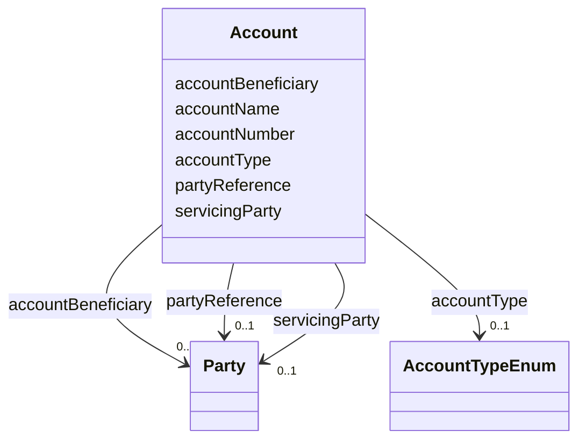

```mermaid
 classDiagram
    class Account
    click Account href "../Account"
      Account : accountBeneficiary
        
          
    
        
        
        Account --> "0..1" Party : accountBeneficiary
        click Party href "../Party"
    

        
      Account : accountName
        
      Account : accountNumber
        
      Account : accountType
        
          
    
        
        
        Account --> "0..1" AccountTypeEnum : accountType
        click AccountTypeEnum href "../AccountTypeEnum"
    

        
      Account : partyReference
        
          
    
        
        
        Account --> "0..1" Party : partyReference
        click Party href "../Party"
    

        
      Account : servicingParty
        
          
    
        
        
        Account --> "0..1" Party : servicingParty
        click Party href "../Party"
    

        
      
```
