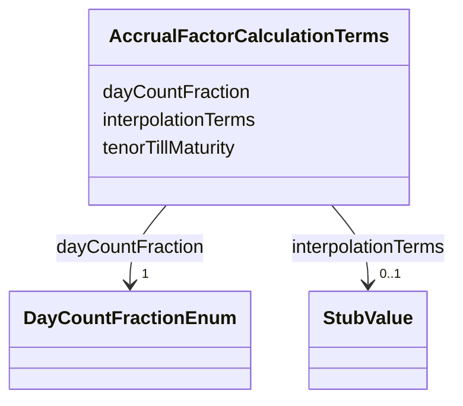

```mermaid
 classDiagram
    class AccrualFactorCalculationTerms
    click AccrualFactorCalculationTerms href "../AccrualFactorCalculationTerms"
      AccrualFactorCalculationTerms : dayCountFraction
        
          
    
        
        
        AccrualFactorCalculationTerms --> "1" DayCountFractionEnum : dayCountFraction
        click DayCountFractionEnum href "../DayCountFractionEnum"
    

        
      AccrualFactorCalculationTerms : interpolationTerms
        
          
    
        
        
        AccrualFactorCalculationTerms --> "0..1" StubValue : interpolationTerms
        click StubValue href "../StubValue"
    

        
      AccrualFactorCalculationTerms : tenorTillMaturity
        
      
```
