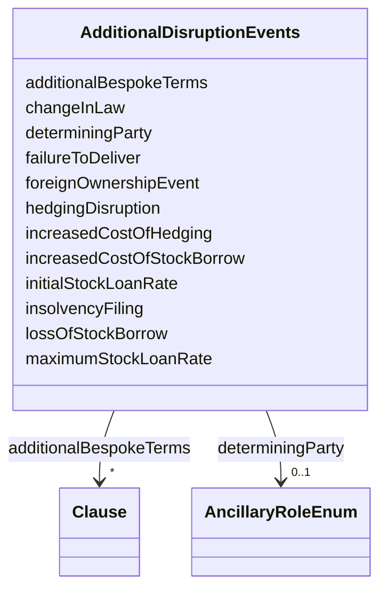

```mermaid
 classDiagram
    class AdditionalDisruptionEvents
    click AdditionalDisruptionEvents href "../AdditionalDisruptionEvents"
      AdditionalDisruptionEvents : additionalBespokeTerms
        
          
    
        
        
        AdditionalDisruptionEvents --> "*" Clause : additionalBespokeTerms
        click Clause href "../Clause"
    

        
      AdditionalDisruptionEvents : changeInLaw
        
      AdditionalDisruptionEvents : determiningParty
        
          
    
        
        
        AdditionalDisruptionEvents --> "0..1" AncillaryRoleEnum : determiningParty
        click AncillaryRoleEnum href "../AncillaryRoleEnum"
    

        
      AdditionalDisruptionEvents : failureToDeliver
        
      AdditionalDisruptionEvents : foreignOwnershipEvent
        
      AdditionalDisruptionEvents : hedgingDisruption
        
      AdditionalDisruptionEvents : increasedCostOfHedging
        
      AdditionalDisruptionEvents : increasedCostOfStockBorrow
        
      AdditionalDisruptionEvents : initialStockLoanRate
        
      AdditionalDisruptionEvents : insolvencyFiling
        
      AdditionalDisruptionEvents : lossOfStockBorrow
        
      AdditionalDisruptionEvents : maximumStockLoanRate
        
      
```
