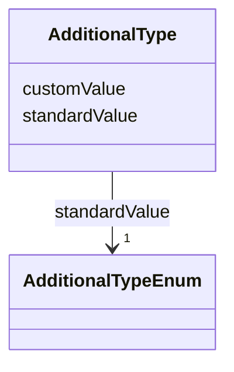

```mermaid
 classDiagram
    class AdditionalType
    click AdditionalType href "../AdditionalType"
      AdditionalType : customValue
        
      AdditionalType : standardValue
        
          
    
        
        
        AdditionalType --> "1" AdditionalTypeEnum : standardValue
        click AdditionalTypeEnum href "../AdditionalTypeEnum"
    

        
      
```
