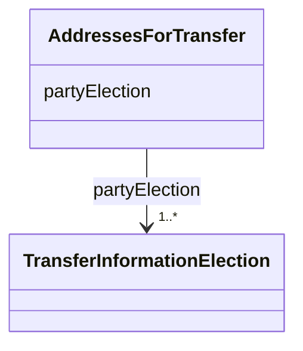

```mermaid
 classDiagram
    class AddressesForTransfer
    click AddressesForTransfer href "../AddressesForTransfer"
      AddressesForTransfer : partyElection
        
          
    
        
        
        AddressesForTransfer --> "1..*" TransferInformationElection : partyElection
        click TransferInformationElection href "../TransferInformationElection"
    

        
      
```
