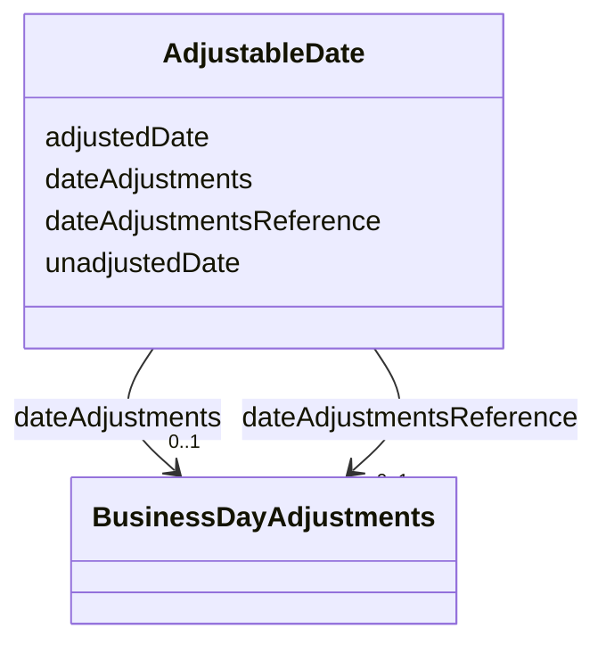

```mermaid
 classDiagram
    class AdjustableDate
    click AdjustableDate href "../AdjustableDate"
      AdjustableDate : adjustedDate
        
      AdjustableDate : dateAdjustments
        
          
    
        
        
        AdjustableDate --> "0..1" BusinessDayAdjustments : dateAdjustments
        click BusinessDayAdjustments href "../BusinessDayAdjustments"
    

        
      AdjustableDate : dateAdjustmentsReference
        
          
    
        
        
        AdjustableDate --> "0..1" BusinessDayAdjustments : dateAdjustmentsReference
        click BusinessDayAdjustments href "../BusinessDayAdjustments"
    

        
      AdjustableDate : unadjustedDate
        
      
```
