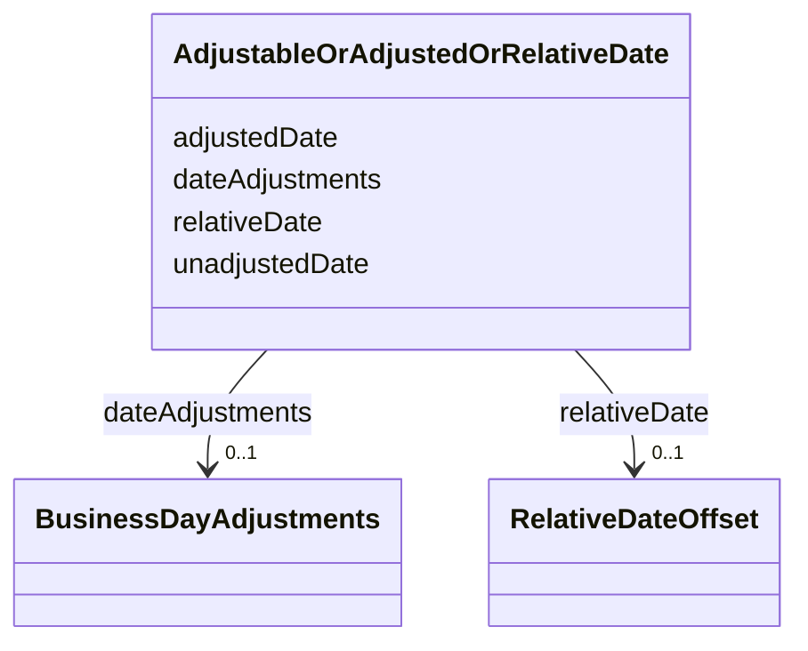

```mermaid
 classDiagram
    class AdjustableOrAdjustedOrRelativeDate
    click AdjustableOrAdjustedOrRelativeDate href "../AdjustableOrAdjustedOrRelativeDate"
      AdjustableOrAdjustedOrRelativeDate : adjustedDate
        
      AdjustableOrAdjustedOrRelativeDate : dateAdjustments
        
          
    
        
        
        AdjustableOrAdjustedOrRelativeDate --> "0..1" BusinessDayAdjustments : dateAdjustments
        click BusinessDayAdjustments href "../BusinessDayAdjustments"
    

        
      AdjustableOrAdjustedOrRelativeDate : relativeDate
        
          
    
        
        
        AdjustableOrAdjustedOrRelativeDate --> "0..1" RelativeDateOffset : relativeDate
        click RelativeDateOffset href "../RelativeDateOffset"
    

        
      AdjustableOrAdjustedOrRelativeDate : unadjustedDate
        
      
```
