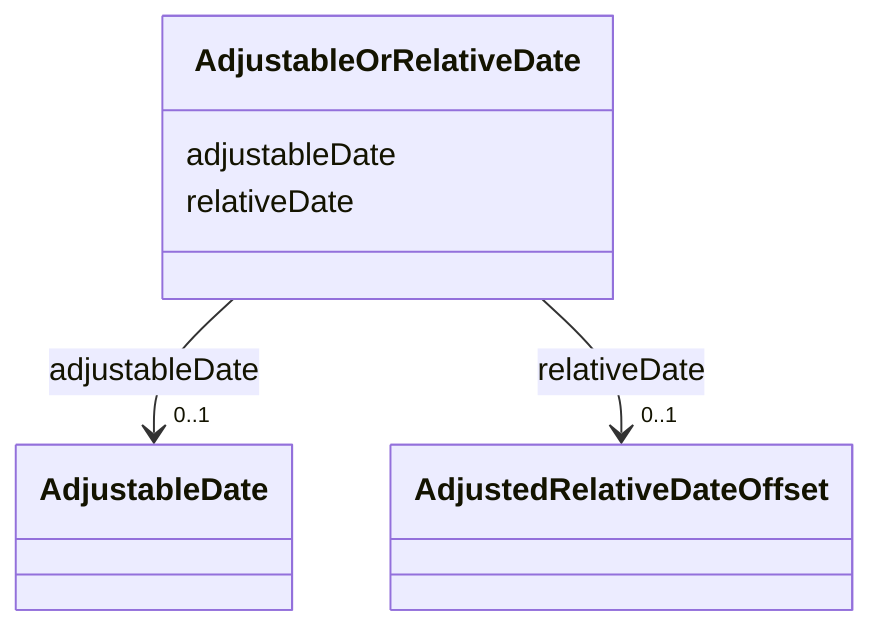

```mermaid
 classDiagram
    class AdjustableOrRelativeDate
    click AdjustableOrRelativeDate href "../AdjustableOrRelativeDate"
      AdjustableOrRelativeDate : adjustableDate
        
          
    
        
        
        AdjustableOrRelativeDate --> "0..1" AdjustableDate : adjustableDate
        click AdjustableDate href "../AdjustableDate"
    

        
      AdjustableOrRelativeDate : relativeDate
        
          
    
        
        
        AdjustableOrRelativeDate --> "0..1" AdjustedRelativeDateOffset : relativeDate
        click AdjustedRelativeDateOffset href "../AdjustedRelativeDateOffset"
    

        
      
```
