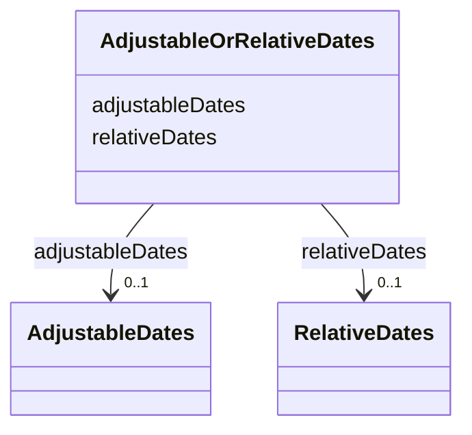

```mermaid
 classDiagram
    class AdjustableOrRelativeDates
    click AdjustableOrRelativeDates href "../AdjustableOrRelativeDates"
      AdjustableOrRelativeDates : adjustableDates
        
          
    
        
        
        AdjustableOrRelativeDates --> "0..1" AdjustableDates : adjustableDates
        click AdjustableDates href "../AdjustableDates"
    

        
      AdjustableOrRelativeDates : relativeDates
        
          
    
        
        
        AdjustableOrRelativeDates --> "0..1" RelativeDates : relativeDates
        click RelativeDates href "../RelativeDates"
    

        
      
```
