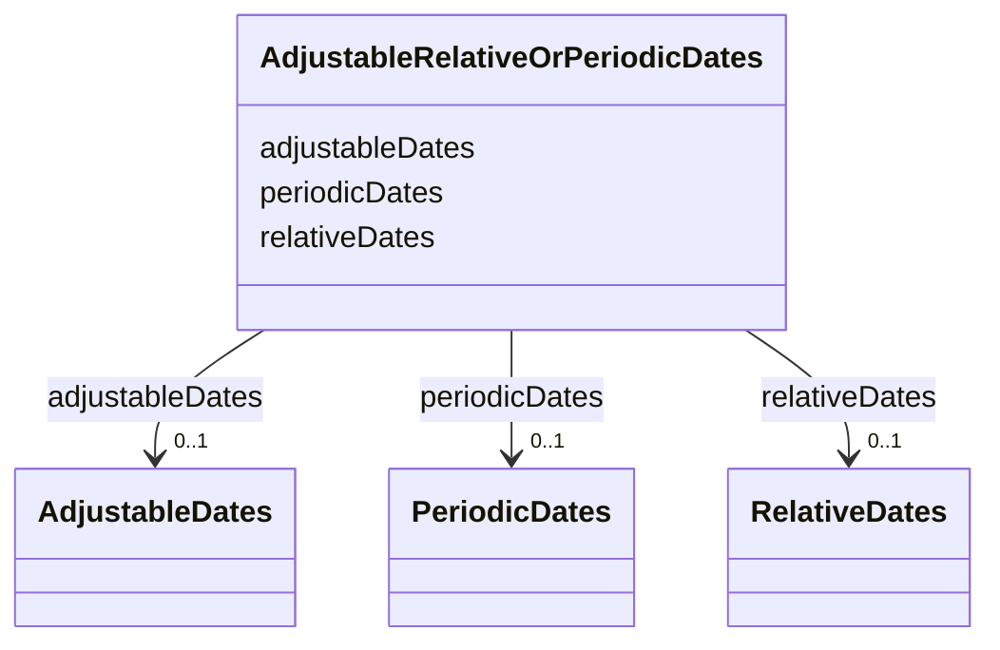

```mermaid
 classDiagram
    class AdjustableRelativeOrPeriodicDates
    click AdjustableRelativeOrPeriodicDates href "../AdjustableRelativeOrPeriodicDates"
      AdjustableRelativeOrPeriodicDates : adjustableDates
        
          
    
        
        
        AdjustableRelativeOrPeriodicDates --> "0..1" AdjustableDates : adjustableDates
        click AdjustableDates href "../AdjustableDates"
    

        
      AdjustableRelativeOrPeriodicDates : periodicDates
        
          
    
        
        
        AdjustableRelativeOrPeriodicDates --> "0..1" PeriodicDates : periodicDates
        click PeriodicDates href "../PeriodicDates"
    

        
      AdjustableRelativeOrPeriodicDates : relativeDates
        
          
    
        
        
        AdjustableRelativeOrPeriodicDates --> "0..1" RelativeDates : relativeDates
        click RelativeDates href "../RelativeDates"
    

        
      
```
