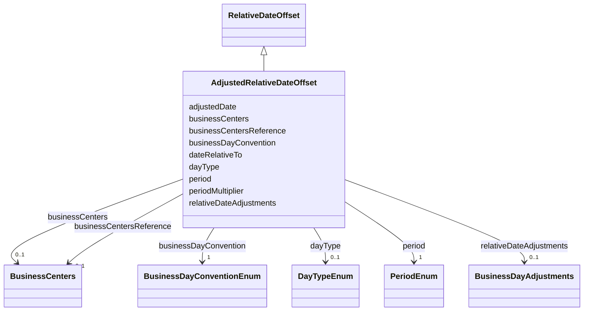

```mermaid
 classDiagram
    class AdjustedRelativeDateOffset
    click AdjustedRelativeDateOffset href "../AdjustedRelativeDateOffset"
      RelativeDateOffset <|-- AdjustedRelativeDateOffset
        click RelativeDateOffset href "../RelativeDateOffset"
      
      AdjustedRelativeDateOffset : adjustedDate
        
      AdjustedRelativeDateOffset : businessCenters
        
          
    
        
        
        AdjustedRelativeDateOffset --> "0..1" BusinessCenters : businessCenters
        click BusinessCenters href "../BusinessCenters"
    

        
      AdjustedRelativeDateOffset : businessCentersReference
        
          
    
        
        
        AdjustedRelativeDateOffset --> "0..1" BusinessCenters : businessCentersReference
        click BusinessCenters href "../BusinessCenters"
    

        
      AdjustedRelativeDateOffset : businessDayConvention
        
          
    
        
        
        AdjustedRelativeDateOffset --> "1" BusinessDayConventionEnum : businessDayConvention
        click BusinessDayConventionEnum href "../BusinessDayConventionEnum"
    

        
      AdjustedRelativeDateOffset : dateRelativeTo
        
      AdjustedRelativeDateOffset : dayType
        
          
    
        
        
        AdjustedRelativeDateOffset --> "0..1" DayTypeEnum : dayType
        click DayTypeEnum href "../DayTypeEnum"
    

        
      AdjustedRelativeDateOffset : period
        
          
    
        
        
        AdjustedRelativeDateOffset --> "1" PeriodEnum : period
        click PeriodEnum href "../PeriodEnum"
    

        
      AdjustedRelativeDateOffset : periodMultiplier
        
      AdjustedRelativeDateOffset : relativeDateAdjustments
        
          
    
        
        
        AdjustedRelativeDateOffset --> "0..1" BusinessDayAdjustments : relativeDateAdjustments
        click BusinessDayAdjustments href "../BusinessDayAdjustments"
    

        
      
```
