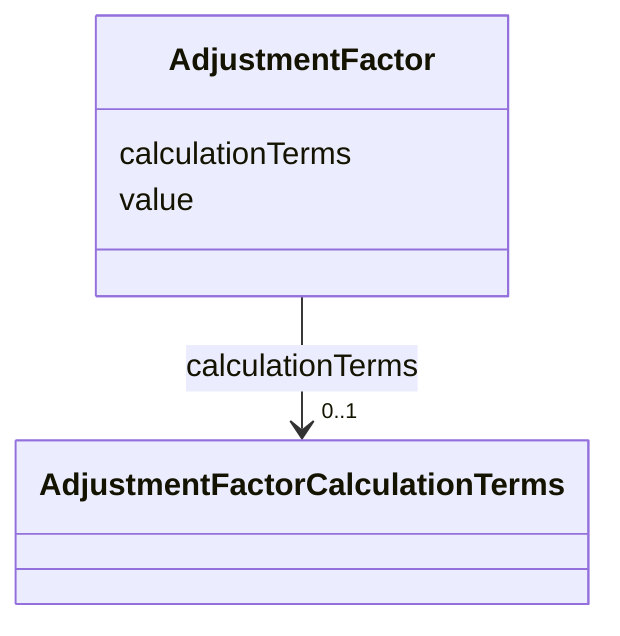

```mermaid
 classDiagram
    class AdjustmentFactor
    click AdjustmentFactor href "../AdjustmentFactor"
      AdjustmentFactor : calculationTerms
        
          
    
        
        
        AdjustmentFactor --> "0..1" AdjustmentFactorCalculationTerms : calculationTerms
        click AdjustmentFactorCalculationTerms href "../AdjustmentFactorCalculationTerms"
    

        
      AdjustmentFactor : value
        
      
```
