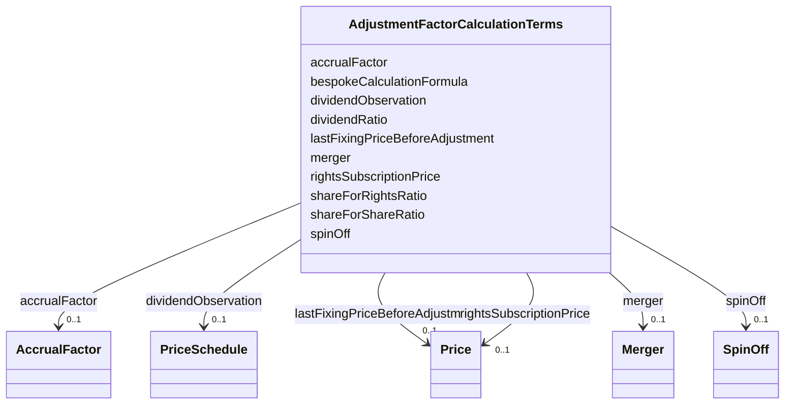

```mermaid
 classDiagram
    class AdjustmentFactorCalculationTerms
    click AdjustmentFactorCalculationTerms href "../AdjustmentFactorCalculationTerms"
      AdjustmentFactorCalculationTerms : accrualFactor
        
          
    
        
        
        AdjustmentFactorCalculationTerms --> "0..1" AccrualFactor : accrualFactor
        click AccrualFactor href "../AccrualFactor"
    

        
      AdjustmentFactorCalculationTerms : bespokeCalculationFormula
        
      AdjustmentFactorCalculationTerms : dividendObservation
        
          
    
        
        
        AdjustmentFactorCalculationTerms --> "0..1" PriceSchedule : dividendObservation
        click PriceSchedule href "../PriceSchedule"
    

        
      AdjustmentFactorCalculationTerms : dividendRatio
        
      AdjustmentFactorCalculationTerms : lastFixingPriceBeforeAdjustment
        
          
    
        
        
        AdjustmentFactorCalculationTerms --> "0..1" Price : lastFixingPriceBeforeAdjustment
        click Price href "../Price"
    

        
      AdjustmentFactorCalculationTerms : merger
        
          
    
        
        
        AdjustmentFactorCalculationTerms --> "0..1" Merger : merger
        click Merger href "../Merger"
    

        
      AdjustmentFactorCalculationTerms : rightsSubscriptionPrice
        
          
    
        
        
        AdjustmentFactorCalculationTerms --> "0..1" Price : rightsSubscriptionPrice
        click Price href "../Price"
    

        
      AdjustmentFactorCalculationTerms : shareForRightsRatio
        
      AdjustmentFactorCalculationTerms : shareForShareRatio
        
      AdjustmentFactorCalculationTerms : spinOff
        
          
    
        
        
        AdjustmentFactorCalculationTerms --> "0..1" SpinOff : spinOff
        click SpinOff href "../SpinOff"
    

        
      
```
