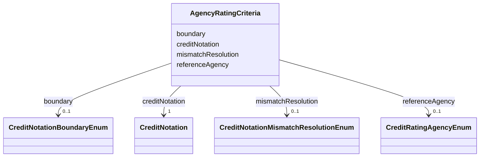

```mermaid
 classDiagram
    class AgencyRatingCriteria
    click AgencyRatingCriteria href "../AgencyRatingCriteria"
      AgencyRatingCriteria : boundary
        
          
    
        
        
        AgencyRatingCriteria --> "0..1" CreditNotationBoundaryEnum : boundary
        click CreditNotationBoundaryEnum href "../CreditNotationBoundaryEnum"
    

        
      AgencyRatingCriteria : creditNotation
        
          
    
        
        
        AgencyRatingCriteria --> "1" CreditNotation : creditNotation
        click CreditNotation href "../CreditNotation"
    

        
      AgencyRatingCriteria : mismatchResolution
        
          
    
        
        
        AgencyRatingCriteria --> "0..1" CreditNotationMismatchResolutionEnum : mismatchResolution
        click CreditNotationMismatchResolutionEnum href "../CreditNotationMismatchResolutionEnum"
    

        
      AgencyRatingCriteria : referenceAgency
        
          
    
        
        
        AgencyRatingCriteria --> "0..1" CreditRatingAgencyEnum : referenceAgency
        click CreditRatingAgencyEnum href "../CreditRatingAgencyEnum"
    

        
      
```
