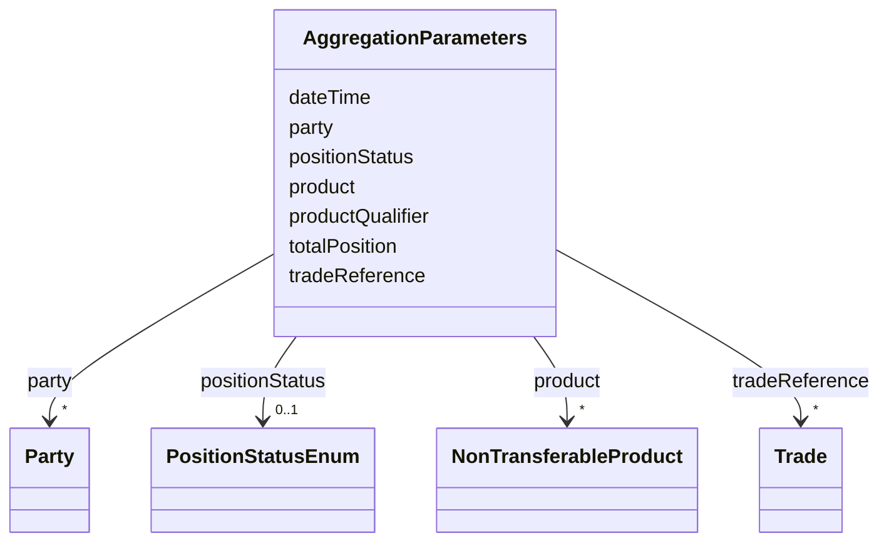

```mermaid
 classDiagram
    class AggregationParameters
    click AggregationParameters href "../AggregationParameters"
      AggregationParameters : dateTime
        
      AggregationParameters : party
        
          
    
        
        
        AggregationParameters --> "*" Party : party
        click Party href "../Party"
    

        
      AggregationParameters : positionStatus
        
          
    
        
        
        AggregationParameters --> "0..1" PositionStatusEnum : positionStatus
        click PositionStatusEnum href "../PositionStatusEnum"
    

        
      AggregationParameters : product
        
          
    
        
        
        AggregationParameters --> "*" NonTransferableProduct : product
        click NonTransferableProduct href "../NonTransferableProduct"
    

        
      AggregationParameters : productQualifier
        
      AggregationParameters : totalPosition
        
      AggregationParameters : tradeReference
        
          
    
        
        
        AggregationParameters --> "*" Trade : tradeReference
        click Trade href "../Trade"
    

        
      
```
