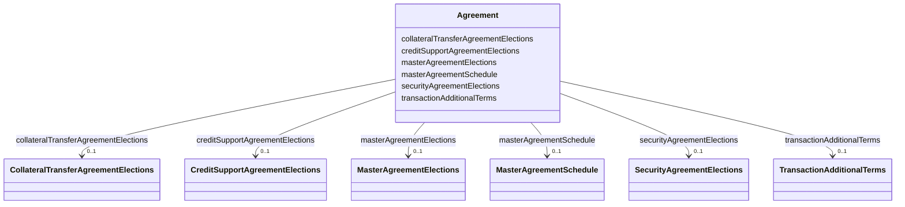

```mermaid
 classDiagram
    class Agreement
    click Agreement href "../Agreement"
      Agreement : collateralTransferAgreementElections
        
          
    
        
        
        Agreement --> "0..1" CollateralTransferAgreementElections : collateralTransferAgreementElections
        click CollateralTransferAgreementElections href "../CollateralTransferAgreementElections"
    

        
      Agreement : creditSupportAgreementElections
        
          
    
        
        
        Agreement --> "0..1" CreditSupportAgreementElections : creditSupportAgreementElections
        click CreditSupportAgreementElections href "../CreditSupportAgreementElections"
    

        
      Agreement : masterAgreementElections
        
          
    
        
        
        Agreement --> "0..1" MasterAgreementElections : masterAgreementElections
        click MasterAgreementElections href "../MasterAgreementElections"
    

        
      Agreement : masterAgreementSchedule
        
          
    
        
        
        Agreement --> "0..1" MasterAgreementSchedule : masterAgreementSchedule
        click MasterAgreementSchedule href "../MasterAgreementSchedule"
    

        
      Agreement : securityAgreementElections
        
          
    
        
        
        Agreement --> "0..1" SecurityAgreementElections : securityAgreementElections
        click SecurityAgreementElections href "../SecurityAgreementElections"
    

        
      Agreement : transactionAdditionalTerms
        
          
    
        
        
        Agreement --> "0..1" TransactionAdditionalTerms : transactionAdditionalTerms
        click TransactionAdditionalTerms href "../TransactionAdditionalTerms"
    

        
      
```
