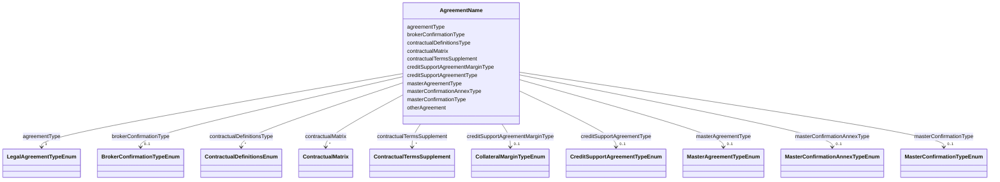

```mermaid
 classDiagram
    class AgreementName
    click AgreementName href "../AgreementName"
      AgreementName : agreementType
        
          
    
        
        
        AgreementName --> "1" LegalAgreementTypeEnum : agreementType
        click LegalAgreementTypeEnum href "../LegalAgreementTypeEnum"
    

        
      AgreementName : brokerConfirmationType
        
          
    
        
        
        AgreementName --> "0..1" BrokerConfirmationTypeEnum : brokerConfirmationType
        click BrokerConfirmationTypeEnum href "../BrokerConfirmationTypeEnum"
    

        
      AgreementName : contractualDefinitionsType
        
          
    
        
        
        AgreementName --> "*" ContractualDefinitionsEnum : contractualDefinitionsType
        click ContractualDefinitionsEnum href "../ContractualDefinitionsEnum"
    

        
      AgreementName : contractualMatrix
        
          
    
        
        
        AgreementName --> "*" ContractualMatrix : contractualMatrix
        click ContractualMatrix href "../ContractualMatrix"
    

        
      AgreementName : contractualTermsSupplement
        
          
    
        
        
        AgreementName --> "*" ContractualTermsSupplement : contractualTermsSupplement
        click ContractualTermsSupplement href "../ContractualTermsSupplement"
    

        
      AgreementName : creditSupportAgreementMarginType
        
          
    
        
        
        AgreementName --> "0..1" CollateralMarginTypeEnum : creditSupportAgreementMarginType
        click CollateralMarginTypeEnum href "../CollateralMarginTypeEnum"
    

        
      AgreementName : creditSupportAgreementType
        
          
    
        
        
        AgreementName --> "0..1" CreditSupportAgreementTypeEnum : creditSupportAgreementType
        click CreditSupportAgreementTypeEnum href "../CreditSupportAgreementTypeEnum"
    

        
      AgreementName : masterAgreementType
        
          
    
        
        
        AgreementName --> "0..1" MasterAgreementTypeEnum : masterAgreementType
        click MasterAgreementTypeEnum href "../MasterAgreementTypeEnum"
    

        
      AgreementName : masterConfirmationAnnexType
        
          
    
        
        
        AgreementName --> "0..1" MasterConfirmationAnnexTypeEnum : masterConfirmationAnnexType
        click MasterConfirmationAnnexTypeEnum href "../MasterConfirmationAnnexTypeEnum"
    

        
      AgreementName : masterConfirmationType
        
          
    
        
        
        AgreementName --> "0..1" MasterConfirmationTypeEnum : masterConfirmationType
        click MasterConfirmationTypeEnum href "../MasterConfirmationTypeEnum"
    

        
      AgreementName : otherAgreement
        
      
```
