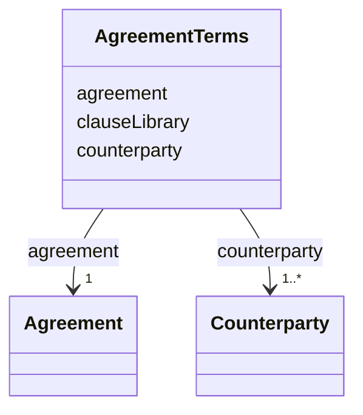

```mermaid
 classDiagram
    class AgreementTerms
    click AgreementTerms href "../AgreementTerms"
      AgreementTerms : agreement
        
          
    
        
        
        AgreementTerms --> "1" Agreement : agreement
        click Agreement href "../Agreement"
    

        
      AgreementTerms : clauseLibrary
        
      AgreementTerms : counterparty
        
          
    
        
        
        AgreementTerms --> "1..*" Counterparty : counterparty
        click Counterparty href "../Counterparty"
    

        
      
```
