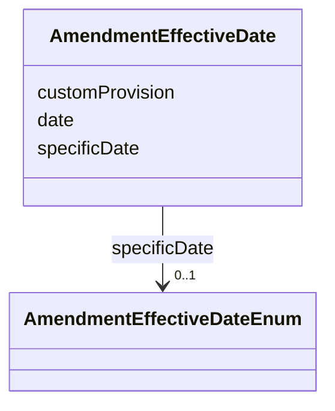

```mermaid
 classDiagram
    class AmendmentEffectiveDate
    click AmendmentEffectiveDate href "../AmendmentEffectiveDate"
      AmendmentEffectiveDate : customProvision
        
      AmendmentEffectiveDate : date
        
      AmendmentEffectiveDate : specificDate
        
          
    
        
        
        AmendmentEffectiveDate --> "0..1" AmendmentEffectiveDateEnum : specificDate
        click AmendmentEffectiveDateEnum href "../AmendmentEffectiveDateEnum"
    

        
      
```
