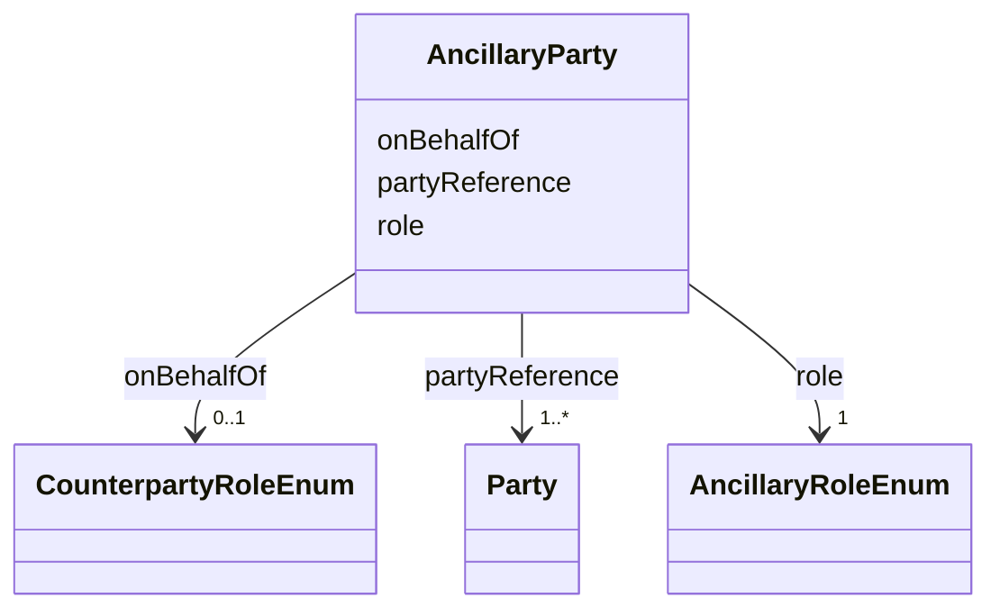

```mermaid
 classDiagram
    class AncillaryParty
    click AncillaryParty href "../AncillaryParty"
      AncillaryParty : onBehalfOf
        
          
    
        
        
        AncillaryParty --> "0..1" CounterpartyRoleEnum : onBehalfOf
        click CounterpartyRoleEnum href "../CounterpartyRoleEnum"
    

        
      AncillaryParty : partyReference
        
          
    
        
        
        AncillaryParty --> "1..*" Party : partyReference
        click Party href "../Party"
    

        
      AncillaryParty : role
        
          
    
        
        
        AncillaryParty --> "1" AncillaryRoleEnum : role
        click AncillaryRoleEnum href "../AncillaryRoleEnum"
    

        
      
```
