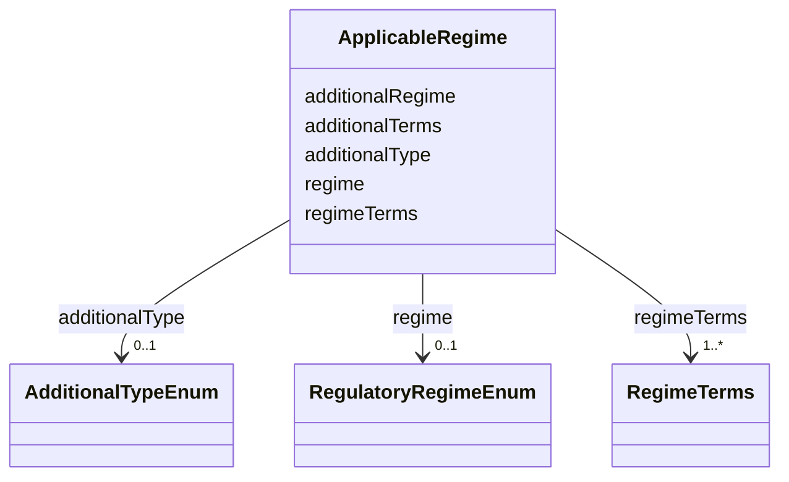

```mermaid
 classDiagram
    class ApplicableRegime
    click ApplicableRegime href "../ApplicableRegime"
      ApplicableRegime : additionalRegime
        
      ApplicableRegime : additionalTerms
        
      ApplicableRegime : additionalType
        
          
    
        
        
        ApplicableRegime --> "0..1" AdditionalTypeEnum : additionalType
        click AdditionalTypeEnum href "../AdditionalTypeEnum"
    

        
      ApplicableRegime : regime
        
          
    
        
        
        ApplicableRegime --> "0..1" RegulatoryRegimeEnum : regime
        click RegulatoryRegimeEnum href "../RegulatoryRegimeEnum"
    

        
      ApplicableRegime : regimeTerms
        
          
    
        
        
        ApplicableRegime --> "1..*" RegimeTerms : regimeTerms
        click RegimeTerms href "../RegimeTerms"
    

        
      
```
