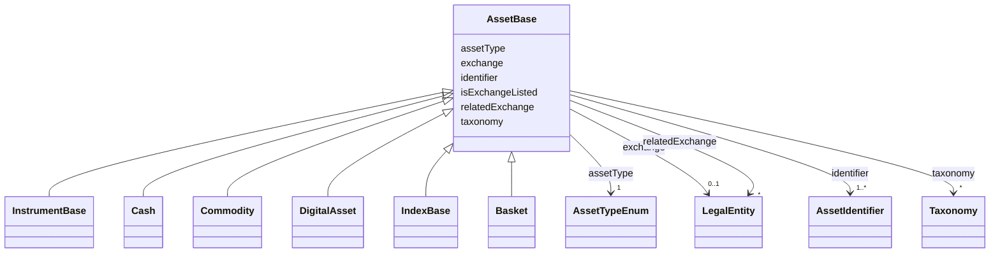

```mermaid
 classDiagram
    class AssetBase
    click AssetBase href "../AssetBase"
      AssetBase <|-- InstrumentBase
        click InstrumentBase href "../InstrumentBase"
      AssetBase <|-- Cash
        click Cash href "../Cash"
      AssetBase <|-- Commodity
        click Commodity href "../Commodity"
      AssetBase <|-- DigitalAsset
        click DigitalAsset href "../DigitalAsset"
      AssetBase <|-- IndexBase
        click IndexBase href "../IndexBase"
      AssetBase <|-- Basket
        click Basket href "../Basket"
      
      AssetBase : assetType
        
          
    
        
        
        AssetBase --> "1" AssetTypeEnum : assetType
        click AssetTypeEnum href "../AssetTypeEnum"
    

        
      AssetBase : exchange
        
          
    
        
        
        AssetBase --> "0..1" LegalEntity : exchange
        click LegalEntity href "../LegalEntity"
    

        
      AssetBase : identifier
        
          
    
        
        
        AssetBase --> "1..*" AssetIdentifier : identifier
        click AssetIdentifier href "../AssetIdentifier"
    

        
      AssetBase : isExchangeListed
        
      AssetBase : relatedExchange
        
          
    
        
        
        AssetBase --> "*" LegalEntity : relatedExchange
        click LegalEntity href "../LegalEntity"
    

        
      AssetBase : taxonomy
        
          
    
        
        
        AssetBase --> "*" Taxonomy : taxonomy
        click Taxonomy href "../Taxonomy"
    

        
      
```
