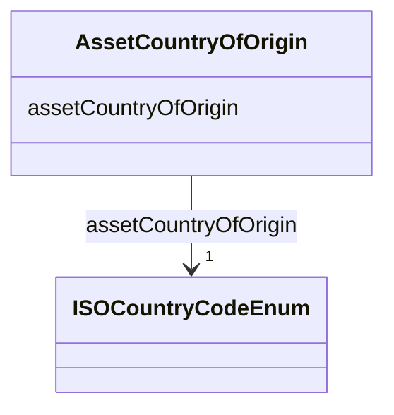

```mermaid
 classDiagram
    class AssetCountryOfOrigin
    click AssetCountryOfOrigin href "../AssetCountryOfOrigin"
      AssetCountryOfOrigin : assetCountryOfOrigin
        
          
    
        
        
        AssetCountryOfOrigin --> "1" ISOCountryCodeEnum : assetCountryOfOrigin
        click ISOCountryCodeEnum href "../ISOCountryCodeEnum"
    

        
      
```
