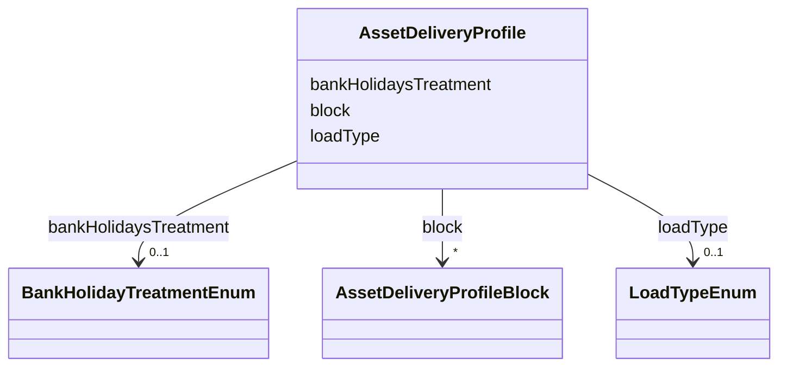

```mermaid
 classDiagram
    class AssetDeliveryProfile
    click AssetDeliveryProfile href "../AssetDeliveryProfile"
      AssetDeliveryProfile : bankHolidaysTreatment
        
          
    
        
        
        AssetDeliveryProfile --> "0..1" BankHolidayTreatmentEnum : bankHolidaysTreatment
        click BankHolidayTreatmentEnum href "../BankHolidayTreatmentEnum"
    

        
      AssetDeliveryProfile : block
        
          
    
        
        
        AssetDeliveryProfile --> "*" AssetDeliveryProfileBlock : block
        click AssetDeliveryProfileBlock href "../AssetDeliveryProfileBlock"
    

        
      AssetDeliveryProfile : loadType
        
          
    
        
        
        AssetDeliveryProfile --> "0..1" LoadTypeEnum : loadType
        click LoadTypeEnum href "../LoadTypeEnum"
    

        
      
```
