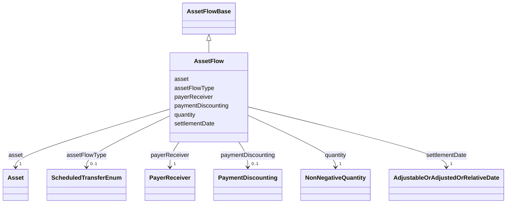

```mermaid
 classDiagram
    class AssetFlow
    click AssetFlow href "../AssetFlow"
      AssetFlowBase <|-- AssetFlow
        click AssetFlowBase href "../AssetFlowBase"
      
      AssetFlow : asset
        
          
    
        
        
        AssetFlow --> "1" Asset : asset
        click Asset href "../Asset"
    

        
      AssetFlow : assetFlowType
        
          
    
        
        
        AssetFlow --> "0..1" ScheduledTransferEnum : assetFlowType
        click ScheduledTransferEnum href "../ScheduledTransferEnum"
    

        
      AssetFlow : payerReceiver
        
          
    
        
        
        AssetFlow --> "1" PayerReceiver : payerReceiver
        click PayerReceiver href "../PayerReceiver"
    

        
      AssetFlow : paymentDiscounting
        
          
    
        
        
        AssetFlow --> "0..1" PaymentDiscounting : paymentDiscounting
        click PaymentDiscounting href "../PaymentDiscounting"
    

        
      AssetFlow : quantity
        
          
    
        
        
        AssetFlow --> "1" NonNegativeQuantity : quantity
        click NonNegativeQuantity href "../NonNegativeQuantity"
    

        
      AssetFlow : settlementDate
        
          
    
        
        
        AssetFlow --> "1" AdjustableOrAdjustedOrRelativeDate : settlementDate
        click AdjustableOrAdjustedOrRelativeDate href "../AdjustableOrAdjustedOrRelativeDate"
    

        
      
```
