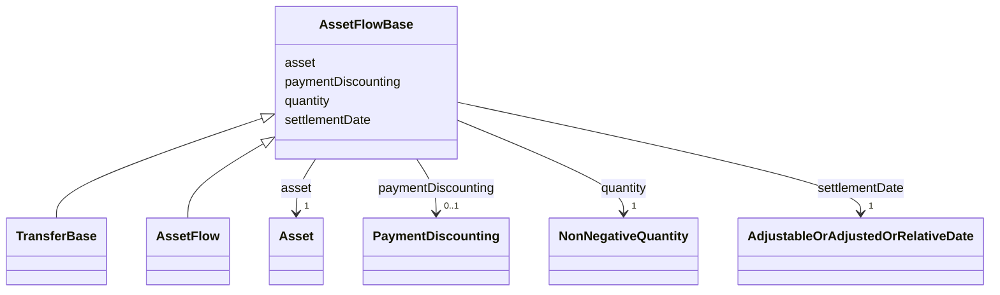

```mermaid
 classDiagram
    class AssetFlowBase
    click AssetFlowBase href "../AssetFlowBase"
      AssetFlowBase <|-- TransferBase
        click TransferBase href "../TransferBase"
      AssetFlowBase <|-- AssetFlow
        click AssetFlow href "../AssetFlow"
      
      AssetFlowBase : asset
        
          
    
        
        
        AssetFlowBase --> "1" Asset : asset
        click Asset href "../Asset"
    

        
      AssetFlowBase : paymentDiscounting
        
          
    
        
        
        AssetFlowBase --> "0..1" PaymentDiscounting : paymentDiscounting
        click PaymentDiscounting href "../PaymentDiscounting"
    

        
      AssetFlowBase : quantity
        
          
    
        
        
        AssetFlowBase --> "1" NonNegativeQuantity : quantity
        click NonNegativeQuantity href "../NonNegativeQuantity"
    

        
      AssetFlowBase : settlementDate
        
          
    
        
        
        AssetFlowBase --> "1" AdjustableOrAdjustedOrRelativeDate : settlementDate
        click AdjustableOrAdjustedOrRelativeDate href "../AdjustableOrAdjustedOrRelativeDate"
    

        
      
```
