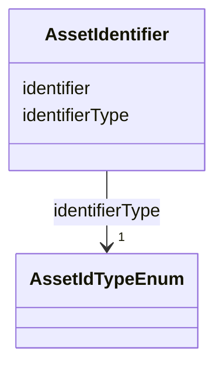

```mermaid
 classDiagram
    class AssetIdentifier
    click AssetIdentifier href "../AssetIdentifier"
      AssetIdentifier : identifier
        
      AssetIdentifier : identifierType
        
          
    
        
        
        AssetIdentifier --> "1" AssetIdTypeEnum : identifierType
        click AssetIdTypeEnum href "../AssetIdTypeEnum"
    

        
      
```
