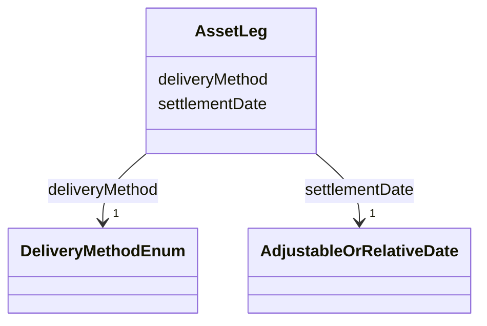

```mermaid
 classDiagram
    class AssetLeg
    click AssetLeg href "../AssetLeg"
      AssetLeg : deliveryMethod
        
          
    
        
        
        AssetLeg --> "1" DeliveryMethodEnum : deliveryMethod
        click DeliveryMethodEnum href "../DeliveryMethodEnum"
    

        
      AssetLeg : settlementDate
        
          
    
        
        
        AssetLeg --> "1" AdjustableOrRelativeDate : settlementDate
        click AdjustableOrRelativeDate href "../AdjustableOrRelativeDate"
    

        
      
```
