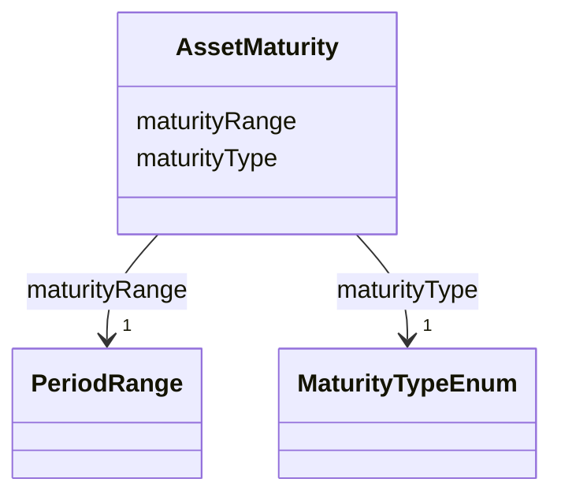

```mermaid
 classDiagram
    class AssetMaturity
    click AssetMaturity href "../AssetMaturity"
      AssetMaturity : maturityRange
        
          
    
        
        
        AssetMaturity --> "1" PeriodRange : maturityRange
        click PeriodRange href "../PeriodRange"
    

        
      AssetMaturity : maturityType
        
          
    
        
        
        AssetMaturity --> "1" MaturityTypeEnum : maturityType
        click MaturityTypeEnum href "../MaturityTypeEnum"
    

        
      
```
