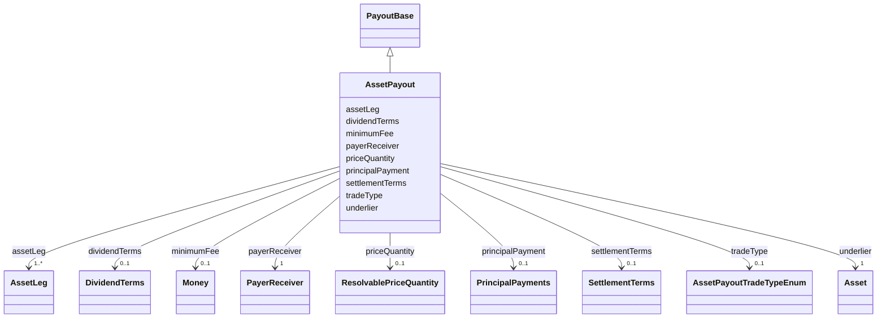

```mermaid
 classDiagram
    class AssetPayout
    click AssetPayout href "../AssetPayout"
      PayoutBase <|-- AssetPayout
        click PayoutBase href "../PayoutBase"
      
      AssetPayout : assetLeg
        
          
    
        
        
        AssetPayout --> "1..*" AssetLeg : assetLeg
        click AssetLeg href "../AssetLeg"
    

        
      AssetPayout : dividendTerms
        
          
    
        
        
        AssetPayout --> "0..1" DividendTerms : dividendTerms
        click DividendTerms href "../DividendTerms"
    

        
      AssetPayout : minimumFee
        
          
    
        
        
        AssetPayout --> "0..1" Money : minimumFee
        click Money href "../Money"
    

        
      AssetPayout : payerReceiver
        
          
    
        
        
        AssetPayout --> "1" PayerReceiver : payerReceiver
        click PayerReceiver href "../PayerReceiver"
    

        
      AssetPayout : priceQuantity
        
          
    
        
        
        AssetPayout --> "0..1" ResolvablePriceQuantity : priceQuantity
        click ResolvablePriceQuantity href "../ResolvablePriceQuantity"
    

        
      AssetPayout : principalPayment
        
          
    
        
        
        AssetPayout --> "0..1" PrincipalPayments : principalPayment
        click PrincipalPayments href "../PrincipalPayments"
    

        
      AssetPayout : settlementTerms
        
          
    
        
        
        AssetPayout --> "0..1" SettlementTerms : settlementTerms
        click SettlementTerms href "../SettlementTerms"
    

        
      AssetPayout : tradeType
        
          
    
        
        
        AssetPayout --> "0..1" AssetPayoutTradeTypeEnum : tradeType
        click AssetPayoutTradeTypeEnum href "../AssetPayoutTradeTypeEnum"
    

        
      AssetPayout : underlier
        
          
    
        
        
        AssetPayout --> "1" Asset : underlier
        click Asset href "../Asset"
    

        
      
```
