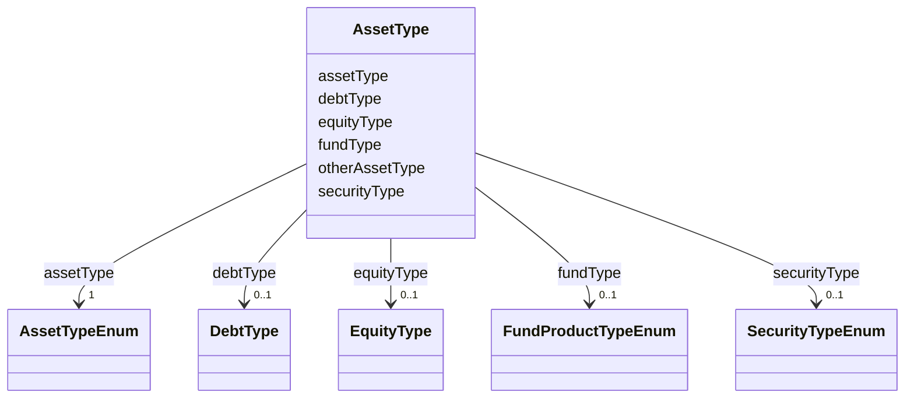

```mermaid
 classDiagram
    class AssetType
    click AssetType href "../AssetType"
      AssetType : assetType
        
          
    
        
        
        AssetType --> "1" AssetTypeEnum : assetType
        click AssetTypeEnum href "../AssetTypeEnum"
    

        
      AssetType : debtType
        
          
    
        
        
        AssetType --> "0..1" DebtType : debtType
        click DebtType href "../DebtType"
    

        
      AssetType : equityType
        
          
    
        
        
        AssetType --> "0..1" EquityType : equityType
        click EquityType href "../EquityType"
    

        
      AssetType : fundType
        
          
    
        
        
        AssetType --> "0..1" FundProductTypeEnum : fundType
        click FundProductTypeEnum href "../FundProductTypeEnum"
    

        
      AssetType : otherAssetType
        
      AssetType : securityType
        
          
    
        
        
        AssetType --> "0..1" SecurityTypeEnum : securityType
        click SecurityTypeEnum href "../SecurityTypeEnum"
    

        
      
```
