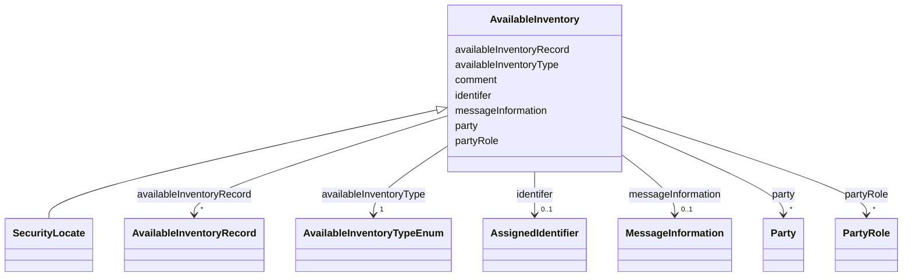

```mermaid
 classDiagram
    class AvailableInventory
    click AvailableInventory href "../AvailableInventory"
      AvailableInventory <|-- SecurityLocate
        click SecurityLocate href "../SecurityLocate"
      
      AvailableInventory : availableInventoryRecord
        
          
    
        
        
        AvailableInventory --> "*" AvailableInventoryRecord : availableInventoryRecord
        click AvailableInventoryRecord href "../AvailableInventoryRecord"
    

        
      AvailableInventory : availableInventoryType
        
          
    
        
        
        AvailableInventory --> "1" AvailableInventoryTypeEnum : availableInventoryType
        click AvailableInventoryTypeEnum href "../AvailableInventoryTypeEnum"
    

        
      AvailableInventory : comment
        
      AvailableInventory : identifer
        
          
    
        
        
        AvailableInventory --> "0..1" AssignedIdentifier : identifer
        click AssignedIdentifier href "../AssignedIdentifier"
    

        
      AvailableInventory : messageInformation
        
          
    
        
        
        AvailableInventory --> "0..1" MessageInformation : messageInformation
        click MessageInformation href "../MessageInformation"
    

        
      AvailableInventory : party
        
          
    
        
        
        AvailableInventory --> "*" Party : party
        click Party href "../Party"
    

        
      AvailableInventory : partyRole
        
          
    
        
        
        AvailableInventory --> "*" PartyRole : partyRole
        click PartyRole href "../PartyRole"
    

        
      
```
