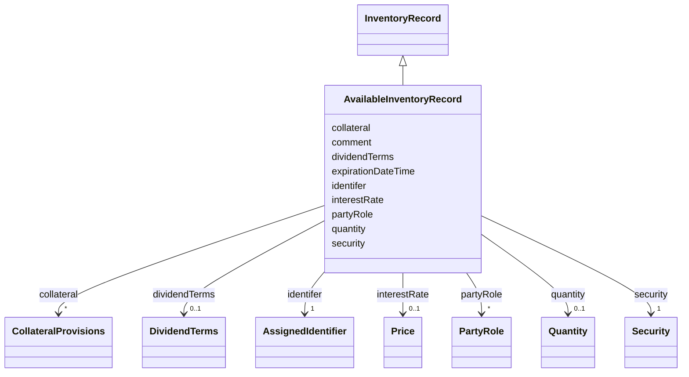

```mermaid
 classDiagram
    class AvailableInventoryRecord
    click AvailableInventoryRecord href "../AvailableInventoryRecord"
      InventoryRecord <|-- AvailableInventoryRecord
        click InventoryRecord href "../InventoryRecord"
      
      AvailableInventoryRecord : collateral
        
          
    
        
        
        AvailableInventoryRecord --> "*" CollateralProvisions : collateral
        click CollateralProvisions href "../CollateralProvisions"
    

        
      AvailableInventoryRecord : comment
        
      AvailableInventoryRecord : dividendTerms
        
          
    
        
        
        AvailableInventoryRecord --> "0..1" DividendTerms : dividendTerms
        click DividendTerms href "../DividendTerms"
    

        
      AvailableInventoryRecord : expirationDateTime
        
      AvailableInventoryRecord : identifer
        
          
    
        
        
        AvailableInventoryRecord --> "1" AssignedIdentifier : identifer
        click AssignedIdentifier href "../AssignedIdentifier"
    

        
      AvailableInventoryRecord : interestRate
        
          
    
        
        
        AvailableInventoryRecord --> "0..1" Price : interestRate
        click Price href "../Price"
    

        
      AvailableInventoryRecord : partyRole
        
          
    
        
        
        AvailableInventoryRecord --> "*" PartyRole : partyRole
        click PartyRole href "../PartyRole"
    

        
      AvailableInventoryRecord : quantity
        
          
    
        
        
        AvailableInventoryRecord --> "0..1" Quantity : quantity
        click Quantity href "../Quantity"
    

        
      AvailableInventoryRecord : security
        
          
    
        
        
        AvailableInventoryRecord --> "1" Security : security
        click Security href "../Security"
    

        
      
```
