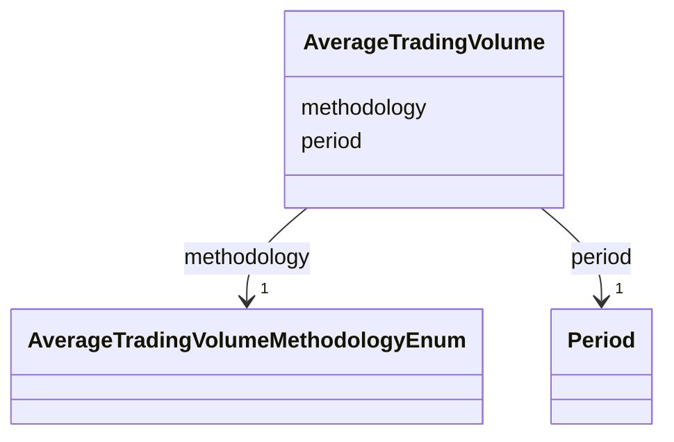

```mermaid
 classDiagram
    class AverageTradingVolume
    click AverageTradingVolume href "../AverageTradingVolume"
      AverageTradingVolume : methodology
        
          
    
        
        
        AverageTradingVolume --> "1" AverageTradingVolumeMethodologyEnum : methodology
        click AverageTradingVolumeMethodologyEnum href "../AverageTradingVolumeMethodologyEnum"
    

        
      AverageTradingVolume : period
        
          
    
        
        
        AverageTradingVolume --> "1" Period : period
        click Period href "../Period"
    

        
      
```
