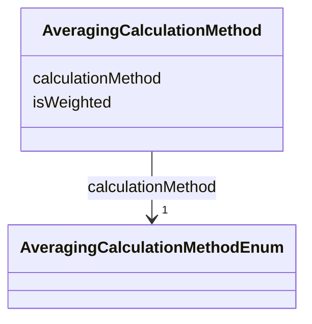

```mermaid
 classDiagram
    class AveragingCalculationMethod
    click AveragingCalculationMethod href "../AveragingCalculationMethod"
      AveragingCalculationMethod : calculationMethod
        
          
    
        
        
        AveragingCalculationMethod --> "1" AveragingCalculationMethodEnum : calculationMethod
        click AveragingCalculationMethodEnum href "../AveragingCalculationMethodEnum"
    

        
      AveragingCalculationMethod : isWeighted
        
      
```
