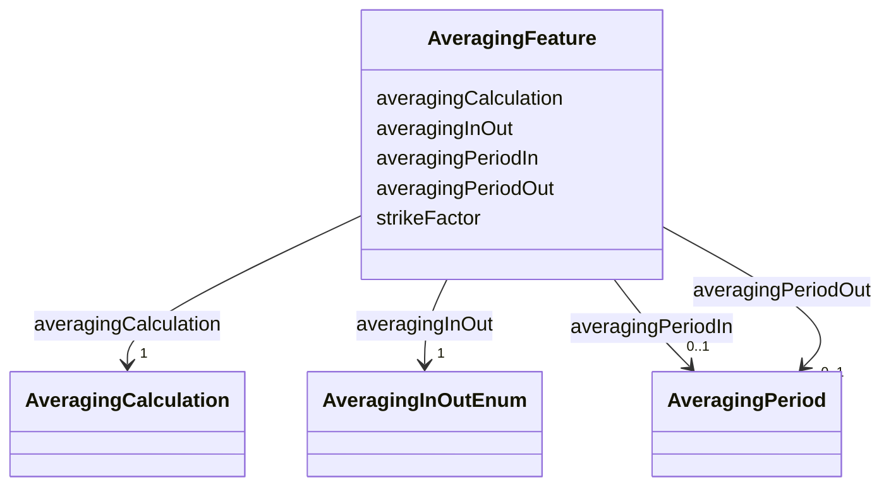

```mermaid
 classDiagram
    class AveragingFeature
    click AveragingFeature href "../AveragingFeature"
      AveragingFeature : averagingCalculation
        
          
    
        
        
        AveragingFeature --> "1" AveragingCalculation : averagingCalculation
        click AveragingCalculation href "../AveragingCalculation"
    

        
      AveragingFeature : averagingInOut
        
          
    
        
        
        AveragingFeature --> "1" AveragingInOutEnum : averagingInOut
        click AveragingInOutEnum href "../AveragingInOutEnum"
    

        
      AveragingFeature : averagingPeriodIn
        
          
    
        
        
        AveragingFeature --> "0..1" AveragingPeriod : averagingPeriodIn
        click AveragingPeriod href "../AveragingPeriod"
    

        
      AveragingFeature : averagingPeriodOut
        
          
    
        
        
        AveragingFeature --> "0..1" AveragingPeriod : averagingPeriodOut
        click AveragingPeriod href "../AveragingPeriod"
    

        
      AveragingFeature : strikeFactor
        
      
```
