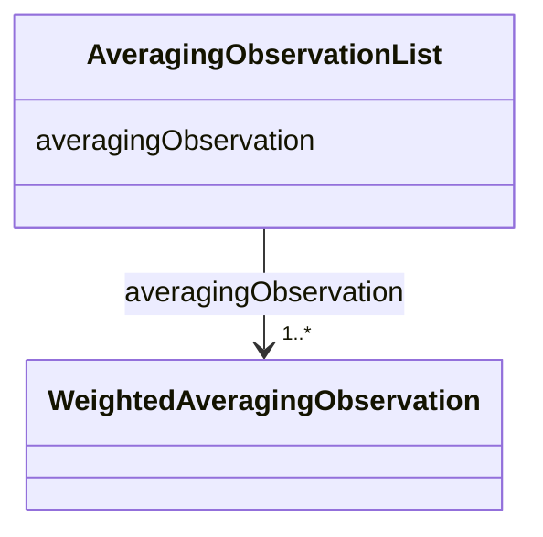

```mermaid
 classDiagram
    class AveragingObservationList
    click AveragingObservationList href "../AveragingObservationList"
      AveragingObservationList : averagingObservation
        
          
    
        
        
        AveragingObservationList --> "1..*" WeightedAveragingObservation : averagingObservation
        click WeightedAveragingObservation href "../WeightedAveragingObservation"
    

        
      
```
