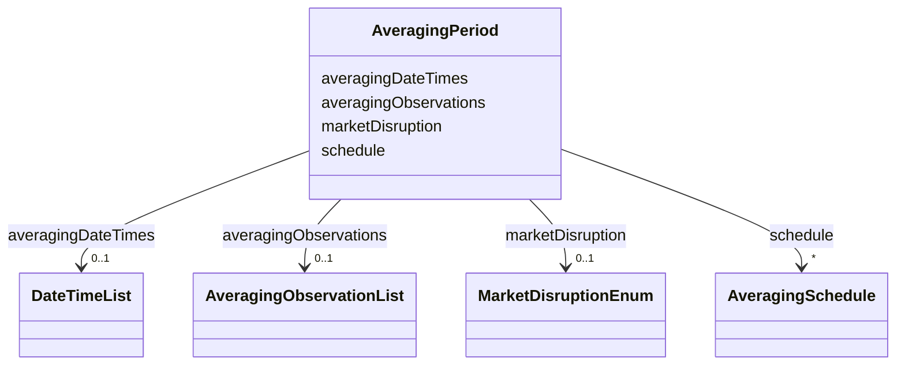

```mermaid
 classDiagram
    class AveragingPeriod
    click AveragingPeriod href "../AveragingPeriod"
      AveragingPeriod : averagingDateTimes
        
          
    
        
        
        AveragingPeriod --> "0..1" DateTimeList : averagingDateTimes
        click DateTimeList href "../DateTimeList"
    

        
      AveragingPeriod : averagingObservations
        
          
    
        
        
        AveragingPeriod --> "0..1" AveragingObservationList : averagingObservations
        click AveragingObservationList href "../AveragingObservationList"
    

        
      AveragingPeriod : marketDisruption
        
          
    
        
        
        AveragingPeriod --> "0..1" MarketDisruptionEnum : marketDisruption
        click MarketDisruptionEnum href "../MarketDisruptionEnum"
    

        
      AveragingPeriod : schedule
        
          
    
        
        
        AveragingPeriod --> "*" AveragingSchedule : schedule
        click AveragingSchedule href "../AveragingSchedule"
    

        
      
```
