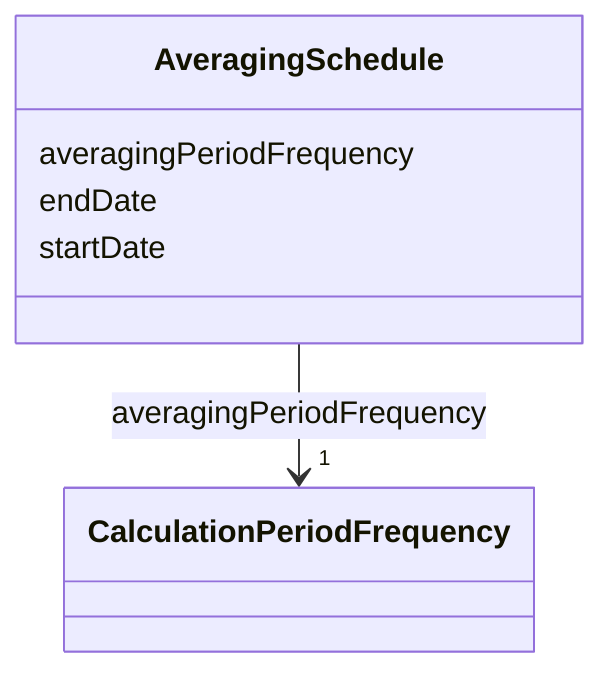

```mermaid
 classDiagram
    class AveragingSchedule
    click AveragingSchedule href "../AveragingSchedule"
      AveragingSchedule : averagingPeriodFrequency
        
          
    
        
        
        AveragingSchedule --> "1" CalculationPeriodFrequency : averagingPeriodFrequency
        click CalculationPeriodFrequency href "../CalculationPeriodFrequency"
    

        
      AveragingSchedule : endDate
        
      AveragingSchedule : startDate
        
      
```
