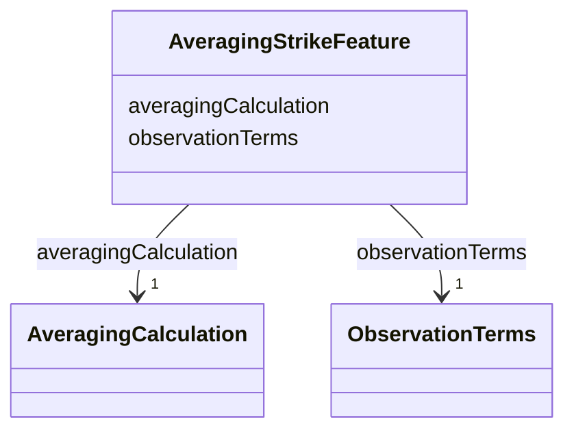

```mermaid
 classDiagram
    class AveragingStrikeFeature
    click AveragingStrikeFeature href "../AveragingStrikeFeature"
      AveragingStrikeFeature : averagingCalculation
        
          
    
        
        
        AveragingStrikeFeature --> "1" AveragingCalculation : averagingCalculation
        click AveragingCalculation href "../AveragingCalculation"
    

        
      AveragingStrikeFeature : observationTerms
        
          
    
        
        
        AveragingStrikeFeature --> "1" ObservationTerms : observationTerms
        click ObservationTerms href "../ObservationTerms"
    

        
      
```
