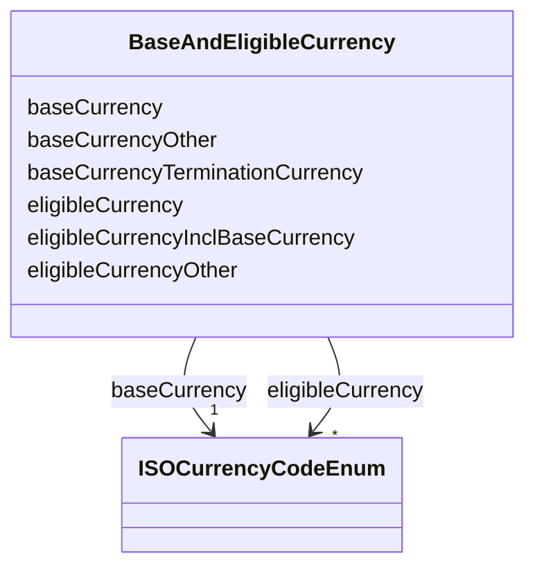

```mermaid
 classDiagram
    class BaseAndEligibleCurrency
    click BaseAndEligibleCurrency href "../BaseAndEligibleCurrency"
      BaseAndEligibleCurrency : baseCurrency
        
          
    
        
        
        BaseAndEligibleCurrency --> "1" ISOCurrencyCodeEnum : baseCurrency
        click ISOCurrencyCodeEnum href "../ISOCurrencyCodeEnum"
    

        
      BaseAndEligibleCurrency : baseCurrencyOther
        
      BaseAndEligibleCurrency : baseCurrencyTerminationCurrency
        
      BaseAndEligibleCurrency : eligibleCurrency
        
          
    
        
        
        BaseAndEligibleCurrency --> "*" ISOCurrencyCodeEnum : eligibleCurrency
        click ISOCurrencyCodeEnum href "../ISOCurrencyCodeEnum"
    

        
      BaseAndEligibleCurrency : eligibleCurrencyInclBaseCurrency
        
      BaseAndEligibleCurrency : eligibleCurrencyOther
        
      
```
