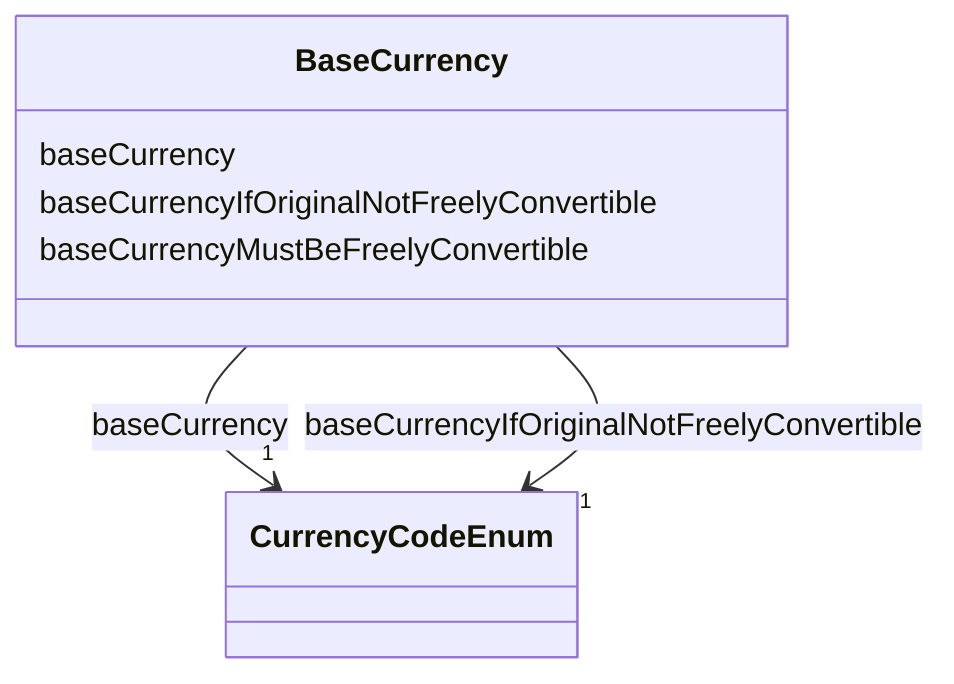

```mermaid
 classDiagram
    class BaseCurrency
    click BaseCurrency href "../BaseCurrency"
      BaseCurrency : baseCurrency
        
          
    
        
        
        BaseCurrency --> "1" CurrencyCodeEnum : baseCurrency
        click CurrencyCodeEnum href "../CurrencyCodeEnum"
    

        
      BaseCurrency : baseCurrencyIfOriginalNotFreelyConvertible
        
          
    
        
        
        BaseCurrency --> "0..1" CurrencyCodeEnum : baseCurrencyIfOriginalNotFreelyConvertible
        click CurrencyCodeEnum href "../CurrencyCodeEnum"
    

        
      BaseCurrency : baseCurrencyMustBeFreelyConvertible
        
      
```
