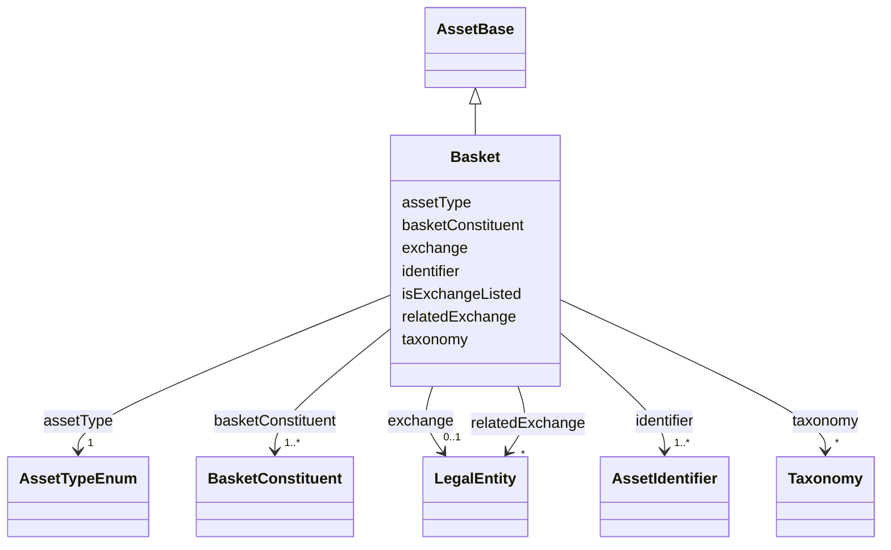

```mermaid
 classDiagram
    class Basket
    click Basket href "../Basket"
      AssetBase <|-- Basket
        click AssetBase href "../AssetBase"
      
      Basket : assetType
        
          
    
        
        
        Basket --> "1" AssetTypeEnum : assetType
        click AssetTypeEnum href "../AssetTypeEnum"
    

        
      Basket : basketConstituent
        
          
    
        
        
        Basket --> "1..*" BasketConstituent : basketConstituent
        click BasketConstituent href "../BasketConstituent"
    

        
      Basket : exchange
        
          
    
        
        
        Basket --> "0..1" LegalEntity : exchange
        click LegalEntity href "../LegalEntity"
    

        
      Basket : identifier
        
          
    
        
        
        Basket --> "1..*" AssetIdentifier : identifier
        click AssetIdentifier href "../AssetIdentifier"
    

        
      Basket : isExchangeListed
        
      Basket : relatedExchange
        
          
    
        
        
        Basket --> "*" LegalEntity : relatedExchange
        click LegalEntity href "../LegalEntity"
    

        
      Basket : taxonomy
        
          
    
        
        
        Basket --> "*" Taxonomy : taxonomy
        click Taxonomy href "../Taxonomy"
    

        
      
```
