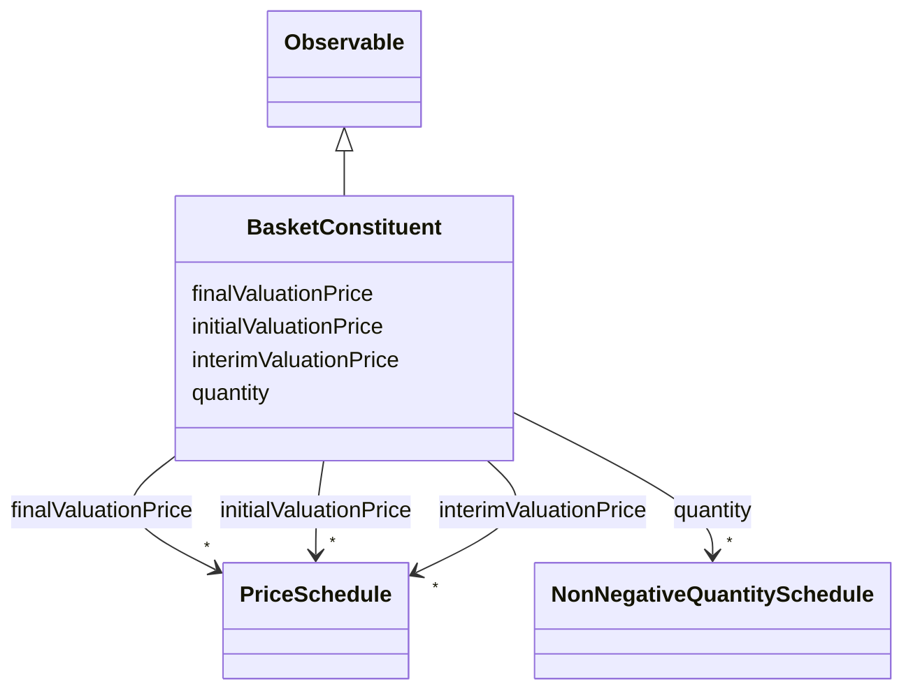

```mermaid
 classDiagram
    class BasketConstituent
    click BasketConstituent href "../BasketConstituent"
      Observable <|-- BasketConstituent
        click Observable href "../Observable"
      
      BasketConstituent : finalValuationPrice
        
          
    
        
        
        BasketConstituent --> "*" PriceSchedule : finalValuationPrice
        click PriceSchedule href "../PriceSchedule"
    

        
      BasketConstituent : initialValuationPrice
        
          
    
        
        
        BasketConstituent --> "*" PriceSchedule : initialValuationPrice
        click PriceSchedule href "../PriceSchedule"
    

        
      BasketConstituent : interimValuationPrice
        
          
    
        
        
        BasketConstituent --> "*" PriceSchedule : interimValuationPrice
        click PriceSchedule href "../PriceSchedule"
    

        
      BasketConstituent : quantity
        
          
    
        
        
        BasketConstituent --> "*" NonNegativeQuantitySchedule : quantity
        click NonNegativeQuantitySchedule href "../NonNegativeQuantitySchedule"
    

        
      
```
