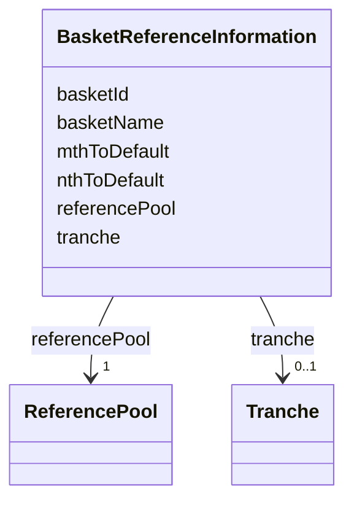

```mermaid
 classDiagram
    class BasketReferenceInformation
    click BasketReferenceInformation href "../BasketReferenceInformation"
      BasketReferenceInformation : basketId
        
      BasketReferenceInformation : basketName
        
      BasketReferenceInformation : mthToDefault
        
      BasketReferenceInformation : nthToDefault
        
      BasketReferenceInformation : referencePool
        
          
    
        
        
        BasketReferenceInformation --> "1" ReferencePool : referencePool
        click ReferencePool href "../ReferencePool"
    

        
      BasketReferenceInformation : tranche
        
          
    
        
        
        BasketReferenceInformation --> "0..1" Tranche : tranche
        click Tranche href "../Tranche"
    

        
      
```
