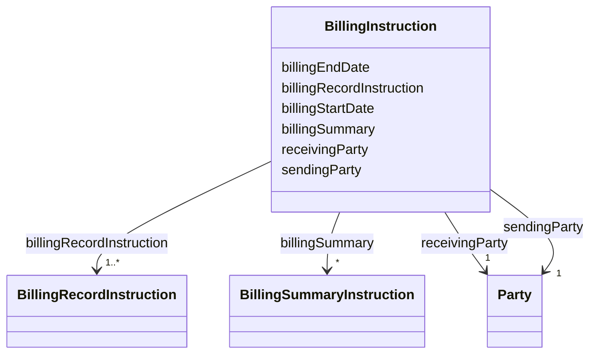

```mermaid
 classDiagram
    class BillingInstruction
    click BillingInstruction href "../BillingInstruction"
      BillingInstruction : billingEndDate
        
      BillingInstruction : billingRecordInstruction
        
          
    
        
        
        BillingInstruction --> "1..*" BillingRecordInstruction : billingRecordInstruction
        click BillingRecordInstruction href "../BillingRecordInstruction"
    

        
      BillingInstruction : billingStartDate
        
      BillingInstruction : billingSummary
        
          
    
        
        
        BillingInstruction --> "*" BillingSummaryInstruction : billingSummary
        click BillingSummaryInstruction href "../BillingSummaryInstruction"
    

        
      BillingInstruction : receivingParty
        
          
    
        
        
        BillingInstruction --> "1" Party : receivingParty
        click Party href "../Party"
    

        
      BillingInstruction : sendingParty
        
          
    
        
        
        BillingInstruction --> "1" Party : sendingParty
        click Party href "../Party"
    

        
      
```
