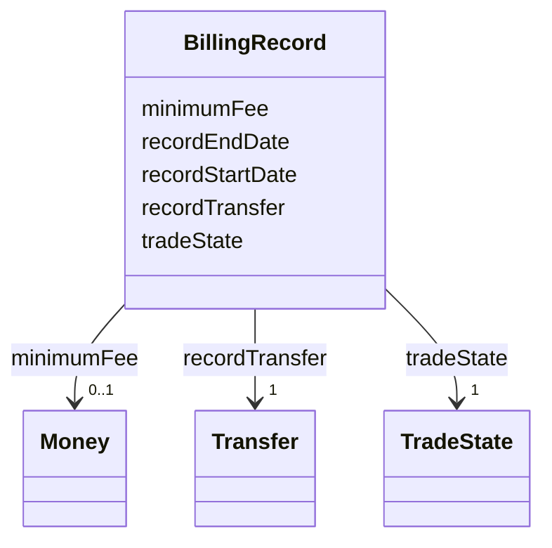

```mermaid
 classDiagram
    class BillingRecord
    click BillingRecord href "../BillingRecord"
      BillingRecord : minimumFee
        
          
    
        
        
        BillingRecord --> "0..1" Money : minimumFee
        click Money href "../Money"
    

        
      BillingRecord : recordEndDate
        
      BillingRecord : recordStartDate
        
      BillingRecord : recordTransfer
        
          
    
        
        
        BillingRecord --> "1" Transfer : recordTransfer
        click Transfer href "../Transfer"
    

        
      BillingRecord : tradeState
        
          
    
        
        
        BillingRecord --> "1" TradeState : tradeState
        click TradeState href "../TradeState"
    

        
      
```
