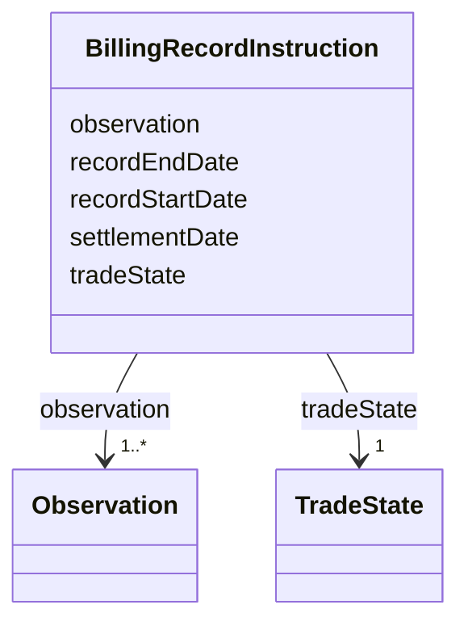

```mermaid
 classDiagram
    class BillingRecordInstruction
    click BillingRecordInstruction href "../BillingRecordInstruction"
      BillingRecordInstruction : observation
        
          
    
        
        
        BillingRecordInstruction --> "1..*" Observation : observation
        click Observation href "../Observation"
    

        
      BillingRecordInstruction : recordEndDate
        
      BillingRecordInstruction : recordStartDate
        
      BillingRecordInstruction : settlementDate
        
      BillingRecordInstruction : tradeState
        
          
    
        
        
        BillingRecordInstruction --> "1" TradeState : tradeState
        click TradeState href "../TradeState"
    

        
      
```
