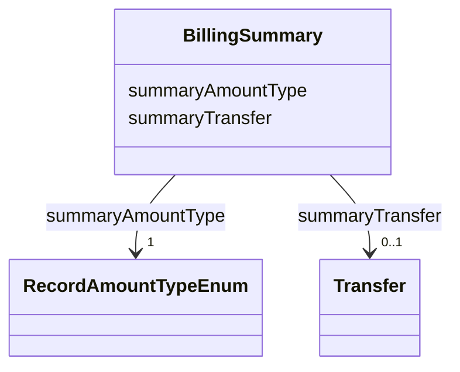

```mermaid
 classDiagram
    class BillingSummary
    click BillingSummary href "../BillingSummary"
      BillingSummary : summaryAmountType
        
          
    
        
        
        BillingSummary --> "1" RecordAmountTypeEnum : summaryAmountType
        click RecordAmountTypeEnum href "../RecordAmountTypeEnum"
    

        
      BillingSummary : summaryTransfer
        
          
    
        
        
        BillingSummary --> "0..1" Transfer : summaryTransfer
        click Transfer href "../Transfer"
    

        
      
```
